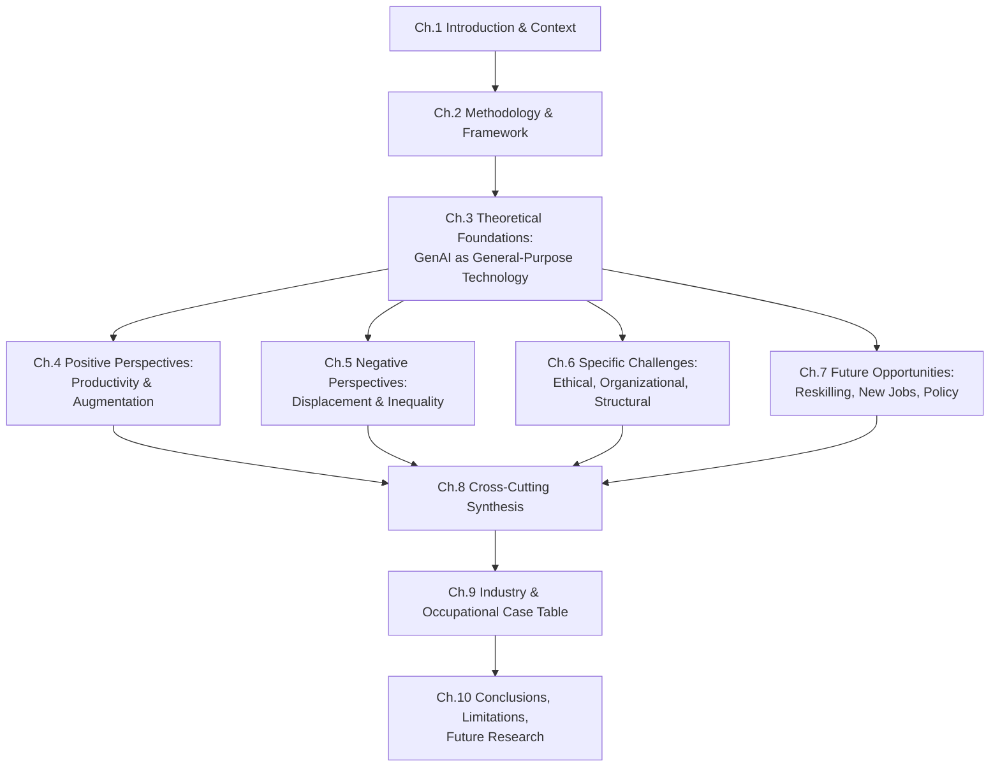
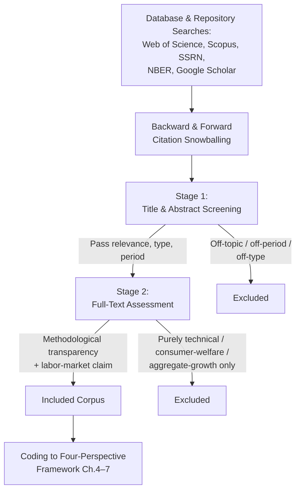
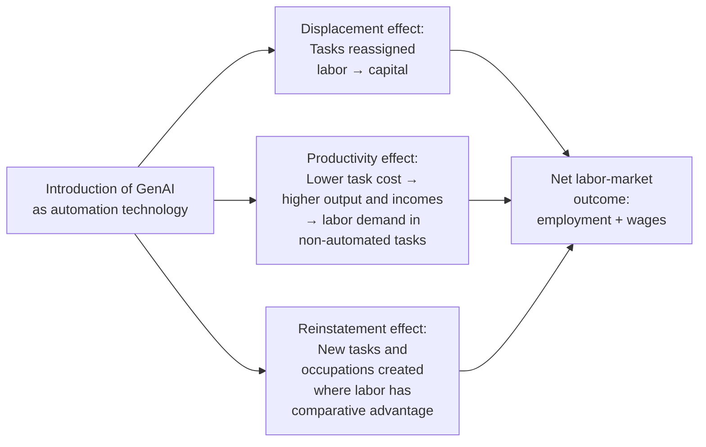

# The Impact of Generative AI on the Future Labor Market: A Literature-Based Review of Positive Perspectives, Negative Concerns, Challenges, and Opportunities
# 1 Introduction and Research Context

The release of ChatGPT in late November 2022 marked an inflection point in the public and scholarly perception of artificial intelligence. Within two months the system had reportedly reached one hundred million users, becoming the fastest-adopted consumer application in history and triggering a cascade of related releases — GPT-4, GitHub Copilot, DALL-E, Midjourney, Stable Diffusion, Bard, and Claude — that collectively brought generative artificial intelligence (GenAI) from the research laboratory into the daily workflows of writers, programmers, designers, lawyers, consultants, marketers, and customer-service agents. Unlike earlier waves of automation, which mainly affected routine manual or codifiable cognitive tasks, this new generation of systems demonstrates fluency in language, code, image, and reasoning tasks long considered the exclusive province of skilled human labor. The labor-market implications of this shift are therefore neither incremental nor confined to a single sector, and they warrant a careful, evidence-based synthesis. This opening chapter establishes the conceptual and methodological anchor for such a synthesis: it situates GenAI as a general-purpose technology, defines the core terminology, justifies the timeliness of a literature review, delineates the scope of the inquiry, and introduces the four-perspective analytical framework — positive impacts, negative concerns, challenges, and opportunities — that organizes the chapters that follow.

## 1.1 The Emergence of Generative AI as a General-Purpose Technology

Generative AI refers to a family of machine-learning systems capable of producing novel content — text, code, images, audio, and video — that closely resembles human-created output. The technological breakthroughs underlying the current wave are concentrated in the transformer architecture, the scaling of model parameters into the hundreds of billions, the use of internet-scale pre-training corpora, and the introduction of reinforcement learning from human feedback (RLHF) to align model outputs with human preferences. The result is a class of large language models (LLMs) and multimodal foundation models — exemplified by OpenAI's GPT-3.5 and GPT-4, GitHub Copilot's code-completion service built on the Codex family, and OpenAI's DALL-E for text-to-image synthesis — whose capabilities generalize across a wide range of downstream tasks without task-specific retraining.

This generality is precisely what distinguishes the current wave from earlier automation technologies. Robotics and rule-based software have historically replaced narrow, codifiable, repetitive routines, leaving cognitive, creative, and communicative tasks largely untouched. Generative systems, by contrast, perform credibly on open-ended drafting, summarization, translation, coding, ideation, tutoring, and analytical reasoning — activities that constitute the core of professional and knowledge work. Several scholars writing before June 2023 have therefore argued that GenAI should be analyzed as a **general-purpose technology** (GPT) in the economic sense: a technology characterized by pervasiveness across sectors, continuous improvement over time, and the capacity to spawn complementary innovations in products, processes, and organizational forms. Eloundou and colleagues, in their early exposure study of GPT models, document that occupational task exposure is broadly distributed across the wage spectrum rather than concentrated in low-skilled work, a finding that empirically substantiates the GPT characterization. Feuerriegel and co-authors similarly frame generative systems as a foundational shift for information industries, while Acemoglu and Restrepo's task-based theoretical apparatus provides the conceptual scaffolding for translating such broad exposure into displacement, productivity, and reinstatement effects.

The qualitative shift, then, is twofold. Technologically, GenAI moves automation up the cognitive ladder into domains of language and creativity previously assumed to be safe from machine substitution. Economically, its general-purpose character means that its labor-market effects will not be limited to a few exposed occupations but will diffuse through virtually every knowledge-intensive sector, reshaping the composition of tasks, the structure of skills, and the boundaries of human-machine collaboration.

## 1.2 Conceptual Definitions and Terminology

Because the literature uses overlapping and sometimes loosely defined vocabulary, the review depends on a small set of working definitions that are applied consistently throughout the report.

| Term | Working Definition |
|------|--------------------|
| **Artificial Intelligence (AI)** | The broad field of computational systems that perform tasks typically associated with human intelligence, including perception, reasoning, learning, and decision-making. |
| **Generative AI (GenAI)** | A subclass of AI systems that produce novel content — text, code, images, audio, video — by learning the statistical structure of large training corpora and sampling from learned distributions. |
| **Large Language Model (LLM)** | A deep neural network, typically based on the transformer architecture and trained on massive text corpora, that predicts the probability of token sequences and can generate coherent natural-language output. ChatGPT, GPT-4, and Bard are prominent examples. |
| **Foundation Model** | A large-scale model pre-trained on broad data that can be adapted (via fine-tuning, prompting, or RLHF) to a wide range of downstream tasks; LLMs are the textual instantiation of foundation models, but the term also covers multimodal systems such as DALL-E. |
| **Automation** | The use of technology to perform tasks previously executed by human workers, resulting in task substitution. In the labor-economics literature this corresponds to the displacement effect: a fixed task is reassigned from labor to capital. |
| **Augmentation** | The use of technology to complement human workers, enhancing their productivity, expanding the set of tasks they can perform, or improving the quality of their output. Augmentation does not eliminate the human role but reconfigures it around higher-value contributions. |
| **Automation–Augmentation Paradox** | The tension, articulated by Raisch and Krakowski, between using AI to replace humans and using AI to enhance them; managerial choices about which path to pursue have first-order consequences for employment outcomes. |

The conceptual distinction between automation and augmentation is particularly important for interpreting the empirical literature, because the same technology — a code-completion assistant, for example — can be deployed either to reduce headcount (automation) or to make existing developers more productive and ambitious (augmentation). Many of the disagreements among scholars over GenAI's net labor-market effect ultimately turn on assumptions about which deployment pattern will dominate.

## 1.3 Rationale and Significance of the Review

Three considerations make a systematic, literature-based review of GenAI's labor-market implications both timely and necessary.

First, the **speed of adoption** has outpaced the speed of empirical understanding. Within months of ChatGPT's release, generative tools were embedded in productivity suites, integrated development environments, customer-support platforms, design software, and consulting workflows. Diffusion of this magnitude in such a compressed timeframe is historically unusual and means that early scholarly work — much of it appearing in working-paper form between late 2022 and mid-2023 — has had to keep pace with a moving target.

Second, the **diversity of scholarly viewpoints** is unusually pronounced. The early literature contains, on the one hand, randomized controlled trials and field experiments documenting large productivity gains and skill-equalizing effects (notably in customer support, software development, professional writing, and consulting), and on the other hand, task-exposure analyses warning that a substantial share of the workforce faces meaningful displacement risk. Cutting across these are studies of platform-labor disruption, sectoral case analyses, and treatises on ethics, bias, misinformation, and organizational adaptation. Without synthesis, these fragmented strands of evidence risk being read selectively, with policy and managerial decisions anchored to whichever subset of findings is most rhetorically convenient.

Third, the **policy and managerial urgency** surrounding workforce transformation is acute. Governments are weighing regulation, education systems are debating curriculum reform, firms are deciding how to redesign jobs, and workers are confronting reskilling decisions — all under conditions of substantial uncertainty. A review that consolidates the academic state of knowledge, identifies areas of consensus and disagreement, and surfaces the evidentiary basis for competing claims is a public good for each of these constituencies.

The review thus aims to serve researchers by mapping the intellectual terrain and identifying gaps; policymakers by clarifying which claims rest on robust evidence and which remain speculative; and practitioners — managers, HR professionals, educators — by translating heterogeneous academic findings into a structured account of what is known, what is contested, and what remains to be investigated. As one strand of this practitioner-facing literature illustrates, the same generative tools that raise displacement concerns in some occupations also create concrete workflow benefits in others: in medical and dental research, for example, work appearing in the pre-June-2023 window has explicitly highlighted that ChatGPT can support text translation across languages, the summarization of lengthy articles, and the automated creation of manuscript drafts, accelerating routine scholarly production while leaving disciplinary judgment to the human researcher. Such concrete, sector-specific testimony is precisely the kind of evidence that a structured review is needed to organize.

## 1.4 Research Scope, Question, and Methodological Boundaries

The **central research question** of this report is:

> *How do scholars, in the academic literature published before June 2023, assess the impact of Generative AI on employment and the future labor market?*

To make this question tractable, the review imposes several explicit boundaries.

**Temporal scope.** The review is restricted to academic literature published before June 2023. This cutoff is chosen to capture the first wave of scholarly response to the November 2022 release of ChatGPT and the subsequent rollout of GPT-4 and related systems, while preserving a coherent corpus for analysis. The cost of this choice is real: GenAI capabilities and adoption have continued to evolve rapidly after the cutoff, and important empirical work has appeared since. The review acknowledges this limitation explicitly and revisits its implications in the concluding chapter.

**Topical scope.** The review focuses on labor-market and employment implications — productivity, task composition, displacement, wages, skills, occupational structure, and the organization of work — rather than on the underlying technical architecture of generative systems, on consumer-welfare effects, or on macroeconomic growth aggregates. Ethical, organizational, and policy dimensions are included to the extent that they bear on labor-market outcomes.

**Source types.** The review draws primarily on peer-reviewed journal articles, working papers from established economics and management series, and book chapters and edited volumes appearing within the temporal window. Industry reports and journalistic sources are used only when they document otherwise unavailable empirical evidence.

**Disciplinary perspectives.** The literature spans labor economics, management and organization studies, information systems, human-resource management, applied ethics, and sector-specific scholarship in law, medicine, software engineering, marketing, and education. The review treats these perspectives as complementary lenses on a shared object of analysis.

**Methodological boundary.** This is a literature-based review rather than an original empirical study; its claims about the labor-market impact of GenAI are derivative of the studies it synthesizes, and its credibility depends on the transparency with which sources are identified, screened, and integrated. The next chapter details the methodology used to do so.

## 1.5 Analytical Framework and Report Structure

To organize a literature characterized by both genuine substantive disagreement and considerable thematic overlap, the review adopts a **four-perspective analytical framework**:

1. **Positive perspectives** — evidence and arguments supporting beneficial labor-market effects, including productivity gains, augmentation, skill compression, value creation, and business-model innovation.
2. **Negative perspectives** — evidence and arguments highlighting adverse effects, including task displacement, occupational replacement risk, platform-labor disruption, and rising inequality.
3. **Specific challenges** — concrete obstacles to healthy labor-market integration, including ethical risks, bias and misinformation, privacy and security, the automation–augmentation paradox, and organizational and HR adaptation difficulties.
4. **Future opportunities** — pathways for converting disruption into shared benefit, including reskilling, emergence of new occupations (such as prompt engineering and AI oversight), human–AI collaboration models, sectoral opportunities, and policy interventions.

This four-fold lens is adopted for three reasons. First, it mirrors the natural fault lines in the literature itself, which clusters around optimistic productivity findings, pessimistic displacement projections, problem-focused critiques, and forward-looking opportunity analyses. Second, it allows the review to give each perspective its strongest formulation before attempting integration, reducing the risk of straw-manning either optimists or pessimists. Third, it provides a structure within which cross-cutting synthesis becomes meaningful: only after each perspective has been articulated on its own terms can the review identify where they converge, where they diverge, and why.

The four perspectives are not mutually exclusive but partially overlapping. Productivity gains documented in the positive literature, for example, can simultaneously be sources of displacement risk in the negative literature; challenges such as the automation–augmentation paradox are precisely what determines whether opportunities are realized. The framework is therefore best understood as an organizational device for surfacing arguments and evidence, not as a typology of mutually exclusive outcomes.

The remainder of the report operationalizes this framework as follows. **Chapter 2** describes the literature-review methodology, the inclusion and screening criteria, and the theoretical lenses (the task-based displacement–productivity–reinstatement framework of Acemoglu and Restrepo, and the automation–augmentation paradox of Raisch and Krakowski) used to interpret heterogeneous findings. **Chapter 3** develops the theoretical foundations, explaining the transmission mechanisms by which a general-purpose technology affects labor demand. **Chapters 4 through 7** operationalize the four perspectives in turn — positive impacts, negative concerns, specific challenges, and future opportunities — linking each assertion to specific sources. **Chapter 8** offers a cross-cutting synthesis, reconciling the four perspectives and identifying areas of consensus, dispute, and remaining uncertainty. **Chapter 9** consolidates the sectoral and occupational evidence into a structured comparative table covering research literature, country or region, application area or occupation, specific applications and impacts, and key risks and limitations. **Chapter 10** concludes by summarizing principal findings, acknowledging limitations, and proposing directions for future research.

The flow above clarifies the report's logical architecture: foundational chapters (1–3) establish context, method, and theory; perspective chapters (4–7) systematically interrogate the literature through the four-fold lens; and integrative chapters (8–10) reconcile findings, consolidate evidence, and draw forward-looking conclusions. With these anchors in place, the next chapter turns to the methodology by which the relevant literature was identified, screened, and synthesized.

# 2 Research Methodology and Analytical Framework

Having established in the preceding chapter why Generative AI warrants treatment as a general-purpose technology and why the diversity of early scholarly voices makes a structured review indispensable, this chapter turns to the procedures by which that review is conducted. A literature-based study lives or dies by the transparency of its method: because its conclusions about GenAI's labor-market impact are derivative of the studies it synthesizes, every reader must be able to retrace the steps by which sources were identified, screened, classified, and interpreted. The chapter therefore proceeds in six steps. It first describes the search strategy and the universe of sources from which the review draws; it then specifies the inclusion, exclusion, and quality-screening criteria that narrowed that universe to a workable corpus; it explains the coding logic that maps each retained source to one or more of the four analytical perspectives introduced in Chapter 1; it justifies the two theoretical lenses — Acemoglu and Restrepo's task-based framework and Raisch and Krakowski's automation–augmentation paradox — used to interpret heterogeneous findings; it outlines the synthesis approach that integrates evidence within and across perspectives; and finally it acknowledges methodological limitations and the reflexive safeguards adopted to mitigate them.

## 2.1 Literature Search Strategy and Source Identification

The search strategy was designed to balance two competing demands: breadth, so that the rapidly expanding interdisciplinary conversation around generative AI could be captured beyond any single field's silo, and depth, so that the labor-economics and management scholarship at the analytical core of the review would not be diluted by tangential technical or consumer-facing literature.

To achieve breadth, the review drew on a combination of indexed bibliographic databases and pre-print repositories. **Web of Science** and **Scopus** provided coverage of peer-reviewed journal articles across economics, management, information systems, and the sectoral disciplines (law, medicine, education) in which GenAI applications have been documented. Because much of the earliest empirical work on ChatGPT, GPT-4, and Copilot appeared in working-paper form rather than in formally published outlets, the search was extended to **SSRN** (the Social Science Research Network) and the **NBER working-paper series**, which together house most of the influential pre-publication labor-economics literature on AI. **Google Scholar** was used as a complementary, broader-net tool for identifying grey literature, conference papers, and recently posted manuscripts that had not yet been indexed in the major commercial databases. Established management and economics working-paper repositories — including the working-paper series of major business schools such as MIT, Stanford GSB, Harvard Business School, and the Wharton School — were consulted directly for case-study and field-experiment evidence on GenAI deployments.

Search terms were constructed around two thematic axes connected by Boolean conjunction. The first axis captured the technology of interest: *"generative AI" OR "generative artificial intelligence" OR "ChatGPT" OR "GPT-3" OR "GPT-4" OR "large language model*" OR "LLM" OR "foundation model*" OR "GitHub Copilot" OR "DALL-E"*. The second axis captured the labor-market focus: *"labor market" OR "employment" OR "job*" OR "occupation*" OR "wage*" OR "productivity" OR "task*" OR "automation" OR "augmentation" OR "displacement" OR "skill*" OR "workforce" OR "human resource*"*. The two axes were joined by `AND` to enforce thematic intersection, and field-restricted searches (title, abstract, keywords) were used to suppress incidental mentions.

The temporal window was set to publications appearing before **June 2023**, consistent with the scope established in Chapter 1. Because the modern wave of generative-AI scholarship is concentrated in late 2022 and the first half of 2023, no lower temporal bound was strictly enforced for the GenAI-specific search; however, for foundational theoretical references — notably the task-based automation literature and the automation–augmentation paradox — pre-2022 sources were deliberately included to provide the conceptual scaffolding on which more recent empirical work builds.

To mitigate the risk that a keyword-driven search would miss thematically central but lexically idiosyncratic studies, **forward and backward citation tracking** was used as a complementary snowballing technique. From a core set of high-citation early studies — Eloundou et al. on GPT exposure, Brynjolfsson, Li and Raymond on customer support, Peng et al. on GitHub Copilot, Noy and Zhang on professional writing, Dell'Acqua et al. on consulting, and Acemoglu and Restrepo's theoretical papers — backward tracking identified the upstream theoretical and empirical antecedents, while forward tracking captured downstream studies that had cited these anchors. Sector-specific anchors (e.g., Savelka and Ashley on legal tasks, Xiao on marketing in China, Hui, Reshef and Zhou on Upwork) extended the snowball into discipline-specific clusters.

## 2.2 Inclusion, Exclusion, and Quality Screening Criteria

Candidate sources retrieved through the search and snowballing procedures were filtered through an explicit, multi-stage screening protocol designed to retain materials substantively relevant to the central research question while excluding those whose connection to labor-market outcomes was either tangential or absent.

The **inclusion criteria** were five in number. First, **topical relevance**: the source had to address, directly and substantively, the impact of generative AI (or, for foundational theoretical sources, AI and automation more generally) on at least one labor-market outcome — productivity, employment, task composition, wages, skills, occupational structure, work organization, or labor-market inequality. Second, **methodological transparency**: empirical sources had to disclose their data, sample, identification strategy, and analytical procedure in sufficient detail to permit critical appraisal; theoretical sources had to articulate their assumptions and derivations explicitly. Third, **source type**: peer-reviewed journal articles, working papers from established economics and management series (NBER, SSRN-hosted papers from recognized institutions), and book chapters in edited scholarly volumes were eligible by default, while industry and policy reports were retained only where they documented empirical evidence not otherwise available in the academic literature. Fourth, **language**: English-language publications, reflecting the dominant language of the relevant scholarly corpus and the linguistic competence of the review. Fifth, **temporal eligibility**: publication or first public posting before June 2023.

The **exclusion criteria** mirrored these. Purely technical AI literature — papers concerned with model architecture, training procedures, evaluation benchmarks, or alignment techniques without engagement with labor-market consequences — was excluded, even when authored by influential AI researchers. Consumer-welfare studies focused on user satisfaction or product quality rather than on work or employment were excluded. Macroeconomic growth analyses that treated AI as an aggregate productivity shock without disaggregating labor-market channels were excluded, although growth-accounting work that decomposed effects by task or skill was retained. Opinion pieces, editorials, and journalistic commentary without original analysis were excluded; sectoral practitioner essays were retained only when they reported concrete workflow evidence (as with the medical and dental research applications discussed in Chapter 1).

Screening proceeded in two stages. In the **first stage**, titles and abstracts of all retrieved records were reviewed against the inclusion and exclusion criteria, eliminating clearly off-topic, off-period, or off-type records. In the **second stage**, full-text assessment was performed on the surviving candidates to verify methodological transparency, substantive relevance, and the presence of an interpretable labor-market claim. Where the same study appeared in multiple versions (e.g., an SSRN working paper and a subsequent journal publication), the most recent pre-June-2023 version was retained as the citation of record.

The diagram above traces a candidate source from initial retrieval through final inclusion in the analytical corpus, making explicit the two filtering gates at which the bulk of attrition occurs. The procedure is intentionally conservative on type and topical fit but inclusive on methodology, in recognition that the early GenAI literature mixes randomized experiments, observational exposure analyses, theoretical models, and qualitative case studies — a heterogeneity that the synthesis must accommodate rather than suppress.

## 2.3 Categorization Logic and Coding Scheme for the Four-Perspective Framework

Once a source was admitted to the corpus, it was coded against the four analytical perspectives introduced in Chapter 1: **positive impacts**, **negative concerns**, **specific challenges**, and **future opportunities**. The coding protocol was designed around three operative principles: explicit definitional anchors for each perspective, permission for multi-category assignment, and consistency checks to minimize subjective drift.

The definitional anchors for each perspective were specified ex ante. A source was coded **positive** if it documented or argued for beneficial labor-market effects — measured productivity gains, quality improvements, skill compression, novice empowerment, knowledge diffusion, firm-value creation, or business-model innovation. It was coded **negative** if it documented or argued for adverse effects — task displacement, occupational replacement risk, wage compression at the high-skill end, labor-platform disruption, or rising inequality. It was coded as a **specific challenge** if its primary contribution lay in identifying concrete obstacles to healthy integration — ethical risks, bias, misinformation, privacy and security concerns, the automation–augmentation paradox, or organizational and HR adaptation difficulties. It was coded under **future opportunities** if its primary contribution lay in identifying pathways for converting disruption into shared benefit — reskilling routes, new occupations, human–AI collaboration models, sectoral growth applications, or policy interventions.

Because many sources span multiple perspectives — a randomized trial documenting customer-support productivity gains, for example, simultaneously implies displacement potential and raises organizational design questions — the coding scheme deliberately permitted **multi-category assignment**. Each source received a primary perspective code reflecting its dominant analytical contribution and, where relevant, one or more secondary codes capturing implications drawn out by the authors themselves. Sources whose findings cut across perspectives in genuinely irreducible ways (e.g., Eloundou et al.'s exposure analysis, which empirically substantiates both displacement risk and the broad cross-occupational reach used in the positive case for general-purpose status) were flagged for explicit cross-perspective discussion in Chapter 8.

To curb subjective bias in categorization, three procedural safeguards were applied. First, coding decisions were guided by **the authors' own claims** rather than by the reviewer's interpretation of downstream implications: a study whose authors emphasized productivity gains was coded as positive even if a critic might emphasize the displacement potential, with that alternative reading deferred to the synthesis chapter. Second, **borderline cases were re-examined** against the definitional anchors before assignment was finalized. Third, the perspective-by-perspective writing in Chapters 4–7 and the cross-cutting integration in Chapter 8 were structured to **make coding visible**, so that any reader who disagrees with a particular assignment can identify it and assess its consequences for the synthesis.

This categorization logic links directly to the structure of the report. Chapter 4 draws on sources whose primary code is positive; Chapter 5 on those whose primary code is negative; Chapter 6 on those primarily contributing to the challenges perspective; Chapter 7 on those primarily contributing to the opportunities perspective. Secondary codings are mobilized in Chapter 8's cross-cutting synthesis, ensuring that no source is exhausted by a single chapter's treatment.

## 2.4 Theoretical Lenses for Interpreting Heterogeneous Findings

A descriptive synthesis of the four perspectives, even one performed with care, would leave open the question of how to reconcile the apparent tension between, on the one hand, randomized field experiments showing large average productivity gains from GenAI tools and, on the other, exposure analyses suggesting that substantial fractions of the workforce face meaningful displacement risk. To address this analytical task, the review adopts two complementary theoretical lenses, each chosen for what it does well and each insufficient on its own.

The **first lens** is the **task-based framework** developed by Daron Acemoglu and Pascual Restrepo over a series of papers, most notably their 2018 and 2019 contributions. In this framework, production is decomposed into a continuum of tasks, each of which can in principle be performed either by labor or by capital (including AI). The introduction of a new automation technology generates three distinct effects on labor demand. The **displacement effect** captures the reassignment of tasks from labor to capital at constant output, a force that mechanically reduces labor demand. The **productivity effect** captures the consequence that, by lowering the cost of automated tasks, automation raises output and incomes, which in turn raises demand for labor in non-automated tasks. The **reinstatement effect** captures the creation of new tasks — and sometimes whole new occupations — in which labor has comparative advantage and which would not exist in the absence of the technology. The net employment and wage impact of an automation technology is the algebraic sum of these three effects, and historically the balance has varied substantially across episodes.

This framework is well suited to the present review for three reasons. First, it provides an **economic grammar** that translates the task-exposure findings of Eloundou et al. into specific predictions about employment and wages, rather than allowing exposure to be read directly as displacement. Second, it accommodates the **positive empirical findings** — productivity gains in customer support, software development, writing, and consulting — as instances of the productivity effect operating within currently exposed occupations. Third, it leaves explicit conceptual room for the **reinstatement effect**, which underwrites much of the opportunity perspective: new occupations such as prompt engineering, AI oversight, and human-in-the-loop quality assurance are not artifacts of optimism but predicted outputs of the framework.

The **second lens** is the **automation–augmentation paradox** articulated by Sebastian Raisch and Sebastian Krakowski. Where the task-based framework operates at the level of an economy or an occupation and treats the deployment decision as exogenous, the automation–augmentation paradox locates the analytical action at the level of the **firm and the manager**. The same technology — a generative coding assistant, for instance — can be deployed to reduce headcount while holding output constant (automation) or to expand the ambition and output of an unchanged workforce (augmentation). These two trajectories generate divergent labor-market consequences from an identical technological substrate. The paradox is that pursuing either pole exclusively tends to undermine the other: a firm that automates aggressively forecloses the longer-run productivity gains that come from augmented human judgment, while a firm that augments without limit may forgo near-term cost efficiencies that competitive pressure ultimately demands.

This lens is essential because it captures a determinant of labor-market outcomes that the task-based framework, in its standard form, treats as background. The choice between automation and augmentation is shaped by managerial discretion, organizational design, regulatory constraints, and worker bargaining power — variables that vary across firms, sectors, and jurisdictions, and that help explain why empirical estimates of GenAI's labor-market impact differ so widely. Together, the two lenses operate at complementary levels of analysis: the task-based framework supplies the macro-to-occupational economic grammar, while the automation–augmentation paradox supplies the meso-level managerial choice mechanism that determines which terms in the task-based algebra dominate in any given deployment.

| Lens | Authors | Level of Analysis | Core Mechanism | Role in the Review |
|------|---------|-------------------|----------------|--------------------|
| Task-based framework | Acemoglu & Restrepo (2018, 2019) | Economy, sector, occupation | Decomposition into displacement, productivity, and reinstatement effects | Translates task exposure into employment and wage predictions; structures Chapters 3 and 5 |
| Automation–augmentation paradox | Raisch & Krakowski (2021) | Firm, manager, organizational unit | Strategic choice between substitution and complementarity | Explains heterogeneity in observed outcomes; structures Chapters 4, 6, and 7 |

The table above clarifies the division of analytical labor between the two lenses. Read together, they account both for the systematic and for the contingent components of GenAI's labor-market footprint: the task-based framework predicts that any given GenAI deployment will produce some combination of displacement, productivity, and reinstatement effects; the automation–augmentation paradox specifies the managerial conditions under which that combination tilts toward labor-displacing or labor-complementing outcomes.

## 2.5 Synthesis Approach and Cross-Perspective Integration Method

With sources coded and theoretical lenses in place, the synthesis itself proceeds along two axes. **Within-perspective synthesis**, conducted in Chapters 4–7, organizes the evidence under each of the four headings through **thematic clustering**: positive-perspective evidence is grouped by mechanism (productivity gains, skill compression, knowledge diffusion, value creation, business-model innovation); negative-perspective evidence is grouped by channel (task displacement, sectoral replacement risk, platform-labor disruption, inequality); challenges are categorized into ethical, organizational, individual-worker, and policy dimensions; and opportunities are grouped by route to realization (reskilling, new occupations, human–AI collaboration, sectoral growth, policy interventions). Within each cluster, evidence is examined for **convergence** (multiple studies pointing to the same finding through different methods) and **divergence** (studies whose findings genuinely contradict one another).

**Cross-perspective synthesis**, conducted in Chapter 8 and consolidated empirically in Chapter 9, employs three integrative techniques. The first is **comparative tabulation**, in which studies are arrayed by sector, occupation, geography, methodology, and key quantitative finding so that the reader can locate any individual claim within its evidentiary context. The second is **structured juxtaposition of competing claims**, in which apparently contradictory findings — for example, productivity gains documented in randomized trials versus displacement risks suggested by exposure analyses — are reframed using the task-based and automation–augmentation lenses so that the contradiction is either resolved (as differing levels of analysis or differing time horizons) or rendered as a genuine substantive disagreement to be flagged for future research. The third is **explicit gap identification**, in which questions for which the corpus offers little or no evidence (long-term wage dynamics, distributional effects across worker demographics, equilibrium responses to widespread deployment) are recorded for the concluding chapter.

The synthesis is governed by three evidentiary standards. First, **points of consensus** are recognized only when multiple methodologically diverse studies converge on a finding (e.g., that GenAI deployment in narrowly bounded knowledge tasks raises measured productivity for the average user). Second, **genuine substantive disagreement** is preserved rather than smoothed over: where studies disagree about the net employment effect, the synthesis describes the disagreement and traces it to its methodological or scope sources. Third, **gaps** are acknowledged as gaps, not filled by extrapolation: claims that the evidence does not support are not made, and limitations in the corpus are flagged where they bear on the strength of the synthesis.

## 2.6 Methodological Limitations and Reflexive Safeguards

A review constructed under the procedures above is no stronger than its acknowledged limitations, and four merit explicit articulation.

The first is the **pre-June-2023 temporal cutoff**. Although necessary to delimit a tractable corpus and consistent with the scope agreed in Chapter 1, the cutoff excludes work appearing after the cutoff in which GenAI capabilities, deployment patterns, and empirical findings have all continued to evolve at high velocity. Conclusions drawn from this review should therefore be read as a snapshot of the first wave of scholarly response rather than as a definitive verdict on GenAI's labor-market impact.

The second is the **predominance of working papers** in the early literature. Because formal peer review takes time and the technology of interest is recent, much of the most-cited empirical work in the corpus circulated, during the review window, as NBER, SSRN, or institutional working papers rather than as peer-reviewed journal articles. Working papers offer timeliness at the cost of the additional quality-control afforded by peer review; findings drawn from them should be regarded as provisional, and the synthesis flags such status where it bears materially on the strength of a claim.

The third is the risk of **publication and language bias**. The English-language restriction excludes scholarship in other languages, including any Chinese-language work on the labor-market effects of domestic LLM deployments that does not have an English counterpart. The reliance on indexed databases and major working-paper repositories may also under-represent regional, sectoral, or institutional venues whose visibility is lower. The corpus is therefore best understood as a representative sample of internationally visible English-language scholarship rather than as a complete map of the global literature.

The fourth is the **interpretive judgment** inherent in categorizing sources across the four overlapping perspectives. Although the coding protocol described in §2.3 specifies definitional anchors, permits multi-category assignment, and privileges authors' own framings, residual subjectivity in classification cannot be eliminated. Different reviewers might code marginal sources differently, with consequences for which perspective chapter cites them most prominently.

To mitigate these limitations, the review adopts several reflexive safeguards. **Transparent source documentation** is maintained throughout: every substantive claim is attached to a specific source so that readers can audit attributions and reach independent judgments about the strength of evidence. **Conservative interpretation of preliminary findings** is practiced: early experimental results, especially those drawn from single-site or single-task studies, are reported with their scope conditions intact rather than generalized beyond the evidence. **Explicit flagging of contested claims** is used wherever the literature contains genuine disagreement, so that the reader is alerted to disputed terrain rather than presented with a false consensus. And the **synthesis chapter (Chapter 8) is structured to make limitations visible**, distinguishing what the corpus establishes, what it suggests, and what it leaves open.

With these methodological foundations in place — a transparent search strategy, explicit screening criteria, a multi-category coding scheme, two complementary theoretical lenses, a disciplined synthesis approach, and an honest accounting of limitations — the review is positioned to develop, in the next chapter, the theoretical foundations through which generative AI's status as a general-purpose technology translates into the labor-market transmission mechanisms that organize the four perspective chapters that follow.

# 3 Theoretical Foundations: Generative AI as a General-Purpose Technology and Its Labor-Market Transmission Mechanisms

The methodological scaffolding laid out in Chapter 2 specified *how* the corpus was assembled and *how* its findings would be interpreted, but it deliberately deferred a substantive question that must now be confronted: *through what theoretical mechanisms does generative AI actually translate into labor-market outcomes?* Without an answer, the empirical findings reviewed in Chapters 4 through 7 would remain a collection of point estimates — productivity gains here, exposure shares there, displacement risks elsewhere — without an integrating logic. The purpose of the present chapter is to supply that logic. It develops a unified theoretical vocabulary built around two pillars. The first is the characterization of GenAI as a **general-purpose technology** (GPT), which establishes that labor-market effects will diffuse broadly across knowledge work rather than remaining confined to a narrow band of exposed occupations. The second is a decomposition of those effects into **four transmission mechanisms** — displacement, productivity, reinstatement, and task augmentation — drawn from Acemoglu and Restrepo's task-based framework and refined through Raisch and Krakowski's automation–augmentation paradox. The chapter's analytical role is not to adjudicate the empirical disagreements that follow but to provide the conceptual instruments through which those disagreements can be located, interpreted, and ultimately synthesized. Each subsequent perspective chapter inherits and operationalizes a subset of these instruments: productivity and augmentation effects underwrite the positive findings of Chapter 4; displacement effects underwrite the negative findings of Chapter 5; the meso-level managerial conditions that tilt mechanisms toward labor-substituting versus labor-complementing outcomes generate the challenges of Chapter 6; and the reinstatement effect, together with the policy and managerial choices that shape augmentation, generates the opportunities of Chapter 7.

## 3.1 Generative AI as a General-Purpose Technology: Criteria and Evidence

The economic concept of a general-purpose technology, as elaborated in the growth-economics literature, identifies a small class of innovations whose effects radiate far beyond their immediate point of application. Three criteria are conventionally used to identify a GPT: *pervasiveness* across sectors and tasks; *continuous improvement* over time, sustained by cumulative R&D investment; and the *capacity to spawn complementary innovations* in products, processes, and organizational forms. Historical examples include the steam engine, electricity, and the semiconductor — technologies whose long-run economic significance turned on their diffusion across virtually every productive sector rather than on any narrow application. The case for adding generative AI to this list rests on evidence pertaining to each criterion in turn.

The strongest empirical support for **pervasiveness** comes from the task-exposure analysis of Eloundou and colleagues. Their study, conducted at OpenAI in collaboration with academic co-authors and circulated in working-paper form in early 2023, applies a rubric — in some implementations human-rated, in others LLM-rated — to the detailed task descriptions catalogued in the U.S. Department of Labor's O*NET database. For each task, they assess whether access to a GPT-class model would reduce the time required to complete it to a meaningful fraction of the baseline. Their headline finding is that exposure is unusually broad: around 80% of the U.S. workforce holds at least one occupation in which a non-trivial share (≥10%) of tasks is materially exposed to GPT capabilities, and roughly 19% of workers may see at least half of their tasks affected. Crucially, exposure is not concentrated in any single segment of the wage distribution — higher-wage and information-intensive occupations are, if anything, more exposed than lower-wage manual ones. This distributional pattern, which the chapter returns to in §3.4, is precisely what the pervasiveness criterion of GPT status requires: the technology's reach is not confined to a narrow band of routine cognitive work but extends across the breadth of the knowledge economy.

The case for **continuous improvement** rests on the trajectory of generative systems over the relatively short window in which they have been the object of intensive scholarly attention. The progression from GPT-3 (2020) to GPT-3.5 (late 2022, the engine of the original ChatGPT release) to GPT-4 (March 2023) involved order-of-magnitude scaling of parameters and training compute, the integration of reinforcement learning from human feedback to improve alignment with user intent, and demonstrable gains on a wide range of professional benchmarks including bar examinations, medical licensing tests, and standardized academic assessments. Parallel trajectories are visible in code generation (the Codex / GitHub Copilot family) and in text-to-image synthesis (DALL-E 2 to DALL-E 3, alongside Stable Diffusion and Midjourney). The cumulative pace of capability gain — over a horizon measured in months rather than decades — distinguishes GenAI from earlier automation technologies whose improvement curves were more gradual and more confined.

The case for **complementary innovations** is articulated most directly by Feuerriegel and colleagues, whose treatment of generative AI as a foundational shift for information industries argues that the technology's economic significance lies less in any single application than in the wholesale reconfiguration it enables across content creation, knowledge management, software engineering, customer interaction, and product design. Generative systems can be embedded into integrated development environments (Copilot inside Visual Studio Code), into productivity suites (Microsoft 365 Copilot, Google Workspace's Duet AI), into customer-service platforms (Intercom, Zendesk integrations), into design software (Adobe Firefly inside Photoshop), and into consulting and legal workflows. Each integration is a complementary innovation in the GPT sense: a product or process redesign that would not exist without the underlying generative capability, and that in turn drives further refinement of the capability through use-case feedback. The growing literature on business-model innovation around foundation models — explored in greater depth in Chapter 4's discussion of Kanbach and colleagues — provides additional evidence that GenAI is generating new organizational forms and not merely new tools.

| GPT Criterion | Evidence in the GenAI Case | Representative Source(s) |
|---|---|---|
| Pervasiveness across sectors and tasks | ~80% of U.S. workers in occupations with ≥10% task exposure; exposure broadly distributed across the wage spectrum | Eloundou et al. (2023) |
| Continuous technological improvement | Rapid capability gains from GPT-3 → GPT-3.5 → GPT-4 within roughly three years; parallel progress in code and image generation | Capability benchmarks referenced in Feuerriegel et al. (2023) and the broader pre-June-2023 literature |
| Capacity to spawn complementary innovations | Embedding of generative systems into IDEs, productivity suites, customer service, design, legal and consulting workflows; emergence of new business models | Feuerriegel et al. (2023); Kanbach et al. (2023) |

The analytical significance of identifying GenAI as a GPT is not merely taxonomic. It carries a strong implication for the *scope* of the labor-market analysis that follows. If the technology were narrow — applicable to, say, software code completion alone — then a literature review could reasonably confine itself to programmer-employment outcomes. Because the technology is general-purpose, the analytical net must be cast across the entire knowledge economy: customer support, professional writing, consulting, marketing, legal services, education, healthcare, design, and beyond. This is why the perspective chapters that follow examine evidence drawn from a wide array of occupations and sectors rather than concentrating on a single canonical case.

## 3.2 The Task-Based Framework: Decomposing Labor Demand Effects

Establishing GenAI as a GPT clarifies the *breadth* of likely labor-market effects but says little about their *direction* or *magnitude*. The empirical fact that 80% of the workforce is materially exposed is consistent with futures ranging from widespread displacement to widespread productivity-driven labor demand expansion. To move from exposure to predicted outcomes, the review adopts the task-based framework that Daron Acemoglu and Pascual Restrepo developed across a series of papers in the late 2010s, most influentially their 2018 *American Economic Review* contribution and their 2019 *Journal of Economic Perspectives* synthesis. This framework provides the principal economic grammar through which heterogeneous empirical findings will be interpreted throughout the report.

The framework begins with a deceptively simple analytical move: it decomposes production into a continuum of **tasks**, each of which can in principle be performed by either labor or by capital (now generalized to include AI systems). Output is generated by the assembly of completed tasks; labor demand at any moment is the aggregate of tasks currently assigned to workers. From this starting point, the introduction of a new automation technology generates three analytically distinct effects on labor demand, the algebraic sum of which determines the net employment and wage outcome.

The **displacement effect** is the mechanical force that arises when capital (or AI) takes over tasks previously performed by labor. Holding output constant, displacement reduces the quantity of labor required: tasks previously assigned to humans are reassigned to machines, and the workers who performed them either lose their jobs, are reassigned to remaining tasks, or transition out of the occupation. The strength of the displacement effect depends on three factors: the size of the set of tasks technically substitutable by the new technology; the cost of capital relative to labor in performing those tasks; and the speed at which firms reorganize production around the substitution. For GenAI, the displacement effect operates at the task level rather than at the occupation level — Copilot does not replace the software engineer wholesale but may substitute for the writing of routine boilerplate code; ChatGPT does not replace the customer-service representative wholesale but may substitute for the drafting of standard first-line responses — though if the share of substitutable tasks within an occupation is sufficiently large, occupation-level employment may eventually contract.

The **productivity effect** is the offsetting force that arises when the same technology, by lowering the cost of producing automated tasks, raises output and incomes throughout the economy. As output grows, demand for the non-automated tasks complementary to the automated ones rises, drawing labor into those non-automated tasks. The productivity effect can operate at multiple levels: within the firm (a software team using Copilot ships more products, hiring more designers, product managers, and QA engineers to support expanded throughput); within the sector (cheaper customer-service interactions allow firms to serve more customers, expanding demand for supervisory and exceptions-handling roles); and within the wider economy (lower costs in information-intensive sectors raise real incomes, which translates into demand for goods and services across sectors). The strength of the productivity effect depends on the elasticity of output with respect to the automated input, on the responsiveness of demand to lower prices, and on the labor intensity of the non-automated tasks that absorb the additional activity.

The **reinstatement effect** is the third and conceptually distinct force, captured most fully in Acemoglu and Restrepo's 2019 treatment. It refers to the creation of *new* tasks — and sometimes *new occupations* — in which labor possesses a comparative advantage relative to capital, and which would not exist in the absence of the new technology. The historical record offers abundant examples: the rise of electricity displaced certain manual tasks but reinstated labor demand through entirely new tasks (electrical engineering, appliance repair, broadcast media production) that the technology made possible. For GenAI, the candidate reinstatement tasks include prompt engineering, AI output review and quality assurance, fine-tuning and curation of training data, AI ethics and oversight, model risk management in regulated industries, and the integration of generative tools into existing professional workflows. The reinstatement effect is *generative* in the strict sense that it expands the task space rather than redistributing existing tasks between labor and capital.

The diagram clarifies that the labor-market outcome of any GenAI deployment is not a single number but the algebraic sum of three vectors operating in partially opposing directions. Historically, the relative magnitudes have varied considerably across automation episodes: the post-war decades of mid-20th-century automation appear to have produced strong productivity and reinstatement effects that more than offset displacement, while Acemoglu and Restrepo's own empirical work on the U.S. robotics adoption of recent decades suggests displacement has dominated in narrower industrial settings. The analytical question for GenAI is which configuration is likely to prevail, and the framework's contribution is to make explicit that this is *a question to be empirically resolved* rather than a matter to be settled by extrapolation from any single mechanism.

The framework's value for the present review is that it disciplines the interpretation of empirical findings in the perspective chapters that follow. A randomized trial demonstrating large productivity gains in customer support — the central finding of Brynjolfsson, Li, and Raymond reviewed in Chapter 4 — is, in the framework's vocabulary, a measurement of the productivity effect *within* a still-labor-intensive task and does not by itself imply a net employment expansion; whether net employment rises or falls depends additionally on the displacement effect (how many agents the firm chooses to retain at the higher productivity) and on the reinstatement effect (whether new tasks emerge around AI supervision, exception handling, or service-quality auditing). Similarly, a task-exposure analysis indicating that 19% of workers may have half their tasks affected — the headline finding of Eloundou and colleagues reviewed in Chapter 5 — is a measurement of *potential* displacement at constant task allocation and does not by itself imply realized job loss; whether employment actually contracts depends additionally on the productivity and reinstatement effects, and on the managerial choices examined next.

## 3.3 Task Augmentation as a Distinct Transmission Mechanism

The task-based framework as conventionally articulated treats the deployment of a new technology as exogenous: given the technology's capabilities, the displacement, productivity, and reinstatement effects unfold as a consequence of relative costs and demand elasticities. Yet the early empirical literature on GenAI presents a striking pattern that the standard framework does not directly capture: in many of the most rigorous field experiments and randomized trials, the technology is deployed not to replace workers performing a task but to *assist* them in performing it, and the documented effects include not only higher throughput but also improved output quality, compressed performance variance across workers, and an expanded set of tasks any single worker can credibly attempt. These effects are not fully reducible to either displacement (no worker is removed from the task) or to the productivity effect (the channel is not lower task cost but higher per-worker task quality and scope). They require an additional analytical category, which this review treats as a **fourth transmission mechanism**: *task augmentation*.

Task augmentation is defined here as the use of GenAI to enhance human task performance — expanding the set of tasks a worker can perform, raising the quality or speed of output, and compressing the skill gap between novices and experts — without removing the human from the task. The defining feature of augmentation is that the human remains the principal agent: the AI functions as a co-pilot, a draft generator, a research assistant, or a quality reviewer, while final judgment, accountability, and tacit-knowledge integration remain with the worker. This mechanism corresponds analytically to the augmentation pole of the **automation–augmentation paradox** articulated by Raisch and Krakowski and introduced in Chapter 2, which located the deployment decision at the level of the firm and the manager.

Three features distinguish task augmentation as a transmission mechanism in its own right. First, it is **firm-level and managerial in origin**. Whether a given deployment yields automation or augmentation outcomes is not determined by the technology alone but by managerial decisions about job design, performance metrics, headcount targets, training investment, and worker autonomy. The same coding assistant can be configured to maximize lines of code generated per developer (an augmentation-oriented deployment that retains the developer) or to enable a smaller team to produce the same output (an automation-oriented deployment that reduces the developer count). The choice between these configurations is endogenous to firm strategy and is the principal locus at which the automation–augmentation paradox operates. Second, augmentation is associated empirically with **distinctive distributional patterns of effect within occupations**. The randomized trials reviewed in Chapter 4 — notably Brynjolfsson, Li, and Raymond's customer-support study and Noy and Zhang's writing-task experiment — repeatedly find that productivity gains are concentrated among lower-skilled workers, with smaller or null effects for high-skilled workers. This skill-compression signature is not a generic feature of automation; it is a specific footprint of augmentation, in which AI provides a portable substitute for tacit knowledge that experts have internalized but novices have not. Third, augmentation has **conceptually distinct implications for the reinstatement effect**. By expanding the set of tasks a single worker can credibly attempt, augmentation lowers the threshold for new task creation: novel work configurations — such as a single consultant simultaneously performing data analysis, presentation drafting, and client communication at expert quality — become economically viable in ways they previously were not.

The relationship between the four mechanisms can be summarized as follows.

| Mechanism | Locus | Direction of effect on labor demand | Channel | Anchoring source |
|---|---|---|---|---|
| Displacement effect | Occupation / task | Negative (at constant output) | Tasks reassigned from labor to capital | Acemoglu & Restrepo (2018, 2019) |
| Productivity effect | Sector / economy | Positive (in non-automated tasks) | Lower task cost → higher output and incomes | Acemoglu & Restrepo (2018, 2019) |
| Reinstatement effect | Economy / occupational structure | Positive (new tasks) | Creation of new tasks where labor has comparative advantage | Acemoglu & Restrepo (2019) |
| Task augmentation | Firm / manager | Conditional (depends on deployment choice) | Human-AI complementarity raises per-worker output quality, scope, and skill compression | Raisch & Krakowski (2021); empirically substantiated by field experiments reviewed in Ch.4 |

The table makes explicit a division of analytical labor: the first three mechanisms operate at the level of an economy or occupation and describe what happens *given* a particular pattern of deployment, while the fourth operates at the level of the firm and describes *how the deployment pattern itself is determined*. Together, the four exhaust the principal channels through which a general-purpose technology of the GenAI type translates into labor-market outcomes, and together they provide the analytical vocabulary used in the remainder of the report.

The recognition of augmentation as a distinct mechanism also clarifies the interpretation of the positive perspective developed in Chapter 4. The literature reviewed there — field experiments in customer support, controlled studies of Copilot's effect on developer productivity, randomized trials of LLM assistance in professional writing, and field-experimental analyses of consulting performance — is best read not as direct evidence of the productivity effect in Acemoglu and Restrepo's sense (which operates through output prices and aggregate demand) but as evidence of *task augmentation* in the sense developed here. The distinction matters analytically: augmentation evidence speaks to what the technology *can* do for human workers when deployed as a complement, while the productivity effect speaks to what would happen to aggregate labor demand if augmentation gains were realized at scale and translated into output and price changes. Conflating the two has been a recurring source of overclaiming in early commentary, and the framework adopted here is designed to prevent it.

## 3.4 Cross-Occupational Exposure and the Distribution of Effects

The four-mechanism framework specifies the channels through which GenAI affects labor demand; it does not, however, specify *which workers* are most exposed to those channels. That question is empirical, and the most influential pre-June-2023 evidence on it is again Eloundou and colleagues' task-exposure analysis, whose findings about the *distribution* of exposure are as theoretically consequential as its headline magnitudes.

Two distributional findings are central. First, **exposure is not concentrated in low-skilled occupations**. In fact, the Eloundou et al. analysis finds that exposure tends to *rise* with wages over much of the wage distribution, peaking among middle- and upper-middle-wage occupations that are heavily information-intensive — accountants, mathematicians, writers and authors, public-relations specialists, web designers, paralegals, and certain financial professionals are among the most exposed groups by the study's criteria. Lower-wage occupations involving substantial physical manipulation (food service, construction, agriculture) are comparatively less exposed, as are some of the very highest-wage occupations whose distinctive task content (surgical precision, executive judgment, scientific creativity) resists current generative capabilities. This pattern is empirically substantiated by the rubric applied to thousands of O*NET tasks and the resulting aggregation to the occupational level.

Second, **exposure operates at the task level rather than at the occupation level**. Eloundou and colleagues' methodology examines individual O*NET tasks and then aggregates upward; the occupational exposure scores are derivative of underlying task-level scores. The implication is that almost no occupation is either fully exposed or fully unexposed — virtually every job in the modern knowledge economy contains a mixture of GenAI-exposed and GenAI-unexposed tasks. This granularity is essential for translating exposure into specific predictions: an occupation with 60% exposed tasks does not face 60% displacement risk, because the 40% of unexposed tasks may include the very judgments, relationships, or accountabilities that anchor the job's existence and absorb the labor freed by automation of the other 60%.

These distributional findings carry substantial theoretical weight. They establish that GenAI's labor-market footprint *cannot* be analyzed through the conventional **routine/non-routine dichotomy** that has organized two decades of labor-economics scholarship on earlier waves of automation. The robotics and rule-based software literature, building on the routine-biased technical change hypothesis, identified a clean pattern: automation displaced workers performing codifiable, repetitive tasks (mid-skill manufacturing, clerical work) while sparing both manual non-routine work (cleaning, personal care) and cognitive non-routine work (analysis, judgment, creativity). The implication was a hollowing-out of the middle of the labor market — job polarization — with employment growth at both extremes. The GenAI exposure pattern documented by Eloundou and colleagues is qualitatively different. The most exposed tasks are precisely the *cognitive non-routine* tasks — drafting, summarization, analysis, translation, ideation, code synthesis — that the earlier literature treated as the protected core of high-skill work. This shift in the locus of exposure means that the analytical tools developed for the earlier automation wave cannot be applied unmodified to GenAI; new theoretical and empirical instruments are required, and the task-based framework augmented with the augmentation mechanism is among the most promising candidates.

The distributional findings also have implications for which of the four transmission mechanisms is likely to dominate within particular segments of the labor market. Where augmentation deployments dominate and exposed tasks remain partly under human supervision (much knowledge work in professional services), the productivity and augmentation effects can plausibly outweigh displacement, producing rising per-worker output without large employment contractions. Where automation-oriented deployments dominate and exposed tasks can be wholly delegated to GenAI (some platform-mediated writing, translation, and design work, examined in Chapter 5's discussion of Hui, Reshef, and Zhou), the displacement effect can dominate locally, producing visible employment contractions. The framework therefore predicts *heterogeneous* outcomes across occupations, sectors, and firms — a prediction that the empirical literature reviewed in subsequent chapters substantially bears out.

A second corollary concerns the **within-occupation distribution of effects across workers**. Because the augmentation literature consistently documents larger gains for lower-skilled workers, the within-occupation distributional consequence of GenAI is likely to be skill-compressing: the variance of worker output narrows as AI-assisted novices approach the performance of unassisted experts. This pattern, examined in detail in Chapter 4, has ambiguous welfare implications. On the one hand, it democratizes access to high-quality output and may compress wage premia for tacit expertise. On the other hand, it raises the question of how expertise itself will be cultivated when the AI substitute for tacit knowledge is universally available, and it places downward pressure on the relative wages of mid-level experts whose distinctive contribution has been precisely the tacit competence that AI now substitutes. These distributional questions, central to the negative and challenges perspectives in Chapters 5 and 6, are tractable only because the task-based framework explicitly distinguishes effects across workers and tasks rather than aggregating to a single labor-market outcome.

## 3.5 Integrating the Mechanisms: A Conceptual Map for the Perspective Chapters

The preceding sections have assembled two analytical pillars — GenAI's status as a general-purpose technology and the four-mechanism decomposition of its transmission to labor markets — and have shown how they connect through the cross-occupational distribution of exposure. This concluding section integrates the pillars into a single conceptual map that organizes the analytical work of the remainder of the report.

The map can be stated as a sequence of theoretical predictions. First, because GenAI is a GPT in the strict economic sense, its labor-market effects will be **broad in scope**, diffusing across virtually every knowledge-intensive sector rather than concentrating in a narrow set of exposed industries. The perspective chapters therefore range across customer support, software development, professional writing, consulting, legal services, marketing, healthcare, education, and creative industries, in line with the breadth implied by GPT status. Second, within any given sector, deployment will produce some combination of **displacement, productivity, reinstatement, and augmentation effects**, the relative magnitudes of which will determine the observable labor-market outcome. Third, because exposure operates at the *task* level rather than at the *occupation* level, the displacement implications of exposure cannot be read directly off occupational classifications; specific predictions require task-level analysis and explicit attention to within-occupation task reorganization. Fourth, because deployment patterns are endogenous to **firm-level managerial choice**, the same technology can generate substantially different outcomes across firms, sectors, and jurisdictions depending on whether automation-oriented or augmentation-oriented configurations are selected — a heterogeneity that the automation–augmentation paradox renders intelligible.

The mapping of mechanisms to perspective chapters is summarized in the table below, which establishes the analytical architecture of Chapters 4 through 7.

| Perspective chapter | Primary mechanism(s) emphasized | Theoretical role |
|---|---|---|
| Ch.4 Positive perspectives | Task augmentation; productivity effect | Documents empirical evidence that GenAI deployed as a complement raises per-worker output, compresses skill gaps, and disseminates tacit knowledge |
| Ch.5 Negative perspectives | Displacement effect | Documents task-exposure evidence and case studies of replacement risk and platform-labor disruption |
| Ch.6 Specific challenges | Conditions under which mechanisms tilt labor-substituting vs. labor-complementing | Ethical, organizational, and structural barriers that determine whether augmentation is realized at scale |
| Ch.7 Future opportunities | Reinstatement effect; managerial and policy choices that sustain augmentation | New occupations, reskilling pathways, human-AI collaboration models, sectoral growth |

This mapping is *organizational* rather than *exclusive*. Several of the most important sources in the corpus span multiple mechanisms: Eloundou and colleagues' exposure analysis is foundational both for the GPT characterization developed here and for the displacement evidence of Chapter 5; the field experiments in customer support and writing speak to augmentation in Chapter 4 but also have implications for the displacement potential discussed in Chapter 5; and the literature on prompt engineering and AI oversight straddles the reinstatement evidence of Chapter 7 and the organizational challenges of Chapter 6. The cross-cutting synthesis in Chapter 8 will be the venue at which these multi-mechanism sources are revisited and reconciled.

The framework also generates a set of **predictions and tensions** that animate the remainder of the report. Four are worth flagging explicitly. First, the framework predicts that the same task exposure can produce divergent labor-market outcomes depending on deployment patterns — a prediction that, if borne out, dissolves much of the apparent contradiction between optimistic field-experimental evidence and pessimistic exposure-analysis evidence by relocating the disagreement to the meso-level question of which deployment pattern is likely to dominate. Second, the framework predicts a *skill-compressing* within-occupation distribution of augmentation effects, with attendant distributional ambiguities that Chapters 5 and 6 develop in detail. Third, the framework predicts that the reinstatement effect — the creation of new tasks and occupations — is necessary for GenAI's long-run labor-market profile to resemble those of previous benign GPT episodes, and that the magnitude and pace of reinstatement is therefore the critical empirical and policy question that Chapter 7 addresses. Fourth, the framework predicts that the *net* employment effect depends on the algebraic sum of all four mechanisms and cannot be inferred from evidence on any one of them — a prediction that disciplines the synthesis in Chapter 8 and tempers the strong claims occasionally made in the public discourse about either widespread job loss or universally shared productivity bonuses.

With these analytical instruments now in place — a defensible characterization of GenAI as a general-purpose technology, a four-mechanism decomposition of its transmission to labor markets, an empirically grounded account of cross-occupational exposure, and a conceptual map linking mechanisms to perspective chapters — the report is positioned to examine, in Chapter 4, the empirical evidence for the positive perspective: the productivity gains, augmentation effects, and value creation that the early literature on GenAI has begun to document.

# 4 Positive Perspectives: Productivity Gains, Augmentation, and Value Creation

The theoretical scaffolding developed in Chapter 3 closed with a prediction: deployed as a complement rather than a substitute, generative AI should generate measurable task-augmentation effects that raise per-worker output, compress the skill distribution within occupations, and accelerate the diffusion of tacit expertise — even in advance of the longer-run productivity and reinstatement effects that would shape aggregate labor demand. The present chapter examines whether the pre-June-2023 empirical literature substantiates that prediction. The answer, as the sections that follow document, is largely affirmative: a clustered body of randomized field experiments, controlled studies, and observational analyses across customer support, software development, professional writing, and consulting reports productivity gains that are not only statistically robust but also distinctively patterned in ways consistent with the augmentation mechanism. Beyond worker-level outcomes, a parallel strand of firm-level and sectoral scholarship documents value creation in financial markets, the emergence of new business models built on foundation models, and a wide range of professional and scientific workflows — from medical writing to recruitment to legal text annotation — in which practitioners report concrete efficiency and quality benefits. The chapter's task is to give this optimistic case its strongest evidence-based formulation, source by source, before Chapters 5 and 8 juxtapose it with the displacement and inequality concerns to which the same evidence is also relevant.

## 4.1 Productivity Gains in Customer Support: Evidence from Brynjolfsson, Li, and Raymond

The customer-support field study conducted by Erik Brynjolfsson, Danielle Li, and Lindsey Raymond and circulated as an NBER working paper in 2023 has become the canonical empirical demonstration of generative AI's productivity effects in a real-world work setting. Its evidential weight derives from three features that distinguish it from earlier laboratory studies of AI assistance: it is conducted in an operating firm rather than a constructed task environment; the sample is large, comprising several thousand customer-service agents in a Fortune 500 software company; and the rollout of the conversational AI assistant was staggered in a way that supports a credible identification of causal effects rather than mere correlation.

The intervention itself involved deploying a generative-AI conversational assistant — built on a large language model fine-tuned with internal customer-service transcripts — that suggested responses to agents in real time as they handled inbound technical-support inquiries. Agents retained discretion over whether to use, edit, or override the suggestions. The outcome measures included issues resolved per hour, customer-satisfaction scores, chat duration, and the rate at which problems were escalated to supervisors — a multi-dimensional measurement strategy that allows the analysis to distinguish genuine quality-preserving throughput gains from spurious speed-ups that merely shift work elsewhere in the system.

The study's headline findings are threefold. First, average productivity, measured as issues resolved per hour, rose substantially after AI assistance was made available — by roughly 14% on average across the sample. Second, this productivity gain was not bought at the cost of quality: customer-satisfaction ratings improved alongside throughput, and escalation rates to supervisors fell. Third, and most theoretically consequential, the gains were sharply concentrated among lower-skilled and less-experienced agents: the bottom quintile of the pre-treatment performance distribution gained on the order of 35% in productivity, while the top quintile gained little or nothing at all. The variance of agent performance therefore compressed, with novices and average performers converging toward the levels previously achieved only by the most experienced agents.

Interpreted through the task-augmentation mechanism developed in Chapter 3, this distributional signature is highly informative. The AI assistant is functioning as a portable carrier of tacit expertise — the heuristics, phrasings, troubleshooting sequences, and de-escalation techniques that high-performing agents had internalized over months or years of practice — and is making that expertise instantly available to novices who had not yet had the opportunity to develop it. Two corollary findings reinforce this interpretation. Agent turnover declined under AI assistance, particularly among new hires, consistent with the proposition that the steeper learning curve faced by novices had previously been a major source of attrition. And the agents who gained the most were those whose pre-treatment behavior had been least similar to that of high performers, a pattern that would be difficult to reconcile with explanations grounded in pure speed-up or in selective attention to easier cases.

The Brynjolfsson, Li, and Raymond evidence is the strongest single piece of confirmation in the pre-June-2023 corpus for the proposition that generative AI, deployed as a complement, can simultaneously raise output, improve quality, and compress within-occupation skill differentials. It also surfaces an analytical question that Chapters 5 and 6 take up in detail: if AI can substitute for tacit knowledge that previously commanded a wage premium, what becomes of the wage structure within the affected occupation, and what becomes of the pathways by which workers acquire expertise in the first place?

## 4.2 Software Development Productivity: Evidence from Peng et al. on GitHub Copilot

A parallel demonstration of generative AI's augmentation effects in a high-skill cognitive occupation comes from the controlled experiment conducted by Sida Peng and colleagues on GitHub Copilot, the code-completion assistant built on the OpenAI Codex family and integrated directly into popular development environments. The study, conducted in collaboration between researchers at GitHub and academic co-authors and released in early 2023, addresses a question of considerable economic significance: does AI-assisted coding actually increase developer productivity in realistic conditions, or do the impressive demonstrations seen in vendor presentations fail to survive the friction of authentic work?

The experimental design assigns a large sample of professional developers to perform a standardized programming task — implementing an HTTP server in JavaScript — with random assignment to a treatment condition (Copilot access) or a control condition (no Copilot). Because the task is bounded and the outcome measure is straightforward (whether and how quickly the developer completes the task to specification), the design isolates the marginal contribution of AI assistance with unusual clarity. The headline finding is that developers in the treatment group completed the task roughly 55% faster than those in the control group — a magnitude substantially larger than the typical effect of any single tool or technique studied in the software-engineering productivity literature.

Three secondary findings sharpen the interpretation. First, the speed-up was not accompanied by detectable quality degradation in the resulting code on the specific metrics examined, although the authors are appropriately cautious about generalizing beyond the task. Second, the magnitude of the gain varied across developer characteristics in a pattern broadly consistent with the customer-support findings: less-experienced and self-described less-confident developers gained somewhat more from Copilot access than highly experienced senior developers, although the heterogeneity was less stark than in the Brynjolfsson, Li, and Raymond setting. Third, the developers' subjective reports indicated that Copilot's contribution operated primarily through the automation of boilerplate and syntactic detail, freeing developer attention for higher-order design and integration decisions rather than substituting for the developer's judgment on architectural questions.

The theoretical reading of this evidence is that Copilot reconfigures the task content of software development rather than replacing the developer. The task of writing a routine event-handler or a standard data-validation routine, previously performed by the developer at the keyboard, is now substantially performed by the AI; the task of specifying what the routine should do, integrating it into a larger system, validating its behavior under edge cases, and debugging when something fails remains with the human. This is task-level displacement coupled with task-level augmentation — the displacement effect operating on the routine portion of programming, the productivity and augmentation effects operating on the non-routine portion. Whether the net occupational consequence is contraction or expansion of developer employment depends on the elasticity of demand for software products with respect to the cost of producing them — a question the Peng et al. study cannot answer but whose plausible answer, given the high elasticity of demand for software historically, favors employment expansion rather than contraction at the sector level. The evidence also speaks directly to the wider debate about whether generative AI augments or displaces high-skill cognitive workers: at least in the specific case of routine coding tasks, the empirical pattern is one of reconfiguration around higher-value contributions rather than wholesale substitution.

## 4.3 Professional Writing Tasks: Evidence from Noy and Zhang

Shakked Noy and Whitney Zhang's randomized experiment on the effect of ChatGPT on mid-level professional writing tasks, conducted at MIT and circulated as a working paper in early 2023, provides a third pillar of the augmentation evidence. The setting differs from the previous two studies — it is an online experiment with professional knowledge workers rather than a deployment within a single firm — but the experimental design is unusually rigorous and the findings are remarkably consistent with the patterns documented in customer support and software development.

The experiment recruited several hundred college-educated professionals whose work involves mid-level writing tasks — marketers, grant writers, consultants, data analysts, HR professionals, and managers — and asked them to complete two incentivized writing tasks designed to mirror the kinds of documents they produce in their actual jobs. Participants were randomly assigned to a treatment condition in which they could use ChatGPT on the second task, or to a control condition in which they could not. The outcomes measured included time-to-completion and quality, the latter rated blindly by independent professional evaluators on a standardized rubric.

The findings are striking on three dimensions. Time-to-completion fell by approximately 40% in the treatment group, while output quality, as judged by independent evaluators, rose by approximately 18% — both effects statistically robust. Most theoretically consequential, the performance distribution compressed: participants whose first-task performance had been below average improved more in the second task than those whose first-task performance had been above average, narrowing the variance of output quality across the sample. Participants in the treatment group also reported higher job satisfaction and lower self-reported effort during the task, consistent with the proposition that the AI absorbed cognitively expensive but low-creativity components of the writing process — sentence-level drafting, paragraph organization, transitional phrasing — while the human contribution shifted toward editing, content judgment, and substantive direction.

Connected to the broader literature on skill-biased technical change, the Noy and Zhang findings represent a striking inversion of the pattern that characterized earlier waves of computerization. The earlier literature, building on the work of David Autor and colleagues, documented that information technology had been complementary to high-skill non-routine cognitive work and had widened the wage premium attached to such work. Noy and Zhang's evidence suggests that generative AI may operate in the opposite direction within at least some segments of cognitive work: by substituting for the components of writing that have historically been hardest for novices to learn and easiest for experienced writers to perform automatically, it compresses the productivity gap between less-skilled and more-skilled writers. The implication for the wage structure of writing-intensive occupations is correspondingly distributional: if the gap in measured output between novices and experts narrows, the wage premium attached to writing competence may also narrow, with consequences for the returns to traditional training pathways that Chapter 6 examines.

## 4.4 Consulting and Knowledge Work: Evidence from Dell'Acqua et al.

A fourth, particularly nuanced piece of the augmentation evidence comes from Fabrizio Dell'Acqua and colleagues' field experiment on the use of GPT-4 by professional consultants at Boston Consulting Group, conducted in collaboration between the firm and a team of academic researchers in early 2023. The study is significant both for its scale — over 750 consultants participated — and for an analytical contribution that goes beyond the binary "AI helps or hurts" question: the introduction of the concept of the **jagged technological frontier**.

The experimental design assigned consultants to one of three conditions: no AI access, GPT-4 access, or GPT-4 access plus a brief training on prompting techniques. Each consultant then completed a battery of 18 realistic consulting tasks spanning creative ideation, analytical reasoning, persuasive writing, and quantitative problem-solving. The tasks were carefully constructed so that some fell *inside* the AI's effective capability frontier — tasks at which contemporary GPT-4 performs reliably well — while others fell *outside* it, in regions where the model produces confident-sounding but incorrect or misleading output. Outcomes were measured both by independent expert evaluation and by objective correctness criteria where applicable.

On the inside-frontier tasks, the productivity and quality gains were substantial. Consultants with AI access completed approximately 12% more tasks within the time budget than those without, did so roughly 25% faster, and produced output rated by independent evaluators as approximately 40% higher in quality. The skill-equalizing pattern observed in the previous three studies again emerged with particular clarity: consultants in the bottom half of the pre-treatment skill distribution gained 43% in performance with AI access, while consultants in the top half gained 17% — a narrower compression than in customer support but still pronounced.

The most analytically important finding, however, concerns the outside-frontier tasks. Here the picture inverts: consultants with AI access were approximately 19 percentage points less likely to produce correct answers than those without, because the model produced plausible-sounding but incorrect analyses that consultants tended to accept rather than scrutinize. This "falling asleep at the wheel" pattern — a particular danger when AI output is highly fluent and superficially authoritative — is a cautionary finding of considerable importance. It establishes that the productivity gains documented in the inside-frontier portion of the study are scope-conditional, materializing only when the task falls within the AI's competence and when the human operator either knows this or has the skill and the inclination to verify outputs critically.

The Dell'Acqua et al. evidence therefore plays a dual role in the present chapter. On the one hand, it provides perhaps the most rigorous demonstration in the pre-June-2023 corpus of the magnitude and distributional pattern of augmentation gains in genuinely high-skill knowledge work — gains larger in absolute terms than in any of the previous studies, on tasks that are unambiguously characteristic of professional consulting. On the other hand, the jagged-frontier finding constitutes a bridge to the challenges discussed in Chapter 6: realizing the augmentation gains requires that managers, workers, and organizations develop the judgment to distinguish tasks where AI assistance is reliable from tasks where it is dangerous, and the discipline to maintain critical engagement with AI output even when it is fluent and confidently expressed.

## 4.5 Skill Compression, Novice Empowerment, and Tacit Knowledge Diffusion

The four studies reviewed above were conducted in different settings, by different research teams, on different occupations, using different identification strategies. Their convergence on a single distinctive distributional pattern — productivity gains concentrated among less-experienced and lower-performing workers, with the variance of within-occupation output compressing as a result — is therefore among the most striking empirical regularities in the pre-June-2023 GenAI literature. This section steps back from individual studies to articulate the theoretical mechanism that unifies them.

The mechanism, in its sharpest form, is that **generative AI operates as a portable substitute for tacit expertise**. Tacit knowledge — the heuristics, exemplars, stylistic conventions, troubleshooting routines, and judgment calls that distinguish experienced practitioners from novices — has historically been difficult to codify and slow to transmit. It is acquired primarily through apprenticeship, repeated practice, and direct observation of skilled performance, with the result that the productivity gap between a novice and an expert has been wide and the wage premium attached to tacit competence has been substantial. Large language models, trained on vast corpora that include extensive exemplars of skilled practice across many domains, encode much of this tacit knowledge in a form that can be queried on demand. The novice customer-service agent who uses the AI assistant is, in effect, querying a compressed representation of how thousands of expert agents have handled similar issues; the novice writer using ChatGPT is querying a compressed representation of how skilled writers structure paragraphs, transition between ideas, and modulate tone for different audiences; the novice consultant using GPT-4 on an inside-frontier task is querying a compressed representation of how experienced analysts frame problems and structure arguments.

The welfare implications of this mechanism are ambiguous in ways that the positive perspective itself does not resolve. On the optimistic side, three benefits are clear. The first is **democratized access** to high-quality output: tasks that previously required years of expert training can now be performed adequately by workers without that training, raising the productivity of the average worker and reducing the cost of high-quality services to consumers. The second is **accelerated tacit-knowledge diffusion** across the workforce: knowledge that previously took years to transmit through apprenticeship now diffuses in the time it takes a worker to learn to use an AI tool effectively. The third is **labor-market inclusion** for workers whose backgrounds, training trajectories, or circumstances had excluded them from occupations requiring tacit competence — the customer-support evidence on novice agents and the writing evidence on below-average writers both speak to this inclusion effect.

The countervailing considerations, which the negative and challenges perspectives of Chapters 5 and 6 develop in detail, are equally real. If the AI substitute for tacit expertise is universally available, the wage premium historically attached to that expertise may compress, with adverse consequences for the workers whose distinctive contribution had been precisely that tacit competence. The question of how the next generation of experts will be cultivated becomes acute: if the standard pathway to expertise has been apprenticeship to a senior practitioner, and if AI assistance allows novices to perform at near-senior levels without the apprenticeship, the cultivation of genuine expertise — distinct from AI-mediated performance — may suffer. And the augmentation findings, as the Dell'Acqua et al. evidence makes plain, are scope-conditional: the gains materialize on inside-frontier tasks but can invert into losses on outside-frontier ones, raising the question of who is responsible for distinguishing the two and how that judgment is to be cultivated.

This concluding interpretation is necessary to the positive perspective itself, because the strength of the augmentation evidence rests not on naive optimism but on a precise specification of the mechanism through which the documented gains arise. The next three sections move from worker-level effects to firm-level value creation, business-model innovation, and the broader professional and scientific workflows in which practitioners have reported concrete benefits.

## 4.6 Firm-Level Value Creation: Evidence from Eisfeldt et al.

Worker-level productivity gains, however robust, are an incomplete window onto generative AI's economic significance: they speak to what the technology can do within established work configurations but say little about its capitalized economic value. A complementary strand of pre-June-2023 evidence addresses this gap by examining the financial-market response to the emergence of generative AI, asking whether investors — whose collective judgment aggregates expectations about future profits — recognize the technology as creating measurable firm-level value.

The most direct study in this vein is Andrea Eisfeldt and colleagues' analysis of stock-price reactions following the November 2022 release of ChatGPT. The study constructs a firm-level measure of exposure to generative AI by mapping the task content of each firm's workforce — derived from occupational composition data combined with the task-exposure scores produced by Eloundou and colleagues — to a firm-specific GenAI exposure index. It then examines the cross-sectional pattern of stock returns in the weeks following the ChatGPT release, comparing firms with high versus low GenAI exposure while controlling for standard firm characteristics.

The headline finding is that firms with greater workforce exposure to generative AI capabilities experienced higher abnormal stock returns in the weeks following the ChatGPT release, with the cross-sectional pattern statistically robust to a range of alternative specifications and controls. The magnitude of the differential return is economically meaningful, suggesting that financial markets immediately recognized GenAI as a source of value creation rather than primarily as a threat to the firms whose workforces were most exposed. The methodology has limitations — abnormal returns in a narrow window may reflect immediate sentiment as much as durable cash-flow expectations, and the workforce-based exposure measure may not capture all relevant channels of firm-level exposure — but the basic pattern has been substantiated in follow-up analyses and is consistent with parallel evidence from the trajectories of major foundation-model providers and AI-integration vendors.

Two analytical points follow from this evidence. First, it provides an empirical complement to the productivity-effect mechanism developed in Chapter 3: if generative AI raises productivity in exposed occupations, and if that productivity translates into higher firm cash flows, then firm valuations should rise with exposure — and they do. Second, it raises a distributional question that Chapter 5 takes up directly: if the economic returns to generative AI accrue substantially to capital (in the form of higher firm valuations) rather than to labor (in the form of higher wages for exposed workers), then even augmentation gains may translate into a labor-share reduction in the affected sectors. The Eisfeldt et al. evidence is silent on this question but frames it sharply, and it is in the cross-perspective synthesis of Chapter 8 that the positive evidence on firm-level value creation will be juxtaposed against the negative evidence on wage and employment effects.

## 4.7 Business Model Innovation Around Foundation Models: Evidence from Kanbach et al.

Beyond capitalized value within existing firms, a parallel strand of literature documents the **business-model innovations** that generative AI is enabling — new product categories, platform-based services, and reconfigured value chains that did not exist before foundation models became available and that, in the language of Chapter 3, constitute candidate manifestations of the reinstatement effect.

Dominik Kanbach and colleagues, in their pre-June-2023 analysis of GenAI's implications for business-model innovation, develop a typology of the configurations through which firms can create value around foundation models. Their analysis distinguishes upstream foundation-model providers (firms like OpenAI, Anthropic, and Stability AI that develop and operate large models), midstream specialist integrators (firms that fine-tune general models for specific domains or that build infrastructure for deployment), and downstream application developers (firms that embed foundation-model capabilities into customer-facing products in content creation, customer service, code generation, design, education, and other sectors). Each layer of the resulting stack creates demand for distinctive occupational profiles: research scientists and infrastructure engineers at the upstream layer; data scientists, ML engineers, and domain specialists at the midstream layer; product managers, designers, prompt engineers, and integration specialists at the downstream layer.

The labor-market implications of this business-model architecture are substantial. New occupational roles are emerging around prompt engineering (the craft of formulating queries that elicit high-quality model output), model integration (the technical work of embedding foundation-model capabilities into existing software systems), AI product management (the strategic work of identifying where and how to deploy generative capabilities), and AI safety and quality assurance (the oversight work needed to ensure that deployed systems produce reliable output). The Kanbach et al. analysis links business-model innovation directly to the reinstatement effect of Chapter 3: these are new tasks and, in some cases, new occupations that did not exist before the underlying technology made them possible.

This evidence on business-model innovation, alongside the literature on professional and scientific workflows in which practitioners report concrete benefits from generative AI, offers a useful corrective to readings of the augmentation evidence that focus exclusively on within-occupation effects. The within-occupation evidence in §§4.1–4.4 shows that generative AI raises productivity for workers in existing occupations performing existing tasks; the business-model evidence in this section shows that generative AI is also creating new occupational structures and new categories of work. Both effects coexist, and both are necessary for the long-run labor-market profile of generative AI to resemble those of previous benign general-purpose technologies — a point Chapter 7 develops further in its examination of future opportunities.

The same broad pattern of practitioner-reported value creation can also be observed across a range of professional and scientific domains in which pre-June-2023 literature documents concrete workflow benefits. In scientific publishing, a literature has emerged exploring whether AI chatbots can help researchers draft scientific articles, arguing that systems such as ChatGPT can support the preparation of manuscripts and improve research-writing efficiency. The same theme appears in medical and dental research, where commentators have explicitly highlighted that ChatGPT can support text translation across languages, the summarization of lengthy articles, and the automated creation of manuscript drafts, accelerating routine scholarly production while leaving disciplinary judgment to the human researcher. In the same disciplinary cluster, observers from academic oral and maxillofacial radiology have noted that ChatGPT can enhance the productivity of scientific content by increasing response speed and saving users' time on drafting and information-retrieval tasks.

In clinical care, comparative analyses of physician and AI-chatbot responses to patient questions posted to a public social-media forum have reported that generative AI can produce answers rated by independent reviewers as more empathetic than those provided by physicians — a finding that has been taken to suggest that generative tools may improve virtual healthcare services and potentially reduce the documentation and communication burden contributing to healthcare-worker burnout. Surveys of physicians' attitudes and knowledge toward AI in medicine similarly report that practitioners hold a generally positive attitude, and that they see scope for AI to support the design of personalized medication and treatment plans for patients while reducing diagnosis and treatment times.

In human-resource management, work on collaboration among recruiters and AI in employment processes argues that employers and other stakeholders perceive AI as capable of improving recruitment workflows and developing optimal recruitment plans by structuring screening and candidate-assessment activities. A complementary strand of literature on AI and gender in the job market suggests that, under appropriate design choices, AI evaluations may help reduce gender discrimination in the workplace by limiting certain forms of bias in recruitment. In education and skills systems, research on AI-based open recommender systems for personalized labor-market-driven education argues that AI can intelligently infer the skill requirements of specific jobs by analyzing online job postings, thereby improving educational processes and supporting more targeted skill development.

Two broader pieces of literature stand behind these sectoral applications. Work on the job-perception inventory that incorporates human factors and needs in the design of human–AI work argues that AI is a key driver of change in the business sector and that explicit attention to human factors in job and system design is necessary to achieve desired organizational outcomes from AI deployment. In manufacturing, analyses of the impact of AI on employment in the industry argue that the integration of AI technology in manufacturing companies will bring changes to the labor market and employment structure, with a particular increase in the demand for high-skilled labor as routine tasks are progressively automated and complementary high-skill roles expand.

These practitioner- and sector-focused literatures sit alongside the field-experimental evidence of §§4.1–4.4 rather than substituting for it. The field experiments establish causal estimates of augmentation effects under controlled conditions; the professional and sectoral commentary documents the workflow-level mechanisms through which those effects are realized in specific occupational settings and surfaces the wider range of domains — from scientific writing and clinical communication to recruitment, education, and manufacturing — in which the technology is being actively integrated. Taken together they substantiate the breadth implied by the general-purpose-technology characterization developed in Chapter 3: the positive evidence is not confined to a handful of canonical experimental settings but extends across the knowledge economy.

## 4.8 Synthesis of the Positive Perspective: Convergent Evidence and Scope Conditions

The evidence assembled across this chapter converges on a strong and surprisingly consistent set of claims. Across four rigorous field experiments and randomized controlled studies — Brynjolfsson, Li, and Raymond on customer support; Peng et al. on software development; Noy and Zhang on professional writing; and Dell'Acqua et al. on consulting — generative AI deployed as a complement to human workers raises measured productivity, improves output quality on tasks within the AI's capability frontier, and compresses the within-occupation performance distribution in a manner consistent with task augmentation as defined in Chapter 3. The magnitudes are substantial: 14% productivity gains in customer support, 55% speed gains on coding tasks, 40% time reductions and 18% quality improvements in writing, 12% additional tasks completed with 40% higher quality in consulting. The skill-compression signature is consistent across studies, with lower-performing workers gaining substantially more than higher-performing ones in three of the four canonical cases. Beyond worker-level effects, financial markets registered measurable value creation in firms with greater workforce exposure to generative AI capabilities, and a parallel literature documents business-model innovation and the emergence of new occupational roles around foundation models. Sector-specific evidence from scientific writing, clinical care, recruitment, education, and manufacturing extends the breadth of the positive picture.

The convergence is methodologically as well as substantively striking. The four field experiments use different identification strategies — staggered rollout in Brynjolfsson et al., random assignment to a bounded task in Peng et al., random assignment with quality scoring in Noy and Zhang, multi-task field experiment with frontier-stratified design in Dell'Acqua et al. — yet they yield qualitatively consistent results. The Eisfeldt et al. financial-market evidence and the Kanbach et al. business-model analysis approach the same underlying phenomenon at different levels of analysis (firm valuation, organizational form) and arrive at compatible conclusions. The practitioner-facing literature in medicine, education, recruitment, and manufacturing reports parallel benefits in real-world workflows. Such cross-methodological convergence is rare in the social sciences and warrants substantial confidence in the basic findings.

The strength of the positive case, however, rests on a precise specification of the **scope conditions** under which the documented gains materialize. Three are paramount.

The first is **task fit with current GenAI capabilities**. The Dell'Acqua et al. evidence on the jagged technological frontier establishes that the productivity gains observed on inside-frontier tasks can invert into performance losses on outside-frontier tasks, and that the boundary between the two is neither fixed nor self-evident. The positive evidence therefore applies to tasks within the current capability envelope; extension beyond that envelope is empirically dangerous.

The second is **augmentation-oriented deployment design**. The field experiments deploy generative AI as a complement to retained workers — Copilot suggests, the human accepts or rewrites; the customer-support assistant proposes, the agent edits and sends; ChatGPT drafts, the writer revises. The same technologies deployed in automation-oriented configurations, in which the human is removed from the loop or in which headcount is reduced rather than productivity expanded, would generate different labor-market outcomes that the positive evidence cannot speak to.

The third is **supportive organizational practices**. Realizing augmentation gains requires that workers be trained in effective use of AI tools, that organizational performance metrics reward augmented output rather than penalizing the use of assistance, that quality-assurance systems detect and correct outside-frontier errors, and that workers retain enough autonomy to override AI suggestions when their domain judgment demands it. The field experiments take place in organizations that, at least for the duration of the study, satisfy these conditions; whether they will be satisfied at scale as generative AI diffuses through the economy is a question for the challenges discussion of Chapter 6.

Three methodological caveats further qualify the positive evidence. **Single-site studies**: each field experiment is conducted at a single firm or with a single tool, and the external validity of the findings to other firms, tools, and sectors remains to be established. **Short time horizons**: the experiments measure effects over days, weeks, or at most months; longer-run effects on skill development, organizational structure, and wage dynamics cannot be inferred from these data. **Novelty effects**: workers in the studies were typically using generative AI for the first time, and it is possible — though by no means certain — that documented gains will attenuate as the novelty wears off or, alternatively, that they will grow as workers learn more effective patterns of use.

The convergent positive evidence reviewed in this chapter is therefore best read as establishing, with substantial confidence, that **generative AI deployed as a complement to human workers in inside-frontier tasks within supportive organizational settings produces measurable and sometimes large productivity and quality gains, with a distinctive skill-compressing distributional signature**. It does *not* establish that these gains will translate automatically into aggregate labor-market improvements, that they will be shared between capital and labor in any particular proportion, or that they will be realized in deployment configurations less benign than those of the experimental settings. The displacement evidence reviewed in Chapter 5 speaks directly to the first two of these limitations; the challenges discussion of Chapter 6 speaks to the third; and the cross-perspective synthesis of Chapter 8 will reconcile the positive and negative perspectives by relocating their apparent contradiction to the meso-level managerial and policy choices that determine which deployment pattern prevails. For the moment, however, the positive case has been given its strongest evidence-based formulation, and the report can turn, in the next chapter, to the countervailing concerns about displacement, inequality, and workforce disruption.

: Reference to literature arguing that AI chatbots such as ChatGPT can help researchers draft scientific articles and improve writing efficiency ("Can AI help for scientific writing?").

: Reference to literature arguing that ChatGPT can support text translation, article summarization, and automated draft creation in medical and dental research ("ChatGPT for future medical and dental research").

: Reference to commentary from an academic oral and maxillofacial radiology perspective arguing that ChatGPT can enhance the productivity of scientific content by increasing response speed and saving users' time ("ChatGPT from the perspective of an academic oral and maxillofacial radiologist").

: Reference to comparative analysis of physician and AI-chatbot responses to patient questions posted to a public social-media forum, reporting that generative AI can produce more empathetic answers than physicians and may improve virtual healthcare services and reduce healthcare-worker burnout ("Comparing physician and AI chatbot responses to patient questions posted to a public social media forum").

: Reference to survey research on physicians' attitudes and knowledge toward AI in medicine, reporting positive attitudes and perceived scope for AI to support personalized medication and treatment plans and reduce diagnosis and treatment times ("Physicians' attitudes and knowledge toward AI in medicine: Benefits and drawbacks").

: Reference to research on collaboration among recruiters and AI arguing that employers and stakeholders believe AI can improve recruitment processes and develop optimal recruitment plans ("Collaboration among recruiters and AI: Removing human prejudices in employment").

: Reference to research arguing that AI may reduce gender discrimination in the workplace by reducing bias in recruitment ("Can AI close the gender gap in the job market? Individuals' preferences for AI evaluations").

: Reference to research on AI-based open recommender systems arguing that AI can intelligently infer skill requirements for specific jobs by analyzing online job postings, improving educational processes and skill development ("An AI-based open recommender system for personalized labor market-driven education").

: Reference to research on the job-perception inventory arguing that AI is a key driver of change in the business sector and that focusing on human factors can achieve desired organizational outcomes ("The job perception inventory: Considering human factors and needs in the design of human-AI work").

: Reference to research on the impact of AI on employment in manufacturing, arguing that the integration of AI technology in manufacturing companies will bring changes to the labor market and employment structure, particularly increasing demand for high-skilled labor ("Impact of AI on employment in the manufacturing industry").

# 5 Negative Perspectives: Job Displacement, Inequality, and Workforce Disruption

The convergent positive evidence assembled in Chapter 4 demonstrated, with substantial methodological diversity and consistency, that generative AI deployed as a complement to human workers can raise productivity, improve quality, and compress within-occupation skill differentials. Yet the four-mechanism framework developed in Chapter 3 was deliberately constructed to make explicit that productivity and augmentation are only two of the channels through which a general-purpose technology of the GenAI type translates into labor-market outcomes. The displacement effect — the mechanical reassignment of tasks from labor to capital that operates at constant output — and its corollaries of wage compression, inequality, and platform-labor disruption remain analytically distinct, and a literature has grown around them with no less seriousness than the augmentation literature reviewed in the previous chapter. The present chapter gives this pessimistic perspective its strongest evidence-based formulation. It moves from economy-wide task-exposure estimates to sector-specific replacement risks, platform-labor disruption, and distributional inequality concerns, examining the magnitude and distribution of negative effects across wage levels, occupational categories, geographies, and worker types. The chapter also surfaces a theoretically distinctive feature of the GenAI exposure pattern — its concentration in non-routine cognitive tasks historically associated with high-skill professional work — that inverts the skill-biased technical change pattern characteristic of earlier automation waves and challenges conventional assumptions about which workers are protected by their education. The treatment is deliberately parallel to that of Chapter 4: the negative case is articulated on its own terms and at its full strength, so that the cross-perspective synthesis of Chapter 8 can locate the genuine points of disagreement rather than smooth them over.

## 5.1 Economy-Wide Task Exposure and Displacement Risk: Evidence from Eloundou et al.

The most empirically grounded single basis for displacement concern in the pre-June-2023 corpus is the task-exposure analysis of Eloundou and colleagues, already introduced in Chapter 3 in connection with the general-purpose-technology characterization. The present section returns to that analysis through the displacement lens, examining its methodology, its principal magnitudes, and the conceptual distance between exposure and realized job loss that any careful reading must preserve.

The analytical strategy is to operationalize the question "how much of the U.S. workforce performs tasks that current GPT-class models can plausibly substitute?" at the granularity of individual tasks rather than entire occupations. The authors draw on the U.S. Department of Labor's O*NET database, which catalogues thousands of detailed work activities and tasks associated with each occupational classification, and apply an exposure rubric — implemented in some cases through human ratings and in others through LLM-assisted scoring — that assesses, task by task, whether access to a GPT-class model would reduce the time required to complete the task to a meaningful fraction of the baseline. The task-level scores are then aggregated to the occupational level, weighted by the relevance of each task to the occupation, and finally weighted again by occupational employment shares to produce economy-wide exposure estimates.

The headline magnitudes are striking. Roughly **80% of the U.S. workforce holds at least one occupation in which a non-trivial share — defined as 10% or more — of constituent tasks is materially exposed** to GPT capabilities. Approximately **19% of workers** are in occupations where **at least half of tasks** could be performed faster with GPT access while preserving output quality. These figures put the upper bound of potentially displaceable activity at a scale that no previous automation technology had reached in such a compressed timeframe.

Equally consequential for the displacement reading is the **distributional pattern** of exposure. The analysis finds that exposure does not follow the routine-task pattern characteristic of earlier automation waves; instead, exposure tends to rise with wages over much of the wage distribution. Information-intensive middle- and upper-middle-wage occupations — accountants and auditors, mathematicians, writers and authors, public-relations specialists, web designers, paralegals, certain financial professionals — emerge as among the most exposed. Lower-wage occupations involving substantial physical manipulation and the highest-wage occupations whose task content is dominated by surgical precision, executive judgment, or scientific creativity are comparatively less exposed. This is the empirical foundation for the inversion of skill-biased technical change developed in §5.5 below.

The Eloundou et al. evidence is, however, evidence about **potential exposure**, not about realized displacement, and the framework developed in Chapter 3 requires that this distinction be maintained with discipline. The exposure rubric scores whether a task *could* be substantially affected by GPT access; it does not score whether firms will actually deploy GPT-class models to perform the task, whether deployment will take an automation-oriented or augmentation-oriented form, or what the productivity and reinstatement effects in the affected occupations will be. The headline numbers are therefore best read as an **upper envelope** of the displacement vector in the four-mechanism algebra, not as a forecast of net job loss. Several caveats reinforce this reading. The rubric was applied at a moment of considerable uncertainty about the boundary of GPT-4's reliable capabilities; the Dell'Acqua et al. evidence on the jagged technological frontier reviewed in Chapter 4 establishes that this boundary is neither fixed nor self-evident. Exposure aggregated across all tasks within an occupation does not imply that the residual unexposed tasks can be performed by a smaller workforce, because the unexposed tasks may include precisely the judgments, relationships, or accountabilities that anchor the occupation's existence.

The disciplined interpretation, then, is that Eloundou et al. establishes the *breadth* of the population of tasks at which the displacement effect could operate. Whether the effect dominates the productivity and reinstatement effects in any given occupational or sectoral setting requires complementary evidence of the kind reviewed in the sections that follow.

## 5.2 Sectoral Replacement Risks: Marketing, Knowledge Work, and Broad Occupational Displacement

The economy-wide exposure findings of Eloundou and colleagues are corroborated and given concrete texture by a parallel strand of sector- and occupation-specific literature that documents acute replacement risks in particular work settings. Two threads of this literature merit detailed examination.

The first is sector-specific evidence from the **Chinese marketing industry**, where the diffusion of large language models and generative tools has been examined as a direct threat to the routine creative and copywriting tasks that constitute a substantial fraction of marketing employment. The relevant pre-June-2023 work projects that copywriting, content-generation, social-media post drafting, advertising slogan creation, and routine creative tasks — historically the entry-level rungs of the marketing career ladder — face substantial substitution risk as generative tools become capable of producing first-draft content at sufficient quality for many commercial purposes. The Chinese context provides a non-U.S. perspective on displacement dynamics that complements the predominantly U.S.-centered exposure analyses; it also documents a sector in which the gap between AI-generated and human-generated first drafts is narrow enough that the cost differential favors automated production even where quality differentials persist.

The second thread is broader projections of **white-collar knowledge-work displacement** across writing-intensive, analytical, and administrative roles. This literature, drawing on a combination of capability demonstrations, occupational task analysis, and qualitative case studies, identifies a wide range of occupations — content creation and copywriting, paralegal and legal-research roles, basic financial analysis, market research, administrative support, technical documentation, translation — in which substantial portions of routine task content fall within the current capability envelope of GPT-class models. The mechanism of displacement in these settings differs from sector to sector: in some cases, the projection is wholesale task substitution, with the human worker removed from a task that the AI can now perform end-to-end; in others, it is **headcount compression**, in which the productivity gain from AI assistance allows a smaller team to perform the same volume of work, reducing total employment in the occupation even while individual workers remain employed.

The analytical distinction between these two displacement mechanisms is important. Wholesale task substitution corresponds to the displacement effect in its purest form: a task previously assigned to labor is now assigned to capital, and the affected worker either is reassigned to remaining tasks, is laid off, or transitions out of the occupation. Headcount compression is a more complex case in which augmentation gains at the individual-worker level are appropriated by the firm as headcount reduction rather than output expansion — the firm chooses, in the language of the automation–augmentation paradox, to operate the same output level with fewer workers rather than to expand output with the same workforce. The Brynjolfsson, Li, and Raymond and Noy and Zhang evidence reviewed in Chapter 4 documents the productivity gains; whether those gains translate into headcount compression or output expansion is a firm-level choice with sharply different employment consequences.

Aggregating the sectoral evidence, two patterns emerge. **Substitution is most acute where output is digital, modular, and quality-tolerant** — copywriting for low-stakes commercial purposes, routine translation, first-draft content generation, basic data summarization — because the marginal cost advantage of AI-generated output is large and the quality threshold for acceptable substitution is comparatively low. **Substitution is less acute where output carries professional accountability, requires bespoke domain judgment, or is embedded in long-term client relationships** — high-stakes legal advice, strategic consulting on major decisions, medical diagnosis with malpractice exposure — because the marginal value of human judgment and accountability remains high enough to support continued employment even at higher cost. The occupational categories most vulnerable to automation-oriented deployments are therefore precisely those in which AI-mediated output meets the relevant quality threshold and in which the institutional and regulatory architecture does not require human accountability.

## 5.3 Platform Labor Disruption: Evidence from Hui, Reshef, and Zhou on Upwork

The clearest empirical setting in which displacement effects have already begun to materialize in the data, rather than remaining at the level of exposure projection, is platform-mediated freelance labor — and the most rigorous analysis in this vein, conducted by Hui, Reshef, and Zhou and circulated in the months following ChatGPT's release, examines outcomes for freelancers on the Upwork platform.

The study's analytical strategy exploits the fact that Upwork classifies job postings into detailed occupational categories, some of which describe work most directly substitutable by LLMs (writing, copy editing, translation, basic copywriting, generic content production) and others of which describe work whose task content is less exposed (graphic design, video editing, certain forms of software development, manual data entry, customer support requiring platform-specific knowledge). By comparing outcomes in the AI-exposed categories before and after the November 2022 release of ChatGPT to outcomes in the less-exposed categories, the analysis constructs a difference-in-differences estimate of the causal effect of generative-AI availability on platform-labor outcomes.

The findings document **substantial declines in job postings, earnings, and employment opportunities for freelancers in the categories most directly substitutable by LLMs**, with the effects emerging in the weeks immediately following ChatGPT's public release and persisting in the subsequent months. The magnitudes are economically meaningful and statistically robust to a range of alternative specifications. Categories involving routine text generation — basic copywriting, translation, simple article writing, generic content production — show the steepest declines; categories involving more bespoke or interactive work show smaller or null effects. The differential pattern across categories is itself important evidence: if the post-ChatGPT decline in writing-task demand reflected a broader macroeconomic shock rather than AI substitution, it should have appeared in less-exposed categories as well, and it largely did not.

The theoretical interpretation of this evidence is that platform labor functions as a **leading-indicator setting** in which the displacement effect materializes most rapidly. Three features of platform-mediated work account for this acceleration. First, **contractual relationships are short**: most Upwork engagements span days or weeks rather than the multi-year employment relationships characteristic of traditional firms. When demand shifts, the workforce contracts within the duration of a billing cycle rather than over the years required for traditional headcount adjustment through attrition or layoff. Second, **switching costs are low for buyers**: a client who has been purchasing copywriting from a freelancer can substitute toward a ChatGPT-mediated workflow without renegotiating any long-term commitment, retraining any internal staff, or reorganizing any production process. Third, **AI substitution is most frictionless** in this setting, because the output of a platform freelancer is typically a discrete digital deliverable — a written article, a translated document, a draft copy — that the buyer evaluates on its own merits, exactly the kind of bounded, output-defined task at which generative AI currently excels.

These three features mean that the Upwork evidence speaks to a setting in which **none of the institutional, organizational, or relational frictions that typically slow the diffusion of displacement effects through traditional labor markets are operating**. The displacement effect appears in its purest form, unattenuated by the productivity and reinstatement effects that would require longer time horizons to materialize. The platform-labor evidence therefore provides a glimpse of what the displacement effect looks like when it is allowed to operate without organizational dampening — a glimpse that is consequential precisely because the dampening forces in traditional firms are real but not unlimited. Over longer horizons, as employment contracts turn over, organizations restructure, and AI integration deepens, displacement effects of comparable character may begin to appear in adjacent segments of the traditional labor market, though attenuated in magnitude and slower in timing.

## 5.4 Wage Compression, Inequality, and Distributional Consequences

Beyond the employment-level effects examined in the preceding sections, a parallel strand of literature has focused on the **distributional consequences** of generative AI — its likely effects on the wage structure, on inequality across demographic and educational categories, and on the division of the gains from technological progress between labor and capital. The relevant work, including contributions by Capraro and colleagues and by Wilmers among others in the pre-June-2023 corpus, develops two analytical strands that bear directly on the negative perspective.

The first strand concerns **within-occupation wage implications of the skill-compression pattern** documented in the augmentation literature reviewed in Chapter 4. The Brynjolfsson, Li, and Raymond customer-support evidence, the Noy and Zhang writing-task evidence, and the Dell'Acqua et al. consulting evidence converge on a finding of compressed within-occupation performance variance: AI-assisted novices approach or match the output of unassisted experts, with the result that the productivity gap that previously distinguished tacit-expert workers from less-experienced workers narrows. Read through the lens of wage determination, this signature carries a distinctive distributional implication. The wage premium attached to tacit expertise — the marginal compensation that experienced practitioners have historically commanded above novice rates — exists because their distinctive productivity was difficult to replicate. If AI substitutes for the tacit component of expert performance and makes it instantly available to novices, the marginal product of tacit expertise as such may decline, exerting downward pressure on the wage premium it commands. The within-occupation distributional consequence is wage compression at the top of the occupational wage distribution — the workers whose distinctive contribution had been tacit competence find that contribution less scarce and less remunerated — even as the floor of the distribution rises.

The second strand concerns **between-group distributional implications** arising from differential exposure across demographic, educational, geographic, and sectoral categories. The Eloundou et al. exposure pattern is not uniform across the workforce: it concentrates in information-intensive cognitive occupations, and these occupations are themselves unevenly distributed across demographic groups, educational levels, regions, and labor-market segments. The literature on rising socioeconomic inequality in the context of generative AI argues that, without compensating policy intervention, these differential exposures translate into differential adjustment burdens, with workers in heavily exposed occupations bearing displacement and wage-compression costs that workers in less-exposed occupations escape. The geographic dimension is particularly salient where regional economies are dominated by occupations on either side of the exposure distribution: regions specialized in information-intensive professional services may face concentrated adjustment shocks that regions specialized in physical-manipulation work largely avoid, with the inequality consequences depending on the prior wage levels of the affected regions.

The third and broadest distributional question concerns the **division of returns between labor and capital**. The Eisfeldt et al. evidence reviewed in Chapter 4 documented that financial markets registered substantial firm-level value creation in the weeks following ChatGPT's release, with returns concentrated in firms whose workforces were most exposed to GenAI capabilities. That evidence was framed in Chapter 4 as a positive finding about firm-level value creation. The same evidence, read through the distributional lens of the present chapter, raises a sharper question: if the economic returns to generative AI accrue substantially to capital — to the equity holders of firms whose workforces have become more productive — rather than to labor in the form of higher wages for exposed workers, then even augmentation gains at the worker level may translate into a **labor-share reduction in the affected sectors**. The historical experience of earlier automation waves provides ambiguous guidance on this question: in some episodes, productivity gains have been substantially shared with labor through rising real wages, while in others the labor share has fallen as the gains have been captured by capital. The pre-June-2023 evidence is insufficient to resolve which pattern will dominate for generative AI, but the framing of the question is itself a contribution of the negative perspective. The augmentation gains documented in Chapter 4 are necessary but not sufficient for shared labor-market improvement; whether they are translated into wage gains for workers, into headcount compression, or into capital returns is a matter of bargaining power, market structure, and policy choice rather than a mechanical consequence of the technology.

These distributional questions are reinforced by literature on the **structural transformation of work requirements** that generative AI accelerates. Analyses of the impact of digitalization and AI on employers' flexibility requirements in occupations, based on empirical evidence for Germany, argue that AI is producing significant changes in the bundle of skills and tasks employers demand within existing occupations, with workers whose skills are concentrated in cognitive but repetitive tasks facing a heightened risk of unemployment as those tasks are progressively automated. The mechanism here is not the headline displacement of an entire occupation but a more granular reshaping of within-occupation task content that selectively displaces workers whose specific skill bundle no longer matches the residual non-automated tasks. Workers who relied on cognitive but routinizable competences — careful drafting, structured analysis along standard templates, codifiable judgment within bounded rule systems — find that the labor-market value of those competences declines even within ostensibly continuing occupations.

The cumulative force of these three analytical strands is that the negative perspective concerns itself not only with **whether** workers retain employment but with **on what terms**: at what wage, with what share of total returns, with what distributional consequences across groups, and with what skills now demanded that may differ substantially from those previously rewarded.

## 5.5 The Inversion of Skill-Biased Technical Change and the Vulnerability of High-Skill Cognitive Work

A theoretically distinctive feature of the negative evidence reviewed above, already foreshadowed in Chapter 3's discussion of cross-occupational exposure, is sufficiently consequential to warrant its own treatment. **Generative AI's exposure pattern inverts the skill-biased technical change pattern characteristic of earlier automation waves**, with implications that bear directly on the wage and employment prospects of college-educated knowledge workers and that challenge the conventional educational and policy responses developed under the older paradigm.

The conventional skill-biased technical change pattern, documented across two decades of labor-economics scholarship and most influentially associated with the work of David Autor and colleagues, identified a clean stylized fact: information technology and robotics had been complementary to high-skill non-routine cognitive work and substitutive for mid-skill routine work, both cognitive (clerical, accounting routines) and manual (semi-skilled manufacturing). The resulting pattern was job polarization: employment growth at both extremes of the skill distribution, with hollowing-out in the middle, and a widening wage premium for college-educated workers whose distinctive task content was protected from automation. The policy implication followed naturally: more education, especially education that built non-routine cognitive and creative capacities, was a robust defense against automation, and the long-run answer to labor-market disruption was educational expansion and reskilling toward the protected high-skill cognitive core.

The GenAI exposure pattern documented by Eloundou and colleagues is qualitatively different and inverts the assumption on which this policy logic rested. The most exposed tasks under current GPT-class capabilities are precisely the **non-routine cognitive tasks** — drafting, summarization, analysis, translation, ideation, code synthesis, basic legal and financial reasoning, professional writing — that the earlier literature treated as the protected core of high-skill work. Lower-wage manual occupations involving physical manipulation are comparatively less exposed; the highest-wage occupations involving surgical precision, executive judgment, or scientific creativity are also relatively protected; but the **broad middle of the college-educated workforce**, performing the cognitive but partially routinizable work of contemporary professional services, faces the most concentrated exposure.

The implications of this inversion are several. First, the **wage premium attached to college education**, much of which has historically derived from the educational signal of non-routine cognitive competence, may compress as that competence becomes less scarce in AI-mediated form. The Noy and Zhang evidence on professional writing already provides a microcosm of the dynamic: novice writers using ChatGPT approach the output quality of more experienced writers, narrowing the productivity gap that has historically justified the wage gap. Generalized across writing-intensive, analytical, and administrative occupations, the same dynamic could substantially compress the college wage premium in exposed segments of the labor market.

Second, **occupations historically considered safe** — writers, analysts, paralegals, accountants, designers, basic legal researchers, market researchers, technical writers, junior consultants — find themselves in the leading edge of exposure rather than insulated from it. The Eloundou et al. occupational rankings consistently identify these occupations as among the most exposed; the Hui, Reshef, and Zhou platform-labor evidence confirms that displacement is already materializing for the most automatable variants of this work. The policy and educational responses developed for the earlier automation wave — reskilling displaced workers from manufacturing into clerical or analytical knowledge work — would, applied unmodified to GenAI, direct workers from less-exposed activities into more-exposed ones, a policy error whose avoidance requires explicit recognition of the inversion.

Third, the **conventional wisdom that more education protects against automation** requires careful qualification rather than wholesale abandonment. The relationship between education and exposure is not monotonic: at the upper tail of the educational distribution, where work involves substantial scientific creativity, executive judgment, or interpersonal accountability, education continues to be protective. At the middle of the educational distribution, where work involves codifiable cognitive task content within bounded professional domains, education may no longer be protective in the way it has been. The implication for educational policy is not to abandon investment in human capital but to redirect it: toward the kinds of capabilities — judgment under uncertainty, integration across domains, interpersonal communication and accountability, scientific creativity, ethical reasoning — that current GPT-class systems do not credibly perform, and away from the kinds of capabilities — routine cognitive task execution within bounded domains — that they now perform tolerably well.

Fourth, the inversion has implications for **occupational mobility and life-cycle career planning** that the pre-June-2023 literature has only begun to articulate. Workers who entered exposed occupations on the assumption that their educational investment would yield long-term protected employment now face a substantial revision of that assumption, with limited time horizons for retraining and limited information about where the unexposed task content will lie a decade hence. The cohort entering professional education now must make choices about specialization under unprecedented uncertainty about the long-run task content of the occupations they are training for.

The negative perspective therefore identifies in the inversion of skill-biased technical change a structural feature of the GenAI labor-market transition that has no clean precedent in earlier automation episodes. It is not merely that displacement will be larger or smaller than in earlier waves; it is that displacement will be **distributed differently**, falling on demographic, educational, and occupational categories whose previous experience of automation has been minimal and whose institutional architecture — career ladders, professional credentials, educational pathways — has been built on the assumption of protected non-routine cognitive work.

## 5.6 Synthesis of the Negative Perspective: Magnitude, Distribution, and Methodological Caveats

The evidence assembled across this chapter, taken together, supports a strong but carefully qualified negative case. This concluding section consolidates the evidence and articulates the methodological caveats that bound its claims.

The convergent findings can be stated in five parts. **First**, on the breadth of task exposure: roughly 80% of the U.S. workforce holds occupations with at least 10% of constituent tasks materially exposed to current GPT-class capabilities, and approximately 19% hold occupations in which at least half of tasks could be performed substantially faster with AI assistance — magnitudes that establish the displacement effect as an economy-wide phenomenon rather than a sectoral curiosity. **Second**, on sectoral concentration: marketing in non-U.S. settings such as China, white-collar knowledge work broadly, and writing-intensive, analytical, and administrative occupations face acute replacement risks through either wholesale task substitution or headcount compression. **Third**, on the platform-labor leading indicator: difference-in-differences analysis of Upwork outcomes documents that displacement effects have already materialized for freelancers in the most directly substitutable categories, providing the clearest empirical evidence of post-ChatGPT labor-market disruption available in the pre-June-2023 corpus. **Fourth**, on distributional consequences: within-occupation skill compression places downward pressure on the wage premia attached to tacit expertise, between-group differential exposure threatens to widen socioeconomic inequality, and the division of returns between labor and capital remains an open question whose resolution will determine whether even augmentation gains translate into improved wages or into labor-share reduction. **Fifth**, on the inversion of skill-biased technical change: the concentration of exposure in non-routine cognitive tasks historically associated with college-educated professional work challenges the conventional educational and policy responses developed under the earlier paradigm and threatens occupations and career pathways previously assumed protected.

The negative case rests on this convergent evidence, but **methodological caveats are essential to a disciplined reading**. Four are particularly consequential.

The first and most fundamental is the **distinction between exposure and realized displacement**, emphasized throughout this chapter and central to the framework of Chapter 3. Eloundou and colleagues' exposure analysis identifies the population of tasks at which the displacement effect *could* operate; it does not predict that the effect *will* dominate the productivity and reinstatement effects in any given occupational or sectoral setting. The headline magnitudes are upper envelopes of the displacement vector, not forecasts of net employment loss. Reading them as forecasts overstates the negative case in a way that the underlying evidence does not support.

The second caveat is the **dependence of displacement outcomes on deployment choices**. The Hui, Reshef, and Zhou platform-labor evidence documents displacement in a setting where automation-oriented deployment is unconstrained — buyers substitute toward AI-mediated workflows without organizational frictions. The same technology deployed in augmentation-oriented configurations within traditional firms, as in the Brynjolfsson, Li, and Raymond customer-support and Peng et al. software development field experiments reviewed in Chapter 4, produces qualitatively different outcomes. Whether the platform-labor pattern or the field-experiment pattern dominates in adjacent segments of the broader labor market depends on the meso-level managerial choices that the automation–augmentation paradox makes central — choices that the displacement evidence does not, and cannot, determine.

The third caveat concerns the **short observation windows** underlying much of the negative evidence. The Hui, Reshef, and Zhou Upwork analysis spans weeks to months following ChatGPT's release; the Eisfeldt et al. stock-market evidence concerns abnormal returns over similarly compressed windows. These windows capture immediate substitution dynamics but do not capture the productivity and reinstatement effects that operate over longer horizons. Aggregate demand for freelance writing services, for example, might decline in the short run as buyers substitute toward AI-generated content and then recover or expand over the longer run as new categories of demand emerge for AI-augmented creative work that did not previously exist. The pre-June-2023 corpus is silent on these longer-run dynamics, and silence is not evidence of their absence.

The fourth caveat is the **absence of equilibrium analyses** that incorporate productivity and reinstatement effects alongside displacement. The exposure analysis, the sectoral replacement projections, and even the platform-labor evidence are essentially partial: they measure or project one mechanism in the four-mechanism framework while holding the others implicit. A full equilibrium accounting — incorporating how productivity gains translate into output and prices, how lower prices translate into expanded demand, how expanded demand translates into employment in non-automated tasks, and how new tasks and occupations emerge through the reinstatement effect — has not been performed in the pre-June-2023 corpus and may not be performable until longer time horizons of observation are available.

Taken together, these caveats do not weaken the negative case but locate it. **The negative perspective documents that displacement, sectoral replacement risks, platform-labor disruption, and distributional inequality are serious, empirically grounded concerns of substantial magnitude — they cannot be dismissed as speculative or peripheral**. They also document a structural feature of the GenAI transition — the inversion of skill-biased technical change — that has no clean precedent in earlier automation waves and demands new educational and policy responses. **At the same time**, the negative case does not, by itself, predict net job loss, because the displacement vector it documents is one of four in the framework that determines labor-market outcomes, and the others are operating simultaneously in directions that the positive evidence of Chapter 4 has begun to document.

The apparent tension between this chapter's evidence and Chapter 4's evidence is, on the analytical reading developed here, **not an irreducible empirical contradiction but a question to be resolved through the meso-level lenses of subsequent chapters**. The displacement evidence and the augmentation evidence both describe the same technology operating in different deployment configurations and different parts of the labor market. Which configuration prevails — which mechanism dominates in the algebraic sum — depends on the managerial choices examined under the rubric of challenges in Chapter 6, on the institutional, policy, and reskilling responses examined as opportunities in Chapter 7, and on the cross-cutting synthesis of Chapter 8 that reconciles the perspectives into an integrated reading. The next chapter therefore turns to the ethical, organizational, and structural challenges that complicate generative AI's integration into the labor market and that, in concrete operational terms, determine which deployment configurations are likely to emerge.

: Reference to research arguing that the impact of digitalization and AI on employers' flexibility requirements in occupations may lead to significant changes in job requirements, with workers relying on cognitive skills and repetitive tasks facing heightened risk of unemployment ("On the impact of digitalization and AI on employers' flexibility requirements in occupations empirical evidence for Germany").

# 6 Specific Challenges: Ethical, Organizational, and Structural Barriers

The cross-perspective tension surfaced at the close of Chapter 5 — between the convergent augmentation evidence of Chapter 4 and the equally convergent displacement evidence that immediately followed — was diagnosed there not as an irreducible empirical contradiction but as a question about which deployment configurations, under which conditions, would prevail in practice. That diagnosis transferred the analytical burden from technological description to the meso-level determinants of deployment, and it is to those determinants that the present chapter now turns. The framework developed in Chapter 3 made the same point in theoretical form: the displacement, productivity, reinstatement, and task-augmentation mechanisms operate simultaneously, and their algebraic balance is governed not by the technology in isolation but by ethical constraints, organizational practices, individual-worker responses, and the surrounding policy and institutional environment. This chapter therefore identifies and categorizes the **concrete challenges** that the pre-June-2023 literature has shown must be resolved if the augmentation and reinstatement gains documented earlier are to be realized at scale rather than displaced by adverse configurations. The challenges are organized into four operationally distinct dimensions — ethical and safety, organizational and human-resource, individual and team, and structural and policy — each developed in the sections that follow before being integrated in §6.7. The chapter does not offer prescriptive solutions; the forward-looking pathways are reserved for Chapter 7. Its task is rather to give the obstacles their full weight, so that the opportunities discussed in the next chapter can be assessed against the conditions they would have to overcome.

## 6.1 Ethical and Safety Risks of Generative AI: Taxonomies and Dark-Side Analyses

The most foundational challenges arise from the ethical and safety risks intrinsic to large generative systems themselves — risks that are not artifacts of particular deployments but properties of the underlying technology that any deployment must address. The pre-June-2023 literature has produced two systematic treatments of this risk surface that together provide an analytical map of the terrain.

The first is the taxonomy developed by Laura Weidinger and colleagues at DeepMind, which organizes the harms associated with large language models into six categories: **discrimination, hate speech and exclusion**; **information hazards** (the leakage of private or sensitive data the model has memorized); **misinformation harms** arising from confidently expressed but inaccurate outputs; **malicious uses**, in which the model is intentionally weaponized for fraud, scams, disinformation, or cyberattacks; **human–computer interaction harms** arising from anthropomorphization, unhealthy parasocial attachment, and inappropriate reliance; and **environmental and socioeconomic harms** stemming from the computational cost of training and the distributional consequences of deployment. The taxonomy is consequential for labor-market analysis because each category creates concrete frictions for deployment. Discrimination harms generate liability exposure for employers who deploy generative tools in recruitment, performance evaluation, or customer-facing roles. Information hazards constrain the prompts and data that workers can safely supply to externally hosted models. Misinformation harms create accountability gaps when AI-mediated work products carry confident errors. Malicious-use vulnerabilities raise the operational security cost of deploying generative tools in enterprise workflows. Human–computer interaction harms — including the over-reliance pattern empirically documented in the Dell'Acqua et al. jagged-frontier evidence reviewed in Chapter 4 — erode the augmentation gains on which the positive case for GenAI substantially rests.

The second systematic treatment is the dark-side analysis of generative AI offered by Krzysztof Wach and colleagues, which complements the Weidinger taxonomy by emphasizing the institutional and market-level dimensions of the risk surface. A central thread of this analysis is that one of the principal concerns surrounding generative AI is the **absence of market regulation**, which the authors argue can leave the technology vulnerable to data-privacy and security weaknesses that materialize in concrete operational settings. The analysis also identifies the risk that **inaccurate or low-quality data ingested by AI systems can lead to flawed decisions and adverse outcomes**, with consequences that propagate through downstream decision processes — recruitment, credit, performance assessment, customer service — into the labor market itself. These observations sharpen the regulatory and data-quality dimensions of the Weidinger taxonomy and link them directly to labor-market integration.

Three operational implications flow from these taxonomies. The first is the **emergence of an accountability gap** when AI-mediated work products enter workflows in which professional responsibility is traditionally attached to a human author. If a paralegal's research memorandum, a financial analyst's draft report, or a customer-service agent's response is partly or wholly AI-generated, the locus of accountability for confident errors becomes unclear in a way that traditional malpractice, fiduciary, and disciplinary frameworks were not designed to address. The second is the **necessity of residual human oversight** for any deployment in which the harms catalogued by Weidinger and colleagues are non-trivial. This oversight burden — examining model output for hallucination, bias, privacy leakage, and inappropriate content — is itself a labor input, and one whose scale shapes the magnitude of the reinstatement effect from Chapter 3. The third is the **erosion of trust** that follows from visible failures in any of these categories, with consequences for the sustainability of augmentation deployments: workers who have experienced bias or hallucination from an AI tool become reluctant to rely on its suggestions even on tasks within its capability frontier, while organizations that have experienced reputational harm from AI-mediated errors become reluctant to deploy the tools at all.

The ethical risks are therefore not peripheral concerns to be addressed after labor-market integration is complete; they are **first-order constraints** on the deployment configurations available to firms and workers. The augmentation gains documented in Chapter 4 were observed in deployments that, at least within the scope of the relevant experiments, satisfied the ethical and safety preconditions for sustained use. Whether those preconditions can be satisfied at the scale of economy-wide diffusion is one of the principal questions that subsequent sections of this chapter address.

## 6.2 Bias, Misinformation, Privacy, and Security Concerns in Labor-Market Applications

The abstract risk categories of §6.1 take concrete operational form when generative AI is deployed in specific labor-market settings. Yogesh Dwivedi and colleagues, in their multidisciplinary analysis of ChatGPT and generative AI written by a large international author panel, develop precisely this operational translation, examining how the technology interacts with the institutional, legal, and organizational architecture of contemporary work. Five concrete deployment concerns emerge from this and adjacent pre-June-2023 literature.

**Algorithmic bias in employment-relevant decisions** is the first and most consequential. Generative and AI-based systems used in recruitment, candidate screening, performance evaluation, and promotion can entrench rather than reduce labor-market discrimination if their training data reflects historical patterns of bias — over-representation of certain demographic groups in successful past hiring decisions, under-representation of others in promotion records, or systematic differences in the language used to describe the work of different demographic groups. The same generative tools that the positive perspective discussed in Chapter 4 as potentially reducing recruitment discrimination — through more structured candidate assessment and the removal of certain forms of bias from screening — can therefore produce the opposite outcome when training data and deployment design are not carefully managed. The challenge is not that AI is necessarily more biased than human decision-makers but that algorithmic bias scales: an individual recruiter's bias affects the candidates that recruiter sees, while an algorithmic bias affects the candidates of every firm using the system.

**Misinformation and hallucination in knowledge work** is the second. The Dell'Acqua et al. jagged-frontier evidence reviewed in Chapter 4 established that consultants using GPT-4 on outside-frontier tasks produced **less** accurate output than those without AI access, because the model generated plausible-sounding but incorrect analyses that consultants tended to accept. The Weidinger taxonomy's misinformation-harms category captures this phenomenon at the technological level; the labor-market consequence is that residual human verification is required on every output that will inform a consequential decision, and the cognitive cost of this verification can substantially erode the productivity gains it is meant to protect. The greater the fluency and confidence of model output, the more demanding the verification task becomes, because superficial cues of competence cannot be trusted to track underlying accuracy.

**Privacy concerns** constitute the third deployment friction. Workers using externally hosted generative tools for drafting, summarization, analysis, or coding routinely face the question of which data they can safely include in prompts. Client-confidential documents, personally identifiable information about colleagues or customers, proprietary code, and internal strategy materials may all be relevant to the task at hand but problematic to transmit to an external model provider. The Wach et al. observation about the **vulnerability of data privacy and security under inadequate market regulation** finds direct application here: in the absence of clear legal frameworks governing model providers' use of submitted prompts, workers and firms face genuine uncertainty about the privacy consequences of routine tool use. Firms have responded with prompt-filtering rules, prohibitions on submitting certain categories of data, or the deployment of on-premises model variants — each of which constrains the augmentation gains available relative to the unrestricted use observed in the field experiments.

**Intellectual-property ambiguity** is the fourth concern. AI-generated work products raise unresolved questions about copyright authorship, the legal status of derivative outputs that train on copyrighted materials, the ownership of value created by AI-augmented workers, and the liability for AI outputs that inadvertently reproduce protected content. The Dwivedi et al. analysis emphasizes that these ambiguities are not academic but operationally consequential: firms whose value-creation rests on intellectual property cannot deploy generative tools at scale without resolving the question of what they own and what they expose.

**Cybersecurity risks** introduced by generative tooling constitute the fifth. The introduction of generative systems into enterprise workflows creates new attack surfaces — prompt-injection attacks that manipulate model behavior, data-exfiltration channels through prompt-and-response logs, and the use of generative tools by adversaries to create more convincing phishing and social-engineering attacks. Each of these risks creates a deployment friction that constrains the configurations firms can responsibly select.

The cumulative effect of these five concerns is to substantially **constrain the deployment configurations available to firms and workers**, limiting which tasks can responsibly be delegated to AI and shaping the residual human-oversight burden that determines the magnitude of the reinstatement effect. The augmentation gains observed in the field experiments of Chapter 4 were achieved in carefully scoped deployments — a single firm's customer-support workflow, a bounded coding task, a controlled writing experiment, a multi-task consulting exercise — that did not face the full complement of operational concerns surveyed here. Economy-wide diffusion will encounter them, and the scope and quality of the augmentation gains realized at that scale will depend on the institutional capacity to address each.

## 6.3 The Automation–Augmentation Paradox as an Organizational Challenge

The methodological discussion of Chapter 2 introduced Sebastian Raisch and Sebastian Krakowski's automation–augmentation paradox as a theoretical lens for interpreting heterogeneous empirical findings; the framework of Chapter 3 deployed that lens to clarify that task augmentation is a distinct transmission mechanism operating at the firm level. The present section develops the paradox in its third role — as a **concrete managerial challenge** that organizations must navigate operationally.

The paradox, in its sharpest form, is that the same generative technology can be deployed either to reduce headcount while holding output constant (the automation pole) or to expand the ambition and output of an unchanged workforce (the augmentation pole), and these two trajectories generate divergent labor-market consequences from an identical technological substrate. What makes the situation paradoxical rather than merely a binary choice is the observation that pursuing either pole exclusively tends to undermine the other. An organization that automates aggressively, optimizing each task in isolation for headcount reduction, **forecloses the longer-run productivity gains** that come from the augmented human judgment characteristic of the Brynjolfsson, Li, and Raymond and Dell'Acqua et al. field experiments — gains that depend on retained workers with sufficient autonomy, training, and incentive to deploy AI as a complement to their own competence. Conversely, an organization that augments without limit, refusing on principle to redesign work around the cost efficiencies that AI makes possible, **may forgo near-term competitive advantage** that pressure from less scrupulous rivals ultimately demands.

The organizational mechanisms through which the paradox is operationally resolved are several, and they operate at the granular level of managerial practice rather than at the level of corporate strategy abstracted from implementation.

**Performance metrics** are perhaps the most consequential single lever. A customer-service operation that measures supervisors on cost-per-interaction implicitly rewards automation-oriented deployment; the same operation measuring supervisors on customer-satisfaction-per-agent and on agent retention rewards augmentation-oriented deployment. The metric architecture determines which configuration emerges, because middle managers respond to the metrics on which they are evaluated. **Headcount targets** operate similarly: firms that set headcount as an explicit cost-reduction target after AI deployment commit themselves to the automation pole, while firms that hold headcount stable and allow output to expand commit themselves to the augmentation pole. **Job design** decisions — whether to redesign each task in isolation around AI capabilities, or to redesign the whole job around augmented human contribution — operationalize the paradox at the level of the individual work role.

**Worker autonomy** is a fourth mechanism. The customer-support agents in the Brynjolfsson, Li, and Raymond study retained discretion over whether to use, edit, or override AI suggestions; the developers in the Peng et al. study retained the same discretion over Copilot suggestions. This retained discretion is operationally essential to the augmentation pole: a worker who cannot override the AI is a worker who has been functionally automated even while nominally retained, with the consequence that the tacit-knowledge integration on which augmentation gains rest cannot occur. **Training investment** is a fifth mechanism: realizing augmentation requires that workers be trained in effective use of the tools, in recognition of the jagged-frontier boundary between inside- and outside-capability tasks, and in critical assessment of model output. Firms that deploy generative tools without commensurate training investment effectively commit themselves to whichever pole the untrained worker's individual responses produce, foreclosing the deliberate selection of augmentation that the literature documents as a sustained competitive strategy.

The variation in these mechanisms across firms, sectors, and jurisdictions accounts for the heterogeneity of labor-market outcomes that the empirical literature documents. Platform-mediated labor of the kind studied by Hui, Reshef, and Zhou in Chapter 5 operates in an environment in which buyer-side incentives push toward the automation pole — buyers seek cost savings, switching costs are low, and no organizational structure exists to internalize the long-run productivity benefits of augmentation. Traditional firms operating customer-service or knowledge-work operations face a richer choice architecture in which the augmentation pole is accessible if managers deliberately structure metrics, headcount, autonomy, and training to support it.

The paradox is therefore not a problem with a single technical solution but a structural feature of generative AI's organizational integration. The **conditions under which augmentation-oriented configurations are more likely to be selected and sustained** include: performance-metric architectures that reward output quality and worker retention; product-market positions in which output expansion is feasible and valuable rather than constrained by demand; labor-market institutions that raise the cost of pure headcount reduction; managerial cultures that interpret AI as a complement to human judgment rather than as a substitute for it; and regulatory environments that impose accountability requirements implicitly favoring augmented over fully automated work. Whether these conditions obtain at scale is, ultimately, the meso-level determinant of which empirical pattern from the perspective chapters comes to dominate the aggregate labor market.

## 6.4 Human Resource Management Adaptation Challenges

The automation–augmentation paradox is resolved, in practice, through the design of specific human-resource management processes — recruitment, performance evaluation, compensation, training, engagement — and a substantial body of pre-June-2023 work has examined the adaptation challenges that generative AI poses for each of these processes. The most comprehensive treatment is Pawan Budhwar and colleagues' analysis of ChatGPT's implications for human resource management, which surveys the entire HR value chain and identifies adaptation challenges at each stage. The discussion below organizes these challenges across five process domains.

**Recruitment and selection** must be redesigned around a labor market in which candidates routinely use AI assistance to prepare application materials, complete take-home assessments, and respond to interview questions. Traditional screening signals — cover-letter quality, written assessment performance, take-home coding tasks — lose informativeness when AI mediation is widely available and difficult to detect, requiring HR functions to redesign the assessment portfolio around competences that AI assistance cannot mask. At the same time, AI tools are increasingly deployed on the employer side: literature on collaboration between recruiters and AI argues that AI can improve recruitment workflows and develop optimal recruitment plans, but the same literature flags that AI applications in this domain face challenges related to **costs, legal issues, and concerns surrounding data analysis**, which constrain the configurations recruiting functions can responsibly select. The result is a recruitment environment in which both candidates and employers are AI-mediated, with the question of how to extract genuine signal from this doubly-augmented process largely unresolved in the pre-June-2023 corpus.

**Performance management** faces parallel adaptation challenges when individual output is AI-augmented. Conventional performance metrics — output volume, output quality, time-to-completion — measure the joint product of worker and tool rather than the worker's distinctive contribution, with consequences for the validity of performance evaluations and for the appropriate basis of differential compensation. If two workers produce comparable AI-augmented output but differ substantially in their underlying judgment, integration capability, and customer relationships, performance systems that measure only joint output will compress measured performance variance in ways that may misrepresent the contribution of the more capable worker.

**Compensation structures** face a related adaptation challenge tied to the within-occupation wage-compression dynamic identified in Chapter 5. If the tacit-expertise wage premium compresses because AI substitutes for the components of expert performance that previously commanded the premium, compensation systems calibrated to the older wage structure become misaligned with the new productivity landscape. HR functions must decide whether to maintain the premium (rewarding workers for capabilities the technology now substitutes), to compress it (aligning compensation with the new joint-product output distribution but losing the cultivation incentive for tacit expertise), or to redirect it toward the capabilities that AI does not substitute (judgment under uncertainty, integration across domains, accountability) — a decision with first-order consequences for which workers the firm retains and develops.

**Training and development pathways** face perhaps the most acute adaptation challenge. The traditional apprenticeship model — in which novices acquire tacit expertise through years of supervised practice — depends on the novice performing tasks at first imperfectly, receiving feedback from the supervising expert, and gradually internalizing the underlying judgment. When AI tools allow novices to perform tasks at near-expert quality from the outset, the apprenticeship feedback loop is disrupted: the novice produces good output but has not built the underlying competence, and the supervising expert sees AI-mediated output rather than the novice's genuine performance. The risk is **a generation of workers credentialed in roles whose tacit content they have never personally mastered**, with consequences for the system's capacity to produce the next cohort of genuine experts whose distinctive judgment AI cannot yet substitute. The Budhwar et al. analysis surfaces this challenge but does not resolve it, and the pre-June-2023 literature offers few concrete examples of HR functions that have redesigned development pathways to address it.

**Employee engagement and well-being** face a fifth set of adaptation challenges when work content is restructured around AI tools. The Brynjolfsson, Li, and Raymond evidence of reduced turnover among AI-assisted novices suggests an engagement benefit; the parallel risk is that workers in heavily AI-mediated roles experience diminished sense of craft, ownership, and meaning, with consequences for retention and discretionary effort. Literature on the job-perception inventory and the design of human–AI work argues that **explicit attention to human factors in job and system design is necessary to achieve desired organizational outcomes from AI deployment**, surfacing engagement and meaning as design variables that HR functions must actively manage rather than treat as residuals.

Cutting across these five process domains is a strategic-HR challenge of **workforce planning under uncertainty**. Future task content is a moving target as model capabilities continue to evolve, and the inversion of skill-biased technical change documented in Chapter 5 means that the planning heuristics developed under earlier automation paradigms — invest in college-educated cognitive workers as a hedge against automation — are no longer reliable. Compounding the strategic difficulty is the **institutional inertia** of HR functions themselves: HR processes are typically codified in policies, systems, and labor agreements with multi-year cycles of revision, while generative-AI capabilities and deployment patterns are evolving on monthly timescales. The mismatch between the pace of technological change and the pace of HR-function adaptation is itself a structural challenge that shapes which deployment configurations are operationally feasible at any given moment.

## 6.5 Multilevel Organizational Behavior Issues: Workers, Teams, and Leadership

Even when ethical, strategic-managerial, and HR-process challenges have been addressed at the level of organizational design, the question remains whether individual workers, teams, and leaders can actually integrate generative AI into productive practice. Sara Bankins and colleagues' multilevel review of AI in organizational behavior is the most systematic pre-June-2023 treatment of this question, organizing the integration challenges into individual-, team-, and leadership-level concerns whose resolution is necessary for the augmentation gains documented in Chapter 4 to be realized at scale.

At the **individual level**, several distinct concerns emerge. **Worker trust in AI outputs** must be calibrated: insufficient trust produces under-utilization that forgoes augmentation gains, while excessive trust produces the over-reliance pattern empirically documented in the Dell'Acqua et al. jagged-frontier evidence, in which workers accept confident-sounding but incorrect outputs without scrutiny. Calibrated trust requires both worker training and ongoing experience with the tool's specific competence boundary, neither of which is automatic. **Perceived fairness of AI-mediated decisions** is a second individual-level concern: workers subject to algorithmic performance evaluation, scheduling, or task allocation may experience these processes as opaque, arbitrary, or systematically biased even when they are not, with consequences for engagement and procedural-justice perceptions that affect downstream behavior. **Psychological safety under algorithmic oversight** is a third concern: workers who feel continuously monitored by AI systems may experience reduced willingness to take productive risks, to surface problems, or to invest in non-measurable forms of contribution.

**Deskilling fears** constitute a fourth and particularly salient individual-level concern. Workers whose expertise has been a source of identity, status, and economic security may interpret AI augmentation as a threat to those goods even when their employment is not immediately at risk. The literature on physicians' attitudes and knowledge toward AI in medicine illustrates the texture of this concern with unusual clarity: while physicians' attitudes toward AI are on the whole positive — they recognize the technology's scope for supporting personalized treatment planning and reducing diagnostic time, as reviewed in Chapter 4 — challenges related to AI adoption explicitly include **concerns about job security and the lack of frameworks and systems to address related issues**. The same survey-based research that documents the positive professional reception of AI in medicine therefore also documents the deskilling and job-security anxieties that complicate even welcoming receptions, and the absence of institutional frameworks for resolving those anxieties is itself a structural challenge for healthy integration.

A fifth individual-level concern is the **cognitive risk of over-reliance** highlighted by the Dell'Acqua et al. jagged-frontier evidence and connected at the technological level to the Weidinger taxonomy's human–computer interaction harms category. Workers who delegate cognitive effort to AI on outside-frontier tasks produce worse output than they would have produced unaided; the meta-cognitive demand of distinguishing inside-frontier from outside-frontier tasks is itself a non-trivial cognitive burden that workers may not reliably discharge under operational pressure.

At the **team level**, the integration challenges concern the reconfiguration of collaboration, knowledge sharing, and role differentiation when AI tools enter shared workflows. Traditional team divisions of labor — junior staff drafting, senior staff reviewing; specialists providing domain inputs to generalists; coordinators managing handoffs — were calibrated to a productivity landscape in which AI assistance did not exist. When AI tools allow junior staff to produce near-expert first drafts, the senior reviewer's role shifts from substantive contribution to quality auditing; when AI tools provide domain inputs that a generalist can query directly, the specialist's role contracts or migrates upward toward more bespoke domain judgment; when AI tools mediate certain handoffs, the coordinator's distinctive contribution evolves. These role reconfigurations have consequences for status, compensation, identity, and team cohesion that the pre-June-2023 literature recognizes but has not extensively investigated.

Knowledge-sharing patterns within teams also reconfigure under AI mediation. Tacit knowledge that previously flowed through apprenticeship and informal mentoring now partly flows through AI tools that encode similar knowledge in queryable form. The team-level consequence is reduced incidental knowledge transfer between members and a corresponding need for explicit knowledge-management practices that compensate. The Brynjolfsson, Li, and Raymond evidence that AI assistance can disseminate tacit knowledge to novices is an augmentation benefit at the individual level; the team-level corollary is that the senior workers whose tacit knowledge has been encoded may experience reduced demand for direct mentorship, with consequences for their role and for the team's broader competence cultivation.

At the **leadership level**, several distinct challenges emerge from managing hybrid human-AI workflows. Leaders must develop the judgment to identify which tasks are appropriate for AI mediation and which are not, to communicate the rationale for deployment choices in ways that secure worker buy-in rather than triggering resistance, and to sustain employee morale during transitions in which work content visibly shifts. The communication challenge is particularly acute: leaders who frame AI deployment in language emphasizing cost savings or productivity gains may inadvertently signal an automation orientation that triggers job-security concerns, while leaders who frame deployment in augmentation language but operate metrics-and-headcount systems that signal automation orientation produce a credibility gap that undermines the change effort.

The cumulative implication of these multilevel challenges is that **technical feasibility and strategic appropriateness of an augmentation configuration are not sufficient for its realization**. The augmentation gains documented in Chapter 4 require, at the operational level, calibrated individual trust, psychological safety, deskilling-fear management, meta-cognitive vigilance, reconfigured team practices, redesigned knowledge sharing, and skilled leadership communication. Each of these is a non-trivial integration challenge in its own right; collectively they constitute a substantial demand on organizational capability that not all firms will be equally positioned to meet.

## 6.6 Structural and Policy Gaps in the Regulatory and Institutional Environment

The challenges examined so far have located within individual organizations — their ethical risk management, managerial choices, HR processes, and organizational behavior. A fourth dimension of challenge locates **external to the firm**, in the regulatory, educational, and institutional environment that shapes which organizational responses are feasible, required, or rewarded. The pre-June-2023 literature surfaces several structural gaps whose resolution is necessary for healthy labor-market integration but that lie largely outside the discretion of individual firms.

The first structural gap is in **the regulatory architecture governing AI deployment in employment contexts**. The Wach et al. analysis of generative AI's dark side argues directly that one of the main concerns is the **lack of market regulation**, which may leave the technology vulnerable to data-privacy and security weaknesses. Translated into the labor-market domain, the regulatory gap encompasses the absence of clear standards for algorithmic accountability in recruitment and performance evaluation, the underdevelopment of liability frameworks for AI-mediated work products in professional contexts, and the limited scope of existing employment law to cover deployment configurations that AI makes feasible. Where regulation is absent or unclear, firms face uncertainty that biases deployment choices either toward excessive caution (under-utilizing augmentation gains to avoid liability exposure) or toward excessive risk-taking (deploying configurations that future regulation may invalidate). Neither response produces the deployment patterns most likely to maximize shared labor-market benefit.

The second structural gap is in **educational and credentialing systems** that have been slow to respond to the inversion of skill-biased technical change documented in Chapter 5. If exposure now concentrates in cognitive tasks historically associated with college-educated professional work, then educational pathways developed on the assumption that more cognitive education protects against automation no longer reliably serve their intended function. The literature on AI-based open recommender systems for personalized labor-market-driven education has framed this challenge directly, arguing that AI tools can intelligently infer the skill requirements of specific jobs by analyzing online job postings and thereby improve educational processes — but the same literature flags as a significant challenge **the matching of the dynamic demands of the labor market with students' individual skills and knowledge**. The matching problem is structural rather than technological: it requires educational institutions, credentialing bodies, labor-market intermediaries, and employers to coordinate around skill definitions and validation procedures that none alone can supply. The lag between the labor-market reality documented in Chapter 5 and the educational response to it is, on this reading, a coordination failure at the institutional level rather than a problem of individual educators or institutions.

The third structural gap is in **institutional capacity for workforce transition support**. Workers displaced by automation-oriented deployments, workers in occupations facing wage compression as a result of within-occupation skill compression, and workers in occupations undergoing structural transformation of their task content all require some form of transition support — financial, informational, retraining-oriented — and the existing infrastructure of unemployment insurance, active labor-market policy, and retraining programs was designed for transitions of different character and pace. The literature on the impact of digitalization and AI on employers' flexibility requirements in occupations argues that **AI will significantly change job and skill requirements, necessitating training for individuals to adapt to these changes**, but the institutional capacity to provide such training at the scale and pace that the GenAI transition may demand has not been demonstrated in the pre-June-2023 corpus.

The fourth structural gap concerns **the cost and structural dynamics of AI transformation itself**, particularly for sectors undergoing rapid technological transition. Research on the impact of AI on employment in the manufacturing industry argues that **during AI transformation, increased costs for low-skilled labor and the necessity of optimizing the labor force structure are relevant challenges**. The mechanism here is that as routine tasks become automated, the residual non-routine tasks become more demanding and the workers performing them must be more skilled, raising the effective cost of the low-skilled labor that remains employed and creating pressure for workforce restructuring. The challenge is not abstract: it confronts manufacturing firms making concrete decisions about plant modernization, hiring, and training, and it requires institutional support — vocational training systems, regional adjustment programs, transition financing — that varies widely in availability across jurisdictions.

The fifth structural gap concerns **cross-jurisdictional heterogeneity** in regulatory response. Different countries and regions are developing substantially different regulatory frameworks for AI deployment in employment contexts — from the comparatively prescriptive European approach to the more sectoral and lighter-touch approaches characteristic of other jurisdictions. The heterogeneity creates two challenges: firms operating across jurisdictions face a compliance complexity that biases them toward the strictest applicable standard or toward jurisdiction-shopping, while workers in different jurisdictions face systematically different exposure to the deployment configurations that the negative perspective of Chapter 5 documented. The structural consequence is that GenAI's labor-market impact may diverge across jurisdictions in ways that reflect regulatory variation rather than technological reality.

The sixth and most general structural gap concerns the **mismatch between rapidly evolving capabilities and slower-moving institutional procedures**. Generative-AI capabilities have evolved on monthly timescales since late 2022; institutional procedures — legislative drafting, educational curriculum revision, credentialing standard development, collective bargaining cycles — operate on annual or multi-year timescales. The mismatch means that institutional responses are persistently calibrated to a state of the technology that is already obsolete by the time the response is implemented, and that institutional capacity to govern the technology in real time is limited regardless of how thoughtful the underlying design.

Cutting across these gaps is the question of **worker bargaining power**, which determines whether the productivity gains documented in Chapter 4 are shared with labor in the form of higher wages and improved working conditions, or captured by capital as the labor-share question raised in Chapter 5 anticipates. The pre-June-2023 literature recognizes this question as structural — dependent on the strength of collective bargaining institutions, the regulatory environment governing employment, and the broader political-economic context — rather than as one that individual firms or workers can resolve through their own choices. The structural conditions under which workers can credibly demand a share of AI-driven productivity gains are themselves part of the institutional architecture that shapes GenAI's labor-market trajectory.

## 6.7 Synthesis: Integrating the Four Dimensions of Challenge and Their Implications

The four dimensions developed across §§6.1–6.6 — ethical and safety risks, organizational and HR adaptation, individual and team integration, and structural and policy gaps — do not operate independently. They interact, and the interactions among them are themselves consequential for which deployment configurations emerge at scale. This concluding section makes those interactions explicit and frames the unresolved challenges as the agenda that the opportunities of Chapter 7 must address.

The interactions can be traced through a circular logic with no natural starting point but with each step shaping the next. **Ethical risks shape regulatory responses**: the harms catalogued by Weidinger and colleagues — discrimination, misinformation, privacy violations, malicious use — generate political and institutional pressure for regulation, and the form that regulation takes is calibrated to the harms perceived as most salient. **Regulatory gaps shape managerial choices**: in the absence of clear standards for algorithmic accountability in recruitment, for liability for AI-mediated work products, or for the protection of proprietary data submitted to model prompts, firms must develop internal policies that necessarily err toward caution or risk-taking in ways the absence of clear law allows. **Managerial choices shape worker experiences**: the metrics, headcount targets, training investments, and autonomy provisions that managers select determine whether workers experience AI deployment as augmentation that enhances their work or as automation that threatens it. **Worker responses feed back into ethical and organizational concerns**: workers who experience deployment as threatening engage less productively, raise legitimate concerns about fairness and accountability, and demand policy responses that re-enter the regulatory and managerial conversation.

The table below summarizes the four challenge dimensions, their principal anchoring sources in the pre-June-2023 corpus, and their primary effect on the algebraic balance among the four transmission mechanisms developed in Chapter 3.

| Challenge dimension | Principal anchoring sources | Primary effect on mechanism balance |
|---|---|---|
| Ethical and safety risks | Weidinger et al. taxonomy; Wach et al. dark-side analysis | Constrain feasible deployment scope; raise oversight burden, affecting both displacement reach and reinstatement magnitude |
| Organizational and HR adaptation | Raisch & Krakowski automation–augmentation paradox; Budhwar et al. on HRM | Determine, through metrics, headcount, training, and job design, whether deployments tilt toward augmentation or automation pole |
| Individual and team integration | Bankins et al. multilevel review; Dell'Acqua et al. jagged-frontier finding | Determine whether augmentation gains documented in the field experiments are realized at scale or eroded by trust, fairness, and deskilling problems |
| Structural and policy gaps | Wach et al.; literature on AI-based labor-market education; on digitalization and AI in Germany; on AI in manufacturing | Shape the external constraints and supports for deployment, influencing wage-share outcomes and the pace and equity of workforce adjustment |

The synthesis table clarifies the **division of analytical labor across the four dimensions**, but it should not obscure their interdependence. Some of the most consequential challenges sit precisely at the boundaries between dimensions. The over-reliance phenomenon identified by Dell'Acqua and colleagues, for example, is simultaneously an ethical concern (a human–computer interaction harm in the Weidinger taxonomy), an organizational concern (a question of training investment and quality-assurance design), an individual-level concern (a calibration of trust and meta-cognitive vigilance), and a structural concern (an accountability question that liability frameworks must address). Treating it as a problem of any single dimension misses the others; resolving it requires coordinated response across all four.

Two further observations close the synthesis. The first concerns which challenges are **most consequential for tilting deployments toward augmentation rather than automation**. On the evidence reviewed across this chapter, three stand out: the architecture of performance metrics and headcount targets within firms (§6.3); the redesign of training and development pathways to sustain the cultivation of genuine expertise (§6.4); and the institutional capacity for workforce transition support that shapes the cost of pure automation strategies to firms and workers alike (§6.6). Where these three are addressed deliberately, the augmentation pole becomes accessible and the augmentation gains documented in Chapter 4 become realizable at scale; where they are neglected, automation-oriented configurations become the default and the negative outcomes documented in Chapter 5 dominate.

The second observation concerns the **status of these challenges as the agenda that Chapter 7 must address**. The opportunities perspective developed in the next chapter — reskilling pathways, new occupations, human–AI collaboration models, sectoral opportunities, policy interventions — can be assessed not in the abstract but against the specific obstacles surfaced here. Reskilling pathways must respond to the training and development challenges of §6.4 and to the educational structural gap of §6.6. New occupations arising through the reinstatement effect must navigate the accountability and oversight burdens of §6.1 and §6.2. Human–AI collaboration models must address the individual and team integration challenges of §6.5. Policy interventions must close the regulatory and institutional gaps of §6.6. The opportunities chapter, in other words, is best read as a structured response to the challenges chapter, with each opportunity assessed against the specific obstacles it must overcome.

The cross-perspective synthesis of Chapter 8 will return to the items left genuinely unresolved by the present discussion — the empirical question of which deployment configurations will dominate at scale, the distributional question of how the gains will be shared between labor and capital, the institutional question of whether educational and policy responses will keep pace with technological change — and locate them within the broader account of consensus, dispute, and remaining uncertainty in the pre-June-2023 corpus. For the moment, the chapter's task is complete: the concrete challenges that complicate generative AI's healthy labor-market integration have been articulated across four operationally distinct dimensions, the interactions among them have been made explicit, and the agenda for the forward-looking analysis of opportunities has been established. The next chapter turns to that analysis, asking which pathways the pre-June-2023 literature has identified for converting the disruption documented across Chapters 4 through 6 into shared, long-run labor-market benefit.

# 7 Future Opportunities: Reskilling, New Occupations, Policy Innovation, and Human–AI Collaboration

The four-dimensional challenges agenda articulated at the close of Chapter 6 set, by negation, the agenda for the present chapter. If the augmentation gains documented in Chapter 4 are to be realized at scale rather than displaced by the automation-oriented configurations and adverse distributional dynamics documented in Chapter 5, and if the ethical, organizational, individual-team, and structural obstacles articulated in Chapter 6 are to be overcome rather than allowed to default the technology toward its less benign outcomes, then concrete pathways for that transformation must be identified, evaluated, and connected to the actors whose choices can realize them. This chapter develops those pathways. It is anchored theoretically in two places: in the **reinstatement effect** of Acemoglu and Restrepo's task-based framework, which makes the creation of new tasks and occupations a predicted output of general-purpose-technology episodes rather than an artifact of optimism; and in the **augmentation pole** of Raisch and Krakowski's automation–augmentation paradox, which locates the meso-level managerial choices through which the same technology can be tilted toward labor-complementing rather than labor-displacing deployment. The chapter identifies five interconnected opportunity pathways — emerging occupations and the reinstatement effect; human–AI collaboration models that institutionalize augmentation; reskilling and educational transformation; sector-specific opportunities across the knowledge economy; and policy interventions for equitable diffusion — and assesses each against the specific obstacles articulated in Chapter 6 and the displacement risks documented in Chapter 5. The closing section synthesizes the five pathways into a coordinated stakeholder agenda and distinguishes opportunities supported by robust evidence from those that remain, on the pre-June-2023 corpus, more speculative than substantiated.

## 7.1 The Reinstatement Effect and the Emergence of New Occupations

The most theoretically grounded basis for an opportunity perspective on generative AI is the reinstatement effect developed in Chapter 3 from Acemoglu and Restrepo's 2019 treatment. The framework's prediction is precise: in benign general-purpose-technology episodes, the introduction of an automation technology generates not only displacement and productivity effects but also the creation of new tasks — and, in some cases, new occupations — in which labor possesses comparative advantage relative to capital and which would not exist in the absence of the technology. Whether the long-run labor-market profile of generative AI resembles those of previous benign GPT episodes depends substantially on the magnitude, pace, and skill content of this reinstatement vector relative to the displacement vectors documented in Chapter 5.

The pre-June-2023 corpus has begun to catalogue the candidate new occupations arising around generative AI. **Prompt engineering** — the craft of formulating queries that elicit high-quality model output, including the iterative refinement of instructions, the construction of few-shot examples, and the design of multi-step reasoning chains — has emerged as a distinct competence demanded across an expanding range of deployment settings. **AI output review and quality assurance** roles arise from the verification burden surfaced by the Dell'Acqua et al. jagged-frontier evidence reviewed in Chapter 4: where AI outputs inform consequential decisions, residual human verification is required, and where verification demands domain expertise it becomes a specialized role rather than an incidental task. **AI ethics and oversight roles** arise from the Weidinger taxonomy and the Wach et al. dark-side analysis discussed in Chapter 6: the responsibility for ensuring that deployments do not produce discrimination, misinformation, privacy violations, or malicious-use vulnerabilities is increasingly institutionalized as a dedicated function rather than a residual concern of general management. **Model risk management** roles emerge in regulated industries — financial services, healthcare, legal practice — where the institutional architecture for governing AI-mediated decisions extends established risk-management functions to the new technology. **Fine-tuning and training-data curation** roles arise from the recognition that general foundation models require domain-specific adaptation, and that the quality of adaptation depends heavily on the quality of curated training data. **AI product management** and **integration specialist** roles arise around the embedding of foundation-model capabilities into existing software systems and customer-facing products.

These emerging occupations map directly onto the business-model architecture developed by Kanbach and colleagues and reviewed in Chapter 4. At the upstream layer of foundation-model providers, research scientists, alignment researchers, and infrastructure engineers populate roles whose specific content is shaped by the scale and complexity of contemporary generative systems. At the midstream layer of specialist integrators and fine-tuning providers, data scientists, ML engineers, and domain specialists translate general capability into sector-specific deployment. At the downstream layer of application developers, product managers, designers, prompt engineers, integration specialists, and AI safety and quality-assurance professionals operationalize the technology in customer-facing products. Each layer of this stack constitutes a candidate reinstatement domain in the strict sense of Chapter 3: a set of tasks that did not exist before the underlying technology made them possible, and in which human labor possesses comparative advantage relative to the AI itself.

Three analytical observations qualify the reinstatement evidence. First, **the magnitude of reinstatement at the pre-June-2023 horizon is empirically modest in absolute terms** relative to the breadth of displacement potential documented by Eloundou and colleagues in Chapter 5. Pre-June-2023 evidence catalogues the *categories* of emerging occupations but does not establish that their aggregate scale will offset the displacement vector at the timescales of immediate labor-market adjustment. The reinstatement effect, on the historical experience of earlier GPT episodes, has typically operated over decades rather than months, and the pre-June-2023 literature contains no empirical claim that this episode will be exceptional in pace. Second, **the skill content of the emerging occupations skews toward technical and analytical competence** in ways that do not automatically absorb workers displaced from the writing-intensive, analytical, and administrative occupations identified in Chapter 5 as most exposed. A displaced paralegal does not become a prompt engineer overnight, and the institutional architecture for facilitating such transitions — examined in §7.3 — is a structural prerequisite for the reinstatement effect's distributional benefits to materialize. Third, **some of the candidate reinstatement occupations are themselves vulnerable to subsequent automation** as model capabilities expand: today's prompt engineering may be partly automated by future systems that translate ordinary user intent into effective prompts internally, and the jagged-frontier-aware oversight role may itself be reshaped as capability boundaries shift.

The reinstatement effect therefore constitutes a **necessary but not sufficient condition** for GenAI's long-run labor-market profile to resemble those of previous benign GPT episodes. Its empirical realization at scale depends on the institutional, educational, and policy responses examined in the sections that follow. The literature on the job-perception inventory and the design of human–AI work has emphasized this precise point in arguing that explicit attention to human factors in the design of job and system architectures is necessary to achieve desired organizational outcomes from AI deployment; the design of new work, in other words, is an active organizational and policy task rather than a spontaneous output of the technology.

## 7.2 Human–AI Collaboration Models and Augmentation at Scale

Where the reinstatement effect concerns the creation of entirely new occupations, a parallel and analytically distinct opportunity pathway concerns the **reconfiguration of existing occupations** around structured human–AI collaboration models. The pre-June-2023 literature has begun to identify several such models, each grounded in the field-experimental evidence of Chapter 4 and each oriented toward institutionalizing the augmentation pole of the automation–augmentation paradox rather than the automation pole that produces the displacement outcomes of Chapter 5.

The most empirically substantiated model is the **co-pilot architecture** demonstrated in the Brynjolfsson, Li, and Raymond customer-support deployment and the Peng et al. GitHub Copilot experiment. In this architecture, AI suggestions are surfaced to the human worker in real time, the worker retains discretion to accept, edit, or override the suggestion, and the human remains the accountable agent for the final output. The architecture is augmentation-oriented by design: the human is not removed from the workflow, the worker's tacit knowledge integrates with AI-generated draft material, and the documented productivity and quality gains accrue without the wholesale substitution that automation-oriented configurations would entail. The skill-compression signature observed across the field experiments — novices gaining most, with the variance of within-occupation output narrowing — is itself a feature of the co-pilot model in operation rather than an incidental result.

A second model, sharpened by the Dell'Acqua et al. jagged-frontier evidence, is **jagged-frontier-aware task allocation**, in which tasks are explicitly classified by their fit to current AI capability and routed accordingly. Tasks falling clearly inside the AI's capability frontier are appropriate candidates for AI-led drafting with human review; tasks falling clearly outside the frontier — those at which the model produces confident but incorrect output — are appropriate candidates for human-led work without AI input or with AI input treated as a starting hypothesis to be critically scrutinized. The model's distinctive contribution is to make the boundary between inside-frontier and outside-frontier tasks an explicit object of organizational design rather than an implicit judgment left to individual workers under operational pressure. Realizing the model requires investment in capability mapping, in worker training to recognize the boundary, and in quality-assurance systems that detect outside-frontier errors before they propagate into consequential decisions.

A third model is **human-in-the-loop quality assurance**, in which AI handles bulk first-pass work and human reviewers concentrate attention on exceptions, edge cases, and outputs flagged for elevated risk. The model is well-suited to settings in which volume is high, individual-output stakes are low to moderate, and a structured triage between routine and exceptional cases can be automated. It is the architecture implicitly assumed by much of the discussion of customer service, content moderation, and routine analytical work in the pre-June-2023 corpus, and it generates a specific reinstatement pattern: the bulk task population shifts to AI, the residual exception-handling and quality-auditing roles expand, and the workforce composition tilts toward a smaller number of higher-judgment workers supported by AI systems.

A fourth model is **explicit human-factors-informed job design**, in which the configuration of human and AI contributions within a role is treated as a design problem to be solved deliberately rather than as a residual outcome of tool deployment. The job-perception inventory literature on the design of human–AI work has argued precisely that AI is a key driver of change in the business sector and that explicit attention to human factors in job and system design is necessary to achieve desired organizational outcomes. Translated into operational terms, this means designing roles in which the AI contribution is bounded to tasks at which it reliably performs, the human contribution is anchored in tasks where worker judgment, accountability, and integration capability are essential, and the interface between the two is structured to support — rather than to erode — calibrated trust, psychological safety, and the cultivation of genuine expertise.

The four models share a common analytical structure: each addresses one or more of the individual- and team-integration challenges of Chapter 6 by structuring the human–AI interaction in ways that mitigate the obstacles rather than relying on workers to navigate them under unguided operational pressure. The co-pilot architecture addresses calibrated-trust concerns by preserving worker discretion over outputs; jagged-frontier-aware allocation addresses over-reliance by externalizing the meta-cognitive judgment of task-fit into organizational policy; human-in-the-loop quality assurance addresses accountability gaps by institutionalizing the verification role; human-factors-informed job design addresses deskilling fears by treating worker contribution as a deliberately cultivated rather than a residual phenomenon. The collaboration models, in this reading, are not technological prescriptions but **organizational responses to specific challenges**, and their effectiveness depends on the broader managerial and structural conditions examined in §§6.3–6.6.

The realization of these collaboration models at scale depends on the managerial conditions identified in Chapter 6: performance-metric architectures that reward output quality and worker retention rather than headcount reduction; product-market positions in which output expansion is feasible; training investments commensurate with the cognitive demands of effective collaboration; and worker autonomy sufficient to support the override authority on which calibrated trust rests. Where these conditions obtain, the augmentation pole is accessible at the level of the individual firm; where they do not, the same technology defaults toward automation-oriented configurations regardless of stated organizational intent.

## 7.3 Reskilling, Upskilling, and the Transformation of Education

Neither the reinstatement of §7.1 nor the augmentation models of §7.2 can deliver shared labor-market benefit unless workers possess — or can acquire — the capabilities the new task configurations demand. The reskilling and educational-transformation pathway is therefore not one opportunity among others but a **structural prerequisite** for the broader opportunity set, and the pre-June-2023 literature has identified several specific routes through which it can be pursued.

The first route is **the redirection of human-capital investment** toward capabilities that current GPT-class systems do not credibly perform. The inversion of skill-biased technical change documented in Chapter 5 establishes that the conventional educational response — invest in college-educated cognitive competence as a hedge against automation — no longer reliably serves its intended function, because the cognitive tasks historically protected by college education are now among the most exposed. The corresponding redirection points toward capabilities that current models have not credibly demonstrated: judgment under uncertainty, integration across domains, interpersonal communication and accountability, scientific creativity, ethical reasoning, and the meta-cognitive vigilance necessary to navigate the jagged technological frontier. These capabilities are not absent from existing educational systems but are typically secondary to the codifiable cognitive content that has historically defined credentialed expertise; the redirection involves reweighting curricular emphasis and credentialing standards toward them.

The second route is **AI-enabled personalized education and skills matching**. Literature on AI-based open recommender systems for personalized labor-market-driven education has argued that AI can intelligently infer the skill requirements of specific jobs by analyzing online job postings, thereby improving educational processes and supporting more targeted skill development. The mechanism is straightforward in principle: by extracting structured skill requirements from job postings at scale, AI systems can reduce the matching friction between dynamic labor-market demand and individual learner capabilities, providing personalized recommendations about which skills to develop and which credentials to pursue. The opportunity is dual: AI is simultaneously the source of the disruption that makes reskilling necessary and a tool for delivering the reskilling more efficiently than would otherwise be feasible. The same literature flags that **matching the dynamic demands of the labor market with students' individual skills and knowledge** remains a significant challenge whose resolution requires institutional coordination beyond the technological tool itself, but the technological foundation for more responsive matching is genuinely present.

The third route is **the reform of apprenticeship and credentialing pathways** disrupted by AI-mediated novice performance. The challenge surfaced in Chapter 6 — that AI tools allowing novices to produce near-expert first drafts disrupt the traditional apprenticeship feedback loop and risk producing workers credentialed in roles whose tacit content they have never personally mastered — is genuinely difficult, and the pre-June-2023 corpus offers no fully developed solution. Candidate responses include: redesigning training tasks to require unassisted performance as a credentialing component; structuring AI-assisted practice to make the underlying reasoning explicit rather than obscured; cultivating expertise in the specific competence of effective AI collaboration as a distinct credential; and redirecting expert-cultivation pathways toward the outside-frontier judgment that AI tools cannot mediate. None of these responses is mature, and each presents implementation challenges that institutional educational systems have not yet resolved.

The fourth route is **continuous and just-in-time reskilling** delivered through employer-supported training, micro-credentialing systems, and online education platforms. The pace of capability change documented in Chapter 3, combined with the mismatch between technological and institutional timescales surfaced in Chapter 6, implies that traditional cycles of educational investment — multi-year degree programs followed by decades of work — are increasingly mismatched to the dynamics of skill demand. The opportunity is for shorter, more frequent learning episodes that allow workers to maintain alignment with evolving requirements. The literature on the impact of digitalization and AI on employers' flexibility requirements in occupations, based on empirical evidence for Germany, has argued precisely that AI is producing significant changes in job and skill requirements and that training individuals to adapt to these changes is necessary; the same literature has also emphasized the positive corollary that AI technology allows employees to be freed from repetitive tasks and to focus on more important and complex activities, a shift that itself requires deliberate upskilling investment to be realized productively.

The fifth and most distinctive opportunity within the educational pathway concerns **the cultivation of meta-skills for human–AI collaboration**: calibrated trust in AI outputs, the meta-cognitive vigilance required to recognize the jagged technological frontier, effective prompting and querying, critical assessment of AI-generated content, and the ethical judgment required to deploy AI outputs responsibly. These meta-skills do not map cleanly onto existing educational categories; they are characteristic of effective workers in the augmentation-oriented configurations documented in Chapter 4 but are typically not taught explicitly in either traditional education or workplace training. Their inclusion as a deliberate object of educational investment is a candidate response to the over-reliance and trust-calibration challenges of Chapter 6.

The realization of these reskilling opportunities depends on institutional coordination across actors who do not naturally coordinate: educational institutions, credentialing bodies, employers, government agencies, and individual learners. The pre-June-2023 literature recognizes this coordination challenge but offers limited evidence of jurisdictions or sectors in which it has been resolved at scale. The educational pathway therefore stands as an opportunity that is at once unusually consequential — necessary for the realization of the other pathways — and unusually demanding of institutional capacity that the existing architecture has not consistently demonstrated.

## 7.4 Sectoral Opportunities Across the Knowledge Economy

The general-purpose-technology characterization developed in Chapter 3 implies that opportunities will manifest in sector-specific ways across the knowledge economy rather than concentrating in a single canonical setting. The pre-June-2023 literature has documented sectoral opportunities across a wide range of domains, and the present section synthesizes the evidence for five of the most extensively examined sectors. For each sector the discussion identifies the specific augmentation and reinstatement channels, the scope conditions under which opportunities are realized, and the risks that could foreclose them.

**Software engineering** is the sector in which the empirical evidence for augmentation is strongest. The Peng et al. evidence on GitHub Copilot reviewed in Chapter 4 documents productivity gains of roughly 55% on bounded coding tasks, with the underlying mechanism being the reconfiguration of developer task content rather than wholesale substitution: AI handles boilerplate and syntactic detail, freeing developer attention for higher-order design, integration, and debugging tasks. The sectoral opportunity is dual. At the augmentation level, individual developers operating within retained employment can produce more software per unit time, expanding the output of existing teams. At the reinstatement level, the lower cost of software production expands the set of software products economically feasible to develop, creating demand for designers, product managers, integration specialists, security professionals, and quality-assurance engineers around the expanded software production volume. The scope condition is the elasticity of demand for software with respect to production cost — historically high, suggesting that productivity gains plausibly translate into employment expansion at the sector level rather than headcount contraction at the firm level. The principal risk is that automation-oriented deployments at individual firms substitute Copilot-mediated output for retained developer headcount rather than expanding output at existing headcount.

**Healthcare** presents an unusually rich pattern of documented opportunities. As reviewed in Chapter 4, comparative analyses of physician and AI-chatbot responses to patient questions posted to a public social-media forum have reported that generative AI can produce answers rated by independent reviewers as more empathetic than those provided by physicians, with the implication that generative tools may improve virtual healthcare services and potentially reduce the documentation and communication burden contributing to healthcare-worker burnout. The same literature has argued that the creation of detailed regulations and standards for AI use in care can support the establishment of a safe and ethical environment for these tools, framing the regulatory architecture itself as part of the opportunity rather than as a constraint on it. Survey research on physicians' attitudes and knowledge toward AI in medicine has reported positive professional reception and identified specific opportunity channels — reducing the time required for diagnosing and treating patients, supporting personalized medication and treatment planning, and improving healthcare productivity. From the perspective of academic oral and maxillofacial radiology, observers have argued that ChatGPT can save time and accelerate decision-making processes for clinicians and researchers. Adjacent literature on AI in scientific writing has argued that appropriate and balanced use of ChatGPT can achieve increased productivity and speed in scientific writing, and that ChatGPT can support the search for academic articles and the writing of summaries of selected articles in medical and dental research workflows. The healthcare sectoral opportunity therefore spans clinical communication, diagnostic and treatment workflow acceleration, scholarly production, and the broader productivity of healthcare-knowledge work. The scope condition is the regulatory and institutional architecture for AI use in clinical settings: the opportunity is realized only where deployment is structured to preserve clinical accountability, address bias and misinformation risks, and protect patient privacy.

**Financial services** are linked closely to the business-model innovations identified by Kanbach and colleagues reviewed in Chapter 4. The sector hosts substantial routine analytical, drafting, and customer-service workloads at which contemporary generative tools perform credibly, alongside high-stakes risk-management, advisory, and accountability functions that require retained human judgment. The augmentation opportunity lies in expanded analytical and drafting capacity at the individual-analyst level; the reinstatement opportunity lies in expanded model-risk-management functions, AI oversight roles, and integration-specialist roles around the embedding of generative tools into regulated financial workflows. The scope condition is the development of accountability and model-risk frameworks that satisfy the sector's regulatory architecture, and the principal risk is the entrenchment of algorithmic bias in employment-relevant decisions such as credit scoring, fraud detection, and customer assessment.

**Legal services** have been the subject of focused pre-June-2023 work on legal text annotation and on the application of generative AI to specific legal tasks. The relevant literature, including the work of Savelka and Ashley on the annotation of statutory text and the broader analyses examined by Terzidou and adjacent authors, documents that contemporary models can perform credibly on bounded legal-text tasks — case-law summarization, statutory annotation, contract clause identification, document review — while remaining unreliable on tasks requiring genuine legal judgment, integration of factual and legal complexity, and professional accountability. The augmentation opportunity at the bounded-task layer is substantial: paralegals, junior associates, and legal-research professionals can produce more annotated documents per unit time, with the reinstatement opportunity arising in oversight, integration, and quality-assurance roles around AI-mediated legal workflows. The scope condition is the development of professional-responsibility frameworks that clarify accountability for AI-mediated legal work products, and the principal risk is the wholesale substitution of AI-mediated output for retained legal headcount in settings where quality differentials do not bind.

**Creative industries, education, recruitment, and adjacent sectors** complete the breadth implied by the general-purpose-technology characterization. In recruitment, literature on collaboration among recruiters and AI has argued that AI offers opportunities to improve recruitment performance and to reduce the time required to recruit and screen candidates, with the additional argument from work on AI evaluations and gender that AI can reduce personal and gender discrimination in recruitment processes, helping to promote gender equality where deployment design supports this outcome. In manufacturing, although less centrally a knowledge-work sector, literature on the impact of AI on employment in the manufacturing industry has argued that integrating AI technology into manufacturing enterprises and improving the labor force structure presents opportunities — particularly an increase in demand for high-skilled labor as routine tasks are progressively automated. Across these sectors the common pattern is that opportunities materialize at specific layers of the task hierarchy — bounded routine tasks for direct AI mediation; integration, oversight, and accountability layers for retained human contribution — and depend on deployment configurations that preserve the augmentation orientation against automation-oriented defaults.

The sectoral evidence as a whole substantiates the breadth implied by GPT status: the opportunity surface is genuinely wide, ranging across software engineering, healthcare, financial services, legal services, recruitment, manufacturing, and creative and educational sectors. The scope conditions, however, are sector-specific, and the institutional and regulatory architectures required to realize the opportunities differ substantially across sectors. No single sectoral playbook addresses the full surface; the policy and educational responses examined in §§7.3 and 7.5 must accommodate this heterogeneity rather than presume a uniform sectoral pattern.

## 7.5 Policy Interventions for Equitable Diffusion and Shared Gains

The opportunity pathways examined so far operate substantially at the level of firms, workers, and educational institutions. A complementary set of opportunities operates at the level of public policy, where regulatory, redistributive, and transition-support interventions can shape the conditions under which the other pathways are realized. The pre-June-2023 literature on policy responses to generative AI in the labor market is still developing, but several distinct intervention domains have been identified and warrant systematic treatment.

The first intervention domain is **regulatory frameworks governing AI deployment in employment contexts**. The structural gap surfaced in Chapter 6 — the absence of clear standards for algorithmic accountability in recruitment and performance evaluation, the underdevelopment of liability frameworks for AI-mediated work products, and the limited scope of existing employment law to cover AI-mediated configurations — defines the regulatory agenda. The Capraro and colleagues literature on generative AI's distributional consequences has argued that without compensating policy intervention, the differential exposure across demographic, educational, geographic, and sectoral categories documented in Chapter 5 translates into differential adjustment burdens with substantial inequality consequences. The regulatory opportunity is to develop frameworks that clarify accountability, set minimum standards for algorithmic fairness in employment-relevant decisions, and create the institutional certainty under which firms can responsibly select augmentation-oriented deployment configurations rather than defaulting toward caution or risk-taking. The literature on AI in healthcare reinforces this opportunity in sector-specific form, arguing that creating detailed regulations and standards for AI use can support the creation of a safe and ethical environment — a logic that extends to other regulated sectors.

The second intervention domain is **active labor-market policy and transition support**. Workers displaced by automation-oriented deployments, workers in occupations facing wage compression as a result of within-occupation skill compression, and workers in occupations undergoing structural task transformation all require some form of transition support. The opportunity is to redesign the institutional infrastructure of unemployment insurance, active labor-market policy, and retraining programs around the specific dynamics of the GenAI transition — the inversion of skill-biased technical change, the speed of capability change, the heterogeneity of sectoral impact, and the meta-skill demands of effective human–AI collaboration. Existing programs were designed for transitions of different character; their adaptation to GenAI's specific demands is an opportunity in itself.

The third intervention domain is **taxation and labor-share policies** that influence the division of returns between labor and capital. The distributional question raised in Chapter 5 — whether the augmentation gains documented in Chapter 4 are shared with labor through rising wages or captured by capital as a labor-share reduction — depends substantially on the fiscal and regulatory environment governing the corporate appropriation of productivity gains. Capraro and colleagues' analysis frames this question explicitly, and the policy opportunity lies in the design of taxation regimes, collective-bargaining institutions, and labor-market regulations that shape the structural balance of bargaining power between workers and firms in ways that influence how AI-driven productivity gains are distributed.

The fourth intervention domain is **antitrust and platform-governance interventions** addressing the platform-labor disruption documented by Hui, Reshef, and Zhou and reviewed in Chapter 5. Platform-mediated freelance labor functions as a leading-indicator setting in which displacement effects materialize most rapidly precisely because none of the institutional and organizational frictions that slow displacement in traditional firms are operating. Policy responses might include regulation of platform terms of service, classification rules that extend employment protections to platform workers, transparency requirements about AI mediation in platform-mediated transactions, and structural interventions in concentrated foundation-model markets. The opportunity is to extend institutional dampening to the platform-labor segment where its absence has produced the clearest displacement evidence in the corpus.

The fifth intervention domain is **international coordination** addressing the cross-jurisdictional heterogeneity surfaced in Chapter 6. The divergence of regulatory frameworks across jurisdictions — from comparatively prescriptive European approaches to lighter-touch approaches characteristic of other settings — creates risks of jurisdiction-shopping by firms and systematically different exposures for workers across jurisdictions. The opportunity is for coordinated approaches that establish minimum standards for algorithmic accountability, data protection in AI deployment, and worker protections in AI-mediated workflows. Such coordination is institutionally demanding and the pre-June-2023 corpus contains few examples of its successful achievement, but the analytical case for it is clear.

The sixth and most distinctive intervention domain concerns the **structural changes accompanying AI transformation in specific sectors**. Research on the impact of AI on employment in the manufacturing industry has argued that integrating AI technology into manufacturing enterprises and improving the labor force structure presents opportunities, with particular relevance for the demand for high-skilled labor. The policy opportunity is to support this structural transformation through vocational training systems, regional adjustment programs, transition financing, and the broader institutional architecture that determines whether sectoral transitions produce shared gains or concentrated losses. The same logic applies in the other sectors examined in §7.4, with the policy opportunity being to align the sectoral institutional architecture with the augmentation-oriented deployment configurations on which the opportunity case rests.

The policy intervention pathway is therefore broad, encompassing regulation, transition support, distributional policy, platform governance, international coordination, and sectoral structural support. The pre-June-2023 evidence on the *effectiveness* of specific policy interventions is, however, thinner than the evidence on the augmentation gains of Chapter 4 or the displacement risks of Chapter 5. Most policy proposals are still in development, few have been implemented at the scale required to evaluate their effects empirically, and the institutional capacity required to deliver them at scale is itself uncertain. The policy pathway is thus an opportunity in the strong sense — a potential route for converting disruption into shared benefit — but one whose realization remains substantially prospective in the pre-June-2023 corpus.

## 7.6 Stakeholder Coordination and the Conversion of Disruption into Opportunity

The five opportunity pathways developed across §§7.1–7.5 do not operate as alternatives to one another but as interdependent components of an integrated response to generative AI's labor-market disruption. The reinstatement of new occupations depends on the educational pathways that supply workers with the necessary capabilities; the augmentation models depend on the managerial choices that institutionalize them; the educational pathways depend on the institutional coordination that aligns curricula with labor-market demand; the sectoral opportunities depend on the regulatory frameworks that govern deployment; and the policy interventions depend on the firm- and worker-level practices that translate policy intent into operational reality. This concluding section maps the four principal stakeholders — firms, workers, educators, and policymakers — onto these interdependencies, and assesses each opportunity against the obstacles articulated in Chapter 6.

The mapping of stakeholder levers onto the four transmission mechanisms of Chapter 3 can be summarized as follows.

| Stakeholder | Principal levers | Mechanisms most directly affected | Relevant obstacles from Ch.6 |
|---|---|---|---|
| Firms | Performance-metric architectures; headcount and job-design choices; training investment; worker autonomy; deployment-configuration selection | Augmentation; displacement (through choice of pole in automation–augmentation paradox) | Organizational and HR adaptation; individual-team integration; ethical-risk management |
| Workers | Reskilling investment; meta-skill development; adaptive career planning; engagement with augmentation tools | Augmentation; reinstatement (through capability-building for new occupations) | Individual integration challenges; trust calibration; deskilling fears |
| Educators | Curriculum reform; credentialing redesign; apprenticeship restructuring; AI-enabled personalized education | Reinstatement; augmentation (through supply of meta-skills) | Educational structural gap; institutional inertia; matching-with-labor-market-demand challenge |
| Policymakers | Regulatory frameworks; active labor-market policy; taxation and labor-share policy; platform governance; international coordination; sectoral transition support | Productivity; reinstatement; division of returns | Regulatory gaps; institutional capacity for transition support; cross-jurisdictional heterogeneity |

The table makes explicit the **division of analytical labor** across stakeholders, but its principal lesson lies in the interdependencies rather than in the individual cells. Firms cannot realize augmentation at scale without workers possessing the meta-skills and calibrated trust on which augmentation depends; workers cannot acquire those capabilities without educational institutions delivering them; educational institutions cannot align their curricula without labor-market signals and policy coordination; and policymakers cannot design effective interventions without the operational evidence that firms and workers generate through their own practice. Isolated effort by any single stakeholder is unlikely to convert disruption into opportunity at scale; coordinated action by all four is the structural condition under which the opportunity case can be substantially realized.

Three further observations close the chapter's synthesis. The first concerns **the differential evidentiary status of the opportunities** developed across the five pathways. The augmentation gains underlying the human–AI collaboration models of §7.2 rest on the strongest empirical foundation in the pre-June-2023 corpus — four convergent field experiments and randomized trials, parallel sectoral evidence from healthcare, recruitment, education, and manufacturing, and firm-level value-creation evidence from financial markets. The reinstatement effect of §7.1 rests on theoretical foundations from earlier GPT episodes but only limited direct empirical evidence at the pre-June-2023 horizon; the catalogue of emerging occupations is real but their aggregate scale relative to displacement remains uncertain. The educational pathway of §7.3 is supported by clear theoretical and structural argument but contains few empirical demonstrations of successful implementation at scale. The sectoral opportunities of §7.4 vary in evidentiary strength across sectors — software engineering and healthcare are unusually well-evidenced, while creative industries and some adjacent sectors rest more on capability demonstration than on labor-market outcome measurement. The policy pathway of §7.5 is largely prospective rather than evidentially established. The opportunity case is therefore strongest where it draws most directly on the augmentation evidence of Chapter 4 and weakens as it moves toward more speculative or longer-horizon pathways.

The second observation concerns **the explicit assessment of each opportunity against the obstacles of Chapter 6**. The reinstatement of new occupations must address the educational structural gap and the cross-occupational mobility challenge that prevents displaced workers from naturally transitioning into emerging roles. The human–AI collaboration models must address the automation–augmentation paradox at the level of managerial choice, the trust-calibration and deskilling challenges at the individual level, and the regulatory and accountability gaps at the structural level. The educational pathway must address the institutional inertia of educational systems, the apprenticeship-disruption challenge, and the matching-with-dynamic-demand coordination problem. The sectoral opportunities must address the sector-specific regulatory and accountability frameworks whose absence constrains responsible deployment. The policy pathway must address the institutional capacity gap, the cross-jurisdictional coordination challenge, and the mismatch between rapidly evolving capability and slower-moving institutional procedure. Each opportunity, in other words, is contingent on the resolution of specific obstacles; none is realized as a spontaneous output of the technology, and the opportunity case is incomplete unless paired with deliberate action to overcome the corresponding obstacles.

The third observation concerns **the unresolved questions** that the opportunity perspective leaves open for the cross-perspective synthesis of Chapter 8. Three are particularly consequential. First, **the pace and scale of the reinstatement effect** relative to the displacement effect at the timescales of immediate labor-market adjustment — the historical experience of earlier GPT episodes is that reinstatement operates over decades while displacement can operate over months, and whether this pattern holds for generative AI is empirically unresolved. Second, **the division of returns between labor and capital** — whether the augmentation gains documented in Chapter 4 translate into shared wage growth or are appropriated as the labor-share reduction the negative perspective anticipates. Third, **the institutional capacity gap** — whether educational, regulatory, and policy responses can keep pace with technological change, or whether the mismatch between technological and institutional timescales surfaced in Chapter 6 will persist in ways that systematically bias outcomes toward the obstacles rather than the opportunities. These questions are framed but not resolved by the opportunity perspective, and they constitute the principal substantive agenda that the cross-cutting synthesis of Chapter 8 must address.

With the opportunity case developed and its evidentiary status honestly assessed, the four-perspective evidence base is now complete. Chapter 4 articulated the augmentation and value-creation evidence; Chapter 5 articulated the displacement and inequality evidence; Chapter 6 articulated the obstacles to healthy integration; the present chapter has articulated the pathways for converting disruption into shared benefit. The next chapter undertakes the cross-perspective synthesis, comparing the four perspectives, identifying where scholarly consensus exists and where genuine disagreement persists, analyzing the underlying drivers of divergent conclusions, and offering an integrated interpretation of generative AI's likely net impact on the future labor market.

: Reference to research on the job-perception inventory arguing that AI is a key driver of change in the business sector and that developing a survey inventory such as JOPI to support AI implementation projects and create human-centered work environments is a significant opportunity ("The job perception inventory: Considering human factors and needs in the design of human-AI work").

: Reference to research on AI-based open recommender systems arguing that AI can intelligently infer skill requirements for specific jobs by analyzing online job postings, improving educational processes and skill development ("An AI-based open recommender system for personalized labor market-driven education").

: Reference to research arguing that AI technology allows employees to be freed from repetitive tasks and focus on more important and complex activities ("On the impact of digitalization and AI on employers' flexibility requirements in occupations empirical evidence for Germany").

: Reference to comparative analysis of physician and AI-chatbot responses to patient questions posted to a public social-media forum, arguing that generative AI can produce more empathetic answers than physicians and that creating detailed regulations and standards for AI use in care can support a safe and ethical environment ("Comparing physician and AI chatbot responses to patient questions posted to a public social media forum").

: Reference to survey research on physicians' attitudes and knowledge toward AI in medicine, arguing that opportunities offered by AI include reducing the time for diagnosing and treating patients and improving healthcare productivity ("Physicians' attitudes and knowledge toward AI in medicine: Benefits and drawbacks").

: Reference to commentary from an academic oral and maxillofacial radiology perspective arguing that using generative AI like ChatGPT can save time and accelerate decision-making processes ("ChatGPT from the perspective of an academic oral and maxillofacial radiologist").

: Reference to research arguing that appropriate and balanced use of ChatGPT can achieve increased productivity and speed in scientific writing ("Can AI help for scientific writing?").

: Reference to research arguing that ChatGPT can support searching for academic articles and writing summaries of selected articles in medical and dental research workflows ("ChatGPT for future medical and dental research").

: Reference to research arguing that AI offers opportunities to improve recruitment performance and reduce the time required to recruit and screen candidates ("Collaboration among recruiters and AI: Removing human prejudices in employment").

: Reference to research arguing that AI can reduce personal and gender discrimination in recruitment processes, helping to promote gender equality ("Can AI close the gender gap in the job market? Individuals' preferences for AI evaluations").

: Reference to research arguing that integrating AI technology into manufacturing enterprises and improving the labor force structure presents opportunities ("Impact of AI on employment in the manufacturing industry").

# 8 Cross-Cutting Synthesis: Reconciling Optimism, Pessimism, Challenges, and Opportunities

The four perspective chapters have now been developed in full. Chapter 4 assembled the convergent empirical evidence that generative AI, deployed as a complement to human workers, raises productivity, improves output quality on inside-frontier tasks, and compresses within-occupation performance variance in distinctive ways. Chapter 5 documented, with comparable methodological diversity, that task exposure is broad across the U.S. workforce, that platform-mediated labor has already registered displacement effects in the weeks following ChatGPT's release, and that the inversion of skill-biased technical change places previously protected cognitive occupations at the leading edge of disruption. Chapter 6 articulated the ethical, organizational, individual-team, and structural obstacles whose resolution conditions which deployment configurations actually emerge at scale. Chapter 7 mapped the pathways — reinstatement of new occupations, structured human–AI collaboration models, reskilling, sectoral opportunities, and policy interventions — through which the disruption can in principle be converted into shared labor-market benefit. Each chapter gave its perspective its strongest evidence-based formulation, deliberately resisting premature integration.

The task of the present chapter is integration itself. A careful reader of Chapters 4 through 7 will have noticed that the four perspectives are not arrayed in symmetrical opposition: they describe the same technology from different analytical angles, and their apparent contradictions are sometimes genuine substantive disagreements but at least as often artifacts of differing methodologies, sectoral foci, deployment assumptions, and time horizons. The four-mechanism framework of Chapter 3, together with the automation–augmentation paradox, was developed precisely to discipline this kind of cross-perspective interpretation, and the present chapter deploys it as an integrative apparatus rather than as a descriptive vocabulary. The chapter proceeds in six steps. It first identifies the substantive consensus that has emerged across the perspectives despite their differing analytical orientations. It then articulates the substantive disagreements that the pre-June-2023 corpus does not resolve. It diagnoses the drivers of divergent conclusions, organizing them into four analytical categories. It reconciles the perspectives by relocating their apparent contradictions to the meso-level managerial and institutional choices that determine which mechanisms dominate. It catalogues the evidentiary gaps that the corpus cannot fill. And it closes with an explicitly conditional integrated interpretation of generative AI's likely net labor-market impact, framed in a way that prepares the sectoral consolidation of Chapter 9 and the principal conclusions of Chapter 10.

## 8.1 Points of Scholarly Consensus Across the Four Perspectives

Despite the analytical heterogeneity of the pre-June-2023 corpus — its mixture of randomized field experiments, observational exposure analyses, theoretical models, sectoral case studies, taxonomies of risk, and forward-looking opportunity analyses — five claims emerge from the synthesis with sufficient cross-methodological and cross-perspective support to be regarded as substantively settled foundations for downstream analysis. Each is established not by a single canonical study but by convergence across studies that approach the question from different angles, which is the appropriate standard for asserting consensus in a literature characterized by genuine substantive diversity.

The first consensus claim is that **generative AI produces real, large, and quality-preserving productivity gains on bounded inside-frontier knowledge tasks when deployed as a complement to human workers**. The Brynjolfsson, Li, and Raymond customer-support evidence, the Peng et al. GitHub Copilot evidence, the Noy and Zhang professional-writing evidence, and the Dell'Acqua et al. consulting evidence converge on this finding through four distinct identification strategies — staggered rollout, random assignment to a bounded task, random assignment with quality scoring, and a multi-task field experiment with frontier-stratified design — and the magnitudes are substantial across all four. The convergence is methodological as well as substantive, and the finding is implicitly accepted across all four perspective chapters: the positive perspective rests on it directly; the negative perspective accepts the productivity gains as real and uses them to develop concerns about distributional appropriation and headcount compression; the challenges perspective accepts them as the augmentation pole that organizational practice must deliberately preserve; the opportunities perspective accepts them as the empirical foundation for the human–AI collaboration models examined in §7.2.

The second consensus claim is that **task exposure to generative AI is broad in scope and cuts across the wage distribution, with concentration in non-routine cognitive work historically associated with college-educated professional occupations**. Eloundou and colleagues' task-exposure analysis establishes the magnitudes — approximately 80% of the U.S. workforce in occupations with at least 10% of constituent tasks materially exposed, approximately 19% in occupations where at least half of tasks are affected — and the distributional pattern in which exposure tends to rise with wages over much of the distribution. The breadth is treated as established across all four perspectives: it grounds the general-purpose-technology characterization of Chapter 3, the displacement-risk argument of Chapter 5, the scope of the obstacles in Chapter 6, and the sectoral breadth of opportunities in Chapter 7. The inversion of skill-biased technical change is similarly accepted across perspectives, with disagreement persisting about consequences rather than about the underlying pattern.

The third consensus claim is that **augmentation deployments produce a distinctive skill-compressing distributional signature within affected occupations**, with productivity gains concentrated among lower-skilled and less-experienced workers and narrower variance of within-occupation output. The Brynjolfsson, Li, and Raymond customer-support finding (bottom-quintile gains roughly 35%, top-quintile gains negligible), the Noy and Zhang writing finding (below-average performers gaining most), and the Dell'Acqua et al. consulting finding (bottom-half gains of 43%, top-half gains of 17%) converge on this signature across three independent studies in three different occupational settings. The Peng et al. software development finding shows the same qualitative pattern in attenuated form. The consensus extends to the underlying mechanism: across perspectives, the pattern is interpreted as generative AI operating as a portable substitute for tacit expertise. The downstream implications of this signature — for wage compression, for the cultivation of expertise, for the welfare consequences of democratized access — are contested, but the underlying empirical pattern is not.

The fourth consensus claim is that **ethical and accountability risks are serious, structural, and consequential for labor-market integration rather than peripheral to it**. The Weidinger taxonomy's six categories of harm, the Wach et al. dark-side analysis emphasizing data-privacy vulnerability and the consequences of low-quality input data, and the Dwivedi et al. multidisciplinary translation of these risks into employment-context concerns about algorithmic bias, misinformation, privacy, intellectual property, and cybersecurity together establish a risk surface that no perspective denies. The Dell'Acqua et al. jagged-frontier evidence empirically substantiates one of these categories — over-reliance on confidently-expressed but incorrect outputs — and links it directly to labor-market outcomes by demonstrating that consultants using GPT-4 on outside-frontier tasks performed worse than those without AI access. Across perspectives, the risks are accepted as first-order constraints on deployment rather than as separate concerns to be addressed after integration is complete.

The fifth consensus claim is that **complementary institutional responses are necessary for benign labor-market outcomes, and that these outcomes are not spontaneous products of the technology itself**. The optimistic perspective of Chapter 4 reaches this conclusion through its scope conditions: the documented gains materialize only under augmentation-oriented deployment, in inside-frontier tasks, within supportive organizational settings. The pessimistic perspective reaches it through the platform-labor evidence that displacement is most acute precisely where institutional dampening is absent. The challenges perspective devotes its entire architecture to articulating the obstacles that institutional response must overcome. The opportunities perspective explicitly frames each opportunity as contingent on the resolution of specific obstacles articulated in Chapter 6, with no opportunity realized as a spontaneous output of the technology. The cross-perspective agreement is therefore not that institutional response is desirable in some weak normative sense but that it is **causally necessary** for the augmentation gains documented in the corpus to translate into shared labor-market benefit at scale.

These five points of consensus are robust foundations for downstream analysis precisely because they survive methodological and perspectival diversity. They are not the whole of what the corpus establishes, but they are what it establishes most securely, and the analytical work that follows can build on them without reopening their evidentiary basis.

## 8.2 Persistent Disagreements and Contested Claims

The consensus articulated above is genuine but partial. Substantial disagreement persists across the pre-June-2023 corpus on questions whose resolution would substantially alter the interpretation of generative AI's labor-market impact, and the responsible synthesis must articulate these disagreements rather than smooth them over.

The most consequential persistent disagreement concerns the **net employment effect of generative AI at sector and economy-wide levels**. The optimistic case, anchored in the field-experimental evidence and supported by the firm-level value-creation evidence of Eisfeldt and colleagues and the business-model innovation evidence of Kanbach and colleagues, points toward an outcome dominated by augmentation gains, productivity-effect expansion of demand for non-automated tasks, and reinstatement of new occupations around foundation-model deployment. The pessimistic case, anchored in the Eloundou and colleagues exposure analysis, the Hui, Reshef, and Zhou platform-labor evidence, and sectoral replacement projections for marketing in China and white-collar knowledge work broadly, points toward an outcome dominated by displacement, headcount compression, and contraction of exposed occupations. The disagreement is not merely about magnitude but about which mechanisms dominate in the algebraic sum, and the corpus does not yet contain the equilibrium evidence — incorporating displacement, productivity, reinstatement, and augmentation effects simultaneously over a horizon long enough for adjustment to materialize — that would adjudicate it.

The second persistent disagreement concerns the **division of productivity gains between labor and capital**. The Eisfeldt and colleagues stock-market evidence documents that financial markets registered substantial firm-level value creation in the weeks following ChatGPT's release, with returns concentrated in firms whose workforces were most exposed. This evidence is treated in the positive perspective as documenting beneficial value creation; it is treated in the negative perspective as evidence that the gains accrue substantially to capital, with consequences for the labor share that may persist even where augmentation rather than displacement is the dominant within-firm pattern. The historical experience of earlier automation waves offers ambiguous guidance: some episodes have shared productivity gains with labor through rising real wages, while in others the labor share has fallen as gains were captured by capital. The pre-June-2023 corpus contains no direct evidence of how generative AI's productivity gains are being shared between labor and capital, because the observation window is too short for wage dynamics to have materialized, and because the institutional conditions that determine the division are precisely the variables whose evolution the negative and opportunities perspectives identify as decisive but unresolved.

The third persistent disagreement concerns the **pace and scale of the reinstatement effect relative to the displacement effect**. The opportunities perspective of Chapter 7 catalogues the candidate new occupations — prompt engineering, AI output review and quality assurance, AI ethics and oversight, model risk management, fine-tuning and training-data curation, AI product management, integration specialist roles — and grounds them in the Acemoglu and Restrepo reinstatement framework and the Kanbach et al. business-model analysis. The negative perspective accepts the existence of these emerging occupations but argues that their aggregate scale at pre-June-2023 horizons is modest relative to the breadth of displacement potential documented by Eloundou and colleagues, that their skill content skews technical in ways that do not automatically absorb displaced workers from writing-intensive and analytical occupations, and that some of the candidates are themselves vulnerable to subsequent automation as model capabilities expand. The historical experience of earlier general-purpose-technology episodes is that reinstatement operates over decades while displacement can operate over months, and the corpus does not contain evidence sufficient to determine whether the GenAI episode will follow this pattern or depart from it.

The fourth persistent disagreement concerns the **durability of within-occupation skill compression** as workers and firms adapt to the availability of AI tools. The skill-compression signature is empirically robust across the field experiments and constitutes a point of consensus on the underlying pattern, but its longer-run interpretation is contested. The optimistic reading is that compression democratizes access to high-quality output, raises the productivity floor, and includes workers previously excluded by tacit-knowledge barriers — a durable improvement in labor-market function. The pessimistic reading is that compression erodes the wage premium attached to tacit expertise, disrupts the apprenticeship pathways through which expertise is cultivated, and may persist only until firms reorganize work around the new productivity landscape in ways that capture rather than share the compression gains. The studies documenting the signature observed it over days, weeks, or at most months; whether the pattern persists, attenuates, or inverts as workers learn more effective collaboration patterns and as firms restructure roles is empirically unresolved.

The fifth persistent disagreement concerns **long-run wage and inequality consequences of cross-occupational exposure**. The Capraro and colleagues literature on distributional inequality, the Wilmers analysis of socioeconomic consequences, and the literature on the digitalization-and-AI-driven transformation of work requirements documented for Germany converge in arguing that without compensating policy intervention the differential exposure across demographic, educational, geographic, and sectoral categories translates into differential adjustment burdens and rising inequality. The positive perspective does not deny the distributional pattern but emphasizes the skill-floor-raising and democratization effects of augmentation, leaving open whether the net distributional consequence is widening or narrowing inequality. The corpus contains rich evidence on the structural conditions that could tilt the outcome in either direction but limited direct evidence on which way the balance is in fact tilting at the pre-June-2023 horizon.

These five disagreements share a common structural feature: they persist not because the evidence necessary to resolve them has been collected but reported contradictorily, but because the evidence has not yet been collected at all. The observation window after ChatGPT's release is too short, the institutional and policy responses examined in Chapters 6 and 7 are too nascent, and the equilibrium adjustments that would manifest the relevant outcomes operate over longer horizons than the pre-June-2023 corpus can observe. The disagreements are therefore not the kind that further analysis of existing data could settle; they are agendas for empirical work that the post-cutoff literature must perform, a point §8.5 develops in detail.

## 8.3 Drivers of Divergent Conclusions: Methodology, Sector, Deployment, and Time Horizon

A reader of the pre-June-2023 corpus might reasonably ask why scholars working on the same technology reach such divergent conclusions, given the consensus articulated in §8.1 and the persistent disagreements articulated in §8.2. A central analytical contribution of the present synthesis is to diagnose the drivers of this divergence, because much of what appears to be substantive disagreement dissolves into perspectival difference once the drivers are made explicit, while the residue that remains constitutes the genuine empirical agenda that subsequent research must address.

Four drivers are particularly consequential, and each can be illustrated by reference to specific source pairings within the corpus.

**Methodological choice** is the first and perhaps the most pervasive driver. Field experiments such as those of Brynjolfsson, Li, and Raymond, Peng et al., Noy and Zhang, and Dell'Acqua et al. estimate the causal effect of AI assistance on worker performance under deliberately augmentation-oriented deployment conditions, holding constant the worker-task relationship and measuring outcomes over short windows. Task-exposure analyses such as that of Eloundou and colleagues estimate the population of tasks at which displacement *could* operate under unspecified deployment patterns and unspecified time horizons. Observational platform-labor studies such as Hui, Reshef, and Zhou's analysis of Upwork estimate the realized effects of AI availability under buyer-side deployment choices in a setting with minimal institutional friction. Each methodology answers a different question and is calibrated to a different counterfactual: the field experiments answer "what is the marginal effect of providing AI assistance to a retained worker on a bounded task?"; the exposure analyses answer "what fraction of tasks could plausibly be substituted by current capabilities?"; the platform-labor studies answer "what happens to demand for freelance services in categories most directly substitutable by LLMs when AI tools become widely available?" These questions are complementary rather than competitive, and findings that appear contradictory when conflated are entirely consistent when each is understood as answering its own question.

**Sectoral focus** is the second driver. Sectors differ systematically in their institutional architecture, regulatory accountability, professional credentialing, product-market elasticity, and the nature of the human contribution that AI cannot easily substitute. Software engineering, characterized by high demand elasticity, modular task decomposability, and the technical sophistication of its workforce, produces augmentation signatures with relatively low displacement risk in the Peng et al. evidence. Platform-mediated freelance writing, characterized by low switching costs, the absence of long-term contracts, and quality thresholds that AI output meets, produces displacement signatures in the Hui, Reshef, and Zhou evidence. Healthcare, characterized by stringent regulation, clinical accountability, and the irreducibility of certain interpersonal and judgment components, produces augmentation signatures with substantial reinstatement potential around oversight roles. Legal services, characterized by professional-responsibility frameworks and high accountability requirements, produces a mixed signature in which bounded text-annotation tasks are exposed while integrated legal judgment remains substantially protected. A literature that focuses primarily on one sector will reach conclusions calibrated to that sector's specific institutional architecture and will appear to contradict literature focused on a different sector even when both analyses are correct in their respective domains.

**Deployment-pattern assumptions** are the third and analytically most important driver. The automation–augmentation paradox of Raisch and Krakowski, deployed throughout the report as a meso-level lens, identifies the deployment choice between automation-oriented and augmentation-oriented configurations as endogenous to managerial strategy rather than exogenous to the technology. Yet much of the empirical literature, of necessity, treats the deployment pattern as fixed by the study design or by the setting under observation. The field experiments observe augmentation-oriented deployment because they were structured that way; the platform-labor evidence observes automation-oriented substitution because buyer-side market structure rewards it; the task-exposure analyses are agnostic about deployment pattern by design. A reader who takes the augmentation finding from a field experiment as representative of generative AI's effects generally, or who takes the platform-labor displacement finding as representative of generative AI's effects generally, mistakes a finding conditional on deployment for an unconditional finding about the technology. Much of the apparent contradiction in the corpus has this character.

**Time horizon** is the fourth driver. The displacement effect operates most rapidly and is most readily measured at short horizons, where institutional friction has not yet attenuated substitution and where the productivity and reinstatement effects have not yet had time to materialize. The productivity effect operates on the medium-run horizon at which lower task costs translate into expanded output and incomes, which in turn translate into demand for labor in non-automated tasks. The reinstatement effect operates historically on the long-run horizon at which new tasks and occupations emerge, are codified, and grow to substantial scale. A literature observing only weeks or months after ChatGPT's release will see displacement clearly, productivity effects partially, and reinstatement effects almost not at all — not because the latter effects are absent but because the observation window is calibrated only to the first. The Hui, Reshef, and Zhou platform-labor evidence is rigorous about the question it addresses but cannot speak to medium- or long-run dynamics; the absence of equivalent evidence on those dynamics is a function of the calendar, not of the underlying labor market.

| Driver | Source of divergence | Examples within the corpus | Resolution |
|---|---|---|---|
| Methodological choice | Different counterfactuals and estimands | Field experiments vs. exposure analyses vs. platform-labor studies | Recognize each method as answering its own question; combine rather than contrast |
| Sectoral focus | Institutional architecture, regulation, product-market elasticity differ across sectors | Software engineering (augmentation-favoring) vs. platform writing (displacement-favoring) | Sectoral conclusions are sectoral; aggregation requires explicit handling of heterogeneity |
| Deployment assumption | Same technology produces different outcomes under automation vs. augmentation poles | Field experiments (augmentation) vs. platform substitution (automation) | Relocate the contradiction to the meso-level managerial choice it actually concerns |
| Time horizon | Different mechanisms dominate at different horizons | Short-run displacement evidence vs. theoretically predicted longer-run productivity and reinstatement | Acknowledge horizon-specific scope; defer integration to longer-run evidence |

The diagnostic table above makes the principal claim of this section explicit: **much of the literature's apparent disagreement dissolves once the four drivers are recognized**. The augmentation findings and the displacement findings are not contradicting one another about the same phenomenon; they are findings about different aspects of the technology's labor-market footprint, calibrated to different methods, sectors, deployment patterns, and horizons. The residue of genuine substantive disagreement — what happens in equilibrium, how gains are shared, how rapidly reinstatement scales — is real, but it is a smaller residue than a superficial reading of the corpus would suggest, and it is the residue that the empirical agenda of post-cutoff research must specifically address.

## 8.4 Reconciling the Perspectives Through the Four-Mechanism Framework

With the drivers of divergence diagnosed, the four-mechanism framework developed in Chapter 3 and refined through the automation–augmentation paradox can be deployed as an integrative apparatus that reconciles the four perspective chapters into a single coherent account. The reconciliation does not eliminate the genuine substantive disagreements articulated in §8.2; it locates them precisely, and it dissolves the apparent contradictions that turn out to reflect perspectival difference rather than substantive disagreement.

The structural claim of the reconciliation is that **the four perspective chapters describe different mechanisms operating on the same underlying technology, with their relative weights determined by meso-level firm and institutional choices**. Chapter 4's augmentation evidence is, in the framework's vocabulary, evidence on the task-augmentation mechanism and, conditionally, on the productivity effect within still-labor-intensive tasks. Chapter 5's displacement evidence is evidence on the displacement effect, measured at exposure (in Eloundou and colleagues) or at realized substitution under unconstrained automation-oriented deployment (in Hui, Reshef, and Zhou). Chapter 6's obstacles describe the conditions that determine which deployment pole — automation or augmentation — managers and institutions select, and therefore which mechanism dominates in the algebraic sum. Chapter 7's opportunities describe the reinstatement effect and the institutional pathways through which augmentation can be sustained at scale.

This structural claim has three consequences for the integrated reading.

The first consequence is that **the headline question of GenAI's labor-market impact is misposed when stated as "will GenAI help or harm labor"** and is correctly posed as "under what conditions does each mechanism dominate". The technology does not have a fixed labor-market impact; its impact is a function of deployment configurations, institutional responses, and the pace of reinstatement, all of which are endogenous to managerial and policy choices examined in Chapters 6 and 7. The augmentation evidence of Chapter 4 demonstrates that augmentation-oriented configurations produce favorable worker-level outcomes; the displacement evidence of Chapter 5 demonstrates that automation-oriented configurations produce unfavorable worker-level outcomes; neither perspective is wrong about the configuration it observes, and both are wrong if read as making unconditional claims about the technology as such.

The second consequence is that **the apparent tension between optimistic and pessimistic perspectives is largely though not entirely an artifact of the deployment-pattern conflation diagnosed in §8.3**. The field experiments observe augmentation-oriented deployment because they were structured that way; the platform-labor evidence observes automation-oriented deployment because the platform setting rewards it. Both observations are correct. The question that determines aggregate outcomes is which deployment pattern will dominate at scale, and this question is meso-level — determined by performance metrics, headcount targets, training investment, worker autonomy, regulatory architecture, and the broader institutional environment examined in Chapters 6 and 7 — rather than technological. The reconciliation does not eliminate the disagreement; it relocates it. The optimists and pessimists are not disagreeing about the technology; they are implicitly disagreeing, with limited explicit acknowledgment, about which deployment configurations will prevail at scale.

The third consequence is that **the obstacles of Chapter 6 and the opportunities of Chapter 7 are not parallel concerns but the same concern viewed from negative and positive valences**. Each obstacle in Chapter 6 corresponds to an opportunity in Chapter 7 whose realization depends on overcoming the obstacle. The ethical and safety risks of §6.1–6.2 correspond to the regulatory pathway of §7.5 and to the residual oversight roles that constitute part of the reinstatement effect of §7.1. The organizational and HR adaptation challenges of §6.3–6.4 correspond to the human–AI collaboration models of §7.2 and to the educational pathways of §7.3. The individual and team integration challenges of §6.5 correspond to the meta-skill development element of §7.3 and to the human-factors-informed job design of §7.2. The structural and policy gaps of §6.6 correspond to the policy intervention pathway of §7.5 and to the institutional support that sustains the reinstatement effect. The two chapters describe a single integrated agenda from opposing analytical perspectives, and the integrated reading treats them as such.

The framework also makes explicit what an integrated reading of net labor-market impact requires. **The net effect on employment, wages, and inequality is the algebraic sum of four vectors operating in partially opposing directions**: displacement (negative on labor demand at constant output), productivity (positive on labor demand in non-automated tasks via expanded output), reinstatement (positive on labor demand via new tasks and occupations), and task augmentation (conditional on deployment choice, but capable of expanding per-worker output, compressing skill differentials, and supporting the cultivation of higher-value contribution). Each vector is empirically nonzero on the pre-June-2023 evidence: the displacement vector is documented at exposure by Eloundou and colleagues and at realization by Hui, Reshef, and Zhou; the productivity vector is documented at the worker level by the field experiments and at the firm level by the Eisfeldt and colleagues evidence; the reinstatement vector is documented in candidate form by the Kanbach and colleagues business-model analysis and the sectoral evidence of Chapter 7; the augmentation vector is documented by the field experiments and refined by the Dell'Acqua and colleagues jagged-frontier finding. The empirical question that the corpus does not resolve is not whether each vector exists but which dominates in the algebraic sum at the relevant horizon.

The conditional integrated interpretation that follows from this framework is articulated in §8.6 below. Before reaching it, two further sections complete the synthesis: §8.5 catalogues the evidentiary gaps that the framework cannot fill from the existing corpus, and §8.6 then offers the conditional reading itself.

## 8.5 Evidentiary Gaps and Open Empirical Questions

The framework deployed in §8.4 reconciles the perspectives by relocating apparent contradictions to the meso-level managerial and institutional choices that determine which mechanisms dominate. It does not, however, supply the empirical evidence that would specify which choices will in fact be made at scale, with what consequences over what horizons. The present section catalogues the principal evidentiary gaps that the pre-June-2023 corpus cannot fill, distinguishing gaps arising from the short observation window after ChatGPT's release from those arising from inherent measurement difficulties, and framing the gaps as the empirical agenda that the post-cutoff literature must address.

The first gap concerns **long-run wage dynamics in exposed occupations**. The pre-June-2023 corpus contains substantial evidence on short-run productivity effects at the worker level and on short-run substitution effects at the platform-labor level, but it contains essentially no direct evidence on how wages in exposed occupations evolve over horizons long enough for adjustment to materialize. The Eisfeldt and colleagues firm-level value-creation evidence is informative about the capital-side appropriation of returns but does not speak to wage dynamics directly. Whether the augmentation gains documented in the field experiments translate into rising wages for exposed workers, into wage compression at the top of within-occupation distributions, into stable nominal wages with falling labor shares, or into some heterogeneous combination across sectors and worker categories is empirically open. The gap is a function of the calendar — wage dynamics simply have not had time to evolve substantially in the observation window — but it is foundational to any judgment about whether augmentation gains are shared.

The second gap concerns **distributional effects across worker demographics, geographies, and educational categories**. The Eloundou and colleagues exposure analysis documents that exposure is heterogeneously distributed across occupations and across the wage distribution; the Capraro and colleagues literature and the literature on the German evidence on AI and flexibility requirements develop the structural argument that without compensating intervention this heterogeneity translates into adverse distributional consequences. But direct empirical evidence on how realized labor-market outcomes — employment, wages, transitions, retraining success — vary across demographic, geographic, and educational categories in the post-ChatGPT period is essentially absent from the pre-June-2023 corpus. This gap reflects both the short observation window and the inherent measurement difficulty of attributing demographic-specific outcomes to a technological shock that is operating simultaneously with many other labor-market forces.

The third gap concerns **equilibrium responses to widespread deployment**. The empirical literature in the corpus is almost entirely partial: it measures effects within particular firms, particular tasks, particular platforms, or particular occupational categories, holding the rest of the labor market implicitly constant. An equilibrium analysis would track how the documented productivity gains propagate through prices, output, and demand; how the documented displacement effects propagate through unemployment, reallocation, and adjustment costs; and how new tasks and occupations emerge and scale in response to the changing capability landscape. No such equilibrium analysis exists in the pre-June-2023 corpus, and the construction of one will require longer time series and broader cross-sectional coverage than the observation window has yet supplied.

The fourth gap concerns **the durability of within-occupation skill compression** as workers and firms adapt. The skill-compression signature is robust at the pre-June-2023 horizon, but the studies establishing it observed effects over days, weeks, or at most months. Whether the pattern persists as workers learn more effective collaboration patterns, as firms restructure roles around the new productivity landscape, as the AI tools themselves continue to improve, and as labor-market institutions adjust is empirically unresolved. The durability question is consequential because it determines whether the democratization-of-expertise interpretation favored in the positive perspective or the wage-premium-compression interpretation favored in the negative perspective best captures the longer-run welfare consequences of the compression signature.

The fifth gap concerns **the scale of reinstatement at policy-relevant horizons**. The opportunities perspective of Chapter 7 catalogues the candidate new occupations that the reinstatement effect predicts and grounds them in the Acemoglu and Restrepo framework and the Kanbach and colleagues business-model analysis. But the corpus contains no direct empirical evidence on the aggregate scale of these emerging occupations at horizons of one, three, or five years post-ChatGPT. The historical experience of earlier general-purpose-technology episodes suggests that reinstatement operates over decades, but whether the GenAI episode follows this pattern or operates more rapidly is empirically open. The scale question is consequential because it determines whether reinstatement can plausibly offset the displacement vector at horizons short enough to be policy-relevant or whether the displacement-reinstatement timing mismatch will produce a substantial transitional displacement period.

The sixth gap concerns **the effectiveness of specific policy interventions**. The policy pathway of §7.5 catalogues the intervention domains — regulatory frameworks, active labor-market policy, taxation and labor-share policy, platform governance, international coordination, sectoral transition support — but the pre-June-2023 evidence on the *effectiveness* of specific interventions in achieving labor-market outcomes is essentially absent. Most proposed interventions have not been implemented at the scale required to evaluate their effects, and the institutional capacity to deliver them at scale is itself uncertain. The gap reflects both the observation window and the inherent difficulty of evaluating policy interventions that have not yet been substantially deployed.

The seventh gap concerns **cross-jurisdictional heterogeneity of outcomes**. The pre-June-2023 corpus is heavily concentrated on U.S. evidence, with notable supplementary evidence from sectoral analyses of Chinese marketing, German empirical work on the digitalization-and-AI transformation of work requirements, and selected sectoral studies in other settings. But systematic comparative evidence on how generative AI's labor-market effects vary across jurisdictions with different regulatory architectures, educational systems, labor-market institutions, and product-market structures is largely absent. The gap is consequential because the structural and policy choices examined throughout the report are jurisdiction-specific, and the institutional heterogeneity that those choices produce is itself a candidate explanation for outcome heterogeneity that the corpus cannot yet evaluate.

The eighth gap, cutting across the others, concerns **the durability of the technological capability boundary itself**. The Dell'Acqua and colleagues jagged-frontier evidence establishes that the boundary between inside-frontier and outside-frontier tasks is consequential for whether deployment produces gains or losses; the Chapter 3 discussion of continuous improvement establishes that this boundary is itself moving, with capabilities expanding into tasks previously outside the frontier. The pre-June-2023 corpus contains no systematic empirical framework for tracking the boundary's evolution and its labor-market consequences, even though the boundary's movement is central to every other gap on the list.

These eight gaps are not, in the main, gaps that further analysis of existing data could close. They are gaps that arise because the relevant evidence does not yet exist, because the institutional and policy responses examined in Chapters 6 and 7 are too nascent for outcome evaluation, or because the equilibrium adjustments that would manifest the relevant outcomes operate over longer horizons than the pre-June-2023 corpus can observe. They constitute the empirical agenda that the post-cutoff literature must address, and Chapter 10 carries them forward as directions for future research. Their existence does not invalidate the consensus articulated in §8.1 or the framework-based reconciliation of §8.4, but it bounds what the corpus can establish and disciplines the strength of the conditional integrated interpretation that the next section offers.

## 8.6 An Integrated Interpretation of GenAI's Likely Net Labor-Market Impact

The synthesis assembled across this chapter — consensus, persistent disagreements, drivers of divergence, framework-based reconciliation, and evidentiary gaps — supports an explicitly conditional integrated interpretation of generative AI's net labor-market impact. The interpretation is conditional in a non-trivial sense: it asserts not that GenAI will have a particular fixed effect on the labor market but that its effect is a function of variables whose evolution is endogenous to managerial choice, institutional response, and policy intervention, and whose values at the pre-June-2023 horizon are not yet determinate.

The integrated interpretation can be stated in five propositions, each grounded in the framework of Chapter 3 and the evidence assembled across Chapters 4 through 7.

**First, generative AI's net labor-market impact is not a fixed property of the technology but a contingent outcome of the deployment configurations, institutional responses, and policy choices examined across the perspective chapters.** This proposition follows directly from the framework-based reconciliation of §8.4 and from the consensus articulated in §8.1 that institutional response is causally necessary for benign outcomes. Reports that frame the question as "will GenAI help or harm labor" are misposing the question; the analytically correct framing is "under what conditions will each transmission mechanism dominate, and how can those conditions be shaped".

**Second, the plausible range of outcomes is genuinely wide, spanning configurations under which the augmentation gains documented in Chapter 4 dominate and configurations under which the displacement risks documented in Chapter 5 dominate.** At one pole, augmentation-oriented deployment within firms that retain workers and expand output, supported by educational responses that supply meta-skills for effective human–AI collaboration, by regulatory frameworks that institutionalize accountability without foreclosing responsible deployment, and by transition-support policies that absorb sectoral adjustment costs, can produce broadly shared productivity gains, skill-floor-raising for previously excluded workers, and a reinstatement profile resembling those of earlier benign general-purpose-technology episodes. At the other pole, automation-oriented deployment in firms that compress headcount and capture gains as capital returns, in the absence of educational responses that align worker capabilities with the inverted skill-biased pattern, regulatory frameworks that institutionalize accountability, and transition-support policies of adequate scale, can produce concentrated displacement in exposed occupations, labor-share reduction in the affected sectors, and rising inequality across demographic and geographic categories.

**Third, the leading indicators that distinguish these scenarios are already partially observable in the pre-June-2023 corpus.** They include: the prevalence of augmentation-oriented relative to automation-oriented deployment configurations at the firm level, observable in performance-metric architectures, headcount trajectories, training investment, and worker autonomy; the pace at which educational institutions and credentialing systems adapt to the inversion of skill-biased technical change, observable in curriculum redesign and the emergence of credentials for human–AI collaboration competence; the rate at which regulatory frameworks develop accountability standards for algorithmic decisions in employment contexts; the degree to which platform-labor displacement effects of the kind documented by Hui, Reshef, and Zhou extend into adjacent segments of the traditional labor market; and the scale at which reinstatement occupations of the kind catalogued by Kanbach and colleagues grow toward magnitudes that can offset displacement at policy-relevant horizons. These indicators are not yet sufficient to determine which scenario will prevail, but they are the variables whose evolution post-cutoff observers should track to update the integrated interpretation.

**Fourth, the genuine substantive disagreements that the corpus does not resolve — net employment effect, division of returns between labor and capital, pace of reinstatement relative to displacement, durability of skill compression, long-run distributional consequences — are not resolved at the pre-June-2023 horizon and cannot be resolved by further analysis of existing data.** They constitute the empirical agenda for post-cutoff research, and the integrated interpretation does not attempt to anticipate their resolution. What it asserts is that the conditional framework within which they will be resolved is now established: the relevant questions concern which deployment configurations will dominate at scale and which institutional and policy responses will be implemented, not whether the technology in the abstract is beneficial or harmful.

**Fifth, the consensus claims articulated in §8.1 set the floor below which the integrated interpretation does not fall.** Whatever the resolution of the contested claims, the corpus has established that real and quality-preserving augmentation gains are achievable on inside-frontier knowledge tasks under appropriate deployment conditions; that exposure is broad across the workforce and concentrated in cognitive work historically associated with college-educated occupations; that augmentation deployments produce a distinctive skill-compressing signature with substantial democratization potential; that ethical and accountability risks are serious and structural rather than peripheral; and that complementary institutional responses are causally necessary for benign outcomes. These foundations are robust to the unresolved disagreements about how the contingent variables will evolve, and they constitute the substantive contribution of the pre-June-2023 corpus that any subsequent analysis can build upon.

The conditional integrated interpretation has implications for each of the four stakeholder categories whose levers were mapped in §7.6. **Firms** face the meso-level choice that the automation–augmentation paradox makes central, and the consensus that augmentation-oriented configurations produce favorable worker- and customer-level outcomes is a substantial basis for selecting them over automation-oriented configurations, even apart from the broader social consequences. **Workers** face the meta-skill development and adaptive career-planning agenda that the inversion of skill-biased technical change demands, and the corpus supplies clear evidence about the directions in which adaptation is most likely to be productive. **Educators** face the institutional-coordination challenge that the corpus has framed but not resolved, and the urgency of the challenge is substantiated by the convergent evidence on the inversion. **Policymakers** face the regulatory, transition-support, distributional, and coordination agenda articulated in §7.5, and the corpus supplies the analytical basis for prioritization even where it does not supply effectiveness evidence on specific interventions.

The synthesis is now substantially complete. The four perspectives developed in Chapters 4 through 7 have been integrated into a coherent account in which their apparent contradictions are diagnosed, their genuine disagreements articulated, their reconciliation through the four-mechanism framework executed, and their evidentiary limitations honestly acknowledged. The conditional integrated interpretation offered above is the principal substantive contribution of the cross-cutting synthesis, and it carries forward into the empirical consolidation of Chapter 9 and the conclusions of Chapter 10. The next chapter consolidates the sectoral and occupational evidence underlying the synthesis into a structured comparative table — research literature, country or region, application area or occupation, specific applications and impacts, and key risks and limitations — that allows the reader to verify at a glance which studies document which effects in which contexts, and that supports the traceable source-linked synthesis on which the integrated interpretation rests. With the framework-based reading and the empirical consolidation in place, Chapter 10 will then summarize the principal findings, acknowledge the limitations carried forward from §8.5, and propose the directions for future research that the unresolved empirical agenda demands.

# 9 Industry and Occupational Case Summary Table

The cross-cutting synthesis assembled in Chapter 8 reconciled the four perspective chapters into a conditional integrated interpretation, but it did so at a level of abstraction calibrated to the framework rather than to the specific cases on which that framework rests. A reader who has followed the argument to this point may reasonably ask to verify, at a granular level, which studies document which effects in which countries and which occupations, what specific applications and impacts each study reports, and what risks and limitations attach to each. The present chapter answers this verification need by consolidating the sectoral and occupational evidence assembled across Chapters 4 through 7 into a structured comparative reference. Its task is operational rather than analytical: the substantive arguments have already been made; what remains is to make the source-to-finding linkages traceable in a form that supports independent audit. The chapter organizes the cases into five thematic clusters — productivity-and-augmentation field experiments, displacement and platform-labor cases, firm-level value creation and business-model innovation, professional-services sectoral applications, healthcare and scientific workflows, and human-resources, recruitment, education, and manufacturing applications — and closes with cross-case observations on geographic concentration, methodological heterogeneity, and the distribution of documented effects across the four transmission mechanisms of Chapter 3.

## 9.1 Purpose, Scope, and Reading Guide for the Comparative Table

The consolidated table that follows in §§9.2–9.7 serves three analytical purposes. First, it makes **traceable** the source-to-finding linkages that underpin the synthesis of Chapter 8: each row identifies the specific study, the country or region in which its evidence was collected or to which it primarily speaks, the application area or occupational setting examined, the specific applications and impacts the study documents, and the key risks and limitations the study itself reports or that the methodological discussion of Chapter 2 surfaces. Second, it makes **comparable** evidence assembled under heterogeneous methodologies — randomized field experiments, observational platform-labor studies, exposure analyses, survey research, sectoral commentary, and theoretical-empirical hybrids — by mapping each onto a common five-column structure. Third, it makes **gap-visible** the sectors, geographies, and worker categories for which the pre-June-2023 corpus contains comparatively thin evidence, an observation the §9.8 cross-case discussion develops and that Chapter 10 carries forward as part of the future-research agenda.

Cases were selected from the corpus reviewed in Chapters 4 through 7 according to three criteria: substantive engagement with at least one labor-market outcome (productivity, employment, task composition, wages, skills, occupational structure, or work organization); explicit identification of an application area, occupation, or sectoral setting that admits comparative tabulation; and a sufficiently detailed account of the impact, risk, or limitation profile to populate the five columns without speculation. Cases are organized by application domain rather than by perspective, because the same study can speak to multiple perspectives and the domain-based organization more faithfully supports cross-reference with the four-mechanism framework of Chapter 3.

Four conventions govern the table's population. **Country/Region** is recorded according to the geography in which the evidence was collected or to which the source primarily speaks; for studies whose evidence is intrinsically multi-jurisdictional or theoretical, the institutional location of the principal authors is used as a secondary anchor. **Application Area/Occupation** is recorded at the level of granularity the source itself adopts, so that downstream readers can locate the case within its appropriate sectoral and occupational context. **Specific Applications and Impacts** reports the authors' own findings rather than the reviewer's interpretation; where this column abbreviates the discussion of the relevant perspective chapter, the chapter-and-section anchors in those chapters supply the fuller treatment. **Key Risks and Limitations** captures both the substantive risks the source documents — which may include displacement risks, accountability gaps, bias concerns, privacy vulnerabilities, or organizational adaptation difficulties — and the methodological caveats surfaced in Chapter 2's discussion of working-paper status, single-site external validity, short observation windows, and novelty effects.

A reading guide bears emphasis. The table supports two principal modes of use. In **vertical reading**, the reader scans down a column to assess geographic concentration, the distribution of application areas, or the variety of risks across cases. In **horizontal reading**, the reader follows a single row to verify the complete profile of a particular study. The framework of Chapter 3 supplies the analytical vocabulary for cross-reference: each row's specific applications and impacts can be mapped onto one or more of the four transmission mechanisms (displacement, productivity, reinstatement, task augmentation), and the cross-case observations of §9.8 develop this mapping explicitly. The synthesis of Chapter 8 supplies the integrative reading: the patterns visible across the rows correspond to the consensus, disagreements, and unresolved questions catalogued there.

## 9.2 Productivity and Augmentation Cases in Knowledge Work

The first cluster consolidates the four canonical field experiments and controlled studies on which the positive perspective of Chapter 4 substantially rests. Each was conducted in a distinct occupational setting using a distinct identification strategy, and their cross-methodological convergence on a single distributional signature — large productivity gains concentrated among lower-skilled workers, with the variance of within-occupation output compressing — constitutes the most empirically robust finding in the pre-June-2023 corpus.

| Research Literature | Country/Region | Application Area/Occupation | Specific Applications and Impacts | Key Risks and Limitations |
|---|---|---|---|---|
| Brynjolfsson, Li & Raymond (2023) | USA | Customer support / technical-support agents in a Fortune 500 software firm | Generative AI conversational assistant deployed alongside agents in real time; ~14% average productivity gain measured as issues resolved per hour; gains concentrated in bottom quintile (~35%) with negligible gain in top quintile; customer-satisfaction improved, escalation to supervisors fell, agent turnover declined particularly among new hires; AI functioned as a portable substitute for tacit expertise | Single-firm setting limits external validity to other support operations and to firms outside the software sector; short observation window cannot capture longer-run wage, headcount, or skill-cultivation dynamics; possible novelty effects; the within-occupation skill compression raises unresolved questions about wage-premium consequences |
| Peng et al. (2023) | USA | Software development / professional developers using GitHub Copilot | Random assignment to Copilot access on a standardized HTTP-server implementation task in JavaScript; treatment group completed the task ~55% faster than control; no detectable quality degradation on examined metrics; less-experienced and self-described less-confident developers gained somewhat more; mechanism operated primarily through automation of boilerplate and syntactic detail, freeing attention for design and integration | Bounded single-task experimental setting limits generalization to larger software projects with architectural and integration complexity; short observation window; quality measurement on examined metrics may not capture long-run code maintainability or security; the gain magnitude may attenuate or grow as workers learn more effective patterns of use |
| Noy & Zhang (2023) | USA | Professional writing tasks among mid-level knowledge workers (marketers, grant writers, consultants, data analysts, HR professionals, managers) | Online experiment with random assignment to ChatGPT access on incentivized writing tasks; time-to-completion fell ~40% in treatment group, output quality rated by blind professional evaluators rose ~18%; performance distribution compressed, with below-average first-task performers improving most in the second task; treatment group reported higher job satisfaction and lower self-reported effort | Online-experiment setting may not fully replicate organizational conditions of authentic professional work; short observation window cannot speak to long-run skill-cultivation consequences of the compression signature; the inversion of skill-biased technical change implied by the finding has unresolved implications for wage structure in writing-intensive occupations |
| Dell'Acqua et al. (2023) | USA (with international consultant sample at BCG) | Consulting / professional consultants at Boston Consulting Group | Field experiment with >750 consultants across 18 realistic tasks under three conditions (no AI, GPT-4 access, GPT-4 plus prompting training); on inside-frontier tasks, treatment completed ~12% more tasks, ~25% faster, with ~40% higher rated quality; bottom-half consultants gained 43%, top-half gained 17%; on outside-frontier tasks, AI-access consultants were ~19 percentage points less likely to produce correct answers; introduction of the jagged technological frontier concept | Scope conditions are central: gains materialize only on inside-frontier tasks; on outside-frontier tasks AI access *reduces* accuracy because consultants tended to accept confident-sounding but incorrect output ("falling asleep at the wheel"); short observation window; realizing the inside-frontier gains in operational deployment requires worker and organizational capacity to recognize the boundary, a non-trivial meta-cognitive demand |

The four rows display the convergent productivity, quality, and skill-compression signature that anchors the positive perspective. Read against the four-mechanism framework, each documents the **task-augmentation mechanism** operating within retained employment relationships, with the Dell'Acqua et al. jagged-frontier finding additionally surfacing the scope-conditional character of the gains that the challenges discussion of Chapter 6 took up at length.

## 9.3 Displacement, Platform Labor, and Sectoral Replacement Cases

The second cluster consolidates the displacement-oriented evidence developed in Chapter 5. The cases differ in methodology — economy-wide exposure analysis, observational platform-labor analysis, sectoral projection — and the differences are substantive: each speaks to a different aspect of the displacement vector in the four-mechanism framework, and the distinctions between exposure, realized displacement, and projection must be preserved.

| Research Literature | Country/Region | Application Area/Occupation | Specific Applications and Impacts | Key Risks and Limitations |
|---|---|---|---|---|
| Eloundou et al. (2023) | USA | Economy-wide task exposure across U.S. occupations (O*NET-based) | Task-exposure rubric applied to O*NET task descriptions; ~80% of U.S. workforce in occupations with ≥10% of tasks materially exposed to GPT-class capabilities; ~19% in occupations where ≥half of tasks are exposed; exposure rises with wages over much of the distribution and concentrates in information-intensive middle- and upper-middle-wage occupations (accountants, mathematicians, writers, paralegals, web designers, certain financial professionals); foundational evidence for the inversion of skill-biased technical change | Measures *potential* task exposure under unspecified deployment patterns rather than *realized* displacement; rubric was applied at a moment of considerable uncertainty about the boundary of GPT-4 capabilities (jagged frontier); exposure aggregated across tasks within an occupation does not imply proportional employment contraction; the headline magnitudes are upper envelopes of the displacement vector, not forecasts of net job loss |
| Hui, Reshef & Zhou (2024, circulated 2023) | USA-based platform, global freelancer pool | Platform-mediated freelance labor on Upwork (writing, copy editing, translation, basic copywriting in AI-exposed categories vs. less-exposed categories) | Difference-in-differences using AI-exposed vs. less-exposed Upwork job categories before/after November 2022 ChatGPT release; substantial declines in job postings, earnings, and employment opportunities for freelancers in directly substitutable categories; effects emerged in weeks following release and persisted; differential pattern across categories rules out generic macroeconomic-shock explanation | Platform setting is a leading-indicator environment where automation-oriented substitution is unconstrained by long-term contracts, organizational frictions, or switching costs; magnitude may overstate displacement in adjacent segments of the traditional labor market where institutional dampening operates; short observation window cannot speak to longer-run reinstatement dynamics on or off the platform |
| Pre-June-2023 evidence on the Chinese marketing industry (Xiao 2023) | China | Marketing industry (copywriting, content generation, social-media post drafting, advertising slogans, routine creative tasks) | Projection that diffusion of LLMs and generative tools poses substantial substitution risk for routine creative and copywriting tasks that constitute the entry-level rungs of the marketing career ladder; cost differential favors automated production even where quality differentials persist | Projection rather than realized-displacement measurement; sector- and country-specific findings may not transfer to other marketing markets or other creative-industry contexts; the durability of cost-differential dominance depends on continued capability evolution and on the institutional response of marketing firms and clients |
| Broader projections of white-collar knowledge-work displacement (George et al. 2023 and adjacent literature) | USA primarily, with broader applicability | Writing-intensive, analytical, and administrative occupations (content creation, paralegal/legal research, basic financial analysis, market research, administrative support, technical documentation, translation) | Identification of a wide range of occupations in which substantial portions of routine task content fall within the current GPT-class capability envelope; mechanisms include wholesale task substitution (displacement effect in its purest form) and headcount compression (in which firm-level augmentation gains are appropriated as reduced employment rather than expanded output) | Projection-and-capability-demonstration character rather than realized labor-market measurement; the distinction between wholesale substitution and headcount compression is consequential and depends on firm-level managerial choices in the automation–augmentation paradox sense; subject to the same exposure-vs.-realization caveat as Eloundou et al. |

The four rows trace the displacement vector across observation modes: from population-of-tasks exposure in Eloundou and colleagues, to realized substitution in the platform-labor setting where institutional dampening is absent, to sector- and occupation-specific projections in the marketing and broader white-collar contexts. The cross-perspective tension diagnosed in §8.3 is visible in the table: the Eloundou et al. exposure figures and the Hui, Reshef & Zhou platform-labor displacement evidence are not contradictory but speak to different stages of the displacement-effect transmission, and the synthesis of Chapter 8 already located their reconciliation in the meso-level deployment-pattern choices examined under the automation–augmentation paradox.

## 9.4 Firm-Level Value Creation and Business-Model Innovation Cases

The third cluster covers the firm-level and business-model evidence whose role in the positive perspective is to extend the worker-level augmentation findings into the domain of capitalized value and emerging occupational structures. The two principal cases differ substantially in evidentiary character — financial-market reaction analysis versus typology-and-architectural framework — but together they substantiate the breadth implied by the general-purpose-technology characterization of Chapter 3.

| Research Literature | Country/Region | Application Area/Occupation | Specific Applications and Impacts | Key Risks and Limitations |
|---|---|---|---|---|
| Eisfeldt et al. (2023) | USA | Publicly listed firms across sectors, with cross-sectional variation in workforce exposure to GenAI capabilities | Construction of firm-level GenAI exposure indices via mapping of workforce occupational composition to Eloundou et al. task-exposure scores; firms with greater workforce exposure exhibited higher abnormal stock returns in the weeks following ChatGPT's November 2022 release, statistically robust to alternative specifications; financial markets recognized GenAI as a source of value creation rather than primarily as a threat to exposed firms | Short event-window analyses may reflect immediate sentiment as much as durable cash-flow expectations; workforce-based exposure measure may not capture all relevant channels of firm-level exposure; the evidence frames but does not resolve the distributional question of whether augmentation gains accrue to labor (wages) or to capital (firm valuations) — the labor-share question of Chapter 5 |
| Kanbach et al. (2023) | Germany / international scope of analyzed cases | Business-model innovation around foundation models across upstream providers, midstream specialist integrators, and downstream application developers | Typology of value-creation configurations: upstream foundation-model providers (e.g., OpenAI, Anthropic, Stability AI) demand research scientists and infrastructure engineers; midstream specialist integrators demand data scientists, ML engineers, domain specialists; downstream application developers demand product managers, designers, prompt engineers, integration specialists, AI safety/QA professionals; emerging occupational structure operationalizes the reinstatement effect | Typology-and-architectural framework rather than direct labor-market outcome measurement; the catalogue identifies *categories* of emerging occupations but does not establish their aggregate scale relative to displacement at policy-relevant horizons; some candidate reinstatement occupations (e.g., prompt engineering in its current form) may themselves be vulnerable to subsequent automation as capabilities expand |

The pairing displays the analytical relationship developed in §4.6–4.7: financial-market evidence on capitalized value creation is complementary to the business-model evidence on emerging occupational structure, and both extend the worker-level augmentation evidence of §9.2 into firm-level and sectoral consequences. The reinstatement effect from the four-mechanism framework finds its most direct empirical footprint in the Kanbach et al. evidence, though as Chapter 7 emphasized, the magnitude and pace of reinstatement relative to displacement remains among the persistent disagreements articulated in §8.2.

## 9.5 Professional Services Sectoral Cases: Legal, Financial, and Consulting

The fourth cluster covers professional-services sectors in which the institutional architecture of regulation, accountability, and professional responsibility shapes the deployment configurations that are operationally feasible. The cases illustrate the sectoral-focus driver of conclusion divergence diagnosed in §8.3: across legal, financial, and consulting work, the same generative technology produces qualitatively different opportunity-and-risk profiles depending on the sector's institutional architecture.

| Research Literature | Country/Region | Application Area/Occupation | Specific Applications and Impacts | Key Risks and Limitations |
|---|---|---|---|---|
| Savelka & Ashley (2023) and adjacent legal-AI literature | USA (with international relevance) | Legal services / legal text annotation, case-law summarization, statutory annotation, contract clause identification, document review | Contemporary models perform credibly on bounded legal-text tasks (annotation, summarization, clause identification); paralegals, junior associates, and legal-research professionals can produce more annotated documents per unit time; augmentation opportunity at the bounded-task layer with reinstatement opportunity in oversight, integration, and quality-assurance roles around AI-mediated legal workflows | Models remain unreliable on tasks requiring genuine legal judgment, integration of factual and legal complexity, and professional accountability; deployment scope is constrained by professional-responsibility frameworks that have not been adapted to AI-mediated work products; risk of wholesale substitution where quality differentials do not bind; longitudinal evidence on realized legal-employment outcomes is limited |
| Terzidou (2023) and adjacent literature on AI in legal services | Europe / international | Legal services (general) and legal-practitioner workflows | Analysis of how generative AI is reshaping legal-service production, including drafting, research, and routine analytical tasks; identification of accountability and ethical considerations that constrain deployment | Predominantly conceptual and prospective rather than empirically grounded in realized labor-market outcomes; contingency of findings on jurisdiction-specific regulatory architecture (e.g., differential evolution of European, U.S., and other regimes); rapid capability evolution post-cutoff may render specific deployment assessments rapidly obsolete |
| Dell'Acqua et al. (2023) — sectoral aspect | USA (with international consultant sample) | Consulting / professional consultants | In its sectoral rather than experimental aspect: documents that consulting work contains a mixture of inside-frontier tasks (where AI mediation augments output substantially) and outside-frontier tasks (where AI mediation can degrade output); illustrates the bounded-task augmentation pattern characteristic of professional services generally | (Cross-reference to §9.2 row; for sectoral interpretation, the jagged-frontier finding implies that consulting deployment requires explicit task triage rather than blanket adoption); short observation window and the experimental rather than longitudinal character of the evidence limit inferences about long-run consulting-workforce structure |
| Financial-services analytical workflows (referenced via Kanbach et al. 2023 and adjacent sectoral literature) | International | Financial services / analytical, drafting, and customer-service workloads alongside risk-management and advisory functions | Substantial routine analytical, drafting, and customer-service workloads at which contemporary generative tools perform credibly; augmentation opportunity at the individual-analyst level; reinstatement opportunity in expanded model-risk-management functions, AI oversight roles, and integration-specialist roles around the embedding of generative tools into regulated financial workflows | Realization requires development of accountability and model-risk frameworks that satisfy the sector's regulatory architecture; principal risk is the entrenchment of algorithmic bias in employment-relevant decisions such as credit scoring and customer assessment; pre-June-2023 corpus contains relatively limited direct empirical measurement of financial-services labor outcomes |

The rows display the **sectoral heterogeneity** that the cross-perspective synthesis of Chapter 8 identified as a principal driver of conclusion divergence. Legal services, financial services, and consulting share the bounded-task augmentation pattern but differ substantially in the accountability and regulatory architecture that shapes deployment scope. The reinstatement opportunities in oversight, model-risk management, and integration roles are visible across the cluster, providing concrete instances of the candidate new occupations catalogued in §7.1.

## 9.6 Healthcare and Scientific Workflow Cases

The fifth cluster covers a distinctive evidentiary domain in which much of the pre-June-2023 literature is survey-based, commentary-based, or workflow-descriptive rather than experimental, but in which practitioners have reported concrete and consistent benefits across a range of clinical-communication, diagnostic-support, and scholarly-production tasks. The cluster illustrates a methodological-heterogeneity dimension that §9.8 develops more generally.

| Research Literature | Country/Region | Application Area/Occupation | Specific Applications and Impacts | Key Risks and Limitations |
|---|---|---|---|---|
| Comparing physician and AI chatbot responses to patient questions posted to a public social media forum | USA | Healthcare / patient communication | Comparative analysis of physician and AI-chatbot answers to patient questions on a public social-media forum; AI responses rated by independent reviewers as providing higher-quality and more empathetic answers than physician responses; implication that generative AI may improve virtual healthcare services and reduce documentation and communication burden contributing to healthcare-worker burnout | Lack of regulation and human oversight in the current deployment environment; clinical accountability concerns when AI-generated content informs patient communication; risk of hallucination and misinformation in high-stakes medical contexts; observational comparison on a non-clinical forum may not generalize to clinical-grade communication settings |
| Physicians' attitudes and knowledge toward AI in medicine: Benefits and drawbacks (survey research) | International (multi-country physician samples) | Healthcare / medical practitioners' perception and use of AI | Physicians hold generally positive attitudes toward AI in medicine; perceived scope for AI to support personalized medication and treatment-plan design, to reduce diagnosis and treatment times, and to improve healthcare productivity; identifies opportunity channels for AI integration in clinical workflows | Survey-based rather than experimental evidence; perception of opportunity does not directly establish realized labor-market or clinical outcomes; challenges flagged in the same literature include concerns about job security and the absence of frameworks and systems to address related adoption issues |
| ChatGPT from the perspective of an academic oral and maxillofacial radiologist | USA | Dental education / oral and maxillofacial radiology | Commentary identifies ChatGPT's capacity to enhance the productivity of scientific content by increasing response speed and saving users' time on drafting and information-retrieval tasks; supports curriculum development and time-saving in academic radiology workflows | Inability to process image content limits applicability to a discipline centrally concerned with radiographic imagery; low accuracy of model outputs on technical content requires substantial human verification; commentary-based rather than empirical-measurement evidence; specific to academic rather than clinical-deployment settings |
| ChatGPT for future medical and dental research | Saudi Arabia | Medical and dental research / scholarly production | Documentation that ChatGPT can support text translation across languages, summarization of lengthy articles, and automated creation of manuscript drafts, accelerating routine scholarly production while leaving disciplinary judgment to the human researcher; supports searching for academic articles and writing summaries in medical and dental research workflows | Ethical issues in content generation, including questions of authorship attribution and disclosure; insufficient reliability for substantive scientific claims requires human verification; risk of misuse and over-reliance in scholarly contexts where accuracy is foundational |
| Can AI help for scientific writing? | Belgium | Scientific writing across disciplines | Argues that appropriate and balanced use of ChatGPT can achieve increased productivity and speed in scientific writing; supports drafting, structuring, and revising of scientific manuscripts | Plagiarism risks arising from training-data overlap with published literature; inaccurate content generation requiring substantive verification; ethical concerns regarding the disclosure of AI assistance in scholarly authorship |

The cluster substantiates the breadth implied by GPT status: the same generative tools are being integrated into clinical communication, diagnostic-support reasoning, academic radiology, medical and dental research, and scientific writing across multiple national settings. The evidence is methodologically heterogeneous — comparative empirical analysis in the patient-communication case, survey research in the physicians' attitudes case, sectoral commentary in the radiology case, workflow analysis in the medical-and-dental research and scientific-writing cases — and §9.8 returns to this heterogeneity as a feature of the cluster as a whole.

## 9.7 Human Resources, Recruitment, Education, and Manufacturing Cases

The sixth cluster covers the labor-market-system-facing applications: how AI is reshaping recruitment and selection, how it is being integrated into education-and-skills matching systems, how it interacts with the design of human–AI work and the structure of employer flexibility requirements, and how it is reshaping employment structure in manufacturing. The cluster includes a substantial concentration of German-based evidence alongside Chinese sectoral evidence and broader international work, illustrating the comparatively richer geographic coverage of this domain relative to others in the corpus.

| Research Literature | Country/Region | Application Area/Occupation | Specific Applications and Impacts | Key Risks and Limitations |
|---|---|---|---|---|
| Collaboration among recruiters and AI: Removing human prejudices in employment | International | Employment recruitment / recruiter–AI collaboration | Employers and stakeholders perceive AI as capable of improving recruitment workflows and developing optimal recruitment plans; AI offers opportunities to improve recruitment performance and reduce the time required to screen candidates; structuring of screening and candidate-assessment activities | Challenges related to costs, legal issues, and concerns surrounding data analysis constrain the configurations recruiting functions can responsibly select; AI-mediated assessment may be paralleled by candidate-side AI mediation, complicating signal extraction |
| Can AI close the gender gap in the job market? Individuals' preferences for AI evaluations | Germany | Employment recruitment / gender equity in evaluation | Under appropriate design choices, AI evaluations may help reduce gender discrimination in recruitment by reducing certain forms of bias; supports the promotion of gender equality in candidate assessment | Potential exacerbation of implicit discrimination where training data reflect historical bias; algorithmic bias scales in ways individual recruiter bias does not, with first-order consequences if deployment design is not carefully managed |
| An AI-based open recommender system for personalized labor market-driven education | Germany | Job-skills training and personalized education | AI intelligently infers skill requirements of specific jobs by analyzing online job postings; supports personalized learning recommendations that improve educational processes and target skill development; reduces matching friction between dynamic labor-market demand and individual learner capabilities | High development and maintenance costs; data-privacy issues in handling job-posting and learner data; matching the dynamic demands of the labor market with students' individual skills and knowledge remains a coordination challenge across institutions |
| The job perception inventory: Considering human factors and needs in the design of human-AI work | Germany | Workplace / design of human–AI work | AI is a key driver of change in the business sector; development of a survey inventory (JOPI) to support AI implementation projects and create human-centered work environments; explicit attention to human factors in job and system design improves productivity and organizational outcomes | Insufficient attention to employee needs and job identity in conventional AI deployment can erode engagement, meaning, and the cultivation of expertise; the inventory frames the design problem but does not by itself resolve operational implementation challenges |
| On the impact of digitalization and AI on employers' flexibility requirements in occupations: empirical evidence for Germany | Germany | Labor market / employer flexibility requirements across occupations | AI is producing significant changes in the bundle of skills and tasks employers demand within existing occupations; AI technology frees employees from repetitive tasks to focus on more important and complex activities, conditional on commensurate upskilling investment | Workers whose skills concentrate in cognitive but repetitive tasks face a heightened risk of unemployment as those tasks are progressively automated; mismatch between rapidly evolving skill demand and slower educational and credentialing response |
| Impact of AI on employment in the manufacturing industry | China | Manufacturing industry | Integration of AI in manufacturing brings changes to the labor-market and employment structure; demand for high-skilled labor increases as routine tasks are progressively automated and complementary high-skill roles expand; opportunity to improve the labor-force structure through AI-enabled productivity | Reduced demand for low-skilled workers; during AI transformation, increased costs for low-skilled labor and the necessity of optimizing labor-force structure are relevant challenges; institutional support (vocational training, regional adjustment) varies in availability |
| The dark side of generative AI: A critical analysis of controversies and risks of ChatGPT | Poland | Business applications of generative AI generally | Identification of generative AI's potential to improve efficiency and creativity in business applications; structured catalogue of the controversy-and-risk surface that responsible deployment must address | Insufficient market regulation leaves the technology vulnerable to data-privacy and security weaknesses; poor information quality where inaccurate or low-quality data ingested by AI systems lead to flawed downstream decisions; privacy infringement risks in operational deployment |
| Augmenting organizational change and strategy activities: Leveraging generative AI | Netherlands | Organizational change and strategy | Generative AI assists in planning organizational change, mobilizing stakeholders, and supporting strategy activities; documents organizational-level augmentation channels beyond the worker-level focus of the canonical field experiments | Need for employee training in the relevant skills to operationalize the assistive functions; realization depends on the broader organizational and HR conditions surfaced in Chapter 6's challenges discussion |

The cluster substantiates two analytical patterns. First, **geographic diversity is comparatively stronger in this cluster than in the canonical field-experiment cluster of §9.2**: German evidence anchors the recruitment-bias, education-matching, job-design, and flexibility-requirements rows; Chinese evidence anchors the manufacturing row; Dutch evidence anchors the organizational-change row; Polish evidence anchors the business-risks row. Second, the cluster spans both the **challenges agenda** of Chapter 6 (algorithmic bias, data-privacy concerns, market-regulation gaps, employee-needs neglect, low-skilled-worker risks) and the **opportunities agenda** of Chapter 7 (recruitment improvement, gender-equity gains, personalized education, organizational-change augmentation, high-skilled-labor demand expansion), illustrating the §8.4 reconciliation point that challenges and opportunities are the same concerns viewed from opposing valences.

## 9.8 Cross-Case Observations and Patterns

The row-by-row presentation of §§9.2–9.7 has established the source-to-finding traceability that the consolidated table was designed to support. The closing section steps back to articulate the cross-case patterns visible in the assembled evidence, organizing the observations around four dimensions — geographic concentration, methodological heterogeneity, distribution across the four transmission mechanisms, and alignment with the conditional integrated interpretation of Chapter 8 — and using the patterns to flag the sectors and geographies for which the pre-June-2023 corpus contains comparatively thin evidence.

The **geographic concentration** of evidence is the most immediately visible cross-case pattern. The canonical field-experimental evidence of §9.2 is almost entirely U.S.-anchored: Brynjolfsson, Li & Raymond at a U.S. Fortune 500 software firm; Peng et al. at a U.S. GitHub developer sample; Noy & Zhang in a U.S. online-experiment setting; Dell'Acqua et al. at a U.S.-headquartered consulting firm with an international consultant sample. The displacement and platform-labor evidence of §9.3 is similarly U.S.-anchored, with the Chinese marketing-industry projection providing the principal non-U.S. supplement. The professional-services evidence of §9.5 is concentrated in U.S. and European settings, with limited representation of other regions. The healthcare and scientific-workflow evidence of §9.6, by contrast, draws on a wider geographic base, including U.S., Belgian, Saudi Arabian, and international survey-based settings. The HR, recruitment, education, and manufacturing cluster of §9.7 shows the strongest geographic diversity in the corpus, with substantial German evidence (four rows), Chinese evidence (one row), Dutch evidence (one row), Polish evidence (one row), and international evidence (one row). The implication is that **the canonical empirical evidence on augmentation and displacement is heavily U.S.-anchored**, while the systems- and institution-facing evidence on recruitment, education, work design, and manufacturing draws on a more diverse geographic base. This pattern has direct consequences for the cross-jurisdictional-heterogeneity gap identified in §8.5: the relative absence of canonical augmentation and displacement evidence outside the U.S. context limits the corpus's capacity to assess how the conditional integrated interpretation translates across regulatory and institutional architectures that differ substantially from the U.S. setting.

The **methodological heterogeneity** of the corpus is the second cross-case pattern, and it is consequential for both the strength and the limits of the synthesis. Counting across the clusters, the table includes: four randomized field experiments and controlled studies (§9.2); one economy-wide exposure analysis, one observational difference-in-differences platform-labor study, and two sectoral projection-and-capability-demonstration analyses (§9.3); one cross-sectional financial-market reaction analysis and one typology-and-architectural framework (§9.4); a mixture of empirical and conceptual sectoral analyses (§9.5); one comparative empirical analysis, one survey-research analysis, and three commentary-and-workflow analyses (§9.6); and a mixture of survey-based, empirical-claim-based, and conceptual-framework analyses (§9.7). The methodological diversity is itself a strength — the cross-methodological convergence of the augmentation findings, in particular, provides confidence that the underlying pattern is not an artifact of any single methodology — but it imposes interpretive discipline. As §8.3 diagnosed in detail, the field-experimental, exposure-based, observational-platform, and survey-based methodologies answer different questions and are calibrated to different counterfactuals, and the comparative table makes this heterogeneity visible without dissolving it. The methodological diversity also locates the **evidentiary-strength asymmetry** that §8.5 catalogued: the augmentation evidence rests on the strongest methodological foundation in the corpus, while the reinstatement evidence rests more on theoretical foundation and typology, and the policy-effectiveness evidence is essentially absent.

The **distribution of documented effects across the four transmission mechanisms** of Chapter 3 is the third cross-case pattern. The task-augmentation mechanism is documented most extensively, across the four rows of §9.2, the Eisfeldt et al. firm-level row of §9.4, the bounded-task augmentation rows of §9.5, much of the healthcare and scientific-workflow cluster of §9.6, and the recruitment, education, and organizational-change rows of §9.7. The displacement mechanism is documented across the four rows of §9.3 and is implicit in the risk columns of several rows in §§9.5 and 9.7 (notably the low-skilled-worker risk in the manufacturing row). The productivity effect is documented indirectly through the Eisfeldt et al. firm-level value-creation row and through the sectoral-opportunity rows of §§9.5 and 9.6, though no row in the table is a direct equilibrium measurement of the productivity effect operating through prices, output, and demand. The reinstatement effect is documented in candidate form through the Kanbach et al. business-model row of §9.4 and through the candidate-new-occupation references implicit in §§9.5 (oversight, integration, model-risk roles) and 9.7 (HR-AI collaboration, education-matching specialists). The asymmetric coverage across the four mechanisms substantiates the §8.5 gaps catalogue: augmentation and displacement are well-evidenced; productivity-effect equilibrium responses and large-scale reinstatement scaling are not.

The **alignment with the conditional integrated interpretation of Chapter 8** is the fourth cross-case pattern. The interpretation asserted that GenAI's net labor-market impact is not a fixed property of the technology but a contingent outcome of deployment configurations, institutional responses, and policy choices; the rows of the table substantiate this assertion in concrete form. The §9.2 field-experimental rows document what happens under augmentation-oriented deployment in supportive organizational settings; the §9.3 platform-labor row documents what happens under automation-oriented deployment in settings where institutional dampening is absent; the §9.7 rows document the institutional and policy variables — recruitment AI design, gender-equity calibration, education-matching coordination, work-design attention to human factors, manufacturing labor-force-structure transformation, regulatory and data-privacy frameworks — whose values determine which deployment configurations prevail. The table therefore does not merely catalogue the evidence on which the interpretation rests; it makes visible, row by row, the contingency that the interpretation asserts.

Three **evidentiary thinness patterns** warrant explicit flagging for the future-research agenda of Chapter 10. The first is the comparative scarcity of **non-U.S. canonical empirical evidence** on augmentation and displacement: the field-experimental and platform-labor evidence is almost entirely U.S.-anchored, and the absence of equivalent evidence from European, Asian, Latin American, African, or Oceanian settings limits cross-jurisdictional comparison. The second is the thin coverage of **longer-run outcome evidence** in any geography: the observation windows underlying the canonical rows are days, weeks, or at most months, and longitudinal evidence on wage dynamics, skill cultivation, occupational transitions, and reinstatement scaling is largely absent from the pre-June-2023 corpus. The third is the comparative scarcity of **evidence on certain sectors and worker categories**: creative industries beyond marketing, public-sector employment, education at the K–12 level, the gig economy beyond Upwork-style platforms, low-wage service work in physical-manipulation sectors, and the experiences of workers in informal-economy settings are all under-represented or absent. These patterns are not failures of the pre-June-2023 literature so much as features of its calendar and its scholarly-attention concentration, but they bound the conclusions the corpus can support and constitute the principal empirical agenda that Chapter 10 carries forward.

With the comparative consolidation now complete and the cross-case patterns articulated, the report has assembled the full evidentiary foundation that its synthesis requires. The conditional integrated interpretation of Chapter 8 has been substantiated, source by source, in a form that supports independent audit; the geographic, methodological, mechanism-coverage, and evidentiary-thinness patterns have been made explicit; and the relationship between the row-level evidence and the conditional contingency claim of the synthesis has been visibly traced. The final chapter now turns to summarizing the principal findings across the four analytical dimensions, acknowledging the limitations carried forward from the pre-June-2023 cutoff and the evidentiary gaps catalogued in §8.5 and §9.8, and proposing the directions for future research that the unresolved empirical agenda demands.

# 10 Conclusions, Limitations, and Directions for Future Research

The cross-cutting synthesis of Chapter 8 reconciled the four perspectives into a conditional integrated interpretation, and the source-traceable consolidation of Chapter 9 substantiated that interpretation row by row across the sectoral and occupational evidence the corpus contains. The task of the present chapter is to bring the review to a disciplined close. It consolidates the principal findings across the four analytical perspectives, articulates the substantive and methodological contributions of the synthesis to the scholarly understanding of generative AI's labor-market implications, candidly acknowledges the limitations imposed by the pre-June-2023 temporal cutoff and by the rapid evolution of the underlying technology, and proposes a structured agenda for future research that addresses the evidentiary gaps catalogued in §8.5 and the cross-case thinness patterns surfaced in §9.8. A closing reflection positions the review within the broader scholarly conversation on AI and the future of work, reiterating that the net labor-market impact of generative AI is not a fixed property of the technology but a contingent outcome shaped by deployment configurations, institutional responses, and policy choices whose evolution remains substantially unresolved at the pre-June-2023 horizon.

## 10.1 Summary of Principal Findings Across the Four Perspectives

The review's substantive findings can be consolidated under each of the four analytical perspectives developed in Chapters 4 through 7, with each summary grounded in the consensus articulated in §8.1 and in the source-traceable evidence of Chapter 9.

The **positive perspective** established, with substantial cross-methodological convergence, that generative AI deployed as a complement to human workers produces real, large, and quality-preserving productivity gains on bounded inside-frontier knowledge tasks. The convergent evidence came from four field experiments and randomized controlled studies — Brynjolfsson, Li, and Raymond on customer support (~14% average productivity gains, with bottom-quintile workers gaining roughly 35%), Peng et al. on GitHub Copilot (~55% speed gains on a bounded coding task), Noy and Zhang on professional writing (~40% time reductions and ~18% quality improvements), and Dell'Acqua et al. on consulting (~12% additional tasks completed with ~40% higher quality on inside-frontier tasks) — and was reinforced by Eisfeldt et al.'s evidence on firm-level value creation in financial markets, Kanbach et al.'s analysis of business-model innovation around foundation models, and an extensive practitioner-and-sectoral literature documenting concrete workflow benefits in scientific writing, medical and dental research, clinical communication, recruitment, education, and manufacturing. A distinctive distributional signature — productivity gains concentrated among lower-skilled and less-experienced workers, with the variance of within-occupation output compressing — emerged consistently across the canonical studies and was interpreted theoretically as generative AI operating as a portable substitute for tacit expertise. Sector-specific evidence further established that in manufacturing, the integration of AI technology brings changes to the labor market and employment structure, with a particular increase in the demand for high-skilled labor as routine tasks are progressively automated and complementary high-skill roles expand — substantiating the breadth implied by the general-purpose-technology characterization developed in Chapter 3.

The **negative perspective** established, with comparable empirical seriousness, that task exposure to generative AI is broad across the U.S. workforce and concentrated in non-routine cognitive work historically associated with college-educated professional occupations. The headline magnitudes from Eloundou and colleagues — approximately 80% of the U.S. workforce in occupations with at least 10% of constituent tasks materially exposed, and approximately 19% in occupations where at least half of tasks could be performed substantially faster with AI assistance — established the breadth of the displacement vector. The Hui, Reshef, and Zhou difference-in-differences analysis of Upwork documented that displacement effects have already materialized for freelancers in the categories most directly substitutable by LLMs, providing the clearest realized-displacement evidence in the pre-June-2023 corpus and illustrating that platform-mediated labor functions as a leading-indicator setting in which the displacement effect operates in its purest form. Sectoral projections for marketing in China and broader white-collar knowledge work identified acute replacement risks through both wholesale task substitution and headcount compression. Distributional analyses raised concerns about wage compression at the top of within-occupation wage distributions, between-group differential exposure across demographic and geographic categories, and the division of returns between labor and capital that the Eisfeldt et al. evidence frames but does not resolve. Most theoretically consequential, the negative perspective documented the **inversion of skill-biased technical change**: the most exposed tasks under current capabilities are precisely the cognitive non-routine tasks that the earlier automation literature treated as the protected core of high-skill work, with implications for the wage premium attached to college education and for the assumptions underlying conventional educational and policy responses.

The **challenges perspective** consolidated the concrete obstacles whose resolution conditions which deployment configurations emerge at scale, organizing them into four operationally distinct dimensions. The ethical-and-safety dimension drew on the Weidinger et al. taxonomy of six harm categories and the Wach et al. dark-side analysis emphasizing market-regulation gaps and the consequences of low-quality input data, with the Dwivedi et al. multidisciplinary translation extending these into algorithmic bias, misinformation, privacy, intellectual-property, and cybersecurity concerns in employment contexts. The organizational-and-HR dimension developed the Raisch and Krakowski automation–augmentation paradox as a managerial challenge resolved through performance metrics, headcount targets, job design, worker autonomy, and training investment, and drew on the Budhwar et al. analysis of HR-function adaptation across recruitment, performance management, compensation, training, and engagement. The individual-and-team dimension drew on the Bankins et al. multilevel review of trust calibration, perceived fairness, psychological safety, deskilling fears, and the over-reliance pattern empirically demonstrated by Dell'Acqua and colleagues. The structural-and-policy dimension articulated the regulatory gaps surfaced by Wach and colleagues, the educational-and-credentialing adaptation challenge surfaced by the literature on AI-based labor-market-driven education and by the German empirical evidence on digitalization and employer flexibility requirements, the institutional capacity gap for transition support, and the cross-jurisdictional heterogeneity of regulatory response. Cutting across the four dimensions was the mismatch between rapidly evolving capabilities and slower-moving institutional procedures, and the question of worker bargaining power that determines whether productivity gains are shared with labor or captured by capital.

The **opportunities perspective** identified five interconnected pathways for converting disruption into shared benefit. The reinstatement-effect pathway catalogued candidate new occupations arising around generative AI — prompt engineering, AI output review and quality assurance, AI ethics and oversight, model risk management, fine-tuning and training-data curation, AI product management, integration specialists — grounded theoretically in Acemoglu and Restrepo's framework and empirically in the Kanbach et al. business-model architecture, while honestly acknowledging that aggregate reinstatement scale at the pre-June-2023 horizon remains modest relative to displacement potential. The human–AI collaboration-model pathway developed four institutionalizable architectures — co-pilot designs, jagged-frontier-aware task allocation, human-in-the-loop quality assurance, and human-factors-informed job design — each grounded in the augmentation evidence and addressing specific challenges from Chapter 6. The reskilling and educational-transformation pathway identified the redirection of human-capital investment toward capabilities current models do not credibly perform, AI-enabled personalized skills matching, the reform of apprenticeship and credentialing pathways, continuous and just-in-time reskilling, and the cultivation of meta-skills for effective human–AI collaboration. The sectoral-opportunities pathway documented concrete benefits across software engineering, healthcare, financial services, legal services, recruitment, manufacturing, and creative and educational sectors, with each opportunity contingent on sector-specific regulatory and accountability frameworks. The policy-intervention pathway catalogued the regulatory, transition-support, distributional, platform-governance, international-coordination, and sectoral-structural domains in which public action can shape the conditions under which the other pathways are realized.

These four perspectival summaries, taken together, constitute the substantive foundation on which the contributions, limitations, and future-research sections of this chapter build. The conditional integrated interpretation of §8.6 — that GenAI's net labor-market impact is not fixed but contingent on the algebraic balance of four mechanisms whose relative weights are determined by meso-level managerial and institutional choices — synthesizes them into a coherent analytical claim, and Chapter 9's row-by-row consolidation supports independent audit of the underlying evidence.

## 10.2 Contributions of the Review to Scholarly Understanding

The review's distinctive contributions to the scholarly understanding of generative AI's labor-market implications can be articulated under four headings, each pertaining to a different dimension on which the synthesis adds value beyond any single source in the corpus.

The **first contribution** is a structured synthesis of a fragmented and rapidly evolving early literature, organized around the four-perspective analytical framework introduced in Chapter 1. The pre-June-2023 corpus contains heterogeneous strands of scholarship — randomized field experiments, observational exposure analyses, sectoral projections, ethical taxonomies, organizational-behavior reviews, business-model frameworks, policy-and-distribution analyses, and an extensive practitioner-facing literature in healthcare, education, recruitment, and manufacturing — whose individual contributions have not previously been mapped onto a common analytical scaffold that gives each perspective its strongest formulation before attempting integration. The review's four-perspective architecture mirrors the natural fault lines in the literature itself, allowing positive, negative, challenges, and opportunities readings each to be developed on their own terms with maximal source-level fidelity, before the cross-cutting synthesis of Chapter 8 reconciles them. The structure also supports the practical use of the review by researchers seeking to locate specific findings within the corpus, by policymakers seeking to identify which claims rest on robust evidence and which remain speculative, and by practitioners seeking to translate heterogeneous findings into a structured account of what is known, contested, and unresolved.

The **second contribution** is a framework-disciplined reconciliation of the apparent tensions between optimistic and pessimistic readings of the evidence, executed through the four-mechanism (displacement, productivity, reinstatement, task augmentation) decomposition developed in Chapter 3 and refined through the Raisch and Krakowski automation–augmentation paradox. The reconciliation's central analytical move — relocating apparent contradictions from the level of technological description to the meso-level managerial and institutional choices that determine which mechanisms dominate — converts much of the literature's apparent disagreement into perspectival difference whose underlying claims are mutually consistent, while preserving the genuine residue of substantive disagreement that the corpus does not resolve. The contribution is methodological as well as substantive: by deploying the framework as an integrative apparatus rather than as descriptive vocabulary, the review demonstrates how a theoretical scaffolding drawn from Acemoglu and Restrepo's task-based decomposition and Raisch and Krakowski's organizational-strategy lens can discipline the synthesis of heterogeneous empirical findings in a way that neither set of authors anticipated and that the literature has not previously executed at this scale.

The **third contribution** is an explicit diagnosis of the methodological, sectoral, deployment-pattern, and time-horizon drivers of conclusion divergence articulated in §8.3. Much of the public and scholarly commentary on generative AI's labor-market impact, both before and around the pre-June-2023 cutoff, has treated the apparent disagreement between optimistic field-experimental evidence and pessimistic exposure-and-displacement evidence as a substantive empirical contradiction to be resolved by additional data. The review demonstrates that this framing is largely incorrect: field experiments and exposure analyses answer different questions calibrated to different counterfactuals; sectoral focus shapes conclusions in ways that reflect institutional architecture rather than technological reality; deployment-pattern assumptions are typically held implicit in ways that conflate the technology with the configuration under which it was studied; and short observation windows systematically privilege the mechanisms that operate fastest. Making these drivers explicit is itself an analytical contribution, because it disciplines both the interpretation of existing evidence and the design of future studies.

The **fourth contribution** is the source-traceable comparative consolidation of sectoral and occupational evidence assembled in Chapter 9, which supports independent audit of the synthesis's claims at a level of granularity that a purely textual review cannot provide. The five-column table — Research Literature, Country/Region, Application Area/Occupation, Specific Applications and Impacts, Key Risks and Limitations — applied across six thematic clusters allows a reader to verify, row by row, which studies document which effects in which contexts and what the source itself identifies as risks and limitations. The consolidation also makes visible patterns in the corpus that would otherwise be difficult to discern: the heavy U.S.-anchoring of the canonical empirical evidence on augmentation and displacement; the comparatively stronger geographic diversity of the systems- and institution-facing evidence on recruitment, education, work design, and manufacturing; the methodological heterogeneity that simultaneously strengthens cross-methodological convergence and imposes interpretive discipline; and the asymmetric coverage across the four transmission mechanisms, with augmentation and displacement well-evidenced while productivity-effect equilibrium responses and large-scale reinstatement scaling remain comparatively thin.

Together, these four contributions position the review as a substantive intervention in the scholarly conversation rather than a passive summary of existing work. The review does not introduce new empirical evidence; its claims about generative AI's labor-market impact are derivative of the studies it synthesizes. What it adds — the structured architecture, the framework-disciplined reconciliation, the explicit driver diagnosis, and the source-traceable consolidation — is an analytical infrastructure that the pre-June-2023 literature did not previously contain and that post-cutoff research can build upon, refine, and where appropriate revise.

## 10.3 Limitations of the Review

The contributions articulated above are bounded by limitations that arise both from deliberate scope choices made in Chapter 1 and from the inherent character of the pre-June-2023 corpus. The review's credibility depends on candid acknowledgment of these limitations, and the future-research directions of §10.4 are framed in part as responses to them.

The **first and most fundamental limitation** is the temporal cutoff at June 2023. This boundary was chosen, as Chapter 1 explained, to capture the first wave of scholarly response to ChatGPT's November 2022 release and the subsequent rollout of GPT-4 and related systems, while preserving a coherent corpus for analysis. The cost of this choice is substantial. Generative AI capabilities have continued to evolve rapidly after the cutoff — the trajectory of capability gains documented in Chapter 3 has continued, deployment patterns have diversified, and empirical findings on longer-run dynamics have accumulated. Conclusions drawn from this review should therefore be read as a snapshot of the first wave of scholarly response rather than as a definitive verdict on generative AI's labor-market impact. The conditional integrated interpretation of Chapter 8 is calibrated to the state of evidence at the cutoff, and post-cutoff developments may have already begun to resolve some of the persistent disagreements articulated in §8.2.

The **second limitation** is the preponderance of working-paper evidence in the corpus. Because formal peer review takes time and the technology of interest is recent, much of the most-cited empirical work — Eloundou et al., Brynjolfsson, Li, and Raymond, Peng et al., Noy and Zhang, Dell'Acqua et al., Eisfeldt et al., Hui, Reshef, and Zhou — circulated during the review window as NBER, SSRN, or institutional working papers rather than as peer-reviewed journal articles. Working papers offer timeliness at the cost of the additional quality-control afforded by peer review; findings drawn from them should be regarded as provisional, and the synthesis has flagged this status where it bears materially on the strength of a claim. While the cross-methodological convergence of multiple working papers on the canonical augmentation findings provides substantial confidence in the underlying pattern, the durability of specific magnitudes and the robustness of secondary findings to peer-review scrutiny remain to be established.

The **third limitation** is the English-language and indexed-database restriction of the search strategy described in Chapter 2. The English-language requirement excludes scholarship in other languages, including any Chinese-language work on the labor-market effects of domestic LLM deployments that does not have an English counterpart, and similarly under-represents francophone, German-language, Japanese, Korean, and other non-English regional scholarly traditions. The reliance on indexed databases (Web of Science, Scopus) and major working-paper repositories (SSRN, NBER) may also under-represent regional, sectoral, or institutional venues whose visibility is lower. The corpus is therefore best understood as a representative sample of internationally visible English-language scholarship rather than as a complete map of the global literature.

The **fourth limitation**, related to but distinct from the third, is the heavily U.S.-anchored character of much of the canonical empirical evidence on augmentation and displacement, as documented in §9.8. The four field experiments are all U.S.-based; the Eloundou et al. exposure analysis is calibrated to U.S. O*NET data and U.S. occupational structure; the Hui, Reshef, and Zhou platform-labor evidence concerns a U.S.-based platform; the Eisfeldt et al. financial-market evidence concerns U.S.-listed firms. The non-U.S. evidence in the corpus — from Germany, China, Belgium, Saudi Arabia, the Netherlands, Poland — is concentrated in the systems- and institution-facing cluster (recruitment, education, work design, manufacturing, scientific writing) rather than in the canonical augmentation and displacement domains. The consequence is that the cross-jurisdictional generalizability of the canonical empirical findings is limited, and the conditional integrated interpretation of Chapter 8 may translate imperfectly to regulatory and institutional architectures that differ substantially from the U.S. setting.

The **fifth limitation** is the interpretive judgment inherent in classifying sources across the four overlapping perspectives. Although the coding protocol described in §2.3 specified definitional anchors, permitted multi-category assignment, and privileged authors' own framings, residual subjectivity in classification cannot be eliminated. Different reviewers might code marginal sources differently — most notably Eloundou and colleagues' exposure analysis, which simultaneously substantiates the general-purpose-technology characterization of the positive case for broad applicability and the displacement-risk argument of the negative case — with consequences for which perspective chapter cites particular sources most prominently. The transparency conventions adopted throughout the review (every substantive claim attached to a specific source; perspective-chapter assignments visible through the source-level citations) allow readers to audit attributions and reach independent judgments, but they do not eliminate the underlying interpretive discretion.

The **sixth limitation** is the short observation window underlying most empirical studies in the corpus. The field experiments observe effects over days, weeks, or at most months; the Hui, Reshef, and Zhou platform-labor analysis spans weeks to months following ChatGPT's release; the Eisfeldt et al. financial-market evidence concerns abnormal returns over similarly compressed windows. These windows capture immediate substitution and augmentation dynamics but do not capture the productivity and reinstatement effects that operate over longer horizons, the equilibrium adjustments through prices, output, and demand, the durability of within-occupation skill compression as workers and firms adapt, or the long-run wage dynamics whose evolution is foundational to any judgment about whether augmentation gains are shared. The absence of equivalent evidence on longer-run dynamics is a function of the calendar, not of the underlying labor market, but it bounds the conclusions the corpus can support.

The **seventh and final limitation**, cutting across the others, is that the review is literature-based rather than empirical in its own right. The synthesis cannot generate evidence that the underlying studies have not produced, cannot resolve disagreements that the existing data do not settle, and cannot anticipate empirical developments that the post-cutoff literature will document. Its claims about generative AI's labor-market impact are derivative of the studies it synthesizes, and its credibility depends on the transparency with which sources are identified, screened, and integrated. The methodology developed in Chapter 2 was designed to maximize this transparency, but the review's conclusions are bounded by the evidence available within its scope.

These limitations are framed not as failures but as boundaries on the conclusions the corpus can support. They define the territory within which the review's contributions are reliable, and they motivate the future-research agenda developed in the next section.

## 10.4 Directions for Future Research

The evidentiary gaps catalogued in §8.5 and the cross-case thinness patterns surfaced in §9.8, together with the limitations articulated in §10.3, define the empirical agenda that the post-cutoff literature must address. The agenda can be organized around five principal directions, each addressing specific gaps and each calibrated to the questions the pre-June-2023 corpus has framed but cannot resolve.

The **first direction** is longitudinal employment, wage, and skill-dynamics research that observes the productivity, reinstatement, and distributional consequences of generative AI deployment over horizons long enough for equilibrium adjustment to materialize. The most consequential persistent disagreements in the corpus — the net employment effect, the division of returns between labor and capital, the pace and scale of the reinstatement effect, the durability of within-occupation skill compression — are unresolved precisely because the observation windows available at the pre-June-2023 horizon were too short. Longitudinal designs that track exposed and unexposed workers, firms, sectors, and occupations across years rather than weeks or months are needed to address these disagreements. Specific priorities include: panel studies of wage trajectories in occupations identified by Eloundou and colleagues as most exposed; longitudinal follow-up to the field experiments documenting persistence or attenuation of skill-compression and productivity-gain magnitudes as workers learn more effective collaboration patterns; tracking of labor-share dynamics in sectors where the Eisfeldt et al. evidence of firm-level value creation was concentrated; and longitudinal observation of the emergence and scaling of the candidate new occupations catalogued by Kanbach and colleagues.

The **second direction** is cross-country and cross-jurisdictional comparative work that examines how labor-market outcomes vary across regulatory architectures, educational systems, labor-market institutions, and product-market structures beyond the heavily U.S.-anchored canonical evidence. The conditional integrated interpretation of Chapter 8 asserts that institutional and policy choices are decisive determinants of which deployment configurations prevail; testing this assertion requires comparative evidence across jurisdictions whose institutional architectures differ in ways that should produce divergent outcomes if the interpretation is correct. Specific priorities include: replication of the canonical field experiments in European, Asian, Latin American, African, and Oceanian settings to test the cross-jurisdictional robustness of the augmentation findings; comparative platform-labor analyses across jurisdictions with differential platform-governance regimes; sector-specific comparisons of the manufacturing-employment-structure dynamics surfaced in the Chinese evidence against equivalent dynamics in other industrial economies; and systematic comparative analysis of how the inversion of skill-biased technical change documented in the U.S. evidence manifests in labor markets with different educational and credentialing systems.

The **third direction** is distributional and equity-focused analyses that examine outcomes across worker demographics, geographies, educational categories, and the division of returns between labor and capital. The structural arguments developed by Capraro and colleagues, Wilmers, and the German empirical literature on AI and employer flexibility requirements establish that without compensating intervention, differential exposure across categories translates into differential adjustment burdens — but direct empirical evidence on how realized outcomes vary across categories in the post-ChatGPT period is essentially absent from the pre-June-2023 corpus. Specific priorities include: demographic-disaggregated analyses of employment, wage, and transition outcomes in exposed occupations; geographic analyses of regional adjustment dynamics in economies with concentrated specialization in exposed sectors; education-disaggregated analyses that test the inversion of skill-biased technical change at the level of realized outcomes rather than at the level of task exposure; and empirical decomposition of the productivity gains documented by the field experiments and the Eisfeldt et al. analysis into shares accruing to labor (through wages) and capital (through firm valuations).

The **fourth direction** is empirical evaluation of specific policy interventions once they have been implemented at scales that admit causal evaluation. The policy pathway of §7.5 catalogued the intervention domains — regulatory frameworks, active labor-market policy, transition support, taxation and labor-share policy, platform governance, international coordination, sectoral structural support — but pre-June-2023 evidence on the effectiveness of specific interventions is essentially absent. As jurisdictions implement varied responses post-cutoff, opportunities for causal evaluation will multiply. Specific priorities include: difference-in-differences analyses of labor-market outcomes across jurisdictions implementing different regulatory architectures for algorithmic decision-making in employment contexts; evaluation of active labor-market policies designed for the specific dynamics of the GenAI transition (the inversion of skill-biased technical change, the meta-skill demands of human–AI collaboration); platform-governance interventions and their effects on the displacement dynamics documented by Hui, Reshef, and Zhou; and evaluation of sectoral structural-support programs in manufacturing and other sectors undergoing rapid AI transformation.

The **fifth direction** is methodologically integrative research that combines field-experimental, exposure-based, observational, and equilibrium approaches to address questions that no single methodology can resolve. The §8.3 diagnosis of conclusion divergence established that field experiments, exposure analyses, and observational platform-labor studies answer different questions calibrated to different counterfactuals; integrative designs that combine these approaches can address questions that none alone can answer. Specific priorities include: studies that combine within-firm field-experimental measurement of augmentation gains with firm-level employment dynamics over horizons sufficient to observe deployment-pattern selection; multi-firm and multi-sector studies that vary the deployment configuration across firms to identify causal effects of the automation–augmentation pole choice; equilibrium-oriented research that traces the productivity-effect transmission from worker-level gains through firm output and prices to sectoral demand and employment; and structured comparison of the platform-labor leading-indicator setting with adjacent segments of the traditional labor market to identify the rate at which institutional dampening attenuates displacement effects.

Beyond these five principal directions, the cross-case thinness patterns of §9.8 flag specific under-studied sectors and worker categories as priority targets for future empirical attention. Creative industries beyond marketing — film, music, design, publishing, advertising — contain substantial workforces directly exposed to generative-image and generative-text capabilities but are under-represented in the canonical empirical evidence. Public-sector employment, including civil-service knowledge work, education at K–12 and higher levels, and publicly-funded healthcare and social-service provision, contains workforces whose deployment contexts differ substantially from the private-sector settings of the canonical studies and whose institutional architecture shapes deployment configurations in distinctive ways. Low-wage service work in physical-manipulation sectors — food service, retail, personal care, transportation — was identified by Eloundou and colleagues as comparatively less exposed but has been little studied in the corpus, leaving open the question of how the inversion of skill-biased technical change operates at the lower end of the wage distribution. Informal-economy workers, including those in developing-country contexts where the canonical evidence is largely silent, constitute a global majority of the workforce whose exposure to generative AI is plausibly substantial but for which systematic evidence is scarce. The gig economy beyond Upwork-style platforms — including ride-sharing, delivery, microtask, and content-moderation platforms — contains workforces whose deployment dynamics may differ from those documented by Hui, Reshef, and Zhou and warrant systematic empirical attention.

Across these directions, two methodological observations bear emphasis. First, the rapid evolution of underlying capabilities means that empirical findings calibrated to particular model generations may have limited durability; research designs that explicitly track the technological capability boundary alongside the labor-market outcomes — extending the jagged-frontier logic introduced by Dell'Acqua and colleagues — will be needed to interpret evolving findings. Second, the institutional and policy responses that the conditional integrated interpretation identifies as decisive determinants of outcomes are themselves moving targets, and research designs that exploit jurisdictional and temporal variation in institutional response will be essential for identifying which responses produce which effects.

## 10.5 Positioning Within the Broader Scholarly Agenda and Concluding Reflections

The review's principal substantive claim — that generative AI's net labor-market impact is not a fixed property of the technology but a contingent outcome shaped by deployment configurations, institutional responses, and policy choices — locates the review within a particular tradition in the scholarship on AI and the future of work. That tradition treats labor-market outcomes as joint products of technology and institutions, rejects technological determinism in both its optimistic and pessimistic forms, and insists that the appropriate analytical question is not *what will the technology do* but *under what conditions does each transmission mechanism dominate, and how can those conditions be shaped*. The four-mechanism decomposition of Chapter 3, drawn from Acemoglu and Restrepo's task-based framework and refined through Raisch and Krakowski's automation–augmentation paradox, supplies the analytical vocabulary through which this institutionalist tradition has been operationalized in the present review. Other traditions are visible in the corpus — pure displacement projections at one pole, pure productivity optimism at the other — and the review's contribution is in part to demonstrate that the institutionalist synthesis can accommodate the empirical evidence from each pole more faithfully than either pole can accommodate the other.

The implications of this synthesis for the four stakeholder categories whose levers were mapped in §7.6 can be stated concisely. **Firms** face the meso-level choice that the automation–augmentation paradox makes central, and the convergent augmentation evidence reviewed in Chapter 4 is a substantial basis for selecting augmentation-oriented configurations — performance-metric architectures that reward output quality and worker retention rather than headcount reduction, training investment commensurate with the cognitive demands of effective collaboration, worker autonomy sufficient to support calibrated trust — even apart from the broader social consequences. **Workers** face the meta-skill development and adaptive career-planning agenda that the inversion of skill-biased technical change demands, and the corpus supplies clear evidence about the directions in which adaptation is most likely to be productive: judgment under uncertainty, integration across domains, interpersonal communication and accountability, scientific creativity, ethical reasoning, and the meta-cognitive vigilance needed to navigate the jagged technological frontier. **Educators** face the institutional-coordination challenge of aligning curricula with the inverted skill-demand pattern, redesigning apprenticeship and credentialing pathways disrupted by AI-mediated novice performance, and cultivating the meta-skills for human–AI collaboration that conventional curricula do not explicitly teach. **Policymakers** face the regulatory, transition-support, distributional, platform-governance, and coordination agenda articulated in §7.5, and the corpus supplies the analytical basis for prioritization — accountability standards for algorithmic decisions in employment contexts, transition support calibrated to the specific dynamics of the GenAI transition, distributional policies that shape the labor–capital division of productivity gains, platform governance that extends institutional dampening to settings where its absence has produced the clearest displacement evidence — even where it does not supply effectiveness evidence on specific interventions.

The review closes with a reflection on the responsibility of the scholarly community in a moment of rapid technological change. The early literature on generative AI's labor-market implications, much of which the present review has synthesized, was produced under conditions of unusual difficulty: the technology was evolving in real time, formal peer review could not keep pace, empirical evidence was inevitably partial, and public commentary was anchored at rhetorical extremes that the more careful scholarship resisted. The work assembled in the corpus — the rigor of the field experiments, the conceptual discipline of the task-based and automation–augmentation frameworks, the empirical seriousness of the exposure analyses and platform-labor studies, the breadth of the sectoral and practitioner literature — represents a substantial scholarly achievement under those conditions. The review's task has been to consolidate that achievement into a structured account that supports independent audit, that gives each perspective its strongest formulation before integration, and that distinguishes what the evidence establishes from what remains contested or unresolved.

The post-cutoff literature will, in the months and years following the review's temporal boundary, address many of the persistent disagreements that the pre-June-2023 corpus has framed but not settled. The longitudinal evidence will accumulate; the cross-jurisdictional comparative work will mature; the distributional outcomes will become observable; the policy interventions will be implemented and evaluated. As that evidence arrives, the conditional integrated interpretation of Chapter 8 will need to be updated, refined, and where appropriate revised. The framework within which those updates occur — the four-mechanism decomposition, the automation–augmentation paradox, the four-perspective analytical scaffold, the diagnosis of conclusion-divergence drivers — will, the review trusts, prove durable even as the specific empirical findings on which it is exercised evolve. The labor-market consequences of generative AI will be shaped, in part, by the quality of the analytical conversation that surrounds the technology, and the scholarly community's responsibility is to sustain that conversation at the standard of rigor, transparency, and balance that the seriousness of the underlying transition demands. The present review has attempted to make a contribution to that standard. Whether it succeeds will be judged not by its internal coherence alone but by its usefulness to the researchers, policymakers, practitioners, and workers whose decisions, taken together, will determine which of the futures the corpus has framed comes in fact to be realized.

# 参考内容如下：
