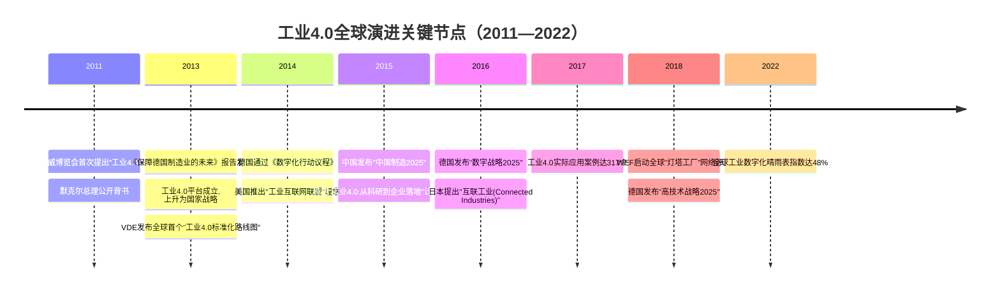
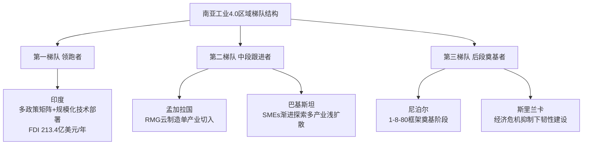
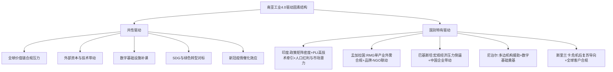
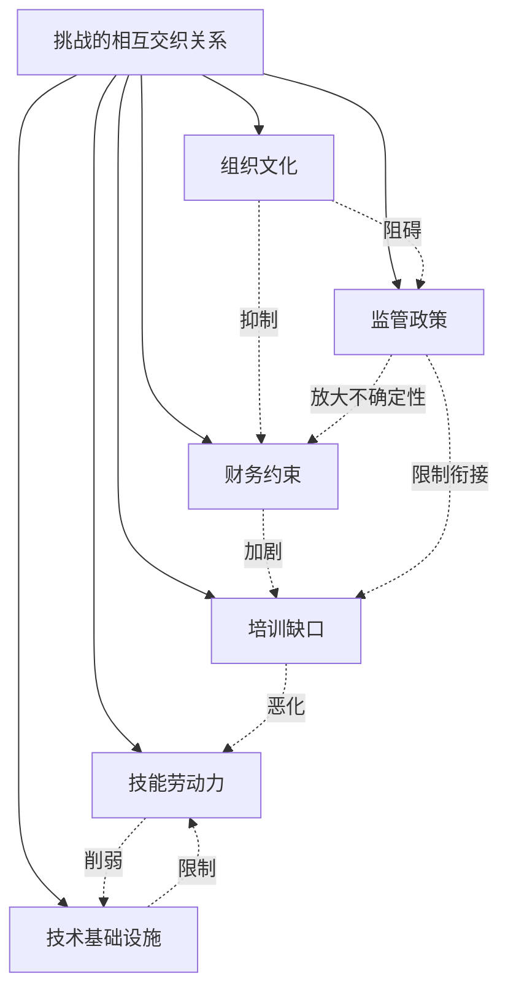
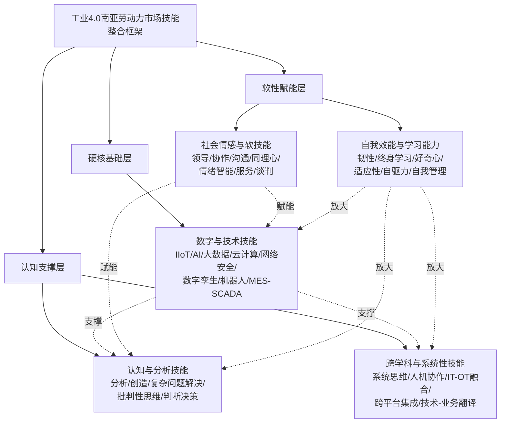
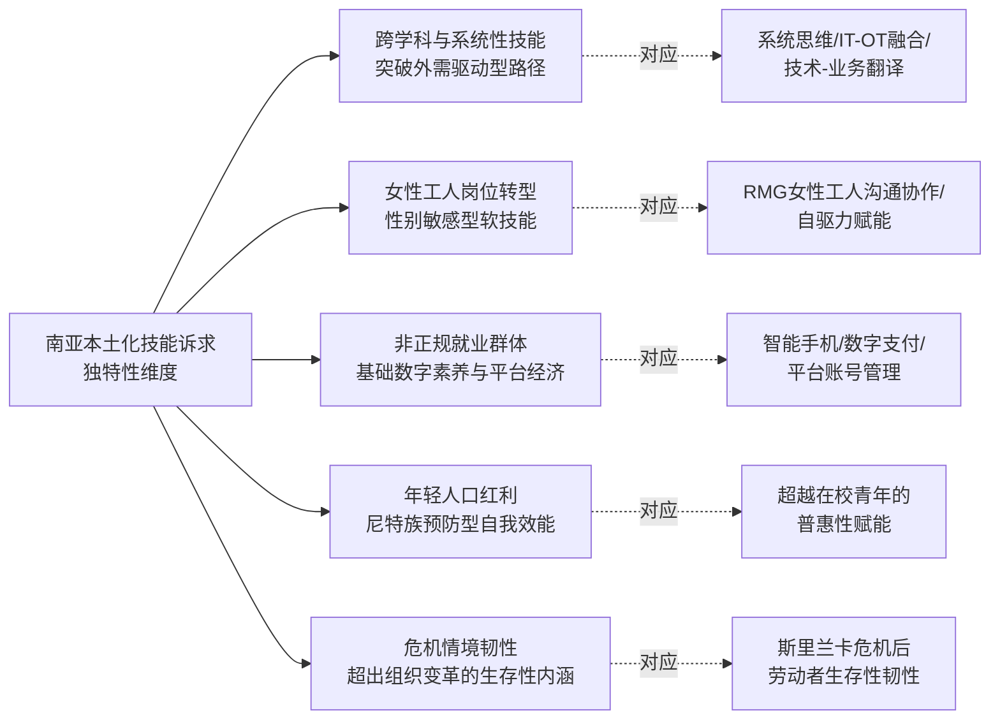
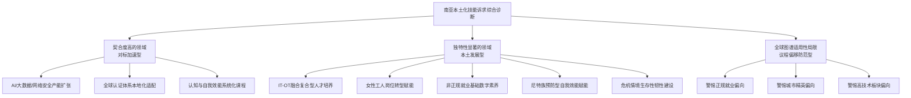
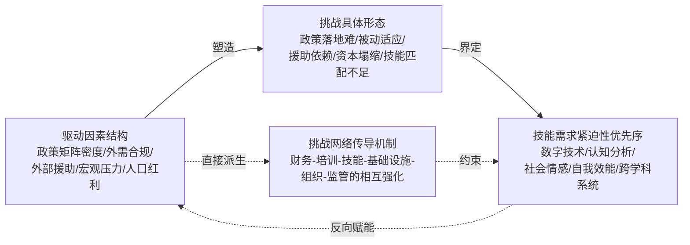
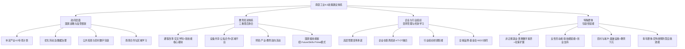

# 工业4.0对南亚地区劳动力市场的影响研究：驱动因素、挑战与技能需求（截至2022年）
# 1 研究背景与分析框架

工业4.0作为以信息物理系统（Cyber-Physical Systems, CPS）为核心、以智能制造为主导的第四次工业革命，正在以前所未有的速度重塑全球生产组织模式、价值创造方式与劳动力市场结构。自2011年在德国汉诺威工业博览会上首次被提出以来，这一概念已从一个具有德国本土战略色彩的国家工程，演变为全球范围内各主要经济体竞相布局的产业议程。然而，工业4.0对劳动力市场的冲击并非均质地作用于全球每一个角落：在发达经济体，讨论焦点往往集中于自动化对中等技能岗位的替代与再培训机制设计；而在以印度、巴基斯坦、孟加拉国、尼泊尔、斯里兰卡为代表的南亚地区，由于人口结构年轻化、劳动密集型产业占比高、制造业基础相对薄弱且数字化转型起步较晚，其面临的机遇与挑战呈现出显著的本土化特征。理解这一区域在工业4.0浪潮下劳动力市场所经历的结构性变迁，不仅关乎数亿人的就业前景，更直接影响全球价值链的再分工格局与可持续工业化目标的实现路径。本章作为全文起点，旨在通过梳理工业4.0的概念内涵与全球演进脉络，论证南亚地区开展该议题研究的现实意义，并明确研究范围、时间边界与"驱动因素—挑战—技能需求"三维分析框架，为后续章节提供统一的概念语境与分析视角。

## 1.1 工业4.0的概念内涵与核心技术构成

工业4.0的概念雏形可追溯到2011年4月的汉诺威工业博览会。德国人工智能研究中心董事兼行政总裁沃尔夫冈·瓦尔斯特尔（Wolfgang Wahlster）教授在开幕式演讲中首次提出通过物联网等媒介推动第四次工业革命的设想，随后由Henning Kagermann、Wolf-Dieter Lukas与Wahlster三人共同制定了"工业4.0"这一术语，其核心思想是将真实空间与虚拟空间耦合到所谓的网络物理生产系统（CPS）之中，将数字化技术应用于物联网、服务互联网及人工智能工业应用所驱动的下一代工厂[^1]。这一概念在2008年全球金融危机的背景下，承担着以适应性和资源效率提升德国经济弹性与竞争力的战略使命，并因时任德国总理默克尔在2011年汉诺威博览会开幕致辞中自发使用"Industry 4.0"这一新标识而迅速获得政治背书[^1]。

2013年4月，由德国机械及制造商协会（VDMA）、德国电气和电子工业联合会（ZVEI）以及德国信息技术、通讯、新媒体协会（BITKOM）共同设立的"工业4.0平台"成立，并向德国政府提交了名为《保障德国制造业的未来——关于实施工业4.0战略的建议》的最终报告，标志着该战略正式上升为国家级战略并被纳入德国《高技术战略2020》的十大未来项目之一[^2]。工业4.0的名称源于对工业发展阶段的划分——工业1.0指机械化、工业2.0指电气化、工业3.0指自动化、工业4.0则代表智能化阶段——其核心是通过CPS实现人、机器、产品与数据的全面互联，构建高度灵活、个性化和数字化的智能生产模式[^2]。这一愿景包含三层递进的产业变革逻辑：**从具有预定结果的传统自动化转向能够学习并自适应的机器与环境**、**从批量生产转向以具竞争力价格生产个性化定制产品**、以及**以数据驱动催生创新业务模型与组织形式**[^1]。

支撑工业4.0战略落地的，是一组相互交织、彼此赋能的关键技术集群。其中，**工业物联网（IIoT）**通过将工业资源连接到网络，借助传感器等感知层技术、工业以太网与无线通信等网络传输技术以及云计算与大数据分析等平台层技术，实现设备、系统和服务的智能互联，支持预测性维护、供应链优化和智能决策，被视为工业4.0的核心组成部分之一[^3]。**云计算**则通过按需自助服务、资源池化、快速弹性和按使用付费等特性，为工业数据的高效处理与分析提供灵活、可扩展的计算和存储资源，显著降低企业进入智能制造的初始成本门槛[^3]。**工业机器人**作为自动化生产的关键装备，凭借高精度、高重复性与可编程特性，广泛应用于焊接、喷涂、装配、搬运、打磨、检测等环节；新一代工业机器人进一步与人工智能、机器视觉、数字孪生及5G通信结合，发展出协作机器人（Cobot）、可重构机器人、集群协同等智能化、柔性化、网络化形态，重塑了人机交互的安全边界与协作模式[^3]。除此之外，大数据分析、人工智能、数字孪生、增材制造（3D打印）、网络安全与增强现实等技术，共同构成了支撑智能工厂运行的技术底座。

| 关键技术 | 在工业4.0中的核心作用 |
|---------|---------------------|
| 工业物联网（IIoT） | 实现设备、产品、流程的全面互联与实时数据采集[^3] |
| 云计算 | 提供弹性算力与存储，支撑工业数据的集中处理与分析[^3] |
| 工业机器人 | 高精度自动化作业，并向柔性化、协作化方向演进[^3] |
| 大数据分析 | 从海量工业数据中挖掘规律，支持智能决策 |
| 人工智能（AI） | 赋能机器学习、机器视觉、缺陷检测与自适应控制[^3] |
| 数字孪生 | 通过虚拟模型实时映射并优化物理生产线状态[^3] |
| 信息物理系统（CPS） | 真实空间与虚拟空间耦合，是工业4.0的概念核心[^1] |
| 网络安全 | 保障互联工厂中数据传输与系统运行的安全可信 |
| 增强现实（AR） | 辅助人机协作、远程维护与员工培训 |

上述技术构成对劳动力市场的影响并非仅是"机器替代人"这一简单图景。从更深层来看，**信息物理系统的本质是将认知性、决策性的工作部分迁移至机器与算法**，这意味着传统体力劳动岗位将面临结构性收缩，而具备数据素养、算法理解与跨学科系统思维能力的复合型岗位则会迅速兴起；同时，工业4.0倡导的人机协作模式强调通过身体和认知工作者援助系统、"神经训练"等机制创造更有意义的人机合作，工会与社会伙伴关系亦被纳入其实施框架的核心议程[^1]。这种以人为本的技术哲学，为后续讨论南亚劳动力市场所需技能的演变奠定了重要前提。

## 1.2 工业4.0的全球演进脉络与发展态势

工业4.0自德国国家战略起步以来，经历了从概念提出、标准化建设到全球扩散的清晰演进路径。下图梳理了2011—2022年间的关键节点：

回顾这一时间线可以看出，工业4.0的演进遵循"**概念发布—标准制定—产业落地—全球扩散**"的递进规律。2013年12月，德国电气电子和信息技术协会（VDE）发布全球首个"工业4.0标准化路线图"，旨在为所有参与方提供技术标准和规格的概览与规划基础；2014年8月，德国政府通过《数字化行动议程（2014—2017）》以为工业4.0发展提速；2015年，德国联邦教育和研究部发起"工业4.0：从科研到企业落地"计划，专门资助中小企业解决技术应用问题；2016年，德国经济与能源部发布"数字战略2025"；2018年10月，德国政府发布"高技术战略2025"，明确未来研究与创新的重点方向[^2]。截至2017年底，德国国内投入实际应用的工业4.0案例已达到317个，显示出该战略从理念到落地的稳步推进[^2]。自2018年起，世界经济论坛（WEF）启动全球"灯塔工厂"网络评选，对全球范围内的工业4.0先锋工厂进行表彰，标志着工业4.0已从德国国家战略演变为全球性产业评价基准[^2]。

与此同时，美国以"工业互联网"为旗帜、中国以"中国制造2025"为载体、日本以"互联工业（Connected Industries）"为框架，分别推出了与工业4.0高度呼应又各具特色的国家级战略，形成全球主要经济体在第四次工业革命赛道上的多极并进格局。值得指出的是，**工业4.0的全球扩散并非均衡推进**。根据德国慕尼黑大学和咨询公司MHP联合发布的《2026工业4.0晴雨表》报告，全球工业领域数字化晴雨表指数已由2022年的48%升至更晚时点的68%，但即使在工业4.0发源地的德语区，该指数仍停滞在57%，在人工智能应用方面德语区以37%的比例在主要国家和地区中垫底[^4]。这组数据从两方面提供了重要参照：一方面，**2022年全球工业数字化整体水平不足50%**，意味着工业4.0仍处于早期至中期扩散阶段；另一方面，即便是技术起源国也面临着综合成本高、官僚负担重、能源价格上涨等结构性瓶颈，**说明工业4.0的成功落地不仅是技术问题，更是制度、成本与人才生态的综合命题**[^4]。这一全球图景为理解南亚地区所处的相对位置提供了重要参照——南亚国家既无需复制发达经济体的早期路径，但也必须正视自身在数字化基础、产业结构与人力资本上的现实差距。

## 1.3 南亚地区研究的现实意义与战略价值

将研究目光投向南亚地区，具有多重现实意义与战略价值。首先，从人口结构看，南亚是全球最年轻的区域之一，印度、巴基斯坦、孟加拉国、尼泊尔、斯里兰卡五国合计承载着接近20亿人口，其中青年劳动力占比显著高于全球平均水平，**劳动力市场对就业岗位的吸纳压力与对技能升级的迫切需求并存**。其次，从产业结构看，南亚普遍以劳动密集型制造业（如纺织服装、皮革制品、轻工组装）和大规模非正规就业为特征，制造业增加值占GDP比重虽不及东亚，但增长潜力与转型空间均较为突出；这一结构使得工业4.0的扩散对南亚就业岗位的"替代—创造"动态影响尤为复杂——自动化在压缩传统岗位的同时，也可能因制造业整体规模扩张而创造新的复合型岗位。

第三，从全球价值链视角看，南亚正处于参与并攀升全球价值链的关键阶段。印度的IT服务与"印度制造（Make in India）"战略、孟加拉国的成衣出口、巴基斯坦与斯里兰卡的纺织业，均深度嵌入跨国供应链体系。**全球品牌客户对供应链数字化、可追溯性、绿色生产的合规要求，正在外生地驱动南亚企业被动或主动地拥抱工业4.0技术**。第四，从联合国可持续发展目标（SDG）9——"建立有韧性的基础设施、促进具有包容性的可持续工业化、推动创新"的视角看，南亚的工业4.0进程是否能够实现"包容性"，即能否将广大非正规劳动者、女性劳动者、农村劳动者纳入到新型工业化的红利分享之中，将直接影响该目标在全球的实现进度[^5]。

因此，**研究工业4.0对南亚劳动力市场的影响，既是一个关于技术扩散的产业经济学命题，更是一个关于发展路径选择、就业包容性与社会公平的发展经济学命题**。其结论不仅对南亚各国政府的产业政策与教育培训体系改革具有直接指导意义，也对其他处于类似发展阶段的新兴经济体具有重要的参照价值。

## 1.4 研究范围、时间边界与覆盖国家

为确保研究的聚焦性与可比性，本报告对研究范围、时间边界与对象进行如下明确界定。

**空间范围**：本研究覆盖南亚地区五个主要国家——印度、巴基斯坦、孟加拉国、尼泊尔与斯里兰卡。这五国的纳入依据在于：(a) 均属于世界银行定义的南亚区域，地理与文化邻近性高，便于横向比较；(b) 制造业在国民经济中均占有不可忽视的地位，且均处于不同程度的工业化进程之中；(c) 均已在国家层面或行业层面开始接触、试点或规划工业4.0相关技术应用，具备研究的现实素材基础。研究将以印度为案例最为丰富的代表性国家，同时确保其余四国在驱动因素、挑战与技能维度的分析中均有独立呈现，避免以印度单一国别替代整个南亚区域的研究范式偏差。

**时间边界**：本研究的时间截点设定为**2022年底**。这一边界的选择基于以下考虑：其一，工业4.0自2011年提出至2022年已积累约十年的全球扩散经验，南亚国家在2014—2022年间相继出台了"印度制造"（2014）、"数字孟加拉国"等国家级战略，2022年底是评估其早期与中期落地效果的合理观察点；其二，2020—2022年间新冠疫情作为外生冲击显著重塑了全球供应链与企业数字化转型节奏，将时间截点设在2022年底有助于将疫情催化效应纳入分析视野；其三，本研究在对比分析章节将引用WEF《2023年未来就业报告》作为全球技能趋势的对标基准，该报告所反映的需求恰好基于2022年的调查数据，与本研究时间边界高度匹配。需要说明的是，正文中若引用了发布于2023年之后的部分参考资料（如关于德国工业4.0后续进展的回顾性报道），仅作为概念溯源与全球趋势对比的辅助参照，**所有关于南亚国家本身的数据、政策与劳动力市场事实均严格控制在2022年底之前**。

**研究对象**：本研究聚焦于工业4.0技术对南亚正规与非正规劳动力市场中**就业规模、岗位结构、工资水平、技能要求**的影响。这里所指的"劳动力市场"涵盖制造业的直接从业人员、相关支持服务业（如物流、IT外包）的从业人员，以及因工业4.0扩散而被边缘化或新进入的劳动者群体。研究不展开纯宏观经济议题（如GDP增长率、贸易顺差）的讨论，也不涉及与劳动力无关的纯技术介绍。

**方法论**：本研究采用**文献综述、二手数据分析与跨国比较**相结合的方法论框架。文献综述以世界银行、ILO、ADB、UNIDO、WEF及各国统计局、同行评审期刊等权威来源为主，确保证据基础的权威性与可追溯性；二手数据分析基于公开统计数据进行国别对比；跨国比较则贯穿驱动因素、挑战与技能三个维度，提炼共性规律与国别特有现象。

## 1.5 驱动因素—挑战—技能三维分析框架

基于上述研究范围与方法论，本研究构建了贯穿全文的"**驱动因素—挑战—技能需求**"三维分析框架。这一框架的内在逻辑在于：**驱动因素**回答"南亚为什么走向工业4.0"的问题，识别推动技术采纳的政策、市场与社会力量；**挑战**回答"南亚在走向工业4.0的过程中遇到了什么"的问题，剖析阻碍技术落地的结构性瓶颈；**技能需求**回答"南亚劳动力如何适应工业4.0"的问题，明确人力资本积累的方向与重点。三者之间存在紧密的逻辑联系：驱动因素塑造了挑战的具体形态（例如，若驱动因素以政策推动为主而市场需求不足，则可能加剧"政策落地难"的挑战）；挑战又反向规定了技能需求的紧迫性与优先序（例如，熟练工人短缺这一挑战直接对应着数字与技术技能培训的紧迫需求）；而技能供给的改善又会反过来提升驱动因素的有效性，形成动态循环。

具体而言，**驱动因素维度**将系统识别推动南亚国家拥抱工业4.0的内外部力量，涵盖政府政策导向（如印度"Make in India"、"数字印度"等国家战略）、高层管理支持与战略愿景、外商直接投资与跨国企业带动、数字基础设施进步、成本竞争压力、可持续发展需求、新冠疫情催化的供应链韧性需求等维度，并对每一驱动因素以一句话凝练阐释其重要性；**挑战维度**则按六大类别系统剖析南亚在工业4.0采纳过程中面临的核心障碍，包括(1)培训与发展挑战、(2)技能与劳动力挑战、(3)财务与投资挑战、(4)监管与政策挑战、(5)技术与基础设施挑战、(6)组织与文化挑战；**技能需求维度**则归纳工业4.0情境下最关键的五类核心技能，包括数字与技术技能、认知与分析技能、社会情感与软技能、自我效能与学习能力、跨学科与系统性技能，并将其与WEF《2023年未来就业报告》所列的十大需求增长技能进行对照，揭示南亚情境下的契合度、独特性与差距。

在具体研究方法上，三维框架的展开将综合运用**文献综述**（梳理国际组织报告与同行评审研究中关于南亚工业4.0的既有发现）、**二手数据分析**（基于各国统计局与世界银行、ILO等数据库的就业、教育、数字化指标）、**跨国比较**（在五国之间进行横向对照，并与WEF全球数据进行纵向对标）等方法。通过这一三维框架与多元方法的有机结合，本研究力求在保持学术严谨性的同时，为政策制定者、行业组织、企业与教育培训体系提供具备可操作性的洞察。

综上，本章通过对工业4.0概念内涵、全球演进脉络、南亚地区研究意义、研究范围与三维分析框架的系统梳理，为后续章节的展开奠定了坚实的概念基础与分析逻辑。在此基础上，第2章将转入南亚五国工业4.0发展现状的国别图景描绘，为理解劳动力市场冲击提供产业层面的事实依据。

# 2 南亚地区工业4.0发展现状的国别图景

承接第1章所确立的"驱动因素—挑战—技能需求"三维分析框架，本章将研究视角从概念层面下沉到产业实证层面，对南亚五国工业4.0的发展现状进行国别图景式的描绘。**理解劳动力市场如何被工业4.0重塑，必须首先理解产业本身在多大程度上、以何种路径被数字化所穿透**——因为劳动力市场的冲击强度与结构形态，根本上取决于工业4.0技术在具体国家、具体行业的应用成熟度与扩散速度。本章将围绕国家级战略与政策推进力度、关键技术（IoT、AI/ML、工业机器人、云计算、CPS等）的应用成熟度、重点行业数字化渗透状况三条主线，依次刻画印度、巴基斯坦、孟加拉国、尼泊尔、斯里兰卡的差异化转型路径，并在末节进行横向比较，识别区域内的梯队结构与共性瓶颈，为后续章节关于驱动因素、挑战与技能需求的分析提供产业层面的事实依据。

## 2.1 印度：政策引领下的高科技制造转型

在南亚五国之中，印度无论从国家战略的密度、关键技术应用的广度，还是从制造业数字化的实际进展看，均处于最具领先地位的位置。其工业4.0进程呈现出"**自上而下的政策矩阵牵引—外资与跨国企业带动—行业头部企业落地试点**"的多层次推进格局。

从政策维度看，印度自2014年起逐步构建了一套高度耦合的国家战略体系。"印度制造（Make in India）"于2014年启动，旨在通过引导外资与本土投资将印度打造为全球制造业中心；"数字印度（Digital India）"于2015年推出，致力于以数字基础设施提升公共服务与产业效率；"Samarth Udyog 4.0"作为印度版本的工业4.0行动计划，专门服务于制造业的智能化升级。这一政策矩阵在莫迪政府提出的"Viksit Bharat@2047（2047年发达印度愿景）"长期愿景下得到进一步强化，国家战略明确将工业4.0技术的采纳与可持续发展目标（SDG 2030）的实现深度绑定[^6]。**这种将工业4.0与"国家发达愿景—全球可持续目标"双重锚定的政策设计，使印度的数字化转型超越了单纯的产业升级议程，成为兼具产业政策、社会发展与国际承诺多重属性的国家工程**[^6]。

国家层面的政策牵引在产业层面体现为一系列高强度激励工具。生产挂钩激励（Production-Linked Incentive, PLI）计划是这一阶段最具代表性的政策工具，重点覆盖电子与半导体、电动汽车（EV）、可再生能源（尤其是太阳能）等高技术制造领域；与之配套的还有大型工业走廊建设与重大投资项目，旨在推动印度成为全球电子与半导体制造中心[^7]。莫迪本人将印度的转型潜力概括为"三维力量"——改革型政府、不断扩大的制造业基础以及对技术趋势保持敏感的雄心市场[^7]。在外部观察层面，第四次工业革命中心于2018年10月由莫迪在新德里设立，成为继旧金山、东京与北京之后全球第四个同类中心，意在系统应对人工智能、机器学习、物联网、区块链与大数据等工业4.0支柱技术对印度社会经济转型的塑造作用[^8]。

关键技术应用方面，工业物联网（IIoT）已被广泛识别为印度工业4.0的核心抓手。**印度塔塔战略管理集团与印度商业工业联合会（CII）联合开展的调查显示，工业IoT是印度工业4.0四大支柱之一，多数受访企业计划在未来三年内在实际生产中采用最新工业IoT技术，通过工业IoT平台构建打破信息壁垒的数字化决策平台**[^9][^10]。这一表述揭示了印度制造业对IoT的认知已从"概念评估"转向"实际部署"，且驱动力直接源自传统工厂"低产能、弱管理、难回溯"等痛点的现实压力[^9]。除IoT外，人工智能、机器学习、区块链与大数据被印度学界普遍视为工业4.0的"五大支柱"，被认为有可能深刻改变印度及其他新兴经济体的生产组织与社会结构[^8]。

在产业层面，2021—2022财年印度制造业占GDP的比例为16.76%，吸引外商直接投资达213.4亿美元，同比上涨76%[^9][^10]。**这一数据表明印度制造业在工业4.0周期内正经历外资加速流入与结构性升级的双重推动**：外资增量为先进生产技术、智能制造管理系统与全球最佳实践的引入提供了资金与渠道，而本土制造业占GDP比重的稳定区间则意味着印度尚有充足的产业纵深支撑其向高附加值环节攀升[^9]。具体到落地案例，全球化IoT开发平台服务商涂鸦智能与印度创新型制造企业WinSharp于2022年前后达成合作，在印度工厂落地智能制造管理系统，覆盖计划管理、生产管理、仓储管理等核心场景的数字化能力建设，并打造"产品智能化+生产智能化"联合解决方案，作为标杆向印度本地及产业链上下游复制[^9][^10]。该案例典型反映了印度工业4.0落地的两个特征：**一是中小型与中型制造企业是当前数字化转型的主要受体，二是跨国IoT平台服务商成为本地工业4.0生态构建的关键基础设施提供方**[^9]。

需要指出的是，印度的领跑地位并不意味着其转型已经完成。从SEMICON India 2024等行业事件向半导体、可再生能源、电动汽车与"国家先进技术"议程的延展来看[^7]，印度的工业4.0议程在2022年底前后正处于"准备期向加速期过渡"的关键阶段：政策矩阵已经成型、外资动能持续放大、IoT等核心技术从试点走向规模化部署，但制造业占GDP比重距离政府长期设定的25%目标仍有相当差距，且这一过程同样面临劳动力技能、MSME数字化能力等深层制约——后续章节将对此进行系统分析。

## 2.2 巴基斯坦：中小企业主导下的渐进式数字化探索

与印度的"高密度政策矩阵+大规模外资牵引"模式相比，巴基斯坦的工业4.0进程呈现出**"宏观经济压力倒逼+数字基础设施补课+中小企业渐进探索"的差异化图景**。

宏观经济背景方面，2022年前后巴基斯坦正面临GDP增长率大幅下滑与出口长期持续下降的双重困境。与孟加拉国、越南、柬埔寨与老挝等同梯队国家相比，巴基斯坦GDP增长滞后；与印度、马来西亚、中国等邻国相比，巴基斯坦企业普遍缺乏现代技术、市场高度不稳定、增长落后[^11]。这一宏观图景具有重要的分析含义：**当一国整体经济增长乏力、出口疲软时，工业4.0往往不再被视为"锦上添花"的现代化议题，而是被定位为应对生存压力的"压力型转型"路径**——即通过网络物理系统、智能工厂、大数据与互操作性等颠覆性技术，倒逼企业以低成本、按时交付高度定制化和高质量产品的能力来重新进入全球供应链的竞争[^11]。

政策层面，2018年5月巴基斯坦联邦内阁批准了由信息技术与电信部（MoITT）提交的首份《数字巴基斯坦（Digital Pakistan）》政策，旨在为巴基斯坦打造一个由数字服务、信息应用与科技服务构成的快速创新数字生态系统，从而开启该国数字经济发展的"快车道"[^12]。该政策的提出标志着巴基斯坦在国家层面正式承认数字化对经济转型的战略重要性，但与印度的多政策矩阵不同，**Digital Pakistan是一个相对单点、聚焦于数字生态构建的框架，并未直接配套面向制造业的工业4.0专项行动计划**。这种差异在很大程度上塑造了巴基斯坦工业4.0进程更偏向于"基础设施先行、产业落地滞后"的特征。

数字基础设施方面，巴基斯坦经历了从2G到3G/4G的快速升级。长期以来，巴基斯坦的移动通信主要基于2G接入，面临传输效率低、信号不稳定等诸多缺陷，难以满足国内市场对高效率的追求；在追求高效率的时代，一场"数字革命"已不可避免[^12]。根据巴基斯坦电信管理局（PTA）的数据，**截至2021年3月，巴基斯坦移动用户数已达到1.83亿，渗透率接近85%，其中3G与4G用户达到9800万**[^12]。这一数据从两方面提供了重要参照：一方面，巴基斯坦在移动连接的规模上具备工业互联网扩散的潜在用户基础；另一方面，3G/4G用户占总移动用户比例约为53.5%，意味着仍有近一半移动用户停留在2G阶段，**这与工业4.0所要求的高带宽、低时延、稳定连接的通信环境之间仍存在显著代际差距**[^12]。

在制造业现场，巴基斯坦的中小企业（SMEs）是观察工业4.0渗透情况最具代表性的群体。中小企业在巴基斯坦经济中扮演着至关重要的角色，但**在工业4.0要求下的表现却不尽如人意**[^11]。工业4.0要求企业以低价、按时交付高度定制化和高质量的产品，但巴基斯坦SMEs普遍面临技术装备水平不足、市场高度不稳定、增长动能弱等问题，难以独立完成向网络物理系统、智能工厂与大数据驱动模式的跃迁[^11]。研究指出，大数据作为一种"新的资本形式"具备体积、速度与多样性三大关键特征，但巴基斯坦从业者在充分利用大数据优势方面仍面临数据集互操作性、标准化与数据安全等深层障碍[^11]。

外部力量在巴基斯坦的转型中扮演着相对突出的角色。中国企业在"数字巴基斯坦"建设中的参与已经形成显著存在——巴基斯坦许多大城市的街头普遍可见各种中国手机品牌门店，其背后是中国企业积极参与巴基斯坦数字化建设的热情[^12]。**这种以邻国跨国企业为主要外部带动者的格局，与印度依托全球外资的多元化结构存在显著差异**，反映出巴基斯坦工业4.0生态构建更具区域化、双边化色彩。总体而言，巴基斯坦的工业4.0进程在2022年底前后仍处于早期采纳阶段，其推进逻辑更多是由宏观经济压力倒逼、基础设施补课与外部企业带动共同构成的渐进式探索。

## 2.3 孟加拉国：成衣出口业驱动的云制造与数字化升级

孟加拉国的工业4.0进程展现出与印度、巴基斯坦显著不同的产业逻辑：**其转型并非由综合性高技术制造业拉动，而是由作为支柱产业的成衣（Ready-Made Garment, RMG）行业在全球品牌客户压力下被动推进**。这种"外需驱动型"的数字化路径，使孟加拉国的工业4.0图景具备鲜明的单一行业聚焦特征。

宏观产业结构方面，孟加拉国制造业在国民经济中占据相当份额。根据OECD数据，**2021年孟加拉国工业占GDP增加值达34.61%，较2020年的34.13%略有上升，显著高于1990年以来约25%的长期中位数水平**[^13]。这一数据表明孟加拉国已在产业结构上完成从农业主导向工业贡献提升的初步转型，为工业4.0技术的扩散提供了产业基础。但需要指出的是，该工业比重的高位运行高度依赖于RMG单一产业的规模扩张，**这种"产业结构高度集中于劳动密集型出口加工"的格局，意味着工业4.0对孟加拉国劳动力市场的冲击将主要通过RMG行业的自动化升级路径传导，影响范围深远但同时风险也高度集中**[^13]。

云制造（Cloud Manufacturing, CM）成为孟加拉国RMG行业拥抱工业4.0的代表性技术路径。云制造作为工业4.0环境下的一种创新、分布式制造概念，由现代工具赋能，为新兴经济体（特别是RMG行业）提供了显著机遇，以增强竞争力、把握新业务机会并提升运营可持续性[^14]。研究指出，**新兴经济体（如孟加拉国）的RMG行业正越来越多地采纳云制造技术**[^14]。这一行业选择具有内在合理性：RMG行业订单分散、客户需求多样、交付周期紧凑，与云制造的分布式、按需调用、跨节点协同特征高度契合；同时，全球品牌客户（如H&M等）对供应链可追溯性、环境合规与社会责任的合规要求日益严格，倒逼孟加拉国RMG工厂在生产管理与数据互通层面进行数字化升级[^14][^12]。

然而，云制造在孟加拉国RMG行业的实施面临诸多障碍。一项以孟加拉国为研究情境、综合应用最佳—最差方法（BWM）、解释结构模型（ISM）与交叉影响矩阵乘法分析（MICMAC）的研究系统识别了14项核心挑战，并明确指出**"高层管理意愿不足""可用性挑战"与"低效的财务管理"是阻碍云制造采纳的三大最关键障碍**[^14]。这一发现具有深刻的诊断意义：**它揭示了孟加拉国RMG行业的工业4.0转型并非主要受制于技术本身的可获得性，而是受制于企业治理、操作易用性与资本配置效率三个软性维度上的结构性短板**。换言之，技术供给已经具备，但企业内部的变革准备度仍构成最大瓶颈[^14]。这一诊断也为后续章节关于挑战分类（特别是"组织与文化挑战"与"财务与投资挑战"）的分析提供了实证基础。

在外部驱动方面，国际NGO与品牌基金会发挥着不可忽视的赋能作用。FSG联合H&M基金会与亚洲基金会以"孟加拉国女性成衣工人未来工作的集体影响计划（Collective Impact initiative on Future of Work for Female Garment Workers in Bangladesh）"为载体，开展了RMG行业未来路径研究，关注RMG行业未来情境（"Alternate Futures for the RMG Industry"）下的就业、技能与女性工人福祉等议题[^12]。**这种由全球品牌基金会主导、聚焦于"未来工作"与"女性工人"的研究与干预，反映出孟加拉国RMG行业的工业4.0转型从一开始就被纳入到全球价值链责任治理的框架之中**[^12]，这与印度、巴基斯坦由本国政策矩阵主导的转型路径形成鲜明对比。

国家战略层面，孟加拉国通过"数字孟加拉国（Digital Bangladesh）"愿景与"国家数字架构与互操作框架（Bangladesh National Digital Architecture, BNDA）"为整个国家的数字治理与信息化建设搭建了底层平台。BNDA已落地实现了一系列电子政务成果，包括超过1.7亿NID（国民身份）验证、超过100万次生物识别验证、超过70万次出生登记验证、超过30万电子招聘用户注册、超过1800场视频会议、超过85万农民登记参与粮食采购、Project Tracking System月交易额超10亿塔卡等[^15]。**这些成果展示了孟加拉国在公共部门数字化方面的扎实进展，但同时也暴露出BNDA框架在产业4.0深度赋能层面的相对滞后——即电子政务先于工业互联网、社会数字化先于产业数字化的不平衡格局**[^15]。

综合来看，孟加拉国的工业4.0图景可概括为"**单产业深度切入、外需合规驱动、电子政务先行而产业落地滞后**"的独特路径。其RMG行业的云制造探索为劳动密集型新兴经济体如何在工业4.0时代维持出口竞争力提供了重要的实证样本，但同时也凸显了治理、文化与资本配置等软性约束在工业4.0扩散中的关键作用。

## 2.4 尼泊尔：数字基础奠基阶段的框架式布局

与印度的"高科技制造转型"、孟加拉国的"出口产业驱动"相比，尼泊尔的工业4.0图景更接近于**"国家数字基础奠基阶段的框架式布局"**——即在制造业基础相对薄弱、轻工业数字化证据普遍缺失的现状下，通过自上而下的数字框架设计为未来工业4.0扩散搭建底层条件。

最具代表性的政策载体是2019年由尼泊尔通信与信息技术部颁布的《数字尼泊尔框架（Digital Nepal Framework, DNF）》。该框架以"**1-8-80**"结构为核心组织逻辑——即一个国家愿景（"释放尼泊尔的增长潜力"）下覆盖八大领域、共80项数字倡议[^11]。八大领域分别为**数字基础（Digital Foundation）、农业、健康、教育、能源、旅游、金融、城市基础设施**[^11]。**值得注意的是，制造业并未作为独立板块被单列于八大领域之中**，这一结构性安排深刻反映了尼泊尔的产业现实：相对于印度的电子半导体、孟加拉国的RMG、巴基斯坦的纺织业，尼泊尔尚未形成具备独立数字化议程承载能力的制造业体系。工业4.0议题更多通过能源、城市基础设施与数字基础三个板块间接渗透[^11]。

框架内容方面，《数字尼泊尔框架》将治理框架、强M&E机制建设、政策与监管环境审查、知识产权保护、数据保护与隐私、电信与宽带政策、数字支付、私营部门参与、数字包容性推进，以及面向未来的新兴与颠覆性技术与商业模式（"Future proofing the mission: emerging and disruptive technologies and business models"）等议题系统纳入推进路径[^11]。**这种"先打地基、再建上层"的逻辑安排，使尼泊尔的数字化进程区别于印度的"政策与产业并行"模式，呈现出更明显的奠基阶段特征**[^11]。亚洲开发银行（ADB）等多边机构的支持在框架附件中得到反映，意味着尼泊尔的数字化转型从一开始就深度依赖国际发展援助渠道[^11]。

在关键技术应用层面，尼泊尔的工业4.0进程几乎不可避免地面临数字基础设施的代际差距与执行能力约束。基于对其制造业基础的整体判断与框架推进逻辑的内在节奏来看，**尼泊尔在2022年底前后仍处于"通信基础建设—数字治理框架完善—试点应用启动"的初始阶段**，IoT、AI/ML、工业机器人等典型工业4.0技术尚未在该国制造业出现规模化部署的证据。这一定位决定了其工业4.0议程的优先序——**先解决电信宽带、数据保护、数字包容等基础性约束，再逐步过渡到产业层面的智能化升级**[^11]。

从劳动力市场视角看，《数字尼泊尔框架》强调"数字包容"作为其核心推进逻辑之一[^11]。这一定位既反映了尼泊尔人口结构特征（每年新增大量青年劳动力进入市场，但成人识字率水平相对较低），也呼应了第1章所讨论的"包容性工业化"目标。**尼泊尔的工业4.0进程将在很长一段时间内承担"数字基础奠基"与"包容性发展"双重使命**，其对劳动力市场的影响将更多通过IT-BPO、数字服务等新兴行业渐进释放，而非通过制造业的智能化集中冲击。这一特征使尼泊尔成为南亚区域中工业4.0进程最具"早期发展中国家"特征的样本。

## 2.5 斯里兰卡：经济危机阴影下的转型韧性建设

斯里兰卡的工业4.0图景在2022年前后被一场独立以来最深刻的经济危机所重塑，呈现出**"危机—复苏"语境下的转型韧性建设特征**。

2022年，斯里兰卡陷入主权违约级别的经济危机，外汇枯竭、燃油与电力配给频繁、通胀飙升、生产中断成为该年宏观经济的主旋律。**这一危机对工业4.0进程造成了直接而深远的抑制效应**：一方面，制造业产能、投资与人才面临三重塌缩，企业用于数字化转型的资本开支被大幅压缩；另一方面，专业人才外流加速，为该国未来工业4.0所需的数字与技术人才储备制造了长期隐患。

国家层面的政策响应反映了斯里兰卡在危机中重建增长路径的决心。斯里兰卡正逐步但稳定地从独立以来最深的经济危机中走出，**为支持复苏，发展规划被定位为兼顾"即时经济复苏"与"长期可持续增长"双重目标，以确保抵御未来危机的韧性，同时实现社会提升**。在新政府于2024年9月上任后，国家发展进入新阶段，财政、规划与经济发展部国家规划司基于《公共财政管理法》（第44号法，2024年）框架，制定了《公共投资计划（PIP）2026—2030》——一份详细的五年战略框架，旨在应对持续存在的结构性弱点与不断演变的发展挑战，与包括"2030议程"在内的国际发展议程对齐[^15]。需要说明的是，**该PIP文件发布于2025年6月，超出本研究"截至2022年底"的时间边界**[^15]，因而本节仅将其作为理解斯里兰卡危机后转型路径的回溯性参照，**对2022年及之前斯里兰卡工业4.0进程的核心结论不以该文件为依据**。

从产业层面看，斯里兰卡的服装与纺织业是其工业4.0转型最具承载力的板块。Brandix、MAS与Hirdaramani等本土服装巨头长期嵌入全球价值链，其全球客户对可追溯性、可持续性与数字化协作的要求构成了与孟加拉国RMG行业类似的外需驱动力。然而，**经济危机所导致的电力与燃油配给、外汇结算困难、原材料进口受阻等现实约束，使得斯里兰卡服装业在2022年面临的首要任务是维持基本运转而非推动数字化跃迁**。在劳动力供给端，技能型劳动力的外迁加速（专业及技能劳工占外迁比例从2011年的27.2%升至2022年的34.45%），进一步削弱了产业升级所需的人力资本基础。

综合来看，2022年的斯里兰卡呈现出**"工业4.0转型需求与转型能力剧烈背离"的独特图景**——一方面，纺织服装等出口导向产业出于维持全球竞争力的考量，对工业4.0技术的需求并未消失；另一方面，经济危机使企业的投资能力、政府的政策动员能力与劳动力市场的人才供给能力同步弱化，形成"需求存在但供给塌缩"的张力。这一特征决定了斯里兰卡在南亚工业4.0版图中将长期处于"复苏优先、转型其次"的特殊位置，其工业4.0进程对劳动力市场的影响在短期内将主要表现为存量人才的流失与结构性收缩，而非新增岗位的快速创造。

## 2.6 五国横向比较与区域梯队特征

在上述五个国别图景的基础上，本节从**国家战略成熟度、关键技术渗透深度、重点行业数字化进展、外资与跨国企业带动效应、数字基础设施水平**五个维度对南亚五国进行横向比较，归纳区域内的梯队结构与共性特征。下表对五国的关键指标进行汇总：

| 维度 | 印度 | 巴基斯坦 | 孟加拉国 | 尼泊尔 | 斯里兰卡 |
|------|------|---------|---------|--------|---------|
| **国家战略成熟度** | 多政策矩阵（Make in India 2014、Digital India 2015、Samarth Udyog 4.0、PLI计划）[^6][^7] | 单点政策（Digital Pakistan 2018）[^12] | Digital Bangladesh + BNDA框架（电子政务先行）[^15] | Digital Nepal Framework 2019（1-8-80奠基型框架）[^11] | 危机情境下的复苏导向规划（PIP 2026-2030回溯性参照）[^15] |
| **关键技术渗透深度** | IoT列为四大支柱、企业规模化部署计划成型[^9][^10] | SMEs早期采纳CPS/智能工厂/大数据[^11] | RMG行业云制造（CM）成为代表性技术[^14] | 八大领域尚未单列制造业，工业4.0间接覆盖[^11] | 危机抑制下转型节奏放缓 |
| **重点行业数字化进展** | 半导体、电子、可再生能源、EV、IT-BPM[^7] | 中小企业纺织业渐进探索[^11] | RMG行业深度切入、女性工人议题突出[^14][^12] | 数字基础、能源、城市基础设施先行[^11] | 服装业（Brandix/MAS/Hirdaramani）维持运转 |
| **外资与跨国企业带动** | FDI 213.4亿美元/年（2021-22财年）、涂鸦智能等跨国IoT平台落地[^9][^10] | 中国企业主导的双边化带动[^12] | H&M基金会、亚洲基金会等品牌-NGO联动[^12] | ADB等多边机构援助驱动[^11] | 全球客户合规要求外生压力 |
| **数字基础设施水平** | BharatNet、Aadhaar、UPI等国家数字公共品较为完备 | 移动渗透85%、3G/4G用户约9800万（2021.3）[^12] | 公共部门数字治理成果显著（1.7亿NID验证等）[^15] | 仍在补足电信宽带、数据保护、数字支付等基础条件[^11] | 危机期间基础设施稳定性受冲击 |

基于上述比较，南亚五国在工业4.0进程中呈现出**清晰的三段式梯队结构**：

**第一梯队（领跑者）：印度**。其特征是**政策矩阵密度最高、关键技术从试点走向规模化、外资动能最强、产业纵深最大**。印度已经具备同时在半导体、电子、可再生能源、电动汽车等多个高技术板块推进工业4.0议程的政策、资本与生态条件，并通过PLI等激励工具形成了对全球先进制造业的承接能力[^7][^6]。其数字化转型已经超越概念阶段，进入了关键技术规模化部署的加速期[^9][^10]。

**第二梯队（中段跟进者）：孟加拉国与巴基斯坦**。两国均处于工业4.0的早期采纳阶段，但**驱动逻辑显著不同**：孟加拉国是由RMG出口产业在全球品牌客户合规压力下被动推进，呈现出"单产业深度切入"的特征[^14][^12]；巴基斯坦则是由宏观经济压力倒逼SMEs在数字基础设施补课的基础上渐进探索，呈现出"多产业浅度扩散"的特征[^11][^12]。两国在国家战略层面均已搭建数字化的顶层框架，但产业层面的工业4.0深度均不及印度[^15][^12]。

**第三梯队（后段奠基者）：尼泊尔与斯里兰卡**。两国均尚未形成具备独立工业4.0议程承载能力的制造业体系，处于"基础奠基"或"危机抑制"阶段[^11]。尼泊尔以《数字尼泊尔框架》搭建数字治理底层条件，制造业数字化议程通过能源、城市基础设施等板块间接渗透[^11]；斯里兰卡则因2022年经济危机而进入"复苏优先、转型其次"的特殊处境，工业4.0进程在短期内被结构性抑制[^15]。

在差异化路径之外，五国还展现出若干**区域共性特征**，为后续章节的分析提供重要的事实底色：

**第一，外部力量在区域工业4.0扩散中扮演显著角色**。无论是印度的全球外资与跨国IoT平台、巴基斯坦的中国企业、孟加拉国的国际品牌基金会、尼泊尔的多边机构援助，还是斯里兰卡的全球客户合规压力，南亚五国的工业4.0进程均高度依赖外部技术、资本与治理资源的注入，而非主要由内生的本土创新驱动[^7][^12][^11]。

**第二，数字治理与产业4.0之间存在普遍的"先公共后产业"错位**。孟加拉国BNDA框架在电子政务方面成果显著（1.7亿NID验证、超过30万电子招聘注册用户、超过85万农民登记参与粮食采购等）[^15]，但产业4.0深度赋能相对滞后；尼泊尔《数字尼泊尔框架》也呈现出类似的"治理与基础先行、产业落地待定"特征[^11]。**这种错位意味着南亚国家在公共部门数字化已形成一定积累的基础上，未来工业4.0的扩散需要专门面向产业层面的政策工具与生态构建**。

**第三，产业结构高度集中于劳动密集型出口加工，导致工业4.0对劳动力市场的冲击具有显著的"集中风险"特征**。孟加拉国的RMG、巴基斯坦的纺织业、斯里兰卡的服装业、印度的IT-BPM与电子组装等支柱产业均高度依赖低技能劳动力的密集投入，工业4.0技术的扩散将首先冲击这些产业的中低技能岗位[^13][^11][^14]。

**第四，五国之间存在显著的政策—产业—基础设施不平衡组合**。印度政策矩阵齐备但落地深度仍参差；孟加拉国电子政务先行但产业4.0滞后[^15]；巴基斯坦数字基础设施仍在3G/4G代际过渡阶段[^12]；尼泊尔框架完备但执行约束突出[^11]；斯里兰卡危机抑制下整体节奏放缓。**这种不平衡组合决定了南亚工业4.0的劳动力市场冲击将呈现高度异质化的国别特征**，需要差异化的应对策略——这也将成为后续章节驱动因素、挑战分析与技能需求梳理的核心出发点。

综上，本章通过对印度、巴基斯坦、孟加拉国、尼泊尔、斯里兰卡五国工业4.0发展现状的国别描绘与横向比较，确立了南亚区域"印度领跑—孟加拉国与巴基斯坦中段跟进—尼泊尔与斯里兰卡后段奠基"的三段式梯队结构，并识别了外部力量驱动、数字治理与产业4.0错位、产业结构集中风险、政策—产业—基础设施不平衡等四大共性特征。**这一国别图景为下一章分析工业4.0对南亚劳动力市场的整体影响——包括就业结构变迁、岗位类型重塑、技能需求层级演化、非正规就业占比、性别参与与城乡流动等系统性议题——提供了产业层面的事实基础**。

# 3 工业4.0对南亚劳动力市场的整体影响

第2章已系统描绘了南亚五国工业4.0在产业层面的国别图景与梯队分布——印度在多政策矩阵牵引下推动关键技术规模化部署、孟加拉国在RMG行业由全球品牌客户合规压力倒逼云制造转型、巴基斯坦SMEs在数字基础设施补课的基础上渐进探索、尼泊尔以《数字尼泊尔框架》开展基础奠基、斯里兰卡则在2022年经济危机阴影下进入"复苏优先"的特殊处境。本章将分析视角从产业层面上移至劳动力市场层面，**以技术替代效应与岗位创造效应的相对强度为核心分析线索**，系统剖析工业4.0技术扩散在南亚情境下对就业结构、岗位类型、技能需求层级、非正规就业、性别参与与城乡流动六个维度所产生的系统性影响，并在末节归纳南亚劳动力市场区别于发达经济体的独特结构性特征。需要预先说明的是，由于南亚多数国家的劳动力市场统计在工业4.0影响维度上仍以宏观就业、产业结构等间接指标为主，本章在部分细颗粒议题上将采用"产业事实推演—结构性影响推断"的分析路径，并在行文中明确指出证据基础的强弱，避免以推测填充。

## 3.1 就业结构变迁：从劳动密集型向技术密集型的渐进迁移

工业4.0对就业结构的最直接影响，体现在三次产业之间及制造业内部就业份额的再分配。从南亚的整体图景看，这种再分配呈现出**"传统劳动密集型岗位收缩—中高端技术密集型岗位渐进扩张—但绝对规模与速度受制于产业纵深"的渐进式迁移特征**，而非发达经济体所经历的"中等技能岗位空心化"模式。

在印度，第2章所述的"多政策矩阵+大规模外资牵引"格局，使其制造业内部呈现出明显的高科技板块就业扩张趋势。2021—2022财年印度制造业占GDP比重达16.76%，吸引外商直接投资213.4亿美元、同比上涨76%的事实，意味着以电子与半导体、电动汽车、可再生能源为代表的PLI重点行业正在生成新的就业池。涂鸦智能与WinSharp等跨国IoT平台服务商在印度工厂的智能制造管理系统落地，亦带动了对系统集成、数据分析与设备运维岗位的需求增长。**值得强调的是，印度的就业结构迁移并不是简单地将传统岗位整体替换为高技术岗位，而是在传统制造业基本盘维持的同时，由PLI牵引的高技术新增产能创造增量复合型岗位**——这一格局使印度的就业结构呈现出"存量稳定、增量上移"的渐进式迁移特征。

孟加拉国的就业结构变迁则被高度压缩在RMG单一支柱产业内部。根据OECD数据，2021年孟加拉国工业占GDP增加值达34.61%，但这一高位运行高度依赖RMG产业的劳动密集型规模扩张。云制造在该行业的逐步渗透，意味着裁剪、缝制、整烫、质检等核心工序中部分常规性岗位将面临自动化升级压力，而生产计划、订单调度、可追溯性管理等新增数字化岗位则在工厂中段与管理段出现。由于RMG行业本身在国民经济中处于主导地位，**该行业的岗位结构调整对整个孟加拉国劳动力市场具有显著的"集中性传导"效应**——单一产业的数字化升级即可重塑全国相当比例就业人口的岗位组成。

巴基斯坦与斯里兰卡的就业结构迁移则相对滞后。巴基斯坦中小企业在工业4.0要求下普遍面临技术装备水平不足、市场不稳定、增长乏力的困境，其就业结构的迁移更多停留在"数字基础设施补课"阶段——即移动通信、电子商务、IT服务等新兴板块吸纳少量增量就业，而制造业核心工序的智能化升级尚未规模化展开。斯里兰卡则因2022年经济危机叠加专业及技能劳工外迁比例从2011年的27.2%升至2022年的34.45%的现实，其就业结构在2022年呈现出**"高技能岗位流失、低技能岗位维持基本运转"的逆向迁移倾向**，与工业4.0所应带来的结构升级方向形成张力。

尼泊尔则由于制造业基础相对薄弱、八大数字领域未单列制造业的现实，其就业结构在工业4.0语境下的迁移主要通过IT-BPO、数字金融、数字旅游等服务板块渐进展开，制造业层面的结构性影响仍不显著。综合来看，南亚五国就业结构迁移呈现出**显著的国别异质性**：印度为"存量稳定、增量上移"，孟加拉国为"单产业内部结构调整"，巴基斯坦为"基础补课先于结构迁移"，斯里兰卡为"危机抑制下的逆向流失"，尼泊尔为"服务业渐进吸纳"。这种异质性决定了南亚区域不存在统一的就业结构迁移模板，政策应对必须建立在国别现实基础之上。

## 3.2 岗位类型重塑：替代效应与创造效应的双向博弈

工业4.0对岗位类型的影响在理论上可分解为**技术替代效应**（自动化、机器人、IIoT等技术对常规性岗位的替代）与**岗位创造效应**（新兴技术催生的数据、系统、维护、人机协作等新岗位）的双向博弈。在发达经济体，由于制造业规模相对稳定且产业纵深有限，替代效应往往在中短期内占据相对优势；而在南亚情境下，由于产业整体规模仍在扩张、外资持续流入、全球价值链承接能力强化等因素，**两种效应的相对强度呈现出与发达经济体不同的均衡格局**。

从替代效应看，工业4.0技术对南亚劳动力市场的直接压力集中在**中低技能常规性岗位**：服装行业的缝纫工与裁剪工面临自动化裁床、自动缝制单元的潜在替代；电子组装行业的手工装配工面临SMT贴片、自动光学检测设备的替代；物流仓储环节的搬运工面临AGV与自动分拣系统的替代；纺织行业的挡车工面临智能纺纱与织造装备的替代。这些岗位的共同特征是**任务高度常规化、动作可标准化、操作可程序化**，恰好对应工业机器人与IIoT技术的核心适用边界。第2章所引述的"工业IoT是印度工业4.0四大支柱之一"以及孟加拉国RMG行业云制造的扩散趋势，从产业事实层面印证了这一替代压力在南亚的现实存在。

从创造效应看，工业4.0在南亚同步催生了一批新兴岗位类型，主要包括：**数据分析师**（处理来自IIoT平台的工业数据）、**自动化工程师**（部署与调试机器人、PLC、SCADA等系统）、**维护技术员**（针对预测性维护与设备数字化管理）、**人机协作操作员**（在协作机器人辅助下完成柔性化生产）、**网络安全专员**（保障互联工厂的数据与系统安全）、**数字孪生建模师**等。涂鸦智能与WinSharp合作中所提及的"计划管理、生产管理、仓储管理等核心场景的数字化能力建设"，本身就意味着这些数字化场景对系统部署、运维与优化岗位的持续性需求。

在南亚情境下评估两者的相对强度，需要考虑以下三个重要修正变量：**其一，产业整体规模扩张提供了岗位的增量空间**。印度PLI计划所牵引的电子、半导体、EV等高技术产能扩张，使新增岗位数量在中短期内可能超过被替代岗位数量；孟加拉国RMG行业即便在自动化升级背景下，其出口订单的持续增长仍维持了对劳动力的总体吸纳能力。**其二，外资流入与全球价值链承接创造了独特的承接性岗位**。第2章所述印度2021—2022财年213.4亿美元的FDI、孟加拉国H&M基金会等品牌-NGO联动、巴基斯坦中国企业带动等外部力量，均在不同程度上为南亚创造了原本不存在的"承接性岗位池"。**其三，南亚的劳动力成本优势在中短期内仍构成对完全自动化替代的经济性约束**——在工资水平远低于发达经济体的情境下，工厂主对"以机器替代人"的投资回报率测算往往倾向于保守，从而延缓了替代效应的全面释放。

基于上述三个修正变量，可以审慎地推断：**在2022年底前后的南亚情境下，工业4.0对劳动力市场的影响更可能呈现"创造略大于替代"或"两者并存"的格局，而非发达经济体语境下的"替代主导"叙事**。但需要警惕的是，这一格局具有较强的产业与国别异质性：印度的高技术板块创造效应明显领先；孟加拉国RMG行业则因替代效应的产业集中度更高而面临更突出的结构调整压力；斯里兰卡因经济危机抑制，两种效应均处于低位运行；尼泊尔与巴基斯坦的整体效应规模相对有限。这种异质化格局意味着南亚不存在单一的"替代vs创造"答案，差异化的国别政策与产业政策成为必然选择。

## 3.3 技能需求层级演化：低技能塌缩与中高技能跃迁的双向拉伸

岗位类型重塑的直接结果是技能需求层级的拉伸——**低技能岗位需求的结构性塌缩与中高技能复合型岗位需求的快速兴起同步发生，中间层级则面临两极分化**。这一双向拉伸效应在南亚情境下的展开，受到该区域人口结构、教育体系与产业现实的多重塑造。

在低技能层级，工业4.0对常规性体力劳动的替代压力直接转化为对低技能岗位需求的塌缩。南亚劳动力市场中以服装缝制、电子组装、物流搬运、纺织挡车为代表的低技能岗位基数庞大，是吸纳数千万农村迁移劳动力与女性劳动者的主要渠道。**当这些岗位因自动化升级而出现需求收缩时，受冲击群体往往因缺乏再培训渠道与正规就业关系，难以平滑过渡到新增的中高技能岗位**——这一结构性错配是南亚有别于发达经济体的关键现实。

在中等技能层级，南亚呈现出明显的两极分化趋势。一方面，**部分中等技能岗位因数字化工具的赋能而升级为"中—高技能复合型岗位"**——例如，掌握IoT平台操作的产线主管、能够使用数字孪生工具的工艺工程师、熟悉MES系统的生产计划员等；另一方面，**另一部分中等技能岗位则因核心任务被算法或软件替代而下沉为"操作辅助型岗位"**——例如，传统质检员的部分判别任务被机器视觉系统接管后，岗位本身可能被简化为辅助性的人机协作角色。这种两极分化使得中等技能劳动者的职业发展路径出现显著分叉。

在中高技能层级，工业4.0催生了对**数字与技术技能、认知与分析技能**的迅猛需求增长。数据分析、AI/ML应用、网络安全、系统集成、人机协作工程等领域的高技能岗位在印度IT-BPM、电子半导体、EV等高技术板块尤为突出。**然而南亚的现有教育培训体系与这一新增需求之间存在显著供给缺口**：传统工程教育以机械、电气、土木为主，针对工业4.0交叉学科的培养体系尚不完善；职业培训机构的教材、设备与师资普遍滞后于产业前沿；终身学习与在职再培训机制在企业层面的覆盖面有限——这些约束将在第5章挑战分析中得到系统展开，本节仅作整体性铺垫。

值得指出的是，**社会情感与软技能、自我效能与学习能力、跨学科与系统性技能在工业4.0情境下的重要性同样在快速跃升**。人机协作模式的扩散要求劳动者具备更强的沟通、协调与适应能力；技术迭代的加速要求劳动者具备持续学习的韧性与好奇心；跨工序、跨系统的数字化集成要求劳动者具备系统思维与IT-OT融合能力。这些技能在南亚现有的劳动力培养体系中长期被低估，其供给缺口可能比纯技术技能的缺口更为隐蔽与深远。本章对技能需求层级演化的整体性梳理，将在第6章被进一步具象化为五类核心技能的详细解析。

## 3.4 非正规就业的高占比与工业4.0的不对称冲击

非正规就业的高占比是南亚劳动力市场最具区域特征的现象之一，也是工业4.0冲击在该区域不同于发达经济体的核心分析维度。在印度、孟加拉国、巴基斯坦等国，非正规部门长期吸纳大量劳动力——涵盖小作坊、家庭式生产、街头经济、零工承包、临时合同工等多种形态，且普遍缺乏书面劳动合同、社会保障覆盖与稳定的工资制度。**这一群体在工业4.0扩散过程中所面临的不对称冲击，构成了南亚区域劳动力市场区别于发达经济体的关键议题**。

从负面冲击看，非正规就业群体在工业4.0红利分享中处于结构性劣势。**其一，技术培训渠道的缺失**：正规企业内部可通过雇主出资开展数字化技能培训，而非正规劳动者通常游离于企业培训体系之外，难以获得系统性的工业4.0相关技能提升机会。**其二，社会保障覆盖的不足**：当自动化升级带来岗位调整甚至替代时，正规就业者尚可依靠失业保险、再就业服务、技能补贴等机制实现过渡，而非正规劳动者则缺乏制度性缓冲，更易陷入失业或被迫接受更低质量岗位的处境。**其三，正规就业关系的缺失**：非正规劳动者难以获得职业晋升通道、内部转岗机会与企业级别的再培训资源，工业4.0所要求的"在岗持续学习"机制对该群体而言基本失效。这三重劣势叠加，意味着**工业4.0的扩散在缺乏专门干预的情境下，可能加剧南亚劳动力市场内部正规—非正规之间的结构性鸿沟**。

但从另一侧面看，工业4.0也为非正规就业群体提供了部分新兴吸纳路径。平台经济与零工经济的扩展，使部分非正规劳动者通过网约车、外卖配送、电商物流、在线服务等数字化平台获得了相对稳定的收入来源——尽管这些岗位本身在劳动权益保障层面仍存在争议，但其至少在收入可见性、工作可追溯性方面提供了较此前更优的条件。第2章所述的孟加拉国BNDA框架"超过30万电子招聘用户注册"、"超过85万农民登记参与粮食采购"等成果，从公共部门数字化层面也展示了非正规劳动者被纳入数字治理体系的可能路径。然而需要审慎评估的是，**这种"平台吸纳"路径在劳动质量、社会保障与议价能力层面的提升仍较为有限**，难以替代制度性的非正规就业正规化进程。

综合来看，工业4.0对南亚非正规就业群体的影响呈现出**"边缘化风险与平台吸纳并存"的不对称特征**——其结果取决于政策干预的力度、社会保障机制的扩展、技能再培训渠道的可及性等多重制度变量。这一议题的深层政策含义将在第8章政策启示中进一步展开。

## 3.5 性别参与的结构性张力：女性劳动者的机遇与脆弱性

性别维度是工业4.0对南亚劳动力市场影响中最具张力的议题之一。南亚女性劳动者在工业4.0进程中同时面临着**机遇与脆弱性并存的结构性张力**——一方面，自动化对以女性为主的劳动密集型岗位的集中替代风险显著；另一方面，新兴行业为受过教育的女性创造了前所未有的高质量就业机遇。

孟加拉国RMG行业的女性工人议题是这一张力的典型缩影。RMG行业作为孟加拉国最大的出口产业与就业吸纳板块，长期以女性工人为主力——其女性劳动者集中于缝制、整烫、质检等劳动密集型工序。**当云制造与自动化技术在该行业逐步扩散时，这些以女性为主的低技能岗位首当其冲面临替代压力**。第2章所述FSG联合H&M基金会与亚洲基金会发起的"孟加拉国女性成衣工人未来工作的集体影响计划（Collective Impact initiative on Future of Work for Female Garment Workers in Bangladesh）"，正是对这一脆弱性的国际化回应——其聚焦于"RMG行业未来情境下的就业、技能与女性工人福祉"，反映了全球品牌客户与国际NGO对女性工人在工业4.0冲击下脆弱性的关注与赋能努力。

但与脆弱性同时存在的是新增机遇。印度IT-BPM行业的快速发展为受过良好教育的女性创造了大量服务业高技能岗位——软件开发、数据分析、客户服务、远程咨询等岗位对女性劳动者具有较强的吸纳能力，且通常提供较RMG产线更优的工作条件、工资水平与职业发展路径。**这种"传统制造业女性岗位收缩—新兴服务业女性岗位扩张"的同步演化，构成了南亚女性劳动力参与的二元化格局**：受教育程度较高的城市女性可能从工业4.0中获得显著收益，而受教育程度较低的农村或城市贫困女性则可能面临更大的就业脆弱性。

值得指出的是，南亚女性劳动力参与率本身长期低于全球平均水平，且地区与国别差异显著。**工业4.0进程是否能够实质性提升南亚女性劳动力的参与率与岗位质量，取决于教育资源的性别可及性、技能再培训渠道的性别友好度、工作场所灵活性安排等多重制度变量**。这一议题的深层政策含义同样将在第8章中得到系统讨论。

## 3.6 城乡流动与区域分化：数字化红利的空间不均衡

工业4.0对劳动力市场的空间分布同样产生了显著影响。**智能制造产业向城市群、工业走廊与经济特区集聚的趋势，使工业4.0的就业红利在空间上呈现出明显的不均衡分布**——城市与工业走廊节点获得增量岗位，而广大农村地区则面临低技能岗位收缩带来的就业压力。

印度的工业走廊布局是这一空间集聚效应的典型体现。第2章所述的PLI计划重点覆盖电子与半导体、EV、可再生能源等高技术制造领域，其产能布局高度集中于"金奈—班加罗尔走廊""德里—孟买工业走廊"等若干大型工业走廊与经济特区，**这些走廊节点成为吸纳新增技术密集型岗位的主要空间载体**。涂鸦智能与WinSharp合作的智能制造管理系统落地，同样首先发生在工业走廊节点的工厂。这种空间集聚一方面促进了城市群的产业升级与高技能就业增长，另一方面也加剧了城乡之间的数字化红利不均衡——农村地区的低技能制造业岗位（如小规模纺织、传统手工业、零部件加工）面临双重压力：既被工业走廊节点的现代化工厂在市场竞争中挤出，又难以获得分享智能制造增量红利的机会。

孟加拉国的出口加工区（EPZ）布局同样体现了这一空间不均衡。RMG行业的工厂集中于达卡、吉大港等城市及周边的出口加工区，工业4.0技术的扩散首先发生在这些空间节点，**而广大农村地区的劳动力主要通过迁移流入城市加工区获得就业机会**——这种"农村—城市"的劳动力流动模式在工业4.0语境下面临新的挑战：随着自动化升级压缩低技能岗位需求，农村迁移劳动力的吸纳容量可能下降，城市非正规部门的就业压力可能上升。

数字基础设施差距与教育资源的城乡不均衡进一步放大了这种空间分化。**第2章所述巴基斯坦在2021年3月3G/4G用户约9800万、移动渗透率约85%的数据虽显示了整体规模优势，但城乡内部的接入质量与稳定性差距仍然显著**；尼泊尔《数字尼泊尔框架》将"数字包容性"作为核心推进逻辑之一，正是对城乡数字鸿沟的明确回应。**在缺乏专门针对农村地区的数字基础设施投入、教育资源下沉与技能再培训机制扩展的情境下，工业4.0的扩散可能在中短期内进一步加剧南亚劳动力市场的城乡分化与区域不均衡**。

## 3.7 南亚劳动力市场区别于发达经济体的独特结构性特征

在前述六个维度分析的基础上，可以提炼南亚劳动力市场在工业4.0冲击下区别于发达经济体的独特结构性特征。下表对核心差异进行对照汇总：

| 维度 | 发达经济体的主导叙事 | 南亚的独特结构性特征 |
|------|-------------------|-------------------|
| **就业结构变迁路径** | 制造业总体收缩，服务业承接转岗 | 制造业规模仍在扩张，"存量稳定+增量上移"的渐进迁移 |
| **替代vs创造效应** | 替代主导，"中等技能岗位空心化" | 创造略大于替代或两者并存，岗位结构呈双向拉伸 |
| **技能错配焦点** | 中等技能再培训、终身学习机制完善 | 低技能塌缩与中高技能跃迁同步，教育体系基础性滞后 |
| **就业形态特征** | 正规就业占主导，社会保障覆盖较完整 | 非正规就业规模庞大，社保覆盖与培训渠道严重不足 |
| **性别影响格局** | 性别差距相对缩小，自动化对两性影响差异较小 | 女性劳动者机遇与脆弱性并存的双重张力突出 |
| **空间分布特征** | 区域差异相对收敛，远程办公部分缓解空间分化 | 城市—工业走廊与农村—传统部门的空间不均衡显著加剧 |
| **转型驱动逻辑** | 内生技术创新与产业升级驱动 | 外需驱动型转型为主，外资与全球价值链承接占主导 |
| **人口结构压力** | 老龄化与劳动力收缩 | 年轻人口红利与就业压力并存，每年新增大量青年劳动力 |

基于上述对照，南亚劳动力市场在工业4.0冲击下的独特结构性特征可归纳为以下六点：

**第一，年轻人口红利与就业压力并存**。南亚五国合计承载接近20亿人口，青年劳动力占比显著高于全球平均水平，每年大量青年劳动力新增进入劳动力市场。这一人口结构既为工业4.0提供了潜在的人力资本基础，也对就业岗位的吸纳能力构成持续压力。

**第二，非正规就业规模庞大**。印度、孟加拉国、巴基斯坦等国的非正规部门长期吸纳大量劳动力，缺乏社会保障与制度性再培训渠道，构成工业4.0冲击的核心脆弱性来源。

**第三，低技能岗位基数巨大**。南亚劳动密集型制造业（RMG、纺织、电子组装等）所支撑的低技能岗位规模庞大，自动化升级对这些岗位的替代压力具有显著的"集中性传导"特征。

**第四，教育培训体系滞后**。南亚现有工程教育、职业培训与终身学习机制普遍滞后于工业4.0产业前沿，技能供给缺口比纯技术替代更具长期性。

**第五，外需驱动型转型路径**。南亚的工业4.0转型在很大程度上受全球品牌客户合规要求、跨国企业带动、国际NGO干预等外部力量驱动，而非主要由内生创新拉动——这与发达经济体的内生驱动逻辑形成鲜明对比。

**第六，性别与城乡双重不平等**。女性劳动者的脆弱性与农村—传统部门的边缘化在工业4.0语境下同步加剧，使南亚的"包容性工业化"目标面临双重张力。

与发达经济体的"中等技能岗位空心化"主导叙事相比，**南亚劳动力市场在工业4.0冲击下呈现的是"低技能岗位规模性收缩、中高技能岗位结构性短缺、非正规与正规之间结构性鸿沟、城乡与性别双重不均衡"的多维度复合图景**。这一独特结构性特征意味着，南亚不能简单照搬发达经济体的政策模板（如以中等技能再培训为核心的应对方案），而必须建立差异化的政策应对体系——这一体系应同时回应人口红利的释放、非正规就业的正规化、低技能群体的过渡保护、女性与农村劳动者的赋能、教育培训体系的根本性升级等多重诉求。

综上，本章从就业结构变迁、岗位类型重塑、技能需求层级演化、非正规就业不对称冲击、性别参与张力与城乡空间分化六个维度系统剖析了工业4.0对南亚劳动力市场的整体影响，并归纳了南亚区别于发达经济体的六大独特结构性特征。**这一整体事实底色为后续章节的展开奠定了核心问题意识：第4章将系统识别推动南亚拥抱工业4.0的关键驱动因素，第5章将深入剖析南亚在采纳工业4.0过程中面临的六大类挑战，第6章将聚焦工业4.0情境下南亚劳动力市场所需的五类核心技能，并在第7章与WEF《2023年未来就业报告》进行对比分析**。本章所揭示的"创造与替代并存""技能层级双向拉伸""正规—非正规鸿沟""性别与城乡双重不均衡"等核心张力，将贯穿后续章节的分析始终。

# 4 南亚工业4.0采纳的关键驱动因素

第3章已系统刻画了工业4.0对南亚劳动力市场的整体冲击图景——"创造略大于替代"的岗位结构双向拉伸、低技能塌缩与中高技能跃迁同步发生、非正规就业群体的不对称冲击、女性与城乡劳动者的双重不平等。**然而，这些影响之所以以特定的形态与强度在南亚展开，根本上取决于驱动该区域走向工业4.0的力量本身具有什么样的结构**。换言之，**驱动因素塑造了挑战的具体形态，并间接界定了技能需求的优先序**——这是贯穿"驱动—挑战—技能"三维框架的核心因果链条。本章承接第2章国别图景与第3章劳动力市场影响的双重铺垫，系统识别并归纳推动南亚五国采纳工业4.0技术的关键驱动因素，并在每一维度下以"一句话凝练阐释"的方式回应用户需求。本章在分析中始终贯彻"**共性驱动—国别特有驱动**"的双线对照逻辑：既揭示南亚五国共享的结构性驱动力，也辨析印度的政策矩阵密度、孟加拉国的外需合规、巴基斯坦的中国企业带动、尼泊尔的多边援助、斯里兰卡的危机倒逼等国别特有动力的差异化作用。

## 4.1 政府政策导向与国家战略牵引

**一句话凝练**：政府政策导向通过国家战略、产业激励与制度框架的顶层设计，为工业4.0技术的采纳提供了方向锚定、资源动员与合法性背书，是南亚区域内最具普适性的核心驱动力。

国家政策牵引在南亚五国的工业4.0进程中呈现出**密度梯度显著、结构形态各异**的差异化格局。印度构建了南亚区域内最为密集、层次最完整的政策矩阵。"印度制造（Make in India）"于2014年启动，致力于通过引导外资与本土投资将印度打造为全球制造业中心；"数字印度（Digital India）"于2015年推出，从基础设施层面赋能产业与公共服务的数字化；"Samarth Udyog 4.0"作为印度版本的工业4.0行动计划专门服务于制造业的智能化升级；生产挂钩激励（PLI）计划则成为最具代表性的产业激励工具，重点覆盖电子与半导体、电动汽车、可再生能源等高技术领域[^6]。这一政策体系在"Viksit Bharat@2047（2047年发达印度愿景）"的长期愿景下进一步与联合国可持续发展目标（SDG 2030）深度绑定[^6]。**这种将工业4.0议程同时锚定于"国家发达愿景—全球可持续目标"的双重制度设计，使印度的政策驱动超越了单纯的产业升级议程，具备了产业政策、社会发展与国际承诺的多重属性**。

巴基斯坦的政策驱动呈现出**单点框架型**特征。2018年5月，巴基斯坦联邦内阁批准了由信息技术与电信部（MoITT）提交的首份《数字巴基斯坦（Digital Pakistan）》政策，旨在为巴基斯坦打造一个由数字服务、信息应用与科技服务构成的快速创新数字生态系统，开启该国数字经济发展的"快车道"[^12]。值得指出的是，《数字巴基斯坦》是一个相对单点、聚焦于数字生态构建的框架，并未直接配套面向制造业的工业4.0专项行动计划——这种政策结构在很大程度上塑造了巴基斯坦"基础设施先行、产业落地滞后"的转型路径。

孟加拉国的政策驱动则以"数字孟加拉国"愿景与"国家数字架构与互操作框架（BNDA）"为载体，**展现出电子政务先行的明显倾向**。BNDA已落地实现了一系列电子政务成果，包括超过1.7亿NID（国民身份）验证、超过100万次生物识别验证、超过70万次出生登记验证、超过30万电子招聘用户注册、超过1800场视频会议、超过85万农民登记参与粮食采购等[^15]。这些成果展示了孟加拉国在公共部门数字化方面的扎实进展，但同时也暴露出BNDA框架在产业4.0深度赋能层面的相对滞后。

尼泊尔由通信与信息技术部于2019年颁布的《数字尼泊尔框架（Digital Nepal Framework, DNF）》采用"**1-8-80**"结构组织——即一个国家愿景下覆盖八大领域（数字基础、农业、健康、教育、能源、旅游、金融、城市基础设施）、共80项数字倡议[^11]。**值得注意的是，制造业并未作为独立板块被单列于八大领域之中**，工业4.0议题更多通过能源、城市基础设施与数字基础三个板块间接渗透。该框架还系统纳入了治理框架、M&E机制建设、政策与监管环境审查、知识产权保护、数据保护与隐私、电信与宽带政策、数字支付、私营部门参与、数字包容性推进以及面向新兴与颠覆性技术与商业模式（"Future proofing the mission: emerging and disruptive technologies and business models"）等议题[^11]。

斯里兰卡则在2022年经济危机阴影下呈现出**危机响应型**政策驱动。新政府于2024年9月上任后，财政、规划与经济发展部国家规划司制定的《公共投资计划（PIP）2026—2030》将发展规划定位为兼顾"即时经济复苏"与"长期可持续增长"双重目标[^15]。需要重申的是，该PIP文件发布于2025年6月，超出本研究"截至2022年底"的时间边界，**对2022年及之前斯里兰卡工业4.0进程的核心结论不以该文件为依据**，本节仅将其作为危机后转型路径的回溯性参照。

| 政策驱动模式 | 代表国家 | 核心特征 |
|------------|---------|---------|
| **多政策矩阵型** | 印度 | Make in India + Digital India + Samarth Udyog 4.0 + PLI + Viksit Bharat@2047 多层耦合 |
| **单点框架型** | 巴基斯坦、孟加拉国、尼泊尔 | 以单一数字化国家框架为顶层，工业4.0议程间接覆盖或电子政务先行 |
| **危机响应型** | 斯里兰卡 | 危机后复苏导向的发展规划，工业4.0议程被韧性建设逻辑重新框定 |

## 4.2 高层管理支持与企业战略愿景

**一句话凝练**：高层管理者的战略意愿与变革承诺是将国家政策导向转化为企业层面落地行动的关键中介变量，其缺失将直接成为工业4.0采纳最关键的内部障碍。

如果说政府政策为工业4.0提供了"方向锚定与制度激励"，那么企业内部的高层管理支持与战略愿景则是这些外部信号能否被有效转化为生产现场行动的决定性中介。这一驱动因素的重要性在南亚情境下具有两方面的实证支撑——一方面来自反向证伪（即缺失时的破坏性影响），另一方面来自正向印证（即存在时的牵引性效应）。

从反向证伪的角度看，孟加拉国RMG行业云制造采纳的实证研究提供了极具诊断价值的发现。该研究综合应用最佳—最差方法（BWM）、解释结构模型（ISM）与交叉影响矩阵乘法分析（MICMAC）等方法，从14项核心挑战中识别出**"高层管理意愿不足"（lack of interest from top management）、"可用性挑战"与"低效的财务管理"是阻碍云制造采纳的三大最关键障碍**[^14]。**这一发现具有深刻的反向论证意义：当高层管理意愿被列为最关键障碍时，反过来说明高层管理支持是工业4.0采纳最具决定性的驱动力**——技术供给已经具备，资金渠道也并非完全闭塞，但若企业最高决策层缺乏对工业4.0的战略承诺，所有外部信号都难以穿透组织内部的惯性结构。

从正向印证的角度看，印度的案例则展示了战略愿景明确时的牵引性效应。印度塔塔战略管理集团（Tata Strategic Management Group）与印度商业工业联合会（CII）联合开展的工业4.0调查显示，工业IoT是印度工业4.0四大支柱之一，**多数受访企业计划在未来三年内在实际生产中采用最新工业IoT技术，通过工业IoT平台构建打破信息壁垒的数字化决策平台**[^9][^10]。这一调查结果意味着印度制造业的高层管理者已经在战略认知层面将IoT从"技术选项"上升为"战略必选项"，并形成了具体的实施时间表。涂鸦智能与WinSharp合作中WinSharp首席执行官Alex Xie与股东RAHUL亲自出席合作签约仪式的安排，亦从微观层面反映出企业最高管理层对智能制造管理系统落地的直接背书与战略承诺[^9][^10]。

**从更深层来看，高层管理支持作为驱动因素的核心机制在于其同时承担"战略方向选择者""资源动员者"与"组织变革背书者"三重角色**。在南亚情境下，由于多数企业（特别是中小企业）的组织结构相对扁平、决策高度集中于创始人或所有者层级，高层管理意愿对工业4.0落地的边际影响远大于具备成熟治理结构的发达经济体大型企业。这一现实也反过来意味着，南亚工业4.0扩散政策若忽视对高层管理者的认知干预与能力建设，单纯依靠政府补贴或外部技术输入，将难以触及组织内部最为关键的决策节点。

## 4.3 外商直接投资与跨国企业带动

**一句话凝练**：外商直接投资与跨国企业不仅为南亚工业4.0扩散提供了关键的资本注入与全球最佳实践引入，更是本土生态构建的关键基础设施提供方，其作用强度与结构形态在五国之间存在显著差异。

外资动能在南亚工业4.0扩散中扮演着不可替代的角色。联合国贸发会议（UNCTAD）发布的《2023年世界投资报告》数据显示，**2022年流向印度的外国直接投资增长10%，达到490亿美元，使印度成为绿地项目公告的第三大东道国和国际项目融资交易的第二大东道国**[^16]。同时，2021年流入亚洲发展中国家的FDI增长19%，创6190亿美元的历史新高，占当年全球外国投资流入的40%，印度位列主要外资流入目的地前五[^17]。从更微观的角度看，2021—2022财年印度制造业占GDP的比例为16.76%，引进外商直接投资达213.4亿美元，同比上涨76%[^9][^10]。**这组数据从两方面提供了重要参照：一是外资增量为先进生产技术、智能制造管理系统与全球最佳实践的引入提供了资金与渠道；二是76%的同比涨幅意味着印度在工业4.0周期内的外资动能正处于加速释放阶段**。

跨国企业的具体带动在印度展现出极为典型的"**生态构建型**"特征。苹果供应链向印度的迁移是这一现象最具代表性的案例。自2017年起，苹果开始挺进印度市场，委托纬创在班加罗尔生产iPhone SE等低端产品；2022年4—8月，"印度籍"iPhone手机出口额已突破十亿美元；摩根大通分析师在2022年9月预测，到2025年苹果可能会在印度生产全球25%的iPhone[^18]。富士康自2019年在印度设厂，2022年11月印度官员称富士康计划在两年内扩建印度南部泰米尔纳德邦的工厂，并扩招5.3万名员工，总人数将达到7万[^18]。在政策层面，2020年印度推出"生产挂钩激励计划"（PLI），为智能手机制造商提供产能补贴，苹果供应商富士康、和硕因此在印投资超10亿美元，建立新工厂[^19]。除苹果外，全球化IoT开发平台服务商涂鸦智能与印度创新型制造企业WinSharp于2022年前后达成合作，在印度工厂落地智能制造管理系统，覆盖计划管理、生产管理、仓储管理等核心场景[^9][^10]。**这些案例反映出跨国企业在印度工业4.0生态中扮演着"资本带动+技术输入+管理体系移植+人才培养"的复合型角色**。

巴基斯坦的外部带动呈现出**显著的双边化、区域化特征**。中国企业在"数字巴基斯坦"建设中的参与已经形成显著存在——巴基斯坦许多大城市的街头普遍可见各种中国手机品牌门店，其背后是中国企业积极参与巴基斯坦数字化建设的热情[^12]。这种以邻国跨国企业为主要外部带动者的格局，与印度依托全球外资的多元化结构存在本质差异。

孟加拉国的外部带动则展现出**"全球品牌-NGO联动"的独特模式**。FSG联合H&M基金会与亚洲基金会发起"孟加拉国女性成衣工人未来工作的集体影响计划（Collective Impact initiative on Future of Work for Female Garment Workers in Bangladesh）"，专门关注RMG行业未来情境下的就业、技能与女性工人福祉议题[^12]。**这种由全球品牌基金会主导、聚焦于"未来工作"与"女性工人"的研究与干预，反映出孟加拉国RMG行业的工业4.0转型从一开始就被纳入到全球价值链责任治理的框架之中**。

尼泊尔则以**多边机构援助驱动**为主要外部带动模式。亚洲开发银行（ADB）等多边机构的支持在《数字尼泊尔框架》中得到反映[^11]，意味着尼泊尔的数字化转型从一开始就深度依赖国际发展援助渠道。斯里兰卡虽然在2022年经济危机下整体外资动能塌缩，但其Brandix、MAS、Hirdaramani等服装巨头长期嵌入全球价值链，全球客户的合规要求构成了外生的转型压力。

| 国家 | 外部带动主导模式 | 代表性案例 |
|------|----------------|----------|
| 印度 | 全球多元外资+跨国企业生态构建 | 苹果/富士康/和硕、涂鸦智能-WinSharp，FDI 213.4亿美元/年 |
| 巴基斯坦 | 中国企业主导的双边化带动 | 中国手机品牌、中企参与"数字巴基斯坦"建设 |
| 孟加拉国 | 全球品牌-NGO联动模式 | H&M基金会、亚洲基金会、FSG女性工人议程 |
| 尼泊尔 | 多边机构援助驱动 | 亚洲开发银行（ADB）支持《数字尼泊尔框架》 |
| 斯里兰卡 | 全球客户合规外生压力 | 服装巨头嵌入全球品牌客户供应链 |

## 4.4 数字基础设施进步与连接能力提升

**一句话凝练**：数字基础设施作为工业4.0扩散的"底座条件"，决定了IoT、云计算与CPS等关键技术能否在产业层面实现规模化部署，其代际升级是南亚区域内最普遍存在的基础性驱动力。

工业4.0的所有关键技术——IIoT的实时数据采集、云计算的弹性算力调用、AI的模型训练与部署、数字孪生的实时映射——都建立在稳定、高带宽、低时延的数字基础设施之上。**南亚国家在2018—2022年间普遍经历了数字基础设施的代际升级，为工业4.0的产业层面扩散提供了必要的"底座条件"**。

巴基斯坦的代际升级最具代表性。长期以来，巴基斯坦移动通信主要基于2G接入，面临传输效率低、信号不稳定等诸多缺陷，难以满足国内市场对高效率的追求[^12]。根据巴基斯坦电信管理局（PTA）的数据，**截至2021年3月，巴基斯坦移动用户数已达到1.83亿，渗透率接近85%，其中3G和4G用户达到9800万**[^12]。这一数据从两方面提供了重要参照：一方面，巴基斯坦在移动连接的规模上具备工业互联网扩散的潜在用户基础；另一方面，3G/4G用户占总移动用户比例约为53.5%，意味着仍有近一半移动用户停留在2G阶段——**这与工业4.0所要求的高带宽、低时延、稳定连接的通信环境之间仍存在显著代际差距**。

孟加拉国的BNDA框架则展示了数字基础设施在公共部门的扎实积累。其覆盖范围包括国家级电子服务总线、170M+ NID验证、1M+生物识别验证（CBVMP）、700K+出生登记验证、e-Recruitment 300K+用户注册、Boithok视频会议系统1800+场会议、85万农民食品采购登记、e-Pass System 40K+访客接待、Project Tracking System覆盖5家机构30+项目月交易额超过10亿塔卡、GeoDASH覆盖50+组织700+图层等[^15]。**这些成果虽然主要集中于公共部门数字治理而非产业4.0赋能，但其所建立的身份认证、互操作、数据治理基础设施，为后续产业层面的工业4.0扩散提供了重要的制度性底座**。

尼泊尔的《数字尼泊尔框架》则将数字基础设施单列为八大领域之首（"Digital Foundation"），并在框架内系统设计了电信与宽带政策、数字支付政策与监管、数据保护与隐私、知识产权保护、私营部门参与等基础性议题[^11]。**这种"基础先行"的政策安排反映出尼泊尔在工业4.0扩散链条上的实际位置——其优先序应当是先解决基础连接与制度环境，再过渡到产业层面的智能化升级**。

需要在本节末特别强调的是，南亚五国普遍存在**"公共部门数字化先于产业4.0赋能"的错位特征**。孟加拉国BNDA在电子政务方面成果显著，但产业4.0深度赋能相对滞后；尼泊尔《数字尼泊尔框架》也呈现类似的"治理与基础先行、产业落地待定"特征。**这一错位意味着南亚国家在数字基础设施层面已经具备了相对扎实的公共维度积累，但仍需要专门面向产业的政策工具与生态构建，才能将基础设施红利转化为工业4.0层面的实际驱动力**。

## 4.5 成本竞争压力与全球价值链合规要求

**一句话凝练**：南亚企业在全球价值链中所面临的成本竞争压力与客户合规要求，外生地驱动着工业4.0技术的采纳，是该区域有别于发达经济体内生创新驱动逻辑的核心特征之一。

巴基斯坦的案例最为典型地展示了"**压力型转型**"的逻辑。2022年前后，巴基斯坦正面临经济增长率大幅下滑与出口长期持续下降的双重困境。与孟加拉国、越南、柬埔寨、老挝等同梯队国家相比，巴基斯坦GDP增长滞后；与印度、马来西亚、中国等邻国相比，巴基斯坦企业普遍缺乏现代技术、市场高度不稳定、增长落后[^11]。**正是在这一宏观经济压力背景下，工业4.0的颠覆性技术——网络物理系统、智能工厂、大数据与互操作性——被定位为"以低价、按时交付高度定制化和高质量的产品"以应对生存压力的转型路径**[^11]。这一表述深刻揭示了南亚情境下工业4.0驱动力的独特属性：当一国整体经济增长乏力、出口疲软时，工业4.0不再被视为"锦上添花"的现代化议题，而是被定位为重新进入全球供应链竞争的"压力型转型"路径。

孟加拉国RMG行业的合规驱动则展示了另一种典型形态。研究指出，**新兴经济体（如孟加拉国）的RMG行业正越来越多地采纳云制造技术**，以增强竞争力、把握新业务机会并提升运营可持续性[^14]。这一选择具有内在合理性：RMG行业订单分散、客户需求多样、交付周期紧凑，与云制造的分布式、按需调用、跨节点协同特征高度契合；同时，全球品牌客户（如H&M等）对供应链可追溯性、环境合规与社会责任的合规要求日益严格，倒逼孟加拉国RMG工厂在生产管理与数据互通层面进行数字化升级[^12]。

斯里兰卡纺织服装业则受到全球客户合规要求的持续压力。印度纺织业作为对照样本——其作为世界第三大纺织制造国和出口国，占全球纺织品和服装贸易的4%；印度国内服装和纺织业约占国家GDP的2.3%，工业生产的13%，出口的12%——**亦在全球客户合规要求下面临转型压力**[^20]。印度纺织品出口主要目的地为美国、欧盟与英国，约占总出口量的50%，其中欧盟份额从2000年的32%增加到2018年的38%[^20]。需要指出的是，2022年印度棉纱出口下降50%、棉纺织品出口下降23%、纺织品和服装总出口量比前一年减少18%，全球服装市场需求缩水的情境下，印度的纺纱和织造行业产能过剩约30%[^20]——**这种产能过剩与需求收缩并存的格局，反过来强化了通过工业4.0技术实现差异化竞争与高附加值升级的紧迫性**。

更宏观地看，"中国+1"战略对南亚的承接性驱动也属于成本竞争压力的延伸表现。"中国+1"体现了许多大型制造商和零售商为降低供应链风险而采用的策略，即通过将某些中国独家采购和生产业务转移到其他国家来降低供应链风险[^17]。其驱动因素主要包括中美贸易战（2018年美国对价值340亿美元的中国进口商品征收25%的额外关税）、中国新冠"动态清零"政策的影响、中国劳动力成本攀升与老龄化加快[^17]。**这一战略为南亚（尤其是印度、孟加拉国）提供了承接转移产能的窗口，但承接的前提是相关国家必须具备符合跨国企业要求的工业4.0数字化能力**——从而构成了倒逼南亚加速采纳工业4.0的强大外部压力。

## 4.6 可持续发展需求与绿色转型对标

**一句话凝练**：联合国SDG 2030与欧盟绿色新政、碳边境调节机制等国际可持续治理议程，构成了南亚工业4.0采纳的"外部规制型驱动"，将技术升级议程与绿色转型议程深度耦合。

工业4.0在南亚的扩散并非孤立的技术现代化过程，而是与全球可持续发展议程深度交织。这一议程在政策层面的最显著体现，是印度将工业4.0与SDG 2030及"Viksit Bharat@2047"长期愿景深度绑定的政策设计。相关研究指出，**印度的"Make in India"、"Digital India"、"Samarth Udyog 4.0"等政策与工业4.0倡议的战略对齐，能够显著贡献于印度的可持续发展议程**[^6]。这种"工业4.0—SDG 2030—2047发达印度愿景"三重耦合的政策框架，使工业4.0议程承担了远超产业现代化的多重战略使命。

在外部规制层面，欧盟绿色新政与碳边境调节机制（CBAM）构成了对南亚出口导向型产业最具直接影响的外部压力。**今年（指2023年）10月1日，全球首个"碳关税"开始试运行，过渡期至2025年12月31日，2026年1月1日正式起征，并在2034年之前全面实施**[^20]。CBAM目前涵盖范围包括钢铁、水泥、铝、化肥、电力和氢6个行业；根据规定，只要是生产地碳定价低于欧盟碳价的产品，一旦进口到欧盟关税区，就要购买CBAM凭证，补足其间的差额[^20]。**虽然纺织品行业目前尚未被纳入CBAM征收范围，但欧盟委员会的"碳泄漏"风险清单中已包括纺织品，印度纺织业不得不为此做好准备**[^20]。

欧盟绿色新政对纺织业的影响更为系统化。2022年3月，欧盟委员会正式发布《欧盟可持续和循环纺织品战略》及《可持续产品生态设计条例》，明确为扭转服装生产过剩和消费过度，将快时尚向可持续和循环方向升级、重新定义时尚——这也使得包括印度、孟加拉国、斯里兰卡、巴基斯坦在内的南亚纺织业大国面临产业转型压力[^20]。**规定到2030年，投放欧盟市场的所有纺织品都必须设计得更耐用、易于重复使用、修理和回收，且生产过程要环保、产品要可持续且不含有害物质**[^20]。为应对这一外部规制压力，印度纺织部于2023年7月拟采取循环纺织品生产战略[^20]。

可持续发展议程同样在企业层面表现为对工业4.0技术的具体需求。云制造在RMG行业的扩散研究明确将"可持续发展目标"（Sustainable Development Goals）列为核心研究维度之一，强调云制造为新兴经济体（特别是RMG行业）提供机遇以"增强竞争力、把握新业务机会并提升运营可持续性"[^14]。**这一研究框架反映出工业4.0技术在南亚的扩散从一开始就被置于可持续发展的语境下，技术采纳与绿色转型构成同一议程的两面**。

综合来看，可持续发展需求作为驱动因素具有"**外部规制型驱动**"的典型特征——其压力并非主要来自南亚本国的内生需求，而是来自欧盟、联合国等外部规制主体的合规要求。这一特征与第4.5节所述的"全球价值链合规要求"在结构上具有同源性，共同构成南亚工业4.0进程"外需驱动型"的核心底色。

## 4.7 新冠疫情催化的供应链韧性需求

**一句话凝练**：新冠疫情作为外生冲击将工业4.0从"锦上添花"的现代化议题转化为"生存必需"的韧性建设议程，显著加速了南亚IIoT、云制造、数字化运营管理系统的采纳节奏。

2020—2022年的新冠疫情以前所未有的方式重塑了全球供应链的运行逻辑与企业的数字化转型节奏。在南亚情境下，疫情的催化效应主要通过三条路径展开。

**第一条路径是承接"中国+1"战略下的产能转移机遇**。新冠肺炎疫情期间，由于中国工厂生产跟不上，许多制造商的供应链都出现了问题——工厂大规模关闭，材料短缺成为常态，航行时间增加了两倍，成本急剧增加[^17]。中国的"清零"政策进一步加速了这一决定，该政策持续了3年直到2022年底才放开，对全国范围内的人员和货物流动进行了严格限制[^17]。这一格局为南亚（尤其是印度）创造了承接产能转移的关键窗口。苹果在印度的iPhone产量从2017年不足全球1%，跃升至更晚时点的25%——其中2022年是关键转折年，9月26日苹果首次实现新品发布当年即在印度同步生产iPhone 14系列，2022—23财年印度生产的iPhone手机出口额预测翻番至25亿美元[^18][^19]。**承接转移产能的前提是南亚企业具备符合跨国企业要求的工业4.0数字化能力，这一外部需求直接驱动了印度工厂在智能制造管理系统、IoT平台、数据中台等方面的加速部署**。

**第二条路径是国家层面战略宣示与改革推进**。印度总理莫迪在2022年世界经济论坛（WEF）线上会议上明确表示："我们利用新冠时期推进改革"（We used the corona time for reforms），并称印度已经实施了一系列经济改革以改善"营商便利度"，**当下是投资印度的最佳时机**[^20][^21]。莫迪同时强调印度当前正在制定政策、做出决策，既考虑当下也考虑未来25年的目标，**这一时期的增长将是绿色、清洁、可持续与可靠的**[^20][^21]。这一国家级战略宣示反映出印度政府将疫情期间的窗口期主动转化为加速工业4.0、绿色转型与营商环境改革的战略机遇。

**第三条路径是企业层面对供应链韧性、远程协作、数字化运营、可追溯性的需求显著提升**。涂鸦智能与WinSharp合作中明确提到：未来将与WinSharp通力合作，赋能全球客户携手高水平数字化工厂，**即便在遇到突发情况等可能造成物流受阻的情况下，也能保证智能产品的生产**[^9][^10]。这一表述清晰反映出疫情期间企业对供应链韧性的需求如何转化为对工业4.0数字化管理系统的具体采纳动力。孟加拉国BNDA框架中Boithok视频会议系统已开展超过1800次政府视频会议[^15]——这一数字直接反映了疫情对远程协作基础设施需求的拉动效应。

**综合来看，新冠疫情对南亚工业4.0进程的催化效应可概括为"压力—机遇—改革"的三重驱动**：疫情期间供应链中断带来的生存压力倒逼企业拥抱数字化；"中国+1"战略带来的产能转移机遇激励南亚加速建设承接能力；各国政府利用疫情窗口期推进结构性改革。这三重驱动共同将工业4.0从"锦上添花"的现代化议题转化为"生存必需"的韧性建设议程。

## 4.8 人口红利与市场潜力的内生拉动

**一句话凝练**：南亚年轻人口结构与近20亿人口规模所支撑的国内市场潜力，构成吸引外资、支撑规模化技术部署与培育本土数字化生态的内生拉动力，是该区域少数具备"内生属性"的驱动因素。

在前述驱动因素中，无论是政府政策导向、外资带动、全球合规压力还是疫情催化，均带有较强的"外部驱动"或"自上而下"色彩。与此形成对照的是，**人口红利与市场潜力作为驱动因素具有相对突出的"内生属性"**——其作用机制根植于南亚的人口结构与消费市场基本面，是该区域工业4.0扩散少数具备自下而上拉动逻辑的驱动力。

人口结构方面，印度的代表性最为突出。印度学者指出，印度拥有**年轻且不断扩大的劳动力，中位年龄约为28岁，提供了持续的劳动力供给与不断上升的国内消费水平**；这一人口红利如果配以技能与岗位的匹配，可支撑长期增长[^17]。莫迪本人将印度的转型潜力概括为"**三维力量**"——改革型政府、不断扩大的制造业基础以及对技术趋势保持敏感的雄心市场[^7]。这一定位明确将"市场潜力"与"政府改革"、"制造业基础"并列为驱动工业4.0议程的三大支柱。

市场潜力方面，印度作为全球增长最快的消费电子市场之一构成跨国企业战略布局的关键考量。印度拥有14亿人口，智能手机渗透率约45%（远低于中国的78%）[^19]。苹果CEO库克曾直言："**印度不仅是生产基地，更是未来的核心市场**"[^19]。这一定位深刻反映出工业4.0扩散背后的市场逻辑：跨国企业之所以愿意将生产能力大规模迁移到印度，不仅出于风险分散与成本考量，更是看重印度作为未来高增长消费市场的战略价值。

宏观经济基本面同样支撑了这一判断。国际货币基金组织与世界银行均对印度GDP增长持乐观预期[^17]。专家分析指出，印度的高增长率来自结构性、人口、政策与外部因素的组合：印度拥有年轻且不断扩大的劳动力，中位年龄约28岁，提供持续的劳动力供给与不断上升的国内消费水平；同时，不断扩大的中产阶级引领国内需求，构成长期增长的主要支撑[^17]。**这一基本面使得跨国企业、外资基金与本土资本均愿意为印度的工业4.0议程提供长期资本承诺**——因为对应的市场需求与劳动力供给均具备长期可持续性。

需要审慎指出的是，**人口红利向工业4.0驱动力的实质转化，前提是劳动力技能与岗位需求的匹配**。如第3章所述，南亚教育培训体系与工业4.0新增技能需求之间存在显著供给缺口，若这一缺口不能得到根本性弥合，人口红利可能反而转化为就业压力而非增长动力。同时，五国之间的人口红利与市场潜力存在显著差异——印度的市场体量与年轻劳动力规模最为突出，孟加拉国、巴基斯坦次之，尼泊尔与斯里兰卡的市场规模相对有限。这种国别差异决定了人口红利作为驱动因素的强度在五国之间分布不均。

## 4.9 共性驱动与国别特有驱动的对照归纳

在前述八大维度系统分析的基础上，本节对南亚五国工业4.0采纳的驱动因素进行横向对照与分类归纳，以揭示**共性驱动—国别特有驱动**的双线结构。

**共性驱动**层面，南亚五国共同承受着以下结构性力量：

**第一，全球价值链合规压力**：作为深度嵌入跨国供应链体系的新兴经济体，南亚五国均面临来自全球品牌客户对可追溯性、可持续性、数字化协同的合规要求，构成倒逼式的转型压力（见4.5、4.6节）。

**第二，外部资本与技术带动**：无论形态如何差异，五国的工业4.0扩散均高度依赖外部资本、技术与治理资源的注入，而非主要由内生创新驱动（见4.3节）。

**第三，数字基础设施补课**：五国普遍处于数字基础设施代际升级阶段，且呈现"公共部门数字化先于产业4.0赋能"的错位特征（见4.4节）。

**第四，SDG 2030与绿色转型对标**：五国均在不同程度上承担着联合国可持续发展目标的实现义务，并面临欧盟绿色新政与CBAM的外部规制压力（见4.6节）。

**第五，新冠疫情催化效应**：疫情期间的供应链韧性需求、远程协作需求、"中国+1"战略机遇构成了五国共享的外生冲击（见4.7节）。

**国别特有驱动**层面，五国展现出显著的差异化结构：

**印度**的特有驱动包括：**多政策矩阵密度**（Make in India + Digital India + Samarth Udyog 4.0 + PLI + Viksit Bharat@2047的多层耦合）、**PLI高技术牵引**（电子、半导体、EV、可再生能源等高技术板块的大规模激励）、**全球外资多元化**（213.4亿美元/年的FDI规模）、**人口红利与市场潜力的内生拉动**（14亿人口、中位年龄28岁、不断扩大的中产阶级）。

**孟加拉国**的特有驱动主要集中于**RMG单产业外需合规**——由全球品牌客户与H&M基金会、亚洲基金会等国际NGO联动驱动，且高度聚焦于女性工人议题；同时，BNDA框架的电子政务先行提供了独特的数字治理基础。

**巴基斯坦**的特有驱动是**宏观经济压力倒逼的"压力型转型"**与**中国企业主导的双边化带动**——前者使工业4.0从现代化议题转化为生存型选择，后者则在带动结构上区别于印度的全球多元化外资。

**尼泊尔**的特有驱动是**多边机构援助主导**（ADB等多边机构对《数字尼泊尔框架》的支持），以及**"1-8-80"框架下的数字基础奠基逻辑**——制造业未被单列于八大领域之中，工业4.0议程通过能源、城市基础设施等板块间接渗透。

**斯里兰卡**的特有驱动则是**2022年经济危机倒逼下的复苏导向**——危机使工业4.0议程在短期内被韧性建设逻辑重新框定，呈现"需求存在但供给塌缩"的特殊处境。

下表对五国驱动因素的强弱组合特征进行直观汇总（强度评估基于第2—4章累积的事实证据，"●●●"代表强、"●●"代表中、"●"代表弱、"○"代表薄弱或证据有限）：

| 驱动因素 | 印度 | 巴基斯坦 | 孟加拉国 | 尼泊尔 | 斯里兰卡 |
|---------|:---:|:------:|:------:|:----:|:------:|
| 政府政策导向 | ●●● | ●● | ●● | ●● | ●（危机后） |
| 高层管理支持 | ●●● | ● | ●（实证显示为最关键障碍） | ○ | ●（受危机抑制） |
| 外资与跨国企业带动 | ●●● | ●●（中国企业为主） | ●●（品牌-NGO联动） | ●（多边援助） | ●（合规外生压力） |
| 数字基础设施 | ●●● | ●●（3G/4G代际升级中） | ●●（电子政务领先） | ●（基础奠基阶段） | ●●（受危机冲击） |
| 成本与合规压力 | ●●● | ●●●（生存型转型） | ●●●（外需驱动） | ● | ●●●（全球客户合规） |
| 可持续发展对标 | ●●● | ●● | ●●●（H&M等品牌驱动） | ●● | ●● |
| 新冠疫情催化 | ●●● | ●● | ●● | ● | ●（危机叠加抑制） |
| 人口红利与市场潜力 | ●●● | ●● | ●● | ● | ● |

从对照结果可以观察到以下三个深层规律：

**第一，驱动因素的强弱组合直接对应五国在工业4.0进程中的梯队位置**。印度在八大维度上均表现强劲，对应其"第一梯队领跑者"地位；孟加拉国与巴基斯坦在外需合规、外部带动等维度突出但在政策矩阵密度与人口红利上不及印度，对应"第二梯队中段跟进者"地位；尼泊尔与斯里兰卡在多数维度上较弱，对应"第三梯队后段奠基者"地位。

**第二，外部驱动因素在五国均显著强于内生驱动因素**。除印度的人口红利与市场潜力具备一定的内生拉动属性外，其他驱动因素均带有较强的外部色彩——这印证了第3章所揭示的"南亚工业4.0进程为外需驱动型而非内生创新驱动型"的判断。

**第三，驱动因素的国别异质性直接塑造了挑战的具体形态与优先级**。例如，孟加拉国"高层管理意愿不足"作为最关键障碍直接对应4.2节驱动因素的薄弱；巴基斯坦数字基础设施的3G/4G代际过渡阶段直接对应第5章将分析的"技术与基础设施挑战"；尼泊尔多边机构援助主导的格局意味着第5章"监管与政策挑战"中的政策协调议题将具有不同形态。**这种"驱动因素塑造挑战形态"的逻辑链条，将成为第5章展开多维挑战分析的核心出发点**。

综上，本章系统识别并归纳了推动南亚五国采纳工业4.0技术的八大类关键驱动因素——政府政策导向、高层管理支持与战略愿景、外商直接投资与跨国企业带动、数字基础设施进步、成本竞争压力与全球价值链合规要求、可持续发展需求与绿色转型对标、新冠疫情催化的供应链韧性需求、人口红利与市场潜力——并以每一因素一句话凝练阐释其核心重要性。在共性驱动—国别特有驱动的双线对照中，五国呈现出清晰的差异化格局，并直接对应着第2章所识别的三段式梯队结构。**驱动因素的强弱组合塑造了挑战的具体形态，并间接界定了技能需求的优先序——这一因果链条将贯穿后续章节的展开。第5章将转入南亚工业4.0采纳过程中所面临的六大类多维挑战的系统剖析**。

# 5 南亚工业4.0采纳面临的多维挑战

第4章已系统识别了推动南亚五国采纳工业4.0的八大类关键驱动因素，并揭示了"驱动因素塑造挑战形态"这一贯穿三维框架的核心因果链条。**当驱动力以政府政策为主导而市场需求相对薄弱时，会衍生出"政策落地难"的执行性挑战；当驱动力以全球价值链合规要求为主导而本土能力滞后时，会衍生出"被动适应"的资本与组织性挑战；当驱动力以外部援助为主导而内生创新薄弱时，会衍生出"援助依赖"的可持续性挑战**——这些因果链条决定了南亚工业4.0进程所面临的挑战不是孤立、零散的技术难题，而是与驱动结构互为表里的系统性瓶颈。本章承接驱动因素分析，按培训与发展、技能与劳动力、财务与投资、监管与政策、技术与基础设施、组织与文化六个维度，系统剖析南亚五国在采纳工业4.0过程中面临的多维挑战，并在末节进行国别差异化对比与相互交织关系归纳，为第6章技能需求分析的优先序界定提供问题导向的实证基础。需要预先说明的是，本章在国别证据强度上存在显著差异——印度与孟加拉国的证据基础最为充分，巴基斯坦、尼泊尔、斯里兰卡部分细颗粒数据存在缺口，本章在行文中将如实标注证据强弱，避免以推测填充。

## 5.1 培训与发展挑战：教育体系滞后与终身学习机制缺失

工业4.0所要求的人力资本形态与南亚现有教育培训体系之间存在结构性错配，这一错配在课程供给、职业培训、企业再培训三个层面同时显现，构成最具基础性的挑战类别。

**传统工程教育与工业4.0交叉学科培养体系之间的供给缺口**是这一挑战的核心维度。南亚现有的工程教育长期以机械工程、电气工程、土木工程、化学工程等传统学科为主导，针对IIoT、AI/ML、数据科学、网络物理系统、数字孪生、网络安全等工业4.0交叉学科的培养体系尚不完善。这一结构性滞后并非可以通过短期课程改革予以解决，而是涉及学科设置、师资培养、实验平台建设、产学合作机制的系统性重构。**当印度PLI计划将电子半导体、电动汽车、可再生能源作为高技术制造的牵引方向时，对应的工程师群体却仍主要在传统学科框架下被培养出来**——这一供给缺口意味着，即便外资与跨国企业愿意将先进产能转移至印度，仍需投入大量额外成本进行本地工程师的"二次培训"才能使其具备工业4.0生产线的实际操作与维护能力。

**职业培训机构（TVET）的教材、设备与师资普遍滞后于产业前沿**是这一挑战的第二个核心维度。南亚国家的TVET体系在传统制造业时代以纺织、机械加工、电气维修等技能为核心模块，但在工业4.0语境下，IIoT平台操作、PLC编程、机器视觉调试、协作机器人编程、MES系统使用等新兴技能模块在TVET课程中的覆盖普遍不足；同时，承担这些教学任务所需的实训设备投入巨大、迭代速度快，TVET机构的资本能力难以支撑前沿设备的及时引入；师资层面，具备工业4.0实操经验的教师群体本身即是稀缺资源，TVET机构在吸引与留用此类师资上面临显著困难。**这种"课程—设备—师资"的三重滞后，使TVET体系在工业4.0扩散期面临能力赤字的累积性扩大风险**。

**企业内部在职再培训覆盖面有限**构成这一挑战的第三个核心维度。在发达经济体，企业内部的终身学习机制（如通过e-learning平台、内部学院、岗位轮换等方式实现的在职再培训）是劳动者技能持续更新的核心渠道。然而在南亚情境下，由于多数企业（特别是中小企业）的人力资源管理能力较弱、培训预算有限、且劳动者流动率较高（使企业对培训投入的回报率测算偏保守），系统化的在职再培训机制在企业层面的覆盖面长期偏低。**对于占南亚就业池绝大多数的非正规劳动者群体，这一渠道几乎完全失效**——第3章所讨论的非正规就业不对称冲击在培训维度上得到具体印证。

值得关注的是，**国际NGO与品牌基金会在女性工人技能赋能议程上的补位作用**部分弥补了这一制度性缺口。FSG联合H&M基金会与亚洲基金会发起的"孟加拉国女性成衣工人未来工作的集体影响计划（Collective Impact initiative on Future of Work for Female Garment Workers in Bangladesh）"以RMG行业为载体，专门关注女性工人在工业4.0冲击下的就业、技能与福祉议题[^12]。这种"全球品牌—基金会—NGO"协同的赋能模式，反映出**在国家级培训体系滞后的情境下，全球价值链合规压力反向驱动了私人部门与社会部门的培训补位**——但这种补位本身具有明显的局限性：其覆盖范围限定于全球品牌客户的供应链节点，难以扩展到非出口导向的本土产业；其议程设置受制于资助方的优先序，难以完全反映本土劳动者的真实需求。

国别层面，培训与发展挑战在五国呈现出差异化表现。**印度**面临的核心是高科技板块（电子半导体、AI、EV）人才培养与传统工程教育体系之间的结构性张力，TVET体系虽规模庞大但前沿覆盖不足；**孟加拉国**面临的核心是RMG行业自动化升级背景下女性工人的技能再培训需求，国际NGO介入虽然显著但覆盖范围有限；**巴基斯坦**与**斯里兰卡**在TVET体系层面的细颗粒数据相对薄弱，但从SMEs"普遍缺乏现代技术"与斯里兰卡专业人才外流的现实可推断其培训体系存在类似瓶颈；**尼泊尔**则因《数字尼泊尔框架》仍处于基础奠基阶段，ICT扫盲与强制IT教育计划已规划但执行受限，工业4.0相关培训议程在政策层面尚未独立成型。

## 5.2 技能与劳动力挑战：熟练工人短缺、人才外流与性别失衡

如果说培训与发展挑战聚焦于"供给侧"的体系性瓶颈，那么技能与劳动力挑战则聚焦于"市场端"的供给—需求失衡。这一挑战在南亚情境下沿数量、质量、结构三个层面同时显现。

**数字与技术技能型熟练工人的普遍短缺**是数量层面的核心瓶颈。第3章已揭示，工业4.0扩散同步引发"低技能塌缩与中高技能跃迁"的双向拉伸，但南亚教育培训体系所能提供的中高技能复合型人才规模远不能匹配新增需求。这一短缺在印度PLI重点行业（电子半导体、EV、可再生能源）表现尤为突出——当全球外资集中流入这些高技术板块时，本土劳动力市场所能提供的合格工程师、技术员、数据分析师群体规模成为承接能力的关键瓶颈。波士顿咨询集团（BCG）与印度商业工业联合会（CII）联合发布的研究指出，**人员生产力是印度制造业竞争力的关键**[^22]——这一定位反过来印证了人力资本短缺已成为印度制造业（包括其工业4.0转型）的核心约束变量。

**专业人才外流（brain drain）加剧人力资本流失**是质量层面的核心瓶颈，斯里兰卡的案例最具代表性。2022年的经济危机引发了大规模的劳动力外迁，**专业及技能劳工占外迁比例从2011年的27.2%升至2022年的34.45%**，这一比例的上升直接反映了高质量人力资本的加速流失。**斯里兰卡正逐步但稳定地从独立以来最深的经济危机中走出，发展规划被定位为兼顾"即时经济复苏"与"长期可持续增长"双重目标**[^15]，但人才外流的逆转需要长期的国内经济稳定与就业环境改善才能实现，短期内难以扭转。除斯里兰卡外，印度、巴基斯坦的IT与工程人才长期向北美、海湾地区、东南亚等地的流动同样构成持续性的人才外流压力，使南亚高质量人力资本积累的速度低于产业需求扩张的速度。

**女性劳动力参与的结构性失衡**构成第三个核心瓶颈，且具有显著的"机遇—脆弱性"双重张力。如第3章所述，南亚女性劳动力参与率长期低于全球平均水平；同时，孟加拉国RMG行业作为最大的女性就业吸纳板块，其女性工人集中于缝制、整烫、质检等劳动密集型工序，正是工业4.0自动化升级压力最为集中的岗位类型。**FSG联合H&M基金会与亚洲基金会以"女性成衣工人未来工作"为核心议程的集体影响计划**[^12]，正是对这一脆弱性的国际化回应，但其干预力度相对于产业升级的整体节奏仍显有限。同时需要看到的是，**印度对女性创业者的政府支持也面临显著缺口**——印度在万事达卡女性创业者指数（MIWE）中位列65个国家中的第57位，在全球女性创业指数中位列77国中的第70位，全国调查显示MSME部门女性创业比例约为20%，反映出弥合性别差距、推动女性创业的迫切需求[^12]。**这种"低技能岗位女性集中—自动化替代风险高—创业渠道支持不足"的三重叠加，使南亚女性劳动者在工业4.0转型中处于结构性劣势位置**。

**年轻人口红利向工业4.0人力资本的实质转化面临技能匹配挑战**是这一类别的深层议题。第4章已指出，南亚（特别是印度）的年轻人口结构与近20亿人口规模本应构成内生拉动力，但人口红利向工业4.0驱动力的实质转化前提是劳动力技能与岗位需求的匹配。如果教育培训体系不能弥合工业4.0新增技能需求与现有供给之间的缺口，**人口红利可能反而转化为就业压力而非增长动力**——青年失业率上升、非正规就业扩张、社会冲突积累等次生问题可能随之放大。

国别层面，技能与劳动力挑战的差异化表现可归纳为：印度面临的核心是高技术板块技能短缺与人口红利转化效率不足并存；孟加拉国面临的核心是RMG行业女性工人在自动化冲击下的脆弱性；巴基斯坦面临的核心是SMEs技术能力薄弱与企业层面技能升级缓慢；斯里兰卡面临的核心是危机背景下的专业人才加速外流；尼泊尔则面临着轻工业基础薄弱、IT-BPO体量小、技能基础薄弱等多重约束。

## 5.3 财务与投资挑战：中小企业融资难与投资回报不确定性

工业4.0技术的部署（无论是IIoT平台、智能制造管理系统、协作机器人还是数字孪生工具）均需要相对集中且长周期的资本投入，这与南亚中小企业的财务结构、融资渠道与资本积累能力之间存在显著张力。这一挑战在南亚情境下沿三条路径展开。

**第一条路径是中小企业资本积累薄弱与技术装备水平不足**。巴基斯坦的案例最为典型：与孟加拉国、越南、柬埔寨与老挝等同梯队国家相比，巴基斯坦GDP增长滞后；与印度、马来西亚、中国等邻国相比，巴基斯坦企业普遍缺乏现代技术、市场高度不稳定、增长落后。在这一宏观格局下，巴基斯坦SMEs所面临的工业4.0转型需求与其资本积累能力之间存在显著落差——**当一国整体经济增长乏力、出口疲软、外汇紧张时，企业用于工业4.0数字化转型的资本开支必然被压缩，转型节奏被拉长**。这一困境在其他南亚国家（特别是经济波动较大的孟加拉国、斯里兰卡）同样普遍存在。

**第二条路径是云制造采纳研究中所识别的"低效财务管理"作为最关键障碍之一的实证发现**。第2章与第4章已多次引述孟加拉国RMG行业云制造采纳研究的诊断性结论：在该行业14项核心挑战中，**"高层管理意愿不足"、"可用性挑战"与"低效的财务管理（inefficient financial management）"被列为阻碍云制造采纳的三大最关键障碍**。这一发现在财务与投资维度上具有深刻的诊断意义：**孟加拉国RMG企业的工业4.0转型瓶颈并非主要受制于资金的绝对可获得性，而是受制于资本配置效率与财务管理能力的结构性短板**——即便资金可以筹措，企业内部的预算编制、投资评估、ROI测算、风险管理等财务能力体系仍不足以支撑工业4.0级别的资本承诺。这一诊断与第5.6节将分析的组织与文化挑战在结构上深度互嵌——低效财务管理本身即是组织治理能力薄弱的财务侧表现。

**第三条路径是工业4.0投资回报周期长且不确定性高所导致的企业决策保守倾向**。工业4.0技术的投资回报通常需要3—5年甚至更长时间才能在生产效率、能耗节约、订单承接能力、客户合规通过等维度逐步显现，且回报的可量化程度因技术类型、行业特征、市场环境而异。在南亚情境下，企业（特别是家族式中小企业）通常对长周期、高不确定性的资本承诺持保守态度——这种保守倾向在巴基斯坦"市场高度不稳定"的宏观环境下被进一步放大，使企业倾向于选择"等待观望"而非"主动投入"的决策模式。

**斯里兰卡经济危机背景下企业数字化转型资本开支被大幅压缩**构成这一挑战在五国中最为极端的表现。2022年斯里兰卡陷入主权违约级别的经济危机，外汇枯竭、燃油与电力配给频繁、通胀飙升、生产中断成为该年宏观经济的主旋律。在这一背景下，企业用于工业4.0转型的资本开支被大幅压缩，**呈现"需求存在但资本塌缩"的特殊处境**。新政府于2024年9月上任后所制定的发展规划虽然将经济复苏与长期可持续增长作为双重目标[^15]，但该规划文件超出本研究2022年底时间边界，仅作为危机后转型路径的回溯性参照。

国别层面的总体格局可概括为：印度面临的核心是MSME层面的融资缺口与资本配置能力不均衡（中大型企业资本可获得性较强而MSME严重不足）；孟加拉国面临的核心是RMG企业财务管理效率低下与长周期投资能力薄弱；巴基斯坦面临的核心是宏观经济压力下SMEs资本积累薄弱；斯里兰卡面临的核心是危机抑制下的资本塌缩；尼泊尔的ICT预算执行率长期偏低，反映出公共部门数字化投资能力同样面临约束。

## 5.4 监管与政策挑战：政策不稳定、劳动法过度保护与IT标准缺失

南亚监管与政策环境对工业4.0采纳形成的制度性约束沿四条路径展开，构成第4.1节"政府政策导向作为驱动力"的反向镜像——同一国家的政策框架既可以是驱动力的载体，也可能因执行能力、协调能力、衔接能力的不足而成为制约因素。

**第一条路径是数字化国家战略与产业4.0专项行动计划之间的衔接缺口**。这一缺口在巴基斯坦与尼泊尔表现得最为明显。巴基斯坦的《数字巴基斯坦》政策于2018年5月由联邦内阁批准[^12]，但该政策聚焦于数字生态构建，**并未直接配套面向制造业的工业4.0专项行动计划**——这种政策结构使巴基斯坦的工业4.0议程在国家层面缺乏专门的承载工具，企业层面的转型需求难以从国家政策中获得明确的方向指引与激励支持。尼泊尔《数字尼泊尔框架》的"1-8-80"结构则将农业、健康、教育、能源、旅游、金融、城市基础设施列为八大领域，**制造业并未作为独立板块被单列**，工业4.0议题更多通过能源、城市基础设施与数字基础三个板块间接渗透——这种"基础先行"的政策安排虽符合尼泊尔的产业现实，但同时意味着工业4.0层面的政策工具相对薄弱。

**世界银行对巴基斯坦电信监管与私有化支持项目的评估指出，部门改革议程在职能集中于专门负责该领域的部委时实施效果更佳**[^15]——这一评估在巴基斯坦电信部门体现为信息技术与电信部（MoITT）对该领域的统一管辖，但工业4.0议程横跨制造业、信息技术、教育培训、劳动监管等多个部委职能，**目前尚缺乏一个能够实现跨部委协调的统一治理主体**，这种治理结构性短板放大了政策不衔接的负面效应。

**第二条路径是劳动法对正规就业的过度保护与非正规就业边缘化之间的张力**。南亚（特别是印度）的劳动法律体系长期被国际机构与产业界批评为"过度保护正规就业",即对工厂用工规模、解雇程序、工时安排等设置较高的合规门槛，使得正规企业在调整用工结构时面临较高制度成本；与此同时，广大非正规就业群体则游离于劳动法律保护框架之外，缺乏稳定的合同关系、社会保障与培训权益。**这种"正规—非正规"的二元化劳动监管格局在工业4.0语境下产生了双重负面效应**：一方面，正规企业在面对工业4.0引发的岗位结构调整时，难以灵活进行用工优化与技能转岗安排；另一方面，非正规劳动者在工业4.0冲击下因缺乏制度性缓冲而处于更大的脆弱性中。这一张力在第3章所讨论的"非正规就业不对称冲击"中得到具体体现。

**第三条路径是数据保护与隐私、IT标准与互操作性框架的缺失**。工业4.0的核心运行依赖于跨企业、跨平台、跨行业的数据流通与系统互操作，这要求一个清晰、稳定、可执行的数据治理框架。然而南亚国家在数据保护立法层面普遍滞后或处于过渡期：印度数据保护法案经历了多次草案修订与撤回；孟加拉国的数据保护法律框架仍在演进；巴基斯坦的数据治理体系亦在建设中。IT标准与互操作性方面，南亚企业（特别是巴基斯坦SMEs）在充分利用大数据优势方面仍面临**数据集互操作性、标准化与数据安全**等深层障碍。**值得肯定的是，孟加拉国通过国家数字架构与互操作性框架（BNDA）已经在公共部门层面建立起较为完整的互操作底座**[^15]——其国家电子服务总线已实现超过1.7亿NID验证、超过100万次生物识别验证、超过70万次出生登记验证、超过30万电子招聘用户注册等成果，并提出建立"全政府（Whole-Of-Government, WOG）"方法的战略与大规模实施路径——**这一公共部门数字治理的扎实积累为未来产业层面的标准延伸提供了重要基础，但目前其向产业4.0深度赋能的转化仍较为有限**。

**第四条路径是政策不稳定与监管协调难度对外资信心与企业长期投资规划的影响**。第4.3节已揭示外资与跨国企业带动是南亚工业4.0驱动力的核心组成部分，但跨国企业的长期投资决策高度依赖东道国监管环境的可预期性。当南亚国家政策频繁调整、跨部委协调成本高昂、地方与中央政策衔接不畅时，外资的长期信心可能受到侵蚀。**世行评估特别指出，专门项目经理的任命对项目顺利实施至关重要，监管实体关键人员的任命应作为项目处理的条件，以确保项目的顺利启动；建立新的监管实体需要相当的时间**[^15]——这一来自巴基斯坦电信改革的经验教训对南亚其他国家的工业4.0治理体系建设具有普遍参考价值：**监管框架的稳定性、执行能力的人员配置、治理实体的提前到位，均是政策驱动力能否转化为产业落地的关键中介变量**。

## 5.5 技术与基础设施挑战：遗留系统集成、互操作性与网络安全

工业4.0的部署不仅依赖于先进技术本身的可获得性，更依赖于一个能够支撑这些技术运行的基础设施底座。南亚在这一底座层面所面临的挑战沿四条路径展开。

**第一条路径是通信基础设施代际差距与覆盖不均衡**。巴基斯坦的案例最具代表性：截至2021年3月，巴基斯坦移动用户数达1.83亿、渗透率近85%，其中3G/4G用户达9800万[^12]。**这意味着仍有近一半移动用户停留在2G阶段，与工业4.0所要求的高带宽、低时延、稳定连接的通信环境之间存在显著代际差距**。此外，巴基斯坦5G规划虽已启动，但实际商用部署仍需较长时间。尼泊尔、孟加拉国在通信基础设施层面同样面临4G覆盖与速度不足、农村数字鸿沟显著的问题。**这种代际差距直接限制了IIoT平台在工厂层面的实时数据采集、远程协作、云端分析等核心场景的部署能力**。

**第二条路径是企业传统生产系统与IIoT/云平台之间的遗留系统集成难题**。南亚制造业（特别是已建成多年的纺织、服装、电子组装工厂）普遍存在不同年代、不同供应商、不同协议的生产设备并存的现实，这些"遗留系统"与新部署的IIoT平台、云平台、MES系统之间的集成往往面临协议不兼容、数据格式不统一、接口缺失等深层障碍。涂鸦智能与WinSharp合作在印度工厂落地的智能制造管理系统覆盖计划管理、生产管理、仓储管理等核心场景的数字化能力建设，但**这种"系统级落地"的成功复制需要一系列前提条件——包括设备的可联网改造、协议的标准化适配、数据的采集与存储能力建设等**，这些前提条件在南亚多数中小企业的工厂中仍不完全具备。

**第三条路径是数据集互操作性与标准化的深层障碍**。大数据作为一种"新的资本形式"具备体积、速度与多样性三大关键特征，但巴基斯坦从业者在充分利用大数据优势方面仍面临**数据集互操作性、标准化与数据安全**等深层障碍。这一问题在南亚其他国家同样存在——当不同行业、不同企业、不同设备所产生的工业数据无法以统一标准进行流通与交换时，工业4.0所承诺的"全价值链数据贯通"愿景便难以实现。**这一障碍与第5.4节所讨论的IT标准与互操作性框架缺失在制度根源上是同一问题的不同表现层面**。

**第四条路径是互联工厂场景下网络安全风险的快速上升**。工业4.0将原本相对封闭的工业控制系统（OT网络）与开放的信息技术系统（IT网络）打通，使工业资源直接暴露于网络攻击的潜在威胁之下。勒索软件、数据窃取、生产中断攻击等风险在互联工厂场景下显著提升。**对南亚国家而言，由于网络安全人才储备不足、企业安全投入有限、国家级网络安全治理框架仍在演进，工业4.0扩散所带来的安全敞口风险更为突出**。这一议题虽然在南亚的工业4.0公开讨论中尚未获得与发达经济体同等的重视，但随着关键基础设施数字化程度的提升，其重要性将快速凸显。

**"公共部门数字化先于产业4.0赋能"的错位特征**是这一类别中具有结构性意义的深层挑战。第4.4节已揭示，孟加拉国BNDA框架在电子政务方面成果显著（NID验证、生物识别、出生登记、电子招聘、视频会议、农民登记等多个领域均有大规模数字化成果）[^15]，但产业4.0深度赋能相对滞后；尼泊尔《数字尼泊尔框架》也呈现类似的"治理与基础先行、产业落地待定"特征。**这种错位意味着南亚国家在数字基础设施层面已经具备了相对扎实的公共维度积累，但产业层面的工业4.0扩散需要专门面向产业的技术工具、平台标准与生态构建**——这一转化路径目前尚未形成清晰的制度安排。

## 5.6 组织与文化挑战：变革管理、领导力缺失与组织惯性

技术、资本、政策的瓶颈往往可以通过外部资源注入而部分缓解，但**组织与文化层面的软性约束才是决定工业4.0能否真正"穿透"企业内部并实现规模化落地的最关键变量**。南亚在这一类别面临的挑战沿四条路径展开。

**第一条路径是"高层管理意愿不足"作为最关键障碍的诊断性发现**。这一发现在第4.2节已被作为驱动因素的反向证伪进行讨论，在挑战维度上具有同样的诊断意义。孟加拉国RMG行业云制造采纳研究综合应用BWM、ISM、MICMAC方法，**从14项核心挑战中识别出"高层管理意愿不足"为最关键障碍**。这一发现具有跨国普适意义——在南亚多数企业（特别是家族式中小企业）的组织结构相对扁平、决策高度集中于创始人或所有者层级的现实下，**高层管理者的认知与意愿构成工业4.0能否启动的"瓶颈节点"**。如果最高决策层缺乏对工业4.0的战略承诺，所有外部信号（政策激励、外资带动、客户合规要求）都难以穿透组织内部的惯性结构。

**第二条路径是南亚中小企业组织扁平且决策高度集中所导致的变革管理依赖度**。在治理结构成熟的大型跨国企业，工业4.0转型可以通过设立首席数字官（CDO）、组建跨职能转型团队、引入外部变革管理顾问等方式系统推进；但在南亚中小企业（特别是家族式企业），治理结构相对扁平、决策高度集中于创始人或所有者层级，缺乏专门的变革管理职能与流程。**这种治理结构使工业4.0转型高度依赖于一个或少数几个关键决策者的认知更新与战略承诺，缺乏组织级别的支撑机制**。一旦关键决策者发生变更（如代际交接、所有权变更），转型进程可能出现显著中断。

**第三条路径是传统制造业文化与数字化协同文化之间的张力**。南亚制造业（特别是纺织、服装、轻工组装行业）长期形成的工厂文化以**严格的工序分工、纵向的指令传达、产量与计件工资为核心激励**为特征。这一文化形态与工业4.0所要求的**数据共享、跨工序协同、横向沟通、持续学习**的数字化协同文化之间存在显著张力。当工厂尝试引入IIoT平台、数字孪生工具、协作机器人时，往往面临一线工人对数据采集的抵触、中层管理对横向协同的不适应、跨部门之间数据壁垒难以打破等文化层面的阻力——这些阻力本身并非技术问题，而是组织文化层面的深层挑战。**人员生产力作为印度制造业竞争力的关键议题**[^22]，从更深层反映出南亚制造业在人力资源管理、组织文化与生产力提升之间的系统性议程，这一议程在工业4.0扩散期需要被重新审视。

**第四条路径是跨部门IT-OT融合所要求的组织重构难度**。工业4.0的核心运行机制要求企业打通信息技术（IT）部门与运营技术（OT）部门之间长期存在的组织壁垒，但在南亚多数制造企业中，IT部门长期被定位为后台支持职能，与OT（生产、设备、工艺）部门之间缺乏深度协同——人员归属不同、KPI体系不同、汇报关系不同、知识体系不同。当工业4.0要求两个体系深度融合时，往往面临组织重构的深层阻力。这一议题在南亚的公开讨论中尚不充分，但其重要性不容低估。

工会与劳动者参与机制在工业4.0实施过程中的缺位是这一类别的延伸议题。工业4.0倡导的人机协作模式强调通过身体和认知工作者援助系统等机制创造更有意义的人机合作，工会与社会伙伴关系亦被纳入实施框架的核心议程——但在南亚情境下，由于工会组织覆盖率有限、劳动者议价能力不均衡、社会对话机制不够成熟，**工业4.0实施过程中的劳动者参与机制普遍缺位**，使得转型方案的设计可能缺乏对一线劳动者诉求的充分回应，进而影响实施效果。

国别层面，组织与文化挑战在五国呈现出显著差异化表现。**孟加拉国**的实证证据最为充分——RMG行业云制造采纳研究将高层管理意愿不足、可用性挑战、低效财务管理列为三大最关键障碍。**印度**面临的核心是中大型企业治理成熟度参差不齐、MSME层面变革管理能力薄弱；**巴基斯坦**面临的核心是SMEs整体组织能力薄弱与市场不稳定下的决策保守；**斯里兰卡**面临的核心是危机背景下企业生存优先压倒变革议程；**尼泊尔**则因IT-BPO体量小、初创生态弱，组织文化议程在政策与企业层面尚未充分展开。

## 5.7 挑战的国别差异化表现与相互交织关系

在前述六大类挑战逐一展开的基础上，本节进行国别横向对照与相互关系归纳，揭示挑战之间的相互强化机制与国别差异化分布。下表对五国在六大维度上挑战强度的差异化分布进行直观汇总（强度评估基于本章累积的事实证据，"●●●"代表强、"●●"代表中、"●"代表弱、"○"代表证据有限）：

| 挑战类别 | 印度 | 巴基斯坦 | 孟加拉国 | 尼泊尔 | 斯里兰卡 |
|---------|:---:|:------:|:------:|:----:|:------:|
| 培训与发展 | ●●●（高科技板块结构性错配） | ●●（数据缺口，间接证据） | ●●●（NGO补位但覆盖有限） | ●●（基础奠基阶段执行受限） | ●●（人才外流加剧） |
| 技能与劳动力 | ●●●（人口红利转化效率不足） | ●●（SMEs技术薄弱） | ●●●（女性工人脆弱性） | ●●（基础薄弱） | ●●●（专业人才加速外流） |
| 财务与投资 | ●●（MSME融资缺口） | ●●●（宏观压力倒逼） | ●●●（低效财务管理） | ●●（公共投资能力约束） | ●●●（危机抑制） |
| 监管与政策 | ●●（政策矩阵齐备但落地参差） | ●●●（缺乏4.0专项计划） | ●●（电子政务领先但产业薄弱） | ●●●（制造业未单列） | ●●（危机后规划重塑中） |
| 技术与基础设施 | ●（公共数字基础较完备） | ●●●（3G/4G代际差距） | ●●（电子政务领先但产业落后） | ●●●（基础奠基阶段） | ●●●（受危机冲击） |
| 组织与文化 | ●●（治理成熟度参差） | ●●（SMEs组织能力薄弱） | ●●●（高层意愿不足） | ●●（生态薄弱） | ●●（生存压倒变革） |

基于上述对照，可以提炼以下三组深层规律：

**第一组规律：挑战的强弱分布与第2章梯队结构呈现复杂对应关系，但不是简单的"梯队越后挑战越强"**。印度作为第一梯队领跑者，在培训与发展、技能与劳动力两个维度上的挑战强度反而高于部分其他国家——这是因为印度同时承担着高技术板块（电子半导体、AI、EV）的高端人才需求与人口红利转化的双重压力，挑战的"绝对量级"反而最大；孟加拉国作为第二梯队中段跟进者，在培训发展、技能劳动力、财务投资、组织文化四个维度的挑战强度均较高，反映出其"单产业深度切入"模式下挑战的高度集中性；巴基斯坦面临的核心挑战集中于财务与投资、监管与政策、技术与基础设施三个维度，反映出其"基础设施补课型"转型路径的特征；尼泊尔的挑战分布更倾向于"基础性挑战"（培训、技术、监管）；斯里兰卡的挑战分布则在六个维度上均受到危机的叠加放大效应。

**第二组规律：六大类挑战之间存在显著的相互强化关系，形成"挑战网络"而非"挑战清单"**。具体表现为以下几条核心传导链：

- **财务约束加剧培训缺口**：当企业资本积累薄弱时，企业内部培训预算被压缩，劳动者技能升级渠道收窄，进而加剧技能与劳动力的供需失衡。
- **组织文化抑制技术投入**：当高层管理意愿不足、变革管理能力薄弱时，即便外部资本与技术供给充足，企业仍难以将其转化为实际的工业4.0部署，进而表现为表面的"财务约束"。
- **监管不稳定放大投资不确定性**：当政策衔接缺口、IT标准缺失、跨部委协调薄弱时，企业对工业4.0投资回报的预期变得更不稳定，进而强化决策保守倾向。
- **基础设施限制技能落地**：当通信基础设施仍处于3G/4G代际过渡阶段时，即便劳动者掌握了IIoT相关技能，也难以在实际生产环境中充分发挥，进而削弱技能投资的实际回报。
- **培训缺口恶化技能短缺**：教育培训体系滞后直接转化为中高技能熟练工人短缺，进而限制企业对工业4.0技术的承接能力。
- **组织文化阻碍政策落地**：即便国家层面出台密集的政策矩阵，若企业层面缺乏配套的变革管理能力，政策的实际转化效果将被显著削弱。

**这种"挑战网络"的相互强化机制意味着，单点突破式的政策干预难以取得实质性效果，南亚工业4.0议程需要系统性、组合性的政策应对**。

**第三组规律：挑战形态与第4章驱动因素结构之间存在清晰的对应关系，印证了"驱动因素塑造挑战形态"的核心因果链条**。具体而言：

- **以政府政策为主导的驱动结构（印度、孟加拉国、尼泊尔）**对应着"政策落地难"与"治理协调薄弱"的核心挑战形态；
- **以全球价值链合规为主导的驱动结构（孟加拉国RMG、斯里兰卡服装业）**对应着"被动适应"与"组织文化滞后"的核心挑战形态；
- **以外部援助为主导的驱动结构（尼泊尔、斯里兰卡危机后）**对应着"援助依赖"与"内生能力薄弱"的核心挑战形态；
- **以宏观经济压力倒逼为主导的驱动结构（巴基斯坦、危机期斯里兰卡）**对应着"资本塌缩"与"基础设施补课"的核心挑战形态；
- **以人口红利与市场潜力为主导的驱动结构（印度）**对应着"技能匹配不足"与"教育体系滞后"的核心挑战形态。

综上，本章从培训与发展、技能与劳动力、财务与投资、监管与政策、技术与基础设施、组织与文化六个维度系统剖析了南亚五国在采纳工业4.0过程中面临的多维挑战，并在国别差异化对比与相互交织关系归纳的基础上揭示了挑战网络的传导机制。**六大类挑战既各自独立存在，又通过复杂的相互强化关系形成系统性瓶颈；既呈现出五国共享的结构性特征，又在国别层面展现出显著的差异化形态**。这一挑战图景与第4章驱动因素结构形成清晰的对应关系，印证了"驱动因素塑造挑战形态"的核心因果链条，并直接界定了第6章技能需求分析的优先序——**当培训与发展、技能与劳动力被识别为最具传导性的核心挑战时，工业4.0情境下南亚劳动力市场所需的五类核心技能便成为破解整个挑战网络的关键钥匙**。第6章将转入这一核心议题的系统展开。

# 6 工业4.0背景下南亚劳动力市场的核心技能需求

第5章已系统揭示了南亚工业4.0采纳过程中六大类挑战的"挑战网络"传导机制，并明确指出**培训与发展、技能与劳动力是最具传导性的核心挑战**——这两类挑战不仅各自构成独立瓶颈，更通过财务约束加剧培训缺口、培训缺口恶化技能短缺、基础设施限制技能落地等多条传导链放大整个挑战网络的负面效应。因此，**梳理工业4.0情境下南亚劳动力市场所需的核心技能体系，不仅是回应第3章所揭示的"低技能塌缩与中高技能跃迁双向拉伸"的人力资本配置议题，更是破解第5章挑战网络的关键钥匙**。

本章承接前述分析，按"**数字与技术技能—认知与分析技能—社会情感与软技能—自我效能与学习能力—跨学科与系统性技能**"五类核心技能分类的逻辑顺序，系统解析每一类技能所包含的具体能力要素，结合印度PLI高技术板块、孟加拉国RMG云制造、巴基斯坦SMEs数字化补课、尼泊尔数字基础奠基、斯里兰卡危机后韧性建设的国别情境，明确每类技能在南亚劳动力培养体系中的定位与价值。本章在分析中始终贯彻"**技能要素—南亚情境—培养体系定位**"的三层逻辑：第一层揭示工业4.0通用技能需求的普适内涵，第二层辨析南亚区域特有的紧迫性与优先序，第三层在培养体系层面定位每类技能的战略价值，为第7章与WEF《2023年未来就业报告》的对标分析奠定分类基础与诊断坐标。需要预先说明的是，本章在五类技能分类上严格遵循MECE原则——五类之间边界清晰，同一项具体能力不重复归入不同类别；同时，本章在引用WEF所列21世纪技能与未来就业核心技能时，将其作为全球技能图谱的参照系而非分类依据，以保持南亚情境的本土化属性。

## 6.1 数字与技术技能：工业4.0技术落地的硬核能力基础

**数字与技术技能**是工业4.0最直接、最显性的技能需求，构成所有其他技能类别得以发挥作用的"硬核基础"。这一类技能的本质是劳动者操作、调试、维护、优化工业4.0关键技术系统的实际能力，其能力要素与第1章所识别的工业4.0关键技术集群（IIoT、云计算、AI、工业机器人、数字孪生、网络安全等）形成一一对应关系。

具体而言，数字与技术技能包含以下八项核心能力要素：**（1）IIoT平台操作与工业数据采集能力**——劳动者能够使用工业物联网平台进行设备联网、传感器配置、数据流管理与异常告警处理；**（2）人工智能与机器学习应用能力**——能够使用预训练的AI模型进行图像识别、缺陷检测、预测性维护等具体场景的部署与调优；**（3）大数据分析能力**——能够从工业数据的"体积、速度与多样性"三大特征出发，运用统计分析与数据可视化工具识别生产规律；**（4）云计算服务调用能力**——能够在云端进行计算资源调配、数据存储与跨节点协同；**（5）网络安全防护能力**——能够识别工业控制系统面临的网络威胁并部署基础防御措施；**（6）数字孪生建模能力**——能够构建虚拟模型并实现与物理生产线的实时映射与优化；**（7）机器人编程与人机协作操作能力**——能够对工业机器人（包括协作机器人）进行示教、编程与运行参数调整；**（8）MES/SCADA等工业软件使用能力**——能够熟练操作制造执行系统、监控与数据采集系统等核心工业软件。

南亚情境下，这一类技能的紧迫性具有充分的产业事实支撑。**印度塔塔战略管理集团与印度商业工业联合会（CII）联合调查所揭示的"工业IoT作为印度工业4.0四大支柱之一、多数受访企业计划在未来三年内在实际生产中采用最新工业IoT技术"，意味着对IIoT平台操作能力的产业需求正在从评估阶段进入规模化部署阶段**——这一需求规模直接对应印度对相应技能人才的吸纳能力测试。孟加拉国RMG行业云制造的扩散，则将对云计算服务调用能力、跨节点数据协同能力的需求集中于成衣单一支柱产业的数字化升级路径上。巴基斯坦从业者在充分利用大数据优势方面所面临的"数据集互操作性、标准化与数据安全"等深层障碍，从反面印证了大数据分析能力、网络安全能力在该国仍是显著的技能短板。涂鸦智能与WinSharp合作中"计划管理、生产管理、仓储管理等核心场景的数字化能力建设"这一具体落地内容，更直接对应着MES系统使用能力、工业软件操作能力在印度本土工程师群体中的紧迫需求。

在南亚劳动力培养体系中，数字与技术技能处于**"基础性紧缺"定位**——其紧缺性体现在三个层面：**第一，它是工业4.0扩散最直接的技能瓶颈**，当外资与跨国企业愿意将先进产能转移至南亚（如苹果供应链向印度迁移、富士康在泰米尔纳德邦扩招5.3万员工的扩产计划）时，本土能否提供合格的IIoT工程师、数据分析师、网络安全专员、机器人调试技术员，直接决定了承接能力的实际边界；**第二，它是现有工程教育与TVET体系覆盖最薄弱的环节**，南亚传统工程教育以机械、电气、土木等学科为主导，IIoT、AI/ML、数据科学、网络物理系统等交叉学科的培养体系尚不完善，TVET体系的教材—设备—师资三重滞后在这一领域表现最为突出；**第三，它是破解第5章培训与发展挑战的优先突破口**——印度由nasscom与电子和信息技术部（MeitY）联合推出的FutureSkills Prime作为"印度的技术技能枢纽"，旨在使印度成为"数字人才国家"，其课程与路径与国家职业标准（NOS）和国家技能资格框架（NSQF）对齐，致力于赋能学习者获得"雇主高度重视的、市场需求量大的技能"，并通过黑客松、学科奥赛、行业认可的认证项目等机制建设产业就绪型技能[^23]。**这一政府主导、产业协同的技能平台建设思路，为南亚其他国家破解数字与技术技能基础性紧缺提供了重要的实践参照**。

## 6.2 认知与分析技能：复杂工业场景下的决策支撑能力

**认知与分析技能**对应于工业4.0的本质特征——第1章已明确指出，**信息物理系统的本质是将认知性、决策性的工作部分迁移至机器与算法**。这一本质特征带来两层深远影响：一方面，部分常规认知任务被算法接管，使纯粹"按程序判断"的中等技能岗位面临下沉风险；另一方面，**对算法输出进行批判性评估、在算法尚不能覆盖的复杂场景中进行综合决策、在跨工序与跨系统的非常规问题中开展创造性思考的高阶认知能力，反而成为人类劳动者不可替代的核心价值所在**。

具体而言，认知与分析技能包含以下五项核心能力要素：**（1）分析性思维**——从海量工业数据中识别因果关系、趋势规律与异常信号，将数据转化为可执行的运营洞察；**（2）创造性思维**——在资源约束、技术约束、合规约束并存的复杂条件下，设计出新颖且可行的生产组织方案、流程优化方案与产品创新方案；**（3）复杂问题解决**——面对跨工序、跨系统、跨部门的综合性问题，能够将其分解为可处理的子问题，并通过系统化路径寻求整体解决方案；**（4）批判性思维**——对来自AI模型、自动化系统、数据可视化工具的输出结果保持合理质疑，判断其在特定生产场景中的适用边界与可信度；**（5）判断与决策能力**——在不完全信息、不确定结果、多目标权衡的现实约束下做出合理决策。这一能力组合与WEF多次研究所识别的"21世纪关键核心技能"高度契合，**这些技能在过去常被视为"软技能"，但在工业4.0时代已经成为不仅生存所需、更是在未来工作场所蓬勃发展所必需的核心技能**[^24]。

南亚情境下，这一类技能的需求具有鲜明的"结构升级型"特征。第3章已揭示南亚劳动力市场在工业4.0冲击下呈现的"中等技能岗位两极分化"——一方面，部分中等技能岗位因数字化工具的赋能而升级为"中—高技能复合型岗位"（如掌握IoT平台操作的产线主管、使用数字孪生工具的工艺工程师、熟悉MES系统的生产计划员）；另一方面，另一部分中等技能岗位则因核心任务被算法或软件替代而下沉为"操作辅助型岗位"。**两条路径之间的关键差异，恰恰在于劳动者是否具备认知与分析技能——具备者向上跃迁，不具备者向下沉降**。在印度PLI重点行业（电子半导体、EV、可再生能源），从海量产线数据中识别质量缺陷模式的分析师、在快速变化的全球客户需求下设计柔性生产方案的工艺工程师，均高度依赖这一类技能；在孟加拉国RMG行业云制造扩散的过程中，能够对全球订单进行需求拆解、产能分配与跨节点调度优化的生产计划员，同样需要分析性思维与复杂问题解决能力的支撑。

在南亚劳动力培养体系中，认知与分析技能处于**"升级跃迁型"定位**——这一定位包含两层战略含义。**第一层含义是，它对应于第3章所揭示的中高技能跃迁需求，是中等技能岗位向"中—高技能复合型"升级的核心抓手**。当工业4.0冲击使低技能岗位面临收缩、中等技能岗位面临两极分化时，认知与分析技能成为劳动者向上跃迁的关键差异化能力。**第二层含义是，它是劳动者避免被算法与软件下沉替代的关键护城河**——在算法日益接管常规认知任务的趋势下，唯有具备批判性思维、创造性思维与复杂问题解决能力的劳动者，才能在人机协作中持续创造增值。值得指出的是，南亚传统教育体系长期以知识传授而非能力培养为核心——21世纪教育的本质已经从简单的知识传授转变为多样化能力的培养[^25]，**这一转变在南亚劳动力培养体系中的实际推进仍处于起步阶段，认知与分析技能的系统化培养在课程设计、教学方法、评估体系层面均存在显著的体系性短板**。

## 6.3 社会情感与软技能：人机协作时代的关系与沟通能力

**社会情感与软技能**在工业4.0情境下的重要性源自该技术范式的人本哲学。第1章已揭示，**工业4.0倡导的人机协作模式强调通过身体和认知工作者援助系统、"神经训练"等机制创造更有意义的人机合作，工会与社会伙伴关系亦被纳入其实施框架的核心议程**。这一以人为本的技术哲学意味着，工业4.0不仅不会消解人际关系与情感维度的价值，反而因为人机协作场景的扩展、跨职能团队的兴起、跨文化协作的常态化，使社会情感与软技能的需求显著上升。

具体而言，社会情感与软技能包含以下七项核心能力要素：**（1）领导力与团队管理**——能够在跨职能、跨文化、跨层级的工业4.0项目团队中发挥引领作用；**（2）跨职能协作**——能够在IT与OT、研发与生产、计划与执行、客户与供应商之间有效协调资源与目标；**（3）有效沟通**——能够将技术语言、业务语言、运营语言之间进行准确翻译，确保信息在跨群体间不失真传递；**（4）同理心**——能够理解一线工人、女性劳动者、年长员工等不同群体在面对自动化转型时的心理感受与现实诉求；**（5）情绪智能**——能够在变革压力、岗位调整、利益冲突等高压情境下保持情绪稳定与建设性应对；**（6）服务导向**——能够以客户体验与价值创造为核心思考自身工作的意义；**（7）谈判与冲突解决**——能够在劳资关系、跨部门博弈、供应商管理等场景中通过协商而非对抗实现共赢。这些能力构成了与WEF在《未来工作报告》中所列举的"沟通、协作、人员管理、情绪智能、服务导向、谈判"等核心技能的对应集合[^24]。

南亚情境下，这一类技能的需求具有特殊的紧迫性，主要源自两个产业现实。**第一，南亚传统制造业文化与数字化协同文化之间的张力**：南亚制造业长期形成的"严格工序分工、纵向指令传达、产量与计件工资为核心激励"的工厂文化，与工业4.0所要求的"数据共享、跨工序协同、横向沟通、持续学习"的数字化协同文化之间存在显著张力，弥合这一张力的关键中介变量正是劳动者的社会情感与软技能。**第二，孟加拉国RMG行业女性工人在自动化升级中实现岗位转型的关键软实力**：当云制造与自动化技术对女性工人集中的缝制、整烫、质检岗位形成替代压力时，女性工人能否通过沟通、协作、领导力等软技能向更具增值价值的协调、培训、质量管理岗位转移，直接决定了她们在工业4.0冲击下的就业韧性。FSG联合H&M基金会与亚洲基金会发起的"孟加拉国女性成衣工人未来工作的集体影响计划"将"技能与女性工人福祉"作为核心议程，亦反映了对这一类技能赋能价值的国际认可。此外，印度MSME企业在突破组织扁平局限、推动跨部门IT-OT融合时，同样高度依赖管理者与员工的社会情感与软技能。

在南亚劳动力培养体系中，社会情感与软技能处于**"隐性短缺"定位**——其"隐性"特征体现为三个层面：**第一，其重要性在传统制造业语境下长期被低估**，工厂主与管理者通常将生产效率、质量合格率、出勤率等显性指标作为人力资源管理的核心，而对沟通能力、同理心、情绪智能等软技能的系统培养投入不足。**第二，其缺口在企业层面表现为"显性瓶颈但隐性归因"**——当跨部门协同失败、变革管理受阻、劳资关系紧张时，企业往往将原因归于"流程问题"或"激励问题"，而较少将其归因于软技能体系的缺失。**第三，其培养在教育体系中长期被认知性课程挤占**，无论是大学工程教育还是TVET职业培训，软技能的系统化培养均处于边缘位置。**这一隐性短缺意味着，即便南亚国家在数字与技术技能、认知与分析技能上取得突破，若不同步弥合社会情感与软技能的供给缺口，工业4.0的人机协作图景仍难以在产业层面真正落地**。

## 6.4 自我效能与学习能力：技术快速迭代下的持续适应力

**自我效能与学习能力**对应于工业4.0最具时代性的特征——技术迭代速度持续加快、岗位形态持续演化、知识与技能的"半衰期"持续缩短。在这一情境下，**劳动者一次性掌握的固定技能集合无法支撑其整个职业生涯，唯有具备持续学习能力、自我驱动力与变革韧性的劳动者，才能在长达数十年的工作生涯中维持竞争力**。这一类技能的本质，是劳动者将"学习"本身作为一种核心职业能力来掌握和运用。

具体而言，自我效能与学习能力包含以下六项核心能力要素：**（1）韧性**——应对变革压力、岗位调整、不确定性时的心理弹性与恢复能力；**（2）终身学习意愿**——将持续学习视为职业生涯的常态而非阶段性任务，主动规划个人的学习路径与能力升级节奏；**（3）好奇心与探索精神**——对新技术、新方法、新场景保持开放与主动的探索态度，不局限于既有的舒适区；**（4）适应性与灵活性**——能够快速适应新的岗位要求、新的协作团队、新的工作流程与新的技术工具；**（5）自驱力与主动性**——在缺乏外部督导的情况下主动设定目标、追踪进展、寻求资源；**（6）自我管理与生产力**——能够在远程协作、灵活工时、跨地域团队等新型工作场景下高效组织时间与产出。这些能力构成了WEF教育体系所识别的"21世纪学习技能"与"生活技能"的核心组成部分——其中**学习技能（the four C's，即批判性思维、创造力、协作、沟通）旨在教会学生适应和改善现代工作环境所需的心理过程**，而**生活技能（FLIPS，即灵活性、领导力、主动性、生产力、社交技能）则强调在现代工作场所中的自我管理与跨文化适应能力**[^25]。

南亚情境下，这一类技能的战略价值远超其他地区。第5章已系统揭示，南亚企业内部在职再培训覆盖面有限、非正规劳动者培训渠道严重缺失，正规企业培训预算不足、TVET体系前沿覆盖滞后、终身学习机制在制度层面尚未成熟——**这些制度性约束意味着，南亚劳动者所能依靠的外部技能升级渠道远不及发达经济体的成熟体系**。在制度性培训机制薄弱的情境下，**劳动者的自主学习能力、自我驱动力与变革韧性成为弥合技能缺口的关键替代路径**。

从全球青年就业格局看，**国际劳工组织2021年数据显示，全球约有4.08亿名青年参与就业，7500万名青年处于失业状态，而7.32亿青年处于脱离劳动力状态；有5.31亿名青年选择接受更高水平的教育或者相关技能培训，以期未来获得更高收益的工作，然而还有超过五分之一的青年处于未就业、未教育、未培训的"尼特族"状态**[^26]。**这一格局所揭示的"尼特族"现象（即"伤疤效应"，由于早期不利事件可能对个人整个职业生涯产生长期不良影响）在南亚的年轻人口结构中具有特别的警示意义**——南亚作为全球最年轻的区域之一，每年大量青年劳动力新增进入劳动力市场，若这一群体不具备自我效能与学习能力，年轻人口红利可能转化为长期的"尼特族"积累与"伤疤效应"扩散，反而成为社会经济发展的负担而非动力。

在南亚劳动力培养体系中，自我效能与学习能力处于**"长期战略型"定位**——这一定位包含三层战略含义。**第一层含义是，它是制度性培训缺口的核心替代机制**：在TVET体系、企业培训、终身学习平台均存在显著供给不足的情境下，劳动者的自主学习能力构成最后一道防线。**第二层含义是，它是南亚年轻人口红利向工业4.0人力资本实质转化的决定性变量**：第4章已指出，人口红利向工业4.0驱动力的实质转化前提是技能匹配，而技能匹配的根本机制并非一次性培训，而是劳动者持续自我升级的能力。**第三层含义是，它具有最显著的跨技能迁移价值**——具备自我效能与学习能力的劳动者，能够在数字与技术技能、认知与分析技能、社会情感与软技能、跨学科与系统性技能的任何一类上实现快速补强，构成对其他四类技能的"放大器"效应。值得指出的是，**斯里兰卡危机后转型语境下，劳动者面对企业生存压力、岗位调整、收入波动的多重冲击，自我效能与学习能力对于支撑其职业生涯的连续性具有特别的长期价值**——这一特征在南亚危机情境下尤为突出。

## 6.5 跨学科与系统性技能：IT-OT融合时代的整合能力

**跨学科与系统性技能**是工业4.0深度融合特征所要求的最高阶整合能力，其本质是劳动者跨越传统学科与职能边界，理解工业4.0全价值链的关联机制、并能够在多技术、多系统、多角色的复杂场景中实现整合性创造的能力。这一类技能区别于前述四类技能的关键特征在于其"**整合属性**"——它不是某一项具体能力，而是将多项能力组合运用、产生协同效应的高阶素养。

具体而言，跨学科与系统性技能包含以下五项核心能力要素：**（1）系统思维**——理解工业4.0全价值链的关联机制，能够从产品设计、生产计划、车间执行、物流配送、客户服务、售后维护的全流程视角思考局部决策的整体影响；**（2）人机协作能力**——与协作机器人、AI助手、自动化系统的有效配合，包括理解机器的能力边界、合理分配人机任务、监控协作过程中的异常；**（3）IT-OT融合能力**——打通信息技术（IT）与运营技术（OT）体系之间长期存在的组织壁垒，理解两个体系各自的逻辑、语言、约束与互补价值；**（4）跨工序与跨平台集成能力**——在不同生产工序、不同软件平台、不同设备供应商之间实现数据流通、流程衔接与系统集成；**（5）技术-业务双向翻译能力**——能够将业务需求转化为技术解决方案，也能将技术能力转化为可被业务理解的价值主张，在两类语言之间充当"翻译者"。

南亚情境下，这一类技能的需求具有鲜明的"差异化竞争"特征。**涂鸦智能与WinSharp合作所要求的"计划管理、生产管理、仓储管理等核心场景的数字化能力建设"与"产品智能化+生产智能化联合解决方案"，正是跨工序与跨平台集成能力、技术-业务双向翻译能力的典型应用场景**——能够将计划系统、MES、WMS等不同模块打通的复合型工程师，是这一合作落地的关键人才支撑。第5章所揭示的"跨部门IT-OT融合所要求的组织重构难度"，从挑战维度反向印证了具备IT-OT融合能力的劳动者在南亚的稀缺性——当企业的IT部门长期被定位为后台支持职能、与OT部门之间缺乏深度协同时，能够弥合两个体系的复合型人才便成为最具差异化价值的稀缺资源。

更深层来看，跨学科与系统性技能是**南亚突破"外需驱动型"转型路径、培育内生工业4.0生态构建能力的关键人才支撑**。第3章与第4章反复揭示，南亚工业4.0进程的核心特征是"外需驱动型"——全球价值链合规要求、跨国企业带动、国际NGO干预等外部力量构成主要驱动力，而非主要由内生创新拉动。这种模式的局限性在于，南亚企业容易陷入"被动适配跨国客户需求"的低位锁定，难以形成自主的工业4.0生态构建能力。**突破这一局限的关键，在于培养一批具备系统思维、IT-OT融合能力、技术-业务双向翻译能力的复合型人才**——这些人才能够基于南亚本土的产业特征、市场需求与制度环境，主动设计具有差异化竞争力的工业4.0解决方案，而非仅仅执行跨国客户的合规要求。

在南亚劳动力培养体系中，跨学科与系统性技能处于**"高阶稀缺型"定位**——这一定位包含三层战略含义。**第一层含义是，它对应于工业4.0最具差异化竞争力的复合型岗位需求**：在第3章所揭示的岗位类型重塑中，数字孪生建模师、人机协作工程师、系统集成专家等新兴岗位均高度依赖跨学科与系统性技能。**第二层含义是，它是南亚培养体系中供给最为稀缺的高阶能力**：传统工程教育以单一学科深度为主，TVET体系以专项技能为主，均缺乏对跨学科系统能力的系统培养；这一类技能的形成通常需要在产业实践中通过多年的跨岗位、跨项目经验积累，而非通过短期培训直接获得。**第三层含义是，它是南亚突破外需驱动型转型路径、形成内生工业4.0竞争力的关键支撑**：缺乏这一类人才，南亚将长期处于全球价值链的低位环节；具备这一类人才的国家与企业，则有可能在工业4.0竞争中实现位置跃迁。**这一定位决定了跨学科与系统性技能虽然在数量上需求规模有限，但在战略价值上居于五类技能的顶端**。

## 6.6 五类技能的整合框架与南亚培养体系的优先序

在前五节逐类展开的基础上，本节构建五类技能的整合分析框架，揭示技能之间的协同关系与层级结构，并基于南亚五国梯队差异明确不同国别的紧迫性优先序，为第7章与WEF《2023年未来就业报告》的对标分析提供分类基础与诊断坐标。

### 6.6.1 五类技能的整合框架与层级结构

从功能定位看，五类技能在工业4.0人力资本图谱中构成一个三层递进的整合结构。**第一层是数字与技术技能，构成硬核基础**——它直接对应工业4.0关键技术集群的操作需求，没有这一层能力，工业4.0扩散在劳动力市场层面将失去最直接的承接载体。**第二层是认知与分析技能与跨学科与系统性技能，构成认知支撑**——前者使劳动者具备在算法时代实现差异化竞争的高阶决策能力，后者使劳动者具备整合性创造的复合型素养，两者共同支撑南亚劳动力市场从"操作型"向"知识型"的整体跃迁。**第三层是社会情感与软技能与自我效能与学习能力，构成软性赋能**——前者使工业4.0的人机协作图景在组织层面真正落地，后者使劳动者具备应对技术持续迭代的长期适应力，两者共同为前两层能力的实际发挥提供组织保障与时间韧性。

下表对五类技能的整合框架进行汇总：

| 技能层级 | 技能类别 | 核心定位 | 主要能力要素 |
|---------|---------|---------|------------|
| **硬核基础** | 数字与技术技能 | 工业4.0技术落地的最直接承接 | IIoT平台、AI/ML、大数据、云计算、网络安全、数字孪生、机器人、MES/SCADA |
| **认知支撑** | 认知与分析技能 | 算法时代差异化竞争的高阶决策 | 分析性思维、创造性思维、复杂问题解决、批判性思维、判断与决策 |
| **认知支撑** | 跨学科与系统性技能 | 整合性创造与IT-OT融合 | 系统思维、人机协作、IT-OT融合、跨平台集成、技术-业务双向翻译 |
| **软性赋能** | 社会情感与软技能 | 人机协作图景的组织落地 | 领导力、协作、沟通、同理心、情绪智能、服务导向、谈判 |
| **软性赋能** | 自我效能与学习能力 | 技术持续迭代下的长期适应 | 韧性、终身学习、好奇心、适应性、自驱力、自我管理 |

### 6.6.2 南亚五国紧迫性优先序的差异化定位

基于第2章所揭示的三段式梯队结构与各国产业现实，五类技能在五国之间的紧迫性优先序呈现显著差异化分布：

**印度**作为第一梯队领跑者，对**数字与技术技能与跨学科与系统性技能**的需求最为突出。其PLI重点行业（电子半导体、电动汽车、可再生能源）与IT-BPM服务业对IIoT工程师、AI应用工程师、网络安全专员等技术型人才的吸纳能力持续扩大；同时，承担高技术板块系统集成、IT-OT融合、技术-业务翻译等任务的复合型人才更是支撑印度从"承接型"转向"内生型"工业4.0生态的关键。**FutureSkills Prime作为政府主导的技术技能枢纽**，已将"前沿数字技能、行业认可的认证、产业就绪型经验式学习"作为重点方向[^23]，反映了印度对数字与技术技能优先级的明确定位。

**孟加拉国**作为第二梯队中段跟进者中的"单产业深度切入"代表，对**认知与分析技能与社会情感与软技能**的需求最为集中。RMG行业云制造扩散背景下，能够进行订单需求拆解、产能分配、跨节点调度优化的生产计划员需要分析性思维与复杂问题解决能力；女性工人在自动化升级中实现岗位转型则高度依赖沟通、协作、同理心等软技能。**对女性工人技能赋能的国际NGO议程，正在事实上将认知与分析技能、社会情感与软技能纳入孟加拉国劳动力培养体系的优先序**。

**巴基斯坦**作为第二梯队中段跟进者中的"基础设施补课"代表，对**数字与技术技能基础培养**最为紧迫。该国SMEs在数据集互操作性、标准化与数据安全等大数据基础能力方面的深层障碍，3G/4G代际过渡阶段的通信基础设施差距，均意味着数字与技术技能的基础培养是巴基斯坦工业4.0人力资本建设的优先突破口。

**尼泊尔**作为第三梯队后段奠基者中的"数字基础奠基"代表，与巴基斯坦类似，对**数字与技术技能基础培养**最为紧迫，且在认知与分析技能、跨学科与系统性技能上的需求尚未充分浮现——这与其制造业未单列于《数字尼泊尔框架》八大领域的产业现实直接对应。

**斯里兰卡**作为第三梯队后段奠基者中的"危机抑制"代表，对**自我效能与学习能力**的长期价值最为依赖。在企业生存压力、岗位调整、专业人才加速外流的多重冲击下，劳动者的韧性、终身学习意愿、自驱力成为支撑其职业生涯连续性的关键变量；同时，斯里兰卡服装业全球客户合规要求对认知与分析技能、社会情感与软技能同样有持续需求。

| 国家 | 紧迫性最高的技能类别 | 国别情境驱动 |
|------|------------------|------------|
| 印度 | 数字与技术技能、跨学科与系统性技能 | PLI高技术板块+IT-BPM、IT-OT融合突破 |
| 孟加拉国 | 认知与分析技能、社会情感与软技能 | RMG云制造调度、女性工人岗位转型 |
| 巴基斯坦 | 数字与技术技能（基础培养） | SMEs大数据障碍、3G/4G代际过渡 |
| 尼泊尔 | 数字与技术技能（基础培养） | 制造业未单列、数字基础奠基阶段 |
| 斯里兰卡 | 自我效能与学习能力 | 危机抑制、专业人才外流、生存压力 |

### 6.6.3 共同面临的"供给侧三重滞后"

在国别差异化优先序之外，五类技能在南亚培养体系中共同面临着**"课程—设备—师资"的供给侧三重滞后**：**第一重滞后是课程层面**——传统工程教育与TVET课程体系尚未充分纳入IIoT平台操作、AI应用、数据科学、网络物理系统、数字孪生等工业4.0交叉学科内容；认知与分析技能、社会情感与软技能、自我效能与学习能力、跨学科与系统性技能在课程中长期处于边缘位置；**第二重滞后是设备层面**——支撑数字与技术技能培养所需的IIoT实训平台、协作机器人、MES系统沙盘、数字孪生工具等实训设备投入巨大、迭代速度快，TVET机构与高校的资本能力难以支撑前沿设备的及时引入；**第三重滞后是师资层面**——具备工业4.0实操经验的教师群体本身即是稀缺资源，能够同时承担技术技能、认知技能与软技能教学的复合型师资更是罕见，且在吸引与留用上面临显著困难。

**这一三重滞后意味着，南亚国家若要系统培育五类技能体系，必须在课程改革、设备投入、师资引进与培养三个层面同步推进；而单点的政策干预（如仅引入某一项课程改革）难以取得实质性效果**。印度nasscom—MeitY联合推出FutureSkills Prime这一类的"国家级技能枢纽"，通过将课程、路径、行业认证、雇主联通整合为一体化生态[^23]，为南亚其他国家应对供给侧三重滞后提供了重要的制度参照。

综合来看，本章通过对数字与技术技能、认知与分析技能、社会情感与软技能、自我效能与学习能力、跨学科与系统性技能五类核心技能的系统解析，构建了一个具有完整逻辑结构的工业4.0南亚劳动力市场技能图谱：硬核基础层支撑工业4.0技术的直接落地、认知支撑层提供差异化竞争与整合性创造的高阶素养、软性赋能层保障人机协作图景的组织落地与长期适应。在五国梯队差异基础上明确不同国别的紧迫性优先序，并归纳共同面临的"课程—设备—师资"三重滞后。**这一技能图谱不仅回应了第3章所揭示的"低技能塌缩与中高技能跃迁双向拉伸"的人力资本配置议题、提供了破解第5章挑战网络的关键钥匙，也为第7章与WEF《2023年未来就业报告》的对标分析奠定了清晰的分类基础与诊断坐标**。第7章将基于这一分类框架，系统比较南亚技能需求与全球趋势的契合度、独特性与差距，揭示南亚情境下的本土化诉求。

# 7 南亚技能需求与WEF《2023年未来就业报告》的对比分析

第6章已系统构建了工业4.0情境下南亚劳动力市场所需的五类核心技能图谱——数字与技术技能构成硬核基础、认知与分析技能与跨学科与系统性技能构成认知支撑、社会情感与软技能与自我效能与学习能力构成软性赋能，并归纳了五国梯队差异下的紧迫性优先序与"课程—设备—师资"三重滞后的共性瓶颈。然而，这一本土化技能图谱在全球语境下处于什么位置？哪些技能需求与全球趋势高度同步、可借鉴成熟实践？哪些需求源自南亚特有的产业结构与社会现实、需要本土化解决方案？哪些供给落差最具紧迫性、需要优先弥合？**回答这些问题的关键，在于以一个权威、可比、时点匹配的全球参照系对南亚技能图谱进行系统对标**。本章选取世界经济论坛（WEF）《2023年未来就业报告》所列需求增长最快的前十大技能作为全球参照——该报告基于2022年的全球企业调查数据，与本研究"截至2022年底"的时间边界高度匹配，构成具有时点一致性、行业覆盖广度与机构权威性三重优势的最佳对标基准[^27][^28]。

本章将先简述WEF全球技能图谱的核心结构与就业市场背景（7.1），随后通过三列结构化对照表系统呈现南亚五类技能与WEF前十大技能的映射关系（7.2），并依次从契合度（7.3）、独特性（7.4）与差距（7.5）三个维度展开深入分析，最后归纳南亚本土化技能诉求的综合诊断与对第8章政策启示的指引（7.6）。

## 7.1 WEF《2023年未来就业报告》核心技能图谱概述

WEF《2023年未来就业报告》基于全球大规模企业调查，识别了2023年最受企业重视的核心技能与未来五年增长最快的技能集合。**报告所列2023年企业最重视的前十大技能依次为：分析性思维（Analytical thinking）、创造性思维（Creative thinking）、韧性、灵活性与敏捷性（Resilience, flexibility and agility）、动机与自我意识（Motivation and self-awareness）、好奇心与终身学习（Curiosity and lifelong learning）、技术素养（Technological literacy）、可靠性与注重细节（Dependability and attention to detail）、同理心与积极倾听（Empathy and active listening）、领导力与社会影响力（Leadership and social influence）、质量控制（Quality control）**[^27]。

从技能类别的内在结构看，这十项技能呈现出"**认知技能领跑、自我效能崛起、人际技能扶持、工作伦理与技术素养并立**"的整体格局：分析性思维作为单一最被广泛识别为核心的技能，被企业平均报告占9.1%的核心技能权重，居首位；创造性思维紧随其后；**韧性灵活性与敏捷性、动机与自我意识、好奇心与终身学习三项自我效能技能集中入围，反映出企业对劳动者适应被颠覆工作场所能力的高度重视**[^27]。WEF的Saadia Zahidi在2023年报告发布访谈中明确指出："对具备分析性思维、具备创造性的人有更多关注与兴趣……同时，拥有领导力技能与社会影响力、能够与他人协作、能够将创新性与创造性事物在工作场所付诸实现的人际能力变得非常重要。这些使我们成为人、使我们能够彼此关联的特质，是不可或缺的"[^27]。这一表述揭示了**WEF 2023技能图谱的核心哲学——在AI接管常规认知任务的时代，分析性思维、创造性思维与自我效能、人际能力构成人类劳动者不可被替代的核心价值**。

在就业市场背景层面，WEF《2023年未来就业报告》预测了2023—2027年间全球劳动力市场的关键变革：**全球企业预计创造约6900万个新工作岗位，同时由于技术进步、自动化与产业结构调整等因素影响，8300万个工作岗位将被淘汰，岗位绝对数量净减少1400万个**[^28]。在驱动效应层面，**绿色转型、ESG标准的实施以及供应链本地化策略正逐渐成为驱动全球就业增长的核心动力**[^28]。从未来五年增长最快的岗位看，自动驾驶和电动汽车行业人才需求增长率超过40%，紧随其后的是人工智能和机器学习专业人才；环境保护领域专家预计以约35%的增长率快速发展；可持续发展专员、金融科技工程师、各类分析员（包括业务分析师、信息安全分析师与数据分析师）以及数据科学家等职业群体也将迎来超过30%的就业岗位增长率[^28]。

值得特别关注的是，**大数据被认为是最能创造就业机会的技术，有65%的受访者预计大数据相关的工作岗位会增长；到2027年，数据分析师和科学家、大数据专家、人工智能和机器学习专家、网络安全专业人士等职位的需求预计增加30—35%（共计140万岗位），这都是依赖大数据和前沿技术采用的进步和增长推动的**[^28]。WEF同时识别了"未来重要性增长技能"中AI与大数据作为代表性技术类别——**需要强调的是，AI与大数据虽是增长最快的岗位与技能领域，但在WEF 2023年企业最重视的前十大技能中并未单独列出，而是被纳入"技术素养"这一更宏观的类别下**[^27]。这一区分对本章后续对照分析具有重要意义：当本章引用"WEF前十大技能"作为参照时，AI与大数据的对应映射应通过"技术素养"实现，而不应误认为AI与大数据本身已进入前十名单。

此外，**农业、教育和绿色等领域的就业机会也将显著兴起。教育行业的岗位数量预计增长10%左右，特别是职业教育和高等院校的职位**，且这些增长在很大程度上集中于非G20国家，主要目的是"缩小劳动力的技能差距"[^28]。这一格局对南亚——作为以印度、巴基斯坦、孟加拉国为代表的非G20国家集合（印度虽为G20成员但其国内技能差距依然显著）——具有直接的对标意义：**全球教育与培训部门岗位的增长本身即是对发展中国家技能缺口的结构性响应**。

综上，WEF《2023年未来就业报告》为本章对比分析提供了三重参照坐标：**第一是技能层面的前十大核心技能清单**，作为南亚五类技能映射的全球图谱；**第二是岗位层面的增长格局**，揭示了AI/大数据/可持续发展/绿色转型相关岗位的全球需求增速；**第三是驱动效应层面的ESG与供应链本地化**，与第4章所识别的南亚工业4.0驱动因素中"全球价值链合规要求"形成清晰对应。基于这一参照坐标，下一节将系统呈现南亚五类技能与WEF前十大技能的结构化对照。

## 7.2 南亚五类核心技能与WEF前十大技能的对照表

本节以三列结构化表格系统呈现南亚五类核心技能与WEF前十大技能的映射关系。为确保MECE一致性，本节首先列示WEF前十大技能的编号基准（W1—W10），随后按南亚五类技能分别展开映射，并在每一具体技能点后标注其在WEF图谱中的对应位置；若WEF前十大技能中无直接对应，则明确标注"无直接对应"。

**WEF 2023前十大技能基准编号**[^27]：

| 编号 | WEF技能 | 类别属性 |
|---|---|---|
| W1 | Analytical thinking 分析性思维 | 认知技能 |
| W2 | Creative thinking 创造性思维 | 认知技能 |
| W3 | Resilience, flexibility and agility 韧性、灵活性与敏捷性 | 自我效能 |
| W4 | Motivation and self-awareness 动机与自我意识 | 自我效能 |
| W5 | Curiosity and lifelong learning 好奇心与终身学习 | 自我效能 |
| W6 | Technological literacy 技术素养 | 技术技能 |
| W7 | Dependability and attention to detail 可靠性与注重细节 | 工作伦理 |
| W8 | Empathy and active listening 同理心与积极倾听 | 人际技能 |
| W9 | Leadership and social influence 领导力与社会影响力 | 人际技能 |
| W10 | Quality control 质量控制 | 工作伦理 |

### 7.2.1 南亚五类技能与WEF前十大技能的三列对照表

**类别1：数字与技术技能（Digital & Technology Skills）**

| 南亚地区技能分类 | 具体技能点 | WEF对应技能 |
|---|---|---|
| 数字与技术技能 | IIoT平台操作与工业数据采集 | W6 技术素养 |
| 数字与技术技能 | 人工智能与机器学习应用 | W6 技术素养（注：AI&大数据为WEF"未来重要性增长技能"，未单列于Top10[^28]） |
| 数字与技术技能 | 大数据分析 | W6 技术素养 + W1 分析性思维（部分对应） |
| 数字与技术技能 | 云计算服务调用 | W6 技术素养 |
| 数字与技术技能 | 网络安全防护 | W6 技术素养 |
| 数字与技术技能 | 数字孪生建模 | W6 技术素养 |
| 数字与技术技能 | 机器人编程与人机协作操作 | W6 技术素养 |
| 数字与技术技能 | MES/SCADA等工业软件使用 | W6 技术素养（部分关联 W10 质量控制） |

**类别2：认知与分析技能（Cognitive & Analytical Skills）**

| 南亚地区技能分类 | 具体技能点 | WEF对应技能 |
|---|---|---|
| 认知与分析技能 | 分析性思维 | W1 分析性思维（直接对应） |
| 认知与分析技能 | 创造性思维 | W2 创造性思维（直接对应） |
| 认知与分析技能 | 复杂问题解决 | W1 分析性思维（部分对应，WEF 2023已并入分析性思维） |
| 认知与分析技能 | 批判性思维 | W1 分析性思维（部分对应，WEF 2023未单列） |
| 认知与分析技能 | 判断与决策能力 | W1 分析性思维（部分对应） |

**类别3：社会情感与软技能（Social-Emotional Soft Skills）**

| 南亚地区技能分类 | 具体技能点 | WEF对应技能 |
|---|---|---|
| 社会情感与软技能 | 领导力与团队管理 | W9 领导力与社会影响力（直接对应） |
| 社会情感与软技能 | 跨职能协作 | 无直接对应（间接关联 W8、W9） |
| 社会情感与软技能 | 有效沟通 | W8 同理心与积极倾听（部分对应，WEF强调"积极倾听"维度） |
| 社会情感与软技能 | 同理心 | W8 同理心与积极倾听（直接对应） |
| 社会情感与软技能 | 情绪智能 | W8 同理心与积极倾听（部分对应） |
| 社会情感与软技能 | 服务导向 | 无直接对应（WEF 2020列入，2023已退出Top10） |
| 社会情感与软技能 | 谈判与冲突解决 | 无直接对应（WEF 2020列入，2023已退出Top10） |

**类别4：自我效能与学习能力（Self-Efficacy & Learning Capability）**

| 南亚地区技能分类 | 具体技能点 | WEF对应技能 |
|---|---|---|
| 自我效能与学习能力 | 韧性 | W3 韧性、灵活性与敏捷性（直接对应） |
| 自我效能与学习能力 | 终身学习意愿 | W5 好奇心与终身学习（直接对应） |
| 自我效能与学习能力 | 好奇心与探索精神 | W5 好奇心与终身学习（直接对应） |
| 自我效能与学习能力 | 适应性与灵活性 | W3 韧性、灵活性与敏捷性（直接对应） |
| 自我效能与学习能力 | 自驱力与主动性 | W4 动机与自我意识（直接对应） |
| 自我效能与学习能力 | 自我管理与生产力 | W7 可靠性与注重细节（部分对应） |

**类别5：跨学科与系统性技能（Interdisciplinary & Systems Skills）**

| 南亚地区技能分类 | 具体技能点 | WEF对应技能 |
|---|---|---|
| 跨学科与系统性技能 | 系统思维 | 无直接对应（部分关联 W1 分析性思维） |
| 跨学科与系统性技能 | 人机协作能力 | 无直接对应（部分关联 W6 技术素养） |
| 跨学科与系统性技能 | IT-OT融合能力 | 无直接对应（部分关联 W6 技术素养与 W1 分析性思维） |
| 跨学科与系统性技能 | 跨工序与跨平台集成 | 无直接对应（部分关联 W6 技术素养） |
| 跨学科与系统性技能 | 技术-业务双向翻译 | 无直接对应（部分关联 W6 技术素养与 W8 同理心与积极倾听） |

### 7.2.2 MECE一致性校验与映射观察

从MECE一致性看，南亚五类技能边界清晰、互不交叉，WEF前十项亦互斥；穷尽性方面，南亚清单覆盖WEF十项中的八项（W1、W2、W3、W4、W5、W6、W8、W9），**W7（可靠性与注重细节）在南亚体系中仅"自我管理与生产力"部分契合，整体未明确强调；W10（质量控制）在南亚五类技能中无直接对应，仅"MES/SCADA等工业软件使用"在功能场景上间接关联**。这一映射缺口构成本章后续差距分析的重要切入点之一。

从结构特征看，对照表揭示了三个值得关注的映射模式：**第一，南亚数字与技术技能下的多项具体技能点（IIoT、AI/ML、大数据、云计算、网络安全、数字孪生、机器人）在WEF前十大技能中集中映射至单一的"技术素养（W6）"**——这意味着南亚清单在技术维度上的颗粒度远细于WEF全球图谱，反映了南亚情境下对具体技术栈能力的产业导向更强；**第二，南亚认知与分析技能的多项具体技能点（复杂问题解决、批判性思维、判断与决策能力）在WEF 2023中已被合并入"分析性思维（W1）"**——这一映射差异反映了WEF 2023版本相对于2020版本对认知技能的归并简化，南亚清单则保留了更细分的认知能力维度；**第三，南亚跨学科与系统性技能整体在WEF前十大技能中无直接对应**——系统思维、IT-OT融合、技术-业务双向翻译等南亚特有维度未被WEF独立列示，构成南亚本土化诉求最显著的结构性差异。

基于这一对照表，下文将依次展开契合度、独特性与差距三个维度的深入分析。

## 7.3 契合度分析：南亚与全球技能趋势的高度一致领域

对照表所揭示的第一组核心观察是：**南亚五类技能中有大量具体技能点与WEF前十大技能形成高度契合或直接对应关系**。这一契合度的存在具有重要的政策与实践含义——**在这些高度契合的领域，南亚可以借鉴和参照全球成熟的技能培养实践与认证体系，加速本土技能图谱与全球趋势的对标**。本节从四个具体维度展开契合度分析。

**第一个高度契合维度是认知与分析技能领域。** 南亚"分析性思维"与WEF "W1分析性思维"、南亚"创造性思维"与WEF "W2创造性思维"形成两项直接对应；同时南亚"复杂问题解决、批判性思维、判断与决策能力"在功能上均与W1分析性思维形成部分对应。这一契合度具有特别的战略意义——**WEF 2023报告所识别的"分析性思维占核心技能权重9.1%、为全球最被广泛识别为核心的单一技能；创造性思维紧随其后"**[^27]这一全球判断，在南亚情境下同样成立。第6章已揭示，认知与分析技能在南亚劳动力培养体系中处于"升级跃迁型"定位，是中等技能岗位向"中—高技能复合型"升级的核心抓手；这一本土判断与WEF全球趋势的高度同步，**意味着南亚在认知与分析技能培养上可以最大程度借鉴全球最佳实践，包括基于问题的学习（PBL）、案例教学、设计思维工作坊、跨学科项目式学习等成熟方法**。印度PLI重点行业对从海量产线数据中识别质量缺陷模式的分析师、对设计柔性生产方案的工艺工程师的需求，与孟加拉国RMG行业云制造扩散中对生产计划优化人才的需求，均与全球分析性思维/创造性思维的核心需求形成直接对应。

**第二个高度契合维度是自我效能与学习能力领域。** 这一领域在南亚清单与WEF前十大技能之间形成了最为密集的直接对应：**南亚"韧性、适应性与灵活性"与WEF "W3韧性、灵活性与敏捷性"直接对应；南亚"终身学习意愿、好奇心与探索精神"与WEF "W5好奇心与终身学习"直接对应；南亚"自驱力与主动性"与WEF "W4动机与自我意识"直接对应**。WEF将自我效能技能（W3、W4、W5）集中纳入前十大并居于较前位置，明确指出其反映了"对工人能够适应被颠覆工作场所能力的重视"[^27]——这一全球判断在南亚情境下不仅成立，且因第6章所揭示的"南亚企业内部培训覆盖面有限、非正规劳动者培训渠道严重缺失、TVET体系前沿覆盖滞后"的制度性约束而具有**更高的紧迫性**。在制度性培训机制薄弱的情境下，劳动者的自主学习能力、自我驱动力与变革韧性成为弥合技能缺口的关键替代路径——这一论断进一步强化了自我效能技能在南亚培养优先序中的战略地位。

**第三个高度契合维度是技术素养领域。** 南亚"数字与技术技能"下的八项具体技能点（IIoT、AI/ML、大数据、云计算、网络安全、数字孪生、机器人、MES/SCADA）均映射至WEF "W6技术素养"。虽然WEF前十大技能中并未将AI与大数据单独列出，但从WEF对岗位增长格局的预测看——**"数据分析师和科学家、大数据专家、人工智能和机器学习专家、网络安全专业人士等职位的需求到2027年预计增加30—35%（共计140万岗位）"**[^28]——技术素养在岗位层面的需求增速与南亚PLI高技术板块（电子半导体、电动汽车、可再生能源）与IT-BPM行业的快速扩张形成清晰呼应。这一契合度意味着南亚在技术素养培养上同样可以借鉴全球成熟的认证体系（如nasscom—MeitY联合推出的FutureSkills Prime对全球技能认证体系的本地化适配），通过产业认证、行业奥赛、企业认可项目等机制加速本土技术人才与全球标准的对接。

**第四个高度契合维度是人际技能领域。** 南亚"领导力与团队管理"与WEF "W9领导力与社会影响力"直接对应；南亚"同理心"与WEF "W8同理心与积极倾听"直接对应；南亚"有效沟通、情绪智能"与W8形成部分对应。WEF特别强调"领导力技能与社会影响力、能够与他人协作、能够将创新性与创造性事物在工作场所付诸实现的人际能力变得非常重要"[^27]，并指出"在汽车与航空航天、基础设施、供应链与运输、先进制造业等行业，领导力升级被报告为特别优先事项"[^27]。这一全球判断对南亚具有直接的产业意义——印度PLI重点行业（电子半导体、电动汽车、可再生能源）与孟加拉国RMG行业云制造的扩散，均对应着供应链与运输、先进制造业等WEF所识别的领导力升级优先行业。**南亚弥合"传统制造业文化与数字化协同文化之间张力"的关键中介变量正是劳动者的社会情感与软技能**，这一本土需求与WEF全球趋势在领导力与同理心维度上形成深度契合。

综合来看，南亚五类技能中有相当比例的具体技能点在WEF前十大技能图谱中找到了直接或部分对应——这一契合度为南亚加速对标全球趋势、借鉴成熟实践提供了关键的可比性基础。但契合度本身并不意味着无差距——下一节将进一步识别南亚情境下区别于WEF全球图谱的独特性诉求，而7.5节则将分析契合领域内的供给落差。

## 7.4 独特性分析：南亚情境下的本土化技能诉求

对照表所揭示的第二组核心观察是：**南亚五类技能中存在若干维度，在WEF前十大技能图谱中未被单列或仅有间接对应**。这些独特性维度并非"南亚清单的疏漏"或"WEF图谱的遗忘"，而是反映了**南亚特有的产业结构、人口结构、外需驱动型转型路径与非正规就业格局所衍生的本土化技能诉求**。本节从五个具体维度展开独特性分析。

**第一个独特性维度是跨学科与系统性技能整体在WEF前十大技能中的缺位。** 南亚清单中的系统思维、人机协作能力、IT-OT融合能力、跨工序与跨平台集成、技术-业务双向翻译五项具体技能点，在WEF前十大技能中均无直接对应，仅与W6技术素养、W1分析性思维形成部分关联。**这一缺位反映了一个深层判断：跨学科与系统性技能在发达经济体的工业4.0生态中可能已通过既有的复合型工程师群体、成熟的IT-OT协同实践、跨职能项目管理体系等隐性机制得到供给，因而无需单独列示；而在南亚情境下，由于第5章所揭示的"跨部门IT-OT融合所要求的组织重构难度"作为显著挑战的存在，这一类技能在产业实践层面构成了独立、突出的人才稀缺维度**。

更深层来看，**跨学科与系统性技能是南亚突破"外需驱动型"转型路径、培育内生工业4.0生态构建能力的关键人才支撑**。第3章与第4章已反复揭示，南亚工业4.0进程的核心特征是外需驱动型——全球价值链合规要求、跨国企业带动、国际NGO干预构成主要驱动力。这种模式的局限性在于南亚企业容易陷入"被动适配跨国客户需求"的低位锁定。**突破这一局限的关键，正在于培养一批具备系统思维、IT-OT融合能力、技术-业务双向翻译能力的复合型人才**——这一战略价值在WEF全球图谱中并未被独立呈现，构成南亚最具结构性意义的独特性诉求。

**第二个独特性维度是女性工人岗位转型软技能的性别敏感型本土诉求。** WEF前十大技能图谱本身并未对性别维度作出独立呈现，其全球普适性的技能清单隐含了"性别中立"的预设。然而在南亚情境下——特别是孟加拉国RMG行业，作为最大的女性就业吸纳板块，其女性工人集中于缝制、整烫、质检等劳动密集型工序，正是工业4.0自动化升级压力最为集中的岗位类型。**FSG联合H&M基金会与亚洲基金会发起的"孟加拉国女性成衣工人未来工作的集体影响计划"**所揭示的"技能与女性工人福祉"议程，对女性工人在自动化升级中实现岗位转型所需的软技能（沟通、协作、领导力、同理心、自驱力）提出了具有性别敏感型的本土化诉求。这一诉求在结构上与WEF的W8、W9、W3、W5等技能形成部分对应，但其**触发场景（女性集中的低技能岗位面临自动化替代）、目标群体（南亚女性工人）、议程逻辑（性别赋能与就业韧性）均具有南亚特有的本土化属性**。

**第三个独特性维度是非正规就业群体的基础数字素养与平台经济适应能力。** WEF全球图谱以正规就业、企业员工为主导叙事，其调查覆盖的全球大企业样本天然倾向于反映正规就业语境下的技能需求。然而南亚情境下——印度、孟加拉国、巴基斯坦等国非正规就业规模庞大，第3章已揭示该群体在工业4.0扩散过程中所面临的"边缘化风险与平台吸纳并存"的不对称特征。**对非正规劳动者而言，工业4.0时代所需的技能不是W6技术素养所涵盖的IIoT/AI/数字孪生等高阶能力，而是更基础的数字素养——智能手机操作、数字支付使用、平台账号管理、订单接收与履约、客户评价管理、基础的数据隐私意识等**。这一基础数字素养与平台经济适应能力在WEF前十大技能图谱中较少触及，构成南亚特有的"金字塔底部"技能诉求。

**第四个独特性维度是年轻人口红利向工业4.0人力资本转化所需的"尼特族预防型"自我效能赋能。** 第6章已引述国际劳工组织2021年数据所揭示的"尼特族"现象——**全球有超过五分之一的青年处于未就业、未教育、未培训的尼特族状态**，并指出"伤疤效应"（由于早期不利事件可能对个人整个职业生涯产生长期不良影响）在南亚年轻人口结构中具有特别的警示意义。WEF前十大技能中的W3韧性、W4动机与自我意识、W5好奇心与终身学习虽与这一议程形成对应，但**其全球图谱的语境通常假设的是"已经进入劳动力市场或正在接受高等教育的青年"，而南亚的尼特族预防议程需要面向更广泛的人群——包括完成基础教育即进入非正规就业、辍学青年、农村失学女性等群体**。这一面向群体的差异使南亚的自我效能赋能议程承载着超出WEF全球图谱的预防性、普惠性内涵。

**第五个独特性维度是南亚危机情境下韧性技能所承载的生存性内涵。** WEF "W3韧性、灵活性与敏捷性"在全球图谱中通常被诠释为"应对被颠覆工作场所的适应能力"——其语境是相对稳定的宏观环境下的产业与组织变革。然而在2022年斯里兰卡经济危机的语境下，韧性技能承载着远超组织变革适应力的内涵——**它涵盖了应对企业生存压力、岗位骤减、收入断裂、燃油与电力配给、通胀飙升等多重宏观冲击的生存性韧性**。第6章已指出，斯里兰卡危机后转型语境下，劳动者面对企业生存压力、岗位调整、收入波动的多重冲击，自我效能与学习能力对支撑职业生涯的连续性具有特别的长期价值。**这一危机生存型韧性的内涵在WEF以全球大型企业为调查对象的语境中未被充分凸显，构成南亚（特别是经济波动较大或处于危机情境的国家）的本土化诉求**。

综合来看，南亚情境下的独特性技能诉求并非孤立的"补充清单"，而是与南亚特有的"外需驱动型转型路径、非正规就业格局、性别参与失衡、年轻人口红利与就业压力并存、经济波动周期性危机"等结构性特征深度互嵌。**这些独特性维度的存在意味着，南亚的技能培养议程不能简单移植WEF全球图谱，而必须在借鉴全球趋势的同时发展具有本土针对性的技能议程**。下一节将进一步分析南亚技能供给与全球需求的结构性落差。

## 7.5 差距分析：南亚技能供给与全球需求的结构性落差

对照表所揭示的第三组核心观察是：**即便在南亚清单与WEF前十大技能高度契合的领域，南亚的实际供给能力与全球需求增速之间仍存在显著的结构性落差**。这一落差不是清单层面的"缺项"，而是体系层面的"供给不足"。本节从五个具体维度展开差距分析。

**第一个差距维度是AI与大数据等技术素养相关岗位的供给规模与需求增速之间的落差。** WEF《2023年未来就业报告》预测**到2027年数据分析师和科学家、大数据专家、人工智能和机器学习专家、网络安全专业人士等职位的需求增加30—35%（共计140万岗位）**[^28]，且**大数据被65%受访者预计为最能创造就业机会的技术**[^28]。然而南亚在这些岗位的供给能力面临严重不足：第5章已揭示南亚传统工程教育以机械、电气、土木等学科为主导，针对AI/ML、数据科学、网络物理系统、网络安全等交叉学科的培养体系尚不完善；TVET体系的教材、设备、师资三重滞后在这一领域表现最为突出。**当全球需求以年化30—35%的速度增长时，南亚教育培训体系的产能扩张速度若不能同步匹配，技能缺口将以更高的复合速度扩大**。印度nasscom—MeitY联合推出的FutureSkills Prime虽已建立产业就绪型技能体系，但其覆盖规模与产业需求量级之间的匹配仍处于追赶阶段；巴基斯坦、孟加拉国、尼泊尔、斯里兰卡在这一领域的供给能力更为薄弱。

**第二个差距维度是质量控制（W10）作为WEF前十大技能在南亚清单中的缺位反映出南亚制造业从"承接型"向"高品质制造"升级的关键能力短板。** WEF前十大技能将质量控制单独列出，反映了全球先进制造业对质量管理能力的高度重视。然而南亚五类技能图谱中并未将质量控制单独列示，仅"MES/SCADA等工业软件使用"在功能场景上间接关联。**这一映射缺口在南亚情境下具有结构性意义**——南亚制造业（特别是孟加拉国RMG、巴基斯坦纺织业、印度电子组装）长期处于全球价值链的中下游环节，其核心竞争力主要建立在劳动力成本优势而非高品质制造能力之上。当工业4.0扩散使全球品牌客户对供应链可追溯性、产品质量一致性、合规标准的要求日益严格时，质量控制能力成为南亚制造业向上攀升的关键瓶颈。**南亚清单中对质量控制能力的相对忽视，本身即反映了一个亟需弥合的体系性短板**。

**第三个差距维度是WEF识别但南亚清单未明确强调的"可靠性与注重细节（W7）"的隐性短缺。** W7"可靠性与注重细节"在WEF前十大技能中独立列示，反映了全球工业生产对劳动者工作伦理的基础性重视。南亚五类技能图谱中仅"自我管理与生产力"在功能上部分对应W7，整体未将可靠性与注重细节明确强调。**这一映射缺口在南亚制造业升级语境下同样具有结构性含义**——南亚传统制造业文化在"严格工序分工、纵向指令传达、产量与计件工资为核心激励"的格局下，对生产环节的精细化管理能力培养相对不足；当工业4.0使生产链条数字化、可追溯化、互联化时，任何环节的细节疏忽都可能在数据链路上被放大并影响整体产线效率。**南亚清单中对可靠性与细节能力的隐性弱化，构成与W7、W10共同的工作伦理类技能短板**。

**第四个差距维度是动机与自我意识、好奇心与终身学习等软性技能在南亚传统教育体系中的长期低估。** 虽然南亚五类技能图谱在"自我效能与学习能力"类别下涵盖了与W3、W4、W5的对应，但**这一类技能在南亚劳动力培养体系的实际供给中长期被低估**。第6章已指出，南亚传统教育体系长期以知识传授而非能力培养为核心，认知与分析技能、社会情感与软技能、自我效能与学习能力在课程中长期处于边缘位置；TVET体系以专项技能为主，对终身学习意愿、自驱力等软性技能的系统培养投入不足。**当WEF识别韧性灵活性与敏捷性、动机与自我意识、好奇心与终身学习三项自我效能技能集中入围前十大技能时，南亚的供给侧滞后将转化为更深层的本土发展瓶颈**——尤其在制度性培训机制薄弱、劳动者需要自主学习作为主要技能升级路径的现实下，自我效能技能的低供给将放大整个挑战网络的负面效应。

**第五个差距维度是"课程—设备—师资"三重滞后在与全球技能图谱对标下暴露出的体系性紧迫性。** 第6章已系统揭示南亚五类技能在培养体系层面共同面临的供给侧三重滞后——课程层面、设备层面、师资层面均存在显著供给不足。**当WEF全球图谱所识别的前十大技能在南亚清单中均能找到对应或部分对应时，这一对应本身并不能弥合供给侧的实际落差；相反，全球趋势的明确化反而进一步凸显了南亚体系性短板的紧迫性**。WEF同时指出，全球教育行业的岗位数量预计增长10%左右、特别是职业教育和高等院校的职位增长主要集中于非G20国家，其目的是"缩小劳动力的技能差距"[^28]——这一全球岗位增长格局对南亚具有直接的对标意义：**南亚不仅需要弥合产业层面的技能缺口，更需要弥合教育与培训体系自身的产能缺口，后者是前者得以解决的体系性前提**。

| 差距维度 | WEF全球需求或前十大技能 | 南亚供给侧实际落差 |
|---|---|---|
| AI与大数据等技术素养 | 2027年AI/大数据/网络安全岗位增长30—35%（共140万）[^28] | 传统工程教育主导，AI/ML/数据科学交叉学科培养体系尚不完善 |
| 质量控制（W10） | WEF前十大独立列示 | 南亚清单未单列，反映高品质制造能力短板 |
| 可靠性与注重细节（W7） | WEF前十大独立列示 | 南亚清单仅"自我管理与生产力"部分对应，工作伦理类技能隐性弱化 |
| 自我效能技能（W3/W4/W5） | WEF前十大集中入围 | 南亚虽列入清单但传统教育长期低估，实际供给滞后 |
| 教育培训体系产能 | WEF识别全球教育岗位增长10%、聚焦非G20国家"缩小技能差距"[^28] | "课程—设备—师资"三重滞后构成体系性紧迫短板 |

综合来看，差距分析揭示了一个核心判断：**南亚与WEF全球图谱的对照不仅暴露了清单层面的部分映射缺口（如质量控制、可靠性与细节），更暴露了体系层面在契合领域的供给不足（如AI/大数据规模化产能、自我效能技能系统化培养、TVET体系前沿覆盖）**。这一差距诊断为下一节的综合启示提供了关键的诊断坐标。

## 7.6 南亚本土化技能诉求的综合诊断与启示

基于7.3—7.5节从契合度、独特性、差距三个维度的系统分析，本节归纳南亚情境下技能需求的本土化诉求图谱，并提炼对第8章政策启示的指引。

### 7.6.1 三维诊断的综合判断

**契合度层面的核心判断**：南亚五类技能与WEF前十大技能在认知技能（W1分析性思维、W2创造性思维）、自我效能技能（W3韧性、W4动机、W5好奇心与终身学习）、技术素养（W6）、人际技能（W8同理心与积极倾听、W9领导力与社会影响力）等八个维度形成直接或部分对应。**这一契合度为南亚加速对标全球最佳实践、借鉴成熟培养路径与认证体系提供了关键的可比性基础**，南亚应在这些领域充分汲取全球经验，避免重复探索。

**独特性层面的核心判断**：南亚情境下存在五个具有本土化属性的技能诉求——跨学科与系统性技能整体（系统思维、人机协作、IT-OT融合、技术-业务双向翻译）、女性工人岗位转型的性别敏感型软技能、非正规就业群体的基础数字素养与平台经济适应能力、年轻人口红利向工业4.0转化的"尼特族预防型"自我效能赋能、危机情境下的生存性韧性。**这些独特性维度与南亚特有的外需驱动型转型路径、非正规就业格局、性别参与失衡、年轻人口红利与就业压力并存、经济波动周期性危机等结构性特征深度互嵌，无法通过简单移植WEF全球图谱予以解决**。

**差距层面的核心判断**：南亚在与WEF高度契合的领域同样面临供给侧严重不足——AI与大数据等技术素养相关岗位的供给规模远不能匹配全球30—35%的需求增速，质量控制与可靠性细节能力作为WEF前十大技能之一在南亚清单中处于隐性弱化状态，自我效能技能虽列入清单但实际供给受制于传统教育体系的长期低估，"课程—设备—师资"三重滞后构成体系性紧迫短板。

### 7.6.2 三类政策行动方向

基于上述综合诊断，南亚的技能培养议程应分三类方向同步推进：

**第一类方向是"对标加速型"**——在与全球高度契合的领域（数字技术、认知分析、自我效能、人际技能），加速对标WEF全球趋势与成熟实践，重点解决供给规模与质量的落差。具体包括扩大AI/ML/大数据/网络安全等专业的高等教育产能与TVET覆盖；引入全球认证体系（如nasscom—MeitY联合推出的FutureSkills Prime模式）的本地化适配；将认知与分析技能、自我效能技能系统化纳入从基础教育到高等教育的全链条课程体系。

**第二类方向是"本土发展型"**——在南亚特有的独特性维度（跨学科与系统性技能、女性工人转型软技能、非正规就业基础数字素养、尼特族预防型自我效能赋能、危机生存性韧性），发展具有本土针对性的技能培养议程，避免简单移植全球图谱。具体包括建立面向IT-OT融合的复合型工程师培养路径；深化国际NGO与品牌基金会主导的女性工人赋能计划并向更多国家扩展；面向非正规就业群体设计普惠型数字素养培训；面向尼特族青年与农村失学女性扩展自我效能赋能议程；面向危机情境下的劳动者建设支持性社会保护与心理韧性机制。

**第三类方向是"议程偏移防范型"**——警惕将WEF全球图谱直接移植所可能带来的"议程偏移"风险。WEF调查基于全球大型企业样本，其图谱天然倾向于反映正规就业、城市精英、高技术板块的技能需求；若南亚政策制定者机械地将这一图谱作为唯一参照，可能导致**过度聚焦正规就业、城市精英、高技术板块，而忽视南亚劳动力市场的非正规、农村、女性、低技能群体的真实需求**。这一议程偏移风险在第3章所揭示的"非正规就业不对称冲击""女性劳动者机遇与脆弱性并存""城乡空间分化"等南亚劳动力市场独特特征下尤为突出。

### 7.6.3 本章对第8章政策启示的指引

本章所归纳的三类政策行动方向，为第8章政策启示提供了基于全球—本土对比的诊断坐标。具体而言：

**在教育培训体系改革层面**，第8章应同时回应"对标加速型"（AI/大数据/网络安全等专业的产能扩张、全球认证的本地化适配）与"本土发展型"（IT-OT融合复合型人才培养、女性工人赋能议程）的双重诉求；

**在劳动力市场治理层面**，第8章应特别关注"议程偏移防范型"方向——确保非正规就业群体、女性劳动者、农村劳动者、低技能群体的技能赋能与社会保护被纳入政策议程的核心而非边缘；

**在区域合作与国际协同层面**，第8章应充分发挥南亚国家间的差异化优势——印度的政策矩阵密度与FutureSkills Prime经验、孟加拉国的NGO联动模式、巴基斯坦的数字基础设施补课路径、尼泊尔的多边援助协调机制、斯里兰卡的危机后韧性建设议程——通过区域学习与南南合作机制，加速南亚整体技能图谱与全球趋势的对标。

综上，本章通过将南亚五类核心技能与WEF《2023年未来就业报告》前十大技能进行系统对照，揭示了南亚情境下技能需求的本土化诉求图谱：**在认知技能、自我效能、技术素养、人际技能等维度与全球高度契合，可借鉴成熟实践加速对标；在跨学科与系统性技能、女性工人转型、非正规就业、尼特族预防、危机生存性韧性等维度展现出南亚特有的本土化诉求，需要发展针对性议程；在AI/大数据规模化产能、质量控制与可靠性细节、自我效能系统化培养、教育培训体系三重滞后等领域存在显著的供给侧落差，需要紧迫弥合**。这一三维诊断为第8章政策启示与全文结论提供了基于全球—本土对比的诊断坐标，使后续政策建议能够在"对标加速、本土发展、议程偏移防范"三个方向上同步展开。第8章将基于这一坐标，结合前述章节所识别的驱动因素、挑战与技能需求的内在逻辑关系，面向政府、行业组织、企业与教育培训体系提出有针对性的政策建议与行动路径。

# 8 研究结论与政策启示

作为全文的收束章节，本章承担着将前述七章所形成的研究发现、分析框架与诊断结论凝聚为具有理论洞察与实践指引双重价值的政策图谱的任务。第1章奠定了"驱动因素—挑战—技能需求"三维分析框架的概念基础与时间空间边界，第2章描绘了南亚五国工业4.0产业层面的国别图景与三段式梯队结构，第3章揭示了工业4.0对南亚劳动力市场冲击的六维系统性影响与六大独特结构性特征，第4章识别了推动南亚五国采纳工业4.0的八大类关键驱动因素及其共性—国别特有的双线结构，第5章剖析了南亚在工业4.0采纳过程中面临的六大类多维挑战及其"挑战网络"的相互强化机制，第6章构建了工业4.0情境下南亚劳动力市场所需五类核心技能的整合图谱，第7章则以WEF《2023年未来就业报告》为参照系完成了南亚技能需求的全球对标诊断。**本章将这些散落于各章的发现凝聚为系统性结论，提炼三维框架的内在因果链条，并基于诊断坐标提出分层次、可操作的政策建议**，最后明确本研究的局限性与未来研究方向，使报告在理论与实践两个层面形成完整闭环。

## 8.1 核心研究发现的系统归纳

回顾全文七章的展开，本研究形成了三组层层递进的核心发现，分别对应产业层面、劳动力市场层面与技能图谱层面。

**第一组核心发现是南亚工业4.0进程呈现清晰的三段式梯队结构**。第2章的国别比较揭示，印度凭借多政策矩阵（Make in India 2014、Digital India 2015、Samarth Udyog 4.0、PLI计划与Viksit Bharat@2047长期愿景的多层耦合）、大规模外资动能（2021—2022财年制造业FDI达213.4亿美元、同比上涨76%）以及IoT等关键技术从试点走向规模化部署的产业事实，稳居"第一梯队领跑者"位置；孟加拉国与巴基斯坦以"第二梯队中段跟进者"姿态展开差异化路径——前者以RMG行业云制造为代表的"单产业深度切入"由全球品牌客户合规压力倒逼推进，后者以SMEs为载体的"基础设施补课型"渐进探索由宏观经济压力倒逼展开；尼泊尔与斯里兰卡则处于"第三梯队后段奠基者"位置，前者以《数字尼泊尔框架》的"1-8-80"结构开展数字基础奠基（制造业未单列于八大领域），后者则在2022年经济危机阴影下进入"复苏优先、转型其次"的特殊处境。**这一梯队结构不仅刻画了产业现实的差异化分布，更直接对应着第4章驱动因素强弱组合与第5章挑战形态强度的国别异质性，构成贯穿全文的核心事实底色**。

**第二组核心发现是工业4.0对南亚劳动力市场的冲击呈现六大独特结构性特征**。与发达经济体"中等技能岗位空心化、替代主导"的主导叙事形成鲜明对比，第3章的系统分析揭示南亚劳动力市场呈现："**创造略大于替代**"或"两者并存"的岗位结构双向博弈（受产业整体规模扩张、外资流入与劳动力成本优势三个修正变量的支撑）；"**低技能塌缩与中高技能跃迁双向拉伸**"的技能需求层级演化（中等技能岗位面临"复合升级"与"操作下沉"的两极分化）；"**正规—非正规鸿沟**"在工业4.0语境下被加剧的不对称冲击（非正规劳动者面临技术培训渠道缺失、社会保障覆盖不足、正规就业关系缺失三重劣势叠加）；"**女性劳动者机遇与脆弱性并存**"的性别参与张力（孟加拉国RMG女性工人岗位收缩与印度IT-BPM女性新兴岗位扩张同步演化）；"**城市—工业走廊节点与农村—传统部门空间不均衡**"的城乡分化加剧；以及"**年轻人口红利与就业压力并存**"的人口结构压力。**这六大独特结构性特征意味着南亚不能照搬发达经济体的政策模板，必须建立差异化的政策应对体系**。

**第三组核心发现是工业4.0情境下南亚劳动力市场所需的五类核心技能图谱与WEF全球趋势在契合、独特、差距三个维度形成清晰的本土化诊断**。第6章系统构建了"硬核基础—认知支撑—软性赋能"三层递进的五类技能整合框架——数字与技术技能（IIoT、AI/ML、大数据、云计算、网络安全、数字孪生、机器人、MES/SCADA）、认知与分析技能（分析性思维、创造性思维、复杂问题解决、批判性思维、判断决策）、社会情感与软技能（领导力、协作、沟通、同理心、情绪智能、服务导向、谈判）、自我效能与学习能力（韧性、终身学习、好奇心、适应性、自驱力、自我管理）与跨学科与系统性技能（系统思维、人机协作、IT-OT融合、跨平台集成、技术-业务双向翻译）。第7章则以WEF《2023年未来就业报告》前十大技能为参照系完成对标——**在认知技能、自我效能、技术素养、人际技能等八个维度形成直接或部分对应**（W1分析性思维、W2创造性思维、W3韧性灵活性敏捷性、W4动机与自我意识、W5好奇心与终身学习、W6技术素养、W8同理心与积极倾听、W9领导力与社会影响力）；**在跨学科与系统性技能整体、女性工人岗位转型软技能、非正规就业基础数字素养、尼特族预防型自我效能、危机生存性韧性等五个维度展现出南亚特有的本土化诉求**；**在AI/大数据规模化产能、质量控制（W10）、可靠性与注重细节（W7）、自我效能技能系统化培养、"课程—设备—师资"三重滞后等领域存在显著供给侧落差**。

下表对三组核心发现进行汇总：

| 发现层面 | 核心判断 | 关键证据基础 |
|---------|--------|------------|
| 产业梯队 | 印度领跑—孟加拉国与巴基斯坦中段跟进—尼泊尔与斯里兰卡后段奠基的三段式结构 | 第2章五国国别图景与五维度横向比较 |
| 劳动力市场冲击 | 创造略大于替代、双向拉伸、正规—非正规鸿沟、性别与城乡双重不均衡的六大独特结构性特征 | 第3章六维度系统分析与发达经济体对照 |
| 技能图谱诊断 | 与WEF八维度高度契合、五维度本土独特、五领域供给落差 | 第6章五类技能整合框架与第7章WEF对标 |

## 8.2 驱动因素—挑战—技能需求三维框架的内在逻辑关系

如果说8.1节的归纳呈现了三组核心发现的"是什么"，那么本节则进一步揭示这三组发现之间所构成的内在逻辑关系——即贯穿全文的"驱动因素—挑战—技能需求"三维框架的核心因果链条。

**第一条核心因果链条是"驱动因素塑造挑战形态"**。第4章末尾与第5章末尾均已揭示，南亚五国所面临的工业4.0挑战形态并非随机分布，而是与其驱动因素结构形成清晰的对应关系。**以政府政策为主导的驱动结构（印度的多政策矩阵、孟加拉国的Digital Bangladesh+BNDA、尼泊尔的Digital Nepal Framework）对应着"政策落地难"与"跨部委治理协调薄弱"的核心挑战形态**——当政策密度高于产业接收能力时，政策矩阵自身可能因衔接缺口与执行能力不足而成为制约因素。**以全球价值链合规为主导的驱动结构（孟加拉国RMG行业、斯里兰卡服装业）对应着"被动适应"与"组织文化滞后"的核心挑战形态**——孟加拉国云制造采纳研究所揭示的"高层管理意愿不足"作为最关键障碍，正是合规驱动下企业内部缺乏内生战略承诺的反向体现。**以外部援助为主导的驱动结构（尼泊尔的ADB支持、斯里兰卡危机后的多边介入）对应着"援助依赖"与"内生能力薄弱"的核心挑战形态**。**以宏观经济压力倒逼为主导的驱动结构（巴基斯坦的GDP滞后与出口下降、斯里兰卡的主权违约级别危机）对应着"资本塌缩"与"基础设施补课"的核心挑战形态**。**以人口红利与市场潜力为主导的驱动结构（印度的14亿人口、中位年龄28岁、不断扩大的中产阶级）对应着"技能匹配不足"与"教育体系滞后"的核心挑战形态**——若技能匹配跟不上人口红利释放的节奏，人口红利可能反向转化为就业压力。

**第二条核心因果链条是"挑战的强度与传导界定技能需求的紧迫性优先序"**。第5章所揭示的"挑战网络"传导机制——财务约束加剧培训缺口、培训缺口恶化技能短缺、基础设施限制技能落地、组织文化抑制技术投入、监管不稳定放大投资不确定性——本质上将六大类挑战中的"培训与发展挑战"与"技能与劳动力挑战"定位为最具传导性的核心节点。当这两类挑战被识别为传导网络的核心节点时，**第6章所构建的五类技能图谱便不再是抽象的能力清单，而成为破解整个挑战网络的关键钥匙**：数字与技术技能直接回应技术与基础设施挑战；认知与分析技能与跨学科与系统性技能直接回应组织文化与IT-OT融合挑战；社会情感与软技能直接回应变革管理与人机协作挑战；自我效能与学习能力直接回应制度性培训机制薄弱下的"自主升级替代路径"诉求。这一对应关系使第6章的技能分类从理论性归纳上升为问题导向的政策抓手。

**第三条核心因果链条是"技能供给改善反向赋能驱动因素的有效性"**，构成三维框架的动态循环闭环。当南亚成功培育出一批具备数字与技术技能、跨学科系统能力的复合型人才时，**外资带动效应将从"被动承接"升级为"主动嵌入"**（跨国企业愿意将更高附加值的研发、设计、系统集成环节迁移至南亚）；**政策驱动力将从"自上而下推进"升级为"产业主动响应"**（产业界对政策激励的承接能力大幅提升）；**人口红利将从"潜在压力"转化为"实质动能"**（年轻劳动者的数量优势与质量优势同步释放）。第1章所示的三维框架反向赋能箭头，在此获得了完整的实证基础。

**这一三维框架的动态循环关系意味着，南亚工业4.0议程的政策干预必须是系统性、组合性、跨维度的，单点突破式的干预难以触动整个网络**。这一判断构成本章后续政策建议的核心方法论原则。

## 8.3 面向政府的政策建议：国家战略与监管框架优化

基于三维框架的内在逻辑，本节面向南亚五国政府层面提出四类分层次政策建议。

**在国家战略层面，建议补足产业4.0专项行动计划并加强跨部委协调治理主体建设**。第5章已识别，巴基斯坦《数字巴基斯坦（2018）》虽确立了数字生态构建的顶层框架，但**并未直接配套面向制造业的工业4.0专项行动计划**；尼泊尔《数字尼泊尔框架》的"1-8-80"结构中制造业并未作为独立板块被单列，工业4.0议题仅通过能源、城市基础设施与数字基础三个板块间接渗透。这一政策结构性短板使两国工业4.0议程在国家层面缺乏专门承载工具。建议巴基斯坦在《数字巴基斯坦》基础上专门制定"工业4.0制造业行动计划"，参照印度Samarth Udyog 4.0的模式针对SMEs主导的纺织、皮革等支柱产业设计具体激励工具；尼泊尔则可在《数字尼泊尔框架》八大领域之外增设"制造业数字化"专项议程，避免工业4.0议题被农业、能源、城市基础设施等领域稀释。在跨部委协调层面，应借鉴世界银行对巴基斯坦电信改革的评估教训——**专门项目经理的任命对项目顺利实施至关重要，监管实体关键人员的任命应作为项目处理的条件**——建立横跨制造业、信息技术、教育培训、劳动监管多个部委的统一治理主体，避免政策碎片化。

**在监管框架层面，建议优化劳动法律体系、加快数据治理立法、稳定政策预期**。劳动法律层面，第5章所揭示的"正规—非正规二元化劳动监管格局"在工业4.0语境下产生双重负面效应——正规企业面临工业4.0引发的岗位结构调整时难以灵活进行用工优化与技能转岗，非正规劳动者则因缺乏制度性缓冲而处于更大脆弱性中。建议印度、孟加拉国等正规—非正规二元结构突出的国家推进劳动法律改革，在为正规企业提供合理用工灵活性的同时，将非正规劳动者逐步纳入社会保障与培训权益的覆盖范围。数据治理层面，应加快数据保护与隐私立法、IT标准与互操作性框架建设，借鉴孟加拉国BNDA框架在公共部门数字治理的扎实积累（超过1.7亿NID验证、超过100万次生物识别验证、超过30万电子招聘用户注册等成果），将其向产业4.0层面延伸，建立面向工业数据的标准化、互操作性与安全治理体系。政策预期层面，应避免频繁调整与政策反复，提升跨国企业长期投资决策所依赖的监管可预期性。

**在公共投资层面，建议加大对教育培训体系、数字基础设施、农村数字包容的财政投入**。教育培训体系投入应优先弥合第7章所诊断的"AI与大数据等技术素养相关岗位的供给规模与全球30—35%需求增速之间的落差"——大幅扩张AI/ML/数据科学/网络安全等专业的高等教育产能与TVET覆盖。数字基础设施投入应优先回应巴基斯坦3G/4G代际差距（截至2021年3月仍有近一半移动用户停留在2G阶段）、尼泊尔基础奠基阶段的通信宽带补强、孟加拉国与斯里兰卡的农村数字鸿沟。农村数字包容投入则应贯彻尼泊尔《数字尼泊尔框架》所强调的"数字包容性"逻辑，通过专门面向农村地区的数字基础设施投入、教育资源下沉与技能再培训机制扩展，缓解第3章所揭示的城乡空间分化加剧风险。

**在区域合作层面，建议推动南南合作与南亚区域学习机制**。南亚五国在工业4.0转型路径上呈现显著的差异化优势——印度的政策矩阵密度与FutureSkills Prime技能枢纽经验、孟加拉国的"全球品牌—基金会—NGO"联动模式、巴基斯坦的中国企业合作经验、尼泊尔的多边机构援助协调机制、斯里兰卡的危机后韧性建设议程，均可通过南亚区域合作框架实现知识分享与最佳实践传播。SAARC（南亚区域合作联盟）等既有机制可被重新激活，作为承载这一区域学习的制度平台。同时，南亚国家与ASEAN、中国、海湾国家之间的南南合作也应被纳入议程，避免南亚的工业4.0议程仅依赖于发达经济体的技术与援助单向输入。

## 8.4 面向教育培训体系的改革路径：弥合三重滞后与技能图谱本土化

第6章已识别"课程—设备—师资"三重滞后是南亚五类技能体系培养的共性瓶颈，第7章则进一步揭示了"对标加速—本土发展—议程偏移防范"三类政策方向。本节据此提出教育培训体系的系统改革路径。

**课程层面，建议将工业4.0交叉学科系统纳入工程教育与TVET体系，并将认知、自我效能、社会情感技能从边缘位置提升为核心模块**。在工程教育层面，IIoT平台操作、AI/ML应用、数据科学、网络物理系统、数字孪生、网络安全、机器人编程等工业4.0交叉学科应作为独立专业或核心选修模块系统进入印度、孟加拉国、巴基斯坦等国主要工科院校的课程体系；TVET层面则应针对MES系统、PLC编程、机器视觉调试、协作机器人操作等更具操作性的技能开发标准化课程模块。在非技术类技能层面，应将认知与分析技能（分析性思维、创造性思维、复杂问题解决、批判性思维）、社会情感与软技能（领导力、协作、沟通、同理心）、自我效能与学习能力（韧性、终身学习、好奇心、自驱力）从传统教育的"边缘装饰"提升为"核心模块"——这一改革方向与WEF全球图谱在认知与自我效能维度的高度契合形成呼应。**对印度、巴基斯坦、孟加拉国基础教育阶段尤为重要的是引入21世纪学习技能（the four C's：批判性思维、创造力、协作、沟通）与生活技能（FLIPS：灵活性、领导力、主动性、生产力、社交技能）的系统培养**。同时，针对南亚特有的本土化诉求，应专门开发面向IT-OT融合复合型人才的跨学科课程、面向女性工人岗位转型的赋能课程、面向非正规就业群体的普惠型数字素养课程。

**设备层面，建议通过公私合作、产业捐赠、共享实训平台等方式破解前沿设备投入瓶颈**。第5章所识别的"实训设备投入巨大、迭代速度快，TVET机构的资本能力难以支撑前沿设备的及时引入"困境，难以通过单纯增加财政投入予以解决。建议借鉴印度涂鸦智能与WinSharp合作模式所体现的"跨国IoT平台服务商成为本地工业4.0生态构建的关键基础设施提供方"的实践经验，鼓励跨国企业、本土头部企业与公共教育培训机构建立产学合作平台，由企业提供前沿设备、实训场景与师资支持，由教育机构提供学员与课程载体。在区域层面，应建立南亚区域共享实训平台机制，使资本能力薄弱的尼泊尔、斯里兰卡等国能够通过区域平台分享印度等大国的前沿设备资源。

**师资层面，建议建立产业—教育双向流动机制、引进具备工业4.0实操经验的复合型师资**。第5章已识别"具备工业4.0实操经验的教师群体本身即是稀缺资源"，且能够同时承担技术技能、认知技能与软技能教学的复合型师资更是罕见。破解这一困境的关键不是单纯培养更多教师，而是建立"产业—教育"之间的双向人才流动机制——既允许在职工程师以兼职、客座、项目导师等形式参与教学，也允许全职教师以"产业研修""企业挂职"等形式获得实操经验更新。同时，针对师资国际化不足的现实，应借鉴印度nasscom—MeitY的FutureSkills Prime模式所体现的"将课程、路径、行业认证、雇主联通整合为一体化生态"的思路，引入全球认证体系的本地化适配，使本土师资能够通过国际认证更新其教学能力。

**国家级技能枢纽平台建设方面，建议以印度FutureSkills Prime为参照设计南亚共性框架**。第6章与第7章已多次引述印度FutureSkills Prime作为"印度的技术技能枢纽"的成熟实践——其将课程与路径与国家职业标准（NOS）和国家技能资格框架（NSQF）对齐，致力于赋能学习者获得"雇主高度重视的、市场需求量大的技能"，并通过黑客松、学科奥赛、行业认可的认证项目等机制建设产业就绪型技能。建议巴基斯坦、孟加拉国、尼泊尔、斯里兰卡参照这一模式建设本国的工业4.0技能枢纽平台，并通过南亚区域合作机制实现五国技能枢纽之间的标准互认与学员流动。

## 8.5 面向企业与行业组织的行动方向：变革管理与终身学习机制

驱动因素与挑战的对应关系在企业层面集中体现为"高层管理意愿不足"作为最关键障碍的诊断性发现。本节面向企业（特别是中小企业）与行业组织提出四类行动建议。

**在高层管理层面，强调变革承诺、战略愿景与组织重构能力建设**。孟加拉国RMG行业云制造采纳研究综合应用BWM、ISM、MICMAC方法所识别出的"高层管理意愿不足"为最关键障碍这一发现，对南亚多数中小企业（特别是家族式企业）的工业4.0转型具有跨国普适意义。**当多数企业的组织结构相对扁平、决策高度集中于创始人或所有者层级时，高层管理者的认知与意愿构成工业4.0能否启动的"瓶颈节点"**。建议行业组织（如印度CII、nasscom，孟加拉国BGMEA）联合教育机构、跨国企业开展面向中小企业高层管理者的"工业4.0领导力培训项目"，系统提升其对工业4.0的战略认知、变革管理能力与组织重构能力，使外部信号（政策激励、外资带动、客户合规要求）能够真正穿透组织内部的惯性结构。

**在企业内部，建议建立在职再培训机制、IT-OT融合的复合型团队与变革管理流程**。在职再培训机制方面，应突破南亚中小企业"培训预算有限、劳动者流动率较高、培训投入回报率测算偏保守"的传统约束，借鉴跨国企业的"内部学院""岗位轮换""e-learning平台"等模式建立企业级别的终身学习载体；行业组织可通过共建培训中心、共享课程资源、共担培训成本等方式降低中小企业的培训门槛。IT-OT融合方面，应推动企业内部信息技术（IT）部门与运营技术（OT）部门的组织协同——通过设立联合项目团队、统一KPI体系、跨部门轮岗等机制，弥合"人员归属不同、KPI不同、汇报关系不同、知识体系不同"的组织壁垒。变革管理流程方面，对于具备资本能力的中大型企业，建议设立首席数字官（CDO）、组建跨职能转型团队、引入外部变革管理顾问；对于资本能力有限的中小企业，则可通过行业组织协调的"共享首席数字官"或"行业级变革管理顾问池"等创新机制提供组织级支持。

**在行业组织层面，建议发挥CII、nasscom、BGMEA等机构在产业标准制定、技能认证、产学协同中的桥梁作用**。第2章所引述的印度塔塔战略管理集团与印度商业工业联合会（CII）联合开展工业4.0调查、第4章所引述的nasscom与电子和信息技术部联合推出FutureSkills Prime，均体现了行业组织作为"政府—产业—教育"桥梁的关键价值。建议南亚五国的主要行业组织进一步强化三类桥梁职能：**第一类是产业标准制定**——主导工业4.0相关的本土行业标准、数据交换协议、互操作性规范的制定；**第二类是技能认证**——建立产业认可的工业4.0技能认证体系，弥合学历教育与产业需求之间的缺口；**第三类是产学协同**——搭建企业、教育机构与劳动者之间的对接平台，将产业前沿需求快速传导至教育体系。

**在跨国企业与全球品牌客户层面，建议深化"全球品牌—基金会—NGO"协同的女性工人赋能模式并向更多国家与产业扩展**。第4章所引述的FSG联合H&M基金会与亚洲基金会发起的"孟加拉国女性成衣工人未来工作的集体影响计划"提供了一个具有示范意义的协同治理样本——**这种由全球品牌基金会主导、聚焦于"未来工作"与"女性工人"的研究与干预，反映出全球价值链合规压力反向驱动私人部门与社会部门的培训补位**。建议这一模式从孟加拉国RMG行业向斯里兰卡服装业、印度纺织业、巴基斯坦SMEs主导的纺织皮革行业扩展，并从单纯关注女性工人扩展到关注非正规劳动者、农村迁移劳动者等更广泛的脆弱群体。跨国企业也应在ESG报告、可持续发展承诺中将供应链工人的技能赋能作为核心议程，而非仅关注合规层面的工时、工资与安全标准。

## 8.6 面向特殊群体的包容性赋能议程：非正规就业、女性与农村劳动者

第3章所揭示的"非正规就业不对称冲击、女性劳动者机遇与脆弱性并存、城乡空间分化加剧"三大独特结构性特征，与第7章所揭示的"议程偏移防范型"政策方向共同要求南亚的工业4.0议程必须将特殊群体的包容性赋能作为政策议程的核心而非边缘。本节面向四类脆弱群体提出包容性赋能议程。

**在非正规就业群体层面，建议设计普惠型基础数字素养培训与平台经济适应能力建设、扩展社会保障覆盖**。第7章所识别的"南亚非正规就业群体的基础数字素养与平台经济适应能力"作为WEF全球图谱较少触及的本土化诉求，对印度、孟加拉国、巴基斯坦等非正规就业规模庞大的国家具有特别意义。建议政府主导建设面向非正规劳动者的普惠型基础数字素养培训体系——涵盖智能手机操作、数字支付使用、平台账号管理、订单接收与履约、客户评价管理、基础数据隐私意识等核心模块；同时通过行业组织、平台企业、社会组织的协同行动，将非正规劳动者纳入"在岗持续学习"机制的覆盖范围。社会保障层面，应推动非正规劳动者逐步纳入失业保险、医疗保障、再就业服务、技能补贴等制度性安排，缓解工业4.0冲击下"边缘化风险"的不对称冲击。

**在女性劳动者层面，建议深化性别敏感型软技能赋能、扩大女性创业支持**。第6章所识别的"对女性工人技能赋能的国际NGO议程，正在事实上将认知与分析技能、社会情感与软技能纳入孟加拉国劳动力培养体系的优先序"这一观察，应被进一步制度化与规模化。建议在孟加拉国RMG行业、印度IT-BPM行业、斯里兰卡服装业等女性集中行业系统建设性别敏感型软技能赋能项目，重点提升女性工人的沟通、协作、领导力、同理心、自驱力等关键能力，支撑其在自动化升级中实现岗位转型。**女性创业支持方面**，第5章所引述的印度在万事达卡女性创业者指数（MIWE）中位列65个国家中的第57位、在全球女性创业指数中位列77国中的第70位、全国调查显示MSME部门女性创业比例约为20%的现实，凸显了弥合性别差距、推动女性创业的迫切需求。建议印度等国扩大面向女性创业者的财政支持、融资渠道、能力建设与市场对接服务。

**在农村与城乡流动层面，建议加大农村数字基础设施投入与教育资源下沉**。第3章所揭示的"城市—工业走廊节点获得增量岗位、广大农村地区面临低技能岗位收缩带来的就业压力"的空间不均衡，要求政策干预专门面向农村地区设计。建议加大农村4G/5G覆盖、光纤宽带接入、智能终端普及的财政投入；在教育资源层面，推动STEM教育、TVET体系、终身学习平台向农村地区下沉；在产业层面，鼓励工业走廊节点的现代化工厂与农村劳动力市场之间建立"技能桥梁"项目，避免农村迁移劳动者在工业4.0冲击下被城市非正规部门所吸纳而陷入更大的就业脆弱性。

**在青年群体层面，建议建设尼特族预防型自我效能赋能体系**。第6章所引述的"国际劳工组织2021年数据所揭示的全球有超过五分之一的青年处于未就业、未教育、未培训的尼特族状态"这一警示，在南亚作为全球最年轻的区域之一具有特别意义。**若年轻人口红利不能向工业4.0人力资本实质转化，可能反向积累为长期的"尼特族"群体与"伤疤效应"扩散**。建议南亚五国将尼特族预防型自我效能赋能纳入青年就业政策的核心——具体包括面向辍学青年的"第二次机会教育"项目、面向农村失学女性的赋能与技能培训、面向毕业失业青年的职业指导与心理韧性建设、面向青年企业家的创业孵化等。这一议程的实质意义在于**确保SDG 9所要求的"包容性可持续工业化"目标的实质实现**——使工业4.0红利不仅惠及城市精英与高技术板块，更能惠及南亚劳动力市场的广大基础群体。

## 8.7 研究局限性与未来研究方向

任何研究都有其边界与不足，本研究亦不例外。本节坦诚指出本研究的主要局限性，并基于此明确未来研究方向，使本报告在学术与政策两个层面对后续研究形成开放性指引。

**第一类局限是国别证据强度的不均衡**。本研究在五国的证据基础上呈现显著差异——印度因其作为南亚最大经济体、研究文献最为丰富、政策与产业事实最为系统，证据基础最为充分；孟加拉国RMG行业云制造采纳研究提供了具有诊断价值的实证发现，证据基础亦较为坚实；但巴基斯坦、尼泊尔、斯里兰卡在部分细颗粒数据（如TVET体系覆盖率、企业层面工业4.0采纳率、劳动者技能调查等）上存在明显缺口，本研究在这些维度上不得不采用"产业事实推演—结构性影响推断"的分析路径，并在行文中明确标注证据强弱。这一局限提示未来研究需要专门加强对三国的实证数据收集与一手调研。

**第二类局限是分析方法的间接性**。本研究以文献综述、二手数据分析与跨国比较为主要方法论框架，依赖国际组织报告、政府文件、行业研究、同行评审期刊等权威来源，但缺乏面向南亚企业、劳动者、教育机构的一手调研与深度访谈。这意味着本研究在揭示"产业事实"与"政策结构"层面较为充分，但在揭示"企业内部决策机制""一线劳动者真实感受""教育机构改革动力学"等微观议题层面存在天然不足。未来研究应通过大样本企业问卷调查、劳动者深度访谈、教育机构案例研究等方法补强这一维度。

**第三类局限是时间边界的严格性**。本研究严格控制于2022年底的时间边界，这一边界与WEF《2023年未来就业报告》所反映的2022年调查数据形成时点匹配，但同时也意味着无法覆盖2023年以来南亚国家在工业4.0议程上的后续政策动态与产业进展。第2章所引述的斯里兰卡《公共投资计划（PIP）2026—2030》、第4章所引述的部分2023年后回顾性报道，已被明确标注为时间边界之外的辅助参照而非核心证据。未来研究应建立2022年后南亚工业4.0进程的持续跟踪机制，特别关注疫情后的政策落地效果、生成式AI对劳动力市场的新冲击、ESG与CBAM等外部规制的实质影响等议题。

**第四类局限是技能需求评估的质性属性**。本研究在第6章构建的五类技能图谱与第7章的WEF对标分析，主要基于质性归纳与逻辑推演，缺乏面向南亚劳动力市场的大样本量化测度。WEF全球图谱本身基于全球大规模企业调查所形成的量化基础，是本研究对标分析的关键参照系，但本研究尚未在南亚情境下复现类似规模的量化调查。未来研究应构建工业4.0技能需求的量化测度指标体系，开展面向南亚五国的统一口径企业与劳动者调查，使技能需求的诊断从质性归纳上升为量化测度。

基于上述局限，本研究提出五类未来研究方向：**第一，开展面向南亚五国的统一口径企业与劳动者调查**，特别加强巴基斯坦、尼泊尔、斯里兰卡的实证数据基础；**第二，深化MSME与非正规部门的工业4.0冲击研究**，弥补本研究主要基于大型企业与正规部门证据的偏向；**第三，追踪2022年后的政策落地效果**，建立南亚工业4.0议程的持续监测机制；**第四，构建工业4.0技能需求的量化测度指标体系**，使技能诊断从质性归纳上升为量化分析；**第五，深化性别与城乡双重不平等的交叉性研究**，从性别、阶层、地域、年龄等多重维度交叉分析工业4.0冲击的异质性影响。

综上，本章作为全文收束，系统归纳了工业4.0对南亚劳动力市场影响的三组核心发现——产业层面的三段式梯队结构、劳动力市场层面的六大独特结构性特征、技能图谱层面的契合—独特—差距三维诊断；提炼了"驱动因素—挑战—技能需求"三维框架的内在因果链条——驱动因素塑造挑战形态、挑战传导界定技能优先序、技能改善反向赋能驱动因素的动态循环；面向政府、教育培训体系、企业与行业组织、特殊群体四个层面提出分层次、可操作的政策建议；并坦诚指出本研究在国别证据均衡、分析方法、时间边界、量化测度等方面的局限性与未来研究方向。**贯穿全文的核心政策主张可凝练为：南亚的工业4.0议程不能照搬发达经济体的政策模板，必须建立兼顾"对标加速、本土发展、议程偏移防范"三个方向的差异化、系统性、包容性政策应对体系，使工业4.0的扩散不仅推动南亚制造业的整体升级与全球价值链位置跃迁，更能确保广大非正规劳动者、女性劳动者、农村劳动者、青年群体共享数字工业化的红利，实质实现SDG 9所要求的"包容性可持续工业化"目标**。本研究希望为这一愿景的实现提供基于全球—本土对比的诊断坐标与基于驱动—挑战—技能三维框架的分析工具，并为后续研究、政策制定与产业实践开放出更广阔的探索空间。

# 参考内容如下：
[^1]:[德国的未来 ⼗年⼯业4.0](https://www.thepaper.cn/newsdetail_forward_14077130)
[^2]:[德国工业4.0](https://baike.baidu.com/item/德国工业4.0/67426709)
[^3]:[工业4.0九大关键技术全解析](https://mp.weixin.qq.com/s?__biz=MzIzNTc5MDIzMw==&mid=2247546708&idx=2&sn=4de1fcb294508664580c1efe0f7e2b93&chksm=e9b91d7335beaf143c389d5ad88d6d834ea83064162848812b1257edb8cd86375d87f02adcd7&scene=27)
[^4]:[从汉诺威工博会看德国工业之困](https://baijiahao.baidu.com/s?id=1863382001711022970&wfr=spider&for=pc)
[^5]:[INDUSTRIAL DEVELOPMENT](https://www.unido.org/sites/default/files/unido-publications/2023-11/IDR24-OVERVIEW_1.pdf)
[^6]:[印度学者:第四次工业革命定义未来,这是印度的伟大机遇](https://36kr.com/p/1723765833729)
[^7]:[加速印度制造业数字化转型,涂鸦智能携手WinSharp共建智慧工业新生态](https://baijiahao.baidu.com/s?id=1748120550903602475&wfr=spider&for=pc)
[^8]:[Bachelor of Technology | IISc Bangalore](https://btech-ug.iisc.ac.in/)
[^9]:[【贸易预警】“碳关税”全面实施,对中国纺织企业有何影响? ](https://mp.weixin.qq.com/s?__biz=MjM5NTYxMzA3NA==&mid=2656308277&idx=2&sn=0273942ad008865cf15b460593351a44&chksm=bd557cc88a22f5de80f7a3b169c3fe5a32606b91d1ce1385dc9c21543b4742f7867ae3b6f2e2&scene=27)
[^10]:[Indian PM says India fighting another COVID-19 wave while maintaining economic growth](https://www.xinhuanet.com/english/asiapacific/20220118/f8d1cbeb65674909879f4884e83460bf/c.html)
[^11]:[Addressing challenges to cloud manufacturing in industry 4.0 environment using an integrated approach: Implications for sustainability](http://doi.org/10.1016/j.grets.2024.100166)
[^12]:[Alternate Futures for the RMG Industry in Bangladesh](https://hmfoundation.com/wp-content/uploads/2024/11/Report_Alternate-Futures-for-the-RMG-Industry-in-Bangladesh.pdf)
[^13]:[Global Energy Market Volatility Leading to Slower and Divergent Growth Prospects Across South and West Asia](https://unctad.org/press-material/global-energy-market-volatility-leading-slower-and-divergent-growth-prospects-across)
[^14]:[面对可持续转型和产能过剩,印度纺织业艰难承压](https://www.stcn.com/article/detail/1090573.html)
[^15]:[Chinese enterprises vigorously participate in "Digital Pakistan" construction & accelerate manufacturing localization ](http://en.ce.cn/main/latest/202106/22/t20210622_36661713.shtml)
[^16]:[Home Page : IIT Delhi](http://www.iitd.ac.in/)
[^17]:[Pakistan - Telecommunications Regulation and Privatization Support Project](http://agris.fao.org/openagris/search.do?recordID=US2012420246)
[^18]:[Indian PM says India fighting another COVID-19 wave while maintaining economic growth](https://www.xinhuanet.com/english/20220118/861836f1d01942a2a017d5dfa98baa47/c.html)
[^19]:[加速印度制造业数字化转型,涂鸦智能携手WinSharp共建智慧工业新生态 - 腾讯云开发者社区-腾讯云](https://cloud.tencent.com/developer/news/938528)
[^20]:[BNDA | Index](https://bnda.gov.bd/)
[^21]:[Sri Lanka is gradually but steadily emerging from its deepest economic crisis since independence. To help the recovery, develop](https://treasury.gov.lk/si/api/file/5735723a-9bf4-4a02-ad0a-ce0f1acf78f0)
[^22]:[Decoding government support to women entrepreneurs in India](https://www.niti.gov.in/sites/default/files/2023-03/Decoding-Government-Support-to-Women-Entrepreneurs-in-India.pdf?ref=equilead.org)
[^23]:[FutureSkills Prime | Learn Digital Skills for the Future](https://g10.tcsion.com/)
[^24]:[Industry 4.0 Skillsets and 'Career Readiness': Can Malaysian University Students Face the Future of Work?](http://www.semanticscholar.org/paper/896afa224fd4478b652e5e0f33a007f44ee3f354)
[^25]:[【热词】21世纪的12种技能( 21st Century Skills ) ](https://mp.weixin.qq.com/s?__biz=MzIyODIzNzg0OA==&mid=2650007101&idx=3&sn=0deabe971ffc291cc436f43da57c8172&chksm=f10bcf23e06b3ffc0071e80b31438ed7316a1f2690df82e7997727878e23c93aa3aefe1395ec&scene=27)
[^26]:[全球数字经济转型与青年就业:趋势、挑战及应对 ](https://mp.weixin.qq.com/s?__biz=MzAxNzE4NDU2NA==&mid=2734264792&idx=1&sn=e3206e9afc76c612d708eb03d7481d85&chksm=bce453838b93da95f55443e4d6bca64fc66029ca0ee3ec921e11436009183735900829f80bf8&scene=27)
[^27]:[Future of jobs 2023: These are the most in-demand skills now - and beyond](https://www.weforum.org/agenda/2023/05/future-of-jobs-2023-skills/)
[^28]:[《2023未来就业报告》发布:就业市场急需AI、ESG、大数据人才! ](https://mp.weixin.qq.com/s?__biz=MzU4NDg1NDQ2Nw==&mid=2247526668&idx=1&sn=1859c7ce032044fb6412b051e335eed8&chksm=fd9157a0cae6deb6475ff97f3419b86e6c8e8279acfe31127a5d3427b222944cbc6b67a78d49&scene=27)
