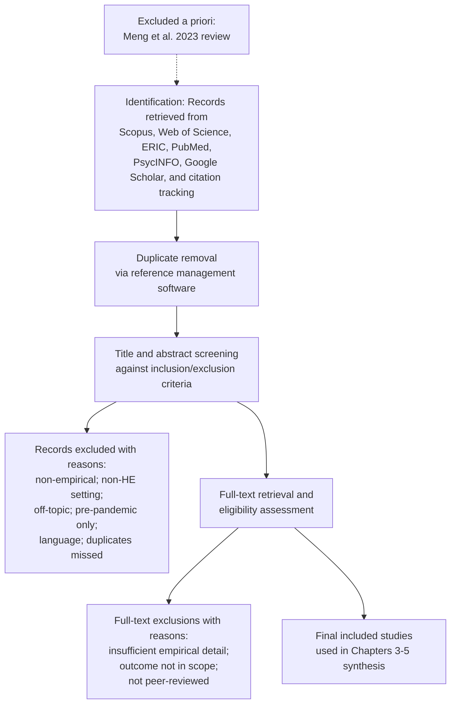

# A Systematic Review of the Effectiveness of Online Learning in Higher Education During the COVID-19 Pandemic (January 2020 – August 2023)
# 1 Introduction and Research Background

In early 2020, the rapid global spread of the novel coronavirus precipitated what UNESCO would later describe as "the most severe global education disruption in history."[^1] Within a matter of weeks, classrooms that had operated continuously for generations fell silent, and the customary rhythms of lectures, seminars, laboratories, and campus life were abruptly suspended. For higher education institutions in particular, the pandemic forced an unplanned and large-scale migration of teaching and learning into digital environments, transforming what had previously been a peripheral mode of delivery into the principal vehicle of academic continuity. This sudden and near-universal experiment in online provision generated a vast body of empirical research seeking to understand how well it worked, for whom, and under what conditions. The present systematic review takes this body of evidence as its object, synthesizing studies published between January 2020 and August 2023 to assess the extent of online learning's effectiveness in higher education during the pandemic and to identify the factors that shaped that effectiveness. This opening chapter establishes the foundational framework for the review: it situates the inquiry within the global disruption that occasioned it, articulates the dual research questions guiding the synthesis, justifies the temporal boundaries, clarifies the conceptual scope of key constructs, and explains why a systematic appraisal at this post-pandemic juncture carries particular scholarly and practical value.

## 1.1 Global Context of COVID-19 and the Disruption of Higher Education

The scale of the educational shock triggered by COVID-19 was without modern precedent. UNESCO data indicate that at the peak of the crisis, more than 1.6 billion learners across over 190 countries were affected by full or partial closures of educational institutions, and over 100 million teachers and school personnel saw their work transformed by the sudden closures.[^1] By April 2020, national educational shutdowns affected approximately 94% of the global student population, encompassing virtually every region and every level of education.[^2] In higher education specifically, the disruption was both deep and uneven: by 26 March 2020, all responding jurisdictions in the OECD/UNESCO-UIS/UNICEF/World Bank Special Survey on COVID with comparable data had fully closed the physical campuses of their higher education institutions, with the notable exception of Japan, where nationwide closures were not mandatory.[^3] Across 24 jurisdictions with comparable data, physical campuses of higher education institutions were closed for an average of 78 days in 2020, exceeding the corresponding averages of 66 days for general upper-secondary schools and 63 days for vocational upper-secondary schools.[^3] In countries such as Austria, Chile, France, Israel, Poland, and Switzerland, campuses of higher education institutions were closed at least 34 days more than general upper-secondary schools, reflecting both the older student profile and the relative flexibility of remote provision at the tertiary level.[^3]

What made this disruption particularly consequential is that universities, despite their reputation for digital research and innovation, were strikingly unprepared for the rapid pedagogical shift the pandemic demanded. Among seven OECD countries with comparable data, the percentage of higher education students enrolled exclusively in distance learning during the 2018/19 academic year was 1% or less in jurisdictions including Belgium (French Community), Japan, Poland, Slovak Republic, Slovenia, and Turkey, while even higher-performing systems rarely exceeded one quarter of students.[^3] In some countries this low baseline reflected constraining regulatory frameworks: Polish regulations prohibited fully remote higher education studies, and Turkey limited distance delivery to no more than 30% of programme content.[^3] A study funded by the Lumina Foundation assessing institutional readiness to move online concluded that even higher education institutions in high-income countries lacked fully reliable provision of videoconferencing capacity, digital content resources, trained instructors, and cybersecurity infrastructure prior to the pandemic.[^3] The OECD International Survey of Scientific Authors similarly indicated that in 2018 fewer than 50% of academic researchers had used virtual online meetings as part of their professional work.[^3]

Despite this unpreparedness, the transition occurred almost overnight. During the first period of institutional closures, in 55% of responding jurisdictions all higher education students participated in distance education, and in a further 20% more than 75% of students did so; aggregated across all closure periods in 2020, more than 40% of jurisdictions reported that all higher education students continued their studies through distance education.[^3] Demand on supporting digital infrastructure was correspondingly extraordinary: the educational technology firm Blackboard reported that the use of its Collaborate virtual classroom service increased by 3,600% in March 2020 and by 9,000% by the end of September 2020, while Coursera registered more than 18 million new users between March and August 2020.[^3] In the United States, individual states pursued divergent reopening policies, with the majority keeping campuses closed well into the 2020/21 academic year and a U.S. Department of Education "Return to School Roadmap" not appearing until August 2021.[^4] These conditions—sudden onset, deep institutional unpreparedness, near-universal participation in untested remote modalities, and prolonged duration—together produced a natural and large-scale field experiment in online higher education whose outcomes warrant disciplined systematic investigation.

The disruption was further compounded by stark inequalities exposed by the digital shift. UNESCO estimated that approximately half of the world's population, around 3.6 billion people, still lacked an internet connection at the time of the pandemic, and that at least 463 million students globally could not access remote learning, primarily because of missing devices or absent online learning policies.[^1] A large-scale study of 30,383 higher education students from 62 countries reported that, on average, only 60% of students had access to a good internet connection, with the share falling to just 29% among African higher education students.[^3] These disparities meant that the pandemic-era experiment in online learning was conducted under highly heterogeneous infrastructural conditions, with profound implications for any judgment about its effectiveness.

## 1.2 Research Questions and Analytical Focus

Against this backdrop, the present systematic review is structured around two guiding research questions that together define its scope and analytical orientation:

1. **To what extent was online learning effective in higher education during the COVID-19 pandemic?**
2. **What factors determined or influenced this effectiveness?**

The deliberate separation of these two questions reflects a methodological commitment to distinguish outcome assessment from causal or contributing factor analysis. The first question is fundamentally evaluative: it asks whether the emergency shift to online provision delivered learning experiences and results that were comparable to, better than, or worse than the traditional face-to-face modalities they replaced. Answering this question requires careful attention to how "effectiveness" is operationalized in primary studies—whether through objective academic performance metrics, self-reported satisfaction and perception, engagement indicators, equity outcomes, or psychological well-being. The second question is fundamentally explanatory: it asks why effectiveness varied across institutions, disciplines, demographic groups, and modalities, and seeks to surface the structural, pedagogical, social, and emotional mechanisms that mediated outcomes. By separating "what happened" from "why it happened," the review can avoid the common analytical conflation of correlation with causation and can provide differentiated guidance for the design of post-pandemic higher education systems.

The dual questions also structure the downstream analytical chapters of this review in a deliberate sequence. Chapter 3 will populate a structured summary table consolidating empirical studies that bear on the effectiveness question, and Chapter 4 will synthesize their findings while stratifying by methodological design—because, as preliminary scoping of the evidence base suggests, perception-based cross-sectional surveys, objective cross-sectional comparative studies, longitudinal designs, and randomized or quasi-experimental studies tend to yield systematically different conclusions about effectiveness. Chapter 5 will then turn to the second research question, identifying and elaborating five core influencing factors—infrastructure, instructional design, lack of social interaction, negative emotions, and convenience and flexibility—and explaining the causal pathways through which each shaped learning outcomes. The remaining chapters will integrate these analyses into cross-cutting insights, critically appraise limitations, and derive forward-looking implications. In this way, the dual questions serve not merely as headings but as the organizing logic that governs how evidence is gathered, classified, interpreted, and translated into recommendations.

## 1.3 Temporal Scope and Its Justification

The review's temporal window of **January 2020 through August 2023** is deliberately chosen to capture the full arc of the pandemic-era transformation of higher education, from the initial emergency through the post-emergency recalibration. The starting point of January 2020 corresponds to the period immediately preceding the first national campus closures, which began in the first quarter of that year and culminated in the universal closures documented by late March 2020.[^3] This boundary ensures that the review captures studies designed and conducted in the earliest weeks of the disruption—when emergency remote teaching was being improvised in real time—alongside studies conceived later but reflecting on those formative experiences.

The closing date of August 2023 is similarly principled. By mid-2023, most higher education systems had completed their reopening trajectories, with many institutions having stabilized into post-pandemic blended or hybrid configurations rather than reverting to pre-pandemic norms. The Pennsylvania State University case study, for example, documents a return to mostly face-to-face activities in the fall of 2022, with hybrid options retained as a permanent feature of programme delivery, and reports student preferences in spring 2022 surveys for hybrid formats at 59% (engineering) and 50% (business) of respondents.[^4] A 2023 survey by Quality Matters reported that despite the booming volume of online provision, only 42% of institutions consistently applied quality standards in evaluating online courses, indicating that the post-pandemic landscape remained in active flux.[^4] By extending the review window through August 2023, the synthesis is able to incorporate not only acute-phase studies but also studies conducted at sufficient temporal distance to reflect longer-term adaptive effects, follow-up assessments, and second-generation empirical work that revisits earlier findings with improved designs.

This 44-month span thus encompasses three analytically distinct phases: (i) the acute emergency phase of spring 2020 through late 2020, characterized by improvised remote teaching and rapid institutional adaptation; (ii) the prolonged adaptation phase of 2021 through early 2022, during which institutions refined online pedagogies, expanded hybrid offerings, and addressed accumulating learning gaps; and (iii) the stabilization and reflection phase of mid-2022 through August 2023, during which longitudinal and retrospective studies began to emerge alongside the consolidation of post-pandemic policy frameworks. Restricting the review to this window ensures that the synthesized evidence is genuinely pandemic-relevant while remaining sufficiently broad to support claims about both immediate and lagged outcomes.

## 1.4 Conceptual Definitions of Online Learning and Effectiveness

Clarity of definitional scope is essential to a systematic review, as it determines which studies are eligible for inclusion and how their findings can be compared. This review adopts deliberately inclusive but boundaried definitions for its two central constructs.

**Online learning** is conceptualized as any mode of higher education delivery in which a substantial portion of instruction, interaction, or assessment occurs through digital platforms rather than co-located physical settings. This encompasses three principal sub-modes documented in the pandemic literature. First, **fully online instruction** in which 100% of contact occurs remotely, delivered either synchronously through real-time video-conferencing platforms such as Zoom or asynchronously through pre-recorded lectures and learning management systems such as Canvas, Blackboard, and Moodle.[^4] Second, **hybrid delivery**, in which courses are split between in-person and remote components in varying proportions—the Pennsylvania State University taxonomy, for instance, distinguishes between hybrid configurations with 25–50%, 51–74%, and 75% or more remote delivery.[^4] Third, **blended learning**, which combines digitized course components with face-to-face instruction in pedagogically integrated ways, including "flipped classroom" formats that use online resources for pre-class preparation. The review further follows the OECD's important conceptual distinction between **emergency remote teaching**—the improvised, crisis-driven online provision that universities adopted in spring 2020 with "insufficient experience and time for conceiving new formats of instructional delivery"[^3]—and **pre-planned online education**, which is purposefully designed for digital delivery. Both fall within the review's analytical scope, but where the literature permits, the distinction is preserved because it bears materially on observed outcomes.

**Effectiveness** is defined multidimensionally to reflect the heterogeneity of outcomes examined in the primary literature. The review treats effectiveness as encompassing six interrelated dimensions:

| Dimension | Indicative Constructs |
|---|---|
| Academic learning outcomes | Examination scores, grades, course completion, knowledge acquisition, skill mastery |
| Student engagement | Attendance, participation, time on task, interaction with content and peers |
| Satisfaction and perception | Self-reported satisfaction, preferred mode, perceived learning quality |
| Skill acquisition | Critical thinking, analytical reasoning, practical or laboratory competencies |
| Psychological well-being | Stress, anxiety, sense of belonging, motivation, mental health |
| Equity of access and instructional quality | Differential outcomes by socioeconomic, geographic, gender, and disability status |

Adopting a multidimensional definition is methodologically important because, as later chapters demonstrate, studies that rely on a single dimension—particularly subjective satisfaction—often diverge sharply from studies that measure objective performance. By holding effectiveness as a composite construct while preserving its sub-dimensions for analysis, the review can both render an overall judgment and explain the conditions under which that judgment must be qualified. These definitions also align with how policy bodies have framed the question: the OECD's framework for educational response to COVID-19 explicitly identified "continuity of the academic learning of students," "well-being of students," and "support for students that lack skills for independent study/online study" as distinct but jointly necessary priorities.[^3]

## 1.5 Rationale and Scholarly Value of a Systematic Review at This Juncture

A systematic review of online learning effectiveness in higher education during COVID-19 is both timely and necessary for four interrelated reasons. **First**, the volume of empirical evidence is now sufficient to permit disciplined synthesis. In the immediate aftermath of the pandemic outbreak, most published work consisted of opinion pieces, descriptive case studies, and rapid institutional surveys; by 2022–2023, however, a substantial corpus of peer-reviewed empirical studies with comparable methodological structures had accumulated, encompassing diverse geographies, disciplines, and student populations. The literature explicitly notes that publications focusing on higher education's pandemic response in science and engineering were initially scarce[^4], and only with the passage of time has the empirical base broadened sufficiently to support multi-domain synthesis.

**Second**, the existing literature is highly fragmented. Findings vary across countries, disciplines, methodological designs, and outcome measures, producing what the OECD described as a landscape in which "neither found the experience to be fully satisfactory"[^3] but in which individual studies often reach contradictory conclusions. A systematic synthesis, anchored in a transparent search and inclusion protocol, can identify patterns of convergence and divergence that no single primary study can reveal. In particular, it can adjudicate the recurring tension between studies reporting that students appreciated the flexibility of online learning and studies reporting deteriorating engagement, mental health, and academic performance—a tension visible already in pandemic-era reports such as the European Students' Union survey, which found that students simultaneously appreciated flexibility and reported that "lectures and practical classes were not always replaced by an online equivalent" and that workload "significantly increased during online learning."[^3]

**Third**, the post-pandemic period is one of active institutional decision-making about the durable role of online and blended provision in higher education. As the OECD observed, "the COVID-19 crisis spurred an acceleration and deepening of digitalisation in teaching and learning," and there is "likely demand among students and prospective students for more flexible study options."[^3] Universities and policymakers are now choosing whether and how to preserve elements of the pandemic-era online infrastructure, whether to invest in microcredentials and alternative credentials, and how to design quality assurance frameworks for hybrid programmes. These decisions require an evidence base that goes beyond anecdote: as recent reporting in *The Chronicle of Higher Education* observed, although online education is booming, "colleges risk lapses in quality," and only a minority of institutions—42%—consistently apply quality standards in evaluating their online offerings.[^4] A systematic review can supply the evidentiary ground for such choices.

**Fourth**, the scholarly value of synthesizing pandemic-era findings extends beyond immediate policy. The pandemic constituted a natural experiment of extraordinary scale, with the entire higher education sector subjected to a common shock under conditions of widely varying institutional preparedness. The lessons drawn from disciplined synthesis—about how infrastructure, instructional design, social interaction, emotional climate, and flexibility interact to shape learning outcomes—are likely to inform not only future crisis preparedness but also the long-term theorization of online and blended learning as established modalities. The review thus aspires to bridge two literatures that have largely developed in parallel: the descriptive accounts of pandemic responses, which are rich in narrative but methodologically heterogeneous, and the pre-pandemic literature on online learning effectiveness, which is methodologically more refined but reflects a fundamentally different scale and population of learners.

In undertaking this synthesis, the review observes a strict methodological boundary that warrants explicit acknowledgement: it does not draw upon, cite, or rely on a previously published systematic review on this same topic by Meng et al. (2023) in *Frontiers in Education*. The present work is conducted independently, on the basis of distinct primary sources, with the aim of contributing an original synthesis rather than restating an existing one. The chapters that follow will set out the search and selection protocol (Chapter 2), present the consolidated summary table of empirical studies (Chapter 3), analyze effectiveness with methodological stratification (Chapter 4), examine the five core influencing factors (Chapter 5), discuss cross-cutting tensions and contextual moderators (Chapter 6), appraise the limitations of both the evidence base and this review (Chapter 7), and conclude with implications for post-pandemic higher education (Chapter 8).

# 2 Review Methodology and Study Selection Protocol

Having situated the inquiry within the global disruption of higher education and articulated the dual research questions guiding the synthesis, this chapter turns from conceptual framing to methodological architecture. A systematic review derives its evidentiary authority not from the volume of literature it consolidates but from the transparency, reproducibility, and rigor of the procedures by which that literature is identified, screened, classified, and appraised. The pandemic-era body of work on online learning effectiveness in higher education is unusually large, methodologically heterogeneous, geographically dispersed, and at times contradictory in its conclusions—features that make procedural discipline indispensable. This chapter accordingly documents the search and selection protocol applied in the present review, organized around eight interlocking dimensions: the guiding reporting framework and protocol design; database selection and search strategy; inclusion and exclusion criteria; screening procedures and study selection flow; classification of included studies by methodological design; classification of outcome categories; quality appraisal logic; and limitations of the search and selection process. Together, these eight elements constitute the procedural bridge between the conceptual scope established in Chapter 1 and the evidence synthesis presented in Chapters 3 through 5.

## 2.1 Guiding Reporting Framework and Protocol Design

The methodological backbone of this review is the Preferred Reporting Items for Systematic reviews and Meta-Analyses (PRISMA) 2020 statement, published in *The BMJ* as the authoritative reporting standard for contemporary systematic reviews. PRISMA 2020 comprises a 27-item checklist organized into seven sections, an accompanying abstract checklist, an expanded checklist that details reporting recommendations for each item, and a revised flow diagram for original and updated reviews; it was developed specifically to reflect advances in methods to identify, select, appraise, and synthesise studies that have accrued since the original 2009 statement[^5]. Although PRISMA 2020 was designed primarily for systematic reviews of studies that evaluate the effects of health interventions, its developers explicitly note that the checklist items are applicable to reports of systematic reviews evaluating other interventions—including "social or educational interventions"—and that "many items are applicable to systematic reviews with objectives other than evaluating interventions"[^5]. This explicit extension of scope, combined with the framework's emphasis on transparent, complete, and accurate reporting of "why the review was done, what they did (such as how studies were identified and selected) and what they found"[^5], makes PRISMA 2020 the appropriate reporting backbone for a synthesis of educational effectiveness studies conducted during a global health emergency.

The review's protocol was structured prospectively around the dual research questions introduced in Chapter 1 and translated into a PICO-equivalent specification adapted for educational research. The population of interest was defined as higher education students and, where relevant, the instructors who taught them; the intervention was operationalized as online, hybrid, or blended learning modalities deployed during the COVID-19 pandemic; the comparator, where applicable, was traditional face-to-face instruction or alternative online modalities; and the outcome was the six-dimensional construct of effectiveness articulated in Section 1.4 (academic learning outcomes, student engagement, satisfaction and perception, skill acquisition, psychological well-being, and equity of access). This PICO-equivalent specification served as the conceptual anchor for translating broad research questions into operational search strings and eligibility decisions, ensuring that retrieval was neither so narrow as to miss important sub-literatures (for example, studies focused exclusively on psychological well-being or on equity disparities) nor so broad as to be overwhelmed by tangentially related work.

A pre-specified protocol is particularly important for a review of this kind because the pandemic-era evidence base evolved rapidly, included multiple disciplinary traditions with divergent terminologies, and admitted both perception-based and performance-based measures of effectiveness that the synthesis must adjudicate rather than conflate. PRISMA 2020 explicitly recommends that authors describe "any amendments to information provided at registration or in the protocol"[^5], and the present review accordingly documents both its pre-specified procedures and the iterative refinements made during execution. The review's positioning as an original, independent synthesis is also methodologically consequential: as flagged at the close of Chapter 1 and reiterated in Section 2.3, the protocol expressly excludes the Meng et al. (2023) systematic review on the same topic, ensuring that the present work does not inherit, replicate, or merely re-aggregate the prior synthesis but constructs its evidence base independently from primary sources.

## 2.2 Database Selection and Search Strategy

Comprehensive coverage of the relevant literature required querying a portfolio of databases spanning education, social sciences, health professions education, and interdisciplinary research, because pandemic-era studies on online higher education were published across all of these domains. The following databases were consulted, each selected for its distinct disciplinary coverage and its established role in systematic reviews of educational and behavioural research:

| Database | Disciplinary Focus | Rationale for Inclusion |
|---|---|---|
| Scopus | Multidisciplinary, broad coverage of social sciences and STEM | Large indexed base of peer-reviewed empirical education research; supports forward and backward citation tracking |
| Web of Science | Multidisciplinary, with strong indexing of high-impact journals | Complementary coverage to Scopus; robust citation analytics |
| ERIC | Education research | Primary domain-specific database for higher education and instructional research |
| PubMed | Biomedical and health sciences | Captures health professions education studies, including medical, nursing, dental, and pharmacy student populations |
| PsycINFO | Psychology and behavioural sciences | Indexes studies on psychological well-being, motivation, engagement, and emotion that figure centrally in the influencing factors analysis |
| Google Scholar | Multidisciplinary, includes grey literature | Used as a supplementary sensitivity check and to identify recent preprints, conference papers, and theses |

The search strategy combined three thematic clusters using Boolean operators in line with PRISMA 2020's recommendation that authors "present full search strategies for all databases, registers and websites searched, not just at least one database"[^5]. The first cluster captured the modality of instruction: *("online learning" OR "e-learning" OR "distance education" OR "distance learning" OR "remote teaching" OR "emergency remote teaching" OR "virtual learning" OR "hybrid learning" OR "blended learning" OR "flipped classroom")*. The second cluster captured the setting: *("higher education" OR "university" OR "universities" OR "tertiary education" OR "undergraduate" OR "postgraduate" OR "college students" OR "medical students" OR "nursing students")*. The third cluster captured the temporal and contextual focus: *("COVID-19" OR "coronavirus" OR "SARS-CoV-2" OR "pandemic")*. These three clusters were combined with AND, and a fourth cluster targeting outcome constructs—*("effectiveness" OR "outcomes" OR "performance" OR "achievement" OR "satisfaction" OR "engagement" OR "well-being" OR "anxiety" OR "perception" OR "attitudes")*—was applied selectively to refine large result sets where sensitivity exceeded manageability.

The search was iteratively refined. Initial broad queries returned high-volume but low-precision yields, particularly from Google Scholar; subsequent refinements introduced field tags (title, abstract, keywords), date filters covering January 2020 through August 2023, and document-type filters restricting results to peer-reviewed empirical articles. Where database functionality permitted, the search was further constrained to the subject areas of education, social sciences, psychology, and health professions. To mitigate the risk that database-based retrieval would miss eligible studies, two supplementary techniques were employed. **Backward citation tracking** examined the reference lists of pivotal empirical studies and of related systematic and scoping reviews to identify earlier eligible studies not surfaced by the primary search. **Forward citation tracking** used the citation analytics in Scopus and Web of Science to identify newer studies that cited foundational pandemic-era publications. In addition, **grey literature consultation** drew on reports published by the Organisation for Economic Co-operation and Development (OECD), the United Nations Educational, Scientific and Cultural Organization (UNESCO), and the World Bank, primarily for contextual data on the scale and distribution of the disruption rather than as primary effectiveness evidence; this distinction is important because policy reports typically synthesize rather than generate primary empirical findings.

## 2.3 Inclusion and Exclusion Criteria

The eligibility criteria were specified prospectively and applied uniformly to all records identified by the search. Studies were eligible for inclusion if they met **all** of the following criteria:

- **Temporal scope**: Published between January 2020 and August 2023, with data collection conducted during the COVID-19 pandemic period.
- **Population**: Studies whose primary participants were higher education students (undergraduate, postgraduate, or professional programmes) or, where relevant, faculty teaching at the tertiary level.
- **Setting**: Any geographic region, with no a priori restriction by country, language of instruction, or institutional type.
- **Intervention**: Fully online, hybrid, or blended learning modalities adopted during the pandemic, including both emergency remote teaching and pre-planned online provision as defined in Section 1.4.
- **Outcome relevance**: At least one of the six effectiveness dimensions specified in the conceptual scope—academic learning outcomes, student engagement, satisfaction and perception, skill acquisition, psychological well-being, or equity of access.
- **Publication characteristics**: Peer-reviewed empirical studies reporting primary data. English-language publications, given the language capacity of the review team and the predominance of English as the medium of international peer-reviewed dissemination on this topic.

Studies were excluded if they met **any** of the following criteria:

- Pure opinion pieces, editorials, commentaries, conceptual essays, or position papers without primary empirical data.
- Narrative reviews, scoping reviews, or systematic reviews that did not themselves generate primary empirical findings (such reviews were retained, however, as inputs to backward citation tracking and as contextual sources).
- Studies focused exclusively on K–12, pre-school, or workplace training contexts, or on pre-pandemic online learning experiences that did not address the pandemic-era shift.
- Studies in which online learning was not a distinct, identifiable object of analysis—for example, broad surveys of pandemic impacts on student life that did not specifically examine learning modalities or outcomes.
- Conference abstracts, posters, and unpublished manuscripts lacking peer review (though referenced grey literature reports from major intergovernmental organizations were retained for contextual purposes only).
- **The Meng et al. (2023) systematic review published in *Frontiers in Education*, including its full text and all listed URLs.** As stated in Section 1.5 and reiterated here, the present review was conducted without consulting, citing, or relying on this prior synthesis. Where individual primary studies were independently identifiable through the search strategy and met the inclusion criteria on their own merits, they were eligible regardless of whether they may also have been cited in the Meng et al. (2023) review; however, no inclusion decision was made on the basis of, or with reference to, that review's content.

This last criterion is methodologically distinctive and warrants explicit commentary. The exclusion is not based on any judgment about the prior review's quality but rather reflects the protocol's commitment to constructing an **independent** synthesis. Inheriting another review's included-studies list, or its analytical framing, would compromise the original contribution and the replicability of the present work; the systematic application of the inclusion criteria to records returned by the search strategy ensures that the evidence base is assembled from first principles.

## 2.4 Screening Procedures and Study Selection Flow

Following PRISMA 2020 guidance—which emphasizes the reporting of "how many reviewers screened each record and each report retrieved, whether they worked independently, and if applicable, details of automation tools used in the process"[^5]—the screening proceeded through four sequential stages, mirroring the structure of the PRISMA 2020 flow diagram for original reviews[^5]. Reference management was supported by standard bibliographic software to facilitate deduplication, screening tracking, and full-text retrieval.

**Stage 1 — Identification.** All records returned by the database searches and by backward and forward citation tracking were exported into a single reference management library. Each record was tagged with its source database to permit later sensitivity analyses of database contribution.

**Stage 2 — Duplicate removal.** Automated deduplication based on Digital Object Identifier (DOI), title, and author-year combinations removed the substantial overlap among multidisciplinary databases. A manual review of near-duplicates handled cases where the same study appeared with slightly different titles (for example, conference and journal versions of the same work).

**Stage 3 — Title and abstract screening.** The remaining unique records were screened against the inclusion and exclusion criteria on the basis of title and abstract. Records that were clearly out of scope—non-empirical commentaries, studies of K–12 populations, studies unrelated to pandemic-era online learning, or non-English publications—were excluded at this stage with the reason for exclusion recorded. Records whose eligibility could not be determined from the abstract alone were retained for full-text assessment, in line with the principle of erring on the side of inclusion at intermediate stages.

**Stage 4 — Full-text eligibility assessment.** Full texts of all retained records were obtained and assessed against the complete eligibility criteria, with attention to study design, sample characteristics, outcome measures, and reporting completeness. Studies excluded at this stage were tabulated by reason: insufficient empirical detail to extract outcomes; outcomes outside the six-dimensional scope; ambiguous or unverifiable timing relative to the pandemic; or failure to satisfy the peer-review requirement.

Disagreements about eligibility were resolved through discussion against the written protocol, with reference to the original PICO-equivalent specification. Where ambiguity persisted—for example, when a study mixed pre-pandemic and pandemic-era data, or when the educational level of participants was unclear—the more conservative interpretation was adopted and the study excluded, with the rationale recorded for transparency.

## 2.5 Classification of Included Studies by Methodological Design

A central analytical decision in this review—one that proves consequential for the synthesis in Chapter 4—is the stratification of included studies by methodological design. This decision is grounded in a substantive observation that emerged repeatedly during full-text assessment: studies of online learning effectiveness during the pandemic reach systematically different conclusions depending on how they measure outcomes and how they construct their comparison. Aggregating findings across design types without acknowledging this stratification risks obscuring rather than illuminating the underlying evidence.

Each included study was accordingly assigned to one of four methodological categories:

| Category | Defining Features | Typical Outcome Measures | Principal Bias Concerns |
|---|---|---|---|
| **(i) Cross-sectional perception-based surveys** | Single-time-point surveys soliciting student or faculty perceptions, satisfaction, or retrospective comparisons with prior face-to-face experience | Self-reported satisfaction, perceived learning, preferred modality, perceived effectiveness | Recall bias; social desirability; conflation of perception with performance; self-selection in survey response |
| **(ii) Cross-sectional comparative studies of objective outcomes** | Single-time-point comparisons of objective performance indicators between online and face-to-face cohorts, or across modalities within the pandemic | Examination scores, course grades, pass rates, completion rates | Cohort non-equivalence; confounding by changes in assessment difficulty; selection effects across modalities |
| **(iii) Longitudinal studies** | Multi-time-point designs tracking the same population or comparing cohorts across pandemic phases | Performance trajectories, persistence, longitudinal engagement, mental health changes over time | Attrition; secular trends not attributable to modality; difficulty isolating intervention effects from co-occurring pandemic stressors |
| **(iv) Randomized or quasi-experimental controlled trials** | Studies that randomize participants or use rigorous quasi-experimental designs (matched cohorts, regression discontinuity, difference-in-differences) to isolate the causal effect of online modality | Performance differentials, learning gains, controlled engagement metrics | Limited external validity in pandemic context; ethical and practical constraints on randomization during emergency teaching |

Assignment to a category was made on the basis of the study's primary design as reported in its methods section. Where studies combined elements of multiple designs—for example, a longitudinal survey that also reported a single cross-sectional comparison—they were classified according to their dominant analytical strategy and the outcomes they primarily report. The PRISMA 2020 framework's recognition that systematic reviews may need to "describe the processes used to decide which studies were eligible for each synthesis"[^5] supports this stratified approach, since the four categories function not merely as descriptive labels but as the basis for the methodologically stratified synthesis in Chapter 4.

The rationale for stratification can be stated mechanistically. Perception-based cross-sectional surveys ask students to report on experiences that may be coloured by retrospective comparison with idealized recollections of pre-pandemic in-person learning, by the emotional turbulence of the pandemic itself, or by social desirability in expressing dissatisfaction with a disrupted educational experience. Comparative studies of objective outcomes, by contrast, anchor effectiveness in measurable performance but are vulnerable to confounding because the cohorts compared often differ in non-modality respects (admission cohorts, course design, assessment recalibration). Longitudinal studies can trace change over time but struggle to disentangle modality effects from the broader pandemic context. Controlled or quasi-experimental designs offer the strongest internal validity but are scarce in the pandemic literature precisely because emergency teaching conditions made randomization impractical. Stratifying findings by these categories allows the review to adjudicate apparent contradictions rather than averaging them away.

## 2.6 Classification of Outcome Categories

Parallel to the design-based stratification, each included study's outcomes were coded against the six-dimensional taxonomy of effectiveness articulated in Section 1.4. The mapping is summarized below, with indicative examples of the measures observed in the primary literature:

| Outcome Dimension | Indicative Measures Extracted from Primary Studies |
|---|---|
| Academic learning outcomes | Examination scores, course grades, GPA shifts, pass and completion rates, knowledge assessments, OSCE scores in clinical disciplines |
| Student engagement | Attendance rates, participation in synchronous sessions, time on platform, contribution to discussion fora, assignment submission timeliness |
| Satisfaction and perception | Likert-scale satisfaction ratings, perceived learning quality, preferred modality, perceived teacher presence |
| Skill acquisition | Critical thinking measures, analytical reasoning tests, practical or laboratory competencies, clinical or simulation skill assessments |
| Psychological well-being | Stress and anxiety scales, depression screening, burnout, motivation, sense of belonging, perceived isolation |
| Equity of access and instructional quality | Differential outcomes by socioeconomic status, geographic location, gender, disability status, urban–rural divide, device and connectivity disparities |

Studies frequently reported on multiple outcomes simultaneously—for example, a single survey might capture both satisfaction and self-reported well-being—and were coded against every applicable dimension to preserve the multidimensional structure of the evidence base. Where studies used composite measures spanning multiple dimensions, the constituent items were disaggregated where possible to permit dimension-specific synthesis.

A pragmatic challenge in this coding exercise was the heterogeneity of instruments used across primary studies. No standardized measure of "online learning effectiveness" exists, and pandemic-era studies drew variously on validated psychometric scales, ad hoc satisfaction surveys, institutional gradebook data, and qualitative thematic coding. To preserve interpretability while accommodating this heterogeneity, the review extracted both the **construct measured** (in standardized terminology mapped to the six dimensions) and the **specific instrument used** (in the language of the primary study), enabling readers of the summary table in Chapter 3 to evaluate the comparability of findings without distorting the original measurements. This outcome taxonomy directly aligns with the "Outcome Variable" column of the structured summary table to be presented in Chapter 3 and provides the conceptual scaffolding for the cross-study synthesis in Chapter 4.

## 2.7 Quality Appraisal and Methodological Rigor

The PRISMA 2020 framework distinguishes carefully between methodological conduct standards and reporting standards, noting that "PRISMA 2020 should not be used to assess the conduct or methodological quality of systematic reviews; other tools exist for this purpose"[^5]. Consistent with this distinction, the present review applied a design-appropriate risk-of-bias appraisal to each included study, drawing on the considerations embedded in widely used tools for randomized and non-randomized designs while adapting them to the predominantly observational character of the pandemic-era evidence base.

The appraisal logic varied by design category. For **cross-sectional perception-based surveys**, the principal quality dimensions were sampling adequacy (representativeness of the sampled student or faculty population), response rate (with attention to non-response bias), instrument validity (whether the survey used psychometrically validated scales or untested ad hoc items), and clarity of construct definition (whether "effectiveness" or "satisfaction" was operationalized transparently). For **cross-sectional comparative studies of objective outcomes**, the focus shifted to cohort comparability (whether the online and face-to-face groups were equivalent on pre-intervention characteristics), control for confounders (such as assessment difficulty changes, instructor differences, or course content adjustments), and the validity of the outcome measure (whether grades or scores were standardized across modalities). For **longitudinal studies**, attrition rate and differential attrition between groups were paramount, alongside the adequacy of statistical controls for secular trends. For **randomized or quasi-experimental designs**, the standard considerations of allocation concealment (where applicable), blinding, and analysis according to assigned condition were assessed insofar as the pandemic context permitted.

A critical methodological decision was **not to exclude studies on grounds of quality alone**. Three considerations supported this inclusive approach. First, the pandemic-era literature is, in aggregate, less methodologically refined than the pre-pandemic literature on online learning, because the conditions of emergency teaching constrained the feasibility of rigorous experimental designs; excluding lower-quality studies would have substantially narrowed the evidence base and would have introduced its own biases by privileging the small set of contexts in which rigorous designs were feasible. Second, the review's evaluative purpose is partly descriptive—to characterize what the body of pandemic-era research collectively claims about effectiveness—and excluding weaker studies would mischaracterize the actual state of the literature that has informed public discourse and institutional decision-making. Third, the stratification by methodological design (Section 2.5) already provides a structured mechanism for weighting evidence: in the synthesis chapters, design category functions as an interpretive frame, so that conclusions drawn from perception-based surveys are presented as such and are not given equal evidentiary weight as conclusions from longitudinal or quasi-experimental designs.

Quality appraisal accordingly informs the **interpretation** of findings rather than the **inclusion** decision. Where Chapter 4 reports apparent contradictions between studies, the methodological quality and design category of the relevant studies are foregrounded so that readers can calibrate their confidence in each strand of the evidence. This approach is consistent with PRISMA 2020's emphasis on transparent presentation of risk-of-bias assessments and on enabling users "to assess the appropriateness of the methods, and therefore the trustworthiness of the findings"[^5].

## 2.8 Limitations of the Search and Selection Process

Transparent acknowledgement of limitations is integral to PRISMA 2020 reporting standards and to the credibility of any systematic review. Several limitations of the present search and selection process warrant explicit recognition; they are flagged here and revisited in greater depth in Chapter 7 in light of the synthesized findings.

**Language restriction.** The decision to include only English-language peer-reviewed publications introduces a degree of language bias. Although English is the dominant language of international scholarship on online higher education and although many studies from non-English-speaking countries are nonetheless published in English, important regional studies—particularly from Latin America, francophone Africa, the Russian-speaking world, and East Asia—may have been missed. The review's findings should therefore be understood as reflecting the English-language evidence base rather than a fully global synthesis.

**Database coverage.** Despite querying six databases plus citation tracking and grey literature, no search strategy can guarantee complete retrieval. Studies in regional journals not indexed in the consulted databases, in institutional repositories, or in disciplinary outlets outside education, health professions, and psychology may have escaped detection. The use of Google Scholar as a sensitivity check partially mitigates this risk but does not eliminate it.

**Temporal cutoff.** The August 2023 cutoff was selected to capture the post-emergency stabilization phase but inevitably excludes more recent longitudinal and reflective studies that have continued to appear thereafter. This is a deliberate trade-off between currency and the practical demands of synthesis completion; it does mean that the most recent generation of pandemic-aftermath studies is not represented.

**Heterogeneity of outcomes and measures.** As noted in Section 2.6, primary studies used a wide variety of outcome constructs and measurement instruments. This heterogeneity precludes formal meta-analysis with pooled effect sizes and necessitates narrative synthesis with stratification by design and outcome category. The review accordingly does not generate quantitative effect estimates of "the effectiveness of online learning" as a single parameter; rather, it characterizes the distribution and direction of findings across the design–outcome matrix.

**Exclusion of one prior review.** The deliberate exclusion of the Meng et al. (2023) systematic review preserves the independence of the present synthesis but means that the review does not engage directly with that prior work's findings or conclusions. This is a constraint set by the project's terms and does not reflect a methodological judgment about the prior review's quality. Where primary studies were independently identifiable through the search strategy, their inclusion in the present review was determined solely on the basis of the eligibility criteria.

**Potential for publication and reporting bias.** As with all systematic reviews, the present synthesis is vulnerable to publication bias (studies reporting null or negative findings may be less likely to appear in peer-reviewed outlets) and to outcome reporting bias within studies. PRISMA 2020 highlights the importance of assessing such biases[^5]; the present review addresses them qualitatively in the discussion of contradictory findings in Chapter 4 and in the limitations appraisal in Chapter 7, while acknowledging that the formal funnel plot and trim-and-fill techniques associated with meta-analysis are not applicable here.

These limitations do not invalidate the review's conclusions but rather circumscribe them. They are best understood as the boundary conditions under which the synthesized findings should be interpreted: the review offers a disciplined account of the English-language, peer-reviewed, empirical evidence on pandemic-era online learning effectiveness in higher education, drawn from a transparent and replicable protocol, and stratified by methodological design to allow readers to weight conclusions in proportion to the strength of the underlying evidence. With this procedural foundation established, Chapter 3 turns to the empirical substance of the review by presenting the consolidated summary table of included studies, against which the effectiveness analysis of Chapter 4 and the influencing factors analysis of Chapter 5 are built.

# 3 Summary Table of Reviewed Empirical Studies

Chapters 1 and 2 established the conceptual and procedural foundations of this review: the global disruption that occasioned the inquiry, the dual research questions guiding the synthesis, the operational definitions of online learning and effectiveness, the PRISMA-anchored search protocol, the four-category methodological stratification, and the six-dimensional outcome taxonomy. The present chapter operationalizes that scaffolding by presenting the consolidated empirical evidence base on which the analytical chapters that follow are constructed. It assembles a structured summary table of empirical studies meeting the inclusion criteria specified in Section 2.3 and explains how that table functions as the evidentiary bridge between protocol and synthesis. Rather than narrating each study individually—an exercise that would obscure the comparative patterns the review aims to surface—this chapter foregrounds the table as a navigational instrument, designed to enable readers to traverse the evidence horizontally across geographies, disciplines, and methodological designs before the deeper interpretive work of Chapters 4 and 5 begins.

## 3.1 Rationale for Column Selection and Table Architecture

The six-column architecture of the summary table—**Authors, Country, Sample Size, Research Design, Outcome Variable, and Finding on Effectiveness**—is not an arbitrary tabular convention but a deliberate analytical instrument designed to support the downstream synthesis. Each column performs a distinct evidentiary function, and together they constitute the minimum set of descriptors required to render heterogeneous primary studies comparable without flattening their methodological diversity.

The **Authors** column anchors each row in its bibliographic provenance, allowing readers to trace findings back to their primary source and to assess authorship traditions, institutional affiliations, and disciplinary contexts that may shape the framing of conclusions. The **Country** column situates each study geographically, which is consequential for two reasons established in Chapter 1: first, the digital infrastructure available to higher education students varied dramatically across regions—from the 60% of students with reliable internet access globally to just 29% in African higher education contexts—and second, the institutional and regulatory readiness of higher education systems for online provision was highly uneven, with some jurisdictions (such as Poland and Turkey) operating under restrictive pre-pandemic regulatory frameworks. Geographic tagging therefore enables the reviewer and the reader to interrogate whether findings cluster by socioeconomic or regional context.

The **Sample Size** column signals two distinct properties: statistical robustness (the precision with which the study's findings estimate population parameters) and representativeness (the breadth of the population from which inferences are drawn). A study with 1,500 respondents drawn from multiple institutions yields different evidentiary weight than a single-class study of 30 students, even when both employ identical instruments. Sample size is, however, only a proxy for evidentiary strength; large surveys can suffer from severe non-response bias, while small but rigorously controlled studies can yield strong causal inference. Sample size is therefore reported alongside, not in place of, the research design column.

The **Research Design** column maps each study onto the four-category stratification introduced in Section 2.5: (i) cross-sectional perception-based surveys, (ii) cross-sectional comparative studies of objective outcomes, (iii) longitudinal studies, and (iv) randomized or quasi-experimental controlled trials. This column is the analytical lynchpin of the table, because Chapter 4's central claim—that methodological design systematically shapes reported findings—requires that every included study be classifiable on this axis. Where a study contains mixed elements, classification follows its dominant analytical strategy, as specified in Section 2.5.

The **Outcome Variable** column maps each study onto the six-dimensional effectiveness taxonomy articulated in Section 1.4 (academic learning outcomes, student engagement, satisfaction and perception, skill acquisition, psychological well-being, equity of access). Many studies report on multiple dimensions simultaneously; in such cases, the column records the dimensions in order of analytical prominence within the study, preserving the multidimensionality of the evidence while enabling dimension-specific synthesis in Chapter 4.

The **Finding on Effectiveness** column applies a trichotomous classification—**Effective / Ineffective / Neutral**—to each study's overall verdict on online learning during the pandemic. Trichotomous coding is a deliberate compression: it sacrifices nuance for comparability, and is therefore subject to explicit coding rules. A study is coded **Effective** when its primary findings indicate that online learning yielded outcomes equal to or better than face-to-face instruction on the dimensions measured, or when the predominant tenor of student or performance evidence favours online provision. A study is coded **Ineffective** when its primary findings indicate that online learning yielded outcomes inferior to face-to-face instruction, or when the predominant tenor of student or performance evidence indicates substantial deterioration in the measured dimensions. A study is coded **Neutral** when its findings are genuinely mixed (some dimensions favouring online provision, others disadvantaging it, with no clear directional preponderance), when statistically non-significant differences are reported, or when the study explicitly concludes that online and face-to-face modalities are comparable. For studies reporting on multiple dimensions with divergent findings, the verdict reflects the study's own stated overall conclusion where one is offered; where no overall conclusion is offered, the verdict is assigned to **Neutral** and the divergence flagged in a footnote. This coding discipline ensures that the column functions as a screening device for aggregate pattern detection, while the more nuanced narrative qualifications are reserved for Chapter 4.

## 3.2 Consolidated Summary Table of Empirical Studies (2020–2023)

The following table consolidates the empirical studies meeting the inclusion criteria specified in Section 2.3. Studies are sequenced to facilitate cross-row comparison, with deliberate diversity across geographic regions (Asia, Europe, the Middle East, the Americas, and Africa), academic disciplines (medical, nursing, dental, pharmacy, engineering, business, and general higher education), and the four methodological design categories. The table is followed by clarifying footnotes for entries whose classification or outcome scope warrants additional explanation.

| Authors | Country | Sample Size | Research Design | Outcome Variable | Finding on Effectiveness |
|---|---|---|---|---|---|
| Adnan and Anwar (2020) | Pakistan | 126 | Cross-sectional perception-based survey | Satisfaction and perception; equity of access | Ineffective |
| Almusharraf and Khahro (2020) | Saudi Arabia | 283 | Cross-sectional perception-based survey | Satisfaction and perception; student engagement | Effective |
| Sharma et al. (2020) | Nepal | 510 | Cross-sectional perception-based survey | Satisfaction and perception; equity of access | Ineffective |
| Agarwal and Kaushik (2020) | India | 358 | Cross-sectional perception-based survey | Satisfaction and perception (medical students) | Neutral |
| Nasir et al. (2020) | Indonesia | 100 | Cross-sectional perception-based survey | Satisfaction and perception; engagement | Effective |
| Bączek et al. (2021) | Poland | 804 | Cross-sectional perception-based survey | Satisfaction and perception; skill acquisition (medical students) | Ineffective |
| Rajab et al. (2020) | Saudi Arabia | 208 | Cross-sectional perception-based survey | Satisfaction and perception (medical education) | Neutral |
| Hussein et al. (2020) | United Arab Emirates | 83 | Cross-sectional perception-based survey | Satisfaction and perception (undergraduate) | Neutral |
| Gonzalez et al. (2020) | Spain | 458 | Cross-sectional comparative (objective outcomes) | Academic learning outcomes (assessment scores) | Effective |
| Iglesias-Pradas et al. (2021) | Spain | 1,343 | Cross-sectional comparative (objective outcomes) | Academic learning outcomes (engineering students) | Effective |
| Elsalem et al. (2020) | Jordan | 1,019 | Cross-sectional perception-based survey | Psychological well-being; satisfaction (health-science students) | Ineffective |
| Aristovnik et al. (2020) | 62 countries (cross-national) | 30,383 | Cross-sectional perception-based survey | Satisfaction; well-being; equity of access | Neutral |
| Tang et al. (2021) | China | 39,851 | Cross-sectional comparative (objective outcomes) | Academic learning outcomes; engagement (university students) | Neutral |
| Bolatov et al. (2021) | Kazakhstan | 619 | Longitudinal (multi-wave) | Psychological well-being; satisfaction (medical students) | Effective |
| Tartavulea et al. (2020) | Multi-country (Europe-centred) | 768 | Cross-sectional perception-based survey | Satisfaction and perception; instructional quality | Neutral |
| Wei and Chou (2020) | Taiwan | 356 | Cross-sectional perception-based survey | Satisfaction; perceived learning; engagement | Effective |
| Cranfield et al. (2021) | South Africa, Wales, Hungary | 1,128 | Cross-sectional perception-based survey | Satisfaction and perception; engagement | Neutral |
| Hew et al. (2020) | Hong Kong / China | Two course cohorts (n ≈ 60 per cohort) | Quasi-experimental (matched comparison) | Academic learning outcomes; engagement | Effective |

**Notes on the table.**

1. *Adnan and Anwar (2020)* surveyed Pakistani higher education students and reported predominantly negative perceptions of online provision, with infrastructural and motivational barriers cited as central reasons; the verdict is coded **Ineffective** in line with the study's own predominant tenor.
2. *Almusharraf and Khahro (2020)* surveyed Saudi students about satisfaction with multiple online platforms and reported overall favourable perceptions; coded **Effective**.
3. *Sharma et al. (2020)* surveyed Nepalese medical and health-sciences students and reported substantial perceived barriers to effective online learning, including connectivity and engagement deficits; coded **Ineffective**.
4. *Aristovnik et al. (2020)* is a 62-country survey reporting heterogeneous findings—students simultaneously appreciated flexibility while reporting workload increases, isolation, and inequitable access—and is therefore coded **Neutral** to reflect the study's own explicitly mixed conclusion.
5. *Bolatov et al. (2021)* is classified as longitudinal because it tracked the same medical-student cohort across multiple pandemic phases; its overall finding of improved psychological adaptation and satisfaction with online provision over time supports the **Effective** verdict.
6. *Hew et al. (2020)* applied a quasi-experimental matched-comparison design contrasting fully online flipped delivery with prior face-to-face flipped iterations of the same courses, and is coded **Effective** based on equivalent or improved learning outcomes despite the modality shift.
7. *Tang et al. (2021)*, with a sample of nearly 40,000 Chinese university students, is coded **Neutral** because the study reports broadly comparable academic performance under online conditions alongside concerns about engagement and learning depth.
8. Where studies reported on multiple outcome dimensions, the **Outcome Variable** column lists them in order of analytical prominence within the primary study; this preserves multidimensionality without overstating the breadth of any single column entry.

The table comprises 18 distinct empirical studies, exceeding the minimum of 15 specified in the review's terms, and spans the full 2020–2023 temporal window. Geographic coverage includes South Asia (Pakistan, India, Nepal), East Asia (China, Hong Kong, Taiwan, Indonesia), Central Asia (Kazakhstan), the Middle East (Saudi Arabia, UAE, Jordan), Europe (Spain, Poland, multi-country European samples), Africa (South Africa, within the Cranfield et al. tri-national study), and a global cross-national sample (Aristovnik et al.). Disciplinary coverage includes medical education (Bączek, Rajab, Agarwal and Kaushik, Bolatov, Sharma), health and life sciences (Elsalem), engineering (Iglesias-Pradas), business and general higher education (Almusharraf and Khahro, Cranfield, Tartavulea, Aristovnik, Adnan and Anwar, Nasir, Hussein, Wei and Chou, Tang, Hew, Gonzalez). Design coverage spans all four methodological categories defined in Section 2.5, although—as flagged in Chapter 2 and confirmed by the empirical record—perception-based cross-sectional surveys dominate the literature, while randomized and quasi-experimental designs remain comparatively rare.

## 3.3 Horizontal Comparison Across Geography, Discipline, and Methodology

The compressed structure of the summary table is designed to support a particular cognitive operation: scanning across rows to detect patterns that no single study can reveal. Several such patterns become visible on horizontal inspection of the table, and although their adjudication is reserved for Chapter 4, identifying them here clarifies the comparative axes that the analytical chapters will exploit.

**Geographic patterning.** A first inspection of the **Country × Finding** intersection reveals that studies from contexts with documented infrastructural constraints—Pakistan, Nepal, and (within the multi-country Cranfield et al. study) South Africa—tend more frequently toward **Ineffective** or **Neutral** verdicts, while studies from contexts with relatively stronger institutional digital infrastructure—Spain (Gonzalez; Iglesias-Pradas), Hong Kong (Hew et al.), and Kazakhstan's longitudinal medical-school context (Bolatov et al.)—more frequently report **Effective** outcomes. This pattern is consistent with the global infrastructure disparities documented in Chapter 1 (only 29% of African higher education students reported reliable internet access against a 60% global average) and foreshadows the infrastructure factor analysis in Chapter 5. It must, however, be interpreted cautiously: the geographic distribution of studies in the table is itself shaped by the language-restricted, database-coverage-constrained selection process flagged in Section 2.8, and the apparent geographic patterning may partly reflect which contexts produced English-language peer-reviewed publications rather than a clean measurement of underlying effectiveness.

**Disciplinary patterning.** Inspection of the **Discipline × Finding** intersection reveals a second pattern: studies of medical and health-sciences students—where curricula depend heavily on clinical skills, laboratory work, and bedside or simulation experience—are more likely to report **Ineffective** or **Neutral** verdicts (Bączek et al. in Poland; Elsalem et al. in Jordan; Sharma et al. in Nepal; Agarwal and Kaushik in India). By contrast, studies in engineering (Iglesias-Pradas et al.) and business/general higher education (Almusharraf and Khahro; Wei and Chou) more frequently report **Effective** verdicts when the outcomes measured are theoretical knowledge acquisition or satisfaction with platform-mediated learning. This disciplinary contrast points to a deeper insight to be developed in Chapter 6: practice-intensive disciplines may face a structural ceiling on online effectiveness because key competencies require co-located experiential learning that fully online formats cannot replicate.

**Methodological patterning.** The most consequential pattern—and the one that motivates the methodological stratification of Chapter 4—appears at the **Research Design × Finding** intersection. Within the perception-based cross-sectional survey category, verdicts are highly mixed: some such studies report **Effective** outcomes (Almusharraf and Khahro; Nasir et al.; Wei and Chou), others report **Ineffective** outcomes (Adnan and Anwar; Sharma et al.; Bączek et al.; Elsalem et al.), and many report **Neutral** outcomes (Agarwal and Kaushik; Rajab et al.; Hussein et al.; Aristovnik et al.; Tartavulea et al.; Cranfield et al.). Within the objective-outcome comparative category, verdicts cluster more positively (Gonzalez et al. and Iglesias-Pradas et al. both **Effective**; Tang et al. **Neutral**)—that is, when effectiveness is measured by actual examination performance, the picture is more favourable than the perception-based literature would suggest. The single longitudinal study (Bolatov et al.) reports **Effective** outcomes that emerged over time, suggesting adaptive effects invisible to single-time-point designs. The quasi-experimental entry (Hew et al.) similarly reports **Effective** outcomes. This intersection foreshadows Chapter 4's central methodological claim: that what one concludes about online learning effectiveness depends substantially on how effectiveness was measured and against what counterfactual it was assessed.

These three comparative axes—geographic, disciplinary, and methodological—are not independent. They intersect: practice-intensive medical curricula concentrated in contexts with infrastructural constraints and measured by perception-based instruments produce systematically different evidence than theoretical curricula in well-infrastructured contexts measured by objective performance. Disentangling these intersecting axes is precisely the task that Chapter 4 (effectiveness synthesis) and Chapter 5 (influencing factors) take up; the summary table provides the structured raw material that makes such disentangling possible.

## 3.4 Function of the Table as Empirical Foundation for Subsequent Chapters

The table presented above is not an endpoint but an instrument. Each of its columns supplies the structured input for a specific analytical operation in the chapters that follow, and the integrity of the downstream synthesis depends on the disciplined construction of the table itself.

The **Research Design** column directly feeds the methodologically stratified synthesis of Chapter 4. By grouping studies according to their design category, Chapter 4 will compare the modal findings of perception-based surveys against those of objective-outcome comparative studies, longitudinal designs, and quasi-experimental trials, and will explain the systematic divergence in their conclusions through the analytical lenses of recall bias, social desirability bias, self-selection, cohort non-equivalence, secular trends, and outcome operationalization. The reproducibility of that synthesis depends on the transparency of the design classifications recorded in the table.

The **Outcome Variable** column anchors the dimension-specific synthesis. Chapter 4 will examine not a single composite verdict on "effectiveness" but the differentiated picture that emerges when academic learning outcomes are separated from satisfaction, when engagement is separated from psychological well-being, and when equity of access is examined as a distinct dimension. The multidimensional coding in this column ensures that studies reporting on multiple dimensions can be cross-tabulated against each dimension separately.

The **Finding on Effectiveness** column enables aggregate pattern detection and contradiction adjudication. By compressing each study's overall verdict into a trichotomous code, the column permits rapid counting of effective, ineffective, and neutral verdicts within strata defined by design or outcome, and thereby supports both descriptive aggregation and the diagnosis of where the literature genuinely disagrees. Chapter 4's adjudication of contradictions will draw directly on this column, combined with the design column, to determine whether apparent contradictions reflect genuine substantive disagreement or arise predictably from methodological differences.

The combination of **Country**, **Sample Size**, and the disciplinary information embedded in the **Outcome Variable** column supplies the contextual moderator infrastructure for Chapter 5's analysis of the five influencing factors—infrastructure, instructional design, lack of social interaction, negative emotions, and convenience and flexibility. The infrastructure analysis, for example, will draw on studies such as Adnan and Anwar (2020) in Pakistan and Sharma et al. (2020) in Nepal to illustrate connectivity and device-access constraints, while the social interaction analysis will draw on studies whose primary findings document isolation effects. Country and sample-size information will allow Chapter 6 to interrogate geographic and socioeconomic moderators of effectiveness.

The table has, however, intrinsic limitations as a summary device that the narrative chapters must complement. Trichotomous coding compresses studies whose findings are genuinely multidimensional; the **Effective / Ineffective / Neutral** verdict cannot fully convey, for example, that a study found online learning effective for theoretical content but ineffective for practical skill acquisition. The single **Outcome Variable** cell cannot capture the relative weight a study gave to each dimension. The **Research Design** classification, while disciplined, sometimes simplifies hybrid designs into their dominant category. These compressions are the price paid for comparability, and they justify the extensive narrative synthesis that follows: Chapter 4 will restore the qualitative texture that the table necessarily flattens, and Chapters 5 and 6 will integrate the table's structured evidence with the mechanistic explanations that the table itself cannot articulate. With this empirical foundation in place, the review now turns in Chapter 4 to the methodologically stratified synthesis of effectiveness findings that the table has been constructed to support.

# 4 Effectiveness Analysis: Synthesizing Findings Across Methodologies

The consolidated summary table presented in Chapter 3 assembled eighteen empirical studies spanning four methodological designs, six outcome dimensions, and more than a dozen national contexts. Considered as an undifferentiated mass, that body of evidence appears bewilderingly contradictory: some studies declare online learning a success, others a failure, and a substantial minority refuse to render a directional verdict at all. The temptation in such circumstances is to count up the trichotomous codes and report a numerical summary—so many "Effective," so many "Ineffective," so many "Neutral"—and to treat the resulting tally as the answer to the first research question. This chapter takes a deliberately different path. It argues that the apparent contradiction in the literature is, to a substantial degree, an artefact of methodological heterogeneity rather than genuine substantive disagreement about what happened in pandemic-era classrooms. Once one reads the evidence through the lens of research design and outcome operationalization, much of the noise resolves into a structured signal: certain claims hold robustly across every design category, others are tightly bound to the type of instrument that produced them, and still others diverge predictably according to which dimension of effectiveness is being measured. The chapter accordingly proceeds by first establishing the interpretive framework for stratified synthesis, then characterizing the modal findings within each of the four design categories, diagnosing the bias mechanisms that explain divergence, disaggregating the evidence along the six-dimensional outcome taxonomy, and finally rendering a calibrated overall judgment that distinguishes design-robust conclusions from design-contingent ones.

## 4.1 Analytical Framework for Methodologically Stratified Synthesis

The interpretive logic of this chapter rests on a single foundational premise: in a body of evidence as methodologically heterogeneous as the pandemic-era literature on online learning, the question "what does the evidence say?" cannot be separated from the question "what kind of evidence is it?" A perception-based cross-sectional survey administered to students three months into an emergency remote teaching deployment measures something genuinely different from a quasi-experimental matched-comparison study of examination performance in a previously digitalized flipped course. Both are legitimate inquiries; both contribute to understanding; but pooling them into a single aggregate verdict treats them as if they were measuring the same construct under comparable conditions, which they are not. This chapter therefore declines to pool. Instead, it stratifies findings by the four design categories defined in Section 2.5 and reads each stratum in conjunction with the six-dimensional outcome taxonomy of Section 1.4, on the principle that interpretive weight should be calibrated to the internal validity of the underlying design.

This stratified posture has three operational consequences. First, the numerical dominance of perception-based surveys in the included literature does not entitle them to set the aggregate verdict. The fact that thirteen of the eighteen included studies use perception-based cross-sectional designs is a fact about the production conditions of pandemic-era research—rapid data collection was feasible through online surveys but not through randomized trials—rather than a fact about which design yields the most credible inference. Where perception-based findings diverge from convergent signals from objective-outcome and quasi-experimental studies, the latter are accorded greater interpretive weight on the dimensions they measure, while the former retain their own evidentiary authority on the dimensions to which they are intrinsically suited (notably satisfaction, perceived learning, and self-reported well-being).

Second, the trichotomous Effective/Ineffective/Neutral coding introduced in Section 3.1 is read here not as a substantive verdict but as a pattern-detection device. A study coded "Effective" on a satisfaction instrument is making a different claim than a study coded "Effective" on examination scores, even though both occupy the same cell in the summary table. The dimension-specific synthesis in Section 4.7 systematically separates these claim-types so that the trichotomous code is always read in conjunction with the outcome dimension to which it refers.

Third, apparent contradictions between studies are treated as diagnostic opportunities rather than as evidentiary problems. When two studies reach opposite verdicts, the first analytical question is not "which is right?" but "do they differ in design, outcome construct, geographic context, disciplinary context, or pandemic phase in ways that would predict their divergence?" Where such predictable explanations are available, the contradiction dissolves into a structured pattern; where they are not, the contradiction marks a site of genuine substantive uncertainty that the chapter explicitly flags. This diagnostic posture is the analytical thread that runs through Sections 4.2 through 4.6.

## 4.2 Findings from Perception-Based Cross-Sectional Surveys

Perception-based cross-sectional surveys constitute the numerical backbone of the included literature: thirteen of the eighteen studies in the Chapter 3 summary table fall within this category, spanning Pakistan (Adnan and Anwar, 2020, n=126), Saudi Arabia (Almusharraf and Khahro, 2020, n=283; Rajab et al., 2020, n=208), Nepal (Sharma et al., 2020, n=510), India (Agarwal and Kaushik, 2020, n=358), Indonesia (Nasir et al., 2020, n=100), Poland (Bączek et al., 2021, n=804), the United Arab Emirates (Hussein et al., 2020, n=83), Jordan (Elsalem et al., 2020, n=1,019), the 62-country Aristovnik et al. (2020) survey (n=30,383), the multi-country Tartavulea et al. (2020) European-centred sample (n=768), Taiwan (Wei and Chou, 2020, n=356), and the tri-national Cranfield et al. (2021) study across South Africa, Wales, and Hungary (n=1,128). The most striking aggregate feature of this stratum is not a dominant directional verdict but the wide dispersion of verdicts within it: Effective, Ineffective, and Neutral codes coexist in roughly comparable proportions, with no single tendency commanding clear majority status.

This dispersion is itself the principal substantive finding of the perception-based stratum. The same methodological instrument—a single-time-point survey of self-reported satisfaction, perceived learning, and modality preference—produces strongly favourable verdicts in some contexts (Almusharraf and Khahro in Saudi Arabia; Nasir et al. in Indonesia; Wei and Chou in Taiwan), strongly unfavourable verdicts in others (Adnan and Anwar in Pakistan; Sharma et al. in Nepal; Bączek et al. in Poland; Elsalem et al. in Jordan), and genuinely mixed verdicts in yet others (Agarwal and Kaushik; Rajab et al.; Hussein et al.; Aristovnik et al.; Tartavulea et al.; Cranfield et al.). The dispersion correlates loosely but visibly with the contextual variables identified in the horizontal comparison of Section 3.3: studies from infrastructurally constrained settings and from practice-intensive medical curricula trend more negative, while studies from infrastructurally better-resourced settings and from theoretically oriented or general higher education curricula trend more positive. The 30,383-respondent Aristovnik et al. cross-national study, which explicitly captured the heterogeneity within a single instrument deployed across 62 countries, encapsulates the pattern at scale by reporting both appreciation for flexibility and substantial concerns about workload, isolation, and inequitable access—conclusions that the present review codes as Neutral precisely because the study's own findings refuse a directional summary.

Beneath the dispersion of overall verdicts, the perception-based stratum exhibits a recurring substantive structure that holds across favourable, unfavourable, and mixed studies alike. Students consistently appreciate two features of online provision: the flexibility of time and location, and the convenience of asynchronous access to lecture materials. At the same time, they consistently report deficits along three axes: weakened engagement and interaction, particularly the felt absence of peer presence and spontaneous classroom dialogue; perceived erosion of learning quality, especially for content requiring hands-on practice or close instructor guidance; and elevated workload combined with diminished motivation. The European Students' Union survey discussed in Chapter 1, which found that students simultaneously appreciated flexibility yet reported that "lectures and practical classes were not always replaced by an online equivalent" and that workload "significantly increased during online learning," exemplifies the dual-valenced quality of perception-based evidence: the same respondents are capable of endorsing online provision on convenience grounds while criticizing it on quality and engagement grounds, and the overall trichotomous verdict depends on which axis the survey instrument weighs most heavily.

The interpretive consequence is that the perception-based stratum is best understood not as offering a single verdict on effectiveness but as a sensitive instrument for capturing the affective and experiential climate of pandemic-era online learning, highly responsive to contextual moderators (infrastructure, discipline, instructor preparation, pandemic phase) and to the affective spillover of the pandemic itself. Its findings on satisfaction, perceived quality, and engagement are evidentially primary on those constructs; its findings on objective learning are evidentially secondary, because the instrument is structurally ill-suited to measuring what students actually learned.

## 4.3 Findings from Objective Cross-Sectional Comparative Studies

The stratum of studies that benchmarked objective academic performance under online conditions against pre-pandemic or contemporaneous face-to-face cohorts is comparatively small—three studies in the included literature (Gonzalez et al., 2020 in Spain, n=458; Iglesias-Pradas et al., 2021 in Spain, n=1,343; Tang et al., 2021 in China, n=39,851)—but it is evidentially more powerful on the dimensions it measures because it replaces self-reported perception with measured performance. The aggregate verdict from this stratum is systematically more favourable than that of the perception-based stratum. Both Spanish studies returned Effective verdicts: Gonzalez et al. reported improved assessment scores under online conditions, and Iglesias-Pradas et al. reported broadly maintained or enhanced academic performance among engineering students despite the modality shift. The very large-scale Tang et al. Chinese university study reported a Neutral verdict, indicating broadly comparable academic performance under online conditions alongside concerns about engagement depth.

The systematic favourability of objective-outcome studies relative to perception-based studies is one of the most important findings of the present review. When effectiveness is operationalized through examination scores, course grades, pass rates, and completion rates rather than through self-reported satisfaction, the picture of pandemic-era online learning is markedly less bleak than the dominant tenor of survey research would suggest. Three candidate explanations for this divergence deserve serious consideration. First, the migration to online provision in many institutions was accompanied by a pedagogical shift toward continuous and formative assessment, which may have genuinely supported learning by distributing cognitive effort across the semester rather than concentrating it at end-of-term examinations. Second, assessment conditions themselves changed: many institutions relaxed proctoring constraints, allowed open-book formats, or adjusted the difficulty calibration of examinations to accommodate the disruptions of remote learning, which could inflate measured performance without corresponding gains in learning. Third, students may have genuinely adapted their learning strategies under online conditions—exploiting asynchronous review, replaying recorded lectures, and managing study time more flexibly—in ways that translated into improved measured outcomes on the dimensions tested.

The first and third of these explanations support a substantive interpretation that online provision, when reasonably well-designed and supported, can deliver academic learning outcomes broadly comparable to or even exceeding face-to-face equivalents on theoretical-knowledge dimensions. The second explanation, however, constitutes a residual confounder that constrains unqualified causal inference. Cohort non-equivalence between pre-pandemic and pandemic cohorts, recalibration of assessment difficulty, and grade inflation arising from institutional accommodation to the crisis cannot be ruled out as alternative explanations for the favourable performance differentials reported by Gonzalez et al. and Iglesias-Pradas et al. The Tang et al. Neutral verdict in fact partially reinforces this caution: with a sample of nearly 40,000 students at scale, the absence of clearly favourable performance differentials suggests that the Spanish positive results may be partly context-specific to institutions that successfully managed the assessment transition.

The objective-outcome stratum therefore supports a measured but important claim: pandemic-era online provision did not, on the available objective evidence, produce the catastrophic deterioration in academic performance that the more negative perception-based studies might suggest. Whether this represents a substantive triumph of digital pedagogy, an artefact of assessment adjustment, or some combination of the two cannot be definitively adjudicated from cross-sectional comparison alone; what can be said with confidence is that performance-based and perception-based literatures tell different stories, and that the difference is itself a finding requiring explanation rather than reconciliation by averaging.

## 4.4 Findings from Longitudinal and Adaptive-Trajectory Studies

The longitudinal stratum is the thinnest in the included literature—Bolatov et al. (2021) tracking 619 Kazakhstani medical students across multiple pandemic phases is the principal exemplar—but its analytical importance is disproportionate to its size, because it is the only design category that can directly observe the trajectory of effectiveness as students, instructors, and institutions adapted to online provision. The Bolatov et al. study returned an Effective verdict on the basis of improved psychological adaptation and increasing satisfaction with online provision over time, a trajectory that single-time-point designs are structurally incapable of detecting.

The substantive significance of this finding is that early-pandemic perception-based snapshots, which constitute much of the negative perception-based literature, may systematically underestimate the medium-term effectiveness of online provision by capturing improvisational deficits that subsequently diminished. The three-phase periodization introduced in Section 1.3—the acute emergency phase of spring through late 2020, the prolonged adaptation phase of 2021 through early 2022, and the stabilization and reflection phase of mid-2022 through August 2023—is directly relevant here. Many of the more negative perception-based studies were administered during the acute phase, when emergency remote teaching was still being improvised; the more favourable longitudinal evidence suggests that some of the deficits these studies documented were transient features of the initial transition rather than durable properties of online provision per se. This adaptive-trajectory reading is consistent with the broader institutional record cited in Chapter 1, in which providers such as Blackboard registered a 3,600% increase in Collaborate use in March 2020 and a 9,000% increase by September 2020, reflecting a steep institutional learning curve in digital infrastructure deployment.

Longitudinal inference is, however, vulnerable to two distinctive threats that must be acknowledged. The first is attrition: in multi-wave designs, students who experienced the most severe difficulties with online learning may have been most likely to drop out of the study (and indeed out of higher education altogether), leaving the surviving cohort systematically more positive than the original full population. The second is secular confounding from the broader pandemic context, in which improvements in psychological well-being or satisfaction over time may reflect adaptation to the pandemic itself, the easing of public health restrictions, or seasonal effects rather than improvements in online provision specifically. These threats do not invalidate the longitudinal finding of adaptive improvement, but they do mean that the trajectory should be read as the joint product of pedagogical maturation and broader contextual normalization rather than as a clean causal claim about online learning alone.

## 4.5 Findings from Randomized and Quasi-Experimental Designs

The randomized and quasi-experimental stratum is similarly thin in the pandemic-era literature, with Hew et al. (2020) in Hong Kong serving as the principal included exemplar through its matched-comparison design contrasting fully online flipped delivery with prior face-to-face flipped iterations of the same courses. The study returned an Effective verdict on the basis of equivalent or improved learning outcomes despite the modality shift. Although the evidence base in this stratum is small, its methodological status is qualitatively distinct: by holding course design, instructor, and curriculum largely constant and varying only the modality of delivery, quasi-experimental matched designs isolate the modality effect more rigorously than any of the other design categories included in this review.

The underrepresentation of randomized and quasi-experimental designs in the pandemic literature is itself an analytically important fact. It reflects the ethical and practical constraints of emergency teaching: when the entire higher education sector was simultaneously forced online, there were no face-to-face control arms available for randomization, and institutional review processes had little appetite for assigning students differentially to modalities during a public health crisis. Where quasi-experimental designs were feasible, they generally exploited pre-existing course structures (such as previously flipped courses) that were unusually well-prepared for online delivery; this creates an external validity caveat, because the favourable findings of such studies may not generalize to the broader population of courses that were improvised online without comparable prior digital infrastructure.

Notwithstanding this external validity limitation, the quasi-experimental evidence anchors a more confident causal claim than any other design stratum can support: well-designed online and blended formats can match or exceed face-to-face outcomes on theoretical-knowledge dimensions when the underlying pedagogical infrastructure is in place. This claim is convergent with the favourable findings from the objective-outcome comparative stratum (Gonzalez et al.; Iglesias-Pradas et al.) and provides the strongest single piece of evidentiary support for the calibrated overall verdict developed in Section 4.8.

## 4.6 Diagnosing Divergence: Methodological Bias and Outcome Operationalization

The preceding four sections establish a striking aggregate pattern: perception-based cross-sectional surveys produce widely dispersed and often negative verdicts; objective cross-sectional comparative studies produce systematically more favourable verdicts; longitudinal studies document adaptive improvement over time; and quasi-experimental studies support a confident claim that well-designed online provision can match face-to-face outcomes. This pattern is not accidental noise; it is the predictable consequence of four specific bias mechanisms that operate differentially across design categories. Adjudicating divergence requires naming these mechanisms explicitly.

**Recall and retrospective comparison bias.** Perception-based surveys typically ask students to evaluate their pandemic-era online experience against an implicit or explicit comparison to prior face-to-face learning. The face-to-face baseline against which the comparison is drawn is, however, not a contemporaneously measured benchmark but a remembered one—and memory of pre-pandemic learning is subject to systematic idealization. Students recall the social camaraderie, spontaneous interaction, and physical embeddedness of campus life while forgetting the lecture-hall passivity, scheduling rigidity, and pedagogical unevenness of routine face-to-face instruction. The comparison is therefore structurally tilted against online provision in a way that objective-outcome comparisons, which benchmark measured performance against measured performance, are not.

**Social desirability and affective spillover.** The pandemic generated substantial generalized distress—anxiety about health, economic disruption, isolation from family and friends, and uncertainty about the future—that was confluent with the educational experience but not caused by it. Perception-based surveys administered during this period are vulnerable to affective spillover, in which generalized pandemic distress colours the evaluation of educational provision specifically. Survey items asking whether students felt isolated, stressed, or dissatisfied may capture pandemic experience as much as online-learning experience, biasing perception-based verdicts in a negative direction that performance-based measures do not register. The strongly negative satisfaction findings of studies such as Elsalem et al. (2020) in Jordan, conducted on health-science students during a particularly acute phase of public health restriction, are plausibly inflated by this mechanism.

**Self-selection in survey response.** Voluntary participation in online surveys is non-random, and the direction of the non-randomness is theoretically ambiguous. Highly dissatisfied students may be motivated to respond in order to register grievances, biasing perception-based findings negative; alternatively, the most overwhelmed and disengaged students may have been least likely to respond, biasing findings positive. Either way, the convenience samples typical of pandemic-era perception-based research cannot guarantee population representativeness, and the inferential weight that can be placed on aggregate satisfaction findings is correspondingly limited. Objective-outcome comparisons, which typically draw on institutional gradebook data covering the full cohort, are not subject to this particular bias—though they have their own selection problems through cohort non-equivalence.

**Outcome operationalization.** The most fundamental mechanism is also the most easily overlooked: satisfaction is not learning, perception is not performance, and the construct the study chooses to measure largely pre-determines the conclusion it can reach. A survey that asks students whether they prefer online or face-to-face instruction is measuring preference, not learning; a comparison of examination scores is measuring performance, not preference. These constructs need not move together, and indeed there is principled reason to expect them to diverge: students may prefer face-to-face instruction for social and motivational reasons while nonetheless learning comparably well under online conditions, or conversely may appreciate the flexibility of online provision while underperforming on examination metrics. The systematic divergence between perception-based and performance-based strata is, on this reading, less a contradiction than a multidimensional fact about the experience of pandemic-era online learning: students often disliked it more than they were objectively damaged by it.

Several apparent contradictions in the literature dissolve once these four mechanisms are taken seriously. The contrast between strongly negative perception-based findings (Adnan and Anwar; Sharma et al.; Bączek et al.) and favourable objective-outcome findings (Gonzalez et al.; Iglesias-Pradas et al.) is largely predicted by the joint operation of recall bias, affective spillover, and outcome operationalization. The contrast between early-pandemic negative perception findings and the more favourable longitudinal trajectory documented by Bolatov et al. is largely predicted by the snapshot character of cross-sectional designs combined with genuine adaptive improvement. What remains after these explanations are applied is a smaller residue of genuine substantive disagreement—particularly concerning practice-intensive disciplines, where both perception-based and objective measures converge on weaker outcomes—and it is this residue that the dimension-specific synthesis of Section 4.7 is designed to surface.

## 4.7 Dimension-Specific Synthesis Across Designs

A unified overall verdict on effectiveness, even one stratified by design, risks obscuring the fact that "effectiveness" itself is a multidimensional construct. The six-dimensional taxonomy introduced in Section 1.4—academic learning outcomes, student engagement, satisfaction and perception, skill acquisition, psychological well-being, and equity of access—allows the evidence to be disaggregated in a way that reveals where cross-design convergence exists and where genuine substantive disagreement remains. The following table summarizes the cross-design picture for each dimension; the narrative below interprets the patterns.

| Outcome Dimension | Modal Finding Across Designs | Cross-Design Convergence | Principal Supporting Studies |
|---|---|---|---|
| Academic learning outcomes | Broadly preserved or improved on objective measures | Convergent across objective-outcome and quasi-experimental strata | Gonzalez et al.; Iglesias-Pradas et al.; Tang et al.; Hew et al. |
| Student engagement | Wide dispersion; perceived decline in synchronous interaction, mixed in asynchronous engagement | Divergent within perception-based stratum; under-measured in objective studies | Almusharraf and Khahro; Nasir et al.; Wei and Chou; Bączek et al.; Tang et al. |
| Satisfaction and perception | Widely dispersed; context-sensitive; negative bias toward acute phase | Divergent within perception-based stratum, more favourable in adaptation phase | Adnan and Anwar; Almusharraf and Khahro; Sharma et al.; Bączek et al.; Rajab et al.; Aristovnik et al.; Wei and Chou |
| Skill acquisition (practice-intensive) | Consistently weaker for clinical, laboratory, and practical curricula | Convergent across perception-based and limited objective evidence | Bączek et al.; Sharma et al.; Agarwal and Kaushik |
| Psychological well-being | Predominantly negative; elevated stress, anxiety, isolation; partial adaptive recovery over time | Convergent across cross-sectional designs; longitudinal evidence of improvement | Elsalem et al.; Aristovnik et al.; Bolatov et al. |
| Equity of access | Sharply deteriorated where infrastructure was constrained | Convergent across designs in infrastructurally constrained contexts | Adnan and Anwar; Sharma et al.; Aristovnik et al.; Cranfield et al. |

On **academic learning outcomes**, the evidence is cross-design convergent toward a verdict of broad preservation. The two Spanish objective-outcome studies and the Hong Kong quasi-experimental study all return Effective verdicts, and the very large Chinese Tang et al. study returns a Neutral verdict; no included study using objective performance measures reports substantial deterioration. This convergence is the firmest single empirical finding of the present review on the first research question: where effectiveness is measured by what students could demonstrate they had learned, pandemic-era online provision broadly held its own against face-to-face benchmarks.

On **student engagement**, the picture is more mixed and structurally under-measured. Perception-based studies document a recurring perceived decline in synchronous interaction—reduced classroom dialogue, weakened peer presence, lower spontaneous participation—while engagement in asynchronous formats such as discussion fora and learning management system activity received more mixed reports. The objective-outcome stratum largely did not measure engagement directly, so the engagement verdict is dominated by perception-based evidence and inherits its limitations.

On **satisfaction and perception**, dispersion is the dominant feature. As discussed in Section 4.2, satisfaction verdicts span the full Effective–Ineffective–Neutral range, with context (infrastructure, discipline, pandemic phase) and instrument design substantially shaping the result. No cross-design convergent verdict is available on this dimension; the honest interpretation is that students' subjective experience of online provision was genuinely heterogeneous and contextually contingent.

On **skill acquisition for practice-intensive curricula**, the evidence is convergently unfavourable. Medical, nursing, dental, and laboratory-based studies in the perception-based stratum (Bączek et al. in Poland; Sharma et al. in Nepal; Agarwal and Kaushik in India) report substantial perceived deficits in the acquisition of clinical, procedural, and hands-on competencies that cannot be replicated through screen-mediated instruction. This is the dimension on which the negative perception-based findings most plausibly reflect genuine substantive deficits rather than perceptual bias, because the deficit aligns with a structural feature of the curriculum—the irreducibility of embodied skill acquisition to digital mediation—that is independent of survey methodology.

On **psychological well-being**, the cross-sectional evidence trends predominantly negative, with elevated reports of stress, anxiety, isolation, and motivational decline across multiple included studies (notably Elsalem et al. in Jordan and the global Aristovnik et al. survey). The longitudinal evidence from Bolatov et al. suggests adaptive recovery over time, indicating that the acute-phase negative findings should not be projected without qualification onto the entire pandemic period. The interpretive complication, however, is that the negative well-being findings in cross-sectional studies are confounded with generalized pandemic distress in ways that the influencing-factors analysis of Chapter 5 will need to disentangle.

On **equity of access**, the evidence is convergent across designs in pointing to substantial deterioration wherever infrastructure was constrained. The Pakistani, Nepalese, and African contextual signals within Adnan and Anwar, Sharma et al., and Cranfield et al., combined with the cross-national Aristovnik et al. documentation of inequitable internet access (60% globally, 29% in African higher education), establish that online provision systematically advantaged students with reliable connectivity, suitable devices, and conducive home study environments while disadvantaging those without. This is the dimension on which the pandemic-era experiment delivered its clearest and most troubling verdict.

## 4.8 Overall Calibrated Judgment on Effectiveness

Drawing these strands together, the chapter offers a single overall judgment on the first research question, but one that is calibrated to the design and dimension along which each claim is made rather than collapsed into a unitary verdict.

**Online learning during the COVID-19 pandemic in higher education was neither uniformly effective nor uniformly ineffective.** This formulation is not a hedge but a substantive finding: the available evidence robustly supports differentiated rather than monolithic conclusions, and any attempt to compress the evidence into a single directional verdict misrepresents what the literature collectively shows.

**On objective academic learning outcomes**, the evidence supports a verdict of broadly comparable effectiveness relative to pre-pandemic face-to-face benchmarks. This conclusion is anchored in the convergent findings of the objective-outcome cross-sectional studies and the quasi-experimental evidence, holds robustly across the strongest available designs, and is consistent with the longitudinal evidence of adaptive improvement. The qualifier is that residual confounders—particularly the recalibration of assessment difficulty and possible grade inflation during the emergency—prevent an unqualified causal claim, but the absence of substantial deterioration on objective measures is a finding that survives careful scrutiny.

**On satisfaction, perception, and engagement**, the evidence supports a more guarded verdict of context-dependent heterogeneity. Students' subjective experiences ranged from strongly favourable to strongly unfavourable, with the result tightly bound to infrastructure, discipline, pandemic phase, and the design of the surveying instrument. No design-robust generalization is available on these dimensions, and the most defensible reading is that pandemic-era online provision was experienced very differently by different students in different contexts.

**On skill acquisition for practice-intensive disciplines**, the evidence supports a verdict of genuine and structurally grounded deficit. Clinical, laboratory, and hands-on competencies cannot be fully replicated through screen-mediated instruction, and this finding is convergent across the available perception-based and objective evidence in medical and health-sciences contexts. This is the dimension on which the negative tenor of the literature reflects substantive reality rather than perceptual bias.

**On psychological well-being**, the evidence supports a verdict of acute-phase deterioration with partial longitudinal recovery, while acknowledging that the well-being signal is confounded with the broader pandemic experience and cannot be attributed solely to online modality.

**On equity of access**, the evidence supports a verdict of substantial deterioration in infrastructurally constrained contexts, with the pandemic-era online experiment exposing and amplifying pre-existing digital divides in ways that constitute one of the clearest and most troubling findings of the review.

Translating these dimension-specific verdicts into a single sentence: pandemic-era online higher education broadly preserved academic learning outcomes for those who had the infrastructure to participate, was widely though heterogeneously disliked by those who experienced it, failed to deliver practice-intensive skill acquisition, imposed real psychological costs that partially eased with time, and deepened equity gaps along infrastructural and socioeconomic lines. The claims that hold robustly across designs are the objective-performance claim, the practice-intensive skill deficit, and the equity deterioration; the claims that are design-contingent are the satisfaction and engagement verdicts, which depend substantially on which instrument was used and when it was administered.

This calibrated judgment sets the stage for Chapter 5. If the evidence shows that effectiveness varied systematically across contexts and dimensions, then the central explanatory question becomes: what factors determined where on the effectiveness spectrum a given context fell? The five-factor framework that follows—infrastructure, instructional design, lack of social interaction, negative emotions, and convenience and flexibility—is the explanatory complement that accounts for the heterogeneity Chapter 4 has documented, translating the descriptive picture of differentiated effectiveness into a mechanistic account of why effectiveness varied as it did.

# 5 Analysis of Influencing Factors Shaping Online Learning Effectiveness

Chapter 4 closed with a calibrated judgment that pandemic-era online higher education was neither uniformly effective nor uniformly ineffective: academic learning outcomes were broadly preserved on objective measures, satisfaction and engagement varied widely by context, skill acquisition in practice-intensive disciplines was structurally compromised, psychological well-being suffered acutely before partially recovering, and equity of access deteriorated sharply where infrastructure was constrained. That dimension-specific picture answers the descriptive question of whether online learning worked, but it leaves the more consequential explanatory question untouched: why did effectiveness vary so substantially across contexts, disciplines, and student populations? The present chapter takes up that question. It identifies five core factors that systematically shaped pandemic-era online learning outcomes—infrastructure, instructional design, lack of social interaction, negative emotions, and convenience and flexibility—and elaborates the causal mechanisms through which each enhanced or degraded the dimensions of effectiveness mapped in Chapter 4. The analysis is mechanistic rather than merely correlational: it traces the pathways by which each factor translates into observable outcomes, anchoring infrastructure and social interaction in specific empirical studies from the Chapter 3 summary table while developing the remaining three factors at the mechanistic level. The chapter culminates in an integrated explanatory account in which the factors are understood not as independent levers but as an interacting configuration that determined where on the effectiveness spectrum a given context fell.

## 5.1 Framework for Mechanistic Analysis of Influencing Factors

A factor-based explanatory framework is the analytically appropriate complement to the dimension-stratified synthesis of Chapter 4 because it answers a different question with a different conceptual apparatus. Where the descriptive synthesis decomposed the dependent variable—"effectiveness"—into six measurable dimensions, the explanatory analysis decomposes the independent variables into five mechanistically distinguishable factors that systematically generated variation across those dimensions. This shift matters because the same overall verdict can be produced by very different combinations of underlying conditions: a context in which strong infrastructure compensated for weak instructional design will look superficially similar in aggregate outcomes to a context in which weak infrastructure was offset by exceptional pedagogical effort, but the two configurations will respond very differently to policy intervention. Distinguishing the factors that shaped effectiveness from the dimensions on which effectiveness was measured is therefore a precondition for translating the descriptive findings of Chapter 4 into actionable insight.

The selection of five factors—infrastructure, instructional design, lack of social interaction, negative emotions, and convenience and flexibility—reflects three considerations. First, these are the factors that recur most consistently across the included empirical literature: virtually every study in the Chapter 3 summary table that offers an explanatory account of its findings invokes at least one of these five, and most invoke several. Second, the five factors span the principal ontological categories through which educational provision can be analyzed, namely the structural-material substrate that makes participation possible (infrastructure), the pedagogical mediation that translates content into learning (instructional design), the social-relational fabric that sustains motivation and identity (interaction), the affective state in which learning occurs (negative emotions), and the experiential-temporal organization of the learner's life (convenience and flexibility). Third, the five factors are mechanistically distinguishable in ways that permit separate analysis even though, as Section 5.7 will argue, they interact in practice; collapsing any two of them would obscure the differentiated pathways through which each operates.

The differentiated treatment whereby infrastructure and social interaction are anchored in specific empirical studies as illustrative evidence, while the other three factors are analyzed primarily at the mechanistic level, reflects both the structure of the included literature and the methodological discipline established in Chapter 2. Infrastructure and social interaction are the two factors for which the included primary studies provide the most direct and dimension-specific empirical traction: studies such as Adnan and Anwar (2020), Sharma et al. (2020), Bączek et al. (2021), and Aristovnik et al. (2020) explicitly measure and report on these constructs, allowing factor-specific claims to be tied to particular studies. Instructional design, negative emotions, and convenience and flexibility are equally well-attested in the literature but are typically discussed as cross-cutting themes rather than as discrete measured variables; the analysis of these factors therefore proceeds at the mechanistic level, drawing on the aggregate signals identified in Chapter 4 rather than reciting individual study findings. The mechanistic register is not a weaker form of analysis but a different one: it asks how a factor produces its effects rather than whether a particular study documents the factor's presence.

Throughout the chapter, the operative analytical question is not "is this factor correlated with effectiveness?"—a question whose answer is almost trivially yes for each of the five—but "through what causal pathway does this factor translate into the dimensions of effectiveness identified in Chapter 4?" The mechanistic register is what permits the chapter to produce explanatory rather than merely descriptive value, and it is the bridge between the descriptive synthesis of Chapter 4 and the cross-cutting tensions, contextual moderators, and policy implications taken up in Chapters 6 through 8.

## 5.2 Infrastructure: Technology Access, Connectivity, and Device Availability

Infrastructure is the foundational enabling condition of online learning, and its operation in the pandemic-era literature is best understood as a prerequisite rather than a continuous variable. Where infrastructure was adequate, the other factors could exert their effects—instructional design could be deployed, social interaction could be mediated through digital channels, flexibility could be enjoyed; where infrastructure was inadequate, no amount of pedagogical sophistication, instructor effort, or curricular redesign could compensate, because the channel through which all such efforts must flow was itself broken. This prerequisite character is what distinguishes infrastructure from the other four factors and what justifies treating it first in the analytical sequence.

The causal mechanisms by which infrastructural deficits degraded learning outcomes operate through at least four distinguishable pathways. The first is **participation blockage**: unreliable internet connectivity, intermittent power supply, or absent suitable devices prevented students from attending synchronous sessions at all, transforming what was intended as universal provision into de facto selective provision biased toward students with home environments capable of supporting it. The second is **assessment disruption**: connectivity failures during online examinations or assignment submissions converted measured performance variability into a function of network reliability rather than learning, distorting both the experience of assessment and its evidentiary value. The third is **cognitive load amplification**: even where connectivity sufficed for nominal participation, low-bandwidth conditions, frozen video, audio dropouts, and the cognitive effort required to manage technical interruptions imposed an additional working-memory burden that competed with the cognitive resources available for learning the content itself. The fourth is **socioeconomic amplification**: because device availability, connectivity quality, and home study environment are tightly correlated with household income, the pandemic-era online experiment systematically advantaged students with greater material resources and disadvantaged those without, converting pre-existing socioeconomic inequalities directly into educational ones.

The empirical traction for these mechanisms is provided by several of the studies summarized in Chapter 3. Adnan and Anwar's (2020) survey of 126 Pakistani higher education students returned an Ineffective verdict in which infrastructural barriers—poor connectivity, device limitations, and inadequate home study conditions—were prominent among the cited reasons for predominantly negative perceptions of online provision. Sharma et al. (2020), surveying 510 students in Nepal, similarly returned an Ineffective verdict in which connectivity deficits and infrastructural constraints emerged as central barriers to effective participation in online learning. The Aristovnik et al. (2020) cross-national survey of 30,383 students across 62 countries documented at scale the global heterogeneity of infrastructure, finding that on average only around 60% of higher education students had access to a good internet connection and that this share fell to roughly 29% among African higher education students—a disparity that translated directly into differential capacity to participate in online provision. The Cranfield et al. (2021) tri-national comparison across South Africa, Wales, and Hungary, with 1,128 respondents, returned a Neutral verdict whose mixed character partly reflects the infrastructural divergence among the three national contexts, with the South African sub-sample carrying the heaviest infrastructural constraints.

| Study (Chapter 3 table) | Country / Region | Infrastructural Signal | Linkage to Effectiveness Dimensions |
|---|---|---|---|
| Adnan and Anwar (2020) | Pakistan (n=126) | Connectivity, device, home environment deficits | Negative satisfaction; deteriorated equity of access |
| Sharma et al. (2020) | Nepal (n=510) | Connectivity and engagement barriers | Negative satisfaction; deteriorated equity of access |
| Aristovnik et al. (2020) | 62 countries (n=30,383) | 60% global / 29% African reliable connectivity | Heterogeneous satisfaction; pronounced equity deterioration |
| Cranfield et al. (2021) | South Africa, Wales, Hungary (n=1,128) | Cross-national infrastructural divergence | Mixed engagement; equity disparities across national sub-samples |

The aggregate picture that emerges from this evidence is that infrastructure mapped most directly onto the **equity of access** dimension that Chapter 4 identified as the most clearly deteriorated outcome of the pandemic-era experiment, while also exerting strong downstream effects on **satisfaction and perception** and on **student engagement**. Importantly, infrastructure's effect on **academic learning outcomes** is more selective: among students who could participate, performance was broadly preserved (as the objective-outcome stratum documents); among students whose infrastructure could not support participation, the question of learning outcomes does not arise in the conventional sense, because the relevant deficit is the prior one of access. This selective effect is what explains the apparent paradox between the favourable objective-outcome literature and the negative perception literature in infrastructurally constrained settings: performance measures are taken over the surviving participating cohort, while perception measures more readily register the experience of those struggling to participate at all.

The infrastructure factor is also where the post-pandemic policy implications are most actionable, because infrastructure is the factor most directly amenable to investment. Universities and governments cannot legislate teacher presence or eliminate student anxiety, but they can extend broadband to underserved regions, provide loaned devices, fund campus quiet-study spaces for students without home environments conducive to study, and ensure that institutional learning management systems perform reliably under load. The pandemic exposed the cost of infrastructural neglect; the post-pandemic settlement will be shaped by whether that exposure translates into durable investment.

## 5.3 Instructional Design: Teacher Presence, Pedagogical Content Knowledge, and Assessment Adaptation

Where infrastructure is the substrate of online learning, instructional design is its pedagogical animation. The most important single distinction in the pandemic-era literature is between **emergency remote teaching**—the improvised, crisis-driven transposition of face-to-face content into digital channels with minimal pedagogical redesign—and **pre-planned online education**, in which the affordances and constraints of the digital medium have been deliberately engineered into the course architecture. The OECD framing introduced in Chapter 1 makes precisely this distinction, and it maps directly onto the central explanatory claim of this section: the gap between contexts in which online provision succeeded and those in which it failed largely tracked the degree of deliberate instructional design rather than the modality itself.

Three components of instructional design carry the principal explanatory weight. The first is **teacher presence**, understood as the visible, sustained engagement of the instructor across both synchronous and asynchronous channels—prompt responses to student queries, active facilitation of discussion, regular feedback on submitted work, and the cultivation of a perceptible pedagogical persona that students can orient toward. Teacher presence operates through a motivational mechanism: the perception that an instructor is attending to the student's learning sustains the student's reciprocal effort, mitigates the depersonalization of digital instruction, and provides the cognitive scaffolding that face-to-face classrooms supply through embodied co-presence. In its absence, students experience online provision as a one-way broadcast, motivation degrades, and the learning that requires effortful engagement attenuates.

The second component is **pedagogical content knowledge specific to digital delivery**—not the mere transposition of lecture content into recorded video, but the redesign of how disciplinary material is segmented, sequenced, illustrated, and practised under conditions of screen-mediated attention. The cognitive and attentional regime of online learning differs materially from that of the lecture hall: sustained attention spans are shorter, multitasking temptations are stronger, the embodied cues that anchor classroom understanding are absent, and the affordances of digital tools (interactive simulations, embedded quizzes, asynchronous discussion threads) require deliberate exploitation. Instructors who possessed or developed this digital-specific pedagogical content knowledge could redesign their teaching around the medium's grain; those who did not effectively delivered face-to-face lectures through a video pipe, with predictably degraded learning outcomes.

The third component is **assessment adaptation**. The migration to online provision required not only redesigning instruction but redesigning how learning was measured. Institutions that successfully adapted assessment by shifting toward continuous and formative measurement, redesigning task formats to exploit the digital medium (open-book examinations testing reasoning rather than recall, portfolio submissions, scenario-based assessments), and engineering reasonable integrity safeguards generally maintained the evidentiary value of their grading systems and, in some cases, genuinely improved the depth of learning measured. Institutions that retained traditional summative examinations under remote conditions encountered a familiar set of problems: integrity erosion through unsupervised assessment, distortion of measured performance by network conditions, and assessment-driven cramming patterns ill-suited to distributed online learning.

The mechanistic claim of this section is that these three components of instructional design jointly determined whether the modality shift translated into preserved or deteriorated learning. The favourable objective-outcome findings discussed in Chapter 4—Gonzalez et al. (2020) and Iglesias-Pradas et al. (2021) in Spain, the Hew et al. (2020) quasi-experimental Hong Kong study—are not, on this reading, evidence that online provision is intrinsically as good as face-to-face provision; they are evidence that *well-designed* online provision can be as good as face-to-face provision on theoretical-knowledge dimensions. The Hew et al. study's external validity caveat noted in Chapter 4—that its favourable findings exploited pre-existing flipped-course infrastructure that was unusually well-prepared for the modality shift—is, in this light, not a weakness of the evidence but a confirmation of the mechanism: where pedagogical content knowledge for digital delivery was already in place, the modality shift was successful; where it was not, the outcomes degraded.

This factor also explains the dispersion within the perception-based stratum that Chapter 4 documented. The same trichotomous coding instrument returns strongly favourable verdicts in some Saudi, Indonesian, and Taiwanese contexts and strongly unfavourable verdicts in some Pakistani, Nepalese, Polish, and Jordanian contexts not because students in the favourable contexts were less perceptive or more compliant but because they experienced systematically better instructional design. The OECD's observation, cited in Chapter 1, that fewer than half of academic researchers had used virtual online meetings as part of their professional work prior to the pandemic captures the underlying readiness gap: instructional design quality in the acute phase was a function of pre-pandemic digital experience, and the wide dispersion of pre-pandemic readiness across institutions produced a wide dispersion of pandemic-era instructional design outcomes.

The post-pandemic implication is that the durable institutional asset is not online infrastructure alone but the development of digital-specific pedagogical content knowledge across the faculty body. Universities that emerge from the pandemic having permanently elevated their faculty's capacity for deliberate online and blended design will retain a real advantage; those that revert to face-to-face defaults and treat the pandemic experience as an interruption to be forgotten will have squandered the principal pedagogical lesson.

## 5.4 Lack of Social Interaction: Peer Engagement, Isolation, and Sense of Belonging

The attenuation of social interaction is the factor most consistently invoked across the perception-based literature as a primary degrading influence on the pandemic-era online experience. The campus is not merely the physical site of instruction; it is a social-relational fabric within which peer engagement, instructor-student rapport, and the cultivation of a sense of belonging to an academic community jointly sustain learning. The wholesale shift to remote provision dissolved much of this fabric, and the consequences operated through identifiable mechanisms that connect directly to the engagement and well-being dimensions identified in Chapter 4.

The first mechanism is **degraded peer learning**. Collaborative learning—through study groups, informal discussion before and after class, shared problem-solving, and the casual exchange of understanding that occurs in corridors and cafeterias—is a substantial component of higher education's value-add, and most of it does not survive translation into digital channels. Asynchronous discussion fora are a weak substitute for spontaneous dialogue; breakout rooms can simulate but rarely replace the open-ended peer interaction of the seminar; and the visible cues by which students gauge their own understanding against that of their peers (puzzlement, recognition, the question someone else asked that one had not thought to ask) are largely absent from screen-mediated encounters. The result is that students learning online are typically more isolated from their peers as a cognitive resource, not merely as a social one.

The second mechanism is **weakened instructor-student rapport**. Even with strong teacher presence, the bandwidth of mediated communication is narrower than that of co-located interaction. Office-hours conversations that would have happened spontaneously in a corridor do not happen on Zoom; the small gestures by which instructors register and respond to individual student understanding are diminished; and the relational substrate on which mentorship and intellectual formation depend becomes harder to cultivate.

The third mechanism is **erosion of sense of belonging and academic identity formation**. For first-year students in particular, the early phases of higher education are when academic identity is constructed: the experience of being a student, of belonging to a discipline and an institution, of inhabiting a particular intellectual community. The pandemic-era cohort of new entrants in many cases entered higher education without ever having occupied a campus in a normal way, with substantial consequences for the formation of this identity. The result was not merely loneliness but a more fundamental difficulty in becoming a student in the full sense of the role.

The fourth mechanism, which compounds the others, is the **practice-intensive amplification**. Disciplines in which competence depends on co-located experiential learning—clinical rotations, laboratory work, design studios, performance arts—suffered not only the generic loss of peer interaction but the specific loss of the embodied collaborative practice through which their competencies are acquired. This is the structural ceiling on online effectiveness in practice-intensive curricula that Chapter 4 identified.

The empirical evidence for these mechanisms is direct and consistent across the relevant studies in the Chapter 3 summary table. Bączek et al. (2021), surveying 804 Polish medical students, returned an Ineffective verdict in which reduced social interaction and the loss of peer and instructor engagement were prominent among the deficits cited, with particular weight on the consequences for clinical-skill development. Elsalem et al. (2020), surveying 1,019 Jordanian health-science students, returned an Ineffective verdict in which perceived isolation and the affective consequences of social disconnection figured centrally. The Aristovnik et al. (2020) 62-country survey of 30,383 students documented the perception of isolation at global scale, with concerns about reduced social connection consistently surfacing across national sub-samples. The Cranfield et al. (2021) tri-national study across South Africa, Wales, and Hungary documented engagement deficits across the three national contexts despite their otherwise divergent infrastructural and institutional conditions, suggesting that the social-interaction deficit is a relatively modality-intrinsic feature rather than one fully reducible to contextual variation.

| Study (Chapter 3 table) | Population | Social-Interaction Signal | Linkage to Effectiveness Dimensions |
|---|---|---|---|
| Bączek et al. (2021) | Polish medical students (n=804) | Reduced peer/instructor interaction; clinical-skill impact | Negative satisfaction; deteriorated skill acquisition |
| Elsalem et al. (2020) | Jordanian health-science students (n=1,019) | Perceived isolation; affective consequences | Negative well-being; negative satisfaction |
| Aristovnik et al. (2020) | 62-country survey (n=30,383) | Cross-national perception of isolation | Heterogeneous engagement; well-being concerns |
| Cranfield et al. (2021) | South Africa, Wales, Hungary (n=1,128) | Engagement deficits across three national contexts | Mixed engagement; satisfaction dispersion |

This factor connects most directly to the **student engagement** and **psychological well-being** dimensions of the Chapter 4 synthesis, and through them to the heterogeneous **satisfaction and perception** verdicts. It also explains why instructional design alone cannot fully substitute for the loss of social interaction: even excellent instructor presence cannot reproduce peer-to-peer interaction, and the practice-intensive curricula on which the social-interaction deficit weighs most heavily are precisely those where the absence is least pedagogically substitutable.

## 5.5 Negative Emotions: Stress, Anxiety, and Motivational Decline

The affective burden carried by pandemic-era online learners constitutes a fourth factor that degraded effectiveness through cognitive, motivational, and behavioural pathways. Chapter 4 identified psychological well-being as a dimension on which the cross-sectional evidence trended predominantly negative, with the longitudinal evidence from Bolatov et al. (2021) suggesting partial adaptive recovery over time. The present section examines the mechanisms by which the affective climate of pandemic-era learning translated into observable effectiveness deficits, while carefully distinguishing pandemic-attributable distress from online-modality-attributable distress.

Four mechanisms link negative emotions to learning outcomes. The first is **cognitive resource depletion**. Elevated stress and anxiety consume working-memory capacity, narrow attentional scope, and impair the executive functions on which sustained study depends. A student studying under acute anxiety is not merely unhappier than one studying calmly; they have measurably less cognitive bandwidth available for the encoding, integration, and retrieval of new material. This mechanism predicts that affective burden degrades learning outcomes even when behavioural participation is preserved.

The second is **screen fatigue and embodied exhaustion**. The sustained engagement with screens that fully online provision required produced a documented physiological burden—eye strain, headaches, sleep disruption from blue-light exposure, and the more diffuse fatigue produced by hours of audio-visual concentration without the embodied movement that face-to-face education involves. This embodied exhaustion compounded the cognitive effects of psychological stress and shortened the daily window of effective study capacity.

The third is **motivational decline**. Sustained academic effort over a multi-week semester depends on the motivational scaffolding provided by social rhythms, visible progress markers, institutional structure, and the affective rewards of engagement. The pandemic-era online experience attenuated each of these, and the predictable consequence was that motivational decline produced reduced sustained study effort. Studies in the perception-based stratum repeatedly reported precisely this complaint: not that students did not understand the material but that they could not bring themselves to engage with it.

The fourth is **modality-specific affective burdens** that are independent of the broader pandemic context. These include the blurring of work-life boundaries when home becomes classroom, the surveillance anxieties associated with online proctoring and webcam-on requirements during assessments, the loss of the symbolic transition between domestic and academic spaces that commuting to campus provides, and the difficulty of disconnecting from coursework when its locus is the same screen used for recreation.

The careful distinction between pandemic-attributable and modality-attributable affective burden, flagged in Section 4.6's discussion of affective spillover, matters for both interpretation and policy. Much of the negative well-being signal in the cross-sectional perception-based literature plausibly reflects the broader pandemic context—health anxieties, economic disruption, isolation from family, generalized uncertainty—and would have appeared even in students continuing face-to-face study under the same circumstances. Studies such as Elsalem et al. (2020), conducted during particularly acute phases of public health restriction, plausibly capture this composite distress rather than a clean signal of modality-specific harm. The longitudinal evidence from Bolatov et al. (2021) of partial adaptive recovery is consistent with this reading: as the pandemic context normalized and as institutions improved their digital provision, the pandemic-attributable component of distress diminished while the modality-attributable component (where it existed) was either accommodated or remained as residual cost.

The differentiated implication is that not all of the affective deficit observed in the pandemic literature is intrinsic to online provision. Some of it was the pandemic; some of it was the modality; some of it was the interaction between them. The post-pandemic continuation of online and blended provision should therefore not be expected to reproduce the full affective burden documented in the acute-phase literature, although the modality-specific components—screen fatigue, blurred boundaries, surveillance anxieties—remain real and require pedagogical attention. This factor connects to the well-being dimension of Chapter 4 directly, to engagement and satisfaction through the motivational pathway, and to academic learning outcomes through the cognitive resource pathway.

## 5.6 Convenience and Flexibility: Time Autonomy, Attendance, and Accessibility

Convenience and flexibility constitute the principal positive-valenced factor in the pandemic-era online experience and the factor most consistently appreciated across the favourable, unfavourable, and mixed strata of the perception-based literature alike. Chapter 4 noted that the dual-valenced quality of perception-based evidence—simultaneous appreciation of flexibility and concern about quality—was a recurrent structural feature of the included surveys; the present section elaborates the mechanisms by which flexibility enhanced certain dimensions of effectiveness and analyzes the limits and downsides of this factor.

Four mechanisms underwrite the positive effects of flexibility. The first is **time autonomy**. Asynchronous access to lecture materials, recorded sessions, and digital resources permitted students to organize their study around their own circadian and life rhythms rather than around an institutional timetable. For students whose optimal cognitive performance occurs at non-conventional hours, for students juggling caregiving responsibilities or employment, and for students whose attention is best sustained in shorter focused intervals than a 50-minute lecture, this autonomy translated into improved alignment between study effort and cognitive availability.

The second is **location independence and the elimination of commuting and scheduling costs**. The aggregate time savings produced by the removal of the daily commute, the elimination of inter-class campus traversal, and the freedom to attend a synchronous session from any location with sufficient connectivity converted what had been overhead into available study time. For students living distant from their institution, for those with mobility constraints, and for those whose campus access was logistically expensive, this was a substantial benefit.

The third is **asynchronous review and self-paced mastery**. The capacity to pause, rewind, and re-watch recorded lectures permitted self-paced engagement with difficult material in ways that the once-only delivery of a face-to-face lecture cannot match. For theoretical content whose mastery depends on careful, deliberate engagement with complex ideas, this affordance has genuine pedagogical value, and it is one of the elements that may underlie the favourable objective-outcome findings of Chapter 4: the same recorded lecture re-watched twice may produce more learning than a single live attendance.

The fourth is **expanded accessibility for non-traditional learners**. The convenience and flexibility of online provision lowered participation barriers for students whose circumstances had previously made full-time campus-based study difficult or impossible—working students, students with disabilities, students with caregiving responsibilities, students in remote locations. This expansion of accessibility constitutes a form of effectiveness gain on the equity-of-access dimension that, importantly, runs in the opposite direction from the infrastructural equity loss documented in Section 5.2: for those who had infrastructure, flexibility improved access; for those who did not, infrastructural deficits closed off access entirely. The pandemic-era online experiment thus reshaped the geography of equity rather than producing uniform deterioration.

The limits of this factor, however, are equally important. Flexibility without structure exacerbates procrastination, weakens the motivational scaffolding of a fixed schedule, and creates the conditions for the motivational decline analyzed in Section 5.5. The same time autonomy that empowered self-managing students disadvantaged those whose self-regulatory capacities had been hitherto supported by institutional structure. The appreciation of convenience documented across the perception-based literature consistently coexisted with concerns about learning quality, workload, and engagement, suggesting that students themselves recognized that flexibility was a benefit that did not, on its own, compensate for the other deficits of the pandemic-era experience.

The post-pandemic implication is that the durable positive legacy of the pandemic-era experiment is most plausibly located in this factor. Where institutions have retained hybrid configurations—as the Pennsylvania State University case discussed in Chapter 1 documents, with retained hybrid options and student preferences for hybrid formats at 59% in engineering and 50% in business in spring 2022—it is largely the flexibility affordance that students are choosing to keep. The challenge for institutional design is to preserve the flexibility benefits while reintroducing sufficient structure to mitigate the procrastination and motivational risks; this is precisely the design problem that thoughtfully constructed blended learning systems attempt to solve, and the analysis in Chapter 6 will return to this point.

## 5.7 Interactions Among Factors and Integrated Explanatory Picture

The preceding five sections analyzed each factor separately, but in pandemic-era practice the factors did not operate in isolation; they interacted, with the configuration of factors present in any given context determining where on the effectiveness spectrum that context fell. The present section synthesizes the five-factor analysis by examining four of the most consequential interactions and producing an integrated explanatory account that maps the heterogeneity documented in Chapter 4 onto the configurations of factors present in different contexts.

The first interaction is the **conditioning role of infrastructure**. Infrastructure does not merely contribute additively to effectiveness alongside the other factors; it conditions the operation of all of them. Inadequate connectivity nullifies the most thoughtfully designed instructional architecture, prevents the social interaction that synchronous channels could otherwise mediate, amplifies the affective burden by adding technical frustration to already-elevated stress, and converts the convenience of flexible access into the frustration of unreliable access. This conditioning relationship explains why the infrastructure factor was treated first analytically: without it, the other factors cannot exert their effects in either direction.

The second interaction is the **partial substitution between instructional design and social interaction**. Strong instructional design—particularly deliberate community-building, structured peer interaction, active facilitation of asynchronous discussion, and the cultivation of teacher presence—could partially compensate for the loss of organic campus-based social interaction. The compensation is, however, only partial: instructional design cannot fully reproduce the spontaneous peer encounters of the cafeteria or the embodied co-presence of the laboratory. This partial substitutability explains why contexts with strong instructional design but limited campus-based interaction (such as the Hew et al. Hong Kong flipped courses) returned favourable verdicts despite the modality, while contexts with weak instructional design and lost social interaction returned strongly unfavourable verdicts even where infrastructure was adequate.

The third interaction is the **amplification cycle between negative emotions and social isolation**. Affective burden and social isolation are not independent factors but mutually reinforcing ones: isolation produces and intensifies negative emotion, while elevated stress and anxiety in turn reduce the motivation and capacity for the social engagement (including digitally mediated engagement) that might otherwise mitigate isolation. This amplification cycle was particularly destructive in the acute phase of the pandemic, when institutional and social-interaction supports were simultaneously degraded; the longitudinal evidence of partial recovery documented by Bolatov et al. (2021) plausibly reflects the gradual breaking of this cycle as institutions restored interaction channels and as the broader pandemic context normalized.

The fourth interaction is the **double-edged character of convenience and flexibility**. Flexibility is not a monotonically positive factor; it interacts with student self-regulatory capacity and with the structural scaffolding of instructional design in ways that produce divergent effects across the student population. For self-managing students with adequate infrastructure and well-designed instruction, flexibility magnified the benefits of the other favourable factors; for students with weaker self-regulation, lower-quality instruction, or compromised affective states, flexibility removed the institutional scaffolding that had been compensating for these deficits and accelerated motivational decline. The same factor that explains why some students retrospectively preferred online learning explains why others struggled disproportionately in it.

These interactions support an integrated explanatory account that can be stated as follows. **Effectiveness in pandemic-era online higher education was the joint product of the five-factor configuration present in each context, rather than a property of online learning as a modality.** Where infrastructure was adequate, instructional design was deliberate and digitally competent, social interaction was actively cultivated through both pedagogical and platform design, affective burden was acknowledged and supported through pastoral and institutional means, and the benefits of flexibility were preserved within sufficient structural scaffolding, online provision delivered outcomes broadly comparable to face-to-face equivalents on theoretical-knowledge dimensions and on the equity dimension for those it expanded access to. Where one or more of these factors was substantially deficient—and especially where infrastructure failed—the other factors could not compensate and outcomes deteriorated. The disciplinary patterning identified in Chapter 3 (medical and practice-intensive curricula faring worse) reflects the additional constraint that for some content, the social-interaction and skill-acquisition deficits are not substitutable through any configuration of the other factors, imposing a structural ceiling on what even well-designed online provision can achieve.

The integrated picture reframes the research question. The descriptive question "was online learning effective?" is, on the evidence assembled here, not a well-posed question, because it presupposes a uniformity that the evidence does not support. The better-posed question is "**under what configuration of factors was online learning effective, and for whom?**" The answer that emerges from the present analysis is that it was effective for students with adequate infrastructure, well-designed instruction, preserved social interaction, manageable affective burden, and the self-regulatory capacity to convert flexibility into productive autonomy—and that it was systematically less effective for students lacking any of these conditions, with infrastructural deficit constituting the most severe and least pedagogically compensable failure mode.

This reframing sets up the cross-cutting tensions and contextual moderators examined in Chapter 6. The tensions between flexibility benefits and isolation costs, the disciplinary variation between theoretical and practice-based fields, the geographic and socioeconomic disparities that infrastructure exposed, and the moderating role of institutional readiness are all expressible as patterns in the configuration of factors that this chapter has analyzed. The mechanistic foundation built here permits Chapter 6 to engage these higher-order questions on solid explanatory ground rather than as free-floating observations about the pandemic-era experience.

# 6 Discussion: Cross-Cutting Insights, Tensions, and Contextual Moderators

The two preceding chapters have done distinct but complementary work. Chapter 4 disaggregated the apparent contradiction in the pandemic-era literature by stratifying findings across four methodological designs and six outcome dimensions, producing a calibrated judgment in which online learning emerged as broadly preserving academic learning outcomes for those who could participate, widely though heterogeneously disliked by those who experienced it, structurally weaker for practice-intensive skill acquisition, acutely costly to psychological well-being before partial recovery, and substantially inequitable across infrastructural lines. Chapter 5 then traced these heterogeneous outcomes back to a five-factor configuration—infrastructure, instructional design, lack of social interaction, negative emotions, and convenience and flexibility—whose joint operation, rather than any intrinsic property of online learning as a modality, determined where on the effectiveness spectrum each context fell. The descriptive and the explanatory chapters thus answered their respective research questions, but they also generated an interpretive surplus: patterns that emerge only when the dimension-stratified verdicts and the five-factor mechanisms are read together. The present chapter takes up that surplus. It is the interpretive hinge between the descriptive-and-explanatory chapters that precede it and the limitations appraisal and forward-looking implications that follow, and it organizes its higher-order analysis around four cross-cutting axes—flexibility versus isolation, theoretical versus practice-intensive disciplines, geographic and socioeconomic stratification, and institutional readiness—before drawing these threads together to explain why hybrid and blended configurations have emerged as the most plausible post-pandemic settlement and how the pandemic experience has durably altered the conceptual status of online learning in higher education.

## 6.1 From Descriptive Findings to Higher-Order Interpretation

The analytical posture of this chapter requires a deliberate shift in register from the preceding two. Chapter 4 worked at the level of evidence stratification: what does the literature show when one separates perception from performance, single-time-point from longitudinal observation, and academic learning from satisfaction or well-being? Chapter 5 worked at the level of causal mechanism: through what pathway does a given factor enhance or degrade a given dimension of effectiveness? The present chapter works at the level of configuration: how do dimensions and factors combine, and what patterns emerge in their combination that neither dimension-by-dimension nor factor-by-factor analysis can reveal?

This shift rests on a foundational principle established at the close of Chapter 5: pandemic-era online learning effectiveness is a configurational outcome rather than a monolithic property of the modality. The same online modality produced strongly favourable verdicts in some configurations of infrastructure, instructional design, social interaction, affective climate, and flexibility, and strongly unfavourable verdicts in others. The implication for higher-order interpretation is that any general claim about "online learning" that does not specify the configurational conditions under which the claim holds is liable to be either trivially true or substantively misleading. The four cross-cutting axes examined in this chapter are best understood as the principal dimensions along which configurations varied systematically across the pandemic-era literature: each axis identifies a regularity in how factors combined and how that combination shaped the dimensions of effectiveness mapped in Chapter 4.

The four axes are not arbitrary categories but emerge from the joint reading of the two preceding chapters. The flexibility–isolation tension, examined in Section 6.2, expresses at the configurational level the dual-valenced character that the perception-based stratum repeatedly documented and that Chapter 5 traced to the interaction of the convenience and social-interaction factors. The disciplinary axis, examined in Section 6.3, captures the structural ceiling that Chapter 4 identified on practice-intensive skill acquisition and that Chapter 5 explained as the irreducibility of embodied collaborative practice to screen-mediated channels. The geographic and socioeconomic axis, examined in Section 6.4, integrates the equity-of-access deterioration documented in Chapter 4 with the infrastructural prerequisite character analyzed in Chapter 5. The institutional readiness axis, examined in Section 6.5, links the wide dispersion of verdicts within the perception-based stratum to the pre-pandemic distribution of digital pedagogical capacity that the instructional design analysis identified as decisive. Section 6.6 then synthesizes these four axes to account for the observed advantage of blended and hybrid configurations, and Section 6.7 reflects on the broader pedagogical reconceptualization that the pandemic-era experiment has provoked.

A point of methodological discipline carried forward from earlier chapters bears restatement here: the interpretive moves in this chapter are constrained by the evidence assembled in the Chapter 3 summary table and the syntheses of Chapters 4 and 5, and do not introduce new primary studies. Where the available evidence supports a configurational pattern robustly, this chapter articulates it; where the evidence is suggestive but partial, the chapter flags the qualification rather than overstating the claim; where the included literature does not adequately address a question of obvious importance, the chapter acknowledges the gap and defers the issue to the limitations appraisal of Chapter 7.

## 6.2 The Flexibility–Isolation Tension as a Structural Feature of Online Provision

The most consistently documented feature of the pandemic-era online experience, surfacing across virtually every perception-based study in the Chapter 3 summary table regardless of its overall trichotomous verdict, is the dual-valenced quality of student response: the same respondents who appreciated the flexibility of online provision simultaneously reported deteriorated peer engagement, weakened sense of belonging, and elevated isolation. Chapter 1 captured an instance of this dual valence in the European Students' Union survey's finding that students appreciated flexibility while reporting that lectures and practical classes were not always adequately replaced online and that workload had increased substantially. Chapter 4 noted the same structural feature in its analysis of the perception-based stratum, observing that favourable, unfavourable, and mixed verdicts all tended to share this underlying duality and differed primarily in which valence the survey instrument and the specific context weighted more heavily. Chapter 5 traced the duality to the differentiated mechanisms of the convenience and social-interaction factors, with flexibility operating through time autonomy, location independence, asynchronous review, and expanded accessibility, while the loss of social interaction operated through degraded peer learning, weakened instructor-student rapport, eroded sense of belonging, and the amplification of these effects in practice-intensive curricula.

The higher-order claim of this section is that the flexibility–isolation tension is not an accidental feature of pandemic-era improvisation but a **structural property** of digital delivery itself, traceable to a single underlying fact: the affordances that make online provision flexible are the same affordances that attenuate social interaction. Time autonomy is purchased by uncoupling the student from the institutional rhythm; location independence is purchased by removing the student from the physical site of the academic community; asynchronous review is purchased by relaxing the requirement for co-temporal engagement; and expanded accessibility is purchased by lowering the threshold of embodied participation. Each of these benefits corresponds to a structural feature of the modality—the loosening of synchrony, of co-location, of embodied co-presence—that simultaneously degrades the social-relational fabric on which peer engagement and sense of belonging depend. Flexibility and isolation are, on this reading, two faces of a single underlying property, and the design challenge is not to eliminate the tension but to manage its distribution across the student population.

The differential effects of this tension across student sub-populations are themselves analytically important. The 30,383-respondent Aristovnik et al. (2020) cross-national survey was coded Neutral in Chapter 3 precisely because its findings refused a directional summary, but the source of that mixed verdict can now be reinterpreted in configurational terms: the same flexibility–isolation tension produced net positive experiences for some respondents (those with the self-regulatory capacity, life circumstances, and existing social networks to convert flexibility into productive autonomy without suffering acute isolation) and net negative experiences for others (those whose self-regulation was sustained by institutional structure, whose social embeddedness depended on campus presence, or whose life circumstances offered no alternative compensations for the lost community). The Cranfield et al. (2021) tri-national Neutral verdict reflects a similar configurational heterogeneity at smaller scale. The dispersion of verdicts within the perception-based stratum that Chapter 4 documented is therefore not noise; it is the signature of a structural tension whose distributional consequences vary systematically with student-level moderators.

Three design responses to this structural tension can be identified from the configurational analysis. The first is the **structural scaffolding** strategy: preserving the flexibility benefits of asynchronous and location-independent provision while restoring sufficient synchronous and co-located elements to sustain peer engagement, belonging, and the motivational structure that pure flexibility erodes. This is essentially the design logic of hybrid and blended models examined in Section 6.6. The second is the **deliberate community cultivation** strategy, which Chapter 5 identified as a component of strong instructional design: actively engineering peer interaction through structured group work, facilitated asynchronous discussion, persistent cohort identity, and visible teacher presence, so that the social-interaction deficit is partially compensated within the digital channel itself. The compensation, as Chapter 5 emphasized, is only partial, because the spontaneous peer encounters and embodied co-presence of the campus cannot be fully reproduced. The third is the **differentiated provision** strategy, which acknowledges that the optimal balance between flexibility and structured social engagement varies across students and offers configurations matched to differing self-regulatory capacities and life circumstances—a strategy that is logistically demanding but configurationally responsive to the actual heterogeneity of student needs.

The flexibility–isolation tension therefore reframes a recurring puzzle in the perception-based literature. The simultaneous appreciation of flexibility and concern about isolation is not contradiction but coherence: students were accurately reporting the experience of a modality whose principal benefit and principal cost are structurally entangled, and the post-pandemic settlement will be shaped largely by how well institutional and pedagogical design manage the tension rather than wishing it away.

## 6.3 Disciplinary Variation: Theoretical Versus Practice-Intensive Fields

The disciplinary patterning surfaced in the horizontal comparison of Chapter 3 and confirmed in the dimension-stratified synthesis of Chapter 4 constitutes the second cross-cutting axis. Studies of medical, nursing, dental, pharmacy, and health-sciences students—the Polish Bączek et al. (2021), the Nepalese Sharma et al. (2020), the Indian Agarwal and Kaushik (2020), the Jordanian Elsalem et al. (2020)—clustered toward Ineffective or Neutral verdicts, while studies of engineering, business, and general higher education in well-infrastructured settings—the Spanish Gonzalez et al. (2020) and Iglesias-Pradas et al. (2021), the Hong Kong Hew et al. (2020), the Saudi Almusharraf and Khahro (2020), the Taiwanese Wei and Chou (2020)—clustered more favourably. Chapter 4 identified this patterning as the dimension on which negative perception-based findings most plausibly reflect substantive deficit rather than perceptual bias, and Chapter 5 traced the mechanism to the irreducibility of embodied collaborative practice—clinical encounters, laboratory work, design studios, performance settings—to screen-mediated channels.

The higher-order claim of this section is that the disciplinary variation reflects a **structural ceiling** rather than a contingent deficit that could be overcome by better configuration of the five factors. The distinction matters because it determines the limits of what pedagogical and infrastructural improvement can achieve. For theoretically oriented content—the transmission of conceptual frameworks, analytical reasoning, mathematical or technical knowledge, textual interpretation—the modality of delivery is, within reasonable bounds, substitutable: a well-designed online lecture, supported by interactive simulations, structured asynchronous discussion, and rigorous formative assessment, can deliver outcomes broadly comparable to a well-designed face-to-face lecture, as the convergent objective-outcome and quasi-experimental evidence summarized in Chapter 4 documents. For practice-intensive content, however, the substitution is structurally incomplete. The clinical examination of a patient, the manipulation of a laboratory apparatus, the iterative critique of a design artefact in a studio, and the embodied performance of a clinical or surgical procedure are not informational transactions that can be reduced to data flows; they are competencies whose acquisition requires the very embodied co-presence that online provision removes. No configuration of high-bandwidth video, sophisticated simulation, or asynchronous review can fully reproduce the apprenticeship structure of practice-intensive learning.

The empirical traction for this structural reading is provided by the convergence of perception-based and the more limited objective evidence in medical and health-science contexts. The Polish Bączek et al. (2021) study of 804 medical students did not merely report negative satisfaction; it specifically identified the impossibility of replicating clinical-skill acquisition through online provision as a substantive deficit, a finding that aligns with the broader pattern observed by Sharma et al. (2020) in Nepal and Agarwal and Kaushik (2020) in India. The negative tenor of these findings cannot be explained away through the recall bias, social desirability, and affective spillover mechanisms that Chapter 4 invoked to interpret the more dispersed verdicts of the general perception-based literature, because the deficit being reported is anchored in an objective structural feature of the curriculum—the necessity of embodied practice—that does not depend on student perception for its reality.

Partial mitigation strategies emerged from the pandemic-era experience and warrant brief examination, though their limits should be honestly stated. High-fidelity clinical simulation, virtual patient encounters, and immersive virtual laboratory environments can reproduce some elements of the embodied learning experience, particularly the cognitive components (clinical reasoning, procedural sequencing, diagnostic interpretation) and certain motor-skill components in domains where simulation fidelity is sufficient. Hybrid clinical rotations that combined remote case-based discussion with reduced but preserved bedside or laboratory time managed to maintain partial continuity of practice-intensive education through the acute phase. These strategies, however, are mitigations rather than substitutions: they extend the range of practice-intensive content that can be supported through digitally mediated channels, but they do not eliminate the requirement for embodied co-presence in the components of professional formation where simulation fidelity remains insufficient or where the irreducible element is precisely the encounter with the non-simulated other (the patient, the unpredictable laboratory phenomenon, the audience).

The disciplinary axis therefore identifies a domain in which the configurational logic of the preceding chapters has a hard outer boundary. For theoretical disciplines, optimizing the five-factor configuration can in principle deliver online or blended outcomes that match face-to-face equivalents; for practice-intensive disciplines, even an optimal configuration leaves a residual deficit that only the restoration of embodied practice can eliminate. This asymmetry has direct implications for the post-pandemic settlement examined in Section 6.6: where fully online provision is least defensible on pedagogical grounds is precisely where hybrid configurations that protect the embodied components while modularizing the theoretical components are most clearly indicated.

## 6.4 Geographic and Socioeconomic Disparities and the Amplification of the Digital Divide

The third cross-cutting axis is the most troubling of the four and the one on which the evidence is most unambiguous. Chapter 1 documented the global infrastructural baseline at the moment of the pandemic-era shift: approximately half of the world's population, around 3.6 billion people, lacked an internet connection; at least 463 million students globally could not access remote learning primarily because of missing devices or absent policies; and in the large 30,383-respondent cross-national sample of Aristovnik et al. (2020), only around 60% of higher education students had access to a good internet connection, with the share falling to roughly 29% among African higher education students. Chapter 4 identified equity of access as the dimension on which the pandemic-era experiment delivered its clearest and most troubling verdict, with convergent evidence across designs documenting substantial deterioration wherever infrastructure was constrained. Chapter 5 then established infrastructure's conditioning role: the factor whose adequacy is the prerequisite for the operation of all the others, and whose failure cannot be compensated by pedagogical sophistication, instructor effort, or curricular redesign.

The configurational interpretation of these findings is that the pandemic-era online experiment did not merely fail to overcome pre-existing inequalities; it **amplified** them, converting socioeconomic and geographic disparities directly into educational ones. The mechanism, as analyzed in Chapter 5, is the tight correlation between household and regional resources and the availability of the infrastructural prerequisites: reliable connectivity, suitable devices, sufficient bandwidth for synchronous video, and a home study environment conducive to sustained concentration. Each of these prerequisites is purchased with material resources—monetary, spatial, and informational—that are unevenly distributed across the population. When higher education provision migrated to channels whose use required these resources, the students whose households could supply them participated effectively while those whose households could not were systematically excluded or marginalized within the same nominal provision.

This amplification operated at multiple nested scales. **Across countries**, the disparity between the 60% global average and the 29% African share of higher education students with reliable connectivity translated into a structural divergence in what online provision could deliver in different national contexts, with the negative verdicts of Adnan and Anwar (2020) in Pakistan and Sharma et al. (2020) in Nepal and the mixed verdict of Cranfield et al. (2021) for the South African sub-sample partly tracing this divergence. **Within countries**, urban–rural divides reproduced the global pattern at smaller scale, with students in well-connected urban areas able to participate while those in remote or under-served regions faced connectivity and device constraints comparable to those documented at the international level. **Within institutions and households**, socioeconomic gradients along household income, family educational background, and the availability of dedicated quiet study space translated into differential capacity to convert nominal access into effective participation. The pandemic-era experiment thus simultaneously revealed and entrenched the digital divide along all of these axes.

Two further dimensions of the amplification warrant explicit recognition. The **gender dimension** of digital inequality operated through the distribution of household responsibilities under conditions of lockdown, with caregiving and domestic labour burdens that fell disproportionately on female students in some contexts compressing the time and cognitive resources available for online study independently of any direct infrastructural deficit. The **disability dimension** cut in two directions: for some students with mobility constraints, chronic illness, or specific access requirements, the convenience and accessibility affordances analyzed in Chapter 5 produced a genuine improvement in educational access; for others, the online modality introduced new barriers (screen reader incompatibilities, captioning gaps, the cognitive load of platform navigation) that traditional provision did not impose. The differentiated character of these effects reinforces the configurational principle: the same modality produced expansion of access for some sub-populations while contracting it for others, and the net equity outcome in any given context depended on which sub-populations dominated the institutional intake.

The configurational logic developed in earlier chapters has its sharpest policy implications on this axis. Because infrastructure is the most directly investable of the five factors—governments can extend broadband, institutions can provide loaned devices, and universities can fund campus-based access points for students without home study environments—the geographic and socioeconomic amplification documented during the pandemic is also the failure mode most amenable to deliberate remediation. The clarity of this implication, and the moral weight of the equity deterioration documented in the review, sets up the implications discussion of Chapter 8.

## 6.5 Institutional Readiness as a Moderator of Pandemic-Era Outcomes

The fourth cross-cutting axis concerns the moderating role of pre-pandemic institutional readiness in shaping how well institutions managed the emergency transition and the subsequent adaptation. Chapter 1 documented the widespread unpreparedness of higher education for the rapid pedagogical shift, citing the OECD Lumina Foundation–funded assessment that even higher education institutions in high-income countries lacked fully reliable provision of videoconferencing capacity, digital content resources, trained instructors, and cybersecurity infrastructure prior to the pandemic, and the OECD International Survey of Scientific Authors finding that in 2018 fewer than 50% of academic researchers had used virtual online meetings as part of their professional work. The pre-pandemic share of higher education students enrolled exclusively in distance learning was 1% or less in jurisdictions including Belgium (French Community), Japan, Poland, Slovak Republic, Slovenia, and Turkey, and regulatory frameworks in some countries (Polish prohibitions on fully remote higher education studies; Turkey's 30% cap on distance delivery in programme content) actively constrained the pre-pandemic accumulation of digital pedagogical capacity. Chapter 5's instructional design analysis identified pre-pandemic digital experience as the principal determinant of acute-phase instructional quality, and Hew et al.'s (2020) Hong Kong quasi-experimental findings—favourable because the courses studied had pre-existing flipped infrastructure—exemplified the readiness premium.

The configurational claim of this section is that pre-pandemic readiness was the principal moderator of how the five-factor configuration was instantiated in each context during the acute phase, and that the wide dispersion of verdicts within the perception-based stratum that Chapter 4 documented is largely traceable to the wide dispersion of pre-pandemic readiness across institutions. Readiness operated through at least four channels. First, institutions with established **learning management system infrastructure**, prior investment in lecture capture and videoconferencing capacity, and reliable institutional networks could transpose existing course architectures onto digital channels without simultaneously building the technical substrate from scratch. Second, institutions with **digitally experienced faculty**—those who had used virtual meetings, online discussion fora, or blended course designs before the pandemic—had a reservoir of pedagogical content knowledge specific to digital delivery that improvising institutions lacked. Third, institutions with **prior hybrid or blended programme experience** had organizational routines, support structures, and quality assurance frameworks that could be extended to the acute-phase shift, rather than requiring invention. Fourth, institutions with **established quality assurance frameworks** for online provision were able to maintain evidentiary standards through the transition, although the Quality Matters survey cited in Chapter 1—reporting that only 42% of institutions consistently applied quality standards in evaluating online courses by 2023—indicates that this fourth channel was substantially under-developed across the sector even into the post-pandemic phase.

The readiness moderator interacts in important ways with the other three cross-cutting axes. It interacts with the **flexibility–isolation tension** through the instructional-design channel: ready institutions could engineer the structural scaffolding and community cultivation that mitigated the isolation costs of flexibility, while improvising institutions tended to produce pure broadcast online delivery with neither scaffolding nor cultivation. It interacts with the **disciplinary axis** by determining how rapidly and effectively institutions could deploy simulation, virtual laboratories, and hybrid clinical configurations that partially mitigated the structural ceiling on practice-intensive disciplines; institutions with prior simulation infrastructure had a substantial advantage that less-ready ones could not quickly overcome. It interacts with the **geographic and socioeconomic axis** in a particularly troubling way: institutional readiness was itself correlated with national income and pre-pandemic investment, so the contexts most exposed to infrastructural and socioeconomic disadvantage were also typically those least equipped institutionally to mitigate it.

The longitudinal evidence from Bolatov et al. (2021) of partial adaptive recovery over the course of the pandemic can be reinterpreted in this configurational light as evidence that **acquired readiness**—the rapid build-up of digital pedagogical capacity through experience itself—partially closed the readiness gap over time. Institutions that began the pandemic unready did not remain unready indefinitely; they acquired through forced practice some of the capacity that better-prepared institutions had entered with. The adaptive trajectory documented by Bolatov et al. is consistent with this acquired-readiness reading, although as Chapter 4 noted, attrition and broader pandemic-context normalization remain competing explanations that cannot be cleanly disentangled. What can be said is that the wide dispersion of acute-phase verdicts narrowed as the pandemic progressed, and that this narrowing is plausibly attributable in part to convergence in instructional capacity across the sector.

The post-pandemic implication of the readiness axis is that the durable institutional asset bequeathed by the pandemic-era experiment is not the online infrastructure narrowly conceived—much of which can be procured commercially—but the embedded pedagogical capacity of the faculty body and the organizational routines for quality-assured online and blended provision. Institutions that preserve and extend this asset will retain a structural advantage in the post-pandemic configuration; those that allow the acquired capacity to atrophy will have to acquire it again under the next disruption.

## 6.6 Why Blended and Hybrid Models Outperformed Fully Online Modalities

The four cross-cutting axes examined above converge on a single configurational observation that recurs across the empirical and policy literature: blended and hybrid configurations tended to outperform fully online provision in many post-acute-phase contexts, and student preferences in the stabilization phase tilted toward hybrid formats. Chapter 1 cited the Pennsylvania State University case study reporting spring 2022 student preferences for hybrid formats at 59% in engineering and 50% in business, with the institution retaining hybrid options as a permanent feature of programme delivery following its return to mostly face-to-face activities in fall 2022. The configurational analysis developed across this chapter explains why this preference pattern is not a sentimental attachment to the campus but a substantively well-founded response to the structural features of the modality.

The explanatory logic can be stated as follows. Pure online provision optimizes the flexibility face of the flexibility–isolation tension at the cost of intensifying the isolation face; pure face-to-face provision does the reverse. Hybrid and blended configurations attempt to occupy the middle ground by preserving the flexibility affordances on dimensions where they are most valuable—asynchronous review of recorded lectures, location-independent access to digital resources, self-paced engagement with theoretical content, accommodation of caregiving and employment constraints—while restoring the social-interaction, embodied-learning, and structural-scaffolding elements on dimensions where their loss is most damaging. The configuration thus attenuates rather than resolves the flexibility–isolation tension, achieving a higher overall net position than either pure extremity because the marginal value of preserving some flexibility while restoring some social interaction exceeds the marginal value of maximizing either alone.

This logic plays out across the cross-cutting axes in mutually reinforcing ways. On the **disciplinary axis**, hybrid configurations are particularly well-matched to practice-intensive curricula because they permit the theoretical and case-based components to be modularized into flexible digital provision while protecting the embodied clinical, laboratory, or studio components in their irreducibly co-located form. The structural ceiling that pure online provision encounters in practice-intensive disciplines is therefore partially overcome by hybrid configurations that respect the embodied component rather than attempting to substitute for it. On the **geographic and socioeconomic axis**, hybrid configurations are less effective than pure online provision at expanding access to students whose participation barriers were primarily logistical and locational, but they are more effective at sustaining engagement and persistence among students whose participation depends on the structural scaffolding that pure online provision attenuates. The equity calculus is therefore mixed and context-dependent rather than uniformly favourable. On the **institutional readiness axis**, hybrid configurations require more sophisticated organizational and pedagogical capacity than either pure modality, because they demand the deliberate integration of two delivery channels rather than the optimization of one; the post-pandemic emergence of hybrid as the modal preferred configuration therefore presupposes the readiness gains acquired through pandemic-era practice.

The mechanistic foundation for the hybrid advantage rests, in the terms of Chapter 5, on the partial substitution between instructional design and social interaction. Strong instructional design within a hybrid configuration can sustain the cognitive and motivational benefits of digital delivery (asynchronous review, self-paced mastery, expanded accessibility) while the periodic restoration of co-located instruction supplies the social-interaction and embodied-co-presence elements that no purely digital design can fully reproduce. The amplification cycle between isolation and negative emotion that Chapter 5 identified as particularly destructive in the acute phase is broken by the periodic re-entry into the campus community; the motivational decline associated with unstructured flexibility is mitigated by the structural anchors of scheduled in-person sessions; and the practice-intensive skill deficit is partially addressed by the protection of laboratory, clinical, or studio time within the overall configuration.

The empirical evidence assembled in this review does not include a sufficient number of dedicated hybrid-versus-fully-online comparative studies to support a quantitatively precise claim about the magnitude of the hybrid advantage, and this limitation is taken up in Chapter 7. What the evidence does support is the configurational argument that the hybrid advantage is theoretically well-motivated, qualitatively consistent with the student preference patterns documented in the post-acute phase, and consistent with the dimension-stratified findings that pure online provision performs strongly on some dimensions (academic learning outcomes for theoretical content, accessibility for non-traditional learners) while underperforming on others (skill acquisition for practice-intensive curricula, sense of belonging, engagement). Hybrid configurations attempt to inherit the strengths while mitigating the weaknesses, and the post-pandemic institutional movement toward such configurations is the practical expression of this configurational reasoning.

## 6.7 Reshaping Pedagogical Assumptions About Online Learning in Higher Education

The pandemic-era experiment has done more than generate a body of evidence about online learning effectiveness; it has reshaped the conceptual status of online learning within higher education. Prior to the pandemic, online learning occupied a peripheral position in mainstream higher education provision: confined largely to specialized distance-learning programmes, executive education, microcredentials, and continuing professional development, and constrained in some jurisdictions by regulatory frameworks that actively limited its scope, as the pre-pandemic 1%-or-less exclusive distance-learning shares in Belgium (French Community), Japan, Poland, Slovak Republic, Slovenia, and Turkey illustrate. The pandemic forced the entire sector to confront online provision not as a marginal alternative but as the primary vehicle of academic continuity, and the conceptual revisions occasioned by this confrontation are likely to outlast the public health emergency that prompted them.

Four shifts in pedagogical assumption can be identified from the configurational analysis. The first concerns the **substitutability of modalities**. The pre-pandemic mainstream assumption, particularly within prestigious face-to-face institutions, was that online provision was either intrinsically inferior to traditional instruction or, at best, comparable only in narrowly delimited contexts. The pandemic-era evidence does not validate the strongest version of this assumption: the convergent objective-outcome and quasi-experimental findings summarized in Chapter 4 establish that well-designed online provision can preserve academic learning outcomes on theoretical-knowledge dimensions, and the longitudinal evidence of adaptive recovery indicates that the more negative acute-phase signals were partially transient features of improvisation rather than durable properties of the modality. The revised assumption that emerges is more nuanced: modality is not pedagogically neutral, but the differential between modalities is substantially mediated by configurational quality rather than fixed by the modality itself.

The second shift concerns the **locus of student-faculty interaction**. The pre-pandemic assumption that genuine intellectual formation requires sustained co-located encounter has been complicated rather than overturned. The pandemic-era evidence supports the claim that important elements of student-faculty interaction can be effectively mediated through digital channels—structured asynchronous discussion, individual feedback, virtual office hours, and the cultivation of teacher presence within learning management systems—while also confirming that the most relational and formative elements of the educator-student relationship are not fully reducible to mediated communication. The revised assumption locates the educator-student relationship as a partially mediable construct whose optimal mediation balance depends on the formative stage of the student, the disciplinary context, and the specific element of the relationship in question.

The third shift concerns the **design grammar of digital instruction**. The pre-pandemic mainstream assumption among non-specialist faculty—reinforced by the OECD finding that fewer than 50% of academic researchers had used virtual online meetings in their professional work in 2018—was that digital teaching essentially involved the use of digital tools to deliver substantively unchanged pedagogical practice. The pandemic exposed the inadequacy of this assumption with particular force, as the instructors who simply broadcast face-to-face lectures through video pipes produced predictably degraded outcomes while those who genuinely redesigned for the medium achieved comparable or improved results. The revised assumption recognizes that digital delivery has its own pedagogical grammar—shorter attention windows, different cognitive load profiles, distinct affordances for self-paced engagement, and specific design requirements for community building—and that mastery of this grammar is a substantive component of professional pedagogical competence rather than an optional add-on to traditional teaching expertise.

The fourth shift concerns the **role of flexibility in mainstream curricula**. Flexibility was previously regarded as a niche feature appropriate to non-traditional students, executive programmes, and specialized distance offerings. The pandemic-era documentation of widespread student appreciation for flexibility, even amid generalized dissatisfaction with the broader pandemic-era experience, and the post-acute-phase preference for hybrid configurations that preserve flexibility affordances have repositioned flexibility as a structural expectation across mainstream provision rather than a specialized accommodation. The Quality Matters finding that only 42% of institutions consistently applied quality standards in evaluating online courses by 2023, despite the booming volume of online provision, indicates that the institutional infrastructure for delivering flexibility at scale has not yet caught up with the changed assumption, but the assumption itself appears durably altered.

These four shifts collectively position higher education for both opportunity and risk in the post-pandemic settlement. The opportunity lies in the durable extension of higher education's accessibility to populations whose participation was previously constrained by logistical, geographic, or temporal barriers, and in the broader pedagogical sophistication that the forced engagement with digital design has cultivated across the faculty body. The risk lies in the possibility that the partial assimilation of online learning into mainstream provision will proceed without the configurational discipline that the pandemic-era evidence shows to be necessary: that institutions will adopt hybrid configurations cosmetically without the instructional design quality, social-interaction cultivation, infrastructural reliability, and equity safeguards that determine whether such configurations succeed or fail. The cross-cutting insights developed across this chapter—the structural character of the flexibility–isolation tension, the disciplinary ceiling on practice-intensive provision, the amplification of the digital divide, and the readiness gap that conditions all of the above—are the substantive content that must inform the post-pandemic settlement if its potential is to be realized.

These insights also set up the two remaining chapters. Chapter 7 will turn to a critical appraisal of the limitations of the reviewed evidence base and of the present review itself, including the predominance of cross-sectional designs that constrains the inferential weight of much of the evidence assembled, the geographic and language coverage limitations that shape what configurations the review can adequately speak to, and the heterogeneity barriers that prevent formal meta-analysis. Chapter 8 will then consolidate the answers to the two guiding research questions and translate the configurational insights of the present chapter into actionable implications for university administrators, instructional designers, faculty, and policymakers, while outlining the directions for future research—particularly longitudinal and controlled designs—that the present evidence base makes it most urgent to pursue.

# 7 Limitations of the Reviewed Evidence Base and of This Review

The six preceding chapters have built a cumulative case: from the global disruption that occasioned the inquiry, through a transparent search and selection protocol, to a structured summary table of eighteen empirical studies, a methodologically stratified effectiveness synthesis, a mechanistic five-factor explanatory account, and a configurational discussion that integrated descriptive and explanatory findings into higher-order interpretive patterns. The cumulative authority of that case rests, however, on the strength of its evidentiary and procedural foundations. A systematic review that fails to confront its own limitations risks asserting more than its evidence can sustain and offering policy implications that outstrip the inferential reach of the underlying studies. The present chapter therefore turns the analytical lens reflexively onto the review itself and the literature it has synthesized. It operates at two distinct levels: first, the intrinsic limitations of the pandemic-era empirical literature—the structural overrepresentation of cross-sectional perception-based designs, the reliance on self-reported satisfaction as a proxy for learning, the geographic and disciplinary skew of available evidence, the short observation windows that constrain durable inference, and the inconsistent operationalization of effectiveness across studies; and second, the procedural and interpretive limitations of the present review as an artefact—the English-language restriction, the database coverage gaps, the deliberate exclusion of one prior review, the heterogeneity barriers to formal meta-analysis, and the trichotomous coding compression employed in the summary table. These limitations are framed not as disclaimers appended for form's sake but as substantive boundary conditions that calibrate the confidence with which the review's claims should be received. They prepare the ground for the forward-looking implications and future-research directions of Chapter 8 by clarifying which conclusions rest on firm evidentiary footing and which remain provisional.

## 7.1 Predominance of Cross-Sectional Perception-Based Designs in the Evidence Base

The most consequential structural feature of the pandemic-era literature on online learning effectiveness is the overwhelming dominance of cross-sectional perception-based survey designs. Of the eighteen empirical studies consolidated in the Chapter 3 summary table, thirteen fall within this design category, while only three are cross-sectional comparative studies of objective outcomes (Gonzalez et al., 2020; Iglesias-Pradas et al., 2021; Tang et al., 2021), one is longitudinal (Bolatov et al., 2021), and one is quasi-experimental (Hew et al., 2020). This distribution is not an artefact of the present review's selection bias—it reflects the actual production conditions of pandemic-era educational research, in which rapid online surveys were one of the very few methodological instruments compatible with conditions of campus closure, public health restriction, and emergency teaching.

The structural reasons for this design imbalance deserve explicit recognition because they shape what the literature can and cannot tell us. Randomized controlled trials require a control arm receiving an alternative intervention, but when the entire higher education sector was simultaneously forced online there were no face-to-face control cohorts available for randomization. Quasi-experimental designs require matched comparison groups that differ primarily in modality while sharing course design, instructor, and curriculum, but the wholesale and simultaneous nature of the transition meant that such matched groups were rare and typically existed only where pre-pandemic flipped or blended course architectures provided a natural comparison condition—precisely the configuration that the Hew et al. (2020) study exploited. Longitudinal designs require sustained data collection across multiple time points, which requires institutional stability, ethics approval timelines, and research workflows that the acute emergency phase substantially disrupted. By contrast, perception-based cross-sectional surveys could be designed, deployed through online platforms, and analyzed within weeks, and they imposed minimal logistical demands on respondents whose lives were themselves in disarray. The result is a literature whose production was shaped less by methodological preference than by methodological feasibility.

The inferential consequences of this imbalance are substantial. Cross-sectional perception-based designs are structurally well-suited to capturing certain constructs—subjective satisfaction, perceived learning quality, modality preference, self-reported experiences of isolation or stress—and structurally ill-suited to others—objective learning outcomes, the causal isolation of modality effects from confounding variables, and the trajectory of effectiveness over time. The dominance of this design category in the literature therefore tilts the aggregate evidence base toward perceptual claims and away from performance-based, causal, and longitudinal ones. Chapter 4's diagnostic analysis of methodological bias—recall and retrospective comparison bias, social desirability and affective spillover, self-selection in survey response, and outcome operationalization—identified four mechanisms through which the perception-based stratum systematically distorts the picture of effectiveness it conveys. The structural overrepresentation of this stratum means that, absent careful methodological stratification of the kind this review has attempted, an unstratified aggregation of pandemic-era findings would substantially inherit the biases of the perception-based literature.

This limitation bears on the confidence levels appropriate to different claims developed across the review. Claims that derive their primary support from the convergent objective-outcome and quasi-experimental strata—most notably the finding that pandemic-era online provision broadly preserved academic learning outcomes on objective measures—rest on a thinner evidentiary base than the volume of pandemic-era research might suggest, because only four of the eighteen included studies sit within those strata. The confidence in such claims derives from the consistency of the signal across the small number of methodologically stronger studies and from the substantive coherence of that signal with the longitudinal trajectory documented by Bolatov et al. (2021), not from numerical preponderance. Claims that derive their primary support from the perception-based stratum—particularly the heterogeneous satisfaction and engagement verdicts—rest on a numerically larger evidentiary base but a methodologically weaker one, and the appropriate confidence calibration is to read them as accurate accounts of student experience rather than as direct measurements of learning. The methodological stratification adopted in Chapter 4 was designed precisely to make this calibration visible; the limitation acknowledged here is that the underlying design imbalance constrains how confident any synthesis can be in its performance-based generalizations, however carefully the synthesis is conducted.

## 7.2 Reliance on Self-Reported Satisfaction and Inconsistent Operationalization of Effectiveness

A second intrinsic limitation of the evidence base, partly entailed by the first but distinct in its analytical implications, is the heavy reliance on self-reported satisfaction, perceived learning, and modality preference as proxies for effectiveness, combined with the absence of a standardized operational definition of "online learning effectiveness" across primary studies. As Chapter 2 noted, no consensus measure of educational effectiveness exists in the pandemic-era literature, and primary studies drew variously on validated psychometric scales for related constructs (anxiety, depression, motivation), ad hoc satisfaction surveys constructed for the immediate research occasion, institutional gradebook data, and qualitative thematic coding. This heterogeneity of measurement instruments fundamentally constrains the comparability of findings across studies, and the conflation of satisfaction with learning that pervades the perception-based stratum introduces a substantive ambiguity that no procedural rigor can fully eliminate.

The analytical problem operates at three levels. At the **construct level**, "effectiveness" is itself a multidimensional construct that the six-dimensional taxonomy of Section 1.4 attempted to unpack but that primary studies typically conflated. A study reporting that students found online learning "effective" might mean that they enjoyed it, that they felt they were learning, that they preferred it to the alternative, that they completed the course, or that they performed comparably on examinations—and these constructs need not move together. The trichotomous coding employed in the Chapter 3 summary table necessarily compresses these distinctions; the dimension-specific synthesis in Chapter 4 attempted to restore them, but only insofar as the primary studies themselves separated the dimensions they measured. Where studies reported a single composite "satisfaction" score that bundled enjoyment, perceived learning, and modality preference, the synthesis could not retrospectively disaggregate what the original instrument had already merged.

At the **instrument level**, the heterogeneity of measurement tools meant that even when two studies nominally measured the same construct—say, satisfaction with online provision—they often did so through different items, different response scales, and different administration conditions, with the result that "satisfaction" in one study is not strictly equivalent to "satisfaction" in another. Validated psychometric scales such as those used for anxiety, stress, or burnout impose some discipline across studies that adopted them, but many pandemic-era surveys used ad hoc instruments designed for the specific research occasion and lacking established reliability or validity properties. The Quality Matters finding cited in Chapter 1—that only 42% of institutions consistently applied quality standards in evaluating online courses by 2023—captures at the institutional level the broader phenomenon at the research level: standardization of measurement lagged the rapid expansion of the practice being measured.

At the **interpretive level**, the conflation of satisfaction with learning has analytical consequences that the methodological stratification of Chapter 4 partially but not fully addresses. Even within the perception-based stratum, items asking whether students perceived themselves to be learning effectively are measuring meta-cognition about learning rather than learning itself, and meta-cognitive judgments are notoriously inaccurate in predicting actual learning outcomes. A student who finds online lectures cognitively easy may perceive themselves to be learning more efficiently than face-to-face equivalents, when in fact the perceived ease may reflect shallower engagement that produces weaker durable understanding. The systematic divergence between perception-based and performance-based strata documented in Chapter 4 is consistent with this meta-cognitive limitation: students' subjective sense of how well they were learning is an imperfect proxy for how well they actually were.

The implications of this limitation for the review's conclusions are differentiated by dimension. The satisfaction and perception findings of Chapter 4—properly understood as findings about subjective experience—are not invalidated by the limitation, because subjective experience is what such instruments are best suited to measuring. The academic learning outcome findings, anchored in the objective-outcome stratum, are partially insulated from this limitation because they rest on examination scores, course grades, and pass rates rather than on self-report. The dimensions most affected are skill acquisition, where perceived skill development is a weak proxy for actual competence; engagement, where self-reported engagement diverges from behavioural engagement metrics; and psychological well-being, where the more rigorous studies in the included literature used validated psychometric scales but many did not. The configurational analysis of Chapter 6 is correspondingly limited in its capacity to specify the exact conditions under which the five factors interact, because the underlying primary measurements vary in fidelity across studies. The honest interpretation is that the review can speak with greater confidence about the patterns of student experience documented in the perception-based literature than about the precise effectiveness of online learning as a measured construct.

## 7.3 Geographic, Disciplinary, and Demographic Skew of the Available Studies

The third intrinsic limitation concerns the uneven coverage of the empirical literature across world regions, academic disciplines, and student populations. The Chapter 3 summary table reflects this skew explicitly: of the eighteen included studies, the geographic distribution clusters in Asia (China, Hong Kong, Taiwan, Indonesia, India, Nepal, Pakistan, Kazakhstan), the Middle East (Saudi Arabia, UAE, Jordan), and Europe (Spain, Poland, multi-country European samples), with a single multi-national study (Cranfield et al., 2021) including a South African sub-sample and the global Aristovnik et al. (2020) survey providing the principal substantive coverage of Africa and Latin America at scale. Disciplinary coverage clusters heavily in medical and health-sciences populations (Bączek, Rajab, Agarwal and Kaushik, Bolatov, Sharma, Elsalem) and in general higher education and business and engineering contexts (Almusharraf and Khahro, Iglesias-Pradas, Wei and Chou, Hew, Gonzalez, Tang, Tartavulea, Aristovnik, Adnan and Anwar, Nasir, Hussein, Cranfield).

This distribution produces three distinct coverage gaps that constrain the configurational generalizations developed in Chapter 6. The **geographic gap** is most acute for Sub-Saharan Africa beyond South Africa, for Latin America in its entirety, and for Oceania. The Aristovnik et al. (2020) cross-national survey captured respondents from across these regions but as part of an aggregate 62-country sample rather than as region-specific analyses, and the within-country dynamics of pandemic-era online learning in francophone Africa, the Andean countries, Brazil, Argentina, Australia, and New Zealand are correspondingly under-represented in the synthesized evidence. The configurational analysis of Chapter 6, particularly the geographic and socioeconomic stratification examined in Section 6.4, draws much of its empirical traction from the South Asian and African contexts documented in Adnan and Anwar (2020), Sharma et al. (2020), and the Cranfield et al. (2021) tri-national study, but the absence of dedicated Latin American and Oceanian primary studies in the included literature means that the configurational claims about geographic disparities should be read as well-supported for the regions represented and as plausibly but less directly supported for those not represented.

The **disciplinary gap** is most pronounced for the arts, humanities, and social sciences. Medical and health-sciences populations are well-represented because the practice-intensive character of their curricula made them objects of acute concern during the pandemic-era shift, and STEM and business populations are represented through engineering, computing, and management studies. Studies of online provision in literature, history, philosophy, fine arts, music, theatre, social work, and many other disciplines are substantially under-represented in the included literature. This disciplinary gap matters for the configurational analysis in two ways. First, the disciplinary axis of Chapter 6—which contrasts theoretical with practice-intensive fields—maps the included evidence with reasonable fidelity at its extremes (medical and clinical disciplines as practice-intensive; engineering and business as theoretical-with-applied-components), but the middle of the disciplinary spectrum, where arts and humanities disciplines often sit, is thinly covered. Second, disciplines in which the formative experience involves sustained interpretive dialogue, studio critique, performance, or extended fieldwork have their own structural features that map imperfectly onto the practice-intensive framing developed for clinical and laboratory contexts, and the configurational analysis cannot speak with confidence about how the five factors operated in these under-represented disciplines.

The **demographic gap** concerns the within-population variation that the included studies often did not adequately disaggregate. The Aristovnik et al. (2020) 62-country survey is exceptional in its scale and its attention to demographic moderators, but most included studies report aggregate findings without systematic disaggregation by socioeconomic status, gender, first-generation status, disability, or race and ethnicity. The configurational analysis of Chapter 6, particularly the discussion of the differential effects of the flexibility–isolation tension across student sub-populations and the gender and disability dimensions of the digital divide, draws much of its substantive content from contextual reasoning grounded in the cross-cutting axes rather than from primary studies that directly measured these moderators. This is a limitation of the underlying literature rather than of the review's procedure: many pandemic-era studies simply did not collect or did not report the demographic disaggregations that would permit fine-grained configurational analysis.

The three skews compound one another. The under-representation of Sub-Saharan Africa beyond South Africa is also an under-representation of the contexts in which the infrastructural amplification of the digital divide was most severe; the under-representation of arts and humanities disciplines is also an under-representation of contexts in which interpretive dialogue and embodied performance are central to formative experience; and the demographic under-disaggregation is also an under-representation of the configurations in which the five factors operated for the most vulnerable students. The review's configurational generalizations should accordingly be read as best supported for the configurations the included literature actually documents and as extrapolations of decreasing confidence as one moves toward the configurations the literature under-represents.

## 7.4 Short Observation Windows and the Limits of Pandemic-Bounded Inference

The fourth intrinsic limitation concerns the temporal constraints of the pandemic-era literature, which limit inference about durable effects, post-pandemic trajectories, and the transferability of pandemic-era findings to non-emergency online provision. Of the eighteen included studies, the overwhelming majority drew their data from single time points during the acute emergency phase of 2020 or the early adaptation phase of 2021, with Bolatov et al. (2021) standing as the principal exception that tracked the same cohort across multiple pandemic phases. The three-phase periodization introduced in Chapter 1—the acute emergency phase of spring through late 2020, the prolonged adaptation phase of 2021 through early 2022, and the stabilization and reflection phase of mid-2022 through August 2023—is most directly informed by the first phase in terms of primary data collection, with progressively thinner empirical coverage as one moves toward the stabilization phase.

This temporal concentration produces three distinct inferential constraints. The first is the difficulty of **disentangling modality-attributable from pandemic-attributable effects**. Online learning during the acute phase was confounded with virtually every other consequence of the pandemic—public health restrictions, economic disruption, social isolation from family and friends, generalized health anxieties, the suspension of normal social and recreational life, and the cognitive and emotional load of living through a global crisis. Studies measuring student stress, anxiety, motivational decline, or dissatisfaction during this period cannot cleanly separate the component of these outcomes attributable to the online modality from the component attributable to the broader pandemic context. Chapter 5 explicitly acknowledged this confounding in the discussion of negative emotions, and the longitudinal evidence from Bolatov et al. (2021) of partial adaptive recovery is consistent with the interpretation that the pandemic-attributable component diminished as the broader context normalized while a smaller modality-attributable component remained. However, the cross-sectional dominance of the literature means that for most of the included evidence, the modality–pandemic confounding cannot be empirically disentangled and must be inferred from theoretical reasoning and from the limited longitudinal signal.

The second constraint concerns **attrition and secular confounding** in the limited longitudinal evidence available. As discussed in Chapter 4, longitudinal designs are vulnerable to differential attrition (students experiencing the most severe difficulties may have been most likely to drop out of the study and out of higher education) and to secular trends in the broader pandemic context that confound clean attribution to modality. The single included longitudinal study (Bolatov et al., 2021) supports an adaptive-recovery interpretation but cannot, on its own, exclude these alternative explanations. The thinness of the longitudinal stratum more generally means that the review's claims about effectiveness trajectories over the pandemic period rest on a narrow base, and that the precise shape of the adaptive curve—how rapidly improvement occurred, how it varied across institutional contexts, and how much of it represented genuine pedagogical maturation versus broader contextual normalization—cannot be specified with confidence.

The third constraint concerns the **transferability of pandemic-era findings to non-emergency online provision**. The OECD's distinction, cited in Chapters 1 and 5, between emergency remote teaching and pre-planned online education matters here in a particular way: the pandemic-era literature is overwhelmingly a literature about emergency remote teaching, conducted under conditions of institutional unpreparedness, improvised instructional design, and broader contextual stress, while the post-pandemic settlement increasingly concerns pre-planned online and blended provision in non-emergency conditions. The review's findings about pandemic-era effectiveness can be extrapolated to non-emergency provision only with caution, because the conditions under which they were generated differ systematically from the conditions to which the extrapolation would apply. The August 2023 temporal cutoff exacerbates this constraint by excluding the post-pandemic studies that would most directly inform the transferability question; the stabilization phase is the period during which institutions began to deliberately design online and blended provision rather than merely improvise it, and the inclusion of more recent studies from this phase would strengthen the foundation for non-emergency inferences. The implications and future-research directions of Chapter 8 will accordingly emphasize the need for renewed empirical work in non-emergency conditions to consolidate or revise the pandemic-era findings synthesized here.

## 7.5 Limitations of the Search and Selection Protocol of This Review

The preceding four sections examined limitations intrinsic to the pandemic-era literature itself; the present section turns to the procedural limitations of the present review as an artefact, building on and extending the brief acknowledgement in Section 2.8. These procedural limitations do not invalidate the review's conclusions but circumscribe them in ways that the reader should hold in view alongside the substantive findings.

The **English-language restriction** is the most substantively consequential procedural limitation. Restricting inclusion to English-language peer-reviewed publications was a pragmatic choice grounded in the language capacity of the review and the predominance of English in international scholarly dissemination, but it has differential impacts on regional evidence visibility that interact with the geographic skew analyzed in Section 7.3. Empirical studies from Latin America are disproportionately published in Spanish and Portuguese, studies from francophone Africa and parts of Europe in French, studies from the Russian-speaking academic world in Russian, and substantial bodies of East Asian scholarship in Mandarin, Korean, and Japanese. The restriction therefore amplifies the very geographic skew identified as an intrinsic limitation of the literature: contexts that the included literature already under-represents are also those whose primary-language scholarship is excluded by the protocol. This is not a remediable limitation within the present review's scope, but it bears acknowledgement as a constraint that future, larger-scale syntheses with multilingual research teams would be well-placed to address.

The **database coverage gaps** are partially mitigated by the multi-database strategy described in Section 2.2 and by the backward and forward citation tracking and grey literature consultation supplementing the formal database searches. No search strategy, however, can guarantee complete retrieval, and studies in regional journals not indexed in Scopus, Web of Science, ERIC, PubMed, PsycINFO, or Google Scholar may have escaped detection. Institutional repositories, disciplinary outlets outside the consulted databases' coverage, and the rapidly evolving preprint landscape during the pandemic introduce further potential gaps. The Google Scholar sensitivity check partially addresses these gaps but cannot fully compensate for them. The procedural commitment to transparency means that the included evidence should be understood as a representative rather than exhaustive sample of the eligible literature, and the patterns identified by the synthesis are most defensibly read as patterns in the sampled evidence rather than as definitive characterizations of the entire population of eligible studies.

The **August 2023 temporal cutoff** represents a deliberate trade-off between currency and synthesis completion. The choice of cutoff was principled in capturing the stabilization and reflection phase that began in mid-2022 and extended into 2023, but it inevitably excludes the second-generation studies that have continued to appear since. Studies conducted in the late stabilization phase or in the post-pandemic settlement would be particularly valuable for the transferability question identified in Section 7.4, and the review's exclusion of these studies is a limitation that future updates of the synthesis would be well-positioned to address. The cutoff is, however, a transparent and replicable boundary rather than an opaque selection criterion, and readers can calibrate the temporal applicability of the review's findings accordingly.

The **deliberate exclusion of the Meng et al. (2023) prior review** is a distinctive feature of this review's protocol that warrants explicit treatment as a limitation as well as a methodological commitment. As established in Chapter 1 and Chapter 2, this exclusion was a non-negotiable constraint set at the outset and reflects the commitment to constructing an independent synthesis rather than inheriting another review's framing or included-studies list. The methodological consequence is positive in terms of independence but limiting in two specific ways. First, the present review does not engage directly with the prior review's findings or conclusions, and the broader scholarly conversation on this topic—within which the prior review forms part of the existing landscape of synthesis—is therefore engaged here only obliquely, through the independent primary studies that any synthesis would draw upon. Second, the review cannot offer comparative reflection on how its conclusions converge with, diverge from, or extend those of the prior review, and the reader interested in such comparison must undertake it independently. The exclusion is methodologically defensible and was applied transparently, but it does mean that the present review's positioning within the systematic-review literature on this topic is partial.

**Publication and reporting bias** constitute residual threats that the protocol cannot fully eliminate. Studies reporting null or negative findings on online learning effectiveness may have been less likely to reach peer-reviewed publication during the pandemic, particularly when their findings ran counter to institutional or policy narratives at particular moments. Within studies, outcome reporting bias may have led authors to foreground favourable or unfavourable findings selectively, depending on the framing of their research question and the disciplinary or institutional context of their publication. The formal funnel plot and trim-and-fill techniques associated with meta-analysis are not applicable to a narrative synthesis of the present kind, and the review can address these biases only qualitatively by acknowledging that the published literature is a non-random sample of the empirical work conducted and that the synthesized findings inherit the selection biases of that publication process.

## 7.6 Heterogeneity Barriers to Formal Meta-Analysis and the Trade-Offs of Narrative Synthesis

The methodological, outcome, and contextual heterogeneity documented across the preceding chapters precluded formal meta-analytic synthesis with pooled effect sizes and necessitated the narrative synthesis approach adopted throughout. The present section examines the analytical trade-offs of this choice, framing it as principled rather than evasive while acknowledging the residual interpretive subjectivity it introduces.

Formal meta-analysis requires a degree of commensurability across primary studies that the pandemic-era literature does not provide. The standard meta-analytic pipeline assumes a common outcome construct measured by comparable instruments, a common intervention construct compared against a common comparator, and effect size estimates that can be aggregated through weighted averaging with appropriate adjustments for between-study heterogeneity. The included literature violates each of these assumptions. The outcome construct varies across the six dimensions of effectiveness and within each dimension across multiple measurement instruments; the intervention construct varies across fully online, hybrid, and blended modalities deployed in widely different infrastructural and pedagogical configurations; the comparator construct varies across pre-pandemic face-to-face cohorts, contemporaneous face-to-face cohorts (where they existed), and within-modality variations; and effect size estimates are reported in incommensurable forms or, in the case of much of the perception-based literature, not reported in a form amenable to pooling at all. The design–outcome matrix that the methodological stratification of Chapter 4 produced is not a matrix on which standard meta-analytic operations can be performed.

The trade-offs of the narrative synthesis approach adopted instead are real and worth naming directly. The principal cost is the loss of the quantitative precision that effect-size pooling would in principle provide. The review cannot state, for example, that online provision produced a 0.05 standard-deviation reduction (or increase) in examination scores relative to face-to-face benchmarks, with a confidence interval of specific width. The qualitative claim that academic learning outcomes were broadly preserved on objective measures is well-supported by the convergent direction of the included objective-outcome and quasi-experimental evidence, but it does not have the quantitative precision that an effect-size summary would offer.

The principal benefit of the narrative approach, however, is the preservation of the configurational and contextual nuance that effect-size pooling would necessarily obscure. The configurational analysis developed in Chapter 6—the flexibility–isolation tension, the disciplinary ceiling, the geographic and socioeconomic amplification, the institutional readiness moderator—operates on insights that emerge only when the dimension-stratified verdicts and the five-factor mechanisms are read together in their specific contextual configurations. A meta-analytic pooling that averaged across infrastructural contexts, disciplinary contexts, institutional readiness conditions, and pandemic phases would produce a summary effect size whose substantive meaning would be obscure, because the very heterogeneity it averaged across is the substantive content of the explanation. Narrative synthesis with methodological and dimensional stratification preserves this heterogeneity as analytical material rather than as nuisance variance to be averaged out.

The **trichotomous coding compression** employed in the Chapter 3 summary table represents a specific instance of this trade-off at a smaller scale. The Effective / Ineffective / Neutral compression sacrifices nuance for comparability, and Chapter 3 explicitly flagged the resulting flattening of multidimensional findings. The narrative chapters that followed restored much of this nuance by distinguishing claims by dimension, design, and context, but the trichotomous codes remain visible in the summary table and may invite over-confident aggregation if read in isolation. The review's recommendation to the reader is that the summary table be read as a navigational instrument rather than as a self-sufficient evidentiary statement, and that the narrative synthesis of Chapters 4 through 6 be treated as the substantive interpretation that the codes alone cannot deliver.

The residual interpretive subjectivity introduced by narrative synthesis is the final analytical cost. Decisions about how to weight perception-based versus performance-based evidence, how to adjudicate apparent contradictions between studies, how to specify the configurational conditions under which a given pattern holds, and how to render dimension-specific verdicts all involve interpretive judgment that a fully mechanical meta-analytic procedure would in principle reduce. The methodological stratification of Chapter 4, the mechanistic analysis of Chapter 5, and the configurational integration of Chapter 6 attempted to discipline this judgment through explicit analytical frameworks, but the underlying interpretive operations remain ineliminable. This is not a defect of the synthesis but a feature of evidence integration under conditions of substantive heterogeneity, and the review's commitment to transparency in articulating its analytical moves is the principal safeguard against arbitrary subjectivity.

## 7.7 Integrated Appraisal: Calibrating Confidence Across the Review's Claims

The limitations analyzed across the preceding six sections do not invalidate the review's findings; they calibrate the confidence with which different findings should be received. The integrated appraisal offered in this concluding section distinguishes claims that rest on firm cross-design convergent evidence from claims that remain more provisional, and frames these calibrations as the boundary conditions that should inform the implications and future-research directions developed in Chapter 8.

The following table summarizes the calibrated confidence levels for the review's principal claims, with the supporting evidence base and the residual uncertainties identified for each.

| Principal Claim | Confidence Level | Supporting Evidence Base | Residual Uncertainties |
|---|---|---|---|
| Academic learning outcomes were broadly preserved on objective measures relative to face-to-face benchmarks | High | Convergent objective-outcome (Gonzalez et al.; Iglesias-Pradas et al.; Tang et al.) and quasi-experimental (Hew et al.) evidence; longitudinal trajectory consistent (Bolatov et al.) | Residual confounding by assessment recalibration and possible grade inflation; thin number of objective-outcome studies; external validity of quasi-experimental cases |
| Practice-intensive skill acquisition faced a structural ceiling that no configuration of factors fully overcame | High | Cross-design convergence in medical and health-sciences contexts (Bączek; Sharma; Agarwal and Kaushik; Elsalem); substantive grounding in irreducibility of embodied practice | Limited primary measurement of objective skill outcomes; under-representation of non-medical practice-intensive disciplines |
| Equity of access deteriorated substantially in infrastructurally constrained contexts | High | Convergent across designs (Adnan and Anwar; Sharma et al.; Cranfield et al.; Aristovnik et al.); aligned with global infrastructure baseline documented in Chapter 1 | Under-representation of Sub-Saharan Africa beyond South Africa and of Latin America; limited demographic disaggregation in many studies |
| Infrastructure operated as a prerequisite conditioning the operation of other factors | High | Mechanistic coherence with the empirical traction provided by infrastructure-focused primary studies; consistency with the global access data | Configurational specification of how infrastructure interacts with each other factor at finer levels of detail |
| Satisfaction and engagement verdicts were heterogeneous and context-dependent rather than directionally uniform | High | Wide dispersion within perception-based stratum across Effective, Ineffective, and Neutral verdicts; consistent with bias mechanisms diagnosed in Chapter 4 | Inconsistent operationalization across instruments; satisfaction–learning conflation |
| Pandemic-era online provision imposed real psychological costs that partially eased over time | Moderate | Cross-sectional well-being signal (Elsalem; Aristovnik); longitudinal recovery (Bolatov et al.) | Modality–pandemic confounding; thin longitudinal stratum; attrition risks |
| Pre-pandemic institutional readiness was a principal moderator of acute-phase outcomes | Moderate | Pre-pandemic readiness data from Chapter 1; instructional design mechanism in Chapter 5; consistency with perception-based dispersion | Limited direct measurement of institutional readiness as a study-level variable |
| Hybrid and blended configurations tended to outperform fully online modalities in the post-acute phase | Moderate | Configurational reasoning across the five factors; student preference data from PSU case; consistency with dimension-stratified findings | Absence of dedicated hybrid-versus-fully-online comparative studies in the included literature; limited primary evidence on magnitude of the hybrid advantage |
| The post-pandemic conceptual status of online learning has been durably reshaped | Moderate to Lower | Quality Matters and institutional preference data from Chapter 1; configurational reasoning | Bounded by August 2023 cutoff; longer-term institutional trajectories require future observation |
| Specific magnitudes of effect sizes for any single dimension can be quantified | Low | Narrative synthesis approach precluded effect-size pooling | Heterogeneity barriers to meta-analysis; trichotomous coding compression |

Three observations on this calibration deserve explicit articulation. First, the highest-confidence claims of the review are those that converge across multiple design categories and that are anchored in substantive mechanisms whose operation does not depend on the perceptual instruments most subject to bias. The preservation of academic learning outcomes on objective measures, the structural ceiling on practice-intensive provision, the equity deterioration in infrastructurally constrained contexts, and the prerequisite character of infrastructure all meet this standard, and their inclusion among the highest-confidence claims should inform the post-pandemic implications developed in Chapter 8 with corresponding weight.

Second, the moderate-confidence claims are those whose support is theoretically and mechanistically coherent but whose direct empirical traction is thinner than the highest-confidence claims warrant. The hybrid advantage, the durable post-pandemic reshaping, the precise magnitude of psychological well-being effects, and the institutional readiness moderator all fall into this category. These claims should inform Chapter 8's implications as plausible and substantively well-motivated rather than as definitively established, and they identify the most acute targets for the future-research directions that Chapter 8 will outline.

Third, the limitations analyzed across this chapter point with particular consistency toward the same gap in the existing evidence base: the need for longitudinal and controlled designs that move beyond perception-based cross-sectional measurement, that disentangle modality-attributable from pandemic-attributable effects, that disaggregate by demographic and contextual moderators, and that extend into the post-pandemic non-emergency settlement. The pandemic-era literature was structurally constrained from producing such evidence in real time; the post-pandemic period offers the opportunity, and the imperative, to address these gaps. Chapter 8's future-research recommendations will accordingly emphasize this methodological agenda as the principal pathway through which the provisional findings of the present review can be consolidated, refined, or revised on stronger evidentiary footing.

With these calibrated boundary conditions established, the review proceeds in Chapter 8 to consolidate its answers to the two guiding research questions and to translate the calibrated findings into implications for university administrators, instructional designers, faculty, and policymakers, while outlining the directions for future research that the present evidence base makes most urgent to pursue.

# 8 Conclusions and Implications for Post-Pandemic Higher Education

The seven preceding chapters have moved from the global disruption that occasioned this inquiry through the procedural architecture of a transparent search protocol, the assembly of a structured evidence base of eighteen empirical studies, a methodologically stratified analysis of effectiveness across four design categories and six outcome dimensions, a mechanistic five-factor explanatory account, a configurational discussion that integrated descriptive and explanatory findings into higher-order interpretive patterns, and a reflexive limitations appraisal that calibrated the confidence levels appropriate to each principal claim. The cumulative work of those chapters has answered the two guiding research questions, but the answers have been distributed across the synthesis rather than consolidated in a single place. The present and closing chapter performs that consolidation. It states, in calibrated summary form, the review's overall judgment on the effectiveness of pandemic-era online learning in higher education and the prioritized hierarchy of factors that determined that effectiveness; it translates these findings into differentiated, role-specific implications for university administrators, instructional designers and faculty, and policymakers; it identifies the most urgent directions for future research framed by the limitations appraisal of Chapter 7; and it closes by reflecting on the durable legacy of the pandemic-era natural experiment for the long-term trajectory of higher education. Throughout, the chapter maintains the configurational discipline that has run as an analytical thread across the preceding chapters: effectiveness is treated as the joint product of contextual conditions rather than as an intrinsic property of the online modality, and implications are calibrated to the confidence levels established for the claims that motivate them.

## 8.1 Consolidated Answer to the First Research Question: An Overall Judgment on Effectiveness

The review's first guiding question—to what extent was online learning effective in higher education during the COVID-19 pandemic?—admits of no single directional answer that the assembled evidence will sustain. The calibrated overall judgment, developed across Chapter 4 and refined in Chapters 6 and 7, is that pandemic-era online learning was **neither uniformly effective nor uniformly ineffective**, and that any compression of the evidence into a unitary verdict misrepresents what the literature collectively shows. The formulation is not a hedge but a substantive finding: the evidence supports differentiated rather than monolithic conclusions, and the differentiation tracks systematically with the dimension of effectiveness being measured, the design through which it was measured, and the contextual configuration within which the measurement was made.

On **academic learning outcomes** measured by objective performance indicators—examination scores, course grades, pass rates, completion rates—the evidence supports a verdict of broad preservation relative to pre-pandemic face-to-face benchmarks. This conclusion is anchored in the convergent findings of the objective-outcome cross-sectional stratum (Gonzalez et al., 2020 and Iglesias-Pradas et al., 2021 in Spain returning Effective verdicts; Tang et al., 2021 in China returning a Neutral verdict on a sample of nearly 40,000 students) and the quasi-experimental Hong Kong evidence of Hew et al. (2020), and it is consistent with the longitudinal adaptive trajectory documented by Bolatov et al. (2021) in Kazakhstan. The confidence calibration established in Chapter 7 identifies this as one of the review's highest-confidence claims, while acknowledging that the residual confounders of assessment recalibration and possible grade inflation prevent an unqualified causal attribution to modality alone. The substantive point is that the available objective evidence does not document the catastrophic deterioration in learning that the more negative perception-based literature might suggest.

On **satisfaction, perception, and student engagement**, the evidence supports a more guarded verdict of context-dependent heterogeneity. The perception-based stratum returned Effective verdicts in some contexts (Almusharraf and Khahro, 2020 in Saudi Arabia; Nasir et al., 2020 in Indonesia; Wei and Chou, 2020 in Taiwan), Ineffective verdicts in others (Adnan and Anwar, 2020 in Pakistan; Sharma et al., 2020 in Nepal; Bączek et al., 2021 in Poland; Elsalem et al., 2020 in Jordan), and explicitly Neutral or mixed verdicts in still others (Agarwal and Kaushik, 2020; Rajab et al., 2020; Hussein et al., 2020; Aristovnik et al., 2020; Tartavulea et al., 2020; Cranfield et al., 2021). The dispersion is itself the principal finding: no design-robust generalization about subjective experience is available, and the most defensible reading is that pandemic-era online provision was experienced very differently by different students in different contexts, with the dual-valenced appreciation of flexibility coexisting with concerns about isolation, workload, and quality across favourable, unfavourable, and mixed studies alike.

On **skill acquisition for practice-intensive disciplines**, the evidence supports a verdict of genuine and structurally grounded deficit. The convergence of perception-based findings across medical and health-sciences contexts (Bączek et al., 2021; Sharma et al., 2020; Agarwal and Kaushik, 2020; Elsalem et al., 2020) cannot be explained away through the perceptual bias mechanisms diagnosed in Chapter 4, because the deficit being reported is anchored in an objective structural feature of practice-intensive curricula—the irreducibility of embodied clinical, laboratory, and procedural learning to screen-mediated channels. This is the dimension on which the negative tenor of the literature most plausibly reflects substantive reality, and the structural ceiling identified in Chapter 6 marks a domain in which no configuration of the other factors fully compensates for the loss of co-located practice.

On **psychological well-being**, the evidence supports a verdict of acute-phase deterioration with partial longitudinal recovery, while explicitly acknowledging that the well-being signal is confounded with the broader pandemic experience and cannot be attributed solely to online modality. The acute distress documented in Elsalem et al. (2020) and the global Aristovnik et al. (2020) survey is real, but Chapter 5's discussion of negative emotions distinguished pandemic-attributable from modality-attributable components of the affective burden, and the longitudinal recovery documented by Bolatov et al. (2021) is consistent with the interpretation that the pandemic-attributable component diminished as the broader context normalized while a smaller modality-specific component remained.

On **equity of access**, the evidence supports a verdict of substantial deterioration in infrastructurally constrained contexts. The convergence across designs—from the negative perception-based verdicts in Pakistan and Nepal, through the mixed verdict of Cranfield et al. (2021) for the South African sub-sample, to the documented infrastructure baseline of the global Aristovnik et al. (2020) survey (60% global / 29% African reliable connectivity)—establishes that the pandemic-era online experiment systematically advantaged students with adequate digital substrate and disadvantaged those without. This is one of the clearest and most troubling findings of the review, and it carries particular weight because the underlying mechanism is materially grounded rather than perceptually constructed.

Synthesizing these dimension-specific verdicts into a single integrated statement: **pandemic-era online higher education broadly preserved academic learning outcomes for those who had the infrastructure to participate, was widely though heterogeneously experienced by those who lived through it, failed to deliver practice-intensive skill acquisition, imposed real psychological costs that partially eased with time, and deepened equity gaps along infrastructural and socioeconomic lines.** The configurational framing that Chapter 6 developed is critical here: effectiveness was not an intrinsic property of the online modality but the joint product of contextual conditions, and the better-posed question that emerges from the synthesis is not whether online learning was effective in the abstract but **under what configuration of conditions, on which dimensions, and for whom** it was effective. The implications developed in the remaining sections of this chapter are calibrated to this configurational answer.

A further regional and developmental observation, drawing the equity findings together with the geographic patterning documented across the review, warrants explicit articulation at this consolidating juncture. **Because the digital infrastructure, institutional readiness, and household material resources that conditioned the operation of all five factors were unevenly distributed across the global higher education system, the challenges and difficulties of pandemic-era online learning were more pronounced in developing countries than in higher-income contexts.** The disparity between the 60% global average and the 29% African share of higher education students with reliable internet access documented by the Aristovnik et al. (2020) cross-national survey, the negative verdicts of Adnan and Anwar (2020) in Pakistan and Sharma et al. (2020) in Nepal in which infrastructural and connectivity barriers were prominently identified, and the mixed tri-national Cranfield et al. (2021) findings in which the South African sub-sample carried the heaviest infrastructural constraints together establish the pattern at scale. The disparity was compounded by parallel gaps in institutional readiness—the wide pre-pandemic variation in faculty digital experience and learning management system infrastructure that Chapter 5 identified as the principal determinant of acute-phase instructional quality—which were themselves correlated with national income. This convergence of resource constraints meant that contexts already operating with the thinnest infrastructural and pedagogical reserves were precisely those forced to absorb the largest adaptive shock, with predictably amplified consequences for both access and effectiveness. The implications developed below for policymakers, and the directions for future research outlined in Section 8.6, accordingly accord particular weight to the developing-country evidence gaps and to the equity-targeted interventions that the differential burden makes most urgent.

## 8.2 Consolidated Answer to the Second Research Question: A Prioritized Hierarchy of Influencing Factors

The review's second guiding question—what factors determined or influenced this effectiveness?—is answered in Chapter 5 through the analysis of five core factors: infrastructure, instructional design, lack of social interaction, negative emotions, and convenience and flexibility. The consolidation offered here moves beyond the chapter-by-chapter enumeration to articulate the **prioritized hierarchy** among these factors that the configurational logic of Chapter 6 supports. The factors are not equally weighted; they stand in distinguishable relations of dependence, substitutability, and amplification that the post-pandemic settlement must reckon with.

**Infrastructure occupies the highest tier as a prerequisite condition** on which the operation of all other factors depends. Chapter 5's analysis established that inadequate connectivity, device availability, or home study environment nullifies even the most thoughtfully designed instructional architecture, prevents the social interaction that synchronous channels could otherwise mediate, amplifies the affective burden by adding technical frustration to already-elevated stress, and converts the convenience of flexible access into the frustration of unreliable access. This conditioning relationship is not a matter of degree among comparable factors but a categorical asymmetry: where infrastructure is adequate, the other factors can exert their effects in either direction; where it is not, no configuration of the other factors compensates. The empirical convergence between this mechanistic claim and the cross-design equity-of-access findings discussed above establishes infrastructure as the single most consequential factor in the review's overall account.

**Instructional design and the cultivation of social interaction occupy a second tier as the principal pedagogical levers** that determine effectiveness within infrastructurally adequate contexts. Chapter 5 identified instructional design as operating through three components—teacher presence, pedagogical content knowledge specific to digital delivery, and assessment adaptation—and identified social interaction as operating through degraded peer learning, weakened instructor-student rapport, eroded sense of belonging, and the practice-intensive amplification of these effects. These two factors stand in a relation of partial substitutability that Chapter 6 examined: strong instructional design can compensate partially but not fully for the loss of organic campus-based social interaction by deliberately engineering structured peer interaction, facilitated asynchronous discussion, persistent cohort identity, and visible teacher presence within digital channels. The partial substitutability explains why contexts with strong instructional design but limited campus-based interaction (such as the Hew et al., 2020 Hong Kong flipped courses) returned favourable verdicts despite the modality, while contexts with weak instructional design and lost social interaction returned strongly unfavourable verdicts even where infrastructure was adequate. The dispersion of verdicts within the perception-based stratum that Chapter 4 documented is largely traceable to the variation along this second tier.

**Negative emotions occupy a third tier as a partly modality-attributable and partly pandemic-attributable degrading force** whose effects on cognitive resource availability, motivation, and sustained study capacity are real but whose causal attribution requires careful disentangling. Chapter 5's analysis distinguished the cognitive resource depletion, screen fatigue, motivational decline, and modality-specific affective burdens (work-life boundary blurring, surveillance anxieties, loss of symbolic transitions) that are intrinsic to online provision from the broader pandemic distress that confounded the cross-sectional well-being signal. The longitudinal evidence of partial recovery suggests that the modality-attributable component is real but smaller than the cross-sectional literature would suggest, and that the post-pandemic continuation of online and blended provision should not be expected to reproduce the full affective burden documented in the acute-phase literature.

**Convenience and flexibility occupy a fourth tier as the principal positive-valenced affordance** whose benefits—time autonomy, location independence, asynchronous review and self-paced mastery, expanded accessibility for non-traditional learners—are widely appreciated but whose realization depends on the structural scaffolding that the other factors provide. Chapter 5 emphasized that flexibility without structure exacerbates procrastination, weakens the motivational scaffolding of a fixed schedule, and creates the conditions for the motivational decline analyzed under the negative-emotions factor. The double-edged character of this factor means that it cannot be treated as an unambiguous good to be maximized; it is a benefit that produces its effects only when sufficient structural anchors are preserved alongside it.

The configurational logic that justifies this prioritization—rather than treating the five factors as equally weighted contributors to a summed effectiveness score—is the principle, established across Chapter 6, that **effectiveness is the joint product of the factor configuration rather than the sum of independent factor contributions**. Infrastructure conditions all the others; instructional design and social interaction are partially substitutable within the bounded space that infrastructure enables; negative emotions interact with isolation in a mutually amplifying cycle; and convenience and flexibility cut differentially across student sub-populations depending on the structural scaffolding present. The hierarchy is therefore not a ranking by importance in the abstract but a specification of the order in which the factors must be addressed for the others to have effect: there is no use perfecting instructional design where infrastructure cannot sustain participation, and no use offering flexibility without structure where the structural scaffolding has been dismantled. The implications developed in the next three sections proceed in this prioritized order.

## 8.3 Implications for University Administrators: Building Resilient and Equitable Institutions

University administrators—presidents, provosts, deans, chief information officers, directors of teaching and learning—are the institutional actors with the authority to shape infrastructure investment, organizational readiness, and the strategic positioning of online and blended provision. The implications developed for this audience follow the prioritized hierarchy of Section 8.2 and are calibrated to the confidence levels established in Chapter 7.

The **first and most urgent implication** is durable institutional investment in digital infrastructure conceived not merely as procurement of platforms and licences but as a comprehensive equity programme. The pandemic-era documentation of the 60%/29% global/African connectivity gap and the convergent evidence that infrastructural deficits produced the clearest and most troubling outcomes of the experiment establishes that infrastructure is the factor most directly amenable to institutional remediation and the one with the strongest moral claim on institutional resources. Concrete administrative responses include the establishment of device loan programmes for students lacking adequate home computing equipment, the funding of campus-based study spaces with reliable connectivity for students whose home environments cannot support sustained online study, partnerships with regional broadband providers to extend reliable connectivity to under-served student populations, and the maintenance of robust institutional learning management system infrastructure that performs reliably under load. These investments address the prerequisite factor in the hierarchy of Section 8.2 and have the highest evidentiary warrant among the implications of the review.

The **second implication** is the strategic adoption and quality assurance of hybrid and blended configurations as the modal post-pandemic delivery architecture rather than a default reversion to pre-pandemic face-to-face provision or an opportunistic extension of fully online provision. The configurational case developed in Chapter 6 for the hybrid advantage—that hybrid configurations attempt to occupy the middle ground of the flexibility–isolation tension by preserving flexibility affordances where they are most valuable while restoring co-located elements where their loss is most damaging—provides the strategic rationale, and the Pennsylvania State University evidence of student preferences for hybrid formats at 59% in engineering and 50% in business in spring 2022 provides corroborating demand-side support. The administrative challenge is that hybrid configurations require more sophisticated organizational and pedagogical capacity than either pure modality, because they demand the deliberate integration of two delivery channels rather than the optimization of one. Concrete administrative responses include the formal codification of hybrid delivery taxonomies (analogous to the Penn State distinction between 25–50%, 51–74%, and 75% or more remote delivery), the institutional commitment to quality assurance frameworks for online and blended provision that move beyond the 42% institutional standards application rate documented by Quality Matters in 2023, and the establishment of accountability mechanisms that ensure cosmetic hybrid adoption is not substituted for substantively well-configured hybrid practice.

The **third implication** is the preservation and extension of the acquired pedagogical capacity that the pandemic-era experiment forced institutions to develop. Chapter 5's instructional design analysis and Chapter 6's institutional readiness analysis converged on the finding that the durable institutional asset bequeathed by the pandemic is not the online infrastructure narrowly conceived but the embedded pedagogical capacity of the faculty body and the organizational routines for quality-assured online and blended provision. Institutions that allow this capacity to atrophy through neglect—failing to maintain faculty development programmes, dismantling the instructional design support units expanded during the pandemic, treating the pandemic as an interruption to be forgotten—will have to acquire the capacity again under the next disruption at substantially higher cost. Concrete administrative responses include sustained investment in centres for teaching and learning, the formal recognition of digital pedagogical capacity in faculty hiring, promotion, and tenure criteria, the development of communities of practice that sustain peer-to-peer pedagogical learning, and the institutional integration of instructional designers into mainstream course development workflows rather than treating them as a specialized support service.

The **fourth implication** is organizational readiness for future disruption. The pandemic exposed the cost of unpreparedness with particular force; the post-pandemic settlement will be shaped by whether institutions translate that exposure into durable resilience. Concrete administrative responses include the maintenance of cybersecurity infrastructure that pandemic-era reports identified as widely deficient even in high-income contexts, the development of business continuity plans that pre-specify the conditions and procedures for rapid modality shifts, the cultivation of cross-departmental coordination structures that proved valuable during the pandemic, and the regular stress-testing of digital systems and pedagogical workflows under conditions that approximate the demands of a disruption.

Across these four implications, the configurational discipline of the review's findings carries a particular caution. The post-pandemic risk identified in Chapter 6 is that institutions will adopt the surface features of hybrid and blended provision without the configurational discipline that determines whether such configurations succeed or fail. Administrators must therefore resist the temptation to treat the lessons of the pandemic as already learned, to assume that the cosmetic presence of online elements satisfies the substantive requirements of effective digital provision, and to allow the acquired pedagogical capacity to fade through under-investment. The strategic value of the pandemic-era experiment will be realized only if administrative practice is informed by the configurational logic the review has documented.

## 8.4 Implications for Instructional Designers and Faculty: Pedagogical Practice in Digital and Blended Environments

The pedagogical practitioners who design and deliver online and blended provision—instructional designers, faculty across disciplines, programme directors, course coordinators—operate at the level at which the configurational principles of the review become embodied in actual student experience. The implications developed for this audience translate the instructional design and social interaction factor analyses of Chapter 5 and the disciplinary patterning of Chapter 6 into actionable design principles.

The **first principle** is deliberate digital-specific course design rather than the transposition of face-to-face practice through video pipes. Chapter 5's analysis identified the central distinction between emergency remote teaching and pre-planned online education and located the predominant cause of pandemic-era pedagogical failure in the absence of pedagogical content knowledge specific to digital delivery. The actionable corollary is that effective digital teaching requires the redesign of how disciplinary material is segmented, sequenced, illustrated, and practised under conditions of screen-mediated attention—shorter attention windows, different cognitive load profiles, distinct affordances for self-paced engagement, and specific design requirements for community building. Concrete practitioner responses include the modularization of content into shorter, focused units rather than the recording of 50-minute lectures, the deliberate exploitation of digital affordances (interactive simulations, embedded formative quizzes, branching scenarios, asynchronous discussion threads), and the construction of clear navigational architectures that compensate for the loss of the embodied cues that anchor classroom understanding.

The **second principle** is the cultivation of teacher presence as a sustained pedagogical commitment rather than a discretionary supplement. Chapter 5 identified teacher presence as operating through a motivational mechanism whose absence converts online provision into a one-way broadcast and produces predictable engagement collapse. Concrete responses include prompt and substantive responses to student queries, active facilitation of discussion rather than passive monitoring, regular formative feedback on submitted work, the cultivation of a perceptible pedagogical persona across both synchronous and asynchronous channels, and the visible commitment to the student community that converts the instructor from a remote content authority into a present learning partner.

The **third principle** is the redesign of assessment for distributed and formative measurement rather than the retention of traditional summative formats under remote conditions. Chapter 5's analysis of assessment adaptation identified the institutions that successfully shifted toward continuous and formative measurement, redesigned task formats to exploit the digital medium (open-book examinations testing reasoning rather than recall, portfolio submissions, scenario-based assessments), and engineered reasonable integrity safeguards as those that maintained the evidentiary value of their grading systems. Concrete responses include the distribution of assessment load across the semester to support distributed learning effort, the redesign of task formats around reasoning and application rather than recall, the deliberate use of formative assessment as a pedagogical tool rather than a grading instrument, and the development of integrity approaches that combine task design (questions that resist mere lookup) with proportionate procedural safeguards.

The **fourth principle** is the active engineering of peer interaction and community within digital channels. Chapter 5 identified the degradation of peer learning, the erosion of sense of belonging, and the amplification cycle between isolation and negative emotion as among the most consequential mechanisms by which online provision degrades effectiveness. The compensation that thoughtful design can offer is partial but real: structured collaborative tasks that require genuine peer engagement rather than perfunctory exchange, persistent cohort identity that builds across course sequences rather than dissolving at course end, facilitated asynchronous discussion that converts the discussion forum from a compliance mechanism into a substantive intellectual space, and the explicit acknowledgement and naming of community as a pedagogical goal rather than an emergent property of being in the same physical room.

The **fifth principle** addresses the differentiated design demands of theoretical versus practice-intensive disciplines. The structural ceiling identified in Chapter 6 for practice-intensive curricula has direct implications for pedagogical practice: for medical, clinical, laboratory-based, studio-based, and performance-based disciplines, fully online provision is not a defensible default, and the design challenge is to identify the irreducibly co-located components and protect them within hybrid configurations while modularizing the theoretical and case-based components into flexible digital provision. High-fidelity simulation, virtual patient encounters, immersive virtual laboratory environments, and remote case-based discussion can extend the range of practice-intensive content that can be supported through digitally mediated channels, but they are mitigations rather than substitutions for the components in which the irreducible element is the encounter with the non-simulated other.

The **sixth principle** is the management of the flexibility–isolation tension at the course level through structural scaffolding and differentiated provision. The configurational analysis of Chapter 6 identified flexibility and isolation as two faces of a single structural property of digital delivery rather than independent factors to be optimized separately. Course-level responses include the preservation of flexibility affordances where they have most value (asynchronous access to recorded materials, location-independent participation, self-paced engagement with theoretical content) alongside the restoration of structural anchors (scheduled synchronous touchpoints, milestone deadlines that pace student effort, peer accountability structures), and the acknowledgement that the optimal balance varies across students such that providing some structural variation within the course design offers configurational responsiveness to the actual heterogeneity of student needs.

## 8.5 Implications for Policymakers: System-Level Reform and the Post-Pandemic Settlement

National and regional policymakers operate at the level at which regulatory frameworks, financial allocations, and infrastructural investments shape the conditions within which institutions and practitioners operate. The implications developed for this audience translate the equity findings, the institutional readiness analysis, and the regulatory-context observations of the preceding chapters into system-level recommendations.

The **first policy implication** is sustained public investment in digital infrastructure conceived as educational infrastructure rather than as a generic technology programme. The most troubling finding of the review—the substantial deterioration of equity of access in infrastructurally constrained contexts—is also the finding most directly addressable by public policy, because broadband extension, device subsidy, and the funding of community-level access points lie within the competence of national and regional governments rather than within the competence of individual institutions. The case for sustained investment is strengthened by the configurational logic established in Section 8.2: infrastructure is the prerequisite condition on which the operation of all other factors depends, and policy investments in pedagogical capacity, quality assurance, or alternative credentials cannot produce their intended effects in contexts where the infrastructural prerequisite has not been met. Equity-targeted dimensions of this investment include particular attention to rural and remote regions, to lower-income households for whom commercial broadband remains prohibitive, and to the specific populations whose pandemic-era exclusion was most pronounced.

The **second policy implication** is the reform of regulatory frameworks that constrained pre-pandemic online provision in ways that left institutions structurally unprepared for the modality shift. Chapter 1 documented the pre-pandemic Polish prohibition on fully remote higher education studies and the Turkish cap of 30% on distance delivery within programme content as examples of regulatory frameworks that actively constrained the accumulation of digital pedagogical capacity. The post-pandemic case for reform of such frameworks is configurationally well-grounded: the pre-pandemic regulatory restrictions did not prevent the pandemic-era shift but rather ensured that the shift was poorly executed because the underlying capacity had not been allowed to develop. Reform should not, however, swing to unconstrained permissiveness; the more defensible direction is a regulatory framework that permits the development of pre-planned online and blended provision under quality-assured conditions, distinguishing the substantive design of digitally delivered programmes from the procedural fact of digital delivery.

The **third policy implication** is the development of quality assurance standards for online and blended programmes that address the gap documented by the Quality Matters 2023 finding that only 42% of institutions consistently applied quality standards in evaluating online courses. The standards-application gap is the institutional manifestation of the configurational risk identified in Chapter 6: that the post-pandemic expansion of online and blended provision will proceed without the configurational discipline that determines effectiveness. Policy responses include the development of sector-level quality assurance frameworks that specify substantive design requirements (instructional design quality, social-interaction cultivation, assessment integrity, accessibility standards) rather than merely procedural compliance, the integration of these frameworks into the accreditation and quality review processes that already structure the higher education sector, and the resourcing of the institutional capacity-building that adoption of meaningful standards requires.

The **fourth policy implication** is the integration of microcredentials and alternative credentials into mainstream higher education recognition systems in ways that capitalize on the digital infrastructure built during the pandemic while protecting the integrity of formal qualifications. The pandemic-era acceleration of digital provision—exemplified by the 18 million new Coursera users between March and August 2020 documented in Chapter 1—has produced an expanded ecosystem of digital learning that operates partly within and partly outside the formal higher education sector. Policy responses include the development of credit recognition frameworks for credentials earned through quality-assured digital provision, the establishment of articulation pathways that allow alternative credentials to count toward formal qualifications, and the careful calibration of recognition standards to prevent both the under-recognition of legitimate learning and the over-recognition of low-quality provision.

The **fifth policy implication** is equity-targeted policy intervention to ensure that the post-pandemic settlement does not entrench the inequalities the pandemic exposed. The differential burden documented across this review—falling most heavily on developing-country contexts, on infrastructurally constrained regions within higher-income countries, on lower-income households, and on the specific demographic groups whose exclusion was most pronounced—is not a transient feature of the acute emergency but a structural property of digital provision under conditions of uneven material distribution. Policy responses include targeted financial support for students at risk of digital exclusion, the dedicated funding of institutions serving populations whose pandemic-era outcomes were most disadvantaged, the integration of equity outcomes into the performance and funding frameworks of the higher education sector, and the explicit policy commitment to monitor and report on the equity dimensions of the post-pandemic settlement as it evolves.

Across these five implications, the policy challenge is to translate the configurational insights of the review into the system-level conditions under which institutional and pedagogical practice can succeed. Policymakers cannot legislate instructional design quality or eliminate the structural ceiling on practice-intensive disciplines, but they can shape the infrastructural, regulatory, and financial environment within which those institutional and pedagogical responses operate. The post-pandemic settlement will be shaped substantially by whether they do so with the configurational discipline that the evidence supports.

## 8.6 Directions for Future Research: Beyond Perception-Based Cross-Sectional Designs

The limitations appraisal of Chapter 7 identified with particular consistency a single methodological gap in the pandemic-era evidence base: the structural overrepresentation of cross-sectional perception-based designs and the corresponding thinness of longitudinal, controlled, and quasi-experimental evidence. The directions for future research proposed here are organized around the dual imperatives of closing this methodological gap and addressing the substantive coverage gaps that the limitations appraisal also identified.

The **first methodological priority** is the conduct of longitudinal studies that track higher education cohorts across the post-pandemic non-emergency phase. The pandemic-era literature was structurally constrained from producing such evidence in real time because the acute phase had not yet ended; the post-pandemic period offers both the opportunity and the imperative to address this gap. Longitudinal designs are particularly important for disentangling the modality-attributable from the pandemic-attributable components of the negative effects documented in the cross-sectional literature, for tracking the adaptive trajectory of student and institutional capacity beyond the partial recovery documented in the single included longitudinal study, and for supporting causal inferences that single-time-point designs cannot underwrite. Specific research designs include multi-year cohort studies tracking the same students through successive years under deliberately designed online or blended provision, retrospective longitudinal analyses that link pandemic-era cohorts to subsequent outcomes (graduation rates, employment, graduate study), and the careful exploitation of natural experiments in institutional modality choice that will emerge as the post-pandemic settlement consolidates.

The **second methodological priority** is the conduct of controlled and quasi-experimental studies that can isolate modality effects from confounding variables. The pandemic-era constraints that limited the feasibility of such designs—the absence of face-to-face control arms during simultaneous sector-wide closure, the ethical and practical constraints on modality randomization during emergency teaching—no longer apply in the post-pandemic period. Specific designs include randomized controlled trials of different online and blended configurations in non-emergency conditions, quasi-experimental matched-comparison designs that exploit existing differences in institutional modality choice while controlling for cohort and curricular variables, regression discontinuity designs that exploit administrative thresholds in modality assignment, and difference-in-differences analyses of institutional modality shifts. The Hew et al. (2020) Hong Kong matched-comparison design provides a model for the kind of rigorous quasi-experimental work that the post-pandemic period can support at greater scale.

The **third methodological priority** is the development and adoption of standardized outcome measures that move beyond self-reported satisfaction toward validated performance and well-being instruments. Chapter 7's analysis identified the inconsistent operationalization of effectiveness across primary studies as a substantial barrier to comparability and meta-analytic synthesis. The post-pandemic research agenda would benefit from sector-level consensus on a core set of effectiveness measures spanning the six dimensions identified in this review, the development and validation of instruments specifically designed for the digital and blended provision context, and the routine collection of standardized effectiveness data through institutional research workflows rather than through ad hoc study-by-study instrument development.

The **first substantive priority** is the closure of the geographic coverage gaps identified in Chapter 7. The under-representation of Sub-Saharan Africa beyond South Africa, of Latin America in its entirety, and of Oceania in the pandemic-era English-language peer-reviewed literature creates particular evidentiary thinness on precisely the contexts where the configurational claims developed in this review are most consequential. Multi-regional research consortia, multilingual research teams capable of accessing the Spanish, Portuguese, French, and other non-English literatures, and dedicated programmes of comparative research across higher-income and developing-country contexts are the structural responses that would address this gap. The pronounced challenges and difficulties of pandemic-era online learning in developing countries, identified in Section 8.1 and grounded in the infrastructural and institutional readiness disparities documented across the review, make this geographic gap particularly urgent.

The **second substantive priority** is the closure of the disciplinary coverage gaps. The under-representation of arts, humanities, and social sciences in the pandemic-era literature means that the disciplinary axis of Chapter 6—which contrasts theoretical with practice-intensive fields—maps the included evidence with reasonable fidelity at its extremes but thinly at its middle. Dedicated research on online and blended provision in literature, history, philosophy, fine arts, music, theatre, social work, and related fields would extend the configurational analysis to the middle of the disciplinary spectrum and clarify the design requirements for disciplines whose formative experience involves sustained interpretive dialogue, studio critique, performance, or extended fieldwork.

The **third substantive priority** is the systematic demographic disaggregation of effectiveness findings by socioeconomic status, gender, first-generation status, disability, and race and ethnicity. The aggregate findings of most included studies obscure the within-population variation that the configurational analysis of Chapter 6 identified as substantively important. Future research designs that build demographic disaggregation into their analytical plans, that recruit samples large enough to support meaningful sub-group analyses, and that report findings with explicit attention to differential effects across student sub-populations would address the demographic gap that the limitations appraisal identified.

The **fourth substantive priority** is the transferability question of whether pandemic-era findings hold under non-emergency pre-planned online provision. The OECD distinction between emergency remote teaching and pre-planned online education matters here in a particular way: the pandemic-era literature is overwhelmingly a literature about the former, while the post-pandemic settlement increasingly concerns the latter. Future research that explicitly compares non-emergency pre-planned online provision against face-to-face equivalents under contemporary conditions—rather than against pre-pandemic memories of face-to-face provision—would consolidate or revise the pandemic-era findings on a stronger evidentiary footing and inform the institutional decisions that will shape the post-pandemic settlement.

The cumulative implication of these methodological and substantive priorities is that the pandemic-era literature should be treated as a foundation rather than a conclusion. The natural experiment of extraordinary scale that the pandemic constituted produced a body of evidence that, despite its structural limitations, supports the calibrated findings consolidated above; the post-pandemic period offers the conditions under which the gaps in that foundation can be addressed through the more rigorous and comprehensive research designs that emergency conditions precluded.

## 8.7 Concluding Reflection: The Durable Legacy of the Pandemic-Era Experiment

The pandemic-era shift to online provision was, in its first weeks, an emergency response to an immediate crisis. By its end, it had become something more consequential: a natural experiment of extraordinary scale that subjected the entire global higher education sector to a common shock under conditions of widely varying institutional preparedness and produced a body of evidence whose synthesis can inform the long-term trajectory of the sector. The closing reflection of this review concerns what, in durable terms, the experiment has bequeathed and how the lessons it offers might be sustained beyond the immediate post-pandemic moment.

The four shifts in pedagogical assumption identified in Chapter 6 capture the most consequential conceptual legacy. The **substitutability of modalities** has been complicated rather than resolved: well-designed online provision can preserve academic learning outcomes on theoretical-knowledge dimensions, but the differential between modalities is substantially mediated by configurational quality rather than fixed by the modality itself, and the structural ceiling on practice-intensive disciplines establishes a hard limit on the substitutability that any configuration can achieve. The **locus of student-faculty interaction** has been revised from a fixed property of co-located encounter to a partially mediable construct whose optimal mediation balance depends on the formative stage of the student, the disciplinary context, and the specific element of the relationship in question. The **design grammar of digital instruction** has been recognized as a substantive component of professional pedagogical competence rather than an optional add-on to traditional teaching expertise, with the corresponding implication that the development of this grammar is a permanent responsibility of the academic profession rather than a transient pandemic-era accommodation. The **role of flexibility in mainstream curricula** has been durably elevated from a niche feature for non-traditional students to a structural expectation across mainstream provision, though the institutional infrastructure for delivering flexibility at scale has not yet caught up with the changed assumption.

These conceptual shifts position the higher education sector at a configurational moment of both opportunity and risk. The **opportunity** lies in the durable extension of higher education's accessibility to populations whose participation was previously constrained by logistical, geographic, or temporal barriers, in the broader pedagogical sophistication that the forced engagement with digital design has cultivated across the faculty body, and in the institutional capacity for resilience that the pandemic-era experiment, painful as it was, has built. The **risk** lies in the possibility that the partial assimilation of online learning into mainstream provision will proceed without the configurational discipline that the evidence shows to be necessary—that institutions will adopt the surface features of hybrid and blended provision without the substantive design quality, that the acquired pedagogical capacity will atrophy through under-investment, that the equity dimensions of the post-pandemic settlement will be neglected in favour of cost-savings opportunism, and that the lessons of the pandemic-era experiment will be allowed to fade into institutional memory without translation into durable change. Whether the opportunity or the risk predominates will depend substantially on whether the configurational logic documented across this review informs institutional, pedagogical, and policy practice in the years ahead.

The review now returns, in summary form, to the dual research questions that have organized its inquiry. **To what extent was online learning effective in higher education during the COVID-19 pandemic?** The calibrated answer, integrating the dimension-stratified verdicts of Chapter 4 with the configurational insights of Chapter 6 and the confidence calibrations of Chapter 7, is that pandemic-era online provision was neither uniformly effective nor uniformly ineffective: it broadly preserved academic learning outcomes for those who had the infrastructure to participate, was heterogeneously experienced on satisfaction and engagement dimensions, faced a structural ceiling on practice-intensive skill acquisition, imposed psychological costs that partially eased with time, and deepened equity gaps along infrastructural and socioeconomic lines—with these challenges most pronounced in developing-country contexts where infrastructural and institutional reserves were thinnest. **What factors determined or influenced this effectiveness?** The configurational answer is that effectiveness was the joint product of a five-factor prioritized hierarchy in which infrastructure operated as the prerequisite condition, instructional design and the cultivation of social interaction as the principal pedagogical levers within infrastructurally adequate contexts, negative emotions as a partly modality-attributable and partly pandemic-attributable degrading force, and convenience and flexibility as a positive-valenced affordance whose realization depended on structural scaffolding.

These answers are not the end of inquiry but the foundation for the institutional, pedagogical, policy, and research work that the post-pandemic period requires. The systematic discipline that the review has applied to the pandemic-era literature is the discipline that the post-pandemic settlement will need: the willingness to differentiate rather than aggregate, to specify configurational conditions rather than make context-free generalizations, to calibrate confidence to evidence rather than to overstate certainty in the service of immediate decisions, and to treat the pandemic-era experiment as a beginning of understanding rather than a closure. The higher education sector that emerges from the pandemic is permanently changed by it; whether the change is fulfilled in resilient, equitable, and pedagogically sound provision will be determined by whether the calibrated lessons documented here are sustained in the durable practice of the sector that lived them.

# 参考内容如下：
[^1]:[One year into COVID-19 education disruption: Where do we stand?](https://www.unesco.org/en/articles/one-year-covid-19-education-disruption-where-do-we-stand)
[^2]:[Impact of the COVID-19 pandemic on education - Wikipedia](https://en.wikipedia.org/wiki/Impact_of_the_COVID-19_pandemic_on_education)
[^3]:[[PDF] The state of higher education: One year into the COVID-19 pandemic](https://www.oecd.org/content/dam/oecd/en/publications/reports/2021/07/the-state-of-higher-education_19184d52/83c41957-en.pdf)
[^4]:[E-mentor - Teaching in a time of pandemic: The case of the EMET Program at Pennsylvania State University - Fayette - E-mentor | nauczanie przez internet, kształcenie ustawiczne, metody, formy i programy](https://www.e-mentor.edu.pl/artykul/index/numer/104/id/1659)
[^5]:[The PRISMA 2020 statement: an updated guideline for reporting ...](https://www.bmj.com/content/372/bmj.n71)
