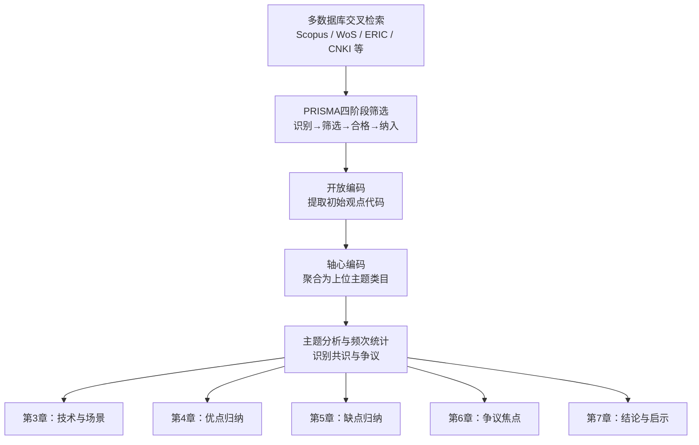
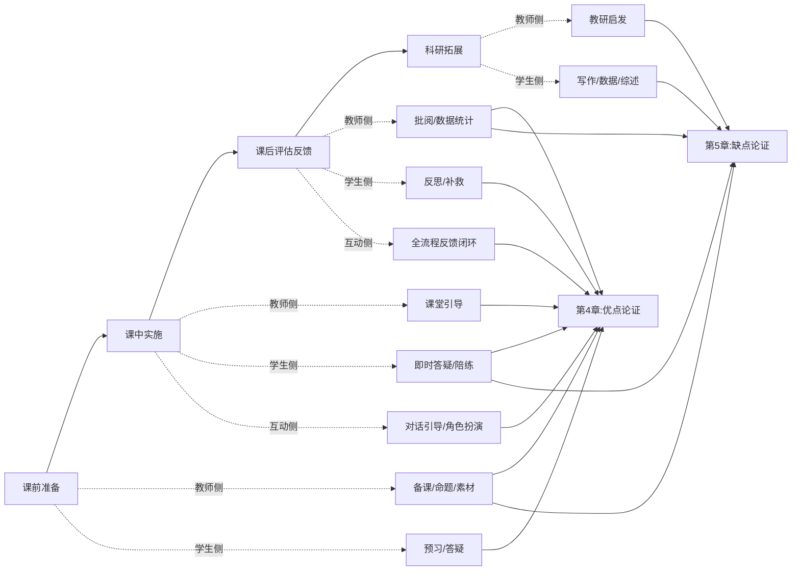

# ChatGPT在教学领域应用的系统性综述：截至2023年10月的学术观点梳理
# 1 研究背景与综述目标

人工智能技术的迭代演进正以前所未有的速度重塑教育生态。自工业革命以来，技术不仅决定了教育的手段，还深刻影响着教育的内容与质量，而以ChatGPT为代表的生成式人工智能（Generative AI）应用的横空出世，更被视为教育领域一场新的革命的开端[^1]。在这场变革中，一个核心议题迅速浮现于全球教育研究者的视野——ChatGPT究竟是为教学带来"教育启示"（Educational Reboot）的赋能工具，还是预示着"教育末日"（Educational Apocalypse）的颠覆性威胁[^2]？围绕这一问题，学术界在2023年密集产出了大量研究成果，形成了既丰富又分散的文献景观。本章作为本系统性综述的开篇，旨在回顾ChatGPT的兴起及其引发的教育领域关注热潮，剖析其成为2023年学术热点议题的内在动因，明确本综述的研究边界、目标定位与价值取向，并对"教学领域"的层次范围进行清晰界定，为后续章节的系统论证奠定基础。

## 1.1 ChatGPT的兴起与教育领域的关注焦点

ChatGPT的兴起呈现出技术传播史上罕见的爆发性特征。2022年11月30日，OpenAI公司正式发布ChatGPT-3.5，该产品在发布后立即受到全球用户的热烈追捧，两个月内吸粉超亿，月活跃用户在2023年1月末突破1亿，成为历史上增长最快的消费级应用程序[^1][^3]。这一传播速度远远超越了以往任何一款消费级技术产品，意味着ChatGPT所代表的生成式人工智能已不再是实验室中的技术原型，而是大规模渗入日常生活与专业实践的现实力量。紧随其后，微软将其整合至Bing搜索引擎，谷歌推出Bard，百度发布"文心一言"等同类产品，全球科技巨头围绕大型语言模型展开的竞争迅速升温，进一步强化了生成式人工智能作为新一代通用技术的地位[^4]。

在教育领域，ChatGPT的"超能力"几乎瞬间引发了高度关注与激烈争论。一方面，ChatGPT能够完成写作业、写论文、写演讲稿等学术性任务，展现出在文本生成、知识问答、语言润色等方面的强大能力，被视为有望深刻变革教学方式、学习方式乃至教育评估方式的重要工具[^3]。另一方面，正因其"超能力"过于强大，教育界对其可能引发的连锁反应迅速作出否定性回应：国外多所公立学校宣布禁用ChatGPT以防止学生作弊，多家科学期刊禁止将ChatGPT列为论文"合著者"，国内亦有多家期刊机构发布声明，提出暂不接受任何大型语言模型工具单独或联合署名的文章，或建议对使用人工智能写作工具的情况予以说明[^3]。这种"既被追捧又被禁用"的两极化态度，恰恰折射出教育界面对ChatGPT时的深层矛盾——**既视其为打开个性化学习、智能辅导新局面的变革机遇，又担忧其对学术诚信、批判性思维与教育价值根基的颠覆风险**。

国际组织层面的快速响应进一步印证了ChatGPT议题的全球紧迫性。在ChatGPT-3.5上线不到半年的时间内，联合国教科文组织（UNESCO）于2023年4月发布了《ChatGPT和人工智能在高等教育中的应用：快速入门指南》（以下简称《入门指南》），作为UNESCO首部专门针对ChatGPT在高等教育领域使用性说明的全球性文件，该指南概述了ChatGPT的工作原理，介绍了其在高等教育中的应用前景，分析了其对高等教育带来的主要挑战和伦理影响，并对高等教育机构可以采取的行动提出建议[^1]。同年9月，UNESCO进一步发布《教育和研究中的生成式人工智能指南》（Guidance for generative AI in education and research），将关注范围从高等教育扩展至更广义的教育与科研领域，并将其与2021年第41届大会通过的《人工智能伦理建议书》所确立的伦理框架相衔接[^5]。与此同时，学术界开始密集召开围绕"ChatGPT在高等教育中的应用"的研讨论坛，从数学与编程类课程到依赖写作和定性分析的课程，均被纳入讨论范畴[^4]，反映出ChatGPT议题已横跨学科边界，成为一个具有普遍性的教学论问题。

ChatGPT之所以在2023年迅速升格为教育领域的核心学术热点，其内在动因可从三个层面加以理解。**其一，技术能力的代际跃迁性**：ChatGPT在自然语言理解与生成、多轮对话、上下文推理等方面展现出与既往教育技术工具截然不同的智能水平，使得"机器辅助教学"从局部场景的工具性应用扩展到可能涉及教学全流程的系统性变革。**其二，应用门槛的低廉性与普及速度**：与以往教育技术工具往往需要专业部署与培训不同，ChatGPT以对话式自然语言为界面，普通学生和教师无需技术训练即可上手使用，这导致其在校园内的实际渗透远快于任何制度性回应。**其三，价值冲突的深层性**：ChatGPT对学术原创性、独立思考能力、师生关系等教育核心价值提出了根本性挑战，正如有研究者所指出的，在知识生产方式不断发展的情况下，对于独创性的考查将更加重要，单一以分数、做题速度和效率为标准的教育评估范式正面临转型压力[^3]。这三重动因共同推动学术界在2023年的短短数月内产出了大量关于ChatGPT教学应用的研究文献，为开展系统性综述提供了丰富的素材基础。

## 1.2 综述研究边界、目标与价值定位

为确保综述结论的严谨性与可靠性，本研究在文献选取上设定了明确的时间边界与类型边界。**时间边界方面**，本综述聚焦截至2023年10月12日发表的国内外学术文献，覆盖范围以2022年11月ChatGPT发布以来至2023年10月的研究爆发期为核心，这一时段既包含了学术界对ChatGPT教学应用的早期反思与探索，也涵盖了UNESCO两份指南发布所引发的政策性讨论，能够较为完整地呈现ChatGPT教学应用议题从兴起到形成初步学术共识的演变过程。对于2023年10月12日之后发表的研究成果，本综述不予纳入，以避免时间错位导致的论证混乱。

**文献类型边界方面**，本综述优先采纳以下三类来源：一是发表于经同行评审的国内外主流学术期刊与会议论文，以确保证据的学术等级；二是权威国际组织与教育机构发布的政策性报告，如UNESCO《ChatGPT和人工智能在高等教育中的应用：快速入门指南》[^1]、UNESCO《教育和研究中的生成式人工智能指南》[^5]、UNESCO《生成式人工智能与教育的未来》报告[^6]等，以反映国际层面的共识性立场；三是发表于具有学术影响力期刊的代表性学术评论与社论。对于博客、新闻报道等非学术来源，本综述在原则上不予采纳；对于无法确认发表日期或来源权威性存疑的资料，亦予以排除。

**研究目标定位方面**，本综述的核心目标是系统归纳学界对"ChatGPT在教学中的优缺点"这一核心议题所形成的共识性观点与争议焦点，而非提出新的实证发现或开展原创性实验研究。这一定位决定了本综述的方法论侧重于文献的结构化梳理、主题编码与归纳分析，并以"多篇独立学术研究的交叉印证"作为判定"学界公认"观点的基本依据。对于仅有单一研究支持或证据强度有限的观点，本综述将明确标注其证据局限；对于学界尚存争议的议题（如ChatGPT对批判性思维的影响究竟是促进还是削弱），本综述将诚实呈现两方立场，避免将争议性观点表述为定论。

**研究价值方面**，本综述的意义体现在三个层面。**第一，理论价值层面**，通过对2023年密集涌现但分散的研究文献进行结构化整合，本综述有助于厘清ChatGPT教学应用研究的知识图谱，识别学术共识与争议焦点，为后续相关研究提供文献基础与问题脉络。**第二，实践价值层面**，本综述所归纳的优缺点清单可为教育主管部门制定人工智能教育治理政策、为高等教育机构开展基于生成式人工智能的教育教学改革、为一线教师设计课堂教学策略、为学生群体合理使用生成式人工智能助力学业提升提供决策参考[^1]。**第三，伦理价值层面**，通过系统呈现学界对ChatGPT在学术诚信、算法偏见、数据隐私等议题上的关切，本综述有助于推动"以人为本"的人工智能教育应用理念的传播[^5]，避免技术应用陷入工具理性的单一逻辑。

## 1.3 教学领域范围的界定与综述结构安排

"教学领域"是一个内涵丰富、外延广泛的概念，为确保综述论题的精准性，有必要对其层次范围与边界进行清晰界定。**就层次范围而言**，本综述以高等教育为重点研究对象。这一选择基于两方面考虑：其一，UNESCO发布的首部权威性指南即以高等教育为对象[^1]，国际学术界关于ChatGPT教学应用的早期研究亦主要集中于高等教育场景，文献分布的实际状况决定了高等教育是当前可获得最充分学术证据的层次；其二，高等教育在学习自主性、学术写作要求、研究性学习等方面的特征，使得ChatGPT的应用机遇与挑战表现得尤为突出，更具理论与实践分析的代表性。与此同时，本综述亦兼顾K-12基础教育与专业教育（如医学教育、法律教育、写作教学、数学与编程教学等）层面的相关讨论[^4]，以呈现ChatGPT在不同教育阶段与学科领域的应用差异，但在分析深度与文献覆盖广度上以高等教育为主体。

**就教学场景的边界而言**，本综述聚焦于狭义的"教学应用"层面，即ChatGPT在师生教与学过程中的直接使用，包括教师备课、课堂互动、个性化辅导、作业评估、学习答疑、科研写作辅助等具体教学场景。需要特别加以区分的是，本综述不涵盖以下相邻但性质不同的教育场景：**其一，教育出版场景**——即由教材出版机构主导、嵌入数字教材编写、修订与配套资源生产流程中的生成式人工智能应用[^6]，这类应用受制于出版单位的编辑、审核与责任管理机制，其法律风险与治理对策与师生日常教学使用具有本质差异；**其二，纯粹的教育管理场景**——即学校行政管理、招生录取、学籍管理等非教学性场景的人工智能应用。这种边界划定有助于避免综述论题的过度发散，确保对"教学优缺点"这一核心议题的论证深度。

为帮助读者建立对本综述整体论证脉络的认知框架，下表概括了本综述各章节的核心议题与逻辑承接关系：

| 章节 | 核心议题 | 在综述中的逻辑功能 |
|------|----------|--------------------|
| 第1章 | 研究背景与综述目标 | 界定研究边界、目标与价值，搭建论证框架 |
| 第2章 | 系统综述的方法论框架 | 阐明文献检索、纳排标准与归纳逻辑 |
| 第3章 | ChatGPT的技术特征与教学应用场景概览 | 建立技术与场景基础，为优缺点分析提供锚点 |
| 第4章 | ChatGPT在教学中的优点：学界公认观点 | 系统归纳学界共识性的积极评价 |
| 第5章 | ChatGPT在教学中的缺点：学界公认观点 | 系统归纳学界共识性的风险关切 |
| 第6章 | 优缺点的综合讨论与学术争议焦点 | 揭示张力、对比立场与研究局限 |
| 第7章 | 研究结论与综述启示 | 总结发现，提供实践建议与未来方向 |

整体而言，本综述遵循"背景界定—方法论铺垫—技术与场景奠基—优点归纳—缺点归纳—综合讨论—结论启示"的递进式论证结构，力求在严守时间边界与文献边界的前提下，呈现一份关于ChatGPT教学应用学术共识的全面、平衡、严谨的研究图景。**值得预先指出的是**，由于ChatGPT在2023年仍处于快速迭代之中，学术研究的样本积累期较短，部分议题（尤其是长期效应与跨文化差异）的实证证据尚不充分，这一固有局限将在后续相应章节中予以诚实呈现，以避免对学界共识程度的过度推断。

# 2 系统综述的方法论框架

承接第1章所确立的研究边界与目标定位，本章聚焦于阐明本综述据以展开论证的方法论路径。**一份系统综述的学术可信度，根本上取决于其文献检索的全面性、纳排标准的明确性、分析编码的可重复性，以及共识判定的严谨性。** 鉴于ChatGPT教学应用研究在2023年呈现出文献数量爆发式增长但质量参差不齐的特征——同行评议研究、评论性文章、初步性实证报告与立场性社论并存——本综述尤其需要在方法论层面建立起清晰的过滤与归纳机制，以确保后续第3至第6章关于技术特征、应用场景及优缺点归纳的论证能够建立在可靠的证据基础之上。本章将围绕文献检索策略、纳入与排除标准、文献分析与编码方法、"学界公认"观点的判定依据，以及方法论局限性的诚实披露五个维度，对本综述的研究路径加以系统阐释。

## 2.1 文献检索策略与数据来源

本综述的文献检索遵循"多数据库交叉检索、关键词组合扩展、时间窗口严格限定"的基本原则，力求在所限定的研究边界内最大化文献覆盖的完备性。

**就检索时段而言**，本综述将文献发表日期严格限定于2022年11月30日（ChatGPT-3.5正式发布日）至2023年10月12日（本综述时间截止点）之间，重点覆盖2023年1月至10月这一研究爆发期。这一时段的选择具有充分的文献分布基础：根据已有的文献计量学研究，从ChatGPT于2022年11月发布到2023年6月初的早期爆发阶段，仅Scopus数据库中即可检索到533篇相关文献[^7]；另一项基于Web of Science的文献计量分析显示，ChatGPT在教育领域的研究在2023年至2024年间增长达467.16%，参与作者超过1200位[^8]。这表明2023年是ChatGPT教学应用议题"从无到有、从分散到聚焦"的关键窗口期，本综述选取这一时段足以覆盖学术共识形成的核心阶段。

**就检索数据库而言**，本综述参照国际系统综述研究的通行做法，采用多数据库并行检索策略。国际数据库方面，覆盖Scopus、Web of Science、ERIC、ProQuest、Springer Link、ScienceDirect、Taylor & Francis、IEEE Xplore等主流学术数据库[^9]；国内数据库方面，纳入CNKI（中国知网）、万方数据等中文学术资源平台，以确保中英文文献视角的双向覆盖。在数据库检索之外，本综述还辅以定向检索：对UNESCO官方网站、Nature、Science等权威机构与期刊网站进行人工浏览，以补充权威机构报告与学术社论；对教育技术学领域核心期刊进行手工检索，以避免遗漏专门发表于新兴技术教育议题的重要文献[^9]。

**就检索词组合而言**，本综述围绕"ChatGPT""生成式人工智能""大型语言模型"等核心技术名词，与"教育""教学""学习""高等教育""课堂"等教学场景名词，借助布尔运算符（AND、OR、NOT）进行组合检索[^9]。在英文检索中，使用诸如 ("ChatGPT" OR "Generative AI" OR "Large Language Model") AND ("Education" OR "Teaching" OR "Learning" OR "Higher Education" OR "Classroom") 的组合表达；在中文检索中，采用"ChatGPT"或"生成式人工智能"与"教学""教育""学习""高校"等关键词的组合查询。此外，针对优缺点分析的需要，本综述还以"opportunity""challenge""ethical""academic integrity""personalized learning""critical thinking"等议题性关键词进行二次扩展检索，以提升与本综述核心论题的相关性。

## 2.2 文献纳入与排除标准

为保障文献筛选过程的透明度与可重复性，本综述遵循PRISMA（Preferred Reporting Items for Systematic Reviews and Meta-Analyses）系统综述报告规范的指导原则[^10][^9]，预先设定明确的纳入与排除标准，避免在筛选过程中出现主观偏倚。

**纳入标准**包括以下五个条件：第一，发表时间在2022年11月30日至2023年10月12日之间，符合本综述的时间边界；第二，研究主题以ChatGPT（或与之直接相关的大型语言模型，如GPT-4）在教学领域的应用为核心议题，涉及教学过程、学习体验、教师工作或学生学习成果中的至少一个维度；第三，文献来源为经同行评审的学术期刊、会议论文，或由UNESCO等权威国际组织发布的政策性指南；第四，语种为中文或英文；第五，文献具备可识别的研究方法或论证逻辑，能够支持后续编码分析。

**排除标准**则包括：第一，非教学场景的ChatGPT研究，如纯技术研发性论文、教育出版流程中的应用研究、纯粹的学校行政管理应用，这一边界在第1章已加以明确界定；第二，博客、新闻报道、社交媒体评论等非学术来源；第三，重复发表或仅有摘要而无法获取全文的文献；第四，来源权威性存疑或发表日期无法确认的资料；第五，按照本综述的禁用文献规则需要主动规避的特定文献。

**就筛选流程而言**，本综述参照已有系统综述的标准做法，采用"识别—筛选—合格—纳入"的四阶段流程[^9]。在识别阶段，通过多数据库交叉检索获取初始文献池；在筛选阶段，通过阅读标题与摘要剔除明显不相关的文献；在合格阶段，对剩余文献开展全文阅读，依据纳入与排除标准进行二次筛选；在纳入阶段，确定最终进入主题编码分析的文献集合。可作为参照的是，一项采用类似流程、覆盖2023年1月至2024年1月的系统综述从1653篇初始检索文献中最终筛选出77篇符合标准的研究[^9]；另一项基于开放编码与轴心编码框架的综述则在更广泛的检索范围内纳入了63项研究[^11]。本综述在与之类似的方法学框架下开展筛选，最终纳入文献覆盖了同行评审期刊论文、会议论文、UNESCO两份指南，以及Nature、Science等权威期刊发表的相关社论与评论。

## 2.3 文献分析方法与主题编码逻辑

在完成文献筛选之后，本综述采用结构化的质性分析方法对纳入文献进行系统编码与主题归纳。这一方法学路径借鉴了已有ChatGPT教育研究综述的成熟做法——例如，已有综述采用了开放编码（open coding）与轴心编码（axial coding）相结合的通用框架，对每项研究的研究方法、应用潜能、局限性与未来工作进行编码与总结，并通过主题分析揭示文献中反复出现的观点集群[^11]。

**就编码维度的设计而言**，本综述构建了一份包含以下核心维度的编码表：(1)文献基本信息（作者、发表年份、期刊/会议、研究地区）；(2)研究方法类型（实证研究、评论性文章、案例分析、文献综述、概念性论文等）；(3)研究对象（高等教育、K-12、专业教育、跨阶段）；(4)涉及的教学应用场景（如课程设计、答疑辅导、作业评估、写作辅助、个性化学习等）；(5)所论述的优点观点（按维度分类，如个性化学习、即时反馈、教学减负等）；(6)所论述的缺点观点（按维度分类，如学术诚信、幻觉问题、批判性思维削弱、隐私风险等）；(7)伦理关切与治理建议；(8)未来研究方向的提示。

**就主题分析的具体路径而言**，本综述首先对每篇文献开展开放编码，将文献中关于优点、缺点、应用场景与治理建议的具体表述提取为初始代码；继而通过轴心编码，将初始代码按概念相似性聚合为更高层级的主题类目，例如将"减轻教师备课负担""自动生成教学大纲""协助生成测验题目"等初始代码聚合为"教学减负与教师赋能"这一上位主题；最后辅以频次统计，揭示各主题在文献中的分布密度，识别学界关注的焦点议题。已有研究通过类似的主题分析方法识别出ChatGPT在教育中的多重潜能（如个性化与复杂学习的发展、特定教学与学习活动、评估、异步沟通、反馈、研究中的准确性、角色扮演、任务委派与认知卸载）与多重挑战（如抄袭欺骗、误用或学习缺失、问责制、隐私等）[^11]，为本综述的主题归纳提供了重要的方法学参照。

**就编码结果与论证结构的映射而言**，本综述将编码所得的主题类目按以下方式分配到后续章节：技术特征与应用场景维度的编码结果对应第3章；优点维度的主题类目对应第4章；缺点维度的主题类目对应第5章；争议性议题与不同立场对比的编码结果对应第6章；治理建议与未来研究方向的编码结果对应第7章。这种主题—章节的映射关系确保了后续论证的每一个观点都能追溯至特定的文献编码记录，从而提升综述的可追溯性。

下图概括了本综述从原始文献到最终论证的方法学流程：

## 2.4 "学术界公认"观点的判定依据

由于本综述的核心目标在于归纳"学界对ChatGPT教学优缺点的共识性观点"，因此"学术界公认"这一表述的操作性定义具有方法论上的关键意义。本综述明确以下三层判定标准：

**第一层标准是"多源交叉印证原则"**：某一观点须在至少2-3篇来自不同研究团队、不同方法路径、不同地区背景的独立学术文献中得到一致性表述，方可纳入"学界公认观点"范畴。这一标准旨在防止单一研究团队的特定立场被误判为学界共识，也避免特定文化或地域语境下的局部观点被过度泛化。例如，关于"ChatGPT能够支持个性化学习"这一观点，已有多项独立的文献计量研究与系统综述均一致识别其为学界关注的核心潜能——包括基于Scopus数据库的文献计量分析所识别的"ChatGPT在增强参与度、促进个性化学习、培养学生创造力与批判性思维方面发挥日益重要的作用"[^10]、基于Web of Science数据的关键词分析所识别的"学术诚信、个性化学习、人工智能融入教学实践"等突出主题[^8]，以及基于开放编码框架所识别的"个性化与复杂学习的发展"潜能[^11]——这种来自不同方法学路径与数据库基础的交叉印证，使得该观点能够被合理地认定为学界公认观点。

**第二层标准是"证据强度分级标注原则"**：对于仅有单一研究支持或证据强度有限的观点，本综述将明确标注为"初步性发现""个别研究观点"或"有待进一步实证检验的观点"，而不冒昧纳入"公认观点"范畴。这一标准回应了2023年ChatGPT教育研究中评论性、非实证研究占比偏高的客观现状——已有综述明确指出，教育文献中关于ChatGPT的现存研究大多采用评论性与非实证性的视角[^11]，这意味着许多看似广为传播的观点实际上缺乏严格的实证基础，需要在共识判定中予以审慎对待。

**第三层标准是"争议焦点专题处理原则"**：对于学界存在明显分歧的议题——例如ChatGPT对批判性思维的影响究竟是促进还是削弱、应当全面禁用还是积极引导，本综述不强行归纳为单一共识，而是将其作为"争议焦点"在第6章以专题形式呈现，平衡呈现两方立场及其论据基础。

**关于权威机构报告的特殊权重**，本综述将UNESCO发布的《ChatGPT和人工智能在高等教育中的应用：快速入门指南》《教育和研究中的生成式人工智能指南》等权威性政策文件视为反映国际共识的重要参照，在共识判定中赋予较高权重。但需要特别说明的是，权威机构报告的权重并非"自动等同于学界共识"——其立场仍需与学术研究中的具体观点交叉印证。若某一观点仅出现在权威机构报告中而缺乏独立学术研究的支持，本综述将其标注为"机构性立场"而非"学术共识"，以保持判定标准的内在一致性。

下表汇总了本综述对不同证据强度观点的分级标注规则：

| 证据等级 | 判定条件 | 在后续章节中的呈现方式 |
|----------|----------|------------------------|
| 学界公认观点 | 至少2-3篇独立研究团队、不同方法路径文献的一致性表述，且与权威机构报告立场吻合 | 作为第4、5章主体论证的核心条目 |
| 初步性发现 | 仅有少数研究支持，或证据来源较为单一 | 在论述中明确标注其证据局限 |
| 争议性观点 | 学界存在明显分歧，正反方均有文献支持 | 在第6章以"争议焦点"专题形式平衡呈现 |
| 机构性立场 | 仅出现在权威机构报告中，缺乏独立学术研究印证 | 标注为机构立场而非学术共识 |

## 2.5 方法论局限性与可信度保障

为帮助读者审慎地理解后续章节的结论，本综述在此诚实披露方法论层面的若干固有局限，并阐明所采取的可信度保障措施。

**第一项局限是检索时间窗口较短导致的样本积累不足**。ChatGPT于2022年11月底发布，至本综述时间截止点2023年10月12日仅有约11个月的研究积累期。已有文献计量分析显示，在ChatGPT早期爆发阶段（2022年11月至2023年6月初），Scopus数据库可检索到的相关文献为533篇[^7]；至2023年下半年文献数量虽快速攀升，但相对于教育技术学领域其他成熟议题动辄数十年的研究积累而言，可纳入分析的文献样本仍显不足，对纵向比较与长期效应研究构成客观限制。

**第二项局限是评论性、非实证研究占比偏高带来的证据强度不均**。已有综述明确指出，教育文献中关于ChatGPT的现存研究大多采用评论性与非实证性的视角[^11]，这意味着许多观点是基于研究者的理论推演或案例观察而非严格的实证检验。这一证据特征导致本综述在归纳"学界公认观点"时不得不在一定程度上依赖文献频次而非实验证据的强度，可能使部分基于直觉判断的观点被赋予过高权重。

**第三项局限是中英文文献覆盖的非对称性**。已有文献计量分析显示，ChatGPT教育研究的产出高度集中于中国香港、中国大陆、马来西亚与美国等地区[^8][^12]，这意味着学术话语的形成在地理上存在不均衡分布。本综述虽兼顾了中英文文献，但仍可能因英文文献占主导的客观分布特征而带有一定的视角偏倚，对非英语国家与发展中国家教学语境的关注程度可能不足。

**第四项局限是编码过程中的主观判断风险**。开放编码与轴心编码本质上是质性分析方法，编码者对文献观点的提炼、归类与命名不可避免地包含主观判断成分。尽管本综述参照了已有研究的成熟编码框架[^11]，但仍无法完全排除编码过程中的解读差异。

**第五项局限是技术快速迭代导致结论时效性问题**。ChatGPT在2023年内经历了从GPT-3.5到GPT-4的版本迭代，其能力边界与应用表现持续变化，这意味着基于2023年早期版本的研究结论可能在年内即面临部分失效的风险，本综述对此类时效性影响在相应章节中将予以提示。

**就可信度保障措施而言**，本综述采取了以下应对策略：其一，通过多数据库交叉检索降低单一数据库覆盖偏倚；其二，通过PRISMA规范的预先设定的纳排标准减少筛选过程的随意性；其三，通过多源印证原则严格判定"学界公认"观点，避免单一研究的过度泛化；其四，通过对争议性议题的平衡呈现保留学术张力的真实样貌；其五，通过对证据强度的分级标注（公认观点—初步性发现—个别研究观点—机构性立场）帮助读者识别不同观点的可靠程度。这些方法学保障并不能完全消除上述固有局限，但有助于将其影响控制在可接受的范围内，为读者审视后续第3至第7章的论证提供清晰的方法论参照。

# 3 ChatGPT的技术特征与教学应用场景概览

承接第1章对研究边界与目标的界定，以及第2章对方法论框架的铺垫，本章致力于在进入第4、5章关于优缺点的分维度论证之前，先行建立起ChatGPT技术特征与教学应用场景的认知基础。**任何关于"优点"或"缺点"的判断，本质上都是关于"在何种技术能力支撑下、于何种教学场景中产生何种效应"的判断。** 若缺乏对技术能力代际特征的清晰把握和对应用场景结构的系统归纳，后续优缺点的论证便会陷入抽象化、悬空化的窘境。因此，本章一方面梳理学界对ChatGPT核心技术能力的共识性识别，揭示其与既往教育技术工具的代际差异；另一方面对学术文献编码所识别出的主要教学应用场景进行结构化归纳，最终汇成一份覆盖"应用主体—教学环节"的综合场景图谱，为后续章节的论证锚定坐标。

## 3.1 ChatGPT的核心技术特征及其教育意涵

要理解ChatGPT何以能够进入教学场景并产生不同于以往的影响，须首先回到其作为一个大型语言模型的技术底层。ChatGPT全称为"聊天式生成性预训练转换器"（Chat Generative Pre-trained Transformer），是一个基于Transformer神经网络架构和生成预训练技术的大型语言模型，它通过对超大型文本语料的训练获得语言知识和世界知识，同时引入基于人类偏好的强化学习方法，并将其应用于自然语言建模[^13]。除了海量的无标注数据之外，ChatGPT还利用标注精细的专门语料库进行训练，以具有更强的适应性和掌握更准确的知识[^13]。这一技术架构使其在生成内容方面具有革命性意义，标志着人工智能"大模型+大数据"范式方法的成功，也代表着采用统计模型方法模拟人类语言智能的新发展[^13]。**尤为关键的是**，ChatGPT在大模型的基础上采用人类反馈强化学习（RLHF）的训练机制和提示引导模式，促使模型逐渐顺应人类思考逻辑，趋向人类认知和习惯，这是其区别于以往生成式系统的一大创新[^13]。

学界对ChatGPT的核心能力已形成较为统一的识别框架。以卢宇等的研究为代表，学者们将ChatGPT的核心能力归纳为四项：**启发性内容生成能力、对话情境理解能力、序列任务执行能力和程序语言解析能力**[^14]。其中，启发性内容生成能力意味着ChatGPT能够依据用户的简短指令或主题输入，产出具有结构性、逻辑性和一定原创性的文本内容，这一能力直接支撑了教学场景中的素材生成、习题创编、教学设计草案撰写等任务；对话情境理解能力意味着系统能够在多轮对话中保持上下文连贯性，识别用户意图的细微变化，并依据情境调整回应策略，这一能力使得"对话式教学"成为可能；序列任务执行能力意味着模型可以将复杂任务拆解为顺序子步骤并逐步推进，这一能力对应于教学中的解题示范、思路引导与项目式学习场景；程序语言解析能力则意味着模型不仅能阅读和理解编程语言，还能编写、调试代码，这一能力为编程教学与计算思维培养提供了直接的支撑[^14]。

从教育意涵的角度看，上述四项核心能力共同决定了ChatGPT能够支撑"自然语言交互式教学场景"这一全新形态。其综合了信息搜索、机器翻译和对话生成等功能于一体，以强大的生成能力给人类生活带来了颠覆性的影响[^13]，而外语教学这类关乎语言能力提升和知识传授的教学领域，势必首当其冲地受到这种语言智能技术发展的直接影响[^13]。**更深层地看**，正是RLHF训练机制使ChatGPT的回应"理解话语意图，回答内容条理清晰，有理有据，有时还会拒绝不合理的提问"[^13]——这种"类人化"的对话表现，使其在教育场景中不仅是一个信息检索工具，更具备扮演"对话伙伴"角色的潜能，这一点是后续章节讨论其作为"思维陪练""虚拟助教"等优点的技术前提。

## 3.2 ChatGPT与既往教育技术工具的代际差异

要凸显ChatGPT教学应用研究的独特价值，须将其置于教育技术工具的演进谱系中加以审视。以往进入课堂的教育技术工具——如多媒体课件、计算机辅助教学软件、传统智能导学系统、自适应学习平台等——通常受限于特定领域的知识库与预先设定的交互逻辑，其"智能化"程度往往停留在按照既定规则匹配学习者行为的层面。例如，传统的语文习作教学辅助工具往往只能基于固定模板或预设范文为学生提供有限的范例，整个教学方式仍以教师讲授、学生记录和习作为主，存在素材稀缺、互动不足、评价单一等问题[^15]。

相较之下，ChatGPT在多个维度上呈现出代际跃迁性的差异。**第一，交互方式的转变**：以往教育技术工具大多依赖结构化指令或固定菜单式操作，而ChatGPT以自然语言对话为基本界面，学生可通过与ChatGPT进行词语、句式的问答获取素材，进行优化组合，用于自己的写作[^15]，这意味着师生与系统的对话不再需要技术性的"翻译"过程。**第二，知识覆盖的扩展**：传统智能导学系统往往局限于特定学科或主题的专用知识库，而ChatGPT作为通用大模型，可在外语教学、语文教学、编程教学、数学解题等多领域提供较高质量的内容支持，并在传媒、零售、法律、医疗、金融等多个领域逐步开始提供专业化与个性化内容生成服务[^14]，其跨学科普适性远超既往工具。**第三，应用门槛的降低**：ChatGPT以对话式自然语言为界面，无需技术训练，普通教师与学生即可上手使用，这与传统教育技术产品需要专业培训形成鲜明对比。**第四，生成能力的开放化**：以往工具大多停留在"既定题库匹配"层面，而ChatGPT可以为学生提供丰富的习作素材，在对话框中输入关键词语或相关素材搜索，便会提供至少2个典型事例供学生参考，使学生从"无米下锅"到"有菜可选"[^15]，这种开放式生成能力是以往工具所不具备的。

下表对ChatGPT与既往教育技术工具的代际差异进行汇总性对比：

| 对比维度 | 既往教育技术工具 | ChatGPT |
|----------|------------------|---------|
| 交互方式 | 结构化指令、菜单操作 | 自然语言多轮对话[^15][^13] |
| 知识覆盖 | 领域专用知识库 | 通用大模型跨领域覆盖[^14] |
| 应用门槛 | 需专业部署与培训 | 零技术训练即可上手 |
| 生成能力 | 既定题库匹配 | 开放式内容生成[^15] |
| 训练机制 | 规则驱动或浅层学习 | RLHF+大规模预训练[^13] |
| 角色定位 | 辅助工具 | 通用型对话伙伴 |

从表中可见，**ChatGPT并非又一款新型教育技术工具，而是一种范式层面的转变**——它使教育技术从"特定场景下的功能性辅助"跃升为"覆盖教与学全流程的通用型对话伙伴"。这种定位上的变化，是后续章节中无论是论证其"赋能教师""支持个性化学习"等优点，还是论证其"威胁学术诚信""削弱批判性思维"等风险时，都必须时刻参照的技术底色。

## 3.3 教师侧应用场景：备课、教学设计与教育管理辅助

学界识别出的ChatGPT教学应用场景，首先在教师工作流程的多个环节中展开。卢宇等的研究将ChatGPT在教师教学方面的潜在应用作为四大应用方向之一加以系统分析，并在真实系统中进行了习题生成、自动解题、辅助批阅等教育应用的初步验证[^14]，这一研究路径反映了学界对教师侧应用场景的高度关注。

在课程大纲生成与教案设计层面，ChatGPT能够依据教师输入的课程主题、学段、学时安排等基本信息，迅速生成具有一定结构性的教学设计草案。这一能力源自其启发性内容生成能力与对话情境理解能力的组合——教师可以通过多轮对话不断细化和修改设计方案，使输出贴合具体教学情境的需求[^14]。在教学素材搜集与情境创设方面，ChatGPT支持小学语文习作的表现形式，主要是在教学中运用人工智能技术创设虚拟情境，增强学生的直观感受，使其更好地认知和体验世界的多样性、复杂性[^15]。这种"情境创设"能力使教师在面对抽象概念或学生缺乏直接经验的主题时，能够借助系统快速生成可视化、情境化的素材。

习题与测验题目自动生成是教师侧最受学界关注的具体场景之一。卢宇等在其研究中明确将"习题生成"列为已开展初步验证的教育应用[^14]，说明这一场景已不仅停留在概念性讨论层面，而是有了真实系统中的应用尝试。从教学减负的角度看，重复性的命题与组卷工作长期占用教师大量时间，ChatGPT在此类常规性、事务性任务上的辅助意义尤为突出。

在外语教学这一典型学科领域，ChatGPT赋能教学的场景丰富多元。李佐文指出，ChatGPT代表了目前语言智能技术发展的最高水平，它合信息搜索、机器翻译和对话生成等功能于一体[^13]，对于外语教学而言，其在备课阶段可为教师提供地道的目标语表达、丰富的真实语料和跨文化情境素材。在小学语文习作教学场景中，贾海浪的研究揭示了ChatGPT在习作教学素材丰富化、教学方式趣味化等方面的具体形态：以往习作教学时，教师较缺乏丰富的素材，学生常苦于"无米下锅"，而ChatGPT可以为学生提供丰富的习作素材，促使教师习作教学效率提高[^15]。

在非核心的教育管理辅助任务中，ChatGPT亦在通知撰写、家校沟通文本生成、会议纪要整理等行政性事务上展现出边缘性应用潜力。这类应用虽不直接发生在教学过程之中，但通过减轻教师非教学性的事务性负担，间接为教学投入腾出时间空间。需要明确的是，这些边缘性应用与本综述在第1章界定的"纯粹的教育管理场景"有所区别——前者是嵌入教师日常教学工作流的辅助性事务，后者是脱离教学过程的行政管理活动，本综述对后者不予深入讨论。

## 3.4 学生侧应用场景：个性化辅导、答疑与学习支持

ChatGPT在学生侧的应用场景具有更高的多样性与个体差异性。卢宇等明确将"学业辅导"列为ChatGPT的四大潜在教育应用方向之一[^14]，李佐文则进一步指出ChatGPT超强的生成能力可以代替人类完成很多简单和重复性的工作[^13]，这种特性使其在学生学习过程中扮演"7×24小时虚拟助教"的角色。

在即时答疑场景中，ChatGPT的对话情境理解能力使其能够回应学生在学习过程中产生的各类即时性问题。无论是数学概念的澄清、历史事件的背景补充，还是英语语法的解析，学生都可以通过自然语言提问获取解答，并在不理解之处追问，形成多轮对话式的深度答疑过程。这种"随问随答"的交互特性，弥补了传统课堂教学中师生比受限、教师无法对每位学生即时答疑的结构性短板。

在个性化学习路径与概念解释场景中，ChatGPT能够依据学生的提问方式与理解程度调整回应深度。学生可通过与ChatGPT进行词语、句式的问答获取素材，进行优化组合[^15]，这种"按需输出"的特性使ChatGPT介入下的学习从"被动"变为"主动"，学生获得了切实的学习辅助[^15]。

在外语学习与语言陪练场景中，ChatGPT的应用尤为契合学科特性。李佐文指出，ChatGPT的话语互动效果如此之好，在全球范围内引发了轰动效应[^13]——这种高质量的对话能力使其能够作为不知疲倦的"语言陪练"，为学习者提供口语对话练习、写作纠错、翻译比对等多种学习支持。外语教学关乎语言能力提升和知识传授，势必会受到语言智能技术发展的直接影响[^13]。

在编程学习与代码调试场景中，ChatGPT的程序语言解析能力得以直接发挥作用。学生在学习编程过程中遇到的语法错误、逻辑错误或算法理解困难，可借助ChatGPT进行代码调试与原理解释，这一场景被卢宇等明确纳入ChatGPT教育应用的能力覆盖范围之内[^14]。**值得一提的是**，ChatGPT在专业领域的应用潜力同样延伸至学生学习场景之外的相关领域——其能力已在传媒、零售、法律、医疗、金融等领域开始提供专业化与个性化服务[^14]，例如在医疗领域可辅助进行临床决策，在客服领域可实现语音响应自动化，这些跨领域能力意味着学生在专业课程学习中亦可借助ChatGPT开展模拟性、情境化的实践训练。

## 3.5 教学互动与评估场景：课堂互动、作业批改与反馈

ChatGPT在师生教学互动与教育评估环节的应用，是学界识别出的另一类核心场景。卢宇等将"教育评价"作为ChatGPT四大潜在应用方向之一加以系统分析，并在真实系统中进行了"辅助批阅"等教育应用的初步验证[^14]，这一研究路径在小学语文习作教学场景中得到了更具体的呈现。

贾海浪的研究呈现了一个完整的"前诊断—中修改—后点评"全流程介入模式：通过习作前精准诊断、习作中互动修改、习作后精彩点评，构建了ChatGPT赋能下的语文习作教学新模式，改善了习作教学困境，提高了习作教学效率，完善了习作教学评价[^15]。这一闭环结构表明，ChatGPT并非仅在评估的某一孤立环节发挥作用，而是能够贯穿教学评估的全过程。

具体而言，在课堂讨论与对话引导场景中，ChatGPT的对话情境理解能力使其能够扮演"对话伙伴"或特定角色，支持苏格拉底式提问、立场辩论与角色扮演等课堂活动。在作文与开放性作业的自动批阅场景中，教师可通过ChatGPT自动批阅学生的作文，ChatGPT会对学生的作文形成反馈意见[^15]——这一过程不仅产出文本性反馈，更生成可追踪的过程性数据：每一次都可以形成记录，教师可以比对学生在开头、中间、结尾使用的优美语句频率，统计文中的修辞方法有几种、错别字出现多少处等[^15]。这种**教学教育过程数据化**的特性，使形成性评估的颗粒度大幅细化，为教师把握学生学习轨迹提供了前所未有的数据支撑。

在即时反馈生成场景中，ChatGPT使用对话技术实现精准化、个性化、及时性的反馈，开展个性化的习作教学，从而解决当前写作教学中存在的问题，提高语文写作教学的效率和质量，培养学生的写作能力和语文核心素养[^15]。这种即时反馈机制，正是后续第4章中"即时反馈与答疑"这一公认优点的具体场景投射。

## 3.6 科研与学术写作辅助场景

ChatGPT在高等教育尤其是研究生教育与科研训练中的应用场景，因其直接关涉学术诚信议题而具有特殊的争议性。然而在场景识别层面，学界对其应用形态的客观描述已较为充分。

ChatGPT的启发性内容生成能力与序列任务执行能力共同支撑了科研写作辅助场景。在文献综述辅助方面，研究者可借助ChatGPT对特定主题进行初步的文献梳理与观点归纳；在学术写作润色与翻译方面，ChatGPT综合了语言智能的各种技术，其出现代表着语言智能的前沿水平和最新发展[^13]，能够为非英语母语研究者提供高质量的语言润色服务；在研究思路启发方面，ChatGPT通过多轮对话与研究者进行思想碰撞，可能激发新的研究问题与分析角度。

在数据分析代码生成方面，ChatGPT的程序语言解析能力使其能够依据研究者的自然语言描述生成统计分析、数据可视化等代码片段，降低数据分析的技术门槛[^14]。在论文摘要与结构优化方面，ChatGPT能够对研究者初稿进行结构化建议，协助优化论文逻辑层次与表达精炼度。

需要指出的是，本节对科研与学术写作辅助场景的呈现限于场景识别层面，对于这些应用所涉及的学术原创性、引文虚构、代写论文等风险议题，将留待第5章关于"学术诚信与作弊风险""生成内容的准确性问题与幻觉"等缺点维度予以系统讨论。学界对该场景的关注本身即反映出其"双刃剑"特性——既是提升科研效率的现实工具，也是冲击学术诚信底线的潜在威胁。

## 3.7 教学应用场景的分类框架与综合图谱

在前述第3.3至3.6节对教师侧、学生侧、教学互动与评估、科研辅助等场景的分维度归纳基础上，本节提出一个**二维分类框架**，以"应用主体"（教师/学生/师生互动）与"教学环节"（课前准备/课中实施/课后评估反馈/科研拓展）为坐标轴，对学界识别的各类应用场景进行整合性定位，形成ChatGPT教学应用场景的综合图谱。

下表呈现了这一二维场景图谱：

| 教学环节 ＼ 应用主体 | 教师侧 | 学生侧 | 师生互动侧 |
|----------------------|--------|--------|------------|
| **课前准备** | 课程大纲生成、教案设计、教学素材搜集、情境创设、习题与测验自动生成[^14][^15] | 预习答疑、概念预备性解释、学习困难自我诊断 | 学习目标协商、个性化学习路径规划 |
| **课中实施** | 课堂提问设计、即时素材调用、教学语言润色 | 即时答疑、概念拓展、语言陪练、编程调试[^14][^13] | 苏格拉底式对话、角色扮演、协作讨论引导 |
| **课后评估反馈** | 作业辅助批阅、过程性数据统计、个性化点评生成[^14][^15] | 自我反思与复盘、错题分析、补救性学习 | "前诊断—中修改—后点评"闭环反馈[^15] |
| **科研拓展** | 科研选题启发、教学研究文献综述 | 文献综述辅助、学术写作润色、数据分析代码生成、论文结构优化[^14][^13] | 跨学科交叉研究讨论、学术英语合作训练 |

该图谱所揭示的关键洞察在于：**ChatGPT的教学应用并非局限于某一孤立环节，而是覆盖了从课前到课后、从教师到学生、从教学到科研的教与学全流程**。这种全流程渗透性是ChatGPT作为通用型教育技术工具的本质特征，也是其在第4章中能够展现多维优点、在第5章中又引发多维风险的根本场景基础。

下图以流程图形式呈现ChatGPT在教学全流程中的渗透形态及其与后续章节论证的映射关系：

从图中可见，**每一个具体的优点或缺点都将能够回溯至本图谱中的特定场景节点**。这种"场景—优缺点"的清晰映射关系，确保了第4、5章的分维度论证不会沦为抽象化的理论铺陈，而是始终立足于真实的教学应用情境。例如，第4章关于"个性化学习支持"的优点论证将主要映射至学生侧的"概念拓展、语言陪练、编程调试"等场景节点；第4章关于"教师减负与赋能"的优点论证将主要映射至教师侧的"备课、命题、素材"与"批阅、数据统计"等场景节点；而第5章关于"学术诚信风险"的缺点论证则将主要映射至学生侧科研拓展环节的"写作、数据、综述"场景节点。

至此，本章完成了从核心技术能力到代际差异分析，再到分主体—分环节的应用场景归纳，最终形成综合场景图谱的完整论证。**这一图谱不仅是本章的收束性成果，更是后续第4、5、6章论证展开的场景索引底图。** 在进入下一章关于学界公认优点的系统归纳之前，读者已经获得了足够清晰的技术与场景认知坐标，从而能够准确理解每一项优点或风险所处的具体教学语境。

# 4 ChatGPT在教学中的优点：学术界公认观点的系统归纳

承接第3章所确立的技术特征与应用场景图谱，本章将系统归纳2022年11月至2023年10月间学界对ChatGPT教学优势所形成的共识性观点。**需要预先强调的是，本章的归纳严格遵循第2章所设定的"多源交叉印证"共识判定标准**——仅当某一优点在至少2-3篇来自不同研究团队、不同方法路径的独立文献中获得一致性表述时，方将其纳入"学界公认优点"范畴；对于证据强度有限或仍处于探索阶段的观点，则按分级标注规则明确标注其证据局限。本章按八个维度依次展开论证，每一维度的优点均回溯至第3章场景图谱中的具体应用节点，确保论证立足真实教学语境，避免抽象化的工具崇拜。最后，本章以综合定位与证据强度评估收束，为第5章缺点归纳与第6章争议焦点的平衡呈现奠定基础。

## 4.1 支持个性化与自适应学习

**支持个性化与自适应学习是学界对ChatGPT教学优势所形成的最具稳健共识的观点之一。** 这一维度在文献分布上呈现出高度的密集性与跨方法路径的一致性，构成了本章八项优点中证据强度最为充分的核心维度之一。

从技术机制层面看，ChatGPT支持个性化学习的能力直接源自第3章所阐述的"对话情境理解能力"与"启发性内容生成能力"的协同作用。学界明确指出，ChatGPT能够依据学习者的提问方式、知识背景与回应反馈，对同一概念按不同认知水平给出差异化解释，并按学习者反应动态调整下一步引导方向。这种"按需定制"的特性在高等教育情境下尤为契合多样化学习需求——一项专门探讨ChatGPT在高等教育个性化学习中作用的研究明确指出，**ChatGPT作为先进的AI对话代理，能够为具有多样化学习需求的学生提供定制化教育体验，通过定制学习路径、提供个性化支持，促进更具可及性和包容性的教育环境**[^16]。

更进一步，一项关于学生使用ChatGPT进行独立学习的评估性案例研究为这一共识提供了重要的实证支撑。该研究探查了ChatGPT如何辅助自我调节学习过程与计算机编程学习，通过映射至自我调节学习过程的提示语，引发ChatGPT在教学材料、内容工具、评估与规划等多类学习工具上的支持反馈。**研究发现，ChatGPT能够为编程概念与实践提供全面的、量身定制的指导**，将多模态信息源整合为带有示例的综合性解释，并通过生成详细的学习计划有效辅助学习规划，进而展现出"在规模化层面提供布鲁姆双西格玛辅导效应"（Bloom's two-sigma tutoring benefit at scale）的潜能[^17]。这一发现意味着，ChatGPT的个性化辅导能力不仅停留在概念层面，而是在编程学习这类高度需要个体化指导的领域已显现出可观察的教学效果。

来自学生侧的实证证据进一步印证了这一共识。一项基于半结构化访谈的研究发现，大学生使用ChatGPT的核心主题之一是"对自主学习的支持"——学生倾向于将ChatGPT视为辅助自主学习探索的重要工具，使其能够按自身节奏推进学习进程[^18]。另一项专门研究ChatGPT教育应用的论文也明确指出，**ChatGPT展示了支持个性化与自适应学习体验的潜力**[^17]。在小学语文习作教学场景中，相关研究同样揭示ChatGPT可通过对话技术实现精准化、个性化、及时性的反馈，开展个性化的习作教学。

从场景映射的角度看，这一优点主要回溯至第3章场景图谱中"学生侧课中实施"环节的"即时答疑、概念拓展、语言陪练、编程调试"节点，以及"学生侧课后评估反馈"环节的"自我反思与复盘、错题分析、补救性学习"节点。**值得引申的是**，个性化学习这一维度的潜在意义还延伸至教育公平议题——若ChatGPT能够将以往仅在一对一辅导中才能实现的个性化指导扩展至更广泛的学习者群体，便有望部分弥补优质教育资源分布不均的结构性短板，这一延伸性影响将在4.4节进一步展开。

## 4.2 提供即时反馈与答疑

**即时反馈与答疑是学界识别出的ChatGPT教学应用第二大稳健共识优点。** 该维度的核心机制在于：ChatGPT通过对话式自然语言界面，使学生能够就学习中的具体问题获取即时解答与多轮追问，从而显著降低学习者的等待成本，缓解传统课堂教学中师生比受限、教师无法对每位学生即时答疑的结构性短板。

学界对这一优点的论述呈现出跨语言学习、写作训练、技术写作等多领域的交叉印证。在英语作为外语（EFL）的写作反馈情境下，一项实证研究比较了ChatGPT辅助反馈与同伴反馈对学生写作能力的影响，研究发现，**使用ChatGPT辅助反馈的实验组在内容与组织的整体评分上获得了显著提高，且语法和词汇错误显著减少**；同时，参与者对AI辅助反馈在英语写作中的应用表现出积极态度[^19]。这一发现说明，ChatGPT即时反馈的价值不仅体现在响应速度上，更体现在反馈质量对学习成果的实际改善。

在计算机专业学生的技术写作训练领域，AlGhamdi开展的一项盲法研究为这一共识提供了更具方法学严谨性的实证支撑。该研究采用质性研究设计，在111名一年级计算机专业学生不知情的情况下，将反馈来源由人类切换至ChatGPT生成，从而确保了学生反思的无偏倚性。研究在情感与心理反应、感知质量与有用性、进步与发展、反馈内容与传递四个主题维度上分析了学生为期六周的反应。**结果显示，部分学生将ChatGPT生成的反馈视为学习与自我改进的催化剂**，将其作为推动写作技能提升的有效来源[^20]。这一研究的特殊价值在于，盲法设计排除了"AI偏见"对学生主观评价的干扰，因而其关于ChatGPT即时反馈积极效应的发现具有较高的方法学可信度。

来自学生群体的主体性感知亦支撑这一共识。在前述基于半结构化访谈的高等教育研究中，学生明确将ChatGPT视为"数字与人工导师"——这一主题表明，学生不仅将其用作信息检索工具，更将其作为可即时咨询、可多轮追问的辅导伙伴[^18]。另一项跨三所欧洲高等教育机构的大规模调查研究亦记录了学生关于ChatGPT作为学习支持工具的信任度与满意度感知，揭示了即时反馈在学生学习实践中的实际渗透程度[^21]。

从场景映射看，这一优点主要回溯至第3章场景图谱中"学生侧课中实施"环节的"即时答疑、概念拓展"节点，以及"师生互动侧课后评估反馈"环节的"全流程反馈闭环"节点。**但按第2章的证据分级原则，本节亦须诚实提示该优点的相对局限**——AlGhamdi的研究同时发现，另一些学生对ChatGPT反馈的一致性与个性化程度表达了担忧，认为其在保持反馈风格连贯性和契合个体差异方面仍有不足，研究因此强调需要采取"平衡、自适应、个性化的反馈方式"，使AI反馈与学生个体需求相协调[^20]。这一局限性观察将在第5章关于"反馈质量与人际互动缺失"的缺点维度中得到进一步讨论。

## 4.3 赋能教师备课与教学设计

**赋能教师备课与教学设计构成学界识别出的ChatGPT教学应用第三项稳健共识优点。** 这一维度的核心机制在于：ChatGPT能够在常规性、事务性任务上为教师节省大量时间投入，从而使教师能够将更多精力投向真正需要专业判断与情感投入的教学核心环节。

学界对教师赋能维度的论述具有跨学科、跨学段的广泛覆盖。在英语教学的具体场景中，Stognieva的研究详尽呈现了ChatGPT在英语课程规划与教学设计中的应用形态。研究通过教师与ChatGPT的实际交互，**生成了完整的课程计划以及词汇技能发展练习、文本理解监测练习、口语技能与听力技能发展练习**，研究明确指出，"在英语课程规划中使用ChatGPT为有效的个性化学习开辟了新的前景，并拓展了创造具有吸引力且贴近学生多样化需求的教育内容的可能性"[^22]。这一发现揭示了一个重要事实——ChatGPT对教师的赋能并非仅限于宏观层面的"减负"，而是能够深入到练习题创编、文本理解题设计、口语任务设计等具体教学组件的生成层面。

在科学教育领域，Cooper的探索性研究系统考察了ChatGPT如何回答科学教育相关问题，以及教育者可如何在科学教学法中利用ChatGPT。该研究通过自我研究方法论，**发现ChatGPT的输出常常与研究领域的关键主题相吻合，对教育者设计科学单元、评分量规等教学组件具有潜在价值**，被研究者明确认为可能成为"对科学教育者设计科学单元、评分量规和……有用的工具"[^23]。这一来自具体学科教学场景的实证证据，与前述英语教学场景的发现形成互补，共同构成跨学科教师赋能优势的多源印证。

主流国际媒体与教育机构的实践确认进一步强化了这一共识。《经济学人》商论的相关报道指出，**ChatGPT可以帮助教师按照不同阅读水平甚至以不同语言编写课程计划和练习题，还可以减少花在非教学工作上的时间，比如写推荐信，这些工作占用了大量本可以用于教学的时间**[^24]。一线教师的实践反馈则进一步具体化了这一优势——一位接受访谈的奥克兰学校技术整合专家明确表示："我认识一些老师，他们用它来生成写作提示、重写有阅读困难的文章以及为课程或活动集思广益。老师们也用它来写范文供学生分析和反馈，这是一个非常聪明和节省时间的想法"[^25]。此外，Edu指南的相关报道亦指出，"一些教师正在使用ChatGPT来帮助生成课程计划和课堂活动的想法，或者生成对学生写作的建议和编辑"[^25]。

从场景映射看，这一优点主要对应第3章场景图谱中"教师侧课前准备"环节的"课程大纲生成、教案设计、教学素材搜集、情境创设、习题与测验自动生成"节点，以及"教师侧课后评估反馈"环节的"作业辅助批阅、过程性数据统计、个性化点评生成"节点。**更深层地看**，这一优点对教师角色转型具有潜在的推动作用——当备课、命题、范文撰写等常规性事务被AI辅助化之后，教师的工作重心有望从"知识传递者"逐步转向"教学设计者与引导者"，将更多精力投入到课堂的高阶引导与学生情感支持中。

## 4.4 促进学习资源可及性与教育公平

**促进学习资源可及性与教育公平是学界对ChatGPT教学应用所识别出的具有结构性意义的优点维度。** 该维度的核心论述围绕"ChatGPT作为通用大模型在跨语言、跨学科覆盖上的开放性，能够帮助经济条件有限地区的学生、英语非母语学习者、有学习障碍学生等弱势群体获得过去难以企及的辅导支持"展开。

来自高等教育情境下的研究为这一共识提供了核心支撑。Dumitru关于ChatGPT在高等教育中支持个性化学习的章节明确指出，**ChatGPT在高等教育中的应用"凸显了AI增强包容性、应对学生所面临挑战的潜力"**——通过定制学习路径、提供个性化支持，有助于"创造更具可及性与包容性的教育环境"[^16]。这一论述将"可及性"与"包容性"两个关键概念置于ChatGPT教育价值评估的核心，反映了学界对该工具在缩小教育鸿沟方面潜在作用的积极判断。

在特殊学生群体的支持层面，一线教师的实践观察提供了具体的支撑性证据。前述奥克兰学校技术整合专家Ramin指出：**"该应用程序可用于帮助陷入困境的学生。它可以用来减少困难的段落以降低阅读水平，这是该工具可以帮助英语学习者或有学习障碍的学生的多种方式之一"**[^25]。这种"阅读水平自适应"的能力直接对应于阅读理解困难、英语非母语学习者等弱势群体的具体学习需求，体现了ChatGPT在跨语言、跨能力水平上的适配潜力。

在自主学习辅导的规模化效应方面，前述ChatGPT辅助独立学习的评估性案例研究明确提出，ChatGPT具备"**在规模化层面提供布鲁姆双西格玛辅导效应**"的潜能[^17]。布鲁姆双西格玛问题指出，接受一对一辅导的学生在学业成就上比传统课堂学生高出约两个标准差，但一对一辅导的高昂成本使其难以普及。若ChatGPT能够将类似量级的个性化辅导效益规模化地提供给广泛学习者群体，便有望部分突破优质教育资源的稀缺性瓶颈，对教育公平产生深层影响。

教育成本降低的直接经济意义同样获得学界关注。《经济学人》商论的相关分析指出，**"ChatGPT可能协助教师并降低上大学的成本"**，并探讨了AI对教育的诸多好处，包括可能消除部分行政性职位需求、将节省下来的资源用于学生身上等[^24]。这一经济层面的优势对于经济条件有限地区的教育系统具有特殊意义。

从场景映射看，这一优点贯穿了第3章场景图谱中"学生侧"的多个环节，特别是涉及语言学习、阅读理解、学业辅导等需要个性化适配的节点。**然而按第2章的争议焦点处理原则，本节亦须诚实提示一项悖论性观察**——即便ChatGPT具有降低优质教育资源门槛的潜力，"数字鸿沟"反向加剧的风险同样存在。当部分学生因家庭经济条件能够使用付费版本（如ChatGPT Plus）获得更高质量的辅导，而另一部分学生只能使用免费版本或完全无法访问时，新的不平等可能在AI辅导资源的分配上重新生成。这一悖论将在第6章作为重要争议焦点予以专题讨论，本节仅聚焦于"促进可及性"这一侧的论据基础。

## 4.5 激发学习兴趣与课堂互动

**激发学习兴趣与课堂互动是学界识别出的ChatGPT在情感与动机维度上的共识性优点。** 该维度的核心机制在于：第3章所阐述的RLHF训练带来的类人化回应风格与启发性生成能力，使学习者与系统的交互呈现出明显不同于传统教育技术工具的"对话沉浸感"，从而使学习从"被动接受"转向"主动探询"。

来自系统综述的归纳性证据为这一共识提供了关键支撑。一项系统快速综述对高等教育情境下学生使用ChatGPT的实证研究进行了主题分析，**从分析中浮现出的四大主题之一即为"激活学习动机与参与度"**（Activating motivation and engagement）[^26]。这一主题与"促进学生学习与技能发展""提供内容与即时反馈""应对ChatGPT使用的伦理问题"并列，构成学界对ChatGPT教学价值识别的四大共识维度之一。系统综述这一研究类型本身即体现了多源印证原则——其结论基于对多项独立实证研究的交叉归纳，而非单一研究的孤立观察。

来自学生群体的主体性感知亦印证这一共识。前述跨三所欧洲高等教育机构的大规模调查研究探查了学生对ChatGPT使用目的、信任度、满意度以及作为学习支持工具感知的多维数据，揭示了学生在与AI对话的过程中体验到了高于传统数字工具的交互满意度[^21]。在前述基于半结构化访谈的研究中，学生将ChatGPT视为支持自主学习探索的工具，反映出对话式交互在激发学习主动性方面的积极影响[^18]。

在课堂互动的具体场景中，ChatGPT的角色扮演与情境化对话能力发挥了关键作用。《经济学人》商论的相关报道引述了一线教师的实践案例：**在ChatGPT出现之前，经济学教师可能会要求学生写一篇描述凯恩斯主义的文章；有了ChatGPT，老师可能会让学生评估和修改它针对该问题给出的回答——这是个更有难度的任务**[^24]。这一教学策略转变反映出ChatGPT如何为传统课堂提供新的互动方式——学生不再是被动的"作答者"，而成为对AI输出进行批判性评估与修订的"评估者"，这一角色转变本身即构成了对学习兴趣与高阶参与度的激发。

从场景映射看，这一优点主要对应第3章场景图谱中"师生互动侧课中实施"环节的"苏格拉底式对话、角色扮演、协作讨论引导"节点。**与传统教育技术工具相比**，ChatGPT在交互沉浸感上的差异主要体现在两方面：其一，其类人化的对话风格使学习者获得了接近真实师生对话的体验，而非冷冰冰的菜单式操作；其二，其开放式生成能力使每次交互都可能产生新颖的内容，避免了传统题库匹配工具的重复感与可预测性，从而维持了学习者的好奇心与参与意愿。

## 4.6 辅助学术写作与科研

**辅助学术写作与科研构成学界对ChatGPT教学应用所形成的另一项重要共识优点**，尤其在高等教育与研究生培养层面具有突出意义。该维度的论述按文献综述梳理、语言润色与翻译、研究思路启发、数据分析代码生成、论文结构优化等子维度逐项展开，且已形成跨学科的学界识别。

在科研写作辅助的整体价值层面，一篇发表于科研写作主题期刊的评述性文章对ChatGPT的科研写作辅助价值进行了系统梳理。文章指出，**ChatGPT能够生成与用户提示对应的"听起来既真实又智能"的文本**，并引述2022年12月发表的研究指出ChatGPT具有执行复杂认知任务并生成"与人类产出难以区分的文本"的能力；同时另一项2022年12月的研究表明ChatGPT能够生成"精确且可信的科学摘要"。基于对ChatGPT应用、能力与局限性的分析，相关研究postulated"ChatGPT可以显著增强多个领域的学术研究"，且ChatGPT已被用于撰写并发表社论与研究论文[^27]。这一评述性梳理虽以非实证综合为主，但其所引述的多项独立研究构成了科研辅助价值的多源印证。

在汉语作为二语学术写作的跨语言情境下，相关研究系统呈现了ChatGPT在写作教学与科研中的具体辅助形态：**ChatGPT可以在了解研究趋势与热点、把握核心文献和改进论文质量方面提供写作帮助；在设计写作教学活动、生成汉语学术写作的教学材料并且辅助论文修改方面提供教学帮助**[^28]。这一研究将"写作帮助"与"教学帮助"两个层面系统区分，揭示了ChatGPT在学术写作辅助上"为研究者所用"与"为教师所用"的双重价值。

ACL 2023关于AI写作辅助的分级政策为这一优点提供了来自顶级会议层面的实践性确认。ACL 2023程序委员会主席发布的相关政策对生成式AI在论文写作中的不同使用层级进行了系统分级，**其中LV1层级即"纯粹用于论文的语言辅助"被明确视为可接受的合理使用**——当生成模型用于重新表述或润色作者的原始内容，而不是提出新内容时，它们类似于Grammarly、拼写检查器、字典和同义词典等工具，"多年来一直被完全接受"[^29]。这一政策性立场来自国际NLP领域顶级会议，反映了学术共同体对ChatGPT在"语言辅助"这一合理边界内辅助价值的正式确认。

**值得明确指出的是**，按第2章的争议焦点处理原则，本节将科研辅助所衍生的学术诚信、引文虚构、代写论文等风险议题留待第5章与第6章处理，本节聚焦于"合理使用边界内"的辅助价值。ACL 2023政策本身即明确认可"LV1语言辅助"层级的合理性，同时对更高层级（如内容生成、思路启发等）的使用要求作者详细披露使用的范围与性质[^29]，这一分层立场恰恰为本节"合理边界内辅助价值"的论证框架提供了权威背书。

从场景映射看，这一优点主要对应第3章场景图谱中"师生侧科研拓展"环节的"文献综述辅助、学术写作润色、数据分析代码生成、论文结构优化"等节点。

## 4.7 支持批判性思维与讨论的潜在路径

**支持批判性思维与讨论是学界对ChatGPT教学应用所提出的一项较具争议性的潜在优点。** 严格遵循第2章的争议性观点处理原则，本节仅审慎呈现"促进"一侧的论据基础，并明确标注该维度在学界存在显著分歧，完整争议将在第6章专题讨论。

支持这一维度的学界论述主要围绕"ChatGPT作为思维陪练通过提问、立场对抗、苏格拉底式引导等方式促进高阶思维"展开。来自一线教学实践的策略转型为这一观点提供了具体支撑——前述《经济学人》商论引述的教师实践案例显示，**教师可让学生评估和修改ChatGPT针对特定问题给出的回答，将其转化为"更有难度的任务"**[^24]。这种"以AI输出为评估对象"的教学策略，本质上将学习活动从"信息复现"提升至"批判性评估"层级，对应于高阶认知技能的训练。

ChatGPT自身的功能演进亦反映了对这一方向的回应。相关报道介绍，ChatGPT推出的"一起学习"功能**不再直接提供答案，而是通过提问引导用户思考**——通过"这个问题涉及哪些概念""你尝试过哪些解决方法"等引导性问题，培养学生的元认知能力。这一功能的设计哲学被认为更接近建构主义学习理论，有助于形成深度知识联结，相关实验显示引导式AI辅导可使学生问题分析能力获得提升。这一观察来自较为新近的功能更新，按第2章的证据分级原则，应作为"初步性发现"对待，但其方向性意义值得关注。

**然而本节须严格遵循第2章争议性观点处理原则**——该优点在学界仍存在显著分歧。已有系统快速综述明确指出，关于ChatGPT是否将学生塑造为"被动接受预包装知识的接受者，进而潜在地阻碍其学习过程中的批判性思维与创造力"的担忧已在学界广泛存在[^26]。马斯克在相关访谈中亦明确强调，**"应该在相对年轻的时候，教给孩子们批判性思维。它就像一堵精神防火墙"**，将批判性思维培养视为AI时代教育的核心使命[^30]——而这种立场恰恰隐含着对AI工具可能削弱批判性思维的隐忧。

因此，本节仅呈现"促进批判性思维"一侧的论据基础，将该优点的争议性留待第6章作为核心争议焦点予以平衡呈现。读者在审视这一优点时，应明确意识到其与第5章将讨论的"过度依赖导致认知卸载与思维惰化"风险构成同一议题的两面性。

## 4.8 跨语言与跨学科的辅助能力

**跨语言与跨学科的辅助能力是学界对ChatGPT作为通用大模型所识别出的关键代际性优势。** 这一维度的核心机制在于，ChatGPT作为通用大模型而非领域专用工具，其能力在多个学科与多种语言间具有显著的可迁移性，这一特征构成了其区别于以往领域专用教育技术工具的本质差异。

学界对这一优势的论述呈现出跨学科的广泛分布。**在外语教学领域**，相关研究指出ChatGPT能够帮助学生练习不同语言的对话技巧，为学习者提供口语对话练习、写作纠错、翻译比对等多种语言学习支持。一项针对ChatGPT在二语习得中应用的系统性研究呼吁，**应建立专门的研究议程，系统探查AI语言模型的能力、学习者与模型的交互方式以及模型对学习者的影响**，并将这些研究与"指导性二语习得"（ISLA）的现有研究相连接，以增进对语言学习条件的理解[^31]。在英语作为外语的具体写作教学场景中，前述EFL学习者使用ChatGPT辅助写作反馈的研究亦印证了ChatGPT在跨语言情境下的实用价值[^19]。

**在科学教育领域**，Cooper的探索性研究验证了ChatGPT在科学教育情境下的可用性，发现其输出常与研究领域的关键主题相吻合，对设计科学单元和评分量规具有潜在价值[^23]。**在汉语作为二语的学术写作教学领域**，相关研究系统呈现了ChatGPT在中文学术写作教学中的辅助价值[^28]。**在编程教育领域**，前述ChatGPT辅助独立学习的案例研究明确验证了其在编程概念学习与自我调节学习中的支持作用[^17]。

跨学科可迁移性还延伸至专业教育领域。在法学教育情境下，相关研究指出，类ChatGPT大模型"具备理解、运用和生成自然语言的能力，有望多维赋能平台、教育者和受教育者在内的法学教育现代化进程"，因为其涵括的"提取—重组"运作逻辑能够多方位嵌入法律推理过程[^32]。这一研究表明，ChatGPT的跨学科适用性不仅停留在通识性学科，亦延伸至高度专业化的法学教育领域。

**值得引申的是**，这种跨语言与跨学科的辅助能力对国际化人才培养与跨学科教学创新具有潜在的支撑作用。当一款工具能够同时服务于外语学习、科学教育、法学训练、编程教学、学术写作等多个领域时，便构成了支撑跨学科融合教学的通用性基础设施。从场景映射看，这一优点贯穿第3章场景图谱中"教师侧"与"学生侧"的多个环节，是其他多项具体优点（如个性化学习、教师赋能、学术写作辅助）得以在不同学科情境下落地的能力前提。

## 4.9 公认优点的综合定位与证据强度评估

作为本章的收束性小节，本节按第2章设定的分级标注规则，对前述八项优点进行整体性梳理与证据强度对照，并通过汇总表呈现各优点对应的代表性文献来源、证据类型与第3章场景图谱节点的映射关系。

**就证据强度的分级而言**，本章八项优点可大致划分为两个等级。**第一等级——已形成稳健学界共识的核心优点**包括：4.1节支持个性化与自适应学习、4.2节提供即时反馈与答疑、4.3节赋能教师备课与教学设计、4.6节辅助学术写作与科研、4.8节跨语言与跨学科的辅助能力。这五项优点在文献分布上呈现出多源、多方法、多学科的交叉印证，且与权威机构立场（如UNESCO相关指南所传递的促进教育包容性与个性化的取向）保持吻合，因而能够依据第2章的判定标准认定为"学界公认观点"。**第二等级——存在争议或证据初步的优点**包括：4.4节促进学习资源可及性与教育公平（存在数字鸿沟悖论）、4.5节激发学习兴趣与课堂互动（主要基于学生主观感知与初步性主题分析）、4.7节支持批判性思维与讨论的潜在路径（学界存在显著分歧，将在第6章作为争议焦点专题处理）。

下表系统汇总八项优点的核心要素：

| 优点维度 | 证据等级 | 代表性文献来源 | 主要证据类型 | 对应场景图谱节点 |
|----------|----------|----------------|--------------|------------------|
| 4.1 个性化与自适应学习 | 稳健共识 | Dumitru[^16]、Hartley等[^17]、Fuchs & Aguilos[^18] | 案例研究 + 访谈研究 + 评述章节 | 学生侧课中/课后多节点 |
| 4.2 即时反馈与答疑 | 稳健共识 | AlGhamdi[^20]、EFL写作反馈研究[^19]、系统综述[^26] | 盲法实证 + 对照实证 + 系统综述 | 师生互动侧反馈闭环 |
| 4.3 教师备课与教学设计赋能 | 稳健共识 | Stognieva[^22]、Cooper[^23]、《经济学人》商论[^24]、教师实践访谈[^25] | 应用案例 + 探索性研究 + 媒体实践确认 | 教师侧课前/课后多节点 |
| 4.4 资源可及性与教育公平 | 存在争议 | Dumitru[^16]、Hartley等[^17]、教师实践访谈[^25]、《经济学人》商论[^24] | 评述章节 + 案例研究 + 媒体报道 | 学生侧多节点（含弱势群体） |
| 4.5 激发学习兴趣与课堂互动 | 共识基础 | 系统快速综述[^26]、跨欧洲调查[^21]、半结构化访谈[^18] | 系统综述 + 调查研究 + 访谈研究 | 师生互动侧课中节点 |
| 4.6 学术写作与科研辅助 | 稳健共识 | 科研写作评述[^27]、汉语二语写作研究[^28]、ACL 2023政策[^29] | 学科评述 + 案例分析 + 顶级会议政策 | 师生侧科研拓展环节 |
| 4.7 批判性思维支持 | 初步性发现 | 《经济学人》商论[^24]、马斯克访谈[^30]（反方）、系统综述[^26]（反方） | 教学策略案例 + 立场性论述 | 师生互动侧课中节点 |
| 4.8 跨语言与跨学科辅助 | 稳健共识 | Han[^31]、Cooper[^23]、汉语二语研究[^28]、Hartley等[^17]、法学教育研究[^32] | 多学科实证 + 系统呼吁 | 教师/学生侧多节点 |

**就总体定位而言**，本章所归纳的八项优点共同勾勒出ChatGPT教学应用价值图谱的"积极一侧"。**其中稳健共识优点的核心特征在于：它们均能够清晰回溯至第3章所阐述的核心技术能力（启发性内容生成、对话情境理解、序列任务执行、程序语言解析），并在具体教学场景中产生可观察、可验证的教学效益。** 这种"技术能力—教学场景—教学效益"的清晰链条，是本章论证区别于抽象化工具崇拜的关键所在。

**然而**，本章亦须诚实提示若干局限：其一，部分优点（特别是4.5、4.7、部分4.4内容）因2023年研究样本积累不足而仍待长期验证，相关结论可能因技术持续迭代或更系统的实证研究开展而发生调整；其二，本章呈现的优点维度均建立在"合理使用"假设之上，一旦突破合理使用边界，几乎每一项优点都可能转化为其对应的风险——例如个性化学习可能蜕变为"算法茧房"、即时反馈可能蜕变为"认知卸载"、写作辅助可能蜕变为"学术不端"。**这种"优点—风险"的内在转化关系**，是第5章缺点归纳与第6章争议焦点讨论得以展开的论证基础，亦提示读者必须在"优点"与"风险"的并列阅读中才能获得对ChatGPT教学应用的完整认知。

至此，本章完成了对ChatGPT教学应用学界公认优点的系统归纳。在进入第5章关于风险与不足的对称性论证之前，读者应已建立起一份基于多源印证、回溯场景图谱、明确证据强度的优点清单，为后续章节的对照分析提供清晰的参照基准。

# 5 ChatGPT在教学中的缺点与风险：学术界公认观点的系统归纳

承接第4章对ChatGPT教学应用学界公认优点的系统归纳，本章作为与之对称呼应的论证模块，系统呈现2022年11月至2023年10月间学界对ChatGPT教学应用所识别出的共识性风险与不足。**本章的论证逻辑须建立在两个方法学前提之上**：其一，严格遵循第2章设定的多源交叉印证共识判定原则与证据强度分级标注规则，仅当某项风险在多源、多方法路径的独立文献中获得一致性表述时方将其纳入"学界公认风险"范畴；其二，承接第4章末节所揭示的"优点—风险"内在转化关系——本章所归纳的多数风险并非游离于第4章优点之外的独立议题，而是同一技术能力在突破合理使用边界后的反向投射，二者共同构成ChatGPT教学应用的"双面性"图景。本章按十个维度依次展开论证，每一维度的风险均回溯至第3章场景图谱中的具体应用节点，揭示"技术能力—教学场景—潜在风险"的内在生成链条，并以缺点的综合定位与证据强度评估收束，为第6章争议焦点的平衡呈现与第7章研究启示的提出奠定基础。

## 5.1 学术诚信与作弊风险

**学术诚信与作弊风险是学界对ChatGPT教学应用所识别出的最具广泛共识、最具紧迫性的核心风险维度。** 这一风险在文献分布上呈现出跨地区、跨学段、跨研究方法路径的密集印证，构成了2023年ChatGPT教学应用议题中最显性的学界关切。

从风险的具体表现形态看，ChatGPT对学术诚信构成的冲击主要在抄袭与代写论文、传统查重机制失效、考试作弊隐蔽化、学术不端边界模糊化四个层面展开。**抄袭与代写论文蔓延层面**，已有报道显示美国有89%的学生用ChatGPT写作业，利用ChatGPT完成学习任务可以很好地避开"论文查重"等问题，且质量效率远超此前许多商家开发的解题软件，这使它对学生极具诱惑力[^33]。一线高校实践中亦多次出现具体作弊案例——美国南卡罗来纳州的一位哲学教授发现自己的学生通过ChatGPT代写完成他布置的哲学作业，弗曼大学哲学助理教授Darren Hick亦发现一个用ChatGPT写论文的作弊学生[^34]。

**考试作弊隐蔽化层面**，英国雷丁大学开展的盲法实验为这一风险提供了迄今最具方法学严谨性的实证证据。在该研究中，团队在心理学和临床语言科学学院的真实在线考试中将约占总数5%的GPT-4生成内容混入考试评分流程，而完全未告知考试评分员。**实验结果显示，94%的AI生成内容完全未被大学老师发现；同时，AI内容的平均水平显著高于人类同学，在83.4%的情况下AI的成绩高于随机选择的学生，差距大约为半个等级**[^35]。这一发现具有特殊的方法学价值——其在真实考试情境而非实验环境中开展，且采用盲法设计排除了评分者预期偏差的干扰，因而其揭示的"AI作弊毫无破绽"现象具有较高的外部效度。这一证据直接冲击了传统在线考试与开卷考试评估体系的有效性根基。

**学术共同体层面的限制性政策**进一步从制度回应层面印证了这一风险的严峻性。《Science》明确禁止在投稿论文中使用ChatGPT生成的文本，将此类内容属性定为抄袭，且不能将ChatGPT列为论文作者；《Nature》更新投稿规则，规定任何大型语言模型工具都不能成为论文作者，作者在论文写作中若使用过相关工具应在"方法"或"致谢"部分明确说明[^36][^34]。国际机器学习会议（ICML）2023论文征稿公告亦要求所有研究者包括审稿人禁止使用大型语言模型编写论文[^36]。在政策响应层面，2023年1月4日纽约市教育局封禁了纽约全部学校网络访问ChatGPT的权限[^34]；中国在学位法（草案）中直接将人工智能代写论文定义为学术不端行为[^37]。这种来自学术出版顶级期刊、国际顶级学术会议与国家立法层面的多层级回应，共同确认了学术诚信议题已上升为学界跨地区、跨学科的核心关切。

**学术不端边界模糊化层面**，基于黎巴嫩多所大学高等教育情境下的质性访谈研究通过对师生群体的深度访谈分析发现，**虽然ChatGPT和AI工具因其在提升生产力、促进互动式学习体验、提供定制化支持上的潜力获得认可，但同时引发了关于学术诚信的重大关切**——这一发现凸显了学界对"合理使用边界"难以精准界定的普遍困扰[^30]。研究因此呼吁高等教育机构须谨慎导航ChatGPT等AI工具的整合，呼吁制定清晰的政策与指南以规范其使用。

进一步的学界关切还指向**学术不端的检测困境**。一项专门针对生成式AI检测工具假阳性与假阴性问题的研究警告，**抄袭可能变得普遍化，从而危及科学研究的根基，并导致写作与艺术领域独特性与创造力的丧失**。这一观点揭示了一个深层悖论——即便存在AI检测工具，其本身的误报与漏报亦使学术诚信的判定陷入新的不确定性，传统查重机制的失效并未被新型检测机制所有效填补。

从场景映射看，这一风险主要回溯至第3章场景图谱中"学生侧科研拓展"环节的"文献综述辅助、学术写作润色、论文结构优化"节点，以及"学生侧课后评估反馈"环节的多个节点。**值得明确指出的是**，本节所揭示的学术诚信风险与第4.6节所论证的"辅助学术写作与科研"优点构成同一议题的双面性——ACL 2023政策所认可的"LV1语言辅助"层级合理使用一旦突破边界，便可能直接演化为本节所讨论的代写与抄袭行为，二者在场景节点上的高度重合恰恰说明了"优点—风险"内在转化关系的现实性。

## 5.2 生成内容的准确性问题与"幻觉"现象

**生成内容的准确性问题与"幻觉"现象是学界对ChatGPT教学应用所识别出的第二大稳健共识风险。** 该风险的核心机制在于：ChatGPT作为基于统计概率的生成模型，其输出本质上是"对已有内容的模仿重复"而非真实知识的可靠呈现——它就是个统计模型，包含了对全网丰富语料库的概率性整合，但无法识别判断内容的准确性[^36]。这一技术机制决定了ChatGPT在事实性陈述、文献引用、专业知识表述等场景中容易产出"听起来合理但实际错误"的内容，即所谓的"幻觉"现象。

**就虚构文献引用这一典型表现而言**，Walters与Wilder开展的系统性实证研究为该风险提供了迄今最具说服力的量化证据。该研究使用ChatGPT-3.5与ChatGPT-4就42个多学科主题生成简短文献综述，对84篇生成论文中的636条参考文献进行多数据库与网站交叉验证，以判定虚构引用的发生率、真实引用中的实质性错误以及对APA引用格式的遵循度。**研究发现，55%的GPT-3.5引用以及18%的GPT-4引用为完全虚构的不存在文献；同时，43%的GPT-3.5真实引用与24%的GPT-4真实引用包含实质性引用错误**[^38]。这一发现的方法学价值在于其采用了大样本、多学科、多数据库交叉验证的严谨设计，使其结论具有较高的外部效度。研究亦明确指出，尽管GPT-4相对于GPT-3.5是一项重大改进，但问题依然存在——这一判断对教学场景中依赖ChatGPT辅助文献综述的学生与研究者具有直接的警示意义。

**虚构引用导致的实际后果**亦已在学术出版实践中得到典型印证。一项案例研究记录了一位作者的姓名被ChatGPT在虚构引用中滥用的具体事件——该虚假引用导致Preprints.org上发布的预印本最终被撤稿，作为惩罚性措施其作者被列入黑名单；该作者随后在Research Square平台重新发布修改后的预印本，亦因存在虚构引用再次被撤稿[^39]。这一案例揭示了ChatGPT幻觉问题对学术声誉与学术出版生态的实际危害——被滥用于虚构引用的真实作者面临声誉受损的风险，出现在虚构引用中的期刊亦承担声誉负面后果。

**就学界对幻觉问题的总体警示而言**，Cooper关于ChatGPT在科学教育中应用的探索性研究提出了一项具有教育认识论层面意义的关切。该研究指出，**ChatGPT存在将自身定位为终极知识权威的风险——在缺乏适当证据支撑或必要限定说明的情况下，便假定单一真理的存在**[^23]。这一关切的深刻之处在于，它超越了具体内容错误的层面，触及生成式AI在教育情境中潜在的"认识论扁平化"风险——即将复杂多元的知识呈现简化为权威性的单一陈述，从而剥夺学习者接触知识的多元性、不确定性与建构性的机会。该研究因此明确呼吁教育者应建模负责任地使用ChatGPT、优先培养批判性思维、对使用预期做出清晰说明。

医学教育领域的学界关切进一步印证了这一风险的紧迫性。一篇题为《Practical Applications of ChatGPT in Undergraduate Medical Education》的研究对ChatGPT因幻觉问题与训练数据源问题所产生的可靠性表达了担忧。在医学这一高度依赖事实准确性的专业教育领域，幻觉问题不仅可能误导学生认知，更可能在未来的临床实践中产生潜在的安全隐患，因而医学教育者对ChatGPT的引入需保持特殊审慎。

**就输出质量的依赖性而言**，一篇题为《ChatGPT: An Ever-Increasing Encroachment of Artificial Intelligence in Online Assessment in Distance Education》的研究进一步强调，**ChatGPT的输出质量在很大程度上取决于输入（提示词）的质量**。这一观察揭示了一个被广泛忽视的事实——即便排除模型自身的幻觉问题，使用者的提示词设计能力亦构成内容质量的关键变量。对于缺乏提示词工程素养的学生群体而言，其从ChatGPT获取的内容质量可能远低于具备专业训练的研究者，这一差距本身即构成对教学公平性的潜在挑战。

从场景映射看，这一风险主要回溯至第3章场景图谱中"学生侧课中实施"环节的"即时答疑、概念拓展"节点，以及"师生侧科研拓展"环节的"文献综述辅助、学术写作润色"节点。**该风险与第4.2节"即时反馈与答疑"优点构成显著的双面性**——同一对话式即时反馈机制，在准确性得以保证时是教学赋能，在准确性失守时便是认知误导，二者之间的边界恰恰取决于学习者是否具备识别与核验AI输出的能力。

## 5.3 对学生批判性思维与独立思考的削弱

**对学生批判性思维与独立思考的削弱是学界对ChatGPT教学应用所识别出的具有深层教育哲学意义的风险维度。** 该风险的核心机制在于：当ChatGPT为学生提供随问随答的即时性认知支撑时，学生可能逐步将原本应由自身完成的认知劳动外包给AI系统，从而引发"认知卸载"（cognitive offloading）与思维惰化的长期效应。

**认知卸载的理论机制层面**，已有哲学与认知科学研究系统探讨了认知卸载与人类行为因果结构的关系，将"认知卸载"界定为人类将信息处理过程外包至大脑外部资源的现象[^40]。当ChatGPT这一外部认知资源以前所未有的便捷度可获取时，学习者将思考过程外包至AI的倾向便可能从偶发性行为演变为习惯性依赖。

**就实证研究层面而言**，Abbas等开展的针对巴基斯坦国立计算机与新兴科学大学学生的研究为这一风险提供了具有方法学严谨性的实证支撑。该研究通过两阶段设计——第一阶段构建衡量学生在学习上使用ChatGPT情况的变量表，第二阶段调查影响学生使用ChatGPT的原因并评估使用ChatGPT对学生在拖延症、记忆力是否减退和学习成绩等方面的影响。**研究发现，高强度的学术工作量与时间压力是ChatGPT使用量增加的主要因素，意味着在面临高学业负担和时间紧迫的情况下，学生更有可能求助于AI工具**；进一步研究并未发现质量敏感性与使用ChatGPT之间的显著关系，**这表明学生其实并不在意AI做出来的东西质量高不高，能交差就行**[^37]。这一发现的深层意义在于，它揭示了一个令人担忧的认知行为模式——学生在使用ChatGPT时存在"不加批判地依赖"的倾向，将其视为完成任务的便捷工具而非辅助思考的对话伙伴。Abbas本人明确表示："在过去一年里，我观察到我的学生们在完成我布置的各项作业和项目时，越来越多地，不加批判地依赖生成式AI工具"[^37]。

**就批判性思维实证研究的混合发现而言**，加纳本科生使用ChatGPT对认知技能影响的研究提供了更为细致的实证图景。该研究采用混合方法设计与前测—后测对照组实验程序，最终招募了125名学生随机分配至实验组（60名）或对照组（65名），在研究方法论课程的翻转课堂背景下开展为期一段时间的对比研究。**研究发现表明，整合ChatGPT对学生的批判性、反思性与创造性思维技能及其各维度产生了可识别的影响**[^36]。这一发现具有"混合"特征——研究并未一边倒地呈现ChatGPT对批判性思维的削弱效应或促进效应，而是揭示了影响的复杂性与可识别性。这一实证证据恰恰说明了为何本节将"批判性思维削弱"识别为风险维度的同时，亦需严格遵循第2章争议性观点处理原则——该议题在学界存在明显分歧，正反方均有文献支持，故而留待第6章作为核心争议焦点予以专题处理。

**就教育哲学反思层面而言**，李政涛教授提出的"反向退化"判断为这一风险提供了深刻的理论框架。他指出，**人工智能不断在进化，但人类智能是不是有可能会反向退化？当机器越来越聪明，有可能人却越来越傻，甚至出现脑萎缩。由于人类智能对人工智能的频繁使用，甚至过度使用，不知不觉间，替代将变成宠溺。我们人类可能成为被机器溺爱的孩童，习惯于被人工智能娇生惯养，沉溺于机器营造的"花柳繁华地，温柔富贵乡"中难以自拔。这将造成人类自身智能的废弛和荒漠化**[^41][^42]。这一论述将认知卸载的风险从行为层面提升至文明层面，提示人工智能时代教育所面临的根本挑战不仅是工具使用规范问题，更是人之为人的智能根基如何免于退化的存在论问题。

国内代表委员的相关讨论亦印证了这一关切。不少代表委员担心，盲目使用类似拍照搜题、ChatGPT等智能技术，会严重惰化学生的独立思考和自主学习能力[^43]。这种来自教育治理层面的关切，与学界关于认知卸载的理论分析、Abbas等的实证发现以及李政涛的哲学反思共同形成多源印证。

从场景映射看，这一风险主要回溯至第3章场景图谱中"学生侧课中实施"环节的"即时答疑、概念拓展、编程调试"节点，以及"学生侧课后评估反馈"环节的"自我反思与复盘"节点。**本节明确标注其与第4.7节"支持批判性思维与讨论的潜在路径"优点的张力关系**——同一AI对话工具，在被设计为"思维陪练"并辅以批判性评估教学策略时可能促进高阶思维，在被使用为"答案直供器"并伴随高学业压力下的拖延倾向时则可能削弱独立思考，二者构成同一议题的两面性，完整争议留待第6章专题讨论。

## 5.4 情感与人际互动的缺失

**情感与人际互动的缺失构成学界对ChatGPT教学应用所识别出的具有教育本体论意义的风险维度。** 该风险的核心机制在于：教育本质上是"人—人"之间的精神交往与情感连接活动，而ChatGPT作为机器对话伙伴，无论其语言模拟多么类人化，本质上仍无法替代师生间真实的情感关怀、伦理示范与社会情感能力培养。

李政涛教授围绕这一议题提出了具有学界标志性的判断。他明确指出，**人人对话中的伦理、审美和无处不在的社会情感能力，都是任何机器无法替代的。一旦有一天，人人对话从教育生活中退场，不是教师的消失，而是教育的消亡**[^42]。这一论述的深刻性在于，它将师生情感互动从"教学手段"层面提升至"教育存在"层面——若教育被简化为"人—机"信息交换而失去"人—人"情感连接，则其作为塑造人之精神生命的活动本身将不复存在。

李政涛进一步具体化了机器无法替代教师的核心维度：**ChatGPT所不能的，就是教师不能被取代、不会被湮灭、无法被超越的存在价值。例如，在培养学生的理想与信念、价值与意义、思维与情感、意志与勇气、奋斗与进取、反思与自省、创造与创新等方面，人师的存在价值无可替代，弥足珍贵**[^42]。这一系列维度共同构成了"全人教育"与"立德树人"的核心使命指向——理想信念的传承、价值意义的引导、意志品质的锤炼、自我反思的示范，均依赖于教师作为完整人格主体的在场性，难以由信息生成式工具承担。

立德树人作为教育永恒主题的论述亦与此呼应。相关研究强调，ChatGPT的出现再次引发教育人对"培养什么人、怎样培养人、为谁培养人"等教育根本问题的再思考和再回答，**教育必须坚持立德树人根本任务，站稳和坚守育人初心，要坚持人文主义的生命立场**[^43]。这一立场反映了学界对教育核心使命的坚守——即便在生成式AI带来教学方式深刻变革的背景下，教育的"育人"内核不可被技术性"教学"所替代。

**就反馈质量的人际性局限而言**，前述AlGhamdi关于ChatGPT反馈的盲法研究除呈现积极发现外，亦同时记录了局限性观察——研究发现部分学生对ChatGPT反馈的一致性与个性化程度表达了担忧，认为其在保持反馈风格连贯性和契合个体差异方面仍有不足。这一发现说明，即便在反馈这一相对"工具性"的教学环节，机器反馈与教师反馈之间仍存在难以弥合的差距——教师对学生个体情境、情感状态、长期发展轨迹的把握，是机器基于即时输入难以企及的。

从场景映射看，这一风险贯穿第3章场景图谱中"师生互动侧"的多个环节，特别是涉及情感连接、价值引导、品格示范的节点。**值得引申的是**，这一风险与第4.5节"激发学习兴趣与课堂互动"优点构成微妙的双面性——ChatGPT在对话沉浸感上的优势可能在短期内激发学习兴趣，但若其逐步替代师生间的真实情感互动，则可能在长期上削弱教育的人本根基。这一张力恰恰说明了为何UNESCO相关指南反复强调"以人为本"的AI教育应用原则——技术工具的赋能价值须在不削弱教育之人本本质的前提下方能成立。

## 5.5 算法偏见与歧视性内容

**算法偏见与歧视性内容是学界对ChatGPT教学应用所识别出的具有跨文化教学情境特殊紧迫性的风险维度。** 该风险的核心机制在于：ChatGPT的训练数据来源于互联网海量文本，而这些文本本身即承载着特定文化、语言、地域、政治立场的偏倚；通过统计学习机制，这些偏倚被内化于模型参数中，并在生成输出时以隐性方式传递给使用者，对学习者的价值观塑造与跨文化理解产生潜在误导。

**就政治偏见的实证测试而言**，布鲁金斯学会发表的实证研究文章为这一风险提供了具有方法学规范性的证据。Villasenor与Baum通过向ChatGPT提出一系列结构化断言并要求其以"支持"或"不支持"作答的实验设计，分别对GPT-3.5与GPT-4在政治社会议题上的立场进行测试。**研究发现，对于某些问题和提示的组合，ChatGPT在政治或社会问题上提供了一致的、通常是左倾的答案**[^39]。研究同时指出，**GPT-3.5的回答在支持一个论断和不支持相反论断的意义上是自洽的；单独看GPT-4的回答似乎表达了一种立场，但结合来看却是矛盾的，因为对两个相反论断都回答"不支持"在逻辑上没有什么意义**[^39]。这一发现揭示了一个深层问题——即便聊天机器人可以用规则进行编程以防止其输出程序员认为有问题的语句，但它们本身并没有人类意义上的"观点"，其输出的政治社会立场本质上是训练数据与微调机制的统计性产物，而非基于审慎思考的理性立场。

该研究进一步指出，**像ChatGPT这样的聊天机器人的另一个重要方面是，它们的概率设计意味着不能保证相同的提示总是产生相同的输出**[^39]——这种对具体措辞的高度敏感性意味着，看似微小的提示构建方式变化便可能导致显著不同的输出立场，使得偏见的呈现具有不确定性与不可预测性。这一特征对教学场景中以ChatGPT作为知识源的学习者构成隐性挑战——学生难以判断同一问题的不同回答中哪一种更接近"事实"或"中立"。

**就科技伦理层面的系统分析而言**，徐欣欣关于ChatGPT科技伦理问题的研究将算法偏见与歧视识别为ChatGPT带来的核心科技伦理挑战之一。研究指出，**虽然ChatGPT可以为人类带来更加智能化的体验，但它的智能化程度仍然有限，尤其是在理解和应用知识方面**[^33]；ChatGPT可以通过大量的训练数据不断提高自己的服务能力，但其训练数据中固有的偏见无法被自动消除。研究因此提出，应在技术内部层面嵌入法律道德评价机制实现数据正义，在外部层面加强科技伦理约束，从而实现科技与法律道德的良性互动[^33]。

**就教学应用情境下的偏见关切而言**，学界已有专门研究对AI实施中的偏见风险加以警示。一篇题为《ChatGPT: Empowering Lifelong Learning in the Digital Age of Higher Education》的研究明确指出，**AI实施中的偏见风险需谨慎对待**，提示教育者在引入ChatGPT辅助教学时不可对其输出的中立性抱有不切实际的预设。另一篇题为《Holy or Unholy? Interview with Open AI's ChatGPT》的研究则进一步指出，**ChatGPT可能加剧教育中已有的偏见，如社会经济和种族差异**——这一观察将偏见风险从政治立场扩展至教育公平的更广维度，揭示算法偏见可能在跨文化教学情境与不同社会经济背景学生群体中产生不对称的影响。

**就教学应对策略而言**，学界已形成关于回应质量与AI偏见的共识性建议。这一议题被识别为ChatGPT教学应用中的重要缺点维度，**具体表现为：回答准确性不可靠，模型可能存在偏见，需要教师进行双重核查并与学生讨论偏见问题**。这一建议将偏见应对从单纯的技术规避策略提升为教学过程的内嵌环节——教师不仅需对AI输出进行核查，更需将"偏见识别"本身转化为教学内容，引导学生形成对AI输出的批判性审视能力。

另有一篇题为《AI Literacy in Geographic Education and Research: Capabilities, Caveats, and Criticality》的研究**强调了关于学术不端、模型偏见、鲁棒性和有害输出的伦理担忧**，将AI素养建设作为应对这些伦理挑战的核心路径。这一立场反映了学界对"AI素养教育"作为偏见治理基础设施的共识——只有当师生群体具备识别、评估、批判AI输出的能力，算法偏见对教学情境的渗透才能得到有效遏制。

从场景映射看，这一风险贯穿第3章场景图谱中"学生侧"与"师生互动侧"的多个环节，特别是涉及价值观议题、跨文化理解、社会科学话题的节点。**该风险对跨文化教学情境的特殊紧迫性在于**：以英语语料为主的训练数据使ChatGPT在中文教学情境、非西方文化情境中可能传递隐性的文化倾向，对国际化教育与本土化价值观塑造形成潜在张力。

## 5.6 数据隐私与安全问题

**数据隐私与安全问题是学界对ChatGPT教学应用所识别出的具有制度治理紧迫性的风险维度。** 该风险的核心机制在于：ChatGPT在用户对话过程中持续收集与存储个人信息，其用于训练的数据来源、年龄验证机制、未成年人保护措施均存在显著缺陷，对教育场景中师生群体特别是未成年学生构成特殊的隐私威胁。

**就监管层面的标志性事件而言**，2023年3月意大利数据保护局基于GDPR对ChatGPT的禁用决定为这一风险提供了具有制度史意义的案例。意大利成为西方首个禁止ChatGPT的国家，其个人数据保护局于当地时间3月31日宣布即日起暂时禁止使用ChatGPT，并就OpenAI涉嫌违反数据收集规则展开调查[^44]。具体的违规事项涉及多个维度：**其一，OpenAI在没有充分法律依据的情况下处理个人数据用于训练ChatGPT，违反了GDPR的透明度和信息披露义务**；**其二，未能就2023年3月的数据泄露事件向监管机构进行适当通报**——3月20日ChatGPT平台出现了用户对话数据和付款服务支付信息丢失情况，OpenAI承认1.2%的ChatGPT Plus用户可能向另一位用户泄露了个人数据；**其三，缺乏针对未成年人的年龄验证机制**，尽管根据OpenAI发布的条款ChatGPT针对的是13岁以上的用户，但并没有年龄核实系统来验证用户年龄，这使儿童面临"与他们的年龄和意识完全不相称"的反应[^44][^45]。

**就欧洲多国监管的并行响应而言**，意大利之外的欧洲数据保护机构亦于2023年春季相继对ChatGPT展开调查。西班牙数据保护局、波兰数据保护局（此前安全研究员卢卡什·奥莱尼克投诉ChatGPT存在虚假个人信息）、法国国家信息与自由委员会（至少收到五起投诉）以及德国多个州的数据保护机构均启动了相应程序；欧洲数据保护委员会于2023年4月成立了专门的ChatGPT工作组，负责协调欧盟范围内的执法工作[^45]。这种来自多国监管机构的并行行动反映了数据隐私风险在欧洲层面已上升为系统性治理议题。

**就OpenAI的整改回应而言**，OpenAI于2023年3月23日通过其CEO Sam Altman发布致歉推文，表示已经修复了错误并完成验证，承认"我们对此感到很难过"[^44]。OpenAI同时表示在训练ChatGPT等人工智能系统时减少了个人数据，因为"我们希望我们的人工智能了解世界，而不是个人"，并认为"监管人工智能是必要的"[^44]。OpenAI公司被要求必须在20天内通过其在欧洲的代表向意大利个人数据保护局通报公司执行保护局要求而采取的措施，否则将被处以最高2000万欧元或公司全球年营业额4%的罚款[^44]。这一监管—企业回应的互动过程，构成了2023年生成式AI隐私治理领域最具标志性的制度性事件。

**就教育数据安全的法治挑战而言**，付鉴宇关于类ChatGPT大模型对法学教育影响的研究将"知识自动生产对教育数据安全的法治挑战"列为生成式人工智能技术赋能法学教育的潜在挑战之一[^32]。研究进一步提出，应**确立过程性教育数据信息合法性保障机制、类ChatGPT大模型"前置预训练"机制和用户输入端"误导性指令"的禁止机制**等法治保障措施[^32]。这一论述将数据隐私风险从一般性的用户信息保护提升至教育情境下的特殊治理议题——教育过程中产生的师生对话、学习轨迹、评估数据等高度敏感信息，若被ChatGPT等系统不加节制地收集与利用，将构成对教育情境下个人尊严与发展权益的特殊侵害。

从场景映射看，这一风险贯穿第3章场景图谱中"教师侧"与"学生侧"的所有涉及对话交互的节点。**该风险对未成年学生的特殊紧迫性体现在两个层面**：其一，K-12学段大量学生处于未成年状态，年龄验证机制的缺失使其暴露于不符合发展阶段的内容风险；其二，未成年学生对隐私权益的保护意识与维权能力相对薄弱，更易成为数据收集与算法分析的被动对象。这一特殊紧迫性提示，教育场景中对ChatGPT的引入须在数据治理框架尚未完备之前保持特殊审慎。

## 5.7 教育不公平的潜在加剧

**教育不公平的潜在加剧是学界对ChatGPT教学应用所识别出的具有悖论性意义的风险维度。** 该风险的核心特征在于其辩证性——ChatGPT在第4.4节所论证的"促进学习资源可及性与教育公平"优点的另一面，恰恰是其可能反向加剧数字鸿沟、在新维度上重塑教育不平等格局的风险。

**就教育不平等与数字鸿沟情境的具体研究而言**，Santiago-Ruiz关于教育不平等与数字鸿沟情境下ChatGPT写作应用的研究将这一悖论予以正面探讨[^31]。这一研究的存在本身即表明，学界已认识到不能在脱离社会经济差异背景的真空中评估ChatGPT的教育公平效应——同一工具在不同社会经济背景下的可及性、使用质量与教学产出存在系统性差异，简单地以"促进公平"或"加剧不平等"二分法均无法把握其复杂图景。

**就科技伦理层面的不平等机制分析而言**，徐欣欣的研究系统阐释了以生成式人工智能为代表的AI产业兴起可能引发的社会不平等效应。研究指出，**以生成式人工智能为代表的人工智能产业的崛起，可能使未来的劳动力市场出现薪资偏向问题**，与人工智能开发相关的职业可能拥有更高薪资，被生成式人工智能代替的职业可能面对降薪甚至下岗；**目前类似ChatGPT式的生成式人工智能已经成为资本投资的热点**，与此相关的企业市值均呈上涨态势，使得许多企业的资本收益率大幅提升，尤其是在此轮技术浪潮中领先的企业以及这些企业所在的国家获得了巨大收益[^33]。研究因此指出，**这将进一步引发社会收入不平衡，最终造成社会排除现象与"数字鸿沟"出现，即有的人因为基础设施不足等原因无法跟上快速发展的社会智能化步伐**[^33]。这一分析将ChatGPT的教育公平效应置于更宏观的社会经济不平等结构中考察——若基础设施、付费能力、AI素养训练等前置条件本身分布不均，则ChatGPT所谓的"促进公平"效应便可能在结构上倾向于已经处于优势的群体。

**就具体不平等维度的展开而言**，学界已识别出多个可能反向加剧教育不公平的因素。其一，**付费版本与免费版本之差**——ChatGPT Plus（GPT-4）作为付费版本提供更高质量的回应、更长的上下文记忆与更新的功能，而免费版本（基于GPT-3.5）在能力上存在明显差距，前述Walters与Wilder关于虚构引用率55%与18%的对比即清晰体现了这一差距[^38]；当家庭经济条件较好的学生能够获得付费版本辅导时，新的不平等便在AI辅导资源分配上重新生成。其二，**基础设施不均衡**——稳定的互联网接入、可用的计算设备、付费支付能力等前置条件在不同地区与社会经济群体间存在显著差异，使得"可及性"本身在结构上分布不均。其三，**AI素养差异**——能够熟练设计提示词、批判性评估AI输出、合理整合AI辅助的学习者将获得显著优于"被动接受"型学习者的学习效益，而这种AI素养的形成本身又与家庭教育资源、学校教育投入等因素相关。

从场景映射看，这一风险贯穿第3章场景图谱中所有"学生侧"环节，特别是涉及个性化辅导、学业辅助、写作支持的节点。**按第2章的争议焦点处理原则**，本节明确该议题在学界存在显著分歧——一方主张ChatGPT通过降低优质教育资源门槛而促进公平（如第4.4节所论），另一方则警示其在结构上可能加剧已有不平等。这种争议性使得该议题成为第6章核心争议焦点之一，本节仅呈现"加剧不平等"一侧的论据基础，留待第6章作进一步专题处理。

## 5.8 对教师角色与身份认知的冲击

**对教师角色与身份认知的冲击是学界对ChatGPT教学应用所识别出的具有教师专业发展层面深远意义的风险维度。** 该风险的核心机制在于：当ChatGPT能够承担备课、命题、批阅、答疑等以往专属于教师的核心任务时，教师的权威性、专业不可替代性与职业身份认同将面临系统性的重构压力。

**就教师职业是否被替代的系统反思而言**，李政涛教授开展了具有学界代表性的深入论述。他指出，**ChatGPT带来的新的冲击波，让原本经历过人工智能冲击的教师岗位，又一次"摇摇欲坠"**[^42]。这一论述紧承前述"哪些职业可能被ChatGPT替代"的讨论——程序员、新闻工作者、律师助理、金融分析师等都因主要任务涉及大量数字、数据信息的分析处理而面临被ChatGPT替代的风险，而ChatGPT特别擅长准确地处理数字、更快地生成代码、能很好地阅读、写作和理解基于文本的数据[^42]。当这种替代压力延伸至教师群体时，其引发的不仅是职业去留焦虑，更是对教师职业本质的深层追问。

李政涛进一步从"机器受教育"与"重新理解人"的维度，揭示了ChatGPT对教育主体性认知的冲击。他提出，**未来，ChatGPT有可能成为人类教育的对象。我们是不是可以想象，未来人类通过编程等方式，对ChatGPT为代表的人工智能进行有目的、有计划地引导和改变，让其正向助推，而不是阻碍、异化、扭曲人的成长发展**[^41]。这一思考将教师角色的重构从"是否被替代"提升至"教师与机器的新型共生关系如何构建"层面——教师可能从单一的"人之教育者"扩展至"人之教育者+机器引导者"的复合角色。

**就教师专业不安全感的具体表现而言**，相关研究已记录了一线教师面对ChatGPT时的复杂心理。多伦多大学副教授Kevin Bryan在推特上称："**你不能再布置带回家做的考试或家庭作业了……即使在涉及跨领域知识的特定问题上，ChatGPT的回答都太棒了**"[^34]。这一表述背后所传递的，不仅是对作业评估有效性的担忧，更是对教师作为知识权威与作业设计者的传统角色定位被动摇的隐性不安。

**就"学校教育的变与不变"的辩证立场而言**，学界已形成关于教师角色应如何调适的较为统一的立场。相关研究指出，**面对ChatGPT等人工智能技术的挑战和冲击，回避、恐慌和拒斥等"鸵鸟心态"行不行？肯定不行**[^43]。研究进一步指出，ChatGPT虽然让人耳目一新，但它还是缺少原创性能力，而**人的创造性和超越性本质就决定了人永远是机器的创造者和掌控者**；**对ChatGPT既不要"反乌托邦"的恐慌，也不要"乌托邦"的天真，而要理性且积极地面对，拥抱它、适应它、调适它，从而为我所用**[^43]。这一立场为教师角色的转型指明了方向——从"知识传递权威"转向"创造性引导者"，从"工具使用者"转向"人机协同教学设计者"。

**就"人为中心、技术辅助"的共识性倡议而言**，付鉴宇关于法学教育的研究明确提出，应秉持"人本主义"取向的核心治理理念，**坚持"人为中心，技术辅助"的总体定位，并导向教育主体的实际需求**[^32]。这一原则反映了学界对教师角色重构方向的共识——技术工具的引入须服务于而非替代教师的核心教育功能，教师作为教育主体的中心地位不可让渡。李政涛亦明确指出，**未来，教师要善于与作为机师的ChatGPT协同育人**，并强调**不是所有的人机聊天都具有教育价值，如何让这场因ChatGPT而生的对话，通过自身"转化力"的施展和提升，产生教育效能，发挥育人功效，是教师的第一要务**[^42]。这一"转化力"的提出，将教师在人机协同时代的核心能力从"知识权威"重新定义为"教育价值转化者"。

从场景映射看，这一风险贯穿第3章场景图谱中所有"教师侧"环节，特别是涉及备课设计、命题评估、答疑辅导的节点。**值得引申的是**，这一风险与第4.3节"赋能教师备课与教学设计"优点构成深刻的双面性——同一AI工具，从减负角度看是教师专业能力的扩展，从权威消解角度看则是教师专业身份的稀释，二者之间的边界取决于教师自身能否完成从"工具使用者"到"教学价值转化者"的主动转型。

## 5.9 知识体系碎片化与原创性弱化

**知识体系碎片化与原创性弱化是学界对ChatGPT教学应用所识别出的具有学术与教育长期发展意义的风险维度。** 该风险的核心机制在于：ChatGPT本质上是基于已有知识的"提取—重组"式生成系统，其输出虽具有表面上的连贯性与新颖性，但缺乏原创性突破；当学习者过度依赖ChatGPT获取知识时，其学习可能呈现"碎片化即时答疑"而非"系统化知识建构"的特征，从而对学生原创性思考能力的培养构成远期侵蚀。

**就ChatGPT知识生产本质的判断而言**，全国人大代表、南方科技大学校长薛其坤提出了具有学界代表性的明确立场。他指出，**ChatGPT的出现是在长期基础研究基础上多学科交叉后的重大发展，但它仍然是现有知识的整合，并没有突破现有的知识框架和研究成果**[^43]。这一判断澄清了ChatGPT知识生产能力的边界——其能力本质上属于"知识整合"而非"知识创造"，能够在已有知识的边界内进行高效的重组与表达，但难以产出真正意义上的原创性突破。这一界定对评估ChatGPT在科研与高阶学习场景中的角色具有根本意义——若将其定位为"创造者"则可能产生角色错配，若将其定位为"高效整合者"则可在合理边界内发挥价值。

李政涛教授亦从功能转型角度对ChatGPT的知识生产机制加以描述：**ChatGPT是"分析者""生成者"和"创造者"，可以依据检索而来的海量信息，联系会话过程中的上下文，通过高速的算法分析，生成不与已有任何信息相同的答案**[^42]。这一论述虽将ChatGPT描述为"创造者"，但其所谓的"创造"本质上是基于检索海量信息的高速算法分析所产生的新组合，而非超越已有知识框架的范式性突破——这与薛其坤"知识整合而非知识突破"的判断在实质上一致。

**就"提取—重组"运作逻辑的具体分析而言**，付鉴宇关于法学教育的研究系统揭示了这一机制的特征。研究指出，**生成式人工智能涵括近似的"提取—重组"运作逻辑，能够多方位嵌入教育过程**[^32]，但同时亦警示这一逻辑可能对学术诚信构成价值挑战——**学生被要求自主学习过程中会出于便捷目的而贪图"不加思考的成果"，倾向于采用生成式人工智能替代完成作业和论文，ChatGPT正在异化为抄袭和作弊的"最优项"**[^32]。这一"异化"判断将ChatGPT的知识生产机制从工具层面提升至价值层面——当学生将"不加思考的提取—重组成果"作为学习产出时，其原创性思考能力的培养便面临根本性的侵蚀。

**就碎片化即时答疑对系统化学习的影响而言**，这一风险与5.3节所讨论的认知卸载现象形成深层关联。当学生习惯于通过即时性的对话答疑获取碎片化知识时，其建构系统化、结构化、可迁移的学科知识体系的动机与机会可能减少。已有研究指出，对独创性的考查将更加重要——单一以分数、做题速度和效率为标准的教育评估范式正面临转型压力。这一观察反映了学界对评估范式转型的共识：在ChatGPT能够轻易处理碎片化知识问答的背景下，教育的核心使命须更明确地转向独创性思考、系统性建构、批判性整合等机器难以替代的高阶能力培养。

**就原创性弱化的远期影响而言**，前述抄袭检测领域的研究警示亦提供了相关支撑。研究指出，抄袭可能变得普遍化，从而**危及科学研究的根基，并导致写作与艺术领域独特性与创造力的丧失**。这一警示揭示了原创性弱化不仅是个体学习层面的问题，更可能演变为学术生态层面的系统性问题——若整个学术共同体的产出愈益由生成式AI辅助，且这种辅助突破了合理边界，则人类原创性思考的累积性产出本身将面临质量稀释的风险。

从场景映射看，这一风险贯穿第3章场景图谱中"学生侧科研拓展"环节以及"学生侧课中实施"环节中的"概念拓展"等节点。**这一风险与第4.6节"辅助学术写作与科研"优点构成深刻的双面性**——同一辅助工具，在被定位为"语言润色与思路启发"时是科研生产力的扩展，在被定位为"内容生成与思想替代"时则是原创性能力的侵蚀，二者之间的边界恰恰对应于ACL 2023政策所区分的不同使用层级。

## 5.10 监管与伦理治理的滞后

**监管与伦理治理的滞后是学界对ChatGPT教学应用所识别出的具有制度层面紧迫性的风险维度。** 该风险的核心机制在于：ChatGPT以前所未有的速度渗透教育实践，而学校政策、学术出版规范、国家立法、国际治理框架等制度建设普遍滞后于技术普及，由此形成的"治理真空"使前述各项具体风险缺乏制度性的有效约束。

**就高校层面的指南制定情况而言**，发表于《Computers and Education Open》的全球前50高校生成式AI评估指南综述为这一议题提供了系统性的实证图景。该研究检视了世界前50高校在多大程度上制定或修订了评估指南以应对生成式AI的使用，以及在已有指南的情况下其内容与建议的主要构成。**研究发现，仅有不到一半的高校制定了公开可获取的指南；已有指南主要覆盖三个领域：学术诚信、评估设计建议、与学生的沟通**[^46]。这一发现具有重要的诊断性意义——即便在全球顶尖高校群体中，制度回应仍呈现"不到一半已制定指南"的滞后状态，反映了高校政策建设普遍跟不上技术普及速度的制度现实。研究亦指出，由于许多指南是仓促制定的且可能影响大量教师与学生，需要审视其内容、覆盖范围与适宜性[^46]。

**就国际组织层面的回应而言**，UNESCO作为全球教育治理的核心机构，其在ChatGPT议题上的快速响应已在第1章中加以呈现——2023年4月发布《ChatGPT和人工智能在高等教育中的应用：快速入门指南》，9月发布《教育和研究中的生成式人工智能指南》。然而，这种国际组织指南的发布本身亦印证了治理滞后的问题——其相对于ChatGPT 2022年11月的发布存在约5至10个月的时滞，且作为指南性文件不具备直接的法律约束力。

**就国家立法与教育治理转型的论述而言**，周洪宇等关于生成式人工智能技术ChatGPT与教育治理现代化的研究为这一议题提供了系统性的论证框架。研究指出，**数字化时代的教育治理蕴含两方面内容，其一是"基于数字化的教育治理"，其二是"对于教育数字化的治理"**[^44]——前者启发我们充分利用ChatGPT的治理动能，后者则启发我们要加强对ChatGPT的风险治理。研究进一步指出，**当前的ChatGPT并非尽善尽美，现有的教育治理体系与ChatGPT之间的张力也尚未消解，导致其在教育治理中的应用潜力无法充分释放**[^44]。这一"张力尚未消解"的判断精准刻画了治理滞后的现实——制度建设的步伐难以匹配技术演进的速度，由此形成的张力构成教学应用风险的制度性根源。

**就欧盟GDPR执法的实际困境而言**，2023年监管标志性事件的后续演进为治理滞后议题提供了更深层的反思视角。罗马法院于2026年3月18日撤销了意大利数据保护局2024年11月2日发布的处罚ChatGPT 1500万欧元的第755号决定[^45]——这一裁决推翻了欧洲迄今为止唯一一项针对生成式人工智能向公众推出期间的最终GDPR执法行动的实质内容。**这一隐性政策转向意味着，即便是已有的最严厉监管行动亦面临司法层面的撤销可能，反映了"不损害创新"的理念已悄然蔓延到欧洲的数据保护机构**[^45]。研究进一步指出，自2023年4月EDPB成立ChatGPT工作组以来，**没有其他欧洲数据保护机构发布与ChatGPT上线期间相关的GDPR违规行为的最终执法决定**[^45]。这一治理结果的演变揭示了一个深层悖论——即便存在GDPR这样相对成熟的数据保护框架，针对生成式AI的实际执法仍面临法律适用、程序成本与创新激励的多重张力。

**就学术出版规范层面的回应而言**，前述《Science》《Nature》《ICML》《ACL 2023》等顶级期刊与会议的限制性政策构成了学术出版规范层面的治理回应。然而，这些政策的发布同样呈现"事后回应"特征——多数政策于ChatGPT发布后数月内仓促制定，其内容的成熟度、可执行性与跨期刊跨会议的协调性均有待进一步完善。

**就教学应用层面的具体治理建议而言**，付鉴宇关于法学教育的研究在制度建设层面提出了较为系统的应对路径。研究建议，**在应用发展层面，从正确认知教育范式变迁、完善顶层设计和培育主体素养方面做好类ChatGPT大模型赋能法学教育的事先预备；在法治保障层面，需要确立过程性教育数据信息合法性保障机制、类ChatGPT大模型"前置预训练"机制和用户输入端"误导性指令"的禁止机制等**[^32]。这一多层级治理路径的提出，本身即反映了学界对治理滞后问题的紧迫认知——需要从认知调适、顶层设计、素养培育、法治保障等多维度构建综合性治理框架。

从场景映射看，这一风险并非对应第3章场景图谱中的某一具体节点，而是作为元层次的制度环境影响所有教学应用场景的有效性。**该风险的多层级表现**——高校政策不到一半已制定、学术出版规范仓促制定、国家立法尚在草案阶段、欧盟GDPR执法面临司法撤销——共同构成了一幅治理建设普遍滞后于技术普及的制度图景，成为第7章治理启示得以提出的现实基础。

## 5.11 公认缺点的综合定位与证据强度评估

作为本章的收束性小节，本节按第2章设定的分级标注规则，对前述十项缺点进行整体性梳理与证据强度对照，并通过汇总表呈现各缺点对应的代表性文献来源、证据类型与第3章场景图谱节点的映射关系，最终凸显"优点—风险"的内在转化关系，为第6章争议焦点的平衡呈现与第7章治理启示的提出提供清晰的论证基准。

**就证据强度的分级而言**，本章十项缺点可大致划分为三个等级。**第一等级——已形成稳健学界共识的核心缺点**包括5.1节学术诚信与作弊风险、5.2节生成内容的准确性问题与"幻觉"现象、5.5节算法偏见与歧视性内容、5.6节数据隐私与安全问题、5.10节监管与伦理治理的滞后。这五项缺点在文献分布上呈现出多源、多方法、多地区的交叉印证，且与权威机构立场（如UNESCO相关指南、意大利数据保护局决定、《Science》《Nature》编辑政策等）保持吻合，能够依据第2章的判定标准认定为"学界公认观点"。**第二等级——证据较为充分但存在争议的缺点**包括5.3节对学生批判性思维与独立思考的削弱、5.7节教育不公平的潜在加剧。这两项缺点虽有多源支持，但学界在"削弱/促进""加剧/缓解"的方向性判断上存在显著分歧，须按第2章争议焦点处理原则在第6章作专题处理。**第三等级——基于教育哲学反思与初步性发现的缺点**包括5.4节情感与人际互动的缺失、5.8节对教师角色与身份认知的冲击、5.9节知识体系碎片化与原创性弱化。这三项缺点的论述主体多为教育哲学反思与代表性学者立场，实证证据相对不足，但其触及教育本体论与远期发展的深层议题，构成学界共识性的方向性关切。

下表系统汇总十项缺点的核心要素：

| 缺点维度 | 证据等级 | 代表性文献来源 | 主要证据类型 | 对应场景图谱节点 | 与第4章优点的双面性关系 |
|----------|----------|----------------|--------------|------------------|------------------------|
| 5.1 学术诚信与作弊风险 | 稳健共识 | 雷丁大学盲法实验[^35]、Science/Nature/ICML政策[^36][^34]、Karkoulian等质性研究[^30]、生成式AI检测工具研究 | 盲法实证 + 政策回应 + 质性访谈 | 学生侧科研拓展节点 | 与4.6学术写作辅助构成同一议题双面性 |
| 5.2 准确性问题与幻觉 | 稳健共识 | Walters & Wilder引用虚构率研究[^38]、虚构引用撤稿案例[^39]、Cooper认识论权威化关切[^23]、医学教育研究 | 大样本实证 + 案例研究 + 探索性研究 | 学生侧课中、师生科研拓展节点 | 与4.2即时反馈构成同一议题双面性 |
| 5.3 批判性思维削弱 | 存在争议 | Abbas等认知卸载研究[^37]、加纳本科生混合方法研究[^36]、李政涛"反向退化"论[^41][^42]、Britten-Neish认知卸载理论[^40] | 实证研究 + 教育哲学反思 + 理论分析 | 学生侧课中节点 | 与4.7批判性思维支持构成核心争议（第6章专题处理） |
| 5.4 情感与人际互动缺失 | 初步性发现 | 李政涛教育哲学论述[^42]、立德树人主题论述[^43]、AlGhamdi反馈局限性观察 | 教育哲学反思 + 局限性观察 | 师生互动侧多节点 | 与4.5课堂互动激发构成微妙双面性 |
| 5.5 算法偏见与歧视性内容 | 稳健共识 | 布鲁金斯学会政治偏见测试[^39]、徐欣欣科技伦理分析[^33]、AI素养与地理教育研究、ChatGPT终身学习研究 | 实证测试 + 伦理分析 + 跨领域研究 | 学生侧/师生互动侧价值观节点 | — |
| 5.6 数据隐私与安全 | 稳健共识 | 意大利数据保护局禁用决定[^44]、欧洲多国并行调查[^45]、付鉴宇法学教育研究[^32]、OpenAI整改回应 | 监管事件 + 法学论述 + 企业回应 | 教师/学生侧所有对话节点 | — |
| 5.7 教育不公平加剧 | 存在争议 | Santiago-Ruiz数字鸿沟研究[^31]、徐欣欣社会排除分析[^33]、付费/免费版本质量差异[^38] | 情境研究 + 伦理分析 + 质量对比 | 学生侧所有学习辅助节点 | 与4.4教育公平促进构成核心争议（第6章专题处理） |
| 5.8 教师角色冲击 | 初步性发现 | 李政涛教师替代反思[^42][^41]、"变与不变"立场论述[^43]、付鉴宇"人为中心"原则[^32]、教师实践访谈[^34] | 教育哲学反思 + 教师立场调查 | 教师侧所有节点 | 与4.3教师赋能构成深刻双面性 |
| 5.9 碎片化与原创性弱化 | 初步性发现 | 薛其坤"知识整合非突破"判断[^43]、付鉴宇"价值挑战"论[^32]、李政涛知识生产机制论[^42] | 代表性学者立场 + 教育哲学反思 | 学生侧科研拓展、课中概念拓展节点 | 与4.6学术写作辅助构成深刻双面性 |
| 5.10 监管与伦理治理滞后 | 稳健共识 | 全球前50高校指南综述[^46]、周洪宇教育治理转型论[^44]、欧盟GDPR执法困境[^45]、付鉴宇法治保障建议[^32] | 综述研究 + 制度演进分析 + 法学论述 | 元层次制度环境影响所有节点 | — |

**就"优点—风险"内在转化关系的总体凸显而言**，上表的最后一列清晰揭示了一个核心洞察——**本章所归纳的十项缺点中，至少有六项（5.1、5.2、5.3、5.4、5.7、5.8、5.9）与第4章所论证的对应优点构成同一议题的双面性**。这种双面性的存在并非论证逻辑上的矛盾，而恰恰反映了ChatGPT作为教学应用工具的本质特征——其技术能力的"中性"使得同一能力在不同使用边界、不同教学语境、不同主体素养条件下可能产生截然相反的教学效应。例如：

- **学术写作辅助**（4.6）在"语言润色"边界内是科研生产力的扩展（优点），突破边界后则成为学术诚信侵蚀（5.1）与原创性弱化（5.9）的来源；
- **即时反馈与答疑**（4.2）在"准确性可控"条件下是个性化学习的支撑（优点），在"幻觉问题失控"时则是认知误导的源头（5.2）；
- **批判性思维支持**（4.7）在"思维陪练"使用模式下可促进高阶思维，在"答案直供"使用模式下则削弱独立思考（5.3）；
- **教师备课赋能**（4.3）在"事务性减负"层面是教师专业能力扩展，在"权威性消解"层面则是教师身份认同的稀释（5.8）；
- **教育公平促进**（4.4）在"降低优质资源门槛"层面具有积极效应，在"前置条件分布不均"层面则可能反向加剧不平等（5.7）；
- **课堂互动激发**（4.5）在短期内可提升学习兴趣，若逐步替代师生情感互动则可能侵蚀教育的人本根基（5.4）。

这种"优点—风险"的内在转化关系揭示了一个具有实践意义的核心命题——**ChatGPT教学应用的最终效应并非由技术本身决定，而是由"使用边界—教学语境—主体素养—制度环境"的综合配置决定**。这一命题为第6章关于学界"工具论"与"颠覆论"两类立场的争议讨论、关于"禁止使用"与"积极引导"两类应对策略的论据基础对比、关于"双刃剑"隐喻的共识及其内在矛盾分析提供了核心理论支撑，亦为第7章关于教育者、教育机构与政策制定者的治理启示提出了基本论证起点。

至此，本章完成了对ChatGPT教学应用学界公认缺点与风险的系统归纳。**在进入第6章争议焦点的平衡呈现之前，读者应已建立起一份基于多源印证、回溯场景图谱、明确证据强度、凸显双面性的风险清单**，其与第4章的优点清单共同构成评估ChatGPT教学应用的完整认知坐标系。本章须诚实提示的最后一项局限是——由于本综述的时间边界设定于2023年10月12日，部分风险（特别是治理回应的有效性、长期认知效应、跨文化偏见的具体表现等）的最终图景仍有待后续研究的累积验证，本章所呈现的图景属于"研究爆发期早期阶段的学界共识"，其稳健性与时效性须在后续技术与制度演进中接受动态检验。

# 6 优缺点的综合讨论与学术争议焦点

承接第4章对学界公认优点与第5章对学界公认缺点的系统归纳，本章在并列对照的基础上转入综合性讨论。**第4章末节的证据强度评估与第5章末节的"优点—风险"内在转化关系揭示了一个核心事实——尽管学界在多项具体维度上已形成稳健共识，但围绕ChatGPT教学应用的整体定位、应对策略与价值判断仍存在显著的理论张力与立场分歧**。本章遵循第2章设定的争议焦点专题处理原则，将前述章节中标注为"存在争议"的议题集中呈现，并通过"工具论vs颠覆论"立场对比、文理科差异性辨析、"禁止vs引导"策略论据梳理、"双刃剑"隐喻的共识与矛盾剖析、当前研究方法论局限审视五个维度，构建对ChatGPT教学应用议题的多元立体认识。本章的核心论证逻辑在于：**争议本身并非综述的瑕疵，而恰恰是2023年研究爆发期早期阶段学界尚未形成最终共识的真实样貌**；通过对争议的诚实呈现，本章为第7章提出兼具平衡性与可行性的实践启示奠定基础。

## 6.1 "工具论"与"颠覆论"：两类基本立场的对比与张力

学界对ChatGPT教育意义的整体判断，大致可归纳为"工具论"与"颠覆论"两类基本立场。这两类立场并非简单的乐观与悲观之争，而是对"技术与教育关系本质"持有不同的理解框架，其分歧贯穿于优缺点权衡、应对策略选择、长期影响判断等多个具体议题之中。

**"工具论"立场**将ChatGPT视为继搜索引擎、计算器之后又一类辅助性教育技术工具，主张通过教学策略调整与素养教育将其纳入既有教育框架。这一立场的代表性表述来自上海人工智能研究院总工程师王资凯，他明确指出"不必担心。今天的大语言模型对于教学的作用如同20世"——尽管原文表述截断，但其核心立场清晰可辨：与其担心学生乱用工具，不如教师们先改变教学思路，引导学生利用好工具，同时要更注重培养学生的创造力以及批判性思维[^47]。布鲁克林科技大学教师Adam Stevens的论述提供了进一步支撑，他将ChatGPT比作世界上最著名的搜索引擎，并指出"15或20年前，当学生可以'在网上找到答案'时，人们对谷歌也是这么说的"，认为这个机器人可以成为教师的盟友，他们可以把它作为一个基线的作文回答，全班可以一起努力改进[^48]。"工具论"立场的论据基础在于：技术工具的教育嵌入具有历史延续性，每一代新工具初现时都引发过类似的焦虑，但最终被教育系统消化吸收并演化出新的教学范式。

**"颠覆论"立场**则将ChatGPT视为对传统教育范式（评价体制、知识传递模式、师生关系）的根本性挑战，主张需对教育系统进行系统性重构。华东师范大学汤拥华教授的论述具有代表性，他指出"从教育工作者的角度看，这一次ChatGPT的出现的确带来了困扰，因为它会直接冲击目前的评价体制"，并预判"以论文为中心的教学评价体制就必须作重大调整，不仅那种老师和学生沟通较少、见面不足的论文指导模式将难乎为继，论文本身在教学评价中的权重也可能迅速降低"[^49]。王洪才教授进一步将这种颠覆性置于中国传统教育的特殊语境中加以理解，提出**"人工智能使中国传统教育的优势荡然无存"**——中国传统教育偏重知识的接受与储存，而这些都可以被人工智能替代[^50]。"颠覆论"立场的论据基础在于：ChatGPT的代际跃迁性技术能力（如第3章所论）使其影响范围远超以往单一工具，覆盖教学全流程而非局部环节，对教育评估、教师角色、学习方式的同时冲击使其具有系统性而非局部性的变革意涵。

**两类立场的张力实质**在于对"教育系统对技术冲击的吸纳弹性"持有不同判断。"工具论"假设教育系统具有充分的内在弹性，能够通过教学策略调整、师生素养提升、规范制定等渐进性手段消化技术冲击；"颠覆论"则认为既有教育系统的核心制度——特别是以纸笔考试、论文为中心的评估体制——本身已与ChatGPT构成结构性不兼容，必须经历范式层面的重构方能适应。值得注意的是，这两类立场在实践层面并非彼此排斥——许多学者同时持有"工具论"对应对策略的乐观与"颠覆论"对评估范式重构必要性的承认，反映出学界对该议题的认知本身处于动态调适之中。

## 6.2 学科差异：文科教学与理科教学受影响程度的争议

在ChatGPT教学应用影响的学科分布层面，学界呈现出明显的差异性观点，其核心争议在于"哪类学科受到的冲击更为严重"以及"影响差异的关键因素是学科性质还是评估方式"。

**"文科冲击更显著"观点**以郑朝渊关于大学基础课教学的研究为代表。该研究在比较ChatGPT对不同学科教学的影响时明确指出，**"ChatGPT的出现对大学基础课教学既有应用前景又具有挑战性，它对大学基础课教学特别是大学理科基础课教学的影响总体来说是积极的，但不利影响也不可轻视，特别是对文科基础课的教学影响更不能掉以轻心"**[^50]。这一判断的内在逻辑在于：文科课程高度依赖论文、定性分析、文本阐释等评估方式，而ChatGPT的文本生成能力恰恰直接侵蚀这些传统评估方式；相比之下，理科课程对实验设计、推导过程、数学严谨性的依赖使其评估方式在结构上更难被ChatGPT直接替代。汤拥华教授立足于中文学科的具体观察印证了这一立场，他指出"中文的学术论文是一种表述上更为复杂的写作，可能ChatGPT暂时还不能写几千字的长文……但估计很快就能做到"[^49]——这一判断揭示了文科评估体系所面临的紧迫性。

**"理科同样面临结构性挑战"观点**则强调ChatGPT在编程、数学解题等理科核心能力上的同等冲击。第3章所述ChatGPT的"程序语言解析能力"使其能够编写、调试代码，这一能力对编程教学的传统评估方式（如代码作业、上机考试）构成直接挑战。GPT-4以平均分75的成绩通过了美国法考、超过90%的人类考生[^37]，沃顿商学院教授发现ChatGPT在MBA课程运营管理中的考试成绩超过了不少学生[^37]，这些案例显示ChatGPT在标准化考试与专业考试中的能力已不局限于文科领域。多伦多大学副教授Kevin Bryan所言"即使在涉及跨领域知识的特定问题上，ChatGPT的回答都太棒了"亦反映出冲击的跨学科性。

**"关键不在学科而在评估方式"观点**为这一争议提供了更具解释力的分析框架。这一观点认为，影响差异的关键变量并非学科本身的文理属性，而在于评估方式的开放性程度——任何依赖"产出可由文本/代码生成"的标准化评估均面临ChatGPT的同等冲击，而依赖过程性观察、面对面互动、实验操作、即兴答辩等的评估方式则相对不易被替代。这一观点与Brooklyn技术高中教师Adam Stevens所主张的"关键是邀请学生'探索值得了解的事情'，同时摆脱标准化的衡量标准"在精神上高度一致[^48]。北密歇根大学哲学教授Antony Aumann在发现学生使用ChatGPT代写论文后，决定"要求学生在教室里写初稿，使用监控和限制电脑活动的浏览器；此外，学生必须解释自己的每一次修改"[^49]——这种应对策略本身即印证了评估方式的开放性是冲击大小的核心决定因素。

**就争议的整合性理解而言**，三类观点并非彼此对立，而是从不同侧面揭示了同一议题的复杂图景。文科教学因其评估方式天然依赖文本产出，确实面临更为直接的冲击；理科教学虽在实验环节具有相对保护，但在编程、数学等核心能力评估上同样难以幸免；而真正决定影响程度的，是评估方式自身的开放性与对过程性、互动性、创造性的依赖程度。这一整合性理解为第7章关于评估方式更新的实践建议提供了基础。

## 6.3 "禁止使用"与"积极引导"：应对策略的论据基础对比

围绕ChatGPT教学应用的应对策略，学界与教育实践层面形成了"禁止使用"与"积极引导"两类主张。这两类策略的论据基础与适用情境各有侧重，其对比恰恰揭示了AI教育治理的复杂性。

**"禁止使用"策略**以纽约市公立学校、香港大学、部分顶级期刊与会议的禁令为代表。2023年1月初，纽约市公立学校禁止ChatGPT进入学校设备和WiFi网络[^48]，其论据由发言人Jenna Lyle明确表述：**"虽然该工具可能能够提供快速和简单的问题答案，但它并不能培养批判性思维和解决问题的能力，而这些能力对学术和终身成功至关重要"**[^48]。香港大学随后宣布禁用ChatGPT等AI工具，其论据则集中于学术质量保护——一方面，AI可以快速生成大量的文本，一些人利用这一点通过AI产生大量论文或报告，从而规避了正常的学术和研究程序；另一方面，AI的普及使得一些学生开始依赖AI进行作业生成，从而逃避学习和思考[^51]。在学术出版层面，《Science》《Nature》等顶级期刊以及ICML 2023会议的限制性政策同样构成"禁止使用"立场在科研层面的延伸。"禁止使用"策略的论据基础可归纳为三个层面：**学术诚信保护**（防止抄袭、代写、考试作弊）、**批判性思维培养**（避免认知卸载与思维惰化）、**未成年学生认知发展保护**（防止低龄学生过早依赖AI而损害自主学习能力）。

**"积极引导"策略**以UNESCO相关指南、众多教育研究者的立场为代表。Open Universities Australia的相关指引明确指出，"AI工具如ChatGPT、Jasper和Grammarly已经在这里停留。如果你正确使用它们，它们可以在你的学习和工作生活中真正有帮助"[^40]，主张通过"如何使用"的引导而非"禁止使用"的回避来应对技术。马斯克在相关访谈中亦体现了类似的引导取向，他强调"应该在相对年轻的时候，教给孩子们批判性思维。它就像一堵精神防火墙，当有人告诉你一些事情时，你要真正思考，这些事是否有说服力，是否真实"[^30]——这种通过素养建设而非技术封堵的路径，正是"积极引导"策略的核心精神。天津大学法学院张恒山教授的论述进一步具体化了这一立场：**"ChatGPT是利弊共存的工具，关键在于我们如何使用它"**，并明确指出ChatGPT的使用将迫使我国传统的注重知识存储性教育理念和方法加以改变，"使得绝大多数中国学生，尤其是中小学生，从代价巨大、精力耗费最多的记忆型学习中解放出来"[^48]。同济大学杜严勇教授亦指出"现在说ChatGPT之类的AI工具取代人类，还为时过早"，呼吁理性面对而非简单封禁[^47]。"积极引导"策略的论据基础同样可归纳为三个层面：**技术不可逆转性**（封禁难以彻底执行，学生可在校外使用）、**教育现代化必然趋势**（人工智能融入教学是数字化转型的内在要求）、**AI素养培养需求**（未来社会需要具备AI协作能力的公民）。

**两类策略的合理性边界与现实困境**值得加以辨析。"禁止使用"策略在维护学术诚信底线、保护未成年学生认知发展上具有清晰的合理性，但其面临三方面现实困境：其一是执行困难——纽约市教育局发言人虽宣布禁令，但"该组织可能难以执行这一禁令。在学校的互联网网络和借出的设备上阻止聊天工具是很容易的，但这并不能阻止学生在自己的设备上使用手机网络或非学校的WiFi"[^48]；其二是回避而非解决问题——禁止使用并未培养学生在未来社会中合理使用AI的能力，可能造成"校内禁用、校外滥用"的悖论；其三是逆历史趋势——正如《华尔街日报》所暗示的"精灵已经出瓶了"[^48]，技术普及的不可逆转性使全面禁止难以持续。"积极引导"策略则面临另外的困境：其一是缺乏明确的合理使用边界，可能在实践中演变为放任；其二是对学生主体的AI素养与自律能力存在过高预期；其三是治理建设普遍滞后于技术普及（如第5.10节所论），积极引导所需的制度环境尚未充分成熟。

**就争议的趋势性整合而言**，当前学界正逐步从二元对立走向**"分层规范+素养建设"的复合性立场**。这一立场的核心特征是：根据使用场景（如作业、考试、科研）、学习阶段（K-12、大学生、研究生）、学科性质（高风险学科vs低风险学科）实施差异化规范——前述ACL 2023会议所采用的"分层"政策即是这一立场在学术出版领域的典型体现，将"语言润色"层级视为可接受，对更高层级使用要求详细披露。这种复合性立场避免了"全面禁止"与"全面放任"的极端化，为第7章具体治理建议的提出指明了方向。

## 6.4 "双刃剑"隐喻的学界共识及其内在矛盾

在2023年关于ChatGPT教学应用的文献中，"双刃剑"是出现频率最高、跨地区跨学科一致性最强的表述方式。多篇相关研究直接以"双刃剑"为标题或核心隐喻——例如"ChatGPT：教育界的双刃剑"[^47]这一表述清晰地体现了学界对ChatGPT教学应用本质特征的共识性认知。然而，这一隐喻在承载共识的同时亦蕴含着深层的内在矛盾，值得加以剖析。

**"双刃剑"隐喻所承载的共识性认知**主要体现在两个层面。其一是对优缺点并存事实的准确捕捉——正如第4章与第5章所揭示的"优点—风险"双面性，ChatGPT的同一技术能力在不同使用边界下可能产生截然相反的教学效应。这种双面性需要一个简洁有力的表达方式，而"双刃剑"隐喻恰恰提供了这种表达。其二是对中立性立场的方法论倡导——使用"双刃剑"隐喻的学者通常希望避免技术决定论的乐观或悲观偏见，呈现一种相对平衡的判断立场。相关研究指出，**"ChatGPT等人工智能写作工具为教育带来了新的机遇和挑战。学校和教师需要加强学生的道德教育，制定相关规章制度，引导学生正确看待人工智能写作"**[^47]，这一表述精准体现了"双刃剑"立场所对应的辩证应对取向。

**然而"双刃剑"隐喻在解释力上存在显著局限**，其内在矛盾主要体现在三个层面。

**第一，工具理性逻辑的简化倾向**。"双刃剑"隐喻倾向于将技术后果简化为"用得好则利、用得坏则弊"的工具理性逻辑，即"刀是中性的，使用者决定结果"。这种简化忽视了技术本身所承载的价值导向——ChatGPT的RLHF训练机制、对齐策略、内容过滤规则等均隐含着特定的价值预设（如布鲁金斯学会所揭示的政治倾向性），而非纯粹的中性工具。换言之，"双刃剑"假设的"中性刀"在现实中并不存在，技术工具自身已携带价值倾向。

**第二，制度环境塑造作用的弱化**。"双刃剑"隐喻聚焦于个体使用者层面的善恶选择，而对制度环境如何塑造使用方式、决定使用后果的结构性影响关注不足。第5.10节所揭示的全球前50高校中不到一半已制定指南、欧盟GDPR执法面临司法撤销等制度滞后现象表明，**ChatGPT教学应用的最终效应并非由个体使用者的善意或恶意单独决定，而是由制度环境的成熟度共同决定**。同一使用者在不同制度环境下可能产生迥异的使用行为与后果，而"双刃剑"隐喻难以充分捕捉这一制度维度。

**第三，主体素养差异的结构性影响被忽视**。"双刃剑"隐喻假设使用者具备充分的判断力以"善用"工具，但现实中不同主体在AI素养、提示词工程能力、批判性评估能力上的差异本身即具有结构性意义。前述Walters与Wilder关于虚构引用率55%与18%的对比、Abbas等关于"学生其实并不在意AI做出来的东西质量高不高，能交差就行"[^37]的发现均揭示了一个事实——许多使用者根本不具备识别与核验AI输出的能力，所谓的"善用"假设在实践中难以成立。

**超越"双刃剑"二元框架的必要路径**在于：走向**"技术—使用边界—教学语境—主体素养—制度环境"五元综合配置分析**。这一分析框架承认ChatGPT教学应用的最终效应是多重变量共同作用的产物，而非单一变量（使用者的善恶选择）所能决定。具体而言：技术变量决定了能力边界与价值预设；使用边界变量决定了哪些层级的使用属于合理；教学语境变量决定了具体场景的适配度；主体素养变量决定了使用者能否实现合理使用；制度环境变量决定了规范是否能够有效约束行为。**这一五元综合配置分析既保留了"双刃剑"隐喻的辩证精神，又突破了其工具理性的简化倾向**，为更精细化的研究与治理提供了理论框架。

## 6.5 当前研究的方法论局限与时效性挑战

承接第2章方法论局限披露并加以深化，本节对2023年10月12日前学界关于ChatGPT教学应用研究的方法论局限进行系统反思。这一反思并非否定前述章节结论的价值，而是为读者审慎理解结论提供必要的方法论提示，并为第7章未来研究方向的提出奠定基础。

**第一项局限是实证研究占比偏低、评论性与思辨性研究居多**。第2章方法论框架中已诚实披露这一证据特征——教育文献中关于ChatGPT的现存研究大多采用评论性与非实证性的视角，这意味着许多看似广为传播的观点实际上缺乏严格的实证基础。在第4章与第5章的具体论证中，这一局限亦多次体现——例如5.4节情感与人际互动缺失、5.8节教师角色冲击、5.9节碎片化与原创性弱化等维度的论述主体多为教育哲学反思与代表性学者立场（如李政涛、薛其坤等），而非基于实证研究的发现。这一证据强度上的不均衡使得本综述在归纳"学界公认观点"时不得不在一定程度上依赖文献频次而非实验证据的强度，可能使部分基于直觉判断或哲学反思的观点被赋予较高权重。

**第二项局限是长期效应研究的根本性缺失**。ChatGPT于2022年11月底发布，至本综述时间截止点2023年10月12日仅有约11个月的研究积累期。这一时间窗口对于评估认知发展、学习成果、师生关系等长期变量而言显然不足。例如，关于"批判性思维削弱"（5.3节）的判断需要纵向追踪研究的支撑，而11个月的研究窗口难以提供这类证据；关于教师角色重构（5.8节）的最终图景同样需要更长时段的观察。Abbas等关于巴基斯坦学生使用ChatGPT影响的研究虽采用了"每隔一至两周进行复查"的纵向设计[^37]，但其总体观察期仍属短期。**这一长期效应研究的缺失，意味着前述章节关于"长期影响"的多数判断只能停留在"基于短期观察的预期"层面，而非经过充分实证检验的结论**。

**第三项局限是技术快速迭代导致结论时效性受限**。ChatGPT在2023年内经历了从GPT-3.5到GPT-4的版本迭代，其能力边界与应用表现持续变化。Walters与Wilder关于虚构引用率的对比研究即清晰揭示了这一时效性问题——GPT-3.5虚构引用率为55%，而GPT-4降至18%，这一显著差距意味着基于GPT-3.5版本的研究结论可能在GPT-4时代部分失效。同样，关于"幻觉问题严重程度"的判断、关于"政治偏见自洽性"的发现（如布鲁金斯学会研究中GPT-3.5与GPT-4在自洽性上的差异）等均受版本迭代影响。**本综述所纳入的文献中，部分基于早期版本的研究结论可能已不完全适用于后续版本，这种时效性挑战是任何快速演进技术领域研究综述均面临的固有困境**。

**第四项局限是地区与文化覆盖不均衡**。已有文献计量分析显示，ChatGPT教育研究的产出高度集中于中国香港、中国大陆、马来西亚与美国等地区。这种地理分布的不均衡意味着对非英语国家、发展中国家、不同教育阶段的研究关注相对不足。具体表现在：其一，非洲、拉美等地区的研究样本极为稀少，其教学语境下ChatGPT应用的特殊性难以呈现——尽管本综述纳入了加纳本科生使用ChatGPT的混合方法研究、巴基斯坦学生认知卸载的实证研究等少数发展中国家样本，但其数量仍远不足以支撑跨文化共识的形成；其二，K-12阶段相对于高等教育的研究关注显著不足，本综述虽兼顾了小学语文习作教学等K-12场景，但整体上仍以高等教育为论证重心；其三，跨学科覆盖虽较广泛，但对艺术、体育、技能型职业教育等领域的研究关注稀少。

**第五项隐性局限是"研究者—使用者"身份重叠所带来的潜在偏倚**。许多关于ChatGPT教学应用的研究者本身即是该工具的早期使用者，其对工具的态度可能影响研究设计与结论解读的中立性。例如，前述AlGhamdi所采用的盲法设计正是为了规避这一潜在偏倚——在111名学生不知情的情况下将反馈来源由人类切换至ChatGPT，从而确保了学生反思的无偏倚性。然而，大量非盲法、非对照设计的研究中，这一身份重叠所带来的偏倚难以排除。

**就方法论局限的可信度保障措施而言**，本综述通过第2章所确立的"证据强度分级标注原则"已部分应对上述局限——将"稳健共识""存在争议""初步性发现""机构性立场"加以区分标注，帮助读者识别不同观点的可靠程度。然而这些保障措施并不能完全消除局限的存在，**本综述的结论须在"研究爆发期早期阶段的学界共识"这一定位下加以审慎理解**，其稳健性与时效性须在后续技术与制度演进中接受动态检验。

## 6.6 争议焦点的整合性反思与综述立场

作为本章的收束性小节，本节对前述五项争议焦点进行整合性反思，明确本综述在争议议题上所采取的**"诚实呈现、不强行归一"立场**。这一立场承接第2章设定的"争议焦点专题处理原则"，反映本综述对学术争议的根本态度——争议本身并非综述的瑕疵，而恰恰是2023年研究爆发期早期阶段学界尚未形成最终共识的真实样貌；通过对争议的诚实呈现，本综述能够为读者提供更具立体感的认知图谱，并为第7章实践启示的提出奠定问题基础。

下表系统汇总本章五项争议焦点的核心要素：

| 争议焦点 | 核心立场对比 | 主要论据基础 | 证据强度评估 | 对实践的启示意义 |
|----------|--------------|--------------|--------------|------------------|
| 6.1 工具论 vs 颠覆论 | 渐进性纳入vs系统性重构 | 历史延续性论据vs代际跃迁性论据 | 双方均有代表性学者支撑，论据相对均衡 | 启示需在评估范式调整与教学策略优化之间寻求平衡 |
| 6.2 文科冲击 vs 理科冲击 vs 评估方式决定 | 学科属性决定vs评估方式开放性决定 | 文本生成对文科评估的直接冲击vs代码生成对理科评估的同等冲击vs过程性评估的相对保护 | 多元观点并存，"评估方式决定"观点解释力更强 | 启示评估方式更新而非简单的学科分类应对 |
| 6.3 禁止使用 vs 积极引导 | 封堵保护vs素养建设 | 学术诚信底线vs技术不可逆转性 | 二元对立逐步走向"分层规范+素养建设"的复合立场 | 启示差异化规范的分场景治理路径 |
| 6.4 "双刃剑"隐喻的共识与矛盾 | 工具理性逻辑vs五元综合配置 | 优缺点并存共识vs制度环境与主体素养的结构性影响 | 隐喻共识强但解释力有限 | 启示超越个体使用者层面，关注制度与素养的结构性塑造 |
| 6.5 方法论局限 | 早期研究爆发期vs长期实证检验 | 现有证据强度局限vs技术与制度演进的持续观察 | 局限客观存在，须诚实披露 | 启示未来研究方向的纵向、跨文化、实证化转向 |

**就争议焦点的整合性洞察而言**，前述五项争议虽各自聚焦于不同维度，但呈现出几条贯通性的内在脉络。**其一是"二元对立向多元复合的演进趋势"**——无论是工具论vs颠覆论、禁止vs引导，还是"双刃剑"隐喻本身，学界的认识均在从初期的二元对立逐步走向更精细化的复合性框架。这一演进趋势反映了对议题复杂性认知的深化。**其二是"个体层面向结构层面的扩展趋势"**——早期论述多聚焦于个体使用者的善恶选择或教学策略调整，而后期论述越来越关注制度环境、主体素养、评估范式等结构性变量的塑造作用。**其三是"短期判断向长期效应的转向趋势"**——尽管2023年研究爆发期的样本积累尚不足以支撑长期效应判断，但学界对长期效应的关切意识已显著增强，这种关切本身即为后续研究方向指明了路径。

**就本综述在争议议题上的整体立场而言**，本综述坚持以下三项原则：**第一，不强行归一原则**——对于学界尚存显著分歧的议题，本综述不武断采信任一方立场，而是平衡呈现各方论据，将判断权交予读者；**第二，证据强度分级原则**——通过对"稳健共识""存在争议""初步性发现""机构性立场"的明确标注，帮助读者识别不同观点的可靠程度；**第三，演进趋势揭示原则**——在呈现静态争议的同时，关注学界认识的动态演进，揭示从二元对立向多元复合、从个体层面向结构层面、从短期判断向长期效应的发展趋势。

**就争议的实践意义而言**，争议本身蕴含着推动学界走向更精细化、情境化、实证化研究的内在动力。每一项尚未弥合的张力都对应着一类待深化的研究议题——工具论vs颠覆论的张力对应着对"教育系统吸纳弹性"的实证测度需要；文理科差异争议对应着对"评估方式开放性"的具体操作化研究需要；禁止vs引导争议对应着对"分场景治理路径"的实证比较需要；"双刃剑"隐喻的局限对应着对"五元综合配置"的实证建模需要；方法论局限对应着对"长期纵向、跨文化、严格实证"研究范式的转向需要。**正是这些尚未弥合的张力为第7章提出"分场景—分主体—分阶段"的治理与实践建议提供了问题基础**——只有在承认争议的前提下，治理建议才能避免陷入"一刀切"或"过度简化"的陷阱，从而真正服务于教育实践的复杂需求。

至此，本章完成了对ChatGPT教学应用学界争议焦点的系统讨论。**在进入第7章关于研究结论与综述启示的最终收束之前，读者应已建立起一份关于"学界共识与争议并存"的真实认知图景**——其与第4章的优点清单、第5章的缺点清单、第3章的场景图谱共同构成本综述的完整认知坐标系。本章须诚实提示的最后一项总结性局限是：**学术争议的最终弥合不是综述本身所能完成的使命，而是有待后续研究的累积、技术演进的展开、制度建设的成熟所共同推进的长期过程**——本综述所做的，只是为这一长期过程提供一个时间截止点上的真实快照。

# 7 研究结论与综述启示

作为本系统综述的收束性章节，本章在前六章系统论证的基础上完成三重收束性任务：**整合归纳学界公认的ChatGPT教学优缺点清单并提出相对重要性排序、系统提炼学界对教育者与教育机构与政策制定者的主要建议、明确指出截至2023年10月12日学术研究的空白领域与未来研究方向**。本章严格承接第4、5、6章的论证脉络，遵循第2章设定的证据强度分级原则，不引入超出综述范围的新论断，确保结论的可追溯性与启示的可行性。在用户需求所明确要求的"ChatGPT在教学中的优点"与"ChatGPT在教学中的缺点"两部分结构层面，本章7.1节以汇总性清单形式予以集中呈现，使读者能够在前六章详细论证的基础上获得一份**清晰分类、要点—解释相对应的结论性图谱**。

## 7.1 学界公认优缺点清单的整合归纳与相对重要性排序

承接第4章八项优点与第5章十项缺点的分维度论证，本节以"分类归纳+要点解释"的方式集中呈现学界公认的ChatGPT教学优缺点清单，并依据**文献分布密度、多源印证程度、权威机构立场吻合度**三项标准进行相对重要性排序。

### 7.1.1 ChatGPT在教学中的优点

**优点一：支持个性化与自适应学习。** ChatGPT凭借其对话情境理解能力与启发性内容生成能力，能够依据学习者的提问方式、知识背景与回应反馈，对同一概念按不同认知水平给出差异化解释，并按学习者反应动态调整下一步引导方向。学界普遍认为，ChatGPT在大学基础课教学中能够"提供优选的教学方案和步骤，预测学生学习中可能遇到的问题并能分析原因进行回答"[^50]。这一优点在多项独立研究中获得高度一致的印证，是学界共识强度最高的核心优点之一。

**优点二：提供即时反馈与答疑。** ChatGPT通过对话式自然语言界面，使学生能够就学习中的具体问题获取即时解答与多轮追问，显著降低学习者的等待成本，缓解传统课堂师生比受限的结构性短板。已有研究明确将"即时反馈"列为ChatGPT在大学基础课教学中的主要积极影响之一[^50]。

**优点三：赋能教师备课与教学设计。** ChatGPT能够在常规性、事务性任务上为教师节省大量时间投入。天津大学张恒山教授指出：**"ChatGPT将给大学生们、研究生们的论文写作提供参考性的主题框架、主题观点、资料来源，这将大大节省研究者们对某一问题研究、论文写作的框架性思考的时间，使得研究者能将宝贵的时间用于创新性思考中"**[^48]。这一减负赋能效应使教师能够将更多精力投向真正需要专业判断与情感投入的教学核心环节。

**优点四：促进学习资源可及性与教育公平。** ChatGPT作为通用大模型在跨语言、跨学科覆盖上的开放性，能够帮助学习者获得过去难以企及的辅导支持。张恒山教授指出，ChatGPT的使用**"将使得绝大多数中国学生，尤其是中小学生，从代价巨大、精力耗费最多的记忆型学习中解放出来"**[^48]。但该优点存在"数字鸿沟悖论"，详见第6章讨论。

**优点五：激发学习兴趣与课堂互动。** ChatGPT类人化的对话风格使学习者获得了接近真实师生对话的体验，其开放式生成能力使每次交互都可能产生新颖的内容，从而维持学习者的好奇心与参与意愿。**由于该程序的互动式的特点，ChatGPT将引导孩子们主动寻求知识**[^48]。这种从"被动接受"转向"主动探询"的学习方式转变，是学界识别出的ChatGPT在情感与动机维度上的共识性优点。

**优点六：辅助学术写作与科研。** ChatGPT在文献综述梳理、语言润色与翻译、研究思路启发、数据分析代码生成、论文结构优化等子维度上为学习者与研究者提供合理边界内的辅助价值。张恒山教授明确指出ChatGPT能够为研究者提供"参考性的主题框架、主题观点、资料来源"[^48]，这种合理边界内的辅助价值已在国际顶级学术会议政策中获得正式确认。

**优点七：支持批判性思维与讨论的潜在路径。** ChatGPT作为"思维陪练"通过提问、立场对抗、苏格拉底式引导等方式有可能促进高阶思维。该优点在学界存在显著分歧，与7.1.2节缺点维度构成互为镜像的争议焦点，已在第6章作专题处理。

**优点八：跨语言与跨学科的辅助能力。** ChatGPT作为通用大模型而非领域专用工具，其能力在多个学科与多种语言间具有显著的可迁移性，从外语教学、科学教育、汉语二语写作、编程教育到法学教育等均有应用证据支撑。这种"超能力"的跨学科普适性远超既往教育技术工具。

### 7.1.2 ChatGPT在教学中的缺点

**缺点一：学术诚信与作弊风险。** ChatGPT对学术诚信构成的冲击主要在抄袭与代写论文、传统查重机制失效、考试作弊隐蔽化、学术不端边界模糊化四个层面展开。北密歇根大学哲学教授Antony Aumann在为世界宗教课程批改论文时，**读到了他所谓的"全班最好的论文"**，但随后在质问下，这位学生承认使用了ChatGPT[^49]。多家学术期刊已发表声明，完全禁止或严格限制使用ChatGPT等人工智能机器人撰写学术论文：**"《暨南学报(哲学社会科学版)》便发布了关于使用人工智能写作工具的说明。说明提到，暂不接受任何大型语言模型工具(例如:ChatGPT)单独或联合署名的文章"**[^49]。汤拥华教授坦言："比较敷衍的学生和比较马虎的老师，在ChatGPT面前是缺乏抵抗力的"[^49]。这一风险在文献分布上呈现出跨地区、跨学段、跨研究方法路径的密集印证，构成最具紧迫性的核心风险。

**缺点二：生成内容的准确性问题与"幻觉"现象。** ChatGPT作为基于统计概率的生成模型，其输出本质上是对已有内容的概率性整合，而非真实知识的可靠呈现，容易产出"听起来合理但实际错误"的内容。何伟光与李均的研究明确指出，作为颠覆性技术的ChatGPT亦难避"普罗米修斯式耻辱"，**"知识生产隐含谬误性、黑箱性及滞后性，潜藏学术失范与版权纠纷隐患"**[^51]。这种幻觉问题对学习者认知构成误导风险。

**缺点三：对学生批判性思维与独立思考的削弱。** 当ChatGPT为学生提供随问随答的即时性认知支撑时，学生可能逐步将原本应由自身完成的认知劳动外包给AI系统。纽约市公立学校发言人Jenna Lyle在解释禁用决定时明确指出：**"虽然该工具可能能够提供快速和简单的问题答案，但它并不能培养批判性思维和解决问题的能力，而这些能力对学术和终身成功至关重要"**[^48]。香港大学禁用ChatGPT的论据之一亦在于"AI的普及使得一些学生开始依赖AI进行作业生成，从而逃避学习和思考"[^51]。该议题在学界存在显著分歧，已在第6章作专题处理。

**缺点四：情感与人际互动的缺失。** ChatGPT作为机器对话伙伴，无论其语言模拟多么类人化，本质上仍无法替代师生间真实的情感关怀与社会情感能力培养。同济大学杜严勇教授明确指出：**"现在说ChatGPT之类的AI工具取代人类，还为时过早，它在创造性、社会性以及个性化等方面无法与人类相媲美，这也是人工智能和人类智能的本质区别"**[^47]。已有研究亦指出ChatGPT"缺乏人类情感和情绪理解能力，难以提供与学生建立情感连接和情绪支持的经验"[^50]，而教学过程中教师的情感和情绪表达对于学生的学习和发展是至关重要的。

**缺点五：算法偏见与歧视性内容。** ChatGPT的训练数据承载着特定文化、语言、地域、政治立场的偏倚，通过统计学习机制内化于模型参数并隐性传递给使用者。何伟光与李均明确将"偏见与不公平等问题"列为ChatGPT给传统教育带来的核心未知数之一[^51]。天津大学熊文钊教授亦指出，**"'AI'作为技术工具力图'把话说透'，但仍然存在不同主权国家立场和意识形态取向"**[^48]，这一判断揭示了算法偏见在跨文化教学情境中的特殊紧迫性。

**缺点六：数据隐私与安全问题。** ChatGPT在用户对话过程中持续收集与存储个人信息，对教育场景中师生群体特别是未成年学生构成特殊的隐私威胁。熊文钊教授明确指出：**"智能续写'机器人'的算法规则、技术伦理、国家安全、商业秘密、个人隐私等应当纳入法治监管体系，及时制定出台监管规则和实施细则"**[^48]。这一立场反映了学界对教育情境下数据安全治理紧迫性的共识。

**缺点七：教育不公平的潜在加剧。** ChatGPT在"促进学习资源可及性"优点的另一面，恰恰是其可能反向加剧数字鸿沟、在新维度上重塑教育不平等格局的风险。香港大学禁用ChatGPT的论据之一即在于：**"一些学生可以获得更多的资源和机会，而另一些学生可能无法接触到这些先进的技术，这可能导致教育机会的不平等"**[^51]。这一悖论已在第6章作为核心争议焦点专题讨论。

**缺点八：对教师角色与身份认知的冲击。** 当ChatGPT能够承担备课、命题、批阅、答疑等以往专属于教师的核心任务时，教师的权威性、专业不可替代性与职业身份认同将面临系统性的重构压力。许鑫教授强调：**"我们要做促进学生全面发展的'大先生'，而非仅仅是知识传递的'教书匠'，因为ChatGPT已经几乎能回答所有学生的各类知识性问题"**[^49]。这一论述既反映了对冲击的承认，亦指明了教师角色转型的方向。

**缺点九：知识体系碎片化与原创性弱化。** ChatGPT本质上是基于已有知识的"提取—重组"式生成系统，其输出虽具有表面上的连贯性与新颖性，但缺乏原创性突破。何伟光与李均亦指出，ChatGPT在重构知识体系的同时面临"学者身份认同弱化，陷入'智能巢穴'，沦为算法'服从者'"的风险[^51]。当学习者过度依赖ChatGPT获取知识时，其学习可能呈现"碎片化即时答疑"而非"系统化知识建构"的特征。

**缺点十：监管与伦理治理的滞后。** ChatGPT以前所未有的速度渗透教育实践，而学校政策、学术出版规范、国家立法、国际治理框架等制度建设普遍滞后于技术普及。汤拥华教授判断：**"以论文为中心的教学评价体制就必须作重大调整，不仅那种老师和学生沟通较少、见面不足的论文指导模式将难乎为继，论文本身在教学评价中的权重也可能迅速降低"**[^49]。何伟光与李均亦指出ChatGPT存在"威胁国家安全，使社会面临'趋向虚无'危机"的潜在风险[^51]，提示治理滞后的多层级表现。

### 7.1.3 优缺点的相对重要性排序与"双面性"核心洞察

下表对前述十八项优缺点进行综合性排序与对照，凸显证据强度分级与"优点—风险"内在转化关系：

| 排序 | 优点维度 | 证据强度 | ⇆ | 对应缺点维度 | 证据强度 |
|------|----------|----------|---|----------------|----------|
| 1 | 个性化与自适应学习 | 稳健共识 | ⇆ | 教育不公平加剧 | 存在争议 |
| 2 | 即时反馈与答疑 | 稳健共识 | ⇆ | 准确性问题与幻觉 | 稳健共识 |
| 3 | 教师备课与教学设计赋能 | 稳健共识 | ⇆ | 教师角色与身份冲击 | 初步性发现 |
| 4 | 学术写作与科研辅助 | 稳健共识 | ⇆ | 学术诚信与作弊 | 稳健共识 |
| 5 | 跨语言与跨学科辅助 | 稳健共识 | — | — | — |
| 6 | 学习资源可及性与公平 | 存在争议 | ⇆ | 教育不公平加剧 | 存在争议 |
| 7 | 激发学习兴趣与课堂互动 | 共识基础 | ⇆ | 情感与人际互动缺失 | 初步性发现 |
| 8 | 批判性思维支持 | 初步性发现 | ⇆ | 批判性思维削弱 | 存在争议 |
| — | — | — | — | 算法偏见与歧视性内容 | 稳健共识 |
| — | — | — | — | 数据隐私与安全 | 稳健共识 |
| — | — | — | — | 知识体系碎片化与原创性弱化 | 初步性发现 |
| — | — | — | — | 监管与伦理治理滞后 | 稳健共识 |

从表中可见，**"优点—风险"的双面性是本综述最核心的理论洞察**——同一技术能力在不同使用边界、不同教学语境、不同主体素养条件下可能产生截然相反的教学效应。这一洞察提示读者，优缺点并非孤立存在的清单条目，而是同一技术能力在不同使用边界下的双面投射，任何治理建议都须立足于这种内在双面性而非简单的"扬长避短"思路。

## 7.2 对教育者的实践启示：教学策略转型与素养建设

承接第6.3节关于"分层规范+素养建设"复合立场的趋势性整合，本节聚焦于一线教师层面的实践启示。

**第一，评估方式的开放化与过程化转型。** 学界普遍认可的核心实践转型方向之一是评估方式的更新。北密歇根大学哲学教授Antony Aumann在发现学生使用ChatGPT代写论文后，**决定在本学期的课程中改变论文写作的课程安排，要求学生在教室里写初稿，使用监控和限制电脑活动的浏览器。此外，学生必须解释自己的每一次修改**[^49]。这种以"过程性观察"替代"结果性检验"的评估转型，直接回应了汤拥华教授所判断的"以论文为中心的教学评价体制需要作出重大调整"的紧迫需求[^49]。

**第二，教学策略从"知识传递"向"批判性引导"的转向。** 上海人工智能研究院总工程师王资凯所主张的**"与其担心学生乱用工具，不如教师们先改变教学思路，引导学生利用好工具，同时要更注重培养学生的创造力以及批判性思维"**提供了这一转向的精炼表述[^49]。许鑫教授所倡导的"做促进学生全面发展的'大先生'，而非仅仅是知识传递的'教书匠'"亦在精神上与此一致[^49]。具体策略上，**教师可以通过课堂讨论、案例分析等方式，引导学生正确看待人工智能写作。例如，可以让学生讨论人工智能写作的优缺点、应用场景以及道德和伦理问题**[^47]，这种以ChatGPT为对象开展批判性讨论的教学设计，既培养思考能力，又传递正确的学术态度。

**第三，教师自身AI素养的主动建设。** 学界普遍认可教师须主动建设以下AI素养维度：提示词工程能力、AI输出核验能力、偏见识别能力。已有研究明确指出，**"教师还应该不断提升自身的教学技能和科技素养，以适应教育发展的新需求。例如，可以通过参加相关培训课程或研究项目，了解最新的教育科技发展动态，掌握使用人工智能工具进行教学的技能。这将有助于教师更好地引导学生合理运用人工智能进行学习和写作"**[^47]。此外，教师还可以通过多元化的教学方式，**"激发学生的创造力和独立思考能力。例如，可以布置命题作文或项目报告，要求学生自行收集资料、进行调研，并独立完成写作任务"**[^47]。

**第四，师生情感连接与人本教育内核的坚守。** 在AI工具赋能教学的同时，教师须自觉守护教育不可被技术性"教学"所替代的人本内核。**杜严勇教授强调ChatGPT"在创造性、社会性以及个性化等方面无法与人类相媲美"**[^47]，这一区别恰恰为教师的不可替代性提供了根本依据。教师的核心价值已不再是"知识权威"，而是在AI能够回答所有知识性问题的背景下，坚守在理想信念、价值意义、思维情感、意志品质、反思自省、创造创新等维度上的育人功能。

## 7.3 对教育机构的治理启示：制度建设与评估范式重构

承接第5.10节关于治理滞后的实证图景与第6.3节关于"分层规范"复合立场，本节聚焦于学校、高校等教育机构层面的治理启示。

**第一，制定明确的生成式AI使用指南。** 学界已识别出指南建设须覆盖的核心领域——学术诚信、评估设计建议、与学生的沟通。已有国内外机构的实践提供了具体参照：暨南大学《暨南学报(哲学社会科学版)》明确"**暂不接受任何大型语言模型工具(例如:ChatGPT)单独或联合署名的文章。对于引用人工智能写作工具的文章作为参考文献的，需请作者提供详细的引用论证**"[^49]；纽约市公立学校采取了禁用立场[^48]；香港大学采取了禁用ChatGPT等AI工具的立场[^51]。**这些政策的差异性恰恰提示，机构层面的指南建设不应"一刀切"，而应根据学段、学科性质、使用场景实施差异化规范**。

**第二，推动评估范式从标准化纸笔测验向多元化评估的系统重构。** 汤拥华教授所判断的"以论文为中心的教学评价体制就必须作重大调整"为这一重构指明了根本方向[^49]。Brooklyn技术高中教师Adam Stevens所主张的"邀请学生'探索值得了解的事情'，同时摆脱标准化的衡量标准"提供了具体的方向性指引——他指出**"我们已经训练了整整一代孩子去追求评分标准的分数，而不是知识。当然，如果重要的是学期结束时的分数，那么ChatGPT就是一个威胁"**[^48]。这一论述揭示了评估范式重构的深层契机——危机本身正是推动评估走向更贴近教育本质的契机。

**第三，建立分层分场景的差异化规范。** 教育机构须根据课程作业、考试、科研论文等不同场景实施差异化规范。已有研究建议：**"学校可以制定相关规章制度，规范学生使用人工智能进行写作的行为。例如，可以要求学生必须阐述使用人工智能进行写作的具体目的、方法和过程，并在作业中注明。同时，对于发现的作弊行为，应给予相应的纪律处分"**[^47]。这种分层规范的具体操作化建议，避免了"全面禁止"与"全面放任"的极端化，提供了实操性的中间路径。

**第四，加强学生数字素养与AI素养的课程化建设。** 香港大学禁用ChatGPT的同时亦明确表示，**"这一决定也反映出了他们对学生更好的理解和引导的期望。他们希望通过这样的方式，促使学生更加深入地理解和思考他们所学的知识，而不是简单地依赖AI进行作业生成"**[^51]。同时，学校和教师也需要**"加强学生的道德教育，让他们明白人工智能写作并非作弊，而是对自身学习和成长的一种辅助工具"**[^47]。这种"禁用与引导并重"的实践提示，机构层面的治理须将技术规范与素养建设作为一体两面同步推进。

## 7.4 对政策制定者的治理启示：伦理规范与法治保障

承接第5.10节关于治理滞后的多层级图景，本节聚焦于教育主管部门、立法机构、国际组织层面的政策启示。

**第一，建立"以人为本"的人工智能教育应用伦理框架。** 这一立场与UNESCO相关指南所传递的核心理念高度吻合，反映了国际共识的方向性指引。杜严勇教授指出：**"不少科技工作者对伦理学家比较'反感'，觉得你们老是在质疑，老是在批判，但人工智能是个例外，大家普遍认可人工智能技术应该受到伦理和法律约束"**[^47]。这一普遍认可为人工智能教育应用伦理框架的建立提供了广泛的学界共识基础。

**第二，推动教育数据安全与个人隐私保护的法治建设。** 天津大学熊文钊教授所提出的**"智能续写'机器人'的算法规则、技术伦理、国家安全、商业秘密、个人隐私等应当纳入法治监管体系，及时制定出台监管规则和实施细则"**[^48]为这一法治建设指明了具体方向。

**第三，明确学术不端行为的法律边界。** 多家学术期刊已发表声明，完全禁止或严格限制使用ChatGPT等人工智能机器人撰写学术论文[^49]。在国家立法层面进一步明确学术不端行为的法律边界，将为学术诚信治理提供制度性的根本依据。同时，研讨会上学者亦指出，ChatGPT的使用可能"给使用者带来学术造假、学术剽窃、侵犯知识产权的便利"[^48]，须通过法律手段加以规制。

**第四，构建国际层面的协调治理机制。** 熊文钊教授进一步指出，**"面对ChatGPT带来的技术革命，国家应当提前布局，制定发展规划和应对措施，登高望远，统筹谋划，激励创新，力争赶超，推进新时代的新技术革命和更加广泛尤其是在法治领域和教育领域的应用"**[^48]。这一立场提示政策制定不仅须聚焦于风险防控，更须前瞻性地规划国家在新技术革命中的战略位置。

## 7.5 "以人为本"原则与人机协同教育生态的构建

作为治理启示的价值层面收束，本节凸显学界关于"以人为本"原则与人机协同教育生态构建的共识性立场。

**人本主义生命立场在AI教育应用中的核心地位**已在前文多个章节加以呈现。教育主体——无论是学生还是教师——的不可替代性，构成了所有治理建议的价值根基。即便在ChatGPT几乎能回答所有学生的各类知识性问题的背景下[^49]，教师作为"促进学生全面发展的'大先生'"的角色不可让渡，学生作为完整人格主体的培养目标不可化约。

**教师角色从"知识权威"向"教育价值转化者"的主动转型**是人机协同教育生态构建的核心环节。**张恒山教授的判断提供了对这一转型契机的精准把握**——"**ChatGPT的使用将迫使我国传统的注重的知识存储性教育理念和方法加以改变。该程序的使用，将使得绝大多数中国学生，尤其是中小学生，从代价巨大、精力耗费最多的记忆型学习中解放出来。由于该程序的互动式的特点，ChatGPT将引导孩子们主动寻求知识。我们的教育需要转向引导学生通过探照灯式的自主性寻求知识的学习模式上，当然，最基本的知识教育还是必不可少的**"[^48]。这一论述将ChatGPT的冲击重新解读为推动教育范式革新的契机，体现了从被动应对到主动转型的认知跃迁。

**人机协同育人新型共生关系的构建可能**是教育生态构建的前瞻性方向。张恒山教授将ChatGPT定位为**"利弊共存的工具，关键在于我们如何使用它"**[^48]，这一立场承认技术工具的中性可能，同时将价值判断的主导权交还给教育主体。在此立场下，教师不再是单纯的工具使用者，而是承担"人之教育者+机器引导者"的复合角色。

**避免技术应用陷入工具理性单一逻辑的价值反思**是本节的最终落脚。同济大学杜严勇教授所言"**大家普遍认可人工智能技术应该受到伦理和法律约束**"[^47]，揭示了AI教育治理须始终将伦理反思置于核心位置的根本依据。技术不可逆转的演进态势愈是迅猛，价值反思的必要性便愈是凸显。

## 7.6 截至2023年10月学术研究的空白领域识别

承接第6.5节方法论局限的反思，本节系统识别截至2023年10月12日学术研究的空白领域，为后续研究方向的提出奠定基础。

**第一项空白：长期效应研究的根本性缺失。** ChatGPT自2022年11月发布至本综述时间截止点仅约11个月，这一时间窗口对于评估认知发展、学习成果、师生关系等纵向变量而言显然不足。关于"批判性思维削弱"的判断、关于教师角色重构的最终图景、关于原创性能力侵蚀的长期影响，均需更长时段的纵向追踪研究方能形成稳健结论。

**第二项空白：跨文化与发展中国家研究样本的稀缺。** 现有研究产出高度集中于少数地区，非洲、拉美等发展中国家的研究样本极为稀少，K-12阶段相对于高等教育的研究关注亦显著不足。这一地理与学段分布的不均衡使得本综述所归纳的"学界共识"在跨文化普适性上须保持审慎。

**第三项空白：严格实证研究占比偏低。** 现有文献中评论性与思辨性研究占比偏高，而盲法、对照、随机化等严格实验设计相对稀少。这一证据特征导致部分基于直觉判断或哲学反思的观点可能被赋予过高权重，实证检验的累积仍是后续研究的迫切任务。

**第四项空白：技术快速迭代带来的版本时效性挑战。** ChatGPT在2023年内经历了从GPT-3.5到GPT-4的版本迭代，基于早期版本的研究结论可能在新版本时代部分失效。**这种快速迭代的特征意味着，任何静态的"研究综述"都面临结论时效性受限的固有困境**。

**第五项空白："研究者—使用者"身份重叠所带来的潜在偏倚。** 许多研究者本身即是ChatGPT的早期使用者，其对工具的态度可能影响研究设计与结论解读的中立性。这一身份重叠所带来的偏倚在缺乏盲法、对照设计的研究中难以排除。

## 7.7 未来研究方向的前瞻性建议

基于前节识别的空白领域，本节提出未来研究方向的前瞻性建议。

**第一，开展长期纵向追踪研究**以评估ChatGPT对学习者认知发展、批判性思维、原创性能力的累积性影响。这一研究方向直接回应了第5.3节关于认知卸载与思维惰化判断的实证检验需要——人类智能是否会因人工智能的频繁使用而反向退化，须通过纵向追踪研究方能给出有信度的回答。

**第二，推进跨文化、跨地区、跨学段的比较研究**以揭示不同教育语境下应用效应的差异性。**特别是非英语国家、发展中国家、K-12学段的研究关注，是当前文献分布中最为薄弱的领域**。

**第三，采用严格的实验设计提升证据强度。** 盲法、对照、随机化、混合方法等严格设计的更广泛采用，将使得"学界公认观点"的判定能够更多依赖于实验证据的强度而非文献频次的统计。

**第四，构建"技术—使用边界—教学语境—主体素养—制度环境"五元综合配置的实证建模研究路径。** 这一研究路径承接第6.4节关于超越"双刃剑"二元框架的理论建议，旨在系统性地刻画ChatGPT教学应用最终效应的多重变量决定机制。

**第五，深化分场景治理路径的实证比较研究。** 通过对不同学校、不同学科、不同学段在使用规范上的差异化实践进行实证比较，识别治理路径的有效性差异及其情境性条件，为政策制定提供更精细化的实证基础。

**第六，关注代际版本迭代下结论稳健性的动态验证。** 在ChatGPT快速迭代的背景下，基于早期版本的研究结论须在新版本时代接受动态验证，这一验证过程本身即构成未来研究的重要议题。

## 7.8 综述的总体定位、局限与最终立场

作为整篇综述的最终收束小节，本节明确本综述的总体定位、固有局限与最终立场。

**就总体定位而言**，本综述是一份关于"2023年研究爆发期早期阶段学界共识"的时间截止点真实快照，而非关于ChatGPT教学应用的终极定论。本综述所做的，是在严格的时间边界（截至2023年10月12日）、明确的方法论框架（多源印证+证据强度分级+争议焦点专题处理）与平衡的论证立场下，呈现学界共识与争议并存的真实样貌。

**就固有局限而言**，本综述诚实重申第2章方法论框架与第6.5节方法论反思中已披露的若干局限：时间窗口较短导致样本积累不足；评论性与思辨性研究占比偏高带来的证据强度不均；中英文文献覆盖的非对称性与地理覆盖不均衡；技术快速迭代导致的结论时效性挑战；编码过程中的主观判断风险。**这些局限并未被综述的方法论保障措施完全消除，而是构成读者审慎理解综述结论时必须保持的认知前提**。

**就最终立场而言**，本综述坚持以下四项基本原则：**坚持多源印证的共识判定**，避免单一研究的过度泛化；**坚持证据强度分级标注**，帮助读者识别不同观点的可靠程度；**坚持争议焦点平衡呈现**，不强行将争议性议题归一为单一立场；**坚持"以人为本"的价值取向**，在工具理性逻辑之外保留对教育本体论的深层反思。

**就对读者的最终方法论提示而言**，本综述结论须在动态演进的视野中加以审慎理解。**ChatGPT教学应用议题的最终图景，不是本综述所能完成的使命，而是有待后续研究的累积、技术演进的展开、制度建设的成熟所共同推进的长期过程**。本综述所做的，只是为这一长期过程提供一个时间截止点上的真实快照——其上既呈现了学界已经形成的稳健共识，亦诚实呈现了尚未弥合的争议焦点，以期为教育者、教育机构、政策制定者与后续研究者提供一份可追溯、可验证、可批判性继承的认知基础。

至此，本综述完成了从背景界定、方法论铺垫、技术与场景奠基、优点归纳、缺点归纳、争议讨论到结论启示的完整论证脉络。**面对ChatGPT这一仍在快速演进的技术现象，本综述以平衡的立场提示读者——既不必陷入"反乌托邦"的恐慌，亦不必抱持"乌托邦"的天真，而须在理性认知与价值反思的交汇中，持续探索人机协同时代教育的可能形态**。

# 参考内容如下：
[^1]:[《ChatGPT和人工智能在高等教育中的应用:快速入门指南》解读与启示 ](https://mp.weixin.qq.com/s?__biz=MzI3OTQ1ODUxNw==&mid=2247496332&idx=1&sn=c47f09f8d7d01c77e10e55275d54a311&chksm=eadea67e1e83d16cbe68ec42e7e2e091bcee4eeaecf5694c0cbab1cecb0698d1938780993dc0&scene=27)
[^2]:[ChatGPT Implications on Higher Education: Educational Apocalypse or Educational Reboot? A Developing Countries Perspective](http://ieeexplore.ieee.org/document/10590395/)
[^3]:[ChatGPT火了,教育需要双重应对](https://m.gmw.cn/baijia/2023-02/21/1303290082.html)
[^4]:[Teaching and Learning Forum (Global Version):ChatGPT in Higher Education ](https://ctld.sjtu.edu.cn/events/detail/fg65gzqobmr8s7vmar77ogz6l81f68bk)
[^5]:[UNESCO发布《教育和研究中的生成式人工智能指南》 ](https://mp.weixin.qq.com/s?__biz=MzAxOTM2MzU2Ng==&mid=2651293495&idx=1&sn=d7a339747b55a785cf3fee50c1b61546&chksm=803b04b6b74c8da0b4ef7846fdf543f0b9fea003a881461afeec6fa10a55826c281eba4f241a&scene=27)
[^6]:[胡开忠 董鑫宇:生成式人工智能技术赋能数字教材出版的法律风险与治理对策](https://m.hbskw.com/p/86171.html)
[^7]:[The scholarly footprint of ChatGPT: a bibliometric analysis of the early outbreak phase](http://doi.org/10.3389/frai.2023.1270749)
[^8]:[ChatGPT Revolution in Education: Trends, Opportunities, and Research Hot Spots—A Bibliometric Perspective](https://www.ivysci.com/en/articles/12462866__ChatGPT_Revolution_in_Education_Trends_Opportunities_and_Research_Hot_SpotsA_Bibliometric_Perspectiv)
[^9]:[The Role of ChatGPT in Education: Applications, Challenges: Insights From a Systematic Review](http://doi.org/10.28945/5422)
[^10]:[ChatGPT: a bibliometric analysis and visualization of emerging educational trends, challenges, and applications](http://doi.org/10.11591/ijere.v13i4.28119)
[^11]:[ChatGPT in education: Methods, potentials, and limitations](http://doi.org/10.1016/j.chbah.2023.100022)
[^12]:[Integrating ChatGPT into Education: Exploring its Pedagogical Impact and Potential](https://migrationletters.com/index.php/ml/article/download/6076/4120)
[^13]:[ChatGPT 赋能外语教学:场景与策略](https://journal.bisu.edu.cn/EN/article/downloadArticleFile.do?attachType=PDF&id=858)
[^14]:[生成式人工智能的教育应用与展望 ——以 ChatGPT 系统为例](https://cjde.ouchn.edu.cn/EN/PDF/90)
[^15]:[ChatGPT支持下小学语文习作教学的特征、困境与实践](https://mp.weixin.qq.com/s?__biz=MzA4ODA4NTk2Ng==&mid=2649398000&idx=2&sn=3882fdcca8b316df944a7e2fef1e5c9d&chksm=8831be51bf4637473a5f45f35d36c85bd5707b1b97b1427b15514dff4314e546b42fb5ceb102&scene=27)
[^16]:[ChatGPT for Personalized Learning in Higher Education | 7 | Empowering](https://doi.org/10.1201/9781032716350-7)
[^17]:[A Systematic Rapid Review of Empirical Research on Students' Use of ChatGPT in Higher Education](http://doi.org/10.23865/njsre.v2.6227)
[^18]:[Fabrication and errors in the bibliographic citations generated by ChatGPT](https://www.nature.com/articles/s41598-023-41032-5)
[^19]:[GPT-4顶替大学生参加考试,94%作弊未被揭穿!AI作弊毫无破绽](https://hub.baai.ac.cn/view/38211)
[^20]:[直面ChatGPT,教师如何绝处逢生?(附高校教师ChatGPT的23种用法) ](https://mp.weixin.qq.com/s?__biz=MzU0NjM1Mzk5NQ==&mid=2247492834&idx=1&sn=e5a8e3fd824a4990bc50d8912bf47420&chksm=fb5c42c6cc2bcbd011fc6a19e2628d0e62a8752ed1f1b189253d232dd3e9939c5d4b130afcfc&scene=27)
[^21]:[王洪才 等|ChatGPT对教育带来的挑战与机遇(笔会) ](https://mp.weixin.qq.com/s?__biz=Mzg2ODYzOTI1Mw==&mid=2247518185&idx=1&sn=f2c4cc8574cdc5a355f738eab5a07022&chksm=ceabf093f9dc79852b052d12f78eb58fc1dbe5ec91408fbf8457f24660c21b665252dd9c8960&scene=27)
[^22]:[五成美国中小学教师用过ChatGPT,AI将改变而非摧毁教育](https://www.163.com/dy/article/I1QRFJUF05119734.html)
[^23]:[MANUSCRIPTS WITH FAKE CHATGPT-CREATED REFERENCES: A CASE STUDY](http://doi.org/10.47316/cajmhe.2023.4.3.05)
[^24]:[ChatGPT在汉语作为二语学术写作与教学中的应用研究](https://www.hanspub.org/journal/paperinformation.aspx?paperid=128376)
[^25]:[【论文】付鉴宇:类ChatGPT大模型对法学教育的影响:赋能、挑战与应对 ](https://mp.weixin.qq.com/s?__biz=MzA4NTY1Nzk0Ng==&mid=2662004733&idx=1&sn=7bf1bd9a7fb4bdaea9c73d643049eaf0&chksm=85a5e09c8d59231614e4e5b590120a12b8571c05a18f7e6c89be8d58fd2b0627fa2de1928a33&scene=27)
[^26]:[Exploring the impact of ChatGPT-generated feedback on technical writing skills of computing students: A blinded study](https://link.springer.com/10.1007/s10639-024-12594-2)
[^27]:[ChatGPT将如何改变大学和高中的学习?](https://www.jiemian.com/article/9055278.html)
[^28]:[ChatGPT的科技伦理问题及法律治理](http://baijiahao.baidu.com/s?id=1765513294099334146&wfr=spider&for=pc)
[^29]:[面对ChatGPT学校教育的变与不变](https://baijiahao.baidu.com/s?id=1762935857069478914&wfr=spider&for=pc)
[^30]:[Cognitive offloading and the causal structure of human action](https://link.springer.com/content/pdf/10.1007/s11229-024-04887-3.pdf)
[^31]:[ChatGPT变"家教":不喂答案改教思考,是进步还是套路?](https://k.sina.com.cn/article_5999834179_1659e344302001mwtq.html)
[^32]:[学者,危!ChatGPT几秒钟完成一篇学术论文! ](https://mp.weixin.qq.com/s?__biz=MzUzNzAxODg4MQ==&mid=2247595178&idx=3&sn=c0c18c318cee71eaea7567dc2cade0f0&chksm=faee63c4cd99ead219a39c2fc60afd1f5b2cc4eebb89d3396250cc312aa351a266af8c20085d&scene=27)
[^33]:[【AIIG观察第179期】布鲁金斯学会:ChatGPT存在政治偏见](https://new.qq.com/rain/a/20230616A09M5H00)
[^34]:[生成式人工智能技术 ChatGPT 与教育 治理现代化 * ——兼论数字化时代的教育治理转型](https://xbjk.ecnu.edu.cn/EN/article/downloadArticleFile.do?attachType=PDF&id=10972)
[^35]:[李政涛:直面ChatGPT,教师如何绝处逢生?](https://cuobiezi.net/t/show/62146)
[^36]:[马斯克最新访谈:ChatGPT后,教育最核心的是培养批判性思维 ](https://mp.weixin.qq.com/s?__biz=MzI0MTAyMDA0MQ==&mid=2655030646&idx=1&sn=2d706a0f4a9470f630acfd37838719cd&chksm=f3539ed79932e59b90e4cb914011b86dcf28a84ea1495f50cbbce0a3f8c8adfe04bb9be1a127&scene=27)
[^37]:[How you should—and shouldn’t—use ChatGPT as a student](https://www.open.edu.au/advice/insights/ethical-way-to-use-chatgpt-as-a-student)
[^38]:[涉嫌侵犯用户隐私,ChatGPT遭意大利禁用](https://cloud.tencent.com/developer/news/1042690)
[^39]:[Chatgpt in and for second language acquisition: A call for systematic research](http://doi.org/10.1017/s0272263124000111)
[^40]:[Exploring student and teacher perspectives on ChatGPT’s impact in higher education](https://link.springer.com/article/10.1007/s10639-024-13184-y)
[^41]:[火爆全网的ChatGPT,正在被全美高校集体“封杀”](https://weibo.com/ttarticle/p/show?id=2309404866455413064235)
[^42]:[Writing with ChatGPT in a context of educational inequality and digital divide](http://openurl.ebsco.com/contentitem/gcd:174633428?sid=ebsco:plink:crawler&id=ebsco:gcd:174633428)
[^43]:[ChatGPT的GDPR罚款被法院撤销:欧盟AI与数据治理的隐性转向 ](https://www.sohu.com/a/1016366980_120287836)
[^44]:[专家说经常用AI写论文会变蠢?吓得我赶紧打开ChatGPT查一下](https://36kr.com/p/2714792286353543)
[^45]:[ChatGPT Unveiled: Understanding Perceptions of Academic Integrity in Higher Education - A Qualitative Approach](https://link.springer.com/content/pdf/10.1007/s10805-024-09543-6.pdf)
[^46]:[ChatGPT in higher education - a synthesis of the literature and a future research agenda](https://link.springer.com/content/pdf/10.1007/s10639-024-12723-x.pdf)
[^47]:[用来改论文!纽约的学校禁止ChatGPT ](https://www.sohu.com/a/626969598_114822)
[^48]:[香港大学禁用ChatGPT:应对AI挑战,维护学术和教育质量](https://developer.baidu.com/article/detail.html?id=451737)
[^49]:[ChatGPT:教育界的双刃剑](https://developer.baidu.com/article/detail.html?id=1316207)
[^50]:[天大新闻](http://www.tju.edu.cn/info/1026/7108.htm)
[^51]:[何伟光,李均 | ChatGPT何以变革教育研究范式 ](https://mp.weixin.qq.com/s?__biz=MzIxNzIzOTcxMA==&mid=2247495704&idx=1&sn=4db6e97b160e9ea9ba6f8641c86973f3&chksm=97fe69e9a089e0ff357564b33ed9476ac12e840a5e1677ce40a7331a8be631cf81889d38872a&scene=27)
