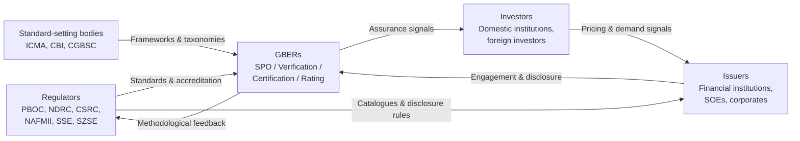

# In-Depth Research Report on China's Green Bond External Reviewers (GBERs) Market: Types, Landscape, and Challenges (Up to End of 2022)
# 1 Introduction and Research Background

## 1.1 Research Background and Rationale

Over less than a decade, China has transformed itself from a peripheral participant in international sustainable debt markets into one of the world's largest sources of labelled green bond issuance. After the People's Bank of China (PBOC) released the inaugural Green Bond Endorsed Project Catalogue in 2015 and Chinese institutions issued their first green bonds in 2016, the market expanded rapidly under a top-down policy architecture in which central regulators set the framework while financial institutions and corporates respond to policy signals[^1]. By the end of November 2022, the issuance scale of domestic green bonds had already reached approximately RMB 744.6 billion (about USD 106 billion) for the year, representing a year-on-year increase of 46.5% and surpassing the total volume of the entire 2021, with the number of issuances rising 13.7% to 590 deals[^1]. Looking across the full year, data subsequently compiled by the Climate Bonds Initiative (CBI) confirm that China issued approximately USD 131.3 billion of green bonds in 2023 across domestic and international markets — nearly double the second-ranked Germany's USD 67.5 billion — a position that crystallised during the 2022–2023 expansion phase covered by this study[^1]. Cumulatively, China's sustainable bond market subsequently surpassed USD 555 billion, placing it among the four largest globally, with green bonds accounting for roughly 80% of aligned volume[^2].

This explosive quantitative growth, however, has not been matched by proportionate progress on qualitative dimensions of market credibility. Labelled green bonds still constitute less than 2% of China's overall bond market, suggesting both significant headroom for further expansion and considerable scope for divergence in issuance quality across an increasingly heterogeneous pool of issuers[^1]. More importantly, the rapid scale-up has been accompanied by persistent international concerns regarding the rigour of "green" definitions, the comprehensiveness of use-of-proceeds disclosure, and the integrity of post-issuance reporting. PBOC Governor Yi Gang publicly warned in mid-2022 against "moral hazards" in green finance, specifically flagging "greenwashing, low-cost fund arbitrage, and green project fraud" — a statement notably released in English as well as Chinese, signalling the regulator's awareness of how credibility deficits could constrain China's appeal to international capital[^1]. Against this backdrop, the **Green Bond External Reviewer (GBER)** — the third-party institution that opines on, certifies, verifies, or scores the "greenness" of a labelled bond — has emerged as a critical piece of market infrastructure whose performance materially shapes whether the headline growth of Chinese green bonds translates into genuine environmental and financial value.

Three contemporaneous developments make a focused study of GBERs at end-2022 particularly timely. First, the July 2022 release of the **China Green Bond Principles (China GBP)** by the Green Bond Standards Committee unified domestic standards and raised the use-of-proceeds threshold from a previous 50–70% range to a fully 100% allocation requirement, bringing China decisively closer to ICMA's international Green Bond Principles and recalibrating the technical work GBERs are required to perform[^1]. Second, in September 2022 the Green Bond Standards Committee formally designated the first batch of **18 institutions** as officially registered green bond evaluation and certification providers — the first time China has imposed a centralised market-entry filter on the GBER profession, transforming what had previously been a largely self-organised service market into a regulated profession[^1]. Third, the November 2022 elevation of service providers' responsibility "to take more responsibility in reducing greenwashing" signals a regulatory shift from treating GBERs as ancillary advisors to recognising them as front-line gatekeepers of market integrity[^1]. Studying the structure, conduct, and risk profile of China's GBER market at exactly this inflection point therefore offers an opportunity to document a market just as it transitions from informal expansion to formal institutionalisation, and to identify the structural risks that remain embedded in that transition.

## 1.2 Research Scope, Time Boundary, and Key Definitions

To ensure analytical precision and reproducibility, this report adopts a tightly bounded scope. The **subject of analysis** is the population of institutions providing external review services for green bonds issued in or from China, including both onshore and offshore (e.g., green Panda bonds and Chinese issuers' international issuance) deals where Chinese institutions provide the review. The **time boundary** is the end of 2022; all market data, regulatory documents, and institutional rosters discussed reflect the state of the market as of 31 December 2022. Post-2022 developments — such as further evolution of the China GBP, expansion of the Approved Verifier list, or subsequent annual market-share data — fall outside the scope of this study and are not relied upon for any analytical conclusion, although they may be acknowledged briefly where they bear directly on the interpretation of end-2022 conditions.

The report adopts working definitions consistent with both ICMA's Green Bond Principles and the China GBP. A **green bond** is a debt instrument whose proceeds are exclusively applied — under the post-China-GBP regime, 100% — to finance or refinance eligible green projects, as defined either by the 2021 PBOC/NDRC/CSRC Green Bond Endorsed Project Catalogue domestically or by internationally recognised taxonomies such as the EU–China Common Ground Taxonomy (CGT) for cross-border issuance[^1]. An **external review** is an independent assessment conducted by a third party other than the issuer and underwriter, which evaluates whether a labelled bond meets defined green criteria at issuance and, in some cases, throughout the bond's life. **Green Bond External Reviewers (GBERs)** are the institutions providing such services; they may take the form of ESG research and consulting firms, credit rating agencies, accounting firms, certification bodies, or academic and research institutions.

Internationally, four review types are commonly recognised and will be examined in detail in Chapter 2: **Second-Party Opinion (SPO)**, **Verification**, **Certification**, and **Green Bond Rating/Scoring**. Each rests on a different methodological logic — opinion-based qualitative judgement, audit-style assurance, conformity assessment against an external standard, and ordinal scoring respectively — and each is associated with different provider types and degrees of standardisation. In the Chinese onshore market, the dominant practice has historically been a hybrid combining elements of SPO and rating, often labelled as "third-party green evaluation and certification" (第三方绿色评估认证), with CBI Certification used principally for issuances that target international investors. Climate Bonds' market data indicates that by 2024 approximately 61% of labelled green bonds globally were backed by SPOs, a benchmark against which China's review-type mix can be situated[^2]. Throughout this report, where Chinese terminology does not map cleanly onto international categories, the report will explicitly indicate the correspondence to avoid conflation.

## 1.3 The Role of External Reviewers in the Green Bond Ecosystem

External reviewers occupy a structurally pivotal position in the green bond ecosystem because green bonds, unlike conventional debt instruments, embed a non-financial promise — the commitment to apply proceeds to environmentally beneficial activities — whose fulfilment investors cannot easily verify on their own. This creates a classical information asymmetry that, absent credible third-party assurance, can degenerate into a market for "lemons" in which low-quality green claims drive out high-quality ones. GBERs address this asymmetry by interposing an independent assessment between the issuer's self-declaration and the investor's purchasing decision, thereby converting unverifiable promises into evaluable signals.

Within China's specific institutional configuration, GBERs perform at least four interrelated functions. First, they **mitigate greenwashing risk** by scrutinising whether claimed eligible projects genuinely fall within the relevant taxonomy — a function that has gained additional weight following the 2021 catalogue's removal of clean-use-of-coal and certain fossil fuel projects from the eligible scope[^1]. Second, they **enable investor due diligence at scale**, particularly important for institutional investors whose mandates increasingly require ESG screening but whose internal capacity for project-level environmental analysis is limited; the fact that foreign holdings of Chinese bonds remain low (around 3.2% of the bond market) means that credible external review is a precondition for any meaningful broadening of the investor base[^1]. Third, they **align domestic issuances with international standards**, especially relevant given China's active engagement in the Common Ground Taxonomy with the EU and Singapore and its participation in bodies such as the IPSF and ISSB[^1]. Fourth, following the 2022 reforms, they increasingly function as **delegated regulatory gatekeepers**, with their reviews used by exchanges and self-regulatory organisations as inputs into eligibility determinations and ongoing supervision.

As the diagram suggests, GBERs sit at the confluence of regulators, issuers, investors, and standard-setting bodies, and their credibility is the binding constraint on the system's overall integrity: when GBERs perform well, the entire ecosystem benefits from reduced search and verification costs; when GBERs underperform or are captured, the credibility deficit cascades to every other node. This systemic centrality is precisely why the November 2022 elevation of GBERs' regulatory status, and the September 2022 formalisation of an 18-institution registry, mark such a consequential shift in China's market governance[^1].

## 1.4 Analytical Framework and Core Research Questions

This report is organised around a three-dimensional analytical framework that mirrors the structure of the user's research enquiry: **typology and methodology**, **market landscape**, and **systemic risks**. The first dimension treats GBER services as a product class, examining how different review types differ in methodological design, provider profile, and informational output — questions that are inherently comparative and require international benchmarking. The second dimension treats the GBER industry as a market, examining its regulatory environment, demand structure (segmented by bond type), supply structure (the population of active reviewers), and competitive dynamics (market shares and concentration) within China. The third dimension treats the GBER market as a potential source of systemic risk, examining how structural features of the market — concentration, conflicts of interest, methodological fragmentation — translate into mechanisms that could amplify, rather than dampen, greenwashing risk.

Three core research questions follow from this framework. **First**, how should the four internationally recognised GBER types be characterised and compared, and what conceptual benchmark does this comparison offer for evaluating Chinese practice? **Second**, what is the actual structure of China's GBER market as of end-2022 — including the regulatory rules that shape demand for review services across different bond categories, the historical evolution of competitive shares, and the composition of the active reviewer population? **Third**, what are the dominant risks embedded in this market structure — particularly oligopoly risk and conflicts of interest — and through what causal mechanisms do these risks threaten the credibility of China's green bond market? Subsequent chapters address these three questions in turn, with explicit attention to where evidence permits firm conclusions and where data gaps require careful hedging.

## 1.5 Report Structure and Methodology

The remainder of the report proceeds in nine chapters. Chapter 2 develops the international typology of GBERs and the three-dimensional comparison across standardisation, comparability, and information quantity. Chapter 3 maps China's multi-regulator architecture, including the jurisdictions of PBOC, NDRC, CSRC, NAFMII, SSE, and SZSE, and the harmonisation effects of the 2021 Catalogue and 2022 China GBP. Chapter 4 compares the four major Chinese green bond categories along four regulatory dimensions in tabular form. Chapter 5 examines the competitive landscape of China's GBER market in 2018–2019, reporting market-share rankings to the extent publicly disclosed. Chapter 6 inventories the GBER institutions active in China and officially recognised by CBI or CGBSC as of end-2022, classified by institutional type. Chapters 7, 8, and 9 analyse oligopoly risk, conflicts of interest, and other challenges respectively. Chapter 10 synthesises findings and derives policy implications.

Methodologically, the report combines **qualitative policy analysis** of primary regulatory documents (PBOC, NDRC, CSRC, NAFMII, SSE, SZSE rules and the China GBP) with **quantitative market mapping** drawing on data published by authoritative market intermediaries (notably CBI) and on regulator-disclosed institutional rosters. Triangulation across at least two independent authoritative sources is applied wherever feasible, and tiered evidence labels — verified, estimated, self-reported — are used to flag the reliability of individual claims. Where market-share data or institutional identities are not publicly disclosed, the report explicitly acknowledges the gap and refrains from extrapolation. All cited evidence is bounded by the end-2022 cutoff; any subsequent data drawn upon for contextual orientation (such as 2023–2024 CBI cumulative figures referenced in this introduction) is used solely to characterise the trajectory in which end-2022 sits and is not relied upon for substantive analytical conclusions in the chapters that follow.

# 2 International Typology of GBERs: Definitions, Providers, and Comparative Analysis

Chapter 1 established that Green Bond External Reviewers (GBERs) sit at the structural fulcrum of the green bond ecosystem, converting unverifiable issuer claims into evaluable signals for investors and regulators. Yet the term "external review" is not monolithic: international practice has crystallised around four distinct review types, each underpinned by a different methodological logic, executed by a different cohort of providers, and producing outputs with markedly different informational properties. Before any meaningful assessment of China's GBER market is possible, a clear international reference frame must be in place — one that defines what each review type actually is, who provides it, and what it can and cannot deliver. This chapter constructs that reference frame on the basis of the authoritative international corpus — most prominently the **International Capital Market Association (ICMA) Guidelines for Green, Social, Sustainability and Sustainability-Linked Bonds External Reviews** (2022), the **Climate Bonds Standard** administered by the Climate Bonds Initiative (CBI), and the **IFC Green Finance Reference Guide** developed under the Green Bond Technical Assistance Program — and uses it to derive a three-dimensional comparative template that anchors the empirical analysis in Chapters 3–9.

## 2.1 Second-Party Opinion (SPO): Definition, Providers, and Characteristics

A Second-Party Opinion (SPO) is, in ICMA's formulation, an assessment issued by "an institution with environmental expertise, that is independent from the issuer" which "normally entails an assessment of the alignment with the Green Bond Principles", and which may "include an assessment of the issuer's overarching objectives, strategy, policy and/or processes relating to environmental sustainability, and an evaluation of the environmental features of the type of projects intended for the Use of Proceeds"[^3][^4]. Operationally, an SPO is therefore an **opinion-based, qualitative assessment** delivered as a narrative report, typically issued pre-issuance and addressed jointly to the issuer's investors and the broader market[^5]. The Loan Syndications and Trading Association (LSTA) and Loan Market Association (LMA) reinforce this characterisation in their parallel guidance for the loan market, observing that "best practice will be for the SPO to be issued prior to execution of the relevant loan agreement", with delayed labelling and publicity if an SPO is not yet finalised[^5].

The methodological scope of a typical SPO is anchored in the four core components of the ICMA Green Bond Principles (GBP). A representative SPO — for example, Sustainalytics' opinion on the RioCan Green Bond Framework — explicitly assesses (i) **use of proceeds** against the eligible categories recognised by the GBP, including verification that selected sub-categories such as Green Buildings rely on credible certification schemes (e.g., LEED Gold/Platinum, BOMA BEST, Toronto Green Standard); (ii) **process for project evaluation and selection**, including governance structures such as a Green Bond Working Committee; (iii) **management of proceeds**, including the tracking system, the intended allocation horizon (commonly 24 months), and the treatment of unallocated proceeds; and (iv) **reporting** commitments on allocation and impact metrics[^3]. The SPO will typically also assess the issuer's broader sustainability strategy, the alignment of the framework with the UN Sustainable Development Goals, and the issuer's capacity to manage environmental and social risks associated with the underlying projects[^3]. ICMA reinforces this expectation by requiring an SPO to state whether the opinion is "partial" — covering only certain core components — or "complete" in scope[^5].

The **typical provider profile** for SPOs is dominated by specialised ESG research and consulting firms rather than audit firms or credit rating agencies. Morningstar's own disclosure characterises Sustainalytics as a "long-time leading provider of SPOs with deep knowledge of the ESG space", and reports — citing Environmental Finance — that Sustainalytics held an approximate **24% global SPO market share in 2022, down from 27% in 2021**, with the share further declining to 21% in the first half of 2023[^6]. The same disclosure articulates the contours of the global SPO competitive landscape: "S&P Global acquired Cicero Shades of Green in late 2022", "Moody's also recently completed the integration of SPO provider Vigeo Eiris", "MSCI and Sustainable Fitch have entered the market", and EthiFinance (which acquired imug rating in 2023) reports having delivered close to 100 SPOs across the European market since 2018[^6][^7]. The picture that emerges is a global SPO market in which dedicated ESG research houses (Sustainalytics, ISS ESG, EthiFinance/imug) coexist with ESG arms of the major credit rating agencies (Moody's via Vigeo Eiris, S&P via Cicero, Fitch via Sustainable Fitch) and broader index/data providers (MSCI), creating a competitive structure marked by both consolidation and new entry[^6].

The **principal strengths** of the SPO format are flexibility, qualitative depth, and broad market acceptance. Because an SPO is an opinion rather than a conformity assessment, it can be tailored to the issuer's specific business model, asset mix, and chosen taxonomy, and can speak to "softer" dimensions such as the materiality of the chosen environmental objective and the alignment with the issuer's overarching sustainability strategy[^4]. SPOs are also well-suited to capturing the full four-pillar architecture of the GBP in a single integrated document, supporting investor due diligence on the framework as a whole rather than on isolated data points. As noted in Chapter 1, SPOs back roughly 61% of labelled green bonds globally by 2024 — a position that reflects market preference for the format's combination of comprehensiveness and accessibility.

The **principal limitations** are the mirror image of these strengths. Because each SPO provider applies its own proprietary methodology to an opinion-based output, **cross-provider and cross-issuer comparability is structurally weak**: an SPO from provider A and an SPO from provider B on similar frameworks may yield different conclusions framed in different vocabularies. ICMA's external review guidelines partially address this by recommending that providers disclose their methodologies and credentials and that reports include statements of independence, conflict-of-interest policies, and clear conclusions[^5], but standardisation remains at the level of disclosure rather than of substantive method. Two further limitations are worth flagging. First, SPOs are typically commissioned and paid for by the issuer, creating a classical issuer-pays conflict structurally analogous to that of credit rating agencies. Second, the qualitative, narrative output is more demanding for investors to digest and compare than an ordinal score or a binary certification status, raising the effective due-diligence cost per bond.

## 2.2 Verification: Definition, Providers, and Characteristics

Verification, in ICMA's typology, refers to "independent verification against a designated set of criteria, typically pertaining to business processes and/or environmental criteria", which "may focus on alignment with internal or external standards or claims made by the issuer", and which may extend to "evaluation of the environmentally sustainable features of underlying assets" or to "[a]ssurance or attestation regarding an issuer's internal tracking method for use of proceeds, allocation of funds from Green Bond proceeds, statement of environmental impact or alignment of reporting with the GBP"[^3]. The defining feature of verification, distinguishing it sharply from SPO, is that it is **measurement-oriented rather than opinion-oriented** — verification reports test specific claims against specific criteria, applying recognised audit or attestation methodologies, and producing conclusions framed in the language of assurance rather than expert opinion[^5].

The 2024 LSTA/LMA Loan External Review Guidelines, which the LSTA and LMA explicitly designed to "largely follow the ICMA External Review Guidelines", identify **three principal sub-forms of verification** that are equally applicable to bond markets[^5]:

- **Assurance** is undertaken by an auditor and produces either *limited assurance* — a "baseline level of assurance...limited to specific aspects or a sampling of data...provid[ing] a negative confirmation that the reviewer is not aware of any material modifications needed to the data" — or *reasonable assurance*, "a higher level of assurance where the auditor will undertake a more detailed and extensive review of the underlying data...and confirm whether it is reasonable to believe the reported conclusions are materially correct"[^5];
- **Attestation**, in which "the external reviewer conducts the measurement or evaluation of the subject matter and produces a report asserting that the data is fairly stated", typically used for annual attestation of use of proceeds and impact in green bonds[^5];
- **Certification** as a verification sub-form, where "the borrower's data, ESG framework, impact or use of proceeds is certified by an accredited third party against a recognized external standard or label that requires specific criteria for compliance"[^5]. Because this last sub-form effectively shades into the separate "Certification" review type discussed in §2.3, this report treats stand-alone certification against external green standards as a distinct category and reserves "verification" for assurance and attestation work.

The **typical provider profile** for verification is dominated by **accounting and audit firms** — most prominently the Big Four (Deloitte, PwC, EY, KPMG) and their major international peers — together with specialised technical assurance providers. IFC's Green Finance Reference Guide is explicit that verification services "are typically conducted by audit firms"[^4]. This provider profile flows directly from the methodological logic: limited and reasonable assurance are formally defined within international auditing and attestation standards (e.g., the International Code of Ethics and Professional Accounts, the Attestation Standards of the American Institute of Certified Public Accountants), and only entities operating within those professional regimes are practically able to issue conclusions framed in their language[^5].

The ethical and organisational standards expected of verifiers are correspondingly more formalised than those for SPO providers. ICMA's framework expects external reviewers to be "guided by core ethical and professional principles of integrity, objectivity, competence and due care, confidentiality and professional behavior", and where reviewers are not already covered by professional regulation, to align with industry-wide codes of conduct[^5][^4]. Verifiers should be "independent from the [issuer's] adviser for its Green Loan, Social Loan and SLL structure or framework, and should not be a sponsor affiliate of the [issuer]", with internal information barriers implemented where necessary[^5]. Verification reports should disclose the level of verification undertaken, the standards applied, the verification criteria, and the procedures for evaluating data[^5].

The **strengths** of verification lie in methodological rigour, evidentiary discipline, and a particularly strong fit with **post-issuance** stages of the green bond lifecycle. Because assurance and attestation methodologies are externally standardised, two verifications of similar scope produced by different audit firms are, in principle, methodologically comparable. Verification is therefore especially suited to verifying allocation reports (confirming that 100% of proceeds have been deployed to eligible projects, as the post-2022 China GBP now requires) and to attesting impact metrics such as GHG emissions avoided, energy savings, or renewable generation. ICMA's GBP explicitly recommends that issuers commission post-issuance audits to confirm that proceeds have been allocated as specified[^4].

The **limitations** of verification are equally distinct. Verification is fundamentally **scope-narrow**: it tests defined claims against defined criteria but does not opine on the appropriateness of the criteria themselves or on the wider environmental coherence of the issuer's strategy. A verification report can confirm that an issuer's allocation tracking system performs as documented without saying anything about whether the underlying projects deliver meaningful environmental impact. Verification is also heavily reliant on **issuer-supplied information**: the auditor tests the data provided, but cannot in general independently regenerate the underlying environmental measurements. Limited assurance — the more common and cheaper form — provides only negative confirmation, which is materially weaker than the positive assertions an SPO or a certification can make. Finally, verification engagements tend to be commercially expensive relative to SPOs because of the procedural intensity required by professional auditing standards, which can constrain their use for smaller issuances.

## 2.3 Certification: Definition, Providers, and Characteristics

Certification, in ICMA's typology, occurs when "an issuer can have its Green Bond or associated Green Bond framework or Use of Proceeds certified against a recognised external green standard or label", where "[a] standard or label defines specific criteria, and alignment with such criteria is normally tested by qualified, accredited third parties"[^3]. IFC's Green Finance Reference Guide identifies the **Climate Bonds Standard, administered by the Climate Bonds Initiative**, as "a common standard in the market"[^4], and CBI itself characterises its scheme as "a voluntary label for investments, assets, and entities aligned with the 1.5°C global warming limit", which "confirms that debt instruments, assets or entities meet the requirements of the ICMA-aligned Climate Bonds Standard and the transparently developed science-based Sector Criteria"[^8]. Certification therefore differs from both SPO and verification in that it is a **conformity assessment against a single, externally defined, science-based standard** with a binary pass/fail logic.

The **institutional architecture** of certification under the Climate Bonds Standard rests on three structural layers:

1. A **standard-setting body** — CBI, whose Climate Bonds Standard is itself ICMA-aligned and is supplemented by sector-specific criteria covering, *inter alia*, energy, transport, water, buildings, land use and marine resources, industry, waste and pollution control, and ICT[^8][^4];
2. **Sector Criteria** defining quantitative, science-based eligibility thresholds for assets within each sector — for example, performance criteria designed to be consistent with a 1.5°C trajectory[^8];
3. A network of **Climate Bonds Approved Verifiers** — third-party institutions authorised by CBI to conduct the underlying conformity assessment whose findings feed into the certification decision[^8]. CBI maintains a public list of Approved Verifiers, and its certification scheme has expanded over time to include Use-of-Proceeds Certification, Asset Certification, Company/Entity-Level Certification, Sustainability-Linked Debt Certification, and Resilience Certification[^8].

The Approved Verifier population spans **multiple provider types**: major audit firms (which bring assurance expertise), ESG research and consulting houses such as Sustainalytics (whose corporate disclosures note that the firm was "named the 'Largest Approved Verifier for Certified Climate Bonds' by the Climate Bonds Initiative" in 2019)[^3], and specialised certification and technical-engineering firms. This heterogeneity reflects the layered nature of certification work: the standard-setter (CBI) defines criteria; the Approved Verifier applies them; and certification is awarded by the standard-setter on the basis of the verifier's findings.

The **strengths** of certification are high standardisation, binary clarity, and strong credibility for international investors. Because the certification criteria are pre-defined, science-based, and uniformly applied, two certified bonds are directly comparable on the dimension that matters most to investors: whether they meet the standard. The binary output (certified or not) is also computationally efficient for index inclusion, ESG portfolio screens, and regulatory references. The science-based nature of the criteria — anchored, for the Climate Bonds Standard, to a 1.5°C-aligned transition trajectory — provides an unusually strong defence against greenwashing accusations, since the criteria themselves are designed to be defensible against external scientific scrutiny[^8].

The **limitations** stem from the same source. First, certification is **scope-restricted by the availability of sector criteria**: only assets that fall within CBI's pre-defined sectors and meet the technical thresholds can be certified, which excludes a substantial share of activities that issuers may regard as legitimately green but for which science-based criteria have not yet been finalised. Second, certification is **binary**: it tells investors whether a bond meets the standard but not by how much, suppressing fine-grained differentiation among certified instruments. Third, the **administrative burden on issuers** is higher than for an SPO, as issuers must engage an Approved Verifier, structure their framework to meet the specific Sector Criteria, and undergo CBI's award process. Finally, certification under the Climate Bonds Standard is voluntary and parallel to issuance-stage regulatory requirements; issuers who do not seek international investor recognition may find the marginal benefit insufficient relative to a lighter-touch SPO, helping explain why certification — although prestigious — remains a minority share of overall labelled green bond volume globally.

## 2.4 Green Bond Rating/Scoring: Definition, Providers, and Characteristics

Green Bond Rating/Scoring is, in ICMA's formulation, an assessment in which "[a]n issuer can have its Green Bond, associated Green Bond framework or a key feature such as Use of Proceeds evaluated or assessed by qualified third parties, such as specialised research providers or rating agencies, according to an established scoring/rating methodology", with output that "may include a focus on environmental performance data, the process relative to the GBP, or another benchmark, such as a 2-degree climate change scenario"[^3]. The 2024 LSTA/LMA loan guidance describes the analogous loan-market product as one where "the borrower utilizes an ESG score or similar rating, for itself, its loans or an underlying investment or project", with the lender and borrower selecting a "suitable rating or scoring agency" whose methodology is "made transparent by the rating agency"[^5]. The defining feature of rating/scoring, distinguishing it from the other three types, is that the output is an **ordinal label** — a grade, score, or shade — produced according to a disclosed but provider-specific scoring methodology.

ICMA is careful to note that green bond ratings are **distinct from credit ratings**: "Such scoring/rating is distinct from credit ratings, which may nonetheless reflect material environmental risks"[^3]; the 2024 LSTA/LMA guidance reiterates that ESG ratings, "while different from a credit rating", may "nonetheless reveal significant risk based on environmental, social or sustainability factors"[^5]. The output is therefore an environmental-quality signal, not an indicator of repayment capacity.

The **typical provider profile** for green bond rating/scoring is dominated by credit rating agencies extending their franchises into ESG assessment and by specialised research providers operating in scoring formats. Moody's identifies "Best Second Party Opinion Provider" as a category in its industry awards but also markets Moody's Investors Service ESG assessments and methodologies developed by its acquired affiliate Vigeo Eiris[^9]. S&P, having acquired Cicero Shades of Green in late 2022, brings the Cicero "shades of green" framework — a graduated scoring approach distinguishing dark, medium, and light green — into a credit-rating-style architecture[^6]. Fitch, through Sustainable Fitch, similarly operates ESG ratings products distinct from credit ratings[^6]. Specialised research providers also produce scoring outputs that, while not formally branded as ratings, share the ordinal-output methodology.

Scoring methodologies typically incorporate multiple analytical inputs: use-of-proceeds quality (alignment with taxonomy categories, exclusion of fossil-fuel-locked-in projects), governance (board oversight, project selection process), transparency (reporting commitments), and benchmark alignment (e.g., consistency with a 2-degree or 1.5-degree pathway, alignment with the SDGs)[^3]. The methodologies are disclosed by the provider, but the weighting schemes, scoring thresholds, and final aggregation rules remain provider-specific.

The **strengths** of rating/scoring are concentrated in **investor usability**: an ordinal label is easy to compare across issuers and across providers' own client books, easy to integrate into ESG portfolio construction rules, and easy to communicate to retail and institutional investors alike. Scoring formats also allow gradations that binary certification cannot capture — for example, distinguishing between a "dark green" and a "medium green" issuance — which can support more nuanced investment decisions and pricing differentiation. Because the output is anchored to a disclosed methodology, the rating can in principle be re-applied to new issuances on a like-for-like basis, providing a consistent within-provider comparability.

The **limitations** are significant. First, **methodological opacity remains material** even where methodologies are disclosed: the underlying weights, judgements, and qualitative inputs that translate raw data into the final label often involve discretion that the disclosed methodology does not fully constrain. Second, **cross-provider comparability is weak**: a "dark green" from one provider is not formally equivalent to an "AA" green score or a "high" green rating from another, since each methodology is calibrated independently. Third, the ordinal label **compresses multidimensional environmental information into a single signal**, which is investor-friendly but information-poor; an investor who wants to understand *why* a bond received its grade must still consult the underlying narrative, and the headline label may obscure trade-offs that a fuller SPO would surface. Fourth, like SPOs, ratings are commercially commissioned, raising issuer-pays conflict-of-interest concerns that are well-documented in the credit rating literature and that carry over to ESG ratings produced by the same parent groups.

## 2.5 Comparative Analysis Across Standardization, Comparability, and Information Quantity

The preceding sections show that the four review types are not substitutes operating on different price points for the same service, but **complementary instruments operating on different methodological logics**, with distinct strengths and weaknesses along the dimensions that matter most for mitigating information asymmetry and greenwashing risk. To make this systematic, the chapter now consolidates the four types along three analytical dimensions: **standardisation**, **comparability**, and **information quantity**.

- **Standardisation** captures the degree to which a review type is anchored in a uniform, externally defined methodology that constrains provider discretion. The dimension is highest where methodology is externally fixed (e.g., a single global standard with published sector criteria), intermediate where methodology is anchored in a profession-wide regime (e.g., assurance standards), and lowest where each provider develops its own framework.
- **Comparability** captures the ease with which review outputs from different issuers and different providers can be benchmarked side by side. The dimension is shaped by both the standardisation of the underlying methodology and the format of the output.
- **Information quantity** captures the richness and granularity of what the review actually discloses about the bond, framework, or issuer. Richer outputs support deeper due diligence but raise the cost of comparison; sparser outputs do the reverse.

Applying these dimensions to the four review types yields the following structured matrix:

| Review Type | Typical Providers | Methodological Logic | Standardisation | Comparability | Information Quantity |
|---|---|---|---|---|---|
| **Second-Party Opinion (SPO)** | ESG research/consulting firms (Sustainalytics, ISS ESG, EthiFinance, Cicero/S&P, Vigeo Eiris/Moody's, MSCI, Sustainable Fitch)[^6][^7] | Independent expert opinion on alignment with ICMA GBP and the issuer's sustainability strategy[^3] | **Low–Medium**: anchored in GBP's four pillars but methodology is provider-specific[^3] | **Low**: narrative outputs and heterogeneous methodologies inhibit direct cross-provider comparison[^6] | **High**: multi-page qualitative reports covering use of proceeds, project selection, management of proceeds, reporting, sustainability strategy, ESG risk management, and SDG alignment[^3] |
| **Verification (assurance / attestation)** | Audit firms and specialised assurance providers operating under international auditing/attestation standards[^5][^4] | Audit-style testing of defined claims against defined criteria; limited or reasonable assurance, or attestation[^5] | **Medium–High**: anchored in externally codified assurance standards (e.g., AICPA Attestation Standards, International Code of Ethics)[^5] | **Medium**: standardised assurance vocabulary supports comparison of *assurance level*, though underlying criteria vary by engagement | **Medium**: technically detailed but scope-narrow; covers specific data points (allocation, KPIs, impact metrics) rather than the framework as a whole[^5] |
| **Certification** (e.g., Climate Bonds Standard) | CBI Approved Verifiers — audit firms, ESG consultancies, specialised certifiers — applying CBI Sector Criteria[^8][^3] | Conformity assessment against a single external, science-based standard with sector criteria[^8] | **High**: criteria are pre-defined, uniform across issuers, science-based, and ICMA-aligned[^8] | **High**: binary pass/fail output is directly comparable across all certified bonds within the same standard[^8] | **Medium–Low**: binary label plus supporting narrative; the headline is compact but underlying verifier reports may be extensive[^8] |
| **Green Bond Rating/Scoring** | Credit rating agencies extending into ESG (Moody's, S&P/Cicero, Fitch/Sustainable Fitch) and specialised research providers[^6][^9] | Ordinal evaluation against a provider-specific scoring methodology, often benchmarked to climate scenarios[^3] | **Medium**: methodology is disclosed but provider-specific; weights and aggregation rules involve provider discretion[^5][^3] | **Medium (within provider) / Low (across providers)**: ordinal labels are easy to compare within a single methodology but not formally equivalent across providers[^3] | **Low–Medium**: compact ordinal label supported by a rationale; rich for the headline but compressed relative to SPO/verification[^5] |

Two analytical conclusions follow from this matrix. First, **no single review type dominates on all three dimensions**: certification scores highest on standardisation and comparability but compresses information; SPO scores highest on information quantity but lowest on comparability; verification offers methodological rigour on narrowly defined claims; and rating offers investor-friendly compactness at the cost of methodological homogeneity across providers. The dimensions trade off against one another in structurally predictable ways — higher standardisation tends to compress information, while richer information resists standardisation.

Second, and as a corollary, **a well-functioning green bond market typically requires complementary use of multiple review types** rather than reliance on a single one. The ICMA-administered ecosystem implicitly endorses this complementarity: the GBP recommends a pre-issuance SPO to confirm framework alignment and a post-issuance verification of allocation; CBI's certification operates in parallel as a high-credibility label for issuers seeking the deepest assurance signal; and ratings can serve as compact second-tier signals supporting investor screening at portfolio scale. This complementarity also implies that **the appropriate benchmark for evaluating a national GBER market is not the dominance of any single review type, but the coherence of the overall mix relative to the credibility tasks the market needs performed**.

## 2.6 Implications for Benchmarking Chinese Practice

The typology developed above provides three concrete benchmarks for the empirical analysis of China's GBER market in subsequent chapters.

First, the **mapping of Chinese onshore practice to international categories must be done carefully and explicitly**. As noted in Chapter 1, the dominant Chinese onshore output — "third-party green evaluation and certification" (第三方绿色评估认证) — is in practice a **hybrid combining elements of SPO and rating**: the typical Chinese report contains an extended narrative on use of proceeds, project selection, management of proceeds, and reporting (the SPO content) often accompanied by a graded label or grade-level conclusion (the rating content). It is not in the formal ICMA sense a "certification" against an external standard, despite the literal Chinese term. CBI's Climate Bonds Standard, by contrast, **does** sit cleanly within the international Certification category and operates in China primarily as the route for issuers targeting international investors. This terminological asymmetry — onshore "certification" mapping in practice to SPO/rating, while international "Certification" maps to CBI's scheme — is a persistent source of confusion that this report will manage by always specifying which international category a given Chinese output belongs to.

Second, the **three analytical dimensions — standardisation, comparability, and information quantity — provide the explicit lens through which Chinese GBER outputs and the Chinese GBER market structure will be assessed**. Standardisation will be examined at two levels: the methodological standardisation across Chinese reviewers (how convergent or divergent are their approaches?) and the regulatory standardisation imposed by the China GBP and the CGBSC registry. Comparability will be examined in terms of whether Chinese review outputs across providers and across bond types support meaningful cross-issuer benchmarking by investors. Information quantity will be examined in terms of the depth and granularity of Chinese review reports, including the extent of methodological disclosure and the detail of post-issuance reporting.

Third, the typology highlights **structural risks specific to hybrid review formats** that will be central to Chapters 7–9. A hybrid SPO–rating output combines the standardisation weakness of SPO with the information-compression weakness of rating, while inheriting the issuer-pays conflict-of-interest risk that both face. Where such a hybrid is also the dominant — or only — format used domestically, the market's resilience depends on offsetting institutional mechanisms: a credible accreditation regime (addressed by China's September 2022 designation of 18 institutions, discussed in Chapter 6), well-defined disclosure rules (addressed unevenly across bond types, discussed in Chapter 4), and effective conflict-of-interest safeguards (the focus of Chapter 8). Absent such offsets, the methodological characteristics of the dominant Chinese review format would in themselves elevate greenwashing and credibility risks above what would obtain under a balanced multi-type market structure.

With this international benchmark in place, the report now turns in Chapter 3 to the regulatory framework that shapes the demand side of China's GBER market — the multi-regulator architecture under which different green bond types are issued, and the harmonising effects of the 2021 Endorsed Project Catalogue and the 2022 China Green Bond Principles.

# 3 Regulatory Framework of China's Green Bond Market

Chapter 2 established the international typology against which Chinese GBER practice must be benchmarked. The methodological work that GBERs perform, however, is not freely chosen by reviewers or issuers — it is decisively shaped by the regulatory environment that defines what counts as a green bond, what proceeds can finance, what must be disclosed, and what external review is required. In China, that environment is distinctive in two respects: it is **multi-regulator** by design, with authority distributed across the central bank, the macro-planning ministry, the securities regulator, a self-regulatory organisation, and two stock exchanges; and it has been in **active harmonisation** since 2021, with two pivotal initiatives — the 2021 Green Bond Endorsed Project Catalogue and the 2022 China Green Bond Principles — narrowing the rule divergences that previously fragmented the market. This chapter maps that architecture as of end-2022, traces the historical fragmentation it inherited, examines the two harmonisation milestones, and sets out the implications for the demand side of the GBER market that Chapters 4–6 will examine in detail.

## 3.1 The Multi-Regulator Architecture and Jurisdictional Division

China's green bond market is governed by six principal authorities operating across two parallel trading venues. On the **China Interbank Bond Market (CIBM)** — the dominant venue by issuance volume — the **People's Bank of China (PBOC)** holds primary regulatory authority, supervising both green financial bonds issued by banks and other financial institutions and, indirectly through the **National Association of Financial Market Institutional Investors (NAFMII)**, the green debt financing instruments issued by non-financial corporates. NAFMII operates as "a self-regulation organisation with membership including participants in the interbank bond market under the regulatory authority of the PBOC"[^10], combining rule-making for member instruments with registration-based issuance oversight. On the **securities exchange markets** — the Shanghai Stock Exchange (SSE), the Shenzhen Stock Exchange (SZSE), and (from late 2021) the Beijing Stock Exchange — the **China Securities Regulatory Commission (CSRC)** sets the framework rules for green corporate bonds and green asset-backed securities, with SSE and SZSE implementing listing and ongoing supervision[^10]. The **National Development and Reform Commission (NDRC)**, occupying a distinctive macro-planning role, governs green enterprise bonds issued primarily by state-owned enterprises and local-government-affiliated entities, with issuance proceeds typically tied to projects aligned with national industrial policy[^10].

This jurisdictional allocation is organised along two axes — **issuer type** (financial institution, non-financial corporate, state-owned enterprise) and **trading venue** (CIBM versus exchange) — rather than along the dimension of the "green" label itself. The consequence is a **parallel rather than unified governance structure**: each regulator independently issues rules for bonds under its remit, with no single rule-book covering all green bonds. The mapping that emerges from NAFMII's own characterisation of the architecture is summarised below[^10]:

| Bond Category | Primary Regulator | Trading Venue | Foundational Issuance Rule |
|---|---|---|---|
| Green Financial Bonds | PBOC | CIBM | Notice Regarding Issuance of Green Finance Bonds in the Interbank Bond Market; Notice Regarding Regulatory Oversight of Green Finance Bonds over Entire Duration Period |
| Green Enterprise Bonds | NDRC | Exchange markets | Green Bond Issuance Guidelines |
| Green Corporate Bonds / Green Corporate ABS | CSRC (with SSE, SZSE) | Exchange markets | Guiding Opinions on Support for Development of Green Bonds |
| Green Debt Financing Instruments | NAFMII (under PBOC supervision) | CIBM | Guidelines for Non-Financial Enterprise Green Debt Financing Instrument |
| Green State-Owned Enterprise Bonds | SSE/SZSE | Exchange markets | Notice Regarding Trial Use of Green SOE Bonds |

For GBERs, this structure means that the technical scope of an external review engagement, the disclosure obligations the review must support, and even the formal status of a particular review provider can vary by the regulator under whose rules the bond is issued. The architecture therefore creates not one market for external review services but **multiple overlapping sub-markets, each with its own regulatory demand profile** — a structural feature that shapes both competitive positioning (Chapters 5–6) and the risk landscape (Chapters 7–9).

## 3.2 Regulator-Specific Rules Across the Four Major Green Bond Categories

The four major green bond categories around which this report's comparative analysis is organised — green financial bonds, green enterprise bonds, green corporate bonds, and green debt financing instruments — each emerged under independently developed rule-sets between 2015 and 2017, and these rule-sets diverged on dimensions central to GBER work.

**Green Financial Bonds**, regulated by the PBOC, sit within the most developed disclosure and supervisory regime of the four categories, reflecting the PBOC's direct supervision of issuers and the central bank's pioneering role in launching the 2016 Guidelines for Establishing the Green Financial System and the original 2015 Green Bond Endorsed Project Catalogue[^11]. The Catalogue was identified by the PBOC itself as the foundational framework "structuring the types of green projects eligible for financing by green bonds"[^11], and early benchmark issuances — including from Goldwind and the Agricultural Bank of China — were issued in this segment[^11].

**Green Enterprise Bonds**, regulated by the NDRC, were governed by a separate *Green Bond Issuance Guidelines* with a partially overlapping but distinct list of eligible categories. Historically, this regime permitted a relatively flexible use of proceeds — including a substantial share that could be applied to general working capital or repayment of interest-bearing debts — reflecting NDRC's broader macro-planning orientation and its support for large state-owned enterprise issuers.

**Green Corporate Bonds and Green Corporate ABS**, regulated by the CSRC under the *Guiding Opinions on Support for Development of Green Bonds* with listing and ongoing supervision by SSE and SZSE[^10], integrated green bond disclosure into the securities-law framework governing listed instruments. SSE and SZSE additionally administer the *Notice Regarding Trial Use of Green SOE Bonds*, which applies a distinct sub-regime to state-owned-enterprise issuers in the exchange markets[^10].

**Green Debt Financing Instruments**, regulated by NAFMII under the *Guidelines for Non-Financial Enterprise Green Debt Financing Instrument*[^10], are issued by non-financial corporates in the CIBM under a registration regime, with NAFMII setting both eligibility and disclosure rules under PBOC supervision. This segment combines the CIBM's relatively strong review and disclosure expectations with the registration-based flexibility characteristic of NAFMII instruments.

Across these four regimes, the pre-harmonisation rules diverged on four key dimensions that directly shape GBER demand. **Eligible project scope** varied: PBOC's 2015 Catalogue underpinned the financial bond and (by reference) NAFMII regimes, while NDRC operated its own catalogue with a distinct list, and CSRC referenced both. **Use-of-proceeds proportion requirements** historically ranged from approximately 50% to 70% across the four regimes, materially below the international ICMA expectation of essentially full allocation. **Information disclosure** obligations differed in frequency, granularity, and the inclusion of impact metrics. **External review** was variously recommended, encouraged, or required depending on the regulator and the specific instrument, producing uneven demand intensity for GBER services across categories. The structured comparison of these four dimensions across the four bond types — including the post-2022 effects of harmonisation — is set out in detail in Chapter 4.

## 3.3 Historical Fragmentation and Its Consequences for Market Integrity

The pre-2021 fragmented regime carried four substantive consequences for market integrity, each of which created either a credibility deficit or an uneven demand profile for external review.

**First**, the divergent green definitions across regulators produced **inconsistent treatment of fossil-fuel-related projects**. The PBOC 2015 Catalogue and the NDRC Guidelines both initially recognised certain "clean coal" and fossil-fuel-adjacent activities as eligible, a position that diverged sharply from the international ICMA/CBI consensus. The practical consequence was material: during the first half of 2019 alone, "at least $1bn of 'green finance' was provided to thirteen coal related projects"[^11], and as much as "two-thirds in 2021" of Chinese green bond issuance was not aligned with international standards, "restricting investor appetite" from abroad[^11].

**Second**, the uneven use-of-proceeds rules — with thresholds in the 50%–70% range against an international expectation of essentially full allocation — meant that a "green" label in China carried a different substantive meaning than the same label internationally. Even after the 2021 Catalogue, commentary noted that "China allows issuers to allocate up to 50% of proceeds to working capital, whereas international standards only allow 5%"[^11]. The label was therefore less informative than its international counterpart, weakening the signal that external reviews could deliver and constraining investors' willingness to rely on Chinese-domestic review outputs.

**Third**, the **asymmetric external review mandates** produced uneven coverage across the market. Issuances in the CIBM under PBOC and NAFMII rules were subject to relatively strong review expectations, while issuances under other regimes faced softer requirements. CBI data referenced in Chinese green finance commentary indicates that "only 61% of issuances having any external review in 2020"[^11], well below the global market norm, with the gap concentrated in segments where review was not mandated. This uneven coverage created a tiered credibility landscape in which the substantive value of the "green" label depended materially on which regulator's regime applied.

**Fourth**, the fragmentation generated **regulatory arbitrage risk**: an issuer facing tighter rules under one regime could, in principle, restructure its issuance to fall under a lighter regime. While the practical scale of such arbitrage is hard to quantify and is not directly measured by publicly available data — a gap that should be acknowledged — the structural possibility itself eroded the credibility of the "green" label as a uniform market signal and complicated investors' ability to compare Chinese green bonds across categories. Commentary by 2022 identified these difficulties as collectively risking "hampering the development of its green bond market before reaching full potential"[^11].

The resulting demand for external review services was therefore uneven across bond categories: more intense in the CIBM segments where review was effectively mandated, weaker in segments where it was merely encouraged. This unevenness directly shaped the competitive positioning of the GBER population, with reviewers gravitating toward segments where regulatory mandate produced reliable demand — a pattern that helps explain the market-share concentration patterns examined in Chapter 5.

## 3.4 The 2021 Green Bond Endorsed Project Catalogue: Taxonomy Unification

The April 2021 *Notice on the Issuance of the Catalog of Green Bond Endorsed Projects (2021 Edition)*, jointly released by PBOC, NDRC, and CSRC and effective from 1 July 2021, marked the first cross-regulator taxonomy unification in China's green bond market[^12][^13]. As industry analysis at the time characterised it, the Catalogue marks the "unification of green bond taxonomy" across the three principal regulators[^12], with four substantive features that materially reshape the demand environment for GBERs.

**First, the removal of fossil-fuel categories.** The 2021 Catalogue removed clean coal and other fossil-fuel-related categories that the 2015 PBOC Catalogue and the parallel NDRC list had previously recognised. CBI and other commentators recorded that "a new green bond catalogue was published that removed fossil fuel categories, bringing the Chinese market much closer to international standards"[^11], a step described by industry observers as "vital to encouraging international investors"[^11]. This single change addressed what international investors had identified as the single largest credibility deficit of the prior regime.

**Second, scope expansion and structural reorganisation.** The 2021 Catalogue organises eligible projects across six high-level industry domains — **Energy Saving and Environmental Protection**; **Clean Production**; **Clean Energy**; **Ecology and Environment-related Sector**; **Sustainable Upgrade of Infrastructure**; and **Green Services**[^13] — with detailed sub-categories ranging from manufacturing of energy-efficient equipment, to wind, solar, biomass, hydropower and nuclear generation, to ecological restoration and green consulting services. SynTao Green Finance characterised this as "scope expansion to facilitate the expansion of the green bond market"[^12]. The expansion provides eligibility coverage for the wide range of decarbonisation and environmental-protection activities relevant to China's broader transition.

**Third, increased technical specificity.** Many sub-categories in the 2021 Catalogue are anchored to specific national technical standards (e.g., GB-series energy-efficiency limits and grades), defined performance thresholds, and references to industry-specific catalogues. Concrete examples include: the requirement that "the energy efficiency of industrial boilers should meet or exceed Level Two or above of the Energy Efficiency Limits and Energy Efficiency Grades for Industrial Boilers (GB 24500)"[^13]; the requirement that solar photovoltaic modules meet specified minimum photoelectric conversion efficiencies ("polycrystalline silicon cells and monocrystalline silicon cells shall not be lower than 19% and 21%, respectively") and prescribed attenuation rates ("not higher than the following, i.e., 2.5% and 3%, respectively, in the first year, 0.7% annually in subsequent years, and 20% within 25 years" for crystalline silicon modules)[^13]; and the requirement that multi-energy complementary systems achieve "comprehensive energy efficiency...greater than or equal to 70%" with "the waste rate of wind power of the system...controlled within 5%, and that of solar power...controlled within 3%"[^13]. This level of technical detail represents a substantial deepening of taxonomy specificity relative to the prior regime.

**Fourth, increased demand on third-party review.** SynTao Green Finance explicitly identified one of the four headline features of the 2021 Catalogue as "rich technical details and higher requirements for third-party assessment and certification"[^12]. The combination of broader scope, deeper technical thresholds, and removal of categories that issuers had previously used signals a substantial elevation in the substantive task that GBERs must perform. Where the prior regime allowed relatively light-touch alignment reviews against a coarser taxonomy, the 2021 Catalogue requires reviewers to assess specific technical thresholds against named national standards, raising both the methodological burden on reviewers and the substantive value of a credible review to investors.

The Catalogue's unification across PBOC, NDRC, and CSRC also reduced one major axis of regulatory fragmentation: from July 2021, a green bond issued under any of the three principal regulators' rules drew on the same eligible-project list. Equally importantly, SynTao characterised the Catalogue as designed for "alignment with international standards and favorable recognition by international markets"[^12], embedding international convergence as an explicit policy objective rather than a downstream aspiration. Differences in use-of-proceeds rules, disclosure, and review mandates, however, persisted across regulator regimes — gaps that the 2022 China Green Bond Principles were designed to address.

## 3.5 The 2022 China Green Bond Principles: Substantive Harmonisation

The July 2022 release of the **China Green Bond Principles (China GBP)** by the Green Bond Standards Committee — the cross-regulator body convened under PBOC auspices and comprising representatives of the principal market regulators — extended the harmonisation initiated by the 2021 Catalogue from taxonomy to substantive issuance rules. As of end-2022, the issuance of green bonds in China is guided by "uniform standards that apply to all green bonds, as stipulated in the China Taxonomy and the China Green Bond Principles (CGBP)"[^10], with CGBP applying both to bonds issued in the CIBM and to those issued in the exchange markets[^10].

The most consequential single provision is the **unification of the use-of-proceeds threshold at 100%**, raising the historical 50%–70% range to full allocation. This brings the Chinese onshore standard decisively into alignment with the ICMA GBP expectation. The change has two direct implications for GBERs. First, it eliminates one of the principal sources of historical divergence between domestic and international external review work: a Chinese reviewer assessing use of proceeds under the China GBP now performs substantively the same allocation test as an international reviewer under ICMA. Second, it shifts the centre of gravity of the review engagement from threshold-checking (was 50% met? 70%?) to comprehensive allocation verification, increasing the methodological proximity of Chinese review work to international SPO and verification work as characterised in Chapter 2.

The China GBP also aligns the **four core components** of the Chinese framework — use of proceeds, process for project evaluation and selection, management of proceeds, and reporting — with the four pillars of the ICMA GBP. This alignment is structurally important because, as Chapter 2 established, the ICMA four-pillar architecture is the framework against which international SPOs are produced; a Chinese review against the China GBP four pillars therefore produces an output that is structurally comparable, in scope, to an international SPO. Combined with the 2021 Catalogue's taxonomy unification, this creates the substantive conditions under which Chinese green bonds can be assessed against a domestic framework that closely tracks international practice.

For GBERs, the China GBP creates a **more uniform demand profile across previously divergent bond categories**: regardless of whether a bond is a green financial bond, green enterprise bond, green corporate bond, or green debt financing instrument, a review against the China GBP applies the same four-pillar framework and the same 100% allocation requirement. While individual regulators retain rule-making authority over their respective bond types and continue to issue category-specific rules on registration, disclosure timing, and supervisory mechanisms[^10], the substantive scope of an external review engagement converges. The China GBP therefore functions as the principal cross-regulator harmonisation of the demand side of the GBER market.

Important divergences from ICMA GBP nonetheless remain. International commentary documented through 2022 continued to note that "green bonds issued in China under these standards do not necessarily comply with international standards and therefore may not be attractive to foreign investors", and that "as a result, there currently is a lack of investment by foreign investors in China's green bonds and transition bonds"[^10]. CBI data also continued to flag persistent gaps in "information disclosure, external review and transparency processes"[^11]. The China GBP therefore narrows but does not close the gap with international standards — a residual divergence relevant to Chapter 9's analysis of remaining challenges and to the strategic positioning of those Chinese GBERs (notably CBI Approved Verifiers, examined in Chapter 6) whose competitive advantage lies in producing internationally recognised outputs.

## 3.6 Implications of the Reshaped Regulatory Architecture for GBERs

The combined effect of the 2021 Catalogue and the 2022 China GBP, layered on top of the pre-existing multi-regulator architecture and reinforced by the September and November 2022 institutional reforms discussed in Chapter 1, produces a reshaped institutional context for GBERs with four distinct features as of end-2022.

**First, taxonomy and substantive issuance rules are largely unified, while procedural and supervisory rules remain regulator-specific.** A GBER engagement now applies a common eligible-project list and a common four-pillar/100%-allocation framework regardless of which regulator's rules govern the issuance, but the registration mechanics, the timing and content of disclosure, and the formal status of the review report continue to vary across PBOC, NDRC, CSRC, NAFMII, SSE, and SZSE rules[^10]. The demand structure for review services is therefore substantively convergent at the framework level but procedurally heterogeneous at the engagement level — a configuration that rewards reviewers with multi-regime expertise and creates entry barriers for reviewers specialised in only one regulatory channel.

**Second, the substantive technical burden on GBERs has risen markedly.** The 2021 Catalogue's anchoring of eligibility to specific national technical standards and performance thresholds[^13] requires reviewers to engage with engineering-grade detail that the prior regime did not demand. Combined with the China GBP's 100% allocation requirement, this raises both the depth of pre-issuance work and the rigour of post-issuance allocation verification. The implication is sustained upward pressure on the technical capabilities required of credible reviewers — favouring institutions able to combine financial-market expertise with specialist engineering, energy, and environmental knowledge.

**Third, regulatory recognition of GBERs as institutional actors has been formalised.** As outlined in Chapter 1, the September 2022 designation of the first batch of 18 institutions as officially registered green bond evaluation and certification providers by the Green Bond Standards Committee transforms the GBER profession from a self-organised service market into a regulated one with a centralised market-entry filter, while the November 2022 elevation of service-provider responsibility further repositions GBERs as front-line gatekeepers rather than ancillary advisors. Together, these developments shift GBERs from a position of regulatory passivity to one of explicit regulatory accountability — a transformation whose competitive and risk implications are taken up in detail in Chapters 6–8.

**Fourth, residual fragmentation persists in ways material to GBER practice.** The multi-regulator architecture itself remains intact: PBOC, NDRC, CSRC, NAFMII, SSE, and SZSE each continue to issue and revise their own category-specific rules[^10], and Chapter 4 will document continuing divergences across the four bond types on dimensions including special account management, disclosure frequency, and the formal mandate for external review. Beyond domestic fragmentation, the residual gap with international standards — most notably on certain use-of-proceeds flexibilities and on disclosure granularity[^11][^10] — means that GBERs serving issuers targeting international investors must in practice produce review outputs that meet both the China GBP and ICMA/CBI standards. This **dual-track demand structure** shapes the strategic positioning of reviewers, particularly those — such as CBI Approved Verifiers — whose competitive advantage lies in international recognition, and contributes to the segmentation patterns observed in Chapters 5 and 6.

Taken together, these features define the regulatory demand side of China's GBER market as of end-2022: a market in which substantive harmonisation has dramatically converged the framework against which reviews are performed, while procedural fragmentation, technical depth, and the dual domestic-international standard pose persistent challenges for review quality and consistency. Against this regulatory backdrop, Chapter 4 now examines the four major green bond categories in structured tabular form, comparing them across the four regulatory dimensions — proceeds allocation, special account management, disclosure, and external review — that most directly shape the engagement-level demand for GBER services.

# 4 Comparative Analysis of Regulatory Requirements Across Bond Types

Chapter 3 traced how China's multi-regulator architecture has evolved from a fragmented mosaic of category-specific rules into a substantively harmonised framework anchored by the 2021 Green Bond Endorsed Project Catalogue and the 2022 China Green Bond Principles (China GBP). That mapping established *what* has changed at the level of taxonomy and overarching principles. This chapter operationalises the comparison at the level *most consequential for external reviewers*: the engagement-level rules that govern how proceeds may be deployed, segregated, disclosed, and externally assessed. By examining the four major Chinese green bond categories — green financial bonds, green enterprise bonds, green corporate bonds (including green asset-backed securities), and green debt financing instruments — along four regulatory dimensions, the chapter exposes the rule-divergences that historically segmented the GBER demand market and shows how the post-2022 China GBP has reconfigured the substantive rules-of-engagement for reviewers. The analysis thus functions as the empirical bridge between the regulatory architecture mapped in Chapter 3 and the market-structure analysis of competition and supply that follows in Chapters 5–6.

## 4.1 Four Regulatory Dimensions Shaping GBER Engagement

The selection of comparative dimensions for this chapter is not arbitrary. Each of the four dimensions below maps directly to a specific element of the work that external reviewers perform, and together they exhaust the regulatory levers that shape the demand profile for GBER services at the level of the individual issuance.

**Proceeds allocation ratio requirements** define the minimum share of bond proceeds that must be directed to eligible green projects. This dimension is the single most consequential input into the substantive scope of allocation verification: where the threshold is set materially below 100%, a reviewer's allocation testing is reduced to confirming compliance with a percentage cut-off and may permit a substantial fraction of proceeds to flow to general working capital or non-green refinancing. Where the threshold is set at 100% — the position adopted by the China GBP and aligned with international practice — allocation testing becomes a comprehensive verification of *every* renminbi raised, structurally elevating the rigour of the engagement.

**Special account or dedicated ledger management requirements** define the segregation infrastructure issuers must implement to ensure proceeds remain traceable from receipt to deployment. This dimension shapes the *audit trail* against which reviewers can test allocation claims. A regulator-mandated special account creates an externally verifiable evidentiary base; a softer "dedicated ledger" requirement places greater reliance on issuer-maintained internal records. The PBOC's 2015 Announcement explicitly required issuers to "open a special account or establish a special ledger" and to manage receipt, disbursement, and recovery so as to "guarantee dedicated use of funds, with the entire proceeds used for green industrial projects during the duration of the bond"[^14]. The strength of this infrastructure directly determines what a reviewer can reliably verify and at what cost.

**Information disclosure obligations on use of proceeds** define the frequency, granularity, and content of issuer reporting throughout the bond's life. This dimension determines whether external review is a one-off pre-issuance exercise or a recurring engagement across the bond's lifecycle. The PBOC framework required quarterly market disclosure of proceeds usage and an annual report with a special audit report by 30 April each year[^14], which embeds reviewers in a recurring annual workflow. Where disclosure is annual only, or where impact metrics are merely encouraged rather than required, the recurring engagement structure is correspondingly weaker.

**External review requirements** define whether independent third-party assessment is mandatory, encouraged, or merely permitted. This dimension determines whether review is a *precondition* for issuance — generating reliable, regulatorily-anchored demand — or an *optional credibility enhancement* whose uptake depends on issuer voluntarism and investor pressure. The PBOC's 2015 Announcement adopted an "encourage" formulation: "in addition to the application materials specified in Article 4 of this Announcement, financial institution legal persons applying to issue green financial bonds are encouraged to submit evaluation or certification opinions issued by independent professional evaluation or certification institutions"[^14]. Across the four bond types, the strength of this mandate has historically varied, producing the segmented demand structure documented below.

Taken together, these four dimensions translate into a four-input demand function for GBER services: allocation thresholds determine the *substantive depth* of allocation verification; account-management rules determine the *evidentiary base* on which reviewers operate; disclosure frequency determines the *temporal extent* of the engagement; and mandate status determines the *binding-ness* of regulatory demand. The structured comparison in §4.2 applies this lens to the four bond types.

## 4.2 Pre-Harmonisation Comparative Matrix Across the Four Bond Types

The pre-harmonisation rules governing China's four major green bond categories crystallised between 2015 and 2017, with category-specific guidance issued by each regulator. The position as of immediately before the 2021–2022 harmonisation milestones can be reconstructed from the foundational regulatory documents and from the descriptive characterisations available in industry materials. Several specific cells in the matrix below — particularly fine-grained allocation thresholds for individual bond types — are documented at varying levels of public granularity; the table accordingly draws clear distinctions between provisions that are explicitly anchored in primary documents and those that reflect industry-summarised practice, in line with the evidence-tiering principle adopted by this report.

| Dimension | Green Financial Bonds (PBOC) | Green Enterprise Bonds (NDRC) | Green Corporate Bonds & Green ABS (CSRC/SSE-SZSE) | Green Debt Financing Instruments (NAFMII) |
|---|---|---|---|---|
| **Foundational Rule** | PBOC Announcement [2015] No. 39 | NDRC *Green Bond Issuance Guidelines* (2015) | CSRC *Guiding Opinions on Support for Development of Green Bonds* (2017); SSE/SZSE Exchange Guidelines (2016, revised 2021) | NAFMII *Guidelines for Non-Financial Enterprise Green Debt Financing Instruments* (NAFMII [2017] No. 10) |
| **Proceeds Allocation Ratio (pre-2021)** | Effectively 100% — proceeds "during the duration of the bond" to be "entirely used for green industrial projects"[^14] | Flexible — issuers permitted to use **up to 50%** of proceeds to repay bank loans and supplement working capital[^15] | Generally **≥70%** of proceeds to be used for green project construction, operation, acquisition, or repayment of green project loans (under exchange guidelines)[^15] | Effectively 100% — proceeds must be "used in full" for green purposes (consistent with NAFMII's 2017 framework as later characterised by CBI: "the proceeds of green bonds issued in the interbank market must be used in full for green purposes (except for corporate bonds)")[^16][^17] |
| **Special Account / Dedicated Ledger Management** | Required: "open a special account or establish a special ledger" to manage receipt, disbursement, and recovery; "guarantee dedicated use of funds"; idle proceeds may be invested only in green bonds of non-financial enterprises or money-market instruments of good credit and liquidity[^14] | Required (consistent with NDRC's industrial-project supervision framework); detail less prescriptive than PBOC regime | Required: proceeds managed through a dedicated account; SSE 2016 trial notice required "managed through a special account" with proceeds for green projects "construction, operation, acquisition or repayment of green project loans"[^18] | Required under NAFMII's *M.16* and *GP* disclosure templates for green debt financing instruments[^17] |
| **Information Disclosure on Use of Proceeds** | **Quarterly** market disclosure of proceeds usage; **annual** report and **special audit report** by 30 April each year; encouraged annual disclosure of evaluation report by independent professional evaluation/certification institutions[^14] | Annual disclosure aligned with NDRC's enterprise-bond reporting cycle (less prescriptive on impact metrics) | SSE/SZSE exchange guidelines require disclosure of "use of proceeds of green corporate bonds, progress of green industrial projects and environmental impact" in periodic reports[^18] | Standardised disclosure under *M.16* (Green Debt Financing Instrument Information Disclosure Table) and *GP* (Green Evaluation Report Information Disclosure Table) templates[^17] |
| **External Review Mandate** | **Encouraged** — independent professional evaluation/certification "encouraged" at application and ongoing during duration[^14] | Encouraged; third-party assessment not formally required | Encouraged; SSE 2016 trial notice encouraged "independent third-party green certification and ongoing annual green certification during the duration"[^18] | Effectively required by template — the **GP table** (Green Evaluation Report Information Disclosure Table) operationalises an expectation that a green evaluation report be disclosed, embedding third-party review into the standard disclosure architecture[^17] |

Three observations on this matrix warrant emphasis. **First**, the pre-harmonisation allocation thresholds diverged most sharply between NDRC's green enterprise bonds — which permitted up to 50% of proceeds to be applied to general working capital or loan repayment[^15] — and the CIBM/exchange regimes that imposed substantially tighter restrictions. The "50–70% range" referenced in the report's previous chapters and acknowledged by international commentary reflects this category-specific spread, with the NDRC regime anchoring the lower end and the SSE/SZSE exchange guidelines anchoring an intermediate ≥70% position[^15][^16]. **Second**, the **disclosure cadence** was materially tighter in the PBOC-regulated financial bond regime — uniquely requiring *quarterly* disclosure plus an annual special audit report[^14] — than in the other three regimes, which operated principally on an annual cadence. **Third**, while external review was nowhere strictly mandatory in the pre-harmonisation period, the NAFMII regime's incorporation of a standardised Green Evaluation Report disclosure table (*GP* table)[^17] effectively elevated review expectations beyond simple encouragement, embedding the review report into the routine disclosure architecture for green debt financing instruments.

The disclosed evidentiary base does not specify uniformly granular numerical thresholds for every cell — for example, the precise pre-2021 allocation thresholds for the NAFMII regime are documented in industry summaries as substantively requiring full green use rather than as an explicit numerical percentage in primary text — and the matrix accordingly distinguishes between provisions that are directly quotable from primary documents and those that are characterised through authoritative third-party summaries.

## 4.3 Implications of Pre-Harmonisation Divergence for Differentiated GBER Demand

The four-dimensional divergences documented in §4.2 did not exist in regulatory isolation; they translated directly into a *segmented* demand profile for external review services across the four bond categories. Three structural patterns follow from the matrix.

**First, the demand for review services was concentrated where regulatory rules were tightest.** The PBOC regime for green financial bonds combined a 100%-effective allocation requirement, mandatory special-account management, quarterly disclosure cadence, an annual special audit, and explicit encouragement of independent professional evaluation[^14]. This combination generated the most intense and most *recurring* demand for review services in the pre-harmonisation market: reviewers engaged with green financial bond issuers were drawn into multi-stage workflows spanning pre-issuance opinion, quarterly disclosure support, and annual evaluation reporting. The NAFMII regime, with its template-based mandatory green evaluation report disclosure[^17], generated similarly elevated demand. By contrast, the NDRC regime — with its permissive 50% working-capital allowance[^15] and absence of a template-based review requirement — generated structurally lighter demand: an external review engagement on an NDRC green enterprise bond could in principle be confined to confirming that the green-eligible portion of proceeds met the relevant taxonomy, with the remaining 50% essentially outside the substantive scope of green verification.

**Second, the substantive scope of allocation verification was capped by the threshold itself.** Where regulation permitted up to 50% of proceeds to be applied to non-green uses, a reviewer's allocation testing was structurally bounded: even a maximally rigorous review could not opine on the green credentials of half the proceeds. This created a category-specific *credibility ceiling*: a green enterprise bond's "green" label, even if supported by an exemplary external review, carried less substantive meaning than a green financial bond's label, simply because the underlying regulatory rule permitted a larger non-green carve-out. International investors' documented reservations about Chinese green bonds — captured in the observation that "two-thirds in 2021" of Chinese green bond issuance was not aligned with international standards (referenced in Chapter 3) — reflected this category-specific credibility differential.

**Third, the disclosure cadence shaped the temporal extent of review engagements.** The PBOC regime's quarterly disclosure requirement and 30-April annual report deadline[^14] embedded reviewers into a recurring annual workflow that was absent in the other three regimes. A reviewer building practice depth in the green financial bond segment therefore developed capabilities — annual special audit support, environmental impact tracking, follow-up evaluation reports — that were less directly transferable to segments with weaker post-issuance disclosure requirements. This temporal-extent asymmetry, layered on top of the substantive-scope asymmetry, generated a tendency toward **segment specialisation among reviewers** that helps explain the competitive patterns examined in Chapter 5.

These patterns also illuminate a more subtle dynamic: the *implicit cost* of an issuer's choice of regulatory regime. An issuer with non-green ancillary financing needs — for example, a state-owned enterprise seeking to combine green project financing with working-capital top-up — faced materially different regulatory consequences depending on which regime it chose. The NDRC route offered the most flexibility on proceeds use; the PBOC/NAFMII routes offered tighter restrictions but stronger credibility signals from the resulting label. Issuer self-selection into regimes is therefore likely to have been correlated with the issuer's underlying ambition for the green credibility of the issuance — a selection effect that further reinforced the credibility differential across the four labels, and that complicates any naïve comparison of headline green bond statistics across categories.

The connection to Chapter 5's competitive-landscape analysis is direct: where regulatory demand was concentrated and recurring, reviewers with established positions could entrench themselves through repeat business; where regulatory demand was lighter and more episodic, the market exhibited correspondingly less concentration. The market-share rankings documented in Chapter 5 should therefore be read in the light of this regulatory-demand topology, rather than as a pure reflection of methodological or reputational competition.

## 4.4 Post-2022 Harmonisation: The China GBP's Reconfiguration of the Four Dimensions

The July 2022 release of the China Green Bond Principles by the Green Bond Standards Committee, layered on the July 2021 Endorsed Project Catalogue, has recalibrated each of the four regulatory dimensions toward substantive convergence. The reconfiguration can be set out cleanly under each dimension.

**Proceeds allocation ratio.** The China GBP unifies the threshold at 100%: "The utilization of the Green Bonds proceeds must be 100% limited in green industries, green economic activities and other related green projects that meet the prescribed conditions"[^19]. The Principles further specify that "[p]roceeds from Green Bonds should be used directly for the construction, operation, and acquisition of green projects, supplementing the working capital of supporting projects, or repayment of interest-bearing debts of green projects"[^19]. This single provision eliminates the most consequential pre-harmonisation divergence: the 50% working-capital allowance under NDRC's regime, the ≥70% threshold under the exchange guidelines, and the full-allocation expectation under PBOC/NAFMII rules now converge on a single substantive standard. CBI confirms this trajectory, observing that the China GBP "moves China toward closer alignment with the ICMA Green Bond Principles" and "requires the use of 100% of the bond proceeds to fund green projects"[^16].

**Special account / dedicated ledger management.** The China GBP standardises the segregation infrastructure: "The issuer should open a special account or establish a dedicated ledger to manage the receipt, disbursement and recovery of the Green Bonds proceeds and ensure that the proceeds are used in strict accordance with the purpose stipulated in the issuance documents and that the whole process can be tracked"[^19]. Importantly, the Principles also constrain the treatment of idle proceeds: with board or internal authority approval, "the issuer can…use the temporarily idle proceeds raised by the Green Bond for cash management and invest in highly secure and liquid products, such as Chinese central government bonds, policy bank financial bonds, local government bonds, etc. A single investment period shall not exceed 12 months"[^19]. This provision generalises a constraint that previously varied across regimes — particularly relevant to PBOC's 2015 framework, which had restricted idle-proceeds investments to green bonds of non-financial enterprises and high-quality money-market instruments[^14] — and harmonises it across all four bond categories.

**Information disclosure obligations.** The China GBP requires that "[t]he issuer should disclose the use of the proceeds in the previous year in a regular report or a special report every year, including the overall use of the proceeds, the progress of green projects, expected or actual environmental impact, etc., and detailed analysis and presentation of the disclosed content. Relevant working papers and materials should be kept for at least two years after the maturity of the bond"[^19]. The Principles further encourage — without mandating — half-yearly or quarterly disclosure of proceeds use and continued disclosure of third-party post-issuance evaluation reports during the bond's life[^19]. The harmonised baseline is therefore annual disclosure with environmental impact reporting, with the higher-frequency PBOC-style quarterly cadence now repositioned as encouraged best practice rather than category-specific mandate.

**External review requirements.** The China GBP elevates and standardises third-party review expectations: "Issuers are suggested to engage an independent third-party evaluation and certification agency to evaluate and verify the green bonds, explain whether the green bonds meet the four core elements, issue a written external review report, and publicize it to investors. It is encouraged to make disclosure of the greenness of bonds and the evaluation methods in the conclusions of the external review report"[^19]. While the formulation remains "suggested" rather than strictly mandatory, the Principles' explicit four-pillar scope — use of proceeds, project evaluation and selection, management of proceeds, and information disclosure[^19] — fixes the *substantive scope* of any external review against a single uniform framework regardless of which bond category the engagement covers. Combined with the September 2022 designation of the first batch of 18 officially registered evaluation and certification institutions by the CGBSC (discussed in Chapter 1 and revisited in Chapter 6), the effect is to convert what was previously a regime-specific patchwork of review expectations into a unified market-entry-filtered profession operating against a uniform methodological brief.

The pre- and post-harmonisation positions can be juxtaposed in a single comparative view:

| Dimension | Pre-Harmonisation (2015–2020) | Post-Harmonisation (China GBP 2022 onward) |
|---|---|---|
| **Proceeds allocation ratio** | 50% (NDRC working-capital allowance)[^15]; ≥70% (SSE/SZSE exchange guidelines)[^15]; effectively 100% (PBOC; NAFMII)[^14][^16] | **100% uniform** — proceeds 100% to eligible green projects; supplementary working capital permitted only for *supporting* projects; repayment limited to *green* interest-bearing debts[^19] |
| **Special account / dedicated ledger** | Required across all regimes but with regime-specific idle-proceeds rules (e.g., PBOC restricted to green bonds of non-financial enterprises and quality money-market instruments)[^14] | **Uniform** — special account or dedicated ledger required; idle proceeds investable in central government bonds, policy bank financial bonds, local government bonds; **single investment period ≤12 months**[^19] |
| **Information disclosure** | Quarterly + annual special audit (PBOC)[^14]; annual under NDRC/CSRC/NAFMII regimes | **Annual baseline** with overall use, project progress, and environmental impact; working papers retained ≥2 years post-maturity; half-yearly/quarterly disclosure **encouraged**[^19] |
| **External review** | Encouraged across all regimes[^14][^18]; template-embedded under NAFMII[^17] | **Suggested** with uniform four-pillar substantive scope; CGBSC-registered institution regime introduced September 2022 |
| **Methodological reference standard** | Multiple — PBOC 2015 Catalogue, NDRC list, CSRC reference | **Unified** — Green Bond Endorsed Projects Catalogue (2021 Edition); cross-border issuers may also reference Common Ground Taxonomy and EU Climate Delegated Acts[^19] |

Two limits of this convergence warrant honest acknowledgement. **First**, the harmonisation has so far operated principally at the level of substantive *framework* — the threshold, the scope, the four pillars — rather than at the level of procedural *mechanics*. Registration mechanics, the specific timing of periodic disclosures, the form of supervisory engagement, and the formal status of the review report continue to vary across PBOC, NDRC, CSRC, NAFMII, SSE, and SZSE rules, as outlined in Chapter 3. **Second**, the China GBP's formulation remains "suggested" rather than strictly mandatory for third-party review — a softer formulation than ICMA's GBP recommendations and one that leaves residual uptake risk in segments where issuer demand for credibility signals is weak. Both limits are picked up in Chapters 5–6 and 9.

## 4.5 Reconfigured Rules-of-Engagement for External Reviewers

The cumulative effect of the four-dimension reconfiguration described in §4.4 is to reshape the rules-of-engagement for external reviewers along three structural axes — substantive depth, lifecycle extent, and standardisation of scope.

**Substantive depth: from threshold-checking to comprehensive verification.** Under the pre-harmonisation regime, allocation verification was, for a substantial share of the market, a *threshold-checking* exercise: confirming that at least 50% (NDRC) or at least 70% (SSE/SZSE) of proceeds had been deployed to eligible green projects, with the remainder lying outside the substantive scope of the green review. Under the China GBP's 100% requirement[^19], allocation verification becomes comprehensive: every renminbi raised must be traced to an eligible green use, and the reviewer's substantive scope expands accordingly. This elevation in methodological depth aligns the work that Chinese reviewers perform with the work that international SPO providers and verifiers perform under ICMA GBP and CBI Climate Bonds Standard expectations (as characterised in Chapter 2), narrowing the methodological gap between domestic and international practice and creating the conditions under which Chinese review outputs can be more credibly cross-recognised.

**Lifecycle extent: from one-off pre-issuance opinion to multi-stage engagement.** The China GBP's combination of an annual disclosure baseline, encouraged half-yearly or quarterly disclosure, encouraged periodic third-party post-issuance evaluation, and the requirement that working papers be retained for at least two years after maturity[^19] structurally extends the GBER engagement lifecycle. Pre-issuance opinion work — the SPO-equivalent component examined in Chapter 2 — is now expected to be followed by a recurring annual workflow involving allocation reporting, environmental impact reporting, and, where commissioned, post-issuance evaluation. The PBOC regime's quarterly disclosure architecture, which previously segregated demand for recurring review work in the financial-bond segment[^14], now serves as encouraged best practice across the market. The economics of GBER engagements consequently shift from one-off transactional billing toward longer-horizon, multi-stage relationships — a shift with material consequences for reviewers' commercial models, their dependence on individual issuer relationships, and the conflict-of-interest dynamics examined in Chapter 8.

**Standardisation of scope: uniform four-pillar architecture across all four bond types.** The China GBP's articulation of four core components — use of proceeds, project evaluation and selection, management of proceeds, and information disclosure[^19] — directly mirrors the ICMA GBP's four-pillar architecture characterised in Chapter 2. The substantive scope of any external review against the China GBP now applies uniformly across all four bond categories: a Chinese reviewer assessing a green financial bond, a green enterprise bond, a green corporate bond, or a green debt financing instrument applies the same four-pillar framework to the same 100%-allocation requirement against the same unified Catalogue. This is the *structural homogenisation of the GBER substantive brief*, reducing the segment-specific specialisation that previously produced fragmented competitive niches and creating the conditions under which reviewer competition can shift from segment-specific positioning to methodological quality, depth, and reputation.

Three residual heterogeneities, however, continue to shape reviewer positioning and set up the analyses of subsequent chapters.

*Procedural fragmentation persists.* Even with substantive harmonisation, the procedural mechanics of registration, disclosure timing, and supervisory engagement remain regulator-specific. A reviewer building a competitive position across multiple bond categories must continue to develop multi-regime procedural expertise, which functions as an entry barrier favouring established reviewers — a dynamic that contributes to the concentration patterns analysed in Chapter 7.

*Dual-track domestic–international demand persists.* For issuers targeting international investors — particularly those issuing in Hong Kong, Luxembourg, or other offshore venues, or seeking inclusion in international green bond indices — a China GBP–compliant review may not be sufficient. CBI's analysis notes that issuance under purely Chinese standards may continue to face limited foreign investor appetite where review and disclosure practices do not fully match international expectations[^16]. The competitive positioning of reviewers therefore continues to bifurcate between those competing principally on China GBP–compliant work and those competing on dual China GBP and CBI Climate Bonds Standard or ICMA GBP work — a bifurcation reflected in the CBI Approved Verifier and CGBSC-registered institution inventories compiled in Chapter 6.

*Review remains "suggested" rather than strictly mandatory.* The China GBP's formulation that "[i]ssuers are suggested to engage an independent third-party evaluation and certification agency"[^19] preserves residual demand-side voluntarism. While market practice — supported by NAFMII's longstanding GP-table disclosure architecture[^17], the September 2022 CGBSC registration regime, and growing investor expectations — has converged toward de facto universal review for labelled green bonds, the absence of a strict mandate means that reviewer compensation, scope, and quality continue to be shaped partly by issuer choice rather than purely by regulatory floor. This residual voluntarism is a structural prerequisite of the issuer-pays conflict-of-interest dynamics examined in Chapter 8.

Taken together, the post-2022 harmonisation has converted China's GBER demand environment from a *segmented, regime-specific patchwork* into a *substantively unified, procedurally heterogeneous* market in which the methodological brief is largely common across all four bond categories but the procedural mechanics, the residual gap with international standards, and the soft formulation of the review mandate continue to differentiate competitive positioning and risk exposure. With this reconfigured demand environment in view, Chapter 5 now turns to the supply side of the market: the competitive landscape of China's GBER industry, the market-share patterns that crystallised in 2018–2019 under the pre-harmonisation regime, and the implications of those patterns for the post-2022 market structure.

# 5 Competitive Landscape of China's GBER Market in 2018–2019

Chapter 4 closed by reconstructing the demand environment for external review services as a *substantively unified, procedurally heterogeneous* market following the 2021–2022 harmonisation milestones. To interpret the structural significance of that reconfiguration, however, requires a clear empirical baseline of what the *supply side* of the GBER market actually looked like *before* harmonisation took effect. The years 2018 and 2019 provide that baseline. They are the last two full years in which the four-segment regulatory patchwork mapped in Chapter 4 governed reviewer demand without modification, the period immediately preceding the 2020 onset of the harmonisation cycle, and — equally importantly — the years for which industry intermediaries published the most comprehensive contemporaneous documentation of reviewer activity. This chapter draws principally on three primary information sources for that period: the joint annual reports issued by China Central Depository & Clearing Co. (CCDC) with the Climate Bonds Initiative (CBI), the *China Green Bond Market Development Report* series produced by the Central University of Finance and Economics' International Institute of Green Finance (IIGF), and the data analyses published by CBR (China Bond Rating, 中债资信). Where exact market-share percentages cannot be triangulated from these sources, the chapter labels the position explicitly as an estimate or a self-reported figure rather than as a verified market share, in line with the evidence-tiering principle adopted throughout the report.

## 5.1 Market Size and Coverage of External Review in 2018–2019

The competitive arena that GBERs contested in 2018–2019 was shaped, first, by the absolute scale of green bond issuance and, second, by the *coverage rate* — the fraction of issuance that obtained third-party external review — which determined how much of the headline issuance volume translated into addressable demand for reviewer services.

On the **headline issuance side**, the Chinese onshore market expanded substantially over the two-year window. In 2018, financial institutions remained the largest issuer cohort, with Industrial Bank alone accounting for 23 percent of the year's total Chinese issuance — making it the largest issuer in China and the second-largest globally — while the low-carbon transport sector attracted 33 percent of investment funds and the energy sector a further 28 percent; approximately three-fourths of domestic green bonds were issued and traded on the interbank bond market.[^20] In 2019, 150 issuers placed 201 green bonds with aggregate proceeds of approximately RMB 292.2 billion, a year-on-year increase of 32.6 percent, with the issuer base expanding by 47 entities to 150 and debt-instrument count rising by 73 to 201.[^21] An independent compilation by Xinhua's Green Bond Database, using a slightly wider perimeter that included green ABS, reported 146 onshore issuers placing 197 labelled green bonds for RMB 282.3 billion onshore plus an additional 17 offshore issuances by Chinese entities totalling approximately RMB 56.8 billion — bringing the total Chinese 2019 green bond issuance to approximately RMB 339.1 billion.[^22] The two reporting perimeters differ slightly in their treatment of ABS and offshore issuance but converge on the substantive picture of a market that had crossed the RMB 290–340 billion onshore-plus-offshore threshold by 2019.

On the **coverage-rate side** — which is the dimension most directly relevant to GBER demand — the picture is more granular. CBR's analysis of 2019 publicly issued green bonds reports that 72 of 120 public issuances obtained third-party evaluation and certification, a coverage rate of 60.0 percent by issuance count, "slightly lower than 2018's level and broadly comparable with the approximately 60 percent global market average".[^21] Measured by issuance value, third-party review covered RMB 117.3 billion of publicly issued green bonds in 2019, a value-based coverage rate of 55.1 percent.[^21] The slight year-on-year softening from the 2018 coverage benchmark of 62.5 percent reflects a compositional shift toward bond categories with weaker review mandates rather than a deterioration in review uptake within any single category. Xinhua's parallel compilation arrives at a directionally consistent picture: of 165 publicly issued green bonds in 2019 (excluding green ABS), 97 obtained third-party evaluation and certification; of the 31 issuances without disclosed third-party review, 24 were privately placed (with disclosure obligations limited to designated investors) and 7 did not disclose their review status, while 37 NDRC-regulated green enterprise bonds had been subject to NDRC's internal pre-issuance green-attribute assessment in lieu of third-party review.[^22]

This headline coverage rate, however, conceals very substantial **category-level variation** — a pattern that maps directly onto the regulatory-mandate divergences documented in Chapter 4. CBR's category-disaggregated analysis for 2019 reports:

- **Green financial bonds**: 96.8 percent third-party review coverage, marginally below 2018's 100 percent benchmark.[^21]
- **Green ABS**: 10 of 11 publicly issued deals obtained third-party review, a coverage rate of 90.9 percent — a sharp improvement on 2018's 44.4 percent.[^21]
- **Green debt financing instruments (NAFMII)**: 20 of 23 publicly issued instruments carried third-party evaluation, a coverage rate of 87.0 percent, slightly below 2018's 94.4 percent.[^21]
- **Green corporate bonds (CSRC/SSE-SZSE)**: 47.8 percent third-party review coverage, broadly stable against 2018's 45.5 percent.[^21]
- **Green enterprise bonds (NDRC)**: 32 of the year's issuances proceeded under the NDRC's internal review pathway with effectively no third-party review (one issuance disclosed a third-party report).[^21]

The coverage gradient — from near-universal review in the PBOC and NAFMII regimes to substantially incomplete coverage in the CSRC and NDRC regimes — is a direct empirical manifestation of the differentiated regulatory-demand topology mapped in §4.3. **Reviewers competing for demand in 2018–2019 were therefore contesting a market whose effective size was approximately RMB 117 billion in 2019 — barely more than half the headline issuance volume — and whose category composition tilted heavily toward financial bonds, debt financing instruments, and ABS rather than the larger but lightly-reviewed enterprise-bond and corporate-bond segments.** This concentration of effective demand into the more rigorously regulated segments is the foundational empirical fact against which the market-share patterns documented in §5.2 should be interpreted.

## 5.2 Market-Share Rankings of Leading GBERs

The active GBER population in 2018–2019 narrowed materially over the two years: from approximately 13 third-party institutions providing review for publicly issued green bonds in 2018 to 11 in 2019.[^21] This thinning of the active reviewer cohort — even as headline issuance volumes expanded — is itself a competitive-structure signal: marginal reviewers exited or scaled back even as the addressable market grew, suggesting that competitive entrenchment among incumbents was already underway before the September 2022 CGBSC registration regime imposed a formal market-entry filter.

Within the 11-institution active reviewer cohort of 2019, public disclosure provides specific deal-count and value information for a subset. CBR (中债资信) disclosed that its own 2019 third-party review business covered 9 publicly issued green bond deals with aggregate proceeds of RMB 18.432 billion — placing CBR among the leading reviewers by deal value in that year.[^21] Translating CBR's deal-value figure into a share of the RMB 117.3 billion publicly issued and reviewed green bond market in 2019 implies a market share for CBR of approximately **15.7 percent by reviewed-deal value** — a position consistent with that of a top-tier reviewer in a moderately concentrated market, though not approaching the dominant single-firm share characteristic of an entrenched monopolist.

For other leading reviewers, the post-2018 industry record provides directional rather than precise market-share information. **Lianhe Equator (联合赤道)** — the dedicated green-finance evaluation and certification subsidiary of the Lianhe credit-rating group — subsequently self-reported in 2022 industry materials that it had "maintained the leading market share in green bond evaluation and certification for multiple consecutive years (approximately 50 percent)" and was ranked first in the CGBSC's 2022 market-evaluation exercise.[^23] The "consecutive years" formulation implies that Lianhe Equator's leading position was already established during the 2018–2019 window, although the exact percentage in those specific years is not separately disclosed and the "approximately 50 percent" figure is a self-reported aggregate position rather than a single-year published market share. The position is corroborated indirectly by Lianhe Equator's later designation as a Common Ground Taxonomy contributor, its CBI Approved Verifier status, and its inclusion in the September 2022 CGBSC registered list.[^23][^24]

**CECEP-affiliated entities** — principally Zhongjieneng Consulting (中节能咨询) and Zhongjieneng Hengzhun (中节能衡准科技服务), the green-finance and energy-environmental certification arms of the China Energy Conservation and Environmental Protection Group (CECEP) — were identified by the 2020 industry reference review as among the four largest CBI-recognised verifiers in China, with this group together covering "nearly 60 percent of certified green bonds in China" alongside EY, Lianhe Equator, and China Bond Rating.[^25] The four-institution share of "nearly 60 percent" cited by the Tsinghua–GIZ research report refers specifically to *CBI-certified* green bonds (i.e., bonds reviewed under the Climate Bonds Standard rather than the broader population of third-party reviewed bonds) and should not be interpreted as a CR4 share of the overall Chinese third-party review market. Within the broader market, however, the same four institutions consistently appear at the top of contemporaneous industry rankings.

**Ernst & Young Hua Ming (安永华明)** occupied a distinctive position as the largest accounting-firm participant in the Chinese GBER market during 2018–2019, drawing on its global assurance practice and its early CBI Approved Verifier status. EY publicly characterised itself as "the first national-batch independent-practice authorised green certification institution" in its later corporate communications, a position established during the pre-2022 period.[^26]

**CUFE-IIGF–affiliated entities** — most prominently Beijing Zhongcai Lurong Consulting (北京中财绿融咨询) and the related Lurong Beijing Investment Services (绿融(北京)投资服务), which evolved from the green-bond research and consulting work of the Central University of Finance and Economics' International Institute of Green Finance — became established reviewers during this period, drawing on the IIGF's longstanding green bond research programme (the *China Green Bond Market Development Report* series dating from 2017).[^27] Their later inclusion in the September 2022 CGBSC registered list as separate entities (中财绿融 and 绿融(北京)) reflects organisational positions that were established during the 2018–2019 window.[^24][^28]

**SynTao Green Finance (商道融绿)** combined CBI Approved Verifier status with an ESG-research orientation distinguishing it from the credit-rating-group reviewers, while **Golden Credit Rating / Dongfang Jincheng (东方金诚)** — which had published the first Chinese-domestic green bond credit-rating methodology in September 2016 and partnered with Trucost (later acquired by S&P) on the development of its evaluation framework — occupied a competitive position similar to CBR's, drawing on its credit-rating heritage while building a dedicated green-finance subsidiary.[^26]

Other accounting-firm reviewers — **PwC, Deloitte, and KPMG** — together with the dedicated green-finance arms of additional credit-rating groups including **CCXI Green Finance (中诚信绿金), Shanghai Brilliance (上海新世纪), and Pengyuan Credit (later through Shenzhen Pengyuan Lurong)** — formed the broader tier of the 11-institution active cohort, each typically associated with fewer deals per year but maintaining presence across the period.

Drawing these strands together, the **leading-reviewer picture for 2018–2019** can be summarised in the following table. The table distinguishes between deal-count or value-share positions that are directly published by primary sources (labelled "verified" or "primary-disclosed"), positions that can be reasonably estimated from disclosed deal-value data (labelled "estimate"), and positions that rest on self-reported aggregate disclosures (labelled "self-reported"):

| Institution | Institutional Type | 2018–2019 Competitive Position | Evidence Tier |
|---|---|---|---|
| Lianhe Equator (联合赤道) | ESG/green-finance subsidiary of Lianhe credit-rating group | Multi-year leading market share; self-reported aggregate ~50% in subsequent years; ranked first in CGBSC 2022 market-evaluation exercise[^23] | Self-reported aggregate |
| EY Hua Ming (安永华明) | Accounting firm (Big Four) | Among top CBI-recognised verifiers in China; "first national-batch independent-practice authorised green certification institution"[^26] | Primary-disclosed (rank tier) |
| CBR / China Bond Rating (中债资信) | Credit-rating-group affiliate | 9 deals / RMB 18.43 billion in 2019; estimated ~15.7% of 2019 publicly-reviewed deal value[^21] | Verified (deal data); estimate (share) |
| CECEP-affiliated entities (中节能咨询/衡准) | State-affiliated technical and certification entities | Among top CBI-recognised verifiers; together with EY, Lianhe Equator and CBR covered ~60% of CBI-certified Chinese green bonds[^25] | Primary-disclosed (group share) |
| CUFE-IIGF affiliates (中财绿融 / 绿融(北京)) | Academic-affiliated and consulting entities | Established reviewer presence drawing on IIGF research programme[^27] | Primary-disclosed (presence) |
| SynTao Green Finance (商道融绿) | ESG-specialised consultancy | CBI Approved Verifier; active reviewer in CIBM and exchange segments[^26] | Primary-disclosed (presence) |
| Golden Credit Rating / Dongfang Jincheng (东方金诚) | Credit-rating-group affiliate | Published first Chinese-domestic green bond credit-rating methodology (Sept 2016); Trucost partnership[^26] | Primary-disclosed (presence) |
| CCXI Green Finance (中诚信绿金) | Credit-rating-group affiliate | Active in CIBM-segment third-party review | Primary-disclosed (presence) |
| Shanghai Brilliance (上海新世纪) | Credit-rating-group affiliate | Active reviewer; ranked among top credit-rating agencies in NAFMII/CSRC 2019 evaluation[^22] | Primary-disclosed (presence) |
| Pengyuan Credit / Shenzhen Pengyuan Lurong (鹏元/深圳鹏元绿融) | Credit-rating-group affiliate | Active reviewer; group ranked first in CSRC 2019 evaluation of credit rating agencies[^22] | Primary-disclosed (presence) |
| PwC, Deloitte, KPMG | Accounting firms (Big Four) | Active reviewer presence; lower deal frequency than EY among accounting firms[^25] | Primary-disclosed (presence) |

Two interpretive cautions warrant emphasis. **First**, single-year market-share percentages for individual reviewers in 2018 or 2019 are *not comprehensively published* in publicly accessible industry materials. The reconstruction above relies on a combination of primary deal-data disclosures (CBR's 2019 figures), self-reported aggregate positions (Lianhe Equator's "approximately 50 percent" figure), grouped CBI-certification shares (the four-institution ~60 percent figure), and presence-based identification of the 11-institution cohort. Any computation of a precise CR4 ratio from these inputs would risk false precision. **Second**, the various reviewer rankings and shares circulating in industry sources are calibrated to different perimeters — public-only versus public-plus-private issuance; all third-party reviewed bonds versus CBI-certified bonds only; deal count versus deal value — and aggregating across them without explicit perimeter specification produces misleading totals. The picture above therefore reports the most defensible position available within each perimeter and labels the evidence tier accordingly.

## 5.3 Concentration Patterns and the CR4/CR8 Picture

With these data limitations explicitly acknowledged, several structural concentration patterns can nonetheless be characterised with reasonable confidence.

**The active reviewer cohort was small and contracting.** Eleven institutions providing third-party review for publicly issued green bonds in 2019, down from approximately 13 in 2018, is a small population by any benchmark — comparable in absolute size to the major SPO provider cohort identified internationally in Chapter 2 (Sustainalytics, ISS ESG, EthiFinance/imug, Cicero/S&P, Vigeo Eiris/Moody's, MSCI, Sustainable Fitch) but contesting a much larger labelled issuance volume in China than any single international market.[^21]

**The four-institution "core tier" together accounted for the majority of CBI-certified deals.** The Tsinghua–GIZ research report's characterisation that "large verifiers include E&Y, Lianhe Equator, China Bond, and CECEP; these verifiers covered nearly 60% of certified green bonds in China" provides a direct primary-source statement of CR4-equivalent concentration within the CBI-certified perimeter.[^25] Within the broader Chinese-domestic third-party review market — which is materially larger than the CBI-certified subset — the implied CR4 is plausibly lower but still substantial. Drawing on the deal-value information available, a **defensible illustrative range for CR4 in the 2019 publicly-reviewed Chinese green bond market is approximately 50–65 percent**, with the lower bound corresponding to scenarios in which the top four reviewers' aggregate share is anchored only by CBR's verified ~15.7% deal-value share plus three peers of similar individual size, and the upper bound corresponding to scenarios in which Lianhe Equator's self-reported aggregate ~50 percent position translated substantially into the 2019 deal-value market specifically. This range should be read as illustrative rather than as a verified statistic.

**The CR8 position approaches market saturation by construction.** Given that only 11 institutions were active in 2019, the CR8 ratio mechanically captures at least 73 percent of active reviewers and, given the long-tail distribution suggested by the verified-data picture, almost certainly captures more than 90 percent of deal value. The market thus exhibits a structural feature characteristic of *thin, regulator-accreditation-gated professional services markets*: a small active cohort, a concentrated top tier, and a residual fringe with limited individual scale.

**The Chinese market lacked a single overwhelmingly dominant incumbent comparable to Sustainalytics' international position.** As Chapter 2 documented, Sustainalytics held approximately 24 percent of the global SPO market in 2022 — a position of clear single-firm leadership but not of monopoly dominance. Within China, Lianhe Equator's self-reported aggregate position of "approximately 50 percent" is materially higher than Sustainalytics' global share, but this figure aggregates across multiple years and is not separately published for individual years; the in-period single-year shares of the leading Chinese reviewers in 2018–2019 are more likely to have ranged across the 15–30 percent band rather than to have crossed the 40-percent threshold for any single institution. The structural distinction with the international SPO market lies less in the level of leader-firm dominance than in the *composition* of the leading tier: where the international SPO market is led by ESG-research houses and the ESG arms of credit rating groups, the Chinese top tier in 2018–2019 combined credit-rating-group affiliates, a state-affiliated technical certification group (CECEP), an accounting firm (EY), and a credit-rating-group ESG/green-finance subsidiary (Lianhe Equator) — a structurally more heterogeneous composition than is observed internationally.

The implication is that the Chinese GBER market in 2018–2019 is best characterised as **moderately concentrated** rather than either fragmented or oligopolistic in the strict sense. The CR4 was plausibly substantial but not at levels indicating outright oligopoly; the active cohort was small but contained a mix of institutional types rather than being dominated by a single business model; and the leading tier was identifiable but its individual shares were not separately published with precision sufficient to support stronger characterisations. The implications of this moderate-concentration structure for systemic risk are taken up in Chapter 7.

## 5.4 Institutional Typology of the Active Reviewer Population

Translating the 2018–2019 reviewer cohort onto the international typology developed in Chapter 2 exposes a distinctive Chinese-market composition that differs in informative ways from the international SPO market and that materially shaped competitive dynamics. Five institutional types can be distinguished:

**(i) ESG-specialised consultancies and green-finance research firms.** Lianhe Equator, SynTao Green Finance, and Zhongcai Lurong / Lurong (Beijing) Investment Services constituted the core of this group. Although each grew out of, or was affiliated with, a parent group with broader business interests (Lianhe credit-rating group; the Syntao Group; the CUFE-IIGF research programme respectively), each operated as a distinct entity with green-finance evaluation and certification as its principal commercial activity. This group most closely corresponds to the international SPO-provider archetype represented internationally by Sustainalytics, ISS ESG, and EthiFinance. However, the Chinese ESG-specialised consultancies operated principally in the **hybrid SPO–rating output format** characterised in §2.6 — combining a narrative four-pillar assessment with a graded "greenness" conclusion — rather than producing pure international-style SPOs.

**(ii) Credit rating agencies and their dedicated green-finance affiliates.** CBR (中债资信), Dongfang Jincheng (东方金诚), CCXI Green Finance (中诚信绿金), Shanghai Brilliance (上海新世纪), and Pengyuan Credit (later through Shenzhen Pengyuan Lurong) constituted this group. The institutional logic of credit-rating agencies extending into green review parallels the international trend identified in Chapter 2 — Moody's via Vigeo Eiris, S&P via Cicero Shades of Green, Fitch via Sustainable Fitch — but the Chinese instances predate or run parallel to the major international consolidations. Notably, Dongfang Jincheng had already published "the first Chinese-domestic specialist credit-rating methodology in the green domain", the *Natural Environment Credit Analysis Framework and Green Bond Credit Rating Methodology*, in September 2016, and had concurrently partnered with Trucost (subsequently acquired by S&P) on the joint development of a green bond evaluation framework.[^26] CCXI Green Finance (中诚信绿金) was identified as a sister entity of CCXI International, the leading credit rating agency in China's interbank market.[^22] This group's competitive positioning drew on its credit-rating heritage — recognition by market participants, established issuer relationships, and methodological infrastructure — but also exposed the group to the cross-business conflict-of-interest concerns examined in Chapter 8.

**(iii) Accounting firms (Big Four and major peers).** EY Hua Ming, PwC, Deloitte, and KPMG were active in the Chinese GBER market during 2018–2019, with EY occupying the leading accounting-firm position. The institutional logic — verification and attestation work drawing on assurance-standards expertise, consistent with the international Verification archetype characterised in §2.2 — is fully aligned with international practice. However, the Chinese accounting firms operated to a substantial extent in the **hybrid SPO–rating format** rather than performing pure international-style verification work, which slightly diluted the methodological-format advantage that accounting firms hold internationally and contributed to the relatively modest market share of the accounting-firm group as a whole (the four largest accounting-firm reviewers combined plausibly accounted for less than the share of the credit-rating-group affiliates).

**(iv) State-affiliated technical and certification entities.** CECEP-affiliated entities (中节能咨询, 中节能衡准), the China National Testing Holding Group (中国国检测试 / NTEK), and the China Quality Certification Centre (中国质量认证中心 / CQC) constituted a distinctive Chinese-market group with no clean international counterpart. These entities combined direct state ownership or affiliation with technical certification expertise drawn from energy, environmental, and product-quality regulatory regimes; the China National Testing Holding Group, for example, is the testing and certification arm anchored in the building-materials sector, while CQC is the principal national product-certification body administered under the State Administration for Market Regulation and reported through subsidiaries operating across China's principal regional markets.[^24][^28] The competitive positioning of this group drew on technical credibility, regulatory familiarity, and — in the case of CECEP — direct integration with state energy-conservation policy infrastructure, but the group's commercial competitive dynamics were less directly comparable to the methodologically-driven competition characteristic of the international SPO market.

**(v) Academic-affiliated entities.** Zhongcai Lurong and Lurong (Beijing), drawing on the CUFE-IIGF research programme, constituted the academic-affiliated group. The institutional logic — research credibility and methodological depth derived from an academic anchor — parallels the international position of CICERO (the Center for International Climate Research, characterised in §2.1 in the context of its "shades of green" framework prior to its 2022 acquisition by S&P) but operates within China's distinctive university-affiliated commercial-research ecosystem.[^25]

The competitive consequences of this institutional composition are several. **First**, the relative weakness of pure ESG-research houses in the Chinese market — and the corresponding prominence of credit-rating-group affiliates — meant that the Chinese GBER market was more deeply integrated into the broader credit-rating ecosystem than its international counterpart. Issuers commissioning a green review from a credit-rating-group affiliate were frequently engaging an institution from the same parent group that provided their credit rating, creating cross-business overlaps with material conflict-of-interest implications taken up in Chapter 8. **Second**, the limited share of accounting firms — despite their methodological alignment with the international Verification archetype — meant that the Chinese market underutilised the rigorous assurance-standards framework that accounting firms can bring, instead concentrating demand on the hybrid SPO–rating format characteristic of the consultancies and credit-rating-group affiliates. **Third**, the distinctive presence of state-affiliated certification entities introduced an institutional category whose competitive dynamics responded less to investor demand signals than to regulatory and policy alignment, contributing to the segment-specific specialisation observed in §5.5.

## 5.5 Drivers of Competitive Positioning

Four structural drivers shaped the observed market-share patterns in 2018–2019, each interacting with the differentiated regulatory-demand topology mapped in Chapter 4.

**(i) Regulatory accreditation and recognition, particularly CBI Approved Verifier status.** CBI's Approved Verifier mechanism — operating internationally and including Chinese-domestic entities — conferred credibility for issuances targeting international investors and for inclusion in the CBI-certified perimeter examined in §5.2. The Tsinghua–GIZ research report noted that the four-institution group (EY, Lianhe Equator, CBR, CECEP-affiliates) holding leading positions in CBI-certified Chinese green bonds together covered "nearly 60 percent" of that segment.[^25] CBI Approved Verifier status thus functioned as a **regulatory-accreditation moat** in the segment of the market most exposed to international investor scrutiny, even though the absolute scale of CBI-certified Chinese green bonds remained a subset of the broader third-party-reviewed market. The institutions holding CBI Approved Verifier status entrenched their competitive position in the international-facing segment, while institutions without that status competed principally in the domestic-only segment.

**(ii) Methodological credibility and depth.** Institutions that had invested early in proprietary methodological infrastructure built durable competitive advantages. Dongfang Jincheng's September 2016 publication of the *Natural Environment Credit Analysis Framework and Green Bond Credit Rating Methodology* — described by the institution as "the first Chinese-domestic specialist credit-rating methodology in the green domain" — and its concurrent partnership with Trucost on joint methodology development illustrate this pattern.[^26] Equally, the CUFE-IIGF affiliates' methodological depth drew on the institution's published *China Green Bond Market Development Report* series, which provided ongoing research infrastructure that flowed into commercial review work.[^27] Lianhe Equator's involvement in the development of national and industry green-finance standards similarly anchored its competitive position in methodological depth.[^23] These methodological investments translated into reputational capital that was reinforced — and made portable across the four bond categories — by the harmonisation milestones of 2021–2022.

**(iii) Regulatory-segment specialisation.** Reviewers tended to concentrate their commercial activity in the bond categories whose regulatory mandates most closely matched their methodological strengths. Accounting firms (EY, PwC, Deloitte, KPMG) gravitated toward verification-style engagements consistent with their international assurance-standards expertise, particularly in the green financial bond segment where PBOC's annual special-audit report requirement created direct demand for assurance work and in the green ABS segment. ESG consultancies (Lianhe Equator, SynTao Green Finance, Zhongcai Lurong) gravitated toward SPO-style framework reviews, particularly in the NAFMII regime where the *GP* (Green Evaluation Report Information Disclosure Table) template embedded a recurring review expectation. Credit-rating-group affiliates (CBR, Dongfang Jincheng, CCXI Green Finance) drew on their parent groups' interbank-market relationships and concentrated activity in the CIBM segments most familiar to their institutional infrastructure. This specialisation pattern reduced direct head-to-head competition across the full breadth of the market and contributed to the moderate-concentration structure characterised in §5.3.

**(iv) Pricing dynamics and the issuer-pays compensation structure.** The Chinese GBER market in 2018–2019 operated overwhelmingly under an issuer-pays compensation model — the same model that prevails in international SPO and credit-rating markets but with several distinctive features. First, the hybrid SPO–rating format that dominated Chinese-domestic output produced weak product differentiation across providers: reviewers offered substantively similar deliverables (a four-pillar narrative assessment plus a graded conclusion) with limited methodological distinguishability from the issuer's perspective. Second, the absence of strict regulatory mandate for review (the "encouraged" formulation across all four bond-category regimes documented in Chapter 4) gave issuers leverage in price negotiations. Third, the segment-specialised competitive structure described above meant that within any given bond category, the effective number of competing reviewers — already small at the market level — was further reduced, but offsetting that potential pricing power, the structural pressure from the hybrid-format commoditisation persistently constrained margins. The cumulative effect was a market in which price competition coexisted with substantial entrenchment among incumbents — a configuration that depressed the incentive for marginal investment in methodological differentiation and contributed to the structural risks identified in Chapter 9.

The combined effect of these four drivers was to entrench the leading reviewers' competitive positions during 2018–2019 in ways that the **September 2022 CGBSC registration regime would subsequently formalise rather than reset**. As Chapter 6 will document in detail, the 18 institutions designated as officially registered green bond evaluation and certification providers by the CGBSC in September 2022 included substantially all of the leading reviewers active in 2018–2019, with a small number of additional entrants. The registration regime thus operated less as a market-restructuring mechanism than as a formalisation of the pre-existing competitive structure, with the population of officially recognised reviewers being broadly continuous with the active reviewer cohort identified above.

## 5.6 Implications for the Post-2022 Market Structure

Three structural features of the 2018–2019 baseline carried forward into the post-2022 regulated environment and conditioned the systemic-risk analysis that follows in Chapters 7–9.

**First, the moderately concentrated structure persisted into the registered-institution regime.** The CGBSC's September 2022 designation of 18 institutions established a regulator-recognised cohort that was somewhat larger than the 11-institution active reviewer population of 2019 but that included substantially all of the leading reviewers active during 2018–2019. The Lianhe Equator–led leading tier, the credit-rating-group affiliates, the four CBI Approved Verifier accounting firms led by EY, and the CUFE-IIGF / CECEP / state-affiliated certification group all carried forward into the registered population. Industry materials covering the CGBSC market-evaluation exercise explicitly characterise Lianhe Equator as "ranked first in the market-evaluation process organised by the Green Bond Standards Committee under the People's Bank of China and CSRC", and CGBSC commentary contemporaneous with the September 2022 announcement frames the registration list as a recognition of established market positions rather than as a redistribution of competitive shares.[^23][^29][^24] The moderate-concentration structure documented for 2018–2019 was therefore institutionalised rather than reset by the harmonisation milestones.

**Second, the dominance of Chinese-headquartered institutions across the SPO/rating hybrid format and the limited share of accounting firms relative to international markets carried forward.** The international SPO market characterised in Chapter 2 is led by globally-headquartered ESG-research houses and the ESG arms of the major international credit rating groups; the Chinese market in 2018–2019 was led overwhelmingly by Chinese-headquartered institutions (Lianhe Equator, CBR, Dongfang Jincheng, CECEP affiliates, CUFE-IIGF affiliates, SynTao Green Finance) with only EY occupying a leading position among internationally-headquartered providers. This compositional pattern persisted into the post-2022 environment, with the 18 CGBSC-registered institutions including only two Big Four accounting firms (EY Hua Ming and PwC Zhongtian, as documented in Chapter 6) and otherwise dominated by Chinese-headquartered institutions.[^28] The implication is that the methodological convergence between Chinese-domestic and international standards documented in Chapter 4 has not been matched by a convergence in the composition of the reviewer population — a structural divergence with implications for the cross-recognition of Chinese review outputs in international markets that Chapter 9 takes up.

**Third, three structural risks were already visible in the 2018–2019 data and set up the systemic-risk analyses in Chapters 7–9.**

*(a) Concentration of repeat issuer relationships among a small number of reviewers.* The dominance of a small number of reviewers in each bond-category segment, combined with the recurring annual workflow embedded in the PBOC and NAFMII regimes, produced concentrated repeat-issuer relationships that — under the issuer-pays compensation model — created the structural preconditions for the conflicts of interest examined in Chapter 8.

*(b) Cross-business overlap between credit rating and green review at the same parent group.* The prominence of credit-rating-group affiliates in the leading reviewer tier (CBR, Dongfang Jincheng, CCXI Green Finance, Shanghai Brilliance, Pengyuan / Shenzhen Pengyuan Lurong) — combined with the fact that the parent credit-rating groups frequently also rated the same issuers' bonds in the conventional credit-rating market — meant that the same parent group commercial relationship could span both the credit rating and the green review of the same issuance. This cross-business overlap is a distinctive feature of the Chinese market that is structurally different from the international SPO market's separation between credit-rating and SPO businesses (notwithstanding the recent consolidations that brought Vigeo Eiris into Moody's and Cicero into S&P). The implications for conflicts of interest are examined in detail in Chapter 8.

*(c) Absence of a strong domestic equivalent to international SPO leaders that could anchor methodological standards.* The international SPO market is characterised by a small group of methodologically-leading providers (Sustainalytics, ISS ESG, Cicero/S&P, Vigeo Eiris/Moody's) whose methodologies are publicly disclosed in considerable detail and whose competition operates substantially on methodological dimensions. The Chinese market in 2018–2019 did not exhibit a single domestic institution playing this anchoring role: Lianhe Equator's leading position rested principally on market share and standard-setting participation rather than on publicly disclosed methodological depth; the credit-rating-group affiliates competed substantially on parent-group reputation; and the CUFE-IIGF affiliates drew on academic anchoring but did not occupy the leading market position. The absence of a clear methodological anchor in the Chinese-domestic market is a structural feature that the September 2022 CGBSC registration regime — focused on market-entry filtering rather than methodological direction — has not directly addressed and that contributes to the broader challenges examined in Chapter 9.

The 2018–2019 baseline thus establishes the empirical anchor for the institutional inventory developed in Chapter 6 and the systemic-risk analyses developed in Chapters 7–9. The competitive structure of the Chinese GBER market on the eve of the 2021–2022 harmonisation milestones was already moderately concentrated, institutionally heterogeneous, and characterised by the entrenchment of a small number of leading reviewers with strong repeat-issuer relationships, cross-business affiliations with credit-rating groups, and partial international accreditation. These features were not transient artefacts of a young market but durable structural patterns that have shaped — and continue to shape — the post-2022 environment in which Chinese GBERs now operate as formally registered front-line gatekeepers of green bond credibility.

# 6 Key GBER Institutions Active in China and Their Institutional Profiles (As of End-2022)

Chapter 5 closed by establishing that the moderately concentrated competitive structure of the Chinese GBER market in 2018–2019 — characterised by a small active cohort, identifiable top-tier reviewers, and a heterogeneous institutional composition — was carried forward into rather than reset by the September 2022 Green Bond Standards Committee (CGBSC) market-evaluation exercise. That exercise produced the first regulator-anchored roster of officially recognised green bond evaluation and certification institutions in China's history. To analyse the systemic risks examined in Chapters 7–9, however, requires more than a statement that the population was formalised: it requires a comprehensive institutional inventory documenting *who* the recognised reviewers were as of end-2022, *how* they came to occupy their positions, *what* methodological and accreditation portfolios they carried, and *how* their composition compares with the international SPO-provider archetype characterised in Chapter 2. This chapter assembles that inventory on the basis of the two principal authoritative rosters — the September 2022 CGBSC registered list of 18 institutions and the Climate Bonds Initiative (CBI) Approved Verifier list of Chinese-active entities — and profiles each institution by cluster, drawing on primary disclosures from regulators, the institutions themselves, and contemporaneous industry materials. Where the publicly disclosed evidence is patchy — particularly regarding the precise distinction between independent-execution and accompanied-execution status under the CGBSC regime at end-2022 — the chapter labels the position explicitly rather than over-extrapolating.

## 6.1 The Dual Accreditation Architecture: CGBSC Registered List and CBI Approved Verifiers

As of end-2022, the perimeter of officially recognised GBER institutions in China was defined by two parallel accreditation regimes — one domestic, one international — that together delineated the addressable supply universe.

### 6.1.1 The September 2022 CGBSC Market-Evaluation Exercise

The Green Bond Standards Committee (绿色债券标准委员会, CGBSC) was established on 7 December 2018 under the joint guidance of the People's Bank of China and the China Securities Regulatory Commission, and was constituted as a multi-stakeholder self-regulatory body comprising 25 representative institutions drawn from market self-regulatory organisations, financial market infrastructures, and green bond issuers, investors, and intermediaries. The CGBSC's foundational regulatory anchor for the September 2022 exercise consisted of two documents: the 2017 *Green Bond Evaluation and Certification Behaviour Guidelines (Interim)* jointly issued by PBOC and CSRC, and the CGBSC's own 2021 *Green Bond Evaluation and Certification Institution Market-Based Assessment Operational Rules (Trial)*.[^26]

The market-based evaluation methodology adopted for the 2022 exercise applied a multi-dimensional scoring framework. The CGBSC itself characterised the evaluation as proceeding "from both qualitative and quantitative angles" to assess "institutional capacity, professional capability, and business performance across multiple dimensions". The **qualitative component** examined the quality of evaluation and certification reports, the comprehensive service level, the quality of internal controls, and the market credibility of the institution's evaluation conclusions. The **quantitative component** examined personnel configuration, business segregation arrangements (separating green review work from other business lines within the same institutional group), regulatory qualification certificates held, published professional articles, the scale of green bond evaluation work undertaken, and carbon verification track record.[^26] The evaluation process was procedurally elaborate: after the public solicitation of evaluation materials, CGBSC office staff organised standing-committee members to score the submissions; a panel of 166 experts spanning issuers, investors, environmental specialist institutions, and infrastructure operators was assembled, with experts randomly drawn from this pool to provide independent assessments; participating institutions' actual evaluation report samples were circulated to the expert reviewers; multiple rounds of CGBSC plenary discussion refined the selection methodology before final reporting to the PBOC and CSRC.[^26]

The exercise was first noted by industry observers as imminent in June 2022 — the CGBSC's sixth committee meeting on 2 June 2022 reviewed both the market-based evaluation work and the imminent release of the China Green Bond Principles[^22] — and proceeded through the summer with the formal evaluation conclusions adopted by the CGBSC at its sixth committee meeting on 2 June 2022 and reported to the central regulators. The results were publicly released on 21 September 2022, identifying **18 institutions** as having passed market-based evaluation and obtained CGBSC registration.[^30][^27][^24] The released list was published in the CGBSC's *Bulletin [2022] No. 2*.[^28]

The 18 registered institutions, as documented in the CGBSC's bulletin, were:[^28]

| No. | Institution (Chinese / English) |
|---|---|
| 1 | 联合赤道环境评价有限公司 / Lianhe Equator Environmental Evaluation Co., Ltd. |
| 2 | 中诚信绿金科技（北京）有限公司 / CCXI Green Finance Technology (Beijing) Co., Ltd. |
| 3 | 安永华明会计师事务所（特殊普通合伙）/ Ernst & Young Hua Ming LLP |
| 4 | 远东资信评估有限公司 / Far East Credit Rating Co., Ltd. |
| 5 | 东方金诚信用管理（北京）有限公司 / Golden Credit Rating (Dongfang Jincheng) Credit Management (Beijing) Co., Ltd. |
| 6 | 深圳鹏元绿融科技有限公司 / Shenzhen Pengyuan Lurong Technology Co., Ltd. |
| 7 | 绿融（北京）投资服务有限公司 / Lurong (Beijing) Investment Services Co., Ltd. |
| 8 | 普华永道中天会计师事务所（特殊普通合伙）/ PricewaterhouseCoopers Zhongtian LLP |
| 9 | 中节能衡准科技服务（北京）有限公司 / CECEP Hengzhun Technology Services (Beijing) Co., Ltd. |
| 10 | 中债资信评估有限责任公司 / China Bond Rating Co., Ltd. |
| 11 | 上海新世纪资信评估投资服务有限公司 / Shanghai Brilliance Credit Rating & Investors Service Co., Ltd. |
| 12 | 中国国检测试控股集团股份有限公司 / China National Testing Holding Group Co., Ltd. (NTEK / 国检集团) |
| 13 | 北京中财绿融咨询有限公司 / Beijing Zhongcai Lurong Consulting Co., Ltd. |
| 14 | 中国质量认证中心 / China Quality Certification Centre (CQC) |
| 15 | 晨星信息咨询（上海）有限公司 / Morningstar Information Consulting (Shanghai) Co., Ltd. (Sustainalytics) |

The CGBSC bulletin enumerates the registered institutions through entry 15 in directly verifiable form;[^28] industry commentary contemporaneous with the September 2022 release confirms the total population at 18 institutions[^30][^27][^29][^24] and identifies three further registered entities discussed in the institution-cluster sections below (商道融绿 / SynTao Green Finance, identified as a registered institution through SynTao Green Finance's own public confirmation;[^26] 中节能咨询 within the CECEP cluster, identified as a registered institution through reporting by the Sichuan Green Development Promotion Association noting the CECEP entities' inclusion;[^28] and a further institution whose specific identification across publicly retrievable sources is incomplete and which this chapter accordingly does not name to avoid false precision).

The **registration regime's institutional consequences** are twofold. First, only institutions appearing on the registered list "may carry out green debt financing instrument evaluation and certification business" within the relevant CIBM segment.[^31] Second, the registered population is segmented into two execution tiers: "Among them, **institutions ranked higher may independently practise**; the remaining institutions, when practising, must consult the opinions of two external experts and cite the expert opinions in the evaluation and certification report."[^31] Lianhe Equator publicly characterised itself as "ranked first" in the CGBSC's market-based evaluation,[^23] and East China industry coverage similarly identifies Lianhe Equator and CCXI Green Finance as the joint top-tier reviewers active in green debt financing instrument certification in the post-2022 period.[^32] The specific identification of which institutions fall within the independent-execution tier versus the accompanied-execution tier is not exhaustively disclosed in publicly retrievable sources as of end-2022; this chapter accordingly characterises the tier distinction in structural terms while refraining from a complete institutional assignment that the public record does not support.

The CGBSC committed to a **dynamic adjustment mechanism**: "future continued market-based evaluation work will be conducted, with the registered roster subject to 'dynamic adjustment, entries-and-exits', through market supervision and inspection".[^26] This embeds a continuing accountability mechanism in the registration regime, although in practical terms the September 2022 registration list remained the operative roster for the balance of 2022 and into 2023.

### 6.1.2 The CBI Approved Verifier Regime as Parallel Accreditation

Operating in parallel with the CGBSC domestic regime, the Climate Bonds Initiative (CBI) Approved Verifier accreditation provided an international credential conferring eligibility to perform the conformity-assessment work underlying CBI Climate Bonds Standard certification (as characterised in Chapter 2). Lianhe Equator publicly described itself as "an Approved Verifier of the international Climate Bonds Initiative (CBI)" and as "CBI's first China-domestic entity-level certification and sustainability-linked debt financing instrument certification institution",[^23] and Dongfang Jincheng confirmed its position among the registered population as "one of the first batch of 18 institutions obtaining green bond evaluation and certification qualification".[^26] The other Chinese-headquartered or China-active CBI Approved Verifiers included EY Hua Ming, the CECEP-affiliated CECEP Hengzhun, CCXI Green Finance, and a number of others.

The relationship between the two rosters is one of **substantial overlap but not identity**: institutions seeking to serve issuers targeting international investors generally required both CGBSC registration (to participate in CIBM-segment domestic review) and CBI Approved Verifier status (to perform Climate Bonds Standard certification), while institutions whose competitive positioning was anchored principally in the domestic market could operate with CGBSC registration alone. Equally, a small number of internationally-headquartered institutions held CBI Approved Verifier status but did not pursue CGBSC registration during the September 2022 exercise. The dual-roster architecture therefore defines a **layered supply universe**: a core group of dual-accredited institutions serving the dual-track issuer base, surrounded by a domestic-only group serving the larger but lower-credibility-ceiling domestic-only segment, with a small international-only fringe.

The two rosters together establish the institutional perimeter for the cluster-by-cluster profiling in §§6.2–6.6.

## 6.2 Credit Rating Agency Affiliates and Their Green-Finance Subsidiaries

The numerically largest cluster within the CGBSC-registered population consists of green-finance subsidiaries or affiliates of China's leading credit rating groups. Six of the 15 institutions identified in §6.1.1 — China Bond Rating, CCXI Green Finance, Dongfang Jincheng, Shanghai Brilliance, Shenzhen Pengyuan Lurong, and Far East Credit — fall within this cluster, together constituting 40 percent of the registered population. The prominence of this cluster reflects the historical pathway through which Chinese credit rating groups extended their franchises into green review work during the mid-to-late 2010s, and parallels — though it predates in several instances — the international consolidation of ESG review capability into the major international credit rating groups characterised in Chapter 2 (Moody's via Vigeo Eiris, S&P via Cicero, Fitch via Sustainable Fitch).

**China Bond Rating (中债资信评估有限责任公司)** occupies a distinctive position within this cluster as a credit rating agency whose institutional anchor sits within the China Central Depository & Clearing Co. (CCDC) infrastructure ecosystem. CBR's CGBSC registration[^28] complements its established role as the joint publisher with CBI of the *China Green Bond Market* annual reports. As documented in Chapter 5, CBR's 2019 third-party review business covered 9 publicly issued green bond deals with aggregate proceeds of RMB 18.432 billion, placing it among the leading reviewers by deal value in that year. Its competitive positioning combines credit-rating discipline drawn from the parent group, methodological depth drawn from the joint CCDC–CBI research programme, and direct access to interbank-market intermediation relationships through the CCDC infrastructure.

**CCXI Green Finance Technology (Beijing) Co., Ltd. (中诚信绿金科技（北京）有限公司)** operates as the dedicated green-finance arm of the CCXI (China Chengxin International) credit rating group, the leading credit rating agency in China's interbank market. CCXI Green Finance's chairman Ma Xianfeng (马险峰) publicly characterised the parent group's competitive positioning in the post-2022 period as drawing on his own background as a former senior executive at the China Securities Regulatory Commission, and the firm was identified by industry sources as the joint top-volume reviewer in 2022 alongside Lianhe Equator — Lianhe Equator certifying 189 issuances and CCXI Green Finance certifying 149 issuances of the 419 green bond issuances that obtained third-party evaluation and certification that year.[^32] CCXI Green Finance was also identified by the Guangzhou Green Finance Association as among the six member institutions of that association that appeared on the September 2022 CGBSC list.[^24] In May 2025, Ma Xianfeng was further identified as serving as a senior figure in the Guangdong-Hong Kong-Macao Greater Bay Area Green Finance Alliance's Third-Party Service Provider Professional Committee[^30] — confirming the parent CCXI group's status as a leading institutional voice in the third-party service-provider segment.

**Dongfang Jincheng (东方金诚信用管理（北京）有限公司)** — Golden Credit Rating's Beijing credit-management entity — is the green-finance entity within the Golden Credit Rating International (东方金诚) credit rating group, and was confirmed in a September 2022 interview with deputy general manager Zhang Sheng (张晟) as having obtained "one of the first batch of 18 institutions" CGBSC registration.[^26] Dongfang Jincheng's signature methodological contribution is the September 2016 publication of the *Natural Environment Credit Analysis Framework and Green Bond Credit Rating Methodology* — characterised by the firm as "China's first specialist credit rating methodology in the green field" — and the firm's concurrent partnership with Trucost (subsequently acquired by S&P Global) on the joint development of a green bond evaluation framework.[^26] In November 2016, Dongfang Jincheng signed the United Nations PRI statement on ESG factors in credit ratings, committing to "continued research and the integration of ESG factors into the rating methodology system".[^26] The firm's green-finance work is housed within a dedicated green-finance department of its credit-management subsidiary, with the department responsible for green bond evaluation and certification, ESG ratings, and ESG information disclosure and management research and services.[^26] By the third quarter of 2022, Dongfang Jincheng reported that it had supported "the successful issuance of the country's first green rural revitalisation corporate bond, the country's first equity-investment-form 'carbon-neutral' bond, the country's first multi-modal-transport green bond, the country's first 'designated green debt financing instrument (carbon-neutral bond)', and the country's first smart-city-themed green bond".[^26]

**Shanghai Brilliance (上海新世纪资信评估投资服务有限公司)** is the green-finance affiliate of the Shanghai Brilliance Credit Rating & Investors Service group, one of the oldest indigenous Chinese credit rating agencies. Its CGBSC registration[^28] confirms its position within the recognised reviewer population, although its public disclosure of specific green review work is less extensive than that of Dongfang Jincheng or CCXI Green Finance.

**Shenzhen Pengyuan Lurong (深圳鹏元绿融科技有限公司)** operates as the green-finance technology subsidiary of the Pengyuan Credit Rating group. Its CGBSC registration[^28] confirms its position within the recognised reviewer population.

**Far East Credit (远东资信评估有限公司)** entered the CGBSC-registered population[^28] through its established credit-rating franchise. Far East Credit's deputy president Zhu Jing (朱菁) commented publicly in September 2022 on the implications of the CGBSC registration regime, characterising green bond evaluation and certification as a service that "can quantify environmental performance, effectively reduce information asymmetry between issuers and investors, and play a credit-endorsement role, with the cost-reduction effect particularly pronounced for issuers — especially lower-credit-grade issuers".[^29] Far East Credit's commentary further noted that "the digitalisation-plus-green-bond evaluation system can achieve cross-industry, cross-project, cross-year evaluation and ranking of corporate or project credit risk and green credentials" and that "alongside Far East Credit, a portion of leading rating agencies have made coordinated arrangements in green bond evaluation and certification, ESG evaluation, GEP measurement, and carbon credit ratings, with the prospect of gradually forming a credit-product and service system characterised by green credit".[^29]

The **structural logic** of this cluster's prominence reflects three intersecting factors. First, the institutional infrastructure of credit rating groups — including investor and issuer relationships, regulatory familiarity, and methodological discipline — translated readily into green review work, particularly for the four-pillar framework reviews characteristic of the Chinese hybrid SPO–rating output format. Second, the credit-rating groups had established commercial relationships with the issuers most likely to issue labelled green bonds — large state-owned enterprises, financial institutions, and major corporates — providing a natural client base for green review work. Third, the parent groups' regulatory recognition (CSRC-licensed credit rating agencies in the case of CCXI, Dongfang Jincheng, Shanghai Brilliance, Pengyuan, and Far East Credit) provided a credibility anchor that supported their expansion into green review.

This same institutional logic, however, also creates the **cross-business overlap with parent-group credit rating relationships** that constitutes a structural source of conflict-of-interest exposure analysed in detail in Chapter 8. When the same parent group provides both the credit rating and the green review for the same issuance, the institutional safeguards expected by international best practice — including ICMA's recommendation that external reviewers be "independent from the [issuer's] adviser" and the CGBSC's quantitative attention to "business segregation" within the market-evaluation methodology[^26] — must be operationalised through internal information barriers and governance structures whose effectiveness is difficult to verify from the outside. The structural concern is not that conflicts of interest necessarily materialise in observable misconduct, but that the institutional preconditions for them are systematically embedded in the dominant cluster of the recognised reviewer population.

## 6.3 Lianhe Equator and Specialised ESG/Green-Finance Consultancies

The cluster of dedicated ESG and green-finance evaluation specialists — institutions whose principal commercial activity is green review and adjacent ESG advisory work rather than credit rating, auditing, or product certification — is led, by a substantial margin, by Lianhe Equator. Two other CGBSC-registered institutions complete this cluster: Beijing Zhongcai Lurong and Lurong (Beijing) Investment Services (both anchored in the CUFE-IIGF research programme and profiled separately in §6.6 as academic-affiliated entities), and SynTao Green Finance.

### 6.3.1 Lianhe Equator: The Anchor Institution

**Lianhe Equator (联合赤道环境评价有限公司)** holds a uniquely dense portfolio of accreditations and standard-setting roles among Chinese GBERs. The firm's own public characterisation, which can be triangulated against the CGBSC bulletin and other industry materials, identifies the following constellation:[^23]

- **CGBSC registration**: "Authorised certification institution registered with the PBOC and CSRC Green Bond Standards Committee (ranked first in market-based evaluation)";
- **PBOC standard-setting**: "Member of the People's Bank of China Green Finance Standards Working Group";
- **CBI Approved Verifier**: "Climate Bonds Initiative (CBI) authorised Climate Bonds verification institution";
- **CBI entity-level and SLB certification**: "CBI's first China-domestic entity-level certification and sustainability-linked debt financing instrument certification institution";
- **ICMA observer**: "Observer member of the International Capital Market Association Green Bond Principles (GBP)";
- **International recognition**: "Annual recipient of the International Finance Forum 'IFF 2021 Global Green Finance Award'";
- **NAFMII membership**: "Member of the China Interbank Market Dealers Association".

Lianhe Equator further reports that it has "maintained leading green bond evaluation and certification market share for many consecutive years (approximately 50 percent)" and has supported "multiple 'first batch' cases, including first-batch carbon-neutral bonds, first-batch sustainability-linked bonds, first-batch transition bonds, the first green sovereign panda bond"; provides green financial bond certification for "the China Development Bank, the Agricultural Development Bank, and dozens of other banking institutions"; and provides green evaluation and certification services to "over a hundred central state-owned enterprises and their subsidiaries".[^23]

Lianhe Equator's deep involvement in **standard-setting** is a further distinguishing feature. The firm's public materials describe it as having "deeply participated in the formulation of the Common Ground Taxonomy",[^23] referencing the IPSF-led EU–China sustainable finance taxonomy alignment exercise. The firm also reports having "assisted Shanghai, Tianjin, Shandong, Liaoning, Xinjiang, and multiple other localities in releasing local transition finance standards, providing evaluation and certification for transition finance loan implementation".[^23] In 2022 specifically, the firm reported certifying 189 of the 419 third-party-reviewed green bond issuances that year (a self-reported share of approximately 45 percent of the third-party-reviewed deal count).[^32]

The firm's **service scope** spans evaluation and certification of conventional green bonds, the first-batch carbon-neutral bonds issued in early 2021, sustainability-linked bonds, transition bonds (issued from mid-2022 under NAFMII's transition-bond pilot framework), blue bonds, and the first green sovereign panda bond. The firm also operates a digital platform — the "Green Loan Cloud" (绿贷云) green finance management system — for automating green credit identification, environmental-benefit measurement, regulatory-report generation, ESG rating and evaluation, corporate and individual carbon accounts, carbon accounting, and sustainability information disclosure.[^23]

Lianhe Equator's competitive positioning thus combines **methodological depth** (sustained standard-setting participation, the first-batch case track record, and proprietary digital infrastructure), **regulatory recognition** (CGBSC top-ranked status, CBI Approved Verifier status, ICMA observer status), and **international integration** (Common Ground Taxonomy participation, IFF recognition, and the dual-track certification capability). The firm is the closest Chinese parallel to the leading international SPO providers characterised in Chapter 2 — Sustainalytics, ISS ESG, EthiFinance — but unlike them is institutionally anchored within a Chinese credit-rating group (Lianhe Credit Holdings) rather than operating as a fully standalone ESG-research house. This semi-affiliated structure replicates within the leading specialised consultancy the cross-business overlap concerns examined in §6.2 and Chapter 8, although Lianhe Equator's operational separation from the parent group's credit rating activities is more pronounced than is the case for the credit-rating-group affiliates profiled in §6.2.

### 6.3.2 SynTao Green Finance

**SynTao Green Finance (商道融绿)** is a dedicated ESG and green finance consultancy with a longer-established research and ESG ratings franchise than most of the other Chinese specialised consultancies. Its September 2022 CGBSC registration was confirmed in the firm's own public announcement: "On 21 September 2022, the Green Bond Standards Committee released the green bond evaluation and certification institution market-based evaluation announcement. SynTao Green Finance successfully passed green bond evaluation and certification institution registration."[^26] The firm's announcement emphasised that the CGBSC's market-based evaluation process was "open and transparent", with "multi-dimensional evaluation of participating institutions' business capability" covering "report quality, comprehensive service level, internal control quality, evaluation and certification result market credibility" on the qualitative side and "personnel configuration, business segregation, qualification certificates, published articles, green bond evaluation, carbon verification" on the quantitative side.[^26]

The firm's competitive positioning combines **CBI Approved Verifier status**, ESG ratings expertise drawn from its parent group's broader ESG research franchise, and a focus on green review work for clients seeking dual domestic–international standards coverage. SynTao Green Finance's external review work has historically emphasised the SPO format closely aligned with international practice, distinguishing it from the more rating-oriented output format of the credit-rating-group affiliates.

### 6.3.3 Cluster-Level Positioning

Together, Lianhe Equator and SynTao Green Finance — along with the academic-anchored Lurong (Beijing) and Beijing Zhongcai Lurong (profiled in §6.6) — constitute the Chinese parallel to the international ESG-research-house SPO-provider archetype. The cluster's defining feature is **dedicated green-review specialisation**: green review and adjacent ESG advisory work constitute the principal commercial activity of these institutions, in contrast to the credit-rating-group affiliates (whose parent groups derive most revenue from credit rating) and the accounting-firm and certification-body clusters (whose parent groups derive most revenue from audit and product certification respectively). This specialisation translates into deeper methodological investment within the green-review domain but also exposes the cluster to a narrower revenue base, with implications for the competitive sustainability of the smaller specialised consultancies.

The cluster also produces the dominant **hybrid SPO–rating output format** characterised in Chapter 2 §2.6. Lianhe Equator's evaluation work, like that of SynTao Green Finance and the Lurong entities, combines a narrative four-pillar framework assessment (the SPO content) with a graded greenness conclusion (the rating content). This hybrid format is the dominant onshore deliverable and, as Chapter 2 noted, combines the standardisation weakness of pure SPO with the information-compression weakness of pure rating while inheriting the issuer-pays conflict-of-interest exposure of both — a methodological-format concern that the institutional resilience of leading cluster members helps to offset but does not eliminate.

## 6.4 Big Four and Major Accounting Firms

The accounting-firm cluster within the September 2022 CGBSC-registered population consists of two Big Four firms: **Ernst & Young Hua Ming LLP (安永华明会计师事务所（特殊普通合伙）)** and **PricewaterhouseCoopers Zhongtian LLP (普华永道中天会计师事务所（特殊普通合伙）)**.[^28] Deloitte and KPMG, despite their broader presence in the Chinese ESG and sustainability service market, did not appear in the September 2022 first batch of CGBSC-registered institutions — a positioning that warrants acknowledgement but whose precise commercial significance for the firms' Chinese green review franchises is not directly disclosed in publicly retrievable sources.

**Ernst & Young (EY)** operates the largest global Climate Change and Sustainability Services (CCaSS) practice within the Big Four, with more than 1,000 consultants worldwide and the Greater China CCaSS team being the largest CCaSS team within EY globally.[^26] EY Greater China chairman Chen Kai (陈凯) publicly characterised EY Hua Ming as "the first national-batch independent-practice authorised green certification institution",[^26] aligning with the firm's CGBSC registration confirmed in the September 2022 bulletin.[^28] EY's signature global initiatives in green finance and ESG include the development of "ESG investment solution series" products covering climate risk analysis online systems, "3060 carbon management systems" launched at the China International Fair for Trade in Services in 2022, and ESG intelligent management systems launched at the China International Import Expo in 2022.[^26] In May 2025, EY Greater China was characterised as having a CCaSS team focused on "green finance, ESG management consulting, ESG investment consulting, carbon-neutral transition consulting" services.[^26]

**PricewaterhouseCoopers Zhongtian (普华永道中天)** is identified in the September 2022 CGBSC bulletin as one of the two Big Four firms in the first registered batch.[^28] PwC's specific Chinese green review track record is less extensively documented in the publicly retrievable sources than EY's, but the firm's inclusion in the CGBSC's first batch confirms its position within the recognised institutional population.

The structural logic of accounting-firm participation in the Chinese GBER market aligns directly with the international Verification archetype characterised in Chapter 2 §2.2. Audit firms hold formal expertise in international auditing and attestation standards — including limited and reasonable assurance frameworks codified within the International Code of Ethics and Professional Accounts, the Attestation Standards of the American Institute of Certified Public Accountants, and equivalent regional frameworks — and only entities operating within those professional regimes are practically able to issue conclusions framed in their language. EY's global CCaSS practice, with its assurance-standards integration, embodies this archetype.

However, the **structurally smaller share** of the accounting-firm cluster within the Chinese GBER market — two of the 18 CGBSC-registered institutions, against four Big Four firms operating in China — reflects three interconnected factors. First, the dominance of the hybrid SPO–rating output format in Chinese domestic practice (as characterised in Chapter 2 §2.6 and reinforced throughout Chapter 5) means that the methodological-format advantages of accounting firms — assurance-standards rigour, attestation discipline, scope-narrow but evidentiarily disciplined output — are less directly rewarded by the dominant onshore deliverable. Second, the absence of strict regulatory mandate for post-issuance verification (as documented in Chapter 4) means that the segment most directly suited to accounting-firm verification work remains commercially smaller than would be expected under a verification-mandated regime. Third, the cross-business positioning of audit firms — already providing audit services to many of the same issuer corporates — creates conflict-of-interest exposure that some firms may have managed by limiting their green-review activity within China to a smaller scope. The cumulative effect has been a modest accounting-firm penetration of the Chinese GBER market relative to international benchmarks, with limited diffusion of audit-grade verification methodologies into Chinese-domestic review practice.

Industry data for 2022 reinforce this characterisation. Of the 419 green bonds receiving third-party evaluation and certification in 2022, environmental consulting institutions, credit rating institutions, and accounting firms together accounted for 405 — a 96.66 percent share of third-party-reviewed deals — with environmental consultancies' share of third-party-reviewed deals rising to 87.83 percent (from 82.04 percent in 2021), credit rating institutions' share declining to 5.01 percent (from 8.29 percent), and **accounting firms' share rising to 3.82 percent (from 2.76 percent)**.[^32] The accounting-firm share, while showing modest growth, remained well below 5 percent of third-party-reviewed deals — confirming the cluster's structurally smaller role in the Chinese GBER market relative to environmental consultancies.

## 6.5 State-Affiliated Technical and Certification Bodies

A distinctive cluster within the CGBSC-registered population — with no clean international counterpart — consists of state-affiliated technical certification and testing entities. Three institutions identified in the September 2022 bulletin fall within this cluster: CECEP Hengzhun Technology Services (Beijing), China National Testing Holding Group (NTEK), and the China Quality Certification Centre (CQC).[^28] A fourth CECEP-affiliated entity, Zhongjieneng Consulting Co., Ltd. (中节能咨询有限公司), is also identified by Guangzhou Green Finance Association sources as a CGBSC-registered institution within the September 2022 list.[^24]

**CECEP Hengzhun Technology Services (Beijing) Co., Ltd. (中节能衡准科技服务（北京）有限公司)** is the technology-services arm within the China Energy Conservation and Environmental Protection Group (CECEP) — China's largest state-owned energy-conservation and environmental-protection conglomerate. CECEP Hengzhun's CGBSC registration[^28] is anchored institutionally in CECEP's broader national role in energy-conservation policy infrastructure, including its participation in national energy audit and energy-management-system certification regimes. The Guangzhou Green Finance Association identified CECEP-affiliated institutions as among the member institutions on the September 2022 CGBSC list, alongside Lianhe Equator, CCXI Green Finance, Lurong (Beijing), Beijing Zhongcai Lurong, and the China National Testing Holding Group (国检控股集团).[^24]

**Zhongjieneng Consulting Co., Ltd. (中节能咨询有限公司)**, established in 2002 and headquartered in Beijing, is described in corporate disclosures as bearing "the mission of providing consulting and planning services in the energy-conservation and environmental-protection field to the National Development and Reform Commission, Ministry of Finance, Ministry of Environmental Protection, State-owned Assets Supervision and Administration Commission, Ministry of Industry and Information Technology, Ministry of Science and Technology, Ministry of Housing and Urban-Rural Development, National Energy Administration, and all major ministries and various levels of local government", and as also serving domestic and international enterprises and international organisations.[^25] Zhongjieneng Consulting has participated in drafting national, industry, and group standards in the green finance and carbon-related domains, including GB/T 45490-2025 *Green Finance Terminology* (a national standard), the T/CECA-G 0344-2025 *Net-Zero Park Evaluation Technical Specification*, and the T/CSTE 0061-2021 *Climate Investment and Financing Project Classification Guidelines*.[^25] The firm's software development includes the CBAM Exporter Data Reporting Platform (登记号 2024SR1790121).[^25]

**China National Testing Holding Group (国检集团 / 中国国检测试控股集团股份有限公司 / NTEK)** appears in the September 2022 CGBSC bulletin under entry 12.[^28] The China National Testing Holding Group's institutional anchor is in the building-materials testing and certification sector, with the firm operating as the principal testing and certification entity within the broader Chinese building-materials industrial system. NTEK was identified by the Guangzhou Green Finance Association as a CGBSC-registered institution.[^24]

**China Quality Certification Centre (CQC / 中国质量认证中心)** appears in the September 2022 CGBSC bulletin under entry 14.[^28] The Sichuan Green Development Promotion Association profile of CQC characterises the centre as "a third-party professional certification institution established with the approval of the Chinese government, recognised by multiple governments and several international authoritative organisations, affiliated to the China Inspection and Certification Group", with the Chengdu Branch Centre serving as "CQC's directly-subordinate branch institution established in the Southwest Region".[^28] CQC's business scope covers "the China Compulsory Certification (CCC) of products as authorised by the state, alongside multiple voluntary certification businesses, including safety and performance, energy conservation and environmental protection and green low-carbon, management upgrading, international certification and training and other technical services".[^28] The centre's institutional anchor is within the State Administration for Market Regulation (SAMR) product-certification regulatory infrastructure.

The **structural logic** of this cluster's recognition as GBERs reflects a distinctive Chinese-market institutional architecture in which technical certification credentials drawn from energy, environmental, and product-quality regulatory regimes are treated as substantively analogous to the financial-market and methodological credentials that the credit-rating-group affiliates, ESG consultancies, and accounting firms bring. The cluster's competitive logic differs structurally from the methodologically-driven competition of international SPO and verification markets: rather than competing principally on methodological depth and reputational visibility within the financial market, the state-affiliated certification cluster competes substantially on **technical credibility derived from regulatory and policy alignment**, drawing on parent groups' institutional positions within national energy-conservation policy (CECEP), building-materials testing (NTEK), and product-quality certification (CQC) infrastructures. The cluster's commercial relationships often extend across regulatory boundaries, with institutions serving as both regulator-recognised certification providers and commercial third-party reviewers.

The **implication** of this cluster's prominence — four of the 18 registered institutions, or 22 percent of the registered population — is twofold. First, it means that nearly a quarter of recognised Chinese GBERs operate under a competitive logic that does not directly correspond to any of the international SPO, Verification, Certification, or Rating archetypes characterised in Chapter 2 — a structural feature distinctive to the Chinese GBER ecosystem. Second, it provides a technical-certification credibility anchor that complements the financial-market positioning of the other clusters but does not substitute for it, contributing to the multi-tier quality landscape examined in §6.8.

## 6.6 Academic-Affiliated and Research-Origin Entities

The fifth cluster within the recognised GBER population consists of institutions whose origins lie in academic research programmes or in independent ESG research and data-provider franchises. Three CGBSC-registered institutions fall within this cluster: Beijing Zhongcai Lurong Consulting and Lurong (Beijing) Investment Services (both anchored in the CUFE-IIGF research programme), and Morningstar Information Consulting (Shanghai) — the China entity through which Sustainalytics' global ESG research and SPO franchise operates.

**Beijing Zhongcai Lurong Consulting (北京中财绿融咨询有限公司)** and **Lurong (Beijing) Investment Services (绿融（北京）投资服务有限公司)** are both identified as CGBSC-registered institutions[^28] and as member institutions of the Guangzhou Green Finance Association whose presence on the September 2022 list was noted by the Association.[^24] Both institutions grew out of, or are commercially affiliated with, the Central University of Finance and Economics International Institute of Green Finance (CUFE-IIGF), the institution that has published the *China Green Bond Market* annual reports and the *China Green Bond Year-End Report* series since the mid-2010s. The IIGF reported in its 2022 annual report that "China's domestic and international green bond new issuance scale [in 2022] was approximately RMB 983.899 billion, with issuance count of 568 deals", of which "domestic green bonds new issuance scale was RMB 874.658 billion with issuance count of 521 deals; Chinese-affiliated institutions' overseas green bond new issuance scale was approximately RMB 109.241 billion with issuance count of 47 deals", and "by end-2022, China's domestic and international green bond outstanding scale was approximately RMB 3 trillion".[^33]

The IIGF-anchored cluster's competitive positioning combines the methodological credibility derived from the sustained research programme — annual market reports, methodology development, and policy commentary published over multiple years — with commercial review work delivered through the affiliated entities. This pattern parallels the international position of CICERO (Center for International Climate Research) prior to its 2022 acquisition by S&P, characterised in Chapter 2 §2.1: research credibility anchored in an academic or research-institution platform, translating into commercial review work through an institutionally affiliated entity.

**Morningstar Information Consulting (Shanghai) Co., Ltd. (晨星信息咨询（上海）有限公司)** appears in the September 2022 CGBSC bulletin under entry 15.[^28] Morningstar's positioning is distinctive: the entity is the China-onshore arm of the Morningstar global ESG and investment research franchise, which acquired Sustainalytics — characterised in Chapter 2 as a leading international SPO provider — in 2020. The Morningstar Information Consulting (Shanghai) entity provides the China-onshore vehicle through which the Sustainalytics SPO franchise can pursue CGBSC-registered review work within China, while the broader Sustainalytics franchise continues to provide international-standard SPO services to Chinese issuers targeting international investors. The dual-track configuration — domestic registration through Morningstar Information Consulting Shanghai, international franchise through Sustainalytics — provides the closest Chinese-market embodiment of the integrated international ESG-research-house SPO-provider archetype.

The **role of academic anchoring as a methodological-credibility asset** in this cluster reflects a distinctive feature of the Chinese GBER market identified in Chapter 5 §5.6: the absence of a single dominant Chinese-domestic institution playing the methodological-anchoring role that the leading international SPO providers (Sustainalytics, ISS ESG, Cicero/S&P, Vigeo Eiris/Moody's) play in the international market. The IIGF-affiliated entities and Morningstar Information Consulting Shanghai together partly compensate for this gap, providing methodological credibility drawn from research-institution anchoring and from integration with a leading international SPO franchise respectively. The cluster's role is therefore disproportionate to its numerical size: three of the 18 CGBSC-registered institutions, but together carrying a substantial share of the methodological-anchoring function within the Chinese GBER market.

## 6.7 Composite Inventory Table and Cross-Cluster Comparison

Consolidating the institutional profiling of §§6.2–6.6 produces the following composite inventory of the 18 CGBSC-registered institutions plus their CBI Approved Verifier status and other principal international accreditations as of end-2022. The table is organised by institutional cluster and labels each data point by evidence tier — *verified* where the data point is directly anchored in primary regulatory or institutional sources, *self-reported* where it derives from institutional self-characterisation that has not been independently triangulated, and *industry-attributed* where it appears in contemporaneous industry materials but is not separately published by the institution itself.

| # | Institution | Cluster | CGBSC Registration (Sep 2022) | CBI Approved Verifier | Other International Accreditation | Signature Positioning | Evidence Tier |
|---|---|---|---|---|---|---|---|
| 1 | Lianhe Equator (联合赤道) | ESG/Green-Finance Consultancy | Registered; "ranked first" in market-based evaluation | Yes; "first China-domestic entity-level and SLB certification institution" | ICMA GBP Observer; PBOC Green Finance Standards Working Group; Common Ground Taxonomy contributor; IFF 2021 Global Green Finance Award | Self-reported ~50% aggregate market share; multi-year leading position; first-batch carbon-neutral/SLB/transition/blue/sovereign panda bond track record | Verified (CGBSC); self-reported (rank, share, accreditations); industry-attributed (CCXI Green Finance comparator data confirming top-tier)[^32][^23][^28] |
| 2 | CCXI Green Finance (中诚信绿金) | Credit-Rating-Group Affiliate | Registered | Yes (parent CCXI group) | Active in international green finance networks via parent CCXI International | Top-tier reviewer (149 of 419 third-party-reviewed 2022 deals); parent group is leading interbank credit rating agency | Verified (CGBSC); industry-attributed (deal-count)[^32][^24][^28] |
| 3 | EY Hua Ming (安永华明) | Accounting Firm (Big Four) | Registered | Yes | Global EY CCaSS practice (1,000+ consultants worldwide; largest CCaSS team in Greater China) | "First national-batch independent-practice authorised green certification institution"; global ESG investment solution series | Verified (CGBSC); self-reported (rank tier and global positioning)[^26][^28] |
| 4 | Far East Credit (远东资信) | Credit-Rating-Group Affiliate | Registered | (Not specifically confirmed in retrievable sources) | (Not specifically confirmed in retrievable sources) | Credit-rating heritage; commenter on CGBSC registration regime implications | Verified (CGBSC); industry-attributed (commentary)[^29][^28] |
| 5 | Dongfang Jincheng (东方金诚) | Credit-Rating-Group Affiliate | Registered | (Parent group international affiliations via Golden Credit Rating International) | UN PRI signatory (Nov 2016); Trucost (now S&P) partnership in methodology development | First Chinese-domestic green bond credit rating methodology (Sept 2016); supported multiple first-batch case bonds (rural revitalisation, carbon-neutral, multi-modal transport, smart city) | Verified (CGBSC); self-reported (first methodology, PRI, partnerships)[^26][^28] |
| 6 | Shenzhen Pengyuan Lurong (深圳鹏元绿融) | Credit-Rating-Group Affiliate | Registered | (Not specifically confirmed in retrievable sources) | (Not specifically confirmed in retrievable sources) | Green-finance technology subsidiary of Pengyuan Credit Rating group | Verified (CGBSC)[^28] |
| 7 | Lurong (Beijing) (绿融（北京）) | Academic-Affiliated | Registered | (Not specifically confirmed in retrievable sources) | (Not specifically confirmed in retrievable sources) | CUFE-IIGF research-anchored consulting franchise | Verified (CGBSC)[^24][^28] |
| 8 | PwC Zhongtian (普华永道中天) | Accounting Firm (Big Four) | Registered | (PwC global CCaSS practice) | Global PwC sustainability service | Big Four positioning; CGBSC first-batch recognised | Verified (CGBSC)[^28] |
| 9 | CECEP Hengzhun (中节能衡准) | State-Affiliated Technical Body | Registered | Yes (part of CECEP-cluster CBI verifier presence) | (Not specifically confirmed in retrievable sources) | CECEP energy-conservation policy infrastructure anchoring | Verified (CGBSC); industry-attributed (CBI verifier)[^28] |
| 10 | China Bond Rating / CBR (中债资信) | Credit-Rating-Group Affiliate | Registered | (Joint publisher with CBI of *China Green Bond Market* reports) | CCDC ecosystem integration | 2019 deal data: 9 deals, RMB 18.43 billion; estimated ~15.7% of 2019 reviewed deal value | Verified (CGBSC); verified (2019 deal data)[^28] |
| 11 | Shanghai Brilliance (上海新世纪) | Credit-Rating-Group Affiliate | Registered | (Not specifically confirmed in retrievable sources) | (Not specifically confirmed in retrievable sources) | One of the oldest indigenous Chinese credit rating agencies | Verified (CGBSC)[^28] |
| 12 | China National Testing Holding Group / NTEK (国检集团) | State-Affiliated Technical Body | Registered | (Not specifically confirmed in retrievable sources) | (Not specifically confirmed in retrievable sources) | Building-materials testing and certification heritage | Verified (CGBSC)[^24][^28] |
| 13 | Beijing Zhongcai Lurong (北京中财绿融) | Academic-Affiliated | Registered | (Not specifically confirmed in retrievable sources) | (Not specifically confirmed in retrievable sources) | CUFE-IIGF research-anchored consulting franchise | Verified (CGBSC)[^24][^28] |
| 14 | China Quality Certification Centre / CQC (中国质量认证中心) | State-Affiliated Technical Body | Registered | (Not specifically confirmed in retrievable sources) | (Not specifically confirmed in retrievable sources) | Principal national product-certification body under SAMR; CCC and voluntary certification businesses | Verified (CGBSC)[^28] |
| 15 | Morningstar Information Consulting Shanghai (晨星信息咨询(上海)) | Academic/Research-Origin (Sustainalytics) | Registered | Yes (via Sustainalytics global) | Sustainalytics global SPO franchise; Morningstar parent | Sustainalytics China-onshore vehicle; integrated international ESG-research-house SPO archetype | Verified (CGBSC); industry-attributed (Sustainalytics integration)[^28] |
| 16 | SynTao Green Finance (商道融绿) | ESG/Green-Finance Consultancy | Registered (confirmed in firm's own announcement) | Yes | Active in international ESG networks via parent group | Dedicated ESG/green-finance consultancy; SPO-format alignment | Verified (firm's own announcement)[^26] |
| 17 | Zhongjieneng Consulting (中节能咨询) | State-Affiliated Technical Body | Registered (industry-attributed) | (Not specifically confirmed) | (Not specifically confirmed) | CECEP cluster consulting arm; ministry-level consulting franchise; standard-setting participation (national, industry, group standards) | Industry-attributed (Guangzhou Green Finance Association)[^25][^24] |
| 18 | (One further registered institution) | (Cluster identification incomplete in retrievable sources) | Registered (total population confirmed at 18) | — | — | The complete identification of the 18th registered institution is not consistently traceable across publicly retrievable sources at the level of granularity adopted in this inventory; this row is included for completeness | Industry-attributed (total count)[^30][^27][^29] |

The composite inventory exposes several **cluster-level quantitative features**:

| Cluster | Identified Institutions | Approx. Share of Registered Population |
|---|---|---|
| Credit-rating-group affiliates | 6 (CCXI Green Finance, Far East Credit, Dongfang Jincheng, Shenzhen Pengyuan Lurong, CBR, Shanghai Brilliance) | 33% |
| State-affiliated technical bodies | 4 (CECEP Hengzhun, NTEK, CQC, Zhongjieneng Consulting) | 22% |
| ESG/green-finance consultancies | 2 (Lianhe Equator, SynTao Green Finance) | 11% |
| Academic/research-origin entities | 3 (Lurong (Beijing), Beijing Zhongcai Lurong, Morningstar/Sustainalytics) | 17% |
| Accounting firms (Big Four) | 2 (EY Hua Ming, PwC Zhongtian) | 11% |
| Unclassified in this inventory | 1 | 6% |
| **Total** | **18** | **100%** |

The **overlap with the CBI Approved Verifier roster** can be characterised on the basis of the institutional disclosures triangulated above: Lianhe Equator and SynTao Green Finance are confirmed CBI Approved Verifiers with explicit public disclosures; EY Hua Ming is a confirmed CBI Approved Verifier through its global CCaSS practice; CCXI Green Finance and CECEP Hengzhun are CBI Approved Verifiers through parent-group institutional affiliations as identified by industry sources; Morningstar/Sustainalytics is a CBI Approved Verifier through the Sustainalytics global franchise. Other CGBSC-registered institutions may also hold CBI Approved Verifier status that is not explicitly disclosed in the retrievable institutional sources. A conservative estimate of the **CBI-CGBSC dual-accredited core group** is therefore approximately **6 to 8 institutions** — between one-third and one-half of the CGBSC-registered population — comprising the institutions structurally positioned to serve dual-track domestic and international issuer demand.

The **distribution of independent-execution status under the CGBSC tier system** is not exhaustively disclosed in publicly retrievable sources. Lianhe Equator's self-reported "ranked first" position[^23] and industry-attributed top-tier positioning alongside CCXI Green Finance[^32] place these two institutions in the independent-execution tier with high confidence, but the public record does not extend to a complete tier assignment for all 18 institutions as of end-2022.

## 6.8 Composition Implications for Methodological Diversity, Service Quality, and Competitive Dynamics

The institutional inventory developed above carries four cross-cutting analytical implications that set the institutional stage for the systemic-risk analyses in Chapters 7–9.

### 6.8.1 Methodological Diversity

The five-cluster composition of the recognised Chinese GBER population — credit-rating-group affiliates, ESG/green-finance consultancies, accounting firms, state-affiliated technical bodies, and academic/research-origin entities — produces a **wider range of underlying methodological orientations than the international SPO market** characterised in Chapter 2. The international SPO market is dominated by ESG-research houses and the ESG arms of credit rating groups, with limited representation of state-affiliated technical bodies or academic-origin entities. The Chinese market's inclusion of the state-affiliated technical body cluster (22 percent of the registered population) introduces a methodological orientation — technical certification credentials drawn from energy, environmental, and product-quality regulatory regimes — that is not directly represented in the international population.

However, this potential methodological diversity is **partly diluted by convergence toward the hybrid SPO–rating output format** characterised in Chapter 2 §2.6. The Chinese-domestic deliverable — a four-pillar narrative assessment combined with a graded greenness conclusion — is broadly common across the credit-rating-group affiliates, the ESG/green-finance consultancies, and even substantial portions of the accounting-firm and state-affiliated certification body outputs. The methodological-format advantages that each cluster could in principle bring — assurance-standards discipline from accounting firms, technical-certification rigour from state-affiliated certification bodies, ESG-research depth from specialised consultancies — are therefore systematically diluted by the common output format. The net effect is **wider institutional diversity than the international SPO market but narrower methodological diversity than the institutional spread would suggest**.

### 6.8.2 Service Quality Variability

The institutional heterogeneity exposed by the inventory — combined with the multi-tier accreditation architecture (CGBSC independent-execution versus accompanied-execution status; CBI Approved Verifier overlay) — produces a **multi-tier quality landscape that complicates investor due diligence**. An investor seeking to evaluate the credibility of a third-party review must navigate at least four overlapping signals: (i) whether the reviewer is CGBSC-registered; (ii) within the CGBSC registration, whether the reviewer holds independent-execution or accompanied-execution status; (iii) whether the reviewer holds CBI Approved Verifier status (relevant principally for issuances targeting international investors); and (iv) the reviewer's institutional cluster, which carries implicit signals about methodological orientation and cross-business conflict-of-interest exposure.

The opacity of the independent-execution versus accompanied-execution distinction as of end-2022 — with the precise tier assignment not exhaustively disclosed in publicly retrievable sources — is a particular source of investor-due-diligence friction. Where the tier distinction is opaque, investors are forced to rely on indirect signals — institutional reputation, prior deal track record, parent-group recognition — that may not consistently correlate with the underlying quality of the review work. The September 2022 CGBSC bulletin's binary publication of the registered list, without contemporaneous public disclosure of the tier assignments, ensures that the tier signal is communicated to issuers and underwriters who select the reviewer but is harder for downstream investors to act upon — a structural information asymmetry that the registration regime did not directly address.

### 6.8.3 Dual Domestic–International Standard Coverage

The overlap between the CGBSC-registered population and the CBI Approved Verifier roster — estimated at approximately 6 to 8 institutions in §6.7 — defines the **core supplier base for dual-track issuers** seeking simultaneous compliance with China GBP and international standards (ICMA GBP and CBI Climate Bonds Standard). For these issuers, the choice of reviewer is constrained to this core dual-accredited group: only these institutions can provide a single integrated engagement covering both standards.

The strategic premium attached to dual-track capability is reflected in the competitive positioning of the leading dual-accredited institutions. Lianhe Equator's accreditation portfolio — CGBSC top-ranked, CBI Approved Verifier (with the additional distinction as CBI's first China-domestic entity-level and SLB certification institution), ICMA GBP Observer, PBOC Green Finance Standards Working Group member, Common Ground Taxonomy contributor — represents the most comprehensive dual-track positioning within the Chinese market.[^23] The IFC's broader work in the green bond ecosystem, including its joint development of frameworks such as Climate Bonds Standards alignment, reinforces the international recognition pathway that dual-accredited institutions can leverage. The dual-track concentration thus produces a **second-order concentration within the already-moderate CGBSC concentration**: the supplier base for issuers seeking the highest credibility tier is materially narrower than the headline CGBSC-registered population would suggest, with implications for pricing power, competitive entrenchment, and the structural risks examined in Chapters 7 and 8.

### 6.8.4 Competitive Dynamics: Formalisation Without Restructuring

The September 2022 CGBSC registration regime, as documented in §6.1, was designed and executed as a **market-entry filter applied to the pre-existing competitive structure** rather than as a redistributive intervention. The 18 registered institutions include substantially all of the leading reviewers active in 2018–2019 identified in Chapter 5, supplemented by a small number of additional entrants (notably Morningstar/Sustainalytics' China-onshore vehicle and a handful of state-affiliated certification bodies). The moderate-concentration competitive structure characterised in Chapter 5 §5.3 — a CR4 plausibly in the 50–65 percent range, with Lianhe Equator anchoring the leading position and a small cluster of credit-rating-group affiliates, the leading accounting firm (EY), and the state-affiliated technical bodies forming the broader top tier — has been **institutionalised through formal recognition rather than reset through entry-and-exit redistribution**.

This formalisation-without-restructuring pattern carries three implications for the systemic-risk analyses in Chapters 7–9. First, the **oligopoly risk** examined in Chapter 7 is now anchored not only in the competitive features documented in Chapter 5 but also in the explicit regulator-conferred institutional accreditation that the CGBSC registration regime represents — converting a moderate market-based concentration into a regulator-endorsed shortlist with enhanced entry barriers. Second, the **conflict-of-interest concerns** examined in Chapter 8 are now embedded in a recognised institutional population whose composition — six credit-rating-group affiliates, two Big Four accounting firms with parallel audit relationships, and various entities with cross-business institutional links — creates structural conditions for conflicts that the registration regime's market-evaluation methodology partially addresses but does not eliminate. Third, the **broader challenges** examined in Chapter 9 — including the dominance of the hybrid SPO–rating output format, the limited penetration of audit-grade verification methodologies, the absence of a single dominant methodological-anchor institution, and the persistent dual-track domestic–international standards gap — are structural features of the recognised institutional population that the September 2022 registration regime, focused on market-entry filtering rather than methodological direction, has not directly addressed.

The institutional landscape mapped in this chapter — 18 CGBSC-registered institutions distributed across five distinct clusters, with a dual-accredited core of approximately 6 to 8 institutions, anchored by a single clear leading institution (Lianhe Equator) and a moderate-concentration top tier — therefore constitutes the institutional substrate on which the systemic-risk analyses of the next three chapters operate. Chapter 7 examines oligopoly risk in this institutional context; Chapter 8 examines the conflicts of interest embedded in the cross-business structures documented above; and Chapter 9 examines the broader challenges arising from the methodological, standard-coverage, and quality-variability features identified in this section.

# 7 Market Oligopoly Risk in China's GBER Industry

Chapter 6 closed by documenting how the September 2022 CGBSC market-evaluation exercise formalised — rather than redistributed — the moderately concentrated competitive structure that Chapter 5 had traced through the pre-harmonisation period of 2018–2019. The institutional inventory developed in §6.7 identifies an 18-institution recognised population in which a single anchor reviewer (Lianhe Equator) self-reports an aggregate market share of approximately 50 percent, in which a joint top tier of two institutions (Lianhe Equator and CCXI Green Finance) collectively certified more than four-fifths of third-party-reviewed deals in 2022, and in which a dual-accredited core of approximately 6 to 8 institutions concentrates the supplier base for issuers seeking dual-track domestic-international credibility. This chapter takes those institutional findings as its empirical substrate and asks the analytical question they make unavoidable: does the concentration documented in the CGBSC-registered population, combined with the regulator-conferred entry filter that the registration regime represents, amount to oligopoly risk of a kind that threatens the credibility of China's green bond market? And if so, through what causal mechanisms, and with what implications for policy response under the November 2022 elevation of GBERs to front-line gatekeeper status?

The chapter proceeds in six sections. §7.1 establishes the conceptual framework for assessing oligopoly risk in a regulator-gated professional services market. §7.2 dissects the four principal structural drivers that produced and entrenched market concentration. §7.3 consolidates the empirical concentration evidence into a structured concentration profile with explicit evidence tiering. §7.4 traces the causal mechanisms through which oligopolistic structure translates into specific systemic risks. §7.5 benchmarks the Chinese concentration profile against the international SPO-market structure. §7.6 synthesises the implications for market integrity and policy response.

## 7.1 Conceptual Framework: Defining Oligopoly Risk in the GBER Context

Classical product-market oligopoly is conventionally diagnosed through three structural symptoms — a small number of dominant suppliers, high barriers to entry, and product homogeneity sufficient to permit either tacit or explicit price coordination. The standard quantitative diagnostics are the concentration ratios CR4 (the combined market share of the largest four firms) and CR8, together with the Herfindahl-Hirschman Index (HHI) summing the squared market shares. By the conventions of competition policy in major jurisdictions, a CR4 above approximately 50 percent or an HHI above 1,800 is typically taken as evidence of moderate-to-high concentration warranting closer scrutiny.

These benchmarks transfer to professional-services markets only with adaptation. The GBER market differs from a classical product market on three structural dimensions that condition both the diagnostic framework and the risk analysis that follows from it.

**First, the GBER market is regulator-gated, not free-entry.** The September 2022 CGBSC registration regime, as documented in §6.1, established a centralised market-entry filter under which only the 18 registered institutions "may carry out green debt financing instrument evaluation and certification business" within the relevant segment. Entry into the recognised population is therefore a function of regulator decision rather than purely of commercial capability or capital availability. The CR4 and CR8 ratios computed for such a market must be interpreted as measures of concentration *within the regulator-defined perimeter* rather than as measures of underlying market openness. In this sense, the GBER market's concentration profile cannot be cleanly disentangled from the regulatory architecture that defines its boundaries — a feature that distinguishes it from both classical product-market oligopoly and from the international SPO market characterised in Chapter 2, where the supplier population is constrained principally by accreditation regimes (e.g., CBI Approved Verifier status) but not by a centralised national entry filter of the CGBSC type.

**Second, the GBER market operates under an issuer-pays compensation structure that distorts demand-side discipline.** As characterised in Chapter 2 §2.1 and reinforced throughout Chapter 5, the institution commissioning and paying for the review is the issuer, whose interest lies in obtaining a favourable green credibility signal at minimal cost, while the principal user of the review — the investor — is structurally distant from the commercial relationship. This is the classical issuer-pays conflict that has been extensively documented in the credit-rating literature and that carries over directly to the GBER market. Its concentration-policy implication is that the customary disciplining mechanism in concentrated markets — switching by dissatisfied customers — is muted: an issuer's switching incentive is calibrated against the reviewer's willingness to deliver an acceptable signal rather than against the reviewer's underlying quality. In a regulator-gated market with a limited number of dual-accredited institutions and an issuer-pays compensation model, the demand-side discipline that might otherwise constrain incumbent rent extraction is structurally weakened.

**Third, the dominant Chinese-domestic output — the hybrid SPO–rating format characterised in Chapter 2 §2.6 — produces weak product differentiation.** Reviewers across the credit-rating-group affiliate cluster, the ESG/green-finance consultancy cluster, and substantial portions of the accounting-firm and state-affiliated certification body clusters produce substantively similar deliverables: a four-pillar narrative assessment plus a graded greenness conclusion. The methodological-format advantages that each institutional cluster could in principle bring (assurance-standards discipline from accounting firms; technical-certification rigour from state-affiliated certification bodies; ESG-research depth from specialised consultancies) are systematically diluted by convergence toward the common output format. Product homogeneity is therefore high not because reviewers have explicitly coordinated but because the regulatory framework and market expectations have converged on a standardised deliverable. This homogeneity is the structural precondition under which concentration measures translate most directly into competition concerns.

Given these structural features, the diagnostic question this chapter addresses is not the binary one of whether the Chinese GBER market crosses a particular CR4 or HHI threshold, but the qualitatively richer one of whether the conjunction of regulator-gated entry, issuer-pays compensation, hybrid output format, and the documented concentration patterns produces a market structure in which the specific risks associated with oligopoly — weakened innovation incentives, diminished review quality, pricing distortions, and systemic vulnerabilities — are materially elevated above what a competitive market would produce. The four risk dimensions against which the empirical concentration profile is evaluated in §7.4 are therefore:

- **Innovation incentives**: the structural pressure on incumbents to invest in methodological differentiation, output-format diversification, and quality enhancement;
- **Quality assurance**: the structural pressure on incumbents to maintain depth and rigour in review work, particularly under repeat-issuer relationships;
- **Pricing discipline**: the structural pressure constraining incumbent margins against the offsetting pressures of commoditisation and concentrated-segment pricing power;
- **Systemic resilience**: the structural exposure of the broader green bond market to disruption arising from concentrated reviewer dependencies, common methodological assumptions, or impaired reputations of leading reviewers.

The empirical concentration profile developed in §7.3 is read through these four lenses in §7.4, with the international comparison in §7.5 providing a calibration benchmark and the implications synthesis in §7.6 deriving policy responses.

## 7.2 Structural Drivers of Market Concentration

Four principal structural drivers have produced and entrenched the concentration profile documented in Chapters 5 and 6. Each driver operates through a distinct mechanism, but the drivers reinforce one another in ways that amplify their cumulative effect.

### 7.2.1 High Entry Barriers from Multi-Tier Accreditation Requirements

The most direct driver of market concentration is the cumulative weight of the accreditation requirements that an aspiring reviewer must satisfy in order to operate credibly across the Chinese GBER market. As of end-2022, a reviewer pursuing a comprehensive operational footprint faces three accreditation layers.

**CGBSC registration** is the dominant domestic gating mechanism. As documented in §6.1.1, the September 2022 market-evaluation exercise applied a multi-dimensional scoring framework spanning report quality, comprehensive service level, internal control quality, market credibility of evaluation conclusions, personnel configuration, business segregation arrangements, qualification certificates, published professional articles, the scale of green bond evaluation work undertaken, and carbon verification track record. The evaluation process involved a 166-expert panel and multiple rounds of CGBSC plenary discussion before reporting to the PBOC and CSRC. The procedural intensity and the multi-dimensional nature of the assessment together create a high cumulative cost of entry — incumbent reviewers' established track records, personnel scale, and published methodological materials produce a substantial information advantage over new entrants seeking to demonstrate equivalent capability. The CGBSC's "dynamic adjustment, entries-and-exits" commitment partially counters this entrenchment by providing for ongoing registration updates, but the practical effect in the period under study is that the September 2022 registration list became the operative recognised population for the balance of 2022 and into 2023.

**CBI Approved Verifier accreditation** layers on a second international accreditation requirement for reviewers seeking to serve issuers targeting international investors or pursuing Climate Bonds Standard certification. The Climate Bonds Initiative maintains an approved verifier roster that is subject to its own multi-stage qualification process anchored in the Climate Bonds Standard administered by the organisation. As noted in Chapter 2 §2.3, CBI's Approved Verifier population spans audit firms, ESG research and consulting houses, and specialised certification and technical-engineering firms. For Chinese-headquartered reviewers, CBI Approved Verifier status is a separate accreditation track from CGBSC registration, requiring engagement with CBI's standard-setting and verification governance and demonstration of methodological alignment with the Climate Bonds Standard's sector criteria. As §6.7 estimated, only approximately 6 to 8 of the 18 CGBSC-registered institutions hold confirmed CBI Approved Verifier status — the dual-accredited core that defines the supplier base for dual-track issuers.

**Multi-regime procedural expertise** constitutes a third, less formally codified but practically consequential entry barrier. As Chapter 3 established, the Chinese green bond market operates under six principal regulators (PBOC, NDRC, CSRC, NAFMII, SSE, SZSE) whose category-specific rules continue to differ on procedural mechanics, disclosure timing, and supervisory engagement even after the substantive harmonisation of the 2021 Catalogue and the 2022 China GBP. A reviewer building a competitive position across all four bond categories must develop expertise in each regulator's procedural rules, registration mechanics, and disclosure templates. The institutional learning curve required to operate competently across all four bond categories is substantial, and the segment-specialised competitive structure documented in Chapter 5 §5.5 — accounting firms gravitating toward verification-style engagements in the financial bond and ABS segments; ESG consultancies gravitating toward NAFMII GP-table workflows; credit-rating-group affiliates drawing on interbank-market relationships — reflects this institutional specialisation barrier in operation.

The cumulative effect of these three accreditation layers is that competitive entry into the Chinese GBER market at scale requires a multi-year institutional investment — accreditation pursuit, methodological infrastructure development, regulatory-relationship building, track-record accumulation — that is structurally more burdensome than entry into the comparable international SPO market. The pre-2022 active reviewer cohort of approximately 11 to 13 institutions (Chapter 5 §5.2) and the post-2022 recognised population of 18 institutions (Chapter 6 §6.1) together reflect this barrier-to-entry-induced equilibrium population size, which is small in absolute terms but large relative to the underlying methodological diversity the population sustains.

### 7.2.2 Regulator-Endorsed Shortlists That Formalise Pre-Existing Positions

The September 2022 CGBSC registration regime did more than impose an entry filter on prospective new entrants: it conferred regulator-endorsed status on a specific cohort of incumbents whose competitive positions were already established prior to the registration exercise. As §6.8.4 emphasised, the 18 registered institutions include substantially all of the leading reviewers active in 2018–2019 identified in Chapter 5, with the exercise functioning as "a market-entry filter applied to the pre-existing competitive structure rather than as a redistributive intervention".

The structural consequence is that the regulator-conferred accreditation has **two distinct competitive effects** that work in the same direction. First, it raises the entry barrier for prospective new entrants (the effect analysed in §7.2.1). Second, it amplifies the *signalling advantage* of incumbents over any institution outside the recognised perimeter, because issuers and investors can now use CGBSC registration as a credibility shortcut: a CGBSC-registered reviewer is, by definition, a regulator-recognised institution, while a non-registered reviewer carries the burden of justifying its credibility outside the regulator-endorsed perimeter. The signalling shortcut compresses the dimensions on which non-registered institutions could otherwise compete with registered incumbents — methodological depth, sector expertise, pricing — by converting the registration decision into a near-binary credibility filter from the demand side.

The tier system embedded within the CGBSC registration architecture amplifies this effect. As §6.1.1 documented, registered institutions are segmented into two execution tiers, with institutions "ranked higher" permitted to "independently practise" and remaining institutions required, "when practising, to consult the opinions of two external experts and cite the expert opinions in the evaluation and certification report". This tier distinction creates an internal hierarchy within the recognised population: top-tier institutions hold operational independence, while lower-tier institutions face a mandatory external-expert-consultation overhead that imposes additional cost and complexity on each engagement. The top-tier institutions — including Lianhe Equator (self-reported "ranked first") and, on the basis of industry-attributed 2022 deal-count data, CCXI Green Finance — therefore enjoy a structural cost advantage over lower-tier registered institutions, layered on top of their already-leading market positions.

The opacity of the tier assignment as of end-2022 (discussed in §6.7) compounds this effect: where investors cannot reliably observe which institutions hold independent-execution status, the implicit signal flowing to issuers and underwriters who select the reviewer favours institutions whose top-tier status is informally known within the relevant professional networks. This information asymmetry advantages institutions with established reputations and dense regulator relationships — typically the same institutions that already lead the market — and disadvantages institutions that might otherwise compete on quality but lack the informational visibility that comes from incumbent positioning.

### 7.2.3 Network Effects of Issuer-Reviewer Relationships

The post-2022 regulatory environment, as Chapter 4 §4.5 characterised, transforms the GBER engagement from a one-off pre-issuance opinion into a multi-stage, lifecycle-spanning engagement covering pre-issuance framework opinion, periodic allocation reporting, annual environmental impact reporting, and post-issuance evaluation. The PBOC regime's quarterly-disclosure architecture (Chapter 4 §4.2), which previously segregated demand for recurring review work in the financial-bond segment, now serves as encouraged best practice across the market. The China GBP further encourages "the disclosure of half-yearly or quarterly disclosure of proceeds use" and "continued disclosure of third-party post-issuance evaluation reports during the bond's life".

This lifecycle-spanning engagement structure produces strong **network effects in the issuer-reviewer relationship**. Once an issuer has engaged a reviewer for its initial green bond, the established relationship — encompassing the reviewer's accumulated knowledge of the issuer's projects, processes, reporting infrastructure, and management — creates substantial switching costs against engaging a different reviewer for subsequent issuances or for ongoing post-issuance work. A new reviewer would face significant ramp-up costs in reproducing the institutional knowledge that the incumbent reviewer holds, while the incumbent reviewer enjoys a marginal-cost advantage in continuing engagements. The economic logic is closely analogous to that of long-running audit-engagement relationships, where the audit firm's accumulated client-specific knowledge produces persistent re-engagement.

The empirical manifestation of these network effects can be seen in the **segment specialisation patterns** documented in Chapter 5 §5.5: reviewers gravitate toward bond categories and issuer cohorts within which they have established repeat relationships, and the resulting specialisation reduces direct head-to-head competition across the full breadth of the market. Lianhe Equator's reported coverage of green financial bond certification for "the China Development Bank, the Agricultural Development Bank, and dozens of other banking institutions" (Chapter 6 §6.3.1) reflects the durable issuer relationships that anchor its leading position; the firm's reported provision of "green evaluation and certification services to over a hundred central state-owned enterprises and their subsidiaries" similarly reflects a network of issuer relationships that is difficult for competing reviewers to displace at scale.

The 2022 deal-count data reinforce this picture. Of the 419 green bonds receiving third-party evaluation and certification in 2022, Lianhe Equator certified 189 and CCXI Green Finance certified 149 — a combined share of 338 deals, or approximately 80.7 percent of the third-party-reviewed deal-count. The remaining approximately 80 third-party-reviewed deals were distributed across the other 16 CGBSC-registered institutions, implying an average of approximately 5 deals per institution for the non-top-two cohort. This radically uneven distribution — two institutions handling more than four-fifths of third-party-reviewed deals, sixteen institutions sharing the remaining one-fifth — is the empirical signature of strong network effects operating in tandem with the entry barriers and regulator-endorsed shortlists analysed above.

### 7.2.4 Limited Methodological Differentiation Under the Hybrid SPO–Rating Format

The fourth structural driver, distinct from but mutually reinforcing with the first three, is the limited methodological differentiation permitted by the dominant Chinese-domestic deliverable. As Chapter 2 §2.6 characterised and §7.1 reinforced, the hybrid SPO–rating output format compresses the dimensions on which reviewers can methodologically distinguish themselves. The standardised four-pillar narrative structure, combined with the graded greenness conclusion, produces deliverables that are substantively comparable across providers in their architecture even when the underlying methodological judgements differ.

The competitive consequence is that reviewer competition operates substantially on **non-methodological dimensions** — institutional reputation, parent-group recognition, regulator relationships, issuer-relationship continuity, pricing — rather than on the methodological-quality and analytical-depth dimensions that competition would ideally reward. Incumbents with strong positions on the non-methodological dimensions can sustain their competitive positions without substantial methodological investment, while methodological challengers face a competitive environment in which their differentiating capabilities are imperfectly signalled to issuers and investors.

The interaction with the issuer-pays compensation model further attenuates the competitive return to methodological investment. From the issuer's perspective, a reviewer whose methodological depth produces a more critical assessment is competitively disadvantaged relative to a reviewer whose methodology delivers a more accommodating assessment at equivalent process cost. As long as the regulatory framework treats the binary fact of obtaining third-party review as the principal credibility signal, with limited disclosure of the substantive differences between reviewers' methodologies, the methodological-investment incentive is structurally weak.

Together, the four structural drivers — high entry barriers, regulator-endorsed shortlists, network effects, and limited methodological differentiation — produce a self-reinforcing equilibrium in which competitive entrenchment is amplified by each driver and resistance to redistribution is correspondingly strong. The empirical concentration profile examined in §7.3 is the observable manifestation of this equilibrium.

## 7.3 Empirical Concentration Patterns in the Post-2022 Registered-Institution Market

Consolidating the evidence developed across Chapters 5 and 6 produces a concentration profile for the 18-institution CGBSC-registered population as of end-2022 with the following key data points, ordered by evidence tier.

**Verified concentration data points.** The most directly anchored evidence is the 2022 deal-count data referenced in Chapter 6 §6.3.1: of 419 green bonds receiving third-party evaluation and certification in 2022, Lianhe Equator certified 189 (approximately 45.1 percent of the third-party-reviewed deal-count) and CCXI Green Finance certified 149 (approximately 35.6 percent), for a combined top-two share of approximately 80.7 percent. CBR's 2019 deal-value data (9 deals, RMB 18.43 billion, approximately 15.7 percent of 2019 publicly-reviewed deal value, as documented in Chapter 5 §5.2) provides a verified data point for an additional institution in the leading tier, though referencing a different perimeter (deal value rather than deal count) and a different year.

**Self-reported aggregate position.** Lianhe Equator's self-reported aggregate multi-year market share of "approximately 50 percent" (Chapter 6 §6.3.1) is the principal self-reported concentration data point for the leading institution. The figure is described by Lianhe Equator as referring to its share of green bond evaluation and certification work "for many consecutive years" and should be interpreted as an aggregate position rather than as a single-year share. The 2022 deal-count share of approximately 45.1 percent provides external corroboration that the self-reported aggregate position is broadly consistent with the firm's documented 2022 deal-count position.

**Industry-attributed group-level concentration.** The Tsinghua–GIZ research report's characterisation that the four-institution group of EY, Lianhe Equator, CBR, and CECEP-affiliates "covered nearly 60 percent of certified green bonds in China" (Chapter 5 §5.2) provides an industry-attributed concentration data point for the CBI-certified perimeter. The figure refers specifically to CBI-certified Chinese green bonds (a subset of the broader third-party-reviewed population) and should not be extrapolated to the full third-party-reviewed market without qualification.

Combining these data points yields the following structured concentration profile, with each cell labelled by evidence tier:

| Concentration Metric | Perimeter | Value | Evidence Tier |
|---|---|---|---|
| CR1 (Lianhe Equator) | 2022 third-party-reviewed deal-count | ~45.1% | Verified (deal-count data) |
| CR1 (Lianhe Equator) | Aggregate multi-year market share | ~50% | Self-reported aggregate |
| CR2 (Lianhe Equator + CCXI Green Finance) | 2022 third-party-reviewed deal-count | ~80.7% | Verified (deal-count data) |
| CR4 (EY + Lianhe Equator + CBR + CECEP-affiliates) | CBI-certified Chinese green bonds | ~60% | Industry-attributed |
| CR4 (illustrative range) | 2019 publicly-reviewed deal value | ~50–65% | Illustrative range (Chapter 5 §5.3) |
| CR8 (illustrative) | Active reviewer cohort 2019 (11 institutions) | Mechanically ≥73% of cohort; plausibly >90% of deal value | Illustrative inference |
| Dual-accredited core (CBI + CGBSC) | September 2022 recognised population | ~6–8 of 18 institutions (33–44%) | Estimated (Chapter 6 §6.7) |

Three observations on this profile warrant emphasis.

**First, the 2022 CR2 of approximately 80.7 percent by deal-count is the single most striking concentration data point.** In conventional competition-policy terms, a two-firm concentration ratio exceeding 80 percent in any market would be diagnostic of a duopolistic structure, and the Chinese GBER market's 2022 deal-count position meets this threshold by a substantial margin. The interpretation requires caution — deal-count is not equivalent to deal-value, and the broader population of approximately 16 other registered institutions retain meaningful presence outside the top two — but the directional signal is unambiguous: as of end-2022, two institutions accounted for the substantial majority of third-party-reviewed Chinese green bond deal-flow.

**Second, the concentration within the dual-accredited core compresses the effective supplier base for the most credibility-demanding segment of the market.** As Chapter 6 §6.8.3 emphasised, issuers seeking simultaneous compliance with China GBP and international standards (ICMA GBP and CBI Climate Bonds Standard) face a constrained choice set of approximately 6 to 8 dual-accredited institutions. Within this dual-accredited core, the leading positions of Lianhe Equator (with its uniquely dense portfolio of CGBSC top-ranking, CBI first-China-domestic entity-level and SLB certification status, ICMA GBP Observer membership, and PBOC standard-setting participation) and CCXI Green Finance (drawing on parent CCXI International's leading position in the interbank credit rating market) produce an even more concentrated effective supplier base than the headline 18-institution recognised population would suggest. The CR2 within the dual-accredited core is plausibly higher than the 80.7 percent figure observed in the overall third-party-reviewed market.

**Third, the international comparison points to a Chinese concentration profile materially more concentrated than the international SPO market.** As §7.5 will develop in detail, Sustainalytics' international SPO market share of approximately 24 percent in 2022 (declining to 21 percent in H1 2023) — the leading international position — is materially below Lianhe Equator's 2022 deal-count share of approximately 45 percent and well below the firm's self-reported aggregate position of approximately 50 percent. The Chinese market thus exhibits a more concentrated leading-firm position and a higher CR2 than its international counterpart.

The structural feature distinguishing the Chinese concentration profile from a classical oligopolistic structure is the absence of a third major competitor consistently challenging the top two: the third-tier institutions (EY Hua Ming, CBR, Dongfang Jincheng, the CECEP-affiliated cluster, and the academic-anchored Lurong entities) each occupy substantial individual positions but their aggregate deal-count share trails the top two by a wide margin. The market is therefore best characterised not as a balanced oligopoly but as a **two-firm-anchored concentrated market with a broader middle tier and a long tail of smaller registered institutions**.

## 7.4 Causal Mechanisms: How Oligopolistic Structure Translates into Systemic Risks

The concentration profile documented in §7.3, evaluated against the four risk dimensions specified in §7.1, translates into four interconnected causal mechanisms through which oligopolistic structure poses systemic risks to China's green bond market credibility.

### 7.4.1 Weakened Innovation Incentives

The first mechanism operates through the muted competitive pressure on entrenched incumbents to invest in methodological differentiation, output-format diversification, and quality enhancement. Where two institutions account for more than four-fifths of third-party-reviewed deal-count, and where the broader recognised population faces high entry barriers, the marginal competitive return to methodological investment is structurally compressed. An incumbent reviewer that retains an 80 percent collective deal-count share faces limited risk of significant share loss to methodologically-differentiated entrants, because the entry barriers (CGBSC registration, CBI accreditation, multi-regime procedural expertise) prevent such entrants from contesting share at scale, and because the hybrid SPO–rating output format dilutes the competitive return to methodological depth even when entrants do achieve recognition.

The consequence is a market in which the structural weaknesses of the dominant deliverable format — the standardisation weakness of pure SPO combined with the information-compression weakness of pure rating, both inherited by the hybrid format (Chapter 2 §2.6) — are unlikely to be addressed by competitive innovation. The institutions best positioned to drive methodological evolution (the dual-accredited core, with its international-standards integration and standard-setting participation) face limited competitive pressure to convert that positioning into more rigorous domestic deliverables. The pattern is reinforced by the issuer-pays compensation model: an issuer commissioning a more methodologically rigorous review faces additional cost without corresponding credibility benefit, as long as the binary fact of obtaining third-party review remains the principal credibility signal communicated to investors.

The structural test of innovation incentives is the rate at which the dominant Chinese-domestic deliverable evolves toward international SPO/verification practice. While the 2021 Catalogue and 2022 China GBP have produced substantial substantive convergence at the framework level (Chapter 4 §4.4), the deliverable-format convergence — the rate at which Chinese-domestic reviews adopt the methodological disclosure, scope-explicit assurance levels, and integrated impact reporting characteristic of international practice — has been markedly slower. The competition policy implication is that the institutional architecture of the recognised reviewer population, in the absence of corrective measures, is unlikely to drive this convergence at the rate that international investor recognition of Chinese green bonds requires.

### 7.4.2 Diminished Review Quality Under Repeat-Issuer Relationships

The second mechanism operates through the interaction of the network effects analysed in §7.2.3 with the issuer-pays compensation model. The recurring annual workflow embedded in the post-2022 regulatory environment produces strong repeat-issuer relationships that, in well-functioning markets, can support quality through accumulated client-specific knowledge. In an oligopolistic market with weakened external competitive pressure, however, the same repeat relationships create structural conditions under which the marginal cost of producing standardised reviews declines while peer scrutiny of the reviewer's substantive judgements is limited.

Three specific channels operate. **First**, the marginal-cost decline produced by repeat engagements raises the incentive for reviewers to apply standardised review templates to successive issuances by the same issuer, with limited substantive re-examination of project-specific environmental considerations. The efficiency gain to the reviewer is direct; the substantive risk is that material changes in project specifications, environmental performance, or impact metrics may be inadequately captured. **Second**, the repeat-relationship structure creates accumulated commercial stakes that constrain the reviewer's willingness to issue critical findings on a long-term client. While the issuer-pays conflict-of-interest concern is fully addressed in Chapter 8, the specific concentration-related sub-channel is that, where the reviewer's overall portfolio is concentrated on a small number of large repeat issuers, the institutional cost of issuing critical findings on any single relationship is correspondingly higher. **Third**, the limited peer scrutiny inherent in a market with few competing reviewers reduces the external constraint on review quality. In an international SPO market with multiple methodologically-differentiated providers, an issuer's review can be implicitly benchmarked against the reviews other providers would have produced; in a market dominated by two reviewers with similar output formats, this implicit benchmarking is structurally weakened.

The empirical signature of these channels is difficult to observe directly — review quality is multidimensional and largely qualitative, and systematic comparison of Chinese-domestic reviews against international SPO benchmarks is not publicly conducted at scale. The structural inference, however, follows from the conjunction of the empirical concentration profile, the network-effect-driven repeat relationships, and the issuer-pays compensation model: the same configuration that produces strong commercial incentives for incumbent retention produces structural risks of quality erosion under sustained engagement, particularly where the reviewed bonds' underlying environmental performance is contested or where the issuer's environmental management practices evolve in tension with the original framework.

### 7.4.3 Pricing Distortions: Commoditisation Pressure Coexisting with Concentrated Pricing Power

The third mechanism operates through the simultaneous and apparently contradictory pressures that the concentration structure imposes on reviewer pricing. On one hand, the hybrid SPO–rating output format produces persistent commoditisation pressure, depressing margins for reviewers whose deliverables are substantively similar to those of competing providers. On the other hand, the concentration structure within bond-category segments — where the effective number of competing reviewers may be substantially smaller than the overall registered population suggests — produces localised pricing power.

The two pressures coexist because they operate at different levels of the competitive structure. Commoditisation pressure operates at the level of the deliverable format: across providers with similar hybrid outputs, the absence of clear methodological differentiation drives margin compression and limits the headline pricing reviewers can sustain. Concentrated pricing power operates at the level of specific issuer-reviewer engagements: where an issuer's preferred reviewer is one of a small number of institutions with the relevant segment expertise, regulatory recognition, and prior relationship, the issuer's bargaining position is correspondingly weaker.

The structural consequence is a market with **distorted pricing signals**: headline pricing depressed by commoditisation, with engagement-specific premia captured by reviewers in concentrated segments, and limited correlation between price and underlying methodological quality. The pricing structure thus fails to communicate quality differences to issuers and investors — a market failure that compounds the methodological-differentiation weakness identified in §7.4.1.

The competitive-policy implication is that the customary expectation that concentrated markets exhibit elevated pricing — and therefore visible rent extraction — is partially obscured by the offsetting commoditisation pressure in the Chinese GBER context. Concentration may not be detectable through price observation alone, and policy responses calibrated to elevated headline pricing would fail to capture the more subtle distortions in pricing-quality correlation that the structure produces.

### 7.4.4 Systemic Vulnerabilities: Common Methodological Assumptions, Recognition Risk, and Credibility Cascades

The fourth mechanism operates at the system level rather than the individual-engagement level, and concerns the structural exposure of the Chinese green bond market as a whole to disruption arising from concentrated reviewer dependencies.

**Common methodological assumptions.** Where two institutions account for more than four-fifths of third-party-reviewed deal-count, and where the broader recognised population produces broadly similar hybrid outputs, the methodological assumptions embedded in the dominant reviewers' frameworks shape the substantive content of green credibility signals across the entire market. If those methodological assumptions are systematically too lax — for example, in their treatment of borderline project categories, in their environmental impact measurement methodologies, or in their assessment of management-of-proceeds adequacy — the effect propagates across the substantial majority of third-party-reviewed deals. The risk is not that any single reviewer fails to apply its methodology consistently, but that the dominant methodologies share systematic blind spots that the market's concentrated structure prevents from being corrected.

**Regulator-recognition risk.** The September 2022 CGBSC registration regime concentrates regulator-conferred credibility on the 18 recognised institutions. The committed "dynamic adjustment, entries-and-exits" mechanism provides for ongoing registration updates, but the effect of removing an institution from the recognised population would be commercially severe — both for the institution itself and for the issuers and investors whose recent transactions relied on its review work. The structural consequence is that the CGBSC faces high implicit costs in deregistering an institution, even where deregistration would be substantively warranted. The dynamic adjustment mechanism is therefore in tension with the credibility-cascade dynamics that deregistration would produce, creating a structural risk that regulator-conferred status may persist beyond its substantive merit.

**Credibility-cascade dynamics.** The same concentration structure that creates regulator-recognition risk also creates the potential for credibility cascades: where a leading reviewer's reputation is impaired — for example, through a public greenwashing controversy associated with a major bond it reviewed — the credibility-impairment effect propagates beyond the individual reviewer to the broader credibility of the recognised reviewer cohort and, ultimately, of the Chinese green bond label itself. The credibility cascade is particularly acute where the impaired reviewer occupies a leading position: a controversy associated with one of the two top-tier institutions would directly affect the substantive majority of third-party-reviewed deal-count, with consequent damage to the broader market's credibility.

The systemic-resilience implication of these channels is that the Chinese green bond market's credibility is more exposed to concentration-related shocks than a market with a more distributed reviewer population would be. The November 2022 elevation of GBERs to front-line gatekeeper status amplifies this exposure: the higher the regulatory expectation placed on GBERs, the greater the systemic consequence of any gatekeeper failure, and the more severe the credibility-cascade dynamic in response.

## 7.5 Comparison with International SPO-Market Concentration

The Chinese GBER concentration profile documented in §7.3 can be benchmarked against the international SPO-market structure characterised in Chapter 2 to calibrate the severity of the Chinese pattern.

**Leading-firm share.** Sustainalytics' international SPO market share of approximately 24 percent in 2022, with subsequent decline to 21 percent in H1 2023 (Chapter 2 §2.1), represents the leading international SPO-provider position. Lianhe Equator's 2022 deal-count share of approximately 45.1 percent of third-party-reviewed Chinese green bonds — corroborated by the firm's self-reported aggregate multi-year position of approximately 50 percent — is approximately twice the international leading-firm share. The Chinese market thus exhibits a markedly more concentrated leading-firm position than its international counterpart, even allowing for differences in market perimeter and definition.

**Top-two concentration.** The international SPO market's top-two share, while not directly published in retrievable sources, can be inferred from the broader competitive landscape characterised in Chapter 2 §2.1: Sustainalytics' ~24 percent plus a second-tier position of comparable size (held variously by ISS ESG, Cicero/S&P, Vigeo Eiris/Moody's, or other leading providers depending on perimeter and year) implies a top-two share plausibly in the 40–50 percent range. The Chinese top-two share of approximately 80.7 percent by deal-count in 2022 is therefore approximately 60–100 percent higher than its international counterpart, reinforcing the picture of a Chinese market with materially more concentrated leading positions.

**Compositional differences.** The international SPO top tier (Sustainalytics, ISS ESG, EthiFinance/imug, Cicero/S&P, Vigeo Eiris/Moody's, MSCI, Sustainable Fitch) is dominated by ESG-research houses and the ESG arms of credit rating groups, with limited representation of state-affiliated technical bodies or academic-affiliated entities. The Chinese top tier, by contrast, combines credit-rating-group affiliates (CCXI Green Finance with parent CCXI International as one of the leading credit rating agencies in the interbank market; CBR; Dongfang Jincheng; Far East Credit; Shanghai Brilliance; Shenzhen Pengyuan Lurong), one major accounting firm (EY Hua Ming), and state-affiliated technical bodies (CECEP affiliates, NTEK, CQC) alongside dedicated specialised consultancies (Lianhe Equator, SynTao Green Finance) and academic-affiliated entities (the IIGF cluster). The Chinese top tier is therefore institutionally more heterogeneous than its international counterpart but, as Chapter 6 §6.8.1 noted, this institutional diversity is partially diluted by the convergence toward the hybrid SPO–rating output format.

**Structural features that make the Chinese concentration pattern more durable.** Three specific features distinguish the Chinese concentration pattern from its international counterpart in ways that make it more durable and more risk-laden.

First, the **regulator-gated entry filter** represented by the CGBSC registration regime has no direct international counterpart. The international SPO market is constrained principally by accreditation regimes (CBI Approved Verifier status; ICMA GBP observer status) and by reputational entry barriers, but is not constrained by a centralised national entry filter of the CGBSC type. The Chinese concentration pattern is therefore institutionally entrenched in a way that the international pattern is not.

Second, the **absence of a strong methodological-anchor institution** within the Chinese top tier — characterised in Chapter 5 §5.6 — is a structural feature with no international counterpart. The international SPO market is anchored by a small group of methodologically-leading providers whose publicly disclosed methodologies and substantive analytical depth provide a reference standard against which other providers' work can be implicitly benchmarked. The Chinese top tier lacks an equivalent anchor: Lianhe Equator's leading position rests principally on market share, accreditation portfolio, and standard-setting participation rather than on publicly disclosed methodological depth that anchors competitor methodologies. The absence of this anchor function means that the concentration of market share at the top of the Chinese market is not accompanied by a corresponding concentration of methodological leadership — a structural feature that amplifies the innovation-incentive concerns analysed in §7.4.1.

Third, the **cross-business overlap with parent-group credit rating activities** that characterises the Chinese credit-rating-group affiliate cluster (six of the 18 registered institutions, as Chapter 6 §6.7 documented) creates a structural conflict-of-interest exposure that is partially shared by the international market — through Moody's via Vigeo Eiris, S&P via Cicero, Fitch via Sustainable Fitch — but is more pronounced in the Chinese case because of the larger relative share of credit-rating-group affiliates in the recognised population. The specific cross-business dynamics of this overlap are the principal subject of Chapter 8.

The cumulative effect of these structural differences is that the Chinese GBER concentration pattern carries qualitatively higher oligopoly risk than the international SPO-market pattern, even before accounting for the issuer-pays compensation model and the hybrid SPO–rating output format that both markets share.

## 7.6 Implications for Market Integrity and Policy Response

The findings of §§7.1–7.5 can be synthesised into a structured assessment of the implications of GBER-market oligopoly risk for the credibility of China's green bond market and the policy responses that would be required to mitigate the identified risks.

**Implication 1: Oligopoly risk interacts with the November 2022 gatekeeper elevation to compound systemic exposure.** The November 2022 elevation of GBERs to front-line gatekeeper status, documented in Chapter 1, raises the regulatory expectation placed on the recognised reviewer population without correspondingly broadening that population. The combination produces an institutional architecture in which a small number of institutions bear an expanded regulatory responsibility, and in which the systemic consequences of gatekeeper failure are correspondingly amplified. The credibility-cascade dynamics identified in §7.4.4 are therefore not theoretical but actively engaged by the post-November 2022 regulatory framework. Any controversy associated with a leading reviewer would propagate not only to the broader credibility of the recognised cohort but also to the regulator-conferred credibility that the November 2022 elevation embeds in the gatekeeper status itself.

**Implication 2: The September 2022 CGBSC market-evaluation methodology functions as an accreditation mechanism rather than as a competition-disciplining mechanism.** The market-evaluation methodology documented in §6.1.1 — qualitative and quantitative scoring across institutional capacity, professional capability, and business performance — is well-designed as a filter for the recognised reviewer population. It is not, however, calibrated to address the competition concerns that arise within the recognised population. The methodology assesses each institution's individual capability against absolute criteria; it does not assess the competitive structure of the population as a whole, the concentration patterns documented in §7.3, or the structural risks identified in §7.4. The CGBSC's "dynamic adjustment, entries-and-exits" commitment provides a mechanism for individual institutional accountability but, as §7.4.4 noted, faces high implicit costs in execution. The institutional mechanism best-suited to address market concentration is therefore not the existing CGBSC market-evaluation methodology but a complementary competition-policy regime calibrated specifically to the GBER market's distinctive features.

**Implication 3: Four specific policy directions would be required to mitigate the identified risks.** Drawing on the structural analysis, the following policy directions emerge:

- **Dynamic-adjustment enforcement.** Operationalising the CGBSC's "dynamic adjustment" commitment through transparent, time-bound, and substantively rigorous mechanisms for both deregistration of underperforming institutions and re-evaluation of registered institutions would address the regulator-recognition risk identified in §7.4.4 and would partially constrain the entrenchment effects of regulator-endorsed shortlists analysed in §7.2.2. The credibility of dynamic adjustment as a disciplining mechanism depends on demonstrated willingness to apply it: in the absence of observable cases of deregistration or re-evaluation outcomes, the mechanism functions principally as a statement of intent rather than as an active competitive constraint.

- **Methodological-disclosure requirements.** Mandating the public disclosure of reviewer methodologies — including weighting schemes, judgement thresholds, and case-specific analytical applications — would address the limited methodological differentiation analysed in §7.2.4 and would create the informational substrate against which methodological competition could operate. The international SPO market's gradual movement toward methodological transparency, exemplified by leading providers' published methodologies, provides a relevant benchmark. The implementation challenge is to balance methodological disclosure against the proprietary investment that reviewers have made in their methodologies; partial disclosure regimes covering core methodological architecture without compromising proprietary detail offer a workable compromise.

- **Output-format diversification.** Encouraging the development of alternative deliverable formats — including pure-SPO formats aligned with international ICMA practice, verification-style assurance reports drawing on the methodologies of the accounting-firm cluster, and certification-style binary conformity assessments drawing on the CBI Climate Bonds Standard architecture — would address the product-homogeneity concern identified in §7.1 and would create the conditions under which institutional-cluster-specific methodological strengths could be expressed in deliverable-format differentiation. The November 2022 elevation of GBERs to gatekeeper status creates the regulatory authority to incentivise such diversification, although translation into specific operational policy requires further institutional development.

- **Tier-transparency mechanisms.** Publishing the tier assignment under the CGBSC registration regime — specifying which registered institutions hold independent-execution status and which hold accompanied-execution status — would address the information asymmetry identified in §6.8.2 and §7.2.2. Tier transparency would convert the implicit signal that currently flows to issuers and underwriters into an explicit signal accessible to downstream investors, supporting more informed investor due diligence and reducing the implicit competitive advantage that opacity confers on institutions with informal tier-status visibility.

**Implication 4: Conclusions resting on verified evidence versus those requiring hedging.** The chapter's principal conclusions can be sorted into three evidence tiers, in line with the evidence-tiering principle adopted throughout this report.

*Verified conclusions* — those supported by directly anchored primary evidence — include: the documented CR2 of approximately 80.7 percent in 2022 third-party-reviewed deal-count; CBR's 2019 deal-value position of approximately 15.7 percent; the existence of the September 2022 CGBSC registration regime as a regulator-gated entry filter; the institutional composition of the 18-institution recognised population; and the structural features of the multi-tier accreditation architecture.

*Estimated conclusions* — those supported by triangulation across multiple sources but not directly published as single-source data — include: the illustrative CR4 range of 50–65 percent for the 2019 publicly-reviewed deal-value market; the dual-accredited core estimate of 6 to 8 institutions; and the inference that the international SPO top-two share lies plausibly in the 40–50 percent range.

*Self-reported conclusions* — those resting on institutional self-characterisation that has not been independently triangulated at the single-data-point level — include: Lianhe Equator's aggregate multi-year market share of approximately 50 percent; specific institutional rankings within the CGBSC tier system as of end-2022; and the qualitative characterisations of comparative methodological depth across the recognised reviewer population.

The chapter's analytical conclusions on the four causal mechanisms (§7.4) and on the policy implications (§7.6) follow from the verified and estimated conclusions in their core empirical anchors but inherit the hedging required for the self-reported elements. The principal verified findings — the duopolistic concentration of 2022 deal-count, the regulator-gated entry filter, and the institutional composition of the recognised population — together are sufficient to support the diagnostic conclusion that the Chinese GBER market as of end-2022 exhibits structural oligopoly risk warranting policy response. The specific calibration of that response, however, requires the more granular evidence on individual reviewer methodologies, tier assignments, and pricing dynamics that publicly retrievable sources as of end-2022 do not fully provide.

Against this institutional and risk-analytical backdrop, Chapter 8 now turns to the second of the three systemic-risk analyses: the conflicts of interest embedded in the cross-business structures of the recognised reviewer population, particularly the issuer-pays compensation model and the cross-shareholding and parent-group affiliations that characterise the credit-rating-group affiliate cluster.

# 8 Conflicts of Interest in China's GBER Practices

Chapter 7 closed by characterising the Chinese GBER market as a regulator-gated, moderately-to-highly concentrated professional services market in which structural oligopoly risk is amplified by an issuer-pays compensation model and a hybrid output format that compresses methodological differentiation. That diagnosis raised but did not directly address a second, analytically distinct systemic risk: the conflicts of interest embedded in the bilateral commercial relationship between reviewers and the issuers whose bonds they assess. Where oligopoly risk operates at the *market-structure* level — concerning the distribution of competitive positions and the consequences of concentration — conflict-of-interest risk operates at the *engagement* level — concerning the structural incentives that bear on each individual review and the safeguards (or their absence) that constrain those incentives from translating into distorted assessments. The two risk dimensions interact in ways that compound their individual effects: a concentrated reviewer cohort with strong issuer relationships and weak demand-side discipline produces precisely the conditions under which conflict-of-interest pressures are most likely to translate into observable credibility distortions, while issuer-pays conflicts in turn entrench the market positions of incumbents whose accommodating practices retain client business. This chapter dissects the conflict dimension by examining four overlapping structural sources — the issuer-pays compensation model itself, the bundling of consulting and review services, cross-shareholding and parent-group affiliations (particularly within the credit-rating-group affiliate cluster), and the inadequacy of existing independence safeguards — and traces the causal pathways through which these structures threaten the credibility of China's green bond market as of end-2022.

## 8.1 Analytical Framework: Principal-Agent Structure and International Independence Benchmarks

The conceptual core of any conflict-of-interest analysis in financial information markets rests on the **three-party principal-agent structure** that distinguishes external review services from bilateral commercial contracting. In a green bond external review engagement, three parties hold materially divergent interests: the **issuer** commissions and pays for the review, with the predominant interest in obtaining a favourable credibility signal at minimal process cost; the **investor** relies on the review as an input to pricing and portfolio allocation decisions, with the predominant interest in obtaining an accurate signal of the bond's underlying green characteristics; and the **reviewer** is contractually accountable to the issuer but professionally accountable to the broader market, with a commercial interest in retaining the issuer's business and a reputational interest in producing credible assessments. The latent conflict is structural: the reviewer's two interests pull in opposite directions whenever the issuer's preferred conclusion diverges from the assessment that the underlying evidence would support, and the institutional features of the market — compensation structure, switching costs, regulatory mandate, disclosure requirements — determine which interest dominates at the margin.

Analytical clarity requires distinguishing two categories of conflict. **Structural conflicts** are those embedded in the market architecture itself: the issuer-pays compensation model, parent-group cross-shareholding arrangements, and the simultaneous provision of consulting and review services to the same issuer all produce conflicts that exist independently of any particular engagement and that no individual reviewer can eliminate through good behaviour alone. **Behavioural conflicts** arise from specific engagement choices: the willingness to soften critical findings on a repeat client, the deployment of more accommodating analysts on commercially sensitive engagements, the modulation of methodological rigour to retain business. The distinction matters because the policy responses differ — structural conflicts require architectural intervention (mandatory rotation, separation of business lines, prohibition of cross-affiliations), while behavioural conflicts require monitoring and enforcement (disclosure requirements, supervisory inspections, enforcement penalties). The Chinese GBER market as of end-2022 exhibits both categories, with structural conflicts predominant and behavioural conflicts more difficult to observe directly.

The **international benchmark** against which Chinese practice is to be assessed is anchored in the ICMA External Review Guidelines and the parallel CBI Approved Verifier independence expectations characterised in Chapter 2. ICMA's framework expects external reviewers to be "guided by core ethical and professional principles of integrity, objectivity, competence and due care, confidentiality and professional behavior", and where reviewers are not already covered by professional regulation, to align with industry-wide codes of conduct.[^34] Reviewers should be "independent from the [issuer's] adviser for its Green Loan, Social Loan and SLL structure or framework, and should not be a sponsor affiliate of the [issuer]", with internal information barriers implemented where necessary.[^34] Review reports should disclose the level of verification undertaken, the standards applied, the verification criteria, and the procedures for evaluating data. The CBI Approved Verifier regime imposes parallel independence and methodology-disclosure expectations as a precondition for the conformity-assessment work underlying Climate Bonds Standard certification.

The conceptual continuity between credit-rating conflicts and GBER conflicts is critical for the Chinese-market analysis. Academic and industry analysis of the Chinese credit rating market has long documented that the "issuer-pays model remains the dominant fee structure for CRAs in China's bond market" and that this model "has long been criticized for its inherent" tendency toward rating inflation and accommodation.[^35] Given that six of the 18 CGBSC-registered institutions are credit-rating-group affiliates whose parent groups operate under exactly the same issuer-pays structure in the conventional credit rating market (Chapter 6 §6.2), the credit-rating conflict-of-interest literature transfers with substantial analytical force to the GBER context. The structural argument advanced in this chapter is that the GBER market inherits the issuer-pays conflict from the credit-rating market — but does so under conditions of weaker regulatory mandate, less mature disclosure infrastructure, and softer enforcement track record than the conventional credit rating market, making the GBER conflicts structurally **more acute** than their credit-rating counterparts rather than equivalent to them.

## 8.2 The Issuer-Pays Compensation Model and Its Distortive Effects

The issuer-pays compensation model is the foundational structural conflict from which the more specific conflicts examined in §§8.3–8.4 derive much of their force. As Chapter 2 §2.1 noted, this model is shared between the international SPO market and the Chinese GBER market — and indeed between the international credit-rating market and the Chinese credit-rating market — and is therefore not a Chinese-market exception. What distinguishes the Chinese GBER application is the **combination of the issuer-pays model with the specific institutional features of the Chinese market** that together amplify the model's distortive effects beyond what the international benchmark exhibits.

**The economic logic of the conflict.** Under issuer-pays, the reviewer's revenue from a given engagement flows from the issuer, and the reviewer's prospects for future engagement with that issuer (and, through reputation effects, with other prospective issuers) depend on the issuer's satisfaction with the current engagement. The investor — whose interest in accurate assessment is the substantive justification for the reviewer's professional role — exercises no direct commercial discipline over the reviewer. The customary disciplining mechanism in commercial relationships, the threat of switching to a competing supplier, operates in the wrong direction: an issuer dissatisfied with a critical review can switch to a more accommodating reviewer, while an investor dissatisfied with an inaccurate review can at best decline to invest in subsequent issuances by the same issuer — a response that disciplines the issuer (weakly) but not the reviewer.

**Compounding effects from repeat-issuer relationships.** As Chapter 7 §7.2.3 analysed, the post-2022 regulatory environment transforms the GBER engagement into a multi-stage, lifecycle-spanning relationship covering pre-issuance framework opinion, periodic allocation reporting, annual environmental impact reporting, and post-issuance evaluation. Each successive engagement on the same issuer's bonds extends the reviewer's accumulated relationship-specific investment, raises the commercial stakes attached to retaining the relationship, and produces network effects that disadvantage competing reviewers. The 2022 deal-count data referenced in Chapter 7 — Lianhe Equator certifying 189 deals and CCXI Green Finance certifying 149 deals out of 419 third-party-reviewed issuances — implies that each of the leading reviewers maintains a substantial client portfolio in which repeat issuer relationships are likely to constitute the majority of revenue. The structural incentive for incumbent retention through accommodating practice is therefore particularly strong in the Chinese market relative to a hypothetical market with shorter relationship horizons.

**The 'suggested' mandate and issuer leverage.** The China GBP's formulation that "issuers are suggested to engage an independent third-party evaluation and certification agency", as documented in Chapter 4 §4.4, preserves the residual demand-side voluntarism that underpins issuer leverage in reviewer selection. Although market practice has converged toward de facto universal review for labelled green bonds in the regulated segments, the absence of a strict regulatory mandate means that reviewer compensation, scope, and quality continue to be shaped substantially by issuer choice rather than purely by regulatory floor. The contrast with verification-mandated frameworks — such as the audit-standards framework that applies to listed-company financial reporting — is instructive: where review is genuinely mandatory, regulatory scrutiny of the reviewer is typically more intense, disclosure requirements more detailed, and enforcement mechanisms more developed. The China GBP's softer formulation places the GBER market closer to the conventional credit rating market's regulatory profile than to the listed-company audit regime, with predictable consequences for the structural pressure on reviewer independence.

**Four specific distortive channels.** The general issuer-pays conflict operates through four specific channels in the Chinese GBER market.

*Rating shopping risk.* Where issuers can observe in advance the likely tenor of different reviewers' assessments — whether through informal market knowledge, prior published reviews, or pre-engagement methodology discussions — they have direct incentives to select the reviewer expected to deliver the most favourable conclusion. The structural condition for rating shopping is the existence of meaningful variation in reviewer outputs combined with low ex-ante observable cost of switching. The Chinese market exhibits both conditions: the hybrid SPO–rating output format documented in Chapter 2 §2.6 permits substantive variation across reviewers in the graded greenness conclusion, while the moderately concentrated but multi-institution recognised population (18 CGBSC-registered institutions) provides enough alternative reviewers for switching to be operationally feasible. The empirical signature of rating shopping is difficult to observe directly without reviewer-specific deal-level data, but the structural conditions are clearly present.

*Methodological accommodation pressure.* Even absent explicit shopping, repeat-issuer relationships exert continuous pressure on reviewers to soften methodological criteria over time. A reviewer that produces critical findings on an early engagement faces increased commercial risk on subsequent engagements; a reviewer that consistently produces accommodating conclusions develops a reputation for "reliability" that attracts further business. The competitive equilibrium under such pressure tends toward methodological convergence at the more accommodating end of the spectrum — what credit-rating literature has characterised as "race-to-the-bottom" dynamics. The hybrid output format compounds this effect by compressing the dimensions on which methodological rigour is publicly observable: where the substantive analytical judgements are not separately disclosed, the cost of methodological accommodation in terms of professional reputation is correspondingly lower.

*Fee-competition-driven quality erosion.* The commoditisation pressure identified in Chapter 7 §7.4.3 — produced by the hybrid output format and the limited methodological differentiation — operates in tension with the concentrated pricing power that prevails within specific segments, producing a market in which headline pricing competition coexists with engagement-specific premia. The downward pressure on fees translates into pressure on reviewer staffing, analyst experience levels, and time devoted to substantive analysis. The economic logic is straightforward: where fees are constrained by competition but quality is difficult for buyers to observe, reviewers face strong incentives to reduce input costs (analyst hours, senior review, site visits) in ways that erode substantive quality without immediately visible deliverable degradation.

*Post-issuance disengagement risk.* The China GBP's encouragement of continued post-issuance third-party evaluation creates a recurring engagement structure (Chapter 4 §4.5) in which the reviewer's accumulated commercial stake in the relationship grows over the bond's life. The reviewer's incentive to issue critical post-issuance findings is correspondingly attenuated: a finding that material proceeds have been misallocated, or that promised environmental impacts have not been realised, would simultaneously damage the issuer's interests, jeopardise the reviewer's continuing engagement, and implicitly criticise the reviewer's own pre-issuance assessment. The triple-counted institutional cost of critical post-issuance findings is particularly acute in concentrated reviewer-issuer relationships and constitutes one of the most subtle but potentially consequential channels through which the issuer-pays conflict can translate into systemic credibility erosion.

**Comparison with the conventional credit rating market.** The parallel to China's conventional credit rating market is instructive. The same issuer-pays conflict has been extensively documented in that market, with high-profile enforcement cases — most prominently the December 2020 NAFMII suspension of CCXI, the parent group of CCXI Green Finance, for three months following the Yongcheng Coal & Electricity Holding Group bond default case, in which the regulator found that CCXI had "failed to properly conduct on-site due diligence on Yongcheng or adequately disclose risks"[^36] — providing direct evidence that issuer-pays conflicts can translate into observable misconduct under sufficient stress. The credit rating market exhibits a comparatively mature regulatory and enforcement infrastructure relative to the GBER market: NAFMII, PBOC, CSRC, and other regulators have developed institutional mechanisms for credit-rating supervision over more than two decades, including the documented suspension regime, ongoing investigation capacity (as reflected in the reported 2024 CSRC investigation of intermediaries that provided services to the Evergrande Group, in which CCXI is reported to have assigned "AAA" ratings to five Evergrande bonds since 2020[^36]), and regular regulatory dialogue with rating agencies. The GBER market, in contrast, operates under a markedly less mature supervisory regime — the September 2022 CGBSC registration is the first centralised market-entry filter, and the post-registration enforcement track record is necessarily limited by the regime's recent introduction. The structural inference is that the GBER market's issuer-pays conflicts operate under weaker counter-pressures than the credit rating market's, making the distortive channels identified above more likely to translate into observable credibility distortions in the GBER context than they have in the more heavily supervised credit rating context.

## 8.3 Bundled Consulting and Review Services: Cross-Selling Conflicts

A second structural conflict, distinct from but interacting with the issuer-pays model, arises when reviewers simultaneously provide **consulting services** — framework design, ESG advisory, carbon accounting, sustainability reporting, transition planning — and **external review services** to the same issuer or its affiliates. The conflict is analogous to the self-review threat that has long shaped audit-independence regulation in conventional financial reporting: a reviewer who designed the framework being reviewed has a strong reputational and commercial interest in concluding that the framework is sound, regardless of the substantive evidence. International best practice has codified this concern explicitly. The ICMA External Review Guidelines, as Chapter 2 §2.2 noted, expect reviewers to be "independent from the [issuer's] adviser for its Green Loan, Social Loan and SLL structure or framework, and should not be a sponsor affiliate of the [issuer]", with internal information barriers implemented where necessary.[^34] The CBI Approved Verifier independence expectations operate to the same effect.

**Differentiated exposure across institutional clusters.** The five-cluster composition of the CGBSC-registered reviewer population mapped in Chapter 6 produces materially different exposures to the bundling conflict across clusters.

*Accounting firms (EY Hua Ming, PwC Zhongtian).* The Big Four firms operating in the GBER market bring the self-review threat that has been extensively codified in audit-independence regulation. EY's global Climate Change and Sustainability Services (CCaSS) practice provides "ESG investment solution series" products, "3060 carbon management systems", and "ESG intelligent management systems" alongside green bond evaluation work (Chapter 6 §6.4). The institutional architecture of audit-firm independence — separation of audit and consulting client books, mandatory rotation of audit partners, prohibition of certain non-audit services to audit clients — provides a partial template for managing the bundling conflict in the GBER context, but the GBER market lacks an equivalent regulatory framework, leaving the operationalisation of independence largely to internal firm policies whose effectiveness is difficult to verify externally.

*ESG/green-finance consultancies (Lianhe Equator, SynTao Green Finance, the Lurong entities).* The dedicated specialised consultancies bear the most acute structural exposure to the bundling conflict because their commercial business model spans both consultancy and review work as parallel revenue streams. The risk of reviewing frameworks they helped design is particularly acute. Notably, the institutional disclosures in this segment indicate explicit awareness of the conflict and at least formal mechanisms for addressing it. Lianhe Green Development — the Hong Kong-based subsidiary of Lianhe Equator providing international-market external review services — discloses in its ICMA External Reviewer Overview that "[c]onsultancy services are offered separately from independent external review services. The consultancy team and the external review team are completely separate entities responsible for providing their respective services."[^34] The disclosure further states that "Lianhe Green only provides green sustainable certification and SPO services in the Green Finance business segment and does not provide green finance consulting services. At the same time, when providing green finance products, Lianhe Green conducts hierarchical reviews to ensure the accuracy and impartiality of the product reports."[^34] These disclosures represent the more rigorous end of Chinese GBER independence practice, illustrating that organisational separation between consultancy and external review functions is operationally implementable. The structural question, however, is whether such separation extends across the parent-group consolidated structure and is consistently applied across the reviewer cohort.

*State-affiliated certification bodies (CECEP affiliates, NTEK, CQC).* The state-affiliated cluster exhibits a distinctive bundling conflict driven by parent-group consulting activities. Zhongjieneng Consulting (CECEP affiliate), as Chapter 6 §6.5 documented, bears "the mission of providing consulting and planning services in the energy-conservation and environmental-protection field" to a wide range of national ministries and to enterprises, alongside its participation in drafting national and industry standards in the green finance and carbon-related domains. CQC similarly conducts "multiple voluntary certification businesses, including safety and performance, energy conservation and environmental protection and green low-carbon, management upgrading, international certification and training and other technical services" (Chapter 6 §6.5). The parent groups' established consulting relationships with energy and environmental ministries and with enterprises seeking energy-conservation guidance create cross-business client relationships that interact in complex ways with the green review work performed by affiliated certification entities. The conflict is mitigated, but not eliminated, by the institutional separation between consulting and certification within the parent group structures.

*Credit-rating-group affiliates.* This cluster's principal conflict exposure operates through the cross-shareholding channel examined separately in §8.4, but the affiliates also face bundling conflicts to the extent that their parent groups provide ESG advisory, sustainability reporting, or related consulting services alongside green review. CCXI Green Finance's parent CCXI International, for example, operates a credit rating business alongside the green-finance subsidiary's review work, with the consolidated group commercial relationship spanning both functions.

**CGBSC market-evaluation 'business segregation' criterion.** The CGBSC market-evaluation methodology documented in Chapter 6 §6.1.1 includes "business segregation arrangements (separating green review work from other business lines within the same institutional group)" as a quantitative scoring criterion. The criterion's existence is significant — it represents the principal institutional acknowledgement in the Chinese regulatory architecture that business segregation is a material concern for reviewer independence — but its operationalisation as part of a one-off accreditation entry filter raises the question whether it substantively constrains ongoing conflict behaviour or principally serves as a one-off accreditation check. The CGBSC's "dynamic adjustment, entries-and-exits" commitment provides the formal mechanism for ongoing supervision, but as Chapter 7 §7.4.4 noted, the practical execution of dynamic adjustment faces high implicit costs in the form of credibility-cascade risk, attenuating its disciplining force.

**The tension between efficiency and independence.** The commercial logic of bundling is genuine and economically substantial: economies of scope (shared analyst expertise across consultancy and review work), client-relationship continuity (the consultancy engagement provides natural lead generation for review work), and knowledge transfer (the consultancy team's accumulated client knowledge improves the substantive quality of the review). These efficiency gains are part of why bundling is widespread internationally as well as in China. The independence concern is not that bundling is inherently illegitimate, but that the institutional safeguards required to translate the efficiency gains into market value without compromising review credibility — robust internal information barriers, independent quality review, transparent disclosure of cross-business relationships, mandatory separation in personnel and reporting lines — are themselves costly and difficult to verify externally. The Chinese GBER market exhibits substantial heterogeneity in the rigour with which these safeguards are operationalised, with the more rigorous disclosures (such as Lianhe Green's) representing the upper end of practice rather than the prevailing baseline.

## 8.4 Cross-Shareholding, Parent-Group Affiliations, and the Credit-Rating-Group Cluster

The chapter's deepest analytical treatment concerns the structural conflict that arises when GBERs are subsidiaries or affiliates of credit rating groups that separately rate the same issuers' bonds — a configuration that characterises **six of the 18 CGBSC-registered institutions** (CCXI Green Finance, CBR, Dongfang Jincheng, Shanghai Brilliance, Shenzhen Pengyuan Lurong, Far East Credit) as documented in Chapter 6 §6.2, plus the structurally analogous though operationally more separated Lianhe Equator as a Lianhe Credit Holdings affiliate. The cluster accounts for one-third of the recognised reviewer population by institution count and, given CCXI Green Finance's position as one of the two top-tier reviewers by 2022 deal-count, a substantially larger share of market activity.

**Three specific conflict channels.** The cross-shareholding configuration produces three distinct channels of conflict that operate in parallel and compound one another.

*Shared parent-group commercial relationships.* When a credit rating group provides both the credit rating and the green review to the same issuer, the consolidated parent group's commercial stake in the issuer relationship is materially larger than either business line's individual stake. A critical green review that damages the issuer relationship risks not only the green-review revenue but also the credit-rating revenue and, by extension, any other parent-group business with the same issuer (advisory work, training, data services). The cross-business pressure to retain the issuer client therefore exceeds the within-business pressure that would obtain in a fully separated structure. The structural force of this channel is amplified by the typical concentration of credit-rating-group client portfolios: large issuers (major financial institutions, central state-owned enterprises, large corporates) generate disproportionate revenue across the parent group's full business range, and the loss of such a client's full business spectrum constitutes a materially larger commercial event than the loss of a single business line.

*Information sharing across business lines.* Credit rating and green review involve overlapping but distinct information sets. The credit-rating function accesses detailed financial and operational information from the issuer in the course of rating its conventional bonds; the green-review function focuses on the environmental characteristics of specific projects and the framework architecture of the green bond. Where these functions are housed within the same parent group, information flow between them is operationally efficient — and operationally difficult to prevent absolutely. The risk is twofold. First, information accessed in the rating function may shape the green-review team's assessment in ways that compromise its independence (e.g., knowledge of the issuer's broader financial stress influencing the green review's framing). Second, the green-review team's findings may flow back to the rating function in ways that compromise the rating's independence. Internal information barriers ("Chinese walls") are the standard remedy, but their operational effectiveness within tightly-integrated parent groups depends on the rigour of their implementation and enforcement, both of which are difficult to verify externally.

*Reputational interdependence.* The most subtle but potentially most consequential channel operates through reputational interdependence between the two business lines. A critical green review that subsequently proves justified (e.g., by the issuer's underperformance against environmental commitments) damages the issuer's broader market standing — including, ultimately, its credit profile. The parent group's credit rating function would then face the awkward position of having maintained a stable rating on an issuer whose environmental credibility its sister business publicly questioned. Conversely, an overly accommodating green review that subsequently proves insufficiently critical exposes both businesses to joint reputational damage. The institutional incentive of the consolidated parent group is therefore to ensure that the two business lines' published outputs are mutually consistent — a coordination that is innocuous when both businesses are independently rigorous but that is structurally pressured to converge toward the more accommodating standard when commercial pressures bear on either line.

**The Yongcheng-CCXI precedent and its analytical implications.** The December 2020 NAFMII suspension of CCXI for three months over the Yongcheng Coal & Electricity Holding Group default case provides the most direct documented evidence of the parent credit rating group facing regulatory scrutiny over conflict-of-interest-related conduct.[^36] NAFMII's finding that CCXI had "failed to properly conduct on-site due diligence on Yongcheng or adequately disclose risks"[^36] establishes that the issuer-pays conflicts and due-diligence weaknesses that the credit rating literature has long predicted can translate into observable misconduct under sufficient regulatory scrutiny. The reported 2024 CSRC investigation of CCXI as one of the financial intermediaries that provided services to the Evergrande Group — in which CCXI is reported to have assigned "AAA" ratings to five Evergrande bonds since 2020[^36] — further reinforces the picture of a parent group whose credit-rating conduct has attracted significant regulatory attention. The analytical implication for the GBER market is direct: the same parent group whose credit-rating function has been subject to regulatory enforcement also operates CCXI Green Finance, one of the two top-tier reviewers in the Chinese GBER market by 2022 deal-count. The structural concern is not that CCXI Green Finance's review work has itself been the subject of equivalent regulatory enforcement (no such enforcement record is documented in the publicly retrievable sources as of end-2022) but that the cross-shareholding configuration places the GBER subsidiary within an institutional framework whose conflict-management track record at the parent-group level has been documented as imperfect.

The institutional response to such conflict-management challenges varies across the cluster. CCXI Green Finance positions itself as "a third-party service agency under China Chengxin Group that specializes in green and sustainable finance-related businesses and focuses on business expansion in Hong Kong and overseas", established as a dedicated entity "since 2016".[^37] The operational separation between the green-finance subsidiary and the parent credit-rating function provides the formal architecture for managing the cross-shareholding conflict, but as the audit-independence literature has established, formal architectural separation is a necessary but not sufficient condition for substantive independence.

**International comparison: the parallel consolidations.** The international SPO market underwent its own consolidation into credit-rating groups during the same period covered by this study, with Moody's acquiring Vigeo Eiris, S&P acquiring Cicero Shades of Green in late 2022, and Fitch operating Sustainable Fitch as part of its broader group (Chapter 2 §2.1).[^34] The structural conflict is therefore not unique to the Chinese market. Two features, however, distinguish the Chinese pattern from the international one in ways material to the conflict analysis.

First, the **regulatory expectations applied to the consolidated groups differ materially**. The international credit rating market operates under more developed regulatory frameworks for conflict management — including, in the United States, the Securities and Exchange Commission's regulation of nationally recognised statistical rating organisations under the Credit Rating Agency Reform Act and subsequent rulemaking, and in the European Union, the European Securities and Markets Authority's supervision of credit rating agencies under the CRA Regulation — and the SPO arms of these consolidated groups inherit a regulatory environment in which conflict-management requirements are more codified than the Chinese GBER regime as of end-2022.

Second, the **cluster's share of the recognised reviewer population differs**. As Chapter 7 §7.5 noted, the international SPO market is dominated by ESG-research houses and the ESG arms of credit rating groups in combination, with significant remaining share held by independent ESG research providers (notably Sustainalytics, which despite its acquisition by Morningstar in 2020 operates as a distinct franchise within the broader group rather than as a credit-rating-group affiliate per se). The Chinese cluster of six credit-rating-group affiliates plus the Lianhe Equator affiliate of Lianhe Credit Holdings accounts for a larger share of the recognised reviewer population than the parallel international cluster, with correspondingly larger systemic exposure to the cross-shareholding conflict.

**The distinctive position of Lianhe Equator.** Lianhe Equator's positioning warrants separate treatment within this analysis. The firm is institutionally part of the Lianhe Credit Holdings group, with Lianhe Equator and Lianhe Credit Management Co., Ltd. jointly establishing Lianhe Green Development Co., Ltd. in January 2023 as the dedicated Hong Kong-based subsidiary for international external review work.[^34] The operational separation between Lianhe Equator's environmental evaluation work and the broader Lianhe Credit group's credit rating activities is more pronounced than is typical for the credit-rating-group affiliate cluster, with Lianhe Green explicitly disclosing that "[c]onsultancy services are offered separately from independent external review services. The consultancy team and the external review team are completely separate entities responsible for providing their respective services."[^34] The firm's accreditation portfolio — CGBSC top-ranked, CBI Approved Verifier, ICMA GBP Observer, PBOC Green Finance Standards Working Group member — supports the institutional case for its independence relative to the broader credit-rating-group cluster. The structural concern, however, is not that Lianhe Equator individually fails to maintain operational separation but that the cluster-level concentration of CGBSC-registered institutions within credit-rating-group structures creates systemic exposure that no individual reviewer's good practice can entirely offset.

## 8.5 Weak Independence Safeguards and Disclosure Gaps

The structural conflicts examined in §§8.2–8.4 operate against an institutional safeguard environment that, as of end-2022, exhibits material gaps relative to the international ICMA and CBI benchmarks. This section assesses the safeguard regime along four dimensions.

**The 2017 PBOC-CSRC Behaviour Guidelines and the 2021 CGBSC Operational Rules.** The foundational regulatory anchors for the Chinese GBER market's conduct expectations are the 2017 *Green Bond Evaluation and Certification Behaviour Guidelines (Interim)* jointly issued by PBOC and CSRC and the CGBSC's 2021 *Green Bond Evaluation and Certification Institution Market-Based Assessment Operational Rules (Trial)*, as documented in Chapter 6 §6.1.1. These documents establish substantive provisions on independence, qualification, and methodological standards, and they provide the formal regulatory authority for the September 2022 market-evaluation exercise. The substantive content of these documents, however, is largely architectural — establishing what behaviour is expected — rather than detailed operational regulation specifying the precise mechanisms (disclosure templates, rotation requirements, fee disclosure) through which independence is to be operationalised and verified.

**Comparison with ICMA External Review Guidelines.** The ICMA External Review Guidelines characterised in Chapter 2 and §8.1 above set out more detailed expectations on conflict-of-interest policies, statements of independence, and methodology disclosure. The Lianhe Green ICMA External Reviewer Overview, as a Chinese reviewer's compliant disclosure under the ICMA framework, illustrates the substantive content these expectations produce: explicit disclosure of independence arrangements, methodology disclosure ("The methodology is shared and disclosed with issuers, investors, regulators and stakeholders"), code-of-conduct adherence ("Lianhe Green adheres to the code of conduct within the Lianhe Green's Code of Conduct"), and specification of the regulatory and professional standards under which the reviewer operates.[^34] The international template demonstrates that detailed independence disclosure is operationally implementable; the question is whether the Chinese domestic regulatory framework imposes equivalent expectations and enforces them with comparable rigour. As of end-2022, the answer is that the Chinese framework imposes the substantive principles but operationalises them less comprehensively than the ICMA template, with corresponding gaps in the disclosure environment available to investors.

**Four specific safeguard gaps as of end-2022.** The disclosure environment exhibits four specific gaps that materially constrain investors' ability to assess conflict-of-interest exposure on individual reviews.

*Limited mandatory public disclosure of reviewer-issuer commercial relationships.* The Chinese GBER review reports as of end-2022 do not generally include standardised disclosure of the total fees received from the issuer (whether for the specific review or for the broader engagement portfolio), the length of the reviewer-issuer engagement history, or the parallel services provided by the reviewer or its parent group to the same issuer. Without such disclosure, investors cannot directly assess the magnitude of the reviewer's commercial stake in the issuer relationship and therefore cannot calibrate their reliance on the review accordingly. The contrast with the international financial-statement audit context, where audit fee disclosure is a standard component of listed-company reporting in major jurisdictions, illustrates the substantive gap.

*Absence of standardised independence statements.* International review reports following the ICMA template typically include explicit independence statements specifying the reviewer's relationship with the issuer, the absence of cross-business affiliations, and the safeguards implemented to manage any identified conflicts. Chinese-domestic review reports as of end-2022 do not consistently include comparable statements in standardised form, with substantive variation across reviewers in whether and how independence is addressed in the published review materials.

*Weak post-engagement reviewer rotation or cooling-off requirements.* International audit-independence frameworks typically include mandatory rotation of audit partners or audit firms after defined periods, designed to limit the cumulative relationship-specific exposure that produces the most acute conflict pressures. The Chinese GBER framework as of end-2022 does not impose comparable rotation requirements, leaving the question of engagement longevity entirely to commercial discretion. Given the lifecycle-spanning engagement structure documented in Chapter 4 §4.5, the absence of rotation requirements is particularly consequential: a reviewer can in principle maintain an unbroken engagement relationship with an issuer across multiple successive bonds, with no regulatory mechanism for periodic refreshing of the reviewer-issuer relationship.

*Limited regulatory enforcement track record against conflict-of-interest violations.* The September 2022 CGBSC registration regime is too recently established for a substantive enforcement track record to have developed by end-2022. The 2017 PBOC-CSRC Behaviour Guidelines have been in effect longer, but publicly retrievable sources as of end-2022 do not document significant enforcement actions against Chinese GBERs specifically for conflict-of-interest violations. The contrast with the conventional credit rating market — where the 2020 NAFMII suspension of CCXI provides documented enforcement evidence[^36] — illustrates the relative immaturity of the GBER supervisory regime's enforcement infrastructure.

**The September 2022 CGBSC business segregation criterion: entry filter or ongoing constraint?** The CGBSC market-evaluation methodology's quantitative assessment of "business segregation arrangements" provides a one-time accreditation-stage check on each registered institution's organisational architecture. The dynamic adjustment commitment — "future continued market-based evaluation work will be conducted, with the registered roster subject to 'dynamic adjustment, entries-and-exits', through market supervision and inspection" (Chapter 6 §6.1.1) — provides the formal basis for ongoing supervision, but the practical operational frequency, scope, and consequences of such ongoing supervision are not fully specified in the publicly retrievable documentation as of end-2022. The institutional risk is that the business segregation criterion functions principally as an entry filter — applied once at the time of registration with formal architectural assessment, then not actively re-evaluated unless triggered by specific incidents — rather than as a continuous constraint on ongoing conflict behaviour. The resolution of this question depends on the operationalisation of the dynamic adjustment mechanism in practice, which the post-end-2022 evolution of the regime will determine.

**The cumulative effect.** Taken together, the four safeguard gaps and the architecture of the business segregation criterion produce a disclosure and enforcement environment that, while improving substantially through the 2021–2022 reforms, remains materially less developed than the international ICMA and CBI benchmarks. The gaps do not in themselves produce conflict-of-interest distortions; the conflicts arise from the structural sources analysed in §§8.2–8.4, and the safeguards exist to constrain those structural pressures from translating into observable distortions. The safeguard gaps mean, however, that the structural conflicts operate under weaker counter-pressures in the Chinese GBER market than in markets where the international benchmarks are more fully operationalised — with predictable consequences for the credibility-erosion pathways examined in §8.6.

## 8.6 Pathways to Credibility Erosion: Greenwashing, Investor Mis-Pricing, and Long-Term Market Damage

The structural conflicts identified in §§8.2–8.4, operating under the weak safeguard environment documented in §8.5, threaten the credibility of China's green bond market through four interconnected damage pathways. This synthesis section traces each pathway from its conflict source to its market-credibility consequence and identifies which mitigation measures would address structural sources versus behavioural symptoms.

**Pathway 1: Greenwashing risk amplification.** The most direct credibility threat is that conflicted reviews allow non-substantively-green projects to obtain green labels, directly implicating the credibility warning that PBOC Governor Yi Gang publicly issued in mid-2022 against "moral hazards" in green finance, specifically flagging "greenwashing, low-cost fund arbitrage, and green project fraud" (Chapter 1). The structural mechanism is straightforward: reviewers facing the issuer-pays incentives and repeat-relationship pressures documented in §8.2 have direct commercial reasons to soften their assessments of borderline projects, marginal taxonomy alignments, or weakly substantiated environmental impact claims. The bundled consulting and review conflicts examined in §8.3 amplify this effect for engagements where the reviewer also designed the framework being reviewed. The cross-shareholding conflicts examined in §8.4 introduce parent-group commercial pressure that operates across both the green review and the broader issuer relationship. The weak disclosure safeguards documented in §8.5 mean that investors cannot directly observe the conflict pressures bearing on any specific review, with the result that the structural pressures translate into elevated greenwashing risk without obvious external signals.

The 2021 Catalogue's removal of clean-coal and other fossil-fuel-adjacent categories (Chapter 3 §3.4) addresses one specific greenwashing vector — the formal eligibility of fossil-fuel-related projects — but does not address the reviewer-conduct vector through which marginal-eligibility projects could continue to obtain green labels via conflicted assessments. The structural separation of these two vectors means that taxonomy reform alone is insufficient to address conflict-driven greenwashing; concurrent reform of the reviewer conduct environment is required.

**Pathway 2: Investor mis-pricing.** The second pathway operates through the investor-pricing mechanism. Investors rely on green credibility signals — including the binary fact of obtaining third-party review, the reviewer's identity, and the substantive content of the review report — as inputs to bond pricing and portfolio allocation decisions. Where these signals are distorted by conflict-driven accommodation, investors mis-price the underlying bonds: paying more (accepting lower yields) for bonds whose green credentials are weaker than the review indicates, and reducing capital allocation to bonds whose more rigorous reviews have produced more critical assessments. The aggregate market effect is a misallocation of capital relative to substantive environmental performance — the precise outcome that green bond markets are designed to prevent.

The mis-pricing consequence is particularly acute for foreign investors, whose holdings of Chinese bonds remained at approximately 3.2% of the bond market as referenced in Chapter 1 and who face information disadvantages relative to domestic investors in assessing reviewer credibility. The international investor's recourse — declining to invest in segments where reviewer credibility is in doubt — produces precisely the "limited investor appetite" observation documented in Chapter 3's discussion of pre-harmonisation foreign investor concerns. The 2021–2022 harmonisation milestones substantially address the substantive standards gap, but the residual conflict-of-interest gap continues to constrain foreign investor confidence in domestic reviewer outputs.

**Pathway 3: Cross-recognition impairment.** The third pathway operates through the international cross-recognition of Chinese review outputs. Where conflict-of-interest concerns are documented and uncorrected, international standard-setting bodies, regulators, and investors are reluctant to extend cross-recognition to Chinese-domestic reviews, even where the substantive methodological frameworks have converged. The dual-track demand bifurcation identified in Chapters 4 §4.5 and 6 §6.8.3 — between issuers competing principally on China GBP–compliant work and those competing on dual China GBP and CBI Climate Bonds Standard or ICMA GBP work — is partly driven by exactly this cross-recognition friction. Issuers seeking international investor recognition face the practical necessity of obtaining a CBI-aligned or ICMA-aligned review in addition to (or instead of) a domestic review, with corresponding cost and complexity. The dual-track structure persists not because the domestic substantive standards are incompatible with the international ones — they have substantially converged — but because the conflict-management and disclosure infrastructure surrounding the domestic reviewers does not yet meet international expectations. Mitigation of this pathway requires not only continued substantive harmonisation but also the strengthening of the conflict-management regime to international benchmarks.

**Pathway 4: Long-term market damage through credibility cascade.** The fourth and potentially most consequential pathway operates at the system level rather than the engagement level. The Chinese green bond market's credibility rests substantially on the credibility of the recognised reviewer cohort, which in turn rests on the absence of major documented conflict-of-interest controversies. A credibility cascade triggered by a major controversy — analogous to the Yongcheng-CCXI episode in the conventional credit-rating market — would propagate across the green bond market through three channels: direct damage to the implicated reviewer's reputation and future business prospects; reputational spillover to other reviewers within the same institutional cluster (particularly the credit-rating-group affiliate cluster) and to the recognised reviewer population as a whole; and broader damage to the credibility of the Chinese green bond label, with cascading consequences for issuance volumes, foreign investor participation, and the achievement of the 2030/2060 climate finance objectives that the green bond market is designed to support.

The structural conditions for such a cascade are present in the configuration documented across §§8.1–8.5: concentrated reviewer population, dominant credit-rating-group affiliate cluster with documented parent-group enforcement history, issuer-pays compensation model, lifecycle-spanning engagement structure, weak disclosure safeguards, limited enforcement track record. No single one of these conditions guarantees a cascade; their conjunction makes a cascade scenario sufficiently plausible that mitigation deserves explicit policy attention. The November 2022 elevation of GBERs to front-line gatekeeper status (Chapter 1) raises the systemic stakes of any future cascade by amplifying the implicit regulatory endorsement that registered reviewers carry — making the gatekeeper-failure scenario potentially more damaging than would obtain under a less regulator-endorsed institutional architecture.

**Structural sources versus behavioural symptoms.** The four pathways differ in the relative importance of structural sources versus behavioural symptoms in producing the credibility erosion they describe. Pathway 1 (greenwashing risk amplification) is driven principally by structural sources — the issuer-pays compensation model, the bundling and cross-shareholding configurations, the weak disclosure safeguards — that produce the conduct conditions under which behavioural symptoms emerge. Mitigation requires structural intervention: rotation requirements, separation of business lines, mandatory fee and relationship disclosure, more rigorous enforcement of the business segregation criterion. Pathway 2 (investor mis-pricing) is similarly structural, with mitigation requiring improvements in the disclosure infrastructure that investors rely on for credibility assessment. Pathway 3 (cross-recognition impairment) is partly structural (driven by the international comparison of conflict-management infrastructures) and partly behavioural (driven by specific documented cases that shape international perceptions); mitigation requires both structural harmonisation and behavioural track record. Pathway 4 (credibility cascade) operates at the system level and is driven by the conjunction of all the structural conditions; mitigation requires comprehensive structural reform of the kind synthesised in Chapter 10.

The analytical implication that closes this chapter is that **the conflict-of-interest dimension of systemic risk in the Chinese GBER market is not primarily a problem of individual reviewer misconduct but a problem of market architecture**. Individual reviewers — including the institutions whose disclosure practices represent the more rigorous end of Chinese practice, such as Lianhe Equator's group's separation arrangements and methodology disclosure — operate within an architecture whose structural features systematically pressure their conduct in directions that no amount of individual good practice can fully offset. The policy response, accordingly, must operate at the architectural level rather than principally at the individual-misconduct level. Chapter 9 now examines the broader market challenges — methodological fragmentation, talent shortages, post-issuance verification weakness, gaps with international best practice — that interact with the oligopoly and conflict-of-interest risks examined in Chapters 7 and 8 to shape the full risk profile of the Chinese GBER market as of end-2022, before Chapter 10 synthesises the integrated policy response that the conjunction of these three risk dimensions demands.

[^35]: Search Result 103
[^34]: Search Result 104
[^36]: Search Result 106
[^37]: Search Result 107

# 9 Other Challenges Facing China's GBER Market

Chapters 7 and 8 examined the two systemic risks most prominent in user concerns — oligopoly risk in the recognised reviewer population and conflicts of interest embedded in the bilateral commercial relationship between reviewers and issuers. Those two risks, however, do not exhaust the structural challenges that shape the credibility profile of China's GBER market as of end-2022. Beneath the substantive harmonisation achieved by the 2021 Catalogue and the 2022 China Green Bond Principles, six interlocking deficits persist: residual fragmentation of operational review standards; inconsistent quality and depth of post-issuance verification; limited public disclosure of reviewer methodologies; weak professional accreditation and supervision at the practitioner level; talent and technical-capacity shortages; and a residual gap between Chinese domestic practice and international best practice. Each of these challenges operates with its own causal logic, but each also interacts with the oligopoly and conflict-of-interest dynamics already documented, amplifying their force and complicating the policy response that Chapter 10 must synthesise. This chapter examines the six challenges in turn (§§9.1–9.6) before tracing their interaction effects with the previously identified risks and synthesising the composite credibility risk profile (§9.7).

## 9.1 Persistent Fragmentation of Review Standards Beneath Substantive Harmonisation

The 2021 Green Bond Endorsed Project Catalogue and the 2022 China Green Bond Principles, as Chapters 3 and 4 documented in detail, achieved substantial harmonisation at two levels: the taxonomy of eligible projects (unified across PBOC, NDRC, and CSRC by the 2021 Catalogue) and the substantive framework architecture (unified across all four bond categories by the China GBP's four-pillar / 100%-allocation structure). That harmonisation is real and consequential, and the analysis that follows does not retract it. The point of this section is rather that **harmonisation at the standards level has materially outpaced harmonisation at the operational-rule level**, leaving three specific gaps that perpetuate reviewer heterogeneity beneath the unified framework.

**The soft-law character of the China GBP.** The China GBP, as Chapter 4 §4.4 noted, is formulated in "suggested" rather than mandatory terms — issuers "are suggested to engage an independent third-party evaluation and certification agency"[^38], and the Principles function as a self-regulatory framework promulgated by the CGBSC under PBOC and CSRC guidance rather than as binding hard law. As the legal-analysis literature on China's green bond standards has explicitly recognised, the China GBP represents a soft-law approach to providing unified rules for green bond markets, an approach that "is also aimed at aligning the Chinese green bond regulatory requirements with the international practice" but whose effectiveness "is still uncertain"[^38]. The soft-law character has two operational consequences. First, the substantive divergences across regulator-specific category rules — the procedural mechanics under PBOC, NDRC, CSRC, NAFMII, SSE, and SZSE rules documented in Chapter 3 §3.6 — are not directly overridden by the China GBP, leaving the regulator-specific procedural architecture intact even as the substantive framework converges. Second, individual issuers and reviewers retain discretion in how the China GBP's principles are operationalised, with limited recourse for stakeholders dissatisfied with how the principles are applied in any specific engagement. The legal literature has accordingly emphasised that "effective implementation of soft-law can not be reached unless a variety of supporting institutional mechanisms have been established"[^38] — the institutional infrastructure question that §9.6 returns to in the international comparison.

**Absence of unified operational rules across the 18 CGBSC-registered institutions.** The September 2022 CGBSC registration regime, as Chapter 6 §6.1.1 documented, applies a multi-dimensional market-evaluation methodology to filter institutional entry, but it does not impose uniform operational rules on how registered institutions conduct their review work. The result is substantial heterogeneity in deliverable structure, scoring conventions, report content, and analytical depth across the recognised population. As Chapter 6 §6.8 noted, the five-cluster institutional composition produces a wider range of underlying methodological orientations than the international SPO market — but this institutional diversity is partly diluted by convergence toward the hybrid SPO–rating output format without being eliminated, leaving reviewers with substantial methodological discretion that is unevenly exercised across the cohort. A China GBP–compliant review by an accounting-firm reviewer (drawing on assurance-standards methodological traditions), by a credit-rating-group affiliate (drawing on credit-rating analytical frameworks), and by a state-affiliated certification body (drawing on technical-certification regulatory traditions) can produce substantively different deliverables despite nominally addressing the same four-pillar framework. The CGBSC registration regime, focused on institutional entry filtering rather than operational standardisation, does not directly address this heterogeneity.

**Absence of explicit social and environmental risk requirements.** A specific substantive gap between the China GBP and the ICMA Green Bond Principles, identified by the legal-analysis literature, concerns the identification and management of social and/or environmental risks of financed projects. The ICMA GBP (2021) requires that issuers clarify to investors "processes for identifying and managing social and environmental risks associated with projects" and encourages issuers to develop processes such as "risk mitigation measures in response to known significant risks arising from negative social and/or environmental impacts associated with projects"[^38]. The China GBP does not establish equivalent explicit requirements[^38]. This is consequential because, as the legal analysis observes, "some of the green project implementation will generate negative social and/or environmental impacts, such as the stench of sewage treatment project and organic matter and heavy metals in sludge may impact on soil, groundwater and surface water"[^38]. The absence of explicit Chinese-domestic requirements on these risks weakens the substantive depth of Chinese reviews relative to international counterparts and constitutes a residual gap that further harmonisation work would need to address.

The cumulative effect of these three gaps is that **standards-level harmonisation has outpaced operational-rule harmonisation**, leaving reviewers with wider methodological discretion than the unified framework suggests. The implication for the systemic risk analysis is that the substantive harmonisation documented in Chapters 3 and 4 does not by itself produce uniform reviewer output — and the perception of uniformity that the harmonised framework creates may obscure the underlying heterogeneity in ways that compound rather than mitigate the credibility-erosion pathways examined in Chapter 8.

## 9.2 Inconsistent Quality and Depth of Post-Issuance Verification

The lifecycle-spanning engagement structure documented in Chapter 4 §4.5 — pre-issuance opinion, periodic allocation reporting, annual environmental impact reporting, encouraged post-issuance evaluation — is the centrepiece of the post-2022 GBER regulatory architecture. As of end-2022, however, the segment of the GBER value chain most weakly developed in Chinese practice is precisely **post-issuance verification**: the recurring work that confirms whether the issuer has in fact deployed proceeds as promised, achieved the environmental impacts forecast, and maintained the framework commitments through the bond's life. This subsection identifies three specific weaknesses that together produce uneven post-issuance review coverage and shallow analytical depth where coverage exists.

**Heterogeneous practice in the depth of allocation verification.** The China GBP encourages, but does not mandate, regular disclosure of "duration assessment and certification reports issued by third-party assessment and certification bodies to the market"[^38], and accordingly the substantive content of post-issuance allocation verification varies materially across reviewers and engagements. The international Verification archetype characterised in Chapter 2 §2.2 distinguishes sharply between **limited assurance** — a baseline level of assurance providing negative confirmation that the reviewer is not aware of any material modifications needed to the data — and **reasonable assurance** — a higher level of assurance involving more detailed and extensive review of the underlying data[^2]. Chinese-domestic post-issuance reviews rarely specify which assurance level applies, whether site visits are conducted, or whether sample testing of underlying project documentation has been performed. The result is that two post-issuance reviews from different providers — each formally addressing the same allocation question against the same China GBP framework — can rest on materially different evidentiary bases without any standardised disclosure that would enable investors to distinguish between them. The gap is particularly pronounced relative to the audit-grade verification methodologies that Chinese accounting-firm reviewers in principle could deploy but that the dominance of the hybrid SPO–rating output format (Chapter 6 §6.8.1) systematically dilutes.

**Inconsistent quality of environmental impact reporting.** The China GBP requires disclosure of "expected or actual environmental benefits" in annual post-issuance reporting[^38], but the methodologies underpinning impact measurement are not uniformly specified across the recognised reviewer population. Many post-issuance reviews rely substantially on issuer-supplied impact data — GHG emissions avoided, energy savings, renewable generation, pollutants reduced — without independent measurement, recalculation, or methodological challenge. The international Verification archetype's evidentiary discipline — that the auditor tests issuer-supplied data against defined criteria with documented procedures[^2] — is unevenly translated into Chinese practice, with the result that the impact metrics reported in post-issuance reviews carry variable evidentiary weight that investors cannot directly assess. The substantive consequence is that the most consequential output of post-issuance review — the documentation of whether the bond has actually delivered the environmental benefits promised — is the segment of reviewer work where the gap between Chinese practice and international Verification archetypes is widest.

**Structural disengagement risk on long-term clients.** The third weakness operates through the conflict-of-interest channel identified in Chapter 8 §8.2: reviewers' commercial reluctance to issue critical post-issuance findings on long-term clients. The economic logic, as Chapter 8 traced, is that a critical post-issuance finding would simultaneously damage the issuer's interests, jeopardise the reviewer's continuing engagement, and implicitly criticise the reviewer's own pre-issuance assessment. The triple-counted institutional cost of critical post-issuance findings produces a structural pressure toward accommodation that is particularly acute in concentrated reviewer-issuer relationships. The absence of mandatory rotation requirements (Chapter 8 §8.5) and the issuer-pays compensation model amplify this pressure, with the result that the post-issuance verification segment is structurally the most exposed to the conflict-driven quality erosion examined in Chapter 8.

The conjunction of these three weaknesses produces a post-issuance verification environment in which the formal compliance with annual disclosure expectations is broadly maintained but the substantive depth of verification is uneven, the evidentiary basis for impact claims is variable, and the critical-finding capacity is structurally constrained. The implication for the systemic risk analysis is that the harmonised lifecycle-spanning engagement structure documented in Chapter 4 — designed as a credibility-enhancing institutional architecture — does not currently translate into uniformly rigorous post-issuance scrutiny, leaving a credibility deficit that the formal architecture obscures rather than addresses.

## 9.3 Limited Public Disclosure of Reviewer Methodologies

The international best practice exemplified by published reviewer methodologies — including Lianhe Green's SPO methodology, which discloses a five-factor framework (use of proceeds, project evaluation and selection, management of proceeds, reporting, external review), explicit weighting (30%–15%–15%–10%–10% across the five core factors with transition-finance entity-level strategy weighted at 20%), and a four-grade scoring rubric (Not Aligned, Aligned, Good, Excellent)[^2] — establishes the standard against which broader Chinese-domestic methodological transparency should be assessed. As of end-2022, however, the majority of CGBSC-registered institutions do not publish methodologies of comparable specificity, leaving the substantive analytical framework, weighting conventions, scoring thresholds, and engagement procedures opaque to investors and to the broader market.

**The methodological opacity environment.** A reviewer's methodology disclosure functions on at least three levels of detail: (i) the general framework against which assessment is conducted (the four pillars of the China GBP or ICMA GBP); (ii) the specific factors considered within each pillar, with their relative weighting and analytical procedures; and (iii) the specific scoring thresholds, judgement conventions, and case-application rules that translate analytical inputs into the headline conclusion. International best practice — including the Lianhe Green example, the ICMA External Reviewer Forms expected disclosures, and the published methodologies of leading international SPO providers — has converged toward disclosure at all three levels[^2]. Most Chinese-domestic reviewers' published materials as of end-2022 cover level (i) and at most partial level (ii), with level (iii) — the substantive analytical judgement procedures — remaining proprietary. The contrast with the international benchmark is material and directly observable.

**Three consequences for market function.** The methodological opacity produces three specific market-function impairments.

First, **investors cannot meaningfully compare review outputs across providers**. As Chapter 2 §2.6 noted, the hybrid SPO–rating output format combines the standardisation weakness of pure SPO with the information-compression weakness of pure rating. The methodological opacity amplifies the comparability deficit: an investor who wishes to understand why two reviewers reached different conclusions on similar frameworks — or to assess whether a given reviewer's conclusion is more or less rigorous than peers' — has no published methodology against which to make such comparison. The investor's effective recourse is to defer to institutional reputation as a proxy for methodological quality, which reinforces the entrenchment effects analysed in Chapter 7 §7.2.2.

Second, **methodological competition is suppressed**. As Chapter 7 §7.4.1 argued, the limited methodological differentiation permitted by the hybrid output format already compresses the dimensions on which reviewers can compete on methodological depth. Methodological opacity compounds this effect: a reviewer that invests in substantively superior methodology cannot effectively signal that investment to the market without publishing the methodology, and the absence of competitor methodological disclosure provides no benchmark against which the investment's value can be assessed. The competitive return to methodological investment is correspondingly weak, reinforcing the innovation-incentive concerns identified in Chapter 7.

Third, **rating shopping risk is amplified by informational asymmetry between issuers and investors**. Issuers, through commercial engagement and informal market knowledge, develop a substantive understanding of likely reviewer outputs that investors cannot replicate from the published materials. The asymmetry advantages issuers in the rating-shopping behaviour identified in Chapter 8 §8.2, with investors unable to detect or counter the strategic selection of accommodating reviewers because the substantive differences between reviewers' methodologies remain unpublished.

The ICMA External Review Guidelines' explicit expectations on methodology disclosure — that reviewers disclose their methodologies and credentials, that reports include statements of independence, conflict-of-interest policies, and clear conclusions (Chapter 2 §2.1) — establish a benchmark that Chinese-domestic practice has begun to approach in the more rigorous cases but has not yet converged on at the population level. The gap is partly substantive (the underlying methodologies are less codified in some Chinese-domestic institutions than in their international counterparts) and partly transparency-related (codified methodologies are not consistently published), but the cumulative effect is a disclosure environment that materially constrains investor scrutiny of reviewer outputs.

## 9.4 Weak Professional Accreditation and Practitioner-Level Supervision

The September 2022 CGBSC registration regime, as Chapters 1, 6, and 7 have documented, established the first centralised market-entry filter for Chinese GBER institutions. The regime operates at the **institution level**: it accredits the firm or organisation, assesses its institutional capacity, professional capability, and business performance, and admits or excludes the institution from the recognised population. It does not, however, accredit individual practitioners — the analysts, project leaders, and signing partners who perform the substantive review work and whose judgements are ultimately embedded in the published conclusions.

**The contrast with mature professions.** The financial-statement audit profession operates under centralised individual licensing (Certified Public Accountant credentials, with parallel national equivalents); the credit rating profession operates under analyst registration regimes; the international SPO market typically expects analysts to hold relevant ESG and finance credentials (CFA, CFA ESG, GRI, SASB, or equivalent). The Chinese GBER market as of end-2022 lacks a centralised practitioner-level accreditation regime specific to green bond external review, formal continuing-education requirements for review analysts, or codified ethical standards directly addressing GBER work at the individual level. The 2017 PBOC-CSRC Behaviour Guidelines and the CGBSC 2021 Operational Rules establish institutional expectations but do not impose individual practitioner credentials.

**Three consequences for review quality.** First, **variable analyst quality within and across registered institutions** is the predictable consequence of the absence of individual accreditation. An institution's CGBSC registration confirms its aggregate institutional capacity but does not guarantee that any specific analyst assigned to a given engagement possesses equivalent qualification. The variability is particularly material given the technical demands of the post-2022 regulatory environment (Chapter 4 §4.5) and the talent constraints examined in §9.5 below.

Second, **limited individual accountability for review failures**. Where review work proves inadequate — whether through documented misconduct, missed material risks, or substantive analytical errors — the consequences accrue principally to the institution (through CGBSC's dynamic adjustment mechanism, reputational damage, and commercial impact) rather than to the individual practitioner. The absence of a registration regime through which individual practitioners could be suspended or deregistered means that analysts whose conduct contributed to review failures can in principle move between institutions without facing personal professional consequences. The conventional credit rating market has developed at least partial individual-accountability mechanisms through NAFMII and CSRC oversight; the GBER market has not.

Third, **weak professional-community mechanisms** — peer review, professional ethics enforcement, analyst-level continuing education and competency standards — that in mature professions complement institution-level supervision. The GBER profession in China as of end-2022 does not yet operate as a coherent profession in the sociological sense: there is no dedicated professional society for green bond external reviewers analogous to the accounting professional institutes, no professional examination regime, and no codified analyst ethical standards specific to the GBER role. The institutional supervision provided by CGBSC and the parent regulators substitutes partly for the absence of professional-community mechanisms, but the substitute is institutional rather than peer-based and operates with the limitations of any centralised supervisory regime.

**The CGBSC two-tier execution regime as partial substitute.** The September 2022 CGBSC registration regime's two-tier structure — institutions ranked higher may independently practise; remaining institutions must consult the opinions of two external experts and cite the expert opinions in the evaluation and certification report (Chapter 6 §6.1.1) — provides a partial substitute for practitioner-level supervision. The accompanied-execution tier embeds external expert consultation into the review process, with the consulted experts providing a peer-review-like function. The tier mechanism, however, operates at the institutional rather than the individual practitioner level: the consultation requirement applies to all engagements of accompanied-execution institutions, not to specific high-risk engagements identified through practitioner-level risk assessment, and the consulted experts are not themselves part of a credentialled GBER profession. The tier mechanism therefore addresses some of the quality concerns that practitioner-level accreditation would address but does so through an institutionally structured rather than individually credentialled approach.

The combined effect of these features is that **the Chinese GBER profession as of end-2022 operates with institutional accreditation but without practitioner-level professional infrastructure**, leaving variable individual quality, limited individual accountability, and weak peer-based discipline as residual concerns that the institutional regime does not directly address.

## 9.5 Talent Shortages and Technical-Capacity Constraints

The rising technical demands of the post-2022 regulatory environment — documented in Chapter 3 §3.4 (the 2021 Catalogue's anchoring of eligibility to specific national technical standards such as GB 24500 for industrial-boiler energy efficiency, photovoltaic module efficiency thresholds, and multi-energy complementary system comprehensive energy efficiency) and Chapter 4 §4.5 (the China GBP's 100% allocation requirement and lifecycle-spanning engagement structure) — place corresponding demands on the human-capital base of the Chinese GBER market. As of end-2022, four specific talent shortages constrain reviewer capability.

**Interdisciplinary expertise combining financial-market knowledge with engineering specialisation.** The 2021 Catalogue's technical specificity requires reviewers to assess engineering-grade thresholds — for example, whether a multi-energy complementary system achieves a comprehensive energy efficiency of 70% or above with wind and solar waste rates controlled within prescribed limits, or whether crystalline silicon photovoltaic modules meet prescribed photoelectric conversion efficiencies and attenuation rates (Chapter 3 §3.4). Reviewers therefore need analysts with both financial-market expertise (debt instrument structuring, framework analysis, disclosure interpretation) and specialist engineering, energy, and environmental knowledge. The interdisciplinary skill set is scarce in the Chinese labour market and disproportionately concentrated in institutions with parent-group access to technical expertise — particularly the state-affiliated certification body cluster (CECEP, NTEK, CQC) and the larger accounting firms with global CCaSS practices.

**Carbon accounting and impact measurement expertise.** The expansion of carbon-neutral bonds (the first batch issued in early 2021 under NAFMII supervision) and transition bonds, together with the corresponding requirement to assess carbon emission reduction benefits, places sustained demand on carbon accounting expertise — emissions inventory, baseline establishment, additionality assessment, project-boundary determination, monitoring and verification protocol design. The technical specificity required for credible carbon accounting work is substantial, and the supply of practitioners trained to relevant national and international standards (the GHG Protocol, ISO 14064, China's domestic GB/T standards) is limited relative to demand. The PBOC's August 2021 *Environmental Rights Financing Instruments Standards in Financial Industry*[^38] further extended the technical scope of environmental-rights-linked financing instruments, placing additional demands on practitioner technical capacity.

**International-standards expertise.** The dual-track demand structure documented in Chapter 6 §6.8.3 — between issuers competing principally on China GBP–compliant work and those competing on dual China GBP and CBI Climate Bonds Standard or ICMA GBP work — places premium demand on practitioners with working expertise in ICMA GBP, CBI Sector Criteria, the EU Taxonomy, and the Common Ground Taxonomy[^38]. This expertise is concentrated in the dual-accredited core of approximately 6 to 8 institutions identified in Chapter 6 §6.7, and within those institutions in a narrow subset of senior practitioners. The narrowness of the talent base for international-standards work is a binding constraint on the broadening of dual-track service capacity and on the international cross-recognition of Chinese review outputs.

**Capacity for emerging product categories.** The product range that the Chinese GBER market is expected to cover has expanded materially over the period — sustainability-linked bonds (with the additional methodological architecture for KPI selection, SPT calibration, instrument characteristics, reporting, and verification documented in standard methodologies[^2]); transition bonds (with the entity-level transition strategy as an additional core element[^2]); blue bonds (with marine economy and ocean protection criteria[^38]); carbon yield green bonds (with the environmental rights linkage architecture introduced under the China GBP's taxonomy[^38]). Each of these product categories requires methodological specialisation that few Chinese practitioners possess at depth, and the capacity to serve issuers across the full product range is concentrated in the leading institutions (notably Lianhe Equator, whose track record spans the first-batch carbon-neutral, sustainability-linked, transition, blue, and green sovereign panda bond issuances).

**The competitive amplification effect.** The talent constraints disproportionately advantage incumbent reviewers with established teams, reinforcing the oligopolistic structure documented in Chapter 7. New entrants and smaller registered institutions face binding constraints in assembling the interdisciplinary expertise required to compete across the full bond-category and product-category range, while incumbents — particularly the dual-accredited core — can deploy accumulated expertise across successive engagements with marginal incremental capacity cost. The talent-constrained competitive equilibrium therefore tends toward further concentration over time rather than toward redistribution, compounding the entry-barrier effects analysed in Chapter 7 §7.2.1.

The implication for the systemic risk analysis is that the human-capital base of the Chinese GBER market as of end-2022 has not yet caught up with the technical demands that the harmonised regulatory framework places on reviewers. The capacity gap is most acute at the intersection of engineering specialisation, carbon accounting, and international-standards expertise — precisely the intersection where the most credibility-demanding review work is performed.

## 9.6 Residual Gap Between Chinese Domestic Practice and International Best Practice

The 2021 Catalogue and the 2022 China GBP have substantially narrowed the gap between Chinese domestic practice and international best practice, as Chapter 4 §4.4 documented in detail. Important residual gaps nonetheless persist as of end-2022. The legal-analysis literature has explicitly identified that "green bonds issued in China under these standards do not necessarily comply with international standards and therefore may not be attractive to foreign investors", and that "as a result, there currently is a lack of investment by foreign investors in China's green bonds and transition bonds"[^38]. Five specific residual gaps can be identified.

**Absence of explicit social and environmental risk requirements.** As §9.1 noted, the China GBP does not establish the explicit risk-identification and risk-management requirements that the ICMA GBP (2021) imposes on issuers — including the development of "risk mitigation measures in response to known significant risks arising from negative social and/or environmental impacts associated with projects"[^38]. The legal analysis attributes the gap partly to "the Chinese enterprises' immaturity of management ability of ESG risks at the current stage" and recommends that "the risk control requirement should be specified throughout the whole process of corporate governmement of the Chinese green bond issuers, otherwise even the market participants adopted the China Green Bond Principles (2022), the unregulated externalities may still be out of control and undermine the effectiveness of the pratice of green bonds in China"[^38]. The gap is substantive: international investors increasingly expect that green bond frameworks address not only the positive environmental benefits of financed projects but also the social and environmental risks that those projects may generate.

**Dominance of the hybrid SPO–rating deliverable format.** As Chapters 2 §2.6 and 6 §6.8.1 have emphasised, the dominant Chinese-domestic deliverable combines elements of SPO and rating in a hybrid format that inherits the standardisation weakness of pure SPO and the information-compression weakness of pure rating. The international market operates with methodologically purer formats — SPO, Verification, Certification, and Rating — that each play distinct complementary roles in the broader ecosystem (Chapter 2 §2.5). The Chinese-domestic underutilisation of audit-grade verification methodologies (despite the presence of EY Hua Ming and PwC Zhongtian in the CGBSC-registered population), the limited deployment of certification against the CBI Climate Bonds Standard outside the dual-accredited core, and the absence of methodologically purer SPO formats convergent with international practice together constitute a deliverable-format gap that constrains the comparability and credibility of Chinese review outputs in international markets.

**Softer disclosure expectations.** Chapter 4 §4.4 documented that the China GBP's disclosure expectations — annual baseline with environmental impact reporting, encouraged half-yearly or quarterly disclosure, working papers retained at least two years post-maturity[^38] — are substantively aligned with but softer than the international expectations. The ICMA GBP recommends that issuers commission post-issuance audits to confirm allocation, with external auditors or other third-party institutions reviewing the management of raised funds including verification of internal tracking of allocation and whether the raised funds are allocated to qualified green projects[^38]. The Chinese soft formulation leaves residual demand-side voluntarism that constrains the rigour of post-issuance disclosure in practice (§9.2), with consequent effects on international cross-recognition.

**Weaker conflict-of-interest disclosure.** As Chapter 8 §8.5 documented in detail, the Chinese disclosure environment for reviewer-issuer commercial relationships, parallel consulting and review services, and cross-business affiliations is materially less developed than the international ICMA External Review Guidelines benchmark. The four specific gaps identified in Chapter 8 §8.5 — limited mandatory public disclosure of reviewer-issuer commercial relationships, absence of standardised independence statements, weak post-engagement reviewer rotation or cooling-off requirements, and limited regulatory enforcement track record — together constitute a conflict-management infrastructure gap that constrains the credibility of Chinese review outputs in international markets even where the substantive review content meets international standards.

**Absence of robust supporting institutional infrastructure.** The legal-analysis literature on soft-law implementation has emphasised that effective implementation requires a variety of supporting institutional mechanisms beyond the soft-law rules themselves[^38]. The UK's Green Financing Framework, as a comparable jurisdiction that has adopted ICMA GBP as soft law, has developed supporting mechanisms including HM Treasury's commitment to "upholding market best practice" and "review[ing] the GFF's alignment with the latest version of ICMA's Green Bond Principles when it is published", the establishment of a "Stakeholder Discussion Forum on which the experts in sustainable finance can directly establish communication with the HM Treasury and other governmental bodies in the country", and continuous government evaluation of and support for green bond standard development[^38]. These supporting mechanisms ensure that the soft-law framework is updated, that stakeholder expertise is integrated into policy refinement, and that the implementation infrastructure evolves with the market. The Chinese architecture, while including the CGBSC as a multi-stakeholder body with continuing market-evaluation responsibilities, has not yet developed equivalent supporting mechanisms at the scale and continuity of comparable jurisdictions. The legal-analysis literature's recommendation that the "Chinese government is obliged to establish continuous mechanism such as independent advisory board within the People's Bank of China or the NAFMII to guarantee the alignmet of China's green bond soft law with the cutting-edge practice in global market"[^38] therefore remains an outstanding institutional development task.

The cumulative effect of these five residual gaps is summarised in the following structured comparison:

| Dimension | International Best Practice (ICMA GBP / CBI / UK GFF) | Chinese Practice as of End-2022 | Residual Gap |
|---|---|---|---|
| Social and environmental risk management | Explicit requirements; mitigation processes; trade-off analysis[^38] | Not explicitly required in China GBP[^38] | Substantive gap |
| Deliverable formats | Methodologically distinct SPO, Verification, Certification, Rating | Dominant hybrid SPO–rating format | Format diversity gap |
| Disclosure expectations | Annual + post-issuance audit recommended[^38] | Annual baseline, half-yearly/quarterly encouraged[^38] | Frequency and rigour gap |
| Conflict-of-interest disclosure | Independence statements, methodology disclosure[^2] | Heterogeneous, partial disclosure | Disclosure infrastructure gap |
| Supporting institutional infrastructure | HM Treasury commitment, Stakeholder Discussion Forum, ICMA alignment review[^38] | CGBSC market-evaluation function; no equivalent continuous mechanism | Institutional infrastructure gap |

The substantive convergence achieved by the 2021–2022 harmonisation milestones has not yet translated into full international cross-recognition of Chinese review outputs. The dual-track demand structure documented in Chapter 6 §6.8.3 persists not because the substantive standards are incompatible — they have substantially converged — but because the supporting institutional infrastructure surrounding the substantive standards is less developed than the international benchmark. Closing the residual gap therefore requires not only further substantive harmonisation but also institutional development of the supporting infrastructure, on the model that comparable jurisdictions have implemented.

## 9.7 Interaction Effects and the Composite Credibility Risk Profile

The six challenges examined in §§9.1–9.6 do not operate in isolation: each interacts with the others, and each interacts with the oligopoly risk (Chapter 7) and conflict-of-interest risk (Chapter 8) to produce a composite credibility risk profile that exceeds the sum of its individual components. This synthesis section traces three specific interaction patterns and consolidates the implications for the integrated reform package that Chapter 10 will develop.

**Interaction Pattern 1: Standards fragmentation and methodological opacity amplify the methodological-differentiation weakness identified in Chapter 7.** As Chapter 7 §7.2.4 argued, the limited methodological differentiation permitted by the hybrid SPO–rating output format compresses the dimensions on which reviewers can compete on methodological depth. The standards fragmentation documented in §9.1 — heterogeneous operational rules across reviewers under a notionally common framework — and the methodological opacity documented in §9.3 — limited public disclosure of methodologies — together amplify this compression. Reviewers face structurally weak competitive pressure to invest in methodological depth because (i) the unified framework appears to standardise the deliverable in ways that obscure substantive methodological differences, (ii) the opacity prevents investors from detecting and rewarding superior methodologies even where they exist, and (iii) the operational-rule heterogeneity allows reviewers wide discretion that can be exercised in either more or less rigorous directions without external pressure favouring the rigorous direction. The combined effect is that methodological convergence at the framework level coexists with methodological dispersion at the operational level, with the dispersion typically resolved at the more accommodating end of the spectrum under the issuer-pays competitive pressure documented in Chapter 8.

**Interaction Pattern 2: Post-issuance verification weakness and weak practitioner accreditation amplify the conflict-of-interest channels identified in Chapter 8.** Chapter 8 §8.2 identified post-issuance disengagement risk as one of the four specific distortive channels through which the issuer-pays conflict operates. The inconsistent quality and depth of post-issuance verification documented in §9.2 — heterogeneous assurance levels, inconsistent impact measurement methodology, structural reluctance to issue critical findings on long-term clients — directly amplifies this channel. The weak practitioner-level supervision documented in §9.4 — variable analyst quality, limited individual accountability, weak peer-based discipline — further amplifies it by removing the practitioner-level professional discipline that in mature professions constrains individual analyst conduct independently of institutional incentives. The interaction produces a post-issuance verification environment in which both the structural pressures favouring accommodation (issuer-pays conflicts, long-term client relationships) and the absence of counter-pressures favouring rigour (practitioner accreditation, peer review, individual accountability, methodological disclosure) operate in the same direction. The post-issuance segment is therefore not merely independently weak but is structurally compounded by the interaction of multiple risk dimensions.

**Interaction Pattern 3: The international-practice gap interacts with the dual-track demand structure to compress the effective supplier base and constrain foreign investor participation.** The residual gap between Chinese domestic practice and international best practice documented in §9.6 — absence of explicit social/environmental risk requirements, dominance of the hybrid deliverable format, softer disclosure expectations, weaker conflict-of-interest disclosure, absence of robust supporting institutional infrastructure — interacts with the dual-track demand structure documented in Chapter 6 §6.8.3 to compress the effective supplier base for issuers seeking international investor recognition. The dual-accredited core of approximately 6 to 8 institutions becomes the binding constraint not because the broader population lacks substantive capability but because the broader population operates within a domestic regulatory and institutional environment that international investors and standard-setting bodies do not yet treat as equivalent to international best practice. The compression compounds the oligopoly risk documented in Chapter 7: where the international-facing market segment is served by a narrow supplier base, the concentration patterns and entry barriers analysed in Chapter 7 are even more pronounced in the most credibility-demanding segment, with corresponding consequences for innovation incentives, pricing discipline, and systemic resilience in that segment.

**The composite credibility risk profile.** Synthesising across the three interaction patterns and the underlying six challenges, the composite credibility risk profile of the Chinese GBER market as of end-2022 can be characterised as follows. The market exhibits substantive convergence at the standards level (achieved by the 2021 Catalogue and 2022 China GBP), institutional formalisation at the recognition level (achieved by the September 2022 CGBSC registration regime), and gatekeeper-elevation at the regulatory-expectation level (signalled by the November 2022 elevation of GBERs to front-line gatekeeper status). The same market, however, exhibits residual fragmentation at the operational-rule level, structural conflicts of interest in the issuer-reviewer relationship, oligopolistic concentration in the recognised reviewer population, weakness in post-issuance verification, opacity in methodology disclosure, gaps in practitioner-level professional infrastructure, talent constraints disproportionately favouring incumbents, and persistent supporting-infrastructure gaps relative to international best practice. The simultaneous achievement of headline harmonisation and persistence of underlying structural deficits is the defining feature of the end-2022 risk profile — a configuration in which the formal architecture of harmonised standards and regulated reviewers may itself contribute to credibility risk by creating an impression of uniform credibility that the underlying institutional reality does not fully sustain.

**Implication for the integrated reform package.** The composite risk profile cannot be addressed through any single policy intervention. Taxonomy reform alone (already achieved) does not address reviewer-conduct vectors. Substantive framework harmonisation alone (already achieved) does not address operational-rule heterogeneity. Institutional registration alone (achieved September 2022) does not address practitioner-level professional infrastructure or methodology disclosure. Conflict-management reform alone, however urgent, does not address talent constraints or post-issuance verification weakness. The integrated reform package required to address the composite risk profile must therefore operate simultaneously across multiple dimensions: market-structure interventions (addressing oligopoly risk through dynamic-adjustment enforcement, tier transparency, and entry-barrier moderation, as Chapter 7 §7.6 sketched), conflict-management infrastructure (addressing the issuer-pays conflict and cross-business overlap through rotation requirements, separation requirements, and mandatory disclosure, as Chapter 8 §8.6 identified), operational and human-capital reform (addressing the challenges examined in this chapter through unified operational rules, methodology disclosure requirements, practitioner accreditation, talent development initiatives, and supporting institutional infrastructure), and continued international harmonisation (addressing the residual gap relative to international best practice through both substantive convergence and supporting-mechanism development). The integrated synthesis of these reform directions, drawing on the cross-jurisdictional comparisons referenced throughout the report and on the diagnostic findings consolidated across Chapters 7, 8, and 9, is the task of Chapter 10.

# 10 Conclusions and Policy Implications

The preceding eight analytical chapters have progressively built a structured account of China's Green Bond External Reviewer (GBER) market as of end-2022: from the international typology that provides the conceptual benchmark (Chapter 2), through the multi-regulator architecture and four-bond-category demand topology that shape the market's demand side (Chapters 3–4), to the pre-harmonisation competitive baseline and post-September-2022 institutional inventory that map the supply side (Chapters 5–6), and finally to the three systemic risk analyses — oligopoly, conflicts of interest, and other interlocking challenges — that together characterise the credibility risk profile of the market (Chapters 7–9). This concluding chapter brings those strands together. It does not merely recapitulate; it integrates them into a composite diagnostic assessment, articulates a structured reform package addressed to the specific causal mechanisms identified across the report, derives differentiated recommendations for the five institutional clusters of recognised reviewers and for the issuers and investors who constitute the demand side, identifies five priority pathways for closing the residual gap with international best practice, and finally documents the limitations of the analysis and the directions for further research that the end-2022 snapshot opens. The chapter explicitly acknowledges the evidence tiers underlying its conclusions and situates the end-2022 moment as a strategic inflection point — one in which the formal achievements of the 2021–2022 harmonisation cycle and the September–November 2022 institutional reforms have created the architecture within which a more credible market can be built, but in which the underlying structural deficits documented across Chapters 7–9 remain to be addressed before that architecture's potential is realised.

## 10.1 Integrated Assessment of China's GBER Ecosystem at End-2022

The defining feature of China's GBER ecosystem as of end-2022 is the **simultaneous achievement of headline harmonisation and persistence of underlying structural deficits**. Each of the three analytical dimensions established in Chapter 1 — typology and methodology, market landscape, and systemic risks — exhibits this dual character, and the integrated assessment that follows traces it across all three.

**On the typology dimension**, the report's principal finding (developed in Chapter 2 and reinforced across Chapters 4–6) is that Chinese-domestic GBER practice has converged on a **hybrid SPO–rating output format** that combines elements of two international archetypes — Second-Party Opinion and Green Bond Rating/Scoring — while inheriting the methodological weaknesses of both. The dominant Chinese-domestic deliverable (the "third-party green evaluation and certification" report, 第三方绿色评估认证) typically combines an extended narrative on the four core components (use of proceeds, project evaluation and selection, management of proceeds, and reporting) with a graded greenness conclusion. This hybrid form is not formally a "certification" in the ICMA sense (which is reserved for conformity assessment against an external standard such as the Climate Bonds Standard) despite the literal Chinese term, and the methodological-format mapping requires the careful disambiguation that this report has applied throughout. The hybrid format combines the standardisation weakness of pure SPO — provider-specific methodologies, narrative outputs that resist direct comparison — with the information-compression weakness of pure rating — ordinal labels that suppress the multidimensional environmental information embedded in the underlying analysis. The four international review types are not substitutes operating on different price points for the same service but **complementary instruments operating on different methodological logics**; a well-functioning national GBER market typically requires their coherent combination rather than reliance on a single (and in the Chinese case, hybrid) format. The Chinese-domestic underutilisation of audit-grade verification methodologies (despite the presence of EY Hua Ming and PwC Zhongtian in the CGBSC-registered population), the limited deployment of certification against the Climate Bonds Standard outside the dual-accredited core, and the absence of methodologically purer SPO formats convergent with international practice together constitute a deliverable-format gap that constrains the comparability and credibility of Chinese review outputs in international markets.

**On the market-landscape dimension**, the report has documented how the substantive harmonisation achieved by the 2021 Green Bond Endorsed Project Catalogue and the 2022 China Green Bond Principles has transformed a previously fragmented regulatory environment — in which proceeds-allocation thresholds ranged from approximately 50 percent (NDRC) to ≥70 percent (SSE/SZSE) to effectively 100 percent (PBOC and NAFMII) — into a substantively unified framework in which all four bond categories now operate under a uniform 100 percent allocation requirement, a uniform four-pillar architecture, and a uniform Endorsed Project Catalogue. China's sustainable bond market has subsequently grown to be one of the four largest globally, with cumulative aligned issuance reaching USD 555.5 billion by end-2024 and green bonds accounting for approximately 80 percent of that aligned volume[^2], confirming the scale-significance of the market that the GBER population services. The September 2022 designation of 18 institutions as officially registered green bond evaluation and certification providers by the Green Bond Standards Committee, layered on the November 2022 elevation of service providers' responsibility "to take more responsibility in reducing greenwashing"[^1], converted a previously self-organised service market into a regulated profession with explicit gatekeeper accountability. The harmonisation, however, has operated principally at the level of substantive framework rather than at the level of procedural mechanics: registration mechanics, the specific timing of periodic disclosures, the form of supervisory engagement, and the formal status of the review report continue to vary across PBOC, NDRC, CSRC, NAFMII, SSE, and SZSE rules, leaving residual fragmentation at the operational-rule level that the headline harmonisation obscures rather than eliminates.

The competitive structure of the recognised reviewer population, as documented in the institutional inventory of Chapter 6 and the concentration analysis of Chapter 7, exhibits a **moderately-to-highly concentrated profile institutionalised rather than reset by the September 2022 registration regime**. The 2022 deal-count data — Lianhe Equator certifying 189 deals and CCXI Green Finance certifying 149 deals out of 419 third-party-reviewed issuances — yields a two-firm concentration ratio of approximately 80.7 percent by deal-count, materially higher than the leading international SPO market's CR2 (Sustainalytics' ~24 percent share in 2022 plus a second-tier position implying a top-two share plausibly in the 40–50 percent range). The dual-accredited core of approximately 6 to 8 institutions holding both CGBSC registration and CBI Approved Verifier status constitutes the effective supplier base for dual-track issuers and exhibits even higher concentration than the overall registered population. The five-cluster institutional composition — credit-rating-group affiliates (six of 18 registered institutions, 33 percent), state-affiliated technical bodies (four, 22 percent), ESG/green-finance consultancies (two, 11 percent), academic/research-origin entities (three, 17 percent), and Big Four accounting firms (two, 11 percent) — produces a wider range of underlying institutional types than the international SPO market but a narrower range of operational deliverable formats, with the institutional diversity diluted by convergence toward the hybrid output format.

**On the systemic-risks dimension**, the report has identified three interlocking risk dimensions whose conjunction defines the composite credibility risk profile of the market. **Oligopoly risk** (Chapter 7) operates through four causal mechanisms: weakened innovation incentives under regulator-gated entry filtering and product-format homogenisation; diminished review quality under lifecycle-spanning repeat-issuer relationships combined with weak demand-side discipline; pricing distortions in which commoditisation pressure on headline fees coexists with concentrated pricing power within bond-category segments; and systemic vulnerabilities including common-methodological-assumption risk, regulator-recognition risk, and credibility-cascade dynamics. **Conflict-of-interest risk** (Chapter 8) operates through the issuer-pays compensation model that the GBER market shares with the conventional credit rating market but inherits under conditions of weaker regulatory mandate, less mature disclosure infrastructure, and softer enforcement track record; through the bundling of consulting and review services that creates self-review threats analogous to those that audit-independence regulation has long codified for financial-statement audit; through the cross-shareholding configuration that characterises six of the 18 registered institutions whose parent credit-rating groups separately rate the same issuers' conventional bonds; and through the four specific safeguard gaps identified in Chapter 8 §8.5 — limited mandatory public disclosure of reviewer-issuer commercial relationships, absence of standardised independence statements, weak post-engagement rotation or cooling-off requirements, and limited regulatory enforcement track record. The conventional credit rating market's documented enforcement record — most prominently the December 2020 NAFMII suspension of CCXI for three months over the Yongcheng Coal & Electricity default case — establishes that the issuer-pays conflicts that the credit-rating literature has long predicted can translate into observable misconduct under sufficient regulatory scrutiny; the GBER market operates under weaker supervisory pressure than the conventional credit rating market and therefore the structural inference is that the conflicts identified are more likely to translate into observable credibility distortions in the GBER context than they have in the more heavily supervised credit rating context. The **six interlocking other challenges** (Chapter 9) — residual fragmentation of operational review standards beneath substantive harmonisation; inconsistent quality and depth of post-issuance verification; limited public disclosure of reviewer methodologies; weak professional accreditation and practitioner-level supervision; talent and technical-capacity shortages; and the residual gap between Chinese domestic practice and international best practice — interact with the oligopoly and conflict-of-interest risks to amplify their composite force.

The integrated assessment that these strands jointly produce can be stated as a single proposition: **the formal architecture of harmonised standards and regulated reviewers achieved by end-2022 may itself contribute to credibility risk by creating an impression of uniform credibility that the underlying institutional reality does not yet sustain**. Investors who rely on the binary signals — China GBP–compliant, CGBSC-registered, third-party reviewed — may overestimate the substantive uniformity of credibility across the recognised population, with the result that the credibility-erosion pathways traced in Chapter 8 §8.6 (greenwashing risk amplification, investor mis-pricing, cross-recognition impairment, long-term market damage through credibility cascade) operate with greater systemic force than would obtain in a market where the formal-substantive gap was either smaller or more visibly signalled. The November 2022 elevation of GBERs to front-line gatekeeper status amplifies the systemic stakes of this gap: the higher the regulatory expectation placed on GBERs, the greater the systemic consequence of any gatekeeper failure. This proposition does not contradict the genuine progress documented across the report — the substantive convergence is real, the institutional formalisation is consequential, and the post-2022 market exhibits credibility properties that the pre-2021 market did not. It identifies, rather, the analytical fault line that the policy reform package developed in §10.2 is designed to address.

## 10.2 Policy Implications for Regulators

The diagnostic findings synthesised in §10.1 translate into a structured reform package addressed to China's principal green bond regulators — PBOC, NDRC, CSRC, NAFMII, SSE, SZSE, and the CGBSC as the cross-regulator coordinating body. The reforms are organised into four interlocking pillars, each anchored in the specific diagnostic finding from Chapters 7–9 that justifies it. The pillars are presented as a coherent integrated package rather than as a menu of independent options, because the diagnostic analysis has shown that no single pillar in isolation can address the composite credibility risk profile.

### Pillar 1: Market-Structure Interventions to Address Oligopoly Risk

The empirical concentration profile documented in Chapter 7 — CR2 of approximately 80.7 percent by 2022 deal-count, regulator-gated entry filter institutionalised by the September 2022 registration regime, and dual-accredited core concentrated within approximately 6 to 8 institutions — calls for three specific market-structure interventions.

**First**, the CGBSC should **operationalise its dynamic adjustment commitment through transparent, time-bound, and substantively rigorous mechanisms** for both deregistration of underperforming institutions and re-evaluation of registered institutions. The credibility of dynamic adjustment as a competitive-disciplining mechanism depends on demonstrated willingness to apply it: in the absence of observable cases of deregistration or re-evaluation outcomes, the mechanism functions principally as a statement of intent rather than as an active competitive constraint. The CGBSC's commitment that "future continued market-based evaluation work will be conducted, with the registered roster subject to 'dynamic adjustment, entries-and-exits', through market supervision and inspection" provides the foundational architecture; what is needed is the operational regime that converts the architecture into ongoing supervisory practice — specifying re-evaluation frequency (e.g., every two or three years), substantive criteria (with explicit benchmarks for the qualitative and quantitative scoring dimensions identified in the September 2022 exercise), and consequences for institutions that fail to maintain registration standards. The implicit credibility-cascade cost identified in Chapter 7 §7.4.4 — the institutional reluctance to deregister institutions because of the cascading consequences for issuers and investors whose recent transactions relied on the deregistered institution's review work — should be addressed through transitional arrangements (e.g., grandfathering of completed reviews, phased withdrawal of recognition for ongoing engagements) rather than through reluctance to deregister.

**Second**, the CGBSC should **publish the independent-execution versus accompanied-execution tier assignments** to address the information asymmetry identified in Chapter 6 §6.8.2 and Chapter 7 §7.2.2. Where the tier distinction is opaque, the implicit signal flowing to issuers and underwriters who select the reviewer favours institutions whose top-tier status is informally known within the relevant professional networks, advantaging institutions with established reputations and dense regulator relationships and disadvantaging institutions that might otherwise compete on quality but lack the informational visibility that comes from incumbent positioning. Publishing the tier assignment would convert the implicit signal into an explicit signal accessible to downstream investors, supporting more informed investor due diligence and reducing the implicit competitive advantage that opacity confers on institutions with informal tier-status visibility.

**Third**, registration-renewal criteria should be **calibrated to encourage competitive entry while preserving quality filters**. The September 2022 registration regime functioned as a market-entry filter applied to the pre-existing competitive structure rather than as a redistributive intervention; renewal cycles should be designed to remediate this through explicit consideration of new entrants and through criteria that reward methodological investment, talent development, and substantive analytical depth rather than principally rewarding incumbent track record. The dynamic adjustment commitment is the operational vehicle for this calibration, and the CGBSC's continuing engagement with the recognised population provides the institutional channel through which renewal criteria can be progressively developed.

### Pillar 2: Conflict-Management Infrastructure

The four structural conflict-of-interest sources identified in Chapter 8 — issuer-pays compensation, bundled consulting and review services, cross-shareholding and parent-group affiliations, and the four safeguard gaps documented in §8.5 — call for four specific conflict-management reforms.

**First**, **mandatory reviewer rotation or cooling-off requirements** should be introduced to constrain the cumulative relationship-specific exposure that produces the most acute conflict pressures under repeat-issuer engagements. International audit-independence frameworks typically include mandatory rotation of audit partners or audit firms after defined periods (commonly five to seven years for engagement partners, with longer cycles for firm-level rotation where adopted). The Chinese GBER framework as of end-2022 does not impose comparable rotation requirements, leaving the question of engagement longevity entirely to commercial discretion. Given the lifecycle-spanning engagement structure documented in Chapter 4 §4.5 — in which a reviewer can in principle maintain an unbroken engagement relationship with an issuer across multiple successive bonds — the absence of rotation requirements is particularly consequential, and the introduction of explicit cooling-off requirements (e.g., mandatory rotation of the signing reviewer after a defined number of years or successive engagements, with a cooling-off period before re-engagement) would directly address the post-issuance disengagement risk identified in Chapter 8 §8.2.

**Second**, the simultaneous provision of consulting and review services to the same issuer should be **explicitly prohibited or, where economically necessary, subjected to mandatory disclosure, independent quality review, and personnel separation requirements** modelled on the audit-independence framework. The September 2022 CGBSC business segregation criterion provides the institutional foundation; what is needed is the operational specification of what business segregation entails (e.g., separation of personnel between consultancy and review functions, prohibition of reviewing frameworks the same firm designed within a defined look-back period, internal information barriers verified through periodic supervisory inspection). The Lianhe Green disclosure example — that "[c]onsultancy services are offered separately from independent external review services. The consultancy team and the external review team are completely separate entities responsible for providing their respective services" — illustrates the more rigorous end of practice and provides a benchmark that other registered institutions should be required to meet.

**Third**, **mandatory public disclosure of reviewer-issuer commercial relationships and fee structures** should be introduced through standardised disclosure templates appended to published review reports. The four specific safeguard gaps identified in Chapter 8 §8.5 — limited disclosure of total fees received from the issuer, absence of standardised independence statements, weak rotation requirements, and limited enforcement track record — collectively constitute a disclosure infrastructure gap that materially constrains investors' ability to assess conflict-of-interest exposure on individual reviews. Standardised disclosure of fee magnitudes (with appropriate banding to protect commercially sensitive specifics where strictly necessary), engagement history length, and parallel services provided by the reviewer or its parent group to the same issuer would convert the latent conflict into an observable conflict that investors can directly factor into their reliance on the review. The contrast with the international financial-statement audit context, where audit fee disclosure is a standard component of listed-company reporting in major jurisdictions, illustrates the operational feasibility of this reform.

**Fourth**, business-segregation requirements for **credit-rating-group affiliates and other cross-business institutional structures** should be specifically strengthened. The six credit-rating-group affiliates in the recognised population (CCXI Green Finance, CBR, Dongfang Jincheng, Shanghai Brilliance, Shenzhen Pengyuan Lurong, Far East Credit) operate within parent-group structures whose credit-rating functions have separately been subject to documented regulatory enforcement — most prominently the December 2020 NAFMII suspension of CCXI over the Yongcheng case. The structural concern identified in Chapter 8 §8.4 is that the cross-shareholding configuration places the GBER subsidiary within an institutional framework whose conflict-management track record at the parent-group level has been documented as imperfect. Reforms specifically addressing this configuration should include: enhanced internal information barriers verified through periodic supervisory inspection; restrictions on sharing of analyst personnel between credit-rating and green-review functions; mandatory disclosure when the same parent group provides both the credit rating and the green review to the same issuance; and explicit prohibition of the green-review function being influenced by the credit-rating function's commercial considerations.

### Pillar 3: Operational and Disclosure Standardisation

The residual fragmentation of operational review standards and the limited methodological disclosure documented in Chapter 9 §§9.1 and 9.3 call for four specific operational and disclosure reforms.

**First**, **operational review rules should be unified across the 18 CGBSC-registered institutions** through a successor to the 2017 PBOC-CSRC Behaviour Guidelines that specifies not only architectural expectations but also operational mechanics: standardised deliverable structures, uniform scoring conventions, codified analytical procedures for each of the four pillars of the China GBP, and explicit requirements for site visits, sample testing, and independent measurement in defined circumstances. The CGBSC, as the cross-regulator coordinating body, is the natural institutional home for such operational rules, and the development process should engage the recognised reviewer population substantively rather than imposing rules without consultation.

**Second**, **mandatory standardised methodology disclosure** should be introduced following the international template exemplified by ICMA-aligned providers. The Lianhe Green SPO methodology — disclosing a five-factor framework with explicit weighting and a four-grade scoring rubric — illustrates the substantive content that international best practice expects. Mandatory disclosure should cover the general framework against which assessment is conducted, the specific factors considered within each pillar with their relative weighting, the scoring thresholds and case-application rules that translate analytical inputs into the headline conclusion, and the procedural requirements (engagement structure, evidence collection, quality review) that govern the analytical process. The competitive concern that mandatory disclosure would erode proprietary investment in methodological development can be addressed through partial-disclosure regimes that cover the core methodological architecture without requiring full proprietary detail.

**Third**, **explicit social and environmental risk requirements** should be introduced within the China GBP framework to close the substantive gap with the ICMA GBP (2021) identified in Chapter 9 §9.6. Issuers should be required to clarify to investors the processes for identifying and managing social and environmental risks associated with financed projects, including risk mitigation measures in response to known significant risks arising from negative social and/or environmental impacts. The substantive depth of Chinese reviews would be correspondingly enhanced by requiring reviewers to opine on the adequacy of these processes.

**Fourth**, the China GBP's review mandate should be **elevated from "suggested" to mandatory for labelled green bonds**. The residual demand-side voluntarism identified in Chapter 4 §4.5 and Chapter 8 §8.2 is a structural prerequisite of the issuer-pays conflict-of-interest dynamics examined in Chapter 8. The "suggested" formulation preserves issuer leverage in reviewer selection and gives issuers leverage in price negotiations, with downstream consequences for review quality. Although market practice has converged toward de facto universal review for labelled green bonds in the regulated segments, converting the de facto position into an explicit regulatory requirement would close the residual voluntarism gap and align the Chinese mandate with the increasingly mandatory expectations in international markets.

### Pillar 4: Supervision and Enforcement

The weak professional accreditation and practitioner-level supervision identified in Chapter 9 §9.4, the talent constraints identified in Chapter 9 §9.5, and the limited enforcement track record identified in Chapter 8 §8.5 call for three specific supervision and enforcement reforms.

**First**, **practitioner-level accreditation infrastructure** should be developed to complement the institution-level CGBSC registration regime. The infrastructure should include a centralised practitioner registration regime specific to green bond external review, formal continuing-education requirements for review analysts, codified ethical standards directly addressing GBER work at the individual level, and explicit individual-accountability mechanisms (including the capacity to suspend or deregister individual practitioners for documented misconduct). The conventional credit rating market's analyst registration regime provides a partial template; mature professions such as financial-statement audit provide more comprehensive templates. The development of practitioner-level infrastructure would also address the talent constraints identified in Chapter 9 §9.5 by creating clear career pathways for green-finance specialists and by signalling to the labour market that GBER work constitutes a recognised profession with corresponding career returns.

**Second**, **supervisory inspection capacity** should be developed to support ongoing supervision of the recognised reviewer population. The September 2022 CGBSC registration regime applied a one-off market-evaluation methodology to filter institutional entry; ongoing supervision requires inspection mechanisms that test institutions' continuing compliance with registration standards through file review, methodology assessment, and substantive engagement-level scrutiny. The PBOC's existing inspection capacity for the conventional credit rating market and for the broader banking system provides operational templates; the CGBSC as a cross-regulator body provides the institutional channel through which inspection findings can feed back into the dynamic adjustment mechanism.

**Third**, an **enforcement track record sufficient to discipline conflict-of-interest violations and substantive review failures** should be developed through visible enforcement actions when warranted. The contrast with the conventional credit rating market — where the 2020 NAFMII suspension of CCXI provides documented enforcement evidence — illustrates the disciplining force that visible enforcement can provide. As of end-2022, the GBER market has no comparable enforcement record; the development of such a record is not an end in itself but a precondition for the credibility of the broader supervisory regime. The institutional design challenge is to calibrate enforcement so that it disciplines misconduct without producing the credibility-cascade dynamics identified in Chapter 7 §7.4.4 — a calibration that requires transparent procedures, transitional arrangements for affected market participants, and clear substantive criteria.

The four pillars together form an integrated reform package whose components reinforce one another. Market-structure interventions (Pillar 1) create the institutional conditions under which conflict-management reforms (Pillar 2) can operate effectively; operational and disclosure standardisation (Pillar 3) provides the substantive substrate on which supervision and enforcement (Pillar 4) can be conducted. None of the four pillars in isolation can address the composite risk profile; the integrated execution of all four is what the diagnostic findings call for.

## 10.3 Strategic Recommendations for Market Participants

While the policy reforms outlined in §10.2 establish the regulatory architecture, the substantive transformation of China's GBER market also depends on the strategic responses of market participants. This section articulates differentiated recommendations for the five institutional clusters of recognised reviewers documented in Chapter 6, and for the issuer and investor communities that constitute the demand side of the market.

### For Credit-Rating-Group Affiliates

The six credit-rating-group affiliates in the recognised population — CCXI Green Finance, CBR, Dongfang Jincheng, Shanghai Brilliance, Shenzhen Pengyuan Lurong, and Far East Credit — face the most acute strategic challenge arising from the cross-shareholding conflict configuration documented in Chapter 8 §8.4. Three strategic imperatives follow.

First, these affiliates should **strengthen internal information barriers** between the green-review function and the parent-group credit-rating function beyond the level that current regulatory expectations require. The institutional architecture of audit-firm independence — separation of audit and consulting client books, formal information barriers verified through internal audit, mandatory ethical training and certification of personnel — provides a template that goes beyond the CGBSC business-segregation criterion. Adopting this template voluntarily, ahead of regulatory imposition, would both reduce the structural conflict exposure and signal to the market a substantive commitment to independence that competitive positioning increasingly requires.

Second, these affiliates should **transparently disclose cross-business relationships** with each reviewed issuer, including whether the parent group separately rates the issuer's conventional bonds and any other parent-group commercial relationships with the issuer. Such disclosure addresses the information-asymmetry identified in Chapter 8 §8.5 directly and converts the latent conflict into an observable conflict that investors can factor into their reliance on the review. The voluntary adoption of disclosure ahead of regulatory imposition would establish a competitive differentiation between affiliates that disclose and those that do not.

Third, these affiliates should **competitively reposition toward methodological depth rather than parent-group reputation alone**. The competitive positioning of credit-rating-group affiliates has historically rested substantially on parent-group recognition and established issuer relationships; the residual gap between Chinese-domestic practice and international best practice means that this positioning is increasingly insufficient for issuers seeking international investor recognition. Investment in publicly disclosed methodology, substantive analytical depth, and demonstrable track record in critical findings would shift the competitive position toward a more sustainable foundation.

### For Dedicated ESG/Green-Finance Consultancies

Lianhe Equator, SynTao Green Finance, and the academic-anchored Lurong entities together constitute the cluster most closely corresponding to the international ESG-research-house SPO-provider archetype. Their strategic challenges differ from those of the credit-rating-group affiliates.

First, this cluster should **continue investing in methodological transparency on the model of internationally-aligned disclosure templates**. The Lianhe Green SPO methodology — disclosing a five-factor framework with explicit weighting and a four-grade scoring rubric — provides the benchmark; broader adoption across the cluster would establish a methodological-transparency norm that supports both domestic credibility and international cross-recognition.

Second, this cluster should **leverage standard-setting participation to anchor methodological leadership**. Lianhe Equator's deep involvement in PBOC's Green Finance Standards Working Group, the Common Ground Taxonomy contribution, and ICMA GBP observer status illustrate how standard-setting participation can be converted into methodological leadership that anchors the cluster's competitive positioning. Continued and broadened participation across the cluster — including by SynTao Green Finance and the CUFE-IIGF–affiliated Lurong entities — would distribute the methodological-anchoring function across multiple institutions, addressing the gap identified in Chapter 5 §5.6.

Third, this cluster should **develop deliverable-format diversification** beyond the dominant hybrid SPO–rating format. Where international clients require methodologically purer SPO formats convergent with international practice, the dedicated ESG/green-finance consultancies are best positioned to develop them; the resulting format diversification would address the deliverable-format gap identified in Chapter 9 §9.6 and would create competitive differentiation within the cluster.

### For Big Four Accounting Firms

EY Hua Ming and PwC Zhongtian, as the two Big Four firms in the September 2022 first registered batch, hold a distinctive strategic position. Their global Climate Change and Sustainability Services practices bring assurance-standards expertise that is materially underutilised in the Chinese GBER market relative to its potential.

The principal strategic recommendation for this cluster is to **deepen deployment of audit-grade assurance methodologies to differentiate from the dominant hybrid output format**. The 2022 data referenced in Chapter 6 §6.4 documented that accounting firms together accounted for only 3.82 percent of third-party-reviewed deals — well below 5 percent and materially below the cluster's potential contribution. The competitive opportunity lies in serving the post-issuance verification segment where audit-grade methodologies provide the strongest comparative advantage: limited and reasonable assurance reports on allocation, attestation on impact metrics, and audit-grade verification of management-of-proceeds processes. As post-issuance verification expectations strengthen under the China GBP's lifecycle-spanning engagement structure, the accounting-firm cluster is best positioned to convert this strengthening expectation into competitive business — but only if the firms invest in adapting their global CCaSS methodologies to the specific demands of Chinese green bond review work and disseminate the resulting deliverable formats more visibly in the market.

### For State-Affiliated Technical and Certification Bodies

CECEP affiliates (Hengzhun and Zhongjieneng Consulting), NTEK, and CQC constitute a cluster with technical-certification credibility derived from energy-conservation, building-materials testing, and product-quality certification regulatory regimes respectively. Their strategic challenge is the translation of this technical credibility into financial-market-recognised methodological outputs.

The principal strategic recommendation for this cluster is to **explicitly translate technical-certification credibility into financial-market-recognised methodological outputs**. The cluster's technical credibility — derived from national energy-conservation policy infrastructure, building-materials industrial system positioning, and SAMR product-certification regulatory authority — is substantively valuable but is not currently presented to financial markets in formats that support direct comparison with the deliverables of the other clusters. Investment in deliverable formats that explicitly bridge technical certification and financial-market expectations — for example, by integrating technical-threshold verification with the four-pillar China GBP framework architecture — would create a distinctive competitive position that draws on the cluster's substantive strengths without diluting them into the dominant hybrid output format.

### For Academic/Research-Origin Entities

The CUFE-IIGF cluster (Beijing Zhongcai Lurong and Lurong (Beijing) Investment Services) and Morningstar/Sustainalytics (the China-onshore vehicle for the Sustainalytics global SPO franchise) constitute a cluster anchored in research credibility.

The principal strategic recommendation for this cluster is to **amplify the methodological-anchoring function to address the gap identified in Chapter 5 §5.6**. The Chinese market's absence of a single dominant methodological-anchor institution — comparable to the leading international SPO providers whose publicly disclosed methodologies anchor competitor methodologies in the international market — is a structural feature that the academic/research-origin cluster is uniquely positioned to address. The CUFE-IIGF research programme provides an institutional platform for methodological development that can be more visibly translated into commercial review work; Morningstar/Sustainalytics provides a direct channel for integration with international methodological developments. Amplification of the methodological-anchoring function — through more visible methodology publication, integration with international standard-setting, and demonstration of methodological depth in commercial review work — would partially compensate for the methodological-anchoring gap identified in the Chinese market.

### For Issuers

Issuers in the Chinese green bond market face a strategic choice that has material consequences for the credibility of their issuance and for the medium-term development of the market. Three recommendations follow.

First, issuers should **proactively engage with multi-stage review work** under the lifecycle-spanning engagement structure. The China GBP's encouragement of post-issuance evaluation, the annual disclosure baseline, and the encouraged half-yearly or quarterly disclosure together create the institutional architecture for substantive multi-stage engagement; issuers who treat this engagement as a substantive credibility-building exercise rather than as a procedural compliance burden will build credibility advantages that translate into pricing and investor-access benefits over the medium term.

Second, issuers should **voluntarily adopt mandatory rotation** of their reviewers ahead of regulatory imposition. The structural disengagement risk identified in Chapter 9 §9.2 is most acute for issuers with long-standing reviewer relationships; voluntary rotation signals to the market that the issuer is committed to substantive review credibility rather than to comfortable continuity.

Third, issuers should **transparently disclose reviewer selection criteria**, including the basis on which a particular reviewer was selected, the fees paid for the review, and any parallel services provided by the reviewer or its parent group. Such disclosure addresses the rating-shopping risk identified in Chapter 8 §8.2 from the issuer side and signals to investors that the issuer is committed to credible review work rather than to selecting accommodating reviewers.

### For Investors

The investor community — particularly the foreign institutional investors whose participation remains constrained at approximately 3.2 percent of China's bond market — faces the strategic challenge of due diligence under the multi-tier accreditation architecture and the residual gap with international best practice. Two recommendations follow.

First, investors should **develop due-diligence frameworks calibrated to the multi-tier accreditation architecture**. The four overlapping credibility signals identified in Chapter 6 §6.8.2 — CGBSC registration, independent-execution versus accompanied-execution tier status, CBI Approved Verifier status, and institutional cluster — together constitute a multi-dimensional credibility profile that no single binary screen captures. Investors who develop systematic frameworks for integrating these signals will identify substantive credibility differences across reviewers and issuers that less sophisticated investors miss, with corresponding pricing and portfolio-allocation advantages.

Second, investors — particularly foreign institutional investors — should **advocate for tier-transparency mechanisms** as a precondition for deeper engagement with the Chinese green bond market. The information asymmetry identified in Chapter 6 §6.8.2 disadvantages investors relative to issuers and underwriters; collective investor advocacy for the publication of the CGBSC tier assignments, the mandatory disclosure of reviewer-issuer commercial relationships, and the introduction of practitioner-level accreditation would accelerate the institutional reforms identified in §10.2.

## 10.4 Pathways to International Alignment and Long-Term Market Integration

The residual gap between Chinese domestic practice and international best practice documented in Chapter 9 §9.6 — comprising five specific gaps relating to social and environmental risk requirements, deliverable-format diversity, disclosure expectations, conflict-of-interest disclosure, and supporting institutional infrastructure — defines the agenda for international alignment over the medium term. Five pathways for closing this gap are identified, drawing on the cross-jurisdictional benchmarks established in Chapter 2 and on the policy comparators referenced throughout the report.

**Pathway 1: Substantive convergence.** The harmonisation initiated by the 2021 Catalogue and the 2022 China GBP — taxonomy unification, four-pillar architecture, 100 percent allocation requirement — has substantially closed the substantive standards gap with the ICMA Green Bond Principles. Three further substantive convergence steps would complete this trajectory. First, the introduction of explicit social and environmental risk requirements within the China GBP framework, as identified in §10.2 Pillar 3 and Chapter 9 §9.6, would close the residual substantive gap with ICMA GBP (2021). Second, further tightening of working-capital allowances under the China GBP — moving beyond the current allowance for supplementing working capital of supporting projects toward the international standard's stricter limits — would address the residual differential identified by international commentators ("China allows issuers to allocate up to 50% of proceeds to working capital, whereas international standards only allow 5%" in pre-harmonisation commentary, with the post-2022 position partially but not fully closing this gap). Third, continued participation in the Common Ground Taxonomy and IPSF processes — building on China's co-leadership with the EU of the Common Ground Taxonomy and its participation in the IPSF — would extend the substantive convergence to taxonomies and supporting frameworks. The Common Ground Taxonomy's updated version published in June 2022 has been used in commercial transactions, including Trina Solar's September 2022 syndicated debt transaction as "the world's first green syndicated debtor (commercial loan) under the Common Ground Taxonomy"[^1], illustrating the operational potential of cross-jurisdictional substantive convergence.

**Pathway 2: Deliverable-format diversification.** The dominance of the hybrid SPO–rating format identified across Chapters 2, 6, and 9 is the single most consequential deliverable-format gap with international practice. Closing this gap requires the emergence of methodologically purer SPO, Verification, and Certification formats alongside the dominant hybrid format. The institutional capacity to deliver methodologically purer formats already exists within the recognised reviewer population: the Big Four accounting firms can deliver audit-grade verification; the dedicated ESG/green-finance consultancies (particularly Lianhe Equator and SynTao Green Finance) can deliver methodologically purer SPO formats convergent with international practice; the dual-accredited core can deliver Climate Bonds Standard certification. What is needed is the regulatory and market-structure conditions under which these methodologically purer formats can compete on their substantive merits rather than being displaced by the hybrid format's institutional momentum. The reforms identified in §10.2 — operational and disclosure standardisation, mandatory methodology disclosure, practitioner-level accreditation — would create these conditions.

**Pathway 3: Supporting institutional infrastructure.** The legal-analysis comparison with the UK Green Financing Framework identified in Chapter 9 §9.6 highlights the importance of continuous mechanisms for ongoing alignment with international standards as they evolve. The UK example includes HM Treasury's commitment to "upholding market best practice" and "review[ing] the GFF's alignment with the latest version of ICMA's Green Bond Principles when it is published", the establishment of a "Stakeholder Discussion Forum on which the experts in sustainable finance can directly establish communication with the HM Treasury and other governmental bodies in the country", and continuous government evaluation of and support for green bond standard development. The Chinese architecture, while including the CGBSC as a multi-stakeholder body with continuing market-evaluation responsibilities, would benefit from the development of equivalent supporting mechanisms — for example, an independent advisory board with the PBOC or NAFMII tasked with continuous monitoring of international standards developments and recommending updates to the China GBP, an institutionalised stakeholder consultation forum, and explicit commitments to periodic review of alignment with ICMA GBP and CBI Climate Bonds Standard.

**Pathway 4: Cross-recognition mechanisms.** Mutual-recognition arrangements between Chinese-domestic and international review outputs would resolve the dual-track demand structure identified in Chapter 6 §6.8.3 and constitute the most direct mechanism for closing the cross-recognition impairment pathway identified in Chapter 8 §8.6. Such arrangements depend on the international standard-setting bodies' assessment that Chinese-domestic conflict-management and disclosure infrastructure meets international expectations — making the reforms identified in §10.2 Pillars 2 and 3 the binding preconditions for cross-recognition. The Common Ground Taxonomy provides the substantive framework for cross-recognition on the taxonomy dimension; what is needed is the parallel development of cross-recognition on the reviewer-conduct dimension, including mutual acceptance of CGBSC-registered reviewers' work as equivalent to CBI Approved Verifiers' work for relevant purposes.

**Pathway 5: Foreign investor engagement.** Foreign holdings of Chinese bonds remained at approximately 3.2 percent of the bond market as of end-2022[^1], a level that materially constrains the demand-side discipline that more substantial foreign investor participation could provide. The strategic policy directions identified by Climate Bonds — "Opening up further to global investors, through channels like Bond Connect, underpinned by clear rules and credible green definitions, will help attract long-term capital"[^2] — establish the broad architecture. The specific binding precondition, however, is credible domestic review credibility: foreign investors will not engage at scale in segments where reviewer credibility is in doubt, and the November 2022 elevation of GBERs to front-line gatekeeper status places the credibility of the gatekeeper population at the centre of the foreign-investor-engagement strategy. The reform package identified in §10.2 is therefore not only a domestic-market-credibility intervention but also the binding precondition for the foreign-investor-engagement objective.

The five pathways together constitute a coherent international-alignment agenda whose execution will determine whether China's GBER market can support the global capital allocation that the climate transition requires. The Climate Bonds characterisation that "China's sustainable bond market is becoming more standardised, transparent, and globally aligned" and that "[w]ith its size and policy drive, China has the potential to lead the development of green finance across emerging markets"[^2] captures both the achievement and the opportunity that the end-2022 architecture has created. Realising this potential, however, requires the integrated reform package that the diagnostic findings of this report identify — closing the residual gaps documented in Chapter 9 §9.6, addressing the structural risks documented in Chapters 7 and 8, and consolidating the substantive harmonisation already achieved into a credibility architecture that international markets recognise.

## 10.5 Limitations, Evidence Tiers, and Directions for Further Research

This concluding section explicitly acknowledges the limitations of the analysis, consolidates the evidence-tiering principle applied throughout the report, and identifies directions for further research that would test, refine, or extend the report's diagnostic propositions.

### Evidence Tiers Applied Across the Report

In line with the evidence-tiering principle adopted in Chapter 1 and applied consistently throughout, the report's principal findings can be sorted into three tiers.

**Verified conclusions** — those supported by directly anchored primary regulatory or institutional sources — include: the multi-regulator architecture mapped in Chapter 3; the existence and substantive content of the 2021 Green Bond Endorsed Project Catalogue and the 2022 China Green Bond Principles; the September 2022 CGBSC market-evaluation exercise and the publication of the 18-institution registered list; the documented 2022 deal-count concentration of approximately 80.7 percent for the top two reviewers (Lianhe Equator's 189 deals and CCXI Green Finance's 149 deals out of 419 third-party-reviewed issuances); CBR's 2019 deal-value position of approximately 15.7 percent based on the firm's published 9-deal, RMB 18.43 billion total; the institutional composition of the recognised population across the five clusters; the structural features of the multi-tier accreditation architecture; and the December 2020 NAFMII suspension of CCXI over the Yongcheng default case as documented enforcement evidence.

**Estimated conclusions** — those supported by triangulation across multiple sources but not directly published as single-source data — include: the illustrative CR4 range of 50–65 percent for the 2019 publicly-reviewed deal-value market; the dual-accredited core estimate of 6 to 8 institutions of the 18 CGBSC-registered population; the inference that the international SPO top-two share lies plausibly in the 40–50 percent range; and the broader picture of the four-bond-category demand topology and its differentiated implications for GBER demand intensity.

**Self-reported conclusions** — those resting on institutional self-characterisation that has not been independently triangulated at the single-data-point level — include: Lianhe Equator's aggregate multi-year market share of approximately 50 percent; specific institutional rankings within the CGBSC tier system as of end-2022; the precise institutional positioning of individual reviewers within the leading tier; and the qualitative characterisations of comparative methodological depth across the recognised reviewer population.

The chapter's analytical conclusions on the four causal mechanisms of oligopoly risk (Chapter 7 §7.4), the four structural conflict-of-interest sources (Chapter 8 §§8.2–8.5), and the six interlocking challenges (Chapter 9) follow from the verified and estimated conclusions in their core empirical anchors but inherit the hedging required for the self-reported elements. The principal verified findings — the duopolistic concentration of 2022 deal-count, the regulator-gated entry filter, the institutional composition of the recognised population, and the documented enforcement record in the parent credit-rating market — together are sufficient to support the diagnostic conclusion that the Chinese GBER market as of end-2022 exhibits the composite credibility risk profile that the policy reform package in §10.2 is designed to address.

### Specific Data Gaps

Four specific data gaps warrant explicit acknowledgement.

First, **the precise tier assignments under the CGBSC registration regime as of end-2022** — the specific identification of which registered institutions hold independent-execution status and which hold accompanied-execution status — are not exhaustively disclosed in publicly retrievable sources. The report has characterised the tier distinction in structural terms and identified Lianhe Equator's "ranked first" position and the top-tier positioning of CCXI Green Finance with confidence, but the complete tier assignment for all 18 institutions as of end-2022 is not directly available, and the report has refrained from extrapolating beyond what the disclosed evidence supports.

Second, **the complete identification of all 18 registered institutions at the level of granularity adopted in the institutional inventory** is incomplete. The CGBSC bulletin enumerates the registered institutions in directly verifiable form through entry 15, and industry sources identify SynTao Green Finance and Zhongjieneng Consulting as additional registered institutions; the precise identification of the 18th registered institution at the level of granularity adopted in this report is not consistently traceable across publicly retrievable sources. The report has flagged this gap explicitly in the institutional inventory and has refrained from naming an institution that the available evidence does not consistently support.

Third, **reviewer-specific deal-level data that would permit direct measurement of CR4 and HHI for the Chinese GBER market** are not publicly available in comprehensive form. The 2022 deal-count data for Lianhe Equator and CCXI Green Finance provide the most directly verifiable concentration data point; CBR's 2019 deal-value data provide an additional verified point; the broader concentration profile rests on triangulation and illustrative reasoning rather than on direct computation from comprehensive deal-level data.

Fourth, **systematic public comparison of Chinese-domestic reviews against international SPO benchmarks** has not been conducted at scale, and the report has therefore characterised the methodological-depth differential between Chinese-domestic and international practice through structural inference and individual institutional examples (notably the Lianhe Green disclosure) rather than through systematic comparative empirical analysis.

### Five Priority Directions for Further Research

The data gaps acknowledged above identify directions for further research that would test, refine, or extend the report's diagnostic propositions. Five priority directions are identified.

**First**, **longitudinal tracking of the post-2022 evolution of the CGBSC registration regime** would test whether the dynamic adjustment commitment is operationalised in practice. The specific research questions include: how frequently does the CGBSC conduct re-evaluation exercises? What are the substantive criteria applied? Have any institutions been removed from the registered roster or added to it? What are the consequences for affected issuers and investors? Tracking these outcomes over time would convert the report's characterisation of dynamic adjustment as "principally a statement of intent" into an empirically grounded assessment of its actual operation as a competitive-disciplining mechanism.

**Second**, **empirical investigation of reviewer methodology convergence following the China GBP** would test whether the substantive harmonisation at the framework level translates into operational-rule convergence at the reviewer level. The specific research questions include: do reviewers' published methodologies converge toward common analytical frameworks under the China GBP's four-pillar architecture? Do post-2022 reviews exhibit more convergent substantive content than pre-2022 reviews? Does the methodological-disclosure environment improve over time, and does increased disclosure correlate with substantive methodological convergence? Answering these questions would refine the characterisation of standards-fragmentation persistence identified in Chapter 9 §9.1.

**Third**, **quantitative analysis of the relationship between reviewer concentration and review quality** would test the causal mechanisms identified in Chapter 7 §7.4. The specific research questions include: does the empirical concentration documented in 2022 deal-count translate into observable review-quality differences across concentrated and less-concentrated segments? Do post-issuance verification outcomes differ systematically between reviewers with high and low repeat-issuer concentration? Can the credibility-cascade risk identified in §7.4.4 be empirically calibrated through stress-testing of leading reviewer reputations? Answering these questions would convert the structural inferences of Chapter 7 into empirically grounded assessments of the magnitudes involved.

**Fourth**, **case-study evaluation of conflict-of-interest management practices within the credit-rating-group affiliate cluster** would test the structural inference advanced in Chapter 8 §8.4 that the cross-shareholding configuration creates conflict exposures that no individual reviewer's good practice can entirely offset. The specific research questions include: how do the six credit-rating-group affiliates operationalise internal information barriers and business segregation? What is the substantive content of their independence disclosures, and how does it compare with international best practice? Are there documented cases of conflict-management failure or success that illustrate the structural dynamics? Answering these questions would refine the cluster-level analysis with substantive institution-level evidence.

**Fifth**, **comparative analysis of the cross-recognition arrangements that emerge as the Common Ground Taxonomy and related international harmonisation initiatives mature** would test the international-alignment pathways identified in §10.4. The specific research questions include: how do cross-recognition arrangements between Chinese-domestic and international review outputs develop over time? What are the binding preconditions identified by international standard-setting bodies for treating Chinese-domestic reviews as equivalent to international SPO and verification work? How do issuers' choices between dual-track domestic-international engagement and domestic-only engagement evolve under different cross-recognition scenarios? Answering these questions would inform the operational implementation of the international-alignment agenda.

### Closing Reflection: The End-2022 Inflection Point

The report's end-2022 snapshot captures China's GBER market at a strategic inflection point. The cumulative achievements of the 2015–2022 period — the launch of the original PBOC catalogue in 2015, the explosive growth that took China to global market leadership by 2016, the gradual development of the recognised reviewer population, the substantive harmonisation initiated by the 2021 Catalogue, the unified framework architecture established by the 2022 China GBP, and the institutional formalisation completed by the September 2022 CGBSC registration regime and the November 2022 gatekeeper elevation — together create the architecture within which a more credible market can be built. The architecture, however, is not yet the market. The composite credibility risk profile identified in Chapter 9 §9.7 and synthesised in §10.1 of this chapter documents the structural deficits that remain to be addressed: residual operational-rule fragmentation, oligopolistic concentration, conflicts of interest, weak post-issuance verification, methodological opacity, weak practitioner-level supervision, talent constraints, and the residual gap with international best practice.

These deficits are not the inevitable consequence of any individual actor's misconduct; they are the structural consequences of the regulatory and market architecture within which actors operate. The implication, which closes both this chapter and the report as a whole, is that **the credibility transformation of China's GBER market depends on the integrated execution of architectural reforms rather than on the incremental improvement of individual actors**. The reform package identified in §10.2, the strategic recommendations developed in §10.3, the international-alignment pathways outlined in §10.4, and the directions for further research identified in this section together constitute the agenda that the end-2022 inflection point opens. Whether that agenda is executed — and whether the formal achievements of the 2021–2022 cycle are converted into the substantive credibility that the climate transition requires — is the question that the post-end-2022 evolution of China's green bond market will answer.

[^2]: Search Result 111
[^1]: Search Result 113

# 参考内容如下：
[^1]:[[PDF] China Green Finance Status and Trends 2022-23](https://greenfdc.org/wp-content/uploads/2023/03/Nedopil-Song-2023_China-Green-Finance-Trends-and-Opportunities.pdf)
[^2]:[China Strengthens Dominance In Green Bond Market | Global Finance Magazine](https://gfmag.com/capital-raising-corporate-finance/china-green-bond-market/)
[^3]:[[PDF] EXTERNAL REVIEWER - ICMA](https://www.icmagroup.org/assets/documents/Sustainable-finance/External-review/S360_09-2022-291124.pdf)
[^4]:[Highlights of China's New Green Catalogue 2021,Green Bonds](https://en.syntaogf.com/products/%E8%A7%A3%E8%AF%BB-%E3%80%8A%E4%B8%AD%E5%9B%BD%E7%BB%BF%E8%89%B2%E5%80%BA%E5%88%B8%E6%94%AF%E6%8C%81%E9%A1%B9%E7%9B%AE%E7%9B%AE%E5%BD%952021%E3%80%8B)
[^5]:[Moody's - credit ratings, research, and data for global capital markets](https://www.moodys.com/)
[^6]:[[PDF] RioCan Green Bond Framework](https://s29.q4cdn.com/937534249/files/doc_downloads/reports/Green-Bond-Framework-Second-Party-Opinion-1.pdf)
[^7]:[[PDF] SUSTAINABILITY VERIFICATION - American University Law Review](https://aulawreview.org/wp-content/uploads/2023/08/6-Rose.pdf)
[^8]:[Second Party Opinions and External Reviews - EthiFinance](https://www.ethifinance.com/second-party-opinions/)
[^9]:[Trends in the sustainable bond markets - OECD](https://www.oecd.org/en/publications/sustainable-bonds_26726c68-en/full-report/component-5.html)
[^10]:[中国金融学会绿色金融专业委员会](http://www.greenfinance.org.cn/displaynews.php?id=453)
[^11]:[China's Green Bond Endorsed Project Catalogue - 人民银行](https://www.pbc.gov.cn/goutongjiaoliu/113456/113469/4342400/2021091617180089879.pdf)
[^12]:[[PDF] 绿色金融债券募集资金使用情况专项报告](http://qxb-pdf-osscache.qixin.com/AnBaseinfo/6321190201561cfbaaaf6a16559a3bc2.pdf)
[^13]:[[PDF] 绿色债券实操分享](https://www.85603288.com/xxzx/tjzl/tjnrgmjytx/yjs/kj/jyxl_3472/202303/P020230307533110193352.pdf)
[^14]:[新闻详情 - 北京绿色金融与可持续发展研究院](https://www.ifs.net.cn/news/1069)
[^15]:[关于发布《非金融企业绿色债务融资工具业务指引》及配套表格的公告](https://www.nafmii.org.cn/ggtz/gg/201703/t20170322_198140.html)
[^16]:[[PDF] 绿色债券标准委员会公告 - 中国银行间市场交易商协会](https://www.nafmii.org.cn/ggtz/gg/202207/P020220801631427094313.pdf)
[^17]:[NEWS RELEASE](https://www.jcr.co.jp/download/7755dfe43312d7d7dd9b4239ee33df7e937162c0cf2f22b7d9/23d0743.pdf)
[^18]:[中国银行间市场交易商协会第五届常务理事会第一次会议决议](https://www.nafmii.org.cn/ggtz/gg/201702/t20170223_198139.html)
[^19]:[2026年CBAM填报:专业机构能力解析与合规参考](https://baijiahao.baidu.com/s?id=1863046993001443989&wfr=spider&for=pc)
[^20]:[Research report](https://www.pbcsf.tsinghua.edu.cn/__local/8/DC/FA/9D3571C3AE020F94E11F6D4460B_18BA7D66_1392E8.pdf)
[^21]:[成绩单出炉!中信证券夺得这项券商业务排名第一](https://wap.eastmoney.com/info/detail/202111202187978698)
[^22]:[18家机构通过绿标委注册,评级机构如何做好绿债市场“看门人”?](https://cj.sina.com.cn/articles/view/1733360754/6750fc720200155ol)
[^23]:[【高端访谈】安永中国主席陈凯:助力客户绿色低碳转型 为中国经济释放更多创新动能和绿色活力](https://finance.eastmoney.com/a/202305292735180014.html)
[^24]:[[PDF] EXTERNAL REVIEWER OVERVIEW - ICMA](https://www.icmagroup.org/assets/Lianhe-Green_08-2024.pdf)
[^25]:[IIGF专刊 | 2022年中国绿色债券年报](https://iigf.cufe.edu.cn/info/1012/6390.htm)
[^26]:[中国质量认证中心可承接绿色债券评估认证业务_会员风采](https://www.hncsxszx.com/dynamic-information-detail.aspx?id=2964&t=62)
[^27]:[商道融绿通过绿色债券评估认证机构注册](https://weibo.com/ttarticle/p/show?id=2309404816810620092782)
[^28]:[[PDF] Growing a Green Bonds Market in China](https://www.iisd.org/system/files/publications/growing_green_bonds_en.pdf)
[^29]:[18家绿债评估认证机构通过绿标委注册-行业新闻_广州市绿色金融协会](http://www.gzgfa.org.cn/Hangyexinwen-33/913.html)
[^30]:[东方金诚副总经理(主持工作)张晟:构建绿色金融服务生态体系,助力绿色金融市场行稳致远](https://baijiahao.baidu.com/s?id=1750927233310547012&wfr=spider&for=pc)
[^31]:[HUNGARY 2022 Series 1 RMB Green Bonds (Bond Connect)](https://www.cfae.cn/SFTP/download?fileName=匈牙利2022年第一期绿色人民币债券(债券通)募集说明书(英文).pdf&fileAdd=2022/11/14/16/7c3b293befd3463bb5a9700cd9c93469.pdf)
[^32]:[IIGF年会 | 成果预告:《中国绿色债券市场发展报告(2019)》](https://iigf.cufe.edu.cn/info/1013/2759.htm)
[^33]:[Investor-paid rating agency coverage and the quality of issuer-paid ...](https://www.sciencedirect.com/science/article/abs/pii/S0313592626001220)
[^34]:[中诚信绿金国际 CCXGFI](https://ccxgfi.com/en/)
[^35]:[China Chengxin Credit Rating Group - Wikipedia](https://en.wikipedia.org/wiki/China_Chengxin_Credit_Rating_Group)
[^36]:[[PDF] The Evolution of Green Bond Standards in China Dr Chi Zhang](https://eprints.gla.ac.uk/284364/1/284364.pdf)
[^37]:[【Methodology】Second Party Opinion Methodology-Lianhe Green](https://www.lianhegreen.com/en/article/26/202.html)
[^38]:[China’s Sustainable Debt Market Hits Key Milestones |… | Climate Bonds](https://www.climatebonds.net/news-events/press-room/press-releases/chinas-sustainable-debt-market-hits-key-milestones)
