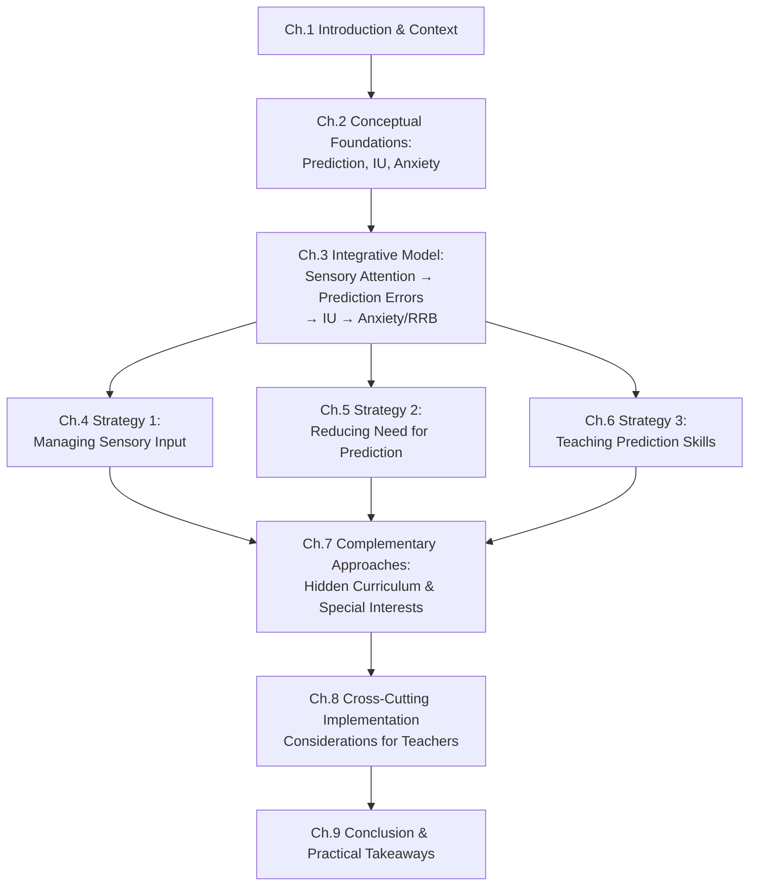
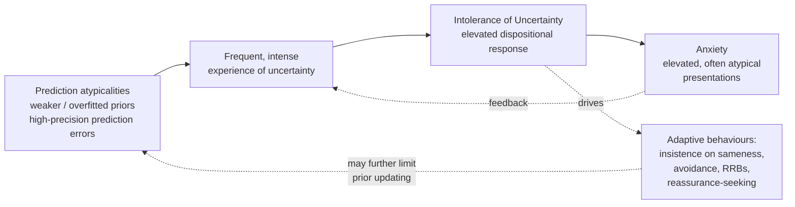
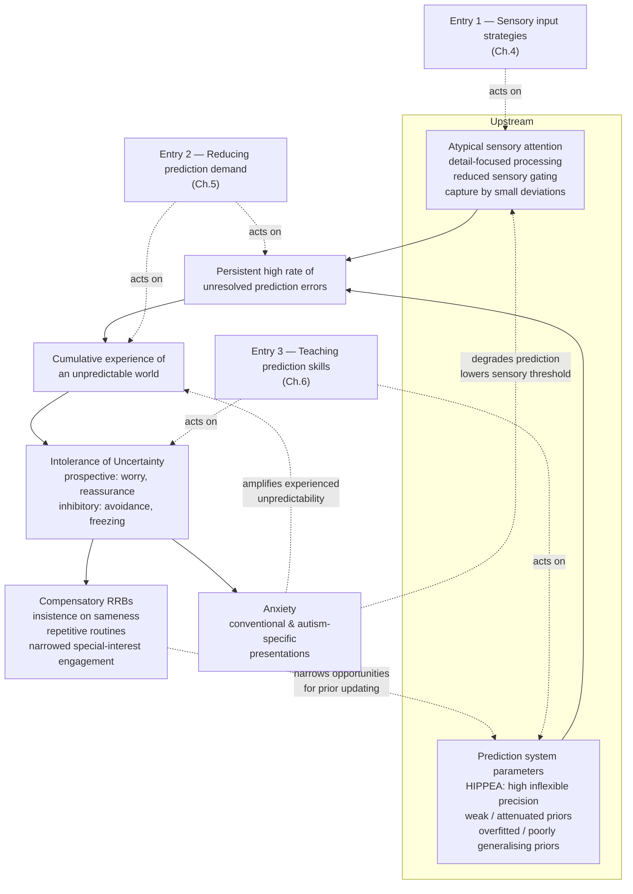

# Supporting Autistic Students in School: A Theory-Informed Framework Linking Prediction, Intolerance of Uncertainty, and Anxiety to Classroom Strategies
# 1 Introduction and Research Context

Walk into almost any classroom in which an autistic student is present, and the small, often invisible architecture of the day — the unspoken transitions from one activity to the next, the buzz of a flickering fluorescent tube, the unannounced fire drill, the substitute teacher who phrases instructions just slightly differently — becomes consequential in ways that neurotypical peers may scarcely notice. For many autistic learners, these micro-events are not background noise but front-of-mind challenges: each one a small puzzle of "what will happen next?" that must be solved, and each unresolved puzzle a potential trigger for distress. A growing body of research and clinical experience converges on the view that this everyday burden is not best understood as wilful rigidity, inattention, or behavioural difficulty in isolation. Rather, it reflects a deeper, mechanistic interplay between how autistic individuals process predictions about the world, how they tolerate the uncertainty that arises when predictions fail, and how that uncertainty fuels anxiety. This report is built on that premise, and this opening chapter sets out why the premise matters, who the report is written for, what evidence base it draws upon, and how its argument will unfold.

## 1.1 Rationale: Why Prediction, IU, and Anxiety Matter in Schools

Schools are, by their nature, environments saturated with prediction demands. Students must anticipate routines, infer teacher expectations, parse social signals among peers, sequence multi-step tasks, and continuously update their internal models as timetables shift, staff change, and learning content evolves. For autistic students, the cognitive and emotional cost of meeting these demands is frequently elevated. Three interlinked constructs — difficulties with prediction, intolerance of uncertainty (IU), and anxiety — have emerged in the research literature as a particularly powerful triad for explaining why school can feel disproportionately taxing, and why surface-level behavioural responses (withdrawal, meltdowns, insistence on sameness, refusal, repetitive behaviours) so often arise.

The significance of this triad rests on several converging considerations. First, anxiety disorders are among the most common co-occurring conditions in autistic children and young people, with prevalence estimates substantially exceeding those in non-autistic peers. Anxiety in school contexts is associated with reduced learning engagement, increased absence, social withdrawal, and longer-term mental health consequences. Second, intolerance of uncertainty has been identified as a transdiagnostic driver of anxiety across populations, but it appears to be particularly elevated and particularly impactful in autism, where the everyday experience of an unpredictable world is more frequent and more intense. Third, theoretical accounts of autism increasingly locate prediction itself — the moment-to-moment process by which the brain anticipates sensory and social input — at the heart of the autistic experience, suggesting that atypicalities in predictive processing may help explain why uncertainty looms larger and why anxiety so often follows.

Taken together, these three constructs form a chain whose links can be addressed at multiple points. Leaving them unaddressed has tangible costs: students lose access to curriculum content when in a state of dysregulation; teachers may misread distress signals as behavioural choices; supportive relationships erode; and the school day becomes a series of avoidance contests rather than learning opportunities. Conversely, when teachers can reason in terms of these mechanisms, even small environmental or pedagogical adjustments can yield outsized benefits — not because they are clever tricks, but because they target the underlying processes that generate distress. This is the problem space the report seeks to illuminate, and the reason it anchors itself in prediction, IU, and anxiety rather than in catalogues of surface behaviour.

## 1.2 Purpose and Teacher-Oriented Audience

The intended reader of this report is the classroom teacher — including teaching assistants, learning support staff, SENCOs and equivalent coordinators, and school leaders responsible for inclusive practice — who works with autistic students on a daily basis and who is in the best position to shape the predictability, sensory texture, and emotional climate of the learning environment. Specialists such as educational psychologists, speech and language therapists, and occupational therapists provide essential consultation, but it is the teacher who is present minute-to-minute, who notices when a student's tolerance is fraying, and who can adapt a lesson in real time.

Given this audience, the report deliberately positions itself as a **mechanism-based, theory-informed framework** rather than a prescriptive manual. Its purpose is to equip teachers with a conceptual lens through which they can interpret what they observe in their classrooms — for instance, recognising that a student's apparent inflexibility about a changed seating plan is not stubbornness but a prediction error cascading into uncertainty and anxiety — and from there to choose, adapt, and combine strategies thoughtfully. Such reasoning matters because no two autistic students present identically: sensory profiles, language and cognitive profiles, anxiety thresholds, special interests, and family contexts vary substantially. A teacher armed only with a list of "things to try" will quickly run out of moves when a familiar strategy fails. A teacher who understands the mechanisms at work can generate new moves, troubleshoot when a strategy is unsuccessful, and individualise support across diverse learners.

The report therefore aspires to be **actionable without being prescriptive**: every strategy discussed is paired with a mechanism explanation, and every mechanism is illustrated with classroom-relevant examples. It assumes no specialist neuroscience background, translates technical terminology into accessible language where possible, and respects teachers as professional decision-makers rather than implementers of fixed protocols.

## 1.3 Scope, Evidence Base, and Guiding Questions

Several scope decisions shape the report. **Population**: the focus is on school-age autistic students, encompassing both those in mainstream classrooms with varying levels of additional support and those in specialist provisions; while age-band variation matters, the core mechanisms apply broadly across primary and secondary phases. **Setting**: classroom and whole-school contexts are the primary unit of analysis, although the principles extend to extracurricular and transition settings. **Evidence base**: the report draws on peer-reviewed empirical research, systematic reviews, and authoritative practitioner sources published up to **mid-2023**. Where weaker forms of evidence — such as practitioner case examples or single-case designs — are used to illustrate practice, this is noted transparently. **Framing**: the report adopts a neurodiversity-affirming stance, recognising that adaptive behaviours such as routines, repetitive movements, or intense interests often serve regulatory functions for autistic students and should not be reflexively pathologised.

To structure the inquiry, the report is guided by the following questions:

1. **Theoretical**: How are prediction, intolerance of uncertainty, and anxiety conceptualised in contemporary research on autism, and what evidence supports their interrelation?
2. **Integrative**: Can these constructs be combined into a coherent explanatory model that accounts for common classroom phenomena — meltdowns, transition difficulties, insistence on sameness, sensory avoidance — without reducing the autistic experience to deficit?
3. **Applied**: Based on this model, what school-based strategies can be organised under (a) managing sensory input, (b) reducing students' need for prediction, and (c) actively teaching prediction skills?
4. **Mechanistic**: For each strategy, how does it act on the underlying processes of prediction, uncertainty, or anxiety, and what does this imply for when and how it should be used?
5. **Complementary**: How do additional approaches such as teaching the hidden curriculum and leveraging special interests fit within this framework?
6. **Implementation**: What cross-cutting considerations — assessment, balance across strategy types, collaboration, monitoring — must teachers weigh when applying the framework to individual students?

Several topics fall **outside** the report's remit. It does not provide diagnostic guidance for autism or anxiety disorders; it does not evaluate pharmacological interventions; it does not address clinical psychotherapy in depth except where adapted cognitive-behavioural techniques are used in school settings; and it does not exhaustively review every named intervention package. It also limits itself to the literature available up to mid-2023, and explicitly flags where the evidence base is thin, contested, or based primarily on practitioner experience rather than controlled research.

## 1.4 Mechanism-Based Approach versus Tip-Based Practice

A defining choice of this report is to organise its practical content around mechanisms rather than tips. Tip-based resources — lists of accommodations such as "use a visual timetable," "offer a quiet space," "give warning before transitions" — are common, useful as quick reference, and broadly evidence-aligned. Yet they have well-known limitations. They can flatten the reasoning behind a practice into a slogan, obscure when a strategy is appropriate and when it is not, and leave teachers without recourse when a tip fails or when a student's needs do not fit a familiar template. Worse, applied mechanically, the same tip can be helpful for one student (for whom it reduces prediction load) and counterproductive for another (for whom it inadvertently narrows tolerance for change).

A mechanism-based approach differs in three important ways. First, it makes the **causal logic explicit**: a visual schedule is not effective because it is "good practice" in the abstract, but because it externalises predictions about the day, reducing the cognitive burden of internally generating those predictions under uncertainty and pre-empting the anxiety that would otherwise arise. Second, this explicit logic enables **adaptive transfer**: a teacher who grasps why a visual schedule works can invent new variants — a tactile schedule for a student with visual sensitivities, a verbal preview for a student with strong listening comprehension, a shared schedule for collaborative tasks — that serve the same mechanism through different surfaces. Third, mechanism-based reasoning supports **principled balancing**: it makes visible the tension between accommodating uncertainty (reducing prediction demand) and building capacity for it (teaching prediction skills), so that teachers can deliberately calibrate how much scaffolding to provide and when to begin loosening it, rather than treating accommodation as an end in itself.

This is not a rejection of strategies. The report contains many, organised into the three categories the reader has requested. It is, rather, an insistence that strategies travel with their reasons, so that what a teacher carries away is not a longer list but a more flexible mind.

## 1.5 Structure and Logic of the Report

The report unfolds in nine chapters that move deliberately from theory to practice and then to implementation, so that every classroom recommendation rests on an explicit mechanistic foundation. The diagram below summarises the overall logic.

In narrative terms: **Chapter 2** defines and reviews evidence on the three core constructs — predictive processing in autism, IU as a transdiagnostic but particularly autism-relevant feature, and the documented IU–anxiety relationship. **Chapter 3** integrates these into a single causal model, drawing on predictive coding accounts such as HIPPEA (High and Inflexible Precision of Prediction Errors in Autism) and weak/overfitted prior frameworks, and uses the model to illuminate familiar classroom phenomena such as meltdowns, transition difficulties, and insistence on sameness. **Chapters 4, 5, and 6** then translate the model into the three strategy categories the reader has explicitly requested — managing sensory input, reducing the need for prediction, and teaching prediction skills — with each strategy paired to its mechanism of action. **Chapter 7** adds two complementary approaches that align with the same model: explicit teaching of the hidden curriculum and the leveraging of special interests. **Chapter 8** addresses cross-cutting implementation issues, including assessment, balance among the three strategy categories, family and specialist collaboration, monitoring, and the critical tension that excessive predictability may inadvertently reduce tolerance for change. **Chapter 9** consolidates the framework into prioritised, teacher-friendly takeaways, acknowledges limitations of the mid-2023 evidence base, and points to directions for further professional learning.

Read sequentially, the chapters provide a complete theory-to-practice arc. Read selectively, the strategy chapters can stand alone for teachers seeking immediate ideas, while the earlier chapters offer the underlying reasoning to which a teacher can return when a strategy fails or a new situation arises. Throughout, the report aims to keep three commitments in view: that every recommendation is tied to a mechanism, that every claim is calibrated to the strength of its evidence, and that the autistic students at the centre of this work are represented respectfully — as learners whose differences in processing the world are real, consequential, and supportable through informed and humane teaching.

# 2 Conceptual Foundations: Prediction, Intolerance of Uncertainty, and Anxiety in Autism

Chapter 1 argued that the everyday distress many autistic students experience in school is best understood not as a list of isolated behaviours but as the visible surface of a deeper mechanistic process — one in which difficulties with prediction generate uncertainty, uncertainty fuels anxiety, and anxiety in turn shapes how the student engages (or disengages) with the classroom. Before that chain can be integrated into a single explanatory model in Chapter 3, and before practical strategies can be linked back to mechanism in Chapters 4–6, each link must be examined in its own right. This chapter therefore takes the three constructs — prediction (and predictive processing), intolerance of uncertainty (IU), and anxiety — and asks of each: what does the term actually mean in contemporary autism research, what evidence supports its atypical manifestation in autistic learners, how is it measured, and how does it show up in school?

The argument proceeds in four steps. Section 2.1 introduces predictive processing and the leading accounts of how prediction operates atypically in autism. Section 2.2 turns to intolerance of uncertainty, a construct imported from the broader anxiety literature whose particular salience for autism has become increasingly clear. Section 2.3 reviews anxiety itself, attending both to its elevated prevalence in autistic populations and to the autism-specific presentations that conventional instruments often miss. Section 2.4 then synthesises the evidence on how these constructs relate to one another, framing them as a mechanistic chain that prepares the ground for Chapter 3's integrative model. Throughout, the chapter aims to be precise without being technical, transparent about the strength and limits of the mid-2023 evidence base, and oriented towards the conceptual vocabulary teachers will need when they encounter strategies later in the report.

## 2.1 Prediction and Predictive Processing in Autism

### 2.1.1 What prediction means in the brain

Contemporary cognitive neuroscience increasingly conceives the brain not as a passive recipient of sensory information but as an active prediction engine. On this view, often labelled **predictive processing** or **predictive coding**, the brain continuously generates expectations about what it is about to perceive, experience, or encounter — the next sound in a sentence, the feel of a chair beneath one, the likely facial expression of a teacher who has just asked a question — and compares those expectations against incoming evidence. Three concepts are central:

- **Prior expectations (or "priors")**: internal models, built up from prior experience, that specify what is likely to happen in a given context. Some priors are slow-changing and broad (e.g., "classrooms are usually quiet during silent reading"); others are momentary and fine-grained (e.g., "the bell rings at 10:30").
- **Prediction error**: the discrepancy between what was expected and what actually occurred. Small prediction errors are routine and easily absorbed; large or persistent ones signal that the brain's model of the world needs updating.
- **Precision-weighting**: the brain's mechanism for deciding how much weight to give to a prediction error. When the incoming sensory signal is judged highly reliable, prediction errors are weighted heavily and prior expectations are updated quickly; when the signal is judged noisy or unreliable, prior expectations dominate and small errors are ignored. Precision-weighting is, in effect, the brain's volume control on uncertainty.

In a well-functioning predictive system, this dynamic produces an experience of the world that feels stable, navigable, and largely already-known. Most sensory and social input is "predicted away" before it reaches conscious attention; only meaningful deviations are flagged for processing. This is what allows neurotypical learners to ignore the hum of a projector while listening to a teacher, or to anticipate the shape of a classroom transition without effort.

### 2.1.2 Leading accounts of prediction atypicalities in autism

A cluster of theoretical accounts, developed primarily in the 2010s and refined through the early 2020s, propose that predictive processing operates differently in autism — and that many features of the autistic experience, from sensory sensitivities to insistence on sameness, can be understood as downstream consequences of this difference. Three influential frameworks are particularly relevant:

| Framework | Core proposal | Key implications |
|---|---|---|
| **HIPPEA** (High and Inflexible Precision of Prediction Errors in Autism) | Autistic brains assign disproportionately high and inflexible precision to prediction errors, so that even small discrepancies between expectation and input are weighted as highly informative and demand updating. | The world feels less stable and more saturated with "news"; small sensory or social deviations cannot be filtered out; learners may struggle to extract generalisable patterns because each instance feels uniquely important. |
| **Weak / attenuated priors** | Autistic learners build, or rely upon, weaker prior expectations, so that perception is dominated by incoming sensory evidence rather than top-down expectation. | Repeated experiences accumulate into stable expectations more slowly; novel inputs are processed in their full, unfiltered detail; context cues do less work in shaping perception. |
| **Overfitted priors** | Where priors do form, they are highly specific to the exact contexts in which they were acquired and generalise poorly to slightly different situations. | A routine learned in one classroom does not transfer to another; a teacher's instruction in one phrasing does not translate to a paraphrase; minor changes feel like wholly new situations. |

These accounts are not mutually exclusive, and contemporary discussions often treat them as different facets of, or candidate mechanisms within, a broader predictive-processing perspective on autism. What they share is the claim that the autistic brain's relationship to prediction is **systematically different**, not deficient in a single uniform way. The functional consequence common to all three is the same: an autistic learner is more likely than a neurotypical peer to encounter a world that registers as **novel, surprising, and not-yet-modelled**, even in environments that appear, from the outside, to be highly familiar.

### 2.1.3 Evidence across perception, sensorimotor function, and social cognition

Empirical work consistent with these accounts has accumulated across several domains. In **perception**, studies have documented reduced susceptibility to certain visual illusions and context effects in autistic participants, patterns that fit with weaker top-down priors. Autistic individuals also frequently show heightened sensitivity to small changes in sensory input — for instance, detecting subtle pattern deviations that neurotypical participants overlook — consistent with high precision on prediction errors. In **sensorimotor** domains, evidence suggests that autistic learners may be slower to develop or update implicit expectations about timing, rhythm, and statistical regularities in input, again indicating atypical prior formation. In **social cognition**, the rapid, automatic generation of expectations about others' likely actions, intentions, and emotional states — the very predictions that allow neurotypical social life to feel intuitive — appears to be less automatic and more effortful, requiring conscious reasoning rather than effortless inference.

It is important to note that this evidence base, while substantial and convergent in direction, is not without complications. Effect sizes vary across studies; tasks differ in what they measure; and there is meaningful heterogeneity among autistic participants, suggesting that prediction atypicalities are a strong tendency rather than a universal feature. Nonetheless, the convergence across domains supports the central claim that for many autistic learners, the moment-to-moment work of predicting the world is harder, more error-prone, or more variable than it is for neurotypical peers.

### 2.1.4 Why this matters for the classroom

The classroom is, on this view, a particularly demanding predictive environment. It requires constantly updating expectations about who will speak next, what the teacher will ask, when the lesson will shift, how peers will react, and what the next sensory event will be. If priors form slowly, generalise poorly, or are routinely overridden by high-precision prediction errors, then the basic experience of "knowing what's about to happen" — which neurotypical students take for granted — becomes intermittent and effortful. The world feels less predictable. This experience of unpredictability is the bridge to the next construct: not unpredictability itself, but how the individual *responds* to it.

## 2.2 Intolerance of Uncertainty as a Transdiagnostic and Autism-Relevant Construct

### 2.2.1 Defining intolerance of uncertainty

**Intolerance of uncertainty (IU)** is defined as a dispositional tendency to react negatively — cognitively, emotionally, and behaviourally — to uncertain situations and the prospect of uncertainty, irrespective of the actual probability of a negative outcome. A learner with high IU is not simply someone who dislikes surprises; rather, the very state of *not knowing* is experienced as aversive, and the individual is motivated to reduce, avoid, or resolve that state even when the uncertain outcome is benign or trivially low-stakes.

Two dimensions of IU are routinely distinguished in the literature:

- **Prospective IU**: an anticipatory, cognitive orientation — the desire for predictability, distress at the *idea* that the future is uncertain, and a tendency to seek information, plan exhaustively, or ruminate in advance. Behaviourally, this drives reassurance-seeking, repeated questioning, and detailed advance planning.
- **Inhibitory IU**: an in-the-moment, behavioural orientation — uncertainty paralyses action, leading to avoidance, withdrawal, or freezing. The learner cannot proceed because the situation has not yet resolved into something predictable.

This distinction matters in classroom terms because the two dimensions look quite different on the surface: a prospectively intolerant student may ask the same question repeatedly before a school trip; an inhibitorily intolerant student may refuse to enter the bus.

### 2.2.2 Origins, measurement, and adaptation for autistic populations

IU originated in the broader anxiety literature, where it was developed initially to explain features of generalised anxiety disorder and worry, and was subsequently identified as a **transdiagnostic** factor — a construct elevated across multiple anxiety, mood, and obsessive-compulsive presentations, and thus a candidate common mechanism rather than a disorder-specific feature.

The most widely used measurement instrument is the **Intolerance of Uncertainty Scale (IUS)**, most commonly used in its shortened 12-item form, the **IUS-12**, which yields prospective and inhibitory subscales. For child and youth populations, parent-report and child-report adaptations have been developed, and shorter or simplified versions have been used in research with autistic samples. Researchers have also examined the psychometric properties of these instruments in autistic populations specifically, with the broad conclusion that IU is meaningfully measurable in autistic children and young people, though attention is warranted to item interpretation and to whether the construct functions identically across neurotypes. Where direct self-report is difficult — for example, in learners with limited verbal communication — informant-based ratings and behavioural indicators (insistence on routine, distress at change, reassurance-seeking) are used as proxies, with the caveat that these capture behavioural expressions rather than the internal experience itself.

### 2.2.3 IU in autism: elevated and consequential

A consistent finding in the literature is that **IU is elevated in autistic children, adolescents, and adults relative to non-autistic comparison groups**. While the construct is by no means unique to autism — it appears across many anxiety presentations in the general population — its mean level is higher in autistic samples, and the range of situations that trigger IU-related distress tends to be broader. This elevation is theoretically coherent with the predictive-processing account outlined in Section 2.1: if the world generates more uncertainty for autistic learners (because prediction is harder), then a disposition that responds aversively to uncertainty will be activated more frequently and more intensely. IU and prediction atypicalities are conceptually distinct — the former is about *how one responds to* uncertainty, the latter about *how often one encounters* it — but they interact, and in autism they appear to compound.

### 2.2.4 Classroom manifestations of IU

In school settings, IU rarely announces itself by that name. Instead, it is visible through a set of behaviours that teachers will recognise immediately:

- **Insistence on sameness and routine**: maintaining identical seating, identical lesson sequences, identical phrasing — strategies that pre-empt uncertainty by holding the environment constant.
- **Restricted and repetitive behaviours**: predictable motor or cognitive routines that, among their other functions, provide an island of certainty within an uncertain context.
- **Reassurance-seeking**: repeated questions ("What's next?", "Will it be the same as last time?", "Are you sure?") that aim to reduce prospective uncertainty.
- **Avoidance and withdrawal**: refusing to begin a new task, declining unfamiliar activities, asking to leave — behaviours often more closely linked to inhibitory IU.
- **Distress at unannounced change**: meltdowns or shutdowns triggered by even minor deviations from an expected plan.

Framing these behaviours as expressions of IU rather than as deliberate inflexibility or "challenging behaviour" has important consequences. It locates the cause in an internal state of intolerable uncertainty, suggests that interventions should target that uncertainty (by reducing it, externalising it, or building tolerance for it), and aligns with the neurodiversity-affirming framing introduced in Chapter 1: many of these behaviours are *adaptive responses to a difficult internal state*, not pathologies in themselves.

## 2.3 Anxiety in Autistic Learners

### 2.3.1 Anxiety as both normative and clinical

Anxiety, at its most general, is an adaptive emotional response to perceived threat or uncertainty — a state that mobilises attention and prepares the body to act. In its normative form, anxiety is a routine and useful feature of human experience: most students feel some anxiety before an exam, a presentation, or a new social encounter. Anxiety becomes **clinically significant** when it is disproportionate to actual threat, persistent across contexts, and functionally impairing — interfering with learning, social participation, sleep, or daily functioning. The distinction matters because not every anxious feeling warrants intervention, but the elevated and pervasive anxiety frequently seen in autistic learners often does.

### 2.3.2 Prevalence of anxiety in autistic children and young people

The empirical consensus, drawing on multiple cohort studies, meta-analyses, and systematic reviews up to mid-2023, is that **anxiety disorders are substantially more common in autistic children and young people than in non-autistic peers**. Although exact prevalence figures vary with sampling, diagnostic methods, and age band, the broad pattern is consistent: a substantial minority — often estimated in the range of roughly one-third to one-half of autistic children and young people, depending on the study — meet criteria for at least one anxiety disorder, with comorbidity (multiple co-occurring anxiety presentations) also common. This compares with markedly lower rates in non-autistic populations. Anxiety is therefore not a peripheral feature for the autistic students in a typical classroom; it is, statistically, one of the most likely co-occurring conditions a teacher will encounter.

### 2.3.3 Traditional and autism-specific presentations

Anxiety in autistic learners can present in forms familiar from the general anxiety literature, including generalised anxiety, social anxiety, specific phobias, and separation anxiety. However, a growing body of work documents **autism-specific or atypical presentations** that conventional anxiety frameworks may miss. These include:

- **Sensory-based anxiety**: persistent fear or avoidance of specific sensory stimuli (e.g., particular sounds, fluorescent lighting, certain textures) that does not map neatly onto traditional specific phobia categories.
- **Anxiety about change and unpredictability**: marked distress in anticipation of, or in response to, changes to routine, plans, or environment — closely linked to IU and not well captured by standard worry-content measures.
- **Social anxiety with autism-specific features**: anxiety arising not only from fear of social evaluation but from the cognitive load of decoding implicit social rules and predicting others' behaviour.
- **Special-interest-related anxiety**: distress when access to a special interest is restricted or unpredictable.

Recognising these atypical presentations matters because conventional anxiety measures, designed and validated primarily on neurotypical populations, can **under-detect anxiety** in autistic learners — either because they focus on worry content unfamiliar to the autistic experience, or because they rely on self-report formats and emotional vocabulary that may not align with how autistic students describe their internal states.

### 2.3.4 Measurement challenges and adapted tools

These limitations have prompted the development of autism-adapted anxiety measures, including modifications of established instruments and the creation of new tools designed to capture autism-specific presentations alongside conventional ones. Such measures typically supplement standard items with items targeting uncertainty-related distress, sensory anxiety, and unusual phobic content, and they may rely more heavily on parent or teacher informant reports for learners with limited verbal self-report. Even with these adaptations, accurate assessment of anxiety in autistic students remains challenging — particularly where alexithymia (difficulty identifying and describing one's own emotional states) or limited expressive language complicates self-report. Teachers should therefore treat any single anxiety score with appropriate caution and weight behavioural observation across contexts.

### 2.3.5 School-relevant manifestations and their interaction with autistic profiles

In the classroom, anxiety in autistic students may be visible through any of the following:

- **Withdrawal and reduced participation**: opting out of group activities, refusing to speak, becoming non-responsive.
- **School refusal and attendance difficulties**: reluctance or inability to enter school or specific lessons.
- **Somatic complaints**: stomach aches, headaches, and other physical symptoms, especially at predictable points in the day or week.
- **Meltdowns**: outwardly visible loss of behavioural control, often following accumulated distress that has exceeded coping capacity.
- **Shutdowns**: less visible but equally significant withdrawal of engagement, in which the student becomes unresponsive or appears "switched off."
- **Subtle physiological signs**: changes in breathing, posture, eye contact, or fidgeting that may precede more visible distress.

Crucially, anxiety in autistic learners does not operate in isolation from other aspects of their profile. It **interacts with sensory processing** (heightened anxiety lowers the threshold at which sensory input becomes overwhelming, and sensory overload elevates anxiety); with **communication** (anxious students may struggle even more to access expressive language and explain their state); and with **executive functioning** (anxiety degrades working memory, flexibility, and task initiation, so a student who could complete a task calmly cannot do so when anxious). The same student may therefore look "more autistic" — less verbal, more rigid, more sensorily reactive — when anxious, not because their autism has changed but because anxiety has consumed the cognitive resources that supported their usual functioning. Recognising this loop is essential for teachers, who may otherwise read escalating sensory or behavioural responses as primary rather than as anxiety-driven.

## 2.4 Interrelations Among Prediction, IU, and Anxiety: Evidence and Mechanisms

Having defined the three constructs in turn, the chapter now considers them as a **mechanistic chain** rather than three independent phenomena. The central proposal — to be formalised in Chapter 3 — is that prediction atypicalities, intolerance of uncertainty, and anxiety stand in approximately causal sequence: difficulties with prediction generate frequent and intense experiences of uncertainty; intolerance of uncertainty determines how aversively that uncertainty is experienced; and the resulting aversive state is what clinicians and teachers observe as anxiety.

### 2.4.1 The IU–anxiety link in autism

The relationship best supported by direct empirical evidence is between IU and anxiety. Studies of autistic children, adolescents, and adults consistently find moderate-to-strong positive associations between IU scores and anxiety scores: learners with higher IU report (or are rated as showing) higher anxiety. Several studies have gone further and tested **mediation models**, asking whether the elevated anxiety observed in autistic samples can be statistically accounted for by their elevated IU. Findings broadly indicate that **IU partially, and in some studies substantially, mediates the relationship between autism and anxiety** — meaning that a significant portion of the "extra" anxiety seen in autistic populations is statistically attributable to elevated IU. This has two important implications. First, it positions IU not as a comorbid feature but as a candidate **causal mediator** of anxiety in autism. Second, it identifies IU as a particularly fruitful target for intervention: if anxiety follows from IU, then reducing IU (or reducing the exposure to uncertainty that drives it) should reduce anxiety.

Methodological caveats apply. Much of this evidence is cross-sectional, which limits causal inference; longitudinal studies are fewer but generally consistent. Measurement issues persist, particularly for learners who cannot complete self-report instruments. And mediation is partial, not complete: IU does not exhaust the explanation for elevated anxiety in autism, leaving room for additional contributors (sensory differences, social stress, adverse experiences, alexithymia).

### 2.4.2 From prediction atypicalities to IU

The link between **prediction atypicalities and IU** is more theoretically developed than empirically established at the time of writing, but the conceptual logic is straightforward and the early empirical signals are consistent. If, as Section 2.1 outlined, the autistic brain generates frequent and high-precision prediction errors, builds priors that are weaker or more narrowly generalised, and therefore encounters the world as more often surprising than a neurotypical peer would, then the *cumulative exposure to uncertainty* is greater. Over time, this repeated exposure plausibly shapes a disposition in which uncertainty itself becomes a salient and aversive category — that is, it plausibly elevates IU. Conversely, an individual with high IU may also engage in compensatory strategies (insistence on sameness, narrowed environments, repetitive routines) that, by limiting exposure to novel input, reduce opportunities to update priors and thereby reinforce the underlying predictive difficulty.

It is worth being explicit about the limits here. The proposition that prediction atypicalities *cause* elevated IU — rather than co-occurring with it — relies primarily on theoretical reasoning and on cross-sectional findings that are consistent with the proposal without directly demonstrating temporal precedence. The mid-2023 evidence base contains fewer direct empirical tests of this link than of the IU–anxiety link. The chapter therefore treats prediction → IU as a **theoretically motivated and empirically plausible** mechanism, rather than a settled finding, and Chapter 3's integrative model will be presented in the same calibrated spirit.

### 2.4.3 The full chain and its explanatory reach

Putting the links together yields the following mechanistic sequence:

Three features of this chain deserve emphasis. First, the relationships are **bidirectional and reinforcing**: anxiety amplifies the experience of uncertainty (because anxious states reduce cognitive resources for prediction); and the adaptive behaviours that high IU motivates (avoidance, sameness) can, over time, narrow the experiences from which more flexible priors might be built. Second, the chain is **probabilistic, not deterministic**: it describes tendencies that are stronger on average in autistic learners, not invariant features of every autistic individual. Third, the chain is **theoretically tractable for intervention**: it offers multiple entry points — reducing the unpredictable sensory input that generates prediction errors, externalising structure to lower the prediction burden, or building tolerance for residual uncertainty — which map directly onto the three strategy categories the report will develop in Chapters 4 through 6.

### 2.4.4 Strength and limitations of the evidence base

In summarising the state of the field up to mid-2023, it is honest to distinguish what is well established from what is plausible and what remains contested. The high prevalence of anxiety in autistic children and young people, and the elevation of IU relative to non-autistic peers, are robust and replicated findings. The association between IU and anxiety within autistic samples, and the partial mediating role of IU, are well-supported, primarily by cross-sectional designs with growing longitudinal corroboration. The broader claim that prediction atypicalities are a characteristic feature of autism is supported by converging evidence across perceptual, sensorimotor, and social domains, though the precise computational characterisation (HIPPEA versus weak priors versus overfitted priors, or some combination) remains an area of active theoretical debate. The most theoretically ambitious claim — that prediction atypicalities causally drive IU, which in turn causally drives anxiety, forming a single mechanistic chain — is best regarded as a **promising integrative framework** rather than a fully demonstrated causal model, valuable precisely because it organises a wide range of phenomena and suggests where to intervene.

This calibrated picture is what teachers and other readers should carry into the next chapter. The constructs are real, measurable, and elevated in autistic learners; they are related to one another in ways that empirical evidence broadly supports; and the resulting framework is sufficiently grounded to guide classroom practice, provided that practitioners hold its more speculative elements with the same appropriate humility that the research literature itself maintains. Chapter 3 now takes these conceptual foundations and integrates them into the single causal model that will anchor the strategy chapters to follow.

# 3 A Core Integrative Model: How Sensory Attention, Prediction Errors, Intolerance of Uncertainty, and Anxiety Interact

Chapter 2 closed by sketching a mechanistic chain — prediction atypicalities give rise to frequent experiences of uncertainty, intolerance of uncertainty (IU) shapes how aversively that uncertainty is felt, and the resulting aversive state surfaces as anxiety — while cautioning that the chain is best regarded as a calibrated integrative framework rather than a fully demonstrated causal model. The task of this chapter is to take that framework and render it into a working blueprint: a single, articulated pathway that begins at the level of sensory attention, runs through prediction error generation and the cumulative experience of unpredictability, passes through dispositional IU, and terminates in anxiety and the restricted/repetitive behaviours (RRBs) and other adaptive responses that teachers observe in classrooms. The model is pivotal in the report's architecture, because it is the bridge between the conceptual material of Chapter 2 and the three strategy categories developed in Chapters 4 through 6: each category will be defined by the node of the pathway it primarily targets.

The chapter proceeds in six steps. Section 3.1 consolidates the three predictive coding accounts introduced in Chapter 2 — HIPPEA, weak/attenuated priors, and overfitted priors — into a unified framework, clarifying how they combine rather than compete. Section 3.2 examines the upstream end of the pathway, where atypical sensory attention interacts with precision-weighting to generate persistent prediction errors. Section 3.3 traces the middle and downstream links, from experienced unpredictability to IU and from IU to anxiety and RRBs. Section 3.4 presents the integrative schematic itself and identifies the points at which intervention can plausibly act. Section 3.5 tests the model's explanatory reach against familiar classroom phenomena. Section 3.6 critically appraises the model's strengths and limitations and draws out the implications for the practice chapters that follow.

## 3.1 Synthesising Predictive Coding Accounts into a Unified Framework

A reader of Chapter 2 might reasonably ask whether HIPPEA, weak priors, and overfitted priors are *rival* accounts of autistic cognition that must be adjudicated before a model can be built. The argument of this section is that they are better treated as **complementary mechanisms operating at different levels of the same predictive system**, each capturing a real and partially independent way in which the autistic brain's relationship to prediction can differ from the neurotypical baseline.

To see why, it helps to recall what each account targets. HIPPEA is fundamentally a claim about **precision-weighting**: the brain's volume control on uncertainty is turned up too high and is too inflexible, so that prediction errors are treated as highly informative even when, in another nervous system, they would be filtered out as noise. The weak-priors account targets a different parameter — the **strength** of the top-down expectations the brain brings to perception — and proposes that priors exert less downward influence on sensory processing, so that incoming evidence is processed in more of its raw detail. The overfitted-priors account targets a third parameter — the **generalisation** of priors — and proposes that priors do form, sometimes powerfully, but bind too tightly to the exact context of acquisition and transfer poorly to similar but non-identical situations.

These three parameters — precision, strength, generalisation — are conceptually distinct, and in principle can vary independently. A learner might have priors of typical strength that fail to generalise; another might have weak priors but typical precision-weighting; another might have all three atypicalities at once. This conceptual independence is what allows the accounts to be combined rather than chosen between. In practice, however, the three mechanisms converge on a **shared functional consequence**: the autistic brain encounters more frequent, more salient, and less easily resolved prediction errors than would a neurotypical brain in the same environment. Hyper-precise prediction errors are not down-weighted as noise; weak priors generate predictions that do not anticipate input well enough to absorb deviations; overfitted priors fail to apply to situations that differ even slightly from past experience, leaving the learner without a usable expectation. By three different routes, the everyday world registers as more saturated with unresolved "news" demanding processing.

The integrative model adopted from here onward therefore makes the following assumptions. First, prediction atypicalities in autism are best characterised in terms of **a profile of parameters** rather than a single deficit, with individuals varying in which parameter is most prominent in their experience. Second, the **common output** of these parameter atypicalities is a persistently elevated rate of unresolved prediction errors. Third, this elevated error rate — not any one computational account in isolation — is the proximate generator of the *experienced unpredictability* that drives the downstream chain. Adopting this stance allows the model to remain robust to ongoing theoretical debate about which account is most accurate in detail, since the integrative pathway depends on the shared output rather than on adjudicating among the candidate mechanisms.

## 3.2 Sensory Attention and the Generation of Persistent Prediction Errors

Predictive processing does not begin at the level of abstract expectations; it begins with **what the brain attends to and how it allocates resources to incoming sensory channels**. The upstream end of the model therefore requires careful articulation, because it is here that the abstract claim "autistic learners have more prediction errors" is connected to the concrete sensory texture of the classroom that teachers actually shape.

Three closely related features of sensory attention in autism are relevant. First, autistic perception is frequently characterised by a **detail-focused, locally-oriented processing style**: salient features of the environment — a specific sound, a specific visual pattern, a specific tactile detail — are processed in their full granularity rather than being subsumed into a global gestalt. Second, **sensory gating** — the routine, largely automatic filtering of stimuli that are predictable, unchanging, and not behaviourally relevant — appears to be less efficient, so that input that a neurotypical brain would suppress (the hum of an overhead light, the rustle of clothing, the distant chatter of another class) continues to register and demand processing. Third, attention is more readily captured by **small deviations** in the sensory stream, including changes that fall below the threshold of conscious notice for most observers.

Each of these features interacts with the precision-weighting machinery described in Section 3.1 in a way that compounds the production of prediction errors. Sensory input that has not been gated still arrives at the predictive system; if precision-weighting is high, that input generates a prediction error which is then treated as informative rather than absorbed; and if priors are weak or overfitted, the system does not have a strong expectation in place to predict the input away in the first place. The result is that ordinary classroom stimuli — the flicker of a fluorescent tube, the scrape of a chair on the floor, the brief raised voice of a teacher across the room, the wash of overlapping conversations during transitions, the micro-expression on a peer's face — are more likely to register as *informative deviations* requiring attention and updating, rather than as background to be predicted away.

The mechanistic origin of an "unpredictable-feeling world," on this view, is not that the classroom is objectively chaotic; classrooms are objectively quite structured, in the sense that the same stimuli recur day after day. Rather, it is that the autistic learner's predictive system is positioned in such a way that *more* of those stimuli cross the threshold of attention, *more* of them register as errors against current expectations, and *fewer* of them are smoothed away by robust, well-generalising priors. The cumulative subjective experience is one in which the world keeps presenting new information, even when that information would, in another nervous system, count as no information at all.

This characterisation has two important consequences for the model. First, it identifies the **sensory environment itself** as a primary upstream lever: changing what stimuli are present and how predictable they are directly changes the rate at which prediction errors are generated, regardless of any change in the learner's internal processing. This is the mechanistic basis for the sensory-input strategies developed in Chapter 4. Second, it locates the **earliest and most pre-emptive point of intervention** at the input end of the pathway, before the cascade into IU and anxiety has begun. Strategies that operate here have the distinctive property of preventing distress rather than managing it after it has emerged.

## 3.3 From Unpredictable Experience to Intolerance of Uncertainty and Anxiety

If the upstream end of the model describes how the rate of prediction errors is generated, the middle and downstream links describe **how that rate of errors is converted into the affective and behavioural outputs that teachers observe**. Three transitions deserve articulation: from prediction errors to experienced unpredictability, from experienced unpredictability to IU, and from IU to anxiety and compensatory behaviours.

**From prediction errors to experienced unpredictability.** A single unresolved prediction error is not, in itself, an experience of an unpredictable world; it is a discrete moment of "this was not quite what I expected." What converts a stream of such moments into a global sense that the world is unpredictable is their **cumulative frequency, their distribution across domains, and their resistance to resolution**. When prediction errors arise constantly, across sensory, social, and procedural domains, and when they do not consistently lead to updated priors that anticipate similar errors next time (because priors are weak or overfitted), the learner cannot construct a stable working model of "what this environment is like." The phenomenology is one of a world that does not settle.

**From experienced unpredictability to IU.** Chapter 2 distinguished IU (a dispositional response to uncertainty) from prediction atypicalities (a tendency to encounter uncertainty more often), and noted that the two are conceptually distinct but interact. The proposal embedded in the integrative model is that **cumulative exposure to unpredictability is one of the contributors that calibrates the dispositional response over time**. A learner whose every day contains many small uncertainties that resolve only with effort, or fail to resolve at all, has many opportunities for uncertainty to be paired with distress, frustration, or failure to act. Over development, this plausibly shapes a disposition in which uncertainty itself becomes a salient and aversive category — that is, it plausibly elevates IU. The direction of effect is unlikely to be exclusively one-way: dispositional IU is partly temperamental and may pre-exist much of the cumulative experience. But the model holds that experienced unpredictability and IU stand in a mutually reinforcing relationship, with the upstream prediction system supplying many of the situations to which the IU disposition responds.

Within this link, the prospective/inhibitory distinction from Chapter 2 has consequences worth noting. **Prospective IU** — the anticipatory cognitive orientation — converts unresolved uncertainty into worry, planning, and reassurance-seeking; the learner attempts to *forestall* the next prediction error by gathering information in advance. **Inhibitory IU** — the in-the-moment behavioural orientation — converts unresolved uncertainty into paralysis, avoidance, or withdrawal; the learner cannot proceed until the situation has resolved. The same upstream stream of prediction errors can therefore produce quite different surface profiles depending on which IU dimension dominates in a particular student.

**From IU to anxiety and compensatory behaviours.** The IU → anxiety link is, as Chapter 2 noted, the best-evidenced link in the chain, with cross-sectional and growing longitudinal evidence indicating that IU partially mediates the elevated anxiety observed in autistic populations. The model treats IU as a **proximate driver** of anxiety responses: when uncertainty cannot be tolerated and is not resolved, the result is the physiological and cognitive activation of an anxiety state, often visible as somatic symptoms, withdrawal, or the meltdowns and shutdowns described in Chapter 2. IU also motivates **compensatory restricted and repetitive behaviours**: insistence on sameness, repetitive motor or cognitive routines, narrow special-interest engagement, reassurance-seeking, and avoidance. These behaviours are best read, in this framework, as **adaptive attempts to reduce the experience of uncertainty** by holding the environment, the body, or the cognitive frame constant — small islands of predictability carved out of a stream that otherwise refuses to settle.

The downstream end of the pathway is also where the model's most important **feedback loops** become visible. Anxiety itself degrades prediction: the cognitive resources required to construct and update priors are reduced under high physiological arousal, and the threshold at which sensory input becomes overwhelming drops, increasing the rate at which incoming stimuli generate further prediction errors. RRBs and avoidance, by narrowing the range of experiences the learner is exposed to, reduce the opportunities for priors to be updated and broadened, leaving the predictive system fewer well-generalising expectations to deploy in future situations. Each compensatory behaviour that reduces immediate distress can, over time, contribute to the very upstream conditions that generated the distress in the first place.

These feedback dynamics are the reason a teacher may see a student appear to "function less well" over the course of a difficult day, a difficult week, or a difficult term, with anxiety, rigidity, and sensory reactivity all visibly worsening together. The chain is not a static description of a steady state; it is a dynamic system that can spiral.

As in Chapter 2, the evidential status of each link should be held in calibrated view. The IU–anxiety link is empirically well-supported; the prediction-to-IU link is theoretically motivated and consistent with cross-sectional findings; the feedback loops are plausible on theoretical grounds and supported by indirect evidence (for example, the well-documented effect of anxiety on cognitive performance), but are not the subject of large dedicated empirical literatures up to mid-2023. The model is robust as an integrative framework precisely because it does not depend on any single contested link being fully settled; the strategy categories it underwrites can be motivated by the chain as a whole and by the empirically firmest links within it.

## 3.4 The Integrative Causal Pathway: A Schematic Model

The arguments of Sections 3.1 to 3.3 can now be assembled into a single schematic. The diagram below presents the integrative pathway, with the principal forward arrows running from sensory attention through to behavioural outputs, the bidirectional feedback arrows that account for the dynamic worsening described above, and the three classes of intervention entry point that map onto the strategy chapters to follow.

Reading the diagram left-to-right and top-to-bottom, the **nodes** are: upstream sensory attention and prediction system parameters; the persistently elevated rate of unresolved prediction errors they jointly produce; the cumulative experience of unpredictability; dispositional IU, with its prospective and inhibitory variants; and the two principal downstream outputs — anxiety and compensatory RRBs. The **feedback edges** capture the dynamic loops described in Section 3.3: anxiety reaches back to degrade upstream prediction and amplify experienced unpredictability, and compensatory RRBs reach back to narrow the range of experiences from which the prediction system can build broader priors. The **intervention edges** identify three distinct classes of entry point at which a teacher can act on the pathway.

A few features of this schematic deserve commentary. First, the model is **not a one-way pipe**: although it is convenient to describe in causal sequence, the feedback edges mean that any node can amplify any other over time, which is consistent with the clinical observation that anxiety, sensory reactivity, and rigidity in autistic learners tend to wax and wane together. Second, the model is **node-based rather than diagnosis-based**: it does not assume that a given autistic student exhibits the full pathway with equal intensity at every node, but rather that individual profiles differ in which node is most prominent. One student may have a very high upstream sensory load with only moderate IU; another may have moderate sensory atypicality but very high IU; a third may show a profile in which anxiety feedback dynamics dominate. The schematic accommodates this heterogeneity because intervention can be directed at the node that is most prominent for the individual learner.

Third, the schematic makes explicit the **division of labour among the three strategy categories** that the report develops in subsequent chapters. *Managing sensory input* (Chapter 4) operates at the upstream end, reducing the volume of stimuli that generate prediction errors in the first place. *Reducing the need for prediction* (Chapter 5) operates at the middle of the pathway, externalising the structure of the day so that the learner does not have to internally generate predictions under uncertainty and so that the experience of unpredictability is narrowed. *Teaching prediction skills* (Chapter 6) operates at the deeper end of the pathway, building stronger and better-generalising priors over time and increasing tolerance for the residual uncertainty that no amount of accommodation will eliminate. The complementary approaches of Chapter 7 — teaching the hidden curriculum and leveraging special interests — will be shown to act on similar nodes by similar mechanisms.

Importantly, the model also clarifies why **no single intervention class is sufficient**. Sensory-input strategies alone reduce the upstream error rate but do nothing to build broader priors; structural-predictability strategies alone externalise uncertainty but, applied without complement, may inadvertently narrow the learner's tolerance for change (a tension Chapter 8 will examine in detail); skill-building strategies alone proceed too slowly to manage acute distress in the meantime. A coherent practice draws from all three.

## 3.5 Explanatory Power for Classroom Phenomena

The value of a mechanistic model lies not only in its theoretical elegance but in its ability to **reorganise apparently disparate observations under a common explanation**. This section applies the integrative pathway to six familiar classroom phenomena, showing in each case how the surface behaviour can be re-read as a predictable consequence of one or more nodes in the chain. The aim is to provide teachers with a single interpretive lens that resolves what often look like unrelated "things this student does" into expressions of a shared underlying mechanism.

The table below summarises the re-readings; the discussion that follows develops the most important of them.

| Classroom phenomenon | Predominant nodes in the pathway | Re-reading through the model |
|---|---|---|
| **Meltdowns** | Upstream error load → IU → anxiety, with feedback amplification | Accumulated unresolved prediction errors push the system past tolerance; anxiety feedback further degrades prediction; behavioural control is lost as a downstream consequence, not a chosen response. |
| **Shutdowns** | Inhibitory IU → anxiety, with cognitive resource depletion | Uncertainty paralyses action; the learner withdraws engagement to reduce further error input; less visible than a meltdown but driven by the same chain. |
| **Transition difficulties** | Prediction parameters (overfitted priors) → high error spike → IU | Routines learned in one context do not transfer to the next; transitions concentrate prediction demand into a brief window where many things change at once. |
| **Insistence on sameness** | IU-driven compensatory RRBs | Holding the environment constant pre-empts prediction errors; this is a regulatory strategy rather than mere rigidity. |
| **Sensory avoidance** | Upstream sensory attention → high error rate | Avoiding particular stimuli reduces a known source of unresolved errors; the avoidance is targeted and informative about the sensory profile. |
| **Reassurance-seeking and repeated questioning** | Prospective IU | Repeated questions attempt to convert uncertain future into known future; the behaviour is information-seeking under prospective IU. |
| **Engagement with special interests** | Compensatory RRB *and* well-generalising prior | Interest domains are areas of unusually well-developed, well-generalising priors; engaging with them provides a reliable predictive footing and an island of regulatory calm. |

The most consequential re-reading is of the **meltdown**. Read through the model, a meltdown is not best understood as a behavioural choice, a tantrum, or a failure of self-regulation in the moral sense; it is the visible end-point of a cascade in which unresolved prediction errors have accumulated faster than they can be processed, IU has converted that accumulation into rising distress, anxiety has degraded the cognitive resources that would normally allow the learner to cope, and the system has reached a point at which behavioural control is no longer available. This re-reading has direct practical implications: the most effective interventions are upstream and pre-emptive (reducing the error load before it accumulates), not downstream and punitive (responding to the visible behaviour); and the appropriate immediate response to a meltdown is to reduce further input rather than to introduce more (more instruction, more demands, more sensory stimulation).

**Transition difficulties** receive a similarly clarifying re-reading. In the model, transitions are points at which multiple priors must be discarded and replaced at once — the prior about the current activity, the prior about the spatial layout, the prior about who will be speaking, the prior about what is expected of the learner. If priors are overfitted, they do not migrate well from one context to the next; if precision-weighting is high, the multiple simultaneous mismatches between the old priors and the new context generate a spike in prediction errors; and if IU is elevated, that spike is converted into acute distress. Transitions are difficult, in other words, not because the learner is being deliberately obstructive but because they are a point in the day at which the predictive system is asked to do disproportionately heavy work. This is also why a transition that looks trivial from the outside — a five-minute shift from carpet to tables — can produce distress that seems disproportionate; the proportionality is to the prediction load, not to the wall-clock significance of the change.

**Insistence on sameness** is reframed not as a personality trait or a behavioural problem but as a **regulatory strategy targeted at the IU node**. Holding the environment constant is, mechanistically, a way of holding prediction errors low; it is the learner's own attempt to lower the upstream error rate by reducing the variability the environment can throw at them. This reframing has two important consequences. First, it is consistent with the neurodiversity-affirming framing of Chapter 1: the behaviour is adaptive, not pathological. Second, it implies that **simply removing the routine without supplying alternative predictability is not a neutral intervention**; it removes the learner's regulatory tool without addressing the underlying error load, and will predictably increase distress. Where the goal is to broaden tolerance for change, that work has to be done at the skill-building end of the pathway (Chapter 6), with the routine still available as a safety net.

**Special interests** receive a particularly interesting re-reading in the model, and one that anticipates the discussion in Chapter 7. Within a domain of intense interest, an autistic learner has typically built priors that are unusually rich, well-organised, and (within that domain) well-generalising. This is the one area where the predictive system is working at full strength: predictions are reliable, prediction errors are quickly absorbed, and the experience is one of competence and predictive ease. Engagement with the interest is therefore not only a source of pleasure but a **regulatory resource** — a node at which the learner can recover predictive footing when other parts of the day have generated too much uncertainty. The model thus explains why interest-based engagement so reliably reduces distress and supports learning: it is, in effect, mechanism-aligned self-regulation.

The cumulative effect of these re-readings is to give the teacher a single interpretive lens that resolves a wide range of observed behaviours into expressions of a shared underlying process. The lens does not replace observation; it shapes what observation notices and how it is interpreted, and it suggests where to look first when a behaviour seems puzzling.

## 3.6 Strengths, Limitations, and Implications for Practice

The integrative model presented in this chapter has several genuine strengths. It **organises a wide range of phenomena under a single explanatory framework**, replacing what would otherwise be a long list of behavioural patterns with a compact mechanistic chain. It **accommodates heterogeneity** among autistic learners by treating the pathway as a profile of nodes whose relative prominence varies by individual, rather than as a uniform syndrome. It **maps directly onto intervention strategy**, identifying three distinct entry points that correspond to the three strategy categories the report develops, and clarifies why a coherent practice draws from all three. And it **respects the neurodiversity-affirming framing** of Chapter 1, by re-reading adaptive behaviours such as RRBs, insistence on sameness, and special-interest engagement as expressions of regulatory work rather than as pathologies to be suppressed.

These strengths come with corresponding limitations that should be held clearly in view. The model **rests on links of unequal empirical strength**: the IU–anxiety link is well-evidenced as a partial mediator within autistic samples, but the prediction-to-IU link is more theoretically motivated than directly demonstrated, and the feedback loops in particular rest more on plausibility than on dedicated empirical literatures. The supporting evidence is **predominantly cross-sectional**, which limits the strength of causal inference; longitudinal studies that would adjudicate temporal precedence are growing but were not yet plentiful by mid-2023. The mediation that has been observed empirically is **partial, not complete**: IU does not account for all the anxiety elevation in autistic populations, leaving room for additional contributors — sensory differences acting on anxiety more directly, social stress, adverse experiences, alexithymia, and other factors not represented in the diagram. The **computational characterisation of prediction in autism remains contested**, with HIPPEA, weak priors, overfitted priors, and combinations thereof actively debated; the model deliberately rests on their shared functional consequence rather than on adjudication among them, which is a strength in terms of robustness but means the upstream end of the pathway is described at a coarser grain than a fully specified mechanistic theory would allow. And the **heterogeneity of autistic profiles** is real and substantial: not every autistic learner exhibits the full pathway, and some may have substantial anxiety arising primarily from sources outside the chain described here.

These limitations have direct consequences for how the model should be used in practice. **First**, the model is a working framework rather than a diagnostic algorithm. It informs the interpretation of a learner's behaviour and the selection of strategies, but it does not specify what is happening for any individual student without observation, conversation, and collaboration. **Second**, the model identifies multiple plausible entry points for intervention, and the appropriate entry point depends on the profile of the individual learner. A student whose dominant node is upstream sensory load benefits most from sensory-input strategies; a student whose dominant node is IU benefits most from structural predictability and skill-building; a student in whom anxiety feedback dynamics dominate may benefit most from interventions that reduce immediate physiological activation before any other work can proceed. **Third**, mechanism-aware reasoning enables principled strategy selection in a way that tip-based reasoning does not: a teacher who can locate a student's difficulty on the pathway can choose strategies that target the relevant node rather than applying accommodations that fit a familiar template but miss the actual mechanism. **Fourth**, the model makes visible certain tensions among interventions that will be developed in later chapters — particularly the risk that strategies which reduce immediate prediction demand may, over time, narrow tolerance for the residual uncertainty that life cannot eliminate. That tension is a feature of the pathway, not a bug, and it is the reason Chapters 6 and 8 are necessary alongside Chapters 4 and 5.

Held in this calibrated way, the integrative model is the working blueprint that the rest of the report builds on. Chapter 4 begins the practical translation, taking up the upstream end of the pathway and asking what teachers can do — concretely, in classrooms — to reduce the volume of sensory input that generates prediction errors in the first place. Each strategy that follows in Chapters 4 through 7 will be tied back, explicitly, to the node of the pathway on which it acts; and Chapter 8 will return to the model as a whole to address the cross-cutting question of how to balance the strategy categories in the support of a particular learner.

# 4 Strategy Category 1: Managing Sensory Input

Chapter 3 ended at a blueprint: a pathway running from atypical sensory attention through persistent prediction errors, through cumulative unpredictability and intolerance of uncertainty, to anxiety and the compensatory behaviours that teachers observe. The diagram identified three distinct entry points at which a teacher could act on that pathway, and named the upstream end — the sensory environment itself — as the first of them. This chapter takes up that entry point in detail. It asks what teachers can concretely do, in classrooms, to reduce the volume and unpredictability of sensory input reaching the autistic learner, and explains for each strategy why the action targets the upstream node and how that action ripples downstream into reduced uncertainty, reduced IU activation, and reduced anxiety load.

The chapter is deliberately structured around mechanism, not modality count. It opens by re-anchoring sensory management in the integrative model and arguing for its status as the most pre-emptive of the three strategy categories. It then turns to the question of profiling, because the heterogeneity emphasised in Chapter 3 means that no list of accommodations can be applied uniformly: which sensory channel matters most for *this* student must be known before any strategy is selected. The middle sections work through the principal sensory domains — auditory, visual, the use of dedicated low-stimulation spaces, personal regulation tools, and the spatial organisation of the classroom — in each case linking the practice back to the rate at which sensory prediction errors are generated. The chapter closes by synthesising the strategies into practical guidance for combining them, and flags openly the tension that excessive sensory accommodation may, over time, narrow the learner's tolerance for the variable sensory environments that ordinary life contains, a tension Chapter 8 will return to in detail.

## 4.1 Rationale: Why Sensory Input Is the Upstream Lever

Sensory management is not merely "one strategy among many" in the support of autistic learners; within the integrative model of Chapter 3 it occupies a privileged position. The upstream node of the pathway — atypical sensory attention combined with the precision-weighting, prior-strength, and prior-generalisation parameters that characterise the autistic predictive system — is where prediction errors are first generated. The cumulative experience of unpredictability that drives IU is, in mechanistic terms, the running sum of those errors over the course of a school day. Anything that reduces the rate at which sensory input crosses the threshold of attention as an unresolved deviation will, by definition, reduce the input to every node downstream.

This gives sensory management a property that the other strategy categories do not share to the same degree: it is **pre-emptive rather than responsive**. Strategies that externalise structure (Chapter 5) primarily act on the middle of the pathway, narrowing the uncertainty the learner must internally process; strategies that build prediction skills (Chapter 6) act on the underlying parameters of the system, but slowly and over developmental time. Sensory management, by contrast, can change the rate of prediction errors *in the moment the environment is changed*. A fluorescent tube replaced today does not generate flicker tomorrow; a corridor door that no longer slams stops generating an unpredicted auditory error from the moment it is fitted with a soft-close mechanism. The intervention takes effect at the speed of physical adjustment, not at the speed of habituation or learning, and its benefit is visible without requiring the learner to do anything differently.

Two further features of this position are worth emphasising. First, sensory management operates **before the cascade begins**. A learner whose sensory load has been kept within tolerance through environmental design enters the rest of the day with cognitive resources intact, anxiety regulation reserves not yet depleted, and the prediction system in a position to generate, hold, and update priors. Strategies that respond to distress after it has emerged — calming techniques, retreat to a safe space, restoration of a familiar routine — are essential and will be discussed below, but they operate after some of the day's resources have already been spent. Where possible, the upstream intervention is the cheaper one in cognitive and emotional terms. Second, sensory management is, of the three categories, often the **least demanding of the learner**. It does not require the student to attend to a visual schedule, to participate in a graded exposure, or to learn a new emotion vocabulary; it asks them only to exist in an environment that has been adjusted on their behalf. For learners whose self-regulatory capacity is heavily taxed simply by being at school, this matters.

The organising logic of the chapter therefore follows from the model. Every strategy discussed below targets the upstream node by acting on one of three properties of the sensory environment: the **volume** of error-generating stimuli (how much input is arriving), the **unpredictability** of that input (whether it can be anticipated and so partially predicted away), or the **salience** of small deviations within an otherwise stable baseline (whether minor variation rises above the threshold of attention). Each strategy below is annotated with which of these three properties it primarily acts upon, since the same surface adjustment — fitting acoustic panels, say — can serve different mechanistic functions depending on the auditory profile of the learner.

## 4.2 Profiling Sensory Needs: Assessment as the Basis for Strategy Selection

Chapter 3 was emphatic that the integrative pathway is a profile of nodes rather than a uniform syndrome, and that individual autistic learners differ in which node is most prominent. Within the upstream node itself, the same logic applies: the sensory profile of one autistic student can differ substantially from that of another, and applying the same set of accommodations to both will, at best, help only one and, at worst, generate new prediction errors in the student whose profile did not require them. A learner who is hypo-responsive to auditory input may be untroubled by a noisy classroom but underwhelmed in a hushed sensory room; a learner who seeks vestibular input may be calmer with a wobble cushion than without it, even though the same cushion would be distracting to a different learner. The starting point of sensory strategy is therefore not a list of accommodations but an assessment of the individual learner.

Several distinctions structure that assessment. The most fundamental is between **hyper-responsivity** and **hypo-responsivity**, often varying across modalities within the same individual. A student may be hyper-responsive to auditory input — startling at sudden sounds, distressed by background chatter — while being hypo-responsive to proprioceptive input, seeking deep pressure or heavy work to feel grounded. A second distinction is between **sensory-seeking** and **sensory-avoiding** patterns, which can coexist: the same learner may seek a particular type of input (movement, tactile pressure, visual patterns within a domain of interest) while avoiding others. A third distinction is between input that is currently overwhelming and input whose threshold for overwhelm shifts with the learner's state — calm at the start of the day, intolerable by the end of it, when other prediction errors have accumulated and anxiety feedback has lowered the sensory threshold (as Chapter 3 described).

Within a school setting, four sources of information jointly inform the profile. **Learner self-report**, where possible, is the most direct source: an autistic student who can describe what bothers them, what helps, and what they do to regulate themselves provides information that no observer can reliably infer. The form of self-report needs to be calibrated to the learner — younger students or those with limited expressive language may communicate more easily through pointing, drawing, or rating-scale responses than through open conversation, and alexithymia (introduced in Chapter 2) means that even articulate self-reporters may struggle to identify the precise source of their discomfort. **Parental and family input** captures sensory patterns visible at home and across non-school contexts, often including triggers and supports the school has not had occasion to observe. **Structured observation across contexts** by school staff identifies when in the day, in which lessons, in which spaces, and in proximity to which stimuli the learner shows signs of rising sensory load — withdrawal, fidgeting, covering ears, seeking out particular corners of the room, or the subtle precursors to a meltdown that Chapter 2 described. **Specialist consultation**, particularly with an occupational therapist where one is available, can formalise the profile through standardised tools and provide guidance on selecting interventions calibrated to the profile.

Mechanism-aligned strategy selection then proceeds from the profile to the pathway. If structured observation indicates that auditory input is generating the highest error load for this learner — perhaps consistently during transitions, perhaps consistently when the room contains overlapping conversation — auditory strategies (Section 4.3) become the first priority. If visual deviations dominate, visual strategies (Section 4.4) take precedence. If the profile suggests that the learner reliably benefits from withdrawal when sensory load rises, the design of a sensory-safe space (Section 4.5) is consequential. The teacher's stance in this work is investigative rather than prescriptive: the profile is a working hypothesis to be refined as the strategies are trialled and the learner's responses observed.

## 4.3 Managing the Auditory Environment

Of all the modalities the classroom presents, auditory input is the one over which the teacher has the most pervasive influence and the one in which unpredictability is hardest to design out. Speech, classroom equipment, the hum of fluorescent ballasts, scraping chairs, slammed doors, intercom announcements, fire alarms, school bells, and the corridor noise that floods in whenever a door is opened all contribute to a baseline that is not only voluminous but also, crucially, structured in ways that produce frequent unpredicted deviations. From the perspective of the integrative model, this matters because each unanticipated auditory event is precisely the kind of input that high-precision prediction-weighting will treat as informative, that weak or overfitted priors will fail to predict away, and that will therefore register as an unresolved prediction error rather than as background.

The strategies most directly available to teachers fall into three groups, each targeting a different property of the auditory environment.

**Reducing the baseline volume and unpredictability of ambient noise.** The simplest interventions act on the auditory baseline itself. Acoustic panels, soft furnishings, rugs, and curtains absorb reverberant sound and reduce the carrying of voices and equipment noise across the room. Felt pads on chair feet and table feet eliminate the scrape that otherwise punctuates every change of seating. Soft-closing mechanisms on doors prevent the unpredicted slam that follows whenever a colleague pushes a door closed without thinking. Equipment that hums or whirs — older fluorescent ballasts, computer fans, ventilation units — can sometimes be replaced or relocated, and where this is not possible, seating the learner away from the hotspot reduces the loudness at the source. The mechanism is straightforward: a quieter baseline produces fewer auditory events crossing the threshold of attention, and a less reverberant room produces sounds whose acoustic profile matches the learner's priors about indoor speech more closely. Both effects reduce the rate of unresolved auditory prediction errors.

**Advance warning of predictable disruptions.** Some auditory events cannot be eliminated — bells, fire alarms, scheduled drills, assemblies, the corridor surge between lessons — but they can be moved from the category of *unpredicted* event into the category of *predicted* event. A fire drill announced in advance is mechanistically different from a fire drill that simply begins: the same acoustic stimulus is reached by the predictive system either as a high-precision prediction error or as a confirmation of an existing expectation. Advance warning before a bell, before an alarm test, before an assembly with amplified sound, or before a visiting class arrives, allows the learner to construct a prior that absorbs the input rather than being violated by it. The same principle applies at smaller scales: a brief verbal cue before raising one's voice for a whole-class instruction, a heads-up before turning on a noisy piece of equipment, or a signal before a peer's planned musical demonstration. In each case the strategy converts unpredictability into predictability at the upstream node.

**Personal auditory regulation aids.** Where the environment cannot be made quiet enough, or where particular auditory events cannot be predicted reliably, personal aids place a degree of control in the learner's hands. Ear defenders provide passive attenuation and are particularly useful in known high-noise contexts (assemblies, dining halls, fire drills) or as a withdrawal option when the learner senses load rising. Noise-cancelling headphones offer more selective attenuation and can be combined with quiet music or chosen audio to substitute predictable input for unpredictable input — a mechanistically important distinction, because the headphones are not only reducing volume but also replacing a noisy and irregular sound stream with one whose pattern the learner already knows. Seating away from auditory hotspots — the door to the corridor, the window onto the playground, the bank of computers — accomplishes a similar effect at the cost of nothing. In every case the mechanism is the same: the auditory input reaching the learner's predictive system is either reduced in volume or replaced with a more predictable stream, lowering the rate of unresolved errors.

A teacher implementing these strategies should be aware that auditory load is **cumulative across the day** and that the same room may be tolerable in the morning and intolerable by mid-afternoon. The strategies above are therefore most useful when deployed in combination and titrated to the learner's state, with personal aids available not only for the most predictable auditory hotspots but also as a regulatory option the learner can deploy when they themselves notice load rising.

## 4.4 Controlling Visual and Lighting Conditions

If the auditory environment of a classroom is voluminous but largely out of the teacher's structural control, the visual environment is the opposite: it is much more under teacher control and yet very often arranged in ways that maximise rather than minimise visual prediction error load. The walls of a typical primary classroom carry a dense overlay of children's work, learning prompts, displays, and posters; lighting is often provided by fluorescent tubes whose flicker is below the threshold of conscious awareness for most observers but still detectable by some autistic learners; high-contrast décor, busy patterns, and the constant low-level movement of fans, blinds, or display materials all contribute to a visual environment that, by the standards of the autistic predictive system, generates more unresolved errors than it needs to.

The strategies for controlling visual input map onto the same three properties as auditory strategies: reducing volume, increasing predictability, and lowering the salience of incidental deviation.

**Lighting.** Older fluorescent tubes produce a low-frequency flicker that, while invisible to most people, can be detectable and aversive to some autistic learners; the resulting visual signal is not only uncomfortable but in mechanistic terms is a continuous, low-level source of unpredicted visual events. Replacing tubes with LED equivalents that flicker at much higher frequencies, fitting diffusers, supplementing with natural light from windows, or using floor and desk lamps to reduce reliance on overhead lighting can all reduce this load. Glare from windows, whiteboards, or laminated surfaces is another source of high-salience visual deviation, and can be managed through blinds, repositioning of seating, or matte materials. The mechanism in each case is the lowering of involuntary attention capture by visual stimuli that the learner did not predict.

**Display density and management.** The conventional richly decorated classroom is, for some autistic learners, a visual analogue of a noisy room. Each piece of work on the wall, each laminated prompt, each hanging display contributes to a baseline of competing visual information whose salience is not necessarily proportional to its informational value. Reducing wall clutter, particularly in the field of view from the learner's seat, and keeping the area immediately around the whiteboard or other instructional focus visually clean, lowers the baseline volume of competing visual input and makes the genuinely informative visual material (the day's schedule, the current task instructions) more easily identifiable. This is not an argument against displays; it is an argument for thinking about which displays sit in which sight lines and what the cumulative density looks like from the seat the learner actually occupies.

**Incidental movement.** Visual prediction errors are most reliably generated by movement, because movement is precisely what the visual system is built to detect. A classroom door whose window admits a constant stream of corridor traffic, a fan that oscillates, a hanging display that moves in a draught, peers seated in the learner's peripheral vision who fidget or shift, and the teacher's own movements at the front of the room all contribute to a visual stream punctuated by unpredicted motion. Strategies here include covering or frosting door windows, positioning the learner so that the door and high-traffic areas are behind rather than in front of them, and seating them where the visual field is dominated by stable elements (the front wall, the whiteboard) rather than by mobile ones (the back of the room, the corridor, the windows onto the playground).

**Visual saturation during specific tasks.** Tinted overlays, coloured paper, and adjusted screen settings can reduce the visual contrast of printed and on-screen material for learners whose profile suggests sensitivity to high-contrast text. While the strongest evidence for tinted overlays sits in the broader literature on visual stress rather than in autism-specific trials, where a learner reports benefit and the intervention is low-cost and non-stigmatising, the mechanistic logic — reducing the salience of high-contrast visual deviation — aligns with the model.

The detail-focused processing style discussed in Chapter 3 deepens the relevance of these strategies. A learner whose perception is locally oriented may attend to features of the visual environment that other observers do not register at all — the slight asymmetry of a hanging display, the subtle flicker of a tube, the pattern of a peer's clothing — and each of these can register as an informative deviation. The visual strategies above are best understood not as removing legitimate content but as lowering the rate at which incidental visual material competes for attention with whatever the learner is actually meant to be attending to.

## 4.5 Sensory-Safe Spaces and Regulation Areas

Even the best-designed sensory environment cannot eliminate the rise in cumulative load that comes with a full school day. There are moments — after a difficult transition, during the build-up to a meltdown that the learner themselves can feel approaching, after an unexpected event such as a fire alarm, or simply when the day's accumulated unresolved prediction errors have crossed tolerance — when no further adjustment to the classroom itself will be sufficient, and what is needed is the option of *withdrawal* from sensory input. The provision of sensory-safe spaces serves this function.

A sensory-safe space, in the form most commonly used in schools, is a dedicated low-stimulation area to which a learner can retreat when sensory or anxiety load is rising. Its core design features follow directly from the mechanism it is intended to serve. The lighting is lower and softer than the main classroom; the auditory baseline is quiet, often with the option of preferred quiet audio; the visual environment is uncluttered and unchanging; the space is small enough to feel enclosing and predictable; and the materials in the space are familiar to the learner and selected on the basis of their sensory profile (a weighted blanket for one student, a particular cushion or beanbag for another, a small selection of favourite tactile items). The space is not a punishment, a reward, or a withdrawal-of-privileges; it is a regulatory resource, and its successful use depends on this framing being shared by all staff who may encounter the learner using it.

Mechanistically, the safe space acts on two parts of the pathway at once. First, it directly reduces the upstream sensory input, dropping the rate of incoming prediction errors. Second, and equally importantly, it interrupts the feedback loop described in Chapter 3 in which anxiety lowers the sensory threshold and thereby raises the rate at which incoming input becomes overwhelming. Even a short period in a low-stimulation environment allows the physiological arousal of anxiety to subside, raising the sensory threshold and giving the learner the cognitive resources to construct predictions again rather than only responding to errors. The safe space is therefore not only a place to "calm down"; it is a place where the predictive system can recover.

Several design and access decisions shape whether the space functions as intended. **Access protocols** matter: a space the learner cannot reach when they need it provides no regulatory function. Approaches include allowing the learner to use a card or token to signal a need to withdraw without verbal explanation, designating a member of staff who can accompany them, and pre-agreeing what the learner can and should do in the space and how long they will stay before returning to the classroom. **Predictability of the space itself** matters: the space should be reliably available, reliably quiet, and not repurposed unannounced. A safe space that is sometimes occupied by other activities, or whose contents change from day to day, becomes itself a source of prediction errors rather than a refuge from them. **Distinguishing regulation from avoidance** matters: the safe space is most useful when its purpose is to enable a return to participation, not to displace it. If access becomes routinely an alternative to engagement, the upstream sensory issue is not being addressed and the broader question — whether the classroom environment itself needs further adjustment, whether the curriculum demand is too high for the learner's current state, or whether anxiety has reached a level where additional intervention is required — should be revisited.

In settings where a dedicated room is not available, the same mechanism can be served at smaller scale: a sensory corner with a screen or low partition, a designated chair in a quiet area, or even a defined location in the corridor. The principle is the property — low stimulation, predictable, available — not the room itself.

## 4.6 Personal Sensory Tools and Regulation Aids

Where the safe space allows the learner to escape from an environment, personal sensory tools work in the opposite direction: they bring a small piece of predictable sensory input *with* the learner, so that regulation can occur in situ without withdrawal from the classroom. The range of such tools is broad — fidget items, stress balls, putty, textured objects, weighted lap pads, weighted vests, chewable jewellery or chewy tubes, tinted overlays, the ear defenders already mentioned above — and each, used appropriately, can be analysed mechanistically in one of two ways.

The first mechanism is **the provision of predictable, learner-controlled sensory input that competes with unpredicted environmental input**. A fidget object in the hand offers a continuous, predictable tactile and proprioceptive signal that the learner generates themselves and that does not vary with the environment. Within the predictive system, this self-generated input is closely matched by the priors the learner has about their own movements; it produces few prediction errors of its own and occupies the channel through which other, less predictable input might otherwise reach attention. A weighted lap pad or vest provides constant deep-pressure proprioceptive input across a much wider area, which for many learners reliably reduces arousal and supports sustained attention; the mechanism is not only the calming effect of deep pressure but also the substitution of a predictable, constant proprioceptive signal for the more variable input the body would otherwise register. Chewable aids serve a similar function in the oral-motor domain.

The second mechanism is **the provision of agency** — the learner controls their own sensory regulation rather than depending on environmental adjustment by others. This matters in its own right. A learner who has a fidget tool available knows that they have a resource they can deploy at the first sign of rising load, and this knowledge itself reduces the prospective IU associated with entering a potentially difficult situation. The tool serves regulatory purpose not only when it is in active use but also as a standing option whose mere availability lowers anticipatory anxiety.

Selection of tools should follow from the sensory profile rather than from a generic "autism toolkit." A learner who is hypo-responsive to proprioceptive input may benefit substantially from a weighted lap pad; a learner who is hyper-responsive to tactile input may find the same lap pad distressing. A learner whose oral-motor input is regulatory may benefit from a chewy tube; one for whom oral input is incidental may find the same tube irrelevant. The teacher's role, in collaboration with the learner and where possible an occupational therapist, is to trial tools that align with the profile and to monitor whether they reduce visible signs of sensory or anxiety load.

Two integration considerations deserve attention. The first is **classroom norms**: a tool that singles the learner out as conspicuously different may, over time, generate social prediction errors and anxieties of its own. Choices that normalise the tool — making fidget items available to the wider class, framing weighted aids as quiet regulatory equipment rather than as special accommodations — can reduce this. The second is **distinguishing tool use from task disengagement**: a fidget tool that genuinely supports attention will, on observation, be accompanied by the learner's continued engagement with the lesson; a tool that has become a substitute for engagement requires either a different tool, a different positioning of the tool in the lesson, or a re-examination of the cognitive or emotional demand of the task itself. The aim is not the tool but the regulation the tool enables, and tools should be evaluated on that basis.

## 4.7 Classroom Layout and Spatial Organisation

Sensory management is not only a matter of what is in the air — sounds, lights, movement — but also of how the physical room itself is organised. The spatial layout of a classroom shapes the rate of sensory prediction errors in two ways: by determining where the learner sits in relation to identified sources of error-generating input, and by determining how predictable the room itself is as a structured space whose layout supports stable priors about where things are and what will happen in each area.

The **seating decision** is the most direct lever. Where the learner sits determines whose movements are in their visual field, which doors and windows are in front of and behind them, how close they are to the corridor or to high-traffic equipment, how much of the teacher's voice carries directly versus reverberantly, and how easily they can reach a safe space or signal a member of staff. Common adjustments include positioning the learner with their back to high-traffic areas so that movement enters their visual field only when relevant; seating them near the front but not in the centre of attention; placing them within easy reach of an exit so that withdrawal does not require crossing the room; and avoiding seating them adjacent to peers whose own behaviour is unpredictable or who themselves generate frequent sensory deviations. None of these decisions is universal — the same position that suits one learner is wrong for another — but each should be reasoned from the sensory profile rather than from default seating plans.

**Zoning of the room** acts at a more structural level. Where the classroom is organised into distinct activity areas — a carpet for whole-class instruction, tables for written work, a quiet reading corner, a designated space for group activities, a known location for finished work — the room itself becomes more predictable as a structured environment. Each zone carries its own implicit priors about what happens there, who occupies it, what the sensory profile of the area is, and what the learner is expected to do. The mechanistic benefit is twofold: it reduces the inferential load required to know what is going on in a given area of the room (because the area itself supplies a strong contextual prior), and it makes transitions within the room shorter and more predictable (because the learner already knows where they are going and what to expect when they arrive). The zoning principle is widely used in structured-teaching approaches, where consistent spatial-functional pairings — this area is always for this activity — are a deliberate part of the support.

**Predictable storage of materials and uncluttered workspaces** extend the same logic to smaller scales. When the same equipment is reliably in the same place, when the learner's own materials are stored predictably and accessibly, and when the workspace immediately around the learner is kept clear of incidental visual and tactile clutter, the small moment-to-moment uncertainties of "where is my pencil case", "what is this on my desk", "where do I put this when I'm finished" are pre-empted. Each of these is a small, easily overlooked prediction error in isolation; cumulatively across a day, they add to the load.

A more subtle property of well-organised classrooms is the **stability of layout over time**. A room whose furniture is rearranged frequently, or whose displays change weekly, generates prediction errors not in the moment of a particular lesson but on the timescale of days and weeks, as the learner's spatial priors fail to match the room they re-enter each morning. Maintaining a stable layout, and where change is necessary previewing it, supports priors that hold across the longer time-horizon of the school term. This connects spatial organisation to the strategies of Chapter 5, where the externalisation of structure to the learner — schedules, advance warnings, transition supports — is developed in detail.

## 4.8 Integrating and Calibrating Sensory Strategies

The strategies above are not a menu from which one or two items are to be selected. They are a set of levers that act on a shared upstream node, and their effective use depends on combining and calibrating them coherently for an individual learner.

Several practical principles emerge from the chapter. **Prioritise by profile.** The first call on attention is the modality and the source of input that the learner's profile identifies as generating the highest error load. For a learner whose primary sensitivity is auditory, the most consequential decisions are about acoustic baseline, advance warning of disruptions, and the availability of ear defenders; visual strategies, while still relevant, are secondary. For a learner whose primary sensitivity is visual, the inverse holds. Mechanism-aligned prioritisation prevents the common failure mode in which a comprehensive but undifferentiated set of accommodations is offered and none of them lands at the actual source of load.

**Combine across pre-emptive and responsive strategies.** Environmental adjustments (lighting, layout, acoustic baseline) act pre-emptively across the whole day; advance warning systems convert known disruptions from unpredicted to predicted events; personal aids place control in the learner's hands; safe spaces provide a withdrawal option for moments when the other strategies have proven insufficient. A coherent practice draws from all four levels, because each addresses a different temporal and structural aspect of the same upstream node.

**Monitor effectiveness empirically.** The hypothesis embedded in any sensory adjustment is testable: if the strategy is working, signs of sensory and anxiety load should decline in the contexts where the strategy is in play. Teachers can monitor this through informal observation across the same lessons over time, through learner self-report where possible, through tracking the frequency and intensity of meltdowns, shutdowns, withdrawals, and requests for safe-space access, and through collaboration with parents about how the learner presents on returning home. Where a strategy does not appear to be helping, the appropriate response is not to add further strategies on top of it but to revisit the profile, since the mismatch may indicate that a different source of input — or a different node of the pathway altogether — is the dominant driver for this learner.

**Update as the learner and the environment change.** Sensory profiles are not fixed: they shift across developmental stages, across the school year, across the build-up to and recovery from significant events, and across the differing sensory profiles of different rooms and teachers. Strategies that worked in one year may not transfer to the next, and strategies that worked in one classroom may not transfer to a new one. The profile and the strategies it supports are documents to be reviewed, not records to be archived.

A genuine tension runs through this entire chapter and must be flagged before the report moves on. The strategies developed here all share the structure of reducing the volume, the unpredictability, or the salience of sensory input. They are powerful precisely because they act at the upstream node before the rest of the cascade has begun. But there is a corresponding risk: an environment kept indefinitely at a very low sensory load may, over time, give the learner few opportunities to encounter, predict, and absorb the kinds of variable sensory input that ordinary life — outside the classroom, in adolescence, in adult workplaces and social settings — contains. A predictive system that is rarely asked to cope with novelty has few opportunities to build broader, better-generalising priors of the kind discussed in Chapter 3. There is therefore a question of **how much accommodation, for how long, and with what trajectory**, that no individual sensory strategy can answer on its own.

The answer lies, in part, in the complementarity between sensory management and the other two strategy categories. Reducing prediction demand (Chapter 5) supplies externalised structure that supports the learner without requiring the sensory environment to be held permanently quiet; actively teaching prediction skills (Chapter 6) builds, over time, the tolerance for residual sensory and other uncertainty that sensory management alone cannot develop. The tension is therefore not a flaw in sensory management but a reason that sensory management cannot stand alone. Chapter 8 will return to this question explicitly, examining how the three strategy categories can be balanced against one another so that immediate accommodation does not come at the long-term cost of narrowed tolerance.

For now, the chapter closes where it began: sensory management is the upstream lever, the earliest and most pre-emptive point of intervention on the pathway from atypical sensory attention to anxiety. Used thoughtfully — with the profile in mind, with the strategies calibrated to the learner, and with awareness of the tension above — it provides the cognitive and emotional headroom within which the strategies of the next two chapters can do their own work.

# 5 Strategy Category 2: Reducing Students' Need for Prediction

Chapter 4 took up the upstream end of the integrative pathway and asked what teachers can do to reduce the volume and unpredictability of sensory input reaching the autistic learner. Yet the closing pages of that chapter were already pointing beyond themselves: a classroom whose acoustic baseline has been managed, whose lighting is calm, and whose layout is well-zoned will still confront the learner with prediction demands of a different kind — what is going to happen after this activity, how long will it last, in what order will the morning's lessons be taught, what is expected when the lesson finishes, who will be in the room tomorrow if the regular teacher is away. These demands are not principally sensory. They are procedural, temporal, and social, and they sit further down the pathway than the sensory baseline. This chapter takes up the strategies that act on them.

The chapter is organised around a single mechanistic claim: where the upstream sensory environment cannot be changed any further, the predictive work that the learner would otherwise have to do *internally* can be shifted *outward*, into visible, stable representations in the environment. The chapter opens by anchoring this claim in the Chapter 3 model and arguing for its location at the middle node of the pathway. It then works through the principal classes of strategy in order of grain — from the day-level backbone of visual schedules, through in-the-moment supports for specific points of uncertainty, through the durable scaffolding of consistent routines and completion signals, through the targeted handling of changes when they must occur, to the whole-environment integration that TEACCH-informed structured teaching offers. The closing section addresses how the strategies are combined and calibrated for an individual learner, and flags openly the tension that pervasive externalised structure may, over time, narrow tolerance for the residual unpredictability that life inevitably contains — a tension Chapters 6 and 8 take up explicitly.

## 5.1 Rationale: Externalising Structure as the Middle-Node Lever

In the integrative model of Chapter 3, the middle of the pathway is occupied by two adjacent nodes: the persistently elevated rate of unresolved prediction errors generated upstream, and the cumulative experience of unpredictability that, summed across the day, calibrates the dispositional response of intolerance of uncertainty. The strategies of this chapter act precisely at the transition between these two nodes. They do not eliminate the underlying parameter atypicalities of the autistic predictive system, and they do not in themselves reduce the volume of sensory input. What they do is **change what the learner already knows about the day before the day arrives**, and what they know about each moment before the moment arrives, so that prediction errors which would otherwise be unresolved are pre-empted by externally supplied priors.

The mechanistic logic is direct. If the autistic predictive system builds priors more slowly, generalises them more narrowly, and weights deviations more heavily than the neurotypical baseline, then the internal generation of expectations under uncertainty is cognitively expensive. A learner asked to hold in mind "after this we will do maths, then I think there is assembly, but I'm not sure if it's today or tomorrow, and after that I don't know" is being required to construct a prior under conditions where their predictive system is least equipped to do so. The result, in the moment, is not merely effortful prediction; it is the inability to settle on any working prediction at all, which is itself the experience of unpredictability. A visible schedule on the wall — one image showing maths next, the next showing literacy, the next showing assembly, with an arrow indicating "we are here" — supplies the prior externally, so that the learner does not have to generate or hold it internally. The cognitive work shifts from construction-under-uncertainty to perception of an already-resolved fact.

Two distinctions are worth drawing immediately. The first is between this category and the sensory management of Chapter 4. Sensory strategies change *what stimuli are present*; predictability strategies change *what is known about what will happen*. A quiet classroom with no visual schedule still confronts the learner with the procedural uncertainty of the day; a visually busy classroom with a clear, accessible schedule has already resolved a great deal of that uncertainty even before any sensory adjustment is made. The two categories are complementary, not substitutable: they act at different nodes of the pathway and address different sources of error.

The second distinction is between this category and the skill-building strategies of Chapter 6. The strategies developed here **supply predictability**; the strategies of Chapter 6 **build the capacity to tolerate its absence**. A visual schedule does not, on its own, teach the learner to cope with a day for which there is no schedule; a First/Then board does not, on its own, build flexibility in the face of a surprise. The mechanisms differ in their temporal profiles: predictability strategies take effect immediately, the moment the externalised structure is in place, and require relatively little of the learner — only that they can see and attend to the support. Skill-building strategies take effect slowly, over weeks and months, and require active participation. A coherent practice draws from both, but for different reasons, and the strategies of this chapter are valuable precisely because they yield immediate benefit without waiting for the slower work of capacity-building to bear fruit.

Within the integrative model, the strategies of this chapter primarily act on the **prospective IU** dimension introduced in Chapter 2. Where prospective IU converts anticipatory uncertainty into worry, reassurance-seeking, repeated questioning, and pre-event distress, the externalisation of structure intervenes at the source: the uncertainty itself is reduced before the IU disposition has anything to respond to. The "What's next?" question is answered before it can be asked; the "Will it be the same as last time?" question is rendered visible in the form of a schedule that itself looks the same as it did yesterday. The inhibitory dimension is reached too, though less directly: a learner who can see the next step is more able to begin the current one, because the in-the-moment paralysis of "I don't know what comes after this" has been pre-empted. Anxiety, downstream of both IU dimensions, falls as a consequence of the upstream reduction in uncertainty rather than as a direct target of intervention.

This is also where the chapter's organising principle of **grain** becomes important. Procedural uncertainty arises at multiple timescales — the year, the term, the week, the day, the lesson, the task, the next thirty seconds — and the strategies that act on each timescale differ. Visual schedules typically operate at the day or lesson grain; timers and countdowns at the minute grain; First/Then boards at the immediate two-step grain; consistent routines build priors at the week and term grain; advance warnings address specific points where the longer-grain priors will not hold. A teacher selecting strategies is, in effect, deciding which grain of uncertainty is most consequential for this learner at this time, and matching the strategy to the grain. The sections that follow are therefore ordered by grain, beginning with the day-level backbone and working inward toward moment-by-moment supports.

## 5.2 Visual Schedules as the Backbone of Daily Predictability

The visual schedule is the foundational strategy in this category, and the one to which most other strategies attach. In its most general form, a visual schedule is a representation — pictorial, written, photographic, or object-based — of the sequence of activities the learner will encounter across a defined span of time, typically a day, a lesson, or a task. It is the externalised answer to the question "what will happen?", made visible in a location the learner can return to, and updated as the day progresses to show where the learner currently is in the sequence.

The mechanism the schedule serves should be stated precisely, because it underpins every design choice that follows. A visual schedule **converts the work of prediction into the work of perception**. Without the schedule, knowing what comes after literacy requires the learner to construct, retrieve, or infer that prediction internally — drawing on memory, on context cues, on overheard teacher remarks — and to hold the prediction across the intervening time during which other demands are competing for cognitive resources. With the schedule, knowing what comes after literacy requires only that the learner look at the wall (or the desk strip, or the personal folder) and see. The internal predictive system is relieved of generating a prior whose construction it does not efficiently support, and the prior is now stable across time because it is held in the environment rather than in working memory.

This mechanistic framing organises the principal design variables a teacher must navigate.

**Format** — whether the schedule uses objects, photographs, symbols, written words, or a combination — should be calibrated to the learner's representational profile. For a learner whose understanding of abstract symbols is still developing, object schedules (a small physical item that represents each activity) or photo schedules (images of the actual locations, materials, or staff associated with each activity) carry more reliable meaning. For a learner with stronger symbolic understanding, line-drawing symbol systems offer compact and flexible representation. For a learner with strong reading, a written schedule may be the most efficient and the least conspicuous. The mechanistic criterion is the same in each case: the format should be one through which the externalised prior is reliably and easily accessible to *this* learner without itself becoming a source of decoding effort.

**Grain** — whether the schedule shows the day at a coarse level (morning activities, afternoon activities), the lesson at intermediate grain (the four sections of today's literacy lesson), or the task at fine grain (the steps required to complete this piece of work) — should be matched to where the learner's uncertainty actually sits. A learner whose primary distress arises from not knowing the shape of the day benefits from a day-level schedule; a learner whose distress arises within lessons, when they cannot anticipate what step comes next, benefits from a lesson-level or task-level schedule (sometimes called a mini-schedule or work strip) used alongside the day-level one. Schedules can be nested: a day-level schedule on the wall, a lesson-level strip on the desk, and a task-level breakdown for a particular activity, each operating at its own grain.

**Placement** — whether the schedule is whole-class, personal, or both — affects accessibility and visibility. A whole-class schedule on the wall supplies a shared prior that the whole class can consult and that the teacher can refer to publicly, normalising its use. A personal schedule on the learner's desk or in a small folder is always within reach, does not require looking up across the room, and can be calibrated to the individual without disturbing class norms. Many learners benefit from both, with the whole-class schedule supplying the overarching shape and the personal one supplying the immediate, in-reach reference.

**The completion routine** — what the learner does as each activity ends — is mechanistically critical and often the design feature most easily overlooked. A schedule that is built at the start of the day but never updated as the day progresses gradually loses its alignment with the learner's experience: the "we are here" marker drifts, and the schedule becomes informational rather than navigational. By contrast, an active completion routine — moving the finished card to a "done" pocket, ticking off the completed activity, turning the image over, removing the object from the strip — accomplishes three things at once. It supplies a small physical action that marks the transition, giving the learner agency in the moment. It updates the externalised prior so that the next item now has the salient position. And it resolves the uncertainty "is this activity actually over?" with a definite, learner-controlled marker. The mechanistic value of the completion routine is sufficient that schedules without one are operating at substantially reduced effectiveness.

A further design consideration concerns **what the schedule shows about the parts of the day that are themselves uncertain**. A schedule that shows the same fixed structure every day, with no provision for the variation that real school life contains, sets the learner up for a high-precision prediction error the first time something deviates from it. A schedule that explicitly represents the predictable elements clearly (literacy, break, maths) and uses a designated, recognisable marker for the genuinely variable element (a "?" card, a "surprise" card, or simply an empty slot) externalises the meta-prior "this part will be the same, that part may vary." The learner can then construct a working expectation that accommodates the variability without being violated by it. This is the same logic as the advance-warning strategies discussed in Section 5.5, applied to the schedule itself.

**Introduction and teaching** of the schedule matter because a support the learner does not attend to is no support at all. A schedule introduced abruptly, without explanation of what it represents, without modelling of the completion routine, and without the consistent referencing that builds it into the learner's habit, will sit on the wall as decoration rather than function as an externalised prior. Effective introduction typically involves direct teaching that the schedule represents the day's plan, demonstration by the teacher of consulting and updating it at each transition, prompting the learner to consult it themselves at the relevant moments, and gradual reduction of the prompt as the routine of consultation becomes habitual. The schedule, in other words, is itself a small system the learner is being inducted into, and the induction is itself an investment in the strategy's effectiveness.

A final note on the limits of the schedule. Visual schedules are powerful supports, but they are not magic; they reduce procedural uncertainty across the day but cannot eliminate the in-the-moment uncertainties of "how much longer until this finishes" or "what happens now that this is over." Those finer-grained moments are the territory of the strategies in the next section, which attach to and supplement the schedule rather than replacing it.

## 5.3 In-the-Moment Predictability Supports: Timers, Countdowns, First/Then Boards, and Transition Cards

Where the visual schedule supplies the architecture of the day, a cluster of finer-grained supports resolves specific points of uncertainty that arise within it. Each of these supports targets a particular form of moment-level uncertainty, and each can be analysed mechanistically by identifying which prior it externalises and which prospective-IU question it answers before the question can become distressing.

**Visual timers and countdowns** address the question "how much longer?" Open-ended duration is, mechanistically, a source of persistent prospective uncertainty: a learner who does not know when an activity will end cannot construct a prior about what comes after it, cannot pace their effort across it, and cannot regulate their tolerance for any in-task discomfort against a known endpoint. A standard digital clock or a verbal "we'll stop soon" supplies information that is either too abstract (clock time only helps if the learner can translate it into experienced duration) or too vague to anchor a prediction. A visual timer — a sand timer, a coloured-segment timer in which the remaining time is shown as a depleting wedge, a digital timer with a visible bar — converts the abstract duration into a continuous, perceptible quantity that shrinks visibly as the activity progresses. The mechanism is twofold. The remaining duration is externalised, so the learner does not have to track time internally under conditions where time estimation is itself unreliable. And the depletion is perceptible, so the approach of the endpoint is signalled gradually rather than arriving abruptly, allowing the predictive system to construct an expectation of "this is ending soon" that absorbs the eventual transition rather than being violated by it. **Countdowns** — verbal or visual ("five more minutes", "two more questions", "one more song") — serve a related function with a coarser, but often very effective, granularity, providing successive updates to a depleting prior so that the eventual end-point is approached through a series of small confirmed predictions rather than as a single, unanticipated event.

**First/Then boards** address a different question: "what will happen after this?" with the predictive horizon narrowed to two steps. The board shows two items — the current or imminent activity in the "First" slot, the subsequent activity in the "Then" slot — and externalises the prior that the second activity will follow the first. The mechanism is to **narrow the predictive horizon to a manageable frame** at moments when a longer schedule would be unhelpful and a vague verbal assurance insufficient. First/Then boards are particularly useful when a non-preferred activity precedes a preferred one ("First maths, then computer time"), because the preferred activity supplies the motivational anchor that the externalised prior makes credible: the learner can see, not merely be told, that the preferred activity is genuinely coming. They are also useful in dysregulated moments when a full schedule is too much information; the two-step frame is small enough to be perceptible even when cognitive resources are depleted. The mechanism, in the integrative model, acts directly on prospective IU: the immediate future has been resolved into a known shape, and the inhibitory pull of "I don't know what comes next" is released.

**Transition cards and visual cues for transitions** address the spike in prediction load that Chapter 3 identified as making transitions disproportionately difficult. In the model, a transition is a point at which multiple priors must be discarded and replaced at once — about the current activity, the spatial layout, the social configuration, the expected behaviour — and the precise mechanism of a transition card is to pre-load the new prior before the moment of switching arrives. A transition card might be a small object or image that the learner is shown a minute or two before the change ("In a moment, when this card lights up, we will move to the carpet"), or a card the learner carries from one location to the next that represents the destination activity ("Take this card to the table where you will do your maths"). The mechanism in each case is to **convert the moment of transition from one in which multiple unpredicted changes occur simultaneously into one in which the change has been anticipated** and confirmed by an externalised support. The transition card may also serve a continuity function: holding it physically across the transition gives the learner a stable, predictable element to grip while other elements of the environment shift.

These three strategies share a common structure. Each identifies a specific point of in-the-moment uncertainty — duration, immediate sequence, the moment of switching — and supplies an externalised prior for it. Each acts on the prospective-IU dimension by resolving anticipatory uncertainty in advance. And each integrates with the visual schedule rather than replacing it: the schedule supplies the architecture, and these moment-level supports resolve the uncertainties that the architecture alone cannot reach. A teacher can think of them as a graduated set of tools whose grain is calibrated to the particular point of uncertainty: the schedule for the day, First/Then for the immediate sequence, the timer for the duration, the transition card for the moment of switching itself.

## 5.4 Consistent Routines, Finished Boxes, and Structured Procedures

The strategies considered so far externalise prediction through explicit visible supports. There is a complementary class of strategies that externalise prediction not into a card or a timer but into the **recurring structure of the classroom day itself**, so that the prior is held not in any particular object but in the regularity of how things are done. These strategies build durable, well-rehearsed priors over time, and their virtue is that, once established, they reduce the prediction burden without requiring the learner to consult any external support at all.

**Consistent daily and weekly routines** are the most pervasive form of this class. A school week in which Monday mornings reliably begin with the same sequence of activities, in which break and lunch occur at the same times, in which the same lessons fall on the same days, and in which classroom rituals (registration, the opening of the day, the close of the day) are reliably the same, builds in the learner a robust set of priors that absorb most of the day's procedural uncertainty without explicit reference to a schedule. The mechanism is the same as for any explicit predictability strategy — externally supplied structure pre-empts internal prediction under uncertainty — but the externalisation is into the temporal fabric of school life rather than into a single visible artefact. Where the routine holds, the learner enters each day already knowing, in broad outline, what the day will contain. Visual schedules then operate as confirmations and fine-grain elaborations of priors that the routine has already supplied, rather than as the sole source of those priors.

The mechanistic strength of consistent routines is greatest precisely where it is invisible — when nothing happens to disrupt them — and it is at moments of disruption that their absence becomes most visible. The same school week without consistent routines confronts the learner with first-order uncertainty about what the basic shape of the day will be, on top of any further uncertainties about specific activities. The cumulative effect, across the term, is substantial: a learner whose routines are reliable enters each day with a sizeable bank of pre-resolved priors; a learner whose routines vary unpredictably enters each day having to construct those priors afresh.

**Finished boxes and clear completion signals** address a small but cumulatively significant source of in-task uncertainty: the question "when is this activity over, and what do I do with what I have just produced?" In the absence of a clear completion signal, the end of an activity is itself ambiguous — has the learner completed enough, is more expected, has the activity in fact ended or merely paused — and the disposal of the resulting work introduces a further uncertainty about where it goes and what should be done next. A finished box is an externalised resolution of both questions. When the work is placed in the box, the activity is, by definition and visibly, over; the work has a known destination; and the learner can refer to the schedule or to a "what's next" support to determine what follows. The mechanism is direct: an uncertainty that would otherwise have to be resolved internally, often through asking the teacher (and absorbing the wait for the teacher to respond, with its own attendant uncertainty), is resolved by a stable feature of the environment. Related variants — a "done" tray, an "in" basket and "out" basket, a designated location for finished work in each subject — accomplish the same function with different surface forms.

**Structured procedures for common transitions and routines** extend this logic to recurring moments of high prediction load. Entering the room, lining up, moving to the carpet, packing away, lining up for lunch, the close-of-day routine — each is a moment at which many small predictions converge, and each can be either a source of recurring distress or a well-rehearsed script depending on how it is structured. A consistent procedure — the same sequence of steps, in the same order, with the same physical layout, taught and reinforced until it becomes habitual — converts what would otherwise be a high-load prediction moment into a stable, anticipatable routine. The mechanism is the construction of a durable prior through repetition; once the prior is in place, the learner does not have to predict what comes next at each step, because the procedure itself supplies the answer. Visual prompts can support the procedure during the period in which the prior is still being built, and may be faded as the procedure becomes habitual.

A genuine design tension runs through this section. Routines and procedures are powerful precisely because they are consistent, and yet absolute consistency is neither possible nor desirable. A timetable will occasionally change; a staff absence will require substitution; a school event will displace the usual structure; the curriculum will move on from one topic to the next. The mechanistic question is how to design routines that are **consistent enough to be reliable but not so brittle that ordinary variation breaks them**. Several principles help. The routine itself can include a designated slot for variability, so that the meta-prior "this part will vary" is itself part of the routine. The routine can be specified at a level that survives small variation — the *sequence* of activities is fixed even when the specific content of each activity changes. The routine can include a clear protocol for what happens when variation occurs, so that even variation has a predictable handling (this connects directly to the advance-warning strategies of Section 5.5). The aim is durable priors that absorb routine variation rather than rigid priors that are violated by it.

## 5.5 Advance Warning and Previewing of Change

The strategies of Sections 5.2 to 5.4 are most effective when what the learner is being asked to predict is itself stable. But school life inevitably contains points at which the structure must change — staff absence and supply teachers, timetable variations, fire drills, school trips, end-of-term events, assemblies with visiting speakers, new students joining or leaving, changes of room. These are precisely the moments at which the previous sections' strategies do their least work, because the routine itself is the source of the prediction error rather than the resolution of it. Strategies that address change directly are therefore a distinct class within this category, with a distinct mechanism.

The mechanism is to **convert an unpredicted change into a predicted change**, by supplying a prior for the change in advance of the change itself occurring. In the model, an unpredicted change is a high-precision prediction error whose magnitude reflects the full discrepancy between the routine prior and the new reality; a predicted change is a prediction error whose magnitude has been pre-empted by the construction of a new prior before the event. The same physical event — the regular teacher being replaced, the timetable being shifted, the room being rearranged — has very different mechanistic profiles depending on whether the learner's predictive system has had the opportunity to construct an appropriate prior in advance.

The strategies for supplying that prior fall into several formats. **Verbal previews** ("Tomorrow Miss A will not be here; Mr B will be teaching the lesson instead, and we will still do the maths we planned") supply the new prior at a level of generality matched to the learner's representational profile. **Written or visual change cards** make the verbal preview tangible and reviewable, so that the learner can return to the new prior repeatedly rather than relying on memory of a single verbal announcement; a change card might be a small written note added to the schedule, a labelled image of the substitute staff member, or a designated "change" marker placed in the schedule at the relevant time. **Social narratives** — short, individualised written or pictorial accounts that walk through the new sequence step by step from the learner's perspective, including what they will see, who will be there, what they will do, and how it will end — supply a more detailed, narrative prior particularly useful for events with substantial novelty (a school trip, a new class, a transition to a different school). **Photographs of new spaces or staff** supply visual priors that allow the learner to recognise what they will encounter when the event arrives, reducing the visual novelty of the moment itself. **Rehearsal** — physically walking through the route, visiting the new room in advance, meeting the new staff member briefly before the change occurs — provides the strongest form of priming, since the prior is built from direct experience rather than from representation.

Beyond the choice of format, two calibration questions deserve attention. The first is **how far in advance** the preview should be given. The intuition that more notice is always better is mechanistically incomplete. Some learners benefit from substantial lead time — days for a significant change, weeks for a major one — because their predictive system requires sustained opportunity to construct, rehearse, and stabilise the new prior. Other learners find anticipation itself anxiety-provoking: a change announced a week in advance becomes a source of prospective worry that compounds across the intervening days, with each day's accumulated rumination amplifying rather than reducing the eventual distress. For these learners, shorter, more concrete previews — given a day or even hours in advance — work better because the prior is constructed close enough to the event to be deployed before it can be elaborated into worry. The criterion is the individual learner's profile, not a default time-window.

The second calibration question is **how much detail** the preview should contain. A preview that is too sparse leaves the predictive system with too little to build a working prior on, and the change remains effectively unpredicted; a preview that is too detailed introduces small specifics that may themselves turn out to be wrong, generating prediction errors at the level of detail that the preview itself was supposed to pre-empt. The general principle is to supply the level of detail at which the learner's uncertainty actually sits — what the structure of the day will be, who will be present, where it will happen, how it will end — without committing to specifics that the teacher cannot guarantee (the exact phrasing the substitute will use, the precise content of every activity). Where specifics are unreliable, the preview can explicitly mark them as flexible, building a meta-prior of "these elements may vary" into the externalised structure itself.

Two further considerations apply across all advance-warning strategies. **The reliability of the warning matters mechanistically.** An advance warning that is then contradicted by the event (the supply teacher turns out to be a different person than the one named; the fire drill does not happen on the day it was announced) generates a prediction error of its own, and one whose effect on trust in future warnings can be substantial. Where the teacher cannot guarantee what will happen, the warning should specify only what can be guaranteed and use designated "we are not sure yet" markers for what cannot. **Combining formats often works better than choosing one.** A verbal preview supported by a visual card, a social narrative with photographs of the relevant people, or a rehearsal supplemented by a written summary, reaches the predictive system through multiple representational channels and builds a more robust prior than any single format alone.

## 5.6 Whole-Environment Approaches: TEACCH-Informed Structured Teaching

The strategies of the preceding sections can be deployed individually, but their effects compound when integrated into a coherent whole-environment design. The most influential expression of this integration is the structured teaching approach developed within the TEACCH programme (Treatment and Education of Autistic and Communication-related handicapped CHildren), which originated at the University of North Carolina in the 1970s and has been refined through subsequent decades of practitioner application. Structured teaching is not itself a curriculum, nor is it a single intervention; it is a framework for organising the learning environment so that predictive demand on the learner is systematically reduced across multiple dimensions at once.

Four core elements are typically distinguished within structured teaching, and their mechanisms map directly onto the predictability strategies developed above.

The first element is **physical structure** — the spatial organisation of the room into clearly defined areas, each associated with a specific activity or function. This is the zoning principle introduced at the close of Chapter 4: a designated area for one-to-one work, an area for independent work, an area for group activities, an area for play or break, an area for transitions. The mechanism is to supply contextual priors at the spatial level, so that each area carries its own implicit expectation of what happens there, who is present, what behaviour is appropriate, and what materials are used. The result is that movement around the room is itself informative — to enter the independent work area is to know what kind of activity is about to occur — rather than ambiguous.

The second element is **visual schedules**, in the form developed in Section 5.2. Within structured teaching these are typically used at the day level as the primary externalised representation of the sequence, and are often paired with mini-schedules for specific activities.

The third element is the **work system**, a strategy distinctive to structured teaching that externalises four specific predictive questions about any work session: what work am I doing, how much of it, when am I finished, and what happens next. A typical work system might use a left-to-right or top-to-bottom arrangement in which the materials for each task are laid out in order, with a designated "finished" location on the right or at the bottom, and a card indicating the next activity placed where the learner will see it after the last task has been moved to the finished location. The mechanism is to **decompose the in-task uncertainty of independent work into four resolved priors**: the scope of the work is visible (so the learner knows what counts as "this work"), the quantity is visible (so the learner knows how much is required), the endpoint is visible (so the learner knows when they will be finished), and the next step is visible (so the learner knows the transition that follows). The work system is, in effect, a fine-grained externalisation of the same priors that the visual schedule supplies at the day level, but applied to the structure of an individual work session.

The fourth element is **visually structured tasks** — the design of the materials and presentation of each individual task so that its own internal structure is visible at a glance. A task whose materials are arranged so that the sequence of operations is implicit in the layout, whose start and end are clearly marked, and whose successful completion produces a visibly recognisable result, externalises priors about the task's own structure into the materials themselves. The mechanism is to relieve the learner of having to internally generate priors about what to do at each step, by making those priors perceptible in the arrangement of the work.

The integrative claim of structured teaching is that these four elements **work in combination rather than individually**. Physical structure supplies spatial priors; visual schedules supply temporal priors at the day grain; work systems supply session-level priors about scope, quantity, completion, and what comes next; visually structured tasks supply within-task priors. The cumulative effect is that the learner moves through the day in an environment in which predictive demand has been reduced at every relevant grain, and in which the strategies at each grain reinforce one another. A learner who consults the schedule, moves to the area indicated, finds the work system that specifies the session, and engages with visually structured tasks within it, is supported by a coherent stack of externalised priors rather than by any single strategy operating alone.

For mainstream classrooms in which a full structured-teaching environment is not feasible, the underlying principles can still be applied in adapted form. Even a single learner's desk can be organised as a miniature work system, with materials laid out left-to-right, a finished location designated, and the next-activity card visible. A corner of the classroom can be set up with a small zoning principle even when the rest of the room is shared. A mini-schedule on the learner's desk can supplement a whole-class schedule on the wall. The mechanism the structured teaching framework articulates — externalised prediction across spatial, temporal, and task dimensions — can be partially realised even where the institutional commitment to a full programme is not present, and the partial realisation captures a substantial share of the mechanistic benefit.

Honest appraisal of the evidence base for structured teaching is required. Practitioner reports, descriptive studies, and several decades of clinical application offer substantial support for the approach as a coherent framework, and elements of structured teaching — particularly visual schedules and work systems — have been studied in their own right with broadly positive findings within the limits of available designs. The strongest evidence sits with the individual elements and with the approach's effects on engagement and independence in structured tasks; the integrative claim that structured teaching as a whole framework outperforms its individual components is more reliant on practitioner experience than on direct comparative trials. Some of the original research base predates contemporary methodological standards, and large-scale randomised trials of the full approach are scarce. For the purposes of this report, the value of structured teaching lies in its **coherent articulation of predictability principles** that are themselves well-grounded in the predictive-processing model of Chapter 3, and in its provision of a worked instantiation of how those principles can be combined; the framework is recommended on that basis, with appropriate calibration of confidence to the evidence available.

## 5.7 Calibration, Combination, and the Tension with Building Tolerance

The strategies developed across this chapter are not a checklist. They are a graduated set of supports that act on the middle node of the integrative pathway at different grains of uncertainty, and their effective use depends on combining and calibrating them for an individual learner.

Several practical principles follow from the mechanism. **Prioritise by profile.** As in Chapter 4, the first call on attention is the point of uncertainty that the learner's profile identifies as generating the highest prediction load. For a learner whose distress concentrates around day-level uncertainty ("what is going to happen today, and in what order"), the visual schedule and the routines underpinning it are the highest-leverage interventions. For a learner whose distress concentrates around moment-level uncertainty ("how much longer", "what comes after this"), timers, countdowns, and First/Then boards take precedence. For a learner whose distress concentrates around change ("the day was meant to look like this but doesn't"), advance-warning systems and the design of routines that explicitly accommodate variability are most consequential. Identifying which grain of uncertainty is dominant for this learner is the first analytical step; selecting strategies that target that grain follows from it.

**Layer across grains.** The strategies in this chapter are designed to combine, not to substitute for one another. A coherent practice typically deploys supports at multiple grains simultaneously: a day-level visual schedule, lesson-level mini-schedules or work systems for specific sessions, in-the-moment supports for transitions and durations, and advance-warning protocols ready for use when changes arise. Each grain reaches a different temporal slice of uncertainty, and gaps at any grain leave the learner exposed to prediction errors at that grain. The mechanistic value of integration is that uncertainty is reduced across the day rather than only at the points where a single strategy happens to attach.

**Monitor effectiveness empirically.** Each strategy embeds a testable hypothesis: if the externalised structure is reducing prediction load and thereby IU-driven anxiety, signs of distress should decline in the contexts where the support is in place. Indicators include the frequency and intensity of meltdowns and shutdowns, the rate of reassurance-seeking and repeated questioning (a particularly sensitive marker of prospective IU), the learner's willingness to begin tasks and engage with transitions, and where possible the learner's own report of how they are feeling at relevant moments. Where a strategy does not appear to be helping, the response is to revisit the profile and consider whether the grain of the support matches the grain of the uncertainty driving the difficulty.

**Update as the learner and the context change.** The schedule that worked in autumn may need redesign by spring as the learner's representational capacity develops; the work system that supported independent work in one classroom may need adjustment for a new room; the routines built up across one school year will need to be rebuilt at the start of the next. As in Chapter 4, the strategies are working hypotheses, and their effectiveness should be reviewed rather than assumed.

A central tension must now be named directly. The strategies of this chapter are powerful, immediate, and demanding little of the learner; they convert internally generated, uncertain predictions into externally supplied, resolved ones; and they pre-empt the IU-to-anxiety cascade at its source. These are large mechanistic benefits, and they are real. But the same structural feature that makes the strategies effective — they supply the prediction rather than asking the learner to build it — carries a corresponding risk. A learner whose every prediction is externally supplied has fewer opportunities to construct, update, and broaden their own priors. The predictive system, in a sense, is being held in a comfortable position; it is not being asked to do the work of building wider, better-generalising expectations. Over time, this can narrow the range of situations the learner can handle without scaffolding, and can render the learner more rather than less dependent on the structure that, in the moment, was put in place to support them. Pervasive external structure can also reduce the learner's tolerance for the residual unpredictability that life inevitably contains: a day that does not match the schedule, a teacher who phrases an instruction differently, an event that no advance warning anticipated.

This is not a flaw in the strategies, and it is not a reason to withhold them. The immediate benefit they supply is genuine, and a learner in acute distress is not in a position to develop tolerance for the very uncertainty that is generating the distress. The skill-building work has to occur from a position of regulation, and the strategies of this chapter are part of what makes that position available. But the tension means that **this category cannot stand alone**. Chapter 6, on actively teaching prediction skills, takes up the complementary work of building the learner's own capacity to anticipate, tolerate, and respond to uncertainty over time, so that the externalised structure can gradually be lightened as the internal capacity grows. Chapter 8 will then return to the question of how the three strategy categories can be balanced against one another, addressing explicitly the design of trajectories in which immediate accommodation does not come at the long-term cost of narrowed tolerance.

For the present chapter, the position is the following. Externalising structure is the middle-node lever in the integrative pathway: it acts immediately, it requires little of the learner, and it pre-empts the IU-to-anxiety cascade with a directness that no other category of strategy matches at speed. It is, on its own terms, indispensable. It is also, on its own terms, insufficient. The remainder of the strategy framework exists to complete what this chapter begins.

# 6 Strategy Category 3: Actively Teaching Prediction Skills

Chapters 4 and 5 developed the two strategy categories whose mechanistic profile is, in different ways, *accommodative*. Sensory management lowers the volume and unpredictability of the input that reaches the learner's predictive system; externalised structure converts the work of internal prediction into the perception of an already-resolved externalised prior. Both categories take effect quickly, demand relatively little of the learner, and reduce the moment-to-moment cost of being at school. They are indispensable. They are also, as both chapters acknowledged in closing, insufficient on their own. A learner whose entire day is held within a maximally accommodating envelope has fewer opportunities to construct, update, and broaden the priors that — over the longer arc of school and adult life — will determine how well they can cope with the environments that no amount of accommodation will design away. The closing sections of Chapters 4 and 5 named this tension and pointed forward to the present chapter as the place where the complementary work would be developed.

The work of this chapter is to take that complement seriously. Where the two earlier categories acted on the upstream and middle nodes of the integrative pathway, the strategies developed here target the **deeper parameters of the predictive system itself** — the strength and generalisation of priors, the dispositional response to residual uncertainty, the metacognitive access the learner has to their own anxiety node — and ask the learner to do active cognitive and emotional work to develop them. The mechanistic profile is correspondingly different: slower to take effect, more demanding, but uniquely capable of building durable internal capacity rather than relying indefinitely on environmental scaffolding. The chapter opens by anchoring this category in the Chapter 3 model and articulating the design principle of graduated, learner-paced challenge that runs through all the strategies that follow. It then examines six strategies in turn — graded exposure to novelty, social stories and narrative previews, if-then planning, scaffolded choice-making, emotion-rating tools, and adapted cognitive-behavioural techniques — and closes by addressing how the strategies are calibrated, sequenced, and integrated with the accommodative strategies of the preceding chapters.

## 6.1 Rationale: Building Internal Capacity as the Deep-Node Lever

In the integrative model of Chapter 3, the pathway from atypical sensory attention to anxiety is not a single mechanism but a chain of nodes, each of which can be acted upon by interventions of different kinds. Sensory management acts on the upstream node, changing the input before the cascade begins. Externalised structure acts on the middle node, narrowing the experience of unpredictability by supplying priors that the learner does not have to internally generate. The strategies of this chapter act on what can be thought of as the **deep parameters of the system** — the strength of priors the learner builds from experience, the breadth across which those priors generalise, and the dispositional response to residual uncertainty when no prior is sufficient. These parameters are precisely the ones that the predictive-processing accounts of Chapter 2 identified as systematically atypical in autism, and they are also the parameters that, if shifted, change how the learner copes with *any* environment, not only the one that has been adjusted for them.

The mechanistic profile of this category differs from the other two in three consequential ways. First, the **temporal horizon** is longer. Where a fluorescent tube replaced today reduces visual prediction errors from the moment of replacement, and a visual schedule introduced today externalises priors from the moment the learner first attends to it, the strategies of this chapter take effect over weeks and months. A graded exposure hierarchy builds tolerance through repeated successful encounters; a social story constructs a working prior that is consolidated only through multiple readings and successful applications; an emotion-rating tool becomes a regulatory resource only once the learner has internalised what each level means and what responses are available at each. The benefits are real and, in the long arc of a learner's development, may be the most consequential of all; but they are not the benefits to reach for when distress is acute.

Second, the strategies are more **demanding of the learner**. Sensory management asks the learner only to exist in an environment that has been adjusted on their behalf; externalised structure asks the learner to attend to and use the support that has been provided. Skill-building strategies ask the learner to engage in active cognitive and emotional work — to encounter a small uncertainty and remain present with it, to read a narrative and construct a prior from it, to identify and rate an internal state, to choose among options when the outcome is not pre-determined. This active demand is not a bug; it is precisely what allows the strategies to build internal capacity rather than to substitute for it. But it means that the strategies cannot proceed effectively from a position of acute distress, when the learner's cognitive resources are already consumed by the anxiety cascade itself. The work must occur from **a position of relative regulation**, and that position is precisely what the strategies of Chapters 4 and 5 are designed to make available.

Third, the strategies are uniquely positioned to address the **dispositional component of IU itself**. Chapter 2 distinguished IU from prediction atypicalities, noting that the former is about how one *responds* to uncertainty while the latter is about how often one *encounters* it. Sensory management reduces encounter rate by lowering input volume; externalised structure reduces encounter rate by supplying priors; only skill-building strategies act on the response itself. Each successful tolerance experience — each moment in which the learner encountered residual uncertainty, remained present with it, and discovered that it was navigable rather than catastrophic — provides a counter-example to the IU disposition's expectation that uncertainty will be unbearable. Over time, the accumulation of such counter-examples reshapes the disposition itself. This is mechanistic work that no accommodation can do, because accommodation, by reducing exposure to uncertainty, also reduces the opportunities for the disposition to be updated.

A single design principle runs through every strategy in this chapter: **graduated, learner-paced challenge within a scaffolded frame**. The principle has three components that together make the difference between effective skill-building and the forced confrontation that the chapter is at pains to distinguish from it. *Graduated* means that the increment of uncertainty introduced at each step is small enough that the learner's existing capacity is sufficient to absorb it — not so small that no learning occurs, not so large that the experience itself becomes a high-precision prediction error confirming rather than disconfirming the IU disposition. *Learner-paced* means that the pace of progression is calibrated to the individual learner's response rather than to a generic schedule; a step that another learner found tolerable may be too large for this learner, or too small, and progression depends on the learner's demonstrated readiness rather than on the adult's expectation. *Within a scaffolded frame* means that the increment is supplied alongside continued access to the supports that have made the learner's broader functioning possible — the sensory environment is still managed, the visual schedule is still in place, the safe space is still available — so that the small new uncertainty is encountered in a context that is otherwise stable. Each strategy that follows is an application of this principle to a different aspect of the predictive and dispositional architecture.

The structure of the chapter proceeds, broadly, from strategies that build priors directly through experience (graded exposure), through strategies that supply priors via constructed narrative (social stories), through strategies that prepare for branching uncertainty in advance (if-then planning), through strategies that build agency under uncertainty (choice-making), to strategies that develop metacognitive access to the anxiety node itself (emotion-rating tools) and the integrative cognitive-behavioural frameworks (adapted CBT) that combine several of these elements. The ordering is not strictly hierarchical — a teacher would not work through the strategies in sequence — but reflects a progression from the more behavioural and experiential to the more cognitive and integrative, and reading the sections in order helps illuminate how each strategy builds on the mechanisms developed in those preceding it.

## 6.2 Graded Exposure to Novelty and Planned Variation

The most direct way to build broader, better-generalising priors is to give the predictive system **experience of the variation it needs to predict**. A prior that has been formed only from highly uniform experience binds tightly to that uniformity; a prior that has been formed from a range of similar but non-identical experiences generalises across the range. This is the principle that underwrites graded exposure: by deliberately and incrementally exposing the learner to small, manageable deviations from the predictable environment, the predictive system is supplied with the data from which broader priors can be constructed, and the IU disposition is supplied with the counter-examples from which a more tolerant response to residual uncertainty can develop.

The mechanistic logic, mapped onto the Chapter 3 model, runs as follows. A learner whose priors are overfitted — bound tightly to the exact context of their original acquisition — encounters minor variations as if they were major novelties, because the existing prior simply does not apply. Each such encounter is a high-precision prediction error, and the cascade through IU to anxiety proceeds as the model predicts. A learner whose priors are weak encounters variation in the absence of any strong top-down expectation to absorb it. In both cases, what is needed is not the elimination of variation but the gradual broadening of the prior so that variation falls within its range rather than outside it. Each successful exposure, in which a small variation is encountered and absorbed without distress, is mechanistically an opportunity for the prior to be updated; over many such exposures, the prior comes to encompass a wider range of input. Equally importantly, each successful exposure is a moment in which the IU disposition's expectation that uncertainty will be unbearable is contradicted by the learner's own experience that, in fact, it was bearable.

The practical work of designing graded exposure is the construction of a **hierarchy of small steps**, calibrated to the learner's profile, in which each step represents a slightly larger increment of uncertainty than the one before. Suppose, by way of illustration, that a learner experiences acute distress when there is any change to the seating arrangement in the classroom. A graded exposure approach to this might begin with a very small variation — the addition of a single new object to the table, announced in advance and previewed using the strategies of Chapter 5 — and progress, over many sessions and across a longer time-scale, through small changes to the position of materials, to the chair the learner sits in, to the table itself, to the configuration of nearby peers, and eventually to larger changes that the learner can absorb because the smaller successful exposures have already broadened the relevant prior. The key design judgement at every step is to introduce enough novelty that the prior has something to update against, but not so much that the experience itself confirms rather than disconfirms the IU disposition's catastrophic expectation.

**Planned variation within otherwise stable routines** is a closely related strategy that achieves the same mechanistic effect through a different route. Where exposure hierarchies typically focus on a specific identified difficulty, planned variation builds graded exposure into the everyday fabric of the classroom by introducing small, deliberate variations into routines that are otherwise stable. Small changes to seating, to the order of materials presented in a lesson, to the staff member who delivers a particular activity, to the route taken between rooms, or to the sequence of activities within an unchanging overall structure can all serve this function. The mechanistic claim is that priors built across variation generalise better than priors built from uniformity; small variations that are absorbed without distress build, over time, a prior that "this routine looks broadly the same but its specifics vary," which is itself a more useful prior than "this routine looks exactly the same each time" because it absorbs the variation that real life will eventually produce anyway.

Several design considerations matter for both forms of graded exposure. **Pairing exposure with secure scaffolding** is essential: the strategies of Chapters 4 and 5 are not withdrawn during exposure work but maintained, so that the small new uncertainty is encountered in a context that is otherwise predictable. A learner whose visual schedule is intact, whose sensory environment is managed, and whose safe space is accessible has the regulatory headroom in which to encounter a small variation; a learner whose broader scaffolding has been removed at the same time is being asked to absorb multiple uncertainties at once and is correspondingly more likely to experience exposure as the high-precision prediction error it was designed to avoid. **Calibrating step size to the learner's profile** is equally essential: the same step that one learner finds productively challenging will overwhelm another, and progression depends on observing the learner's response rather than on adhering to a pre-set hierarchy. **Pacing by demonstrated readiness rather than by adult schedule** means that a step is repeated until it is reliably tolerated before the next step is introduced, and that a learner who is not yet ready for the next step is not pushed to it.

These design considerations connect directly to the chapter's central distinction between **graded exposure and forced confrontation**. A learner who has been required, without preparation or scaffolding, to absorb a large change in routine — a new teacher, a new room, a new sequence — is not undergoing graded exposure; they are encountering an unmodulated high-precision prediction error in a context where the IU disposition has every opportunity to convert it into anxiety. The experience does not broaden priors; it reinforces the IU disposition's expectation that uncertainty is catastrophic. The same physical event — a change in routine — is mechanistically very different depending on whether it has been introduced as a graduated step within a scaffolded frame or imposed as a confrontation. Teachers who are pursuing graded exposure should hold this distinction clearly, both for their own practice and for situations in which institutional realities (a sudden staff change, an unplanned event) impose changes that are not the deliberate work of skill-building. Where forced confrontation is unavoidable, the strategies of Chapter 5 — advance warning, social narratives, transition supports — should be deployed to reduce its mechanistic severity, and the experience should not be treated as if it were the kind of graduated step that builds tolerance.

The risks of graded exposure that is poorly designed deserve to be named directly. Exposure that progresses too rapidly accumulates uncertainty faster than the prior can be updated, and each step then exceeds the learner's tolerance. Exposure that is too large at any single step delivers an experience whose magnitude confirms rather than disconfirms the IU disposition. Exposure that is conducted without the broader scaffolding of Chapters 4 and 5 lacks the regulatory context in which absorption can occur. Exposure that the learner cannot pause or step back from when the increment proves too large becomes coercive, and a coercive exposure is by definition not learner-paced. In each of these failure modes, the strategy moves from building tolerance to eroding it, and the corrective in each case is to slow down, reduce the increment, restore the scaffolding, and re-establish the learner's pace.

A final note on the temporal profile. The benefits of graded exposure accumulate over weeks and months, not over sessions. A learner who has just completed their first successful step has not yet broadened their prior in any durable way; the broadened prior is built only through many repetitions, across multiple contexts, until the variation has been absorbed into a stable expectation. The work is patient work, and teachers should expect to see progress on the timescale of terms rather than of weeks. This is part of the reason the strategy cannot stand alone: while it does its slow work, the accommodative strategies of Chapters 4 and 5 continue to make the rest of the day workable.

## 6.3 Social Stories and Narrative Previews of 'What Might Happen'

Where graded exposure builds priors through direct experience, **social stories and related narrative-based approaches build priors through constructed representation** — supplying the learner, in advance of an encounter, with a narrative account of what they may see, hear, feel, and do in the situation to come. The strategy was developed by Carol Gray in the early 1990s as a structured approach to supporting autistic individuals in understanding and navigating social situations, and it has since become one of the most widely used narrative-based supports in school and clinical settings.[^1][^2][^3]

The structural form of a social story, as articulated in Gray's original framework, is a short, individualised narrative written from the learner's perspective (typically in the first person), describing a specific social or procedural situation in concrete language and addressing the who, what, when, where, and why of that situation.[^1][^3] Several sentence types are conventionally distinguished within the framework. **Descriptive sentences** provide factual information about the situation, the setting, and the people involved. **Perspective sentences** describe the thoughts, feelings, or likely reactions of others. **Directive sentences** suggest appropriate responses or behaviours that the learner might choose. **Affirmative sentences** reinforce shared values, common expectations, or reassurance about how the situation is likely to resolve.[^1][^2][^3] The ratio between these sentence types matters: practitioner guidance recommends a relatively low proportion of directive sentences relative to descriptive, perspective, and affirmative ones, so that the story functions primarily as an explanation rather than as an instruction.[^2] The story is conventionally short — often only a small number of sentences distributed across a few pages — accompanied by photographs, line drawings, or symbols calibrated to the learner's representational profile, and presented in first-person voice using present or future tense.[^1][^2]

The mechanism the story serves, mapped onto the Chapter 3 model, is the **external construction of a prior about a situation whose social and procedural variability would otherwise generate prediction errors** when the learner encounters it. A learner who has read a social story about going to the dentist, or about what happens at lunchtime, or about how to respond when a peer takes a turn before them, enters the corresponding situation with a working expectation of its general shape — who will be there, what is likely to happen, how it is likely to end, and what they themselves might do at relevant moments. The mechanistic effect is closely related to the advance-warning and previewing strategies discussed in Section 5.5, with one important addition: where a simple verbal preview supplies the prior at a high level of generality, the social story supplies it through a narrative structure rich enough to support multiple readings, to be returned to between sessions, and to be elaborated across the multiple sentence types into something approaching a working internal model of the situation.[^2][^3]

A particularly important property of well-designed social stories — and the property that distinguishes this strategy as genuinely skill-building rather than merely accommodative — is that the narrative can explicitly represent **inherent variability** in the situation. Where a brittle single-instance prior commits the learner to expecting a specific sequence and is violated by any deviation, a social story can build a *meta-prior* of the form "this may go several ways, and here is what each way might look like." Perspective sentences that describe how other people feel introduce the variability of others' inner states; descriptive sentences can acknowledge that some elements of the situation will be the same while others may vary; affirmative sentences can articulate that the situation will be manageable whichever way it goes. The learner who has internalised such a story holds not a prior that says "this is what will happen" but a prior that says "this is the range within which what happens will fall, and I have a frame for handling that range." This is mechanistically more robust than a single-instance prior, and the meta-prior of variability itself is precisely the kind of broadened expectation that the work of this chapter is designed to build.

Several **design principles** emerge from the practitioner literature and align with the mechanism just described. *Personalisation* is fundamental: stories are most effective when written specifically for the individual learner, calibrated to their vocabulary, their interests, their representational profile, and the particular situation they are encountering, rather than as generic templates.[^2][^3] Generic stories that the learner cannot recognise themselves in supply a weaker prior than personalised ones. *First-person voice and present or future tense* keep the narrative oriented to the learner's own experience and to the situation as something they will encounter, rather than as an abstract description.[^1][^2] *Visual support* — photographs of the actual locations, materials, or staff involved, or line drawings calibrated to the learner's symbol comprehension — extends the prior into representational form that supports retrieval and rehearsal.[^1][^2][^3] *Calibration to the learner's level of vocabulary, comprehension, attention, and learning style* ensures that the story itself is accessible rather than that the story's construction becomes a further demand on cognitive resources.[^1]

The **implementation routine** matters as much as the design. A social story is not a one-time intervention; it is a tool whose effect accumulates through pre-teaching (reading the story in advance of the relevant situation rather than in response to a moment of distress), repeated review (returning to the story regularly, not only when problems arise), and where possible pairing with rehearsal in which the learner walks through the situation in advance using the story as a scaffold.[^2] The published literature includes specific worked sequences for the implementation of social stories that emphasise these elements alongside the steps of identifying the situation, defining the target behaviour or understanding, collecting baseline observations, writing the story, reading and modelling, and planning for maintenance and generalisation across contexts.[^1] Some practitioner sources have recommended frequencies as high as multiple readings per day during initial introduction, with periodic review continuing once the situation has become more familiar.[^2] The mechanistic logic of this routine is that the externally supplied prior is consolidated through repeated rehearsal until it can be retrieved easily when the situation arises, much as the visual schedule's effectiveness depends on the routine of consulting and updating it that Chapter 5 discussed.

**Evidence and limitations** must be addressed honestly. Social stories have an extensive practitioner literature and a body of empirical research that includes single-case design studies and small-group studies indicating positive effects on targeted social and behavioural outcomes for many autistic learners, with practitioner sources reporting that effectiveness is heightened when stories are personalised, carefully designed, and consistently implemented, and citing studies suggesting that gains can persist over follow-up periods of several months for some learners.[^2][^3] At the same time, the evidence base has important limitations. Much of the empirical work uses single-case designs of modest scale and short follow-up; effect sizes vary across studies and across learners; and outcomes are not universal — practitioner reviews note explicitly that social stories are not equally effective for every child, with success depending on factors including the learner's verbal and cognitive profile, the quality and personalisation of the story, and the consistency of implementation across contexts.[^3] Teachers should therefore treat social stories as a strategy whose effectiveness for any individual learner is a working hypothesis to be tested through observation, rather than as a guaranteed intervention.

A further consideration concerns the **framing and purpose** of social story use. Practitioner guidance in the Carol Gray tradition is emphatic that social stories are not disciplinary tools, not compliance mechanisms, and not instruments for prescribing exactly how the learner should feel or behave; they are meant to support understanding of social situations and the development of confidence in navigating them.[^3] A story that is written in directive or guilt-inducing terms, that implies the learner is responsible for others' emotional reactions, or that mandates a specific response in a way that does not allow the learner to remain agentive, departs from the framework's original purpose and risks undermining its mechanistic value.[^3] The neurodiversity-affirming framing introduced in Chapter 1 is directly relevant here: social stories work best when they are written from a position of respect for the learner's perspective and used as one component within a broader skill-building toolkit, rather than as instruments of behavioural control. The mechanism the strategy targets — the construction of a working prior about a variable situation — is best served by stories whose tone is informative and supportive, not prescriptive.

A final note on the position of social stories within the broader chapter. The strategy sits at a useful intermediate point on the spectrum from accommodation to skill-building. Like the advance-warning strategies of Chapter 5, it supplies priors externally rather than asking the learner to construct them from direct experience; in that sense it is supportive rather than demanding. But unlike those strategies, it builds priors that are richer, more narrative, more able to represent variability, and more available for the learner to internalise and revisit over time; in that sense it contributes to the slower work of capacity-building. Its placement in this chapter rather than in Chapter 5 reflects this skill-building dimension: a well-used social story is not only a momentary preview but a small contribution to the learner's growing repertoire of internal models of social and procedural life.

## 6.4 If-Then Planning and Conditional Reasoning Supports

A learner who has built broader priors and read narrative previews about likely situations is in a better position than one who has not, but priors of either kind tend to address what is *likely* to happen rather than what is to be done if things go differently. Some uncertainty is irreducible: a peer's response cannot be fully predicted, an unexpected event cannot be ruled out, a task may have multiple acceptable approaches. **If-then planning** — sometimes also called implementation intentions or conditional planning — is a strategy that takes up this residual uncertainty directly, by teaching the learner to construct explicit, structured plans that specify how to respond to particular contingencies rather than relying on in-the-moment problem-solving when the contingency arises.

The mechanism, mapped onto the Chapter 3 model, is twofold and worth articulating carefully. First, if-then plans **externalise priors about contingent futures** so that the learner does not have to construct them under in-the-moment uncertainty. An if-then card that reads "If a friend doesn't want to play the game I suggest, then I can ask what they would like to play, or I can choose a different friend" supplies a prior about the contingency itself, so that when the contingency arises, the learner does not have to work out a response from scratch while simultaneously coping with the uncertainty that the unexpected response has produced. Second, and more distinctively, if-then plans **explicitly model the structure 'there are several possible outcomes, and I have a response prepared for each.'** The mechanism here is not the same as for advance warning or social stories, both of which build priors about what is likely to happen; if-then planning builds a meta-prior about *how to act under branching uncertainty itself*. The learner internalises not only the specific contingencies on the card but the broader structure that the future is not single but multi-branched, and that the appropriate response is to have plans for the branches rather than to require certainty about which branch will eventuate.

This distinction — between fixing the next step and planning for branching uncertainty — is also what separates if-then planning, mechanistically, from the First/Then boards discussed in Section 5.3. A First/Then board narrows the predictive horizon to two known steps: this is happening now, that is happening next. The strategy is powerful precisely because it converts immediate uncertainty into known sequence, and it is most useful in moments where the predictive horizon needs to be small and resolved. An if-then plan does almost the opposite: it makes the branching nature of the future explicit, represents multiple possible outcomes on the same page, and supplies a response for each. The First/Then board is accommodative; the if-then plan is skill-building. Both have their place; they target different aspects of uncertainty and operate at different mechanistic levels.

This makes if-then planning particularly suited to the **inhibitory IU dimension** introduced in Chapter 2. Where prospective IU converts anticipatory uncertainty into worry and reassurance-seeking, inhibitory IU converts in-the-moment uncertainty into paralysis: the learner cannot proceed because they do not know how to act. An if-then plan addresses the inhibitory pull directly, by pre-empting the moment of "I don't know what to do" with the structure "I have already worked out what to do; my plan is on this card." The action is unblocked not because the uncertainty has been removed (it has not — the peer's response, the outcome of the task, may still vary) but because the learner is no longer required to generate a response under the conditions in which generating it is most difficult.

The **formats** in which if-then planning can be implemented in classrooms are varied, and each can be analysed in terms of which contingency it externalises. *Written if-then cards*, kept in a small folder or pinned at the learner's desk, are useful for recurring contingencies — what to do if the learner finishes their work early, what to do if they need help, what to do if a peer is using the equipment they wanted. *Coping plans for identified triggers* extend the format to anxiety-relevant contingencies: what to do if the noise level in the room rises uncomfortably, what to do if the learner notices their arousal climbing, what to do if a particular peer behaviour they find difficult occurs. *Conditional scripts for ambiguous social situations* — "if a peer says X, then I can do Y or Z" — apply the format to the inherently variable territory of peer interaction, where the open-endedness of others' responses is itself a major source of inhibitory paralysis. *Branching action plans* for tasks with multiple acceptable approaches make explicit that there is more than one route to a successful outcome, undercutting the IU-driven pull to "do it exactly right" by representing the existence of legitimate alternatives.

A few design considerations make if-then planning more effective. *The contingencies named on the card must be ones the learner actually encounters*; abstract or hypothetical contingencies are less useful than ones drawn from observation of the situations in which the learner has actually become stuck. *The responses must be ones the learner can plausibly execute*; a response that requires a skill the learner has not yet acquired is no help when the moment arises. *Multiple acceptable responses are usually better than a single prescribed one*, because the multiplicity itself models the tolerance-of-branching that the strategy is trying to build, and because it preserves the learner's agency in choosing among them. *The plan should be co-constructed with the learner where possible*, both because the learner's own input identifies contingencies and responses that an outside observer might miss, and because the process of construction is itself part of the skill-building. *The plan must be accessible at the moment of use*; a card filed away where the learner cannot reach it serves the mechanism only weakly. *And the plan should be revisited and updated* as the learner's situation evolves, just as the visual schedule of Chapter 5 must be maintained to remain functional.

Two further notes on the limits of the strategy. First, an if-then plan is most useful when the contingencies it addresses are identifiable and recurring; situations that are genuinely novel each time may exceed what any pre-constructed plan can prepare for, and for these the broader work of graded exposure (Section 6.2) and emotion-rating (Section 6.6) becomes more important than the specific plan. Second, the plan should not become so detailed or so prescriptive that it removes the learner's discretion entirely; the mechanism is to provide a structure within which the learner can act, not to replace agency with a fixed script. Where the plan tips into rigidity, it begins to function less as skill-building and more as a brittle prior that, when violated, will itself generate the kind of high-precision prediction error the strategy was designed to avoid.

## 6.5 Scaffolded Choice-Making and Tolerance for Open Options

A learner who can identify contingencies and respond to them with prepared plans is, in mechanistic terms, exercising one kind of agency under uncertainty: choosing among a set of pre-considered responses to a recognised situation. A complementary form of agency — one that the strategies of this chapter aim to develop — is **acting under conditions where the outcome is not pre-determined, with a set of options available but none of them already marked as correct**. The deliberate provision of choices in classroom life serves this developmental function, and the strategy can be calibrated across a range from highly scaffolded (where the choice itself is small and the options are familiar) to more open (where the choice is larger and the options less constrained), with the calibration matched to the learner's current capacity.

A useful distinction, in the mechanistic terms of this chapter, is between choice-making that **supports regulation** and choice-making that **builds tolerance**. Regulation-supporting choice-making offers a small number of acceptable options at a moment when the learner is at risk of becoming overwhelmed by the underlying situation; the choice itself reduces the felt loss of control by giving the learner a small zone of agency within a larger context that has not been chosen by them. "Would you like to do the writing task at your desk or at the side table?" is a regulation-supporting choice when the learner cannot avoid the writing task itself; the agency lies in selecting *how* it is done, not *whether* it is done. Tolerance-building choice-making, by contrast, gradually increases the number of options, the unfamiliarity of options, or the genuineness of the uncertainty about which option is best. The increment is not in the number of options for its own sake — too many options at once is itself overwhelming — but in the *kind* of choice the learner is being asked to make: from selecting between two highly familiar options where the consequences are well-known, to selecting between options where the consequences are less predictable, to selecting in situations where the learner must weigh genuinely uncertain considerations.

The mechanistic effect, mapped onto the Chapter 3 model, is that **scaffolded choice-making gives the learner repeated, low-stakes practice in acting under residual uncertainty**, with the bounded option set serving as the scaffold. Each act of choice is, by its nature, an act under uncertainty — the learner cannot know in advance whether their choice will be the optimal one — and each successful act of choice, where success is defined as proceeding through the choice and acting on it without the IU disposition converting the uncertainty into paralysis or distress, is a small counter-example to the disposition's expectation that uncertainty is intolerable. Over many such acts, distributed across many small choices in the day, the disposition itself is gradually shifted: uncertainty becomes a category that the learner has experiences of navigating, not only experiences of fleeing. The mechanism is closely related to that of graded exposure, with the choice serving as the small step of uncertainty and the bounded option set as the secure scaffold.

The strategy also addresses the inhibitory IU dimension in a particular way. A learner whose response to uncertainty is paralysis cannot be helped, in the long run, by an environment that simply removes all situations requiring action under uncertainty; the disposition is reinforced rather than addressed. But the same learner who is offered a bounded choice — small, with familiar options, with the support of an adult — can frequently complete the choice, because the bounded nature of the options reduces the uncertainty to a level that does not exceed the learner's capacity. The completion of the choice is then itself a moment of having acted under uncertainty, and the learner's emerging experience that they *can* act under uncertainty, when the uncertainty is sufficiently bounded, is the developmental progress that the strategy is designed to produce.

Several **common pitfalls** in classroom use of choice-making deserve to be named. *Offering too many options at once* converts the choice from a manageable step into an overwhelming one; the learner who freezes when offered seven options to pick a free-time activity is being asked to navigate too much uncertainty, not too little. Typically, two or three options, with the option of adding more as the learner's capacity grows, is the appropriate calibration. *Framing the choice ambiguously* — offering options whose distinguishing features the learner cannot easily perceive, or where it is not clear what the choice actually commits the learner to — adds uncertainty about the choice's terms on top of the uncertainty inherent in choosing. Clear, concrete options whose consequences are recognisable to the learner are easier to act on. *Using choice as a behavioural lever rather than as a developmental scaffold* — "Would you like to start the work now or after I count to three?" — strips the choice of its mechanism. The agency the learner exercises in such a "choice" is illusory, and where the learner perceives this (as autistic learners often do), the experience may reinforce rather than develop tolerance, because the situation has been framed as a choice that was not really one. Genuine choice respects that the learner's selection will actually shape what happens.

A final consideration is the **connection between scaffolded choice-making and the broader development of learner agency**. The strategies of this chapter are, in different ways, building internal capacity that will serve the learner beyond school. Choice-making is particularly directly connected to this longer-term horizon, because the capacity to act under uncertainty — to make decisions about what to do, where to go, whom to talk to, how to spend time — is a capacity that adult life will demand at every scale. A learner whose school years have included consistent, calibrated opportunities to make small choices, with the supports needed to make them successfully, is being prepared for that adult life in a way that a learner whose every action has been externally directed is not. The mechanism is the same as that the chapter has articulated throughout: priors and dispositions are built through use, and capacity that has not been exercised in the supportive conditions of the classroom will not appear, fully formed, in the less supportive conditions of later life.

## 6.6 Emotion Identification and Rating Tools

The strategies discussed so far in this chapter act on the learner's predictive system and on the dispositional response to uncertainty. A related family of strategies acts on a different node of the pathway — the **anxiety node itself** — by giving the learner explicit metacognitive access to their own emotional and arousal states, and by building a shared, externalised vocabulary in which those states can be communicated and responded to. The principal worked example in this section is the Incredible 5-Point Scale, developed by Kari Dunn Buron and Mitzi Curtis, with related approaches such as emotion thermometers and zones-based frameworks (notably the Zones of Regulation, developed by Leah Kuypers) serving similar mechanistic functions.

The mechanistic rationale begins with a problem the Chapter 2 discussion already identified: emotion identification and self-report can be unreliable in autistic learners, particularly where alexithymia (difficulty identifying and describing one's own emotional states) is present, and the internal experience of rising arousal may not translate easily into the emotional vocabulary that conventional communication assumes. Yet without some access to one's own emotional state, the regulatory work that the strategies of this chapter aim to develop is severely constrained. A learner who cannot recognise that their arousal is climbing has no opportunity to deploy a regulatory strategy at level 2 before it reaches level 4 or 5; a learner who cannot communicate their state to an adult has no way of accessing the help that the adult could provide. Emotion-rating tools address this by providing a **concrete, visual, quantified language for internal states** — typically a numbered scale (1 to 5 in the Incredible 5-Point Scale, with adapted variants), in which each level is associated with a visible representation, a description of how the level feels or looks, and a set of responses appropriate to that level.

Mapped onto the Chapter 3 model, the mechanism is to give the learner **explicit metacognitive access to the anxiety node of the pathway** and to its precursors. Where the integrative pathway treats anxiety as the downstream consequence of unresolved prediction errors and IU activation, the experience of anxiety from the learner's first-person perspective is often more gradient than the model's binary representation suggests: arousal climbs through levels before it reaches the visible meltdown or shutdown that adults observe. A learner who can recognise the lower levels of this climb has a window of opportunity in which regulatory strategies can be deployed *before* the cascade reaches the point at which behavioural control is lost. The rating itself supplies a small, immediate prediction about the learner's own state that is more reliable than the abstract "how are you feeling?" question, because the levels are concrete, visualised, and pre-specified. And the levels supply a **shared, externalised prior between learner and adult about what each level means and what responses are appropriate**: when the learner indicates a 3, both parties already know, from prior conversation and practice, what a 3 looks like and what kinds of strategies are reasonable at that level.

The practical work of using such tools in the classroom involves several elements. First, the **scale itself must be built collaboratively with the learner**, so that the levels and their visual representations are recognisable to the learner from their own experience rather than imposed from an outside template. A scale on which the learner has identified what level 2 looks like for them, in terms they themselves understand, is mechanistically more useful than a generic scale. Second, the scale must be paired with a **menu of responses at each level**: a learner who can identify a 2 but does not know what to do at a 2 has access to the anxiety node but no regulatory action available. Responses at lower levels might be quiet self-regulatory strategies (a fidget tool, a brief look at a calming image, a sip of water); responses at higher levels might involve signalling to an adult, withdrawal to a sensory-safe space, or other more substantial supports. Third, the tool must be **practised in conditions of relative regulation**, so that the levels and responses are familiar and available before they need to be deployed under more difficult conditions; teaching a rating tool only during moments of distress is mechanistically self-defeating, because distress is precisely the state in which new tools are hardest to acquire. Fourth, the use of the tool should be supported, at least initially, by **adult check-ins** that prompt the learner to consult the scale and rate their state at regular moments through the day, gradually fading as the learner becomes more able to consult the scale independently.

Beyond the immediate regulatory function, emotion-rating tools serve a longer-term developmental purpose: they support the work of **self-knowledge and self-advocacy**. A learner who has built a rich understanding of their own emotional and arousal patterns — what their level 2 typically feels like, what situations tend to push them to a 4, what strategies at level 3 reliably bring them back to a 2 — is acquiring a kind of metacognitive knowledge that supports their capacity to advocate for what they need across a range of contexts beyond the immediate classroom. The mechanistic claim of this chapter is that capacities of this kind are not innate but built; an emotion-rating tool used consistently over years is one of the routes by which they are built.

The strategy connects directly to several others in the chapter. The work of recognising rising arousal at level 2 is the precondition for deploying an if-then plan ("if I notice I am at a 3, then I can ask for a break, or I can use my fidget tool"), so emotion-rating tools and if-then planning tend to be most powerful when used together. Graded exposure (Section 6.2) becomes safer and better calibrated when the learner can rate their state during exposure steps, because rising scores are an early signal that the increment may be too large. The adapted cognitive-behavioural approaches discussed in Section 6.7 frequently incorporate emotion-rating tools as a core component. The strategy is, in this sense, infrastructural: it supports much of the rest of the chapter's work by providing the access to the anxiety node that other strategies presuppose.

A final note on evidence and limits. Emotion-rating tools are widely used in autism support and are well-supported in practitioner literature; their underlying mechanism — externalising the gradient of internal states into a shared concrete language — is well-grounded in the broader literature on metacognition and self-regulation. The empirical evidence base specifically on the Incredible 5-Point Scale and related approaches in autistic populations includes practitioner reports and small-scale studies more than large randomised trials, and the strategy's effectiveness for any particular learner will depend on factors including the learner's representational capacity, the quality of the collaborative design, and the consistency of use. As with the other strategies in this chapter, a teacher should treat the tool as a working hypothesis whose value for the individual learner is established through observation, and should be willing to adapt the format (number of levels, choice of imagery, kinds of responses included) to what works for the particular student.

## 6.7 Cognitive-Behavioural Techniques Adapted for Autistic Learners

The strategies discussed so far in this chapter — graded exposure, narrative previews, conditional planning, scaffolded choice, emotion identification — are not, individually, novel inventions of autism-specific practice. They have analogues and origins in the broader literature on cognitive and behavioural intervention for anxiety and related difficulties, and they have, over the past two decades, been increasingly drawn together in **cognitive-behavioural therapy (CBT) programmes specifically adapted for autistic children and young people**. A section on adapted CBT therefore has a particular function in this chapter: it both gathers up elements that have been discussed individually, by showing how they can be integrated into a more comprehensive approach, and clarifies the boundary between strategies that can reasonably be deployed by teachers in school settings and the more comprehensive programmes that fall within clinical scope of practice.

Conventional CBT for anxiety typically combines three elements that are recognisable from the discussion above: a **cognitive component** that addresses the interpretations and beliefs that fuel anxiety, a **behavioural component** that uses structured exposure to build tolerance for anxiety-provoking situations, and a **skill-building component** that teaches coping and regulatory strategies. The mechanism of each component, mapped onto the Chapter 3 model, can be articulated. The cognitive component acts on the IU-to-anxiety transition by building alternative interpretations of uncertainty — challenging catastrophic predictions about what uncertainty entails and replacing them with more proportionate ones. The behavioural component acts on the dispositional response to uncertainty by accumulating counter-examples through structured exposure (the mechanism developed in Section 6.2). The skill-building component supplies regulatory resources the learner can deploy when uncertainty arises and arousal climbs (the mechanism developed in Sections 6.5 and 6.6, among others). Conventional CBT thus targets multiple nodes of the pathway simultaneously, which is one source of its effectiveness when it works as intended.

The adaptations that have emerged in the literature on CBT for autistic children and young people up to mid-2023, across several published programmes and a growing body of trials, share a recognisable set of features that respond to the cognitive, communicative, and motivational profiles of autistic learners. **Increased use of visual supports** — diagrams, worksheets, visual rating scales, written summaries — converts what is often a primarily verbal therapy into one that is anchored in concrete, accessible representation. **More concrete and behavioural framing of cognitive content** translates abstract cognitive concepts (thoughts, beliefs, automatic interpretations) into more concrete and observable terms, and often relies more on behavioural change and on emotion identification than on the cognitive restructuring that dominates conventional CBT. **Integration of special interests** — using a learner's interests as the content of worked examples, as motivational anchors for engagement with the programme, and as illustrative material for cognitive concepts — leverages a regulatory and motivational resource discussed further in Chapter 7. **Emphasis on emotion identification**, drawing on the kinds of tools discussed in Section 6.6, provides the metacognitive access that more cognitively oriented work in the programme presupposes. **Structured exposure components**, organised as graded hierarchies in the manner of Section 6.2, build tolerance through scheduled, scaffolded encounters with anxiety-provoking situations. And **explicit teaching of coping strategies** — relaxation, distraction, self-talk, the use of regulatory tools — equips the learner with deployable responses that can be used between sessions and after the programme concludes.

A teacher's relationship to adapted CBT involves a careful distinction of scope. **Comprehensive, clinically-delivered adapted CBT programmes** are typically delivered by trained clinicians — clinical psychologists, mental health practitioners with appropriate accreditation, or others working within a clinical governance framework — and may include components (formal assessment, structured therapeutic sessions, manualised protocols) that fall outside what a classroom teacher can or should deliver. Where a learner is participating in such a programme, the teacher's role is typically to support the work being done in clinical sessions: maintaining school-based structures that support the learner's regulation, collaborating with the clinician where consent and confidentiality allow, and where appropriate reinforcing in classroom contexts the strategies the learner is being taught.

**Within the scope of teacher-deployable practice**, however, many of the constituent elements of adapted CBT are accessible. Each of the strategies developed in the previous sections of this chapter is, in effect, a teacher-deployable analogue of one element of the broader CBT framework. A teacher who is using emotion-rating tools, supporting graded exposure, deploying if-then plans, and helping the learner identify and respond to early signs of rising arousal is doing work that is broadly cognitive-behavioural in its mechanistic logic, even though it is not a clinical programme. The mechanistic claim of this section is that this work is valuable in its own right, and is not made invalid by the absence of a clinical framework around it; the work targets the same nodes of the pathway and operates through the same mechanisms, even if the structure, intensity, and breadth of a full clinical programme are not available.

Honest appraisal of the evidence base is required here. CBT for anxiety in non-autistic populations has a substantial evidence base, including large randomised trials; CBT adapted for autistic populations has a growing but still developing evidence base, with a number of published trials of specific adapted programmes showing positive effects on anxiety outcomes for many autistic children and young people, alongside variability in response and continuing methodological development. As of mid-2023, adapted CBT is one of the better-supported psychological interventions for anxiety in autistic learners, but the evidence base is not as deep as for non-autistic populations, the trials available tend to have modest sample sizes, and follow-up periods are often limited. Teacher-deployable elements that draw on the CBT framework — emotion-rating, exposure, if-then planning — inherit some of the rationale of the broader programme but should be evaluated on their own terms, since their teacher-deployable form has typically not been the subject of dedicated controlled trials.

Two further considerations close this section. First, the **neurodiversity-affirming framing** of the report applies to adapted CBT as it does to other strategies. The aim of cognitive-behavioural work is not to remove from the learner the autistic features of their cognition and experience, but to support them in navigating the anxiety that the interaction between those features and the demands of school life can generate. Some autistic adults and some researchers have raised concerns about CBT and behavioural interventions when these are framed in compliance-oriented or normalising terms, and these concerns are worth holding in view. The mechanistic justification developed in this chapter is consistent with a framing in which the work is in the service of the learner's own goals, agency, and wellbeing rather than in the service of conformity to neurotypical expectation.

Second, the **integration of cognitive-behavioural elements with the accommodative strategies of Chapters 4 and 5** is essential. CBT, in its adapted forms, does not replace sensory management or externalised structure; it complements them. A learner participating in a programme of graded exposure to a situation that involves significant sensory load benefits when the broader sensory environment is managed, so that the exposure increment is contained; a learner working with an emotion-rating tool benefits when the rating itself can be deployed in a context where the visual schedule and predictable routines have kept ambient uncertainty within tolerance. The cognitive-behavioural strategies of this chapter, like the other strategies it has developed, do their work most effectively from a position of regulation, and that position is precisely what the accommodative strategies make available.

## 6.8 Calibration, Sequencing, and Integration with Accommodative Strategies

The strategies developed across this chapter — graded exposure, social stories, if-then planning, scaffolded choice-making, emotion-rating, and the integrative cognitive-behavioural approaches — are not a checklist any more than were the strategies of Chapters 4 and 5. They are a set of mechanism-aligned tools for building internal capacity, and their effective use depends on selection, calibration, and sequencing for the individual learner, and on integration with the accommodative strategies that the preceding chapters have developed.

Several practical principles follow from the mechanism, and they bear stating directly in the form a teacher can use.

**Start from a position of regulation, not from acute distress.** This principle has run through every section of the chapter and bears stating once more in summary. The strategies of this chapter ask the learner to do active cognitive and emotional work — to absorb a small uncertainty, to engage with a narrative, to make a choice, to identify a state. None of this work is available to a learner whose cognitive resources are already consumed by the anxiety cascade. The strategies of Chapters 4 and 5 do not become unnecessary when skill-building work begins; on the contrary, they become the foundation on which skill-building work proceeds. A teacher considering when to introduce a new skill-building strategy should first ask whether the learner has the regulatory headroom for it, and whether the rest of the school day provides the predictability and sensory tolerance that the new work presupposes.

**Match strategy to the learner's profile of dominant nodes.** Chapter 3 emphasised that the integrative pathway is a profile of nodes rather than a uniform syndrome, and that individual autistic learners differ in which node is most prominent. Within this chapter the same principle applies. A learner whose dominant difficulty is inhibitory IU (paralysis under in-the-moment uncertainty) is likely to benefit most from if-then planning and scaffolded choice-making, which target precisely that dimension. A learner whose dominant difficulty is anticipatory worry (prospective IU) may benefit more from social stories and graded exposure to specific anticipated situations. A learner whose anxiety cascade frequently reaches the point of meltdown or shutdown may benefit most, at least initially, from emotion-rating tools that build access to earlier points in the climb. The selection of strategies follows from the analysis of where on the pathway the difficulty is most acute, not from a generic ordering.

**Titrate challenge so that success is more frequent than failure.** Across all the strategies in this chapter, the increment of challenge at any step — the size of the exposure step, the breadth of the choice offered, the complexity of the if-then plan, the precision of the rating asked for — is calibrated so that the learner can engage with the work successfully more often than not. The mechanistic reason is the one developed in Section 6.2: the work builds priors and dispositions through accumulated successful experiences, and failures, particularly large failures, can confirm rather than disconfirm the IU disposition. The corrective when failures begin to outnumber successes is to reduce the increment, restore more of the scaffolding, and rebuild from a smaller step, not to push through on the assumption that the difficulty will resolve itself.

**Combine skill-building with continued accommodation, rather than treating capacity-building as a justification for withdrawing support.** The temptation, particularly as a learner makes progress in skill-building work, is to interpret progress as a sign that the broader scaffolding can be reduced. The mechanistic relationship between the categories does not support this interpretation as a default. Skill-building work builds capacity that the learner can draw on in conditions where the broader scaffolding is reduced or absent, but the capacity is built most efficiently when the broader scaffolding is *maintained*, not removed. There may come a point at which a particular accommodation can be lightened — a visual schedule may be needed less often, a particular sensory strategy may be required less frequently — but the decision to lighten any element of the broader scaffolding is itself a graduated, monitored step, and should not be made simply because progress in skill-building has been observed elsewhere. This is the question Chapter 8 will take up explicitly in considering the balancing of the three categories over time.

**Monitor effectiveness through indicators of broadened tolerance, not only of immediate distress reduction.** The accommodative strategies of Chapters 4 and 5 are appropriately monitored through indicators of immediate distress — meltdowns, shutdowns, signs of sensory or anxiety load — because those are the outcomes they directly target. The strategies of this chapter, because they target longer-term capacity, require additional indicators. A learner whose immediate distress has not changed but who is now able to absorb a small change in routine that previously would have caused distress, or who is now able to make a choice that previously would have produced paralysis, or who is now able to recognise rising arousal at level 2 where previously they only became aware of it at level 4, has made progress that the immediate-distress indicators alone will not capture. Indicators of broadened tolerance — the range of situations the learner can now handle, the latency between a difficulty arising and the learner accessing a coping strategy, the breadth of choices the learner can make without scaffolding — capture the work this category is doing.

The **temporal tension** that this chapter has named throughout deserves a final acknowledgement. The benefits of skill-building work emerge over weeks and months, not over sessions; the learner whose social story is introduced today will not have internalised the meta-prior it represents until they have read it many times and encountered the situations it describes multiple times; the learner whose graded exposure hierarchy begins today will not have broadened the relevant priors until the hierarchy has been worked through across a longer arc. This means that, for any individual learner at any individual moment, the visible effect of this chapter's strategies is often smaller than the visible effect of the strategies of Chapters 4 and 5. The mechanistic value of the work is nonetheless cumulative and, over the longer arc of the learner's school career, may be the most consequential of all. The design question this raises — how to balance the slow work of capacity-building against the immediate accommodations the learner still needs, and how to ensure that the immediate accommodations do not crowd out the longer-term work — is precisely the question Chapter 8 will take up.

The chapter closes by pointing forward in two directions. **Chapter 7** develops two complementary support approaches — the explicit teaching of the hidden curriculum and the leveraging of special interests — that align mechanistically with the integrative model in distinctive ways, and that interact in important ways with the skill-building strategies developed here. Special interests, in particular, function as motivational anchors and as domains of unusually well-formed priors that can be brought into the work of several of the strategies discussed in this chapter, from the content of social stories to the engagement of cognitive-behavioural programmes. **Chapter 8** then takes up the cross-cutting implementation question — how the three strategy categories are balanced, how the work of capacity-building is sequenced relative to the work of accommodation, and how the design of trajectories ensures that immediate support does not come at the long-term cost of narrowed tolerance — that the closing sections of this chapter and of Chapter 5 have repeatedly flagged. The strategy framework as a whole is completed in those two chapters; what this chapter has supplied is the third, deepest, and slowest-acting category whose work makes the framework genuinely developmental rather than merely supportive.

[^1]: LeafWing Center. (2024). *Social Stories and Autism*. https://leafwingcenter.org/social-stories-and-autism/

[^2]: Mohan, M. (2025). *How to Use Social Stories in ABA Programs*. Links ABA Therapy Solutions. https://linksaba.com/how-to-use-social-stories-in-aba-programs/

[^3]: Grateful Care ABA. (2025). *ABA Therapy and Social Stories: Enhancing Social Skills with ABA and Storytelling*. https://www.gratefulcareaba.com/blog/aba-therapy-and-social-stories

# 7 Complementary Support Approaches: Hidden Curriculum and Special Interests

Chapters 4, 5, and 6 developed the three core strategy categories on which the report's framework rests: managing sensory input at the upstream node of the integrative pathway, reducing the learner's need for prediction by externalising structure at the middle node, and actively teaching prediction skills to build internal capacity at the deeper node. Read together, those chapters cover a great deal of mechanistic territory. Yet two distinctive features of autistic school experience are reached only partially by the strategies developed there. The first is the **social-procedural surface of the school day** — the unstated rules, unwritten conventions, and contextually variable expectations that govern peer interaction, teacher-student communication, and the conduct of countless small classroom and corridor moments — which generates a steady stream of social prediction errors that no acoustic panel, visual schedule, or graded exposure step is directly designed to address. The second is the **domain of intense interest** in which the autistic predictive system characteristically functions with unusual strength, supplying not only motivation but a reliable predictive footing that can be recruited deliberately into the work of teaching, regulation, and engagement. This chapter takes up these two features in turn.

The chapter is structured around a single integrative claim: that explicit teaching of the **hidden curriculum** and the deliberate **leveraging of special interests** are not stand-alone additions to the strategy framework but **complementary support layers** that act on the same nodes of the Chapter 3 model as the strategies of Chapters 4 to 6, and that reach aspects of the learner's experience the earlier categories address less directly. The chapter opens by anchoring both approaches in the integrative model. It then takes up the hidden curriculum: defining the construct, mapping it onto the predictive-coding account, and developing the principal strategies for teaching it. It turns next to special interests, reframing them in mechanistic terms and developing practical strategies for their use. A dedicated section examines the Power Card Strategy in detail because it stands precisely at the intersection of the chapter's two approaches. The chapter closes by synthesising both approaches with the core framework and pointing forward to the cross-cutting implementation considerations of Chapter 8.

## 7.1 Rationale: Why Two Complementary Approaches, and How They Fit the Model

The strategies of Chapters 4 to 6, comprehensive as they are, share a common limitation: they primarily target predictability and uncertainty as properties of the *environment* and of the learner's *general* predictive capacity. They do less direct work on two distinctive aspects of autistic experience whose mechanistic profile is sufficiently particular to warrant separate treatment.

The first is the surface of **social and procedural prediction error** that emerges not from the physical environment, the day's timetable, or in-the-moment changes of activity, but from the dense web of unstated rules that govern how people behave with one another. A visual schedule will tell a learner that literacy is followed by break; it will not tell them that during break it is conventional to wait until a peer has finished speaking before contributing, that some topics of conversation are welcome in some peer groups and not in others, that the supply teacher's slightly different phrasing of an instruction means the same thing as the regular teacher's familiar version, or that the unwritten rule "raise your hand before speaking" applies during whole-class instruction but not during paired work. These are not the kinds of priors that sensory accommodation, externalised structure, or even graded exposure typically reach, because they are not properties of any single observable event but generalisations across many events whose surface features vary. They are precisely the kinds of priors that the overfitted- and weak-priors accounts of Chapter 2 would predict an autistic learner to find unusually difficult to extract, and precisely the kinds of priors whose violation generates the social prediction errors that drive much of the IU-anxiety cascade in school settings. The construct of the **hidden curriculum**, developed in the autism education literature by Brenda Smith Myles and colleagues from the late 1990s onward, names this surface explicitly and provides a vocabulary for addressing it in classroom practice[^4].

The second aspect is the **domain of intense interest** that Chapter 3 introduced briefly when it argued that engagement with special interests is mechanism-aligned self-regulation: areas of unusually well-developed, well-generalising priors in which the predictive system works at full strength. The chapter noted then that engagement with such an interest is not merely a source of pleasure but a regulatory resource — a node at which the learner can recover predictive footing when other parts of the day have generated too much uncertainty. That observation now demands development. Special interests are not exhausted by their regulatory function: they also supply intrinsic motivation that few classroom incentives can match, content that can carry curriculum learning, and a representational vocabulary in which other strategies (social stories, if-then plans, emotion-rating scales) can be expressed. A framework that does not deliberately recruit this resource is leaving on the table a powerful, learner-aligned, neurodiversity-affirming tool that the strategies of Chapters 4 to 6 only intersect with at the margins.

The two approaches are best characterised as **complementary support layers** rather than as additional categories. They do not act on different nodes of the integrative pathway from those the core strategy categories reach. The hidden curriculum, mechanistically, is a source of unresolved prediction errors at the same middle node that externalised structure addresses, and teaching it explicitly is a form of skill-building work that builds priors of the same general type that the strategies of Chapter 6 develop. Special interests recruit predictive ease at the same deep node where Chapter 6's prior-building work sits, and they can supply motivational and content material to strategies at every level of the framework. What makes them worth distinguishing as a chapter of their own is not a separate mechanism but a separate **surface of application**: the hidden curriculum addresses the social-procedural surface that the core categories under-reach, and special interests recruit a particular resource that the core categories do not by default draw on.

This framing has several consequences for how the chapter is to be read. Each of the two approaches integrates with, rather than substitutes for, the strategies of the preceding chapters: a teacher does not choose between teaching the hidden curriculum and using a visual schedule, or between leveraging interests and conducting graded exposure. The mechanistic claims for each approach are calibrated to the integrative model rather than presented as alternative theories. And the boundary between the two approaches is permeable: the Power Card Strategy, developed in detail in Section 7.6, uses the special-interest resource as the vehicle for teaching hidden-curriculum content and other social rules, illustrating that the two layers reinforce each other when combined.

## 7.2 The Hidden Curriculum: Definition, Origins, and Mechanistic Significance

The term "hidden curriculum" entered the autism education literature largely through the work of **Brenda Smith Myles**, whose extensive publication record from the late 1990s onward developed the construct into one of the most widely used vocabularies in practitioner autism support[^4]. Myles introduced the concept in print as early as 1999 in a brief article titled "Hidden curriculum and its importance to children and youth with Asperger Syndrome," and developed it through a long sequence of articles, book chapters, and presentations across the early 2000s and beyond[^4]. The most consolidated articulation appears in *The Hidden Curriculum: Practical Solutions for Understanding Unstated Rules in Social Situations*, co-authored with Melissa Trautman and Ronda Schelvan, originally published in 2004 and revised in a second edition in 2013[^4]. The construct has subsequently been extended into adult life, most notably in *The Hidden Curriculum of Getting and Keeping a Job* (Myles, Endow, & Mayfield, 2013), which applies the same vocabulary to the social demands of employment[^4].

The Autism Society's practitioner literature, drawing directly on Myles's work, identifies the hidden curriculum as a body of unstated rules that govern social, behavioural, and procedural conduct and that most learners are expected to absorb implicitly rather than to be taught explicitly[^5]. The construct names these rules collectively, makes them visible as a category of learning content in their own right, and provides the basis for the explicit instruction that, the practitioner literature argues, autistic learners frequently need in order to access them[^5][^4].

Several features of the hidden curriculum as Myles and colleagues describe it are particularly relevant to the mechanistic analysis this chapter develops. First, the rules are **unstated**: they are not part of the formal curriculum, not posted on classroom walls, not articulated in school handbooks, and typically not the subject of explicit teaching to any student. Second, they are **assumed to be known**: violations are met with social consequences — peer correction, teacher correction, social embarrassment, exclusion from peer groups — that themselves presuppose the violator should have known better. Third, they are **contextually variable**: a rule that applies in one situation does not apply in another, sometimes in ways that are difficult to articulate even for those who follow them effortlessly. Fourth, they span an enormous range of domains: how to address different staff members, when to speak and when to listen, how close to stand to a peer in conversation, what topics are appropriate in what settings, how to manage the small rituals of lining up and entering rooms, what to do when a peer is upset, how to interpret a teacher's tone, when humour is appropriate and what kind, what counts as appropriate dress at different events, and so on across the social texture of a school day. And fifth — a feature Myles's later work has emphasised — they are **lifespan-relevant**: the hidden curriculum of school is the developmental precursor to the hidden curriculum of employment, friendship, romantic relationships, and adult civic life, and the failure to acquire it in school has consequences that extend long after schooling has ended[^4].

Mapped onto the integrative model of Chapter 3, the hidden curriculum is a major and distinctive **source of social and procedural prediction error**. Each unstated rule that the learner has not internalised is a prior they cannot generate from the cues available; each violation produces consequences whose own unpredictability adds further error to the stream. The mechanism is worth tracing carefully. A neurotypical learner faced with the small social-procedural moments of a school day generally has priors that absorb most of what happens: they predict that the teacher will use a slightly different phrasing on different days, that the supply teacher's "settle down please" means the same as the regular teacher's familiar version, that the peer who is laughing at the back of the room is doing so within a recognisable joking register rather than mocking them. The priors are not generated through explicit instruction; they are built up through implicit extraction of patterns across many social instances, weighted and generalised in ways that allow the neurotypical learner to handle novel situations as variations on familiar themes.

For an autistic learner whose predictive system is positioned in the ways Chapter 2 described — weaker priors that do not absorb input strongly, overfitted priors that bind too tightly to the contexts of their acquisition, high-precision prediction errors that treat each deviation as informative — the same social texture produces a very different experience. Priors about social conduct, where they form at all, may bind to the specific peer or teacher in whose presence they were acquired and fail to generalise to others; the variability between situations that a neurotypical learner experiences as continuous variation around a stable theme is experienced instead as a series of discrete, unconnected situations each requiring fresh inference; and the violations that result — saying the wrong thing in the wrong register, standing too close, missing a joke, misreading a teacher's tone — produce consequences whose own unpredictability further destabilises the learner's sense of what is going on.

The downstream consequences map directly onto the pathway. The cumulative experience of frequent social prediction errors contributes to the experience of an unpredictable world that the chain converts, through IU, into anxiety. Social anxiety in autistic learners, as Chapter 2 noted, frequently has autism-specific features rooted not in fear of evaluation alone but in the cognitive load of decoding implicit rules and predicting others' behaviour; the hidden curriculum is precisely the territory in which that load is incurred. Repeated experiences of social prediction error also reinforce the IU disposition's expectation that social situations are unpredictable and aversive, contributing to the avoidance and withdrawal that often follow. And compensatory strategies — sticking to a small number of well-known peers, avoiding unstructured social settings, scripting interactions in advance — can be read, in the same framework, as adaptive attempts to manage a domain whose prediction demands routinely exceed what the learner's available priors can support.

The case for **teaching the hidden curriculum explicitly** follows from this analysis. If the rules are not extracted implicitly by autistic learners through the ordinary social channels that work for neurotypical peers, and if the social prediction errors that result drive a substantial share of school-based anxiety, then converting the rules from the implicit register into the explicit register — making them visible, teaching them as content, building priors for them deliberately — is mechanistically the same kind of move that visual schedules make for procedural uncertainty. The unstated is externalised; the inferential burden is reduced; the prior is supplied rather than expected to be generated. The work falls within the skill-building category of Chapter 6 in temporal profile — it builds priors over time through repeated teaching rather than yielding immediate accommodation — but it addresses a distinctive content surface that none of the strategies of Chapter 6 reaches by default.

Two further considerations close this section. The first is **respect for the learner's perspective on the rules being taught**. The hidden curriculum, by its nature, encodes conventions that may themselves be arbitrary, culturally specific, or — in cases of bullying-related or compliance-related norms — actively harmful if absorbed uncritically. The teaching of hidden-curriculum content should therefore be framed as informational and supportive of the learner's own agency rather than as compliance instruction: the aim is to make the social landscape legible so that the learner can navigate it intentionally, not to enforce conformity to every convention regardless of its merit. The second is the **temporal-developmental dimension**. The hidden curriculum is not a fixed body of content but evolves with the learner's age, setting, and social environment. The hidden curriculum of primary school is not the hidden curriculum of secondary school, and neither is the hidden curriculum of post-school life. The teaching is therefore continuous, with content selection responsive to the learner's actual encounters rather than drawn from a generic syllabus.

## 7.3 Strategies for Teaching the Hidden Curriculum

The teaching strategies that have emerged in the autism education literature for explicit work on the hidden curriculum can be analysed mechanistically as different methods for **converting unstated social and procedural rules into externalised, accessible priors** that the learner can construct and refine over time. Each strategy below targets that mechanism through a different route and integrates differently with the other strategies in the framework.

### Direct identification and explicit instruction

The most fundamental strategy is the **direct identification and explicit teaching** of specific unstated rules. The mechanism is straightforward: a rule that has been named, explained, and discussed has, by that act, been moved from the implicit to the explicit register, and the learner now has a prior they did not have before. The practical work involves three components: surfacing the rules, teaching them in a form the learner can absorb, and supporting their application across contexts.

**Surfacing the rules** is itself a substantial undertaking, because the rules are by definition not catalogued anywhere. The principal sources are observation (what situations have actually been confusing or distressing for this learner?), conversation with the learner themselves (where they can articulate the moments when they have felt lost), conversation with families (who often see patterns across home and school), and consultation with colleagues who know the learner across contexts. The aim is not a comprehensive list of every unstated rule in school life — that would be neither feasible nor useful — but a working selection of the rules whose absence is currently most consequential for this learner. A learner who is repeatedly distressed by the supply-teacher situation needs the rules about supply teachers surfaced first; a learner who is being excluded by peers at break needs the rules of the playground surfaced first.

**Teaching the rules** then involves making them concrete, contextualised, and explicit. A rule stated abstractly ("be respectful to teachers") is not a usable prior; a rule stated concretely ("when a teacher asks the class to be quiet, the convention is to stop talking immediately, even if you were in the middle of a sentence, and to look at the teacher to show you are listening") supplies the prior in a form the learner can actually deploy. Where the rule has exceptions or contextual variation, the teaching should make this explicit — "this is what most teachers expect, but Mr X has a slightly different way of doing it which is..." — so that the prior accommodates variation rather than being violated by it. Teaching is most effective when conducted in conditions of relative calm rather than in response to a violation that has already occurred, since the moment of violation is precisely the moment in which the learner's cognitive resources are least available for absorbing new content.

**Supporting application across contexts** addresses the overfitted-priors concern: a rule taught in one context may not transfer to another unless transfer is explicitly supported. Periodic review of taught rules, prompted application in new situations, and explicit discussion of how a rule applies across different contexts (this rule works the same way in maths and in PE, this other rule looks different in the corridor and in the dining hall) all support the broadening of the prior beyond the original teaching context.

### The One-a-Day method

Myles's practitioner work has popularised the **One-a-Day method** as a structured approach to ongoing hidden-curriculum instruction[^5][^4]. The format, as the Autism Society's practitioner resource describes it, involves introducing and discussing a single hidden-curriculum item each day, building cumulative coverage over weeks and months without overwhelming the learner with too much content at any one time[^5].

The mechanistic logic of the method has several components. The **single-item-per-day pace** keeps each teaching episode small enough to be absorbed without taxing the learner's cognitive resources; one rule examined briefly each day adds up to substantial coverage over a term without ever asking the learner to process a large body of new content at once. The **daily rhythm** builds the habit of attending to and discussing hidden-curriculum content as part of the routine of school, normalising the work and giving it a predictable home in the day. The **conversational format** — discussion rather than lecture — supports the learner's own agency in interpreting and applying the rule, and surfaces questions or uncertainties that pre-prepared explanations might miss. And the **cumulative character** of the method means that, over time, the learner accumulates a stock of explicit priors about the social-procedural texture of school life, with each new item enriching the existing stock rather than displacing it.

In practical implementation, the method can be operated by a designated adult (a class teacher, a teaching assistant, a SENCo) at a regular time each day — perhaps the start of the morning, perhaps a brief slot after a particular lesson — using a small notebook, a set of cards, or a digital record to track items covered and to return to items that need reinforcement. The selection of items can be driven by recent observations (a rule that was relevant to yesterday's confusing moment), by anticipated upcoming situations (a rule the learner will need for next week's school trip), or by systematic coverage of broad categories (rules about peers this week, rules about staff next week). The mechanism is the same in each case: the deliberate, daily, externalised teaching of a rule that would otherwise remain unstated.

### The safety-net person

A complementary strategy that operates in real time rather than through structured teaching is the **safety-net person**: a designated trusted adult to whom the learner can turn for in-the-moment clarification when an unstated rule is unclear or has been violated. The mechanism is to provide a **real-time prediction-clarification resource** for situations that no advance teaching could fully anticipate.

The hidden curriculum is too vast, too contextually variable, and too situation-specific to be fully covered by direct instruction; even the most systematic One-a-Day teaching will leave gaps that the learner encounters in the moment. The safety-net person fills these gaps by being available for queries — what just happened, what should I do, why did that person react that way, what is the rule here — and by providing answers that the learner can use immediately. In mechanistic terms, the safety-net person serves a function analogous to the visual schedule for procedural uncertainty: where the schedule supplies a procedural prior in real time when needed, the safety-net person supplies a social-procedural prior in real time when needed. The cognitive work of generating the prior under uncertainty is replaced by the perceptual work of consulting an available resource.

Design considerations for the safety-net role include who is selected (the choice should be made with the learner where possible, and should be someone the learner trusts and finds easy to approach), how the role is communicated to the learner (clearly enough that they understand who to turn to, with what kinds of questions), how access is arranged (the learner needs a way to reach the safety-net person without having to navigate further uncertainty about how to do so — a system of cards or signals, an agreed location, an accessible classroom), and how the role is bounded (the safety-net person is a clarification resource, not a substitute for the broader teaching, and over-reliance on a single individual creates its own fragility if that individual becomes unavailable). Where the school has the capacity, a small group of safety-net people known to the learner — primary and backup — provides more robust coverage than a single point of contact.

### The Power Card Strategy applied to hidden-curriculum content

The **Power Card Strategy**, examined in detail in Section 7.6, provides another route to hidden-curriculum teaching by embedding social rules in a narrative featuring a special-interest hero. Its placement at the intersection of this chapter's two approaches is the reason it receives its own section; here it suffices to note that hidden-curriculum content is one of the principal kinds of material the strategy carries, and that the combination of narrative engagement, motivational anchoring, and portable in-situ reference makes the strategy particularly suited to rules that require both understanding and application in the moment.

### Integration into social narratives and if-then plans

Hidden-curriculum content also integrates naturally into the **social stories** developed in Chapter 6.3 and the **if-then plans** developed in Chapter 6.4. A social story is, mechanistically, an externalised narrative that supplies a working prior for a social or procedural situation; the unstated rules that govern that situation are exactly the content that the story can make explicit. A story about going to the dining hall can articulate the rules about queueing, about what to do if a peer takes the seat the learner wanted, about how loud is too loud at the table — converting a cluster of hidden-curriculum items into a single coherent narrative that the learner can rehearse and consult. An if-then plan, similarly, can encode hidden-curriculum content in its conditionals: "if a peer is talking and I want to join the conversation, then I can wait for a pause and look for an opening, or I can find a different group." The integration is mechanistically natural because all three strategies — social stories, if-then plans, and hidden-curriculum teaching — are externalising priors that the learner does not generate easily under in-the-moment uncertainty.

### Cross-context considerations: playground, transitions, and developmental change

The hidden curriculum is not uniform across school settings, and several specific contexts deserve particular attention. The **playground and other unstructured times** are typically rich in hidden-curriculum content (the unstated rules of peer play, group entry, conversational topics, the management of conflict) and lean in the structural supports that hold elsewhere in the day; they are correspondingly demanding for autistic learners and benefit from focused hidden-curriculum teaching. **Variation between classrooms** — different teachers' different unspoken expectations, the rules of one subject teacher differing from those of another — generates a layer of hidden curriculum that becomes more salient at secondary school, where the learner moves between multiple teachers in a day, and benefits from explicit articulation of each teacher's particular conventions. **Transitions between phases of schooling** — from primary to secondary, from school to further education or employment — involve substantial shifts in the hidden curriculum that warrant dedicated preparation; Myles's later work on the hidden curriculum of employment makes the case that this developmental teaching extends well beyond the years of formal schooling[^4].

The cumulative point of this section is that teaching the hidden curriculum is not a single technique but a coordinated cluster of strategies — direct teaching, structured methods like One-a-Day, in-the-moment supports like the safety-net person, integrated narrative and conditional supports, and context-specific attention — that share a common mechanism: the externalisation of social-procedural priors that would otherwise remain implicit and unavailable to the autistic learner's predictive system. Each individual strategy reaches the mechanism by a different route, and the strategies combine across the school day to address what is, mechanistically, one of the largest and most distinctive sources of prediction error and downstream anxiety in autistic school experience.

## 7.4 Special Interests: Predictive Ease, Regulatory Function, and Motivational Anchoring

The integrative model of Chapter 3 introduced special interests briefly as areas in which the autistic learner has typically built priors that are unusually rich, well-organised, and well-generalising within the interest domain — "the one area where the predictive system is working at full strength," as the chapter put it. The argument now requires extension. Engagement with a special interest is not only a source of pleasure or a moment of recovery; it is a domain whose mechanistic properties make it a potentially powerful resource across the strategy framework, provided the resource is leveraged in ways that respect both the interest itself and the learner whose interest it is.

Three mechanistic features of special interests are central to their value as a support resource.

**First, predictive ease within the interest domain.** Where the broader school environment confronts the autistic predictive system with priors that are weaker, more narrowly generalising, and more readily violated than the neurotypical baseline, the interest domain typically reverses this profile. A learner with an intense interest in trains, or dinosaurs, or a particular video game franchise, or the workings of weather systems, has — within that domain — built priors that are unusually well-developed, well-organised, and well-generalising. Within the domain, predictions are accurate, prediction errors are quickly absorbed and integrated, and the experience is one of competence and predictive flow rather than of effortful uncertainty. This is a meaningful inversion of the learner's general predictive profile: the learner who, at lunchtime, has been struggling to predict peer interactions accurately can, in the same hour with the same brain, predict with confidence what will happen in the next chapter of their favourite book series or how a particular train signalling system handles a specific operational scenario. The mechanism is not that the interest somehow bypasses the autistic predictive system; rather, it is that the long, dedicated, self-motivated engagement with the interest has built priors of unusual depth and generality within its scope.

**Second, the regulatory function of engagement with the interest.** The predictive ease just described has consequences for arousal and cognitive resources. The integrative pathway of Chapter 3 included feedback loops in which anxiety degrades prediction and degraded prediction further raises anxiety; engagement with a special interest, by providing a context of reliable predictive footing, interrupts those feedback loops from a direction the other strategies do not reach. The learner is not asked to do effortful work to construct priors under uncertainty; the priors are already in place and operating well. The cognitive resources that have been consumed by the day's other prediction demands have an opportunity to recover; the IU disposition has nothing currently to respond to, because the interest domain is not generating uncertainty; the anxiety node, downstream of both, settles. The regulatory function is mechanistically real, not merely a matter of the learner "enjoying themselves"; engagement with the interest is, in the terms of this report, mechanism-aligned self-regulation.

**Third, the motivational anchoring the interest provides.** Beyond predictive ease and regulatory function, the interest is intrinsically motivating in a way that few classroom incentives can match. A learner who is asked to engage with a writing task whose content is drawn from their interest will typically engage with greater willingness, greater sustained attention, and greater quality of work than the same learner asked to engage with a writing task whose content is unrelated. The mechanism is not unique to autism — motivation matters for all learners — but the depth and reliability of the engagement that intense interests can supply is a particularly strong instance of the general principle, and one that is sometimes weaker for autistic learners in relation to topics outside the interest domain.

The case for leveraging special interests in classroom practice follows from these three features. The interest supplies a domain of predictive ease that can be deliberately recruited into the design of supports; it supplies a regulatory resource that can be incorporated into the school day; and it supplies motivational energy that can carry engagement with otherwise non-preferred activities.

**The neurodiversity-affirming framing** introduced in Chapter 1 is particularly important here. The literature on autism intervention contains a historical tension between approaches that have framed special interests as preoccupations to be restricted, redirected, or used as contingent reinforcers under adult control, and approaches that frame them as legitimate aspects of the learner's identity, sources of strength, and resources to be respected and drawn on. The mechanistic analysis of this chapter aligns with the latter framing. The interest is not a behaviour to be controlled but a feature of the learner's cognitive and motivational profile whose deliberate recruitment supports learning and regulation. Where the interest is restricted as a punishment, used as a contingent reward in ways that the learner experiences as coercive, or pathologised as a "preoccupation," the regulatory and motivational resources the interest could supply are themselves degraded — and, in the predictive-coding terms of the model, the reliable predictive footing the interest provides is undermined, since access to it becomes itself uncertain. The strategies developed in the next section therefore work *with* the interest, not against it, treating it as a resource to be respected even as it is recruited.

Several **calibration considerations** should be flagged before practical strategies are developed. The deliberate use of an interest in classroom contexts can shift the learner's experience of that interest, and not always in benign directions. Where the interest is consistently brought into service of academic tasks the learner finds difficult, the interest can become associated with the difficulty, potentially diminishing the predictive ease that made it a regulatory resource in the first place. Where access to the interest is structured as a reward contingent on the completion of non-preferred work, the learner's autonomous engagement with the interest can be eroded. Where the interest is leveraged so thoroughly that the learner's exposure to other content is reduced, the broader development of priors across other domains may be narrowed. These tensions are mechanistically real and require attention; the practical strategies of the next section will return to them as they arise.

## 7.5 Strategies for Leveraging Special Interests in the Classroom

The mechanistic features of special interests just developed translate into a cluster of practical strategies, each linked to the mechanism it serves. The strategies share a common structure: each takes one of the three features — predictive ease, regulatory function, motivational anchoring — and finds a route by which it can be incorporated into the everyday work of teaching and supporting the learner.

### Interest-based curriculum design

The most pervasive strategy is **the integration of the learner's interest into the content of curriculum tasks**. A writing task whose topic is the learner's interest, a mathematics problem whose context draws on the interest, a reading comprehension passage that engages the interest's subject matter, a science lesson that connects to the interest's domain — each recruits both predictive ease and motivational anchoring into engagement with the underlying academic skill.

The mechanism is twofold. *Predictive ease* lowers the cognitive load of the task's content, so that the learner's available cognitive resources can be directed at the underlying skill (writing, calculating, comprehending) rather than at processing unfamiliar content. A learner asked to write about something they know deeply does not have to construct the content under uncertainty; they have a rich domain of priors from which the content can flow, and the writing skill becomes the focus of the work rather than the additional cognitive demand it represents on top of unfamiliar content. *Motivational anchoring* sustains engagement across the task's duration, particularly where the skill itself (handwriting, sustained attention, multi-step calculation) is one the learner finds effortful or aversive.

Implementation involves a few practical considerations. The interest content should be substantive enough to genuinely engage rather than tokenistic (a passing mention of trains in a worksheet otherwise about something else does not recruit predictive ease in the way that a worksheet whose substantive content is about trains does). The skill being taught should remain the focus, with the interest serving as carrier rather than as the lesson's actual content (the aim is to teach writing, not to teach the learner more about trains than they already know). The teacher needs to know enough about the interest to use it competently; this often involves brief consultation with the learner or with parents to identify the right content and level. And the strategy is most effective when used selectively rather than constantly — interest-based content for some tasks, broader content for others — so that the interest is not exhausted and other domains continue to be encountered.

### Interest-based motivation anchors within First/Then structures

The **First/Then board** introduced in Section 5.3 provides a natural carrier for interest-based motivation. A First/Then arrangement in which the "Then" activity is an interest-related one ("First maths, then ten minutes with the dinosaur encyclopaedia") supplies a motivational anchor whose appeal to the learner is reliable in a way that generic reward systems often are not.

The mechanism is precisely the one the First/Then board itself serves — externalising the prior that the second activity will follow the first — combined with the unusual reliability of the interest as a motivational draw. The mechanistic value depends on the genuineness of the structure: the interest activity must actually be available when the "First" task is complete, the timing and duration must be honoured, and the structure must not be loaded with so many conditions that the prior becomes unstable. Where these conditions hold, the strategy supports engagement with non-preferred work through a mechanism that is mechanistically gentler than punitive contingencies and that respects the interest as a legitimate motivational resource.

The tension flagged in Section 7.4 applies here. Where interest access is consistently structured as contingent on completion of non-preferred work, the autonomous quality of the learner's engagement with the interest can be eroded; the interest comes to feel less like a refuge and more like a payment the learner is owed. The corrective is to use interest-based motivation anchors selectively rather than as the universal structure for engagement, to preserve significant unconditioned access to the interest, and to avoid escalating the "First" demand to the point where the structure becomes a coercive bargain.

### Interest-based regulatory resources

The integrative model identified engagement with the interest as a regulatory resource — a route to predictive footing when other parts of the day have generated too much uncertainty. This can be deliberately built into the **safe-space and de-escalation toolkit** developed in Chapter 4. A sensory-safe space that contains interest-related materials (a small selection of books on the topic, a soft toy related to a favourite character, a notebook in which the learner can write or draw about the interest, access to a limited interest-related activity) offers the learner a regulatory route that draws on predictive ease as well as on sensory withdrawal.

The mechanism combines the sensory-load reduction of the safe space itself (Chapter 4.5) with the predictive-footing recovery the interest engagement provides. A learner who retreats to a safe space and engages briefly with interest material is, in mechanistic terms, both lowering the input from the upstream node and recruiting the deep node of predictive ease to recover cognitive resources. The combination is often more effective than either alone, and the strategy fits within the broader principle that regulation works best when multiple nodes of the pathway are addressed together.

Design considerations include selection of materials that are genuinely regulatory rather than over-stimulating (the interest in moderation, not in an intense form that itself generates arousal), agreement on time limits where appropriate (so that the regulatory function does not displace participation in lessons), and the recognition that what counts as regulatory will vary between learners and between moments — the same interest material may calm one day and over-stimulate the next, and the toolkit should accommodate this variability.

### Interests as social-bridge content

Special interests can also serve as **social-bridge content** that supports peer connection and adult-learner conversation. A learner whose interest is shared by even one peer has a basis for conversation that does not require navigating the broader hidden curriculum of small talk; a teacher who can engage knowledgeably with a learner's interest has a route to rapport that does not depend on the learner first mastering general conversational conventions. Lunchtime clubs or after-school groups built around shared interests can provide structured social contexts in which the interest serves as the conversational anchor and the hidden-curriculum demands of unstructured peer interaction are reduced.

The mechanism is, again, predictive ease combined with motivational anchoring: a conversation about the interest is conducted in a domain where the learner's priors are strong, so the cognitive load of the conversation falls on the social-conventional aspects rather than on both content and convention simultaneously. The strategy is most useful where shared interests are genuinely available; manufactured "interest groups" that conscript peers without shared engagement may not deliver the intended benefit and can themselves become a source of social difficulty.

### Calibration: leveraging without narrowing

A recurring calibration question across all interest-based strategies is when interest-based engagement supports broader learning and development and when it can narrow into an unhelpful preoccupation that displaces other valuable experiences. The mechanistic answer is not a fixed rule but a question of trajectory and balance: interests are best leveraged in ways that *expand* the learner's repertoire of skills, social connections, and engagements, not in ways that confine the learner to the interest domain to the exclusion of others.

Several practical indicators help. If interest-based curriculum design is consistently the route to engaging the learner with new skills, and those skills are then transferring to interest-unrelated contexts, the leveraging is expanding the learner's repertoire. If interest engagement is sustaining regulation across the day and the learner is consequently more available for non-interest-related learning and social experiences, the regulatory function is serving the broader trajectory. If, by contrast, the learner's exposure to content outside the interest is steadily diminishing, if interest-based engagement is being used so universally that the learner cannot engage with anything else, or if the interest is becoming the *only* domain in which the learner finds predictive ease — these are signals that the calibration has tipped and that the strategies need re-balancing.

The broader question — how much accommodation, scaffolding, and interest-based support is appropriate at any stage of the learner's development — is the territory of Chapter 8, and this section flags it without resolving it. What can be said here is that the leveraging of special interests is mechanistically valuable, neurodiversity-affirming when conducted with respect for the interest and the learner, and best used as part of a broader strategy mix rather than as the dominant mode of engagement.

## 7.6 The Power Card Strategy: A Worked Bridge Between Special Interests and Social Learning

The **Power Card Strategy**, developed by **Elisa Gagnon** and elaborated in collaboration with Brenda Smith Myles and colleagues, occupies a distinctive position in the strategy framework: it is the worked instance in which the two complementary approaches of this chapter — hidden-curriculum teaching and special-interest leveraging — combine into a single, integrated technique[^4]. The strategy receives detailed treatment in this section both because it illustrates how the two approaches reinforce each other when combined, and because it serves as a useful worked example of how interest-based content can be recruited into the broader skill-building work the framework develops.

Myles's publication record documents the strategy's emergence in the early 2000s, including a chapter on classroom studies of the Power Card Strategy in Gagnon's 2001 book *Power Cards: Using Special Interests to Motivate Children and Youth with Asperger Syndrome and Autism*, and a 2003 study by Keeling, Myles, Gagnon, and Simpson reporting on the use of the Power Card Strategy to teach sportsmanship skills to a child with autism — an early documented application of the technique in a peer-reviewed practitioner journal[^4].

### Structure of a Power Card

The basic structure of a Power Card has two components, which together carry the integration of interest and instruction.

The first component is a **brief scenario or short story** in which the learner's chosen hero — a character from a favourite book, film, video game, sports team, or other domain of intense interest — encounters a situation analogous to the one the learner finds difficult, models a successful approach to it, and articulates the approach in terms the learner can understand. The scenario is short enough to be readily read and discussed, written in language calibrated to the learner's comprehension, and constructed so that the hero's response to the analogous situation supplies a working approach the learner can adopt. A learner who finds it difficult to wait their turn, for example, might be presented with a scenario in which their chosen hero faces a situation requiring patience and demonstrates how patience is exercised; a learner who finds it difficult to manage frustration might encounter a scenario in which their hero models a regulatory strategy.

The second component is a **portable card** — small enough to fit in a pocket, a folder, or a wallet — that carries a concise summary of the steps or strategies the hero uses, in a form the learner can refer to in the moment when the difficult situation actually arises. The card is the externalised, in-situ component of the strategy: where the scenario does its work in advance of the situation, the card does its work in the moment of the situation itself, supplying a reference the learner can consult without having to retrieve the full scenario from memory.

### Mechanism in terms of the integrative model

The Power Card Strategy can be analysed as a combination of three mechanisms that the report has developed separately and that the strategy brings together in a single tool.

**Motivational engagement and predictive ease through interest content.** The use of the hero as the vehicle for the lesson recruits the special-interest mechanisms developed in Section 7.4. The learner's attention and engagement with the scenario are sustained by the appeal of the hero in a way that an equivalent scenario about a generic character would not match; the predictive ease the learner has within the hero's domain extends to the scenario, lowering the cognitive load of absorbing its content; and the modelled approach acquires the credibility that the hero already carries in the learner's eyes. The interest is doing genuine cognitive and motivational work, not serving as ornamental wrapping.

**Working prior supplied via narrative.** The scenario itself functions in a way mechanistically analogous to the social stories developed in Chapter 6.3: it externalises a working prior about a social or behavioural situation by supplying a narrative account of how the situation can go. The prior is the modelled approach — the steps or strategies the hero uses — together with the implicit demonstration that such situations can be handled successfully. Where a generic social story supplies a working prior about a situation, a Power Card scenario supplies a similar working prior with the additional engagement that the interest content brings.

**Externalised in-situ reference.** The portable card serves a function mechanistically analogous to the if-then plans developed in Chapter 6.4 and to the visual schedules of Chapter 5: it externalises a prior in a form the learner can consult at the moment of need, rather than requiring them to retrieve and apply the prior from internal memory under in-the-moment uncertainty. The card is the externalised structure that makes the scenario's lesson available when the corresponding situation actually arises.

The strategy thus combines three mechanisms — interest-based engagement, narrative-supplied prior, externalised in-situ reference — into a single coherent tool. The combination is the source of the strategy's particular utility, and is also the reason it integrates so smoothly with the strategies of Chapters 5, 6, and the earlier sections of Chapter 7.

### Design considerations

Several design considerations shape whether a Power Card functions as intended.

**Selection of the hero**: the hero should be genuinely meaningful to the learner — chosen with their input, not selected by an adult who has assumed what the learner will find appealing — and should be from a domain of genuine intense interest rather than a passing preference. A hero who does not carry real motivational weight will not recruit the predictive ease and engagement on which the strategy depends.

**Calibration of the scenario**: the situation in which the hero is placed should be genuinely analogous to the learner's difficulty, close enough that the modelled approach is recognisable as applicable but not so closely identical that the scenario becomes intrusive or reads as overt instruction. The hero's response should be plausible within the hero's own character (a hero who behaves out of character will not carry the credibility the strategy depends on), and the strategy or steps modelled should be ones the learner can plausibly execute.

**Implementation routine**: the scenario is typically introduced in conditions of calm rather than at the moment of difficulty, read and discussed together with the learner, and revisited as needed. The portable card is then introduced as a reference the learner can carry and consult; its use in the actual situation may be supported by prompting at first ("remember what the card says") and gradually become independent. The strategy is most effective when implemented consistently rather than as a one-off intervention, and when revisited as the situation it addresses recurs.

**Limits of the strategy**: a Power Card addresses a specific situation rather than a broader skill or generalised capacity; multiple cards may be needed for multiple situations, and the prior supplied by any one card may need supporting work to generalise to related situations the card does not directly cover. The strategy works best for difficulties that can be reasonably represented in a short scenario with a small set of actionable steps; difficulties whose nature is more diffuse or whose solution requires substantial situational judgement may exceed what the format can carry.

### Evidence and honest appraisal

Honest appraisal of the evidence base for the Power Card Strategy is required. The strategy has a substantial practitioner literature and a body of single-case design studies, including the Keeling, Myles, Gagnon, and Simpson (2003) study referenced above, indicating positive outcomes for many learners across a range of target behaviours[^4]. The published research is consistent with the practitioner reports in suggesting that the strategy can be effective when implemented with attention to its design principles. At the same time, the evidence base has the methodological limitations typical of practitioner-developed interventions in this period: studies tend to be small-scale single-case designs rather than large randomised trials, follow-up periods are often limited, and the strategy's effectiveness for any individual learner depends on factors including the genuineness of the interest, the quality of scenario design, and the consistency of implementation. Teachers should therefore treat the Power Card Strategy as a strategy whose effectiveness for a particular learner is a working hypothesis to be tested through observation, rather than as a guaranteed intervention — consistent with the position taken in Chapter 6 toward social stories and other practitioner-developed approaches.

The strategy's value within the framework of this report is independent of the strength of its specific empirical base. Even where direct evidence is limited, the strategy's underlying mechanisms — interest-based motivation, narrative-supplied prior, externalised in-situ reference — are each independently grounded in the broader logic the report develops. The Power Card Strategy is, in this sense, a worked example of how the framework's principles can be combined into a coherent tool, and its value is partly that it illustrates the integration of two of the chapter's approaches in a concrete form that teachers can readily understand and adapt.

## 7.7 Integration, Calibration, and Combination with the Core Strategy Framework

The two approaches developed in this chapter — hidden-curriculum teaching and special-interest leveraging — complete the strategy framework the report has built across Chapters 4 to 7. They are not stand-alone interventions to be deployed in isolation but **support layers that interact with every other strategy in the framework**, enriching it at multiple points and reaching aspects of the learner's experience the core categories address less directly. This closing section synthesises the integration, offers practical principles for combining the approaches with the core categories, and flags the tensions that Chapter 8 will take up explicitly.

### How the approaches integrate with the core framework

The points of integration are dense, and a brief summary makes the interconnections visible.

**With sensory management (Chapter 4)**: the safe-space toolkit developed in Section 4.5 can incorporate interest-based regulatory resources, drawing on the predictive-ease and regulatory function of the interest to support recovery from sensory and prediction load. Hidden-curriculum teaching about how to use a safe space — the unstated rules about who can use it, when, how to signal, how to return — can itself make the regulatory resource more accessible.

**With externalised structure (Chapter 5)**: visual schedules and routines carry hidden-curriculum implications (about what is expected during each activity, about transitions, about classroom conduct) that can be made explicit rather than left implicit. First/Then boards can use interest-based "Then" activities as motivation anchors. Advance-warning strategies for changes can be supplemented with hidden-curriculum teaching about what to expect from the substitute teacher, the new room, or the visiting class.

**With skill-building (Chapter 6)**: the social stories developed in Section 6.3 can carry hidden-curriculum content as their substantive material, and can be enriched with interest-based imagery, characters, or settings to recruit motivational engagement. The if-then plans of Section 6.4 can encode hidden-curriculum rules in their conditionals and can incorporate interest-based reference points. The emotion-rating tools of Section 6.6 can use interest-based imagery and language — levels labelled with characters from the interest, response menus that include interest-related regulatory activities. Graded exposure work can use interest-related content as part of the secure scaffolding within which the small step of uncertainty is encountered. The adapted cognitive-behavioural approaches of Section 6.7 explicitly recommend integration of special interests, and hidden-curriculum content forms part of what such programmes often address.

**The Power Card Strategy** discussed in Section 7.6 is the most fully integrated of these combinations, drawing on hidden-curriculum content, special-interest engagement, narrative-supplied priors, and externalised in-situ reference in a single tool that crosses Chapters 5, 6, and the two halves of Chapter 7.

### Practical principles for integration

A small number of practical principles emerge from the chapter's analysis and bear stating in the form a teacher can use.

**Prioritise hidden-curriculum content by what the individual learner actually encounters as confusing or distressing.** The hidden curriculum is vast, and systematic comprehensive coverage is neither feasible nor necessary. The mechanistic value of explicit teaching is greatest where the learner is currently encountering unstated rules whose absence is generating prediction errors and downstream anxiety; observation and conversation with the learner, families, and colleagues should drive selection. The One-a-Day method provides a manageable rhythm for working through this prioritised content over time.

**Leverage interests in proportion to their regulatory and motivational value without narrowing the learner's experience.** Interest-based strategies are most useful when they expand the learner's repertoire rather than confining it. Interest-based curriculum design works best when interest content carries skill learning that subsequently transfers to non-interest contexts; interest-based motivation anchors work best when used selectively rather than universally; interest-based regulatory resources work best as one component of a broader regulatory toolkit. The calibration question — when leveraging supports broader development and when it tips into narrowing — should be revisited periodically rather than treated as resolved at the outset.

**Combine the two approaches with the three core categories rather than substituting them.** Neither hidden-curriculum teaching nor special-interest leveraging removes the need for sensory management, externalised structure, or skill-building work in their broader forms. A learner who has been taught hidden-curriculum content but whose sensory environment remains unmanaged will still experience the cascade from sensory load; a learner whose interests have been incorporated into the curriculum but whose anxiety has no externalised structure to lean on will still face procedural uncertainty. The two approaches are layers added to the framework, not replacements for any of its core categories.

**Monitor effectiveness through the same indicators of broadened tolerance and reduced distress used elsewhere in the framework.** The hidden-curriculum and special-interest strategies should be evaluated on the same terms as the strategies of the other chapters: reduction in observable distress, broadening of the situations the learner can handle, growth in the learner's own metacognitive access and self-advocacy, and the learner's own report where it can be obtained. Where a strategy is not producing observable benefit, the appropriate response is to revisit the calibration — the content of the teaching, the selection of the interest, the design of the scenario, the consistency of implementation — rather than to add further strategies on top.

### Tensions to be taken up in Chapter 8

Several tensions raised across this chapter and the preceding ones now warrant explicit acknowledgement and will be taken up in detail in Chapter 8. The tension between accommodation and capacity-building, flagged at the close of Chapters 4 and 5 and developed in Chapter 6, applies equally to the approaches of this chapter: extensive externalisation of hidden-curriculum priors does not, on its own, build the learner's capacity to extract such priors from new social situations independently, just as extensive externalisation of procedural structure does not build internal capacity for prediction under uncertainty. The tension between leveraging interests and narrowing experience, flagged in Sections 7.4 and 7.5, raises the question of how the recruitment of interests is sequenced over time so that the learner's broader repertoire develops alongside their interest-based engagement. The tension between teaching the hidden curriculum as legible-social-content and teaching it as compliance-instruction, flagged in Section 7.2, raises questions about the framing and purpose of the teaching that bear on the broader question of how the strategy framework respects the learner's agency.

Chapter 8 will take up these tensions as part of its broader treatment of cross-cutting implementation considerations: how teachers assess the individual learner's profile across all the dimensions the framework now spans; how the three core categories and the two complementary approaches are balanced and combined for a particular learner; how the framework is calibrated over time as the learner develops; how teachers collaborate with families, specialists, and the learners themselves in the work; and how outcomes are monitored across the multiple dimensions the framework addresses. The strategy framework is now complete; the remaining task is to consider, across its full span, how it is put into practice for the autistic learners the report has been written to support.

# 8 Cross-Cutting Implementation Considerations for Teachers

The strategy framework the report has developed across Chapters 4 to 7 is, by this point, substantial. Three core categories — managing sensory input, reducing the need for prediction, and actively teaching prediction skills — have been articulated in detail, each grounded in the integrative pathway of Chapter 3 and accompanied by a range of strategies whose mechanisms of action have been made explicit. Two complementary support layers, addressing the hidden curriculum and special interests, have been added. The framework as a whole is now in place. What remains is the question that will determine whether the framework actually helps the autistic students in the teacher's classroom: how, in practice, all of this is brought to bear on an individual learner whose profile is unique, whose context is particular, and whose needs evolve over the course of weeks, terms, and years.

This chapter takes up that question. It is positioned as the implementation hinge of the report — the chapter in which the mechanism-based framework is translated into the cross-cutting reasoning teachers need when they move from understanding any single strategy to designing a coherent, individualised, and developmentally trajectorised package of support. It does not introduce new strategies. It addresses the decisions that surround the strategies: how to assess the learner well enough to know which strategies should be prioritised, how to balance accommodation and capacity-building so that one does not crowd out the other, how to manage the temporal tension that pervasive accommodation may narrow tolerance for change over time, how to work with the families, specialists, and the learner themselves who together constitute the team around the child, and how to monitor outcomes in ways that capture both the immediate effects the accommodative strategies target and the longer-arc capacity-building the skill-building strategies aim at. The closing section consolidates these threads into a worked implementation logic that illustrates how the same framework yields different packages of support for different learners.

## 8.1 From Strategy Catalogue to Implementation Reasoning

Once the strategy chapters are complete, the teacher confronts a question whose shape is qualitatively different from any of the questions the previous chapters have answered. Each strategy chapter asked, in effect, what teachers can do at one node of the integrative pathway, and showed how a range of practices act on that node. The question now is what *this learner* needs *this term*, in the particular context of *this classroom*, with the particular set of relationships and resources available — and how the answer should evolve over the months and years to follow. This is not a question that can be answered by selecting an item from a catalogue. It is a question of reasoning, and the reasoning is itself mechanism-aware in ways that any catalogue selection cannot be.

Three orientations frame the chapter's stance on implementation. The first is that the Chapter 3 integrative pathway is the **organising logic for implementation**, not only for strategy understanding. When a teacher faces a difficult moment with an autistic student, the question to ask is not "which tip applies here?" but "where on the pathway is this learner's difficulty most prominent right now, and what does that imply about which node to act on?" The strategy chapters have, in effect, provided the toolkit; the model provides the map. The map is the resource the teacher carries from one situation to the next, while the toolkit's contents are deployed selectively depending on what the map reveals.

The second orientation is that **strategies are hypotheses to be calibrated, not protocols to be applied**. This stance has appeared repeatedly across the strategy chapters, but it deserves stating here as the organising principle for implementation. A visual schedule introduced for a new learner is, in effect, a hypothesis: that this learner's distress is, at least in part, driven by procedural uncertainty that an externalised structure will reduce. The hypothesis is testable through observation, through learner self-report where it can be obtained, through the indicators of immediate distress and broadened tolerance that Section 8.6 will develop. If the hypothesis is supported, the strategy is retained, refined, and integrated with other supports. If it is not, the response is not to add further strategies on top of one that is not working but to revisit the profile, since the lack of effect may indicate that a different node of the pathway is the dominant driver for this learner. Implementation, on this view, is itself an investigative activity.

The third orientation is that the cross-cutting work of implementation — assessment, balancing, collaboration, monitoring, trajectory design — is **itself professional judgement** rather than a procedural overlay on top of strategy selection. There is no algorithm that yields a specific strategy package from a specific learner profile, because the integrative pathway is a profile of nodes whose relative prominence varies by individual, and because the contextual realities of classrooms, schools, and families further shape what is feasible and what is most useful. The reasoning is informed by the model, supported by the framework, and disciplined by the monitoring loop, but it is the teacher's own. Treating implementation as professional judgement aligns the framework with the position taken in Chapter 1: teachers as professional decision-makers, not implementers of fixed protocols.

The sections that follow develop the cross-cutting decisions in turn. Assessment establishes the working profile of the learner across the dimensions the framework foregrounds. Balancing addresses how the three core categories — and the complementary approaches of Chapter 7 — are combined for that learner. The accommodation-capacity tension is taken up as a question of developmental trajectory rather than of strategy selection at any single moment. Collaboration addresses the team within which the work is conducted. Monitoring closes the loop, returning the strategies-as-hypotheses framing to its operational form. The closing worked implementation logic illustrates how the considerations combine into coherent practice.

## 8.2 Assessing the Individual Learner's Profile

If implementation reasoning depends on knowing where on the integrative pathway an individual learner's difficulty is most prominent, then the work begins with **profiling**: a process of building a working understanding of the learner across the dimensions the framework foregrounds. Three dimensions are central to this work and correspond to the three nodes the strategy categories target. The first is the **sensory processing profile** — which modalities generate the highest error load, whether the pattern is hyper-responsive or hypo-responsive in each modality, whether the learner shows sensory-seeking or sensory-avoiding tendencies, and how these patterns shift across contexts and across the day. The second is the **predictability and procedural-uncertainty profile** — what grain of uncertainty (day-level, lesson-level, moment-level, change-related) is most consequential for this learner, what existing supports they rely on, and where the gaps in their externalised structure lie. The third is the **intolerance of uncertainty profile** as it presents in classroom behaviour — whether prospective IU (anticipatory worry, reassurance-seeking, repeated questioning) or inhibitory IU (paralysis, withdrawal, avoidance) dominates, what triggers tend to push the learner toward the anxiety node, and how the learner's compensatory behaviours (insistence on sameness, RRBs, narrowing) are organised.

These three dimensions are not separable in practice — the same observation often informs more than one — but distinguishing them helps the teacher avoid the failure mode in which a comprehensive but undifferentiated set of accommodations is offered without clear sense of which mechanism each is supposed to serve.

**Four sources of information** jointly contribute to the profile, each carrying distinctive strengths and limitations.

*Structured observation across contexts* by school staff is typically the most extensive source available to the classroom teacher. Observing the learner across different lessons, different times of day, different physical spaces, different social configurations, and different sensory loads identifies patterns that no single occasion can reveal: that this learner consistently shows the precursors of rising load in mid-afternoon lessons but not in mornings, that distress concentrates around transitions involving the dining hall but not those involving the carpet, that the same teaching environment is tolerable in one configuration of peers and not in another. The structured nature of the observation matters; informal noticing tends to fix on the moments of visible distress and miss the more subtle precursors and the contexts in which the learner is functioning well. Brief written records made at the time, organised around the kinds of indicators developed in the strategy chapters and revisited in Section 8.6 below, provide a basis for pattern recognition that memory alone does not reliably supply.

*Learner self-report*, where it can be obtained, is the most direct source: the learner's own account of what bothers them, what helps, what they do to regulate themselves, and what they would like the school to know about them. The form of self-report needs calibration to the learner's communicative profile. Some learners can articulate their experience in extended conversation; others communicate more reliably through drawing, through pointing on rating scales, through written responses to specific prompts, or through the emotion-rating tools developed in Chapter 6.6 used over time as a vehicle for self-knowledge. Even articulate self-reporters may be hampered by alexithymia — the difficulty identifying and describing one's own emotional states that Chapter 2 introduced — so that the absence of articulated experience does not mean the experience is absent. The teacher's role is to find the form of self-report that the learner can engage with reliably, and to treat what is reported as authoritative on the learner's experience even where it complicates the picture observation has built.

*Family input* captures the learner's pattern across contexts that the school does not see, including the home environment, weekends, and the periods of recovery or accumulated distress that follow school days. Parents and carers often have years of accumulated knowledge of the learner's sensory triggers, their predictability needs, the kinds of changes they handle well and the kinds they do not, the regulatory strategies that have worked at different ages, and the indicators they themselves use to tell when the learner is doing well or struggling. This knowledge typically substantially exceeds what any single staff member can build in a school year, and the relationship with families is therefore not only a matter of collaboration in support planning (Section 8.5) but also a primary source of profile information.

*Specialist consultation*, where it is available, supports profiling through both formal assessment and clinical reasoning. **Occupational therapists** working in schools — operating within a tiered model that, as the Royal College of Occupational Therapists' practitioner literature describes, ranges from universal whole-school support through targeted programmes to individualised work with learners — bring specialist expertise in sensory processing assessment and intervention, in functional skills development, in environmental adaptation, and in the design of routines and regulatory supports[^6]. The RCOT's tiered model describes universal support delivered through training and whole-school resources, targeted interventions including OT-led staff training on sensory regulation and anxiety management, and individualised support for learners with the most complex needs[^6]. **Educational psychologists** support profiling through psychological assessment, observation, consultation with school staff and families, and the development of psychologically informed support plans, often working within an "assess, plan, do, review" model that aligns naturally with the strategies-as-hypotheses framing of this chapter[^7]. **Speech and language therapists** contribute particularly where the learner's communicative profile, social communication needs, or language comprehension difficulties affect the supports that will be most accessible to them. Where multi-disciplinary input is available, the cross-professional perspective tends to capture more of the learner's profile than any single discipline alone[^7].

Several **formal instruments** have a place within this assessment work, though their use is typically the territory of specialists rather than of classroom teachers conducting routine support planning. The **Sensory Profile** instrument family, developed by Winnie Dunn, includes the **Sensory Profile School Companion** designed for completion by teachers and other school personnel involved in the education of students with autism[^8]. A study comparing the Sensory Profile School Companion completed by teachers and the parent-completed Sensory Profile in 49 students with autism found statistically significant correlations between the avoiding and seeking quadrant scores across home and school contexts, with the avoiding quadrant coefficient at 0.59 (good correlation) and the seeking quadrant coefficient at 0.45 (fair correlation), suggesting that sensory processing patterns have both universal qualities and context-specific qualities in children with autism[^9][^10]. The practical implication for profile work is that sensory patterns observed at home and at school overlap substantially but not completely; a profile built only from school observation, or only from parent report, will miss aspects of the learner that the other source would have captured. **IU-relevant measures** developed in the research literature include child and parent versions of intolerance of uncertainty scales, with the parent-report version typically showing strong internal consistency in autistic samples[^11]; these instruments are most commonly used in research and specialist clinical contexts rather than in routine classroom assessment, but their existence and the construct they measure inform the practitioner's attention to IU as a feature distinct from anxiety itself. **Autism-adapted anxiety scales** — developed in response to the recognition that standard anxiety measures designed for neurotypical populations may under-detect autism-specific presentations, with reduced sensitivity particularly in cases with intellectual impairment — include measures whose subscales explicitly target performance anxiety, uncertainty, anxious arousal, and separation anxiety[^11]. These instruments, again, are typically used by specialists rather than by classroom teachers, but the pattern they reflect — that conventional anxiety assessment may miss anxiety in autistic learners — informs the teacher's stance that observable behaviour and family report should be weighted alongside any formal score.

Three features of the profiling work deserve emphasis as the section closes.

First, the **profile is a working hypothesis, not a fixed record**. The strategies-as-hypotheses framing of Section 8.1 applies equally to the profile that informs strategy selection. A learner's sensory profile in one term may not be the profile that holds in another; a predictability need that dominated one year may have receded the next; an IU pattern that presented as primarily prospective may shift toward the inhibitory dimension as the learner's circumstances change. The profile is reviewed regularly rather than archived at the start of provision and consulted unchanged thereafter.

Second, profiles **change across contexts as well as over time**. The Brown and Dunn correlational findings noted above are important in this regard: the moderate-to-good correlations between home and school sensory patterns indicate substantial but incomplete overlap, with context-specific elements that mean the same learner may present somewhat differently in different environments[^9][^10]. The mathematical consequence is that a school profile will not be the whole story, and the home profile that families contribute is not redundant but complementary. The same logic extends to the variation between different classrooms, different times of day, different teachers, and different points in the school year.

Third, the assessment process itself should be **mechanism-aligned**. The aim is not to produce a comprehensive description of the learner in all dimensions but to identify which nodes of the integrative pathway are most prominent for this learner at this time, so that strategy selection can be calibrated accordingly. A profile that catalogues many features but does not yield a working judgement about where on the pathway the difficulty concentrates leaves the implementation question unresolved; a profile that identifies the dominant nodes — even if it does so provisionally — provides the basis on which the balancing decisions of the next section can be made.

## 8.3 Balancing the Three Strategy Categories

A profile that has identified the dominant nodes of the integrative pathway for an individual learner points naturally toward the strategy categories that are most likely to be high-leverage for that learner. But identifying high-leverage starting points is not the same as designing a coherent package, and a coherent package — not any single category in isolation — is what the framework calls for. This section develops the practical principles for balancing the three core categories, and for integrating the complementary approaches of Chapter 7, into a combination that does the mechanistic work the learner actually needs.

**Start from a position of regulation, not from acute distress.** This principle has appeared repeatedly across the strategy chapters and is the first call on the balancing work. If a learner's day currently includes frequent moments of distress, the immediate priority is to bring sensory load within tolerance and externalised structure into place to the extent the learner needs, so that the cognitive resources required for skill-building work become available. The strategies of Chapters 4 and 5 are not made unnecessary when the work of Chapter 6 begins; they are the foundation on which Chapter 6's work proceeds. A teacher who attempts to introduce graded exposure to a learner whose sensory environment is unmanaged and whose day contains substantial procedural uncertainty is asking the learner to do active skill-building work without the regulatory headroom in which such work can succeed.

**Identify which category does work the others cannot do for this learner.** Each of the three core categories acts on a different node of the pathway, and the practical implication is that none of them, on its own, addresses the full chain. Sensory management does not externalise procedural structure and does not build internal capacity; externalised structure does not change the sensory environment and does not build the learner's tolerance for residual uncertainty; skill-building does not yield immediate benefit and cannot, on the timescale of a difficult lesson, manage acute distress. The corollary is that the question is not "which category does this learner need" but "what combination across the three categories does the work this learner needs". A learner whose dominant node is upstream sensory load primarily needs sensory management, but also needs externalised structure to handle whatever procedural uncertainty remains and skill-building to develop, over time, the tolerance the sensory accommodations alone do not build. A learner whose dominant node is IU primarily needs externalised structure and the IU-targeting strategies of Chapter 6, but also needs sensory management to keep the upstream load from compounding the IU cascade.

**Layer strategies across grains and timescales.** The strategies within each category operate at different grains — the day, the lesson, the task, the moment — and at different timescales of effect — immediate, accumulating, developmental. A coherent layering deploys strategies at multiple grains simultaneously so that the supports reach the learner at the level at which their difficulty actually occurs. A visual schedule on the wall, a mini-schedule on the desk, a timer for in-task duration, and a transition card for the moment of switching layer four grains of predictability support; an environmental adjustment, advance warning for known disruptions, a personal sensory aid, and a sensory-safe space available for withdrawal layer four kinds of sensory support across the day. The mechanistic logic is the same: gaps at any grain leave the learner exposed to error at that grain, and the value of integration is that uncertainty and sensory load are reduced across the day rather than only at the points where any single strategy happens to attach.

**Integrate the complementary approaches of Chapter 7 within the core mix rather than treating them as add-ons.** Hidden-curriculum teaching addresses a distinctive source of social-procedural prediction error that the core categories under-reach; special-interest leveraging supplies motivational, regulatory, and content resources that strengthen strategies across the framework. The integration points have been mapped at the close of Chapter 7 and bear restating here as part of the balancing decision: hidden-curriculum content can be carried by social stories, by if-then plans, by structured One-a-Day teaching, and by Power Cards; interest content can be carried by First/Then anchors, by interest-based curriculum design, by interest-related items in safe-space toolkits, by the imagery and content of emotion-rating scales, and by the heroes of Power Cards. The complementary approaches are not a separate strand of provision but a layer woven through the core mix.

**Calibrate the relative emphasis among categories to the learner's current capacity and circumstances.** A package weighted heavily toward sensory management and externalised structure, with relatively light skill-building, is appropriate for a learner whose acute distress is currently high and whose cognitive resources for active capacity-building work are limited. A package whose skill-building component is more substantial is appropriate for a learner who is regulated in the broader sense and for whom the developmental work has the resources to proceed. The relative emphasis is not fixed at the outset of provision; it shifts over time as the learner's profile, capacity, and circumstances change, and the monitoring loop (Section 8.6) supplies the information on which those shifts are calibrated.

**Avoid the failure mode of comprehensive but undifferentiated accommodation.** The most common failure of well-intentioned support is the deployment of many accommodations in parallel, none of them clearly tied to a mechanism, with no internal balance and no developmental trajectory. The result is often a package that produces moderate immediate benefit but does not build long-term capacity, that consumes substantial staff effort without clear sense of what each component contributes, and that becomes increasingly difficult to adapt because the rationale for any single piece is unclear. The corrective is the mechanism-aligned reasoning the framework supplies: each strategy in the package is selected because it acts on a node of the pathway identified as prominent for this learner, each is paired with the indicators by which its effectiveness will be judged, and the relative emphasis among categories is itself a deliberate choice rather than a residue of accumulating practice.

The most consequential balancing question, however, is not how to combine the categories at any single moment but how to design the package's evolution over time — how much accommodation, for how long, and with what trajectory toward gradual capacity-building. That is the question of the next section.

## 8.4 Managing the Accommodation–Capacity Tension Over Time

The closing pages of Chapter 4 named a tension whose recognition has shaped the framework throughout. Strategies that reduce immediate prediction demand are powerful precisely because they act before the cascade begins; an environment in which sensory load has been managed and procedural uncertainty externalised relieves the learner of the work that, under uncertainty, their predictive system does not do efficiently. But the same structural feature that makes these strategies effective — they supply the prediction rather than asking the learner to build it — carries a corresponding risk. A learner whose every prediction is externally supplied has fewer opportunities to construct, update, and broaden their own priors; a learner whose every sensory environment is kept at a low load has fewer opportunities to develop tolerance for the variable sensory environments that adult life inevitably contains. Pervasive accommodation, held indefinitely without complement, can narrow the range of situations the learner can handle without scaffolding and can leave the learner more rather than less dependent on the very supports that, in the moment, were put in place to help them. Chapters 5, 6, and 7 each named the same tension as it applied to their own strategies. The chapter on capacity-building was, in effect, the framework's response — its assertion that the slow work of building internal priors and tolerance must accompany the immediate work of accommodation, so that the package as a whole has a developmental trajectory rather than a static structure. The implementation question is now to make that response operational: how, in practice, the accommodation–capacity balance is managed over the months and years of an autistic learner's school career.

The first point to be clear about is that the tension is **a feature of the framework's mechanistic structure rather than a flaw**. It is not the case that some better strategy could remove the tension by accommodating the learner indefinitely without narrowing tolerance, or that some better skill-building approach could build capacity instantly without the immediate scaffolding it requires. The mechanisms work as they work: externalising structure substitutes for internal prior generation; reducing input lowers the rate of error production; building priors requires repeated experience under conditions sufficiently scaffolded that successful absorption is more frequent than failure. The tension is the consequence of the mechanisms being what they are, and managing it is the consequence of taking the mechanisms seriously.

The second point is that managing the tension is fundamentally a question of **designing deliberate developmental trajectories rather than of selecting the right strategy at any single moment**. A trajectory, in the sense intended here, is the planned evolution of the learner's support package across time — how the relative emphasis between accommodation and capacity-building shifts as the learner's capacity grows, how scaffolding is maintained while skill-building proceeds, and how supports are lightened only as evidence accumulates that the broadened tolerance the lightening presupposes has actually been built. The trajectory is not a fixed plan committed to at the outset; it is a working orientation revisited continually as the monitoring loop returns information about whether the learner is, in fact, developing the capacities that the package is intended to support.

Several principles inform the design of such trajectories.

**Scaffolding is maintained while skill-building proceeds.** The temptation to interpret early progress in skill-building work as a signal that accommodative supports can be reduced is, on the mechanistic analysis the report has developed, mistaken as a default. The capacity that skill-building work builds is built most efficiently from a position of regulation, and the regulation depends on the accommodative supports remaining in place. A learner who has just begun to engage successfully with a graded exposure hierarchy has not yet built the durable broadened prior that the hierarchy is designed to produce; the early successes are necessary precursors, and the broader scaffolding (the sensory environment, the visual schedule, the safe space) is what makes those successes possible. Withdrawing the broader scaffolding at this stage risks losing the regulatory foundation on which the slower work of capacity-building depends.

**Supports are lightened only where evidence of broadened tolerance is positive.** When the question of lightening a particular support arises — perhaps the learner has been using a personal sensory aid less frequently, perhaps reassurance-seeking has declined, perhaps the learner has successfully handled changes in routine that previously would have caused distress — the lightening is itself a graduated step, not a removal. The accommodation is reduced in a small increment, monitored for effect, and either consolidated at the lighter level or restored if signs of difficulty emerge. The logic is the same as that of graded exposure in Chapter 6.2: the increment of change is calibrated so that the learner's existing capacity is sufficient to absorb it, and the trajectory is paced by demonstrated readiness rather than by adult schedule. The "demonstrated readiness" criterion is important: it shifts the basis of the decision from assumption ("the learner is older now, so they ought to manage without this") to evidence ("over the past term, the learner has consistently handled situations of type X without needing the support, and a small reduction in the support during similar situations is therefore a reasonable next step").

**Premature withdrawal is itself a forced confrontation.** Chapter 6 distinguished graded exposure from forced confrontation, noting that the same physical event — a change in routine — is mechanistically very different depending on whether it has been introduced as a graduated step within a scaffolded frame or imposed without preparation. The same distinction applies to the withdrawal of supports. Lightening a support before evidence of broadened tolerance is available is not a graduated step in the developmental trajectory; it is the removal of scaffolding from a learner whose capacity has not yet replaced what the scaffolding provided, and the experience of finding that one's regulatory resources have been taken away is mechanistically equivalent to encountering a large unmodulated prediction error. The downstream consequence is predictable: distress, often substantial, and the IU disposition's expectation that uncertainty is intolerable receiving confirmation rather than disconfirmation. The corrective is to slow the trajectory, restore the support, and pursue capacity-building from a position of regulation rather than from one of forced confrontation.

**Indefinite over-accommodation is also a failure mode.** The framework's recognition of the accommodation–capacity tension means that the symmetric failure — maintaining accommodation indefinitely without progressing the capacity-building work — is equally a departure from the developmental trajectory. A learner whose support package has remained essentially unchanged across years of school, whose scaffolding has not been actively reviewed against indicators of broadened tolerance, and whose skill-building components have either not been introduced or have not been progressed, is not benefiting from a stable package; they are benefiting from the immediate effects of the accommodations while the long-term capacity that would expand their independence has been neglected. The signal is the absence of monitored progression in the broader-tolerance indicators that Section 8.6 will develop. Where over-accommodation has set in, the corrective is not the sudden withdrawal of supports — which would be premature withdrawal under another name — but the active introduction or strengthening of the skill-building component, with the trajectory of gradual lightening then proceeding from the new position the capacity-building work creates.

**The trajectory is the package's plan, not its protocol.** The principles above describe how the package evolves, but they do not specify a generic timeline. There is no developmental schedule that says "by Year 4, the visual schedule should have been faded" or "by Year 7, the safe-space access should be no longer needed". The pace of the trajectory is set by the individual learner's profile, capacity, and demonstrated readiness; for some learners, certain supports will appropriately remain in place through secondary school and beyond, while for others, particular accommodations may be lightened sooner. What does not vary is that the trajectory is *deliberate*: the question "what is the developmental direction of this package and what are the indicators that would justify lightening which support" is asked explicitly, reviewed regularly, and answered with reference to evidence rather than to default expectations.

Two related tensions, flagged in Chapter 7, deserve brief acknowledgement within the broader trajectory discussion.

The **leveraging-narrowing tension around special interests** raises a parallel trajectory question: whether interest-based engagement is being deployed in ways that expand the learner's repertoire or in ways that confine it. The mechanism for managing this is the same as for the broader accommodation–capacity tension: monitor whether skills carried by interest-based engagement are transferring to non-interest contexts, whether the learner's exposure to content outside the interest is being maintained, and whether interest engagement is sustaining regulation that supports broader participation rather than displacing it. Where the indicators tip toward narrowing, the corrective is not to remove interest-based supports but to introduce more deliberate work that uses the interest as a bridge to non-interest engagement and to monitor whether the bridging is succeeding.

The **framing tension around hidden-curriculum teaching** is mechanistically different but bears on the same trajectory logic. Hidden-curriculum content can be taught in ways that respect the learner's agency — making the social landscape legible so they can navigate it intentionally — or in ways that tip into compliance instruction. The latter departs from the neurodiversity-affirming stance of the report and risks teaching the learner not skills of social prediction but submission to conventions that may themselves be arbitrary or harmful. The trajectory question, here, is about the cumulative effect of how the teaching is framed over time: a learner whose hidden-curriculum teaching has consistently respected their interpretive agency develops the capacity to navigate social conventions critically; a learner whose teaching has been compliance-oriented develops a different capacity, and the trajectory in that case is one the framework does not endorse.

The cumulative point of this section is that the accommodation–capacity tension is managed by **holding the trajectory explicitly in view** as part of the implementation work, not by assuming that strategies selected at the outset of provision will remain appropriate indefinitely or that the developmental direction will somehow take care of itself. The strategy package is, in this sense, not a static object but a developmental project. The team within which that project is conducted, and the monitoring loop that supplies the information on which trajectory decisions are made, are the subjects of the next two sections.

## 8.5 Collaboration with Families, Specialists, and the Learner

The framework as the report has developed it cannot be implemented well by the classroom teacher alone. Profiling depends on knowledge of the learner that exceeds what any single staff member observes; strategy selection benefits from disciplinary expertise the teacher may not hold; trajectory design proceeds across years and contexts in which staff change while families and learners persist; the supports themselves work most reliably when they are coherent across home, classroom, and any specialist provision the learner is also engaged in. Implementation is, structurally, a collaborative activity, and the quality of the collaboration shapes the quality of the support.

This section addresses the principal collaborative relationships within which the framework is implemented — with families, with specialists, with mental-health clinicians where applicable, and with the learner themselves — and discusses the institutional infrastructure that makes such collaboration sustainable. The intent is not to provide a comprehensive guide to multi-agency working, which would be a chapter in itself, but to clarify how the framework's mechanism-based reasoning travels coherently across the team around the child.

**Families** are, in most cases, the deepest source of knowledge about the learner that the school will have access to. Parents and carers typically hold accumulated knowledge across the learner's whole life: which sensory triggers have been consistent and which have shifted; which regulatory strategies have worked at different ages; what the learner's pattern looks like when they are doing well and when they are not; how transitions, changes, and significant events have been handled in the past; what the home patterns of recovery and accumulated distress reveal about how school is actually landing. This knowledge typically substantially exceeds what any individual teacher can build in a school year, and family input is therefore not a courtesy in the support process but a primary source of profile information and trajectory guidance. The same families are also often the first to notice when something is changing — when school anxiety is rising in a way that has not yet surfaced visibly in the classroom, when a particular support that worked is no longer doing so, when a transition is approaching that will require dedicated preparation. Practitioner literature describing pre-school and school-age autism support emphasises this collaborative role across multiple domains — communication, behaviour and emotional regulation, sleep, feeding, sensory processing — with family support consistently positioned alongside specialist input rather than subordinate to it[^12].

Several practical considerations make family collaboration more effective. **Regular two-way communication** about how the learner is presenting at school and at home identifies emerging patterns before they become acute. **Shared understanding of the mechanism-based reasoning** the package rests on — what the visual schedule is for, why the sensory safe space is structured as it is, what the graded exposure work is trying to build — allows families to support the same mechanisms at home where they wish to, and identifies any tensions between school and home approaches that need resolution. **Respect for family knowledge as authoritative on the learner's experience across contexts** prevents the failure mode in which family observations are filtered through the school's view of "how the child is here" rather than taken on their own terms. And **inclusion of families in trajectory decisions** — the lightening of a support, the introduction of a new skill-building component, the change in approach to a difficult transition — recognises that the trajectory is the learner's, not the school's alone.

**Specialists** support implementation in different ways depending on the discipline. **Educational psychologists** contribute through psychological assessment, observation, consultation with school staff and families, and the development of psychologically informed support plans. Practitioner literature describes educational psychology services operating within an "assess, plan, do, review" model, meeting regularly with SENCos to discuss and plan work and to review impact[^7]. This cyclical orientation aligns naturally with the strategies-as-hypotheses framing of this chapter: assessment informs strategy selection, the strategies are implemented, their effects are reviewed, and the cycle informs the next iteration. **Occupational therapists** working in schools — as the Royal College of Occupational Therapists' tiered model articulates — provide universal training and resources, targeted programmes (often including motor skill development, sensory regulation, and anxiety management approaches), and individualised intervention for learners with the most complex needs[^6]. The OT contribution is particularly relevant to the sensory profiling work of Section 8.2 and to the design of sensory management strategies in Chapter 4; the published example of an OT-supported learner whose concentration, regulation, motor coordination, and self-esteem improved through nine months of OT-recommended strategies illustrates the developmental trajectory that mechanism-aligned support can produce when it is sustained[^6]. Practitioner sources describing school-based occupational therapy provision specifically include emotional regulation support, sensory processing assessment and intervention, the building of routines and structure that promote independence, and collaborative work with staff to adapt environments so they are accessible, predictable, and inclusive — language that maps directly onto the mechanism-based framework the report has developed[^7]. **Speech and language therapists** contribute particularly where the learner's communicative profile, social communication, or language comprehension affects the supports that will be accessible to them; their input shapes the format of visual schedules, the language used in social stories, the design of if-then plans, and the form of self-report the learner can engage with reliably[^12][^7].

The institutional framework within which these specialist contributions are coordinated is, in many systems, structured around **tiered models of school-based support** moving from universal whole-school provision through targeted intervention to individualised support[^6]. The mechanistic logic of the tiered model fits naturally with the framework's structure: universal supports such as well-designed sensory environments, predictable routines, and visual schedules benefit all learners (the strategies of Chapters 4 and 5 are largely inclusive practice rather than autism-specific accommodations); targeted interventions address identified needs through programmes overseen by specialists but often delivered by school staff; individualised support addresses the most complex needs through direct specialist work with the learner. The **role of the SENCo (or equivalent special educational needs coordinator)** is, in most school systems, the practical hinge between these tiers — coordinating specialist input, supporting class teachers in understanding and implementing the framework, holding the longer-term view of the learner's trajectory across years, and managing the documentation that allows knowledge of the learner to travel between staff and across phases[^6][^7].

**Mental-health clinicians** become part of the team where the learner is engaged in adapted CBT or other clinical work for anxiety, as discussed in Chapter 6.7. The teacher's role in this collaborative arrangement is, as that chapter noted, typically to support the clinical work rather than to deliver it — maintaining school-based structures that support the learner's regulation, where consent and confidentiality allow communicating about how the learner is presenting and what the clinical work is addressing, and reinforcing in classroom contexts the strategies the learner is being taught. Where the learner is also receiving support from the school's own pastoral or counselling provision — including, in some settings, ELSA (Emotional Literacy Support Assistant) work delivered by trained teaching assistants under educational psychology supervision[^7] — the same coordination logic applies: the clinical and pastoral work supports and is supported by the classroom strategy framework, and the team functions best when its mechanism-based reasoning is shared.

The **learner themselves** is a collaborator the framework should treat as central wherever possible, and the report's neurodiversity-affirming stance applies here directly. Self-report calibrated to the learner's communicative profile is, as Section 8.2 noted, a primary source of profile information. Beyond profiling, the learner is a collaborator in the design of their own supports: emotion-rating scales co-constructed with the learner are more useful than scales imposed on them, if-then plans whose contingencies and responses are drawn from the learner's own input identify situations and responses that an outside observer would miss, the selection of the hero for a Power Card depends on the learner's own preferences, and the broader trajectory should be shaped by the learner's own goals, agency, and expressed needs to the extent their developmental stage allows. As learners grow older, the collaboration moves toward self-advocacy: a learner who has developed the metacognitive access discussed in Chapter 6 and who has been engaged as a collaborator in their own support is being prepared for the post-school life in which they themselves will need to identify their needs, request accommodations, and design their own regulatory strategies. The school years are, on this view, not only a period of receiving support but a period of developing the capacity to advocate for support that the framework's strategies will not themselves automatically build.

The cumulative point of this section is that **mechanism-based reasoning needs to travel coherently across the team**. A package whose components are deployed by different members of the team but whose underlying mechanism is not shared between them tends to fragment: the strategies cease to reinforce one another, contradictions emerge between school and home approaches, the lightening of one support proceeds independently of the strengthening of another, and the developmental trajectory ceases to be coherent. The corrective is to ensure that the team — at the level appropriate to each member's role — shares the integrative model, the rationale for the specific strategies the learner's package contains, and the indicators by which the package's effectiveness will be judged. Where this shared reasoning is in place, the collaboration becomes the infrastructure within which the framework can do its work; where it is not, even well-resourced collaboration can fall short of what the learner needs.

## 8.6 Monitoring Outcomes and Adapting the Plan

If strategies are hypotheses to be calibrated rather than protocols to be applied, then monitoring is the mechanism by which the calibration happens. Monitoring is what closes the loop: it returns information from the implemented package to the implementation reasoning, identifies when the package is working and when it is not, and provides the basis on which the trajectory of Section 8.4 evolves. This section develops the practical work of monitoring — what to look for, across what indicators, on what time-horizons, and how to respond when the indicators do not show what the package was designed to produce.

The first analytical move is to **distinguish indicators appropriate to each strategy category**. The accommodative strategies of Chapters 4 and 5 directly target the rate at which prediction errors and IU activation occur in the moment, and their effects are appropriately monitored through immediate-distress indicators: the frequency and intensity of meltdowns and shutdowns, observable signs of sensory and anxiety load (covering ears, withdrawal, somatic complaints, changes in breathing or posture, the precursors to meltdown that Chapter 2 described), the rate of reassurance-seeking and repeated questioning (a particularly sensitive marker of prospective IU), the learner's willingness to begin tasks and engage with transitions, requests for safe-space access, and the learner's own report of how they are feeling at relevant moments where it can be obtained. These indicators respond on timescales of days and weeks: a successful sensory adjustment should produce visible change relatively quickly, and the absence of change after several weeks is itself information.

The skill-building strategies of Chapter 6, because they target longer-term capacity, require **additional, broader-tolerance indicators** that the immediate-distress measures will not capture. These include: the range of situations the learner can now handle that previously would have caused distress, the latency between a difficulty arising and the learner accessing a coping strategy (a shorter latency means the regulatory work is more readily available), the breadth of choices the learner can make under conditions of residual uncertainty, the growth in self-knowledge and self-advocacy (the learner identifying their own state, requesting what they need, naming what helps), the rate at which the learner is encountering small uncertainties and absorbing them without cascade. These indicators respond on timescales of weeks and months, and a package that is producing no change in them after a term — even if the immediate-distress indicators have improved — is a package whose capacity-building work is not progressing.

The combination of indicators across the categories provides a more complete picture than either kind alone. A learner whose meltdowns have declined but whose latency to coping strategies has not changed and whose range of tolerable situations remains narrow is benefiting from accommodation without capacity-building — the over-accommodation failure mode of Section 8.4. A learner whose meltdowns persist but whose latency is improving and who is increasingly able to identify rising arousal at lower levels is showing skill-building progress whose mechanistic effects have not yet aggregated to the level of preventing the cascade — a sign that the accommodative supports may need strengthening alongside the continued skill-building work. A learner whose indicators are improving across both kinds is on the developmental trajectory the framework aims to produce.

**Sources of monitoring information** combine the same sources that informed the original profile, applied now in an ongoing rather than baseline form. Structured observation across contexts, conducted with brief written records, identifies patterns that informal noticing misses. The learner's own report — through the emotion-rating tools they have been working with, through conversation, through the form of self-report calibrated to their communicative profile — provides direct access to the experience the indicators are intended to track. Family report captures the patterns at home that the school does not see, including the recovery and accumulated-distress patterns that Section 8.5 noted. Specialist consultation, particularly where the learner is also engaged with educational psychology or occupational therapy provision, supplements informal monitoring with more structured review. Where adapted anxiety measures are being used (typically in specialist or clinical context rather than routinely by classroom teachers), they can identify changes over longer time-horizons that observational indicators may miss, with the caveat from Chapter 2 that conventional anxiety scales may under-detect autism-specific presentations and that autism-adapted measures or informant report often capture aspects of the picture that self-report alone does not[^11].

The **time-horizons** across which monitoring proceeds shape what it is capable of detecting. **Daily and weekly observation** captures the immediate effects of accommodative supports and identifies when a particular strategy is producing visible change or failing to do so. **Termly review** — often organised around the cycle of formal SEN review meetings, the educational psychology "assess, plan, do, review" cycle, or the rhythm of family meetings — captures the medium-term patterns that single-week observation cannot establish, including the patterns of cumulative load and recovery that operate on multi-week timescales. **Annual review** captures the developmental trajectory itself: whether the learner's capacity has broadened across the year, whether the relative emphasis among strategy categories should shift, whether supports can appropriately be lightened, and whether the trajectory is on the direction the package was designed to take. Each time-horizon detects different aspects of the framework's effects, and a monitoring practice that operates only at one — daily observation without termly review, or annual review without ongoing observation — will miss what the others reveal.

**Interpreting signals that a strategy is not working** is a central piece of the monitoring practice and the point at which the strategies-as-hypotheses framing matters most. The instinctive response to a strategy that is not producing the expected change is often to **add further strategies** on top of it — to overlay more accommodation, more structure, more skill-building components — in the hope that something in the additional layer will deliver the effect the original strategy did not. The mechanism-based reasoning the framework supplies suggests that this response is usually wrong as a default. The lack of effect more often indicates that the strategy is not acting on the node of the pathway that is actually dominant for this learner, or that the mechanism is not being delivered as designed (the schedule is in place but is not being consulted; the safe space is available but is being used as avoidance rather than regulation; the social story has been written but is not being read consistently). The appropriate response is to **revisit the profile** — has something changed in the learner's pattern that would shift which node is dominant? — and to **examine the strategy's implementation** — is the mechanism actually reaching the learner as intended? — rather than to compound the package with further unevaluated additions.

Several specific patterns in the indicators warrant particular kinds of response. **A package whose immediate-distress indicators have improved but whose broader-tolerance indicators have not** is the signal of over-accommodation that Section 8.4 identified; the response is to introduce or strengthen the skill-building component rather than to further refine the accommodative supports. **A package whose broader-tolerance indicators are stagnant or declining** indicates that the developmental trajectory is not progressing; the response is to examine whether the skill-building work is being delivered consistently, whether the increment of challenge is calibrated correctly, and whether the regulatory foundation on which it depends is in place. **A package whose immediate-distress indicators have worsened** indicates that something in the upstream conditions has shifted — a change in the sensory environment, a change in routines, a developmental shift in the learner's profile, an external stressor — and the response is to revisit the profile and the upstream supports rather than to assume the existing package will eventually catch up. **A pattern in which improvements emerge and then regress** often indicates that a support was lightened prematurely (Section 8.4) or that a transition or external event has temporarily exceeded the package's capacity; the response is to identify the cause and to restore or supplement the support accordingly.

**Managing transitions between phases of schooling and across school years** is a particular monitoring challenge. A learner whose profile, package, and trajectory have been developed across years with one set of staff in one school context faces, at the transition to a new key stage or to secondary school, the loss of much of the accumulated knowledge that the staff held informally rather than in records. Practitioner literature on school transitions for autistic students emphasises that transitions pose significant challenges, with students struggling with anxiety and social pressure, parents feeling overwhelmed by complex placement decisions and worrying about their children's well-being, and teachers requiring substantial information transfer to support continuity[^11]. The implication for monitoring practice is that the profile, the strategy rationale, the trajectory direction, and the indicators that have been used to track the package should be documented at sufficient depth that they can travel coherently to new staff, and that the transition itself should be treated as a point at which a temporary strengthening of accommodative supports is likely to be needed while the new context's staff build their own working knowledge of the learner. The cost of not doing this transition work well is that the cumulative developmental progress of previous years can be lost, with the learner effectively starting over in the new context.

The cumulative point of this section is that monitoring is not an administrative addition to implementation but **the mechanism through which the framework's developmental character is realised**. Without monitoring, strategies are deployed but never tested; profiles are built but never updated; trajectories are intended but never tracked. With it, the package becomes the working hypothesis the framework treats it as, the trajectory becomes the deliberate developmental project Section 8.4 described, and the collaboration of Section 8.5 has the information on which its decisions can be made. The monitoring loop is, in this sense, what gives the framework as a whole its capacity to adapt to the individual learner over time.

## 8.7 Putting It Together: A Worked Implementation Logic

The cross-cutting considerations of this chapter — assessment, balancing, trajectory management, collaboration, and monitoring — can now be consolidated into a coherent implementation logic that teachers can carry into practice. The logic is not a protocol. The mechanism-based reasoning the framework rests on, and the heterogeneity of autistic profiles the report has emphasised throughout, mean that no fixed sequence will yield the right package for every learner. What can be articulated is the **shape of the reasoning** — the questions to ask, the analytical moves to make, the indicators to consult — that mechanism-aware implementation requires. This closing section consolidates that shape and illustrates it across contrasting learner profiles.

The implementation logic can be expressed as a sequence of questions, each of which the teacher (with the team around the child) addresses for the individual learner. The questions are presented in order, but in practice the reasoning loops between them as new information emerges; the order is the order of analytical priority, not of strict procedure.

**First, profile the learner.** Using the sources of information developed in Section 8.2 — structured observation across contexts, learner self-report calibrated to communicative profile, family input, and where available specialist consultation — build a working understanding of the learner's sensory pattern, predictability needs, and IU presentation. The profile is a working hypothesis to be refined, not a fixed record; document it in a form that can be updated as new evidence emerges and that can travel with the learner across staff and phases.

**Second, identify dominant pathway nodes.** From the profile, ask which nodes of the integrative pathway are most prominent for this learner at this time. Is the upstream sensory load the primary driver of the cascade, with high sensory reactivity, frequent meltdowns concentrated around sensory hotspots, and visible decline across the day as load accumulates? Is the dominant difficulty IU-driven inhibitory paralysis, with the learner unable to initiate tasks under uncertainty, withdrawing from unfamiliar situations, and freezing rather than responding when prediction errors occur? Is the dominant difficulty prospective IU, with high levels of anticipatory worry, repeated questioning, and pre-event distress? Or are anxiety feedback dynamics dominant, with the learner currently in a state where each prediction error compounds because the anxiety node has degraded the cognitive resources that would otherwise absorb it?

**Third, select strategies from each category calibrated to the dominant nodes.** Following the balancing principles of Section 8.3, design a package that includes strategies from each of the three core categories, with the relative emphasis weighted toward the dominant nodes. A learner whose dominant node is sensory load receives a sensory-management-weighted package; a learner whose dominant node is IU receives a package weighted toward the externalised structure of Chapter 5 and the IU-targeting strategies of Chapter 6; in every case, the other categories supply the supports the dominant-category strategies cannot do alone. Each strategy in the package is paired with the indicators by which its effectiveness will be judged, so that the monitoring work of Section 8.6 has a baseline against which to track change.

**Fourth, layer the complementary approaches of Chapter 7.** Identify the hidden-curriculum content that is currently most consequential for this learner — the unstated rules whose absence is generating prediction errors and downstream anxiety — and integrate explicit teaching of that content into the package using the strategies developed in Section 7.3. Identify the learner's special interests and consider how they can be leveraged within the package — through interest-based curriculum design, through First/Then anchors, through interest-related items in safe-space toolkits, through Power Cards, through the content of social stories and emotion-rating tools — in ways that expand rather than narrow the learner's repertoire.

**Fifth, plan the trajectory across accommodation and capacity-building.** Following the principles of Section 8.4, articulate explicitly the developmental direction of the package: what skill-building work the learner is being supported to do, what evidence of broadened tolerance would justify lightening which accommodative supports, what timescale is realistic, and what would constitute regression or progress. The trajectory is reviewed regularly, not committed to inflexibly at the outset, and its pace is set by the learner's demonstrated readiness rather than by adult schedule.

**Sixth, collaborate with the team around the learner.** Ensure that the mechanism-based reasoning the package rests on is shared with families, with specialists, and with the learner themselves to the extent their developmental stage allows. Establish channels for two-way communication so that emerging changes in the learner's pattern are identified before they become acute. Where the learner is engaged with educational psychology, occupational therapy, speech and language therapy, or mental-health clinical work, coordinate so that the strategies travel coherently between contexts[^6][^7].

**Seventh, monitor across appropriate indicators.** Following the principles of Section 8.6, track both immediate-distress indicators for the accommodative strategies and broader-tolerance indicators for the skill-building work, across daily and weekly observation, termly review, and annual review of trajectory. Interpret signals of non-effect by revisiting the profile and the strategy's implementation rather than by overlaying further unevaluated additions.

**Eighth, adapt.** When the monitoring indicates that the package needs adjustment — a strategy that is not delivering its expected effect, a node of the pathway that has become more prominent, a trajectory that is not progressing — return to the earlier questions and rework the package accordingly. The implementation logic is cyclic, not linear; the package is a developmental project, and the monitoring loop is what gives it the capacity to evolve with the learner.

Three brief worked illustrations show how the same logic yields different packages for different learners, and how the cross-cutting considerations operate together in practice.

**A learner whose dominant node is upstream sensory load.** Profile: severe auditory hyper-responsivity (distress in noisy spaces, ear-covering at fire drills, decline across the day as cumulative auditory load rises), moderate visual sensitivity, otherwise relatively manageable IU and procedural-uncertainty needs. Dominant nodes: upstream sensory attention with feedback amplification of anxiety on more difficult days. Package: sensory management heavily weighted (acoustic baseline adjustments in the home classroom, advance warning of known auditory disruptions, ear defenders available for high-load contexts including the dining hall, seating away from the corridor, sensory-safe space available for withdrawal), with externalised structure providing the moderate support the learner's procedural needs require (visual schedule, consistent routines, advance warning of change), and skill-building components introduced gradually to build tolerance for the auditory environments that life outside school will contain (graded exposure to slightly noisier contexts within the scaffolded frame, emotion-rating tool to support self-recognition of rising load). Complementary approaches: hidden-curriculum teaching focused initially on the rules of the dining hall (a particular trigger context); special interests incorporated through interest-based regulatory items in the safe space. Trajectory: maintain sensory accommodations while building, over terms, the learner's capacity to recognise and respond to rising load at earlier levels, with the medium-term aim of lighter sensory accommodation in contexts where the broader tolerance has been demonstrably built. Monitoring: weekly observation of meltdown frequency and intensity, learner's emotion-rating reports, termly review of the range of auditory environments the learner can handle and the latency to deployment of self-regulatory strategies.

**A learner whose dominant node is IU-driven inhibitory paralysis.** Profile: relatively manageable sensory profile, but pronounced IU presenting as inability to initiate tasks under uncertainty, frequent freezing at transitions, refusal to begin unfamiliar activities, withdrawal from situations with ambiguous outcomes. Dominant nodes: IU at the inhibitory dimension, with downstream anxiety that manifests primarily as withdrawal rather than as visible meltdown. Package: externalised structure heavily weighted (visual schedules at multiple grains, First/Then boards for immediate sequence, transition supports, work systems for independent tasks), with skill-building work focused on the inhibitory dimension (if-then planning with co-constructed conditionals and responses for recurring situations of paralysis, scaffolded choice-making across calibrated steps to build the experience of acting under bounded uncertainty, emotion-rating tools to give metacognitive access to the freezing pattern). Sensory management provides the headroom on which the IU-targeting work depends. Complementary approaches: hidden-curriculum teaching focused on the social-procedural rules whose ambiguity is generating much of the inhibitory pull; special interests incorporated through if-then plans whose conditionals draw on interest-related references and through the use of an interest-based hero in Power Cards for the situations most associated with paralysis. Trajectory: maintain externalised structure while building, over terms, the learner's capacity to act under residual uncertainty in increasingly broader situations, with the medium-term aim of lighter pre-structuring in contexts where independent action has been demonstrated. Monitoring: weekly observation of task initiation and engagement, latency to action following an if-then plan deployment, breadth of choices the learner is making independently, termly review of the range of situations in which paralysis has been replaced by action.

**A learner whose anxiety feedback dynamics dominate.** Profile: high anxiety presenting across multiple domains, with each prediction error compounding because the anxiety node has degraded the cognitive resources that would otherwise absorb it, and with the learner showing visible decline within lessons as the feedback loop intensifies. Dominant nodes: the anxiety node itself, with feedback to the upstream sensory and prediction nodes producing accelerated deterioration across the day. Package: immediate priority is to reduce anxiety to a level at which the rest of the framework can function — sensory management to lower the upstream load that the anxiety feedback is amplifying, externalised structure to remove procedural uncertainty as a source of error, sensory-safe space access available proactively rather than only in response to acute distress, and (where the school's collaborative arrangements include this) coordination with mental-health clinical work for adapted CBT addressing the anxiety directly. Skill-building work prioritises emotion-rating tools to build the metacognitive access that early intervention in the cascade requires, with other skill-building components introduced cautiously as the regulatory foundation becomes available. Complementary approaches: special interests heavily incorporated as regulatory resources; hidden-curriculum teaching deferred until the broader package has reduced the acute anxiety to a level at which the learner has the cognitive resources for the active work hidden-curriculum teaching involves. Trajectory: stabilise the immediate situation; build the foundation of regulation; only then progress the developmental work of the broader trajectory. Monitoring: daily and weekly observation of anxiety indicators (somatic complaints, withdrawal, attendance, the precursors to meltdown), close coordination with the clinical work where applicable, and explicit attention to whether the regulatory foundation is becoming available — and only once it is, the broader-tolerance indicators that progress in skill-building work would produce.

The three packages differ substantially despite all arising from the same framework. They differ in the relative weight given to each category, in the specific strategies emphasised within each, in the integration points with the complementary approaches, in the immediate priorities of the trajectory, and in the indicators on which monitoring concentrates. What they share is the mechanism-based reasoning that links each component of each package back to the integrative pathway of Chapter 3 and to the profile of the individual learner. That shared reasoning is what makes the framework a framework rather than a list of accommodations, and what gives it the capacity to yield genuinely individualised support across the heterogeneity of autistic learners the report has emphasised throughout.

The implementation work described in this chapter is, by its nature, substantial. It involves more reasoning than tip-based practice; it requires sustained collaboration; it depends on monitoring across multiple time-horizons; and it asks the teacher to hold a developmental view across years rather than a tactical view across lessons. The case for this investment is the same case the report has made from Chapter 1 onward: that the autistic students at the centre of the work have real, mechanistically-grounded support needs, that the right combination of strategies can genuinely change what their school experience is like, and that getting that combination right for the individual learner is what the framework as a whole is designed to support.

Chapter 9 now consolidates the report's overall framework into prioritised takeaways, acknowledges the limitations of the mid-2023 evidence base on which the framework rests, and identifies directions for further professional learning and inquiry. What this chapter has supplied is the cross-cutting reasoning that holds the framework together; what Chapter 9 will supply is the consolidated summary that allows teachers to carry the framework into practice with the priorities, limitations, and onward directions clearly in view.

# 9 Conclusion and Practical Takeaways

The report opened, in Chapter 1, by walking into a classroom and noticing the small architecture of the day — the flicker of a fluorescent tube, the unannounced fire drill, the substitute teacher's slightly different phrasing — and arguing that for many autistic students these micro-events are not background but front-of-mind challenges whose cumulative weight is best understood not as wilful inflexibility but as the visible surface of a mechanistic process linking prediction, intolerance of uncertainty, and anxiety. Eight chapters later, the framework that interprets and responds to that process has been built. A conceptual foundation has been laid in Chapter 2; an integrative pathway has been articulated in Chapter 3; three core strategy categories have been developed in Chapters 4, 5, and 6; two complementary support layers have been added in Chapter 7; and the cross-cutting reasoning that makes implementation coherent has been set out in Chapter 8. The framework is complete. What remains, in this closing chapter, is to consolidate it into a portable form that the teacher can carry into practice, to articulate the priorities and limitations that should accompany its use, and to point to the directions in which the work — at the level of research, of schools, and of the teaching profession itself — might productively develop.

The chapter is positioned as the report's closing hinge rather than as a summary in the conventional sense. It does not introduce new strategies, new mechanisms, or new theoretical material. What it does is render the cumulative argument actionable, so that the mechanism-based reasoning the report has developed travels with the teacher beyond the act of reading. Section 9.1 restates the integrative argument in compact, portable form. Section 9.2 distils the framework into prioritised recommendations calibrated to varying levels of context and capacity. Section 9.3 offers an honest appraisal of the limitations of the mid-2023 evidence base on which the framework rests. Section 9.4 identifies directions for further inquiry and professional development and returns the report to the commitments stated in its opening pages.

## 9.1 Consolidating the Mechanism-Based Framework

The central argument of the report can be expressed compactly enough that a teacher can hold it in mind across the working day. Schools confront students with continuous demands to predict — what will happen next, how a teacher's instruction is to be interpreted, how a peer is likely to respond, what the next sensory event will be — and the cognitive cost of meeting those demands is, for many autistic learners, elevated in characteristic ways. Chapter 2 located that elevation in the parameters of the autistic predictive system: priors that form more slowly, generalise more narrowly, and are overridden more readily by high-precision prediction errors than the neurotypical baseline. Chapter 3 traced the downstream consequence of those parameter atypicalities. Atypical sensory attention combined with the prediction-system parameters produces a persistent rate of unresolved prediction errors, which over the day sums into a cumulative experience of an unpredictable world. Cumulative unpredictability calibrates and activates the dispositional response of intolerance of uncertainty, which converts uncertainty into worry, paralysis, or both. IU in turn drives anxiety and the compensatory restricted and repetitive behaviours — insistence on sameness, narrowed interests, avoidance, reassurance-seeking — that teachers observe at the surface. The chain is bidirectional and reinforcing: anxiety degrades the cognitive resources required for prediction, lowering the threshold at which input becomes overwhelming, and compensatory behaviours that reduce immediate distress can, over time, narrow the experiences from which broader priors might be built.

This integrative pathway is the framework's first contribution to teacher practice. It supplies a single interpretive lens that resolves a wide range of observed behaviours — meltdowns, shutdowns, transition difficulties, insistence on sameness, sensory avoidance, reassurance-seeking, special-interest engagement — into expressions of a shared underlying mechanism. A meltdown is re-read as the visible end-point of a cascade in which unresolved prediction errors have accumulated faster than they could be processed and the system has crossed tolerance, rather than as a behavioural choice. Transition difficulties are re-read as points at which multiple priors must be discarded and replaced at once, generating a prediction-load spike. Insistence on sameness is re-read as a regulatory strategy that holds the environment constant to keep error rates low. Special-interest engagement is re-read as mechanism-aligned self-regulation, drawing on the one domain in which the predictive system is working at full strength. None of these re-readings excuses the teacher from the responsibility of responding, but each places the response in a mechanistic frame that the surface behaviour alone does not supply.

The framework's second contribution is the **three-category strategy architecture** that maps onto the pathway's nodes. The architecture is the organising spine the report has used since Chapter 3 and it is summarised, in compact form, in the table below.

| Strategy Category | Pathway Node Targeted | Mechanistic Action | Temporal Profile |
|---|---|---|---|
| **1. Managing Sensory Input** (Ch. 4) | Upstream: atypical sensory attention and the rate of prediction-error generation | Reduces the volume, unpredictability, and salience of sensory stimuli that cross the threshold of attention as unresolved deviations | Immediate effect at the speed of environmental adjustment; pre-emptive rather than responsive |
| **2. Reducing the Need for Prediction** (Ch. 5) | Middle: persistent prediction errors and cumulative unpredictability | Externalises priors into visible, stable representations (schedules, timers, First/Then boards, routines, advance warning) so the learner does not have to internally generate predictions under uncertainty | Immediate effect once the externalised structure is in place; primarily targets prospective IU |
| **3. Actively Teaching Prediction Skills** (Ch. 6) | Deep: prior strength and generalisation, dispositional IU, metacognitive access to anxiety | Builds broader, better-generalising priors through graded exposure; supplies narrative priors through social stories; develops conditional reasoning, scaffolded agency, and metacognitive access through if-then planning, choice-making, emotion-rating, and adapted CBT | Slow effect over weeks and months; demands active engagement from the learner; must proceed from a position of regulation |

Each category does work the others cannot do alone. Sensory management acts before the cascade begins and yields rapid benefit, but it does not build internal capacity and cannot, on its own, address every source of procedural and social uncertainty. Externalised structure pre-empts the IU-to-anxiety cascade by supplying priors the learner does not have to generate, but it does not change the sensory environment and does not build tolerance for the residual uncertainty no amount of accommodation will eliminate. Skill-building strategies act on the deep parameters of the system and on the dispositional response to uncertainty itself, but they take effect slowly and require the regulatory headroom that the other two categories make available. The framework's insistence on combination — articulated through Chapter 8's balancing principles — follows from this division of labour: a coherent practice draws from all three categories, weighted to the learner's profile of dominant pathway nodes.

The two **complementary support layers** developed in Chapter 7 are best understood not as a fourth and fifth category but as layers woven through the three-category architecture. **Hidden-curriculum teaching** addresses a distinctive source of social-procedural prediction error — the unstated rules of school life that autistic learners frequently do not extract implicitly — by converting unstated content into externalised, accessible priors through direct instruction, the One-a-Day method, safety-net persons, social stories, and integrated if-then plans. Its mechanism is the same as for externalised structure and narrative skill-building strategies, applied to the social-procedural surface that the core categories under-reach. **Special-interest leveraging** recruits the domain in which the autistic predictive system functions with unusual strength as a resource across the framework: a source of predictive ease, a regulatory anchor, and a motivational engine that can be deliberately built into curriculum content, First/Then anchors, safe-space toolkits, emotion-rating imagery, and the Power Cards that bridge the two complementary approaches. Both layers reach aspects of the learner's experience the core categories address less directly, and both integrate naturally with strategies at every level of the framework.

Two cross-cutting commitments hold the architecture together. The first is **the mechanism-based stance over the tip-based stance** articulated in Chapter 1.4. A visual schedule is not "good practice" in the abstract; it is effective because it externalises priors about the day, reducing the cognitive burden of generating those priors under uncertainty. A safe space is not a calming room; it is a place where the upstream sensory load drops and the anxiety feedback loop is interrupted so the predictive system can recover. The mechanistic framing matters not as theoretical decoration but as the basis for adaptive transfer when a familiar strategy fails — the teacher who understands *why* a strategy works can generate variants that serve the same mechanism through different surfaces, troubleshoot when a strategy stalls, and individualise for diverse learners.

The second is **the accommodation–capacity trajectory** developed in Chapter 8.4. The strategies that yield immediate benefit (sensory management and externalised structure) and the strategies that build long-term tolerance (skill-building work) operate on different timescales and serve different developmental purposes. A package weighted entirely toward accommodation may, over years, leave the learner more rather than less dependent on the scaffolding that was put in place to support them, while a package that prematurely withdraws scaffolding in pursuit of capacity-building risks becoming forced confrontation rather than graded exposure. The framework's response to this tension is to treat the package as a deliberate developmental project, with scaffolding maintained while skill-building proceeds, supports lightened only where evidence of broadened tolerance justifies the lightening, and the trajectory's pace set by the learner's demonstrated readiness rather than by adult schedule.

Held in compact form, the framework reduces to a small set of ideas the teacher can carry: the chain runs from prediction through IU to anxiety; sensory management acts upstream, externalised structure acts in the middle, skill-building acts deep; hidden-curriculum teaching and special-interest leveraging weave across all three; every strategy is selected because it acts on a pathway node identified as prominent for this learner; the trajectory across accommodation and capacity-building is held in view across years. This is the mechanism-based 'mind' the report has aimed to develop — not a longer list of tips but a more flexible way of reasoning about the autistic students in the teacher's classroom.

## 9.2 Prioritised Recommendations for Classroom Practice

Mechanism-based reasoning does not yield a fixed list of "things to do first," and any prioritisation offered in a closing chapter must be calibrated to the heterogeneity of autistic learners the report has emphasised throughout. What can be offered is a **tiered set of practical priorities** — high-leverage foundational practices that benefit most autistic learners regardless of profile, more individualised practices that depend on profile-specific calibration, and cross-cutting principles that hold across any specific strategy decision. The prioritisation itself is mechanism-aligned: foundational practices are those that act on pathway nodes that are elevated for most autistic learners and that can be implemented largely as universal inclusive practice; individualised practices act on nodes whose prominence varies substantially across learners and require the profile work of Chapter 8.2 to deploy well.

### Tier 1: Foundational practices that benefit most autistic learners

The following practices are recommended as a foundation in any classroom that supports autistic learners. They are largely inclusive — they do not depend on individual diagnosis or specialist resource and tend to benefit a wider population than the autistic students they are organised around — and they correspond to the pathway nodes most reliably elevated across autistic profiles.

| Foundational Practice | Pathway Node | Brief Rationale |
|---|---|---|
| **Manage acoustic baseline and predictable auditory disruptions** (Ch. 4.3) | Upstream (auditory channel) | Reduces the rate of unanticipated auditory events crossing the threshold of attention; converts predictable disruptions (bells, drills) from unpredicted to predicted by advance warning |
| **Control overhead lighting and visual clutter in sight lines** (Ch. 4.4) | Upstream (visual channel) | Reduces involuntary attention capture by incidental visual deviation; lowers the baseline visual error rate |
| **Maintain a daily visual schedule with an active completion routine** (Ch. 5.2) | Middle | Externalises the prior about the day's sequence, converting the work of internal prediction into perception of an already-resolved structure |
| **Establish consistent daily and weekly routines** (Ch. 5.4) | Middle | Builds durable priors held in the temporal fabric of school life, absorbing routine procedural uncertainty without requiring explicit consultation |
| **Provide advance warning of known changes** (Ch. 5.5) | Middle | Converts unpredicted changes into predicted changes by supplying a prior for the change before the change itself occurs |
| **Make a sensory-safe space available with clear access protocols** (Ch. 4.5) | Upstream and downstream | Reduces upstream input on demand and interrupts the anxiety feedback loop that lowers sensory threshold |
| **Use clear completion signals (finished boxes, "done" trays)** (Ch. 5.4) | Middle | Resolves the small-but-cumulative uncertainty about whether an activity has ended and what should be done with the work |

These foundational practices are not autism-specific in the strict sense; many of them constitute generally good inclusive practice. Their priority within the framework follows from the fact that they target nodes that are elevated for most autistic learners and that their implementation does not require detailed individual profiling. A classroom that has these foundations in place provides the regulatory headroom on which any more individualised work depends.

### Tier 2: Individualised practices calibrated to the learner's profile

Beyond the foundations, the framework's more powerful contributions emerge when practices are calibrated to the individual learner's profile of dominant pathway nodes. The following practices typically require the profile work of Chapter 8.2 to deploy well, and their selection should be informed by the analytical question: which node of the pathway is most prominent for this learner at this time?

| Individualised Practice | When to Prioritise | Brief Rationale |
|---|---|---|
| **Personal sensory tools (ear defenders, weighted aids, fidget items)** (Ch. 4.6) | Where the sensory profile identifies a specific channel of high load | Supplies predictable, learner-controlled sensory input that competes with environmental input; provides agency |
| **Multi-grain schedule layering (day, lesson, task)** (Ch. 5.2, 5.6) | Where uncertainty concentrates at a particular grain or where independent task work is difficult | Reaches the grain at which the learner's prediction load is highest; work systems externalise scope, quantity, completion, and next step |
| **In-the-moment supports (timers, First/Then, transition cards)** (Ch. 5.3) | Where distress concentrates around duration, immediate sequence, or transitions | Resolves specific points of in-the-moment uncertainty that the day-level schedule cannot reach |
| **Social stories for recurring difficult situations** (Ch. 6.3) | Where specific social or procedural situations are reliably difficult | Externally constructs a working prior, including a meta-prior of variability, before the situation arises |
| **If-then plans for branching uncertainty** (Ch. 6.4) | Where inhibitory IU (paralysis, freezing) dominates | Pre-empts the moment of "I don't know what to do" with prepared responses to identified contingencies |
| **Scaffolded choice-making across calibrated steps** (Ch. 6.5) | Where the learner cannot act under residual uncertainty | Builds repeated, low-stakes practice in acting under bounded uncertainty |
| **Emotion-rating tools (5-Point Scale, zones, thermometers)** (Ch. 6.6) | Where the learner cannot identify rising arousal until late in the cascade | Builds metacognitive access to the anxiety node, opening earlier windows for regulatory action |
| **Graded exposure to specific anxiety-provoking situations** (Ch. 6.2) | Where targeted situations exceed the learner's current tolerance | Builds broader priors through incremental successful experience within a scaffolded frame |
| **Hidden-curriculum teaching and One-a-Day method** (Ch. 7.3) | Where social-procedural prediction errors are a major source of distress | Externalises unstated social rules as accessible priors; the One-a-Day pace builds cumulative coverage without overload |
| **Special-interest leveraging (curriculum, First/Then, Power Cards)** (Ch. 7.5, 7.6) | Where motivational engagement is variable or where interest-related regulatory resources are available | Recruits the domain of predictive ease as motivational anchor, regulatory resource, and content carrier |

The selection from this tier is not additive — adding more individualised practices is not automatically better — but is the result of mechanism-aware reasoning about which node of the pathway is most prominent for this learner. A learner whose dominant node is upstream sensory load may receive only a small selection from Tier 2 beyond personal sensory tools and selective adjustments to the schedule; a learner whose dominant difficulty is IU-driven inhibition may receive a heavier selection of skill-building strategies. The three worked illustrations in Chapter 8.7 model how this calibration plays out across contrasting profiles.

### Cross-cutting principles

A small number of principles, developed across Chapter 8, hold across any specific strategy decision and bear restating in compact form.

**Start from a position of regulation.** Skill-building work requires cognitive and emotional resources that are not available to a learner in acute distress. The accommodative strategies of Chapters 4 and 5 are the foundation on which any Chapter 6 work proceeds; they are not made unnecessary by progress in skill-building but become the platform from which it can continue.

**Layer across grains and timescales.** The strategies operate at different grains (day, lesson, task, moment) and on different timescales of effect (immediate, accumulating, developmental). A coherent package deploys strategies at multiple grains simultaneously rather than relying on a single intervention to reach every level of uncertainty.

**Calibrate to profile.** The integrative pathway is a profile of nodes, not a uniform syndrome. Strategy selection follows from the analysis of which node is dominant for this learner at this time, and the same set of accommodations applied undifferentiated to every autistic student will help some and miss the actual mechanism for others.

**Monitor empirically.** Each strategy is a hypothesis to be tested. Immediate-distress indicators (meltdowns, shutdowns, reassurance-seeking, task initiation) track the accommodative strategies; broader-tolerance indicators (range of situations the learner can handle, latency to coping, breadth of independent choice, growth in self-knowledge) track the skill-building work. Absence of expected change is information, and the appropriate response is to revisit the profile and the strategy's implementation rather than to add further unevaluated layers.

**Manage the accommodation–capacity trajectory deliberately.** The package is a developmental project, not a static structure. Scaffolding is maintained while skill-building proceeds; supports are lightened only where evidence of broadened tolerance justifies the lightening; premature withdrawal is itself a forced confrontation, and indefinite over-accommodation is its symmetric failure mode. The trajectory is reviewed regularly with the team around the child, and its pace is set by the learner's demonstrated readiness.

**Respect the learner as a collaborator.** The neurodiversity-affirming stance the report has held throughout has practical consequences for prioritisation. The learner's own report, calibrated to their communicative profile, is authoritative on their experience. Adaptive behaviours such as routines, repetitive movements, and intense interests are regulatory work, not pathology. Special interests are resources to be respected even as they are recruited, and hidden-curriculum teaching is in the service of legibility and the learner's intentional navigation, not of compliance.

The recommendations of this section are deliberately positioned as priorities rather than as a comprehensive protocol. The framework's value lies in its capacity to support reasoning across contexts the report cannot anticipate; the priorities supply a starting point for that reasoning, not a substitute for it.

## 9.3 Limitations of the Current Evidence Base

The report has aimed throughout to calibrate its claims to the strength of the evidence supporting them, and that calibrated stance is itself one of the things the framework offers to teacher practice. A closing chapter that did not consolidate the limitations into a single appraisal would leave the calibration scattered across earlier chapters and harder to hold in view. The appraisal below distinguishes three classes of evidential standing within the framework — what is well established, what is theoretically motivated but less directly demonstrated, and what rests primarily on practitioner experience and weaker designs — and then identifies the cross-cutting methodological constraints that affect the field as a whole up to the report's mid-2023 cutoff.

### What is well established

Several claims in the framework rest on robust, replicated evidence and can be held with corresponding confidence.

The **elevated prevalence of anxiety in autistic children and young people** relative to non-autistic peers is supported by multiple cohort studies, meta-analyses, and systematic reviews. The broad pattern — that a substantial minority of autistic learners, often estimated in the range of one-third to one-half depending on the sampling and diagnostic methods, meet criteria for at least one anxiety disorder, with comorbidity also common — is consistent across the literature.

The **elevation of intolerance of uncertainty in autistic samples relative to non-autistic comparison groups** is consistent across studies of autistic children, adolescents, and adults, and is supported by both self-report and parent-report instruments.

The **moderate-to-strong positive association between IU and anxiety within autistic samples**, and the partial mediating role of IU in the relationship between autism and anxiety, are well-supported. Studies have repeatedly found that IU statistically accounts for a meaningful portion of the elevated anxiety observed in autistic populations, identifying IU as a candidate causal mediator rather than merely a comorbid feature.

The **broad characterisation of prediction atypicalities as a feature of autism** is supported by converging evidence across perceptual, sensorimotor, and social-cognitive domains, including reduced susceptibility to certain perceptual illusions consistent with weaker top-down priors, heightened sensitivity to subtle pattern deviations consistent with high precision-weighting of prediction errors, and reduced automaticity in social inference.

### What is theoretically motivated but less directly demonstrated

A second class of claims in the framework is theoretically motivated and consistent with the available evidence, but less directly demonstrated by the kinds of empirical designs that would establish causal precedence.

The **prediction-to-IU causal pathway** — the proposal that the elevated rate of prediction errors generated by atypical sensory attention and prediction parameters causally elevates dispositional IU over time — is theoretically coherent and consistent with cross-sectional findings, but the longitudinal designs that would establish temporal precedence are fewer than the cross-sectional studies on which much of the inference rests. The chapter on conceptual foundations was explicit that this link is best regarded as theoretically motivated and empirically plausible rather than directly demonstrated.

The **feedback loops in the integrative model** — that anxiety degrades upstream prediction by lowering sensory threshold and consuming cognitive resources, and that compensatory RRBs narrow the experiences from which broader priors might be built — are plausible on theoretical grounds and supported by indirect evidence (for example, the well-documented effect of anxiety on cognitive performance), but they are not the subject of large dedicated empirical literatures.

The **precise computational characterisation of prediction atypicalities** — whether HIPPEA (high and inflexible precision of prediction errors), weak/attenuated priors, overfitted priors, or some combination best captures the autistic predictive system — remains an area of active theoretical debate. The framework's response, articulated in Chapter 3.1, was to rest the integrative model on the shared functional consequence of these accounts (a persistently elevated rate of unresolved prediction errors) rather than on adjudication among them. This is a strength in terms of robustness to ongoing debate but means that the upstream end of the pathway is described at a coarser grain than a fully specified computational theory would allow.

### What rests primarily on practitioner experience and weaker designs

A third class of claims concerns the specific practitioner-developed strategies that the framework incorporates. The report has been transparent throughout about the evidential standing of these strategies and bears restating that transparency in compact form here.

**Structured teaching (TEACCH-informed approaches)** has a substantial practitioner literature and decades of clinical application, with elements such as visual schedules and work systems studied in their own right with broadly positive findings within the limits of available designs. The integrative claim that structured teaching as a whole framework outperforms its individual components relies more on practitioner experience than on direct comparative trials, and some of the original research base predates contemporary methodological standards.

**Social stories** have an extensive practitioner literature and a body of empirical research consisting largely of single-case design studies and small-group studies indicating positive effects on targeted outcomes for many autistic learners. Effect sizes vary, outcomes are not universal, and success depends on factors including the learner's profile, the personalisation and quality of the story, and the consistency of implementation. Teachers should treat social stories as a strategy whose effectiveness for any individual learner is a working hypothesis.

**The Power Card Strategy** has a body of single-case design studies, including the Keeling, Myles, Gagnon, and Simpson (2003) study cited in Chapter 7.6, indicating positive outcomes for many learners. The methodological limitations are typical of practitioner-developed interventions in this period: small-scale designs, limited follow-up, and variability by implementation quality.

**The Incredible 5-Point Scale and related emotion-rating tools** are widely used and well-supported in practitioner literature; their underlying mechanism is well-grounded in the broader literature on metacognition and self-regulation, but the empirical evidence specifically on these tools in autistic populations consists more of practitioner reports and small-scale studies than of large randomised trials.

**Adapted CBT for autistic children and young people** has a growing empirical base by mid-2023, with a number of published trials of specific adapted programmes showing positive effects on anxiety outcomes. The evidence is one of the better-supported psychological interventions for anxiety in autistic learners, but the trials available tend to have modest sample sizes, follow-up periods are often limited, and the evidence base is not yet as deep as for non-autistic populations. Teacher-deployable elements drawn from adapted CBT (graded exposure, emotion-rating, if-then planning) inherit some of the rationale of the broader programmes but have typically not been the subject of dedicated controlled trials in their teacher-deployable form.

### Cross-cutting methodological constraints

Several constraints affect the field as a whole and shape what the framework can and cannot claim.

**Predominantly cross-sectional evidence.** Much of the supporting evidence for the relationships among prediction, IU, and anxiety in autism is cross-sectional, which limits the strength of causal inference. Longitudinal studies that would establish temporal precedence among the constructs are growing but were not yet plentiful by mid-2023.

**Modest sample sizes and limited follow-up.** Many of the intervention studies the framework draws on are single-case designs or small-scale trials with short follow-up periods. This is partly a reflection of the difficulty of conducting large trials in a heterogeneous population, but it limits the strength of any specific intervention claim.

**Under-representation of certain autistic profiles.** Research in this area has historically over-sampled autistic individuals with verbal cognitive profiles and at least average measured intellectual ability, while under-representing autistic individuals with intellectual disability, with limited expressive language, and across the full diversity of intersectional identities (gender, race, socioeconomic status, language background). The framework's mechanistic claims are intended to apply across this diversity, but the evidence base on which the claims rest is unevenly distributed across it, and practitioners should hold the limitation in view when reasoning about learners whose profile is under-represented in the research.

**Measurement constraints.** Conventional anxiety measures designed for neurotypical populations may under-detect anxiety in autistic learners, particularly autism-specific presentations involving sensory anxiety, change-related distress, and special-interest-related anxiety. IU and anxiety scales developed or adapted for autistic populations have improved this picture but are not universally available in classroom practice, and self-report instruments depend on capacities (introspective access, expressive language) that may themselves be uneven across the autistic population. The implication is that any single assessment score should be treated with appropriate caution and weighted alongside behavioural observation across contexts.

**Heterogeneity of autistic profiles.** The framework's emphasis on the pathway as a profile of nodes rather than a uniform syndrome is itself a recognition that the evidence cannot support strong uniform claims about every autistic learner. Some autistic learners may have substantial anxiety arising primarily from sources outside the chain described in the framework — sensory differences acting on anxiety more directly, social stress, adverse experiences, alexithymia, co-occurring conditions — and the framework should be applied with humility about its limits of explanatory reach.

### What the framework can and cannot claim

Held together, the appraisal supports a calibrated stance on what the framework as a whole can and cannot claim. **What it can claim**: that the constructs of prediction atypicality, intolerance of uncertainty, and anxiety are real, measurable, and elevated in autistic learners; that they are related to one another in ways that empirical evidence broadly supports; that the integrative pathway organises a wide range of classroom phenomena under a coherent explanatory frame; that the strategy categories map onto the pathway in ways that are mechanistically principled; and that the framework as a whole provides a sufficiently grounded basis for classroom practice, provided practitioners hold its more speculative elements with appropriate humility.

**What it cannot claim**: that the prediction-to-IU-to-anxiety chain is a fully demonstrated causal model rather than an integrative framework; that every autistic learner exhibits the full pathway with equal intensity at every node; that any specific strategy is guaranteed to work for any individual learner; that the strategies have all been subjected to large-scale controlled evaluation in their teacher-deployable form; or that the evidence base is uniformly strong across the diversity of autistic profiles to which the framework is intended to apply. The calibrated stance is itself part of what the framework offers: not a claim of certainty but a way of reasoning that respects both the genuine support the evidence provides and the limits of what it has yet established.

## 9.4 Directions for Further Inquiry and Professional Development

The framework is offered as a working blueprint for teacher practice at the moment of writing, but its value over time depends on continued development across three dimensions: the empirical foundations on which the framework's mechanistic claims rest, the practical evidence base supporting the strategies the framework deploys, and the professional capacity of teachers, schools, and the wider educational system to reason in mechanism-based terms. This closing section identifies directions in which each of these dimensions might productively develop, and returns the report to the commitments stated in its opening pages.

### Directions for research

Several research priorities follow from the limitations articulated in Section 9.3 and would substantially strengthen the framework's empirical foundations.

**Longitudinal studies of the prediction–IU–anxiety chain.** The cross-sectional evidence base on which much of the integrative pathway rests would benefit from longitudinal designs that track the constructs across time within individual autistic learners, particularly across developmental transitions from early childhood through adolescence. Such studies would address the temporal-precedence question that cross-sectional mediation analyses cannot resolve and would identify the developmental windows in which interventions targeting each node of the pathway are likely to be most consequential.

**Controlled evaluations of teacher-deployable skill-building strategies.** The strategies of Chapter 6 — graded exposure conducted in classroom rather than clinical settings, teacher-supported if-then planning, scaffolded choice-making, emotion-rating tools deployed across years of school — would benefit from controlled evaluations in their teacher-deployable form, since the existing evidence draws more heavily on clinical and single-case designs than on the routine classroom implementation that the framework envisions. Trials that compared packages drawing on combinations of accommodative and skill-building strategies, tracked across the medium-term developmental horizon on which capacity-building work operates, would speak directly to the trajectory questions Chapter 8 raised.

**Empirical work on the feedback loops in the integrative model.** The bidirectional dynamics that the model proposes — anxiety degrading prediction, compensatory behaviours narrowing prior development — are theoretically motivated and consistent with indirect evidence but are not the subject of dedicated empirical literatures. Direct empirical investigation of these loops, particularly across the timescales on which they are proposed to operate, would clarify whether the model's dynamic character is supported by evidence as well as by reasoning.

**Research that better represents the diversity of autistic learners.** The under-representation of certain autistic profiles in the existing research base — learners with intellectual disability, with limited expressive language, across the full range of intersectional identities — is a limitation that requires deliberate corrective work. The framework's mechanistic claims are intended to apply across this diversity, but their actual applicability cannot be confirmed without research that includes the populations to whom the claims are extended. Studies that adapt assessment instruments and intervention designs to be accessible to learners with more substantial communication and cognitive support needs would strengthen the framework's reach.

**Research conducted in partnership with autistic individuals.** The neurodiversity-affirming stance the report has held throughout has methodological implications as well as practical ones. Research designed in partnership with autistic individuals — children where age and communication allow, adults reflecting on their own school experiences, autistic researchers as co-investigators — is likely to identify research questions and interpretive frames that purely non-autistic research designs miss. The emergence of participatory autism research over the years preceding the report's cutoff has begun to address this, and continued development of these partnerships is likely to enrich the framework over time.

### Directions for professional development

The framework places particular demands on teacher reasoning, and these demands have implications for how teachers are prepared and supported.

**Mechanism-based rather than tip-based training.** Much existing professional development on autism support is organised around catalogues of strategies — visual schedules, sensory breaks, fidget tools — without sustained engagement with the mechanisms the strategies serve. The framework's central argument is that mechanism-based reasoning, not strategy lists, is what enables teachers to adapt, troubleshoot, and individualise. Professional development that engages teachers with the integrative pathway, that develops their capacity to identify dominant nodes for individual learners, and that supports their reasoning about strategy selection and trajectory is likely to yield more durable improvement in practice than equivalent investment in tip-based training.

**Sustained engagement with the integrative model.** A single training session on the predictive-processing account of autism is unlikely to embed the mechanism-based stance in routine practice. Sustained engagement — through extended professional learning programmes, through ongoing supervision and consultation with educational psychologists and other specialists, through professional learning communities in which teachers reason together about cases — is more likely to develop the kind of working fluency the framework envisions. The "assess, plan, do, review" cycle that educational psychology services frequently operate provides a natural infrastructure for this sustained engagement at the level of individual learners.

**Collaborative learning across the team around the child.** Chapter 8.5 emphasised that mechanism-based reasoning needs to travel coherently across the team — class teachers, teaching assistants, SENCos, families, educational psychologists, occupational therapists, speech and language therapists, mental-health clinicians where applicable. Professional development that brings these team members together around shared learners, rather than training each discipline in isolation, supports the coherent collaboration the framework depends on. Where institutional structures allow joint professional learning across disciplines, the gains in coordination are typically substantial.

**Integration of autistic perspectives and self-advocacy into professional learning.** Professional development that draws on the perspectives of autistic adults — through their writing, through their direct contribution to training, through their participation in research that informs the field — supplies a corrective to professional learning that has historically been conducted by non-autistic researchers and practitioners speaking about autistic learners. The neurodiversity-affirming stance the framework has held is most reliably maintained when the perspectives of those whose experiences the framework attempts to represent are explicitly present in the professional learning that shapes practice.

**Initial teacher education.** The framework's foundational practices — sensory-aware environments, visual schedules, predictable routines, advance warning of change — are largely inclusive practices that benefit many learners, not only autistic ones, and there is a case for their introduction in initial teacher education as elements of universal good practice. The more individualised practices, the trajectory reasoning, and the cross-cutting implementation considerations require the kind of in-depth engagement that initial teacher education may begin but cannot complete; their development across a teaching career, supported by the kinds of sustained professional learning structures described above, is the longer arc within which the framework's contribution is realised.

### Returning to the commitments

The report opened with three commitments stated in the closing paragraph of Chapter 1.5: that every recommendation would be tied to a mechanism, that every claim would be calibrated to the strength of its evidence, and that the autistic students at the centre of the work would be represented respectfully as learners whose differences in processing the world are real, consequential, and supportable through informed and humane teaching. The report closes by returning to those commitments as the ground on which the framework rests.

The **mechanism-based commitment** has been the framework's organising spine. Every strategy developed across Chapters 4 to 7 has been paired with an explicit account of the pathway node it acts on and the mechanism by which it acts; every implementation principle developed in Chapter 8 has been grounded in the integrative model of Chapter 3; every practical recommendation in this closing chapter has been traceable back to a mechanistic rationale. This was not a stylistic choice. It was the framework's response to the limitation of tip-based practice — that strategies stripped of their reasons become slogans whose adaptive use depends on the very understanding their stripping has obscured. A teacher who carries the mechanisms can adapt; a teacher who carries only the tips can apply but cannot adapt. The commitment to mechanism is, in this sense, a commitment to teacher expertise.

The **evidence-calibration commitment** has been honoured through the explicit appraisal of evidential standing throughout the report and consolidated in Section 9.3 above. The framework holds robust findings with confidence, holds theoretically motivated but less directly demonstrated links as plausible working hypotheses, holds practitioner-developed strategies as supported by the evidence appropriate to their developmental history while flagging their methodological limitations, and acknowledges the cross-cutting constraints that affect the field as a whole. The calibrated stance is itself a teaching: classroom practice does not require certainty to proceed, and the appropriate response to uncertain evidence is not paralysis but informed humility — acting on the best available reasoning while remaining open to revision as evidence develops.

The **respect commitment** has shaped the framework's interpretive stance and has practical consequences across every chapter. Adaptive behaviours such as routines, repetitive movements, and intense interests have been treated as regulatory work rather than as pathology. Meltdowns have been re-read as cascades exceeding tolerance rather than as behavioural choices. Insistence on sameness has been re-read as targeted error reduction. Special interests have been treated as resources to be respected even as they are recruited, not as preoccupations to be redirected. Hidden-curriculum teaching has been positioned as support for the learner's intentional navigation of the social world, not as instruction in conformity. Learners themselves have been positioned as collaborators in their own support to the extent their developmental stage allows. The respect is mechanistic as well as ethical: the framework works best when the regulatory and adaptive work autistic learners are already doing is recognised and supported, rather than displaced by interventions that treat the learner's existing strategies as the problem.

What the framework offers, finally, is a way of being with the autistic students in the teacher's classroom that is at once theoretically grounded, evidentially honest, and humanely oriented. The chain from prediction to intolerance of uncertainty to anxiety is real, and the strategies developed across the report can genuinely change what the school day is like for an autistic learner. But the framework's deepest contribution may be the stance it supports rather than any specific recommendation it makes: the stance of the teacher who notices a student in distress and asks not "what is wrong with them?" but "where on the pathway is this difficulty located, what is the mechanism producing it, and what can I do — concretely, mechanistically, respectfully — to help?" That stance, carried into the practical decisions of a classroom day across years of a learner's school career, is what the report has been written to support. The autistic students who will encounter teachers reasoning in that way are, in the end, the framework's purpose; the rest is infrastructure.

# 参考内容如下：
[^1]:[Social Stories and Autism - LeafWing Center](https://leafwingcenter.org/social-stories-and-autism)
[^2]:[How to Use Social Stories in ABA Programs | Links](https://linksaba.com/how-to-use-social-stories-in-aba-programs)
[^3]:[ABA Therapy and Social Stories | Grateful Care ABA](https://www.gratefulcareaba.com/blog/aba-therapy-and-social-stories)
[^4]:[[PDF] VITAE Brenda Smith Myles - Organization for Autism Research](https://researchautism.org/wp-content/uploads/2016/11/Brenda-vitae-2016.pdf)
[^5]:[[PDF] Hidden Curriculum | Autism Society](https://autism-society.org/wp-content/uploads/2014/04/hidden-curriculum.pdf)
[^6]:[Occupational therapy in schools | RCOT](https://www.rcot.co.uk/explore-resources/children-young-people-families/ot-schools)
[^7]:[Education & Learning Support Services | bMindful Psychology](https://www.bmindfulpsychology.co.uk/education-and-learning)
[^8]:[[PDF] SENSORY PROFILE 2 ASSESSMENT](https://ftp.cafeamorperfecto.com/fulldisplay/2joK6U/0FE008/SensoryProfile2Assessment.pdf)
[^9]:[Relationship Between Context and Sensory Processing in Children ...](https://www.researchgate.net/publication/45099217_Relationship_Between_Context_and_Sensory_Processing_in_Children_With_Autism)
[^10]:[Relationship Between Context and Sensory... : American Journal of Occupational Therapy](https://www.ovid.com/journals/ajot/fulltext/10.5014/ajot.2010.09077~relationship-between-context-and-sensory-processing-in)
[^11]:[(PDF) Intolerance of Uncertainty as a Framework for Understanding Anxiety in Children and Adolescents with Autism Spectrum Disorders](https://www.academia.edu/13177300/Intolerance_of_Uncertainty_as_a_Framework_for_Understanding_Anxiety_in_Children_and_Adolescents_with_Autism_Spectrum_Disorders)
[^12]:[Support for families on the pre-school Autism assessment pathway — Chelsea and Westminster Hospital NHS Foundation Trust](https://www.chelwest.nhs.uk/services/childrens-services/community-services/cheyne/autism-assessment-pathway/support-pre-school)
