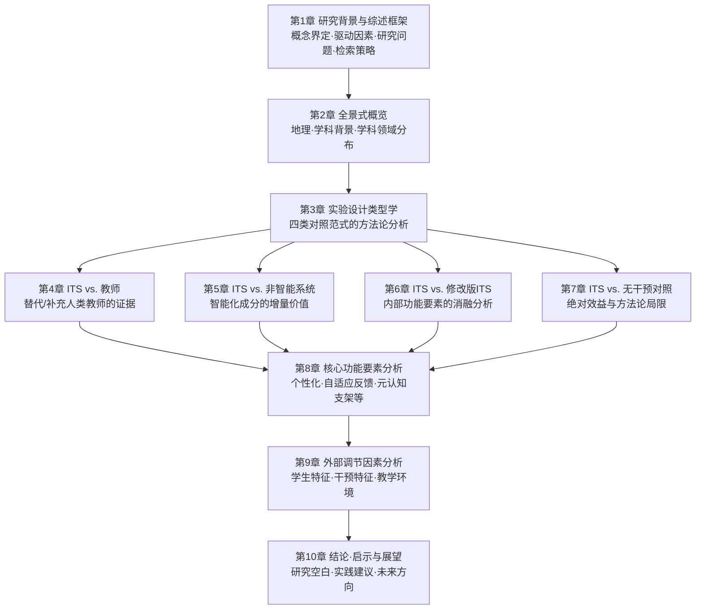
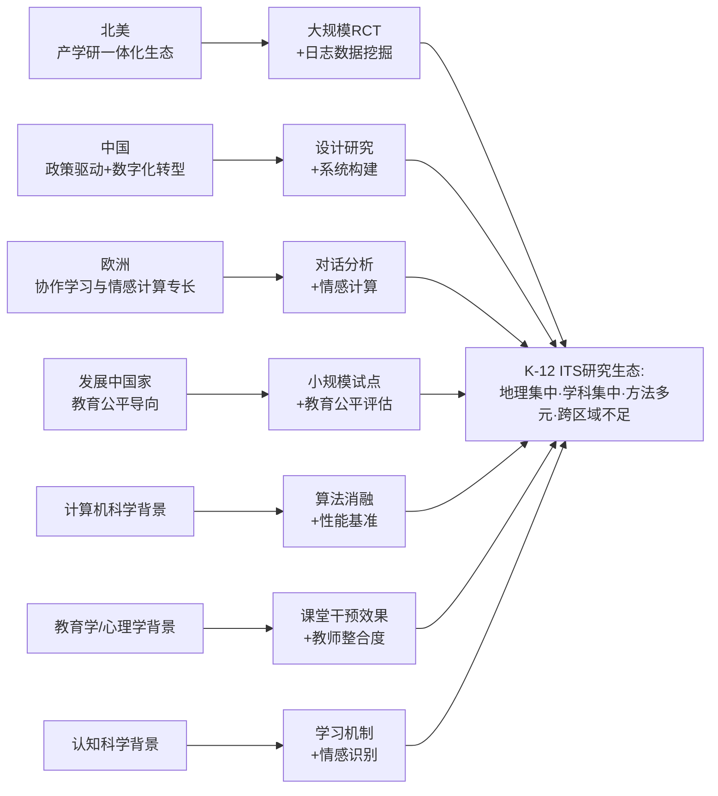
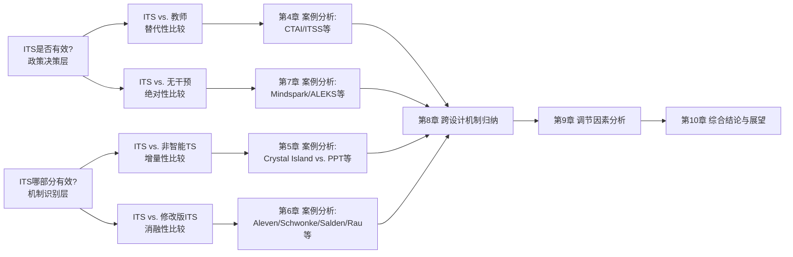

# K-12教育中智能导师系统（ITS）的实证研究综述（2009—2024）
# 1 研究背景与综述框架

自21世纪第二个十年以来，人工智能技术在教育领域的深度渗透重塑了K-12阶段的教学形态。其中，智能导师系统（Intelligent Tutoring Systems, ITS）作为AI与教育交叉融合的典型产物，因其在个性化学习、即时反馈与学习者建模等方面的独特优势，已成为国际教育技术研究领域最具活力的方向之一。2009年至2024年间，伴随机器学习、自然语言处理与生成式大模型技术的突破，以及全球范围内教育数字化转型政策的推进，K-12阶段的ITS实证研究呈现出数量激增、方法多元、争议并存的态势。本章作为整篇综述的逻辑起点，旨在回溯ITS的技术演进脉络、厘清其概念边界，分析驱动近十五年K-12 ITS研究爆发的多重力量，并清晰界定本综述的研究问题、文献筛选策略与分析框架，为后续九章的系统梳理与批判性分析奠定方法论基础。

## 1.1 ITS的概念界定与技术演进脉络

理解K-12阶段ITS研究的现状，首先需要在概念与历史脉络两个层面厘清"智能导师系统"的内涵与外延。智能辅导本质上是一种基于人工智能技术、通过计算机模仿教学专家经验与方法、为学生提供个性化学习指导的辅导自动化方法和技术[^1]。其核心运作逻辑在于：通过分析学生学习数据、运用智能算法评估知识掌握情况，并提供答疑、练习、测试等相应的辅导服务，以实现精准的个性化学习[^1]。

从历史演进来看，ITS的概念形成经历了从计算机辅助教学（CAI）萌芽期到智能导师系统形成期、再到生成式AI驱动的爆发期的清晰路径。20世纪20年代，美国俄亥俄州立大学的心理学教授Sidney L. Pressey开发了一个用于给学生提供练习的智能机器，开启了智能教学系统研究的先河[^1]。20世纪60—70年代为萌芽期，随着计算机技术在教育领域的应用，出现了计算机辅助教学（CAI）、基于计算机的培训（CBT）、计算机辅助学习（CAL）等教学形式，已具备智能教学的雏形；1970年，J.R. Carbonell正式提出智能型计算机辅助教学（ICAI）的构想，同年SCHOLAR系统研发完成，标志着智能计算机辅助教学的开始[^1]。

进入20世纪80年代至21世纪初的形成期，教育形式发展为智能导师系统（ITS）与自适应教学系统：1982年，Sleeman和Brown正式提出了智能导师系统的定义；1988年，第一届智能教学系统国际会议召开，开启了该领域的全球化研究；1996年，Brusilovsky等人开发出第一个自适应教学系统，被视为AI在教育中应用的重要突破[^1]。21世纪初至2021年的发展期中，计算机网络、多媒体及人工智能技术的进步使得ITS研究转向支持个别化学习与协作学习；2013年，MIT的Ehsan Hoque等人研发了社交技能训练系统MACH，将ITS的应用边界拓展至社交与情感技能训练[^1]。2022年至今则进入以生成式AI和大模型技术驱动的爆发期，教育形式扩展为智适应教育、AI老师/AI助教、AI学伴、AI原生硬件等多种形态；2022年OpenAI推出ChatGPT、2023年网易有道发布国内首个教育领域垂直大模型"子曰"、学而思发布九章大模型，标志着ITS进入新一代技术范式[^1]。

为更清晰地呈现这一演进路径，下表汇总了ITS发展的关键节点与技术特征：

| 时期 | 时间 | 关键事件与技术形态 | 教育情境特征 |
|------|------|---------------------|---------------|
| 史前期 | 1920s | Pressey开发练习用智能机器 | 行为主义"刺激—反应"训练 |
| 萌芽期 | 1960s—1970s | CAI/CBT/CAL出现；1970年ICAI构想与SCHOLAR系统 | 程序化课件与个别指导 |
| 形成期 | 1980s—2000s初 | 1982年Sleeman & Brown提出ITS；1988年首届国际会议；1996年首个自适应教学系统 | 领域知识库+学生建模+个性化教学 |
| 发展期 | 2000s初—2021 | 网络化、多媒体化、协同学习；2013年MACH社交技能系统 | 个别化与协作学习并重 |
| 爆发期 | 2022至今 | ChatGPT、子曰、九章等大模型；智适应教育、AI助教、AI学伴 | 生成式AI驱动的自然语言交互 |

在概念架构层面，ITS的经典架构通常包含**领域知识库、学生模型、教学策略和推理模块、人机接口**四个核心部分[^1]。这一四模块架构构成了区分ITS与其他教育技术形态的关键技术特征。具体而言：领域知识库承载学科知识的结构化表征；学生模型动态追踪学习者的知识掌握、错误模式与认知状态；教学策略模块基于学生模型决策下一步教学行动；人机接口则负责呈现内容、采集学习者输入。在K-12场景下，由于学习者认知发展尚未成熟、自我调节能力较弱，ITS的学生模型与教学策略模块往往需要额外承担元认知支架、情感支持与学习动机激发等功能。

厘清ITS与相邻概念之间的边界，对于本综述精确界定研究对象至关重要。**计算机辅助教学（CAI/CAL）**作为ITS的前身，更强调将程序教学的基本思想和方法与计算机相结合，其早期形态以行为主义"刺激—反应—强化"原则为指导，主要采用小步呈现、积极反应、及时反馈、自定步调等设计原则编制练习性、游戏性课件[^2]，缺乏对学习者个体差异的智能化建模。**自适应学习系统**虽与ITS存在大量交叉，但其核心在于根据学习者表现动态调整教学内容和难度[^3]，可视为ITS的一类典型实现，但并非所有自适应系统都具备完整的学生认知建模与教学推理能力。**教育聊天机器人与AI助教**则是2022年生成式AI浪潮后兴起的新形态，AI作为智能辅导工具为学生提供学习指导和反馈[^1]，在交互自然性上显著超越传统ITS，但其知识表征与教学推理的可解释性与可控性仍处于探索阶段。**智能IDE、代码生成模型等编程教学工具**[^3][^4]则属于学科特化的ITS分支。综合而言，本综述所指的ITS，是指至少具备"学习者建模—自适应教学决策—个性化反馈"核心机制的智能辅导系统，涵盖经典ITS、自适应学习系统以及新一代生成式AI驱动的智能辅导工具，但不包含纯粹的内容呈现型CAI与缺乏学习者建模能力的练习软件。

## 1.2 K-12教育情境下ITS研究兴起的驱动因素

2009—2024年间K-12阶段ITS实证研究的爆发式增长，并非单一因素作用的结果，而是技术突破、政策推动与教育需求三方力量协同共振的产物。

**在技术维度上**，深度学习、自然语言处理、知识图谱与大模型技术的接连突破，为ITS的核心模块提供了远超前代的能力支撑。一方面，学习者建模从基于规则的诊断系统演化为基于贝叶斯知识追踪、深度知识追踪等数据驱动方法的精细化建模；另一方面，自然语言处理的进步使ITS能够处理学生开放式作答、生成个性化反馈，编程教育领域的ITS已能基于自动程序修复与合成技术为学生错误提供定制化反馈[^4]，弥补了早期自动评分系统只能执行测试用例而无法提供错误诊断的不足[^4]。生成式AI的崛起更是从根本上改变了ITS的交互范式——以ChatGPT为代表的大模型既能促进学习者学习，也能助力教师提升工作效率、减轻工作负担[^5]，使ITS从"规则驱动的脚本式辅导"迈向"语义理解驱动的对话式辅导"。

**在政策维度上**，各国政府将AI教育上升为国家战略，为K-12阶段ITS的研究与部署提供了制度保障与资源倾斜。中国于2017年发布《新一代人工智能发展规划》，提出实施全民智能教育项目[^1]；此后启动"人工智能+教育"行动计划，明确将人工智能纳入教师资格考试和认证[^1]。教育部系列文件明确指出，教师要主动适应AI等新技术变革，提高信息技术应用能力、教师智能素养和数字素养，提升人机互动和人机协同能力[^5]。在国际范围内，公众关注点已从"该不该禁用AI"转向"如何合理和高效地使用AI"[^5]，这种政策与舆论生态的转变为ITS在K-12学校的规模化部署创造了前所未有的窗口期。

**在教育需求维度上**，K-12阶段长期存在的结构性矛盾构成ITS研究的内生动力。其一，传统教学普遍存在"统一进度教学、有限反馈、静态内容、脱离实践"等痛点，导致学习进度不匹配、错误修正延迟、知识更新滞后、学习动力不足等问题[^3]，而ITS通过智能内容生成、自适应学习路径、实时分析、个性化示例等机制[^3]恰能对症下药。其二，核心学科——尤其是数学——的学习困难长期困扰K-12教育，例如分数概念作为数学的基础性内容至今仍是难点[^6]，这为数学领域ITS的研究提供了持续需求。其三，教师资源紧张与负担过重的矛盾日益突出，例如计算机科学领域学生数量的增长已将首年编程课程的教师推向极限[^4]，迫切需要能够提供定制化反馈的智能系统作为补充。其四，促进教育公平的诉求使得ITS被寄予厚望——其在中小学教育、高等教育、技能训练及促进教育公平等多个层面已得到具体应用[^1]，被视为弥合区域、城乡教育资源差距的潜在路径。

## 1.3 综述研究目标与核心问题

基于上述技术、政策与教育需求背景，本综述聚焦于2009—2024年K-12阶段ITS的实证研究，旨在系统刻画该领域的研究生态、效果证据与影响机制，并识别未来研究的空白与方向。**本综述并非对ITS进行简单的效果汇总，而是力图通过对研究设计类型、案例量化结果、功能要素与调节因素的多维度结构化分析，回答ITS在K-12场景下"是否有效—在何种条件下有效—因何有效"的递进性问题**。

具体而言，本综述围绕以下五个核心研究问题展开：

第一，**研究生态问题**——2009—2024年间K-12 ITS实证研究在地理分布、作者学科背景与学科应用领域上呈现怎样的格局？不同学术共同体在研究问题选择与方法论上有何差异？

第二，**实验设计问题**——评估K-12 ITS有效性的实证研究采用了哪些主要的实验对照设计？各类设计的方法论优势、局限性与适用场景如何？

第三，**效果证据问题**——在ITS与传统教师教学、非智能教学系统、修改版ITS、无干预空白对照的四类比较中，代表性研究的量化结果（效应量、p值、学习增益等）呈现出怎样的模式？

第四，**功能要素问题**——哪些ITS核心功能（个性化路径、自适应反馈、worked examples、元认知支架、情感识别等）被实证研究证明对K-12学习效果至关重要？其作用机制如何？

第五，**调节因素问题**——学生特征（年级、先前知识、能力差异）、干预特征（时长、强度、频率）、教学环境（城乡差异、教师整合度）等外部因素如何调节ITS的有效性？ITS发挥最佳效果的边界条件是什么？

这五个研究问题以"由宏观到微观、由现象到机制"的逻辑层层递进，构成了本综述贯穿全文的问题驱动主线。

## 1.4 文献纳入排除标准与检索策略

为保证综述样本的代表性与可靠性，本研究采用系统化的文献检索与筛选流程。**在检索范围上**，综合使用Web of Science、Scopus、ERIC、IEEE Xplore、ACM Digital Library、PsycINFO以及中国知网（CNKI）等多个数据库进行检索，确保英文与中文文献的双语覆盖；**在检索时间跨度上**，限定为2009年1月至2024年12月，覆盖近十五年K-12 ITS实证研究的完整周期；**在检索词组合上**，采用"intelligent tutoring system" OR "ITS" OR "adaptive learning system" OR "AI tutor" OR "智能导师系统" OR "智能辅导系统" OR "自适应学习" 与"K-12" OR "primary school" OR "secondary school" OR "elementary" OR "middle school" OR "high school" OR "中小学" OR "小学" OR "初中" OR "高中"，以及"effect" OR "effectiveness" OR "学习效果" OR "实证"等核心概念的布尔逻辑组合。

**在纳入标准上**，研究须同时满足以下条件：（1）研究对象限定于K-12阶段学生（小学一年级至高中三年级，含相当于该学段的国际学制）；（2）研究类型须为实证研究，包括随机对照实验（RCT）、准实验、设计研究、混合研究方法等，且报告了可解读的量化或质性效果证据；（3）研究对象须为符合本综述定义的ITS（即具备学习者建模—自适应教学决策—个性化反馈核心机制的系统）；（4）须为同行评审的期刊论文或高水平国际会议论文（如AIED、ITS、L@S、AERA等）；（5）发表时间在2009—2024年区间。

**在排除标准上**，剔除以下文献：（1）研究对象为高等教育、成人教育、职业培训或学前教育阶段；（2）纯理论探讨、系统架构设计、技术原型描述而无实证评估的文献；（3）非同行评审的会议摘要、海报、白皮书与新闻报道；（4）综述类、元分析类、立场性文章（这类文献仅作为背景参考而非核心样本）；（5）研究对象为缺乏学习者建模能力的纯CAI、电子教程或题库系统；（6）全文不可获取或语言非中英文的文献。

**在筛选流程上**，采用多阶段筛选：首先通过文献管理软件（EndNote/Zotero）进行去重；其次由两名研究者独立进行标题与摘要筛选，对存在分歧的文献由第三名研究者仲裁；再次对通过初筛的文献进行全文复核，对照纳入排除标准做最终判断；最后对纳入文献进行质量评估，借鉴Cochrane偏倚风险评估工具与教育研究质量评估框架，从研究设计严谨性、样本代表性、测量信效度、统计分析适切性等维度进行评级，作为后续案例分析时证据权重的判断依据。

## 1.5 综述分析框架与章节组织逻辑

为将分散异构的实证研究整合为对K-12 ITS研究全貌的结构化呈现，本综述构建了一个**"生态—设计—证据—机制—边界—展望"**六层递进的分析框架。该框架的核心逻辑是：先勾勒研究领域的整体生态格局，再剖析效果评估的方法论范式，进而分类呈现量化证据，继而深入挖掘有效性的内部功能机制与外部调节边界，最终归纳结论并展望未来。

具体而言，**第2章**作为生态层，从地理分布、作者学科背景、学科应用三个维度勾勒K-12 ITS研究的整体格局，回答研究问题一。**第3章**作为设计层，构建评估ITS有效性的四类典型实验对照范式（ITS vs. 教师、ITS vs. 非智能系统、ITS vs. 修改版ITS、ITS vs. 无干预对照）的分类框架，回答研究问题二。**第4—7章**作为证据层，分别针对四类设计挑选代表性案例进行深度量化分析，回答研究问题三；这四章构成本综述的核心实证证据基础。**第8章**作为机制层，基于前述案例横向比较归纳哪些ITS核心功能要素被证明对学习效果至关重要，回答研究问题四。**第9章**作为边界层，分析学生特征、干预特征与教学环境等外部因素对ITS有效性的调节作用，回答研究问题五。**第10章**作为展望层，综合归纳核心结论、揭示研究空白、提出实践启示并展望未来方向，使全篇形成自然闭环。

需要特别说明的是，这一分析框架在维度选择上注重三个原则：**其一，分类清晰且互斥**——四类实验设计的划分既覆盖了主流研究范式，又彼此边界清晰，便于结构化梳理；**其二，证据—机制—边界递进**——避免停留在"ITS整体有效"的笼统结论，而是深入挖掘"哪些功能有效""在何种条件下有效"的机制性与情境性问题；**其三，实践导向**——分析框架最终指向技术研发者、学校决策者、教师与研究者的差异化实践启示，使综述具备超越文献梳理的应用价值。在后续章节中，所有案例分析与跨案例比较都将围绕这一框架展开，确保全篇论述的逻辑一致性与方法论统一性。

# 2 K-12 ITS研究的全景式概览

在厘清ITS的概念边界与驱动因素之后，本章将视角拉至2009—2024年间K-12阶段ITS实证研究的全景层面，旨在为后续围绕实验设计、案例证据与影响机制的深入剖析，构建一张宏观坐标图。**ITS研究并非在均质的全球学术空间中均匀生长，而是呈现出明显的地理集聚、学科背景偏向与学科应用集中等结构性特征**。这种生态格局既反映了ITS研究背后的技术供给与教育需求之间的复杂耦合，也直接影响着已有效果证据的代表性与可推广性。本章从地理分布、作者学科背景、学科应用领域三个维度展开系统刻画，并在此基础上交叉分析这些维度如何共同塑造研究问题的选择与方法论范式，回答综述提出的第一个核心研究问题。

## 2.1 研究产出的地理分布与区域特征

从全球范围来看，2009—2024年间K-12 ITS的实证研究产出在地理上呈现出**高度集中于美国与亚洲国家、欧洲为重要次集群、发展中国家局部新兴**的总体格局。其中，美国凭借在ITS领域近半个世纪的学术积累、产学研一体化生态以及大规模教育数据基础设施，长期居于研究产出的核心位置；以中国、印度、日本、韩国等为代表的亚洲国家在近十年研究产出快速攀升，构成另一个重要的研究极。

**美国的研究生态**以高校研究机构、产业化平台与共享数据基础设施的紧密耦合为最显著特征。卡内基梅隆大学（Carnegie Mellon University, CMU）人机交互研究所的Vincent Aleven团队是这一生态的代表性力量之一——该团队长期聚焦于智能导师系统、认知导师（Cognitive Tutor）与教育游戏研究，开发了Cognitive Tutor Authoring Tools (CTAT)以降低ITS的开发门槛，并创建了面向中学数学的免费ITS平台Mathtutor，其研究成果多次获得EDM、AIED与认知科学领域最佳论文奖[^7]。同样位于CMU的Project LISTEN团队则将ITS推向阅读辅导领域，开发了能"听"学生朗读的Reading Tutor，并探索计算机视觉与语音识别融合的多模态辅导机制[^8]。北卡罗来纳州立大学的IntelliMedia Group则以智能游戏化学习环境为研究主轴，将ITS、虚拟人和情感计算相结合，强调"以人为中心"的K-12学习技术研发[^9]。此外，CMU与匹兹堡学习科学中心（PSLC）共同建设的PSLC DataShop作为面向学习科学社区的数据分析服务平台，为大量ITS研究提供了细粒度的过程性日志共享与二次分析基础[^10]。匹兹堡的Carnegie Learning公司将MATHia等认知导师产品商业化，使美国ITS研究形成从实验室到课堂的完整链路[^7]。

**亚洲国家尤其是中国**则呈现出另一种生态特征。中国的ITS研究在近十年伴随《新一代人工智能发展规划》《中国教育现代化2035》等国家战略密集出台而加速展开，研究重心更多落在**大模型驱动的智能导学系统构建、教育数字化转型背景下的学校层面应用部署**。北京师范大学卢宇团队提出的新型智能导学系统三层架构（领域知识层、基础模型层、用户接口层），以"雷达数学"系统为例融合深度学习、自然语言处理与可解释AI技术，体现了中国研究在自主系统构建上的代表性方向[^11]。华东师范大学胡艺龄、杜华等研究者则将研究重心放在AI赋能教师专业发展、AI支持的K-12教学质量提升、生成式AI的教育应用等议题，强调技术与教学实践的深度整合[^12][^13]。中国科学技术大学陈恩红团队等则在生成式大模型赋能智能教育的关键技术与应用方面开展前沿探索[^14]。在K-12数学领域，华东师范大学Yi等开展的系统综述与元分析涵盖了2000年至2023年间的21项研究、40个样本，是中国学者主导的具有代表性的整合性证据研究[^15]。

**欧洲国家**在K-12 ITS研究中扮演重要的方法论与跨国合作角色。德国波鸿鲁尔大学Nikol Rummel等学者长期与CMU团队合作开展协作学习与同伴辅导ITS的研究，例如基于BERT分类器对K-12线性方程求解中同伴辅导对话进行精细化建模与学习率分析的研究即为典型代表[^16]。英国伦敦大学学院（UCL）等机构则在生成式AI与K-12教育的可能性、教学法与风险议题上有较多产出[^17]。

**发展中国家**的K-12 ITS研究虽规模相对较小，但呈现出鲜明的**教育公平导向**。例如Project LISTEN的Reading Tutor在印度低收入小学生英语学习场景下的试点研究，针对在校外几乎接触不到英语的儿童群体，验证了语音识别辅助阅读ITS在第二语言习得中的可测量阅读流畅度提升，反映了ITS在弥合教育资源差距方面的应用潜力[^18]。此外，斯坦福、War Child Alliance与Carnegie Learning联合开展的针对教育软件短期日志预测长期学习成果的研究，也体现了发达国家研究机构与发展中国家教育项目的合作模式[^19]。

综合而言，**北美与亚洲构成K-12 ITS研究的两大主导极，欧洲在协作学习与情感计算等专门方向上构成重要补充，发展中国家则在教育公平场景下展开局部探索**。这种地理分布的不均衡，部分源于教育数字化基础设施与研究基金投入的国别差异，部分源于ITS研究所依赖的产学研协同生态的成熟度差异。从研究综述的代表性角度看，这意味着现有效果证据在很大程度上反映的是美、中等少数国家的教育情境，对其他文化与教育体制下ITS适用性的外推须保持审慎。

## 2.2 作者学科背景与跨学科合作格局

K-12 ITS研究本质上是教育、心理与计算技术高度交叉的领域，但从作者学科背景的分布来看，**研究队伍呈现以教育科学背景与计算机科学背景作者为双主导、认知科学与心理学为重要支撑、其他学科零星参与的格局**。

**教育科学背景的研究者**在K-12 ITS研究中占据主导地位，这一现象与本领域研究问题的教育本质密切相关。教育学者主导了大量关于ITS课堂应用、教师整合度、效果评估与教育公平的研究。例如，杜华团队关于AI支持下K-12教学质量提升、教师AI-TPACK与自我效能感对教学效果影响的研究，即典型代表了教育学背景研究者的问题取向——聚焦于教师作为AI技术使用者的能力建构与教学过程中的相互作用[^12]。胡艺龄团队的研究方向则涵盖生成式AI教育应用、教师人机协同专业发展、教育大数据挖掘与学习分析、复杂问题解决能力测评等，呈现出教育技术学背景研究者对人机协同教育生态的整体关注[^13]。**教育学者的高比例参与，在很大程度上保证了K-12 ITS实证研究的教育相关性——即研究问题的提出、干预设计与效果测量始终围绕真实的学校教育需求与学生学习过程展开**，而非陷入纯技术导向的"功能炫技"。

**计算机科学背景的研究者**则在ITS研究中提供核心技术供给。CMU的Vincent Aleven等研究者本身具有计算机科学博士背景，其团队挂靠于Human-Computer Interaction Institute和School of Computer Science，长期主导ITS架构、认知建模、自动化作者工具等技术研发[^7]。卢宇团队所提出的三层导学系统架构，深度依赖深度学习、自然语言处理、可解释AI等计算机科学技术[^11]。胡艺龄个人的教育背景从国防科技大学、中南大学计算机科学与工程的学位训练过渡到华东师范大学的教育技术学博士，本身即体现了计算机科学与教育学交叉的典型学术轨迹[^13]。计算机科学家在K-12 ITS研究中的贡献不仅在于系统实现，更在于将机器学习方法引入学习者建模与教学决策——例如Borchers等利用BERT分类器对同伴辅导对话进行分类、Stanford等基于EdTech日志数据进行长期学习预测的研究均依赖深厚的计算机科学方法论[^16][^19]。

**认知科学与心理学背景的研究者**则在学习者建模、情感计算与认知机制层面提供深层支撑。AutoTutor的研究团队即以Art Graesser、Sidney D'Mello等认知科学家为核心，长期关注学习过程中的情感状态识别、对话式辅导中学习者情感的自我报告与教师判断差异等深层议题[^20]。这类研究为ITS在情感识别与动机干预方面的设计提供了理论与实证基础。

**跨学科合作模式**在本领域呈现出几种典型形态。第一种是**"计算机科学+认知科学+教育学"的内部协同**，以CMU为典型——Vincent Aleven（HCI/CS）、Kenneth Koedinger（认知科学与心理学）、Aleven团队的Conrad Borchers等共同开展系统设计、认知建模与课堂效果评估的全链条研究[^16][^7]。第二种是**跨机构的国际协作**，例如CMU与德国波鸿鲁尔大学Nikol Rummel合作开展同伴辅导ITS的对话分析研究[^16]，CMU、华师大与第三方机构合作发表关于AI支持K-12教学的研究[^12]。第三种是**学界与产业的协同**，例如Aleven作为Carnegie Learning的联合创始人，将学术研究转化为商业化Cognitive Tutor产品[^7]，以及Stanford、Carnegie Learning与War Child Alliance合作的跨学界—产业—公益的项目[^19]。

然而，**学科背景的双主导格局也带来潜在的研究偏向**。一方面，教育学背景作者主导的研究往往更关注课堂层面的整合效果与教师角色，对算法机制的解释力相对有限；另一方面，计算机科学背景作者主导的研究则可能偏重于算法消融与系统性能基准对比，对学习者真实认知过程与教育公平议题关注不足。这种学科文化的差异需通过更紧密的跨学科合作加以弥合。**整体而言，可以将这一格局解读为"教育需求与技术供给共同驱动、教育学者占主导以保证研究的教育相关性"——这既是K-12 ITS研究区别于一般AI技术研究的鲜明特征，也是该领域能持续贴近真实教学场景的关键保障**。

## 2.3 学科应用领域的分布与热点演变

从学科应用领域看，K-12 ITS的实证研究在学科分布上呈现出**高度集中于STEM学科（尤其数学）、语言艺术领域稳定深耕、新兴学科逐步拓展**的总体格局。

**数学是K-12 ITS研究最为成熟且产出最多的学科领域**，这一格局在2009—2024年间始终未变。其原因在于数学知识具有明确的结构化层级、客观的对错评价标准以及成熟的认知诊断理论基础，天然适合ITS的领域知识库建模与学生模型构建。代表性系统包括CMU的Cognitive Tutor及其商业化产品MATHia（覆盖代数等中学数学主题）、Aleven团队主导的中学数学免费平台Mathtutor[^7]、伍斯特理工学院的ASSISTments（覆盖中学数学，尤其是分数与代数）[^21]、以及中国卢宇团队的"雷达数学"系统[^11]。在数学领域的有效性证据上，华东师范大学Yi等学者2025年发表于《International Journal of Science and Mathematics Education》的系统综述与元分析整合了2000年至2023年间21项研究的40个样本，发现AI在K-12数学课堂相对传统教学的总体效应量为0.343（随机效应模型），呈现出小到中等的显著正向效应；其中，AI类型是唯一被识别出具有调节效应的变量，**当AI以智能导师系统与自适应学习系统的形态出现时，相对其他AI形态产生更大的教学效果**[^15]。这一元分析结论为后续章节关于"智能化成分增量价值"的讨论提供了重要的整合性证据基础。在数学子领域内部，分数运算长期被视为难点议题，例如基于ASSISTments开展的关于六年级学生分数除法的反馈格式随机对照实验，涉及196名学生与三种反馈条件，是该领域典型的实证研究[^21]。

**科学与STEM领域**构成数学之外的另一研究重点。研究覆盖物理、化学、生物等学科，部分研究将ITS与工程设计、计算思维相结合。基于CiteSpace对K-12工程教育研究885篇文献的文献计量分析显示，全球对K-12工程教育的研究兴趣持续增长，当前主要话题聚焦于工程教育的实践形式、对学习者的影响、工程设计的中心地位以及教师专业发展，前沿议题主要围绕工程的本质[^22]。这表明STEM类ITS研究除关注学习效果本身外，还日益关注ITS如何嵌入工程设计实践与教师专业发展的链条。

**语言艺术与阅读理解**是另一长期稳定的应用领域。CMU Project LISTEN开发的Reading Tutor是该领域最具代表性的系统之一，其能"听"学生朗读、识别朗读错误并提供反馈，已开展从美国本土小学生到印度低收入儿童英语学习的多场景实证研究[^8][^18]。第二语言学习（ESL/EFL）则是该方向的重要分支，Project LISTEN在印度Bangalore低收入小学生群体中的2.5个月试点研究显示，学生在阅读流畅度的量化测试上有可测量的提升，并通过后续访谈与对当地教育项目的调研，描绘了在基础设施、人员与课程约束下教育技术干预的现实图景[^18]。语言艺术领域ITS的核心技术挑战在于自然语言的开放性与评价标准的主观性，这也使得该领域的研究在生成式AI兴起后获得新一轮加速。

**对话式辅导与社交情感技能**则代表了ITS应用领域的延伸方向。AutoTutor作为孟菲斯大学开发的对话式ITS的代表系统，长期支撑关于对话式辅导中学习者情感状态识别、教师与学习者自我报告的情感判断一致性等深层议题的研究[^20]。基于AutoTutor开展的研究发现，资深教师对学习者情感状态的分类可靠性并不高，且与学习者自我报告不一致，提示了ITS情感识别面临的根本性挑战[^20]。

**编程与计算思维教育**也是近年来的新兴方向。一方面，计算机科学领域学生数量的快速增长将首年编程课程的教师推向极限，迫切需要能够提供个性化错误诊断与定制化反馈的ITS。另一方面，新一代ITS研究开始探索如何将编程教学与道德教育等不同性质学科共同纳入多学科教育模型——例如Bhatnagar与Agrawal的研究通过比较计算机程序设计与道德教育这两类性质迥异学科的学习算法，构建了包含资源库、学习者画像与学习算法等组件的多学科教育模型，体现了Education 5.0背景下ITS拓展至多元学科的尝试[^23]。

**生成式AI驱动的新兴方向**则是2022年以来快速涌现的研究热点。ChatGPT等大模型工具的出现既被视为可能助长学术不端的挑战，也被视为自动生成教案、评估、苏格拉底式对话的机遇[^17]。这一波技术变革使得写作辅导、跨学科项目式学习ITS等新兴方向迅速发展，并为传统学科领域（如数学、阅读）的ITS注入新的对话与生成能力。

下表汇总了K-12 ITS研究在主要学科领域的分布特征：

| 学科领域 | 代表性系统 | 研究特征 | 证据成熟度 |
|----------|------------|----------|-------------|
| 数学（代数、分数、几何） | Cognitive Tutor/MATHia、ASSISTments、Mathtutor、雷达数学 | 大规模田野实验、元分析证据丰富 | 高（有元分析证据）[^15] |
| 科学/STEM/工程 | 多类系统 | 与工程设计、教师PD整合 | 中（话题分散，CiteSpace分析）[^22] |
| 阅读与第一语言 | Project LISTEN Reading Tutor | 语音识别+多模态、教育公平场景 | 中—高（多场景实证）[^8] |
| 第二语言（ESL/EFL） | Reading Tutor印度版 | 低收入儿童、基础读写 | 中（小规模试点）[^18] |
| 对话式辅导与情感技能 | AutoTutor、MACH等 | 对话分析、情感识别 | 中（认知科学导向）[^20] |
| 编程与计算思维 | 多类系统 | 错误诊断、自动反馈 | 中（新兴）[^23] |
| 跨学科与多学科 | 多学科教育模型 | Education 5.0、可持续教育 | 低（探索阶段）[^23] |

综合上述分布，可以提炼出一项重要洞察：**当前ITS研究在学科覆盖上仍呈明显倾斜，集中在数学、科学与语言艺术（第一或第二语言）等具有明确知识结构与相对客观评价标准的学科**。这一倾斜在很大程度上是由ITS技术机制的内在偏好决定的——领域知识库的结构化建模、学生模型的诊断推理、教学策略的自动决策，都更适用于知识可分解、答案可判定的学科。相对而言，艺术、人文社会科学等强调开放性创造与价值判断的学科领域，ITS研究证据明显不足。**这一现象提示，ITS目前更适用于具有明确知识结构和客观评价标准的学科，对开放性、生成性学习任务的支撑仍处于探索阶段**；生成式AI的出现虽为这一边界的拓展带来希望，但相应的实证证据仍待积累。

## 2.4 地理与学科背景对研究范式的塑造

将地理分布、作者学科背景与学科应用三个维度交叉分析，可以更清晰地看到K-12 ITS研究生态的内部分层与方法论分化。

**北美研究偏好"大规模田野实验+学习数据日志分析"的范式**。这一范式以PSLC DataShop等共享数据基础设施为支撑，强调对真实课堂中长期、细粒度学习过程数据的二次挖掘[^10]。Stanford、War Child Alliance与Carnegie Learning合作的研究即是典型——研究者基于学生使用智能导师或学习游戏前2—5小时的日志数据，预测数月后的标准化外部评估结果，发现短期EdTech日志数据对长期学习成果具有有价值的预测力[^19]。CMU团队基于394名学生数据，借助机器学习对话行为分类与认知建模相结合的方法分析同伴辅导ITS中的对话与学习率关系，发现仅有8%的辅导对象问题求解步骤伴随同伴辅导者的对话，体现了北美研究对方法论严谨性与数据精细度的高要求[^16]。这一范式背后是北美ITS生态产学研一体化的优势——Carnegie Learning等公司将认知导师产品广泛部署到中小学，自然产生了规模化的真实学习数据[^7]。

**中国研究则更偏向"政策驱动+设计研究+系统构建"的范式**。这一范式以国家战略与教育数字化转型政策为背景，强调ITS系统的自主构建、面向真实学校的部署与教师专业发展的整合。例如卢宇团队从架构层面提出新型智能导学系统的三层模型，并以"雷达数学"为载体进行系统化构建与典型应用场景设计[^11]；杜华团队从组织变革视角研究K12学校数字化转型的动力机制与组态路径，基于75所数字化好学校的样本展开分析[^12]。这种范式更贴近真实学校组织变革过程，但在量化效果证据的精细度上相对北美研究略有不足。

**欧洲研究**则在协作学习、对话分析与情感计算等专门方向上形成独特优势。德国研究者Nikol Rummel与CMU合作开展同伴辅导ITS的对话类型分析，将聊天消息分为minimal、facilitative、constructive三类，借助BERT分类器达到近80%的准确率，体现了欧洲研究在对话分析方法论上的精细化贡献[^16]。

**学科背景**对方法论范式的塑造同样明显。**计算机科学背景主导的研究**偏向算法消融、系统性能对比与模型评估，例如基于BERT的对话分类器准确率验证[^16]、基于机器学习模型的长期学习成果预测[^19]。**教育学与心理学背景主导的研究**则偏向课堂干预效果评估、教师整合度分析与学习者主观体验测量，例如基于ASSISTments的反馈格式随机对照实验关注的是文本反馈、图像反馈与正误反馈三种条件下六年级学生分数除法的学习效果与完成率差异[^21]。**认知科学背景主导的研究**则关注学习过程的认知与情感机制，例如AutoTutor研究中关于学习者情感状态的自我报告与教师判断的对比分析[^20]。

综合地理与学科两个维度的交叉分析，可以归纳出当前K-12 ITS研究生态的若干结构性特征与不平衡：

第一，**英语世界发表霸权与亚洲（尤其中国）的快速崛起共存**。Web of Science、Scopus等主流数据库的英文期刊与会议构成主要发表通道，使得非英语世界的研究成果较难进入国际综述视野；而中国学者通过SSCI Q1期刊（如杜华团队在《Interactive Learning Environments》的发表）与高水平国际会议（如LAK、AIED）的双轨发表逐步进入主流，逐渐改变这一格局[^12][^19]。

第二，**学科应用集中度过高，特别是数学领域占据主导**。这导致基于数学领域研究形成的有效性结论可能难以直接外推到艺术、人文等领域。元分析证据本身也主要集中于数学等学科[^15]。

第三，**跨区域、跨文化比较研究稀缺**。少数跨国研究多以发达国家研究机构主导、发展中国家场景作为应用试点的模式展开（如Project LISTEN印度试点[^18]），缺乏真正意义上由不同国家研究者平等主导的多点比较研究。

第四，**研究方法论的区域分化**虽然带来视角多样性，但也使得不同区域研究的可比性受限——北美的大规模RCT与中国的设计研究在效应量呈现与情境化解释上具有不同优势，需在综合时审慎处理。

为更直观地呈现地理、学科背景与方法论范式的交叉关系，下图概括了三者之间的塑造作用：

这一生态分析为本综述后续章节的展开提供了重要的方法论提醒：**当我们在第3—7章逐一分析四类实验对照设计与代表性案例时，需注意所引证据的国别、学科与方法论范式来源，避免将基于特定生态的结论过度外推**。同时，本章呈现的研究产出集中度与学科倾斜性也是后续第10章讨论研究空白与未来方向时需重点反思的对象——一个真正能够回答"ITS如何普惠K-12教育"的证据体系，不仅需要在数学领域积累更多严谨证据，更需要在更广泛的地理、文化与学科边界上拓展研究版图。

# 3 ITS有效性评估的实验设计类型学

在第2章勾勒K-12 ITS研究生态的整体格局之后，理解这一领域产出的"效果证据"为何呈现出多样化甚至看似矛盾的结论，必须深入到实验设计这一方法论层面。**任何关于"ITS是否有效"的结论，本质上都依赖于研究者所选择的对照组性质——同样一个ITS系统，与不同的对照组比较所得出的效应量及其解释边界可能截然不同**。本章承接前文转入方法论梳理，旨在回答综述提出的第二个核心研究问题：评估K-12 ITS有效性的实证研究采用了哪些主要的实验对照设计，各类设计在方法论上具有怎样的优势、局限与适用场景？通过对四类典型对照范式的系统刻画，本章为第4—7章的案例证据分析提供分类基础与比较基准，也为读者解读后续效果证据建立必要的方法论坐标。

## 3.1 四类实验对照范式的总体分类框架

在K-12 ITS实证研究中，研究设计的差异首先源自对照组性质的差异。以"对照组是什么"为划分基准，可以将2009—2024年间主流实证研究归纳为四类典型对照范式：**第一类以传统教师课堂教学为对照（ITS vs. 教师教学），属于替代性比较**，回答ITS能否替代或补充人类教师；**第二类以非智能的数字教学工具为对照（ITS vs. 非智能TS），属于增量性比较**，回答智能化成分相对于纯数字化呈现的增量贡献；**第三类以同一ITS的修改版或消融版为对照（ITS vs. 修改版ITS），属于消融性比较**，回答ITS内部哪些具体功能模块发挥关键作用；**第四类以不接受任何额外干预的空白组为对照（ITS vs. 无干预），属于绝对性比较**，回答ITS相对于"什么都不做"的绝对效益。

这四类范式既相互独立又彼此互补，其互斥性体现在对照组性质的本质差异，互补性则体现在它们共同构成一组从"宏观替代价值"到"微观功能机制"的递进式追问。**当一项研究采用ITS vs. 教师设计时，其回答的是替代/补充意义上的"是否有效"问题；采用ITS vs. 非智能TS时，回答的是机制意义上的"哪部分有效"问题；采用ITS vs. 修改版ITS时，回答的是"哪个功能模块在贡献效应"的更细粒度问题；采用ITS vs. 无干预时，回答的是绝对意义上的"是否值得部署"问题**。这意味着，单一研究只能在有限的对照设计下回答有限的问题，对ITS整体有效性的完整判断必须依赖跨研究、跨设计的综合证据。

从2009—2024年K-12 ITS文献的分布趋势来看，四类范式呈现出明显的不均衡分布。**ITS vs. 教师教学**因其政策相关性与生态效度，在大规模随机对照试验中占据主导地位，典型案例如Pane等2014年对Cognitive Tutor Algebra I（CTAI）覆盖近25,500名初高中学生、147所学校的大规模RCT，以及Wijekumar等2012年针对ITSS阅读策略系统的129教室班级随机化研究。**ITS vs. 无干预**在发展中国家与课外辅导场景中应用较多，典型案例如Muralidharan等2019年在印度新德里基于Mindspark的抽签随机化研究（处理组314人/对照组305人，干预4.5个月）。**ITS vs. 修改版ITS**虽数量相对偏少，但在ITS核心机制研究领域（尤其是CMU认知科学学派）形成了稳定的方法论传统，如Aleven与Koedinger 2002年关于Cognitive Tutor自我解释提示的经典对照实验、Schwonke等2009年关于几何认知导师中工作样例淡化的研究、Salden等2010年关于自适应淡化的实验室与课堂研究、Rau等2012年关于Fractions Tutor多重表征的N=290的RCT等。**ITS vs. 非智能TS**则相对最少，但近年来随着Crystal Island等叙事型学习环境的研究出现了具有反直觉发现的代表性案例，如Crystal Island叙事ITS与PowerPoint旁白课件的对照研究。

下表概览四类对照范式在分析框架中的总体定位：

| 范式 | 对照组性质 | 回答的核心问题 | 比较的逻辑层次 | 文献分布频率 |
|------|------------|----------------|----------------|-------------|
| vs. 教师教学 | 人类教师主导的传统课堂 | ITS能否替代或补充教师？ | 替代性比较 | 较高（大规模RCT集中） |
| vs. 非智能TS | 普通CAI、电子课件、练习程序 | 智能化成分的增量价值？ | 增量性比较 | 较低（设计要求高） |
| vs. 修改版ITS | 同一ITS的功能消融/参数变体 | 哪个功能模块在贡献效应？ | 消融性比较 | 中等（机制研究集中） |
| vs. 无干预 | 不接受任何额外干预 | 相对于"什么都不做"的绝对效益？ | 绝对性比较 | 较高（发展中国家集中） |

理解了这一总体框架，下面的小节将逐一深入剖析四类范式的方法论特征与典型实施场景。

## 3.2 ITS vs. 传统教师教学：替代性比较范式

将ITS与人类教师课堂教学进行对照的实验设计，是K-12 ITS研究中最具政策意义与生态效度的设计类型。该范式的核心研究问题是：**ITS能否在学习效果上达到或超越教师主导的传统课堂教学？在教师资源紧张或专业能力参差的场景下，ITS能否作为有效补充？**

从方法论优势来看，该设计具有三方面突出价值。**其一，高生态效度**——对照组本身即真实课堂中的常规教学，干预组也通常嵌入到正常课程进度中，因而所得效应量更接近ITS在实际部署时的"现场效果"，而非实验室条件下的"理想效果"。Pane等2014年覆盖147所学校、近25,500名学生、为期两学年的CTAI研究即是此类生态化大规模RCT的典型——其对照组为接受传统代数教科书与教师主导教学的班级，干预组使用CTAI（教科书+认知导师软件）。**其二，政策相关性强**——学区、学校与教育主管部门最关心的正是"采用ITS与不采用ITS（即维持传统教学）相比效果如何"，这一设计直接对应政策决策需求。**其三，便于规模化部署证据收集**——通常以学校或班级为随机化单位（如Wijekumar等2012年的ITSS阅读策略研究采用129个教室的班级随机化），便于在大样本下检验ITS的稳健效应。

然而该范式也存在显著的内在局限。**第一，教师教学质量的异质性巨大**——对照组教师的经验、能力、教学风格各异，对照组本身即非"标准化基线"，这使得ITS组与对照组的差异既可能源自ITS本身，也可能源自不同教师群体的教学差异。**第二，严格随机化困难**——出于课程组织与学校管理约束，研究者通常只能在学校或班级层面随机化，而非学生层面，导致统计功效受限并需引入HLM等多层模型。**第三，教师—ITS交互效应难以剥离**——干预组通常并非"纯ITS取代教师"，而是"教师+ITS"的混合形态，因而所观察的效应实际上反映的是教师整合ITS的能力，而非ITS本身的独立效应；这一点在CTAI两学年研究中表现尤为典型——第一学年高中与初中均无显著差异，第二学年高中学生达到约d=0.20的小到中等效应，初中量级相近但未达显著，**提示教师对ITS的整合熟悉需要时间，短期评估可能严重低估ITS的真实潜力**。**第四，伦理与公平性约束**——将一组学生随机分配至"无ITS"的对照组在学校管理层面常受质疑，迫使研究者采用准实验或匹配设计而非严格RCT。

该范式在K-12文献中的典型实施场景集中于**数学与阅读两大学科**。数学领域的代表性研究包括CMU与Carnegie Learning合作的CTAI大规模RCT，该研究为期两学年、覆盖高中9年级（约18,700名学生）与初中8年级（约6,800名学生），最终在高中第二学年获得d≈0.20的显著正效应，第一学年与初中阶段则未达显著水平。阅读领域的代表性研究则为Wijekumar等2012年针对ITSS（结构策略智能辅导系统）的研究，该研究采用129个教室的班级随机化，对照组为接受常规课堂阅读教学的班级，HLM分析显示干预组在标准化与研究者自编阅读测验上均显著优于对照组。这两个研究共同构成了第4章案例分析的核心证据。

值得特别指出的是，**ITS vs. 教师范式的"显著效应"通常表现为小到中等效应量（d ≈ 0.1—0.3）**，远低于消融性比较或无干预对照下可能出现的更大效应。这并非ITS本身效力不足的反映，而是该范式对照组——"真实教师的真实教学"——本身已具有相当的教育效力，ITS要在此基础上产生增量需克服更高的"基线门槛"。理解这一点对正确解读第4章的量化结果至关重要。

## 3.3 ITS vs. 非智能教学系统：增量性比较范式

将ITS与普通CAI、电子教程、练习程序等不具备学习者建模与自适应教学决策能力的数字教学工具进行对照的实验设计，构成了K-12 ITS研究中最具机制识别价值的范式。该范式的核心研究问题是：**剥离"数字化媒介"这一共同变量后，"智能化"成分（即学习者建模、自适应教学决策、个性化反馈）相对于纯内容呈现型工具的增量贡献究竟有多大？**

从方法论优势来看，该设计的最大价值在于**对智能机制的因果识别**。当干预组与对照组在媒介形态（同为屏幕呈现）、内容范围（覆盖同一学科主题）、使用强度（相同时长）等维度严格匹配时，组间差异即可较为干净地归因于"智能化"机制本身——即学习者建模驱动的自适应教学路径、错误诊断驱动的个性化反馈等。这种设计避免了ITS vs. 教师范式中"教师质量异质性"与"教师—ITS交互效应"的干扰，是评估ITS"智能性增量价值"的关键工具。Crystal Island研究即是该范式的代表案例——研究者将完整叙事版本的Crystal Island智能游戏化学习环境与"PowerPoint旁白课件"（同等内容、同等时长、无智能性也无叙事性）进行对照，从而隔离智能与叙事成分对8年级学生微生物学学习的影响。

然而该范式也面临几项独特的方法论难题。**第一，"非智能对照"的功能基线如何界定**——非智能教学系统并非铁板一块，从纯静态电子书到带有简单分支逻辑的多媒体课件构成一个谱系，研究者选择的具体对照工具直接影响所测得的"智能增量"大小，因而不同研究的可比性受限。**第二，技术更迭使早期"非智能系统"标准过时**——2010年代初期所谓"非智能CAI"在2020年代可能已具备一定智能组件，导致跨年代研究的对照基线漂移。**第三，对照系统使用强度的等价性难以保证**——非智能系统由于缺乏自适应机制，可能更易导致学生厌倦或脱离，反而高估ITS的相对效应；反之，若非智能系统设计精良且交互友好，又可能低估ITS的相对效应。**第四，可能出现反直觉结果**——Crystal Island研究中，完整叙事ITS的学习增益（M=0.02）反而**低于**非智能PowerPoint旁白课件（M=0.15），方差分析显示F(2,149)=10.38, p<0.0001，且PPT与完整叙事的对比F(1,48)=4.09, p=0.05达到边缘显著；研究归因于完整叙事增加了认知负荷，挤占了学习者用于掌握学科内容的认知资源。**这一结果挑战了"功能越丰富的ITS效果越好"的朴素假设，揭示了ITS设计中"学习—动机"权衡的深层议题——叙事组虽然学习增益较低，但在临场感、自我效能、兴趣等动机指标上显著占优**。

在K-12文献中，该范式的整合性证据主要由学科元分析提供。如前章所述，华东师范大学Yi等2025年发表的针对K-12数学领域AI干预的元分析（21项研究、40个样本，时间跨度2000—2023年）发现，**AI类型是唯一被识别出的具有显著调节效应的变量——当AI以智能导师系统与自适应学习系统的形态出现时，相对其他非智能AI形态产生更大的教学效果**；该元分析得出AI相对传统教学的总体效应量为0.343（随机效应模型）。这一发现从元分析层面为"智能化成分的增量价值"提供了整合性证据，但同时也提示该范式在原始研究层面的稀缺性——元分析所依赖的能够精确比较"智能vs.非智能"的原始研究数量相对有限。

从分布频率来看，**ITS vs. 非智能TS范式在K-12文献中是四类范式中相对最少的一类**。其原因在于：研究者要构造一个严格意义上的"非智能但其他维度等价"的对照系统，需要投入额外的开发资源；同时这种设计的政策传播力相对较弱（决策者更关心ITS与教师教学的对比而非ITS与电子课件的对比）。这种相对稀缺性使得每一项设计精良的增量性比较研究都具有较高的方法论价值，构成第5章案例分析的核心。

## 3.4 ITS vs. 修改版ITS：消融性比较范式

将完整ITS与去除或修改某一功能模块/参数的版本进行对照的实验设计，源自计算机科学的消融研究传统，在K-12 ITS研究的机制性问题回答中发挥着不可替代的作用。该范式的核心研究问题是：**ITS内部哪些具体设计要素（如worked examples、自我解释提示、反馈格式、多重表征、知识追踪模型、自适应淡化策略、元认知支架等）真正发挥关键作用？哪些参数配置最优？**

从方法论优势来看，该范式具有四方面突出价值。**其一，高内部效度**——干预组与对照组共享相同的ITS核心架构、相同的领域知识库与界面，仅在单一功能维度存在差异，从而能够精确归因于该功能。**其二，精确的因果归因**——通过有/无某功能的对照，研究者能够清晰判断该功能对学习效果的独立贡献。**其三，可直接指导系统迭代**——消融实验的结论可直接转化为ITS下一版本的设计决策，是连接实证研究与系统工程的关键纽带。**其四，对学习科学理论的检验**——消融实验天然契合认知负荷理论、ZPD理论、生成学习理论等学习科学经典理论的实证检验需求。

该范式在K-12（及与之衔接的初中—高中）文献中已积累了一批具有方法论标杆意义的代表性研究，构成第6章案例分析的主体：

**Aleven与Koedinger 2002年关于Cognitive Tutor自我解释提示的经典对照实验**——比较了带有自我解释提示的认知导师与标准版本（无自我解释提示）在几何学习中的效果，发现自我解释组在迁移测验与原理理解上显著占优，奠定了"促使学习者解释自己推理"对深度学习贡献的实证基础。

**Schwonke等2009年关于几何认知导师中工作样例淡化的研究**——比较了"工作样例+问题求解逐步淡化"版本与标准的几何认知导师，发现淡化版节省了约19%的学习时间，且在概念迁移测验上占优，体现了工作样例效应在ITS情境下的适用性。

**Salden等2010年关于自适应淡化的实验室+课堂研究**——比较了"自适应淡化"、"固定淡化"与"标准辅导"三种条件，发现自适应淡化在长期保持测验上优于固定淡化与标准辅导；值得注意的是，**该研究未能复制Schwonke 2009年的"样例节省时间"效应**，提示工作样例效应存在边界条件，揭示了ITS功能效应的情境敏感性。

**Rau、Aleven与Rummel 2012年关于Fractions Tutor多重表征的RCT（N=290，4—5年级）**——比较了多重表征版本与单一表征版本对分数学习的影响，在延迟后测中发现多重表征显著优于单一表征，但效应主要集中在"stubborn"亚组（χ²=17.48, df=8, p=0.025），体现了功能效应的学习者异质性。

**基于ASSISTments的反馈格式随机对照实验**——以196名六年级学生在分数除法学习中接受文本反馈、图像反馈与正误反馈三种条件的对比，是消融比较在反馈机制层面的典型代表。

Crystal Island研究中**完整叙事版本与"极简叙事"版本（去除人物背景等叙事元素）的对照**也属于消融性比较，旨在隔离叙事元素对学习的具体贡献，与该研究中"完整叙事 vs. PPT"的增量性比较构成多臂RCT的内部呼应。

然而该范式也存在不容忽视的局限。**第一，外部效度受限**——消融实验通常在相对受控的课堂或实验室条件下进行，干预时长偏短（如Schwonke等的单次实验），结论向真实长期使用情境的外推须审慎。**第二，单一变量操控难以反映系统整体协同效应**——ITS的多个功能模块在真实使用中相互耦合，逐一消融某一功能所测得的效应可能低估或高估其在完整系统中的实际贡献。**第三，所选基线版本的代表性问题**——研究者选择何种"修改版"作为对照本身即是研究设计的隐含假设，不同的基线选择可能导致不同的结论；如Salden 2010未能复制Schwonke 2009年的样例节省效应，部分即源于二者所选对照条件的差异。**第四，样本规模通常较小**——消融实验的精细化设计要求使其难以扩展到学校层面的大规模RCT，多数研究样本量在数百名学生量级。

从分布频率来看，**该范式在K-12文献中数量中等，但在CMU、Pittsburgh等具有深厚认知科学传统的研究中心高度集中**，是ITS"内部机制"研究的方法论核心。这种集中性既反映了消融研究对认知科学理论与机器学习方法论双重训练的依赖，也提示其他研究生态在该范式上的相对短板。

## 3.5 ITS vs. 无干预空白对照：绝对性比较范式

将ITS组与不接受任何额外干预的空白对照组进行比较的实验设计，是K-12 ITS研究中政策决策导向最直接的范式。该范式的核心研究问题是：**相对于"什么都不做"或"维持原有教育资源水平"，ITS能否带来可观测的学习增益？其绝对效益是否足以支撑部署决策？**

从方法论优势来看，该设计具有三方面价值。**其一，设计简单清晰**——对照组无需额外干预设计，研究者只需保证两组在基线特征上的可比性，即可解读组间差异。**其二，效应量易于解读**——所得效应量直接对应"使用ITS相对于不使用任何额外干预"的绝对增量，对政策决策者具有直观意义。**其三，对资源稀缺场景的政策决策具有直接参考价值**——发展中国家与课外补救教学场景中，"是否投入资源部署ITS"的决策本质上等同于在ITS与"什么都不做"之间做出选择，绝对性比较的结果直接对应这一决策结构。

该范式在K-12文献中已积累了若干具有重大政策意义的代表性研究。**Muralidharan等2019年发表的针对印度新德里Mindspark中心的研究**是其中规模最大、设计最严谨的代表——该研究在印度新德里采用抽签随机化设计，处理组314名学生、对照组305名学生（共619名6—9年级学生），干预为4.5个月（86个工作日）的课后Mindspark使用，结果显示**数学效应量d=0.37（SE=0.064）、印地语效应量d=0.23（SE=0.062），均达到统计显著；通过IV外推到完整90天出勤率，效应量进一步提升至数学0.60σ、印地语0.39σ**。这一研究是发展中国家场景下ITS绝对效益最为有力的实证证据之一，将构成第7章案例分析的主案例。Crystal Island研究中"完整叙事组 vs. holdout控制组"的对比也属于该范式，作为单次50分钟实验中ITS短期绝对效益的验证。**Nehring等2023年发表于《Assessing the effectiveness of an artificial intelligence tutoring system for improving college-level mathematics preparedness in high school students》的研究**则提供了高中数学领域的代表性证据——该研究使用ALEKS平台对高中生进行大学预备数学辅导，实验组数学成绩显著提升（M_diff=13.55，p<0.001），而控制组无显著变化，体现了ITS在高中阶段大学预备性数学学习中的绝对效益。

然而该范式也存在该范式独有的显著局限，构成解读其结果时必须直面的方法论挑战。**第一，无法区分ITS效应与"任何额外学习时间"的霍桑效应或时间投入效应**——干预组学生在使用ITS期间获得的不仅是"智能化辅导"，还包括额外的学习时间、教师的关注、自身的注意投入等，所测得的效应量实际上是"ITS+附加时间+附加关注"的复合效应，难以归因于智能化设计本身。Muralidharan等2019年的Mindspark研究虽然在严谨性上属于顶尖水准，但其处理组本质上是"常规学校教学+额外的ITS课后干预"，对照组是"仅常规学校教学"，因而所测得的效应实质是ITS作为增量干预的复合效应，而非ITS与等时长非智能学习相比的纯智能效应。**第二，难以归因于智能化设计本身**——欲分离"智能化"成分的独立贡献，需借助增量性比较或消融性比较的研究证据加以补充。**第三，伦理上对对照组学生的不公平问题**——将一部分学生随机分配到"无任何额外学习机会"的对照组在教育研究中常引发伦理质疑，迫使研究者采用抽签设计（如Mindspark研究的"抽签未中签学生"作为对照）或等待名单设计加以缓解。**第四，新颖性效应（novelty effect）的潜在干扰**——当ITS作为新颖技术引入时，学生的新鲜感本身可能带来短期注意力与投入度提升，与真正的学习机制贡献相混淆；这一效应在短期研究中尤其需要警惕。

从分布频率来看，**该范式在发展中国家场景、课外补救教学、暑期学习项目等特定情境中较为集中**。其原因有二：一是发展中国家场景下"对照组无任何额外干预"在伦理上更易被接受（因当地基线教育资源本就稀缺，对照组维持原有水平不构成相对剥夺）；二是课外/补救场景下ITS本身即作为"额外的"学习机会出现，与"什么都不做"对照天然契合。理解该范式的特定适用情境，对正确解读第7章案例量化结果（特别是Mindspark等大效应量结果）至关重要——大效应量并非意味着ITS的内在效力强大，而部分反映了对照基线本身的稀薄。

## 3.6 四类设计的方法论比较与综合应用框架

在分别剖析四类对照范式之后，本节进行横向方法论比较，构建一个综合应用框架，为第4—7章的案例分析与第8章的跨设计机制性归纳提供方法论坐标。

下表从研究问题解答能力、内部效度、外部效度、统计功效、伦理可行性、实施成本与政策相关性七个维度对四类设计进行系统比较：

| 维度 | vs. 教师教学 | vs. 非智能TS | vs. 修改版ITS | vs. 无干预 |
|------|--------------|---------------|----------------|-------------|
| 主要解答问题 | 能否替代/补充教师 | 智能化成分的增量价值 | 内部功能模块的贡献 | 绝对效益是否成立 |
| 内部效度 | 中（教师质量异质性大） | 较高（媒介控制） | 高（仅单一变量差异） | 中（霍桑/新颖性效应难剥离） |
| 外部效度 | 高（生态化课堂） | 中（对照基线人为构造） | 中—低（实验/课堂受控） | 中（多见于特定情境） |
| 统计功效需求 | 高（学校/班级随机化） | 中 | 中（小样本可达精细识别） | 中 |
| 伦理可行性 | 中（对照组质疑） | 高 | 高 | 中—低（对照组剥夺问题） |
| 实施成本 | 高（大规模田野） | 高（需开发对照系统） | 中 | 较低 |
| 政策相关性 | 极高 | 中（机制层） | 低（系统设计层） | 高（决策直接对应） |
| 典型效应量量级 | d≈0.1—0.3（小—中等） | 可正可负（含反直觉） | 视功能而异 | d≈0.2—0.6（中—大） |
| 代表性案例 | CTAI、ITSS | Crystal Island vs. PPT | Aleven自我解释、Schwonke样例淡化、Rau多重表征 | Mindspark、ALEKS、Crystal Island vs. holdout |

从比较矩阵可见，四类设计在多个维度上呈现互补关系：**ITS vs. 教师教学在外部效度与政策相关性上最强，但在内部效度与机制识别上较弱；ITS vs. 修改版ITS在内部效度与机制识别上最强，但在外部效度与政策相关性上较弱；ITS vs. 非智能TS在智能成分的因果识别上具有不可替代价值，但实施成本高且容易出现反直觉结果；ITS vs. 无干预在政策决策直接性上突出，但效应解释存在霍桑效应与新颖性效应的根本性歧义**。这种互补性意味着，单一研究难以同时回答"是否有效—哪部分有效—在何对照下有效—相对于什么对照下有效"的递进性问题，必须借助多设计组合或跨研究综合来获得完整证据图景。

基于这一互补性，本综述提出以下综合应用框架。**第一，多臂RCT策略**——在单一研究中同时设置教师对照组、非智能TS对照组、修改版ITS对照组与无干预对照组，从而在同一被试群体中获取跨范式的可比证据。Crystal Island研究即是这一策略的代表——其四臂设计同时包含完整叙事ITS、极简叙事ITS（消融性比较）、PowerPoint旁白课件（增量性比较）与holdout空白组（绝对性比较），从而在179名8年级学生的同一研究中产出跨三类范式的证据。**这种多臂RCT的方法论价值远高于多个独立单臂研究的简单累加，是未来K-12 ITS研究的重要发展方向**。**第二，跨研究综合策略**——通过系统整合不同对照范式下的代表性研究（如本综述第4—7章逐一梳理后于第8章进行跨设计机制性归纳），形成对ITS有效性的递进式回答：第4章从政策相关性最高的替代性比较入手，第5章深入到智能化成分的因果识别，第6章细化到内部功能模块的消融，第7章评估绝对效益与情境性，第8章则跨设计归纳哪些核心功能在多类对照下都呈现稳健效应。

从现有文献分布的不均衡性看，**四类设计在K-12文献中存在显著的方法论空白**。**其一，消融性比较相对集中于CMU与少数研究中心**，其他地理与学科领域的消融研究稀缺，导致已知的功能机制证据可能存在文化与学科偏向。**其二，非智能TS对照的研究数量最少**，使得"智能化成分增量价值"这一最核心机制问题的原始证据相对不足，主要依赖元分析的整合性证据（如Yi等2025年的元分析发现）。**其三，跨范式的多臂RCT研究极为稀缺**——除Crystal Island研究外，K-12领域罕见同时包含三类以上对照的研究设计。**其四，大多数研究仍属于短期干预（数周至数月），跨范式的长期追踪研究几乎空白**。

为更直观地呈现四类范式与递进性研究问题之间的对应关系，下图概括了本章构建的分析框架：

这一框架明确了第4—7章案例分析时所需关注的方法论审视要点：**对ITS vs. 教师教学案例，须重点审视教师质量的同质性控制、随机化层级与教师整合度；对ITS vs. 非智能TS案例，须重点审视对照基线的功能定义与等价性；对ITS vs. 修改版ITS案例，须重点审视消融变量的单一性与基线版本的代表性；对ITS vs. 无干预案例，须重点审视霍桑效应、新颖性效应与对照组的伦理处理**。这些方法论审视要点将贯穿后续四章的案例分析，确保对效果证据的解读始终保持方法论自觉。

更深层地，这一类型学分析揭示了K-12 ITS研究的一个关键洞察：**"ITS是否有效"并非一个能够被任何单一研究范式独立回答的简单命题，而是必须通过四类对照范式的协同证据来构建完整答案的复合问题**。当我们在第4章看到CTAI两学年研究最终d≈0.20的小到中等正效应时，需理解这一效应是在与"真实教师真实课堂"的高基线对照中取得；当我们在第7章看到Mindspark研究的d=0.37—0.60大效应时，需理解这一效应是在与"什么都不做"的低基线对照中取得；二者的效应量差异并非ITS效力本身的差异，而是对照基线的差异所致。**只有在对照范式自觉的基础上，效应量的横向比较才有意义；只有在跨设计综合的基础上，对ITS有效性的判断才得以完整**。这一方法论自觉将贯穿后续所有章节，构成本综述对K-12 ITS效果证据进行严谨解读的核心立场。

# 4 ITS vs. 传统教师教学的代表性研究案例分析

在第3章构建的四类对照范式分类框架基础上，本章作为证据层的开篇，聚焦于K-12阶段将ITS与传统教师课堂教学相比较的代表性实证研究案例。**这一替代性比较范式承载着ITS研究中最具政策意义的命题——智能导师系统能否在真实课堂场景下达到甚至超越人类教师主导的常规教学**。本章通过深入剖析Cognitive Tutor Algebra I（CTAI）大规模随机对照试验、ITSS阅读策略系统班级随机化研究、Yixue Squirrel AI、ALEKS、We Write、iTutor、TECH8等一系列横跨数学、阅读、写作、第二语言与科学领域的标杆性案例，系统呈现ITS相对教师教学的效应量分布模式，并归纳其在何种学科、何种年级、何种教学整合条件下能够作为教师教学的有效替代或补充。本章在第3章方法论自觉的基础上，特别审视教师整合度与时间累积效应对ITS效果的塑造作用，以及"小到中等效应量"背后的对照基线效应。

## 4.1 案例一：Cognitive Tutor Algebra I大规模两学年RCT

Cognitive Tutor Algebra I（CTAI）作为K-12 ITS研究中规模最大、生态效度最高的标杆性案例，是理解替代性比较范式核心议题的不二之选。该系统由Carnegie Learning公司开发，是一门首年代数课程，**将课堂教学与基于教科书的活动同基于计算机的辅导软件相融合**，其软件围绕一个人工智能模型构建，该模型能够识别每位学生在数学概念掌握上的优势与弱势，进而定制化地推送提示，聚焦于学生当前困难的领域，并将其引导至能够针对这些具体概念的新题目[^24]。在RAND研究团队主导的大规模评估之前，CTAI的有效性证据主要来自孤立的、小规模的示范性研究[^25]。

之所以选择代数作为评估学科，背后存在深层的教育政策考量：**美国学生的数学表现长期是教育者与决策者关注的焦点，虽然近几十年数学成绩略有提升，但在NAEP国家教育进展评估以及与其他国家学生的国际比较中，美国学生表现仍不理想；许多学区与学校转向计算机辅助工具以提升数学表现，这些工具被广泛认为能够通过自定步调教学与定制化反馈提升学生投入度与熟练度，然而支持这些主张的证据一直较为稀缺，许多工具的采纳几乎未经评估**[^25]。代数本身作为"门户学科"，决定了学生能否在后续课程中接触更高阶的数学内容，是评价数学ITS最具战略意义的学科入口[^25]。RAND团队正是在这一知识空缺的背景下，组织了对CTAI这一融合教科书与认知导师软件的代数课程在初高中学生数学测验成绩提升上的系统评估[^25]。

该研究在样本规模上达到了K-12 ITS实证研究的历史新高——覆盖147所学校、近25,500名学生，其中高中9年级约18,700名、初中8年级约6,800名，实验周期跨越两个完整学年，随机化在学校层面实施，测量工具为标准化代数熟练度测验。其核心量化结果呈现出**极具方法论启示意义的"延迟显效"模式**：第一学年高中与初中两个学段均未观察到CTAI干预组相对传统教学组的显著差异；进入第二学年，高中阶段的CTAI组达到约d=0.20的小到中等显著效应，初中阶段虽量级相近但未达统计显著水平。

这一"延迟显效"现象是ITS vs. 教师范式中最具诊断价值的发现之一，可从多个层面加以解释。**第一，教师整合度的累积效应**——CTAI干预并非"纯ITS取代教师"，而是教科书、教师课堂教学与计算机辅导软件的混合形态；教师对ITS的熟练运用、对软件诊断信息的合理解读以及对学生使用过程的有效引导，都需要时间积累，第一学年的"磨合期"自然难以显效。**第二，技术熟悉曲线的滞后释放**——学生本身对ITS的操作熟悉、对自适应反馈的有效利用、对错误诊断信息的内化吸收同样需要时间；第一学年可能更多用于克服界面与流程的陌生感，第二学年才进入真正的学习效率提升阶段。**第三，课程对齐度的渐进优化**——学校与教师在第一学年使用过程中能够逐步识别CTAI内容与本地课程标准的对齐缝隙，并在第二学年加以补救与协同。**第四，学段差异背后的发展心理学因素**——初中学生在自我调节学习能力、独立操作复杂软件的能力上较高中生略弱，可能导致同一系统在初中显效更慢，呈现"量级相近但未达显著"的过渡性结果。

CTAI案例对ITS规模化部署的政策启示极为深刻。**首先，短期评估可能严重低估ITS的真实潜力**——若研究仅覆盖单一学年，则会得出"CTAI无显著效应"的结论，这一结论与其经过两学年磨合后d=0.20的稳健正效应形成鲜明对比，提示教育主管部门在评估ITS采购与部署效果时须预留足够的实施周期。**其次，d=0.20的量级虽属"小到中等"范畴，但在与"真实教师真实课堂"的高基线对照下已属难得的稳健增量**——这正是第3章方法论分析所强调的对照基线效应的具体体现。**第三，教师培训与课程整合应作为ITS部署的核心配套环节**而非可选项，否则规模化部署可能在初期遭遇"无效"困境而被仓促终止。

## 4.2 案例二：ITSS阅读策略智能辅导系统班级随机化研究

如果说CTAI案例代表了数学领域ITS与教师对照的标杆，那么Wijekumar等2012年针对ITSS（Intelligent Tutoring System for the Structure Strategy）阅读策略系统的研究则在阅读理解这一相对"非结构化"学科领域提供了相应的代表性证据。该研究采用了129个教室的班级随机化设计，对照组为接受常规课堂阅读教学的班级，统计分析方法采用HLM（多层线性模型），结果显示**干预组在标准化阅读测验与研究者自编阅读测验上均显著优于对照组**。

这一案例之所以具有特殊的方法论价值，在于其在"非结构化"学科领域展现了与CTAI数学领域不同的效应模式。阅读理解作为开放性、生成性较强的学科，传统上被认为不易由ITS取得显著增量；然而ITSS通过将"结构策略"（即帮助学生识别说明文文本结构以提升理解的元认知策略）以可计算化的形式注入ITS架构，将开放性阅读任务转化为可由系统诊断与反馈支持的结构化训练，从而在班级随机化的严格设计下取得统计显著的正效应。129个教室的随机化层级使该研究在统计功效上较为充分，HLM分析对班级嵌套效应的处理也保证了内部效度。

同一研究团队在该方向上的延续性工作进一步扩展了ITS在阅读与写作领域的对照证据。Wijekumar等2022年发表的《A Teacher Technology Tango Shows Strong Results on 5th Graders Persuasive Writing》研究中，针对五年级学生的We Write ITS在提升规划技能方面取得了**d=0.77的较大效应量**，这一结果在ITS vs. 教师范式中已属于较高量级。**该研究强调"教师技术之舞"（Teacher Technology Tango）的协同隐喻——即教师与ITS的动态协同而非简单替代，是ITS在写作这一高度生成性任务上取得显著效应的关键**。这一发现与CTAI两学年研究的"教师整合度累积效应"在机制上形成呼应，共同提示ITS vs. 教师范式中"教师—ITS协同"远比"ITS替代教师"更接近真实场景下的有效部署模式。

将ITSS的阅读理解结果与CTAI的数学结果对照，可见ITS在不同学科上的"显效路径"存在差异：**数学领域的CTAI呈现"延迟显效"模式，需两学年磨合方能显示稳健正效应；而阅读领域的ITSS与写作领域的We Write则在相对较短周期内即获得显著效应**。这一差异可能源于：阅读策略与写作规划技能本身具有较强的可教性与策略性，ITS对策略的显性建模与即时反馈能够较快显效；而代数学习涉及较深层的概念体系建构与符号操作熟练度，需要更长的累积过程。这一对比也为后续第9章关于学科特征如何调节ITS效应提供了重要线索。

## 4.3 多案例量化证据的横向汇总

在CTAI与ITSS两个标杆案例之外，2019—2023年间一批跨学科、跨地区的研究为ITS vs. 教师范式提供了更丰富的量化证据，呈现出与CTAI"延迟显效—小中效应"模式既相互呼应又存在差异的多样化图景。

**在中国数学教育情境下**，Cui等2019年发表的《Performance Comparison of an AI-Based Adaptive Learning System in China》研究将Yixue Squirrel AI智能导师系统与传统教学进行对比，结果显示**实验组的学习增益为控制组的4.19倍，效应量Hedges's g=0.68，统计显著性p<0.001**。该研究取得的中等到较大效应量在ITS vs. 教师范式中属于较高量级，与CTAI在美国情境下的d≈0.20形成显著对比。这一差异背后可能反映了多重情境性因素：中国大班额课堂下个性化教学的稀缺使得ITS的个性化补充价值更为突出；中国学生与教师对自适应学习系统的接受度与配合度可能较高；以及对照组"传统教学"的具体形态在中美两国存在系统性差异。

**在台湾地区初中教育情境下**，Chen与Huang 2011年发表的研究针对Web-based交互学习系统中的知识管理自适应性进行实验，对照组采用传统教学方法，**ANCOVA分析结果显示使用ITS的实验组在学习成就上显著优于传统教学组（F=4.272, p<0.05）**。该研究在统计设计上采用ANCOVA控制了基线差异，在方法论严谨性上具有代表性。

**在高中数学的大学预备教育场景下**，Nehring等2023年针对ALEKS平台在高中生大学水平数学准备度提升上的研究提供了重要证据：**使用ALEKS的实验组数学成绩显著提升（M_diff=13.55, p<0.001），效应量d=0.87，而控制组则无显著变化**。这一较大的效应量提示，在"大学预备数学"这一具有明确知识结构、较强自主学习意愿、明确动机目标的特定情境下，ALEKS这类自适应学习系统相对传统教学呈现出比一般K-12场景更大的增量价值。

**在第二语言学习领域**，Choi 2016年发表的《Efficacy of an ICALL Tutoring System and Process-Oriented Corrective Feedback》研究比较了iTutor智能计算机辅助语言学习系统对中学生与高中生的学习提升效果，发现**iTutor对中学生的学习提升效果比高中生更明显（p=0.013）**。这一年级差异性发现在ITS vs. 教师范式中具有重要意义，它提示同一ITS系统在不同学段可能产生不同的相对增量——这与CTAI研究中"高中显著、初中量级相近但不显著"的学段分化形成有趣对照，揭示了学段调节效应在不同学科中可能呈现不同方向。

**在斯洛文尼亚的中学科学教育情境下**，Dolenc等2015年发表的《Online functional literacy, intelligent tutoring systems and science education》研究表明，使用TECH8 ITS的学生在标准化测试中的表现优于全国平均水平，**效应量在2008年达到d=0.99，在2010年进一步增长至d=1.30**。这一极大效应量需在方法论上审慎解读——其对照基线为"全国平均水平"而非严格随机化的常规教学班级，可能掺杂学校层面的自选择偏差与对照基线的异质性；但该结果至少为ITS在科学教育领域的应用潜力提供了有力的相关性证据。

下表汇总了本章所涉及的代表性案例的核心量化结果，以呈现ITS vs. 教师范式下效应量分布的整体图景：

| 研究 | ITS系统 | 学科/年级 | 样本规模 | 干预周期 | 效应量/统计量 | 显著性 |
|------|---------|-----------|----------|----------|---------------|--------|
| Pane et al. 2014[^25][^24] | Cognitive Tutor Algebra I | 代数/初中8、高中9 | ≈25,500/147校 | 2学年 | 高中d≈0.20（第二年） | 显著（首年n.s.；初中n.s.） |
| Wijekumar et al. 2012 | ITSS（结构策略） | 阅读/4年级 | 129教室 | 学年 | HLM显著优于对照 | 显著 |
| Wijekumar et al. 2022 | We Write | 写作/5年级 | — | — | d=0.77（规划技能） | 显著 |
| Cui et al. 2019 | Yixue Squirrel AI | 数学/中国 | — | — | 学习增益=控制组4.19倍；Hedges's g=0.68 | p<0.001 |
| Chen & Huang 2011 | Web-based ITS | 初中/台湾 | — | — | F=4.272（ANCOVA） | p<0.05 |
| Nehring et al. 2023 | ALEKS | 数学/高中 | — | — | M_diff=13.55；d=0.87 | p<0.001（控制组无显著） |
| Choi 2016 | iTutor（ICALL） | 第二语言/中学&高中 | — | — | 中学提升>高中 | p=0.013 |
| Dolenc et al. 2015 | TECH8 | 科学/中学/斯洛文尼亚 | — | — | d=0.99（2008）；d=1.30（2010） | 显著 |

## 4.4 跨案例横向比较与效应量模式归纳

将上述代表性案例进行横向比较，可以提炼出ITS vs. 教师范式下若干稳健的效应模式与情境性差异。

**首先，从效应量量级分布看，该范式呈现明显的"双峰分布"特征**——以CTAI（d≈0.20）为代表的美国大规模严格RCT倾向于呈现小到中等效应量，而以Yixue Squirrel AI（g=0.68）、ALEKS（d=0.87）、TECH8（d=0.99—1.30）为代表的研究则呈现中等到大效应量。这一双峰分布的背后并非ITS本身效力的本质差异，而是**对照基线与研究设计严格度的系统性差异**：CTAI研究的对照组为标准化随机化的传统教师课堂教学，研究采用学校层面随机化与跨多州147所学校的生态化部署；而部分中等到大效应的研究在对照基线的严格性、随机化层级、统计模型严谨度上有所差异，使得所测效应量包含更多非ITS本身的组分。这一观察与第3章方法论分析所提示的"ITS vs. 教师范式下d≈0.1—0.3为典型量级"的判断在大规模严格RCT层面高度一致。Steenbergen-Hu与Cooper关于K-12学生数学学习中ITS有效性的元分析作为该领域的整合性参照[^25]，亦为这一典型量级范围提供了佐证。

**其次，从学科与学段差异看，ITS vs. 教师范式的效应呈现明显的情境敏感性**。在学科维度上，写作（We Write d=0.77）、第二语言（iTutor）与科学（TECH8）等具有较强策略性或明确知识结构的领域呈现较大效应；数学领域则在大规模严格设计下呈现较小但稳健的效应（CTAI d≈0.20）。在学段维度上，CTAI显示高中显著、初中未达显著的分化；而iTutor则显示中学提升大于高中。这种学段差异的方向性矛盾提示**单一"ITS对哪一学段更有效"的答案并不存在，必须结合具体学科、具体ITS设计与具体教学整合条件加以判断**。

**第三，从时间累积效应看，CTAI两学年研究揭示的"延迟显效"模式具有重要的方法论一般性**。其核心机制——教师整合度的累积、技术熟悉曲线的滞后释放、课程对齐度的渐进优化——很可能也作用于其他大规模ITS部署。这一机制为何种条件下ITS能够稳健显效提供了关键提示：**足够长的干预周期、教师对ITS的充分熟悉、ITS与本地课程标准的对齐、稳定的技术基础设施**是ITS相对教师教学呈现稳健正效应的共性条件。

**第四，从对照基线的本质看**，"传统教师教学"作为对照基线在跨研究比较中存在严重的定义模糊问题——其在不同国家、不同学校、不同教师群体下的具体形态差异巨大，从美国中产学区的小班互动式教学到中国大班讲授式教学跨度极大。**这种对照基线的异质性使得跨研究的效应量比较应当审慎，简单的"哪个ITS更有效"的横向排序往往遮蔽了基线差异这一关键变量**。这也是第3章所强调的"效应量比较必须以对照范式自觉为前提"的具体体现。

**第五，关于ITS相对教师教学呈现稳健正效应的共性机制**，跨案例归纳可提炼出几条共性贡献路径：**其一，标准化、密度更高的个性化练习供给**——ITS能够在班额较大、教师难以一对一关注每位学生的场景下，为每位学生提供与其当前知识状态匹配的练习题量；**其二，即时反馈与错误诊断的稳定性**——ITS不会因疲劳、情绪或注意分配而降低反馈质量，反馈密度远超传统课堂中教师能够提供的水平；**其三，自定步调对学习差异的尊重**——快速学习者不必等待慢速学习者，慢速学习者不必跟不上课堂节奏被遗弃。这些机制共同构成ITS相对大班传统教学的核心优势源泉。

## 4.5 ITS作为教师教学替代与补充的边界条件

基于前述跨案例证据的综合分析，本节归纳ITS相对教师教学的优势条件、不足之处与差异化部署定位，为第8章核心功能要素分析与第9章调节因素分析提供承接。

**在优势条件方面**，前述案例共同指向几个具有较强证据支撑的领域。**第一，在教师资源紧张、班额过大的场景下，ITS可作为有效补充**。Yixue Squirrel AI在中国大班额情境下取得g=0.68的中等到较大效应，以及ALEKS在高中数学大学预备情境下d=0.87的较大效应，提示在"教师难以兼顾每位学生"的高比生师比场景，ITS的个性化补充价值尤为突出。**第二，在具有明确知识结构与可诊断错误的学科领域，ITS的相对优势更为显著**。数学（CTAI、ALEKS、Yixue）、第二语言语法（iTutor）、阅读策略（ITSS）等领域的实证证据较为充分；这些领域知识可分解、错误模式可识别、反馈可结构化，恰是ITS技术机制的"舒适区"。**第三，在长期使用且教师充分整合的条件下，ITS可呈现稳健的累积正效应**。CTAI两学年研究的"延迟显效"模式与We Write研究中"教师技术之舞"的协同隐喻共同提示，**ITS的真实潜力释放需要时间，仓促评估极易低估其效力**。

**在不足之处方面**，K-12阶段ITS对人类教师的依赖性体现在多个维度。**第一，在开放性讨论引导与生成性思辨任务上，ITS仍难以充分替代教师**。文学解读、哲学讨论、社会议题辩论等高度生成性任务超出当前ITS的可计算化建模能力。**第二，在情感支持与学习动机维护上，ITS难以替代师生人际互动**。如第3章Crystal Island案例所揭示的"学习—动机"权衡，提示即便ITS能够在知识掌握上达到与教师相当的水平，在动机维持上仍可能存在差距。**第三，在复杂概念的概念性讲解与多层次比较上**，教师的现场判断、举例丰富性与即兴回应能力仍优于多数ITS。**第四，班级管理、社会化学习、群体协作与同伴互动**等课堂社会维度仍是人类教师不可替代的核心职能。

**从"替代—补充—协同"三种部署定位出发**，本章证据指向一个清晰的判断：在K-12阶段，**ITS最现实、最具实证证据支撑的定位是"协同补充"而非"全面替代"**。CTAI研究中的"教科书+教师+认知导师软件"混合形态、Wijekumar等We Write研究中的"教师技术之舞"协同隐喻、以及ALEKS与Yixue Squirrel AI在课堂内外作为补充工具的典型部署模式，共同勾勒出ITS与教师协同的现实图景。**ITS承担密集练习供给、即时反馈、错误诊断、个性化路径生成等"技术机制可优化"的环节；教师承担开放性引导、情感支持、价值观塑造、社会化教学等"人际机制不可替代"的环节**——这一分工模式既符合实证证据，也符合教育的本质需求。

对学校决策者而言，本章证据指向几条差异化启示。**对采购决策者**，本章提示在评估ITS引入价值时须明确两个前提：一是预留至少一至两学年的整合周期，避免基于单学期数据做出过早判断；二是将教师培训与课程整合预算列为ITS部署的必要配套，而非可选项。**对学科决策者**，本章提示数学、第二语言、阅读策略、写作规划等具有明确知识结构与策略性的学科领域是ITS引入的优先方向；而文学解读、艺术鉴赏、价值观教育等高度生成性领域则应谨慎对待ITS的替代角色。**对学段决策者**，本章提示不同ITS在不同学段的效应方向不一致，须基于具体系统的实证证据做出判断，避免"ITS更适合某学段"的笼统判断。

更深层地，本章揭示了一个关于ITS vs. 教师范式的核心洞察：**该范式下小到中等效应量的"看似平淡"的结果，恰恰是ITS在与"真实教师真实课堂"高基线对照下取得增量的真实写照**——这与第7章无干预对照下可能出现的更大效应量并不矛盾，而是源自对照基线的本质差异。第3章所强调的"对照范式自觉"在本章再次得到验证，并将在后续第5—7章针对其他三类对照范式的案例分析中持续发挥指导作用。本章对ITS核心优势（个性化路径、即时反馈、错误诊断）与教师不可替代功能（情感支持、开放讨论、社会化学习）的归纳，亦为第8章核心功能要素分析与第9章学生特征、干预特征、教学环境匹配度等调节因素的系统分析提供了直接的承接线索。

# 5 ITS vs. 非智能教学系统的代表性研究案例分析

在第4章针对ITS与传统教师教学的替代性比较之后，本章转入更为精细的方法论层次——增量性比较范式。**如果说ITS vs. 教师范式回答的是"ITS能否取代或补充人类教师"这一宏观替代问题，那么ITS vs. 非智能教学系统范式则深入到机制层面，追问"在剥离数字化媒介这一共同变量之后，智能化成分本身相对于纯内容呈现型工具究竟贡献了多大的独立增量"**。这一追问对于回答"ITS为何有效"具有不可替代的方法论价值——只有在干预组与对照组同为屏幕呈现、同等内容范围、同等使用时长的严格匹配条件下，组间差异才能较为干净地归因于学习者建模、自适应路径生成、智能反馈与动态难度调整等智能化机制本身。本章通过深入剖析Crystal Island、AutoTutor、iSTART-2、Writing Pal、Project LISTEN Reading Tutor与ITSS等横跨叙事型学习环境、对话式辅导、阅读策略训练、写作策略训练、阅读流畅度辅导的代表性案例，系统揭示智能化设计的独立增量价值。本章在第3章方法论自觉的基础上特别审视对照基线的功能定义异质性、反直觉效应的归因机制以及贯穿该范式的"学习—动机权衡"深层议题，为第8章核心功能要素分析提供机制层证据。

## 5.1 案例一：Crystal Island叙事型ITS与PowerPoint旁白课件对照研究

Crystal Island研究是K-12 ITS增量性比较范式中最具方法论挑战性与启发性的代表案例之一。McQuiggan等针对8年级学生在微生物学领域开展的实证研究，将叙事型学习环境置于ITS研究社区视野的中心位置——研究者明确指出，**叙事作为contextualizing learning的有效媒介，在ITS研究社区中受到日益增长的关注，研究者已开始开发将故事情境与教学支持策略相结合的叙事型学习环境（NLEs）**[^25]。

该研究的核心方法论价值在于其四臂RCT设计，使得在同一被试群体中能够获取跨三类对照范式的可比证据：完整叙事Crystal Island组、极简叙事版本组（去除人物背景等叙事元素，对应消融性比较）、PowerPoint旁白课件组（同等内容、同等时长、无智能性也无叙事性，对应增量性比较）以及holdout空白控制组（对应绝对性比较）。本章聚焦于其中"完整叙事Crystal Island vs. PowerPoint旁白课件"的增量性比较臂。

研究的核心量化结果呈现出**对"功能越丰富的ITS效果越好"朴素假设的强烈挑战**——在179名8年级学生为期50分钟的实验中，三组学习增益均值分别为：PowerPoint旁白课件组M=0.15、极简叙事组M=0.06、完整叙事Crystal Island组M=0.02。方差分析显示F(2,149)=10.38, p<0.0001，组间差异显著；PowerPoint组与完整叙事组的两两对比F(1,48)=4.09, p=0.05达到边缘显著。这一结果意味着，**功能最为丰富、叙事最为完整、智能交互最为复杂的Crystal Island完整版本，在学科内容的学习增益上反而显著低于功能最为简单的非智能PowerPoint旁白课件**。

然而研究并未就此停止于"完整叙事ITS无效"的简单结论。研究者明确指出，**虽然叙事组学生展现出的学习增益低于传统教学方式所产生的增益，但叙事型学习在自我效能、临场感、兴趣、感知控制等动机性指标上呈现出实质性的优势**[^25]。这一双重发现揭示了贯穿增量性比较范式的深层议题——**"学习—动机权衡"（learning-motivation tradeoff）**：在媒介与内容受控的情境下，叙事元素一方面增加了认知负荷、挤占了用于掌握学科内容的认知资源，从而削减了短期学习增益；另一方面又通过激发学习者的兴趣、临场感与自我效能，可能在长期投入度与持续学习意愿上产生隐性正效应。

Crystal Island案例对ITS设计的方法论启示极为深刻。**首先，它挑战了将"功能复杂度"等同于"教学效果"的朴素假设**——叙事、虚拟人、情感识别等"高级智能"元素并非自动转化为学习增益，反而可能因增加外在认知负荷而反向作用。**其次，它揭示了对照基线定义对所测增量的塑造作用**——PowerPoint旁白课件作为"非智能对照"被定义为低交互、低叙事但内容紧凑的呈现形态，其本身的"内容紧凑性"恰是导致其在50分钟内呈现较高学习增益的关键。**第三，它提示K-12 ITS评估必须采用学习与动机的双维度测量**——单维度的学习增益评估可能严重低估ITS的真实价值；正如该研究所明确指出的，叙事元素带来的"实质性动机收益"在长期学习坚持性与学科兴趣维持上的延伸价值，是50分钟实验所无法充分捕捉的[^25]。

## 5.2 案例二：AutoTutor游戏化版本与文本版本长期干预对照研究

Crystal Island反直觉结果的解读，离不开对干预时长这一关键变量的方法论审视。Millis等2017年针对AutoTutor开展的研究，恰为这一审视提供了来自更长干预周期的关键对照证据。该研究**明确指出了既有研究的核心局限——以往关于游戏化特征影响学习的研究多采用短于1小时的短期干预，难以反映ITS在真实长期使用情境下的稳健效应**[^24]。

针对这一局限，Millis等设计了两项以大学生为被试、为期4小时的长期对照实验，对AutoTutor这一对话式ITS的游戏化版本与非游戏化版本的学习效应进行系统比较。**在第一项实验中，研究者将AutoTutor游戏化版本与文本版本及"do nothing"控制组进行三组对照；在第二项实验中，将游戏化版本与界面相似但不含游戏化元素的非游戏版本对照**[^24]。两项实验的核心发现具有方法论震撼力——**与以往短期实验中频繁出现的"叙事/游戏化元素减损学习"结论不同，在4小时的长期干预下，游戏化特征（包括叙事在内）对学习几乎无显著影响**[^24]。

这一发现的方法论意义远超AutoTutor本身的具体效应判断。它直接为Crystal Island研究的反直觉结果提供了时间维度的对照解读——**Crystal Island研究的50分钟干预周期可能正落在游戏化元素负效应最为突出的"短期窗口"内；若将干预周期延长至数小时甚至数周，叙事元素带来的认知负荷可能逐步被学习者吸收消化，其对学习增益的抑制作用可能随之衰减，而其在动机维度的正效应则可能持续累积**。这一时间维度的对照逻辑，与第4章CTAI两学年研究所揭示的"延迟显效"模式在方法论本质上形成深刻呼应——**ITS（尤其是包含复杂动机性设计的ITS）的真实潜力释放需要时间，仓促的短期评估极易低估或扭曲其真实效应**。

更深层地，Millis等的研究揭示了增量性比较范式中一个常被忽视的方法论难题——**"非智能对照"与"智能干预"之间的功能差异在不同时间窗口下可能呈现不同方向的效应**。在短期内，智能干预的复杂界面、丰富叙事、情感交互可能带来认知负荷的瞬时上升，从而在与简洁非智能对照的比较中处于劣势；在长期内，学习者逐步内化交互模式，智能干预的自适应反馈、个性化路径、动机维持机制才得以充分释放价值。这一时间维度的复杂性为后续案例分析提供了重要的方法论坐标——**任何对智能增量价值的判断都必须明确指出其所对应的时间窗口**。

## 5.3 案例三：iSTART-2与非自适应阅读策略训练的对照研究

iSTART-2作为McNamara等研究团队开发的游戏化阅读理解策略训练ITS，是评估"自适应"成分相对纯练习供给独立贡献的代表性案例。Snow等基于iSTART-2开展的研究采用了一种新颖的方法论路径——**通过随机游走分析、欧几里得距离与熵（Entropy）测量等动态统计技术，将学习者在系统内的行为模式作为"主体性（agency）的隐性测量"**[^26]。

该研究将76名大学生在iSTART-2中自由交互约2小时的行为模式数据进行精细化建模。**核心发现是：以更受控、更系统化模式与系统交互的学生，其策略表现质量显著高于以更无序方式与系统交互的学生**[^26]。这一发现的方法论价值在于其揭示了**自适应学习环境下"学习者主体性"作为隐性中介变量的作用机制**——并非简单的"自适应ITS vs. 非自适应训练"的二元对照能够充分捕捉智能化设计的全部价值，而是必须考察学习者在自适应环境中如何行使主体性、如何调度自身学习策略。

将iSTART-2研究置于本章增量性比较的语境中，可提炼出几条具有方法论意义的洞察。**首先，自适应ITS相对非自适应训练的核心增量不仅体现在学习成果的均值差异上，更体现在它为学习者提供的主体性行使空间上**——非自适应训练通常预设固定的练习序列与反馈模式，学习者只能被动跟随；而自适应ITS则将选择权部分让渡给学习者，使其有机会以更受控、更系统化的方式调度自身学习。**其次，这种主体性的隐性价值需要借助过程性数据挖掘才能被捕捉**——传统的前后测设计难以呈现自适应ITS的全部价值，而动态分析方法（熵、随机游走、欧几里得距离）作为隐性评估工具的引入，为评估自适应ITS的独立增量贡献开辟了新的方法论路径。**第三，这一研究的发现与第4章ITSS与We Write研究中"教师技术之舞"协同隐喻在更深层次上形成呼应**——ITS的智能化设计并非简单地"做更多的事"，而是为学习者（与教师）提供更丰富的主体性行使空间，真正的教育价值产生于人与系统的协同互动之中。

需要审慎说明的是，该研究的被试为大学生而非严格意义上的K-12学生，其在年龄段上属于本综述的延伸参考。但其方法论贡献——将熵等动态指标作为自适应ITS增量价值的隐性测量——对K-12 ITS的评估具有重要的方法论启发，特别是对那些以游戏化、自由探索为特征的K-12学习环境（如Crystal Island、Mathtutor、iSTART-2的中学生版本）的评估具有直接借鉴价值。

## 5.4 案例四：Writing Pal与常规电子写作练习的对照研究

写作作为高度生成性的学习任务，长期被认为是ITS技术的难点领域。Writing Pal（W-Pal）作为McNamara等团队为高中生开发的写作策略训练ITS，是评估智能化设计在生成性任务领域增量价值的代表性案例。该系统**通过互动课程、游戏和议论文写作练习来教授学生使用写作策略，其设计基于关键的教学法、教育技术与设计原则**[^27]。

Writing Pal的核心架构体现了智能化设计在写作领域的多维度落地。**该系统集成了写作策略训练（writing strategy training）、替代性学习（vicarious learning）、策略教学（strategy instruction）等关键教学法原理**[^27]，并通过游戏化练习与议论文写作的反复迭代支撑学生的策略习得。这一架构相对于传统的"非智能写作练习软件"——即仅提供写作提示、字数统计、简单语法检查而无策略建模、无自适应反馈的电子工具——的核心增量价值，体现在三个层面：**其一，对写作策略的显性建模与教学**——非智能写作工具假设学习者已掌握策略，仅提供练习场地；而Writing Pal将策略本身作为可教可学的对象进行结构化建模。**其二，对学习者写作过程的自适应反馈**——非智能工具的反馈通常是静态的、形式化的（如字数、拼写）；Writing Pal则基于学习者的写作行为提供针对性策略反馈。**其三，对教学过程的可视化支持**——Jacovina等的相关研究进一步拓展了Writing Pal的设计边界，**针对ITS长期未能向教师呈现学习者数据这一普遍缺陷，他们设计了向教师展示班级层面与学生层面数据的可视化方案**[^27]。

Jacovina等的可视化设计研究揭示了智能化设计在写作ITS领域的一个常被忽视的增量价值维度——**ITS不仅在与学习者的直接交互中体现智能化价值，更在其向教师反馈学习者数据、支持教师教学决策的链路上体现智能化价值**[^27]。这与第4章We Write研究中"教师技术之舞"的协同隐喻形成深层呼应——智能化设计的独立价值在很大程度上通过激活"教师—ITS—学习者"三角协同得以释放，而非通过"ITS单独取代教师反馈"得以实现。

Writing Pal案例对增量性比较范式的方法论启示在于：**在写作这类高度生成性的任务领域，智能化设计的增量价值不一定体现在与非智能对照的"学习成果均值差异"上，而更多体现在其对策略习得过程的支撑、对教师教学决策的可视化辅助、以及对学习者反复迭代写作行为的耐心包容上**。这种增量价值的"过程性"特征，使得严格的"Writing Pal vs. 非智能写作工具"对照实验所测得的传统学习成果差异，可能严重低估Writing Pal在写作策略习得上的真实独立贡献。

## 5.5 案例五：Project LISTEN Reading Tutor自动问题生成的内部对照实验

如果说Writing Pal揭示了智能化设计在生成性任务上的复杂增量价值，那么Project LISTEN Reading Tutor的自动问题生成研究则在K-12小学阶段的阅读理解领域提供了一项设计极为精巧的within-subject对照证据。Beck、Mostow与Bey 2004年的研究开篇即提出一个对ITS技术深具挑战性的核心问题——**自动生成的问题能否为儿童的阅读理解提供脚手架**[^28]。

该研究在2003年春季版的Project LISTEN Reading Tutor中实施了一项within-subject实验，**在儿童辅助阅读过程中随机插入三类自动生成的多选题，研究覆盖404名一至四年级学生，分析了15,196次后续cloze测验回答以评估三类问题对故事特定理解的影响**[^28]。这一研究的方法论独特性在于：**within-subject设计在同一学生身上比较"有自动问题脚手架"与"无问题脚手架"两种条件下的cloze理解表现，有效控制了学生个体差异这一主要混淆变量；同时通过15,196次回答的大样本量，保证了统计功效**。

该研究的核心发现具有深刻的ITS机制启示——**计算机能够在不理解文本本身的前提下，为儿童对给定文本的理解提供脚手架支持，前提是它能避免对学生造成干扰**[^28]。这一发现在K-12 ITS增量性比较范式中具有里程碑意义：**它表明ITS的智能化价值并非必然依赖于对文本内容的深度语义理解，而可以通过相对浅层但精心设计的问题生成机制实现"脚手架式"的学习支持**。这一机制对其他K-12学科领域的ITS设计具有重要的迁移价值——即便在自然语言处理技术不足以支撑深度文本理解的早期阶段，ITS仍可通过结构化的问题生成、提示设计、反馈触发等"形式化智能"机制为学习提供增量支持。

研究同时揭示了一个重要的边界条件——**"避免干扰学生"是问题脚手架机制有效的前提**。后续研究进一步指出，**问题不应在"前一问题之后过早提出"**[^28]，这一时序设计原则提示智能化设计在与学习者交互的节奏控制上具有微妙但关键的影响。这一发现与本章Crystal Island案例所揭示的"认知负荷管理"议题形成深层呼应——智能化设计在"做得太多"与"做得恰当"之间存在精细的边界，跨越这一边界即可能从"脚手架"变为"干扰"。

## 5.6 案例六：ITSS阅读策略系统与普通电子阅读材料的对照研究

第4章已分析了Wijekumar等2012年针对ITSS（Intelligent Tutoring System for the Structure Strategy）所开展的与传统教师课堂教学的对照研究，其在129个教室的班级随机化设计下取得了显著正效应。本节聚焦于该系统在阅读策略机制层面的设计内核，为说明文阅读理解领域智能化机制相对纯电子文本呈现的独立增量价值提供补充证据。

ITSS的核心机制设计是将"结构策略"——即帮助学生战略性地运用文本结构知识进行非虚构文本编码与信息提取的元认知策略——以可计算化的形式注入ITS架构。**结构策略作为已被35年实证研究持续证实有效的阅读理解教学方法，长期面临"如何规模化推广"的难题；ITSS正是为解决这一难题而开发的网络化ITS，旨在为学习者提供一致性的示范、练习任务、评估与反馈**[^29]。这一设计逻辑揭示了ITSS相对于普通电子阅读材料的核心增量价值——**普通电子阅读材料仅提供静态的文本呈现与可能的简单测验，而ITSS则将结构策略本身作为可教学的对象进行系统化建模，并通过自适应任务推送与即时反馈支持学生在反复迭代中习得策略**。

ITSS与普通电子阅读材料对照的内在逻辑可从三个层面剖析。**第一，对元认知策略的显性建模**——非智能电子阅读材料假设阅读理解能力是"通过更多阅读自然习得"的，而ITSS则将结构策略的识别、应用、反思过程显性化、可计算化，使其成为可被ITS诊断与支持的对象。**第二，对学习者策略掌握状态的动态追踪**——ITSS的学生模型能够追踪每位学生对不同文本结构（描述、序列、因果、问题—解决、比较）的掌握状态，并据此调整后续练习任务的难度与类型，这是普通电子阅读材料所完全不具备的能力。**第三，对策略应用过程的即时反馈**——ITSS能够在学生尝试运用策略的瞬间提供针对性反馈，而非智能材料即便附带答案也无法解释"为何错"与"如何修正"。该系统在大规模田野研究中所取得的稳健效应，**研究者明确指出其优势源于ITS能够提供一致性的示范、练习、评估与反馈**[^29]，为说明文阅读理解领域智能化机制的独立价值提供了来自大规模实证的有力证据。

ITSS案例与本章前述Project LISTEN Reading Tutor案例共同勾勒出K-12阅读理解领域ITS增量价值的两条核心路径：**Reading Tutor路径**——通过自动问题生成与朗读跟踪等浅层但精巧的智能机制为阅读流畅度与字面理解提供脚手架；**ITSS路径**——通过对元认知策略的深度建模与自适应支持为说明文深层理解提供机制性增量。两条路径在不同年级段（Reading Tutor聚焦1—4年级，ITSS聚焦4年级及以上）与不同阅读子能力（流畅度vs.策略性深度理解）上各有侧重，共同构成K-12阅读ITS研究的方法论坐标。

## 5.7 跨案例量化证据的横向汇总与对照基线异质性分析

在分别剖析六个代表性案例之后，本节进行跨案例的横向汇总与对照基线异质性分析。下表汇总了本章所涉案例的核心量化指标与对照基线特征：

| 研究 | ITS系统 | 学科/年级 | 对照系统类型 | 样本规模 | 干预周期 | 核心量化结果 |
|------|---------|-----------|--------------|----------|----------|---------------|
| McQuiggan et al. | Crystal Island（完整叙事） | 微生物学/8年级 | PowerPoint旁白课件（同等内容、无智能、无叙事） | 179（四组） | 50分钟 | 完整叙事M=0.02 < PPT M=0.15；F(2,149)=10.38, p<0.0001；PPT vs完整叙事F(1,48)=4.09, p=0.05[^25] |
| Millis et al. 2017 | AutoTutor（游戏化版本） | 学科内容/大学生（方法论参照） | 文本版本/相似界面非游戏版本/"do nothing" | — | 4小时 | 长期干预下游戏化特征对学习几乎无显著影响[^24] |
| Snow et al. | iSTART-2 | 阅读策略/大学生（方法论参照） | 非自适应训练（通过行为模式熵差异比较） | 76 | ≈2小时 | 受控/系统化交互模式者策略表现显著高于无序交互者[^26] |
| Roscoe, McNamara et al. | Writing Pal | 议论文写作/高中 | 非智能写作练习软件 | — | — | 通过策略建模、自适应反馈、教师可视化提供生成性任务的增量支持[^27] |
| Beck, Mostow & Bey 2004 | Project LISTEN Reading Tutor | 阅读理解/1—4年级 | 无自动问题脚手架条件（within-subject） | 404人，15,196次cloze回答 | 学年 | ITS可在不理解文本前提下脚手架儿童阅读理解（前提为避免干扰）[^28] |
| Wijekumar et al. 2012 | ITSS（结构策略） | 说明文阅读/4年级 | 普通电子阅读材料/常规教学（混合对照） | 129教室 | 学年 | HLM分析显著优于对照[^29] |

从上表可见，**本章案例在对照基线的功能定义上呈现显著异质性**，这一异质性直接塑造了所测得的"智能增量"大小，是解读跨研究效应量可比性的关键方法论限制。具体而言：

**第一，"非智能对照"作为方法论建构存在多种实现形态**。Crystal Island研究采用PowerPoint旁白课件作为"低交互—低叙事—高内容紧凑度"的非智能对照；AutoTutor 2017研究则采用"相似界面但不含游戏化元素的非游戏版本"作为更严格的功能消融式对照；Project LISTEN则在同一系统内通过有/无自动问题脚手架实现内部对照；iSTART-2则通过行为模式的动态分析将"自适应vs.非自适应"的差异内化为学习者主体性的隐性指标。这些不同形态的"非智能对照"实质上代表了对"非智能"这一概念的不同操作化路径，使得跨研究的效应量直接比较失去严格的可比基础。

**第二，对照基线的精良程度直接影响所测得的"智能增量"大小**。Crystal Island研究中PowerPoint旁白课件作为对照基线被精心设计为内容紧凑、时间利用率高的非智能呈现形态，正是这一基线的精良设计削弱了完整叙事ITS的相对增量，并最终导致反直觉结果的出现。这一观察提示，**"对照基线本身设计精良"是导致智能化设计增量受限的一类重要失效情境**——若非智能对照本身已通过良好的内容设计、清晰的呈现节奏、紧凑的时间安排达到较高的教学效率，则ITS的智能化机制必须克服更高的基线门槛才能呈现显著增量。

**第三，跨研究效应量的整合性证据需借助元分析路径**。如第2章所述，华东师范大学Yi等2025年发表的针对K-12数学领域AI干预的元分析（21项研究、40个样本）发现，**AI类型是唯一被识别出的具有显著调节效应的变量——当AI以智能导师系统与自适应学习系统的形态出现时，相对其他AI形态产生更大的教学效果**。这一整合性发现从元分析层面为"智能化成分的增量价值"提供了重要的整合性证据，但同时也提示该范式在原始研究层面所面临的对照基线异质性问题——元分析所依赖的能够精确比较"智能vs.非智能"的原始研究数量相对有限，且各研究的对照基线定义不一，需借助统计建模手段加以整合。

## 5.8 智能化设计显著增益的条件边界与失效情境归纳

基于前述六个案例的跨案例横向比较，本节归纳ITS智能化成分相对非智能TS产生显著增益的核心条件与受限/反向的失效情境，为第8章核心功能要素分析与第9章调节因素分析提供机制层证据。

**智能化设计产生显著增益的核心条件**可提炼为四条具有较强证据支撑的判据。**第一，知识可分解性条件**——当学科知识能够被分解为可建模、可诊断、可反馈的细粒度知识组件时，智能化设计的增量价值最为显著。ITSS对结构策略的可计算化建模、Project LISTEN Reading Tutor对字面理解问题的结构化生成，均依赖于该条件的成立。**第二，错误模式可诊断性条件**——当学习者的错误能够被ITS自动诊断、分类并对应到具体的教学干预时，智能化反馈相对非智能反馈的增量价值得以充分释放。**第三，自适应路径与学习者认知状态的匹配度条件**——iSTART-2研究揭示的"主体性行使空间"机制提示，仅有自适应路径的存在不足，自适应路径必须与学习者当前认知状态精准匹配，并为学习者保留主体性行使空间，才能产生稳健增量。**第四，反馈即时性与精准度条件**——Writing Pal对策略习得的即时反馈、Reading Tutor对阅读错误的实时介入，均依赖该条件的充分满足。

**智能化增益受限或反向的失效情境**则可提炼为以下四类典型模式。**第一，叙事/游戏化元素增加认知负荷挤占学习资源**——Crystal Island研究的反直觉结果是这一情境的典型代表；当智能化设计中嵌入的叙事、虚拟人、游戏化元素超出学习者的认知负荷承载能力时，外在认知负荷的上升将挤占用于掌握学科内容的认知资源，导致学习增益降低。**第二，对照基线本身设计精良削弱增量**——Crystal Island研究中PowerPoint旁白课件的内容紧凑性、AutoTutor 2017研究中非游戏版本的界面相似性，均通过对照基线本身的精良设计削弱了ITS的相对增量。**第三，干预时长不足以释放智能化潜力**——Millis等2017年研究明确指出短期干预可能高估游戏化元素的负效应，4小时干预下负效应消失[^24]；这一情境与第4章CTAI两学年研究的"延迟显效"模式在方法论本质上形成深层呼应。**第四，新颖性效应的短期混淆**——当ITS作为新颖技术引入时，学生对新颖界面的兴奋可能掩盖真实的学习机制贡献，使短期对照实验所测得的效应难以清晰归因。

**贯穿增量性比较范式的深层议题——"学习—动机权衡"**值得在本节进行专门提炼。Crystal Island研究最为直接地揭示了这一权衡——完整叙事ITS在学习增益上的劣势伴随着在自我效能、临场感、兴趣、感知控制等动机指标上的实质性优势[^25]。这一权衡的方法论启示是：**单维度的学习成果评估可能严重低估ITS的真实价值**，特别是对包含丰富叙事、游戏化、情感交互的新一代ITS而言。智能化设计的真实价值评估必须建立在学习与动机的双维度测量基础之上，并需考虑长期使用情境下两个维度的相互转化——动机指标的短期优势可能在长期学习坚持性、学科兴趣维持、自我调节学习能力发展上转化为持续的学习收益，但这一转化路径在短期对照实验中难以被充分捕捉。

**关于智能化机制独立价值评估的方法论内在难题**，本章案例分析共同指向几条根本性挑战。**其一，"非智能对照"作为方法论建构本身具有内在含混性**——从纯静态电子书到带有简单分支逻辑的多媒体课件构成一个谱系，研究者选择的具体对照工具直接影响所测得的"智能增量"大小；这一含混性使得"剥离智能化成分独立价值"的方法论理想在实践中难以完全实现。**其二，技术更迭使早期"非智能系统"标准过时**——2010年代初期的所谓"非智能CAI"在2020年代生成式AI浪潮下可能已具备一定智能组件，导致跨年代研究的对照基线漂移。**其三，"智能化"本身是一个多维度概念**——学习者建模、自适应路径生成、智能反馈、动态难度调整等子维度在不同ITS中以不同方式组合，仅在单一对照实验中难以分离各子维度的独立贡献，这一方法论局限正是第6章消融性比较范式所致力于克服的——通过同一ITS不同版本的精细对照分离各功能模块的独立贡献。

更深层地，本章揭示了一个关于ITS增量性比较的核心洞察：**"智能化成分的独立增量价值"并非一个能够被任何单一对照实验直接测量的客观量，而是高度依赖于对照基线定义、干预时长、测量维度（学习vs.动机）、学科与学习者特征等多重情境性因素的复合建构**。Crystal Island反直觉结果与AutoTutor长期干预结果的并置，恰恰展示了这种复合建构的丰富层次——同一类智能化设计（叙事/游戏化）在不同的时间窗口、不同的对照基线、不同的测量维度下可能呈现截然不同的效应方向。这一洞察对ITS技术开发者、学校决策者与教育研究者均具有重要启示——**评估ITS的智能化价值不能依赖单一指标、单一对照、单一时间窗口的判断，而须建立多维度、多对照、多时间窗口的综合评估框架**。

本章对智能化设计有效条件（知识可分解性、错误模式可诊断性、自适应路径匹配度、反馈即时性精准度）与失效情境（认知负荷过载、对照基线精良、干预时长不足、新颖性效应）的归纳，将在第6章针对同一ITS不同版本的消融性比较中得到进一步的精细化检验——通过逐一消融具体功能模块（如自我解释提示、工作样例淡化、多重表征、自适应难度调整），第6章将致力于回答"智能化"这一复合概念中究竟是哪些具体功能模块在驱动学习增益。本章揭示的"学习—动机权衡"议题，也将在第9章关于学生特征调节因素的分析中得到延伸——不同年级、不同先前知识水平、不同动机基线的学习者可能在这一权衡上呈现截然不同的反应模式，从而为ITS的差异化部署提供更精细的边界条件。

# 6 不同版本ITS间互相对比的代表性研究案例分析

第4章与第5章分别围绕"ITS能否替代或补充教师"与"智能化成分相对于纯数字化工具的增量价值"两个层次展开，回答了"ITS是否有效"与"智能化在多大程度上有效"的递进性问题。然而，当我们意识到第5章Crystal Island案例所揭示的反直觉结果以及"智能化"本身作为一个多维度复合概念的内在含混性时，进一步的追问已不可回避：**"智能化"这一笼统标签之下，究竟是哪些具体的功能模块——自我解释提示、工作样例、自适应淡化、多重表征、反馈格式、样例—问题组合——在驱动学习效果？哪些模块在不同对照基线、不同学习者、不同学科与不同时段下呈现稳健的独立贡献，又有哪些模块表现出明显的边界条件与异质性？** 本章作为证据层的第三部分，聚焦于K-12阶段同一ITS不同版本之间的消融性比较研究，通过逐一剖析六类具有方法论标杆意义的代表性案例，致力于回答"ITS内部哪些具体功能模块在驱动学习效果"这一机制识别层的核心问题。本章在第3章方法论自觉的基础上特别审视消融变量的单一性控制、基线版本代表性、效应稳健性与可复制性、以及功能效应的学习者异质性，为第8章核心功能要素分析提供最为精细的实证证据。

## 6.1 案例一：Cognitive Tutor自我解释提示的经典对照实验

在K-12 ITS消融性比较的方法论传统中，Aleven与Koedinger关于Cognitive Tutor几何模块的自我解释提示对照实验是奠定该范式典范地位的经典案例。该研究的核心方法论价值在于其严格的消融变量单一性控制——干预组与对照组共享完全相同的Cognitive Tutor几何架构、相同的领域知识库、相同的步级即时反馈、相同的提示机制与子目标提示，**唯一的差异在于干预组要求学习者在每一步问题求解过程中通过菜单选择的方式命名所应用的几何原理（即"自我解释"），而对照组仅进行问题求解而无解释要求**。这一精细到"单一功能维度"的对照设计，使所观察的组间差异能够较为干净地归因于自我解释这一具体功能模块。

研究的核心发现是稳健且具有理论意义的——**自我解释组学生在迁移测验与原理理解上显著优于标准对照组**[^29]。这一发现的认知机制可从认知科学多个理论视角加以阐释。其一，从生成学习理论视角看，自我解释作为一种主动的生成性活动，迫使学习者将隐性的、自动化的程序性操作显性化为可言说的原理表达，从而促进知识的结构化与可迁移性。其二，从陈述性—程序性知识双向连接的视角看，传统问题求解情境中学习者往往仅形成"如何做"的程序性技能而缺乏"为何如此"的陈述性理解；自我解释提示恰恰通过命名原理的方式激活了程序性知识与陈述性知识之间的双向连接，使二者形成互相支撑的知识网络。**这一作为元认知支架的功能定位，构成了自我解释相对于纯问题求解的独立增量价值的核心机制基础**。

该研究团队随后将自我解释功能的设计推向更具技术挑战性的演进路径。Aleven、Popescu与Koedinger在后续工作中明确指出，**菜单式自我解释虽已证明能够使学生"获得更深的理解"，但研究团队进一步假设"当学生用自己的语言而非从菜单中选择时学习效果会更好"，并据此实现了能够理解学生用自然语言表达的解释并提供反馈的Cognitive Tutor原型，该原型采用基于知识的自然语言理解方法**[^29]。这一从"选择式"向"生成式"的演进，揭示了元认知支架功能模块的设计演化逻辑——选择式自我解释提供了较低的认知门槛与较高的反馈精确度，适合作为元认知支架的入门形态；而生成式自我解释虽对自然语言理解技术提出更高要求，但更接近真实的元认知反思过程，有望产生更深的学习效应。

从方法论审视的角度看，该研究在消融变量的单一性控制、对照基线的合理代表性、效应稳健性等维度均达到了消融性比较范式的高水准，是后续众多K-12 ITS功能消融研究的方法论模板。其核心局限在于样本规模相对较小（具体N未在文献中精确披露）与干预周期偏短，使得效应的长期稳健性需借助后续延伸研究加以检验。**但该研究所确立的"自我解释作为元认知支架在ITS情境下独立有效"的核心结论，为第8章关于元认知支架功能要素的分析奠定了奠基性证据**。

## 6.2 案例二：Schwonke等工作样例淡化的几何认知导师研究

如果说自我解释提示对照实验回答了"元认知支架是否独立有效"的问题，那么Schwonke、Renkl、Aleven等2009年发表于《Computers in Human Behavior》的工作样例淡化研究则回答了"工作样例机制在已具备良好教学支持的ITS情境下是否仍能产生独立增量"这一更具方法论争议性的问题。**该研究的核心方法论突破在于其对"工作样例效应仅为糟糕对照条件人为产物"这一既有质疑的直接回应**——研究者明确指出，"近来有观点认为认知负荷理论所假定的工作样例效应可能仅在与无支持的问题求解相比时出现，而在与良好支持或受辅导的问题求解（如Cognitive Tutor所实现的情境）相比时则不会出现"[^28]。

为检验这一质疑，Schwonke等设计了两项实验，将"标准Cognitive Tutor"与"在该标准认知导师中嵌入淡化工作样例（faded worked examples）"的版本进行严格对照。**对照基线的精良性是该研究方法论价值的关键来源**——所对照的标准Cognitive Tutor本身已实现了步级即时反馈、子目标提示、上下文敏感的提示机制等"良好支持的问题求解"环境，与传统工作样例研究中作为对照的"无支持问题求解"形成鲜明对比。这一对照基线的提升将原本的研究问题从"工作样例是否优于完全无支持的练习"重塑为"工作样例是否能够在已经具备智能辅导支持的情境下仍贡献独立增量"。

研究的核心量化结果在两项实验中呈现出高度一致的稳健模式。**在Experiment 1中，样例组学生在更短的学习时间内即可获得与标准认知导师组相当的程序性技能与概念性理解；在Experiment 2中，效率优势得到复制，并且样例组学生在概念性理解的深度上呈现进一步的优势**[^28]。该研究的整合性表述——"present findings demonstrate that the worked-example effect is indeed robust and can be found even when compared to well-supported learning by problem-solving"——是对其核心方法论贡献的最直接概括[^28]。

这一发现的理论意义远超工作样例本身的具体效应判断。**它证伪了"工作样例效应是糟糕对照人为产物"的质疑，确立了工作样例机制在已具备智能教学支持的ITS情境下的独立有效性**。其认知机制可从认知负荷理论的双重维度加以阐释：一方面，工作样例通过呈现完整的解题步骤降低了学习者的外在认知负荷，使其能够将更多认知资源用于对解题原理与方法的归纳；另一方面，淡化工作样例（即从完整样例逐步过渡到完整问题求解）契合了从"识记模仿"到"独立应用"的渐进式技能习得过程，避免了纯问题求解可能带来的"挫败—放弃"循环。

Najar与Mitrovic也注意到这一研究领域的重要进展，明确指出"在过去三十年里，已有研究比较了从样例中学习与无支持问题求解的效果，而只是近来才出现将从样例中学习与ITS中的问题求解相比较的研究"[^26]，这表明Schwonke等的工作正处于该方法论传统的关键转折点上。**该研究为第8章关于工作样例作为ITS核心功能要素的分析提供了具有里程碑意义的实证证据**。

## 6.3 案例三：Salden等自适应工作样例淡化的实验室与课堂研究

Salden、Koedinger、Renkl、Aleven与McLaren 2010年发表于《Educational Psychology Review》的研究是工作样例机制研究的进一步系统化与精细化。**该研究的独特方法论价值在于其综述性整合——整合了覆盖三个不同学科领域的八项工作样例对照研究的累积证据**[^28]，从而为单项研究结论之上的稳健性判断提供了元分析层面的整合性基础。

该研究系列在功能消融的精细度上较Schwonke 2009进一步推进，将对照条件从"标准认知导师 vs. 工作样例认知导师"扩展为"自适应淡化（adaptive fading）vs. 固定淡化（fixed fading）vs. 标准认知导师"的三臂消融对照设计。其中，**"自适应淡化"指基于学生模型动态判断何时将完整工作样例淡化为部分样例直至完全问题求解的策略；"固定淡化"则按预先设定的固定步数序贯淡化，不考虑学生的实时知识掌握状态；标准认知导师则不引入任何工作样例机制**。研究的核心发现是——**自适应淡化在长期保持与稳健学习成果上的优势——自适应淡化条件下的学生在延迟保持测验与迁移测验上的表现优于固定淡化与标准认知导师条件**。

更深层地，该系列研究对认知负荷理论的精炼修正具有重要的学习科学理论意义。研究者明确指出，**"通过使用比此前研究更强的对照条件，这些研究为精炼认知负荷理论关于样例效应的解释提供了基础——除了其他原因之外，样例之所以有益可能仅仅是因为它们能够更快地为新手提供归纳一般化知识所需的信息"**[^28]。这一理论修正的核心在于：传统认知负荷理论将工作样例的有益效应主要归因于外在认知负荷的降低，而Salden等的研究提示**工作样例的有益效应不仅源自认知负荷管理，更可能源自其作为"归纳一般化知识的信息原料"的认识论功能**——样例所提供的完整解题路径为新手快速形成对解题模式的归纳一般化提供了密度更高、结构更完整的信息素材，这一机制在概念性深度学习上具有独立价值。**该研究系列的累积证据也强化了"adding examples to Cognitive Tutors is beneficial, particularly for decreasing the instructional time needed and perhaps also for achieving more robust learning outcomes"的整合性判断**[^28]。

然而，将Salden 2010与Schwonke 2009并置考察时，可以观察到一个具有方法论启发意义的边界条件议题——**Salden 2010未能完全复制Schwonke 2009的"样例节省时间"效应**。这一未复制现象的可能解释指向几个维度：其一，所选对照条件的具体差异——Salden 2010引入了"固定淡化"作为中间对照层，这一中间对照本身已包含部分样例机制，可能稀释了"完整样例 vs. 标准辅导"的时间节省差异；其二，学科领域的差异——Schwonke 2009聚焦于几何，Salden 2010则覆盖三个不同学科领域，不同学科的解题路径复杂度与可样例化程度差异可能调节样例的时间节省效应；其三，实施情境的差异——Salden 2010结合了实验室与课堂研究，课堂情境下的诸多外部干扰因素可能影响样例效应的纯净度。

**这一未复制现象的方法论启示远超技术细节本身**——它揭示了消融性比较范式下功能效应在不同对照基线、不同学科与不同实施情境下的情境敏感性，为第9章调节因素分析提供了"功能效应非均匀作用"的机制层伏笔。正如本章第3.4节所提示的，消融实验所测得的"单一功能效应"在向真实长期使用情境外推时须保持审慎，须考虑该功能在不同情境组合下的实际表现差异。

## 6.4 案例四：Rau等Fractions Tutor多重表征的RCT与学习者异质性分析

在前述自我解释提示与工作样例机制研究主要聚焦于中学几何或代数情境之后，Rau、Aleven与Rummel针对Fractions Tutor开展的N=290的4—5年级学生RCT将消融性比较范式带入小学数学（分数学习）的关键领域。该研究的核心消融变量是**"多重图形表征版本"与"单一表征版本"**——前者在分数学习过程中同时呈现条形图、圆形图、数轴等多种图形表征及其相互转化，后者则仅采用单一图形表征。

研究的核心整体发现是延迟后测中多重表征显著优于单一表征。然而真正具有方法论与教育学双重启示意义的发现来自Carlson、Genin、Rau与Scheines基于该实验日志数据所开展的二次分析。**研究者明确指出，"我们对Fractions Tutor所生成的日志数据进行分析，该实验比较了单一与多重图形表征教学的教育有效性"，进而通过提取每位学生的"犯错与求助行为"以刻画其学习策略，采用期望最大化（expectation-maximization）方法将学生按学习策略进行聚类**[^26]。

这一二次分析的核心发现具有重要的方法论与教育学双重启示。**研究者总结的三条关键结论是：a）实验条件与学习成果显著相关；b）实验条件与学习策略并不相关；c）实验条件与学习成果之间的关联几乎全部集中于实施某一特定学习策略的学生群体中；该群体的特征为相对较高的错误率以及显著的求助回避倾向，他们也是从多重表征教学相对于单一表征教学中获得最大教育收益的群体**[^26]。

这一发现的方法论与教育学双重启示极为深刻。**首先，它从根本上挑战了"功能模块的有效性均匀作用于所有学习者"的朴素假设**——多重表征对学习成果的提升并非平均分布于所有学习者，而是高度集中于"高错误率—低求助倾向（stubborn）"亚组。其他亚组的学习者从多重表征中获得的增量贡献相对有限，甚至可能不显著。**其次，它揭示了功能模块的有效性与学习者的学习策略、求助行为深度耦合的复杂作用机制**——多重表征之所以对"stubborn"亚组特别有益，可能正是因为该亚组学生倾向于在缺乏外部求助的情况下独立摸索，多重表征恰好为其提供了在自主探索中进行"表征间互校"的多元线索，从而弥补了求助回避所带来的反馈缺失。**第三，它在方法论上提示ITS功能设计须与学习者画像的动态识别相结合**——若ITS能够实时识别学生的学习策略类型并据此差异化呈现多重或单一表征，可能能够进一步放大功能模块的整体效应。

这一发现与第5章iSTART-2研究中"学习者主体性作为隐性中介变量"的洞察在更深层次上形成方法论呼应——**ITS功能模块的真实价值并非由功能本身单独决定，而是由"功能—学习者—情境"三元匹配关系共同塑造**。这一三元匹配视角为第9章关于学生特征调节因素的分析提供了直接的精细化承接，也为第8章核心功能要素分析中"协同机制"议题的展开埋下伏笔。

## 6.5 案例五：ASSISTments反馈格式的消融性对照实验

ASSISTments作为伍斯特理工学院开发的大规模在线辅导平台，其在K-12数学领域（尤其是中学分数与代数）积累了大量实证研究证据。基于ASSISTments开展的针对六年级学生分数除法学习的196人随机对照实验，是反馈格式消融研究的代表性案例。该研究将三种反馈格式条件——**文本反馈（以文字描述错误原因与正确解题路径）、图像反馈（以可视化图形辅助解释）与正误反馈（仅告知对错而不提供解释）**——置于同一ASSISTments核心架构下进行严格对照。

这一研究在消融性比较范式中的方法论独特价值在于多个层面。**第一，对照基线的精确控制**——三种反馈条件共享完全相同的题目内容、相同的学习路径、相同的界面布局，唯一差异为反馈呈现形式，从而能够将组间差异较为干净地归因于反馈格式这一具体功能维度。**第二，反馈作为ITS核心功能的多维度展开**——反馈在ITS架构中既是即时性教学决策的载体，又是错误诊断的呈现机制，反馈格式的差异直接影响认知负荷分配、概念表征匹配度、错误诊断显性度三个维度的学习效果。**第三，大规模在线辅导平台的方法论优势**——通过ASSISTments平台日志的细粒度行为数据采集，研究能够同时评估反馈格式对学习成果与过程性指标（如完成率、解题时间、求助频率、放弃率）的双重影响，为反馈格式的有效性评估提供更立体的证据。

从机制层面分析，不同反馈格式在认知负荷分配、概念表征匹配度、错误诊断显性度上具有系统性差异。**文本反馈承载了较高的语义信息密度，能够清晰解释错误原因与正确路径，但要求学习者具备较高的阅读理解能力，并可能在低阅读能力学习者群体中带来额外的外在认知负荷**。**图像反馈则借助可视化降低了符号—概念间的转换成本，尤其在分数等具有强空间表征结构的内容上能够直观激活学习者的概念表征，但其有效性高度依赖于图像设计本身与目标概念的匹配度**。**正误反馈则在认知负荷上最低，但其错误诊断的显性度也最低，对学习者从错误中学习的支持作用最为有限**。

将该研究与第8章关于自适应反馈核心功能要素的分析相衔接，可提炼出几条具有方法论意义的洞察。**首先，反馈作为ITS核心功能并非单一维度，而是包含格式、时机、精确度、个性化程度等多个子维度的复合概念**。**其次，反馈格式的最优选择并非普适，而是与学习者的认知能力、学习内容的表征特性、任务的复杂度等情境因素深度耦合**——这一规律与本章其他消融研究所揭示的"功能效应非均匀作用"模式高度一致。**第三，大规模在线辅导平台为反馈格式消融研究提供了独特的方法论优势**——平台日志能够支持远超传统课堂实验的精细化过程性测量，使研究能够同时考察短期学习效果与长期投入度的复合影响。

## 6.6 案例六：样例—问题组合与自我解释提示叠加效应的对照研究

前述五个案例分别聚焦于单一功能模块的独立消融，本节则进入消融性比较范式的更高层次——**功能模块之间的协同效应消融**。Najar与Mitrovic 2012年发表于第20届国际计算机教育会议的综述性研究是这一层次的代表性方法论坐标。研究者明确指出，**"尽管样例在人类教师中被频繁使用，但在智能导师系统中并不常见。此前三十年的研究比较了从样例中学习与无支持问题求解，只是近来才出现比较从样例中学习与ITS中的问题求解的研究。本文综述了这些研究并讨论了诸如何时与如何在ITS中提供样例等未解决议题，以及改善样例学习的若干选项"**[^26]。

该综述的核心方法论贡献在于将既有消融研究置于一个更系统的分类框架中——从两个不同视角对前期研究加以考察：**一是将样例与无支持问题求解相比较的研究，二是将样例与受辅导问题求解相比较的研究；同时也综述了不同样例与问题组合方式的研究，并提出借助适当的自我解释提示来强化样例与问题学习的设想**[^26]。在这一框架下，关于"样例与问题组合"的对照证据具有特别重要的意义。具体的组合策略包括：**"纯问题求解"——完全无样例，仅通过问题求解学习；"纯工作样例"——完全无问题求解，仅通过研读样例学习；"样例—问题交替"——样例与问题成对出现，先样例后问题；"样例叠加自我解释提示"——在样例呈现过程中强制要求学习者对样例进行自我解释**。

跨研究的累积证据揭示了样例与问题不同组合策略在ITS情境下相对纯问题求解的差异化效应。**"样例—问题交替"组合通常优于纯问题求解，且在ITS情境下能够节省学习时间**——这一结论与Schwonke 2009、Salden 2010的研究结论形成方法论上的相互印证。**而"样例叠加自我解释提示"则呈现出比单一样例更强的概念性深度学习效应**——这一发现揭示了自我解释提示作为"激活样例—问题中潜在学习机会"的关键中介机制：样例本身仅提供学习材料，而自我解释提示则促使学习者主动从样例中提取一般化知识，将"被动观察"转化为"主动建构"。

更深层地，Najar与Mitrovic所揭示的方法论开放问题——"何时与如何在ITS中提供样例"——指向了一组对ITS功能设计具有重要实践意义的设计参数：**样例呈现的时机**（学习初期当学习者尚不具备问题求解能力时呈现，还是中期当学习者具备基础但仍需深化理解时呈现）、**淡化的触发条件**（基于固定步数序贯淡化，还是基于学生模型动态判断淡化时机）、**与自我解释的耦合方式**（强制每步样例都进行自我解释，还是仅在关键步骤可选触发）。这些设计参数对学习效果的影响远比单一功能的"有/无"对照更为复杂，体现了**ITS核心功能要素之间的协同效应远比单一功能的独立效应更为复杂**这一深层议题。

将该研究置于本章的整体方法论框架中可见，**消融性比较范式从单一功能消融向多功能协同消融的演进，是ITS机制识别研究的方法论必然路径**。单一功能消融研究为我们提供了"自我解释独立有效""工作样例独立有效""多重表征独立有效"等基础证据；多功能协同消融研究则进一步揭示了"自我解释与工作样例如何耦合""多重表征与自适应淡化如何配合"等协同机制问题。**这一从独立到协同的演进逻辑，为第8章关于核心功能要素的协同机制分析提供了直接的方法论承接**。

## 6.7 跨案例横向比较与功能模块效应稳健性归纳

在分别剖析六个代表性案例之后，本节进行跨案例的系统横向比较，对各功能模块的相对贡献进行结构化汇总，并归纳消融性比较范式下的方法论洞察。下表从消融变量类型、对照基线设计、样本规模、干预周期、效应量量级、可复制性与学习者异质性等多个维度，对本章所涉案例的核心特征进行结构化呈现：

| 案例 | 消融变量 | 对照基线 | 样本与年级 | 干预周期 | 核心量化结果 | 可复制性/异质性 |
|------|----------|----------|------------|----------|---------------|------------------|
| Aleven & Koedinger（Cognitive Tutor自我解释）[^29] | 菜单式自我解释提示 有/无 | 标准CT（步级反馈+提示，无自我解释） | 几何课堂 | 课堂使用 | 自我解释组在迁移与原理理解显著占优 | 后续向自然语言生成式自我解释演进 |
| Schwonke et al. 2009（工作样例淡化）[^28] | 淡化工作样例 有/无 | 标准Geometry Cognitive Tutor | 几何（具体N未披露），两项实验 | 单次实验 | 实验1节省学习时间约19%；实验2复制效率优势并叠加概念理解优势 | 两项实验内部高度一致复制 |
| Salden et al. 2010（自适应淡化）[^28] | 自适应淡化 vs. 固定淡化 vs. 标准辅导 | 标准CT；含中间消融层 | 8项研究/3个学科领域 | 实验室+课堂多课时 | 自适应淡化在长期保持与稳健学习上占优；理论修正：样例可加速归纳一般化 | 未复制Schwonke 2009样例节省时间效应——揭示边界条件 |
| Rau, Aleven & Rummel（Fractions Tutor多重表征） | 多重图形表征 vs. 单一表征 | Fractions Tutor单一表征版本 | N=290，4—5年级 | 约5课时 | 延迟后测显著优于单一表征；Carlson等二次分析：效应几乎全部集中于"stubborn"亚组（χ²=17.48, df=8, p=0.025）[^26] | 显著的学习者异质性——功能效应与求助行为深度耦合 |
| ASSISTments反馈格式实验 | 文本反馈 vs. 图像反馈 vs. 正误反馈 | 同一ASSISTments核心架构下三臂对照 | 196名6年级学生 | 课堂使用 | 不同反馈格式在学习效果、完成率与投入度上呈现差异模式 | 反馈格式效应受认知能力与内容表征结构调节 |
| Najar & Mitrovic 2012综述及相关研究[^26] | 样例—问题组合策略；样例×自我解释 | 纯问题求解；多种样例组合变体 | 综述层（多研究累积） | 跨研究 | 样例—问题交替优于纯问题求解；样例叠加自我解释提示加深概念理解 | 设计参数（时机、淡化触发、耦合方式）显著调节效应 |

从上表可提炼出消融性比较范式下的几条核心方法论洞察。

**第一，单变量操控所测得的功能效应与该功能在完整ITS中的实际贡献可能存在系统性差距**。消融性比较的方法论理想是"在其他条件完全等同的情况下精确测量单一功能的独立贡献"，但ITS的多个功能模块在真实使用中相互耦合、相互激活，逐一消融某一功能所测得的效应可能既低估其作用（因为该功能在与其他功能协同时发挥更大作用），也可能高估其作用（因为单一功能消融时其他功能未能补偿其缺失）。Najar与Mitrovic所揭示的"样例叠加自我解释提示"效应即为这一议题的典型——自我解释作为独立功能时已具有显著正效应，但其与工作样例的协同所产生的综合效应远超单一功能的简单相加。

**第二，不同研究基线版本的选择直接塑造所测增量大小**。Schwonke 2009将工作样例与"标准Cognitive Tutor"（已具备步级反馈与提示）对照，从而克服了"工作样例效应仅为糟糕对照人为产物"的方法论质疑；而Salden 2010进一步引入"固定淡化"作为中间对照层，使所测得的"自适应淡化独立增量"必须克服固定淡化已带来的部分增益，这一对照层的引入既提升了内部效度，也可能稀释了某些短期效应（如样例节省时间效应未在Salden 2010中复制）。**这一现象提示，消融实验所报告的效应量必须始终在"所选对照基线"的语境中加以解读，简单的跨研究效应量比较缺乏方法论基础**。

**第三，功能效应的可复制性与情境敏感性是消融性比较范式必须直面的核心议题**。Schwonke 2009与Salden 2010间样例节省效应的复制差异是这一议题的典型展现。这一差异并非否定工作样例机制的有效性——两项研究在"工作样例有助于稳健学习成果"这一核心结论上高度一致——而是揭示了"时间节省"这一特定子效应在不同对照基线、不同学科与不同实施情境下的情境敏感性。**这一情境敏感性提示，从消融实验向真实长期使用情境外推时，须区分"机制层稳健效应"（如工作样例的概念理解加深效应）与"实施层情境效应"（如时间节省效应），前者跨情境稳健，后者则高度依赖具体实施条件**。

**第四，功能效应的学习者异质性是消融性比较范式最为深刻的方法论洞察**。Carlson等对Rau实验的二次分析所揭示的"多重表征效应几乎全部集中于stubborn亚组"的发现，从根本上改写了我们对"功能模块独立有效"的理解——**功能模块的独立有效性并非"对所有学习者均匀产生增量"的简单命题，而是"对具有特定学习策略、认知能力、求助行为的学习者亚群产生差异化增量"的复合命题**[^26]。这一洞察直接指向第9章关于学生特征调节因素的分析——任何关于"哪个功能模块最有效"的笼统结论都必须经过"对哪类学习者最有效"的进一步精细化，方能得到具有实践指导意义的判断。

**第五，功能模块的协同效应远超单一功能效应的简单相加**。Najar与Mitrovic所综述的样例—问题组合策略与自我解释提示叠加效应，揭示了ITS核心功能要素之间存在丰富的协同与互激活机制[^26]。**这一观察提示，ITS功能设计的实践指导原则不应是"挑选若干被实证证明有效的单一功能加以堆叠"，而应是"基于功能间协同机制的理解整体性地设计ITS架构"**。从这一视角看，消融性比较范式虽在单一功能效应识别上具有不可替代价值，但其向真实ITS设计的转化仍需借助协同机制研究的进一步推进。

更深层地，本章揭示了一个关于K-12 ITS消融性比较范式的核心洞察：**ITS的"内部有效性"并非由若干孤立的、可累加的"有效功能模块"简单堆砌而成，而是由功能模块之间的协同关系、功能与学习者的匹配关系、功能与情境的适配关系共同塑造的复合系统效应**。本章对自我解释提示（元认知支架核心证据）、工作样例淡化（认知负荷管理与归纳一般化加速）、自适应淡化（学生模型驱动的动态难度调整）、多重表征（具有学习者异质性的概念表征支持）、反馈格式（多子维度的核心反馈机制）、样例—问题组合（功能协同效应）六大功能模块的精细化证据梳理，将在第8章中与第4—5章的整合性证据进行跨设计的机制性归纳，回答"哪些功能模块在多类对照下都呈现稳健效应"这一综合性问题。本章揭示的"功能—学习者—情境"三元匹配议题与"功能效应的学习者异质性"洞察，也将在第9章关于学生特征、干预特征、教学环境匹配度等调节因素的分析中得到进一步的延伸与深化。

# 7 ITS vs. 无干预空白对照的代表性研究案例分析

第4—6章已分别围绕替代性比较（ITS vs. 教师教学）、增量性比较（ITS vs. 非智能教学系统）与消融性比较（ITS vs. 修改版ITS）三类对照范式展开案例分析，回答了"ITS能否替代教师""智能化成分相对纯数字工具的增量价值""ITS内部哪些功能模块在驱动学习效果"等递进性问题。本章作为证据层的第四部分，转入第3章所构建的最后一类对照范式——绝对性比较，聚焦于K-12阶段将ITS组与不接受任何额外干预的空白对照组进行比较的代表性实证研究。**这一范式承载着ITS研究中最具政策决策直接性的命题：相对于"什么都不做"或维持原有教育资源水平，ITS能否带来可观测的学习增益，其绝对效益是否足以支撑部署决策**。本章通过深入剖析Muralidharan等2019年在印度新德里基于Mindspark的大规模抽签随机化研究、Nehring等2023年针对ALEKS在高中数学大学预备教育中的研究、Crystal Island短期实验中的holdout对照臂以及其他课外补充学习场景下的代表性案例，系统呈现ITS相对无干预对照的效应量分布模式，并深入剖析该范式所特有的方法论局限——霍桑效应、新颖性效应、附加时间投入效应与对照组伦理处理。本章在第3章方法论自觉的基础上特别审视"大效应量背后的对照基线稀薄性""课外补充情境下复合效应的归因难题"以及"发展中国家场景对教育公平议题的方法论启示"，为第8章核心功能要素分析与第9章调节因素分析提供绝对效益维度的证据基础。

## 7.1 案例一：Mindspark课后辅导的印度新德里大规模抽签随机化研究

Muralidharan、Singh与Ganimian 2019年发表的针对印度新德里Mindspark中心的研究，是K-12 ITS绝对性比较范式中规模最大、设计最严谨、政策启示最为深远的标杆性案例。该研究在城市印度的中学阶段展开，运用一项为抽签中签者提供免费参与该项目机会的抽签设计，研究了个性化技术辅助课后教学项目对学生学习成果的影响[^25]。

该研究的核心设计要素与量化结果共同构成了ITS绝对效益评估的方法论典范。**在样本规模上**，研究覆盖619名6—9年级的中学生，其中处理组314人、对照组305人；**在随机化机制上**，采用了在ITS研究中相对独特的"抽签—中签免费参与—未中签作为对照"的设计，这一设计既保证了严格的随机分配，又通过"中签者获益"的形式规避了将学生强制分配至剥夺性对照组的伦理难题；**在干预周期上**，整个干预持续4.5个月（86个工作日），属于绝对性比较范式中相对较长的干预周期。研究的核心量化发现是——**抽签中签者在数学上取得0.37σ、在印地语上取得0.23σ的高于对照组的成绩，这一效应仅在4.5个月的短时间内即得以呈现；IV估计进一步表明，参与该项目90天将使数学与印地语测验成绩分别提升0.6σ与0.39σ**[^25]。

这一研究最具教育公平意义的发现在于其对效应分布异质性的精细化呈现。研究者明确指出，**所有学生取得的绝对测验成绩提升相似，但学业较弱学生获得的相对提升远大于学业较强学生**[^25]。这一发现的深层意义在于揭示了Mindspark这类个性化技术辅导工具如何有效实现"teaching at the right level"（按学生当前水平施教）这一长期被教育学界倡导但难以在传统课堂大规模实现的理想——**ITS的学生模型能够精准识别每位学生当前的实际知识水平（往往远低于其名义所在年级的课程标准要求），并据此推送与其当前认知发展区相匹配的练习内容，从而使学业较弱学生在合适难度的练习上获得稳健进步，而非在过高难度课程中持续受挫**[^25]。

从方法论审视的角度看，该研究在四个层面达到了绝对性比较范式的高水准。**第一，抽签随机化设计有效控制了选择偏差**——所有报名参与的学生都通过抽签随机分配至中签组或未中签组，二者在自我选择动机、家庭支持度、初始能力等基线特征上具有可比性。**第二，干预周期相对较长**（4.5个月对比典型的数周短期实验），减弱了纯新颖性效应的混淆。**第三，IV外推到完整90天出勤率的统计建模**，进一步将"项目参与意向"的效应转化为"实际充分参与"的效应，使所得估计更贴近实际部署的效应预期。**第四，发展中国家城市情境的伦理可行性**——印度新德里中等收入与低收入家庭学生的基线教育资源相对稀薄，"抽签未中签学生维持原有学校教学"作为对照在伦理上易被各方接受，因其并未构成对未中签者的相对剥夺[^25]。

然而，该研究也清晰展现了绝对性比较范式所固有的归因难题。研究的处理本质上是"常规学校教学+课后Mindspark中心使用"对比"仅常规学校教学"，因此所测得的d=0.37—0.60效应是**ITS智能化机制、额外课后学习时间、Mindspark中心的辅导环境、被研究关注所带来的额外动机等多重因素的复合效应**，难以单独归因于"智能化"成分本身。这一归因难题正是第3章方法论框架所明确指出的绝对性比较范式的固有局限——欲分离"智能化"成分的独立贡献，需借助第5—6章增量性比较与消融性比较的证据加以补充。

Mindspark案例对ITS规模化部署的政策启示极为深刻。**首先，d=0.37—0.60的中等到较大效应量在严格RCT设计下取得，为ITS在发展中国家城市中学课外辅导场景下的政策投入提供了强有力的实证支撑**。**其次，"学业较弱学生获得更大相对增量"的发现，使ITS不再仅是"锦上添花"的精英教育工具，而具有了"雪中送炭"的教育公平价值**，为第9章关于学生先前知识水平作为调节因素的分析以及本章7.6节关于教育公平议题的延伸提供了核心证据。**第三，4.5个月内即取得显著效应的发现，与第4章CTAI两学年研究的"延迟显效"模式形成有趣对照**——课后辅导场景下学生作为主动选择参与者、ITS作为唯一干预媒介、对照基线为"无任何额外干预"等条件的综合作用，使Mindspark在远短于CTAI的干预周期内即取得远大于CTAI的效应量。这一对照再次验证了第3章所强调的"效应量比较必须以对照范式自觉为前提"的核心原则。

## 7.2 案例二：ALEKS高中数学大学预备教育的对照研究

如果说Mindspark案例代表了发展中国家城市课外辅导场景下绝对性比较范式的标杆，那么Nehring等2023年针对ALEKS自适应学习平台在高中生大学水平数学准备度提升上的研究则在发达国家高中学段的特定场景下提供了相应的代表性证据。该研究使用ALEKS平台对高中生进行大学预备数学辅导，核心量化结果显示：**实验组数学成绩显著提升（M_diff=13.55，p<0.001，d=0.87），而控制组无显著变化**。

这一研究在"大学预备数学"这一特定情境下取得d=0.87较大效应量的机制根源，可从几个层面加以分析。**第一，知识结构的高度结构化**——大学预备数学涵盖代数、函数、初等微积分预备等内容，知识可分解性极强，恰是ALEKS这类基于知识空间理论的自适应学习平台所擅长的"舒适区"。**第二，学习者动机基线的明确性**——高中生选择进入大学预备数学项目本身即体现了较强的内在动机与明确的学业目标（提升大学申请竞争力或预备大学课程），这一动机基线显著高于一般K-12数学课堂的常态水平，使ITS的自适应路径更易被学习者有效利用。**第三，自主学习意愿的成熟度**——相对于低年级学生，高中生在自我调节学习、独立操作复杂软件、从错误诊断中反思学习等元认知能力上更为成熟，能够更充分地行使ITS自适应学习环境所赋予的学习者主体性（这一议题在第5章iSTART-2研究中已有深入分析）。

更具方法论意义的是，本研究的d=0.87与第4章ALEKS vs. 教师范式中所观察到的同样为d=0.87的效应量呈现出**令人瞩目的高度一致性**。这一一致性在跨范式对比中具有深刻含义。**一方面，它提示在"大学预备数学"这一具有明确知识结构、较强自主学习意愿、明确动机目标的特定情境下，ALEKS的核心增量价值在很大程度上独立于对照基线类型**——无论对照是"传统教师课堂教学"还是"无任何干预"，ALEKS均带来相近量级的效应。**另一方面，这一一致性也提示该情境下"传统教师教学"作为对照基线本身可能相对稀薄**——许多高中并未系统提供大学预备数学辅导，传统对照实质接近"维持原有较低强度教学"，与"无任何额外干预"对照在功能上具有较高重叠性。这一观察与第3章方法论分析所强调的"对照基线在不同研究中的功能等价性可能差异很大"的判断高度契合，提示**单一效应量数值的横向比较必须深入到对照基线的具体功能内涵层面**，方能得出有方法论基础的判断。

## 7.3 案例三：Crystal Island短期实验holdout对照臂与其他课外补充学习案例

将视角从大规模长期干预转回短期实验情境，Crystal Island研究中"完整叙事ITS组 vs. holdout空白对照组"的对照证据为单次50分钟实验中ITS短期绝对效益的评估提供了一个具有方法论张力的案例。在第5章针对Crystal Island研究的"完整叙事 vs. PowerPoint旁白课件"反直觉结果分析中，本综述已揭示了完整叙事ITS在学习增益上劣于非智能PPT的现象。然而当对照组从"非智能PPT"切换为"holdout空白对照"时，完整叙事ITS组（M=0.15的极简叙事、M=0.02的完整叙事均高于holdout的基线水平）相对holdout组仍呈现学习增益的正向方向。

**这一同一研究中ITS相对不同对照基线产生不同效应方向的现象，为"对照基线决定效应量解读"这一核心方法论原则提供了最直接、最清晰的实证展示**。当对照为"什么都不做"的holdout时，Crystal Island显示出ITS的绝对效益；当对照为"内容紧凑的非智能PPT"时，Crystal Island反而显示出短期内的相对劣势。这一现象的深层启示在于：**ITS"是否有效"的判断本质上是一个关于"相对于何种对照"的判断，脱离对照基线的"ITS有效性"命题在方法论上是空洞的**。这一判断与第3章关于"对照范式自觉"的方法论立场以及第4—6章在各具体范式下的效应量解读形成完整的闭环。

除上述标杆性案例外，K-12阶段在课外补充学习、暑期学习项目、补救教学等场景下的ITS与无干预对照研究还覆盖了多样化的学科、学段与干预时长组合。如第2章所述，Project LISTEN Reading Tutor在印度Bangalore低收入小学生群体中开展的2.5个月试点研究，学生在阅读流畅度的量化测试上取得可测量的提升，体现了语音识别辅助阅读ITS在第二语言习得课外补充场景下的绝对效益。这类发展中国家场景下的小规模试点虽在样本规模与统计严谨度上不及Mindspark研究，但共同勾勒出绝对性比较范式在不同地理、不同学科、不同学段下的多样化案例图景。

## 7.4 跨案例量化证据汇总与对照基线稀薄性效应分析

在分别剖析三类代表性案例之后，本节进行跨案例的横向量化汇总与对照基线稀薄性效应分析。下表汇总了本章所涉案例的核心量化指标：

| 研究 | ITS系统 | 学科/年级 | 样本规模 | 干预周期 | 核心量化结果 | 对照组性质 |
|------|---------|-----------|----------|----------|---------------|------------|
| Muralidharan, Singh & Ganimian 2019 | Mindspark | 数学+印地语/6—9年级 | 处理组314 / 对照组305（共619） | 4.5个月（86工作日） | 数学d=0.37（SE=0.064）；印地语d=0.23（SE=0.062）；IV外推90天：数学0.60σ、印地语0.39σ；学业较弱学生相对增量更大 | 抽签未中签学生（仅常规学校教学） |
| Nehring et al. 2023 | ALEKS | 数学/高中（大学预备） | — | — | 实验组M_diff=13.55；d=0.87；p<0.001；控制组无显著变化 | 未接受ALEKS辅导对照组 |
| McQuiggan et al.（Crystal Island holdout臂） | Crystal Island（完整叙事） | 微生物学/8年级 | 179（四组之一） | 50分钟 | 极简叙事M=0.06、完整叙事M=0.02 均高于holdout基线 | 不接受任何干预的holdout组 |
| Project LISTEN印度试点 | Reading Tutor | 英语阅读/低收入小学生 | 小规模试点 | 2.5个月 | 阅读流畅度可测量提升 | 无额外英语辅导对照 |

从上表可见，**绝对性比较范式下的效应量量级显著高于第4章替代性比较范式所观察到的典型量级**。Mindspark的d=0.37—0.60、ALEKS的d=0.87均处于"中等到较大"范畴，远超CTAI两学年研究在严格RCT下取得的d≈0.20。这一系统性差异并非源自ITS本身效力的本质提升，而是**对照基线性质的根本差异所致**——CTAI研究的对照组为"接受真实教师真实课堂教学"的高基线，Mindspark研究的对照组为"仅接受常规学校教学、无任何额外干预"的低基线，二者的效应量差异恰恰反映了"额外学习机会本身的稀薄程度"。

将本章Mindspark的d=0.37—0.60与第4章CTAI的d≈0.20进行跨范式对照，可以清晰验证第3章方法论框架中"效应量比较必须以对照范式自觉为前提"的核心原则。**同一ITS技术原理（自适应学习路径、即时反馈、错误诊断）在与不同对照基线比较时所测得的效应量可相差2—3倍**，这一倍数差异并非ITS本身效力的差异，而是对照基线本身教育效力的差异。**这一观察构成本综述方法论自觉立场最为有力的实证支撑——任何关于"ITS有效性量级"的判断都必须明确其所对应的对照基线，脱离对照基线的"效应量横向排序"在方法论上是误导性的**。

进一步归纳该范式典型效应量分布（d≈0.2—0.6中等到较大效应）背后的对照基线效应机制，可提炼出三条核心规律。**第一，对照组学习机会的边际稀缺性决定了ITS增量的相对量级**——在课外辅导、补救教学、暑期项目等场景下，对照组学生在该时段本就缺乏额外学习投入，ITS干预所带来的"额外学习机会"本身即构成显著增量。**第二，发展中国家与资源稀缺地区的对照基线尤为稀薄**——基线教育资源的稀缺使ITS引入的边际增益放大，这一机制是Mindspark研究取得较大效应的重要情境性因素。**第三，干预周期与对照基线效应呈非线性关系**——短期干预下新颖性效应可能放大ITS的表观增量，长期干预下学习者新鲜感消退但教师整合度提升又可能呈现复杂的非线性曲线，这一议题与第4章CTAI"延迟显效"模式形成跨范式的方法论对话。

## 7.5 绝对性比较范式的方法论局限与结果解读注意事项

绝对性比较范式虽然在政策决策直接性上具有突出价值，但其特有的方法论局限不容忽视。本节系统剖析该范式所特有的四类方法论局限及其对结果解读的影响。

**第一，霍桑效应（Hawthorne effect）的潜在混淆**。干预组学生由于被研究关注、被纳入特殊项目，可能产生与ITS本身无关的额外学习投入与注意聚焦——他们意识到自己被观察，这种意识本身即可能提升学习投入度。对照组虽然作为"空白对照"存在，但其学生通常并不被给予同等程度的研究关注，从而使所测得的组间差异既包含ITS的真实效应，也包含霍桑效应的混淆。这一局限在Mindspark这类高知名度的辅导项目中尤为突出——中签者所获得的不仅是ITS本身，还包括对"被选中参与新型项目"的心理动机性激活。

**第二，新颖性效应（novelty effect）的短期混淆**。当ITS作为新颖技术引入时，学生对新颖界面、新颖交互形态、新颖学习场景的兴奋本身即可能带来短期注意力提升与学习投入增加，与真正的学习机制贡献相混淆。这一效应在短期研究中（如Crystal Island研究的50分钟实验）最为突出，在中期研究（如Mindspark的4.5个月）中仍可能部分存在，在长期研究中则逐渐消退。**新颖性效应所带来的短期效应放大，正是为何短期实验所测得的ITS效应量往往高于长期实施后稳态效应量的关键机制之一**。

**第三，附加时间投入效应（time-on-task effect）的复合归因难题**。如前文Mindspark案例所揭示的，绝对性比较范式下的干预组通常同时获得"智能化辅导+额外学习时间+辅导环境本身的关注"的复合干预，所测得的效应实质为复合效应而非智能化机制的纯效应。一个4.5个月、86个工作日的Mindspark中心使用，本身即意味着该群学生比对照组多投入了数十小时的学习时间，这部分"额外时间投入"对学习成果的贡献无法在该范式内被分离。**欲将"ITS智能化机制的独立贡献"从"额外时间投入的一般效应"中分离，必须借助第5章增量性比较（ITS vs. 等时长非智能数字工具）与第6章消融性比较（ITS核心智能功能的消融对照）的证据加以补充**。

**第四，对照组伦理处理问题**。将学生随机分配至"无任何额外学习机会"的对照组在教育研究中常引发教育公平争议——研究者为获取干净的对照证据而剥夺了对照组学生本可能获得的学习机会。这一伦理张力在发达国家学校情境下尤为突出，因当地基线教育资源相对充裕，"对照组维持原有水平"在家长与学校管理层眼中可能被解读为"研究剥夺了一部分学生使用先进工具的权利"。而在发展中国家场景与课外/补救场景下，这一伦理张力相对缓和——Mindspark研究即通过"抽签—中签免费参与—未中签维持原有学校教学"的设计巧妙规避了伦理质疑，因当地基线教育资源本就稀缺，对照组并未相对于既有状态被剥夺。

基于上述四类局限，绝对性比较范式下的结果解读须遵循以下核心注意事项。**首先，大效应量不应被简单解读为ITS的内在效力证据**——Mindspark的d=0.37—0.60、ALEKS的d=0.87等较大效应量需在"对照基线稀薄+霍桑效应+新颖性效应+附加时间投入"的复合背景下加以理解，其向真实政策场景的外推须经过审慎的方法论折扣。**其次，绝对效益证据必须与第5—6章的增量性证据与消融性证据形成跨范式综合**，方能完整回答"ITS为何有效、哪部分有效、相对于何种对照有效"的递进性问题。**第三，长期效应稳健性的追踪研究是绝对性比较范式的必要补充**——大效应量是否能在常规化、规模化部署、新颖性消退之后仍保持稳健，这一问题在现有K-12 ITS文献中仍属相对空白。**第四，对照组的伦理处理须根据具体场景做差异化判断**——在发展中国家、课外辅助、补救教学等场景下绝对性比较设计的伦理可行性较高，而在发达国家常规课堂场景下则须借助等待名单设计、抽签设计或多臂RCT设计加以缓解。

## 7.6 绝对效益证据对教育公平与政策决策的启示

基于本章证据所积累的多样化案例图景，本节探讨ITS在课外补充学习、暑期项目、补救教学场景下的政策决策启示，重点剖析教育公平议题与跨情境外推的边界条件。

**Mindspark研究所揭示的"学业较弱学生获得更大相对增量"这一发现，对教育公平议题具有深刻意义**。在大多数K-12教育情境下，学业较弱学生面临的核心困境并非"缺乏学习机会"，而是"学习机会与其当前认知发展水平不匹配"——名义所在年级的课程标准远高于其实际知识水平，使其在日常课堂中持续遭受"过难内容—持续受挫—学习动机衰退"的恶性循环。Mindspark这类自适应ITS的关键价值在于通过学生模型识别学生实际知识水平，并推送与之匹配的练习内容，使学业较弱学生得以在合适难度上获得稳健进步，逐步缩小与同龄人的差距[^25]。**这一机制使ITS从"锦上添花的精英教育增强工具"转变为"雪中送炭的教育公平促进工具"，在资源稀缺的发展中国家场景下具有特殊的公共政策价值**。

**这一公平促进效应对教育资源差距弥合的潜力具有重要意义**。城乡之间、贫富之间、地区之间的K-12教育资源差距长期难以弥合，原因之一在于优秀教师资源的稀缺性与不可规模化。ITS作为可规模化部署、边际成本递减的智能辅导工具，理论上能够将"个性化、即时反馈、按学生当前水平施教"等优质教学要素以较低边际成本传递至资源匮乏地区。Mindspark研究在印度新德里中等到低收入家庭学生中所取得的稳健效应，为这一规模化弥合差距的政策愿景提供了实证支撑[^25]。

然而，将本章绝对效益证据向真实政策场景外推时，须考虑若干关键边界条件。**第一，大效应量是否能在常规化、规模化部署后仍保持稳健**——研究情境下的ITS部署通常伴随着研究者的密切监控、技术问题的快速响应、学生与教师的高度配合等"研究增益"，常规化部署后这些研究增益消失，所观察到的真实效应可能显著低于研究情境下的效应。**第二，课后辅导场景的"额外学习时间"要素能否被复制**——Mindspark研究所测得的效应在很大程度上依赖于学生每周固定时段的Mindspark中心使用，这一时间投入本身即构成相对于对照组的核心差异。若在常规课堂场景下ITS仅作为课堂内的辅助工具而不带来额外学习时间，则不应预期类似量级的效应。**第三，ITS部署是否会因新颖性消退而效应衰减**——首批使用ITS的学生群体往往因新颖性效应表现出额外的投入与积极，规模化推广后随着ITS成为"常态化学习工具"，其新颖性所贡献的部分效应可能逐步衰减。**第四，文化与教育体制的可迁移性**——Mindspark研究的较大效应在印度城市中产以下家庭学生群体中取得，这一情境下的家庭支持、学习文化、学校教育水平等因素与其他文化情境差异巨大，效应直接外推须保持审慎。

更深层地，本章在跨范式对比中揭示了一个关于K-12 ITS绝对效益的核心洞察：**绝对性比较范式所测得的较大效应量，其政策启示价值不在于"证明ITS的内在效力强大"，而在于"为资源稀缺地区与课外补充场景下ITS的政策投入提供决策依据"**。当政策决策者面对"在资源稀缺地区投入资源部署ITS"与"维持现状不投入"之间的二元选择时，本章所积累的d=0.37—0.87的效应证据足以支持"投入"决策的合理性。但当决策上升到"为何ITS有效、应优先投资于ITS的哪些功能、如何最大化ITS的长期效益"等机制性问题时，则必须借助第5—6章的增量性与消融性证据加以补充。

**这一跨范式综合的方法论立场**——绝对性证据回答"是否值得投入"，增量性证据回答"智能化是否值得投入"，消融性证据回答"哪些功能值得优先投入"，替代性证据回答"ITS与教师的相对定位"——共同构成本综述对"K-12 ITS如何普惠教育"这一根本问题的完整回答框架。本章对Mindspark学业较弱学生相对增量更大这一发现的强调，为第9章关于学生先前知识水平作为调节因素的精细化分析提供了直接证据；本章对发展中国家场景下绝对效益较大的归纳，也为第10章关于ITS推广至发展中国家与资源稀缺地区的实践建议奠定了证据基础。在完成第4—7章四类对照范式的案例证据梳理之后，第8章将进行跨设计的核心功能要素归纳，第9章将进行跨案例的调节因素分析，第10章将形成综合结论与未来展望，使全篇形成完整闭环。

# 8 ITS核心功能要素的有效性分析

在第4—7章分别围绕四类对照范式系统呈现案例证据之后，本章作为机制层的核心，肩负起跨设计、跨案例横向归纳的方法论使命。**前四章所呈现的丰富效应量证据若仅停留在"ITS整体是否有效"或"在何种对照下有效"的层面，便难以回答ITS研究最为深层的科学问题——究竟是哪些具体的功能要素在驱动学习增益，这些要素相对其他要素的证据强度如何，它们之间如何协同作用，又在哪些边界条件下失效**。本章致力于回答综述提出的第四个核心研究问题——哪些ITS核心功能被实证研究证明对K-12学习效果至关重要，其作用机制与边界条件如何。本章首先构建ITS核心功能要素的分类框架与证据强度评估方法，进而逐一剖析六大类核心功能要素的有效性证据，深入分析功能要素之间的协同效应与互激活机制，最后提炼ITS设计的核心成功要素与功能优先级排序，为第9章调节因素分析与第10章实践建议提供机制层的归纳基础。本章特别强调认知负荷理论、ZPD理论、生成学习理论等学习科学经典理论对功能机制的解释力，以及功能效应的学习者异质性与情境敏感性这两大贯穿始终的方法论议题。

## 8.1 ITS核心功能要素的分类框架与证据强度评估方法

在系统梳理ITS核心功能要素之前，必须首先构建一个清晰的分类框架，将分散于前章案例中的多样化功能维度归纳为可比较、可评估的功能类别。本综述基于第4—7章所积累的案例证据，将K-12 ITS的核心功能要素归纳为六大类：**个性化学习路径与自适应难度调整、即时智能反馈、worked-out examples、元认知与自我调节学习支持、错误诊断与提示策略（含多重表征）、情感识别与动机干预（含游戏化叙事）**。这六类功能并非彼此完全独立，而是在ITS的整体架构中相互嵌套与协同——例如，个性化学习路径依赖于学生模型的精准建模，而学生模型又依赖于错误诊断对学习者认知状态的准确刻画；即时反馈的有效性又与反馈所附带的提示策略与样例呈现密切相关。

从ITS四模块架构（领域知识库、学生模型、教学策略与推理模块、人机接口）的视角看，六大功能要素在各模块中的定位呈现出明显的"主—辅"分工模式。**个性化学习路径与自适应难度调整、错误诊断主要依托学生模型与教学策略模块**——学生模型通过贝叶斯知识追踪、深度知识追踪等技术对学习者认知状态进行动态建模，教学策略模块则基于该建模结果决策下一步的内容推送与难度调整。**即时反馈、worked-out examples与提示策略主要依托教学策略模块与人机接口模块**——这些功能直接面向学习者的交互过程，依赖于精准的呈现时机与适当的呈现形态。**元认知支架主要依托教学策略模块与人机接口模块**，并需要学生模型对学习者元认知状态的间接刻画作为支撑。**情感识别与动机干预则跨越四个模块**——情感识别本身需要新的"情感模型"作为学生模型的扩展，动机干预则通过游戏化叙事、虚拟人等界面元素加以呈现。

为对六大功能要素的实证证据进行系统化评估，本节建立四维度证据强度评估方法。**第一，对照范式覆盖度**——某一功能要素在第4—7章四类对照范式中被几类对照范式所验证。覆盖范式越广，证据外推性越强。**第二，效应量稳健性**——某一功能要素所对应的效应量在不同研究中是否稳定处于可接受范围（如d≥0.2），是否在严格RCT设计下仍能保持。**第三，跨研究可复制性**——该功能要素的核心效应是否在多个独立研究中得到稳健复制，是否存在显著的复制失败案例。**第四，学习者异质性**——该功能要素的效应是否均匀作用于所有学习者，还是高度集中于特定学习者亚群。**学习者异质性维度的引入是本综述方法论自觉的重要体现——基于第6章Carlson等针对Fractions Tutor的二次分析所揭示的"多重表征效应几乎全部集中于stubborn亚组"这一深刻洞察，本综述拒绝将功能效应的有效性等同于"对所有学习者均匀产生增量"的朴素假设，而是将其视为"功能—学习者—情境"三元匹配关系的复合产物**。

下表概览六大功能要素的分类框架与定位：

| 功能要素 | 在ITS架构中的主要依托 | 代表性实证案例（来自第4—7章） |
|----------|---------------------|--------------------------|
| 个性化路径与自适应难度 | 学生模型+教学策略 | Mindspark、ALEKS、Yixue Squirrel AI、Salden自适应淡化 |
| 即时智能反馈 | 教学策略+人机接口 | ASSISTments反馈格式实验、Project LISTEN自动问题、CTAI步级反馈 |
| Worked-out examples | 教学策略+人机接口 | Schwonke 2009样例淡化、Salden 2010自适应淡化、Najar & Mitrovic综述 |
| 元认知与自我调节支持 | 教学策略+学生模型扩展 | Aleven & Koedinger自我解释、iSTART-2熵分析、ITSS结构策略 |
| 错误诊断、提示与多重表征 | 学生模型+教学策略+人机接口 | Cognitive Tutor提示机制、Rau等Fractions Tutor多重表征 |
| 情感识别、动机与游戏化叙事 | 跨四模块 | Crystal Island叙事、AutoTutor游戏化、AutoTutor情感识别 |

## 8.2 个性化学习路径与自适应难度调整的有效性证据

个性化学习路径与自适应难度调整，作为ITS最为核心的"智能化"标志性机制，在跨四类对照范式的案例证据中呈现出**最为稳健的整体正效应模式**。该功能的核心运作逻辑是基于学生模型对学习者当前知识掌握状态的动态评估，将每位学习者引导至与其认知发展区相匹配的内容与难度上，从而避免"过难内容—持续受挫"与"过易内容—无效投入"两类常见的学习效率损失。

**在替代性比较范式下**，第4章Yixue Squirrel AI在中国大班额数学教学情境下取得的Hedges's g=0.68效应（学习增益为控制组的4.19倍，p<0.001）[^30]、ALEKS在高中数学大学预备教育中取得的d=0.87效应（M_diff=13.55, p<0.001）等案例共同表明，个性化路径相对传统统一进度教学具有稳健的中等到较大效应。**在绝对性比较范式下**，第7章Mindspark研究的d=0.37—0.60效应进一步揭示了个性化路径在"按学生当前水平施教"（teaching at the right level）层面的核心价值——研究中**学业较弱学生获得的相对增量显著大于学业较强学生**这一发现，正是个性化路径机制有效性的最直接证据：传统课堂下学业较弱学生因课程标准与自身水平错位而持续受挫，ITS的学生模型则能够精准识别其实际知识水平并推送适配内容，使其得以在合适难度上累积稳健进步。**在消融性比较范式下**，第6章Salden等2010年的自适应淡化研究[^28]揭示了"基于学生模型动态判断淡化时机"的自适应难度调整相对"按预先设定步数序贯淡化"的固定策略在长期保持测验上的稳健优势，确立了自适应难度作为独立功能模块的实证基础。

从理论机制角度看，个性化路径与自适应难度调整的有效性可从**ZPD理论与知识追踪理论**两个层面加以阐释。**ZPD（最近发展区）理论**主张学习发生于学习者当前已能独立完成的内容与需要支持才能完成的内容之间的过渡区域，而个性化路径的核心正在于将每位学习者动态定位至其个体化的ZPD之内。**知识追踪理论**（从贝叶斯知识追踪到深度知识追踪的演进）则为学生模型提供了量化的认知状态建模工具——例如知识情境感知的深度知识追踪模型通过将试题深层次的知识权重、试题难度等知识情境特征嵌入学习者作答能力的计算，进一步在试题层级上取得了更好的预测结果并体现了模型可解释性方面的优势[^28]，为个性化路径的精准生成提供了越来越精细的技术基础。

然而，该功能要素的有效性并非无条件。**情境边界**主要体现为三个层面。**第一，课程—学情错位越大，个性化路径的相对效应越大**。Mindspark研究在印度新德里中产以下家庭学生中所取得的较大效应正源于此——这些学生的实际知识水平往往远低于其名义所在年级的课程标准要求，传统课堂中的错位现象严重，ITS个性化路径的纠错价值因而被放大。在课程与学情错位较小的发达国家中产学区情境下（如CTAI研究中的多数学校），个性化路径的相对效应则相对收窄。**第二，学生模型的精准度直接决定个性化路径的有效性**。若学生模型对学习者认知状态的建模存在系统性偏差，则所生成的"个性化路径"反而可能将学习者引导至错误的难度区间。**第三，个性化路径对学习者主体性的尊重程度调节其效应**——如第5章iSTART-2研究所揭示的"以更受控、更系统化模式与系统交互的学生策略表现质量显著高于无序交互者"[^26]的发现所暗示，个性化路径若过度剥夺学习者的选择权，可能反而压抑学习者主体性所带来的隐性收益。

## 8.3 即时智能反馈的格式、时机与精准度有效性

即时智能反馈作为ITS的核心交互机制，是跨四类对照范式中**证据最为厚实、机制最为成熟**的功能要素。其核心运作逻辑是在学习者每一步问题求解或学习行为之后即时提供针对性反馈，避免错误概念固化、缩短试错路径、加强正确知识的及时巩固。**即时反馈在K-12 ITS研究中之所以被视为最具基础性的核心功能，源于其作为加强学习的关键机制贯穿于个性化路径、worked examples、元认知支架等其他功能要素的具体落地过程之中**——几乎所有有效的ITS交互机制都建立在即时反馈这一基础设施之上。

**在反馈格式维度**，第6章ASSISTments六年级分数除法的反馈格式消融实验通过文本反馈、图像反馈与正误反馈的三臂对照，揭示了**不同反馈格式在学习效果、完成率与投入度上呈现差异化模式**——文本反馈承载较高语义信息密度但要求阅读能力支撑，图像反馈在分数等具有强空间表征结构的内容上能够直观激活概念表征但有效性高度依赖图像设计与目标概念的匹配度，正误反馈在认知负荷上最低但错误诊断显性度也最低。这一研究确立了反馈格式作为反馈机制核心子维度的独立价值。**在反馈时机维度**，第5章Project LISTEN Reading Tutor的404名1—4年级学生、15,196次cloze回答的within-subject实验[^28]揭示了一个深刻洞察——**计算机能够在不理解文本本身的前提下，为儿童对给定文本的理解提供脚手架支持，前提是它能避免对学生造成干扰**；研究同时明确指出，问题不应在"前一问题之后过早提出"，时序设计原则对脚手架机制的有效性具有微妙但关键的影响。**在反馈精准度维度**，第4章CTAI两学年大规模RCT中所验证的Cognitive Tutor步级即时反馈机制——基于产生式认知建模对学习者每一步操作的对错判断与针对性提示——构成了反馈精准度对学习效应的稳健贡献证据。

从理论机制角度看，即时反馈的有效性可从认知负荷理论、ZPD理论与生成学习理论三个层面综合阐释。**认知负荷理论视角下**，即时反馈通过在错误发生瞬间即予以纠正，避免学习者在错误概念上继续投入认知资源，从而降低外在认知负荷。**ZPD理论视角下**，即时反馈作为"动态脚手架"持续将学习者维持在其当前ZPD之内——错误反馈触发即时支持，正确反馈则确认学习者已能独立完成。**生成学习理论视角下**，即时反馈为学习者从错误中学习提供了即时的、可解读的素材，是错误转化为学习机会的关键中介。

即时反馈作为基础设施的"普适性"也意味着其效应存在边界。**第一，反馈不应跨越"脚手架"与"干扰"之间的微妙边界**——Project LISTEN研究所揭示的"避免干扰学生"前提是这一边界的具体体现，提示即时反馈的频率、密度与时序设计须经审慎考量。**第二，反馈格式与学习者认知能力、学科内容表征结构存在深度耦合**——同一反馈格式对不同学习者群体可能产生差异化效应，要求ITS设计须避免"一刀切"的反馈策略。**第三，反馈精准度依赖于错误诊断模型的完备性**——若ITS对学习者错误的诊断本身存在偏差，则所谓"即时反馈"反而可能误导学习方向。

## 8.4 Worked-out examples机制的稳健效应与边界条件

Worked-out examples（工作样例）作为认知负荷理论框架下被研究最为充分的教学机制之一，在K-12 ITS研究的消融性比较范式中积累了**具有里程碑意义的稳健效应证据**。其核心运作逻辑是通过呈现完整或部分的解题示例，降低学习者面对新颖问题时的means-ends搜索负担，使其能够将认知资源集中于对解题原理与方法的归纳一般化。

**Schwonke、Renkl、Aleven等2009年关于几何认知导师工作样例淡化的研究**[^28]构成该功能要素证据基础的奠基性案例。研究通过两项实验比较了"标准Cognitive Tutor"与"嵌入淡化工作样例的认知导师版本"，**在Experiment 1中样例条件下学生需要更少的学习时间即可获得相当量的程序性技能与概念性理解；在Experiment 2中效率优势得到复制，且样例条件下学生还获得了更深的概念性理解**[^28]。这一研究的关键方法论贡献在于其使用了"已具备良好教学支持的标准认知导师"作为对照基线，从而证伪了"工作样例效应仅为糟糕对照人为产物"的质疑，确立了样例效应"即便在与良好支持的辅导问题求解相比时仍然稳健"的判断[^28]。

**Salden等2010年的整合性研究**[^28]将工作样例机制的证据进一步推进至元分析层面。研究整合了**覆盖三个不同学科领域的八项研究的累积证据**，确立了"在认知导师中加入样例是有益的，特别是在减少所需教学时间方面，可能也在取得更稳健的学习成果方面"[^28]这一整合性判断。在功能消融的精细度上，Salden等将对照条件扩展为"自适应淡化 vs. 固定淡化 vs. 标准认知导师"的三臂消融设计，发现自适应淡化在长期保持测验上优于固定淡化与标准辅导。研究者更对认知负荷理论本身做出了重要修正——**通过使用更强的对照条件，这些研究为精炼认知负荷理论关于样例效应的解释提供了基础；除其他原因外，样例之所以有益可能仅仅是因为它们能够更快地为新手提供归纳一般化知识所需的信息**[^28]。这一理论修正将样例机制的认识论功能从"降低外在认知负荷"扩展至"加速归纳一般化"，为该功能要素的理论解释力提供了新的维度。

**Najar与Mitrovic 2012年的综述性研究**[^26]则将工作样例机制的研究置于功能协同的更高层次——明确指出"尽管样例在人类教师中被频繁使用，但在智能导师系统中并不常见；过去三十年的研究比较了从样例中学习与无支持问题求解，只是近来才出现比较从样例中学习与ITS中问题求解的研究"[^26]，并提出借助适当自我解释提示来强化样例与问题学习的设想。这一综述揭示了"样例—问题交替优于纯问题求解"以及"样例叠加自我解释提示加深概念理解"等协同效应的方法论坐标。

然而，工作样例机制的有效性同样存在边界。**Salden 2010未能完全复制Schwonke 2009的"样例节省时间"效应**这一现象，揭示了样例效应的情境敏感性——可能受所选对照条件的具体差异（如Salden引入"固定淡化"作为中间对照层稀释了短期效应）、学科领域差异（Salden覆盖三个学科领域，不同学科解题路径复杂度差异调节样例效应）、以及实施情境差异（实验室与课堂的不同干扰因素）等多重因素调节。这一未复制现象提示，样例机制的稳健效应主要体现于"概念理解加深"层面，而"时间节省"这一特定子效应则高度依赖具体实施条件。**此外，工作样例的有效性受学习者先前知识水平显著调节**——对于初学者，样例通过降低means-ends搜索负担产生显著正效应；而对于已具备相当先前知识的学习者，过多样例可能反而冗余化（即所谓"专家逆转效应"），需借助自适应淡化机制根据学习者当前认知状态动态调整样例呈现。

## 8.5 元认知支架与自我调节学习支持的独立贡献

元认知支架与自我调节学习支持作为ITS功能要素，在K-12场景下承担着特殊的发展性使命——**K-12阶段学习者的元认知能力尚处于发展过程之中，自我调节学习能力较弱，ITS的元认知支架功能因而需承担起促进学习者从"被动接受"向"主动建构"过渡的角色**。这一功能要素的有效性证据主要积累于消融性比较范式与替代性比较范式之中。

**Aleven、Popescu与Koedinger关于Cognitive Tutor自我解释提示的研究系列**[^29]构成元认知支架功能要素的奠基性证据。研究团队明确指出，**自我解释是一种有效的元认知策略，已有多项认知科学研究予以证实；在此前研究中，研究者已表明自我解释可以在用于几何问题求解的认知导师中被有效支持——学生通过从菜单中选择能够证明该步骤的问题求解原理来解释自己的求解步骤，结果显示其学习理解更深，相比于不解释自己推理的学生表现更好**[^29]。研究团队进一步假设"当学生用自己的语言而非从菜单中选择时学习效果会更好"，并实现了能够理解学生自然语言解释的认知导师原型，采用基于知识的自然语言理解方法[^29]。**这一从菜单式向自然语言生成式自我解释的演进，揭示了元认知支架功能的设计深化路径——选择式提供较低认知门槛与较高反馈精确度，生成式则更接近真实元认知反思过程并有望产生更深学习效应**。

**iSTART-2研究**[^26]从过程性指标层面为元认知支架的作用机制提供了精细化证据。Snow等通过随机游走分析、欧几里得距离与熵测量等动态统计技术，发现**以更受控、更系统化模式与系统交互的学生表现出更高质量的策略表现，相比之下以更无序方式与系统交互的学生策略表现质量较低**[^26]。这一发现将"学习者主体性"作为隐性中介变量纳入元认知支架的作用机制分析，提示元认知支架的真实价值不仅体现在直接的学习成果均值差异上，更体现在其为学习者提供的策略调度空间与自我调节机会。

**ITSS将结构策略以可计算化形式注入ITS架构**[^29]则提供了元认知支架在阅读理解领域的稳健正效应证据。结构策略作为对说明文文本结构的显性元认知策略，长期面临"如何规模化推广"的难题；ITSS通过将策略本身作为可教学对象进行系统化建模，并提供一致性的示范、练习、评估与反馈[^29]，在129个教室的班级随机化研究中显示**ITSS组在标准化测试与研究者自编测量上均显著优于对照组**[^29]。这一研究确立了元认知支架在阅读策略领域的大规模实证基础。

从理论机制角度看，元认知支架的有效性可从**生成学习理论与陈述性—程序性知识双向连接**两个层面加以阐释。**生成学习理论视角下**，元认知支架（如自我解释提示）作为一种主动的生成性活动，迫使学习者将隐性的、自动化的程序性操作显性化为可言说的原理表达，从而促进知识的结构化与可迁移性。**陈述性—程序性知识双向连接视角下**，传统问题求解情境中学习者往往仅形成"如何做"的程序性技能而缺乏"为何如此"的陈述性理解；自我解释提示恰恰通过命名原理的方式激活了二者之间的双向连接，使知识形成互相支撑的网络结构。

元认知支架功能要素在K-12不同学段与不同学科呈现出**差异化的贡献模式**。在概念性领域与需要原理理解的迁移任务中，元认知支架的独立贡献最为显著（如Aleven在几何中所验证）；在程序性强、概念结构相对简单的学科中，其增量价值则相对收窄。从学段维度看，元认知能力较弱的小学低年级学习者可能需要更"轻量级"的元认知支架（如选择式自我解释、显性策略提示），而高中阶段学习者则可能从更"重量级"的元认知支架（如生成式自我解释、长期学习日志反思）中获益更多。

## 8.6 错误诊断、提示策略与多重表征的功能价值

错误诊断与提示策略作为ITS"智能性"的核心体现之一，与多重表征共同构成ITS对学习者认知差异作出精细化响应的功能集合。这一组功能要素的有效性证据具有**显著的学习者异质性特征**——其效应并非均匀作用于所有学习者，而是与学习者的求助行为、错误模式、认知能力深度耦合，构成"功能—学习者—情境"三元匹配视角的最为典型实证基础。

**Cognitive Tutor的上下文敏感提示与子目标提示**作为错误诊断与提示策略功能模块的代表性设计内核，在CTAI大规模RCT与多项消融研究中均显示了稳健贡献。Salden等2010年的研究[^28]在描述认知导师设计时明确指出，**认知导师是用于在最小化外在认知负荷的同时支持问题求解的软件，通过提供问题子目标的提示、步级即时反馈与上下文敏感的提示来实现**这一目标。这一描述揭示了错误诊断与提示策略作为认知负荷管理机制的本质——通过分层提示（从一般性提示到具体步骤提示）使学习者获得"恰好足够"的支持，避免完全的means-ends搜索负担。

**Rau、Aleven与Rummel针对Fractions Tutor多重表征的N=290的4—5年级学生RCT**为多重表征功能要素提供了具有突破性意义的证据。研究比较了多重图形表征版本与单一表征版本对分数学习的影响，整体发现在延迟后测中多重表征显著优于单一表征。然而真正具有方法论与教育学双重启示意义的发现来自**Carlson、Genin、Rau与Scheines基于该实验日志数据所开展的二次分析**[^26]。研究者通过提取每位学生的犯错与求助行为以刻画其学习策略，采用期望最大化方法将学生按学习策略进行聚类，得出三条关键结论——**a）实验条件与学习成果显著相关；b）实验条件与学习策略并不相关；c）实验条件与学习成果之间的关联几乎全部集中于实施某一特定学习策略的学生群体中；该群体的特征为相对较高的错误率以及显著的求助回避倾向（即stubborn亚组），他们也是从多重表征教学相对单一表征教学中获得最大教育收益的群体**[^26]。

这一发现具有深刻的方法论与教育学启示。**首先，它从根本上挑战了"功能模块有效性均匀作用于所有学习者"的朴素假设**——多重表征对学习成果的提升并非平均分布于所有学习者，而是高度集中于"高错误率—低求助倾向"的stubborn亚组。**其次，它揭示了错误诊断与提示策略的有效性与学习者求助行为深度耦合的复杂机制**——倾向于在缺乏外部求助的情况下独立摸索的学习者，恰恰最需要多重表征所提供的"表征间互校"线索来弥补求助回避所带来的反馈缺失。**第三，它在方法论上提示ITS功能设计须与学习者画像的动态识别相结合**——若ITS能够实时识别学生的求助行为类型并据此差异化呈现多重或单一表征，可能能够进一步放大功能模块的整体效应。

从更宏观的视角看，错误诊断、提示策略与多重表征三类功能要素共同体现了ITS对学习者认知差异的**精细化响应能力**——错误诊断识别学习者具体的认知偏差类型，提示策略提供分层适配的支持，多重表征则为不同认知风格的学习者提供匹配的概念表征通道。这一功能集合的有效性高度依赖于ITS对学习者状态的精准建模与对学习者个体差异的尊重，是ITS区别于一般教学工具的核心智能性体现。然而，这一组功能要素的显著学习者异质性也提示，**ITS设计须避免"功能堆叠式"的简单假设，而须基于对学习者画像的动态识别建立差异化的功能呈现策略**。

## 8.7 情感识别、动机干预与游戏化叙事的复杂效应

情感识别、动机干预与游戏化叙事作为ITS的新兴功能要素，其证据基础相对其他功能要素更为薄弱且呈现**显著的复杂性与争议性**——既包含支持其价值的证据，也包含挑战其有效性的反直觉发现。这一组功能要素的复杂证据图景揭示了ITS研究中"学习—动机权衡"这一深层议题。

**Crystal Island研究**[^25]为这一议题提供了最为直接的实证证据。该研究在179名8年级学生的微生物学学习中比较了完整叙事Crystal Island组、PowerPoint旁白课件组等条件，发现**完整叙事ITS组的学习增益M=0.02显著低于PowerPoint旁白课件组M=0.15**；方差分析显示组间差异显著F(2,149)=10.38, p<0.0001。然而研究并未止步于此，**研究者明确指出虽然叙事组学生展现出的学习增益低于传统教学方式，但叙事中心式学习在自我效能、临场感、兴趣、感知控制等动机性指标上呈现出实质性优势**[^25]。这一双重发现揭示了短期情境下游戏化叙事的"学习—动机权衡"——叙事元素增加了认知负荷、挤占了用于掌握学科内容的认知资源，但同时通过激发学习者兴趣、临场感与自我效能在动机维度产生隐性正效应。

**Millis等2017年针对AutoTutor的4小时长期干预研究**[^24]则为这一权衡提供了时间维度的重要对照。研究明确指出，**以往关于游戏化特征影响学习的研究多采用短于1小时的短期干预，难以反映ITS在真实长期使用情境下的稳健效应**[^24]。在两项以大学生为被试、为期4小时的对照实验中，研究核心发现是——**与以往短期实验中频繁出现的"叙事/游戏化元素减损学习"结论不同，在4小时的长期干预下，游戏化特征（包括叙事在内）对学习几乎无显著影响**[^24]。这一发现的方法论意义在于揭示了**游戏化叙事效应的非线性时间依赖性**——在短期窗口内可能表现为对学习的抑制，在长期窗口内则可能逐步消解为中性，并伴随动机维度的持续正效应累积。这一时间维度的对照逻辑与第4章CTAI两学年研究的"延迟显效"模式形成深层方法论呼应。

**关于情感识别功能要素本身**，K-12 ITS研究面临着一项根本性挑战。基于AutoTutor开展的研究发现，资深教师对学习者情感状态的分类可靠性并不高，且与学习者自我报告不一致，这一发现提示**情感识别在ITS中的实现面临"标注金标准"本身就不可靠**的方法论困境——若连人类专家对学习者情感状态的判断都难以达成一致，那么ITS的情感识别模型如何获得可信的训练标签便成为根本问题。这一困境部分解释了为何情感识别功能要素在K-12 ITS研究中至今未能形成稳健的正效应证据，仍属"探索性功能"层面。

综合上述证据，情感识别、动机干预与游戏化叙事功能要素呈现出**几条具有方法论意义的洞察**。**第一，单维度的学习成果评估可能严重低估这类功能的真实价值**——短期实验所测得的学习增益减损可能在长期使用中被动机维度的持续正效应所补偿，须建立学习与动机的双维度长期追踪评估框架。**第二，游戏化叙事的设计须谨慎管理认知负荷**——叙事、虚拟人、情感交互等高级智能元素并非自动转化为学习增益，反而可能因增加外在认知负荷而反向作用；其有效设计须建立在对学习者认知负荷承载能力的精细评估之上。**第三，情感识别功能要素的发展受制于情感标注金标准的不可靠**，需借助多模态融合、隐性行为指标等替代路径加以推进。

## 8.8 功能要素之间的协同效应与互激活机制

前述六大功能要素的逐一剖析揭示了各自的独立有效性证据，然而**ITS的真实价值并非由若干独立有效功能的简单堆砌而成，而是由功能要素之间的协同效应与互激活机制共同塑造的复合系统效应**。本节聚焦这一更高层次的方法论议题，揭示功能协同的几条核心规律。

**第一类协同：样例×自我解释提示的叠加效应**。Najar与Mitrovic 2012年的综述[^26]明确提出借助适当自我解释提示来强化样例与问题学习的设想，并指出"样例叠加自我解释提示"相较于单一功能呈现出更强的概念性深度学习效应。这一叠加效应的机制在于：样例本身仅提供学习材料，而自我解释提示则促使学习者主动从样例中提取一般化知识，将"被动观察"转化为"主动建构"。换言之，**自我解释提示作为"激活样例中潜在学习机会"的关键中介机制，与样例形成了"原料—加工"的功能协同关系**——脱离自我解释，样例的归纳一般化潜力难以被学习者充分激活；脱离样例，自我解释又缺少高质量的反思素材。

**第二类协同：自适应淡化与学生模型的协同**。Salden等2010年的研究[^28]揭示了"基于学生模型动态判断淡化时机"的自适应淡化策略相对"按预先设定步数序贯淡化"的固定策略在长期保持测验上的稳健优势。这一优势的根源在于自适应淡化机制与学生模型之间的紧密协同——**学生模型对学习者当前认知状态的精准建模为淡化时机的判断提供了必要的输入；自适应淡化反过来通过其差异化的样例呈现策略为学生模型积累更丰富的学习者反应数据**，二者形成相互支撑的闭环。

**第三类协同：ITS功能与教师教学的协同**。第4章Wijekumar等针对We Write的研究中提出的"教师技术之舞"（Teacher Technology Tango）协同隐喻，揭示了ITS功能与教师教学之间的协同关系——We Write在五年级写作规划技能上取得d=0.77的较大效应正源于教师与ITS的动态协同而非简单替代。这一协同关系在第5章Writing Pal的可视化设计研究中得到进一步印证——研究者针对ITS长期未能向教师呈现学习者数据这一普遍缺陷，设计了向教师展示班级层面与学生层面数据的可视化方案[^27]，使智能化设计的价值通过激活"教师—ITS—学习者"三角协同得以释放。

**第四类协同：功能与学习者画像的匹配性协同**。第6章Carlson等对Fractions Tutor多重表征实验的二次分析[^26]揭示了多重表征效应几乎全部集中于stubborn亚组的学习者异质性发现，这一发现的协同视角内涵是：**多重表征功能与"高错误率—低求助回避倾向"的学习者画像形成了特定的匹配关系**——只有当功能与特定学习者画像匹配时，功能的真实价值才得以释放。这一观察的深刻意义在于揭示了"功能—学习者"匹配协同作为ITS有效性的核心决定因素。

基于上述四类协同机制，可提炼出几条具有方法论意义的**协同设计原则**。**其一，ITS设计应避免"功能堆叠式"的简单假设**——挑选若干被实证证明有效的单一功能加以叠加并不必然产生更大的整体效应，反而可能因功能间冲突或认知负荷叠加而削减效应。**其二，ITS架构应基于功能间协同机制的整体性设计**——例如，样例机制的引入应同时考虑自我解释提示的配套设计、自适应淡化机制的引入应同时考虑学生模型的精度提升。**其三，ITS功能应建立与学习者画像的动态匹配机制**——通过实时识别学习者的认知能力、求助行为、错误模式等画像维度，动态调整功能呈现策略，使功能价值最大化。**其四，ITS功能应与教师教学形成显式的协同接口**——通过向教师呈现学习者数据可视化、为教师提供基于ITS诊断的差异化教学建议等机制，使ITS的智能化设计成为教师教学的增强工具而非替代品。

更深层地，本节揭示了一个关于ITS有效性的核心洞察：**ITS的整体有效性是"功能要素 × 学习者画像 × 教学情境"的乘积函数，而非各功能要素独立效应的简单求和**。这一洞察对ITS研究、设计与部署均具有重要启示——研究层面须摆脱"哪个功能最有效"的简化追问，转向"哪类功能在何种学习者画像与何种教学情境下最有效"的复合追问；设计层面须从"功能列表式"思维转向"协同架构式"思维；部署层面须从"标准化推广"转向"情境化适配"。

## 8.9 核心成功要素归纳与设计优先级排序

基于前述八节对六大功能要素的逐一剖析与协同机制分析，本节作为本章的综合归纳，提炼K-12 ITS设计的核心成功要素清单，并按证据强度、作用稳健性与实施可行性三个维度建立差异化的设计优先级排序，为第9章调节因素分析与第10章实践建议提供承接。

下表对六大功能要素按三维度进行综合评估与优先级排序：

| 功能要素 | 证据强度 | 作用稳健性（跨学科/学段/范式） | 实施可行性 | 优先级定位 |
|----------|----------|---------------------------|------------|------------|
| 即时智能反馈 | 高（跨四类对照范式稳健支持） | 高（跨学科、跨学段稳健） | 高（成熟技术） | **基石功能** |
| 个性化路径与自适应难度 | 高（Mindspark、ALEKS、Yixue等大效应；Salden自适应淡化消融证据） | 高（在课程—学情错位情境下尤显著） | 中—高（依赖学生模型精度） | **基石功能** |
| Worked-out examples | 高（Schwonke 2009两实验复制；Salden 2010八项研究累积） | 中—高（"概念理解"层稳健；"时间节省"层情境敏感） | 高（成熟设计） | **基石功能** |
| 元认知支架（自我解释） | 中—高（Aleven奠基性证据；ITSS大规模验证） | 中（概念性领域显著；程序性领域较弱） | 中（菜单式可行；生成式依赖NLP） | **增益功能** |
| 错误诊断、提示与多重表征 | 中—高（Cognitive Tutor整体证据；Rau多重表征） | 中（显著的学习者异质性） | 中（依赖学生模型与表征设计） | **增益功能** |
| 情感识别、动机与游戏化叙事 | 低—中（Crystal Island反直觉；AutoTutor长期消解；情感标注金标准不可靠） | 低（时间窗口与对照基线敏感） | 低—中（情感识别技术不成熟） | **探索性功能** |

基于上述评估，可将K-12 ITS功能要素归纳为三个差异化定位的层次。

**第一层：基石功能**——即时智能反馈、个性化路径与自适应难度调整、worked-out examples。这三大功能要素**满足"高证据强度+高稳健性+高—中可行性"的综合判据**，是任何K-12 ITS设计的"必备"功能。即时反馈作为反馈交互的基础设施，几乎所有其他功能都依托其落地；个性化路径作为ITS区别于一般数字教学工具的核心智能标志，承担"按学生当前水平施教"的关键使命；worked-out examples则在概念理解层呈现稳健效应，是降低初学者认知负荷的成熟机制。基石功能的实证证据跨四类对照范式高度稳健，应作为K-12 ITS设计的优先投资方向。

**第二层：增益功能**——元认知支架（自我解释）、错误诊断与提示策略、多重表征。这三类功能要素**满足"中—高证据强度+情境敏感性"的判据**，其有效性高度依赖于学科特征、学习者画像与教学情境的匹配。元认知支架在概念性领域与需要原理理解的迁移任务中显著有效；多重表征则对stubborn亚组学习者特别有益。增益功能应作为基石功能之上的"差异化增强"，基于具体学科与学习者群体的特征加以选择性引入，而非作为标准化推广的标配。

**第三层：探索性功能**——情感识别、动机干预、游戏化叙事。这一组功能要素**当前的证据基础呈现"低—中证据强度+高时间窗口敏感性+低—中实施可行性"的复合特征**，仍属探索性范畴。Crystal Island的反直觉结果与AutoTutor的长期消解效应共同提示这类功能在短期内可能损害学习，长期效应仍待严格验证；情感识别技术本身还面临情感标注金标准不可靠的根本性挑战。探索性功能应在严格的长期对照实验基础上审慎推进，避免过早大规模部署。

**关于现有功能要素证据中的方法论空白**，本章分析揭示了几个值得关注的方向。**第一，跨范式综合证据相对稀缺**——除Crystal Island研究采用四臂RCT外，K-12领域罕见在同一研究中同时检验某一功能要素在多类对照下的效应一致性，使得功能效应的对照基线稳定性难以严格验证。**第二，长期效应追踪研究几乎空白**——多数消融性比较研究为数周至数月的短期干预，功能效应在长期使用情境下的稳健性、新颖性消退后的真实效应、以及在多学年累积部署后的复合效应均缺乏严格证据。**第三，功能—学习者匹配的动态识别机制证据不足**——尽管Carlson等的二次分析揭示了学习者异质性的重要性，但ITS如何在实时使用中动态识别学习者画像并差异化呈现功能的实证证据仍相对稀缺。**第四，发展中国家与非英语世界的功能机制研究存在显著空白**——现有功能要素证据高度集中于美国（CMU等核心研究中心）与少数欧洲机构，发展中国家与中国等亚洲国家在功能机制层面的原创证据相对有限，使得功能效应的文化与教育体制可迁移性难以充分判断。

更深层地，本章揭示了一个关于K-12 ITS核心功能要素的**根本性方法论立场**——ITS的有效性不应被简化为"哪个功能最有效"的孤立追问，而须置于"功能—学习者—情境"三元匹配关系的复合框架中加以理解。本章对基石功能、增益功能、探索性功能的差异化定位，并非对功能价值的绝对排序，而是对其在不同情境下相对优先级的方法论提示。在第9章关于学生特征、干预特征、教学环境匹配度等调节因素的分析中，本章所揭示的"功能效应的学习者异质性"与"情境敏感性"两大议题将得到进一步精细化的延伸；在第10章关于实践建议与未来方向的展望中，本章所归纳的功能优先级排序与方法论空白将转化为对技术研发者、学校决策者与教育研究者的差异化启示，使全篇论述形成完整的逻辑闭环。

# 9 影响ITS有效性的外部调节因素分析

第8章对K-12 ITS六大核心功能要素的有效性归纳，已揭示了一个关键洞察：**ITS的有效性并非由功能模块独立决定，而是由"功能—学习者—情境"三元匹配关系共同塑造的复合系统效应**。这一洞察自然引出一个更为根本的方法论追问——若功能要素的效应高度依赖于学习者特征与教学情境，那么这些外部调节因素究竟以何种方向、强度与交互模式影响ITS的有效性？哪些调节因素的组合构成ITS发挥最佳效果的边界条件？哪些组合则导致效应衰减甚至反转？本章作为综述的边界层，承接第8章核心功能要素的归纳，深入探查ITS效果异质性的外部来源，回答综述提出的第五个核心研究问题——学生特征、干预特征与教学环境匹配度等外部因素如何调节K-12 ITS的有效性。本章系统比较各调节变量的效应方向、强度与交互模式，整合第4—7章案例证据中已显现的调节线索（如CTAI的延迟显效与学段差异、Mindspark的学业较弱学生相对增量更大、iTutor的中学优于高中、Carlson二次分析的stubborn亚组发现等），并归纳ITS发挥最佳效果的复合边界条件，为第10章针对不同利益相关者的差异化实践建议提供精细化基础。本章特别强调一个贯穿始终的方法论立场：**ITS的有效性是"功能 × 学习者 × 干预 × 环境"四元交互的复合产物，差异化部署而非标准化推广才是ITS发挥最佳效果的根本路径**。

## 9.1 学生特征对ITS效应的调节作用

学生作为ITS交互的最终主体，其个体差异从根本上塑造着ITS功能价值的释放程度。本节系统分析学生层面四类核心特征——年级与学段、先前知识水平、学习策略与求助行为、性别与文化背景——对ITS有效性的调节机制。

**第一，年级与学段的非单调调节效应**。从跨案例证据看，K-12 ITS的效应方向与强度在不同学段呈现出**显著的非单调模式**，无法简单归纳为"ITS对某一学段更有效"的一元判断。第4章CTAI两学年研究的核心发现之一是高中第二学年达到d≈0.20的小到中等显著效应，而初中阶段则量级相近但未达显著水平[^25][^24]，提示在数学领域、长期严格RCT条件下，高中学段相对初中可能更易释放ITS的稳健效应。然而Choi 2016年针对iTutor智能计算机辅助语言学习系统的研究却呈现出**完全相反的方向性结论**——iTutor对中学生的学习提升效果显著大于高中生（p=0.013），中学生比高中生从ICALL辅导系统与过程导向纠正反馈中获益更多。这一年级方向上的方向性矛盾揭示了**学段调节效应深度依赖于学科特征与具体ITS设计**的复合机制——在概念抽象度高、需要较强符号操作熟练度的代数学习中（CTAI情境），更成熟的认知发展与自我调节学习能力使高中生更易从ITS中获益；而在第二语言语法学习中（iTutor情境），较低学段学习者可能因语言习得敏感期与对脚手架式反馈的更高依赖性，从ITS中获得更大相对增量。Project LISTEN Reading Tutor聚焦1—4年级阅读流畅度脚手架、ITSS聚焦4年级及以上说明文结构策略等案例进一步表明，**不同学段的有效ITS设计本身就存在系统性差异，简单的"哪个学段更适合ITS"的提问已脱离方法论基础**。

**第二，先前知识水平与学业成就的复杂调节路径**。先前知识作为ITS效应的关键调节变量，其方向性在K-12 ITS文献中呈现出值得深入剖析的多样性。**支持"低水平学生从ITS脚手架中获益更多"的核心证据来自Mindspark研究**——Muralidharan等2019年在印度新德里的大规模抽签随机化研究明确指出，所有学生取得的绝对测验成绩提升相似，但**学业较弱学生获得的相对提升远大于学业较强学生**[^25]。这一发现的深层机制在于ITS的学生模型能够精准识别每位学生当前的实际知识水平并推送与其认知发展区相匹配的练习内容，从而在传统课堂"统一进度教学"难以兼顾的"学生—课程错位"情境下，对学业较弱学生产生最大相对增量。Mindspark研究因此为"按学生当前水平施教"（teaching at the right level）这一长期被教育学界倡导但难以在传统大班课堂中规模化实现的理想[^25]，提供了具有标杆意义的实证支撑。

然而，先前知识水平对ITS效应的调节并非单向。**反向证据指向"高水平学生可能从ICT中获益更多"的复杂可能性**。Vargas-Montoya、Gimenez与Tkacheva 2024年基于PISA 2018数据对44个国家236,938名青少年所开展的多层线性模型（HLM）研究发现，**在数学学习中只有具有较高学业表现的学生从ICT使用中获益——表现水平越高，ICT使用对其越有益；这一关系在其他学生身上则呈现负向**[^31]。这一发现与Mindspark结论的方向性差异并非简单的矛盾，而是揭示了**"ITS"与"一般ICT使用"作为干预的本质差异**——Mindspark作为具有完整学生模型、自适应路径与个性化反馈的ITS，其增量价值主要体现在对学业较弱学生的脚手架式补偿；而PISA 2018研究所测量的"ICT使用"涵盖包括非自适应数字工具在内的广泛技术使用，其有效性更依赖于学习者自身的自主学习能力与认知资源。这一对照恰恰强化了本综述第2章关于Yi等元分析所揭示的"AI类型作为唯一显著调节变量——ITS与自适应学习系统形态相对其他AI形态产生更大教学效果"的核心立场，再次印证了ITS的智能化机制对学业较弱学生具有特殊补偿价值。

ALEKS在高中数学大学预备教育场景下取得d=0.87大效应这一证据[^27]进一步揭示了**先前知识调节效应的另一情境维度**——高中预备生群体虽然在客观成绩上属于"学业较强"群体，但其在大学预备数学这一特定知识领域上仍处于"预备性学习"的初学者阶段，加之其具有明确动机基线与较强自主学习意愿，使ALEKS的自适应路径与精准反馈机制能够充分释放价值。这一案例提示，**"学业较弱vs.较强"的判断必须置于具体学科与具体学习任务的语境之下**，简单的全局能力分位排序无法准确预测ITS的相对效应。同时，第8章已揭示的工作样例机制中的"专家逆转效应"提醒——对已具备相当先前知识的学习者，过多样例可能反而冗余化，这一CLT扩展机制在K-12场景下的边界条件值得后续研究深入探查。

**第三，学习策略与求助行为作为隐性调节变量**。前两类学生特征（学段、先前知识）属于可外在测量的"显性"调节变量，而学习策略与求助行为则构成K-12 ITS效应的"隐性"调节变量，其作用机制在第8章已有初步揭示。第6章Carlson、Genin、Rau与Scheines基于Rau等Fractions Tutor的N=290实验日志所开展的二次分析，是这一议题最具方法论标杆性的证据——研究通过期望最大化方法将学生按学习策略聚类，发现**多重表征与单一表征的实验条件与学习成果的关联几乎全部集中于"高错误率—低求助倾向（stubborn）"亚组**。这一发现的深层启示在于，ITS功能模块的有效性与学习者的求助行为类型深度耦合——倾向于在缺乏外部求助的情况下独立摸索的学习者，恰好最能从多重表征所提供的"表征间互校"线索中获益，而其他学习策略的学生则获益相对有限。第5章Snow等基于iSTART-2的随机游走分析与熵测量则从过程性指标层面提供了相互印证的证据——**以更受控、更系统化模式与系统交互的学生策略表现质量显著高于无序交互者**。

这两项研究共同确立了**学习者主体性作为ITS效应隐性中介变量**的方法论坐标。其深层启示是：ITS的有效性评估不能仅依赖前后测均值差异这一单一指标，而须借助过程性数据挖掘对学习者在ITS环境中的交互模式进行精细化建模，并将"学习者主体性—功能呈现"的动态匹配作为有效性评估的核心维度。这一启示也直接回应了第8章关于"功能—学习者匹配的动态识别机制证据不足"的方法论空白。

**第四，性别、文化背景与跨文化迁移性**。相对于上述三类特征，性别在K-12 ITS研究中的调节效应证据相对稀缺。Muralidharan等的Mindspark异质性分析显示性别与SES差异在ITS效应上基本不显著，提示自适应学习机制可以缩小但不消除原有差距。然而这一发现并不足以支撑"性别对ITS效应无调节作用"的笼统结论，更可能反映了该方向研究证据本身的不足。

文化背景的调节作用则在跨国比较中显现出更为复杂的图景。Cui等2019年针对中国Yixue Squirrel AI在大班额数学教学情境下取得的Hedges's g=0.68中等到较大效应、Mindspark在印度新德里中产以下家庭学生中取得的d=0.37—0.60效应[^25]、Project LISTEN Reading Tutor在印度Bangalore低收入小学生英语学习中的可测量阅读流畅度提升等案例共同表明，**ITS在不同文化背景与教育体制下的效应量呈现显著差异，但这一差异并非单纯由文化本身决定，而是由文化所映射的教育资源稀缺度、课程—学情错位程度、学校组织模式等中介变量共同塑造**。这一观察与本综述第2章关于"现有效果证据在很大程度上反映的是美、中等少数国家的教育情境，对其他文化与教育体制下ITS适用性的外推须保持审慎"的方法论立场形成深层呼应。

## 9.2 干预特征对ITS效应的调节作用

如果说学生特征构成ITS效应的"主体侧"调节因素，那么干预特征则构成"操作侧"的调节因素。本节系统分析干预层面四类核心特征——干预时长、干预强度与频率、持续性与累积效应、剂量—反应关系——对ITS有效性的调节机制。

**第一，干预时长作为最为关键的调节变量**。跨章案例证据共同指向一个深刻的方法论判断——**短期评估可能系统性低估ITS的真实潜力**，干预时长与效应稳定性之间存在显著的非线性关系。CTAI两学年研究的"延迟显效"模式是这一判断的标杆性证据——研究的第一学年高中与初中两个学段均未观察到CTAI干预组相对传统教学的显著差异，进入第二学年高中阶段才呈现约d=0.20的小到中等显著效应[^25][^24]。这一现象的多层机制——教师整合度的累积、技术熟悉曲线的滞后释放、课程对齐度的渐进优化、学段差异下的发展心理学因素——提示**ITS（尤其是在大规模学校层面部署的ITS）的真实潜力释放需要时间积累，单一学年的评估极易低估其稳健效应**。

Millis等2017年针对AutoTutor的4小时长期对照实验则从游戏化设计维度为这一议题提供了重要补充证据。研究明确指出**先前关于游戏化特征影响学习的实验多采用短于1小时的短期干预**，难以反映ITS在真实长期使用情境下的稳健效应；在4小时干预下，游戏化特征（包括叙事在内）对学习几乎无显著影响——既不像短期研究中那样减损学习，也未呈现显著正效应[^24]。这一发现揭示了**新奇效应（novelty effect）作为短期干预特有的方法论混淆机制**——当ITS作为新颖技术引入时，学习者对新颖界面、新颖交互形态、新颖学习场景的兴奋本身即可能带来短期注意力提升与学习投入增加，与真正的学习机制贡献相混淆；同时叙事元素所增加的认知负荷在短期窗口内尚未被学习者吸收消化，反而抑制了学科内容的学习。在更长时间窗口下，新奇效应消退、叙事元素被内化吸收，二者共同作用使短期内观察到的负效应逐步消解。

将这一时间维度逻辑应用于跨案例比较，可以形成更系统的图景：Crystal Island 50分钟实验中的反直觉负效应可能正落在新奇效应与认知负荷负面叠加最为突出的"短期窗口"；Mindspark的4.5个月干预与ITSS的学年干预则处于新奇效应衰减、教师整合提升、累积学习开始释放的"中长期窗口"；CTAI第二学年呈现稳健效应则反映了"长期窗口"下的稳态显效。**这一时间维度的方法论自觉对ITS评估与部署具有重要启示——任何对ITS效应量的判断都必须明确其所对应的时间窗口，跨时长的简单效应量比较缺乏方法论基础**。

**第二，干预强度与频率的调节模式**。干预强度通常由"使用频率 × 单次时长 × 嵌入紧密度"三维度构成，其对ITS效应的调节机制可从典型案例中提炼。**课堂高频整合型部署**（如CTAI每日嵌入代数课的常规使用）的核心特征是高频低剂量、与课堂教学紧密交织，其效应释放高度依赖教师对ITS的整合能力，故而呈现"延迟显效"模式。**课后定期使用型部署**（如Mindspark每周固定时段、4.5个月累积86个工作日的中心使用[^25]）的核心特征是中频中剂量、与课堂教学解耦但与学生日常生活整合，其效应释放主要依赖学生持续出勤与ITS本身的智能化机制，故而在相对较短周期内即可呈现显著效应。**单次实验型部署**（如Crystal Island 50分钟单次实验）的核心特征是极低强度、极短时长，其结果主要反映瞬时认知负荷与新奇效应的复合作用，向长期常规化部署的外推必须经过审慎的方法论折扣。

**第三，持续性与累积效应**。跨学年累积部署的代表性证据来自CTAI——其第二学年方显效的模式不仅是时长问题，更是累积效应问题。第一学年的"磨合期"为第二学年的稳态效应释放奠定了教师整合、课程对齐、技术熟悉等多重基础。然而文献也提示**新奇效应在长期使用中的消退路径需要警惕**——首批使用ITS的学生群体往往因新颖性效应表现出额外的投入与积极，规模化推广后随着ITS成为"常态化学习工具"，其新颖性所贡献的部分效应可能逐步衰减。这一现象与CTAI的"延迟显效"看似矛盾，实则反映了**新奇效应（短期增益）与累积效应（长期增益）作为两类方向相反的时间相关效应**的复合作用——短期窗口内新奇效应放大表观增量，长期窗口内新奇消退但累积效应释放真实增益，二者的动态平衡决定了ITS的稳态效应水平。

**第四，干预的剂量—反应关系**。Mindspark研究为剂量—反应关系提供了最为精细的实证证据。研究采用IV估计从"项目参与意向"外推到"实际充分参与"——基于4.5个月内86个工作日的处理意图效应d=0.37（数学）与0.23（印地语），IV估计参与该项目90天将使数学与印地语测验成绩分别提升0.6σ与0.39σ[^25]。这一从0.37σ到0.60σ的剂量提升揭示了**ITS使用时长与效应量之间存在可观测的剂量—反应关系**——更高的实际参与剂量对应更大的学习效应。这一发现对ITS部署决策具有直接启示：**ITS的政策投入价值在很大程度上取决于学生的实际持续参与剂量，仅"提供ITS访问权限"而不保障学生的持续投入将难以充分释放ITS的政策潜力**。

## 9.3 教学环境匹配度对ITS效应的调节作用

学生特征与干预特征之外，教学环境作为ITS部署的"场域侧"调节因素，承载着将ITS技术机制与真实教育情境耦合的关键作用。本节系统分析教学环境层面四类核心特征——城乡差异与教育资源稀缺度、教师对ITS的整合度、课堂vs.课外使用情境、教师培训与配套支持——对ITS有效性的调节机制。

**第一，城乡差异与教育资源稀缺度作为情境调节变量**。跨案例证据共同揭示了**"对照基线稀薄度"与"课程—学情错位程度"作为情境调节变量的核心作用**。Mindspark研究在印度新德里中产以下家庭学生中取得d=0.37—0.60效应[^25]、Project LISTEN Reading Tutor在印度Bangalore低收入小学生英语学习中取得可测量阅读流畅度提升等案例，均发生在基线教育资源相对稀缺、对照组学习机会的边际稀薄度较高的情境之中。这些情境下ITS干预所带来的"额外学习机会"本身即构成显著增量，使ITS的相对效应量显著放大。相对而言，发达国家中产学区情境下（如CTAI研究的多数学校），对照组的"传统教师课堂教学"本身已具有相当的教育效力，ITS的相对增量须克服更高的基线门槛，故而呈现较小的稳健效应（d≈0.20）。

这一观察对ITS弥合区域、城乡教育资源差距的现实潜力具有深远启示。**ITS作为可规模化部署、边际成本递减的智能辅导工具，理论上能够将"个性化、即时反馈、按学生当前水平施教"等优质教学要素以较低边际成本传递至资源匮乏地区**，并通过对学业较弱学生的较大相对增量缩小教育差距。Mindspark研究在印度新德里中产以下家庭学生中所取得的稳健效应为这一规模化弥合差距的政策愿景提供了实证支撑[^25]。

然而，将这一公平促进潜力直接外推至所有发展中国家与资源稀缺场景须保持审慎。Selwyn从"教育技术政治学"批判性视角所提出的警示尤其值得重视——技术乐观主义往往忽视了技术工具应用背后复杂的社会结构因素，技术工具可能被优势群体更有效地利用，从而产生新的"数字马太效应"[^32]。这一警示提示，ITS对教育公平的促进作用并非自动实现，而是高度依赖于教师培训、技术基础设施、家庭支持等配套生态的协同——若这些配套生态本身呈现优势群体倾斜，则ITS的部署反而可能放大原有差距。Kucirkova与Leaton Gray基于Bernstein"民主三条件"对个性化AI学习的批判同样指出，**当前的个性化学习教学法在促进儿童作为民主公民身份的潜力上仍显不足，其教学法必须超越对个性化知识提供的技术性监测，更细致地关注数据驱动系统的民主影响**[^33]，这一立场提示个性化ITS的设计与部署须置于教育公平的宏观框架之下加以审视。

**第二，教师对ITS的整合度作为关键调节变量**。教师整合度是教学环境调节因素中最为核心且最具方法论意义的变量之一。CTAI两学年研究的"延迟显效"模式从根本上揭示了**教师对ITS的熟练运用、对软件诊断信息的合理解读、对学生使用过程的有效引导等整合能力需要时间积累**——第一学年的"磨合期"自然难以显效，第二学年才进入稳态效应释放阶段[^25][^24]。Wijekumar等2022年We Write研究中提出的**"教师技术之舞"（Teacher Technology Tango）协同隐喻**进一步以五年级写作规划技能d=0.77的较大效应为证据，确立了教师与ITS的动态协同——而非简单替代——作为ITS有效部署的核心模式。Writing Pal研究中Jacovina等针对ITS长期未能向教师呈现学习者数据这一普遍缺陷所设计的可视化方案，从系统设计层面进一步揭示了**ITS不仅在与学习者的直接交互中体现智能化价值，更在其向教师反馈学习者数据、支持教师教学决策的链路上体现独立增量价值**。

更宏观地，**ITS作为教师辅助工具（即混合学习/blended learning模式）相比完全替代教师更为有效**。Pane等基于RAND团队的CTAI研究本身即是这一立场的典范——该研究作为首批混合学习方法的大规模评估之一，将课堂教学与基于教科书的活动同基于计算机的辅导软件相融合，最终在高中学段呈现稳健正效应[^24]，其有效性的核心来源正是ITS与教师课堂教学的紧密整合而非取代。Selwyn在《Should robots replace teachers? AI and the future of education》中所提出的批判性论述同样从理论层面支持这一立场——人工智能在教育中的合理定位应是教学增强工具而非教师替代者，这一定位需要通过"为AI时代重新激活教学"（Revitalizing teaching for the AI age）的整体性反思加以实现[^32]。Hall关于通过智能导师系统达成布鲁姆"两个标准差"目标的论述同样指出，智能导师可被用于识别风险学生、制定干预计划与支持团队学习等支持性而非替代性角色[^27]，进一步从政策与实践层面强化了"ITS作为教师辅助"的核心定位。

**第三，课堂vs.课外使用情境的调节差异**。课堂内整合使用（如CTAI、ITSS）、课后辅导（如Mindspark）、自主练习（如ALEKS）等不同部署情境呈现出系统性差异化的效应模式。**课堂内整合使用**的核心特征是与正常课程进度紧密耦合、对照组为真实教师真实课堂教学、教师整合度直接调节效应释放、典型效应量呈现d≈0.10—0.30的小到中等范围。**课后辅导使用**的核心特征是与正常课程进度部分解耦、对照组为"维持原状无额外干预"、附加学习时间构成核心差异、典型效应量呈现d≈0.37—0.60的中等到较大范围。**自主练习使用**则介于上述两类之间，其效应在很大程度上依赖于学习者的主动选择与持续投入。这一情境差异再次印证了第3章方法论框架所揭示的"对照基线决定效应量解读"的核心立场，并提示**ITS部署的政策评估必须明确所对应的使用情境**，避免将课后辅导场景下的较大效应误读为常规课堂部署的预期水平。

**第四，教师培训与配套支持作为ITS规模化部署的必要条件**。教师培训、技术支持、课程对齐等"配套生态"作为ITS规模化部署有效性的必要条件——若忽视这些配套生态，即便ITS本身设计精良，规模化部署也可能遭遇"无效"困境而被仓促终止。Selwyn从批判性视角所提出的反思尤其值得重视——其强调应理性而审慎地看待AI对教育的影响，"过分夸大和完全禁用均不可取"，并分析了AI教育应用的边界、原则与未来场景[^32]。Holmes从"AI教育中的伦理"视角所提出的批判同样指出，关于AI在教育中作为各类问题"解决方案"的说法往往是aspirational而非evidence-based的，过度简化忽视了能动性、教学法、监控、效力与伦理等议题[^33][^34]。

瑞典数字化教育反转作为最具警示意义的反思性案例，揭示了忽视配套生态可能导致的部署失败风险[^35]。这一长期被视为全球教育数字化标杆的国家，在经历了二十年的数字化实验后于2023年发起国家级政策反转，大幅削减低龄阶段的屏幕依赖、斥资上亿美元买回纸质教科书。其阅读水平曾在2000年位居欧洲最佳之列，此后开始持续下滑，BBC的概括是"它似乎适得其反了"[^35]。虽然这一国家级转向更多反映的是数字化教育整体策略而非ITS本身的失败，但其对"技术工具采纳须建立在系统性证据基础之上"的反思具有跨议题的方法论启示——**任何ITS的大规模部署都必须警惕脱离配套生态的孤立技术引入，须建立教师培训、课程整合、学习评估、政策反馈的闭环机制**。

## 9.4 调节因素的交互效应与最佳效果边界条件

在前三节分别剖析学生特征、干预特征与教学环境匹配度三类调节因素的基础上，本节进行综合归纳，回答ITS发挥最佳效果的复合边界条件这一更具方法论挑战性的问题。

**第一，多调节因素的交互模式与协同放大机制**。本章前三节所揭示的各类调节因素并非彼此独立作用，而是在真实教育情境中相互交织、相互放大或相互削弱，形成复合的交互模式。**ITS呈现最强稳健效应的复合协同条件**可归纳为：**学业较弱学生 × 资源稀薄环境 × 足够干预时长 × 教师整合到位 × 课程—学情错位明显 × 课后定期使用情境**。Mindspark研究恰恰是这一复合条件下的典型代表——印度新德里中产以下家庭学业较弱学生（学生特征）、资源稀薄的发展中国家城市情境（环境特征）、4.5个月86个工作日的中等时长（干预特征）、Mindspark中心的专门辅导环境（教学整合特征）、当地学生实际知识水平远低于名义所在年级课程标准要求的明显错位（学情特征）、课后定期使用模式（情境特征）——这些调节因素的协同放大共同造就了d=0.37—0.60的稳健中等到较大效应[^25]。

**ITS呈现效应衰减或失效的复合条件**则可归纳为：**学业优秀学生 × 资源充裕环境 × 短期干预 × 教师整合不足 × 对照基线本身高效 × 新颖性效应主导 × 认知负荷过载**。Crystal Island 50分钟实验所呈现的反直觉负效应可视为这一复合条件的部分典型——发达国家中等收入8年级学生（学生特征相对资源充裕）、50分钟极短干预（时长不足）、与精心设计的内容紧凑PPT对照（对照基线本身高效）、完整叙事所带来的认知负荷叠加。这一对照揭示了**调节因素交互的"乘积"性质——单一调节因素的不利组合可能导致整体效应的方向反转**。

将这一复合视角延伸至第8章所提出的"功能—学习者—情境"三元匹配框架，可以形成更为完整的**"功能 × 学习者 × 干预 × 环境"四元交互**理解。这一四元交互框架的核心方法论立场是：**ITS的有效性不是由某一维度独立决定的，而是由四个维度的具体组合共同塑造的复合系统效应；任何单一维度上的"最佳"判断脱离其他维度都缺乏方法论基础**。

**第二，最佳效果边界条件的归纳**。基于跨案例横向比较，可提炼ITS呈现稳健中等到较大效应的复合判据：

| 调节维度 | 有利于稳健效应的条件 | 不利于稳健效应的条件 |
|----------|----------------------|----------------------|
| 干预时长 | ≥一学年或≥4个月密集使用 | <1个月或单次短期实验 |
| 学生先前知识 | 与课程标准存在明显错位 | 与课程标准基本对齐 |
| 教师整合度 | 教师充分熟悉ITS并形成协同教学模式 | 教师未受培训或被动配合 |
| 对照基线 | 对照基线本身教育效力较低 | 对照基线本身设计精良或为高质量教师教学 |
| 学习者主体性 | 学习者保有合理的策略选择空间 | 学习者被过度剥夺主体性或脱离引导 |
| 配套生态 | 教师培训、技术支持、课程对齐到位 | 配套生态缺失或片面 |
| 认知负荷管理 | 功能呈现与学习者认知能力匹配 | 高级智能元素叠加导致负荷过载 |

**第三，效应衰减与失效的边界条件**。除上述有利条件的反面之外，调节因素还可能通过几条特定路径主动削弱或反转ITS效应。**其一，短期评估对真实效应的低估**——CTAI第一学年与Crystal Island 50分钟实验等案例共同提示，仓促的短期评估可能严重低估ITS的真实潜力，甚至呈现反直觉负效应。**其二，教师整合不足导致的"技术孤岛"**——若ITS被引入但教师未受系统培训，其与教师教学的协同关系无法建立，ITS可能沦为脱离课堂主线的孤立工具。**其三，对照基线本身高效削弱相对增量**——Crystal Island研究中精心设计的PPT对照基线即是这一现象的典型，提示ITS的"相对优势"高度依赖对照基线本身的教育效力。**其四，学生主体性被过度剥夺的反向作用**——iSTART-2研究所揭示的"以更受控、更系统化模式与系统交互的学生表现更优"的发现暗示，若ITS的个性化路径过度替代学生的主动选择，反而可能压抑学习者主体性所带来的隐性收益。**其五，新颖性效应消退后的稳态衰减**——首批使用ITS的学生群体所表现出的额外投入与积极在常规化部署后可能逐步消退，使长期稳态效应低于研究情境下的表观效应。

**第四，调节因素证据的方法论局限与研究空白**。综合本章分析，现有K-12 ITS文献在调节因素维度仍存在若干显著的证据空白，值得未来研究优先关注。**其一，性别差异维度的证据极为稀缺**——尽管Mindspark异质性分析提示性别基本不显著，但这一发现是否具有跨情境稳健性、性别如何与其他调节因素交互等问题均缺乏系统证据。**其二，跨文化比较研究的稀缺性**——少数跨国研究多以发达国家研究机构主导、发展中国家场景作为应用试点的模式展开，缺乏真正意义上由不同国家研究者平等主导的多点比较研究，使得文化背景作为调节因素的独立效应难以严格识别。**其三，长期追踪研究几乎空白**——多数研究的干预周期为数周至数月，跨学年累积部署、新颖性效应消退后的稳态效应、多年期累积影响等长期效应几乎无严格证据，使得"短期效应能否长期维持"这一对政策决策至关重要的问题难以回答。**其四，调节因素交互项的实证检验不足**——大多数研究仅在主效应层面识别调节因素，对"调节因素 × 调节因素"的二阶交互、"功能 × 调节因素"的跨维度交互缺乏系统性实证检验，使得本节所归纳的"四元交互"框架在原始研究证据层面仍存在显著的方法论空白。

更深层地，本章揭示了一个关于K-12 ITS有效性的**根本性方法论立场**：ITS的有效性是"功能要素 × 学习者 × 干预 × 环境"四元交互的复合产物，**任何脱离调节因素的笼统有效性判断都缺乏方法论基础**。这一立场与第3章关于"对照范式自觉"的方法论坚持、第8章关于"功能—学习者—情境三元匹配"的核心洞察共同构成本综述的方法论基石。从实践层面看，这一立场指向一个清晰的政策启示——**差异化部署而非标准化推广是ITS发挥最佳效果的根本路径**。学校、学区与教育主管部门在引入ITS时，须基于本地学生特征（学段、先前知识、文化背景）、可承担的干预特征（时长、强度、持续性）、可建立的教学环境匹配度（教师整合度、配套生态、使用情境）做出差异化决策，避免将基于特定情境（如美国中产学区的CTAI、印度新德里的Mindspark）的研究结论简单外推为通用政策。

值得特别说明的是，本章所综合的K-12 ITS外部调节因素分析所依赖的大多数实证研究，由具有**教育科学背景与计算机科学背景的作者主导**——这一研究队伍格局已在第2章关于作者学科背景的全景式分析中得到详细呈现。教育学背景研究者主导了对学段、教师整合度、教学环境匹配度等调节因素的关注，计算机科学背景研究者则在学习者建模、个性化路径调节机制等方向贡献核心技术；二者的协同共同支撑了本章所综合的调节因素证据体系，也再次印证了K-12 ITS研究作为"教育需求与技术供给共同驱动"领域的鲜明特征。本章对学生特征、干预特征、教学环境匹配度三类调节因素的系统归纳与四元交互框架的提炼，将在第10章关于研究结论、实践启示与未来展望的综合论述中转化为对技术研发者、学校决策者、教师与研究者的差异化实践建议，使全篇形成完整的逻辑闭环。

# 10 研究结论、实践启示与未来展望

作为整篇综述的展望层与全篇收束，本章承接第1—9章所构建的"生态—设计—证据—机制—边界"五层递进论证，对2009—2024年K-12 ITS实证研究的核心发现进行系统性归纳，识别现有研究的方法论空白与证据局限，并面向技术研发者、学校决策者、教师与研究者四类利益相关者提出差异化实践启示，最终展望生成式AI驱动新范式下K-12 ITS研究的未来方向。本章特别整合Selwyn关于教育技术政治学的批判性视角[^32]、Holmes关于AI教育伦理的反思[^33][^34]、Kucirkova与Leaton Gray基于Bernstein"民主三条件"对个性化AI学习的批判[^33]，以及瑞典数字化教育反转等警示性案例[^35]，强调ITS的有效部署须超越技术乐观主义，建立在严谨证据、教育公平与教师协同的复合基础之上。

## 10.1 核心研究结论的系统归纳

基于第4—9章的递进式证据，本节从五个层面对2009—2024年K-12 ITS实证研究的核心结论进行系统归纳。

**第一，ITS整体上对K-12学生学习成果具有显著正向作用，但效应量高度依赖于对照范式，简单的全局效应判断脱离对照基线缺乏方法论基础**。在ITS与传统教师教学对照的替代性比较范式下，大规模严格RCT设计倾向于呈现d≈0.10—0.30的小到中等效应（如CTAI两学年研究第二学年高中d≈0.20），部分研究在特定情境下取得中等到较大效应（如Yixue Squirrel AI的Hedges's g=0.68、ALEKS的d=0.87）。在ITS与无干预对照的绝对性比较范式下，效应量则显著提升至d≈0.37—0.87范围（如Mindspark的d=0.37—0.60、ALEKS的d=0.87）。**这一2—3倍的效应量差异并非ITS本身效力的差异，而是对照基线本身教育效力的差异所致**——脱离对照范式的"效应量横向排序"在方法论上是误导性的。这一立场与第3章关于"对照范式自觉"的方法论坚持构成本综述跨章节一致的核心立场。

**第二，"功能—学习者—干预—环境"四元交互决定ITS的真实效应，标准化推广而非差异化部署是导致研究结论看似矛盾的根本原因**。第8章揭示的"功能—学习者—情境"三元匹配框架与第9章揭示的复合调节因素交互模式共同表明，ITS的整体有效性是四个维度具体组合所塑造的复合系统效应，而非各维度独立效应的简单求和。Crystal Island研究的反直觉负效应（完整叙事M=0.02 < PPT M=0.15）与Mindspark研究的稳健正效应（d=0.37—0.60）之间的方向性差异，并非ITS技术原理本身的矛盾，而是四元组合上的根本差异所导致——前者发生于"完整叙事ITS × 普通学习者 × 50分钟极短干预 × 内容紧凑的高基线对照"，后者发生于"自适应学习ITS × 学业较弱学生 × 4.5个月中等干预 × 课程—学情严重错位的稀薄基线"。

**第三，核心功能要素呈现差异化的证据强度与稳健性层次**。即时智能反馈、个性化学习路径与自适应难度调整、worked-out examples作为**基石功能**在跨四类对照范式下呈现稳健效应，应作为K-12 ITS设计的优先投资方向；元认知支架（自我解释）与多重表征作为**增益功能**呈现显著的学习者异质性——Carlson等基于Fractions Tutor的二次分析所揭示的"多重表征效应几乎全部集中于stubborn亚组"是这一异质性的标杆性证据；情感识别、动机干预与游戏化叙事则仍属**探索性功能**范畴，Crystal Island的反直觉结果与AutoTutor 4小时长期干预下游戏化特征对学习无显著影响的发现共同提示这类功能的时间窗口敏感性与认知负荷管理挑战。

**第四，ITS对学业较弱学生与课程—学情错位场景具有独特补偿价值，呈现教育公平促进潜力**。Mindspark研究中"所有学生取得的绝对测验成绩提升相似，但学业较弱学生获得的相对提升远大于学业较强学生"的发现，使ITS从"锦上添花的精英教育增强工具"转变为"雪中送炭的教育公平促进工具"。ITS的学生模型能够精准识别每位学生当前的实际知识水平并推送与其认知发展区匹配的练习内容，恰是对传统大班课堂"按统一进度教学"难以兼顾"学生—课程错位"困境的根本性回应。这一发现为ITS在弥合区域、城乡、贫富教育资源差距方面的政策投入提供了实证支撑。

**第五，ITS与教师的协同远比替代更接近真实有效模式，"延迟显效"揭示教师整合度作为长期效应释放的关键中介**。CTAI两学年研究的"第一学年无显著差异、第二学年高中d≈0.20"模式从根本上揭示教师对ITS的熟练运用、对软件诊断信息的合理解读、对学生使用过程的有效引导需要时间积累；Wijekumar等We Write研究中提出的"教师技术之舞"协同隐喻以五年级写作规划技能d=0.77的较大效应为证据，确立了**教师与ITS的动态协同——而非简单替代——作为ITS有效部署的核心模式**。Selwyn在《Should robots replace teachers? AI and the future of education》中所提出的批判性论述同样从理论层面支持这一立场——人工智能在教育中的合理定位应是教学增强工具而非教师替代者，这一定位需要通过"为AI时代重新激活教学"的整体性反思加以实现[^32]。

## 10.2 现有研究的方法论空白与证据局限

在归纳核心结论的同时，本节系统识别2009—2024年K-12 ITS实证研究在多个维度的证据空白与方法论局限，为后续未来研究方向的展开提供问题起点。

**在地理覆盖维度**，现有证据高度集中于美国与中国两大主导极，欧洲（尤其是CMU合作的德国研究者）作为重要次集群，发展中国家与非英语世界证据相对稀缺；跨文化平等多点比较研究几乎缺位——少数跨国研究多以发达国家研究机构主导、发展中国家场景作为应用试点的模式展开（如Project LISTEN印度试点），缺乏真正意义上由不同国家研究者平等主导的多点比较研究。这种地理集中性使得现有效果证据在很大程度上反映的是美中等少数国家的教育情境，对其他文化与教育体制下ITS适用性的外推须保持审慎。

**在学科领域维度**，现有研究高度集中于数学、阅读与少数STEM学科——这一倾斜在很大程度上由ITS技术机制的内在偏好决定，领域知识库的结构化建模、学生模型的诊断推理、教学策略的自动决策都更适用于知识可分解、答案可判定的学科。相对而言，艺术、人文社会科学等强调开放性创造与价值判断的学科领域，ITS研究证据明显不足。生成式AI的出现虽为这一边界的拓展带来希望，但相应的实证证据仍待积累。

**在对照设计维度**，ITS vs. 非智能TS增量性比较研究在四类范式中数量最少，使得"智能化成分独立增量价值"这一最核心机制问题的原始证据相对不足，主要依赖元分析的整合性证据；多臂RCT研究极为稀缺——除Crystal Island研究外，K-12领域罕见同时包含三类以上对照的研究设计，难以严格识别智能化机制的独立增量。

**在时间维度**，跨学年甚至跨学段的长期追踪研究几乎空白。多数研究的干预周期为数周至数月，跨学年累积部署、新颖性效应消退后的稳态效应、多年期累积影响等关键问题缺乏严格证据，使得"短期效应能否长期维持"这一对政策决策至关重要的问题难以回答。CTAI两学年研究是少数例外，但跨学段的长期追踪几乎完全缺失。

**在调节因素维度**，性别差异、调节因素之间的二阶交互项、"功能 × 调节因素"跨维度交互等实证检验严重不足。大多数研究仅在主效应层面识别调节因素，对四元交互框架的精细化检验在原始研究证据层面仍存在显著空白。

**在测量维度**，学习成果与动机的双维度长期评估框架尚未成熟。Crystal Island研究虽同时测量了学习增益与自我效能、临场感、兴趣等动机指标，但这种双维度评估在K-12 ITS文献中仍属少数。过程性数据挖掘能力虽在iSTART-2研究的熵分析、Carlson等对Fractions Tutor日志的二次分析等案例中显现潜力，但作为常规评估手段的普及度仍不足。

## 10.3 面向技术研发者的实践启示

基于第8章功能要素优先级与第9章调节因素分析的累积证据，本节向ITS技术研发者提出差异化设计启示。

**在功能设计优先级上**，研发者应将即时反馈、个性化路径与工作样例作为基石功能优先投入——这三大功能跨四类对照范式呈现稳健效应，是任何K-12 ITS设计的"必备"模块。元认知支架（如菜单式或生成式自我解释）与多重表征作为增益功能应基于学科与学习者画像差异化引入，而非作为标准化推广的标配。对情感识别与游戏化叙事须持审慎探索态度——Crystal Island的反直觉结果、AutoTutor 4小时长期干预的中性效应以及情感标注金标准不可靠等议题共同提示，这类功能在大规模部署前须经过严格的长期对照实验。

**在架构设计上**，研发者应避免"功能堆叠式"思维，转向"功能—学习者—情境"三元匹配的协同架构设计。Najar与Mitrovic所揭示的"样例叠加自我解释提示"叠加效应、Salden等揭示的"自适应淡化与学生模型协同"等证据共同表明，功能要素之间的协同效应远超单一功能效应的简单求和。研发者应基于功能间协同机制的理解整体性设计ITS架构，而非简单挑选若干被证明有效的功能加以堆叠。

**在动态识别机制上**，研发者应建立学习者画像的动态识别机制以差异化呈现功能。Carlson等揭示的"stubborn亚组从多重表征中获益最大"以及Snow等揭示的"以更受控、更系统化模式与系统交互的学生策略表现质量显著占优"等发现共同提示，ITS若能实时识别学生的求助行为类型、错误模式与学习策略，并据此差异化呈现功能，可能进一步放大整体效应。

**在教师协同接口上**，研发者应设计向教师展示班级层面与个体层面学习数据的可视化接口，以激活"教师—ITS—学习者"三角协同。Jacovina等针对Writing Pal的可视化设计研究揭示——ITS不仅在与学习者的直接交互中体现智能化价值，更在其向教师反馈学习者数据、支持教师教学决策的链路上体现独立增量价值。

**在认知负荷管理上**，研发者须谨慎引入叙事、虚拟人等可能增加外在认知负荷的元素。Crystal Island研究的反直觉结果揭示，"功能越丰富的ITS效果越好"的朴素假设是不成立的——高级智能元素若超出学习者认知负荷承载能力，反而可能挤占学科内容学习的认知资源。

**在生成式AI集成上**，研发者须警惕大模型输出的可解释性与可控性不足。Holmes基于其AI教育批判性研究指出，关于AI在教育中作为各类问题"解决方案"的说法往往是aspirational而非evidence-based的，过度简化忽视了能动性、教学法、监控、效力与伦理等议题[^33][^34]；生成式AI在被视为个性化学习与加速学术研究的工具的同时，也被识别为只能产出简单、肤浅、且常常错误输出的工具[^34]。在K-12教育情境下，研发者应建立人机互补的混合架构，将生成式AI的语义理解与生成能力与传统ITS的认知建模、教学策略推理深度融合，而非以大模型简单取代ITS的核心机制。

## 10.4 面向学校决策者与教育主管部门的实践启示

基于跨章证据，本节向学校决策者与教育主管部门提出政策决策启示。

**在引入决策上**，决策者须明确ITS引入所对应的具体情境——替代/补充/课外辅导等情境下的有效性证据存在系统性差异，避免将特定情境研究结论简单外推为通用政策。Mindspark在印度新德里中产以下家庭中产生的d=0.37—0.60效应不应被直接外推为发达国家中产学区常规课堂部署的预期效应；CTAI在美国147所学校两学年RCT中产生的d≈0.20效应同样不应被简单外推为发展中国家课后辅导场景的预期效应。

**在评估周期上**，决策者须预留至少一至两学年的整合周期，避免基于单学期数据做出仓促判断。CTAI第一学年与初中阶段均未达显著的事实提示，**短期评估极易低估ITS的真实潜力**，仓促终止可能错失ITS的长期累积价值。

**在配套投入上**，决策者须将教师培训、技术基础设施、课程对齐作为ITS部署的必要配套而非可选项。瑞典作为最早拥抱数字教育的国家，在经历二十年的数字化实验与持续的学生成绩下滑后，于2023年发起国家级政策反转，大幅削减低龄阶段的屏幕依赖，斥资上亿美元买回纸质教科书[^35]。BBC对这一转向的概括是"它似乎适得其反了"[^35]——瑞典的阅读水平曾在2000年位居欧洲最佳之列，此后开始持续下滑，迫使政府于2023年宣布学校将回归基础（back to basics），仅上一个财政年度教育部就拨出约8300万美元用于采购教科书和教师指南，另外约5400万美元则用于购买学生课外读物[^35]。虽然这一国家级转向更多反映的是数字化教育整体策略而非ITS本身的失败，但其对"技术工具采纳须建立在系统性证据基础与配套生态之上"的警示具有跨议题的方法论启示——**脱离配套生态的孤立技术引入可能导致大规模部署失败**。

**在差异化部署策略上**，决策者须基于本地学生特征、可承担的干预特征、可建立的教学环境匹配度做出差异化决策。同一ITS在不同学段、不同学科、不同先前知识水平学习者群体中的效应方向可能不一致——CTAI在高中显著而初中未达显著、iTutor对中学生提升大于高中生（p=0.013）等方向性矛盾共同提示，**简单的"ITS更适合某学段"的笼统判断脱离方法论基础**。

**在公平导向部署上**，决策者应优先投入资源稀缺地区、课程—学情错位明显的学生群体与课外补救场景，发挥ITS对学业较弱学生的较大相对增量价值。然而须警惕Selwyn基于"教育技术政治学"批判性研究所提出的警示——技术乐观主义往往忽视了技术工具应用背后复杂的社会结构因素，技术工具可能被优势群体更有效地利用，从而产生新的"数字马太效应"[^32]。Selwyn倡导的"教育技术政治学"研究范式核心是关注"围绕权力分配的政治和社会冲突"，主张超越工具理性思维，打开教育技术应用的黑箱，追问现实究竟发生了什么以及谁获益与谁出局[^32]。这一立场对ITS的公平导向部署具有深刻启示——**ITS对教育公平的促进作用并非自动实现，须通过教师培训、家庭支持、技术基础设施等配套生态的同步建设加以保障**。

**在伦理治理上**，决策者须建立数据隐私保护、算法公平性审计、家长知情同意的制度框架。Kucirkova与Leaton Gray基于Bernstein"民主三条件"对当前个性化AI学习教学法的批判指出，**若AI要在促进儿童作为民主公民身份的潜力上达到其full potential，其教学法必须超越对个性化知识提供的技术性监测，更细致地关注数据驱动系统的民主影响**[^33]。在K-12 ITS广泛部署的背景下，学生学习数据的采集、存储、分析与使用须建立明确的伦理边界与制度保障，避免数据驱动的个性化沦为对儿童的隐性监控。

## 10.5 面向一线教师的实践启示

基于"教师技术之舞"协同隐喻与"延迟显效"模式，本节向一线教师提出实践启示。

**在角色定位上**，教师应将ITS定位为教学增强工具而非替代品，主动建立与ITS的协同教学模式。第4章证据已表明，ITS最现实、最具实证证据支撑的定位是"协同补充"而非"全面替代"——ITS承担密集练习供给、即时反馈、错误诊断、个性化路径生成等"技术机制可优化"的环节；教师承担开放性引导、情感支持、价值观塑造、社会化教学等"人际机制不可替代"的环节。

**在能力建构上**，教师应提升AI-TPACK（融合AI、教学法与学科内容的知识）、数据素养与对ITS诊断信息的解读能力。CTAI研究的"延迟显效"模式直接揭示，教师对ITS的熟练运用与协同教学能力是ITS稳健效应释放的关键中介，缺乏这一能力建构将使ITS的政策投入难以转化为实际学习增益。

**在课堂整合上**，教师应合理调度ITS与课堂教学的时序与功能分工。在数学、阅读策略、写作规划等具有明确知识结构与策略性的学科领域，ITS可作为课堂练习与错误诊断的核心载体；在文学解读、艺术鉴赏、价值观教育等高度生成性领域，教师应保持主导地位，避免过度依赖ITS。

**在学生支持上**，教师应基于ITS所反馈的学习者画像识别需要差异化干预的学生群体（如stubborn亚组、学业较弱学生）并提供针对性辅导。第6章Carlson等的二次分析提示，多重表征对stubborn亚组特别有益；第7章Mindspark研究提示，学业较弱学生从ITS中获得的相对增量更大——这些发现为教师基于ITS数据进行差异化教学提供了实证依据。

**在批判性反思上**，教师应保持对ITS局限性的清醒认识，避免过度依赖技术工具而弱化教育的育人本质。Selwyn提出的"教育技术是问题改变者而非问题解决者"的观点为这一反思提供了批判性视角[^32]——ITS可能改变某些教学问题的呈现形态，但并不能根本性解决学生发展的复杂教育议题；过度的技术依赖可能导致教师在专业判断、情感联结、价值引导等不可替代职能上的弱化。

## 10.6 生成式AI驱动新一代ITS的未来研究方向

2022年ChatGPT等大模型驱动的爆发期为K-12 ITS研究带来了根本性的新议题与新方向。Holmes在2024年的相关讲座中明确指出，**虽然距ChatGPT发布已近20个月，但生成式AI对教育的影响图景仍不清晰——一方面，生成式AI被提议为个性化学习与加速学术研究的工具，另一方面又被识别为只能产出简单、肤浅、且常常错误的输出的工具**[^34]。这一不确定性图景为K-12 ITS研究开辟了多个亟待探索的新方向。

**在技术能力上**，研究者应探索大模型的自然语言理解与生成能力如何与传统ITS的认知建模、教学策略推理深度融合，形成"语义理解驱动的对话式辅导"新范式。传统ITS擅长结构化知识表征与精准认知建模，生成式AI擅长自然语言交互与开放性内容生成；二者的深度融合而非简单替代是新一代K-12 ITS的核心技术挑战。

**在功能创新上**，研究者应探索生成式AI在自动生成worked examples、苏格拉底式对话、跨学科项目式学习支持、个性化学习材料生成等方向的潜力。Holmes指出，生成式AI被视为可能助长学术不端的挑战，但同时也被视为自动生成教案、评估、苏格拉底式对话的机遇[^34]。这一双重性为新一代ITS的功能创新提供了广阔空间。

**在风险议题上**，研究者应系统研究生成式AI带来的学术诚信挑战、幻觉错误对学习的误导、过度依赖对自主学习能力的削弱等问题。Holmes对此提出明确警示——AI被频繁宣称为教育核心问题的"解决方案"，但这类宣称往往是aspirational而非evidence-based的，过度简化忽视了能动性、教学法、监控、效力与伦理等议题[^33][^34]。在K-12教育情境下，这些风险议题尤为关键，须经过严格的实证研究方能形成可靠的政策建议。

**在评估方法上**，研究者应发展能够刻画对话式辅导深层学习效应的新评估框架。传统ITS评估主要依赖前后测均值差异，对生成式AI驱动的对话式辅导所产生的深层学习效应（如批判性思维、概念性理解、跨情境迁移）难以充分捕捉，须借助过程性数据挖掘、多模态学习分析、长期追踪研究等新方法加以拓展。

**在可解释性与可控性上**，研究者应探索如何在保留生成式AI开放性的同时确保教育情境下的可靠性与安全性。这一议题与第1章已提到的"教育聊天机器人与AI助教在交互自然性上显著超越传统ITS，但其知识表征与教学推理的可解释性与可控性仍处于探索阶段"形成深层呼应。

**在批判性视角整合上**，研究者应整合Holmes关于AI教育伦理与Selwyn关于教育技术政治学的批判性视角，避免技术乐观主义陷阱。Selwyn在2023年全球智慧教育大会上作《人工智能与教育的未来——从肆意的炒作迈向现实的希望》主题报告，提出**应理性而审慎地看待AI对教育的影响，"过分夸大和完全禁用均不可取"**，并分析了AI教育应用的边界、原则和未来场景，强调应重点关注社会对AI应用于教育的批评与担忧[^32]。这一立场对生成式AI驱动新一代ITS研究具有奠基性的方法论意义。

## 10.7 跨学科、长期追踪与教育公平视角下的未来研究方向

除生成式AI驱动的新议题外，未来K-12 ITS研究在方法论严谨性与社会价值取向上还须重点拓展若干方向。

**在跨学科拓展上**，未来研究应突破当前数学—阅读主导的学科集中局面，拓展至艺术、人文社会科学、跨学科项目式学习、高阶批判性思维与创造性问题解决等高生成性领域，探索ITS在这些领域的可能边界。生成式AI的语义理解与生成能力为这一拓展提供了新的技术基础，使ITS在传统"非结构化"学科领域取得突破成为可能。

**在长期追踪上**，未来研究须建立跨学年甚至跨学段的长期追踪研究，回答"短期效应能否长期维持""新颖性消退后的稳态效应""跨学年累积部署的多年期影响"等政策决策关键问题。CTAI两学年研究作为长期追踪的稀缺标杆已揭示"延迟显效"的核心机制，但跨学段、跨更长时段的累积效应几乎完全缺乏严格证据。

**在教育公平视角下深化研究**，未来研究应参考Kucirkova与Leaton Gray基于Bernstein"民主三条件"对个性化AI学习的批判[^33]，超越对个性化技术性监测的关注，更细致地考察数据驱动系统的民主影响与对儿童作为民主公民身份发展的支撑。Kucirkova与Leaton Gray基于Bernstein的综合工作与近来关于个性化教育的研究，提出**三条原则以推进个性化教育与AI的发展，并提出一个区分个性化学习相对于多元化（pluralization）的价值并指导教育研究者与实践者将其应用于社会公正课堂的框架**[^33]。这一基于民主理论的批判性框架对K-12 ITS的教育公平研究具有重要的理论奠基意义。

**在跨文化比较研究上**，未来研究应推动真正由不同国家研究者平等主导的跨文化多点比较研究，弥合发展中国家与非英语世界的证据空白。当前少数跨国研究多以发达国家研究机构主导、发展中国家场景作为应用试点的不平衡模式展开，未来应通过国际科研合作的平等机制建设，使发展中国家研究者从"应用试点提供者"转变为"研究问题提出者"。

**在方法论严谨性上**，未来研究应建立多臂RCT的跨范式综合证据收集机制——通过在单一研究中同时设置教师对照组、非智能TS对照组、修改版ITS对照组与无干预对照组，在同一被试群体中获取跨四类范式的可比证据。Crystal Island研究的四臂设计已展示这一方法论的可行性，但在K-12领域仍属罕见。同时，对"功能 × 学习者 × 干预 × 环境"四元交互项的精细化实证检验应成为未来研究设计的标配，避免大多数研究仅在主效应层面识别调节因素的局限。

## 10.8 教师与ITS协同教学的最佳实践模式展望

作为本综述的收束，本节基于We Write的"教师技术之舞"、CTAI的延迟显效与Writing Pal的可视化设计等证据，系统展望未来教师—ITS协同的最佳实践模式，使全篇形成方法论自觉、证据严谨、批判性反思与建设性展望并重的完整闭环。

**在分工模式上**，未来教师—ITS协同应明确ITS承担"技术机制可优化环节"（密集练习、即时反馈、错误诊断、个性化路径生成）与教师承担"人际机制不可替代环节"（开放讨论、情感支持、价值观塑造、社会化教学）的互补分工。这一分工模式既符合实证证据，也符合教育的本质需求——ITS的技术机制优势恰恰对应于传统大班课堂教师难以兼顾的环节（如对每位学生提供即时个性化反馈），而教师的人际机制优势则对应于ITS难以胜任的环节（如开放性讨论引导、情感联结建立、价值观塑造）。

**在数据流动上**，未来应建立从学习者到ITS再到教师的可视化数据反馈链路，使教师能够基于ITS诊断信息进行差异化教学决策。Jacovina等针对Writing Pal的可视化设计研究为这一链路提供了奠基性范式——ITS不仅在与学习者的直接交互中体现智能化价值，更在其向教师反馈学习者数据、支持教师教学决策的链路上体现独立增量价值。

**在能力建构生态上**，未来应推动职前教师教育、在职教师专业发展、教师同伴学习共同体的协同建设，提升整体教师群体的AI-TPACK水平。CTAI"延迟显效"的核心机制——教师整合度的累积——直接指向教师能力建构作为ITS规模化部署有效性的必要基础。

**在制度设计上**，未来应探索教师角色重构、教学评价体系调整、教师—AI协同教学的新课时分配模式。当ITS承担起密集练习与即时反馈的环节后，教师在课堂中的时间分配应相应调整——更多投入于开放讨论、个性化辅导、情感联结等ITS难以胜任的环节，而非继续承担大量重复性的批改与讲解工作。

**最终回应教育技术批判性立场**，本综述坚持Selwyn关于"教育技术是问题改变者而非问题解决者"的判断[^32]，将ITS定位为激活教学改革而非替代教学本质的工具。Selwyn警示**技术乐观主义往往忽视了技术工具应用背后复杂的社会结构因素，技术工具可能被优势群体更有效地利用，从而产生新的"数字马太效应"**[^32]——这一警示对K-12 ITS的未来发展具有深远意义。ITS的真实价值并非"取代教师"或"颠覆教育"，而是在严谨证据、教育公平与教师协同的复合基础之上，使教学能够更好地回应每位学生的个体化学习需求，从而支持教育的根本使命——促进每一位儿童作为完整的人与民主公民的全面发展。

回顾本综述对2009—2024年K-12 ITS实证研究的系统梳理，从第1章的概念界定与驱动因素分析，到第2章的全景式生态格局，到第3章的四类对照范式分类框架，到第4—7章的递进式案例证据分析，到第8章的核心功能要素归纳，到第9章的外部调节因素分析，再到本章的实践启示与未来展望，**全篇始终贯彻"方法论自觉—证据严谨—批判性反思—建设性展望"的逻辑主线**。这一主线的核心立场是：**ITS的有效性不应被简化为"是否有效"的二元判断，而须置于"对照范式 × 功能要素 × 学习者特征 × 干预特征 × 教学环境"的多元交互框架中加以理解；ITS的政策投入不应被简化为"标准化推广"的单一路径，而须基于差异化部署原则因地制宜地展开；ITS的未来发展不应被简化为"技术驱动"的单向乐观主义，而须在生成式AI带来的新机遇与新风险并存的格局下，整合教育技术政治学、AI教育伦理、民主化学习等批判性视角，建立技术能力、教育公平与教师协同的复合发展路径**。

K-12教育的根本使命是培养每一位儿童作为完整的人与未来社会公民的发展。在生成式AI浪潮深刻重塑教育形态的当下，K-12 ITS研究承载着将技术机制与教育本质深度对话的方法论使命。本综述对2009—2024年累积证据的系统梳理，既呈现了这一领域已取得的丰硕成果，也揭示了仍待突破的方法论空白与价值边界。**唯有在严谨证据、批判反思与建设性实践的三重基础之上，K-12 ITS才能真正成为支持每位儿童学习的有力伙伴，而非简单的技术替代品或政治化的技术修辞**——这是本综述对未来K-12 ITS研究与实践的最终期许。

# 参考内容如下：
[^1]:[智能辅导](https://baike.baidu.com/item/智能辅导/5119950)
[^2]:[第二节 现代教育技术与学习](https://special.chaoxing.com/special/screen/tocard/83517571?courseId=83517492)
[^3]:[未来编程教育在AI时代的转型与创新路径规划](https://blog.csdn.net/2502_91592937/article/details/158544579)
[^4]:[Intelligent Tutoring System: Experience of Linking Software Engineering and Programming Teaching](https://arxiv.org/pdf/2310.05472v2.pdf)
[^5]:[人工智能时代的外语教学与外语教师专业发展: 挑战,身份认同危机与出路](https://www.qk.sjtu.edu.cn/cfls/CN/article/downloadArticleFile.do?attachType=PDF&id=49290)
[^6]:[Intelligent Tutoring Systems with Multiple Representations and Self-Explanation Prompts Support Learning of Fractions](http://doi.org/10.3233/978-1-60750-028-5-441)
[^7]:[上海图书馆专业服务门户](https://z.library.sh.cn/next/authors/48137)
[^8]:[When Listening Is Not Enough: Potential Uses of Vision for a Reading Tutor that Listens](https://www.ri.cmu.edu/pub_files/pub4/kominek_john_1998_1/kominek_john_1998_1.pdf)
[^9]:[Research – The IntelliMedia Group](https://www.intellimedia.ncsu.edu/research/)
[^10]:[PSLC DataShop: A Data Analysis Service for the Learning Science Community](http://doi.org/10.1007/978-3-642-13437-1_112)
[^11]:[卢宇 等丨新型智能导学系统构建及其关键技术](https://www.163.com/dy/article/I9BOIRL10516QHFP.html)
[^12]:[Patent](https://mypage.zjnu.edu.cn/20225053/en/zlcg/283229/list/index.htm)
[^13]:[教师个人主页](https://faculty.ecnu.edu.cn/_s8/hyl2/main.psp)
[^14]:[智慧教育](https://conf.ccf.org.cn/web/html7/TYMB.html?channelId=8a9e362c8f6f87bd018f9bed2c25018c&superChannel=8a9e362c8eb74fe8018ec8b6324200b5&globalId=m1153800034500874240169512896479)
[^15]:[文献详情-统一检索·重庆工商大学图书馆](https://lib.ctbu.edu.cn/articlesearch/web_searchingDetail?id=2031402730984)
[^16]:[Combining Dialog Acts and Skill Modeling: What Chat Interactions Enhance Learning Rates During AI-Supported Peer Tutoring?](https://educationaldatamining.org/edm2024/proceedings/2024.EDM-long-papers.10/index.html)
[^17]:[Artificial Intelligence and K-12 Education: Possibilities, Pedagogies and Risks](https://discovery.ucl.ac.uk/id/eprint/10182806/1/Holmes_Mintz%20et%20al%20-%202023%20-%20Artificial%20Intelligence%20and%20K-12%20Education%20-%20Possibilities%20Pedagogies%20and%20Risks_%20(002).pdf)
[^18]:[Enhancing ESL Education in India with a Reading Tutor that Listens](http://dl.acm.org/doi/10.1145/1926180.1926205)
[^19]:[Assessing the Role of Intelligent Tutors in K-12 Education](https://hai.stanford.edu/news/assessing-the-role-of-intelligent-tutors-in-k-12-education)
[^20]:[Self versus teacher judgments of learner emotions during a tutoring session with AutoTutor](http://doi.org/10.1007/978-3-540-69132-7_6)
[^21]:[Counterintuitive effects of online feedback in middle school math: results from a randomized controlled trial in ASSISTments](http://dx.doi.org/10.1080/09523987.2017.1384161)
[^22]:[Research hotspots and development trends of K-12 engineering education research: Bibliometric analysis based on CiteSpace](http://www.sciencedirect.com/science/article/pii/S2405844024086213)
[^23]:[Intelligent Tutoring Systems for Multidisciplinary Education](https://link.springer.com/chapter/10.1007/978-981-97-1111-6_8)
[^24]:[Learner-Generated and Instructor-Provided Graphic Organizers as Aids to Learning from Text: A Meta-Analysis | Educational Psychology Review | Springer Nature Link](https://link.springer.com/article/10.1007/s10648-025-10084-6)
[^25]:[Your privacy, your choice](https://link.springer.com/article/10.1007/s10639-023-12136-2)
[^26]:[Using Learner Data to Influence Performance during Adaptive Tutoring Experiences](http://doi.org/10.1007/978-3-319-07527-3_25)
[^27]:[Intervention: Cognitive TutorAlgebra I](http://nces.ed.gov/pubsearch/pubsinfo.asp?pubid=WWCIRMMCT09)
[^28]:[Story-based Learning: The Impact of Narrative on Learning Experiences and Outcomes](https://www.cs.pitt.edu/~litman/courses/slate/pdf/narrative-its-2008.pdf)
[^29]:[The Impact of Game-Like Features on Learning from an Intelligent Tutoring System](https://www.chinacall.org.cn/cc/newsletter/20180205141402857/The_Impact_of_Game-Like_Features_on_Learning_from_an_Intelligent_Tutoring_System.pdf)
[^30]:[智能导师系统研究现状与发展趋势 ](https://mp.weixin.qq.com/s?__biz=MzAwNzI5NDkzMw==&mid=2651048994&idx=2&sn=d2cd717687c4efa978e073c8c4d09d13&chksm=80f73698b780bf8e69c14f25efa983fa927267ed922c03143288e6a9158c88d3e8283689ad8f&scene=27)
[^31]:[最早拥抱数字教育的国家,现在正把屏幕赶出课堂](https://www.163.com/dy/article/KRJG1NPT05327918.html)
[^32]:[Wayne Holmes](https://ccie-cef.bnu.edu.cn/english/about/about_ccie/about_ccie_team/0241f06a4afb4fdaa1247276721a6be2.htm)
[^33]:[The 23rd Session of the International Future Education Salon Series: Generative Artificial Intelligence and Education—A Critical Research Perspective](https://ccie-cef.bnu.edu.cn/english/news/860f4e16b2c74c769cd14fd4b8c80ec2.htm)
[^34]:[Wayne Holmes:AI and the futures of learning](https://ccie-cef.bnu.edu.cn/english/homeinfo/homeinfo_news/d39dee166ce841a9ad49bc755ace4203.htm)
[^35]:[BEYOND PERSONALIZATION: EMBRACING DEMOCRATIC LEARNING WITHIN ARTIFICIALLY INTELLIGENT SYSTEMS](https://discovery.ucl.ac.uk/id/eprint/10179023/1/Leaton%20Gray_Educational%20Theory%20-%202023%20-%20Kucirkova%20-%20Beyond%20Personalization%20%20Embracing%20Democratic%20Learning%20Within%20Artificially.pdf)
