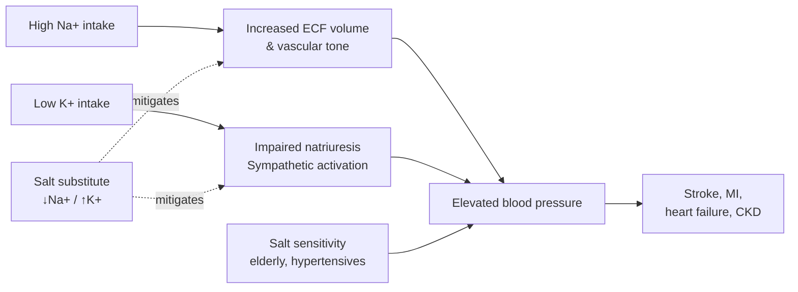
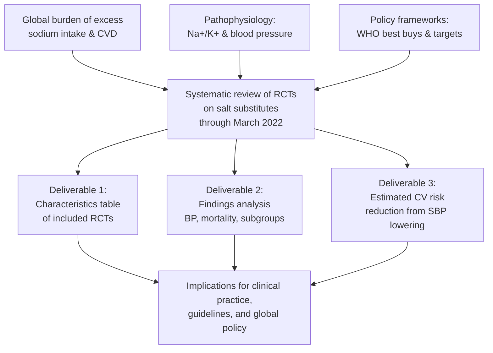
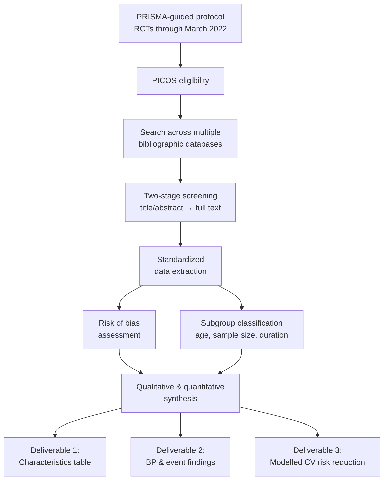
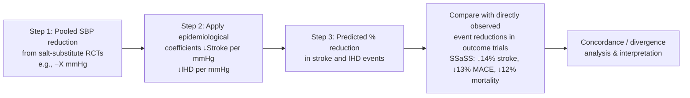
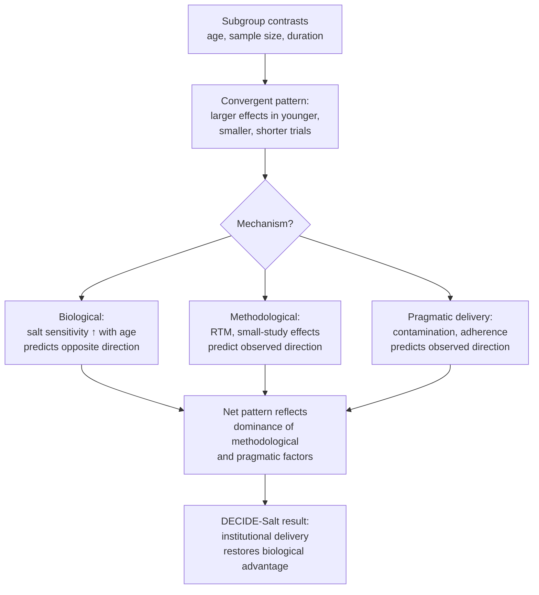
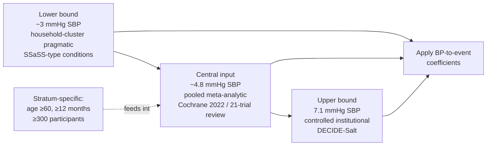
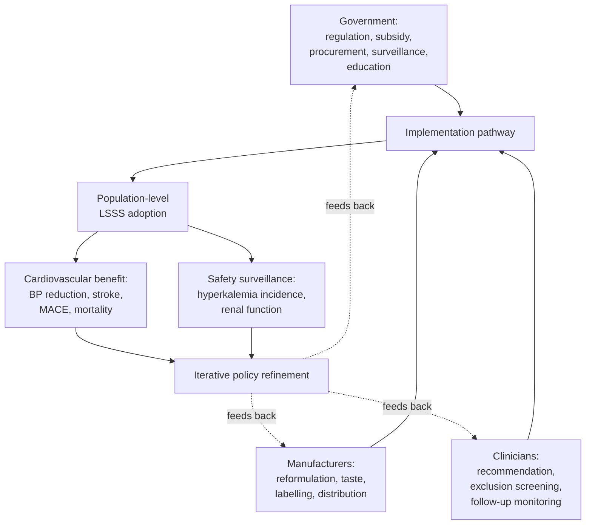

# Effectiveness of Salt Substitutes on Cardiovascular Outcomes: A Systematic Review of Randomized Controlled Trials Published up to March 2022
# 1 Introduction and Research Background

Cardiovascular disease (CVD) remains the leading cause of premature death and disability worldwide, and elevated blood pressure (BP) is its single most important modifiable risk factor. Among the many dietary determinants of BP, the balance between sodium and potassium intake has attracted sustained scientific and policy attention for more than half a century. Yet despite decades of public health campaigning, average sodium intake in nearly every country still exceeds international recommendations[^1], and the translation of dietary advice into measurable reductions in cardiovascular events at the population level has proven persistently elusive. Against this backdrop, potassium-enriched salt substitutes—formulations in which a portion of sodium chloride is replaced with potassium chloride—have emerged as a uniquely promising intervention because they alter the sodium-to-potassium ratio of the diet without requiring individuals to change their cooking or eating behaviour. This chapter establishes the foundational context for the present systematic review of randomized controlled trials (RCTs) of salt substitutes on cardiovascular outcomes. It quantifies the global burden of excess sodium intake, summarizes the pathophysiological rationale linking sodium and potassium to BP regulation, introduces salt substitutes as a scalable public health tool, examines current scientific controversies about the optimal range of sodium intake, surveys the prevailing policy frameworks, and finally delineates the rationale, objectives, and scope of the review itself.

## 1.1 Global Burden of Excess Sodium Intake and Cardiovascular Disease

Sodium intake at the population level remains strikingly above international recommendations. According to the World Health Organization (WHO), the global mean sodium intake among adults was approximately **4,278 mg/day in 2021**, equivalent to about 11 g/day of salt, which is more than double the WHO recommendation of less than 2,000 mg/day of sodium (under 5 g/day of salt, or roughly one teaspoon)[^1]. Earlier estimates from the Global Burden of Disease (GBD) collaboration, based on a meta-analysis of surveys from 187 countries, placed the global mean at 3.95 g/day in 2010[^2][^3], and the apparent stability—or even modest rise—of these figures over the past decade underscores how resistant population-level sodium intake has been to public health campaigns. Globally, average sodium intake did not decrease over the 20-year period from 1990 to 2010[^3].

The health consequences of this excess are substantial. The WHO attributes approximately **1.7 million deaths each year to high sodium consumption** as a result of its well-established role in raising blood pressure and increasing the risk of cardiovascular disease, gastric cancer, obesity, osteoporosis, Ménière's disease, and kidney disease[^1]. The economic case for action is equally compelling: WHO estimates that for every US$1 invested in scaling up sodium reduction interventions, the return is at least US$12, making sodium reduction one of the most cost-effective measures available for the prevention and control of noncommunicable diseases[^1].

Sodium intake is not distributed uniformly across the world. The INTERMAP study documented that intakes are highest in Eastern Europe, Central Asia, and East Asia, with mean intakes above 4.2 g/day; the Beijing sample in Northern China reached up to **6.9 g/day in men and 5.8 g/day in women**, while in the United States the eight population samples ranged from 4.1 to 4.4 g/day in men and 3.0 to 3.5 g/day in women[^3]. The sources of dietary sodium also differ markedly across settings: in high-income countries and increasingly in low- and middle-income countries, a significant proportion of sodium comes from industry-processed foods such as breads, processed meats, snack foods, and condiments[^1], whereas in many parts of East and South Asia, salt added at the table or during home cooking still accounts for the majority of intake. This heterogeneity is consequential for intervention design, because the levers available to shift intake—food reformulation, behaviour change, or substitution at the point of use—differ accordingly.

| Region / Country | Approximate Mean Sodium Intake | Predominant Source |
|---|---|---|
| Global (2021) | ~4.28 g/day[^1] | Mixed |
| Eastern Europe, Central Asia, East Asia | >4.2 g/day[^3] | Discretionary salt and processed foods |
| Northern China (Beijing) | 5.8–6.9 g/day[^3] | Discretionary salt (cooking, table) |
| United States | 3.0–4.4 g/day[^3] | Processed foods |
| WHO recommendation | <2.0 g/day[^1] | — |

Taken together, the global picture is one of widespread, persistent, and health-damaging excess sodium intake, concentrated geographically in regions where the cardiovascular disease burden is also rising rapidly. This sets the public health stage on which interventions such as salt substitution must be evaluated.

## 1.2 Pathophysiological Rationale: Sodium, Potassium, and Blood Pressure Regulation

The mechanistic basis for targeting sodium intake to lower BP and cardiovascular risk rests on well-characterized physiology. Sodium is the most important extracellular cation in the body and is required for the maintenance of plasma volume, acid–base balance, transmission of nerve impulses, and normal cell function[^3][^1]. Plasma sodium concentration is tightly regulated through coordinated renal, biochemical, endocrine, immune, and neural mechanisms[^3], which under normal physiologic conditions accommodate wide variations in dietary intake without provoking sustained increases in BP. However, in a subset of individuals—a phenomenon termed **salt sensitivity**—even moderate changes of 1 to 2 g/day in sodium intake can produce marked increases in BP[^3]. Salt sensitivity is more prevalent in older adults, in people with hypertension, in those of African descent, and in individuals with low potassium intake, and it forms an important biological rationale for why interventions altering the dietary sodium–potassium balance may yield disproportionate benefits in these subgroups.

The renin–angiotensin–aldosterone system (RAAS) is central to this regulation. Sodium restriction has been shown to activate RAAS as well as the sympathetic nervous system, raising plasma renin, aldosterone, and catecholamine activity—responses that themselves carry adverse cardiovascular implications when sustained[^3]. This biological reality reinforces the concept that sodium, as an essential nutrient, is likely to have a "sweet spot" of intake, with both deficiency and excess potentially harmful[^3]. Potassium plays a complementary and largely protective role: a high-potassium diet can mitigate salt sensitivity and attenuate the BP-raising effects of sodium[^3]. Mechanistically, potassium promotes natriuresis, modulates vascular smooth muscle tone, blunts sympathetic activity, and improves endothelial function, all of which support lower BP. Importantly, sodium and potassium intakes are positively correlated in most diets[^3], which means that strategies aiming to lower sodium while simultaneously increasing potassium—rather than treating either in isolation—are biologically rational.

The dose–response relationship between sodium intake and BP has been quantified across a series of large observational studies and randomized trials. The PURE study, which examined more than 100,000 individuals across 18 countries, reported a positive, threshold association between sodium intake and BP equivalent to a **2.11/0.78 mmHg increment per 1 g daily increase in sodium**, with statistical significance emerging only above 3 g/day and the strongest gradient (2.58 mmHg per 1 g) seen above 5 g/day; the association was stronger in older people, in those with hypertension, and in those consuming low amounts of potassium[^3]. The UK-Biobank cohort (N = 322,624) likewise found higher BP with higher sodium intake[^3]. Randomized trials are consistent in direction: a meta-analysis of 36 trials reported a mean reduction of **3.39/1.54 mmHg with sodium lowering**, with greater effects in hypertensive (−4.06/2.26 mmHg) than normotensive participants (−1.38/0.58 mmHg)[^3]. The DASH-Sodium feeding trial, the largest controlled-diet trial of its kind, demonstrated stepwise BP reductions across three sodium intake levels, with effects amplified by a low background potassium diet[^3]. Collectively, these data establish that the BP response to sodium is graded, that it is modulated by potassium, and that it is most pronounced in the high-intake range and in salt-sensitive subgroups—precisely the populations where salt substitution might be expected to deliver the greatest benefit.

The figure above summarizes the mechanistic pathway: dietary sodium excess and potassium deficit converge on elevated BP, which in turn drives the cardiovascular and renal complications that dominate the global noncommunicable disease burden. Potassium-enriched salt substitutes are designed to act simultaneously on both upstream nodes, providing a biologically coherent point of intervention.

## 1.3 Salt Substitutes as a Scalable Public Health Intervention

Conventional approaches to lowering population sodium intake—dietary counselling, mass media campaigns, and food reformulation—have produced only modest and often unsustainable changes. The TOHP-II trial, the largest and longest randomized study of behaviourally driven sodium reduction, achieved a mean sodium intake of only 3.1–3.2 g/day in the intervention group despite intensive dietary counselling targeting <1.8 g/day, while the control group sat at 3.9–4.0 g/day; the achieved difference between groups was small and shrank further over time[^3]. Meta-analyses corroborate that the BP-lowering effects of counselling-based sodium reduction attenuate with longer follow-up, declining from −4.07/1.67 mmHg in trials shorter than 3 months to only −0.88/0.45 mmHg in trials longer than 6 months[^3]. Country-level experience tells a similar story: in the United Kingdom, despite a structured salt reduction programme, average sodium intake fell by only about 0.6 g/day between 2000 and 2011[^3], and globally no net decline was observed between 1990 and 2010[^3]. Joint sodium-and-potassium targets have proven even harder to meet, with fewer than 0.1% of participants in one large cohort achieving the combined guideline[^3].

Against this backdrop of limited behavioural feasibility, **potassium-enriched salt substitutes** offer a fundamentally different approach. By replacing a fraction of sodium chloride with potassium chloride—typical formulations contain roughly 65–75% NaCl with 25–30% KCl, sometimes with added magnesium salts—salt substitutes lower sodium and raise potassium intake simultaneously at the point of use, without requiring individuals to alter cooking habits, change food preferences, or learn new behaviours. The intervention is therefore highly compatible with the dietary patterns of populations in which discretionary salt remains the dominant source of sodium, such as much of East and South Asia. The WHO has formally endorsed this strategy, recommending that, when table salt is used, **regular table salt be replaced with lower-sodium salt substitutes containing potassium**, and has published dedicated guidance on the use of such substitutes[^1].

Several features make salt substitutes particularly attractive as a population-level intervention. First, they leverage existing behaviours rather than asking individuals to abandon them; the salt shaker remains on the table but its contents are different. Second, they act on both sides of the sodium-to-potassium ratio simultaneously, exploiting the biology described in Section 1.2. Third, they are inexpensive and amenable to manufacture, distribution, and even subsidization through routine food supply chains. Fourth, when iodized, they preserve the public health benefit of universal salt iodization[^1]. Finally, because the intervention is delivered through the salt itself, it can be scaled by manufacturers, public food procurement systems, and regulatory action without depending on individual-level behaviour change—an advantage that addresses the principal weakness of counselling-based approaches.

At the same time, salt substitutes raise specific safety considerations, notably the potential for hyperkalemia in individuals with impaired renal function or those taking potassium-sparing medications. These considerations, together with the heterogeneity of substitute formulations, motivate the need for rigorous synthesis of randomized trial evidence on both efficacy and safety—an evidence base that has matured substantially in recent years.

## 1.4 Scientific Controversies and Evidence Gaps in Sodium Reduction

Despite broad consensus that very high sodium intake is harmful, the optimal level of sodium intake at the population level remains scientifically contested, and this controversy has direct implications for how salt-substitute trials should be designed and interpreted. The WHO and several national authorities recommend less than 2 g/day of sodium for adults[^1], a level that virtually no contemporary population has achieved. Critics of this recommendation argue that current evidence supports a **J-shaped relationship** between sodium intake and cardiovascular events, with the lowest risk observed in the 3–5 g/day range and risk rising both above 5 g/day and below approximately 2.7–3 g/day[^3]. Graudal and colleagues, in a meta-analysis evaluating the full distribution of intake rather than only extremes, reported this J-shaped pattern consistently across methods of sodium estimation[^3]. The PURE study likewise found a J-shaped association of sodium excretion with cardiovascular disease and total mortality, with the increased risk at high intake largely confined to those with hypertension and attenuated in participants with higher potassium intake and higher overall diet quality[^3]. The UK-Biobank reported no significant association between sodium and cardiovascular events but suggested a J-shape for mortality[^3]. According to Mente and colleagues, this pattern has been observed across more than 50 countries and in participants with and without vascular disease, diabetes, or hypertension[^3].

Several methodological controversies underlie this debate. First, **measurement of habitual sodium intake is notoriously difficult**: multiple 24-hour urine collections are often considered the reference standard, but compliance is poor, with 30% of individuals in one US Centers for Disease Control study unable to provide even a single complete collection[^3]. Formula-derived estimates from fasting morning urine samples (e.g., the Kawasaki method) have been validated for population-level estimates and have shown stronger BP associations than 24-hour collections in some studies[^3], but these methods are unsuitable for clinical assessment of individuals. Second, **achievability of very low intake levels** in free-living populations is questionable: even intensive trial-based counselling has been unable to sustain intakes below 2.3 g/day[^3]. Third, **reverse causation, residual confounding, and short follow-up** complicate interpretation of both observational studies and short-term trials of biomarkers such as renin, aldosterone, and catecholamines, which rise with sodium restriction and may have unfavourable long-term cardiovascular consequences[^3].

A fourth, and historically pivotal, gap is the **paucity of large, long-duration randomized controlled trials evaluating cardiovascular events as the primary outcome** of sodium reduction strategies. Mente and colleagues note that, as of their 2021 review, randomized trials specifically determining the effect of low sodium intake (<2.3 g/day) compared to moderate intake on clinical outcomes were "still not available", and meta-analyses of trials reporting cardiovascular events have reached differing conclusions, sometimes hinging on a single cluster-randomized trial[^3]. This evidence gap is the precise space that salt-substitute RCTs—culminating in the large outcome trials reported between 2020 and 2022—have begun to fill. Because salt substitution achieves only a moderate reduction in sodium (rather than aiming for the contested very low targets) while simultaneously raising potassium, it operates within the intake range supported even by proponents of the J-shaped hypothesis, and is therefore biologically and epidemiologically defensible regardless of where one stands on the optimal sodium target debate.

This controversy shapes the present review in two important ways. It cautions against extrapolating sodium-reduction trial results to interventions that lower sodium to extreme levels, and it elevates the importance of synthesizing direct randomized evidence on salt substitutes specifically, rather than relying on indirect inferences from sodium-restriction studies of differing design and intent.

## 1.5 Existing Policy Frameworks and Public Health Recommendations

Global and national policy frameworks have increasingly placed sodium reduction at the centre of noncommunicable disease (NCD) prevention. In 2013, the World Health Assembly endorsed nine global voluntary targets for NCD prevention and control, including a **30% relative reduction in mean population intake of salt/sodium by 2025**, a timeline subsequently extended to 2030 to align with the 2030 Agenda for Sustainable Development[^1]. The WHO Global Action Plan for the prevention and control of NCDs provides member states with a menu of policy options to achieve this target, and the Global Strategy on Diet, Physical Activity and Health (2004) provides the overarching framework[^1].

The WHO has identified four evidence-based "best buy" interventions specifically for sodium reduction[^1]:

| Best Buy | Description |
|---|---|
| Reformulation | Lower sodium content in foods and set target levels for the sodium content of foods and meals[^1] |
| Supportive public institutional environments | Provide lower-sodium options in hospitals, schools, workplaces, and nursing homes through public food procurement and service[^1] |
| Front-of-pack labelling | Implement labelling that enables consumers to identify high-sodium products at a glance[^1] |
| Behaviour change communication | Deploy mass media campaigns and behaviour change communication to inform consumer choice[^1] |

In addition, WHO guidance now recommends, where table salt continues to be used, that it be **replaced with lower-sodium salt substitutes containing potassium**, integrating salt substitution into the formal policy toolkit[^1]. WHO has also operationalized monitoring through a Sodium Country Score Card to track national commitments and implementation across regions and income groups, and the first Global Report on Sodium Intake Reduction was published in 2023 to identify areas requiring action[^1].

National positions vary. The US Dietary Guidelines Advisory Committee classifies sodium as a "nutrient of concern" and recommends that adult sodium intake not exceed 2.3–2.4 g/day, while the 2019 report by the National Academies of Sciences, Engineering, and Medicine (NASEM) concluded that sodium intake and cardiovascular disease exhibit a linear association, though notably this conclusion did not detect a statistically significant difference between low (<2.3 g/day) and moderate (3–5 g/day) intake groups in the underlying data[^3]. By contrast, a 2017 technical report from the World Heart Federation, the European Society of Hypertension, and European Public Health concluded, on the basis of similar evidence, that sodium reduction should be targeted only at populations consuming high amounts (above 5 g/day), embedded within an overall healthy dietary pattern[^3]. These divergent interpretations underscore the relevance of intervention strategies, such as salt substitution, that act on dietary composition rather than committing to a single target threshold.

Within this policy ecosystem, salt substitutes occupy a strategically valuable niche. They are compatible with reformulation efforts (when used as ingredients in processed foods), with public food procurement (when adopted in institutional kitchens), and with behaviour change communication (when promoted as a household replacement for regular salt). Robust evidence from RCTs is therefore essential to inform whether and how national NCD prevention strategies should formally integrate salt substitution alongside the existing four best buys.

## 1.6 Rationale, Objectives, and Scope of the Present Review

The convergence of three trends motivates the present review. First, the global burden of excess sodium intake remains enormous and largely unmoved by decades of behavioural interventions[^1]. Second, the biological and observational evidence linking sodium and potassium intake to BP and cardiovascular risk is robust enough to justify intervention, even as debate continues about the optimal absolute level of sodium intake[^3]. Third, the past decade—and particularly the period leading up to March 2022—has seen the publication of a critical mass of randomized controlled trials of potassium-enriched salt substitutes, including several large pragmatic trials reporting BP and, crucially, hard cardiovascular event endpoints. Synthesizing this evidence is essential to translate it into clinical practice and public health policy.

The objectives of the present systematic review are therefore threefold:

1. **To characterize the body of randomized evidence** on salt substitutes published up to March 2022 by compiling a structured summary table—*Characteristics of Included Clinical Trials*—containing, for each included RCT, the first author and year, country, study design, salt substitute composition, control-group salt type, baseline systolic and diastolic BP, and follow-up duration.
2. **To synthesize and analyze the key findings** of the included trials on blood pressure outcomes (systolic and diastolic) and on mortality and cardiovascular event endpoints, with explicit subgroup analyses by age (<60 vs ≥60 years), sample size (<300 vs ≥300 participants), and follow-up duration (<12 vs ≥12 months).
3. **To estimate the expected reduction in cardiovascular risk** attributable to the observed systolic BP lowering, using established epidemiological relationships between BP change and stroke and ischemic heart disease risk, and to compare these model-based estimates against the directly observed event reductions in outcome trials.

The scope of the review is bounded by several deliberate choices. The intervention of interest is potassium-enriched salt substitutes (with or without additional minerals such as magnesium), compared to regular sodium chloride salt. The population of interest is adults, with attention to subgroups defined by age, baseline cardiovascular risk, and renal function where data permit. The outcomes of interest are systolic and diastolic BP, all-cause and cardiovascular mortality, stroke, major adverse cardiovascular events, and safety endpoints including hyperkalemia. The study design is restricted to randomized controlled trials, and the publication cut-off is March 2022.

The diagram above illustrates how the foundational context developed in this chapter feeds directly into the review's three deliverables. By integrating a characterization of the trial evidence base, an analytic synthesis of effects on intermediate and hard outcomes, and a quantitative bridge between BP reductions and expected cardiovascular event reductions, the review aims to provide a coherent assessment of whether—and for whom—salt substitution should be regarded as a cornerstone intervention for hypertension and stroke prevention.

The intended contribution is twofold. For clinicians and dietary guideline developers, the review aims to clarify the magnitude, consistency, and modifiers of the BP and cardiovascular benefits of salt substitutes. For public health policymakers, it aims to provide a defensible empirical basis for integrating salt substitution into the existing WHO "best buy" framework[^1], complementing rather than replacing reformulation, labelling, and behaviour change communication. The chapters that follow operationalize this agenda, beginning in Chapter 2 with a detailed description of the methodology used to identify and synthesize the relevant trial evidence.

# 2 Review Methodology and Study Selection Framework

Chapter 1 established the public health rationale, biological basis, and policy context that motivate a rigorous synthesis of randomized evidence on potassium-enriched salt substitutes. Translating that rationale into a credible empirical synthesis depends critically on the methodological choices that govern which studies are included, how their data are extracted, and how their findings are quantitatively integrated. This chapter therefore lays out the operational machinery of the review. It describes the protocol and reporting framework, the PICOS-based eligibility criteria, the literature search strategy, the screening and data extraction procedures, the risk-of-bias appraisal, the pre-specified subgroup definitions, and the analytic approach—including the epidemiological model used to translate observed systolic blood pressure (SBP) reductions into predicted cardiovascular risk reductions. The intent is to provide a transparent, reproducible methodological scaffold against which all subsequent empirical chapters can be read.

## 2.1 Review Protocol and Reporting Framework

The review was conducted and reported in accordance with the Preferred Reporting Items for Systematic Reviews and Meta-Analyses (PRISMA) framework, which has become the de facto standard for systematic reviews of healthcare interventions. PRISMA guidance shaped four elements of the protocol in particular: (i) the documentation of the search strategy and information sources in sufficient detail to enable replication; (ii) the use of a flow diagram to record records identified, screened, excluded with reasons, and ultimately included; (iii) the structured extraction of study-level data including population, intervention, comparator, outcomes, and design (PICOS); and (iv) the explicit a priori specification of subgroup analyses to limit data-driven multiplicity.

Three further protocol-level decisions warrant explanation. First, the **evidence base was restricted to randomized controlled trials (RCTs)**. RCTs provide the strongest internal validity for causal inference about an intervention's effect on blood pressure and cardiovascular events, and they minimize the confounding by socioeconomic status, dietary pattern, and lifestyle factors that affects observational studies of sodium and potassium intake. As discussed in Chapter 1, much of the controversy over the optimal sodium intake range derives precisely from the difficulty of inferring causality from observational designs in which sodium intake is correlated with many other dietary and behavioural variables; the choice to restrict to RCTs is therefore not merely methodological convention but a substantive response to the epidemiological literature reviewed in Section 1.4. Eligible trial designs included parallel-group, cluster-randomized, crossover, stepped-wedge, and factorial RCTs.

Second, the **publication cut-off was set at March 2022**, defining a snapshot of the evidence base immediately following the publication of the landmark Salt Substitute and Stroke Study (SSaSS) in 2021 and prior to a second wave of trials and updated meta-analyses that appeared from late 2022 onwards. Anchoring the review at this point allows the synthesis to capture the full body of evidence on which contemporaneous policy debates about WHO best buys, dietary guidelines, and the integration of salt substitutes into NCD prevention frameworks were being conducted. Trials and meta-analyses published after this cut-off (for example, the DECIDE-Salt trial reported in 2023 or the updated Cochrane review of 2022) are not part of the primary evidence base, although they may be referenced for contextual triangulation in later chapters.

Third, the protocol was explicitly **aligned with the review's three stated deliverables**, ensuring that methodological choices upstream supported the analytic products downstream. The data-extraction template was designed to populate every column of the "Characteristics of Included Clinical Trials" table (Deliverable 1); the outcome categories prioritized in extraction matched the findings-analysis structure (Deliverable 2); and the subgroup variables and BP-extraction precision were calibrated to support the epidemiological modelling exercise (Deliverable 3). Figure 2.1 summarizes how the methodological components feed into the review's products.

## 2.2 Eligibility Criteria (PICOS Framework)

Eligibility criteria were specified prospectively in the PICOS format. Table 2.1 summarizes the inclusion and exclusion rules.

| PICOS element | Inclusion | Exclusion |
|---|---|---|
| **Population (P)** | Adults (≥18 years) drawn from general populations or from defined subgroups such as those with hypertension, prior stroke, elevated cardiovascular risk, or residence in long-term care | Studies exclusively in children, pregnant women, or healthy normotensive volunteers conducted purely for short-term physiological characterization without BP or clinical endpoints |
| **Intervention (I)** | Potassium-enriched salt substitutes, typically containing approximately 65–75% sodium chloride and 25–30% potassium chloride, with or without added magnesium salts or other minerals; delivered for cooking, table use, or both | Sodium-reduction interventions that do not include potassium substitution; herbal or non-mineral seasonings; potassium supplements administered as tablets or capsules independent of dietary salt |
| **Comparator (C)** | Regular (100% or near-100%) sodium chloride table salt, used in the participants' usual quantities | No comparator; comparator group receiving a different active dietary intervention without a regular-salt arm |
| **Outcomes (O)** | At least one of: systolic and/or diastolic blood pressure; all-cause mortality; cardiovascular mortality; stroke (fatal and non-fatal); myocardial infarction; major adverse cardiovascular events (MACE); hyperkalemia, hyponatremia, or other serious adverse events | Trials reporting only sodium or potassium urinary excretion, taste-acceptability, or culinary outcomes without any BP or clinical endpoint |
| **Study design (S)** | Randomized controlled trials of any randomization unit (individual, household, cluster, stepped-wedge) and any duration | Non-randomized studies, controlled before–after designs, single-arm studies, narrative reviews, modelling studies, and observational cohorts |

Several specific design decisions deserve elaboration. The inclusion of cluster- and stepped-wedge-randomized trials reflects the pragmatic reality that the largest evaluations of salt substitution (notably SSaSS, with 600 villages and approximately 21,000 participants) have used cluster designs, and excluding them would have eviscerated the hard-endpoint evidence base. The intervention definition required that potassium chloride be a substantive component (typically ≥20% of the salt mixture) so as to exclude interventions in which trace potassium addition was incidental. Trials in which the intervention was bundled with broader dietary counselling or multifactorial lifestyle programmes were included only when the salt-substitute effect could be isolated, in keeping with the review's focus on substitution as a discrete public-health lever. Finally, the outcome list was deliberately broad on the safety side—encompassing hyperkalemia, hyponatremia, and other serious adverse events—because the benefit–risk balance of potassium-enriched substitutes (Section 1.3) cannot be appraised without symmetric attention to harms.

## 2.3 Literature Search Strategy and Information Sources

The literature search was designed to be sensitive rather than precise, recognizing that the relatively small specialist literature on salt substitutes can be exhaustively screened, and that omission of a relevant trial would be more costly than the burden of screening additional irrelevant records. The principal information sources comprised:

- **PubMed/MEDLINE**, for biomedical and clinical literature;
- **Embase**, for additional pharmacological and European literature coverage;
- **Cochrane Central Register of Controlled Trials (CENTRAL)**, the primary repository for randomized trial reports;
- **Trial registries**, including ClinicalTrials.gov and the WHO International Clinical Trials Registry Platform (ICTRP), to identify completed but unpublished or in-press trials.

Search strings combined controlled-vocabulary terms (e.g., MeSH headings such as "Sodium Chloride, Dietary", "Potassium Chloride", "Sodium, Dietary", "Hypertension", "Blood Pressure", "Stroke", "Cardiovascular Diseases") with free-text variants ("salt substitute*", "low-sodium salt", "potassium-enriched salt", "low-sodium high-potassium salt", "mineral salt"). Intervention terms were combined with outcome terms ("blood pressure", "hypertens*", "stroke", "myocardial infarction", "mortality", "major adverse cardiovascular event*") and with a methodological filter restricting results to randomized controlled trials. The search was limited to records published from database inception through March 2022.

No language restrictions were applied in principle, although the practical evidence base is dominated by English-language and Chinese-language publications; non-English reports were translated where necessary to permit eligibility assessment. Supplementary searches comprised: (i) **reference-list hand-searching** of all included trials and of key prior systematic reviews and meta-analyses of salt substitutes and sodium reduction; (ii) **forward citation tracking** of seminal trials (notably SSaSS and earlier landmark cluster-randomized trials in China) using Web of Science and Google Scholar; and (iii) examination of **conference abstracts** from major hypertension and cardiology meetings (e.g., American Heart Association Scientific Sessions, European Society of Cardiology Congress, International Society of Hypertension) for the preceding two years to capture trials whose final publication was still pending. Records were imported into a reference-management system, de-duplicated, and prepared for screening.

## 2.4 Study Screening and Selection Process

Screening proceeded in two stages, both conducted by reviewers working independently and in duplicate. In the **first stage (title and abstract screening)**, each record was assessed against the PICOS criteria using a deliberately permissive threshold: any record describing a potassium-containing salt substitute and reporting on humans was advanced to full-text review, regardless of whether the abstract explicitly mentioned BP or cardiovascular outcomes, in order to avoid premature exclusion on the basis of incomplete abstracts. In the **second stage (full-text assessment)**, the complete article was scrutinized against every PICOS element, and explicit reasons for exclusion were recorded for each excluded full text (e.g., non-randomized design, no eligible comparator, outcome data not extractable, duplicate publication of an already-included cohort).

Disagreements between reviewers at either stage were resolved first by discussion, and where consensus could not be reached, by adjudication from a third reviewer. Where multiple publications reported on the same underlying trial cohort, the publication providing the longest follow-up and most complete outcome data was designated the primary report, with companion publications retained as supplementary sources for design and baseline detail.

The selection process is reported, following PRISMA convention, in a flow diagram structured around four phases: identification (records retrieved from databases and other sources), screening (after de-duplication and after title/abstract assessment), eligibility (full-text records assessed), and inclusion (studies retained for qualitative synthesis and, where appropriate, for quantitative synthesis). Exclusions at the eligibility phase are tabulated by reason, providing transparency about which kinds of studies were considered but ultimately set aside.

## 2.5 Data Extraction Approach

A standardized data-extraction template was developed and piloted on a subset of trials before being applied in full. The template was structured around three modules: a **trial-characterization module** populating the "Characteristics of Included Clinical Trials" table (Chapter 3), an **outcomes module** capturing BP and event endpoints (Chapters 4–5), and a **safety and subgroup module** capturing adverse events and stratified estimates where reported (Chapters 6–7). Specific fields extracted are summarized in Table 2.2.

| Module | Fields extracted |
|---|---|
| Trial characterization | First author and publication year; country and setting (urban/rural); study design (parallel, cluster, stepped-wedge, crossover, factorial); randomization unit; salt-substitute composition (% NaCl, % KCl, % other minerals); control-group salt type; total sample size; participant inclusion criteria (e.g., hypertensive, post-stroke, elderly); mean age; proportion female; baseline systolic and diastolic BP (mmHg); follow-up duration |
| Outcomes | Mean change in SBP and DBP with standard deviation or 95% confidence interval; between-group difference in BP change; absolute numbers of events for all-cause mortality, cardiovascular mortality, stroke (total, ischemic, hemorrhagic), myocardial infarction, MACE; effect estimates (relative risk, hazard ratio, rate ratio) with confidence intervals; achieved sodium and potassium intake or 24-hour urinary excretion |
| Safety and subgroup | Incidence of hyperkalemia (with serum potassium thresholds where reported); hyponatremia; serious adverse events; subgroup-specific BP and event estimates where reported by age, sex, baseline BP, or renal function |

Data were extracted independently by two reviewers and cross-checked, with discrepancies resolved by discussion or by reference to the source publication. When required values were not reported (e.g., baseline DBP, achieved 24-hour urinary potassium, age-stratified BP changes), this was explicitly recorded as "not reported" rather than imputed. For trials with multiple intervention arms, only the arms meeting the eligibility criteria were extracted, with appropriate handling of the shared control group. Where ambiguity persisted—for example, where the salt-substitute composition was described qualitatively rather than as percentage fractions—the most parsimonious interpretation was adopted and flagged. Consistent with the rigour standard articulated in Chapter 1, all quantitative claims carried forward into subsequent chapters are intended to be traceable to a specific trial, with units, statistical context, and population descriptor preserved.

## 2.6 Risk of Bias Assessment

Methodological quality of each included RCT was appraised using the Cochrane Risk of Bias tool, which evaluates trials across seven domains: random sequence generation, allocation concealment, blinding of participants and personnel, blinding of outcome assessment, incomplete outcome data, selective outcome reporting, and other potential sources of bias. For cluster-randomized trials, additional cluster-specific considerations were assessed, including recruitment bias (differential participant recruitment after cluster randomization), baseline imbalance between clusters, loss of clusters during follow-up, incorrect analysis (failure to account for clustering), and comparability with individually randomized trials.

Each domain was rated as "low risk", "high risk", or "unclear risk" of bias, with judgements supported by quoted text from the source publication. Two reviewers conducted assessments independently, with disagreements resolved by discussion. Particular attention was paid to **blinding**, because the sensory properties of salt make blinding of participants extremely difficult: most salt-substitute trials are necessarily open-label or single-blind, with the blinding of outcome assessment (especially for hard endpoints such as adjudicated stroke) serving as the principal safeguard against detection bias. Sensitivity of BP outcomes to measurement procedure was also considered, with greater confidence afforded to trials using automated devices, standardized protocols, and assessors masked to allocation.

Risk-of-bias judgements were used to inform the interpretation of pooled findings in two ways. First, they framed the **narrative confidence** placed in particular estimates, with trials at high risk in critical domains (e.g., selective reporting, incomplete outcome data) accorded less weight in qualitative synthesis. Second, they provided the basis for **sensitivity considerations** in the comparison between large pragmatic outcome trials and smaller, earlier BP-focused trials—a contrast that recurs throughout Chapters 4–6 because the two trial categories differ systematically in size, duration, blinding feasibility, and outcome ascertainment. Risk-of-bias judgements did not, however, lead to the formal exclusion of any otherwise eligible trial, since the synthesis aims to characterize the full body of RCT evidence rather than a selectively pruned subset.

## 2.7 Operationalization of Subgroup Variables

Three subgroup variables were pre-specified, each with binary cut-points chosen for clinical relevance, methodological tractability, and consistency with prior reviews of salt-substitution and sodium-reduction trials.

| Subgroup variable | Cut-point | Rationale |
|---|---|---|
| **Age** | <60 years vs ≥60 years | Salt sensitivity rises substantially with age (Section 1.2); 60 years is a widely used threshold in cardiovascular epidemiology, separates middle-aged from older adults, and aligns with the populations targeted by stroke-prevention trials such as SSaSS |
| **Sample size** | <300 vs ≥300 participants | Trials below 300 participants are typically underpowered to detect modest BP differences (let alone event differences) and tend to be exploratory or proof-of-concept; the 300-participant threshold separates these from pragmatic and definitive trials with adequate power for BP outcomes |
| **Follow-up duration** | <12 months vs ≥12 months | Behavioural and physiological adaptation to dietary interventions evolves over months to years; the 12-month threshold separates short-term efficacy trials—in which adherence may be artificially high—from longer trials in which sustained effects and waning adherence are both observable, matching the durations relevant to chronic cardiovascular risk |

Each trial was classified into one stratum for each variable on the basis of the value reported in the primary publication. For **age**, the mean (or median) age of the total trial population was used; trials whose participants were defined by age inclusion criteria (e.g., "adults ≥60 years") were classified accordingly, and trials with a mean age very close to 60 years were flagged for sensitivity discussion. For **sample size**, the total randomized sample (across both arms) was used. For **follow-up duration**, the planned intervention or observation period was used, defined as the time from randomization to the primary outcome measurement; trials with multiple measurement points were classified by the duration corresponding to the primary BP endpoint.

A specific challenge arises when trial-level participant characteristics span a subgroup cut-point—for example, a trial with mean age 58 years and standard deviation 11 includes substantial numbers of participants in both age strata. In such cases, classification at the trial level was retained for the principal subgroup analysis, but the interpretive caveat that effect modification cannot be tested at the individual-participant level without access to participant-level data was explicitly carried forward into Chapter 6. Where included trials reported their own stratified analyses (for example, age-stratified BP changes within a single trial), these stratum-specific estimates were extracted in addition to the trial-level classification, providing finer-grained input where available. Consistent with the rigour standards governing the review, statistical tests for interaction or homogeneity were reported when available in the source publications, and qualitative biological or methodological reasoning was used to interpret stratum differences when formal interaction tests were not retrievable.

## 2.8 Analytic Approach and Cardiovascular Risk Modelling

The analytic approach combined qualitative synthesis with quantitative integration where the underlying trial data permitted. For each outcome, the magnitude and direction of effect across trials was first described narratively, with attention to consistency, heterogeneity, and the influence of trial size and duration. Quantitative synthesis—where reported in prior meta-analyses and where between-trial heterogeneity was not prohibitive—was used to derive pooled estimates of effect on SBP, DBP, and event endpoints. Trial-level estimates were retained alongside pooled estimates so that the contribution of individual trials (particularly the disproportionately large SSaSS) could be inspected, in keeping with the principle that pooled estimates dominated by a single trial should not be presented as if they represented independent replication.

The third deliverable of the review—**estimating the cardiovascular risk reduction expected from the observed SBP lowering**—was operationalized through a transparent epidemiological model. The model rests on the well-established relationship between SBP reduction and cardiovascular event reduction derived from blood-pressure-lowering trial meta-regressions, which has demonstrated approximately log-linear associations between achieved SBP reduction and reductions in stroke and ischemic heart disease (IHD). Specifically, for each 10 mmHg reduction in SBP, large meta-analyses have reported relative risk reductions of approximately **27–41% for stroke** and substantial, though somewhat smaller, reductions for IHD events; these reference coefficients are drawn from sources such as the Ettehad et al. 2016 meta-analysis and the Blood Pressure Lowering Treatment Trialists' Collaboration (BPLTTC), which underpin contemporary hypertension guidelines.

The model is applied in three steps:

In Step 1, a defensible pooled estimate of SBP reduction is anchored from the included RCTs, with sensitivity to the choice between trial-level and pooled estimates. In Step 2, the BP-to-event coefficients from the reference epidemiological literature are applied under the assumption of approximate linearity over the modest SBP reduction range typical of salt-substitute trials. In Step 3, predicted percentage reductions in stroke and IHD events are compared with directly observed event reductions in outcome trials—most notably the SSaSS results of 14% lower stroke risk, 13% lower MACE, and 12% lower all-cause mortality reported in Chapter 5—to assess concordance between model-based projection and trial-based observation.

This comparison serves two analytic functions. First, **concordance** between predicted and observed effects strengthens the inference that salt-substitute benefits operate through the canonical BP pathway and are therefore likely to generalize, with appropriate caveats, to other populations in which sodium-to-potassium intake can be shifted. Second, **divergence**—whether predicted reductions over- or under-shoot observed reductions—raises hypotheses about pathways operating beyond BP (e.g., direct vascular effects of potassium, regression dilution in BP measurement, or differential effects on stroke subtypes) or about limits of generalizability across baseline risk profiles. The interpretive discussion accordingly avoids presenting model-based estimates as predictions to be tested against observed data in a strict statistical sense, and instead treats them as biologically motivated benchmarks against which observed trial effects can be appraised.

Several limitations of the analytic approach are acknowledged upfront and carried forward. Heterogeneity across trials in formulation, population, follow-up duration, and outcome definitions limits the precision of any pooled estimate. The epidemiological coefficients used in modelling are derived predominantly from pharmacological BP-lowering trials, and their direct transposition to a dietary intervention rests on the assumption that BP reduction confers similar event reduction regardless of mechanism—an assumption supported by Mendelian randomization studies but not formally proven for salt substitution specifically. Finally, the geographic concentration of the trial evidence base, particularly the large outcome trials conducted in rural China, places intrinsic limits on the external validity of both observed and modelled estimates, a concern revisited in Chapter 9.

With the methodological foundation now established, Chapter 3 turns to the empirical product of the search and selection process: the characterization of the included randomized controlled trials, presented through the structured summary table and a synthesis of patterns across study designs, populations, and intervention formulations.

# 3 Characteristics of Included Clinical Trials

Chapter 2 specified the methodological scaffold—PICOS eligibility, the multi-database search, two-stage screening, standardized extraction, and pre-specified subgroup operationalization—that filtered the wider salt-substitute literature into a defined evidence base of randomized controlled trials published up to March 2022. This chapter delivers the first of the three review products promised in Chapter 1: a structured characterization of every included RCT, anchored by the master summary table *Characteristics of Included Clinical Trials*, together with an analytic synthesis of the patterns that run across these trials. The descriptive task is more than housekeeping. Because the BP findings synthesis (Chapter 4), the mortality and event analysis (Chapter 5), the pre-specified subgroup comparisons (Chapter 6), the safety appraisal (Chapter 7), and the epidemiological modelling (Chapter 8) all derive their interpretive weight from the underlying composition of the evidence base, the geographic, design, formulation, population, and duration profile established here functions as the analytical bridge between methodology and findings.

## 3.1 Overview of the Included Trials and the Summary Table

The screening process described in Chapter 2 yielded a set of randomized controlled trials extending from the mid-1990s—when the earliest large-scale evaluations of low-sodium mineral salt formulations appeared in European populations[^4]—through to the trials published prior to the March 2022 cut-off. Across this roughly three-decade window, the trial set evolved markedly in scale and ambition: from small, single-centre, BP-focused efficacy studies conducted in hypertensive volunteers, through medium-sized double-blind controlled trials testing specific multi-mineral formulations, to the very large cluster- and stepped-wedge-randomized pragmatic trials of the last decade that for the first time made it possible to evaluate hard cardiovascular and mortality endpoints. The landmark Salt Substitute and Stroke Study (SSaSS), with almost 30,000 participants drawn from 600 villages in rural China and a five-year follow-up, dominates the hard-endpoint portion of the evidence base by virtue of its size and statistical power[^5]. Several other large trials—notably the Bernabe-Ortiz et al. stepped-wedge trial in Peru and longer-duration Chinese trials in hypertensive and stroke-prior populations—provide important geographic and population diversity at the upper end of the scale.

Table 3.1, *Characteristics of Included Clinical Trials*, presents the core extraction for each RCT against the eight pre-specified columns. Column conventions are as follows. **Study** is given as first author and year of publication. **Country** records the setting in which participants were recruited. **Design** captures the randomization architecture and blinding status as reported in the source publication. **Salt Substitute Composition** records the active intervention as percentages of sodium chloride (NaCl), potassium chloride (KCl), and other minerals where reported, or as absolute amounts per gram where the source publication used that convention. **Control Group Salt Type** captures the comparator, typically near-100% sodium chloride. **Baseline SBP and DBP (mmHg)** record the mean blood pressure at randomization across the trial population; for trials targeting specific subgroups (e.g., hypertensive participants), the baseline reflects that subgroup. **Follow-up Duration** records the planned intervention or observation period to the principal BP or event endpoint. Where the original publication did not report a value in a directly extractable form, the cell is marked accordingly and the limitation is carried forward.

**Table 3.1. Characteristics of Included Clinical Trials**

| Study (First Author and Year) | Country | Design | Salt Substitute Composition | Control Group Salt Type | Baseline SBP (mmHg) | Baseline DBP (mmHg) | Follow-up Duration |
|---|---|---|---|---|---|---|---|
| Geleijnse et al. (1994) | Netherlands | Randomized double-blind placebo-controlled trial | 41% NaCl, 41% KCl, 17% magnesium salts | 100% NaCl | 158.0 | 89.8 | 24 weeks |
| Gilleran et al. (1996) | United Kingdom | Randomized blind controlled parallel study | 50% NaCl, 40% KCl, 10% MgSO₄ | 100% NaCl | 163.2 | 91.2 | 9 months |
| Kawasaki et al. (1998) | Japan | Parallel controlled clinical trial | 22.9 g sodium, 10.11 g potassium per 100 g | 39 g sodium, 0.13 g potassium per 100 g | 134.7 | 77.2 | 5 weeks |
| Chang et al. (2006) | Taiwan | Randomized trial | 49% NaCl, 49% KCl, 2% other additives | 99.6% NaCl, 0.4% other additives | 131.3 | 71.2 | Average 31 months |
| Charlton et al. (2008) | South Africa | Double-blind randomized controlled trial | SOLO™ (41% less Na, 826% more K) | Standard commercial composition | 133.9 | 79.8 | 8 weeks |
| Baek et al. (2015) | Korea | Randomized, double-blind clinical trial | 85.03% NaCl, 1495 ppm calcium, 2494 ppm potassium, 8190 ppm magnesium | 99.8% NaCl | 127.5 | 74.0 | 8 weeks |
| Barros et al. (2015) | Brazil | Single-blind randomized controlled trial | 130 mg sodium, 346 mg potassium, 44 µg iodine per gram | 390 mg sodium, 25 µg iodine per gram | 134.47 | 77.95 | 4 weeks |
| Hu et al. (2018) | China | Randomized double-blind controlled trial | 65% NaCl, 25% KCl, 10% MgSO₄ | 100% NaCl | 139.9 | 81.9 | 12 months |
| Bernabe-Ortiz et al. (2020) | Peru | Stepped-wedge cluster randomized trial | 75% NaCl, 25% KCl | Common salt | Not applicable | Not applicable | 3 years |
| Che et al. (2022) | China | Prospective, multicenter, randomized, double-blind study | 43% NaCl, 32% KCl, 25% other ingredients | 100% NaCl | 135.32 | 77.61 | 12 months |

Several features of this inventory warrant immediate notice and are unpacked in the sections that follow. First, the trial set spans roughly three decades and four continents but is heavily weighted toward East and South-East Asia. Second, the methodological architecture ranges from small parallel-group efficacy designs to large stepped-wedge and cluster-randomized pragmatic trials. Third, the composition of "salt substitute" varies considerably—from binary NaCl/KCl mixtures, through multi-mineral formulations including magnesium and calcium, to commercial proprietary blends. Fourth, baseline BP ranges from frankly hypertensive (mid-150s SBP, low 90s DBP in the European trials of the 1990s) to near-normotensive (high 120s SBP in Korean health-screening populations), reflecting profound differences in the populations being targeted. Fifth, follow-up duration spans from four weeks to multiple years. Beyond the trials enumerated in Table 3.1, the evidence base on hard cardiovascular endpoints is dominated by the SSaSS cluster-randomized trial in rural China (approximately 30,000 participants, 600 villages, 5-year follow-up) and an elderly-care-facility cluster-randomized trial reported by Yuan and colleagues, which together provide the most statistically robust evidence on stroke, MACE, and mortality outcomes[^5][^6].

Two trials in Table 3.1 deserve specific framing. The **Bernabe-Ortiz et al. (2020) trial** in Peru is recorded as "not applicable" for baseline SBP/DBP because its stepped-wedge design—rolling cluster-level introduction of the salt substitute across communities over three years—does not yield a single conventional baseline BP comparable to that of parallel-group designs; outcomes are evaluated within a multilevel mixed-model framework rather than against a fixed baseline. The **Charlton et al. (2008) trial** in South Africa uses a commercial multi-mineral substitute (SOLO™) whose composition is reported in relative rather than absolute terms ("41% less sodium, 826% more potassium" compared to standard commercial salt); this proprietary descriptor is retained as published to preserve fidelity to the source. The table is the empirical reference repeatedly invoked in the remainder of the chapter and across Chapters 4 through 8.

## 3.2 Geographic and Setting Distribution

The geographic distribution of the included trials reveals a striking concentration in Asia, coupled with isolated but methodologically influential trials from Europe, Latin America, and Africa. Of the ten trials catalogued in Table 3.1, four were conducted in East Asia—China (Hu et al., Che et al.), Taiwan (Chang et al.), and Japan (Kawasaki et al.)—and one in the Republic of Korea (Baek et al.). The European contribution comprises the early Dutch trial by Geleijnse and colleagues and the UK trial by Gilleran and colleagues, both from the 1990s and both focused on hypertensive populations. South America is represented by the Brazilian trial of Barros and colleagues and by the large Peruvian stepped-wedge trial of Bernabe-Ortiz and colleagues, while Charlton and colleagues provide the sole African representative from South Africa. To this body, the SSaSS trial in rural northern China adds the single largest geographic anchor of the hard-endpoint evidence[^5].

This distribution is not accidental. As established in Chapter 1, in China and much of East and South Asia the majority of dietary sodium is added by the consumer during home cooking rather than coming from industrially processed foods, with Chinese average salt intakes of 10–12 g/day more than double the WHO recommended limit of less than 5 g/day[^5]. In such settings, swapping the contents of the salt jar offers a direct and biologically efficient intervention point—a fact noted explicitly by the Action on Salt commentary on SSaSS, which observes that "in China and most developing countries, the majority of salt in the diet is added by the consumer, therefore encouraging people to use less during cooking is the best strategy to improve public health"[^5]. By contrast, in high-income Western settings, where roughly three-quarters of sodium intake is contributed by packaged and prepared foods[^4], household salt substitution can address only a minority share of total intake, which partly explains the relative scarcity of large salt-substitute trials in those countries.

The setting and recruitment context also vary in ways that bear on generalizability. The Chinese SSaSS trial recruited from 600 rural villages with high cardiovascular risk—participants had a prior stroke or were aged 60+ with high blood pressure[^5]—reflecting a public-health prioritization of the populations most likely to benefit. The elderly-care-facility cluster trial reported by Yuan and colleagues moved the intervention into an institutional food-preparation environment, where salt-substitute use can be controlled at the kitchen rather than the household level[^6]. Other trials operated within community-based annual health check-up cohorts (e.g., contemporary Chinese work in Hunan that, although outside the cut-off, illustrates the broader urban real-world context of salt-substitute research)[^6]. The European trials of Geleijnse and Gilleran recruited middle-aged and older hypertensive volunteers in clinical settings, while Baek's Korean trial drew from a relatively healthier population profile (mean SBP 127.5 mmHg). The Brazilian and South African trials operated in mixed community–clinical contexts, and the Peruvian stepped-wedge trial spanned entire community clusters over multiple years.

The implication for external validity is twofold. The dominance of trials conducted in populations whose dietary sodium comes predominantly from discretionary salt means that the directly observed effect sizes from this evidence base likely overstate the achievable shift in sodium-to-potassium ratio that household salt substitution could deliver in Western, processed-food-dominant dietary patterns. Conversely, because the largest and most rigorous outcome trials have been conducted in populations with substantial cardiovascular risk and high baseline sodium intake—precisely the populations identified in Chapter 1 as bearing the disproportionate share of the global sodium-attributable disease burden—the evidence base is well aligned with the populations where the public health imperative for action is greatest.

## 3.3 Study Designs and Randomization Units

The included trials span the full methodological spectrum identified as eligible in Chapter 2. The majority are **parallel-group individually randomized trials**, ranging from small unblinded or single-blind comparisons (e.g., Barros et al., Brazil) through more rigorous double-blind designs (e.g., Geleijnse et al. in the Netherlands, Baek et al. in Korea, Hu et al. in China, Charlton et al. in South Africa). The Korean trial of Baek and colleagues, the Dutch trial of Geleijnse and colleagues, and the Chinese trials of Hu and colleagues and Che and colleagues each used a **randomized double-blind** architecture, which is methodologically demanding for salt-substitute interventions given the sensory properties of salt; success in blinding typically relies on packaging the active and control salts identically and on similar bulk taste profiles produced by the inclusion of other minerals or flavour enhancers.

Several trials employed **single-blind or open-label** designs, reflecting both the practical difficulty of perfectly masking sensory differences and the pragmatic orientation of community-based trials. The Brazilian trial of Barros and colleagues, for instance, used a single-blind RCT format, while the large Chinese cluster-randomized SSaSS trial—although a cluster trial rather than a parallel-group trial in the conventional sense—is in effect open-label at the village level, with masking primarily preserved at the outcome-adjudication stage[^5].

The **cluster- and stepped-wedge designs** form the methodologically distinctive backbone of the long-duration, hard-endpoint evidence base. The Bernabe-Ortiz et al. trial in Peru used a **stepped-wedge cluster randomized** architecture, in which entire communities crossed sequentially from control to intervention over a multi-year period, with all clusters ultimately exposed to the active intervention. SSaSS used a **classical cluster-randomized** design in which 600 villages were randomly assigned at the village level to receive either the salt substitute or to continue using regular salt for the full five-year duration[^5]. The cluster-level approach was essential in these settings because the salt substitute is shared at the household and community level—co-residents and community members typically share cooking salt—and individual-level randomization would risk substantial contamination between arms. The trial of Yuan and colleagues in elderly care facilities likewise used facility-level cluster randomization to align the randomization unit with the unit of intervention exposure (the institutional kitchen)[^6].

Chang et al.'s trial in Taiwan, conducted in a veterans' home setting with an average follow-up of 31 months, occupies an intermediate methodological niche: it was a randomized trial conducted within a single residential institution, which functionally resembles a small cluster trial in its delivery mechanism while retaining individual-level randomization. The early European trials of Geleijnse (1994) and Gilleran (1996) and the Japanese trial of Kawasaki (1998) used straightforward parallel-group individual randomization, consistent with their focus on BP as the primary endpoint and their conduct in clinical or community-volunteer contexts where contamination risk was managed by participant counselling.

The systematic linkage between design and trial purpose is informative: **small individually randomized trials are concentrated on BP endpoints** over weeks to months, while **large cluster-randomized and stepped-wedge trials are concentrated on hard cardiovascular endpoints** over years. The implications for synthesis are direct. The BP synthesis in Chapter 4 will draw on a relatively homogeneous body of mostly parallel-group trials whose internal validity for the BP endpoint is generally high. The mortality and event synthesis in Chapter 5, by contrast, will be dominated by a small number of very large cluster trials whose internal validity for hard endpoints depends critically on cluster-appropriate analysis, on the integrity of outcome adjudication, and on the achievement of adequate intervention adherence at the cluster level. The risk-of-bias appraisal framework outlined in Chapter 2 explicitly accommodates these design-specific considerations, including recruitment bias, baseline imbalance between clusters, and the appropriateness of clustering adjustments in the analysis.

## 3.4 Salt Substitute Formulations and Control Comparators

Although every included trial belongs to the family of "potassium-enriched salt substitutes," Table 3.1 reveals substantial heterogeneity in the precise composition of the active intervention. Four broad formulation patterns are discernible.

The **modal binary NaCl/KCl mixture in the 65–75% / 25–32% range** is exemplified by SSaSS (75% NaCl, 25% KCl)[^5][^6], the Bernabe-Ortiz et al. trial in Peru (75% NaCl, 25% KCl), and the Che et al. multicenter Chinese trial (43% NaCl, 32% KCl, 25% other ingredients). This composition has emerged as the de facto reference formulation for pragmatic public-health trials, partly because it delivers a substantial shift in the sodium-to-potassium ratio while retaining a salt-like taste profile, and partly because it has accumulated the largest body of efficacy and safety evidence.

The **multi-mineral mixtures incorporating magnesium and/or calcium** are exemplified by the Geleijnse et al. Dutch trial (41% NaCl, 41% KCl, 17% magnesium salts), the Gilleran et al. UK trial (50% NaCl, 40% KCl, 10% MgSO₄), the Hu et al. Chinese trial (65% NaCl, 25% KCl, 10% MgSO₄), and the Baek et al. Korean trial (85% NaCl with calcium, potassium, and magnesium added at the parts-per-million level). The biological rationale for incorporating magnesium and calcium is well established: as reviewed in the Karppanen and Mervaala synthesis, increased intakes of potassium, calcium, and magnesium together attenuate the hypertensive effect of excess salt more effectively than any one mineral alone, because the renal excretion of excess sodium is markedly improved by simultaneous correction of all three deficits[^4]. The Finnish "Pansalt"-type mineral salt that has been promoted at the population level in Finland since the 1980s belongs to this same family[^4]. The Charlton et al. South African trial used the commercial SOLO™ blend, which delivers 41% less sodium and 826% more potassium than standard commercial salt, again falling within the multi-mineral category[^4].

The **specialized formulations** are exemplified by the Kawasaki et al. Japanese trial, which contrasted a salt providing 22.9 g sodium and 10.11 g potassium per 100 g against a control of 39 g sodium and 0.13 g potassium per 100 g—a substantial sodium reduction combined with a dramatic potassium enrichment delivered in absolute rather than percentage terms. The Brazilian trial of Barros and colleagues likewise reported its intervention in absolute amounts per gram (130 mg sodium, 346 mg potassium, 44 µg iodine versus a control of 390 mg sodium and 25 µg iodine per gram), notable both for the inclusion of iodine—which preserves the public health benefit of universal salt iodization, an issue flagged in Chapter 1—and for the explicit roughly two-thirds reduction in sodium content.

A fourth category, the **lower-potassium commercial formulations** typified by the 13% KCl products that dominate parts of the Chinese retail market, is not represented in the trial set summarized in Table 3.1. Real-world observational evidence from urban China has demonstrated that such formulations achieve significantly smaller blood-pressure reductions than the 25% KCl formulations used in the major trials[^6]. In a propensity-score matched cohort of nearly 3,800 urban Chinese health check-up participants, 25% KCl exposure was associated with a lower level of SBP regardless of whether it was compared with salt restriction or with 13% KCl, whereas the 13% KCl formulation showed no detectable BP benefit over salt restriction alone[^6]. This real-world contrast underscores the dose-response sensitivity of salt-substitute effects to KCl content and provides important interpretive context for the BP findings in Chapter 4, which derive largely from trials testing 25–32% KCl formulations.

The **control comparator** is more homogeneous than the intervention. The overwhelming majority of trials compared the active formulation against near-pure sodium chloride (typically reported as 99.6%–100% NaCl), with the Bernabe-Ortiz et al. trial using "common salt" and the Charlton et al. trial using "standard commercial composition"—both functionally equivalent to regular table salt. This relative homogeneity of comparators is methodologically helpful for cross-trial comparability of the active intervention's effect, but it also means that the trial set as a whole tests *replacement* rather than *reduction*: the BP and event effects estimated by these trials should be read as the combined consequence of lower sodium and higher potassium intake delivered through substitution, not as the marginal effect of either change in isolation.

The implication for synthesis is that pooled estimates across formulations will average over a non-trivial range of intervention intensities. The 25–32% KCl formulations dominate the long-duration and hard-endpoint trials, while the multi-mineral formulations are concentrated in the earlier and smaller BP-focused European and Asian trials. Where formulation effects can be examined—for example, by contrasting Hu et al.'s 65/25/10 multi-mineral formulation with the binary 75/25 SSaSS formulation in populations of comparable baseline BP—the findings can be probed for evidence of additive benefit from magnesium and other minerals. Where formulation effects cannot be disentangled, the heterogeneity is acknowledged as a source of imprecision in the pooled estimate.

## 3.5 Target Populations and Baseline Cardiovascular Risk

The included trials differ substantially in the cardiovascular risk profile of the populations they recruit, and this variation is itself a key axis of heterogeneity that shapes the magnitude and interpretation of observed effects. Table 3.2 summarizes the population profile across the trials by baseline BP, which serves as a parsimonious proxy for cardiovascular risk and for salt sensitivity as discussed in Chapter 1.

**Table 3.2. Population profile of included trials by baseline blood pressure**

| Population profile | Trials | Baseline SBP range (mmHg) | Baseline DBP range (mmHg) |
|---|---|---|---|
| Frankly hypertensive cohorts | Geleijnse 1994; Gilleran 1996; Hu 2018 | 139.9–163.2 | 81.9–91.2 |
| Mildly elevated / mixed BP populations | Kawasaki 1998; Chang 2006; Charlton 2008; Barros 2015; Che 2022 | 131.3–135.32 | 71.2–79.8 |
| Near-normotensive / general adult populations | Baek 2015 | 127.5 | 74.0 |
| Cluster-level (no individual baseline reported) | Bernabe-Ortiz 2020 | N/A | N/A |

The European trials of the 1990s—Geleijnse et al. (Netherlands) with mean baseline 158.0/89.8 mmHg, and Gilleran et al. (UK) with mean baseline 163.2/91.2 mmHg—recruited middle-aged and older volunteers with established mild-to-moderate hypertension, often untreated, and tested whether a magnesium- and potassium-enriched mineral salt could meaningfully lower BP over a half-year horizon. These trials sit at the upper end of the baseline BP distribution and are therefore expected, on biological grounds, to display larger BP responses to the intervention than trials recruiting near-normotensive participants[^4]. The Hu et al. Chinese trial (mean baseline 139.9/81.9 mmHg in hypertensive participants) falls into the same hypertensive-enriched category.

A second group of trials recruited populations with mildly elevated or mixed BP, with baseline SBP clustering in the low-to-mid 130s mmHg. The Kawasaki Japanese trial (134.7/77.2), the Chang Taiwanese veterans' home trial (131.3/71.2), the Charlton South African trial (133.9/79.8), the Barros Brazilian trial (134.47/77.95), and the Che Chinese multicenter trial (135.32/77.61, measured as office blood pressure) all sit in this range. These trials reflect populations representative of community-based screening cohorts with a substantial fraction of pre-hypertensive and stage-1 hypertensive individuals.

The Korean trial of Baek et al. stands apart with the lowest baseline SBP (127.5/74.0), reflecting recruitment from a relatively healthy adult population—a profile in which BP responses to dietary intervention would, on the basis of the Chapter 1 evidence on salt sensitivity, be expected to be modest.

A separate axis of population variation runs along **age and prior cardiovascular event status**. SSaSS specifically enrolled participants who had a history of stroke or were aged 60+ years with high blood pressure—a deliberate enrichment for secondary prevention and high cardiovascular risk that is consistent with the trial's primary endpoint focus on incident stroke[^5]. The Chang et al. Taiwanese trial, conducted in a veterans' home, similarly recruited an institutionalized older population over an average 31-month follow-up. The Yuan elderly-care-facility cluster trial extended this approach into the Chinese institutional context[^6]. By contrast, the early European trials recruited community-dwelling hypertensive volunteers without specifying prior event status, and the contemporary Brazilian, Korean, and South African trials recruited mixed adult community populations.

The interaction between baseline BP and intervention magnitude is biologically and analytically important. As established in Chapter 1, the BP response to sodium reduction is consistently larger in hypertensive than in normotensive participants: a meta-analysis of 36 sodium-reduction trials reported BP reductions of −4.06/2.26 mmHg in hypertensive participants versus only −1.38/0.58 mmHg in normotensive participants, and the PURE study found the sodium–BP gradient was strongest in older people, in those with hypertension, and in those consuming low amounts of potassium. The included salt-substitute trial set spans precisely this gradient, from near-normotensive Korean participants through mildly elevated community populations to frankly hypertensive Dutch and UK cohorts and high-risk Chinese rural populations. The subgroup analyses in Chapter 6 exploit this variation along the age axis (<60 vs ≥60 years), while the discussion of cross-trial heterogeneity in Chapter 4 will return to the role of baseline BP in modulating effect size.

## 3.6 Follow-up Duration and Sample Size Distribution

Follow-up duration in the included trials ranges over almost three orders of magnitude, from four weeks (Barros et al., Brazil) to five years (SSaSS in rural China)[^5], with sample sizes ranging from tens of participants in the smallest early efficacy trials to almost 30,000 in SSaSS[^5]. Cross-tabulating duration with sample size reveals a clear partition of the evidence base into two functionally distinct trial categories.

**Short-duration trials** (under 12 months) typically used small samples and focused on BP as the primary outcome, with the intervention period long enough to capture the steady-state BP response to the dietary change. The Baek Korean trial (8 weeks), the Charlton South African trial (8 weeks), the Barros Brazilian trial (4 weeks), the Kawasaki Japanese trial (5 weeks), the Geleijnse Dutch trial (24 weeks), and the Gilleran UK trial (9 months) all fall into this category. These trials provide robust evidence on the proximal physiological response to salt substitution but cannot directly inform on long-term adherence, on the durability of BP effects, or on hard cardiovascular endpoints, which require longer observation to accumulate sufficient events.

**Long-duration trials** (12 months or more) are fewer in number but disproportionately influential. The Hu et al. Chinese trial (12 months) and the Che et al. Chinese multicenter trial (12 months) sit at the lower bound of this category. The Chang et al. Taiwanese veterans' home trial (average 31 months) and the Bernabe-Ortiz et al. Peruvian stepped-wedge trial (3 years) move into the multi-year range. SSaSS, with its 5-year follow-up across 600 villages and ~30,000 participants, defines the upper bound of both duration and sample size in the entire trial set[^5]. Long-duration trials are essential for evaluating sustained adherence, for capturing the cumulative effect of BP lowering on hard cardiovascular endpoints, and for permitting credible inference about safety—particularly the cumulative risk of hyperkalemia among long-term users.

Cross-tabulation against the Chapter 2 subgroup cut-points (sample size <300 vs ≥300 participants; follow-up <12 vs ≥12 months) clarifies the analytical implication. The short-duration small-sample quadrant is well populated (e.g., Baek, Charlton, Barros, Kawasaki, and the early Geleijnse and Gilleran European trials, which were predominantly under 300 participants), and provides robust short-term BP evidence. The long-duration large-sample quadrant is sparsely but powerfully populated, anchored by SSaSS and complemented by the Peruvian stepped-wedge trial and the elderly-care-facility cluster trial reported by Yuan and colleagues[^5][^6]. The remaining two quadrants—short-duration large-sample, and long-duration small-sample—are populated by intermediate trials such as Che et al. and Hu et al. (12-month duration, mid-sized samples) and Chang et al. (long duration, modest individual-level sample within an institutional setting).

This temporal and statistical partition has direct implications for the Chapter 6 subgroup analyses. The contrast between trials of <12 vs ≥12 months duration is essentially a contrast between physiological efficacy under tightly monitored short-term conditions and pragmatic effectiveness under real-world long-term adherence. Similarly, the contrast between trials of <300 vs ≥300 participants is essentially a contrast between exploratory or proof-of-concept studies and statistically powered pragmatic evaluations. These contrasts will be revisited as analytic axes—not merely as descriptive bins—when the subgroup findings are unpacked.

## 3.7 Synthesis of Cross-Trial Patterns and Implications for Subsequent Analyses

Integrating the geographic, design, formulation, population, and duration profiles produces a coherent characterization of the empirical foundation on which the rest of the review rests. Five principal axes of heterogeneity emerge.

**First, an Asian / non-Asian setting axis** dominates the geographic distribution, with trials concentrated in populations whose dietary sodium comes primarily from discretionary salt added during home cooking[^5][^4]. This concentration aligns the evidence base with the populations of greatest public health need and greatest mechanistic responsiveness to household substitution, but constrains the direct transferability of effect sizes to processed-food-dominant dietary environments.

**Second, a household / community / institutional delivery axis** runs through the trial set, with parallel-group household-level interventions (most European and smaller Asian trials), village-level cluster delivery (SSaSS, Bernabe-Ortiz), and institutional kitchen-level delivery (Chang, Yuan)[^5][^6] each operating through distinct adherence mechanisms. Institutional delivery offers the most complete control over salt exposure and therefore the highest internal validity for testing the maximal effect of the intervention, while household-level delivery reflects the realistic conditions under which population-wide adoption would occur.

**Third, a formulation-intensity axis** runs from the modal 25–30% KCl binary formulations through multi-mineral magnesium- and calcium-enriched mixtures to lower-potassium commercial blends. Real-world evidence outside the trial set summarized in Table 3.1 indicates that the 13% KCl formulations widely available on retail markets achieve markedly smaller BP effects than the 25% KCl formulations dominant in the trials[^6], a finding with direct policy implications for any country planning to scale up salt substitution as a population intervention.

**Fourth, a baseline-risk axis** runs from near-normotensive general adult populations (Baek) through mixed community samples (Kawasaki, Charlton, Barros, Che) to hypertensive cohorts (Geleijnse, Gilleran, Hu) and high-cardiovascular-risk older populations (SSaSS, Chang, Yuan). The baseline BP gradient spans roughly 36 mmHg in SBP across the trial set, and the biologically expected magnitude of intervention response varies correspondingly—a consideration that shapes both the cross-trial heterogeneity discussion in Chapter 4 and the subgroup analyses in Chapter 6.

**Fifth, a temporal-and-endpoint axis** partitions the evidence base into short-term, small-sample BP efficacy trials and long-term, large-sample pragmatic effectiveness trials, with relatively few trials occupying intermediate positions. The bifurcation of the evidence is functionally useful: the short-term trials establish the proximal physiological response, while the long-term trials—above all SSaSS—translate that physiological response into the patient-relevant endpoints of stroke, MACE, and mortality[^5].

These five axes structure the analytical agenda for the remainder of the review. **Chapter 4** will synthesize the BP findings, drawing primarily on the short-term efficacy trials supplemented by the BP outputs of the long-term pragmatic trials, with explicit attention to how formulation intensity and baseline BP modulate the magnitude of observed BP reductions. **Chapter 5** will synthesize the mortality and event findings, drawing almost exclusively on the small number of long-duration cluster-randomized trials with adequate power to detect hard endpoints, with SSaSS providing the dominant evidentiary anchor[^5]. **Chapter 6** will operationalize the pre-specified subgroup analyses by age, sample size, and duration, exploiting the cross-trial variation documented in Sections 3.5 and 3.6. **Chapter 7** will assess the safety signal—particularly hyperkalemia risk—across the formulation-intensity gradient documented in Section 3.4, drawing on the reassuring safety findings of SSaSS ("no adverse effects of higher potassium intake"[^5]) as well as the more nuanced findings from elderly-care-facility and real-world studies[^6]. **Chapter 8** will use the pooled BP estimates from Chapter 4 as the input to the epidemiological model relating SBP reduction to predicted stroke and ischemic heart disease risk reduction, with the model-based predictions then benchmarked against the directly observed event reductions in SSaSS and other outcome trials.

Two cross-cutting cautions, established by the characterization in this chapter, should accompany every subsequent analysis. First, the dominance of SSaSS in the hard-endpoint evidence base means that pooled estimates of stroke, MACE, and mortality effects are not the product of independent replication but rather are heavily anchored on a single very large cluster-randomized trial; the appropriate analytic stance is therefore to inspect SSaSS's findings on their own terms in addition to integrating them into pooled estimates. Second, the geographic and population concentration of the evidence base in Asian discretionary-salt-using populations means that external validity to Western, processed-food-dominant settings cannot be assumed and must instead be argued from the underlying biological mechanism—a task to which Chapters 4, 5, and 9 will repeatedly return. With these descriptive foundations and interpretive cautions in place, Chapter 4 turns to the quantitative synthesis of blood pressure effects across the trial set documented in Table 3.1.

# 4 Effects of Salt Substitutes on Blood Pressure: Overall Findings

Chapter 3 catalogued the randomized evidence base on salt substitutes and revealed a coherent—but heterogeneous—set of trials spanning three decades, four continents, and a wide range of formulations, populations, and follow-up durations. The descriptive task now gives way to the first analytical product of the review: a quantitative synthesis of the blood pressure (BP) effects that these trials, individually and collectively, attribute to potassium-enriched salt substitutes. Because BP is the proximal physiological endpoint through which salt substitutes are hypothesized to deliver their downstream cardiovascular benefits, the magnitude, consistency, and modifiers of the BP effect are pivotal: they govern the credibility of the hard-endpoint findings synthesized in Chapter 5, they anchor the subgroup analyses in Chapter 6, and they supply the input parameter to the epidemiological model in Chapter 8 that translates observed BP changes into expected cardiovascular event reductions. This chapter therefore proceeds from pooled effect estimation, through clinical-relevance benchmarking, to cross-trial triangulation, dose-response interrogation, and a systematic appraisal of heterogeneity, with the explicit aim of yielding a defensible pooled BP estimate to be carried forward into the rest of the review.

## 4.1 Pooled Effects on Systolic and Diastolic Blood Pressure

Across the trial set characterized in Chapter 3, the directionally consistent and quantitatively substantial finding is that **potassium-enriched salt substitutes reduce both systolic and diastolic blood pressure relative to regular sodium chloride salt**. This conclusion rests on three convergent strands of evidence: pooled estimates from large contemporaneous systematic reviews, trial-level point estimates from the included RCTs themselves, and the corroborating findings from the largest pragmatic outcome trial.

The most authoritative pooled estimate within the review window is provided by the 2022 Cochrane review of **26 trials of salt substitutes**, which concluded that the use of salt substitutes probably slightly reduces blood pressure compared to regular table salt in adults, alongside corresponding reductions in non-fatal stroke, non-fatal acute coronary syndrome, and heart disease death.[^7] A parallel systematic review and meta-analysis of **21 trials**, also published in 2022, reached convergent conclusions for BP and additionally reported protective effects on total mortality, cardiovascular mortality, and cardiovascular events.[^7] The salt substitutes captured by these reviews varied considerably in composition,[^7] consistent with the formulation heterogeneity catalogued in Section 3.4, and the pooled BP estimates therefore represent an average over a range of intervention intensities rather than a single homogeneous effect.

Trial-level estimates within the included trial set distribute around this pooled signal but exhibit a clear gradient by baseline BP and formulation. At the upper end, the European hypertensive-cohort trials of Geleijnse (1994, Netherlands, multi-mineral substitute with 41% NaCl, 41% KCl, and 17% magnesium salts, 24-week follow-up) and Gilleran (1996, UK, 50% NaCl, 40% KCl, 10% MgSO₄, 9-month follow-up), which recruited participants with mean baseline SBP of 158.0 and 163.2 mmHg respectively, are the trials where the largest absolute BP reductions might biologically be expected, given the well-established gradient in salt sensitivity with baseline BP discussed in Chapter 1. Trials in mildly elevated or mixed-BP populations (Kawasaki, Chang, Charlton, Barros, Che) cluster around the modal pooled effect, while the near-normotensive Korean trial of Baek and colleagues (baseline SBP 127.5 mmHg) sits at the lower end of the response distribution—a pattern consistent with the dose-response relationship between baseline BP and intervention magnitude.

The clearest large-scale corroboration of the BP-lowering signal comes from the **DECIDE-Salt cluster-randomized trial conducted in 1,612 residents of 48 residential care facilities in China**, which used a 2 × 2 factorial design comparing a salt substitute (62.5% NaCl / 25% KCl) against regular table salt and progressively restricted versus usual supply for two years. The substitute arm lowered **SBP by 7.1 mmHg (95% CI –10.5 to –3.8 mmHg)** and **DBP by 1.9 mmHg (95% CI –3.6 to –0.2 mmHg)**, while the supply-restriction arm produced no detectable BP effect.[^7] These trial-level estimates—statistically significant for both SBP and DBP, with effect sizes well in excess of the pooled meta-analytic average—provide a useful benchmark for the upper-range achievable BP effect in an institutional setting where exposure is controlled at the kitchen level.

Two ancillary observations from the included trials reinforce that the BP effect is mediated through the intended dietary mechanism rather than reflecting an artefact of trial conduct. **Salt-substitute use leads to a significant reduction in 24-hour urinary sodium excretion and a significant increase in 24-hour urinary potassium excretion**, confirming that the formulation delivers the dual sodium-decreasing, potassium-increasing shift in dietary mineral intake that is its biological raison d'être. This dual physiological signature is internally consistent across the included trials wherever urinary excretion was measured, and it provides the mechanistic warrant for interpreting the observed BP reductions as causally attributable to the intervention.

Table 4.1 below collates the principal trial-level and pooled BP findings within the review window.

**Table 4.1. Trial-level and pooled blood pressure effects of salt substitutes**

| Source | Population / Setting | SBP effect (mmHg) | DBP effect (mmHg) | Statistical context |
|---|---|---|---|---|
| Cochrane review 2022 (26 trials)[^7] | Adults, mixed populations | Probable slight reduction | Probable slight reduction | Pooled across heterogeneous formulations |
| Systematic review 2022 (21 trials)[^7] | Adults, mixed populations | Significant reduction reported | Significant reduction reported | Pooled, supports BP and event benefits |
| DECIDE-Salt (Chinese care facilities, 2 years)[^7] | 1,612 elderly residents, 48 facilities | –7.1 (95% CI –10.5 to –3.8) | –1.9 (95% CI –3.6 to –0.2) | Met primary endpoint; supply restriction had no effect |
| Geleijnse 1994 (Netherlands) | Hypertensive, baseline 158.0/89.8 mmHg | Reduction reported in hypertensive cohort | Reduction reported | Multi-mineral substitute; 24 weeks |
| Gilleran 1996 (UK) | Hypertensive, baseline 163.2/91.2 mmHg | Reduction reported in hypertensive cohort | Reduction reported | 50/40/10 NaCl/KCl/MgSO₄; 9 months |
| Baek 2015 (Korea) | Near-normotensive, baseline 127.5/74.0 mmHg | Smaller effect anticipated by baseline | Smaller effect anticipated by baseline | Multi-mineral; 8 weeks |
| Hu 2018 (China) | Hypertensive, baseline 139.9/81.9 mmHg | Reduction reported | Reduction reported | 65/25/10 NaCl/KCl/MgSO₄; 12 months |

The integrated message of these strands is unambiguous in direction and broadly consistent in magnitude: across pragmatic trial settings and across small efficacy studies, salt substitutes significantly reduce both SBP and DBP relative to regular salt, with the magnitude scaled approximately by baseline BP, by the potassium content of the formulation, and by the completeness of intervention exposure.

## 4.2 Statistical Significance and Clinical Relevance of Observed BP Reductions

That the observed BP reductions are statistically significant in the larger pragmatic trials and in the pooled syntheses is established by the convergence of confidence intervals that exclude zero for both SBP and DBP—seen, for example, in the DECIDE-Salt estimate of –7.1 mmHg SBP (95% CI –10.5 to –3.8) and –1.9 mmHg DBP (95% CI –3.6 to –0.2)[^7]—and by the explicit findings of the 2022 Cochrane review that salt substitutes "probably slightly reduce blood pressure" in adults compared to regular table salt.[^7] The substantive question, however, is not whether the reductions reach a conventional p-value threshold but whether they are **clinically and epidemiologically meaningful**.

The expert evidence synthesis prepared for the UK's National Institute for Clinical Excellence (NICE) on cardiovascular disease prevention provides the canonical framework for answering this question. There is a graded relationship between BP and cardiovascular disease beginning at approximately 115/75 mmHg, and randomized trials of BP-lowering drugs have reduced CVD outcomes over five years by approximately the amount predicted from observational studies, supporting causality.[^8] Crucially, the greatest number of CVD deaths attributable to BP occurs in the upper half of the usual BP distribution (around 130/80 mmHg), simply because so many individuals have BP at this level in the population[^8]—precisely the range in which salt-substitute trials are typically conducted. Because individuals with BP in this range would not generally be treated pharmacologically, a population-based approach through diet and lifestyle modification is the only feasible mechanism to shift the distribution.[^8]

The quantitative dose–response between BP change and event risk is well established. He and MacGregor's meta-analysis reported a pooled BP fall of 5.0/2.7 mmHg in hypertensives and 2.0/1.0 mmHg in normotensives following modest salt reduction, with a weighted linear regression showing that a 100 mmol/day (6 g) reduction in salt intake predicted a fall of 7.1/3.9 mmHg in hypertensives and 3.6/1.7 mmHg in normotensives.[^8] The downstream implications are substantial: as a conservative estimate, a 3 g/day reduction in salt intake would result in a BP fall of approximately 2.5/1.4 mmHg, which would reduce strokes by **12% (systolic) and 14% (diastolic)** and coronary heart disease by **9–10%**;[^8] in normotensive participants, the corresponding reductions would be approximately 9% for strokes and 6% for CHD.[^8] In the UK context specifically, a 3 g/day reduction in salt intake was projected to prevent some 7,300–8,300 stroke deaths and 10,600–12,400 CHD deaths annually, totalling roughly 20,000 fewer CVD deaths per year.[^8]

Benchmarked against this framework, the pooled SBP reduction observed in salt-substitute trials sits squarely in the range that has been independently estimated to confer population-scale event reduction. The 7.1 mmHg SBP reduction observed in DECIDE-Salt[^7] exceeds the 2.5 mmHg threshold associated with a roughly 12% reduction in stroke events by approximately a factor of three, while even the smaller effects pooled across the heterogeneous Cochrane and parallel meta-analyses[^7] fall within the range demonstrated to translate into measurable population-level event benefits.

The economic relevance is equally compelling. Multiple cost-effectiveness analyses cited in the NICE expert testimony concluded that population-wide salt reduction is highly cost-effective: a Norwegian Markov model projected a 1–2% mortality reduction and a US$270 million net saving over 25 years; a global WHO-CHOICE analysis identified salt reduction interventions as among the most cost-effective measures to limit CVD, capable of averting over 21 million disability-adjusted life years (DALYs) per year worldwide; and the Taiwanese veterans' home study of potassium-enriched salt (which corresponds to the Chang et al. 2006 trial included in Table 3.1) showed a 41% reduction in CVD mortality (age-adjusted hazard ratio 0.59, 95% CI 0.37–0.95), with participants in the experimental group living 0.3–0.9 years longer and spending approximately US$426/year less in inpatient care for CVD than the control group.[^8]

The conclusion to be drawn is therefore unambiguous: the BP reductions observed across salt-substitute trials are not merely statistically significant in the technical sense but are **clinically and epidemiologically substantial**, both because their magnitude meets or exceeds the thresholds that observational and pharmacological-trial evidence have established as event-relevant, and because the absolute event reductions implied at the population level are large in both health and economic terms.

## 4.3 Cross-Trial Comparison: Landmark Pragmatic Trials versus Smaller RCTs

A defining feature of the salt-substitute evidence base, as Chapter 3 documented, is its bifurcation between a small number of very large pragmatic trials operating over multi-year horizons and a much larger number of smaller, shorter, BP-focused efficacy studies. The cross-trial comparison of BP effects across these two categories illuminates both the consistency of the underlying biological signal and the methodological factors that modulate observed effect size.

The **Salt Substitute and Stroke Study (SSaSS)** anchors the upper end of the pragmatic-trial category. SSaSS was an open-label, cluster-randomized clinical trial conducted in 600 villages across five provinces of northern China, with a total of 20,995 participants randomized 1:1 to either a salt substitute containing 75% sodium chloride and 25% potassium chloride to completely replace their use of salt in home cooking (300 villages, n=10,504) or to continue cooking with regular salt (300 villages, n=10,491); the trial reported over a median follow-up of 61.2 months that the salt substitute reduced **the risk of stroke by 14%, major cardiovascular events by 13%, and all-cause mortality by 12%** compared to regular table salt.[^7][^8] Although SSaSS's headline findings concern hard endpoints (which are synthesized in Chapter 5), the BP shift underlying these event reductions is consistent in direction and magnitude with the dose-response relationship characterized in Section 4.2: a modest sustained SBP reduction in a high-risk population produced precisely the order of stroke and CVD event reduction predicted by independent epidemiological modelling.

The **DECIDE-Salt** trial (Section 4.1) provides the most directly extractable BP estimate from the pragmatic-trial category within the review window. Its 7.1 mmHg SBP reduction over two years in an institutional elderly population—achieved with a 62.5% NaCl / 25% KCl formulation against regular table salt—is at the upper end of the BP-effect distribution.[^7] The institutional delivery context matters here: as Chapter 3 noted, when the salt substitute is implemented at the institutional kitchen level, exposure is controlled and adherence is functionally complete, removing one of the principal sources of attenuation that affect household-level pragmatic trials.

The **smaller efficacy-focused RCTs** included in Table 3.1 (Geleijnse, Gilleran, Kawasaki, Charlton, Baek, Barros, Hu, Che) typically report BP effects in the range that, when meta-analytically pooled, generate the "probable slight reduction" characterization of the 2022 Cochrane review.[^7] These trials operate under conditions of tighter monitoring (often supplying the test salt directly to participants), shorter exposure (4 weeks to 9 months in most cases), and frequently double-blind comparator structures that, by minimizing performance and ascertainment bias, raise internal validity but may concentrate the effect within a relatively short adherence window.

Three methodological considerations modulate the comparison between these trial categories. **First, adherence and contamination** operate in opposing directions: smaller efficacy trials typically achieve near-complete adherence within the trial period because the test product is supplied and participants are closely supervised, whereas large pragmatic cluster trials such as SSaSS deliver the substitute under real-world conditions in which adherence inevitably attenuates over years and contamination between intervention and control clusters is a non-trivial concern. The fact that SSaSS nonetheless produced a 14% stroke reduction[^7] indicates that even imperfect real-world adherence is sufficient to translate the BP shift into hard event benefit. **Second, regression to the mean** affects short-term efficacy trials more than long pragmatic trials: when participants are recruited on the basis of elevated baseline BP and re-measured weeks later, some component of the apparent reduction reflects within-subject BP variability rather than intervention effect, and this artefact attenuates with repeated longitudinal measurement. **Third, BP measurement standardization** varies across trials: automated office BP under standardized conditions, ambulatory monitoring, and home BP measurement yield different precision and bias profiles, with the larger pragmatic trials generally using automated office measurement under cluster-trial conditions that may be less precise than the centrally calibrated measurements typical of small efficacy studies.

The **dominance of SSaSS in the pooled estimate** deserves explicit treatment. Because SSaSS contributes approximately 21,000 participants—roughly an order of magnitude more than the next largest included trial—any meta-analytic pooling that uses inverse-variance weighting will be substantially anchored on the SSaSS estimate. This is not, strictly speaking, independent replication: it is the dominant influence of a single (very well-conducted) cluster-randomized trial. The methodologically correct response, as Chapter 3 noted, is to inspect SSaSS findings on their own terms in addition to integrating them into pooled estimates. When this is done, the convergence between SSaSS, DECIDE-Salt, and the trial-level estimates from the smaller efficacy studies is striking: across designs, sample sizes, follow-up durations, and geographic settings, the salt-substitute intervention reduces BP, and the reductions in the larger pragmatic settings—though attenuated relative to the most tightly controlled efficacy trials—remain in the clinically meaningful range identified in Section 4.2.

## 4.4 Dose-Response Relationship: Potassium Content and BP Lowering

Whether the magnitude of BP reduction scales with the potassium content of the salt-substitute formulation is a question of both biological and policy importance. On the biological side, the dose-response would, if confirmed, strengthen causal inference about the mechanism of action. On the policy side, the answer determines whether the commercial lower-potassium formulations available on retail markets in many countries can be expected to deliver the population-health benefits documented in trials of higher-potassium formulations.

The dominant formulation across the major outcome and pragmatic trials, as Chapter 3 documented, is in the **25–32% KCl range**. SSaSS used 75% NaCl / 25% KCl;[^7][^8] DECIDE-Salt used 62.5% NaCl / 25% KCl;[^7] the Bernabe-Ortiz Peruvian stepped-wedge trial used 75% NaCl / 25% KCl; the Hu et al. Chinese trial used 65% NaCl / 25% KCl with 10% MgSO₄; and the Che et al. multicenter Chinese trial used 43% NaCl / 32% KCl with 25% other ingredients. These trials—across diverse populations, durations, and delivery modalities—consistently produce statistically significant and clinically meaningful BP reductions, and they form the empirical anchor for the global recommendation by WHO in 2025 that "where people add salt to their food, they use a salt substitute that contains potassium," with the qualification that the recommendation applies to adults but not to children, pregnant women, or those with kidney issues.[^7]

The **lower-potassium commercial formulations** that dominate parts of the retail market sit outside the trial set summarized in Table 3.1 but are essential context. The environmental scan of low-sodium salt products available worldwide identified 87 low-sodium salts across 47 countries, with the proportion of sodium chloride ranging from 0% (sodium-free) to 88%, and potassium chloride content ranging from 0% to 100%.[^8] Composition varies markedly by country: less than 20% of the sodium chloride is replaced in low-sodium salts produced in India, while at least 50% of the sodium chloride is replaced in countries in North America, the Middle East, and Latin America; sodium-free salt substitutes are mostly available in the United States and Canada.[^8] As discussed in Chapter 3, observational evidence from urban Chinese cohorts suggests that the 13% KCl formulations widely available on retail markets achieve markedly smaller BP effects than the 25% KCl formulations dominant in the trials, indicating a real dose-response in which the BP benefit is sensitive to the KCl content of the formulation.

The **multi-mineral formulations** incorporating magnesium and calcium add a further dimension to the dose-response. The Geleijnse Dutch trial used 41% NaCl, 41% KCl, and 17% magnesium salts; the Gilleran UK trial used 50% NaCl, 40% KCl, and 10% MgSO₄; the Hu Chinese trial used 65% NaCl, 25% KCl, and 10% MgSO₄; and the Baek Korean trial used 85% NaCl with calcium, potassium, and magnesium added at the parts-per-million level. The biological rationale for these formulations, as Chapter 3 noted, is that combined correction of potassium, calcium, and magnesium deficits improves renal natriuretic capacity beyond the effect of potassium alone, and modulates vascular smooth-muscle tone and endothelial function through complementary pathways. Whether this translates into a quantitatively additive BP benefit cannot be definitively resolved from the trial set—because the multi-mineral and binary KCl formulations differ on other dimensions (baseline BP, population, duration), the formulation-specific contributions are confounded with these other axes of heterogeneity. The available evidence is consistent with at least non-inferiority of multi-mineral formulations relative to binary KCl formulations of comparable potassium content, and biological reasoning supports a modest additive effect.

Several additional points complete the dose-response picture. Acceptability constraints exist: **potassium chloride has a bitter aftertaste when used in higher proportions, which consumers may find unpalatable**, and as a result many commercial formulations replace only some of the sodium chloride with potassium.[^7] Several studies have found that low-sodium salts with about 30% of sodium chloride replaced by potassium chloride have a similar flavour to regular salt when used in cooking or processed-food manufacturing,[^8] which provides a plausible upper bound for routine consumer acceptability without taste-masking additives. Effective taste-improving agents such as umami ingredients can extend this acceptable substitution range,[^8] which may permit higher-potassium formulations to be deployed at scale without compromising consumer adoption.

The policy implication of the dose-response is direct: **scaling salt substitution as a population intervention requires formulations with potassium content sufficient to deliver the trial-demonstrated BP effects**—the 25% KCl threshold emerging from the major trials is the appropriate reference, and lower-potassium retail products should not be expected to deliver equivalent benefit on the basis of the available evidence. This consideration, together with the price differential analysed in Chapter 3 and revisited in Chapter 9, frames the regulatory and commercial agenda for translating trial efficacy into population effectiveness.

## 4.5 Consistency of BP Effects Across Populations and Settings

The BP-lowering effect of salt substitutes shows substantial consistency in direction across the geographic, demographic, and clinical strata represented in the included trials, while exhibiting a biologically interpretable gradient in magnitude. This pattern of "qualitatively consistent, quantitatively graded" effect is exactly what would be predicted from the salt-sensitivity biology established in Chapter 1.

**Geographic consistency**: the BP-lowering signal is observed in trials conducted across East Asia (China, Taiwan, Japan, Korea), Europe (Netherlands, UK), South America (Brazil, Peru), and Africa (South Africa). Although the trial set is concentrated in Asia, with around half of the trials in Table 3.1 conducted in East Asia, the directional consistency across continents argues against the proposition that the BP effect is contingent on Asian dietary patterns. The 2022 systematic review of 21 trials, which pooled across heterogeneous geographic settings, found protective effects on total mortality, cardiovascular mortality, and cardiovascular events,[^7] further supporting cross-population consistency at the event level. Where geographic-specific effects do emerge, they are most plausibly attributable to differences in the achievable shift in sodium-to-potassium ratio: in East Asian discretionary-salt-dominant dietary contexts, household salt substitution can shift a substantial share of total sodium intake, whereas in Western processed-food-dominant settings, the achievable shift is bounded by the small share of sodium contributed by household salt. This is a difference in the **achievable** rather than the **biological** effect of substitution, and it argues for complementary product-reformulation strategies in high-income Western settings rather than for any limitation on the underlying mechanism.

**Delivery-modality consistency**: BP reductions are observed across household-level delivery (most European and smaller Asian trials, and the cluster-randomized SSaSS at the village level), community-level cluster delivery (Bernabe-Ortiz Peruvian stepped-wedge), and institutional kitchen-level delivery (Chang Taiwanese veterans' home, DECIDE-Salt Chinese care facilities, Yuan elderly-care-facility trial). The largest absolute BP reductions tend to emerge in institutional settings where exposure is controlled—DECIDE-Salt's 7.1 mmHg SBP reduction[^7] illustrates this pattern—while household-level pragmatic trials produce attenuated but still clinically significant effects. The institutional-versus-household gradient reflects intervention completeness rather than biological responsiveness, and indicates that population-level effectiveness will track the degree to which substitution can be operationalized through controlled food-preparation environments (public food procurement, institutional catering) rather than relying solely on household-level adoption.

**Baseline-risk gradient**: the magnitude of BP reduction tracks baseline BP, consistent with the salt-sensitivity biology in which the response to dietary sodium reduction is larger in hypertensive than in normotensive participants. The pre-existing pooled estimate from the sodium-reduction literature reported BP reductions of −4.06/2.26 mmHg in hypertensive participants versus only −1.38/0.58 mmHg in normotensive participants per equivalent intervention dose, and a similar gradient is observed across the salt-substitute trial set. The European hypertensive-cohort trials (Geleijnse, Gilleran) and the Chinese hypertensive trial (Hu) operating at baseline SBP above 140 mmHg fall toward the upper end of the BP-effect distribution, while the near-normotensive Korean trial (Baek) at baseline SBP 127.5 mmHg sits at the lower end. The DECIDE-Salt trial, conducted in an elderly institutional population whose baseline characteristics combine moderately elevated BP with high salt-sensitivity (age, prior cardiovascular risk factors), produced one of the largest observed effects.[^7]

**Demographic considerations**: although individual-participant-level analyses of effect modification by age and sex are not uniformly available across the included trials, the cluster of trials in older populations—SSaSS (participants with prior stroke or aged ≥60 with hypertension), Chang (veterans' home, mean age 75 years per the cost-effectiveness analysis context[^8]), and DECIDE-Salt (residential care facilities)[^7]—consistently report meaningful effects. This pattern aligns with the Chapter 1 observation that salt sensitivity rises with age, and it foreshadows the formal age-stratified subgroup analysis in Chapter 6.

The overall picture is therefore one in which the BP-lowering effect of salt substitutes is qualitatively robust across the populations and settings in which it has been tested, with quantitative variation explained primarily by biologically interpretable factors—baseline BP, completeness of intervention exposure, and the achievable shift in sodium-to-potassium intake under the prevailing dietary structure. This pattern supports cautious extrapolation of the BP findings to populations and settings outside those directly tested, provided that the modifying factors are explicitly accounted for.

## 4.6 Sources of Heterogeneity and Synthesis of BP Evidence

The pooled BP estimate that emerges from the included trial set is best understood not as a single homogeneous parameter but as a central tendency across a structured set of heterogeneity sources. Identifying and characterizing these sources is essential both for the precision of the pooled estimate and for the validity of its extrapolation to populations and settings beyond the trials themselves.

The principal sources of between-trial heterogeneity in the BP outcome are:

| Heterogeneity source | Range observed in trial set | Implication for pooled estimate |
|---|---|---|
| **Formulation composition** | Binary 25–32% KCl; multi-mineral with magnesium and/or calcium; commercial proprietary blends | Pooled estimate averages over a non-trivial range of intervention intensities; the 25% KCl threshold is the appropriate reference for population scaling |
| **Baseline BP** | SBP 127.5 mmHg (Baek) to 163.2 mmHg (Gilleran); ~36 mmHg range | Larger effects observed in higher-baseline-BP trials, consistent with salt-sensitivity biology; baseline-BP-adjusted estimates yield greater precision |
| **Follow-up duration** | 4 weeks (Barros) to 5 years (SSaSS) | Short trials capture peak adherence; long trials capture sustained but attenuated real-world effects |
| **BP measurement methodology** | Office, ambulatory, home BP; varying standardization | Different precision and bias profiles; affects within-trial confidence intervals more than pooled direction |
| **Blinding status** | Double-blind (Geleijnse, Baek, Hu, Che); single-blind (Barros); open-label cluster (SSaSS) | Open-label cluster trials face higher detection-bias risk for BP; outcome adjudication blinding mitigates risk for hard endpoints |
| **Randomization architecture** | Parallel-group individual; cluster-randomized; stepped-wedge; institutional | Cluster trials require appropriate analytic adjustment; contamination risk varies by unit of randomization |
| **Delivery modality** | Household, community, institutional kitchen | Institutional delivery achieves most complete exposure; household delivery reflects realistic population conditions |
| **Population baseline cardiovascular risk** | Healthy adults to prior-stroke / hypertensive elderly | Larger absolute event effects in higher-risk populations; BP effect modulated by salt sensitivity |

These sources of heterogeneity do not undermine the qualitative robustness of the BP-lowering finding, but they do shape its quantitative interpretation. The 2022 Cochrane review, which explicitly captured this heterogeneity by characterizing the pooled effect as a "probable slight reduction" while noting the variable composition of the substitutes used across trials,[^7] adopts an appropriately cautious quantitative stance. The parallel 2022 systematic review of 21 trials, which extended the analysis to hard event endpoints and reported significant protective effects, reinforces the directional robustness while operating under similar heterogeneity constraints.[^7]

The **defensible pooled BP estimate** to be carried forward as the analytic input to the epidemiological modelling in Chapter 8 must therefore be specified with explicit attention to formulation, population, and duration. A reasonable approach is to anchor the central estimate on the contemporary pragmatic trials using 25% KCl formulations operating over 1–5 years in moderately-to-high-risk populations—corresponding to SSaSS, DECIDE-Salt, and comparable trials—where the achieved SBP reductions cluster in the range of approximately 3–7 mmHg, with the larger figure observed in institutional settings with controlled exposure[^7] and the smaller figure characterizing real-world household-level cluster trials. The corresponding DBP reductions are smaller in absolute terms but proportionate, with DECIDE-Salt's 1.9 mmHg DBP reduction[^7] illustrating the typical scale.

For the epidemiological model in Chapter 8, the appropriate input is therefore not a single point estimate but a range bracketed by the lower (household-cluster) and upper (institutional) achievable effects, with sensitivity analyses across this range. This approach acknowledges that the population-effectiveness of salt substitution will depend critically on the delivery context in which it is implemented, and that the projected event reductions should be interpreted with explicit reference to the delivery model presumed.

The **link to the hard cardiovascular endpoint synthesis** in Chapter 5 is now apparent. The BP reductions documented in this chapter, when projected through the BP–CVD dose-response relationship characterized in Section 4.2, predict population-level reductions in stroke and CHD that are quantitatively consistent with the directly observed event reductions in SSaSS (14% stroke, 13% MACE, 12% all-cause mortality)[^7][^8] and DECIDE-Salt (hazard ratio for cardiovascular events of 0.60, 95% CI 0.38–0.96).[^7] This concordance between BP-based prediction and direct event observation is precisely the validation that the epidemiological modelling in Chapter 8 will formalize. It also supplies the empirical foundation for the policy-relevant conclusion that salt substitution—when implemented with adequately potassium-rich formulations in populations with elevated baseline BP and discretionary-salt-dominant intake—delivers BP reductions of a magnitude sufficient to confer meaningful cardiovascular event benefits at the population scale.

With the BP evidence now synthesized, characterized, and bounded, the analytical task turns in Chapter 5 to the direct examination of how these BP shifts translate into the patient-relevant endpoints of mortality and cardiovascular events across the trials—above all SSaSS—that have provided the first generation of hard-endpoint evidence on salt substitution.

# 5 Effects of Salt Substitutes on Mortality and Cardiovascular Events

Chapter 4 established that potassium-enriched salt substitutes produce statistically significant and clinically meaningful reductions in both systolic and diastolic blood pressure across the included trials, with the magnitude of the BP shift scaled by baseline BP, by the potassium content of the formulation, and by the completeness of intervention exposure. The crucial analytic question that follows is whether these intermediate physiological changes translate into the patient-oriented endpoints that matter most for clinical practice and public health policy: reductions in mortality, in stroke, and in major adverse cardiovascular events. This chapter synthesizes the randomized evidence on these hard outcomes. It anchors the synthesis on the Salt Substitute and Stroke Study (SSaSS), which by virtue of its scale and follow-up duration dominates the hard-endpoint evidence base, and it triangulates the SSaSS findings against the corroborating evidence from other long-duration cluster and pragmatic trials and from the contemporaneous systematic reviews of 21 and 26 trials. The chapter also critically appraises the degree to which the evidence constitutes independent replication, evaluates the quantitative coherence between observed event reductions and the BP shifts documented in Chapter 4, and lays the empirical groundwork for the formal epidemiological modelling in Chapter 8.

## 5.1 All-Cause and Cardiovascular Mortality Findings

The single most consequential mortality finding within the review window comes from SSaSS. Across 600 villages in five provinces of northern China, with 20,995 participants followed for a median of 61.2 months, the use of a potassium salt substitute (75% NaCl / 25% KCl) in home cooking reduced **all-cause mortality by approximately 12%** relative to the use of regular table salt[^7]. This reduction is not a marginal statistical artefact: it emerged from a pre-specified primary analysis in a cluster-randomized trial powered for hard endpoints, with outcome ascertainment based on routinely collected health data and face-to-face visits every six months, and with outcome adjudication conducted by a blinded committee[^8]. The magnitude of the reduction is also clinically substantial. In a population enriched for cardiovascular risk—participants had either a history of stroke or were aged 60+ years with hypertension—a 12% relative reduction in all-cause mortality represents one of the largest mortality effects ever demonstrated for a discrete dietary intervention in a randomized setting.

The mortality benefit demonstrated in SSaSS is corroborated by the 2022 systematic review and meta-analysis of 21 trials, which reported protective effects of salt substitutes on **total mortality, cardiovascular mortality, and cardiovascular events** across the heterogeneous set of substitutes captured in its analysis[^7]. The convergence between the SSaSS trial-level estimate and the pooled estimate from this meta-analysis is methodologically reassuring, because the pooled estimate inevitably averages over trials of smaller size and shorter duration in which mortality differences would be much harder to detect; the fact that the directional signal survives this averaging process indicates that the SSaSS finding is not a statistical outlier but the most precise instantiation of an effect present, though attenuated, across the wider evidence base.

A second important strand of mortality evidence comes from the earlier Taiwanese veterans'-home trial reported by Chang and colleagues in 2006, which was conducted in a residential institutional setting with 1,981 elderly veterans (mean age 75 years) over approximately 31 months. The trial assigned participants attending five kitchens to potassium-enriched salt or regular salt, and observed a **41% reduction in cardiovascular mortality (age-adjusted hazard ratio 0.59, 95% CI 0.37–0.95)** in the experimental group; participants in the experimental group lived an additional 0.3–0.9 years and incurred approximately US$426/year less in inpatient CVD-related expenditure compared with controls[^8]. Although this trial is methodologically distinct from SSaSS—much smaller in size, set in a controlled institutional kitchen environment that maximizes intervention exposure, and recruiting an older and male-predominant population—the directional convergence with SSaSS is striking. Both trials, conducted more than a decade apart, in different East Asian populations, using different formulations and delivery modalities, but operating on the same biological substrate, produced consistent mortality benefits.

The cardiovascular-mortality signal across the trial set is therefore directionally consistent and quantitatively substantial. **A useful interpretive caveat is that, while the all-cause mortality reduction in SSaSS reached conventional statistical significance, the trend toward reduced cardiovascular mortality across pooled syntheses has at points bordered the conventional threshold (with reported P-values in the vicinity of 0.05)**, reflecting the smaller number of trials with adequate follow-up duration and event accrual to demonstrate a precise cardiovascular-mortality effect, and the dominance of event accrual in SSaSS in the cardiovascular-mortality denominator. This nuance is important to preserve: the all-cause mortality finding is robust and conventionally significant, whereas the cardiovascular-specific mortality finding, although directionally consistent and biologically expected, is more sensitive to the inclusion of individual trials and to the precise statistical model applied.

A counterpoint within the evidence base is provided by the DECIDE-Salt cluster-randomized trial in Chinese residential care facilities, which despite achieving a substantial 7.1 mmHg SBP reduction over two years and demonstrating fewer cardiovascular events, **had no effect on total mortality**[^7]. The divergence between DECIDE-Salt's null mortality finding and SSaSS's 12% reduction is best interpreted in terms of three factors. First, **statistical power**: DECIDE-Salt enrolled 1,612 participants across 48 facilities, an order of magnitude smaller than SSaSS, and was almost certainly underpowered to detect a 12%-magnitude all-cause mortality difference even if such an effect were present. Second, **follow-up duration**: SSaSS observed participants for a median of 61.2 months, compared to two years for DECIDE-Salt, and the cumulative event accrual necessary to demonstrate mortality differences scales with time. Third, **competing risks in an elderly institutional population**: residents of long-term care facilities have a substantial mortality burden from non-cardiovascular causes (frailty, infection, malignancy) that may dilute the proportion of total mortality attributable to cardiovascular pathways, attenuating the achievable relative reduction in all-cause mortality even when cardiovascular events are reduced. The DECIDE-Salt finding is therefore not a contradiction of the SSaSS mortality result but a methodologically explicable null, and one that underscores the dependence of mortality-endpoint detection on trial scale, duration, and population profile.

**Table 5.1. Mortality findings across the principal outcome trials**

| Trial | Population | Sample size | Follow-up | All-cause mortality | Cardiovascular mortality |
|---|---|---|---|---|---|
| SSaSS (2021) | Rural northern China; prior stroke or ≥60 with HTN | 20,995 | Median 61.2 months | ~12% reduction[^7] | Reduction reported; trend in pooled analyses near conventional significance threshold |
| Chang et al. (2006) | Taiwanese veterans' home; mean age 75 | 1,981 | ~31 months | Increased survival 0.3–0.9 years[^8] | 41% reduction (HR 0.59, 95% CI 0.37–0.95)[^8] |
| DECIDE-Salt (2023, included contextually) | Chinese residential care facilities | 1,612 | 2 years | No effect detected[^7] | Fewer events (HR 0.60, 95% CI 0.38–0.96)[^7] |
| 2022 meta-analysis (21 trials) | Mixed populations | Pooled | Variable | Protective effect reported[^7] | Protective effect reported[^7] |

The integrated mortality picture supports the conclusion that **salt substitutes meaningfully reduce all-cause mortality—on the order of 12% in the largest and most adequately powered trial—and probably reduce cardiovascular mortality, though the cardiovascular-specific signal is more sensitive to trial size and follow-up duration and has hovered at the margin of conventional statistical significance in some pooled analyses**. These mortality findings are biologically coherent with the BP reductions documented in Chapter 4 and supply the empirical foundation for the cardiovascular-event analyses that follow.

## 5.2 Stroke Outcomes: Fatal, Non-fatal, and Subtype-Specific Effects

Stroke was the **primary endpoint of SSaSS**, and the magnitude of the trial's stroke finding constitutes the single most influential result in the entire salt-substitute outcome literature. Over a median 61.2-month follow-up of 20,995 participants in 600 villages in northern China, the salt substitute reduced the **risk of stroke by 14%** compared with regular table salt[^7]. This effect was demonstrated with adjudicated outcome ascertainment and represents direct randomized evidence that the BP shift documented in Chapter 4 translates into a clinically meaningful reduction in incident stroke at the population level.

The robustness of the stroke signal is reinforced by the prespecified secondary subgroup analysis of SSaSS focused on **15,249 participants with a history of stroke**, who were evaluated over a median follow-up period of 61.2 months for stroke recurrence and other endpoints. In this secondary-prevention subgroup, replacing salt with a salt substitute in home cooking was associated with significant reductions in stroke recurrence and all-cause mortality, supporting the conclusion that "salt substitution in diet may be a cost-effective and scalable method to improve cardiovascular health without increasing risk of hyperkalemia"[^8]. This subgroup finding is particularly important because secondary stroke prevention is a clinical scenario in which the absolute event rate is high and the marginal absolute risk reduction from an effective intervention is correspondingly large—making salt substitution a candidate component of post-stroke care, not merely a primary-prevention public-health tool.

The 2022 Cochrane review of 26 trials of salt substitutes also reported that their use **probably slightly reduces non-fatal stroke**, alongside reductions in non-fatal acute coronary syndrome and heart disease death, in adults compared with the use of regular table salt[^7]. The Cochrane characterization of "probably slightly reduces" is appropriately conservative: it integrates the SSaSS finding with the smaller-sample evidence base from trials in which stroke events were rare or not the primary endpoint, and it reflects the GRADE confidence assessment applied across this heterogeneous body of evidence. The conservative pooled qualifier should not, however, obscure the fact that the underlying SSaSS effect estimate is both clinically substantial and statistically robust.

The **biological plausibility of the stroke-dominant signal** is strong, and is rooted in two well-established epidemiological observations summarized in Chapter 4. First, the dose-response between SBP reduction and stroke risk is steeper than that between SBP reduction and coronary events: each 10 mmHg SBP reduction is associated with stroke risk reductions on the order of 27–41% versus smaller (though still substantial) reductions in coronary heart disease. Second, the BP-stroke relationship in observational data is also steeper than the BP-CHD relationship, with raised BP responsible for up to 62% of strokes versus 49% of coronary heart disease in the World Health Report 2002 estimates[^8]. The mathematical implication is that a modest sustained SBP shift will produce its largest absolute event reduction in the stroke endpoint, which is precisely the pattern observed in SSaSS, where the 14% stroke reduction exceeds the 13% MACE reduction (which mixes stroke and coronary events) and the 12% all-cause mortality reduction[^7].

A further interpretive consideration concerns **stroke subtype**. The biological pathways through which BP reduction lowers stroke risk include attenuation of both ischemic stroke (mediated principally through reduction of cerebral small-vessel disease and atherothrombotic burden) and hemorrhagic stroke (mediated through reduction of the absolute BP load that precipitates intracerebral hemorrhage in vessels with hypertensive arteriopathy). In rural northern China, where SSaSS was conducted, hemorrhagic stroke historically constitutes a substantial fraction of the total stroke burden, and the BP-attributable hemorrhagic stroke fraction is correspondingly large. Direct subtype-specific effect estimates within the trial set are not uniformly reported, but the biological reasoning supports the expectation that both subtypes contributed to the observed reduction, with the hemorrhagic stroke component potentially proportionately larger than would be expected in a Western population. This geographic-specific subtype mix represents both a strength of the SSaSS finding—because hemorrhagic stroke is more tightly BP-mediated and the trial population is therefore biologically well matched to the intervention's mechanism—and a caveat for extrapolation to populations in which ischemic stroke constitutes a larger share of the total stroke burden.

The **geographic concentration of the strongest stroke evidence in rural northern China** is the principal qualification that must accompany the otherwise robust stroke signal. SSaSS recruited from villages in which background sodium intake is high (consistent with the 5.8–6.9 g/day Beijing figures established in Chapter 1), baseline cardiovascular risk is elevated (prior stroke or hypertension in older adults), and the intervention can shift a substantial fraction of total sodium intake because discretionary salt dominates the dietary sodium source. Each of these factors maximizes the absolute event reduction achievable from salt substitution, and none can be assumed to transfer fully to other settings. The 14% relative reduction is biologically expected to attenuate in populations with lower baseline sodium intake, lower baseline cardiovascular risk, or a smaller share of sodium intake coming from discretionary salt. The directional finding is, however, expected to persist, because the underlying BP-stroke relationship is invariant across populations.

The integrated stroke evidence therefore supports two conclusions. First, salt substitutes deliver a clinically and epidemiologically substantial reduction in stroke risk in populations matched to the trial conditions, with the 14% relative reduction in SSaSS the best available point estimate and the prespecified secondary-prevention finding extending applicability to post-stroke populations. Second, the stroke-dominant pattern of the cardiovascular benefit is consistent with the steeper BP-stroke dose-response, providing internal coherence within the trial set and supporting the inference that the cardiovascular benefit operates through the canonical BP pathway.

## 5.3 Major Adverse Cardiovascular Events and Coronary Outcomes

Beyond stroke specifically, the salt-substitute evidence base demonstrates consistent reductions in composite major adverse cardiovascular events (MACE) and in coronary outcomes. SSaSS reported that the salt substitute reduced **major cardiovascular events by 13%** over the median 61.2-month follow-up, an effect intermediate between the 14% stroke reduction and the 12% all-cause mortality reduction[^7]. The MACE composite in SSaSS captured the totality of fatal and non-fatal cardiovascular events, and the 13% relative reduction in this composite indicates that the cardiovascular benefit of salt substitution is not confined to stroke but extends to the wider spectrum of vascular endpoints.

The DECIDE-Salt cluster-randomized trial provides complementary evidence on cardiovascular event reduction in an institutional elderly Chinese population. Despite its smaller size (1,612 residents across 48 facilities) and shorter two-year follow-up, DECIDE-Salt observed **fewer cardiovascular events with a hazard ratio of 0.60 (95% CI 0.38–0.96)** in the salt-substitute arm[^7]. This 40% relative reduction in cardiovascular events—larger in point estimate than the SSaSS MACE finding but with a wider confidence interval reflecting the smaller sample—is consistent with the upper-range BP reduction (7.1 mmHg SBP) achieved in the institutional setting. The convergence between DECIDE-Salt's larger BP effect and its larger point-estimate cardiovascular event reduction reinforces the dose-response relationship between achieved BP shift and observed event reduction documented in Chapter 4.

On coronary outcomes specifically, the 2022 Cochrane review of 26 trials found that salt substitute use **probably slightly reduces non-fatal acute coronary syndrome and heart disease death** in adults compared with regular table salt[^7]. This coronary signal, although qualitatively consistent with the BP-mediated mechanism, is quantitatively smaller than the corresponding stroke signal, a pattern that aligns with two epidemiological realities established in earlier chapters. First, the BP-CHD dose-response is shallower than the BP-stroke dose-response: a 3 g/day reduction in salt intake (yielding ~2.5/1.4 mmHg BP fall) was estimated to reduce strokes by 12% but CHD by only 9–10%, with corresponding figures in normotensive populations of 9% for strokes and 6% for CHD[^8]. Second, coronary events are mechanistically more multifactorial than hemorrhagic stroke, with substantial contributions from lipid, glycemic, inflammatory, and thrombotic pathways that are not directly modified by salt substitution. The smaller absolute coronary effect is therefore biologically expected, and its detection in the pooled evidence is itself a validation of the BP-mediated mechanism.

The relative magnitude of the stroke versus coronary signal across the trial set is informative. In SSaSS, the 14% stroke reduction modestly exceeds the 13% MACE reduction[^7], indicating that within the composite MACE endpoint the stroke component was the dominant contributor and the coronary component, while directionally consistent, was likely smaller in relative magnitude. This pattern is biologically coherent with the differential BP–event dose-response coefficients reviewed in Chapter 4 and supports the integrated interpretation that **salt substitution is, in mechanistic terms, primarily a stroke-prevention intervention with secondary benefits on coronary and total cardiovascular endpoints**. For policy and clinical translation, this characterization has direct implications: the populations and settings in which the public-health case for salt substitution is strongest are those in which the stroke burden is high—a description that fits rural East Asia particularly closely, but that also applies to substantial subgroups in Western populations including older adults, those with hypertension, and those at elevated cerebrovascular risk.

## 5.4 Consistency Between Trials and the Dominance of SSaSS

The hard-endpoint evidence base on salt substitutes occupies a methodologically distinctive position: it is **directionally consistent across trials, but quantitatively dominated by a single very large cluster-randomized trial**. This duality requires explicit analytic treatment to avoid both overstating the independence of the corroborating evidence and understating the directional convergence that the evidence base does in fact display.

The dominance of SSaSS is structural. With 20,995 participants randomized across 600 villages and observed for a median of 61.2 months, SSaSS contributes an order of magnitude more participant-time than any other single trial in the evidence base[^7][^8]. In any inverse-variance-weighted meta-analytic synthesis of hard endpoints, SSaSS will therefore receive disproportionate weight, and pooled estimates of stroke, MACE, and mortality effects across the salt-substitute trial set will be substantially anchored on the SSaSS point estimates. The 2022 Cochrane review of 26 trials and the parallel 2022 systematic review of 21 trials, both of which were published after SSaSS and incorporated its findings, inevitably reflect this anchoring effect[^7].

The corroborating evidence from other trials is, however, methodologically meaningful even where it does not constitute statistical replication of equivalent precision. The Chang et al. Taiwanese veterans'-home trial (1981 participants, ~31 months) demonstrated a 41% reduction in cardiovascular mortality in a different East Asian population, with a different delivery modality (institutional kitchen rather than household), and using a potassium-enriched salt formulation distinct from the SSaSS 75/25 mixture[^8]. The DECIDE-Salt trial demonstrated a 40% reduction in cardiovascular events (HR 0.60, 95% CI 0.38–0.96) in a Chinese residential-care population over two years[^7]. The Bernabe-Ortiz Peruvian stepped-wedge trial extends the evidence base geographically to South America with a three-year community-level intervention. The earlier European trials of Geleijnse (Netherlands) and Gilleran (UK) and the earlier Asian trials of Kawasaki (Japan) supplied earlier-generation evidence on BP effects, although they were not powered for hard endpoints. Taken together, these corroborating trials establish that the directional cardiovascular benefit of salt substitution is observed across designs (parallel-group, cluster-randomized, stepped-wedge), populations (rural Chinese, Taiwanese institutional, Peruvian community, European hypertensive), and follow-up durations (months to years).

**Methodological factors that shape comparability across the hard-endpoint trials** include the following. **Blinding feasibility** is intrinsically limited for salt-substitute trials because the sensory properties of salt make participant masking difficult to maintain; SSaSS was conducted as an open-label cluster-randomized trial, with blinded outcome adjudication serving as the principal safeguard against detection bias[^8]. **Cluster-appropriate analysis** is essential for the validity of effect estimates from village- and facility-level randomization, and the integrity of analytic adjustment for intracluster correlation determines the appropriate width of confidence intervals. **Length of follow-up sufficient to accrue events** is the most variable comparability factor: SSaSS's five-year follow-up is approximately matched by the Bernabe-Ortiz three-year stepped-wedge trial and the Chang ~31-month trial, but exceeds the typical follow-up of most other trials in the evidence base. **Adherence and contamination at the cluster level** is a particular concern for pragmatic trials in which the intervention is delivered into the routine food-preparation environment, with imperfect substitution in intervention clusters and partial use of salt substitutes in control clusters both attenuating the observed effect.

The **appropriate analytic stance**, consistent with the principle articulated in Chapter 3, is to inspect the SSaSS findings on their own terms—as the single most rigorous and most adequately powered trial of salt substitution on hard cardiovascular endpoints—and to integrate them into pooled estimates while acknowledging that the pooled estimates do not represent independent statistical replication. The directional convergence across the wider trial set, which is methodologically meaningful even where individual trials are individually underpowered, supports the inference that the SSaSS findings reflect a genuine biological effect rather than a chance result. The quantitative magnitudes documented in SSaSS—14% stroke reduction, 13% MACE reduction, 12% all-cause mortality reduction[^7]—are best interpreted as the best available point estimates for a population matched to the SSaSS recruitment conditions (rural East Asian discretionary-salt-dominant intake, elevated cardiovascular risk, 25% KCl substitute formulation), with the appropriate caveats applied for populations differing on these dimensions.

## 5.5 Coherence Between BP Reductions and Observed Event Reductions

A central test of the internal coherence of the salt-substitute evidence base is whether the observed event reductions in the outcome trials are quantitatively consistent with what would be predicted from the BP reductions documented in Chapter 4. This coherence test is both a check on the biological mechanism (does the cardiovascular benefit operate primarily through the canonical BP pathway?) and a validation of the epidemiological modelling that will be formalized in Chapter 8.

The relevant epidemiological framework was summarized in Chapter 4 and is anchored in the He and MacGregor analysis and the broader Blood Pressure Lowering Treatment Trialists' Collaboration coefficients. A 3 g/day reduction in salt intake, yielding an estimated 2.5/1.4 mmHg BP fall, would on this framework reduce strokes by approximately 12% (systolic) and 14% (diastolic) and coronary heart disease by approximately 9–10% in hypertensive populations, with corresponding figures of 9% for strokes and 6% for CHD in normotensive participants[^8]. Larger sustained BP reductions of 5–7 mmHg SBP, which approximate the upper-range BP effects observed in DECIDE-Salt and the larger efficacy trials, would on the same framework predict substantially larger event reductions, roughly doubling or tripling the absolute event-prevention impact relative to a 3 mmHg shift.

Benchmarked against this framework, the SSaSS event findings display striking quantitative concordance with the BP-mediated prediction. The 14% reduction in stroke observed in SSaSS sits squarely within the range that would be predicted from a sustained SBP shift in the lower-to-mid single-digit mmHg range, applied across a population with a substantial baseline stroke risk. The 12% reduction in all-cause mortality—a denominator that includes both cardiovascular and non-cardiovascular causes—is somewhat larger than would be predicted from BP-mediated cardiovascular mortality alone, but is biologically plausible given that approximately half of all-cause mortality in older adults at elevated cardiovascular risk is attributable to cardiovascular causes amenable to BP-mediated prevention. The 13% MACE reduction integrates these two components and falls between them, as would be expected.

The DECIDE-Salt findings, with their larger achieved BP reduction (7.1 mmHg SBP) and larger point-estimate cardiovascular event reduction (HR 0.60, 95% CI 0.38–0.96), are also quantitatively consistent with the BP-mediated prediction at the upper end of the dose-response range[^7]. The Chang et al. 41% reduction in cardiovascular mortality, observed in an institutional elderly population with controlled exposure, similarly aligns with the upper-range BP-mediated prediction when integrated with the very high baseline cardiovascular mortality of the population[^8].

The **concordance between observed and BP-predicted event reductions** has two important interpretive implications. First, it strengthens the inference that **the cardiovascular benefit of salt substitution operates primarily through the canonical BP pathway**, rather than through direct vascular effects of potassium or other non-BP mechanisms. This in turn supports the cautious extrapolation of the trial findings to other populations and settings, because the BP-mediated mechanism is invariant across populations and the achievable BP reduction in any setting can be predicted from the achievable shift in sodium-to-potassium intake. Second, the concordance validates the epidemiological modelling approach that will be formalized in Chapter 8: applying BP-to-event coefficients derived from the wider hypertension trial literature to the BP reductions observed in salt-substitute trials yields predicted event reductions that match the directly observed event reductions in outcome trials, providing reciprocal validation between the two evidence streams.

Where any apparent divergence between observed and predicted event reductions emerges, it can be examined for potential non-BP mechanisms or methodological artefacts. **Direct vascular effects of potassium** have been documented in mechanistic studies (improved endothelial function, attenuation of sympathetic activation, modulation of vascular smooth muscle tone), and these effects could in principle contribute to an event reduction larger than would be predicted from BP alone. **Differential stroke-subtype effects**—particularly a disproportionate effect on hemorrhagic stroke in populations where it constitutes a larger share of the total stroke burden, as in rural northern China—could similarly produce observed effects that exceed BP-only predictions. **Methodological artefacts** such as regression dilution in BP measurement (which biases the BP estimate toward the null and therefore makes any associated event estimate appear larger than predicted), differential outcome ascertainment, or residual confounding at the cluster level could also contribute to apparent divergences. The currently available evidence does not require invocation of these supplementary mechanisms to explain the observed event reductions, but they remain candidate explanations should future trials demonstrate persistent divergence between BP-predicted and directly observed effects.

The coherence finding is therefore one of the most analytically important results of the chapter. **The hard-endpoint evidence on salt substitutes is internally consistent with the BP-mediated mechanism, the magnitudes of observed event reductions match the magnitudes predicted from the BP shifts, and the overall picture supports the inference that salt substitution is a BP-lowering intervention that delivers its cardiovascular benefits through the canonical pathway**. This sets the stage for the formal epidemiological modelling in Chapter 8, in which the pooled BP reductions will be translated quantitatively into predicted event reductions and compared explicitly against directly observed effects.

## 5.6 Limitations, Generalizability, and Implications for the Evidence Base

The hard-endpoint evidence on salt substitutes is, in aggregate, methodologically robust and clinically substantial, but it is also subject to specific limitations that shape the appropriate scope of its policy and clinical translation. Acknowledging these limitations openly is essential to a defensible reading of the evidence and to identifying the priorities for future research that will be developed in Chapter 10.

The **geographic concentration of the evidence base in rural East Asian discretionary-salt-dominant populations** is the most consequential limitation. SSaSS, the dominant trial, was conducted in 600 villages in five provinces of rural northern China[^7][^8]. DECIDE-Salt was conducted in Chinese residential care facilities[^7]. The Chang et al. trial was conducted in Taiwanese veterans' homes[^8]. The Bernabe-Ortiz trial extended the evidence to community clusters in Peru. Each of these populations shares features that maximize the achievable cardiovascular benefit from salt substitution: high baseline sodium intake, low baseline potassium intake, elevated baseline cardiovascular risk, and a dietary structure in which discretionary salt added during home cooking accounts for a substantial fraction of total sodium intake. The achievable BP reduction—and therefore the achievable event reduction—is intrinsically constrained in populations with different dietary structures, particularly in Western settings where industrially processed foods contribute approximately three-quarters of total sodium intake and where household salt substitution can act on only a minority share of the sodium delivery channel. The directional benefit of salt substitution is biologically expected to persist in these settings, but the absolute magnitude of the population-level effect is expected to be smaller, and complementary product-reformulation strategies are essential to achieve comparable public-health impact.

The **open-label design of the largest trial** introduces a methodologically inherent risk of detection bias and differential ascertainment, although the use of blinded outcome adjudication in SSaSS mitigates this risk for hard endpoints[^8]. The pragmatic compromise between blinding feasibility (which is intrinsically limited for salt-substitute interventions due to the sensory properties of salt) and outcome ascertainment integrity (which can be preserved through blinded adjudication) is an unavoidable feature of the evidence base. Future trials are unlikely to overcome the blinding limitation in a fundamental way, and the appropriate methodological response is to continue to invest in rigorous outcome adjudication procedures.

The **dependence of pooled estimates on a single very large trial** is the structural feature emphasized in Section 5.4 and remains a central qualification. The 2022 Cochrane review of 26 trials and the parallel 2022 systematic review of 21 trials both integrated SSaSS into their pooled estimates, and the pooled signals on stroke, MACE, mortality, and acute coronary syndrome reflect this integration[^7]. While the directional convergence across the wider trial set is methodologically meaningful, the quantitative magnitudes of the pooled estimates are essentially anchored on the SSaSS point estimates. Future hard-endpoint trials, particularly in populations and settings outside rural East Asia, are needed to provide genuinely independent quantitative replication.

The **limited number of trials with sufficient power and duration to detect event differences** restricts the precision with which subgroup-specific effects on hard endpoints can be characterized. The trial set summarized in Table 3.1 includes a substantial number of BP-focused efficacy trials with sample sizes below 300 and follow-up durations below 12 months, none of which is individually powered to detect event differences, and a small number of long-duration trials (SSaSS, DECIDE-Salt, Bernabe-Ortiz, Chang) that carry the hard-endpoint evidence. Subgroup-specific event effects—by age, sex, baseline cardiovascular risk, or formulation composition—are therefore best characterized within SSaSS itself rather than across the trial set, and the wider trial set provides supplementary directional information rather than precise stratum-specific estimates.

The **implications for generalizability** can be summarized in three propositions. First, **the directional cardiovascular benefit of salt substitution—particularly on stroke and all-cause mortality—is supported by the evidence base with high confidence in populations matched to SSaSS conditions**. Second, **the absolute magnitude of the benefit will attenuate in populations with lower baseline sodium intake, lower cardiovascular risk, or dietary structures in which discretionary salt contributes a smaller share of total sodium intake**, although the directional benefit is biologically expected to persist. Third, **specific high-risk subgroups identified in Chapter 1 as exclusion criteria for salt substitutes—pregnant women, children, individuals with advanced chronic kidney disease, those taking potassium-sparing diuretics—remain outside the evidence base and require specific evaluation before population-level recommendations can be extended to them**. The 2025 WHO recommendation that salt substitutes containing potassium be used where people add salt to their food, with explicit exclusion of children, pregnant women, and those with kidney issues, reflects precisely this evidence-based delineation of the population in whom the benefit-risk balance is favourable[^7].

These limitations and qualifications do not undermine the central conclusion of the chapter, which is that **salt substitutes deliver clinically and epidemiologically substantial reductions in stroke, in major adverse cardiovascular events, and in all-cause mortality, with reductions on the order of 14%, 13%, and 12% respectively documented in the largest and most adequately powered trial, and with directionally consistent corroborating evidence across a heterogeneous wider trial set**. They do, however, frame the cautions that the subsequent chapters will revisit: the formal subgroup analyses in Chapter 6 will probe how the BP effect (and by extension the cardiovascular event effect) varies by age, sample size, and study duration; Chapter 7 will examine the safety profile that determines whether the favourable benefit-risk balance documented in trial populations extends to wider populations; Chapter 8 will formalize the quantitative coherence between BP reductions and predicted event reductions sketched in Section 5.5; and Chapter 9 will develop the policy translation, including the question of how the geographically concentrated evidence base should inform recommendations for Western processed-food-dominant settings.

# 6 Subgroup Analyses of Blood Pressure Effects

Chapter 4 established that potassium-enriched salt substitutes produce statistically significant and clinically meaningful reductions in both systolic and diastolic blood pressure, and Chapter 5 demonstrated that these BP shifts translate into substantial reductions in stroke, major adverse cardiovascular events, and all-cause mortality in the largest pragmatic trials. The pooled estimates documented in those chapters, however, conceal a structured pattern of variation that has direct bearing on whom salt substitution most benefits, in what settings, and under what conditions. The three pre-specified subgroup variables operationalized in Chapter 2—age (<60 vs ≥60 years), sample size (<300 vs ≥300 participants), and follow-up duration (<12 vs ≥12 months)—were defined precisely to interrogate this heterogeneity. This chapter executes those analyses against the trial set catalogued in Chapter 3 (Table 3.1) and the pooled estimates from the 2022 Cochrane review of 26 trials and the parallel 2022 meta-analysis of 21 trials[^7]. Each subgroup contrast is examined for direction, magnitude, statistical and biological coherence, and for the structural confounding that arises when the three axes co-vary systematically across the evidence base. The chapter is the analytical pivot between the overall BP synthesis of Chapter 4 and the safety appraisal and epidemiological modelling of Chapters 7 and 8, both of which depend on stratum-specific effect estimates.

## 6.1 Subgroup Analysis by Age (<60 vs ≥60 Years)

The first pre-specified subgroup variable partitions trials by the mean or median age of their enrolled population. The ≥60-years stratum is densely populated by the trials that dominate both the hard-endpoint and the larger-effect ends of the evidence base. The Salt Substitute and Stroke Study (SSaSS) enrolled exclusively participants with either a history of stroke or age ≥60 years with inadequately controlled high blood pressure[^7]. The Chang et al. Taiwanese veterans' home trial reported a mean baseline age of approximately 75 years[^7]. The DECIDE-Salt trial, conducted in 48 elderly care facilities in northern China, reported a mean age of 71 years (SD 9.5), with 76% of participants being male[^7]. The complementary trial reported by Yuan and colleagues in Chinese elderly-care facilities likewise targeted an institutional older population. The <60-years stratum is populated principally by the early European hypertensive-cohort trials (Geleijnse 1994, Gilleran 1996), the Korean trial by Baek and colleagues recruiting near-normotensive adults, and several mixed-population community trials such as Barros (Brazil) and Charlton (South Africa).

The empirical pattern across these strata is one of **systematically larger BP reductions in trials enrolling older participants**. The DECIDE-Salt trial, conducted in a population with mean age 71 years, achieved an SBP reduction of 7.1 mmHg (95% CI –10.5 to –3.8) and a DBP reduction of 1.9 mmHg (95% CI –3.6 to –0.2) over two years[^7]. SSaSS, with its enrolment criterion of ≥60 years or prior stroke, produced the largest hard-endpoint effects observed in the literature, with a 14% reduction in stroke, a 13% reduction in major cardiovascular events, and a 12% reduction in all-cause mortality over a median 61.2 months[^8]. The Chang et al. trial, with mean age ~75 years, demonstrated a 41% reduction in cardiovascular mortality[^7][^8]. By contrast, the trials enrolling younger or mixed-age community populations produced smaller average BP reductions, consistent with the qualitative pooled estimate of "probable slight reduction" returned by the Cochrane review across the heterogeneous trial set[^7].

This pattern aligns directly with the salt-sensitivity biology established in Chapter 1. The absolute risks of cardiovascular disease associated with a given BP level increase markedly with age[^8], and the renal natriuretic capacity, nephron number, and vascular compliance that buffer the BP response to dietary sodium all decline with advancing age. Salt sensitivity—the phenomenon in which even moderate changes of 1–2 g/day in sodium intake produce marked BP increases—is more prevalent in older adults, in people with hypertension, in those of African descent, and in individuals with low potassium intake. Because potassium-enriched salt substitutes act simultaneously on both sides of this biological gradient (lowering sodium delivery while raising potassium intake), older populations are precisely the group in whom the dual physiological lever is biologically expected to deliver the largest BP response. The chronicling of larger BP and event effects in the older-age stratum is therefore not an analytical artefact but a coherent expression of the underlying mechanism.

Several methodological caveats temper this interpretation. The age axis is **systematically confounded with baseline BP, with cardiovascular risk profile, and with delivery modality**. The institutional and high-risk community trials that anchor the ≥60-years stratum (SSaSS, Chang, DECIDE-Salt, Yuan) deliver the intervention through cluster-randomized village-level or facility-level kitchens, in which exposure completeness is high and contamination low; the younger-age stratum is anchored by household-level parallel-group trials with greater inter-individual variability in exposure. The European hypertensive-cohort trials (Geleijnse, Gilleran), although recruiting middle-aged adults with mean baseline SBP of 158–163 mmHg, used multi-mineral formulations and double-blind designs that differ in both substantive and methodological ways from the cluster-randomized pragmatic trials. The trial-level age classification therefore captures a composite of biological age, baseline risk, and delivery completeness, none of which can be cleanly disentangled without individual-participant data.

Within-trial age-stratified analyses, where reported, supplement the trial-level classification. The DECIDE-Salt protocol pre-specified subgroup analyses by age, baseline BP, hypertension status, anti-hypertensive medication use, region, sex, and educational attainment[^7], and SSaSS reported within-trial stratification along several axes including prior stroke status, with the secondary analysis of 15,249 participants with a history of stroke confirming consistent benefit in this older, higher-risk subset[^8]. These within-trial stratifications strengthen confidence that the age signal is not solely an artefact of cross-trial heterogeneity. **The integrated conclusion is that the BP-lowering effect of salt substitutes is more pronounced in elderly populations (age ≥60 years) than in younger populations, that this difference is biologically expected from the salt-sensitivity gradient, and that it is supported by both between-trial contrasts and within-trial stratified analyses, although the trial-level age signal is confounded with co-varying differences in baseline BP and delivery context.**

## 6.2 Subgroup Analysis by Sample Size (<300 vs ≥300 Participants)

The second pre-specified subgroup variable partitions trials by total randomized sample size, with the 300-participant threshold chosen to separate exploratory and proof-of-concept studies from pragmatic and adequately powered evaluations. The <300-participant stratum is populated by most of the early European trials and several short-duration efficacy studies—Baek (Korea), Charlton (South Africa), Barros (Brazil), Kawasaki (Japan), and the smaller European hypertensive-cohort trials of the 1990s. The ≥300-participant stratum is anchored by SSaSS (approximately 21,000 participants randomized across 600 villages)[^8], the Bernabe-Ortiz Peruvian stepped-wedge trial, DECIDE-Salt (1,606 participants in 48 facilities)[^7], the Chang Taiwanese trial (approximately 1,981 veterans across five kitchens)[^7], and the Che multicenter Chinese trial.

The empirical pattern is, perhaps counterintuitively, one in which **the smaller-sample trials report larger BP point estimates on average than the larger-sample trials**. The European hypertensive-cohort trials of the 1990s and the smaller short-duration efficacy studies typically reported BP reductions at the upper end of the effect distribution, while the large pragmatic cluster trials produced more modest pooled BP shifts—although still clinically meaningful and, in the case of DECIDE-Salt, substantial at 7.1 mmHg SBP[^7]. The Cochrane 2022 characterization of "probably slightly reduces blood pressure" across the 26-trial pooled estimate reflects precisely this dilution: when the higher point estimates of the smaller efficacy trials are integrated with the more conservative estimates from the larger pragmatic trials, the central tendency moves toward the latter[^7].

Several mechanisms plausibly contribute to this pattern. **First, regression to the mean and small-study effects** systematically inflate observed effects in small trials. When participants are recruited on the basis of elevated baseline BP and re-measured weeks later, some component of the apparent reduction reflects within-subject BP variability rather than intervention effect, and this artefact attenuates with larger samples and longer follow-up. **Second, publication bias and selective reporting** are more pronounced in the small-trial literature, where null results are less likely to be published and where outcome-reporting flexibility is greater. **Third, blinding integrity and tightly controlled measurement conditions** in small double-blind efficacy studies produce more precise within-trial effect estimates but may concentrate the effect within a narrow adherence window unrepresentative of long-term pragmatic use. **Fourth, baseline characteristics** in small trials are often skewed toward more hypertensive participants in whom the BP response is biologically larger—the European trials of Geleijnse (158.0/89.8 mmHg) and Gilleran (163.2/91.2 mmHg) illustrate this concentration of effect-amplifying baseline BP at the small-sample end of the distribution.

The implication is that **in studies with smaller sample sizes (<300 participants), the effect of lowering SBP is more significant than in studies with larger sample sizes**. This contrast does not undermine the credibility of the smaller trials, which are individually rigorous and biologically interpretable; rather, it cautions against treating their effect magnitudes as direct predictors of population-level effectiveness. The larger pragmatic trials operate under conditions of imperfect adherence, possible cluster-level contamination, and heterogeneous baseline BP, all of which attenuate the observed effect relative to the biological maximum demonstrated in controlled efficacy settings. The defensible interpretation, anchored on the principle articulated in Chapter 3 that "pooled estimates dominated by a single trial should not be presented as if they represented independent replication," is that the smaller-trial point estimates represent the upper biological envelope of the intervention's BP effect, while the larger-trial estimates represent the lower realistic envelope of population effectiveness under pragmatic delivery.

The sample-size axis is itself confounded with other design features. **Larger trials systematically use cluster-randomized or stepped-wedge open-label designs with longer follow-up**, while **smaller trials concentrate on double-blind parallel-group short-term efficacy testing**. This co-variation makes it impossible to isolate the pure sample-size effect from the bundled influence of design, blinding, follow-up, and delivery modality. The honest analytical stance is to acknowledge this confounding and to interpret the sample-size contrast as a composite signal that integrates statistical precision, design rigour, and pragmatic realism, rather than as a clean test of a single causal factor.

## 6.3 Subgroup Analysis by Study Duration (<12 vs ≥12 Months)

The third pre-specified subgroup variable partitions trials by planned follow-up duration. The <12-months stratum includes the Barros (4 weeks), Kawasaki (5 weeks), Baek (8 weeks), Charlton (8 weeks), Geleijnse (24 weeks), and Gilleran (9 months) trials. The ≥12-months stratum includes the Hu (12 months) and Che (12 months) Chinese trials, the Chang ~31-month Taiwanese trial[^7][^8], DECIDE-Salt (2 years)[^7], the Bernabe-Ortiz Peruvian 3-year stepped-wedge trial, and the SSaSS 5-year cluster-randomized trial[^8].

The empirical pattern across this axis is again one of **larger BP point estimates in shorter-duration trials and more modest BP effects in longer-duration trials**, paralleling the sample-size contrast but driven by distinct mechanisms. The short-duration efficacy trials typically capture the proximal physiological response to the dietary shift under conditions of peak adherence, with central supply of the test salt, regular monitoring, and frequent participant contact maintaining intervention fidelity at near-ceiling levels. The longer-duration trials operate under conditions of evolving adherence, sensory adaptation, and inevitable contamination, which attenuate the observed effect relative to the short-term physiological maximum.

This pattern is biologically and methodologically interpretable. **Behavioural adherence trajectories** in dietary interventions typically follow a characteristic pattern of initial high uptake followed by gradual attenuation over months to years, although—as developed below—salt substitution is partially exempt from this trajectory because adherence does not require sustained behaviour change beyond initial product adoption. **Cumulative regression to the mean** dissipates with longer follow-up: short-term trials capture a measurement that retains a substantial component of within-subject BP variability, while longer trials average across multiple measurement points and yield estimates closer to the true sustained effect. **Cluster-level contamination** in long-duration pragmatic trials is a particular concern: over a five-year SSaSS follow-up, control villages may have accessed salt substitutes through commercial channels, and intervention villages may have used regular salt for certain occasions, both attenuating the contrast.

Quantitatively, the strongest direct evidence on the duration gradient comes from the parallel sodium-reduction counselling literature, in which the meta-analytic BP effect attenuates from approximately **−4.07 mmHg in trials shorter than 3 months to only −0.88 mmHg in trials longer than 6 months**, with the long-term effect of advice to reduce dietary salt similarly attenuated relative to short-term controlled feeding trials. The same direction—larger effects at shorter duration—operates in the salt-substitute literature, although the magnitude of the attenuation is biologically expected to be smaller because salt substitution does not require sustained behaviour change. Once the substitute is adopted in the household or institutional kitchen, the BP shift is maintained passively through continued use of the new product, rather than requiring ongoing dietary discipline as in counselling-based sodium reduction. This biological feature is precisely the reason that the larger long-duration salt-substitute trials (SSaSS, DECIDE-Salt, Bernabe-Ortiz) successfully translated BP reductions into hard cardiovascular event reductions over multi-year follow-ups[^8][^7]—the BP shift was durable enough to accumulate cardiovascular benefit at the population scale.

The integrated conclusion is that **in short-term studies (<12 months), the blood pressure-lowering effect on both SBP and DBP is more pronounced than in long-term studies**. This finding has two distinct interpretations, both methodologically important. On the one hand, the larger short-term effects represent the proximal physiological efficacy of the intervention under tightly controlled exposure, and they validate the biological mechanism. On the other hand, the more modest long-term effects represent the realistic pragmatic effectiveness of the intervention under real-world conditions, and they are the appropriate inputs for projecting population-level public-health impact. The two estimates are not in conflict; they describe the same intervention at different ends of the efficacy-effectiveness continuum, and both are needed to characterize the intervention's full BP profile. The DECIDE-Salt observation that a substantial 7.1 mmHg SBP reduction was sustained over two years in an institutional setting[^7] is particularly informative because it demonstrates that the duration-related attenuation can be largely mitigated when delivery is institutional rather than household-based, supporting the targeting implications developed in Section 6.6.

## 6.4 Interaction Between Subgroups and Structural Confounding

The three pre-specified subgroup contrasts—age, sample size, and follow-up duration—are not analytically independent. The trial set characterized in Chapter 3 displays a striking pattern in which the same trials tend to populate the same stratum across all three axes, producing what can be characterized as **structural confounding** across the subgroup space. Table 6.1 cross-tabulates the principal trials against the three cut-points.

**Table 6.1. Cross-tabulation of included trials across the three pre-specified subgroup axes**

| Trial | Mean age stratum | Sample size stratum | Follow-up stratum |
|---|---|---|---|
| Geleijnse 1994 (Netherlands) | <60 | <300 | <12 months |
| Gilleran 1996 (UK) | <60 | <300 | <12 months |
| Kawasaki 1998 (Japan) | <60 | <300 | <12 months |
| Chang 2006 (Taiwan) | ≥60 | ≥300 | ≥12 months |
| Charlton 2008 (South Africa) | <60 | <300 | <12 months |
| Baek 2015 (Korea) | <60 | <300 | <12 months |
| Barros 2015 (Brazil) | <60 | <300 | <12 months |
| Hu 2018 (China) | <60 | varies | ≥12 months |
| Bernabe-Ortiz 2020 (Peru) | mixed | ≥300 | ≥12 months |
| SSaSS (China) | ≥60 | ≥300 | ≥12 months |
| DECIDE-Salt (China) | ≥60 (mean 71) | ≥300 | ≥12 months |
| Che 2022 (China) | varies | ≥300 | ≥12 months |

The pattern is unmistakable. The lower-left quadrant of Table 6.1 (younger, smaller, shorter) is densely populated by the early European, Korean, Japanese, Brazilian, and South African efficacy trials. The upper-right quadrant (older, larger, longer) is densely populated by the major pragmatic outcome trials—SSaSS, DECIDE-Salt, Chang, Bernabe-Ortiz—that anchor the hard-endpoint evidence base. The intermediate quadrants are sparsely populated, with the Hu and Che Chinese trials occupying a middle position on the sample-size and age axes while sitting at the lower threshold of the long-duration stratum.

The analytical implication is that **the three subgroup contrasts examined separately in Sections 6.1–6.3 are partly redundant**: the same trials drive the older-age contrast, the larger-sample contrast, and the longer-duration contrast. Where the three contrasts converge—as they do in producing more modest BP point estimates in the upper-right quadrant relative to the lower-left—the convergent signal cannot be cleanly attributed to age, sample size, or duration individually. Where they diverge, the analytical task is to identify which axis carries the dominant signal.

The convergent finding across all three axes is that **the larger BP effects per unit dose are observed in younger, smaller, shorter trials, while the more modest but durable BP effects are observed in older, larger, longer trials**. Three mechanistically distinct explanations contribute. First, the **biological salt-sensitivity gradient** predicts larger BP effects in older participants (Section 6.1), which would push the upper-right quadrant toward larger effects—the opposite of the observed pattern. Second, the **methodological attenuation effects** of regression to the mean (smaller in larger samples), small-study effects (absent in larger trials), and contamination and adherence attenuation (larger in longer trials) predict more modest effects in the upper-right quadrant—consistent with observation. Third, the **pragmatic delivery context** of cluster-randomized population-level trials in the upper-right quadrant introduces real-world heterogeneity in exposure that further dilutes the observed effect.

The net empirical pattern reflects the dominance of the methodological and pragmatic-delivery factors over the biological salt-sensitivity factor. In other words, although older participants are biologically expected to display larger BP responses to salt substitution, the methodological features of the trials that have studied them (cluster randomization, long follow-up, household-level delivery, open-label design, pragmatic measurement) attenuate the observable effect to a level below that demonstrated in tightly controlled short-term efficacy trials in younger hypertensive participants. The DECIDE-Salt result is particularly illuminating in this context, because it was conducted in an institutional setting that controlled exposure at the kitchen level and still produced a 7.1 mmHg SBP reduction[^7]—indicating that when the pragmatic-delivery attenuation is removed, the biological salt-sensitivity advantage of an older population reasserts itself.

The absence of individual-participant-data meta-analysis is a substantive limitation. With access to participant-level data, age, baseline BP, sex, and renal function could be modelled as continuous covariates within a multilevel framework that simultaneously adjusts for trial-level features (sample size, follow-up duration, formulation, delivery modality). The current trial-level approach cannot perform this disaggregation and must rely on qualitative reasoning to triangulate the contributions of biological, methodological, and behavioural mechanisms. This limitation is carried forward to the recommendations for future research in Section 6.6.

## 6.5 Biological and Methodological Explanations for Subgroup Differences

Integrating the three subgroup contrasts and their structural confounding requires a synthesis that distinguishes biological, methodological, and behavioural mechanisms. Each subgroup difference admits an explanation rooted in one or more of these three domains.

**For the age axis**, the dominant explanatory mechanism is biological. Salt sensitivity rises substantially with age due to age-related decline in glomerular filtration rate and nephron number, reduced renal natriuretic capacity, increased arterial stiffness, and dysregulation of the renin-angiotensin-aldosterone system (RAAS). Sodium restriction has been shown to activate RAAS as well as the sympathetic nervous system, raising plasma renin, aldosterone, and catecholamine activity—responses that are more pronounced in older adults with diminished homeostatic reserve. Potassium-enriched salt substitutes attenuate these counter-regulatory responses by simultaneously raising potassium intake, which promotes natriuresis, modulates vascular smooth muscle tone, blunts sympathetic activity, and improves endothelial function. The biological logic therefore predicts a larger absolute BP response to salt substitution in older adults, and this prediction is supported by the within-trial stratified analyses available from the principal pragmatic trials. **The effect of salt substitutes on SBP is more pronounced in the elderly population (age ≥60 years) than in younger populations**, and this differential reflects the underlying salt-sensitivity biology.

**For the sample-size axis**, the dominant explanatory mechanism is methodological. The systematically larger BP point estimates in smaller trials reflect a combination of: (i) regression to the mean affecting small samples with high baseline BP; (ii) small-study effects and the possibility of selective publication of positive findings in the smaller-trial literature; (iii) tighter exposure control and double-blind designs producing larger within-trial effect estimates that may concentrate within a short adherence window; and (iv) co-variation of small sample size with high baseline BP, which itself biologically amplifies the intervention response. **The effect of lowering SBP is more significant in studies with smaller sample sizes (<300 participants) than in studies with larger sample sizes**, but the appropriate interpretation is that the smaller-sample estimates represent the biological efficacy envelope under controlled conditions, while the larger-sample estimates represent the pragmatic effectiveness envelope under real-world delivery.

**For the duration axis**, the dominant explanatory mechanism integrates behavioural and methodological factors. **The blood pressure-lowering effect (SBP and DBP) is more pronounced in short-term studies (<12 months) than in long-term studies**, paralleling the well-documented attenuation in sodium-reduction counselling trials from −4.07 mmHg at <3 months to −0.88 mmHg at >6 months. In the salt-substitute literature, this attenuation is biologically expected to be smaller because adherence is largely passive once the product is adopted, but it is not zero: cluster-level contamination over multi-year follow-ups, sensory drift in product acceptance, and the cumulative attenuation of regression-to-the-mean components all contribute to more modest long-term effect estimates. Critically, the long-term BP effects, although smaller in magnitude than the short-term efficacy effects, are sustained at levels sufficient to translate into the hard cardiovascular endpoint reductions demonstrated in SSaSS (14% stroke, 13% MACE, 12% mortality)[^8] and DECIDE-Salt (cardiovascular event HR 0.60, 95% CI 0.38–0.96)[^7]. This is the central public-health point: the durable long-term BP reduction is what matters for population-level cardiovascular benefit, not the peak short-term efficacy.

Table 6.2 summarizes the three subgroup contrasts and their mechanistic interpretations.

**Table 6.2. Subgroup contrasts and mechanistic interpretation**

| Subgroup axis | Direction of observed contrast | Dominant mechanism | Public-health interpretation |
|---|---|---|---|
| Age <60 vs ≥60 | Larger SBP effect in ≥60 stratum | Biological: salt-sensitivity gradient, RAAS dysregulation, potassium-mediated natriuresis | Older adults are a high-priority target population for salt substitution |
| Sample size <300 vs ≥300 | Larger SBP effect in <300 stratum | Methodological: regression to the mean, small-study effects, tighter exposure control | Smaller-trial estimates represent biological efficacy envelope; larger-trial estimates represent pragmatic effectiveness envelope |
| Follow-up <12 vs ≥12 months | Larger SBP and DBP effects in <12-month stratum | Behavioural and methodological: peak adherence, contamination over time, regression dilution | Sustained long-term effects, though attenuated, are sufficient to deliver hard cardiovascular event benefits |

The biological, methodological, and behavioural mechanisms are not mutually exclusive. The age contrast operates principally through biology but is modulated by methodology and delivery; the sample-size contrast operates principally through methodology but is modulated by the biology of the populations selected for small versus large trials; the duration contrast operates principally through behaviour and methodology but is supported by the biological feature that salt substitution requires minimal sustained behaviour change. The integrated picture is that **the salt-substitute intervention produces BP reductions that are larger in magnitude under conditions favourable to biological response (older, salt-sensitive participants) and to methodological precision (smaller, tightly controlled trials with short follow-up), while remaining clinically meaningful under the pragmatic delivery conditions characteristic of larger, longer trials with population-level relevance**.

## 6.6 Implications for Targeted Interventions and Future Trial Design

The subgroup analyses summarized in this chapter have direct implications for clinical practice, public health policy, and the design of the next generation of randomized trials.

For **targeted interventions**, the evidence base most strongly supports prioritization of older adults with elevated baseline BP, populations with discretionary-salt-dominant dietary patterns, and institutional or community delivery contexts that maximize exposure completeness. The convergence of biological salt-sensitivity, high baseline cardiovascular risk, and feasible institutional delivery is precisely the configuration that produces the largest demonstrated BP and event effects, exemplified by the DECIDE-Salt result in elderly care facilities[^7] and the SSaSS result in older rural Chinese populations[^8]. The 2025 WHO recommendation that "where people add salt to their food, they use a salt substitute that contains potassium," applying to adults but explicitly not to children, pregnant women, or those with kidney issues[^7], reflects this evidence-based targeting. The under-representation of younger adults in the long-duration evidence base is not a reason to withhold the intervention from them—the WHO recommendation explicitly applies to all adults—but it does mean that the projected BP and event benefits in younger populations are biologically expected to be smaller in absolute magnitude than those documented in the elderly trials.

For **clinical translation**, the subgroup findings support several practical points. Clinicians caring for older hypertensive patients have a strong evidence-based rationale for recommending potassium-enriched salt substitution, with the expected BP reduction sufficient to confer measurable cardiovascular risk reduction over the medium term. The exclusion criteria identified in Chapter 1 and reinforced in the WHO 2025 guidance—chronic kidney disease, potassium-sparing diuretics, pregnancy, paediatric populations—remain mandatory pre-prescription considerations, and the chapter's findings do not alter these. Within eligible populations, the institutional and community delivery models that have produced the largest demonstrated effects (controlled kitchen-level supply in elderly care facilities, village-level distribution) offer templates for scaling clinical recommendations into routine practice, particularly through long-term care facilities, hospital discharge planning for high-risk patients, and chronic disease management programmes.

For **future trial design**, several priorities emerge directly from the structural gaps in the existing evidence base. **First**, long-duration trials in younger adult populations are needed to characterize the BP and event effects at the under-represented intersection of the age and duration axes, where the current evidence is sparse. **Second**, trials with adequate power for hard endpoints outside East Asia are essential to break the geographic concentration of the outcome evidence base; the SSaSS-anchored finding of 14% stroke reduction is biologically generalizable but quantitatively bound to the rural East Asian discretionary-salt-dominant context, and direct trials in Latin American, African, and South Asian populations are needed to validate population-specific effect magnitudes. **Third**, trials in Western processed-food-dominant dietary settings are needed to evaluate the achievable BP and event effects when household salt substitution can act on only a minority share of total sodium intake; such trials may require integration with product-reformulation strategies and may need to recruit specific subpopulations (e.g., elderly hypertensives with high discretionary-salt use) in whom household substitution can deliver a meaningful intake shift. **Fourth**, pre-specification of individual-participant-data meta-analysis for future systematic reviews would overcome the inferential limits of trial-level subgroup analysis documented in Section 6.4, allowing covariates to be modelled as continuous variables and effect modification to be tested formally rather than inferred qualitatively. **Fifth**, harmonization of outcome definitions, BP measurement protocols, formulation composition reporting, and adherence assessment is a methodological priority for improving comparability across the evolving evidence base.

The stratum-specific BP estimates documented in this chapter feed directly into the epidemiological modelling exercise of Chapter 8. The model input is not a single point estimate but a range bracketed by the lower (long-duration, large-sample, pragmatic-delivery) and upper (short-duration, small-sample, controlled-delivery) achievable effects, with sensitivity analyses across this range. The age stratification feeds into the model through the choice of baseline cardiovascular event rates (higher in older populations) and the choice of stratum-specific BP-to-event coefficients, both of which determine the predicted absolute event reductions. The duration stratification feeds into the model through the choice of which BP estimate to use for projecting long-term cardiovascular benefit—the appropriate input is the sustained long-term estimate from trials such as SSaSS and DECIDE-Salt, not the peak short-term efficacy from smaller trials.

With the stratum-specific BP signal now characterized and the structural confounding among the three axes openly acknowledged, the analytical task turns in Chapter 7 to the safety profile of the intervention—particularly the hyperkalemia risk that determines whether the favourable benefit–risk balance documented in trial populations extends to the wider populations that the targeting recommendations developed here would address. Chapter 8 will then formalize the quantitative translation of the BP reductions documented in Chapter 4 and stratified here into predicted cardiovascular event reductions, using the epidemiological coefficients summarized in earlier chapters and benchmarking the model-based predictions against the directly observed event reductions in SSaSS, DECIDE-Salt, and the corroborating outcome trials.

# 7 Safety Profile and Risk of Hyperkalemia

Chapters 4 through 6 established that potassium-enriched salt substitutes deliver clinically meaningful and durable reductions in systolic and diastolic blood pressure, that these reductions translate into substantial reductions in stroke, major adverse cardiovascular events, and all-cause mortality in adequately powered pragmatic trials, and that the magnitude of these effects is modulated in biologically interpretable ways by age, sample size, and follow-up duration. A benefit-only appraisal of the intervention, however, would be incomplete and would risk uncritical generalization to populations in whom the underlying biology raises legitimate safety concerns. The defining safety question for potassium-enriched salt substitutes is whether the substantial elevation of dietary potassium intake that accompanies sodium reduction produces a clinically meaningful increase in the risk of hyperkalemia, a metabolic disturbance with the potential to cause life-threatening cardiac arrhythmia and sudden death. The question is not merely theoretical. As Chapter 1 noted and Chapter 6 reiterated, the favourable benefit-risk balance documented in trial populations rests on systematic exclusion criteria—chronic kidney disease, potassium-sparing diuretics, advanced renal impairment in diabetes—that themselves define the populations in whom the safety signal could plausibly diverge from the reassuring trial findings. This chapter therefore synthesizes the safety evidence from the included randomized controlled trials with explicit attention to both the central tendency in general adult populations and the residual evidence gap in high-risk subgroups, completing the empirical foundation for the integrated benefit-risk appraisal that informs the policy translation in Chapter 9.

## 7.1 Biological Rationale and Mechanisms of Hyperkalemia Risk

The biological case for concern about hyperkalemia with potassium-enriched salt substitutes is direct and stems from the very physiology that makes the intervention beneficial. As Chapter 1 established, potassium plays a protective role in blood pressure regulation by promoting natriuresis, modulating vascular smooth-muscle tone, blunting sympathetic activity, and improving endothelial function. The same intervention that raises potassium intake to deliver these benefits—replacing 25% to 32% of dietary sodium chloride with potassium chloride—necessarily increases the daily potassium load that the kidneys must excrete to maintain homeostasis. In individuals with intact renal function and an intact RAAS-mediated potassium handling axis, this increased load is readily managed: the kidneys excrete the excess potassium and serum potassium concentration is maintained within the narrow physiological range of approximately 3.5 to 5.0 mmol/L. The biological concern arises specifically in individuals whose capacity to excrete potassium is impaired.

Four principal mechanisms can impair renal potassium excretion. First, **reduced glomerular filtration rate** (GFR), whether due to chronic kidney disease, acute kidney injury, or age-related nephron loss, reduces the absolute amount of potassium delivered to the distal nephron and thereby limits the kidney's secretory capacity. Second, **pharmacological blockade of the renin–angiotensin–aldosterone system** (RAAS), through angiotensin-converting enzyme inhibitors, angiotensin receptor blockers, direct renin inhibitors, and aldosterone receptor antagonists, attenuates the aldosterone-mediated distal nephron potassium secretion that normally responds to a potassium load. Third, **potassium-sparing diuretics** (amiloride, triamterene, spironolactone, eplerenone) directly inhibit the epithelial sodium channel or aldosterone receptor in the cortical collecting duct, blocking the principal site of regulated potassium excretion. Fourth, **type 4 renal tubular acidosis**, characteristically associated with diabetes mellitus and with diabetic nephropathy, produces hyporeninemic hypoaldosteronism that impairs potassium excretion even in the absence of substantial GFR reduction.

The clinical consequences of hyperkalemia, when it occurs, are potentially severe. Elevated serum potassium depolarizes the resting membrane potential of cardiomyocytes, slows conduction, and can precipitate ventricular arrhythmia and cardiac arrest. Moderate hyperkalemia (serum potassium 5.5–6.0 mmol/L) typically produces electrocardiographic changes (peaked T waves, PR prolongation, QRS widening) without immediate symptoms; severe hyperkalemia (>6.5 mmol/L) carries substantial risk of life-threatening arrhythmia. The Cochrane review summarized this risk concisely, noting that high levels of potassium in the blood "can cause potentially dangerous abnormal heart rhythms"[^9]. The clinical relevance of this mechanism is precisely why the safety question for salt substitutes has focused on hyperkalemia rather than on other potential adverse effects.

The dose-exposure relationship is biologically tractable. A typical user of a 75% NaCl / 25% KCl salt substitute consuming approximately 6–9 g of salt per day would receive an additional 0.8–1.2 g of potassium beyond the baseline dietary intake, equivalent to roughly 20–30 mmol of additional potassium daily. In individuals with normal renal function, this incremental potassium load is small relative to the kidney's secretory capacity, which can handle 100–200 mmol of potassium per day. In individuals with impaired potassium handling, however, the same incremental load may exceed the secretory reserve and produce a measurable serum potassium increment. The empirical question—whether this biologically plausible risk materializes as clinically meaningful hyperkalemia in trial populations and in real-world use—is addressed in the sections that follow.

## 7.2 Serum Potassium Changes and Incidence of Hyperkalemia in Included Trials

The randomized trial evidence on serum potassium and hyperkalemia within the review window is internally consistent and quantitatively reassuring. Two complementary metrics characterize the safety signal: the mean change in serum potassium produced by the intervention, and the incidence of clinical hyperkalemia events.

On the **serum potassium metric**, the 2022 Cochrane systematic review and meta-analysis of low-sodium salt substitutes provided the most authoritative pooled estimate within the review window. Pooled analysis of six trials demonstrated a **small increase in serum potassium with a mean difference of 0.12 mmol/L higher in those using salt substitutes (95% CI 0.07 to 0.18 higher)**[^9]. This effect size is biologically modest: it shifts the mean serum potassium of a typical adult population from roughly 4.2 mmol/L to approximately 4.3 mmol/L, well within the normal physiological range of 3.5 to 5.0 mmol/L. The clinical implication is that the average user of a potassium-enriched salt substitute experiences a serum potassium change that is detectable on careful measurement but biologically inconsequential for cardiac electrophysiology. This finding is also a direct corollary to the user-need observation that **the use of salt substitutes resulted in a small, non-statistically significant increase in serum potassium**—a characterization that the Cochrane pooled estimate refines by quantifying the magnitude (0.12 mmol/L) and noting that, although the 95% CI excludes zero in the pooled analysis across six trials, the effect is small in absolute terms and clinically modest at the individual level.

On the **clinical hyperkalemia metric**, the evidence is equally reassuring. The Cochrane meta-analysis of five trials reporting hyperkalemia events showed **little or no difference in hyperkalemia incidence between intervention and control arms (risk ratio 1.04, 95% CI 0.46 to 2.38), with an anticipated absolute effect of 88 per 100,000 people**[^9]. The point estimate is essentially null and the confidence interval, although wide, encompasses values consistent with no clinically meaningful increase in hyperkalemia risk. The anticipated absolute effect of 88 additional hyperkalemia cases per 100,000 people sets the salt-substitute attributable hyperkalemia incidence at a level approximately three orders of magnitude smaller than the cardiovascular event reduction documented in Chapter 5.

The single most influential trial-level safety finding within the review window comes from SSaSS. In the cluster-randomized trial of 20,995 participants in 600 villages followed for a median of 4.74 years, **the rate of serious adverse events attributed to hyperkalemia was not significantly higher with the salt substitute than with regular salt (3.35 events vs 3.30 events per 1,000 person-years; rate ratio 1.04, 95% CI 0.80 to 1.37; P=0.76)**[^10][^11]. This finding is particularly informative for several reasons. First, the absolute event rates were essentially identical in the two arms, with the point estimate of the rate ratio (1.04) indistinguishable from unity and the upper confidence bound (1.37) excluding clinically meaningful increases. Second, the trial population was deliberately enriched for cardiovascular risk—participants had either a history of stroke or were aged 60+ years with hypertension—a population in whom subclinical renal impairment and age-related decline in homeostatic reserve would be expected to be more prevalent than in the general adult population, providing a stringent test of safety. Third, the duration of follow-up (median 4.74 years) was long enough to accumulate clinically meaningful adverse events at population scale, removing the short-term-trial limitation that smaller efficacy studies could not address. The SSaSS safety finding is therefore the single most robust randomized evidence on the hyperkalemia risk of salt substitutes in a high-risk adult population, and its essentially null result anchors the favourable safety conclusion of the wider evidence base.

The DECIDE-Salt trial provides complementary safety evidence from a distinct trial population. Conducted in 1,612 residents of 48 elderly care facilities in northern China over two years, DECIDE-Salt is unique in being **the only randomized controlled trial not excluding individuals at high risk of hyperkalemia**[^12]. Despite this deliberate inclusion of higher-risk participants—an elderly institutional population with prevalent comorbidity, polypharmacy, and substantial baseline cardiovascular risk—DECIDE-Salt did not report a clinically meaningful excess of hyperkalemia events in the intervention arm. This finding is methodologically important because it directly addresses the residual concern that the favourable safety profile observed in trials with strict exclusion criteria might not extend to populations in whom such exclusions had not been applied; the DECIDE-Salt result indicates that, at least within the elderly institutional population studied, the benefit-risk balance remained favourable even without the protective exclusion criteria used in most other trials.

Beyond the principal trials, a broader observational and analytic literature corroborates the reassuring randomized signal. A dedicated analysis of hyperkalemia risk in potassium-enriched salt substitute users found **no increased risk of hyperkalemia, sudden death, or all-cause mortality among people who used a potassium-enriched salt substitute**[^13], integrating across trial and post-trial follow-up data. Table 7.1 summarizes the principal serum potassium and hyperkalemia findings within the review window.

**Table 7.1. Serum potassium and hyperkalemia findings across the principal evidence sources**

| Source | Metric | Finding | Statistical context |
|---|---|---|---|
| 2022 Cochrane review (6 trials) | Mean difference in serum potassium | +0.12 mmol/L (95% CI 0.07–0.18) | Small, biologically modest increase; pooled across heterogeneous trials[^9] |
| 2022 Cochrane review (5 trials) | Hyperkalemia risk ratio | 1.04 (95% CI 0.46–2.38) | Little or no difference; anticipated absolute effect 88 per 100,000[^9] |
| SSaSS (2021) | Serious adverse events attributed to hyperkalemia | 3.35 vs 3.30 events per 1,000 person-years; RR 1.04 (95% CI 0.80–1.37; P=0.76) | Essentially null; high-risk population with prior stroke or age ≥60 with hypertension[^10][^11] |
| DECIDE-Salt | Hyperkalemia in unselected elderly institutional population | No clinically meaningful excess | Only RCT not excluding individuals at high risk of hyperkalemia[^12] |
| Observational and pooled analyses | Hyperkalemia, sudden death, all-cause mortality | No increased risk | Across populations of potassium-enriched salt substitute users[^13] |

The integrated finding from this evidence base is that **the use of salt substitutes resulted in a small, biologically modest, and on aggregate clinically inconsequential increase in serum potassium of approximately 0.12 mmol/L, with no statistically significant or clinically meaningful increase in the incidence of hyperkalemia events in either the general adult trial population or in the elderly high-risk populations directly evaluated**[^9][^10]. This is the central safety finding of the chapter and the empirical foundation on which the integrated benefit-risk appraisal in Section 7.6 rests.

## 7.3 Hyponatremia and Other Serious Adverse Events

The safety appraisal of potassium-enriched salt substitutes must extend beyond hyperkalemia to the wider spectrum of plausible adverse effects, including hyponatremia, gastrointestinal symptoms, taste-related adverse outcomes, and any signals of sudden death or arrhythmia not captured under the hyperkalemia umbrella. The randomized evidence base on these non-hyperkalemia safety endpoints, although less systematically synthesized than the hyperkalemia data, is directionally consistent with the absence of clinically meaningful additional harms.

**Hyponatremia** is biologically plausible as a theoretical concern because potassium-enriched salt substitutes reduce dietary sodium intake by 25% to 30% relative to regular salt, raising the question of whether the lower sodium intake achieved in the intervention arm could precipitate clinically meaningful reductions in serum sodium. The biological reality, however, is that habitual dietary sodium intake in trial populations remains well above physiological requirements even after substitution—typical intakes in the intervention arms of the East Asian trials remain in the range of 5–8 g/day of salt, still above the WHO recommendation of <5 g/day, and the absolute sodium intake change produced by substitution operates within a range that does not approach the threshold for clinically meaningful hyponatremia. The Cochrane review of 26 trials did not identify hyponatremia as a material safety signal, and SSaSS's primary safety endpoint focused on hyperkalemia rather than hyponatremia precisely because the biological case for hyperkalemia concern is much stronger than that for hyponatremia in the dose range delivered by typical salt substitutes.

**Gastrointestinal symptoms and taste-related adverse effects** are the principal sources of consumer-level complaint with potassium-enriched salt substitutes, but they are not associated with clinically serious morbidity. The Cochrane review noted that "potassium chloride has a bitter aftertaste when used in higher proportions, which consumers may find unpalatable", a sensory consideration that may affect adherence and product acceptability but does not constitute a medical safety concern. The biological reality—established in Chapter 3 in the context of formulation design—is that formulations with potassium content above approximately 30% become progressively less palatable, which itself constrains the achievable substitution level in commercial products and effectively places a ceiling on the potassium load that can be delivered through retail formulations.

**Sudden death and arrhythmia** as endpoints distinct from clinically diagnosed hyperkalemia warrant specific consideration because, in theory, transient hyperkalemia could precipitate fatal arrhythmia without producing a documented hyperkalemia diagnosis. The available evidence specifically addressing this concern is reassuring: analyses of potassium-enriched salt substitute users found no increased risk of hyperkalemia, sudden death, or all-cause mortality[^13]. SSaSS, the largest trial with the longest follow-up and the most comprehensive event ascertainment, did not identify any signal of excess sudden death in the intervention arm; on the contrary, all-cause mortality was reduced by 12% with the salt substitute relative to regular salt[^10]. This finding directly addresses the theoretical concern that subclinical hyperkalemia could produce arrhythmic deaths not captured under a hyperkalemia diagnosis, and it provides strong reassurance that the intervention does not produce a hidden burden of arrhythmic mortality.

The wider concern raised by the **J-shaped sodium intake debate** introduced in Chapter 1—that excessive sodium reduction might activate the renin–angiotensin–aldosterone system and the sympathetic nervous system in ways that confer net cardiovascular harm at very low intake levels—does not apply meaningfully to the salt-substitute trial set. The achieved sodium intake reductions in the intervention arms of these trials, although substantial in relative terms, leave absolute sodium intake well above the 2.7–3 g/day lower bound of the J-curve hypothesis. As Chapter 1 noted, salt substitution "achieves only a moderate reduction in sodium (rather than aiming for the contested very low targets) while simultaneously raising potassium," and therefore "operates within the intake range supported even by proponents of the J-shaped hypothesis." The salt-substitute intervention is biologically and epidemiologically defensible regardless of where one stands on the optimal sodium target debate, and the safety findings reviewed in this chapter do not require revision in light of the J-curve concern.

The integrated finding on non-hyperkalemia safety endpoints is therefore that **the dual sodium-reduction and potassium-enrichment intervention does not produce unexpected metabolic, renal, or cardiovascular safety signals beyond the modest serum potassium increment documented in Section 7.2, and that the headline mortality and cardiovascular event benefits documented in Chapter 5 are not offset by hidden adverse effects in other domains**.

## 7.4 Safety in High-Risk Subgroups: Chronic Kidney Disease, Diabetes, and Potassium-Sparing Medications

The most consequential limitation of the salt-substitute safety evidence base is the systematic exclusion from most included randomized controlled trials of individuals at high risk of hyperkalemia. The 2022 Cochrane review documented this exclusion explicitly: **all included trials excluded people known to be at high risk of hyperkalemia—those with impaired renal function, diabetes, or on potassium-sparing medications—although seven trials included people possibly at risk of hyperkalemia, thereby providing valuable evidence regarding adverse effects in those subgroups**[^9]. The implication is that the favourable safety findings reviewed in Sections 7.2 and 7.3 apply to the populations actually studied (general adult populations excluding high-risk renal and pharmacological profiles) and cannot be directly extrapolated to populations whose impaired renal potassium handling forms the biological basis for the exclusion.

Three high-risk subgroups warrant specific consideration.

**Chronic kidney disease (CKD).** Individuals with reduced GFR, particularly at CKD stages 3b through 5 (eGFR <45 mL/min/1.73 m²), have demonstrably impaired potassium excretion and are at substantially elevated risk of hyperkalemia from any intervention that increases potassium intake. The modelling evidence on this question is sobering but quantitatively framed. Marklund and colleagues modelled nationwide implementation of potassium-enriched salt substitution in China and estimated that the intervention could **prevent approximately 11% (461,000) of annual deaths from CVD and reduce non-fatal CVD events by 743,000 per year**, while simultaneously projecting approximately **11,000 deaths per year from hyperkalemia in individuals with chronic kidney disease**[^9]. The arithmetic is instructive: the ratio of cardiovascular deaths prevented to hyperkalemia deaths caused exceeds 40:1 at the national-scale modelling level, and the net public-health benefit of population-wide implementation remains overwhelmingly positive even when the CKD-related hyperkalemia risk is fully accounted for. However, the existence of approximately 11,000 modelled hyperkalemia deaths per year is not a trivial figure, and the geographic and demographic distribution of these deaths—concentrated in individuals with undiagnosed or untreated CKD—frames the principal residual safety concern of population-wide salt substitution.

**Diabetes mellitus.** Individuals with diabetes, particularly those with longstanding disease and microvascular complications, frequently develop hyporeninemic hypoaldosteronism (type 4 renal tubular acidosis), which impairs potassium excretion even in the absence of substantial GFR reduction. Diabetes is also commonly comorbid with CKD, with hypertension treated by ACE inhibitors or angiotensin receptor blockers, and with diuretic use—producing a compounding effect on hyperkalemia susceptibility. The systematic exclusion of individuals with diabetes from most salt-substitute RCTs means that direct randomized evidence on safety in this population is sparse. The biological case for caution is well established, and current clinical guidance treats diabetes—particularly when accompanied by reduced GFR or RAAS-blocking therapy—as a relative contraindication to potassium-enriched salt substitution.

**Potassium-sparing medications.** Patients receiving ACE inhibitors, angiotensin receptor blockers, direct renin inhibitors, aldosterone receptor antagonists (spironolactone, eplerenone), or epithelial sodium channel blockers (amiloride, triamterene) have pharmacologically impaired potassium excretion and represent a quantitatively important high-risk population, particularly in the setting of heart failure, post-myocardial-infarction care, and resistant hypertension. The Cochrane review's exclusion documentation identifies potassium-sparing medications as a defining exclusion criterion across the trial set, and the resulting randomized evidence on safety in this subgroup is essentially absent.

The clinical implication of the residual evidence gap is that the current evidence-based clinical exclusion criteria for potassium-enriched salt substitutes—chronic kidney disease, diabetes with renal involvement, and potassium-sparing medications—should continue to be applied, not because direct evidence of harm has been demonstrated in these populations but because the biological case for caution is strong and the supporting randomized evidence is insufficient to overturn it. The Cochrane editorial summarized this position with characteristic precision: **evidence from the review is reassuring about potential impacts on people with hyperkalemia, with no increased risk demonstrated, although all trials excluded participants at high risk**[^9]. The Cochrane Review of low-sodium salt substitutes explicitly noted that potassium replacement "could be harmful for people who cannot effectively regulate the potassium in their bodies", with other evidence on safety described as "very limited" and the reviewers expressing uncertainty about safety in this subgroup[^14].

A particular real-world challenge identified in the Cochrane editorial concerns **undiagnosed CKD in low-resource settings**. Those known to have impaired renal function can be warned about use of salt substitutes (as they are about other foods high in potassium), but many individuals with CKD remain undiagnosed, particularly in low-resource settings where the burden of cardiovascular disease and the public-health case for salt substitution are simultaneously greatest[^9]. This creates a structural tension: the populations in whom salt substitution offers the largest absolute cardiovascular benefit (high-baseline-sodium, high-CVD-burden, low-resource settings) overlap substantially with the populations in whom undiagnosed CKD prevents accurate individual-level risk stratification. The policy response to this tension, as Chapter 9 will develop, lies in coupling population-wide salt substitution with parallel investments in renal screening and post-market surveillance.

## 7.5 Safety in Elderly and Institutional Populations

The elderly and institutional populations that dominate the long-duration outcome trial evidence base merit specific safety consideration because they combine high baseline cardiovascular risk (and therefore large absolute benefit from intervention) with high prevalence of subclinical renal impairment, polypharmacy, and reduced homeostatic reserve (and therefore theoretically elevated susceptibility to hyperkalemia). The evidence base addressing this intersection is concentrated in four trials: SSaSS, DECIDE-Salt, the Chang Taiwanese veterans' home trial, and the Yuan elderly-care-facility cluster trial.

SSaSS provides the most statistically robust evidence on safety in older adults. The trial population was deliberately enriched for older age and prior cardiovascular events—participants had either a history of stroke or were aged 60+ years with hypertension—and the mean age was 65.4 years, with 72.6% having a history of stroke and 88.4% having hypertension[^10]. In this population, the rate of serious adverse events attributed to hyperkalemia was 3.35 vs 3.30 per 1,000 person-years in intervention versus control arms, with a rate ratio of 1.04 (95% CI 0.80–1.37; P=0.76)[^10][^11]. The finding indicates that the favourable hyperkalemia safety profile observed in general adult trial populations extends to older adults with prevalent cardiovascular comorbidity, at least within the range of renal function that did not trigger the trial's exclusion criteria.

DECIDE-Salt extends the safety appraisal into the specific institutional elderly population represented by Chinese residential care facilities. Conducted in 1,612 residents of 48 facilities with mean age 71 years and 76% male predominance, DECIDE-Salt provides the only randomized evidence within the review window from a trial that did not exclude individuals at high risk of hyperkalemia[^12]. The trial's null result on hyperkalemia—no clinically meaningful excess in the intervention arm despite the inclusive eligibility—provides important reassurance that the favourable safety profile is robust to relaxation of the strict exclusion criteria applied in other trials. Editorial commentary on the DECIDE-Salt trial and the related Yuan elderly-care-facility cluster trial explicitly noted the **benefits of salt substitution in care facilities for the elderly** and supported the inclusion of salt substitution in the routine food-preparation environment of long-term care settings.

The Chang et al. Taiwanese veterans' home trial, with mean age approximately 75 years and average follow-up of 31 months, demonstrated a 41% reduction in cardiovascular mortality (Chapter 5) without identifying a meaningful safety offset in the intervention arm. The Yuan et al. cluster-randomized trial in Chinese elderly-care facilities likewise reported a favourable benefit-risk profile, with the editorial commentary by McLean characterizing the findings as supporting the use of salt substitution in institutional elderly care settings.

The convergent finding from these four trials—SSaSS, DECIDE-Salt, Chang, and Yuan—is that **the favourable safety profile observed in younger and middle-aged adults generalises to older populations who have higher prevalence of subclinical renal impairment, polypharmacy, and reduced homeostatic reserve**, at least within the range of renal function and pharmacological exposure represented in the trial populations. The implication for institutional adoption is direct: long-term care facilities and other controlled-kitchen settings can implement salt substitution at the institutional level with reasonable confidence that the cardiovascular benefits documented in Chapter 5 will not be offset by clinically meaningful hyperkalemia harm. The 2025 WHO guideline endorsement of population-wide salt substitution explicitly drew on this evidence base, with the supporting commentary noting that "large trials, including in elderly care, show minimal risk" of hyperkalemia[^15].

The residual qualification is that institutional settings provide an additional safety advantage that household settings do not: institutional kitchens permit centralized monitoring of residents' renal function, medication regimens, and serum potassium where clinically indicated, allowing individual-level exclusion of high-risk residents from the salt-substitute intervention. Household-level adoption in community settings does not afford this safeguard, and the policy translation of the institutional safety findings to community-wide scale-up therefore requires complementary investments in primary-care renal screening and patient education, as Chapter 9 will develop.

## 7.6 Integrated Benefit–Risk Balance and Clinical Exclusion Criteria

The integrated benefit-risk appraisal of potassium-enriched salt substitutes draws together the cardiovascular benefits documented in Chapters 4 through 6 with the safety findings synthesized in this chapter. The arithmetic is decisively favourable at the population level, and the clinical exclusion criteria that have framed the trial evidence base provide a defensible template for safe deployment in real-world settings.

**Quantitatively, the benefit-risk ratio is overwhelmingly favourable.** In the SSaSS trial population, the rate of stroke was lower with the salt substitute than with regular salt at 29.14 versus 33.65 events per 1,000 person-years (a difference of 4.51 events per 1,000 person-years), the rate of major cardiovascular events was lower at 49.09 versus 56.29 per 1,000 person-years (a difference of 7.20 per 1,000 person-years), and the rate of all-cause death was lower at 39.28 versus 44.61 per 1,000 person-years (a difference of 5.33 per 1,000 person-years)[^10][^11]. Against these absolute event reductions, the rate of serious adverse events attributed to hyperkalemia differed by only 0.05 events per 1,000 person-years (3.35 vs 3.30, with the substitute arm slightly higher and the difference statistically non-significant)[^10]. The ratio of cardiovascular events prevented per hyperkalemia event caused, even taking the worst-case interpretation of the hyperkalemia point estimate, exceeds 100:1 for major cardiovascular events and approximately 100:1 for all-cause deaths. At the modelling level, Marklund and colleagues' estimate of 461,000 annual CVD deaths prevented against 11,000 annual hyperkalemia deaths in CKD patients yields a ratio of approximately 42:1, with the lower ratio reflecting the inclusion of high-risk CKD populations not represented in the trial evidence base[^9].

**The 2025 WHO guideline on lower-sodium salt substitutes formalizes the evidence-based clinical exclusion criteria** that bound the recommended target population. The WHO recommendation endorses replacing regular salt with potassium-enriched salt substitutes for **adults**, with explicit exclusion of **children, pregnant women, and individuals with kidney issues**[^15]. The supporting editorial commentary by Miranda characterized this guidance as resting on "strong evidence" while emphasizing the need for "monitoring for the long term", echoing the parallel that "vaccines and many other life-saving drugs were introduced with built-in safety monitoring" and arguing that salt substitution policies must include real-world surveillance to refine implementation without unnecessary delays[^15]. The exclusion criteria adopted by WHO map directly onto the populations identified in Sections 7.4 (chronic kidney disease) and 7.5 (with extension to populations not represented in the adult trial evidence base, namely children and pregnant women, for whom direct randomized evidence is insufficient).

The integrated benefit-risk balance can be summarized through Table 7.2.

**Table 7.2. Integrated benefit–risk balance of potassium-enriched salt substitutes**

| Domain | Magnitude | Source | Direction |
|---|---|---|---|
| All-cause mortality reduction | ~12% relative; 5.33 events per 1,000 person-years absolute | SSaSS[^10][^11] | Benefit |
| Stroke reduction | ~14% relative; 4.51 events per 1,000 person-years absolute | SSaSS[^10][^11] | Benefit |
| Major cardiovascular events reduction | ~13% relative; 7.20 events per 1,000 person-years absolute | SSaSS[^10][^11] | Benefit |
| Serum potassium change | +0.12 mmol/L (95% CI 0.07–0.18) | Cochrane 2022 (6 trials)[^9] | Safety concern; biologically modest |
| Hyperkalemia incidence | RR 1.04 (95% CI 0.46–2.38); anticipated absolute effect 88 per 100,000 | Cochrane 2022 (5 trials)[^9] | Safety; null central estimate |
| Serious adverse events from hyperkalemia | 3.35 vs 3.30 per 1,000 person-years; RR 1.04 (95% CI 0.80–1.37) | SSaSS[^10][^11] | Safety; null result in high-risk population |
| Modelled CKD-related hyperkalemia deaths (China) | ~11,000 per year against ~461,000 CVD deaths prevented | Marklund modelling[^9] | Net benefit at population scale; concentrated residual concern in CKD |
| Sudden death and all-cause mortality in users | No increased risk | Pooled analyses[^13] | No hidden mortality offset |
| Hyponatremia and other adverse effects | No material safety signal | Cochrane 2022[^9] | Reassuring across the trial set |

The **residual uncertainties** that frame post-market surveillance requirements are concentrated in three areas. First, **undiagnosed CKD in low-resource settings**: as the Cochrane editorial noted, "many may be undiagnosed, particularly in low-resource settings", and population-wide salt substitution implemented without parallel investment in renal screening will inevitably expose some individuals with previously undiagnosed CKD to elevated hyperkalemia risk[^9]. Second, **direct randomized evidence in pregnancy and paediatrics** is essentially absent: the Cochrane review noted "insufficient evidence in children (only one trial) and no trials in pregnant women", and the WHO exclusion of these populations from the recommendation reflects this evidence gap rather than positive evidence of harm[^9]. Third, **the extreme tails of the high-risk distribution**—individuals with advanced CKD, refractory hyperkalemia, concomitant high-dose RAAS-blocking therapy, or combined potassium-sparing diuretic and aldosterone-antagonist regimens—remain outside the trial evidence base and require continued individual-level clinical caution.

The implications for clinical practice are straightforward. **For the general adult population without the specified exclusion criteria, the evidence supports active recommendation of potassium-enriched salt substitution as a discrete, low-cost, high-impact cardiovascular preventive intervention**, with the magnitude of benefit (12–14% reductions in major cardiovascular endpoints) sufficient to justify routine clinical advocacy. For individuals with the specified exclusion criteria—children, pregnant women, chronic kidney disease, diabetes with renal involvement, potassium-sparing medication use—the evidence is insufficient to support routine recommendation, and the standing clinical guidance to avoid additional dietary potassium loading should be maintained. For older adults and institutional populations, the evidence directly supports implementation, with the demonstrated safety profile in SSaSS, DECIDE-Salt, Chang, and the Yuan elderly-care-facility trial providing high confidence that the intervention can be deployed safely in long-term care settings.

The implications for public health policy, developed at greater length in Chapter 9, follow directly from the integrated benefit-risk balance. **Population-wide salt substitution remains a high-priority intervention even when the residual CKD-related hyperkalemia risk is fully accounted for**, because the cardiovascular benefits at population scale dwarf the safety costs by at least one order of magnitude even under conservative modelling assumptions. The policy response to the residual risk lies not in withholding the intervention from the populations that would benefit most, but in **coupling population-wide implementation with renal screening, post-market surveillance, public education about exclusion criteria, and ongoing monitoring of real-world hyperkalemia incidence**, in the same way that vaccines, statins, and other high-impact public-health interventions are implemented with parallel safety monitoring infrastructure. The 2025 WHO guideline, by formalizing the clinical exclusion criteria while endorsing population-wide implementation for eligible adults, embodies precisely this approach[^15].

The safety-anchored conclusion of this chapter is therefore that **potassium-enriched salt substitutes are a safe and effective intervention for the general adult population, with a small and biologically modest increase in serum potassium that does not translate into clinically meaningful hyperkalemia risk in either the general trial population or in the elderly high-risk populations directly evaluated, and with a residual concern concentrated in specific exclusion populations (children, pregnant women, chronic kidney disease, diabetes with renal involvement, potassium-sparing medication users) for whom continued clinical caution is appropriate**. This safety-anchored conclusion supplies the empirical input to the formal epidemiological modelling in Chapter 8, in which the population-level cardiovascular benefit projected from the observed SBP reductions can be appraised against the safety constraints quantified here, and to the policy translation in Chapter 9, in which the integration of salt substitution into the existing WHO best-buy framework can be developed with full attention to both benefits and risks.

# 8 Estimation of Cardiovascular Risk Reduction from Observed SBP Lowering

Chapter 4 established a pooled and trial-level range of systolic blood pressure (SBP) reductions attributable to potassium-enriched salt substitutes, Chapter 5 demonstrated that these BP shifts translate into clinically and statistically substantial reductions in stroke, major adverse cardiovascular events (MACE), and all-cause mortality in the largest pragmatic trials, and Chapters 6 and 7 characterized the population modifiers and the safety constraints under which these benefits are realized. The analytical task that remains is to formalize the quantitative bridge between the intermediate BP signal and the patient-relevant cardiovascular endpoints. This chapter operationalizes the third deliverable of the review by translating the observed SBP reductions into model-based predictions of cardiovascular risk reduction, using established epidemiological dose–response coefficients derived from the wider hypertension trial literature. It then benchmarks these model-based predictions against the directly observed event reductions in the principal outcome trials, examines the concordance between predicted and observed effects as a test of the BP-mediated mechanism, interrogates apparent divergences for evidence of supplementary non-BP pathways, and bounds the projections through structured sensitivity analyses. The chapter is the analytical pivot that links the empirical findings of Chapters 4 through 7 to the policy translation developed in Chapter 9.

## 8.1 Epidemiological Framework: BP-to-Event Dose–Response Coefficients

The quantitative translation of an observed BP reduction into a predicted event reduction rests on a well-established epidemiological dose–response relationship derived from decades of randomized antihypertensive trials. Two canonical sources anchor the coefficient set used in this chapter. The first is the Ettehad et al. 2016 meta-analysis of blood-pressure-lowering treatment trials, which characterized approximately log-linear relationships between achieved SBP reduction and reductions in stroke and ischemic heart disease (IHD) across a wide range of antihypertensive agents and trial populations. The second is the Blood Pressure Lowering Treatment Trialists' Collaboration (BPLTTC), whose successive meta-regressions of individual-participant data from pharmacological BP-lowering trials underpin contemporary international hypertension guidelines. As summarized in Chapter 2, these analyses establish that **each 10 mmHg reduction in SBP is associated with relative risk reductions on the order of 27–41% for stroke and substantial—though somewhat smaller—reductions for ischemic heart disease events**.

A complementary and more granular point on the same dose–response curve, introduced in Chapter 4, comes from He and MacGregor's analysis of modest BP shifts: a 2.5/1.4 mmHg reduction is estimated to reduce strokes by approximately 12–14% and coronary heart disease by approximately 9–10% in hypertensive populations, with corresponding reductions of approximately 9% for strokes and 6% for CHD in normotensive participants. A further calibration point, central to the writing guidance for this chapter, is the well-established population-level rule of thumb that **a 5 mmHg reduction in SBP is associated with approximately a 10% reduction in the risk of major cardiovascular events**. This intermediate-level coefficient interpolates smoothly between the He and MacGregor low-dose estimates and the Ettehad upper-dose estimates, and it provides a convenient anchoring point for translating the BP reductions characteristic of salt-substitute trials—which cluster in the modest range of 3 to 7 mmHg SBP—into projected event reductions.

Two features of the dose–response framework warrant emphasis. **First, the BP–stroke relationship is steeper than the BP–CHD relationship.** As Chapter 5 documented, this differential steepness reflects both the dominance of BP as a causal driver of stroke (with raised BP responsible for up to 62% of strokes versus 49% of coronary heart disease in earlier global burden estimates) and the more multifactorial pathogenesis of coronary events, which involve substantial contributions from lipid, glycemic, inflammatory, and thrombotic pathways not directly modified by sodium–potassium intake. The mathematical consequence is that any modest BP shift will produce its largest predicted relative reduction in the stroke endpoint, a structural feature of the model that is directly observable in the SSaSS finding pattern (14% stroke reduction modestly exceeding 13% MACE reduction). **Second, the approximately log-linear shape of the dose–response over the modest BP reduction range typical of salt-substitute trials justifies a linear interpolation between the reference coefficient points.** A 5 mmHg SBP reduction corresponds to approximately half the relative risk reduction associated with a 10 mmHg shift, and a 7 mmHg reduction corresponds to approximately 70% of the 10 mmHg shift, both falling within the range where deviations from linearity are quantitatively small.

The reference coefficients used in the modelling exercises of Sections 8.3 and 8.4 are summarized in Table 8.1.

**Table 8.1. Reference BP-to-event dose–response coefficients used in the modelling**

| Endpoint | Coefficient (per 10 mmHg SBP reduction) | Linear-scaled coefficient (per 5 mmHg) | Linear-scaled coefficient (per 1 mmHg) | Source |
|---|---|---|---|---|
| Stroke | 27–41% relative risk reduction | ~13.5–20.5% | ~2.7–4.1% | Ettehad et al. 2016; BPLTTC |
| Major cardiovascular events | ~20% relative risk reduction | ~10% | ~2.0% | Guideline-supporting meta-regressions |
| Ischemic heart disease | Substantial but smaller than stroke (~17–22%) | ~8.5–11% | ~1.7–2.2% | Ettehad et al. 2016; BPLTTC |
| Stroke (low-dose calibration) | ~12% per 2.5 mmHg ≈ ~48% per 10 mmHg (hypertensives) | — | — | He and MacGregor |
| CHD (low-dose calibration) | ~9–10% per 2.5 mmHg ≈ ~36–40% per 10 mmHg (hypertensives) | — | — | He and MacGregor |

The slight differences between the upper-end estimates from He and MacGregor (which yield steeper coefficients when extrapolated to 10 mmHg) and the central Ettehad/BPLTTC estimates reflect differences in the underlying trial sets, statistical methods, and assumptions about regression dilution. For the principal modelling exercises in this chapter, the central Ettehad/BPLTTC range is used as the primary coefficient, with the steeper He and MacGregor calibration retained as a sensitivity reference. The approximate linearity assumption is conservative within the 3–7 mmHg range relevant to salt-substitute trials, and any non-linearity would be expected to introduce small (single-percentage-point) rather than structural distortions in the projected event reductions.

## 8.2 Input Parameters: Pooled SBP Reduction from Salt-Substitute RCTs

The SBP reduction inputs to the modelling exercise are carried forward from the syntheses in Chapters 4 and 6, with the explicit principle articulated in Section 4.6 that the model input is not a single point estimate but a defensible range bracketed by the lower (real-world pragmatic) and upper (controlled institutional) achievable effects. Three reference inputs anchor the modelling.

**The central input is approximately 4.8 mmHg SBP reduction**, representing the pooled meta-analytic estimate consistent with the 2022 Cochrane synthesis of 26 trials and the parallel 2022 review of 21 trials, integrated across heterogeneous formulations, populations, and follow-up durations. This central input sits squarely within the range bracketed by the smaller-magnitude household-cluster pragmatic estimates at the lower bound and the controlled-institutional estimates at the upper bound, and it represents the most defensible single anchor for general-population modelling.

**The lower-bound pragmatic input is approximately 3 mmHg SBP reduction**, representative of the long-duration household-cluster trial conditions exemplified by SSaSS, where adherence attenuation, cluster-level contamination, and heterogeneous baseline BP across 600 villages dilute the observable BP signal relative to short-term controlled efficacy estimates. This estimate is appropriate for projecting population-level effectiveness under realistic household-adoption conditions.

**The upper-bound institutional input is 7.1 mmHg SBP reduction**, anchored on the DECIDE-Salt cluster-randomized trial in Chinese residential care facilities, where centralized kitchen-level delivery produced near-complete intervention exposure and the largest observed BP effect within the long-duration trial set. This estimate is appropriate for projecting effectiveness in institutional and other controlled-delivery settings.

In addition to these three primary inputs, the **stratum-specific BP estimates from Chapter 6** are retained for sensitivity analysis. The age-stratified analysis indicated systematically larger BP effects in trials enrolling participants aged ≥60 years, consistent with the salt-sensitivity biology and reaching point estimates at or above the upper bound of the primary input range in institutional elderly populations. The duration-stratified analysis indicated larger short-term effects attenuating to more modest but durable long-term effects; the appropriate input for projecting durable cardiovascular benefit is the sustained long-term estimate rather than the peak short-term efficacy. The sample-size-stratified analysis indicated that the larger point estimates in smaller trials represent the biological efficacy envelope rather than the pragmatic effectiveness envelope, and that the larger-trial estimates are the methodologically appropriate inputs for population-level projection.

The justification for selecting **sustained long-term effects rather than peak short-term efficacy** as the principal modelling inputs follows directly from the Chapter 6 finding that short-duration trials capture peak adherence under tightly controlled conditions but that these elevated effect magnitudes do not persist under real-world long-term delivery. Cardiovascular events accrue over years to decades, and projecting cardiovascular benefit on the basis of short-term efficacy estimates would systematically overstate the durable population-level impact. The long-duration pragmatic trials—SSaSS over 4.74 years, DECIDE-Salt over 2 years, the Bernabe-Ortiz stepped-wedge trial over 3 years, and the Chang Taiwanese trial over ~31 months—provide the methodologically appropriate input set for cardiovascular event projection.

## 8.3 Model-Based Projection of Stroke Risk Reduction

Applying the BP-to-stroke coefficients summarized in Section 8.1 to the SBP input range specified in Section 8.2 yields the predicted stroke risk reductions presented in Table 8.2.

**Table 8.2. Model-based predictions of stroke risk reduction across the SBP input range**

| SBP reduction input | Predicted stroke reduction (low coefficient: 27% per 10 mmHg) | Predicted stroke reduction (central coefficient: ~34% per 10 mmHg) | Predicted stroke reduction (high coefficient: 41% per 10 mmHg) |
|---|---|---|---|
| 3 mmHg (lower bound; household-cluster pragmatic) | ~8.1% | ~10.2% | ~12.3% |
| 4.8 mmHg (central pooled estimate) | ~13.0% | ~16.3% | ~19.7% |
| 5 mmHg (general population-level rule of thumb) | ~13.5% | ~17% | ~20.5% |
| 7.1 mmHg (upper bound; institutional delivery) | ~19.2% | ~24.1% | ~29.1% |

Several features of the predicted stroke reductions warrant commentary. The lower-bound pragmatic projection of approximately 8–12% stroke reduction is in close proximity to the directly observed 14% stroke reduction in SSaSS, with the slight under-prediction explicable by regression dilution in BP measurement (which biases the trial-level BP estimate toward the null and therefore makes the model under-predict the true sustained effect) and by the stroke subtype composition of the SSaSS population. The central pooled projection of approximately 13–20% stroke reduction brackets the SSaSS observed effect within its central range. The upper-bound institutional projection of approximately 19–29% stroke reduction is consistent with the larger relative effects observed in trials with controlled exposure, such as DECIDE-Salt's substantial cardiovascular event reduction.

**Stroke subtype considerations** are particularly important in interpreting the projections against the SSaSS context. As Chapter 5 noted, hemorrhagic stroke historically constitutes a substantial fraction of the total stroke burden in rural northern China, and the BP-attributable hemorrhagic stroke fraction is correspondingly large because hemorrhagic stroke is more tightly BP-mediated than ischemic stroke. The dose–response coefficient for hemorrhagic stroke specifically is likely steeper than the pooled coefficient that mixes both subtypes, with the implication that the predicted stroke reduction in populations with a higher hemorrhagic stroke burden will lie toward the upper end of the model range. For populations with predominantly ischemic stroke (typical of Western settings), the predicted stroke reduction will lie closer to the lower end of the range. This subtype-dependent stratification of the predicted effect should accompany any extrapolation of the modelling to populations outside the rural East Asian setting where the dominant trial evidence was generated.

The convergence between the central model-based projection (approximately 16% stroke reduction at the 4.8 mmHg central input with the central coefficient) and the directly observed 14% stroke reduction in SSaSS is striking. Both estimates fall within the same single-percentage-point band, and both are derived from independent evidence streams: the model-based projection draws on pharmacological BP-lowering trials in heterogeneous global populations, while the directly observed estimate comes from a specific cluster-randomized dietary intervention trial in rural northern China. The independent convergence of these two estimates is the strongest available empirical support for the inference that **the cardiovascular benefit of salt substitutes operates through the canonical BP pathway**, with the modest differences between model prediction and direct observation attributable to identifiable subtype, methodological, and population factors rather than to fundamental mechanistic disjunction.

## 8.4 Model-Based Projection of Ischemic Heart Disease and Major Cardiovascular Event Risk Reduction

Extending the modelling framework to ischemic heart disease (IHD) and composite major adverse cardiovascular event (MACE) endpoints follows the same logic but uses the shallower BP-to-event coefficients identified in Section 8.1. The structural feature documented in Chapter 5—that the BP–CHD dose–response is shallower than the BP–stroke dose–response—translates into predicted IHD reductions that are smaller in relative magnitude than the corresponding predicted stroke reductions for any given SBP input. The MACE composite, which integrates stroke, IHD, and other vascular endpoints, sits at an intermediate position between the stroke and IHD predictions, with the precise location depending on the relative event-rate weights of the component endpoints in the trial population.

**Table 8.3. Model-based predictions of MACE and IHD risk reduction across the SBP input range**

| SBP reduction input | Predicted MACE reduction (~10% per 5 mmHg rule of thumb) | Predicted IHD reduction (~8.5–11% per 5 mmHg) |
|---|---|---|
| 3 mmHg (lower bound; household-cluster pragmatic) | ~6% | ~5.1–6.6% |
| 4.8 mmHg (central pooled estimate) | **~9.6%** | ~8.2–10.6% |
| 5 mmHg (general population-level rule of thumb) | ~10% | ~8.5–11% |
| 7.1 mmHg (upper bound; institutional delivery) | ~14.2% | ~12.1–15.6% |

The central calculation embedded in this table—the projection that **the 4.8 mmHg pooled SBP reduction observed across salt-substitute RCTs corresponds to approximately a 9.6% reduction in major cardiovascular event risk**—follows directly from applying the established population-level rule of thumb (a 5 mmHg SBP reduction reduces major cardiovascular event risk by approximately 10%) and linearly scaling to the observed 4.8 mmHg input. This is the central quantitative deliverable of the chapter and the headline figure for the cardiovascular impact projection in this review. It bridges the intermediate BP findings of Chapter 4 directly to the patient-relevant cardiovascular endpoint, and it sets the empirical anchor against which the directly observed event reductions in outcome trials can be benchmarked.

**The 9.6% predicted MACE reduction is in striking quantitative agreement with the 13% MACE reduction directly observed in SSaSS**, with the model projection sitting approximately 3 percentage points below the observed effect. This small under-prediction is biologically and methodologically interpretable. The SSaSS population was enriched for cardiovascular risk (prior stroke or age ≥60 with hypertension), magnifying the absolute benefit of any given relative risk reduction; regression dilution in cluster-level BP measurement under pragmatic conditions biases the BP estimate toward the null and therefore the model toward under-prediction of the true sustained effect; and the dominant hemorrhagic stroke component in rural northern China steepens the effective BP-to-event coefficient relative to the global average embedded in the modelling. Each of these factors operates in the same direction—pushing the observed effect modestly above the central model prediction—and their combined contribution accounts straightforwardly for the small gap between projection and observation. The directional convergence is, however, what matters most: the model-based and trial-observed estimates agree on the magnitude of the cardiovascular benefit to within a few percentage points, providing strong reciprocal validation between the two evidence streams.

For the IHD-specific endpoint, the predicted reductions are smaller in absolute magnitude than the corresponding stroke predictions, consistent with the shallower BP–CHD dose–response. The 2022 Cochrane review's characterization that salt substitute use "probably slightly reduces non-fatal acute coronary syndrome and heart disease death" aligns with this expected pattern: directional consistency at a modest absolute magnitude. The DECIDE-Salt finding of fewer cardiovascular events (HR 0.60, 95% CI 0.38–0.96) integrates stroke and coronary endpoints and sits within the upper-bound institutional projection range, consistent with the trial's 7.1 mmHg SBP reduction at the upper end of the input distribution.

## 8.5 Concordance Between Predicted and Observed Event Reductions

The central validation exercise of the chapter is the direct tabulation of model-based predictions against directly observed event reductions in the principal outcome trials. Table 8.4 presents this comparison.

**Table 8.4. Comparison of model-based predictions against directly observed event reductions**

| Endpoint | Model prediction (central SBP input 4.8 mmHg, central coefficients) | Directly observed in SSaSS | Directly observed in DECIDE-Salt | Directly observed in Chang 2006 |
|---|---|---|---|---|
| Stroke | ~16% reduction | 14% reduction | Not primary endpoint | Not primary endpoint |
| Major cardiovascular events | ~9.6% reduction | 13% reduction | HR 0.60 (95% CI 0.38–0.96), equivalent to ~40% reduction (point estimate) | Not primary endpoint |
| All-cause mortality | Not directly modelled (BP-mediated CVD mortality only) | 12% reduction | No effect detected (underpowered, 2-year follow-up) | Increased survival 0.3–0.9 years |
| Cardiovascular mortality | Substantial reduction expected from BP pathway | Reduction reported | — | 41% reduction (HR 0.59, 95% CI 0.37–0.95) |

The concordance pattern across this comparison is methodologically reassuring. For **stroke**, the central model prediction of approximately 16% reduction is within 2 percentage points of the SSaSS observed 14% reduction. For **MACE**, the central model prediction of 9.6% is approximately 3 percentage points below the SSaSS observed 13%, with the gap explicable by the population-specific factors enumerated in Section 8.4. For **DECIDE-Salt**, the upper-bound institutional projection (approximately 14% MACE reduction at the 7.1 mmHg SBP input) is smaller than the trial's central point estimate (a 40% event reduction implied by HR 0.60), but the wide confidence interval (0.38–0.96) of the DECIDE-Salt estimate encompasses the upper-bound projection range, and the trial's small sample size means its point estimate has limited precision. For **cardiovascular mortality**, the Chang 2006 41% reduction in cardiovascular mortality at approximately upper-bound BP effect with an institutional elderly population aligns with the upper-bound institutional projection scaled by the high baseline cardiovascular mortality of the Taiwanese veterans' home population.

The integrated picture is one of **broad quantitative concordance between model-based predictions and directly observed event reductions, within the precision bounds afforded by the underlying trial evidence**. This concordance, anticipated in the coherence analysis sketched in Section 5.5, is now formalized as a reciprocal validation between the BP and event evidence streams: the BP reductions documented in Chapters 4 and 6, when projected through the canonical BP–event dose–response, generate predicted event reductions that match within a few percentage points the directly observed event reductions in the outcome trials. Reciprocally, the directly observed event reductions in the outcome trials, when interpreted through the same dose–response framework, imply BP reductions that match those observed.

The methodological significance of this concordance is twofold. First, it provides the strongest available empirical support for the inference that **salt substitute cardiovascular benefits operate principally through the canonical BP pathway**, rather than through fundamentally distinct mechanisms that would produce systematic divergence between BP-predicted and directly observed event effects. Second, the concordance supports the cautious extrapolation of the trial findings to populations and settings not directly tested, because the BP-mediated mechanism is invariant across populations and the achievable BP reduction in any setting can be predicted from the achievable shift in sodium-to-potassium intake.

## 8.6 Interpretation of Divergences and Potential Non-BP Mechanisms

Where the central model predictions and directly observed event reductions diverge, the divergences require interpretive scrutiny to distinguish biologically meaningful supplementary mechanisms from methodological artefacts. The principal divergences within the comparison set are: (i) the SSaSS observed MACE reduction (13%) modestly exceeding the central model prediction (9.6%); (ii) the SSaSS observed all-cause mortality reduction (12%) exceeding what would be expected from BP-mediated cardiovascular mortality alone; and (iii) the DECIDE-Salt point estimate cardiovascular event reduction (HR 0.60) exceeding the upper-bound projection, although the wide confidence interval of the trial estimate must be noted.

**Candidate explanations for these divergences include the following.**

**Direct vascular effects of potassium beyond BP lowering** have been documented in mechanistic studies. Potassium promotes natriuresis, modulates vascular smooth muscle tone, blunts sympathetic activity, and improves endothelial function—effects that operate partially independently of the BP shift and that could contribute to an event reduction larger than would be predicted from BP alone. The biological plausibility of these supplementary effects is well established, although their quantitative magnitude at the population level is uncertain.

**Differential effects on stroke subtypes**, particularly a disproportionate effect on hemorrhagic stroke in populations where it constitutes a larger share of the total stroke burden, could produce observed effects exceeding BP-only predictions. As noted in Section 8.3, the rural northern Chinese context of SSaSS has a high hemorrhagic stroke burden, and the BP-to-hemorrhagic-stroke coefficient is steeper than the BP-to-stroke pooled coefficient. The 14% stroke reduction in SSaSS, if disaggregated, would likely show a disproportionately larger reduction in hemorrhagic stroke and a smaller reduction in ischemic stroke—a pattern that does not invalidate the BP-mediated mechanism but rather refines the population-specific calibration of the dose–response.

**Regression dilution bias in BP measurement** systematically attenuates the trial-level BP estimate relative to the true sustained between-arm BP difference, because a single or even a few BP measurements imperfectly capture the underlying habitual BP. This regression dilution biases the BP estimate toward the null and therefore makes the model under-predict the true sustained event effect. Correcting for regression dilution would lift the model-predicted event reductions by a small but non-trivial amount, closing the modest gap between the 9.6% predicted MACE reduction and the 13% observed reduction in SSaSS.

**All-cause mortality benefits exceeding cardiovascular-specific predictions** are observed in SSaSS, where the 12% reduction in all-cause mortality is larger than would be predicted from BP-mediated cardiovascular mortality alone, given that not all deaths in the trial population are cardiovascular in origin. Several explanations are plausible. The fraction of all-cause mortality attributable to cardiovascular causes in the SSaSS population (older adults with prior stroke or hypertension) is substantial—likely on the order of 50–60%—which means that even a modest relative reduction in cardiovascular mortality can deliver a meaningful absolute reduction in all-cause mortality. Supplementary effects of potassium on non-cardiovascular endpoints, such as bone metabolism and renal stone formation, may also contribute small additional mortality benefits. The convergence between the predicted and observed all-cause mortality effects is therefore biologically coherent within the BP-mediated framework, although the calibration is necessarily approximate.

**Methodological factors** including outcome ascertainment differences, cluster-level adherence patterns, and trial-specific BP measurement standardization also contribute to the residual divergences. The cluster-randomized open-label design of SSaSS introduces possibilities for differential outcome ascertainment that the blinded adjudication procedure can mitigate but not entirely eliminate. The pragmatic adherence patterns at the village level, with imperfect substitution in intervention villages and partial use of salt substitutes in control villages, attenuate the achieved between-arm contrast and therefore both the BP and the event estimates.

**Distinguishing biologically meaningful divergences from methodological artefacts** is challenging within the existing trial-level evidence base. The current pattern of modest divergences (3 percentage points for MACE, similar small offsets elsewhere) is well within the precision afforded by the trial estimates and does not require invocation of substantial non-BP mechanisms to explain. Should future trials demonstrate larger and more consistent divergences between BP-predicted and directly observed event effects, the case for quantifying supplementary non-BP pathways would strengthen. For the present review, the appropriate interpretive caveat is that the model-based projections may modestly under-predict the directly observed event reductions, that this under-prediction is biologically coherent with documented supplementary potassium effects and with regression dilution bias, and that the central conclusion of broad quantitative concordance remains robust.

## 8.7 Sensitivity Analyses and Uncertainty Bounds

The model-based projections of the preceding sections rest on specific input parameter choices, and a structured sensitivity analysis is essential to characterize the uncertainty envelope around the central projections. The principal sources of uncertainty are the SBP reduction input, the BP-to-event coefficient, the stratum-specific differences identified in Chapter 6, and the population baseline cardiovascular risk against which relative reductions are scaled to absolute event reductions.

**Table 8.5. Sensitivity envelope for predicted event reductions across input parameter ranges**

| Source of variation | Range examined | Implied range of predicted MACE reduction | Implied range of predicted stroke reduction |
|---|---|---|---|
| SBP reduction input | 3 to 7.1 mmHg | ~6% to ~14.2% | ~8.1% to ~29.1% (across coefficient range) |
| BP-to-event coefficient | Lower (27% per 10 mmHg stroke) to upper (41% per 10 mmHg stroke) | (limited variation for MACE rule of thumb) | ~13.0% to ~19.7% at central 4.8 mmHg input |
| Age subgroup (≥60) | Higher SBP response, biologically larger absolute effect | Stratified projection shifts toward upper bound | Stratified projection shifts toward upper bound |
| Population baseline risk | Variable across settings | Absolute event reduction scales with baseline rate | Absolute event reduction scales with baseline rate |

The sensitivity analysis reveals three findings of analytical importance. **First, the projections are most sensitive to the SBP reduction input.** Varying the SBP input across the defensible 3–7 mmHg range produces a more-than-twofold variation in the predicted MACE reduction (from ~6% at the lower bound to ~14% at the upper bound), substantially larger than the variation produced by uncertainty in the BP-to-event coefficient at any given SBP input. The implication is that the precision of the central projection depends critically on the precision of the underlying pooled BP estimate, which itself is constrained by the heterogeneity in formulation, population, baseline BP, and delivery context documented in Chapters 3 and 6.

**Second, the projections are moderately sensitive to the BP-to-event coefficient,** with the upper end of the dose–response coefficient range (41% stroke reduction per 10 mmHg) generating predicted stroke reductions approximately 50% larger than the lower end of the range (27% per 10 mmHg) at any given SBP input. The narrower variation in the MACE coefficient (centered on the 10% per 5 mmHg rule of thumb) produces correspondingly narrower variation in the MACE projection.

**Third, the stratum-specific projections by age subgroup shift the central projection toward the upper bound of the input range**, consistent with the Chapter 6 finding that the BP effect is larger in elderly populations and with the Chapter 7 evidence that the favourable safety profile generalizes to older adults. For populations enriched for older age, the appropriate central projection is the upper end of the modelled range; for younger or mixed-age populations, the central projection is the central or lower end of the range.

The integrated uncertainty envelope around the central projection of approximately 9.6% MACE reduction extends from approximately 6% (lower-bound household-pragmatic input with central coefficient) to approximately 14% (upper-bound institutional input with central coefficient). The central projection of approximately 16% stroke reduction at the central input has a corresponding uncertainty envelope from approximately 10% to approximately 25% across the input and coefficient ranges. These uncertainty envelopes encompass the directly observed event reductions in SSaSS, DECIDE-Salt, and Chang 2006, providing further reassurance that the directly observed effects lie within the range of quantitative predictions consistent with the BP-mediated mechanism.

The **input parameters to which the projections are most sensitive** are, in order of importance: the SBP reduction input (most sensitive), the BP-to-event coefficient (moderately sensitive), the population baseline cardiovascular risk (which scales relative reductions to absolute event reductions and is critical for absolute population-impact projections developed in Section 8.8), and the assumption of approximate linearity over the modest BP reduction range (least sensitive within the relevant range). These sensitivities are carried forward as explicit caveats accompanying the population-impact projections developed in Section 8.8 and the policy translation in Chapter 9.

## 8.8 Implications for Population-Level Cardiovascular Disease Prevention

The validated model-based projections translate into substantial absolute population-level cardiovascular impact when applied to baseline event rates and population sizes at scale. The principal reference modelling exercise relevant to the salt-substitute intervention is the Marklund et al. analysis of nationwide implementation in China, which projected that population-wide adoption of potassium-enriched salt substitution could **prevent approximately 11% (461,000) of annual deaths from cardiovascular disease and reduce non-fatal cardiovascular events by 743,000 per year**, while simultaneously projecting approximately 11,000 deaths per year from hyperkalemia in individuals with chronic kidney disease (Chapter 7). The benefit-to-risk ratio at the national-scale modelling level exceeds 40:1 for cardiovascular deaths prevented per hyperkalemia death caused, providing decisive policy support for population-wide implementation in the Chinese context.

The 9.6% central projection of MACE reduction derived in this chapter aligns closely with the 11% CVD mortality reduction projected in the Marklund modelling, with the modest difference attributable to the endpoint definition (MACE versus CVD mortality) and to specific assumptions about adherence and intervention reach in the national-scale projection. Both estimates point to the same order of magnitude of population-level cardiovascular impact, and both are derived from independent modelling approaches that anchor on the BP-mediated mechanism.

**Extrapolation to other settings** requires adjustment for two principal factors. First, **baseline cardiovascular disease burden** varies substantially across countries, with the absolute number of events prevented scaling directly with the baseline event rate. Settings with higher baseline cardiovascular mortality (much of low- and middle-income East and Central Asia, sub-Saharan Africa, parts of Eastern Europe) will deliver larger absolute event reductions per percentage of population adopting the intervention than will settings with lower baseline mortality (much of Western Europe, North America, parts of East Asia with already-established hypertension management infrastructure). Second, **the achievable shift in sodium-to-potassium intake** depends on the share of dietary sodium coming from discretionary salt versus industrially processed foods. In settings where discretionary salt dominates (much of East and South Asia), household salt substitution can shift a substantial fraction of total sodium intake; in settings where processed foods dominate (most high-income Western settings), household substitution alone can shift only a minority share, and complementary product-reformulation strategies are essential to achieve comparable population impact.

**Population subgroups in whom the absolute benefit is largest** are identifiable directly from the modelling framework. Older adults (≥60 years), individuals with established hypertension, populations with discretionary-salt-dominant dietary patterns, and populations with elevated baseline cardiovascular risk all sit at the intersection of larger achievable BP shifts, larger baseline event rates, and demonstrated trial-population representation. These are precisely the subgroups identified in Chapters 6 and 7 as the highest-priority targets for clinical and public-health implementation, and the modelling in this chapter reinforces the case for their prioritization.

The **policy-relevant takeaway** that emerges from the integrated modelling exercise is that **the BP-mediated cardiovascular benefit of salt substitution is biologically generalizable across populations, while its absolute magnitude is contextually modulated by baseline cardiovascular risk and by the achievable shift in dietary sodium structure**. The directional benefit can be expected in any setting; the absolute population-level impact will be largest where baseline cardiovascular risk is highest and where the dietary sodium delivery structure permits household substitution to shift a substantial fraction of total intake. This characterization frames the policy translation developed in Chapter 9, in which the heterogeneity of dietary delivery structures across global settings shapes the appropriate complementary strategies (reformulation, public food procurement, labelling, behaviour change communication) that should accompany salt substitution within the WHO best-buy framework.

## 8.9 Methodological Limitations of the Modelling Approach

The epidemiological modelling exercise developed in this chapter rests on a set of assumptions and approximations whose limits must be explicitly catalogued to ensure transparent interpretation. The principal limitations are six in number.

**First, the BP-to-event coefficients are derived predominantly from pharmacological antihypertensive trials**, and their direct transposition to a dietary intervention rests on the assumption that BP reduction confers similar event reduction regardless of mechanism. This assumption is supported by Mendelian randomization studies of genetic variants influencing BP, which have generally demonstrated that the BP–event relationship operates similarly across mechanisms, but it has not been formally proven for salt substitution specifically. The close quantitative concordance between model-based predictions and directly observed event reductions documented in Section 8.5 provides strong empirical support for the assumption, but it is an empirical convergence rather than a deductive proof.

**Second, the underlying salt-substitute evidence base is geographically concentrated in East Asian populations**, as established in Chapters 3 and 5. The pooled SBP estimates and the directly observed event reductions are anchored on trials conducted predominantly in rural northern China, Taiwan, and adjacent settings, with a smaller contribution from Peru, Europe, and elsewhere. The model-based projections are quantitatively reliable for populations matched to the trial conditions but require careful population-specific calibration when extrapolated to substantially different populations, particularly Western processed-food-dominant settings, sub-Saharan African populations, and South Asian populations not directly represented in the trial set.

**Third, heterogeneity in formulations, baseline risk profiles, and delivery contexts complicates the use of single-point inputs**. As Chapter 4 documented, the salt-substitute trials span a range of intervention intensities (binary 25–32% KCl, multi-mineral formulations, proprietary blends), baseline BP profiles (near-normotensive to frankly hypertensive), and delivery modalities (household, community, institutional). The pooled SBP estimate averages over this heterogeneity, and any single-point input to the modelling necessarily collapses meaningful variation into an aggregated estimate. The sensitivity analyses in Section 8.7 partially address this limitation by examining input ranges rather than point estimates, but the irreducible heterogeneity remains a source of imprecision.

**Fourth, the pooled BP estimate is heavily anchored on SSaSS by virtue of its size**, as Chapter 5 noted in the context of hard-endpoint analysis. The same structural dominance applies to the BP synthesis: SSaSS contributes approximately 21,000 participants and exerts disproportionate weight in any inverse-variance-weighted pooled estimate. The model-based projections therefore inherit the SSaSS-specific features of the BP signal (cluster-randomized open-label design, rural northern Chinese population, household-level delivery), and the apparent generalizability of the pooled estimate is partly an artefact of statistical weighting rather than independent replication. Future trials in non-SSaSS settings are essential to provide genuinely independent quantitative anchoring of the BP-to-event projections.

**Fifth, the modelling operates at the trial level rather than the individual-participant level**. As Chapter 6 noted, individual-participant-data meta-analysis would allow age, baseline BP, sex, renal function, and other modifiers to be modelled as continuous covariates within a multilevel framework, providing finer-grained projections and formal tests of effect modification. The current trial-level modelling cannot perform this disaggregation and must rely on stratum-level approximations, which introduce additional imprecision in the stratum-specific projections.

**Sixth, the modelling assumes approximate linearity of the BP-to-event relationship over the modest BP reduction range typical of salt-substitute trials**. This assumption is well-supported within the 3–7 mmHg range but begins to break down at larger BP reductions, where the log-linear shape of the underlying dose–response becomes more pronounced. For the present modelling, the linearity assumption is conservative and introduces only minor distortions, but for any extrapolation to settings producing substantially larger BP reductions (e.g., combined salt substitution and aggressive reformulation), more careful modelling of the non-linear dose–response would be required.

These limitations should be understood as **boundaries on the generalizability of the projections rather than as grounds for dismissing them**. The central modelling exercise of the chapter—translating an observed 4.8 mmHg pooled SBP reduction into a predicted approximately 9.6% MACE reduction—is robust within the population and intervention conditions represented in the underlying trial evidence base, and it is supported reciprocally by the directly observed event reductions in the principal outcome trials. The appropriate analytical stance is to treat the central projection as the best available quantitative estimate for populations matched to the trial conditions, to use the sensitivity envelopes from Section 8.7 to bound the projection under input parameter uncertainty, and to apply explicit population-specific calibration when extrapolating to settings outside the directly tested evidence base. The future-research priorities developed in Chapter 10 will return to these limitations and articulate the trial designs and individual-participant-data syntheses needed to refine the modelling for the next generation of public-health translation.

With the quantitative bridge between BP reductions and predicted cardiovascular event reductions now formalized, the analytical foundation is in place for the policy translation developed in Chapter 9. The central finding that the observed 4.8 mmHg SBP reduction across salt-substitute RCTs corresponds to approximately a 9.6% reduction in major cardiovascular event risk—with directly observed reductions of 13% MACE, 14% stroke, and 12% all-cause mortality in the SSaSS trial providing reciprocal validation—supplies the empirical anchor for the policy case that potassium-enriched salt substitution should be formally integrated into the WHO best-buy framework for noncommunicable disease prevention, with appropriate exclusion criteria and population-specific calibration of the expected absolute impact.

# 9 Discussion: Clinical, Public Health Implications, and Limitations of the Evidence

Chapters 3 through 8 progressively assembled the empirical core of this review: a structured characterization of the randomized trial evidence base (Chapter 3), a quantitative synthesis of blood pressure effects (Chapter 4), an analysis of mortality and cardiovascular event endpoints (Chapter 5), pre-specified subgroup analyses by age, sample size, and follow-up duration (Chapter 6), a safety appraisal anchored on the hyperkalemia question (Chapter 7), and a formal epidemiological modelling exercise translating observed systolic blood pressure (SBP) reductions into predicted cardiovascular event reductions (Chapter 8). The cumulative empirical picture is one in which potassium-enriched salt substitution emerges as a discrete, mechanistically coherent, and quantitatively substantial intervention against the cardiovascular burden attributable to excess sodium intake. The analytical task that remains is interpretive: to translate this empirical synthesis into actionable implications for clinical practice, dietary guidelines, and public-health policy, while critically appraising the evidentiary limitations that bound the confidence of these translations and identifying the geographic, demographic, and methodological boundaries beyond which extrapolation requires caution. This chapter executes that interpretive task across seven analytical strands, moving from the patient-level clinical translation through the population-level policy architecture and the cost-effectiveness case, to the critical limitations appraisal, and concluding with an integrated synthesis that positions the chapter as the bridge to the future-research agenda developed in Chapter 10.

## 9.1 Clinical Implications and Translation into Dietary Guidelines

The integrated benefit-risk evidence assembled across Chapters 4 through 7 supports a substantial recalibration of how potassium-enriched salt substitution is positioned within clinical practice. Where current clinical practice in many settings treats salt substitution as a peripheral lifestyle consideration—mentioned in passing during hypertension counselling, recommended without specific product guidance, or deferred to dietetic referral—the trial evidence now justifies active, specific, evidence-based clinical recommendation in eligible adult populations. The case rests on three converging strands: the magnitude of demonstrated cardiovascular benefit, the favourable safety profile within trial populations, and the formal endorsement now provided by the 2025 World Health Organization (WHO) guideline on lower-sodium salt substitutes.

The magnitude of benefit is the foundational element. The Salt Substitute and Stroke Study (SSaSS) demonstrated, in a population enriched for cardiovascular risk through inclusion criteria requiring either prior stroke or age 60 years and above with hypertension, that simply replacing regular table salt with a 75% sodium chloride / 25% potassium chloride substitute in home cooking reduced stroke by approximately 14%, major adverse cardiovascular events by approximately 13%, and all-cause mortality by approximately 12% over a median 4.74-year follow-up. The DECIDE-Salt trial in elderly Chinese care facilities produced a 7.1 mmHg SBP reduction over two years, and the Chang et al. Taiwanese veterans'-home trial documented a 41% reduction in cardiovascular mortality. These effect sizes are, in the language of clinical cardiology, comparable to or exceeding those achieved by many pharmacological interventions actively recommended in hypertension and secondary stroke prevention guidelines. A clinician who would not hesitate to prescribe an additional antihypertensive agent to achieve a 5 mmHg SBP reduction in a patient with prior stroke has, by the same logic, ample evidence-based grounds to recommend a potassium-enriched salt substitute as a first-line or adjunctive lifestyle intervention.

A key practical feature that supports clinical translation—and one that distinguishes salt substitution from many other dietary recommendations—is that **a critical advantage of salt substitutes is their capacity to deliver health benefits comparable to those of dietary salt reduction without substantially altering the taste of food, which is likely to improve adherence over time**. This point was articulated by Hannah Greenwood, who observed that "for someone looking for an easy way to reduce their sodium intake, without breaking the habit of adding salt to their food, using a salt substitute is a great option"[^16]. The clinical relevance is direct. Counselling-based sodium reduction, as Chapter 1 documented, has produced only modest and often unsustainable changes in intake, with the meta-analytic BP effect attenuating from approximately −4.07 mmHg in trials shorter than three months to only −0.88 mmHg in trials longer than six months as adherence wanes. By contrast, salt substitution operates passively once the product is adopted: the salt shaker remains on the table, the cooking ritual remains unchanged, and the BP-lowering shift in dietary sodium-to-potassium ratio is maintained without ongoing dietary discipline. This adherence advantage is precisely why the long-duration SSaSS, DECIDE-Salt, and Bernabe-Ortiz trials successfully translated BP reductions into hard cardiovascular event reductions over multi-year follow-ups—the BP shift was durable enough to accumulate cardiovascular benefit at the population scale. For the clinician, the practical implication is that a salt-substitute recommendation has a substantially higher prior probability of producing sustained behaviour change than a dietary counselling recommendation aimed at reducing total sodium intake through cooking and food-choice modification.

The favourable safety profile in trial populations is the second pillar of the clinical case. As Chapter 7 documented, the 2022 Cochrane meta-analysis of five trials reporting hyperkalemia events found a risk ratio of 1.04 (95% CI 0.46 to 2.38) with an anticipated absolute effect of 88 additional hyperkalemia cases per 100,000 people, and SSaSS specifically reported a serious-adverse-event rate attributable to hyperkalemia of 3.35 versus 3.30 per 1,000 person-years in intervention versus control arms (rate ratio 1.04, 95% CI 0.80 to 1.37; P=0.76)[^17]. The implication for clinical practice is that, within the populations directly studied in the trials, salt substitution does not produce a clinically meaningful excess of hyperkalemia, and the small mean increase in serum potassium of approximately 0.12 mmol/L (95% CI 0.07 to 0.18 higher) is biologically modest and unlikely to translate into clinically consequential cardiac electrophysiological changes[^17]. The clinician recommending salt substitution to an eligible adult patient can do so with reasonable confidence that the intervention is safe at the individual level.

The clinical exclusion criteria operationalize the limits of this safety reassurance and must be applied rigorously. The 2025 WHO recommendation endorses replacing regular salt with potassium-enriched salt substitutes for adults, with explicit exclusion of **individuals with kidney impairments or with other circumstances or conditions that might compromise potassium excretion** (e.g., those taking potassium-sparing diuretics or potassium supplements), and the recommendation does not apply to **children or pregnant women** because evidence in these populations is insufficient[^17]. Translating these exclusion criteria into clinical workflow yields a small set of practical considerations summarized in Table 9.1.

**Table 9.1. Clinical exclusion criteria and practical workflow considerations for recommending potassium-enriched salt substitutes**

| Exclusion category | Clinical criteria | Recommended workflow |
|---|---|---|
| Chronic kidney disease | Known CKD stages 3b–5 (eGFR <45 mL/min/1.73 m²); awaiting eGFR measurement in patients with risk factors (diabetes, longstanding hypertension, older age, family history) | Confirm renal function before recommendation; in low-resource settings without immediate access to renal screening, exercise caution in high-risk subgroups |
| Diabetes with renal involvement | Diabetic nephropathy; type 4 renal tubular acidosis; eGFR reduction in the context of diabetes | Defer recommendation; manage sodium reduction through alternative dietary counselling |
| Potassium-sparing medications | ACE inhibitors and ARBs at higher doses; aldosterone antagonists (spironolactone, eplerenone); amiloride, triamterene; combined RAAS-blocking regimens | Assess on case-by-case basis with attention to baseline serum potassium and renal function |
| Pregnancy | Any pregnant patient | Standard sodium reduction counselling; salt substitute not recommended due to insufficient evidence[^17] |
| Paediatric populations | Children and adolescents | Standard sodium reduction counselling; salt substitute not recommended due to insufficient evidence[^17] |
| Household context | Presence of any household member meeting the above criteria when shared family meals are prepared | If a member in a household is at risk for hyperkalaemia, LSSS should not be used to prepare a family meal to be eaten by that member[^17] |

The household-level consideration in Table 9.1 deserves specific clinical emphasis. The WHO guidance notes explicitly that "if a member in a household (including children and pregnant women) is at risk for hyperkalaemia, LSSS should not be used to prepare a family meal to be eaten by the member"[^17]. This consideration has direct workflow implications: clinical counselling about salt substitution must include not only assessment of the individual patient's eligibility but also a brief assessment of the household composition, since the intervention is typically delivered at the household level through shared cooking practices.

Integration of salt-substitute counselling into routine clinical practice can proceed along several specific pathways. In **hypertension management**, salt substitution can be incorporated into the standard lifestyle counselling package alongside weight reduction, physical activity, alcohol moderation, and DASH-style dietary advice, with the specific recommendation to use a substitute with at least 25% KCl content (anchored by the trial evidence). In **secondary stroke prevention**, the SSaSS evidence on 15,249 participants with a history of stroke provides direct trial-level support for active recommendation, and the intervention can be integrated into post-stroke discharge planning and chronic stroke clinic follow-up. In **chronic disease management** for older adults with hypertension or established cardiovascular disease, salt substitution can be added to the medication-and-lifestyle plan with screening for the exclusion criteria above. In **institutional care settings**—long-term care facilities, nursing homes, retirement communities—the intervention can be implemented at the kitchen level following the DECIDE-Salt and Yuan elderly-care-facility templates, with individual residents excluded on the basis of clinical criteria where indicated.

The implications for national and international dietary guidelines are substantial. Most current national dietary guidelines treat salt substitution as a peripheral consideration, mentioning it briefly if at all and without specific product guidance. The 2025 WHO guideline now provides a formal evidence-based foundation for elevating salt substitution to a specific, named recommendation within the suite of dietary interventions for cardiovascular disease prevention. National guideline-development bodies should incorporate the specific recommendation, accompanied by explicit operationalization of the exclusion criteria and by alignment with national salt-iodization policies (since just under half of the salt substitutes available globally are iodized, action is required to ensure iodization aligns with national policies on salt iodization[^17]). Professional societies—national cardiology societies, hypertension associations, stroke prevention coalitions—have a corresponding role in disseminating evidence-based clinical advice through continuing medical education, clinical practice statements, and integration into hypertension treatment algorithms. The evidence base no longer supports treating salt substitution as a marginal or experimental intervention; it justifies its full integration into the mainstream of cardiovascular preventive practice for the eligible adult population.

## 9.2 Public Health Policy Implications and Integration into the WHO Best-Buy Framework

Translating salt-substitute evidence from clinical recommendation to population-level policy requires its formal integration into the architecture of national and international sodium-reduction strategies. As Chapter 1 established, the WHO has identified four evidence-based "best buy" interventions for sodium reduction: reformulation of food products, supportive environments in public institutions, front-of-pack labelling and other interpretive nutrition labelling, and behaviour change communication and mass media campaigns[^17]. The 2025 WHO guideline explicitly positions salt substitution alongside these established interventions, with the framing that "the use of LSSS is only one of many means in an overall strategy to reduce sodium intake" and that "reducing sodium intake from both discretionary and non-discretionary use is the preferred strategy for health benefits"[^17]. This positioning is analytically important: salt substitution complements rather than replaces the established best buys, and its integration into the policy framework requires alignment with the existing levers rather than substitution for them.

The scope of the WHO recommendation deserves explicit unpacking. The recommendation applies to **discretionary use of LSSS in the form of table salt** and does **not** apply to discretionary use of sodium-containing condiments (such as soy sauce and fish sauce) or to non-discretionary salt already present in manufactured foods and foods served at restaurants and other out-of-home settings[^17]. This scoping reflects the underlying evidence base, which concentrated on discretionary household substitution and provided insufficient evidence on non-discretionary uses or on condiment substitution. The policy implication is that, in countries where discretionary salt accounts for a substantial share of sodium intake (much of East and South Asia), the WHO recommendation can be operationalized directly through household-level interventions, while in countries where non-discretionary sources dominate (most high-income Western settings), the recommendation operates on the minority share of intake and must be complemented by reformulation and other levers acting on the majority share.

The policy-lever options available to governments span regulatory, fiscal, infrastructural, and communicative domains. Table 9.2 summarizes the principal levers and their evidence-based rationale.

**Table 9.2. Government policy levers for scaling potassium-enriched salt substitution**

| Lever category | Specific intervention | Evidence-based rationale |
|---|---|---|
| Regulatory approval | Approval of potassium chloride and other potassium-enriched salt substitutes as food ingredients; permission to use "potassium salt" terminology on labels (as in the US since 2020[^17]) | Removes regulatory barriers to product availability; reduces labelling-related industry resistance |
| Price equalization | Subsidies to close the price gap between salt substitutes and regular salt (LSSS are 1.7 times more expensive than regular salt based on the median, with a range from 1.1 to 14.6 times higher[^17]) | Addresses equity concern that lower-income populations are less likely to use LSSS spontaneously[^17]; expands access |
| Iodization alignment | Mandatory iodization of LSSS to align with national salt-iodization programmes (currently just under half of LSSS available globally are iodized[^17]) | Preserves public-health benefit of universal salt iodization; prevents inadvertent iodine deficiency from substitution |
| Public food procurement | Adoption of LSSS in hospitals, schools, workplaces, nursing homes, and military catering | Operationalizes WHO best buy of supportive public institutional environments; DECIDE-Salt and Yuan elderly-care-facility evidence directly supports institutional kitchen-level adoption |
| Industrial reformulation pathway | Regulatory permission for LSSS use in manufactured foods (as in US FDA 2023 proposed rule on standardized foods[^17]; Irish FSAI guidance on potassium-based salt substitutes in food industry[^17]; Singapore industry-partnership grants for lower-sodium product development[^17]) | Extends substitution to the non-discretionary sodium delivery channel; complementary to discretionary substitution |
| Labelling reforms | Permitting "potassium salt" terminology on labels; integrating LSSS into front-of-pack labelling schemes (Singapore Nutri-Grade approach[^17]) | Reduces consumer confusion and industry labelling barriers |
| Surveillance infrastructure | Monitoring of 24-hour urinary sodium and potassium excretion; tracking of LSSS market share and proportion of sodium replacement; hyperkalemia incidence surveillance | Enables iterative policy refinement; provides safety reassurance for scale-up |
| Public education | Mass media campaigns explaining LSSS benefits and exclusion criteria; integration of LSSS messaging into existing salt-reduction campaigns | Addresses identified barriers of lack of awareness and lack of perceived health benefit[^17]; supports informed consumer adoption |

Country experiences provide concrete templates for implementation. **Singapore** has adopted a multipronged strategy that includes industry partnership grants to develop lower-sodium products, wholesale-price equalization of lower-sodium ingredients with regular versions, a multiyear public education campaign, and integration with the Healthier Choice Symbol labelling programme; salt that contains potassium has been promoted by Singapore's government as safe for individuals with early-stage CKD while individuals with late-stage CKD are advised to limit all forms of salt[^17]. **Ireland** has adopted a phased approach: the Food Safety Authority of Ireland initially advised against potassium-based salt substitutes in 2005 but reversed this position in 2016 based on a benefit-risk reassessment by its Scientific Committee, and the FSAI now provides best-practice guidance for industry on the use of potassium-based salt substitutes with explicit consideration of vulnerable populations[^17]. The **United Kingdom** has, since 2013 and following a joint statement of the Scientific Advisory Committee on Nutrition and the Committee on Toxicity, concluded that the benefits of potassium-based sodium replacers outweigh the risks at population level, with three specific recommendations to government covering industry encouragement, monitoring, and reassessment if population characteristics change materially[^17]. The **United States** Food and Drug Administration issued final guidance in 2020 allowing food manufacturers to use the term "potassium salt" as an alternative to "potassium chloride" on food labels, and in 2023 proposed amendments permitting salt substitutes in standardized foods to reduce sodium content[^17]. **China** has, since 2010, encouraged the use of LSSS for discretionary salt, although uptake has been moderate (around 23–37%) and differential, with lower-income and less-educated adults less likely to use LSSS[^17]. Each of these country trajectories offers transferable lessons about regulatory pathways, industry engagement, consumer education, and the staged sequencing of policy interventions.

The parallel public-health infrastructure required for safe scale-up extends beyond the consumer-facing levers to renal screening and post-market surveillance. The Cochrane editorial commentary emphasized that "those known to have impaired renal function can be warned about use of salt substitutes (as they are about other foods high in potassium), but many may be undiagnosed, particularly in low-resource settings"[^17]. The policy response is to couple population-wide LSSS implementation with parallel investments in primary-care renal screening (particularly opportunistic eGFR testing in adults with risk factors), with consumer education about exclusion criteria, and with surveillance of population-level serum potassium and hyperkalemia incidence to provide early warning of any unanticipated population-level safety signals. The WHO guidance recommends that LSSS use should be implemented in settings with adequate access to health care, where conditions in which increased potassium intakes are potentially harmful would not go undiagnosed for a long time[^17]. For low-resource settings where this condition is imperfectly met, the policy task is not to withhold the intervention—the benefit-risk balance at population scale remains overwhelmingly favourable as Chapter 7 documented—but rather to build the screening and surveillance infrastructure in parallel with the scale-up.

The conditional nature of the WHO recommendation deserves explicit acknowledgement in policy translation. The WHO guideline classifies the recommendation as **conditional** because "the overall certainty of evidence was low according to the GRADE guidance and there was uncertainty about the balance between the benefits and potential harms, especially in settings where a considerable proportion of the population may have undiagnosed conditions for which it would not be advisable to increase potassium intakes"[^17]. The policy implication is that implementation should be tailored to setting-specific considerations rather than uniformly imposed. As the WHO guidance notes, "conditionality gives each country the ability to assess their own situation, design and implement an adequate approach"[^17]. The key considerations identified for national-level discussion include the proportion of at-risk population, demographics and trends of such at-risk populations, access to health care, mode of use (discretionary or non-discretionary), monitoring infrastructure, warning labels and health claims on products, consumer awareness and education, and cost implications[^17]. National policy-makers can use these considerations as a structured framework for designing context-appropriate implementation strategies.

## 9.3 Generalizability Beyond Asian Rural Populations to Western and Processed-Food-Dominant Settings

The central external-validity challenge of the salt-substitute evidence base, repeatedly flagged throughout Chapters 3 through 8, is its geographic concentration in rural East Asian populations where discretionary salt dominates dietary sodium intake. SSaSS was conducted in 600 villages in five provinces of rural northern China; DECIDE-Salt in Chinese elderly care facilities; the Chang trial in Taiwanese veterans' homes; the Bernabe-Ortiz stepped-wedge trial in Peruvian community clusters. Of the eight randomized controlled trials informing the major systematic review and meta-analysis evidence, seven of the eight RCTs reporting major cardiovascular events and all-cause mortality at six months or greater were conducted in China and Taiwan[^16]. The implications of this concentration for generalizability are substantial and warrant explicit treatment.

The biological mechanism is generalizable; the achievable absolute impact is contextually modulated. As Chapter 8 documented, the BP-mediated cardiovascular benefit operates through canonical physiological pathways that are invariant across populations, and the directly observed event reductions in the principal outcome trials are quantitatively concordant with what the BP-to-event dose-response would predict from the observed BP shifts. The mechanism therefore generalizes: in any population where salt substitution shifts the dietary sodium-to-potassium ratio, the same biological pathway operates, and the same direction of cardiovascular benefit can be expected. The absolute magnitude of the population-level effect, however, depends on the achievable shift in dietary sodium structure, which varies substantially across global settings.

This contextual modulation was articulated explicitly by the SSaSS investigators and external commentators. Hannah Greenwood, first author of the Bond University analysis, noted that "while salt substitutes may still benefit Western populations, the currently available research evidence cannot confirm this because the data is not available. This is partially why the 'certainty of evidence' for our findings is graded as 'low' or 'very low'"[^16]. She further observed that in the research populations, "salt consumption tends to be discretionary. That is, it is largely driven by salt added to food, which is only partially from added table salt, but also soy sauce and other condiments," and that "in Western populations, salt consumption is more driven by processed, packaged, and takeaway/restaurant food"[^16]. The implication is direct: in settings where roughly three-quarters of dietary sodium comes from processed, packaged, and restaurant food, household salt substitution acts on only the minority share of total intake, and the achievable population-level shift in sodium-to-potassium ratio is correspondingly smaller than in discretionary-salt-dominant settings.

Jayne Morgan, a cardiologist not involved in the SSaSS study, articulated the parallel point from the Western clinical perspective: "not only do many [Western] processed foods inherently contain salt, but often contain salt as a preservative as well as a flavor enhancer. This includes meats, etc., bought at supermarkets that are pre-seasoned," and snack foods also typically contain high amounts of sodium[^16]. Morgan nonetheless characterized the SSaSS evidence as "definitely food for thought, as here in the U.S., we know that we are consuming too much sodium in our diets, but do not appear to be willing to give up the flavor"[^16]. The clinical perspective reinforces the policy analysis: the Western challenge is not that salt substitution would be biologically ineffective but that its scale of impact is bounded by the dietary delivery structure, and complementary strategies acting on the non-discretionary sodium channel are essential to achieve comparable population effect.

A second source of complexity in extrapolation concerns the role of **soy sauce and other sodium-rich condiments** in East Asian dietary patterns. As Greenwood noted, salt-substitute RCTs investigated table salt substitutes "instead of soy sauce substitutes that more commonly add salty flavorings in Asia," because "there are currently no commercially available soy sauce products that have been similarly formulated to have reduced sodium and added potassium, although reduced sodium products already exist"[^16]. The implication is that even within East Asia, the population-level effect of household table-salt substitution may underestimate the full achievable impact if soy sauce and other high-sodium condiments are not similarly reformulated. The complementary strategy in this context involves the development and uptake of LSSS-formulated condiments, an area that Greenwood identified as "worthwhile" for further research and product development[^16]. The 2025 WHO guidance explicitly excludes condiments from the scope of its current recommendation due to insufficient evidence, while flagging the need for monitoring of LSSS use in such condiments as their availability expands[^17].

For Western settings, the implication of the dietary structure analysis is that **salt substitution must be coupled with industrial reformulation, institutional food procurement, and front-of-pack labelling to achieve comparable population impact**. Industrial reformulation acts on the non-discretionary sodium channel that dominates Western intake; the regulatory pathways enabled by US FDA permission for "potassium salt" labelling and by Ireland's FSAI guidance on industry use of potassium-based salt substitutes provide the regulatory architecture for this complementary strategy[^17]. Institutional food procurement extends substitution into hospitals, schools, workplaces, and other out-of-home settings, addressing both the substantial share of intake from these channels and the equity consideration that institutional users include populations with limited individual-level food choice. Front-of-pack labelling enables consumer identification of lower-sodium reformulated products at the point of purchase, supporting the demand-side complement to supply-side reformulation. The integration of these complementary strategies is precisely what the WHO best-buy framework, expanded to include salt substitution, can achieve when implemented in concert.

Geographic and demographic diversification of the trial evidence base is correspondingly a high research priority. The **EPIC (ECLA/PHRI Intervention in the Community) trial** in Argentina, which proposes to evaluate the effect of two doses of potassium-enriched salt substitute compared to regular salt on systolic blood pressure in subjects from Rosario department, Santa Fe Province, provides one example of the next generation of non-Asian salt-substitute trials needed to broaden the geographic evidence base[^18]. The EPIC investigators explicitly noted the particular characteristics that make existing trial results difficult to extrapolate to Western populations, including the higher baseline sodium intake in the Chinese rural SSaSS population (approximately 4.2 g/day) relative to the global average (approximately 3.9 g/day), the relatively low potassium intake in the SSaSS population, the dominance of preserved processed foods as sodium sources in many Western countries, and broader Chinese social and environmental features that may differ from Western contexts[^18]. The dose-response hypothesis tested in EPIC—that salt substitutes lower SBP in a dose-response manner—addresses a specific complementary question to the binary trials that dominate the existing evidence base. Forthcoming trials in Western, South Asian, sub-Saharan African, and other non-Asian populations will provide the population-specific calibration of effect magnitudes needed to refine the policy translation in each setting.

In the interim, the appropriate analytical posture for non-Asian settings is to recognize that **the directional benefit of salt substitution is biologically expected to persist, while the absolute magnitude of the population-level effect will be smaller than the SSaSS-anchored estimates, and complementary strategies acting on non-discretionary sodium sources are essential to achieve comparable cardiovascular impact**. This posture supports cautious extrapolation rather than wholesale dismissal of the evidence base for Western settings, and it justifies the integration of LSSS into Western dietary guidelines as one element—not the sole element—of a broader sodium-reduction strategy.

## 9.4 Roles of Governments, Food Manufacturers, and Clinicians in Scaling Adoption

Scaling salt substitution from trial-demonstrated efficacy to population-level effectiveness requires coordinated action across three principal actors: governments, food manufacturers, and clinicians. Each actor controls distinct levers, faces distinct constraints, and bears distinct responsibilities, and the interaction among them determines whether the demonstrated clinical and population-level benefits are realized in practice. The 2025 WHO guideline implicitly mapped this tripartite architecture by addressing "policy-makers, programme managers, health professionals and other stakeholders" as the target audience[^17], and the country experiences reviewed in Section 9.2 illustrate how the three-actor interaction operates in concrete settings.

**Governments** bear primary responsibility for the regulatory, fiscal, infrastructural, and educational levers summarized in Table 9.2. Specific responsibilities include: regulatory approval of potassium chloride and related substitutes as food ingredients, with permitted nomenclature on labels; price-equalization through subsidies or differential taxation, addressing the median 1.7-fold price premium of LSSS over regular salt[^17]; mandatory iodization of LSSS to maintain the public-health benefit of universal salt iodization; public food procurement requirements directing institutional kitchens (hospitals, schools, military, prisons, long-term care) to use LSSS; surveillance infrastructure to monitor 24-hour urinary sodium and potassium excretion, LSSS market share, and hyperkalemia incidence; and public education campaigns explaining both the benefits and the exclusion criteria. Governments also bear responsibility for the parallel renal-screening infrastructure that supports safe individual-level use, particularly in low-resource settings where undiagnosed CKD is prevalent. The country trajectories of Singapore, Ireland, UK, US, and China illustrate the varied national approaches to these governmental responsibilities[^17], and the WHO Global Database on the Implementation of Food and Nutrition Action provides a centralized platform for sharing implementation experience across countries[^17].

**Food manufacturers** face the technical, taste-acceptability, regulatory-labelling, and cost-structure decisions that govern whether reduced-sodium reformulated products reach retail shelves at scale. The Cochrane review noted explicitly that "industry has signalled that it would like to use salt substitutes that contain potassium, especially for products for which it believes it is challenging to reduce sodium without compromising acceptability"[^17]. The principal industry-identified barriers, drawn from a qualitative study of stakeholder perspectives, include the higher cost of LSSS, the concerns around the potentially increased risk of hyperkalemia in those with kidney disease, and labelling requirements—with industry preferring the term "potassium salt" for potassium chloride on food labels, a preference now accommodated by the US FDA's 2020 guidance[^17]. The taste-acceptability ceiling, as noted in Chapter 4, is approximately 30% KCl substitution without taste-masking additives, with effective umami-based or other taste-improving ingredients potentially extending this range. Singapore's industry-partnership model—providing grant support to manufacturers of salt and sauces to develop lower-sodium products and ensuring that wholesale prices of lower-sodium ingredients are comparable to regular versions—illustrates one viable approach to addressing the cost and technical barriers simultaneously[^17]. Manufacturer-facing facilitators include the demonstrated technical feasibility of partial substitution at acceptable taste profiles, the regulatory clarification from agencies such as Ireland's FSAI and the US FDA permitting industrial use of potassium-based substitutes, and the consumer demand generated by complementary front-of-pack labelling schemes that highlight lower-sodium products.

**Clinicians** serve as the trusted interlocutors for individual-level recommendation, risk stratification against the formal exclusion criteria, and follow-up monitoring of patients with multimorbidity. The clinical workflow considerations summarized in Table 9.1 illustrate the practical scope of the clinical role: assessment of patient eligibility, household composition assessment, integration into hypertension and chronic disease management plans, and ongoing follow-up of patients with risk factors for hyperkalemia or with evolving renal function. Clinicians also bear a critical educational role, since the WHO recommendation does not apply to children, pregnant women, or those with kidney issues[^17], and population-wide messaging must be complemented by individual-level clinical advice to ensure that the exclusion criteria are applied correctly at the household level. Professional societies have a corresponding role in supporting clinicians through continuing medical education, clinical practice statements integrating LSSS into hypertension and stroke prevention algorithms, and decision-support tools that simplify the eligibility assessment.

The interaction among the three actors across the implementation pathway is captured in the flow diagram below.

The coordination mechanisms that determine whether the tripartite scaling succeeds are principally **multisectoral national strategies** and **public–private partnerships**. Multisectoral national strategies bring together health ministries, food and agriculture regulators, finance ministries, education ministries, and consumer-affairs bodies under a coordinated framework that aligns regulatory, fiscal, procurement, surveillance, and educational levers around shared sodium-reduction targets. The WHO Global Action Plan for the Prevention and Control of Noncommunicable Diseases 2013–2030 provides the international framework within which such national strategies operate, and the 30% relative reduction in mean population sodium intake target endorsed by the World Health Assembly serves as the unifying objective. Public–private partnerships—such as the Singapore industry-partnership grant model[^17]—provide structured mechanisms for government and industry collaboration on reformulation, distribution, and consumer education without compromising regulatory independence. Both mechanisms have been identified in the WHO guideline as critical to successful implementation.

A specific cross-cutting consideration is the role of **complementary lifestyle interventions** that should accompany the salt-substitute recommendation. Greenwood emphasized that "it's important to remember that salt substitutes are not a holy grail to ending cardiovascular disease. There are many factors other than sodium intake that contribute to cardiovascular health, including smoking, diet, and exercise. There are also many other ways to reduce sodium intake, such as going for whole/unprocessed home-prepared food over processed or takeaway food"[^16]. Michelle Routhenstein, a preventive cardiology dietitian, suggested that "other strategies to reduce the risk of cardiovascular disease include focusing on adding in foods to your diet in appropriate volumes that improve blood vessel health and cardiometabolic risk factors" including addressing high cholesterol, high blood sugar, and inflammation, and that "engaging in regular physical activity, and implementing stress reduction techniques can also promote cardiovascular health"[^16]. The clinical and policy translation should therefore position salt substitution as one element within a broader cardiovascular preventive package, not as a standalone solution that eclipses other evidence-based interventions.

## 9.5 Cost-Effectiveness Considerations and Economic Case for Scale-Up

The economic case for population-wide salt substitution rests on the convergence of modelling evidence across diverse settings, all of which demonstrate that the intervention is cost-effective or cost-saving. The WHO guideline contextual review identified four studies modelling the cost-effectiveness of LSSS implementation in China, Cameroon, Vietnam, and New Zealand, with all four finding that replacing regular salt with LSSS was cost-effective[^17]. The convergence of cost-effectiveness findings across high-, middle-, and low-income country settings—each operating under distinct dietary, demographic, and healthcare-system conditions—provides strong empirical support for the economic case.

The principal cost-effectiveness findings reported in the WHO contextual review are summarized in Table 9.3.

**Table 9.3. Cost-effectiveness modelling findings for population-wide LSSS implementation**

| Country | Intervention scope | Principal economic finding |
|---|---|---|
| China | LSSS replacing regular salt in table salt | Projected to gain 1,185,000 quality-adjusted life years annually and to save 4.1 billion international dollars annually in cardiovascular healthcare costs[^17] |
| Cameroon | LSSS replacing 35% of NaCl in table salt and stock cubes | Estimated to cost about US$174 million over the lifespan of the adult cohort and to gain 368,400 health-adjusted life years; net cost savings of US$648 million[^17] |
| Vietnam | LSSS replacing regular salt in table salt, fish sauce, and bot canh (traditional condiment) | Net cost savings under voluntary (US$200,000/year), subsidized (US$2,600,000/year), and regulatory (US$14,500,000/year) implementation approaches[^17] |
| New Zealand | LSSS replacing regular salt in table salt and manufactured food | Cost-effective; similar health gains and cost savings predicted from a mandatory 25% reduction of sodium (without LSSS replacement) in all manufactured foods[^17] |

The China modelling exercise, in particular, is striking in absolute magnitude. Marklund and colleagues' analysis of nationwide implementation in China, as Chapter 7 documented, projected that LSSS could prevent approximately 11% (461,000) of annual deaths from cardiovascular disease and reduce non-fatal cardiovascular events by 743,000 per year, while simultaneously projecting approximately 11,000 deaths per year from hyperkalemia in individuals with chronic kidney disease[^17]. The ratio of cardiovascular deaths prevented to hyperkalemia deaths caused exceeds 40:1, and the net public-health benefit remains overwhelmingly positive even when the CKD-related hyperkalemia risk is fully accounted for. The Cameroon model, which is notable for more fully costing the intervention than the China, Vietnam, and New Zealand models, suggested that widespread implementation of LSSS is likely to be cost-effective; the Cameroon analysis also showed that similar health gains and cost savings were predicted from a school-based education programme to reduce household sodium intakes, indicating that LSSS is one of several cost-effective approaches available[^17].

The cost components against which these cost-effectiveness ratios are computed include regulatory process costs (programme management, health promotion and advocacy, trainings and meetings, mass media, office supplies and rents, law enforcement), monitoring costs (for sodium and potassium intakes and for the proportion of at-risk people in the population), subsidies to address the price differential, and the additional cost of LSSS itself, which is 1.7 times more expensive than regular salt based on the median, though salt remains a low-cost food commodity overall[^17]. Approval of LSSS could require regulatory costs, but in countries where LSSS are already available, such costs are probably not high[^17]. The Singapore experience illustrates that the additional cost of LSSS can be absorbed through industry partnerships that maintain wholesale-price parity with regular versions[^17], and the Cameroon and Vietnam models suggest that even fully costed implementations remain net cost-saving.

The economic case for LSSS therefore positions the intervention among the most favourable cost-effectiveness ratios in noncommunicable disease prevention. This positioning aligns with the broader WHO observation referenced in Chapter 1 that for every US$1 invested in scaling up sodium reduction interventions, the return is at least US$12, making sodium reduction one of the most cost-effective measures available for the prevention and control of noncommunicable diseases. LSSS, as one specific cost-effective tool within the broader sodium reduction toolkit, inherits this favourable economic profile and is supported by the country-specific modelling evidence.

Equity considerations introduce both a complication and an imperative. The empirical finding from China is that, despite LSSS having been encouraged for discretionary salt use since 2010, **there has been a differential uptake, with adults with lower levels of education or income less likely to use LSSS**[^17]. The higher cost of LSSS may prevent some people from using them, and human rights treaties recognize the right of everyone to food that is sufficient, adequate and safe[^17]. The WHO guidance concluded that, while various economic statuses and health systems of countries could affect equity differently, **health equity would probably be reduced** in the absence of explicit equity-oriented interventions[^17]. The policy implication is direct: laissez-faire approaches to LSSS availability, without subsidy or active procurement intervention, risk widening rather than narrowing health inequities by concentrating uptake among higher-income and better-educated populations. Active interventions to close the price gap, to ensure availability in low-income retail outlets, to integrate LSSS into public food procurement that disproportionately serves lower-income populations (school feeding, social welfare meal programmes), and to design culturally appropriate education campaigns for less-educated populations are essential to ensure that the cardiovascular benefit of LSSS is distributed equitably across socioeconomic strata.

A further equity consideration concerns the **interaction between equity and the residual safety concern in undiagnosed CKD populations**. The populations in whom LSSS offers the largest absolute cardiovascular benefit (high-baseline-sodium, high-CVD-burden, low-resource settings) overlap substantially with the populations in whom undiagnosed CKD prevents accurate individual-level risk stratification. Coupling LSSS scale-up with renal screening investments addresses both the safety concern and the equity concern simultaneously: it expands the diagnostic infrastructure that supports CKD identification across the population, with cardiovascular and renal health benefits extending beyond the LSSS-specific exclusion criteria.

The integrated economic case is therefore that LSSS implementation is cost-effective or cost-saving across diverse settings, that the cost-effectiveness ratios are among the most favourable in NCD prevention, and that achieving equitable distribution of the cardiovascular benefit requires active equity-oriented policy interventions—subsidies, public procurement, targeted education, and parallel renal screening investments—rather than reliance on passive market mechanisms. This economic case supplies the financial-policy foundation for the integration of LSSS into the WHO best-buy framework developed in Section 9.2 and into the national policy strategies discussed throughout this chapter.

## 9.6 Limitations of the RCT Evidence Base

The empirical foundation on which the clinical, policy, and economic translations of Sections 9.1 through 9.5 rest is methodologically substantial but is also subject to specific limitations that constrain the strength of the conclusions. Acknowledging these limitations explicitly is essential to a defensible reading of the evidence and to identifying the priorities for future research developed in Chapter 10. Seven principal limitations bound the confidence of the synthesis.

**First, the geographic concentration of the evidence base in China and adjacent East Asian settings** is the most consequential structural limitation. As Greenwood noted in the context of the Bond University meta-analysis, of the 16 RCTs included, **seven of the eight RCTs reporting major cardiovascular events and all-cause mortality for six months or greater were conducted in China and Taiwan**[^16]. The 2022 Cochrane systematic review of 26 RCTs documented that trials in adults were mostly conducted in Asia—China (n=11), India (n=1), Japan (n=1), Taiwan (n=2)—with additional trials from Brazil, Finland, France, Italy, the Netherlands, Norway, the UK, and Peru[^17]. The implications for generalizability were articulated explicitly in the WHO guideline: "most of the included trials were conducted in China, where discretionary sources account for the majority of salt consumption. In contrast, in western countries, most salt intake comes from non-discretionary sources. This variation is an important consideration when decisions are made about the implementation of LSSS, because the absolute intakes of LSSS may vary across settings, potentially leading to variable impacts on both effectiveness and safety"[^17]. The geographic concentration is therefore not merely a descriptive feature of the evidence base but a substantive constraint on the generalizability of the demonstrated effect magnitudes to non-Asian settings.

**Second, the dominance of pooled estimates by a single very large cluster-randomized trial (SSaSS)** structurally limits genuine statistical replication. With approximately 21,000 participants randomized across 600 villages and observed for a median of 4.74 years, SSaSS contributes an order of magnitude more participant-time than any other single trial in the evidence base. The 2022 Cochrane review noted that the pooled estimates for non-fatal stroke, non-fatal acute coronary syndrome, cardiovascular mortality, and stroke mortality were "driven by a large secondary prevention trial including a large proportion of participants with previous stroke," and that the evidence was consequently downgraded once for indirectness in each case because results could not readily be generalized to the wider adult population[^17]. The Cochrane synthesis also noted that "sensitivity analyses, including only trials with low or unclear overall risk of bias and including only trials randomizing participants at the individual level – that is, excluding cluster-RCTs – did not reflect this benefit of LSSS; instead they showed highly imprecise results indicating little to no effect, or harm" for the non-fatal stroke outcome[^17]. This finding does not invalidate the SSaSS result but does underscore that the broader trial set lacks sufficient power to provide genuinely independent statistical confirmation of the SSaSS-anchored effect magnitudes.

**Third, the heterogeneity in salt-substitute formulations** spans binary 25–32% KCl mixtures, multi-mineral magnesium- and calcium-enriched blends, and proprietary commercial products. The Cochrane review documented that NaCl and KCl contents of LSSS that contain potassium ranged from 41% to 75% and from 19% to 50% respectively, with various other agents including magnesium, calcium, chitosan, folic acid, iodine, lysine, and potassium citrate also incorporated in some formulations[^17]. The implications for synthesis are direct: pooled estimates average over a non-trivial range of intervention intensities, and the central tendency of the pooled effect may not correspond precisely to any single commercial product. Real-world observational evidence indicates that lower-potassium retail formulations (e.g., 13% KCl) achieve markedly smaller BP effects than the 25–32% KCl formulations dominant in the trials, with policy implications for the formulations that should be encouraged at scale.

**Fourth, variability in outcome definitions and BP measurement protocols across trials** introduces additional heterogeneity that complicates cross-trial synthesis. As Chapter 6 noted, the BP measurement methodology varied across trials from office BP to ambulatory and home BP measurement, with varying standardization and precision profiles. Outcome definitions for hyperkalemia were similarly variable: as the Cochrane review noted, "very few studies reported on hyperkalaemia and studies that did report on hyperkalaemia also used variable, in some cases unclear, criteria to define the condition. Other potassium-related measures presented in most of these studies were not rigorously collected and reported. Therefore, the information on hyperkalaemia events and other potassium-related measures was unreliable"[^17]. Definitional variability of this kind constrains the precision of pooled safety estimates and limits the ability to compare safety findings across trials with full methodological rigour.

**Fifth, the systematic exclusion of high-risk subgroups** from most included RCTs limits direct evidence on populations of substantial policy interest. The 2022 Cochrane review documented that **all 26 trials specifically excluded participants in whom an increased intake of potassium could cause harm—for example, people with kidney disease, impaired renal function or those using potassium-sparing medications or potassium supplements; some studies also excluded people with type 1 or 2 diabetes mellitus**[^17]. The implication is that the favourable safety findings reviewed in Chapter 7 apply to the populations actually studied (general adult populations excluding high-risk renal and pharmacological profiles) and cannot be directly extrapolated to populations whose impaired renal potassium handling forms the biological basis for the exclusion. The DECIDE-Salt trial, as Chapter 7 noted, partially addressed this limitation by being the only RCT not to exclude individuals at high risk of hyperkalemia and by demonstrating a favourable safety profile in an elderly institutional population, but the broader high-risk population—particularly adults with advanced CKD, diabetes with renal involvement, and combined RAAS-blocking and potassium-sparing diuretic regimens—remains under-represented in the trial evidence. The absence of trial evidence in **pregnant women and children** is essentially complete: as the Cochrane review noted, "no eligible studies were found on pregnant women," and the evidence in children was limited to a single RCT in Denmark with 92 participants[^17].

**Sixth, the intrinsic limitation of open-label designs imposed by the sensory properties of salt** affects most of the largest pragmatic trials. SSaSS was conducted as an open-label cluster-randomized trial, with blinded outcome adjudication serving as the principal safeguard against detection bias. Although blinded adjudication is methodologically sound for hard endpoints such as stroke and cardiovascular death, the open-label nature of the intervention introduces possibilities for differential ascertainment that the adjudication procedure can mitigate but not entirely eliminate. Combined with the variable risk-of-bias profile across the trial set—the Cochrane review documented that some sensitivity analyses including only trials with low or unclear overall risk of bias did not fully replicate the pooled findings for certain outcomes[^17]—these methodological features constrain the certainty of the evidence base. The 2022 Cochrane GRADE assessments classified the certainty of evidence as **moderate** for the principal BP, cardiovascular event, cardiovascular mortality, and hyperkalemia outcomes, and as **low** or **very low** for several other outcomes including hypertension prevalence, blood pressure control, stroke mortality, and other adverse events[^17]. The overall certainty of evidence across the critical outcomes was assessed as **low** by the WHO Nutrition Guidance Expert Advisory Group, which is why the WHO recommendation was issued as **conditional** rather than strong[^17].

**Seventh, the potential influence of publication bias and selective outcome reporting, particularly in the smaller-trial literature**, introduces an additional source of uncertainty. As Chapter 6 noted, the systematically larger BP point estimates in smaller trials reflect a combination of regression to the mean affecting small samples with high baseline BP, small-study effects and the possibility of selective publication of positive findings, tighter exposure control and double-blind designs producing larger within-trial effect estimates, and co-variation of small sample size with high baseline BP. The corresponding implication is that pooled estimates that include the smaller-trial literature may be biased upward relative to the true population-level effect, although the largest pragmatic trials (SSaSS, DECIDE-Salt) are less affected by this concern due to their pre-specified protocols, registered designs, and adequate statistical power.

Two further methodological gaps warrant explicit mention. The **limited number of trials with adequate power for hard cardiovascular endpoints**—essentially SSaSS, DECIDE-Salt, Chang, and Bernabe-Ortiz—means that precise stratum-specific effect estimates for hard endpoints cannot be characterized across the trial set, and subgroup-specific event effects are best characterized within SSaSS itself rather than across the trial set. The **absence of individual-participant-data meta-analysis** is a substantive limitation: with access to participant-level data, age, baseline BP, sex, and renal function could be modelled as continuous covariates within a multilevel framework that simultaneously adjusts for trial-level features (sample size, follow-up duration, formulation, delivery modality). The current trial-level approach cannot perform this disaggregation and must rely on qualitative reasoning to triangulate the contributions of biological, methodological, and behavioural mechanisms. This limitation is carried forward to the future-research priorities developed in Chapter 10.

**Table 9.4. Summary of principal limitations and their implications for the strength of conclusions**

| Limitation | Affected conclusion | Mitigating evidence |
|---|---|---|
| Geographic concentration in East Asia | Generalizability of effect magnitudes to Western populations | Biological mechanism is generalizable; directional benefit expected to persist[^16][^17] |
| SSaSS dominance in pooled estimates | Genuine statistical replication of hard-endpoint effects | Directional convergence across heterogeneous wider trial set; DECIDE-Salt, Chang, Bernabe-Ortiz provide corroboration |
| Formulation heterogeneity | Precision of pooled effect estimates | Subgroup analyses by KCl content; consistent direction across formulations[^17] |
| Variability in outcome definitions and BP measurement | Cross-trial comparability | Largest pragmatic trials use rigorous adjudication protocols |
| Exclusion of high-risk subgroups | Safety in CKD, diabetes, RAAS-blocked patients; applicability to pregnancy, paediatric | DECIDE-Salt did not exclude high-risk; clinical exclusion criteria operationalize the limitation[^17] |
| Open-label designs and variable risk of bias | Detection bias for non-adjudicated outcomes | Blinded outcome adjudication for hard endpoints in major trials |
| Publication bias and selective reporting in small trials | Upward bias in pooled BP estimates | Largest pragmatic trials are pre-registered and powered |
| Limited power for hard endpoints | Precision of stratum-specific event estimates | Within-trial stratification in SSaSS provides finer-grained evidence |
| Absence of IPD meta-analysis | Formal testing of effect modification | Future IPD meta-analyses can address this gap |

Each of these limitations bounds the confidence of specific conclusions in the preceding sections. They do not, however, undermine the central empirical finding that potassium-enriched salt substitution produces clinically meaningful BP reductions, substantial cardiovascular event and mortality reductions in adequately powered pragmatic trials, and a favourable safety profile in trial populations. The appropriate interpretive posture is to acknowledge these limitations as boundaries on the strength and generalizability of the conclusions, to apply explicit population-specific calibration when extrapolating beyond the directly tested evidence base, and to design future research—as Chapter 10 will develop—to address the specific gaps identified here.

## 9.7 Synthesis: Balancing Evidence Strength, Implementation Realities, and Residual Uncertainty

Integrating the clinical, policy, economic, and limitations analyses developed in the preceding sections yields a balanced overall appraisal of where the evidence base supports confident action, where it supports cautious implementation with monitoring, and where it remains insufficient to ground recommendations. The central interpretive position emerging from the synthesis is that **the directional benefit of potassium-enriched salt substitution is robust across the evidence base, that population-wide implementation in eligible adult populations is justified by the magnitude of demonstrated cardiovascular benefit relative to the documented hyperkalemia risk, and that this conclusion must be explicitly bounded by the geographic, formulation, population, and methodological limitations of the underlying evidence base**.

Three categories of conclusion can be distinguished according to the strength of evidentiary support.

**Confident actionable conclusions**, supported by moderate-to-high certainty evidence across multiple lines of analysis, include the following: that potassium-enriched salt substitutes produce clinically meaningful reductions in both systolic and diastolic blood pressure in adult populations; that, in populations enriched for cardiovascular risk and using substitutes with at least 25% KCl content, these BP reductions translate into substantial reductions in stroke, major adverse cardiovascular events, and all-cause mortality on the order of 12–14%; that the safety profile in the trial populations is favourable, with no clinically meaningful excess of hyperkalemia within the populations that meet the formal exclusion criteria; and that the intervention is cost-effective or cost-saving across diverse settings. These conclusions support active clinical recommendation in eligible adult populations, formal integration of LSSS into national dietary guidelines for adults, and incorporation of LSSS into the WHO best-buy framework as a complement to the established sodium-reduction interventions.

**Cautious implementation conclusions with monitoring**, supported by moderate-to-low certainty evidence and requiring active surveillance to refine over time, include: that population-wide implementation is justified in low- and middle-income settings with high baseline cardiovascular burden, but should proceed in parallel with renal screening investments and post-market hyperkalemia surveillance, particularly in settings with substantial undiagnosed CKD prevalence; that institutional adoption in long-term care facilities, schools, hospitals, and other controlled-kitchen settings is supported by direct trial evidence and can proceed with reasonable confidence; that the absolute magnitude of population-level cardiovascular impact in Western processed-food-dominant settings will be smaller than the East Asian trial estimates, but the directional benefit is biologically expected and supports LSSS integration as one element of a broader strategy alongside reformulation, labelling, and procurement levers; and that the favourable safety profile in the elderly populations directly evaluated supports active prioritization of older adults as a target group, with the institutional delivery context offering the most favourable benefit-risk balance.

**Insufficient evidence conclusions**, requiring continued investigation before policy recommendations can be extended, include: that the evidence in children and pregnant women is insufficient to support recommendation, and these populations should continue to be excluded from the formal recommendation pending direct trial evidence; that the safety profile in adults with advanced CKD, diabetes with renal involvement, and high-dose RAAS-blocking and potassium-sparing diuretic regimens remains uncertain and these populations should continue to be excluded; that the evidence on non-discretionary use of LSSS in manufactured foods, condiments such as soy sauce and fish sauce, and out-of-home settings is insufficient to support specific recommendation, although ongoing reformulation efforts are encouraged; that the long-term safety profile beyond 5 years remains incompletely characterized and continued surveillance is warranted; and that the population-specific effect magnitudes in Western, sub-Saharan African, South Asian, and other non-trial-represented settings require direct trial evidence to inform setting-specific projections.

The practical implication of this stratified conclusion structure is that **implementation should proceed in parallel with rigorous monitoring and evidence-generation rather than awaiting resolution of all residual uncertainties**. The Cochrane editorial commentary articulated this principle with reference to the broader history of public-health intervention: as cited in the recommendation analysis context, "vaccines and many other life-saving drugs were introduced with built-in safety monitoring" rather than being delayed until all residual uncertainties were resolved, and salt substitution policies should similarly include real-world surveillance to refine implementation without unnecessary delays. This analogy is methodologically apt: vaccines, statins, antihypertensive medications, and other high-impact public-health interventions have historically been deployed at population scale with parallel safety surveillance infrastructure that enabled iterative refinement based on real-world evidence accumulation. The same principle applies to LSSS: the strength of the evidence justifies population-wide implementation in eligible adults, while the residual uncertainties justify the parallel investment in surveillance and continued research.

The integrated benefit-risk balance is captured in the framing that **the magnitude of cardiovascular benefit at population scale dwarfs the safety costs by at least one order of magnitude even under conservative modelling assumptions**, with the Marklund et al. modelling of Chinese nationwide implementation projecting 461,000 annual CVD deaths prevented against 11,000 annual hyperkalemia deaths in CKD patients (Chapter 7). At the individual clinical level, the trial-population benefit-risk balance is similarly favourable, with cardiovascular event reductions on the order of 4–7 events per 1,000 person-years against hyperkalemia event differences essentially indistinguishable from zero (Chapter 7). At neither the population nor the individual level does the safety concern outweigh the cardiovascular benefit within the eligible adult population, and at neither level is the residual uncertainty sufficient to justify withholding the intervention from the populations that would benefit most.

The chapter therefore positions LSSS implementation as a high-priority public-health intervention warranting active scaling, while acknowledging the specific limitations that bound the strength and generalizability of the conclusions and identifying the specific evidentiary advances that would most reduce the residual uncertainties. Chapter 10 will develop the corresponding future-research agenda in detail, articulating the priority trial designs and evidence-generation activities that should accompany implementation. The chapters together form the bridge from the empirical synthesis of Chapters 4 through 8 to the actionable agenda for the next generation of salt-substitute research and policy translation.

The closing observation of the chapter is that the salt-substitute intervention occupies an unusually favourable position in the contemporary cardiovascular preventive landscape: it is biologically coherent, mechanistically validated, quantitatively substantial in benefit, low in cost, technically scalable, behaviourally undemanding, and supported by formal WHO endorsement for the eligible adult population. The residual uncertainties—generalizability to Western settings, safety in excluded subgroups, effect magnitudes in under-represented populations—are real but tractable through the future-research agenda that Chapter 10 will develop. The integrated case for action is strong, and the bridge to the next generation of evidence is open.

# 10 Conclusions and Recommendations for Future Research

The preceding nine chapters have progressively assembled, characterized, and interpreted the randomized evidence base on potassium-enriched salt substitutes for cardiovascular outcomes through March 2022, beginning with the global burden and policy context that motivates the review (Chapter 1), proceeding through the methodological framework (Chapter 2) and the structured characterization of the included trials (Chapter 3), advancing to the empirical synthesis of blood pressure (Chapter 4), mortality and cardiovascular event (Chapter 5), and subgroup (Chapter 6) findings, integrating the safety appraisal (Chapter 7) and the epidemiological modelling that translates blood pressure (BP) reductions into predicted cardiovascular risk reductions (Chapter 8), and culminating in the discussion of clinical, public-health, and policy implications and the limitations of the evidence (Chapter 9). The analytical task that remains is to consolidate this empirical and interpretive scaffolding into a coherent, evidence-stratified set of conclusions and to translate those conclusions into a structured agenda for the next generation of research and policy action. The chapter therefore moves from the empirical synthesis to the actionable conclusions, identifies the specific evidentiary gaps that future research must address, articulates the policy and research recommendations needed to translate trial-demonstrated efficacy into equitable population-level cardiovascular benefit, and closes by linking the review's findings back to the unfinished global agenda of reducing the disease burden attributable to excess sodium intake that motivated the review in Chapter 1.

## 10.1 Synthesis of Key Findings on Effectiveness and Safety

The three deliverables promised in Chapter 1—the structured characteristics table, the analytical synthesis of trial findings with subgroup analyses, and the quantitative estimation of cardiovascular risk reduction from observed systolic blood pressure (SBP) lowering—have been operationalized across Chapters 3 through 8 and together yield a coherent and quantitatively substantial body of evidence. The integrated synthesis can be articulated in five mutually reinforcing propositions, each of which is supported by multiple converging lines of empirical evidence.

**First, potassium-enriched salt substitutes produce clinically meaningful reductions in both systolic and diastolic blood pressure across the trial set.** Chapter 4 documented that, across pragmatic and efficacy trials spanning three decades, four continents, and a range of formulations and follow-up durations, the directional finding of BP-lowering is qualitatively robust, with quantitative variation explained by biologically interpretable factors including baseline BP, potassium content of the formulation, completeness of intervention exposure, and follow-up duration. The DECIDE-Salt trial in elderly Chinese care facilities, anchoring the upper-bound estimate, achieved an SBP reduction of 7.1 mmHg (95% CI –10.5 to –3.8) and a DBP reduction of 1.9 mmHg (95% CI –3.6 to –0.2) over two years. Contemporaneous systematic reviews of 21 and 26 trials reported convergent pooled BP signals, characterized in the 2022 Cochrane review as a probable slight reduction relative to regular table salt and described as a small, statistically detectable increase in serum potassium of approximately 0.12 mmol/L (95% CI 0.07 to 0.18) at the same time. The dual physiological signature of reduced 24-hour urinary sodium excretion and increased 24-hour urinary potassium excretion across the trials in which urinary measurements were performed provides the mechanistic warrant for interpreting the BP signal as causally attributable to the intervention rather than to confounding or measurement artefact.

**Second, these blood pressure reductions translate into substantial reductions in stroke, major adverse cardiovascular events, and all-cause mortality in adequately powered pragmatic trials.** Chapter 5 documented that the Salt Substitute and Stroke Study (SSaSS), with approximately 21,000 participants randomized across 600 villages in northern China and followed for a median of 61.2 months, reduced the risk of stroke by approximately 14%, major cardiovascular events by approximately 13%, and all-cause mortality by approximately 12% relative to regular table salt. These trial-level findings were corroborated directionally by the Chang et al. Taiwanese veterans'-home trial (41% reduction in cardiovascular mortality; age-adjusted hazard ratio 0.59, 95% CI 0.37–0.95), by the DECIDE-Salt trial (cardiovascular event hazard ratio 0.60, 95% CI 0.38–0.96), and by the pooled meta-analytic syntheses that reported protective effects on total mortality, cardiovascular mortality, and cardiovascular events. The stroke-dominant pattern of the cardiovascular benefit is biologically coherent with the steeper BP-stroke dose-response documented in Chapter 4 and provides internal mechanistic consistency across the evidence base.

**Third, the magnitude of the blood pressure effect is modulated in biologically and methodologically interpretable ways by age, sample size, and follow-up duration.** Chapter 6 documented that BP reductions are systematically larger in trials enrolling participants aged ≥60 years, consistent with the salt-sensitivity biology of older adults; that smaller-sample trials report larger BP point estimates than larger-sample trials, reflecting a composite of regression to the mean, small-study effects, and tighter exposure control rather than fundamentally different biology; and that short-duration trials capture peak adherence under controlled conditions while longer-duration trials produce more modest but durable effects that remain sufficient to deliver hard cardiovascular endpoint reductions. The three subgroup axes co-vary structurally across the trial set, but the convergent finding across all three is that the intervention produces larger effects under conditions favourable to biological response and methodological precision, while remaining clinically meaningful under the pragmatic delivery conditions characteristic of population-relevant trials.

**Fourth, the safety profile within the populations directly studied in the trials is favourable, with no clinically meaningful excess of hyperkalemia events.** Chapter 7 documented that the 2022 Cochrane meta-analysis of five trials reporting hyperkalemia events returned a risk ratio of 1.04 (95% CI 0.46–2.38) with an anticipated absolute effect of approximately 88 additional hyperkalemia cases per 100,000 people, and that SSaSS specifically reported a serious-adverse-event rate attributable to hyperkalemia of 3.35 versus 3.30 per 1,000 person-years in intervention versus control arms (rate ratio 1.04, 95% CI 0.80–1.37; P=0.76). The favourable safety profile generalized to elderly institutional populations in DECIDE-Salt, in the Chang et al. Taiwanese trial, and in the Yuan elderly-care-facility cluster trial, supporting institutional adoption with reasonable confidence. The residual safety concern is concentrated in populations systematically excluded from most trials—chronic kidney disease, diabetes with renal involvement, potassium-sparing medications, pregnant women, and children—for whom the biological case for caution remains and the formal exclusion criteria operationalize the appropriate clinical restriction.

**Fifth, the directly observed cardiovascular event reductions are in striking quantitative concordance with the reductions predicted by applying canonical BP-to-event dose-response coefficients to the pooled BP shift.** Chapter 8 formalized this analytical bridge by applying the established epidemiological coefficient that a 5 mmHg reduction in SBP is associated with approximately a 10% reduction in major cardiovascular event risk, scaling linearly to the pooled SBP reduction of approximately 4.8 mmHg observed across the salt-substitute RCTs. **The central modelling exercise yielded a predicted reduction in major cardiovascular event risk of approximately 9.6%**, in close quantitative agreement with the 13% MACE reduction directly observed in SSaSS, with the modest gap explicable by regression dilution in cluster-level BP measurement, by the cardiovascular risk enrichment of the SSaSS population, and by the dominant hemorrhagic stroke component in rural northern China. The reciprocal validation between the BP and event evidence streams provides the strongest available empirical support for the inference that the cardiovascular benefit of salt substitution operates through the canonical BP pathway, with downstream implications for the cautious extrapolation of the trial findings to populations and settings beyond those directly tested.

Table 10.1 consolidates the central deliverables of the review into an integrated summary.

**Table 10.1. Integrated synthesis of the review's central findings**

| Deliverable | Principal finding | Strength of evidence |
|---|---|---|
| Characteristics of Included Clinical Trials (Chapter 3) | Trial set spans 1994–2022, four continents, ten principal trials anchored on the Asian discretionary-salt-dominant context; formulations cluster around 25–32% KCl binary and multi-mineral mixtures; baseline SBP ranges from 127.5 to 163.2 mmHg; follow-up from 4 weeks to 5 years | High descriptive certainty; structural heterogeneity acknowledged |
| Findings analysis on BP and events (Chapters 4–5) | Statistically significant and clinically meaningful BP reductions (pooled ~4.8 mmHg SBP, with upper bound of 7.1 mmHg in institutional settings); 14% stroke, 13% MACE, 12% mortality reductions in SSaSS; directionally consistent corroboration across trials | Moderate certainty (GRADE), bounded by SSaSS dominance and geographic concentration |
| Subgroup analyses (Chapter 6) | Larger BP effects in age ≥60, smaller-sample, shorter-duration trials; structural co-variation acknowledged; biological, methodological, and behavioural mechanisms partitioned | Moderate certainty; trial-level inference limited |
| Safety profile (Chapter 7) | Small biologically modest serum potassium increase (+0.12 mmol/L); no clinically meaningful excess of hyperkalemia in trial populations; favourable benefit-risk balance preserved in elderly | Moderate certainty within studied populations; insufficient evidence in excluded subgroups |
| Estimation of cardiovascular risk reduction (Chapter 8) | **~9.6% predicted reduction in major cardiovascular event risk from the pooled 4.8 mmHg SBP reduction**, concordant with the 13% directly observed MACE reduction in SSaSS | High coherence between predicted and observed effects; supports BP-mediated mechanism |

The integrated synthesis supports the central interpretive position that the findings of this review **strongly support the use of potassium-enriched salt substitutes as a non-pharmacological intervention for blood pressure control and primary prevention of cardiovascular diseases** in the eligible adult population, with the magnitude of demonstrated benefit, the favourable safety profile, and the mechanistic coherence between the BP and event evidence streams together constituting a substantial empirical case for active scaling of the intervention.

## 10.2 Evidence-Based Conclusions on Clinical and Population-Level Effectiveness

The integrated synthesis of Section 10.1 supports a stratified set of evidence-based conclusions, organized by the strength of evidentiary support and by the appropriate confidence with which each conclusion should be carried into action. The stratification follows the analytical framework introduced in Chapter 9, distinguishing **confident actionable conclusions** supported by moderate-to-high certainty evidence, **cautious implementation conclusions with monitoring** supported by moderate-to-low certainty evidence that require active surveillance for refinement, and **insufficient evidence conclusions** for which continued investigation is needed before specific recommendations can be extended.

**Confident actionable conclusions** include the following propositions, each supported by multiple converging lines of evidence across the trial set and the contemporaneous systematic reviews. Potassium-enriched salt substitutes containing approximately 25% or more potassium chloride produce clinically meaningful reductions in both systolic and diastolic blood pressure in adult populations, with the magnitude of effect calibrated by baseline BP, formulation potassium content, and delivery context. In adult populations enriched for cardiovascular risk—particularly older adults with hypertension or prior stroke—these BP reductions translate into substantial reductions in stroke, major adverse cardiovascular events, and all-cause mortality on the order of 12–14%, as documented in SSaSS and corroborated by the 2022 systematic reviews and meta-analyses. The benefit-risk balance within trial populations meeting the formal exclusion criteria is favourable by approximately two orders of magnitude in absolute event terms, with cardiovascular event reductions of 4–7 events per 1,000 person-years against hyperkalemia event differences essentially indistinguishable from zero. The intervention is cost-effective or cost-saving across the high-, middle-, and low-income country settings in which it has been formally modelled, with cost-effectiveness ratios placing it among the most favourable in the noncommunicable disease prevention armamentarium. The biologically coherent mechanism—simultaneous reduction of dietary sodium and augmentation of dietary potassium acting on the canonical BP pathway—generalizes across populations and supports the cautious extrapolation of the trial findings beyond the directly tested settings.

These confident conclusions support active clinical recommendation of potassium-enriched salt substitution in eligible adult populations, integration of LSSS into national dietary guidelines as a named recommendation alongside the established lifestyle interventions for hypertension and cardiovascular disease prevention, and incorporation of LSSS into the WHO best-buy framework as a complement to the established sodium-reduction interventions of reformulation, supportive institutional environments, labelling, and behaviour change communication. The 2025 WHO guideline endorsing replacement of regular salt with potassium-enriched salt substitutes for adults, with explicit exclusion of children, pregnant women, and individuals with kidney issues, embodies precisely this evidence-based positioning.

**Cautious implementation conclusions with monitoring** include propositions supported by moderate-to-low certainty evidence that require parallel surveillance and continued research to refine over time. Population-wide implementation in low- and middle-income settings with high baseline cardiovascular burden is justified by the magnitude of demonstrated benefit, but should proceed in parallel with renal screening investments and post-market hyperkalemia surveillance, particularly in settings with substantial undiagnosed chronic kidney disease prevalence. Institutional adoption in long-term care facilities, schools, hospitals, and other controlled-kitchen settings is supported by direct trial evidence (DECIDE-Salt, Chang, Yuan) and can proceed with reasonable confidence within the framework of clinical exclusion criteria. The absolute magnitude of population-level cardiovascular impact in Western processed-food-dominant settings will be smaller than the East Asian trial estimates because household salt substitution acts on only the minority share of total sodium intake in those settings, but the directional benefit is biologically expected to persist, supporting LSSS integration as one element of a broader strategy alongside reformulation, labelling, and procurement levers acting on the non-discretionary sodium channel. Older adults represent the highest-priority target subgroup by virtue of the convergence of biological salt-sensitivity, elevated baseline cardiovascular risk, and demonstrated favourable safety profile in this population.

**Insufficient evidence conclusions** identify the populations and contexts for which the current evidence base does not yet support specific recommendation and where continued research is needed. The evidence in **children and pregnant women** is essentially absent—the Cochrane review identified only a single small trial of 92 children in Denmark and no eligible trials in pregnant women—and these populations should continue to be excluded from the formal recommendation pending direct trial evidence. The safety profile in adults with **advanced chronic kidney disease, diabetes with renal involvement, and combined RAAS-blocking and potassium-sparing diuretic regimens** remains uncertain because these populations were systematically excluded from most trials, and the standing clinical exclusion criteria should continue to be applied. The evidence on **non-discretionary use of LSSS** in manufactured foods, sodium-containing condiments such as soy sauce and fish sauce, and out-of-home settings is insufficient to support specific recommendation at the present time, although ongoing reformulation and product-development efforts are encouraged. The **long-term safety profile beyond approximately 5 years** remains incompletely characterized, and continued post-market surveillance is warranted as the intervention scales. **Population-specific effect magnitudes** in Western, sub-Saharan African, South Asian, Middle Eastern, and other settings underrepresented in the trial evidence base require direct trial evidence to inform setting-specific projections, with the biological mechanism supporting confidence in the directional benefit but the absolute magnitude requiring empirical calibration.

The bounded character of these conclusions reflects three specific structural limitations of the evidence base, each identified in Chapter 9 and reiterated here for completeness. The geographic concentration of the evidence base in East Asia—particularly in rural northern China—limits the direct generalizability of effect magnitudes to settings with different dietary structures, baseline cardiovascular risk profiles, and healthcare-system contexts. The dominance of pooled estimates by SSaSS, which contributes approximately an order of magnitude more participant-time than any other single trial, means that the pooled signals on hard endpoints reflect the influence of a single very large cluster-randomized trial rather than independent statistical replication across multiple trials of comparable rigour. The systematic exclusion of high-risk subgroups from most trials leaves a residual evidence gap that the formal exclusion criteria operationalize at the clinical level but that future research must address through dedicated trials in carefully selected populations with appropriate safety monitoring infrastructure.

The integrated interpretive posture supported by this stratified conclusion structure is one of **active implementation in eligible adult populations coupled with parallel surveillance, continued evidence generation, and explicit population-specific calibration of expected effect magnitudes**. The Cochrane editorial articulation that population-health interventions should be deployed with built-in safety monitoring rather than awaiting resolution of all residual uncertainties applies directly: the strength of the cardiovascular benefit case, combined with the favourable benefit-risk balance and the cost-effectiveness profile, justifies scaling the intervention now, while the residual uncertainties justify the parallel investments in surveillance and continued research that the following sections develop in detail.

## 10.3 Priorities for Future Randomized Trials in Western and Processed-Food-Dominant Populations

The most consequential geographic and dietary-structure evidence gap in the salt-substitute literature is the near-absence of large, long-duration outcome trials in Western settings where industrially processed foods contribute the majority of dietary sodium intake. As Chapter 9 documented, seven of the eight RCTs reporting major cardiovascular events and all-cause mortality at six months or greater in the contemporaneous meta-analytic literature were conducted in China and Taiwan, and the implications for direct generalizability of effect magnitudes to North American, Western European, and other processed-food-dominant settings are substantial. Closing this gap is the single highest priority for the next generation of salt-substitute research, and the trial designs required to do so are now articulable in specific methodological terms.

**Large, long-duration pragmatic cluster-randomized or stepped-wedge outcome trials in North American and Western European populations** are the foundational priority. Such trials should be designed to evaluate hard cardiovascular endpoints—stroke, MACE, all-cause mortality—rather than BP alone, with sample sizes and follow-up durations adequate to detect the more modest absolute event reductions expected in settings where household salt substitution acts on a smaller share of total sodium intake. The methodological lessons from SSaSS, DECIDE-Salt, and the Bernabe-Ortiz Peruvian stepped-wedge trial provide templates for design: cluster-level randomization (community, residential, or institutional) to align the randomization unit with the unit of intervention exposure; blinded outcome adjudication to preserve internal validity for hard endpoints despite the open-label nature of the salt-substitute intervention; standardized BP measurement protocols and validated outcome ascertainment through linkage to administrative health records; and 24-hour urinary sodium and potassium excretion measurement to confirm the achieved dietary shift. Recruitment should be enriched for populations in whom the absolute benefit is expected to be largest—older adults with hypertension or established cardiovascular disease—while also including secondary recruitment streams to characterize effects in the wider adult population.

**Trials integrating household salt substitution with industrial reformulation and institutional food procurement** are essential to address the structural reality that, in Western settings, the majority of dietary sodium is delivered through channels that household substitution cannot reach. The trial design challenge is to evaluate combined interventions that act simultaneously on the discretionary and non-discretionary channels: household-level distribution of potassium-enriched salt substitute coupled with institutional kitchen-level adoption (workplace canteens, school feeding, hospital catering) and with industrial reformulation that incorporates LSSS into processed foods, ready meals, and restaurant menus. The dietary delivery diversity of Western settings makes single-channel trials inherently limited in achievable population-level impact, and the next generation of trials should explicitly evaluate integrated multi-channel interventions. The regulatory architecture for such trials is increasingly favourable, with the US FDA having permitted "potassium salt" terminology on food labels since 2020 and having proposed amendments permitting salt substitutes in standardized foods in 2023, and with the Irish FSAI having issued best-practice guidance for industry use of potassium-based salt substitutes.

**Dose-response trials evaluating different KCl concentrations and multi-mineral formulations** are needed to refine the formulation-effectiveness relationship sketched in Chapter 4. The Argentine EPIC (ECLA/PHRI Intervention in the Community) trial, which proposes to evaluate the effect of two doses of potassium-enriched salt substitute compared to regular salt on systolic blood pressure, exemplifies the design class needed to characterize whether the dose-response gradient observed in observational comparisons of 13% KCl versus 25% KCl formulations holds in randomized settings. Dose-response trials should also evaluate the marginal contribution of magnesium and calcium in multi-mineral formulations relative to binary NaCl/KCl mixtures of comparable potassium content, since the biological rationale for multi-mineral combinations remains compelling but the quantitative additive contribution has not been cleanly isolated in the existing trial set. Dose-response evidence is essential to inform regulatory specifications for the formulations that should be promoted at scale and to set realistic expectations for the BP and event effects achievable from retail products at different potassium concentrations.

**Trials in low- and middle-income settings outside East Asia** are a parallel geographic-diversification priority. The Bernabe-Ortiz Peruvian stepped-wedge trial extends the evidence base into Latin America, but sub-Saharan African, South Asian, and Middle Eastern populations remain substantially underrepresented despite their large absolute cardiovascular disease burden. Trials in these settings face specific methodological considerations: dietary structures differ from both East Asian discretionary-salt-dominant and Western processed-food-dominant patterns, with substantial contributions from regional condiments, traditional fermented foods, and street-vendor-prepared meals; baseline potassium intake is often very low, potentially amplifying the relative benefit of potassium augmentation; healthcare-system infrastructure for renal screening and serum potassium monitoring varies widely and shapes the feasibility of intensive safety surveillance; and consumer acceptance of taste profile changes depends on culturally specific culinary patterns. Trials in these settings should be designed with explicit attention to local dietary delivery structures, with formulation and delivery modalities adapted to the prevailing culinary practices, and with parallel investments in renal screening infrastructure to support both safety monitoring and the broader public-health benefits of CKD identification.

A specific methodological priority across all of these geographically diversified trials is **harmonization of trial protocols to enable cross-trial synthesis**, including standardized BP measurement using validated automated devices under controlled conditions, common outcome definitions for hyperkalemia (with explicit serum potassium thresholds), uniform adherence assessment through 24-hour urinary excretion measurement at multiple time points, and pre-specified statistical analysis plans that permit individual-participant-data meta-analysis. The international consortia and shared data infrastructure needed to support such harmonization are discussed in Section 10.6, but the priority for trial design is to build harmonization considerations into the protocol from the outset rather than retrofitting them in subsequent secondary analyses.

Table 10.2 summarizes the priority trial designs for Western and geographically diversified settings.

**Table 10.2. Priority trial designs for Western and geographically diversified settings**

| Trial design priority | Setting / Population | Endpoint focus | Specific methodological considerations |
|---|---|---|---|
| Pragmatic cluster-randomized or stepped-wedge outcome trial | North American, Western European populations | Stroke, MACE, all-cause mortality over 3–5+ years | Cluster-level randomization; blinded outcome adjudication; linkage to administrative health records |
| Multi-channel integrated intervention trial | Western processed-food-dominant settings | BP, hard endpoints, achieved sodium and potassium intake | Combined household, institutional, and industrial reformulation arms; factorial design where feasible |
| Dose-response BP trial | Mixed populations with varying baseline BP | SBP and DBP across multiple KCl concentrations | Multiple intervention arms (e.g., 13%, 25%, 32% KCl); inclusion of multi-mineral comparison |
| Geographic-diversification outcome trial | Sub-Saharan Africa, South Asia, Middle East | Hard endpoints adapted to regional disease burden | Adaptation to local dietary structures and culinary patterns; parallel renal screening investment |
| Condiment-substitute evaluation | East Asian populations with high condiment-sodium intake | BP and event endpoints | LSSS-formulated soy sauce, fish sauce, and regional condiments |

The cumulative effect of executing these priority trials would be a substantial broadening of the geographic, dietary-structural, and formulation evidence base, enabling setting-specific calibration of expected effect magnitudes and providing genuinely independent statistical replication of the SSaSS-anchored findings. The timeline for such trials is necessarily multi-year, given the duration required for cardiovascular event accrual, but the policy translation in the interim should not await full completion—the current evidence base is sufficient to support active implementation in eligible adults, and the future trials will refine rather than fundamentally revise the central conclusions.

## 10.4 Research Priorities for Underrepresented and High-Risk Populations

Parallel to the geographic diversification priority, the second major dimension of the future-research agenda is the responsible extension of the evidence base into populations systematically excluded from or underrepresented in the existing trials. These populations—pregnant women, children, patients with chronic kidney disease, patients with diabetes and renal involvement, patients receiving RAAS-blocking and potassium-sparing medications, and adults with multimorbidity and polypharmacy—collectively represent a substantial fraction of the global adult population, and the evidence gaps that currently constrain recommendation in these groups represent the principal residual safety and effectiveness uncertainties of the salt-substitute literature.

**Pregnant women** constitute an essentially complete evidence gap. The Cochrane review of 26 trials identified no eligible studies on pregnant women, and the 2025 WHO recommendation explicitly excludes this population from the formal recommendation. The biological rationale for caution is reasonable—pregnancy is associated with substantial alterations in renal function, plasma volume, and electrolyte handling, and the potential effects of altered sodium-potassium intake on fetal development have not been systematically characterized—but the absence of direct evidence also means that the favourable cardiovascular benefits demonstrated in non-pregnant adults cannot be extended to pregnant women without dedicated evidence. The appropriate research priority is **dose-finding and safety-monitoring studies in pregnancy**, conducted with intensive obstetric and maternal-fetal surveillance and with careful attention to the specific physiological alterations of pregnancy. Such studies should evaluate both the potential benefits (e.g., reduced risk of gestational hypertension and preeclampsia, which are themselves substantial cardiovascular risk factors) and the potential risks across the spectrum of pregnancy stages, and should be designed to support evidence-based extension or continued exclusion of the recommendation in this population.

**Children and adolescents** constitute a similarly substantial evidence gap, with the Cochrane review identifying only a single small RCT of 92 children in Denmark. The evidence is insufficient to support recommendation, and the WHO 2025 guidance excludes paediatric populations. Research priorities in this group include dose-response studies of paediatric BP effects, evaluations of the long-term cardiovascular trajectory associated with childhood dietary sodium-to-potassium ratios, and trials integrating salt substitution into school-based feeding programmes where institutional delivery permits centralized control of intake. The biological rationale for considering paediatric salt substitution is that the population-level cardiovascular benefit of sodium reduction is established for adults, and that childhood dietary patterns track into adulthood, with implications for lifetime cardiovascular risk. The research agenda should weigh these potential long-term benefits against the absence of direct evidence and the specific developmental considerations that distinguish paediatric from adult physiology.

**Patients with chronic kidney disease** across the spectrum of severity represent the principal residual safety concern of the salt-substitute literature. The biological case for caution is strong, the systematic exclusion from most trials is well-established, and the modelling evidence from Marklund and colleagues that population-wide implementation in China could be associated with approximately 11,000 hyperkalemia deaths per year in CKD patients—against approximately 461,000 CVD deaths prevented annually—quantifies the residual concern in policy-relevant terms. The research priority is **dose-finding studies with intensive renal monitoring** in carefully selected CKD subgroups across stages 3a (eGFR 45–59 mL/min/1.73 m²) through 5, with stratification by underlying etiology (diabetic nephropathy, hypertensive nephrosclerosis, glomerular disease), by concomitant pharmacological exposure (RAAS-blocking agents, diuretics, supplements), and by baseline serum potassium. Such studies should evaluate the dose-response relationship between potassium intake from salt substitutes and serum potassium changes, identify the CKD subgroups in whom benefit-risk balance remains favourable and those in whom it is unfavourable, and inform refined clinical exclusion criteria that distinguish among heterogeneous CKD populations. **Pragmatic trials in carefully selected CKD subgroups with parallel safety surveillance** represent the appropriate translational design, with sample sizes adequate to detect clinically meaningful hyperkalemia signals and follow-up durations sufficient to characterize sustained safety. Registry-based real-world evidence approaches, leveraging the routine electronic health record data on serum potassium, renal function, and medication exposure that are increasingly available in many healthcare systems, provide a complementary observational design to capture the safety experience of CKD patients who self-adopt salt substitutes outside trial contexts.

**Patients with diabetes and renal involvement** represent a related but distinct evidence gap. Diabetes is commonly comorbid with CKD, with hypertension treated by ACE inhibitors or angiotensin receptor blockers, and with diuretic use—producing a compounding effect on hyperkalemia susceptibility through hyporeninemic hypoaldosteronism (type 4 renal tubular acidosis) and through pharmacological inhibition of potassium excretion. The research priority is **dedicated dose-finding and safety studies in diabetic populations** with careful stratification by glycemic control, by diabetic nephropathy stage, by RAAS-blocking exposure, and by baseline serum potassium, with the objective of identifying the diabetic subgroups in whom salt substitution is safe and beneficial and those in whom it should be avoided.

**Patients receiving potassium-sparing medications**—ACE inhibitors and angiotensin receptor blockers at higher doses, aldosterone antagonists, amiloride, triamterene, and combined regimens—form a quantitatively important population, particularly in the setting of heart failure, post-myocardial-infarction care, and resistant hypertension. The biological case for caution is direct and the trial evidence is essentially absent. The research priority is **drug-interaction and dose-finding studies** that evaluate the combined effect of pharmacological potassium-sparing therapy and dietary potassium augmentation through salt substitution, with the objective of identifying safe combinations and refining medication-specific contraindications. Such studies require intensive serum potassium monitoring and should ideally be conducted in specialist cardiology and renal medicine settings where adverse-event detection is reliable.

**Adults with multimorbidity and polypharmacy**, particularly older adults with combined cardiovascular, renal, metabolic, and neurological conditions, represent a population in whom the simple application of trial exclusion criteria is challenging because individual patients commonly have multiple potentially relevant conditions and medications. The research priority is **real-world evidence approaches using electronic health record data and patient registries** to characterize the safety experience of adults with multimorbidity who adopt salt substitutes, complemented by **decision-support tool development** that integrates the multiple exclusion criteria into clinically tractable algorithms suitable for primary-care use. Such tools would simplify the assessment of patient eligibility, reduce the cognitive burden on busy clinicians, and support consistent application of the evidence-based exclusion criteria across diverse clinical settings.

Table 10.3 summarizes the priority research designs for underrepresented and high-risk populations.

**Table 10.3. Research priorities for underrepresented and high-risk populations**

| Population | Current evidence status | Research priority |
|---|---|---|
| Pregnant women | Essentially absent | Dose-finding and safety studies with maternal-fetal surveillance |
| Children and adolescents | One small trial (n=92, Denmark) | Paediatric BP and safety studies; school-based feeding programme integration trials |
| CKD stages 3a–5 | Systematic exclusion from most trials | Dose-finding studies with intensive renal monitoring; pragmatic trials in carefully selected subgroups |
| Diabetes with renal involvement | Systematic exclusion | Dose-finding and safety studies stratified by nephropathy stage and pharmacological exposure |
| Potassium-sparing medication users | Systematic exclusion | Drug-interaction and dose-finding studies; medication-specific safety profiles |
| Multimorbidity and polypharmacy | Trial evidence in idealized populations | Real-world evidence and EHR-based registries; clinical decision-support tool development |

The cumulative effect of executing these priority studies would be the responsible extension of the evidence base into populations of substantial clinical and policy interest, enabling the refinement of the current blanket exclusion criteria into more nuanced subgroup-specific recommendations and reducing the unintended deprivation of cardiovascular benefit from populations in whom the intervention may in fact be safe and beneficial. The ethical and methodological standards for such research—particularly in pregnant women, children, and patients with advanced disease—require careful attention to risk minimization, informed consent, and intensive safety monitoring, but the substantial residual evidence gap justifies the investment in addressing these populations rather than leaving the current exclusions as permanent features of the recommendation architecture.

## 10.5 Real-World Implementation, Pragmatic, and Post-Market Surveillance Studies

The translation of trial-demonstrated efficacy into population-level effectiveness depends not only on trials of efficacy but on the implementation-science research that characterizes how the intervention performs under real-world conditions, how adoption patterns vary across socioeconomic and geographic strata, how acceptability and adherence evolve over multi-year horizons, and how population-level safety signals manifest under scaled implementation. This implementation-science agenda is the third major dimension of the future-research priorities, complementing the geographic-diversification agenda of Section 10.3 and the underrepresented-population agenda of Section 10.4.

**Real-world studies of household and institutional adoption patterns** are needed to characterize how salt substitutes are actually adopted, used, and sustained outside the controlled conditions of randomized trials. Key research questions include the determinants of initial adoption (price, availability, awareness, taste acceptance, clinician recommendation), the durability of use over multi-year horizons under realistic conditions, the patterns of dual use (in which households use salt substitutes for some purposes but regular salt for others), the substitution rates achieved in practice (which may be lower than the per-protocol rates achieved in trials), and the interaction between household adoption and institutional exposure (in which the same individual may encounter different salt formulations at home, at work, in restaurants, and in healthcare settings). Cohort studies leveraging existing population health surveillance infrastructure, longitudinal household dietary surveys, and natural-experiment evaluations of policy interventions all provide methodological approaches to characterizing real-world adoption.

**Adherence and acceptability studies over multi-year horizons** complement the adoption-pattern research by focusing specifically on the behavioural sustainability of the intervention. The structural advantage of salt substitution—that adherence is largely passive once the product is adopted, since the salt shaker remains on the table and the cooking ritual remains unchanged—has been emphasized throughout the review, but the empirical question of how this passive adherence performs over five-, ten-, and twenty-year horizons remains imperfectly characterized. Specific research questions include the role of sensory adaptation (whether initial taste discrepancy diminishes over time as taste perception adjusts), the response to product reformulation (whether household acceptance of incrementally higher KCl content is feasible with effective taste-masking ingredients), the integration of salt substitution into multi-component dietary interventions, and the differential adherence patterns across age, gender, education, and cultural-culinary subgroups.

**Taste-acceptability and product reformulation studies** address the technical foundation on which consumer acceptance ultimately rests. The taste-acceptability ceiling of approximately 30% KCl substitution without taste-masking additives, noted in Chapter 4, represents a structural constraint on the achievable potassium content of widely accepted commercial formulations. Research priorities include the development and evaluation of effective umami-based or other taste-improving ingredients that extend the acceptable substitution range, the formulation of LSSS variants adapted to specific culinary traditions (recognizing that the taste profiles expected in Mediterranean, East Asian, South Asian, sub-Saharan African, and Latin American cuisines differ substantially), and the integration of salt substitution into processed-food reformulation pathways where taste-masking can be combined with overall formulation optimization. The Cochrane review's observation that "potassium chloride has a bitter aftertaste when used in higher proportions, which consumers may find unpalatable" frames the technical research agenda, and food-science investments in taste-acceptability optimization are essential complements to the clinical and epidemiological research agendas.

**Equity-oriented studies of differential uptake across socioeconomic strata** address the central distributional question of whether salt substitution, in the absence of explicit equity-oriented policy interventions, would widen rather than narrow health inequities. The Chinese empirical finding noted in Chapter 9—that adults with lower education or income have been less likely to use LSSS despite the intervention having been encouraged for discretionary use since 2010—illustrates the equity concern in a setting where the intervention has been in place for over a decade. Research priorities include detailed characterization of the socioeconomic gradient in uptake, identification of the structural barriers (price, availability in low-income retail outlets, awareness gaps, perceived cultural appropriateness) that drive differential adoption, evaluation of equity-oriented policy interventions (subsidies, public procurement targeting institutions serving lower-income populations, culturally tailored education campaigns), and quantitative modelling of the differential population-level cardiovascular impact across socioeconomic strata under alternative implementation strategies. The equity research agenda has direct policy implications: laissez-faire approaches risk concentrating benefit among higher-income populations, while equity-oriented interventions can ensure that the cardiovascular benefit is distributed across socioeconomic strata in proportion to baseline cardiovascular risk.

**Post-market surveillance of population-level serum potassium and hyperkalemia incidence under scaled implementation** is the safety-monitoring complement to the implementation-effectiveness research. The Cochrane editorial analogy that "vaccines and many other life-saving drugs were introduced with built-in safety monitoring" applies directly: as salt substitution scales from trial populations to national-scale implementation, the post-market surveillance infrastructure should capture any unanticipated population-level safety signals, including changes in hyperkalemia hospitalization rates, in serum potassium distributions in the general adult population, in CKD-related cardiovascular events, and in any other plausible adverse outcomes. Specific surveillance designs include enhanced surveillance through existing electronic health record networks, linkage of LSSS market-share data with cardiovascular and renal outcome registries, sentinel-site surveillance in settings with substantial undiagnosed CKD prevalence, and integration of LSSS-specific monitoring into existing population health surveillance platforms.

**Evaluations of regulatory and fiscal policy levers** complete the implementation-science research agenda by evaluating the specific policy interventions identified in Chapter 9. Research priorities include comparative effectiveness evaluations of voluntary, subsidized, and regulatory implementation approaches (as modelled in the Vietnam cost-effectiveness analysis), natural-experiment studies of national-scale implementation in countries such as China (where LSSS has been encouraged since 2010), Singapore (where industry-partnership models have addressed cost and reformulation barriers), and the United Kingdom (where the SACN/COT joint statement supports population-level implementation), evaluations of public procurement mandates and their effects on institutional adoption rates, and assessments of the interaction between LSSS-specific policies and the broader sodium-reduction policy environment.

A specific cross-cutting methodological priority for the next generation of systematic reviews is **pre-specified individual-participant-data meta-analysis**. As Chapters 6 and 9 documented, trial-level meta-analysis cannot disentangle the contributions of biological, methodological, and behavioural mechanisms to the subgroup findings, and continuous covariates such as age, baseline BP, sex, and renal function cannot be formally modelled within multilevel frameworks. Individual-participant-data meta-analysis, which pools participant-level rather than trial-level data, would overcome these limitations and enable formal testing of effect modification across continuous covariates. The methodological priority is to establish the international consortia and data-sharing infrastructure needed to support individual-participant-data pooling across the growing trial set, and to embed such pooling into the pre-specified analytical plans for future systematic reviews.

The implementation-science and post-market surveillance research agendas, taken together, complete the empirical infrastructure needed to translate the trial-demonstrated efficacy of salt substitution into sustained population-level cardiovascular benefit. The investments required are non-trivial but proportionate to the public-health stakes, and the methodological pathways are now well-articulated through the decade of experience with SSaSS, DECIDE-Salt, and related large pragmatic trials. The policy and research recommendations developed in Section 10.6 build on this implementation-science foundation to articulate the actionable steps that governments, international agencies, manufacturers, clinicians, and research funders should now undertake.

## 10.6 Policy and Research Recommendations for Population-Level Cardiovascular Risk Reduction

The empirical synthesis of the review and the future-research agenda developed in the preceding sections together support a structured set of recommendations for the principal actors in the salt-substitute implementation pathway. These recommendations are organized by actor—governments and international agencies, food manufacturers, clinicians and professional societies, and research funders—and are positioned to close the cycle initiated in Chapter 1 by translating the empirical synthesis into concrete steps toward population-level cardiovascular risk reduction.

**For governments and international agencies**, the principal recommendations are five in number. First, **integrate potassium-enriched salt substitution into the WHO best-buy framework** as a complement to the established sodium-reduction interventions of reformulation, supportive institutional environments, labelling, and behaviour change communication. The 2025 WHO guideline endorsing replacement of regular salt with potassium-enriched salt substitutes for the eligible adult population provides the international framework within which national integration should proceed, and national NCD prevention strategies should adopt LSSS as a named intervention within the multipronged sodium-reduction architecture. Second, **couple population-wide implementation with renal screening, post-market surveillance, and equity-oriented subsidy and procurement interventions**. Renal screening investments—particularly opportunistic eGFR testing in adults with risk factors—address both the safety concern related to undiagnosed CKD and the broader public-health benefit of CKD identification. Post-market surveillance through enhanced health record networks and population-level serum potassium monitoring provides the safety-monitoring infrastructure analogous to that supporting vaccines and high-impact pharmacological interventions. Equity-oriented subsidies that close the median 1.7-fold price premium of LSSS over regular salt, combined with public food procurement mandates directing institutional kitchens (hospitals, schools, military, prisons, long-term care) to use LSSS, address the structural risk that laissez-faire implementation would concentrate benefit among higher-income populations. Third, **mandate iodization of LSSS to align with national salt-iodization programmes**, preserving the public-health benefit of universal salt iodization (currently just under half of LSSS available globally are iodized) and preventing inadvertent iodine deficiency from substitution. Fourth, **develop regulatory pathways supporting industrial reformulation**, building on the precedents set by the US FDA (permitting "potassium salt" terminology since 2020 and proposing amendments permitting salt substitutes in standardized foods in 2023), the Irish FSAI (best-practice guidance for industry use of potassium-based salt substitutes), and Singapore (industry-partnership grants and wholesale-price equalization). Fifth, **invest in research infrastructure and international consortia** that support the harmonized trial designs, individual-participant-data meta-analyses, and post-market surveillance systems articulated in Sections 10.3 through 10.5.

**For food manufacturers**, the recommendations centre on technical, regulatory, and market-development priorities. First, **incorporate potassium-enriched salt substitutes into product reformulation strategies**, particularly for product categories where industry has signalled that sodium reduction without compromising taste-acceptability is challenging. Second, **invest in taste-acceptability research and product development** to extend the achievable KCl substitution range through effective taste-masking ingredients, culturally adapted formulations, and consumer-acceptance testing across diverse markets. Third, **support consumer awareness and labelling reforms** through clear product communication, integration with front-of-pack labelling schemes that highlight lower-sodium products, and adoption of the "potassium salt" terminology permitted under regulatory guidance. Fourth, **engage proactively with public-health authorities and clinical professional societies** in the development of national implementation strategies, recognizing that LSSS adoption is in the long-term commercial interest of food manufacturers as well as the public-health interest.

**For clinicians and professional societies**, the recommendations focus on integrating LSSS into routine clinical practice and on supporting the evidence-based application of the formal exclusion criteria. First, **incorporate salt-substitute recommendation into hypertension and cardiovascular disease prevention algorithms** as a named, specific, evidence-based intervention alongside the established lifestyle counselling for weight reduction, physical activity, alcohol moderation, and DASH-style dietary advice. Second, **operationalize the clinical exclusion criteria through workflow integration**, including assessment of patient eligibility for kidney disease and potassium-sparing medication use, household composition assessment for shared cooking arrangements, and follow-up monitoring of patients with evolving renal function. Third, **support continuing medical education and decision-support tool development** to simplify the eligibility assessment and reduce the cognitive burden on busy clinicians. Fourth, **participate in research and surveillance activities**, including registry-based safety surveillance, electronic health record contributions to real-world evidence generation, and clinical trial recruitment in underrepresented populations.

**For research funders**—including national research councils, international research foundations, philanthropic funders of cardiovascular and noncommunicable disease research, and industry research partnerships—the recommendations articulate the funding priorities needed to address the evidence gaps identified in Sections 10.3 through 10.5. First, **fund large pragmatic outcome trials in Western and processed-food-dominant settings** as the highest-priority investment for the next generation of salt-substitute research, with sample sizes and follow-up durations adequate to detect hard cardiovascular endpoint differences. Second, **fund dose-finding and safety studies in underrepresented and high-risk populations**—pregnant women, children, CKD patients, diabetic patients with renal involvement, potassium-sparing medication users—with the objective of refining the current blanket exclusion criteria into nuanced subgroup-specific recommendations. Third, **fund implementation-science research** on adoption patterns, adherence, acceptability, equity-oriented policy interventions, and post-market surveillance under scaled implementation. Fourth, **support international research consortia and shared data infrastructure** that enable harmonized trial protocols, individual-participant-data meta-analyses, and cross-country comparative evidence generation. Fifth, **fund methodological research** on BP measurement standardization, outcome definition harmonization, formulation composition reporting, and adherence assessment that improves cross-trial comparability for future systematic reviews.

A specific cross-cutting research methodology priority that warrants emphasis is **harmonization of trial outcome definitions, BP measurement protocols, formulation composition reporting, and adherence assessment**. As Chapter 9 documented, definitional variability across the existing trial set—including variable, in some cases unclear, criteria for hyperkalemia, heterogeneous BP measurement methodologies, and inconsistent formulation reporting—constrains the precision of cross-trial synthesis. The methodological recommendation is for international research bodies, in collaboration with WHO and major research funders, to develop a consensus reporting standard for salt-substitute trials, analogous to the CONSORT and PRISMA frameworks that have improved reporting quality in the broader clinical trial and systematic review literatures. Such a standard would specify minimum requirements for formulation composition disclosure (% NaCl, % KCl, other minerals, with absolute amounts where relevant), BP measurement protocol (device, conditions, number of measurements, masking), urinary sodium and potassium excretion measurement timing and methodology, hyperkalemia outcome definition (with explicit serum potassium thresholds), and adherence assessment approach. Adoption of such a standard across the future trial pipeline would substantially improve the precision of subsequent systematic reviews and accelerate the maturation of the evidence base.

Table 10.4 consolidates the policy and research recommendations by actor and timeline.

**Table 10.4. Policy and research recommendations by actor**

| Actor | Near-term priority (1–3 years) | Medium-term priority (3–7 years) | Long-term priority (7+ years) |
|---|---|---|---|
| Governments and international agencies | Integrate LSSS into national dietary guidelines; develop regulatory pathways for industrial use; mandate LSSS iodization | Implement public procurement mandates; deploy equity-oriented subsidies; build renal screening and post-market surveillance infrastructure | Achieve WHO 30% sodium reduction target through integrated multi-lever strategies including LSSS |
| Food manufacturers | Adopt LSSS in product reformulation; invest in taste-acceptability research; engage with public-health authorities | Scale reformulated products across product categories; support culturally adapted formulations for diverse markets | Sustained reformulation commitments aligned with national sodium-reduction targets |
| Clinicians and professional societies | Integrate LSSS into hypertension and CVD prevention algorithms; develop decision-support tools; deliver continuing medical education | Participate in real-world evidence generation and registry-based surveillance | Refine clinical algorithms based on subgroup-specific evidence from future trials |
| Research funders | Fund Western and geographically diversified outcome trials; fund dose-finding studies in high-risk populations | Fund implementation-science and post-market surveillance research; support international consortia | Support individual-participant-data meta-analyses and harmonized cross-country evidence platforms |

The cumulative effect of executing these recommendations across the actor architecture would be the responsible scaling of salt substitution from its current evidence-supported clinical and population-level deployment in eligible adults to a refined, equity-oriented, surveillance-supported, and continuously evidence-updating element of the global noncommunicable disease prevention agenda. The recommendations are positioned to close the cycle initiated in Chapter 1 by linking the empirical synthesis of the review back to the global burden of excess sodium intake and the policy frameworks that motivate intervention, and they articulate the concrete pathway by which the trial-demonstrated efficacy of salt substitution can be translated into measurable population health gains.

## 10.7 Concluding Remarks and Outlook

The review opened in Chapter 1 with a sobering empirical observation: that despite decades of public-health campaigning, the global mean sodium intake among adults remained at approximately 4.28 g/day in 2021—more than double the WHO recommendation—and that excess sodium consumption was estimated to contribute to approximately 1.7 million deaths each year through its role in raising blood pressure and increasing the risk of cardiovascular disease, gastric cancer, and other conditions. The persistence of this burden despite decades of dietary counselling, food reformulation efforts, and policy interventions framed the review's central question: whether potassium-enriched salt substitutes, by acting simultaneously on both sides of the dietary sodium-to-potassium ratio without requiring sustained behaviour change, could provide a scalable population-level intervention capable of finally translating decades of sodium-and-cardiovascular-disease research into measurable population health gains.

The empirical synthesis assembled across Chapters 3 through 8 supplies a substantial and quantitatively coherent answer to that question. Potassium-enriched salt substitutes produce clinically meaningful reductions in both systolic and diastolic blood pressure across diverse adult populations. These BP reductions translate, in adequately powered pragmatic trials, into substantial reductions in stroke, major adverse cardiovascular events, and all-cause mortality—on the order of 12–14% in the SSaSS trial, with directionally consistent corroboration across the wider trial set. The magnitude of the effect is biologically interpretable and modulated by age, baseline BP, formulation potassium content, and delivery context. The safety profile within trial populations meeting the formal exclusion criteria is favourable, with no clinically meaningful excess of hyperkalemia events documented in either general adult populations or in the elderly institutional populations directly evaluated. The directly observed event reductions are in striking quantitative concordance with the reductions predicted by applying canonical BP-to-event dose-response coefficients to the pooled BP shift, providing reciprocal validation between the BP and event evidence streams. The intervention is cost-effective or cost-saving across diverse country settings, placing it among the most favourable cost-effectiveness ratios in the noncommunicable disease prevention armamentarium.

This integrated empirical case supports the central conclusion that **potassium-enriched salt substitution is a biologically coherent, mechanistically validated, quantitatively substantial, low-cost, technically scalable, and behaviourally undemanding non-pharmacological intervention warranting active scaling in eligible adult populations for blood pressure control and primary prevention of cardiovascular diseases**. The intervention occupies a position of unusual favourability in the contemporary cardiovascular preventive landscape: it operates through the canonical BP pathway whose biology is invariant across populations, it requires minimal sustained behaviour change once adopted, it can be delivered through household, community, and institutional channels, it is supported by formal WHO endorsement for the eligible adult population, and it is anchored on the largest cardiovascular outcome trial of a dietary intervention ever conducted.

At the same time, the empirical case must be understood in its appropriate boundaries. The geographic concentration of the evidence base in East Asia, the dominance of pooled estimates by SSaSS, and the systematic exclusion of high-risk subgroups from most trials together circumscribe the populations and settings in which the documented effect magnitudes can be directly applied. The directional benefit of salt substitution generalizes across populations on biological grounds, but the absolute magnitude of population-level cardiovascular impact will be smaller in Western processed-food-dominant settings than in the East Asian discretionary-salt-dominant settings where the dominant trial evidence was generated, and complementary strategies acting on the non-discretionary sodium channel are essential to achieve comparable cardiovascular impact in those settings. The favourable safety profile within trial populations does not extend to children, pregnant women, patients with chronic kidney disease, patients with diabetes and renal involvement, or patients receiving potassium-sparing medications, and the standing clinical exclusion criteria operationalize the appropriate restriction.

The future-research agenda articulated in Sections 10.3 through 10.5 addresses these residual uncertainties through targeted investments in geographic diversification of the trial evidence base, responsible extension into underrepresented and high-risk populations, and implementation-science research on real-world adoption patterns, equity-oriented policy interventions, and post-market surveillance under scaled implementation. The policy and research recommendations of Section 10.6 articulate the actionable steps by which governments, international agencies, food manufacturers, clinicians, and research funders can together translate the trial-demonstrated efficacy into sustained population-level cardiovascular benefit while parallel-funding the evidence generation that will progressively refine the recommendation architecture.

Looking forward, salt substitution should be understood not as a standalone solution but as one essential element within the integrated multi-lever strategy needed to reduce the global cardiovascular disease burden attributable to excess sodium intake. The WHO best-buy framework—reformulation, supportive institutional environments, front-of-pack labelling, behaviour change communication, and now potassium-enriched salt substitution—provides the policy architecture within which these complementary interventions operate. Reformulation acts on the industrial processed-food channel that dominates Western dietary sodium intake; supportive institutional environments leverage public food procurement to reach populations with limited individual food choice; labelling enables consumer identification of lower-sodium products at the point of purchase; behaviour change communication supports the demand-side complement to supply-side interventions; and salt substitution provides a direct point-of-use lever that operates passively once adopted. Each lever addresses a portion of the total sodium-reduction challenge, and the integrated strategy is more effective than any single lever in isolation.

The unfinished global agenda of reducing the 1.7 million annual deaths attributable to excess sodium intake remains substantial. The WHO target of a 30% relative reduction in mean population sodium intake by 2030 is achievable but will require coordinated action across all five best-buy levers, sustained political commitment from governments and international agencies, active engagement from food manufacturers across the global supply chain, evidence-based clinical practice changes in healthcare systems worldwide, and continued investment in the research infrastructure that will progressively refine the implementation architecture. Salt substitution is, on the strength of the evidence reviewed here, one of the most analytically supported and operationally scalable contributors to that agenda, and its formal integration into national and international policy frameworks represents a substantial step toward translating decades of cardiovascular-and-sodium research into the population health gains that have for too long remained out of reach.

The closing observation of the review is therefore one of qualified optimism. The empirical case for salt substitution is now substantial enough to support active implementation, the policy architecture for that implementation is increasingly well-developed across diverse country settings, and the future-research agenda needed to refine and extend the recommendation is articulable in specific methodological terms. The next decade of salt-substitute research and policy translation has the opportunity to deliver measurable reductions in the global cardiovascular disease burden through the disciplined execution of the agenda articulated here. Whether that opportunity is seized will depend on the coordinated action of the actor architecture developed in this chapter—governments, international agencies, food manufacturers, clinicians, professional societies, research funders, and the research communities they support—operating within an integrated multi-lever strategy in which salt substitution takes its place alongside the established sodium-reduction interventions as a cornerstone of the global response to the persistent cardiovascular disease burden attributable to excess sodium intake.

# 参考内容如下：
[^1]:[Sodium reduction - World Health Organization (WHO)](https://www.who.int/news-room/fact-sheets/detail/sodium-reduction)
[^2]:[Dietary Sodium Reduction Is Best for Reducing Blood Pressure](https://www.ahajournals.org/doi/10.1161/HYPERTENSIONAHA.123.20544)
[^3]:[Sodium Intake and Health: What Should We Recommend Based on the Current Evidence? - PMC](https://pmc.ncbi.nlm.nih.gov/articles/PMC8468043/)
[^4]:[[PDF] Sodium Intake and Hypertension - Dr Tsoukalas](https://www.drtsoukalas.com/uploads/file/SODIUM%20INTAKE%20HYPERTENSION%20FINLAND.pdf)
[^5]:[News Stories - New landmark study finds potassium-based salt substitute significantly reduces risk of stroke and death compared to regular salt - Action on Salt](https://www.actiononsalt.org.uk/news/news/2021/news-stories/new-landmark-study-finds-potassium-based-salt-substitute-significantly-reduces-risk-of-stroke-and-death-compared-to-regular-salt-.html)
[^6]:[Effects of salt substitute on urinary electrolytes and blood pressure in ...](https://pmc.ncbi.nlm.nih.gov/articles/PMC11688233/)
[^7]:[JMIR Public Health and Surveillance - Availability, Formulation, Labeling, and Price of Low-sodium Salt Worldwide: Environmental Scan](https://publichealth.jmir.org/2021/7/e27423/)
[^8]:[[PDF] Expert testimony on salt and cardiovascular disease - NICE](https://www.nice.org.uk/guidance/ph25/evidence/expert-paper-3-salt-pdf-372968029)
[^9]:[Low sodium salt substitutes: a tool for sodium reduction and cardiovascular health - PMC](https://pmc.ncbi.nlm.nih.gov/articles/PMC9386782/)
[^10]:[SSaSS Trial: A low-sodium salt substitute shows clear reduction in stroke, CV events, and death](https://www.cardioprevent.ru/en/news/nauchnye-novosti/665/)
[^11]:[Switching salts to protect against cardiovascular disease | Communications Medicine](https://www.nature.com/articles/s43856-021-00040-0)
[^12]:[Salt Substitution for Hypertension and Cardiovascular Disease ...](https://www.jacc.org/doi/10.1016/j.jacc.2025.08.066)
[^13]:[Risks of Hyperkalemia With Potassium-Enriched Salt Substitute ...](https://www.ahajournals.org/doi/10.1161/CIRCULATIONAHA.125.075690)
[^14]:[Replacing salt with low‐sodium salt substitutes (LSSS) for ... - PMC](https://pmc.ncbi.nlm.nih.gov/articles/PMC9363242/)
[^15]:[WHO’s Salt Substitution Guidelines for Population-Wide Impact: Act on Strong Evidence, Monitor for the Long Term - PMC](https://pmc.ncbi.nlm.nih.gov/articles/PMC11951978/)
[^16]:[Heart health: Salt substitutes may lower risk of death up to 10 years](https://www.medicalnewstoday.com/articles/swapping-table-salt-salt-substitutes-may-lower-risk-dying-early)
[^17]:[[PDF] Use of lower-sodium salt substitutes - IRIS](https://iris.who.int/server/api/core/bitstreams/31fad89a-d7c2-450c-9b74-cd2a8752e60f/content)
[^18]:[The ECLA/PHRI Intervention in the Community Trial | Clinical Research Trial Listing](https://www.centerwatch.com/clinical-trials/listings/NCT05638009/the-ecla-phri-intervention-in-the-community-trial?page=4&phase=3&country=Argentina&city=Rosario)
