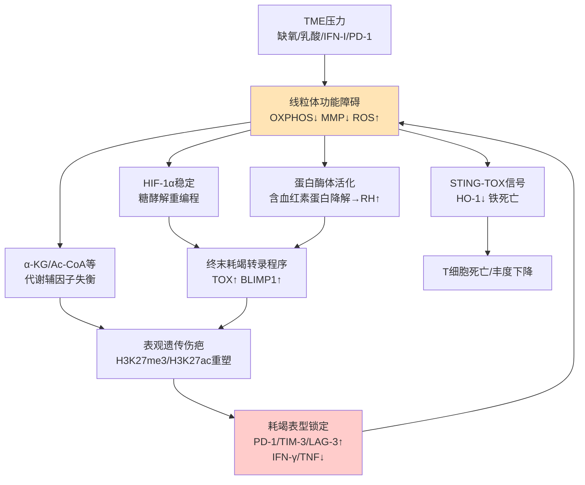

# 线粒体代谢调控逆转T细胞耗竭的潜在治疗策略
# 1 总论：耗竭T细胞的代谢特征与线粒体功能重塑的核心地位

肿瘤免疫治疗自免疫检查点阻断（immune checkpoint blockade, ICB）问世以来取得了里程碑式的进展，但临床实践却始终被一个共同的瓶颈所束缚：即便在被认为对治疗较为敏感的瘤种中，患者整体客观应答率仅约20%–30%，而胰腺癌、脑胶质瘤、三阴性乳腺癌等"冷肿瘤"几乎对PD-1阻断无反应，且初始应答者中相当一部分会在治疗中后期出现耐药[^1]。这一困境的细胞学根源在于肿瘤浸润CD8⁺ T细胞的**功能性耗竭（T cell exhaustion）**——一种在肿瘤抗原与TCR持续刺激下逐步形成的功能失调状态，其特征是自我更新能力下降，IL-2、TNF、IFN-γ等效应细胞因子分泌减弱，而PD-1、CTLA-4、TIM-3、LAG-3等共抑制受体持续高表达[^2][^1]。耗竭T细胞曾一度被形象地描述为"僵尸（Zombie）细胞"[^1]，但随着研究的深入，人们意识到耗竭并非均质的终末状态，而是沿着从具备干性的前体耗竭T细胞（Tpex/Tex_prog）向终末耗竭T细胞（terminally exhausted T, Tex_term）演化的连续谱系，该过程由转录、表观遗传、代谢与翻译后修饰多层调控网络共同塑造[^3]。

在这张多层调控网络中，**线粒体代谢异常正在被越来越多的研究确立为T细胞耗竭的中枢驱动事件而非伴随现象**。从早期Bengsch等人证明PD-1介导的生物能量学缺陷是CD8⁺ T耗竭的早期驱动因素[^4]，到Scharping等人系统揭示肿瘤微环境抑制T细胞线粒体生物合成而导致代谢不足与功能失调[^5]，再到最近Ho、王建祥团队在《Nature》上披露线粒体去极化经蛋白酶体—血红素—BACH2/BLIMP1轴推动终末耗竭分化[^6][^7]，线粒体功能障碍贯穿了耗竭T细胞从分化起点到终末锁定的全过程。本章作为全篇研究的逻辑起点与机制总纲，将系统刻画耗竭T细胞的代谢重编程谱、线粒体多维度功能障碍、肿瘤微环境对T细胞线粒体的外源性破坏、代谢-表观-转录的正反馈回路以及Tpex向终末Tex转化的代谢拐点，最终论证"**增强线粒体功能、重塑代谢稳态**"作为逆转耗竭、提升免疫治疗应答的核心治疗方向，为后续六个子部分（PGC-1α诱导、ROS缓解、缺氧缓解、ATP生成、线粒体转移、其他线粒体靶向策略）提供统一的机制锚点与逻辑主线。

## 1.1 耗竭T细胞的代谢重编程图谱：从OXPHOS抑制到糖酵解依赖

效应、记忆与耗竭三类CD8⁺ T细胞之间最显著的差异之一在于其能量代谢偏好：长寿记忆CD8⁺ T细胞依赖**氧化磷酸化（OXPHOS）和脂肪酸氧化（FAO）**来维持自我更新与代谢适合度，这一代谢偏好是其长效肿瘤监视能力的物质基础[^8]；与之形成鲜明对比的是，肿瘤浸润淋巴细胞（TIL）和慢性感染下的耗竭T细胞展现出严重的**OXPHOS抑制与糖酵解依赖**双重特征，并伴随线粒体活性显著下降[^8][^5]。

这种代谢漂移在感染或抗原暴露的极早期就已奠定。Bengsch等人在LCMV慢性感染模型中发现，在严重功能失调表型出现之前的**感染第一周内**，PD-1信号已经开始通过调节T细胞代谢使其陷入"生物能量学不足（bioenergetic insufficiency）"状态，提示代谢异常是耗竭的**早期驱动事件**而非晚期结果[^4]。在单细胞水平上对慢性LCMV感染野生型小鼠分离的CD44⁺PD-1ʰⁱ CD8⁺ T细胞进行scRNA-seq分析，可识别出至少六个主要耗竭亚群，从"干样" CD62L⁺ Tpex1出发存在分支轨迹通向终末耗竭，并在伪时间维度伴随明显的转录-代谢重编程[^9]。在HIV-1慢性感染的临床场景中也观察到完全一致的图景：能自发控制病毒的"精英控制者"其CD8⁺ T细胞保留了优异的线粒体功能与OXPHOS能力，而典型慢性感染者的T细胞则被迫转向效率低下的糖酵解模式，这种"代谢枷锁"被研究者明确定义为T细胞功能耗竭的重要根源[^10]。

值得强调的是，耗竭T细胞的糖酵解依赖并非真正意义上"糖酵解能力增强"——在TME的葡萄糖匮乏与乳酸堆积下，它们更类似于一种被动的、低效的、与OXPHOS脱偶联的糖酵解，最终既无法产生足够的ATP，又难以为生物合成提供原料，从而限制了细胞因子合成与效应功能执行[^9][^10]。

## 1.2 线粒体功能障碍的多维度表现：生物合成、动力学与膜电位失衡

耗竭T细胞的线粒体异常呈现出**多维度协同**的特征，构成研究者所称的"代谢枷锁"。

第一维度是**线粒体生物合成抑制**。Scharping等人2016年发表于《Immunity》的经典工作明确证实，肿瘤微环境通过抑制T细胞线粒体生物合成，从而驱动肿瘤内T细胞的代谢不足与功能失调[^5]。这一过程的核心调控因子是过氧化物酶体增殖物激活受体γ共激活因子-1α（PGC-1α），即线粒体生物合成的主调控因子。在小鼠黑色素瘤模型中，强制过表达PGC-1α可以使CD8⁺ TIL维持更高的线粒体活性、改善代谢适合度，并在荷瘤宿主中提供更强的抗肿瘤免疫；从肿瘤中分离过表达PGC-1α的TIL在无瘤宿主中再次受到挑战时仍能展现出优于对照细胞的扩增能力，提示线粒体生物合成的强度直接决定了T细胞的功能持久性[^8]。

第二维度是**线粒体动力学失衡与膜电位去极化**。耗竭T细胞中线粒体融合-分裂动力学紊乱已被多项研究记录，并与mtDNA损伤、线粒体碎片化累积相关联（Yu等2020年报道了TIL中扰动的线粒体动力学加剧T细胞耗竭）[^6][^7]。去极化线粒体的累积是耗竭表型的另一重要标志：在含有去极化线粒体的T细胞中，蛋白酶体活性显著增强、线粒体蛋白泛素化和选择性降解明显上调，电子传递链复合物相关含血红素蛋白被大量降解[^6][^7]。

第三维度是**ROS异常累积与氧化还原应激**。受癌细胞通过转移而来的突变mtDNA"污染"的TIL，其线粒体膜电位（MMP）显著降低，OXPHOS能力下降，同时ROS产生显著增加，进一步推动衰老相关分子升高与衰老相关分泌表型（SASP）的形成[^11]。这种ROS-MMP-OXPHOS的恶性循环不仅是结果，也是放大耗竭表型的重要环节。

下表总结了耗竭T细胞线粒体功能障碍的核心维度及其分子表征：

| 障碍维度 | 关键分子事件 | 功能后果 | 代表性证据 |
|---|---|---|---|
| 生物合成抑制 | PGC-1α下调，NRF1/TFAM受抑 | 线粒体数量与质量下降 | TME抑制线粒体生物合成驱动TIL代谢不足[^5]；PGC-1α过表达恢复抗肿瘤免疫[^8] |
| 动力学失衡 | 融合-分裂调控紊乱、碎片化累积 | mtDNA损伤、能量供应不稳 | Yu等2020报道TIL线粒体动力学扰动加剧耗竭[^6][^7] |
| 膜电位去极化 | MMP下降、ETC复合物功能受损 | 蛋白酶体活化、含血红素蛋白降解、调节性血红素（RH）升高 | RH经BACH2-BLIMP1轴驱动终末耗竭[^6][^7] |
| ROS异常累积 | mtROS爆发、脂质过氧化 | 衰老、铁死亡、表观重塑 | mtDNA突变TIL中ROS与SASP升高[^11]；STING-TOX轴诱导铁死亡[^12] |
| OXPHOS损伤 | TCA循环受阻、ATP/AMP比下降 | 增殖与细胞因子合成受限 | IFN-I持续信号抑制OXPHOS致T细胞耗竭[^10]；PD-1引发早期能量学缺陷[^4] |

这五个维度相互交织、相互放大，共同将T细胞锁定在低能量、低功能、高应激的耗竭状态。

## 1.3 肿瘤微环境对T细胞线粒体的外源性破坏机制

T细胞线粒体功能障碍并非完全源自细胞内在程序，**肿瘤微环境（TME）通过多重外源性压力主动塑造**了这种障碍。TME的低氧、低葡萄糖、营养竞争与代谢副产物堆积，迫使癌细胞偏好糖酵解而非OXPHOS，这种代谢重编程进一步削弱浸润T细胞的效应功能并加速其耗竭与衰老[^11]。

**乳酸毒性输入**是近年来揭示最为深刻的机制之一。匹兹堡大学团队2024年发表于《Nature Immunology》的研究发现，肿瘤浸润Tex细胞特异性高表达溶质载体蛋白MCT11（由Slc16a11编码），从而显著增加对乳酸等单羧酸的摄取；慢性TCR刺激可上调MCT11表达，而低氧暴露可经HIF-1α依赖通路促进更高水平且持续的MCT11表达。条件性敲除MCT11或使用单克隆抗体阻断MCT11，可显著减少Tex对乳酸的摄取，恢复其效应功能并抑制肿瘤生长，且与抗PD-1联用产生显著协同[^2]。研究者形象地比喻：如果共抑制受体是"汽车的刹车"，乳酸就是"劣质汽油"，阻断MCT11相当于阻止T细胞加注劣质燃料[^2]。与此并行，中山大学李疆团队揭示了乳酸毒性的另一条路径：乳酸通过MCT1进入CD8⁺ T细胞后，上调STING磷酸化和TOX表达，同时抑制HO-1，进而诱导铁离子累积、线粒体ROS爆发、脂质过氧化，最终触发**线粒体依赖性铁死亡**；使用MCT1抑制剂AZD3965可有效阻断该过程并显著抑制肿瘤生长[^12]。

**缺氧驱动的代谢重编程**是另一关键外源性机制。在慢性LCMV感染模型中，线粒体功能不足通过引起氧化还原应激抑制HIF-1α的蛋白酶体降解，进而稳定HIF-1α并促进Tpex细胞向终末耗竭T细胞的转录与代谢重编程，揭示**线粒体功能障碍—HIF-1α稳定—糖酵解重编程**这一驱动终末耗竭的核心轴[^9]。

**持续I型干扰素信号**则是慢性病毒感染情境下的标志性损伤源。马里兰大学苏立山团队与武汉大学程亮团队的研究证实，在cART治疗的HIV-1感染情境下，持续的IFN-I信号直接损害CD8⁺ T细胞线粒体活性、抑制OXPHOS、迫使其转向糖酵解，从而锁定耗竭表型；阻断IFN-I信号或使用糖酵解抑制剂2-脱氧-D-葡萄糖（2-DG）进行短期代谢重编程，均可恢复T细胞线粒体功能并显著缩小病毒储藏库[^10]。

最令人意外的外源性破坏机制来自Yosuke Togashi团队2024年发表于《Nature》的发现：**癌细胞可直接将功能障碍的线粒体（含突变mtDNA）转移给宿主TIL**，实现免疫逃逸。研究通过对12名癌症患者的TIL与癌细胞样本mtDNA测序，发现5名患者的TIL存在mtDNA突变，其中3名患者的TIL与癌细胞共享相同突变；进一步证实癌细胞经隧道纳米管（TNTs）和细胞外囊泡（EVs）两种途径将线粒体输送给TIL；癌细胞释放的ROS诱导TIL原住线粒体自噬，同时癌细胞高表达去泛素化酶USP30使转移而来的线粒体抵抗parkin介导的线粒体自噬，最终实现"同质化"——即突变线粒体逐步取代TIL内的原住线粒体[^11]。这种线粒体水平的"水平基因转移"使TIL膜电位下降、OXPHOS受损、ROS与衰老相关分泌表型升高，从机制上为后续"健康线粒体转移作为反向治疗策略"提供了直接依据。

## 1.4 线粒体功能障碍驱动耗竭的分子回路：代谢-表观-转录的正反馈

线粒体功能异常并非孤立的代谢现象，而是通过若干分子轴**上行调控耗竭程序**，并与表观遗传与转录调控网络形成正反馈回路。

第一条回路是**线粒体功能障碍—HIF-1α—糖酵解—终末耗竭轴**。线粒体氧化还原失衡导致ROS累积，进而抑制HIF-1α的蛋白酶体降解，HIF-1α稳定后驱动糖酵解重编程，并通过转录学与代谢学双重机制推动Tpex向终末耗竭转化[^9]。这一轴解释了"代谢异常如何主动改写细胞命运"。

第二条回路是新近揭示的**蛋白酶体—血红素—BACH2/BLIMP1轴**。Ho与王建祥团队发现，线粒体去极化显著增强T细胞内蛋白酶体活性，使含血红素的电子传递链复合物被选择性降解，释放大量调节性血红素（regulatory heme, RH）入核；RH作为辅因子抑制干性转录因子BACH2的功能，同时增强终末耗竭转录因子BLIMP1的活性，从而促进PD-1和TIM3表达、削弱TNF与IFN-γ分泌；在BACH2血红素结合位点突变或阻断血红素入核后，T细胞终末耗竭分化显著减弱，抗肿瘤功能得到增强[^6][^7]。该机制不仅揭示了"线粒体去极化—蛋白酶体—转录网络"的崭新连接，也为以低剂量Bortezomib在CAR-T制造期预处理T细胞作为减耗策略提供了直接依据[^6][^7]。

第三条回路是**乳酸—STING—TOX—铁死亡轴**。乳酸经MCT1进入T细胞后激活STING与TOX形成的正向转录调控环路，二者共同抑制HO-1表达，造成亚铁离子累积、mtROS爆发与线粒体脂质过氧化，引发铁死亡；TOX在此过程中既是表观重塑驱动因子又是铁死亡通路的关键节点，与转录组学上TOX作为耗竭主驱动转录因子的角色完全吻合[^3][^12]。

第四条回路是**代谢—表观偶联**。T细胞耗竭的稳定性很大程度上源于表观遗传"伤疤"：效应基因（如*Ifng*）所在区域染色质封闭、富集H3K27me3，而耗竭基因（如*Pdcd1*）增强子区域富集H3K27ac；干细胞基因启动子超甲基化、耗竭基因启动子低甲基化[^3]。这些表观改变在很大程度上依赖于线粒体代谢提供的辅因子，如TCA循环产物α-酮戊二酸（α-KG）是H3K27去甲基化酶JmjC家族的关键底物，乙酰辅酶A是组蛋白乙酰化的供体。线粒体OXPHOS塌陷必然伴随这些代谢中间体浓度紊乱，从而锁定耗竭表观图谱。

综合上述四条回路，可以将代谢-表观-转录的正反馈关系示意如下：

该回路的关键在于**线粒体功能障碍既是输出（被TME压力诱发）又是输入（反过来通过多个分子轴稳定耗竭表型）**，从而构成自我强化的正反馈，使T细胞难以自发逃离耗竭状态——这正是单纯阻断PD-1往往不足以恢复Tex功能的根本原因。

## 1.5 Tpex向终末Tex转化的代谢拐点与干预窗口

耗竭谱系内部存在显著异质性，并具有重要的临床含义。**前体耗竭T细胞（Tpex）**高表达TCF-1，并伴有CXCR5、SLAMF6、Ly108、CD62L等表面标志，保留自我更新与分化为效应细胞的潜力，是免疫应答持久性的关键；而**终末耗竭T细胞（Tex_term）**则高表达PD-1、TIM-3、LAG-3等多重抑制性受体，效应功能严重缺失，增殖能力低下[^3][^9]。在分子层面，TCF-1是Tpex干性的核心维持因子，通过抑制T-bet等终末分化因子并促进Eomes等记忆相关因子的表达发挥作用；TOX则作为先驱因子重塑染色质开放性、稳定耗竭程序；NR4A家族、BATF/IRF4复合物以及BLIMP-1协同推动终末分化[^3]。

至关重要的是，**只有Tpex而非Tex_term对抗PD-1治疗作出有效响应**——Tpex在ICB后呈现增殖爆发并分化为细胞毒性效应细胞，从而重新激活抗肿瘤免疫[^9][^1]。Tpex的临床价值与其代谢状态深度绑定：完整的线粒体功能是Tpex维持干性与自我更新的代谢前提，而线粒体功能不足正是触发Tpex向Tex_term不可逆转化的细胞内在信号[^9]。在LCMV慢性感染模型中，线粒体功能障碍通过HIF-1α介导的糖酵解重编程驱动这一转化，**提示存在一个"代谢拐点"**——即Tpex的线粒体功能尚可保留与可恢复的窗口期[^9]。

这一窗口期具有三重临床意义：其一，**Tpex线粒体功能状态可作为ICB应答的潜在预测标志物**；其二，**在Tpex仍占据一定比例时进行代谢干预，远比终末耗竭已锁定后再行挽救更易奏效**；其三，**CAR-T制造工艺中维持或增强细胞线粒体功能可显著提升后续治疗的持久性**——这一点已在CAR-T制备过程中短暂使用Bortezomib降低耗竭、提升疗效的实验中得到验证[^6][^7]。

## 1.6 线粒体代谢重塑作为逆转耗竭的核心治疗方向

综合上述代谢图谱、多维度线粒体障碍、TME外源性破坏、代谢-表观-转录正反馈与Tpex代谢拐点五方面证据，可以得出一个清晰的逻辑链条：**线粒体功能障碍是T细胞耗竭的早期驱动事件、中枢放大器与终末锁定机制**，因此"增强线粒体功能、重塑代谢稳态"应作为**逆转T细胞耗竭、提升免疫治疗应答的统一治疗逻辑**。这一逻辑与传统PD-1/PD-L1单一阻断策略并不矛盾，但提供了一种更具因果指向的、可联用的治疗维度——通过修复"汽车性能本身"而不仅是"松开刹车"，从根本上恢复T细胞的代谢适合度。

基于本章梳理的机制证据，可行的干预层面可被结构化为六大方向，每一方向都对应耗竭代谢图谱中的一个关键节点：

| 治疗方向 | 主要靶点/分子节点 | 直接修复的代谢异常 | 代表性证据 |
|---|---|---|---|
| 阻断代谢毒性输入 | MCT11、MCT1、IFNAR | 乳酸毒性、IFN-I诱导OXPHOS抑制 | 抗MCT11联合抗PD-1协同抑瘤[^2]；AZD3965阻断乳酸入T[^12]；2-DG短期重编程恢复HIV感染T细胞功能[^10] |
| 增强线粒体生物合成 | PGC-1α/NRF1/TFAM | 线粒体数量与质量下降 | PGC-1α过表达促进记忆形成与抗肿瘤免疫[^8][^5] |
| 缓解ROS与氧化应激 | mtROS、铁死亡通路、HO-1 | ROS累积、脂质过氧化 | STING/TOX缺失保护线粒体并增强抗肿瘤[^12] |
| 缓解缺氧 | HIF-1α、VEGF/血管正常化 | 缺氧诱导糖酵解锁定 | 线粒体功能不足—HIF-1α—终末Tex轴[^9] |
| 诱导ATP生成与代谢重编程 | OXPHOS复合物、糖酵解-TCA偶联 | ATP/AMP失衡 | PD-1早期诱发能量学缺陷[^4] |
| 线粒体转移与质量控制 | 线粒体转移、自噬、蛋白酶体 | 突变mtDNA污染、去极化线粒体累积 | 癌→T细胞线粒体转移机制[^11]；Bortezomib预处理减少CAR-T耗竭[^6][^7] |

需要指出的是，这六大方向并非相互独立，而是在分子层面深度交织：PGC-1α既是生物合成的主调控因子，也参与缺氧响应与线粒体质量控制；ROS既是代谢异常的产物又是表观-转录回路的上游信号；线粒体转移既可作为癌细胞免疫逃逸的"毒性输入"，也可被反向工程为CAR-T的"补救输入"。这种交织正是后续六个子章节相互呼应、共同构建综合性代谢免疫治疗框架的基础。

更重要的是，**多项研究已经证明这些代谢干预与现有ICB/CAR-T疗法具有显著协同效应**：抗MCT11联合抗PD-1协同抑瘤[^2]，STING/TOX缺陷T细胞与低剂量PD-1/TIM-3抗体、化疗或STING激动剂ADU-S100联用产生协同[^12]，CAR-T制备中短期Bortezomib预处理显著降低耗竭并提升抗肿瘤疗效[^6][^7]。这表明代谢免疫治疗不是对现有疗法的替代，而是其**机制性增效器**。

承接上述总论框架，后续六个章节将分别围绕PGC-1α诱导（第2章）、ROS缓解（第3章）、缺氧缓解（第4章）、ATP生成诱导（第5章）、线粒体转移（第6章）与其他线粒体靶向策略（第7章），系统展开具体干预手段的分子机制、临床前证据与转化前景，逐一论证"线粒体代谢重塑作为逆转T细胞耗竭核心方向"在每一具体策略层面上的可行性与潜力。

# 2 诱导PGC-1α表达以重启线粒体生物合成

承接第1章对耗竭T细胞代谢图谱与线粒体多维度功能障碍的系统梳理，本章将治疗视角聚焦于**线粒体生物合成主调控因子PGC-1α（peroxisome proliferator-activated receptor gamma coactivator 1-alpha）**。在总论所提出的"代谢-表观-转录正反馈回路"中，PGC-1α下调是连接外源性TME压力与线粒体数量/质量塌陷的核心枢纽——它既是TCR慢性信号、PD-1早期生物能量学缺陷、缺氧与乳酸毒性的下游靶点，也是NRF1/NRF2-TFAM-OXPHOS这一下行级联的转录开关。因此，重启PGC-1α通路不仅意味着"修复一项代谢异常"，而是从源头重建线粒体生物合成—OXPHOS—代谢适合度的整条供应链。本章遵循"机制—干预—证据—转化"的逻辑链条，依次回答三个问题：PGC-1α为何在耗竭T细胞（Tex）中被系统性下调？通过哪些分子事件重启该通路可以重塑线粒体功能并逆转耗竭？目前有哪些已进入临床前与临床阶段的干预手段可服务于这一目标？

## 2.1 PGC-1α在耗竭T细胞中表达下调的分子机制

PGC-1α作为线粒体生物合成的主调控因子，其在Tex细胞中表达受抑并非由单一信号引发，而是慢性TCR刺激、共抑制受体信号、TME外源性压力多层次协同作用的结果。第一层抑制源自**慢性TCR-AKT-FOXO轴失衡**。在生理性效应应答中，FOXO1/FOXO3是PGC-1α启动子的关键正向转录因子；然而，肿瘤抗原的持续刺激驱动AKT通路慢性激活，造成FOXO1/FOXO3发生过度磷酸化并被核外排，丧失对PGC-1α的转录激活能力，由此奠定了Tex细胞PGC-1α基线表达低下的转录背景。第二层抑制源自**Blimp-1对PGC-1α启动子的直接压制**。在第1章所述的BACH2/BLIMP1转录平衡框架下，线粒体去极化通过蛋白酶体—血红素轴上调BLIMP1活性，而BLIMP1除驱动终末耗竭基因程序外，亦可直接结合PGC-1α启动子区域抑制其转录，从而形成"线粒体去极化—BLIMP1↑—PGC-1α↓—线粒体生物合成↓—更深度去极化"的恶性循环。第三层抑制源自**PD-1信号介导的早期生物能量学缺陷对PGC-1α-NRF1-TFAM轴的下行抑制**。如第1章所引Bengsch等人的工作，PD-1在慢性感染第一周即开始调节T细胞代谢，使其陷入生物能量学不足状态；Scharping等人进一步将这种缺陷的核心定位于PGC-1α-NRF1-TFAM轴的塌陷，提示PD-1并非仅作为"信号刹车"，而是通过下行抑制线粒体生物合成主轴推动早期代谢功能失调。

第四层抑制来自TME的外源性压力的协同。如第1章所论，肿瘤微环境的乳酸毒性输入（经MCT1/MCT11摄取）、慢性缺氧（HIF-1α稳定与糖酵解锁定）以及持续I型干扰素信号，均会进一步压制PGC-1α的表达与活性。其中，缺氧条件下HIF-1α主导的代谢重编程倾向于推动糖酵解而抑制OXPHOS，与PGC-1α所驱动的线粒体生物合成程序形成代谢主轴的直接竞争；而持续IFN-I信号已被证实可直接损害CD8⁺ T细胞线粒体活性、抑制OXPHOS、迫使其转向糖酵解，等同于从上游剪断PGC-1α下游执行链。这些多层次抑制最终汇聚为Tex细胞特征性的"PGC-1α低表达—线粒体数量减少—mtDNA拷贝数下降—ETC复合物组装不足—OXPHOS塌陷"的因果链条，为针对PGC-1α通路的逆向干预提供了精确的分子靶点定位。

## 2.2 PGC-1α重启线粒体生物合成的下游效应网络

PGC-1α本身不直接结合DNA，而是作为强力转录共激活因子，通过结合并增强一系列核受体与转录因子的活性来执行其线粒体生物合成调控功能。其下游效应网络具有显著的"多枢纽协同"特征：首先，PGC-1α协同**NRF1与NRF2（核呼吸因子1/2）**激活线粒体转录因子A（TFAM）的表达，TFAM进入线粒体后直接驱动mtDNA的复制与转录，从而扩大线粒体DNA池并保障ETC复合物所需亚基的合成；其次，PGC-1α协同**ERRα（estrogen-related receptor α）**上调TCA循环关键酶与ETC复合物Ⅰ–Ⅴ的核编码亚基表达，重建OXPHOS执行单元；第三，PGC-1α协同**PPARα**激活脂肪酸氧化（FAO）相关酶系（包括CPT1A、ACADM等），将燃料供应从糖酵解依赖切回FAO-OXPHOS主轴，这一切换正是记忆CD8⁺ T细胞代谢适合度的核心特征；第四，PGC-1α协同上调线粒体抗氧化防御系统（SOD2/MnSOD、GPx、过氧化氢酶等），降低重启OXPHOS可能伴随的ROS爆发风险，构成一个内置的"代谢-抗氧化耦合"安全机制。

这一下游网络的重建对耗竭逆转具有多层意义。在能量学层面，OXPHOS效率提升直接抬高ATP/AMP比值，缓解AMPK持续激活与mTORC1抑制造成的合成代谢瘫痪，恢复T细胞增殖、细胞因子合成与效应分子（颗粒酶、穿孔素）的产生。在膜电位层面，新生线粒体的引入与ETC功能恢复有助于维持MMP，缓解第1章所述的"去极化—蛋白酶体—血红素—BLIMP1"恶性回路。最为关键的是在**细胞命运层面**：FAO-OXPHOS主导的代谢模式是TCF-1⁺记忆样/前体耗竭（Tpex）表型的物质基础，PGC-1α重启实质上是将Tex的代谢主轴拉回到Tpex所偏好的能量代谢轨道，从而**延缓Tpex向终末耗竭的不可逆转化**——这与第1章提出的"代谢拐点"概念精准对应。Dumauthioz等人在小鼠模型中明确证实，PGC-1α过表达使CD8⁺ T细胞偏向**中央记忆形成而非组织驻留记忆**，并增强细菌感染或多肽疫苗后的二次召回应答能力[^13]，从功能学层面验证了PGC-1α重塑代谢与维持记忆/干性的因果联系。

## 2.3 基因工程过表达PGC-1α的临床前证据

通过逆转录病毒或慢病毒载体在T细胞中强制过表达PGC-1α是验证"PGC-1α重启逆转耗竭"假设最直接的实验策略。Dumauthioz等人发表于*Cellular & Molecular Immunology*的标志性研究系统证实了这一策略的有效性：在小鼠黑色素瘤模型中，过表达PGC-1α的CD8⁺ T细胞表现出更强的中央记忆形成偏好，在体内持续性显著提高，且对细菌感染或肽段疫苗刺激产生更稳健的召回应答；更具治疗学意义的是，**过表达PGC-1α的CD8⁺ T细胞在荷瘤宿主中提供了更强的抗肿瘤免疫**；从肿瘤中分离的PGC-1α过表达TIL在转入无瘤宿主再次接受肿瘤挑战时，其线粒体活性保持更高水平、扩增能力优于对照TIL[^13]。这一系列结果在功能、代谢与持久性三个维度共同证明：**强制重启线粒体生物合成可在体内逆转TIL的代谢功能失调，并显著延长其抗肿瘤效力的时间窗。**

这一发现对**CAR-T细胞工程化改造**具有直接的转化启示。当前CAR-T疗法在血液肿瘤外的实体瘤场景下普遍受困于细胞耗竭快、持久性差、对TME代谢压力耐受不足等问题；Huang等人在*Journal of Hematology & Oncology*的综述中明确将线粒体功能与动力学缺陷列为CAR-T耗竭的标志性特征，并提出"重塑线粒体代谢以解放T细胞耗竭"的策略框架，认为以线粒体可塑性为靶点是提升CAR-T疗效的关键方向之一[^14]。在该框架下，将PGC-1α作为内置代谢增强模块共转导入CAR-T构建体（与CAR本体共表达或在独立启动子下表达）具有显著潜力：一方面可在T细胞制备和扩增期即建立更高的线粒体储备，使其在进入TME后具备更强的代谢缓冲能力；另一方面，PGC-1α驱动的FAO-OXPHOS偏好与中央记忆表型有助于维持Tscm/Tcm样亚群的比例，进而支持长期肿瘤监视。然而，强制PGC-1α过表达亦存在潜在风险：脂质代谢过度偏移可能影响膜稳态；过度活跃的OXPHOS若与抗氧化系统的同步上调不匹配，反而可能诱发ROS爆发；持续高水平PGC-1α可能干扰T细胞分化的正常时序。这些考量提示，未来的工程化策略可能需要采用**可调控启动子（如Tet-On/Off）或瞬时表达系统**，使PGC-1α的表达强度与时序与T细胞功能需求相匹配。

## 2.4 PPAR激动剂经PPAR/PGC-1α-CPT1A轴的间接诱导

相较于基因工程的不可逆改造，**药理学间接激活PGC-1α通路**因其可调控性、可联用性与已具备临床可及性而成为更具转化价值的方向。PPAR（peroxisome proliferator-activated receptor）家族核受体——特别是PPARα——是PGC-1α的天然结合伙伴，二者协同激活脂肪酸氧化与线粒体生物合成程序。**苯扎贝特（bezafibrate）**作为已上市数十年的泛PPAR激动剂（PPARα/γ/δ），在这一轴上的免疫代谢调节作用近年得到重要拓展。

中南大学湘雅医院刘静、刘洪、陈翔团队2025年发表于*Nature Genetics*的研究为这一机制提供了崭新的双向证据[^15][^16]。该研究整合空间转录组学、批量转录组学与蛋白质组学，揭示了TCA循环与OXPHOS通路高表达与黑色素瘤患者预后改善及PD-1治疗应答增强密切相关：连接TCA循环与OXPHOS的关键酶OGDH、SCS、SDH三者均高表达的患者组（Three_Complex_high）对免疫治疗应答更佳，154例接受PD-1抗体治疗患者中三酶高表达组的5年生存率高达68%，而低表达组仅为29%[^15][^16]。在机制层面，研究者发现代谢物**琥珀酰辅酶A（succinyl-CoA）**水平与抗肿瘤免疫及抗PD-1疗效高度相关；补充α-酮戊二酸（AKG）或琥珀酸的类似物（DMK、DES）可在体内外升高琥珀酰辅酶A水平、增强T细胞介导的肿瘤清除——B16F10黑色素瘤体积在DES/DMK处理后缩小约60%、小鼠存活期延长2.3倍，并依赖CD8⁺ T细胞起效（CD8⁺ T耗竭实验中疗效消失）[^16]。

最为关键的是，研究者鉴定**肉碱棕榈酰转移酶1A（CPT1A）**为PD-L1的琥珀酰转移酶：CPT1A催化PD-L1在赖氨酸129位点（K129）发生琥珀酰化修饰，进而通过内体—溶酶体途径降解PD-L1，从而解除肿瘤对T细胞的免疫抑制[^15][^16]。**苯扎贝特正是通过PPAR-PGC-1α轴上调CPT1A表达**，进而既增强T细胞的FAO-OXPHOS代谢能力，又促进肿瘤细胞PD-L1降解；在小鼠模型中，苯扎贝特单药即可上调CPT1A并显著抑制肿瘤生长，与CTLA-4单克隆抗体联用时**肿瘤体积在21天内缩小82%，并可实现完全消退**[^16]。临床数据进一步显示，肿瘤组织中PD-L1高表达而CPT1A低表达的患者对PD-1治疗应答更佳，PD-L1与CPT1A的组合可作为预测疗效的潜在生物标志物[^15]。

这一证据链的特殊价值在于揭示了PPAR激动剂的**双重免疫代谢效应**：一方面，PPARα/γ激活通过PGC-1α共激活NRF1-TFAM驱动T细胞线粒体生物合成与FAO能力，从T细胞侧重塑代谢适合度；另一方面，PPAR-PGC-1α-CPT1A轴催化肿瘤细胞PD-L1琥珀酰化降解，从肿瘤侧解除免疫检查点压制。这种"双向放大"作用使苯扎贝特从一个传统降脂药跃升为兼具T细胞代谢增强与肿瘤免疫检查点调控功能的免疫治疗增效剂候选，其作为**已上市药物再定位**的转化路径显著缩短，与CTLA-4或PD-1抗体联用具备直接进入早期临床试验的逻辑基础。

## 2.5 二甲双胍及代谢调节剂对PGC-1α通路的激活

除PPAR激动剂外，多种已具备临床使用经验的小分子代谢调节剂可经**AMPK-SIRT1-PGC-1α**这一经典代谢轴间接重启线粒体生物合成，其中**二甲双胍（metformin）**的证据链最为完整。

二甲双胍通过抑制线粒体复合物Ⅰ导致细胞内ATP/AMP比值下降、AMPK激活，进而经SIRT1依赖的PGC-1α去乙酰化激活其转录共激活活性，同步上调线粒体生物合成与抗氧化防御。比利时鲁汶大学Benoit J Van den Eynde与Veronica Finisguerra团队发表于*Journal for ImmunoTherapy of Cancer*（JITC）的研究为二甲双胍在T细胞耗竭逆转中的作用提供了机制性证据[^17]：在1%氧含量的缺氧环境下培养的CD8⁺ T细胞数量与扩增能力显著下降、凋亡增加，且PD-1、LAG-3表达上调、IFN-γ和TNF-α分泌减少；二甲双胍处理后，缺氧诱导的T细胞数量减少、凋亡增加被部分逆转，PD-1/LAG-3上调被抑制，IFN-γ/TNF-α分泌恢复[^17]。机制上，**二甲双胍通过减少缺氧时CD8⁺ T细胞内ROS的积累，防止线粒体功能紊乱与氧化性DNA损伤，从而直接改善T细胞在缺氧条件下的生存与效应功能**[^17]。在过继细胞治疗（ACT）黑色素瘤小鼠模型中，饮用水加入二甲双胍后CD8⁺ T细胞对肿瘤的浸润——尤其是对缺氧区域的浸润——显著增加；与环磷酰胺联用进一步提高浸润T细胞在缺氧区的持久性与存活率；在对PD-1抑制剂耐药的B16F1黑色素瘤模型中，二甲双胍与PD-1抑制剂联用增强了肿瘤对免疫治疗的反应[^17]。这些结果同时也为第3章ROS缓解与第4章缺氧适应性策略提供了交叉证据。

二甲双胍的免疫代谢效应不止于T细胞内在层面。北卡罗来纳大学教堂山分校Leaf Huang团队在*Advanced Therapeutics*的研究表明，口服二甲双胍及其聚合物形式（聚二甲双胍，Polymet）可经**激活AMPK并抑制mTOR信号通路**，重编程结肠癌肿瘤微环境的免疫抑制状态、促进肿瘤内T细胞浸润，并通过调节肠道菌群（如显著提升乳酸菌丰度）协同免疫检查点抑制剂治疗[^18]。这一研究将二甲双胍-PGC-1α通路的免疫调节作用从T细胞内在代谢扩展到TME重塑与肠道微生态层面，提示其作为ICB增效剂的机制更具系统性。临床证据方面，一项针对转移性恶性黑色素瘤的回顾性队列研究比较了单纯免疫检查点抑制剂（ipilimumab、nivolumab、pembrolizumab）与免疫检查点抑制剂联合二甲双胍的疗效，重点考察客观应答率（ORR）、疾病控制率（DCR）、总生存期（OS）与无进展生存期（PFS）等指标，该研究承认二甲双胍可通过减少肿瘤缺氧增强PD-1阻断效应，但同时也指出此前在恶性黑色素瘤中开展的临床研究有限，且尚无系统报告联合用药的疗效[^18]。在非小细胞肺癌领域，METALUNG II期单臂试验评估了二甲双胍联合培美曲塞-卡铂在初治IV期非鳞NSCLC中的疗效，主要终点为6个月PFS率；该研究因中期分析无效而终止，6个月PFS率为28%（95% CI 12.4–46），中位PFS与OS分别为4.5个月与7.4个月，胃肠道毒性最为常见，未报告4/5级毒性[^19]。METALUNG的结果提示，二甲双胍单纯叠加化疗背景下的获益空间有限，但其作为低毒性、临床可及的代谢调节剂，与ICB联用的优化空间仍有待更严格设计的前瞻性试验验证。

其他经AMPK-SIRT1-PGC-1α轴发挥作用的代谢调节剂亦展现出值得关注的潜力。**白藜芦醇（resveratrol）**作为天然SIRT1激活剂，可通过SIRT1依赖的PGC-1α去乙酰化提升线粒体生物合成与OXPHOS效率。**烟酰胺核苷（NR）/烟酰胺单核苷酸（NMN）**作为NAD⁺前体，可提升细胞NAD⁺水平、激活SIRT1/SIRT3，进而增强PGC-1α活性；研究表明NMN通过与线粒体NAD⁺依赖性蛋白脱乙酰化酶SIRT3的相互作用改善心脏功能，并通过SIRT1/NF-κB信号通路调控炎症反应，提示其在多组织线粒体功能调节中具有广谱效应[^20]。**α-酮戊二酸（AKG）**则在双重维度上参与PGC-1α通路：作为TCA循环关键中间产物直接补充线粒体能量底物，并作为JmjC家族去甲基化酶（包括组蛋白H3K27去甲基化酶）的辅因子，参与表观遗传重塑——AKG不仅参与能量生成与氨基酸合成，还对胶原蛋白生成与基因表达的表观遗传调控起关键作用[^20]。前述*Nature Genetics*研究中DMK作为AKG类似物提升琥珀酰辅酶A水平、增强CD8⁺ T细胞介导的肿瘤清除，正是这一双重机制在T细胞免疫学中的具体体现[^15][^16]。这一类代谢调节剂的共同优势在于**临床可及性高、安全谱良好、与现有免疫治疗联用门槛低**，构成了PGC-1α重启策略在临床转化中最具操作性的一支。

## 2.6 PGC-1α靶向策略的临床转化前景与联合治疗框架

综合上述机制与证据，PGC-1α靶向策略已在临床前层面形成"基因工程过表达—PPAR激动剂—AMPK-SIRT1代谢调节剂"三条平行的干预路径，每一路径在分子机制、临床可及性与联合治疗潜力维度具有不同的定位。下表对三条路径的核心特征做出系统比较：

| 干预路径 | 代表手段 | 核心分子机制 | 主要功能效应 | 临床可及性 | 联合治疗潜力 |
|---|---|---|---|---|---|
| 基因工程过表达 | 慢病毒/逆转录病毒PGC-1α共转导 | 直接强制PGC-1α-NRF1-TFAM轴 | 提升TIL/CAR-T线粒体活性、中央记忆形成、再挑战扩增能力[^13] | 主要用于过继细胞治疗，需GMP制备 | 内置于CAR-T构建体，与ICB可联用 |
| PPAR激动剂 | 苯扎贝特（bezafibrate） | PPARα-PGC-1α-CPT1A轴；T细胞FAO/OXPHOS↑+肿瘤PD-L1琥珀酰化降解↑ | 与CTLA-4抗体联用可致肿瘤21天缩小82%、完全消退[^16] | 已上市降脂药，再定位路径短 | 与CTLA-4/PD-1抗体协同 |
| AMPK-SIRT1代谢调节剂 | 二甲双胍、NR/NMN、白藜芦醇、AKG | AMPK激活→SIRT1去乙酰化→PGC-1α活性↑ | 缺氧下减少ROS积累、抑制PD-1/LAG-3上调、恢复IFN-γ/TNF-α分泌、增强缺氧区浸润[^17][^18] | 二甲双胍/NMN/AKG/白藜芦醇广泛可及 | 与PD-1抗体、化疗、ACT协同；可口服 |

三条路径之间并非相互排斥，而是构成多层次的转化矩阵。在**CAR-T制造工艺**层面，PGC-1α基因工程过表达可作为内置代谢增强模块直接整合入CAR构建体，其优势在于改造的稳定性与机制的精准性；同时，在T细胞体外扩增阶段使用二甲双胍、苯扎贝特或NR等小分子进行**预处理（preconditioning）**，可在不引入额外基因元件的前提下提升细胞线粒体储备，为CAR-T在实体瘤TME中的代谢耐受奠定基础——这一思路与第1章提及的"短期Bortezomib预处理降低CAR-T耗竭"形成代谢-蛋白质量控制双维度的互补。在**联合免疫治疗**层面，苯扎贝特联合CTLA-4抗体[^16]、二甲双胍联合PD-1抗体[^17][^18]、二甲双胍/Polymet联合ICB[^18]已分别在小鼠模型与临床回顾性研究中展现协同效应；尽管METALUNG等单臂试验提示二甲双胍叠加常规化疗背景下的获益有限[^19]，但其低毒性、口服可及与机制明确的优势使其在与ICB联用的前瞻性设计中仍具吸引力。值得指出的是，肾细胞癌一线治疗中**阿昔替尼联合pembrolizumab（KEYNOTE-426）**与**卡博替尼联合nivolumab（CheckMate-9ER）**所确立的"血管正常化+ICB"标准模式[^21]，从临床实践层面验证了代谢/微环境干预与免疫检查点阻断协同的整体逻辑——这一思路将在第4章缺氧缓解策略中展开，而PGC-1α重启策略可视为该协同框架在线粒体生物合成维度的延伸。

在**预测生物标志物**层面，PGC-1α及其下游网络分子已显露出作为ICB应答预测器的潜力。前述*Nature Genetics*研究将OGDH、SCS、SDH三联高表达作为黑色素瘤患者免疫治疗应答的预后指标，154例患者中三酶高表达组5年生存率达到低表达组的两倍以上[^15][^16]；同时，肿瘤组织PD-L1高表达且CPT1A低表达的患者对PD-1治疗应答更佳，该组合可作为预测疗效的潜在生物标志物[^15]。这些发现提示，未来基于TCA循环-OXPHOS-PGC-1α下游网络分子的多重免疫代谢标志物面板，可能成为PD-1/CTLA-4治疗精准分层的新工具，并进一步指导PGC-1α重启策略的精准应用。

需要审慎指出的是，PGC-1α靶向策略亦面临若干尚需突破的转化挑战。其一，PGC-1α在不同组织、不同T细胞亚群中的表达调控可能存在差异，全身性药物干预（如二甲双胍、苯扎贝特）能否在TIL层面达到与基因工程过表达相当的功能效应仍需更直接的体内剂量学证据。其二，PGC-1α过度激活的潜在风险——包括FAO过载、ROS爆发、脂质蓄积——需要通过剂量优化与时序控制加以管理；这一考量与第3章ROS缓解策略形成天然的协同需求，即PGC-1α重启与抗氧化补充可能需要联合设计。其三，针对个体患者TIL代谢状态的精准评估手段（如线粒体功能流式、单细胞代谢组）尚处于发展早期，限制了PGC-1α策略的个体化应用。其四，METALUNG等临床试验的中性结果[^19]亦提示，简单将代谢调节剂叠加于现有治疗背景未必产生预期协同，未来的临床设计需要更精细地匹配患者代谢分型、治疗时机与联合配伍。

综合而言，PGC-1α作为线粒体生物合成的主调控因子，处于"TME外源性压力—耗竭代谢异常—终末分化锁定"链条的中枢节点，是逆转T细胞耗竭治疗框架中**机制最明确、靶点最清晰、干预手段最丰富**的方向之一。其下游所触发的OXPHOS恢复、ROS防御增强、FAO偏好重建与Tpex干性维持，亦同时为第3章（ROS缓解）、第4章（缺氧适应）、第5章（ATP生成与代谢重编程）所述策略提供了机制性接口。承接本章对线粒体生物合成主轴的论述，**第3章将进一步聚焦于PGC-1α下游所触发的抗氧化防御网络以及T细胞氧化还原稳态维护**，探讨缓解mtROS异常累积、阻断"ROS—NFAT/TOX—耗竭"正反馈回路的具体干预手段及其与本章PGC-1α重启策略的协同空间。

# 3 缓解ROS产生以维护线粒体氧化还原稳态

承接第2章对PGC-1α重启线粒体生物合成的论述，本章将治疗视角从"线粒体数量与质量的源头修复"转向"线粒体功能输出的氧化还原副产物管理"。如第1章总论所揭示，过量线粒体活性氧（mitochondrial ROS, mROS）在耗竭T细胞中既是OXPHOS塌陷、电子传递链电子泄漏的产物，又是放大耗竭表型的上游驱动信号——它通过NFAT/TOX轴、NF-κB抑制、表观遗传重塑等多重路径将代谢异常转译为耗竭转录程序，并经STING-TOX-HO-1-铁死亡轴诱发TIL丰度下降。因此，重启PGC-1α所带来的OXPHOS恢复若缺乏同步的抗氧化防御重塑，反而可能加剧电子传递链ROS泄漏，使治疗收益被氧化应激副产物所抵消。这一"生物合成—抗氧化耦合需求"使本章成为整个线粒体代谢调控框架中**机制衔接最为紧密、转化挑战最为微妙**的环节。本章遵循"机制—干预策略分类—临床转化挑战"的逻辑展开，依次梳理mROS驱动耗竭的分子路径、五类抗氧化干预手段的作用机制与证据，以及与化疗/ICIs联用时不容忽视的时序与拮抗风险，最终为第4章缺氧缓解与第5章ATP生成策略提供氧化还原稳态接口。

## 3.1 过量mROS驱动T细胞耗竭的分子机制

线粒体作为细胞内主要的ROS来源器官，其产生的mROS在生理浓度下作为信号分子参与免疫激活——已有研究明确指出mROS是宿主防御与免疫的关键组分，并驱动炎症反应、增强巨噬细胞的杀菌功能，例如Toll样受体亚群促进线粒体募集至巨噬细胞吞噬体并增强mROS产生从而执行杀菌作用[^22]。然而，在耗竭T细胞中，mROS生成与清除的动态平衡被打破，**过量mROS从"信号分子"转变为"耗竭驱动因子"**，通过多重分子路径将线粒体代谢异常转译为稳定的耗竭表型。

第一条路径是**钙—钙调神经磷酸酶—NFAT/TOX轴**。线粒体作为细胞内钙库与钙缓冲枢纽，其膜电位去极化与mROS爆发会扰动胞内钙稳态，使钙调神经磷酸酶（calcineurin）持续活化并去磷酸化NFAT，使其在核内持续滞留。在缺乏AP-1协同的状态下，单独活化的NFAT会优先驱动耗竭基因程序（包括TOX）的转录，TOX随后作为先驱转录因子重塑染色质开放性，进一步稳定PD-1、TIM-3、LAG-3等抑制性受体的表达——这一回路与第1章所论"乳酸—STING—TOX—铁死亡轴"在TOX节点上完全汇合，构成mROS驱动耗竭的核心枢纽。

第二条路径是**mROS对NF-κB活性的氧化抑制**。NF-κB通路是T细胞效应基因（如IFN-γ、TNF-α、IL-2）转录激活的关键节点。过量mROS可氧化修饰IKK复合物的关键半胱氨酸残基、扰动IκB的磷酸化-降解动力学，从而抑制p65/p50的核转位与转录激活；这一抑制效应在分子层面解释了为何mROS累积的Tex细胞表现出特征性的效应细胞因子分泌缺陷。值得注意的是，氧化应激与炎症之间存在双向恶化关系：氧化应激加剧炎症反应，慢性炎症又会进一步加剧氧化应激[^23]，这一双向回路在慢性抗原刺激的耗竭场景下尤为显著。

第三条路径是**mROS诱导的表观遗传重塑**。如第1章所述，T细胞耗竭的稳定性源自表观遗传"伤疤"——效应基因区域H3K27me3富集而封闭，耗竭基因增强子区域H3K27ac富集而开放；mROS通过多重机制参与这一表观重塑：其一，mROS可氧化TCA循环关键酶（如α-酮戊二酸脱氢酶），扰动α-酮戊二酸/琥珀酸比值，从而调控JmjC家族H3K27去甲基化酶的活性；其二，mROS可改变S-腺苷甲硫氨酸（SAM）/S-腺苷高半胱氨酸（SAH）比值，影响DNMT介导的DNA甲基化模式，造成干细胞基因启动子超甲基化、耗竭基因启动子低甲基化的特征性图谱；其三，mROS可氧化修饰HDAC的关键半胱氨酸残基扰动其酶活，影响效应基因区域的组蛋白乙酰化状态。表观遗传调控领域的研究已明确将这些修饰酶——包括DNMT1/3a/3b、I–IV类HDAC家族（涵盖HDAC1/2/3/8、HDAC4-10、SIRT1-7及HDAC11）以及EZH2、G9a、DOT1L等组蛋白甲基转移酶——确立为癌症与免疫细胞功能调控的关键靶点[^24][^25]。其四，mROS可异常上调miR-155、miR-146等免疫调控miRNA，进一步通过转录后调控网络锁定耗竭表型——长非编码RNA与microRNA已被确立为致癌与免疫反应过程中的关键表观遗传介质[^24]。

更为深远的是，**蛋白稳态层面**的mROS效应近期被进一步揭示。Li等团队2025年发表于*Nature*的研究表明，T细胞耗竭存在一种独特的**蛋白毒性应激反应（Tex-PSR）**——耗竭T细胞内大量错误折叠或受损蛋白质堆积，整体蛋白合成速率异常升高，分子伴侣gp96和BiP被选择性上调，最终形成不溶性蛋白聚集体；该过程由持续AKT信号驱动，与mROS引起的蛋白质氧化修饰高度相关[^26]。这一发现将线粒体ROS的耗竭驱动作用从转录-表观层面延伸到了**蛋白质组与细胞稳态层面**，提示mROS缓解策略不仅可逆转转录-表观伤疤，也可减轻蛋白毒性应激这一新的耗竭维度。综合上述四层机制，mROS作为线粒体功能障碍的"输出信号"，构成了第1章所述代谢-表观-转录正反馈回路的关键中介节点。

## 3.2 降低ROS对T细胞功能恢复的干预价值

基于上述驱动机制，缓解mROS的功能学价值可在T细胞耗竭逆转的多个层面得到体现。在转录程序层面，降低mROS可通过缓解NFAT持续核滞留间接降低TOX与NR4A家族的表达强度，进而削弱耗竭基因的转录驱动力。在细胞因子分泌层面，mROS对IKK/NF-κB的氧化抑制被解除后，IFN-γ/TNF-α/IL-2的合成与分泌可在功能上得到恢复，重新支撑细胞毒性效应执行。

在细胞命运层面，mROS缓解对**维持Tpex干性与延缓向终末Tex的不可逆转化**具有关键意义。如第1章所述，Tpex的TCF-1⁺干性表型依赖于完整的线粒体功能与较低的氧化应激水平，mROS爆发是触发Tpex代谢拐点跨越的关键内源信号；通过抗氧化干预延缓这一拐点的到来，可显著扩大ICB治疗的有效响应窗口。在TIL丰度层面，第1章所论的"乳酸—MCT1—STING—TOX—HO-1↓—铁死亡"正反馈回路中，mROS爆发与脂质过氧化是触发铁死亡的最终执行步骤；抗氧化干预可阻断这一回路的执行端，提升TIL在TME中的存活率。这些功能价值共同奠定了下文各类抗氧化干预策略的合理性基础。

## 3.3 外源性广谱抗氧化剂：NAC、Trolox与谷胱甘肽前体

外源性广谱抗氧化剂构成了最为成熟、临床可及性最高的一类干预手段，其中**N-乙酰半胱氨酸（N-acetylcysteine, NAC）**作为谷胱甘肽（glutathione, GSH）前体的代表性药物，其作用机制与临床应用证据最为完整。GSH是人体内最丰富且最强大的内源性抗氧化剂之一，其细胞内水平直接决定氧化应激与炎症的整体管理能力——GSH耗竭与痴呆、糖尿病、肥胖症等多种慢性疾病的发生发展密切相关[^23]。然而，**直接口服GSH补充的生物利用度极差**：7名健康志愿者以0.15 mmol/kg剂量口服GSH后270分钟内，血浆GSH、半胱氨酸与谷氨酸浓度均无显著升高，因为膳食GSH会被肠道与肝脏的γ-谷氨酰转移酶迅速水解，使口服单次3克GSH剂量难以将循环GSH提升至临床有益水平[^23]。

NAC作为半胱氨酸的乙酰化前体，恰好绕过了这一生物利用度瓶颈：补充GSH前体（如半胱氨酸、甘氨酸）可在GSH耗竭的个体中显著恢复GSH水平，而NAC是其中最佳的口服补充剂之一，通过提升细胞内半胱氨酸供应支持GSH的从头合成，进而重建胞内抗氧化防御系统、缓解氧化应激与慢性炎症的双向恶化循环[^23]。在T细胞耗竭逆转语境下，NAC可降低胞内总ROS负荷、抑制NFAT/TOX的过度激活，并通过恢复GSH/GSSG比值缓解mROS对NF-κB通路的氧化抑制；其在ACT与CAR-T制造工艺中作为体外扩增期的抗氧化预处理剂亦具有低成本、易操作的优势。

**Trolox**作为水溶性维生素E（α-生育酚）类似物，主要通过清除脂质过氧化自由基发挥保护作用。其作用机制对应于第1章所述"乳酸—STING—TOX—铁死亡"轴的执行端：脂质过氧化是铁死亡的最终触发事件，Trolox通过中断脂质自由基链式反应可有效抑制T细胞铁死亡进程，与NAC在水溶性区室的抗氧化作用形成"水相—脂相"互补。

需要审慎指出的是，NAC与Trolox作为广谱抗氧化剂的**非线粒体特异性**构成其主要局限：它们在胞浆与细胞内多个区室同等发挥作用，无法精准富集于线粒体基质——而mROS的产生源头恰位于线粒体内膜电子传递链。因此，达到线粒体内有效浓度往往需要较高的全身剂量，可能干扰其他生理性ROS信号（如TCR下游氧化还原信号、NK细胞杀伤所需的ROS）。这一局限正是下一节线粒体靶向抗氧化剂的设计动机所在。

## 3.4 线粒体靶向抗氧化剂：MitoQ与MitoTempo

针对广谱抗氧化剂的非靶向性局限，研究者发展出基于**三苯基鏻（triphenylphosphonium, TPP⁺）阳离子**的线粒体靶向递送策略：TPP⁺作为亲脂性阳离子，可顺着线粒体内膜跨膜电位差（基质侧负电位约–150至–180 mV）在线粒体基质内**呈数百至千倍的富集**，从而使共价偶联的抗氧化分子精准定位至mROS产生源头。这一设计原理使线粒体靶向抗氧化剂能够在较低全身剂量下实现线粒体内的有效抗氧化浓度，最大程度减少对胞浆ROS信号的干扰。

**MitoQ**是辅酶Q10的TPP⁺偶联衍生物，其作用机制涵盖三个层面：其一，作为辅酶Q10类似物，MitoQ可在ETC复合物Ⅰ与Ⅲ之间穿梭电子，缓解电子泄漏；其二，其泛醌结构可直接清除线粒体内的超氧阴离子与过氧化物自由基；其三，MitoQ尤为擅长阻断脂质过氧化链式反应，对线粒体内膜磷脂（如心磷脂）的保护作用显著，从而维持MMP稳态。在T细胞耗竭逆转语境下，MitoQ可缓解第1章所述"线粒体去极化—蛋白酶体—血红素—BLIMP1"恶性循环的上游触发——通过维持MMP延缓含血红素蛋白的过度降解、抑制调节性血红素的核内累积。

**MitoTempo**则是哌啶氮氧自由基（一种SOD模拟物）的TPP⁺偶联衍生物，对**超氧阴离子（O₂·⁻）**具有特异性清除能力，可在线粒体基质内模拟MnSOD的酶学功能。在耗竭T细胞中MnSOD活性常因PGC-1α下调而受抑，MitoTempo恰可作为这一内源性缺陷的药理性补偿。两者协同使用时，MitoQ负责脂质过氧化与下游自由基清除、MitoTempo负责上游超氧阴离子清除，形成线粒体内多层次的抗氧化防御。

MitoQ与MitoTempo的临床前研究已在多种氧化应激相关疾病模型中显示出对线粒体功能的保护作用，但其在T细胞耗竭逆转中的直接证据仍相对有限，更多以代谢免疫学交叉研究的形式呈现。在转化考量上，线粒体靶向抗氧化剂的优势在于剂量需求低、特异性高，但亦存在潜在风险：**过度抑制线粒体内基础ROS可能干扰OXPHOS的正常电子流**、影响线粒体逆向信号传导（如DELE1-HRI轴介导的整合应激反应）以及UPR^mt等线粒体应激应答程序的生理性激活[^27]。这些线粒体应激信号在适度水平上是细胞代谢适应与质量控制的必要组分，过强抗氧化干预可能在缓解病理性ROS的同时削弱生理性应激信号的传递，构成需要精细剂量学优化的双刃问题。

## 3.5 内源性抗氧化酶系统的增强：CAT与MnSOD调控

相较于外源性补充，**增强T细胞自身抗氧化酶系统**的策略更符合细胞代谢生理，可在区室特异性与可持续性维度提供独特优势。线粒体内的主要抗氧化酶包括**锰超氧化物歧化酶（MnSOD/SOD2）**与**过氧化氢酶（catalase, CAT）**：MnSOD位于线粒体基质，催化超氧阴离子歧化为过氧化氢与氧气；CAT则负责将过氧化氢进一步分解为水与氧气，二者构成连续的两步酶促清除链。

**MnSOD与第2章PGC-1α主轴形成天然的机制衔接**：PGC-1α作为转录共激活因子，可协同FOXO3a等转录因子直接上调MnSOD的表达，构成"PGC-1α重启—线粒体生物合成增强—MnSOD协同上调—mROS防御重塑"的内置代谢-抗氧化耦合回路。这一机制解释了为何PGC-1α过表达不仅增加线粒体数量，还能在OXPHOS活跃化的同时避免显著的ROS爆发——其抗氧化防御系统是与生物合成同步预装的。因此，在第2章所述PGC-1α基因工程过表达策略基础上，进一步**共转导MnSOD与CAT作为内置抗氧化模块**，可在CAR-T制造工艺中构建"PGC-1α + MnSOD + CAT"三联表达体系，使工程化T细胞在体外扩增、回输与TME浸润全过程具备增强的线粒体氧化还原稳态维护能力。

CAT作为相对独立的过氧化氢清除酶，其增强策略既可通过基因工程过表达，也可通过外源补充（如纳米颗粒递送）实现。在TIL层面，TME中的过氧化氢源自肿瘤细胞代谢副产物、髓系细胞NADPH氧化酶（NOX2）输出以及T细胞自身电子泄漏，构成持续的氧化应激输入；增强CAT可在TIL内部形成"过氧化氢汇"，缓解胞内整体氧化负荷。这一策略与MitoQ/MitoTempo的外源化学清除形成互补——前者是细胞内置的可持续酶促清除，后者是外源补充的化学清除——共同构成抗氧化干预的"内源-外源"双轨方案。

## 3.6 NAD⁺前体补充：NR、NAM与代谢-抗氧化耦合

NAD⁺作为电子传递链与众多氧化还原酶的核心辅因子，其细胞内池水平的下降是T细胞耗竭代谢异常的重要特征之一。NAD⁺前体——包括烟酰胺核苷（nicotinamide riboside, NR）、烟酰胺（nicotinamide, NAM）与烟酰胺单核苷酸（NMN）——通过提升细胞NAD⁺池，在T细胞耗竭逆转中发挥**代谢支持与抗氧化耦合的双重作用**。

第一重作用是**OXPHOS辅因子供应**：NAD⁺/NADH循环是TCA循环与电子传递链的电子载体核心，提升NAD⁺池可直接改善OXPHOS效率与ATP产出，与第2章PGC-1α重启策略下游所恢复的线粒体功能形成代谢底物层面的支持。第二重作用是**经Sirtuin家族介导的抗氧化转录程序激活**：NAD⁺是SIRT1/SIRT3等去乙酰化酶的必需辅因子，其水平提升可激活SIRT1对PGC-1α的去乙酰化激活、激活SIRT3对MnSOD与FOXO3a的去乙酰化激活，从而协同上调PGC-1α-MnSOD-CAT抗氧化防御网络。这一机制使NAD⁺前体补充成为**贯通第2章PGC-1α重启与本章抗氧化稳态维护的天然桥梁**。

如第2章所引，NMN通过与线粒体NAD⁺依赖性蛋白脱乙酰化酶SIRT3的相互作用改善心脏功能，并通过SIRT1/NF-κB信号通路调控炎症反应，提示NAD⁺前体在多组织线粒体功能与抗氧化调节中具有广谱效应。在T细胞耗竭逆转语境下，NR/NAM/NMN的潜在价值体现在：其一，提升NAD⁺池可支持线粒体OXPHOS恢复后的电子载体需求；其二，经SIRT1/SIRT3激活PGC-1α-MnSOD轴可同步增强抗氧化防御；其三，NAD⁺消耗的另一主要通道PARP（在DNA损伤应激下大量消耗NAD⁺）在耗竭T细胞中亦显著激活，NAD⁺前体补充可缓冲这一消耗压力。临床可及性方面，NR与NAM作为膳食补充剂广泛可及，安全谱良好，构成与PGC-1α重启策略协同的最具操作性的代谢-抗氧化耦合方案。

## 3.7 离子稳态调控：钠钾泵与K⁺稳态对线粒体ROS的影响

除直接靶向ROS的常规抗氧化路径外，**离子稳态调控**构成一条非传统但富有启发性的间接ROS干预路径。肿瘤微环境中坏死肿瘤细胞释放高浓度细胞内钾离子（K⁺），可使邻近TIL胞内K⁺水平异常升高；高胞内K⁺已被证实可抑制T细胞TCR下游信号转导、削弱效应细胞因子分泌，并通过扰动线粒体钾通道与膜电位间接影响mROS产生与代谢功能。

针对这一机制，通过**强化Na⁺/K⁺-ATP酶（钠钾泵）活性**维持TIL胞内K⁺稳态，可在不直接清除ROS的前提下，缓解K⁺诱导的代谢应激、恢复线粒体功能并间接降低mROS异常累积。这一策略的转化潜力在于其作用机制独立于传统抗氧化路径，与NAC、MitoQ等可形成机制互补；但其作为非传统抗氧化干预的临床前直接证据仍较有限，需进一步研究以阐明K⁺—线粒体功能—mROS轴在T细胞耗竭中的定量贡献，及钠钾泵药理性增强对全身离子稳态的潜在影响。

## 3.8 抗氧化干预的临床应用挑战与与ICIs/化疗的相互作用

尽管上述五类抗氧化干预策略在机制上均具有逆转T细胞耗竭的合理性基础，**其临床转化面临若干不容忽视的核心挑战**，需要在治疗设计层面审慎管理。

第一项挑战是**剂量依赖的双向效应**。ROS在生理浓度下作为关键信号分子参与免疫激活——mROS驱动巨噬细胞炎症反应与杀菌功能[^22]，并参与TCR近端信号转导、NK细胞颗粒酶释放等过程。低剂量抗氧化可选择性缓解病理性ROS累积、保护T细胞功能，而高剂量则可能**干扰生理性ROS信号**：抑制TCR下游氧化还原依赖的信号传递、削弱NK细胞与CD8⁺ T细胞的胞毒功能。这一双向效应使抗氧化干预的剂量优化窗口相对狭窄，需要结合患者TIL基础氧化还原状态进行精细滴定。

第二项挑战是**与化疗的潜在拮抗风险**。多数细胞毒性化疗药物——包括铂类、蒽环类、烷化剂等——的杀伤机制涉及诱导肿瘤细胞氧化应激与DNA损伤；广谱抗氧化剂的联合使用可能**保护肿瘤细胞免受化疗诱导的氧化杀伤**，从而拮抗抗肿瘤疗效。这一理论风险在临床实践中已有警示性证据：NAC等抗氧化剂在化疗联用中的疗效数据存在显著争议，部分研究提示NAC可能降低化疗对肿瘤细胞的杀伤效力。同样的逻辑可延伸至**放疗与部分ICIs诱导的免疫源性细胞死亡**——其中氧化应激与ROS依赖的损伤相关分子模式（DAMPs）释放是激活抗原呈递与T细胞启动的关键环节，过强抗氧化干预可能削弱这一免疫激活链条。

第三项挑战是**时序矛盾**。抗氧化干预的最佳给药窗口（保护T细胞免受耗竭驱动）与化疗/ICIs治疗时序（依赖肿瘤侧氧化损伤与免疫激活）存在潜在冲突。一种可行的协调策略是**时序分离**：在化疗周期内避免抗氧化干预以保留化疗诱导的肿瘤氧化杀伤，而在化疗间歇期或ICIs治疗维持期使用抗氧化剂保护T细胞功能；另一种策略是**靶向特异性优化**：使用线粒体靶向抗氧化剂（如MitoQ、MitoTempo）并优先选择对T细胞富集而对肿瘤细胞影响较小的递送系统，最大化对T细胞的保护而最小化对肿瘤侧氧化杀伤的拮抗。

第四项挑战是**患者间异质性**。不同患者TIL的基础氧化还原状态、抗氧化酶表达水平、GSH/GSSG比值与脂质过氧化标志物存在显著差异，单一标准剂量难以匹配所有患者的代谢分型。这一异质性要求建立基于氧化还原生物标志物的精准分层用药体系。值得注意的是，在肾细胞癌一线治疗中，KEYNOTE-426确立的pembrolizumab联合axitinib方案在5年随访中显示中位OS为47.2个月、ORR达60.6%，但**预先指定的探索性生物标志物分析**显示PD-L1表达本身并非这一组合的可靠预测指标，而T细胞炎症基因表达谱与肿瘤"炎症"程度相关——这提示对于代谢-免疫联合策略而言，代谢状态相关的生物标志物可能比经典PD-L1表达更具预测价值[^21]。这一思路对抗氧化策略的精准分层具有直接借鉴意义。

下表汇总了五类抗氧化干预策略的核心特征、机制定位与转化挑战，便于整体把握：

| 干预策略 | 代表手段 | 作用区室特异性 | 与PGC-1α策略的关联 | 主要转化挑战 |
|---|---|---|---|---|
| 外源性广谱抗氧化剂 | NAC、Trolox、GSH前体 | 胞浆为主，非线粒体特异性 | 互补：补充GSH支持MnSOD/CAT下游 | 非靶向、与化疗潜在拮抗、剂量窗口窄 |
| 线粒体靶向抗氧化剂 | MitoQ、MitoTempo | 线粒体基质高度富集 | 互补：保护PGC-1α重启后的新生线粒体 | 干扰生理性线粒体应激信号、临床证据有限 |
| 内源性抗氧化酶增强 | MnSOD/SOD2、CAT基因工程 | 区室特异（MnSOD于基质、CAT于胞浆/过氧化物酶体） | 直接整合：PGC-1α-MnSOD天然耦合 | 工程化复杂、需CAR-T平台 |
| NAD⁺前体补充 | NR、NAM、NMN | 全细胞，经Sirtuin间接靶向线粒体 | 桥梁：贯通PGC-1α-SIRT-MnSOD轴 | 临床T细胞耗竭直接证据有限 |
| 离子稳态调控 | Na⁺/K⁺-ATP酶增强 | 全细胞 | 间接：维持膜电位与线粒体功能 | 直接证据有限、机制定量贡献待明确 |

## 3.9 个性化用药与联合治疗优化的转化方向

基于本章梳理的机制证据与临床挑战，抗氧化干预策略的临床转化需要在**精准分层、代谢联合与时序优化**三个维度同步推进。

在**精准分层**层面，未来需建立基于患者TIL氧化还原状态的多维生物标志物面板：包括TIL单细胞水平mROS测量（MitoSOX流式）、胞内GSH/GSSG比值、4-HNE等脂质过氧化产物水平、MnSOD与CAT表达谱以及线粒体膜电位（MMP）评估。这些指标可用于识别"高氧化应激—严重耗竭"亚群（最可能从抗氧化干预中获益）与"低氧化应激—早期耗竭"亚群（可能更适合PGC-1α重启或缺氧缓解为主的策略）。同时，借鉴KEYNOTE-426试验中代谢-免疫相关生物标志物（T细胞炎症基因表达谱、血管生成特征）对联合治疗疗效预测的价值[^21]，未来可探索氧化还原相关基因表达谱作为抗氧化-ICI联合方案的应答预测器。

在**代谢联合**层面，本章策略与第2章PGC-1α重启、第4章缺氧缓解之间存在深刻的机制耦合需求。最优转化方案可能是**"PGC-1α重启 + NAD⁺前体补充 + 线粒体靶向抗氧化"三联代谢方案**：以PGC-1α重启重建线粒体生物合成主轴，以NR/NMN提升NAD⁺池支撑OXPHOS电子流并经SIRT激活MnSOD抗氧化防御，以MitoQ/MitoTempo精准清除新生线粒体产生的mROS副产物。这一组合在机制上形成"生物合成—辅因子供应—抗氧化防御"的闭环，可显著降低单一策略的脱靶风险与剂量负担。在CAR-T工程化层面，可在第2章所述PGC-1α共转导构建体基础上进一步整合MnSOD与CAT表达元件，形成内置代谢-抗氧化双模块的下一代CAR-T平台。

在**时序优化**层面，针对抗氧化干预与化疗/ICIs联用的潜在拮抗风险，可采用**时序分离与靶向特异性双重策略**：化疗诱导期暂停抗氧化干预以保留肿瘤氧化杀伤；ICIs治疗启动前采用线粒体靶向抗氧化剂预处理TIL，使其在ICB解除"刹车"后具备更好的代谢耐受；ICIs维持期持续小剂量抗氧化支持以延缓Tpex向Tex_term的代谢拐点跨越。在过继细胞治疗场景下，**T细胞体外扩增期纳入NAC或MitoQ预处理**是一种低门槛、高可操作性的工程化方案——其优势在于干预完全在体外完成，避免了体内全身用药对肿瘤侧氧化杀伤的拮抗，同时可显著提升回输细胞的初始代谢健康度与抗耗竭储备。

需要审慎指出的是，本章所论的多类抗氧化策略中，仅NAC、NR/NAM等具备相对完整的临床安全谱与可及性数据，而MitoQ、MitoTempo、CAT/MnSOD基因工程在T细胞耗竭逆转语境下的直接临床证据仍相对有限，更多以机制性临床前研究的形式呈现。这一证据不均衡提示未来研究需在两个方向上加大投入：其一，针对线粒体靶向抗氧化剂在T细胞免疫学中的剂量学、时序学与联合用药的系统性临床前优化；其二，针对NAC、NR等已具临床可及性药物与PD-1/CTLA-4抗体联用的前瞻性临床试验设计，避免单纯叠加于现有治疗背景而错失协同窗口的设计缺陷。

承接本章对氧化还原稳态维护策略的论述，**第4章将进一步聚焦于TME缺氧——这一从外源性维度同时推动PGC-1α下调、HIF-1α稳定与mROS爆发的核心驱动因素**，探讨血管正常化、HIF通路调控等缺氧缓解干预手段及其与本章抗氧化稳态、第2章PGC-1α重启策略的协同空间。需特别指出的是，第2章所述二甲双胍通过减少缺氧条件下CD8⁺ T细胞ROS积累、防止线粒体功能紊乱与氧化性DNA损伤的机制，正是"缺氧—mROS—耗竭"轴上的典型干预例证[^19][^18]，这一线索将在第4章中作为缺氧缓解与抗氧化协同的核心案例进一步展开。

# 4 缓解缺氧以重建T细胞代谢适应性

承接第2章PGC-1α重启与第3章氧化还原稳态维护的论述，本章将治疗视角从T细胞内部的"线粒体生物合成—抗氧化耦合"修复转向**肿瘤微环境（TME）层面的上游解压**——慢性缺氧。如总论与前两章反复论证，缺氧并非耗竭代谢异常的伴随现象，而是一个能够同时下调PGC-1α、稳定HIF-1α驱动糖酵解锁定、放大mROS爆发并通过H3K27甲基化锁定表观伤疤的**多通路汇聚节点**。这一中枢性使缺氧缓解策略成为整体代谢免疫治疗框架中最具"上游撬动效应"的干预方向之一：通过解除TME的氧匮乏与代谢压力，可在单一干预下同时触发PGC-1α重启、mROS缓解、HIF-1α去稳定等多重下游效应。更具临床价值的是，"血管正常化 + ICB"模式已通过KEYNOTE-426、CheckMate-9ER、IMbrave150等关键III期试验在肾细胞癌与肝细胞癌一线治疗中获得FDA批准，是迄今为止代谢/微环境干预与免疫检查点阻断协同应用**最成熟、最具临床证据支持**的范式。本章将依次梳理缺氧驱动耗竭的分子路径、缺氧缓解的功能价值、VEGF/VEGFR阻断与血管正常化策略、其与PD-1/PD-L1抗体联用的临床转化范例、HIF通路直接调控剂、新兴氧载体与代谢辅助策略，并最终归纳缺氧缓解策略的联合治疗矩阵与转化挑战。

## 4.1 肿瘤微环境慢性缺氧驱动T细胞终末耗竭的分子机制

实体瘤TME的慢性缺氧由肿瘤细胞高代谢需求、异常血管生成与紊乱的血流灌注共同造成，是几乎所有实体瘤的标志性病理特征。在T细胞层面，缺氧通过**快速代谢驱动模型**与**慢性表观锁定**两个时间尺度共同塑造耗竭表型。

**快速代谢驱动模型**由Scharping等人2021年发表于*Nature Immunology*的标志性工作所确立。该研究发现，单独的连续TCR刺激或单独的缺氧暴露均不足以使CD8⁺ T细胞快速进入功能失调状态——二者均可分化为功能性效应细胞；然而，**当连续抗原刺激与缺氧组合存在时，CD8⁺ T细胞迅速分化为与耗竭表型一致的功能障碍状态**[^28]。机制层面，连续抗原刺激通过**Blimp-1介导的PGC-1α依赖性线粒体重编程阻遏作用**剥夺了T细胞对缺氧的适应能力，使其无法启动正常的线粒体代谢响应；线粒体功能丧失产生不可耐受水平的活性氧（ROS），ROS爆发又通过抑制磷酸酶活性、激活NFAT等机制促进耗竭状态形成[^28]。更具治疗学意义的是，研究者证明**减少T细胞固有的ROS与降低肿瘤缺氧均可限制T细胞耗竭，并与免疫疗法协同**[^28]。这一发现首次在快速时间尺度（数日内）证明"缺氧 + 慢性TCR刺激"是耗竭T细胞代谢锁定的必要联合驱动，且明确将Blimp-1—PGC-1α—mROS—NFAT确立为驱动轴，与第2章所述PGC-1α下调的Blimp-1抑制机制、第3章所述mROS—NFAT/TOX轴在缺氧节点完全汇合。

**慢性表观锁定**机制则由Yu等人发表于*Nature Communications*的研究在慢性LCMV感染模型中系统揭示。在结合基因缺陷小鼠、单细胞转录组学与代谢组学的分析中，研究者识别出至少六个主要的耗竭T细胞亚群，并基于扩散伪时间分析预测了源于"干样" CD62L⁺ Tpex1细胞的两条分化轨迹[^29]。关键机制发现是：**线粒体功能不足是启动T细胞功能衰竭的细胞内在触发因素**，线粒体功能障碍引起氧化还原应激，进而**抑制HIF-1α的蛋白酶体降解**，使HIF-1α稳定累积，从而驱动Tpex细胞向终末耗竭T细胞的转录与代谢重编程[^29]。这一分子轴揭示了一个看似反直觉的因果链：**线粒体功能障碍本身（即便在常氧条件下）经氧化还原信号即可稳定HIF-1α**，使T细胞陷入"假性缺氧"状态并驱动糖酵解重编程。

理解HIF-1α在此回路中的中枢地位需要回到氧感应机制的基础。Semenza、Kaelin与Ratcliffe三人因揭示细胞感知与适应氧气变化的分子机制荣获2019年诺贝尔生理学或医学奖[^30]。在正常氧饱和度下，HIF-1α由氧依赖降解结构域（ODDD）介导的泛素蛋白酶体途径迅速降解，该途径涉及HIF-脯氨酰羟化酶（HIF-PH）与Von Hippel-Lindau肿瘤抑制蛋白（pVHL）的协同调控；而在缺氧条件下，泛素化与羟基化水平下降，HIF-1α的降解被抑制，HIF-1α与HIF-1β形成异二聚体进入细胞核，诱导包括促红细胞生成素（EPO）、血管内皮生长因子（VEGF）和糖酵解酶等在内的缺氧反应基因[^30]。在TIL语境下，TME的氧分压低下与线粒体功能障碍产生的ROS同时阻碍HIF-1α降解，HIF-1α一旦稳定，便驱动糖酵解重编程并锁定耗竭代谢主轴。

值得指出的是，HIF系统在肿瘤侧的作用同样深远。HIF被癌细胞"劫持"用于构建免疫抑制微环境——它能在肿瘤周围形成一道"护城河"，将免疫T细胞阻挡在外，或使其进入后失去战斗力[^31]。"HIF有两种主要类型：HIF-1α和HIF-2α，它们像一对兄弟，共同掌控着数千个基因的表达，而这些基因恰恰是每种癌症发展都必需的"[^31]。这种"癌细胞侧 + T细胞侧"的双重HIF依赖，奠定了HIF通路直接抑制剂作为缺氧缓解策略另一条独立路径的合理性（见4.5节）。

综合上述证据，缺氧驱动T细胞终末耗竭的核心分子机制可归纳为三条相互交织的轴：**Blimp-1—PGC-1α阻遏—线粒体重编程瘫痪—mROS爆发—NFAT激活轴**、**线粒体功能不足—氧化还原应激—HIF-1α稳定—糖酵解锁定—Tpex终末转化轴**，以及**缺氧—HIF-1α—H3K27me3富集—效应基因表观封闭轴**。这三条轴在分子层面与第2章PGC-1α重启策略、第3章mROS缓解策略所靶向的核心节点深度重叠，为缺氧缓解策略的"上游撬动效应"奠定了机制基础。

## 4.2 缓解缺氧对T细胞效应/记忆功能恢复的干预价值

基于上述分子机制，缺氧缓解的功能学价值可在多个层面同时体现，构成其作为"上游解压"策略的整体合理性。

在**线粒体生物合成轴**层面，缓解TME缺氧可解除Blimp-1对PGC-1α的转录压制，使CD8⁺ T细胞重建PGC-1α-NRF1-TFAM主轴，恢复线粒体数量、质量与OXPHOS执行能力——这与第2章PGC-1α重启策略的下游效应高度同构，但其机制起点位于TME而非T细胞内部，因而可视为"自上而下"的代谢修复路径。在**代谢主轴重塑**层面，缺氧解除直接降低HIF-1α稳定性，逆转糖酵解锁定，使CD8⁺ T细胞代谢偏好从被动糖酵解依赖切回FAO-OXPHOS主轴，这正是Tpex干性与记忆样表型的代谢基础。在**氧化还原稳态**层面，缺氧缓解从源头削弱"缺氧+TCR刺激"组合驱动的不可耐受mROS爆发，进而缓解NFAT/TOX轴的过度激活——Scharping等人明确证实"减少T细胞固有的ROS与降低肿瘤缺氧"二者均可限制耗竭并与免疫疗法协同[^28]，提示这两个干预方向在机制上是同一上游事件的下游分支，可以协同也可以替代。

在**表观遗传层面**，缓解HIF-1α慢性激活有助于减少缺氧诱导的H3K27me3富集，缓解效应基因（如*Ifng*）所在区域的表观封闭，为后续ICB治疗解除的"刹车"提供可被启动的效应基因模板。在**细胞命运层面**，缺氧缓解通过同时削弱Blimp-1、HIF-1α与mROS三条耗竭驱动信号，可显著**延缓Tpex向终末Tex的不可逆转化**——这一作用对应于第1章所提出的"代谢拐点"概念，将Tpex的可干预窗口期沿时间轴向后延伸。

在**TIL丰度与浸润**层面，缺氧缓解通常伴随血管网络的部分正常化，这不仅改善氧供，也降低组织间质压、改善药物递送，并促进免疫细胞的肿瘤内浸润。这一效应解释了为何"血管正常化 + ICB"模式在临床上往往不仅提升应答率，还能改变肿瘤微环境的整体免疫状态（详见4.4节）。综合上述五个层面，缺氧缓解策略的功能价值体现为**单一干预下的多通路下游收益**，这种"撬动效应"是其在临床转化中表现优异的根本原因。

## 4.3 VEGF/VEGFR阻断与肿瘤血管正常化策略

血管异常生成是TME慢性缺氧的核心成因。在生理状态下，VEGF促进血管内皮细胞增殖与迁移以维持正常的血管网络；然而在肿瘤中，VEGF过度表达驱动异常血管生成，形成结构紊乱、灌注效率低下、高渗漏性的血管网络，反而加剧组织缺氧、间质压升高与免疫细胞浸润障碍[^32]。基于这一病理基础，**靶向VEGF/VEGFR通路以促进肿瘤血管正常化**构成了缺氧缓解策略中最为成熟的临床路径。

**贝伐珠单抗（Bevacizumab）**是全球首个抗肿瘤血管生成药物，作为一种单克隆抗体可抑制VEGF信号，用于治疗多种转移性癌症[^33]。随着其专利保护期届满，多款生物类似药相继获批：美国安进公司的Mvasi是首个被FDA批准的贝伐珠单抗生物类似药；辉瑞公司的Zirabev于2019年6月28日获FDA批准用于结直肠癌、肺癌等五种癌症[^33]。国内市场亦有超过20家企业布局贝伐珠单抗生物类似药，其中齐鲁制药、信达生物已提交药品上市申请，正大天晴、恒瑞医药、复宏汉霖等9家企业进入III期临床[^33]。

除贝伐珠单抗外，多种针对血管生成通路的小分子TKI与单抗在临床中各具特色，构成丰富的可选药物谱：**阿帕替尼（Apatinib）**是高选择性VEGFR-2抑制剂；**安罗替尼（Anlotinib）**是小分子多靶点酪氨酸激酶抑制剂，可有效抑制VEGFR、PDGFR、FGFR、c-Kit等；**雷莫芦单抗（Ramucirumab）**是VEGFR-2拮抗剂；血管内皮抑制素（endostatin）则通过多种调控机制影响肿瘤新生血管形成[^33]。

在与免疫治疗联用最为成熟的范畴内，**阿昔替尼（axitinib）**与**卡博替尼（cabozantinib）**两种VEGFR-TKI占据了最重要的位置。阿昔替尼是高选择性VEGFR-1/2/3抑制剂，2019年4月19日获FDA批准与pembrolizumab联合作为晚期肾细胞癌一线治疗[^34]。卡博替尼则是多靶点TKI，除VEGFR外亦抑制MET、AXL等通路，与纳武利尤单抗联用在晚期肾细胞癌一线获得显著获益[^21]。两者在肾癌治疗中的成功，使"VEGFR-TKI + 抗PD-1"模式成为缺氧缓解+ICB协同的标准临床范式。

在**机制层面**，VEGF/VEGFR阻断带来的肿瘤血管正常化效应包括四个相互关联的环节：第一，重塑紊乱血管网络的结构与功能，降低渗漏性；第二，降低组织间质压（IFP），改善血流灌注与氧供；第三，改善药物（包括ICIs抗体）与免疫细胞向肿瘤实质的递送效率；第四，缓解HIF-1α的慢性激活，从上游削弱HIF-1α驱动的糖酵解重编程与免疫抑制微环境构建。这一系列效应共同构成了"血管正常化窗口期"——在抗血管生成治疗启动后的特定时间窗内，肿瘤血管形态、氧供与免疫细胞浸润均可获得显著改善，是与ICIs联用的最佳时序窗口。这一时序匹配既是临床获益的来源，也是后续转化挑战中需要精细管理的关键节点（见4.7节）。

## 4.4 VEGF阻断与PD-1/PD-L1抗体联合治疗的临床转化范例

如何在临床实践中验证缺氧缓解+ICB协同的治疗逻辑？肾细胞癌一线治疗与肝细胞癌一线治疗提供了最为完整的临床转化范例。下表汇总了三项里程碑式III期试验的核心数据：

| 试验 | 联合方案 | 对照 | 关键疗效数据 | 适应证 |
|---|---|---|---|---|
| KEYNOTE-426 | Pembrolizumab + Axitinib | 舒尼替尼 | 中位OS 47.2 vs 40.8月（HR 0.84）；中位PFS 15.7 vs 11.1月（HR 0.69）；ORR 60.6% vs 39.6%；CR 11.6% vs 4%[^21] | 晚期肾细胞癌一线 |
| CheckMate-9ER | Nivolumab + Cabozantinib | 舒尼替尼 | 中位PFS 16.4 vs 8.4月（HR 0.58）；中位OS 46.5 vs 36.0月（HR 0.77）；ORR 55.7% vs 22.7%；CR 13.6% vs 4.6%[^21] | 晚期肾细胞癌一线 |
| IMbrave150 | Atezolizumab + Bevacizumab | 索拉非尼 | 显著延长OS与PFS[^32] | 晚期肝细胞癌一线 |

**KEYNOTE-426试验**是这一范式的奠基性研究。该研究是一项随机、开放标签的3期试验，纳入861例未接受过系统治疗的晚期肾细胞癌患者，无论PD-L1表达状态均可入组，按1:1随机接受pembrolizumab（200 mg静脉注射，每3周一次，最长24个月）联合阿昔替尼（5 mg口服，每日两次），或舒尼替尼单药治疗[^34]。预先指定的中期分析即显示联合治疗组的OS显著改善（HR 0.53；95% CI: 0.38–0.74；p<0.0001），12个月OS率分别为90%与78%[^34]。**中位随访67.2个月的最终分析**进一步证实了联合方案的持久获益：中位OS 47.2个月vs 40.8个月（HR 0.84；95% CI: 0.71–0.99）；中位PFS 15.7个月vs 11.1个月（HR 0.69；95% CI: 0.59–0.81）；ORR达60.6%（其中CR 11.6%），几乎是舒尼替尼组（ORR 39.6%，CR 4%）的两倍；60个月时仍有客观应答的患者比例联合组为26.0%，舒尼替尼组为14.4%；尤为引人注目的是，完成全部2年pembrolizumab疗程的患者亚组中位OS尚未达到，**60个月生存率达70.7%**[^21]。

**CheckMate-9ER试验**为这一范式提供了独立的验证。中位随访55.6个月的更新分析显示，纳武利尤单抗联合卡博替尼组与舒尼替尼组的中位PFS分别为16.4个月vs 8.4个月（HR=0.58），中位OS分别为46.5个月vs 36.0个月（HR=0.77），ORR分别为55.7% vs 22.7%，其中CR分别为13.6%vs 4.6%[^21]。基于IMDC分层的亚组分析揭示了重要的精准用药线索：在低危人群中，联合治疗组的mPFS与mOS并未显著获益（HR≥1），舒尼替尼组的OS甚至优于联合治疗组；而在中/高危人群中，联合治疗组的mPFS（15.4 vs 7.1个月，HR=0.56）与mOS（43.9 vs 29.3个月，HR=0.73）均显著获益；不同转移部位（肝、骨、肺）的肾细胞癌患者，PFS、OS、ORR均能从联合治疗中显著获益[^21]。这一亚组结果提示，**缺氧缓解+ICB协同的获益深度与肿瘤恶性程度及微环境压力呈正相关**——压力越大、缺氧越严重的患者亚群，缺氧解压的临床价值越显著。

**IMbrave150试验**则将这一范式拓展至晚期肝细胞癌一线治疗。阿替利珠单抗联合贝伐珠单抗与索拉非尼对比，在临床试验中显著延长了患者的总生存期与无进展生存期，确立了PD-L1抑制剂+VEGF抑制剂在肝癌一线治疗中的标准地位[^32]。

在分子设计层面，**PD-1/VEGF双特异性抗体**作为该范式的进一步演化形态，旨在通过单一分子同时阻断PD-1与VEGF两个靶点，实现更精准的协同作用。其机制优势在于：一方面阻断PD-1与PD-L1/PD-L2结合恢复T细胞功能；另一方面抑制VEGF引起的血管生成、切断肿瘤营养供应，同时改善血管正常化以增加免疫细胞渗透[^32]。与单一PD-1抑制剂或VEGF抑制剂相比，这种双靶点设计可显著降低药物相互作用风险并简化用药方案[^32]。**依沃西单抗（AK112）**由康方生物开发，是PD-1/VEGF双特异性抗体，于2024年5月24日获国家药品监督管理局（NMPA）批准，**成为全球首个结合肿瘤免疫与抗血管生成机制的双特异性抗体新药**[^32]。另一款相关的双特异性抗体**卡度尼利单抗**虽靶点为PD-1/CTLA-4而非PD-1/VEGF，但其作为全球首个获批上市的PD-1/CTLA-4双特异性抗体，亦展示了Fc段沉默设计在降低毒性同时激活前体耗竭型CD8⁺ T细胞方面的策略价值[^35][^32]。神州细胞的SCTB14注射液（PD-1/VEGF双特异性抗体）目前正在进行II期临床试验[^32]。

值得特别关注的是，KEYNOTE-426最终分析中的**探索性生物标志物分析**为缺氧缓解+ICB方案的精准分层提供了关键线索。该分析发现，在pembrolizumab+axitinib治疗组中，**较高的T细胞炎症基因表达谱（TcellinfGEP）与疗效（OS、PFS、ORR）改善之间存在正相关**，而舒尼替尼治疗组无此关联，提示TcellinfGEP是预测对PD-1抑制剂成分而非TKI反应的因素[^21]。相比之下，**血管生成特征阳性与舒尼替尼治疗组的疗效改善（PFS与ORR）密切相关**，与pembrolizumab+axitinib治疗组的OS亦密切相关，这与舒尼替尼作为靶向VEGFR的TKI抑制新生血管生长的已知机制一致[^21]。令人惊讶的是，**PD-L1表达本身与联合治疗组的临床结局并无显著关联**，表明PD-L1表达本身可能并非晚期RCC中这一特定组合的可靠预测指标[^21]。基因突变分析进一步发现，PBRM1突变与联合治疗组较高的ORR呈正相关；舒尼替尼治疗组中VHL和PBRM1突变与较长OS呈正相关，而BAP1突变与OS呈负相关[^21]。这些生物标志物结果对缺氧缓解+ICB策略的精准分层具有深远启示：**未来患者选择应基于"T细胞炎症状态 + 血管生成状态 + 关键基因突变"的复合生物标志物面板**，而非单纯的PD-L1表达——这一思路在第3章氧化还原状态分层与第2章代谢分型基础上，构成了第三个独立的分层维度。

尽管上述临床转化范例展示了缺氧缓解+ICB的显著潜力，但其在不同瘤种的适用性存在显著差异。在消化道肿瘤领域，免疫联合抗VEGF治疗目前仅在晚期肝细胞癌中获批，而在微卫星稳定（MSS）结直肠癌和胰腺癌中，ICI疗效仍十分有限[^35]。MSS结直肠癌普遍呈现低CD8⁺ TIL与低IFN-γ基因特征；CMS4分型（高TGF-β和高血管生成）表现为免疫排斥表型；肝转移灶富集Treg、巨噬细胞与CD11b⁺单核细胞，形成免疫抑制微环境，导致免疫治疗获益受限[^35]。这一现实提示，缺氧缓解策略并非"放之四海皆准"，其在不同肿瘤类型中的应用价值需要更精细的患者分层与机制理解（详见4.7节）。

## 4.5 HIF通路直接调控剂与代谢-表观干预

VEGF/VEGFR阻断属于"从血管端缓解缺氧"的间接策略，而**直接靶向HIF转录因子**则构成了一条独立的、机制更上游的干预路径。这一路径的科学基础正是2019年获得诺贝尔奖的氧感应机制[^30][^31]：HIF系统本是生命体应对低氧环境的精妙生存装备，却被癌细胞"劫持"用于促进癌细胞生长、扩散并帮助其逃避免疫系统的"追杀"[^31]。"研发能够抑制HIF的抗癌药物"已成为全球科学界攻坚的明确方向[^31]。

**HIF-1α/HIF-2α双重抑制剂**是这一方向最具突破性的进展。Semenza团队在2025上海国际生物医药产业周披露的关键进展显示，团队利用计算机辅助药物设计找到了一种能精准与HIF-1α和HIF-2α特异性结合并降解的小分子化合物[^31]。其设计理念基于"HIF-1α和HIF-2α在癌细胞中分工协作，有的负责'招兵买马'（促进增殖），有的负责'修建粮草'（促进血管生成），有的负责'伪装潜伏'（逃避免疫），只打掉一个，另一个依旧能维持癌细胞的运作"的判断[^31]。临床前数据表明，**单独使用免疫检查点抑制剂（PD-1抗体）的小鼠仅3%肿瘤完全消除；但当联合HIF双重抑制剂后，超过一半的小鼠被完全治愈**，且该药物在实验中表现出优异的安全性[^31]。这一双重抑制策略的核心价值在于"拆除癌细胞构筑的免疫抑制护城河"——HIF不仅在T细胞侧驱动耗竭，也在肿瘤侧建立免疫抑制微环境，双重抑制可同时解除这两个层面的免疫抑制，"1+1>2"地提升免疫疗法应答率[^31]。

**抗坏血酸（ascorbic acid, AA）**作为已具备数十年临床应用经验的小分子，近年被发现在缺氧缓解维度具有独特价值。一项AACR会议摘要的研究指出，缺氧是实体瘤支持肿瘤进展与治疗耐药的核心现象之一；当T细胞浸润TME并遭遇缺氧时，会上调HIF-1α以适应缺氧应激，进而导致免疫抑制[^36]。AA作为已被证实的氧化还原电位调节剂，在多个层面具有干预潜力：**有效降低HIF-1α水平**靶向氧感应调控；**增强ten-eleven translocation（TET）甲基胞嘧啶双加氧酶活性**进行表观重编程；近期被识别的免疫调节潜力使其能够通过增加TME内免疫细胞浸润而**增强检查点阻断疗效**[^36]。这种"HIF降低 + TET激活表观重塑 + 免疫细胞浸润增强"的三重效应，使AA成为缺氧缓解+表观调控+免疫激活的多维度小分子代表，其低成本、低毒性、易获得的临床特征进一步增强了转化潜力。

在**表观遗传干预**层面，缺氧诱导的H3K27me3富集所致的效应基因封闭是T细胞耗竭表观伤疤的核心组成部分。理论上，**过表达H3K27去甲基化酶Kdm6b（即JMJD3）**可解除这一表观封闭，恢复效应基因可激活性。Kdm6b作为α-酮戊二酸依赖的JmjC家族成员，其酶活直接受TCA循环代谢产物比值的影响——这与第2章PGC-1α重启所恢复的TCA-OXPHOS主轴形成天然的"代谢辅因子—表观执行酶"耦合。该策略在工程化层面可通过CAR-T构建体共表达Kdm6b实现，作为缺氧诱导表观封闭的反向工程化解除手段，但目前直接临床前证据相对有限。

在小分子代谢调节层面，**二甲双胍**经AMPK-mTOR轴在缺氧适应中的作用为缺氧缓解策略提供了重要的机制证据。如第2章详述，二甲双胍可通过减少缺氧时CD8⁺ T细胞ROS积累、防止线粒体功能紊乱与氧化性DNA损伤，从而直接改善T细胞在缺氧条件下的生存与效应功能；在过继细胞治疗黑色素瘤模型中，二甲双胍可显著增加CD8⁺ T细胞对肿瘤——尤其是缺氧区域——的浸润；在对PD-1抑制剂耐药的B16F1黑色素瘤模型中，二甲双胍与PD-1抑制剂联用增强了肿瘤对免疫治疗的反应。一项针对转移性恶性黑色素瘤的回顾性队列研究亦确认二甲双胍可通过**减少肿瘤缺氧增强PD-1阻断疗效**[^18]——这是迄今为止小分子代谢调节剂经缺氧缓解机制增效ICIs最具临床证据基础的案例之一，尽管研究者同时指出此前在恶性黑色素瘤中开展的临床研究有限，且尚无系统报告联合用药的疗效[^18]。北卡罗来纳大学Leaf Huang团队的研究进一步将二甲双胍及其聚合物（Polymet）的免疫代谢效应拓展至TME重塑与肠道菌群调控层面，**通过激活AMPK与抑制mTOR信号通路重编程免疫抑制肿瘤微环境，促进肿瘤内T细胞浸润**，并通过显著提高乳酸菌在肠道的水平协同ICIs治疗[^18]。这些证据将二甲双胍定位为"PGC-1α重启 + 抗氧化 + 缺氧缓解"三重机制的跨章节代谢调节剂代表。

## 4.6 氧载体技术与新兴缺氧缓解策略

除上述血管端与转录端的间接缓解路径外，**直接向TME输送氧或氧前体**的氧载体技术构成了一条机制更为直接的缺氧缓解路径，目前主要处于临床前与早期临床探索阶段。

氧载体技术的代表性方向包括：**全氟碳化合物（perfluorocarbons, PFCs）**作为合成的高溶解氧载体材料，可在血流中显著提升氧的溶解度，已在血液替代品研发中具有较长应用历史；**血红蛋白基载氧体（hemoglobin-based oxygen carriers, HBOCs）**通过化学修饰的血红蛋白实现氧的循环递送；**纳米氧载体**通过纳米技术使氧载体具备TME靶向递送能力，可在肿瘤特异性条件（如低pH、酸性微环境）下释放氧；**高压氧治疗（hyperbaric oxygen therapy, HBOT）**作为传统辅助手段，可通过暂时性提升组织氧分压缓解TME缺氧。这些技术的共同优势是机制直接、起效迅速；共同局限是临床证据有限、递送特异性与持续性面临挑战、与ICIs/CAR-T联用的临床数据稀缺。

在**代谢辅助调控**层面，**尿石素A（urolithin A, UA）**作为肠道菌群代谢物近年来展现出独特的T细胞代谢调控价值。马春红、李春阳与王桂华团队发表于*Advanced Science*的研究阐明了UA增强CD8⁺ T细胞抗肿瘤免疫的分子机制：UA是石榴、坚果与浆果中所含的鞣花酸和鞣花单宁经肠道微生物代谢后产生的天然化合物[^21]。通过基于T细胞活化的活性报告基因筛选系统，研究者从菌群代谢物中筛选到UA，发现其可显著增强CD8⁺ T细胞与CAR-T细胞的体内持续能力与抗肿瘤效果；机制上，UA**直接结合ERK1/2激酶**（结合位点位于ERK1/2的156-166氨基酸处），通过促进上游激酶MEK与ERK1/2的互作增强ERK1/2活化，进而**激活ULK1介导的自噬**，调节CD8⁺ T细胞的代谢适应性并维持ROS水平，从而增强抗肿瘤功能[^21]。在多种肿瘤模型中，口服UA可通过增强CD8⁺ T细胞功能促进小鼠抗肿瘤免疫应答，且具有良好的生物安全性[^21]。值得注意的是，2022年发表于*Immunity*的另一项研究发现UA通过**Pink-1依赖的线粒体自噬途径**促进CD8⁺ T记忆干细胞（Tscm）的扩增[^21]——这一机制将在第7章线粒体自噬与质量控制策略中进一步展开，体现了UA作为跨机制小分子的多维度代谢免疫调控价值。在缺氧缓解语境下，UA经ERK1/2-ULK1-自噬轴改善T细胞代谢适应性与ROS稳态，可视为对缺氧诱导代谢压力的细胞内在适应性增强机制。

这些新兴策略相对于VEGF阻断主流路径的核心机制互补价值在于：VEGF阻断属于"被动等待血管正常化窗口期"的间接策略，存在时序匹配难题；而氧载体技术与代谢辅助调控为"主动补充氧或增强细胞缺氧耐受"的直接策略，可在血管正常化窗口期之外或之前提供独立或补充的解压效应。但需审慎指出，这些策略目前临床转化阶段普遍较早，证据基础远不及VEGF阻断+ICB模式坚实，仍需更系统的临床前优化与早期临床试验验证。

## 4.7 缺氧缓解策略的联合治疗框架与转化挑战

整合4.3至4.6节所述的多类干预手段，缺氧缓解策略可构建为一个分层的综合治疗矩阵。下表归纳了各类策略的核心特征与临床定位：

| 策略类别 | 代表手段 | 作用机制定位 | 临床转化阶段 | 与ICIs联用证据 |
|---|---|---|---|---|
| 抗VEGF单抗 | 贝伐珠单抗及生物类似药 | 血管正常化、降低IFP | 已上市（HCC一线获批） | IMbrave150 III期获批[^32] |
| VEGFR-TKI | 阿昔替尼、卡博替尼、安罗替尼、阿帕替尼 | 多靶点TKI，血管正常化+其他通路 | 已上市（RCC一线获批） | KEYNOTE-426、CheckMate-9ER[^34][^21] |
| PD-1/VEGF双抗 | 依沃西单抗（AK112）、SCTB14 | 单分子双靶点协同 | NMPA已批准（AK112）/II期 | 全球首个获批[^32] |
| HIF直接抑制剂 | HIF-1α/HIF-2α双重抑制剂 | 直接降解HIF转录因子 | 临床前 | PD-1抗体联用使治愈率3%→>50%[^31] |
| 代谢/表观调控剂 | 抗坏血酸、二甲双胍 | HIF↓、TET↑、AMPK激活 | 已临床可及 | 黑色素瘤回顾性研究[^36][^18] |
| 氧载体技术 | 全氟碳、HBOCs、纳米氧载体、HBOT | 直接补充氧 | 临床前/早期临床 | 证据有限 |
| 代谢辅助小分子 | 尿石素A | ERK1/2-ULK1-自噬轴 | 临床前 | CAR-T增效证据[^21] |

在**联合治疗框架的拓展**层面，"血管正常化+ICB"已成熟的临床范式（肾癌、肝癌一线）向其他实体瘤拓展的潜力是当前最具临床价值的方向。然而，正如Shitara教授在消化道肿瘤免疫治疗综述中所揭示，**这一范式向MSS结直肠癌、胰腺癌等"冷肿瘤"的拓展面临根本性挑战**：这类肿瘤普遍呈现"免疫沙漠"（CPS<1）或"免疫排斥"（高血管生成、上皮间质转化与间质细胞富集）表型，仅靠缺氧缓解+ICB可能难以激活有效的抗肿瘤免疫[^35]。CMS4分型（高TGF-β与高血管生成）表现为免疫排斥表型；MSS结直肠癌普遍呈现低CD8⁺ TIL与低IFN-γ基因特征[^35]——这意味着缺氧缓解可能需要与免疫激动剂（如STING激动剂、TGF-β阻断剂）或更深层的微环境重塑策略联用，才能在这些瘤种中突破现有治疗瓶颈。

在**CAR-T疗法增效**层面，缺氧缓解策略具有重要的应用前景。CAR-T细胞在实体瘤治疗中疗效受限的核心原因之一是**免疫抑制性肿瘤微环境**：实体瘤微环境中存在MDSC、Treg等抑制性细胞亚群，同时**缺氧、酸中毒等理化条件会直接抑制CAR-T细胞的浸润与功能**[^37]。持续的抗原刺激诱导CAR-T细胞表达PD-1、CTLA-4等耗竭相关分子，导致细胞增殖能力下降、杀伤活性减弱[^37][^38]。基于这一认识，缺氧缓解策略作为CAR-T增效手段的可行思路包括：**CAR-T输注前抗血管生成药物预处理**改善TME血管正常化与氧供；**CAR-T构建体共表达HIF调控元件**（如HIF-1α dominant-negative突变体或HIF降解促进元件）使工程化T细胞在缺氧TME中保持代谢适应性；**CAR-T制备过程中纳入抗坏血酸或二甲双胍预处理**增强细胞内在缺氧耐受。其中第四代CAR-T所引入的"重塑免疫抑制性肿瘤微环境"模块（如分泌IL-12、IL-15或表达抗PD-1 scFv）[^37]，与缺氧缓解策略在机制上具有天然协同性，可作为下一代CAR-T工程化设计的重要方向。

在**与第2、3章策略的协同**层面，"血管正常化 + PGC-1α重启 + 靶向抗氧化"构成了一个机制闭环的三维代谢免疫联合框架：血管正常化从TME外源性维度解除缺氧压力，使Blimp-1对PGC-1α的转录压制得以缓解；PGC-1α重启从T细胞内在维度重建线粒体生物合成与OXPHOS主轴；靶向抗氧化（特别是线粒体靶向抗氧化剂与NAD⁺前体）从代谢副产物维度管理OXPHOS恢复所伴随的mROS风险。这一框架在生物学上完整闭合了"上游解压—主轴重建—副产物管理"的三层因果链，为多药联合的精准代谢免疫治疗设计提供了理论模板。其中二甲双胍因其同时具备PGC-1α激活（经AMPK-SIRT1）、抗氧化（经减少缺氧诱导ROS）与缺氧缓解（经改善肿瘤缺氧增强PD-1阻断）三重机制[^18]，成为这一三维框架最具操作性的"跨章节代表分子"。

在**转化挑战**层面，缺氧缓解策略尽管已在RCC、HCC一线治疗中获得FDA批准，但仍面临若干结构性挑战需要审慎管理。第一项挑战是**血管正常化窗口期的时序匹配难题**：抗血管生成治疗启动后的血管正常化窗口期通常较短（数日至数周），如何精确匹配ICIs给药时序以最大化协同效应，目前仍主要依靠经验性方案而缺乏个体化的影像或生物标志物指导。第二项挑战是**不同瘤种的缺氧异质性**：肾癌作为典型的VHL/HIF依赖性肿瘤对VEGFR-TKI高度敏感，而MSS结直肠癌、胰腺癌等的缺氧机制与免疫抑制网络存在根本差异，简单移植RCC的成功范式难以奏效[^35]。第三项挑战是**抗血管生成药物的毒性管理**：高血压、蛋白尿、出血、血栓事件、伤口愈合延迟等不良反应需要在长期联合用药中精细管理，特别是在与ICIs联用时需要区分免疫相关与抗血管相关不良反应。

第四项挑战是**精准生物标志物分层的发展方向**。如4.4节所述，KEYNOTE-426探索性分析提示TcellinfGEP与血管生成特征在不同治疗组中具有差异化预测价值，而PD-L1表达本身并非可靠预测指标[^21]。这指向了未来基于**"代谢-免疫复合生物标志物"**进行患者分层的发展方向：理想的分层面板应整合T细胞炎症状态（TcellinfGEP）、血管生成特征、HIF活性谱（HIF-1α/HIF-2α转录靶基因签名）、关键驱动基因突变（PBRM1、VHL、BAP1等）以及代谢相关指标（如第2章所述TCA循环-OXPHOS签名、PGC-1α/CPT1A表达谱）。这一复合面板有望识别"最佳获益亚群"（高血管生成 + 高TcellinfGEP + 高HIF活性 + 关键驱动突变阳性）与"低获益亚群"（低血管生成 + 免疫沙漠 + 低HIF活性），从而避免在不适合的患者中实施缺氧缓解+ICB治疗。

第五项挑战是**当前缺氧缓解策略在免疫沙漠型肿瘤中获益有限的现实**。MSS结直肠癌、胰腺癌等的"免疫沙漠"或"免疫排斥"表型，从根本上限制了缺氧缓解+ICB模式的应答率[^35]。这一现实提示，未来临床设计需要超越"单纯缺氧缓解+ICB"的二元思维，整合TIGIT、LAG-3、TIM-3等新型检查点阻断、细胞因子工程（IL-2v、IL-12、IL-15）、免疫激动剂（STING激动剂）、TGF-β通路阻断、以及代谢免疫治疗（第2、3、5章策略）等多维度组合，构建针对不同微环境表型的差异化治疗矩阵。同时，借鉴抗TIGIT抗体Fc段功能差异（Fc活性保留的抗体可介导Treg耗竭与髓系细胞重塑，但伴随毒性风险；Fc段沉默的抗体不具备Treg耗竭作用但可激活前体耗竭型CD8⁺ T细胞，毒性风险更低）[^35]的设计思路，缺氧缓解相关分子（包括PD-1/VEGF双抗）的Fc段工程化优化亦是值得探索的方向。

综合而言，缺氧缓解作为缘起于TME上游的多通路撬动策略，通过KEYNOTE-426、CheckMate-9ER、IMbrave150等里程碑试验已确立其在肾细胞癌与肝细胞癌一线治疗中的标准治疗地位，是迄今为止代谢免疫干预与ICIs协同应用最为成熟的临床范式。其作用机制深度耦合第1章总论所述的"线粒体功能不足—HIF-1α—糖酵解—终末耗竭"轴、第2章PGC-1α下调的Blimp-1抑制机制、以及第3章mROS爆发的缺氧驱动路径，从上游为整体代谢免疫治疗框架提供了关键的"解压"维度。承接本章对外源性缺氧解压策略的论述，**第5章将进一步聚焦于T细胞内部的ATP生成与能量供应重建**——这一在缺氧缓解、PGC-1α重启之后必须解决的"能量学闭环"环节，探讨通过靶向TCA循环、电子传递链、糖酵解-OXPHOS切换节点等具体干预手段重建Tex细胞ATP生成能力的策略框架。

# 5 诱导ATP生成以恢复线粒体能量供应

承接第2–4章对线粒体生物合成、氧化还原稳态与缺氧缓解的论述，本章将治疗视角进一步聚焦至T细胞代谢免疫治疗框架中的"能量学闭环"环节——即Tex细胞ATP生成能力的直接重建。如总论所揭示，OXPHOS抑制、糖酵解-OXPHOS脱偶联与ATP/AMP比值下降是耗竭T细胞代谢异常的核心终末表型；尽管PGC-1α重启可在源头重建线粒体生物合成主轴、缺氧缓解可解除TME层面的代谢压力、抗氧化干预可管理OXPHOS执行所伴随的mROS副产物，**但若不能在TCA循环、电子传递链与糖酵解-OXPHOS切换节点层面直接重塑Tex细胞的能量产出能力，前述策略所恢复的"代谢硬件"仍难以转化为有效的功能输出**。本章遵循"能量学缺陷机制—多维度干预策略—联合治疗矩阵"的逻辑展开，依次梳理ATP生成缺陷的分子基础与功能后果、共刺激强化、细胞因子工程、代谢酶差异化靶向、致癌代谢物清除、检查点-代谢轴重塑、代谢-免疫双向调控以及线粒体辅因子补充等多类干预手段，最终整合为一个与前三章策略相互衔接的综合代谢免疫治疗框架。

## 5.1 耗竭T细胞ATP生成缺陷的分子机制与功能后果

Tex细胞的ATP生成不足并非单一环节的功能损伤，而是**TCA循环—电子传递链—糖酵解—OXPHOS偶联**四个能量学节点的协同塌陷。在TCA循环层面，关键酶OGDH（α-酮戊二酸脱氢酶）、SCS（琥珀酰辅酶A合成酶）、SDH（琥珀酸脱氢酶）活性下降，直接削弱NADH与FADH₂等还原当量向电子传递链的供应。如第2章引述的*Nature Genetics*研究所示，连接TCA循环与OXPHOS的关键酶OGDH、SCS、SDH三者均高表达的黑色素瘤患者亚群对PD-1抗体治疗应答更佳——154例接受PD-1抗体治疗患者中三酶高表达组5年生存率达68%，而低表达组仅为29%[^39]——这一临床证据从反向角度证实了TCA-OXPHOS主轴完整性对T细胞抗肿瘤免疫执行的决定性意义。

在电子传递链层面，如第1章所论的"线粒体去极化—蛋白酶体—血红素—BLIMP1"轴中，去极化线粒体的累积驱动含血红素的ETC复合物被选择性蛋白酶体降解，造成复合物Ⅰ–Ⅴ组装缺陷与电子传递效率下降，从而使NADH/FADH₂氧化与ATP合成两端同时受限。在糖酵解-OXPHOS偶联层面，**丙酮酸载体MPC（mitochondrial pyruvate carrier）依赖的线粒体丙酮酸输入**是连接糖酵解与TCA循环的关键节点——糖酵解末端产生的丙酮酸若不能高效进入线粒体基质并经PDH催化转化为乙酰辅酶A，则糖酵解通量将以乳酸形式流失，造成代谢空转与ATP产出效率塌陷[^40]。

这一系列能量学缺陷的功能后果是深远的：ATP/AMP比值的持续下降激活AMPK并抑制mTORC1，造成蛋白质合成、核苷酸合成、脂质合成等合成代谢全面瘫痪；克隆扩增受阻、IFN-γ/TNF-α/IL-2细胞因子合成减弱、颗粒酶与穿孔素等效应分子产生不足，共同构成耗竭表型的能量学基础。**这一基础同时也是后续干预的清晰靶点**：任何能够在TCA循环、ETC复合物或糖酵解-OXPHOS切换节点重建ATP生成的策略，均有望从能量供应侧逆转耗竭表型的功能缺陷。

## 5.2 CD28共刺激与GLUT3上调驱动的糖代谢-OXPHOS协同重编程

CD28作为T细胞活化双信号模型中的核心共刺激分子，不仅放大TCR输入信号，更独立塑造T细胞分化程序、细胞骨架重塑、IL-2等细胞因子产生、存活提升与代谢重编程等下游生物学效应——这些变化无法仅通过TCR刺激复制[^41]。CD28通过与抗原提呈细胞表面的B7家族分子（CD80/CD86）结合提供活化第二信号，构成T细胞代谢-免疫激活的根本性开关[^41]。在TIL代谢功能失调的临床场景下，CD28共刺激的代谢重编程价值被进一步突显。

匹兹堡大学团队针对肾细胞癌（RCC）CD8⁺ TIL的研究系统揭示了CD28共刺激对耗竭T细胞代谢的拯救效应。该研究发现，单独通过TCR刺激时RCC CD8⁺ TIL仅以低水平被激活，**而加入CD28共刺激后激活、功能与增殖能力显著增强**；机制上，CD28共刺激通过上调GLUT3使RCC CD8⁺ TIL代谢同步重编程，**糖酵解与线粒体氧化代谢双轨增强**，线粒体融合程度提高、膜电位升高、线粒体总质量扩大；该表型依赖糖代谢——使用糖酵解抑制剂2-脱氧-D-葡萄糖（2-DG）可同时阻断线粒体重塑与TIL激活/功能[^42]。这一证据链确立了**"CD28共刺激—GLUT3↑—葡萄糖摄取↑—糖酵解与OXPHOS双轨增强—TIL功能恢复"**这一代谢-功能耦合轴，并明确CTLA-4与PD-1正是通过拮抗CD28共刺激来抑制T细胞代谢与功能的——这从代谢学层面为PD-1/CTLA-4阻断的疗效机理提供了新解读。

强制GLUT3表达作为这一轴的直接工程化干预策略已获得验证。Cribioli等人在*Frontiers in Immunology*的研究证实，**在CD8⁺ T细胞中强制GLUT3表达可通过促进葡萄糖摄取与能量储存改善代谢适合度与肿瘤控制能力**[^43]。在转化层面，这一策略为CAR-T工程化设计提供了清晰的方向：在CAR构建体中**共表达GLUT3作为代谢增强模块**可使工程化T细胞在TME葡萄糖匮乏环境中维持更高的葡萄糖摄取效率与能量储备；同时，对CD28共刺激结构域的优化（在已成熟应用的二代CAR-T 4-1BB/CD28共刺激设计基础上进行精细调整）可在不增加CAR构建体复杂度的前提下放大代谢重编程效应。需指出的是，CD28的治疗开发并非简单的"增强或抑制"逻辑——其在不同T细胞亚群中存在功能差异，且兼具调节性T细胞（Treg）维持的作用，这使CD28靶向治疗必须强调时序性、细胞类型特异性与情境依赖性[^41]。

## 5.3 IL-10/Fc融合蛋白与pegilodecakin重塑MPC依赖的OXPHOS

IL-10作为一种长期被认为具有免疫抑制属性的细胞因子，其在肿瘤免疫治疗中的角色近年来发生了根本性的认知转变。IL-10是浓度与情境依赖的多效性细胞因子：在低浓度下其经STAT3信号执行抗炎与免疫抑制功能；而在**高浓度下其在肿瘤驻留CD8⁺ T细胞中诱导STAT1而非STAT1激活**，从而促进抗增殖、促凋亡通路与抗肿瘤免疫——这与IL-10产生免疫抑制性TME的传统假设形成鲜明对照[^44]。

唐力团队2021年发表于*Nature Immunology*的标志性工作系统揭示了IL-10–Fc融合蛋白通过代谢重编程逆转终末耗竭CD8⁺ T细胞的核心机制。研究者合成了IL-10与IgG1 Fc片段的融合蛋白（IL-10–Fc），在多种小鼠实体瘤模型中显著抑制肿瘤生长；**与过继细胞治疗（ACT）或免疫检查点阻断（ICB）联用，IL-10–Fc能够完全清除实体瘤**。在分子机制层面，研究证实IL-10–Fc**通过增强线粒体丙酮酸载体（MPC）依赖的氧化磷酸化**促进终末耗竭T细胞增殖与抗肿瘤免疫反应——这一机制精准对应于5.1节所述糖酵解-OXPHOS偶联节点的修复，从能量学层面解除了Tex_term细胞ATP产出不足的核心瓶颈[^40]。

这一发现的临床价值在于，**终末耗竭T细胞（Tex_term）是传统PD-1抗体难以触及的群体**——如第1章总论所述，Tex_term保留部分肿瘤杀伤能力并直接控制肿瘤生长，但其增殖能力受损，且不响应PD-1抗体等大多数免疫治疗方法[^40]。IL-10–Fc经MPC-OXPHOS轴恢复Tex_term的增殖与代谢适合度，开辟了"挽救终末耗竭T细胞"这一传统ICB无法触及维度的全新治疗逻辑。pegilodecakin（聚乙二醇化IL-10）作为IL-10的临床转化形态，其在多种肿瘤的早期临床试验数据显示不同瘤种的应答存在异质性，但在部分肿瘤中观察到值得关注的应答信号[^44]。IL-10在不同浓度下的双向作用（低浓度抗炎/免疫抑制 vs 高浓度激活Tex_term）为剂量学优化提供了双刃挑战：临床给药剂量需精确匹配"激活Tex_term"所需的高浓度窗口，避免落入"促进Treg分化与抗炎"的低浓度区间[^44]。这一精细剂量学要求是pegilodecakin临床开发的核心挑战，也是未来Fc融合改造（如IL-10–Fc）相对于聚乙二醇化形式的潜在优势——融合蛋白半衰期与组织分布特征可能更有利于在肿瘤局部维持高浓度。

## 5.4 IL-21联合LDH抑制剂促进Tscm生成与代谢可塑性重塑

记忆性干细胞样T细胞（Tscm）兼具自我更新、长期生存与多向分化能力，是过继细胞免疫治疗的理想效应细胞，但其在人体内极为稀少，构成临床转化的主要障碍[^45]。围绕Tscm生成的策略发展提示，通过调控WNT、mTORC、Notch等信号通路以及使用小分子药物与细胞因子激活相关信号通路，可显著促进Tscm的体外扩增[^45]。

**IL-21作为γc家族细胞因子**在这一框架中占据特殊地位。IL-21由活化的CD4⁺ T细胞、NKT细胞与Tfh细胞分泌，其与IL-21R/γc受体复合体结合后激活JAK1/JAK3-STAT3信号，调控Bcl-6、Blimp-1、IRF4等下游基因的表达[^46][^47]。Bcl-6作为Tfh细胞分化的核心调控因子直接促进IL-21基因转录，构成IL-21-Bcl-6的正反馈环路[^47]；在CD8⁺ T细胞维度，IL-21可促进其增殖、分化与NK细胞的杀伤活性，并通过Bcl-6/Blimp-1平衡的调控维持T细胞的自我更新能力[^46]。在慢性病毒感染与肿瘤微环境中，部分耗竭前体祖细胞（CD8⁺ Tpex）可分泌IL-21，反馈调节自身存活并激活邻近免疫细胞[^47]——这一观察提示IL-21可能是Tpex干性维持的内源性正向信号。

**乳酸脱氢酶A（LDHA）抑制剂**与IL-21的联用为Tscm生成提供了"细胞因子信号 + 代谢底物重塑"的协同方案。LDHA作为催化丙酮酸生成乳酸的关键酶，受HIF-1α、c-Myc、Wnt/β-catenin等通路调控，其活性决定糖酵解通量向乳酸的流出比例[^48]。在T细胞层面，**抑制LDHA可降低糖酵解-乳酸通量、迫使丙酮酸进入线粒体TCA循环**，从而增强OXPHOS依赖与代谢可塑性，这一代谢漂移恰恰是Tscm/Tcm记忆样表型的能量学基础。**GNE-140**作为LDHA选择性抑制剂的代表，与IL-21联用可在体外T细胞扩增过程中协同驱动Tscm扩增——IL-21信号维持Tscm干性转录程序，LDHA抑制重塑代谢主轴使其偏向OXPHOS依赖，二者构成"转录-代谢"双轨协同。在CAR-T制备工艺与ACT增效中，**IL-21+GNE-140预处理**可显著提升回输细胞中Tscm/Tcm亚群比例，进而支持长期肿瘤监视与持久应答。此外，FoxO3a作为转录因子可通过降低糖酵解与戊糖磷酸途径速率抑制LDHA活性、减少NADPH与ROS生成并抑制线粒体氧化代谢[^48]，提示LDHA-代谢可塑性轴的调控存在多个上游切入点。

## 5.5 GLUT1选择性抑制与PGK1调控：肿瘤-T细胞代谢分化的差异化靶向

肿瘤细胞代谢重编程的标志性特征是有氧糖酵解依赖性（Warburg效应），即使在氧气充足条件下也以低效能糖酵解作为能量来源[^49]。这种代谢偏好不仅推动肿瘤自身无限增殖，更通过营养竞争、乳酸毒性输出与PD-L1调控等多重机制构建免疫抑制微环境[^49]。**在葡萄糖转运体（GLUT）家族层面，肿瘤细胞与T细胞之间存在显著的代谢分化**：肿瘤细胞高表达GLUT1（SLC2A1），而CD8⁺ T细胞优势表达GLUT3——这一分化为差异化代谢靶向提供了精确的窗口。

潘登、曾泽贤、汪付兵团队在*Cell Metabolism*的研究系统验证了这一差异化策略的可行性。通过在小鼠肺癌细胞系LLC与胰腺癌细胞系Panc02中进行全基因组CRISPR-Cas9筛选，研究者发现**糖酵解关键基因Slc2a1（Glut1）、Gpi1、Pkm、Ldha的失活均使肿瘤细胞对CTL介导的杀伤敏感**[^47]。整合人类单细胞数据与免疫荧光实验进一步证实，Glut1在肿瘤细胞高表达而免疫细胞选择性高表达Glut3，奠定了Glut1作为肿瘤特异性糖酵解靶点的代谢学基础[^47]。

机制层面，**Glut1失活并不依赖肿瘤-T细胞直接接触**，而是通过细胞因子介导的旁观者杀伤增强发挥作用：Glut1抑制导致肿瘤细胞OXPHOS水平显著升高、ROS大量产生、ROS积累下调TNF-α诱导细胞死亡的关键抑制因子c-FLIP，进而加剧TNF-α介导的细胞凋亡[^47]。在多种小鼠肿瘤模型中，Glut1特异性抑制剂**BAY-876**可使肿瘤对抗肿瘤免疫敏感；抑制Glut1对免疫缺陷小鼠的肿瘤生长无影响，但显著抑制免疫健全小鼠的肿瘤生长；使用TNF-α受体敲除的肿瘤细胞时，Glut1抑制的抗肿瘤效应消失，**确证了Glut1-TNF-α轴依赖**[^47]。临床数据分析进一步显示，糖酵解/Glut1低表达特征与ICB治疗的更佳应答相关[^47]，为Glut1抑制+ICB联合策略提供了生物标志物层面的支持。

**STF-31**作为另一GLUT1选择性抑制剂（IC₅₀为1 μM），同时具备NAMPT抑制活性，可抑制肾细胞癌（RCC4）细胞的葡萄糖摄取[^50]——在RCC作为典型糖酵解依赖型肿瘤的语境下（如第4章所述肾癌的VHL/HIF依赖性代谢特征），STF-31提供了与VEGFR-TKI互补的代谢靶向工具。**PGK1（磷酸甘油酸激酶1）**作为糖酵解中段的关键酶，在T细胞与肿瘤侧代谢分化中的调控潜力亦值得关注，可作为Glut1差异化靶向的补充节点。

这一差异化代谢靶向策略的临床价值在于其**机制独立于检查点阻断且具有清晰的T细胞-肿瘤选择性**：通过靶向GLUT1而非GLUT3，可实现"打击肿瘤而保护T细胞"的精准代谢免疫学效应，避免传统糖酵解抑制剂（如2-DG）对T细胞功能的非选择性抑制。在转化层面，BAY-876、STF-31等小分子抑制剂与PD-1/CTLA-4阻断、CAR-T疗法的联合具有清晰的协同空间，尤其适用于糖酵解高度依赖的瘤种（如RCC、肺癌、胰腺癌）。

## 5.6 IDH抑制剂与PDK/DCA：清除致癌代谢物并疏通TCA入口

TCA循环入口端的两类病理性障碍——**致癌代谢物D-2HG的存在**与**丙酮酸进入TCA受阻**——构成了Tex细胞ATP生成缺陷的另一独立机制层面。

### IDH1/2突变与D-2HG对T细胞代谢的损害

异柠檬酸脱氢酶（IDH）是细胞TCA循环中的关键酶，正常状态下催化异柠檬酸生成α-酮戊二酸（α-KG）[^51][^49]。IDH1/2突变发生于超过80%的WHO 2级弥漫性胶质瘤、约70%的WHO 2-3级星形细胞瘤与少突胶质细胞瘤、12%的急性髓系白血病及40%的软骨肉瘤[^52][^47]，是一种典型的**功能获得性突变**——突变后的IDH酶获得全新催化功能，将α-KG转化为**D-2-羟基戊二酸（D-2HG）**这一致癌代谢物[^51][^53][^49]。

D-2HG对T细胞代谢的直接损害由Marcia C. Haigis团队2022年发表于*Science*的研究系统揭示。研究证实，**D-2HG通过抑制乳酸脱氢酶（LDH）活性抑制CD8⁺ T细胞糖酵解**，进而损害其增殖、活化与靶细胞杀伤功能；D-2HG经SLC家族蛋白进入CD8⁺ T细胞后激活AMPK信号，抑制T细胞增殖与活化；这种抑制是**快速且可逆**的——D-2HG处理使CD8⁺ T细胞内颗粒酶B水平降低、脱颗粒过程减弱、IFN-γ产生与分泌受抑，而从培养基中去除D-2HG后抑制作用基本恢复；同时，D-2HG处理后CD8⁺ T细胞内组蛋白甲基化水平无明显变化，提示该抑制机制不依赖于表观遗传重编程而主要通过代谢途径发挥作用[^54]。这一发现确立了D-2HG作为IDH突变型肿瘤构建免疫抑制微环境的核心代谢机制，并为IDH抑制剂的免疫学价值提供了直接证据基础。

### Vorasidenib：IDH1/2双靶点抑制剂的临床突破

**Vorasidenib**作为可穿透血脑屏障的IDH1/2双靶点抑制剂，是IDH靶向治疗领域的标志性突破。Vorasidenib通过靶向抑制突变型IDH酶降低2-HG水平，纠正肿瘤细胞表观遗传失调并抑制肿瘤生长[^53][^47]。其相对于另一款IDH1抑制剂Ivosidenib的关键优势在于血脑屏障穿透性——500 mg Ivosidenib的脑:血浆比仅为0.1:1，而50 mg Vorasidenib的脑:血浆比达**1.69:1**，且2-HG抑制效果更稳定（92.6% vs 91.1%）[^52]。

**INDIGO III期试验**为Vorasidenib的临床价值提供了里程碑式的证据。该全球多中心、随机、双盲、安慰剂对照III期研究纳入331例残留或复发性IDH1/2突变型2级少突胶质细胞瘤或星形细胞瘤患者，按每日40 mg Vorasidenib口服或匹配安慰剂随机分组[^53][^47]。中位随访14.2个月时，Vorasidenib在主要终点无进展生存期（PFS）上**显著优于对照组，将疾病进展风险降低61%（P<0.001）**，中位PFS延长至27.7个月（对照组11.1个月）；80%的Vorasidenib治疗患者未启动下一次干预；随访延长至20.1个月时，Vorasidenib组中位PFS仍未达到（对照组11.4个月），疾病进展风险降低65%（P<0.001）；中位至下一次干预时间（TTNI）亦未达到（对照组20.1个月，HR=0.25）[^53]。基于这些数据，**Vorasidenib于2024年8月6日获FDA批准**用于IDH1/2突变型2级星形细胞瘤或少突胶质细胞瘤12岁及以上儿童和成人的术后治疗，成为20余年来胶质瘤领域首个全新治疗药物[^51][^55]。

更具机制深度的发现来自《Science》一项关于IDH1抑制剂的"病毒模拟"机制研究：IDH1抑制剂使用了一种巧妙的"病毒模拟"骗术，让机体在面对癌细胞时如同遭受病毒感染一样激活免疫反应[^47]。IDH1突变型肿瘤具有典型的免疫逃逸特征，能将细胞毒性CD8⁺ T细胞排斥在肿瘤微环境之外并削弱其杀伤能力；在IDH1突变肝癌小鼠模型中，**免疫正常的小鼠使用IDH1抑制剂后，肿瘤细胞DNA迅速去甲基化、CD8⁺ T细胞向肿瘤微环境浸润、肿瘤增殖减缓；而对免疫缺陷小鼠效应有限**[^47]。机制上，IDH1抑制剂诱导内源性逆转录病毒（ERV）转座子的重新激活，引起双链DNA积累，激活cGAS-STING抗病毒信号通路，进而招募CD8⁺ T细胞浸润[^47]。这一发现使Vorasidenib的作用机制从"抑制肿瘤增殖"延伸到"重塑肿瘤免疫微环境"——通过同时降低D-2HG对T细胞的代谢抑制并激活cGAS-STING-T细胞浸润轴，构成"代谢解抑制 + 免疫激活"双重机制。

### PDK/DCA：疏通丙酮酸进入TCA的瓶颈

Tex细胞糖酵解-OXPHOS脱偶联的另一关键节点在于**丙酮酸脱氢酶（PDH）受丙酮酸脱氢酶激酶（PDK）的磷酸化抑制**，造成糖酵解末端的丙酮酸无法高效转化为乙酰辅酶A进入TCA循环。**二氯乙酸（dichloroacetate, DCA）**作为PDK抑制剂的代表，可解除PDK对PDH的磷酸化抑制、激活PDH活性、促进丙酮酸进入线粒体TCA循环，进而重建OXPHOS入口流量。DCA的转化优势在于其作为已具备临床使用经验的小分子，安全谱相对清晰；其代谢学机制独立于IDH突变状态，可作为更广谱的TCA入口疏通工具，与Vorasidenib（针对IDH突变型肿瘤）形成互补的临床定位。

## 5.7 TIGIT/CD155阻断与PI3K/AKT/mTOR轴介导的糖代谢重塑

作为新一代免疫检查点的代表，**TIGIT（T cell immunoreceptor with Ig and ITIM domains）与CD155轴**的阻断在T细胞糖代谢重编程中显示出独特的代谢免疫学价值。TIGIT通过其ITIM结构域募集SHP-1/2磷酸酶，与PD-1协同抑制T细胞PI3K/AKT/mTOR信号通路，限制GLUT1表达与糖酵解通量。

在分子机制层面，**TIGIT阻断可解除PI3K/AKT/mTOR轴的抑制**，激活下游代谢-合成代谢程序：mTORC1活化驱动蛋白质合成与生物合成，AKT激活上调GLUT1/GLUT3表达增强葡萄糖摄取，HIF-1α在mTOR下游的稳定促进糖酵解通量——这一系列代谢变化共同恢复Tex细胞的代谢适合度与效应功能执行能力。这一轴与5.2节所述CD28共刺激-GLUT3轴在机制上形成"共刺激强化 + 检查点解除"的对立面平衡，二者协同可在代谢免疫学层面最大化重建T细胞活化的"双信号"模型。

在分子设计层面，**抗TIGIT抗体的Fc段功能差异是一个关键且具有临床意义的设计变量**。Fc活性保留的抗TIGIT抗体可介导高表达TIGIT的Treg耗竭与髓系细胞重塑，但伴随毒性风险；Fc段沉默的抗TIGIT抗体不具备Treg耗竭作用但可激活前体耗竭型CD8⁺ T细胞，毒性风险更低。这一设计差异提示抗TIGIT抗体的临床开发需要在"激活强度—毒性管理"轴上做出精细取舍，未来可能根据患者代谢-免疫状态进行差异化选择。在与PD-1抗体联用的临床转化层面，TIGIT阻断已在肺癌、消化道肿瘤等瘤种中开展多项早期临床试验，作为"共刺激强化-检查点阻断"代谢重编程框架的重要补充维度。

## 5.8 α-KG/琥珀酸类似物经CPT1A琥珀酰转移酶通路降解PD-L1

如第2章已部分论及，陈翔、刘洪、刘静团队2025年发表于*Nature Genetics*的研究揭示了一条独特的代谢-免疫双向调控范式：**通过提升细胞内琥珀酰辅酶A水平，经肉碱棕榈酰转移酶1A（CPT1A）催化PD-L1第129位赖氨酸（K129）的琥珀酰化修饰，进而经晚期内体-溶酶体途径加速PD-L1降解**[^39]。这一机制将代谢调控与免疫检查点直接连接，构成了代谢免疫治疗中"以代谢手段执行免疫检查点降解"的全新逻辑。

在具体干预手段层面，**α-酮戊二酸类似物DMK（dimethyl α-ketoglutarate）与琥珀酸类似物DES（diethyl succinate）**通过细胞渗透性结构提升细胞内对应代谢物水平。DMK作为细胞渗透性的2-氧戊二酸衍生物，是具有抗氧化性能的TCA循环代谢物，可在培养的人细胞中通过线粒体IDH2或细胞质IDH1的作用补充胞质乙酰辅酶A水平[^39]。在B16F10黑色素瘤小鼠模型中，**DMK/DES处理使肿瘤体积缩小约60%、存活期延长2.3倍**，且该疗效依赖CD8⁺ T细胞——CD8⁺ T细胞耗竭实验中疗效消失[^39]。机制上，CPT1A作为兼具代谢与免疫双重调控功能的关键酶催化PD-L1 K129琥珀酰化修饰：K129R突变可抵抗降解，而K129E突变（模拟琥珀酰化）使PD-L1半衰期显著缩短[^39]。

**苯扎贝特（bezafibrate）作为CPT1A活化剂**与CTLA-4抗体联用进一步放大了这一通路的临床价值——21天内**肿瘤体积缩小82%并可实现完全消退**[^39]。这一证据为苯扎贝特从已上市降脂药再定位为代谢免疫治疗增效剂提供了直接基础（详见第2章2.4节论述）。

值得特别强调的是，**DMK同时具备TCA循环底物补充与表观遗传辅因子供应的双重价值**。在能量学层面，DMK补充提升细胞内α-KG水平，作为TCA循环关键中间产物直接支持OXPHOS与ATP生成；在表观遗传层面，α-KG是JmjC家族H3K27去甲基化酶（包括KDM6B）的关键辅因子，参与组蛋白去甲基化修饰，可重塑效应基因区域的表观开放性，逆转第3章所述的耗竭表观伤疤。这种"代谢-表观双重调控"特征使DMK类小分子在T细胞耗竭逆转中的机制深度远超常规代谢补充剂——它不仅修复能量学缺陷，更可能从源头解除表观遗传锁定。

在临床转化层面，基于CPT1A与PD-L1的蛋白表达构建的疗效预测模型已显示较高效能：**肿瘤组织PD-L1高表达且CPT1A低表达的患者对PD-1治疗应答更佳**，该组合可作为预测疗效的潜在生物标志物，为患者精准分层提供理论依据[^39]。这一精准分层维度与第4章KEYNOTE-426探索性分析所揭示的"T细胞炎症基因表达谱 + 血管生成特征 + 关键基因突变"复合面板形成互补，共同构建代谢免疫治疗的精准分层框架。在饮食干预层面，富含α-酮戊二酸前体的食物（如西兰花、菠菜）可能具有潜在协同效应，提示通过营养代谢调节辅助癌症免疫治疗的可行性[^39]。

## 5.9 线粒体复合物辅因子补充：辅酶Q10与PQQ重建电子传递效率

承接前述对TCA循环与糖酵解-OXPHOS切换节点的论述，**电子传递链辅因子供应**是Tex细胞ATP生成重建的最末端、也是基础性的环节。两类已具备临床可及性的营养补充剂——辅酶Q10（CoQ10/泛醌）与吡咯喹啉醌（PQQ）——为这一环节提供了低门槛的转化路径。

**辅酶Q10**作为ETC复合物Ⅰ-Ⅲ与复合物Ⅱ-Ⅲ之间的核心电子载体，其在线粒体内膜中的供应充分性直接决定电子传递效率与ATP合成能力。在Tex细胞中，CoQ10供应不足来自两个层面：其一，PGC-1α下调（第2章）导致CoQ10生物合成基础设施受抑；其二，mtDNA损伤与ETC复合物组装缺陷使CoQ10的功能性利用受限。CoQ10补充可在多个层面发挥作用：维持MMP、降低电子泄漏与mROS产生、恢复ATP合成效率。已有的临床证据表明，CoQ10在线粒体功能障碍相关疾病（如心血管功能不全）中具有保护作用，其在多种营养补充剂市场中亦广泛可及。其中**还原型泛醇**作为CoQ10最具活性的存在形态，相对于氧化型CoQ10在生物利用度上具有优势——氧化型CoQ10进入体内后需先转化为还原型才能发挥作用，而还原型泛醇可直接被吸收利用。

**吡咯喹啉醌（PQQ）**则作为线粒体生物合成增强剂展现出独特的机制价值。PQQ是芳香族邻醌化合物（分子式C₁₄H₆N₂O₈），具有独特的氧化还原特性——其高氧化还原电势保证了高效的电子传递效率，是具有较高催化效率的辅酶[^39]。PQQ可在生命体中以醌型、半醌型与氢醌型三种形态存在[^39]。在生物学功能层面，PQQ可促进细胞生长、参与动物生长发育与繁殖、调节脂质代谢；研究显示**PQQ可显著影响线粒体功能——其能增加线粒体数量与功能，改善线粒体功能障碍**，并可减轻肥胖相关炎症与代谢综合征[^56]。在小鼠肥胖模型中，PQQ通过抑制脂质生成、增加线粒体数量与功能、改善脂质代谢、减轻线粒体功能障碍与肥胖相关炎症，从多个层面发挥代谢保护作用[^56]。低浓度PQQ（0.003–30 μM）可显著增强人成纤维细胞DNA合成与细胞密度，但浓度达750–1500 μM时DNA合成受抑而引起细胞死亡——提示PQQ存在剂量依赖的双向效应[^39]。

在T细胞耗竭逆转语境下，CoQ10与PQQ的协同应用可构成"辅因子供应 + 线粒体生物合成增强"的双轨方案：CoQ10直接补充ETC电子载体支持现有线粒体的功能输出，PQQ经促进线粒体新生从源头扩大线粒体池——后者机制与第2章PGC-1α重启策略形成天然协同。在转化路径层面，CoQ10与PQQ作为已临床可及的营养补充剂具有显著优势：可在**CAR-T制备工艺中作为预处理剂**提升回输细胞的初始代谢健康度，可在**ACT细胞健康度优化**中作为体外培养添加剂改善T细胞代谢储备，亦可作为系统性代谢免疫支持的辅助手段与ICB联用。需指出的是，CoQ10与PQQ在T细胞耗竭逆转中的直接临床证据仍较为有限，目前更多以代谢免疫学交叉机制研究的形式呈现，未来需要更系统的临床前剂量学优化与早期临床试验验证。

## 5.10 ATP生成重建策略的联合治疗框架与临床转化前景

整合本章所述十类干预手段，ATP生成重建策略构成了代谢免疫治疗框架中机制最为多元、作用节点最为分散的环节。下表系统比较各策略的核心特征：

| 干预策略 | 代表手段 | 作用节点 | 核心机制 | 临床转化阶段 | 联合潜力 |
|---|---|---|---|---|---|
| CD28/GLUT3共刺激强化 | CD28共刺激优化、GLUT3过表达 | 葡萄糖摄取-糖酵解/OXPHOS双轨 | 上调GLUT3、提升膜电位与线粒体融合 | CAR-T工程化 | 与PD-1/CTLA-4阻断协同 |
| IL-10–Fc/pegilodecakin | IL-10–Fc融合蛋白、pegilodecakin | MPC-OXPHOS轴 | 重建丙酮酸入线粒体通路、激活STAT1 | 临床前完成/临床试验 | 与ACT、ICB完全清除实体瘤 |
| IL-21+LDH抑制剂 | IL-21+GNE-140 | 糖酵解-OXPHOS切换 | Bcl-6/Blimp-1平衡 + LDHA抑制 | 临床前/CAR-T制备 | 协同促Tscm扩增 |
| GLUT1选择性抑制 | BAY-876、STF-31 | 肿瘤糖酵解 | 肿瘤OXPHOS↑/ROS↑/c-FLIP↓/TNFα敏化 | 临床前 | 与ICB协同 |
| IDH抑制剂 | Vorasidenib | TCA循环入口（D-2HG清除） | 降低2-HG/LDH解抑制/cGAS-STING激活 | FDA已批准（IDH突变胶质瘤） | 与ICB协同潜力 |
| PDK抑制剂 | DCA（二氯乙酸） | 丙酮酸→TCA入口 | 解除PDH磷酸化抑制 | 已临床使用 | 广谱TCA疏通 |
| TIGIT/CD155阻断 | 抗TIGIT抗体 | PI3K/AKT/mTOR-GLUT1轴 | 解除检查点对糖代谢限制 | 多项II/III期临床 | 与PD-1抗体联用 |
| AKG/琥珀酸类似物 | DMK、DES | CPT1A-PD-L1琥珀酰化通路 | PD-L1降解 + 表观重塑 + 能量底物 | 临床前/苯扎贝特已上市 | 与CTLA-4抗体使肿瘤缩小82% |
| 线粒体辅因子补充 | CoQ10（还原型泛醇）、PQQ | ETC电子载体/线粒体生物合成 | 维持MMP、增加线粒体数量与功能 | 营养补充剂广泛可及 | CAR-T预处理、ACT优化 |

在**五维代谢免疫闭环**层面，本章的ATP生成重建策略与第2–4章策略共同构成"**生物合成（PGC-1α）—辅因子供应（NAD⁺/CoQ10/PQQ）—抗氧化防御（NAC/MitoQ/MnSOD）—缺氧解压（VEGF阻断/HIF抑制）—能量重建（本章十类策略）**"的完整闭环。这五个维度在分子机制上深度耦合：PGC-1α重启所恢复的线粒体生物合成需要CoQ10与PQQ作为下游执行的辅因子；缺氧缓解所解除的HIF-1α慢性激活需要TCA入口（PDK/DCA）与MPC（IL-10–Fc）通路同时恢复才能完成代谢主轴切换；抗氧化防御与GLUT1抑制驱动的肿瘤OXPHOS增强之间需要精细的剂量协调以避免T细胞侧的副作用。这种深度耦合性提示未来代谢免疫治疗的优化方向不是单一靶点的最大化，而是**多维度精准匹配的整体设计**。

在**CAR-T工程化平台**层面，本章策略为下一代CAR-T构建体设计提供了清晰的多元化模块：**GLUT3共表达模块**（5.2节）增强葡萄糖摄取能力；**IL-21分泌型构建体**（5.4节）维持自我更新与Tscm比例；**内置代谢辅因子模块**（5.9节）通过CAR-T制备工艺中纳入CoQ10/PQQ预处理提升初始代谢健康度；**TIGIT scFv共表达**（5.7节）形成内置检查点解除。整合第2章PGC-1α共转导、第3章MnSOD/CAT基因工程、第4章HIF调控元件等模块，**下一代CAR-T可构建为整合"代谢生物合成 + 抗氧化 + 缺氧适应 + 能量增强 + 检查点解除"五维度的全代谢免疫工程化平台**，为实体瘤治疗提供根本性的代谢-功能升级。

在**针对实体瘤（特别是"冷肿瘤"）的差异化代谢免疫组合策略**层面，本章提供了多个针对不同瘤种的精准方案：**IDH突变型胶质瘤**——Vorasidenib + ICB联合既清除D-2HG对T细胞的代谢抑制又通过病毒模拟激活cGAS-STING-CD8⁺ T细胞浸润；**MSS结直肠癌与胰腺癌**——GLUT1选择性抑制（BAY-876）+ TNF-α通路增敏 + ICB联合，针对这类"免疫沙漠"型肿瘤的糖酵解依赖与免疫排斥表型；**RCC**——CD28共刺激优化的CAR-T + STF-31 + pembrolizumab+axitinib，针对RCC TIL的代谢失调与VHL/HIF依赖性代谢特征；**黑色素瘤**——DMK/DES + 苯扎贝特 + CTLA-4/PD-1抗体，利用CPT1A-PD-L1琥珀酰化通路与PGC-1α-CPT1A双轴增强。

在**精准患者分层**层面，本章策略所揭示的多重生物标志物为代谢免疫治疗的精准分层提供了崭新维度：**TCA-OXPHOS签名**（OGDH/SCS/SDH三联表达）预测黑色素瘤PD-1应答；**CPT1A/PD-L1组合**预测代谢免疫治疗应答；**IDH突变状态**指导Vorasidenib + ICB方案选择；**GLUT1/GLUT3表达比**与糖酵解特征预测GLUT1抑制剂+ICB联合疗效；**TIGIT/PD-1共表达谱**指导新型检查点抑制剂联合策略。这些代谢-免疫复合标志物面板与第4章所述的"T细胞炎症基因表达谱 + 血管生成特征"形成整体的分层框架，可能成为未来代谢免疫治疗精准应用的核心工具。

在**转化挑战**层面，本章策略仍面临若干结构性问题需要审慎管理。第一，**剂量优化的窄窗口问题**：IL-10的浓度依赖双向作用（低浓度抗炎 vs 高浓度激活Tex_term）、PQQ的剂量依赖双向效应（低浓度促增殖 vs 高浓度致细胞死亡）、TIGIT抗体的Fc功能取舍均要求精细的剂量学设计。第二，**时序匹配挑战**：本章多类干预与第2–4章策略的协同需要精确的给药时序，特别是CAR-T制备过程中的代谢预处理时序与回输后的体内代谢支持时序均需进一步优化。第三，**代谢副作用管理**：GLUT1抑制可能影响正常糖代谢、苯扎贝特等PPAR激动剂的长期使用可能伴随脂代谢扰动、DCA存在神经毒性风险、Vorasidenib主要用于IDH突变型患者而非通用工具——这些限制需要在临床实践中谨慎评估。第四，**部分策略的临床证据尚不充分**：CoQ10、PQQ、DMK等小分子在T细胞耗竭逆转中的直接临床证据较为有限，更多以代谢学或营养学背景的研究形式呈现，未来需要专门设计的免疫学临床试验验证其在ICB或CAR-T联合治疗中的具体价值。

综合而言，**ATP生成重建作为代谢免疫治疗框架中的"能量学闭环"环节，是承接PGC-1α重启（生物合成）、抗氧化策略（副产物管理）与缺氧缓解（上游解压）后必不可少的执行端干预维度**。本章所论的十类策略——从CD28/GLUT3共刺激强化到IL-10–Fc的MPC-OXPHOS重塑、从GLUT1选择性差异化靶向到Vorasidenib的"代谢解抑制 + 免疫激活"双重机制、从TIGIT阻断的检查点-代谢轴重塑到DMK的代谢-表观-免疫三重调控、再到CoQ10/PQQ的辅因子基础支持——共同构成一个机制多元、作用节点分散、临床可及性梯度丰富的综合干预矩阵。需要审慎承认的是，本章所述部分策略（如PGK1调控、TIGIT阻断的具体代谢机制、CoQ10/PQQ在T细胞耗竭中的直接证据）的临床前与临床证据基础相较其他策略仍较为薄弱，行文中对此已尽量明确说明。承接本章对T细胞代谢硬件与软件的全维度重建论述，**第6章将进一步探讨一个全新维度的代谢免疫治疗思路——线粒体在细胞间的水平转移**，这一从"细胞水平的代谢补救"切入的策略，将与本章及前述章节构成的"细胞内代谢修复"框架形成本质性互补，为耗竭T细胞的逆转提供更直接、更根本的"硬件移植"路径。

# 6 线粒体转移作为细胞水平的代谢补救策略

承接第2–5章对T细胞内在代谢修复策略（PGC-1α重启、抗氧化稳态、缺氧缓解、ATP生成重建）的系统论述，本章将治疗视角推进至代谢免疫治疗框架中一个**全新的维度——线粒体在细胞间的水平转移作为细胞水平的代谢补救机制**。区别于前述章节通过药理学激活、基因工程过表达、辅因子补充或上游环境解压等手段对耗竭T细胞既有代谢硬件进行"原位修复"的逻辑，本章探讨一条更为根本、更具颠覆性的路径：**直接为耗竭T细胞输送健康线粒体——即"硬件移植"**。这一路径的科学逻辑根植于第1章总论所揭示的"癌细胞经隧道纳米管（TNTs）与细胞外囊泡（EVs）向TIL反向转移功能障碍线粒体以实现免疫逃逸"这一令人意外的发现：既然线粒体水平转移已被肿瘤侧作为"代谢污染武器"利用，那么从治疗学角度反向工程化"健康线粒体的反向输入"便具备清晰的逻辑对称性与机制合理性。本章遵循"机制基础—多元技术路径—临床前证据—转化挑战—整体应用框架"的逻辑展开，依次梳理线粒体转移逆转耗竭的分子机制、TNTs介导的生理性转移、MSC来源线粒体供给、EVs递送、人工线粒体移植、CAR-T预负载工程化等五条具体技术路径，并最终归纳至与第2–5章构成"细胞内代谢修复 + 细胞水平硬件移植"二元协同的代谢免疫治疗整体框架。

## 6.1 线粒体转移逆转T细胞耗竭的分子机制基础

线粒体水平转移作为治疗策略的科学基础首先来自一个反向证据：**癌细胞向TIL转移突变线粒体可驱动免疫逃逸**。如第1章总论详述，Yosuke Togashi团队2024年发表于*Nature*的研究证实，癌细胞经隧道纳米管与细胞外囊泡两条途径将含突变mtDNA的功能障碍线粒体输送给TIL，使其MMP下降、OXPHOS受损、ROS与衰老相关分泌表型升高；其中癌细胞高表达去泛素化酶USP30使转移而来的线粒体抵抗parkin介导的线粒体自噬，最终实现"同质化"，即突变线粒体逐步取代TIL原住线粒体。这一"反向转移导致免疫逃逸"机制为治疗学上的"健康线粒体反向输入"提供了清晰的逻辑起点：**若功能障碍线粒体的水平转移足以驱动TIL耗竭，那么健康线粒体的反向水平转移在原理上即应能够逆转或预防这一代谢损伤**。

从受体T细胞接受供体健康线粒体后的功能重塑路径来看，其分子机制涵盖多个相互交织的层面。德国莱布尼茨免疫治疗研究所、美国国立卫生研究院、哈佛大学医学院等机构于2024年9月在*Cell*发表的研究为这一机制提供了系统性证据[^57]：将骨髓基质细胞（BMSCs）与CD8⁺ T细胞共培养时，BMSCs通过纳米管与T细胞建立连接并将线粒体转移到CD8⁺ T细胞中；**转移后的线粒体保持了完整的线粒体膜电位，并增加了受体CD8⁺ T细胞的mtDNA含量**[^57]。在呼吸功能层面，获得供体线粒体的CD8⁺ T细胞（Mito⁺）相比未获得线粒体的细胞（Mito⁻）或未与BMSCs共培养的细胞（CD8 mono），其**线粒体基础呼吸与备用呼吸能力（SRC）显著提高**[^57]——SRC作为细胞应对额外能量需求时的代谢储备，正是Tex细胞在TME严酷代谢压力下生存与功能执行的关键指标。

更具因果论证价值的是该研究的对照设计：研究者用低剂量溴化乙锭（EtBr）预处理BMSCs以使供体线粒体部分功能失调，结果显示在Mito⁺EtBr细胞中，**线粒体活性的增强被消除**[^57]。这一结果在功能上确证了两个关键命题：第一，Mito⁺细胞的代谢活性增强不是来自细胞间转移的其他细胞质因子，而是**特异性依赖于供体线粒体本身的功能完整性**；第二，转移线粒体的治疗价值与其功能状态直接挂钩，这为后续线粒体来源选择与质量控制提供了明确的设计原则。

将这一分子机制嵌入第1章所确立的"代谢-表观-转录正反馈回路"框架内分析，线粒体转移的整体性逆转效应可在三个层面同时发挥作用：在**代谢层面**，新引入的健康线粒体直接补充ETC复合物、TCA循环酶系与mtDNA模板，重建OXPHOS执行单元，提升ATP/AMP比值，缓解AMPK持续激活与mTORC1抑制；在**膜电位与质量控制层面**，新线粒体的引入提升整体MMP水平，缓解第1章所述"线粒体去极化—蛋白酶体活化—含血红素ETC蛋白降解—调节性血红素累积—BACH2抑制/BLIMP1激活"的恶性循环，从蛋白稳态层面解除终末耗竭的转录驱动；在**氧化还原层面**，健康线粒体的电子传递效率更高、电子泄漏更少，可降低mROS爆发并间接缓解第3章所述的NFAT/TOX轴过度激活与"乳酸—STING—TOX—HO-1↓—铁死亡"回路的执行端压力。这种"一次干预、多通路下游收益"的整体性正是线粒体转移策略相较于单一节点药理学干预的根本优势。

## 6.2 隧道纳米管（TNTs）介导的细胞间线粒体转移

隧道纳米管是当前公认的线粒体细胞间转移的**最主要生理性途径**。在细胞之间线粒体转移的综述中，TNTs与缝隙连接、细胞融合、微囊泡并列为四大主要途径，其中TNTs在多种细胞类型间的转移效率与适用范围最为广泛[^58]。BMSCs-CD8⁺ T细胞共培养体系为TNT介导线粒体转移的T细胞免疫学应用提供了最具说服力的功能学证据。

在分子机制层面，前述*Cell*研究系统揭示了TNT介导BMSCs-T细胞线粒体转移的关键调控分子：**Talin 2（TLN2）蛋白是BMSCs与T细胞之间线粒体转移的依赖性分子**——在CD8⁺ T细胞或BMSCs中敲除TLN2均显著抑制线粒体转移率，其中BMSCs中TLN2的影响更为显著[^57]。TLN2作为细胞骨架与整合素信号的连接分子，其在TNT形成与稳定中的作用为药理性增强TNT介导的线粒体转移效率提供了清晰的分子靶点。这一发现的工程化价值在于：若能在体外CAR-T扩增或TIL培养体系中通过基因工程或小分子手段**上调供体细胞TLN2表达**，理论上可显著提升线粒体转移的产量与效率。

更广义的TNT形成与线粒体转移调控网络涵盖多个相互协同的分子节点。系统综述显示，TNT介导线粒体转移的主要调控机制包括[^58]：**Miro1（线粒体Rho GTPase 1）促进TNT形成与线粒体转移**——Miro1作为线粒体外膜锚定蛋白，与肌动蛋白细胞骨架相连，介导线粒体沿TNT管腔的双向运输；**TNT转移线粒体依赖宿主细胞环状ADP核糖水解酶（CD38）的表达**；**氧化应激环境诱导TNT形成**——这一点尤其值得关注，因为它揭示了一种内置的应激响应机制：受损细胞通过释放氧化应激信号"召唤"邻近细胞建立TNT并接受线粒体援助；**激活肌动蛋白与NAD⁺-CD38-cADPR-Ca²⁺信号通路促进线粒体入胞**[^58]。此外，**肌动蛋白与Rab6参与调控线粒体出胞**[^58]，构成TNT介导线粒体转移的完整分子机器。

在功能学层面，TNT介导的Mito⁺ CD8⁺ T细胞展现出显著增强的体内抗肿瘤效力。前述*Cell*研究在黑色素瘤小鼠模型中证实，**与Mito⁻细胞相比，Mito⁺细胞介导了更显著的肿瘤消退，显著延长了小鼠的生存期**[^57]；进一步实验表明，转移的线粒体赋予了T细胞更强大的扩增能力[^57]。这一系列证据使TNT介导的线粒体转移成为本章所述各类技术路径中**直接临床前证据最为完整、功能学验证最为充分的方向**。

从转化路径来看，TNT介导线粒体转移的应用方式可分为两类：第一类是**体外预处理路径**，即在ACT/CAR-T制备过程中将T细胞与作为线粒体供体的BMSCs或其他工程化供体细胞共培养，在回输前完成线粒体水平转移，此路径的工艺可控性较强；第二类是**体内增强路径**，即通过药理学或基因工程手段增强体内T细胞与微环境中潜在线粒体供体细胞（如肿瘤相关基质细胞、髓系细胞）之间的TNT形成与线粒体转移效率，此路径的理论可行性高但实际控制难度较大。当前TNT介导线粒体转移的核心转化挑战在于：其一，TNT结构在体外的稳定性与可视化检测仍较为困难，限制了工艺监控；其二，从BMSCs到T细胞的线粒体转移效率虽已得到证实，但其在临床级GMP生产中的可重复性与规模化能力仍需更系统的工艺优化；其三，体内增强TNT形成的药理学手段尚未得到充分验证。

## 6.3 间充质干细胞（MSC）来源线粒体的供给策略

间充质干细胞作为线粒体供体在T细胞代谢补救中具有多重独特优势：**易于扩增、相对低免疫原性、多种转移途径并存、临床安全谱良好**。目前多种间充质干细胞治疗已进入临床试验，用于治疗急性心肌损伤、肝衰竭等多种疾病；MSCs的治疗潜力主要归功于其向多种细胞系分化、分泌免疫调节因子、血管生成因子与抗凋亡因子等综合能力[^58]。在线粒体供给视角下，MSCs（包括骨髓来源BMSCs与脂肪来源ADSCs）的这些特性恰好提供了理想的"线粒体生产工厂"基础。

### 线粒体的提取、纯化、鉴定与质量控制

MSC来源线粒体的临床转化首先依赖严谨的提取、纯化与质量控制工艺。*Bioengineering & Translational Medicine*发表的一项研究系统建立了从供体ADSCs分离、纯化与鉴定线粒体的技术流程[^58]：人供体Y40-ADSCs与受体Y74-ADSCs分别分离自40岁与74岁健康女性的脂肪样本，均表达MSC特异性标记CD73、CD90、CD105，而不表达CD34、CD45，确证了细胞身份。通过线粒体红色荧光染料CMXRos标记供体线粒体、绿色荧光染料FM标记受体线粒体，可对线粒体转移过程进行实时追踪[^58]。

在**结构鉴定**层面，透射电镜（TEM）显示ADSCs衍生的线粒体长度小于1微米；动态光散射（DLS）与ζ电势测定线粒体粒径分布与健康状态，证实提取线粒体结构完整、具有一定稳定性[^58]。在**分子鉴定**层面，β-actin与60S核糖体蛋白L9（RPL9）在线粒体提取物中低表达，而线粒体谷氨酰胺酶（GLS）与线粒体外膜蛋白（TOMM20）高表达[^58]——这一表达谱组合可作为线粒体纯度评估的标准分子标志面板。

在**功能鉴定**层面，荧光素酶动力学实验表明**线粒体呼吸能力在体外难以长时间维持**[^58]——这一基础约束为整个线粒体移植领域确立了重要的工艺设计原则：**线粒体需要小量制备、新鲜使用**。研究者进一步比较了三种ADSCs浓度的线粒体提取率，发现**使用10⁶个细胞/mL时获得最佳提取率**[^58]。这些工艺参数为线粒体提取与移植的临床级标准化操作提供了关键参考。

### "特洛伊木马"策略：MSC作为线粒体载体

MSC来源线粒体策略中最具创新性的设计是**"特洛伊木马"路径**，即将外源分离的线粒体先移植入MSC，再以MSC作为载体向靶细胞（如T细胞）递送，从而显著提升外源线粒体的存活率与递送效率[^58]。前述研究构建并验证了线粒体移植的脂肪组织间充质干细胞（ADSCs），发现这种"超能干细胞"具有**增强的抗氧化应激、增殖、组织修复、迁移与侵袭能力**[^58]。

这一策略的核心价值在于解决了直接人工线粒体移植所面临的**体外保存难、寿命短、递送效率低**等基础约束。具体而言，分离的线粒体在体外难以长时间维持呼吸功能，但若先被MSC摄取，则可在MSC胞质内获得稳定的细胞环境支持，避免快速失活；同时，MSC本身具备出色的趋化与归巢能力，可主动迁移至炎症或损伤部位（包括TME），并通过其与T细胞之间的TNT、缝隙连接或微囊泡等多种途径将"双倍装载"的线粒体（自身原住线粒体+外源移植线粒体）递送至T细胞。这一"载体细胞+线粒体货物"的双层设计**有望成为线粒体移植治疗的新方法**[^58]。

### MSC-T细胞线粒体转移的转化考量

在T细胞耗竭逆转的具体应用层面，MSC来源线粒体供给策略具有明确的转化路径。在ACT/CAR-T制备过程中，可在T细胞体外扩增期纳入与MSCs的共培养阶段，利用MSCs主动向T细胞转移线粒体的天然能力（如6.2节所述BMSCs-CD8⁺ T细胞TNT介导线粒体转移）完成代谢预处理；亦可使用"特洛伊木马"策略，先以健康线粒体或基因工程优化的线粒体装载MSCs，再使其与CAR-T共培养以实现双重代谢增强。

需要审慎指出的是，MSC来源线粒体策略也存在若干转化挑战。其一，**MSCs与不同年龄供体的线粒体功能存在显著差异**：前述ADSCs研究中Y40（40岁供体）与Y74（74岁供体）ADSCs具有相似的棒状线粒体形态[^58]，但其功能学差异仍是值得关注的问题，提示**年轻供体来源的MSCs可能在线粒体质量上具有优势**。其二，MSCs的临床级GMP制备工艺虽已较为成熟（多个MSC疗法已进入临床试验[^58]），但其作为线粒体供体的标准化扩增、质量控制与释放标准仍处于建立阶段。其三，MSCs与T细胞共培养可能伴随其他免疫调节因子的分泌（如TGF-β、IL-10、PGE2），其对T细胞抗肿瘤功能的整体净效应仍需更系统的评估。

## 6.4 外泌体与微囊泡介导的线粒体组分递送

细胞外囊泡（extracellular vesicles, EVs）——包括外泌体（exosomes）与微囊泡（microvesicles）——构成了线粒体相关组分递送的另一条独立技术路径。EVs已被证实可以介导细胞间短程与远程通讯，参与肿瘤、心血管疾病、神经退行性疾病与代谢性疾病等多种疾病的发生发展，具有作为疾病诊断标志物、治疗药物、药物靶标与药物载体的潜能[^59]。

### EVs作为细胞间通讯新范式的生物学基础

在生物学定义层面，植物细胞、细菌细胞与哺乳动物细胞均可生成与分泌EVs，囊泡内含有蛋白质、核酸、脂质与小分子代谢物[^59]。在发现早期，EVs只被认为是细胞处置废弃物的一种方式，后续研究发现这些囊泡**可在不同细胞之间传递活性物质并改变囊泡受体细胞表型**，越来越多的研究证实囊泡是细胞间短程与长程通讯的一种新机制，是细胞间通讯的新范式[^59]。在四大线粒体细胞间转移途径的综述中，**微囊泡明确被列为线粒体转移的主要途径之一**[^58]，与TNTs、缝隙连接、细胞融合并列。

从治疗对称性角度审视，EVs介导线粒体或线粒体组分递送的治疗逻辑与第1章所述"癌细胞经EVs向TIL转移突变线粒体的免疫逃逸机制"形成清晰对应：肿瘤侧的EVs递送是免疫逃逸工具，而治疗侧的工程化EVs递送健康线粒体组分则构成反向治疗策略。在装载内容层面，EVs可作为载体递送线粒体DNA、线粒体蛋白、甚至完整的小型线粒体，其灵活性显著高于完整线粒体的直接移植。

### 工程化EVs的差异化来源与改造策略

不同来源EVs的差异化特征为治疗设计提供了多元选择。植物细胞、细菌细胞与哺乳动物细胞来源的EVs在尺寸、表面分子组成、内含物特征等维度均存在显著差异[^59]。在工程化改造层面，研究者已建立多种策略以提升EVs的靶向性与装载效率：通过表面修饰肿瘤靶向配体（如肿瘤抗原特异性抗体、整合素配体）实现TME或TIL的精准递送；通过电穿孔、超声、化学转染等手段提升装载效率；通过细胞工程改造（如供体细胞过表达特定线粒体蛋白或mtDNA）使分泌的EVs富含目标线粒体组分[^59]。

然而，EVs研究领域仍面临若干基础性挑战。**目前尚无有效的分离方法与明确的分子标志物可以区分不同生成途径产生的囊泡，这使得难以比较与重复不同实验室报道的EVs研究结果，也难以确定不同生成途径形成的囊泡功能差异**[^59]。这一基础限制对EVs递送线粒体组分的临床转化构成了实质性挑战：在缺乏标准化分离与表征手段的情况下，EVs产品的批次一致性与质量控制难以达到临床级要求。

### EVs递送相对于完整线粒体移植的权衡

与完整线粒体移植（6.3节MSC来源、6.5节人工移植）相比，EVs递送线粒体组分具有若干潜在优势：**稳定性更佳**——EVs在循环中相对稳定，相较于体外难以长时间维持呼吸能力的分离线粒体[^58]更适合系统给药；**靶向性可工程化**——通过表面修饰可实现TME或T细胞富集；**批量生产潜力更大**——EVs可在生物反应器中规模化生产，工艺一致性优于线粒体分离。

但其核心局限在于：EVs通常无法递送功能完整的成熟线粒体，更多以线粒体组分（mtDNA片段、线粒体蛋白、小型囊泡化的线粒体亚结构）的形式发挥作用，其能否在受体细胞内组装为功能性线粒体仍存疑问。同时，EVs生成途径的不可追踪性[^59]使其作用机制的精确解析与剂量学优化面临挑战。综合而言，EVs介导线粒体组分递送在T细胞耗竭逆转中的应用目前**仍处于概念验证早期阶段**，需要更多机制性研究与工艺标准化工作的支撑。

## 6.5 人工线粒体移植（mitochondrial transplantation）技术

人工线粒体移植作为直接将外源分离线粒体输送至受体细胞的治疗技术，是本章所述各类策略中**最直接、最"硬件移植"导向**的路径。其核心工艺流程已在6.3节MSC来源线粒体研究中得到部分阐述：线粒体的小量制备、新鲜使用、最佳提取浓度（10⁶细胞/mL）、结构稳定性（DLS与ζ电势确证）与分子纯度（TOMM20/GLS高表达、β-actin/RPL9低表达）等基础参数已建立[^58]。

### 外源线粒体进入受体细胞的动力学

前述ADSCs研究为外源线粒体的细胞摄取动力学提供了直接证据。研究者用线粒体绿色荧光染料FM标记受体Y74-ADSCs中的内源线粒体，红色荧光染料CMXRos标记外源性Y40-ADSCs来源线粒体，通过**活细胞成像**显示外源线粒体可被受体细胞成功摄取并与内源线粒体共存[^58]。这一动力学过程的可视化追踪为人工线粒体移植的工艺优化提供了重要工具，可用于评估不同共孵育条件、线粒体浓度、辅助分子等因素对摄取效率的影响。

在摄取机制层面，外源线粒体进入受体细胞的途径可能涉及内吞作用、肌动蛋白依赖的吞噬作用、以及通过细胞膜微小破损的直接渗透等多种路径——前述TNT介导转移所涉及的**NAD⁺-CD38-cADPR-Ca²⁺信号通路与肌动蛋白激活**[^58]在人工线粒体移植场景下同样可能发挥作用，提示通过药理学增强这些通路（如NAD⁺前体补充，与第3章NR/NMN策略形成天然协同）可能提升摄取效率。

### 临床前证据与功能效应

人工线粒体移植的临床前证据已在多个细胞类型与疾病模型中积累。在ADSCs体系中，线粒体移植后的"超能干细胞"展现出**抗氧化应激能力、增殖能力、组织修复活性、迁移与侵袭能力的全面提升**[^58]。这些功能效应虽主要在干细胞体系中观察，但其涉及的核心机制——线粒体MMP恢复、OXPHOS增强、ROS缓解——与T细胞耗竭逆转所需的代谢重塑高度一致。

### T细胞耗竭逆转的应用路径

将人工线粒体移植应用于T细胞耗竭逆转的具体路径主要包括两类：第一类是**ACT/CAR-T制造过程中的体外预负载**——在T细胞体外扩增的特定时间窗口（通常为扩增中后期，细胞代谢需求显著时）加入新鲜提取的健康线粒体，使T细胞在回输前获得"代谢储备升级"；第二类是**回输前线粒体增强预处理**——在ACT细胞回输前的最终洗涤与配方阶段进行线粒体共孵育，以最大化保留外源线粒体的功能完整性至临床使用时刻。

### 技术挑战

人工线粒体移植的技术挑战集中在以下几个维度。**第一，体外保存难题**：荧光素酶动力学实验表明线粒体呼吸能力在体外难以长时间维持[^58]，这一基础约束使临床级线粒体产品的运输、储存与使用窗口极为严苛，"小量制备、新鲜使用"的原则[^58]意味着传统的批量生产-冷链运输-临床应用模式难以适用。**第二，剂量学优化**：受体T细胞需要接受多少线粒体才能实现功能逆转、过高剂量是否伴随细胞应激或异质线粒体压力，目前缺乏系统的剂量-效应数据。**第三，时序学**：在T细胞激活、扩增、分化的不同阶段进行线粒体移植，其下游功能效应可能截然不同。**第四，递送效率**：相较于TNT介导的"细胞间生理性递送"，人工线粒体移植本质上是外部"投递"，其细胞内归巢与功能性整合效率仍需更系统的评估。

## 6.6 CAR-T制造过程中的线粒体预负载与工程化策略

将线粒体相关增强模块整合入CAR-T制造工艺，是本章所述各类技术路径**最具临床转化潜力与最直接工程化可操作性**的方向。CAR-T疗法在血液肿瘤外的实体瘤场景下普遍受困于细胞耗竭快、持久性差、对TME代谢压力耐受不足，这些瓶颈与第1章所述TIL在TME中遭遇的代谢污染、缺氧、乳酸毒性等挑战具有共同的代谢生物学基础。因此，**在CAR-T制造期为细胞预装代谢硬件升级**已成为提升CAR-T实体瘤疗效的关键工程化策略之一。

### 线粒体翻译调控作为新兴CAR-T增效靶点

EBMT 2025会议上，浙江大学医学院附属第一医院黄河教授团队披露的一项前沿研究为这一领域提供了崭新机制视角[^58]。该研究题为"抑制线粒体翻译改善线粒体适应性并增强CAR-T细胞抗肿瘤疗效"，由邵谧博士作为第一作者、黄河教授作为通讯作者，在第51届欧洲血液与骨髓移植学会年会上作为口头报告呈现[^58]。这一研究的核心价值在于揭示了一个反直觉的机制路径：**抑制线粒体翻译反而能改善线粒体适应性并提升CAR-T抗肿瘤疗效**。

从机制角度推测，这一发现可能与CAR-T制造过程中T细胞剧烈扩增所伴随的线粒体翻译应激相关：在大量线粒体生物合成需求下，线粒体mtDNA编码的13个ETC核心亚基的翻译可能成为限速环节，并可能因翻译应激累积造成错误折叠蛋白堆积、UPR^mt激活与线粒体应激；适度抑制线粒体翻译可能反而平衡了核-线粒体协调，使新生线粒体的组装质量更优。这一思路与第3章所述Tex-PSR（蛋白毒性应激反应）机制形成跨章节呼应——即耗竭T细胞内蛋白合成速率异常升高、错误折叠蛋白堆积是耗竭的重要驱动维度，调控翻译稳态可作为代谢免疫治疗的新维度。这一研究的具体分子机制细节有待正式发表后的完整披露，但其指向"**线粒体翻译稳态—线粒体适应性—CAR-T疗效**"的新轴为CAR-T工程化提供了独立于过表达策略的新维度。

值得一并提及的是，同一团队的另一项研究披露了乳酸脱氢酶B亚基（LDHB）是克服急性髓系白血病中塞利尼索耐药的治疗靶点[^58]，与第5章所述LDH-代谢可塑性轴的调控相呼应，从代谢酶亚基差异化靶向角度提供了又一维度的代谢免疫治疗证据。

### CAR-T工程化的多模块整合方案

整合本章前述技术路径与第2–5章的工程化模块，CAR-T线粒体相关增强可形成多元化设计方案。**方案一：与MSCs共培养介导TNT线粒体转移**——在CAR-T体外扩增中后期纳入与BMSCs/ADSCs的共培养窗口，利用TLN2依赖的TNT介导线粒体转移[^57]完成代谢预处理，此方案的优势在于使用细胞间生理性转移路径、线粒体功能保留率高，挑战在于MSCs-CAR-T共培养可能引入异源细胞污染风险与免疫调节因子干扰。**方案二：CAR-T制备液中加入外源分离线粒体进行预负载**——在终末扩增或回输前阶段加入新鲜提取的线粒体进行人工移植，此方案的工艺简洁但受限于线粒体体外保存难题[^58]。**方案三：内置线粒体翻译调控元件**——基于EBMT 2025研究[^58]的机制思路，在CAR构建体中整合线粒体翻译调控模块以优化自体线粒体功能。**方案四：与PGC-1α、MnSOD、GLUT3等共转导**——整合第2章PGC-1α过表达、第3章MnSOD/CAT基因工程、第5章GLUT3/IL-21分泌型构建体等模块形成"代谢生物合成 + 抗氧化 + 缺氧适应 + 能量增强 + 检查点解除 + 硬件移植"全维度CAR-T平台。

### 与既有CAR-T增效策略的整合

值得指出的是，线粒体预负载策略与既有的CAR-T增效策略具有清晰的机制互补性。在CAR-T制造工艺优化领域已有多种代谢预处理思路，包括前述章节论及的Bortezomib短期预处理（第1章，降低耗竭）、二甲双胍/苯扎贝特预处理（第2章，PGC-1α重启）、NAC/MitoQ抗氧化预处理（第3章）、CoQ10/PQQ辅因子补充（第5章）等——这些路径均针对T细胞既有代谢硬件的优化，而线粒体转移则提供"硬件移植"的根本性升级。**两类策略的整合方案**——例如"PGC-1α共转导（重启生物合成）+ TNT介导线粒体转移（硬件移植）+ NAD⁺前体补充（辅因子供应）"——可能形成代谢免疫工程化CAR-T的下一代标准范式。

## 6.7 临床前证据与抗肿瘤效力评估

整合本章所述各类线粒体转移策略的临床前证据，可在多个维度系统评估其恢复T细胞代谢健康与增强抗肿瘤效力的整体功能价值。

在**代谢参数恢复**层面，BMSCs-CD8⁺ T细胞共培养研究提供了最具系统性的数据。Mito⁺ CD8⁺ T细胞相较于Mito⁻细胞展现出：**完整保留的MMP**[^57]——证实供体线粒体在转移后维持功能完整性；**mtDNA含量显著增加**[^57]——直接补充mtDNA模板池，缓解第1章所述mtDNA损伤累积；**显著提高的线粒体基础呼吸与SRC**[^57]——重建OXPHOS主轴与代谢储备。这一组代谢参数的全方位改善与第2章PGC-1α重启所恢复的线粒体生物合成下游效应在终点指标上高度重合，但**线粒体转移以"直接补充"路径在数小时至数日内即可实现这些改善**，而PGC-1α重启策略需要数日至数周完成转录-翻译-组装的完整级联——这种**起效时间尺度的差异**正是线粒体转移策略相对于药理学/基因工程策略的独特价值。

在**抗肿瘤效力**层面，前述*Cell*研究在黑色素瘤小鼠模型中证实，**Mito⁺细胞介导了更显著的肿瘤消退，显著延长了小鼠的生存期**[^57]，并赋予T细胞更强大的扩增能力[^57]。研究者推测Mito⁺细胞中观察到的更高备用呼吸能力将为细胞在肿瘤微环境中的生存提供能量优势——这一推测在体内肿瘤消退数据中得到了直接验证。这一证据链使TNT介导的线粒体转移成为本章所论各类策略中**临床前抗肿瘤功能学证据最为完整**的方向。

在**功能参数**层面，尽管目前已发表的研究主要聚焦于代谢与肿瘤消退终点，对IFN-γ/TNF-α分泌、颗粒酶B表达、TCF-1⁺ Tpex比例、PD-1/TIM-3/LAG-3表面表达等耗竭表型特异性参数的完整刻画仍较为有限。这是未来研究需要补充的关键证据维度——基于第1章所确立的耗竭T细胞分子表型框架（PD-1ʰⁱ TIM-3ʰⁱ LAG-3ʰⁱ TCF-1ˡᵒ TOXʰⁱ），需要系统评估线粒体转移在多大程度上能够从这一标志性表型维度实现完整逆转，而非仅在代谢功能层面表现改善。

在**联合治疗协同**层面，本章所述线粒体转移策略与PD-1/CTLA-4阻断等ICB联用的直接临床前数据目前相对有限，但其机制协同性具有清晰的逻辑基础：ICB通过解除T细胞活化的"刹车"，而线粒体转移通过提供T细胞活化所需的"代谢燃料"，二者构成"解除抑制 + 提供动力"的天然互补。这一协同框架与第2章PGC-1α重启 + ICB、第4章血管正常化 + ICB（KEYNOTE-426/CheckMate-9ER）的设计逻辑同构，预期可在未来的临床前联用研究中得到直接验证。

### 临床转化的关键验证环节

从临床前证据向临床应用的转化路径，仍需突破若干关键验证环节。**第一，人源化模型验证**：当前主要证据来自小鼠肿瘤模型，需要在人源化PBMC-NSG小鼠或患者来源异种移植（PDX）模型中验证人源CD8⁺ T细胞的线粒体转移效率与抗肿瘤效力。**第二，临床级线粒体制备工艺**：需要建立符合GMP标准的线粒体提取、纯化、表征、储存与释放标准操作规程，解决"小量制备、新鲜使用"原则[^58]与临床实践规模化需求之间的矛盾。**第三，早期临床试验设计**：可考虑从ACT/CAR-T工艺优化作为切入点（如I期试验比较纳入线粒体预负载与不纳入的CAR-T在持久性与应答率上的差异），相较于全身性线粒体输注具有更可控的工艺与安全性管理。

## 6.8 技术挑战与免疫原性管理

尽管线粒体转移策略在机制合理性与临床前证据上展现出显著潜力，其向临床转化仍面临若干结构性挑战，需在线粒体来源、靶向递送、免疫原性与质量控制四个维度审慎管理。

### 线粒体来源的优劣权衡

线粒体来源的选择构成转化的首要决策。**自体来源**——即从患者自身健康细胞（如外周血单核细胞、骨髓MSCs或自体ADSCs）中提取线粒体——具有最低的免疫原性与遗传兼容性风险，但其挑战在于患者自身细胞质量可能因疾病状态、年龄、既往治疗（化疗、放疗）而受损，无法保证供体线粒体的功能完整性。**同种异体来源**——即从健康供体（如年轻志愿者BMSCs/ADSCs[^58]）或工程化细胞库中提取——具有质量可控、批量化生产潜力的优势，但伴随同种异体反应与mtDNA异质性风险。**诱导多能干细胞（iPSC）来源**——通过基因编辑优化的iPSC来源线粒体——理论上可结合质量可控与潜在自体匹配的双重优势，但当前iPSC制造工艺复杂、监管路径漫长，转化时间尺度更长。

### 靶向递送的工程化挑战

在系统给药场景下，线粒体的组织分布、肿瘤内T细胞富集效率与脱靶递送风险是关键转化挑战。**直接静脉注射的分离线粒体**可能在肝、脾、肺等器官中被快速清除，难以在TME或淋巴结中富集至有效浓度。可行的递送增强策略包括：**纳米载体包装**——将线粒体或线粒体组分包装入靶向纳米颗粒（如pH响应性、肿瘤抗原靶向修饰的纳米载体）；**磁性靶向**——以氧化铁纳米颗粒预负载线粒体，结合外部磁场实现TME富集；**生物力学辅助**——如超声促渗等物理手段提升线粒体在肿瘤组织的渗透。然而，**EVs递送领域已揭示的基础限制——即缺乏有效的分离方法与明确的分子标志物以区分不同生成途径的囊泡**[^59]——同样适用于线粒体相关纳米递送系统，其标准化分离与质量控制工具的发展是先决条件。

相较于全身给药，**离体细胞工艺中的线粒体转移**（如ACT/CAR-T制造过程中的体外预负载）面临的递送挑战显著更低。在离体场景下，线粒体与T细胞的孵育条件、浓度比、共培养时长均可精细控制，转移效率可通过流式细胞术、荧光成像等手段精确量化。这一特征使**离体工艺整合**成为线粒体转移策略最具临床可行性的转化路径，而**体内系统给药**则更适合作为长期发展方向。

### 免疫原性管理

线粒体免疫原性是同种异体策略最为关键的安全性考量。线粒体作为α-变形菌共生进化的产物，其内部物质（包括mtDNA、N-甲酰肽fMLPs等）保留了显著的细菌样特征，**可被宿主免疫系统识别为损伤相关分子模式（DAMPs）**，引发cGAS-STING通路激活、TLR9介导的mtDNA识别、fMLP受体（FPR1）介导的中性粒细胞趋化等炎症反应。这一特征是双刃剑：在某些场景下可能增强抗肿瘤免疫激活，但在ACT回输前预负载场景中，外源线粒体引发的过强炎症反应可能反而损伤T细胞功能或引发系统性炎症综合征。

此外，**mtDNA异质性（heteroplasmy）**——即同种异体供体线粒体的mtDNA与受体细胞核-线粒体协调系统不完全匹配——可能产生**核-线粒体不兼容性（mito-nuclear incompatibility）**：受体细胞核编码的线粒体蛋白与供体mtDNA编码的13个ETC亚基之间的组装兼容性受限，可能造成新组装ETC复合物的功能不佳。这一风险在同种异体策略中尤为显著，提示**iPSC来源经基因编辑优化的线粒体可能在长期发展中更具优势**。

### 质量控制与GMP制备

临床级线粒体产品的质量控制环节包括：**线粒体功能保持**——MMP、呼吸能力、ATP合成速率等功能参数的释放标准[^58]；**结构完整性**——TEM、DLS、ζ电势等结构表征[^58]；**纯度评估**——TOMM20/GLS高表达、β-actin/RPL9低表达的分子纯度标准[^58]；**批次一致性**——不同批次间功能与结构参数的稳定性；**临床级GMP制备**——符合监管要求的提取、纯化、表征、储存全流程标准操作规程。**"小量制备、新鲜使用"的基础约束**[^58]使线粒体产品的临床应用模式可能更接近"床旁制备"而非传统的"工厂生产-冷链运输-临床应用"模式，这一独特特征对临床部署模式提出了新要求。

## 6.9 过继细胞治疗与实体瘤免疫治疗的转化前景

整合本章所论各类线粒体转移策略与第2–5章所述细胞内代谢修复方向，可构建一个完整的"细胞内代谢修复 + 细胞水平硬件移植"二元协同代谢免疫治疗框架。下表系统比较本章五类技术路径的核心特征：

| 技术路径 | 核心机制 | 临床前证据 | 转化阶段 | 主要挑战 |
|---|---|---|---|---|
| TNT介导转移（BMSCs→T细胞） | TLN2依赖的纳米管线粒体转移；Mito⁺细胞SRC↑/肿瘤消退↑[^57] | 黑色素瘤小鼠模型生存延长[^57] | ACT/CAR-T工艺整合 | TNT稳定性、工艺监控、规模化 |
| MSC来源线粒体供给 | MSC作为载体；"特洛伊木马"策略[^58] | ADSCs体系超能干细胞效应[^58] | 临床前 | 供体年龄/质量异质性、MSC共培养干扰 |
| EVs/微囊泡递送 | 工程化EVs递送线粒体组分[^59] | 概念验证早期 | 临床前早期 | 标准化分离缺失[^59]、功能性组装存疑 |
| 人工线粒体移植 | 直接外源线粒体投递；新鲜小量制备[^58] | ADSCs抗氧化/增殖能力提升[^58] | 临床前 | 体外保存难、剂量学未明 |
| CAR-T线粒体预负载与工程化 | 线粒体翻译调控等多模块整合[^58] | EBMT 2025披露[^58] | 工程化设计阶段 | 模块整合复杂性、临床验证待积累 |

### ACT/TIL治疗与CAR-T治疗的应用框架

在**ACT/TIL治疗**层面，线粒体转移策略提供了一个清晰的工艺优化路径：在TIL扩增过程中纳入与健康供体BMSCs/ADSCs的共培养窗口（利用TNT介导转移[^57]）或人工线粒体移植步骤[^58]，使回输细胞获得代谢硬件升级，显著提升其在TME中的代谢耐受与持久性。这一路径相对于纯药理学预处理的优势在于其**作用机制的根本性**——直接补充健康线粒体而非依赖细胞自身有限的代谢储备恢复能力。

在**CAR-T治疗**层面，线粒体预负载与工程化策略可作为下一代CAR-T平台的关键模块。整合第2章PGC-1α共转导、第3章MnSOD/CAT基因工程、第4章HIF调控元件、第5章GLUT3/IL-21分泌型构建体与本章线粒体预负载，可形成"代谢生物合成 + 抗氧化 + 缺氧适应 + 能量增强 + 检查点解除 + 硬件移植"六维度整合的下一代CAR-T工程化平台，为实体瘤治疗提供根本性的代谢-功能升级。EBMT 2025黄河教授团队所披露的线粒体翻译抑制改善CAR-T线粒体适应性的策略[^58]为这一整合框架增加了线粒体翻译稳态这一新维度。

### 实体瘤治疗中的独特补救价值

针对实体瘤TME的严酷代谢压力（缺氧、乳酸毒性、葡萄糖匮乏），线粒体转移策略具有不可替代的补救价值。第1章已揭示**癌细胞经TNT与EVs向TIL转移功能障碍线粒体造成的"代谢污染"**是TME免疫逃逸的核心机制之一；从治疗对称性角度，**反向的健康线粒体输入**直接针对这一污染机制进行修复，构成与肿瘤侧免疫逃逸机器最具针对性对抗的策略。

具体而言，在**第4章所述"血管正常化 + ICB"已确立的肾癌/肝癌一线治疗范式**基础上，对Tex_term细胞含量较高、终末耗竭锁定较深的患者亚群，线粒体转移可能提供独特价值——这类亚群对PD-1阻断响应有限（如第1章所述Tex_term不响应PD-1抗体），而线粒体转移所恢复的MMP、SRC与mtDNA含量[^57]可能在Tex_term层面实现部分功能挽救。在**MSS结直肠癌、胰腺癌等"免疫沙漠"型肿瘤**中，线粒体转移可作为提升TIL初始代谢健康度的工艺优化手段，与第5章GLUT1差异化靶向、TIGIT阻断等策略联合应用。

### "细胞内代谢修复 + 细胞水平硬件移植"二元协同框架

整合本章与第2–5章所述策略，可形成代谢免疫治疗的完整二元协同框架：**"细胞内代谢修复"**（第2章PGC-1α重启、第3章氧化还原稳态、第4章缺氧缓解、第5章ATP生成）针对耗竭T细胞既有代谢硬件的多维度修复，作用机制涵盖转录调控、辅因子供应、副产物管理、代谢主轴重塑等；**"细胞水平硬件移植"**（本章线粒体转移）则提供根本性的硬件升级，直接补充健康线粒体以替代或增强受损的内源线粒体池。两类策略在分子机制与时间尺度上深度互补——前者作用相对缓慢但持久（数周至数月），后者起效迅速但需依赖受体细胞对外源线粒体的整合维持能力（数日至数周）。

最理想的整合方案可能是**"线粒体预负载（即时硬件升级）+ PGC-1α共转导（持续生物合成）+ NAD⁺前体补充（辅因子供应）+ MnSOD/CAT共表达（副产物管理）"**的多层次CAR-T工程化平台，配合ICB（解除外部抑制）与缺氧缓解药物（解除TME压力），构成迄今最完整的代谢免疫治疗矩阵。这一框架仍处于设计与早期验证阶段，但其逻辑完整性为代谢免疫治疗的未来方向提供了清晰的蓝图。

### 与ICB及新型免疫治疗的联合设计方向

线粒体转移策略与现有/新兴免疫治疗的联合具有多维度的临床设计空间。**与PD-1/CTLA-4阻断联用**——线粒体转移提供T细胞代谢硬件升级，ICB解除外部抑制刹车，构成最具机制对称性的协同；**与新型检查点抑制剂（TIGIT、LAG-3、TIM-3）联用**——针对多重抑制性受体的解除与代谢硬件升级形成"全维度活化解锁"；**与双特异性抗体（如PD-1/VEGF双抗依沃西单抗）联用**——同时实现微环境改善与T细胞硬件升级；**与新型细胞因子工程产品（IL-10–Fc、pegilodecakin等）联用**——线粒体转移恢复Tex_term代谢主轴硬件，细胞因子激活其转录-代谢程序，构成"硬件+软件"双重激活。

### 当前证据基础的审慎评估

需要审慎承认的是，**当前直接针对T细胞耗竭逆转的线粒体转移临床证据仍处于早期阶段**。本章所引核心证据中：BMSCs-CD8⁺ T细胞线粒体转移的*Cell*研究[^57]提供了T细胞特异性的最完整临床前证据；MSC线粒体移植研究[^58]主要在MSC体系中验证，向T细胞应用的直接证据有限；EVs递送线粒体组分的研究[^59]仍多以综述与机制论证形式呈现；EBMT 2025黄河教授团队的线粒体翻译调控研究[^58]作为会议口头报告披露，完整数据有待正式发表。同时，**癌细胞向TIL转移突变线粒体的免疫逃逸机制**虽已得到《Nature》论文系统揭示（第1章已述），但反向的"健康线粒体治疗性输入"在T细胞耗竭语境下的直接临床转化证据仍较为稀缺。

从证据成熟度排序，本章所述五类技术路径的转化优先级可大致归纳为：TNT介导线粒体转移（最成熟，已具T细胞特异性证据[^57]）> MSC来源线粒体供给（工艺较成熟[^58]）> CAR-T线粒体预负载工程化（前沿方向[^58]）> 人工线粒体移植（基础工艺已建立[^58]但T细胞应用待验证）> EVs递送线粒体组分（早期概念阶段）。这一优先级排序对临床前研究资源配置与早期临床试验设计具有直接指导意义。

承接本章对线粒体水平转移作为"细胞水平硬件移植"策略的系统论述，**第7章将进一步整合除前述五大方向外的其他线粒体靶向策略**，包括线粒体动力学调控（Drp1分裂/Opa1融合）、线粒体自噬激活（漆树酸urolithin A的Pink1依赖通路）、表观-代谢偶联（DNMT/EZH2抑制剂联合PD-1阻断）以及CRISPR-Cas9介导的mtDNA与线粒体相关基因精准编辑等多维度补充策略，从而完成整个"通过线粒体代谢调控逆转T细胞耗竭"治疗框架的最终闭环。

# 7 其他线粒体靶向策略：动力学调控、自噬激活与质量控制

承接第2–6章对PGC-1α重启、抗氧化稳态、缺氧缓解、ATP生成重建与线粒体水平转移的系统论述，本章作为整篇报告的收束章节，将治疗视角延伸至上述五大方向之外尚未充分展开的线粒体代谢调控维度——**线粒体动力学（dynamics）调控、线粒体自噬（mitophagy）激活、线粒体质量控制以及表观-代谢偶联干预**。这四个维度看似分散，实则在分子机制上深度互锁：线粒体动力学失衡是去极化线粒体累积的结构基础，线粒体自噬是清除去极化线粒体的执行机器，质量控制（包括mtDNA完整性维持与翻译稳态）是新生与既有线粒体功能保障的底层支撑，而表观-代谢偶联则将本章策略与前述章节所论代谢辅因子（α-KG、乙酰辅酶A、琥珀酰辅酶A等）通过表观修饰酶活性整合为完整的"代谢—表观—转录"闭环。本章遵循"机制—干预—证据—转化"的统一逻辑，依次梳理动力学失衡的分子驱动、Drp1/Opa1双向调控、PINK1依赖的尿石素A线粒体自噬激活、4-1BB/CD137共刺激经OPA1重塑融合、LKB1-AMPK-PGC-1α主轴与C1QBP翻译调控、CRISPR-Cas9介导的mtDNA与线粒体相关基因精准编辑、组蛋白修饰酶抑制剂与PD-1阻断的表观-代谢-免疫三联干预，最终整合为与第2–6章共同构成的"线粒体代谢调控逆转T细胞耗竭"七维度治疗矩阵。

## 7.1 线粒体动力学失衡驱动T细胞耗竭的分子机制

线粒体并非静态的颗粒状细胞器，而是在**融合（fusion）与分裂（fission）持续动态平衡**中维持网络完整性、mtDNA分布与质量监控的动态系统。这一动态平衡由两类核心机器执行：以**Drp1（dynamin-related protein 1）**为代表的分裂机器催化线粒体的GTP酶依赖性分裂，而以**Opa1（位于内膜）与MFN1/MFN2（位于外膜）**为代表的融合机器维持线粒体网络连续性与嵴结构完整。在Tex细胞中，这一动态平衡呈现出**异常分裂主导与融合受损共存**的病理图谱，与第1章总论所述线粒体碎片化累积、mtDNA损伤、膜电位去极化形成因果链条。

在分子驱动机制层面，**PD-1信号经ERK1/2-mTOR-Drp1 Ser616磷酸化轴**是耗竭T细胞动力学失衡的核心上游通路。ERK1/2作为MAPK家族关键激酶可通过磷酸化Drp1 Ser616位点促进Drp1从胞质募集至线粒体外膜并启动分裂复合物组装。神经科学领域的研究证实，**ERK1/2过度活化通过Drp1介导的线粒体动力学影响多种疾病的发病机制**：在癫痫持续状态大鼠模型中，PD98059（ERK1/2上游MEK抑制剂）通过抑制ERK1/2磷酸化间接降低Drp1 Ser616磷酸化水平，与Mdivi-1（Drp1直接抑制剂）均可降低大鼠癫痫易感性[^21]。这一"ERK1/2—Drp1 Ser616—线粒体过度分裂"轴在T细胞耗竭语境下的意义在于：PD-1慢性信号通过下游ERK1/2通路驱动持续的Drp1 Ser616磷酸化，使线粒体陷入"分裂主导"状态，造成异常碎片化与mtDNA分布紊乱。

**TNFα介导的内质网应激与差异化Drp1磷酸化**则揭示了动力学失衡的另一上游路径。研究显示，TNFα急性暴露促进人气道平滑肌细胞线粒体碎片化，并伴随胞质GTP酶Drp1水平升高；**Drp1 Ser616磷酸化促进其向外膜易位并诱导分裂，而Ser637磷酸化则逆转这一过程并减少碎片化——两者之间的平衡决定线粒体动力学走向**[^60]。机制上，TNFα通过激活内质网应激通路pIRE1α/XBP1，XBP1s作为强转录激活因子下调与差异化Drp1磷酸化相关的基因表达[^60]。在TIL所处TME中，肿瘤源性TNFα、慢性ER应激与PD-1信号共同推动Drp1 Ser616磷酸化主导的过度分裂表型。

**Opa1下调导致融合受损**则是动力学失衡的另一关键维度。Opa1作为线粒体内膜融合执行蛋白，同时维持线粒体嵴结构与电子传递链复合物组装环境的完整性。第6章已引述的圣犹达儿童研究医院迟洪波团队2026年发表于*Science*的研究系统揭示了OPA1在抗肿瘤免疫中的决定性作用——尽管该研究主要聚焦树突状细胞（cDC1），但其分子机制对T细胞同样具有重要的延展意义[^21]。研究显示，肿瘤内cDC1呈现两种不同的线粒体状态：通过TMRM（线粒体膜电位）与MitoTracker Green（线粒体质量）比值高低区分为[TMRM/MG]hi（线粒体极化、功能良好）与[TMRM/MG]lo（线粒体去极化、功能差）两个亚群，前者显著更有效地启动CD8⁺ T细胞反应[^21]。通过无偏倚筛查，研究团队鉴定**OPA1为控制cDC1线粒体状态与形态的核心蛋白**——在cDC1中敲除OPA1导致肿瘤加速生长、CD8⁺ T细胞反应受损[^21]。机制上，OPA1缺失破坏了NRF1的活性和电子传递链的完整性，造成线粒体生物能量学与氧化还原平衡缺陷[^21]。随着肿瘤进展，**OPA1-NRF1信号逐渐减弱**；接受线粒体健康状况良好的cDC1治疗的荷瘤小鼠抗肿瘤反应得到改善，尤其与免疫疗法联合使用时协同效应显著[^21]。这一证据将OPA1-NRF1轴确立为线粒体融合-生物合成-嵴结构完整性的核心枢纽，其下调直接造成融合受损、嵴塌陷与ETC功能受损的连锁效应。

综合上述机制，线粒体动力学失衡构成了第1章所述代谢-表观-转录正反馈回路的结构基础：**PD-1—ERK1/2—Drp1 Ser616磷酸化—过度分裂**与**Opa1/NRF1下调—融合受损—嵴塌陷**两条轴线协同推动碎片化累积、mtDNA损伤与膜电位去极化，并与第2章PGC-1α下调（生物合成不足无法补充新线粒体）、第3章mROS爆发（碎片化线粒体电子泄漏加剧）、第6章去极化线粒体累积（蛋白酶体活化驱动终末耗竭）相互放大。因此，针对动力学的双向调控构成了与前述章节策略机制互补的独立干预维度。

## 7.2 Drp1分裂抑制与Opa1融合恢复的双向调控策略

针对动力学失衡的双向药理学与基因工程干预策略可在分裂端与融合端同时介入。

在**Drp1选择性抑制**层面，**Mdivi-1（Mitochondrial division inhibitor-1）**是研究最为广泛的线粒体分裂抑制剂。Mdivi-1作为小分子化合物（CAS No.: 338967-87-6）通过**竞争性结合Drp1的GTP酶结构域、抑制其GTP水解活性**，从而阻断Drp1的募集与线粒体分裂复合物的形成，最终抑制线粒体分裂并促进融合，维持线粒体网络完整性[^61]。在多种疾病模型中，Mdivi-1已展示出广泛的线粒体保护作用：大鼠创伤性失血性休克模型中改善了心、肝、肾、肠等多器官功能；蛛网膜下腔出血模型中通过减轻神经功能缺损与脑水肿保护血脑屏障；与甲泼尼龙联用促进脊髓损伤后运动功能恢复；在心血管研究中抑制大鼠肠系膜动脉与胸主动脉血管收缩；在A549肺癌细胞中缓解LPS诱导的线粒体功能障碍与氧化应激[^61]。值得注意的是，Mdivi-1对肿瘤细胞表现出复杂的多重作用——在8505C与K1甲状腺癌细胞中抑制增殖与迁移、促进凋亡；在H460、A549肺癌细胞与HCT116结肠癌细胞中降低线粒体氧化代谢、影响三羧酸循环活性[^61]。

将Mdivi-1应用于T细胞耗竭逆转的逻辑基础在于：通过阻断PD-1—ERK1/2—Drp1 Ser616轴所驱动的过度分裂，可减少碎片化线粒体累积、缓解第1章所述"线粒体去极化—蛋白酶体—血红素—BLIMP1"恶性循环的结构源头。在前述癫痫模型证据中，PD98059（MEK抑制剂）通过抑制ERK1/2磷酸化间接降低p-DRP1-Ser616水平，与Mdivi-1的直接抑制呈现等效的下游保护[^21]——这一"上游通路抑制"与"下游酶活抑制"的协同思路可直接外推至T细胞耗竭场景：在CAR-T制造过程中纳入低剂量Mdivi-1预处理或在体内联合MEK抑制剂使用，均有望降低耗竭驱动的过度分裂。然而，Mdivi-1作为全身性药物的转化挑战在于其**非T细胞特异性**——其对肿瘤细胞代谢的潜在影响、对正常组织线粒体动力学的扰动均需精细评估，特别是在与化疗或ICIs联用时。

在**Opa1融合恢复**层面，直接药理学激活Opa1的小分子仍较为有限，但基因工程过表达OPA1作为CAR-T工程化模块具有清晰的设计基础。基于*Science* OPA1-NRF1研究所确立的"OPA1—NRF1—ETC完整性—线粒体健康"轴[^21]，在CAR-T构建体中**共转导OPA1或NRF1作为代谢-动力学增强模块**理论上可在T细胞侧重建嵴结构、维持MMP稳态、恢复电子传递链完整性。这一策略与第2章PGC-1α共转导构成天然协同——PGC-1α驱动线粒体新生，OPA1保障新生线粒体的结构完整性与功能持久性；同时与第6章线粒体水平转移亦形成机制互补——外源线粒体的引入提供"硬件输入"，OPA1过表达则保障"硬件维护"。值得指出的是，*Science*研究中"线粒体健康状况良好的cDC1治疗与免疫疗法联用协同改善肿瘤控制与生存率"的核心发现[^21]，从概念上为"健康线粒体细胞产品 + ICB"的联合范式提供了直接转化模板，这一思路对CAR-T工程化设计具有显著借鉴价值。

综合而言，"Mdivi-1抑制过度分裂 + OPA1过表达恢复融合"构成了线粒体动力学的双向调控框架，与第2章PGC-1α重启、第6章线粒体转移在分子机制层面深度耦合，可作为下一代CAR-T工程化平台的动力学优化模块。

## 7.3 尿石素A与PINK1依赖的线粒体自噬激活促进Tscm扩增

线粒体自噬（mitophagy）作为选择性自噬的一种特殊形式，通过识别并清除受损或去极化线粒体维持线粒体池的整体质量，是线粒体质量控制的核心执行机制。其经典分子通路涉及**PINK1（PTEN-induced kinase 1）—Parkin轴**：在功能正常线粒体中PINK1被持续输入并降解；当线粒体去极化时PINK1在外膜稳定累积，磷酸化并募集泛素连接酶Parkin，启动外膜蛋白泛素化与自噬体识别。在Tex细胞中，去极化线粒体的累积（第1章所述）部分源于PINK1-Parkin介导的线粒体自噬效率不足，而**靶向激活PINK1依赖的线粒体自噬**因此成为质量控制层面的关键治疗维度。

**尿石素A（urolithin A, UA）**作为肠道菌群代谢物在这一通路中展现出独特的价值。UA是石榴、坚果与某些浆果中所含的鞣花酸和鞣花单宁经肠道微生物代谢后产生的天然化合物[^21]。Immunity 2022年的研究发现UA通过**PINK1依赖的线粒体自噬途径**促进CD8⁺ T记忆干细胞（T memory stem cell, TSCM）的扩增[^21]——这一发现将UA定位为线粒体质量控制激活剂，其通过选择性清除受损线粒体维护线粒体池的整体健康，从而支撑Tscm这一具有自我更新与多向分化能力的关键效应细胞亚群（与第5章IL-21+LDH抑制剂促进Tscm生成的思路形成机制互补）。

更具机制深度的是，UA经ERK1/2-ULK1自噬轴的额外调控通路。如第4章所引述，山东大学马春红、李春阳与华中科技大学王桂华团队2024年在*Advanced Science*的研究系统揭示了UA增强CD8⁺ T细胞抗肿瘤免疫的全新机制：UA**直接结合ERK1/2激酶**（结合位点位于ERK1/2的156-166氨基酸处），通过促进上游激酶MEK与ERK1/2的互作增强ERK1/2活化，进而**激活ULK1介导的自噬**，调节CD8⁺ T细胞的代谢适应性并维持ROS水平[^21]。研究者使用磁珠修饰的UA进行小分子Pulldown结合质谱分析、表面等离子共振（SPR）实验以及细胞热转移（CETSA）实验等系列分子互作手段确证UA-ERK1/2的直接结合，并通过合成Tat-ERK156-166竞争性跨膜小肽阻断UA与ERK1/2的互作，逆转了UA对CD8⁺ T细胞的功能调控作用[^21]。

在功能与体内证据层面，UA可显著增强CD8⁺ T细胞与CAR-T细胞的体内持续能力与抗肿瘤效果——在多种肿瘤模型中，**口服UA可通过增强CD8⁺ T细胞功能促进小鼠抗肿瘤免疫应答，并具有较好的生物安全性**[^21]。这一证据使UA成为兼具**线粒体质量控制激活（PINK1依赖通路促Tscm扩增）**与**自噬-代谢适应性增强（ERK1/2-ULK1轴）**双重机制的肠道菌群代谢物代表，其作为基于小分子的免疫诊疗技术开发前景显著[^21]。

在临床转化层面，UA的优势体现在三个维度：第一，**口服可及性**——作为肠道菌群代谢物可通过口服吸收，避免静脉给药的复杂性；第二，**生物安全性良好**——动物模型中显示低毒性，作为天然化合物的安全谱优势显著；第三，**机制双轨**——既经PINK1清除受损线粒体（质量控制），又经ULK1激活整体自噬（代谢适应），可在不同耗竭阶段发挥差异化作用。具体的转化路径包括：在ACT/CAR-T制造过程中作为体外预处理剂提升回输细胞的初始线粒体质量；与ICB联用通过UA经ERK1/2-ULK1轴激活体内CD8⁺ T细胞，与第3章抗氧化策略协同维持代谢-氧化还原平衡；与第6章线粒体水平转移联用——UA清除受损原住线粒体为外源健康线粒体的整合腾出空间。需指出的是，UA作为山东大学团队2021年申请并已获国家发明专利授权的免疫治疗新策略，其进一步的临床开发路径已具备明确的知识产权基础[^21]。

## 7.4 4-1BB/CD137共刺激经OPA1轴恢复线粒体融合与质量

4-1BB（又称CD137）作为肿瘤坏死因子受体（TNFR）超家族的I型跨膜糖蛋白（分子量约30 kDa），是T细胞活化的关键共刺激分子之一，其结构包含富含半胱氨酸重复序列的胞外域（与配体4-1BBL结合的关键区域）、跨膜域以及包含TRAF结合位点的胞内域（无酶活性但启动下游信号转导级联）[^18]。4-1BBL作为4-1BB的唯一已知配体，常以同源三聚体形式存在并主要表达于活化抗原呈递细胞（DC、巨噬细胞、B细胞）及部分活化T细胞与肿瘤细胞表面；当4-1BBL三聚体与4-1BB受体结合时，诱导4-1BB在胞膜上发生聚集和寡聚化，胞内域随后招募TRAF家族蛋白（TRAF1和TRAF2），启动下游**NF-κB通路与JNK/p38 MAPK通路**[^18]。

在T细胞存活与抗耗竭层面，**4-1BB信号经PI3K-AKT轴抑制活化诱导细胞死亡**的分子机制具有奠基性意义。研究显示，CD137/4-1BB作为共刺激TNFR家族成员在T细胞晚期初次激活中发挥重要作用，**CD137/4-1BB配体抑制活化诱导细胞死亡涉及上调抗凋亡蛋白c-FLIPshort**；4-1BB连接对T细胞死亡的抑制及c-FLIPshort和Bcl-xL的上调可被磷脂酰肌醇3-激酶（PI3K）或AKT/蛋白激酶B阻断剂消除——这一通路与CD28诱导的活化诱导细胞死亡抑制共享下游信号路径，证明不同共刺激分子虽属不同蛋白家族并参与不同的上游信号通路，但**采用共同的下游信号路径**[^62]。这一发现将4-1BB信号置于T细胞存活与代谢适合度的核心位置，与第5章CD28-PI3K-AKT-mTOR-GLUT3轴形成机制对照与互补。在代谢-线粒体维度，4-1BB所激活的PI3K-AKT通路下游可同时上调GLUT1/GLUT3糖摄取、激活mTORC1驱动合成代谢、并通过Bcl-xL等抗凋亡因子稳定线粒体外膜——这一系列效应与7.1节所述OPA1-NRF1轴恢复融合的下游效应在维持线粒体网络完整性这一终点上趋于一致，构成"共刺激信号 → PI3K-AKT → 抗凋亡 + 代谢重编程 → 线粒体融合与质量维持"的级联框架。

然而，4-1BB激动剂的临床开发历程被研究者形象地称为"考验药物设计能力的靶点"，凸显了其在治疗窗口管理上的核心挑战[^18]。**Urelumab（BMS-663513）**作为全人源IgG4单抗、4-1BB的完全激动剂，以高亲和力结合4-1BB并诱导强烈信号转导，在临床前模型中展示出强大的抗肿瘤活性，但在早期临床剂量递增试验中出现剂量限制性毒性——**最突出且严重的不良反应是肝毒性**，表现为转氨酶水平显著升高，部分患者甚至出现严重肝功能损伤；作为完全激动剂，全身非特异性激活是导致系统性毒性的主要原因，对表达4-1BB免疫细胞的强效激活引发广泛炎症与免疫细胞活化，损害正常组织尤其是富含免疫细胞的肝脏[^18]。**Utomilumab（PF-05082566）**作为全人源IgG2单抗、4-1BB部分激动剂，在临床中显示出显著改善的安全性，肝毒性等严重不良事件发生率与严重程度大幅降低；但其抗肿瘤疗效却未达预期，多项实体瘤单药或联合治疗中客观缓解率（ORR）较低，未展现出显著临床益处，不支持进一步临床开发[^18]。"4-1BB激动剂的有效剂量与中毒剂量间存在极小区间，传统单抗难以兼顾两者的平衡"[^18]。

针对这一困境，**双特异性抗体（BsAb）通过双重识别机制巧妙地解决了全身性激活与局部激活间的矛盾，实现了4-1BB在TME中的限制性激活**[^18]。精确调节双抗两个结合臂的亲和力至关重要——通常靶向肿瘤抗原的臂设计为中高亲和力以确保有效肿瘤富集，靶向4-1BB的臂则设计为中低亲和力或条件性激活，**只有在肿瘤细胞存在并形成交联时才能有效激活**，进一步增强了激活的特异性和安全性[^18]。**GEN1046（PD-L1 × 4-1BB双抗）**由Genmab和BioNTech合作开发，利用PD-L1作为诱饵将双抗富集在TME，是这一设计策略的代表性产品[^18]。这一"肿瘤局部限制性激活"思路与第4章所述PD-1/VEGF双特异性抗体依沃西单抗（AK112）的设计逻辑同构，为4-1BB从全身性激动剂转向TME精准激活提供了清晰的工程化路径。

在CAR-T工程化层面，**4-1BB胞内域作为二代/三代CAR共刺激结构域**已被广泛应用并具备明确的疗效证据。相较于CD28共刺激结构域所驱动的强而短的活化模式，4-1BB共刺激结构域驱动的活化模式更"温和且持久"，与更优的体内持久性、记忆样表型形成与抗耗竭能力相关——这一差异从代谢角度可解释为4-1BB信号经PI3K-AKT激活下游抗凋亡（Bcl-xL/c-FLIPshort）[^62]与温和代谢重编程，避免了CD28驱动的快速代谢耗竭。基于此，**优化4-1BB共刺激结构域作为CAR-T代谢-线粒体增强模块**具有清晰的设计思路：通过对4-1BB胞内域TRAF结合位点、PI3K-AKT激活效率与下游OPA1/线粒体融合调控的精细优化，可在二代/三代CAR-T构建体中实现内置的"共刺激—线粒体融合恢复"协同。这一策略与第2章PGC-1α重启、第5章GLUT3代谢增强、第6章线粒体水平转移在工程化模块层面相互兼容，可整合为多模块代谢免疫CAR-T平台。

## 7.5 LKB1-AMPK-线粒体轴与C1QBP经PGC-1α促进线粒体可塑性

**肝激酶B1（liver kinase B1, LKB1）**作为多面丝氨酸/苏氨酸激酶，是代谢-免疫稳态的核心主调控因子，调节细胞代谢、极性与增殖。STK11（编码LKB1）的种系突变促进Peutz-Jeghers综合征，到65岁时癌症发病风险超过90%；STK11的体细胞突变与肺癌、宫颈癌、卵巢癌等多种人类癌症相关[^63]。LKB1作为AMPK的关键上游激酶，通过AMPK-mTOR/PGC-1α轴整合能量传感与线粒体生物合成调控，在T细胞与先天淋巴样细胞（ILC）耗竭逆转中具有奠基性意义。

上海交通大学医学院沈蕾团队2024年发表于*Cell Reports*的研究系统揭示了LKB1作为防止ILC2功能衰竭与维持抗肿瘤免疫核心调控因子的作用[^18][^64][^63]。研究显示，**LKB1对维持ILC2稳态至关重要**——LKB1缺失不仅破坏ILC2细胞存活，还损害ILC2活化（表现为2型细胞因子产生减少与增殖能力下降）；**LKB1缺陷上调抑制性受体PD-1与Tim-3的表达，并抑制糖酵解和线粒体代谢**，使LKB1缺陷的ILC2表现出耗竭样表型并促进肺黑色素瘤转移[^18][^63]。机制上，LKB1通过活化T细胞核因子（NFAT）依赖性机制抑制ILC2中PD-1的表达；阻断PD-1可恢复LKB1缺陷ILC2的效应器功能并增强抗肿瘤免疫反应[^18][^64][^63]。这一研究将LKB1确立为"防止ILC2功能衰竭、维持抗肿瘤免疫"的关键调控因子，并提示**靶向LKB1或其下游信号通路（如PD-1）代表了一种有前景的治疗方法**[^63]。

值得指出的是，LKB1在不同免疫细胞中的功能呈现"细胞类型依赖"特征。已有研究显示，**树突状细胞中LKB1的消融导致Treg细胞过度扩增并阻碍抗肿瘤免疫**；LKB1是T细胞发育和增殖所必需，通过协调Treg细胞的代谢和免疫稳态防止凋亡和功能衰竭；LKB1同时限制巨噬细胞的活化和促炎细胞因子的产生[^63]。这种细胞类型差异提示LKB1靶向治疗必须强调细胞类型特异性——在T细胞与ILC2中**增强LKB1-AMPK-PGC-1α主轴**可逆转耗竭样表型，而在树突状细胞中过度激活LKB1可能导致Treg扩增而抑制抗肿瘤免疫。这一细胞类型异质性与第4章所述肿瘤微环境异质性（不同瘤种缺氧机制差异）形成机制呼应，提示精准靶向策略的必要性。

**C1QBP（C1q binding protein，又称gC1qR、p32、HABP1）**作为线粒体核糖体结合蛋白与线粒体翻译调控因子，是与LKB1平行的代谢可塑性调控节点。C1QBP具有N端线粒体引导序列，**对线粒体蛋白翻译至关重要从而支撑OXPHOS活性**[^21][^18]；C1QBP的基础角色在小鼠模型中得到了直接验证——*C1qbp⁻/⁻*小鼠在E11.5前胚胎致死，表现为发育不良、胚胎小、器官苍白贫血、细胞增殖差与**线粒体电子传递链功能受损**[^18]。这一系列表型确证C1QBP作为线粒体翻译与OXPHOS活性维持的必要基础。

然而，**C1QBP被肿瘤细胞经caspase-1切割劫持以驱动有氧糖酵解**这一机制揭示了其在代谢-免疫层面的双面性。研究发现人C1QBP存在两个caspase-1切割位点，**活性caspase-1切割C1QBP可阻止其线粒体输入，从而启用有氧糖酵解（Warburg效应）并增强细胞增殖**[^21]。在结直肠癌患者中，肿瘤分级与非线粒体定位的C1QBP以及caspase-1活化水平相关，确立了"caspase-1—C1QBP切割—糖酵解—肿瘤增殖"轴[^21]。这一机制对T细胞耗竭语境的启示在于：**在Tex细胞中维持C1QBP的线粒体定位与翻译调控功能**可能成为重建OXPHOS活性的崭新靶点；反之，通过药理学手段抑制caspase-1切割C1QBP（如在TIL内）可保护其线粒体功能。

从更宏观的"代谢可塑性"视角，C1QBP经AMPK/PGC-1α轴促进线粒体翻译稳态的潜在价值与第6章EBMT 2025会议中黄河教授团队披露的"**抑制线粒体翻译反而改善线粒体适应性并增强CAR-T细胞抗肿瘤疗效**"研究形成跨章节呼应。这一对照提示线粒体翻译稳态的调控可能并非简单的"越多越好"，而是需要在生物合成需求与翻译质量之间精细平衡——过度翻译可能导致错误折叠蛋白堆积与UPR^mt激活，而翻译不足则削弱ETC复合物组装。C1QBP作为兼具线粒体翻译调控与可被肿瘤劫持驱动糖酵解的双重角色蛋白，其在T细胞代谢工程中的精准靶向需要更系统的机制研究支撑——这一方向目前仍处于早期探索阶段，相关直接临床证据较为有限。

综合而言，LKB1-AMPK-PGC-1α主轴提供了**自上而下的代谢-免疫稳态调控框架**，而C1QBP-线粒体翻译轴则提供了**自下而上的OXPHOS执行底层支持**——二者与第2章PGC-1α重启、第5章ATP生成重建在分子机制层面深度耦合，构成本章动力学/自噬之外的"代谢主调控因子"补充维度。

## 7.6 CRISPR-Cas9介导的mtDNA与线粒体相关基因精准编辑

CRISPR-Cas9基因编辑技术作为对靶向基因进行特定DNA修饰的革命性工具，是当前基因组编辑领域最重要的技术之一[^65][^66]。该技术源于细菌和古细菌在长期演化过程中形成的适应性免疫防御系统，其核心工具CRISPR-Cas9系统主要由两部分构成——行使DNA双链切割功能的Cas9核酸内切酶与具有导向功能的向导RNA（sgRNA或gRNA）[^65][^66]。工作原理是：通过人工设计与目标DNA序列互补的向导RNA，将其与Cas9蛋白结合形成复合物；该复合物精准定位至基因组特定位置，Cas9蛋白随后在PAM序列（通常为5'-NGG-3'）附近切割DNA双链造成双链断裂；细胞随后启动DNA修复机制（易出错的非同源末端连接NHEJ或精确的同源定向修复HDR）实现对目标基因的敲除、插入或替换[^66]。

CRISPR-Cas9的发展历程具有里程碑式的科学意义。1987年研究人员在大肠杆菌中首次发现特殊重复DNA序列；2002年命名为"成簇规则间隔短回文重复序列（CRISPRs）"；2012年6月Jennifer Doudna和Emmanuelle Charpentier合作成果在《科学》在线发表，利用重组Cas9与体外转录的crRNA及tracrRNA成功实现对纯化DNA的精确切割；随后张锋和George Church等人证明CRISPR系统可在哺乳动物基因组上进行精确编辑；**2020年10月7日瑞典皇家科学院将诺贝尔化学奖授予Jennifer Doudna和Emmanuelle Charpentier**以表彰其开发CRISPR-Cas9基因组编辑方法[^65][^66]。临床应用层面，2021年英国伦敦大学研究人员首次将CRISPR药物注射到转甲状腺素蛋白淀粉样变性病患者血液中，28天后接受较高剂量治疗的3名患者TTR水平下降80%–96%[^65]；**2023年11月Casgevy作为全球首个CRISPR基因编辑疗法在英国获批**，用于治疗镰状细胞病、β-地中海贫血等遗传性疾病[^66]；2025年个性化CRISPR基因编辑疗法案例已应用于罕见遗传病治疗，碱基编辑与先导编辑等衍生技术亦取得突破性进展[^65][^66]。

在新型衍生技术层面，**碱基编辑（base editors）**将nCas9（失活部分内切酶活性的Cas9）与碱基脱氨酶融合，可在不产生双链断裂的情况下实现单碱基精准替换（如A-to-G、C-to-T）；**先导编辑（prime editors）**由nCas9、逆转录酶与pegRNA组成，可在不产生双链断裂的情况下实现单碱基替换、短片段插入或缺失[^67]。这些衍生技术由于规避了双链断裂的潜在风险，在临床应用中具有更优的安全性谱，特别适合需要精准点突变修正的应用场景。最新研究亦从DNA修复过程的空间几何约束出发，提出"**双向切割**"形成"几何对齐窗口"的设计策略，通过在目标位点两侧引入成对切割实现供体同源臂与内源DNA修复路径的空间匹配，从而稳定提升精准敲入效率[^65]。在AI辅助层面，**2025年利用生成式人工智能设计的新型CRISPR蛋白OpenCRISPR-1**被展示，在保持高效编辑的同时大幅降低了脱靶效应[^66]，为CRISPR的精准化应用提供了崭新工具。

将CRISPR-Cas9应用于T细胞耗竭逆转的工程化路径涵盖两个互补维度。**第一维度是核编码线粒体相关基因的精准编辑**，包括第2章PGC-1α、TFAM、NRF1/NRF2，第3章MnSOD/SOD2、CAT，第4章HIF-1α调控元件，第5章GLUT3、CPT1A，第7章Drp1、MFN1/2、Opa1、PINK1/Parkin等。这一维度的应用基础已较为成熟——基因敲除（Knockout, KO）使目标基因失去功能、基因敲入（Knock-in, KI）在基因组特定位置插入外源基因片段、条件性敲除（Conditional Knockout, cKO）利用Cre/loxP系统实现特定组织或发育阶段的目标基因敲除[^67]——为CAR-T构建体中多基因模块的精准整合提供了技术基础。基于"PGC-1α共转导（第2章）+ MnSOD/CAT共表达（第3章）+ HIF调控元件（第4章）+ GLUT3共表达（第5章）+ OPA1过表达（第7章）+ PINK1激活（第7章）+ EZH2敲低（第7章）"的**多模块整合CAR-T平台**在工程化层面已具备可行性，CRISPR-Cas9为这一平台的精准构建提供了底层工具。

**第二维度是突变mtDNA的修复**，直接回应第1章所述癌细胞向TIL转移突变线粒体造成代谢污染的免疫逃逸机制。这一维度构成本章策略与第6章线粒体水平转移在治疗对称性上的呼应——线粒体转移提供"硬件移植"路径，mtDNA编辑提供"原位修复"路径，二者针对同一根本性病理（mtDNA损伤累积）形成机制互补。然而，由于mtDNA位于线粒体基质而CRISPR-Cas9系统的递送至线粒体内部仍面临根本性技术挑战——传统Cas9-sgRNA复合物缺乏线粒体定位信号、线粒体内膜与外膜的双重屏障、mtDNA的多拷贝特征（异质性）均构成显著障碍——直接mtDNA编辑技术目前仍处于早期探索阶段。碱基编辑（DdCBE）等无需双链断裂的新型工具被认为是更具潜力的mtDNA修复路径，但其在T细胞免疫学中的应用证据仍较为有限。

在临床转化挑战层面，CRISPR辅助CAR-T的工程化设计需要审慎评估多个维度。**递送系统**——慢病毒/逆转录病毒载体仍是CAR-T制造的主流递送平台，但其装载容量限制了多模块整合的复杂度；非病毒递送系统（电穿孔、纳米载体）虽容量更大但效率仍待优化[^66]。**脱靶效应**——尽管AI辅助设计的OpenCRISPR-1等新工具大幅降低脱靶[^66]，但临床级CAR-T制造仍需对全基因组脱靶进行系统评估。**伦理与监管**——2018年"基因编辑婴儿"事件引发的广泛关注[^66]提示基因编辑技术的临床应用必须在严格的伦理框架内推进，体细胞编辑（如CAR-T）与生殖系编辑的边界需被严格区分。**多基因模块的整合复杂性**——本章建议的"PGC-1α+MnSOD+OPA1+PINK1"多模块CAR-T虽机制完整，但工程化整合的工艺难度、临床级稳定性与安全性验证均需大量工作支撑。

综合而言，CRISPR-Cas9作为线粒体精准修复的底层工具，为本章及前六章所述各类基因工程模块的精准整合提供了技术基础。尽管直接mtDNA编辑仍处于早期阶段，**核编码线粒体相关基因的多模块整合CAR-T**已具备清晰的工程化路径与转化前景，是未来代谢免疫工程化治疗的核心方向之一。

## 7.7 组蛋白修饰酶抑制剂联合PD-1阻断与表观-代谢偶联干预

如第1章总论与第3章所论，T细胞耗竭的稳定性很大程度上源自表观遗传"伤疤"——效应基因（如*Ifng*）所在区域染色质封闭、富集H3K27me3，而耗竭基因（如*Pdcd1*）增强子区域富集H3K27ac。**针对表观遗传修饰酶的药理学干预**因此构成解除耗竭表观伤疤的独立维度，并通过与线粒体代谢的深度耦合形成"代谢—表观—免疫"闭环干预范式。

**EZH2/EZH1双重抑制剂**是这一方向最具突破性的代表。EZH2作为组蛋白甲基转移酶通过催化H3K27me3抑制基因表达，在多种癌症中发挥促癌作用并与免疫逃逸相关。EZH2抑制剂**tazemetostat**与EZH1/2双重抑制剂**valemetostat**已在临床试验中显示出单药抗肿瘤活性[^68]。宾夕法尼亚大学团队2025年2月发表于*Cancer Cell*的研究系统揭示了EZH1/EZH2抑制剂通过表观遗传重编程增强过继T细胞疗法（CAR-T与TCR-T）抗肿瘤效果的机制[^69][^68]。

研究团队首先在人B细胞淋巴瘤模型中探索tazemetostat增强抗CD19 CAR-T免疫疗法的潜力，选择四种GC来源DLBCL淋巴瘤细胞系（OCI-Ly18和Toledo为野生型EZH2，SU-DHL-4和Karpas-422为突变型EZH2）；使用亚治疗剂量tazemetostat（OCI-Ly18、Toledo、SU-DHL-4为500 nM，Karpas-422为50 nM）在不影响细胞短期活力和增殖的情况下耗竭H3K27me3[^68]。测试五种tazemetostat与CAR-T的不同给药顺序后，最有效方案为**预先用tazemetostat处理肿瘤细胞，并在CART19给药后继续暴露于tazemetostat**；该方案下tazemetostat增强了CART19介导的对GC来源DLBCL细胞系的杀伤效果，**且这种增强作用与细胞EZH2突变状态无关**[^68]。**值得注意的是，tazemetostat还改善了对单药CART19耐药的Karpas-422细胞系的杀伤效果**[^68]，强调了在CAR-T抗肿瘤效应期间对肿瘤细胞预处理并维持EZH2抑制的必要性。在SU-DHL-4细胞中通过短发夹RNA建立的EZH2敲低（KD）模型从遗传学层面确证了小分子抑制的发现；在OCI-Ly18 EZH2野生型DLBCL异种移植模型中，tazemetostat（20 mg/kg）与CAR-T联合治疗显著优于单一治疗[^68]。

在机制层面，**tazemetostat处理的肿瘤显示出与黏附、B细胞活化和炎症反应相关的基因上调，并增加了对CAR-T细胞的亲和力**[^69]。研究团队进一步发现：**抑制EZH1/2将癌细胞重塑为更具免疫原性的状态；抑制肿瘤EZH1/EZH2可增强CAR-T细胞的活化、扩增和浸润**[^69]。tazemetostat还改善了CAR-T细胞与TCR-T细胞对多种血液类肿瘤（骨髓瘤、急性髓系白血病）与实体瘤（肉瘤、卵巢癌、前列腺癌）的疗效；使用valemetostat同时抑制EZH1和EZH2比单一抑制EZH2效果更强，能够进一步增强CAR-T在多种癌症中的疗效与持续扩增[^69][^68]。综合而言，EZH1/2抑制剂通过**"双管叶下"策略——增强肿瘤免疫原性并优化T细胞功能**——为过继性细胞疗法提供了强效增效手段，对于CAR-T细胞治疗后复发的血液类肿瘤患者以及CAR-T疗效不佳的实体瘤患者，**EZH1/2抑制剂与过继细胞免疫疗法联合可能是一种有效策略**[^69]。

**DNMT抑制剂与HDAC抑制剂**作为表观遗传干预的另两类工具，分别针对DNA甲基化与组蛋白乙酰化两个独立维度。DNMT抑制剂可解除耗竭基因启动子超甲基化与干细胞基因启动子超甲基化，恢复表观开放性；HDAC抑制剂调控组蛋白乙酰化状态，可针对效应基因区域的H3K27ac重塑发挥作用。如第3章所论，**DNMT1/3a/3b、I–IV类HDAC家族（HDAC1/2/3/8、HDAC4-10、SIRT1-7及HDAC11）以及EZH2、G9a、DOT1L等组蛋白甲基转移酶**已被确立为癌症与免疫细胞功能调控的关键靶点；长非编码RNA与microRNA已被确立为致癌与免疫反应过程中的关键表观遗传介质。这些靶点构成了表观遗传干预的完整工具箱。

**表观-代谢深度耦合**是本节策略与本章及前述章节所论代谢策略形成闭环的关键机制。**α-酮戊二酸（α-KG）作为JmjC家族H3K27去甲基化酶（包括UTX/JMJD3）的必需辅因子**已被多项研究确证。在Th2细胞分化研究中，**TCR介导的谷氨酰胺代谢激活通过补充α-KG并依赖H3K27去甲基化调控Th2细胞分化**；谷氨酰胺剥夺或药理学抑制谷氨酰胺代谢可在不影响Stat6磷酸化的前提下阻断Th2细胞分化诱导；在谷氨酰胺剥夺条件下培养的Th2细胞中，Th2细胞因子基因座的H3K27甲基化状态显著增加；**谷氨酰胺剥夺的抑制效应可被α-KG拮抗，而α-KG依赖的Th2分化诱导在utx与jmjd3缺陷的初始CD4 T细胞中减弱**[^70]。这些结果证明**谷氨酰胺—α-酮戊二酸轴在调控Th2细胞因子基因座表观状态与后续Th2分化中起关键作用**[^70]，为代谢-表观偶联在T细胞分化中的核心作用提供了机制证据。

α-KG的代谢-表观双重价值在更广泛的代谢生理学研究中亦得到验证。研究发现**细胞外AKG与嘌呤能受体P2RX4结合，激活线粒体膜上转运蛋白SLC25A11介导的内源性AKG转运，随后诱导Serpina1e启动子区的H3K27me3去甲基化**，减少肝脏糖异生并降低血糖浓度[^71]——这一"细胞外AKG—P2RX4—SLC25A11—H3K27me3去甲基化—基因表达"轴在分子细节层面阐释了AKG从代谢底物到表观调控的完整传递路径。这一发现对T细胞耗竭语境的延展意义在于：**通过补充AKG或类似物（如第2、5章所述DMK），可同时实现TCA循环底物补充（代谢功能恢复）与JmjC家族去甲基化酶辅因子供应（表观伤疤解除）**——这一双重机制正是DMK相对常规代谢补充剂的核心独特优势。

整合EZH2/EZH1抑制、DNMT/HDAC抑制与α-KG介导的表观-代谢偶联，**"表观抑制剂 + PD-1阻断 + 代谢调控"三联策略**构成了"代谢—表观—免疫"闭环干预范式。在转化层面，这一三联策略的可行配伍包括：tazemetostat / valemetostat（FDA已批准）+ PD-1抗体 + DMK（代谢-表观双重底物）的临床探索；EZH2抑制剂预处理 + CAR-T输注 + 苯扎贝特（PGC-1α-CPT1A激活，第2章）的多机制协同；以及AKG类似物 + ICB + 第4章血管正常化药物的三维代谢免疫框架。这些组合策略将本章表观维度与第2章PGC-1α重启、第4章缺氧缓解、第5章CPT1A-PD-L1琥珀酰化降解、第6章线粒体转移等机制深度整合，为多瘤种特别是实体瘤治疗提供完整的代谢-表观-免疫工程化框架。

## 7.8 综合治疗框架与个性化精准免疫治疗的发展方向

整合本章七大类策略与第2–6章框架，**线粒体代谢调控逆转T细胞耗竭的治疗矩阵**已发展为涵盖七大维度、机制相互交织、临床证据梯度丰富的综合性框架。下表系统比较本章所述七类策略的核心特征与临床定位：

| 干预策略 | 代表手段 | 核心机制 | 临床转化阶段 | 与ICIs/CAR-T协同 | 主要挑战 |
|---|---|---|---|---|---|
| 动力学双向调控 | Mdivi-1、OPA1过表达 | Drp1 GTP酶抑制、OPA1-NRF1融合恢复 | 临床前/CAR-T工程 | OPA1健康cDC1 + ICB协同 | 全身分布、肿瘤细胞共调控 |
| PINK1依赖线粒体自噬激活 | 尿石素A（UA） | PINK1-Parkin清除受损线粒体 + ERK1/2-ULK1自噬 | 临床前（口服安全谱良好） | CAR-T增效证据 | 剂量优化、双重机制权衡 |
| 4-1BB/CD137共刺激经OPA1轴 | Urelumab、Utomilumab、GEN1046 PD-L1×4-1BB双抗 | PI3K-AKT-Bcl-xL/c-FLIPshort + OPA1融合 | 双抗设计前沿 | CAR-T二代/三代共刺激结构域 | Urelumab肝毒性、治疗窗窄 |
| LKB1-AMPK-PGC-1α主轴 | LKB1激活、PD-1阻断 | NFAT-PD-1抑制、糖酵解+线粒体代谢双重维持 | ILC2证据完整、T细胞外推 | 与PD-1协同 | 细胞类型异质性、Treg反向风险 |
| C1QBP-线粒体翻译调控 | caspase-1抑制保护C1QBP定位 | 线粒体翻译稳态、OXPHOS底层支持 | 早期机制探索 | EBMT 2025 CAR-T线粒体翻译呼应 | 直接证据有限、肿瘤侧靶点风险 |
| CRISPR-Cas9精准编辑 | 核编码基因编辑、碱基/先导编辑、OpenCRISPR-1 | 多基因模块整合、mtDNA修复 | Casgevy已获批、CAR-T平台 | 多模块CAR-T平台 | 递送、脱靶、伦理监管 |
| 表观-代谢偶联干预 | tazemetostat/valemetostat、α-KG/DMK | EZH1/2抑制重编程免疫原性、α-KG驱动H3K27去甲基化 | tazemetostat FDA已批准 | CAR-T/TCR-T多瘤种增效 | 脱靶效应、表观异质性 |

在**多模块整合CAR-T工程化平台**的构建层面，本章及前六章所论模块可整合为"**PGC-1α共转导（第2章）+ MnSOD/CAT共表达（第3章）+ HIF调控元件（第4章）+ GLUT3共表达（第5章）+ 线粒体预负载（第6章）+ OPA1过表达 + PINK1激活 + EZH2敲低 + 4-1BB优化共刺激域（第7章）**"的七维度内置代谢免疫CAR-T平台。这一平台在工程化层面通过CRISPR-Cas9辅助构建[^65][^66]，整合了"生物合成 + 抗氧化 + 缺氧适应 + 能量增强 + 硬件移植 + 动力学融合 + 自噬激活 + 表观重塑 + 共刺激优化"九大功能维度。尽管完整七维度CAR-T的工程化复杂度与临床级稳定性验证仍面临显著挑战，**该平台为代谢免疫工程化治疗的未来方向提供了清晰的蓝图**——单模块或双模块整合（如PGC-1α + OPA1、4-1BB优化共刺激域 + GLUT3）已具备早期临床探索的可行性。

在**精准患者分层框架**层面，本章新增的多重维度可与前述章节标志物面板整合为完整的代谢-表观-免疫复合生物标志物体系：第4章所述**TcellinfGEP**（T细胞炎症基因表达谱）与**血管生成特征**预测VEGFR-TKI + ICB应答[^21]；第2章所述**TCA-OXPHOS签名**（OGDH/SCS/SDH三联表达）与第5章**CPT1A/PD-L1组合**预测代谢免疫治疗应答；第5章所述**IDH突变状态**指导Vorasidenib + ICB方案选择；本章新增的**动力学/自噬功能流式参数**（Drp1 Ser616磷酸化水平、OPA1表达、PINK1-Parkin通路活性）评估线粒体质量控制状态；**EZH2突变状态与H3K27me3水平**指导tazemetostat + CAR-T配伍策略；**LKB1/STK11突变状态**作为肺癌、宫颈癌、卵巢癌等瘤种的代谢-免疫分层依据[^19][^63]。这一复合面板的发展方向是构建**个体化代谢-表观-免疫综合评估系统**，结合单细胞测序、空间转录组、代谢组学与表观基因组学多组学数据，识别每位患者的精准治疗方案。

在**安全性瓶颈与转化挑战**层面，本章策略的临床应用仍需审慎管理多个维度的风险。**第一，4-1BB肝毒性**——Urelumab所揭示的全身性4-1BB激活肝毒性问题[^18]提示双抗设计与CAR-T共刺激域优化必须严格控制激活强度。**第二，EZH2抑制脱靶**——tazemetostat等EZH2抑制剂的长期使用可能影响正常组织的表观稳态[^68]，需在剂量与时序上精细控制。**第三，CRISPR脱靶与递送**——尽管OpenCRISPR-1等新工具大幅降低脱靶[^66]，但临床级CAR-T制造的全基因组脱靶评估仍是必经环节；mtDNA编辑因双膜屏障与异质性挑战仍处于早期阶段。**第四，Mdivi-1全身分布**——其作为非T细胞特异性药物对肿瘤细胞代谢的潜在影响[^61]需在与化疗/ICIs联用中精细评估。**第五，LKB1激活的细胞类型异质性**——LKB1在树突状细胞、T细胞、巨噬细胞、ILC2中的差异化作用[^63]要求精准细胞类型靶向递送。**第六，mtDNA编辑技术成熟度**——直接修复肿瘤来源突变mtDNA仍是远期目标。

承接第1章总论所确立的"线粒体代谢重塑作为逆转T细胞耗竭核心方向"的整体逻辑，并整合第2章PGC-1α重启、第3章ROS缓解、第4章缺氧缓解、第5章ATP生成重建、第6章线粒体水平转移及本章动力学/自噬/质量控制/表观-代谢偶联七大维度策略，**整篇研究所构建的代谢免疫治疗框架已发展为从"单一节点药理学"向"多维度精准代谢免疫工程化"演进的完整范式**。这一范式与既有PD-1/CTLA-4阻断与CAR-T疗法的关系并非替代而是**机制性增效器**——通过修复T细胞代谢硬件、维护氧化还原稳态、解除缺氧压力、重建ATP供应、补充健康线粒体、调控动力学/自噬、解除表观伤疤等多维度协同干预，从根本上恢复T细胞的代谢适合度与功能持久性，使ICIs解除的"刹车"获得真正可被驱动的"代谢动力"。

值得审慎承认的是，本章及全文所论的多类策略中，**仅部分策略（如pembrolizumab + axitinib、vorasidenib、tazemetostat、Casgevy、依沃西单抗）已获临床获批或具备完整III期证据**；多数策略（如UA、DMK、CoQ10/PQQ、人工线粒体移植、多模块CAR-T工程化平台）仍处于临床前或早期临床探索阶段，其在T细胞耗竭逆转语境下的直接临床证据尚需更系统的前瞻性试验积累。同时，关于代谢免疫治疗与化疗的协同/拮抗关系（第3章所述抗氧化剂与化疗的潜在拮抗）、剂量学窄窗口问题（第5章IL-10双向作用、PQQ剂量依赖效应、4-1BB治疗窗）以及个体患者代谢-免疫状态评估工具的成熟度，均是未来临床转化必须面对的结构性挑战。

展望未来发展方向，**代谢免疫治疗的精准化与工程化**将沿两条主线推进：其一是**生物标志物驱动的精准分层**——基于代谢-表观-免疫复合面板识别最优获益亚群，避免在不适合患者中实施代谢免疫治疗；其二是**多模块整合的下一代CAR-T工程化平台**——通过CRISPR-Cas9辅助构建整合多维度代谢免疫模块的工程化细胞产品，从根本上提升CAR-T在实体瘤治疗中的疗效与持久性。这两条主线的交汇将最终塑造**从"单一节点干预"到"系统化代谢免疫工程化"的范式转换**，为肿瘤免疫治疗的下一个十年提供根本性的疗效升级路径。

线粒体代谢调控逆转T细胞耗竭，作为一个跨越代谢生物学、免疫学、细胞工程学与精准医学的交叉领域，已从十年前的机制性假说发展为今日具备多个临床获批方案、丰富临床前证据与清晰工程化路径的综合性治疗框架。本研究所论述的七维度策略矩阵——以"线粒体功能与T细胞耗竭"的统一机制锚点为核心，以"逆转耗竭、增效免疫治疗"为终极目标——为这一领域的未来发展提供了系统性的逻辑蓝图。承担起这一蓝图所指向的转化使命，需要基础研究、临床试验、工程化制造、监管审批与精准医学多方面的协同推进，最终使代谢免疫治疗成为肿瘤免疫治疗整体框架中不可或缺的核心维度。

# 参考内容如下：
[^1]:[专家点评|响应PD-1免疫治疗的肿瘤记忆性CD8+T细胞](https://baijiahao.baidu.com/s?id=1746084401357177004&wfr=spider&for=pc)
[^2]:[Nature子刊:乳酸太毒了!导致耗竭T细胞功能障碍,促进肿瘤免疫逃逸](https://www.thepaper.cn/newsDetail_forward_29302496)
[^3]:[综述:从多组学视角看T细胞耗竭:从前体耗竭T细胞到终末耗竭T细胞的分化机制与调控网络](https://www.ebiotrade.com/newsf/2026-2/20260204000643013.htm)
[^4]:[Bioenergetic Insufficiencies Due to Metabolic Alterations Regulated by the Inhibitory Receptor PD-1 Are an Early Driver of CD8(+) T Cell Exhaustion ](https://pubmed.ncbi.nlm.nih.gov/27496729/)
[^5]:[The Tumor Microenvironment Represses T Cell Mitochondrial Biogenesis to Drive Intratumoral T Cell Metabolic Insufficiency and Dysfunction (vol 45, pg 374, 2016)](http://www.nstl.gov.cn/paper_detail.html?id=e6cbd378853df149ae934c8ec8506c53)
[^6]:[Nature | Ping-Chih Ho/王建祥/徐颖茜团队首次发现线粒体代谢紊乱激活蛋白酶体诱导血红素释放推动T细胞耗竭](https://www.chinablood.com.cn/zyb/science/dynamic/11899.html)
[^7]:[【前沿进展】Nature | Ping-Chih Ho/王建祥/徐颖茜团队首次发现线粒体代谢紊乱激活蛋白酶体诱导血红素释放推动T细胞耗竭](https://mp.weixin.qq.com/s?__biz=MzA3ODMwOTAzNQ==&mid=2653617176&idx=2&sn=89dff9b2584d59bfe8d20aabb1fc5130&chksm=8544e61f17bd1c371efdf1c6ba6f604b3f775c70ee359bad0b8efac4034d2297339e1a3e2a09&scene=27)
[^8]:[Enforced PGC-1α expression promotes CD8 T cell fitness, memory formation and antitumor immunity](http://www.nstl.gov.cn/paper_detail.html?id=029a3ddd514d12c299833f20e5cced65)
[^9]:[线粒体功能障碍通过HIF-1α介导的糖酵解重编程促进前体细胞向终末衰竭 T 细胞过渡](https://www.dxy.cn/bbs/newweb/pc/post/51038691)
[^10]:[CMI:解锁免疫战士的“代谢枷锁”,苏立山/程亮找到恢复HIV感染者T细胞功能、直击病毒库的新钥匙](https://news.bioon.com/article/15cb934865fa.html)
[^11]:[Nature | 癌细胞向宿主T细胞转移功能障碍线粒体从而实现免疫逃逸 ](https://mp.weixin.qq.com/s?__biz=MzA3MzQyNjY1MQ==&mid=2652822608&idx=1&sn=ccde014e3660569d7ec7fe62aa40d550&chksm=854cffa090feff3ab6c77fcf6af0937cd7c1cdf5d9908ae479d5362a17405f2cb9dd2f8e337d&scene=27)
[^12]:[Nature Commun | 中山大学李疆揭示肿瘤乳酸驱动STING-TOX轴诱导CD8+ T细胞铁死亡,削弱免疫治疗效果](https://www.163.com/dy/article/KRH51IV70556K24E.html)
[^13]:[抗衰老补剂知多少?文献综述12个前沿抗衰成分的作用机制与功效,看看哪个适合你?(文末附:适配不同需求的终极挑选攻略) ](https://m.sohu.com/a/841202144_121783903/)
[^14]:[N-乙酰半胱氨酸(NAC)的惊人效果!不止是祛痰剂!这些作用,你都知道吗? ](https://mp.weixin.qq.com/s?__biz=MzIwMDE5NDUwNw==&mid=2455479145&idx=3&sn=0f93a0940c17ba896fd1e8bc30c04094&chksm=80abd62f63b620810df8ecbea0745eb469bcbf7b0f2feaec2cf02b041e807ad7f034dac66f78&scene=27)
[^15]:[琥珀酰化专题|Nature Genetics(2024IF:30.800,JCR Q1)解读:PD-L1 琥珀酰化修饰调控黑色素瘤抗肿瘤免疫应答](https://www.biomart.cn/news/16/3254018.htm)
[^16]:[Enforced PGC-1α expression promotes CD8 T cell fitness, memory formation and antitumor immunity](http://link.springer.com/article/10.1038/s41423-020-0365-3)
[^17]:[The strategies to cure cancer patients by eradicating cancer stem-like cells](https://link.springer.com/article/10.1186/s12943-023-01867-y)
[^18]:[Efficacy of metformin in combination with immune checkpoint inhibitors (anti-PD-1/anti-CTLA-4) in metastatic malignant melanoma](http://europepmc.org/articles/PMC6027578/)
[^19]:[抗人c1qbp多克隆抗体](https://www.biomart.cn/stdproduct/339840.htm)
[^20]:[Nature:李子海团队揭开T细胞耗竭的根本机制](https://m.thepaper.cn/newsDetail_forward_31720938)
[^21]:[Advanced Therapeutics:口服二甲双胍和聚二甲双胍重编程免疫抑制微环境增效免疫检查点抑制剂治疗结肠癌的研究 ](https://www.sohu.com/a/430111842_771637)
[^22]:[FDA approves pembrolizumab plus axitinib for advanced renal cell carcinoma | FDA](https://www.fda.gov/drugs/drug-approvals-and-databases/fda-approves-pembrolizumab-plus-axitinib-advanced-renal-cell-carcinoma)
[^23]:[Abstract LB217: Ascorbic acid rescues antitumor immune response by reversing hypoxia-induced CD8+T cell dysfunction](http://doi.org/10.1158/1538-7445.am2022-lb217)
[^24]:[综述:线粒体信号传导:细胞器通讯的枢纽](https://m.ebiotrade.com/Newsf/2026-1/20260129084106122.htm)
[^25]:[Nature Communications丨线粒体功能障碍通过HIF-1α介导的糖酵解重编程促进前体细胞向终末衰竭 T 细胞过渡](https://www.biomart.cn/news/16/3207455.htm)
[^26]:[低氧条件下T细胞衰竭的驱动因素](https://news.sciencenet.cn/htmlpaper/2021/1/2021161646471860588.shtm)
[^27]:[超越PD-1/PD-L1(上):消化道肿瘤免疫治疗的新型策略与前沿进展](https://mp.weixin.qq.com/s?__biz=MjM5Nzc4MDk2MA==&mid=2651262678&idx=3&sn=2368c002921c99cb0414904ecf1f06bd&chksm=bc88ef4107efc2230dbef79a2d7fcac6f1b9358dcec8dd8f81387ed8f44972c320b4314755ee&scene=27)
[^28]:[一文带你认清CAR-T、CAR-NK和CAR-M](https://www.biomart.cn/news/16/3063491.htm)
[^29]:[记忆性干细胞样T细胞:从哪里来?](https://jms.fudan.edu.cn/CN/Y2022/V49/I01/130)
[^30]:[乳标视界丨LDHA:肿瘤耐药干预的潜在新靶点 ](https://case.medlive.cn/cancer/info-progress/show-228608_53.html)
[^31]:[医学院潘登及其合作团队联合揭示糖酵解通路调控肿瘤免疫耐受机制](https://www.med.tsinghua.edu.cn/info/1074/1671.htm?wbtreeid=1081)
[^32]:[《科学》:意想不到的抗癌机制找到了!把癌细胞当作病毒击杀,一箭双雕治疗多种癌症 ](https://mp.weixin.qq.com/s?__biz=MzI5MDQzNjY2OA==&mid=2247556125&idx=1&sn=590dd5ecbae2f1ac339d8e363837d57e&chksm=edd764619efad660d89baf607b2f618da734080d7b95dd07afe708abd66c16e324eecdd51ef0&scene=27)
[^33]:[清华大学/北京大学/武汉大学研究揭示肿瘤抵抗新机制,为提高抗肿瘤免疫力提供了新的治疗机会](https://www.thepaper.cn/newsDetail_forward_24072185)
[^34]:[STF-31 ](https://www.medchemexpress.cn/STF-31.html)
[^35]:[IL-21与自身免疫疾病](https://mp.weixin.qq.com/s?__biz=MzA3MTg1OTM3MQ==&mid=2649993561&idx=3&sn=9df6475d90f2e2a47913c1ff4430357c&chksm=86a4718616904267644da12d646e5fe2af0b7ec5357b0f402b2f832015c386fc62022ab9ec8c&scene=27)
[^36]:[【文献解析】IL-21对于T/B细胞激发新研究](https://www.biomart.cn/news/16/3183324_0.htm)
[^37]:[Science | 致癌代谢物D-2HG通过改变T细胞代谢损害CD8+ T 细胞功能!](https://weixin.91160.com/h5/wecontent/doctorarticle/detail.html?id=437547)
[^38]:[【专家述评】| 肾透明细胞癌联合免疫治疗新策略——有氧糖酵解的研究进展及展望 ](https://mp.weixin.qq.com/s?__biz=MzA3MzI2NjQ1OQ==&mid=2650929588&idx=3&sn=702280c7e1f7723dc46b23ef014ef3d4&chksm=84e4fdc0b39374d693d702ae12657278feb064203a06517cd1acaf7d420bca5c304d4200fba1&scene=27)
[^39]:[2024肿瘤学术周-倡导力讲坛 GU篇 | 2024年肾细胞癌治疗新进展:靶免联合方案夯实一线治疗标准 ](https://mp.weixin.qq.com/s?__biz=MzA4ODQxMjgzNw==&mid=2654082515&idx=4&sn=0ccf8138c3c47bf4cf9701a36b21f66b&chksm=8acf9bf36dfc180f31c2d398bbed3312c62e387593dad086e7a1b7e6a33331c208c663b2abf1&scene=27)
[^40]:[EBMT 2025丨27项成果入选!浙一黄河教授团队从CAR-T到移植策略多维革新,系统性展示血液疾病诊疗"中国方案" ](https://mp.weixin.qq.com/s?__biz=MzA4MDM4MzExMA==&mid=2663238445&idx=4&sn=6cf72fdf6ff704f447adb7874f5883ca&chksm=84ec76c4b39bffd214808c6a991721076800b6fb1df3de3c802e84525cce165dfb807dd281c3&scene=27)
[^41]:[年轻人癌症发病率上升,原因不明 | 科技周览](https://new.qq.com/rain/a/20260502A05L1500)
[^42]:[麦角硫因哪个牌子好?2026十大麦角硫因品牌对比,专注细胞抗衰焕发年轻活力](https://baijiahao.baidu.com/s?id=1864054684528601718&wfr=spider&for=pc)
[^43]:[【医施荟】IDH 新脑序 · 精品课 | 史之峰教授:解析 IDH 突变型胶质瘤致癌机制](https://mp.weixin.qq.com/s?__biz=MjM5MzAwMjcyMA==&mid=2653530608&idx=2&sn=6a91bb6b19b6cbd37ee5385b088906f9&chksm=bcfe63df71c1e84cda14667ba0c20fed70210c12e4e90877f3190980fd1fd087c931cc15babf&scene=27)
[^44]:[Adv Sci丨马春红、李春阳联合王桂华团队揭示尿石素A助力T细胞抗肿瘤免疫的新机制 ](https://mp.weixin.qq.com/s?__biz=MzU4OTY0NzE1NQ==&mid=2247579250&idx=3&sn=a25eca6fa010c237023ed4400263a208&chksm=fdc9aa2ecabe2338d3ce43aa321acbe4722bb460989c666ca1b682a0547116c189a7d8a14b93&scene=27)
[^45]:[Dimethyl α-Ketoglutarate Promotes the Synthesis of Collagen and Inhibits Metalloproteinases in HaCaT Cells](http://doi.org/10.4062/biomolther.2023.131)
[^46]:[CJTER文章分享:细胞之间线粒体转移的主要途径、主要作用及主要调控机制](https://mp.weixin.qq.com/s?__biz=MjM5NzMxODcyMQ==&mid=2651752314&idx=3&sn=ce53cb1cc149ea9c2264b82953a13636&chksm=bc8f13c6439d51bc36fd127c32f61786e1234d0738f764b2553e9dc76ed18d3a9dc819ea67d0&scene=27)
[^47]:[肾癌免疫+靶向治疗最新进展:Pembrolizumab+Axitinib长期疗效显著](https://weibo.com/ttarticle/p/show?id=2309405211181547126907)
[^48]:[吡咯喹啉醌](https://baike.baidu.com/item/吡咯喹啉醌/1537323)
[^49]:[GC1qR Cleavage by Caspase-1 Drives Aerobic Glycolysis in Tumor Cells](http://pubmed.ncbi.nlm.nih.gov/33102234/)
[^50]:[ERK1/2 regulates Epileptic Seizures by modulating the DRP1 mediated Mitochondrial Dynamic](http://doi.org/10.21203/rs.3.rs-2898416/v1)
[^51]:[Dimethyl α-ketoglutarate ](https://www.abmole.cn/products/dimethyl-alpha-ketoglutarate.html)
[^52]:[Cell:为 T 细胞输送能量!细胞间线粒体转移增强 T 细胞代谢适应性和抗肿瘤能力](https://m.biomart.cn/news/16/3233271.htm)
[^53]:[上班族辅酶Q10优选,十个品牌实测,提升工作效率缓解高压](https://baijiahao.baidu.com/s?id=1863982738425922129&wfr=spider&for=pc)
[^54]:[浙大校友一作Science:增强线粒体活性以恢复树突状细胞功能,可提高癌症免疫治疗效果](https://www.thepaper.cn/newsDetail_forward_32908464)
[^55]:[独家原创 | 细胞间通讯的新方式!邱宏教授:细胞外囊泡在肿瘤靶向治疗中的作用、应用及工程化改造策略 ](https://mp.weixin.qq.com/s?__biz=MzA5MDY3ODExNQ==&mid=2651329057&idx=1&sn=3846f249d556dccead0a0407b19564a6&chksm=8bfb442dbc8ccd3be3f135be5b1a0fa3f7413a91477ae19b2964444e86418397fcb9e7731fed&scene=27)
[^56]:[Costimulation by CD137/4–1BB inhibits T cell apoptosis and induces Bcl‐xL and c‐FLIPshort via phosphatidylinositol 3‐kinase and AKT/protein kinase B](http://doi.org/10.1002/eji.200425686)
[^57]:[Impact of mitochondrial dysfunction on the antitumor effects of immune cells](https://www.frontiersin.org/journals/immunology/articles/10.3389/fimmu.2024.1428596/pdf)
[^58]:[Your privacy, your choice](https://doi.org/10.1007/s12032-023-02057-y)
[^59]:[C1qbp](https://www.alliancegenome.org/gene/MGI:1194505)
[^60]:[TNFα Mediated Endoplasmic Reticulum Stress Promotes Differential Phosphorylation of DRP1 and Mitochondrial Fragmentation in Human Airway Smooth Muscle Cells](http://doi.org/10.1096/fasebj.2022.36.s1.r3133)
[^61]:[AbMole丨Mdivi-1:靶向Drp1的线粒体分裂抑制剂及其应用 ](https://blog.sciencenet.cn/blog-3646309-1515790.html)
[^62]:[LKB1 prevents ILC2 exhaustion to enhance antitumor immunity](https://www.sciencedirect.com/science/article/pii/S2211124723015917)
[^63]:[【Cell子刊】上海交通大学医学院发现癌症免疫检查点阻断治疗最新靶点](https://www.163.com/dy/article/J13VM9GF0534TMVS.html)
[^64]:[LKB1 prevents ILC2 exhaustion to enhance antitumor immunity----中国科学院上海营养与健康研究所](http://www.sinh.cas.cn/kxyj/lw/202409/t20240909_7342006.html)
[^65]:[CRISPR-Cas9](https://baike.baidu.com/item/CRISPR-Cas9/18441813)
[^66]:[CRISPR基因编辑技术](https://baike.baidu.com/item/CRISPR基因编辑技术/61743259)
[^67]:[从“听天由命” 到 “指哪打哪”:一文了解小鼠基因编辑技术](https://www.biomart.cn/news/16/3249435.htm)
[^68]:[抑制EZH1/EZH2可增强针对多种癌症模型的接受性T细胞免疫疗法](https://www.biomart.cn/news/16/3233742.htm)
[^69]:[Cancer Cell:抑制EZH1/EZH2,增强CAR-T及TCR-T对多种癌症的疗效](https://m.thepaper.cn/newsDetail_forward_30259310)
[^70]:[Glutamine metabolism regulates Th2 cell differentiation via the α-ketoglutalate-dependent demethylation of histone H3K27](http://www.researchgate.net/publication/345700934_Glutamine_metabolism_regulates_Th2_cell_differentiation_via_the_a-ketoglutalate-dependent_demethylation_of_histone_H3K27/download)
[^71]:[http://www.sibcb.ac.cn/gtp/newsdetail.jsp?ID=945&stype=1](http://www.sibcb.ac.cn/gtp/newsdetail.jsp?ID=945&stype=1)
