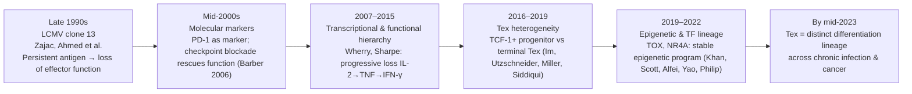
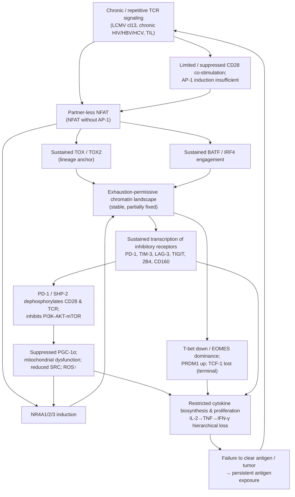
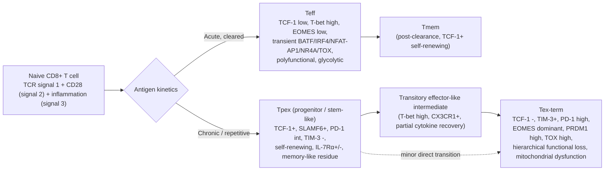

# T-Cell Exhaustion: Definition, Molecular Characteristics, and Comparative Analysis of Research Methodologies
# 1 Conceptual Foundations and Definition of T-Cell Exhaustion

Few concepts in contemporary cellular immunology have reshaped both basic and translational research as profoundly as T-cell exhaustion (Tex). Once considered a vague descriptor of immunological "failure" in the face of persistent pathogens, exhaustion is now understood as a defined, hierarchical, and epigenetically inscribed differentiation program that dictates the trajectory of antigen-specific CD8⁺ T cells (and to a lesser extent CD4⁺ T cells) during chronic infection and cancer. Before any meaningful molecular dissection or methodological comparison can be undertaken, it is essential to articulate what exhaustion *is*, where it *arises*, and how it *differs* from related dysfunctional states with which it has historically been confused. This chapter establishes that conceptual foundation: it traces the historical emergence of the exhaustion concept, synthesizes the prevailing definition and its hallmark features, examines the biological contexts that drive it, and delineates the conceptual boundaries that separate it from anergy, senescence, tolerance, and acute effector dysfunction. In doing so, it sets the framework upon which the molecular characterization (Chapter 2), transcription factor hierarchy (Chapter 3), and methodological comparisons (Chapters 4–5) of the remainder of the report rest.

## 1.1 Historical Emergence and Evolution of the Exhaustion Concept

The term "exhaustion" entered the immunological lexicon in the late 1990s, when antigen-specific CD8⁺ T cells were observed to undergo functional silencing—rather than the expected clonal expansion and memory formation—in mice persistently infected with lymphocytic choriomeningitis virus (LCMV). In the seminal work of Zajac, Ahmed, and colleagues, comparison of mice infected with the acutely cleared LCMV Armstrong strain versus the persistence-establishing clone 13 strain revealed that virus-specific CD8⁺ T cells in the chronic setting progressively lost their ability to produce IFN-γ, TNF, and IL-2, to mediate cytotoxicity, and to proliferate, despite remaining physically present and tetramer-detectable. This established the cardinal observation that distinguishes exhaustion from deletion: exhausted cells *persist* in a dysfunctional rather than absent state.

Over the subsequent two decades the concept was progressively refined along several conceptual axes. First, exhaustion was shown to be **hierarchical**: cytokine polyfunctionality is lost in a stereotyped sequence, with IL-2 production disappearing first, followed by TNF, and finally IFN-γ and cytotoxic capacity, indicating that exhaustion is a continuum rather than a binary on/off state. Second, exhaustion was recognized as **heterogeneous**: rather than a uniform population, the exhausted compartment contains a TCF-1⁺ "progenitor" or "stem-like" subset capable of self-renewal and of giving rise to a more differentiated, terminally exhausted TIM-3⁺ subset, a hierarchy validated in LCMV chronic infection and subsequently in tumor-infiltrating lymphocytes (a framework formalized in studies by Im, Wherry, Schietinger, Speiser, and others). Third, exhaustion was extended **beyond LCMV**: analogous antigen-specific T-cell dysfunction was documented in human chronic infections by HIV, hepatitis B virus (HBV), and hepatitis C virus (HCV), and in CD8⁺ tumor-infiltrating lymphocytes (TILs) across diverse murine and human cancers. Fourth, exhaustion was recognized as **epigenetically stable**: ATAC-seq and DNA-methylation studies (e.g., Pauken et al., Sen et al., Philip et al., Yates et al.) demonstrated that exhausted T cells acquire a distinct chromatin landscape that is largely retained even after antigen withdrawal or checkpoint blockade, justifying the conceptual reframing of Tex from a transient functional defect to a **bona fide differentiation lineage** with its own developmental logic.

Therapeutically, the discovery that the inhibitory receptor PD-1 marks exhausted cells and that PD-1/PD-L1 blockade can partially restore their function (Barber et al., 2006, in LCMV; subsequent translation into anti-PD-1/PD-L1 cancer immunotherapy) transformed exhaustion from a phenomenological curiosity into a central pillar of immuno-oncology. By the early 2020s, the field had consolidated around the view that exhaustion is a defined, druggable, and lineage-committed state—a conceptual evolution summarized in Figure 1.1.

*Figure 1.1 — Conceptual evolution of T-cell exhaustion from a phenomenological observation in LCMV into a defined, epigenetically inscribed differentiation lineage.*

The key insight from this historical trajectory is that **exhaustion is best understood not as a degree of "tiredness" but as the outcome of a developmental program triggered by sustained TCR signaling**, a reframing that directly motivates the molecular and transcription factor analyses in Chapters 2 and 3.

## 1.2 Prevailing Definition and Core Features of T-Cell Exhaustion

The contemporary consensus, as articulated across foundational reviews and primary literature published prior to July 2023 (e.g., Wherry & Kurachi 2015; McLane, Abdel-Hakeem & Wherry 2019; Chen & Mellman; Schietinger & Greenberg; Philip & Schietinger 2022), defines **T-cell exhaustion as a distinct, hierarchical, and epigenetically stabilized differentiation state of antigen-experienced T cells that arises in response to chronic or repetitive TCR stimulation and is characterized by the progressive and partially reversible loss of effector function, sustained co-expression of multiple inhibitory receptors, a unique transcriptional and epigenetic program, altered metabolism, and impaired memory potential**. Operationally, immunologists identify exhausted T cells by the convergence of four hallmark feature classes, summarized in Table 1.1.

| Hallmark class | Operational manifestation in Tex |
|---|---|
| **Progressive effector dysfunction** | Hierarchical loss of polyfunctionality: IL-2 lost first, then TNF, then IFN-γ; impaired cytotoxicity, degranulation (CD107a), and proliferative response to cognate antigen |
| **Sustained, co-expressed inhibitory receptors** | Persistent and combinatorial expression of PD-1, TIM-3, LAG-3, TIGIT, CTLA-4, 2B4/CD244, CD160; the *number* and *intensity* of co-expressed receptors track with severity of exhaustion |
| **Distinct transcriptional/epigenetic program** | Engagement of an exhaustion-specifying TF circuit (TOX, NR4A1–3, NFAT-without-AP-1, BATF, EOMES, BLIMP-1/PRDM1) and a unique chromatin landscape stable to antigen withdrawal or checkpoint blockade |
| **Altered metabolism and impaired memory potential** | Mitochondrial depolarization, reduced spare respiratory capacity, dysregulated glycolysis; failure to form long-lived, IL-7Rα⁺ central-memory T cells after antigen clearance |

*Table 1.1 — The four operational hallmarks used to define an exhausted T cell. The convergence of all four—rather than any single feature—justifies the designation "Tex." These four dimensions are dissected mechanistically in Chapter 2.*

Three conceptual refinements deserve emphasis. **First, exhaustion is hierarchical and developmental**, not uniform: within an antigen-specific Tex compartment, a small TCF-1⁺/SLAMF6⁺/PD-1^int progenitor (Tpex, also called "stem-like") subset sustains the pool via self-renewal and gives rise to a much larger TIM-3⁺/TCF-1⁻ terminally differentiated (Tex-term) subset, with the progenitor compartment serving as the proliferative reservoir that responds to PD-1/PD-L1 blockade. This hierarchy, formalized in Chapter 3, is now considered intrinsic to the definition. **Second, exhaustion is epigenetically inscribed**: studies of accessible chromatin and DNA methylation (Pauken, Sen, Philip, Yates, Ghoneim) demonstrated that Tex acquires a chromatin state that is largely conserved after PD-1 blockade, after antigen removal by adoptive transfer to naive hosts, or in patient samples post-immunotherapy—implying that checkpoint blockade reinvigorates effector function without erasing the underlying exhausted identity. **Third, exhaustion is partially but incompletely reversible**: blockade of inhibitory receptors or genetic ablation of key TFs such as TOX can restore short-term function or alter trajectory, but the cells generally do not revert to canonical memory.

The cumulative implication is that Tex constitutes a **stable lineage with its own developmental logic**, distinct from a transiently silenced effector or memory cell. This lineage view is the conceptual prerequisite for the molecular (Chapter 2) and transcription factor (Chapter 3) dissections that follow.

## 1.3 Biological Contexts Driving Exhaustion

Exhaustion is not a stochastic outcome but a stereotyped response to a defined set of microenvironmental cues. Across the contexts in which it has been characterized, three converging conditions are required: (i) **persistent or repetitive antigen** that sustains TCR signaling beyond the duration of an acute response; (ii) **a permissive inflammatory and suppressive milieu** that limits productive co-stimulation and amplifies inhibitory signals; and (iii) **chronic metabolic and physical stress**, including hypoxia, nutrient competition, and exposure to immunosuppressive metabolites. The principal physiological and pathological settings in which these conditions converge are summarized in Table 1.2.

| Context | Key driving features | Representative model / setting |
|---|---|---|
| Chronic viral infection (animal models) | Non-cleared viral antigen; persistent type-I IFN and IL-10; sustained TCR signaling | LCMV clone 13 in C57BL/6 mice |
| Chronic viral infection (human) | Long-term antigen persistence; chronic inflammation; PD-1/TIM-3 co-expression on specific CD8⁺ T cells | HIV, HBV, HCV |
| Solid-tumor microenvironment | Persistent tumor antigens; hypoxia; lactate accumulation; nutrient (glucose, glutamine, arginine) competition; TGF-β; Treg/MDSC suppression | Murine MC38, B16, KP lung adenocarcinoma; human melanoma, NSCLC, HCC TILs |
| Adoptive cell therapy and CAR-T | Tonic CAR signaling; repetitive antigen encounter in vivo; suboptimal co-stimulation domains | CD19-CAR and GD2-CAR T cells |
| Allogeneic / transplant settings | Sustained alloantigen exposure | Chronic GVHD and graft rejection contexts |

*Table 1.2 — Principal biological scenarios in which exhaustion has been characterized and the key signals that drive it. Antigen persistence is necessary but not sufficient; the combination of TCR signaling with inhibitory and metabolic stress signals shapes the depth and stability of the exhausted phenotype.*

Within these contexts, the **strength and duration of TCR signaling** are the dominant proximal drivers: sustained calcium-NFAT signaling in the absence of robust AP-1 (Fos/Jun) partnering generates an unbalanced "partner-less NFAT" program that activates exhaustion-specifying TFs such as NR4A1–3 and TOX—a mechanism examined in detail in Chapters 2 and 3. Layered onto this signal, **inhibitory cytokines (IL-10, TGF-β), suppressive cells (Tregs, MDSCs, tumor-associated macrophages), and a hostile metabolic milieu (hypoxia, lactate, low glucose, ROS)** reinforce the exhausted program and prevent recovery of effector function. In the tumor microenvironment specifically, **mitochondrial dysfunction and metabolic insufficiency** are thought to act as early and self-reinforcing drivers of exhaustion (Scharping, Bengsch, Patsoukis), coupling environmental stress to the intrinsic transcriptional program.

Biologically, exhaustion can be conceptualized as an **adaptive yet ultimately maladaptive response**. It is adaptive in that limiting effector activity in the face of non-clearable antigen prevents catastrophic immunopathology and preserves a residual reservoir of antigen-specific cells via the Tpex compartment. It is maladaptive in that, in contexts where pathogen or tumor clearance would benefit the host, the same restraint cripples protective immunity. This dual nature explains both why exhaustion evolved and why it is now a primary therapeutic target.

## 1.4 Differentiation from Related Dysfunctional States

Because "non-responsive" T cells can arise from several mechanistically distinct programs, distinguishing exhaustion from anergy, senescence, tolerance, and acute effector dysfunction is essential for both conceptual clarity and experimental design. These states differ in their inducing conditions, antigen-experience status, molecular signatures, functional consequences, and—critically for therapy—their reversibility. Table 1.3 synthesizes the prevailing distinctions.

| Feature | Exhaustion (Tex) | Anergy | Senescence | Peripheral tolerance | Acute effector dysfunction |
|---|---|---|---|---|---|
| **Inducing condition** | Chronic / repetitive TCR signaling with persistent antigen (chronic infection, tumor) | TCR engagement *without* co-stimulation (signal 1 without signal 2), typically in naive cells | Repeated proliferation, telomere erosion, replicative or stress-induced aging | Self-antigen recognition in tolerogenic context; often via regulatory T cells, anergy, or deletion | Acute inflammatory or suppressive cues (e.g., transient TGF-β, hypoxia) during a productive response |
| **Antigen-experience state** | Activated, antigen-experienced; persistent | Often newly stimulated naive cells | Highly differentiated, often KLRG1⁺/CD57⁺ (human), CD28⁻ | Naive or peripheral self-reactive | Activated effector cells |
| **Key molecular hallmarks** | TOX-driven program; sustained PD-1/TIM-3/LAG-3 co-expression; partner-less NFAT; NR4A engagement; distinct chromatin landscape | EGR2/EGR3, GRAIL, Cbl-b upregulation; calcium-NFAT signaling without IL-2 production | Telomere shortening; CD28 loss; CD57/KLRG1 gain; SASP secretion; p16^INK4a/p21 cell-cycle arrest | Lineage-specific (e.g., FOXP3⁺ Treg-mediated) suppression; Bim-driven deletion; anergy-like programs | Transient downregulation of effector cytokines; reversible upon cue removal |
| **Proliferative capacity** | Limited; sustained mainly by TCF-1⁺ progenitor subset | Largely non-proliferative to cognate antigen | Permanently arrested; replicatively incompetent | Variable; often deleted or arrested | Preserved or rapidly recoverable |
| **Effector function** | Hierarchical, progressive loss (IL-2 → TNF → IFN-γ); retained low-level cytotoxicity in some subsets | Profound IL-2 production defect; failure to clonally expand | Loss of proliferation but may retain or even gain inflammatory cytokine output (SASP) | Functional silencing or deletion specific to self-antigen | Transient functional suppression |
| **Reversibility** | Partial: checkpoint blockade or TF perturbation can reinvigorate function; epigenetic program largely stable | Reversible by exogenous IL-2 or removal of inhibitory signaling | Irreversible; terminal | Largely fixed in the steady state | Fully reversible upon resolution of acute stress |
| **Epigenetic status** | Distinct, stable chromatin/methylation landscape | Less extensively reprogrammed; more plastic | Senescence-associated heterochromatic foci; stable | State-dependent | Minimal stable reprogramming |

*Table 1.3 — Conceptual delineation of exhaustion from related T-cell dysfunctional states. The defining feature of Tex is the combination of chronic antigen experience, TOX-anchored transcriptional program, multi-receptor inhibition, hierarchical functional loss, and epigenetic stability—a combination not reproduced by any of the adjacent states.*

Three distinctions are particularly consequential for the chapters that follow. **First, exhaustion and anergy diverge mechanistically despite some shared use of NFAT-dependent programs**: anergy classically arises in naive cells receiving signal 1 without signal 2, is potently reversed by IL-2, and lacks the multi-receptor inhibitory signature and TOX-driven chromatin remodeling that define Tex. **Second, exhaustion and senescence differ both proliferatively and inflammatorily**: senescent cells are terminally arrested and often retain or amplify inflammatory cytokine secretion via the senescence-associated secretory phenotype (SASP), whereas exhausted cells lose cytokine output progressively but retain (in the Tpex compartment) the capacity for renewed proliferation. **Third, exhaustion is not equivalent to acute effector dysfunction**: a momentarily suppressed effector cell that recovers function upon cytokine restoration or microenvironmental relief is not exhausted; the diagnostic value of "Tex" lies in the conjunction of chronicity, multi-receptor co-expression, TF program engagement, and epigenetic stability.

This delineation is more than a taxonomic exercise. It directly shapes the experimental criteria used to identify Tex in vivo (Chapter 4) and, crucially, dictates what an *in vitro* induction system must reproduce to legitimately be called an exhaustion model. As the analysis in Chapter 5 will argue, an in vitro protocol that yields cells with diminished cytokine output but lacks sustained multi-receptor co-expression, TOX-anchored chromatin remodeling, and a progenitor–terminal hierarchy may better resemble anergy or transient dysfunction than authentic exhaustion. With the conceptual scaffolding now in place—what exhaustion is, where it arises, and how it differs from its conceptual neighbors—the next chapter turns to the molecular substrate of this state, examining the four dimensions (transcription factors, inhibitory receptors, effector functions, and metabolism) through which Tex identity is mechanistically expressed.

# 2 Multidimensional Molecular Characteristics of Exhausted T Cells

Having established in Chapter 1 that T-cell exhaustion is a distinct, hierarchical, and epigenetically inscribed differentiation lineage rather than a transient functional defect, the analysis now turns to the molecular substrate that gives this lineage its identity. Operationally, Tex is recognized by the convergence of four hallmark feature classes—transcription factor (TF) circuitry, sustained inhibitory receptor co-expression, hierarchical effector dysfunction, and metabolic/mitochondrial rewiring—but these four dimensions are not parallel descriptors; they are causally interlinked nodes of a single self-reinforcing program. This chapter dissects each dimension in turn, specifying for every node the key molecules involved, the direction and magnitude of change relative to effector or memory T cells, and the mechanistic contribution to initiation, propagation, and stabilization of exhaustion. The chapter closes by integrating these four dimensions into a coherent molecular portrait that serves both as the foundation for the subset-level comparisons in Chapter 3 and as the benchmark against which the fidelity of in vivo and in vitro experimental systems (Chapters 4–5) must be judged.

## 2.1 Transcription Factor Circuitry Specifying the Exhaustion Program

The transcriptional program that distinguishes Tex from acutely activated effector (Teff) and memory (Tmem) cells is not specified by the gain of a single "master" factor but by a quantitative imbalance within a network that all three lineages share. The dominant proximal trigger is **sustained, calcium-dependent NFAT signaling decoupled from AP-1 (Fos/Jun) co-activation**. In a productive effector response, robust TCR engagement together with CD28 co-stimulation drives parallel nuclear translocation of NFAT and induction of AP-1 components, and NFAT–AP-1 heterodimers at composite sites activate canonical effector genes (IL-2, IFNG). When TCR signaling is chronic and co-stimulation is curtailed—as in LCMV clone 13, persistent viral infection in humans, and the tumor microenvironment—AP-1 induction fails to keep pace, and NFAT acts in the relative absence of its AP-1 partner. This "partner-less" NFAT engages an alternative set of genomic targets, including the loci of inhibitory receptors and of the NR4A and TOX families, thereby converting a default activation circuit into an exhaustion-specifying one. Engineered NFAT mutants that cannot bind AP-1 are sufficient to drive an exhaustion-like program even in the absence of chronic antigen, providing causal support for partner-less NFAT as a proximal trigger of the Tex transcriptional state (Martinez, Hogan, Rao and colleagues).

Downstream of partner-less NFAT, two TF families function as the **lineage-specifying anchors of exhaustion**:

- **TOX and TOX2 (HMG-box family).** TOX is sustainedly upregulated specifically in Tex (and not in Teff or Tmem) and acts as a critical and largely non-redundant orchestrator of the exhausted chromatin landscape. Genetic ablation studies (Khan et al., 2019; Scott et al., 2019; Alfei et al., 2019; Yao et al., 2019; Seo et al.) demonstrated that loss of TOX prevents Tex differentiation in LCMV clone 13 and in tumors, depriving cells of stable PD-1 expression, blunting upregulation of TIM-3 and LAG-3, redirecting differentiation toward a more effector-like transcriptional output, and—critically—failing to establish the epigenetic landscape that fixes the Tex state. Ectopic TOX is conversely sufficient to install components of the exhaustion program. TOX is therefore considered the **founding lineage factor** of Tex: necessary for the developmental commitment, sufficient to install much of its chromatin signature, and responsible for the epigenetic stability that renders Tex incompletely reversible by checkpoint blockade.
- **NR4A1, NR4A2, NR4A3 (orphan nuclear receptors).** Like TOX, the NR4A family is induced downstream of partner-less NFAT and is sustainedly elevated in Tex. Triple-deficient NR4A1/2/3 CD8⁺ T cells exhibit markedly reduced exhaustion features, decreased inhibitory receptor expression, and enhanced anti-tumor function (Chen, Ji et al., 2019; Liu et al., 2019), demonstrating that the NR4A factors operate as **effector arms of the NFAT-driven dysfunctional program**, in part by competing with AP-1 binding at effector gene loci and by directly activating inhibitory receptor and exhaustion-associated genes.

These lineage anchors operate in the context of a broader TF imbalance shared with effector differentiation but tilted toward dysfunction in Tex:

- **BATF and IRF4.** Both are induced by TCR signaling and operate at AICE (AP-1–IRF composite) elements. In acute effector responses, transient BATF/IRF4 activity supports productive differentiation; under chronic TCR signaling, **sustained** BATF and IRF4 expression cooperates with NFAT, NR4A, and TOX to reinforce the exhaustion gene program. BATF in particular has been shown both to be required for initial expansion of antigen-specific cells and, when chronically expressed, to contribute to the exhaustion-specifying chromatin state, while genetic manipulation (e.g., enforced BATF expression in CAR-T) can paradoxically counteract terminal exhaustion in specific contexts, illustrating the dose- and context-dependence of these "shared" factors.
- **T-bet (TBX21) and EOMES.** These two T-box factors are co-expressed in CD8⁺ effector and memory cells, where T-bet typically dominates and drives the canonical Th1/Tc1 effector program (IFN-γ, granzymes), while EOMES supports memory features and IL-15-dependent persistence. In Tex, this balance inverts: **T-bet expression declines while EOMES remains high or becomes dominant**, particularly in terminally exhausted cells. The shift to an EOMES-high/T-bet-low state correlates with sustained PD-1 expression, loss of polyfunctionality, and progression from progenitor to terminal Tex, making the T-bet:EOMES ratio a useful continuous index of exhaustion depth (Paley, Wherry and colleagues).
- **BLIMP-1 (PRDM1).** PRDM1 is upregulated in chronically stimulated CD8⁺ T cells and is associated with the terminal Tex state, where it represses memory and progenitor programs (including *Tcf7*), supports inhibitory receptor expression, and consolidates terminal differentiation. Although BLIMP-1 also has roles in normal effector differentiation, its sustained elevated activity in chronic settings reinforces the terminal exhaustion phenotype.
- **TCF-1 (TCF7).** Although TCF-1 is not an exhaustion-specifying factor per se, its differential expression *within* the Tex compartment is foundational to the developmental hierarchy described in Chapter 3: TCF-1 is retained in the progenitor/stem-like Tex subset and is silenced in terminally exhausted cells, with TCF-1 loss being both a marker and a mechanistic driver of the transition to terminal differentiation.

The net result is that exhaustion is specified not by a unique on/off TF switch but by a **quantitative re-weighting of a shared network**: TOX and NR4A are sustainedly upregulated, partner-less NFAT replaces NFAT–AP-1 cooperation, BATF and IRF4 are chronically engaged, EOMES dominates over T-bet, and PRDM1 drives terminal commitment while TCF-1 is progressively lost. Critically, the TOX-anchored arm of this circuit does not merely regulate transcription transiently—it **imprints a stable chromatin landscape** (as introduced in Chapter 1, in studies by Pauken, Sen, Philip, Yates, Ghoneim) that persists after antigen withdrawal and only partially relaxes during checkpoint blockade, providing the molecular explanation for the epigenetic fixity of the Tex lineage.

## 2.2 Inhibitory Receptor Landscape and Co-Expression Patterns

Sustained surface display of multiple inhibitory (co-inhibitory) receptors is the most readily measurable and, historically, the earliest-recognized molecular feature of exhaustion. Crucially, the diagnostic signal is not the presence of any individual receptor—each of which is transiently induced on normally activated effector cells—but the **combinatorial and sustained co-expression** of several, accompanied by progressive increases in both the breadth (number of receptors) and intensity (per-cell expression) of inhibition. Table 2.1 summarizes the principal inhibitory receptors that define the Tex surface signature, together with their ligands, signaling motifs, and mechanistic effects.

| Receptor | Principal ligand(s) | Cytoplasmic motif / signaling mechanism | Mechanistic effect on the T cell | Behavior in Tex vs Teff |
|---|---|---|---|---|
| **PD-1** (PDCD1) | PD-L1, PD-L2 | ITIM + ITSM; recruits SHP-2 (and SHP-1) | Dephosphorylates CD28 (preferentially) and proximal TCR signaling; suppresses PI3K-AKT and Ras-ERK; restrains mTOR; inhibits cell-cycle and effector cytokine programs | Transient on activated effectors; **sustainedly high** and a defining marker of Tex; intensity tracks with progression |
| **TIM-3** (HAVCR2) | Galectin-9, Ceacam-1, phosphatidylserine, HMGB1 | Lacks ITIM/ITSM; tyrosines in cytoplasmic tail interact with Bat3 / Fyn; net inhibitory when Bat3 is displaced | Disrupts TCR microcluster formation; promotes terminal dysfunction; marks the most severely exhausted cells | Largely absent on healthy effectors; **upregulated late** in exhaustion and marks the terminal (Tex-term) subset together with PD-1 |
| **LAG-3** (CD223) | MHC class II (high affinity), FGL1, galectin-3 | KIEELE motif and FxxL; not a classical ITIM | Competes with CD4 for MHC II; inhibits TCR signaling and proliferation; synergizes with PD-1 | Co-expressed with PD-1 in Tex; combinatorial PD-1+LAG-3 blockade synergistic |
| **TIGIT** | CD155 (PVR), CD112 | ITT-like motif | Outcompetes the activating receptor CD226/DNAM-1 for CD155; cell-intrinsic inhibitory signaling; modulates DC IL-10 production | Elevated on Tex and Tregs in chronic infection and tumors |
| **CTLA-4** | CD80, CD86 (higher affinity than CD28) | Constitutive trafficking; trans-endocytosis | Sequesters and removes CD80/CD86 from APCs; deprives the T cell of CD28 co-stimulation | Upregulated in chronic stimulation contexts; therapeutically targetable |
| **2B4 / CD244** | CD48 | ITSMs; recruits SAP, EAT-2, or SHP-1/2 depending on context | Bivalent: stimulatory in SAP-replete cells, inhibitory in SAP-deficient or chronically stimulated cells | Sustained expression in chronic LCMV and HIV-specific CD8⁺ T cells |
| **CD160** | HVEM | GPI-anchored; signals through HVEM-mediated pathways | Inhibits CD8⁺ T-cell cytokine production upon HVEM engagement | Co-expressed with PD-1 and 2B4 in exhausted antiviral CD8⁺ T cells |
| **BTLA** | HVEM | ITIM/ITSM; recruits SHP-1/2 | Attenuates TCR signaling | Variably elevated on chronically stimulated CD8⁺ T cells |

*Table 2.1 — The principal inhibitory receptors expressed on exhausted T cells, their ligand and signaling characteristics, and their behavior relative to acutely activated effectors. No single receptor is diagnostic of Tex; the multi-receptor, sustained co-expression pattern is.*

Two interpretive points are essential. **First, breadth and intensity of co-expression are a quantitative readout of exhaustion severity.** In LCMV clone 13 and in human chronic infections and tumors, cells co-expressing PD-1, TIM-3, LAG-3, 2B4, and CD160 are functionally most compromised, while cells expressing PD-1 alone or PD-1 with one or two additional receptors retain greater polyfunctionality. This dose-response relationship between receptor breadth and dysfunction underpins the operational use of multi-parameter flow cytometry as the standard identification strategy for Tex in both murine and human studies. **Second, the Tex surface signature aligns with the progenitor–terminal hierarchy.** Progenitor/stem-like Tpex cells typically express PD-1 at intermediate levels and are TIM-3⁻/SLAMF6⁺/TCF-1⁺, whereas terminally exhausted cells are PD-1^high TIM-3⁺ and acquire additional inhibitory receptors—a pattern that anchors the subset definitions used in Chapter 3.

Mechanistically, these receptors do not act merely as biomarkers. PD-1 in particular, by recruiting SHP-2 to its ITSM and dephosphorylating CD28 and proximal TCR components, **restrains the PI3K–AKT–mTOR axis** that drives effector glycolysis and mitochondrial biogenesis, thereby coupling inhibitory receptor signaling directly to the metabolic phenotype examined in Section 2.4. Inhibitory receptor signaling also reinforces the transcriptional program of Section 2.1 by limiting AP-1 activity and supporting NFAT acting without its AP-1 partner—closing one of the feedback loops that stabilize the exhausted state.

## 2.3 Progressive and Hierarchical Loss of Effector Functions

Effector dysfunction is the phenotype that gave exhaustion its name. Three observations from Chapter 1 are operationally codified at the molecular level here: (i) loss is **hierarchical**, not uniform; (ii) loss is **progressive**, scaling with the duration and intensity of chronic TCR signaling; and (iii) loss is **partial**, with selective retention of certain functions—particularly low-level cytotoxicity—even in terminal subsets.

The canonical hierarchy of polyfunctionality loss, first systematically mapped in LCMV chronic infection (Wherry, Ahmed, Sharpe and colleagues) and corroborated in human chronic viral infections and tumor-infiltrating lymphocytes, follows a stereotyped sequence:

1. **IL-2 production is lost first**, often within the early phase of chronic stimulation. Because IL-2 supports clonal expansion and autocrine survival, its loss is a sensitive early biomarker of dysfunction and a major contributor to the failure of Tex to undergo sustained antigen-driven expansion.
2. **TNF production declines next**, marking an intermediate dysfunctional state.
3. **IFN-γ production and per-cell cytokine output decline last**, in the most severely exhausted cells. Although IFN-γ may still be detectable in terminal Tex on a per-cell basis, the magnitude of production and the fraction of antigen-specific cells producing it are markedly reduced compared with effector cells responding to acute antigen.
4. **Cytotoxic capacity is impaired but heterogeneously preserved.** Granzyme B and perforin expression and antigen-driven degranulation (assessed by CD107a mobilization) are reduced overall, but a subset of terminally exhausted cells retains low-level granzyme expression and target-killing capacity—a feature that distinguishes Tex from fully silenced or anergic populations.
5. **Proliferative capacity is severely compromised** in response to cognate antigen and homeostatic cytokines, with sustained renewal restricted largely to the Tpex subset that retains TCF-1 (Chapter 3). Recall responses upon antigen re-encounter or transfer to naive hosts are correspondingly blunted.

Mechanistically, this hierarchical loss is the direct functional readout of the TF and receptor alterations described above. Partner-less NFAT and chronic BATF/IRF4 activity, together with sustained TOX and NR4A engagement, suppress AP-1-driven effector gene transcription—particularly at the *Il2* and *Tnf* loci—while permitting residual transcription at the *Ifng* and *Gzmb* loci that remain partially accessible. Concurrently, sustained PD-1/SHP-2 signaling dephosphorylates CD28 and proximal TCR components, restricting the PI3K–AKT–mTOR axis that supports both effector cytokine biosynthesis and proliferation. The metabolic insufficiency examined in the next section further constrains the ATP- and biosynthesis-intensive demands of cytokine production and cell-cycle progression, completing the mechanistic chain from molecular dysregulation to observable functional deficits.

The diagnostic implication is that **authentic exhaustion is identified by hierarchical, not absolute, functional loss accompanied by sustained multi-receptor inhibition and chromatin remodeling**. A cell that merely fails to produce cytokines transiently is acutely dysfunctional, not exhausted. This distinction will become central in Chapter 5, when evaluating whether in vitro–induced cells reproduce the hierarchy of loss or simply exhibit global cytokine suppression.

## 2.4 Metabolic and Mitochondrial Rewiring in Exhausted T Cells

The metabolic dimension was once treated as a downstream consequence of exhaustion but is now understood—largely through the work of Scharping, Bengsch, Patsoukis, Siska, Ho, and others—as **an early, self-reinforcing driver** of the exhausted state. The defining metabolic alterations of Tex are summarized in Table 2.2.

| Metabolic feature | Direction of change in Tex | Mechanistic contribution |
|---|---|---|
| **Mitochondrial mass** | Reduced | Limits oxidative capacity and biosynthetic precursor supply |
| **Mitochondrial membrane potential (ΔΨm)** | Depolarized in a substantial fraction of Tex | Drives ROS overproduction and impairs ATP synthesis |
| **Spare respiratory capacity (SRC)** | Markedly reduced | Removes the metabolic reserve required for sustained effector function |
| **Oxidative phosphorylation** | Impaired (reduced basal and maximal OCR) | Compromises ATP generation under chronic demand |
| **Glycolysis** | Dysregulated; often suppressed under sustained PD-1 signaling, despite hostile high-lactate milieu | Limits aerobic glycolysis required for effector cytokine production |
| **PGC-1α and mitochondrial biogenesis** | Suppressed | Establishes durable mitochondrial insufficiency |
| **Reactive oxygen species (ROS)** | Elevated | Damages mitochondria and DNA; promotes TF (e.g., NR4A) activity and exhaustion stabilization |
| **Lipid metabolism** | Dysregulated; accumulation of oxidized lipids and altered fatty acid oxidation | Compromises membrane integrity and metabolic flexibility |
| **Amino-acid availability/use** | Restricted (low glutamine, arginine, tryptophan in TME; competition with tumor) | Limits protein and nucleotide biosynthesis |

*Table 2.2 — Principal metabolic alterations characteristic of exhausted T cells. The dominant direction is loss/impairment, with selective rewiring (e.g., shifts in lipid handling) rather than wholesale metabolic activation.*

Mechanistically, several converging cues drive this metabolic phenotype:

- **PD-1 signaling restrains anabolic metabolism.** Through SHP-2-mediated dephosphorylation of CD28 and inhibition of the PI3K–AKT–mTOR axis, sustained PD-1 engagement suppresses glycolytic induction, mitochondrial biogenesis, and the anabolic programs required for effector cytokine production—directly coupling Section 2.2 to Section 2.4 (Patsoukis and colleagues).
- **Tumor microenvironmental stress amplifies mitochondrial dysfunction.** Hypoxia, lactate accumulation, low glucose, and competition with tumor cells for glutamine and other nutrients further compromise mitochondrial function and induce ROS. Scharping et al. demonstrated that, within the TME, **loss of mitochondrial mass and function precedes overt terminal exhaustion** and contributes causally to the acquisition of the Tex phenotype, with enforced PGC-1α expression partially rescuing both metabolic and functional deficits.
- **Persistent TCR signaling and chronic ROS feed back onto the TF circuit.** Sustained calcium-NFAT signaling and ROS-driven stress activate NR4A factors and contribute to the chromatin state that locks in the exhausted identity, providing a mechanism by which the metabolic environment becomes inscribed into the lineage program rather than acting merely as a transient stress.

The functional implication is that mitochondrial insufficiency restricts the very capacities (cytokine biosynthesis, proliferation, long-term persistence) that effector and memory T cells require, contributing both to the hierarchical functional loss of Section 2.3 and to the failure of Tex to form long-lived IL-7Rα⁺ central-memory progeny after antigen clearance. Critically, because mitochondrial reprogramming is **established early in chronic stimulation and self-reinforces through ROS, PGC-1α suppression, and PD-1 signaling**, metabolic rewiring satisfies the criteria for a driver rather than a consequence of exhaustion. This is mechanistically consequential for Chapters 4–5, because in vitro systems that lack the hypoxic, nutrient-depleted, and stromally complex microenvironment of an authentic tumor or chronic infection site cannot recapitulate this dimension by simple repetitive TCR stimulation alone.

## 2.5 Integration of the Four Molecular Dimensions into a Coherent Tex Identity

The four dimensions dissected above are not parallel descriptors of an exhausted cell but **causally interlocked nodes of a single self-reinforcing program**. Pulling them into a single mechanistic model clarifies how chronic antigen exposure converts an effector trajectory into a stable Tex lineage, distinguishes core lineage-defining features from contextual modulators, and establishes the benchmark against which experimental models must be evaluated.

Figure 2.1 summarizes the integrated logic of the Tex program.

*Figure 2.1 — Integrated molecular model of T-cell exhaustion. Chronic TCR signaling without adequate co-stimulation generates partner-less NFAT, which induces lineage-specifying factors (TOX, NR4A) and engages BATF/IRF4 to remodel chromatin. The resulting landscape sustains inhibitory receptor transcription and reshapes the T-box/PRDM1/TCF-1 balance. PD-1 signaling suppresses anabolic metabolism and mitochondrial biogenesis, which in turn restricts effector cytokine production and proliferation. Failed antigen clearance maintains chronic TCR signaling, closing the loop.*

Three integrative principles emerge from this model. **First, the Tex program is causally interlinked, not merely co-occurring.** Partner-less NFAT initiates the TF circuit (Section 2.1); the TF circuit, anchored by TOX, establishes a chromatin state permissive for sustained inhibitory receptor transcription (Section 2.2); inhibitory receptor signaling (notably PD-1) restrains the PI3K–AKT–mTOR axis and suppresses PGC-1α-driven mitochondrial biogenesis (Section 2.4); metabolic insufficiency caps the biosynthetic and energetic capacity required for effector cytokine production and proliferation (Section 2.3); and the resulting failure to clear antigen perpetuates the chronic TCR signaling that originally engaged partner-less NFAT—forming a closed feedback loop. ROS generated by mitochondrial dysfunction further reinforces NR4A activity and the exhausted chromatin state, providing an additional positive-feedback arc.

**Second, it is useful to distinguish core lineage-defining features from contextual modulators.** The **core** features—those that define Tex as a lineage and are observed across LCMV chronic infection, human chronic viral infection, and tumor TILs—comprise sustained partner-less NFAT signaling, TOX-anchored chromatin remodeling, NR4A engagement, multi-receptor inhibitory co-expression with PD-1 as the most consistent marker, hierarchical cytokine loss, and reduced mitochondrial reserve. The **contextual** features—those whose magnitude depends on the microenvironment—include the depth and dominance of EOMES/PRDM1, the severity of mitochondrial depolarization, the spectrum of inhibitory receptors expressed, and the degree of metabolic restriction imposed by hypoxia, lactate, and nutrient competition. A model system that reproduces the core features but lacks the contextual ones may capture exhaustion as a lineage while underrepresenting the depth of its tumor-specific manifestation; a system that reproduces only transient cytokine suppression without engaging the core circuit does not model exhaustion at all.

**Third, this integrated portrait sets the benchmark for the remainder of the report.** The subset-level analysis in Chapter 3 will use the same TF circuit (TCF-1, T-bet:EOMES, BATF, NFAT, PRDM1, NR4A, TOX) to differentiate Teff, Tpex, and Tex-term, showing that the progenitor–terminal hierarchy is itself encoded by graded shifts within the network described here. The methodological comparison in Chapter 4 and the critical evaluation in Chapter 5 will use the four-dimensional signature—TF circuit engagement, multi-receptor co-expression with progenitor–terminal architecture, hierarchical functional loss, and metabolic insufficiency with TME-driven mitochondrial dysfunction—as the fidelity criterion against which both direct ex vivo isolation and in vitro induction protocols are evaluated. With the molecular substrate now articulated as an integrated, self-reinforcing program rather than a list of markers, the analysis proceeds in Chapter 3 to resolve how this program is differentially deployed across the progenitor and terminal subsets that constitute the Tex compartment.

# 3 Differentiation Hierarchy and Comparative Transcription Factor Profiling Across Tex Subsets

The integrated molecular model assembled in Chapter 2 portrayed exhaustion as a single self-reinforcing program in which partner-less NFAT, TOX-anchored chromatin remodeling, sustained inhibitory receptor signaling, and metabolic insufficiency feed back upon one another to lock antigen-experienced T cells into a stable dysfunctional lineage. That program, however, is not deployed uniformly across the exhausted compartment. From the earliest single-cell transcriptomic and lineage-tracing studies of LCMV clone 13 and of tumor-infiltrating lymphocytes (TILs), it has been evident that the population identified as "exhausted" by bulk markers is in fact a developmental hierarchy in which a small TCF-1⁺ progenitor pool sustains a much larger TCF-1⁻ terminally differentiated progeny. Understanding exhaustion therefore requires resolving not only what distinguishes Tex as a lineage from canonical effector and memory differentiation, but also how the same TF network is quantitatively re-tuned across the progenitor and terminal stages within that lineage.

This chapter delivers that subset-level resolution. It first frames the developmental architecture of the Tex compartment in relation to the canonical effector trajectory (Section 3.1); it then provides the structured comparative transcription factor table that constitutes the chapter's core deliverable, profiling TCF-1, the T-bet:EOMES ratio, BATF, NFAT, PRDM1, NR4A1–3, and TOX across canonical effector T cells (Teff), progenitor/stem-like exhausted T cells (Tpex), and terminally exhausted T cells (Tex-term) (Section 3.2); it interprets the TF gradients mechanistically, linking them to lineage commitment, self-renewal, and terminal differentiation (Section 3.3); it examines how the TF-defined hierarchy dictates differential response to checkpoint blockade and shapes therapeutic strategy (Section 3.4); and it consolidates the analysis into a cellular-resolution benchmark against which the experimental systems of Chapters 4 and 5 will be evaluated (Section 3.5).

## 3.1 Architecture of the Tex Differentiation Hierarchy: From Effector Trajectory to Progenitor–Terminal Bifurcation

To compare TFs across exhaustion subsets, it is first necessary to specify the developmental relationships among the populations being compared and the reference state against which they are placed. In an acute infection that is rapidly cleared, antigen-specific CD8⁺ T cells follow a canonical *effector-to-memory* trajectory: naive cells receive TCR signal 1 together with robust CD28 co-stimulation (signal 2) and inflammatory signal 3, undergo massive clonal expansion as KLRG1⁺/IL-7Rα^low short-lived effector cells (SLECs) and IL-7Rα^high memory-precursor effector cells (MPECs), and—after antigen clearance—contract into a stable, self-renewing pool of TCF-1⁺ central-memory and effector-memory T cells capable of rapid recall responses. This effector trajectory provides the reference state for the comparative analysis below: Teff cells exemplify productive, balanced engagement of the shared TCR-driven TF network (NFAT–AP-1 cooperation, transient TOX, transient NR4A, T-bet dominance over EOMES, transient BATF/IRF4, transient PRDM1) coupled to acute metabolic activation.

Under chronic or repetitive antigen exposure—LCMV clone 13, persistent HIV/HBV/HCV in humans, and antigen-rich tumor microenvironments—this trajectory bifurcates. Rather than contracting into a stable memory pool, the antigen-specific CD8⁺ compartment is progressively channelled along a distinct developmental path that produces the Tex lineage. Within this lineage, two cardinal subsets and at least one intermediate population have been defined:

- **Progenitor/stem-like exhausted T cells (Tpex)** are a minor but functionally pivotal population identified by retention of TCF-1 (TCF7) together with SLAMF6 (Ly108) expression, intermediate PD-1, and the absence of TIM-3. They display memory-like transcriptional features (residual *Tcf7*, *Bcl6*, *Id3*, *Il7r* programs), retain proliferative capacity in response to cognate antigen, and—uniquely within the Tex compartment—undergo self-renewal while giving rise to differentiated progeny. Tpex are preferentially resident in lymphoid niches (e.g., splenic white pulp in LCMV; tertiary lymphoid structures and lymph nodes in tumor contexts) and constitute the proliferative reservoir whose expansion accounts for the antigen-specific burst observed after PD-1/PD-L1 blockade.

- **Terminally exhausted T cells (Tex-term)** are the dominant, more differentiated population identified by loss of TCF-1, gain of TIM-3 (and often additional inhibitory receptors such as LAG-3, TIGIT, 2B4, CD160), high and sustained PD-1, EOMES dominance over T-bet, elevated PRDM1, and the most severe hierarchical loss of polyfunctionality and proliferative capacity. They occupy effector sites (infected tissues, tumor parenchyma) and represent the non-renewing, differentiated progeny of Tpex.

- **Transitional / intermediate populations** have been resolved by single-cell RNA-seq and TCR-tracing studies of LCMV clone 13 and of TILs, including a "transitory effector-like" intermediate (variously described as T-bet^high, CX3CR1⁺, Ly6C⁺ in murine LCMV) that lies developmentally between Tpex and the most terminal Tex-term cells and that transiently regains effector cytokine output (Hudson, Wherry; Beltra, Wherry; Zander, Cui; Miller, Sade-Feldman). For the purposes of this chapter's comparative analysis, the focus is on the two endpoint subsets (Tpex and Tex-term) that anchor the hierarchy, with the intermediate noted where it materially influences interpretation.

Two clarifications regarding the comparative framework are warranted. First, **Teff is not a member of the exhaustion lineage** but the comparative reference state: it represents what the same shared TF network produces under productive, acute conditions, and its profile is what the Tex program quantitatively re-weights rather than wholly replaces. Second, **the Tpex–Tex-term relationship is hierarchical and largely unidirectional**: in vivo fate-mapping and adoptive transfer studies (Im, Ahmed and colleagues; Utzschneider, Held; Miller, Anderson; Siddiqui, Held) have shown that TCF-1⁺ Tpex give rise to TCF-1⁻ Tex-term progeny but that the reverse transition does not appreciably occur, defining a developmental polarity that, as argued in Section 3.3, is anchored in TOX-driven epigenetic fixation.

Figure 3.1 schematizes this architecture and situates the three subsets compared in Section 3.2.

*Figure 3.1 — Developmental architecture of the exhaustion hierarchy. Naive CD8⁺ T cells branch at the level of antigen kinetics: acute, cleared infection yields a canonical effector-to-memory trajectory (Teff → Tmem), whereas chronic/repetitive antigen exposure generates the Tex lineage, in which a self-renewing TCF-1⁺ Tpex reservoir gives rise—directly or via a transitory effector-like intermediate—to TCF-1⁻ Tex-term progeny. Teff serves as the comparative reference state for Section 3.2; Tpex and Tex-term constitute the two cardinal subsets of the Tex lineage.*

With this architecture specified, the comparative TF profile can be presented at the level needed for both mechanistic interpretation (Section 3.3) and benchmarking of experimental models (Section 3.5).

## 3.2 Comparative Transcription Factor Profiling Across Teff, Tpex, and Tex-term

The central deliverable of this chapter is a structured comparative profile of the TF network across Teff (reference), Tpex (progenitor), and Tex-term (terminal). The factors selected—TCF-1, the T-bet:EOMES ratio, BATF, NFAT (with explicit annotation of AP-1 partnering versus partner-less homodimer activity), PRDM1/BLIMP-1, NR4A1–3, and TOX—are precisely those identified in Chapter 2 as the lineage-relevant nodes of the shared network. Each entry below specifies the qualitative level (High / Intermediate / Low / Unclear) supplemented, where mechanistically informative, by a more specific molecular descriptor.

| Transcription factor | Teff (acute effector, reference) | Tpex (progenitor / stem-like) | Tex-term (terminally exhausted) |
|---|---|---|---|
| **TCF-1 (TCF7)** | Low (downregulated upon effector commitment; retained mainly in MPEC / future Tmem precursors) | **High** — retained as the lineage anchor of self-renewal, quiescence, and memory-like residue; required to sustain the Tex progenitor pool | **Low / absent** — *Tcf7* silenced; loss is both a defining marker and a mechanistic driver of terminal commitment |
| **T-bet : EOMES ratio** | **High** — T-bet dominant; drives canonical Tc1 effector genes (IFN-γ, granzymes, perforin); EOMES present but subordinate | Intermediate / balanced — T-bet retained at intermediate levels supporting limited effector capacity; EOMES present; ratio favors T-bet relative to Tex-term | **Inverted (Low ratio)** — T-bet downregulated, EOMES dominant; EOMES dominance correlates with sustained PD-1, multi-receptor co-expression, and terminal differentiation |
| **BATF** | Transient High — induced by TCR signaling, cooperates with IRF4 at AICE elements and with NFAT–AP-1 at effector loci; resolves with antigen clearance | High but contextually modulated — sustained engagement contributes to chromatin opening at exhaustion loci while supporting progenitor maintenance; necessary for initial expansion of antigen-specific cells under chronic stimulation | **Sustained High** — chronic BATF/IRF4 activity at AICE elements reinforces the exhaustion-specifying chromatin state alongside TOX and NR4A |
| **NFAT (AP-1 partnering vs partner-less)** | High activity, **predominantly NFAT–AP-1 cooperative binding** at composite sites driving *Il2*, *Ifng*, and other effector loci | High nuclear activity with a **mixed mode**: partial AP-1 cooperation supporting residual effector capacity, combined with emerging partner-less activity that initiates the exhaustion program | High nuclear activity in a **predominantly partner-less mode** — NFAT homodimer-like engagement of exhaustion-specifying targets (inhibitory receptors, NR4A, TOX) in the relative absence of AP-1 co-activation |
| **PRDM1 / BLIMP-1** | Intermediate–High in SLEC-biased effectors (supports terminal effector differentiation, represses *Tcf7* and memory programs); lower in MPEC | **Low** — repression of PRDM1 permits *Tcf7* retention and the memory-like, self-renewing program | **High** — represses *Tcf7* and memory loci, supports inhibitory receptor expression, consolidates terminal exhausted commitment |
| **NR4A1 / NR4A2 / NR4A3** | Transient induction during acute activation; resolves as effector response matures | Intermediate — induced but not at the sustained, high levels of Tex-term; contributes to early commitment to the Tex lineage | **Sustained High** — durable induction downstream of partner-less NFAT; competes with AP-1 at effector loci, directly activates inhibitory receptor and exhaustion-associated genes, reinforces terminal dysfunction |
| **TOX (and TOX2)** | Transient Low–Intermediate during acute activation; not sustainedly upregulated and does not establish an exhaustion-permissive chromatin state | **Intermediate–High** — induced and required for commitment to the Tex lineage, including establishment and maintenance of the Tpex pool; chromatin remodeling underway but not fully consolidated | **Sustained High** — lineage anchor of terminal exhaustion; orchestrates the stable exhaustion-permissive chromatin landscape; necessary for sustained PD-1, TIM-3, LAG-3 expression and for epigenetic fixity of the Tex state |

*Table 3.1 — Comparative TF profile across Teff, Tpex, and Tex-term. Where literature support is robust and convergent, entries are annotated as High / Intermediate / Low; "Unclear" is reserved for entries where primary data are genuinely inconsistent. Mechanistically specific descriptors are provided where the qualitative level is insufficient to convey the relevant biology (notably for NFAT, whose AP-1 partnering status is the operationally critical feature, and for TCF-1, whose retention is the defining anchor of the Tpex state). Acronyms: AICE = AP-1–IRF composite element; MPEC = memory-precursor effector cell; SLEC = short-lived effector cell.*

Several gradients in Table 3.1 deserve narrative emphasis because they most sharply demarcate the three subsets and because they will reappear as benchmarks in Sections 3.4 and 3.5.

**TCF-1 is the single most discriminating factor across the hierarchy.** It is low in Teff (where its loss permits full effector commitment), high in Tpex (where its retention sustains self-renewal and the memory-like transcriptional residue), and absent in Tex-term (where its silencing is mechanistically required for terminal differentiation). Operationally, TCF-1 staining alone—combined with PD-1 and TIM-3—provides a robust three-marker resolution of the entire hierarchy in both murine and human samples (Im, Ahmed; Utzschneider, Held; Miller, Anderson; Siddiqui, Held).

**The T-bet:EOMES ratio undergoes a stereotyped inversion.** A T-bet-dominant ratio characterizes Teff and supports canonical effector output; the ratio becomes more balanced in Tpex (with T-bet retained at intermediate levels supporting the transitory effector-like intermediate that emerges from Tpex); and the ratio inverts to EOMES dominance in Tex-term. This inversion is itself a continuous index of exhaustion depth (Paley, Wherry and colleagues), aligning the T-box gradient with the surface and functional gradient described in Chapter 2.

**TOX, NR4A, and partner-less NFAT activity rise in a graded, consolidating manner from Tpex to Tex-term.** Tpex already engage TOX and NR4A and exhibit partner-less NFAT activity sufficient to commit to the Tex lineage and to retain its memory of chronic antigen experience, but the magnitude and chromatin consequences of this engagement are far more consolidated in Tex-term, where TOX-anchored chromatin remodeling becomes epigenetically fixed. This graded consolidation, rather than an on/off switch, is what generates the developmental polarity of the hierarchy.

**PRDM1 induction in conjunction with TCF-1 silencing marks the Tpex-to-Tex-term transition.** PRDM1/BLIMP-1 is low in Tpex (permitting *Tcf7* expression and memory-like programs) and high in Tex-term (where it represses *Tcf7* and memory loci while supporting inhibitory receptor expression). The reciprocal PRDM1↑/TCF-1↓ shift is the proximal transcriptional event that operationally defines terminal commitment.

**BATF and NFAT are "shared" factors whose mode and duration—rather than presence/absence—distinguishes the subsets.** Both are required for productive effector responses and both are sustainedly engaged in Tex, but in Tex-term they operate in a chronically activated, exhaustion-specifying mode (partner-less NFAT; sustained BATF/IRF4 at exhaustion-permissive AICE sites alongside TOX and NR4A) rather than the transient, AP-1-partnered, effector-specifying mode characteristic of Teff. This subtlety is consequential for the model-fidelity discussion in Chapter 5: a model system that elevates BATF or NFAT activity without engaging the partner-less mode and the TOX-anchored chromatin state may caricature exhaustion at the marker level without recapitulating its TF biology.

## 3.3 TF-Driven Mechanisms of Lineage Commitment, Self-Renewal, and Terminal Differentiation

The comparative profile in Table 3.1 is mechanistically interpretable as a graded re-weighting of the shared TCR-driven TF network. Translating that profile into mechanism requires accounting for three transitions: (i) divergence of the Tex lineage from the canonical effector trajectory, (ii) establishment and maintenance of the Tpex stem-like compartment, and (iii) the unidirectional progression from Tpex to Tex-term.

**Lineage divergence from the Teff trajectory** is driven proximally by the imbalance between persistent TCR/NFAT signaling and faltering CD28/AP-1 co-activation, as established in Chapter 2. In Teff, NFAT–AP-1 cooperative binding at composite elements engages canonical effector loci; transient TOX and NR4A induction resolves as antigen is cleared, and TCF-1 expression is reset in the MPEC pool to seed memory. Under chronic antigen exposure, the rising fraction of partner-less NFAT activity progressively engages an alternative target repertoire that includes the loci of TOX, NR4A1–3, and inhibitory receptors. Sustained TOX induction—rather than its transient acute-response counterpart—is the molecular event that converts the trajectory: TOX is necessary and largely non-redundant for installing the exhaustion-permissive chromatin landscape (Khan 2019; Scott 2019; Alfei 2019; Yao 2019; Seo et al.), and its loss redirects chronically stimulated CD8⁺ T cells toward a more effector-like, less stable transcriptional output without rescuing antigen clearance. NR4A1–3 act in parallel as effector arms of this NFAT-driven program, in part by competing with AP-1 at effector loci and by directly activating inhibitory receptor genes (Chen, Ji et al., 2019; Liu et al., 2019). The Tex lineage is therefore specified not by any single switch but by the *sustained* engagement of TOX and NR4A under partner-less NFAT.

**Establishment and maintenance of the Tpex compartment** depends critically on the retention of TCF-1 within this otherwise exhaustion-specifying milieu. TCF-1 retention is permitted because PRDM1/BLIMP-1—its principal repressor in CD8⁺ effector biology—remains low in Tpex, and because the chromatin at the *Tcf7* locus has not yet been remodeled into a stably repressed state. TCF-1 in turn:

- sustains memory-like transcriptional residue (Bcl6, Id3, Il7r) and quiescence;
- supports self-renewal through Wnt-pathway-associated targets and through cross-regulation with EOMES;
- restrains the full deployment of the terminal exhaustion program, including PRDM1 induction and the consolidation of TOX-anchored chromatin remodeling.

The Tpex state is thus a paradoxical configuration in which the founding lineage anchor of exhaustion (TOX) is engaged sufficiently to commit the cell to the Tex lineage, yet TCF-1 retention preserves a memory-like, self-renewing residual identity. This duality explains both why Tpex are functionally limited (the exhaustion program is already engaged) and why they remain the proliferative and developmental reservoir of the compartment (the terminal program is not yet consolidated). Operationally, the Tpex configuration corresponds to PD-1^int, TIM-3⁻, SLAMF6⁺, TCF-1⁺, with TOX intermediate-to-high, NR4A intermediate, PRDM1 low, T-bet:EOMES relatively balanced, and partner-less NFAT activity present but mixed with residual AP-1 cooperation.

**Progression from Tpex to Tex-term** is the consolidation step. Several coordinated changes drive it. Cumulative TOX activity progressively remodels the chromatin landscape into the stable exhaustion-permissive state described in Chapter 2; sustained NR4A engagement competes ever more effectively with AP-1 for effector loci while directly activating inhibitory receptor genes; PRDM1/BLIMP-1 is induced and represses *Tcf7* and memory loci, with loss of TCF-1 then permitting full deployment of the terminal program; BATF and IRF4, now operating in the absence of resolved AP-1 cooperation, contribute to AICE-driven reinforcement of the exhaustion program; and the T-bet:EOMES ratio inverts to EOMES dominance, supporting sustained PD-1 and multi-receptor co-expression. The proximal trigger for transition out of the Tpex state is the convergence of PRDM1 induction with chromatin closure at *Tcf7*—once these two events occur, TCF-1 cannot be re-expressed and the cell loses access to the self-renewing residual program.

Crucially, this transition is **epigenetically fixed rather than transcriptionally toggled**. The TOX-anchored chromatin landscape established progressively from Tpex to Tex-term is largely conserved after antigen withdrawal, after adoptive transfer to naive hosts, and—most consequentially for therapy—during PD-1/PD-L1 blockade (Pauken, Sen, Philip, Yates, Ghoneim, as cited in Chapter 2). The implication is that the Tpex-to-Tex-term transition is *unidirectional under physiological conditions*: terminal commitment is not reversed by re-arming TCR signaling, by removing antigen, or by checkpoint blockade alone. Genetic perturbation of TOX or NR4A or strong pharmacological intervention can alter trajectory or rescue function in defined experimental contexts, but the operationally important rule is that **Tex-term is a sink, while Tpex is the source**.

This mechanistic asymmetry between the more plastic chromatin state of Tpex and the fixed chromatin state of Tex-term—directly traceable to graded TOX activity, PRDM1/TCF-1 reciprocity, and partner-less NFAT consolidation—is the molecular basis for the differential therapeutic response examined next.

## 3.4 Differential Subset Response to Checkpoint Blockade and Therapeutic Implications

The TF-defined hierarchy is not a taxonomic curiosity; it is the proximate determinant of which cells respond to immunotherapy and which do not. Three sets of observations, converging across LCMV chronic infection and human/murine tumor immunotherapy studies, anchor this conclusion.

**First, the proliferative burst that follows PD-1/PD-L1 blockade originates predominantly from the TCF-1⁺ Tpex compartment.** Adoptive transfer experiments and in vivo lineage analyses in LCMV clone 13 (Im et al.; Utzschneider et al.; Wu et al.) and parallel studies in murine tumor models and in human TIL populations responsive to anti-PD-1 (Miller, Sade-Feldman, Anderson; Siddiqui, Held; Sade-Feldman, Hacohen) demonstrated that PD-1 blockade does not durably reinvigorate Tex-term cells; rather, it expands Tpex, which then proliferate and differentiate—often via the transitory effector-like intermediate—into TCF-1⁻ progeny that transiently regain effector cytokine output. Removal of TCF-1⁺ cells abrogates the response. Operationally, this places Tpex frequency and TCF-1 expression on the short list of candidate predictive biomarkers of checkpoint-blockade efficacy.

**Second, Tex-term cells are refractory to durable reinvigoration by checkpoint blockade.** The mechanistic basis lies in the epigenetic fixity described in Section 3.3: TOX-anchored chromatin remodeling, EOMES dominance, sustained PRDM1, and *Tcf7* silencing are largely conserved through PD-1 blockade, so that even when SHP-2-mediated inhibition of proximal TCR/CD28 signaling is relieved, the underlying lineage identity is not erased. Cells may transiently produce more cytokine, but they neither revert to a Tpex-like or memory-like configuration nor establish long-lived protective immunity. This is the molecular explanation for the clinical observation that checkpoint-blockade responses, while real, are often non-durable and that the durability of response correlates with the size and quality of the progenitor reservoir.

**Third, the therapeutic logic that follows from the hierarchy is to preserve, expand, or reprogram Tpex while minimizing premature terminal commitment.** Several converging strategies fall under this logic:

- *Preserving / expanding Tpex.* IL-2-based partial agonists biased toward CD8 effector and stem-like Tex compartments (Codarri Deak et al., Hashimoto et al., and related work) and 4-1BB co-stimulation have been shown to selectively expand TCF-1⁺ stem-like Tex and to drive durable anti-tumor responses, often in synergy with PD-1 blockade.
- *Slowing terminal commitment.* Genetic or pharmacological reduction of TOX activity, NR4A inhibition, or interference with the partner-less NFAT mode are conceptually attractive routes to maintain a larger Tpex reservoir and a more reversible chromatin state, although clinical translation remains exploratory.
- *Engineering CAR-T cells to resist terminal exhaustion.* Tonic CAR signaling in the absence of antigen drives a Tex-like program in CAR-T products, with TOX, NR4A, and inhibitory receptors induced and TCF-1 lost. Strategies to mitigate this include reducing tonic signaling (CAR design and scFv engineering), incorporating co-stimulatory domains that favor stem-like differentiation (4-1BB rather than CD28 in some contexts), transient rest from antigen exposure (Weber, Lynn, Mackall and colleagues), and genetic perturbation of NR4A or TOX—all of which converge on the goal of preserving a Tpex-like state at infusion.
- *Diagnostic stratification.* TF-based phenotyping—TCF-1, TOX, T-bet:EOMES ratio, PRDM1—offers a more granular and mechanistically interpretable readout than inhibitory receptor staining alone. Tumors and patient samples enriched in TCF-1⁺ Tpex are predicted to be more responsive to checkpoint blockade than those dominated by TCF-1⁻/TIM-3⁺/EOMES-dominant Tex-term, a stratification with growing translational support in melanoma and other immunogenic cancers.

The therapeutic asymmetry between Tpex and Tex-term thus operationalizes the TF gradients of Table 3.1: every clinical and translational implication ultimately maps back to TCF-1 retention, the T-bet:EOMES balance, the consolidation status of TOX-anchored chromatin, and the PRDM1/NR4A axis.

## 3.5 Synthesis: A TF-Resolved Hierarchy as the Cellular Benchmark for Experimental Model Fidelity

Integrating the comparative profile (Section 3.2), the mechanistic account (Section 3.3), and the therapeutic asymmetry (Section 3.4), the exhausted T-cell compartment can be portrayed as a developmental hierarchy in which the *same* shared TF network used by effector and memory differentiation is quantitatively re-weighted in two graded, polarized steps: an initial commitment step that establishes the Tpex state (sustained TOX engagement with TCF-1 retention; partner-less NFAT emerging; PRDM1 low) and a subsequent consolidation step that produces Tex-term (TOX-anchored chromatin fixed; PRDM1 induced; *Tcf7* silenced; T-bet:EOMES inverted; NR4A and BATF/IRF4 chronically engaged). The hierarchy is unidirectional under physiological conditions because TOX-driven chromatin remodeling and PRDM1-mediated *Tcf7* silencing are epigenetically stable, and it is therapeutically consequential because checkpoint blockade can only act productively on the more plastic Tpex compartment.

From this synthesis emerge two analytical conclusions that frame the remainder of the report.

**First, a parsimonious set of TF gradients is diagnostic of authentic Tex differentiation and of the Tpex–Tex-term hierarchy:**

1. *Graded TCF-1 loss* from Tpex to Tex-term—the single most discriminating marker;
2. *Establishment and consolidation of sustained TOX expression*, with accompanying chromatin remodeling that is stable to antigen withdrawal and partially refractory to checkpoint blockade;
3. *Inversion of the T-bet:EOMES ratio* from T-bet-dominant in Teff and balanced in Tpex to EOMES-dominant in Tex-term;
4. *Reciprocal PRDM1↑ / TCF-1↓* marking the Tpex-to-Tex-term transition;
5. *Sustained NR4A1–3 induction* and a *predominantly partner-less NFAT mode* operating alongside chronic BATF/IRF4 engagement at AICE elements.

Other features—the exact level of BATF activity, the precise spectrum of inhibitory receptors co-expressed, the depth of EOMES dominance—are contextually modulated by the microenvironment (LCMV chronic infection versus tumor; lymphoid versus parenchymal residence; severity of metabolic and inflammatory stress) but do not alter the qualitative architecture of the hierarchy.

**Second, this TF-resolved hierarchy constitutes the cellular-resolution benchmark for evaluating experimental systems in the chapters that follow.** A legitimate model of T-cell exhaustion—whether direct ex vivo isolation from murine chronic infection or human tumor (Chapter 4) or in vitro induction by chronic TCR stimulation or sustained antigen exposure (Chapter 5)—must be evaluated against the question: *does the system reconstruct the full progenitor–terminal hierarchy with its distinct TF-defined subsets, or does it produce only a generic "exhausted-marker-positive" phenotype that conflates the two endpoints?* Concretely, the benchmark requires:

- recovery (or generation) of a discernible TCF-1⁺/PD-1^int/TIM-3⁻ Tpex-like population alongside a TCF-1⁻/PD-1^high/TIM-3⁺ Tex-term-like population, with appropriate frequency ratios;
- demonstration of TOX consolidation that engages the exhaustion-permissive chromatin landscape rather than transient TOX induction characteristic of acute activation;
- the expected T-bet:EOMES inversion and PRDM1 induction between the two subsets;
- evidence of partner-less NFAT activity and sustained NR4A engagement, not merely surface marker upregulation;
- functional confirmation of the Tpex→Tex-term developmental polarity, ideally by lineage tracing or by demonstrating differential proliferative response of TCF-1⁺ cells to PD-1/PD-L1 blockade.

By specifying this cellular-resolution benchmark, the chapter sets the standard against which the methodological comparison in Chapter 4 and the critical evaluation of in vitro generation in Chapter 5 will judge whether each approach faithfully reproduces the Tex lineage—or whether it captures only a fragment of the hierarchy whose interpretation must be correspondingly bounded. The next chapter takes up that comparison directly.

# 4 Comparative Analysis of Research Methodologies for Studying T-Cell Exhaustion

The molecular portrait of exhaustion established in Chapter 2 and the TF-resolved progenitor–terminal hierarchy elaborated in Chapter 3 together define what authentic T-cell exhaustion *is* at the levels of circuitry, chromatin, surface phenotype, function, and metabolism. The next analytical question is methodological: by what experimental means do investigators actually obtain exhausted T cells to interrogate this biology, and what does the choice of method do to the resulting data? Across the literature published before July 2023, two paradigms have predominated. The first—**direct isolation of exhausted T cells from in vivo sources**—recovers cells that have undergone the genuine differentiation program in their native physiological context (chronic LCMV infection, syngeneic tumors, human chronic viral infection, human tumor specimens). The second—**in vitro induction or generation of exhaustion-like states**—attempts to reproduce that differentiation program in culture, using repetitive TCR stimulation, tonic CAR signaling, sustained antigen exposure, and microenvironmental conditioning. The two paradigms differ not only operationally—in the time, accessibility, and yields they afford—but also in the kinds of scientific questions they can and cannot answer.

This chapter constructs the structured comparison that maps these differences. Section 4.1 specifies the comparative framework and the fidelity criteria inherited from Chapters 2–3. Sections 4.2 and 4.3 characterize each paradigm in detail. Section 4.4 delivers the central deliverable: a structured comparative table across the six user-specified dimensions. Section 4.5 synthesizes the trade-offs each paradigm imposes on experimental design and interpretive scope, and Section 4.6 motivates the focused critical evaluation of in vitro generation that follows in Chapter 5.

## 4.1 Framework for Methodological Comparison: Paradigms, Dimensions, and Fidelity Criteria

A rigorous comparison requires three explicit specifications: which paradigms are being compared, on which dimensions, and against which biological standard of authenticity.

**The two paradigms.** The first paradigm, *direct in vivo isolation*, comprises any workflow in which exhausted T cells are recovered from a living host in which they differentiated naturally. Its principal source systems include: (i) antigen-specific CD8⁺ T cells (typically Db–GP33-41 or Db–GP276 tetramer⁺) isolated from C57BL/6 mice chronically infected with LCMV clone 13—the gold-standard murine model that anchored the original definition of exhaustion and remains the highest-fidelity system for the full Tpex–Tex-term hierarchy; (ii) tumor-infiltrating lymphocytes (TILs) from murine syngeneic tumors such as MC38 (colorectal), B16-F10 (melanoma), and the KP (Kras^G12D/+; Trp53^fl/fl) lung adenocarcinoma model, recovered after enzymatic tissue dissociation followed by surface-marker FACS for PD-1, TIM-3, TCF-1/SLAMF6, or co-staining for additional inhibitory receptors; (iii) human peripheral blood mononuclear cells (PBMC) or tissue specimens from cohorts of chronic HIV, HBV, or HCV infection, generally identified by HLA-restricted tetramer staining or by surface PD-1/TIM-3/CD39 phenotyping; and (iv) human tumor specimens (fresh resections or biopsies) from melanoma, non-small-cell lung cancer (NSCLC), hepatocellular carcinoma (HCC), and other immunogenic cancers, processed to recover TILs identifiable as PD-1^high, often with CD39 and CD103 as additional markers of tumor-reactive Tex.

The second paradigm, *in vitro induction*, comprises any workflow in which an exhaustion-like state is generated by manipulating cultured T cells. Its principal modalities, as established in the literature prior to mid-2023, include: (i) repetitive stimulation with anti-CD3/anti-CD28 antibodies or magnetic beads, in which T cells receive recurrent or sustained TCR/co-stimulatory cues over days to two weeks; (ii) co-culture with cognate-antigen-pulsed antigen-presenting cells or tumor target cells over multiple rounds, providing TCR engagement in the context of cell-derived ligands; (iii) tonic CAR signaling, exemplified by the GD2-CAR construct (Long, Lynn, Mackall and colleagues) in which scFv self-aggregation drives antigen-independent CAR signaling that recapitulates many features of exhaustion within the CAR-T product itself; and (iv) combinatorial protocols in which the above TCR-driven stimulation is layered with environmental cues—hypoxia (1–5% O₂), elevated lactate or low pH, TGF-β, IL-10, and/or nutrient (glucose, glutamine, arginine, tryptophan) restriction—designed to better approximate the tumor microenvironment.

**The six dimensions of comparison.** Following the user's explicit requirements, the two paradigms are compared across: (1) *method of isolation/generation*; (2) *time required to obtain Tex cells*; (3) *achievable cell yields for downstream testing*; (4) *accessibility and availability of samples*; (5) *suitability for mechanistic studies*; and (6) *capacity for assigning cause–effect relationships*. The first four are largely operational; the last two are scientific and concern what kinds of inferential claims each paradigm legitimately supports.

**The fidelity criteria.** Crucially, no methodological comparison is meaningful without an explicit biological standard. The benchmarks established in Chapters 2 and 3 specify what an authentic exhausted T-cell population must display: at the molecular level, (i) engagement of the partner-less NFAT → TOX/NR4A → BATF/IRF4 → EOMES/PRDM1 transcription factor circuit with concomitant loss of TCF-1 in terminal cells; (ii) sustained, combinatorial co-expression of multiple inhibitory receptors (PD-1, TIM-3, LAG-3, TIGIT, 2B4, CD160) at increasing breadth and intensity; (iii) the hierarchical, progressive loss of polyfunctionality (IL-2 → TNF → IFN-γ) with partial retention of cytotoxicity; and (iv) the metabolic and mitochondrial rewiring program (depolarized mitochondrial membrane potential, reduced spare respiratory capacity, suppressed PGC-1α, elevated ROS, dysregulated glycolysis). At the cellular level, the benchmark requires reconstruction of the Tpex–Tex-term hierarchy: a discernible TCF-1⁺/SLAMF6⁺/PD-1^int/TIM-3⁻ progenitor population alongside a TCF-1⁻/PD-1^high/TIM-3⁺ terminal population, with the expected T-bet:EOMES inversion, PRDM1 induction in Tex-term, and TOX-anchored chromatin remodeling that is stable to antigen withdrawal. Each paradigm in Sections 4.2 and 4.3 is evaluated explicitly against this composite benchmark.

## 4.2 Direct Isolation of Exhausted T Cells from In Vivo Sources

The direct-isolation paradigm rests on a single fundamental premise: cells that have differentiated as Tex in their native host carry the integrated record—epigenetic, transcriptional, surface-phenotypic, functional, and metabolic—of the authentic exhaustion program. The methodological workflow does not *generate* exhaustion; it *samples* it.

**Source systems and technical workflows.** In the murine LCMV clone 13 model, C57BL/6 mice are infected intravenously with 2 × 10⁶ plaque-forming units of LCMV clone 13, which establishes a persistent infection over ~30–60 days during which virus-specific CD8⁺ T cells progressively acquire the canonical Tex phenotype. At defined time points (commonly day 8 for early Tex, day 20–30 for established Tex, and >day 45 for chronic Tex), splenocytes, lymph nodes, or non-lymphoid tissues (liver, lung) are harvested, dissociated, and antigen-specific cells are recovered by Db–GP33 or Db–GP276 MHC class I tetramer staining combined with surface inhibitory-receptor phenotyping (PD-1, TIM-3, LAG-3) and lineage markers (TCF-1, SLAMF6) to resolve the Tpex–Tex-term hierarchy by FACS. The LCMV clone 13 system uniquely provides synchronous, antigen-specific cohorts of cells at definable stages of differentiation, with a well-mapped surface phenotype and accessible tetramer reagents—the operational features that have made it the reference system for nearly all foundational Tex biology.

In murine syngeneic tumor models, mice bearing implanted MC38, B16-F10, or KP tumors are sacrificed at defined tumor burdens; tumors are mechanically and enzymatically dissociated (collagenase/DNase digestion), CD8⁺ TILs are enriched (often by magnetic selection or density centrifugation), and exhausted populations are sorted by PD-1^high/TIM-3⁺ for Tex-term or PD-1^int/TCF-1⁺/SLAMF6⁺ for tumor-Tpex. Because tumor antigens are diverse and often unmapped, tetramer-based antigen specificity is more difficult than in LCMV, and bulk surface phenotyping is the standard approach.

In human samples, the operational scenarios diverge. From PBMC of chronic HIV/HBV/HCV cohorts, antigen-specific cells can be recovered by HLA-restricted tetramer staining at frequencies typically of 10⁻³ to 10⁻⁵ of CD8⁺ T cells; alternatively, surface markers (PD-1, TIM-3, CD39) are used as a phenotypic proxy. From tumor specimens, fresh resections or core biopsies are dissociated within hours of surgery; viable TILs are recovered (typically ~10³–10⁶ cells per gram of tumor depending on infiltration), and PD-1^high or PD-1^high/CD39⁺ populations are sorted to enrich for tumor-reactive Tex. Both human workflows are constrained by sample availability, clinical scheduling, and ethics/IRB frameworks.

**Evaluation against the six dimensions.** *Method*: surgical/biopsy recovery, tissue dissociation, and multiparameter sorting. *Time-to-availability*: weeks for murine infection (≥3 weeks of clone-13 infection to reach the established Tex phenotype) and tumor-bearing mice (typically 2–3 weeks of tumor growth); for human samples, sample-to-data turnaround is days, but the upstream cohort recruitment, biobanking, and clinical workflow span months to years. *Yields*: characteristically low. In murine LCMV spleens at day 30, virus-specific CD8⁺ tetramer⁺ cells number on the order of 10⁵–10⁶ per spleen, of which TCF-1⁺ Tpex constitute only ~5–15%—yielding tens of thousands of Tpex per mouse at best. Murine TIL yields vary by tumor model but are similarly limited, often requiring tumor pooling. Human TIL yields from a typical resection can range from 10⁴ to 10⁶ recoverable CD8⁺ T cells, with rare antigen-specific Tex constituting a small subfraction. *Accessibility*: requires specialized SPF animal facilities and BSL-2 (BSL-3 for some human chronic viruses) containment for infectious work, validated tetramer reagents, clinical infrastructure and IRB-approved protocols for human samples, surgical pathology coordination, and trained operators—substantial infrastructural burden. *Mechanistic suitability*: high for descriptive and observational mechanistic claims; in vivo genetic perturbation is feasible (germline knockouts, conditional alleles, bone-marrow chimeras, retroviral or CRISPR-engineered T-cell adoptive transfer), allowing causal questions to be posed but each perturbation requires a new cohort of animals. *Causal inference*: strong for variables that can be genetically or pharmacologically manipulated in the host (e.g., TOX, NR4A, PD-1 conditional ablation, anti-PD-L1 antibody blockade), but causal isolation of single variables is challenging because the in vivo milieu is multifactorial.

**Fidelity to the Chapter 2–3 benchmark.** Direct in vivo isolation, by construction, returns cells that have engaged the full molecular and hierarchical program. Antigen-specific Tex from LCMV clone 13 reproduce the full TF circuit (partner-less NFAT activity, sustained TOX, NR4A1–3, BATF/IRF4 engagement, the T-bet:EOMES inversion in Tex-term, PRDM1 induction with TCF-1 silencing in Tex-term, TCF-1 retention in Tpex), display the sustained multi-receptor inhibitory profile, exhibit the canonical IL-2 → TNF → IFN-γ hierarchical loss, and carry the TOX-anchored chromatin landscape that is stable to antigen withdrawal—indeed, these are the populations in which each feature was originally documented (Wherry, Ahmed, Sharpe, Pauken, Khan, Scott, Alfei, Yao, Philip and colleagues, as cited in Chapters 1–3). Tumor TILs reproduce the same program with additional contextual depth contributed by hypoxia, lactate, and nutrient competition—particularly the mitochondrial dysfunction and PGC-1α suppression documented by Scharping, Bengsch, Patsoukis and colleagues. Human samples reproduce the surface and functional features (and, where assayed, the TF and chromatin features) with translational immediacy.

The paradigm's fundamental signature is therefore: **highest biological fidelity—at the cost of throughput, scalability, and ease of perturbation**.

## 4.3 In Vitro Induction and Generation of Exhausted T Cells

The in vitro paradigm rests on a different premise: that the proximal signals driving exhaustion (chronic TCR engagement with limited co-stimulation, layered onto adverse microenvironmental cues) can be reconstructed in culture to generate exhaustion-like states from primary T cells in numbers and timeframes compatible with mechanistic experimentation.

**Principal protocols.** Across the pre-July 2023 literature, several broad protocol classes have been reported. *Repetitive TCR stimulation*: primary murine or human CD8⁺ T cells are stimulated with anti-CD3/anti-CD28 antibody-coated plates or magnetic beads (typically Dynabeads) at intervals of 24–72 hours over 7–14 days, often with the beads at high ratios or with reduced co-stimulatory input to favor exhaustion-like phenotypes. *Sustained antigen co-culture*: TCR-transgenic T cells (OT-I, P14, pmel) are co-cultured with peptide-pulsed APCs or with cognate-antigen-expressing tumor target cells for multiple rounds of re-stimulation. *Tonic CAR signaling*: T cells transduced with CAR constructs prone to scFv self-aggregation—most notably the GD2-targeting 14g2a-based CAR (Long et al., Lynn, Weber, Mackall and colleagues)—exhibit antigen-independent tonic signaling that within ~10–14 days of culture drives CAR-T cells into a TOX-engaged, multi-inhibitory-receptor, functionally compromised state. *Microenvironment-augmented protocols*: chronic TCR stimulation layered with hypoxia (1–5% O₂), elevated lactate or low pH, TGF-β, IL-10, and/or selective nutrient restriction, designed to augment fidelity to the tumor milieu.

**Evaluation against the six dimensions.** *Method*: in vitro culture and stimulation of primary T cells (or engineered CAR-T) under defined manipulable conditions, requiring standard tissue-culture infrastructure. *Time-to-availability*: typically 7–14 days, with some protocols extending to ~3 weeks; substantially shorter than the equivalent in vivo timeline. *Yields*: high and scalable. Starting from 10⁶–10⁷ primary CD8⁺ T cells, repetitive stimulation can generate 10⁸–10⁹ exhaustion-like cells, sufficient for parallel multi-omic profiling (ATAC-seq, RNA-seq, ChIP-seq, proteomics, metabolomics), biochemistry, in vitro killing assays, and arrayed or pooled CRISPR perturbation screens. *Accessibility*: broad. Standard BSL-2 tissue culture, commercially available cytokines and antibodies, and primary T cells from blood or spleen suffice. No animal cohorts, biopsies, IRB-approved tumor protocols, or BSL-3 containment are required for most modalities. *Mechanistic suitability*: very high. Variables can be perturbed individually and combinatorially: cytokines added or withdrawn at defined timepoints; oxygen, lactate, and nutrient concentrations dialed; co-stimulation intensity and duration titrated; genetic perturbations introduced via CRISPR-Cas9, retro-/lentiviral overexpression, or shRNA at scale; and small-molecule inhibitors tested across dose responses. *Causal inference*: strong for the specific in vitro variables manipulated—a controlled perturbation in culture establishes a causal relationship within the in vitro system itself. Causal extrapolation to in vivo exhaustion, however, depends entirely on the fidelity of the in vitro model to the in vivo benchmark.

**Preview of fidelity gaps (developed fully in Chapter 5).** The in vitro paradigm reproduces some features of authentic Tex robustly, others partially, and some not at all. Surface inhibitory receptors (PD-1, TIM-3, LAG-3) are routinely upregulated; cytokine production declines; TOX and NR4A induction are observable under sustained stimulation, particularly in tonic-CAR systems. The Tpex–Tex-term hierarchy, however, is generally only partially recapitulated or compressed: standard repetitive-stimulation protocols tend to produce relatively homogeneous populations dominated by a Tex-term-like phenotype, with limited or transient TCF-1⁺ progenitor representation, and lineage tracing of authentic Tpex-to-Tex-term progression is rarely demonstrable in vitro. Chromatin remodeling proceeds but the depth and stability of TOX-anchored epigenetic fixation observed in vivo is generally less consolidated. Mitochondrial dysfunction and metabolic insufficiency can be induced by adding hypoxia and lactate, but the stromally complex, nutrient-competitive, immunosuppressive-cell-rich tumor microenvironment is not reconstructed by any standard in vitro protocol. The paradigm's fundamental signature is therefore: **highest tractability and perturbation throughput—at the cost of physiological completeness and authentic hierarchical architecture**.

## 4.4 Structured Comparative Table Across Operational and Scientific Dimensions

Table 4.1 delivers the structured comparison directly requested by the research scope. Each cell provides a concrete, evidence-grounded characterization, with sub-variants of each paradigm differentiated where they materially alter the assessment.

| Dimension | **Direct In Vivo Isolation** | **In Vitro Induction / Generation** |
|---|---|---|
| **Method of isolation / generation** | Recovery of cells from a host in which exhaustion differentiated naturally: murine LCMV clone 13 (tetramer⁺ CD8⁺ from spleen/lymph nodes/non-lymphoid tissues); murine syngeneic tumors (MC38, B16, KP) → enzymatic tissue dissociation + multiparameter FACS for PD-1/TIM-3/TCF-1/SLAMF6; human chronic-infection PBMC (HIV/HBV/HCV) → tetramer or PD-1/CD39/TIM-3 sorting; human tumor resections/biopsies → dissociation + PD-1^high/CD39⁺ sorting | Generation in culture by manipulating primary T cells or CAR-T: (a) repetitive anti-CD3/anti-CD28 bead or plate stimulation; (b) sustained co-culture with cognate-peptide-pulsed APCs or tumor target cells; (c) tonic CAR signaling (e.g., GD2-CAR); (d) combinatorial protocols layering hypoxia (1–5% O₂), lactate, TGF-β, IL-10, and/or nutrient restriction on top of chronic TCR stimulation |
| **Time required to obtain Tex cells** | Murine LCMV: ≥3–4 weeks of infection to reach established Tex (day 20–30 commonly used); longer (>day 45) for fully consolidated chronic Tex. Murine tumor: 2–3 weeks of tumor growth before TIL harvest. Human samples: sample-to-FACS turnaround in days, but upstream cohort recruitment, biobanking, and surgical scheduling typically require months to years | Typically 7–14 days for repetitive-stimulation or tonic-CAR protocols; some extended or multi-round protocols ~3 weeks. Substantially shorter and more time-deterministic than the in vivo route |
| **Achievable cell yields for downstream testing** | Low and rate-limiting. Murine LCMV spleen at day 30: ~10⁵–10⁶ tetramer⁺ cells/spleen, of which TCF-1⁺ Tpex ~5–15% (i.e., 10⁴–10⁵ Tpex/mouse). Murine TIL: variable, often requires pooling multiple tumors. Human TIL: ~10⁴–10⁶ CD8⁺ T cells per tumor resection, with antigen-specific or PD-1^high Tex constituting a minor fraction. Severely limiting for bulk multi-omics, biochemistry, or pooled perturbation screens | High and scalable. From 10⁶–10⁷ input primary CD8⁺ T cells, 10⁸–10⁹ exhaustion-like cells can be generated, sufficient for parallel ATAC-seq/RNA-seq/ChIP-seq/proteomics/metabolomics, biochemistry, arrayed and pooled CRISPR screens, and large dose–response pharmacology |
| **Accessibility and availability of samples** | Demanding: SPF animal facilities; BSL-2 (BSL-3 for some human chronic viruses) containment; validated MHC tetramer reagents; IRB/ethics committee approval and clinical infrastructure for human samples; surgical pathology coordination for tumor resections; trained operators for tissue dissociation and multiparameter sorting | Broadly accessible: standard BSL-2 tissue culture; commercially available antibodies, cytokines, and beads; primary T cells from blood (human leukopaks; murine spleen). Tonic-CAR protocols require viral vector capability but no animal or clinical infrastructure |
| **Suitability for mechanistic studies** | High for descriptive and observational mechanistic claims (single-cell atlases, lineage tracing, biomarker identification, clinical correlation). Perturbation possible via germline/conditional knockouts, bone-marrow chimeras, retroviral/CRISPR-engineered adoptive transfer, antibody blockade—but each perturbation requires a dedicated animal cohort and isolation of single causal variables from the multifactorial in vivo milieu is intrinsically constrained | Very high. Variables can be manipulated individually and combinatorially: cytokines added/withdrawn at defined timepoints; oxygen, lactate, nutrient levels titrated; TCR/co-stimulation intensity and duration controlled; gene knockouts and overexpression at scale via CRISPR/lenti-/retroviral systems; small-molecule inhibitors across full dose responses; high-throughput arrayed and pooled screens feasible |
| **Capacity for assigning cause–effect relationships** | Strong within the in vivo system for variables that can be genetically/pharmacologically manipulated (e.g., TOX⁻/⁻, NR4A triple-knockout, conditional PD-1 ablation, anti-PD-L1 blockade)—these have established many canonical causal claims of Tex biology. However, isolation of single causal variables is difficult because of the multifactorial environment, and many observations remain correlative | Strong causal inference *within the in vitro system*: a controlled perturbation in culture establishes causation under those conditions. **Causal extrapolation to authentic in vivo exhaustion is contingent on the fidelity of the in vitro model to the Chapter 2–3 benchmark**—a perturbation that alters an in vitro exhaustion-like state may or may not reflect the same causal relationship in vivo |

*Table 4.1 — Structured comparison of direct in vivo isolation versus in vitro induction across the six user-specified operational and scientific dimensions. Numerical ranges (timelines, yields) are characteristic orders of magnitude from the pre-July 2023 literature and vary by specific protocol and source system. The bolded clause in the final row identifies the interpretive constraint that motivates the detailed critical evaluation in Chapter 5.*

The principal axes of divergence visible in the table can be summarized in three statements. **First**, in vivo isolation maximizes biological fidelity at the cost of yield, timeline, and accessibility: every cell sampled has differentiated through the authentic program, but the cells are scarce, slow to obtain, and recovered from infrastructures that are not universally available. **Second**, in vitro induction maximizes tractability and perturbation throughput at the cost of physiological completeness: cells are generated in numbers and timeframes that enable systematic mechanistic dissection, but they differentiate in a reduced environment that may reproduce only part of the authentic Tex program. **Third**, the two paradigms differ qualitatively in the kind of causal claims they license: in vivo perturbation generates causal claims about authentic exhaustion at the cost of one cohort per variable, whereas in vitro perturbation generates causal claims about the in vitro state at scale—claims whose extension to authentic Tex requires explicit fidelity validation.

## 4.5 Trade-offs in Experimental Design and Interpretive Scope

The structured comparison above can be interpreted as four interlocking trade-off axes, each of which conditions what an investigator can legitimately claim from data generated by either paradigm.

**Axis 1: Physiological authenticity versus experimental tractability.** Direct in vivo isolation samples cells whose four-dimensional molecular signature and Tpex–Tex-term hierarchy reflect the integrated effects of chronic TCR signaling, host immune crosstalk, hypoxia, nutrient competition, immunosuppressive cytokines, and stromal architecture—the very combination that, as Chapter 2 emphasized, is required to convert a transient dysfunctional state into a stably committed lineage. In vitro induction, by contrast, deliberately reduces the system to a subset of these variables in exchange for the ability to control each. The trade-off is not a bug but a design choice: tractability is purchased by reduction. The consequence is that in vivo data are typically the source of authoritative *descriptions* of the Tex state (single-cell atlases, chromatin maps, lineage trajectories) while in vitro data are typically the source of authoritative *mechanistic dissections* of individual nodes within that state.

**Axis 2: Hypothesis generation versus causal inference.** In vivo systems, particularly human samples, excel at hypothesis generation: single-cell RNA-seq of TILs or HIV-specific CD8⁺ T cells reveals heterogeneity, identifies candidate biomarkers, and exposes correlations with clinical outcome. They can support strong causal claims when coupled with conditional genetics or antibody blockade (as in the foundational TOX, NR4A, and PD-1 studies cited throughout Chapters 1–3), but each such claim requires a dedicated cohort and confronts the difficulty of isolating one variable in a multifactorial milieu. In vitro systems invert this profile: they support systematic causal inference (CRISPR loss-of-function and gain-of-function across thousands of genes; defined cytokine and metabolic perturbations; small-molecule dose responses) but each causal claim's translational validity depends on the fidelity of the model to authentic Tex. This is the analytical reason why pre-2023 best practice in exhaustion mechanistic studies typically combined an in vitro perturbation experiment with an in vivo validation—neither paradigm in isolation closes the inferential gap.

**Axis 3: Throughput and scalability versus single-cell resolution of rare populations.** In vitro induction generates abundant material but, as noted above, often produces relatively homogenized populations that under-represent or compress the Tpex compartment. Direct in vivo isolation preserves the rare but biologically pivotal subsets—TCF-1⁺ Tpex constitute ~5–15% of the antigen-specific compartment in LCMV clone 13 and similar small fractions of human and murine TILs, but it is precisely this subset that anchors the developmental hierarchy and that responds to checkpoint blockade (Chapter 3.4). This trade-off has methodological consequences: studies of the progenitor–terminal hierarchy and of stem-like Tex biology have largely come from in vivo systems, whereas studies of, for example, partner-less NFAT mechanisms, NR4A target gene regulation, and tonic-CAR-driven exhaustion have benefited from in vitro tractability.

**Axis 4: Translational relevance versus mechanistic reductionism.** Human in vivo samples offer the most direct translational signal—they are exactly the cells whose biology must be modulated for therapeutic benefit—but they are minimally manipulable. Murine in vivo systems sit between human relevance and full manipulability. In vitro systems offer maximal manipulability but require validation in vivo (ideally in both murine and human contexts) to support clinical translation. The pre-2023 translation pipeline for therapies such as PD-1 blockade, IL-2 partial agonists biased toward stem-like Tex, and CAR-T engineering against tonic-signaling-induced exhaustion has uniformly followed a triangulation pattern: mechanistic hypothesis in vitro → murine in vivo validation → human sample correlation → clinical translation.

The unifying conclusion across all four axes is that **the two paradigms are complementary rather than competing**. A research program that uses only direct in vivo isolation accumulates rich descriptions but struggles to pin down mechanism at scale; a program that uses only in vitro induction generates abundant mechanistic data but risks studying a phenotype that does not faithfully match authentic Tex. Robust exhaustion research—and the cumulative literature surveyed across Chapters 1–3 reflects this—typically triangulates: in vivo systems define the benchmark, in vitro systems dissect it mechanistically, and findings are cross-validated.

## 4.6 Integrative Synthesis and Bridge to Critical Evaluation of In Vitro Generation

The comparative analysis above supports a decision framework for when each paradigm is methodologically appropriate, and how the two should be integrated within an exhaustion research program.

**Direct in vivo isolation is the method of choice when the question is: *what is the authentic Tex state, and how does it vary across contexts?*** This includes descriptive characterization of authentic Tex by single-cell or bulk multi-omics, identification of the Tpex–Tex-term hierarchy and its quantitative composition across LCMV chronic infection versus tumors versus human chronic viral infection, biomarker discovery for clinical stratification, correlation of phenotypic features with response to checkpoint blockade, and—critically—**benchmarking of any model system against the four-dimensional molecular signature and the TF-resolved hierarchy**.

**In vitro induction is the method of choice when the question is: *what is the mechanism by which a particular molecular node operates, and how does it respond to systematic perturbation?*** This includes loss- and gain-of-function genetic screens (arrayed CRISPR knockouts of TF or signaling components; pooled screens for modifiers of exhaustion-associated phenotypes), defined cytokine and metabolic perturbations, small-molecule pharmacology across dose responses, biochemistry requiring 10⁸–10⁹ cells, multi-omic profiling at scale, and the engineering and stress-testing of CAR-T constructs against tonic-signaling-driven exhaustion.

**Neither paradigm in isolation is methodologically sufficient.** In vivo findings require mechanistic validation in tractable systems; in vitro findings require validation against the authentic Tex benchmark. The pre-July 2023 mechanistic literature on TOX, NR4A, partner-less NFAT, and PD-1 signaling exemplifies this pattern: each canonical claim was supported by a combination of in vivo conditional genetics (typically in LCMV clone 13 and tumor models) and in vitro mechanistic dissection (often in primary T cells under defined chronic stimulation or in CAR-T tonic-signaling systems), with the two complementing rather than substituting for one another.

This integrative synthesis sets up the focused analytical question taken up in Chapter 5. The structured comparison of Section 4.4 and the trade-off analysis of Section 4.5 establish that the in vitro paradigm offers substantial advantages—accessibility, time-efficiency, yield, perturbation throughput, mechanistic resolution—that explain its broad uptake in mechanistic exhaustion research. They also indicate that the paradigm faces fidelity constraints that must be examined directly: the partial reproduction of the TF circuit, the compression or absence of the Tpex–Tex-term hierarchy, the incomplete consolidation of TOX-anchored chromatin remodeling, and—most consequentially—the absence of the integrated tumor or chronic-infection microenvironment whose hypoxia, metabolic stress, immunosuppressive cytokines, and stromal complexity drive the contextual depth of authentic Tex. Whether and under what conditions in vitro–generated cells legitimately model authentic T-cell exhaustion is the question Chapter 5 takes up in detail, evaluating the paradigm's strengths and limitations against the four-dimensional molecular signature and the TF-resolved hierarchy established as the report's biological benchmarks.

# 5 Critical Evaluation of In Vitro Generation of Exhausted T Cells: Advantages, Limitations, and Physiological Fidelity

The structured comparison of Chapter 4 established that direct in vivo isolation and in vitro induction occupy complementary positions on the trade-off between physiological authenticity and experimental tractability, and it identified the in vitro paradigm's distinctive virtue—systematic perturbation at scale—alongside its distinctive vulnerability—dependence on model fidelity for the translational extension of causal claims. The present chapter takes up the resulting analytical question that Chapter 4 deferred: under what conditions and to what extent does in vitro generation of exhausted T cells legitimately model authentic Tex, and where does it diverge in ways that condition interpretation? The evaluation that follows is judged explicitly against two biological benchmarks already established in the report: the four-dimensional molecular signature (TF circuitry, inhibitory receptor landscape, hierarchical effector loss, metabolic/mitochondrial rewiring) of Chapter 2, and the TF-resolved Tpex–Tex-term hierarchy of Chapter 3. Section 5.1 catalogues the advantages that have driven the broad adoption of in vitro systems for mechanistic exhaustion research. Sections 5.2 and 5.3 dissect the fidelity gaps at the molecular/cellular and microenvironmental levels respectively. Section 5.4 examines the resulting constraints on causal extrapolation and translational inference. Section 5.5 articulates an integrated in vitro–in vivo triangulation framework that mitigates the limitations of each paradigm and constitutes the report's overall methodological conclusion.

## 5.1 Advantages of In Vitro Generation for Mechanistic Exhaustion Research

The strengths of in vitro exhaustion induction are not merely operational conveniences; they map onto specific categories of scientific question for which the paradigm has, demonstrably, generated authoritative mechanistic claims. Six interlocking advantages can be distinguished.

**Scalability and yield supporting bulk multi-omics and pooled perturbation screens.** As established in Chapter 4, in vitro protocols routinely generate 10⁸–10⁹ exhaustion-like cells from input populations of 10⁶–10⁷ primary T cells, whereas the corresponding antigen-specific Tex cohort in a single LCMV-infected murine spleen typically numbers 10⁵–10⁶ tetramer⁺ cells, of which TCF-1⁺ Tpex constitute only ~5–15%. The order-of-magnitude difference is methodologically decisive. Parallel chromatin accessibility profiling, transcriptomics, proteomics, metabolomics, and biochemistry of single-step intermediates require cell quantities that are difficult or impossible to obtain from in vivo sources without animal pooling that compounds biological variance. Genome-scale CRISPR loss-of-function screens for modifiers of exhaustion-associated phenotypes, which require coverage of ~500–1000 cells per single-guide RNA and therefore total populations on the order of 10⁸ cells per condition, have been practical only in in vitro systems. The yield advantage is therefore not incidental to the paradigm—it is what enables the paradigm to support hypothesis-generating screens at all.

**Time-efficiency and time-determinism.** In vitro repetitive-stimulation and tonic-CAR protocols typically reach a stable exhaustion-like state within 7–14 days, with some extended protocols spanning approximately three weeks; the comparable in vivo timeline is at minimum 3–4 weeks of LCMV clone 13 infection or 2–3 weeks of tumor growth in murine syngeneic models, and the upstream cohort recruitment and clinical scheduling for human samples spans months to years (Chapter 4.2–4.3). Beyond raw speed, in vitro timelines are *deterministic*: protocols can be initiated and harvested on prescribed days, parallel arms run simultaneously, and time-course experiments executed without staggered animal infections. This time-determinism is what permits, for example, defined kinetic dissection of TF induction during the transition from acute activation to chronic stimulation.

**Reproducibility and standardization.** In vitro protocols can be standardized in their reagents (Dynabead lot, antibody concentration, peptide-pulsed APC ratio, retroviral or lentiviral CAR construct), in their environmental parameters (oxygen tension, lactate concentration, defined cytokine cocktails), and in their readouts (multi-parameter flow cytometric gating strategies). Although donor-to-donor variability among human primary T cells and strain-related differences among murine T cells remain non-trivial sources of biological noise, the in vitro paradigm permits the *experimenter* variables to be held tightly constant in a way that the in vivo paradigm—with its inter-individual host immunity, tumor growth kinetics, and microbiome differences—cannot match. This makes in vitro systems particularly well suited to side-by-side comparison of perturbations.

**Controllability of individual variables.** The in vitro paradigm's defining methodological asset is the ability to manipulate each putatively causal input independently. TCR signal strength and duration can be tuned by titrating anti-CD3 concentration, bead-to-cell ratio, or antigen dose; co-stimulation can be intensified, restricted, or qualitatively switched (anti-CD28 vs 4-1BB-L vs no signal 2); cytokine inputs can be added, withdrawn, or substituted at defined timepoints; oxygen tension can be set in controlled hypoxia chambers; nutrient (glucose, glutamine, arginine, asparagine) and metabolite (lactate) concentrations can be titrated; and the chronicity profile (continuous vs intermittent stimulation with defined "rest" periods) can be controlled. This level of individual-variable control is the operational basis for in vitro causal claims about the mechanisms that drive—rather than merely correlate with—exhaustion features.

**Accessibility.** Standard BSL-2 tissue culture infrastructure, commercially available antibodies, cytokines, and beads, primary T cells from blood (human leukopaks) or murine spleen, and lentiviral or retroviral vector capability (for CAR-T tonic-signaling models) suffice for the dominant in vitro modalities. No SPF animal facility, BSL-3 containment, IRB-approved clinical protocol, surgical pathology coordination, or validated MHC tetramer reagent is required. The result is that mechanistic exhaustion research is, in principle, accessible to laboratories without the specialized infrastructure required for in vivo work—broadening the base of contributing investigators and accelerating mechanistic discovery.

**Systematic mechanistic dissection.** The cumulative consequence of the preceding five advantages is the central scientific virtue of the paradigm: in vitro systems uniquely support the systematic interrogation of individual molecular nodes within the Tex program. Three illustrations from the pre-July 2023 literature anchor this point. First, the discovery and mechanistic dissection of **partner-less NFAT** as a proximal trigger of the exhaustion-specifying gene program (Martinez, Hogan, Rao and colleagues) was made possible by engineered NFAT mutants—incapable of binding AP-1—introduced into primary T cells in culture; the demonstration that such mutants are sufficient to install an exhaustion-like program in the absence of chronic antigen exposure relied directly on the ability to introduce and assess a defined molecular perturbation in a tractable system. Second, the systematic functional dissection of the **NR4A1/NR4A2/NR4A3** family (Chen, Ji et al., 2019; Liu et al., 2019, as cited in Chapter 2) used triple-knockout T cells in defined chronic-stimulation contexts to isolate the contribution of these factors from confounding in vivo variables. Third, the characterization of **tonic-CAR-driven exhaustion** as a model system in its own right—exemplified by the GD2-targeting 14g2a-based CAR (Long, Lynn, Mackall and colleagues)—established that scFv self-aggregation drives antigen-independent CAR signaling sufficient to install TOX, NR4A, sustained PD-1/TIM-3/LAG-3, and a TOX-engaged chromatin state within ~10–14 days of in vitro culture; the model has subsequently been used to test CAR redesigns, transient rest protocols (Weber et al., 2021, on epigenetic remodeling after transient antigen rest in exhausted CAR-T cells), c-Jun overexpression (Lynn et al., 2019), and BATF/IRF4 perturbations (Seo et al., 2021) as means to mitigate exhaustion in CAR-T products[^1]. In each of these cases, the in vitro paradigm did not merely accelerate discovery; it enabled discoveries that could not realistically have been made in vivo.

The translational record of the paradigm in adjacent fields reinforces these advantages. In CAR-T cell biology specifically, where the manufacturing process is itself an in vitro stage, the capacity to titrate cytokines (IL-2 vs IL-7/IL-15/IL-21), to standardize expansion duration, to introduce metabolic modulators (2DG, rapamycin, PI3K inhibitors, glutamine antagonists), and to engineer genetic perturbations (DNMT3A, SUV39H1, PRDM1, TET2 ablation; c-Jun overexpression) during ex vivo culture has driven a substantial body of mechanistic and translational work on the prevention and reversal of exhaustion-like states in therapeutic cell products[^1]. The same operational virtues that make in vitro exhaustion induction useful for basic mechanistic research thus make ex vivo manipulation of T cells central to the engineering of next-generation cellular therapies. The advantages catalogued above are therefore both basic-science and translational virtues, jointly motivating the broad adoption of the paradigm.

## 5.2 Molecular and Cellular Fidelity Gaps Relative to Authentic Tex

The advantages enumerated above are not free. Judged against the four-dimensional molecular signature of Chapter 2 and the TF-resolved hierarchy of Chapter 3, in vitro–generated exhausted-like cells reproduce some features with high fidelity, others only partially, and some not at all. A disciplined evaluation distinguishes which features are *recapitulated*, which are *caricatured*, and which are *missing*, because each category licenses a different kind of inferential claim.

**Partial reproduction of the TF circuit.** The most consistently reproduced layer of the molecular benchmark is the surface and TF marker signature. Across repetitive-stimulation, sustained-antigen-coculture, and tonic-CAR protocols, in vitro–generated cells reliably upregulate PD-1, TIM-3, and LAG-3 at the surface and induce TOX and NR4A1–3 at the transcript and protein levels. The figure of authentic Tex described by the surface marker panel of Section 2.2 (PD-1, TIM-3, LAG-3, with variable TIGIT) and the TF anchors of Section 2.1 (TOX, NR4A) is therefore *recognizable* in well-executed in vitro models. However, the deeper biology that anchors these markers in vivo—**partner-less NFAT operating as the dominant mode, sustained chronic engagement of BATF and IRF4 at AICE elements in the absence of resolved AP-1 cooperation, and the consolidation of TOX-anchored chromatin remodeling into an epigenetically fixed state**—is reproduced incompletely. In vitro systems can readily demonstrate NFAT nuclear translocation, but the demonstration that NFAT is operating in a predominantly partner-less mode (rather than in the mixed mode characteristic of acutely activated effectors) typically requires either engineered NFAT mutants (as in the Martinez/Hogan/Rao work cited above) or sustained-stimulation protocols beyond the most common 7–10 day windows. The result is that the TF benchmark is *partially* met: lineage anchors are induced, but the specific molecular mode that distinguishes Tex commitment from acute activation may or may not be engaged depending on protocol specifics.

**Compressed or absent progenitor–terminal hierarchy.** This is the most consequential cellular-level fidelity gap, because—as Chapter 3 established—the Tpex–Tex-term hierarchy is not an incidental feature of the Tex compartment but its defining developmental architecture. In standard repetitive-stimulation protocols, the resulting population tends to be relatively homogeneous and dominated by a Tex-term-like phenotype (TCF-1^low, PD-1^high, TIM-3⁺, EOMES-dominant), with minimal representation of an authentic TCF-1⁺/SLAMF6⁺/PD-1^int/TIM-3⁻ progenitor compartment. Where TCF-1⁺ cells are observed in vitro, they are often transient (retained in early phases of the protocol but progressively lost) and represent a smaller fraction than the ~5–15% Tpex frequency characteristic of LCMV clone 13. Even more critically, the *developmental polarity* of the hierarchy—the demonstrable progression of TCF-1⁺ Tpex into TCF-1⁻ Tex-term progeny via lineage tracing—is rarely formally established in vitro. The implication is that most in vitro protocols generate **a phenotypic endpoint resembling Tex-term but lacking the upstream progenitor compartment and the developmental polarity that anchors authentic Tex biology**. This is the principal cellular-level caveat to be attached to in vitro exhaustion studies: they often model the *output* of the hierarchy without modeling the *hierarchy itself*. Importantly, in tonic-CAR systems the situation may differ—some studies have documented heterogeneity within tonically signaling CAR-T cultures and have used transient rest from CAR signaling to reset cells toward a less exhausted state (Weber et al., 2021)—but the broader generalization that in vitro protocols compress or eliminate the Tpex compartment holds across the pre-July 2023 literature.

**Attenuated epigenetic fixation.** Authentic Tex, as emphasized in Chapters 1–3, is defined not merely by transcription factor engagement but by **TOX-anchored chromatin remodeling that is largely stable to antigen withdrawal, partially refractory to checkpoint blockade, and conserved through adoptive transfer to naive hosts** (Pauken, Sen, Philip, Yates, Ghoneim and colleagues, as cited in earlier chapters). In vitro systems do install altered chromatin accessibility under sustained stimulation, and tonic-CAR systems in particular produce TOX-engaged chromatin states that recapitulate substantial fractions of the authentic Tex epigenome. However, the *consolidation depth* and *stability* of these states—their capacity to persist when antigen is withdrawn, to resist re-acquisition of effector capacity upon checkpoint blockade, and to perpetuate the lineage identity through cell division—is generally less than that achieved in vivo. The Weber et al. (2021) demonstration that **transient rest from chronic CAR signaling can functionally reverse in vitro exhaustion through epigenetic remodeling** is itself implicit evidence that the in vitro epigenetic state is more plastic than its in vivo counterpart, since authentic in vivo Tex is not similarly reversible by antigen withdrawal alone[^1]. This plasticity is methodologically valuable for therapy design but is a fidelity gap for benchmark purposes: a model whose epigenetic state can be reversed by rest may underestimate the durability of authentic Tex commitment.

**Divergent or incomplete hierarchical functional loss.** The canonical IL-2 → TNF → IFN-γ hierarchy of polyfunctionality loss (Section 2.3) is a defining functional signature of authentic Tex. In vitro systems robustly demonstrate cytokine suppression—often quantified as reduced IFN-γ ELISA signal or reduced polyfunctional flow cytometric staining—but whether this suppression follows the stereotyped sequence rather than reflecting *global* cytokine downregulation depends on the protocol and is not always demonstrated. Where studies have rigorously time-resolved cytokine loss in chronic in vitro stimulation, the hierarchy is often recognizable; where studies report only endpoint cytokine measurements, the distinction between authentic hierarchical loss and acute global suppression cannot be made from the data alone. Cytotoxic capacity is also typically reduced in in vitro exhausted cells, but the *retention* of low-level killing characteristic of authentic Tex—as opposed to total functional silencing characteristic of anergy or acute suppression (Chapter 1.4)—similarly requires careful protocol-dependent characterization.

**Metabolic and mitochondrial features—partial recapitulation, but lacking microenvironmental depth.** In vitro chronic stimulation, particularly in tonic-CAR systems, reliably induces some features of the metabolic benchmark of Section 2.4: reduced mitochondrial membrane potential, decreased spare respiratory capacity, suppressed PGC-1α expression, and elevated ROS. However, the *contextual depth* of authentic Tex metabolic dysfunction—the integration of hypoxia, lactate accumulation, glucose and amino-acid competition with tumor cells, and stromal nutrient sequestration—is not reproduced by standard in vitro stimulation alone. This is the bridge to Section 5.3.

To summarize the fidelity audit in a way that disciplines downstream interpretation, Table 5.1 maps each authentic-Tex feature to its recapitulation status in standard in vitro protocols.

| Authentic Tex feature (Ch. 2–3 benchmark) | In vitro reproduction | Recapitulated / Caricatured / Missing |
|---|---|---|
| Surface PD-1, TIM-3, LAG-3 upregulation | Reliable under sustained TCR or tonic-CAR signaling | **Recapitulated** |
| TOX, NR4A1–3 induction | Reliable under sustained stimulation; magnitude depends on protocol | **Recapitulated** (induction); **Caricatured** (stability/depth) |
| Partner-less NFAT mode dominant | Requires engineered NFAT mutants or extended chronic stimulation to confirm | **Caricatured** unless explicitly engineered |
| Sustained BATF/IRF4 at AICE in exhaustion mode | Achievable in tonic-CAR; less reliable in shorter protocols | **Caricatured** |
| T-bet:EOMES inversion | Partial; protocol-dependent | **Caricatured** |
| PRDM1 induction with TCF-1 silencing in terminal cells | Observable but hierarchy compressed | **Caricatured** |
| TCF-1⁺/SLAMF6⁺ Tpex compartment with ~5–15% frequency | Typically minimal, transient, or absent | **Missing** or **Caricatured** |
| Tpex-to-Tex-term lineage progression (developmental polarity) | Rarely formally demonstrated | **Missing** |
| Epigenetic fixation stable to antigen withdrawal | Plastic; reversible by transient rest (Weber et al., 2021)[^1] | **Caricatured** |
| Hierarchical IL-2 → TNF → IFN-γ loss | Observable when time-resolved; often only endpoint suppression reported | **Recapitulated** (protocol-dependent) to **Caricatured** |
| Mitochondrial dysfunction, reduced SRC, suppressed PGC-1α, elevated ROS | Recapitulated in tonic-CAR and chronic-stimulation systems | **Recapitulated** (core); **Missing** (TME-driven depth) |
| Hypoxia, lactate, nutrient competition (TME context) | Absent without explicit supplementation/chambers | **Missing** |
| Multi-cellular crosstalk (Tregs, MDSCs, TAMs, DCs) and stromal architecture | Absent in standard in vitro | **Missing** |

*Table 5.1 — Authentic Tex feature audit of standard in vitro exhaustion induction protocols against the Chapter 2–3 benchmarks. "Recapitulated" indicates faithful reproduction of the feature; "Caricatured" indicates partial reproduction whose depth or stability falls short of authentic in vivo Tex; "Missing" indicates absence in standard protocols. The fidelity gaps cluster around the cellular hierarchy (Tpex compartment and developmental polarity), epigenetic stability, and microenvironmental context.*

The pattern that emerges is consistent: in vitro systems are strongest at reproducing the *induced* features of authentic Tex (markers, factors, functional decrements) and weakest at reproducing the *consolidated*, *hierarchical*, and *context-driven* features. This pattern directly shapes which kinds of in vitro causal claims extrapolate well to authentic Tex and which do not—a question taken up in Section 5.4.

## 5.3 Absence of an Authentic Microenvironment: Stromal, Metabolic, and Immune-Cell Cues

The single most consequential structural limitation of in vitro exhaustion induction is its inability to reconstruct the integrated tumor or chronic-infection microenvironment whose multifactorial pressures, as Chapter 2 emphasized, drive the *contextual depth* of authentic Tex. Standard in vitro protocols supply chronic TCR signaling and, in some cases, defined exogenous cytokines, but they omit the layered metabolic, cellular, and architectural cues that distinguish authentic Tex—particularly tumor-resident Tex—from a chronically stimulated culture system. This section dissects what is missing, why each absence matters, and what partial mitigation strategies are available.

**Authentic hypoxia gradients and metabolic stress.** Tumor microenvironments are characterized by spatial and temporal hypoxia gradients ranging from near-normoxic perivascular zones to severely hypoxic (<1% O₂) regions, accompanied by lactate accumulation from tumor cell aerobic glycolysis (extracellular lactate concentrations of 10–30 mM in human tumors), local acidosis (pH 6.0–6.8), and progressive nutrient depletion. The chronic-infection liver microenvironment in HBV/HCV and the LCMV-infected spleen at later timepoints similarly impose metabolic constraints distinct from in vitro normoxic culture[^1]. These conditions are not incidental: as established in Section 2.4 and reinforced by the work of Scharping, Bengsch, Patsoukis, and others, **mitochondrial dysfunction in the TME precedes and contributes causally to terminal exhaustion**, and the depth of mitochondrial depolarization, suppression of PGC-1α-driven biogenesis, and ROS-driven reinforcement of NR4A activity in authentic Tex is contingent on the integrated metabolic stress of the in vivo milieu[^1]. Standard in vitro culture (21% O₂, glucose-replete RPMI/AIM-V media, no lactate accumulation) reproduces neither the magnitude nor the spatial heterogeneity of these stresses. Even when hypoxia chambers (1–5% O₂), lactate supplementation, or low-glucose media are used—and these have been deployed in published microenvironment-augmented protocols (Chapter 4.3)—the experimental conditions remain spatially uniform and lack the dynamic gradients of perfusion and consumption that characterize tumor tissue.

**Nutrient competition with tumor cells and stroma.** Tumor cells consume glucose, glutamine, and amino acids (including arginine and tryptophan) at high rates, and tumor-associated stromal compartments further sequester nutrients available to T cells. Specific nutrient depletions—arginine (depleted by myeloid-derived arginase), tryptophan (depleted by tumor and DC-expressed IDO), glutamine (consumed by tumor glutaminolysis)—impose distinctive metabolic constraints on T cells that are not reproduced by simply lowering nutrient concentrations in defined media[^1]. The competitive dynamics, the local regeneration of metabolites (e.g., acetate, inosine, kynurenine), and the spatial heterogeneity of nutrient availability are all features of authentic in vivo Tex environments that no current in vitro protocol fully reconstructs.

**Immunosuppressive cytokine networks from cellular sources.** TGF-β, IL-10, and other immunosuppressive cytokines are produced in vivo by a heterogeneous cellular network—regulatory T cells, MDSCs, tumor-associated macrophages, tolerogenic dendritic cells, tumor cells themselves, and stromal fibroblasts—generating spatially and temporally dynamic concentration profiles. In vitro supplementation with recombinant TGF-β or IL-10 at a constant concentration is a useful approximation, but it cannot reproduce the cellular-source-dependent regulation, the spatial gradients, the dynamic feedback (e.g., Treg expansion in response to Treg-secreted IL-10), or the contextual processing of these cytokines in the in vivo milieu. The recently appreciated role of **IL-4 as a driver of CAR-T cell dysfunction and exhaustion**—identified through work demonstrating that IL-4 neutralization enhances anti-tumor effectiveness in vitro and in vivo while reducing exhaustion markers—exemplifies how cytokine inputs in authentic settings extend beyond the canonical TGF-β/IL-10 axis to include factors whose contributions have only recently been mapped[^1].

**Immune cell crosstalk.** Authentic in vivo Tex develops in environments populated by regulatory T cells (which deplete IL-2, produce TGF-β, and consume antigen via trans-endocytosis of CD80/CD86 by CTLA-4), MDSCs (which produce reactive nitrogen species, deplete arginine, and induce T-cell-intrinsic stress responses), tumor-associated macrophages (which secrete suppressive cytokines and engage inhibitory receptors on T cells), and tolerogenic dendritic cells (which provide weak co-stimulation and high inhibitory ligand expression). The integrated impact of these populations on Tex commitment is not captured by adding recombinant cytokines to an in vitro culture. The CAR-T literature has documented, for instance, that **Treg expansion driven by high-dose IL-2 inhibits CAR-T anti-tumor activity**, that **CD39 and CD73 on TILs and CAR-T cells engage adenosinergic suppression in the TME**, and that **the spectrum of inhibitory receptors expressed on TILs is shaped by ligand availability on tumor and stromal cells in addition to cell-intrinsic chronic TCR signaling**[^1]. Each of these cellular interactions imposes biology that no T-cell-only in vitro system reproduces.

**Stromal architecture, extracellular matrix, and tertiary lymphoid structures.** Authentic in vivo Tex differentiates in three-dimensional tissue architectures whose extracellular matrix composition, fibroblast populations, vasculature, and—in some tumors—tertiary lymphoid structures (TLS) shape T-cell migration, persistence, and phenotypic stability. Critically, the **Tpex compartment is preferentially anchored in lymphoid niches**: in LCMV chronic infection, Tpex are enriched in splenic white pulp; in tumor settings, Tpex are associated with TLS, draining lymph nodes, and stromal niches that may provide TCF-1-supporting signals[^1]. The fact that the progenitor compartment depends on niche architecture in vivo is one likely contributor to the compression or absence of Tpex in vitro (Section 5.2): without the lymphoid-niche cues that sustain TCF-1 retention, chronic TCR stimulation in suspension culture drives cells toward the terminally differentiated endpoint of the hierarchy.

**Systemic and dynamic cues.** Chronic type-I interferon, sustained antigen kinetics, recurrent inflammatory waves, and host endocrine and metabolic systemic context all contribute to the in vivo trajectory of Tex commitment. These cues are not merely additional layers; they are *temporally structured* in ways that interact with the developmental trajectory of the T-cell response. In vitro protocols deliver chronic stimulation but typically not in a temporally patterned form that matches in vivo kinetics.

**Translating missing cues into specific fidelity deficits.** Each missing microenvironmental cue can be mapped to a specific shortfall in the in vitro reproduction of authentic Tex:

- *Hypoxia, lactate, nutrient competition* → reduced depth of mitochondrial dysfunction, attenuated PGC-1α suppression, less complete coupling of metabolic insufficiency to TF circuit consolidation.
- *Cellular-source TGF-β/IL-10 and immune-cell crosstalk* → incomplete reinforcement of the exhaustion program by suppressive cellular networks; absence of Treg/MDSC/TAM-driven contributions to inhibitory receptor ligand availability.
- *Stromal architecture and TLS-like niches* → loss of niche signals that maintain TCF-1 retention in Tpex; contributes to the compressed progenitor compartment observed in vitro.
- *Systemic and dynamic cues* → loss of temporally structured signal kinetics that may contribute to the consolidation of epigenetic fixity.

The net consequence is that in vitro systems—even well-augmented ones—**model the proximal exhaustion-inducing signal (chronic TCR engagement) but not the integrated environment that consolidates and stabilizes the lineage**. This is the mechanistic basis for the molecular-level fidelity gaps documented in Section 5.2.

**Partial mitigation strategies and their residual limits.** Several approaches incrementally restore microenvironmental fidelity. Hypoxia chambers (1–5% O₂) reproduce uniform low-oxygen conditions but not the spatial gradients of perfusion-limited tissue. Lactate supplementation (10–20 mM) and low-pH media approximate the TME acidosis but not its dynamic generation. Defined cytokine cocktails (TGF-β, IL-10, IL-4) provide immunosuppressive inputs without cellular-source dynamics. Three-dimensional matrices (collagen gels, Matrigel) and microphysiological systems (organ-on-chip platforms) approximate architectural cues. Organoid co-cultures with tumor-derived organoids, and patient-derived TIL co-cultures with autologous tumor organoids, restore tumor antigen presentation and tumor-stromal cues in a more integrated form. Each of these strategies improves fidelity along specific axes but none reproduces the full integrated environment, and each introduces new sources of variability (e.g., organoid quality, matrix composition) that complicate standardization. The honest conclusion is that **the in vitro paradigm can approach but not match the microenvironmental authenticity of in vivo systems**, and the gap is most consequential for those features of authentic Tex—Tpex maintenance, epigenetic fixation, depth of mitochondrial dysfunction—that depend most on integrated environmental cues.

## 5.4 Constraints on Causal Extrapolation and Translational Inference

The fidelity gaps documented in Sections 5.2 and 5.3 are not merely descriptive shortcomings; they constrain what kinds of causal claims generated in vitro extrapolate to authentic Tex and to therapeutic outcomes. Chapter 4 (Section 4.4, final row of Table 4.1) identified the interpretive boundary in general terms: in vitro perturbations establish causation *within the in vitro system*, but causal extrapolation depends on model fidelity. The present section sharpens this principle by mapping specific fidelity gaps to specific risks of extrapolation, by identifying classes of mechanistic claim for which in vitro–to–in vivo translation has been robust, and by articulating the conditions under which extrapolation requires explicit benchmarking.

**Mechanistic claims well-supported by in vitro–to–in vivo translation.** Several core claims of contemporary Tex biology were established by a triangulation in which in vitro perturbation generated the mechanistic hypothesis and in vivo validation confirmed it. The foundational role of **TOX** as a lineage-specifying factor was established through this triangulation: in vitro TOX overexpression demonstrated sufficiency to install exhaustion-like features, while in vivo conditional ablation (Khan 2019; Scott 2019; Alfei 2019; Yao 2019; Seo et al., as cited in earlier chapters) confirmed necessity in LCMV clone 13 and tumor models. The **NR4A1/2/3** family's role as effectors of the NFAT-driven program was similarly triangulated, with triple-knockout phenotypes validated across in vitro and in vivo systems. The recognition that **tonic CAR signaling drives exhaustion**, originally documented in vitro, has been extensively validated in vivo and has motivated therapeutic redesign of CAR constructs. The role of **partner-less NFAT** as a proximal trigger, established largely through engineered-mutant experiments in vitro, has been corroborated by in vivo studies of NFAT/AP-1 stoichiometry under chronic antigen exposure. In each case, the in vitro phenotype reproduced authentic Tex features *sufficiently* for the mechanistic claim to translate, and the in vivo validation closed the inferential gap.

**Mechanistic claims requiring caution in extrapolation.** Other categories of in vitro finding carry intrinsic extrapolation risks rooted in the fidelity gaps of Sections 5.2 and 5.3.

- *Claims about the stem-like progenitor compartment.* Because most in vitro protocols compress or eliminate the Tpex compartment (Section 5.2), in vitro studies are intrinsically limited in their capacity to model Tpex-specific biology, including the maintenance of self-renewal, the response to PD-1/PD-L1 blockade (which acts predominantly on Tpex; Chapter 3.4), and the developmental decision-making at the Tpex-to-Tex-term transition. A perturbation that alters phenotypes in a Tex-term-dominated in vitro culture may not predict effects on the upstream Tpex pool in vivo. Translational implication: in vitro screens optimized on Tex-term-like populations may miss therapies that act preferentially on Tpex, and may incorrectly predict the effects of checkpoint blockade.

- *Claims about response to checkpoint blockade.* Because the epigenetic state of in vitro–generated cells is more plastic than that of authentic in vivo Tex—evidenced by the reversibility of in vitro exhaustion through transient rest from CAR signaling[^1]—the response of in vitro cells to in vitro PD-1 blockade may overestimate the degree of reinvigoration achievable in vivo, where epigenetic fixity constrains the durability of response. Translational implication: in vitro evaluation of checkpoint-modulating interventions should be benchmarked against in vivo systems before claims of efficacy are extended.

- *Claims about microenvironment-driven metabolic insufficiency.* Because the depth of mitochondrial dysfunction in authentic Tex depends on the integrated hypoxia/lactate/nutrient-competition environment of the TME (Section 5.3), in vitro studies conducted in normoxic, nutrient-replete media may **underestimate** the contribution of metabolic insufficiency to in vivo Tex commitment and may produce mechanistic accounts in which the TF circuit is overweighted relative to metabolic and microenvironmental drivers. Conversely, in vitro studies that supplement only one or two microenvironmental cues (e.g., hypoxia alone) may produce phenotypes whose generalizability to multi-axis in vivo stress is uncertain.

- *Claims about therapies whose efficacy depends on multi-cellular crosstalk.* Therapies that act in part through modulation of Tregs, MDSCs, TAMs, or stromal cells (e.g., IL-2 partial agonists that selectively expand stem-like Tex while avoiding Treg expansion; combinatorial regimens that target both T cells and suppressive myeloid populations) cannot be fully evaluated in T-cell-only in vitro systems. In vitro screening can identify direct T-cell-intrinsic effects but cannot assess multi-cellular dynamics.

**Risks of overinterpreting in vitro screens as direct predictors of therapeutic outcome.** The CAR-T metabolic-modulation literature provides instructive examples of both successful and cautionary patterns. On the successful side, in vitro demonstrations that **PI3K/AKT/mTOR pathway inhibitors** (idelalisib, duvelisib, MK2206, rapamycin) induce less-differentiated phenotypes, decrease PD-1 and TIM-3 expression, and increase memory subsets during CAR-T expansion have translated into in vivo demonstrations of enhanced anti-tumor activity in xenograft models[^1]. Similarly, in vitro findings that **2-deoxyglucose** at appropriate doses promotes central memory phenotype in CTL019 (CD19-targeting) products correlated with improved persistence in patients in correlative analyses of clinical samples (Fraietta et al., 2018), establishing a translational chain from in vitro mechanism to clinical correlation[^1]. On the cautionary side, the literature also documents dose-dependent reversals: high concentrations of 2DG (>1 mM) suppress effector function while low concentrations (0.15–0.6 mM in some reports) enhance IFN-γ production[^1], and metformin has been reported to **enhance** CD8⁺ memory function and CAR-T persistence in some studies while **inhibiting** CD19-CAR-T proliferation and cytotoxicity in others[^1]. These dose- and context-dependent reversals illustrate that an in vitro effect at one operating point may not generalize across the full in vivo dose range or microenvironmental context.

**The fidelity-benchmarking discipline.** The methodological discipline that emerges from this analysis is straightforward but not always practiced: **before an in vitro mechanistic claim is extrapolated to authentic Tex or to therapeutic outcome, the in vitro model should be explicitly benchmarked against the relevant subset of the Chapter 2–3 criteria**. Specifically:

- If the claim concerns Tpex biology, the model should be evaluated for whether it generates a discernible TCF-1⁺/SLAMF6⁺/PD-1^int/TIM-3⁻ population and, ideally, demonstrates the developmental polarity of the hierarchy.
- If the claim concerns the durability of an intervention's effect, the model's epigenetic stability (resistance to reversal by antigen withdrawal or rest) should be characterized.
- If the claim concerns metabolic mechanisms, the model should include relevant microenvironmental cues (hypoxia, lactate, nutrient restriction).
- If the claim concerns response to checkpoint blockade, the model should reproduce the hierarchical response in which Tpex preferentially expand.
- If the claim concerns therapies acting through multi-cellular dynamics, in vitro screening should be complemented by in vivo evaluation in immunocompetent or appropriately humanized settings.

The honest summary is that the in vitro paradigm produces causally rigorous claims at the in vitro level whose translational validity is conditional on fidelity benchmarking; the value of in vitro mechanistic screens is not diminished by this conditionality, but the conditionality must be made explicit in interpretation.

## 5.5 Integrated In Vitro–In Vivo Strategies for Mitigating Limitations

The advantages catalogued in Section 5.1 and the limitations dissected in Sections 5.2–5.4 together motivate a clear methodological conclusion: in vitro and in vivo paradigms are not competitors but complementary components of a research program whose triangulation logic mitigates the limitations of each. This section articulates that integrated framework and identifies the concrete strategies through which the gaps documented above can be progressively narrowed.

**The triangulation logic.** A robust Tex research program operates across three reinforcing roles:

1. **In vivo systems define the authentic Tex benchmark.** LCMV clone 13 in C57BL/6 mice, syngeneic tumor models (MC38, B16, KP), and human samples (chronic HIV/HBV/HCV; tumor TILs) provide the populations against which model fidelity is judged. The four-dimensional molecular signature of Chapter 2 and the TF-resolved Tpex–Tex-term hierarchy of Chapter 3 are operationalized as benchmark criteria from these systems.

2. **In vitro systems dissect mechanism at scale under controlled conditions.** Once the benchmark is established, in vitro repetitive-stimulation, tonic-CAR, and microenvironment-augmented protocols are deployed to interrogate individual molecular nodes, conduct genetic and pharmacological screens, and generate mechanistic hypotheses with the throughput unavailable in vivo.

3. **Cross-validation closes the inferential gap.** Mechanistic claims generated in vitro are tested in vivo (adoptive transfer of perturbed cells into LCMV-infected or tumor-bearing hosts; conditional genetics in physiological models; antibody-based perturbation in syngeneic and humanized models), and observations from in vivo systems are mechanistically dissected in vitro. Neither paradigm alone supports the closed inferential loop; the triangulation does.

This triangulation pattern is recognizable in the pre-July 2023 literature on every major mechanistic advance in Tex biology. The TOX, NR4A, partner-less NFAT, and tonic-CAR mechanisms all became canonical knowledge through this triangulation, not through either paradigm in isolation.

**Concrete integration strategies.** Four classes of strategy translate the triangulation logic into operational research practice.

*Strategy 1: In vivo benchmarking of in vitro–generated cells.* Before in vitro–generated cells are used as a model of authentic Tex, they should be characterized against the relevant subset of the Chapter 2–3 criteria: TF circuit engagement (TCF-1, TOX, NR4A, T-bet:EOMES, PRDM1), inhibitory receptor co-expression breadth and intensity, hierarchical functional loss, and—where the claim depends on it—chromatin accessibility profile, epigenetic stability to rest, and reconstruction of the Tpex compartment. Studies that explicitly demonstrate concordance with in vivo benchmarks license stronger extrapolation than studies that report only surface marker upregulation.

*Strategy 2: In vivo validation of in vitro mechanistic claims.* Mechanistic claims generated in vitro should be tested in physiological in vivo systems before being treated as canonical knowledge. The pattern is exemplified by the TOX, NR4A, c-Jun (Lynn et al., 2019), and BATF/IRF4 (Seo et al., 2021) studies cited above, in which in vitro perturbations were complemented by adoptive transfer of perturbed cells into chronic infection or tumor models and assessment of authentic Tex differentiation, anti-tumor function, and lineage commitment. The pattern extends to translational CAR-T work: in vitro demonstrations that PI3K/mTOR inhibitors, glutamine antagonists (DON), MPC inhibitors (UK5099, MITO-66), IDH2 inhibition (Enasidenib), and HDAC inhibitors improve CAR-T quality have been complemented by in vivo validation in xenograft and syngeneic models[^1].

*Strategy 3: Advanced in vitro systems that incrementally restore microenvironmental fidelity.* Several classes of advanced in vitro system narrow the microenvironmental gap documented in Section 5.3:

- *Hypoxia chambers and metabolic media formulations* address oxygen tension, lactate, and nutrient restriction directly.
- *Three-dimensional matrices* (collagen, Matrigel, hydrogel scaffolds) restore some architectural cues; the **metformin-containing hydrogel scaffold** developed for sustained release of metformin alongside CAR-T cells exemplifies the integration of three-dimensional matrix design with metabolic modulation[^1].
- *Microphysiological systems and organ-on-chip platforms* introduce flow, perfusion, and dynamic gradient features.
- *Organoid co-cultures* with tumor-derived organoids, and *patient-derived TIL co-cultures* with autologous tumor organoids, restore tumor-stromal cues and antigen presentation in more integrated form. These systems are particularly valuable for testing CAR-T constructs and combination therapies under conditions closer to authentic TME challenge.
- *Co-culture with regulatory or myeloid suppressor cells* directly tests multi-cellular crosstalk components that single-cell-type in vitro systems miss.

Each strategy improves fidelity along specific axes; none restores full physiological context, and combinations must be calibrated against the specific Tex feature under study.

*Strategy 4: Biomarker-guided selection of in vitro protocols matched to the question.* Different in vitro modalities reproduce different subsets of the authentic Tex benchmark with different fidelity profiles. Tonic-CAR systems are particularly strong at TF circuit consolidation (sustained TOX, NR4A, chromatin remodeling) and are the model of choice for CAR-T-specific exhaustion biology; repetitive anti-CD3/anti-CD28 stimulation is more accessible but generates less consolidated phenotypes; antigen-pulsed APC co-culture preserves more physiological signal kinetics; microenvironment-augmented protocols approach TME-driven metabolic biology. Selecting the in vitro modality that most closely matches the authentic Tex feature under study—and explicitly stating the fidelity criteria the model meets—is itself a mitigation strategy.

**Frontier directions and unresolved questions.** Several frontier directions visible in the literature as of mid-2023 promise to narrow further the in vitro–in vivo gap. Advanced single-cell technologies (multi-omic single-cell profiling combining transcriptome, chromatin accessibility, and surface proteome) can quantify the depth of in vitro fidelity at single-cell resolution and identify the rare subpopulations that may correspond to authentic Tpex. Humanized mouse models that combine patient-derived T cells with patient-derived tumor specimens bridge in vitro tractability and in vivo physiological complexity. Engineered in vitro niches that combine three-dimensional architecture, stromal cells, and dynamic microfluidic delivery aim to reconstruct lymphoid- or tumor-stromal-niche cues sufficient to maintain a TCF-1⁺ Tpex compartment. Mechanistic dissection of the niche signals that sustain Tpex maintenance in vivo—which remain incompletely mapped—is a precondition for engineering such niches in vitro. Whether these advances will close the fidelity gap fully, partially, or selectively for specific features is an open empirical question for the field's next phase.

**The overall methodological conclusion of the report.** The disciplined position that emerges from Chapters 4 and 5 is that **the choice between in vivo isolation and in vitro induction should be question-driven, with fidelity criteria explicitly specified and benchmarked**, and that **the most robust mechanistic claims about Tex biology are those triangulated across both paradigms**. The in vitro paradigm's advantages—scalability, time-efficiency, controllability, accessibility, mechanistic dissection at scale—are real and have been the engine of much of the field's progress, particularly in CAR-T engineering and in the dissection of TF mechanisms. Its limitations—the compressed progenitor compartment, the attenuated epigenetic fixation, the absence of an integrated microenvironment, and the resulting constraints on causal extrapolation—are equally real and must be made explicit in interpretation. Neither paradigm alone is sufficient; together, they constitute the methodological infrastructure on which the field's understanding of T-cell exhaustion has been built and on which its therapeutic translation depends. The synthesis chapter that follows draws this methodological conclusion together with the molecular, hierarchical, and mechanistic conclusions of Chapters 1–3 to assess the overall state of T-cell exhaustion knowledge as of mid-2023 and to identify the directions most likely to advance both basic understanding and translational application.

# 6 Synthesis, Implications, and Future Research Directions

The preceding five chapters built a layered argument: T-cell exhaustion is a defined, hierarchical, and epigenetically inscribed differentiation lineage (Chapter 1) whose identity is specified by four causally interlinked molecular dimensions (Chapter 2) and whose internal architecture is a polarized Tpex–Tex-term hierarchy resolved by a parsimonious set of TF gradients (Chapter 3); the experimental access routes to this biology partition into two complementary paradigms (Chapter 4), and the dominant tractable paradigm—in vitro induction—carries advantages and fidelity limitations that condition the validity of its causal claims (Chapter 5). The task of this closing chapter is to draw these strands into a unified portrait of the field as of mid-2023, translate the portrait into concrete therapeutic implications, identify the unresolved questions that bound further progress, and propose a prioritized research agenda. The chapter closes with an overall assessment of the methodological discipline on which continued progress depends.

## 6.1 Integrated Synthesis of T-Cell Exhaustion Knowledge as of Mid-2023

As of mid-2023, the field had converged on a coherent conceptual, molecular, hierarchical, and methodological understanding of T-cell exhaustion that can be stated as five mutually reinforcing propositions.

**First, Tex is a defined differentiation lineage rather than a transient functional defect.** The trajectory from the original LCMV clone 13 observations through the discovery of PD-1 as a Tex marker, the demonstration of hierarchical polyfunctionality loss, the resolution of Tpex/Tex-term heterogeneity, and the documentation of stable chromatin and DNA-methylation landscapes (Chapter 1) supports the view that exhaustion is the outcome of a developmental program triggered by sustained TCR signaling and stabilized by epigenetic remodeling. The lineage is distinct from anergy, senescence, peripheral tolerance, and acute effector dysfunction by the combination of chronic antigen experience, TOX-anchored transcriptional program, multi-receptor inhibitory co-expression, hierarchical functional loss, and epigenetic stability—no single feature suffices, but the conjunction is diagnostic.

**Second, the molecular identity of Tex is specified along four causally interlinked dimensions.** Chapter 2 dissected these as: (i) a TF circuit in which partner-less NFAT (operating in the relative absence of AP-1 co-activation) drives sustained engagement of TOX and NR4A1–3, alongside chronically active BATF/IRF4 at AICE elements, an inverted T-bet:EOMES ratio in terminal cells, PRDM1 induction, and progressive TCF-1 loss; (ii) sustained, combinatorial surface co-expression of inhibitory receptors—PD-1 as the most consistent anchor, with TIM-3, LAG-3, TIGIT, 2B4, CD160, and BTLA contributing breadth and intensity that scale with depth of exhaustion; (iii) a hierarchical, progressive loss of polyfunctionality following the stereotyped IL-2 → TNF → IFN-γ sequence, with selective retention of low-level cytotoxicity in terminal subsets; and (iv) mitochondrial and metabolic insufficiency—reduced mitochondrial mass and membrane potential, suppressed PGC-1α-driven biogenesis, reduced spare respiratory capacity, dysregulated glycolysis, and elevated ROS—that acts as an early and self-reinforcing driver rather than merely a downstream consequence. These four dimensions form a closed feedback loop in which partner-less NFAT specifies the TF circuit; the TF circuit installs the chromatin landscape permitting sustained inhibitory receptor transcription; PD-1 signaling restrains the PI3K–AKT–mTOR axis and suppresses PGC-1α-driven biogenesis; metabolic insufficiency caps biosynthetic and energetic capacity for effector function and proliferation; and failure to clear antigen perpetuates chronic TCR signaling that re-engages partner-less NFAT.

**Third, the Tex lineage is internally organized as a polarized progenitor–terminal hierarchy resolved by a parsimonious set of TF gradients.** Chapter 3 demonstrated that TCF-1 retention is the single most discriminating marker, that the T-bet:EOMES ratio inverts from balanced in Tpex to EOMES-dominant in Tex-term, that PRDM1 induction with concomitant *Tcf7* silencing operationally marks the Tpex-to-Tex-term transition, and that TOX/NR4A/partner-less NFAT engagement consolidates progressively along the hierarchy. The hierarchy is unidirectional under physiological conditions because TOX-driven chromatin remodeling and PRDM1-mediated *Tcf7* silencing are epigenetically stable, and it is therapeutically consequential because checkpoint blockade can act productively on the more plastic Tpex compartment but not on the epigenetically fixed Tex-term endpoint.

**Fourth, two methodological paradigms—direct in vivo isolation and in vitro induction—partition the experimental access routes to Tex biology, occupying complementary positions on the trade-off between physiological authenticity and experimental tractability.** Chapter 4 showed that in vivo isolation maximizes biological fidelity at the cost of yield, timeline, and accessibility, while in vitro induction maximizes scalability and perturbation throughput at the cost of physiological completeness. Chapter 5 documented that in vitro systems reliably reproduce some authentic Tex features (surface inhibitory receptor upregulation, TOX/NR4A induction, mitochondrial dysfunction, cytokine suppression), partially reproduce others (TF circuit consolidation, hierarchical functional loss, epigenetic stability), and largely fail to reproduce the cellular hierarchy (compressed or absent Tpex compartment, rarely demonstrated developmental polarity) and the integrated microenvironment (hypoxia gradients, nutrient competition, immunosuppressive cellular crosstalk, stromal and lymphoid-niche architecture).

**Fifth, the most robust knowledge in the field has emerged from a disciplined triangulation of these paradigms.** Canonical mechanistic claims about TOX, NR4A, partner-less NFAT, and tonic-CAR-driven exhaustion were established by combining in vitro mechanistic dissection (engineered TF mutants, triple knockouts, tonic-CAR constructs, CRISPR perturbations) with in vivo validation (conditional ablation in LCMV clone 13, syngeneic tumor models, adoptive transfer of perturbed cells, antibody blockade in physiological settings), and by cross-validation with human chronic infection and tumor samples where feasible. Neither paradigm alone has supported the closed inferential loop.

This integrated portrait constitutes the operational benchmark against which therapeutic strategies must be designed and preclinical models must be evaluated. The implications across the three principal translational axes are taken up next.

## 6.2 Implications for Therapeutic Discovery: Checkpoint Blockade, Metabolic Reprogramming, and CAR-T Design

The integrated synthesis translates directly into three classes of therapeutic implication, each of which inherits both opportunities and constraints from the molecular and methodological conclusions established in earlier chapters.

### 6.2.1 Checkpoint Blockade: Hierarchy Dictates Durability and Stratification

The most consequential therapeutic implication of the Tpex–Tex-term hierarchy concerns checkpoint blockade. As established in Chapter 3, the proliferative burst that follows PD-1/PD-L1 inhibition originates predominantly from the TCF-1⁺ Tpex compartment, whereas TCF-1⁻ Tex-term cells are refractory to durable reinvigoration because of the epigenetic fixity imposed by consolidated TOX-anchored chromatin remodeling, EOMES dominance, sustained PRDM1, and *Tcf7* silencing. Three concrete clinical implications follow.

**Patient stratification should incorporate Tpex-resolving markers, not merely inhibitory receptor staining.** TF-based phenotyping that resolves the hierarchy—TCF-1 retention together with PD-1 intermediate/TIM-3 negative for Tpex, versus PD-1 high/TIM-3 positive/TCF-1 negative for Tex-term—offers a mechanistically interpretable predictor of checkpoint blockade durability that bulk inhibitory receptor staining cannot provide. Tumors and patient samples enriched in TCF-1⁺ Tpex are predicted to be more responsive than those dominated by Tex-term-skewed populations.

**Durability of response is bounded by the size and quality of the progenitor reservoir.** Because Tex-term is a sink and Tpex is the source, the magnitude and persistence of the post-blockade response scale with the Tpex pool. This explains the clinically observed pattern of partial, non-durable checkpoint responses and motivates combinatorial strategies that act preferentially on the Tpex compartment.

**Combinatorial strategies should aim to preserve and expand Tpex.** IL-2 partial agonists biased toward stem-like Tex compartments and 4-1BB co-stimulation have been shown to selectively expand TCF-1⁺ stem-like Tex and to drive durable anti-tumor responses in synergy with PD-1 blockade (Chapter 3.4). Conceptual extensions include pharmacological or genetic interventions that slow Tpex-to-Tex-term consolidation: reduction of TOX activity, NR4A inhibition, or interference with the partner-less NFAT mode are mechanistically motivated approaches whose clinical translation remained exploratory as of mid-2023.

### 6.2.2 Metabolic Reprogramming: Targeting Mitochondrial Insufficiency and the TME

The second axis follows from the recognition that metabolic insufficiency is an early, self-reinforcing driver rather than a downstream consequence of exhaustion (Chapter 2.4). Three categories of intervention have emerged from the pre-July 2023 literature, with substantial mechanistic and translational support.

**Pharmacological reprogramming of central metabolic pathways.** Inhibitors of the PI3K/AKT/mTOR axis—including LY294002, IC87114, MK2206, idelalisib, duvelisib, and rapamycin—have been shown to induce less-differentiated, memory-like phenotypes during ex vivo T-cell and CAR-T expansion, decrease PD-1 and TIM-3 expression, normalize CD4:CD8 ratios, increase mitochondrial mass, and induce epigenetic modifications associated with enhanced anti-tumor efficacy[^1]. Glycolysis modulation through 2-deoxyglucose at appropriate concentrations promotes central memory phenotype and enhances proliferative capacity, with the pre-clinical demonstration that 2DG-treated CTL019 (CD19-CAR) lymphocytes showed increased memory formation and improved re-stimulation responses[^1]. Lactate dehydrogenase inhibition combined with IL-21 promotes Tscm formation with increased anti-tumor activity after adoptive transfer[^1]. Glutamine antagonism via DON (6-Diazo-5-oxo-l-norleucine) stimulates OXPHOS and FAO while suppressing glycolysis, generating higher proportions of Tn or Tcm subsets with enhanced anti-tumor effects[^1]. MPC inhibition via UK5099 and the next-generation MITO-66 triggers stem cell-like memory phenotypes through RUNX1-orchestrated chromatin remodeling at pro-memory loci[^1]. IDH2 inhibition via Enasidenib reduces CAR T cell exhaustion and improves memory T cell signatures through citrate accumulation supporting acetyl-CoA-dependent histone acetylation[^1]. Each of these strategies provides a concrete molecular handle on the metabolic-TF-epigenetic axis identified as a core feature of authentic Tex.

**Nutrient and microenvironmental modulation.** Strategies that manipulate the nutrient environment during ex vivo culture directly sculpt CAR-T metabolic profiles: transient glucose restriction enhances effector function via metabolic remodeling toward OXPHOS; galactose substitution boosts mitochondrial activity; L-arginine supplementation promotes OXPHOS and induces Tcm-like phenotypes with improved persistence; asparagine restriction and glutamine deprivation can promote memory formation and effector capacity under appropriate timing; inosine serves as an alternative carbon source under glucose restriction and induces stemness features; short-chain fatty acids (acetate, butyrate, pentanoate) enhance memory formation through mTOR, glucose metabolism, and histone acetylation pathways[^1]. These interventions exemplify how microenvironmental cues that drive authentic Tex in vivo can be inverted ex vivo to favor exhaustion-resistant phenotypes.

**Mitochondrial and epigenetic-metabolic interventions.** Strategies targeting mitochondrial dynamics and biogenesis include Mdivi-1-induced fusion to support memory phenotypes, Urolithin A and Semaglutide for mitophagy induction, and Bezafibrate-driven PGC-1α activation—each addressing the mitochondrial dysfunction documented as a core Tex feature[^1]. NAD⁺ precursors (nicotinamide mononucleotide, nicotinamide riboside) enhance mitochondrial fitness and have been shown to prevent TOX upregulation upon chronic in vitro stimulation in young adults, although the sole administration was insufficient in older adults and required combination with CD38 or PARP inhibition to revitalize aged CAR-T cells[^1]. HDAC inhibitors and ACAT1 blockade (Avasimibe) further illustrate the integration of epigenetic and metabolic reprogramming as therapeutic levers[^1].

The unifying mechanistic principle across these interventions is that **metabolic reprogramming acts through coupled effects on TF circuit engagement, chromatin state, and effector capacity**, integrating the four-dimensional molecular signature into a single therapeutic logic.

### 6.2.3 CAR-T Design: Engineering Against Tonic-Signal-Driven Exhaustion

The third axis is concrete and immediate because CAR-T manufacturing is itself an ex vivo stage in which exhaustion can be both modeled and mitigated. The tonic-CAR exhaustion paradigm (Chapter 5.1) provides the mechanistic template: scFv self-aggregation drives antigen-independent CAR signaling sufficient to install TOX, NR4A, sustained PD-1/TIM-3/LAG-3, and TOX-engaged chromatin within approximately 10–14 days of culture[^1]. Concrete engineering strategies follow.

**Co-stimulatory domain choice.** CD28 signaling promotes glycolysis and rapid terminal differentiation, whereas 4-1BB engages p38-MAPK signaling, PGC1α overexpression, mitochondrial fusion and biogenesis, and a memory-favoring metabolic profile; CD28-containing CARs show greater tonic-signal-driven exhaustion than 4-1BB-containing constructs, while third-generation CAR T cells combining CD28 and 4-1BB maintain high mitochondrial metabolism alongside increased glycolytic capacity[^1]. The choice of co-stimulatory domain is therefore not metabolically neutral but a direct intervention on the four-dimensional Tex signature.

**Cytokine selection during manufacturing.** IL-2 supports robust expansion and effector differentiation but promotes terminal differentiation, Treg expansion, and exhaustion under TME conditions; IL-7, IL-15, and IL-21 favor less-differentiated phenotypes with increased Tscm/Tcm frequencies, improved persistence, and enhanced anti-tumor responses; IL-21-treated CAR T cells exhibit reduced glycolysis, enhanced OXPHOS, and decreased senescence markers[^1]. Engineering CAR T cells to autonomously secrete IL-15, IL-12, IL-18, or IL-23 has been explored to modify the TME and recruit endogenous immunity[^1], and—paradoxically—IL-10-expressing CAR T cells have been shown to resist dysfunction and mediate durable clearance of solid tumors and metastases via mitochondrial pyruvate carrier-dependent OXPHOS enhancement[^1].

**Transient antigen rest and tonic-signaling mitigation.** The demonstration that transient rest from chronic CAR signaling can functionally reverse in vitro exhaustion through epigenetic remodeling (Weber et al., 2021, as discussed in Chapter 5) provides both a mechanistic insight and an engineering strategy: protocols that incorporate scheduled rest periods, drug-induced suspension of CAR signaling, or tyrosine kinase inhibitor-mediated transient blockade can preserve a less exhausted state at infusion[^1].

**Transcription factor and epigenetic engineering.** c-Jun overexpression has been shown to induce exhaustion resistance by restoring AP-1 cooperative binding and counteracting partner-less NFAT activity[^1]. BATF and IRF4 engineering can counter exhaustion in tumor-infiltrating CAR T cells when deployed at appropriate stoichiometries[^1]. Genetic ablation of DNMT3A preserves CAR T differentiation capacity with sustained proliferation and effector function after repeated stimulation[^1]; SUV39H1 disruption sustains memory transcription factor expression and limits exhaustion after multiple re-challenges, correlating with early expansion, long-term persistence, and increased anti-tumor efficacy[^1]; PRDM1/Blimp-1 knockout helps preserve early memory T cell properties[^1]; and TET2 disruption was associated, in a clinical case of CLL complete remission, with Tcm-phenotype CAR T cell expansion at the peak of response[^1]. FOXO1 overexpression enhances CAR T stemness, metabolic fitness, and efficacy[^1]. Each of these strategies acts directly on the TF circuit and chromatin landscape that Chapter 2 identified as the molecular anchor of the Tex lineage.

**The integrative point** is that every therapeutic strategy across these three axes presupposes a methodological choice: the preclinical model used to design, screen, and validate the intervention determines whether the predicted effect generalizes to authentic Tex in patients. A glycolysis inhibitor that improves phenotype in a Tex-term-dominated in vitro culture may not predict effects on Tpex maintenance in vivo; a CAR construct that resists tonic-signal-induced dysfunction in standard culture may fail when challenged with the integrated TME of a solid tumor. The fidelity-benchmarking discipline of Chapter 5.4 is therefore not an abstract methodological injunction but a direct constraint on translational predictive validity.

## 6.3 Unresolved Questions: Fidelity Gaps, Progenitor Heterogeneity, and Translational Extrapolation

Despite the maturation documented above, three classes of unresolved question continued to bound the field as of mid-2023.

**The in vitro–in vivo fidelity gap.** Chapter 5 documented that standard in vitro protocols compress or eliminate the Tpex compartment, that the developmental polarity of the hierarchy is rarely demonstrated in vitro, that epigenetic fixation is attenuated (evidenced by reversibility through transient rest, contrary to the durable in vivo state), and that the integrated microenvironment—hypoxia gradients, lactate accumulation, nutrient competition, immunosuppressive cellular crosstalk, stromal architecture, lymphoid niches—is absent in standard culture. The unresolved scientific questions are concrete: which combinations of in vitro cues are sufficient to maintain a stable Tpex compartment? What microenvironmental thresholds are required to consolidate TOX-anchored chromatin into a fixity comparable to in vivo Tex? Can in vitro systems reproduce the temporally structured signal kinetics that characterize authentic chronic infection or tumor exposure? Without answers, the predictive validity of in vitro mechanistic screens for in vivo and clinical outcomes remains conditional rather than secure.

**Progenitor compartment heterogeneity and niche dependence.** The Tpex compartment, although operationally identified by TCF-1/SLAMF6/PD-1^int/TIM-3⁻ phenotype, is itself heterogeneous: single-cell transcriptomic and lineage-tracing studies have resolved transitory effector-like intermediates (T-bet^high, CX3CR1⁺) developmentally between Tpex and Tex-term, suggesting that the "progenitor" label encompasses multiple functional states whose relative contributions to checkpoint blockade response, self-renewal, and tumor control remain incompletely mapped (Chapter 3.1). Tpex maintenance in vivo is moreover niche-dependent: splenic white pulp in LCMV chronic infection, tertiary lymphoid structures and draining lymph nodes in tumor contexts. The molecular signals that sustain TCF-1 retention—the stromal cues, cytokine inputs (IL-7? IL-21?), cell–cell contacts, and architectural features of these niches—are not fully resolved, and this gap is itself a likely contributor to the in vitro compression of the Tpex compartment. Without mapping the niche signals that sustain Tpex in vivo, engineered niches to maintain Tpex in vitro cannot be rationally designed.

**Murine-to-human translational extrapolation.** The vast majority of canonical Tex biology was established in C57BL/6 mice infected with LCMV clone 13 or bearing syngeneic tumors. Translation to human chronic infection (HIV, HBV, HCV) and tumor TILs is supported by phenotypic and transcriptional concordance but constrained by differences in antigen specificity, immune repertoire breadth, microenvironmental composition, comorbidities, prior treatments, and clinical context. As emphasized in the CAR-T literature, **T cells from cancer patients often have pre-existing metabolic and functional defects with exhausted profiles due to prior treatments**, further complicating extrapolation from healthy-donor research[^1]. Specific unresolved questions include: do all TF gradients and chromatin features documented in murine LCMV apply to human chronic infection and tumor TIL with equivalent magnitude and stability? Are the same Tpex-supporting niches present in human tumors, and do they map onto tertiary lymphoid structures with the developmental polarity demonstrated in mice? How do age-associated metabolic decline (e.g., NAD⁺ depletion) and prior chemotherapy modulate baseline T-cell quality and the trajectory of Tex commitment?

Across all three classes, the unresolved questions are not merely intellectual challenges but concrete obstacles to predictive preclinical modeling and rational therapeutic design. The research agenda proposed next aims to address them systematically.

## 6.4 Future Research Directions: Advanced In Vitro Systems, Single-Cell Technologies, and Rigorous In Vivo Validation

A prioritized research agenda follows from the gaps identified above and the methodological discipline established in Chapters 4–5. Four cross-cutting directions are most consequential.

**Advanced in vitro systems that incrementally restore microenvironmental fidelity.** The pre-July 2023 literature already documents partial mitigations: hypoxia chambers, lactate supplementation, three-dimensional matrices and hydrogel scaffolds, microphysiological organ-on-chip platforms, tumor-organoid co-cultures, and patient-derived TIL co-cultures with autologous tumor organoids[^1]. The frontier challenge is to combine these incremental approaches into integrated systems that simultaneously reproduce hypoxia gradients, lactate accumulation, nutrient competition with tumor or stromal cells, dynamic immunosuppressive cytokine networks from cellular sources (Tregs, MDSCs, TAMs), and architectural cues sufficient to support lymphoid-niche-like Tpex maintenance. Engineered niches that combine stromal cell co-culture with cytokine and matrix cues identified from in vivo Tpex localization studies are a particularly important frontier. Each integration step should be explicitly benchmarked against the four-dimensional molecular signature and the TF-resolved hierarchy to quantify fidelity gains.

**Systematic deployment of advanced single-cell and spatial multi-omic technologies.** Single-cell RNA-seq, ATAC-seq, CITE-seq, and spatial transcriptomics now provide the resolution to map the developmental polarity of the Tpex–Tex-term hierarchy at single-cell resolution in both model systems and patient samples, to identify rare subpopulations that may correspond to authentic Tpex or transitory intermediates in compressed in vitro cultures, and to link transcriptional state to spatial location within lymphoid and tumor niches. Lineage-tracing technologies enable rigorous demonstration of the developmental polarity that Section 5.2 identified as rarely formally established in vitro. Systematic application of these technologies to side-by-side in vitro and in vivo Tex generates the quantitative fidelity metrics required to discipline interpretation.

**Rigorous in vivo validation and patient-sample correlative studies.** The triangulation logic articulated in Chapter 5.5 requires that in vitro mechanistic claims be tested in physiological in vivo systems and, where translational claims are made, correlated with patient sample data. Immunocompetent murine models (LCMV clone 13, syngeneic tumors with appropriate antigen architecture), humanized mouse models combining patient-derived T cells with patient-derived tumor organoids or xenografts, and prospective clinical biospecimen collections coupled with high-content immune profiling collectively constitute the validation infrastructure. The pre-July 2023 demonstration that prior chemotherapy deteriorates T-cell quality for CAR-T therapy in B-cell non-Hodgkin's lymphoma[^1] exemplifies the kind of patient-sample correlative study that closes the inferential loop between preclinical mechanism and clinical practice.

**Cross-cutting priorities.** Four additional priorities cut across the above directions. First, **standardized fidelity-benchmarking criteria for in vitro Tex models** would discipline interpretation across the field: a published checklist mapping the four-dimensional molecular signature and the TF-resolved hierarchy onto evaluable in vitro readouts (TF expression panels, surface marker breadth and intensity, time-resolved cytokine hierarchy, mitochondrial function, chromatin accessibility, demonstration of progenitor–terminal architecture) would clarify which mechanistic claims any given study can legitimately support. Second, **biomarker development for clinical stratification** should leverage the TF-resolved hierarchy: TCF-1, TOX, T-bet:EOMES ratio, PRDM1, and inhibitory receptor co-expression breadth offer mechanistically interpretable predictive markers for checkpoint blockade and CAR-T responses, more granular than bulk PD-1 staining alone. Third, **integration of metabolic engineering with next-generation CAR designs** is a translational frontier: combining co-stimulatory domain optimization, cytokine engineering, TF and epigenetic perturbations, and metabolic modulators during manufacturing—within GMP-compatible protocols—is operationally feasible[^1] and mechanistically motivated. Fourth, **combination therapy frameworks** that target both T-cell-intrinsic Tex drivers (TF circuit, metabolic insufficiency) and microenvironmental drivers (suppressive cellular crosstalk, hypoxia, nutrient competition) are needed to overcome the contextual depth of authentic in vivo Tex.

## 6.5 Concluding Assessment: Methodological Discipline and the Trajectory of T-Cell Exhaustion Research

The trajectory traced by this report—from the late-1990s phenomenological observation of antigen-specific CD8⁺ T-cell silencing in LCMV chronic infection to a defined, druggable, epigenetically inscribed lineage with a resolved progenitor–terminal hierarchy, a four-dimensional molecular signature, and a substantial translational footprint across checkpoint blockade, metabolic reprogramming, and CAR-T engineering—is among the most consequential conceptual maturations in contemporary immunology. The conceptual maturation has been driven, at every step, by the disciplined triangulation of in vivo benchmark studies with in vitro mechanistic dissection.

Three closing analytical conclusions consolidate the report's argument.

**No single methodology is sufficient.** Direct in vivo isolation supplies authenticity but constrains throughput, perturbation flexibility, and accessibility; in vitro induction supplies tractability and mechanistic resolution but compresses the Tpex compartment, attenuates epigenetic fixation, and omits the integrated microenvironment. The robustness of canonical mechanistic claims—TOX as a lineage-specifying factor, NR4A as effectors of the NFAT-driven program, partner-less NFAT as a proximal trigger, tonic-CAR signaling as a model of exhaustion—rests on the combination, not on either paradigm alone.

**Fidelity criteria must be made explicit in interpretation.** The four-dimensional molecular signature (TF circuit engagement, multi-receptor co-expression, hierarchical functional loss, metabolic and mitochondrial rewiring) and the TF-resolved Tpex–Tex-term hierarchy constitute the operational benchmark against which both model systems and therapeutic predictions must be evaluated. The discipline of stating which benchmark criteria a model meets, which it partially meets, and which it fails to meet—and adjusting the strength of derived claims accordingly—is the methodological foundation on which translational predictive validity rests.

**The most consequential next-phase advances will combine improved in vitro physiological fidelity, single-cell resolution of authentic Tex states, and systematic in vivo and clinical validation.** Microenvironment-augmented in vitro systems, organoid co-cultures, microphysiological platforms, and engineered Tpex-supporting niches will progressively narrow the fidelity gap; single-cell and spatial multi-omic technologies will quantify the residual gap with the resolution needed to discipline interpretation; rigorous in vivo and patient-sample validation will close the inferential loop.

Situating T-cell exhaustion research within the broader trajectory of immunotherapy, the field's translational impact—the clinical success of PD-1/PD-L1 blockade, the development of IL-2 partial agonists biased toward stem-like Tex, the engineering of next-generation CAR-T products through metabolic, transcription factor, and epigenetic interventions—rests on continuing rigorous integration of the conceptual, molecular, hierarchical, and methodological dimensions synthesized in this report. The lineage view of exhaustion has converted what was once an obstacle to immunological intervention into a structured therapeutic target: each axis of the four-dimensional signature is now a candidate intervention point, each subset of the hierarchy is a candidate enrichment target, and each methodological paradigm is a tool whose appropriate deployment depends on the question at hand. The discipline required to advance further is the discipline that has produced the current state of knowledge: question-driven choice of methodology, explicit benchmarking against the integrated molecular and hierarchical criteria, triangulation across paradigms, and willingness to acknowledge—and progressively close—the gaps that remain between any preclinical model and the authentic Tex states whose therapeutic modulation is the ultimate translational goal.

# 参考内容如下：
[^1]:[Frontiers | Metabolic reprogramming of CAR T cells: a new frontier in cancer immunotherapy](https://www.frontiersin.org/journals/immunology/articles/10.3389/fimmu.2025.1688995/full)
