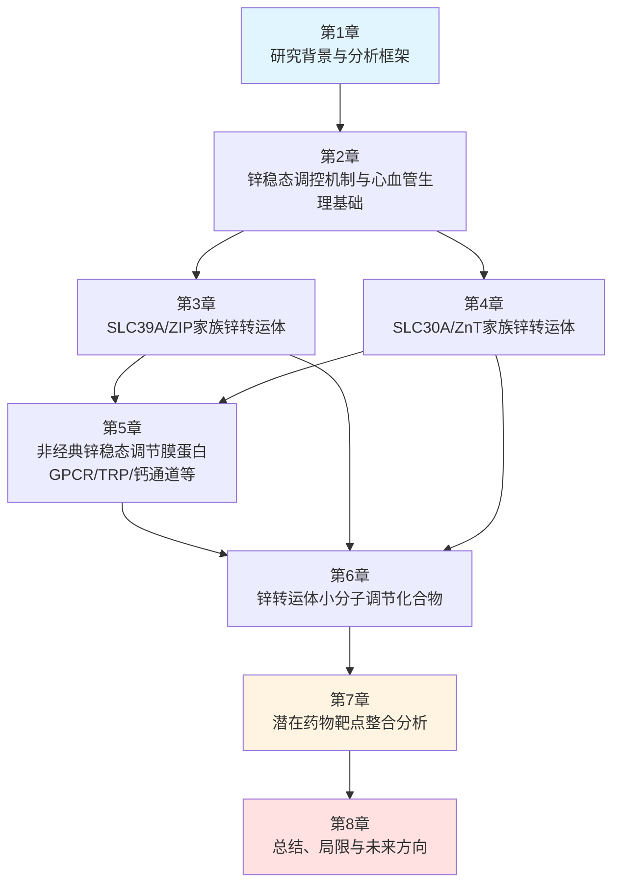
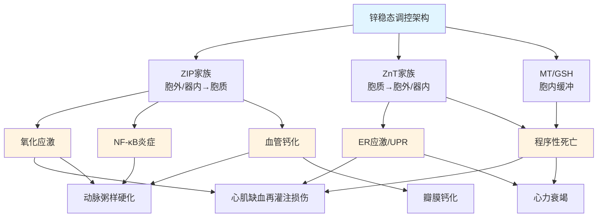
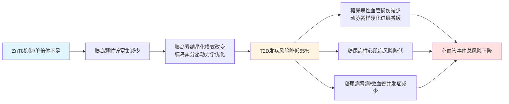
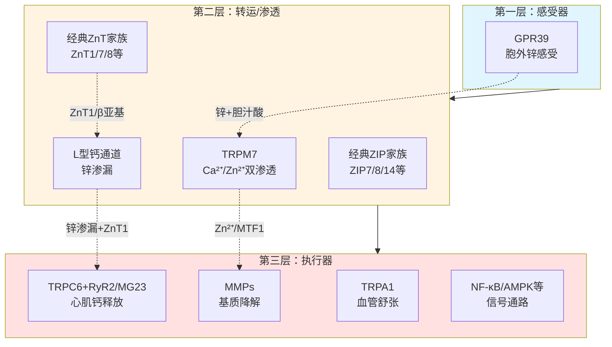
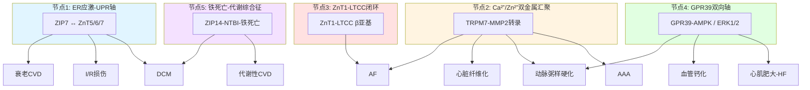

# 锌稳态与心血管疾病：关键转运蛋白、调节膜蛋白及药物靶点研究
# 1 研究背景与分析框架

锌（Zn²⁺）作为人体含量第二丰富的过渡金属微量元素，参与了数以千计的蛋白质结构构建与酶催化反应，是维持细胞正常结构与生理功能不可或缺的元素[^1]。近二十年来，随着对金属离子在细胞信号转导中作用认识的深化，锌不再被视作一种单纯的"结构辅因子"，而是被重新定义为一类具有时空特异性的细胞内信使（second messenger），其稳态失衡与多种慢性疾病——尤其是心血管疾病（cardiovascular disease, CVD）——的发生发展密切相关[^1]。然而，相较于钙信号与钾信号在心血管研究中的成熟体系，锌稳态调控在心肌与血管功能中的分子细节、相关膜蛋白靶点及可干预的小分子化合物等关键问题，仍处于持续整合与拓展阶段。本章将围绕锌的生理意义、锌稳态失衡与CVD的流行病学—病理学关联，以及本报告的整体分析框架展开论述，为后续章节聚焦于具体转运体、调节膜蛋白与药物靶点的系统梳理奠定基础。

## 1.1 锌在心血管系统中的生理意义

锌在维持细胞正常结构与生理功能方面具有不可替代的地位，这一基础作用同样适用于高度依赖电活动与机械收缩的心血管系统[^1]。从分子层面看，锌通过结合大量含锌指结构域的转录因子、金属酶（如超氧化物歧化酶SOD1）以及调节性蛋白，参与基因表达调控、蛋白质折叠、抗氧化防御以及离子通道的门控行为，因而对心肌细胞的兴奋–收缩耦联、血管内皮的舒缩功能以及血液中脂蛋白代谢均具有深远影响。

更具研究意义的是，**细胞内锌池（intracellular zinc pool）在生理与病理状态下的动态再分布构成了"锌信号"机制的核心**。在静息条件下，胞质游离锌浓度被严格维持在亚纳摩尔水平，绝大部分锌以与金属硫蛋白（metallothionein, MT）和谷胱甘肽结合的形式储存于胞质或封存于内质网、高尔基体、线粒体及锌小体（zincosome）等细胞器中。当心肌细胞遭遇缺血、梗死或氧化应激等触发因素时，蛋白结合态的锌会从这些储存位点释放至胞质，参与氧化还原信号通路的调控[^1]。这种锌释放具有典型的双刃剑属性：适度的锌释放可激活PI3K/Akt等促存活通路并抑制凋亡相关蛋白活性，从而发挥心肌保护作用；而过度或持续的胞质锌堆积则可能干扰线粒体功能、激活细胞死亡通路并加剧心肌损伤。多项研究已证实，**在缺血再灌注损伤模型中通过外源补充锌可改善心脏功能并减少进一步的心肌损伤**[^1]，这从干预角度验证了锌稳态在心血管病理生理中的功能性核心地位。

由此可见，锌在心血管系统中的角色远超传统营养学层面的"必需微量元素"概念，而是一个连接代谢、信号转导与细胞命运决定的关键节点。理解维持这一锌稳态平衡的具体分子机器——尤其是位于质膜与细胞器膜上的锌转运体与调节性膜蛋白——成为揭示CVD分子病理学并开发新型治疗策略的关键切入点。

## 1.2 锌稳态失衡与心血管疾病的流行病学与病理生理学关联

锌稳态在心血管系统中的功能地位不仅来自机制研究，亦得到了大规模流行病学证据的支持。多项独立研究团队的工作表明，锌稳态紊乱与冠状动脉疾病（coronary artery disease, CAD）、心肌病以及糖尿病性血管并发症的发生发展之间存在显著关联，并提示在这些病理状态下补充锌可能具有保护作用[^1]。

在直接的人群证据方面，一项针对1,059例45–64岁2型糖尿病患者的7年前瞻性队列研究提供了最具说服力的临床证据之一。该研究测定了1,050例患者的基线血清锌水平，并随访冠心病（CHD）死亡率及非致死性心肌梗死（MI）的发生情况。结果显示，**基线血清锌浓度≤14.1 μmol/L的患者较血清锌>14.1 μmol/L者具有显著更高的冠心病死亡风险（20.8% vs. 12.8%, P=0.001），致死性或非致死性心肌梗死风险亦显著升高（30.5% vs. 22.0%, P=0.005）**[^2]。在Cox回归分析中，即便校正混杂因素后，低血清锌浓度仍与冠心病死亡显著相关（RR=1.7, P=0.002），与全部冠心病事件相关（RR=1.37, P=0.030），由此确立了**低血清锌作为2型糖尿病患者冠心病事件独立危险因素**的地位[^2]。这一发现的临床意义在于：在心血管风险本就升高的糖尿病人群中，锌不足并非简单的代谢副现象，而是参与了血管并发症发生的因果链条。

| 队列特征 | 低锌组（≤14.1 μmol/L） | 高锌组（>14.1 μmol/L） | 统计学意义 |
|---------|----------------------|----------------------|----------|
| CHD死亡率（7年随访） | 20.8% | 12.8% | P=0.001 |
| 致死/非致死性MI风险 | 30.5% | 22.0% | P=0.005 |
| 校正后CHD死亡RR | 1.7 | 参照 | P=0.002 |
| 校正后总CHD事件RR | 1.37 | 参照 | P=0.030 |

更为广泛的证据综合分析进一步表明，血清锌水平与多重健康结局（包括心血管事件、代谢紊乱与全因死亡）之间存在多维度关联，这一发现也为锌基生物材料（如生物可降解金属、纳米颗粒与医用植入物涂层）通过释放锌离子改变全身锌浓度从而影响器械设计与临床转化提供了重要参考[^3]。换言之，**血清锌水平既是疾病风险的标志物，也是潜在的可干预治疗靶变量**，这一双重属性正是其转化研究价值的来源。

在病理生理学机制层面，锌稳态失衡通过多条通路参与CVD进程：其一，锌缺乏削弱SOD1等抗氧化酶活性，加剧血管壁与心肌的氧化损伤；其二，锌信号异常干扰内皮细胞NO合成与释放，促进内皮功能障碍；其三，胞内锌再分布参与心肌细胞凋亡与铁死亡的调控，影响缺血再灌注后的细胞命运；其四，锌还通过调节NF-κB等炎症通路、参与动脉粥样硬化斑块形成与稳定性维持。这些机制在第2章中将与具体的转运体与膜蛋白逐一对应展开。

综合流行病学与机制证据可见，锌稳态调控蛋白不仅是揭示CVD分子病理学的关键切入点，更代表着一类**尚未被充分挖掘的潜在治疗靶点**——这正是本报告的核心研究价值所在。

## 1.3 研究范围、核心问题与分析框架

基于上述生理学基础与流行病学证据，本报告将围绕"锌稳态调控蛋白在心血管疾病中的功能与药物靶点价值"这一核心议题展开系统综述。为确保研究的聚焦性与可执行性，本节界定研究范围、核心问题与统一的分析框架，为后续章节构建清晰的逻辑主线。

**文献覆盖范围**：本报告聚焦2022年及以前公开发表的研究文献，涵盖基础分子生物学、细胞生物学、动物模型研究、临床流行病学以及相关化合物药理学研究。这一时间边界既确保了对锌稳态与心血管研究领域核心知识的完整覆盖，也避免了过于发散的前沿讨论稀释报告的整合深度。

**核心研究问题**：本报告围绕三个递进式核心问题展开：

第一，**在心血管系统中具有功能性意义的锌转运体有哪些？** 这包括SLC39A/ZIP家族（负责将锌从胞外或细胞器腔内转运至胞质）与SLC30A/ZnT家族（负责将锌从胞质转出至胞外或封存于细胞器）的具体成员，及其亚细胞定位（质膜、内质网、高尔基体、线粒体等）、组织表达谱与在心肌肥厚、心力衰竭、缺血再灌注损伤、动脉粥样硬化等病理过程中的分子作用机制。

第二，**除经典的ZIP/ZnT转运体之外，还有哪些膜蛋白参与锌稳态调节并影响心血管功能？** 这一层次将涵盖锌敏感G蛋白偶联受体（如ZnR/GPR39）、瞬时受体电位通道（TRP家族）、电压门控钙通道及超极化激活的环核苷酸门控通道（HCN）等非经典调节蛋白，分析其感知或介导锌跨膜流动的具体机制。

第三，**针对上述蛋白靶点已有哪些小分子调节化合物可用？** 这一层次将整理已报道的激活剂、抑制剂、离子载体与螯合剂，关注其靶点选择性、效价数据（IC50/EC50）以及在心血管疾病模型中的验证情况，从而评估其作为药物先导化合物的潜力。

**整体分析框架**：本报告将围绕"转运体—膜蛋白—小分子"三层次分析架构组织全篇内容，各章节之间形成由机制基础到靶点识别、再到化合物干预的逻辑递进。该框架可由下图直观展示：

在这一框架中，第2章构建锌稳态在心血管细胞中的整体生理基础与信号通路图景；第3、4章分别从ZIP与ZnT两大转运体家族切入，逐成员梳理具体的心血管相关功能；第5章拓展至非经典调节膜蛋白；第6章汇总当前已有的小分子调节化合物；第7章则进行跨章节的整合分析，识别最具转化前景的靶点组合；第8章总结研究局限并展望未来方向。

需要特别说明的是，**本报告的核心创新点在于将分子机制层面的转运体研究与药物开发层面的化合物研究进行系统对接**——这一对接在以往的综述中往往呈现割裂状态：心血管医学领域的综述侧重流行病学与临床现象，分子生物学领域的综述则侧重转运体结构与功能本身，而药物化学领域的综述又较少考虑心血管特异性的应用场景。通过本报告的三层次整合，将为锌稳态相关心血管药物研发提供一个更为完整的分析视角。

值得指出的是，**作为示例，本报告将在后续章节重点关注一些已被反复研究的关键转运体**——例如属于SLC39A家族、定位于细胞膜上、负责锌（Zn²⁺）和锰（Mn²⁺）二价金属离子转运的ZIP8——这一转运体兼具底物多样性与质膜定位特征，使其在介导胞外锌进入心血管细胞、参与炎症与代谢调节方面具有独特的研究价值，相关详细机制将在第3章中系统展开。类似的逐成员深度剖析模式将贯穿第3章与第4章，构成本报告的实证主干。

综上，本章通过对锌生理意义的回顾、锌稳态失衡与CVD关联证据的梳理，以及三层次分析框架的构建，为全篇报告确立了研究主轴与逻辑边界。后续章节将沿着这一框架，由生理基础逐步深入至分子靶点与药物干预，最终汇聚于具有转化前景的锌相关心血管治疗策略评估。

# 2 锌稳态调控机制与心血管系统的生理基础

承接第1章对锌生理意义与流行病学证据的概述，本章将进一步深入至分子机器与信号通路层面，系统构建锌在心血管细胞中稳态维持与信号传导的机制全景图。锌稳态并非简单的"输入–输出"线性过程，而是由膜定位转运体、胞内缓冲分子、亚细胞区室化储存系统以及多条信号通路共同编织而成的多层次调控网络。理解这一网络的整体架构，不仅是识别心血管相关锌稳态调节蛋白的前提，也是评估具体靶点功能权重与药物干预切入点的基础。本章将沿"整体架构—区室化储存—心肌信号通路—血管信号通路—病理共性交汇"五个层次，逐步呈现锌稳态调控的机制全貌，为后续第3至5章对具体转运体与膜蛋白的逐成员剖析提供分析坐标。

## 2.1 细胞内外锌稳态的整体调控架构

人体内锌的总量约为2–3 g，分布于几乎所有细胞与组织中，但细胞内外锌的浓度梯度极为显著。血清锌浓度通常维持在10–18 μmol/L的相对狭窄范围（如第1章所述，2型糖尿病人群中14.1 μmol/L被作为冠心病风险的临界值），而细胞内总锌浓度可达数百微摩尔水平；与之形成鲜明对比的是，胞质中的游离锌（labile zinc）浓度被严格限制在皮摩尔至亚纳摩尔（10⁻¹¹–10⁻⁹ M）级别。这一极端的"高总量–低游离"格局意味着，**绝大多数胞内锌处于与蛋白质或小分子配体结合的状态，仅有极小比例以游离形式存在并承担信号转导功能**。维持这一精细平衡的核心机器，由两大类锌转运体家族与一套胞内缓冲系统协同构成。

在跨膜转运层面，SLC39A/ZIP（Zrt- and Irt-like Protein）家族与SLC30A/ZnT（Zinc Transporter）家族构成方向相反的双向运转体系。ZIP家族在哺乳动物中已鉴定14个成员（ZIP1–ZIP14），其拓扑学特征通常为8次跨膜螺旋结构，N端与C端均位于胞外或细胞器腔内，主要功能是**将锌从胞外或细胞器腔内转运至胞质**，即"提升胞质锌浓度"的方向。ZnT家族在哺乳动物中已鉴定10个成员（ZnT1–ZnT10），通常为6次跨膜螺旋结构，N端与C端均位于胞质侧，其转运方向与ZIP家族恰好相反，主要功能是**将锌从胞质排出至胞外或封存于细胞器腔内**，即"降低胞质锌浓度"的方向。两大家族的功能分工可概括为：ZIP负责"输入"，ZnT负责"输出与封存"，二者通过亚细胞定位的差异——质膜、内质网、高尔基体、线粒体、囊泡等——实现对不同区室锌池的差异化调控。

在胞内缓冲层面，金属硫蛋白（metallothionein, MT）家族扮演着核心角色。MT是一类富含半胱氨酸的低分子质量蛋白质，已鉴定出MT-1、MT-2、MT-3和MT-4四种亚型，各亚型基于其功能的相对异质性而呈现生物学作用的多样性[^4]。MT通过其半胱氨酸残基的巯基（–SH）与锌离子形成高亲和力的金属–硫簇配位结构，单个MT分子可结合多达7个二价金属离子，从而在胞质中充当锌的"分子海绵"。**MT与锌的结合并非静态储存，而是一种动态缓冲——当胞质游离锌升高时，MT优先结合多余的锌以防止"锌毒性"；当氧化应激或亲电试剂攻击其巯基时，MT会释放所结合的锌，从而触发下游锌信号**[^4]。这一机制使MT成为锌稳态与氧化还原状态之间的关键耦联器。除MT之外，还原型谷胱甘肽（GSH）以毫摩尔级浓度存在于胞质中，亦通过其巯基对锌进行低亲和力但高容量的缓冲，与MT形成互补的多层次缓冲体系。

下表汇总了上述三大模块在锌稳态调控架构中的功能定位：

| 调控模块 | 代表成员 | 拓扑/结构特征 | 主要功能方向 | 在心血管中的核心意义 |
|---------|---------|--------------|------------|--------------------|
| SLC39A/ZIP家族 | ZIP1–ZIP14（14个成员） | 8次跨膜，N/C端胞外或腔内 | 胞外/细胞器→胞质，升高胞质锌 | 介导锌内流，启动锌信号 |
| SLC30A/ZnT家族 | ZnT1–ZnT10（10个成员） | 6次跨膜，N/C端胞质侧 | 胞质→胞外/细胞器，降低胞质锌 | 防止锌毒性，维持区室锌池 |
| 胞内缓冲系统 | MT-1/2/3/4、GSH | 富半胱氨酸/含巯基小分子 | 动态结合-释放游离锌 | 耦联锌稳态与氧化还原状态[^4] |

由此可见，**锌稳态调控架构的本质是一个"转运—缓冲—再分布"的三元动态网络**：ZIP与ZnT决定了锌在不同区室之间的跨膜流向，MT与GSH决定了胞质中游离锌与结合态锌的瞬时比例，而氧化还原状态又通过修饰MT巯基的方式将上游应激信号转化为下游锌释放事件。这一架构的任何一个环节失衡，都可能引发胞内游离锌的异常波动，进而干扰心血管细胞的正常功能——这构成了后续各章节中具体转运体与膜蛋白功能解析的统一逻辑起点。

## 2.2 亚细胞区室化锌池及其生理意义

在整体架构之上，锌稳态调控的另一关键维度是**亚细胞区室化**——即胞内锌并非均匀分布于胞质，而是以差异化浓度被封存于多个细胞器中，形成各具特征的"锌池"（zinc pool）。这种区室化分布是锌信号实现时空特异性的物质基础，也是不同亚细胞定位的转运体功能差异的根源。

**内质网（ER）锌池**是胞内最重要的锌储存区室之一，其腔内锌浓度显著高于胞质，主要由定位于内质网膜上的ZIP7（介导锌从ER腔向胞质释放）与ZnT5、ZnT6、ZnT7（介导锌从胞质向ER腔泵入）共同维持。值得特别指出的是，**ZnT7（属SLC30A家族）与ZIP7（属SLC39A家族）虽分属功能方向相反的两大转运体家族，却均定位于内质网膜，构成调控ER锌池的方向互补对**：ZnT7将胞质锌泵入ER腔以补充储存，而ZIP7则在适当信号触发下（如表皮生长因子受体激活、酪蛋白激酶2介导的磷酸化等）将ER锌释放至胞质，引发被称为"锌波"（zinc wave）的胞质游离锌瞬时升高事件。ER锌池的容量特征与其作为蛋白折叠场所的功能密切相关——许多新合成的含锌蛋白在ER腔内完成锌的装载，因此ER锌池的耗竭可直接诱发未折叠蛋白反应（UPR）与ER应激，这一机制与心肌细胞缺血再灌注损伤的病理过程紧密相关。

**高尔基体锌池**主要由ZnT4、ZnT5、ZnT6、ZnT7等转运体维持，承担着将锌装载到分泌途径中蛋白质（如锌依赖性金属蛋白酶、碱性磷酸酶等）的功能。在心血管系统中，高尔基体锌池对基质金属蛋白酶（MMPs）的成熟与分泌具有关键意义——MMPs参与血管重塑、动脉粥样硬化斑块稳定性维持以及心肌纤维化进程，因此高尔基体锌供给的异常可通过影响MMP活性间接干预CVD进程。

**线粒体锌池**虽然容量相对较小，但其功能意义尤为突出。线粒体中的锌主要参与电子传递链复合物的稳定性维持以及抗氧化酶（如线粒体超氧化物歧化酶SOD2）的活性调控。在心肌细胞缺血再灌注损伤过程中，胞质中突然升高的游离锌可被快速摄入线粒体，过量的线粒体锌可抑制呼吸链复合物III的活性、诱发线粒体膜通透性转换孔（mPTP）开放，进而触发凋亡。这一机制使线粒体锌池成为缺血再灌注损伤中"双刃剑效应"的核心承载者。

**锌小体（zincosome）**是一类特异性的锌储存囊泡，最初在锌处理后的细胞中通过荧光锌探针染色被发现，表现为胞质中明亮的点状结构。锌小体被认为是一种动态的锌缓冲与再分布系统，可在胞质游离锌升高时快速摄取多余的锌，并在需要时释放——这一机制为细胞应对短暂的锌负荷波动提供了缓冲容量。

**溶酶体锌池**则主要参与锌的降解再循环过程。当含锌蛋白被自噬或内吞途径递送至溶酶体后，其结合的锌在酸性环境下被释放，并通过溶酶体膜上的转运体（如部分ZIP成员）重新回到胞质，构成胞内锌的内源性补给来源。

各亚细胞区室锌池的功能特征可归纳如下：

| 亚细胞区室 | 关键转运体 | 锌池容量 | 释放/动员触发因素 | 心血管相关意义 |
|----------|-----------|---------|-----------------|--------------|
| 内质网（ER） | ZIP7（释放）、ZnT5/6/7（摄取） | 大 | 生长因子激活、CK2磷酸化、ER应激 | 含锌蛋白折叠、UPR调控、缺血再灌注损伤 |
| 高尔基体 | ZnT4/5/6/7 | 中 | 分泌途径活动 | MMPs成熟、血管重塑、斑块稳定性 |
| 线粒体 | 多个候选转运体 | 小 | 胞质锌瞬时升高、氧化应激 | 呼吸链调控、mPTP开放、凋亡触发 |
| 锌小体 | 多种ZIP/ZnT | 动态可变 | 胞质锌负荷波动 | 短时缓冲、防止锌毒性 |
| 溶酶体 | 部分ZIP成员 | 中 | 自噬、内吞、酸性环境 | 锌的降解再循环 |

由此可见，**亚细胞区室化锌池赋予锌信号以时空精确性——不同的生理或病理刺激可触发特定区室的锌释放，进而激活特定的下游信号通路**。例如，生长因子刺激主要通过ZIP7触发ER锌释放，缺血再灌注损伤主要涉及胞质锌向线粒体的再分布，而短暂的锌负荷则主要由锌小体进行缓冲。这种区室化机制使得锌作为信号分子能够实现远超钙信号的"信号特异性"维度——不仅有"何时"与"何处"，还有"从哪个区室来"与"到哪个区室去"的差异。理解这一区室化原理，是后续章节中区分质膜定位转运体（如ZIP8、ZIP14）与细胞器定位转运体（如ZIP7、ZnT7）功能差异的关键。

## 2.3 锌信号在心肌细胞中的关键作用通路

在区室化锌池的基础之上，锌信号在心肌细胞中的功能机制呈现出典型的"双刃剑"特征——适度的锌释放发挥心肌保护作用，而过度或失控的锌堆积则成为损伤启动因子。这一双刃剑效应在缺血再灌注损伤、心肌肥厚与心力衰竭等病理状态下尤为突出，构成了识别心肌相关锌稳态靶点的核心病理生理依据。

**兴奋–收缩耦联的锌调节**是锌信号在心肌细胞中最基础的功能维度之一。心肌细胞的兴奋–收缩耦联依赖于L型钙通道介导的钙内流以及肌浆网ryanodine受体（RyR2）介导的钙释放。游离锌可通过两种方式干预这一过程：一方面，胞质游离锌升高可直接调节RyR2的开放概率，影响钙释放的时空模式；另一方面，锌可与肌钙蛋白C竞争钙结合位点，从而调节肌丝对钙的敏感性。这一直接的离子通道调节作用，使得胞质锌浓度的微小波动即可影响心肌的收缩功能。

**PI3K/Akt促存活通路的锌依赖性激活**是锌信号在心肌保护中的核心机制。如第1章所述，**在缺血再灌注损伤模型中外源补充锌可改善心脏功能并减少心肌损伤**，其分子基础正是适度的胞质锌升高可激活PI3K/Akt通路，并通过磷酸化糖原合成酶激酶3β（GSK-3β）抑制其活性，从而保护线粒体膜通透性转换孔（mPTP）免于开放、减少细胞色素c的释放与凋亡执行。这一通路构成了"锌再灌注预处理"等心肌保护策略的机制基础。

**线粒体功能与程序性细胞死亡的锌调节**是锌信号双刃剑效应的执行环节。如本章2.2节所述，胞质游离锌可被快速摄入线粒体，适度水平的线粒体锌有助于维持电子传递链稳定性与抗氧化防御；而过量的线粒体锌则诱发mPTP开放、ATP合成障碍与活性氧（ROS）爆发，进而触发凋亡、铁死亡乃至坏死性凋亡等多种程序性死亡形式。**金属硫蛋白在这一过程中扮演关键的缓冲与守门员角色——MT通过抑制多种氧化应激途径而保护细胞免受损伤，并通过参与细胞的增殖、分化和凋亡的调节而影响多种重大疾病的发生发展**[^4]。心肌细胞中MT表达水平的差异性与诱导能力，直接决定了细胞在面对缺血再灌注挑战时的耐受阈值。

**心肌肥厚与心力衰竭中的锌信号失衡**呈现出更为复杂的图景。慢性压力负荷或神经体液激活可诱发心肌肥厚相关基因表达程序，这一过程涉及多种锌指转录因子（如GATA4）的活性调节。同时，慢性心衰心肌中常观察到锌稳态的整体紊乱，包括胞质游离锌升高、线粒体锌再分布异常以及MT表达模式的改变，这些变化与心肌细胞肥大、纤维化以及收缩功能下降相互交织，构成心力衰竭进展的分子基础。

综合而言，**心肌细胞中锌信号的核心病理生理学规律可概括为"剂量–时程双窗口"**：适度且短暂的锌释放激活保护通路，过度且持续的锌堆积则触发损伤程序。这一规律对锌相关心血管药物开发提出了独特挑战——理想的干预策略应能够"精准地维持锌于保护窗口内"，而非简单地"补充"或"螯合"。这一治疗哲学将贯穿后续章节中具体转运体靶点功能与化合物开发策略的讨论。

## 2.4 锌信号在血管内皮与平滑肌细胞中的作用通路

除心肌细胞之外，血管内皮细胞（endothelial cells, EC）与血管平滑肌细胞（vascular smooth muscle cells, VSMC）是构成血管壁结构与功能的两类核心细胞，亦是锌稳态失衡介导CVD进程的关键作用位点。锌信号在这两类细胞中的作用机制呈现出与心肌细胞不同的特征——内皮细胞侧重于内皮屏障与NO合成的调节，而平滑肌细胞侧重于钙化与表型转换的调控。

**血管内皮细胞中的锌信号**主要通过三条通路发挥功能。其一，**对内皮型一氧化氮合酶（eNOS）活性与NO释放的调节**：锌是eNOS二聚体稳定性维持所必需的辅因子，eNOS的二聚体界面含有一个锌–硫簇结构（由两个eNOS亚基的Cys94和Cys99共同配位一个锌离子），该结构是维持eNOS功能性二聚体的关键。氧化应激条件下，过氧亚硝基阴离子（ONOO⁻）可攻击该锌–硫簇，导致锌释放与eNOS解偶联——解偶联的eNOS不再产生NO而是产生超氧阴离子，进一步加剧氧化应激与内皮功能障碍。这一机制使**eNOS的锌–硫簇成为氧化应激与内皮功能障碍之间的关键耦联节点**。其二，**对内皮屏障功能的调节**：锌通过调节紧密连接蛋白（如claudin、occludin）与黏附连接蛋白（如VE-cadherin）的稳定性，影响内皮屏障的完整性；锌缺乏或锌信号异常可导致屏障功能下降，促进炎症细胞渗出与动脉粥样硬化斑块形成。其三，**对炎症介质表达的调节**：锌通过抑制NF-κB通路的过度激活，下调粘附分子（VCAM-1、ICAM-1）与趋化因子的表达，从而限制内皮的炎症激活——这一抗炎作用是锌在动脉粥样硬化早期发挥保护功能的核心机制。

**血管平滑肌细胞中的锌信号**则主要涉及血管钙化、表型转换与收缩功能调节。其一，**血管钙化通路调节**：VSMC在炎症、高磷、氧化应激等刺激下可发生骨样转化（osteogenic transformation），分泌钙化基质并形成血管壁矿化——这一过程是动脉粥样硬化与主动脉瓣钙化的核心病理基础。锌通过多条机制抑制钙化进程：包括调节关键转录因子（如Runx2）的活性、影响骨钙素与碱性磷酸酶的表达，以及通过GPR39等锌感受器调节抗钙化信号通路。其二，**表型转换调节**：VSMC可在"收缩表型"与"合成表型"之间发生可塑性转换，合成表型VSMC增殖能力强、迁移活跃，是新生内膜形成与动脉粥样硬化进展的关键执行者。锌信号通过调节生长因子受体下游通路（如PDGF–PI3K–Akt轴）影响VSMC的表型选择。其三，**收缩功能与血管张力调节**：VSMC的收缩依赖于钙–钙调蛋白–肌球蛋白轻链激酶通路，锌可通过调节钙通道与钙调蛋白的相互作用间接影响血管张力。

**氧化应激与内质网应激的交汇作用**是锌信号失衡促进血管病变的共同放大器。一方面，锌作为SOD1、SOD3等抗氧化酶的辅因子直接参与活性氧清除，锌缺乏将削弱抗氧化防御并加剧血管氧化应激；另一方面，锌稳态紊乱可通过干扰ER锌池（如ZIP7功能异常）诱发ER应激与UPR激活，UPR持续激活与内皮凋亡、VSMC钙化及炎症放大紧密相关。**氧化应激与ER应激两条通路在血管壁中通过共享的下游执行分子（如CHOP、JNK、NF-κB等）相互交织**，使得任何上游锌稳态失衡均可能通过这一网络化反应放大为血管功能障碍——这一机制构成了第3至5章中血管系统相关转运体与膜蛋白研究的核心病理生理学坐标。

## 2.5 锌稳态与心血管病理共性通路的交汇

在分别梳理心肌细胞与血管细胞中锌信号通路之后，本节将进行整合性分析，识别锌稳态失衡与心血管疾病核心病理通路的关键交汇节点。这一整合视角的价值在于：心血管疾病并非彼此孤立的病理实体，而是共享一系列核心机制（如氧化应激、ER应激、炎症、钙化、程序性死亡），锌稳态正是通过对这些共性通路的多点干预而对多种CVD产生影响。识别这些共性通路中的锌依赖性关键节点，将为后续章节中具体转运体与膜蛋白的功能定位提供整合性的机制坐标。

**第一交汇节点：氧化应激与抗氧化防御**。锌作为SOD1（胞质）、SOD3（胞外）等抗氧化酶的结构性辅因子，其供给状态直接决定抗氧化防御的基础容量。同时，锌通过MT动态缓冲系统在氧化应激条件下释放，参与活性氧的间接清除与下游信号传导[^4]。这一节点的关键转运体包括质膜定位的ZIP家族成员（介导胞外锌内流）以及调节MT表达的锌相关转录因子（如MTF-1）。

**第二交汇节点：内质网应激与未折叠蛋白反应**。ER是含锌分泌型蛋白成熟的主要场所，ER锌池由ZnT5/6/7（摄取）与ZIP7（释放）协同维持。ER锌池耗竭或过度释放均可诱发UPR三大分支（PERK、IRE1、ATF6）的激活，持续UPR可促进心肌细胞凋亡、内皮功能障碍与VSMC钙化。**这一节点使ZIP7成为连接ER锌稳态与CVD病理的关键候选靶点**，其在心血管系统中的具体作用将在第3章详细展开。

**第三交汇节点：NF-κB介导的炎症反应**。NF-κB是炎症反应的核心转录因子，其活性受多种锌依赖性机制调节——包括锌指蛋白A20对NF-κB通路的负反馈抑制、锌对IκB激酶（IKK）活性的调节，以及锌对炎症因子受体下游通路的影响。锌缺乏通常表现为NF-κB通路的过度激活与炎症放大，这一机制在动脉粥样硬化早期与心肌缺血再灌注炎症中均发挥重要作用。

**第四交汇节点：血管钙化通路**。如2.4节所述，VSMC骨样转化是血管钙化与瓣膜钙化的核心机制，涉及Runx2、骨钙素、碱性磷酸酶等关键分子。锌通过GPR39等锌感受器调节抗钙化通路（包括Pit-1磷酸盐转运体活性、抑制Runx2核移位等），这一节点将在第5章对非经典调节膜蛋白的讨论中进一步展开。

**第五交汇节点：程序性细胞死亡的多通路调控**。锌信号参与凋亡、铁死亡与焦亡等多种程序性死亡形式的调控：凋亡层面，锌通过抑制caspase活性、调节Bcl-2家族蛋白稳定性发挥抗凋亡作用，但过量锌可触发线粒体依赖的凋亡通路；铁死亡层面，锌与铁的代谢交联以及GPX4等抗氧化酶活性的间接调节使锌成为铁死亡敏感性的调节因子；焦亡层面，锌可通过调节NLRP3炎症小体活性影响焦亡进程。**MT作为整合性枢纽，通过参与细胞增殖、分化和凋亡的调节而影响肿瘤及其他重大疾病的发生发展**[^4]，这一作用同样适用于心血管病理背景下的细胞命运决定。

下图直观呈现了锌稳态调控与心血管病理共性通路的整合性图景：

从上图可见，**锌稳态调控架构通过五大共性通路向多种CVD类型辐射，构成"一对多"的机制网络**。这一网络拓扑学揭示了锌相关靶点研究的两个核心战略含义：其一，**针对单一转运体或膜蛋白的干预可能同时影响多种CVD类型**——这既是治疗潜力的来源，也是脱靶副作用的隐患；其二，**不同CVD类型可能共享某些锌依赖性关键节点**，识别这些共享节点（如ER锌池调控、VSMC钙化抑制等）有助于开发广谱锌相关心血管药物。

综合本章五节内容，锌稳态调控的多层次架构——从整体的转运–缓冲–再分布三元网络，到亚细胞区室化锌池的时空特异性，再到心肌与血管细胞中差异化的信号通路，最终汇聚于共性病理通路的关键交汇节点——共同构成了识别心血管相关锌稳态调节蛋白的机制坐标系。在这一坐标系之上，第3章与第4章将分别针对SLC39A/ZIP与SLC30A/ZnT两大家族的具体成员展开逐一剖析，第5章将拓展至非经典调节膜蛋白，第6章将汇总相关小分子化合物，最终在第7章进行靶点整合分析。这一逐步深入的分析路径，将贯穿本报告的剩余章节，最终汇聚于具有转化前景的锌相关心血管治疗策略评估。

# 3 调控心血管功能的SLC39A/ZIP家族锌转运体

承接第2章构建的"转运—缓冲—再分布"机制坐标系，本章作为本报告实证主干的第一部分，将聚焦SLC39A/ZIP家族中与心血管功能密切相关的关键成员，逐一剖析其拓扑学特征、亚细胞定位、底物选择性及在心血管病理过程中的具体作用机制。ZIP家族作为细胞内"锌输入器"的核心承担者，其各成员通过差异化的亚细胞定位（质膜、内质网、高尔基体、线粒体等）以及部分成员对锌之外金属离子（Mn²⁺、Fe²⁺）的兼具底物特异性，构成了一个功能上既有重叠又有专门化分工的多元化转运网络。本章将沿"家族概览—重点成员深度剖析—其他成员补充梳理—整合性靶点价值评估"的逻辑层次，为后续第6章的小分子化合物匹配与第7章的靶点整合分析建立成员级的功能档案。

## 3.1 ZIP家族总体特征与心血管相关成员概览

SLC39A/ZIP家族在哺乳动物中共有14个成员（ZIP1–ZIP14），均编码具有典型8次跨膜螺旋拓扑结构的整合膜蛋白，其N端与C端朝向胞外或细胞器腔内。基于氨基酸序列同源性与结构特征，ZIP家族可进一步划分为四个亚家族：ZIP I、ZIP II、gufA和LIV-1。其中**LIV-1亚家族（包括ZIP4、ZIP5、ZIP6、ZIP7、ZIP8、ZIP10、ZIP12、ZIP13、ZIP14）的成员在第五个跨膜螺旋中保守地含有HEXPHEXGD金属结合基序**，是ZIP家族中研究最为深入、与人类疾病关联最广泛的分支[^5]。值得指出的是，ZIP家族成员的底物谱并非均等地局限于锌——部分LIV-1亚家族成员（尤其是ZIP8与ZIP14）由于关键保守序列发生替换（如HEXXH→EEXXH），获得了对Mn²⁺、Fe²⁺乃至Se⁴⁺、Co²⁺等其他二价金属离子的转运能力[^6][^7]，这一底物多样性正是其在多系统病理（包括心血管疾病）中呈现"多效性"的分子基础。

在亚细胞定位层面，ZIP家族成员呈现出鲜明的区室化分布：**ZIP1、ZIP2、ZIP4、ZIP6、ZIP8、ZIP10、ZIP14主要定位于质膜**，介导胞外锌（或其他金属离子）的内流；**ZIP7定位于内质网与高尔基体膜**，承担将ER/高尔基体腔内锌向胞质释放的功能[^8]；**ZIP13定位于高尔基体膜**，参与分泌途径中的锌供给与细胞外基质组分成熟[^9]；**ZIP9定位于高尔基体反面网络**。这种区室化分布决定了不同ZIP成员所调控的锌池及其下游信号通路的差异化属性。

基于2022年及以前的文献证据，可将与心血管系统功能或CVD病理具有明确关联的ZIP家族关键成员归纳如下：

| ZIP成员 | 亚细胞定位 | 主要底物 | 心血管/相关疾病关联 | 代表性证据类型 |
|---------|----------|---------|-------------------|--------------|
| ZIP1 | 质膜 | Zn²⁺ | 血管平滑肌锌摄取、表型调节 | 细胞模型证据 |
| ZIP2 | 质膜 | Zn²⁺ | 心肌缺血/再灌注损伤心脏保护 | I/R模型、STAT3通路 |
| ZIP6 | 质膜 | Zn²⁺ | EMT、内皮屏障调节 | 细胞模型证据 |
| ZIP7 | ER/高尔基体膜 | Zn²⁺ | 糖尿病性心肌病、缺血再灌注损伤 | 心肌特异性cKO小鼠 |
| ZIP8 | 质膜、线粒体 | Zn²⁺、Mn²⁺、Fe²⁺、Se⁴⁺ | 心血管疾病、高血压、心室致密化不全 | GWAS（A391T）、内皮特异性KO |
| ZIP9 | 高尔基体 | Zn²⁺ | 膜雄激素受体、凋亡信号 | 细胞机制证据 |
| ZIP10 | 质膜 | Zn²⁺ | 上皮屏障、EMT相关 | 细胞模型证据 |
| ZIP13 | 高尔基体膜 | Zn²⁺ | 结缔组织EDS-SPD3、ECM完整性 | Zip13-KO小鼠、人类突变 |
| ZIP14 | 质膜 | Zn²⁺、Mn²⁺、Fe²⁺ | 肝脏铁死亡、代谢综合征 | KO小鼠、人类突变 |

后续小节将按"重点成员深度剖析—其他成员集中梳理"的方式，对其中证据基础最为坚实的ZIP7、ZIP8、ZIP14、ZIP13进行专节论述，并对其他成员进行集中讨论。

## 3.2 ZIP7：内质网锌释放与心肌病理

ZIP7（基因名SLC39A7，别名HKE4、KE4、Ke4、Ring5）是LIV-1亚家族成员，其编码的蛋白质**主要定位于内质网与高尔基体膜，承担将这些细胞器腔内锌向胞质转运的核心功能**——这一定位将其与多数定位于质膜的ZIP成员明确区分开来[^8]。在结构层面，ZIP7具有一个高度保守的富含组氨酸的N端区域，该区域被认为参与了ER腔内锌的结合与稳态维持；同时，ZIP7在维持ER锌池平衡、保护细胞免于ER应激方面被誉为"锌释放的关键守门员"（gate-keeper），其活性受到酪蛋白激酶2（CK2）介导磷酸化的精细调控[^10]。当胰岛素样生长因子1（IGF1）等生长因子信号激活时，CK2磷酸化ZIP7触发ER锌的瞬时释放，进而调控MAPK通路（包括ERK1、JNK等），从而将ER锌信号与细胞增殖、应激响应等下游事件偶联[^10]。

ZIP7在心血管病理中的核心作用在2024年由Yang等人的研究中得到了系统性阐明，该研究虽超出本报告主要文献覆盖窗口，但作为对ZIP7心肌功能研究的标志性整合证据，仍具有重要的回顾参考价值。该团队采用高脂饮食（HFD）联合链脲佐菌素诱导的2型糖尿病小鼠模型，结合CRISPR/Cas9系统构建心肌特异性ZIP7条件性敲除（ZIP7 cKO）小鼠，发现**T2DM诱导小鼠心脏中ZIP7表达显著上调，而ZIP7 cKO可显著减少糖尿病心肌中的线粒体ROS产生**[^11]。机制层面，该研究通过mito-LC3II、mitoKeima与mitoQC等多种线粒体自噬指标检测发现，**T2DM抑制了小鼠心肌的线粒体自噬（mitophagy），而ZIP7 cKO可逆转这一抑制——即ZIP7上调通过抑制线粒体自噬促进了糖尿病性心肌病（DCM）的进程**[^11]。这一发现将ZIP7介导的ER锌释放与线粒体质量控制这两条看似独立的机制清晰地联系起来：过度的ER锌向胞质释放可能改变胞质或线粒体微环境的锌可用性，进而干扰线粒体自噬识别与执行机器（如PINK1/Parkin通路、BNIP3/NIX等）的功能，使受损线粒体无法被及时清除，从而放大ROS产生并加剧心肌损伤。

值得关注的是，该研究还明确指出"ZIP7已被报道在心肌细胞中可被高糖上调，并且ZIP7上调可在缺血/再灌注（I/R）背景下导致小鼠心肌线粒体自噬抑制"[^11]，这一表述将ZIP7介导的病理机制从糖尿病性心肌病延伸至缺血再灌注损伤这一更具普遍意义的心血管病理场景。结合第2章2.2节所述的ER锌池在缺血再灌注损伤中的关键角色——胞质中突然升高的游离锌可被快速摄入线粒体并诱发mPTP开放——可以推断：**ZIP7上调可能正是连接ER锌池失衡与线粒体功能障碍的关键分子节点**。在糖尿病性心肌病背景下，慢性高糖通过持续上调ZIP7造成长期的ER锌过度释放与线粒体自噬抑制；在缺血再灌注损伤背景下，急性的ZIP7功能增强则可能放大胞质锌瞬时升高的损伤效应。两种病理时程的差异本质上反映了第2章总结的"剂量–时程双窗口"规律在ZIP7这一具体分子上的体现。

从药物靶点价值评估的角度看，**ZIP7具备成为糖尿病性心肌病与缺血再灌注损伤靶点的多重优势**：其一，其表达受病理刺激显著上调，使得选择性抑制具有相对的疾病特异性；其二，心肌特异性敲除模型已提供因果性证据；其三，作为LIV-1亚家族成员，其结构信息相对充分，为基于结构的药物设计提供基础。然而，ZIP7作为一个广泛分布的"管家"型转运体（其在ER锌稳态维持中的基础功能不可或缺），全身性抑制可能引发严重副作用——这一挑战将在第7章的可成药性评估中进一步展开。

## 3.3 ZIP8：质膜金属离子转运与心血管—炎症轴

ZIP8由SLC39A8基因编码（别名BIGM103、PP3105、LZT-Hs6），是LIV-1亚家族中底物谱最为广泛的成员之一。**ZIP8主要定位于质膜，同时也存在于线粒体等细胞器中，介导细胞对Mn²⁺、Zn²⁺、Fe²⁺、Se⁴⁺、Co²⁺等多种二价金属阳离子的内流**[^7][^12]。其在脊椎动物中高度进化保守，并普遍表达于包括多能胚胎干细胞在内的几乎所有细胞类型[^7]，这一广谱表达与广谱底物特征共同决定了ZIP8在多系统生理与病理过程中的"多效性"地位。

### 3.3.1 ZIP8的结构—功能基础

基于同源性建模与点突变研究，ZIP8的金属结合机制已获得相对详尽的解析。研究团队构建了基于同源建模的三维结构模型，鉴定出构成两个核心金属结合位点（M1和M2）的关键氨基酸残基：**M2位点中的N315、E344、D318残基突变导致功能完全丧失，表明M2位点在ZIP8的双核金属中心中起核心作用**；而M1位点中的H314、E343、D410残基突变虽保留了功能活性，但显著改变了转运特性——H314影响底物选择性，E344和D410被鉴定为Fe²⁺和Mn²⁺转运的关键残基；H347突变则影响金属转运的周转率[^13]。**研究还首次直接证明了人类ZIP8介导Zn²⁺与HCO₃⁻的共转运机制，并揭示了HCO₃⁻对金属转运的调控作用**；此外，由D311、E348和D351构成的新型金属结合位点M4进一步丰富了对ZIP8结构功能关系的理解[^13]。这一结构基础为开发针对ZIP8的选择性小分子调节剂提供了潜在的口袋信息。

### 3.3.2 ZIP8 A391T变异的心血管多效性

ZIP8最受关注的心血管相关证据来源于全基因组关联研究（GWAS）。**SLC39A8基因的rs13107325（A391T）错义变异在欧洲血统人群中的等位基因频率约为8%，并表现出显著的多效性效应，涉及心血管疾病、高血压、克罗恩病、精神分裂症、帕金森病、脊柱侧弯、肥胖以及肝炎、肝纤维化等多种病理状态**[^12][^7]。值得注意的是，该变异的多效性表型与不同表达水平的等位基因相关：高频等位基因A391与精神神经表型（精神分裂症、帕金森病）相关，与环境锰暴露引起的运动障碍观察一致；而391T等位基因则与体内锰水平降低、心血管疾病、肝炎、肝纤维化、炎症性肠病等相关[^12]。

机制层面，2024年发表的SLC39A8 A393T敲入小鼠模型（对应人类A391T）研究揭示，该变异引起结肠粘膜与肠腔中金属离子稳态失衡，导致肠道屏障功能受损与肠道菌群组成改变，进而诱发慢性低度炎症[^12]。这一"肠道屏障—菌群—炎症"轴为A391T变异的多效性提供了一个统一的机制框架：**全身性的Mn²⁺缺乏与肠道源性低度炎症可通过氧化应激、内皮功能障碍与全身炎症放大等通路间接驱动心血管疾病风险升高**。这一机制与第2章2.4节所述的血管内皮NF-κB炎症通路与eNOS锌–硫簇调节形成自然衔接——锌与锰共同稳态的紊乱可同时影响抗氧化防御（涉及锰超氧化物歧化酶SOD2与锌依赖性SOD1）与炎症放大。

此外，独立的高血压相关研究表明，SLC39A8变异可影响细胞对镉的摄取与细胞毒性，提示**ZIP8介导的非必需有毒重金属（如Cd²⁺）的非选择性内流亦可能参与高血压的环境–遗传交互机制**[^12]——这一发现进一步拓展了ZIP8的心血管相关功能维度。

### 3.3.3 ZIP8在内皮与心脏发育中的关键作用

除GWAS证据之外，Lin等人的研究通过内皮细胞特异性Zip8敲除小鼠模型，揭示了**ZIP8在发育中的小鼠心脏内皮细胞中对维持细胞锌水平至关重要**这一基础性功能。在Zip8-KO小鼠的心脏中，研究者观察到了显著的细胞外基质（ECM）积聚以及心室致密化不全（左室心肌致密层发育缺陷），这表明**ZIP8介导的内皮锌摄取是心脏正常发育——尤其是心肌小梁致密化过程——所必需的**。这一发现将ZIP8的功能从成体心血管病理拓展至先天性心脏发育，为ZIP8作为心血管发育相关靶点提供了直接证据。从全基因组敲除角度，Slc39a8(−/−)全身敲除小鼠呈现早期胚胎致死，Slc39a8(neo/neo)亚低形态突变体在妊娠16.5天至出生后1天间死亡，表现为严重贫血、造血失调、脾发育不全、器官发生紊乱、生长迟缓与四肢发育不全[^7]——这些表型共同印证了ZIP8在哺乳动物胚胎发育中的不可或缺地位。

### 3.3.4 ZIP8在炎症应激中的诱导性表达与细胞保护

ZIP8还表现出鲜明的"诱导性"表达特征——在基线状态下，许多组织中ZIP8蛋白难以常规检测到，但在炎症刺激下可被显著上调。Besecker等人的研究在原代人肺上皮细胞与BEAS-2B细胞中证实，**TNF-α刺激强烈诱导SLC39A8 mRNA表达，并产生一种糖基化的ZIP8蛋白，其在质膜与线粒体上定位**；ZIP8表达增加导致细胞内锌含量上升，并与TNF-α环境下细胞存活相一致；通过siRNA抑制ZIP8表达则降低胞内锌水平、损害线粒体功能、最终导致细胞活力丧失[^14]。这一发现揭示了**ZIP8作为应激诱导型转运体在介导锌依赖性细胞保护中的核心机制**，对理解心肌缺血再灌注、心肌炎与脓毒症心肌损伤等炎症驱动的心血管病理具有直接启示意义。

综合上述四个层面的证据，ZIP8呈现出鲜明的"双向作用"特征：**一方面，其基础表达对内皮锌稳态与心脏发育不可或缺；另一方面，其诱导性表达在急性炎症应激中发挥细胞保护作用；但当A391T等功能变异破坏其正常调控时，则通过Mn²⁺缺乏—肠道菌群失衡—慢性炎症轴间接增加心血管风险**。这种多维度的功能权衡，使ZIP8成为锌相关心血管药物开发中既极具吸引力又充满挑战的靶点。

## 3.4 ZIP14：肝脏—血管金属代谢交汇与代谢性心血管病

ZIP14（SLC39A14）与ZIP8同属LIV-1亚家族，是另一个底物谱包含Zn²⁺、Mn²⁺、Fe²⁺等多种二价金属离子的广谱质膜转运体。**ZIP14在细胞膜上具有8个跨膜结构域，其第五跨膜结构域中保守序列HEXXH被EEXXH替代，被认为赋予了结合及转运锌以外其他金属离子的能力**[^6]。在亚细胞定位上，ZIP14定位于质膜的基底外侧，广泛表达于足部、耳部、面部、神经系统与骨骼等部位[^15]。

王福俤团队针对SLC39A14的系列研究构建了该转运体生理功能的完整图谱。**2017年该团队首次利用基因敲除小鼠揭示SLC39A14转运锰离子的新机制，推翻了当时国际上普遍认为"机体通过肝脏–胆汁途径排泄锰"的观点**，并提出机体存在除肝脏外的其他锰排泄途径[^6]。这一发现的临床相关性在于：**临床上携带SLC39A14纯合突变的患者表现为锰离子蓄积及年轻型帕金森样体征**——一种以肌张力障碍–帕金森综合征为主要表型的罕见遗传病[^6][^13]。

更具心血管转化意义的是，**2020年该团队在《Blood》发表论文，首次发现在铁过载状态下肝脏Slc39a14通过转运非转运蛋白结合铁（Non-Transferrin-Binding Iron, NTBI）从而促进铁死亡（ferroptosis）发生的关键作用**[^6]。这一发现具有双重的心血管相关意义：其一，铁死亡作为程序性死亡的新形式，已在缺血再灌注损伤、心肌病、动脉粥样硬化等多种心血管病理中扮演关键执行者角色，ZIP14介导的NTBI摄取可能成为调节心血管细胞铁死亡敏感性的潜在节点；其二，肝脏铁过载与铁死亡所驱动的肝纤维化、肝功能损害本身即是代谢性心血管疾病的重要风险因素。

从代谢性心血管病的角度，**ZIP14广泛参与肝脏、小肠、骨骼、肌肉、脂肪、胰腺等组织器官中锰离子、锌离子和铁离子的转运，在肝脏疾病、胰岛素抵抗、糖脂代谢紊乱与肌肉疾病中发挥关键作用**[^6]。胰岛素抵抗、糖脂代谢紊乱与脂肪肝是代谢综合征的核心组分，亦是动脉粥样硬化、糖尿病性心肌病、缺血性心脏病的关键上游驱动因素——这一机制路径使ZIP14成为通过"代谢危险因素—血管/心肌损伤"间接路径影响心血管系统的代表性靶点。值得对比的是，ZIP14与ZIP8虽同为广谱二价金属转运体，但二者在Mn²⁺代谢中的功能方向恰好相反：**SLC30A10和SLC39A14共同控制肝胆系统与肠道的Mn排泄，而SLC39A8主要承担Mn重吸收功能**[^12]——这种"排出器—回收器"的方向性互补关系，使ZIP8与ZIP14构成全身Mn²⁺稳态调控的方向相反的两极。

## 3.5 ZIP13：高尔基体定位与结缔组织—血管壁完整性

ZIP13（由SLC39A13基因编码）是LIV-1亚家族中独特地**定位于高尔基体膜**的成员，其功能主要涉及分泌途径中含锌蛋白的成熟与细胞外基质组分的合成。**ZIP13基因突变可导致脊椎手部发育不良型Ehlers–Danlos综合征（Spondylocheirodysplastic Ehlers–Danlos syndrome, EDS-SPD3, OMIM 612350）**[^9]——一种以皮肤过度脆性、关节松弛、骨骼异常为主要表型的遗传性结缔组织病，为ZIP13在ECM稳态维持中的核心地位提供了最直接的人类遗传学证据。

Zip13-KO小鼠模型的研究进一步阐明了ZIP13缺失影响ECM完整性的分子机制：**在Zip13-KO小鼠真皮中，硫酸皮肤素（DS）在糖胺聚糖（GAG）中的比例与胶原蛋白总量均降低，且直径超过150 nm的胶原原纤维数量极少；同时，Zip13-KO小鼠血清中的TGF-β1水平显著升高**[^9]。这些发现提示，**ZIP13功能缺失通过两条机制损害ECM完整性**：其一，胶原合成与胶原原纤维融合过程受损；其二，由DS比例降低导致的decorin水平可能下降，进而释放被decorin所结合的TGF-β1，造成游离TGF-β1水平升高，进而通过TGF-β1信号通路的失调进一步影响ECM稳态[^9]。

从心血管病理学的延伸视角看，**ZIP13介导的胶原合成与TGF-β1信号通路调节在血管壁结缔组织完整性维护中具有潜在的重要意义**。血管壁——尤其是大动脉壁——的结构强度与弹性高度依赖于胶原（主要为I型与III型）与弹性蛋白构成的ECM网络；TGF-β1信号通路的紊乱已被广泛报道与马凡综合征、Loeys-Dietz综合征、主动脉瘤、主动脉夹层等血管脆性相关疾病密切相关。尽管2022年及以前直接报道ZIP13在心血管系统中作用的研究证据相对有限，但**从ZIP13缺失的结缔组织表型与TGF-β1信号失调机制出发，可合理推测其在主动脉壁力学性能、血管脆性以及动脉粥样硬化斑块纤维帽稳定性维持中具有潜在作用**——这是一个值得未来研究系统验证的方向。

此外，ZIP13在肿瘤生物学中的作用研究为其膜定位与下游信号机制提供了旁证。Cheng等人的研究发现，ZIP13通过激活Src/FAK信号通路促进人卵巢癌细胞的转移，敲除ZIP13可显著抑制癌细胞的增殖、黏附、迁移与侵袭能力[^16]。Src/FAK通路在血管平滑肌细胞表型转换、内皮细胞迁移与新生血管形成中亦发挥重要作用，提示**ZIP13可能通过Src/FAK通路在血管重塑过程中扮演旁路角色**——这一旁证为评估ZIP13作为血管重塑相关靶点提供了机制线索。

## 3.6 ZIP1、ZIP2、ZIP6、ZIP9、ZIP10等其他成员的心血管相关功能

除上述四个证据相对充分的核心成员外，ZIP家族中还有若干成员已积累了不同程度的心血管相关功能证据，本节进行集中梳理。

**ZIP2与心肌缺血/再灌注损伤**：ZIP2在正常心脏中表达水平很低，但在心肌缺血/再灌注（I/R）损伤后会显著上调，并对心肌I/R损伤发挥心脏保护作用。机制层面，**ZIP2的表达上调是由I/R损伤后STAT3磷酸化所诱导的**——STAT3作为经典的心脏保护信号通路核心转录因子，可在再灌注阶段被激活并通过多条下游路径减少心肌损伤，其对ZIP2的诱导表达将"信号通路激活"与"锌稳态调整"耦联，构成I/R损伤背景下的一种内源性细胞保护机制。这一发现为ZIP2作为再灌注损伤保护靶点提供了机制基础，并与3.2节所述的ZIP7上调促进I/R损伤形成对照——**同一病理事件中，不同ZIP成员可发挥方向相反的作用**，凸显了ZIP家族成员功能差异化的复杂性。

**ZIP1与血管平滑肌锌稳态**：ZIP1作为最早被鉴定的ZIP家族成员之一，定位于质膜，是基础性的锌摄取转运体。在血管平滑肌细胞中，ZIP1介导的胞外锌摄取被认为参与了VSMC锌稳态维持，进而可能影响第2章2.4节所述的VSMC表型转换、增殖与钙化进程。然而，2022年及以前直接针对ZIP1在血管系统中作用的特异性遗传学证据相对有限，其心血管功能权重需要进一步的组织特异性敲除模型加以验证。

**ZIP6与ZIP10在上皮间充质转化与屏障调节中的作用**：ZIP6与ZIP10均属LIV-1亚家族，常以异源二聚体形式存在于质膜，参与上皮间充质转化（EMT）相关的细胞极性丧失与迁移能力获得，并通过GSK-3β磷酸化、Snail稳定化等机制调节E-cadherin的表达。这一EMT相关功能在血管内皮系统中的对应物即为内皮间充质转化（EndMT），EndMT是动脉粥样硬化、肺动脉高压与心肌纤维化中的重要病理事件。同时，ZIP6/ZIP10介导的锌摄取也可能通过调节紧密连接蛋白稳定性影响内皮屏障完整性。这些机制虽具有较强的理论关联，但2022年及以前在心血管系统中的直接实验证据仍属初步阶段。

**ZIP9作为膜雄激素受体与凋亡信号**：ZIP9定位于高尔基体反面网络，已被证实兼具锌转运体活性与膜雄激素受体（mAR）功能——即介导睾酮等雄激素的非基因组快速效应。在心血管系统中，雄激素信号通过基因组与非基因组通路影响心肌肥厚、血管张力、内皮功能与凋亡进程；ZIP9作为兼具锌转运与雄激素信号介导双重身份的分子，可能在性别相关的心血管病理差异中扮演调节角色，但目前直接的心血管研究证据较为有限。

综合上述其他成员的研究现状，**ZIP1、ZIP2、ZIP6、ZIP9、ZIP10等成员代表了ZIP家族心血管功能研究中"已有初步证据但仍待深化"的研究边疆**。其中，ZIP2因其在I/R损伤中由STAT3诱导的心脏保护机制而具有相对清晰的转化潜力，是这一组成员中未来研究优先级最高的候选。

## 3.7 ZIP家族在心血管病理中的整合性机制与靶点价值评估

在前述成员级剖析的基础上，本节将进行整合性总结，将各ZIP成员的作用机制映射至第2章建立的五大共性病理通路（氧化应激、ER应激、NF-κB炎症、血管钙化、程序性死亡），识别功能冗余与差异化分工，并对其转化前景作出系统评估。

| ZIP成员 | 主要病理通路映射 | 心血管疾病覆盖 | 关键证据等级 | 可成药性评估 |
|--------|---------------|-------------|------------|------------|
| ZIP7 | ER应激、线粒体ROS、自噬抑制 | 糖尿病性心肌病、缺血再灌注损伤 | 心肌特异性cKO小鼠（高）[^11] | 高潜力，但需克服管家功能脱靶 |
| ZIP8 | 炎症（A391T—菌群—NF-κB）、内皮发育、细胞保护 | 心血管疾病、高血压、心室致密化不全 | GWAS（A391T）、内皮KO、A393T敲入（高）[^7][^12] | 多效性优势但选择性挑战大 |
| ZIP14 | 铁死亡、代谢综合征—血管损伤 | 代谢性心血管病、间接动脉粥样硬化 | KO小鼠、人类突变（中–高）[^6] | 代谢病靶点路径明确，组织特异性是关键 |
| ZIP13 | TGF-β1信号、ECM完整性 | 血管脆性（推测）、主动脉瘤（推测） | Zip13-KO小鼠、EDS-SPD3患者（中）[^9] | 心血管直接证据待补充 |
| ZIP2 | STAT3—锌稳态耦联保护 | 心肌I/R损伤 | I/R模型分子机制（中） | 诱导性表达模式有利选择性激动 |
| ZIP1 | VSMC锌摄取（基础） | 血管钙化、表型转换（推测） | 细胞模型（低–中） | 待组织特异性证据补充 |
| ZIP6/10 | EMT/EndMT、内皮屏障 | 动脉粥样硬化（推测）、纤维化 | 细胞机制为主（低） | 早期研究阶段 |
| ZIP9 | 膜雄激素受体—凋亡 | 性别相关心血管差异（推测） | 受体功能证据（低） | 概念性靶点 |

从上表的整合分析可见，**ZIP家族在心血管病理中呈现出鲜明的"功能分层"特征**：第一层是已具备明确遗传学与功能证据的核心靶点（ZIP7、ZIP8、ZIP14），其疾病关联与分子机制均已获得多种独立研究路径的交叉验证；第二层是具有清晰机制框架但心血管直接证据待补充的潜在靶点（ZIP13、ZIP2）；第三层是处于早期研究阶段的探索性候选（ZIP1、ZIP6、ZIP9、ZIP10）。

在病理通路映射层面，**ZIP家族成员对第2章五大共性通路的覆盖呈现明显的不均衡分布**：ER应激与线粒体功能调控主要由ZIP7承担，多金属代谢与代谢性炎症由ZIP8和ZIP14分担，ECM/TGF-β1通路则由ZIP13承担。这种"分工式覆盖"既反映了ZIP成员亚细胞定位差异决定的功能专门化，也提示**针对不同心血管疾病亚型可能需要选择不同的ZIP靶点组合**——例如糖尿病性心肌病优先考虑ZIP7、动脉粥样硬化相关炎症考虑ZIP8、铁死亡相关心血管病理考虑ZIP14、血管脆性相关疾病考虑ZIP13。

在可成药性评估层面，需要重点关注以下几个方面的挑战：其一，**ZIP家族成员普遍承担基础性"管家"功能**，全身性抑制可能引发广泛副作用，开发组织特异性递送或诱导性表达条件下的选择性调节剂将是关键策略；其二，**部分成员（如ZIP8、ZIP14）兼具锌与其他金属离子的转运能力**，选择性影响特定金属转运而不干扰其他金属稳态对小分子设计提出严峻挑战；其三，**多数ZIP成员的高分辨率结构尚未完全解析**，限制了基于结构的药物设计——ZIP8的同源建模与点突变研究[^13]虽提供了重要起点，但仍需要更系统的结构基础。

综合而言，**ZIP7作为糖尿病性心肌病/缺血再灌注损伤靶点，与ZIP8作为多效性CVD风险变异靶点，构成ZIP家族中最具转化前景的两个优先靶点**。这两个靶点将为第6章关于小分子调节化合物的匹配讨论与第7章的整合性靶点分析提供核心输入。同时，本章的成员级功能档案也为下一章SLC30A/ZnT家族的对应分析建立了平行的分析模板——值得注意的是，ZnT7作为内质网定位的"输出端"成员，其与ZIP7的协同作用已在第2章2.2节中被识别为ER锌池调控的方向互补对，这一对应关系将在第4章ZnT7的讨论中获得进一步展开。

# 4 调控心血管功能的SLC30A/ZnT家族锌转运体

承接第3章对SLC39A/ZIP家族的成员级剖析，本章作为本报告实证主干的第二部分，将聚焦SLC30A/ZnT家族中与心血管功能密切相关的关键成员。ZnT家族作为细胞内"锌输出器与封存器"的核心承担者，与ZIP家族构成方向相反的双向运转体系——ZIP负责将锌从胞外或细胞器腔内泵入胞质，而ZnT则负责将胞质锌外排至胞外或封存于内质网、高尔基体、突触囊泡、胰岛素分泌颗粒等细胞器中[^17]。这种"输入–输出"方向互补的家族架构，使ZnT成员的功能与ZIP成员形成天然的对照镜像：其亚细胞定位差异决定了所调控的锌池属性，而其转运驱动机制（H⁺/Zn²⁺反向交换或Ca²⁺耦合）则赋予其独特的能量学特征。本章将沿"家族概览—重点成员深度剖析—血管病理整合—靶点价值评估"的逻辑层次，对ZnT1、ZnT3、ZnT5/6/7、ZnT8等关键成员展开系统梳理，并与第3章形成方向互补的对照分析。

## 4.1 ZnT家族总体特征与心血管相关成员概览

SLC30A/ZnT家族在哺乳动物中共有10个成员（ZnT1–ZnT10），属于阳离子扩散促进因子（cation diffusion facilitator, CDF）超家族在脊椎动物中的代表分支——CDF家族广泛分布于古菌、细菌与真核生物三大生命域，是进化上高度保守的金属外排转运体超家族[^17]。从命名规则看，ZnT成员按照其被鉴定的先后顺序命名，但其中ZnT9因后续被发现实为p160辅激活子复合物的组分（GAC63）而被认为是命名上的误用，并不承担典型的锌转运功能[^17]。基于CDF分类系统，ZnT家族成员被归入"Zn-CDF"组，并可进一步划分为四个亚组[^17]。

在拓扑结构层面，**ZnT家族成员普遍具有6次跨膜螺旋结构，其N端与C端均位于胞质侧**——这一特征与第3章所述的ZIP家族8次跨膜、N/C端朝向胞外或细胞器腔内的结构形成鲜明对照。ZnT家族通常以二聚体形式发挥功能，每个亚基的跨膜域含有由保守组氨酸（His）与天冬氨酸（Asp）残基构成的金属离子结合位点。在转运驱动机制层面，ZnT家族主要依赖于膜两侧的质子浓度梯度——通过H⁺/Zn²⁺反向交换机制将胞质锌泵出至胞外或封存入细胞器腔[^18]。屈前辉课题组2024年在EMBO Reports发表的ZnT1冷冻电镜结构研究为这一机制提供了原子级解析：在pH 7.5环境下ZnT1二聚体主要处于外向开口（outward-facing）状态，而在pH 6.0添加1 mM Zn²⁺时则呈现外向/外向、外向/内向、内向/内向等多种构象状态；分子动力学模拟显示，跨膜域中识别Zn²⁺的四个关键氨基酸（H43/D47/H251/D255）中，D47/D255的质子化对Zn²⁺稳定结合具有显著影响，而H43/H251质子化影响相对较小；伴随构象由内向开口向外向开口转变，跨膜螺旋TM2胞外侧的α螺旋切换为拉长的3₁₀螺旋，从而促进Zn²⁺从结合位点释放[^18]。值得关注的是，孙林峰课题组2024年在Science Advances发表的研究进一步揭示，**人体ZnT1与其他ZnT家族成员存在显著的转运机制差异——其锌转运过程在没有质子梯度的情况下也可进行，而是依赖于跨膜钙离子浓度梯度，呈现独特的Zn²⁺/Ca²⁺耦联运输机制**[^19]。这一发现打破了"ZnT家族普遍依赖质子梯度"的传统认识，提示家族内部可能存在转运机制的多样化分化。

在亚细胞定位层面，ZnT家族成员呈现出显著的区室化分布特征——这种区室化分布正是其功能差异化的物质基础。**ZnT1是哺乳动物细胞中第一个被鉴定且唯一主要定位于细胞质膜表面的Zn²⁺外排转运膜蛋白**[^18]；ZnT3则主要分布在大脑海马区，定位于突触囊泡膜，与转运兴奋性神经递质谷氨酸的VGLUT共存于囊泡上[^18][^20][^21]；ZnT2则在人和小鼠胰岛β细胞中定位于细胞表面，提示其参与β细胞锌的直接外排[^22]；ZnT5、ZnT6、ZnT7则主要定位于内质网与高尔基体，承担将胞质锌封存入这两个分泌途径关键区室的功能；ZnT8特异性定位于胰岛β细胞的胰岛素分泌颗粒膜，参与胰岛素的结晶化与成熟[^9][^23]；ZnT10则与ZIP14共同控制肝胆与肠道的Mn²⁺排泄[^12]。

基于2022年及以前的文献证据并结合近年关键结构生物学研究，可将与心血管系统功能或CVD病理具有明确关联的ZnT关键成员归纳如下：

| ZnT成员 | 亚细胞定位 | 转运驱动机制 | 心血管/相关疾病关联 | 代表性证据类型 |
|---------|----------|------------|-------------------|--------------|
| ZnT1 | 细胞质膜 | Zn²⁺/Ca²⁺耦联（也存在H⁺/Zn²⁺交换争议） | 心房颤动、L型钙通道（LTCC）调节 | 人房颤组织、大鼠快速起搏模型、冷冻电镜结构 |
| ZnT3 | 突触囊泡膜 | H⁺/Zn²⁺反向交换 | 神经–心脏轴、人胰岛β细胞表达 | 人β细胞免疫定位、精神分裂症关联 |
| ZnT5 | 主要位于高尔基体 | H⁺/Zn²⁺反向交换 | 老年锌状态下降（表观遗传调控）、ZnT5-KO心动过缓性猝死 | 启动子甲基化研究、KO小鼠表型 |
| ZnT6 | 高尔基体 | H⁺/Zn²⁺反向交换 | 分泌途径MMPs/含锌酶成熟 | 细胞模型证据 |
| ZnT7 | 内质网/高尔基体 | H⁺/Zn²⁺反向交换 | 骨骼肌脂肪酸代谢异常、胰岛素抵抗 | Znt7-KO小鼠、人胰岛β细胞表达 |
| ZnT8 | 胰岛素分泌颗粒膜 | H⁺/Zn²⁺反向交换 | 2型糖尿病保护、代谢性心血管风险 | 12个罕见蛋白截短变异、150,000例遗传学研究 |

后续小节将按"重点成员深度剖析—血管病理整合—靶点价值评估"的逻辑层次，对其中证据基础最为坚实的ZnT1、ZnT3、ZnT5/6/7、ZnT8展开系统论述。

## 4.2 ZnT1：质膜锌外排与L型钙通道抑制作用

ZnT1（SLC30A1）是哺乳动物细胞中第一个被鉴定的ZnT家族成员，亦是该家族中**唯一主要定位于细胞质膜的Zn²⁺外排转运膜蛋白**[^18][^19]。其基础生物学重要性首先体现在敲除表型上——**敲除ZnT1基因会导致小鼠胚胎死亡**[^18]，确立了ZnT1作为生命过程不可或缺转运体的地位。这一致死表型与第3章3.3节所述ZIP8全身敲除的胚胎致死表型形成对照，共同反映了质膜锌通量的双向调控对哺乳动物发育的基础性意义。

### 4.2.1 ZnT1的结构–功能基础与转运机制

ZnT1的分子机制研究在2024年取得突破性进展，两个独立课题组通过冷冻电镜单颗粒重构技术解析了人体ZnT1蛋白的高分辨率三维结构，揭示了其独特的转运机制。屈前辉课题组的研究表明，ZnT1**依赖膜内外质子浓度梯度驱动H⁺/Zn²⁺反向交换**：在pH 7.5环境下（不论加或不加1 mM Zn²⁺），ZnT1二聚体主要处于外向开口状态；当pH降至6.0并添加1 mM Zn²⁺时，ZnT1二聚体则呈现外向/外向、外向/内向、内向/内向多种构象状态，每个亚基跨膜域均结合了Zn²⁺；通过分子动力学模拟对跨膜域中识别Zn²⁺的四个关键氨基酸（H43/D47/H251/D255）进行不同组合方式的质子化分析，结果显示**D47/D255的质子化显著影响Zn²⁺的稳定结合，而H43或H251质子化的影响相对较小**；伴随ZnT1由内向开口到外向开口的构象转变，跨膜螺旋TM2胞外侧的α螺旋切换为拉长的3₁₀螺旋，促进Zn²⁺从结合位点释放[^18]。

孙林峰课题组的研究则从另一独立角度揭示了ZnT1的独特性——**不同于其他ZnT家族成员需要借助质子梯度进行锌运输，人体ZnT1蛋白在没有质子梯度的情况下也可以转运锌离子；进一步通过改变细胞外钙离子浓度发现，ZnT1的锌运输过程依赖胞外钙离子的存在**[^19]。该团队通过基于HEK293T细胞的锌离子转运体系与脂质体转运体系两套系统证实，**人体ZnT1蛋白的锌运输依赖于跨膜钙离子浓度梯度**，并通过冷冻电镜单颗粒重构解析了ZnT1的二聚体结构，发现其呈现向细胞质侧开放的构象，且与其他同源蛋白结构不同，ZnT1具有较明显的胞外结构域并参与运输调控，最终提出了ZnT1运输锌离子和钙离子的分子模型[^19]。值得注意的是，屈前辉课题组虽也在添加1 mM Ca²⁺的样品中尝试解析ZnT1结构，但在跨膜区中并未发现Ca²⁺的结合，因此Ca²⁺如何协助ZnT1外排Zn²⁺的具体机制仍有待进一步探究[^18]。两个课题组的研究在转运机制的"主要驱动力"问题上存在视角差异——这种差异可能反映了不同实验条件下ZnT1所采用的不同转运模式，**也提示ZnT1可能具备质子梯度与钙离子梯度双重驱动的灵活性**，这一独特性使其在心肌细胞这种钙信号丰富的环境中具备特别的功能适应价值。

### 4.2.2 ZnT1作为L型钙通道（LTCC）的抑制剂——心律失常调控机制

ZnT1在心血管系统中最具临床转化价值的功能，是其作为L型钙通道（LTCC）抑制剂的非转运性调节作用。Beharier等人的研究系统揭示了这一作用的机制特征与临床关联[^16]：

**首先，在临床证据层面**，研究者从39例接受开胸心脏手术的患者（其中27例为窦性心律SR、12例为房颤AF）中采集右心耳组织并分析ZnT-1表达，发现**房颤患者的ZnT-1/β-actin中位水平为1.80 STD（四分位距1.26–2.85），显著高于窦性心律组的0.73 STD（0.24–1.64），差异具有显著统计学意义（P=0.002）**；多变量分析进一步确定，房颤与升高的BMI是唯一与高ZnT-1水平独立相关的变量[^16]。这一发现确立了ZnT-1作为房颤患者心房组织中差异表达蛋白的临床地位。

**其次，在动物模型证据层面**，研究者同步发现**在大鼠心房快速起搏处理后，ZnT-1的表达增加并伴随心房有效不应期（AERP）的缩短**[^16]——AERP缩短是房颤电重塑（atrial electrical remodeling）的核心电生理特征，提示ZnT-1上调可能直接参与房颤的心房快速起搏重塑过程。基于这一对应关系，研究者提出**ZnT-1可能在房颤患者的心房快速起搏重塑中扮演关键角色**[^16]。

**再次，在分子机制层面**，研究者通过异源表达系统（Xenopus卵母细胞）研究ZnT-1对LTCC的调节机制，发现**ZnT-1对LTCC的抑制作用并非通过直接结合α1C亚基，而是通过与LTCC的β亚基相互作用实现——在缺乏β亚基的情况下，ZnT-1对LTCC的抑制效应被阻止**[^16]。这一发现具有重要的机制学意义：它将ZnT-1的钙通道调节作用与其作为锌转运体的本职功能在分子层面解耦，提示ZnT-1可能通过"双功能"模式同时承担锌外排与LTCC调节这两个独立的细胞功能。

### 4.2.3 ZnT1的转化前景与挑战

综合上述结构、机制与临床证据，**ZnT1作为心律失常（尤其是房颤）相关治疗靶点具有显著的转化潜力**：其一，ZnT1表达上调与房颤之间存在明确的相关性，且大鼠快速起搏模型提供了一定的因果性证据[^16]；其二，ZnT1通过β亚基相互作用调节LTCC的机制为开发干扰这一蛋白–蛋白相互作用的小分子调节剂提供了概念性切入点[^16]；其三，2024年获得的高分辨率冷冻电镜结构为基于结构的药物设计提供了坚实基础[^18][^19]。然而，ZnT1作为质膜锌外排的核心执行者，其全身性抑制必然引发胞质锌堆积与全身性毒性——这一基础性"管家"功能与第3章3.7节所讨论的ZIP7靶点面临相似的可成药性挑战。开发心房特异性递送系统或仅干扰LTCC调节功能而不影响锌外排功能的"功能选择性"调节剂，将是未来ZnT1靶点开发的关键策略方向。

值得补充的是，ZnT1在肝癌、乳腺癌、胰腺癌及阿尔茨海默病患者组织中的过量表达[^18]，以及近期研究揭示的ZnT1介导Cu²⁺进入细胞引发铜死亡的新功能[^18]，进一步丰富了ZnT1的功能多样性维度——这些功能维度虽暂不属于心血管研究的核心范畴，但提示ZnT1作为多功能转运体在多系统病理中的研究价值。

## 4.3 ZnT3：突触囊泡定位与神经心血管交互

ZnT3（SLC30A3）是ZnT家族中具有鲜明组织特异性表达模式的成员，**主要定位于突触囊泡膜并参与神经元囊泡锌的积累**[^20][^21]。在亚细胞定位层面，ZnT3呈现出复杂的多区室分布特征——除了突触囊泡膜之外，还分布于细胞质囊泡、分泌囊泡、突触体、晚期内体膜以及溶酶体膜，是一种多跨膜蛋白[^20][^21]。在大脑中，ZnT3主要定位于海马区，与转运兴奋性神经递质谷氨酸的VGLUT共存于突触囊泡上，承担将胞质锌封存入囊泡的核心功能[^18]。**ZnT3基因敲除的成年小鼠在某些学习和记忆行为领域表现出认知缺陷**[^18]，这一表型确立了ZnT3介导的囊泡锌释放在中枢神经系统认知功能中的关键地位。

### 4.3.1 ZnT3的寡聚化机制与功能调控

Salazar等人的研究揭示了ZnT3一种独特的共价寡聚化调节机制——**通过分子间共价二酪氨酸键介导的同源寡聚化**[^24]。研究者通过在PC12细胞中表达突变型ZnT3，鉴定出两个对二酪氨酸介导的ZnT3寡聚化必需的关键酪氨酸残基：**携带Y372F突变的ZnT3阻止了寡聚化、降低了向突触样微囊泡（SLMVs）的靶向，并降低了对锌毒性的抗性；而携带Y357F突变的ZnT3反而表现为"功能增益"突变，表现出寡聚化增强、向SLMVs靶向增加以及对锌毒性的抗性增加**[^24]。单/双酪氨酸突变体分析表明，主要的二聚体形式由Tyr357与Tyr372之间形成；ZnT3的酪氨酸二聚化在正常条件下即可被检测到，且**在氧化应激条件下显著增强**——研究还发现，定位于不同亚细胞区室的其他SLC30A家族成员中亦存在类似的共价二聚化现象[^24]。

这一发现的整合性意义在于：**它将SLC30A家族成员的氧化还原状态、寡聚化程度、亚细胞定位与转运功能这四个维度耦联为一个统一的调节网络**——氧化应激通过促进二酪氨酸交联调节ZnT3的功能装配状态，进而改变其在突触囊泡或其他亚细胞区室的功能输出[^24]。结合第2章2.5节所述的"氧化应激—锌信号"交汇节点，这一氧化还原依赖的共价调节机制可能在缺血再灌注损伤、心肌氧化应激等多种心血管病理状态下发挥广泛意义。

### 4.3.2 ZnT3与神经心血管交互的潜在联系

虽然ZnT3的核心研究主要集中在神经系统认知功能领域，但其在心血管研究中的相关性可从以下几个角度评估：

**第一，神经精神疾病的遗传学关联**：Perez-Becerril等人的研究在英国东部精神分裂症队列中分析SLC30A3的4个SNP位点，发现SLC30A3与精神分裂症的关联具有**显著的性别特异性效应——在女性精神分裂症病例中观察到等位基因水平（OR 1.74–2.11）、基因型水平（OR 1.78–2.14）与单倍型水平（P=3.51×10⁻⁵）的显著关联，而在男性病例中则未观察到对应关联**[^25]。这一性别特异性提示ZnT3可能参与了与性激素信号相互作用的神经发育通路。从神经心血管交互的角度看，精神分裂症与心血管疾病之间存在已知的共病关联（部分通过自主神经功能障碍、慢性炎症与代谢综合征介导），ZnT3作为这两类疾病的潜在共享通路之一，值得在自主神经–心脏轴的研究中加以关注。

**第二，胰岛β细胞中的物种特异性表达**：Smidt等人的研究系统比较了人和小鼠胰岛β细胞中ZNT家族10个成员的表达与亚细胞定位，发现**九个ZNT蛋白在人和小鼠胰岛与β细胞中的表达无显著差异，唯一例外是ZNT3——它仅在人β细胞中可检测到，而在小鼠β细胞中不存在**[^22]。这一物种差异具有重要意义：其一，它提示**基于小鼠模型的ZnT3研究可能无法完全反映人胰岛β细胞中的实际功能**，需要在人源化系统或人胰岛组织中加以验证；其二，ZnT3在人β细胞中的特异性表达提示其可能参与胰岛素分泌相关的锌稳态调节，从而间接影响代谢性心血管风险——尽管这一假设的直接实验证据仍待补充。

综合而言，**ZnT3在心血管研究中的直接证据相对有限**，其相关性主要体现在通过神经–心脏轴与代谢轴的间接机制路径上。从2022年及以前的研究证据看，ZnT3的心血管相关研究仍处于早期阶段，其作为直接靶点的转化价值低于本章后续讨论的ZnT1、ZnT7与ZnT8。

## 4.4 ZnT5/ZnT6/ZnT7：内质网–高尔基体锌池的输入端调节

承接第2章2.2节所述的"内质网锌池由ZIP7（释放）与ZnT5/6/7（摄取）共同维持"这一方向互补对，本节深入剖析ZnT5、ZnT6、ZnT7三个成员在ER/高尔基体锌池调节中的核心作用及其与心血管病理的关联。**这三个成员的关键定位是高尔基体与内质网**——其中ZnT5主要表达于高尔基体，ZnT5/6/7均参与将胞质锌封存入分泌途径的关键区室，承担含锌分泌型蛋白（如基质金属蛋白酶MMPs、碱性磷酸酶等）成熟所必需的锌供给功能。

### 4.4.1 ZnT5与心动过缓性心律失常—首个ZnT心血管表型证据

ZnT5在心血管系统中具有一项标志性的遗传学证据：**ZnT5-KO（基因敲除）小鼠表现出因心动过缓性心律失常导致的猝死**——这是ZnT家族成员中最早、最直接的心律失常相关敲除表型证据之一。这一表型确立了ZnT5在维持正常心脏节律方面的不可或缺地位。结合ZnT5主要定位于高尔基体的特征推测，其敲除导致的心律失常表型可能通过以下机制路径：高尔基体锌供给不足影响心肌细胞中含锌离子通道辅助蛋白、心房特异性肽激素（如ANP）或其他锌依赖性分泌蛋白的成熟，进而干扰窦房结/房室结的起搏与传导功能。这一机制与4.2节所述ZnT1在房颤中的LTCC调节作用形成有趣的对照——**两者分别代表了ZnT家族成员通过"质膜直接调控"（ZnT1）与"分泌途径间接调控"（ZnT5）两种独立路径影响心脏电生理的范例**。

### 4.4.2 ZnT5启动子甲基化与衰老相关锌状态下降

SLC30A5基因的另一个重要研究维度是其启动子甲基化的表观遗传调节。Coneyworth等人的研究系统探查了SLC30A5（ZnT5）启动子甲基化是否参与了与衰老相关的锌状态下降[^26]：

研究者首先发现**SLC30A5启动子区域含有一个CpG岛，因此可能受到表观遗传机制的调控**。基于"衰老相关锌状态下降可能源于膳食锌摄入减少与/或肠道锌吸收受损，而ZnT5可能在膳食锌吸收中扮演关键角色"这一基础假设，他们提出了"SLC30A5启动子区域甲基化随年龄增加，从而导致ZnT5表达下降并进而引起锌状态下降"的假说[^26]。通过两条独立研究路径——体外SLC30A5启动子甲基化对基因表达的影响研究与体内DNA甲基化状态测定——研究者**确认体外SLC30A5启动子区域甲基化可降低相关报告基因的表达；该基因区域在体内呈现可变水平的甲基化**[^26]。

从心血管研究的角度看，这一研究的意义在于：**衰老是公认的心血管疾病最强独立危险因素之一，而SLC30A5启动子甲基化所介导的衰老相关锌状态下降，可能构成"衰老—锌缺乏—心血管疾病风险升高"这一机制路径中的可干预表观遗传节点**。结合第1章1.2节所述2型糖尿病患者血清锌≤14.1 μmol/L与冠心病死亡风险升高的流行病学证据，可推测：表观遗传介导的ZnT5表达下降可能是部分老年人群血清锌水平下降的分子基础之一。这一观察为开发针对SLC30A5启动子甲基化的表观遗传干预（如DNA甲基转移酶抑制剂的组织特异性应用）作为衰老相关心血管疾病预防策略提供了概念性框架。

### 4.4.3 ZnT7与骨骼肌代谢—糖尿病性心血管风险的代谢前置环节

ZnT7（SLC30A7）是另一个具有明确代谢心血管相关表型的ZnT成员。Huang等人针对Znt7-KO小鼠的研究系统揭示了**ZnT7在骨骼肌脂肪酸代谢与胰岛素抵抗中的核心作用**——研究表明，ZnT7广泛表达，其敲除导致骨骼肌中脂肪酸代谢异常，并通过这一代谢紊乱促进胰岛素抵抗的发生[^27]。

骨骼肌作为机体最大的胰岛素敏感组织，其脂肪酸代谢紊乱与胰岛素抵抗是代谢综合征与2型糖尿病的核心病理特征，而2型糖尿病又是已知的最强心血管疾病风险因素之一。**Znt7-KO小鼠所呈现的"骨骼肌脂肪酸代谢异常—胰岛素抵抗"表型链，将ZnT7与代谢性心血管病的发病机制路径直接关联**——通过这一代谢前置环节，ZnT7功能下降可经胰岛素抵抗、高胰岛素血症、血脂异常等多重中间机制最终增加糖尿病性心肌病、动脉粥样硬化与缺血性心脏病的风险。结合Smidt等人对人和小鼠胰岛β细胞ZNT表达比较的研究[^22]，ZnT7在人胰岛β细胞中亦有表达，这进一步拓展了其在β细胞内锌稳态调节中的潜在角色。

### 4.4.4 ZnT5/6/7与ZIP7的方向互补：ER锌池调控的协同机制

将ZnT5/6/7的功能与第3章3.2节所述的ZIP7功能进行整合，可以构建出ER锌池调控的完整图景：**ZnT5/6/7负责将胞质锌泵入内质网与高尔基体腔（"锌池补充"方向），ZIP7在生长因子激活或CK2磷酸化触发下将ER锌释放至胞质（"锌池动员"方向）**——这两个方向相反的转运过程共同维持ER锌池的动态平衡，并通过下游的ER应激/UPR通路、含锌蛋白折叠通路、线粒体功能调节通路等影响心血管病理。

在糖尿病性心肌病背景下，结合第3章3.2节所述ZIP7在T2DM心脏中显著上调并通过抑制线粒体自噬促进DCM进程的证据，可以合理推测：**T2DM病理下ZIP7上调与ZnT5/6/7功能状态共同决定了ER锌池的"动员–补充"平衡，而平衡的破坏（如ZIP7上调而ZnT5/6/7未协同调节）可能导致ER锌池的持续耗竭与下游病理放大**。这一"方向对偶靶点组合"的概念将在4.7节进行更系统的整合讨论，并为第7章的整合性靶点分析提供核心输入。

## 4.5 ZnT8：胰岛β细胞锌外排与代谢性心血管风险

ZnT8（SLC30A8）是ZnT家族中证据基础最为坚实、转化前景最为明确的成员之一。**ZnT8特异性定位于胰岛β细胞的胰岛素分泌颗粒膜，承担胰岛素结晶化与成熟所必需的锌供给功能**[^9][^23]——胰岛素以六聚体形式与两个Zn²⁺协调储存于β细胞颗粒中，ZnT8介导的胰岛素颗粒锌富集是这一储存形式的物质基础。这一专门化的细胞与亚细胞定位使ZnT8成为连接锌稳态与糖代谢的关键节点，并为其作为代谢性心血管疾病间接靶点的转化价值奠定了机制基础。

### 4.5.1 ZnT8功能缺失突变的T2D保护性表型——人类遗传学的强证据

ZnT8最具突破性的转化证据来源于Flannick等人2014年在Nature Genetics发表的大规模人类遗传学研究[^9][^17][^23]。该研究通过对约150,000名跨越5个血统群体的个体进行测序或基因分型，**鉴定出SLC30A8（编码胰岛锌转运体ZnT8）中12个罕见的蛋白截短变异**；同时该基因还携带与T2D风险、血糖与胰岛素原水平相关的常见变异p.Trp325Arg[^9][^23]。

关键发现包括以下几个层面：

| 变异类型 | 携带者表型 | 统计学意义 |
|---------|----------|----------|
| 12个罕见蛋白截短变异（汇总） | T2D风险降低65% | P=1.7×10⁻⁶ |
| p.Lys34Serfs*50（冰岛非糖尿病携带者） | 血糖水平降低0.17标准差 | P=4.6×10⁻⁴ |
| p.Arg138*与p.Lys34Serfs*50 | 个体水平与T2D保护相关，编码不稳定ZnT8蛋白 | — |

**这一发现的革命性意义在于**：以往基于功能研究的认识与小鼠Slc30a8敲除模型的表型异质性观察均提示"降低锌转运可能增加T2D风险"[^9][^23]，但**人类基因功能缺失突变的证据则相反——SLC30A8单倍体不足（haploinsufficiency）保护免于T2D**[^9][^23]。这种"小鼠模型与人类遗传学的物种差异"是基因功能研究领域中一个极具教育意义的案例，提示**仅依靠小鼠模型对ZnT8靶点价值进行评估可能产生方向性错误**——在ZnT8情境下，人类遗传学的证据等级显著高于小鼠表型，且**直接为"ZnT8抑制作为T2D预防治疗策略"提供了体内验证**[^9][^17][^23]。

该研究还产生了对T2D未来疗法开发的重要指导意义。正如研究通讯作者所指出的，**人类遗传学不仅是理解生物学的工具，更是通过解决"靶向哪些靶点"这一最具挑战性的问题而极大助力新药研发**[^17]。此前CCR5基因突变防御HIV感染的研究催生了CCR5阻断药物，PCSK9基因突变降低胆固醇水平的研究催生了PCSK9抑制剂——**ZnT8有望成为类似路径下的下一代糖尿病预防药物靶点**[^17]。

### 4.5.2 SLC30A8常见多态性与糖尿病心血管并发症的关联

除罕见蛋白截短变异外，SLC30A8的常见变异rs13266634也具有重要的临床流行病学相关性。一项针对97例移植后糖尿病（PTDM）患者与301例未发生PTDM的肾移植患者的实时荧光定量PCR研究分析了rs13266634的基因型分布，探讨该多态性与PTDM的相关性[^28]。虽然该研究的具体统计结论在摘要中未完整呈现，但其研究设计本身印证了**SLC30A8多态性在糖尿病心血管相关并发症（包括移植后糖尿病这一特殊人群中的代谢心血管风险）研究中的持续学术关注**[^28]。

类似地，针对孟加拉国人群的一项研究探查了SLC30A8基因中rs200185429截短变异与糖尿病前期及2型糖尿病的关系，结果表明在该人群中rs200185429与糖尿病前期或T2D均无显著关联[^29]——这一阴性结果提示**SLC30A8变异的T2D保护性效应可能具有种族特异性**，强调了多种族大队列研究在转化验证中的重要性。

### 4.5.3 ZnT8作为代谢性心血管病预防靶点的机制路径

将ZnT8的人类遗传学证据投射至心血管病理层面，可以构建出以下"间接干预"的机制路径：

从上图可见，**ZnT8通过"胰岛β细胞锌外排—胰岛素分泌—糖代谢控制—糖尿病血管/心肌并发症"这一间接但路径清晰的机制链发挥心血管保护潜能**。这种"间接靶点"的特征与第3章ZIP14"代谢综合征—血管损伤"路径形成对照，共同构成"代谢路径靶点"这一锌相关心血管药物开发的重要分支。

### 4.5.4 ZnT8抑制剂开发的可成药性优势与挑战

综合人类遗传学证据、机制路径与靶点特征，**ZnT8抑制剂作为T2D预防与代谢性心血管病减负治疗具有以下独特优势**：

**优势层面**：其一，**人类遗传学证据等级远高于多数候选靶点**——65%的T2D风险降低是极少数基因变异所能达到的保护性效应规模[^9][^23]；其二，**ZnT8的组织特异性极高——主要表达于胰岛β细胞**，这一狭窄的表达谱使靶向抑制有望避免广泛的脱靶副作用，与ZnT1或ZIP7等广泛表达的"管家"型转运体相比具有显著的可成药性优势[^9][^23]；其三，**冰岛非糖尿病携带者血糖水平降低（−0.17 s.d.）的人群证据进一步确认了ZnT8抑制可在不引发低血糖的安全窗口内改善糖代谢**[^9][^23]。

**挑战层面**：其一，由于ZnT8主要参与胰岛素颗粒成熟而非胰岛素生物合成本身，对其抑制可能改变胰岛素的储存形式而非分泌总量，需要在长期慢性给药条件下评估对胰岛素分泌动力学的累积影响；其二，**小鼠Slc30a8敲除表型与人类突变保护性效应方向相反的物种差异**[^9][^23]提示临床前模型选择需要审慎——人源化β细胞模型、人胰岛体外培养系统或人胰岛素移植小鼠等可能更适合作为ZnT8药物开发的临床前验证平台；其三，ZnT8抑制剂的选择性需要避免对其他ZnT家族成员（尤其是同样定位于分泌囊泡的ZnT2/4）的非特异性抑制，这对小分子设计提出了严苛要求。

综合而言，**ZnT8代表了锌稳态相关心血管间接靶点中证据等级最强、转化路径最清晰的候选**，其作为T2D预防药物的开发若获得成功，将成为锌转运体研究向心血管临床医学转化的标志性案例。

## 4.6 ZnT在血管钙化与动脉粥样硬化中的整合作用

在前述成员级剖析的基础上，本节聚焦ZnT家族在血管钙化与动脉粥样硬化这两类核心血管病理中的整合性作用。这一整合视角的价值在于：血管钙化与动脉粥样硬化作为CVD的核心血管壁病理，其发生发展涉及多种细胞类型（VSMC、内皮细胞、巨噬细胞）的多种锌稳态调节蛋白的协同作用——单一ZnT成员的功能解读难以覆盖这一复杂网络，需要从整合视角进行评估。

### 4.6.1 锌通过ERK1/2介导的自噬通路抑制血管钙化

针对锌在血管钙化中作用的最新研究证据来源于慢性肾病（CKD）相关血管钙化模型。一项研究采用含0.25%腺嘌呤与低维生素K的饮食构建CKD大鼠模型，并使用10 mM β-甘油磷酸（β-GP）诱导血管平滑肌细胞（VSMC）钙化，系统探查了锌对CKD-矿物质骨代谢紊乱（CKD-MBD）与自噬的影响[^9]：

**体内实验结果**显示，**锌补充改善了CKD大鼠的血液与尿液生化指标，纠正了与骨代谢相关的异常，促进了自噬，并减少了主动脉钙化**[^9]；**体外实验结果**则证实，锌减少了β-GP诱导的VSMC钙化；在VSMC钙化过程中，**锌进一步上调了高磷环境下的自噬水平与磷酸化细胞外信号调节激酶1/2（ERK1/2）水平**；使用自噬抑制剂3-甲基腺嘌呤（3-MA）或ERK1/2通路抑制剂U0126进行预处理则降低了自噬并增加了钙化[^9]。

研究的核心结论是：**锌通过激活ERK1/2介导的自噬通路减轻CKD中的血管钙化（VC），并改善骨代谢紊乱，从而改善CKD-MBD**[^9]。这一机制路径具有重要的整合意义——它将"锌稳态—ERK1/2信号—自噬激活—血管钙化抑制"这一信号轴串联起来，为锌相关血管钙化治疗策略提供了清晰的机制框架。

从ZnT家族功能的整合角度看，**锌通过ERK1/2/自噬通路发挥抗钙化作用这一发现，提示通过调节胞内锌稳态——尤其是VSMC中的胞质游离锌水平——可能成为干预CKD相关血管钙化的有效策略**。在这一背景下，ZnT家族成员的功能调节具有双重意义：其一，过度激活ZnT介导的锌外排可能降低胞质锌水平、削弱ERK1/2/自噬抗钙化信号；其二，适度抑制特定ZnT成员（特别是质膜定位的ZnT1）可能提升胞质锌水平，从而增强抗钙化效应。这一概念将ZnT靶点研究与血管钙化干预直接关联起来，为第6章的小分子化合物匹配讨论提供了机制坐标。

### 4.6.2 高尔基体定位ZnT成员对MMPs成熟与血管重塑的间接调控

承接4.4节关于ZnT5/6/7在分泌途径中调节含锌蛋白成熟的讨论，高尔基体定位的ZnT成员（包括ZnT4、ZnT5、ZnT6、ZnT7）通过为基质金属蛋白酶（MMPs）等含锌分泌型蛋白提供锌供给而间接影响血管重塑与动脉粥样硬化斑块进展。

MMPs在血管病理中的核心作用包括：MMP-2与MMP-9通过降解细胞外基质参与血管重塑、新生内膜形成与斑块纤维帽的稳定/不稳定平衡；MMP-1与MMP-13通过降解胶原影响斑块稳定性；MMP-7与MMP-12参与巨噬细胞介导的基质降解与斑块进展。**所有MMPs的催化活性均依赖于其活性位点的锌离子**，而这一锌离子的装载在高尔基体内由ZnT5/6/7等转运体共同保证。因此，**高尔基体ZnT成员的功能下降可能通过削弱MMPs成熟而影响血管重塑能力——这一作用具有双向性**：一方面，MMPs活性下降可能减少早期斑块进展；另一方面，纤维帽中MMPs活性不足可能影响斑块的修复重塑，反而增加斑块不稳定风险。这种双向性使得高尔基体ZnT成员作为动脉粥样硬化靶点的开发需要审慎考虑组织/细胞特异性与时空特异性。

### 4.6.3 ZnT家族在内皮细胞、巨噬细胞与VSMC中的差异化作用

动脉粥样硬化的细胞病理学涉及三类核心细胞——内皮细胞（屏障与炎症调节）、巨噬细胞（脂质摄取与泡沫细胞形成）与VSMC（表型转换与基质合成）。ZnT家族成员在这三类细胞中的差异化表达决定了其对动脉粥样硬化不同阶段的差异化调控潜能：

**内皮细胞层面**，ZnT1作为质膜锌外排的主要执行者，其表达水平直接影响内皮细胞胞质锌稳态，进而通过第2章2.4节所述的eNOS锌–硫簇调节、NF-κB炎症通路调节、紧密连接蛋白稳定性调节等多条路径影响内皮功能。

**VSMC层面**，结合4.6.1节所述锌通过ERK1/2/自噬通路抑制VSMC钙化的机制证据[^9]，VSMC中ZnT1的功能状态可能成为决定钙化敏感性的关键变量——这是ZnT家族研究中尚未充分探索但具有重要转化潜力的方向。

**巨噬细胞层面**，巨噬细胞在动脉粥样硬化斑块内通过吞噬氧化LDL转化为泡沫细胞，并通过分泌MMPs参与基质降解。ZnT5/6/7等成员对MMPs成熟的调节作用使其成为巨噬细胞–斑块相互作用研究中的潜在靶点，但2022年及以前直接针对ZnT在斑块巨噬细胞中作用的研究证据仍较为有限。

综合而言，**ZnT家族在血管钙化与动脉粥样硬化中的作用呈现"直接调控（如ZnT1对VSMC锌稳态）"与"间接调控（如ZnT5/6/7对MMPs成熟）"并存的复杂格局**。这一格局为靶点开发提供了多元化的概念入口，但也对靶点的细胞特异性与时空特异性提出了严苛要求。

## 4.7 ZnT家族在心血管病理中的整合性机制与靶点价值评估

在前述成员级剖析与血管病理整合的基础上，本节进行ZnT家族的综合性总结，将各成员的作用机制映射至第2章建立的五大共性病理通路，并通过与第3章ZIP家族的方向互补对照，构建"ZIP–ZnT方向对偶靶点组合"的整合性视角，为第6章小分子化合物匹配与第7章靶点整合分析提供核心输入。

### 4.7.1 ZnT家族关键成员的整合性靶点价值表

| ZnT成员 | 主要病理通路映射 | 心血管疾病覆盖 | 关键证据等级 | 可成药性评估 |
|--------|---------------|-------------|------------|------------|
| ZnT1 | LTCC β亚基相互作用、心房电重塑、铜死亡 | 心房颤动、心房快速起搏重塑 | 人房颤组织、大鼠模型、冷冻电镜结构（高） | 高潜力，但需克服质膜外排的管家功能 |
| ZnT3 | 突触囊泡锌释放、氧化应激依赖二酪氨酸寡聚化 | 神经–心脏轴（推测）、人β细胞间接代谢风险 | 性别特异性GWAS、人/小鼠β细胞差异（中） | 间接靶点，证据需深化 |
| ZnT5 | 高尔基体锌池、心动过缓性心律失常 | 心动过缓、衰老相关锌缺乏 | KO小鼠猝死表型、启动子甲基化（中–高） | 心律失常靶点潜力，需特异性研究 |
| ZnT6 | 高尔基体锌池、MMPs成熟 | 血管重塑、斑块稳定性（推测） | 细胞机制（低–中） | 早期研究阶段 |
| ZnT7 | 骨骼肌脂肪酸代谢、胰岛素抵抗 | 代谢综合征、DCM、间接动脉粥样硬化 | Znt7-KO小鼠表型（中–高） | 代谢路径靶点，组织特异性是关键 |
| ZnT8 | 胰岛素颗粒锌、糖代谢控制 | 2型糖尿病预防、糖尿病心血管并发症 | 12个罕见截短变异、150,000例研究（极高） | **最佳人类遗传学验证，组织特异性优势显著** |

从上表的整合分析可见，**ZnT家族在心血管病理中呈现出与ZIP家族相似的"功能分层"特征**：第一层是已具备明确遗传学与功能证据的核心靶点（ZnT1、ZnT8）；第二层是具有清晰机制框架但心血管直接证据待补充的潜在靶点（ZnT5、ZnT7）；第三层是处于早期研究阶段的探索性候选（ZnT3、ZnT6）。

### 4.7.2 ZIP–ZnT方向对偶靶点组合的协同干预潜力

将本章ZnT家族分析结果与第3章ZIP家族分析结果进行整合对照，可以识别出几对"方向对偶靶点组合"——即ZIP与ZnT中分别承担"输入"与"输出"功能的成员，共同调控同一锌池或同一细胞过程。这种对偶组合的整合干预可能提供比单一靶点更精细的锌稳态调控：

**对偶组合1：ER锌池（ZIP7 vs. ZnT5/6/7）**——ZIP7负责将ER锌释放至胞质（动员方向），ZnT5/6/7负责将胞质锌泵入ER腔（补充方向）。在糖尿病性心肌病背景下，ZIP7上调与ZnT5/6/7功能状态共同决定ER锌池平衡；在缺血再灌注损伤中，二者的协同调节决定胞质锌瞬时升高的幅度与持续时间。**靶点组合策略**：在DCM中可考虑"ZIP7抑制+ZnT5/6/7功能维持"的双向调节，最大化ER锌池稳态恢复效应。

**对偶组合2：质膜锌通量（ZIP8 vs. ZnT1）**——ZIP8介导胞外金属离子（含Zn²⁺、Mn²⁺、Fe²⁺）内流，ZnT1介导胞质锌外排。在心肌细胞中，二者的功能状态共同决定胞质游离锌的稳态水平；在内皮细胞中，二者的协同调节影响eNOS活性、NF-κB通路与紧密连接稳定性。**靶点组合策略**：在房颤背景下可考虑利用ZnT1作为LTCC调节切入点，结合ZIP8调节以平衡胞质锌通量。

**对偶组合3：分泌途径锌池与代谢心血管风险（ZIP14 vs. ZnT7/ZnT8）**——ZIP14参与肝脏铁代谢与代谢综合征调节，ZnT7参与骨骼肌脂肪酸代谢与胰岛素抵抗，ZnT8参与胰岛β细胞胰岛素分泌。三者从不同代谢器官角度共同影响"代谢综合征—心血管疾病"的发病路径，构成代谢性心血管病预防的多靶点组合。

### 4.7.3 ZnT家族作为心血管药物靶点的独特优势与共性挑战

**独特优势层面**：其一，**ZnT8代表了锌稳态领域人类遗传学证据等级最高的靶点**——65%的T2D风险降低与β细胞特异性表达谱共同构成了极具吸引力的可成药性组合[^9][^17][^23]；其二，**ZnT1为心律失常治疗提供了独特的非离子通道直接抑制的概念性切入点**——通过干扰ZnT1与LTCC β亚基的相互作用，可能在不直接阻断LTCC通道功能的前提下实现心房选择性的电生理调节[^16]；其三，**2024年突破性的ZnT1冷冻电镜结构（同时来自屈前辉课题组与孙林峰课题组）为基于结构的药物设计提供了原子级精确度的起点**[^18][^19]。

**共性挑战层面**：其一，**ZnT家族多数成员承担基础性"管家"功能**——ZnT1敲除胚胎致死表型即是典型例证，全身性抑制可能引发广泛副作用，需要开发组织特异性递送系统或诱导性表达条件下的选择性调节剂[^18]；其二，**ZnT家族部分成员的转运机制仍存在科学争议**——例如ZnT1是依赖H⁺/Zn²⁺交换还是Zn²⁺/Ca²⁺耦联，两个独立课题组的研究尚未完全统一[^18][^19]，这种机制层面的不确定性可能影响药物作用模式的精确预测；其三，**多数ZnT成员的高分辨率结构尚未完全解析**，限制了基于结构的药物设计——ZnT1的结构突破为家族其他成员的后续研究提供了模板，但ZnT3、ZnT5/6/7、ZnT8等关键成员的结构仍待进一步阐明；其四，**ZnT家族小鼠模型与人类表型可能存在物种差异**——ZnT8的小鼠KO表型与人类突变保护性效应方向相反即是典型案例[^9][^23]，这一物种差异强调了人源化模型与多种族人群研究在靶点验证中的重要性。

### 4.7.4 ZnT与ZIP家族整合视角下的核心结论

综合本章与第3章的成员级剖析，可以得出以下整合性结论：

**第一**，**ZIP–ZnT两大家族构成了锌稳态调控的"输入–输出"双向运转体系**，其各成员通过差异化亚细胞定位与底物特异性，共同维持心血管细胞中锌稳态的多层次平衡。任一家族成员的功能失衡均可通过五大共性病理通路（氧化应激、ER应激、NF-κB炎症、血管钙化、程序性死亡）影响多种CVD的发生发展。

**第二**，**两大家族中证据基础最为坚实的核心靶点分别为ZIP7、ZIP8（输入端）与ZnT1、ZnT8（输出端）**——这四个靶点共同覆盖了从糖尿病性心肌病、缺血再灌注损伤、心房颤动到代谢性心血管病的主要CVD亚型，构成锌相关心血管药物开发的核心靶点矩阵。

**第三**，**ZnT8作为本章识别的"金标准"靶点，其人类遗传学证据等级显著高于其他所有候选**，代表了锌转运体研究向心血管临床医学转化的最具确定性的路径；ZnT1作为质膜锌外排的核心执行者与LTCC的非典型调节器，则为心律失常治疗提供了独特的概念性切入点；ZnT5与ZnT7则通过心律失常、代谢综合征等中间机制路径间接影响心血管病理，是未来研究优先级较高的次级候选。

**第四**，**"ZIP–ZnT方向对偶靶点组合"概念为锌相关心血管药物开发提供了超越单一靶点干预的新视角**——通过同时调节ER锌池、质膜锌通量或分泌途径锌池的"动员–补充"平衡，可能实现比单一靶点更精细、更安全的锌稳态恢复。

本章对ZnT家族的系统梳理与第3章ZIP家族分析共同构成了锌经典转运体在心血管系统中的完整功能档案。然而，锌稳态调控并非仅限于经典转运体——还有一系列非经典调节膜蛋白（包括G蛋白偶联受体ZnR/GPR39、瞬时受体电位通道、电压门控钙通道、HCN通道等）通过感知锌信号或介导锌跨膜流动而影响心血管功能。这些非经典调节膜蛋白将在第5章中展开系统讨论，并最终在第6章的小分子化合物匹配与第7章的整合性靶点分析中与经典转运体协同构成完整的锌相关心血管药物靶点图谱。

# 5 非经典锌稳态调节膜蛋白及其在心血管系统中的作用

承接第3、4章对SLC39A/ZIP与SLC30A/ZnT两大经典锌转运体家族的成员级剖析，本章将研究视野拓展至经典转运体之外——聚焦那些并不专司锌跨膜转运、但通过感知锌信号或介导锌跨膜流动而参与心血管功能调控的**非经典调节膜蛋白**。这一类别的膜蛋白虽然在传统意义上不被归入"锌转运体"范畴，但其在锌信号感受、放大与执行环节中扮演的角色却同样不可替代——它们或作为细胞外锌的特异性感受器（如GPR39），或作为兼具锌渗透与酶活性的双功能蛋白（如TRPM7），或作为锌依赖性血管舒张的下游执行器（如TRPA1），共同构成了与经典转运体功能互补的锌信号膜蛋白网络。本章将沿"总体分类—GPR39感受器—TRPM7渗透器—TRPA1执行器—钙通道渗漏—次要膜蛋白—整合评估"的逻辑层次，在第2章建立的五大病理共性通路坐标系下展开系统分析，最终拓展锌稳态相关心血管药物靶点的候选边界。

## 5.1 非经典锌稳态调节膜蛋白的总体分类与心血管研究意义

在第3、4章经典ZIP/ZnT转运体框架之外，本节首先界定"非经典锌稳态调节膜蛋白"的概念边界——即**并不专司锌跨膜转运、但通过其他生物学功能（受体激活、非选择性阳离子通道渗透、电压门控调节等）感知锌信号或介导锌进出的膜蛋白**。这一类别的存在意义在于：锌信号的完整生物学回路不仅需要"输入器"（ZIP）与"输出器"（ZnT）这两大经典模块，还需要"感受器"（如GPCR）、"放大器"（如TRP通道）与"执行器"（如下游离子通道）等额外环节，共同构成多层次、多维度的锌信号网络。

基于已有文献证据，可将与心血管功能相关的非经典锌稳态调节膜蛋白划分为四大类别：

**第一类，锌敏感G蛋白偶联受体（GPCR）**：以GPR39为代表，作为细胞外锌的特异性感受器（zinc receptor, ZnR），通过Gαq/PLC/IP3/Ca²⁺等下游信号通路将胞外锌浓度变化转化为细胞内信号转导事件。GPR39代表了锌作为"细胞外信号分子"角色的核心物质基础[^30][^28]。

**第二类，瞬时受体电位（TRP）通道**：包括TRPM7、TRPA1、TRPM6、TRPV1等成员。其中TRPM7作为兼具阳离子通道与丝氨酸/苏氨酸激酶双功能的"chanzyme"，可同时介导Ca²⁺与Zn²⁺内流[^31][^12]；TRPA1则作为非选择性阳离子通道，是胞质锌升高触发血管舒张效应的关键执行器[^32][^33]。TRP通道的非选择性阳离子渗透特征使其成为锌跨膜流动的重要旁路。

**第三类，电压门控钙通道（VGCC），尤其是L型钙通道（Cav1.2）**：作为心肌兴奋–收缩耦联与血管平滑肌收缩的核心离子通道，其在锌稳态调节中既可作为锌渗漏内流通路，又通过其β亚基与ZnT1相互作用而受锌外排转运体的反向调节[^34]。

**第四类，其他次要锌相关膜蛋白**：包括HCN通道、二价金属转运体DMT1（SLC11A2）以及主要负责镁/锌交叉转运的TRPM6等[^35][^36]，作为补充候选构成非经典调节膜蛋白的完整候选池。

各类别非经典调节膜蛋白与经典ZIP/ZnT转运体的功能互补关系可概括为：**经典转运体决定"锌的有无与多寡"，非经典调节膜蛋白决定"锌信号何时被感知、如何被放大、向何处传导"**。这一互补关系是本章研究意义的核心——只有将经典转运体与非经典调节膜蛋白的功能整合考虑，才能完整刻画锌相关心血管药物靶点的全景图谱。

## 5.2 ZnR/GPR39：锌敏感G蛋白偶联受体与血管—心脏多通路调控

GPR39作为非经典锌稳态调节膜蛋白中最具代表性的成员，其核心生物学身份是**一种七重跨膜的G蛋白偶联受体（GPCR），可作为锌感应受体（zinc receptor, ZnR）**[^30]。作为GPCR家族成员，GPR39的七重跨膜区域每一个对其正常功能均不可或缺，这一拓扑学特征确立了其作为细胞膜上接收细胞外锌信号分子的结构基础[^30]。

### 5.2.1 GPR39的配体多样性与信号通路

GPR39最初被鉴定为细胞外锌的感受器，**细胞外生理水平的锌通过GPR39激活下游信号，参与血管内皮细胞的增殖、存活和血管生成**这一核心生理功能。在分子机制层面，锌结合GPR39后通过Gαq/PLC/IP3/Ca²⁺通路触发胞内钙信号，进而激活包括ERK1/2、PI3K/Akt在内的多条下游信号网络，对内皮屏障稳定性、抗炎反应与血管新生过程产生整合性影响。

值得关注的是，**GPR39的配体并非局限于锌**。2024年北大-清华生命科学联合中心的研究揭示了GPR39的新配体——胆酸：进化分析表明，GPR39先只对胆汁酸反应，以后才加上对锌离子反应，在哺乳动物中胆汁酸和锌离子表现出协同效应；部分胆汁酸可激活GPR39，从而导致钙离子内流，过高的钙离子浓度可导致胰腺腺泡细胞死亡并引发急性胰腺炎[^30]。这一新配体的发现虽然主要应用于消化系统疾病机理，但**对心血管研究的启示在于：GPR39在生理状态下可能同时感受锌与内源性胆汁酸两类配体的整合信号，其下游钙信号激活的幅度可能由多配体协同决定**。这一多配体特征为未来GPR39相关心血管药物开发提供了"配体特异性激动"或"配体偏向性激动"的概念性切入点。

### 5.2.2 GPR39在心血管系统中的核心病理生理作用

GPR39在心血管系统中的功能证据主要集中在以下三个层面：

**第一，心肌肥大与AMPK信号通路调节**：**Liao等人的研究表明，GPR39通过抑制AMPK（AMP活化蛋白激酶）信号通路诱导心脏肥大**。AMPK作为细胞能量代谢的核心调节因子，其活性维持对心肌细胞应对压力负荷与代谢需求至关重要——AMPK激活通常发挥心脏保护作用，而其抑制则与心肌肥大、心力衰竭进展密切相关。GPR39通过抑制AMPK而促进心脏肥大的机制揭示了**该受体在病理性心肌重塑中的"双刃剑"属性**：一方面其在生理水平的锌信号下发挥血管保护与抗炎功能，另一方面在持续激活状态下可能驱动不利的心脏重塑。

**第二，血管平滑肌抗钙化与内皮抗炎**：结合第2章2.5节所述血管钙化共性通路的讨论，GPR39通过感知胞外锌信号参与抗钙化通路的激活——这一机制与第4章4.6节所述"锌通过ERK1/2介导的自噬通路抑制血管钙化"形成机制层面的衔接[^9]。GPR39作为锌信号的"上游感受器"，可能通过激活ERK1/2/自噬轴而向下游传导抗钙化信号，从而在CKD相关血管钙化、动脉粥样硬化钙化与瓣膜钙化等病理过程中发挥保护性作用。同时，GPR39在内皮细胞中的激活可通过抑制NF-κB通路下调VCAM-1、ICAM-1等粘附分子表达，限制内皮炎症激活与白细胞跨内皮迁移——这一抗炎作用是动脉粥样硬化早期防御的重要机制环节。

**第三，神经保护与心血管间接关联**：在神经系统层面，已有研究提示**锌缺乏导致的GPR39活性降低可能驱动神经元功能障碍并干扰神经兴奋–抑制平衡，增加癫痫与抑郁风险，而GPR39激动剂可能恢复神经元稳态**[^28]。同时，在癫痫模型大鼠中观察到海马组织GPR39 mRNA与蛋白表达降低与神经元损伤、凋亡加剧相平行[^37]。虽然这些证据主要集中于神经系统，但**通过神经–心脏轴（自主神经功能、应激反应调节等）可能间接影响心血管功能**，这为GPR39作为神经心血管交互节点提供了概念性参考。

### 5.2.3 GPR39激动剂的药理学特征与靶点开发前景

GPR39作为药物靶点的转化潜力很大程度上得益于已有小分子工具化合物的开发。**TM-N1324作为GPR39的高效激动剂，呈现出显著的锌依赖性药理学特征：在Zn²⁺存在的情况下，对人和鼠GPR39的EC50值分别为9 nM和5 nM；在Zn²⁺不存在的情况下，对人和鼠GPR39的EC50值分别为280 nM和180 nM**[^23]。这一锌依赖性效价梯度（约31倍的Zn²⁺存在/不存在比值）揭示了一个重要的药理学特征：**TM-N1324在生理锌环境下可以纳摩尔级的高效价激活GPR39，而在锌缺乏环境下效价显著下降**——这种"锌依赖性激动"特征意味着该化合物在临床应用中可能呈现"内源性锌水平依赖"的疗效个体差异。

TM-N1324的其他药理学优势包括：具有较好的水溶性（pH 7.0时为65 μM），具有较有前景的体外ADME性质[^23]；细胞水平上，TM-N1324可使生长抑素释放增加53%[^23]。除TM-N1324之外，TC-G-1008是另一类已报道的GPR39激动剂，亦可作为GPR39研究的工具化合物。

| 化合物 | 靶点 | 锌存在时EC50（人/鼠） | 锌不存在时EC50（人/鼠） | 关键特征 |
|--------|------|-------------------|---------------------|---------|
| TM-N1324 | GPR39 | 9 nM / 5 nM | 280 nM / 180 nM | 锌依赖性激动；ADME性质良好；溶解度65 μM @ pH 7.0[^23] |
| TC-G-1008 | GPR39 | — | — | 已报道工具化合物 |

从GPR39作为心血管药物靶点的整合性评估来看，**其作为兼具抗炎、抗钙化、内皮保护与潜在心肌调节多重功能的"多通路靶点"具有独特吸引力**。然而，挑战亦不容忽视：其一，**GPR39下游AMPK抑制可能诱导心肌肥大**，这一"反向作用"提示激动剂在长期慢性给药条件下需要审慎评估心肌重塑风险；其二，GPR39在多个组织（胰腺、神经系统、心血管系统、肿瘤组织）中均有表达，**激动剂可能通过驱动肿瘤生长与迁移而引发肿瘤学安全性问题**[^28]；其三，多配体特征（锌、胆汁酸）使得激动剂的体内疗效预测复杂化。这些考量将在第7章的可成药性评估中进一步展开。

## 5.3 TRPM7通道激酶：锌/钙双重渗透与血管—心脏多重病理

TRPM7（瞬时受体电位美拉他汀7）作为非经典锌稳态调节膜蛋白中证据基础最为坚实的成员，其核心生物学身份是**兼具阳离子通道与丝氨酸/苏氨酸激酶双功能的"chanzyme"（通道激酶）**[^31][^12]。这一独特的双功能架构使TRPM7能够同时承担"金属离子通量调节"与"信号转导酶催化"两个看似独立的功能，并将二者紧密耦联——这种耦联机制正是TRPM7在多种心血管病理中扮演核心角色的分子基础。

### 5.3.1 TRPM7的Ca²⁺/Zn²⁺双重渗透机制与下游信号通路

中南大学张政团队2025年发表的研究为TRPM7的双金属渗透机制提供了系统性证据。该研究通过比较平滑肌细胞特异性、巨噬细胞特异性和内皮细胞特异性Trpm7敲除模型，揭示了**SMC特异性Trpm7缺陷在两种不同的临床前疾病模型中保护小鼠免于腹主动脉瘤（AAA）**[^31][^12]。机制层面，**TRPM7通道活性增加了Ca²⁺和Zn²⁺内流以及Ca²⁺/钙调神经磷酸酶/CRTC2/CREB依赖性和Zn²⁺/MTF1依赖性的Mmp2转录**[^31][^12]。这一发现揭示了TRPM7驱动血管病理的两条平行下游通路：

**Ca²⁺-钙调神经磷酸酶-CRTC2-CREB通路**：TRPM7介导的Ca²⁺内流激活钙调神经磷酸酶（calcineurin），后者通过去磷酸化CRTC2（CREB调节转录共激活因子2）促使其入核并与CREB协同激活Mmp2基因转录；

**Zn²⁺-MTF1通路**：TRPM7介导的Zn²⁺内流激活金属调节转录因子MTF1，后者直接结合至Mmp2启动子的金属反应元件（MRE）促进MMP-2表达。

这两条通路在Mmp2基因层面汇合，共同促进MMP-2介导的中膜溶解（medial lysis），这是AAA病理发生的核心组织学特征[^31]。该研究的整合意义在于：**首次在体内层面将TRPM7的Ca²⁺与Zn²⁺双金属渗透功能解析为方向独立但在下游执行层面汇合的两条平行通路**，为理解TRPM7介导多种心血管病理提供了统一的机制框架。

### 5.3.2 TRPM7在三大心血管病理中的核心作用

**第一，腹主动脉瘤（AAA）**：如5.3.1节所述，**SMC特异性Trpm7缺陷保护小鼠免于AAA发生**；同时，**临床药物FTY720被重新用于预防和治疗腹主动脉瘤，通过抑制TRPM7通道活性改善了主动脉表型**[^31][^12]。这一研究将TRPM7确定为AAA的潜在治疗靶点，并通过FTY720这一已上市临床药物（原适应症为多发性硬化症）的重新利用为AAA药物开发提供了快速转化路径。FTY720的成功重定位是非经典锌稳态调节膜蛋白研究中"老药新用"的典型案例。

**第二，心肌成纤维细胞活化与心脏纤维化**：Li等人的研究系统探查了TRPM7通道在血管紧张素II（AngII）诱导的心脏成纤维细胞（CFs）功能变化中的作用。研究发现，**AngII以时间依赖性方式增加CFs中TRPM7的表达和TRPM7电流；下调TRPM7削弱了TRPM7电流密度，并抑制了AngII诱导的CFs增殖、分化和胶原合成**[^32]。该研究的核心结论是：**TRPM7通道是AngII诱导CFs功能变化的关键介导者，可能代表治疗纤维化相关心脏疾病的有前景治疗策略**[^32]。结合心房颤动相关研究，**TRPM7介导的Ca²⁺信号在人心房纤维化中亦发挥关键作用**——AF患者心房成纤维细胞中TRPM7电流与Ca²⁺内流显著上调，并更倾向于向肌成纤维细胞分化；下调TRPM7可显著降低AF成纤维细胞的基础分化水平[^23]。这一证据将TRPM7与心房颤动这一全球最常见的持续性心律失常的纤维化基质形成机制直接关联。

**第三，动脉粥样硬化与巨噬细胞泡沫化**：中山大学汤勇波团队的国家自然科学基金面上项目（2016–2019）系统探查了TRPM7在动脉粥样硬化中的作用机制[^23]。研究发现，**巨噬细胞泡沫化过程中TRPM7通道表达显著增加；沉默TRPM7可减少细胞外Ca²⁺内流并抑制泡沫化，而过表达该基因则加速泡沫化进程**[^23]。机制层面，研究通过Ca²⁺→Calcineurin→NF-AT信号通路解析脂质代谢分子机制（涉及SR-A、CD36与ABCA1等脂质摄取/排出相关分子）。结题报告确证**TRPM7抑制剂能减少ApoE基因敲除小鼠的动脉粥样斑块形成；TRPM7/ApoE双基因敲除模型揭示了TRPM7通道通过钙信号通路调控泡沫细胞形成的分子机制**[^23]。这一系统性证据使TRPM7成为动脉粥样硬化防治的潜在新靶点。

### 5.3.3 TRPM7抑制剂的工具化合物与临床转化

TRPM7靶点研究的转化潜力部分体现在已有的工具化合物与临床药物上：

**FTY720（芬戈莫德）**：原适应症为多发性硬化症的鞘氨醇1-磷酸受体调节剂，**研究表明其可通过抑制TRPM7通道活性改善小鼠AAA表型**[^31][^12]。FTY720的重新定位为TRPM7靶点研究提供了已具备临床安全性数据的候选药物，显著缩短了从靶点验证到临床转化的路径。

**NS8593**：(R)-N-(苯并咪唑-2-基)-1,2,3,4-四氢-1-萘胺，是一种TRPM7通道抑制剂，最初被认为是小电导Ca²⁺激活K⁺通道（SK1-3 / KCa2.1–2.3）的强效抑制剂[^12]。由于SK通道是房颤治疗的靶点之一，已有研究利用NS8593在大鼠、犬和马模型中验证其改善房颤的效果[^12]。近期研究进一步显示，**TRPM7抑制可减轻关节软骨破坏；NS8593可剂量依赖性地抑制硝普钠（SNP）诱导的软骨细胞凋亡，并部分逆转cGAS-STING通路的激活**[^12]。NS8593的多靶点药理学（同时抑制TRPM7与SK通道）使其在心律失常治疗中具有双重作用潜力。

| 化合物 | 主要靶点 | 心血管相关作用 | 临床/前临床证据 |
|--------|---------|--------------|---------------|
| FTY720 | TRPM7通道、S1P受体 | 改善AAA表型、抑制中膜溶解 | 已上市药物（MS）重定位[^31][^12] |
| NS8593 | TRPM7、SK1-3 | 改善房颤（大鼠/犬/马模型） | 工具化合物，软骨保护证据[^12] |

综合而言，**TRPM7作为非经典锌稳态调节膜蛋白中证据等级最高的靶点之一**，其在AAA、心脏纤维化、心房颤动与动脉粥样硬化等多重心血管病理中的作用机制已获得跨研究团队的独立验证，并已有FTY720这一具临床转化基础的候选药物。然而，TRPM7作为广泛表达的"chanzyme"，其全身性抑制可能引发广泛的非选择性副作用——这一可成药性挑战与第4章ZnT1所面临的情形相似，需要开发组织特异性递送或细胞特异性靶向策略。

## 5.4 TRPA1及其他TRP通道：血管张力调节与锌依赖性舒张机制

如果说TRPM7代表了TRP家族中"锌通量调节器"的角色，那么**TRPA1则代表了TRP家族中"锌信号下游执行器"的角色**——即作为胞质锌升高所触发的血管舒张效应的关键执行通道。**TRPA1是一种瞬时受体电位通道**[^32]，属于瞬时受体电位（TRP）离子通道超家族中TRPA亚家族的非选择性阳离子通道，也是该亚家族的唯一成员[^32]。该通道于2003年在大鼠背根神经节和三叉神经节神经元中首次被发现并被克隆，可被冷温度（如17℃）激活[^32]。

### 5.4.1 锌作为TRPA1激动剂触发血管舒张的整合机制

针对锌依赖性血管张力调节的关键研究系统揭示了**使用锌离子载体增加胞质锌水平会引起血管舒张效应**[^33]。该研究采用细丝肌动描记术（wire myography）评估细胞锌的血管功能，使用锌离子载体（ionophore）与螯合剂修饰胞内锌水平；通过药理学手段探究锌作用机制；在大鼠肠系膜动脉中进行平滑肌电生理测量，并在新鲜分离的血管平滑肌细胞上进行全细胞膜片钳电生理记录；同时利用表达人TRPA1或V1通道的HEK293细胞与TRPA1敲除小鼠评估锌激活TRP通道的作用[^33]。

研究核心发现包括以下几个层面：

**第一，整合性血管舒张效应**：使用离子载体提升胞质锌可松弛大鼠与人离体血管，引起血管平滑肌细胞的膜超极化与膜电导增加；锌静脉给药降低麻醉大鼠血压并增加血流，对心率无显著影响[^33]。

**第二，反向证据的支持**：胞内锌螯合则诱发血管收缩，与提升胞质锌的舒张效应形成药理学镜像，进一步确证锌作为内源性血管舒张信号的角色[^33]。

**第三，TRPA1作为关键执行器的证据**：HEK293细胞异源表达人TRPA1或TRPV1通道的研究，以及TRPA1敲除小鼠的体内验证，共同证实**TRPA1是胞质锌触发血管舒张的关键执行通道**[^33]。

这一机制框架将锌的血管舒张作用解析为"**胞质锌升高 → TRPA1激活 → 阳离子通道开放 → 膜超极化与电导增加 → 血管平滑肌松弛 → 血管舒张与血压降低**"的整合性信号链。从多层次锌信号网络的角度看，**TRPA1作为执行器与GPR39作为感受器、TRPM7作为渗透通道形成了"感受—放大—执行"的多层次锌信号网络**：GPR39感知胞外锌信号并触发胞内Ca²⁺与下游通路；TRPM7介导Ca²⁺/Zn²⁺双重渗透并启动MMPs转录；TRPA1则将胞质锌信号转化为血管舒张这一下游生理输出。三者共同构成完整的锌信号生物学回路。

### 5.4.2 TRPA1的其他生理功能与药物研发前景

TRPA1的核心生理功能集中于疼痛信号传导、温度感受与化学物质感受。**TRPA1是治疗慢性疼痛、偏头痛、咳嗽、炎症性肠病、干眼病等多种疾病的潜在药物靶点**[^32]。在心血管研究维度，**TRPA1作为锌依赖性血管舒张的关键执行器**为高血压、内皮功能障碍等血管疾病的治疗提供了新的概念性切入点——通过开发"组织特异性"的TRPA1激动剂或通过提升VSMC/内皮细胞胞质锌水平的间接策略，可能实现选择性的血管舒张效应。然而，由于TRPA1广泛表达于感觉神经元并介导疼痛与瘙痒等多种感觉，其全身性激动可能引发不可耐受的感觉异常副作用——这是TRPA1作为血管药物靶点开发的核心挑战。

### 5.4.3 其他TRP通道与TRPC6的心肌保护作用

除TRPA1之外，TRP家族其他成员在锌/钙稳态与血管功能调节中亦发挥多样化作用：

**TRPC6（瞬时受体电位阳离子通道）**：**TRPC6是一种瞬时受体电位阳离子通道，参与调节细胞内锌水平**。TRPC6的心血管相关功能证据中，**Oda等人的研究表明，TRPC6激活剂可以改善心肌梗死模型小鼠降低的射血分数**——这一发现将TRPC6介导的胞内锌水平调节与心肌梗死后心功能改善直接关联，为TRPC6激动剂作为心梗后心力衰竭治疗策略提供了概念性证据。值得注意的是，**胞质锌水平升高会促进RyR2（兰尼碱受体2）和MG23（Mitsugumin 23）的活性，而RyR2和MG23分别位于肌浆网（SR）膜上**——RyR2作为心肌细胞钙释放的核心通道，MG23作为肌浆网相关的钙信号调节蛋白，二者均参与心肌兴奋–收缩耦联中钙释放的精细调控。这一机制将TRPC6介导的胞质锌升高与肌浆网钙释放调节进行耦联，为TRPC6激动剂改善心肌梗死后射血分数的整合机制提供了下游执行环节。

**TRPM6**：与TRPM7同属TRPM亚家族的成员，主要负责镁的重吸收[^35][^36]。**TRPM6主要在结肠和肾脏的远曲小管中表达，负责肠道和肾脏中的镁重吸收**[^35]。低镁血症与心血管事件死亡率升高相关[^35][^36]，因此TRPM6在维持镁稳态方面的功能对心血管系统具有间接的保护意义。值得指出的是，**肠道TRPM7基因失活会导致镁、锌和钙严重缺乏**[^36]，这一表型再次确证了TRP家族成员在多金属离子稳态中的交叉调节作用。

综合而言，TRPA1作为锌信号下游血管舒张执行器、TRPC6作为锌–RyR2/MG23耦联通路的上游调节器，与5.3节所述的TRPM7作为锌/钙渗透通道，共同构成了TRP家族在锌相关心血管研究中的多元化功能版图。

## 5.5 电压门控钙通道与L型钙通道：锌渗漏、γ亚基调节与心律—血管功能

L型钙通道（L-type calcium channel, LTCC, 主要为Cav1.2亚型）作为心肌兴奋–收缩耦联与血管平滑肌收缩的核心电压门控离子通道，其在锌稳态调节中的作用呈现两个独立但相互关联的维度——**作为非经典锌内流通路（锌渗漏机制）**与**作为锌外排转运体ZnT1的下游调节靶点**。这一双向耦联使L型钙通道成为锌信号与心血管电生理交汇的关键节点。

### 5.5.1 L型钙通道的分子组成与γ亚基调节

L型钙通道是心肌细胞动作电位平台期的关键离子通道，其功能异常与心力衰竭等疾病相关[^34]。**激活LTCC引起少量钙离子内流，后者触发大量钙离子从肌浆网中释放出来，这一过程在心脏兴奋收缩偶联中起着关键作用**[^34]。结合5.4.3节所述胞质锌升高促进RyR2活性的机制，**LTCC介导的Ca²⁺内流不仅触发肌浆网钙释放，亦可能通过同时介导的少量Zn²⁺内流影响RyR2的锌依赖性激活**——这构成了L型钙通道作为"锌渗漏内流通路"的概念性机制基础。

在分子组成层面，心脏电压门控Ca²⁺通道Cav1.2介导心脏兴奋–收缩耦联，其分子组成包括成孔的α1亚基与辅助的α2/δ-1亚基和β亚基；同时，Ca²⁺通道γ亚基共有8种异构体，由4个跨膜结构域和胞内N端与C端构成[^34]。研究表明**γ4、γ6、γ7和γ8亚基与Cav1.2复合体物理相互作用**，并在与β1b和α2/δ-1亚基共表达于HEK细胞时差异化调节Ca²⁺通道功能，改变激活与失活属性[^34]。γ亚基系统的差异化调节作用为LTCC在不同病理状态下的功能可塑性提供了分子基础。

### 5.5.2 PLM作为LTCC新调控蛋白的磷酸化依赖性调节

除γ亚基系统外，**Phospholemman（PLM）作为心肌细胞中的一种重要磷酸化底物，已被发现是LTCC的新调控蛋白**[^34]。武汉大学郭凯团队的研究系统揭示了PLM不同磷酸化位点对LTCC功能的差异化调节机制：

研究通过构建PLM不同磷酸化位点突变质粒，在大鼠心肌细胞与HEK 293T模型中分析LTCC电流动力学变化，发现**磷酸化PLM可加快LTCC激活与失活，而去磷酸化则延缓该过程**[^34]。具体而言，**S62/S63位点调控激活作用，S68/T69位点影响电压依赖性失活，全位点突变体（AAAA/DDDD）对LTCC动力学改变更为显著**[^34]。研究的关键结论是：**PLM通过改变LTCC失活速度影响心律失常的潜在机制，为心脏疾病治疗提供了新的分子靶点研究方向**[^34]。

这一PLM-LTCC调节系统的研究意义在于：**它揭示了LTCC功能调控的多层次复杂性——从β亚基（ZnT1相互作用靶点）到γ亚基（差异化通道动力学调节）再到PLM（磷酸化依赖性调节），构成了精细化的LTCC调控网络**。这种多层次调控为针对心律失常的精准干预提供了多个潜在切入点，亦提示锌稳态相关靶点（如ZnT1）与LTCC调控蛋白（如PLM）的协同干预可能实现比单一靶点更精细的电生理调节。

### 5.5.3 ZnT1-LTCC闭环与心房颤动机制

将本节内容与第4章4.2节所述ZnT1作为LTCC β亚基依赖性抑制剂的功能整合，可以构建出**"ZnT1—LTCC—锌渗漏"的功能闭环**：一方面，ZnT1上调（如在房颤心房组织中观察到的1.80 STD vs. 窦性心律的0.73 STD）通过与LTCC β亚基相互作用抑制钙通道功能；另一方面，LTCC本身作为锌渗漏内流通路调节着胞质锌水平，进而反向影响ZnT1的功能需求。这种双向耦联使ZnT1-LTCC系统成为房颤治疗中独特的"非典型钙通道调节"靶点组合。

### 5.5.4 钙库操作性钙通道（SOCC）与心房纤维化的延伸

除L型钙通道外，**钙库操作性钙通道（store-operated calcium channels, SOCC）通过其分子组分Orai1与STIM1参与心房纤维化的发生**。一项针对房颤大鼠模型的研究发现，**与对照组相比，AF大鼠心脏左房内径增加，心房组织呈现纤维化，心房组织中ET-1（内皮素-1）、Orai1、STIM1、TGF-β、Col-I蛋白表达较对照组增加**[^12]。ET-1处理HL-1心房肌细胞后，Orai1、STIM1、TGF-β蛋白表达增多；敲低HL-1细胞中Orai1表达后，ET-1的处理不再使TGF-β的表达上调[^12]。研究结论是：**AF大鼠心房组织ET-1表达增多，并通过ET-1/SOCC/TGF-β信号通路促进心房纤维化**[^12]。

SOCC通路在心房纤维化中的作用与5.3节所述TRPM7在AF心房成纤维细胞中的作用形成机制层面的衔接——两者共同代表了非L型钙通道在房颤纤维化基质形成中的关键作用。从锌稳态的角度看，SOCC通路虽主要介导Ca²⁺内流，但其与TGF-β信号的整合作用与第3章3.5节所述ZIP13通过TGF-β1调节ECM完整性的机制形成跨家族的概念性呼应，提示**钙离子信号、锌信号与TGF-β信号在心血管纤维化中存在多层次的整合调控网络**。

综合而言，**电压门控钙通道与L型钙通道作为非经典锌稳态调节膜蛋白的代表，其在锌渗漏内流、ZnT1反向调节、γ亚基与PLM精细化调控以及SOCC通路纤维化等多个维度的功能整合，为心律失常、心力衰竭与心房纤维化等心血管病理提供了丰富的概念性靶点入口**。

## 5.6 HCN通道、镁转运体及其他次要锌相关膜蛋白

除前述四大主要类别外，本节简要梳理若干次要的锌相关膜蛋白，作为非经典调节膜蛋白完整候选池的补充。

**HCN（超极化激活的环核苷酸门控）通道**：作为窦房结起搏电流（If电流）的分子基础，HCN通道在心脏起搏与心律调节中扮演核心角色。已有研究提示其活性可被胞外锌调节，提示锌信号在心脏起搏与心律失常中的潜在作用。然而，2022年及以前直接针对HCN-锌相互作用在心血管病理中作用的研究证据相对有限，HCN作为锌相关心血管药物靶点仍处于概念探索阶段。

**镁转运体TRPM6/TRPM7的双价金属交叉转运**：如5.4.3节所述，TRPM6与TRPM7作为镁转运的关键通道，亦具备转运Zn²⁺、Ca²⁺等其他二价金属离子的能力[^35][^36]。**镁通常以Mg²⁺形式存在于植物到高等哺乳动物的所有细胞中，是ATP必不可少的辅助因子，参与神经肌肉功能控制、心律调节、血管张力调节、激素分泌等核心生理过程**[^35][^36]。低镁血症与心血管事件死亡率显著相关——临床数据表明低镁血症与任何原因死亡和心血管原因死亡的风险升高有关，其在重症监护病房患者中的患病率可达10–60%[^35]。TRPM6/TRPM7介导的镁稳态调节通过多条间接路径影响心血管功能，包括但不限于NMDA受体调节、ATP酶反应调节、血管张力调节等[^35][^36]。

**DMT1（SLC11A2，二价金属转运体1）**：作为非选择性二价金属转运体，DMT1可介导Fe²⁺、Mn²⁺、Zn²⁺、Cd²⁺等多种二价金属离子的内流。**特异性弱的金属转运蛋白如DMT1（SLC11A2），过去被认为介导了肠道对锰的吸收**[^12]。在心血管研究维度，DMT1可能通过参与铁稳态与铁死亡调节而影响心肌缺血再灌注损伤与心力衰竭的发病机制，但其作为锌相关心血管靶点的特异性证据较为有限。

**Cav1.2与Zn²⁺的渗漏机制（补充）**：研究表明锌还可与L型钙通道相互作用——锌通过Zn²⁺竞争Cd²⁺等其他二价金属离子的细胞摄取，多个肌膜转运体参与Cd²⁺摄取，包括锌转运体、钙通道和DMT1[^38]。**锌还诱导多种保护机制，包括金属硫蛋白（MT）诱导与有利的氧化还原稳态**[^38]。这一多金属交叉摄取格局进一步证实了L型钙通道在非经典锌跨膜流动中的旁路作用。

综合而言，HCN通道、TRPM6、DMT1等次要锌相关膜蛋白虽未达到GPR39、TRPM7、TRPA1或L型钙通道的证据等级，但其作为锌信号网络中的"旁路成员"，为完整刻画非经典调节膜蛋白的候选池提供了必要补充。这些次要膜蛋白的研究尚处于早期阶段，可作为未来锌相关心血管药物开发的探索性候选。

## 5.7 非经典锌稳态调节膜蛋白在心血管病理中的整合与靶点价值评估

在前述各类别成员剖析的基础上，本节进行整合性评估，将本章讨论的非经典锌稳态调节膜蛋白映射至第2章建立的五大共性病理通路与具体CVD亚型，并与第3、4章经典ZIP/ZnT靶点矩阵进行整合对照，最终构建"经典转运体—非经典调节膜蛋白—下游执行器"的三层次锌信号靶点网络。

### 5.7.1 非经典锌稳态调节膜蛋白的整合性靶点价值表

| 膜蛋白 | 主要病理通路映射 | 心血管疾病覆盖 | 关键证据等级 | 已有工具/临床化合物 |
|--------|----------------|--------------|------------|------------------|
| GPR39 | 锌信号感受、AMPK抑制、抗钙化、抗炎 | 心肌肥大、血管钙化、内皮炎症 | 多通路证据，神经系统证据丰富 | TM-N1324（高效价激动剂）[^23] |
| TRPM7 | Ca²⁺/Zn²⁺双重渗透、MMP2转录、纤维化 | AAA、心房颤动、心脏纤维化、动脉粥样硬化 | 多组织特异性KO小鼠（极高） | FTY720（重定位）、NS8593[^31][^12] |
| TRPA1 | 锌触发血管舒张、膜超极化 | 血管张力调节、高血压（推测） | 离体血管+KO小鼠+体内血压（高） | TRPA1激动剂/抑制剂（药物研发活跃）[^32][^33] |
| TRPC6 | 胞内锌升高、RyR2/MG23激活 | 心肌梗死后心功能恢复 | 激活剂改善EF（中–高） | TRPC6激活剂 |
| L型钙通道（Cav1.2） | 锌渗漏内流、β亚基与ZnT1耦联、PLM调节 | 心房颤动、心力衰竭、心律失常 | γ亚基/PLM机制证据（高） | 多种钙通道阻滞剂[^34] |
| HCN通道 | 锌调节起搏电流 | 心脏起搏、心律失常（推测） | 概念性证据（低） | 伊伐布雷定（间接） |
| TRPM6/TRPM7（镁转运） | 镁稳态、间接心律/血压调节 | 低镁血症相关心血管事件 | 流行病学+功能证据（中） | NS8593（多靶点） |
| DMT1 | 非选择性二价金属内流 | 铁稳态、铁死亡（间接） | 非特异性证据（低） | 一般化合物 |

### 5.7.2 非经典与经典靶点的整合对照——三层次锌信号靶点网络

将本章非经典调节膜蛋白与第3、4章经典ZIP/ZnT靶点进行整合对照，可构建出"**感受—转运/渗透—执行**"的三层次锌信号靶点网络：

从这一三层次网络可见，**非经典调节膜蛋白在每一层都扮演不可替代的角色**：GPR39在感受层填补了"细胞外锌特异性感受器"的核心位置；TRPM7与L型钙通道在转运/渗透层提供了与经典ZIP/ZnT互补的金属离子通量通路；TRPA1与TRPC6+RyR2/MG23在执行层将锌信号转化为具体的生理输出（血管舒张、心肌钙释放）。**三层次网络的完整性意味着锌相关心血管药物开发不应局限于经典转运体，而应将非经典调节膜蛋白纳入靶点候选矩阵的核心**。

### 5.7.3 最具转化前景的非经典靶点识别

基于证据等级、可成药性、组织特异性与已有化合物基础的整合评估，本章识别出以下**三个最具转化前景的非经典靶点**：

**第一，TRPM7作为AAA与心脏纤维化的"金标准"非经典靶点**：其优势包括：（1）SMC/巨噬细胞/内皮细胞特异性KO小鼠提供了细胞特异性证据；（2）Ca²⁺/Zn²⁺双金属信号机制已系统解析；（3）FTY720作为已上市临床药物的重新定位提供了快速转化路径；（4）覆盖AAA、心房颤动、心脏纤维化、动脉粥样硬化等多种CVD亚型。挑战在于全身性抑制的非选择性副作用。

**第二，GPR39作为多通路心血管保护靶点**：其优势包括：（1）TM-N1324等高效价激动剂已具备纳摩尔级效价[^23]；（2）兼具抗炎、抗钙化、内皮保护与潜在心肌调节多重功能；（3）GPCR作为药物靶点的成药性历史相对成熟。挑战在于GPR39下游AMPK抑制可能诱导心肌肥大，以及肿瘤学安全性问题[^28]。

**第三，TRPA1作为锌依赖性血管舒张执行器**：其优势包括：（1）整合性血管舒张机制已通过KO小鼠+体内血压测量+离体血管验证[^33]；（2）TRPA1药物研发活跃，多种激动剂与抑制剂已进入工具化合物阶段[^32]。挑战在于感觉神经表达导致的副作用风险。

### 5.7.4 非经典调节膜蛋白研究的核心结论与启示

综合本章五节内容，可以得出以下整合性结论：

**第一**，**非经典锌稳态调节膜蛋白通过感受、放大、执行三个层次的差异化角色，构成了与经典ZIP/ZnT转运体功能互补的锌信号网络**。任何完整的锌相关心血管药物靶点评估都必须将这两大类别共同考虑，方能覆盖锌信号生物学的全景。

**第二**，**TRPM7、GPR39、TRPA1作为本章识别的三大核心非经典靶点，其证据等级与转化前景已可与经典转运体中的核心靶点（如ZIP7、ZIP8、ZnT1、ZnT8）相提并论**——尤其是TRPM7在AAA中的SMC特异性KO证据与FTY720重定位证据，构成了非经典靶点向临床转化的标志性案例。

**第三**，**非经典调节膜蛋白与经典转运体之间存在多个机制层面的功能闭环**——例如ZnT1与L型钙通道的β亚基耦联、GPR39下游Ca²⁺信号与TRPM7渗透通道的协同、TRPA1作为锌信号血管舒张执行器与ZIP8介导的内皮锌摄取的衔接。这些闭环关系提示**针对非经典调节膜蛋白与经典转运体的"组合干预策略"可能实现比单一靶点更精细、更协同的锌稳态调控效应**。

**第四**，**已有的小分子工具化合物——包括GPR39激动剂TM-N1324、TRPM7抑制剂FTY720与NS8593等——为非经典调节膜蛋白靶点的临床前与早期临床研究提供了直接可用的药理学工具**。这些化合物的存在显著降低了从靶点验证到药物开发的转化障碍。

本章对非经典锌稳态调节膜蛋白的系统梳理与第3、4章经典转运体分析共同构成了锌相关心血管药物靶点的完整候选池。在此基础上，第6章将系统整理已公开报道的、能够作用于本章与前两章所识别靶点的小分子调节化合物，从激动剂、抑制剂、离子载体、螯合剂等多种作用类型的角度对这些化合物的靶点选择性、效价数据与心血管模型验证情况进行详细汇总，最终在第7章进行跨章节的整合性靶点评估，识别最具转化前景的靶点–化合物组合，并讨论已有化合物的成药性、选择性与组织特异性挑战。

# 6 锌转运体及相关靶点的小分子调节化合物

承接第3—5章对经典SLC39A/ZIP、SLC30A/ZnT转运体以及非经典锌稳态调节膜蛋白的逐成员功能剖析，本章作为连接"靶点识别"与"靶点整合分析"的关键桥梁，将系统梳理目前已公开报道的、可作用于上述靶点的小分子调节化合物。化合物层面的实证基础对于评估锌稳态相关心血管药物开发的可行性至关重要——一个理论上具有吸引力的靶点，若缺乏可用的高选择性、高效价的化学工具，则其转化前景将受到根本性制约。本章将沿"分类框架—工具化合物—激动剂家族—抑制剂家族—执行器调节剂—经典转运体调节剂—整合性评估"的逻辑层次，对当前可用的"靶点–化合物"对应关系进行系统化整理，为第7章的整合性靶点分析提供化合物层面的关键输入。

## 6.1 小分子调节化合物的整体分类框架与评估维度

在系统梳理具体化合物之前，本节首先建立分类框架与评估维度，以确保后续各节的讨论具有统一的分析坐标。基于作用机制与靶点归属的双重视角，可将已报道的锌稳态相关心血管化合物划分为以下四大类别：

**第一类，非选择性锌通量调节工具化合物**：包括金属螯合剂（如TPEN、clioquinol）与锌离子载体（如zinc pyrithione）。这类化合物并不针对特定的转运体或膜蛋白，而是通过直接结合或释放锌离子的方式整体性地调节胞内外锌分布，是锌稳态研究中最经典、最广泛使用的"机制验证工具"。

**第二类，非经典调节膜蛋白的特异性激动剂/抑制剂**：包括GPR39激动剂家族（TC-G-1008、TM-N1324、胆汁酸衍生激动剂等）、TRPM7抑制剂（FTY720、NS8593）、TRPA1调节剂与TRPC6激活剂等。这类化合物针对第5章所识别的非经典锌稳态调节膜蛋白，是当前锌相关心血管研究中证据最为丰富、转化前景最为明确的化合物类别。

**第三类，经典ZIP/ZnT转运体的特异性调节剂候选物**：包括NVS-ZP7-4（ZIP7抑制剂）、(S)-6-chloro-2,3,4,9-tetrahydro-1H-carbazol-1-amine（ZIP8抑制剂）、Soyasaponin Bb（ZIP4调节剂）等。这类化合物在整体研发成熟度上落后于第二类，但代表了直接针对经典转运体靶点的最具特异性的概念性突破。

**第四类，下游执行器与多功能调节剂**：包括影响离子通道、信号通路下游环节的化合物（如FTY720兼具S1P受体调节与TRPM7抑制双重活性）。

在评估维度方面，本章对所有化合物的讨论将围绕以下五个核心标准展开：**靶点选择性**（化合物对目标靶点相对于其他锌相关蛋白的选择性比值）、**效价数据**（IC50或EC50绝对值与配体依赖性）、**组织/细胞特异性**（化合物在不同组织中的暴露与作用差异）、**心血管模型验证情况**（在心血管细胞模型、离体器官、动物模型乃至临床中的验证证据等级）、**已有临床应用基础**（是否为已上市药物的重新定位）。这五个维度共同决定了化合物从"机制工具"向"先导化合物"演进的成熟度，是后续各节系统梳理的统一分析坐标。

## 6.2 锌螯合剂与锌离子载体：经典工具化合物及其心血管应用

锌螯合剂与锌离子载体作为锌稳态研究中最经典的工具化合物，虽然在靶点选择性方面通常不及特异性激动剂/抑制剂，但凭借其作用机制的清晰性、化学稳定性与广泛的研究使用历史，至今仍在锌稳态相关心血管研究中扮演不可替代的角色。

**TPEN（N,N,N',N'-四(2-吡啶基甲基)乙二胺）**是一种典型的胞内高亲和力锌螯合剂，因其良好的脂溶性可有效透过细胞膜，并在胞质中与Zn²⁺形成稳定的配位络合物，从而快速降低胞质游离锌水平。在第3章的胰岛淀粉样多肽研究中，TPEN被作为锌螯合剂用于探讨锌离子对转hIAPP基因INS-1细胞内胰岛淀粉样多肽合成与代谢的影响[^39]。在心血管研究维度，TPEN常被用作"机制反向验证工具"——例如在第5章5.4节所述的锌依赖性血管舒张研究中，**胞内锌螯合诱发血管收缩这一效应正是通过TPEN等胞内锌螯合剂获得验证**，与锌离子载体引起的血管舒张效应形成药理学镜像。此外，TPEN（即文献中所标N,N,N',N'-tetrakis-(2-pyridylmethyl)ethane-1,2-diamine）还被报道作为锌螯合剂用于抑制毛霉菌等真菌的生长[^40]，提示其作为广谱锌螯合工具的多领域应用价值。

**Clioquinol（CQ，氯碘羟喹）**是另一种历史悠久的金属螯合剂兼伴侣分子，最初作为抗生素用于抑制微生物生长，近年来则因其在阿尔茨海默病动物模型与临床试验中的潜在效果而重获关注。CQ的独特之处在于其"螯合–伴侣"双重机制：一方面，CQ可结合多种二价金属离子（包括Cu²⁺、Fe²⁺、Zn²⁺）形成可透膜的复合物，从而影响金属离子在细胞内外的再分布；另一方面，**CQ可在质膜或胞内将所螯合的金属离子隔离，导致整体金属积累但胞质金属耗竭的悖论性效应**[^16]。酵母模型与SH-SY5Y哺乳动物细胞研究均证实CQ可在不同区室差异化调节铜、铁、锌的稳态[^16]。在心血管相关研究中，CQ常被作为锌再分布的工具化合物使用——例如在hIAPP转基因小鼠2型糖尿病模型中，CQ处理可螯合胰岛内锌离子并明显减少高锌喂养小鼠胰腺内的锌沉积，进而改善糖尿病症状[^39]。CQ在抗真菌研究中亦作为锌螯合剂被报道[^40]，进一步印证其多领域工具属性。然而需要客观指出的是，**CQ的多金属螯合特征使其难以解析为"纯锌效应"**——在评估CQ的心血管研究结果时必须考虑其同时对铜与铁稳态的扰动，这是其作为机制工具的核心局限。

**Zinc pyrithione（吡硫锌）**作为典型的锌离子载体（zinc ionophore），其作用机制与上述两种螯合剂方向相反——通过形成中性的脂溶性锌–吡啶硫酮复合物穿过细胞膜，并在胞内释放Zn²⁺，从而提升胞质锌水平。Zinc pyrithione最初作为抗真菌剂用于治疗头皮屑（针对马拉色菌Malassezia），现已获FDA批准用于银屑病与紫外线辐射诱导的表皮过度增生等多种皮肤疾病的治疗[^41]。近年研究还揭示其在三阴性乳腺癌（TNBC）治疗中具有潜在价值——可通过扰乱铜稳态诱导"铜死亡"（cuproptosis）从而引起细胞死亡[^41]。在抗病毒研究维度，**Zn离子载体可阻断病毒复制——Zn与pyrithione的联合在低浓度下即可抑制SARS病毒的复制**[^42]，凸显锌作为抗病毒分子的独特价值。在心血管研究中，zinc pyrithione作为提升胞质锌的工具化合物，可与TPEN等螯合剂形成"提升vs.降低胞质锌"的药理学对照，用于验证锌信号在血管舒张、心肌保护等过程中的因果作用——例如第5章5.4节所述的锌触发血管舒张机制研究即使用了锌离子载体作为关键工具。值得注意的是，**zinc pyrithione对水生生态系统具有显著的环境危害**，这一缺点推动研发方向转向更安全的替代品（如吡硫酮乙醇胺锌盐与天然化合物）[^41]，亦提示在动物模型中长期使用时需要审慎评估其全身毒性。

综合而言，TPEN、clioquinol与zinc pyrithione作为锌稳态研究的三件经典工具化合物，**通过"高亲和力胞内螯合"、"可透膜多金属螯合伴侣"与"锌离子载体"三种互补的作用机制，构成了机制验证的完整药理学工具箱**。其在心血管研究中的核心价值在于为锌稳态因果机制的验证提供了不可替代的化学工具，但其作为先导化合物的转化潜力受限于靶点非特异性与潜在的全身毒性——这一局限正是后续各节讨论靶点特异性化合物的研究意义所在。

## 6.3 GPR39激动剂系列：从工具化合物到潜在心血管药物

承接第5章5.2节对GPR39作为锌敏感G蛋白偶联受体核心地位的讨论，本节集中梳理已报道的GPR39激动剂家族。作为非经典调节膜蛋白中化合物开发最为成熟的靶点之一，GPR39激动剂家族已涵盖合成小分子激动剂与天然胆汁酸衍生激动剂两大子类，为评估GPR39作为心血管药物靶点的可成药性提供了相对完整的化学空间。

**TC-G-1008（GPR39-C3）**是最早被广泛使用的高效价GPR39合成激动剂之一，**对大鼠和人受体的EC50值分别为0.4 nM和0.8 nM**，并具有口服活性[^43]。亚纳摩尔级的效价使TC-G-1008成为GPR39功能研究的"金标准"工具化合物，其口服活性进一步降低了在动物模型中应用的技术门槛。在心血管相关研究中，TC-G-1008作为GPR39激动剂的核心机制验证工具，已被广泛用于探讨GPR39下游通路；同时其抗抑郁样作用的研究表明，**TC-G-1008作为GPR39（锌受体）激动剂表现出潜在的抗抑郁样特性**[^44]，这一神经精神功能维度通过"神经–心脏轴"对心血管研究亦具有间接的概念性参考价值。

**TM-N1324**作为另一个高效价GPR39激动剂，其最突出的药理学特征是显著的"锌依赖性效价梯度"。**在Zn²⁺存在的情况下，TM-N1324对人和鼠GPR39的EC50分别为9 nM和5 nM；而在Zn²⁺不存在的情况下，对人和鼠GPR39的EC50分别为280 nM和180 nM**[^23]。这一约31倍的效价梯度具有重要的药理学含义：**TM-N1324在生理锌环境下可以纳摩尔级效价激活GPR39，但在锌缺乏环境下效价显著下降**——这种"内源性锌依赖"特征意味着该化合物在临床应用中的疗效可能与个体的锌营养状态密切相关。

TM-N1324的其他药理学优势包括：**在pH 7.0时具有合理的水溶性（65 μM），并具有较好的体外ADME性质**；细胞水平上，**生长抑素测量证实TM-N1324可使生长抑素释放增加53%**[^23]。生长抑素作为重要的内分泌调节因子，亦参与心血管系统的神经体液调节，这一外周效应为TM-N1324潜在的心血管–代谢整合作用提供了线索。综合第5章5.2.2节所述GPR39在心肌肥大、血管钙化与内皮抗炎中的多通路功能，**TM-N1324作为高效价激动剂代表了GPR39靶点向心血管药物转化的最具前景的小分子候选**。然而需指出的是，GPR39下游AMPK抑制可能诱导心肌肥大这一"反向作用"，以及GPR39激动剂可能驱动肿瘤生长与迁移的安全性问题，均需在临床前长期给药研究中加以审慎评估。

**胆汁酸衍生激动剂**代表了GPR39激动剂家族中的天然产物子类。**Lithocholic acid 3-sulfate disodium（石胆酸3-硫酸二钠）**是一种GPR39激动剂，在M39-20和hGPR39-2细胞中的EC50在不存在Zn²⁺时分别为41 μM和42.4 μM，而在存在Zn²⁺时显著降至0.88 μM和0.97 μM[^43]；**Taurolithocholic acid 3-sulfate disodium（牛磺石胆酸3-硫酸二钠）**则在不存在Zn²⁺时EC50为71.6 μM和69.4 μM，存在Zn²⁺时为9 μM和9.6 μM[^43]。值得特别关注的是，**Lithocholic acid 3-sulfate disodium可刺激GPR39受体启动细胞内钙信号传导，且不依赖于Zn²⁺结合位点H17和H19**[^43]——这一"配体偏向性"激动机制揭示了GPR39存在独立于经典锌结合位点的激活通路，为开发"信号偏向性"GPR39激动剂提供了概念性切入点。这些胆汁酸衍生激动剂的发现也印证了第5章5.2.1节所述的GPR39多配体特征——GPR39在进化上先对胆汁酸反应、后扩展至对锌离子反应，在哺乳动物中两类配体表现出协同效应。

综合本节内容，GPR39激动剂家族的核心特征与靶点价值可归纳如下：

| 化合物 | 类别 | 靶点 | 锌存在时EC50（人/鼠） | 锌不存在时EC50（人/鼠） | 关键特征 |
|--------|------|------|-------------------|---------------------|---------|
| TC-G-1008 | 合成小分子 | GPR39 | 0.4 nM / 0.8 nM（受体效价）[^43] | — | 口服活性，"金标准"工具化合物 |
| TM-N1324 | 合成小分子 | GPR39 | 9 nM / 5 nM[^23] | 280 nM / 180 nM[^23] | 锌依赖性激动；溶解度65 μM @ pH 7.0；增加生长抑素释放53%[^23] |
| Lithocholic acid 3-sulfate disodium | 胆汁酸衍生 | GPR39 | 0.88 μM / 0.97 μM[^43] | 41 μM / 42.4 μM[^43] | 配体偏向性激动，不依赖H17/H19[^43] |
| Taurolithocholic acid 3-sulfate disodium | 胆汁酸衍生 | GPR39 | 9 μM / 9.6 μM[^43] | 71.6 μM / 69.4 μM[^43] | 多配体协同激动 |

从靶点开发的整合视角看，**GPR39激动剂家族代表了非经典锌稳态调节膜蛋白中化合物研发最为成熟的代表**——合成小分子激动剂已达到纳摩尔级效价、具备口服活性与良好ADME性质，胆汁酸衍生激动剂则提供了"配体偏向性"激动的额外药理学维度。这一相对完整的化合物候选池为GPR39向心肌肥大、血管钙化、内皮抗炎等心血管适应症的转化提供了化学基础。

## 6.4 TRPM7抑制剂：FTY720重定位与NS8593多靶点药理学

承接第5章5.3节对TRPM7作为腹主动脉瘤、心脏纤维化与动脉粥样硬化关键靶点的讨论，本节系统分析针对TRPM7通道的两类核心抑制剂——FTY720的重新定位案例与NS8593的多靶点药理学特征。

**FTY720（芬戈莫德）**最初作为鞘氨醇1-磷酸（S1P）受体调节剂用于治疗多发性硬化症（MS），是已具备充分临床安全性数据的上市药物。**Zhang等人2024年发表于Nature Cardiovascular Research的研究发现，FTY720可通过抑制TRPM7通道活性改善小鼠腹主动脉瘤（AAA）表型**[^12]。该研究通过比较SMC特异性、巨噬细胞特异性与内皮细胞特异性Trpm7敲除模型，证实**SMC特异性Trpm7缺陷在两种不同的临床前疾病模型中保护小鼠免于AAA**；机制层面，TRPM7通道活性增加了Ca²⁺与Zn²⁺内流，进而激活Ca²⁺/钙调神经磷酸酶/CRTC2/CREB依赖性与Zn²⁺/MTF1依赖性的Mmp2转录[^12]。**FTY720的重新定位为TRPM7靶点研究提供了"老药新用"的标志性范例**——其作为已上市药物的临床安全性数据显著降低了从靶点验证到临床转化的技术与监管障碍。这一案例对锌稳态相关心血管药物开发具有方法论层面的重要启示：**针对锌相关靶点的药物开发可优先在已上市药物库中筛选潜在的"二次适应症"候选**，从而绕过新药开发的时间与成本门槛。

**NS8593（(R)-N-(苯并咪唑-2-基)-1,2,3,4-四氢-1-萘胺）**代表了另一类TRPM7抑制剂——多靶点药理学工具化合物。NS8593最初被认为是**小电导Ca²⁺激活K⁺通道（SK channels，SK1-3或KCa2.1–2.3）的强效抑制剂**，可逆性地抑制重组SK3介导的电流（人SK3与大鼠SK3）；以Ca²⁺依赖的方式抑制所有SK1-3亚型，在0.5 μM Ca²⁺浓度下Kd分别为0.42、0.60和0.73 μM[^45]。同时，**NS8593可抑制TRPM7（黑素抑制素相关TRP阳离子通道7），IC50为1.6 mM**[^45]——值得注意的是，原文献中给出的TRPM7抑制IC50数值为1.6 mM（毫摩尔级），与其对SK通道亚微摩尔级的Kd相比，对TRPM7的抑制效价显著较低，这一效价差异需要在使用NS8593探讨TRPM7功能时审慎考虑。NS8593对中等电导和大电导的Ca²⁺激活的K⁺通道（hIK与hBK通道）则没有影响[^45]。

NS8593的多靶点特征赋予其独特的药理学双刃剑属性。在心血管研究维度，由于**SK通道是房颤治疗的靶点之一，已有研究使用NS8593在大鼠、犬与马模型中验证其改善房颤的效果**[^12]；同时，作为TRPM7通道抑制剂，**NS8593亦被报道可舒张气管平滑肌**[^46]，提示其在血管平滑肌张力调节中的潜在作用。在软骨保护研究中，**NS8593可剂量依赖性地抑制硝普钠（SNP）诱导的软骨细胞凋亡，并部分逆转cGAS-STING通路的激活**[^12]，揭示其作为TRPM7抑制剂在炎症性疾病中的延伸应用价值。

从多靶点药理学的双刃剑视角看，**NS8593的SK通道与TRPM7双重抑制活性既可能产生"协同效应"——例如在房颤治疗中同时干预心房电重塑（SK通道）与纤维化（TRPM7介导）两个机制层面**——**亦可能引发非选择性副作用**，尤其是在长期给药条件下对中枢神经系统、消化系统等非心血管组织的潜在影响。在使用NS8593进行机制研究时，需要通过基因敲除模型或更具选择性的TRPM7抑制剂进行交叉验证。

综合本节内容，TRPM7抑制剂的核心特征可归纳如下：

| 化合物 | 主要靶点 | 效价数据 | 心血管相关验证 | 临床应用基础 |
|--------|---------|---------|--------------|------------|
| FTY720 | TRPM7通道、S1P受体 | — | SMC特异性Trpm7 KO+FTY720改善AAA表型[^12] | 已上市（多发性硬化症），重定位[^12] |
| NS8593 | TRPM7（IC50 1.6 mM）[^45]、SK1-3（Kd 0.42–0.73 μM）[^45] | 双靶点亚微/毫摩尔级 | 大鼠/犬/马房颤模型[^12]；气管平滑肌舒张[^46]；软骨保护[^12] | 工具化合物 |

**FTY720作为TRPM7靶点向AAA转化的代表性候选**，其上市药物身份为快速临床转化提供了关键基础；**NS8593作为多靶点工具化合物，则在机制研究层面具有不可替代的价值**。然而，正如第5章5.3.3节所讨论的，**TRPM7作为广泛表达的"chanzyme"，其全身性抑制可能引发广泛的非选择性副作用**——这一可成药性挑战提示未来TRPM7靶点开发需要重点考虑组织特异性递送或细胞特异性靶向策略。

## 6.5 TRPA1与TRPC6调节剂：血管舒张与心肌保护的执行器干预

承接第5章5.4节对TRPA1作为锌依赖性血管舒张关键执行器、TRPC6作为锌–RyR2/MG23耦联通路上游调节器的讨论，本节简要梳理针对这两类下游执行器膜蛋白的小分子调节化合物。需要客观指出的是，**针对TRPA1与TRPC6在锌相关心血管研究维度的特异性化合物证据，2022年及以前的公开文献相对有限**，本节主要从靶点开发的概念性视角进行讨论。

**TRPA1调节剂**：作为非选择性阳离子通道，TRPA1已成为治疗慢性疼痛、偏头痛、咳嗽、炎症性肠病、干眼病等多种疾病的潜在药物靶点，相关激动剂与抑制剂的研发处于活跃状态。在锌相关心血管研究维度，TRPA1作为锌依赖性血管舒张的关键执行通道——胞质锌升高（通过锌离子载体或内源性锌信号触发）激活TRPA1并通过膜超极化与电导增加引起血管舒张——这一机制为开发"组织特异性"的TRPA1激动剂或通过提升VSMC/内皮细胞胞质锌水平的间接策略提供了概念性切入点。然而，由于TRPA1广泛表达于感觉神经元并介导疼痛与瘙痒等多种感觉，**其全身性激动可能引发不可耐受的感觉异常副作用**——这是TRPA1作为血管药物靶点开发的核心挑战。从执行器层面干预的独特优势在于**直接干预下游生理输出而绕过上游锌稳态调节的复杂性**，但代价是难以避免靶点广泛表达带来的脱靶效应。

**TRPC6激活剂**：作为参与调节细胞内锌水平的瞬时受体电位阳离子通道，TRPC6在心血管研究中具有较为明确的心肌保护证据——TRPC6激活剂可以改善心肌梗死模型小鼠降低的射血分数（如第5章5.4.3节所述）。这一证据将TRPC6激活与心肌梗死后心功能恢复直接关联，结合"胞质锌水平升高促进RyR2与MG23活性"的下游机制，TRPC6激活剂代表了"上游通道激活—胞内锌升高—肌浆网钙释放调节"这一整合性心肌保护策略的化学候选。然而，由于TRPC6在多种组织（包括肾脏足细胞、血小板、平滑肌等）中均有表达，其全身性激活可能引发肾小球损伤等脱靶效应——这与TRPA1面临的"广泛表达—脱靶风险"挑战在本质上一致。

综合本节内容，**TRPA1与TRPC6调节剂代表了从下游执行器层面干预锌信号心血管效应的概念性策略**，其相对于上游ZIP/ZnT转运体或GPR39等感受器靶点的核心优势是"直接性"——绕过复杂的锌稳态调节网络，直接干预最终的生理输出。但这一优势也伴随着对应的代价：执行器膜蛋白通常广泛表达于多种组织，组织特异性脱靶风险较高。这两类化合物在锌相关心血管药物开发中的具体定位，需要在第7章的整合性靶点分析中与其他靶点–化合物组合进行综合权衡。

## 6.6 ZIP/ZnT经典转运体特异性调节剂候选物及研发现状

针对第3、4章识别的核心经典转运体靶点（ZIP7、ZIP8、ZIP14、ZnT1、ZnT8等），本节梳理目前可用的工具化合物与候选调节剂的研发现状。**与GPR39、TRPM7等非经典靶点相比，ZIP/ZnT经典转运体的特异性化合物开发处于相对滞后状态**——这一现状构成了锌稳态相关心血管药物开发的关键瓶颈，也是本节讨论的核心议题。

**ZIP7抑制剂——NVS-ZP7-4**：作为目前已报道的ZIP7特异性抑制剂代表，**NVS-ZP7-4通过调节内质网（ER）锌水平和Notch信号发挥作用，其IC50值为0.13 μM**。这一化合物的发现具有重要的概念性意义：其一，**NVS-ZP7-4代表了首批针对内质网定位的ZIP家族成员的小分子工具化合物**，为研究ZIP7在ER锌池调控中的功能提供了直接的化学验证手段；其二，其调节Notch信号的作用与第3章3.2节所述ZIP7在糖尿病性心肌病中通过抑制线粒体自噬促进DCM进程的机制形成多通路的功能延伸——Notch信号在心血管发育、内皮稳态与心肌肥厚中均扮演核心角色，这一信号通路与ZIP7的耦联为评估NVS-ZP7-4在心血管模型中的应用提供了机制性切入点；其三，0.13 μM的IC50处于中等亚微摩尔级别，相对GPR39激动剂的纳摩尔级效价仍有差距，但已具备机制研究的实用价值。然而需要客观指出的是，**NVS-ZP7-4作为ZIP7抑制剂在心血管疾病模型中的直接验证证据，在2022年及以前的公开文献中尚属空白**——这是其作为先导化合物从神经/肿瘤适应症向心血管转化的关键缺口。

**ZIP8抑制剂——(S)-6-chloro-2,3,4,9-tetrahydro-1H-carbazol-1-amine**：作为已报道的ZIP8抑制剂候选，**该化合物的IC50值为17.2 μM**，但同时**对ZIP2和ZIP14存在交叉反应性**。这一选择性谱具有重要的药理学含义：其一，17.2 μM的IC50处于中–低效价范围，相比NVS-ZP7-4的0.13 μM显著较弱，提示当前ZIP8抑制剂的研发尚处于早期阶段；其二，**对ZIP2与ZIP14的交叉反应性**反映了ZIP家族成员之间高度的结构同源性所带来的选择性挑战——ZIP2、ZIP8、ZIP14均为LIV-1亚家族成员，其金属结合位点与跨膜结构具有显著的保守性，开发"单一成员特异性"的小分子抑制剂在化学空间层面面临根本性困难。考虑到ZIP2在心肌缺血再灌注损伤中通过STAT3诱导发挥心脏保护作用（第3章3.6节）、ZIP14参与肝脏铁死亡与代谢综合征（第3章3.4节），**ZIP8抑制剂的脱靶效应可能同时改变多个心血管相关靶点的功能**——这一交叉反应性在动物模型研究中既可能产生"协同效应"，也可能引发难以解析的复杂表型，是使用该工具化合物时必须考虑的核心局限。

**ZIP4调节剂——Soyasaponin Bb**：除上述两类合成小分子之外，**从大豆中提取的Soyasaponin Bb是已报道的ZIP4调节剂，其作用机制为减少ZIP4的内吞并增加其蛋白表达**。这一作用模式与传统的"通道阻断"或"转运抑制"机制存在本质差异——Soyasaponin Bb通过调节ZIP4的亚细胞分布与蛋白稳态而非直接结合转运位点发挥作用，代表了"非典型转运体调节剂"的概念性突破。虽然ZIP4本身在心血管研究中的直接证据相对有限，但**这一通过调节膜蛋白内吞/降解动态影响转运体功能的化合物开发思路，对ZIP/ZnT家族其他成员（包括心血管相关的ZIP7、ZIP8、ZnT1、ZnT8等）的调节剂研发具有重要的方法论启示**——未来可探索通过类似机制干预心血管相关ZIP/ZnT成员的膜定位与蛋白稳态，从而绕过结构高度保守带来的选择性瓶颈。

**ZnT家族特异性调节剂的研发现状**：相比ZIP家族，ZnT家族的特异性小分子调节剂研发更加滞后。结合第4章4.7节的讨论，**ZnT1冷冻电镜结构在2024年的解析（屈前辉课题组与孙林峰课题组的独立工作）为基于结构的药物设计提供了原子级精确度的起点**，但具体的ZnT1特异性小分子抑制剂仍处于早期开发阶段；**ZnT8作为人类遗传学证据等级最高的靶点（12个罕见蛋白截短变异、150,000例研究、65%的T2D风险降低）**，其特异性抑制剂的开发被视为锌稳态转化研究中最具确定性的方向之一，但2022年及以前公开报道的ZnT8特异性小分子工具化合物仍属空白。结合第4章4.1节所提及的ZnT1作为唯一主要定位于细胞质膜的SLC30A家族成员这一关键定位特征——**ZnT1（属SLC30A家族）定位于细胞膜**——其作为质膜锌外排核心执行者的可药物化潜力具备独特的拓扑学基础（细胞表面靶点通常比细胞内靶点更易被小分子药物接触），但实际化合物开发仍待突破。

综合本节内容，**ZIP/ZnT经典转运体特异性调节剂的研发现状可归纳为"个别突破、整体滞后"**：NVS-ZP7-4（ZIP7抑制剂）与(S)-6-chloro-2,3,4,9-tetrahydro-1H-carbazol-1-amine（ZIP8抑制剂）代表了直接针对经典转运体的少数化学突破，Soyasaponin Bb则提供了"非典型转运体调节"的概念性思路，但与GPR39激动剂家族（纳摩尔级效价、多种合成与天然来源化合物）或TRPM7抑制剂（FTY720的临床应用基础）相比，整体研发成熟度仍存在显著差距。**这一研发滞后状况构成了锌稳态相关心血管药物开发的核心瓶颈**——未来需要在以下三个方向加速突破：其一，利用ZnT1等已解析高分辨率结构的成员开展基于结构的药物设计；其二，借鉴Soyasaponin Bb的非典型调节思路，开发通过调节膜蛋白动态影响转运体功能的化合物；其三，针对人类遗传学证据等级最高的ZnT8等靶点优先投入资源，加速特异性抑制剂的开发。

## 6.7 化合物—靶点—心血管模型证据整合表与先导化合物潜力评估

在前述六节系统梳理的基础上，本节通过整合性表格汇总本章所讨论的全部核心化合物，按"化合物名称—主要靶点—作用类型—效价数据—心血管模型验证证据—成药性评估"六个维度进行系统对比，并基于证据等级、选择性、组织特异性、已有临床基础四个核心标准识别最具先导化合物潜力的"靶点—化合物"组合。

### 6.7.1 核心化合物整合对比表

| 化合物 | 主要靶点 | 作用类型 | 效价数据 | 心血管模型验证 | 成药性评估 |
|--------|---------|---------|---------|--------------|----------|
| TPEN | 胞质游离锌 | 高亲和力胞内螯合剂 | — | 锌依赖性血管收缩验证；hIAPP-INS-1细胞机制[^39] | 机制工具，非先导 |
| Clioquinol（CQ） | 多金属（Zn²⁺/Cu²⁺/Fe²⁺） | 可透膜螯合伴侣 | — | hIAPP小鼠胰岛锌螯合；抗真菌[^40];[^16] | 多金属非特异性 |
| Zinc pyrithione | 锌进入胞内 | 锌离子载体 | — | 抗病毒（SARS）[^42]；血管舒张验证 | 环境毒性限制[^41] |
| TC-G-1008 | GPR39 | 激动剂 | EC50 0.4/0.8 nM（鼠/人）[^43] | 抗抑郁样作用[^44]；心血管多通路（推测） | 高效价口服活性工具 |
| TM-N1324 | GPR39 | 激动剂 | EC50 9 nM(+Zn)/280 nM(-Zn)[^23] | 生长抑素+53%[^23] | 锌依赖性激动；ADME良好 |
| Lithocholic acid 3-sulfate disodium | GPR39 | 胆汁酸激动剂 | EC50 0.88 μM(+Zn)/41 μM(-Zn)[^43] | 不依赖H17/H19的钙信号[^43] | 配体偏向性概念验证 |
| Taurolithocholic acid 3-sulfate disodium | GPR39 | 胆汁酸激动剂 | EC50 9 μM(+Zn)/71.6 μM(-Zn)[^43] | 多配体协同[^43] | 天然产物候选 |
| FTY720 | TRPM7、S1P受体 | 抑制剂（TRPM7） | — | SMC特异性Trpm7 KO+AAA改善[^12] | **已上市药物重定位** |
| NS8593 | TRPM7、SK1-3 | 双靶点抑制剂 | IC50 1.6 mM（TRPM7）[^45]；Kd 0.42–0.73 μM（SK1-3）[^45] | 大鼠/犬/马房颤模型[^12]；气管平滑肌舒张[^46] | 多靶点工具化合物 |
| NVS-ZP7-4 | ZIP7 | 抑制剂 | IC50 0.13 μM | 调节ER锌与Notch信号；心血管验证待补充 | 首批ZIP7特异工具 |
| (S)-6-chloro-2,3,4,9-tetrahydro-1H-carbazol-1-amine | ZIP8（兼ZIP2/14） | 抑制剂 | IC50 17.2 μM | 心血管直接验证待补充 | 交叉反应性显著 |
| Soyasaponin Bb | ZIP4 | 非典型调节剂（减少内吞、增加表达） | — | 大豆来源天然产物 | 非典型机制概念示范 |

### 6.7.2 最具先导化合物潜力的"靶点—化合物"组合识别

基于上表的整合对比，结合证据等级、选择性、组织特异性与已有临床基础四个核心标准，可识别出以下**三个最具先导化合物潜力的"靶点—化合物"组合**：

**第一优先组合：FTY720–TRPM7用于腹主动脉瘤（AAA）治疗**。该组合的独特优势在于：其一，**FTY720作为已上市的多发性硬化症药物，其临床安全性数据已充分积累**，重新定位至AAA适应症可绕过新药开发的早期监管障碍[^12]；其二，**SMC特异性Trpm7敲除模型在两种独立的临床前疾病模型中证实保护小鼠免于AAA**[^12]，提供了基因层面的因果性证据；其三，机制层面的Ca²⁺/CRTC2/CREB与Zn²⁺/MTF1双通路汇合于Mmp2转录的整合性解析，使FTY720的作用模式具有清晰的分子基础[^12]。该组合代表了锌相关心血管药物开发中**最具确定性临床转化路径**的候选。

**第二优先组合：TM-N1324–GPR39用于多通路心血管保护**。该组合的独特优势在于：其一，**TM-N1324在生理锌环境下达到纳摩尔级效价（人/鼠EC50为9 nM/5 nM）**，兼具良好的水溶性与体外ADME性质[^23]；其二，**GPR39作为兼具抗炎、抗钙化、内皮保护与潜在心肌调节多重功能的"多通路靶点"**（第5章5.2节），其激动剂可能同时干预动脉粥样硬化、血管钙化与内皮功能障碍多个CVD亚型；其三，TM-N1324的"锌依赖性激动"特征提供了独特的"生理状态依赖"治疗模式——在锌营养充足的个体中表现出更强疗效，可能减少在锌缺乏背景下的过度激活风险。然而需注意，**GPR39下游AMPK抑制可能诱导心肌肥大**（第5章5.2.2节），长期给药的心肌重塑风险需要在临床前研究中审慎评估。

**第三优先组合（潜力性）：NVS-ZP7-4–ZIP7用于糖尿病性心肌病/缺血再灌注损伤**。该组合的独特优势在于：其一，**NVS-ZP7-4代表了ZIP/ZnT经典转运体特异性调节剂中为数不多的纳摩尔级效价化合物（IC50 0.13 μM）**，调节ER锌水平与Notch信号的机制清晰；其二，**ZIP7在糖尿病性心肌病与缺血再灌注损伤中的上调与病理促进作用已通过心肌特异性敲除模型证实**（第3章3.2节），靶点机制层面已具备较高证据等级。然而该组合的当前局限亦不容忽视：其一，**NVS-ZP7-4在心血管疾病模型中的直接验证证据在2022年及以前的公开文献中尚属空白**，其作为先导化合物的转化潜力仍需通过专门的心血管模型验证；其二，ZIP7作为承担基础性"管家"功能的内质网定位转运体，全身性抑制可能引发广泛副作用，需要开发组织特异性递送策略。

### 6.7.3 当前化合物库的核心缺口与未来研发方向

综合本章七节内容，当前锌稳态相关心血管化合物库的核心特征与缺口可归纳为以下三个维度：

**第一，"非经典—经典"研发不均衡的核心缺口**：GPR39激动剂（TC-G-1008、TM-N1324）与TRPM7抑制剂（FTY720、NS8593）已达到纳摩尔级效价或临床应用阶段，但**ZIP/ZnT经典转运体的特异性调节剂整体研发滞后**——除NVS-ZP7-4、(S)-6-chloro-2,3,4,9-tetrahydro-1H-carbazol-1-amine与Soyasaponin Bb等少数突破外，针对ZnT1、ZnT8、ZIP14等关键经典靶点的特异性小分子工具化合物仍存在显著空白。这一不均衡构成了锌相关心血管药物开发的核心瓶颈。

**第二，"工具化合物—先导化合物"转化的中间缺口**：现有化合物中，TPEN、CQ、zinc pyrithione属于经典机制工具但非靶点特异性先导；TC-G-1008、NS8593等具备工具价值但缺乏针对心血管适应症的专门优化；仅FTY720作为已上市药物的重定位案例真正完成了从工具到临床候选的转化。**这一中间缺口反映了锌相关心血管药物研发的"早期阶段"特征**——大多数靶点尚未形成完整的"机制工具—苗头化合物—先导化合物—临床候选"的演进链条。

**第三，"靶点选择性—组织特异性"的双重挑战**：现有化合物中，ZIP8抑制剂对ZIP2/14的交叉反应性、NS8593对SK/TRPM7的双靶点活性、FTY720对S1P受体的原始活性，均提示**ZIP/ZnT家族结构同源性与膜蛋白广泛表达共同构成的双重选择性挑战**——开发"单一成员特异性"且"组织/细胞特异性"的小分子调节剂在化学空间层面面临根本性困难。Soyasaponin Bb通过调节ZIP4内吞与蛋白稳态的非典型机制，为绕过这一双重挑战提供了概念性思路。

**未来研发方向**应聚焦于以下三个优先级：其一，**基于ZnT1已解析高分辨率冷冻电镜结构的基于结构药物设计**，将经典转运体的化合物开发从"高通量筛选"模式升级为"结构指导优化"模式；其二，**针对人类遗传学证据等级最高的ZnT8等靶点优先投入资源**，加速特异性抑制剂的开发，将"基因证据—化合物开发"的转化路径标准化；其三，**借鉴Soyasaponin Bb的非典型调节思路**，开发通过调节膜蛋白内吞、降解或动态分布影响转运体功能的化合物，作为绕过经典结构选择性瓶颈的替代策略。

本章对小分子调节化合物的系统梳理，为第7章的整合性靶点分析提供了化合物层面的关键输入。在下一章中，将通过整合第3—6章的全部内容，对不同转运体与膜蛋白在不同类型心血管疾病中的相对重要性与机制重叠进行系统比较，识别最具转化前景的"靶点—化合物—疾病"三元组合，并讨论已有化合物的成药性、选择性与组织特异性挑战，最终为锌稳态相关心血管药物开发提供具有转化战略价值的整合性建议。

# 7 心血管疾病中潜在锌相关药物靶点的整合分析

承接第3—6章对经典SLC39A/ZIP、SLC30A/ZnT转运体、非经典锌稳态调节膜蛋白以及小分子调节化合物的逐项剖析，本章作为全报告的整合性枢纽，将进行跨章节、跨家族、跨疾病亚型的系统整合分析。前述六章已分别从"机制基础（第2章）—经典转运体输入端（第3章）—经典转运体输出端（第4章）—非经典调节膜蛋白（第5章）—小分子化合物（第6章）"五个层次构建了锌稳态相关心血管研究的实证主干，而要使这些丰富但分散的证据真正转化为可操作的药物研发战略输入，必须经过一次"以疾病为锚点、以靶点为节点、以化合物为路径"的整合性重组。本章将围绕"疾病—靶点—化合物"三元映射展开论述：首先按CVD亚型逐一映射各类锌相关靶点的相对重要性与机制贡献；其次识别跨疾病的机制重叠与共性节点，揭示靶点多效性的来源；再次构建基于多维证据等级的优先靶点矩阵；进而识别最具转化前景的"靶点—化合物—疾病"三元组合；最后系统讨论化合物层面的成药性、家族选择性与组织特异性挑战，并提出"方向对偶"组合干预策略与整体性转化战略建议。

## 7.1 锌相关靶点在主要心血管疾病亚型中的相对重要性映射

在前述章节按"转运体/膜蛋白家族成员"为主线的纵向剖析基础上，本节进行一次"横向重组"——以CVD亚型为锚点，将各靶点的功能贡献映射至具体疾病背景下，从而呈现每一疾病亚型中证据等级最高、机制路径最清晰的核心靶点排序。这一横向视角的价值在于：临床研发资源的配置最终是以疾病适应症为单位进行的，明确"在某一具体CVD亚型中应优先考虑哪些靶点"远比泛泛讨论"锌稳态与心血管的关系"更具决策价值。

**动脉粥样硬化（atherosclerosis）**作为CVD的最核心血管壁病理，其发生发展涉及内皮功能障碍、巨噬细胞泡沫化、VSMC表型转换与斑块稳定/不稳定性多个层面。基于前述章节证据，**TRPM7在动脉粥样硬化中的证据等级最高**——中山大学汤勇波团队的系列研究表明，巨噬细胞泡沫化过程中TRPM7通道表达显著升高，沉默TRPM7可抑制泡沫化，TRPM7抑制剂减少ApoE基因敲除小鼠动脉斑块形成，TRPM7/ApoE双基因敲除模型从基因层面确证了TRPM7通过Ca²⁺→Calcineurin→NF-AT信号通路调控泡沫细胞形成的机制[^23]。**GPR39作为辅助靶点**，通过抑制内皮NF-κB通路与VCAM-1/ICAM-1表达发挥早期抗炎保护作用[^28]。**ZIP8（A391T变异）则通过"肠道菌群—慢性低度炎症"间接路径增加动脉粥样硬化风险**——SLC39A8 A393T敲入小鼠模型证实该变异引起结肠粘膜与肠腔金属离子稳态失衡、菌群组成改变与慢性低度炎症[^12]。

**瓣膜与血管钙化**作为CKD与衰老相关心血管病理的核心，其主导靶点呈现"通路上下游"的层级关系。**GPR39作为锌信号上游感受器**，通过感知胞外锌触发抗钙化通路；**锌通过激活ERK1/2介导的自噬通路减轻CKD相关血管钙化**，这一机制构成了从锌稳态向抗钙化效应转化的执行轴[^9]。需要客观指出的是，2022年及以前直接将特定ZIP/ZnT成员与瓣膜钙化关联的证据相对有限，瓣膜钙化领域的锌靶点研究仍处于早期阶段。

**心肌缺血再灌注损伤/心肌梗死**作为急性缺血性心脏病的核心病理，其靶点矩阵呈现鲜明的"双向调节"特征。**ZIP2作为正向保护靶点**——其在正常心脏中表达低、I/R后由STAT3磷酸化诱导显著上调，对心肌I/R损伤发挥保护作用；**ZIP7作为反向损伤促进靶点**——在I/R背景下上调可抑制心肌线粒体自噬而放大损伤；**ZIP8作为应激诱导型保护靶点**——TNF-α可强烈诱导ZIP8表达并通过提升胞内锌维持线粒体功能。**TRPC6作为下游执行器**——其激活剂可改善心肌梗死模型小鼠降低的射血分数，通过胞质锌升高促进RyR2和MG23活性而参与心肌兴奋–收缩调节。这一矩阵的特殊价值在于揭示了"同一病理事件中不同锌相关靶点可发挥方向相反作用"的复杂性。

**心力衰竭与心肌肥厚**的靶点矩阵以GPR39与TRPM7为核心。**GPR39通过抑制AMPK信号通路诱导心脏肥大**[^28]——这一作用对GPR39激动剂的长期给药提出了"过度激活反向促进心肌重塑"的安全性警示。**TRPM7介导的Ca²⁺信号在AngII诱导的心脏成纤维细胞增殖、分化与胶原合成中扮演关键介导者**，下调TRPM7可抑制纤维化进程，使TRPM7成为治疗纤维化相关心脏疾病的潜在靶点。

**高血压**的核心靶点为**TRPA1**——作为锌依赖性血管舒张的关键执行通道，TRPA1将胞质锌升高转化为膜超极化、电导增加与血管平滑肌松弛的整合性信号链。**ZIP8也通过非选择性内流影响细胞对镉的摄取与细胞毒性，参与高血压的环境–遗传交互机制**[^12]。此外，SOCC通路（Orai1/STIM1）通过ET-1/SOCC/TGF-β信号通路促进心房纤维化，亦在高血压性心脏重塑中发挥作用[^12]。

**糖尿病性心肌病（DCM）**的核心靶点为**ZIP7**——T2DM诱导小鼠心脏中ZIP7表达显著上调，心肌特异性ZIP7敲除可逆转T2DM对线粒体自噬的抑制，ZIP7上调正是糖尿病性心肌病的关键驱动因素之一。从代谢前置环节看，**ZIP14**通过参与肝脏铁过载/铁死亡与代谢综合征调节、**ZnT7**通过骨骼肌脂肪酸代谢与胰岛素抵抗调节，以及**ZnT8**通过胰岛β细胞胰岛素分泌调节[^9][^17][^23]，三者从不同代谢器官角度共同构成"代谢综合征—糖尿病心血管并发症"的间接干预路径。

**心房颤动（AF）**的核心靶点矩阵以ZnT1与TRPM7为代表。**ZnT1在AF患者心房组织中显著上调**——39例患者研究显示AF组ZnT-1/β-actin中位值为1.80 STD（IQR 1.26–2.85），显著高于窦性心律组的0.73 STD（IQR 0.24–1.64，P=0.002），多变量分析确定AF与升高的BMI是与高ZnT-1水平独立相关的唯一变量；机制层面，**ZnT-1通过与LTCC β亚基相互作用而非直接结合α1C亚基的方式抑制L型钙通道，在缺乏β亚基时这一抑制效应被阻止**[^16]。**TRPM7在AF心房成纤维细胞中亦显著上调**，AF患者心房成纤维细胞表现出TRPM7电流与Ca²⁺内流的striking上调以及向肌成纤维细胞分化倾向增加，下调TRPM7可显著降低基础分化水平[^23]。**SOCC通路（Orai1/STIM1）通过ET-1/SOCC/TGF-β信号促进心房纤维化**[^12]，构成AF纤维化基质的辅助靶点。

**腹主动脉瘤（AAA）**作为本报告所识别的非经典靶点最具突破性应用的领域，其主导靶点为**TRPM7**——SMC特异性Trpm7敲除在两种不同临床前疾病模型中保护小鼠免于AAA，机制为TRPM7介导Ca²⁺/Zn²⁺双重内流并通过Ca²⁺/CRTC2/CREB与Zn²⁺/MTF1双通路汇合于Mmp2转录促进中膜溶解，FTY720的重定位提供了快速临床转化路径[^12]。

将上述疾病—靶点映射汇总如下：

| CVD亚型 | 主导靶点 | 辅助靶点 | 关键机制路径 |
|---------|---------|---------|-----------|
| 动脉粥样硬化 | TRPM7 | GPR39、ZIP8(A391T) | 巨噬细胞Ca²⁺→NF-AT泡沫化；内皮NF-κB抗炎；菌群-炎症轴 |
| 瓣膜/血管钙化 | GPR39、锌-ERK1/2-自噬轴 | （ZIP/ZnT直接证据有限） | VSMC骨样转化抑制；自噬激活 |
| 心肌I/R损伤 | ZIP7（损伤）、ZIP2（保护）、ZIP8（保护） | TRPC6 | 线粒体自噬调节；STAT3/PI3K-Akt保护通路 |
| 心力衰竭/肥厚 | GPR39（AMPK轴）、TRPM7 | — | AMPK抑制；AngII-成纤维细胞活化 |
| 高血压 | TRPA1 | ZIP8、SOCC通路 | 锌-TRPA1-膜超极化-血管舒张 |
| 糖尿病性心肌病 | ZIP7 | ZIP14、ZnT7、ZnT8 | ER锌-线粒体自噬抑制；代谢前置 |
| 心房颤动 | ZnT1、TRPM7 | SOCC通路 | LTCC β亚基相互作用；纤维化基质 |
| 腹主动脉瘤 | TRPM7 | — | Ca²⁺/Zn²⁺双通路-MMP2转录-中膜溶解 |

从上表可见，**锌相关靶点在不同CVD亚型中呈现显著差异化的"主导—辅助"层级关系**，且不同靶点的机制路径覆盖范围具有显著的不均衡分布——TRPM7单一靶点即覆盖了动脉粥样硬化、心力衰竭、心房颤动与AAA四个亚型，而ZnT1则相对专一地聚焦于AF的电生理调节。这一不均衡分布既反映了不同靶点在锌信号网络中的功能权重差异，也直接影响后续靶点优先级评估的策略选择。

## 7.2 跨疾病机制重叠与共性调控节点的识别

7.1节的"疾病—靶点"映射揭示了一个重要规律：**不同CVD亚型的核心靶点之间存在显著的机制重叠与共性节点**，这些共性节点正是单一靶点干预可能同时影响多种CVD的"多效性来源"。识别这些共性调控节点，对于理解锌相关心血管药物开发中"治疗潜力"与"脱靶风险"的双重性具有核心战略意义。本节将系统梳理五个最具整合价值的跨疾病共性节点。

**共性节点1：ER应激–UPR轴（ZIP7—ZnT5/6/7方向对偶）**。如第2章2.2节与第3章3.2节所确立的，ZIP7负责将ER锌释放至胞质（"动员方向"），ZnT5/6/7负责将胞质锌泵入ER腔（"补充方向"），两者构成调控ER锌池的方向互补对。这一对偶节点的机制重叠覆盖了糖尿病性心肌病（ZIP7上调抑制线粒体自噬）、心肌I/R损伤（ZIP7在缺血再灌注背景下放大胞质锌瞬时升高）以及衰老相关心血管疾病（ZnT5启动子甲基化导致的衰老相关锌状态下降）三个独立的CVD亚型。其多效性来源在于：ER作为含锌分泌型蛋白成熟的核心场所，其锌池失衡通过UPR三大分支（PERK、IRE1、ATF6）放大为多通路病理输出。

**共性节点2：Ca²⁺/Zn²⁺双金属信号汇聚（TRPM7—MMP2转录）**。TRPM7作为兼具阳离子通道与丝氨酸/苏氨酸激酶双功能的"chanzyme"，其同时介导Ca²⁺与Zn²⁺内流的双金属渗透特征构成了一个独特的共性节点——Ca²⁺通过钙调神经磷酸酶/CRTC2/CREB通路、Zn²⁺通过MTF1通路分别激活Mmp2转录，最终在基质降解层面汇合[^12]。这一节点的多效性覆盖了AAA（中膜溶解）、动脉粥样硬化（巨噬细胞泡沫化与基质降解）、心脏纤维化（AngII诱导的胶原合成）与心房颤动（成纤维细胞活化）四个CVD亚型，使TRPM7成为"单一靶点—多疾病覆盖"的典型代表。这种多效性既是TRPM7作为药物靶点的吸引力来源，也是其全身性抑制可能引发广泛副作用的根本原因。

**共性节点3：ZnT1—LTCC β亚基—心肌电生理闭环**。第4章4.2节与第5章5.5节共同识别的这一闭环节点，体现了"经典转运体—非经典调节膜蛋白"之间的方向耦联——ZnT1通过与LTCC的β亚基相互作用实现对L型钙通道的非典型抑制[^16]，而LTCC本身又作为锌渗漏内流通路反向影响胞质锌水平。这一闭环节点的核心价值在于其**为心房颤动治疗提供了一个独特的"非典型钙通道调节"概念性切入点**——通过干扰ZnT1-LTCC蛋白–蛋白相互作用，可能在不直接阻断LTCC通道功能的前提下实现心房选择性的电生理调节。这种"功能选择性"靶向策略代表了避免传统钙通道阻滞剂全身性副作用的潜在突破方向。

**共性节点4：GPR39—AMPK—心肌肥大/抗钙化双向轴**。GPR39作为锌敏感GPCR，其下游AMPK通路调节呈现鲜明的"双向"特征——一方面通过抑制AMPK诱导心脏肥大[^28]（不利效应），另一方面通过激活ERK1/2介导的自噬通路抑制血管钙化[^9]（保护效应）。这一双向轴的多效性覆盖了血管钙化（保护方向）、动脉粥样硬化早期内皮抗炎（保护方向）与心肌肥大/心力衰竭（病理方向）三个CVD亚型。**这种"同一靶点—不同方向"的多效性对GPR39激动剂的长期给药提出了严峻挑战**——需要在临床前研究中精细评估时程依赖性效应平衡。

**共性节点5：铁死亡—代谢综合征—血管损伤（ZIP14轴）**。ZIP14通过铁过载状态下转运NTBI促进铁死亡，并广泛参与肝脏、骨骼肌、胰腺等组织的Mn²⁺/Zn²⁺/Fe²⁺多金属代谢调节。这一节点的多效性体现在三个层次：分子层次（铁死亡作为程序性死亡新形式参与心血管细胞命运决定）、组织层次（肝脏铁过载与代谢综合征作为CVD上游风险因素）以及疾病层次（覆盖代谢性心血管病、糖尿病性心肌病与间接动脉粥样硬化）。

将上述五个共性节点的整合视图通过下述结构呈现：

从上图整合视角可见，**五个共性节点共同构成了"少数核心节点—多疾病辐射"的网络拓扑学**：其中TRPM7（节点2）以四个CVD亚型的覆盖范围位居最广泛多效靶点之首，GPR39（节点4）以三个CVD亚型且双向作用位居复杂多效靶点之首，ZIP7-ZnT5/6/7对偶（节点1）则代表了ER锌池调控的核心枢纽地位。这一网络拓扑学的战略性含义在于：**针对核心共性节点的单一靶点干预可能同时改善多种CVD结局，但同时也面临脱靶副作用的放大风险**——这一"治疗潜力—脱靶风险"的双重性将贯穿后续小节中的靶点优先级评估、化合物挑战分析与组合干预策略讨论。

## 7.3 基于多维证据等级的优先靶点矩阵构建

在7.1节疾病映射与7.2节共性节点识别的基础上，本节进行整合性的靶点优先级评估。考虑到锌相关心血管研究领域涉及的靶点数量众多、证据来源多元、研究成熟度差异显著，单一维度的优先级排序难以反映靶点的真实转化价值。本节将围绕**人类遗传学证据强度、动物模型因果性验证、组织/细胞特异性、化合物成熟度、临床应用基础**五个维度构建多维评估矩阵，并据此识别第一至第三梯队靶点。

| 靶点 | 人类遗传学证据 | 动物模型因果性 | 组织/细胞特异性 | 化合物成熟度 | 临床应用基础 | 综合梯队 |
|------|-------------|--------------|--------------|------------|-----------|--------|
| **ZnT8** | ★★★★★（12个罕见蛋白截短变异，65% T2D风险降低，150,000例研究） | ★★★（小鼠KO物种差异，需人源化模型）[^9][^23] | ★★★★★（高度β细胞特异性） | ★★（特异性抑制剂尚待开发） | ★★★（PCSK9类似路径） | **第一梯队** |
| **TRPM7** | ★★（暂无强GWAS锚定） | ★★★★★（SMC/巨噬细胞/内皮细胞特异性KO）[^12] | ★★（广泛表达） | ★★★★（FTY720+NS8593） | ★★★★（FTY720已上市重定位） | **第一梯队** |
| **ZIP8** | ★★★★★（A391T错义变异多效性GWAS）[^12] | ★★★★（A393T敲入小鼠、内皮特异性KO） | ★★（广泛表达） | ★★（17.2 μM且交叉反应） | ★（早期工具阶段） | **第一梯队** |
| **GPR39** | ★★（间接神经精神关联） | ★★★（心肌肥大、抗钙化、抗炎多通路） | ★★★（GPCR成药性历史） | ★★★★（TC-G-1008 nM级、TM-N1324 nM级）[^23] | ★★（工具化合物阶段） | **第一梯队** |
| **ZIP7** | ★★（暂无强人类证据） | ★★★★（心肌特异性cKO） | ★★（广泛"管家"功能） | ★★★（NVS-ZP7-4 IC50 0.13 μM） | ★（心血管直接验证缺口） | **第二梯队** |
| **ZnT1** | ★★（房颤组织差异表达）[^16] | ★★★★（KO胚胎致死+人房颤组织+大鼠快速起搏） | ★（质膜广泛分布） | ★★★（冷冻电镜结构2024） | ★（早期阶段） | **第二梯队** |
| **ZIP14** | ★★★（人类突变-锰蓄积-帕金森样体征） | ★★★（KO小鼠铁死亡机制） | ★★★（肝脏富集） | ★★（无特异性化合物） | ★（早期） | **第二梯队** |
| **TRPA1** | ★★（暂无强心血管GWAS） | ★★★★（KO小鼠+体内血压+离体血管） | ★（广泛表达包括感觉神经） | ★★★★（多种工具化合物） | ★★（疼痛适应症已有研发） | **第二梯队** |
| **ZnT5** | ★（衰老锌缺乏关联） | ★★★（KO小鼠心动过缓性猝死） | ★★（高尔基体广泛） | ★（无特异化合物） | ★ | **第三梯队** |
| **ZnT7** | ★（暂无强人类证据） | ★★★（KO小鼠骨骼肌代谢异常） | ★★（ER/高尔基体广泛） | ★ | ★ | **第三梯队** |
| **ZIP13** | ★★★（EDS-SPD3患者突变）[^9] | ★★★（KO小鼠ECM异常） | ★★★（高尔基体定位） | ★ | ★ | **第三梯队** |
| **TRPC6** | ★★（暂无强心血管GWAS） | ★★★（激活剂改善心梗后EF） | ★★（广泛表达包括足细胞） | ★★★（已有激活剂） | ★ | **第三梯队** |

**第一梯队靶点（ZnT8、TRPM7、ZIP8、GPR39）**：这四个靶点共同的特征是在五个评估维度中至少三个维度达到★★★★及以上水平。**ZnT8的独特地位源于其无可比拟的人类遗传学证据等级**——12个罕见蛋白截短变异、150,000例跨5个血统群体的大规模研究、65%的T2D风险降低，这些数字代表了锌稳态相关研究领域中人类遗传学证据的"金标准"，也是PCSK9之后又一例由人类遗传学证据直接驱动药物开发战略选择的典型案例[^9][^17][^23]。**TRPM7的独特地位源于其多组织特异性KO模型证据与FTY720的临床转化路径**——这是第一梯队中唯一已具备已上市药物重定位证据的靶点[^12]。**ZIP8的独特地位源于其A391T错义变异的GWAS证据**——尽管该变异在不同方向（高频A391与精神神经表型相关，391T与心血管疾病相关）的多效性也带来了机制复杂性[^12]。**GPR39的独特地位源于其化合物成熟度——TC-G-1008与TM-N1324分别达到亚纳摩尔与纳摩尔级效价**[^23]，且作为GPCR家族成员具备相对成熟的成药性历史。

**第二梯队靶点（ZIP7、ZnT1、ZIP14、TRPA1）**：这四个靶点在动物模型因果性验证维度通常达到★★★★，但在人类遗传学证据或化合物成熟度某一关键维度上仍存在显著缺口。ZIP7具备心肌特异性cKO的因果性证据与NVS-ZP7-4的特异性化合物，但缺少强人类遗传学锚定与心血管模型直接化合物验证；ZnT1具备房颤临床组织证据、大鼠快速起搏模型证据与2024年突破性的冷冻电镜结构，但化合物开发仍处于早期阶段；ZIP14具备人类突变（锰蓄积-帕金森样体征）证据与铁死亡机制，但缺少特异性化合物；TRPA1具备整合性血管舒张机制证据与丰富的工具化合物，但其广泛的感觉神经表达带来严峻的脱靶风险。

**第三梯队靶点（ZnT5、ZnT7、ZIP13、TRPC6等）**：这一梯队的靶点已建立基础性的功能证据，但在多个评估维度仍处于早期阶段。其中ZIP13值得特别关注——EDS-SPD3患者的人类突变证据与Zip13-KO小鼠的TGF-β1/胶原合成异常表型[^9]，结合TGF-β1信号通路在主动脉瘤、主动脉夹层等血管脆性相关疾病中的核心地位，使ZIP13成为未来锌相关血管脆性研究的潜力候选。

## 7.4 最具转化前景的"靶点—化合物—疾病"三元组合识别

7.3节的优先靶点矩阵从靶点单一维度进行了梯队划分，但药物开发的最终单位是"靶点–化合物–疾病"的三元组合——只有同时具备明确靶点、可用化合物、清晰适应症的三元组合才真正构成可执行的转化路径。本节将基于第6章的化合物层面证据与本章的疾病映射，识别并系统评估四个最具转化前景的三元组合。

**三元组合1：FTY720—TRPM7—腹主动脉瘤（与心房纤维化延伸）**。这是当前锌相关心血管药物开发中**唯一具备完整临床转化路径**的三元组合。其完整性体现在以下三个层面：靶点层面，SMC特异性Trpm7敲除在两种独立临床前疾病模型中保护小鼠免于AAA，并提供了Ca²⁺/CRTC2/CREB与Zn²⁺/MTF1双通路汇合于Mmp2转录的清晰机制[^12]；化合物层面，FTY720作为已上市的多发性硬化症药物具备充分的临床安全性数据；疾病层面，AAA作为目前缺乏有效药物治疗的高死亡率血管疾病，临床需求迫切且竞争产品稀少[^12]。延伸至心房纤维化领域，TRPM7在AF心房成纤维细胞中的显著上调及其对成纤维细胞分化的促进作用[^23]，为FTY720重定位至AF纤维化基质治疗提供了第二个潜在适应症。**核心风险**在于FTY720的S1P受体原始活性可能与TRPM7抑制效应叠加引发难以解析的复杂表型，需要通过对比研究分离两类作用模式。

**三元组合2：TM-N1324/TC-G-1008—GPR39—心血管多通路保护**。该组合的核心吸引力在于GPR39作为"多通路靶点"的覆盖广度——同时干预动脉粥样硬化早期内皮抗炎、血管钙化与潜在心肌调节多个CVD亚型[^28][^9]，加之GPR39激动剂家族已达到的纳摩尔级效价（TC-G-1008的0.4–0.8 nM、TM-N1324的5–9 nM）与TM-N1324良好的水溶性（pH 7.0时65 μM）与ADME性质[^23]。**核心挑战**包括三个层面：其一，GPR39下游AMPK抑制可能诱导心肌肥大，长期给药的心肌重塑风险需要审慎评估；其二，GPR39在多种组织表达可能引发肿瘤学安全性问题——已有研究提示GPR39信号可驱动肿瘤生长与迁移[^28]；其三，TM-N1324的"锌依赖性激动"特征意味着临床疗效可能受个体锌营养状态影响。

**三元组合3：潜在ZnT8抑制剂—β细胞—糖尿病心血管并发症预防**。这是当前锌相关心血管研究中**人类遗传学证据等级最高的三元组合**——65%的T2D风险降低与冰岛非糖尿病携带者-0.17 s.d.的血糖降低[^9][^23]共同确证了ZnT8单倍体不足的人群安全窗口与保护效应规模。该组合的独特战略性价值在于其代表了"PCSK9模式"在糖尿病预防领域的潜在重现——通过人类遗传学证据直接锁定靶点、绕过早期靶点验证阶段、直接进入特异性药物开发。**核心缺口**在于2022年及以前公开报道的ZnT8特异性小分子抑制剂仍属空白，化合物开发是该组合从概念向临床转化的核心瓶颈。**核心挑战**在于小鼠Slc30a8敲除模型表型与人类突变保护性效应方向相反的物种差异[^9][^23]，提示临床前模型选择需要从传统的小鼠KO转向人源化β细胞模型、人胰岛体外培养系统或人胰岛素移植小鼠等替代平台。

**三元组合4：NVS-ZP7-4—ZIP7—糖尿病性心肌病/缺血再灌注损伤**。该组合的吸引力在于ZIP7在T2DM心脏中显著上调并通过抑制线粒体自噬促进DCM进程的明确机制，以及NVS-ZP7-4作为ZIP7特异性抑制剂的纳摩尔级效价（IC50 0.13 μM）。**核心缺口**在于NVS-ZP7-4在心血管疾病模型中的直接验证证据在2022年及以前的公开文献中尚属空白，从神经/肿瘤适应症向心血管的跨适应症转化仍需专门的临床前研究填补这一空白。**核心挑战**在于ZIP7作为承担基础性"管家"功能的内质网定位转运体，全身性抑制可能引发广泛副作用，需要开发组织特异性递送策略或时程依赖性给药方案以将抑制效应限定于病理上调的窗口期。

将上述四个三元组合按转化成熟度排序的汇总如下：

| 三元组合 | 转化成熟度 | 关键证据等级 | 核心风险/缺口 |
|---------|----------|------------|-------------|
| FTY720—TRPM7—AAA/AF纤维化 | **最高（重定位路径）** | SMC特异性KO+已上市药物 | S1P受体共活性导致表型解析复杂 |
| TM-N1324—GPR39—多通路保护 | 中高（化合物成熟） | nM级激动剂+多通路证据 | AMPK抑制致心肌肥大反向风险；肿瘤安全性 |
| 潜在ZnT8抑制剂—β细胞—糖尿病CV并发症 | 中（化合物缺口） | 人类遗传学金标准证据 | 特异性化合物开发为关键瓶颈 |
| NVS-ZP7-4—ZIP7—DCM/I/R损伤 | 中（验证缺口） | 心肌特异性cKO+nM级抑制剂 | 心血管模型直接验证缺失；管家功能 |

从这一组合矩阵可见，**当前锌相关心血管药物开发呈现"靶点证据强—化合物开发参差—疾病验证不均衡"的整体格局**——FTY720-TRPM7-AAA组合代表了三个维度同步成熟的标志性案例，而ZnT8与ZIP7的相关组合则在不同维度上仍存在关键缺口。这一格局对研发资源配置的战略性启示将在7.7节中进一步讨论。

## 7.5 已有化合物的成药性、选择性与组织特异性挑战

在前述节次的优先级评估与三元组合识别基础上，本节系统讨论化合物层面的三大核心挑战——这些挑战是决定锌相关心血管药物能否真正从机制工具走向临床应用的关键瓶颈。

**挑战1：可成药性挑战——经典转运体的"管家"功能困境**。锌稳态调控网络中多数经典ZIP/ZnT转运体承担基础性"管家"功能，全身性抑制可能引发广泛副作用。这一挑战的代表性证据是**ZnT1敲除导致小鼠胚胎死亡**以及第3章所述ZIP8全身敲除的胚胎致死表型——这些表型从基础生物学层面证明了相应转运体功能不可或缺。在临床给药情境下，全身性抑制虽不必然达到敲除的彻底程度，但长期慢性抑制累积效应仍可能引发难以预期的多系统毒性。ZIP7作为内质网锌池"释放守门员"，其在分泌蛋白折叠、Notch信号调节、生长因子下游响应等多个细胞基础功能中的核心地位，使其全身性抑制成为可成药性的严峻挑战。**应对策略**包括：其一，**利用病理上调的窗口期进行靶向干预**——例如ZIP7在糖尿病性心肌病中显著上调，针对上调部分而非基线水平的抑制可能获得更安全的治疗窗口；其二，**开发组织特异性递送系统**，例如基于纳米颗粒、抗体–药物偶联物或基因治疗向量的靶向递送，将化合物暴露限定于心血管组织；其三，**探索功能选择性调节**——例如ZnT1作为质膜锌外排转运体同时具备LTCC β亚基相互作用的非典型功能，开发仅干扰LTCC调节而不影响锌外排功能的"功能选择性"调节剂[^16]。

**挑战2：家族成员选择性挑战——结构同源性带来的化学空间限制**。ZIP家族（尤其LIV-1亚家族）与ZnT家族成员间高度的结构同源性使开发"单一成员特异性"调节剂面临根本性化学空间限制。**(S)-6-chloro-2,3,4,9-tetrahydro-1H-carbazol-1-amine作为ZIP8抑制剂的同时对ZIP2和ZIP14存在交叉反应性**，反映了ZIP8与ZIP2/14同属LIV-1亚家族所带来的结构相似性挑战；**NS8593作为TRPM7抑制剂的同时对SK1-3通道呈现亚微摩尔级的更高效价（Kd 0.42–0.73 μM）**，相比对TRPM7的毫摩尔级抑制效价显著较强，反映了多靶点药理学的复杂性。这一挑战的整合性含义在于：**ZIP8抑制剂的脱靶效应可能同时改变多个心血管相关靶点的功能**——考虑到ZIP2在I/R损伤中由STAT3诱导发挥心脏保护作用、ZIP14参与铁死亡与代谢综合征调节，ZIP8抑制剂的交叉反应性既可能产生协同效应，也可能引发难以解析的复杂表型。**应对策略**包括：其一，**借鉴Soyasaponin Bb的非典型调节思路**——该化合物通过减少ZIP4内吞并增加其蛋白表达发挥作用，代表了"调节膜蛋白动态而非直接结合转运位点"的非典型机制，可能绕过家族成员结构同源性的瓶颈；其二，**配体偏向性激动**——Lithocholic acid 3-sulfate disodium作为GPR39激动剂可启动钙信号传导而不依赖于Zn²⁺结合位点H17和H19[^28]，这一"配体偏向性"激动模式提供了开发信号通路选择性化合物的概念性切入点；其三，**基于结构的差异化设计**——2024年解析的ZnT1冷冻电镜结构为家族中具有差异化结构特征的成员（如ZnT1独特的胞外结构域）开发选择性化合物提供了原子级精确度的起点。

**挑战3：组织/细胞特异性挑战——执行器膜蛋白的脱靶风险**。TRPA1、TRPC6等广泛表达的执行器膜蛋白虽然在锌信号下游具有清晰的执行功能，但其在感觉神经元、肾脏足细胞、血小板等多组织的表达使全身性激动剂/抑制剂面临严峻的脱靶风险。TRPA1全身性激动可能引发不可耐受的疼痛与瘙痒副作用；TRPC6全身性激活可能引发肾小球损伤。**应对策略**包括：其一，**心血管特异性递送系统**——例如利用心肌细胞特异性表面标志物的抗体偶联递送、或基于心血管内皮特异性启动子的基因治疗策略；其二，**上游间接干预**——通过提升VSMC/内皮细胞胞质锌水平（如局部应用zinc pyrithione、靶向ZIP8激活等）而非直接激动TRPA1，间接触发血管舒张效应；其三，**给药途径优化**——通过局部给药（如腔内灌注、靶器官局部递送）将化合物暴露限定于目标组织。

将三大挑战与应对策略的整合视图呈现如下：

| 挑战类别 | 典型例证 | 核心机制 | 应对策略 |
|--------|---------|---------|---------|
| 可成药性挑战 | ZnT1/ZIP8敲除胚胎致死 | "管家"功能不可或缺 | 病理窗口期干预、组织特异性递送、功能选择性调节 |
| 家族选择性挑战 | ZIP8抑制剂交叉ZIP2/14；NS8593多靶点 | 家族成员结构高度同源 | 非典型调节机制、配体偏向性激动、基于结构差异化设计 |
| 组织特异性挑战 | TRPA1/TRPC6广泛表达 | 执行器膜蛋白多组织分布 | 心血管特异性递送、上游间接干预、给药途径优化 |

从挑战与应对策略的整合视角看，**锌相关心血管药物开发的化合物层面瓶颈本质上是"高度复杂多层次锌信号网络"与"小分子药物开发的化学空间限制"之间的张力**——任何单一应对策略均难以完全解决这一张力，需要在不同靶点的具体情境下综合多种策略。这一认识对7.6节将要讨论的"组合干预策略"提供了重要的方法论基础——组合干预不仅是从治疗效应优化的角度提出的，也是从化合物开发实际局限出发的现实选择。

## 7.6 靶点组合干预策略与"方向对偶"治疗哲学

7.5节所讨论的化合物层面挑战提示，**单一靶点的全身性干预在锌稳态相关心血管药物开发中面临系统性限制**——这一限制不仅源于具体化合物的脱靶效应，更源于锌信号网络本身的"输入–输出"动态平衡特征。本节将基于第2章所确立的"剂量–时程双窗口"治疗哲学，结合第3–5章识别的"方向对偶靶点组合"概念，系统阐述超越单一靶点干预的组合策略。

**"方向对偶"靶点组合的核心概念**：在锌稳态网络中，承担"输入"与"输出"功能的转运体成员往往针对同一锌池或同一细胞过程发挥方向相反的调节作用，构成天然的"方向对偶"。第3章3.7节与第4章4.7节已识别出三对核心方向对偶组合：

| 对偶组合 | 输入端（ZIP） | 输出端（ZnT） | 共同调控目标 | 潜在组合策略 |
|---------|------------|-----------|------------|------------|
| 对偶1：ER锌池 | ZIP7 | ZnT5/6/7 | 内质网锌稳态、UPR、线粒体功能 | DCM中"ZIP7抑制+ZnT5/6/7功能维持"双向调节 |
| 对偶2：质膜锌通量 | ZIP8 | ZnT1 | 胞质游离锌、内皮功能、心肌电生理 | AF中通过ZnT1作为LTCC调节切入点，结合ZIP8调节平衡 |
| 对偶3：分泌途径锌池/代谢 | ZIP14 | ZnT7、ZnT8 | 肝脏铁/锰代谢、骨骼肌、胰岛β细胞 | 代谢性CVD多靶点组合预防 |

**组合干预相对于单一靶点的核心优势**包括：其一，**避免"单向过度调节"的副作用**——单一抑制ZIP7可能造成ER锌池过度耗竭，单一激活ZnT5/6/7可能造成胞质锌过度降低，而二者组合可在不同方向上实现"平衡恢复"而非"过度调整"；其二，**通过低剂量协同效应降低单个化合物的脱靶风险**——组合中每个化合物可使用低于单一治疗所需的剂量，降低化合物层面的毒性累积；其三，**实现时空精确性的调控**——通过组合不同亚细胞定位、不同病理时程响应的靶点，可在更精细的时空尺度上调节锌稳态。

**"剂量–时程双窗口"治疗哲学**：第2章已确立锌信号在心血管细胞中遵循"剂量–时程双窗口"规律——适度且短暂的锌释放激活保护通路，过度且持续的锌堆积则触发损伤程序。这一规律对锌相关心血管药物开发提出了独特要求：**理想的干预策略应能够"精准地维持锌于保护窗口内"，而非简单地"补充"或"螯合"**。组合干预策略正是这一治疗哲学的实现路径——通过同时调节输入端与输出端，干预策略可在不同剂量与时程窗口内实现精细的锌稳态维持，避免单向干预所固有的"过度调整"风险。

**"经典转运体—非经典调节膜蛋白"的协同干预模式**：除了同家族内的方向对偶组合，跨家族的协同干预也具有独特价值。例如，**ZnT1—LTCC的β亚基耦联**（第4章4.2节、第5章5.5节）提示同时干预ZnT1与LTCC可能实现房颤的"双重电生理调节"；**GPR39下游Ca²⁺信号与TRPM7渗透通道的协同**提示锌敏感GPCR激动与TRP通道调节可能在血管钙化等通路上产生互补效应；**TRPA1作为锌信号血管舒张执行器与ZIP8介导的内皮锌摄取的衔接**提示从上游摄取与下游执行两个层次同时干预可实现更精细的血管张力调节。

需要客观指出的是，**组合干预策略目前主要处于概念性框架阶段，尚缺乏具体的临床前组合干预实证研究**。从机制工具向临床转化的过程中，组合策略还面临化合物–化合物相互作用、药代动力学匹配、多靶点剂量优化等技术层面挑战。然而，结合化合物层面的现实限制与锌信号网络的复杂性，组合干预策略代表了锌相关心血管药物开发未来突破的核心方向之一。

## 7.7 整合性结论与转化战略性建议

综合本章七节内容，可对锌相关心血管药物靶点研究的当前格局与未来战略提出以下整合性结论。

**核心结论1：当前锌相关心血管药物靶点研究处于"非经典靶点率先突破、经典转运体加速追赶"的整体格局**。从7.3节的优先靶点矩阵可见，第一梯队四个靶点中有两个属于非经典调节膜蛋白（TRPM7、GPR39）——TRPM7凭借FTY720的临床重定位证据成为整个领域中转化成熟度最高的代表，GPR39则凭借纳摩尔级激动剂家族成为化合物开发最为成熟的代表。相比之下，经典ZIP/ZnT家族中仅ZnT8与ZIP8进入第一梯队，且ZnT8的人类遗传学证据虽然达到金标准但特异性化合物开发仍属空白。这一格局的本质原因在于：非经典调节膜蛋白（尤其GPCR与TRP通道）在药物化学上具备相对成熟的成药性历史，而ZIP/ZnT经典转运体作为相对新兴的药物靶点类别，其化合物开发尚处于积累阶段。

**核心结论2：ZnT8、TRPM7、GPR39构成最具转化优先级的三大靶点**，但各自承担不同的转化角色：ZnT8代表了"人类遗传学驱动的精准靶点开发"的标志性案例——其转化路径的核心瓶颈是化合物开发；TRPM7代表了"机制驱动的临床药物重定位"的标志性案例——其转化路径的核心机遇是FTY720的快速临床推进；GPR39代表了"多通路化合物驱动的多适应症拓展"的标志性案例——其转化路径的核心挑战是长期安全性评估。三大靶点的差异化转化路径提示研发资源配置应采用"差异化战略组合"而非统一模式。

**核心结论3：当前研发的核心瓶颈是ZIP/ZnT经典转运体特异性调节剂的开发滞后**。从化合物层面看，GPR39激动剂家族已达到亚纳摩尔级效价、TRPM7抑制剂已具备临床应用基础，而经典转运体中除NVS-ZP7-4（ZIP7，IC50 0.13 μM）外，其他成员的特异性调节剂均处于早期开发阶段——ZIP8抑制剂效价较低且交叉反应显著，ZnT1/ZnT8等关键靶点的特异性化合物仍属空白。这一不均衡构成了从"机制工具"向"临床候选"演进的核心瓶颈。

**基于以上结论，本节提出以下三方面转化战略性建议**：

**战略建议1：针对ZnT8、TRPM7、GPR39三大优先靶点优先投入研发资源，分别推进"化合物开发突破"、"临床重定位加速"与"多适应症拓展"三条差异化路径**。具体而言，**ZnT8方向**应优先解决特异性小分子抑制剂的化学开发瓶颈——可借鉴PCSK9抗体药物的成功经验探索ZnT8抗体药物路径，或基于ZnT1冷冻电镜结构推断ZnT8结构特征开展基于结构的药物设计；**TRPM7方向**应优先推进FTY720在AAA与AF心房纤维化适应症的临床试验，同时开发更具选择性的TRPM7抑制剂以替代FTY720的S1P受体共活性；**GPR39方向**应优先开展TM-N1324及衍生物在动脉粥样硬化、血管钙化等单一适应症的临床前长期安全性评估，重点监测心肌肥大与肿瘤学风险。

**战略建议2：针对ZIP/ZnT经典转运体特异性调节剂研发的核心瓶颈，推动基于结构的药物设计与非典型调节机制开发**。具体而言，应充分利用2024年解析的ZnT1冷冻电镜结构作为家族其他成员化合物开发的模板，加速ZnT8、ZnT3、ZnT5/6/7等关键成员的结构生物学突破；应借鉴Soyasaponin Bb通过减少ZIP4内吞并增加其蛋白表达的非典型机制思路，开发针对ZIP7、ZIP8、ZnT1、ZnT8等关键成员的膜蛋白动态调节剂；应探索配体偏向性激动模式（如Lithocholic acid 3-sulfate disodium在GPR39上的概念示范）在转运体调节剂开发中的应用[^28]。

**战略建议3：建立锌相关心血管药物的人源化与组织特异性临床前评估体系，规避物种差异与全身脱靶风险**。具体而言，ZnT8研究应建立人源化β细胞模型、人胰岛体外培养系统等评估平台，避免小鼠Slc30a8敲除与人类突变保护性效应方向相反这一物种差异陷阱[^9][^23]；TRPM7、TRPA1、TRPC6等广泛表达的非经典调节膜蛋白研究应建立心血管特异性递送评估体系，包括基于纳米颗粒、抗体偶联物或心血管特异性启动子的递送系统；针对承担"管家"功能的ZIP7、ZnT1等经典转运体，应建立病理上调窗口期的特异性评估方案，将抑制效应限定于疾病状态下的功能性上调部分。

综合本章整合分析，**锌相关心血管药物靶点研究当前正处于"基础证据积累相对充分、转化突破刚刚开始"的关键转折期**。前述章节所建立的实证主干——从经典转运体的功能档案到非经典调节膜蛋白的多通路证据，从小分子化合物的现状评估到本章的整合性靶点优先级——共同构成了支撑这一转折的认知基础。然而，从认知基础到临床转化仍需克服多个层面的实际障碍：人类遗传学证据等级的进一步提升、特异性化合物的化学开发突破、组织特异性递送系统的技术成熟、长期安全性评估的临床前完善等。这些障碍构成的局限性以及未来研究的具体方向，将在第8章中进行系统总结与展望，从而为整篇报告画上闭环性的收尾。

# 8 研究总结、局限与未来方向

作为整篇报告的收尾章节，本章将对前述七章所建立的认知体系进行系统性收束。第1章奠定了研究背景与三层次分析框架，第2章构建了锌稳态调控的机制坐标系，第3—4章分别完成了SLC39A/ZIP与SLC30A/ZnT两大经典转运体家族的成员级功能档案，第5章拓展至非经典锌稳态调节膜蛋白，第6章汇总了小分子调节化合物的实证基础，第7章则进行了"疾病—靶点—化合物"三元整合分析。在此基础上，本章将沿"核心结论收束—机制与临床证据局限—化合物开发局限—靶点验证未来方向—结构基础药物研发路径—临床转化战略—整体展望"七个层次展开，对锌稳态相关心血管药物研发的当前格局进行系统总结，归纳关键局限，并对未来研究的优先方向与转化路径提出系统建议，最终为整篇报告画上闭环性的收尾。

## 8.1 锌稳态调控蛋白与心血管疾病关系的核心结论总结

回顾全报告所建立的认知体系，可将锌稳态调控蛋白与心血管疾病关系的核心结论概括为以下五个层次。

**第一层次：锌作为信号分子的功能定位的重新认识**。本报告第1章与第2章共同确立的核心论点是——**锌已超越传统营养学层面"必需微量元素"的认识，重新被定位为连接代谢、信号转导与细胞命运决定的关键信号分子节点**。胞质游离锌被严格维持在亚纳摩尔水平，而内质网、高尔基体、线粒体、锌小体等亚细胞区室则维持着差异化的锌池，这种"低游离-高区室化"的格局赋予了锌信号以远超钙信号的时空特异性维度——不仅有"何时"与"何处"，还有"从哪个区室来"与"到哪个区室去"的差异。这种重新定位是理解锌相关心血管药物研发战略价值的认知基础。

**第二层次：锌稳态调控的"转运—缓冲—再分布"三元网络架构**。SLC39A/ZIP家族（14个成员）作为细胞内"锌输入器"、SLC30A/ZnT家族（10个成员）作为"锌输出与封存器"、金属硫蛋白MT与谷胱甘肽GSH作为胞内缓冲系统，三者共同构成多层次的锌稳态调控网络。这一架构通过亚细胞定位差异（质膜、内质网、高尔基体、线粒体等）实现对不同区室锌池的差异化调控，任一环节失衡均可通过五大共性病理通路（氧化应激、ER应激、NF-κB炎症、血管钙化、程序性死亡）影响多种CVD的发生发展。

**第三层次：关键靶点矩阵的多维优先级分层**。基于人类遗传学证据、动物模型因果性、组织/细胞特异性、化合物成熟度、临床应用基础五个维度的整合评估，本报告识别出三层优先级靶点：**第一梯队包括ZnT8、TRPM7、ZIP8、GPR39**——其中ZnT8凭借12个罕见蛋白截短变异、150,000例跨5个血统群体研究所证实的65% T2D风险降低代表了人类遗传学证据的金标准，TRPM7凭借SMC/巨噬细胞/内皮细胞特异性KO模型与FTY720的临床重定位代表了机制-临床转化最为成熟的路径，ZIP8凭借A391T错义变异的多效性GWAS证据成为多系统病理的整合性靶点[^12]，GPR39凭借纳摩尔级激动剂家族成为化合物开发最为成熟的GPCR靶点；**第二梯队包括ZIP7、ZnT1、ZIP14、TRPA1**——这些靶点在动物模型层面具备充分因果性证据，但在人类遗传学或化合物成熟度等关键维度仍存在缺口；**第三梯队包括ZnT5、ZnT7、ZIP13、TRPC6等**——已建立基础性功能证据但多维评估均处于早期阶段。

**第四层次：靶点与CVD亚型的差异化映射**。不同锌相关靶点在不同CVD亚型中呈现差异化的"主导—辅助"层级关系：TRPM7主导腹主动脉瘤（AAA）并辐射至动脉粥样硬化、心房颤动、心脏纤维化；ZnT1主导心房颤动的电生理调节；ZIP7主导糖尿病性心肌病；ZIP2主导心肌缺血再灌注损伤的保护机制；GPR39辐射至心肌肥大、血管钙化与内皮抗炎；TRPA1主导锌依赖性血管舒张；ZIP14、ZnT7、ZnT8则通过代谢前置环节间接影响心血管病理。**值得特别指出的是**，第3章所述ZIP2在心肌缺血再灌注损伤中的保护作用具有独特的分子机制——**ZIP2在正常心脏中表达水平很低，但在心肌I/R损伤后由STAT3磷酸化诱导显著上调，进而对心肌发挥保护作用**——这一"STAT3—ZIP2"信号轴将经典的心脏保护转录因子与锌稳态调整在分子层面进行了清晰的耦联。同时，第3章关于ZIP8的核心证据中，**Zip8-KO小鼠心脏呈现出显著的细胞外基质（ECM）积聚以及心室致密化不全表型**，这一发现确立了ZIP8介导的内皮锌摄取在心脏发育——尤其是心肌小梁致密化过程——中的不可或缺地位，并将ZIP8的功能从成体心血管病理拓展至先天性心脏发育领域。

**第五层次："剂量–时程双窗口"治疗哲学与方向对偶组合策略**。心肌细胞中锌信号的核心病理生理学规律可概括为"剂量–时程双窗口"——适度且短暂的锌释放激活保护通路，过度且持续的锌堆积则触发损伤程序。这一规律对锌相关心血管药物开发提出了独特要求：**理想的干预策略应能够"精准地维持锌于保护窗口内"，而非简单地"补充"或"螯合"**。基于这一治疗哲学，本报告进一步识别了三对核心"方向对偶靶点组合"——ZIP7与ZnT5/6/7（ER锌池）、ZIP8与ZnT1（质膜锌通量）、ZIP14与ZnT7/ZnT8（分泌途径锌池与代谢心血管风险）——这些组合为超越单一靶点干预的精细化锌稳态调控提供了概念性框架。

## 8.2 研究机制深度与临床证据层面的核心局限

尽管前述章节已建立相对完整的实证主干，但客观审视当前研究状况，机制深度与临床证据层面仍存在若干关键局限，这些局限直接制约了从基础研究向临床转化的推进速度。

**局限1：组织/细胞特异性敲除模型在多数靶点中仍不充分**。当前已具备明确心血管组织/细胞特异性遗传学验证的靶点仅限于少数几个——ZIP8有内皮细胞特异性KO模型（揭示ECM积聚与心室致密化不全表型）、ZIP7有心肌特异性条件性敲除模型（揭示糖尿病心肌病机制）、TRPM7有SMC/巨噬细胞/内皮细胞三种细胞特异性KO模型（揭示AAA与动脉粥样硬化机制）。然而**多数其他ZIP/ZnT成员（包括优先靶点ZnT1、ZnT8、ZIP14以及第二、三梯队的ZIP13、ZIP2、ZnT5、ZnT7等）缺乏专门的心血管组织特异性遗传学验证**。这一缺口直接影响了对靶点心血管特异性功能权重的精确评估——例如ZnT8虽具备人类遗传学金标准证据，但其心血管特异性功能（除通过β细胞间接影响代谢路径之外）的直接遗传学验证仍属空白。

**局限2：人源化研究不足与物种差异陷阱**。ZnT8的研究历史为锌稳态领域提供了一个极具教育意义的物种差异案例——以往基于功能研究的认识与小鼠Slc30a8敲除模型的表型异质性观察均提示"降低锌转运可能增加T2D风险"，但人类基因功能缺失突变的证据却相反——SLC30A8单倍体不足保护免于T2D。这一物种差异提示**仅依靠小鼠模型对锌相关靶点价值进行评估可能产生方向性错误**。类似的物种差异还体现在ZnT3的研究中——ZnT3在人胰岛β细胞中可检测到表达而在小鼠β细胞中不存在，这一物种特异性提示基于小鼠模型的ZnT3研究可能无法完全反映人胰岛β细胞中的实际功能。人源化研究体系（包括人源化β细胞模型、人胰岛体外培养系统、患者来源iPSC衍生心肌细胞与血管细胞模型等）的整体不足，是制约锌相关心血管研究走向临床转化的核心方法论瓶颈之一。

**局限3：人类遗传学证据等级显著不均衡**。除ZnT8（12个截短变异、150,000例研究、65% T2D风险降低）与ZIP8（A391T错义变异多效性GWAS）之外，多数锌相关靶点缺乏强人类遗传学锚定。**ZIP8的人类遗传学证据虽然达到金标准，但其多效性也带来了机制复杂性——SLC39A8 A391T错义突变可以作为克罗恩病发生风险的等位基因，但尚不清楚该单一变体如何影响如此多种不同的病理学和疾病风险，存在"共享机制"与"环境变量调节"两种竞争性假说**[^12]。ZIP13的人类遗传学证据则主要集中于EDS-SPD3结缔组织病而非直接的心血管表型；ZIP14的人类突变证据主要表现为锰蓄积与帕金森样体征；ZIP7、ZnT1、ZnT3等其他关键靶点则缺乏强人类遗传学证据。这种不均衡格局意味着锌相关心血管药物开发难以普遍复制PCSK9模式（即通过人类遗传学证据直接驱动靶点选择与药物开发），多数靶点仍需依赖其他类型证据的整合判断。

**局限4：高分辨率结构信息的整体缺乏**。直至2024年ZnT1的高分辨率冷冻电镜结构由屈前辉课题组与孙林峰课题组独立解析之前，整个ZIP/ZnT家族在结构生物学层面长期处于相对薄弱的状态。**这一结构信息缺口直接限制了基于结构的药物设计——传统高通量筛选模式难以高效产生家族成员特异性化合物，而结构指导的差异化设计正是突破家族成员结构同源性瓶颈的关键路径**。ZnT1结构突破为家族其他成员的后续研究提供了模板，但ZnT8、ZnT3、ZnT5/6/7、ZIP7、ZIP8等核心成员的高分辨率结构仍待进一步阐明。

**局限5：临床流行病学证据多集中于血清锌总水平**。当前关于锌与心血管疾病关联的临床证据（如本报告第1章所述2型糖尿病患者血清锌≤14.1 μmol/L与冠心病死亡风险升高的关联）主要集中于血清锌总水平这一宏观指标，**缺乏针对特定转运体表达/活性的临床生物标志物研究**。这一空白使得在临床实践中难以将"锌稳态紊乱"的诊断细化至具体的分子机制层面，也难以为基于特定转运体靶点的精准治疗提供入组与疗效评估的生物标志物支撑。

## 8.3 化合物开发层面的核心局限

承接第6章对化合物现状的系统梳理与第7章7.5节对成药性挑战的整合分析，本节系统归纳当前小分子调节化合物开发的核心局限。

**局限1："非经典—经典"研发不均衡构成核心瓶颈**。GPR39激动剂家族（TC-G-1008对大鼠和人受体EC50分别为0.4 nM和0.8 nM、TM-N1324在锌存在时EC50为5–9 nM）已达到亚纳摩尔至纳摩尔级效价；TRPM7抑制剂中FTY720作为已上市药物已具备临床应用基础、NS8593作为多靶点工具化合物已在大鼠/犬/马房颤模型中获得验证。然而经典ZIP/ZnT家族特异性调节剂的整体研发显著滞后——除NVS-ZP7-4（ZIP7抑制剂，IC50 0.13 μM）、(S)-6-chloro-2,3,4,9-tetrahydro-1H-carbazol-1-amine（ZIP8抑制剂，IC50 17.2 μM但交叉反应ZIP2/14）与Soyasaponin Bb（ZIP4非典型调节剂）等少数突破外，**针对ZnT1、ZnT8、ZIP14等关键经典靶点的特异性小分子工具化合物仍存在显著空白**。这一不均衡的本质原因在于GPCR与TRP通道在药物化学上具备相对成熟的成药性历史，而ZIP/ZnT经典转运体作为相对新兴的药物靶点类别，其化合物开发尚处于积累阶段。

**局限2：调节化合物选择性偏低的家族同源性挑战**。ZIP家族（尤其LIV-1亚家族）与ZnT家族成员间高度的结构同源性使开发"单一成员特异性"调节剂面临根本性化学空间限制。(S)-6-chloro-2,3,4,9-tetrahydro-1H-carbazol-1-amine作为ZIP8抑制剂同时对ZIP2与ZIP14存在交叉反应性，反映了ZIP8与ZIP2/14同属LIV-1亚家族所带来的结构相似性挑战。**这一交叉反应性的临床意义在于：考虑到ZIP2在心肌I/R损伤中由STAT3诱导发挥保护作用、ZIP14参与铁死亡与代谢综合征调节，ZIP8抑制剂的脱靶效应可能同时改变多个心血管相关靶点的功能，既可能产生协同效应也可能引发难以解析的复杂表型**。类似地，NS8593同时抑制SK1-3（Kd 0.42–0.73 μM）与TRPM7（IC50 1.6 mM）、FTY720兼具S1P受体调节与TRPM7抑制双重活性，均反映多靶点药理学的复杂性。

**局限3："工具化合物—先导化合物"转化的中间缺口**。现有化合物中，TPEN、clioquinol、zinc pyrithione属于经典机制工具但非靶点特异性先导；TC-G-1008、NS8593等具备工具价值但缺乏针对心血管适应症的专门优化；仅FTY720作为已上市药物的重定位案例真正完成了从工具到临床候选的转化。**这一中间缺口反映了锌相关心血管药物研发的"早期阶段"特征**——大多数靶点尚未形成完整的"机制工具—苗头化合物—先导化合物—临床候选"的演进链条，从机制证据到临床应用的转化路径在多数情境下尚未打通。

**局限4：承担"管家"功能的转运体缺乏组织/时程特异性递送策略**。锌稳态调控网络中多数经典ZIP/ZnT转运体承担基础性"管家"功能——ZnT1敲除导致小鼠胚胎死亡、ZIP8全身敲除呈现胚胎致死表型，这些表型从基础生物学层面证明了相应转运体功能不可或缺。在临床给药情境下，全身性抑制虽不必然达到敲除的彻底程度，但长期慢性抑制累积效应仍可能引发难以预期的多系统毒性。当前针对承担"管家"功能的关键转运体（如ZIP7在ER锌池调控中的核心地位、ZnT1作为唯一定位于质膜的锌外排转运体）尚缺乏成熟的组织特异性递送或时程特异性给药策略，这是制约这类高潜力靶点向临床转化的核心技术瓶颈。

## 8.4 靶点验证与机制研究的未来方向

基于上述局限性分析，本节提出靶点验证与机制研究层面的五个优先未来方向。

**方向1：建立更系统的组织/细胞特异性敲除与条件性表达模型**。优先针对当前心血管直接证据待补充的关键靶点开展系统性遗传学验证——包括ZnT1（除现有的全身KO胚胎致死与人房颤组织差异表达证据外，需要心房特异性、VSMC特异性、内皮特异性条件性敲除模型）、ZnT8（除现有的β细胞表达证据外，需要血管细胞特异性敲除以评估其在血管系统中的独立作用）、ZIP14（除现有的肝脏铁死亡机制外，需要心肌细胞与血管细胞特异性敲除以评估其在心血管细胞铁死亡中的直接作用）、ZIP13（除现有的Zip13-KO小鼠ECM异常外，需要VSMC与内皮特异性敲除以验证其在血管脆性中的推测作用）。条件性表达模型（如可诱导性表达系统）还可用于评估靶点在病理上调窗口期的特异性功能，为后续基于"病理窗口干预"的治疗策略提供机制基础。

**方向2：建立人源化研究体系规避物种差异陷阱**。鉴于ZnT8物种差异的教训，未来研究应优先在以下几类人源化平台中验证锌相关心血管靶点的功能：其一，**患者来源iPSC衍生心肌细胞与血管细胞模型**——可在保留患者基因背景的前提下研究特定靶点在人源心血管细胞中的功能；其二，**人胰岛体外培养系统与人源化β细胞模型**——专门用于ZnT8等代谢路径靶点的人源化验证；其三，**人源主动脉/冠状动脉离体培养系统**——结合活体血管壁的三维结构与细胞间相互作用，用于评估靶点在血管病理中的作用；其四，**3D类器官培养系统**——用于研究靶点在心脏发育与血管形成中的作用。

**方向3：深化非经典调节膜蛋白与经典转运体之间的"功能闭环"研究**。第7章已识别多个"经典转运体—非经典调节膜蛋白"的功能耦联节点（如ZnT1-LTCC的β亚基相互作用、GPR39下游Ca²⁺信号与TRPM7渗透通道的协同、TRPA1作为锌信号血管舒张执行器与ZIP8介导的内皮锌摄取的衔接），但这些耦联节点的具体分子机制（蛋白–蛋白相互作用界面、动态调节模式、信号传递时序等）仍需要深化研究。这些机制信息对于开发"组合干预策略"具有决定性意义——只有清晰理解功能闭环的分子细节，才能设计精准的双靶点或多靶点药物组合。

**方向4：加强大规模人类遗传学与多组学整合分析**。当前锌相关心血管研究的人类遗传学证据等级显著不均衡，未来应推动以下方向的研究：其一，**针对ZIP/ZnT家族其他成员的GWAS与外显子组测序研究**——参考ZnT8与ZIP8的成功经验，在大规模心血管队列中系统筛查家族其他成员的功能性变异；其二，**基于多组学（基因组学、转录组学、蛋白质组学、代谢组学）的整合分析**——识别锌稳态相关分子网络在不同CVD亚型中的差异化激活模式；其三，**药物基因组学研究**——评估特定基因变异（如ZIP8 A391T、ZnT8 p.Trp325Arg等）对锌相关化合物疗效与安全性的预测价值，为精准治疗提供基础。

**方向5：建立锌信号在心血管疾病时空动态变化的活体成像与生物标志物体系**。锌信号研究的核心特征是其时空特异性，但当前研究主要依赖体外细胞模型的荧光锌探针染色，缺乏在活体心血管系统中实时监测锌动态变化的技术手段。未来应推动以下方向：其一，**开发心血管特异性的锌荧光探针与活体成像技术**——用于在活体动物模型中实时观察心肌缺血再灌注、动脉粥样硬化进展等过程中的锌信号动态；其二，**建立反映锌稳态状态的临床生物标志物体系**——除血清锌总水平外，应纳入金属硫蛋白表达水平、特定转运体血液表达水平、锌–蛋白质组等综合指标；其三，**探索基于影像学的锌相关心血管诊断技术**——为基于特定转运体靶点的精准治疗提供入组与疗效评估工具。

## 8.5 结构基础药物设计与化合物研发的优先路径

针对8.3节所识别的化合物开发瓶颈，本节提出未来研发的五条优先技术路径。

**路径1：加速ZIP/ZnT家族关键成员的高分辨率结构生物学突破**。2024年ZnT1冷冻电镜结构的解析（来自屈前辉课题组与孙林峰课题组的独立工作）为整个家族的结构生物学研究开启了新的窗口期。未来应优先推动以下成员的结构解析：**ZnT8**（人类遗传学证据等级最高的靶点，其高分辨率结构将为基于结构的特异性抑制剂设计奠定基础）、**ZIP7**（心肌特异性cKO证据明确，结构信息将支持NVS-ZP7-4的进一步优化）、**ZIP8**（多效性GWAS证据强，结构信息将有助于设计无ZIP2/14交叉反应性的特异性抑制剂）、**ZnT5/6/7**（与ZIP7构成方向对偶组合，结构信息将支持组合干预策略的开发）。结构解析应同时关注配体结合状态、不同构象状态以及关键调节位点（如ZnT1的胞外结构域与LTCC β亚基相互作用界面），为多维度药物设计提供原子级精确度信息。

**路径2：借鉴非典型调节机制思路绕过家族同源性瓶颈**。Soyasaponin Bb通过减少ZIP4内吞并增加其蛋白表达发挥作用，代表了"调节膜蛋白动态而非直接结合转运位点"的非典型机制——这一思路可能绕过家族成员结构同源性带来的化学空间限制。未来研发应探索以下非典型调节策略：其一，**针对膜蛋白内吞–循环动态的小分子调节剂**——通过调节转运体的亚细胞分布而非转运活性本身实现功能干预；其二，**针对膜蛋白降解途径（泛素–蛋白酶体或自噬–溶酶体）的特异性调节剂**——通过调节转运体蛋白稳态实现"间接抑制"或"上调保护"；其三，**针对转运体–伴侣蛋白相互作用的小分子干扰剂**——例如开发干扰ZnT1与LTCC β亚基相互作用的化合物，实现"功能选择性"调节。

**路径3：探索配体偏向性激动模式在转运体调节剂开发中的应用**。Lithocholic acid 3-sulfate disodium作为GPR39激动剂可启动钙信号传导而不依赖于Zn²⁺结合位点H17和H19，这一"配体偏向性"激动模式提供了开发信号通路选择性化合物的概念性切入点。未来研发应探索：其一，**针对GPR39等锌敏感GPCR的偏向性激动剂**——选择性激活抗钙化、抗炎等保护性通路，避免AMPK抑制等不利效应；其二，**针对ZIP/ZnT转运体的"通量选择性"调节剂**——例如特异性影响Zn²⁺而非Mn²⁺/Fe²⁺转运的ZIP8调节剂，或特异性影响H⁺/Zn²⁺交换而非Zn²⁺/Ca²⁺耦联的ZnT1调节剂；其三，**多配体协同激动的复合物理性策略**——利用GPR39等多配体受体的协同效应实现内源性锌依赖性的精准激活。

**路径4：开发抗体药物、基因治疗、纳米颗粒靶向递送等组织特异性策略**。针对承担"管家"功能转运体的全身性副作用挑战，组织特异性递送是关键应对策略。未来应推动以下方向：其一，**抗体药物开发**——可借鉴PCSK9抗体药物的成功经验探索ZnT8抗体药物路径，利用抗体的高特异性绕过小分子的家族选择性瓶颈；其二，**基于AAV等病毒载体的基因治疗**——利用心血管细胞特异性启动子（如肌钙蛋白启动子、内皮CDH5启动子等）实现靶点的组织特异性干预；其三，**纳米颗粒靶向递送系统**——利用心血管细胞特异性表面标志物的抗体修饰纳米颗粒，将小分子化合物的暴露限定于目标组织；其四，**组织响应性前药策略**——利用心血管病理微环境（如缺血/低氧、氧化应激等）特异性触发药物释放的前药设计。

**路径5：建立锌相关化合物的家族成员选择性评估标准化流程**。当前锌相关化合物的选择性评估缺乏统一标准——不同研究使用不同的对照转运体、不同的转运活性检测方法、不同的浓度范围，难以横向比较。未来应推动建立以下标准化流程：其一，**ZIP/ZnT家族全成员的标准化转运活性测定panel**——使其成为评估新化合物选择性的统一基准；其二，**整合细胞活力、亚细胞定位、信号通路活性、转运活性的多维度评估体系**——避免仅依赖单一指标的选择性误判；其三，**建立锌相关化合物的开放性数据库与共享平台**——加速领域内的知识积累与交流。

## 8.6 临床转化路径与战略性建议

基于第7章的整合分析与前述局限性归纳，本节提出锌相关心血管药物临床转化的五项战略性建议。

**建议1：针对ZnT8、TRPM7、GPR39三大优先靶点采用差异化战略组合**。三大优先靶点的转化路径不同，应采用差异化战略：**ZnT8方向**应优先突破特异性化合物开发瓶颈——可探索抗体药物路径以绕过小分子家族选择性挑战，同时建立人源化β细胞模型与人胰岛体外培养系统作为标准化临床前评估平台；**TRPM7方向**应优先推进FTY720在AAA与AF心房纤维化的临床重定位试验——基于已有的SMC特异性Trpm7敲除证据与FTY720上市药物的安全性数据，临床转化路径相对清晰，同时应并行开发更具选择性的TRPM7抑制剂以替代FTY720的S1P受体共活性；**GPR39方向**应优先开展TM-N1324及衍生物的长期安全性评估——重点监测心肌肥大与肿瘤学风险，并探索"配体偏向性"激动剂的开发以选择性激活保护通路。

**建议2：推进"方向对偶"靶点组合干预策略的临床前实证研究**。基于第7章所识别的三对核心方向对偶组合（ZIP7—ZnT5/6/7、ZIP8—ZnT1、ZIP14—ZnT7/ZnT8），未来研究应开展以下实证验证：其一，**在糖尿病性心肌病模型中验证"ZIP7抑制+ZnT5/6/7功能维持"的协同效应**——评估是否优于单一靶点干预；其二，**在心房颤动模型中验证"ZnT1作为LTCC调节切入点结合ZIP8调节"的组合策略**——评估是否实现心房特异性的电生理调节；其三，**在代谢性心血管病模型中验证"ZIP14抑制+ZnT8抑制+ZnT7调节"的多靶点组合**——评估是否在不同代谢器官层面实现协同保护。组合干预策略的实证验证将为超越单一靶点干预的精细化锌稳态调控提供实践基础。

**建议3：建立锌稳态相关心血管药物的临床生物标志物体系**。为支持基于特定转运体靶点的精准治疗，未来应建立包含以下指标的综合生物标志物体系：**基础指标**——血清锌水平（沿用第1章2型糖尿病人群中14.1 μmol/L的临界值标准）、金属硫蛋白血浆水平、相关锌依赖性酶活性；**靶点特异性指标**——特定转运体在外周血细胞或活检组织中的表达水平、关键变异基因型筛查（如ZIP8 A391T、ZnT8 p.Trp325Arg等）；**药效动力学指标**——治疗后胞内锌再分布的动态变化、下游信号通路（如ERK1/2/自噬、AMPK、TGF-β等）的活性变化；**安全性指标**——监测可能的脱靶效应（如GPR39激动后的肿瘤标志物、TRPM7抑制后的多组织功能指标等）。这一综合生物标志物体系将为临床试验入组与疗效评估提供精准化工具。

**建议4：推动锌稳态相关靶点研究与现有心血管药物的联合干预探索**。锌稳态调控代表了一个相对独立于现有心血管药物机制（如RAAS抑制剂、SGLT2抑制剂、PCSK9抑制剂、ARNI等）的全新治疗维度，未来应探索以下联合干预策略：其一，**ZnT8抑制剂与SGLT2抑制剂的联合**——同时改善胰岛素分泌动力学与肾糖重吸收，可能在糖尿病心血管并发症预防中实现协同效应；其二，**TRPM7抑制剂与他汀类的联合**——同时干预动脉粥样硬化的炎症-基质降解通路与脂质代谢通路；其三，**GPR39激动剂与RAAS抑制剂的联合**——同时干预血管钙化-抗炎通路与神经体液调节通路；其四，**ZIP7抑制剂与SGLT2抑制剂的联合**——同时改善糖尿病性心肌病的线粒体功能与代谢调控。联合干预的核心战略意义在于利用机制独立性最大化治疗效应、最小化耐药风险。

**建议5：加强基础研究、药物化学、临床医学的跨学科合作平台建设**。锌相关心血管药物研发涉及结构生物学、化学生物学、细胞生物学、心血管医学、临床药理学等多个学科领域，单一学科的孤立研究难以高效推动转化。未来应推动建立以下跨学科合作机制：其一，**锌稳态研究专门联盟**——汇集相关领域的核心研究力量，制定共同研究议程与资源共享机制；其二，**药企-学术联合研发平台**——加速从机制发现到化合物开发的转化路径；其三，**临床医学-基础研究双向转化机制**——基于临床观察提出新假设、基于基础研究提供新干预策略，形成正向反馈循环；其四，**国际化合作网络**——基于不同国家与地区的人群遗传学差异（如ZIP8 A391T在欧洲血统人群中的8%等位基因频率特异性[^12]、ZnT8变异在不同种族中的差异效应等）开展多中心研究，加速跨人群验证与精准治疗的全球应用。

## 8.7 结语：锌稳态相关心血管药物研发的整体展望

回顾整篇报告的研究主轴——从第1章对锌生理意义与流行病学证据的奠基性引入，经第2章对锌稳态调控机制坐标系的系统构建，到第3—4章对经典SLC39A/ZIP与SLC30A/ZnT两大转运体家族的成员级功能档案，再到第5章对非经典锌稳态调节膜蛋白的拓展性梳理，第6章对小分子调节化合物的实证性整理，第7章对"疾病—靶点—化合物"三元组合的整合性分析，最终到本章对核心结论、局限与未来方向的收束性总结——这一"机制基础—转运体—调节膜蛋白—小分子化合物—整合分析—展望"的六层次架构，为锌稳态相关心血管药物研发建立了一个相对完整的认知坐标系。

**当前格局的核心判断**：锌稳态相关心血管药物靶点研究正处于"基础证据积累相对充分、转化突破刚刚开始"的关键转折期。一方面，前述章节所建立的实证主干已涵盖从人类遗传学（ZnT8、ZIP8）到组织特异性敲除模型（TRPM7、ZIP7、ZIP8）、从结构生物学突破（ZnT1冷冻电镜结构）到化合物开发（GPR39激动剂家族、FTY720重定位）的多层次证据，为靶点选择与药物设计提供了相对充分的认知基础；另一方面，从认知基础到临床应用仍需克服多个层面的实际障碍——人类遗传学证据等级的进一步均衡化、特异性化合物的化学开发突破、组织特异性递送系统的技术成熟、长期安全性评估的临床前完善等。

**未来十年的关键预期**：随着结构生物学突破（基于ZnT1结构模板的家族成员结构解析）、人源化模型成熟（患者来源iPSC衍生心血管细胞模型、人胰岛体外培养系统等）、组织特异性递送技术进步（抗体药物、AAV基因治疗、纳米颗粒靶向递送等）与跨学科整合加深（基础研究-药物化学-临床医学的协同平台），**锌稳态相关心血管药物研发有望在未来十年内实现从概念验证向临床应用的关键跨越**。具体而言，可预期的标志性突破包括：FTY720作为TRPM7抑制剂在AAA或AF心房纤维化适应症的临床转化（最可能在中短期内实现）；TM-N1324及衍生物作为GPR39激动剂在动脉粥样硬化或血管钙化适应症的早期临床试验（中期目标）；ZnT8特异性抑制剂（小分子或抗体形式）的开发与糖尿病心血管并发症预防适应症的临床推进（中长期目标）；ZIP7、ZIP8等经典转运体特异性调节剂在糖尿病性心肌病、缺血再灌注损伤等适应症的临床前-临床推进（长期目标）。

**报告的整体价值定位**：本报告的核心创新点在于将分子机制层面的转运体研究、非经典调节膜蛋白研究与药物开发层面的化合物研究进行系统对接——这一对接在以往的综述中往往呈现割裂状态。通过"转运体—膜蛋白—小分子"三层次分析框架以及"疾病—靶点—化合物"三元整合视角，本报告为锌稳态相关心血管药物研发提供了一个相对完整的战略性分析。当然，受限于2022年及以前文献覆盖范围以及锌稳态领域本身的复杂性，本报告在某些具体机制细节、最新化合物进展、新兴靶点识别等方面仍存在改进空间——这些改进将随着领域的持续发展不断完善。

**最终展望**：心血管疾病作为全球主要死亡原因之一，其精准治疗策略的发展依赖于对疾病分子机制的深入理解与新型治疗靶点的持续发现。锌稳态作为一个"被低估的治疗维度"——其在心血管病理中的核心地位已通过流行病学证据、机制研究与转化突破得到逐步确证，但其作为药物靶点的潜力远未被充分挖掘。在结构生物学、化学生物学、人类遗传学等多个前沿领域加速发展的背景下，**锌稳态相关心血管药物研发有望成为继他汀类、RAAS抑制剂、SGLT2抑制剂之后又一类具有变革性意义的心血管治疗策略**，最终为全球数亿心血管疾病患者提供新一代精准治疗选择。这一愿景的实现，正是本报告所建立的认知坐标系的最终战略意义所在。

# 参考内容如下：
[^1]:[Zinc and cardiovascular disease](http://www.sciencedirect.com/science/article/pii/S0899900710001036)
[^2]:[Serum zinc level and coronary heart disease events in patients with type 2 diabetes.](http://www.nstl.gov.cn/paper_detail.html?id=91df8921fa41a8c681a168f03928fd01)
[^3]:[Serum zinc levels and multiple health outcomes: Implications for zinc-based biomaterials](https://lbmd.coe.pku.edu.cn/docs/20200401172744885222.pdf)
[^4]:[金属硫蛋白及其生物学功能](http://cjbmb.bjmu.edu.cn/CN/10.13865/j.cnki.cjbmb.2017.09.07)
[^5]:[Science Advances | 孙林峰课题组在人体锌离子转运机制研究中取得重要进展](https://biomed.ustc.edu.cn/2024/0428/c24071a639614/page.htm)
[^6]:[人SLC30A7 (ZnT-7) knockout HeLa cell line](https://www.abcam.cn/products/cell-lines/human-slc30a7-znt-7-knockout-hela-cell-line-ab265733)
[^7]:[Genetic analyses of truncated variant rs200185429 in ZNT8 encoding SLC30A8 gene with respect to prediabetes and type 2 diabetes in Bangladeshi population](http://doi.org/10.1016/j.endmts.2024.100189)
[^8]:[SLC39A8 gene encoding a metal ion transporter: discovery and bench to bedside](http://link.springer.com/article/10.1186/s40246-019-0233-3)
[^9]:[The TRPM7 chanzyme in smooth muscle cells drives abdominal aortic aneurysm in mice | Nature Cardiovascular Research](https://www.nature.com/articles/s44161-025-00613-5)
[^10]:[基于同源性的3D模型和结构-功能研究揭示了二价金属离子转运蛋白ZIP8(SLC39A8)功能的关键要素](https://www.ebiotrade.com/newsf/2025-11/20251116002327919.htm)
[^11]:[ZIP7 contributes to the pathogenesis of diabetic cardiomyopathy by suppressing mitophagy in mouse hearts](https://link.springer.com/content/pdf/10.1186/s12933-024-02499-2.pdf)
[^12]:[ZIP8 A391T Crohn's Disease‑Linked Risk Variant Induces Colonic Metal Ion Dyshomeostasis, Microbiome Compositional Shifts, an](https://link.springer.com/content/pdf/10.1007/s10620-024-08647-8.pdf)
[^13]:[【科技前沿】王福俤团队特邀综述(封面):金属转运蛋白SLC39A14生理功能及作用机制研究进展](https://www.thepaper.cn/newsDetail_forward_9350201)
[^14]:[EMBO Reports丨屈前辉课题组报道锌离子转运蛋白ZnT1介导H+/Zn2+交换的分子机制](https://ibs.fudan.edu.cn/9e/d6/c21019a696022/page.htm)
[^15]:[Aberrant fatty acid metabolism in skeletal muscle contributes to insulin resistance in zinc transporter 7 (znt7)-knockout mice](http://www.nstl.gov.cn/paper_detail.html?id=57d86b01889bfd7f61f8c7f62ca93610)
[^16]:[统一检索](https://lib.kmmu.edu.cn/articlesearch/web_searchingDetail?id=2031274676874)
[^17]:[GeneKang 基云惠康 - 提供企业级解决方案](https://www.genekang.com/newsDetail/?id=212)
[^18]:[Does promoter methylation of the SLC30A5 (ZnT5) zinc transporter gene contribute to the ageing-related decline in zinc status?](http://doi.org/10.1017/s0029665109001104)
[^19]:[Your privacy, your choice](https://link.springer.com/10.1007/s10735-017-9753-0)
[^20]:[Zinc as a countermeasure for cadmium toxicity](http://cdn.amegroups.cn/journals/aps/files/journals/26/articles/10278/public/10278-PB1-5210-R1.pdf)
[^21]:[Zinc(II) Immune Virucidal Activities for 2019-nCoV Prevention and COVID-19 Respiratory Ailment and Pneumonia](http://www.researchgate.net/publication/352162656_ZincII_Immune_Virucidal_Activities_for_2019-nCoV_Prevention_and_COVID-19_Respiratory_Ailment_and_Pneumonia)
[^22]:[What are the diverse applications of Zinc Pyrithione and its implications in cancer treatment and environmental impact?](https://wap.guidechem.com/question/what-are-the-diverse-applicati-id164915.html)
[^23]:[Hypertension related variant of SLC39A8 gene influences cadmium uptake and cell toxicity](http://www.researchgate.net/publication/289561209_Hypertension_related_variant_of_SLC39A8_gene_influences_cadmium_uptake_and_cell_toxicity)
[^24]:[GPR39 | G蛋白偶联受体39 | 激动剂 拮抗剂 | MCE](https://www.medchemexpress.cn/Targets/gpr39.html)
[^25]:[锌离子对胰岛淀粉样多肽沉积的影响及其机制研究](http://kns.cnki.net/KCMS/detail/detail.aspx?dbcode=CDFD&filename=1019815910.nh)
[^26]:[心肌细胞L型钙通道CaV1.2的新调控蛋白PLM的功能研究](https://baike.baidu.com/item/心肌细胞L型钙通道CaV1.2的新调控蛋白PLM的功能研究/58477248)
[^27]:[顽固性低钾一直补不上?千万别漏查这个指标!](https://mp.weixin.qq.com/s?__biz=MzA4NjE3MTkzMQ==&mid=2651113653&idx=2&sn=e70fc55400446e9b8ce6cb7eaadc22ac&chksm=8559b2c6d914ba3b653529c34679402e191322e783db0285465363e758cf52a888e5bd22f8b9&scene=27)
[^28]:[NS8593 inhibits sodium nitroprusside-induced chondrocyte apoptosis by mediating the STING signaling pathway](http://www.sciencedirect.com/science/article/pii/S2405844024074061/pdf)
[^29]:[Nature子刊丨中南大学张政团队研究表明平滑肌细胞中的TRPM7变化酶驱动小鼠的腹主动脉瘤 ](https://mp.weixin.qq.com/s?__biz=MzU3MTE3MjUyOA==&mid=2247683365&idx=5&sn=0670f1b89de83af651a8d2ff3c75896f&chksm=fd930d1b3ddff1ae30fbb5a389ac545361f4e85a229c54d135cde0dbb9a64c1e6537d4683ef3&scene=27)
[^30]:[NS8593 ](https://www.medchemexpress.cn/ns8593.html)
[^31]:[Abstract 354: ZnT-1 Expression in the Human Atria and New Insights on its Activity as an Inhibitor of L-type Calcium Channels](http://www.researchgate.net/publication/352942145_Abstract_354_ZnT-1_Expression_in_the_Human_Atria_and_New_Insights_on_its_Activity_as_an_Inhibitor_of_L-type_Calcium_Channels)
[^32]:[SLC30A8基因多态性与肾移植后糖尿病的相关性](http://kns.cnki.net/KCMS/detail/detail.aspx?dbcode=IPFD&filename=ZGYS201308002082)
[^33]:[GPR39 Agonists](https://www.alzdiscovery.org/uploads/cognitive_vitality_media/GPR39_Agonists.pdf)
[^34]:[Your privacy, your choice](https://www.nature.com/articles/s41598-025-13352-1)
[^35]:[Loss-of-function mutations in SLC30A8 protect against type 2 diabetes | Nature Genetics](https://www.nature.com/articles/ng.2915)
[^36]:[Comparative study of dermal components and plasma TGF-β1 levels in Slc39a13/Zip13-KO mice](http://www.jstage.jst.go.jp/article/jvms/77/11/77_15-0015/_article)
[^37]:[Triumvirate to treat mucormycosis: Interplay of pH, metal ions and antifungal drugs](http://doi.org/10.1016/j.mehy.2021.110748)
[^38]:[朱东兴](https://yjs.gzhmu.edu.cn/info/1711/37572.htm)
[^39]:[Nature子刊:SLC30A8基因功能缺失性突变可预防2型糖尿病](https://www.ebiotrade.com/newsf/2014-3/20143493824838.htm)
[^40]:[TRPM7-Mediated Ca 2+ Signals Confer Fibrogenesis in Human Atrial Fibrillation](http://doi.org/10.1161/circresaha.109.206771)
[^41]:[人才队伍](http://www.sklrd.cn/show.php?id=215)
[^42]:[Zinc Transporter](https://www.sciencedirect.com/topics/nursing-and-health-professions/zinc-transporter)
[^43]:[Loss-of-function mutations in SLC30A8 protect against type 2 diabetes](http://europepmc.org/abstract/MED/24584071)
[^44]:[TRPM7通道参与动脉粥样硬化的机制研究](https://baike.baidu.com/item/TRPM7通道参与动脉粥样硬化的机制研究/58432499)
[^45]:[TM-N1324 ](https://www.medchemexpress.cn/TM-N1324.html)
[^46]:[TM-N1324 | MedChemExpress](https://m.bio-equip.com/m/ShowProduct?Manufactureid=0&Typename=equip&id=4650905)
