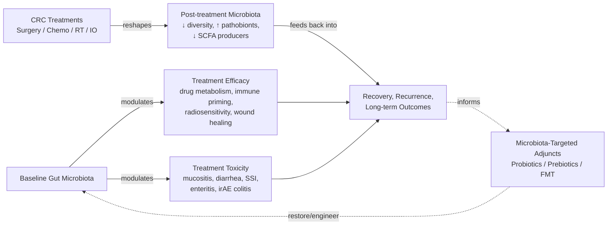
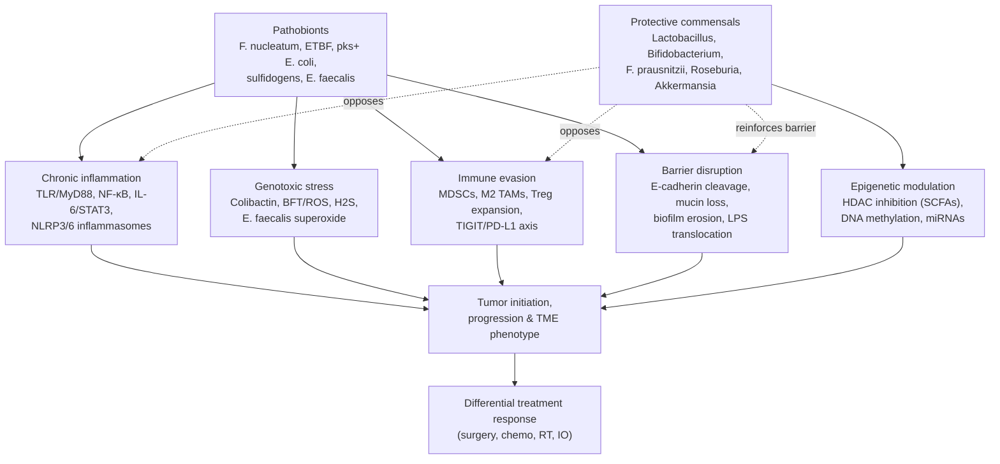
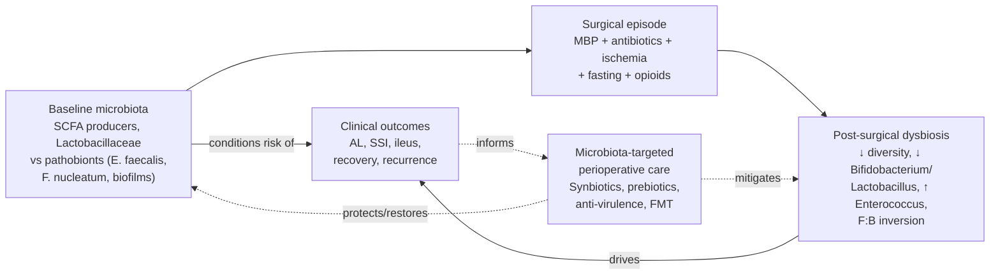
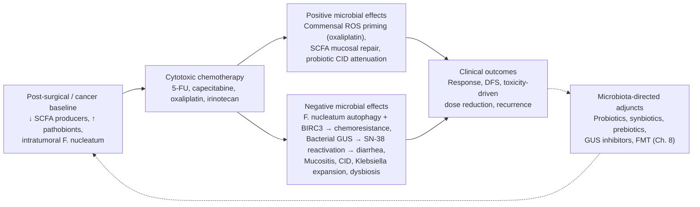
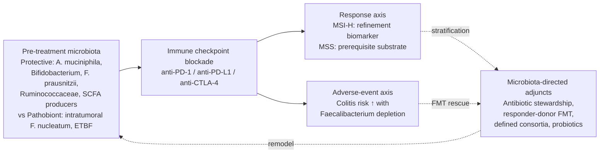
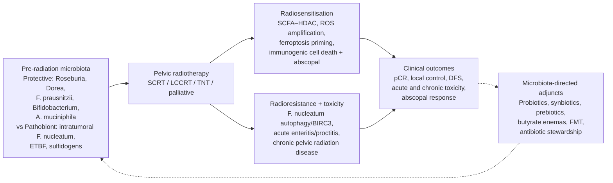
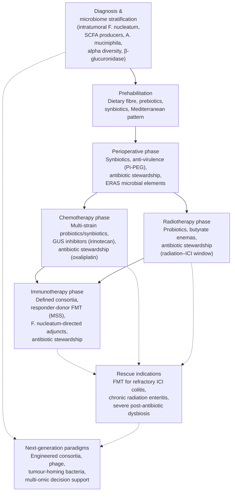
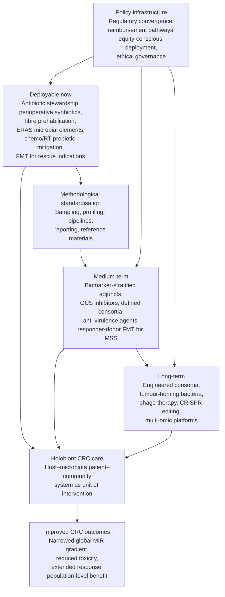

# The Interplay Between Gut Microbiota and Colorectal Cancer Treatment: A Comprehensive Review of Efficacy, Complications, and Therapeutic Frontiers
# 1 Introduction and Research Framework

Colorectal cancer (CRC) sits at the intersection of three converging frontiers in contemporary oncology: a rising and demographically shifting global disease burden, a multimodal treatment paradigm whose efficacy and toxicity remain unevenly distributed across patients, and a rapidly maturing appreciation that the human host is, in functional terms, a holobiont whose resident microbial communities co-determine therapeutic outcomes. Among solid tumors, CRC is particularly compelling for microbiome-oriented inquiry because the colonic lumen — the densest and most metabolically active microbial habitat in the body — is anatomically continuous with the tumor itself, ensuring that every surgical incision, every cytotoxic infusion, every fraction of pelvic radiation, and every immune checkpoint blockade unfolds within an ecosystem of trillions of microorganisms. This opening chapter situates the report by quantifying the contemporary CRC burden, defining the conceptual boundaries of the gut microbiota–treatment interaction axis, articulating the bidirectional analytical logic that organizes subsequent chapters, and stipulating the evidence inclusion boundary that governs the synthesis.

## 1.1 Global Epidemiological Burden of Colorectal Cancer

The magnitude of the CRC problem is the principal justification for searching beyond conventional therapeutics for modifiable variables that improve outcomes. Drawing on GLOBOCAN-derived data, more than **1.9 million new CRC cases and approximately 930,000 deaths were estimated worldwide in 2020**, placing CRC among the three most frequently diagnosed malignancies globally[^1]. The disease is projected to expand substantially over the coming decades: the burden is forecast to reach **3.2 million new cases and 1.6 million deaths by 2040**, with the bulk of incident cases predicted to arise in high or very high Human Development Index (HDI) countries, even as transitioning economies experience the steepest relative rises[^1]. These projections reflect the dual pressures of population ageing and the diffusion of "Westernized" risk factor profiles—diet, sedentary behaviour, obesity, and tobacco exposure—into middle-income regions.

Geographic heterogeneity in CRC incidence and mortality is pronounced. Age-standardised incidence rates are highest in Australia/New Zealand and European regions, peaking at **40.6 per 100,000 in males**, while the lowest rates—as low as **4.4 per 100,000 in females in Southern Asia**—are recorded across several African and South Asian populations[^1]. Mortality follows a partially parallel but more inequitable pattern, with the **highest rates in Eastern Europe (20.2 per 100,000, males)** and the **lowest in Southern Asia (2.5 per 100,000, females)**[^1]. Broader cancer-burden analyses spanning 2020–2024 confirm that colorectal cancer ranks among the three malignancies exhibiting the greatest cross-regional disparities in outcomes, alongside lung and breast cancer[^2].

These disparities are strongly socioeconomically patterned. Across HDI strata, mortality-to-incidence ratios (MIR)—an integrative indicator of post-diagnosis survival—stratify sharply: **Very High HDI regions exhibit an MIR of 0.33, High HDI regions 0.47, Medium HDI regions 0.89, and Low HDI regions approximately 0.84**, with Sub-Saharan Africa and Central Asia exhibiting MIR values as high as 1.24–1.25 in regional analyses[^2]. The underlying drivers are quantifiable: healthcare expenditure correlates inversely with MIR (r ≈ −0.392), education index correlates strongly negatively with MIR (r ≈ −0.794), and per-capita healthcare spending differs by nearly an order of magnitude between Very High HDI ($8,325) and Low HDI ($900) regions[^2]. Such gradients translate directly into differential access to early detection, multidisciplinary surgery, modern systemic therapy, and supportive care—the precise domains in which microbiota-modulated interventions may eventually narrow gaps.

National-level data from the United States illustrate the demographic complexity that aggregated global statistics can obscure. The American Cancer Society projected **153,020 new CRC diagnoses and 52,550 deaths for 2023**, with male incidence (41.5 per 100,000) running 33% higher than female incidence (31.2 per 100,000) during 2015–2019[^3]. Crucially, the patient population is rapidly **shifting younger**: although overall incidence has fallen from a peak of 66.2 per 100,000 in 1985 to 35.5 per 100,000 in 2019—a 46% decline driven by screening uptake and risk factor modification—incidence in adults under 50 has been **rising by approximately 2% per year since 2011**, and CRC mortality in this age group has been increasing by about 1% per year[^3]. As a result, the proportion of CRC diagnoses occurring in individuals aged 54 years or younger climbed from **11% in 1995 to 20% in 2019**[^3]. Compounding this shift, **regional- and distant-stage incidence has risen by approximately 3% annually in adults under 50**, and the share of advanced-stage diagnoses overall increased from a low of 52% during 2005–2008 to **60% in 2019**, with the most common diagnostic stage in both younger and older adults now being regional rather than localized disease[^3]. Racial and ethnic disparities are similarly stark: incidence is highest among Alaska Native (88.5 per 100,000), American Indian (46.0), and non-Hispanic Black (41.7) populations, compared with 35.7 per 100,000 in non-Hispanic White individuals, and 5-year relative survival ranges from **60% in Black patients to 67% in Asian American and Pacific Islander patients**[^3].

Table 1 consolidates the principal epidemiological parameters that frame this report.

| Indicator | Value / Range | Source year | Implication for the report |
|---|---|---|---|
| Global new CRC cases | ~1.93 million | 2020[^1] | Defines absolute scale of the therapeutic challenge |
| Global CRC deaths | ~930,000 | 2020[^1] | Anchors the urgency of improving treatment outcomes |
| Projected new cases by 2040 | ~3.2 million | 2040 projection[^1] | Underscores future demand for adjunct strategies |
| Projected deaths by 2040 | ~1.6 million | 2040 projection[^1] | Highlights the survival gap to be closed |
| Highest incidence (males, Aus/NZ & Europe) | 40.6 / 100,000 | 2020[^1] | Burden concentrated in high-HDI settings with most data |
| Highest mortality (males, Eastern Europe) | 20.2 / 100,000 | 2020[^1] | Geographic mortality outliers despite high HDI |
| MIR gradient (Very High → Low HDI) | 0.33 → 0.84 | 2020–2024[^2] | Socioeconomic stratification of outcomes |
| US new CRC cases (2023) | 153,020 | 2023[^3] | High-resource benchmark for microbiome research |
| US <50 years incidence trend | +2%/year since 2011 | 2011–2019[^3] | Early-onset CRC as an emerging microbiome research priority |
| US advanced-stage share | 60% (2019) vs 52% (2005–2008) | 2005–2019[^3] | Rising need for systemic-therapy optimization |

Three interpretive insights emerge. First, the **absolute and projected scale of CRC** ensures that even modest microbiota-mediated improvements in efficacy or toxicity would translate into substantial population-level benefit. Second, the **early-onset CRC phenomenon**, with its disproportionate rectal predominance and advanced presentation, generates a younger, longer-living patient population for whom durable treatment response and minimization of long-term toxicity (including treatment-induced dysbiosis) are particularly consequential. Third, the **socioeconomic gradient in MIR** signals that the diffusion of microbiota-targeted adjuncts must be designed with equity in mind, since the populations with the worst outcomes are precisely those with the least access to advanced diagnostics and biologics.

## 1.2 Conceptual Scope of the Gut Microbiota–CRC Treatment Interaction

Against this epidemiological backdrop, the gut microbiota has emerged over the last decade as one of the most actively investigated modifiable variables in CRC oncology. To proceed analytically, several core terms require precise delimitation. The **gut microbiota** refers to the assemblage of bacterial, archaeal, viral, and fungal organisms that colonize the gastrointestinal tract, dominated in the colon by Firmicutes, Bacteroidetes, Actinobacteria, Proteobacteria, and Verrucomicrobia. The **microbiome** denotes the collective genomes, gene products, and metabolites of these communities, including short-chain fatty acids (SCFAs), bile acid derivatives, polyamines, and microbial-derived ligands of host receptors. **Dysbiosis** designates a compositional or functional deviation from a healthy reference state—typically reduced alpha diversity, expansion of pathobionts, and depletion of SCFA producers—that is associated with disease initiation, progression, or treatment-related complications. **Microbiota-targeted interventions** encompass any deliberate modulation of community structure or function, including probiotics, prebiotics, synbiotics, postbiotics, dietary modulation, antibiotic stewardship, bacteriophage therapy, engineered bacterial consortia, and fecal microbiota transplantation (FMT).

The gut microbiota has become a critical variable in CRC oncology for four interlocking reasons. **First**, the colonic microbiota is anatomically embedded within the tumor microenvironment itself; intratumoral bacteria, biofilms, and luminal communities together influence local inflammation, genotoxic stress, and immune surveillance. **Second**, microbial enzymatic activity—most prominently bacterial β-glucuronidases, nitroreductases, and azoreductases—directly metabolizes anticancer drugs and their conjugated metabolites, with documented impacts on systemic exposure, efficacy, and dose-limiting toxicity. **Third**, the microbiota functions as a systemic immune adjuvant, calibrating innate (TLR/MyD88) and adaptive (Th1/Th17/Treg balance, dendritic cell maturation, CD8⁺ T-cell priming) responses that are now known to govern the success of immune checkpoint blockade. **Fourth**, perioperative and post-treatment microbial communities determine the integrity of the mucosal barrier, the propensity for opportunistic infection, and the trajectory of anastomotic healing, recovery, and long-term recurrence.

Conceptually, then, this report treats the gut microbiota simultaneously as (i) a **biomarker**—a measurable signature that stratifies risk of toxicity, predicts therapeutic response, and refines prognosis; and (ii) a **modifiable therapeutic target**—a substrate that can be reshaped to enhance efficacy and mitigate harm across the full continuum of CRC care, from surgery through chemotherapy, radiotherapy, and immunotherapy, and into the emerging frontier of microbiota-directed adjuncts.

## 1.3 Bidirectional Analytical Logic: Microbiota–Therapy Interplay

A defining characteristic of microbiota–therapy interactions in CRC is their **bidirectionality**, and this report is organized around that two-way logic. Neither direction can be understood in isolation, and conflating them obscures both mechanism and clinical opportunity.

In the **forward direction**, baseline microbiota composition shapes therapy outcomes. Pre-treatment community structure and function influence the pharmacokinetics and pharmacodynamics of cytotoxic agents (e.g., bacterial β-glucuronidase reactivation of SN-38G driving irinotecan-induced diarrhea), the priming of antitumor immunity that conditions response to anti–PD-1/PD-L1 blockade, the threshold for radiation-induced enteritis, and the perioperative risk of anastomotic leak and surgical site infection. In this direction, the microbiota acts as a covariate of the patient that can be measured, predicted from, and—prospectively—engineered.

In the **reverse direction**, CRC therapies themselves are powerful ecological perturbations. Mechanical bowel preparation and perioperative prophylactic antibiotics restructure colonic communities within hours; cytotoxic chemotherapy depletes SCFA-producing commensals and selects for pathobionts; pelvic radiation reduces alpha diversity and enriches Proteobacteria; and immune checkpoint inhibitors, while not directly antimicrobial, can precipitate immune-mediated colitis whose severity tracks pre-treatment microbial composition. These therapy-induced shifts have downstream consequences for recovery, infectious complications, long-term toxicity, and—plausibly—recurrence risk.

The diagram makes explicit that microbiota and therapy form a closed loop. Each subsequent treatment-focused chapter (Chapters 3–6) is therefore structured to address both arrows: how the microbiota influences that modality's efficacy and complications, and how that modality reshapes the microbiota. The Future Outlook chapter (Chapter 8) then examines how the loop can be intentionally interrupted or rewired through probiotics, prebiotics, synbiotics, and FMT.

## 1.4 Research Framework, Evidence Boundary, and Report Roadmap

To ensure analytical rigor, this report applies an explicit evidence framework. The **temporal boundary** is set at literature publicly available up to September 2024; findings, trials, and datasets appearing after that cutoff are outside the scope of this synthesis. The **evidence hierarchy** prioritizes, in descending order, randomized controlled trials and meta-analyses, prospective cohort studies, retrospective clinical series, and preclinical (animal and in vitro) mechanistic work; throughout the report, claims drawn from preclinical or single-center data are flagged as such, and quantitative effect sizes are reported wherever the primary sources permit. **Analytical dimensions** covered across modalities include: (i) therapeutic efficacy (response, survival, recurrence); (ii) toxicity and complications (gastrointestinal, infectious, immune-mediated); (iii) underlying microbial and molecular mechanisms (specific taxa, metabolites, host pathways); and (iv) translational and therapeutic opportunities. **Dual-polarity balance** is maintained as a structural requirement: each modality is examined for both protective/beneficial microbiota interactions and harmful/complicating ones, with comparable depth on each side.

Within these constraints, the report unfolds along a deliberate logical arc. **Chapter 2** establishes the microbiota's foundational role in CRC biology—dysbiosis, pathogenic taxa (Fusobacterium nucleatum, enterotoxigenic Bacteroides fragilis, pks⁺ Escherichia coli), protective commensals, and the mechanistic pathways (inflammation, genotoxicity, immune evasion, barrier disruption, epigenetic modulation) that condition all downstream treatment interactions. **Chapters 3 through 6** apply the bidirectional framework sequentially to surgery, chemotherapy, immunotherapy, and radiotherapy, providing the evidence base from which the synthesis table is constructed. **Chapter 7** consolidates these findings into the comparative four-column table requested by the research brief—Treatment Area, Specific Modality, Positive Impacts/Advantages, Negative Impacts/Complications—covering surgery, chemotherapy, immunotherapy, radiotherapy, and a Future Outlook row pair populated by probiotics/prebiotics and FMT. **Chapter 8** expands the Future Outlook into a dedicated analytical chapter on microbiota-modulating interventions and their translational feasibility. **Chapter 9** critically interrogates methodological limitations and research gaps, and **Chapter 10** distills clinical implications and a roadmap for integrating microbiome science into CRC care.

By anchoring the entire synthesis in a quantified epidemiological problem, a clearly delimited conceptual scope, an explicit bidirectional logic, and a transparent evidence boundary, this chapter establishes the analytical platform on which the remainder of the report is built. The next chapter turns to the biological foundation: how dysbiosis and specific microbial actors first establish CRC, thereby setting the stage on which all subsequent therapies act and are acted upon.

# 2 Foundations of the Gut Microbiota in Colorectal Cancer Biology

The epidemiological and conceptual framework established in Chapter 1 made clear that every CRC therapy is delivered into a colonic ecosystem whose composition and function pre-exist the intervention and continue to evolve alongside it. Before that bidirectional logic can be operationalised across surgery, chemotherapy, immunotherapy, and radiotherapy, it is necessary to specify the biological substrate itself: which microbial communities populate a healthy colon, how that community is reorganised during carcinogenesis, which taxa actively drive malignant transformation, which restrain it, and through what molecular pathways the microbiota exerts its oncogenic or protective effects. This chapter assembles those foundations, treating the dysbiotic CRC microbiota neither as an epiphenomenon nor as a single pathogen but as a structured ecological state whose features condition every downstream treatment interaction discussed in subsequent chapters.

## 2.1 Dysbiosis in the CRC Continuum: From Healthy Colon to Carcinoma

A healthy adult colon harbours a community dominated, at the phylum level, by Firmicutes and Bacteroidetes, with Actinobacteria, Proteobacteria and Verrucomicrobia as numerically smaller but functionally important contributors. Two structural properties characterise this reference state: relatively high **alpha diversity** (a large number of co-existing taxa with reasonably even abundances) and a metabolic output skewed towards short-chain fatty acids (SCFAs), particularly butyrate, acetate and propionate, generated by the anaerobic fermentation of dietary fibre. CRC-associated microbiotas depart from this baseline along several axes that recur across geographically and methodologically diverse cohorts: reduced alpha diversity, a perturbed Firmicutes-to-Bacteroidetes ratio, expansion of facultative anaerobes and pathobionts within the Proteobacteria and Fusobacteria phyla, and a depletion of obligate-anaerobe SCFA producers such as *Faecalibacterium prausnitzii*, *Roseburia* spp., and several *Lachnospiraceae*. Functionally, this manifests as reduced butyrate synthesis capacity, increased lipopolysaccharide (LPS) and hydrogen sulfide production, enriched bile-acid 7α-dehydroxylation activity yielding secondary bile acids such as deoxycholic acid, and elevated activity of bacterial genotoxin biosynthesis clusters.

These compositional shifts are not abrupt events occurring at the moment of carcinoma diagnosis; they evolve progressively along the **adenoma–carcinoma sequence**. Cross-sectional and longitudinal studies of patients with normal mucosa, low- and high-grade adenomas, and invasive carcinoma describe a gradient in which Fusobacteria, *Peptostreptococcus*, *Parvimonas*, *Porphyromonas* and certain Bacteroidaceae become progressively more abundant as lesions advance, while butyrate-producing Lachnospiraceae and Ruminococcaceae are progressively lost. This stepwise reconfiguration is consistent with the hypothesis that dysbiosis is both an early contributor to and a sustained accelerant of malignant transformation, rather than merely a late consequence of tumour necrosis or luminal obstruction. It also implies that a "pre-neoplastic" microbial signature is potentially identifiable, with implications for risk stratification that recur throughout the report.

A second important distinction concerns **niche segregation within the tumour**. The microbiota of a CRC patient cannot be reduced to a single faecal community; it is partitioned among the luminal contents, the loosely adherent outer mucus layer, the firmly adherent inner mucus and epithelium, and the intratumoral compartment itself. Tumour-adjacent mucosal communities and intratumoral microbiota are frequently enriched for *Fusobacterium nucleatum*, enterotoxigenic *Bacteroides fragilis* (ETBF), and *Escherichia coli*—including the colibactin-producing *pks⁺* lineage—at levels that exceed those measurable in stool. Because each compartment is exposed to different oxygen tensions, nutrient gradients, and host immune surveillance, the same patient can harbour markedly different communities at different depths, and a faecal sample, while practically obtainable, provides only a partial readout of the bacteria that actually contact transformed cells. This caveat is critical when interpreting clinical microbiome biomarkers and is revisited in Chapter 9.

Finally, ecological remodelling at the mucosal surface increasingly involves **polymicrobial biofilms**. In a substantial fraction of CRCs—particularly right-sided tumours—dense, mucus-invading biofilms composed of *Bacteroidetes* and *Lachnospiraceae* members and frequently containing *F. nucleatum* and ETBF coat the epithelium, dissolve the inner mucus barrier, and bring bacterial cells into direct contact with the colonocyte apical membrane. Biofilm-positive mucosa exhibits elevated epithelial proliferation, IL-6 signalling, and polyamine metabolism even in macroscopically normal tissue, suggesting that biofilm formation is an ecological hallmark that primes the colon for transformation rather than a passive response to it. The consequences are practical: biofilm-associated communities are mechanically and metabolically resistant to perturbation, complicating both microbiota-targeted intervention and the interpretation of post-treatment community shifts examined in later chapters.

## 2.2 Pathogenic Taxa Driving Carcinogenesis and Progression

Within the dysbiotic CRC microbiota, a relatively small set of taxa is repeatedly nominated as actively oncogenic—organisms whose presence is not merely correlated with disease but whose virulence factors causally promote transformation, progression, or aggressive phenotype in mechanistic models. Three are paradigmatic.

***Fusobacterium nucleatum*** is the most extensively characterised of these. An obligate anaerobe normally resident in the oral cavity, it is consistently enriched in CRC tissue, increases in abundance along the adenoma–carcinoma sequence, and is more abundant in right-sided and proximal tumours. Its oncogenic toolkit centres on two surface adhesins. FadA binds E-cadherin on colonocytes, sequestering its cytoplasmic tail, releasing β-catenin, and activating canonical Wnt signalling with downstream upregulation of cyclin D1, c-Myc, and proliferation. Fap2 binds the host inhibitory receptor TIGIT on natural killer (NK) cells and tumour-infiltrating lymphocytes, dampening cytotoxic activity, and additionally recognises tumour-overexpressed Gal-GalNAc, enabling preferential colonisation of CRC tissue. *F. nucleatum* further activates TLR4/MyD88-dependent NF-κB signalling, induces autophagy programs that confer chemoresistance (a property exploited in Chapter 4), and recruits myeloid-derived suppressor cells (MDSCs) and CX3CR1⁺ PD-L1⁺ phagocytes that establish an immunosuppressive tumour microenvironment (revisited in Chapter 5). Clinically, high intratumoral *F. nucleatum* loads are associated with proximal location, microsatellite instability, CpG island methylator phenotype, lymph node metastasis, and inferior disease-free and overall survival.

**Enterotoxigenic *Bacteroides fragilis* (ETBF)** is the second canonical CRC pathobiont. Distinguished from non-toxigenic strains by carriage of the *bft* gene encoding fragilysin (BFT), a zinc-dependent metalloprotease, ETBF cleaves E-cadherin at the colonocyte tight junction, disrupting epithelial integrity, allowing apical β-catenin signalling, and exposing the lamina propria to luminal contents. The dominant downstream consequence is a Th17-skewed mucosal immune response with IL-17 production, recruitment of immature myeloid cells and MDSCs, and chronic STAT3 activation. In *Min*/*ApcΔ716* mouse models, ETBF colonisation accelerates colon tumorigenesis in an IL-17-dependent fashion, providing some of the strongest causal experimental evidence linking a single human commensal-derived toxin to CRC. ETBF is detected at elevated frequency in mucosal biofilms and in CRC tissue compared with healthy controls, with biofilm co-occurrence with *F. nucleatum* suggesting cooperative ecological niches.

***pks⁺ Escherichia coli***—strains of the B2 phylogroup carrying the *pks* polyketide synthase island—produce **colibactin**, a small-molecule genotoxin that alkylates adenine residues and induces interstrand DNA cross-links and double-strand breaks in colonocytes. The mechanistic significance was sharpened by the demonstration that colibactin exposure leaves a distinctive single-base-substitution mutational signature (T>N at AAWWTT motifs) and an associated indel signature, and that these signatures are detectable in a non-trivial fraction of human CRC genomes, particularly in early-onset disease. *pks⁺ E. coli* is enriched in mucosal biofilms of patients with familial adenomatous polyposis and sporadic CRC, and—uniquely among the canonical CRC pathobionts—provides a direct mutagenic mechanism that imprints an identifiable molecular scar on the tumour genome.

Beyond this triad, a wider cast of pathobionts repeatedly emerges in CRC microbiome studies. ***Peptostreptococcus stomatis* and *anaerobius*, *Parvimonas micra*, *Gemella morbillorum*, *Solobacterium moorei*** and oral-origin streptococci are enriched in CRC stool and tissue and, in combination with *F. nucleatum*, form the basis of several proposed multi-taxon diagnostic signatures. ***Streptococcus gallolyticus* subsp. *gallolyticus*** (formerly *S. bovis* biotype I) is a long-recognised clinical association: bacteremia or endocarditis caused by this organism warrants colonoscopy because of strong epidemiological linkage to underlying colorectal neoplasia, and experimental work implicates pilus-mediated adhesion and promotion of β-catenin signalling. Sulfidogenic taxa such as ***Fusobacterium*, *Bilophila wadsworthia*** and certain *Desulfovibrio* spp. contribute hydrogen sulfide, a genotoxic and pro-inflammatory metabolite, while *Enterococcus faecalis*—central to perioperative complications discussed in Chapter 3—produces extracellular superoxide that damages colonocyte DNA. The CRC-associated pathobiont community is therefore best conceptualised not as a single causative microbe but as a functionally redundant guild whose members converge on a small number of oncogenic outputs.

To anchor the discussion, the following table consolidates the principal pathogenic taxa, their dominant virulence factors, mechanistic outputs, and clinical correlates.

| Taxon | Key virulence factor(s) | Dominant mechanism | Tumour-site / clinical correlate |
|---|---|---|---|
| *Fusobacterium nucleatum* | FadA, Fap2, LPS | E-cadherin/β-catenin activation; TIGIT-mediated NK/T suppression; autophagy-driven chemoresistance; MDSC/CX3CR1⁺ recruitment | Right-sided/proximal, MSI-H, CIMP-high; worse DFS/OS; chemoresistance |
| Enterotoxigenic *B. fragilis* (ETBF) | BFT (fragilysin) | E-cadherin cleavage; IL-17/STAT3-driven Th17 inflammation; barrier disruption | Mucosal biofilms; experimental acceleration of tumorigenesis in *Apc*-mutant mice |
| *pks⁺ Escherichia coli* | Colibactin (NRPS-PKS) | DNA alkylation, ICLs, DSBs; SBS/ID colibactin mutational signature | Biofilms in FAP and sporadic CRC; signature detectable in human CRC genomes; early-onset CRC |
| *Peptostreptococcus*, *Parvimonas micra* | Co-aggregation, biofilm participation | Synergy with *F. nucleatum*; pro-inflammatory milieu | Diagnostic multi-marker stool signatures |
| *Streptococcus gallolyticus* | Pil1/Pil3 pili | β-catenin activation; epithelial adhesion | Bacteremia/endocarditis as sentinel of CRC |
| Sulfidogens (*Bilophila*, *Desulfovibrio*) | H₂S production | DNA damage, mucus degradation, mitochondrial toxicity | High-fat/high-protein diet–linked CRC |
| *Enterococcus faecalis* | Extracellular superoxide, gelatinase | Colonocyte DNA damage; MMP9-mediated tissue degradation | Perioperative anastomotic complications (Ch. 3) |

Two cross-cutting insights are worth flagging. First, **several of these organisms operate at more than one biological level simultaneously**—*F. nucleatum*, for example, contributes to initiation through Wnt activation, to progression through immune evasion, and to treatment failure through autophagy-mediated chemoresistance—making it a strong candidate for therapeutic targeting in multiple downstream chapters. Second, **the pathobiont guild is metabolically and structurally interdependent**: biofilm scaffolding by *B. fragilis* and *Fusobacterium* creates the anaerobic, mucus-degraded niche in which *pks⁺ E. coli* can sustain colibactin production, implying that single-organism interventions may be insufficient and that ecological-level strategies (Chapter 8) merit emphasis.

## 2.3 Protective Commensals and Beneficial Microbial Metabolites

Counterbalancing this pathogenic guild is a network of commensal organisms whose abundance is typically reduced in CRC and whose metabolic outputs are protective. The most important groups are the genus-level taxa ***Lactobacillus*** and ***Bifidobacterium*** (Actinobacteria), members of the *Lachnospiraceae* and *Ruminococcaceae* families including ***Faecalibacterium prausnitzii***, ***Roseburia*** spp., ***Eubacterium rectale*** and ***Anaerostipes***, and the mucin-degrading verrucomicrobial ***Akkermansia muciniphila***. Although the precise mechanisms differ across genera, their protective effects converge on four functional categories: SCFA generation, secondary metabolite production, immune calibration, and pathobiont exclusion.

The **short-chain fatty acids**—butyrate, propionate, and acetate—are the most extensively characterised protective metabolites. **Butyrate** is the preferred energy substrate of colonocytes, sustains mucin synthesis and tight junction integrity, and exerts a series of anti-tumorigenic effects via two principal mechanisms: agonism of G-protein-coupled receptors GPR41, GPR43, and GPR109A on colonocytes and immune cells, and inhibition of class I/II histone deacetylases (HDACs). Pharmacologically relevant intraluminal butyrate concentrations induce hyperacetylation of histones at tumour-suppressor loci, restore expression of cell-cycle inhibitors such as p21, drive apoptosis selectively in transformed cells (the so-called butyrate paradox, in which proliferating colonocytes—those with the Warburg metabolic phenotype—accumulate butyrate as an HDAC inhibitor rather than oxidising it as fuel), and suppress NF-κB-driven inflammation. Propionate similarly engages GPR41/43 and inhibits HDACs at higher concentrations, while acetate contributes to systemic immune homeostasis and to peripheral regulatory T-cell induction. SCFA-driven HDAC inhibition is also a major node of **epigenetic protection**, returned to in §2.4.

**Secondary metabolite axes** complement SCFA-mediated protection. The **bile acid axis** is regulated by commensal 7α-dehydroxylating activity that converts primary cholic and chenodeoxycholic acids into deoxycholic and lithocholic acids; while excess secondary bile acids are tumour-promoting, balanced microbial metabolism produces ligands of FXR and TGR5 that restrain inflammation and proliferation. **Tryptophan metabolism** by lactobacilli and other commensals generates indole, indole-3-aldehyde, indole-3-propionic acid, and related derivatives that engage the aryl hydrocarbon receptor (AhR) on intestinal epithelial and immune cells, sustaining IL-22 production by group 3 innate lymphoid cells, mucus secretion, antimicrobial peptide expression, and Treg/Th17 balance. **Polyamine** metabolism, when dominated by commensals rather than pathobionts, contributes to barrier maintenance. *A. muciniphila*, by controlled mucin foraging, paradoxically thickens the inner mucus layer through stimulation of host goblet-cell turnover and produces propionate and acetate; it has emerged as a particularly important biomarker of preserved barrier function and—of central relevance to Chapter 5—of responsiveness to immune checkpoint inhibitors.

At the immunological level, protective commensals **calibrate host immunity** in directions that oppose carcinogenesis. *Bifidobacterium* species enhance dendritic cell maturation and CD8⁺ T-cell priming, *F. prausnitzii* induces IL-10-producing regulatory T cells and dampens NF-κB activation in colonocytes, and *Lactobacillus* species reinforce sIgA secretion and inhibit pathobiont adhesion through competitive exclusion, bacteriocin production, and lactate-driven luminal acidification. Several of these immunomodulatory functions reappear in Chapter 5 as mechanistic determinants of immunotherapy response.

Finally, protective commensals contribute to **pathobiont exclusion** through ecological mechanisms—nutrient competition, occupation of mucosal niches, and maintenance of colonisation resistance against opportunistic Proteobacteria. The depletion of these organisms in CRC is therefore mechanistically significant on two levels: it removes the direct anti-tumour effects of SCFAs and immunoregulatory metabolites, and it relaxes the ecological constraints that ordinarily restrain pathobiont expansion. Microbiota-targeted adjuncts evaluated in Chapter 8 are largely designed around the restoration of one or more of these functions.

## 2.4 Core Mechanistic Pathways Linking Microbiota to CRC Biology

The behaviour of pathogenic and protective taxa converges, mechanistically, on five interlocking pathways. Although organised separately for analytical clarity, they operate as a network in which perturbations in one compartment propagate into the others.

**(i) Chronic low-grade inflammation.** Pathobiont-derived ligands—lipopolysaccharide from Proteobacteria, lipoteichoic acid and flagellin from selected Firmicutes, and BFT from ETBF—activate TLR2/4/5 and downstream MyD88-dependent signalling in colonocytes and lamina propria immune cells, driving NF-κB-mediated transcription of IL-6, IL-8, TNF-α, COX-2 and iNOS. Tonic IL-6 signalling phosphorylates STAT3 in colonocytes, sustaining cyclin D1, Bcl-XL and survivin expression and promoting transformed-cell survival. The NLRP3 and NLRP6 inflammasomes are dysregulated in dysbiosis, with NLRP6 deficiency permitting expansion of colitogenic *Prevotellaceae* and TM7 lineages. The net result is a smouldering inflammatory milieu in which mutated colonocytes are selectively favoured—precisely the substrate from which post-treatment inflammation (post-surgical, chemoradiation-induced mucositis, irAE colitis) can be re-amplified.

**(ii) Direct genotoxin production and DNA damage.** As described in §2.2, *pks⁺ E. coli*–derived colibactin alkylates adenine, generating interstrand cross-links, double-strand breaks, and a characteristic mutational signature. ETBF's BFT cleaves E-cadherin and induces spermine oxidase-dependent reactive oxygen species, producing 8-oxo-dG lesions. Sulfidogen-derived hydrogen sulfide damages mitochondrial DNA and inhibits cytochrome c oxidase, while *E. faecalis* extracellular superoxide generates chromosomal instability in adjacent colonocytes. These directly mutagenic pressures are particularly relevant because they explain how a chronic microbial exposure—rather than a single carcinogen exposure event—can deliver the accumulating somatic mutations required for CRC initiation, and they intersect downstream with the DNA-damaging mechanisms of chemotherapy and radiotherapy analysed in Chapters 4 and 6.

**(iii) Immune evasion and tumour microenvironment shaping.** Beyond fostering inflammation, the dysbiotic microbiota actively suppresses anti-tumour immunity. *F. nucleatum* engages TIGIT and CEACAM1 to inhibit NK- and T-cell cytotoxicity, recruits MDSCs and tumour-associated macrophages with M2 polarisation, and—as shown in CT26 and human CRC contexts—expands CX3CR1⁺ PD-L1⁺ phagocytes that constrain CD8⁺ effector function. ETBF-driven IL-17 supports MDSC accumulation, while polyamines from arginine-metabolising pathobionts impair T-cell activation. Conversely, protective commensals enhance dendritic cell antigen presentation, expand effector CD8⁺ populations, and balance Treg/Th17 axes. This pre-existing immunological set-point is the substrate on which immune checkpoint inhibitors must act, providing the mechanistic foundation for Chapter 5's analysis of MSI-H/dMMR versus MSS/pMMR differential responsiveness.

**(iv) Epithelial barrier disruption and microbial translocation.** Loss of butyrate-producing commensals undermines tight junction proteins (claudins, occludin, ZO-1) and mucin synthesis; BFT directly cleaves E-cadherin; biofilms erode the inner mucus layer; and IL-22-driven antimicrobial peptide production declines with depletion of AhR-stimulating commensals. The resulting "leaky" barrier permits translocation of LPS and microbial DNA into the lamina propria and portal circulation, amplifying systemic inflammation, supporting Kupffer-cell activation, and—of high clinical relevance—predisposing to anastomotic leak and surgical site infection in the perioperative setting (Chapter 3) and to bacteraemia during chemotherapy-induced neutropenia (Chapter 4).

**(v) Epigenetic modulation.** The microbiota imprints heritable, non-genetic changes on host gene expression. SCFA-mediated HDAC inhibition is the dominant mechanism, but microbial metabolites also influence DNA methyltransferase activity (with folate, methionine, and B12 metabolism by gut bacteria modulating the host methyl donor pool), histone acetyltransferase substrate availability (acetyl-CoA from microbial acetate), and non-coding RNA expression. *F. nucleatum* infection has been linked to altered miR-21 and miR-1322 expression in colonocytes, modulating chemoresistance and autophagy. Epigenetic reprogramming of immune cells by microbiota-derived metabolites—Treg induction via butyrate-driven Foxp3 locus acetylation—is a particularly consequential bridge between microbiota composition and durable immune phenotypes that condition both anti-tumour immunity and irAE susceptibility.

The integrative logic of these five pathways is most clearly visualised as a network rather than a list, in which microbial actors and host pathways feed into a shared phenotypic output.

The diagram emphasises that no single microbial mechanism operates in isolation. Genotoxic stress requires a permissive inflammatory and barrier-disrupted environment to translate into mutation accumulation; immune evasion is potentiated by inflammation-driven myeloid skewing; epigenetic effects of protective metabolites simultaneously restrain inflammation and shape Treg/effector balance. The clinical implication—developed across Chapters 3–6—is that interventions targeting any single node will inevitably modulate the others.

## 2.5 Translational Implications: From Carcinogenic Mechanisms to Treatment Interactions

The foundations assembled in this chapter project directly onto the bidirectional treatment chapters that follow, and several through-lines warrant explicit articulation.

First, the **dysbiotic baseline** that characterises a CRC patient at diagnosis is not a passive backdrop. Reduced alpha diversity, depleted SCFA producers, expanded pathobionts, mucosal biofilm presence, and elevated intratumoral *F. nucleatum* are each associated with measurable differences in subsequent treatment behaviour: greater perioperative infectious risk and impaired anastomotic healing under surgery (Chapter 3); altered β-glucuronidase capacity and autophagy-mediated chemoresistance under cytotoxic therapy (Chapter 4); reduced antigen-presentation efficiency and a more immunosuppressive tumour microenvironment under checkpoint blockade (Chapter 5); and elevated risk of radiation enteritis with diminished radiosensitivity under radiotherapy (Chapter 6). The same pre-treatment microbiome that contributed to carcinogenesis therefore continues to shape outcomes once treatment begins.

Second, **the pathogenic taxa profiled in §2.2 are not modality-specific actors**. *F. nucleatum* recurs as a chemoresistance factor in Chapter 4, as an immune-evasion factor in Chapter 5, and as a prognostic biomarker after radiotherapy in Chapter 6. ETBF and biofilm-forming consortia reappear in surgical complications. *E. faecalis*, mentioned here primarily for genotoxic DNA damage, becomes central in Chapter 3 as a collagenase-producing driver of anastomotic leak. The same is true on the protective side: *Akkermansia muciniphila*, *Bifidobacterium*, and *Faecalibacterium* recur across modalities, and the Lactobacillus–SCFA axis is the conceptual backbone of probiotic, prebiotic, and dietary-fibre strategies analysed in Chapter 8.

Third, the **five mechanistic pathways** provide a vocabulary that is directly transferable to treatment analysis. Chemotherapy-induced mucositis is, mechanistically, an acute amplification of pathway (iv) on a background already weakened by pathway (i). Immune-related colitis triggered by checkpoint inhibitors is a re-engagement of pathway (iii) under conditions of pharmacological immune disinhibition. Radiation enteritis combines acute DNA damage with secondary dysbiosis, simultaneously aggravating pathways (ii) and (iv). Each subsequent chapter therefore inherits the mechanistic scaffolding developed here rather than reconstructing it de novo.

Fourth, this chapter identifies a set of **candidate biomarkers and modifiable targets** that recur as analytical anchors throughout the report. On the biomarker side: intratumoral *F. nucleatum* load, *pks⁺ E. coli* carriage, the colibactin mutational signature, faecal SCFA profile, *A. muciniphila* abundance, and faecal/mucosal alpha diversity. On the intervention side: restoration of SCFA-producing communities (probiotics, fibre, synbiotics), eradication or suppression of pathobionts (antibiotic stewardship, phage approaches, immune-targeting), ecological reset via FMT, and metabolite supplementation. The translational programme that Chapter 8 develops, and the limitations that Chapter 9 enumerates, both flow from this list.

The biological substrate is now in place. With dysbiosis defined as an evolving ecological state, with the pathobiont guild and protective commensal network specified, and with the five-pathway mechanistic architecture articulated, the report turns in Chapter 3 to the first treatment modality—surgery—where the perioperative microbiome becomes the proximate determinant of anastomotic healing, infectious complications, and recovery trajectory.

# 3 Gut Microbiota and Colorectal Cancer Surgery

The biological substrate articulated in Chapter 2 — a dysbiotic colonic ecosystem populated by collagenolytic pathobionts, biofilm-forming consortia, and depleted SCFA-producing commensals — does not remain a static backdrop when a patient enters the operating theatre. Surgery for colorectal cancer is, in microbial terms, one of the most extreme perturbations to which the gut ecosystem is ever subjected: within a span of 24–72 hours, the colon is starved by preoperative fasting, mechanically purged, exposed to systemic and frequently luminal antibiotics, opened to atmospheric oxygen, partially resected, sutured or stapled at an anastomotic interface where two ischaemic edges must heal under continuous luminal load, and then reawakened to peristalsis under opioid analgesia. Every one of these interventions reconfigures the community whose pre-surgical state was, as Chapter 2 demonstrated, already pathologically remodelled. Applying the bidirectional logic of Chapter 1, this chapter examines both arrows of that relationship: how the perioperative microbiome shapes the three principal surgical endpoints — anastomotic leak (AL), surgical site infection (SSI), and the trajectory of postoperative recovery — and how the surgical episode itself reshapes the microbiome, with downstream consequences for healing, infection risk, oncologic surveillance and, plausibly, recurrence.

## 3.1 Perioperative Microbiome Dynamics and Surgical Stress

The perioperative window can be partitioned into three ecologically distinct phases, each imposing characteristic selective pressures on the colonic community.

The **preoperative phase** is dominated by deliberate disruption: 24–48 hours of clear-liquid intake or carbohydrate loading, frequently combined with mechanical bowel preparation and oral antibiotic regimens (analysed in §3.5), and—in cancer patients—a pre-existing dysbiotic baseline characterised by reduced alpha diversity, depletion of *Faecalibacterium prausnitzii*, *Roseburia* and other Lachnospiraceae, expansion of Proteobacteria, and frequently elevated intratumoral *Fusobacterium nucleatum*. Even in the absence of formal preparation, the metabolic substrate available to fibre-fermenting obligate anaerobes collapses as soon as enteral fibre intake ceases, predictably reducing butyrate, propionate and acetate generation at the colonocyte interface.

The **intraoperative phase** layers additional, qualitatively different stresses. General anaesthesia and the surgical stress response activate sympathetic and HPA axes, releasing catecholamines and glucocorticoids that have been shown experimentally to act as direct microbial signalling molecules, upregulating virulence gene expression in *Pseudomonas aeruginosa* and *Enterococcus faecalis* (returned to in §3.2). Mesenteric vasoconstriction, transient hypoxia at the anastomotic margins, mechanical handling of bowel, alterations in luminal pH from acid suppression, and reduced bile flow further restructure the redox and nutrient gradients that ordinarily sustain obligate anaerobes. The introduction of staples or sutures creates a foreign-body niche on which biofilm formation is favoured. Intravenous prophylactic antibiotics — typically a β-lactam ± metronidazole — distribute into bowel tissue and luminal contents, exerting selective pressure that, as detailed below, persists for weeks.

The **postoperative phase** is characterised by paralytic ileus, opioid analgesia (which directly slows transit and alters mucus rheology), continued fasting or limited enteral intake, frequent acid suppression and additional antibiotic exposure for prophylaxis or treatment of suspected complications. The composite ecological signature across these three phases is highly reproducible: an acute collapse of alpha diversity, expansion of facultative anaerobes (Enterobacteriaceae, *Enterococcus*) and oxygen-tolerant Proteobacteria, depletion of obligate-anaerobe SCFA producers, loss of butyrate output, weakened colonisation resistance, and re-emergence of opportunistic and frequently antibiotic-resistant taxa. This perioperative dysbiosis is the environment in which anastomotic healing, mucosal repair and immune reconstitution must occur, and it is in this context that the specific complications discussed in the next subsections arise.

## 3.2 Microbiota and Anastomotic Leak: The Collagenolytic Pathobiont Hypothesis

Anastomotic leak remains the most feared complication of colorectal resection, with reported incidences of 3–10% for colonic and up to 15–20% for low rectal anastomoses, and case-fatality contributions of clinical significance. For decades the dominant mechanistic narrative emphasised technical, ischaemic and patient-level risk factors (tension, blood supply, malnutrition, steroid use). Over the past decade, a complementary and increasingly compelling **microbial causation model** has been developed, centred on the proposition that AL is, in many cases, the clinical manifestation of pathobiont-mediated degradation of the collagen scaffold on which early anastomotic strength depends.

The keystone organism in this model is ***Enterococcus faecalis***. Under perioperative stress — hypoxia, antibiotic suppression of competitor anaerobes, opioid- and catecholamine-driven signalling, and the presence of suture material as a colonisation surface — selected *E. faecalis* strains upregulate the secreted zinc-metalloprotease gelatinase (GelE) and serine protease SprE. These enzymes directly degrade type I collagen and, equally importantly, activate host matrix metalloproteinase 9 (MMP9) in colonocytes and stromal cells, amplifying degradation of the provisional extracellular matrix that bridges the anastomotic edges in the first 72–120 hours. In rodent anastomotic models, perioperative oral antibiotics that selectively enrich collagenolytic *E. faecalis* (notably clindamycin or cefoxitin used as the sole agent) precipitate AL even when the surgical technique is impeccable, and the leak phenotype is abolished by topical phosphate-based polymers that disarm virulence gene expression without killing the organism — a striking demonstration that virulence, rather than mere abundance, is the proximate driver.

A parallel pathobiont, ***Pseudomonas aeruginosa***, contributes through analogous mechanisms: production of the elastase LasB and other proteases, biofilm formation on staple lines, and a quorum-sensing-coordinated virulent phenotype induced by host stress signals. Although less commonly recovered from human anastomoses than *E. faecalis*, *P. aeruginosa* exemplifies the broader principle that the perioperative environment selects for and behaviourally activates a small guild of pathobionts whose virulence — not their presence per se — determines tissue integrity.

Members of the **Bacteroidaceae**, while protective in homeostatic states through SCFA cross-feeding and mucin turnover, can in the inflamed, oxygen-disturbed perianastomotic niche contribute to deep-space contamination, polymicrobial abscess formation and impaired healing, particularly when *Bacteroides fragilis* expands without its usual ecological counterweights. ***Fusobacterium nucleatum***, profiled in Chapter 2 as a paradigmatic CRC pathobiont, has additionally emerged as a perioperative actor of interest: it can persist in mucosa adjacent to and at resection margins, sustains local IL-6/STAT3 inflammation that impairs orderly wound resolution, and high intratumoral loads have been correlated in observational series with adverse short-term surgical outcomes as well as the longer-term recurrence patterns discussed in §3.4. Sulfidogenic taxa contribute by generating hydrogen sulfide that interferes with mitochondrial respiration in colonocytes at the very margins where oxygen tension is already compromised.

Opposing this guild is a network of **barrier-supporting commensals** whose perioperative abundance correlates with favourable anastomotic outcomes. **Lactobacillaceae** reinforce tight-junction integrity, produce lactate and bacteriocins that suppress *Enterococcus* and Proteobacteria expansion, and sustain mucosal sIgA. **Butyrate-producing Lachnospiraceae and Ruminococcaceae** — *Roseburia*, *Eubacterium rectale*, *Anaerostipes*, *F. prausnitzii* — fuel colonocyte oxidative metabolism, restrain NF-κB-driven inflammation through GPR/HDAC signalling, and maintain mucin synthesis. Their perioperative depletion, driven both by fasting and by antimicrobial suppression, removes the metabolic and immunological scaffolding on which controlled healing depends.

Several preoperative microbial signatures have been associated with elevated AL risk in observational cohorts: low faecal alpha diversity, depletion of *Lachnospiraceae*, elevated mucosal *Enterococcus* burden, presence of mucosal biofilm, and high intratumoral *F. nucleatum*. Although none has yet been validated as a stand-alone clinical risk-stratification tool, in aggregate they support the conceptual reframing of AL as, in part, a **microbial disease whose pathogenesis is potentially modifiable** through targeted ecological rather than purely surgical interventions.

| Microbial actor | Key virulence / mechanism | Effect on anastomotic integrity |
|---|---|---|
| *Enterococcus faecalis* (collagenolytic strains) | GelE, SprE proteases; MMP9 activation; biofilm on staples | Direct collagen degradation; AL in stress-selected models |
| *Pseudomonas aeruginosa* | LasB elastase; quorum-sensing virulence; biofilm | Tissue protease activity; impaired healing |
| Selected *Bacteroidaceae* (incl. *B. fragilis*) | Polymicrobial synergy; mucin degradation | Deep-space contamination; abscess formation |
| *Fusobacterium nucleatum* | FadA/Fap2; IL-6/STAT3 inflammation; margin persistence | Impaired wound resolution; recurrence risk |
| Sulfidogens (*Bilophila*, *Desulfovibrio*) | H₂S → mitochondrial inhibition | Aggravated anastomotic hypoxia |
| Lactobacillaceae (*protective*) | Lactate, bacteriocins, sIgA support | Barrier reinforcement; pathobiont exclusion |
| Butyrate producers (*protective*) | Butyrate → GPR/HDAC, colonocyte fuel | Mucosal integrity; controlled inflammation |

## 3.3 Microbiota and Surgical Site Infection

Surgical site infection — encompassing superficial incisional, deep incisional and organ/space (intra-abdominal abscess) categories — affects 5–25% of colorectal resections depending on patient and procedural factors, and is the most common nosocomial complication in this setting. The microbial pathogenesis of SSI in colorectal surgery is distinguished from that of cleaner procedures by the obligate intraluminal contamination risk during anastomosis: the operative field is, by definition, exposed to the colonic microbiota at the moment when the bowel is divided and reconnected. The risk of clinical infection therefore reflects the **product of three vectors**: the composition and burden of the luminal community at the time of bowel division, the integrity of the mucosal barrier and its draining lymphatics, and the host's local and systemic immune competence.

Causative organisms cluster predictably. Aerobic Gram-negatives, dominated by ***Escherichia coli*** and other Enterobacteriaceae, account for a substantial fraction of monomicrobial and polymicrobial SSIs. ***Enterococcus*** species — particularly *E. faecalis* and *E. faecium* — are recovered with increasing frequency, reflecting both their intrinsic resistance to commonly used β-lactam prophylaxis and the selective enrichment that perioperative antibiotic regimens impose. Anaerobes, especially ***Bacteroides fragilis***, are central to deep and organ-space infections, frequently in **synergistic polymicrobial consortia** with facultative aerobes — a classical anaerobic–aerobic synergy in which oxygen consumption by aerobes lowers redox potential to permit anaerobic proliferation, while anaerobic metabolites and capsular polysaccharides shield aerobes from immune clearance. Skin commensals (Staphylococci) contribute to superficial incisional infections through standard wound-contamination routes.

Three perioperative mechanisms link the gut microbiota to SSI risk. First, **preoperative mucosal dysbiosis** elevates the burden of opportunistic Enterobacteriaceae and *Enterococcus* and depletes SCFA-driven colonisation resistance, increasing the probability that bowel division spills high-pathobiont luminal contents into the peritoneal field. Second, **intraoperative translocation across a compromised epithelial barrier** — a barrier already weakened by tumour-associated biofilm erosion, ETBF-mediated E-cadherin cleavage, and surgical ischaemia — permits viable bacteria and LPS to access mesenteric lymphatics and the portal circulation even in the absence of macroscopic spillage. Third, **postoperative immune dysregulation**, comprising the systemic catabolic stress response, transient neutrophil dysfunction, and lymphopenia, reduces the host's capacity to clear the inoculum that inevitably reaches the surgical field.

Conversely, an intact SCFA-producing community is **protective at multiple levels**. Butyrate sustains colonocyte ATP generation and tight-junction expression, limiting translocation. SCFAs support sIgA secretion through B-cell class switching and plasma cell differentiation in mucosa-associated lymphoid tissue, opsonising luminal pathobionts before they reach the operative field. Lactobacillaceae and Bifidobacterium maintain colonisation resistance against *Enterococcus* and Enterobacteriaceae expansion. AhR-active tryptophan metabolites from commensals sustain IL-22-driven antimicrobial peptide production. The same depletion of these functions that accelerates carcinogenesis (Chapter 2) therefore also elevates perioperative SSI risk — a recurring theme in which CRC-driving dysbiosis and treatment-complicating dysbiosis are two facets of a single ecological deficit.

## 3.4 Microbiota and Postoperative Recovery: Ileus, Nutrition, and Enhanced Recovery

Beyond the binary endpoints of AL and SSI, the microbiota shapes the broader trajectory of postoperative recovery: return of bowel function, severity and duration of postoperative ileus, nutritional rehabilitation, systemic inflammatory tone, immune competence and length of hospital stay. These endpoints converge on the same ecological deficit — collapse of SCFA producers, loss of barrier-supporting commensals, expansion of LPS-bearing facultative anaerobes — but through partially distinct mechanisms.

**Postoperative ileus** is mechanistically a multifactorial phenomenon (opioid, inflammatory, neurogenic), but the microbiota contributes through at least two pathways. Depletion of luminal butyrate reduces the principal energy substrate of colonocytes, slowing mucosal regeneration and impairing the enteric nervous system signalling that depends on healthy epithelial-neural coupling. Loss of SCFA agonism at GPR41/43 on enteroendocrine cells reduces secretion of motility-modulating peptides (PYY, GLP-1) and dampens vagal tone. Concurrent expansion of LPS-producing Proteobacteria sustains low-grade systemic inflammation through TLR4 signalling, which independently prolongs ileus and contributes to anorexia and catabolism.

**Nutritional rehabilitation** is similarly microbiota-dependent. Early enteral nutrition — a cornerstone of Enhanced Recovery After Surgery (ERAS) protocols — serves not only host caloric needs but also the metabolic restoration of fibre-fermenting anaerobes, supplying the substrates from which SCFAs are regenerated. Conversely, prolonged parenteral nutrition without enteral substrate accelerates mucosal atrophy, increases barrier permeability, and amplifies the very translocation that drives systemic inflammatory response and septic complications. **Carbohydrate loading**, **opioid-sparing analgesia** (multimodal regimens that preserve normal transit), and **omission of routine nasogastric decompression** — all ERAS elements — can be reframed in microbial terms as interventions that minimise the duration and depth of perioperative dysbiosis.

**Systemic inflammatory response and catabolism** are amplified by LPS translocation across a leaky barrier. Endotoxaemia activates Kupffer cells, drives IL-6 and TNF-α release, induces hepatic acute-phase protein synthesis, and shifts whole-body metabolism towards proteolysis and insulin resistance. Restoration of barrier function — pharmacologically through SCFA-producer restitution, mechanically through early enteral nutrition — attenuates each of these.

The **longer-term oncologic consequences** of perioperative dysbiosis are increasingly emphasised. Persistence of *F. nucleatum* at resection margins and in residual mucosa has been associated with local recurrence and inferior disease-free survival, and the perioperative depletion of protective commensals may extend a window of immunological permissiveness that disadvantages adjuvant chemotherapy or immunotherapy initiated weeks later. Whether perioperative microbiota stewardship can translate into improved long-term oncologic outcomes — and not merely fewer infectious complications — is an open question that connects directly to Chapter 4's analysis of microbiota–chemotherapy interactions and to the adjunct strategies of Chapter 8.

## 3.5 Mechanical Bowel Preparation and Prophylactic Antibiotics: Ecological Costs and Surgical Benefits

Two perioperative practices — mechanical bowel preparation (MBP) and antibiotic prophylaxis — dominate the modifiable microbial inputs to colorectal surgery, and both must be evaluated as **double-edged interventions** whose short-term infectious benefits are paid for in ecological currency.

### 3.5.1 Mechanical Bowel Preparation

Historically conceived as a means of evacuating faecal load to facilitate handling and reduce intraoperative contamination, MBP — typically polyethylene glycol or sodium phosphate–based — has been repeatedly evaluated for its effect on hard surgical endpoints. A measured appraisal of the contemporary evidence supports the following synthesis.

**On the positive side**, MBP retains a clinically meaningful role beyond mere bowel evacuation. By emptying the colon of bulky stool, it **helps surgeons identify and handle small colorectal cancers through direct intraoperative palpation**, a capability of particular value during laparoscopic procedures where tactile feedback is limited and small, non-serosa-involving lesions may otherwise be missed. It also facilitates intraoperative colonoscopy, marking and precise resection planning.

**On the negative side**, however, MBP **does not, in isolation, prevent the principal postoperative complications it was historically presumed to mitigate, including anastomotic leak**. Beyond this efficacy ceiling, MBP imposes substantial ecological costs. It **causes severe alterations in both the luminal and mucosal microbiota**, with reductions in alpha diversity and disproportionate depletion of obligate anaerobes. **Specific bacterial species reduced include Bifidobacteria, Clostridium coccoides, and Lactobacillus** — precisely the protective genera profiled in Chapter 2 and §3.2 as supporting barrier integrity, colonisation resistance, and SCFA-driven mucosal homeostasis. Recovery of the community is not immediate: **complete restoration of the microbiota requires approximately 14 days** following MBP, a window that overlaps substantially with the critical anastomotic healing period and with the early phase of any adjuvant therapy. During this window, the **microbiota changes may lead to increased intestinal permeability, bacterial translocation, and proliferation of pathogenic species**, providing a coherent mechanistic explanation for why MBP alone has failed to reduce — and may in some series elevate — infectious complications.

### 3.5.2 Antibiotic Prophylaxis

Antibiotic prophylaxis, by contrast, has accumulated robust evidence for reducing SSI when delivered as either oral antibiotic bowel preparation (OABP) — typically neomycin plus metronidazole or erythromycin — or, increasingly, as combined MBP + OABP. Intravenous β-lactam ± metronidazole administered within 60 minutes of incision is universally recommended. The clinical benefits in SSI reduction, and (with combined regimens) plausibly in AL reduction, are substantial. Yet the ecological costs are also considerable.

Antibiotic prophylaxis **leads to significant changes in the gut microbiota, including reduced microbial diversity**, with selection for resistant Enterobacteriaceae, vancomycin-tolerant *Enterococcus*, and *Clostridioides difficile* among the most clinically consequential downstream consequences. The duration of perturbation exceeds that of MBP by a wide margin: **complete restoration of the microbiota following perioperative antibiotic prophylaxis requires approximately 60 days**, meaning that patients who proceed to adjuvant chemotherapy at the conventional 4–8 week interval do so within a window of incomplete microbial recovery. The class of antibiotic shapes the perturbation in mechanistically meaningful ways: **intravenous administration of β-lactam antibiotics leads to an increase in Firmicutes and a decrease in Bacteroidetes**, an inversion of the Firmicutes:Bacteroidetes balance that further disadvantages SCFA-producing Lachnospiraceae and Ruminococcaceae sub-communities and removes ecological constraints on opportunistic expansion.

### 3.5.3 The Anastomotic Leak–Microbiota Link in the Surgical Setting

A further dimension closes this subchapter: even where prophylaxis succeeds in reducing SSI, anastomotic leak — when it does occur — is increasingly recognised as **microbially patterned in ways that link to specific organisms**. Beyond the collagenolytic *E. faecalis* mechanism developed in §3.2, contemporary observational and microbiological analyses have associated AL with the presence and abundance of **specific bacteria including *Enterococcus faecalis* and *Acinetobacter lwoffii***, the latter an oxidative, biofilm-forming Gram-negative whose perioperative recovery from leaking anastomoses points to opportunistic colonisation under the antibiotic-pressured, dysbiotic perianastomotic environment. This pattern reinforces the central paradox of contemporary perioperative microbial management: **aggressive microbial suppression reduces some short-term infectious complications while simultaneously creating the ecological conditions under which a different and potentially more dangerous class of complications — pathobiont-driven AL — can emerge.**

| Intervention | Principal benefit | Principal microbial cost | Time to microbiota restoration |
|---|---|---|---|
| Mechanical bowel preparation (MBP) | Aids intraoperative palpation/identification of small CRCs; facilitates instrumentation | Severe luminal & mucosal dysbiosis; ↓ Bifidobacteria, *C. coccoides*, *Lactobacillus*; ↑ permeability, translocation, pathobiont expansion; does *not* prevent AL | ~14 days |
| IV β-lactam ± metronidazole prophylaxis | Reduces SSI; standard of care | ↓ Diversity; ↑ Firmicutes / ↓ Bacteroidetes; selection of resistant Enterobacteriaceae, *Enterococcus* | ~60 days |
| Oral antibiotic bowel prep (OABP) ± MBP | Substantial SSI reduction; signals reduced AL with combined regimens | Compounded diversity collapse; *C. difficile* risk; sustained ecological imbalance | Extended (overlaps adjuvant therapy window) |

The clinical synthesis is that **MBP and antibiotic prophylaxis must be conceptualised not as inert preparatory steps but as ecological interventions** whose benefits and costs accrue on different timescales — benefits within days, costs across weeks. The recognition that the post-prophylaxis dysbiosis window of ~60 days substantially overlaps the initiation of adjuvant therapy provides a direct mechanistic bridge to Chapter 4.

## 3.6 Microbiota-Targeted Perioperative Strategies and Emerging Approaches

The mechanistic and clinical observations above motivate a complementary programme of **deliberate perioperative microbiota modulation** aimed at preserving or restoring protective communities while disarming pathobiont virulence.

**Preoperative and postoperative probiotics and synbiotics**, most commonly multi-strain formulations containing *Lactobacillus* species (e.g., *L. acidophilus*, *L. plantarum*, *L. casei*), *Bifidobacterium* species and occasionally *Streptococcus thermophilus*, have been evaluated in numerous randomised trials in colorectal surgery. The aggregate signal — although heterogeneous in strains, dose, duration and outcome definitions — suggests reductions in SSI rates and, in several trials, in pneumonia, urinary tract infection and overall infectious complications, alongside modest improvements in length of stay and return of bowel function. **Synbiotic** formulations (probiotic plus prebiotic fibre, typically inulin or fructo-oligosaccharides) appear to outperform probiotics alone in several head-to-head series, consistent with the metabolic logic that exogenous strains require fermentable substrate to colonise transiently and produce SCFAs in situ.

**Prebiotic fibre loading** as a stand-alone preoperative strategy — typically resistant starch, inulin, or psyllium for 1–4 weeks preoperatively — aims to expand endogenous SCFA producers and strengthen the mucosal barrier before surgical insult. Evidence is more limited than for probiotics but mechanistically coherent and increasingly incorporated into nutritional prehabilitation programmes.

**Selective decontamination of the digestive tract (SDD)**, comprising oral non-absorbable antibiotics (typically colistin, tobramycin and amphotericin B) targeting Gram-negatives and yeasts while sparing anaerobes, has shown signals of SSI reduction in selected European centres but remains controversial because of concerns about resistance selection and the difficulty of preserving genuinely "protective" communities once any antimicrobial selection is applied.

**Emerging anti-virulence strategies** represent a conceptually distinct approach: rather than killing pathobionts (and inevitably collateral commensals), they aim to disarm the specific virulence programmes that drive complications. The phosphate-rich polymer Pi-PEG, designed to maintain perianastomotic phosphate at concentrations that suppress quorum-sensing-driven virulence gene expression in *E. faecalis* and *P. aeruginosa*, has shown preclinical efficacy in preventing anastomotic leak without microbial eradication, and serves as proof of concept for **virulence-targeted rather than community-targeted intervention**. Phage approaches against collagenolytic *E. faecalis* are under preclinical development.

**Perioperative faecal microbiota transplantation** remains exploratory in the surgical context. Conceptually attractive — restoring an entire protective community in a single intervention — it confronts substantial barriers in donor selection, regulatory framework, timing relative to antibiotic exposure, and infection-control concerns in an immediately postoperative patient. Early case series and conceptual proposals exist; this approach is developed in greater depth in Chapter 8.

Methodologically, the perioperative microbiota-targeted literature is constrained by strain heterogeneity, small trial sizes, inconsistent outcome definitions, and a paucity of mechanistic biomarkers linking community changes to clinical endpoints. Nonetheless, the directionality of the evidence is sufficiently consistent to motivate inclusion of microbiota-supportive elements (early enteral nutrition, synbiotic supplementation, prebiotic prehabilitation) within contemporary ERAS bundles.

## 3.7 Synthesis: Bidirectional Surgery–Microbiota Interplay and Clinical Implications

The bidirectional logic of Chapter 1 finds particularly sharp expression in colorectal surgery. In the **forward direction**, baseline microbiota composition shapes surgical outcomes: low alpha diversity, depleted Lachnospiraceae and Lactobacillaceae, elevated mucosal *Enterococcus* burden, biofilm presence, and high intratumoral *F. nucleatum* are each associated with elevated risk of AL, SSI, prolonged ileus, and inferior recovery. In the **reverse direction**, the surgical episode — incision, ischaemia–reperfusion, MBP, antibiotic prophylaxis, opioid analgesia, fasting — restructures the community on timescales (14 days for MBP, 60 days for antibiotic prophylaxis) that extend well beyond the surgical admission, with downstream consequences for adjuvant therapy tolerance, recovery and potentially recurrence.

Two consolidated insights distil this chapter into the comparative table assembled in Chapter 7. **On the positive/protective side**, an intact perioperative microbiota — preserved alpha diversity, abundant Lactobacillaceae and butyrate-producing Lachnospiraceae/Ruminococcaceae, strong SCFA output, robust colonisation resistance — supports anastomotic healing, sustains mucosal sIgA and barrier integrity to reduce SSI, accelerates return of bowel function, dampens systemic inflammatory response, and, in the specific case of MBP, allows surgeons to identify and handle small colorectal cancers through direct palpation. **On the negative/complicating side**, perioperative dysbiosis driven by pathobiont expansion (*E. faecalis*, *P. aeruginosa*, *F. nucleatum*, *Bacteroidaceae*, *Acinetobacter lwoffii*) precipitates collagenolytic AL and polymicrobial SSI, while standard perioperative interventions impose their own ecological costs: MBP causes severe luminal and mucosal microbiota alterations including reductions in Bifidobacteria, *Clostridium coccoides* and *Lactobacillus*, requires ~14 days for full restoration, does not in itself prevent AL, and during the recovery window increases intestinal permeability, bacterial translocation and pathogenic species proliferation; antibiotic prophylaxis reduces diversity, shifts Firmicutes:Bacteroidetes balance through IV β-lactam-driven Firmicutes expansion and Bacteroidetes depletion, and requires ~60 days for full microbial restoration; and anastomotic leak when it occurs is associated with specific bacteria including *E. faecalis* and *Acinetobacter lwoffii*.

Priority candidate biomarkers emerging from this analysis — preoperative pathobiont load (intratumoral *F. nucleatum*, mucosal *E. faecalis*), SCFA-producer abundance, mucosal biofilm presence, faecal alpha diversity — together with modifiable targets (synbiotic supplementation, prebiotic prehabilitation, anti-virulence strategies, judicious antibiotic stewardship) define the agenda for microbiome-informed perioperative care pathways. The chapter also exposes a temporal coupling that frames Chapter 4: the ~60-day dysbiosis window following perioperative antibiotics overlaps almost exactly with the standard interval to initiation of adjuvant chemotherapy, meaning that the perioperative microbial state delivered by surgery is, in real clinical terms, the microbial substrate on which 5-fluorouracil, oxaliplatin, irinotecan and capecitabine will act — the subject of the next chapter.

# 4 Gut Microbiota and Chemotherapy in Colorectal Cancer

The perioperative window analysed in Chapter 3 closes with a patient whose colonic ecosystem has been twice disturbed — first by the cancer-associated dysbiosis described in Chapter 2, then by the cascade of mechanical bowel preparation, antibiotic prophylaxis, ischaemia and fasting that surgery imposes. For the majority of patients with stage II high-risk, stage III or metastatic CRC, this is the ecological state into which adjuvant or palliative cytotoxic chemotherapy is delivered, typically within four to eight weeks of resection — a window that overlaps almost exactly with the ~60-day microbial restoration time required after perioperative antibiotic prophylaxis. The clinical consequence is that 5-fluorouracil (5-FU), capecitabine, oxaliplatin and irinotecan are administered into a colon whose protective commensal communities are still reconstituting and whose pathobiont reservoirs have not yet been ecologically reabsorbed. This chapter applies the bidirectional logic of Chapter 1 to this setting, dissecting how the microbiota modulates the efficacy and toxicity of each agent class, and how each agent class in turn reshapes the microbiota — with downstream implications for response, recurrence, and the comparative synthesis assembled in Chapter 7.

## 4.1 Chemotherapy as an Ecological Perturbation: Baseline Microbiota and Post-Surgical Carryover

The microbial substrate on which CRC chemotherapy acts is rarely a "healthy" reference community. In adjuvant patients, it is the post-surgical, post-antibiotic community characterised in Chapter 3: depressed alpha diversity, persistent depletion of butyrate-producing Lachnospiraceae and Ruminococcaceae, an inverted Firmicutes-to-Bacteroidetes balance from intravenous β-lactam exposure, and an opportunistic over-representation of Enterobacteriaceae and *Enterococcus*. In patients receiving palliative chemotherapy for metastatic disease without recent surgery, it is the cancer-associated dysbiosis of Chapter 2 — enriched intratumoral *Fusobacterium nucleatum*, ETBF-containing mucosal biofilms, and depleted SCFA producers — frequently overlaid with the effects of prior diagnostic procedures, opioid analgesia, and incidental antibiotic exposure.

Onto this already-perturbed substrate, cytotoxic chemotherapy imposes a stereotyped second perturbation. Across 5-FU/capecitabine, oxaliplatin and irinotecan-based regimens, the acute ecological signature is reproducibly characterised by **further reductions in microbial diversity, loss of obligate anaerobes, sustained barrier compromise, and selective expansion of facultative anaerobes**. A clinically important component of this signature is the **rise in Klebsiella and other Enterobacteriaceae** that accompanies chemotherapy-induced suppression of colonisation resistance — a shift relevant both to systemic infection risk during neutropenic windows and to the LPS-driven inflammatory amplification of mucositis discussed in §4.6. Cumulative cycles entrench this pattern: each treatment cycle delivers an acute hit from which obligate-anaerobe communities recover only partially before the next cycle is delivered, producing a slow ratcheting downward of the SCFA-producing core and a corresponding ratcheting upward of opportunistic pathobionts.

This carryover has three downstream implications that organise the remainder of the chapter. First, the **dysbiotic baseline conditions drug exposure and metabolism**, because the bacterial enzymatic capacity that governs fluoropyrimidine, capecitabine and irinotecan handling is itself a function of community composition. Second, the **dysbiotic baseline conditions toxicity**, because mucosal integrity, immune competence and inflammatory tone all derive from the same SCFA-driven axes that chemotherapy is depleting. Third, the **dysbiotic baseline conditions efficacy**, because intratumoral and adjacent mucosal pathobionts — most prominently *F. nucleatum* — actively interfere with the apoptotic programmes through which cytotoxic agents kill tumour cells.

## 4.2 Microbial Modulation of Fluoropyrimidine Efficacy and Toxicity (5-FU and Capecitabine)

The fluoropyrimidines — intravenous 5-FU and its oral prodrug capecitabine — form the cytotoxic backbone of essentially every contemporary CRC regimen. Their pharmacology is intimately coupled to microbial metabolism at several nodes. 5-FU exerts cytotoxicity primarily through inhibition of thymidylate synthase by its active metabolite FdUMP, and through incorporation of FUTP into RNA. Bacterial competition for the same nucleotide and folate metabolic pools can either potentiate or antagonise these effects: commensals that consume luminal folate, deoxyuridine or thymidine alter the host's deoxynucleotide balance and thereby modulate cytotoxicity, whereas bacterial production of nucleotide salvage substrates can rescue tumour cells. Capecitabine is sequentially activated through hepatic and tissue-resident enzymes to 5-FU; bacterial cytidine deaminases provide an additional, microbiota-dependent activation route at the luminal interface, which contributes both to local epithelial exposure and to the gastrointestinal toxicity profile that distinguishes capecitabine from intravenous 5-FU.

On the **toxicity side**, fluoropyrimidines are the prototypical inducers of **gastrointestinal mucositis and chemotherapy-induced diarrhea (CID)**, alongside oral mucositis, hand–foot syndrome and myelosuppression. The microbial contribution to mucositis is developed mechanistically in §4.6; here it suffices to note that the severity of fluoropyrimidine mucositis is consistently associated with depletion of SCFA-producing Lachnospiraceae and Ruminococcaceae, expansion of LPS-bearing Proteobacteria, and the same Klebsiella and Enterobacteriaceae enrichment that characterises chemotherapy-induced dysbiosis generally. *Lactobacillus*, *Bifidobacterium* and butyrate-producing commensals appear protective in preclinical models and in selected clinical trials of probiotic supplementation, consistent with their barrier-supporting and HDAC-modulating mechanisms developed in Chapter 2.

On the **resistance side**, fluoropyrimidine response is dampened by the *F. nucleatum*-driven autophagy axis dissected in §4.5, and by mucosa-associated communities that sustain chronic IL-6/STAT3 signalling in residual tumour cells. The clinical observation that high intratumoral *F. nucleatum* loads predict relapse in patients receiving 5-FU-based adjuvant therapy — discussed below — has provided some of the strongest direct evidence that a microbial actor identified during carcinogenesis (Chapter 2) continues to act as a determinant of cytotoxic response in the chemotherapy setting.

## 4.3 Microbiota and Platinum-Based Chemotherapy (Oxaliplatin)

Oxaliplatin, the platinum partner in FOLFOX and CAPOX, is mechanistically distinct from cisplatin and carboplatin and is particularly microbiota-dependent. Beyond direct DNA adduct formation, full platinum cytotoxicity in vivo requires generation of reactive oxygen species (ROS) by tumour-infiltrating myeloid cells, and this myeloid ROS programme is itself primed by gut commensal-derived signals. Germ-free and antibiotic-treated mice exhibit attenuated oxaliplatin responses despite intact drug delivery, an observation that has been extended to suggest that the commensal microbiota functions as a systemic adjuvant for platinum efficacy. Specific Gram-positive commensals and SCFA-driven myeloid priming appear to support this effect, while broad-spectrum antibiotic exposure shortly before or during oxaliplatin administration may compromise it — a consideration of direct relevance given the post-surgical antibiotic carryover described in Chapter 3.

In the reverse direction, oxaliplatin imposes its own ecological signature: depletion of Lactobacillaceae and butyrate producers, expansion of Enterobacteriaceae, and barrier disruption that contributes to the cumulative gastrointestinal toxicity of FOLFOX/CAPOX. Oxaliplatin-induced **peripheral neuropathy**, a dose-limiting non-gastrointestinal toxicity, has been linked in preclinical work to gut–nerve signalling through microbial metabolites and TLR4-dependent inflammation, with germ-free animals showing attenuated neuropathic phenotypes. *F. nucleatum*-mediated autophagy further reduces oxaliplatin-induced apoptosis in CRC cells (§4.5), making oxaliplatin a particularly informative example of the bidirectional microbiota–drug coupling: protective commensals are required for full efficacy, dysbiotic pathobionts subvert it, and the drug itself depletes precisely the protective communities on which it depends.

## 4.4 Irinotecan, Bacterial β-Glucuronidases, and SN-38G Reactivation

The most mechanistically resolved microbiota–chemotherapy interaction in oncology is the bacterial reactivation of irinotecan's active metabolite in the gut lumen. Irinotecan (CPT-11), a topoisomerase I inhibitor used in FOLFIRI and second-line CRC regimens, is hydrolysed by host carboxylesterases to the active metabolite **SN-38**, which is then hepatically glucuronidated by UGT1A1 to the inactive, water-soluble **SN-38G**. SN-38G is excreted into bile and delivered to the gut lumen, where it would ordinarily transit harmlessly. In the dysbiotic colon, however, bacterial **β-glucuronidases (GUS)** expressed by Enterobacteriaceae (notably *E. coli*), *Clostridium* spp., certain Bacteroides and Firmicutes lineages cleave the glucuronide and **regenerate SN-38 at the colonic epithelium**, where it produces direct cytotoxic injury, crypt apoptosis, mucosal denudation and the **late-onset, dose-limiting diarrhea** that defines irinotecan toxicity.

Several structural classes of bacterial GUS — distinguished by catalytic loop architecture (Loop 1, Loop 2, "mini-Loop" variants) — have been characterised and are not equivalently active against SN-38G. This molecular heterogeneity has direct translational implications: **selective GUS inhibitors** (e.g., piperazine-containing small molecules typified by the Inh-1 series) that target the bacterial enzymes without killing the host bacteria or inhibiting essential mammalian glucuronidases have shown striking protection against irinotecan-induced diarrhea in preclinical models, without compromising antitumour efficacy. Complementary translational strategies include probiotic adjuncts that reduce mucosal injury (notably *Lactobacillus* species, discussed in §4.7) and dietary or pharmacological modulation of the GUS-expressing community. A practical caution is that broad-spectrum antibiotic suppression of GUS-bearing taxa, while effective at reducing diarrhea, also abolishes the commensal priming required for oxaliplatin efficacy and disrupts colonisation resistance, illustrating the difficulty of community-level interventions and the appeal of enzyme-level targeting.

## 4.5 Fusobacterium nucleatum and Autophagy-Mediated Chemoresistance

A central and clinically consequential finding of the last decade is that **chemoresistance in CRC is related to *Fusobacterium nucleatum***, and that the mechanism is mechanistically distinct from the drug-metabolism pathways considered above. *F. nucleatum* enriched in tumour tissue activates innate signalling through TLR4 and MYD88 in CRC cells, leading to selective downregulation of two tumour-suppressor microRNAs — **miR-18a*** and **miR-4802** — that ordinarily restrain expression of the autophagy initiators **ULK1** and **ATG7**. The resulting de-repression activates autophagy programmes that sequester and degrade damaged mitochondria and cytotoxic-stress intermediates, **protecting tumour cells from 5-FU- and oxaliplatin-induced apoptosis**.

A complementary apoptotic-suppression axis operates in parallel: ***F. nucleatum* confers resistance by upregulating the BIRC3 gene to inhibit cellular apoptosis**. BIRC3 (cIAP2), a member of the inhibitor-of-apoptosis protein family, blocks caspase activation downstream of cytotoxic injury, effectively raising the threshold dose at which fluoropyrimidine- and platinum-induced damage commits a tumour cell to programmed death. The convergent consequence — autophagy-mediated survival plus apoptosis suppression — is a tumour-cell phenotype that is intrinsically less responsive to standard cytotoxic regimens.

Clinical correlations track these mechanisms closely. High intratumoral *F. nucleatum* DNA load is associated with greater recurrence after adjuvant chemotherapy, inferior disease-free and overall survival, and a proximal/MSI-high/CIMP-high distribution consistent with the carcinogenesis profile of Chapter 2. The therapeutic implications point in three directions: **antibiotic targeting** of *F. nucleatum* (with metronidazole as a proof-of-concept agent that reduces fusobacterial load and restores chemosensitivity in xenograft models, though with off-target ecological costs); **autophagy inhibitors** (chloroquine derivatives, ULK1 inhibitors) as pharmacological circumventions of the resistance pathway; and **microbiota-aware patient stratification**, in which intratumoral *F. nucleatum* quantification becomes a candidate biomarker for chemotherapy response and for selection of patients who might benefit from microbiota-directed adjuncts.

## 4.6 Chemotherapy-Induced Mucositis and Microbiota-Mediated Gastrointestinal Toxicity

Mucositis is the most clinically prominent gastrointestinal toxicity of CRC chemotherapy and the proximate cause of dose reductions, treatment delays, hospitalisation for dehydration and neutropenic sepsis, and a substantial fraction of regimen-attributable mortality. The contemporary five-phase model — initiation, primary damage response, signal amplification, ulceration and healing — situates microbial mechanisms at each stage rather than treating mucositis as a purely cytotoxic phenomenon.

In the **initiation phase**, direct cytotoxic injury to rapidly dividing crypt progenitors generates DNA damage and ROS, depletes glutathione, and triggers NF-κB activation in surviving epithelial cells. The microbial contribution here is permissive: a baseline community already depleted of butyrate producers offers less metabolic support to stressed colonocytes, and a baseline community enriched in LPS-bearing Proteobacteria delivers a higher TLR4 tone into the initiation milieu. In the **primary damage response and signal amplification phases**, NF-κB-driven transcription of IL-1β, IL-6, TNF-α and COX-2 is amplified by translocating LPS from a barrier increasingly compromised by tight-junction loss; ceramide and sphingolipid signalling, MMP activation and submucosal cytokine cascades produce the architectural disorganisation that culminates in the **ulceration phase**. At this stage the denuded epithelium permits direct contact between luminal contents and submucosal compartments, with **bacterial translocation into mesenteric lymphatics and the portal circulation** — the proximate driver of febrile neutropenia and gram-negative bacteraemia in chemotherapy patients. Healing depends on restoration of crypt stem-cell function, re-epithelialisation, and re-establishment of barrier integrity, all of which are SCFA-dependent and therefore impaired in chemotherapy-induced dysbiosis.

Three clinical syndromes deserve specific mention. **Chemotherapy-induced diarrhea (CID)**, as already noted, is induced by both fluoropyrimidines and irinotecan through partly distinct mechanisms (fluoropyrimidines via direct crypt cytotoxicity and microbiota-amplified inflammation; irinotecan additionally via SN-38G reactivation). **Neutropenic enterocolitis (typhlitis)** is a life-threatening polymicrobial inflammation of the caecum that emerges when chemotherapy-induced mucosal injury coincides with neutropenia, and is driven by translocating Enterobacteriaceae, *Enterococcus*, *Clostridium* spp. and, where antibiotic pressure has been heavy, ***Clostridioides difficile***. **Bloodstream infections of gut origin** during neutropenic windows are dominated by Enterobacteriaceae and Enterococcus — precisely the taxa selected for by perioperative β-lactam prophylaxis (Chapter 3) and further enriched by chemotherapy-induced dysbiosis, including the Klebsiella expansion noted in §4.1.

The mucositis–dysbiosis loop is self-reinforcing: chemotherapy damages the epithelium → barrier compromise → LPS translocation → TLR4/NF-κB inflammation → further epithelial injury → further dysbiosis. Breaking this loop is the conceptual target of microbiota-directed mitigation strategies considered next.

## 4.7 Protective Commensals and Microbiota-Targeted Mitigation of Chemotoxicity

The protective commensal network profiled in Chapter 2 — *Faecalibacterium prausnitzii*, *Roseburia*, *Eubacterium rectale*, *Anaerostipes*, *Lactobacillus* spp., *Bifidobacterium* spp., and *Akkermansia muciniphila* — reappears in the chemotherapy setting as a mucosal buffer against cytotoxic injury. **Butyrate** sustains colonocyte ATP generation and crypt progenitor turnover during cytotoxic stress, inhibits HDACs in ways that selectively favour tumour-cell apoptosis while protecting normal epithelium (the "butyrate paradox"), and dampens NF-κB-driven inflammation that amplifies mucositis. **Lactobacillus** and **Bifidobacterium** species reinforce tight-junction proteins, sustain sIgA production, compete with Enterobacteriaceae and *Enterococcus* for mucosal niches, and have been shown in randomised trials to reduce the incidence and severity of chemotherapy-induced diarrhea — most consistently in 5-FU- and irinotecan-treated patients. **AhR-active tryptophan metabolites** from commensal lactobacilli sustain IL-22-driven antimicrobial peptide and mucin production, supporting barrier repair during the ulceration-to-healing transition. ***A. muciniphila***, through controlled mucin foraging and propionate production, contributes both to barrier maintenance and — as developed in Chapter 5 — to systemic immune calibration with downstream implications for chemoimmunotherapy combinations.

Translational adjuncts have been evaluated across several modalities. **Multi-strain probiotic formulations** (typically combinations of *L. acidophilus*, *L. plantarum*, *L. rhamnosus*, *L. casei*, *B. bifidum*, *B. longum*, occasionally *Streptococcus thermophilus*) have reduced chemotherapy-induced diarrhea in several randomised trials, with the most consistent signals in irinotecan-based regimens. **Synbiotics** combining these strains with inulin or fructo-oligosaccharides outperform probiotics alone in selected head-to-head comparisons, reflecting the requirement for fermentable substrate to sustain transient colonisation and SCFA generation. **Prebiotic fibre** as monotherapy expands endogenous SCFA producers and has shown preliminary signals in mucositis reduction. **Dietary modulation** — particularly Mediterranean-style high-fibre patterns — appears beneficial in observational series but lacks high-quality interventional evidence in CRC chemotherapy specifically. **Selective decontamination of the digestive tract** has been explored to reduce neutropenic bacteraemia but is constrained by the resistance and ecological-cost considerations discussed in Chapter 3. **Faecal microbiota transplantation** for chemotherapy toxicity remains exploratory and is developed in Chapter 8.

Methodological caveats — strain heterogeneity, small sample sizes, inconsistent outcome definitions, scarcity of mechanistic biomarkers — apply throughout this literature and are revisited critically in Chapter 9.

## 4.8 Synthesis: Bidirectional Chemotherapy–Microbiota Interplay and Clinical Implications

Distilling the chapter into the dual-polarity framework that feeds Chapter 7, the microbiota's contributions to CRC chemotherapy can be summarised as follows.

| Agent class | Positive / protective microbial contributions | Negative / complicating microbial contributions |
|---|---|---|
| 5-FU / Capecitabine | SCFA-driven mucosal repair; *Lactobacillus*/*Bifidobacterium* attenuation of mucositis; bacterial cytidine deaminase contributing to capecitabine activation | Mucositis and CID amplified by LPS-bearing Proteobacteria; *F. nucleatum*-driven autophagy and BIRC3-mediated apoptosis suppression; ↓ diversity, dysbiosis, Klebsiella expansion |
| Oxaliplatin (FOLFOX/CAPOX) | Commensal priming of myeloid ROS required for full cytotoxicity; SCFA-supported barrier and immune adjuvancy | *F. nucleatum*-driven chemoresistance via autophagy and BIRC3; oxaliplatin-induced peripheral neuropathy amplified by TLR4/dysbiosis; cumulative depletion of SCFA producers |
| Irinotecan (FOLFIRI) | Probiotic mitigation of diarrhea; SCFA-driven crypt repair | Bacterial GUS-mediated SN-38G reactivation → dose-limiting late-onset diarrhea; pathobiont expansion under combined cytotoxic + antibiotic pressure |
| All cytotoxic regimens | Protective commensals buffer mucositis, sustain barrier, support antitumour immunity | Reduced microbial diversity, dysbiosis, elevated Klebsiella; mucositis, CID, neutropenic enterocolitis, gut-origin bacteraemia, *C. difficile* under antibiotic pressure |

Several through-lines emerge. **Priority biomarkers** identified in this chapter — intratumoral *F. nucleatum* load (predicting recurrence and chemoresistance), faecal β-glucuronidase activity (predicting irinotecan toxicity), SCFA-producer abundance and faecal alpha diversity (predicting mucositis severity and recovery), and Klebsiella/Enterobacteriaceae expansion (predicting infectious complications) — collectively define a microbiome-informed pre-chemotherapy assessment programme that is currently within technical reach but not yet standardised for clinical use. **Modifiable targets** include selective bacterial GUS inhibition (irinotecan), strain-defined probiotic and synbiotic supplementation (fluoropyrimidine and irinotecan toxicity), prebiotic fibre prehabilitation (SCFA restoration), and *F. nucleatum*-directed strategies (antibiotic targeting, autophagy inhibition, microbiota-aware stratification for adjuvant therapy).

Two cross-chapter bridges close the analysis. First, the **mechanisms identified here recur in immunotherapy**: *F. nucleatum* not only drives autophagy-mediated chemoresistance but also constructs the immunosuppressive tumour microenvironment that limits checkpoint-inhibitor response in MSS CRC (Chapter 5); *A. muciniphila* not only supports mucosal barrier under cytotoxic stress but is a leading commensal correlate of anti–PD-1 responsiveness; and the SCFA-driven immune calibration that supports oxaliplatin efficacy is the same axis that conditions ICI response. Second, the **microbiota-directed adjuncts surveyed here** — probiotics, synbiotics, prebiotic fibre, FMT, GUS inhibitors — converge on the integrative analytical chapter on microbiota-targeted therapeutic strategies (Chapter 8), where their mechanism, clinical evidence, safety and translational feasibility are evaluated systematically. With the chemotherapy axis now mapped, the report turns next to immunotherapy, where the bidirectional microbiota–treatment loop is at its most pharmacologically distinctive.

# 5 Gut Microbiota and Immunotherapy in Colorectal Cancer

The mechanistic actors that closed Chapter 4 — *Fusobacterium nucleatum* driving autophagy-mediated chemoresistance, *Akkermansia muciniphila* sustaining barrier integrity under cytotoxic stress, short-chain fatty acid (SCFA) producers calibrating myeloid priming — re-enter this chapter under a different pharmacological logic. Where chemotherapy kills tumour cells through direct cytotoxic injury and the microbiota acts primarily on drug metabolism and mucosal repair, immune checkpoint blockade succeeds or fails on the prior immunological state of the host, and that state is itself a function of the gut microbiota. CRC is, in fact, the modality-by-modality limit case of this dependence: the disease subdivides into a small subset of intrinsically responsive tumours and a large majority of refractory ones, and the microbiota has emerged as one of the most plausible modifiable variables that can explain inter-patient response heterogeneity within the responsive group and, perhaps, convert a fraction of the refractory group into responders. The chapter develops these arguments along the bidirectional axis introduced in Chapter 1 — microbiota shaping immunotherapy outcomes, immunotherapy reshaping the microbiota — and closes with the translational levers that feed Chapters 7 and 8.

## 5.1 Immunotherapy Landscape in CRC: MSI-H/dMMR Responders versus MSS/pMMR Resistance

The molecular stratification on which contemporary CRC immunotherapy rests divides patients into two markedly asymmetric populations. Tumours classified as **mismatch-repair deficient (dMMR) or microsatellite-instability-high (MSI-H)** — approximately 15% of all CRCs and 4–5% of metastatic disease — exhibit defective DNA mismatch repair (loss of MLH1, MSH2, MSH6 or PMS2), accumulate insertion–deletion mutations at coding microsatellites, and consequently display a tumour mutational burden (TMB) typically an order of magnitude above MSS counterparts. The high neoantigen load drives dense infiltration by CD8⁺ T cells, IFN-γ-producing Th1 cells and tertiary lymphoid structures, generating an immunologically "hot" phenotype on which checkpoint blockade can act. The remaining **MSS/pMMR majority** (~85% of CRCs) carries a low TMB, sparse T-cell infiltration, prominent myeloid suppression, and an "immunologically cold" microenvironment that has historically been refractory to anti–PD-1/PD-L1 monotherapy.

This dichotomy is reflected in the clinical performance of approved agents. Anti–PD-1 monoclonal antibodies — **pembrolizumab** and **nivolumab** — and the anti–CTLA-4 antibody **ipilimumab** (used in combination with nivolumab) achieve objective response rates in the 30–55% range with durable progression-free survival in MSI-H/dMMR metastatic CRC, and pembrolizumab has been established as a first-line option in this subgroup. By contrast, anti–PD-1/PD-L1 monotherapy in unselected MSS/pMMR metastatic CRC has produced objective response rates well below 5%, and combinatorial strategies — checkpoint inhibitors paired with anti-angiogenics, with MEK inhibitors, with chemotherapy, or with radiation — have so far yielded only modest signals in selected MSS subpopulations.

Even within MSI-H/dMMR CRC, however, **response is not uniform**: a non-trivial fraction of patients with hypermutated, neoantigen-rich tumours fail to respond or progress after initial response, indicating that mutational load alone does not determine outcome. The complementary determinants include T-cell exhaustion programmes, alternative checkpoint axes (TIM-3, LAG-3, TIGIT), antigen-presentation defects (β2-microglobulin and HLA loss), and — increasingly recognised — the composition and metabolic output of the gut microbiota that conditions systemic and intratumoral immune tone. Two analytically distinct questions therefore organise the remainder of this chapter. **First**, can baseline gut microbiota composition explain why some MSI-H tumours respond and others do not, and serve as a stratification biomarker complementing TMB and PD-L1 expression? **Second**, can microbiota-directed interventions remodel the immune microenvironment of MSS CRC sufficiently to convert a meaningful fraction of refractory patients into responders, narrowing the dichotomy that currently confines durable benefit to a minority?

## 5.2 Baseline Microbiota Signatures Predicting ICI Response in CRC

The evidence that pre-treatment gut microbiota composition predicts checkpoint inhibitor response was first established in melanoma and non-small-cell lung cancer cohorts, in which **responders to anti–PD-1/PD-L1 therapy are reproducibly enriched for a defined set of commensals** — most prominently *Akkermansia muciniphila*, *Faecalibacterium prausnitzii*, *Bifidobacterium longum* and other *Bifidobacterium* species, members of the *Ruminococcaceae* family including *Ruminococcus bromii* and *R. champanellensis*, *Eubacterium* spp., and selected Clostridiales — while non-responders harbour relatively higher abundances of Bacteroidales and certain Proteobacteria. CRC-specific data, although smaller in scale than the melanoma datasets, are broadly consistent: in MSI-H CRC cohorts treated with anti–PD-1 agents, responders show higher relative abundance of *A. muciniphila*, *Faecalibacterium* and *Ruminococcaceae*, and a stool community of higher alpha diversity, than non-responders.

Three quantitative ecological features have emerged as candidate composite biomarkers. **(i) Alpha diversity** — Shannon or inverse Simpson indices computed on 16S or shotgun data — is generally higher in responders, consistent with the broader principle that ecological richness supports a more balanced systemic immune tone. **(ii) The Firmicutes-to-Bacteroidetes ratio**, while heterogeneous across cohorts, tends to favour Firmicutes in responders, primarily reflecting expansion of butyrate-producing Lachnospiraceae and Ruminococcaceae. **(iii) SCFA-producer abundance**, quantified either taxonomically (sum of *F. prausnitzii*, *Roseburia*, *Eubacterium rectale*, *Anaerostipes*) or functionally (butyryl-CoA:acetate CoA-transferase gene abundance), correlates with response across multiple cancer types and is mechanistically anchored in the immune-calibrating effects of SCFAs developed in §5.3.

In the **MSI-H/dMMR subset**, the microbiota appears to function as a **modifier of an intrinsically responsive substrate**: when neoantigen load is high and antigen presentation is competent, a permissive microbiota tips the balance towards durable response, while a depleted protective-commensal profile or an *F. nucleatum*-rich intratumoral compartment can produce primary or acquired resistance even within this favourable subgroup. In the **MSS/pMMR subset**, the question is structurally different: baseline alpha diversity and protective-commensal abundance are not, on their own, sufficient to convert a poorly antigenic tumour into a responsive one, but they define the substrate on which combinatorial strategies (chemoimmunotherapy, anti-angiogenic combinations, microbiota-directed adjuncts) can act. Conceptually, the microbiota in MSI-H CRC behaves as a **refinement biomarker** within an already-stratified population, while in MSS CRC it behaves as a **prerequisite substrate** for any therapeutic strategy that aims to mobilise antitumour immunity at all.

A practical implication is that pre-treatment microbiome profiling could complement existing immunotherapy biomarkers — MSI/MMR status, TMB, tumour PD-L1 expression, infiltrating-lymphocyte density — by adding a host-environment dimension that is currently absent from routine stratification. Although no single microbial signature has yet been prospectively validated for clinical decision-making in CRC, the consistency of the directional signal across cohorts, the mechanistic plausibility of the implicated taxa, and the modifiability of the microbial substrate together justify the considerable translational interest that converges on this analytical node.

## 5.3 Mechanisms of Commensal-Mediated ICI Potentiation

The biological mechanisms through which protective commensals enhance checkpoint blockade efficacy operate at four interlocking levels: dendritic cell priming, SCFA-mediated immune calibration, barrier and systemic Th1 tone, and antigen mimicry.

**Dendritic cell maturation and CD8⁺ cross-priming.** *Bifidobacterium* species — *B. longum*, *B. breve*, and *B. adolescentis* in particular — augment systemic anti-tumour immunity by enhancing dendritic cell (DC) maturation in the mesenteric lymph nodes, upregulating MHC class I/II, CD80/CD86 and IL-12 production, and facilitating cross-presentation of tumour-derived antigens to CD8⁺ T cells. The downstream consequence is expansion of tumour-infiltrating effector CD8⁺ T-cell populations with enhanced IFN-γ production and granzyme B/perforin expression — precisely the cytotoxic compartment whose function is unmasked by anti–PD-1/PD-L1 blockade. In preclinical models, oral *Bifidobacterium* supplementation alone produces partial tumour control comparable to anti–PD-L1 monotherapy, and the combination is synergistic. The biological logic — DC maturation supplies the "first signal" while checkpoint blockade releases the "checkpoint brake" — is generalisable across cancer types and provides the mechanistic backbone of the *Bifidobacterium*-based live biotherapeutic strategies considered in §5.6.

**SCFA-mediated calibration of effector and regulatory compartments.** Butyrate and propionate produced by *Faecalibacterium*, *Roseburia* and other Lachnospiraceae/Ruminococcaceae engage GPR43 (FFAR2) and GPR41 (FFAR3) on immune cells and inhibit class I/II HDACs at pharmacologically relevant intraluminal concentrations. The functional consequences relevant to checkpoint blockade are multidirectional. SCFAs enhance the cytotoxic differentiation and metabolic fitness of effector CD8⁺ T cells, support memory CD8⁺ T-cell formation through metabolic reprogramming towards oxidative phosphorylation, and — in a context-dependent fashion — modulate the Treg/Th17 balance, expanding peripheral Foxp3⁺ Tregs through HDAC inhibition at the Foxp3 locus while preserving effector function in the tumour bed. The net effect in established anti-tumour immunity is a permissive systemic milieu that amplifies, rather than dampens, checkpoint-induced effector function. This SCFA axis also supplies the mechanistic continuity with chemotherapy (Chapter 4, oxaliplatin-driven myeloid priming) and radiotherapy (Chapter 6) immune-modulating effects.

**Barrier maintenance and systemic Th1 tone.** *Akkermansia muciniphila*, through its controlled mucin foraging and propionate/acetate output, simultaneously thickens the inner mucus layer (by stimulating goblet-cell turnover), reduces translocation of pro-inflammatory bacterial products, and supports systemic Th1/IFN-γ tone via mechanisms that include the surface protein Amuc_1100 acting through TLR2. The clinical correlate is that *A. muciniphila* abundance — measurable in stool — is one of the most reproducible commensal correlates of anti–PD-1 response across cancer types, and its presence appears to define a permissive host-environment state that supports productive checkpoint blockade.

**Aryl hydrocarbon receptor (AhR) signalling and tryptophan metabolites.** Lactobacilli and other commensals convert dietary tryptophan to indole, indole-3-aldehyde, indole-3-propionate and related ligands of AhR. AhR activation in intestinal epithelial cells sustains IL-22 production by ILC3s, mucin and antimicrobial peptide expression, and barrier integrity, while AhR signalling in CD4⁺ T cells contributes to Treg/Th17 balance. Loss of these metabolites in dysbiosis weakens both barrier integrity (predisposing to irAE colitis, §5.5) and the systemic immune calibration that supports checkpoint response.

**Antigen mimicry and cross-reactive priming.** A more speculative but mechanistically attractive axis is the priming of tumour-recognising T cells by bacterial antigens that share epitopes with tumour-expressed proteins. Cross-reactive T-cell receptor repertoires expanded against commensal-derived peptides may, on this view, recognise structurally similar neoantigens or self-antigens overexpressed on tumour cells, providing a microbiota-dependent component of the baseline tumour-reactive T-cell pool that checkpoint blockade unmasks. While the human evidence remains incomplete, the concept underpins ongoing efforts to design defined bacterial consortia whose immunogenic epitope repertoires are deliberately matched to tumour antigen panels.

These four axes converge on a unified phenotype: a host whose dendritic cells are competent, whose systemic Th1 tone is preserved, whose effector CD8⁺ T-cell compartment is metabolically fit, whose Treg/Th17 balance is tuned, and whose mucosal barrier and intestinal AhR axis are intact. Checkpoint blockade, on this substrate, operates at full pharmacological efficiency. On the depleted substrate that characterises CRC dysbiosis, by contrast, the same antibody dose acts on an immune system that is, in effect, partially decoupled from its commensal scaffolding.

## 5.4 Fusobacterium nucleatum and the Construction of an Immunosuppressive Tumour Microenvironment

Against this protective commensal network, *F. nucleatum* operates as the dominant pathobiont actor opposing checkpoint blockade efficacy in CRC, particularly in MSS tumours where the immunological substrate is already constrained. Its anti-immunotherapy toolkit reuses the virulence factors profiled in Chapter 2 but deploys them against the specific axes that checkpoint inhibitors aim to mobilise.

**Direct suppression of cytotoxic lymphocyte function** is mediated by **Fap2**, which binds the inhibitory receptor **TIGIT** on NK cells and tumour-infiltrating CD8⁺ T cells, attenuating their cytotoxic activity, and additionally engages **CEACAM1** on T and NK cells to deliver inhibitory signals. These interactions create a checkpoint-rich tumour microenvironment in which a parallel inhibitory axis (TIGIT/CEACAM1) operates alongside PD-1/PD-L1, providing a mechanistic basis for the limited efficacy of single-agent anti–PD-1 blockade in *F. nucleatum*-enriched tumours and a rationale for combination strategies targeting multiple checkpoints simultaneously.

**Recruitment of immunosuppressive myeloid compartments** further entrenches the cold-tumour phenotype. *F. nucleatum*-rich tumours show expansion of **CX3CR1⁺ PD-L1⁺ phagocytes** — myeloid cells that constrain CD8⁺ effector function through both PD-L1-mediated checkpoint engagement and CX3CR1-driven tissue retention — together with myeloid-derived suppressor cells (MDSCs) and M2-polarised tumour-associated macrophages (TAMs) whose arginase, IL-10 and TGF-β output suppresses T-cell activation. The functional consequence is a tumour microenvironment in which checkpoint blockade releases the PD-1 brake on T cells that are simultaneously suppressed by alternative inhibitory inputs, so that the net effector mobilisation is far smaller than in a microbiota-favourable tumour of comparable mutational burden.

**ETBF-driven Th17 skewing** provides a complementary, partly redundant suppressive axis. Bacteroides fragilis toxin (BFT) and the IL-17/STAT3 inflammatory programme described in Chapter 2 drive an inflammation phenotype that, paradoxically, dampens productive antitumour immunity: IL-17 recruits MDSCs and immature myeloid cells, sustains a pro-tumorigenic inflammatory niche, and biases the effector landscape away from Th1/cytotoxic responses that checkpoint blockade requires. Biofilm co-occurrence of *F. nucleatum* and ETBF — documented in right-sided CRC — therefore concentrates multiple immunosuppressive mechanisms within the same tumour bed.

An apparent paradox warrants explicit resolution. *F. nucleatum* is preferentially enriched in **right-sided, proximal, MSI-H, CIMP-high** tumours — precisely the subgroup with the highest checkpoint inhibitor response rates. How can the same organism that constructs an immunosuppressive microenvironment co-occur with the most responsive CRC subtype? Three considerations dissolve the paradox. **First**, MSI-H tumours start from such a high baseline of neoantigen-driven T-cell infiltration that even substantial *F. nucleatum*-mediated suppression leaves a sufficient effector reservoir for checkpoint blockade to mobilise. **Second**, within MSI-H CRC, *F. nucleatum* abundance is itself heterogeneous, and high-load tumours appear to respond less well than low-load tumours of comparable mutational burden, consistent with the organism functioning as a quantitative modifier of an otherwise responsive substrate. **Third**, the relevant pathobiont compartment is **intratumoral** rather than luminal: faecal *F. nucleatum* abundance may not track intratumoral burden, and the immunosuppressive mechanisms operate at the tumour–T-cell interface rather than systemically. Compartment-specific quantification — tissue-based qPCR or in situ hybridisation rather than stool — is therefore the more clinically informative biomarker, and its prospective integration with TMB and MMR status is a leading translational priority.

The combined implication is that, in MSS CRC, *F. nucleatum*-driven mechanisms operate against an already-cold immune substrate and contribute substantially to checkpoint refractoriness, while in MSI-H CRC the same organism stratifies responsiveness within an intrinsically responsive group. Both observations argue for *F. nucleatum*-directed strategies — antibiotic targeting, anti-virulence approaches, microbiota remodelling — as adjuncts that could broaden and deepen checkpoint blockade benefit across both subgroups.

## 5.5 ICI-Induced Microbiota Remodelling and Immune-Related Adverse Events

The reverse arrow of the bidirectional logic is less mechanistically dissected than the forward arrow but no less clinically important. Checkpoint inhibitors are not directly antimicrobial — they do not perturb the colonic ecosystem in the way that mechanical bowel preparation, prophylactic antibiotics or cytotoxic chemotherapy do — but they unmask immune-mediated tissue inflammation whose severity and localisation depend critically on the pre-existing microbial state and on the regional Treg/Th17 balance that the microbiota sustains.

**Checkpoint inhibitor–associated colitis** is the prototypical irAE in this regard and the most clinically consequential gastrointestinal toxicity of ICI therapy. Severity ranges from mild diarrhea managed with corticosteroids to fulminant colitis requiring infliximab, vedolizumab, or treatment discontinuation, with rare cases of perforation. Pre-treatment microbial predictors have emerged consistently: **depletion of *Faecalibacterium* and other butyrate producers**, alterations in Bacteroidetes representation, and selective enrichment of certain Firmicutes have each been associated with elevated colitis risk in melanoma cohorts where the irAE evidence base is largest. Mechanistically, the convergence is intuitive — a barrier already weakened by SCFA-producer depletion and an intestinal Treg compartment under-supported by butyrate-driven Foxp3 induction is precisely the substrate on which checkpoint blockade can precipitate uncontrolled mucosal inflammation. The differential irAE profiles of **anti–CTLA-4** (higher colitis incidence, more severe, earlier onset) versus **anti–PD-1/PD-L1** agents (lower colitis incidence, generally milder), and the additive risk of combination CTLA-4 plus PD-1 blockade, can be partially understood in microbiota terms: CTLA-4 blockade more profoundly disinhibits T-cell priming in lymph nodes including those draining the gut, mobilising a larger anti-microbial-antigen T-cell repertoire on whose mucosal targets the magnitude of intestinal inflammation depends.

Beyond colitis, the microbiota contribution to **other irAEs** — checkpoint hepatitis, endocrinopathies (thyroiditis, hypophysitis), pneumonitis, dermatologic toxicities — remains less mechanistically defined, but emerging signals suggest that systemic immune dysregulation patterns shaped by the microbiota may extend beyond the gastrointestinal compartment.

The translational corollary that has attracted the most attention is the demonstration, in case series and small clinical studies, that **faecal microbiota transplantation from healthy donors can resolve refractory ICI-associated colitis** that has failed corticosteroid and biologic therapy. This proof-of-concept observation — restoration of a protective community resolving an immune-mediated inflammatory phenotype — is mechanistically informative on two levels: it establishes a causal rather than merely associative link between microbiota composition and irAE pathogenesis, and it provides clinical validation that microbiota-directed interventions can re-engineer immune phenotypes within clinically meaningful timeframes. The FMT evidence base is developed in greater depth in Chapter 8.

A practical concluding observation is that **pre-treatment microbiome profiling** could in principle stratify ICI candidates simultaneously for response likelihood (favourable commensal profile, low intratumoral *F. nucleatum*) and for irAE risk (preserved butyrate-producer abundance, intact barrier-supporting community) — a dual-biomarker function that is operationally appealing but currently lacks the prospective validation required for routine clinical adoption.

## 5.6 Antibiotic Exposure, Microbiota-Targeted Adjuncts, and Translational Implications

The clinically most actionable finding to emerge from microbiota–immunotherapy research is the consistent observation that **broad-spectrum antibiotic exposure within approximately 30–60 days before, or during the first weeks of, ICI initiation is associated with reduced response rates and shortened progression-free and overall survival** across cancer types, including CRC where the signal has been replicated. The proposed mechanism — antibiotic-driven depletion of *A. muciniphila*, *Faecalibacterium* and other protective commensals removes the immunological scaffolding on which checkpoint blockade depends — is consistent with the mechanistic framework developed in §5.3, and the magnitude of the survival differences reported in observational series (typically several months of median OS) argues for **antibiotic stewardship as a microbiota-protective oncology intervention** of comparable importance to traditional antimicrobial stewardship rationales. The clinical implication is operational: when ICI initiation is anticipated, narrow-spectrum agents, the shortest effective duration, and avoidance of unnecessary prophylaxis should be prioritised, with the post-surgical antibiotic windows analysed in Chapter 3 and the cycle-by-cycle antibiotic exposure during chemotherapy (Chapter 4) treated as foreseeable threats to subsequent ICI efficacy rather than as isolated decisions.

The complementary translational programme aims to **actively remodel** the microbiota to favour ICI response. Three strategies dominate the current evidence base and are developed in greater depth in Chapter 8.

**Responder-donor FMT** — administration of stool from patients who responded durably to anti–PD-1 therapy to patients who progressed on prior checkpoint blockade — has demonstrated proof-of-concept reversal of anti–PD-1 resistance in early-phase melanoma trials, with response or stabilisation in a meaningful fraction of previously refractory patients, accompanied by engraftment of donor-derived protective commensals (*Akkermansia*, *Bifidobacterium*, *Ruminococcaceae*) and increased intratumoral CD8⁺ T-cell infiltration. CRC-specific applications are at earlier stages of clinical development but are mechanistically supported and are an active area of trial design, particularly for MSS-CRC where the unmet need is largest.

**Defined live biotherapeutic consortia** — multi-strain bacterial preparations whose composition is rationally selected to deliver specified immunomodulatory functions — offer a regulatory-friendlier alternative to whole-stool FMT, with the additional appeal of reproducible composition and avoidance of donor-related infection risk. Consortia centred on *Bifidobacterium* species, *Faecalibacterium prausnitzii*, butyrate-producing Clostridiales, and *Akkermansia muciniphila* derivatives (including pasteurised preparations whose Amuc_1100 protein retains immunomodulatory activity without live-organism risk) are in various stages of preclinical and early clinical development.

**Probiotic and dietary strategies** — including high-fibre dietary patterns that have been associated in observational analyses of ICI patients with improved response — represent the lowest-risk, highest-equipoise interventional category and are well suited to combination with the above approaches.

Distilling the chapter's bidirectional findings for the comparative synthesis of Chapter 7:

| Direction | Positive impacts / advantages | Negative impacts / complications |
|---|---|---|
| Forward (microbiota → ICI outcome) | *A. muciniphila*, *Bifidobacterium*, *F. prausnitzii*, Ruminococcaceae, *Eubacterium* potentiate anti–PD-1/PD-L1 efficacy via DC maturation, CD8⁺ priming, SCFA/HDAC immune calibration, AhR signalling, antigen mimicry; high alpha diversity and SCFA-producer abundance predict response | Intratumoral *F. nucleatum* suppresses NK/CD8⁺ via Fap2–TIGIT and CEACAM1, recruits CX3CR1⁺ PD-L1⁺ phagocytes, expands MDSCs/M2 TAMs; ETBF/IL-17 axis sustains immunosuppressive Th17 inflammation; antibiotic-depleted communities reduce response rates and survival |
| Reverse (ICI → microbiota) | FMT and microbiota-directed adjuncts can re-engineer the community to resolve refractory ICI-colitis and reverse anti–PD-1 resistance | ICI therapy unmasks immune-mediated colitis whose risk tracks pre-treatment *Faecalibacterium* depletion and barrier compromise; differential irAE burden of anti–CTLA-4 vs anti–PD-1 reflects regional immune disinhibition on a microbiota-conditioned substrate |

**Priority biomarkers** consolidated from this chapter — **intratumoral *F. nucleatum* load** (qPCR or ISH on tumour tissue, distinct from faecal abundance), **stool *A. muciniphila* abundance**, **SCFA-producer profile** (*Faecalibacterium*, *Roseburia*, Lachnospiraceae) and butyryl-CoA gene capacity, **alpha diversity**, and the **Firmicutes:Bacteroidetes ratio** — together with **MMR/MSI status** and **TMB**, define a multi-parameter pre-ICI assessment that is technically within reach but awaits prospective validation. **Priority modifiable targets** — antibiotic stewardship during the ICI window, *F. nucleatum*-directed strategies, responder-donor FMT for refractory MSS CRC and for irAE rescue, and defined consortia centred on *Bifidobacterium*/*Akkermansia*/*Faecalibacterium* — bridge directly to the dedicated analysis of microbiota-targeted therapeutic strategies in Chapter 8.

Two cross-chapter through-lines close the analysis. **First**, the protective commensals that govern ICI response are the same taxa that buffer chemotherapy toxicity (Chapter 4) and support anastomotic healing (Chapter 3): *A. muciniphila*, *Faecalibacterium*, butyrate producers, *Bifidobacterium*. The clinical corollary is that a single perioperative and peri-treatment microbial stewardship strategy — preserving protective commensals across surgery, chemotherapy and immunotherapy — has the potential to benefit multiple endpoints simultaneously. **Second**, *F. nucleatum* recurs as the dominant pathobiont actor across modalities — driving chemoresistance in Chapter 4, constructing the immunosuppressive microenvironment in this chapter — making it a high-priority target whose disarmament could yield benefits across the treatment continuum. With the immunotherapy axis now mapped, the report turns to radiotherapy, the final modality in which the bidirectional microbiota–treatment loop is examined before the comparative synthesis of Chapter 7.

# 6 Gut Microbiota and Radiotherapy in Colorectal Cancer

The bidirectional microbiota–treatment loop reaches its most anatomically concentrated expression in pelvic radiotherapy. Where surgery delivers an acute mechanical perturbation followed by weeks of antibiotic-driven ecological disturbance (Chapter 3), where chemotherapy imposes a cycle-by-cycle systemic perturbation on the post-surgical substrate (Chapter 4), and where immunotherapy acts pharmacologically on a microbiota-conditioned immune state (Chapter 5), radiotherapy combines all three logics in a single anatomical field: an acute mechanical-equivalent injury (ionising damage to crypt progenitors), repeated daily over 5–6 weeks of long-course treatment, delivered into a colonic ecosystem that has typically already been perturbed by prior surgery, chemotherapy or both, and acting on a tumour whose response to ionising injury is itself conditioned by commensal-driven DNA-damage-response calibration and immune priming. This chapter applies the bidirectional framework to that setting, closing the modality-by-modality evidence base that feeds the comparative synthesis of Chapter 7 and the integrative microbiota-targeted-therapeutics analysis of Chapter 8.

## 6.1 Radiotherapy Modalities in CRC and the Colonic Ecosystem at the Time of Irradiation

Radiotherapy in CRC is, in contemporary practice, almost entirely a rectal-cancer-focused modality. The dominant indications are **neoadjuvant short-course radiotherapy (SCRT, 5 × 5 Gy delivered over one week, typically followed by immediate or delayed total mesorectal excision)** and **neoadjuvant long-course chemoradiation (LCCRT, conventional fractionation of 1.8–2.0 Gy to a total of 45–54 Gy delivered concurrently with fluoropyrimidine-based chemotherapy over approximately 5–6 weeks)** for locally advanced rectal cancer. Both schedules have been progressively integrated into **total neoadjuvant therapy (TNT) regimens**, in which induction or consolidation systemic chemotherapy (typically FOLFOX or CAPOX) is layered before or after the radiation component, aiming to improve distant control, increase pathological complete response (pCR) rates, and — in selected responders — enable a watch-and-wait organ-preserving strategy. **Intraoperative radiotherapy** is delivered selectively at the time of resection for locally advanced or recurrent disease, while **palliative pelvic radiotherapy** is used for symptom control in unresectable or recurrent rectal cancer, with bleeding, pain and obstruction as principal indications. Conventional whole-pelvis irradiation also exposes parts of the **sigmoid colon, small bowel within the pelvic field, and the anal canal**, generating a spatially heterogeneous dose distribution across compartments whose microbial communities differ substantially in density, oxygen tension and composition.

The microbial substrate on which these regimens are delivered is rarely a homeostatic colon. In the neoadjuvant setting — the largest single context for CRC radiotherapy — the patient typically arrives at the radiation oncology clinic with a recently diagnosed tumour and a CRC-associated dysbiosis profile (Chapter 2): reduced alpha diversity, depleted SCFA-producing Lachnospiraceae and Ruminococcaceae, mucosal biofilm enrichment, intratumoral *F. nucleatum* and ETBF in a substantial fraction. When LCCRT is delivered, **concurrent fluoropyrimidine chemotherapy** (5-FU or capecitabine) imposes the cytotoxic perturbation described in Chapter 4, with its characteristic mucositis, barrier compromise and Enterobacteriaceae expansion, on top of the dysbiotic baseline. In TNT regimens, **induction FOLFOX/CAPOX** delivered before chemoradiation further depletes obligate anaerobes and elevates Klebsiella before radiation begins. In the postoperative or recurrent-disease setting, **prior surgical antibiotic exposure** with its ~60-day microbial restoration window (Chapter 3) may still be incompletely resolved when palliative radiation is initiated. The clinical consequence is that radiation in CRC almost always acts on a pre-perturbed ecosystem rather than on a healthy reference community, and the radiation-attributable component of subsequent dysbiosis must be interpreted against that already-shifted baseline.

The anatomical field further determines which microbial niches are most heavily perturbed. The **rectum and distal sigmoid**, which receive near-prescription dose in essentially every CRC radiation plan, harbour the densest mucosal communities in the body and are the principal sites of acute proctitis and chronic radiation proctopathy. **Small-bowel loops within the pelvic field** — particularly the terminal ileum when not displaced by surgical or positional manoeuvres — receive variable dose and host the bile-acid-rich, lower-density community whose disruption contributes to malabsorption and bile-acid diarrhoea after pelvic irradiation. The **anal canal**, when included in the field for low rectal tumours, supports a transitional community whose disruption contributes to perianal toxicity. These compartment-specific exposures imply that no single faecal sample fully captures the radiation-induced perturbation, a caveat that parallels the niche-segregation argument developed in Chapter 2 and is revisited critically in Chapter 9.

## 6.2 Microbiota as Predictor and Modulator of Tumor Radiosensitivity

The forward arrow of the bidirectional logic — baseline microbiota composition shaping tumour response to radiation — has accumulated mechanistically coherent and clinically suggestive evidence over the past several years, although it remains less mature than the corresponding chemotherapy and immunotherapy literatures. The clinical anchor is **pathological complete response (pCR) after neoadjuvant chemoradiation** for locally advanced rectal cancer, a binary, surgically verified endpoint that affords a uniquely clean readout of radiosensitivity at the individual-patient level. Cohorts comparing pre-treatment faecal or mucosal microbiota between pCR achievers ("responders") and patients with residual disease ("non-responders") have repeatedly identified differential community signatures that map onto the protective-versus-pathogenic taxonomic dichotomy established in Chapter 2.

On the **protective side**, a recurring observation is that **beneficial microbiota, including *Roseburia* and *Dorea*, are more abundant in responders to neoadjuvant chemoradiotherapy** than in non-responders. Both genera are members of the *Lachnospiraceae* family and are core producers of butyrate and other short-chain fatty acids; their enrichment in responders is mechanistically consistent with the broader signal that SCFA-producing commensal abundance — encompassing *Faecalibacterium prausnitzii*, *Roseburia* spp., *Eubacterium rectale*, *Anaerostipes* and related Lachnospiraceae/Ruminococcaceae lineages — together with *Bifidobacterium* species and *Akkermansia muciniphila*, predicts more favourable response across observational rectal-cancer datasets. Several plausible mechanisms link this taxonomic-functional pattern to enhanced radiosensitivity. **First**, SCFAs — particularly butyrate — function as HDAC inhibitors at the pharmacologically relevant intraluminal concentrations developed in Chapter 2, and HDAC inhibition has been repeatedly shown to **sensitise tumour cells to ionising radiation** by sustaining open chromatin at DNA-damage-response loci, impairing non-homologous end-joining repair efficiency, and reducing the threshold dose at which double-strand-break burden commits a tumour cell to apoptosis. **Second**, the SCFA–HDAC axis primes selective apoptotic susceptibility in proliferating colorectal tumour cells through the butyrate paradox, augmenting radiation-induced cell death without proportionate increases in normal-tissue toxicity. **Third**, butyrate and propionate amplify radiation-induced **ROS** generation in tumour cells while supporting antioxidant defences in normal colonocytes, contributing to a favourable therapeutic ratio. **Fourth**, SCFA-driven immune calibration — dendritic cell maturation, CD8⁺ effector fitness, Th1 tone — converts radiation-induced immunogenic cell death into productive antitumour priming, an axis developed in §6.4. **Fifth**, emerging evidence implicates microbial modulation of **ferroptosis** programmes and intratumoral hypoxia (through bacterial oxygen consumption and metabolite-driven vasoactive effects) as additional context-dependent contributors to radiosensitivity.

On the **pathobiont side**, the dominant actor opposing radiosensitivity is the same organism that drives chemoresistance in Chapter 4 and immunosuppression in Chapter 5: ***Fusobacterium nucleatum***. The autophagy programme it activates through TLR4/MYD88-mediated suppression of miR-18a* and miR-4802, with consequent de-repression of ULK1 and ATG7, protects tumour cells from ionising-radiation-induced cytotoxic stress in the same way it protects them from 5-FU and oxaliplatin; the parallel BIRC3-mediated apoptosis suppression raises the threshold dose at which double-strand-break burden commits a tumour cell to programmed death. The clinical correlate is that high intratumoral *F. nucleatum* load tracks with inferior pCR rates and with greater rates of local and distant recurrence after neoadjuvant chemoradiation in observational rectal-cancer cohorts, providing a candidate stratification biomarker that, like its chemotherapy and immunotherapy counterparts, is technically within reach via tissue qPCR or in situ hybridisation. **ETBF, biofilm-associated consortia, and sulfidogenic taxa** plausibly contribute additional radioresistance mechanisms — sustained STAT3 signalling, polymicrobial biofilm protection of the tumour-adjacent compartment, hydrogen-sulfide-driven antioxidant buffering — although the direct rectal-cancer evidence base for each is smaller than for *F. nucleatum*.

Composite **microbial signatures** combining SCFA-producer abundance, *F. nucleatum* load, alpha diversity and *A. muciniphila* representation have been proposed as multi-parameter predictors of pCR in rectal cancer cohorts. None has yet been prospectively validated at the level required for clinical decision-making, but the consistency of the directional signal across cohorts and its mechanistic alignment with the chemotherapy and immunotherapy biomarker landscapes converge on the view that pre-radiation microbiome profiling is a leading candidate biomarker domain.

## 6.3 Radiation-Induced Dysbiosis and the Pathogenesis of Radiation Enteritis and Proctitis

The reverse arrow — radiation reshaping the microbiota — is mechanistically well-characterised and clinically consequential. Ionising radiation delivered to the pelvic field acts on the colonic ecosystem through two convergent injury pathways. **First**, direct cytotoxic damage to crypt progenitors and rapidly dividing epithelial compartments produces the same five-phase mucosal injury (initiation, primary damage response, signal amplification, ulceration, healing) that organises the mucositis framework of Chapter 4, with the additional features of stromal endothelial damage, capillary thrombosis and longer-term fibrotic remodelling that are largely absent from chemotherapy-induced mucositis. **Second**, the obligate anaerobes that dominate the homeostatic distal colon — *F. prausnitzii*, *Roseburia*, *Eubacterium rectale*, Lachnospiraceae and Ruminococcaceae — are themselves disproportionately sensitive to the radiation-induced rise in mucosal oxygen tension, ROS, and bile-acid milieu shifts that accompany epithelial denudation, so that radiation acts simultaneously as a direct mucosal cytotoxic and as an indirect ecological selector against the very taxa that buffer mucosal injury.

The composite **radiation-induced dysbiosis signature** observed across preclinical models and clinical cohorts is reproducible: collapse of alpha diversity, depletion of SCFA-producing Lachnospiraceae and Ruminococcaceae, **expansion of Proteobacteria and Enterobacteriaceae** (with the same Klebsiella and *E. coli* lineages that characterise chemotherapy-induced dysbiosis in Chapter 4), enrichment of sulfidogenic taxa (*Bilophila*, *Desulfovibrio*) that amplify mucosal genotoxic stress, expansion of *Enterococcus* under antibiotic and ecological pressure, and selective enrichment of bile-tolerant pathobionts in the small-bowel compartment when included in the field. Functionally, the community shifts from SCFA-dominant fermentative metabolism towards LPS-bearing, hydrogen-sulfide-generating, mucin-degrading patterns that aggravate rather than buffer the underlying epithelial injury.

The clinical phenotype that emerges from this perturbation is **radiation enteritis** (small-bowel-dominant) and **radiation proctitis** (rectum-dominant), partitioned into acute and chronic forms. **Acute radiation enteritis/proctitis** manifests during or within weeks of treatment as diarrhoea, urgency, tenesmus, abdominal cramping, mucus discharge and rectal bleeding, affects a substantial fraction of patients undergoing pelvic radiotherapy, and is the most common cause of treatment interruption, dose reduction or premature termination. Mechanistically, it is dominated by acute mucosal denudation, crypt apoptosis, barrier disruption, LPS translocation, and TLR4/NF-κB-driven amplification of IL-6/TNF-α/IL-1β signalling — a cascade that mirrors chemotherapy mucositis but with the addition of radiation-specific endothelial injury and the dysbiosis-driven loss of SCFA-mediated repair signalling. The severity of acute toxicity tracks reproducibly with pre-treatment alpha diversity, with the magnitude of SCFA-producer depletion, and with the rapidity of Proteobacteria expansion during the treatment course, supporting the view that **microbial features predict toxicity severity** at the individual-patient level.

**Chronic radiation enteritis and pelvic radiation disease** emerge months to years after completion of treatment in a fraction of patients and constitute one of the most underappreciated long-term complications of CRC radiotherapy. The pathological substrate is transmural fibrosis driven by chronic TGF-β signalling, vascular sclerosis with progressive ischaemia, mesenteric lymphatic disruption, and persistent epithelial regenerative failure. The clinical syndrome encompasses **strictures**, intermittent obstruction, malabsorption (particularly of bile acids and fat-soluble vitamins), small intestinal bacterial overgrowth (SIBO), chronic diarrhoea, faecal incontinence, chronic rectal bleeding from telangiectatic radiation proctopathy, and — in severe cases — fistula formation. The microbiota contribution to chronic toxicity operates on at least three levels. **First**, the persistent dysbiosis established during acute injury fails to reset, with SCFA-producer depletion and Proteobacteria expansion documented years after radiation in patients with chronic toxicity. **Second**, SIBO driven by anatomic stasis and motility disturbance amplifies bile-acid deconjugation, mucosal inflammation and nutrient malabsorption. **Third**, ongoing low-grade microbial translocation across the fibrotic, vascularly compromised mucosa sustains systemic inflammatory tone and contributes to the catabolic, fatigue-prominent phenotype that characterises pelvic radiation disease. **Distinguishing early from late toxicity mechanisms** is clinically important: acute toxicity is dominated by reversible mucosal injury and is amenable to barrier-restoration strategies, while chronic toxicity reflects established fibrotic and vascular remodelling against which microbiota-directed interventions can ameliorate the dysbiotic and translocation components but cannot reverse the structural changes themselves — a distinction that frames the differential evidence for probiotics (more useful in acute prevention) versus FMT (with emerging evidence in chronic refractory enteritis) developed in §6.5.

## 6.4 Microbiota-Modulated Abscopal Effects and Radiation–Immunotherapy Synergy

A frontier that has emerged over the past several years — and that connects the radiotherapy axis directly to Chapter 5's immunotherapy framework — is the recognition that radiation does not act solely as a local cytotoxic but also as a systemic immunological event. Ionising radiation induces **immunogenic cell death** with release of damage-associated molecular patterns (HMGB1, calreticulin, ATP), exposure of tumour neoantigens, activation of the **cGAS–STING pathway** by cytosolic DNA, and downstream type-I interferon signalling that primes dendritic-cell-mediated cross-presentation of tumour antigens to CD8⁺ T cells. When this radiation-induced priming acts in concert with checkpoint blockade, the result can be **abscopal responses** — regression of unirradiated metastases driven by systemic immune mobilisation — and durable systemic disease control of a kind that neither modality readily achieves alone.

Whether radiation translates into productive systemic immune activation, however, is critically conditioned by the gut microbiota along the same axes developed in Chapter 5. **Dendritic cell maturation** by *Bifidobacterium* species, with consequent enhancement of cross-presentation of radiation-released neoantigens; **SCFA-mediated CD8⁺ T-cell metabolic fitness** that determines whether radiation-primed effectors can expand, traffic to distant tumour deposits and sustain cytotoxic activity; **Akkermansia- and Faecalibacterium-supported systemic Th1 tone** that defines the cytokine milieu into which radiation delivers its immunogenic cargo; and **AhR-active tryptophan metabolites** that sustain barrier integrity and IL-22-driven mucosal repair during the simultaneous radiation injury — all of these axes function as gating variables that determine whether the cGAS–STING-driven type-I IFN signal is amplified into durable systemic antitumour immunity or absorbed without consequence. The corollary, established preclinically and increasingly suggested in clinical observational data, is that **antibiotic exposure during the radiation–immunotherapy window** — by depleting precisely the protective commensals on which immune priming depends — can abrogate the abscopal effect and convert a potentially synergistic combination into two parallel, non-cooperating interventions.

The clinical translation of these observations is particularly relevant to **MSS rectal cancer**, where the unmet need is largest and where chemoradiation alone, even within TNT regimens, leaves a substantial fraction of patients with residual disease. Multiple early-phase trials are evaluating the addition of anti–PD-1/PD-L1 blockade to neoadjuvant chemoradiation in MSS locally advanced rectal cancer, with mechanistic rationales that explicitly invoke radiation-induced immunogenic cell death as a means of converting cold tumours into hot ones. The microbiota-aware extension of this rationale — pre-treatment stratification by SCFA-producer abundance, *A. muciniphila* representation, and intratumoral *F. nucleatum* load; antibiotic stewardship across the radiation–immunotherapy window; and consideration of microbiota-directed adjuncts in low-protective-commensal patients — remains, in 2024, hypothesis-generating rather than practice-defining, but represents a coherent translational programme grounded in the convergent mechanisms developed in Chapters 4–6.

Two further axes warrant brief mention. **Microbial modulation of tumour hypoxia** — through bacterial oxygen consumption at tumour-adjacent niches, metabolite-driven vasoactive effects, and biofilm-mediated diffusion barriers — represents a plausible but mechanistically less mature route through which the microbiota could influence intrinsic radiosensitivity, given the well-established hypoxia-radioresistance axis. **Microbial modulation of fibrosis** — through TGF-β tone, mesenchymal cell activation, and the Treg/Th17 balance that the microbiota calibrates — provides a complementary route through which baseline community composition could influence the trajectory from acute to chronic radiation injury. Both axes intersect with the chronic-toxicity mechanisms developed in §6.3 and the immune-priming mechanisms developed above, and both reinforce the analytical point that microbiota and radiotherapy form a closed loop rather than two independent variables.

## 6.5 Microbiota-Targeted Mitigation of Radiation Toxicity and Translational Strategies

The mechanistic logic developed above motivates a programme of microbiota-directed interventions aimed at preserving protective communities through the radiation course, restoring them after acute injury, and rescuing the small fraction of patients in whom chronic radiation enteritis becomes a long-term disability. The evidence base, while heterogeneous, has matured into a stratified menu of options whose translational status is clearest for probiotic prevention of acute diarrhoea and most rapidly evolving for FMT in chronic refractory enteritis.

**Multi-strain probiotic formulations** — typically combinations of *Lactobacillus* species (*L. acidophilus*, *L. rhamnosus*, *L. casei*, *L. plantarum*) and *Bifidobacterium* species (*B. bifidum*, *B. longum*, *B. breve*), occasionally with *Streptococcus thermophilus* — constitute the most extensively studied intervention for **prevention of radiation-induced diarrhoea** in patients undergoing pelvic radiotherapy. Several randomised trials, although heterogeneous in strain composition, dose, and endpoint definitions, have reported reductions in the incidence and severity of acute radiation diarrhoea, with the most consistent signals emerging from high-dose multi-strain formulations administered from initiation of radiation through treatment completion. The mechanistic rationale is direct: reinforcement of tight-junction proteins, sustenance of sIgA secretion, competitive exclusion of Enterobacteriaceae and *Enterococcus*, lactate-driven luminal acidification, and modest restoration of SCFA output through cross-feeding with surviving fibre-fermenting anaerobes. The high-strength formulation VSL#3 and its successor products have figured prominently in this literature, although the same strain-heterogeneity, dose, and outcome-definition caveats that limit the chemotherapy and surgery probiotic evidence (Chapters 3–4) apply.

**Prebiotic fibre and dietary modulation** — resistant starch, inulin, fructo-oligosaccharides, partially hydrolysed guar gum, and Mediterranean-style high-fibre dietary patterns — aim to expand endogenous SCFA producers before and during radiation. The evidence base is more limited than for probiotics but mechanistically coherent, and prebiotic prehabilitation as a component of nutritional optimisation before TNT is increasingly considered within enhanced recovery and supportive-care protocols. **Synbiotic** combinations, layering probiotic strains onto a prebiotic substrate, are mechanistically attractive for the same reasons developed in Chapter 3, although CRC-radiotherapy-specific synbiotic trial evidence remains modest.

**Butyrate enemas** — typically sodium butyrate at concentrations in the 60–80 mmol/L range, delivered as topical retention enemas — have been evaluated specifically for **acute and chronic radiation proctitis**, with the rationale that direct rectal delivery bypasses the depleted upstream SCFA-producing communities and supplies colonocytes with their preferred energy substrate at the site of injury. Clinical evidence supports symptomatic improvement in radiation proctitis with butyrate enemas, although the magnitude of benefit and the durability of effect vary across studies and the intervention has not displaced standard topical anti-inflammatory and haemostatic therapies as first-line care. Conceptually, butyrate enemas exemplify a **postbiotic** strategy — delivering the bacterial metabolite directly rather than relying on community restitution to produce it — and provide a proof-of-concept for the broader class of metabolite-based adjuncts.

**Faecal microbiota transplantation** has emerged as the most promising microbiota-directed intervention for **chronic refractory radiation enteritis** and pelvic radiation disease. The rationale is uniquely well-aligned with the underlying pathophysiology: in patients with persistent dysbiosis years after radiation, with SIBO, malabsorption and chronic diarrhoea unresponsive to dietary modification, antimicrobial cycling and conventional supportive care, a one-step ecological reset by donor stool can restore a diverse, SCFA-producing community in a way that incremental probiotic supplementation typically cannot. Case series and small clinical studies have reported symptomatic improvement, reduction in stool frequency, restoration of alpha diversity, and partial reversal of nutritional deterioration in a meaningful fraction of patients, with safety profiles broadly comparable to FMT in other indications. The intervention does not reverse established fibrotic or vascular structural damage, and patients with extensive strictures or established malabsorption from anatomical loss are unlikely to derive benefit. FMT in this setting is developed in greater depth alongside its immunotherapy and chemotherapy applications in Chapter 8.

Several **dosing and timing considerations** specific to the radiation setting warrant emphasis. **Antibiotic stewardship** across the radiation window is a recurring imperative, given that radiation-induced dysbiosis is already maximally challenging to the protective-commensal compartment, and that unnecessary antibiotic exposure during this window compounds the perturbation and predictably worsens both acute toxicity and abscopal-effect potential when ICIs are co-administered. **Probiotic timing** appears most effective when initiated before the first fraction and continued through treatment, rather than introduced late in response to established toxicity. **FMT safety in the radiation-injured gut** has been raised as a concern given mucosal fragility and the risk of bacteraemia in patients with compromised barriers; emerging series suggest that with appropriate donor screening and recipient selection, the safety signal is acceptable, although prospective comparative data remain limited. Finally, **patient selection** for microbiota-directed adjuncts is increasingly conceptualised in microbiome-aware terms — pre-treatment alpha diversity, SCFA-producer abundance, *F. nucleatum* burden — rather than as universal supplementation, paralleling the precision-medicine logic that organises the chemotherapy and immunotherapy adjunct literatures.

## 6.6 Synthesis: Bidirectional Radiotherapy–Microbiota Interplay and Clinical Implications

Consolidating the chapter's findings into the dual-polarity framework that feeds Chapter 7, the microbiota's contributions to CRC radiotherapy can be summarised as follows.

| Direction | Positive / protective microbial contributions | Negative / complicating microbial contributions |
|---|---|---|
| Forward (microbiota → radiation outcome) | Beneficial microbiota including *Roseburia* and *Dorea* are more abundant in responders to neoadjuvant chemoradiotherapy; SCFA producers (*F. prausnitzii*, *Roseburia*, *Dorea*, Lachnospiraceae), *Bifidobacterium* and *A. muciniphila* enhance radiosensitivity via HDAC inhibition, DNA-damage-response modulation, ROS amplification, ferroptosis priming and immune mobilisation; high alpha diversity and SCFA-producer abundance predict pCR | Intratumoral *F. nucleatum* confers radioresistance via TLR4/MYD88-driven autophagy (ULK1/ATG7 de-repression) and BIRC3-mediated apoptosis suppression, paralleling its chemoresistance mechanisms; ETBF, biofilm consortia and sulfidogenic taxa plausibly contribute additional radioresistance |
| Reverse (radiation → microbiota) | Microbiota-directed adjuncts (multi-strain probiotics, prebiotic fibre, synbiotics, butyrate enemas, FMT) can preserve protective communities, reduce acute radiation diarrhoea/proctitis, and resolve chronic refractory radiation enteritis | Radiation induces collapse of alpha diversity, depletion of SCFA-producing Lachnospiraceae/Ruminococcaceae, expansion of Proteobacteria/Enterobacteriaceae and sulfidogens; drives acute radiation enteritis/proctitis (mucosal denudation, crypt loss, LPS translocation, TLR4/NF-κB amplification) and chronic pelvic radiation disease (transmural fibrosis, vascular sclerosis, stricture, SIBO, malabsorption, faecal incontinence); abscopal potential is gated by commensal-driven immune priming and abrogated by antibiotic depletion |

**Priority biomarkers** consolidated from this chapter — **intratumoral *F. nucleatum* load** (tissue qPCR/ISH, predictor of inferior pCR and recurrence after chemoradiation), **SCFA-producer abundance** including *Roseburia* and *Dorea* (predictors of pCR and reduced acute toxicity), **faecal alpha diversity** (predictor of toxicity severity), ***A. muciniphila*** abundance (predictor of abscopal potential under radiation–immunotherapy combinations), and **sulfidogen burden** (predictor of chronic toxicity progression) — define a multi-parameter pre-radiation assessment that operates in direct parallel to the chemotherapy and immunotherapy biomarker domains developed in Chapters 4–5. **Priority modifiable targets** — multi-strain probiotic and synbiotic prehabilitation initiated before the first fraction, prebiotic fibre and Mediterranean-pattern dietary modulation, butyrate or postbiotic enemas for rectal mucosal protection, antibiotic stewardship across the radiation and radiation–immunotherapy windows, and FMT for chronic refractory radiation enteritis — bridge directly to the comparative synthesis of Chapter 7 and the dedicated microbiota-targeted-therapeutics analysis of Chapter 8.

Two cross-chapter through-lines close the modality-by-modality evidence base. **First**, the same pathobiont — *F. nucleatum* — drives treatment resistance across surgery (recurrence at resection margins, Chapter 3), chemotherapy (autophagy- and BIRC3-mediated chemoresistance, Chapter 4), immunotherapy (Fap2-/CEACAM1-mediated immunosuppression, Chapter 5), and now radiotherapy (autophagy-mediated radioresistance), establishing it as the single most consequential microbial target across the CRC treatment continuum. **Second**, the same protective taxa — *Roseburia*, *Dorea* and other Lachnospiraceae SCFA producers, *Faecalibacterium*, *Bifidobacterium*, *Akkermansia muciniphila* — recur as favourable modifiers across every modality, supporting anastomotic healing, buffering chemotherapy mucositis, potentiating checkpoint blockade, enhancing radiosensitivity, and gating abscopal effects. The clinical corollary that has emerged progressively across Chapters 3–6 and that frames the comparative synthesis of Chapter 7 is that a **unified microbial-stewardship strategy** — preserving and where possible expanding protective commensals while suppressing or disarming key pathobionts — has the potential to benefit multiple endpoints across the CRC treatment continuum, rather than requiring modality-specific microbiome optimisation. With the radiotherapy axis now mapped, the report turns next to the integrative comparative table that consolidates these findings across surgery, chemotherapy, immunotherapy, radiotherapy and the microbiota-directed future-outlook modalities.

# 7 Comprehensive Comparative Table: Gut Microbiota Interactions Across CRC Treatment Modalities

Chapters 3 through 6 traced the bidirectional microbiota–treatment loop across four modalities, each examined in mechanistic depth and along the dual-polarity axis required by the analytical framework of Chapter 1. The picture that emerges from these modality-specific analyses is rich but, precisely because it is mechanistically dense, difficult to deploy as a direct clinical reference. The purpose of this chapter is to consolidate that evidence into a single structured comparative table, organised around the four columns specified by the research brief — Treatment Area, Specific Modality, Positive Impacts/Advantages, Negative Impacts/Complications — and extended to a Future Outlook section featuring probiotics/prebiotics and faecal microbiota transplantation. The table is constructed so that each row stands as a self-contained, evidence-grounded entry that can be read in isolation; the chapter then closes by drawing out the cross-modality patterns that become visible only when the modality rows are juxtaposed.

## 7.1 Construction Logic and Reading Guide for the Comparative Table

Before presenting the table, three conventions warrant explicit articulation so that the entries can be read with full analytical clarity and so that the table preserves the dual-polarity balance demanded by the research brief.

**Column definitions.** *Treatment Area* aggregates modalities at the level of clinical practice — Surgery, Chemotherapy, Immunotherapy, Radiotherapy, and Future Outlook — corresponding to the chapter-level partition adopted across the report. *Specific Modality* disaggregates each area to the level of the individual agent, technique, or perioperative procedure (e.g., mechanical bowel preparation; antibiotic prophylaxis; fluoropyrimidines; oxaliplatin; irinotecan; anti–PD-1/PD-L1; anti–CTLA-4 combinations; SCRT, LCCRT and TNT; probiotics/prebiotics; FMT), allowing readers to navigate to the granularity at which clinical decisions are actually made. *Positive Impacts/Advantages* and *Negative Impacts/Complications* are populated symmetrically: for each Specific Modality, both arrows of the bidirectional loop are summarised — how the microbiota favourably modifies the modality and/or how the modality is favourably integrated with microbiome biology (positive column), and how dysbiosis or pathobiont activity complicates the modality and/or how the modality itself generates ecological harm (negative column). This dual-polarity discipline is built into every row.

**Evidence hierarchy.** Entries are drawn from the evidence base reviewed in Chapters 3–6 and inherit the hierarchy applied there: randomised controlled trials and meta-analyses are weighted most heavily, followed by prospective cohort studies, retrospective clinical series, and preclinical mechanistic work. Where an entry reflects predominantly preclinical or single-cohort evidence, the modality-level discussion in the upstream chapter should be consulted for context; the table itself, in the interest of compactness, lists the substantive content rather than the evidence grade for each statement.

**Taxonomic versus functional annotation.** Some entries refer to specific taxa (e.g., *Enterococcus faecalis*, *Akkermansia muciniphila*, *Roseburia*, *Dorea*), while others refer to functional or community-level features (alpha diversity, SCFA output, Firmicutes-to-Bacteroidetes ratio, β-glucuronidase activity). Both registers are clinically informative, and the table preserves both. Where a taxon and its dominant function are tightly coupled — *Faecalibacterium prausnitzii* as a butyrate producer, *Fusobacterium nucleatum* as a FadA/Fap2-bearing oncopathobiont — the entry pairs the two.

**Reading guide.** The table is designed to operate at three levels of use. Read row-by-row, it functions as a stand-alone clinical reference cataloguing, for any given modality, what the microbiota contributes favourably and what it complicates. Read column-by-column, it exposes the dual-polarity balance and prevents an inadvertently one-sided summary of any modality. Read across modalities, it surfaces the recurrent actors — *F. nucleatum*, SCFA producers, *Bifidobacterium*, *Akkermansia* — and the shared mechanistic pathways that motivate the unified microbial-stewardship strategy developed in §7.7 and operationalised in Chapter 8. The Specific Modality column also functions as a navigational index: each entry maps back to a specific subchapter in Chapters 3–6 where the full mechanistic and clinical evidence is developed.

## 7.2 Surgery: Comparative Microbiota–Therapy Interactions

The surgical section of the comparative table consolidates the bidirectional findings of Chapter 3. Surgery is unique among the four modalities in that several of its specific components — mechanical bowel preparation, antibiotic prophylaxis — are themselves *deliberate microbial interventions* whose intended benefits and unintended ecological costs accrue on different timescales, while the operative episode proper imposes ischaemia, foreign-body niches and barrier disruption on the resulting community.

| Treatment Area | Specific Modality | Positive Impacts/Advantages | Negative Impacts/Complications |
|---|---|---|---|
| **Surgery** | Mechanical bowel preparation (MBP) | Empties colon to facilitate intraoperative identification and palpation of small CRCs, particularly valuable in laparoscopic resection where tactile feedback is limited; supports intraoperative colonoscopy and precise resection planning | Causes severe alterations in both luminal and mucosal microbiota; reduces specific protective species including *Bifidobacteria*, *Clostridium coccoides* and *Lactobacillus*; ~14-day window required for full microbial restoration overlapping critical anastomotic healing period; during recovery window leads to increased intestinal permeability, bacterial translocation and proliferation of pathogenic species; **does not, in isolation, prevent anastomotic leak** |
| **Surgery** | Intravenous β-lactam ± metronidazole prophylaxis | Substantially reduces surgical site infection (SSI); standard of care within 60 minutes of incision | Significant reduction in microbial diversity; **IV β-lactams increase Firmicutes and decrease Bacteroidetes**, inverting homeostatic balance and disadvantaging SCFA-producing Lachnospiraceae/Ruminococcaceae; ~60-day microbial restoration window overlapping initiation of adjuvant chemotherapy; selection of resistant Enterobacteriaceae and *Enterococcus*; predisposition to *C. difficile* |
| **Surgery** | Oral antibiotic bowel preparation (OABP) ± MBP (combined regimen) | Robust evidence for further SSI reduction beyond IV prophylaxis alone; emerging signals of anastomotic leak reduction with combined regimens | Compounded diversity collapse with cumulative effect on protective anaerobes; sustained ecological imbalance; *C. difficile* risk under heavy antibiotic pressure |
| **Surgery** | Surgical resection and anastomosis | Removes tumour-associated dysbiotic niche (intratumoral *F. nucleatum*, ETBF-containing biofilms); preserved Lactobacillaceae and butyrate-producing Lachnospiraceae/Ruminococcaceae support anastomotic collagen scaffold, mucosal sIgA, barrier integrity and colonisation resistance | Anastomotic leak (AL) associated with specific bacteria including ***Enterococcus faecalis* and *Acinetobacter lwoffii***; collagenolytic *E. faecalis* strains under perioperative stress upregulate gelatinase (GelE) and serine protease SprE, activate host MMP9, and degrade the provisional matrix; *Pseudomonas aeruginosa* (LasB elastase), *Bacteroidaceae* (polymicrobial deep-space abscess), *F. nucleatum* (margin persistence, IL-6/STAT3 inflammation) and sulfidogens (H₂S–mitochondrial inhibition) contribute additional adverse mechanisms; polymicrobial SSI driven by Enterobacteriaceae (*E. coli*), *Enterococcus* and anaerobic *B. fragilis* in synergistic consortia |
| **Surgery** | Microbiota-supportive perioperative care (ERAS, early enteral nutrition, synbiotics, prebiotic prehabilitation) | Multi-strain *Lactobacillus*/*Bifidobacterium* (± *S. thermophilus*) formulations reduce SSI, pneumonia, urinary tract infection and overall infectious complications in randomised trials; synbiotics (probiotic + inulin/FOS) outperform probiotics alone; early enteral nutrition restores fibre substrate to SCFA producers; opioid-sparing analgesia preserves transit; anti-virulence strategies (Pi-PEG) disarm *E. faecalis*/*P. aeruginosa* virulence without microbial eradication | Strain/dose/outcome heterogeneity across trials; limited mechanistic biomarkers linking community changes to clinical endpoints; FMT in immediate postoperative setting constrained by donor-screening, regulatory and infection-control concerns |

Two surgical-specific insights are worth flagging before moving on. First, **the perioperative microbial cost of antibiotic prophylaxis substantially outlasts the surgical admission**: the ~60-day restoration window collides with the initiation of adjuvant chemotherapy, so that the microbial substrate delivered to oncology is, in real clinical terms, a co-product of surgical microbial decisions. Second, **anastomotic leak is increasingly conceptualised as a microbial disease**, identified specifically with *E. faecalis* and *Acinetobacter lwoffii* in contemporary observational and microbiological analyses, rather than as a purely technical or ischaemic complication — a reconceptualisation that opens AL prevention to ecological and anti-virulence strategies rather than confining it to surgical-technique refinement.

## 7.3 Chemotherapy: Comparative Microbiota–Therapy Interactions

The chemotherapy section consolidates the bidirectional findings of Chapter 4. Because microbial mechanisms differ meaningfully across cytotoxic agent classes — most strikingly in the bacterial β-glucuronidase reactivation pathway specific to irinotecan, but also in the commensal priming required for oxaliplatin efficacy — the table disaggregates by agent class rather than treating chemotherapy as a monolithic exposure. **Neoadjuvant chemoradiotherapy is presented as a dedicated row**, since it is a clinically distinct modality whose microbial biomarker landscape combines the chemotherapy and radiotherapy axes. **Probiotics with chemotherapy** are presented as a dedicated row, since the evidence base for probiotic mitigation of chemotherapy toxicity is sufficiently mature to warrant separate treatment alongside the dedicated future-outlook analysis in §7.6.

| Treatment Area | Specific Modality | Positive Impacts/Advantages | Negative Impacts/Complications |
|---|---|---|---|
| **Chemotherapy** | Fluoropyrimidines (5-FU, capecitabine) | SCFA-driven mucosal repair and butyrate-mediated HDAC inhibition selectively favour tumour-cell apoptosis (butyrate paradox) while protecting normal epithelium; *Lactobacillus*/*Bifidobacterium* attenuate mucositis and chemotherapy-induced diarrhea (CID); bacterial cytidine deaminases at the luminal interface contribute an additional capecitabine activation route | Mucositis and CID amplified by LPS-bearing Proteobacteria; intratumoral *F. nucleatum* confers chemoresistance via TLR4/MYD88-mediated suppression of miR-18a*/miR-4802 and de-repression of ULK1/ATG7-driven autophagy, and via BIRC3-mediated apoptosis suppression; reduced microbial diversity with Klebsiella/Enterobacteriaceae expansion; cumulative depletion of obligate-anaerobe SCFA producers across cycles |
| **Chemotherapy** | Platinum-based (oxaliplatin in FOLFOX/CAPOX) | **Commensal priming of tumour-infiltrating myeloid ROS generation is required for full platinum cytotoxicity in vivo**; SCFA-supported barrier integrity and Th1 immune adjuvancy; protective commensals buffer cumulative mucosal injury across FOLFOX/CAPOX cycles | *F. nucleatum*-driven chemoresistance via the same autophagy and BIRC3 axes; **oxaliplatin-induced peripheral neuropathy amplified by TLR4/dysbiosis-driven gut–nerve signalling**; broad-spectrum antibiotic exposure shortly before or during oxaliplatin compromises efficacy by depleting commensal priming; depletion of Lactobacillaceae and butyrate producers; Enterobacteriaceae expansion |
| **Chemotherapy** | Irinotecan (FOLFIRI) | Probiotic and synbiotic adjuncts reduce diarrhea incidence and severity in randomised trials, with the most consistent signals in irinotecan-based regimens; SCFA-driven crypt repair; structural heterogeneity of bacterial β-glucuronidases enables enzyme-selective inhibition without commensal eradication | **Bacterial β-glucuronidases (GUS) in Enterobacteriaceae (*E. coli*), *Clostridium* spp., Bacteroides and Firmicutes cleave biliary SN-38G and regenerate SN-38 at the colonic epithelium, producing the dose-limiting late-onset diarrhea that defines irinotecan toxicity**; pathobiont expansion under combined cytotoxic + antibiotic pressure |
| **Chemotherapy** | Neoadjuvant chemoradiotherapy (concurrent fluoropyrimidine + pelvic RT for LARC) | **Beneficial microbiota including *Roseburia* and *Dorea* are more abundant in responders to neoadjuvant chemoradiotherapy than in non-responders**; ***Streptococcus*** is considered a potential biomarker for predicting responsiveness; SCFA-mediated HDAC inhibition enhances tumour radiosensitivity; high pre-treatment alpha diversity and SCFA-producer abundance predict pathological complete response (pCR) | **Overexpression of *Fusobacterium* is associated with poor treatment response**; intratumoral *F. nucleatum* drives autophagy- and BIRC3-mediated radio/chemoresistance; combined cytotoxic + radiation injury amplifies acute mucositis, diarrhea and proctitis on an already-dysbiotic baseline |
| **Chemotherapy** | Probiotics with chemotherapy (CHT) (multi-strain *Lactobacillus*/*Bifidobacterium* ± *S. thermophilus*; synbiotics with inulin/FOS) | **Probiotics reduce gastrointestinal side effects without affecting chemotherapy efficacy**; **prevent chemotherapy-induced dysbiosis and promote production of short-chain fatty acids (SCFAs)**; **help mitigate treatment-related adverse reactions such as mucositis and diarrhea**; reinforce tight-junction proteins, sustain sIgA, compete with Enterobacteriaceae/*Enterococcus* for mucosal niches; AhR-active tryptophan metabolites sustain IL-22-driven antimicrobial peptide and mucin production | Strain/dose/outcome heterogeneity across trials; small sample sizes and inconsistent endpoint definitions limit generalisability; rare probiotic-associated bacteraemia in barrier-compromised or neutropenic hosts requires caution; absence of standardised formulations and lack of mechanistic biomarkers linking community shifts to clinical endpoints |
| **Chemotherapy** | All cytotoxic regimens (combination-level effects) | Protective commensal network (*F. prausnitzii*, *Roseburia*, *Eubacterium rectale*, *Anaerostipes*, *Lactobacillus*, *Bifidobacterium*, *A. muciniphila*) buffers mucositis, sustains barrier integrity, supports antitumour immunity and underpins the chemoimmunotherapy synergy axis | Reduced microbial diversity; chemotherapy-induced dysbiosis with **rise in Klebsiella and other Enterobacteriaceae**; mucositis, CID, neutropenic enterocolitis (typhlitis), gut-origin Enterobacteriaceae/*Enterococcus* bacteraemia during neutropenic windows, and *C. difficile* under cumulative antibiotic pressure |

Two cross-cutting observations emerge specifically from the chemotherapy section. **First**, the chemotherapy table makes visible that *F. nucleatum*-driven resistance operates through two convergent mechanisms — autophagy via miR-18a*/miR-4802/ULK1/ATG7 and apoptosis suppression via BIRC3 — that together raise the cytotoxic threshold across fluoropyrimidine, platinum and irinotecan agents, making this single organism a high-priority target across the entire systemic-therapy spectrum. **Second**, the irinotecan row exemplifies the broader principle that **enzyme-level targeting can dissociate toxicity from efficacy**: selective bacterial GUS inhibition prevents diarrhea without microbial eradication and without compromising antitumour activity, a precision-microbial-pharmacology paradigm that contrasts sharply with the blunt broad-spectrum-antibiotic alternative.

## 7.4 Immunotherapy: Comparative Microbiota–Therapy Interactions

The immunotherapy section consolidates the bidirectional findings of Chapter 5. The structural feature that organises this section is the MSI-H/dMMR versus MSS/pMMR dichotomy: response rates differ by an order of magnitude across these subgroups, and the microbiota functions as a refinement biomarker within the responsive MSI-H subset and as a prerequisite substrate for any therapeutic strategy attempting to mobilise antitumour immunity in MSS disease.

| Treatment Area | Specific Modality | Positive Impacts/Advantages | Negative Impacts/Complications |
|---|---|---|---|
| **Immunotherapy** | Anti–PD-1/PD-L1 monotherapy (pembrolizumab, nivolumab) in MSI-H/dMMR mCRC | ***Akkermansia muciniphila***, ***Bifidobacterium*** (including *B. longum*, *B. breve*, *B. adolescentis*), ***Faecalibacterium prausnitzii***, *Ruminococcaceae* and *Eubacterium* spp. potentiate efficacy via dendritic-cell maturation, CD8⁺ cross-priming, SCFA/HDAC immune calibration, AhR signalling and possible antigen mimicry; **in melanoma patients, responders to ICIs have higher microbiota diversity**, and consistent signals are reproduced in CRC cohorts; **in other cancer types, the abundance of *Akkermansia muciniphila* enhances the efficacy of ICIs**; **short-chain fatty acids (SCFAs) including butyrate can serve as biomarkers of responsiveness**; high alpha diversity and Firmicutes-favourable F:B ratio predict response | **Application is currently limited to CRC patients with mismatch repair-deficient (dMMR) or microsatellite instability-high (MSI-H) disease**, restricting eligibility to ~4–5% of metastatic CRC; intratumoral *F. nucleatum* suppresses NK/CD8⁺ function via Fap2–TIGIT and CEACAM1 engagement, recruits CX3CR1⁺ PD-L1⁺ phagocytes, expands MDSCs and M2 TAMs; ETBF/IL-17–STAT3 axis sustains immunosuppressive Th17 inflammation; antibiotic exposure within ~30–60 days before or during ICI initiation reduces response and shortens PFS/OS; immune-related colitis tracks pre-treatment *Faecalibacterium* depletion and barrier compromise |
| **Immunotherapy** | Anti–CTLA-4 combinations (ipilimumab + nivolumab) in MSI-H/dMMR mCRC | Improved depth and durability of response over single-agent anti–PD-1 in selected MSI-H patients; same protective commensal axis (*A. muciniphila*, *Bifidobacterium*, SCFA producers) supports systemic Th1 priming and CD8⁺ effector mobilisation | Higher colitis incidence, earlier onset and greater severity than anti–PD-1 alone; combined CTLA-4 + PD-1 blockade produces additive irAE risk on a microbiota-conditioned substrate; risk amplified in patients with pre-existing *Faecalibacterium*/butyrate-producer depletion |
| **Immunotherapy** | Combinatorial strategies in MSS/pMMR CRC (ICI + anti-angiogenic, ICI + MEKi, ICI + chemotherapy, ICI + radiation) | Microbiota-favourable substrate (high *A. muciniphila*, SCFA-producer abundance, low intratumoral *F. nucleatum*) is a prerequisite for converting cold MSS tumours into immunologically responsive ones; **in metastatic CRC (mCRC), the presence of butyrate-producing bacteria is associated with a better response to cetuximab + avelumab treatment**; radiation-induced immunogenic cell death gated by commensal-driven dendritic-cell priming enables abscopal responses; responder-donor FMT and defined consortia (Chapter 8) emerging as adjunct strategies | Objective response rates remain modest in unselected MSS populations; *F. nucleatum*-rich tumours retain immunosuppressive microenvironment despite combination strategies; antibiotic exposure abrogates radiation–ICI synergy; irAE colitis risk persists |
| **Immunotherapy** | All ICI modalities (irAE management) | Faecal microbiota transplantation from healthy donors can resolve refractory ICI-associated colitis that has failed corticosteroids and biologics, providing causal evidence for microbiota–irAE coupling; pre-treatment microbiome profiling could in principle stratify simultaneously for response and irAE risk | irAE colitis (severity from mild diarrhea to fulminant colitis requiring infliximab/vedolizumab/discontinuation, rare perforation); checkpoint hepatitis, endocrinopathies, pneumonitis and dermatologic toxicities with less mechanistically defined microbiota contributions |

Two integrative observations close the immunotherapy section. **First**, the eligibility constraint of contemporary CRC immunotherapy — confinement to MSI-H/dMMR disease — is the single largest unmet need in this modality, and the microbiota emerges as one of the few modifiable variables with a coherent mechanistic rationale for extending benefit to the MSS majority through combinatorial and adjunct strategies. **Second**, the same protective commensal network that potentiates immunotherapy is the network whose depletion the rest of the treatment continuum systematically threatens: a patient who arrives at first-line MSI-H ICI therapy after surgery, FOLFOX and antibiotic prophylaxis carries a microbial substrate already eroded by interventions whose ecological costs were paid for endpoints unrelated to immunotherapy response.

## 7.5 Radiotherapy: Comparative Microbiota–Therapy Interactions

The radiotherapy section consolidates the bidirectional findings of Chapter 6. The dominant CRC radiotherapy context is rectal cancer, and the rows are organised accordingly across short-course, long-course, total neoadjuvant and palliative schedules.

| Treatment Area | Specific Modality | Positive Impacts/Advantages | Negative Impacts/Complications |
|---|---|---|---|
| **Radiotherapy** | Short-course radiotherapy (SCRT, 5 × 5 Gy) for LARC | Compressed delivery limits the duration of dysbiotic perturbation relative to LCCRT; SCFA-producing commensals (*Roseburia*, *Dorea*, *F. prausnitzii*) support mucosal resilience and contribute to favourable tumour control | Acute proctitis with diarrhea, urgency, tenesmus; depletion of obligate anaerobes; expansion of Proteobacteria; barrier compromise and LPS translocation; chronic radiation proctopathy in a fraction of patients |
| **Radiotherapy** | Long-course chemoradiation (LCCRT, 45–54 Gy concurrent with fluoropyrimidine) | **Beneficial microbiota including *Roseburia* and *Dorea* are more abundant in pCR responders**; SCFA-mediated HDAC inhibition sensitises tumour cells via DNA-damage-response modulation and reduced non-homologous end-joining efficiency; ROS amplification in tumour cells with antioxidant support in normal colonocytes; ferroptosis priming; butyrate paradox enhances apoptotic susceptibility | Intratumoral *F. nucleatum* confers radioresistance via TLR4/MYD88-driven autophagy (ULK1/ATG7 de-repression) and BIRC3-mediated apoptosis suppression; ETBF, biofilm consortia and sulfidogens contribute additional radioresistance; collapse of alpha diversity, depletion of SCFA producers, expansion of Proteobacteria/Enterobacteriaceae/sulfidogens; acute radiation enteritis and proctitis as principal cause of treatment interruption |
| **Radiotherapy** | Total neoadjuvant therapy (TNT, induction or consolidation FOLFOX/CAPOX layered with SCRT or LCCRT) | Higher pCR rates and improved distant control enable watch-and-wait organ-preserving strategy in selected responders; microbiota-favourable substrate (high SCFA-producer abundance, *A. muciniphila*, low *F. nucleatum*) compounds the radiosensitising and immune-priming benefits; commensal-gated immunogenic cell death enables abscopal responses under emerging radiation–ICI combinations | Sequential ecological insults from induction chemotherapy and chemoradiation compound diversity collapse; cumulative depletion of protective commensals exceeds that of either modality alone; acute and chronic toxicities of constituent modalities accumulate |
| **Radiotherapy** | Palliative pelvic radiotherapy (symptom control for unresectable/recurrent disease) | Symptomatic improvement in bleeding, pain and obstruction; targeted dose limits ecological burden relative to definitive schedules | Acute proctitis on an already-dysbiotic substrate from prior systemic therapies; risk of chronic radiation proctopathy and fistula in re-irradiated fields; persistent dysbiosis contributing to fatigue and catabolism |
| **Radiotherapy** | All radiotherapy modalities (toxicity and adjunct considerations) | Multi-strain *Lactobacillus*/*Bifidobacterium* probiotics reduce acute radiation diarrhea in randomised trials; butyrate enemas mitigate acute and chronic radiation proctitis; FMT shows symptomatic improvement and partial nutritional restoration in chronic refractory radiation enteritis; antibiotic stewardship across the radiation window preserves abscopal potential under radiation–ICI combinations | Chronic pelvic radiation disease — transmural fibrosis, vascular sclerosis, strictures, intermittent obstruction, SIBO with bile-acid deconjugation and malabsorption, chronic diarrhoea, faecal incontinence, telangiectatic radiation proctopathy with chronic bleeding, fistula formation; FMT cannot reverse established fibrotic/vascular damage; probiotic and butyrate-enema evidence constrained by heterogeneity and outcome-definition variability |

The radiotherapy section makes particularly visible the distinction between **acute toxicity** (dominated by reversible mucosal injury, responsive to barrier-restoration and probiotic prevention strategies) and **chronic toxicity** (reflecting established fibrotic and vascular remodelling, amenable to microbiota-directed amelioration of dysbiotic and translocation components but not to reversal of structural changes). This temporal partition frames the differential evidence base for probiotics (more useful in acute prevention), butyrate enemas (effective for proctitis symptoms), and FMT (emerging evidence in chronic refractory enteritis) that the dedicated future-outlook analysis develops further in §7.6 and Chapter 8.

## 7.6 Future Outlook: Probiotics/Prebiotics and Fecal Microbiota Transplantation

The Future Outlook section of the comparative table addresses the two modality categories that, although not yet standard of care, have accumulated sufficient evidence to warrant inclusion alongside the four established treatment areas. Both categories are revisited at greater analytical depth in Chapter 8; here they are presented in the same dual-polarity format as the established modalities.

| Treatment Area | Specific Modality | Positive Impacts/Advantages | Negative Impacts/Complications |
|---|---|---|---|
| **Future Outlook** | Probiotics / Prebiotics / Synbiotics (multi-strain *Lactobacillus*/*Bifidobacterium* ± *S. thermophilus*; inulin, FOS, resistant starch; high-strength multi-strain formulations) | Reduce SSI, pneumonia, UTI and overall infectious complications after colorectal resection in RCTs; synbiotics outperform probiotics alone for perioperative SSI reduction; reduce chemotherapy- and radiation-induced diarrhea, particularly with irinotecan-based regimens and pelvic radiotherapy; prebiotic fibre prehabilitation expands endogenous SCFA-producing communities and reinforces barrier integrity; butyrate enemas (postbiotic strategy) mitigate acute and chronic radiation proctitis; dietary modulation (Mediterranean-style high-fibre patterns) associated with improved ICI response in observational analyses; safety profile generally favourable in immunocompetent hosts | Substantial strain, dose, duration and endpoint-definition heterogeneity across trials limits meta-analytic synthesis; rare probiotic-associated bacteraemia and fungaemia in severely immunocompromised, barrier-compromised or neutropenic hosts (relevant during chemotherapy, post-surgical and post-radiation windows); limited CRC-specific large-scale prospective evidence for several indications; absence of standardised, regulatorily approved formulations; uncertain durability of community-level effects after discontinuation; mechanistic biomarkers linking community shifts to clinical endpoints remain underdeveloped |
| **Future Outlook** | Faecal Microbiota Transplantation (FMT) — responder-donor stool for ICI resistance; healthy-donor stool for irAE colitis, chronic radiation enteritis, post-antibiotic dysbiosis | Responder-donor FMT reverses anti–PD-1 resistance in early-phase trials with engraftment of *Akkermansia*, *Bifidobacterium* and *Ruminococcaceae* and increased intratumoral CD8⁺ infiltration; resolves refractory ICI-associated colitis that has failed corticosteroids and biologics; symptomatic improvement, alpha-diversity restoration and partial nutritional recovery in chronic refractory radiation enteritis; one-step ecological reset that incremental probiotic supplementation cannot achieve; mechanistic proof-of-concept that microbiota composition is causal rather than merely associative across multiple endpoints | Donor-related infectious risk (including multidrug-resistant organisms, viral pathogens) requires rigorous donor screening; regulatory and standardisation barriers (variable jurisdictional classification as drug, biologic or tissue product); uncertain durability of engraftment, with engraftment variability across recipients; mucosal-fragility safety concerns in immediate post-surgical, neutropenic and radiation-injured states; inability to reverse established fibrotic or vascular damage in chronic radiation disease; absence of CRC-specific large-scale prospective randomised data for most indications; ethical considerations regarding donor selection, informed consent and long-term recipient follow-up |

The Future Outlook rows make explicit the **distinct translational logics** of the two intervention classes. Probiotics and prebiotics offer broad applicability, favourable safety, and regulatory tractability, at the cost of modest and heterogeneous effect sizes and limited capacity to reset established dysbiosis. FMT offers ecological reset capacity and the strongest causal evidence across multiple endpoints, at the cost of donor-related risk, regulatory complexity and uncertain durability. The two are best understood as complementary rather than competing, occupying different positions along the spectrum from supportive supplementation to high-impact ecological intervention — a complementarity that Chapter 8 develops as a stratified menu of microbiota-targeted therapeutic strategies.

## 7.7 Cross-Modality Patterns and Integrative Insights

Read across the modality-specific sections, the comparative table surfaces three convergent observations that no single modality chapter could establish on its own. These integrative patterns supply the conceptual foundation for the dedicated microbiota-targeted therapeutics analysis of Chapter 8 and for the clinical-implications synthesis of Chapter 10.

**First, *Fusobacterium nucleatum* recurs as the dominant pathobiont across all four established modalities**, and the table makes this convergence visible in a way the modality-by-modality narrative cannot. The same organism, with the same FadA/Fap2/TLR4/MYD88 toolkit, drives recurrence at resection margins after surgery (Chapter 3 / §7.2), confers chemoresistance through autophagy (miR-18a*/miR-4802/ULK1/ATG7) and BIRC3-mediated apoptosis suppression across fluoropyrimidine, platinum and irinotecan agents (Chapter 4 / §7.3), constructs the immunosuppressive tumour microenvironment via Fap2–TIGIT and CEACAM1 engagement, CX3CR1⁺ PD-L1⁺ phagocyte recruitment and MDSC/M2 expansion in immunotherapy (Chapter 5 / §7.4), and confers radioresistance through the same autophagy axis under chemoradiation and total neoadjuvant therapy (Chapter 6 / §7.5). The clinical corollary is that *F. nucleatum* — quantifiable at the intratumoral compartment via tissue qPCR or in situ hybridisation, distinct from faecal abundance — emerges as the **single highest-priority cross-modality microbial target** in CRC oncology, and its targeting (whether by antibiotic, anti-virulence, autophagy-inhibitor or microbiota-remodelling strategies) carries the potential for cross-modality benefit rather than modality-specific gain.

**Second, a stable core of protective commensals recurs as favourable modifiers across every modality**. The SCFA-producing Lachnospiraceae and Ruminococcaceae — *Faecalibacterium prausnitzii*, *Roseburia* spp., *Eubacterium rectale*, *Anaerostipes*, and *Dorea* — together with *Bifidobacterium* spp. (*B. longum*, *B. breve*, *B. adolescentis*), *Lactobacillus* spp., and *Akkermansia muciniphila*, appear consistently as anastomotic-healing supporters, mucositis buffers, chemotherapy- and radiation-toxicity attenuators, immunotherapy potentiators, and predictors of pathological complete response in chemoradiation. SCFAs — butyrate in particular — emerge as the unifying metabolic currency through which this protective network operates, functioning simultaneously as colonocyte fuel, HDAC inhibitor, GPR41/43 ligand, immune-cell metabolic substrate, and barrier-supporting signal. The clinical implication, developed in Chapter 8, is that a **unified microbial-stewardship strategy** centred on preserving and expanding this protective core has the potential to benefit multiple endpoints across the treatment continuum, rather than requiring modality-specific microbiome optimisation. Patient-level interventions — prebiotic and synbiotic prehabilitation, dietary fibre patterns, responder-donor FMT, defined consortia — converge on the same biological target across modalities.

**Third, antibiotic exposure emerges as a cross-cutting modifiable threat whose effects propagate through the entire treatment continuum**. The ~60-day microbial restoration window after perioperative antibiotic prophylaxis (§7.2) overlaps the initiation of adjuvant chemotherapy. Antibiotic exposure during chemotherapy enriches Klebsiella and predisposes to neutropenic enterocolitis and *C. difficile* (§7.3). Antibiotic exposure within 30–60 days of ICI initiation reduces response and shortens PFS/OS (§7.4). Antibiotic exposure during the radiation–immunotherapy window abrogates the abscopal effect (§7.5). The same protective taxa — *Akkermansia*, *Faecalibacterium*, butyrate producers — that potentiate every modality are precisely those depleted by broad-spectrum antibiotic pressure. The clinical corollary is that **antibiotic stewardship must be reconceptualised as a microbiota-protective oncology intervention** whose value extends well beyond traditional antimicrobial-resistance and *C. difficile* rationales, and whose decisions must be made with awareness that their ecological consequences couple across the perioperative, chemotherapeutic, immunotherapeutic and radiotherapeutic phases into a single ecological continuum.

These three convergent patterns — a single dominant pathobiont, a stable protective commensal core, and a cross-cutting modifiable threat — define the analytical platform on which Chapter 8 evaluates microbiota-targeted therapeutic strategies. The unified microbial-stewardship strategy that the cross-modality patterns motivate is precisely the strategy that probiotics/prebiotics, synbiotics, defined consortia, faecal microbiota transplantation and antibiotic stewardship aim to operationalise, and the comparative evaluation of those interventions — by mechanism, clinical evidence, safety, and translational feasibility — is the subject of the next chapter.

# 8 Future Outlook: Microbiota-Targeted Therapeutic Strategies

The comparative synthesis of Chapter 7 surfaced three convergent patterns that no single modality chapter could establish on its own: a single dominant pathobiont — *Fusobacterium nucleatum* — that recurs as a cross-modality driver of recurrence, chemoresistance, immunosuppression and radioresistance; a stable protective commensal core of SCFA producers, *Bifidobacterium* and *Akkermansia muciniphila* that favourably modifies every modality; and antibiotic exposure as a cross-cutting modifiable threat whose ecological consequences propagate across the entire treatment continuum. These patterns redefine the analytical problem. The question is no longer whether the microbiota matters for CRC outcomes — Chapters 3 through 6 have answered that affirmatively, modality by modality — but rather how the microbiota can be deliberately remodelled, at which phase of the treatment continuum, with which intervention class, and on which patient substrate, to translate mechanistic understanding into measurable clinical benefit. This chapter is the report's translational pivot. It evaluates the menu of microbiota-targeted interventions along four analytical dimensions (mechanism, clinical evidence, safety, translational feasibility), operationalises them across four high-priority clinical contexts (perioperative care, MSS-CRC immunotherapy resistance, chemotherapy/radiotherapy toxicity, and precision-medicine integration), and consolidates the findings into a unified microbial-stewardship strategy that bridges the descriptive evidence base of the preceding chapters to the methodological critique of Chapter 9 and the clinical roadmap of Chapter 10.

## 8.1 Conceptual Framework and Stratified Menu of Microbiota-Targeted Interventions

The contemporary armamentarium of microbiota-targeted interventions is best understood not as a single therapeutic class but as a spectrum of approaches that differ qualitatively in the magnitude and durability of the ecological change they impose. At the **low-intensity, supportive-supplementation end** of the spectrum sit dietary modulation (high-fibre Mediterranean-pattern diets, fermented-food regimens), prebiotics (inulin, fructo-oligosaccharides, resistant starch, partially hydrolysed guar gum), and conventional probiotics (multi-strain *Lactobacillus*/*Bifidobacterium* formulations, occasionally with *Streptococcus thermophilus*). These interventions aim to expand and sustain endogenous protective communities through metabolic substrate provision or transient colonisation, with effects that are typically modest in magnitude, reversible upon discontinuation, and ecologically conservative. At the **intermediate-intensity tier** sit synbiotics (probiotic strains paired with prebiotic substrate to support transient colonisation), postbiotics (bacterial metabolites delivered directly, of which butyrate enemas and pasteurised *A. muciniphila*/Amuc_1100 preparations are paradigmatic), and defined live biotherapeutic consortia whose composition is rationally selected to deliver specified immunomodulatory, barrier-supporting or metabolic functions. At the **high-intensity, ecological-reset end** sits faecal microbiota transplantation, capable of restoring a diverse, SCFA-producing community in a single intervention but at the cost of donor-related risk, regulatory complexity and engraftment variability. Crossing this spectrum at right angles are **anti-pathobiont strategies** — narrow-spectrum antibiotic targeting (e.g., metronidazole against *F. nucleatum*), anti-virulence agents (e.g., Pi-PEG suppressing collagenolytic *E. faecalis* virulence without microbial eradication), bacteriophage therapies against specific pathobionts, and engineered or CRISPR-edited bacterial constructs — alongside the negative intervention of **antibiotic stewardship**, in which the most consequential modifiable input is not what is added to the community but what is withheld from it.

This menu maps onto the three convergent translational targets motivated by Chapter 7 in a way that organises the remainder of the chapter. **Preserving the SCFA-producing commensal core** — *Faecalibacterium prausnitzii*, *Roseburia*, *Eubacterium rectale*, *Anaerostipes*, *Dorea*, *Bifidobacterium* spp., *Akkermansia muciniphila* — is the principal target of probiotics, prebiotics, synbiotics, postbiotics, dietary modulation, defined consortia and, at the high-impact end, responder-donor FMT. **Disarming *F. nucleatum* and allied pathobionts** — ETBF, biofilm-forming consortia, collagenolytic *E. faecalis* — is the principal target of anti-virulence agents, narrow-spectrum antibiotic strategies, phage approaches, and engineered constructs, with adjunctive contributions from competitive-exclusion probiotic strategies and from FMT-driven ecological reset. **Protecting the microbiota from iatrogenic antibiotic depletion** is the principal target of antibiotic stewardship across the perioperative, chemotherapeutic, immunotherapeutic and radiotherapeutic phases. The three targets are not independent; they couple to the same protective-commensal axis from opposite directions (expansion, pathobiont release of ecological niche, and prevention of iatrogenic loss), and a coherent microbial-stewardship strategy must address all three rather than optimising any one in isolation. The subchapters that follow develop the two most evidence-rich intervention classes — probiotics/prebiotics/synbiotics and FMT — in detail (§8.2–§8.4), then operationalise the full menu across the four high-priority clinical contexts (§8.5–§8.8), before consolidating the analytical platform into a unified translational roadmap (§8.9).

## 8.2 Probiotics, Prebiotics, and Synbiotics: Mechanism, Evidence, Safety, and Feasibility

The largest and most clinically mature of the microbiota-targeted intervention classes is the supportive-supplementation tier comprising probiotics, prebiotics, synbiotics and postbiotics. Evaluating this class across the four analytical dimensions requires resolving a tension that runs through its literature: mechanistic coherence is strong and clinical signals are reproducible, but strain, dose, duration and outcome heterogeneity has constrained meta-analytic synthesis and prevented the emergence of standardised, regulatorily approved formulations for any single CRC indication.

**On mechanism**, the four functional categories articulated in Chapter 2 — SCFA generation, secondary-metabolite production, immune calibration, and pathobiont exclusion — provide the integrative scaffolding. Probiotic *Lactobacillus* species (notably *L. acidophilus*, *L. plantarum*, *L. rhamnosus*, *L. casei*, and the strain-defined *Lactobacillus casei* Zhang formulation evaluated in CRC perioperative contexts) reinforce tight-junction protein expression, sustain sIgA secretion, compete with Enterobacteriaceae and *Enterococcus* for mucosal niches through bacteriocin production and lactate-driven luminal acidification, and supply AhR-active tryptophan metabolites (indole, indole-3-aldehyde, indole-3-propionate) that sustain IL-22-driven antimicrobial peptide and mucin production. *Bifidobacterium* species (*B. longum*, *B. breve*, *B. bifidum*, *B. adolescentis*) augment dendritic-cell maturation in mesenteric lymph nodes, upregulate MHC class I/II and IL-12, facilitate cross-presentation of tumour-derived antigens to CD8⁺ T cells, and produce acetate that cross-feeds butyrate-producing Lachnospiraceae. High-strength multi-strain formulations layer additional strains (multiple Lactobacillus and Bifidobacterium species together with *S. thermophilus*) to broaden the functional output and stabilise transient colonisation. **Prebiotic** substrates — inulin, FOS, resistant starch, partially hydrolysed guar gum, psyllium — feed the endogenous SCFA-producing Lachnospiraceae and Ruminococcaceae core, expanding butyrate and propionate output without exogenous strain delivery. **Synbiotic** formulations combine exogenous probiotic strains with their preferred fermentable substrate, exploiting the metabolic logic that transient colonisation requires substrate to sustain SCFA generation in situ; in head-to-head comparisons in colorectal surgical trials, synbiotics consistently outperform probiotics alone for SSI reduction. **Postbiotic** strategies deliver the bacterial metabolite directly — butyrate enemas at 60–80 mmol/L for radiation proctitis, pasteurised *A. muciniphila* and its surface protein Amuc_1100 for immunomodulation — providing the functional output without dependence on community restitution or live-organism colonisation, an approach particularly attractive in barrier-compromised or immunocompromised hosts. **Dietary fibre prehabilitation** — Mediterranean-pattern diets and fibre-loading regimens initiated weeks before treatment — represents the lowest-intensity, highest-equipoise version of the same logic.

**On clinical evidence**, the most consistent signals across the literature reviewed in Chapters 3 through 6 are as follows. In **colorectal surgery**, multi-strain *Lactobacillus*/*Bifidobacterium* (± *S. thermophilus*) formulations and synbiotics with inulin or FOS have reduced SSI, pneumonia, urinary tract infection and overall infectious complications in multiple randomised trials, with modest improvements in length of stay and return of bowel function. In **chemotherapy**, probiotics reduce gastrointestinal side effects without affecting chemotherapy efficacy, prevent chemotherapy-induced dysbiosis and promote production of short-chain fatty acids, and help mitigate treatment-related adverse reactions such as mucositis and diarrhea, with the most consistent signals in irinotecan-based regimens where the bacterial β-glucuronidase reactivation pathway is mechanistically targeted. In **radiotherapy**, high-strength multi-strain formulations administered from initiation of pelvic radiation through treatment completion reduce the incidence and severity of acute radiation diarrhea, and butyrate enemas as a postbiotic strategy improve symptoms of acute and chronic radiation proctitis. In **immunotherapy**, observational data link Mediterranean-pattern high-fibre dietary intake to improved ICI response, providing indirect support for the SCFA-producer axis as a modifiable substrate for checkpoint blockade efficacy; the abundance of *Akkermansia muciniphila* enhances ICI efficacy across multiple cancer types, and SCFAs including butyrate can serve as biomarkers of responsiveness. Beneath these signals, however, lies substantial heterogeneity: trials differ in strain composition (single-strain vs multi-strain), dose (typically 10⁹ to 10¹¹ colony-forming units per day, with high-strength formulations delivering substantially higher loads), duration (preoperative loading from 3 days to 4 weeks; perichemotherapy across single or multiple cycles; periradiation across full or partial treatment courses), and endpoint definitions (graded toxicity vs binary incidence, intention-to-treat vs per-protocol).

**On safety**, the profile is generally favourable in immunocompetent hosts. Probiotic-associated bacteraemia and fungaemia are rare but well-documented in severely immunocompromised, barrier-compromised or neutropenic hosts — a profile of direct relevance during the post-surgical, neutropenic and post-radiation windows characterised in Chapters 3, 4 and 6. The clinical implication is that probiotic deployment in these windows requires patient-level risk stratification rather than universal supplementation, and that postbiotic strategies (butyrate enemas, pasteurised *A. muciniphila*) may offer a safer alternative in the highest-risk subgroups. Beyond infectious risk, theoretical concerns about long-term immunomodulation, antibiotic-resistance-gene transfer, and disturbance of intrinsic community succession remain inadequately characterised at the population level, although no major safety signals have emerged from the cumulative trial database.

**On translational feasibility**, the supportive-supplementation tier scores relatively well on regulatory tractability (most formulations are marketed as dietary supplements or medical foods rather than as drugs, with associated reductions in approval-pathway burden), supply-chain logistics (manufacturing of standardised probiotic and prebiotic products is industrially mature), patient acceptability (oral administration, favourable safety perception) and integration into existing supportive-care pathways (probiotics and prebiotic fibre have been absorbed into several ERAS protocols and into supportive-care recommendations for chemotherapy and radiation-induced diarrhea). The principal feasibility barrier is the absence of standardised, indication-specific formulations whose strain composition, dose and duration are anchored to randomised-trial evidence at the level of granularity required for guideline-grade recommendations; this absence sustains the current heterogeneity and constrains the magnitude and reproducibility of clinical effect.

## 8.3 Faecal Microbiota Transplantation: Mechanism, Evidence, Safety, and Feasibility

At the high-impact end of the spectrum, faecal microbiota transplantation offers what no probiotic or synbiotic formulation can deliver: a one-step ecological reset in which donor stool re-establishes a diverse, SCFA-producing community against a recipient background that has resisted incremental supplementation. The mechanistic, evidential, safety and feasibility profile of FMT is therefore qualitatively different from that of the supportive-supplementation tier, and the comparative evaluation must respect that asymmetry.

**On mechanism**, FMT delivers an entire community rather than a defined set of strains, including obligate anaerobes (*F. prausnitzii*, *Roseburia*, *Eubacterium rectale*) that have historically resisted ex vivo propagation and are absent from conventional probiotic preparations. The proximate biological outputs include rapid restoration of alpha diversity, reseeding of butyrate-producing Lachnospiraceae and Ruminococcaceae, engraftment of *Akkermansia muciniphila*, *Bifidobacterium* and *Ruminococcaceae* in recipients of responder-donor stool, restoration of bile-acid 7α-dehydroxylation balance, re-establishment of colonisation resistance against opportunistic Enterobacteriaceae and *Enterococcus*, and — under appropriate clinical contexts — increased intratumoral CD8⁺ T-cell infiltration consistent with systemic immune-priming effects. The community-level intervention also captures functional redundancy: rather than supplying a single strain whose niche may be precluded by recipient ecology, FMT delivers a metabolically interdependent consortium whose members can occupy multiple niches and cross-feed.

**On clinical evidence**, the most consequential CRC-relevant signals concentrate in three indications. **First**, responder-donor FMT — administration of stool from patients with durable anti–PD-1 response to patients who progressed on prior checkpoint blockade — has demonstrated proof-of-concept reversal of anti–PD-1 resistance in early-phase melanoma trials, with response or stabilisation in a meaningful fraction of previously refractory patients, accompanied by engraftment of donor-derived protective commensals and increased intratumoral CD8⁺ infiltration; CRC-specific applications, particularly for MSS-CRC where the unmet need is largest, are at earlier clinical-development stages but mechanistically supported. **Second**, healthy-donor FMT can resolve refractory ICI-associated colitis that has failed corticosteroids and biologics — a result that provides causal rather than associative evidence that microbiota composition drives the irAE phenotype. **Third**, FMT in chronic refractory radiation enteritis and pelvic radiation disease has reported symptomatic improvement, reductions in stool frequency, restoration of alpha diversity and partial nutritional recovery in case series and small clinical studies, providing the strongest current evidence for an ecological-reset intervention in a setting where incremental supplementation has been inadequate. Beyond these three indications, FMT for post-antibiotic dysbiosis and for selected severe *C. difficile* contexts has the strongest established clinical evidence base outside oncology and provides the procedural and regulatory template on which CRC applications are being developed.

**On safety**, FMT carries donor-related and recipient-fragility risks that fundamentally distinguish it from the supportive-supplementation tier. Donor-related risks include transmission of bacterial, viral, fungal and parasitic pathogens, with multidrug-resistant organisms (MDROs) representing the most consequential modern concern; rigorous multi-stage donor screening — including questionnaire-based exclusion, stool culture, multiplex molecular pathogen panels, MDRO screening and serological testing for enteric and bloodborne pathogens — has become standard and substantially mitigates but does not eliminate this risk. Recipient-fragility concerns are particularly relevant in the CRC oncology context: mucosal fragility in the immediate postoperative state, neutropenic windows during chemotherapy, and radiation-injured gut all elevate the theoretical risk of bacteraemia from FMT-introduced organisms, although emerging series suggest that with appropriate donor screening and recipient selection the safety signal is acceptable. Engraftment variability — only a subset of recipients show durable colonisation by donor-derived taxa, and the magnitude of community restructuring varies with recipient ecology, antibiotic exposure history and delivery modality — adds an additional layer of uncertainty that complicates both efficacy interpretation and safety monitoring.

**On translational feasibility**, FMT faces several barriers that the supportive-supplementation tier does not. Regulatory classification is heterogeneous across jurisdictions — variously treated as a drug, biologic, tissue product or specialty intervention — with corresponding heterogeneity in approval pathways, manufacturing standards and reimbursement frameworks. Delivery modalities (colonoscopic instillation, nasoenteric tube delivery, retention enema, oral encapsulated frozen or lyophilised products) differ in patient acceptability, procedural burden, and engraftment efficiency, with encapsulated oral formulations representing the most rapidly maturing platform. Donor recruitment and screening logistics are non-trivial and constrain throughput. Durability of effect is incompletely characterised; serial dosing or maintenance strategies may be required in some indications. These barriers motivate the **conceptual transition from whole-stool FMT to defined live biotherapeutic consortia** — multi-strain bacterial preparations whose composition is rationally selected to deliver specified immunomodulatory, barrier-supporting or metabolic functions — which retain much of the ecological-restoration logic of FMT while offering reproducible composition, avoidance of donor-related infection risk, and a regulatorily friendlier pathway as conventional pharmaceuticals or biologics. Defined consortia centred on *Bifidobacterium* species, *Faecalibacterium prausnitzii*, butyrate-producing Clostridiales, and pasteurised *Akkermansia muciniphila*/Amuc_1100 derivatives are in various stages of preclinical and early clinical development and represent the most likely near-term industrialisation of the ecological-reset concept.

## 8.4 Comparative Synthesis: Probiotics/Prebiotics/Synbiotics versus FMT

Juxtaposing the two intervention classes through a structured comparative analysis exposes complementarities that neither class can supply on its own. The two are best understood as occupying different positions along a spectrum from prevention to rescue rather than as alternative routes to the same endpoint.

| Dimension | Probiotics / Prebiotics / Synbiotics / Postbiotics | Faecal Microbiota Transplantation |
|---|---|---|
| **Mechanism** | Modest supportive supplementation; transient colonisation by defined strains; substrate-driven expansion of endogenous commensals; metabolite delivery (postbiotics); functionally targeted at specific axes (SCFA, barrier, immune calibration) | One-step ecological reset; community-level engraftment including obligate anaerobes resistant to ex vivo propagation; restoration of alpha diversity, SCFA capacity, bile-acid metabolism and colonisation resistance simultaneously |
| **Clinical evidence** | Broader but more heterogeneous; randomised-trial signals across SSI reduction, chemotherapy/radiation diarrhea mitigation; observational links to ICI response; strain, dose and outcome heterogeneity constrains meta-analysis | Narrower but causally stronger; proof-of-concept reversal of anti–PD-1 resistance; resolution of refractory ICI colitis; symptomatic improvement in chronic refractory radiation enteritis; established efficacy in non-oncology indications providing procedural template |
| **Safety** | Generally favourable in immunocompetent hosts; rare bacteraemia/fungaemia in immunocompromised, barrier-compromised or neutropenic hosts; long-term population-level safety incompletely characterised | Donor-related infectious risk (including MDROs) requires rigorous multi-stage screening; recipient-fragility concerns in immediate postoperative, neutropenic and radiation-injured states; engraftment variability adds uncertainty |
| **Regulatory tractability** | Over-the-counter, dietary supplement or medical-food classifications in most jurisdictions; mature manufacturing supply chains; modest approval-pathway burden | Heterogeneous classification across jurisdictions (drug, biologic, tissue product); complex donor screening and manufacturing requirements; uncertain reimbursement pathways |
| **Durability** | Effects typically reversible upon discontinuation; transient colonisation; requires ongoing administration | Variable engraftment durability across recipients; potential for sustained community restructuring; serial dosing or maintenance may be required |
| **Optimal clinical scenarios** | Prevention and prehabilitation; perioperative SSI reduction; chemotherapy and radiation diarrhea mitigation; supportive maintenance throughout treatment continuum | Rescue of refractory states (ICI-resistant MSS-CRC under investigation, refractory ICI colitis, chronic refractory radiation enteritis, severe post-antibiotic dysbiosis); high-impact ecological reset when incremental supplementation has failed |

The stratified decision logic that emerges is operationally straightforward. **In the prevention and prehabilitation phase** — before surgery, before initiation of chemotherapy or radiation, during the ICI window — the supportive-supplementation tier is the appropriate first-line approach, given its favourable safety, regulatory tractability and broad applicability. **In the rescue phase** — refractory ICI resistance in MSS-CRC, refractory ICI colitis unresponsive to corticosteroids and biologics, chronic refractory radiation enteritis, severe post-antibiotic dysbiosis — FMT or defined consortia derived from FMT-mining represent the higher-impact intervention warranted by the magnitude of unmet need and by the failure of incremental approaches. **Across the entire continuum** — irrespective of which intervention class is deployed — antibiotic stewardship operates as a parallel, negative intervention whose value is independent of and additive to the additive strategies. The two intervention classes are therefore complementary rather than competing, and an integrated CRC microbiota-stewardship programme deploys both at different phases and on different patient substrates.

## 8.5 Integration into Perioperative Care Pathways

The perioperative phase is the earliest point in the CRC treatment continuum at which microbiota-targeted interventions can be deployed, and — given the analysis of Chapter 3, in which the ~60-day post-prophylaxis dysbiosis window overlaps the initiation of adjuvant chemotherapy — it is also the phase whose ecological consequences propagate most consequentially into subsequent treatment.

**Prebiotic fibre prehabilitation** in the weeks preceding surgery is conceptually the most appropriate first intervention. Resistant starch, inulin, FOS or partially hydrolysed guar gum, administered for 2–4 weeks preoperatively as a component of nutritional prehabilitation, expands endogenous SCFA-producing Lachnospiraceae and Ruminococcaceae, strengthens the mucosal barrier through butyrate-driven tight-junction reinforcement, and supplies the metabolic substrate against which perioperative perturbations will subsequently operate. The intervention is low-risk, broadly applicable, and integrates naturally with enhanced-recovery prehabilitation programmes that already incorporate carbohydrate loading, exercise and smoking cessation.

**Synbiotic supplementation through the perioperative period** — multi-strain *Lactobacillus*/*Bifidobacterium* preparations (with or without *S. thermophilus*) paired with inulin or FOS, initiated 3–7 days preoperatively and continued for 1–2 weeks postoperatively — has the strongest randomised-trial evidence base among perioperative microbiota-targeted interventions, with consistent signals of SSI reduction, reduced pneumonia and urinary tract infection, and modest improvements in return of bowel function. Strain-defined formulations such as *Lactobacillus casei* Zhang, evaluated in selected perioperative trials, represent the precision-formulation end of this approach. The mechanistic logic — reinforcement of tight-junction integrity, sustenance of sIgA, competitive exclusion of Enterobacteriaceae and *Enterococcus*, and partial restoration of SCFA output through cross-feeding with surviving fibre-fermenting anaerobes — directly counters the dysbiotic pressures imposed by MBP, antibiotic prophylaxis, ischaemia and fasting.

**Anti-virulence approaches targeting the anastomotic-leak pathobiont guild** represent the most conceptually distinctive perioperative innovation. The phosphate-rich polymer Pi-PEG, designed to maintain perianastomotic phosphate at concentrations that suppress quorum-sensing-driven virulence gene expression in collagenolytic *E. faecalis* and *P. aeruginosa* without microbial eradication, has shown preclinical efficacy in preventing anastomotic leak and provides proof-of-concept for **virulence-targeted rather than community-targeted intervention**. Phage approaches against collagenolytic *E. faecalis* are under preclinical development. These approaches address the anastomotic-leak risk through a mechanism orthogonal to broad-spectrum antibiotic suppression and therefore avoid the ecological cost — protective-commensal collateral depletion — that conventional antibiotic prophylaxis imposes.

**Antibiotic stewardship strategies that maximise SSI reduction while minimising ecological cost** are the negative intervention that completes the perioperative microbial-stewardship programme. The combination of IV β-lactam ± metronidazole with oral antibiotic bowel preparation has the strongest evidence for SSI reduction (and emerging signals for AL reduction with combined regimens), but the cumulative ecological cost — diversity collapse, F:B inversion, ~60-day restoration window — is substantial. Stewardship strategies include narrow-spectrum agent selection where evidence supports equivalence, shortest effective duration (single perioperative dose rather than extended courses), and avoidance of unnecessary postoperative prophylactic continuation. The clinical decision-frame is the recognition that perioperative antibiotic exposure is not a free intervention from the microbiota's perspective and that its costs are paid in the trajectory of adjuvant therapy that follows.

**Microbiota-supportive elements integrated into Enhanced Recovery After Surgery (ERAS) bundles** translate the above into operational practice. Early enteral nutrition restores fibre substrate to SCFA producers, opioid-sparing multimodal analgesia preserves transit and mucus rheology, omission of routine nasogastric decompression reduces upper-gastrointestinal perturbation, and avoidance of unnecessary acid suppression preserves luminal pH gradients. Each ERAS element can be reframed in microbial terms as an intervention that minimises the duration and depth of perioperative dysbiosis, and the cumulative effect of ERAS bundles on infectious complications and recovery may be partially mediated through microbial preservation.

**Perioperative FMT** remains exploratory in the surgical context. Conceptually attractive — restoring an entire protective community in a single intervention — it confronts substantial barriers in donor selection, regulatory framework, timing relative to antibiotic exposure, and infection-control concerns in an immediately postoperative patient with potentially compromised barriers. Early case series and conceptual proposals exist, but routine deployment is not currently supported. Defined live biotherapeutic consortia tailored to perioperative deployment — with regulatory pathways and safety profiles more compatible with the immediate postoperative state — represent the more likely near-term operationalisation of the ecological-reset logic in surgery.

**Microbiome profiling for pre-surgical risk stratification** — preoperative quantification of alpha diversity, SCFA-producer abundance, mucosal *E. faecalis* burden, biofilm presence, and intratumoral *F. nucleatum* load — could in principle identify patients at elevated risk of AL, SSI and prolonged recovery, on whom microbiota-targeted adjuncts could be concentrated. Although no signature has yet been prospectively validated for clinical decision-making, the directional consistency of the evidence and the modifiability of the implicated targets support continued translational development. The bridge to adjuvant therapy closes the perioperative analysis: the microbial state delivered by surgery, after antibiotic prophylaxis and MBP, is the substrate on which 5-FU, oxaliplatin and irinotecan will act four to eight weeks later, and perioperative microbial stewardship is therefore not merely a surgical-complications intervention but a precondition for downstream systemic-therapy efficacy.

## 8.6 Overcoming Immunotherapy Resistance in MSS-CRC

The largest single unmet need in CRC immunotherapy is the MSS/pMMR majority — approximately 85% of all CRCs and 95% of metastatic CRC — refractory to checkpoint blockade. The mechanistic case developed in Chapter 5 identified the microbiota as one of the few modifiable variables with a coherent rationale for extending checkpoint benefit beyond MSI-H/dMMR disease, and microbiota-targeted strategies for this population are now among the most actively developed translational programmes in CRC oncology.

**Responder-donor FMT** is the highest-impact strategy under clinical investigation. The mechanistic rationale is direct: engraftment of *Akkermansia muciniphila*, *Bifidobacterium* and *Ruminococcaceae* from responder donors, with consequent reseeding of the dendritic-cell maturation, CD8⁺ cross-priming, SCFA/HDAC immune calibration and AhR signalling axes that condition checkpoint blockade efficacy. Early-phase trials in melanoma have demonstrated proof-of-concept reversal of anti–PD-1 resistance, with response or stabilisation in a meaningful fraction of previously refractory patients accompanied by increased intratumoral CD8⁺ infiltration; CRC-specific applications, particularly in MSS metastatic CRC, represent the obvious next translational target and are an active area of trial design. The intervention's appeal is precisely matched to the unmet need: incremental supplementation has limited capacity to restructure a deeply dysbiotic, low-protective-commensal community in heavily pre-treated patients, while FMT provides the ecological-reset magnitude that the clinical problem requires.

**Defined live biotherapeutic consortia** in advanced clinical development offer the regulatorily friendlier evolution of responder-donor FMT. *Bifidobacterium*-based formulations leveraging the dendritic-cell maturation and CD8⁺ cross-priming axis, *Faecalibacterium prausnitzii* preparations targeting the IL-10/Treg-supporting axis without the propagation challenges of obligate anaerobe culture (now increasingly tractable with improved anaerobic-fermentation platforms), and pasteurised *A. muciniphila* and Amuc_1100-based products that retain immunomodulatory activity without live-organism infection risk constitute the leading defined-consortium classes. The development trajectory parallels the broader pharmaceutical industrialisation of the live biotherapeutic concept and is likely to yield approved CRC indications within the medium term given the maturity of the underlying mechanistic evidence and the magnitude of the MSS-CRC unmet need.

**Dietary fibre interventions in the context of ICI therapy** represent the lowest-intensity entry point. Observational analyses have associated Mediterranean-pattern, high-fibre dietary patterns with improved ICI response across cancer types, providing a plausible substrate-level intervention whose mechanism — expansion of endogenous SCFA producers and consequent immune calibration — is mechanistically aligned with the more intensive responder-donor FMT and defined-consortium approaches. The high-equipoise, low-risk profile of dietary modulation makes it a natural component of any combinatorial strategy targeting MSS-CRC immune mobilisation.

**Pathobiont-directed strategies, particularly *F. nucleatum*-directed approaches**, address the opposite arm of the microbial axis. Disarming the immunosuppressive tumour microenvironment constructed by intratumoral *F. nucleatum* — through Fap2–TIGIT and CEACAM1 engagement, CX3CR1⁺ PD-L1⁺ phagocyte recruitment, and MDSC/M2 TAM expansion — could in principle convert *F. nucleatum*-enriched MSS tumours from cold to responsive. The intervention modalities under preclinical development include selective antibiotic targeting (metronidazole as proof-of-concept, with reduced fusobacterial load restoring chemosensitivity in xenograft models, although with off-target ecological costs that limit clinical translation), anti-virulence agents disarming FadA/Fap2 without microbial eradication, and autophagy inhibitors (chloroquine derivatives, ULK1 inhibitors) used as combination partners that simultaneously circumvent *F. nucleatum*-driven chemoresistance (Chapter 4) and the immunosuppressive microenvironment (Chapter 5). Microbiota-aware patient stratification — quantifying intratumoral *F. nucleatum* by tissue qPCR or in situ hybridisation rather than relying on faecal abundance — could concentrate these interventions on the patients most likely to benefit.

**Antibiotic stewardship across the ICI window** is the negative intervention whose importance Chapter 5 underscored. The consistent observation that broad-spectrum antibiotic exposure within 30–60 days before or during ICI initiation reduces response rates and shortens PFS/OS, with the proposed mechanism of antibiotic-driven depletion of *A. muciniphila*, *Faecalibacterium* and other protective commensals, argues for narrow-spectrum agent selection, the shortest effective duration, and avoidance of unnecessary prophylaxis throughout the ICI window. The operational principle is that ICI candidates' antibiotic exposure history should be reviewed before initiation and that interventions adding microbial substrate (dietary fibre, probiotics or FMT) may be considered for high-risk patients whose recent antibiotic exposure threatens the protective-commensal substrate on which checkpoint blockade depends.

**Emerging microbiota-aware combinatorial strategies** integrate the above with anti-angiogenic therapy, chemotherapy and radiation for cold-tumour conversion. Bevacizumab and other anti-angiogenic agents normalise tumour vasculature in ways that can improve immune-cell trafficking on a microbiota-favourable substrate; chemotherapy-induced immunogenic cell death can prime checkpoint blockade when the protective-commensal substrate supports productive antigen presentation; and radiation-induced immunogenic cell death gated by commensal-driven dendritic-cell priming enables abscopal responses under radiation–ICI combinations (Chapter 6). The microbiota-aware extension of all these strategies — pre-treatment stratification by SCFA-producer abundance, *A. muciniphila* representation and intratumoral *F. nucleatum* load; antibiotic stewardship across the combinatorial window; consideration of microbiota-directed adjuncts in low-protective-commensal patients — remains hypothesis-generating at the level of clinical-guideline recommendations but represents a coherent translational programme grounded in convergent mechanistic evidence.

## 8.7 Mitigation of Chemotherapy and Radiotherapy Toxicity

Dose-limiting gastrointestinal toxicities are the proximate driver of dose reductions, treatment delays, hospitalisation and treatment discontinuation across the CRC chemotherapy and radiotherapy continuum. The microbiota-targeted mitigation strategies developed across Chapters 4 and 6 consolidate into a stratified menu organised by mechanism, timing, and the acute-versus-chronic toxicity distinction.

**Multi-strain probiotic and synbiotic regimens** for chemotherapy- and radiation-induced diarrhea represent the supportive-supplementation cornerstone. The strongest signals are for high-strength multi-strain *Lactobacillus*/*Bifidobacterium* formulations (with or without *S. thermophilus*) administered through the treatment course, with the most consistent benefit in irinotecan-based regimens and pelvic radiotherapy. Probiotics reduce gastrointestinal side effects without affecting chemotherapy efficacy, prevent chemotherapy-induced dysbiosis, promote SCFA production, and mitigate mucositis and diarrhea — the four functional outputs that span the mechanistic categories of barrier reinforcement, immune calibration, pathobiont exclusion and metabolic substrate restoration. Synbiotic combinations layering probiotic strains onto inulin or FOS substrate outperform probiotics alone in selected head-to-head comparisons, consistent with the metabolic logic that exogenous strains require fermentable substrate to sustain transient colonisation and SCFA generation.

**Selective bacterial β-glucuronidase inhibitors** for irinotecan toxicity represent the most mechanistically precise microbial-pharmacology agent in the CRC armamentarium. Piperazine-containing small molecules typified by the Inh-1 series target bacterial GUS enzymes without killing the host bacteria or inhibiting essential mammalian glucuronidases, preventing SN-38G reactivation at the colonic epithelium and the consequent dose-limiting late-onset diarrhea — without compromising antitumour efficacy and without the ecological cost of broad-spectrum antibiotic suppression. The structural heterogeneity of bacterial GUS enzymes across Loop 1, Loop 2 and mini-Loop classes enables selective targeting of the SN-38G-active subset, and the approach exemplifies the **precision-microbial-pharmacology paradigm** that dissociates toxicity from efficacy by enzyme-level rather than community-level intervention. Clinical translation requires combined development with standard irinotecan regimens and with the microbiome-aware patient-stratification framework that quantifies faecal β-glucuronidase activity as a candidate biomarker.

**Butyrate enemas and other postbiotic strategies** for acute and chronic radiation proctitis bypass the depleted upstream SCFA-producing communities and supply colonocytes with their preferred energy substrate at the site of injury. Sodium butyrate enemas at 60–80 mmol/L produce symptomatic improvement in radiation proctitis, although the magnitude and durability of benefit vary across studies and the intervention has not displaced standard topical anti-inflammatory and haemostatic therapies as first-line care. The conceptual significance is that postbiotic delivery sidesteps the live-organism risks that constrain probiotic deployment in barrier-compromised or neutropenic hosts, providing a safer alternative for the highest-risk subgroups.

**FMT for chronic refractory radiation enteritis and severe post-antibiotic dysbiosis** addresses the rescue end of the spectrum. The rationale is uniquely well-aligned with the underlying pathophysiology: in patients with persistent dysbiosis years after radiation, with SIBO, malabsorption and chronic diarrhea unresponsive to dietary modification, antimicrobial cycling and conventional supportive care, a one-step ecological reset can restore a diverse SCFA-producing community in a way that incremental supplementation cannot. Symptomatic improvement, alpha-diversity restoration and partial nutritional recovery have been reported in case series. The intervention does not reverse established fibrotic or vascular structural damage; patient selection should therefore exclude those with extensive strictures or anatomically determined malabsorption.

**Dietary modulation as preventive scaffolding** — Mediterranean-pattern high-fibre diets and fibre prehabilitation — provides the lowest-intensity, broadest-applicability intervention. Dietary fibre prehabilitation initiated weeks before chemotherapy or radiation expands endogenous SCFA producers and reinforces the mucosal barrier before cytotoxic injury, providing a substrate-level intervention that operates against the cumulative depletion of obligate-anaerobe communities across treatment cycles.

**Antibiotic stewardship to preserve commensal priming required for oxaliplatin efficacy** closes the chemotherapy/radiotherapy microbial-stewardship programme. The observation from Chapter 4 that broad-spectrum antibiotic exposure shortly before or during oxaliplatin administration compromises efficacy by depleting the commensal priming of tumour-infiltrating myeloid ROS generation argues for the same narrow-spectrum, shortest-effective-duration stewardship principles articulated for the ICI window. The principle generalises: across chemotherapy regimens, perichemotherapy antibiotic exposure modifies both toxicity (Klebsiella enrichment, *C. difficile* risk) and efficacy (commensal priming, autophagy/apoptosis substrate availability), and stewardship is therefore a precision-medicine intervention rather than a generic antimicrobial-resistance concern.

**Dosing, timing and patient-selection considerations** apply across the menu. Probiotic and synbiotic supplementation is most effective when initiated before the first treatment cycle or radiation fraction rather than introduced in response to established toxicity. Patient-level stratification — pre-treatment alpha diversity, SCFA-producer abundance, *F. nucleatum* burden, faecal β-glucuronidase activity — increasingly conceptualises microbiota-directed adjuncts as precision-medicine interventions rather than universal supplementation. The **acute-versus-chronic toxicity distinction** structures the differential evidence base: probiotics and prebiotics are most useful in acute prevention, butyrate enemas effective for established proctitis symptoms, and FMT reserved for chronic refractory states where structural damage is not the dominant lesion.

## 8.8 Precision Adjuncts and Next-Generation CRC Treatment Paradigms

Projecting microbiota-targeted interventions into the precision-medicine future of CRC oncology requires integrating the mechanistic, evidential and operational considerations developed above with the broader analytical platforms that contemporary oncology is constructing.

**Microbiome-informed patient stratification** is the most immediate translational priority. Combining intratumoral *F. nucleatum* quantification (tissue qPCR or in situ hybridisation, distinct from faecal abundance), faecal SCFA-producer abundance (taxonomic enumeration of *F. prausnitzii*, *Roseburia*, *Eubacterium rectale*, *Anaerostipes*, *Dorea*, or functional enumeration of butyryl-CoA:acetate CoA-transferase gene capacity), *A. muciniphila* representation, alpha diversity and faecal β-glucuronidase activity with conventional biomarkers (MSI/MMR status, TMB, PD-L1 expression, RAS/BRAF mutational status) defines a multi-parameter pre-treatment assessment that is technically within reach with current technologies. The clinical decision-frame this assessment supports — concentrating microbiota-directed adjuncts on patients whose substrate is most permissive, deploying ecological-reset interventions in patients whose substrate is most deficient, and integrating microbial-stewardship principles into the conventional biomarker-driven treatment-selection workflow — represents the operational form in which microbiome science will most rapidly enter clinical practice.

**Next-generation interventions** extend the menu beyond the supportive-supplementation and FMT tiers reviewed above. **Engineered bacterial consortia** with rationally designed metabolic outputs, immunogenic epitope repertoires deliberately matched to tumour antigen panels, or programmable colonisation properties represent the convergence of synthetic biology with microbiome therapeutics. **Tumour-homing genetically modified bacteria** — exploiting the hypoxic, immunosuppressed tumour microenvironment as a selective colonisation niche — for targeted delivery of cytotoxic agents, immune adjuvants, or checkpoint-modulating payloads constitute a more aggressive intervention concept under preclinical development. **Bacteriophage therapy** against specific pathobionts — particularly *F. nucleatum* and collagenolytic *E. faecalis* — offers a pathobiont-precise intervention with the potential to disarm the most consequential cross-modality microbial actors without the collateral commensal depletion of broad-spectrum antibiotics. **CRISPR-based community editing**, capable of selectively eliminating specific bacterial strains or virulence genes from complex communities, represents the most distal frontier whose translational maturation will likely require another decade.

**Integration of microbiome data into multi-omic clinical decision-support platforms** is the operational substrate on which precision microbial oncology will be delivered. Multi-omic platforms combining genomic (somatic mutation, MSI status, TMB), transcriptomic (gene-expression signatures, immune-infiltration scores), proteomic, metabolomic and microbiome data with longitudinal clinical and treatment-response information have begun to mature in academic and industrial contexts. The microbiome dimension — stool-based, mucosal and intratumoral — adds host-environment information that is currently absent from routine stratification and that complements rather than duplicates the existing biomarker layers.

**Operational requirements for clinical implementation** define the gap between current research capability and routine practice. **Standardised assays** for the key microbiome biomarkers — intratumoral *F. nucleatum* qPCR, faecal SCFA-producer panels, *A. muciniphila* quantification, β-glucuronidase activity assays — require validation across reference laboratories with documented inter-laboratory reproducibility, analogous to the standardisation programmes that established MSI testing and PD-L1 immunohistochemistry as clinical-grade assays. **Longitudinal microbiome surveillance** infrastructure — periodic sampling protocols, sample storage and processing standards, and clinical-reporting templates — requires development to support response-monitoring and toxicity-prediction applications. **Regulatory frameworks** for live biotherapeutic products, defined consortia and FMT-derived products require continued evolution to balance access with safety, with jurisdictional heterogeneity remaining a constraint on global development. **Reimbursement pathways** that recognise microbiota-targeted interventions as value-generating adjuncts to conventional therapy — rather than as supportive-care addenda outside the core treatment economics — remain underdeveloped and represent a substantial operational barrier.

**The broader paradigm shift** that these developments collectively instantiate is the reconceptualisation of CRC treatment as a **host–microbiota holobiont intervention** rather than a tumour-targeted intervention in isolation. The conceptual implication is that the unit of treatment is not the tumour but the patient–community system, that treatment efficacy and toxicity are functions of this system rather than of the tumour alone, and that precision oncology must integrate microbial stratification and microbial intervention alongside genomic, transcriptomic and immunological dimensions. The operational implication is that the next generation of CRC clinical trials will increasingly incorporate microbiome biomarker stratification, microbiota-targeted interventional arms, and longitudinal microbiome endpoints alongside conventional response and survival metrics.

## 8.9 Synthesis: A Unified Microbial Stewardship Strategy and Translational Roadmap

The chapter's analyses consolidate into a unified microbial-stewardship strategy that spans the CRC treatment continuum. The strategy rests on the three convergent targets motivated by Chapter 7 — **preserving the protective commensal core, disarming *F. nucleatum* and allied pathobionts, and protecting the microbiota from iatrogenic antibiotic depletion** — and maps the menu of interventions to specific clinical phases according to the analyses of §8.5–§8.8.

**Near-term translational priorities** — operationally feasible within the next several years — comprise the consolidation of existing supportive-supplementation evidence into standardised, indication-specific perioperative synbiotic and perichemotherapy probiotic protocols; the validation of intratumoral *F. nucleatum* quantification as a clinical-grade biomarker for chemoresistance, radioresistance and immunosuppression stratification; the integration of antibiotic stewardship across the perioperative, chemotherapeutic, immunotherapeutic and radiotherapeutic continuum as a unified microbiota-protective principle; and the continued development of butyrate enemas, pasteurised *A. muciniphila* and defined-consortium products through standard regulatory pathways.

**Mid-term translational priorities** comprise the prospective randomised evaluation of responder-donor FMT and defined live biotherapeutic consortia in MSS metastatic CRC immunotherapy resistance; the clinical development of selective bacterial β-glucuronidase inhibitors as standard adjuncts to irinotecan-based regimens; the prospective evaluation of microbiome-informed risk stratification for AL, SSI, chemotherapy mucositis, ICI colitis and chronic radiation toxicity; and the development of anti-virulence agents (Pi-PEG and successors) for perioperative anastomotic-leak prevention.

**Long-term translational priorities** comprise the maturation of engineered bacterial consortia, tumour-homing genetically modified bacteria, bacteriophage therapy and CRISPR-based community editing into clinical-grade interventions; the integration of microbiome data into routine multi-omic clinical decision-support platforms with standardised assays, longitudinal surveillance infrastructure and reimbursement frameworks; and the broader reconceptualisation of CRC treatment as a host–microbiota holobiont intervention with corresponding redesign of clinical trial endpoints, regulatory pathways and care-delivery models.

**Prospective trial designs** required to move from observational and early-phase evidence to practice-changing implementation include adequately powered randomised trials with standardised microbiota-targeted interventional arms, prospective microbiome-biomarker-stratified enrolment, longitudinal microbiome endpoints alongside conventional response and survival metrics, and harmonised outcome definitions across modalities. **Biomarker validation studies** require inter-laboratory reproducibility programmes, prospective validation of candidate signatures in independent cohorts, and integration with existing clinical-grade biomarker workflows. **Standardisation efforts** require harmonised probiotic and synbiotic formulations with documented strain composition and dose, standardised FMT donor screening and processing protocols, and regulatory convergence on live biotherapeutic and consortium classifications.

The chapter closes by previewing the two analytical bridges that follow. **Chapter 9** examines the methodological limitations and research gaps that constrain the evidence base on which the strategy developed here rests — methodological heterogeneity across 16S and shotgun metagenomic platforms, inter-individual microbiome variability, confounding by diet, antibiotics and geography, the scarcity of large-scale randomised trials, the lack of standardised microbial signatures for clinical risk stratification, unclear causality versus correlation, and ethical and regulatory hurdles for FMT — providing the balanced critique against which the translational priorities specified above must be tempered. **Chapter 10** develops the clinical-implementation roadmap in operational detail, consolidating the report's findings into actionable directions for clinicians, researchers and policymakers and outlining the pathway by which microbiome science can be translated into improved CRC patient outcomes.

# 9 Challenges, Limitations, and Research Gaps

The translational roadmap consolidated in Chapter 8 — stratified microbial stewardship spanning prehabilitation, perioperative care, chemotherapy and radiotherapy toxicity mitigation, MSS-CRC immunotherapy rescue, and next-generation paradigms — rests on an evidence base that is mechanistically rich, biologically coherent and clinically suggestive, but that is also methodologically fragmented, observationally weighted and operationally immature. The optimism that motivates Chapter 8's translational priorities cannot be sustained without an explicit, balanced appraisal of the constraints that temper confidence in current findings and that delimit the pace at which microbiota-targeted strategies can credibly enter routine CRC care. This chapter provides that appraisal. It interrogates four interlocking domains — methodological heterogeneity in microbiome profiling, biological and environmental sources of inter-individual variability, the structural scarcity of randomised interventional evidence and the persistent causality-versus-correlation problem, and the ethical, regulatory and equity hurdles that constrain clinical translation — before consolidating the findings into a structured research-gap agenda that bridges to the clinical-implementation roadmap of Chapter 10. The intent throughout is neither to deflate the mechanistic case developed across Chapters 2 through 8 nor to license incautious clinical adoption, but to delineate the evidentiary boundaries within which the translational priorities of the preceding chapter must be tempered and to specify the research investments through which those boundaries can be moved.

## 9.1 Methodological Heterogeneity in Microbiome Profiling and Analysis

A defining feature of the CRC microbiome literature reviewed across Chapters 3 through 8 is that its component studies, although converging on broadly similar taxonomic and functional signals, have been generated by methodologies that differ substantially at every step from sample acquisition to statistical analysis. This methodological pluralism is partly an artefact of a field maturing from microbial ecology into clinical oncology, and partly a reflection of genuine scientific debate about the best way to characterise complex communities. Its consequence, however, is a literature whose individual findings are reproducible in spirit more often than in detail, in which meta-analytic synthesis is constrained by inter-study technical variance comparable in magnitude to the biological signal being sought, and in which the development of clinical-grade microbial biomarkers — a central translational priority articulated in Chapter 8 — remains structurally impeded.

**Profiling-platform asymmetry.** The dominant divide is between 16S rRNA gene amplicon sequencing and shotgun metagenomic sequencing. Amplicon sequencing of selected hypervariable regions (most commonly V3–V4, V4 alone, or V1–V3) is inexpensive, scalable, and tolerant of low-biomass samples, but is constrained in taxonomic resolution to the genus level for most lineages and requires inferential approaches (PICRUSt2, Tax4Fun and successors) to derive functional gene capacity from taxonomic data. Shotgun metagenomics yields species- and strain-level resolution, direct quantification of functional gene categories (β-glucuronidases by GUS loop class, butyryl-CoA:acetate CoA-transferase, bile-acid 7α-dehydroxylase clusters, colibactin biosynthesis genes), and the capacity to detect non-bacterial members of the microbiome (viruses, archaea, fungi), but requires greater biomass, higher sequencing depth and substantially more computational infrastructure. The clinical implication is concrete: many of the most consequential CRC microbiome actors profiled in Chapters 2 through 6 — intratumoral *Fusobacterium nucleatum* at strain level, *pks⁺ Escherichia coli* discriminated from non-pathogenic B2-phylogroup *E. coli*, enterotoxigenic versus non-toxigenic *Bacteroides fragilis* — cannot be reliably distinguished by 16S sequencing alone, and a substantial fraction of the published evidence on these organisms rests on amplicon platforms whose taxonomic resolution is fundamentally inadequate for the biological discrimination required. Composite "*F. nucleatum* abundance" signals reported across cohorts therefore aggregate biologically heterogeneous entities, and meta-analyses that pool such signals risk averaging across what are, mechanistically, distinct organisms.

**Sample type and niche segregation.** The niche-segregation caveat introduced in Chapter 2 — luminal, mucosal-adherent and intratumoral compartments yield non-interchangeable readouts — translates into pervasive methodological inconsistency across the literature. Faecal samples are convenient and minimally invasive but capture predominantly luminal communities; mucosal biopsies access the adherent compartment more directly but introduce surgical-pathology constraints on sampling timing and density; intratumoral characterisation requires tissue acquisition during resection or endoscopy and is constrained by spatial heterogeneity within the tumour itself. Studies that report "*F. nucleatum* abundance" interchangeably between faecal and tissue compartments conflate signals whose biological meaning differs substantively: faecal abundance reflects luminal carriage and possibly oral-cavity contamination, while intratumoral abundance reflects the compartment in which the immunosuppressive and chemoresistance mechanisms of Chapters 4 and 5 actually operate. The clinical-biomarker implication, anticipated in Chapter 5, is that compartment-specific assays — tissue qPCR or in situ hybridisation for intratumoral pathobiont quantification, mucosal sampling for biofilm assessment, faecal sampling for community-level alpha-diversity and SCFA-producer signatures — are required for each candidate biomarker rather than a single universal substrate.

**Pre-analytical heterogeneity.** Upstream sources of bias operate before any sequencing has been performed. Stool collection protocols differ in the use of preservation buffers (none, ethanol-based, commercial DNA stabilisation kits), home-collection versus clinic-collection workflows, and intervals between defaecation and freezing — each of which alters the apparent abundance of oxygen-sensitive obligate anaerobes (precisely the SCFA producers most central to the protective commensal core developed in Chapter 2). DNA extraction kits differ in their efficiency of lysing Gram-positive cell walls, with consequences for the apparent Firmicutes-to-Bacteroidetes ratio that is itself frequently reported as a clinical correlate of treatment response. Primer choice and hypervariable region selection in 16S sequencing affect detection sensitivity for specific lineages — *Bifidobacterium*, for example, is systematically under-detected by certain V4-targeted primer sets — producing apparent abundance differences across studies that reflect methodological rather than biological signal. Sequencing depth, read length and quality-trimming thresholds further modulate detection of low-abundance taxa, with implications for the reliable identification of pathobionts present at sub-percentage abundances in mucosal communities.

**Downstream analytical heterogeneity.** Bioinformatic processing of raw sequence data introduces a comparable layer of technical variance. Operational taxonomic unit (OTU) clustering at 97% identity, exact sequence variant (ASV) approaches (DADA2, Deblur), and reference-database-dependent classification (SILVA, Greengenes, GTDB, RDP) yield non-identical taxonomic profiles from the same input data, with documented disagreements at the genus and species levels. Compositional-data handling — recognition that microbiome relative abundances are mathematically constrained sum-to-one data on which standard parametric tests are misleading, and the consequent use of centred log-ratio transformations, ALDEx2, ANCOM, or rarefaction-based approaches — varies substantially across studies, with consequences for the apparent statistical significance of taxonomic differences between groups. Alpha-diversity metrics (Shannon, inverse Simpson, Faith's phylogenetic diversity, observed features) capture different aspects of community structure and are not interchangeable; beta-diversity metrics (UniFrac variants, Bray–Curtis, Jaccard) similarly differ in their sensitivity to abundance versus presence/absence signals. Differential-abundance test selection (LEfSe, DESeq2, MaAsLin, ANCOM-BC) yields partially overlapping but non-identical lists of discriminating taxa from the same dataset. The cumulative effect is that two competent laboratories analysing the same biological samples by different but defensible pipelines can produce non-identical taxonomic and statistical conclusions, a methodological reality that has been documented in inter-laboratory comparison exercises in adjacent microbiome fields.

**Implications for cumulative synthesis.** The clinical-translation consequences are substantial. Meta-analytic synthesis across CRC microbiome studies is constrained by the inability to harmonise upstream methodology retrospectively, and individual-patient-data meta-analyses — which could in principle reprocess raw sequence data through a unified pipeline — require data-sharing infrastructures that remain underdeveloped. The development of clinical-grade microbial biomarkers requires analytical standardisation at the level achieved for established oncology assays (MSI/MMR testing, PD-L1 immunohistochemistry, tumour mutational burden quantification), including reference materials, inter-laboratory reproducibility programmes, and harmonised reporting standards — none of which is currently available for any of the priority biomarkers articulated in Chapter 8. Until these standardisation programmes mature, the candidate biomarkers identified across Chapters 3 through 6 must be regarded as research-grade signals whose clinical-grade translation remains pending. The standardisation priorities articulated in Chapter 8 are not merely operational refinements but preconditions for the entire translational programme.

## 9.2 Inter-Individual Variability and Environmental Confounding

Methodological heterogeneity sits atop a deeper layer of biological and environmental variance that further fragments the CRC microbiome evidence base. The protective commensals and pathogenic pathobionts catalogued in Chapter 2 — *Faecalibacterium prausnitzii*, *Roseburia*, *Akkermansia muciniphila*, *Bifidobacterium*, *Fusobacterium nucleatum*, ETBF, *pks⁺ E. coli* — vary in abundance across healthy individuals by orders of magnitude, and this baseline variance is structured by host and environmental variables that map only imperfectly onto the clinical variables routinely captured in oncology trials. The clinical implication is that a microbial signature derived in one cohort frequently fails to replicate in another not because the underlying biology differs but because the reference populations against which the signature was defined are systematically distinct.

**Host-level baseline variability.** Inter-individual variability in the adult gut microbiota is among the largest sources of biological variance in human biology. Twin-study and longitudinal data indicate that host genetics explain a modest fraction of this variance — heritability estimates for individual taxa typically range from 5% to 25%, with the strongest signals for *Christensenellaceae* and selected Bifidobacteriaceae — while the dominant determinants are environmental and behavioural. Age, sex and body mass index each produce systematic compositional differences, with implications for CRC trial interpretation that are non-trivial: the early-onset CRC epidemic quantified in Chapter 1 (incidence rising approximately 2% per year in adults under 50 since 2011, with rectal predominance and advanced presentation) generates a younger patient population whose baseline microbiota may differ systematically from the older cohorts in which most CRC microbiome signatures have been derived. Comorbidity profiles — type 2 diabetes, obesity, inflammatory bowel disease history, prior gastrointestinal surgery — modify baseline community structure in ways that may confound treatment-response signals.

**Geographic and ethnic variation.** The CRC microbiome literature is geographically concentrated in North American, European and East Asian cohorts, with substantially less representation from South Asian, Sub-Saharan African and Latin American populations. This sampling distribution maps poorly onto the global CRC burden profile quantified in Chapter 1, in which low- and medium-HDI regions exhibit MIR values of 0.84–1.25 (substantially worse outcomes than in high-HDI settings) but generate proportionally fewer microbiome datasets. Reference communities differ systematically across these populations, reflecting dietary patterns (animal-protein-dominant Western, fibre-rich traditional, fermented-food-rich East Asian patterns), cultural practices, sanitation and environmental exposures, and antibiotic prescribing norms. A "responder microbiota signature" derived in a North American melanoma cohort and extrapolated to CRC in a South Asian setting is, in effect, two distinct extrapolations stacked — across disease and across reference population — and the cumulative validity is correspondingly uncertain.

**Dietary confounding.** Diet is the most powerful modifier of adult microbiota composition operating on timescales relevant to CRC trials. Habitual dietary patterns shape long-term community structure: high-fibre Mediterranean-pattern diets support the SCFA-producing Lachnospiraceae and Ruminococcaceae core that recurs as a favourable modifier across modalities, while animal-protein- and saturated-fat-dominant patterns favour bile-tolerant Bacteroidaceae, sulfidogens and pathobionts. Short-term dietary changes — the preoperative fasting and carbohydrate loading of Chapter 3, perichemotherapy appetite suppression of Chapter 4, radiation-induced food intolerance of Chapter 6 — impose acute compositional shifts that overlay the longer-term pattern. Dietary fibre intake at baseline conditions response to prebiotic and synbiotic interventions, with patients on already-high-fibre diets showing smaller incremental gains from supplementation than patients with depleted fibre intake. Few CRC microbiome studies systematically capture habitual dietary intake at the granularity required to control for these effects, and the dietary confounding of observational microbiota–outcome associations is consequently pervasive.

**Pharmacological confounding.** Beyond antibiotics — whose effects are addressed in detail throughout Chapters 3 through 8 — a wide range of commonly used medications modify the microbiota in clinically meaningful ways. Proton pump inhibitors raise gastric pH and permit transit of oral commensals into the colon, modifying both community composition and *F. nucleatum* detection signals. Metformin alters glucose-handling pathways and is associated with expansion of *Akkermansia muciniphila* and other taxa whose abundance is reported as a favourable modifier of ICI response in Chapter 5. Opioid analgesics — used extensively in perioperative and palliative care — slow transit, modify mucus rheology and alter bile-acid metabolism. Statins, non-steroidal anti-inflammatory drugs, antidepressants and several other widely prescribed agents have documented microbiota effects. Few CRC microbiome studies systematically control for the full medication profile, and apparent treatment-response signals may reflect concomitant medication exposure rather than the treatment of interest.

**Temporal instability.** The microbiota is not a static individual attribute. Within-individual longitudinal variability — driven by acute illness, antibiotic exposure, dietary variation, stress and physiological cycles — is substantial, and a single cross-sectional sample provides only a snapshot of a dynamic system. The implications for clinical biomarker development are direct: a single pre-treatment microbiome sample, processed by current methodologies, captures the patient's state at one moment rather than the temporally integrated exposure that may actually condition treatment response. Repeated sampling across the treatment course — increasingly recognised as analytically valuable — is rarely performed at the density required to characterise individual trajectories rather than population averages.

**Compounding the niche-segregation caveat.** The compartmental considerations introduced in §9.1 interact with the variability sources catalogued here to produce a multi-dimensional confounding structure that no current study design fully resolves. The same patient yields different microbial readouts depending on sample type, time point, dietary context and recent medication exposure, and a cross-cohort comparison aggregates these dimensions in ways that frequently exceed the underlying biological signal. The consequent constraint on generalisability of microbial signatures developed in single-region, single-population, single-time-point cohorts is severe, and the validation of any candidate biomarker requires prospective replication across populations, dietary contexts, pharmacological backgrounds and sampling protocols — a programme of work that is currently incomplete for every priority biomarker identified in Chapter 8.

## 9.3 Scarcity of Large-Scale Randomized Trials and the Causality–Correlation Problem

The third major constraint on the evidence base is the structural gap between the rich observational and mechanistic literature reviewed throughout the report and the limited number of adequately powered randomised controlled trials that would support practice-changing recommendations. This gap operates at two levels: insufficient randomised evidence to convert observational associations into causal inference, and insufficient mechanistic-model evidence to translate preclinical findings into reliable human predictions.

**Observational predominance and confounding.** The majority of the evidence base linking specific taxa to CRC treatment outcomes — *F. nucleatum* abundance to chemoresistance and recurrence, *A. muciniphila* abundance to ICI response, SCFA-producer abundance to pCR after chemoradiation, β-glucuronidase activity to irinotecan diarrhea — derives from observational cohort studies in which the microbial variable and the outcome are measured concurrently or sequentially without randomised intervention. These designs are vulnerable to several confounding structures simultaneously: reverse causation (tumour biology shaping microbial colonisation rather than vice versa), selection bias (the patients in whom microbial signatures are measured differ systematically from those in whom they are not), unmeasured confounding by the variables catalogued in §9.2, and ecological confounding (centre-level differences in protocol, antibiotic use and sampling that align with both microbial and clinical variables). Statistical adjustment for measured covariates addresses only the confounders that have been recognised and measured, and the residual confounding from unmeasured variables — diet at the granularity required, full medication profile, longitudinal microbiome dynamics — is typically substantial. The clinical implication is that the observational signals reviewed across Chapters 3 through 8, however reproducible, do not establish causality at the level required to mandate practice change, and the translation of these signals into clinical recommendations awaits randomised intervention with adequate power and follow-up.

**Heterogeneity of the interventional trial landscape.** Where randomised trials of microbiota-targeted interventions have been performed, the field is dominated by small single-centre studies with heterogeneous endpoints, short follow-up, and inconsistent control of confounders. The perioperative probiotic literature reviewed in Chapter 3 — the largest single body of randomised microbiota-targeted evidence in CRC — comprises numerous trials of fewer than 200 patients each, using non-overlapping strain combinations, doses ranging across more than an order of magnitude, durations from days to weeks, and outcome definitions that differ in their graded severity thresholds and intention-to-treat versus per-protocol analysis. Meta-analyses of this literature are constrained by precisely the heterogeneity that limits the individual trials. The chemotherapy probiotic literature (Chapter 4) is similarly fragmented. The radiotherapy probiotic literature (Chapter 6) shares the same constraints with the additional confounder of varying radiation schedules and concurrent chemotherapy regimens. The FMT literature in CRC oncology indications (Chapter 8) is predominantly composed of case series, small open-label trials and ongoing early-phase studies; randomised controlled FMT evidence in MSS-CRC immunotherapy resistance, chronic refractory radiation enteritis, and refractory ICI colitis remains limited at the September 2024 evidence boundary specified in Chapter 1.

**Preclinical model limitations.** Mechanistic claims developed across Chapters 2 through 8 rest substantially on preclinical evidence whose translation to human CRC biology is imperfect. Germ-free and gnotobiotic mouse models permit causal attribution of phenotypes to specific microbial actors with a precision unavailable in humans, but introduce systemic developmental and immunological abnormalities (defective gut-associated lymphoid tissue, altered T-cell repertoires, atypical mucus architecture) that complicate extrapolation to immunocompetent humans. Conventional mouse CRC models — *Apc*Min/+, AOM/DSS chemical carcinogenesis, orthotopic and subcutaneous xenografts — capture aspects of CRC biology but not the full progression from dysbiosis through adenoma through carcinoma in an intact mucosal ecosystem, and the immune-microenvironment heterogeneity of human MSI-H versus MSS CRC is incompletely recapitulated. Humanised mouse models — germ-free animals colonised with human stool — bridge these gaps but introduce engraftment variability and host-species mismatches that constrain reproducibility. In vitro systems (organoids, mucosal explants, mucus-mimicking artificial gut platforms) increasingly support mechanistic dissection but lack the systemic immune context required for full extrapolation. The cumulative effect is that several of the most influential mechanistic claims in the field — *F. nucleatum*-driven autophagy and BIRC3 suppression conferring chemoresistance, commensal priming required for oxaliplatin efficacy, *Bifidobacterium*-driven dendritic-cell maturation potentiating checkpoint blockade — rest on preclinical evidence whose human-translation strength is mechanistically plausible but not yet definitively demonstrated by adequately powered human interventional studies.

**Causality–correlation in candidate biomarkers.** The priority biomarkers articulated in Chapter 8 — intratumoral *F. nucleatum* load, SCFA-producer abundance, *A. muciniphila* representation, β-glucuronidase activity, alpha diversity — share the common limitation that their associations with clinical outcomes have been established observationally and have not been prospectively validated in adequately powered, biomarker-stratified randomised trials. Prospective validation requires several elements that are currently incomplete: pre-specified assay protocols, pre-specified analytical thresholds, pre-specified outcome definitions, replication across independent cohorts, and demonstration that biomarker-guided interventions improve outcomes compared with biomarker-naive care. None of the priority CRC microbiome biomarkers has cleared this evidence threshold at the September 2024 boundary, and their current status is therefore as research-grade signals with translational promise rather than as clinical-grade decision tools.

**Publication and reporting bias.** The microbiome–CRC literature shares with adjacent biomedical fields the documented tendency of positive findings to publish more rapidly and prominently than null findings. The implications for cumulative synthesis are that apparent inter-study reproducibility may overstate the underlying signal, that effect-size estimates from published meta-analyses may be upwardly biased, and that the strength of the evidence for specific microbial actors may be partially an artefact of selective reporting. Reporting heterogeneity — differences in which taxa are reported, at what taxonomic level, with which statistical thresholds — compounds this effect.

**Under-representation of key clinical subgroups.** Two CRC subpopulations are under-represented in the microbiome evidence base relative to their clinical importance. The MSS/pMMR majority — approximately 85% of all CRCs and 95% of metastatic disease — is the population in which microbiota-targeted strategies offer the greatest potential incremental benefit (Chapter 5), but where the mechanistic and biomarker evidence is least developed because the dominant MSI-H/dMMR cohort has attracted disproportionate research attention. Early-onset CRC — the population whose incidence has risen approximately 2% per year since 2011, with rectal predominance and advanced presentation (Chapter 1) — is similarly under-represented; whether the dysbiotic signatures and treatment-response correlations established in older cohorts generalise to early-onset patients is an open question whose clinical significance grows as the early-onset population expands. Both subgroups deserve dedicated microbiome research programmes whose absence at the September 2024 evidence boundary represents a structural gap in the field.

**Implications for trial design.** The cumulative constraints catalogued here frame the trial-design priorities to which Chapter 10 will return. Adequately powered randomised trials with standardised microbiota-targeted interventional arms, prospective microbiome-biomarker-stratified enrolment, longitudinal microbiome endpoints alongside conventional response and survival metrics, harmonised outcome definitions across modalities, and dedicated MSS-CRC and early-onset-CRC cohorts are the trial designs through which the observational-to-causal translation can be made. The biomarker validation programmes referenced in Chapter 8 — inter-laboratory reproducibility, prospective independent-cohort validation, biomarker-guided interventional studies — are the parallel programmes through which research-grade signals can be converted into clinical-grade decision tools. Until both programmes mature, the translational recommendations of Chapter 8 must be tempered by the evidence-grade discipline that this subchapter has articulated.

## 9.4 Absence of Standardized Microbial Signatures and Clinical Translation Barriers

The third and fourth constraints — methodological heterogeneity and inter-individual variability — combine with the evidential constraints of §9.3 to produce a fourth, operational-level gap: the absence of standardised microbial signatures usable for routine clinical risk stratification, and the under-development of the laboratory, regulatory and reimbursement infrastructure that clinical-grade biomarker deployment requires. This is the gap between research-grade observation and clinical-grade decision support, and it is the gap that most directly constrains the integration of microbiome data into the multi-omic clinical decision platforms envisioned in Chapter 8.

**Lack of consensus on signature composition.** For every major CRC indication addressed in Chapters 3 through 8, candidate microbial biomarkers have been proposed, but no signature has achieved field-wide consensus on its constituent taxa, metabolites or functional gene panels. The intratumoral *F. nucleatum* signal is the most widely reproduced, yet its operationalisation differs across studies — absolute quantification versus relative abundance, single-gene qPCR versus multi-gene panels, faecal-versus-tissue compartment confusion, dichotomous-versus-continuous thresholding — with each choice producing differently calibrated clinical signals. SCFA-producer signatures vary across studies in their constituent taxa (whether to include *Faecalibacterium prausnitzii* alone, the broader Lachnospiraceae/Ruminococcaceae core, or functional gene capacity for butyrate biosynthesis), in their aggregation approach (summed relative abundance, principal-component scores, machine-learning-derived composites), and in their reporting metrics. The *A. muciniphila* signal, robust across cancer types for ICI response, lacks consensus on whether to quantify the species in absolute terms, relative abundance, or strain-resolved composition (recognising that distinct *A. muciniphila* strains differ in immunomodulatory properties). Composite multi-marker signatures combining several of these elements have been proposed but rarely validated across independent cohorts. The clinical implication is that even where the underlying biology supports a biomarker concept, the absence of a standardised operationalisation prevents the consistent clinical application that decision support requires.

**Analytical thresholds and reporting standards.** Beyond signature composition, the analytical thresholds at which biomarker values become clinically actionable are largely undefined. What level of intratumoral *F. nucleatum* abundance constitutes high-risk for chemoresistance? At what alpha-diversity threshold does perioperative risk stratification recommend microbiota-targeted prehabilitation? What SCFA-producer abundance threshold predicts pCR after chemoradiation with sufficient positive predictive value to inform watch-and-wait decisions? These threshold-definition tasks have been performed for established oncology biomarkers (MSI testing, TMB cutoffs, PD-L1 expression thresholds) through dedicated standardisation programmes and inter-laboratory validation exercises; equivalent programmes for microbiome biomarkers are at much earlier stages of development. Reporting standards — what the clinical microbiome report should contain, in what format, with what interpretive guidance — are similarly under-developed.

**Inter-laboratory reproducibility.** The reproducibility of microbiome assays across independent laboratories has been quantified in adjacent fields and shown to be substantially lower than for established molecular oncology assays. The Microbiome Quality Control project and similar inter-laboratory comparison exercises have documented that the same biological samples processed by different competent laboratories yield non-identical taxonomic profiles, with disagreements that can reverse the apparent direction of the biological signal. For clinical-grade deployment, inter-laboratory reproducibility comparable to that achieved for MSI testing and PD-L1 immunohistochemistry — concordance rates above 90% across reference laboratories — is the target benchmark, and current microbiome assays do not consistently achieve it.

**Research-grade to clinical-grade gap.** Most CRC microbiome studies have been performed on research-grade platforms (Illumina MiSeq/NovaSeq for amplicon sequencing, NovaSeq/Oxford Nanopore for shotgun metagenomics, with bioinformatic pipelines maintained by individual research groups) whose translation to clinical-grade diagnostic workflows requires several intermediate steps. Clinical-grade platforms require regulatory clearance, documented analytical validity (sensitivity, specificity, reproducibility), defined turnaround times compatible with oncology decision timelines (typically days to a few weeks), quality-control infrastructure, and reimbursement coverage. The translation of intratumoral *F. nucleatum* qPCR — conceptually the most immediately deployable CRC microbiome biomarker — into a clinical-grade assay requires this full development pathway, and equivalent translation for shotgun metagenomic signatures requires even more substantial infrastructure development.

**Point-of-care and rapid-turnaround constraints.** Oncology decision timelines for several of the high-priority applications articulated in Chapter 8 — perioperative risk stratification, ICI candidate selection, chemotherapy dose adjustment, neoadjuvant chemoradiation response prediction — require turnaround times measured in days rather than weeks. Current research-grade microbiome platforms typically require 1–4 weeks for sample processing, sequencing and analysis, a timeline that is incompatible with several clinical applications. Point-of-care or rapid-turnaround microbiome assays — typically targeted qPCR panels for specific taxa rather than community-level sequencing — represent a more clinically deployable substrate for the highest-priority biomarkers, but their development for CRC indications remains incomplete.

**Multi-omic integration.** The integration of microbiome data with existing multi-omic biomarker panels (MSI/MMR testing, TMB, PD-L1 expression, RAS/BRAF mutational status, tumour-infiltrating lymphocyte density) is conceptually attractive but operationally complex. The data types differ in their measurement units, dynamic ranges, statistical properties (compositional versus continuous, binary versus graded), temporal stability (genomic markers being more stable than microbial markers), and prognostic value. The development of multi-omic clinical decision-support platforms that incorporate microbiome data alongside conventional biomarkers requires not only technical integration but statistical methodology development for combining heterogeneous data types, validation that the multi-omic signature outperforms its component biomarkers, and clinical-workflow integration. This development is in early stages for CRC and represents a substantial operational gap.

**Infrastructure requirements.** The operational infrastructure required for clinical-grade microbiome biomarker deployment comprises reference laboratories with documented analytical performance, quality-control programmes including reference materials and proficiency-testing schemes, harmonised reporting templates with interpretive guidance, clinician education on biomarker interpretation, electronic health record integration, and reimbursement pathways that recognise microbiome biomarkers as value-generating diagnostics. None of these elements is currently in place at the scale required for routine deployment in CRC oncology, and their development represents a multi-year operational investment whose magnitude and complexity should not be underestimated.

The cumulative implication is that the priority biomarkers articulated in Chapter 8 are technically within reach but operationally distant from clinical deployment, and that the translational priorities of the preceding chapter must be coupled with parallel investments in the analytical, regulatory and infrastructural substrate that clinical-grade biomarker use requires.

## 9.5 Ethical, Regulatory, and Equity Challenges of Microbiota-Targeted Interventions

The fifth domain of constraint operates at the level of ethics, regulation and equity rather than methodology or evidence. Microbiota-targeted interventions — particularly faecal microbiota transplantation and live biotherapeutic products — confront a set of translational challenges that are qualitatively distinct from those facing conventional pharmaceuticals, and that require explicit attention if the translational programme of Chapter 8 is to be operationalised in a way that is ethically defensible and equitably accessible.

**Donor selection and infectious risk.** FMT carries an irreducible donor-related infectious risk whose mitigation depends on the rigour of the donor screening programme. Modern donor screening protocols comprise multi-stage questionnaire-based exclusion (sexual practices, travel history, recent antibiotic exposure, infectious symptoms, autoimmune history, family history of relevant conditions), stool-based pathogen detection (multiplex molecular panels for enteric bacterial, viral and parasitic pathogens), multidrug-resistant organism screening (extended-spectrum β-lactamase-producing Enterobacteriaceae, carbapenem-resistant Enterobacteriaceae, vancomycin-resistant *Enterococcus*), serological testing for bloodborne pathogens (HIV, hepatitis B and C, HTLV, syphilis), and increasingly screening for emerging concerns. The 2019 documented transmission of an extended-spectrum β-lactamase-producing *E. coli* through inadequately screened FMT donor stool, with fatal consequences in an immunocompromised recipient, crystallised the field's recognition that donor screening must be conservative and comprehensive. Even with rigorous screening, residual risk persists from pathogens not included in the screening panel, emerging organisms (the SARS-CoV-2 pandemic prompted addition of viral nasopharyngeal and stool testing to standard FMT donor protocols), and the inherent limitation that screening can only detect known pathogens at the time of testing. The ethical implication is that informed consent for FMT must include disclosure of residual infectious risk whose magnitude cannot be fully quantified, particularly for oncology recipients whose immune compromise and barrier disruption elevate susceptibility.

**Informed consent challenges.** Beyond infectious risk, informed consent for microbiota-targeted interventions confronts the challenge that long-term consequences of microbiota transfer are incompletely characterised. Donor-recipient phenotypic transfer beyond the intended therapeutic target — metabolic, immunological, neuropsychiatric — has been documented in case reports and remains an active area of investigation. Whether engraftment of a responder-donor community in a CRC patient might transfer susceptibility to obesity, autoimmunity, mood disorders or other donor characteristics is an empirically open question that informed consent must acknowledge. The ethical adequacy of consent for interventions whose downstream consequences are characterised only at the population level, with substantial individual-level uncertainty, requires careful framing and ongoing patient communication.

**Jurisdictional regulatory heterogeneity.** FMT and live biotherapeutic products are regulated heterogeneously across jurisdictions, with substantial implications for global development. In the United States, the Food and Drug Administration has historically exercised enforcement discretion permitting FMT for recurrent *C. difficile* infection while requiring Investigational New Drug status for other indications; the 2022 and 2023 approvals of two FMT-derived products for recurrent *C. difficile* established a regulatory framework that may extend to other indications. In the European Union, regulatory classification varies across member states, with some treating FMT as a medicinal product, others as a tissue, and others under bespoke frameworks. In Asia-Pacific jurisdictions, regulatory approaches range from established frameworks to developing guidance. The implications for CRC oncology indications are substantial: a defined live biotherapeutic consortium developed in one jurisdiction must navigate distinct regulatory pathways for global deployment, and the harmonisation of regulatory standards across jurisdictions represents a substantial diplomatic and scientific undertaking whose progress has been incremental.

**Trial design ethics in refractory indications.** The ethics of placebo-controlled trial designs in refractory indications where FMT has shown signals of benefit — refractory ICI-associated colitis unresponsive to corticosteroids and biologics, chronic refractory radiation enteritis, MSS-CRC immunotherapy resistance after progression on multiple lines of therapy — confronts the same equipoise challenges as placebo-controlled trials of any intervention with preliminary efficacy signals. The argument for placebo control rests on the substantial methodological gain (controlling for natural-history variability, placebo response, regression-to-the-mean effects), while the argument against rests on the ethical burden of withholding an intervention with signals of benefit from patients with severe, refractory disease. Sham-FMT designs — administration of saline or autologous stool through the same delivery modality as active FMT — address some of these concerns and have been increasingly adopted, but introduce their own ethical and methodological complications. The field's resolution of these design challenges will substantially affect the pace at which definitive randomised evidence accrues.

**Live biotherapeutic regulatory frameworks.** Defined live biotherapeutic products — multi-strain consortia, single-strain preparations including pasteurised *A. muciniphila* and Amuc_1100 derivatives, engineered bacterial constructs — confront regulatory frameworks designed primarily for small-molecule and biologic pharmaceuticals, with imperfect adaptation to the unique features of living therapeutic organisms. Manufacturing standards for strain identity, viability, contamination control, batch-to-batch reproducibility, and shelf-life characterisation require regulatory frameworks that are still being developed. The categorical question of whether a defined consortium is a single product or a combination of multiple products, and the implications for clinical-trial design and manufacturing validation, varies across regulatory bodies. The pasteurised *A. muciniphila* concept — delivering immunomodulatory activity without live-organism risk — represents a regulatorily simpler pathway whose maturation may serve as a template for the broader field.

**Equity considerations.** The clinical-implementation roadmap envisioned in Chapter 8 — microbiome profiling for risk stratification, microbiota-targeted adjuncts deployed across the treatment continuum, defined consortia and FMT for rescue indications, multi-omic decision-support platforms — risks accentuating the socioeconomic outcome gradients quantified in Chapter 1 unless equity considerations are built into translational design from the outset. The mortality-to-incidence ratios of 0.33 in Very High HDI regions versus 0.84 in Low HDI regions, and 1.24–1.25 in Sub-Saharan Africa and Central Asia, reflect differential access to early detection, multidisciplinary surgery, modern systemic therapy and supportive care — precisely the domains in which microbiota-targeted precision adjuncts could provide additional benefit. If these adjuncts are deployed only in high-resource settings, the global outcome gradient will widen rather than narrow; if they are deployed with attention to cost, infrastructure requirements and population-specific validation, they could contribute to narrowing the gradient. The relevant equity-conscious design elements include validation of microbial signatures in geographically and ethnically diverse populations (addressing the under-representation noted in §9.2), development of low-cost diagnostic platforms compatible with resource-constrained settings, intervention modalities (probiotic and dietary strategies in particular) whose deployment cost is compatible with broad access, and reimbursement pathways that recognise microbiota-targeted interventions as value-generating across the income spectrum. The under-representation of low- and medium-HDI populations in CRC microbiome research, noted in §9.2, is therefore not only a scientific limitation but an equity concern that requires explicit attention in research priority-setting.

**Linkage to policy and implementation.** These ethical, regulatory and equity challenges link directly to the policy and implementation recommendations developed in Chapter 10. Donor screening adequacy, informed consent frameworks, regulatory convergence, equipoise-respecting trial designs, and equity-conscious access provisions are not peripheral concerns that follow from the translational programme but constitutive elements of its responsible execution. Their resolution requires coordination across regulatory bodies, professional societies, patient advocacy organisations and global health agencies — a coordination programme whose scale exceeds the capacity of any single research community and that will require sustained policy attention over the next decade.

## 9.6 Synthesis of Research Gaps and Priorities for Future Investigation

Consolidating the methodological, biological, evidential, operational and ethical limitations into a structured research-gap agenda that bridges to the clinical-implementation roadmap of Chapter 10, five priority gap domains emerge. The domains are interdependent — progress in any single domain is contingent on coordinated advances across the others — and the agenda articulated here should be read as an integrated programme rather than as a menu of independent priorities.

| Gap domain | Principal limitations exposed | Priority research investments |
|---|---|---|
| **(i) Methodological standardisation** | Sample-type and pre-analytical heterogeneity; profiling-platform asymmetry (16S vs shotgun); analytical pipeline variability; inconsistent diversity metrics and differential-abundance methods; inter-laboratory reproducibility limitations | Reference materials and proficiency-testing schemes; harmonised sampling and processing protocols across compartments (faecal, mucosal, intratumoral); standardised bioinformatic pipelines with documented analytical performance; consensus reporting standards for diversity, abundance and functional metrics; clinical-grade assay validation for priority biomarkers |
| **(ii) Microbiome-stratified randomised trials with harmonised endpoints** | Predominance of small single-centre trials; heterogeneous endpoints across surgery, chemotherapy, immunotherapy and radiotherapy; insufficient power for biomarker-stratified analysis; under-representation of MSS-CRC and early-onset CRC | Adequately powered multi-centre RCTs with pre-specified microbiome-biomarker stratification; harmonised primary and secondary endpoints across modalities; longitudinal microbiome endpoints alongside conventional response/survival metrics; dedicated MSS-CRC and early-onset-CRC microbiome programmes; standardised microbiota-targeted interventional arms with documented strain composition, dose and duration |
| **(iii) Prospective biomarker validation** | Research-grade observational signals for intratumoral *F. nucleatum*, SCFA-producer panels, *A. muciniphila* and β-glucuronidase activity not yet converted into clinical-grade decision tools; absence of pre-specified thresholds; lack of multi-omic integration | Inter-laboratory reproducibility studies for priority biomarkers; prospective independent-cohort validation with pre-specified protocols; biomarker-guided interventional studies demonstrating outcome improvement compared with biomarker-naive care; multi-omic integration with MSI/MMR, TMB and PD-L1; point-of-care assay development for time-critical applications |
| **(iv) Mechanistic studies in human-relevant models** | Preclinical-model limitations (germ-free immunological abnormalities, incomplete CRC progression in conventional models, humanised-model engraftment variability); causality-versus-correlation problem; niche-segregation caveats; temporal-dynamics limitations | Humanised gnotobiotic models with documented engraftment; patient-derived organoid–microbiota co-culture systems; longitudinal sampling across the treatment continuum with high temporal density; compartment-specific characterisation (luminal, mucosal, intratumoral) with comparative analytics; mechanistic translation studies bridging preclinical findings to early-phase human trials |
| **(v) Regulatory convergence and equity-conscious access** | Jurisdictional regulatory heterogeneity for FMT and live biotherapeutic products; donor screening and informed consent challenges; trial-design equipoise in refractory indications; under-representation of low- and medium-HDI populations; risk of widening socioeconomic outcome gradients | Harmonisation of FMT and live biotherapeutic regulatory frameworks across major jurisdictions; standardised donor screening protocols with international concordance; ethical guidance for trial design in refractory indications; geographically and ethnically diverse cohort recruitment; low-cost diagnostic and intervention platform development; reimbursement pathways aligned with global access |

Several integrative observations close the chapter. **First, the gap domains are coupled.** Methodological standardisation (i) is a precondition for biomarker validation (iii), which is a precondition for biomarker-stratified trial design (ii), which feeds the mechanistic insights (iv) that motivate regulatory development (v). Progress in any single domain in isolation produces diminishing returns; coordinated progress across all five is required to convert the research-grade evidence base reviewed throughout Chapters 2 through 8 into clinical-grade practice change. **Second, the agenda is multi-decadal.** Methodological standardisation programmes in adjacent fields (genomics, immunohistochemistry) required a decade or more from initial standardisation efforts to clinical-grade routine deployment; the analogous timeline for CRC microbiome biomarkers should not be underestimated. The translational priorities articulated in Chapter 8 — particularly the near-term consolidation of supportive-supplementation evidence and antibiotic stewardship principles, which are deployable on the basis of currently available evidence — are appropriately distinguished from the mid- and long-term priorities (responder-donor FMT in MSS-CRC, engineered consortia, multi-omic decision platforms) whose deployment is contingent on the gap-closure programme articulated here. **Third, the agenda requires coordination across stakeholders.** Methodological standardisation requires academic-industry-regulatory coordination through bodies analogous to the College of American Pathologists and the International Organization for Standardization in established laboratory medicine. Microbiome-stratified RCTs require sponsorship from industry, government and philanthropic funders at a scale comparable to the immune checkpoint inhibitor development programmes of the past decade. Biomarker validation requires reference-laboratory networks, proficiency-testing programmes and clinical-laboratory accreditation. Regulatory convergence requires diplomatic engagement across regulatory agencies and harmonisation through bodies such as the International Council for Harmonisation of Technical Requirements for Pharmaceuticals for Human Use. Equity-conscious access requires engagement with global health agencies, patient advocacy organisations and health-system payers. The scale and complexity of this coordination should be acknowledged honestly when projecting the timeline for clinical implementation.

The chapter has provided the balanced counterweight to Chapter 8's translational optimism that the analytical framework of Chapter 1 requires. The evidence base reviewed across Chapters 2 through 8 is rich, mechanistically coherent and clinically suggestive — but it is also methodologically fragmented, observationally weighted, operationally immature, and ethically and equitably complex. The clinical-implementation roadmap of Chapter 10 must be developed against this evidentiary backdrop, distinguishing what is deployable now on the basis of available evidence (antibiotic stewardship, perioperative synbiotics with consolidation of existing trial evidence, dietary modulation, FMT for established non-oncology indications and rescue oncology indications with appropriate informed consent), what is deployable in the medium term contingent on focused investment (biomarker-stratified microbiota-targeted adjuncts in MSS-CRC, selective β-glucuronidase inhibitors for irinotecan, defined live biotherapeutic consortia, anti-virulence agents for anastomotic-leak prevention), and what is deployable in the long term contingent on the multi-decadal gap-closure agenda articulated above (engineered consortia, tumour-homing bacteria, CRISPR-based community editing, integrated multi-omic decision-support platforms, fully equity-conscious global deployment). The next and concluding chapter develops this stratified implementation logic in operational detail, consolidating the report's findings into actionable directions for clinicians, researchers and policymakers.

# 10 Conclusions and Clinical Implications

The preceding nine chapters have traced an analytical arc from the epidemiological scale of colorectal cancer (Chapter 1), through the biological substrate of dysbiosis (Chapter 2), the modality-specific bidirectional interactions across surgery, chemotherapy, immunotherapy and radiotherapy (Chapters 3–6), the comparative consolidation that surfaced cross-modality convergence (Chapter 7), the translational menu of microbiota-targeted interventions (Chapter 8), and the methodological, evidential and ethical limitations that temper translational optimism (Chapter 9). The cumulative picture is sufficiently coherent to support an integrated synthesis and sufficiently constrained to require an evidentially disciplined roadmap for clinical translation. This concluding chapter consolidates the report's findings into that synthesis and roadmap. It distils the gut microbiota's dual identity as biomarker and therapeutic target across CRC care, articulates actionable directions for clinicians, researchers and policymakers, and stratifies recommendations by evidentiary readiness — distinguishing what can be deployed now on the basis of currently available evidence from what requires focused medium-term investment and what depends on the multi-decadal gap-closure agenda articulated in Chapter 9. The chapter closes with a forward-looking statement on the reconceptualisation of CRC care as a host–microbiota holobiont intervention, and on the coordinated stakeholder investments through which improved patient outcomes can responsibly be realised.

## 10.1 Consolidated Insights: The Gut Microbiota as Dual Biomarker and Therapeutic Target Across CRC Care

The single most important conceptual finding of this report is that the gut microbiota in CRC functions simultaneously and inseparably as a **stratification biomarker** that refines prognosis and predicts response and toxicity, and as a **modifiable therapeutic target** whose remodelling can plausibly alter outcomes. The two roles are not alternatives between which clinical translation must choose; they are coupled facets of a single biological reality in which the same protective commensals and pathogenic pathobionts that predict outcome are also the entities whose abundance, virulence, and metabolic output can be deliberately modified.

Three convergent patterns surfaced by the comparative synthesis of Chapter 7 supply the operational foundation for this dual identity and recur as the organising principle of the recommendations that follow.

**First**, ***Fusobacterium nucleatum*** **emerges as the dominant cross-modality pathobiont** in CRC oncology. The same organism, with the same FadA/Fap2/TLR4/MYD88 virulence toolkit, contributes to initial carcinogenesis through Wnt/β-catenin activation (Chapter 2), to anastomotic-margin persistence and inferior surgical recurrence outcomes (Chapter 3), to chemoresistance through autophagy de-repression (via miR-18a*/miR-4802/ULK1/ATG7) and BIRC3-mediated apoptosis suppression across fluoropyrimidine, platinum and irinotecan agents (Chapter 4), to construction of the immunosuppressive tumour microenvironment via Fap2–TIGIT and CEACAM1 engagement, CX3CR1⁺ PD-L1⁺ phagocyte recruitment and MDSC/M2 expansion in immunotherapy (Chapter 5), and to radioresistance through the same autophagy axis under chemoradiation and total neoadjuvant therapy, where overexpression of *Fusobacterium* is associated with poor treatment response (Chapter 6). No other microbial actor demonstrates comparable mechanistic convergence across all four treatment modalities. Intratumoral *F. nucleatum* — quantifiable by tissue qPCR or in situ hybridisation, and distinct from faecal carriage — is therefore the **single highest-priority cross-modality microbial biomarker and target** in CRC, with the potential for cross-modality clinical benefit from any intervention that successfully disarms or eliminates it.

**Second**, a **stable protective commensal core recurs as a favourable modifier across every modality**. The SCFA-producing Lachnospiraceae and Ruminococcaceae — *Faecalibacterium prausnitzii*, *Roseburia*, *Eubacterium rectale*, *Anaerostipes*, and *Dorea* — together with *Bifidobacterium* spp. (*B. longum*, *B. breve*, *B. adolescentis*), *Lactobacillus* spp., and *Akkermansia muciniphila*, appear consistently as anastomotic-healing supporters (Chapter 3), mucositis buffers and chemoimmunotherapy primers (Chapter 4), checkpoint-blockade potentiators (Chapter 5), and predictors of pathological complete response after chemoradiation, with *Roseburia* and *Dorea* specifically enriched in responders (Chapter 6). The unifying metabolic currency is **short-chain fatty acid output** — butyrate, propionate, acetate — functioning simultaneously as colonocyte fuel, HDAC inhibitor, GPR41/43 ligand, immune-cell metabolic substrate, and barrier-supporting signal. The clinical corollary is that a **unified microbial-stewardship strategy** centred on preserving and expanding this protective core has the potential to benefit multiple endpoints across the treatment continuum, rather than requiring modality-specific microbiome optimisation.

**Third**, **antibiotic exposure emerges as a cross-cutting modifiable threat** whose effects propagate through the entire treatment continuum. The ~60-day microbial restoration window after perioperative antibiotic prophylaxis (Chapter 3) overlaps the initiation of adjuvant chemotherapy. Antibiotic exposure during chemotherapy enriches Klebsiella and predisposes to neutropenic enterocolitis and *C. difficile* (Chapter 4). Antibiotic exposure within 30–60 days of ICI initiation reduces response and shortens PFS/OS (Chapter 5). Antibiotic exposure during the radiation–immunotherapy window abrogates the abscopal effect (Chapter 6). The same protective taxa — *Akkermansia*, *Faecalibacterium*, butyrate producers — that potentiate every modality are precisely those depleted by broad-spectrum antibiotic pressure. **Antibiotic stewardship must therefore be reconceptualised as a microbiota-protective oncology intervention** whose value extends well beyond traditional antimicrobial-resistance and *C. difficile* rationales.

These three patterns together motivate a **holobiont reconceptualisation of CRC treatment**. The unit of clinical intervention is not the tumour alone but the patient–community system in which tumour, host immunity, mucosal barrier and microbial ecology are coupled determinants of efficacy and toxicity. Treatment outcomes are functions of this composite system rather than of the tumour considered in isolation, and precision oncology must integrate microbial stratification and microbial intervention alongside genomic, transcriptomic and immunological dimensions. The recommendations that follow operationalise this conceptual shift across three stakeholder communities, with the evidentiary discipline imposed by Chapter 9 governing the readiness level at which each recommendation is offered.

## 10.2 Clinical Implications and Actionable Directions for Clinicians

Translating the report's findings into operational guidance for practising surgeons, medical oncologists, radiation oncologists and supportive-care clinicians requires distinguishing recommendations that are deployable on the basis of currently available evidence from those that require continued biomarker validation and prospective trial confirmation. Three coordinated action domains structure the clinician-facing recommendations.

**Domain 1: Personalised microbiome assessment integrated with conventional biomarker workflows.** At the September 2024 evidence boundary, no microbiome biomarker has achieved clinical-grade validation comparable to MSI/MMR testing, TMB quantification or PD-L1 immunohistochemistry, and routine integration of microbiome profiling into oncology decision-making cannot yet be recommended outside research protocols. Within that constraint, clinicians should be aware of the priority biomarkers whose validation programmes are most advanced and whose clinical-grade deployment is most plausibly within reach over the next several years: **intratumoral *F. nucleatum* quantification** (tissue qPCR or in situ hybridisation, performed on resection or biopsy specimens rather than stool, as a candidate stratification marker for chemoresistance, immunosuppression and radioresistance); **faecal SCFA-producer profiles** (taxonomic enumeration of *F. prausnitzii*, *Roseburia*, *Eubacterium rectale*, *Anaerostipes*, *Dorea*, or functional enumeration of butyryl-CoA gene capacity, as candidate predictors of perioperative recovery, mucositis severity and pCR after chemoradiation); ***A. muciniphila* abundance** (as a candidate predictor of ICI responsiveness); **alpha diversity** (as a candidate composite indicator of treatment-related toxicity risk); and **faecal β-glucuronidase activity** (as a candidate predictor of irinotecan-induced diarrhea). Until prospective validation matures, these biomarkers should be regarded as research-grade signals and incorporated into oncology decision-making only within structured clinical-trial contexts. Where multidisciplinary teams have access to research-grade microbiome profiling, the most operationally tractable near-term application is the use of intratumoral *F. nucleatum* status to inform clinical-trial enrolment for *F. nucleatum*-directed adjunct interventions and to flag patients in whom microbiota-aware supportive-care intensification may be warranted.

**Domain 2: Perioperative and peri-treatment microbial stewardship.** Several elements of microbial stewardship are deployable now on the basis of evidence reviewed across Chapters 3–8 and do not require microbiome biomarker integration. **Antibiotic stewardship** is the most consequential single intervention: across the perioperative, chemotherapeutic, immunotherapeutic and radiotherapeutic continuum, the principle of narrow-spectrum agent selection where evidence supports equivalence, shortest effective duration, and avoidance of unnecessary prophylaxis should be applied with explicit awareness of microbiota-protective rationale alongside conventional antimicrobial-resistance and *C. difficile* considerations. The recognition that perioperative antibiotic prophylaxis carries a ~60-day microbial restoration cost overlapping adjuvant therapy initiation, that chemotherapy-associated antibiotic exposure compounds Klebsiella and *Enterococcus* enrichment, and that antibiotic exposure within 30–60 days of ICI initiation reduces response and shortens survival, collectively argue that antibiotic decisions should be made with awareness of their cross-phase ecological consequences. **Perioperative synbiotic supplementation** — multi-strain *Lactobacillus*/*Bifidobacterium* preparations (with or without *Streptococcus thermophilus*) paired with inulin or fructo-oligosaccharides, initiated 3–7 days preoperatively and continued for 1–2 weeks postoperatively — has the strongest randomised-trial evidence base among perioperative microbiota-targeted interventions, with consistent signals of SSI reduction and modest improvements in return of bowel function, and represents a deployable intervention within existing supportive-care pathways. **Prebiotic fibre prehabilitation** in the weeks preceding surgery, chemotherapy or radiation, integrated with nutritional prehabilitation programmes, is low-risk, broadly applicable and mechanistically aligned with the protective-commensal-core rationale developed throughout this report. **ERAS-integrated microbiota-supportive elements** — early enteral nutrition restoring fibre substrate to SCFA producers, opioid-sparing multimodal analgesia preserving transit and mucus rheology, omission of routine nasogastric decompression and avoidance of unnecessary acid suppression — can be reframed in microbial terms as interventions that minimise the duration and depth of perioperative dysbiosis, and the cumulative effect of ERAS bundles on infectious complications and recovery may be partially mediated through microbial preservation. Across chemotherapy and radiotherapy, **multi-strain probiotic and synbiotic regimens** for mitigating chemotherapy- and radiation-induced diarrhea — with the most consistent evidence for high-strength multi-strain formulations administered through the treatment course — are deployable within existing supportive-care frameworks, with patient-level safety stratification (caution in severely immunocompromised, barrier-compromised or neutropenic hosts; preference for postbiotic strategies such as butyrate enemas in the highest-risk subgroups) governing deployment.

**Domain 3: Integration of microbiota-targeted adjuncts into existing care pathways.** Several adjunct interventions require continued clinical development before broad deployment can be recommended but are appropriate for clinical-trial enrolment now. **Selective bacterial β-glucuronidase inhibitors** for irinotecan toxicity — piperazine-containing small molecules typified by the Inh-1 series — represent the most mechanistically precise microbiota-targeted intervention in CRC and an appropriate trial-enrolment priority for patients receiving FOLFIRI. **Anti-virulence agents** such as Pi-PEG for perioperative anastomotic-leak prevention represent a conceptually distinct trial-enrolment opportunity, particularly for high-risk anastomoses. **Faecal microbiota transplantation** has the strongest current evidence in three CRC-relevant rescue indications: **refractory ICI-associated colitis** that has failed corticosteroids and biologics, where FMT has demonstrated resolution in case series and small clinical studies and represents a reasonable consideration after multidisciplinary review; **chronic refractory radiation enteritis** and pelvic radiation disease, where one-step ecological reset can restore alpha diversity and produce symptomatic improvement in case series, with the recognition that established fibrotic and vascular structural damage cannot be reversed; and **responder-donor FMT for MSS-CRC immunotherapy resistance**, where mechanistic rationale is strong but clinical evidence remains predominantly at the early-phase trial stage and deployment outside clinical trials is not recommended. Across all FMT applications, rigorous donor screening with multi-stage exclusion, multiplex pathogen detection, MDRO screening and serological testing is mandatory, informed consent must include disclosure of residual infectious risk and uncertain long-term donor-phenotype transfer, and patient selection must account for mucosal-fragility risks in the immediate postoperative, neutropenic and radiation-injured states.

The cumulative clinician-facing message is that **a deployable microbial-stewardship strategy can be implemented now** on the basis of currently available evidence — antibiotic stewardship across the treatment continuum, perioperative synbiotic supplementation, prebiotic fibre prehabilitation, ERAS-integrated microbiota-supportive elements, probiotic mitigation of chemotherapy- and radiation-induced diarrhea, and FMT for selected rescue indications with appropriate safeguards — while higher-impact precision interventions await the biomarker validation and randomised-trial maturation programmes detailed in §10.3.

## 10.3 Research Priorities and Directions for the Microbiome–CRC Investigator Community

The research-gap agenda consolidated in Chapter 9 organises into a prioritised programme across three time horizons whose interdependence requires coordinated rather than sequential execution.

**Near-term priorities (operationally feasible within the next several years).** Methodological standardisation across sampling protocols, profiling platforms (resolving the 16S–shotgun asymmetry through harmonised use guidelines), pre-analytical handling, bioinformatic pipelines, diversity metrics and differential-abundance methods is the single most consequential near-term investment, because it is the precondition on which every subsequent biomarker validation and clinical-grade deployment depends. The development of reference materials, proficiency-testing schemes and inter-laboratory reproducibility programmes analogous to those that established MSI testing and PD-L1 immunohistochemistry as clinical-grade assays should be prioritised through coordinated academic-industry-regulatory engagement. Consolidation of existing supportive-supplementation evidence into indication-specific perioperative synbiotic and perichemotherapy probiotic protocols — with documented strain composition, dose, duration and outcome definitions sufficient for guideline-grade recommendations — represents a parallel near-term opportunity. Validation of intratumoral *F. nucleatum* quantification as a clinical-grade biomarker through prospective independent-cohort studies with pre-specified protocols and thresholds is the highest-priority single-biomarker programme.

**Mid-term priorities (deployable contingent on focused investment over the next five to ten years).** Adequately powered multi-centre randomised trials with pre-specified microbiome-biomarker stratification, harmonised primary and secondary endpoints across modalities, longitudinal microbiome endpoints alongside conventional response and survival metrics, and standardised microbiota-targeted interventional arms with documented composition, dose and duration constitute the central mid-term research investment. Dedicated **MSS-CRC and early-onset-CRC microbiome programmes** address the two most consequential under-represented subgroups identified in Chapter 9. **Prospective biomarker validation** for the priority panel — intratumoral *F. nucleatum*, SCFA-producer profiles, *A. muciniphila* representation, alpha diversity, faecal β-glucuronidase activity — with inter-laboratory reproducibility studies, pre-specified analytical thresholds and biomarker-guided interventional trials demonstrating outcome improvement compared with biomarker-naive care, is the parallel programme through which research-grade signals are converted into clinical-grade decision tools. Clinical development of **selective bacterial β-glucuronidase inhibitors** as standard adjuncts to irinotecan-based regimens, **responder-donor FMT and defined live biotherapeutic consortia** for MSS-CRC immunotherapy resistance, and **anti-virulence agents** (Pi-PEG and successors) for perioperative anastomotic-leak prevention represent the mid-term interventional priorities most likely to yield approved CRC indications. Mechanistic studies in human-relevant models — humanised gnotobiotic systems with documented engraftment, patient-derived organoid–microbiota co-culture, longitudinal compartment-specific sampling — bridge the preclinical-to-human translation gap that constrains current causal inference.

**Long-term priorities (multi-decadal, contingent on the gap-closure agenda).** The maturation of **engineered bacterial consortia** with rationally designed metabolic outputs or immunogenic epitope repertoires matched to tumour antigen panels, **tumour-homing genetically modified bacteria** for targeted delivery of cytotoxic agents or immune adjuvants, **bacteriophage therapy** against specific pathobionts (*F. nucleatum*, collagenolytic *E. faecalis*), and **CRISPR-based community editing** for selective elimination of bacterial strains or virulence genes from complex communities represents the long-term frontier of microbiota-targeted oncology. **Integrated multi-omic clinical decision-support platforms** combining microbiome data with genomic, transcriptomic, proteomic, metabolomic and immunological dimensions, supported by standardised assays, longitudinal surveillance infrastructure and reimbursement frameworks, constitute the operational substrate on which precision microbial oncology will ultimately be delivered.

The research-priorities programme should be read as an integrated whole rather than as a menu of independent items. Progress in methodological standardisation enables biomarker validation, which enables biomarker-stratified trial design, which feeds mechanistic insights into next-generation intervention development, which informs regulatory framework evolution. Coordinated progress across all domains is required for the cumulative translation that improved CRC outcomes demand, and the multi-decadal timescale should be acknowledged honestly when projecting clinical deployment timelines.

## 10.4 Policy and Health-System Implications: Regulation, Reimbursement, and Equity

The policy and health-system architecture required to operationalise microbiome-informed CRC care responsibly and equitably spans four interconnected domains whose coordinated development determines whether the translational programme of Chapter 8 produces population-level benefit or accentuates existing disparities.

**Regulatory convergence.** Faecal microbiota transplantation and live biotherapeutic products are regulated heterogeneously across jurisdictions — variously as drugs, biologics, tissue products or specialty interventions — with substantial implications for global development and access. The 2022 and 2023 approvals of FMT-derived products for recurrent *C. difficile* infection in the United States established a regulatory template that should be extended to other indications through coordinated engagement among the U.S. Food and Drug Administration, the European Medicines Agency, regulatory agencies in major Asia-Pacific jurisdictions, and emerging-economy regulators. **Harmonised donor screening protocols** with international concordance — encompassing multi-stage questionnaire-based exclusion, multiplex molecular pathogen panels, MDRO screening and serological testing — should be promulgated through bodies such as the International Council for Harmonisation. **Regulatory frameworks for defined live biotherapeutic consortia and engineered constructs** require continued evolution to accommodate the unique features of living therapeutic organisms (strain identity, viability, contamination control, batch reproducibility) while balancing access with safety.

**Reimbursement pathways.** Microbiota-targeted interventions and microbiome biomarkers must be recognised as **value-generating components of CRC care** rather than as peripheral supportive-care addenda or research-grade investigations outside the core treatment economics. Reimbursement frameworks aligned with the demonstrated reductions in surgical site infection, chemotherapy- and radiation-induced diarrhea, immune-related colitis, and downstream toxicity-driven dose reductions and hospitalisations — and with the longer-term oncologic outcome implications under continued biomarker validation — are required to convert the supportive-supplementation tier and FMT rescue indications into routinely accessible care. The development of these pathways requires engagement with health-system payers, professional society guideline committees, and health-technology-assessment bodies through coordinated advocacy supported by health-economic evidence that the field is currently generating.

**Equity-conscious deployment.** The socioeconomic mortality-to-incidence gradients quantified in Chapter 1 — MIR values of 0.33 in Very High HDI regions versus 0.84 in Low HDI regions, and 1.24–1.25 in Sub-Saharan Africa and Central Asia — define the equity frame within which microbiota-targeted precision adjuncts must be deployed. If these adjuncts are accessible only in high-resource settings, the global outcome gradient will widen rather than narrow. Counteracting this risk requires explicit equity-conscious design at every stage of translational development: validation of microbial signatures in geographically and ethnically diverse populations addressing the current under-representation of low- and medium-HDI cohorts; development of low-cost diagnostic platforms (targeted qPCR assays for priority biomarkers) compatible with resource-constrained settings rather than dependence on shotgun metagenomic infrastructure; intervention modalities — particularly dietary fibre prehabilitation and well-characterised probiotic/synbiotic formulations — whose deployment cost is compatible with broad access; and reimbursement and access provisions that recognise microbiota-targeted interventions as value-generating across the income spectrum. The under-representation of low- and medium-HDI populations in CRC microbiome research is therefore not only a scientific limitation but an equity priority requiring explicit attention in research funding and trial-design decisions.

**Ethical governance.** Informed consent frameworks for FMT and live biotherapeutic products must include explicit disclosure of residual infectious risk that cannot be fully quantified, uncertain long-term donor-phenotype transfer (metabolic, immunological, neuropsychiatric), and uncertain durability of engraftment. Equipoise-respecting trial designs in refractory indications — refractory ICI colitis, chronic refractory radiation enteritis, MSS-CRC immunotherapy resistance — must balance methodological rigour with the ethical burden of withholding interventions with preliminary efficacy signals from patients with severe refractory disease; sham-FMT designs offer one resolution but introduce their own complexities. Coordinated stewardship across regulators, professional societies (gastroenterology, oncology, surgical, infectious disease), patient advocacy organisations and global health agencies is required to develop, harmonise and maintain the ethical, regulatory and equity frameworks within which the translational programme can be responsibly executed. This coordination programme exceeds the capacity of any single research community and will require sustained policy attention over the next decade.

## 10.5 A Translational Roadmap for Integrating Microbiome Science into CRC Care

Consolidating the clinician, researcher and policymaker recommendations into a single integrated, time-phased roadmap requires distinguishing three readiness tiers calibrated to the evidentiary discipline established in Chapter 9. The roadmap is summarised in the table below and visualised in the subsequent diagram, and the textual elaboration that follows draws out the principal threads.

| Readiness tier | Time horizon | Clinician actions | Researcher priorities | Policymaker actions |
|---|---|---|---|---|
| **Deployable now** | Immediate to 1–2 years | Antibiotic stewardship as microbiota-protective oncology across surgical, chemotherapeutic, immunotherapeutic and radiotherapeutic continuum; perioperative synbiotic supplementation; prebiotic fibre prehabilitation; ERAS-integrated microbiota-supportive elements; multi-strain probiotics for chemo/radiation diarrhea; butyrate enemas for radiation proctitis; FMT for established indications and selected rescue use (refractory ICI colitis, chronic refractory radiation enteritis) with rigorous donor screening and informed consent | Methodological standardisation (sampling, profiling, pipelines, reporting); consolidation of supportive-supplementation evidence into indication-specific protocols; intratumoral *F. nucleatum* assay standardisation | Recognition of microbiota-targeted supportive care within reimbursement frameworks; promulgation of harmonised donor screening standards; equity-conscious research funding priorities |
| **Medium-term, contingent on focused investment** | 3–7 years | Biomarker-stratified microbiota-targeted adjuncts under prospective protocols; selective bacterial β-glucuronidase inhibitors for irinotecan; defined live biotherapeutic consortia in MSS-CRC; anti-virulence agents (Pi-PEG and successors) for AL prevention; responder-donor FMT for MSS-CRC ICI resistance within clinical trials | Microbiome-biomarker-stratified RCTs with harmonised endpoints; prospective biomarker validation across priority panel; dedicated MSS-CRC and early-onset-CRC programmes; clinical development of GUS inhibitors, defined consortia, anti-virulence agents | Regulatory convergence for live biotherapeutic products across major jurisdictions; reimbursement pathways for microbiome biomarkers and precision adjuncts; ethical guidance for trial designs in refractory indications |
| **Long-term, contingent on the gap-closure agenda** | 8–15+ years | Routine integration of microbiome biomarkers into multi-omic decision-support workflows; deployment of engineered consortia and tumour-homing bacteria within precision-oncology pathways; equity-conscious global access to precision microbial adjuncts | Engineered bacterial consortia, tumour-homing bacteria, bacteriophage therapy, CRISPR-based community editing; integrated multi-omic platforms; full validation of microbiome signatures across populations | Harmonised global regulatory frameworks for engineered microbial therapeutics; reimbursement and access mechanisms aligned with global equity; coordinated stewardship infrastructure across regulators, societies, advocacy and global health agencies |

The roadmap makes explicit several integrative threads that the report has developed cumulatively. **The deployable-now tier** is genuinely substantial: antibiotic stewardship reconceptualised as microbiota-protective oncology, perioperative synbiotic supplementation, prebiotic fibre prehabilitation, ERAS-integrated microbiota-supportive elements, probiotic mitigation of chemotherapy- and radiation-induced diarrhea, butyrate enemas for radiation proctitis, and FMT for selected rescue indications with rigorous safeguards constitute a coherent supportive-care intensification programme that can be operationalised within existing care pathways without awaiting biomarker validation maturation. The clinical and population-level benefits of this tier — measured in reduced surgical site infection, improved chemotherapy and radiation tolerance, mitigated immune-related colitis, and preserved protective-commensal substrate across the treatment continuum — are substantial in their own right and need not be deferred. **The medium-term tier** requires focused investment in biomarker validation, microbiome-stratified randomised trials, and continued development of precision interventions (β-glucuronidase inhibitors, defined consortia, anti-virulence agents, responder-donor FMT for MSS-CRC) whose clinical-grade deployment is plausibly within reach over five to seven years contingent on coordinated execution. **The long-term tier** depends on the multi-decadal gap-closure agenda whose methodological, evidential, operational and ethical components Chapter 9 articulated, and whose pace will be determined by sustained investment in fundamental research, translational infrastructure and policy coordination.

The forward-looking statement that closes this report follows from the cumulative analysis. **Colorectal cancer treatment is in transition from a tumour-centric to a host–microbiota holobiont-centric clinical paradigm.** The unit of intervention is the patient–community system in which tumour biology, host immunity, mucosal barrier and microbial ecology jointly determine outcome. The gut microbiota functions simultaneously as a stratification biomarker that refines prognosis and predicts response and toxicity, and as a modifiable therapeutic target whose remodelling — through dietary modulation, prebiotics, probiotics, synbiotics, postbiotics, defined live biotherapeutic consortia, faecal microbiota transplantation, selective enzyme inhibition, anti-virulence agents, and antibiotic stewardship — can plausibly alter the trajectory of CRC care across surgery, chemotherapy, immunotherapy and radiotherapy. Realising this transition requires coordinated investments by clinicians (in deploying the supportive-supplementation and stewardship interventions whose evidence base is mature, and in enrolling patients into the prospective trials whose evidence base must mature), researchers (in methodological standardisation, biomarker validation, microbiome-stratified randomised trials, and next-generation intervention development), and policymakers (in regulatory convergence, reimbursement pathway development, equity-conscious access provisions, and ethical governance). The cumulative translational opportunity is commensurate with the epidemiological burden quantified in Chapter 1 — a disease projected to reach 3.2 million new cases and 1.6 million deaths annually by 2040, with the steepest outcome disparities concentrated in the populations least currently served. The microbiota will not, on its own, close that gap, but it represents one of the few modifiable variables in modern CRC oncology whose deliberate stewardship can contribute to narrowing it. The roadmap articulated here is offered as a contribution to that coordinated effort, with the evidentiary discipline that the field's complexity demands and the translational ambition that the clinical opportunity warrants.

# 参考内容如下：
[^1]:[Global burden of colorectal cancer in 2020 and 2040: incidence and mortality estimates from GLOBOCAN - PubMed](https://pubmed.ncbi.nlm.nih.gov/36604116)
[^2]:[[PDF] International Cancer Burden Analysis 2020-2024: GLOBOCAN ...](https://ajbm.net/wp-content/uploads/2025/01/International-Cancer-Burden-Analysis-2020-2024-GLOBOCAN-Derived-Estimates-of-Incidence-and-Mortality-for-30-Malignancies-in-190-Geographic-Regions.pdf)
[^3]:[[PDF] Colorectal Cancer Facts & Figures 2023-2025](https://www.cancer.org/content/dam/cancer-org/research/cancer-facts-and-statistics/colorectal-cancer-facts-and-figures/colorectal-cancer-facts-and-figures-2023.pdf)
