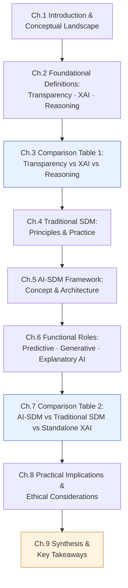
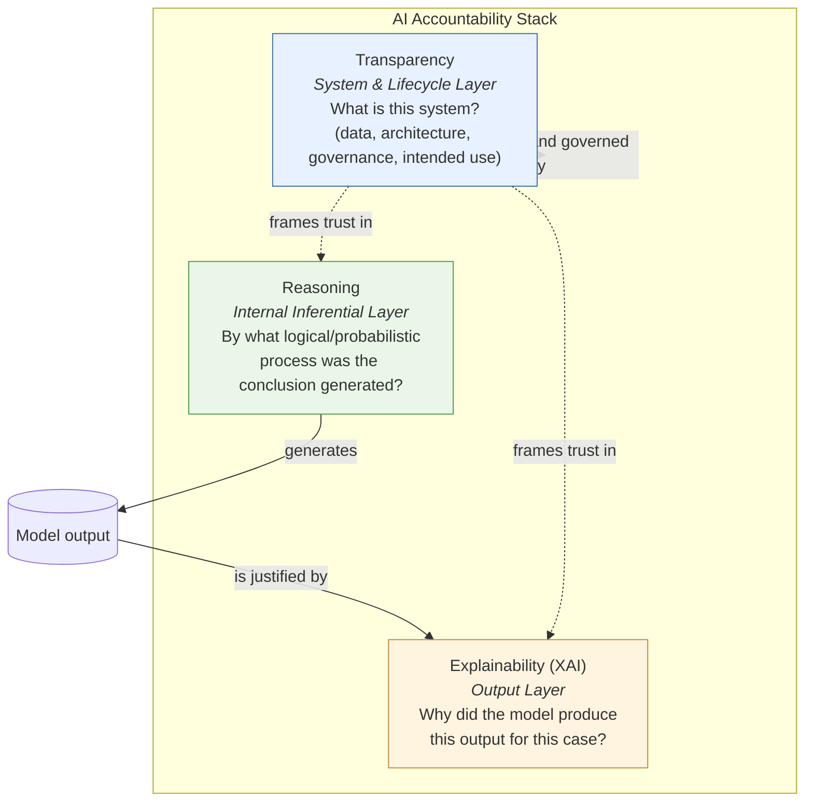
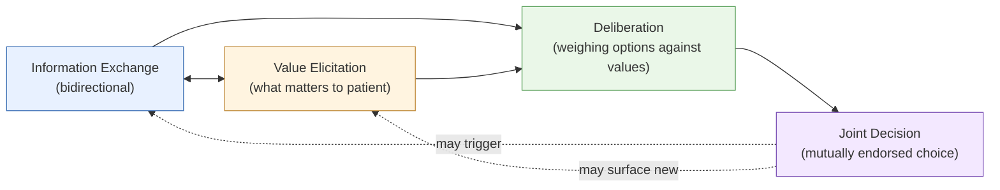
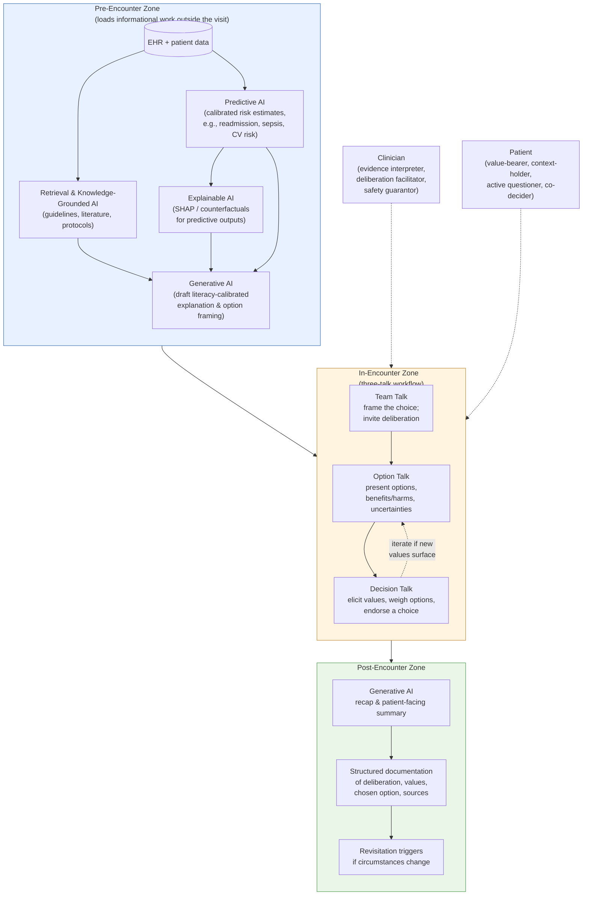
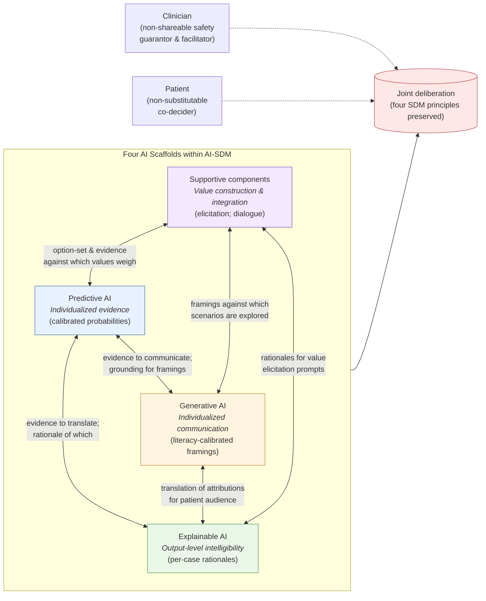

# Decoding AI-Supported Shared Decision-Making (AI-SDM): A Conceptual and Comparative Analysis with Adjacent AI Concepts in Healthcare
# 1 Introduction and Conceptual Landscape

The accelerating diffusion of artificial intelligence (AI) into clinical environments has introduced a vocabulary that is at once rich, rapidly evolving, and frequently ambiguous. Terms such as **AI Transparency**, **AI Explainability (XAI)**, and **AI Reasoning** are often used interchangeably in popular discourse, yet they refer to distinct facets of how an AI system is built, how its outputs are justified, and how its conclusions are derived. A parallel ambiguity surrounds the decision-support paradigms that govern how AI is actually deployed at the bedside: traditional **Shared Decision-Making (SDM)**, standalone **Explainable AI (XAI)** workflows, and the emerging notion of **AI-Supported Shared Decision-Making (AI-SDM)** each describe overlapping but non-identical configurations of human and machine roles. For a learner approaching this landscape for the first time, the difficulty is not a shortage of definitions but rather an overabundance of partially overlapping ones, scattered across regulatory texts, computer-science literature, and clinical ethics scholarship.

This opening chapter sets the conceptual stage for the report. Rather than presenting new empirical findings, it frames the document as a **learner-oriented conceptual clarification exercise**: a structured map that takes adjacent and easily conflated terms and arranges them along consistent analytical dimensions so that their differences—and the residual overlaps among them—become visible at a glance. The chapter proceeds in four steps. First, it explains why disambiguation is not a merely academic concern but a precondition for trust, consent, and accountability in clinical AI. Second, it delineates the scope and boundaries of the report and identifies its intended audience. Third, it justifies the methodological choice to lean heavily on comparison tables as the central analytical device. Finally, it previews the chapter architecture that will carry the reader from atomic AI concepts to the integrative AI-SDM framework.

## 1.1 Rationale for Conceptual Disambiguation in Healthcare AI

The terminology surrounding AI in healthcare suffers from a structural problem: many of its key terms were coined in different disciplinary communities—machine-learning research, regulatory policy, clinical ethics, human–computer interaction—and have been imported into clinical practice without harmonization. As a result, *Transparency*, *Explainability*, and *Interpretability* are routinely treated as synonyms in clinical commentary, even though each addresses a different layer of the AI lifecycle. *Transparency* typically concerns the openness of system construction—what data, what model architecture, what intended use, what known limitations. *Explainability* concerns the human-understandable justification of a specific output: why did this model assign this risk score to this patient? *Reasoning* concerns the internal inferential or logical process by which a conclusion is generated, increasingly relevant as large language models and chain-of-thought systems make intermediate steps visible. Treating these as interchangeable obscures which questions a given technique actually answers.

A parallel conflation occurs at the workflow level. Clinicians may describe any consultation involving an AI tool as "shared decision-making with AI," yet *traditional SDM* is a well-defined deliberative model rooted in patient-centered care and informed consent; *XAI* is a technical and presentational layer that can be deployed with or without genuine deliberation; and *AI-SDM* designates an integrative configuration in which multiple AI components are deliberately orchestrated to support, rather than substitute for, joint patient–clinician deliberation. Collapsing these three into a single label conceals important differences in how AI is used, what the patient is expected to do, and where accountability resides.

The practical stakes of this terminological imprecision are substantial. **Clinicians** who confuse a transparent model card with a per-patient explanation may believe their decision is well-justified when in fact the rationale for the individual recommendation remains opaque. **Patients** told that a tool is "explainable" may infer a depth of understanding that the underlying technique does not actually deliver, undermining the validity of informed consent. **Developers** designing for "transparency" without specifying whether they mean system-level documentation or output-level interpretability risk building tools that satisfy neither audience. **Policymakers and regulators** working under frameworks such as the EU AI Act or the U.S. ONC HTI-1 rule depend on stable terminology to define compliance obligations; ambiguity in core terms translates directly into ambiguity in legal duty. In short, conceptual disambiguation is a precondition for trust calibration, informed consent, regulatory compliance, and ultimately patient safety. This report responds to that need by establishing sharp, non-overlapping definitions and then making the boundaries between adjacent concepts visible through structured comparison.

## 1.2 Scope, Boundaries, and Target Audience

To preserve focus and analytical clarity, the report adopts a deliberately bounded scope. It is a **conceptual comparison study**, not an empirical evaluation, a systematic review, or a clinical trial synthesis. It does not attempt to quantify the performance of any specific AI model, validate a particular AI-SDM implementation, or rank tools by accuracy or usability. Instead, it treats the relevant terms as conceptual objects whose meanings, boundaries, and interrelations are themselves the object of analysis.

The following table summarizes what the report covers and what it deliberately excludes, helping the reader calibrate expectations before engaging with the substantive chapters.

| Dimension | In Scope | Out of Scope |
|---|---|---|
| Analytical focus | Conceptual definitions, boundaries, and comparisons among AI Transparency, XAI, AI Reasoning, SDM, and AI-SDM | Technical implementation tutorials, code-level walkthroughs of specific algorithms |
| Domain anchor | Healthcare and clinical decision-support contexts | General-purpose AI applications outside health (finance, criminal justice, etc.) |
| Evidence base | Conceptual literature, regulatory frameworks, established clinical decision-aid standards | Original empirical studies, primary clinical trial data, head-to-head model benchmarks |
| Outputs | Two structured comparison tables plus narrative synthesis | Recommendations endorsing specific commercial products |
| Reader takeaway | Stable mental model for disambiguating closely related terms | Operational playbook for deploying AI in a specific clinical workflow |

The **target audience** comprises learners, early-career researchers, clinicians beginning to engage with AI tools, and informed patients or policymakers seeking conceptual orientation. Readers are assumed to have a general familiarity with healthcare delivery and a working acquaintance with AI as a category, but no specialized expertise in machine-learning methods is presumed. Where technical terms are unavoidable, they are introduced with inline clarification.

Two further boundaries deserve explicit mention. First, while healthcare is the anchoring domain, the report draws on cross-disciplinary AI literature wherever foundational definitions originated outside clinical contexts—for example, transparency frameworks developed in regulatory policy or explainability methods originating in computer-science research. Second, the report acknowledges the limits of the available conceptual literature on AI-SDM specifically: because the term is recent and contested, the AI-SDM framing in this report is synthesized from adjacent established literatures—clinical decision support systems, patient decision aids (including standards such as IPDAS), generative-AI healthcare workflows, and emerging AI evaluation frameworks such as DECIDE-AI, TRIPOD-AI, and CONSORT-AI—rather than from any single authoritative source. Where evidence is thin or contested, the report flags the limitation in the text instead of overstating its claims.

## 1.3 Methodological Logic and Use of Comparison Tables

The central methodological device of the report is the **structured comparison table**. This choice is deliberate and reflects the nature of the problem: when concepts overlap partially but differ in important specifics, narrative description alone tends to blur boundaries because each concept is typically described in its own paragraph, in its own vocabulary, against an implicit baseline. A side-by-side table forces every concept to be evaluated against the *same* set of dimensions in the *same* order, exposing both genuine differences and superficial similarities.

Two comparison tables anchor the report. The first (Chapter 3) contrasts **AI Transparency**, **AI Explainability (XAI)**, and **AI Reasoning** across five dimensions—focus, goals, primary audience, core questions answered, and specific output examples—chosen because they collectively distinguish a concept's *layer of operation* (system construction vs. output justification vs. inferential process), *purpose*, *intended interpreters*, *interrogative function*, and *concrete manifestations*. The second (Chapter 7) contrasts **AI-SDM**, **Traditional SDM**, and **standalone XAI** across nine dimensions—purpose, output format, workflow integration, personalization level, patient's role, clinician's role, AI usage, transparency, and limitations—chosen because they jointly capture the *clinical intent*, *deliverables*, *process embedding*, *adaptiveness to the individual*, *role distribution between human actors*, *role of the machine*, *epistemic accessibility*, and *failure modes* of each paradigm.

The dimensions in both tables were selected according to four criteria that together support the report's quality standards:

1. **Discriminative power** — each dimension must produce visibly different values across the compared concepts, otherwise it adds noise rather than signal.
2. **Mutual non-overlap** — no dimension may silently duplicate another (e.g., "AI usage" and "transparency" must be defined so that they cannot collapse into a single cell).
3. **Uniform interpretation across columns** — a dimension such as "personalization level" must mean the same thing for AI-SDM as for traditional SDM, so that comparisons are valid rather than equivocal.
4. **Learner relevance** — each dimension must map to a question a learner is plausibly trying to answer, so that the table functions as a usable disambiguation tool rather than an exhaustive taxonomy.

Tables are paired with narrative interpretation: each table is preceded by a brief contextual framing and followed by a synthesis that highlights the most consequential contrasts. This pairing prevents the tables from being read as freestanding artifacts and ensures that the cumulative argument of the report is carried forward chapter to chapter.

## 1.4 Analytical Roadmap and Chapter Architecture

The report is organized as a progressive build from **atomic concepts** to **composite frameworks**, so that each later chapter rests on definitions established earlier. The architecture moves through three logical phases: first, foundational AI concepts are defined and contrasted; second, the clinical decision-making paradigm of SDM is examined on its own terms; third, AI-SDM is introduced as the integrative paradigm that combines elements from both phases, and is then situated comparatively against its closest neighbors. The closing chapters address practical and ethical implications and consolidate the conceptual takeaways.

The following diagram summarizes how the chapters connect, showing where definitions are introduced, where comparison tables synthesize them, and where the analysis culminates.

Three features of this architecture are worth emphasizing. **First**, the two comparison tables (Chapters 3 and 7) are positioned as **synthesis points** rather than starting points: they appear only after the relevant concepts have been independently defined, ensuring that side-by-side contrasts are grounded in prior conceptual work rather than asserted prematurely. **Second**, Chapter 5 (AI-SDM architecture) and Chapter 6 (functional roles of AI subtypes) are deliberately separated so that the *structural composition* of AI-SDM is established before the *behavioral contributions* of its component models are analyzed; this prevents the common error of describing AI-SDM purely in terms of what individual models do, while losing sight of how they orchestrate. **Third**, Chapter 8 deliberately follows the comparative analysis rather than preceding it: ethical and regulatory considerations are most legible once the conceptual map is in place, because questions of accountability, bias, and over-reliance attach to specific roles and workflows identified in earlier chapters.

By the time the reader reaches Chapter 9, the report should have furnished a small number of durable conceptual anchors: a clear three-way distinction among Transparency, XAI, and Reasoning; a clear three-way distinction among Traditional SDM, standalone XAI, and AI-SDM; and a defensible account of where AI-SDM adds value, where it inherits limitations from its constituent technologies, and where genuinely open questions remain. The remainder of the report executes this plan, beginning in Chapter 2 with the foundational definitions of the three AI concepts that anchor the first comparison table.

# 2 Foundational Definitions: AI Transparency, AI Explainability (XAI), and AI Reasoning

Building on the conceptual roadmap laid out in Chapter 1, this chapter takes the first substantive step toward disambiguation: it isolates and defines the three AI concepts most often conflated in clinical discourse — **AI Transparency**, **AI Explainability (XAI)**, and **AI Reasoning** — treating each as a building block in its own right before they are placed side by side in the comparison table of Chapter 3. The strategy is deliberate. Comparing concepts whose individual contours are blurred tends to produce tables whose cells echo one another; sharpening each definition first ensures that the eventual comparison highlights genuine differences rather than rhetorical ones.

To organize the discussion, this chapter treats the three concepts as occupying different layers of an **AI accountability stack**. Transparency operates at the *system and lifecycle* layer — what was built, by whom, on what data, with what limitations. Explainability operates at the *output* layer — why this particular prediction was produced for this particular case. Reasoning operates at the *internal inferential* layer — by what logical or probabilistic process the conclusion was generated. The three layers are complementary rather than competing, and clarifying their separate scopes is the precondition for understanding both how they reinforce one another and where they continue to overlap. Each of the following subchapters develops one layer in turn; the closing subchapter explicitly maps the residual overlaps that the Chapter 3 table will operationalize.

## 2.1 AI Transparency: Openness of System Construction and Governance

**AI Transparency** is best understood as the degree to which stakeholders can *understand, trace, and evaluate the operations, decisions, and underlying processes* of an AI system across its entire lifecycle — from training data and model architecture through deployment, monitoring, and governance.[^1] Unlike explainability, which targets a specific output, transparency targets the system itself: it asks not "why did this prediction occur?" but rather "what is this system, how was it built, and under what conditions does it operate?" The concept's center of gravity is therefore institutional and lifecycle-oriented, not per-prediction.

### 2.1.1 Conceptual Origins in Governance and Regulation

The contemporary articulation of AI Transparency emerged largely from **governance and regulatory contexts** rather than from machine-learning research itself. The University of California's *Responsible AI Principles*, for instance, define transparency as a principle that "individuals should be informed when AI-enabled tools are being used," that "the methods should be explainable, to the extent possible," and that affected individuals should be able to "understand AI-based outcomes, ways to challenge them, and meaningful remedies to address any harms caused."[^2] Framed this way, transparency is inseparable from a broader cluster of governance principles — appropriateness, accuracy and reliability, fairness, privacy, accountability — and is operationalized through institutional mechanisms such as transparency reports, AI councils, and systemwide surveys of AI use.[^2]

In healthcare, the regulatory anchor is particularly explicit. The U.S. Office of the National Coordinator for Health Information Technology (ONC) finalized the **HTI-1 rule** in December 2023, which, starting in 2025, requires certified electronic health record (EHR) vendors who develop or supply AI-based decision-support tools to "disclose how artificial intelligence tools are trained, developed, and tested" and to provide clinical users with "more technical information…about their performance and testing, as well as the steps taken to manage potential risks."[^3] Internationally, frameworks such as the EU AI Act and data-protection regimes such as the GDPR likewise impose disclosure duties about automated decisions, their purposes, and their underlying data sources.[^1] What unites these instruments is that they treat transparency as a *precondition* for downstream accountability: without visibility into how a system was built, neither bias auditing nor compliance verification nor informed consent is possible.

### 2.1.2 Operative Layers of Transparency

Transparency is multidimensional, and a widely used schema distinguishes three operative layers, each addressing a different facet of openness:[^4][^1]

| Layer | Object of Openness | Typical Artifacts |
|---|---|---|
| **Algorithmic transparency** | The internal logic, processes, and algorithms of the AI system — model type (e.g., decision tree, neural network), how data are processed, how decisions are reached, and which factors influence them | Model cards, architecture documentation, training-data descriptions, performance and testing reports |
| **Interaction transparency** | The communication between users and the AI system — what the system is doing during use and what users can expect from interacting with it | AI-use disclosures, in-product notices, labels on AI-generated content, plain-language descriptions of system capabilities and limits |
| **Social transparency** | The broader societal impact of the system — ethical, equity, and privacy implications beyond the technical layer | Public transparency reports, bias and impact assessments, governance disclosures |

This three-layer view is consequential because each layer corresponds to a distinct *audience*: algorithmic transparency speaks primarily to developers, auditors, and regulators; interaction transparency speaks primarily to end users (clinicians and, indirectly, patients); social transparency speaks to institutional governance bodies and the public.[^4][^1] A system can be highly transparent on one layer and opaque on another — for example, an EHR-embedded model may publish a thorough model card (algorithmic transparency) while failing to inform the clinician at the point of care that AI was used (interaction transparency).

### 2.1.3 Three Operational Requirements

A complementary framing decomposes transparency into three functional requirements — **explainability, interpretability, and accountability** — that together support trustworthy deployment.[^4][^1] *Explainability* (treated in depth in §2.2) addresses whether outputs can be rendered in human-understandable terms. *Interpretability* concerns whether the internal workings of the model can be inspected and understood, often by more technical audiences such as data scientists and auditors. *Accountability* concerns whether there is a clear assignment of responsibility for the system's behavior — governance mechanisms, audit trails, documentation, and defined roles for developers, risk officers, and stakeholders.[^1] In this layered view, explainability is therefore a *component* of the broader transparency posture rather than a synonym for it.

### 2.1.4 Audiences and the Role of Transparency in Clinical AI

Transparency's primary audiences are correspondingly heterogeneous: **regulators and auditors** (who need disclosure to verify compliance and assess risk), **institutional governance bodies** such as hospital AI councils (who need it to set policy and procurement criteria), **clinicians** (who need it to calibrate trust in a tool they did not build), and **informed patients** (who need at minimum to know that AI is being used in their care).[^2][^4] In the clinical context, transparency functions as the institutional substrate on which everything else rests: it underwrites bias auditing,[^1] supports risk management,[^4] enables informed consent at the system level (as distinct from per-decision consent), and gives regulators something concrete to certify. Its limits, however, are equally important — transparency does *not*, on its own, explain why a particular patient received a particular score, nor does it expose the inferential steps by which that score was generated. Those tasks belong, respectively, to Explainability and Reasoning.

**Takeaway:** AI Transparency is openness about the *system and its lifecycle* — the data, the architecture, the testing, the governance, the disclosure — and its primary audiences are regulators, institutional overseers, and clinicians needing to calibrate trust at the tool level rather than at the case level.

## 2.2 AI Explainability (XAI): Human-Understandable Justification of Outputs

Where transparency asks *what the system is*, **AI Explainability** asks *why the system produced this output for this case*. Formally, explainability — usually abbreviated **XAI** — refers to "the ability of an AI system to provide easy-to-understand explanations for its decisions and actions,"[^4] or equivalently, "the extent to which the outputs of an AI system can be explained in human-understandable terms."[^1] Its conceptual center of gravity is therefore at the *output level*: a single prediction, a single recommendation, a single classification, accompanied by an account of why that result was produced.

### 2.2.1 The Output-Level Orientation and the Black-Box Problem

The motivating problem for XAI is the proliferation of **black-box systems** — complex AI models, particularly deep neural networks and transformer-based architectures, that "provide results without clearly explaining how they achieved them."[^4] In healthcare, this opacity is more than an aesthetic concern. As one review of XAI in healthcare puts it, "when an AI system predicts a patient's risk of sepsis or recommends a specific treatment plan, physicians must be able to understand *why* the system arrived at that decision," because clinical decision-making must be "accountable, evidence-based, and understandable."[^5] Black-box models may outperform traditional statistical methods on accuracy, but their opacity raises concerns about bias, fairness, error propagation, and ultimately legal and ethical accountability.[^5] XAI techniques therefore exist to translate complex model behavior into rationales that clinicians, patients, regulators, and auditors can scrutinize, validate, and, if necessary, override.

### 2.2.2 Taxonomy of XAI Methods

The XAI literature now offers a substantial methodological toolkit, typically organized along three axes — whether the model is *inherently interpretable* or *post-hoc* explained; whether the explanation method is *model-agnostic* or *model-specific*; and whether the explanation has *local* (single-instance) or *global* (whole-model) scope.[^5] The principal families relevant to clinical AI are summarized below:

| Family | Representative Methods | Mechanism | Scope |
|---|---|---|---|
| **Inherently interpretable models** | Decision trees, linear/logistic regression, rule lists, generalized additive models (GAMs) | Each parameter or path carries semantic meaning by construction — white-box | Global and local |
| **Post-hoc model-agnostic** | LIME, SHAP, Anchors, counterfactual explanations (e.g., DiCE) | Treat the model as a black box and generate explanations externally through sampling, game-theoretic attributions, or perturbation | Mostly local; some global variants |
| **Post-hoc model-specific (gradient/attention-based)** | Integrated Gradients, Grad-CAM, Layer-wise Relevance Propagation (LRP), saliency maps | Exploit internal gradients or activations to attribute relevance to input features or regions (e.g., pixels in medical images) | Local |
| **Symbolic / rule-based / neuro-symbolic** | Inductive Logic Programming, surrogate rule extraction, neuro-symbolic integration | Render decisions as logical rules or first-order clauses; blend symbolic reasoning with statistical learning | Global or local, depending on technique |

In clinical settings these techniques map onto recognizable use cases. **SHAP** values — derived from cooperative game theory and the only known additive method satisfying local accuracy, missingness, and consistency[^5] — have been applied in EHR analysis to explain predictions of patient mortality, readmission, and disease risk by exposing the contribution of features such as blood pressure, age, or laboratory results.[^5] **LIME** is used to justify hospital readmission predictions; **Grad-CAM** localizes discriminative regions in medical images, producing class-specific heatmaps that, for instance, identify the regions of a chest X-ray driving a pneumonia classification;[^5] **counterfactual explanations** generate actionable recourse — "what minimal change in inputs would have changed the prediction?" — which is particularly useful for diagnostic recommendations and shared deliberation about treatment options.[^5]

### 2.2.3 Explainability vs. Interpretability

A persistent subtlety in the XAI literature is the distinction between **explainability** and **interpretability**, which are often used interchangeably but address subtly different questions. Explainability focuses on *why* an outcome occurred and is typically oriented to end users; interpretability focuses on *how* the model processes inputs and is more technical, oriented to data scientists, engineers, and AI auditors.[^4][^1] One review of healthcare XAI captures the distinction crisply: "Interpretability involves providing human-understandable rules governing a system's decision-making process, whereas explainability focuses on crafting an [explanation]" of why a specific output occurred.[^6] In practice, the two coexist: an inherently interpretable model is *both* interpretable (its mechanics are inspectable) and explainable (its outputs come with intrinsic rationales), while a deep neural network may require post-hoc XAI techniques precisely because its internal interpretability is limited.

### 2.2.4 Clinical Role and Persistent Limitations

In the clinical workflow, XAI plays four interlocking roles. First, it supports **per-patient justification**, giving clinicians a basis for validating an AI recommendation against their own judgment and for communicating the rationale to the patient.[^5] Second, it enables **trust calibration**, helping clinicians recognize when the model is operating within its competence and when its rationale looks suspicious — a foundation for appropriate (not blanket) trust.[^1][^5] Third, it underwrites **bias detection and mitigation**, because explanations expose which features are driving decisions, allowing auditors to flag reliance on inappropriate proxies and protecting vulnerable populations from inequitable outcomes.[^4][^5] Fourth, it supports **regulatory compliance**, increasingly required by frameworks such as the EU AI Act, GDPR, and FDA guidance on AI in medical devices.[^1][^5]

These roles are real, but the literature is equally clear about XAI's limitations, which any learner should hold alongside its promise:

- **Fidelity–performance trade-off.** Increasing interpretability sometimes requires simplifying models, compromising accuracy, particularly when replacing deep architectures with interpretable surrogates.[^1][^5]
- **Disagreement and instability.** Empirical studies show "significant disagreement among different XAI techniques, even within the same methodological family (e.g., LIME vs. KernelSHAP)," underscoring the absence of a universally 'correct' explanation map.[^5] Explanations can also vary under small perturbations of input or model.[^5]
- **Risk of misleading post-hoc rationales.** Explanations may be "plausible-sounding…but, in fact, fabricated or erroneous,"[^7] particularly in complex models. The clinical-reasoning literature warns that the goal should be "ante-hoc interpretability, where the model's soundness and human intelligibility are guaranteed by design, rather than post-hoc explainability, which can be misleading."[^1]
- **Audience mismatch.** Many explanation methods are not user-friendly for clinicians without a data-science background; effective clinical XAI must therefore be *human-centered* and "tailored to the needs, language, and workflow of clinicians."[^5]

**Takeaway:** XAI is the *output-level* justification layer — answering "why did this model produce this output for this case?" — and although it is the most clinically visible facet of the accountability stack, its rationales are not infallible and should be read as scaffolds for human judgment rather than as substitutes for it.

## 2.3 AI Reasoning: Inferential and Logical Processes Generating Conclusions

The third and most internally focused layer is **AI Reasoning**. IBM characterizes reasoning in AI as "the mechanism of using available information to generate predictions, make inferences and draw conclusions," involving "representing data in a form that a machine can process and understand, then applying logic to arrive at a decision."[^3] In other words, where Transparency is about openness at the system level and XAI is about justification at the output level, Reasoning is about the *generative process* by which a conclusion is produced in the first place. It addresses the question: *by what inferential steps did the model arrive at this conclusion?*

### 2.3.1 Architectural Components: Knowledge Base and Inference Engine

A reasoning system is typically depicted as two coupled components: a **knowledge base** that contains structured representations of real-world entities (knowledge graphs, ontologies, semantic networks, domain rules) and an **inference engine**, "powered by trained machine learning models," that "implements the needed logic and reasoning methods to analyze data from the knowledge base and reach a decision."[^3] To illustrate: an autonomous floor-cleaning robot might hold information about floor types in its knowledge base and use machine-learning classifiers to recognize the current floor, after which its inference engine selects an appropriate action (vacuum carpet, mop tile).[^3] The same conceptual architecture scales to clinical AI: a diagnostic system holds disease–symptom mappings in its knowledge base and uses an inference engine to infer the most likely diagnosis from a presenting symptom set.[^3]

### 2.3.2 Reasoning Paradigms Relevant to Clinical AI

AI systems implement many reasoning strategies, "usually employing a combination of these approaches,"[^3] each suited to different tasks. The principal paradigms relevant to clinical applications are summarized below.

| Reasoning Paradigm | Mechanism | Clinical Illustration |
|---|---|---|
| **Deductive** | Derives specific conclusions from general rules; if premises are true, conclusion must be true; basis of expert systems and rule-based systems | Rule-based clinical protocols and "if–then" alerts in CDS systems[^3] |
| **Inductive** | Generalizes patterns from specific observations; foundation of supervised learning and neural networks | Risk-prediction models trained on labeled patient data[^3] |
| **Abductive** | Formulates the most likely conclusion given current observations; tolerant of incomplete data | Diagnostic algorithms inferring the best-matching disease for a symptom cluster[^7][^3] |
| **Causal** | Distinguishes cause from correlation; supports interventional thinking | Reasoning about treatment effects rather than mere associations between variables[^7][^3] |
| **Probabilistic** | Assigns statistical likelihoods to outcomes under uncertainty | Naïve Bayes classifiers, prognostic probability estimation[^3] |
| **Analogical** | Transfers knowledge from past cases to new ones via similarity | Case-based reasoning; LLMs still "struggle with analogical reasoning"[^3] |
| **Commonsense** | Uses general world knowledge to interpret everyday situations | LLM-style natural-language inference[^3] |
| **Neuro-symbolic** | Combines deep learning with symbolic logic for more robust decision-making | Emerging hybrid systems integrating clinical ontologies with neural pattern recognition[^3] |
| **Temporal** | Processes time-ordered sequences to forecast or schedule | Recurrent architectures forecasting disease trajectories or readmission risk[^3] |

For clinical decision-making, **abductive** reasoning is conceptually central — diagnosis is fundamentally the task of identifying the most plausible explanation for a constellation of findings[^7][^3] — while **causal** reasoning is increasingly emphasized because mistaking correlation for causation in healthcare can have "safety, financial, or ethical consequences."[^7]

### 2.3.3 The Rise of Step-by-Step Reasoning in LLMs

A particularly visible development is the emergence of **reasoning-oriented large language models** — including DeepSeek-R1, Google's Gemini 2.0 Flash Thinking, IBM's Granite 3.2, and OpenAI's o1 series and o3-mini — that "can reflect on and break down their analysis step-by-step," allowing AI to "tackle ever more complex problems, guiding users to take meaningful action."[^3] This shift is closely tied to **chain-of-thought** reasoning, in which models "break complex tasks into clear, sequential steps, ensuring that outputs are logically structured."[^7] In the clinical-reasoning literature, recent work suggests that LLMs can "mimic reasoning by pinpointing statistically important correlations between observed symptoms and potential diagnoses, relying heavily on large-scale pattern recognition,"[^1] and a randomized controlled trial reported that "doctors utilizing GPT-4 assistance performed significantly better in management reasoning tasks than clinicians using conventional resources."[^1]

The conceptual point is important: chain-of-thought outputs are *reasoning traces*, not merely explanations. They expose intermediate inferential steps as the conclusion is being generated, rather than reconstructing them after the fact. This blurs — but does not erase — the boundary with XAI, a point developed further in §2.4.

### 2.3.4 Reasoning vs. Explainability: A Process/Output Distinction

The distinction between Reasoning and Explainability is best understood as one of *temporal locus and function*. Reasoning concerns the **generative process** of arriving at a conclusion: the inferential steps, logical rules, probabilistic computations, and pattern matches that produce the model's output. Explainability concerns the **post-hoc communication** of that conclusion: a rendering, in human-understandable terms, of why the output occurred. The two can coincide — when an inherently interpretable rule-based system fires a rule, the rule is simultaneously the reasoning step and its explanation — but in deep learning they routinely diverge. A neural network may reach a correct classification through inscrutable internal computations (reasoning that is in principle unrecoverable in human terms) while a post-hoc SHAP analysis offers an explanation that is *consistent with* the output but not a faithful trace of how the model actually computed it.[^5] This is precisely the gap that motivates the call for "ante-hoc interpretability" in clinical AI.[^1]

### 2.3.5 Limits of AI Reasoning in Clinical Settings

The clinical-reasoning literature is unusually candid about the limits of current AI reasoning. Three are particularly important for a learner to register:

- **Absence of metacognition and hypothesis testing.** LLMs "do not perform hypothesis testing or engage in metacognitive analysis. They fail to assess internal consistency or adjust based on new information unless prompted again."[^1] Human clinicians, by contrast, "question their assumptions, recognize cognitive biases (e.g., anchoring) and critically evaluate the reliability of incoming information."[^1]
- **Susceptibility to hallucination and reason fabrication.** "AI systems may generate plausible-sounding explanations that are, in fact, fabricated or erroneous"[^7] — a particular risk in mission-critical areas like healthcare. The structural cause is that LLMs "depend solely on established correlations from their training data,"[^1] so their reasoning is bounded by the statistical structure of what they have seen.
- **Pattern matching vs. genuine clinical judgment.** "LLMs are powerful statistical engines that excel at identifying patterns and relationships within vast datasets, but they lack consciousness, intuition, or genuine clinical judgment."[^1] They cannot read non-verbal cues, integrate psychosocial context, or recognize when a presentation departs from typical cases — capacities the literature describes as "irreplaceable" and grounded in years of experience.[^1]

Bias compounds these limits: reasoning systems "reflect biased information present in their training datasets," so "LLM outputs may perpetuate historical biases in medical data, potentially leading to suboptimal or inequitable care for certain demographic groups."[^1] These limits are not arguments against AI reasoning in clinical settings; they are arguments for the "human in the loop" paradigm that the literature consistently endorses, in which AI reasoning *augments* rather than *replaces* clinician reasoning.[^1]

**Takeaway:** AI Reasoning is the *internal inferential process* by which conclusions are generated — abductive, causal, probabilistic, and increasingly step-by-step in modern LLMs — and its principal clinical limit is that pattern-based inference, however sophisticated, is not the same as the metacognitive, contextual judgment of an experienced clinician.

## 2.4 Conceptual Boundaries and the Accountability Stack

Having developed each concept independently, it is now possible to position **Transparency, XAI, and Reasoning as complementary layers of an AI accountability stack** rather than as competing labels for the same idea. The hierarchy can be expressed compactly: *Reasoning* describes how a conclusion is internally generated; *XAI* describes how that conclusion is rendered intelligible at the output level; *Transparency* describes how the entire system — including its data, model, governance, and intended use — is made open to scrutiny across its lifecycle. Each layer answers a distinct question, addresses a distinct audience, and operates at a distinct temporal moment in the AI pipeline.

The following diagram visualizes this layering and the directional relationships among the three concepts.

The diagram makes three relationships visible. *First*, Reasoning is causally upstream of the output: it is what *produces* the prediction. *Second*, XAI sits *downstream* of the output, translating it into a rationale a human can evaluate; it does not necessarily reflect the model's actual internal computation. *Third*, Transparency is *orthogonal* to both, providing the institutional and lifecycle disclosures that frame how Reasoning and XAI should be trusted in the first place. Without transparency, even a high-quality explanation may be uninterpretable in context (the user does not know on what data the model was trained); without explainability, transparent system disclosures do not help a clinician at the bedside; without reasoning (of some form), there is no conclusion to explain or expose.

### 2.4.1 Residual Overlaps That Commonly Cause Confusion

The three layers are conceptually distinct but not hermetically sealed. Several overlaps recur in the literature and routinely confuse learners; they are worth naming explicitly before Chapter 3 operationalizes them in a comparison table.

| Overlap Site | Why It Confuses | Differentiator |
|---|---|---|
| **Chain-of-thought traces as both reasoning and explanation** | Step-by-step outputs from reasoning-oriented LLMs[^3] simultaneously appear to expose how the model "thinks" *and* serve as user-facing justifications. | Reasoning concerns the *generative process*; an explanation is its post-hoc *communication*. A chain-of-thought trace can serve as both, but only if it is *faithful* to the model's actual computation — a property that is not guaranteed.[^1][^5] |
| **Interpretability sitting between Transparency and XAI** | Interpretability is sometimes presented as a sub-component of transparency[^1] and sometimes as a near-synonym for explainability.[^4][^6] | Interpretability is the *technical inspectability* of model internals (oriented to developers/auditors); explainability is *output-level intelligibility* (oriented to end users). Transparency subsumes both as part of the broader governance posture. |
| **Model cards and documentation as both transparency and explainability artifacts** | Model cards describe data, intended use, and known limitations (transparency) *and* often include feature-importance summaries that look like global explanations (XAI). | The same artifact can serve multiple layers; the distinguishing question is which audience and which question it is being used for in a given moment (governance disclosure vs. per-decision rationale). |
| **"Explainable AI" framed loosely as anything that increases trust** | In practice, "XAI" is sometimes used as a catch-all for any user-facing AI feature that builds trust, including disclosures. | Strict use: XAI = techniques that render *outputs* intelligible. Disclosures about *the system* belong to Transparency. |

### 2.4.2 Setting Up the Comparison Table in Chapter 3

These overlaps motivate the specific dimensional structure of the comparison table in Chapter 3. The five dimensions previewed in Chapter 1 — *focus, goals, primary audience, core questions answered,* and *specific output examples* — were chosen precisely because they pry apart the overlap sites identified above:

- **Focus** distinguishes the *layer of operation* (system vs. output vs. inferential process) and therefore separates Transparency from XAI from Reasoning at the most basic level.
- **Goals** distinguishes *purpose* (governance and accountability vs. justification and trust calibration vs. conclusion generation), preventing the catch-all use of "XAI."
- **Primary audience** distinguishes *who is the intended interpreter* (regulators/auditors vs. clinicians and patients at the bedside vs. developers and the model itself), surfacing the audience-mismatch problem identified above.
- **Core questions answered** distinguishes the *interrogative function* — "What is this system?" vs. "Why this output?" vs. "By what steps?" — which is the cleanest single-sentence test for which concept is in play.
- **Specific output examples** anchors the abstractions in *concrete artifacts* (model cards, transparency reports, regulatory disclosures vs. SHAP values, LIME explanations, Grad-CAM heatmaps, counterfactuals vs. inference chains, abductive diagnostic suggestions, chain-of-thought traces), giving the learner tangible recognition cues.

By the end of Chapter 3, each of these dimensions will yield a populated cell for each concept, and the residual overlaps catalogued above will appear as cells whose values are *similar but not identical* — visible, but no longer confused for sameness.

**Chapter takeaway:** *Transparency, Explainability, and Reasoning are three layers of an AI accountability stack — system, output, and inferential process — and although they reinforce one another in practice, treating them as distinct concepts with distinct audiences and distinct artifacts is the conceptual move that makes clinical AI legible to learners, clinicians, patients, and regulators alike.*

# 3 Comparison Table 1: AI Transparency vs. AI Explainability (XAI) vs. AI Reasoning

Chapter 2 closed by positioning AI Transparency, Explainability, and Reasoning as three complementary layers of an AI accountability stack — the system layer, the output layer, and the internal inferential layer — and by cataloguing the overlap sites where learners most often conflate them. The task of the present chapter is to take that layered framing and convert it into a **single reusable reference artifact**: a side-by-side comparison table that distributes the three concepts across the same five analytical dimensions, so that what was previously argued through extended narrative can now be apprehended at a glance.

This chapter therefore functions as the first major **synthesis point** of the report. It does not introduce new conceptual material; instead it operationalizes the definitions established in §§2.1–2.3 and the boundary analysis of §2.4 into a structured matrix, then walks through that matrix dimension by dimension to render the most consequential contrasts explicit. The chapter proceeds in four steps: a framing subchapter that justifies the dimensions and supplies a reading protocol, the table itself, a dimension-by-dimension interpretive narrative, and a closing synthesis that bridges to the clinical-side vocabulary of Shared Decision-Making examined in Chapter 4.

## 3.1 Framing the Comparison: Rationale, Dimensions, and Reading Protocol

Before presenting the table, it is worth restating briefly **why a table is the right instrument here**. Narrative description excels at unfolding a concept in its own internal logic, but it is structurally biased toward emphasizing each term's distinctive features in its own vocabulary, against an implicit baseline that shifts from paragraph to paragraph. When concepts overlap partially — as Transparency, XAI, and Reasoning demonstrably do[^4][^1] — this produces an unwelcome side effect: each concept *appears* internally coherent, but the boundaries *between* them remain blurred because the reader is never asked to evaluate them against a common rubric. A comparison table forces uniform interrogation: every concept must answer the same question, in the same place, in comparable language.

The dimensional structure used in this chapter is the one previewed in Chapter 1 and motivated at the end of Chapter 2: **focus, goals, primary audience, core questions answered, and specific output examples**. These five dimensions were selected against the four quality criteria stated in §1.3 — discriminative power, mutual non-overlap, uniform interpretation across columns, and learner relevance — and each is designed to pry apart a particular overlap site identified in §2.4.

| Dimension | What it isolates | Overlap site it pries apart |
|---|---|---|
| **Focus** | The layer of the AI pipeline the concept operates on — system/lifecycle, output, or internal inferential process | The general tendency to treat Transparency, XAI, and Reasoning as synonyms for "AI accountability" |
| **Goals** | The purpose for which the concept exists — governance, justification, or conclusion generation | The catch-all use of "XAI" to refer to anything that increases trust |
| **Primary audience** | Who is the intended interpreter of the concept's outputs | The audience-mismatch problem: a model card serves regulators, a SHAP value serves a clinician, a chain-of-thought trace serves a developer or the model itself |
| **Core questions answered** | The interrogative function each concept performs — "What is this system?" / "Why this output?" / "By what steps?" | The conflation of system-level and output-level questions under generic "explainability" language |
| **Specific output examples** | The tangible artifacts each concept produces, giving recognition cues | The artifact-overlap problem (e.g., model cards looking like both transparency documents and global XAI outputs) |

A short **reading protocol** will help the learner extract maximum value from the table that follows. *Read across rows* to see how a single dimension (e.g., primary audience) discriminates among the three concepts — this is the disambiguation move. *Read down columns* to assemble a coherent profile of a single concept (e.g., everything Transparency is and does) — this is the consolidation move. When two cells in the same row appear similar, that similarity is *itself* informative: it marks a genuine residual overlap that the surrounding narrative in §3.3 will unpack rather than suppress.

## 3.2 The Comparison Table: Transparency, XAI, and Reasoning Across Five Dimensions

The table below synthesizes the definitions developed in Chapter 2 and the reference materials into a five-by-three matrix. Cells are written compactly so that the table functions as a quick-reference artifact; the surrounding subchapters supply interpretation and nuance.

| Dimension | **AI Transparency** | **AI Explainability (XAI)** | **AI Reasoning** |
|---|---|---|---|
| **Focus** | Openness of the *system and its lifecycle* — what data was used, what architecture was chosen, how the model was trained and tested, what its intended use and known limitations are, and how it is governed across deployment[^2][^4][^1] | Human-understandable *justification of a specific output* — translating a single prediction, classification, or recommendation into a rationale that a non-developer can evaluate[^4][^1][^5] | The *internal inferential or logical process* by which the model generates a conclusion — representing data, applying logic, and producing predictions, inferences, or decisions[^3][^7] |
| **Goals** | Establish institutional accountability and trust at the *tool level*: enable bias auditing, support regulatory compliance, underwrite informed consent about *whether* AI is being used, and provide the documentary substrate for risk management[^2][^4][^3][^1] | Support per-case *trust calibration* and human override at the *decision level*: allow clinicians to validate or challenge a recommendation, expose feature contributions for bias detection, and meet output-level disclosure duties under frameworks such as the EU AI Act and GDPR[^4][^1][^5] | Produce *defensible conclusions* under uncertainty by combining knowledge representations with inference engines; in newer reasoning-oriented LLMs, also break complex problems into sequential steps to improve accuracy, interpretability, and reliability[^3][^7] |
| **Primary audience** | Regulators (e.g., ONC under HTI-1, EU AI Act authorities), institutional governance bodies (hospital AI councils, AI Transparency Subcommittees), auditors, and, secondarily, clinicians and patients who need to know *that* an AI tool is in use[^2][^3][^4] | End users of the model's output: clinicians validating a recommendation against their judgment, patients receiving an AI-informed explanation, auditors checking for biased feature reliance; with interpretability-focused variants additionally serving data scientists and engineers[^4][^1][^5] | Developers and AI researchers (who design the inference architecture); the model itself, when chain-of-thought traces are used internally to improve performance; and, secondarily, expert users inspecting reasoning traces for hallucinations or logical breaks[^3][^7][^1] |
| **Core questions answered** | "*What is this system?*" — On what data was it trained? What architecture and tests? Who is accountable? Under what conditions does it operate? Is its use disclosed?[^2][^3][^1] | "*Why did the model produce this output for this case?*" — Which features drove the prediction? How would the prediction change if inputs changed? Is the rationale clinically plausible?[^4][^1][^5] | "*By what inferential steps was the conclusion generated?*" — What rules, probabilities, analogies, or causal links were applied? In LLM reasoning models, what intermediate steps lead from input to answer?[^3][^7] |
| **Specific output examples** | Model cards; HTI-1 disclosures about training, development, testing, and risk management for EHR-embedded AI tools[^3]; UC-style institutional AI transparency reports[^2]; EU AI Act and GDPR disclosure statements; in-product "AI was used" notices (interaction transparency); bias and impact assessments (social transparency)[^4][^1] | SHAP values attributing feature contributions in EHR-based mortality or readmission prediction[^5]; LIME rationales for hospital readmission models[^5]; Grad-CAM heatmaps localizing the region of a chest X-ray driving a pneumonia classification[^5]; counterfactual explanations (e.g., DiCE) showing the minimal input change that would flip a prediction[^5]; Integrated Gradients and Layer-wise Relevance Propagation attributions[^5] | Abductive diagnostic inferences (best-fit disease for a symptom cluster)[^3][^7]; deductive if–then alerts in rule-based clinical decision support[^3]; probabilistic outputs from naïve Bayes classifiers or prognostic models[^3]; causal inferences distinguishing cause from correlation in treatment effects[^7]; chain-of-thought / step-by-step reasoning traces from reasoning-oriented LLMs such as DeepSeek-R1, Gemini 2.0 Flash Thinking, IBM Granite 3.2, and OpenAI o1/o3-mini[^3] |

## 3.3 Dimension-by-Dimension Interpretation and Contrast Analysis

The table compresses considerable conceptual content; this subchapter unpacks it dimension by dimension, drawing out the contrasts that are most consequential for clinical AI and explicitly addressing the residual overlap sites flagged at the end of Chapter 2.

### 3.3.1 Focus: Three Different Layers of the AI Pipeline

The clearest discriminator among the three concepts is the **layer of the AI pipeline** each operates on. Transparency sits at the *system and lifecycle* layer: its object is the AI tool considered as an artifact with provenance, design choices, training history, intended uses, and known limitations.[^2][^4] This orientation is most visible in regulatory texts: HTI-1, for instance, requires EHR vendors to "disclose how artificial intelligence tools are trained, developed, and tested," along with information about "performance and testing, as well as the steps taken to manage potential risks" — disclosures that describe the *system*, not any specific output.[^3] Explainability, by contrast, sits at the *output* layer: a SHAP value or Grad-CAM heatmap is computed *with respect to a particular input* and tells the user why *that case* received *that score*.[^5] Reasoning sits one layer deeper, at the *internal inferential* layer: it is not a description of the system at large, nor a justification of an individual output, but the *generative process* by which the output came to exist.[^3][^7]

The practical payoff of this distinction is that a tool can be strong on one layer and weak on another. An EHR-embedded model may publish a thorough model card (system-level transparency) while offering no per-decision SHAP or counterfactual output (output-level XAI), and may compute predictions through pattern matching that defies any human-readable reasoning trace (opaque reasoning). The three layers thus impose independent design choices on developers and independent verification tasks on auditors and clinicians.

### 3.3.2 Goals: Governance, Justification, and Conclusion Generation

Although the three concepts are sometimes lumped together under the banner of "trustworthy AI," their *goals* differ substantially. Transparency aims at **institutional accountability**: it provides the documentary substrate on which bias auditing, regulatory compliance, procurement decisions, and informed consent at the tool level can rest.[^2][^4][^1] Its success criterion is whether the relevant stakeholders — regulators, governance bodies, clinicians — can actually trace, evaluate, and challenge how the system was built. XAI aims at **per-case trust calibration**: it equips a human at the point of decision to validate or override a specific recommendation, with the secondary effect of exposing biased feature reliance.[^4][^5] Its success criterion is whether a clinician can act on the explanation in a way that improves the decision. Reasoning aims at **conclusion generation under uncertainty**: its job is to produce defensible answers from incomplete data, and, in the new generation of reasoning-oriented LLMs, to make the intermediate steps of that process accessible.[^3][^7]

This dimension is where the catch-all use of "XAI" — flagged in §2.4 — does the most damage. When any user-facing trust-building feature is labeled "explainable AI," the distinction between disclosing the system (a transparency goal) and justifying an output (an XAI goal) is lost, with the regulatory and clinical consequences described in §1.1.

### 3.3.3 Primary Audience: Who Is the Intended Interpreter?

The three concepts also speak to **different audiences**, and the audience structure is a particularly useful lens for clinicians and policymakers trying to decide which technique they actually need.

Transparency primarily addresses **regulators and institutional overseers**. HTI-1 is explicitly directed at EHR vendors and the clinical institutions that use them[^3]; UC's AI Transparency Subcommittee report frames transparency as the input that "allows the University to more effectively assess potential risks and opportunities, analyze experiences and outcomes, and shape future initiatives"[^2]; the EU AI Act and GDPR similarly impose disclosure duties whose audience is regulatory.[^4][^1] Clinicians and patients are secondary audiences in the sense that they need *some* level of disclosure to know that AI is being used, but the detailed artifacts (model cards, test protocols, risk-management documentation) are not principally designed for bedside consumption.

XAI primarily addresses **end users at the point of decision**. The clinical-XAI literature is explicit on this point: when an AI tool predicts sepsis or recommends a treatment plan, "physicians must be able to understand *why* the system arrived at that decision," because clinical decision-making must be "accountable, evidence-based, and understandable."[^5] Patients are an indirect audience, receiving distilled rationales as part of shared deliberation; auditors form a third audience, using explanations to detect biased feature reliance.[^4][^5] An important sub-distinction — interpretability — additionally serves data scientists, engineers, and AI auditors who need to understand the model's internal mechanics rather than just its outputs.[^4][^1]

Reasoning's audience structure is the least intuitive. In one sense, the *model itself* is the audience: chain-of-thought traces are used internally to improve performance, and reasoning-oriented LLMs such as DeepSeek-R1 and the OpenAI o-series "reflect on and break down their analysis step-by-step" as part of producing better answers, not principally to inform a downstream human.[^3] In another sense, the audience is the *developer* of the reasoning architecture, who designs the knowledge base and inference engine.[^3][^7] Expert users form a third audience: clinicians inspecting LLM-generated reasoning traces to detect hallucinations or logical breaks — a use case that the clinical-reasoning literature treats with explicit caution because LLMs "may produce convincing but inaccurate diagnoses" when faced with incomplete or misleading data.[^1]

### 3.3.4 Core Questions Answered: The Cleanest Single-Sentence Diagnostic

If the learner remembers only one row of the table, it should be this one. Each concept can be summarized by the interrogative form it answers:

- **Transparency** answers "*What is this system?*" — its data, architecture, testing, intended use, governance, and the fact of its presence in a clinical workflow.[^2][^3][^1]
- **Explainability (XAI)** answers "*Why did the model produce this output for this case?*" — which features drove the prediction, how it would change under input perturbations, whether the rationale is clinically plausible.[^4][^5]
- **Reasoning** answers "*By what inferential steps was the conclusion generated?*" — the rules, probabilities, analogies, or causal links applied, and in step-by-step LLMs the intermediate moves from input to answer.[^3][^7]

This trio of questions provides the **single cleanest diagnostic** for which concept is in play in any given situation. When a regulator asks for documentation of training data, the relevant concept is Transparency. When a clinician asks why a model assigned a specific risk score to a specific patient, the relevant concept is XAI. When a developer or expert user asks how the model arrived at its answer step by step, the relevant concept is Reasoning. Many real-world questions blend two or three of these — but in those cases, the right move is to decompose the blended question, not to collapse the underlying concepts.

### 3.3.5 Specific Output Examples: Anchoring the Abstractions

The final dimension serves a different purpose from the others: it anchors abstract definitions in **concrete artifacts** that the learner can recognize in practice. The artifact families have already been canvassed in Chapter 2 and reappear in the table, but their grouping is what matters here. Transparency artifacts are *documents and disclosures*: model cards, HTI-1 vendor disclosures[^3], institutional AI transparency reports[^2], EU AI Act and GDPR disclosure statements, in-product "AI was used" notices, and bias and impact assessments.[^4][^1] XAI artifacts are *per-output computations*: SHAP values, LIME explanations, Grad-CAM heatmaps, counterfactual explanations such as DiCE, Integrated Gradients, and Layer-wise Relevance Propagation attributions.[^5] Reasoning artifacts are *inferential structures and traces*: abductive diagnostic inferences, deductive rule firings, probabilistic outputs, causal inferences, and chain-of-thought traces from reasoning-oriented LLMs.[^3][^7]

This artifact-family grouping is what makes the residual overlaps catalogued in §2.4 tractable. Consider the three overlap sites in turn:

- **Chain-of-thought as both reasoning trace and explanation.** A chain-of-thought output is a reasoning *artifact* — it exposes the inferential steps the model took — but because those steps are rendered in natural language, the same artifact can *also* serve as an output-level explanation for a clinician.[^3][^7] The table renders this as similar-but-not-identical: the artifact appears under Reasoning's "specific output examples," but its *function* in XAI's column is reconstructive rather than generative. The Chapter 2 caveat applies here with full force: a chain-of-thought trace is only a faithful explanation if it actually reflects the model's computation, and clinical-reasoning research warns that LLMs may "generate plausible-sounding explanations that are, in fact, fabricated or erroneous."[^7][^1]
- **Model cards as both transparency and global XAI artifacts.** Model cards describe data, intended use, and known limitations (transparency) and often include feature-importance summaries that look like global explanations (XAI).[^4][^5] The table resolves this not by forcing the artifact into a single cell but by noting that the *same physical document* serves different cells depending on which question is being asked of it. When a regulator uses a model card to verify that training data composition was disclosed, the artifact is functioning as transparency; when a clinician uses the same card's global feature-importance summary to anticipate which input variables typically drive predictions, the artifact is functioning as global XAI.
- **Interpretability between Transparency and XAI.** The table treats interpretability not as a fourth column but as a feature that surfaces in two places: in the audience row (data scientists, engineers, AI auditors), and implicitly in the focus row (the inspectability of model internals). This is consistent with the Chapter 2 framing of interpretability as the *technical inspectability* of model internals, sitting between system-level transparency and output-level explanation.[^4][^1]

Reading the table with these overlap sites in mind reinforces a methodological point made in §3.1: when two cells appear similar, the similarity is informative rather than embarrassing. It marks a place where a single artifact can serve multiple accountability layers — and where the learner's analytical task is to ask *which question is being asked of the artifact in this moment*.

## 3.4 Synthesis, Learner Takeaways, and Bridge to Clinical Decision-Making

The most durable contribution of this chapter can be stated in a single proposition: **AI Transparency, Explainability, and Reasoning are complementary layers of an AI accountability stack rather than competing labels for a single property.** Each layer answers a distinct question, for a distinct audience, through distinct artifacts. Treating them as substitutes — for example, assuming that publishing a transparent model card eliminates the need for per-decision XAI, or that a chain-of-thought trace satisfies the audit obligations of system-level disclosure — produces predictable failures: regulatory non-compliance, ill-calibrated clinician trust, and informed consent that is more nominal than real.

Three additional takeaways follow from the table, and are worth holding alongside the central proposition:

1. **The five-dimension diagnostic is portable.** When a learner encounters a new AI tool or a new claim about "trustworthy AI," running the tool through the five dimensions — focus, goals, primary audience, core questions answered, specific output examples — quickly reveals which accountability layers the tool actually addresses and which it merely gestures toward.
2. **Competent clinical AI deployment requires all three layers, not a choice among them.** A clinical AI tool that is fully transparent at the system level but offers no per-decision explanations does not equip the clinician at the bedside; an XAI-rich tool with no system-level disclosure does not satisfy regulators or institutional overseers; a tool with sophisticated reasoning architecture but no faithful output-level explanation leaves both audiences underserved. The accountability stack is, in this sense, additive.
3. **The table is a disambiguation aid, not a rigid taxonomy.** Real-world systems routinely deploy hybrid artifacts that span multiple layers — model cards that include global feature-importance summaries, chain-of-thought traces that function simultaneously as reasoning and explanation, transparency reports that include illustrative SHAP outputs — and the boundaries between cells are sharper in principle than in practice. The table's value lies in giving the learner a stable reference grid against which such hybrid artifacts can be decomposed, not in policing a clean partition that the messy world does not actually obey.

It is also worth registering an honest **limitation** of the comparison developed here. The reference base draws heavily on general-purpose AI literature[^7][^4][^3][^1][^5], augmented by clinical and regulatory sources for the healthcare context[^2][^3][^1][^5]. As a result, the table's clinical examples (SHAP on EHR data, Grad-CAM on chest X-rays, abductive diagnostic inference) are *illustrative* rather than exhaustive, and the relative emphasis among Transparency, XAI, and Reasoning will shift as different clinical use cases foreground different accountability questions. Learners should therefore treat the table as a *starting grid* for reasoning about new tools, not as a definitive taxonomy of every artifact they will encounter.

With the AI-side vocabulary now disambiguated, the report's analytical axis pivots. Chapter 4 turns to the **clinical-side vocabulary**, examining Shared Decision-Making (SDM) as a deliberative model of clinician–patient interaction with its own established principles, workflow, and limitations. SDM must be understood on its own terms — independent of any particular AI technology — before AI-SDM can be introduced in Chapter 5 as the integrative paradigm in which the AI accountability layers developed here are deliberately *embedded into* a clinical deliberative process. The disambiguated definitions of Transparency, XAI, and Reasoning will then reappear as reusable building blocks in the later analysis: they will define what kinds of AI components an AI-SDM workflow can include, what accountability layers it must address, and where the second comparison table (Chapter 7) draws its sharpest distinctions between AI-SDM, standalone XAI, and traditional SDM.

# 4 Shared Decision-Making (SDM) in Healthcare: Principles and Practice

Chapter 3 closed the report's first analytical arc by mapping the AI-side vocabulary — Transparency, Explainability, and Reasoning — onto a five-dimension comparison grid and showed that competent clinical AI deployment depends on treating those three concepts as complementary accountability layers rather than as substitutes. The present chapter pivots to the **clinical-side vocabulary**. It examines **Shared Decision-Making (SDM)** as a deliberative model of clinician–patient interaction with its own conceptual origins, its own constitutive principles, its own typical workflow, and its own well-documented limitations. The chapter deliberately **brackets AI**: SDM must first be understood on its own terms, as a clinical and ethical paradigm that long predates the current generation of clinical AI, before it can be meaningfully extended in Chapter 5 by AI components and contrasted in Chapter 7 with standalone XAI workflows.

The chapter's position in the report's architecture is therefore pivotal. It supplies the second half of the vocabulary that the report's second comparison table will pair against the first half. Whereas Chapters 2–3 disambiguated *what AI can be made to disclose, justify, and infer*, this chapter disambiguates *how clinicians and patients ought to deliberate together* under conditions of uncertainty and preference sensitivity. The two vocabularies have historically developed in separate disciplinary communities — machine learning, computer-science ethics, and regulatory policy on one side; clinical ethics, health communication, and patient-centered care research on the other — and Chapters 5–7 will only be coherent if both halves are independently understood.

A caveat about evidence is appropriate at the outset. Because Chapters 2–3 leaned on AI-specific reference materials and the present chapter introduces a distinct clinical literature for which dedicated reference materials were not supplied, the discussion that follows draws on **established conceptual frameworks for SDM** — the three-talk model, the International Patient Decision Aid Standards (IPDAS), and the broader patient-centered-care tradition — as named conceptual anchors rather than as quoted evidence. Where the report leans on widely accepted formulations, they are introduced by name; where the literature is contested, the contestation is flagged in the text. The aim is to deliver a faithful clinical baseline against which AI-augmented alternatives can later be assessed, while remaining transparent about the difference between named concepts and citable claims.

The chapter proceeds in five steps. §4.1 situates SDM ethically and conceptually within the evolution from paternalistic medicine toward patient-centered care, fixing the normative grounding before any operational mechanics are examined. §4.2 decomposes SDM into its four constitutive principles. §4.3 operationalizes it as a process, mapping the typical workflow and the distinct roles of clinician and patient. §4.4 surveys the supporting infrastructure — patient decision aids and the IPDAS quality framework — that translates SDM from principle into practice. §4.5 closes with a candid account of the persistent gap between SDM's normative promise and its real-world implementation, framing those gaps not as criticisms of SDM but as the **problem space** that AI-augmented approaches in Chapters 5–7 propose to address.

## 4.1 Conceptual Foundations and Ethical Rationale of SDM

Shared Decision-Making did not emerge in a conceptual vacuum. It is the product of a decades-long shift in the philosophy of clinical care, in which the traditional **paternalistic model** — in which the clinician, by virtue of expertise, decided what was best for the patient and the patient's role was largely confined to compliance — was progressively displaced by models that took the patient seriously as a moral agent with values, preferences, and a legitimate claim to participate in decisions about their own body and life. The paternalistic model presupposed a single "best" choice identifiable from clinical evidence alone; what changed over the second half of the twentieth century was the recognition that, for a substantial class of medical decisions, no single best choice exists *independent of the patient's values*. SDM is the deliberative paradigm that emerged to handle this class of decisions.

### 4.1.1 Ethical Anchors: Autonomy, Beneficence, and Epistemic Partnership

Three ethical commitments converge to justify SDM. The first is **respect for patient autonomy** — the principle that competent adults have the right to make decisions about their own care, including decisions that a clinician might consider suboptimal on purely clinical grounds. Autonomy alone, however, would license a "menu of options" model in which the clinician merely lists possibilities and the patient picks. SDM is more demanding: it expects the clinician to engage actively in deliberation rather than retreat behind a procedural offer of choice.

The second commitment is **beneficence**, the duty to act in the patient's best interest. In an SDM framework, beneficence is reinterpreted: the patient's best interest is not fully knowable without input from the patient, because "best interest" includes preferences, life plans, risk tolerance, and quality-of-life considerations that the clinician cannot infer from clinical data alone. Beneficence and autonomy, often treated as in tension, become complementary: the only way to act beneficently in preference-sensitive cases is to elicit the patient's values and integrate them into the decision.

The third commitment is what may be called **epistemic partnership** — the recognition that clinician and patient possess different but equally indispensable kinds of knowledge. The clinician brings evidence-based knowledge about options, probabilities, benefits, and harms; the patient brings unique knowledge of their own values, context, constraints, and lived experience. Neither party alone can produce the best decision in a preference-sensitive case; the decision is genuinely *co-produced*. This epistemic framing is what distinguishes SDM from models in which the patient is merely *informed* (informed consent) or merely *consulted* (patient engagement).

### 4.1.2 Preference-Sensitive Decisions and the Standard-of-Care Argument

SDM is increasingly described as the **standard of care for preference-sensitive decisions** — those in which reasonable patients with different values may legitimately make different choices because the trade-offs among options depend on subjective weights rather than on a single dominant clinical criterion. Canonical examples include: early-stage breast cancer (lumpectomy vs. mastectomy), prostate-cancer screening and treatment, anticoagulation therapy for atrial fibrillation, joint replacement timing, end-of-life care planning, and choices among pharmacologic regimens with comparable efficacy but different side-effect profiles. In each case, the "right" answer cannot be derived from clinical evidence alone because it depends on how the patient weighs, for instance, bodily integrity against recurrence risk, mobility gain against surgical risk, or longevity against quality of life.

This stands in contrast to **effective-care decisions**, where the evidence overwhelmingly favors one option (e.g., antibiotic treatment for bacterial meningitis), and to **supply-sensitive decisions**, where utilization tracks resource availability more than patient preference. SDM is not equally appropriate across all clinical decisions; it is the appropriate paradigm where preference variability is genuine and consequential. Identifying which decisions are preference-sensitive is itself a clinical-ethical judgment that precedes SDM.

### 4.1.3 Distinguishing SDM from Adjacent Concepts

A persistent source of confusion is the conflation of SDM with several adjacent concepts that share some of its features but differ in scope, depth, and obligation. The table below disambiguates SDM from four neighbors, applying the same dimension-by-dimension comparative discipline used in Chapter 3.

| Concept | Core Activity | Patient's Role | Clinician's Role | Distinguishing Feature vs. SDM |
|---|---|---|---|---|
| **Informed consent** | Disclosure of material risks and alternatives so the patient can authorize a proposed intervention | Recipient of information; grantor of consent | Discloser of risks; obtainer of consent | Endpoint-focused on *authorization*, not on joint deliberation; can be satisfied without genuine option weighing |
| **Patient education** | Provision of health information to improve understanding | Learner | Educator | One-directional information flow; no necessary linkage to a specific decision |
| **Patient engagement** | Broad set of activities promoting patient activation, participation, and self-management | Active participant in care across the continuum | Facilitator of engagement | Umbrella concept covering many activities; SDM is one specific application focused on a decision point |
| **Patient-centered care** | Care organized around the patient's needs, values, and preferences across the system | Whole person with values and context | Provider organizing care around those values | System- and culture-level orientation; SDM is one operational mechanism within patient-centered care |
| **Shared Decision-Making** | Joint deliberation integrating clinical evidence with patient values to reach a mutually endorsed decision | Value-bearer, context-holder, co-decider | Evidence interpreter, deliberation facilitator, co-decider | Bidirectional, deliberative, decision-anchored; integrates information *with* values rather than separating them |

The key analytical point is that **SDM is more demanding than informed consent and more decision-anchored than patient engagement or education**. Informed consent can be satisfied by a signed form; SDM cannot. Patient education can occur without a specific decision in view; SDM is always tied to a particular choice. Patient engagement and patient-centered care are broader orientations; SDM is a specific operational practice within them. Fixing this distinction matters for Chapter 7, where standalone XAI workflows that "inform" a patient about an AI output will need to be distinguished from AI-SDM workflows that actually orchestrate joint deliberation.

**Takeaway:** SDM is a normatively grounded clinical paradigm in which respect for autonomy, beneficence, and epistemic partnership converge on joint deliberation as the standard of care for preference-sensitive decisions, and it should not be conflated with informed consent, patient education, engagement, or patient-centered care, each of which is either narrower in scope or broader in orientation.

## 4.2 Core Principles: Information Exchange, Deliberation, Value Elicitation, and Joint Decision

With SDM's ethical grounding established, the next step is to decompose it into its **four constitutive principles**: bidirectional information exchange, deliberation, value elicitation, and joint decision. These principles are widely cited in the SDM literature as the irreducible components of the paradigm, and although different authors order or label them slightly differently, the underlying structure is stable. The four are best understood as **interdependent rather than sequential**: weakness in any one undermines the integrity of the others, and the principles often unfold iteratively within a single encounter rather than as discrete steps.

### 4.2.1 Bidirectional Information Exchange

The first principle, **information exchange**, marks SDM's break from one-directional models such as informed consent and patient education. In SDM, information flows in *both directions*. From clinician to patient, the information includes the nature of the clinical situation, the available options (including no intervention where appropriate), the benefits and harms of each option, the uncertainties surrounding those estimates, and the relevant probabilities expressed in a form the patient can grasp. From patient to clinician, the information includes the patient's current circumstances and constraints (occupation, caregiving responsibilities, financial situation, geographic mobility), their relevant prior experiences with healthcare, their concerns and fears about specific options, and the questions they actually want answered — which may differ from the questions the clinician anticipates.

The *quality* of information exchange depends on several conditions: the clinician must present evidence in a form the patient can comprehend (numeracy-appropriate, language-appropriate, jargon-free); the patient must feel safe disclosing concerns and uncertainties without fear of judgment; and the conversation must be structured enough that critical information (e.g., the existence of a no-intervention option, the magnitude of side-effect risks) is not omitted under time pressure. Failures here — typically the omission of options, glossing over uncertainties, or assuming the patient understands probabilities — propagate to every subsequent principle.

### 4.2.2 Deliberation

The second principle, **deliberation**, is the structured *weighing of options against the patient's situation*. This is the principle that most clearly distinguishes SDM from a "menu of options" model: it is not enough to present alternatives and let the patient choose. Deliberation requires that the clinician and patient work through the implications of each option *together*, examining how each would interact with the patient's stated values and constraints. The clinician may, for instance, walk through a hypothetical week or year under each option, helping the patient anticipate trade-offs that would otherwise remain abstract. Deliberation may include the clinician offering a tentative recommendation accompanied by reasoning, provided the recommendation is offered as an input to deliberation rather than a closure of it.

Deliberation also incorporates **uncertainty handling**. Many preference-sensitive decisions involve probabilities the patient must reason about — a 30 percent risk of recurrence, a 5 percent surgical complication rate — and the clinician's task is to help the patient understand these numbers in ways that connect them to actionable choice. Deliberation is, in this sense, a *cognitive collaboration*: the clinician supplies the probabilistic structure, the patient supplies the value weights, and the two negotiate the implications together.

### 4.2.3 Value Elicitation

The third principle, **value elicitation**, is the explicit surfacing of what matters to the patient — preferences, goals, fears, risk tolerance, and life plans. Value elicitation is more delicate than it sounds. Patients often arrive at clinical encounters without having articulated their values in a form usable for decision-making; the elicitation process itself is part of *constructing* those values, not merely uncovering them. A patient asked "do you prioritize longevity or quality of life?" in the abstract may answer differently than the same patient asked, after working through option-specific scenarios, "given that this treatment would mean six weeks of substantial fatigue, how does that weigh against the probability of an additional year of life?"

Value elicitation may use **structured prompts** ("what aspects of your daily life would you most want to protect?"), **scenario-based exploration** ("imagine you've chosen option A and a year has passed — what does that look like for you?"), or, increasingly, **structured value-clarification exercises** built into patient decision aids (discussed in §4.4). The key methodological caution is that value elicitation must be *open-ended enough to surface unexpected priorities* yet *structured enough to feed the deliberation*; clinicians risk either projecting their own value frameworks onto the patient or leaving the patient to articulate values without scaffolding.

### 4.2.4 Joint Decision

The fourth principle, **joint decision**, is the integrative endpoint at which clinician expertise and patient values converge on a mutually endorsed choice. "Joint" does not mean the clinician and patient hold equal expertise on the clinical questions, or that they share equal responsibility for clinical safety. It means that the *final decision* is endorsed by both parties: the patient affirms that the chosen option aligns with their values and circumstances, and the clinician affirms that the chosen option is clinically appropriate and that the patient has understood the relevant evidence and trade-offs.

Joint decision implies several things that distinguish it from informed consent. It implies that the patient has had a *genuine* opportunity to choose differently — including, where appropriate, the option of no intervention. It implies that the decision is *traceable* to the patient's stated values rather than to clinician preference. And it implies that the decision can be *revisited* if circumstances change — joint decision is not a one-time procedural event but a recursive commitment to keep the decision aligned with the patient's situation over time.

### 4.2.5 Interdependence of the Four Principles

The four principles are most usefully understood not as four steps but as four mutually supporting conditions, each of which collapses without the others. The following diagram makes the interdependence explicit.

Three implications of this interdependence are worth registering. *First*, information exchange without value elicitation produces an informed but value-blind decision — the patient understands the options but no one knows what they actually want. *Second*, value elicitation without information exchange produces a value-rich but evidence-thin decision — the patient knows what they want in the abstract but cannot map their values onto realistic clinical alternatives. *Third*, deliberation without either produces a structurally plausible but substantively hollow conversation. The principle of joint decision is, in this sense, a *quality check* on the prior three: if the patient cannot articulate why the chosen option fits their values, deliberation has not actually occurred.

**Takeaway:** Information exchange, deliberation, value elicitation, and joint decision are the four interdependent principles whose simultaneous presence defines SDM, and any AI-augmented variant claiming to extend SDM must show that all four are preserved — not merely that an AI tool has been introduced into the encounter.

## 4.3 Typical SDM Workflow and the Distinct Roles of Clinician and Patient

Principles describe what SDM *is*; workflow describes what SDM *looks like in motion*. This subchapter operationalizes the four principles into a concrete clinical encounter by drawing on the **three-talk model**, the most widely cited workflow framework for SDM in contemporary practice, and then specifies the distinct but complementary roles of the two principal actors.

### 4.3.1 The Three-Talk Model

The three-talk model, developed in the patient-centered communication literature, organizes the SDM encounter into three overlapping conversational phases: **team talk**, **option talk**, and **decision talk**. These are not rigid steps; they are conversational orientations that may recur in iteration within a single encounter, especially for complex decisions discussed across multiple visits.

| Phase | Conversational Objective | Typical Activities | Primary Principle Engaged |
|---|---|---|---|
| **Team talk** | Frame the situation as one involving a choice, and invite the patient into deliberation as a partner | Acknowledging that a decision needs to be made; stating that more than one reasonable option exists; affirming the patient's right and capacity to participate; checking the patient's readiness to engage | Information exchange (initial framing); orientation for value elicitation |
| **Option talk** | Present and explore the options together, including their benefits, harms, uncertainties, and how they would interact with the patient's situation | Listing options including no-intervention where appropriate; explaining benefits and harms with numeracy-appropriate probabilities; checking comprehension; introducing patient decision aids where available; addressing the patient's questions | Information exchange (bidirectional); beginning of deliberation |
| **Decision talk** | Move from option exploration to a mutually endorsed decision aligned with the patient's values | Eliciting and clarifying values; weighing options against those values; offering a recommendation as an input rather than a closure; confirming the patient's preferred option; planning next steps and review | Value elicitation; deliberation; joint decision |

Two features of this workflow deserve emphasis. *First*, team talk is often skipped or compressed in practice, but its omission is consequential: when the patient does not realize a decision is being framed as preference-sensitive, they default to expecting the clinician to recommend, and the encounter collapses into a paternalistic interaction wearing SDM's surface vocabulary. *Second*, decision talk is not a single closing moment; it is the phase in which value elicitation actually happens with the option set on the table, and it typically requires the most time. Compressing decision talk to fit a short encounter is one of the most common failure modes of SDM in practice.

### 4.3.2 The Clinician's Role

The clinician in SDM occupies a more complex role than in either paternalistic or pure-informed-consent models. Four functions are central:

- **Evidence interpreter.** The clinician translates research evidence — base rates, probabilities, effect sizes, uncertainty intervals — into forms the patient can grasp and use. This is more than literacy adaptation; it includes judgments about which evidence is decision-relevant and how uncertainty should be characterized.
- **Option presenter.** The clinician ensures that the *full set* of reasonable options is presented, including the no-intervention option where clinically appropriate. The integrity of SDM depends on this completeness; an SDM encounter from which a viable option has been silently omitted is not genuine SDM.
- **Deliberation facilitator.** The clinician structures the conversation so that options are weighed against the patient's stated values rather than against the clinician's defaults. This includes asking value-elicitation questions, scaffolding scenario-based reasoning, and offering tentative recommendations as inputs to deliberation rather than closures of it.
- **Clinical-safety guarantor.** The clinician retains a non-shareable responsibility to flag clinically unsafe choices and to refuse to act on patient preferences that would constitute clinical malpractice. SDM is a shared *deliberation*, not a relinquishment of clinical responsibility; the clinician's expertise remains an irreducible constraint on the option set.

### 4.3.3 The Patient's Role

The patient's role is correspondingly active but distinct from the clinician's. Four functions can be specified:

- **Value-bearer.** The patient brings into the encounter the values, preferences, goals, and risk tolerances against which options must be weighed. These are not always articulated in advance; part of the patient's role is to engage in the construction and clarification of those values during the encounter.
- **Context-holder.** The patient possesses knowledge of their own circumstances — work, family, finances, mobility, prior experiences, cultural and religious commitments — that is inaccessible to the clinician but materially relevant to option suitability.
- **Active questioner.** SDM expects the patient to ask questions, surface uncertainties, request clarifications, and challenge information that does not match their experience. This is a departure from the passive recipient role assumed in paternalistic models, and it presupposes that the patient feels safe doing so.
- **Co-decider.** The patient endorses or declines the option set, articulates a preference, and accepts responsibility for the decision in ways consistent with their level of clinical understanding. Co-decision does not mean equal expertise; it means genuine endorsement.

### 4.3.4 Supporting Actors: Family, Interpreters, and the Care Team

In real clinical practice, the two-person model of clinician–patient deliberation is often a simplification. **Family members** may be present (sometimes essential, especially in pediatric care, end-of-life care, or care for patients with cognitive impairment) and may serve as informational supports, value clarifiers, or co-decision-makers depending on cultural and clinical context. **Interpreters** mediate when language barriers exist, and the quality of SDM in such encounters depends heavily on interpreter competence with clinical terminology and on whether the patient feels comfortable expressing concerns through a third party. **Other care-team members** — nurses, social workers, pharmacists, advanced practice providers — may carry portions of the SDM workflow (e.g., a nurse navigator introducing decision aids before a physician visit). Acknowledging these supporting actors matters for Chapter 7, where the question of how AI components fit into a multi-actor workflow will arise: AI is not the only "new participant" SDM workflows have absorbed.

**Takeaway:** The three-talk model — team talk, option talk, decision talk — operationalizes SDM as a structured conversation in which the clinician serves as evidence interpreter, option presenter, deliberation facilitator, and clinical-safety guarantor, while the patient serves as value-bearer, context-holder, active questioner, and co-decider; this clear role allocation is the baseline against which AI-mediated workflows in Chapter 5 will be assessed.

## 4.4 Supporting Infrastructure: Patient Decision Aids and Quality Standards

Principles and workflows describe SDM at the level of clinician–patient interaction; they do not, however, account for the **tools and standards** that operationalize SDM at scale. The most important such tools are **Patient Decision Aids (PDAs)**, and the principal quality framework governing them is the **International Patient Decision Aid Standards (IPDAS)**. This subchapter surveys both, deliberately positioning them as the **static, pre-AI scaffolding** for SDM — the infrastructure that AI-SDM, examined in Chapter 5, aspires to dynamize and personalize.

### 4.4.1 Patient Decision Aids: Form and Function

Patient decision aids are **evidence-based tools that help patients participate in decisions about their care** by presenting options, describing benefits and harms, and helping patients clarify their values. They take diverse forms: printed pamphlets, videos, interactive web-based applications, structured option grids that compare two or more alternatives side by side, and, more recently, mobile applications. Their common function is to *prepare* the patient for, and *support* the patient during, a clinical decision — typically by performing some of the information-exchange and value-elicitation work that would otherwise consume scarce encounter time.

A canonical PDA for, say, prostate-cancer screening or treatment will typically include: a description of the clinical condition and the decision at hand; a list of available options including no intervention; a clear presentation of the benefits and harms of each option, often using probability formats designed for low numeracy (icon arrays, frequencies rather than percentages); an explicit statement of the uncertainties surrounding the evidence; and a values-clarification exercise inviting the patient to weigh features of each option against their own priorities. Better PDAs distinguish between **information presentation** (what the patient needs to know) and **values clarification** (what the patient needs to figure out about themselves), and the better aids structure these as complementary tasks rather than collapsing them.

PDAs are not substitutes for the clinician encounter; they are **scaffolds** that load some of the information-exchange and value-elicitation work outside of the consultation, freeing encounter time for deliberation and joint decision. The empirical literature on PDAs generally finds that, when well designed and integrated into a clinical workflow, they improve patient knowledge, accuracy of risk perceptions, congruence between values and chosen option, and participation in decision-making — though they do not consistently change which option is chosen, which is appropriate given that the "right" option is preference-dependent.

### 4.4.2 The IPDAS Framework

The International Patient Decision Aid Standards (IPDAS) Collaboration was established in 2003 to develop and promote internationally agreed quality criteria for PDAs. IPDAS is widely treated as the principal quality framework against which decision aids are evaluated, and it organizes its criteria across multiple dimensions. The following table summarizes the principal dimensions IPDAS addresses, presented at the level of conceptual orientation rather than as a verbatim restatement of any specific edition of the standards.

| IPDAS Dimension Family | Conceptual Focus | Representative Criteria |
|---|---|---|
| **Content** | Whether the decision aid presents the right information completely and accurately | Describes the decision; lists options including no intervention; presents benefits and harms with appropriate probabilities; states uncertainties; addresses values clarification |
| **Development process** | Whether the aid was developed using a credible, transparent, evidence-based process | Systematic evidence review; patient and clinician input during design; pre-testing with target users; disclosure of authorship and funding |
| **Effectiveness** | Whether the aid achieves its intended effects on decision quality | Improves knowledge; produces accurate risk perceptions; aligns chosen option with patient values; supports patient participation |
| **Other dimensions** (presentation, language, plain-language standards, currency of evidence) | Whether the aid is usable, accessible, and current | Plain-language formulation; appropriate reading level; regular updating as evidence evolves; balanced presentation of options |

Two features of IPDAS deserve emphasis. *First*, IPDAS is **process- and content-oriented**, not personalization-oriented. It asks whether the aid is *well constructed*, not whether it is *adapted to the individual patient on the fly*. A high-IPDAS PDA may be identical for every patient facing the same decision; its quality is judged by accuracy, completeness, balance, and transparency of development, not by dynamic adaptation. *Second*, IPDAS treats the decision aid as a **standalone artifact** to be evaluated in its own right, prior to and partly independent of how it is integrated into a specific clinical workflow. The standards thus offer a quality floor for static, pre-built scaffolding; they do not on their own evaluate the dynamic deliberation that PDAs are designed to support.

### 4.4.3 What the Pre-AI Scaffolding Does and Does Not Do

The combination of PDAs and IPDAS represents what SDM looks like when it is **operationalized through static, evidence-based, expert-developed materials**. This scaffolding does several things well. It standardizes information exchange across patients facing the same decision, mitigating clinician-to-clinician variability. It externalizes some of the cognitive load — particularly probability presentation and structured values clarification — that an unaided clinical encounter struggles to handle under time pressure. It creates an auditable quality framework (IPDAS) against which decision aids can be evaluated, supporting institutional adoption and procurement decisions.

What this scaffolding does *not* do is also worth naming, because the gap is precisely where AI-SDM will later claim added value. Static PDAs cannot adapt to an individual patient's clinical specifics (their particular comorbidities, biomarkers, or prognostic indicators) — they present population-level evidence that the clinician and patient must mentally apply to the individual case. They cannot adapt their language, depth, or pacing to the patient's actual health literacy in real time — though some aids offer alternative versions, the matching is coarse. They cannot conduct interactive value elicitation that probes more deeply when the patient's answers reveal ambivalence. They cannot generate option visualizations tailored to the patient's biographical context. And they cannot be updated continuously as new evidence emerges; they age between revisions.

These limitations are not failures of design; they are features of static scaffolding. But they are the **precise gap** that AI-augmented decision support proposes to close — and they are also the precise gap that Chapter 5's introduction of AI-SDM will need to evaluate honestly, because not every claimed AI improvement on these dimensions is well-supported by evidence.

**Takeaway:** Patient decision aids governed by the IPDAS quality framework constitute the static, evidence-based, expert-developed infrastructure that operationalizes traditional SDM at scale; their strength is consistency and quality control, and their structural limitation is the absence of patient-specific dynamic adaptation — the gap that defines the value proposition AI-SDM will need to substantiate.

## 4.5 Known Limitations and Implementation Barriers of Traditional SDM

A faithful account of SDM must acknowledge that the paradigm's normative promise frequently outruns its real-world implementation. The literature on SDM uptake is candid about persistent gaps between principle and practice, and these gaps — rather than any conceptual flaw in SDM itself — are what define the **problem space** that AI-augmented approaches in Chapters 5–7 propose to address. Five interlocking limitation clusters are particularly important.

### 4.5.1 Time Constraints in the Clinical Encounter

The most frequently cited barrier to SDM is **time**. Genuine deliberation — team talk, option talk, decision talk, with adequate space for value elicitation — typically requires more time than the standard clinical encounter affords, particularly in primary care and in high-volume specialty clinics. When time is short, the principles compress predictably: team talk is skipped (the patient never learns that a choice exists), value elicitation collapses (the clinician assumes default preferences), and decision talk degenerates into closure rather than deliberation. The clinician's role under time pressure tends to default toward recommendation-giving, with the patient's role correspondingly defaulting to acceptance — the paternalistic pattern reasserting itself under the SDM label.

Time pressure is not merely an inconvenience; it is **structurally embedded** in healthcare delivery systems whose reimbursement and scheduling logics were not designed around SDM. Solutions that require clinicians to add SDM activity on top of an unchanged encounter length tend not to scale. This is one reason PDAs are often introduced as pre-encounter scaffolding: they load some SDM work into time outside the consultation, partially relieving the in-encounter time burden. The structural time problem nonetheless persists and is one of the most important benchmarks against which AI-SDM's claimed efficiency gains will need to be evaluated.

### 4.5.2 Variable Health Literacy, Numeracy, and Language

SDM presupposes a patient who can comprehend evidence on options, benefits, harms, and uncertainties — and who can engage in deliberation about probabilities and trade-offs. In practice, **patient populations vary widely** in health literacy (the capacity to obtain, process, and understand basic health information), numeracy (the ability to interpret quantitative risk information), and language (proficiency in the dominant language of the healthcare system, mediated where necessary by interpreters of variable training). Static PDAs partially address literacy through plain-language standards, but they cannot dynamically calibrate to a particular patient's level. Numeracy is a particularly stubborn problem: even well-designed icon arrays and frequency formats do not eliminate misunderstanding of probabilistic information.

The consequences are twofold. *First*, when literacy or numeracy mismatches are unaddressed, information exchange fails — the patient does not actually understand the options — and the subsequent deliberation and value elicitation are built on a faulty informational foundation. *Second*, literacy and numeracy mismatches **distribute unequally** across populations, with vulnerable groups (less educated, lower income, non-native speakers, older patients with cognitive decline) systematically receiving lower-quality SDM. This creates an equity concern that will reappear in §4.5.5 and that AI-SDM will need to address rather than amplify.

### 4.5.3 Limited Personalization of Static Decision Aids

A related limitation is that **static PDAs cannot adapt to the individual patient**. A printed pamphlet about anticoagulation choices for atrial fibrillation presents the same evidence to a 75-year-old with multiple comorbidities and a healthy 60-year-old with no other clinical issues. The clinician and patient must mentally apply the population-level evidence to the individual case — a cognitive task that compounds the time and literacy problems already discussed. Static aids also cannot incorporate the patient's specific biomarkers, prognostic indicators, or recent clinical changes. They present *average* trade-offs to a patient whose situation may diverge significantly from the average.

This is not an indictment of PDAs; it is a recognition of what static scaffolding can and cannot deliver. The personalization gap is, however, precisely the gap that **predictive and generative AI** in the AI-SDM framework are claimed to close — by computing individual-specific risk estimates and by generating individually tailored explanations and option framings. Chapter 5 will need to examine whether and under what conditions this claim holds.

### 4.5.4 Clinician Training, Attitudes, and Workflow Integration

A fourth limitation cluster concerns the **clinicians themselves**. SDM is not the dominant communication paradigm in which most clinicians were trained; many physicians' default communication style remains closer to informational disclosure or recommendation-giving than to deliberative co-decision. Adopting SDM requires acquired skills — value elicitation techniques, uncertainty communication, deliberation facilitation — that are not uniformly taught in medical education, and clinicians may underestimate how much their default communication patterns deviate from SDM principles. Some clinicians remain skeptical of SDM's value, particularly for decisions they consider clinically determinate, or worry that explicit deliberation will unsettle patients who would prefer a recommendation.

Beyond training and attitudes, **workflow integration** is a non-trivial problem. SDM activities — patient pre-encounter preparation, in-encounter deliberation, post-encounter follow-up, documentation of the deliberation process — must be slotted into EHR systems, billing structures, and team workflows that were not designed for them. Documentation in particular is awkward: how does one record that joint deliberation occurred, and what counts as adequate evidence of it? These workflow questions are not glamorous, but they significantly affect whether SDM happens in the first place.

### 4.5.5 Equity, Documentation, and Uneven Implementation

A fifth limitation cluster concerns **equity and uneven uptake**. SDM is unevenly available across populations, geographies, and clinical specialties. Patients in resource-rich settings, with high health literacy, with strong English (or local-language) proficiency, and with continuous primary-care relationships are more likely to receive genuine SDM than patients in under-resourced settings, with lower literacy, with language barriers, and with fragmented care. This inverse relationship — those with the greatest need for SDM-mediated support sometimes receive the least of it — is well documented in the patient-centered-care literature and is one of the most consequential implementation gaps.

Documentation and measurement compound the equity problem. Without consistent ways to measure whether SDM has actually occurred, institutions cannot identify where it is failing, and quality-improvement efforts cannot be targeted. Measurement tools exist (encounter coding, patient-reported decision quality, observer-rated SDM behaviors), but they are not uniformly adopted, and they tend to capture surface compliance more reliably than substantive deliberation.

### 4.5.6 Mapping Limitations onto the AI-SDM Problem Space

The point of cataloguing these limitations is not to denigrate SDM — the limitations are largely *implementation* problems, not conceptual flaws in the paradigm — but to make explicit the **problem space** that AI-augmented approaches will claim to address. The following table maps each limitation cluster onto the AI capability that subsequent chapters will examine, allowing the reader to anticipate the analytical questions that Chapters 5–7 will need to answer.

| Traditional SDM Limitation | Capability AI-SDM Will Claim to Provide | Question Chapters 5–7 Must Answer Honestly |
|---|---|---|
| **Time pressure compresses deliberation** | Pre-encounter AI preparation (predictive risk summarization, generative explanation drafting) that loads information exchange outside the encounter | Does AI preparation genuinely free in-encounter time for deliberation, or does it shift cognitive burden in unproductive ways? |
| **Variable health literacy and numeracy** | Generative AI personalizing language, depth, and framing to the individual patient's literacy and preferences | Can generative AI reliably calibrate to literacy without introducing fluent but inaccurate content? |
| **Static PDAs cannot adapt to the individual** | Predictive AI providing patient-specific risk estimates; generative AI producing tailored option visualizations | Are individualized risk estimates well-calibrated and faithfully communicated, and how is uncertainty conveyed? |
| **Clinician training and attitudinal barriers** | AI-mediated workflow prompts and scripted deliberation supports that scaffold SDM behaviors for clinicians | Do AI prompts genuinely improve clinician SDM behavior, or do they become checkbox compliance? |
| **Workflow integration and documentation** | AI-assisted documentation of deliberation, automatic capture of preferences and decisions in the EHR | Does AI documentation faithfully reflect substantive deliberation, or does it generate compliance artifacts that obscure quality gaps? |
| **Equity and uneven implementation** | Scalable AI-supported SDM available across resource-uneven settings | Does AI extend SDM access equitably, or does it reproduce existing inequities at scale through biased models and uneven deployment? |

Each row in this table will be revisited in the next three chapters. The honest stance is that AI-SDM **may address** these limitations, but each claimed benefit comes with a corresponding risk that must be examined rather than assumed. This is the analytical bridge to Chapter 5.

**Chapter takeaway:** *Traditional SDM is a normatively well-grounded paradigm — anchored in autonomy, beneficence, and epistemic partnership, structured by four interdependent principles, operationalized through the three-talk workflow, and scaffolded by IPDAS-governed patient decision aids — whose persistent implementation gaps (time pressure, literacy and numeracy variability, limited personalization, training and workflow barriers, and equity concerns) constitute the precise problem space that AI-SDM, examined in the next chapter, proposes to address; whether AI-SDM substantively closes those gaps or merely reframes them is the central question that the remainder of the report must adjudicate.*

# 5 The AI-Supported Shared Decision-Making (AI-SDM) Framework: Concept and Architecture

Chapter 4 closed by mapping the limitation clusters of traditional Shared Decision-Making — time pressure, variable health literacy and numeracy, the static character of pre-built decision aids, clinician training and workflow gaps, and uneven equity — onto a set of capabilities that AI is *claimed* to provide. That mapping framed an explicit analytical debt: any framework that proposes to address those gaps must show not only that it deploys AI, but that it deploys AI in a way that **preserves the four constitutive SDM principles** and **distributes accountability** across the three-layer stack developed in Chapters 2–3. The present chapter discharges that debt at the conceptual level. It introduces **AI-Supported Shared Decision-Making (AI-SDM)** as an integrative paradigm that deliberately embeds heterogeneous AI capabilities into the three-talk SDM workflow, and it specifies the structural composition — components, design principles, orchestration logic, and role distribution — that distinguishes AI-SDM from looser configurations in which AI is merely *present* during a consultation.

A methodological caveat governs the entire chapter and is worth stating up front. The term "AI-SDM" is recent, contested, and not yet stabilized through a single authoritative definition; the report's stance, articulated in §1.2 and §4 with deliberate honesty, is to **synthesize the AI-SDM framing from adjacent established literatures** rather than from any single canonical source. The conceptual building blocks for that synthesis come from four directions: the SDM principles, three-talk workflow, and IPDAS-governed decision-aid tradition examined in Chapter 4; the AI accountability stack (Transparency, XAI, Reasoning) developed in Chapters 2–3; the established clinical decision support and predictive-analytics literature — including the categorization of healthcare AI into image analysis, risk stratification, and clinical decision support[^8], the development and validation pipeline for clinical prediction models[^8], and the SHAP-based interpretability of structured-data risk prediction[^8] — and the emerging evaluation frameworks (DECIDE-AI, TRIPOD-AI, CONSORT-AI) referenced throughout the report. Where the synthesis rests on widely accepted formulations, they are introduced as conceptual anchors; where the literature is thin or contested, the limitation is flagged in the text. The aim is to fix the **structural composition** of AI-SDM here, so that Chapter 6 can examine the *behavioral contributions* of its component families and Chapter 7 can place AI-SDM in comparative contrast with Traditional SDM and standalone XAI.

The chapter proceeds in six steps. §5.1 establishes a working definition of AI-SDM and distinguishes it from three weaker configurations. §5.2 specifies the design principles any AI-SDM configuration must satisfy. §5.3 decomposes AI-SDM into a modular architecture of four AI component families. §5.4 maps that architecture onto the three-talk workflow, showing how orchestration — not co-presence — is what makes the configuration AI-SDM. §5.5 revisits the role distribution between patient, clinician, and AI components, with explicit attention to accountability. §5.6 closes by stating what AI-SDM is *not* at the conceptual level, flagging open questions, and bridging to Chapter 6.

## 5.1 Defining AI-SDM: From "AI in the Consultation" to an Integrative Paradigm

A working definition is the natural starting point, but it must be constructed with care, because the looseness of contemporary usage is precisely the problem the chapter must solve. The proposed definition takes the form of three nested claims, each of which excludes a weaker configuration with which AI-SDM is routinely confused.

### 5.1.1 A Working Definition

**AI-Supported Shared Decision-Making (AI-SDM)** can be defined, for the purposes of this report, as a clinical workflow paradigm in which (i) **multiple AI components of distinct functional types** — predictive, generative, retrieval and knowledge-grounded, and explainable — are (ii) **deliberately orchestrated** within the three-talk SDM workflow so as to (iii) **preserve and strengthen, rather than displace, the four constitutive SDM principles** (information exchange, deliberation, value elicitation, joint decision) and the role distribution between clinician and patient. The orchestration is governed by design principles that (iv) **explicitly address all three layers of the AI accountability stack** — system-level transparency, output-level explainability, and traceable reasoning — and (v) preserve the clinician's non-shareable clinical-safety guarantor function while extending the patient's epistemic and deliberative resources.

Three features of this definition deserve emphasis. First, it is *configurational* rather than *technological*: AI-SDM is identified by how AI components are arranged in relation to a clinical workflow, not by any particular technology. A system using only predictive AI is not AI-SDM, however sophisticated the prediction; a system using only generative AI is not AI-SDM, however fluent the explanation. Second, it is *normatively constrained*: orchestration is constrained by the SDM principles and by the accountability stack, not merely optimized for predictive accuracy. Third, it is *role-preserving*: the clinician and patient roles articulated in §4.3 remain in place, supplemented by AI scaffolding but never substituted by it.

### 5.1.2 Three Configurations AI-SDM Excludes

The definition above is most usefully understood by contrast with weaker configurations that share surface features with AI-SDM but fail one or more of its constitutive conditions. The following table makes the contrasts explicit.

| Configuration | What is present | What is missing relative to AI-SDM | Why it is not AI-SDM |
|---|---|---|---|
| **Ad-hoc AI tool use during a consultation** | One AI tool (e.g., a chest X-ray classifier, a risk calculator) is invoked at some point in the encounter | Orchestration across multiple component types; explicit alignment with the four SDM principles; deliberate role for the patient as co-deliberator | The AI is *co-present* with deliberation but not *embedded into* it; the encounter is SDM-with-a-tool, not AI-SDM |
| **AI-assisted clinical decision support (CDS) without patient-facing deliberation** | Predictive and/or rule-based AI generates clinician-facing recommendations (e.g., sepsis early-warning scores[^8], drug-interaction alerts[^8]) | Patient-facing components (generative explanation, value elicitation); bidirectional information exchange; joint decision | The AI supports clinician *decision-making*, not joint patient–clinician *decision-making*; the patient may never see or interact with the AI's outputs |
| **Standalone XAI workflow** | An AI prediction is generated and accompanied by an XAI rationale (e.g., SHAP attribution[^8], Grad-CAM heatmap[^8]) delivered to clinician or patient | Predictive AI is present but not coordinated with generative framing or retrieval-grounded evidence; the four SDM principles are not jointly engaged | The XAI layer renders an output intelligible but does not, by itself, structure deliberation, elicit values, or produce a jointly endorsed decision |

The analytical claim embedded in this table is that **orchestration is the differentiator**. Each of the three weaker configurations may use the same underlying AI techniques as AI-SDM — the same risk prediction model, the same SHAP attribution, the same retrieval system — but uses them in isolation or for a narrower purpose. AI-SDM is the configuration in which these components are deliberately arranged to support the four-principle deliberative process specified in §4.2.

### 5.1.3 The Integrative Claim

The conceptual claim of AI-SDM can now be stated compactly. Each of the limitations catalogued in §4.5 — time pressure, literacy variability, the personalization gap of static decision aids, clinician training and workflow barriers, and uneven equity — corresponds to a capability that *some* category of AI can plausibly provide: predictive AI for patient-specific risk[^8], generative AI for literacy-calibrated explanation, retrieval-grounded AI for evidence currency, and XAI for output-level justification[^8]. No single one of these capabilities, however, addresses more than a subset of the limitations, and each comes with its own risks (poor calibration, fluent inaccuracy, retrieval grounding failures, post-hoc rationalization). The integrative claim of AI-SDM is that **a multi-component orchestrated architecture, anchored in the SDM principles and governed by the accountability stack, can address the limitation set more completely than any single AI capability used alone, while keeping the resulting risks bounded by clinician-in-the-loop responsibility and explicit transparency disclosures**.

This is a strong claim, and the report's stance, established in §4.5.6 and reiterated in §5.6, is that the claim must be examined honestly rather than asserted. The remainder of this chapter specifies the architecture; the remainder of the report — particularly Chapter 7's comparative table and Chapter 8's practical implications — interrogates whether and under what conditions the claim holds.

**Takeaway:** AI-SDM is not "AI used in a consultation"; it is a multi-component orchestrated configuration in which predictive, generative, retrieval-grounded, and explainable AI are deliberately arranged within the three-talk workflow to preserve and strengthen the four SDM principles, with orchestration — not the mere presence of AI tools — as the constitutive feature.

## 5.2 Design Principles Anchoring the AI-SDM Framework

A definition specifies what AI-SDM *is*; design principles specify what AI-SDM *must satisfy* to qualify as a defensible instance of the paradigm. The principles below function as an evaluation rubric: the architecture proposed in §5.3, the orchestration described in §5.4, and the role distribution analyzed in §5.5 are each justified against these principles. They are not optional desiderata; they are the criteria by which a configuration that calls itself AI-SDM can be assessed.

### 5.2.1 Preservation of Patient Autonomy and Co-Decision Authority

The first principle is **non-substitution**: AI-SDM must preserve the patient's standing as the *value-bearer* and *co-decider* established in §4.3.3. This rules out configurations in which AI outputs functionally close the deliberation — for example, by presenting a single predicted "optimal" choice as if it were the decision itself — and requires that AI outputs be presented as *inputs to deliberation* rather than *closures of it*. The principle echoes the broader healthcare-AI consensus that, even where AI matches or exceeds specialist performance in specific tasks, the appropriate framing is augmentation rather than replacement[^8]. In AI-SDM specifically, augmentation extends not only to the clinician (the more frequently emphasized point in the AI-in-radiology literature) but also to the patient, whose deliberative resources are scaffolded by AI components without their authority being usurped.

### 5.2.2 Faithful Integration of All Three Accountability Layers

The second principle is **layer-completeness**: AI-SDM must address all three layers of the accountability stack developed in Chapters 2–3. Concretely, this means three simultaneous requirements:

- *System-level transparency*: the AI components used in the workflow must be disclosed at the institutional level (model cards, training data descriptions, intended use, known limitations, governance), satisfying obligations such as those imposed by the U.S. ONC HTI-1 rule and the EU AI Act on clinical AI tools.
- *Output-level explainability*: each AI output material to the deliberation must be accompanied by a per-case rationale intelligible to the relevant audience — SHAP-style feature attributions for structured risk predictions[^8], Grad-CAM heatmaps for image-based outputs[^8], or counterfactual explanations where actionable recourse is informative.
- *Traceable reasoning*: where the AI component performs multi-step inference (e.g., generative AI producing an explanation, retrieval-grounded AI assembling evidence), the inferential chain — sources retrieved, prompts and responses, reasoning steps — must be auditable, even if not fully exposed to the patient.

Configurations that satisfy only one or two of these layers are common — for example, a system with thorough model cards but no per-decision explanation, or a system with rich SHAP outputs but no system-level disclosure — but they do not satisfy the layer-completeness requirement of AI-SDM. The principle directly addresses the catch-all-XAI confusion catalogued in §2.4 and §3.3.2.

### 5.2.3 Fidelity to the Four SDM Principles

The third principle is **principle-fidelity**: each AI component must be evaluated against whether it strengthens, leaves intact, or weakens each of the four constitutive SDM principles (information exchange, deliberation, value elicitation, joint decision). The following table operationalizes this principle as a checklist; it can be applied to any AI-SDM design proposal.

| SDM Principle | What AI must strengthen | What AI must not undermine |
|---|---|---|
| **Information exchange (bidirectional)** | Patient-comprehensible presentation of options, benefits, harms, probabilities, and uncertainties; capture of patient-supplied context | One-directionality (AI delivering information to the patient without channels for the patient to disclose context and concerns) |
| **Deliberation** | Structured weighing of options against the patient's stated values, including scenario-based exploration | Premature closure (AI presenting a single recommended option as if it were the decision); illusion of objectivity that suppresses deliberation |
| **Value elicitation** | Structured prompts, scenario-based exploration, and adaptive probing that surface patient values | Projection of population-average values onto the individual; treating elicited values as fixed rather than constructed during the encounter |
| **Joint decision** | Documentation of the chosen option's alignment with stated values; capacity to revisit the decision | Substitution of AI recommendation for patient endorsement; documentation that records compliance rather than substantive deliberation |

The right-hand column of this table is the more analytically important one: it specifies the *failure modes* against which AI-SDM designs must be guarded, and it anticipates the open questions flagged in §5.6.

### 5.2.4 Clinician-in-the-Loop Responsibility for Clinical Safety

The fourth principle is **non-shareability of clinical-safety responsibility**: the clinician's role as clinical-safety guarantor, identified in §4.3.2, cannot be delegated to AI components. This principle has both ethical and operational dimensions. Ethically, it reflects the consensus position in the clinical-AI literature that AI does not replace clinical judgment but augments it[^8], and that AI systems "may produce convincing but inaccurate diagnoses" particularly under conditions of incomplete or misleading data — a risk that the SHAP-based interpretability literature also acknowledges through its emphasis on calibration analysis and decision-curve analysis alongside discrimination metrics[^8]. Operationally, the principle requires that the workflow include explicit clinician checkpoints at which AI outputs are reviewed against clinical context before they enter the patient-facing deliberation, and that the clinician retain the authority — and the obligation — to override, refuse, or recontextualize any AI output that conflicts with their clinical judgment.

### 5.2.5 Explicit Handling of Uncertainty, Calibration, and Known Limitations

The fifth principle is **uncertainty-honesty**: AI outputs used in AI-SDM must be accompanied by explicit communication of uncertainty, calibration, and known limitations, both at the system level and at the per-case level. The clinical-prediction-model literature is unusually clear on this point. Discrimination alone — the model's ability to distinguish patients who will from those who will not experience an outcome, typically measured by AUC-ROC — is insufficient; **calibration**, the agreement between predicted probabilities and observed event rates, must also be evaluated, because "a model that discriminates well but is poorly calibrated may tell a clinician that a patient's readmission risk is 80% when the true probability for patients with that score is only 40%"[^8]. The cardiovascular risk prediction literature similarly emphasizes that well-calibrated probabilities, not raw discrimination, are what allow clinicians to use predicted risk as a meaningful input to threshold-based decisions[^8].

For AI-SDM, the practical implication is that predictive outputs entering deliberation must be **calibrated probabilities**, not raw scores; that **decision-curve analysis** or its analogues should inform which thresholds are meaningful in the clinical context[^8]; and that uncertainty must be communicated to the patient in numeracy-appropriate forms (icon arrays, frequency formats, plain-language framing) consistent with the patient-decision-aid tradition discussed in §4.4. Equally, the system-level disclosure must address **temporal drift** — the phenomenon, recognized in the clinical-prediction-model literature, that "clinical practice changes, coding patterns evolve, patient populations shift, and the relationships between predictors and outcomes that the model learned from historical data may no longer hold in the current clinical environment"[^8] — through documented post-deployment monitoring and recalibration policies.

### 5.2.6 Bias Auditing and Equity-Sensitive Deployment

The sixth principle is **equity-vigilance**: AI-SDM components must be subject to bias auditing across demographic strata, and the workflow must be deployed in ways that do not amplify the equity gaps catalogued in §4.5.5. The clinical-prediction-model literature treats bias auditing — "evaluating model performance stratified by race, sex, age, socioeconomic status, and geography" — as "a non-negotiable component of responsible clinical prediction model development"[^8], and the cardiovascular risk prediction literature documents how "a model trained on data from a healthcare system that historically underinvested in care for specific demographic groups may systematically underestimate risk for those groups"[^8]. The risk is not hypothetical, and equity-vigilance therefore requires explicit operational commitments: stratified performance reporting, monitoring for disparate impact in clinical practice, and design choices in the patient-facing components (language calibration, interpreter integration, accessibility features) that mitigate rather than reproduce existing inequities. The fact that AI extends specialist-level diagnostic capability to underserved populations in specific settings[^8] does not, on its own, guarantee that AI-SDM will do the same; the equity-sensitive design must be built in deliberately.

**Takeaway:** The six design principles — autonomy preservation, layer-completeness, principle-fidelity, clinician-in-the-loop safety, uncertainty-honesty, and equity-vigilance — function jointly as the evaluation rubric against which any AI-SDM configuration must be assessed, and they will reappear in §5.3–§5.5 as the criteria that justify the proposed architecture and orchestration.

## 5.3 Modular Architecture: Four Functional AI Components

With the definition and design principles in place, the chapter can now specify the **structural composition** of AI-SDM. The architecture is modular: it consists of four functional component families, each addressing a specific gap in traditional SDM identified in §4.5, and none of which alone constitutes AI-SDM. The component families are: predictive AI, generative AI, retrieval and knowledge-grounded AI, and explainable AI. The remainder of this subchapter characterizes each component family in terms of its inputs, outputs, accountability footprint, and the SDM limitation it addresses, before §5.4 examines how the four are orchestrated.

### 5.3.1 Predictive AI Components

**Predictive AI components** are statistical or machine-learning models that consume patient-level data and produce probability or risk estimates for clinically meaningful outcomes. The relevant family includes the **risk stratification AI** category identified in the healthcare-AI taxonomy[^8] and the **clinical prediction model** tradition formalized by frameworks such as TRIPOD-AI — covering models that "use patient-level data — diagnoses, lab results, demographics, and clinical history — to estimate the probability of a future clinical outcome, such as disease progression, hospital readmission, or treatment response"[^8].

The input side of a predictive AI component is heterogeneous: structured EHR data (diagnoses, procedures, medications, laboratory results, vital signs[^8]), imaging features (where image analysis AI feeds into risk prediction), administrative claims, registry data, genomic data, wearable signals, and increasingly social determinants of health[^8]. The output side is typically a **calibrated probability** for a defined outcome over a defined time horizon — 30-day readmission risk, in-hospital sepsis risk, 10-year cardiovascular event risk[^8] — sometimes accompanied by a categorical tier (low/medium/high) defined by validated thresholds[^8].

The accountability footprint of a predictive AI component spans all three layers. At the system level, transparency requirements include disclosure of training data composition, model architecture, performance and calibration metrics, intended population, and known limitations — addressed in the literature by frameworks such as TRIPOD-AI and operationalized by validated development pipelines covering problem definition, data preparation, feature selection, internal and external validation, clinical integration, and post-deployment monitoring[^8]. At the output level, explainability is typically provided through **SHAP attributions** — derived from cooperative game theory and capable of both global feature-importance summaries and per-patient local explanations[^8] — and, where actionable recourse is informative, through counterfactual explanations. At the reasoning level, the inferential process is the model's parameterized computation; for ensemble methods such as gradient boosting, this is internally opaque, which is precisely why output-level XAI is required[^8].

The SDM gap predictive AI addresses is the **personalization gap of static decision aids** identified in §4.5.3: static IPDAS-governed PDAs present population-level evidence that the clinician and patient must mentally apply to the individual case[^8], whereas predictive AI produces patient-specific estimates that can be integrated directly into deliberation. The principle of uncertainty-honesty (§5.2.5), however, requires that the estimates be calibrated[^8] and accompanied by explicit uncertainty communication; a poorly calibrated risk score introduced into deliberation does not close the personalization gap but rather replaces population-average error with individual-level miscalibration.

### 5.3.2 Generative AI Components

**Generative AI components** produce natural-language or structured outputs tailored to the encounter — explanations of clinical concepts at the patient's literacy level, framings of options that highlight the trade-offs most salient to the patient's stated values, scripted prompts for value elicitation, and dynamic summaries of the deliberation for documentation. They are the newest of the four component families and the one whose risks are least well characterized in the existing reference literature on clinical prediction[^8], so the discussion that follows is correspondingly more cautious.

Inputs to a generative AI component typically include the patient's clinical context (often drawn from EHR data and from the predictive AI's outputs), the patient's stated literacy and language preferences, the option set under deliberation, and instructions that constrain tone, depth, and content. Outputs include patient-facing explanations, option summaries, value-elicitation prompts, and post-encounter recap materials.

The accountability footprint of a generative AI component is particularly demanding. At the system level, transparency must disclose the underlying model family (e.g., large language model, retrieval-augmented architecture), training-data provenance, known modes of failure (hallucination, fluency-induced false confidence), and the safeguards in place to detect and mitigate them. At the output level, explainability is harder than for predictive AI: a generated explanation does not have a SHAP equivalent, and the principal mechanism for output-level accountability is **grounding** — tethering generated content to retrieved evidence (see §5.3.3) and providing source citations the clinician can verify. At the reasoning level, the inferential process of LLMs is, as discussed in §2.3.5, susceptible to "plausible-sounding…but, in fact, fabricated or erroneous" outputs, and the clinical-reasoning literature explicitly warns that LLMs "depend solely on established correlations from their training data" without genuine clinical judgment.

The SDM gaps generative AI addresses are the **literacy and numeracy variability** of patient populations (§4.5.2) and the **time pressure** that compresses in-encounter information exchange (§4.5.1). The risk that must be guarded against, captured by the principle-fidelity requirement (§5.2.3), is that fluent inaccuracy generated by a poorly grounded model can *appear* to resolve the literacy gap while in fact introducing patient-comprehensible but factually wrong content into the deliberation. This is among the most consequential open questions about AI-SDM, and it is flagged again in §5.6.

### 5.3.3 Retrieval and Knowledge-Grounded AI Components

**Retrieval and knowledge-grounded AI components** retrieve and synthesize evidence — clinical guidelines, peer-reviewed literature, institutional protocols, patient-specific records — and supply it as structured input to the predictive, generative, and explainable components. They are the architectural mechanism by which AI-SDM addresses the **currency-and-grounding gap**: static PDAs age between revisions[^8], and ungrounded generative outputs may drift from current evidence. By tethering generative explanations and option framings to retrieved evidence, knowledge-grounded AI converts generative components from free-text producers into evidence-anchored summarizers.

Inputs to a retrieval component include the clinical context (diagnosis, presenting findings, comorbidities), the decision under deliberation, and structured queries derived from those. Outputs include evidence summaries with explicit source citations, structured comparisons across guidelines, and patient-specific evidence selections (e.g., the subset of cardiovascular evidence most relevant to a 70-year-old with diabetes and hypertension[^8]).

The accountability footprint at the system level requires disclosure of the corpora indexed, retrieval algorithms, update cadence, and known coverage gaps. At the output level, explainability is provided primarily through **source attribution**: every claim generated downstream should be traceable to a specific retrieved source, and the clinician should have the capacity to verify the source before the claim enters patient-facing deliberation. At the reasoning level, the inferential process is the retrieval-and-synthesis pipeline, which is typically more inspectable than a monolithic LLM's internal computation, and which can be audited through retrieval logs.

The SDM gap that retrieval and knowledge-grounded AI addresses is twofold: the **personalization gap** (by tailoring evidence selection to the patient's clinical context, complementing the predictive AI's individualized risk estimation) and the **currency gap** (by ensuring that the evidence base updates as guidelines evolve, rather than aging between PDA revisions[^8]). Without grounding, generative AI is at risk of producing outputs untethered from current evidence; grounding is therefore not optional but structurally necessary in any AI-SDM configuration that uses generative components.

### 5.3.4 Explainable AI Components

**Explainable AI (XAI) components**, treated in depth in Chapters 2 and 3, perform the output-level translation function: they render the outputs of the other three component families intelligible to the relevant audience. In an AI-SDM workflow, XAI components produce SHAP feature attributions for predictive outputs[^8], counterfactual explanations where actionable recourse is informative, Grad-CAM-style heatmaps for image-based predictions[^8], and source citations or grounding traces for generative and retrieval outputs.

It is essential to distinguish XAI's role *within* AI-SDM from a *standalone* XAI workflow. A standalone XAI workflow generates an explanation for an isolated prediction and delivers it to a user; an AI-SDM workflow uses XAI as one of four orchestrated component families, with the explanation feeding into deliberation rather than substituting for it. This distinction is the analytical fulcrum on which Chapter 7's comparative table turns.

The accountability footprint of XAI components in AI-SDM is the output layer of the accountability stack — they *are* the output-layer mechanism — and their internal reasoning is inherited from the underlying explanation technique (SHAP's game-theoretic decomposition, LIME's local surrogate fitting, counterfactual optimization, gradient-based saliency)[^8]. The system-level transparency requirement for XAI components is the disclosure of which explanation techniques are used, against which models, with what known limitations — including the **disagreement and instability** problem catalogued in §2.2.4: different XAI techniques can yield non-identical attributions for the same prediction, and explanations can vary under small perturbations of input or model.

The SDM gap XAI addresses is the **output-level intelligibility gap**: a predictive risk score introduced into deliberation without explanation is, for the clinician, difficult to validate, and for the patient, opaque. XAI converts predictive outputs into substrates for joint evaluation. The principle-fidelity requirement (§5.2.3), however, demands that XAI outputs not be mistaken for reasoning traces — the post-hoc rationalization risk identified in §2.4 — and that the clinician retain responsibility for evaluating whether the explanation is clinically coherent.

### 5.3.5 Why No Single Component Constitutes AI-SDM

The four component families address overlapping but non-identical gaps, and each carries its own characteristic risks. The following table summarizes how they map onto the limitation–capability scheme of §4.5.6 and what their characteristic accountability requirements are. The table makes visible *why no single component alone constitutes AI-SDM*: each component addresses only a subset of the limitation set, and each must be paired with the others to satisfy the layer-completeness principle (§5.2.2).

| Component family | Principal SDM gaps addressed (from §4.5) | Primary output | Accountability mechanisms (system / output / reasoning) | Characteristic risk if used alone |
|---|---|---|---|---|
| **Predictive AI** | Personalization gap; weak handling of individual-specific risk | Calibrated probability or risk tier for a defined outcome[^8] | Model cards and TRIPOD-AI-style disclosure / SHAP and counterfactual explanations[^8] / parameterized model computation | Miscalibration or temporal drift propagating individual-level error into deliberation[^8] |
| **Generative AI** | Literacy and numeracy variability; encounter-time pressure | Patient-comprehensible explanation, option framing, value-elicitation prompts | Disclosure of model family and safeguards / grounding and source attribution / inferential process bounded by training-data correlations | Fluent inaccuracy that appears to resolve literacy gaps while introducing fabricated content |
| **Retrieval & knowledge-grounded AI** | Personalization gap; evidence-currency gap[^8] | Evidence summaries with source citations tailored to clinical context | Corpus and update-cadence disclosure / source attribution / inspectable retrieval-and-synthesis pipeline | Coverage gaps or stale corpora producing confidently grounded but outdated guidance |
| **Explainable AI** | Output-level intelligibility for clinician trust calibration and patient-facing rationale | SHAP attributions, counterfactuals, heatmaps, source traces[^8] | Disclosure of explanation techniques and known instabilities / *is* the output-layer mechanism / inherits from underlying technique | Post-hoc rationalization mistaken for faithful reasoning trace; disagreement among XAI methods undermining trust |

Three implications follow from this table. *First*, the personalization gap is addressed by both predictive and retrieval components — the former individualizes the *risk estimation*, the latter individualizes the *evidence selection* — and the two are complementary rather than redundant. *Second*, the literacy gap is addressed principally by generative AI, but generative AI requires retrieval grounding to avoid fluent inaccuracy and requires XAI-style citation traces to remain auditable. *Third*, the output-intelligibility gap addressed by XAI is the *prerequisite* for the other components' outputs to enter deliberation safely; without explanation, predictive risk scores are opaque, generative explanations are unauditable, and retrieved evidence cannot be evaluated for patient-fit.

**Takeaway:** AI-SDM's modular architecture comprises four functional component families — predictive, generative, retrieval-grounded, and explainable AI — each addressing a distinct subset of the SDM limitation space and each carrying characteristic risks; the architecture is *modular* because the components are independent in function but *integrative* because no single component alone satisfies the layer-completeness, principle-fidelity, and uncertainty-honesty principles required of AI-SDM.

## 5.4 Orchestration Logic: How AI Components Interact Across the Three-Talk Workflow

A modular architecture specifies *what components exist*; orchestration specifies *how they interact in time, with whom, and in what sequence*. This subchapter maps the four component families of §5.3 onto the three-talk workflow introduced in §4.3.1 — team talk, option talk, decision talk — and shows that **orchestration, not co-presence, is what makes the configuration AI-SDM**. The same four components could be deployed independently as a CDS dashboard, a standalone risk calculator, a chatbot, and a SHAP explainer with no coordination among them and no alignment with deliberative principles; that configuration would not be AI-SDM. The orchestration logic developed below is what distinguishes the integrative paradigm from such fragmented deployment.

### 5.4.1 Three Temporal Zones: Pre-Encounter, In-Encounter, Post-Encounter

The orchestration logic of AI-SDM unfolds across three temporal zones that correspond to but do not collapse into the three talks. The **pre-encounter zone** is where most of the heavy computational and informational work is loaded: predictive AI computes risk estimates from available patient data[^8], retrieval-grounded AI assembles evidence relevant to the decision, generative AI drafts an initial literacy-calibrated explanation, and XAI prepares per-case rationales for the predictive outputs[^8]. The point of this loading is to address the time-pressure limitation (§4.5.1) by shifting informational work outside the consultation, freeing in-encounter time for deliberation — a strategy parallel to the static-PDA scaffolding of §4.4 but with the advantage of patient-specific personalization.

The **in-encounter zone** is where the three talks unfold. Team talk frames the situation as one involving a choice and invites the patient into deliberation; option talk presents and explores the options, with generative AI offering literacy-calibrated framings, retrieval-grounded AI supplying evidence summaries with source attribution, predictive AI presenting calibrated patient-specific risk estimates, and XAI rendering each predictive output intelligible at the point of use. Decision talk moves from option exploration toward a mutually endorsed decision, with generative AI scaffolding value-elicitation prompts and helping the patient articulate priorities, while the clinician retains the deliberation-facilitator and clinical-safety functions.

The **post-encounter zone** is where documentation and revisitation are supported. Generative AI produces a recap of the deliberation in patient-comprehensible language, retrieval and knowledge-grounded AI logs the evidence sources consulted, and structured documentation captures the patient's stated values and the chosen option in forms that can be audited and revisited if circumstances change. The post-encounter zone is the operational answer to the documentation and workflow-integration limitations of §4.5.4 — provided, importantly, that the documentation reflects substantive deliberation rather than compliance-only artifacts (a failure mode flagged in §5.4.4 below).

### 5.4.2 An Orchestration Reference Flow

The following diagram visualizes a representative orchestration flow across the three zones. It is intended as a *reference flow*, not as a prescription: actual AI-SDM implementations will vary in which components are present, how heavily pre-encounter loading is used, and how decision talk loops back to option talk when value elicitation surfaces new considerations.

Three features of this reference flow merit comment. *First*, the pre-encounter zone is structured as a chain: EHR data feeds both predictive and retrieval components; predictive outputs feed XAI; retrieval and XAI both feed generative drafting. This chaining is what tethers generative outputs to retrieved evidence and to per-case predictive rationales, addressing the grounding risk identified in §5.3.2. *Second*, the in-encounter zone preserves the three-talk structure unchanged: AI components feed into it but do not restructure it. *Third*, decision talk loops back to option talk when value elicitation surfaces priorities that reframe the option set — a recursion already implicit in §4.3 but newly important in AI-SDM, because it must be possible for new patient input to *update* the generative framings and the relevance of the predictive outputs, not merely to be recorded post hoc.

### 5.4.3 Component-by-Talk Mapping

The table below summarizes which components are typically engaged in each of the three talks and what their principal contributions are. It is a usable reference for designers evaluating whether a candidate AI-SDM configuration is orchestrated coherently with the three-talk workflow.

| Talk phase | Principal SDM principle engaged | Predictive AI role | Generative AI role | Retrieval & knowledge-grounded AI role | XAI role |
|---|---|---|---|---|---|
| **Team talk** | Information exchange (initial framing) | Surfaces that this is a preference-sensitive decision (e.g., risk magnitude makes deliberation worthwhile) | Generates patient-comprehensible framing of why a choice exists | Confirms multiple guideline-endorsed options exist | Minimal direct role; system-level transparency disclosed (AI use notice) |
| **Option talk** | Information exchange (bidirectional); beginning of deliberation | Provides patient-specific calibrated risk estimates per option[^8] | Produces literacy-calibrated option summaries, benefit–harm framings, scenario-based explorations | Supplies evidence summaries with source citations per option | Renders each predictive output via SHAP or counterfactual rationale[^8]; clinician verifies |
| **Decision talk** | Value elicitation; deliberation; joint decision | May rerun with updated inputs if patient context changes; supports threshold-based framing[^8] | Scaffolds value-elicitation prompts; explores scenarios under each option; drafts post-decision recap | Provides additional targeted evidence if new questions arise | Provides counterfactual framings (e.g., "what would have to change to make option B preferred?") to support deliberation |

The mapping is not rigid — components may contribute in additional ways depending on the clinical context — but it illustrates a key analytical point: *each AI component plays a role in multiple talks, and each talk engages multiple components*. This many-to-many pattern is what justifies the term *orchestration*. A system in which only one component participates in each talk, or in which the components do not communicate across talks, is not orchestrated and therefore not AI-SDM.

### 5.4.4 Orchestration Failure Modes

The orchestration logic is not self-enforcing, and several characteristic failure modes recur in healthcare-AI deployments that nominally aspire to AI-SDM. Naming these failure modes is important both because they are the negative space of competent orchestration and because they will reappear in Chapter 8's discussion of practical implications.

- **Predictive outputs presented without explanation.** A risk score appears in the encounter — perhaps a 30 percent readmission risk — without an accompanying XAI rationale. The clinician cannot validate the score against clinical context, the patient cannot evaluate it, and the score functions as an opaque authority rather than as a deliberative input. The principle-fidelity check (§5.2.3) is failed because deliberation is closed prematurely.
- **Generative content untethered from retrieved evidence.** A generative AI produces a fluent explanation of options without grounding in the retrieval layer. The explanation may be patient-comprehensible (apparently addressing the literacy gap) but factually inaccurate or outdated. The uncertainty-honesty principle (§5.2.5) is failed because the patient is receiving confident content that is not source-traceable.
- **XAI rationales presented as reasoning traces.** A SHAP attribution or counterfactual explanation is presented to clinician or patient as *the reason* the model produced its output, when in fact it is a post-hoc rationalization that is consistent with the output but does not necessarily reflect the model's actual computation[^8]. The boundary distinction developed in §2.4 is collapsed, and the user is misled about the epistemic status of the explanation.
- **Documentation as compliance artifact rather than substantive record.** Post-encounter documentation captures that "AI-SDM occurred" without recording the substantive content of value elicitation, the alternatives considered, or the reasoning behind the chosen option. Workflow integration (§4.5.4) is satisfied superficially while the joint-decision principle (§4.2.4) is hollowed out.
- **Pre-encounter loading that shifts cognitive burden onto the patient.** Pre-encounter materials become so extensive that the patient arrives at the consultation overwhelmed rather than prepared. The time-pressure limitation is technically addressed (less in-encounter information exchange is needed) but at the cost of comprehension and engagement.
- **Iteration suppressed by workflow rigidity.** When new patient input during decision talk should trigger a return to option talk — for example, when value elicitation reveals that a previously deprioritized option is in fact the most aligned with the patient's priorities — the workflow does not permit recomputation or reframing, and the decision is closed against a suboptimal option set.

Each of these failure modes is recognizable as a violation of one or more of the design principles in §5.2. The principles, in other words, are not abstract aspirations; they are the operational benchmarks by which orchestration quality is judged.

**Takeaway:** Orchestration across the three temporal zones — pre-encounter loading, in-encounter three-talk integration, post-encounter documentation and revisitation — is what distinguishes AI-SDM from fragmented deployment of the same component families; competent orchestration requires that components communicate across talks, that generative outputs be tethered to retrieval and to predictive rationales, that XAI not be mistaken for reasoning traces, and that the three-talk structure be preserved as the deliberative backbone into which AI feeds rather than around which AI navigates.

## 5.5 Role Redistribution: Patient, Clinician, and AI Components in AI-SDM

The orchestration logic of §5.4 raises a question that must be answered explicitly: if four AI component families are participating in the workflow, what happens to the clinician and patient roles specified in §4.3? The answer, on which the design principles of §5.2 insist, is that the roles are **redistributed but not relinquished**. AI components occupy a clearly bounded supportive role; the human roles are extended rather than replaced.

### 5.5.1 The Clinician Role: Extended but Non-Shareable

The clinician's four functions identified in §4.3.2 — evidence interpreter, option presenter, deliberation facilitator, clinical-safety guarantor — are reconfigured but not displaced in AI-SDM. *Evidence interpretation* is now scaffolded by retrieval-grounded AI supplying current evidence summaries with source citations, but the clinician retains responsibility for evaluating the evidence's fit to the patient's situation and for translating it into deliberative inputs. *Option presentation* is supported by generative AI's literacy-calibrated framings, but the clinician retains the obligation to ensure the full set of reasonable options (including no intervention) is presented and that nothing material has been omitted — a particularly important check because generative AI can omit options through training-data gaps or framing choices. *Deliberation facilitation* is scaffolded by generative AI's value-elicitation prompts and scenario-based explorations, but the clinician retains the judgment about when to probe further, when to pause, and when to offer a tentative recommendation as an input to deliberation.

*Clinical-safety guarantorship* is the function the design principles (§5.2.4) explicitly designate as **non-shareable**. The clinician retains the obligation to refuse clinically unsafe choices, to override AI outputs that conflict with clinical judgment, and to recognize when the AI is operating outside its competence — including when a predictive output is poorly calibrated for the patient population[^8], when a generative explanation looks fluent but inaccurate, or when retrieved evidence is stale or contradicted by the patient's specific clinical context. The clinical-AI literature is explicit that AI augments rather than replaces clinicians[^8], and AI-SDM operationalizes that principle by making clinical-safety responsibility an explicit non-AI function.

What is genuinely *new* in the clinician's AI-SDM role is the obligation to **calibrate trust in AI components**. This includes recognizing AI's characteristic limits — pattern-matching without metacognition, susceptibility to fluent fabrication, opacity in deep architectures — and adjusting reliance accordingly. The model-card and disclosure documents that institutional transparency generates (§5.2.2) are *the* substrate for this trust calibration: a clinician using an AI tool whose training population, calibration performance, and known limitations are undisclosed cannot calibrate trust competently.

### 5.5.2 The Patient Role: Extended Resources, Same Standing

The patient's four functions identified in §4.3.3 — value-bearer, context-holder, active questioner, co-decider — are similarly extended. *Value-bearer* is supported by generative AI's value-elicitation prompts and scenario-based explorations, but the construction of values remains the patient's; AI scaffolds the elicitation, it does not supply the values. *Context-holder* is unchanged: the patient's knowledge of their own circumstances, prior experiences, cultural and religious commitments, and life plans remains inaccessible to AI components and must be surfaced through deliberation. *Active questioner* is enabled by patient-facing AI components that the patient may consult (with appropriate framing), supporting an extension of the patient's epistemic resources beyond what the in-encounter time would otherwise permit. *Co-decider* is preserved by the autonomy-preservation principle (§5.2.1): the AI does not decide; the patient endorses (or declines) options articulated through the deliberation.

What is genuinely new in the patient's AI-SDM role is exposure to **AI-generated content as part of deliberation**. This raises an obligation on the workflow side — addressed by the system-level transparency principle (§5.2.2) — that the patient be informed that AI is contributing to the consultation. The healthcare-AI governance literature treats AI-use disclosure as part of *interaction transparency*, and AI-SDM workflows must include such disclosure as a precondition for informed participation. The patient does not need to understand the technical mechanics of SHAP attributions or retrieval pipelines, but they need to know that AI is in the loop and to have meaningful avenues for questioning or challenging AI-generated content within the deliberation.

### 5.5.3 AI Components: Bounded Support, Not Authority

AI components in AI-SDM occupy a clearly bounded supportive role: they **compute** (predictive AI), **retrieve and synthesize** (retrieval-grounded AI), **generate** (generative AI), and **explain** (XAI). They do not **decide**, do not **endorse**, and do not **guarantee clinical safety**. This boundary is enforced operationally by orchestration — AI outputs feed into the three-talk workflow rather than substituting for it — and normatively by the autonomy-preservation, principle-fidelity, and clinician-in-the-loop principles of §5.2.

A particularly important boundary concerns the **mode of AI output presentation**. AI outputs in AI-SDM must be presented as *inputs to deliberation*, not as conclusions. A predictive AI's risk score should be framed as "this patient's estimated risk under these assumptions is X, with uncertainty bounded by Y, based on a model with these limitations," not as "the patient is high-risk." A generative AI's option summary should be framed as a literacy-calibrated rendering of evidence retrieved from named sources, not as authoritative clinical guidance. An XAI's SHAP attribution should be framed as a per-case rationale subject to the disagreement-and-instability limits flagged in §2.2.4, not as the reason the model produced its output. These framing requirements are not cosmetic; they are the linguistic operationalization of the principle that AI supports rather than substitutes.

### 5.5.4 Accountability: Where Responsibility Resides

The role redistribution raises a final question: when an AI component contributes to a decision that subsequently turns out badly — whether through miscalibration, fluent inaccuracy, retrieval failure, or post-hoc rationalization mistaken for reasoning — where does responsibility reside? The answer is structured by the three-layer accountability stack of Chapter 2 and operationalized by the design principles of §5.2.

At the **system level**, responsibility resides with the developers and deploying institutions, who must ensure that the AI components meet transparency obligations — disclosing training data, intended use, performance and calibration, known limitations, governance — under frameworks such as HTI-1 and the EU AI Act[^8]. Without these disclosures, downstream users cannot calibrate trust competently, and institutional accountability collapses. At the **output level**, responsibility resides jointly with the deploying institution (for the choice of XAI techniques and their known instabilities) and with the clinician (for evaluating whether each per-case rationale is clinically coherent before allowing it to enter patient-facing deliberation). At the **reasoning level**, responsibility resides with the developers (for the inferential architecture) and with the clinician (for recognizing when an AI's reasoning process is operating outside its competence — e.g., when patterns in the patient's case fall outside the training distribution).

The **clinician retains ultimate responsibility for the clinical decision** because the clinical-safety guarantor function is non-shareable. This is not because the AI is blameless — it may have produced miscalibrated risk, fluent inaccuracy, or unstable rationales — but because the workflow is designed to ensure that AI outputs pass through clinician validation before they reach the patient, and because the clinician retains the obligation to override AI outputs that conflict with clinical judgment. The system-level disclosures that transparency mandates produce are precisely what enable the clinician to discharge this responsibility competently: a clinician using an AI component whose limitations are properly disclosed has the informational basis to recognize when to trust and when to override.

The **patient retains co-decision authority** because the autonomy-preservation principle is non-negotiable: the patient endorses or declines the option set, and that endorsement (or its refusal) is the substantive content of the joint-decision principle. AI components do not endorse on the patient's behalf; the workflow's documentation must reflect the patient's actual endorsement and the values to which it is tied.

**Takeaway:** AI-SDM redistributes the clinician and patient roles by extending their resources — current evidence retrieval, individualized risk estimation, literacy-calibrated framing, output-level rationales — while preserving the clinician's non-shareable clinical-safety guarantor function and the patient's non-substitutable co-decision authority; AI components occupy a clearly bounded supportive role, and accountability is distributed across the three-layer stack with clinician retention of ultimate clinical responsibility and the transparency layer providing the informational substrate that makes that responsibility discharrgeable.

## 5.6 Conceptual Boundaries, Open Questions, and Bridge to Chapter 6

The chapter has specified AI-SDM at the structural level: a working definition that excludes three weaker configurations; six design principles that function as an evaluation rubric; a modular architecture of four component families; an orchestration logic across three temporal zones; and a role redistribution that preserves clinician and patient standing while extending their resources. It is now appropriate to state explicitly what AI-SDM **is not**, to flag the open questions where the synthesis rests on thin or contested evidence, and to bridge to Chapter 6's analysis of the *behavioral contributions* of the component families.

### 5.6.1 What AI-SDM Is Not

Three negative specifications are worth registering, because each excludes a misreading that the foregoing exposition could otherwise invite.

- **AI-SDM is not a single technology.** It is a configurational paradigm, and the same paradigm can be instantiated with different specific technologies — different predictive models, different generative architectures, different retrieval systems, different XAI techniques. The conceptual claim is about the configuration, not about any particular implementation.
- **AI-SDM is not automated decision-making with a deliberative veneer.** The autonomy-preservation, principle-fidelity, and clinician-in-the-loop principles rule out configurations in which AI components functionally close the decision while a token deliberative process is staged around them. The orchestration failure modes catalogued in §5.4.4 are precisely the patterns by which such automation creeps in under SDM language.
- **AI-SDM is not a finished framework.** The synthesis offered in this chapter is constructed from adjacent established literatures — clinical decision support[^8], clinical prediction model development[^8], explainable structured-data risk prediction[^8], the SDM principles and PDA/IPDAS infrastructure of Chapter 4, the AI accountability stack of Chapters 2–3, and the emerging evaluation frameworks named throughout the report — rather than from a single authoritative source on AI-SDM specifically. Where the synthesis is most secure, the underlying evidence base is strongest; where it is least secure, the open questions catalogued below mark the limits.

### 5.6.2 Open Questions Where the Evidence Is Thin

Six open questions stand out, and each is flagged here so that subsequent chapters can engage them rather than paper over them.

- **Calibration of generative AI to patient literacy.** Can generative AI reliably calibrate explanations to a particular patient's literacy and numeracy without introducing fluent inaccuracies? The clinical-reasoning literature catalogued in §2.3.5 warns that LLMs may "generate plausible-sounding explanations that are, in fact, fabricated or erroneous," and the reference evidence on generative AI in AI-SDM specifically is correspondingly thin. The grounding mechanisms of §5.3.3 are the architectural response, but their effectiveness in clinical practice requires empirical evaluation under frameworks such as DECIDE-AI and CONSORT-AI.
- **Substantive versus procedural SDM behaviors.** Do AI-mediated workflow prompts produce *substantive* deliberation, or do they produce *procedural compliance* — encounters that check the SDM boxes without engaging the four principles in depth? This is a more general SDM-implementation concern (§4.5.4) that AI-SDM inherits, and the orchestration failure modes of §5.4.4 — particularly documentation-as-compliance-artifact — are the operational expressions of the risk.
- **Equity at scale.** Does AI-SDM extend access to genuine SDM equitably, or does it reproduce existing inequities at scale through biased training data, language coverage gaps, and uneven deployment? The clinical-prediction-model literature's emphasis on bias auditing[^8] and the cardiovascular literature's recognition that historical underinvestment in care produces systematically biased models[^8] motivate the equity-vigilance principle (§5.2.6), but the literature on AI-SDM-as-equity-extension is still emerging.
- **Calibration and drift in deployment.** Predictive AI components introduced into AI-SDM workflows are subject to temporal drift[^8] and to the calibration concerns flagged in §5.2.5. How AI-SDM workflows should monitor, recalibrate, and where necessary retire predictive components is an operational question with significant patient-safety implications that the conceptual framework can flag but not resolve.
- **The reasoning–explanation gap in patient-facing AI.** Where reasoning-oriented LLMs are used in generative components, chain-of-thought traces are increasingly available but are not guaranteed to be *faithful* to the model's actual computation, as discussed in §2.4. The implications for patient-facing AI-SDM — where a patient may be reading what appears to be the AI's reasoning — are not yet well-characterized.
- **Evaluation frameworks for AI-SDM as a whole.** Evaluation frameworks for individual AI components (TRIPOD-AI for prediction model reporting[^8], CONSORT-AI for AI trials, DECIDE-AI for early-stage clinical evaluation) are maturing, but evaluation frameworks for *AI-SDM as an orchestrated configuration* — measuring whether the four SDM principles are preserved, whether the layer-completeness requirement is met, whether equity is extended rather than reproduced — are less developed. Chapter 8 returns to this question.

### 5.6.3 Honest Stance on the Synthesis

The report's stance on the foregoing, established in §1.2 and §4 and reiterated here, is to **synthesize rather than overstate**. The structural composition specified in this chapter is constructed from established adjacent literatures, and where those literatures are most secure — clinical prediction model development[^8], SHAP-based interpretability of risk models[^8], the three-talk SDM workflow and IPDAS-governed PDA tradition (Chapter 4), the AI accountability stack (Chapters 2–3), and the categorization of healthcare AI into image analysis, risk stratification, and clinical decision support[^8] — the synthesis is correspondingly robust. Where the literatures are thin — particularly on generative AI's literacy calibration, on AI-SDM-specific evaluation, and on the equity implications of orchestrated deployment — the synthesis is more provisional, and the open questions of §5.6.2 mark where the chapter declines to overcommit.

### 5.6.4 Bridge to Chapter 6

Chapter 5 has fixed the **structural composition** of AI-SDM: what components are present, what design principles they must satisfy, how they are orchestrated across the three-talk workflow, and how the human roles are redistributed around them. Chapter 6 turns to the **behavioral contributions** of the component families: how predictive AI actually contributes to individualized prognosis, how generative AI contributes to tailored patient-facing communication, how XAI contributes to trust calibration and bias detection, and how supportive components such as preference elicitation and dialogue agents complement these. The analytical move from structure to behavior is the necessary next step, because the integrative claim of AI-SDM — that the orchestrated configuration addresses the SDM limitation set more completely than any single AI capability alone — can only be assessed once the behavioral contributions of each component family are made explicit. Chapter 7 then places AI-SDM in side-by-side comparison with Traditional SDM and standalone XAI across the nine dimensions previewed in Chapter 1, completing the report's second comparison table and operationalizing the contrasts that have been argued through extended narrative in Chapters 4 and 5.

**Chapter takeaway:** *AI-Supported Shared Decision-Making is a configurational paradigm in which predictive, generative, retrieval-grounded, and explainable AI components are deliberately orchestrated across the three-talk workflow to preserve and strengthen the four SDM principles, governed by design principles that span the full AI accountability stack and that keep the clinician's clinical-safety guarantor function and the patient's co-decision authority non-shareable; whether this orchestrated configuration substantively closes the SDM limitation gaps catalogued in §4.5 — rather than merely reframing them — is the empirical question that the synthesized framework cannot answer on its own but that the comparative analysis in Chapter 7 and the practical implications in Chapter 8 will help bring into focus.*

# 6 Functional Roles of Predictive, Generative, and Explanatory AI within AI-SDM

Chapter 5 closed by fixing the **structural composition** of AI-Supported Shared Decision-Making: a working definition that excludes three weaker configurations, six design principles that function as an evaluation rubric, a modular architecture of four component families, an orchestration logic that unfolds across three temporal zones, and a role redistribution that preserves the clinician's clinical-safety guarantor function and the patient's co-decision authority. The chapter was deliberately structural rather than behavioral: it specified *what components are present* and *how they are arranged*, but it stopped short of analyzing *what each component family actually does* once the workflow is in motion. That analytical debt is what the present chapter discharges.

The pivot from structure to behavior matters because the integrative claim of AI-SDM — that an orchestrated multi-component configuration addresses the limitation set of traditional Shared Decision-Making more completely than any single AI capability used alone — can only be assessed once each component family's *functional contribution* is made explicit. A predictive model's structural place in the pre-encounter zone (Chapter 5) tells us little about whether the calibrated risk it produces actually closes the personalization gap of static patient decision aids; a generative model's structural role in option talk tells us little about whether its literacy-calibrated framings genuinely improve information exchange or merely repackage clinician language in fluent prose. The behavioral analysis in this chapter therefore goes one analytical layer deeper than Chapter 5: for each of four AI classes — predictive, generative, explainable, and supportive (preference-elicitation and dialogue agents) — it specifies the inputs, the outputs, the cognitive or communicative scaffolding the class supplies, the principle of Shared Decision-Making (SDM) that the scaffolding most directly engages, and the characteristic failure mode that must be guarded against.

The chapter also discharges a methodological obligation introduced in Chapter 5. The synthesis offered there rested on adjacent established literatures — the clinical prediction model tradition, SHAP-based interpretability research, the three-talk SDM workflow, and the AI accountability stack of Chapters 2–3 — rather than on any single canonical source on AI-SDM. The behavioral analysis in this chapter inherits the same evidence base: predictive AI's functional contributions are anchored to the reference literature on clinical prediction model development, sepsis early warning, cardiovascular risk stratification, and SHAP-based attribution; generative AI's contributions are anchored more cautiously to the cross-references in those same literatures, with explicit acknowledgment that the empirical base on generative AI in SDM specifically is thinner. The chapter respects this asymmetry: where the literature is robust, it draws on it; where it is thin, it flags the limitation rather than overstating the claim.

The chapter proceeds in six steps. §6.1 establishes the analytical pivot and the six-dimension rubric used to characterize each functional role. §6.2–6.5 examine the four AI classes in turn — predictive, generative, explainable, and supportive — applying the rubric uniformly so that the cross-class comparisons in §6.6 are valid rather than equivocal. §6.6 consolidates the four analyses into an integrated account of functional complementarity and bridges to Chapter 7's nine-dimension comparison table.

## 6.1 Framing Functional Roles: From Structural Composition to Behavioral Contribution

Before the four functional analyses begin, it is worth pausing to make the analytical pivot explicit and to fix the rubric against which each class will be evaluated. The pivot can be stated compactly: Chapter 5 asked *what AI-SDM is composed of*; Chapter 6 asks *what each component does when the workflow is in motion*. These are distinct questions, and conflating them is one of the reasons that healthcare-AI literature often gestures at functional claims without substantiating them. A statement such as "AI-SDM uses predictive AI to support personalized decision-making" describes a structural fact (predictive AI is present in the configuration) without specifying any of the behavioral facts that determine whether the claim is operationally meaningful — what data the model consumes, what kind of estimate it produces, in which phase of the three-talk workflow that estimate enters deliberation, and under what conditions the estimate would have to be considered unreliable.

To prevent this slippage, the chapter applies a uniform **six-dimension rubric** to each functional class. The dimensions are deliberately chosen to cut across the analytical layers developed in earlier chapters — the three-talk workflow of §4.3, the four SDM principles of §4.2, and the three-layer accountability stack of Chapters 2–3 — so that the rubric ties the behavioral analysis back to the conceptual foundations rather than letting it float free.

| Dimension | What it isolates | Anchor in earlier chapters |
|---|---|---|
| **Inputs** | The data the component consumes | §5.3 (modular architecture) |
| **Outputs** | The artifact the component produces and how it is presented for deliberation | §5.3 (output specifications); §5.5 (presentation as input not closure) |
| **SDM principle most directly engaged** | Which of information exchange, deliberation, value elicitation, or joint decision the component most directly scaffolds | §4.2 (the four principles) |
| **Three-talk phase of primary contribution** | Whether the component operates principally in pre-encounter loading, team talk, option talk, decision talk, or post-encounter | §4.3 (three-talk model); §5.4 (orchestration zones) |
| **Accountability layer activated** | Which of system-level transparency, output-level explainability, or internal reasoning the component principally engages | §§2.1–2.3 (accountability stack) |
| **Characteristic failure mode** | The specific way the component most often fails in practice if its design constraints are not honored | §5.4.4 (orchestration failure modes); §5.6.2 (open questions) |

Applying the same rubric to all four classes is the operational expression of the cross-chapter consistency the report has insisted on. It also forces the analysis to **be honest about asymmetries** across classes. Predictive AI's functional contribution can be specified with relatively high evidentiary security, because the clinical prediction model literature offers both validated use cases (readmission prediction, sepsis early warning, cardiovascular risk stratification) and an established development-and-validation pipeline. Generative AI's contribution must be specified more provisionally, because the reference materials that ground the rest of the report do not include dedicated empirical studies of generative AI within SDM workflows; the inputs and outputs can be specified, but the magnitude of the behavioral contribution is harder to quantify. The rubric makes these asymmetries visible by giving the reader a uniform place to find the evidence for each claim.

A second framing point concerns the **complementarity claim** that runs through the chapter. The claim is not that each AI class can compensate for the limitations of the others by substituting for them; it is that **each class scaffolds a specific cognitive or communicative resource** that the unaided clinician–patient dyad would struggle to bring to bear within encounter time. Predictive AI scaffolds *individualization of risk* — moving from population-average evidence to patient-specific estimates that nevertheless remain inputs to deliberation rather than recommendations. Generative AI scaffolds *literacy-calibrated communication and option visualization* — converting evidence-dense materials into forms a particular patient can engage with, while remaining tethered to that evidence. Explainable AI scaffolds *output-level justification and trust calibration* — translating the otherwise opaque outputs of predictive (and, increasingly, generative) components into substrates the clinician can validate and the patient can engage with. Supportive components scaffold *value construction and conversational integration* — surfacing patient priorities that may not have been articulated in advance and stitching the other components into a coherent dialogue. None of these scaffolds replaces the human deliberation specified in §4.2 and §4.3; each extends a specific resource into it.

The complementarity claim has a structural corollary that §6.6 will make explicit: **the four scaffolds reinforce one another**, and the failure of any one tends to degrade the others. Predictive AI without explainable AI produces opaque numbers that neither clinician nor patient can validate. Generative AI without predictive grounding produces fluent framings untethered to patient-specific evidence. Explainable AI without predictive (and increasingly generative) substrates has nothing material to explain. Supportive preference-elicitation without the other three lacks the option-set and the evidence base against which values can be meaningfully weighed. The chapter's behavioral analysis is therefore not a parallel set of independent claims; it is an interlocking account in which each class's contribution is contingent on the others' operating coherently.

**Takeaway:** The pivot from Chapter 5's structural account to Chapter 6's behavioral account is operationalized through a six-dimension rubric — inputs, outputs, principle engaged, three-talk phase, accountability layer, failure mode — applied uniformly to predictive, generative, explainable, and supportive AI; this uniform treatment supports the chapter's central complementarity claim that each class scaffolds a specific resource into human deliberation without substituting for it, and that the orchestrated combination addresses the SDM limitation set in ways no single class can.

## 6.2 Predictive AI: Individualized Prognosis and Treatment-Response Estimation

Predictive AI is the most operationally mature of the four classes treated in this chapter, both in terms of the underlying methodology and in terms of the deployed evidence base. The clinical prediction model tradition offers a clear formal definition — "a mathematical algorithm that uses a defined set of predictor variables — drawn from patient demographics, clinical history, laboratory results, vital signs, imaging findings, or genetic data — to produce a quantitative estimate of the probability that a specific clinical outcome will occur," with the outcome possibly being "a diagnosis…a prognosis…or a treatment response"[^8] — and a validated development-and-validation pipeline that AI-SDM inherits in full.[^8] The healthcare-AI taxonomy further locates this class as one of three principal categories of clinical AI, alongside image analysis AI and clinical decision support AI, and characterizes risk stratification AI as "systems that process structured patient data, demographics, lab values, medication history, vital sign trends, social determinants of health, to identify patients at elevated risk for specific adverse events: hospital readmission, sepsis development, cardiovascular event, disease progression."[^8]

### 6.2.1 Inputs, Outputs, and the Personalization Function

Predictive AI's behavioral contribution to AI-SDM begins with its **input footprint**. The data it consumes are characteristically heterogeneous and longitudinal: structured EHR data including diagnosis codes, procedure codes, medication records, laboratory results, vital sign trends, and clinical notes; administrative claims data; disease registries; imaging features (where image analysis AI feeds into downstream risk prediction); and, increasingly, genomic data, wearable signals, and social determinants of health.[^8] The breadth of the input footprint is what underwrites the class's central functional contribution: the *individualization* of risk and treatment-response estimation. A static patient decision aid governed by IPDAS standards presents the same population-level evidence to every patient facing a given decision (§4.4); predictive AI converts that population-level evidence into a patient-specific estimate conditioned on the particular individual's clinical profile.

On the **output side**, predictive AI produces calibrated probabilities for defined outcomes over defined time horizons — for example, a 30-day readmission probability, an in-hospital sepsis probability, a 10-year cardiovascular event probability — sometimes accompanied by categorical tiers (low, medium, high) defined by validated thresholds.[^8] In AI-SDM workflows specifically, these outputs enter the pre-encounter zone of the orchestration logic developed in §5.4: they are computed before the consultation, paired with explainable-AI rationales (see §6.4), and made available as deliberative substrates that the clinician validates and the patient engages with during option talk and decision talk.

### 6.2.2 Canonical Use Cases and Their Behavioral Contributions

The use cases through which predictive AI contributes to AI-SDM are most clearly visible in four canonical applications, each of which the clinical prediction model literature documents with specificity.

**Readmission prediction.** Unplanned hospital readmission within 30 days of discharge is a major quality and cost concern, with U.S. CMS readmission penalties creating direct financial incentives for prevention.[^8] AI readmission risk models analyze discharge data, diagnoses, procedure history, medication complexity, social determinants of health, and prior utilization patterns to generate risk scores that identify patients most likely to require readmission; validated implementations have demonstrated 15–25% reductions in 30-day readmission rates, with the greatest impact in patients with heart failure, pneumonia, and COPD.[^8] Within AI-SDM, the behavioral contribution is *individualized risk surfacing*: the conversation about discharge planning, medication reconciliation, and post-discharge follow-up can be anchored to the specific patient's estimated risk rather than to a generic high-versus-low triage based on diagnosis alone.

**Sepsis early warning.** Sepsis kills approximately 270,000 Americans annually and accounts for an estimated 35% of all in-hospital deaths, with each hour of delay in antibiotic administration increasing mortality by approximately 7%.[^8] AI sepsis prediction models process continuous streams of vital sign data, laboratory results, medication orders, and nursing documentation, and have demonstrated the ability to "identify high-risk patients an average of 6–12 hours before clinical recognition, providing the window needed for early intervention that significantly alters survival probability."[^8] Within AI-SDM, the behavioral contribution is **temporal early surfacing of a decision** — converting what would otherwise be a reactive clinical response into a deliberative window in which clinician and (where appropriate) patient or family can engage with treatment intensification options. It is worth noting that sepsis is often a case where the *clinician-facing* CDS function dominates, but in clinical scenarios where deliberation about goals-of-care intensity is at stake, predictive sepsis alerts can enter the SDM-style discussion as well.

**Cardiovascular risk stratification.** Cardiovascular disease prediction is one of the most thoroughly characterized application areas in the explainable-AI literature. A representative explainable cardiovascular risk prediction framework integrated approximately 70,000 patient records and evaluated Logistic Regression, Random Forest, and Gradient Boosting classifiers, with ensemble methods achieving area under the receiver operating characteristic curve (AUC) values of approximately 0.79 across stratified cross-validation.[^8] The framework's behavioral contribution is illustrative: it generates patient-specific risk estimates conditioned on routinely available clinical variables — age, blood pressure, cholesterol, glucose, weight, and lifestyle factors — and produces calibrated probabilities suitable for entering threshold-based deliberation about preventive interventions.[^8] Within AI-SDM, this enables conversation about lifestyle changes, lipid-lowering therapy, or antihypertensive intensification to be anchored to the individual patient's estimated risk rather than to a population-average curve.

**Treatment-response prediction and precision medicine.** Beyond outcome prediction, predictive AI also estimates the probability that a specific patient will respond to a given therapy, supporting personalized treatment selection in oncology, psychiatry, and chronic disease management.[^8] The oncology application is particularly developed: AI platforms that integrate tumor genomic sequencing data with a patient's specific disease history, prior treatment response, and comorbidity profile can identify treatment combinations associated with improved outcomes for patients with specific molecular profiles, going beyond the one-size-fits-all protocols that population-level clinical guidelines necessarily produce.[^8] Within AI-SDM, this is the canonical site at which the personalization gap of static decision aids (§4.5.3) is most directly addressed: a patient considering adjuvant therapy decisions, for example, can deliberate against an estimate of their own likely response rather than against an average derived from a clinical trial population that may not match their molecular profile.

The following table consolidates these use cases against the six-dimension rubric introduced in §6.1.

| Dimension | Predictive AI's contribution within AI-SDM |
|---|---|
| **Inputs** | Structured EHR data (diagnoses, procedures, medications, lab values, vital sign trends), claims data, registries, imaging features, genomic data, wearable signals, social determinants of health[^8] |
| **Outputs** | Calibrated probabilities for defined outcomes over defined time horizons (e.g., 30-day readmission, in-hospital sepsis, 10-year cardiovascular event); categorical risk tiers defined by validated thresholds[^8] |
| **SDM principle most directly engaged** | *Information exchange* — supplying patient-specific evidence that informs subsequent deliberation; secondarily *deliberation* when threshold-based choice frames the option set |
| **Three-talk phase of primary contribution** | Pre-encounter computation; in-encounter use during *option talk* (anchoring benefit–harm presentation) and *decision talk* (threshold-based framing) |
| **Accountability layer activated** | All three: system-level transparency (model card, training data, intended population, calibration, known limitations); output-level explainability (SHAP, counterfactuals — see §6.4); reasoning (the model's parameterized inferential process) |
| **Characteristic failure mode** | Miscalibrated or drift-affected scores entering deliberation without uncertainty communication; risk surfacing that closes deliberation prematurely by being treated as a recommendation rather than an input |

### 6.2.3 Non-Negotiable Operational Requirements

Predictive AI's behavioral contribution is conditional on a set of operational requirements that the clinical prediction model literature treats as **non-negotiable**, and that AI-SDM workflows must inherit in full. Four requirements stand out.

**Calibration assessment, not just discrimination.** The clinical prediction model literature is unusually clear that discrimination (typically measured by AUC-ROC) and calibration (agreement between predicted probabilities and observed event rates) are distinct properties and that calibration is "equally important and more frequently neglected. A model that discriminates well but is poorly calibrated may tell a clinician that a patient's readmission risk is 80% when the true probability for patients with that score is only 40%."[^8] The explainable cardiovascular risk prediction work reinforces this point: well-calibrated probabilities allow risk to be treated as a continuous variable for threshold-based clinical decisions, whereas raw discrimination metrics tell a clinician nothing about whether the numerical risk being communicated to a patient is meaningful in absolute terms.[^8] Within AI-SDM, a miscalibrated risk score introduced into deliberation is worse than no score at all, because it presents *individual-level miscalibration* as if it were *individualization*.

**Decision-curve analysis for clinical utility.** Beyond discrimination and calibration, the clinical-utility evaluation of a predictive model requires decision-curve analysis (DCA), which "evaluates whether acting on the model's predictions at a given threshold produces more benefit than treating all or no patients — the most clinically relevant performance metric."[^8] The cardiovascular framework operationalizes this by computing net benefit across a continuum of threshold probabilities and showing that models can offer positive net benefit relative to treat-all or treat-none strategies across a clinically relevant range.[^8] Within AI-SDM, DCA is what justifies treating a predictive output as deliberation-worthy in the first place: a model whose net benefit at the operating threshold is no greater than treat-all or treat-none does not warrant introducing into a patient-facing conversation.

**Bias auditing across demographic strata.** The cardiovascular risk prediction literature explicitly identifies bias auditing — "evaluating model performance stratified by race, sex, age, socioeconomic status, and geography" — as "a non-negotiable component of responsible clinical prediction model development," and warns that "a model trained on data from a healthcare system that historically underinvested in care for specific demographic groups may systematically underestimate risk for those groups."[^8] Within AI-SDM, the equity-vigilance principle of §5.2.6 inherits this requirement directly: predictive outputs introduced into deliberation must be backed by stratified performance reporting, and the workflow must include mechanisms to recognize when a particular patient may fall in a stratum where the model is known to perform less well.

**Temporal drift monitoring and recalibration.** The clinical prediction model literature treats temporal drift — the phenomenon that "clinical practice changes, coding patterns evolve, patient populations shift, and the relationships between predictors and outcomes that the model learned from historical data may no longer hold in the current clinical environment" — as one of the most consequential post-deployment risks, requiring continuous monitoring and recalibration or retraining when significant drift is detected.[^8] AI-SDM workflows that introduce predictive outputs into deliberation inherit this monitoring obligation; failure to monitor for drift means that deliberation may be anchored to estimates whose calibration has silently degraded.

### 6.2.4 The Presentation Constraint: Predictive Outputs as Inputs, Not Closures

A final requirement governs how predictive outputs are *presented* once they enter deliberation. The autonomy-preservation principle of §5.2.1 and the role redistribution of §5.5 jointly require that predictive outputs be framed as **inputs to deliberation rather than closures of it**. Operationally, this means a risk estimate should be communicated as "this patient's estimated risk under these assumptions is X, with uncertainty bounded by Y, based on a model with these limitations" rather than as "the patient is high-risk and therefore should receive treatment Z." The framing distinction is not cosmetic: it determines whether the patient and clinician engage with the estimate as one piece of evidence to be weighed against other considerations (clinical context the model does not have access to, patient values, preferences for the trade-off profile of each option) or treat it as a verdict.

The **characteristic failure mode** of predictive AI within AI-SDM follows directly: miscalibrated or drift-affected scores entering deliberation without uncertainty communication, or properly calibrated scores presented as recommendations rather than as deliberative inputs. The first failure mode silently distorts the substrate of deliberation; the second silently closes deliberation by collapsing the multi-criterion decision into a unidimensional risk threshold. Both can be guarded against, but only by the operational requirements articulated above.

**Takeaway:** Predictive AI's functional contribution to AI-SDM is *individualization* — replacing population-average evidence in static decision aids with patient-specific calibrated probability estimates that anchor the option-talk and decision-talk phases of the workflow — but the contribution is conditional on calibration assessment, decision-curve analysis, bias auditing, drift monitoring, and the disciplined presentation of outputs as deliberative inputs rather than recommendations.

## 6.3 Generative AI: Tailored Patient-Facing Communication and Option Visualization

Where predictive AI's principal contribution is individualization of *evidence*, generative AI's principal contribution is individualization of *communication*. The class addresses two of the most stubborn limitations of traditional SDM identified in §4.5: the variability of health literacy, numeracy, and language across patient populations (§4.5.2), and the time pressure that compresses in-encounter information exchange (§4.5.1). The reference literature on generative AI specifically within SDM workflows is, as flagged in §5.6.2, thinner than the literature on predictive AI, and the analysis here is correspondingly more cautious — it draws on adjacent literature on the limits of large language model (LLM) reasoning in clinical settings (revisited from §2.3) and on the structural requirements developed in Chapter 5.

### 6.3.1 Inputs and Outputs

Generative AI's input footprint is distinctive in that it combines *clinical content* (the patient's clinical context, the option set, the outputs of predictive and retrieval components) with *communication metadata* (the patient's literacy level, numeracy, language preferences, prior expressions of priorities, and stated preferences about depth and pacing). The combination of these two input streams is what underwrites the class's functional contribution: a generated explanation is simultaneously *tethered to evidence* and *calibrated to the recipient*. Without the clinical-content input, the explanation is unanchored; without the communication-metadata input, the explanation is generic.

On the **output side**, generative AI produces a broad family of artifacts:

- **Literacy-calibrated explanations** of clinical conditions, options, and probabilities at the patient's actual reading level rather than at a generic plain-language floor.
- **Option summaries** that compress evidence-dense materials into patient-engaging forms, optionally visualized through tables, icon arrays, or scenario walkthroughs.
- **Scenario-based framings** ("imagine you have chosen option A and a year has passed — what does that look like for you?") that operationalize the deliberative explorations described in §4.2.2.
- **Value-elicitation prompts** structured to surface priorities the patient may not have articulated in advance — overlapping functionally with the supportive components treated in §6.5.
- **Post-encounter recap materials** that summarize what was decided, why, and what triggers should prompt revisitation.

These outputs are most active in the pre-encounter zone (drafting literacy-calibrated framings before the consultation), the option-talk and decision-talk phases of the in-encounter zone (delivering framings, scenarios, and prompts), and the post-encounter zone (producing recaps and documentation). The class is thus the most temporally distributed of the four: it touches every phase of the orchestration logic of §5.4.

### 6.3.2 Behavioral Contribution: Literacy Calibration and Option Visualization

The behavioral contribution of generative AI can be characterized along two principal axes.

**Literacy calibration.** Static patient decision aids governed by IPDAS standards address literacy through plain-language standards and, in better aids, through multiple versions targeted at different reading levels (§4.4). The matching, however, is coarse, and the aid cannot adapt in real time to the patient's actual comprehension. Generative AI can in principle calibrate dynamically — adjusting depth, vocabulary, syntactic complexity, and the form in which probabilities are presented (icon arrays, frequencies, scenario framings) based on observed patient responses during the encounter. The cardiovascular risk prediction literature, in a related context, notes that "interpretable models help clinicians understand the reasoning behind automated predictions and increase trust in AI-assisted decision support systems"[^8]; generative AI extends this trust-building function to patients by translating both the predictive output and its explanation into forms the particular patient can engage with.

**Option visualization.** Beyond linguistic calibration, generative AI can produce **visual and scenario-based renderings** of options that tailor not only the language but the framing to the patient's biographical context. For a 70-year-old patient with diabetes and hypertension deliberating about lipid-lowering therapy, the framing of trade-offs may need to foreground different considerations than for a 50-year-old patient with the same nominal cardiovascular risk but different life plans. Static decision aids cannot achieve this contextual framing without producing one version per imaginable patient type; generative AI converts the static-personalization-by-version model into dynamic-personalization-by-encounter.

### 6.3.3 The Grounding Requirement: Why Generative AI in AI-SDM Cannot Stand Alone

The behavioral contribution sketched above is conditional on a structural constraint that Chapter 5 already flagged and that bears repeating here. **Generative AI in AI-SDM cannot stand alone**; it must be *grounded* — tethered to the outputs of the predictive class (so that the probabilities it communicates are the model's calibrated probabilities, not free-text approximations) and to the outputs of the retrieval and knowledge-grounded class (so that the clinical content it presents is source-attributable to current evidence rather than to its training-data correlations). This grounding requirement is not an optional safeguard; it is the operational answer to the structural risk that generative AI alone "may generate plausible-sounding explanations that are, in fact, fabricated or erroneous."[^8]

The clinical-reasoning evidence is candid about why this risk is structural. Generative AI's inferential process — as discussed in §2.3.5 — "depend[s] solely on established correlations from their training data," lacks metacognition and hypothesis testing, and is bounded by "the statistical structure of what they have seen." A clinically fluent generation is therefore not, by itself, evidence of clinical accuracy. The grounding architecture of AI-SDM — predictive outputs as evidence substrates, retrieval-grounded sources as factual anchors, explainable-AI rationales as per-case justification — exists precisely to mitigate this gap. A generative AI used in isolation produces patient-comprehensible content with no guarantee of factual fidelity; a generative AI used within AI-SDM produces patient-comprehensible content whose factual claims are traceable to identifiable sources.

A second structural risk is the **absence of clinical judgment** even when the generation is factually grounded. Generative AI cannot read non-verbal cues, integrate psychosocial context, or recognize when a patient's presentation departs from typical cases — capacities the clinical-reasoning literature describes as central to experienced clinical practice and not replicable by current LLMs. This is the operational reason that the role distribution of §5.5 makes the clinician's deliberation-facilitator and clinical-safety guarantor functions non-shareable: generative AI scaffolds the *communicative* dimension of deliberation, but the *judgmental* dimension remains with the clinician.

### 6.3.4 Consolidated Profile and Failure Mode

The following table applies the six-dimension rubric to the generative AI class.

| Dimension | Generative AI's contribution within AI-SDM |
|---|---|
| **Inputs** | Clinical context (often via predictive and retrieval outputs); option set; patient literacy and numeracy level; language preferences; prior expressions of priorities; instructions constraining tone, depth, and content |
| **Outputs** | Literacy-calibrated explanations, option summaries, scenario-based framings, value-elicitation prompts, post-encounter recap materials |
| **SDM principle most directly engaged** | *Information exchange* (calibrated to the patient's literacy) and *deliberation* (through scenario-based exploration); secondarily *value elicitation* through structured prompts |
| **Three-talk phase of primary contribution** | All three phases plus pre-encounter loading and post-encounter recap (most temporally distributed of the four classes) |
| **Accountability layer activated** | System-level transparency (model family, training data, known modes of failure, safeguards); output-level explainability principally through *grounding and source attribution* (no direct SHAP analog); reasoning is opaque and bounded by training-data correlations |
| **Characteristic failure mode** | Fluent inaccuracy — patient-comprehensible content that appears to resolve the literacy gap while introducing fabricated or outdated claims; output untethered from retrieval grounding; framing that subtly closes deliberation by recommending rather than presenting |

The **characteristic failure mode** is fluent inaccuracy. Because fluency masks inaccuracy more effectively than disfluency masks accuracy, the failure mode is harder to detect than the analogous failure mode in predictive AI (miscalibration is at least visible in calibration plots; fluent inaccuracy can pass undetected unless the workflow includes explicit grounding checks). The orchestration failure mode of §5.4.4 — "generative content untethered from retrieved evidence" — is the structural expression of this risk.

### 6.3.5 Design Constraints for Deliberative Scaffold Function

For generative AI to function as a *deliberative scaffold* rather than as an *authoritative voice*, four design constraints must hold. **First**, every factual claim in a generated output should be source-attributable to retrieved evidence or to a named predictive model output, with citations or grounding traces accessible to the clinician for verification before the content enters patient-facing deliberation. **Second**, generated framings should present options rather than recommend among them, with the recommendation function remaining the clinician's. **Third**, generation should be presented with appropriate epistemic markers — uncertainty language, hedges where the underlying evidence is uncertain — rather than in the unhedged authoritative register that LLMs are stylistically prone to produce. **Fourth**, where the patient interacts with generative AI directly (as in chatbot-style preparatory tools), the workflow must include a clinician-validation checkpoint before the AI's content enters the consultation deliberation, consistent with the clinician-in-the-loop principle of §5.2.4.

**Takeaway:** Generative AI's functional contribution to AI-SDM is the *individualization of communication* — literacy-calibrated explanations, option summaries, scenario-based framings, value-elicitation prompts, and post-encounter recaps — but this contribution is structurally conditional on grounding to predictive outputs and retrieved evidence, on the clinician retaining the judgmental and clinical-safety functions, and on disciplined epistemic framing; without these constraints, the class's fluency becomes a vehicle for the very limitations it is supposed to address.

## 6.4 Explainable AI: Output-Level Justification, Trust Calibration, and Bias Detection

The explainable AI (XAI) class returns the analysis to ground extensively prepared in Chapters 2 and 3. The conceptual definition of XAI is fixed there as "the extent to which the outputs of an AI system can be explained in human-understandable terms" — output-level justification rather than system-level disclosure or internal-reasoning exposure — and the principal methods (SHAP, LIME, counterfactual explanations, Grad-CAM, Integrated Gradients, Layer-wise Relevance Propagation) are catalogued in §2.2.2. The task of the present subchapter is therefore narrower: to specify what XAI *does behaviorally* once it is embedded in an orchestrated AI-SDM workflow, and how that role differs from the standalone-XAI configuration that Chapter 7 will contrast.

### 6.4.1 The Embedded XAI Function in AI-SDM

In the AI-SDM configuration developed in Chapter 5, XAI is not the workflow; it is a *component family within a workflow*. This distinction has substantive behavioral consequences. A standalone XAI workflow generates an explanation for an isolated prediction and delivers it to a user, who then decides what to do with it. An AI-SDM XAI component generates an explanation that is **integrated into a multi-component deliberation**: the SHAP attribution that justifies a predictive risk estimate is presented alongside the generative AI's literacy-calibrated framing of the risk, the retrieved evidence summary about the underlying disease and options, and the patient's elicited values. The XAI output is, in this sense, *one substrate among several* in the deliberation, not the deliberation itself.

The behavioral contributions of XAI within AI-SDM organize into three functional roles, each anchored in the reference literature.

**Per-case rationale provision.** The most direct behavioral contribution is the per-case rationale that allows the predictive output (and, in some configurations, the generative or retrieval outputs) to enter deliberation as an *evaluable* claim rather than an opaque assertion. The clinical-XAI literature is explicit on the clinical necessity: "when an AI system predicts a patient's risk of sepsis or recommends a specific treatment plan, physicians must be able to understand *why* the system arrived at that decision," because clinical decision-making must be "accountable, evidence-based, and understandable."[^8] The cardiovascular framework operationalizes this through SHAP-based global and local interpretation: global SHAP summaries identify the variables most predictive at the population level (age, blood pressure, cholesterol, weight, with consistent ranking across Logistic Regression, Random Forest, and Gradient Boosting models[^8]), and local SHAP waterfall plots decompose individual predictions into additive feature contributions so that "clinicians can cross-validate model decisions with medical intuition, and patients are given lay explanations of supportable lifestyle interventions."[^8]

**Trust calibration.** XAI's second functional contribution is enabling **appropriate (not blanket) trust** in AI outputs. Clinicians using AI components without per-case explanations face an unattractive choice between trusting all outputs uniformly or distrusting them uniformly; neither posture is competent. XAI converts this binary into a graduated trust calibration: the clinician can recognize when the explanation looks clinically coherent (the features driving the prediction are the features the clinician would expect to matter) and when it looks suspicious (the prediction is being driven by features the clinician judges to be artifactual or unstable). The cardiovascular framework articulates this contribution explicitly: by making predictions interpretable, SHAP enables clinicians to "trust, challenge, and contextualise [model decisions] with information that the model does not have access to."[^8]

**Bias detection through stratified feature-attribution auditing.** XAI's third functional contribution is **bias detection**: because explanations expose which features drive decisions, they allow auditors (and, in some workflows, clinicians) to detect when a model is relying on inappropriate proxies or producing systematically different attributions across demographic strata. The cardiovascular literature treats this audit function as essential to responsible deployment, noting that bias evaluation across demographic subgroups is "a non-negotiable component of responsible clinical prediction model development."[^8] Within AI-SDM, the bias-detection function operationalizes the equity-vigilance principle of §5.2.6: a workflow that systematically reviews XAI outputs across demographic strata is positioned to detect inequitable model behavior before that behavior propagates into the deliberation of individual encounters.

### 6.4.2 Consolidated Profile

Applying the six-dimension rubric to XAI within AI-SDM yields the following profile.

| Dimension | XAI's contribution within AI-SDM |
|---|---|
| **Inputs** | The output of another AI component (typically predictive; increasingly generative); the input features used to produce that output; the model itself (for model-specific techniques) |
| **Outputs** | SHAP feature attributions (global and local); counterfactual explanations; Grad-CAM heatmaps for image-based predictions; source-citation traces for generative and retrieval outputs |
| **SDM principle most directly engaged** | *Information exchange* (rendering opaque outputs evaluable) and *deliberation* (providing the substrate that allows joint weighing of evidence); supports *joint decision* by making the basis of choice scrutable |
| **Three-talk phase of primary contribution** | Pre-encounter (clinician validation of predictive outputs); option talk (presenting the rationale for patient-specific risk estimates); decision talk (counterfactual exploration of "what would have to change" framings) |
| **Accountability layer activated** | Principally the *output layer* of the accountability stack; system-level transparency is implicated for disclosure of which XAI techniques are used and their known instabilities |
| **Characteristic failure mode** | Post-hoc rationalization mistaken for faithful reasoning trace; disagreement among XAI techniques producing inconsistent attributions; audience-mismatch when clinician-oriented attributions are shown to patients without translation |

### 6.4.3 Persistent Limitations and Design Constraints

The XAI literature recognizes several limitations that the AI-SDM workflow must explicitly accommodate; these were catalogued in §2.2.4 and bear restating here in their behavioral significance.

**Disagreement and instability across methods.** Different XAI techniques can yield different attributions for the same prediction, and individual attributions can vary under small perturbations of input or model. The cardiovascular framework's emphasis on cross-model consistency of feature rankings — using Spearman rank correlation to assess "explainability stability" — is a methodological response to this concern.[^8] Within AI-SDM, the practical implication is that workflows should rely on attributions that have been validated for stability in the deployment population, and that single-attribution snapshots should be treated with appropriate epistemic caution.

**Fidelity–performance trade-off.** Increasing interpretability sometimes requires simplifying models, compromising accuracy, as discussed in §2.2.4. AI-SDM workflows must navigate this trade-off explicitly: a slightly less accurate but inherently interpretable model may be preferable to a slightly more accurate black-box model whose post-hoc explanations are less reliable. The cardiovascular framework's deliberate inclusion of Logistic Regression alongside ensemble methods exemplifies this balance: the linear model offers transparent coefficient-based explanation, while the ensemble methods offer marginally higher discrimination, and the workflow's analytical value comes from comparing the two rather than committing to either in isolation.[^8]

**Post-hoc rationalization risk.** A SHAP attribution or counterfactual explanation is *consistent with* the output but does not necessarily *faithfully trace* the model's actual computation. Mistaking the former for the latter — what §2.4 catalogued as collapsing the reasoning/explanation boundary — is one of the most consequential epistemic errors in clinical AI use. Within AI-SDM, the design constraint is that XAI outputs should be presented as *rationales consistent with the output* rather than as *the reason the model produced the output*, and that workflow training should reinforce the distinction.

**Audience mismatch.** Many explanation methods are not user-friendly for clinicians without a data-science background, and they are typically even less suitable for direct patient consumption. The clinical-XAI literature explicitly notes that effective clinical XAI must be "human-centered" and "tailored to the needs, language, and workflow of clinicians."[^8] In AI-SDM, this means SHAP outputs may be appropriate substrates for clinician validation but typically require translation through the generative AI's literacy-calibrated framing before they enter patient-facing deliberation. This is one of the most concrete ways in which the four AI classes reinforce one another: XAI generates the rationale, generative AI translates it, and the patient engages with the translation while the clinician retains access to the underlying rationale.

### 6.4.4 The Embedded-Versus-Standalone Distinction

The most important behavioral distinction between XAI in AI-SDM and standalone XAI — a distinction that Chapter 7 will operationalize in its nine-dimension comparison table — concerns *what the explanation is in service of*. In a standalone XAI configuration, the explanation is the workflow: a prediction is generated, an explanation is produced, and the human (clinician or patient) is left to act on both. In an AI-SDM configuration, the explanation is a *substrate within a larger deliberative process*: it feeds clinician validation in the pre-encounter zone, it feeds option-talk presentation when paired with generative framing, it feeds decision-talk exploration through counterfactual scenarios, and it feeds post-encounter documentation through traces that record what was deliberated and why. The behavioral character of the class is fundamentally different in the two settings, even though the underlying technical method (e.g., SHAP) is identical.

**Takeaway:** XAI's functional contribution within AI-SDM is to translate the otherwise opaque outputs of other AI components into per-case rationales that enable trust calibration and bias detection — but the contribution is conditional on recognizing the post-hoc rationalization risk, on navigating the fidelity–performance trade-off, on accommodating disagreement among methods, and on coupling XAI outputs to generative-AI translation for patient-facing audiences; XAI in AI-SDM operates as a deliberative scaffold tethered to the other component families, not as a standalone justification layer.

## 6.5 Supportive Components: Preference-Elicitation and Dialogue Agents

The fourth class encompasses **supportive AI components** that operate alongside the three principal classes — structured preference-elicitation modules and dialogue agents — and that the reference literature treats with less specificity than predictive AI or XAI. The thinness of the dedicated evidence base requires a correspondingly cautious analytical posture: the class can be characterized at the conceptual level by extension from the SDM principles and from adjacent literature on patient decision aids, but the magnitude of its behavioral contribution in deployed AI-SDM workflows is less well documented than the other classes. The chapter is honest about this asymmetry and treats the supportive class accordingly.

### 6.5.1 Preference-Elicitation Components: Function and Risk

**Preference-elicitation components** are AI modules that probe and clarify patient values through adaptive questioning and scenario-based exploration. They operationalize the value-elicitation principle of §4.2.3 — the explicit surfacing of what matters to the patient — in ways that static patient decision aids cannot. Static value-clarification exercises in IPDAS-governed decision aids (§4.4.1) present a fixed set of prompts to every patient; AI-based preference elicitation can adapt the depth, ordering, and follow-up of prompts to the patient's emerging responses, probing further when ambivalence surfaces and moving on when priorities are clear.

The functional contribution can be characterized as **value construction support**. Section 4.2.3 emphasized that value elicitation is "more delicate than it sounds": patients often arrive without having articulated their values in a form usable for decision-making, and "the elicitation process itself is part of *constructing* those values, not merely uncovering them." A patient asked an abstract question about prioritization may answer differently after working through option-specific scenarios. Preference-elicitation components contribute to this construction by structuring scenario-based exploration that connects abstract priorities to concrete option implications.

The class's **characteristic risks** are also distinctive. Three stand out.

*Projection of population-average values onto the individual.* If the elicitation prompts are constructed from population-level data on what other patients have prioritized — for example, that most patients facing a given decision weight quality of life over longevity — the prompts themselves may subtly nudge the individual toward the population mode rather than surface their own priorities. Section 4.5.3 already noted that static aids face this risk by construction; AI-based elicitation that simply automates a fixed prompt sequence inherits it.

*Treating elicited values as fixed rather than constructed.* If the workflow records values elicited at one point in the encounter and treats them as the patient's standing preferences throughout subsequent deliberation, the iterative character of value construction is suppressed. Section 4.3.1 noted that decision talk often surfaces priorities that reframe the option set; the diagram in §5.4.2 explicitly included a loop from decision talk back to option talk when new values surface. Preference-elicitation components that produce a one-shot value profile risk closing the recursion prematurely.

*Procedural elicitation that records preferences without supporting construction.* The distinction between substantive value elicitation that supports value construction and procedural elicitation that merely records stated preferences is, in some respects, the value-elicitation analog of the documentation-as-compliance-artifact failure mode flagged in §5.4.4. A workflow that captures patient preferences in a structured field but does not feed those preferences back into the deliberation — does not, for instance, use them to inform which option framings the generative AI emphasizes — has satisfied the *form* of value elicitation without the substance.

### 6.5.2 Dialogue Agents: Conversational Integration

**Dialogue agents** are AI components that scaffold conversational interaction across the three-talk workflow — mediating between patient queries and the outputs of predictive, generative, retrieval, and explainable components, and managing the flow of the deliberation in real time. Their functional contribution is *conversational integration*: stitching the outputs of the other component families into a coherent dialogue rather than presenting them as disconnected artifacts.

In an AI-SDM workflow, a dialogue agent might, for example, recognize a patient's question about a specific option's side-effect profile, route that question to the retrieval component for source-attributed evidence, ask the generative component to produce a literacy-calibrated answer, surface the predictive component's individualized estimate of the patient's likelihood of experiencing that side effect, and present the assembled response in conversational form. The agent's contribution is not the substantive content of any of these components but the *coherent assembly* of their outputs into a flow the patient can engage with.

The class's **characteristic risks** mirror those of generative AI but with an additional axis of concern. The principal additional risk is that **dialogue agents become substitutes for clinician deliberation facilitation rather than supports for it**. Section 4.3.2 specified deliberation facilitation as one of the clinician's four functions, and §5.5.1 designated it as extended but non-shareable. A dialogue agent that handles substantial portions of the value-elicitation, option-weighing, and trade-off-articulation work risks displacing the clinician's deliberation-facilitator function — particularly if the workflow is designed to economize on clinician time. The autonomy-preservation principle of §5.2.1 and the clinician-in-the-loop principle of §5.2.4 jointly require that dialogue agents *prepare and scaffold* deliberation rather than *conduct* it; the design constraint is that the clinician must remain the principal deliberation facilitator, with the agent supporting rather than supplanting that role.

A secondary risk is that **conversational fluency masks the underlying components' limitations**. If a dialogue agent presents predictive outputs, retrieval results, and generative framings in a smoothly unified conversational register, the user may lose track of which content is which — and therefore lose the ability to apply the appropriate epistemic caution to each. A patient hearing a fluently integrated response may not distinguish between a calibrated probability from the predictive component (which carries its own uncertainty) and a generative framing of that probability (which may have its own fluency-related inaccuracy risk). The design constraint is that the dialogue agent should preserve, rather than smooth over, the epistemic boundaries between the components it integrates.

### 6.5.3 Consolidated Profile

The following table applies the six-dimension rubric to the supportive class as a whole.

| Dimension | Supportive components' contribution within AI-SDM |
|---|---|
| **Inputs** | Patient utterances and responses; outputs of predictive, generative, retrieval, and explainable components; structured value-clarification prompt libraries |
| **Outputs** | Elicited value profiles (preference-elicitation); conversationally integrated responses combining outputs of other components (dialogue agents); scenario-based exploration prompts |
| **SDM principle most directly engaged** | *Value elicitation* (preference-elicitation components); *information exchange* and *deliberation* (dialogue agents) |
| **Three-talk phase of primary contribution** | Preference-elicitation: pre-encounter preparation and decision talk; dialogue agents: all three talks, with weight depending on configuration |
| **Accountability layer activated** | System-level transparency (disclosure of elicitation logic and agent architecture); output-level explainability (provenance of which component produced which content within an integrated response); reasoning is inherited from underlying components |
| **Characteristic failure mode** | Procedural elicitation that records but does not support value construction; projection of population-average values onto the individual; dialogue agents substituting for rather than supporting clinician deliberation facilitation; conversational fluency masking component-level epistemic boundaries |

### 6.5.4 Design Constraints

For supportive components to function as scaffolds rather than as substitutes, four design constraints follow directly from the analysis above. **First**, preference-elicitation components should support iterative value construction — including looping back when new priorities surface — rather than producing one-shot value profiles. **Second**, elicitation prompts should be structured to surface idiosyncratic priorities rather than to nudge toward population modes, with explicit attention to whether the prompt structure encodes implicit value frameworks. **Third**, dialogue agents should preserve epistemic provenance — making clear which content originated from which component — so that the user can apply appropriate caution to each strand. **Fourth**, dialogue agents should be designed to *prepare* deliberation for the clinician rather than to *conduct* deliberation in the clinician's absence, consistent with the clinician's non-shareable deliberation-facilitator function.

**Takeaway:** Supportive components — preference-elicitation modules and dialogue agents — contribute value-construction scaffolding and conversational integration that operationalize the value-elicitation principle and stitch the other component families into coherent deliberation; the contribution is conditional on iterative rather than one-shot elicitation, on preserving epistemic provenance within integrated responses, and on dialogue agents scaffolding rather than supplanting the clinician's deliberation-facilitator function. The evidence base on this class within AI-SDM specifically is thinner than for the other three classes, and the analysis here is correspondingly more cautious.

## 6.6 Functional Complementarity: How the Four Roles Reinforce Joint Deliberation

The four functional analyses developed in §§6.2–6.5 are most usefully read together rather than separately. Each class scaffolds a specific cognitive or communicative resource into the three-talk workflow, but the integrative claim of AI-SDM — and the analytical move that distinguishes it from any of the weaker configurations identified in §5.1.2 — is that **the four scaffolds are mutually reinforcing**: the failure of any one degrades the contributions of the others, and the orchestrated combination addresses the SDM limitation set in ways that no single class can.

### 6.6.1 Consolidated Cross-Class Mapping

The most efficient way to make the complementarity explicit is to consolidate the six-dimension profiles of §§6.2–6.5 into a single comparative mapping that aligns each functional role with the four SDM principles, the three-talk phases, the three accountability layers, and the SDM limitation it most directly addresses.

| Functional class | SDM principle most directly engaged | Three-talk phase of primary contribution | Accountability layer principally activated | SDM limitation principally addressed (from §4.5) |
|---|---|---|---|---|
| **Predictive AI** | Information exchange (with downstream effect on deliberation) | Pre-encounter computation; option talk; decision talk (threshold framing) | All three (transparency, output explainability via XAI, reasoning) | Personalization gap of static decision aids (§4.5.3) |
| **Generative AI** | Information exchange (literacy-calibrated); deliberation (scenario-based); secondarily value elicitation | All three talks plus pre- and post-encounter (most temporally distributed) | Output explainability via grounding and source attribution; system transparency about model and safeguards | Literacy and numeracy variability (§4.5.2); time pressure compressing deliberation (§4.5.1) |
| **Explainable AI** | Information exchange (rendering opaque outputs evaluable); deliberation (substrate provision); joint decision (making basis scrutable) | Pre-encounter (clinician validation); option talk (rationale presentation); decision talk (counterfactual framings) | Principally the output layer | Clinician trust calibration; bias detection; output-level intelligibility |
| **Supportive (preference-elicitation; dialogue agents)** | Value elicitation; information exchange and deliberation (dialogue agents) | Pre-encounter preparation; decision talk; potentially all talks (dialogue agents) | System transparency; output explainability through provenance preservation; reasoning inherited from underlying components | Variable handling of value elicitation in time-constrained encounters; conversational integration of disparate component outputs |

Three patterns are visible in this consolidated mapping.

*First*, the four classes engage *all four SDM principles* between them, but no class engages all four alone. Predictive AI is information-exchange-dominant; generative AI extends information exchange and adds deliberation scaffolding; XAI supports information exchange, deliberation, and joint decision through output-level intelligibility; supportive components add value elicitation. This distribution is the structural reason the orchestrated combination is required: removing any class would leave one of the SDM principles structurally under-scaffolded.

*Second*, the four classes are *temporally complementary*. Predictive AI and XAI concentrate in the pre-encounter and option-talk phases (where individualized risk and per-case rationale need to be available); generative AI is the most temporally distributed (touching every phase plus pre- and post-encounter); supportive components weight toward pre-encounter preparation and decision talk. The temporal distribution is what allows the orchestrated configuration to address the time-pressure limitation of §4.5.1 — pre-encounter loading frees in-encounter time for deliberation, post-encounter recap supports revisitation — without overloading any single phase.

*Third*, the four classes engage *all three accountability layers* between them, but with different weights. Predictive AI activates all three (its transparency footprint is the most extensive, its output requires XAI, its reasoning is computational). Generative AI's output explainability is weaker (no SHAP analog) and is principally provided through grounding and source attribution — which is exactly why the class is structurally dependent on the others. XAI is the output-layer mechanism *for* the others. Supportive components inherit reasoning from underlying components and contribute principally to system transparency (disclosure of elicitation logic, agent architecture) and to output explainability through provenance preservation.

### 6.6.2 The Structural Interdependence of the Four Scaffolds

The complementarity is *structural* rather than merely additive: the four scaffolds reinforce one another in ways that produce qualitative shifts in workflow capability, not just quantitative augmentation. Four interdependencies are particularly consequential.

**Predictive AI without generative communication leaves patients with opaque numbers.** A calibrated 30-day readmission probability or a 10-year cardiovascular event probability is a sophisticated input for clinical reasoning, but a number alone is not a communicative artifact. Generative AI converts the calibrated probability into a literacy-calibrated framing that the patient can engage with — scenario-based renderings, icon arrays adapted to numeracy, plain-language explanations of what the probability means in absolute terms. Without generative AI, predictive AI's individualization contribution stops at the clinician's screen; with generative AI, it reaches the patient as deliberative substrate.

**Generative AI without predictive grounding produces fluent but unanchored framings.** Generative AI calibrated to the patient's literacy but untethered to the predictive class's outputs delivers communication individualized along the *communicative* axis but not along the *evidence* axis. The risk catalogued in §6.3.3 — fluent inaccuracy — is acute in this configuration, because the framings are linguistically tailored but the underlying claims are not grounded in patient-specific evidence. The combination of predictive AI and generative AI converts individualization of evidence into individualization of *communicated* evidence, with each class compensating for the limitation the other would face alone.

**XAI without predictive and generative substrates has nothing to explain.** XAI is, by definition, a *translation* layer. Without something to translate — a predictive output to attribute, a generative output to source-trace, a retrieval result to cite — XAI cannot contribute. This is the structural reason that standalone XAI is not equivalent to AI-SDM: standalone XAI exposes the per-case rationale of an output, but if the output is not embedded in a deliberation that includes individualized evidence and literacy-calibrated communication, the rationale floats unanchored.

**Preference-elicitation without the other three lacks the option-set and evidence base against which values can be meaningfully weighed.** Value elicitation in the abstract — "what do you prioritize most in your care?" — is far less informative than value elicitation conducted against a concrete, individualized option set with calibrated trade-offs. The preference-elicitation contribution is therefore most meaningful when it operates against substrates produced by the other classes; in isolation, it risks the projection-of-population-averages failure mode flagged in §6.5.1.

The following diagram makes the structural interdependence explicit, with each class shown as a scaffold tethered to the others rather than as an independent contribution.

The diagram is bidirectionally edged because the interdependence runs in both directions: predictive AI needs XAI to be intelligible *and* XAI needs predictive AI to have something to explain; generative AI needs predictive and retrieval substrates to be grounded *and* the predictive and retrieval outputs need generative AI to be communicable; supportive components need the other three to provide an option-set and evidence base *and* the other three need supportive components to scaffold the value-elicitation that connects evidence to choice. The orchestrated configuration is therefore not a sum of four contributions but a network of mutually reinforcing scaffolds.

### 6.6.3 What the Orchestrated Combination Adds — and What It Preserves

The structural complementarity translates into a specific claim about what the orchestrated combination *adds* relative to traditional SDM and standalone XAI, and what it *preserves* from the SDM tradition.

The combination **adds** four distinct scaffolds — individualized evidence, individualized communication, output-level intelligibility, and value construction with conversational integration — that traditional SDM lacks (because it operates against static, population-level evidence and static decision aids) and that standalone XAI lacks (because it provides only output-level intelligibility, with no individualization of evidence or communication and no value-elicitation infrastructure). Each of these additions corresponds to a specific limitation of traditional SDM catalogued in §4.5: the personalization gap, literacy and numeracy variability, the time pressure that compresses deliberation, and variable handling of value elicitation.

The combination **preserves** the four SDM principles (information exchange, deliberation, value elicitation, joint decision) and the role distribution between clinician and patient (the clinician's non-shareable clinical-safety guarantor and deliberation-facilitator functions; the patient's non-substitutable co-decision authority). This preservation is the operational expression of the autonomy-preservation, principle-fidelity, and clinician-in-the-loop principles of §5.2. The orchestrated combination is therefore *augmentative* with respect to SDM, not transformative — it adds scaffolds to the deliberative process rather than replacing the process with something else.

### 6.6.4 Conditions Under Which the Complementarity Holds

The complementarity claim is not unconditional. Five conditions, all developed in earlier subchapters, must hold for the orchestrated combination to deliver on the integrative claim of AI-SDM.

*Predictive outputs must be calibrated, decision-curve-validated, bias-audited, and drift-monitored*, and must be presented as deliberative inputs rather than recommendations (§6.2.3–6.2.4). Without these conditions, individualization of evidence becomes individualization of error.

*Generative outputs must be grounded* — tethered to predictive and retrieval substrates with source attribution — and must be framed with appropriate epistemic markers, with clinician validation before patient-facing content is finalized (§6.3.3–6.3.5). Without these conditions, individualization of communication becomes a vehicle for fluent inaccuracy.

*XAI outputs must be recognized as rationales consistent with the output rather than as faithful reasoning traces*, and must be translated through generative AI for patient audiences while preserving stability and cross-method coherence (§6.4.3). Without these conditions, output-level intelligibility becomes plausible-sounding post-hoc rationalization mistaken for explanation.

*Supportive components must support iterative value construction* — not produce one-shot value profiles — and dialogue agents must preserve epistemic provenance while scaffolding rather than supplanting clinician deliberation facilitation (§6.5.4). Without these conditions, value elicitation collapses into procedural recording, and conversational integration masks epistemic boundaries.

*The orchestration must be designed to preserve, not displace, human deliberation*: AI components feed into the three-talk workflow rather than replacing it, and the clinician's clinical-safety guarantor function and the patient's co-decision authority remain non-shareable (§5.2, §5.5). Without this design discipline, the orchestrated combination can become automated decision-making with a deliberative veneer — the configuration explicitly excluded in §5.6.1.

### 6.6.5 Bridge to Chapter 7

The functional vocabulary developed across §§6.2–6.5 and consolidated in this subchapter is the analytical inheritance that Chapter 7 will operationalize. The nine-dimension comparison table in Chapter 7 — contrasting AI-SDM with Traditional SDM and standalone XAI across purpose, output format, workflow integration, personalization level, patient's role, clinician's role, AI usage, transparency, and limitations — will draw on the behavioral specifications developed here to populate the AI-SDM column with concrete behavioral claims rather than abstract structural assertions. The personalization-level cell, for example, will be populated by the predictive-plus-generative individualization developed in §§6.2 and 6.3. The transparency cell will be populated by the layer-completeness analysis distributed across the four classes. The AI-usage cell will summarize the orchestrated configuration of all four classes. The limitations cell will consolidate the characteristic failure modes catalogued in each functional analysis.

In this sense, Chapter 6 supplies the **behavioral substrate** on which Chapter 7's comparative synthesis rests. Without the functional specifications developed here, the AI-SDM column of the comparison table would be assertions; with them, it is claims grounded in the specific cognitive and communicative scaffolds the four AI classes provide.

**Chapter takeaway:** *Predictive AI, generative AI, explainable AI, and supportive components contribute four distinct scaffolds to the AI-SDM workflow — individualization of evidence, individualization of communication, output-level intelligibility, and value construction with conversational integration — that are structurally interdependent rather than additively independent; each scaffold extends a specific resource into the three-talk workflow without substituting for human deliberation, and the orchestrated combination addresses the SDM limitation set in ways that no single class can while preserving the clinician's clinical-safety guarantor function and the patient's co-decision authority. The complementarity is conditional on calibration discipline in predictive AI, grounding discipline in generative AI, fidelity discipline in XAI, iterative discipline in preference-elicitation, and design discipline in dialogue-agent integration — and where these conditions fail, the orchestrated configuration risks collapsing into the weaker configurations that §5.1.2 explicitly excluded.*

# 7 Comparison Table 2: AI-SDM vs. Traditional SDM vs. Standalone XAI

Chapter 6 closed by demonstrating that AI-SDM's four functional scaffolds — individualized evidence, individualized communication, output-level intelligibility, and value construction with conversational integration — reinforce one another rather than operating as independent contributions, and that the orchestrated combination addresses the limitation set of traditional Shared Decision-Making in ways that no single AI class can. That behavioral analysis completed the report's substantive treatment of AI-SDM at the level of *what its components do*. What remains is to bring AI-SDM into **direct comparative view** with its two closest conceptual neighbors — Traditional Shared Decision-Making (SDM) and standalone Explainable AI (XAI) — and to render the comparison in a form that a learner can use as a reusable disambiguation artifact.

This chapter is therefore the report's **second major synthesis point**, structurally parallel to Chapter 3 but operating at a different conceptual layer. Where Chapter 3 disambiguated the AI-side vocabulary (Transparency, XAI, Reasoning) at the level of accountability concepts, this chapter disambiguates the **clinical-paradigm vocabulary** at the level of workflows: Traditional SDM as the pre-AI deliberative paradigm of Chapter 4; standalone XAI as the output-level justification workflow developed in Chapters 2–3 and revisited in §6.4.4; and AI-SDM as the orchestrated configurational paradigm specified in Chapter 5 and behaviorally elaborated in Chapter 6. The three paradigms share overlapping concerns — patient care, deliberation, AI use, accountability — but distribute those concerns differently across their respective workflows, and the analytical task of the chapter is to convert the overlapping-but-distinct relationship into a structured nine-by-three matrix whose cells can be read both row-wise (for disambiguation) and column-wise (for paradigm consolidation).

The chapter proceeds in six steps. §7.1 establishes why a second comparison table is the appropriate synthesis instrument at this point in the report and justifies the nine-dimension structure previewed in Chapter 1. §7.2 presents the comparison table itself as a reusable reference artifact. §§7.3–7.5 interpret the table dimension by dimension, exposing the contrasts and the residual overlaps that the cells encode. §7.6 consolidates the comparison into durable takeaways, articulates the principal trade-offs each paradigm entails, registers honest limitations of the comparison itself, and bridges to Chapter 8's analysis of practical and ethical implications.

## 7.1 Framing the Comparison: Rationale, Nine Dimensions, and Reading Protocol

The methodological rationale for the comparison table is the same one developed in §1.3 and operationalized in §3.1: when concepts overlap partially but differ in important specifics, narrative description alone tends to blur the boundaries, because each concept is typically described in its own paragraph, in its own vocabulary, against an implicit baseline that shifts from passage to passage. A side-by-side table forces every paradigm to be evaluated against the same set of dimensions in the same order, exposing both genuine differences and superficial similarities. Chapters 4–6 supplied extended narrative treatments of each paradigm in its own right; this chapter completes the analytical move by interrogating all three against a common rubric.

The dimensional structure used here is the nine-dimension scheme previewed in Chapter 1: **purpose, output format, workflow integration, personalization level, patient's role, clinician's role, AI usage, transparency, and limitations**. These nine dimensions were selected against the four quality criteria stated in §1.3 — discriminative power, mutual non-overlap, uniform interpretation across columns, and learner relevance — and each is anchored in a specific body of conceptual work developed earlier in the report. The following table makes those anchorings explicit so that the comparison in §7.2 is visibly grounded rather than asserted.

| Dimension | What it isolates | Conceptual anchor in earlier chapters |
|---|---|---|
| **Purpose** | The clinical intent of the paradigm — the question it exists to answer | §4.1 (SDM's ethical grounding); §2.2 (XAI's output-level orientation); §5.1 (AI-SDM's integrative claim) |
| **Output format** | The tangible artifacts each paradigm delivers as the substrate of its workflow | §4.2 (deliberation artifacts); §2.2.2 and §3.2 (XAI artifact families); §5.3 and §6 (AI-SDM's multi-artifact orchestration) |
| **Workflow integration** | How the paradigm embeds (or fails to embed) into the three-talk structure and broader clinical workflow | §4.3 (three-talk model); §6.4.4 (standalone-vs-embedded XAI); §5.4 (AI-SDM's three-zone orchestration) |
| **Personalization level** | The extent to which the paradigm adapts to the individual patient's clinical specifics, values, and communication needs | §4.4–4.5 (static PDA limitations); §6.2–6.3 (individualization of evidence and communication) |
| **Patient's role** | The standing and active functions the patient occupies in the workflow | §4.3.3 (patient functions); §5.5.2 (extended resources, same standing) |
| **Clinician's role** | The standing and active functions the clinician occupies in the workflow | §4.3.2 (clinician functions); §5.5.1 (extended but non-shareable) |
| **AI usage** | What AI is present, in what configuration, and with what orchestration | §5.1.2 (configurations excluded); §5.3 (four-component architecture); §6.2–6.5 (functional roles) |
| **Transparency** | Which layers of the accountability stack the paradigm engages | §§2.1–2.4 (three-layer stack); §5.2.2 (layer-completeness principle) |
| **Limitations** | The characteristic failure modes and remaining gaps of each paradigm | §4.5 (SDM limitations); §2.2.4 and §6.4.3 (XAI limitations); §5.4.4, §5.6.2, §6.6.4 (AI-SDM failure modes) |

Three features of this dimensional structure deserve emphasis before the table itself is presented. *First*, the dimensions are **mutually non-overlapping** by construction: AI usage describes *what AI is present*, transparency describes *which accountability layers are engaged* by whatever AI (or non-AI) components are in play, and these are deliberately distinct — a Traditional SDM workflow with no AI still has a process transparency profile, and a standalone XAI workflow with high output-level transparency may have low system-level disclosure. Conflating the two would suppress exactly the contrast the table is designed to expose. *Second*, the dimensions are **uniformly interpreted across columns**: "personalization level" means the same thing for AI-SDM as for Traditional SDM (the extent to which the paradigm adapts to the individual patient), even though the three paradigms achieve very different levels of personalization through very different mechanisms. *Third*, the dimensions are **learner-relevant** in the sense that each maps to a question a learner is plausibly trying to answer about a candidate workflow: what is this paradigm *for*, what does it *produce*, where does it *fit*, how does it *adapt*, who *does what*, what *machine* is involved, how is it *accountable*, where does it *fail*.

A short **reading protocol** carries over from Chapter 3 with one addition specific to this chapter. *Read across rows* to see how a single dimension (e.g., patient's role) discriminates among the three paradigms — the disambiguation move. *Read down columns* to assemble a coherent profile of a single paradigm — the consolidation move. When two cells in the same row appear similar, that similarity is informative rather than embarrassing: it marks a place where the three paradigms genuinely converge, and the surrounding narrative will examine why. The chapter-specific addition is that some rows are **constitutively shared** between Traditional SDM and AI-SDM (notably patient and clinician roles), because AI-SDM is *defined* as preserving the SDM role distribution while extending the resources available to each actor; in those rows, the analytical interest lies in how AI-SDM extends or scaffolds a role that Traditional SDM also occupies, and in how standalone XAI contrasts with both by collapsing or omitting the role.

## 7.2 The Comparison Table: AI-SDM, Traditional SDM, and Standalone XAI Across Nine Dimensions

The table below is the central artifact of the chapter. It synthesizes the substantive content of Chapters 4–6 into compact, side-by-side comparison across the nine dimensions justified in §7.1. Cells are written for quick-reference use, anchored in terminology established earlier so that the table functions as a consolidation of the report's prior conceptual work rather than as a set of freestanding assertions. Dimension-by-dimension interpretation follows in §§7.3–7.5.

| Dimension | **Traditional Shared Decision-Making (SDM)** | **Standalone Explainable AI (XAI)** | **AI-Supported Shared Decision-Making (AI-SDM)** |
|---|---|---|---|
| **Purpose** | Reach a *mutually endorsed clinical decision* for a preference-sensitive choice by integrating clinical evidence with the patient's values through joint deliberation; the standard of care where reasonable patients with different values may legitimately choose differently | Render a *specific AI output* (a prediction, classification, or recommendation) human-understandable through a per-case rationale, so that an end user can validate or challenge the model's decision[^5] | *Orchestrate multiple AI capabilities within a preserved deliberative workflow* so that the four SDM principles are scaffolded by individualized evidence, literacy-calibrated communication, and per-case rationales rather than displaced by AI |
| **Output format** | Narrative deliberation across three talks (team talk, option talk, decision talk); a documented joint decision tied to elicited patient values; pre-built, IPDAS-governed Patient Decision Aids as static scaffolding | Per-prediction rationale artifacts: SHAP feature attributions (global and local), LIME local surrogates, counterfactual explanations (e.g., DiCE), Grad-CAM heatmaps for image-based outputs, Integrated Gradients, Layer-wise Relevance Propagation, Anchors[^5] | Orchestrated multi-artifact bundle: calibrated patient-specific risk probabilities (predictive AI), source-cited evidence summaries (retrieval-grounded AI), literacy-calibrated framings and scenario explorations (generative AI), per-case rationales such as SHAP attributions and counterfactuals (XAI), and documented value profile plus joint decision (preserved SDM core) |
| **Workflow integration** | Embedded across the three-talk workflow within the clinical encounter; supported pre-encounter by static PDAs; documentation in EHR systems often awkward; vulnerable to time-pressure compression | Typically invoked *at a single point* — when an AI output is generated and an explanation is needed — without explicit structural integration into a deliberative workflow; the explanation is delivered to a user (often the clinician) who is left to decide what to do with it[^5] | Embedded across a **three-temporal-zone orchestration**: pre-encounter loading (computation, retrieval, draft framings, clinician validation of rationales); in-encounter use across team talk, option talk, and decision talk; post-encounter recap and structured documentation |
| **Personalization level** | *Deliberative personalization to values* but largely *static personalization to evidence*: the same population-level evidence is presented to every patient facing a given decision, and the clinician/patient pair must mentally apply it to the individual case | *Per-case personalization of the rationale* for one AI output: a SHAP attribution is specific to the individual prediction; but *no integration with patient values*, no individualization of communication beyond what the explanation method itself provides[^5] | *Dual individualization*: individualization of *evidence* through predictive AI's calibrated patient-specific probabilities, and individualization of *communication* through generative AI's literacy-calibrated framings; combined with deliberative personalization to values inherited from SDM |
| **Patient's role** | Value-bearer, context-holder, active questioner, co-decider — actively constructs values through deliberation and endorses (or declines) the chosen option | Recipient of an AI rationale, typically as a *secondary audience*; the explanation is principally clinician-oriented, with patient comprehension dependent on the method's audience-fit; no explicit deliberative or value-construction role | Same SDM standing as in Traditional SDM (value-bearer, context-holder, active questioner, co-decider) but with *extended epistemic resources*: literacy-calibrated explanations, scenario-based exploration, individualized risk framings; the patient's co-decision authority remains non-substitutable |
| **Clinician's role** | Evidence interpreter, option presenter, deliberation facilitator, clinical-safety guarantor; carries the deliberative process within encounter-time constraints | Recipient and verifier of an isolated AI rationale; uses the explanation to calibrate trust in one prediction, but the broader deliberative and value-elicitation functions are not part of the workflow itself[^5] | Same four SDM functions, extended by AI scaffolding (predictive risk computation, retrieved evidence, generative framings, per-case rationales) but with the **clinical-safety guarantor function explicitly non-shareable**; clinician also acquires the new responsibility of *calibrating trust in AI components* across the accountability stack |
| **AI usage** | None, or AI confined to static, expert-developed decision aids whose content does not adapt on the fly | Single-class deployment: typically one XAI technique applied to one predictive (or image-analysis) model output; methods include LIME, SHAP, Anchors, counterfactuals, Grad-CAM, Integrated Gradients, LRP, saliency maps[^5] | **Orchestrated multi-class configuration**: predictive AI (calibrated risk and treatment-response estimation), generative AI (literacy-calibrated communication), retrieval and knowledge-grounded AI (current evidence with source attribution), explainable AI (per-case rationales), and supportive components (preference-elicitation, dialogue agents); deliberately coordinated rather than co-present |
| **Transparency** | *High process transparency* — deliberation is observable and documentable — but **no AI-system or output-level transparency obligations** because no AI is involved; institutional accountability is medico-legal rather than algorithmic | *Output-level intelligibility is the central deliverable*, but system-level transparency (model cards, training data disclosure, calibration, intended use, known limitations) and reasoning-level traceability are typically out of scope of the XAI artifact itself; the catch-all-XAI confusion of §2.4 is endemic | The **only paradigm explicitly required to satisfy all three accountability layers**: system-level disclosure (e.g., under HTI-1 and EU AI Act) for every AI component; output-level explainability via XAI; auditable reasoning where multi-step inference occurs (retrieval pipelines, generative grounding); process transparency inherited from SDM |
| **Limitations** | Time pressure compressing deliberation; variable patient health literacy and numeracy; static PDAs cannot adapt to the individual; uneven clinician training and workflow integration; equity gaps with vulnerable populations receiving lower-quality SDM | Significant disagreement and instability across XAI methods (e.g., LIME vs. KernelSHAP)[^5]; fidelity–performance trade-off when interpretable surrogates compromise accuracy[^5]; post-hoc rationalization mistaken for faithful reasoning trace[^5]; audience mismatch (clinician-oriented attributions opaque to patients without translation)[^5]; isolation from value elicitation and joint decision | *Transformed limitation profile* rather than absence of limitations: miscalibration and temporal drift in predictive components; fluent inaccuracy in generative components if grounding fails; orchestration failure modes (premature closure, documentation-as-compliance, suppressed iteration); inherits XAI's disagreement/instability concerns; equity reproduction at scale if biased models are deployed without stratified auditing |

## 7.3 Dimension-by-Dimension Interpretation: Purpose, Outputs, Workflow, and Personalization

The first four rows of the table establish the *clinical intent and operational character* of each paradigm. They are best read in sequence because each dimension partially conditions the next: a paradigm's purpose shapes the artifacts it produces, the artifacts shape how the paradigm integrates into clinical workflows, and the workflow integration constrains the personalization the paradigm can achieve.

### 7.3.1 Purpose: Three Different Clinical Intents

The clearest discriminator among the three paradigms is **what each paradigm exists to do**. Traditional SDM exists to produce a *mutually endorsed clinical decision* for a preference-sensitive choice — a category of decisions in which "reasonable patients with different values may legitimately make different choices because the trade-offs among options depend on subjective weights rather than on a single dominant clinical criterion" (§4.1.2). Its purpose is normative and decision-anchored: the workflow is the means by which clinical evidence and patient values are integrated into a single endorsed choice. Standalone XAI exists to *render a specific AI output human-understandable*, addressing the black-box problem identified in healthcare AI[^5] by translating "complex model behavior into rationales that clinicians, patients, regulators, and auditors can scrutinize, validate, and, if necessary, override" (§2.2.1). Its purpose is interpretive and output-anchored: the workflow's success is whether the explanation enables an evaluative response to one AI output. AI-SDM exists to *orchestrate multiple AI capabilities within a preserved deliberative workflow*, addressing the SDM limitation set identified in §4.5 without displacing the four constitutive SDM principles. Its purpose is integrative and configuration-anchored: the workflow's success is whether the orchestrated AI scaffolds strengthen joint deliberation rather than substitute for it.

These three purposes are *not* substitutes for one another. A clinical context calling for joint deliberation about a preference-sensitive choice cannot be served by standalone XAI alone, because XAI's purpose stops at the output-rationale layer and never reaches value elicitation or joint endorsement. A clinical context calling for output-level intelligibility about an isolated AI prediction can be served by standalone XAI but is not what Traditional SDM was designed for. The integrative ambition of AI-SDM is precisely to take a Traditional-SDM-shaped clinical context (preference-sensitive deliberation) and supplement it with AI scaffolds that include XAI as one component among several. The purposes are therefore *nested in scope*: standalone XAI's purpose is narrower than Traditional SDM's, and AI-SDM's purpose subsumes both.

### 7.3.2 Output Format: From Deliberation Artifacts to Orchestrated Bundles

The *output format* row tracks closely with the purpose row but adds specificity about the tangible artifacts each paradigm produces. Traditional SDM produces a structured deliberative process — team talk, option talk, decision talk — whose tangible outputs are the documented joint decision, the elicited value profile, and (often) a record of the alternatives considered, supplemented by pre-built IPDAS-governed Patient Decision Aids as static scaffolding (§4.4). Standalone XAI produces per-prediction rationale artifacts drawn from the well-developed XAI methods catalogue: SHAP feature attributions (global and local), LIME local surrogates, counterfactual explanations such as DiCE, Grad-CAM heatmaps for image-based outputs, Integrated Gradients, Layer-wise Relevance Propagation, and Anchors[^5]. The empirical XAI literature documents wide adoption of these methods in clinical settings — SHAP and Grad-CAM appearing in over half of recent healthcare-XAI studies, with frequent combinations such as SHAP+LIME and Grad-CAM+LIME used "to cross-check interpretations"[^5].

AI-SDM produces an **orchestrated multi-artifact bundle** that combines elements from both ends of this spectrum: calibrated patient-specific risk probabilities from predictive AI; source-cited evidence summaries from retrieval-grounded AI; literacy-calibrated framings and scenario explorations from generative AI; per-case rationales such as SHAP attributions and counterfactuals from XAI; and a documented value profile plus joint decision preserved from the SDM core. The artifact bundle is *deliberately heterogeneous* — different artifacts serve different SDM principles, different talks, and different audiences — and the bundle's coherence depends on the orchestration logic of §5.4 rather than on any single artifact's quality.

One row-level similarity deserves comment: AI-SDM's per-case rationale artifacts are the same artifacts produced in standalone XAI workflows. This is not redundancy but a deliberate inheritance — XAI is one of AI-SDM's component families (§5.3.4 and §6.4) — and the analytical work of distinguishing the two paradigms shifts from "what artifacts are produced" to "how the artifacts are situated within the workflow," which is the workflow-integration row's domain.

### 7.3.3 Workflow Integration: The Standalone-vs-Embedded Distinction

The *workflow integration* row exposes one of the chapter's most consequential contrasts, the standalone-vs-embedded distinction developed in §6.4.4. Traditional SDM is embedded by construction: the three-talk workflow *is* the paradigm, and the question is not whether SDM integrates into clinical workflow but how completely the workflow accommodates SDM's time and deliberative demands. Standalone XAI is typically *invoked at a single point* — when an AI output is generated and an explanation is needed — without explicit structural integration into a deliberative process. The XAI literature reflects this: explanations are often "reported only qualitatively, relying on visual plausibility or anecdotal clinician feedback without systematic evaluation of explanation faithfulness, stability, or robustness"[^5], and "most diagnostic studies still focus evaluation on conventional performance metrics such as accuracy, F1-score, and AUC, while explanation evaluation-when reported-is limited to descriptive summaries, small-scale clinician feedback, or isolated case illustrations rather than standardized quantitative assessment"[^5]. The standalone XAI artifact lands in the clinician's workflow but does not restructure it; deliberation, if it occurs, is layered on by the clinician rather than scaffolded by the workflow.

AI-SDM is embedded across the **three-temporal-zone orchestration** specified in §5.4: pre-encounter loading concentrates computational and informational work outside the consultation (computing predictive risk, retrieving evidence, drafting generative framings, validating XAI rationales); in-encounter use distributes the four AI component families across team talk, option talk, and decision talk according to the mapping of §6.6.1; post-encounter recap and structured documentation support revisitation and audit. The orchestration is the *constitutive feature* that distinguishes AI-SDM from configurations in which the same component families are deployed independently as a CDS dashboard, a standalone risk calculator, a chatbot, and a SHAP explainer with no coordination among them (§5.1.2). The workflow-integration row is therefore where the *orchestration-vs-co-presence* distinction first becomes explicit in the comparison, and §7.4 will return to this distinction in the AI-usage row.

### 7.3.4 Personalization Level: Where AI-SDM Diverges Most Sharply

The *personalization level* row is the dimension in which AI-SDM diverges most sharply from both alternatives, and it is therefore the row in which the integrative claim of AI-SDM is most visible. Traditional SDM offers *deliberative personalization to values* — the deliberation surfaces what matters to the individual patient and ties the chosen option to those values — but *largely static personalization to evidence*: as §4.5.3 noted, "a printed pamphlet about anticoagulation choices for atrial fibrillation presents the same evidence to a 75-year-old with multiple comorbidities and a healthy 60-year-old with no other clinical issues," and "the clinician and patient must mentally apply the population-level evidence to the individual case." Even the best IPDAS-governed PDAs are *process- and content-oriented* rather than personalization-oriented: they ask whether the aid is well constructed, not whether it adapts to the individual on the fly.

Standalone XAI offers *per-case personalization of the rationale* for one AI output — a SHAP attribution is specific to the individual prediction, and a counterfactual explanation identifies "the minimal changes in input features that can alter a model's prediction"[^5] for the individual case — but it offers no integration with patient values and no individualization of communication beyond what the explanation method itself provides. A clinician-oriented SHAP waterfall plot is "specific to the individual prediction" without being adapted to the patient's literacy, language, or stated priorities.

AI-SDM offers **dual individualization**: individualization of *evidence* through predictive AI's calibrated patient-specific probabilities (§6.2) and individualization of *communication* through generative AI's literacy-calibrated framings (§6.3), combined with the deliberative personalization to values inherited from SDM. The cardiovascular risk prediction context illustrates the layered effect: a 70-year-old with diabetes and hypertension receives an individualized 10-year cardiovascular event probability (predictive AI), a SHAP-style rationale identifying which of their specific clinical features are driving the estimate (XAI), a literacy-calibrated framing of the probability in terms they can engage with (generative AI), and a deliberation about lipid-lowering therapy that ties the option choice to their stated priorities (preserved SDM). Each of the other two paradigms could supply parts of this picture; only AI-SDM supplies all three layers of personalization within a single coordinated workflow.

This is also the row in which the SDM limitations of §4.5 map most clearly onto the comparative analysis. The personalization gap of static PDAs (§4.5.3) is closed by predictive AI's calibrated individualization. The literacy and numeracy variability of patient populations (§4.5.2) is addressed by generative AI's communicative calibration. The fact that AI-SDM addresses these limitations *while preserving the deliberative personalization to values* that Traditional SDM already offers is the substance of the integrative claim. The risks attaching to AI-SDM's personalization — miscalibration in predictive components, fluent inaccuracy in generative components — are real and are recorded in the limitations row (§7.5.2), but they do not undo the structural improvement on personalization level.

## 7.4 Dimension-by-Dimension Interpretation: Patient and Clinician Roles, AI Usage

The next three rows — patient's role, clinician's role, and AI usage — together capture how *agency* is distributed across human and machine actors in each paradigm. They are best read together because the human roles and the AI usage are mutually constraining: a paradigm that places AI in an authoritative decision role would necessarily contract the patient's co-decision authority, and a paradigm that preserves human deliberation must correspondingly bound AI's role to a supportive one.

### 7.4.1 Patient's Role: From Recipient to Resourced Co-Deliberator

The *patient's role* row exposes a sharp contrast that the four constitutive SDM principles of §4.2 already prepared. In Traditional SDM, the patient occupies four active functions: value-bearer (constructing and articulating priorities), context-holder (supplying knowledge inaccessible to the clinician), active questioner (engaging the evidence), and co-decider (endorsing the chosen option). The patient is *constitutively active* — without the patient's substantive engagement, the four-principle interdependence of §4.2.5 collapses and the encounter degenerates into informed consent or paternalism.

In standalone XAI workflows, the patient typically occupies a *recipient* role and frequently a *secondary* one. The XAI literature is candid about the audience question: "many explanation methods are not user-friendly for clinicians without a data-science background"[^5], and even less so for patients without specialist preparation. Empirical work in healthcare XAI emphasizes that "effective XAI for healthcare must be human-centered—tailored to the needs, language, and workflow of clinicians"[^5], with patients positioned as indirect beneficiaries who receive distilled rationales rather than as direct interlocutors of the explanation. There is no structural value-construction role, no joint endorsement, no active questioning of the option set — because the workflow's anchor is the per-case rationale, not the decision space within which the prediction is one input.

In AI-SDM, the patient retains the same SDM standing as in Traditional SDM but with **extended epistemic resources**: literacy-calibrated explanations they can engage with on their own terms (§6.3), scenario-based exploration that helps construct values against concrete option implications (§6.5), individualized risk framings that anchor deliberation to their specific clinical profile (§6.2). The patient's co-decision authority remains non-substitutable, as the autonomy-preservation principle of §5.2.1 requires. The shift relative to Traditional SDM is *resource-augmentative rather than role-redefining*: the patient does the same things, but with better-prepared substrates against which to do them.

### 7.4.2 Clinician's Role: Extended Functions, Non-Shareable Safety Responsibility

The *clinician's role* row tracks closely with the patient's role row and is anchored in the four functions of §4.3.2: evidence interpreter, option presenter, deliberation facilitator, and clinical-safety guarantor. In Traditional SDM, the clinician carries the entire deliberative process within encounter-time constraints, which is precisely why the time-pressure limitation of §4.5.1 is the most frequently cited barrier to genuine SDM implementation.

In standalone XAI workflows, the clinician occupies a *recipient and verifier* role with respect to an isolated AI rationale. The clinical XAI literature describes this role as one of validating the model's output against clinical knowledge[^5], detecting biased feature reliance, and deciding whether to act on the prediction. The XAI literature is also clear that "explainability alone does not guarantee clinical trustworthiness. Explanations can also be misleading if they are unstable, unfaithful to the model's true reasoning, or not evaluated in real clinical contexts"[^5], placing significant epistemic burden on the verifier. Critically, the broader deliberative and value-elicitation functions are not part of the standalone XAI workflow itself: the clinician may exercise them informally on top of the XAI output, but the workflow does not scaffold them.

In AI-SDM, the clinician retains the same four SDM functions, extended by AI scaffolding (predictive risk computation, retrieved evidence, generative framings, per-case rationales) but with the **clinical-safety guarantor function explicitly non-shareable** (§5.2.4). The clinician also acquires a *new responsibility* unique to AI-SDM: calibrating trust in AI components across the three-layer accountability stack, which requires recognizing when predictive outputs may be miscalibrated, when generative outputs may be fluent but inaccurate, when retrieval may have coverage gaps, and when XAI rationales may exhibit the disagreement and instability problems documented in the literature[^5]. The clinician's role is therefore *extended in resources and obligations* but not displaced; the substantive shift is that some of the cognitive load of evidence interpretation and option presentation is shared with AI scaffolds, freeing in-encounter time for the deliberation and value-elicitation functions that remain irreducibly human.

A row-level similarity between Traditional SDM and AI-SDM is informative here: the four clinician functions are identical across the two columns, by design. The differentiator is not the function set but the resourcing — AI-SDM extends what the clinician can bring to each function — and the addition of the AI-trust-calibration obligation. Standalone XAI, by contrast, leaves the clinician with a narrower verifier function and no structural support for the other three.

### 7.4.3 AI Usage: The Orchestration-vs-Co-Presence Analytical Fulcrum

The *AI usage* row is where the orchestration-vs-co-presence distinction developed in §5.1.2 becomes the analytical fulcrum of the chapter. Traditional SDM, by definition, involves no AI — or AI confined to *static, expert-developed* decision aids whose content does not adapt on the fly. The IPDAS framework governs the quality of such aids (§4.4.2), but it is "process- and content-oriented, not personalization-oriented," and an IPDAS-compliant PDA "may be identical for every patient facing the same decision" (§4.4.2).

Standalone XAI involves *single-class deployment* of one or more XAI techniques applied to one model's output. The empirical landscape is well-documented: SHAP appearing in approximately 21 of 36 reviewed healthcare-XAI studies, Grad-CAM in approximately 12, LIME in approximately 11, with frequent combinations of two or more methods such as SHAP+LIME and Grad-CAM+LIME used to cross-check interpretations[^5]. The underlying methodological taxonomy distinguishes inherently interpretable models (decision trees, linear regression), post-hoc model-agnostic methods (LIME, SHAP, Anchors, counterfactuals), post-hoc model-specific methods (Integrated Gradients, Grad-CAM, LRP), and symbolic or knowledge-driven approaches[^5]. But the configuration is *single-class* in the sense that XAI is the entire AI workflow: there is no orchestration with predictive AI's individualization, no integration with retrieval-grounded evidence, no coordination with generative communication, no supportive preference-elicitation. The XAI methods may themselves be deployed in combination — SHAP plus LIME, for instance — but the combinatorial axis is *within XAI*, not across the four functional classes of §5.3.

AI-SDM involves an **orchestrated multi-class configuration**: predictive AI for calibrated risk and treatment-response estimation, generative AI for literacy-calibrated communication, retrieval and knowledge-grounded AI for current evidence with source attribution, explainable AI for per-case rationales, and supportive components such as preference-elicitation and dialogue agents (§5.3, §6.2–6.5). The configuration is *deliberately coordinated* across the three temporal zones, with each component's output feeding into the others' inputs (predictive outputs grounding generative framings; retrieval supplying source citations; XAI translating predictive outputs into evaluable rationales; supportive components stitching the whole into deliberation). The orchestration logic is what distinguishes AI-SDM from a configuration in which the same five component families are deployed independently — a CDS dashboard, a chatbot, a retrieval tool, a SHAP explainer, and a value-clarification module operating in parallel without coordination — which would not constitute AI-SDM regardless of how sophisticated each individual component might be (§5.1.2).

The analytical move that the AI-usage row encodes is therefore this: **the differentiator between AI-SDM and standalone XAI is not the underlying AI techniques** (AI-SDM uses XAI techniques as one of its component families) **but the orchestration of multiple AI classes within a deliberative workflow**. A standalone XAI configuration could include the same SHAP attribution, the same counterfactual explanation, the same Grad-CAM heatmap as an AI-SDM configuration — and the artifacts would be technically identical — yet the workflows would be conceptually different paradigms because the role of the artifact within the workflow differs.

## 7.5 Dimension-by-Dimension Interpretation: Transparency and Limitations

The final two rows of the table — transparency and limitations — together capture how each paradigm *handles accountability* and *where each remains vulnerable*. These two dimensions are analytically distinct but practically intertwined: a paradigm's transparency profile shapes the kinds of limitations that can be detected and audited, and a paradigm's limitations include the specific transparency obligations it fails to satisfy.

### 7.5.1 Transparency: Three Different Accountability Postures

Applying the three-layer accountability stack of Chapters 2–3 — system-level, output-level, and reasoning-level — to each paradigm yields three sharply different transparency postures.

Traditional SDM operates with **high process transparency**: the deliberation is observable by any party present (patient, clinician, family member, interpreter, care-team members), documentable in the medical record, and auditable in a medico-legal sense (e.g., whether informed consent was obtained, whether material risks were disclosed, whether the patient's preferences were recorded). It has *no AI-system or output-level transparency obligations* because no AI is involved — the entire accountability framework is human-process-oriented rather than algorithmic. This is not a deficiency of Traditional SDM in its own terms; it is a constitutive feature of a pre-AI paradigm.

Standalone XAI's central deliverable is **output-level intelligibility**: rendering one prediction's rationale human-understandable. But the standalone XAI workflow typically takes the underlying system as given — the predictive model is a fait accompli to be explained, not interrogated at the system level — and the explanation itself is the focal artifact. System-level transparency (model cards, training data disclosure, calibration, intended use, known limitations) and reasoning-level traceability are typically out of scope of the XAI artifact itself, even though they are essential to the broader accountability story. This is precisely the catch-all-XAI confusion of §2.4: in popular discourse, "XAI" is often used as a synonym for "trustworthy AI" or "transparent AI," collapsing the three accountability layers into one. The empirical XAI literature reinforces this concern, noting that "bias and fairness considerations are inconsistently addressed; subgroup analyses, differential explanation patterns across demographics or sites, and structured mitigation strategies are rarely reported in a systematic way"[^5] — concerns that belong to system-level and equity transparency rather than to output-level explainability.

AI-SDM is the **only paradigm explicitly required to satisfy all three accountability layers** under the layer-completeness principle of §5.2.2. At the system level, every AI component must be disclosed in accordance with frameworks such as the U.S. ONC HTI-1 rule (requiring EHR vendors to "disclose how artificial intelligence tools are trained, developed, and tested") and the EU AI Act. At the output level, each AI output material to the deliberation must be accompanied by a per-case rationale — SHAP attributions for structured risk predictions, counterfactuals where actionable recourse is informative, source citations for retrieval and generative outputs. At the reasoning level, multi-step inference processes (retrieval pipelines, generative grounding chains) must be auditable, even if not fully exposed to the patient. AI-SDM also inherits the process transparency of Traditional SDM, because the three-talk deliberative workflow remains observable and documentable.

The contrast is therefore not that AI-SDM is "more transparent" than the other paradigms in some scalar sense — it is that AI-SDM is *required* to address a wider transparency surface because it has more accountability layers in play. The required layer-completeness is a more demanding standard, and meeting it is a substantive engineering and governance commitment, not a label.

### 7.5.2 Limitations: A Transformed Profile, Not Their Absence

The *limitations* row is the row most likely to be misread, because the integrative ambition of AI-SDM invites a misreading on which AI-SDM "solves" the limitations of Traditional SDM and standalone XAI. The actual analytical claim is more honest: **AI-SDM's limitations are not the absence of SDM's or XAI's limitations but a transformed limitation profile** — some old gaps closed at the cost of new risks introduced by the AI components themselves.

Traditional SDM's limitations were catalogued in detail in §4.5: time pressure compressing deliberation, variable patient health literacy and numeracy, static PDAs that cannot adapt to the individual, uneven clinician training and workflow integration, and equity gaps in which "patients in resource-rich settings, with high health literacy, with strong English (or local-language) proficiency, and with continuous primary-care relationships are more likely to receive genuine SDM than patients in under-resourced settings" (§4.5.5). These limitations are largely *implementation* problems rather than conceptual flaws in the paradigm.

Standalone XAI's limitations were catalogued in §2.2.4 and §6.4.3 and are reinforced by the empirical XAI literature. Significant disagreement and instability across XAI methods is a documented phenomenon: empirical studies "show significant disagreement among different XAI techniques, even within the same methodological family (e.g., LIME vs. KernelSHAP)"[^5], with explanations also varying under small perturbations of input or model. The fidelity–performance trade-off creates structural tension: "Interpretability often comes at the cost of model performance or scalability. Simplified models may be easier to explain but less accurate"[^5]. The post-hoc rationalization risk — explanations being "plausible-sounding…but, in fact, fabricated or erroneous" — is acute in complex models[^5], and "many imaging studies report explanation outputs only qualitatively, relying on visual plausibility or anecdotal clinician feedback without systematic evaluation of explanation faithfulness, stability, or robustness"[^5]. Audience mismatch persists, with explanation methods "not user-friendly for clinicians, especially those without a data science background"[^5]. And — critically for the comparison with AI-SDM — standalone XAI is structurally isolated from value elicitation and joint decision, because its workflow stops at the rationale layer.

AI-SDM's limitations are *neither identical to nor strictly milder than* the limitations of the other two paradigms. They are transformed:

- *Miscalibration and temporal drift in predictive components* — addressed in §6.2.3 — introduce a new failure mode (individual-level error masquerading as individualization) that Traditional SDM cannot have because Traditional SDM does not individualize evidence at all. Without calibration assessment and drift monitoring, AI-SDM's personalization gain becomes a personalization risk.
- *Fluent inaccuracy in generative components* if grounding fails — addressed in §6.3.3 — introduces a risk that Traditional SDM cannot have (because it does not generate communication on the fly) and that standalone XAI does not have in the same form (because XAI does not produce free-text communication for patients). The clinical XAI literature's broader caution about LLM hallucination[^5] and the empirical observation that "many papers combined ≥ 2 explainers to cross-check interpretations"[^5] both gesture toward the verification discipline that AI-SDM's generative components require.
- *Orchestration failure modes* — premature closure of deliberation by treating predictive outputs as recommendations, documentation-as-compliance, suppressed iteration, conversational fluency masking epistemic boundaries (§5.4.4) — are entirely novel risks specific to AI-SDM's configuration. Neither Traditional SDM nor standalone XAI can fail in these specific ways, because neither has the orchestrated multi-component architecture in which these failures occur.
- *AI-SDM inherits XAI's disagreement and instability concerns* — the SHAP-vs-LIME disagreement problem, the fidelity–performance trade-off, the post-hoc rationalization risk — because XAI is one of its component families. The inheritance is faithful: AI-SDM does not magically resolve XAI's limitations by embedding XAI in a larger workflow.
- *Equity reproduction at scale* — if biased models are deployed without stratified auditing, AI-SDM can amplify rather than mitigate the equity gaps of Traditional SDM. The healthcare-XAI evidence base reflects this concern, with the systematic-review literature noting that "bias and fairness considerations are inconsistently addressed; subgroup analyses, differential explanation patterns across demographics or sites, and structured mitigation strategies are rarely reported in a systematic way"[^5]. The equity-vigilance principle of §5.2.6 is the design response, but its operational adequacy in any specific deployment is an open empirical question (§5.6.2).

The honest analytical reading of this row is therefore that **AI-SDM closes some of Traditional SDM's limitations (personalization gap, literacy variability, time-pressure compression) while inheriting some of standalone XAI's limitations (disagreement and instability of attributions, fidelity trade-offs, post-hoc rationalization risk) and introducing new orchestration-specific failure modes**. The integrative claim is not that AI-SDM is limitation-free; it is that the transformed limitation profile is more *manageable through layered accountability* than either of the alternatives — provided the design principles of §5.2 are operationalized and the orchestration discipline of §5.4 is maintained.

## 7.6 Synthesis, Trade-offs, and Bridge to Practical Implications

The dimension-by-dimension analysis of §§7.3–7.5 can now be consolidated into a small number of durable takeaways and bridged to the practical and ethical analysis of Chapter 8. The central proposition of the chapter can be stated compactly: **AI-SDM is neither Traditional SDM with AI bolted on nor standalone XAI with deliberation wrapped around it, but rather an integrative configurational paradigm whose distinctive contribution lies in the orchestration of multiple AI capabilities within a preserved deliberative structure**. This proposition is the cumulative argument of Chapters 4 through 7, and the nine-dimension comparison table is its most compact expression.

### 7.6.1 What the Comparison Reveals: Three Durable Takeaways

Three takeaways follow directly from the table and are worth holding alongside the central proposition.

*First*, **the differentiator between AI-SDM and standalone XAI is orchestration, not the underlying techniques**. AI-SDM uses XAI techniques as one of its four component families; the artifacts produced (SHAP attributions, counterfactuals, heatmaps) may be technically identical to those produced in a standalone XAI workflow. What changes is the role of each artifact within a multi-component, multi-talk, multi-zone configuration. A learner who internalizes the dimension-by-dimension contrast in §§7.3–7.5 should be able to look at any candidate clinical AI workflow and ask: *Is this workflow orchestrating multiple AI classes across the three temporal zones in service of the four SDM principles?* If yes, it is AI-SDM; if it is invoking one XAI technique on one prediction without structural integration into deliberation, it is standalone XAI; if it has no AI component at all, it is Traditional SDM.

*Second*, **the differentiator between AI-SDM and Traditional SDM is dual individualization plus extended accountability obligations, not the displacement of human deliberation**. The patient and clinician roles are *identical* in their function set across the two paradigms; what changes is the resourcing available to each role and the new AI-trust-calibration obligation the clinician acquires. AI-SDM extends Traditional SDM by individualizing the evidence (predictive AI), individualizing the communication (generative AI), and grounding deliberation in current source-cited evidence (retrieval-grounded AI), while preserving the clinician's non-shareable clinical-safety guarantor function and the patient's non-substitutable co-decision authority. The same proposition states what AI-SDM *is not*: it is not automated decision-making with a deliberative veneer (excluded in §5.6.1), not an AI tool used during a consultation without orchestration (§5.1.2), and not a CDS workflow that bypasses the patient.

*Third*, **AI-SDM's transparency posture is more demanding than either alternative, not simply different**. Traditional SDM owes no AI-system or output-level transparency obligations because no AI is involved; standalone XAI owes output-level transparency but typically not system-level disclosure or reasoning-level traceability. AI-SDM is required to satisfy all three accountability layers under the layer-completeness principle and additionally inherits the process transparency of SDM. This is the dimension where a learner can most directly check whether a proposed AI-SDM workflow is *defensibly* AI-SDM: a configuration that uses orchestrated AI components but does not satisfy the system-level transparency obligations of HTI-1 or the EU AI Act, or that lacks per-case output-level rationale for material AI outputs, fails the layer-completeness test and should not be described as AI-SDM.

### 7.6.2 The Principal Trade-offs of Each Paradigm

The comparison also makes visible the **principal trade-off** each paradigm entails — the thing each gives up in exchange for what it provides.

Traditional SDM trades **scalability and individualization for normative integrity and process transparency**. It is the most normatively secure of the three paradigms: its ethical grounding in autonomy, beneficence, and epistemic partnership is the basis for the entire SDM literature, and its process transparency is high by construction. What it gives up is the capacity to adapt evidence and communication to the individual on the fly, and the capacity to scale deliberative quality across populations and care settings where time pressure, literacy variability, and uneven training compress its actual implementation (§4.5).

Standalone XAI trades **workflow integration and value engagement for output-level interpretive power**. Its central contribution — making one AI output evaluable — is genuine and clinically important, and it is the most operationally focused of the three paradigms. What it gives up is structural integration into a deliberative workflow, individualized communication beyond what the explanation method itself provides, and any explicit value-elicitation infrastructure. Empirical XAI work routinely demonstrates the interpretive power but also documents the persistent limitations: disagreement and instability across methods[^5], audience mismatch with non-data-science users[^5], and frequent absence of "formal clinician evaluation or systematic validation of explanation faithfulness"[^5].

AI-SDM trades **simplicity and uniform accountability for orchestrated capability and a more complex risk profile**. It is the most operationally capable of the three paradigms — combining individualized evidence, individualized communication, output-level intelligibility, and value construction within a preserved deliberative structure — but it is also the most demanding to implement defensibly. The transparency obligations span all three accountability layers; the calibration, grounding, fidelity, and orchestration disciplines specified in §§6.2.3, 6.3.3, 6.4.3, 6.5.4, and 6.6.4 are not optional; and the equity-vigilance principle requires deployment commitments that go beyond the technical adequacy of any single component. The simplicity Traditional SDM offers (no AI, one accountability framework) and the focused operational footprint standalone XAI offers (one technique, one output) are both sacrificed in exchange for the integrative capability.

The trade-offs are not strictly comparable on a single axis. A clinical context may genuinely call for Traditional SDM (a preference-sensitive decision where the patient has sufficient evidence access without AI scaffolding); for standalone XAI (a high-stakes AI prediction that requires output-level intelligibility but is not itself a preference-sensitive deliberation); or for AI-SDM (a preference-sensitive decision in which individualized evidence and communication would substantively improve the deliberation). The paradigms are *options on a menu* rather than positions on a quality ladder, and competent clinical-AI deployment requires recognizing which paradigm fits which context.

### 7.6.3 Honest Limitations of the Comparison Itself

Two limitations of the comparison developed in this chapter should be registered honestly. *First*, the AI-SDM column is synthesized from adjacent established literatures rather than from a mature canonical source on AI-SDM specifically, as the methodological stance of §1.2 and §5.6.3 made explicit. The synthesis draws on the clinical prediction model tradition (predictive AI), the empirical XAI literature[^5] (explainable AI), the clinical decision support and patient decision aid traditions (orchestration logic and three-talk integration), and the AI accountability stack of Chapters 2–3 (transparency obligations). Where these underlying literatures are most secure, the AI-SDM column is correspondingly robust; where they are thinner — particularly on generative AI's literacy calibration in clinical deliberation and on AI-SDM-specific evaluation frameworks — the column is more provisional, and the open questions of §5.6.2 should be remembered when consulting the table.

*Second*, the table is a **starting grid rather than a definitive taxonomy**. Real-world systems often instantiate hybrid configurations that straddle the columns: a CDS workflow that includes one XAI technique and a structured discussion script may sit between standalone XAI and a thin form of AI-SDM; a Traditional SDM implementation that uses an interactive web-based decision aid with dynamic content may approach AI-SDM's communication individualization without including predictive or retrieval components. The table's value lies in giving a learner a stable reference grid against which such hybrid configurations can be decomposed, not in policing a clean partition that the messy world does not actually obey. When two cells appear similar across columns, the similarity is informative — it marks a place where the paradigms genuinely converge — and the surrounding interpretation in §§7.3–7.5 supplies the contextual nuance that the compact cell language cannot.

### 7.6.4 Bridge to Chapter 8

The comparative profile developed across the nine dimensions naturally generates a set of *practical and ethical questions* that the conceptual analysis cannot resolve on its own. Each row of the table raises specific implementation concerns: the personalization-level row raises questions about calibration adequacy, drift monitoring, and equity stratification; the transparency row raises questions about regulatory alignment (HTI-1, EU AI Act, GDPR) and disclosure practices in real deployments; the AI-usage row raises questions about how orchestration discipline is maintained in working clinical environments; the limitations row raises questions about how the transformed limitation profile is monitored, audited, and managed. The clinician's role row raises questions about training, attitudes, and the risk of over-reliance on AI outputs; the patient's role row raises questions about informed participation when AI is contributing to deliberation. These questions are the substance of Chapter 8.

Chapter 8 will translate the comparative profile into practical and ethical implications by examining six interlocking concerns: bias and data quality, accountability and clinical responsibility, clinician trust calibration and over-reliance risk, patient autonomy under AI scaffolding, regulatory alignment with frameworks such as the EU AI Act and ONC HTI-1, and equity in deployment. Each of these concerns attaches to specific roles and workflows identified in the comparison table — accountability to the clinician's clinical-safety guarantor function, equity to the dual-individualization profile, regulatory alignment to the layer-completeness transparency obligation — and Chapter 8 will trace each concern from the comparative profile into the operational requirements it generates. The conceptual disambiguation that the report has now substantially completed becomes, in Chapter 8, the foundation for an honest assessment of what AI-SDM demands in practice and where its open questions most directly attach to patient safety, clinical accountability, and equitable deployment.

**Chapter takeaway:** *The nine-dimension comparison reveals AI-SDM as an integrative configurational paradigm — distinguished from Traditional SDM by dual individualization (of evidence and communication) and extended accountability obligations across all three layers of the AI stack, and distinguished from standalone XAI by orchestrated multi-class configuration embedded in a preserved deliberative workflow — whose distinctive contribution is the orchestration of multiple AI capabilities in service of joint deliberation, and whose transformed limitation profile (some old gaps closed, some XAI limitations inherited, some orchestration-specific failure modes newly introduced) is the practical agenda that Chapter 8 will address.*

# 8 Practical Implications, Ethical Considerations, and Open Questions

Chapter 7 closed by consolidating the nine-dimension comparison into a small number of durable takeaways and by registering, in §7.6.4, that the comparative profile naturally generates a set of practical and ethical questions that the conceptual analysis cannot resolve on its own. Each row of the comparison table raised a specific cluster of operational concerns: the personalization-level row pointed toward calibration adequacy and equity stratification; the transparency row pointed toward regulatory alignment under HTI-1, the EU AI Act, and the GDPR; the AI-usage row pointed toward how orchestration discipline is maintained in working clinical environments; the limitations row pointed toward how AI-SDM's transformed limitation profile is monitored, audited, and managed. The clinician's role row raised questions about training, attitudes, and the risk of over-reliance; the patient's role row raised questions about informed participation when AI is contributing to deliberation. The present chapter is the report's pivot from **conceptual disambiguation to operational consequence**: it translates the comparative profile into a structured analysis of what AI-SDM actually demands when it leaves the page and enters the clinical encounter.

The chapter's analytical posture is the same one maintained throughout the report and articulated most explicitly in §4.5.6, §5.6, §6.6.4, and §7.5.2: AI-SDM's transformed limitation profile is the **practical agenda rather than a set of resolved problems**, and the difference between AI-SDM that closes the gaps of Traditional SDM and AI-SDM that merely reframes those gaps depends on deliberate design and governance commitments rather than on the technology itself. The chapter therefore distinguishes clearly throughout between (i) implications that are well-supported by the report's reference base — particularly the clinical prediction model, healthcare-AI, regulatory, and clinical-XAI literatures cited extensively in Chapters 2–6 — and (ii) open conceptual questions where the underlying evidence is thin and where the chapter flags rather than resolves the issue. This honest framing is itself part of the chapter's contribution.

The chapter proceeds in nine subchapters. §8.1 establishes the analytical pivot from comparative profile to operational agenda and maps the six implication clusters onto specific rows of the Chapter 7 table and design principles of §5.2. §§8.2–8.4 treat the implementation concerns most directly anchored in clinical-AI engineering practice: bias and data quality, accountability across the three-layer stack, and clinician trust calibration. §§8.5–8.7 treat the governance and rights concerns: patient autonomy under AI scaffolding, regulatory alignment, and equity in deployment. §8.8 consolidates the open conceptual questions that the report flags but does not resolve. §8.9 synthesizes the practical agenda into propositions that Chapter 9 will carry forward into the report's final synthesis.

## 8.1 Framing the Practical Agenda: From Comparative Profile to Operational Concerns

The analytical move that this chapter performs can be stated compactly: each row of the Chapter 7 comparison table, when read against the design principles of §5.2 and the functional analyses of Chapter 6, generates an operational concern that an AI-SDM deployment must address in order to qualify as a defensible instance of the paradigm. The six implication clusters treated in §§8.2–8.7 are the **principal operational concerns** that emerge from this systematic reading. The mapping is not arbitrary; each cluster attaches to specific rows of the comparison table, specific design principles, and specific human roles or AI components that earlier chapters specified.

The following table makes the mapping explicit. It serves both as a navigation aid for the chapter and as a check on the chapter's analytical discipline: every implication cluster is traceable back to the report's prior conceptual apparatus rather than introduced anew.

| Implication cluster (§) | Principal anchor in Chapter 7 table | Principal anchor in §5.2 design principles | Principal anchor in earlier roles / components |
|---|---|---|---|
| **Bias and data quality (§8.2)** | Personalization level; limitations | Equity-vigilance (§5.2.6); uncertainty-honesty (§5.2.5) | Predictive AI calibration and bias auditing (§6.2.3); XAI's bias-detection function (§6.4.1) |
| **Accountability across the stack (§8.3)** | Transparency; clinician's role; limitations | Clinician-in-the-loop (§5.2.4); layer-completeness (§5.2.2) | Role redistribution and accountability residence (§5.5.4) |
| **Clinician trust and over-reliance (§8.4)** | Clinician's role; AI usage; limitations | Clinician-in-the-loop (§5.2.4); uncertainty-honesty (§5.2.5) | Clinician trust calibration obligation (§5.5.1, §7.4.2); XAI limitations (§6.4.3); AI reasoning limits (§2.3.5) |
| **Patient autonomy under AI scaffolding (§8.5)** | Patient's role; output format; AI usage | Autonomy preservation (§5.2.1); principle-fidelity (§5.2.3) | Patient role extension (§5.5.2); generative AI risks (§6.3.3); preference-elicitation risks (§6.5.1) |
| **Regulatory alignment (§8.6)** | Transparency; AI usage | Layer-completeness (§5.2.2) | System-level transparency origins (§2.1.1); accountability stack (§§2.1–2.4) |
| **Equity in deployment (§8.7)** | Personalization level; limitations | Equity-vigilance (§5.2.6) | SDM equity gap (§4.5.5); equity reproduction risk (§7.5.2) |

Three features of this mapping deserve emphasis. *First*, several clusters overlap in their anchors — bias and equity both connect to the equity-vigilance principle, accountability and trust both connect to the clinician-in-the-loop principle — and the chapter treats them as distinct clusters rather than collapsing them because each cluster generates **different operational commitments**. Bias is principally a development-and-evaluation concern (stratified performance reporting, training data audit); equity is principally a deployment concern (where the system is used, by whom, under what infrastructure). Accountability is principally a question of where responsibility resides when things go wrong; trust calibration is principally a question of how the clinician exercises responsibility in the encounter itself. Treating overlapping concerns as distinct clusters is what allows the chapter to map the design principles onto operational practice with adequate granularity.

*Second*, the implication clusters are deliberately organized so that **implementation concerns precede governance and rights concerns**. §§8.2–8.4 address what AI-SDM developers and clinicians must do at the model-development and clinical-encounter levels; §§8.5–8.7 address the broader governance, regulatory, and equity context within which those activities occur. The ordering reflects the report's analytical structure: implementation choices generate the artifacts (predictive outputs, generative communication, XAI rationales) whose governance §§8.5–8.7 then address, and it makes more sense to specify what is being governed before specifying how.

*Third*, §8.8 deliberately follows the six implementation-and-governance clusters rather than preceding them, because the **open conceptual questions become more legible once the operational agenda is in view**. A question such as "how should AI-SDM efficacy be evaluated as an orchestrated configuration rather than as a sum of component-level evaluations" is most usefully asked after the chapter has specified what AI-SDM configurations are actually being deployed and what limitation profile they exhibit. The chapter's overall arc therefore moves from concrete operational concerns through governance to the open questions that frame the boundaries of what the report can responsibly claim.

A final framing point concerns the **honest stance** that runs through every subchapter. The conceptual map developed across Chapters 2–7 is robust where its underlying literatures are robust — the clinical prediction model tradition (Chapter 6 anchors), the clinical-XAI literature (Chapters 2, 3, 6), the SDM principles and PDA/IPDAS infrastructure (Chapter 4), the regulatory frameworks under HTI-1 and the EU AI Act (§2.1.1, §5.2.2) — and more provisional where those literatures are thinner, particularly on generative AI's literacy calibration within deliberation and on AI-SDM-specific evaluation methodology. The chapter respects this asymmetry: where the operational implications follow tightly from established literature, the chapter states them with confidence; where they extend into terrain where the evidence is thin, the chapter flags the limitation in the text rather than overstating the claim.

**Takeaway:** The six implication clusters treated in §§8.2–8.7 are systematically derived from specific rows of the Chapter 7 comparison table and specific design principles of §5.2, and each cluster generates distinct operational commitments that the rest of the chapter will specify; the chapter's analytical posture treats AI-SDM's transformed limitation profile as the practical agenda rather than as resolved problems, and §8.8 closes by consolidating the open conceptual questions that the report flags but does not resolve.

## 8.2 Bias, Data Quality, and Equitable Performance

Bias and data quality are the **foundational implementation concern** for AI-SDM because they attach to the very substrate from which every AI component derives its outputs. The personalization-level row of the Chapter 7 comparison table (§7.3.4) identified AI-SDM's distinctive contribution as *dual individualization* — of evidence through predictive AI and of communication through generative AI — and §7.5.2 registered that without disciplined bias auditing this contribution can flip from individualization into systematic individual-level error for the populations the training data underrepresent. The equity-vigilance principle of §5.2.6 and the bias-detection function of XAI elaborated in §6.4.1 are the design-side responses to this risk; the present subchapter specifies what those responses require in operational practice.

### 8.2.1 Propagation Pathways: How Bias Enters AI-SDM Outputs

Bias in AI-SDM is not confined to any single component family; it has at least four distinct entry points, each connected to a different component, and the orchestration logic of §5.4 means that bias entering at one point can propagate through downstream components. The following table summarizes the principal propagation pathways and the operational concerns each generates.

| Entry point | Mechanism | Downstream propagation in AI-SDM | Principal mitigation requirement |
|---|---|---|---|
| **Predictive AI training data** | Training data drawn from healthcare systems with historical underinvestment in care for specific demographic groups; under-representation of vulnerable populations in registries and trials | Miscalibrated patient-specific risk estimates entering option talk; downstream generative framings anchored to biased probabilities; downstream XAI rationales attributing features differently across strata | Stratified performance reporting and bias auditing across demographic strata as a non-negotiable development requirement |
| **Generative AI training corpora** | LLM training data overrepresenting certain languages, clinical contexts, and patient demographics; underrepresenting others | Literacy-calibrated framings that are well-tuned for some patient populations but degraded for others; option summaries that import implicit framing biases from training data | Language and demographic coverage audits; grounding to source-attributable evidence to limit free-text drift |
| **Retrieval and knowledge-grounded AI corpora** | Indexed guidelines, literature, and protocols that reflect research-population biases (e.g., underrepresentation of women, older adults, ethnic minorities in clinical trials) | Source-cited evidence summaries that are confidently grounded but apply less reliably to underrepresented patient groups | Disclosure of corpus coverage gaps; cautionary framing when evidence base for the patient's stratum is thin |
| **XAI attribution patterns** | Feature attributions that differ systematically across demographic strata, sometimes reflecting model bias and sometimes reflecting genuine clinical heterogeneity | Clinician trust calibrated to attributions that may themselves be biased; difficulty distinguishing model bias from clinical reality | Stratified XAI auditing — examining attribution patterns across demographic subgroups — as part of bias-detection function (§6.4.1) |

The most consequential observation in this mapping is that **bias propagates through the orchestration**: a predictive AI's miscalibration on an underrepresented subgroup does not stay confined to the predictive output. The generative AI, grounded to that output, produces a framing that confidently communicates the miscalibrated risk to the patient. The XAI rationale, attributing features against the miscalibrated prediction, gives the clinician a plausible-looking explanation that may itself be biased. The supportive components, integrating these outputs conversationally, smooth over the epistemic boundaries between them. The orchestrated configuration that closes the personalization gap (§7.3.4) is precisely the configuration that, without bias discipline, amplifies the consequences of biased substrates.

### 8.2.2 Operational Commitments: From Principle to Practice

The clinical prediction model literature is unusually direct about what bias discipline requires. Bias auditing — evaluating model performance stratified by race, sex, age, socioeconomic status, geography, and clinically relevant subgroups — is treated as a "non-negotiable component of responsible clinical prediction model development", and the cardiovascular risk prediction literature warns specifically that "a model trained on data from a healthcare system that historically underinvested in care for specific demographic groups may systematically underestimate risk for those groups". Translating these positions into AI-SDM-specific operational commitments yields four requirements that map directly onto the design principles of §5.2.

*First*, **stratified performance reporting must accompany every predictive AI component**. Discrimination metrics (AUC-ROC), calibration plots, and decision-curve analyses should be reported not only for the development population as a whole but for each demographic stratum of clinical relevance. The implication for AI-SDM is that the system-level transparency disclosures required under HTI-1 and the EU AI Act (§5.2.2) should include stratified performance data so that clinicians can recognize when a particular patient falls in a stratum where the model is known to perform less well — and so that the deliberation in that encounter can carry appropriately calibrated uncertainty.

*Second*, **bias auditing must extend to all four AI component families**, not only to predictive AI. The clinical-prediction-model literature's focus on stratified discrimination and calibration is the most developed body of bias practice, but generative AI introduces distinct bias surfaces (language coverage, demographic stereotyping in produced framings) and retrieval components introduce yet others (corpus coverage of evidence for underrepresented populations). The XAI literature similarly notes that "bias and fairness considerations are inconsistently addressed; subgroup analyses, differential explanation patterns across demographics or sites, and structured mitigation strategies are rarely reported in a systematic way" (cited in §7.5.2). An AI-SDM configuration that audits its predictive component thoroughly but leaves its generative and retrieval components un-audited has not satisfied the equity-vigilance principle of §5.2.6 — it has satisfied a subset of it.

*Third*, **post-deployment monitoring must include disparate-impact surveillance**. The temporal-drift concern flagged in §6.2.3 applies with particular force to bias: a model that was equitably calibrated at development may degrade unevenly across strata as clinical practice changes, coding patterns evolve, and patient populations shift. Surveillance for differential calibration drift across demographic groups, and for differential rates of recommendation outcomes across groups, is the operational expression of equity-vigilance after deployment. Without such surveillance, equity claims about AI-SDM rest on point-in-time evidence that may not survive the deployment lifecycle.

*Fourth*, **equity-sensitive design of patient-facing components is required, not optional**. Generative AI's language coverage, the accessibility of patient-facing interfaces, the availability of literacy-calibrated framings for diverse reading levels and numeracy profiles, and the integration with interpreter services where language barriers exist are all design choices that determine whether AI-SDM extends to vulnerable populations or excludes them. Section 4.5.5 noted that traditional SDM exhibits an inverse relationship in which "those with the greatest need for SDM-mediated support sometimes receive the least of it"; AI-SDM's design choices either mitigate this inverse relationship or amplify it through technology-mediated exclusion. The deployment-level expression of this concern is treated in §8.7.

### 8.2.3 Data Quality Concerns Specific to AI-SDM

Beyond bias proper, AI-SDM inherits a cluster of **data quality concerns** that the clinical prediction model literature treats as essential to responsible model development and that propagate into AI-SDM workflows. Three are particularly consequential.

*EHR data heterogeneity.* The predictive AI components used in AI-SDM draw heavily on structured EHR data, but EHR coding practices, lab reference ranges, medication formularies, and documentation conventions vary across institutions and over time. A predictive model developed and validated in one EHR ecosystem may produce poorly calibrated outputs when deployed in another, even if the patient population is similar. AI-SDM workflows that deploy predictive components across diverse healthcare settings without site-specific validation risk introducing institution-level miscalibration into deliberation.

*Missingness patterns correlated with social determinants.* Missing data in EHRs is rarely missing at random: patients with fragmented care, language barriers, or limited access to follow-up are systematically more likely to have incomplete records, and their missingness is itself a signal that correlates with vulnerability. Predictive models that impute missing values or treat missingness as informative without accounting for these correlations can produce systematically biased estimates for precisely the populations whose SDM access is already weakest. The equity-vigilance principle (§5.2.6) requires that missingness be examined as part of bias auditing, not handled as a purely technical preprocessing question.

*Temporal drift.* The clinical prediction model literature treats temporal drift — the phenomenon that "clinical practice changes, coding patterns evolve, patient populations shift, and the relationships between predictors and outcomes that the model learned from historical data may no longer hold in the current clinical environment" (cited extensively in Chapter 6) — as one of the most consequential post-deployment risks. AI-SDM workflows that introduce predictive outputs into deliberation inherit this monitoring obligation, and the inheritance is multi-layered: drift in the predictive component can shift the substrate of generative framings and XAI rationales, producing a deliberation that is confidently anchored to outdated estimates.

### 8.2.4 The Honest Framing: Equity Extension or Reproduction at Scale

The honest framing for this implication cluster is that **AI-SDM can either extend SDM access equitably or reproduce existing inequities at scale**, and that the difference depends on deliberate design and governance commitments rather than on the technology itself. The equity-extending case is genuinely available: AI-SDM that audits bias rigorously, monitors for drift across strata, designs patient-facing components for diverse populations, and integrates with interpreter and accessibility infrastructure can scale deliberative quality in ways static PDAs cannot. The equity-reproducing case is equally available: AI-SDM that deploys un-audited models, fails to monitor stratified performance, optimizes language coverage for dominant-language populations, and reaches under-resourced settings only as an afterthought will produce inequitable outcomes at a faster rate than its non-AI predecessors precisely because of its scalability.

Neither case is the default. The technology does not determine which case unfolds; the operational commitments do.

**Takeaway:** Bias and data quality propagate through the orchestrated configuration of AI-SDM in ways that can amplify rather than mitigate existing inequities, and the four-component architecture means bias discipline must extend beyond predictive AI's stratified performance reporting to include language and demographic audits of generative AI, corpus coverage audits of retrieval components, and stratified XAI attribution analysis; the equity-vigilance principle of §5.2.6 is operationally meaningful only when these audits are executed throughout development and surveillance is maintained post-deployment.

## 8.3 Accountability and Clinical Responsibility Across the Three-Layer Stack

The accountability analysis of §5.5.4 specified the **structural distribution of responsibility** in AI-SDM: system-level responsibility resides principally with developers and deploying institutions, output-level responsibility is shared between institutions and clinicians, reasoning-level responsibility is shared between developers and clinicians, and the clinician retains ultimate responsibility for the clinical decision through the non-shareable clinical-safety guarantor function (§5.2.4). The present subchapter operationalizes this structural distribution: it asks what each layer of the accountability stack requires in practice, how the layers interact when something goes wrong, and how documentation supports — or undermines — the accountability framework.

### 8.3.1 The Three-Layer Distribution in Operational Terms

Translating the three-layer stack of Chapters 2–3 into operational accountability requires specifying not only *who* is responsible at each layer but *what* their responsibility consists of and *what artifacts* substantiate it. The following table consolidates the distribution.

| Accountability layer | Principal responsibility-bearers | Concrete obligations | Substantiating artifacts |
|---|---|---|---|
| **System-level (Transparency)** | Developers; deploying institutions | Disclosure of training data composition, model architecture, intended use, performance and calibration, known limitations, governance; bias audits across demographic strata; documented monitoring and recalibration policies | Model cards; HTI-1 disclosures; EU AI Act conformity documentation; institutional AI council records; bias and impact assessments |
| **Output-level (Explainability)** | Deploying institutions (for technique selection); clinicians (for per-case evaluation) | Selection of XAI techniques with documented stability and fidelity; per-case rationale review before AI outputs enter patient-facing deliberation; recognition of audience mismatch and translation through generative AI where needed | XAI documentation (techniques, known instabilities); per-encounter rationale records; clinician validation logs |
| **Reasoning-level** | Developers (architecture); clinicians (out-of-competence recognition) | Documentation of inference architecture; retrieval-pipeline audit trails; chain-of-thought trace logs where applicable; clinician recognition of when patterns fall outside training distribution | Architecture documentation; retrieval logs; generative grounding traces; clinician override notes |
| **Process (preserved from SDM)** | Clinicians; patients; care team | Three-talk workflow execution; value elicitation; joint endorsement; documentation of deliberation substance | Encounter documentation tied to elicited values and option set considered |

Three features of this operational distribution merit emphasis. *First*, the substantiating artifacts at each layer are **observable and auditable**, which is the operational meaning of "accountability." A system without model cards cannot substantiate system-level accountability; a workflow without per-encounter rationale records cannot substantiate output-level accountability; a deliberation without documentation tied to elicited values cannot substantiate process accountability. Layer-completeness (§5.2.2) is therefore not only a design principle but an audit standard.

*Second*, the **clinician appears as a responsibility-bearer at multiple layers**, not only at the clinical-safety layer. The clinician carries output-level responsibility for evaluating per-case rationales before they enter patient-facing deliberation; carries reasoning-level responsibility for recognizing when AI components operate outside competence; and carries process-level responsibility for the deliberation itself. The role-extension analysis of §5.5.1 and §7.4.2 — which characterized the AI-trust-calibration obligation as the new responsibility unique to AI-SDM — is the operational expression of this multi-layer involvement. The clinician's accountability is not a single point of liability but a distributed practice.

*Third*, the **institution appears as a responsibility-bearer at the layers most opaque to the clinician**. System-level transparency, output-level technique selection, and reasoning-level architecture are not practical for the bedside clinician to evaluate from scratch in each encounter; they are properly the responsibility of the institutional governance structures that procure, validate, and deploy AI components. This is the operational meaning of the institutional-governance audiences identified in §2.1.4: hospital AI councils, AI Transparency Subcommittees, and regulators are not bureaucratic overhead but the level at which substantial portions of AI-SDM accountability actually reside.

### 8.3.2 Why Clinical Responsibility Remains Ultimate

The non-shareability of the clinical-safety guarantor function (§5.2.4) is not an arbitrary stipulation. Three converging reasons explain why the clinician retains ultimate responsibility for the clinical decision even when AI components have contributed substantially to the deliberative substrate.

*Epistemic asymmetry.* The clinician possesses clinical context, examination findings, conversation observations, and patient-specific knowledge that no AI component has access to. Generative AI cannot "read non-verbal cues, integrate psychosocial context, or recognize when a presentation departs from typical cases" (§2.3.5, revisited in §6.3.3); the clinician can. When the AI substrate and the clinical context conflict, the clinician is the only actor with the information needed to recognize the conflict and resolve it in favor of the patient's actual situation.

*Out-of-distribution recognition.* AI components are bounded by their training distributions: predictive AI is calibrated for populations resembling those in its training data; retrieval AI's coverage reflects its corpora; generative AI's reasoning depends on "established correlations from their training data" (§2.3.5). When a particular patient falls outside these distributions, the AI substrate becomes less reliable in ways that the AI itself typically cannot signal. The clinician's recognition of out-of-distribution patterns — atypical presentations, rare comorbidity combinations, populations not well-represented in training data — is the only systematic check.

*Failure-mode heterogeneity.* The characteristic failure modes catalogued across §6.2.4 (miscalibration, drift), §6.3.4 (fluent inaccuracy), §6.4.3 (post-hoc rationalization, disagreement, instability), §6.5.4 (procedural elicitation, dialogue-agent substitution), and §5.4.4 (orchestration failures) are diverse, multi-component, and often subtle. No automated safeguard at the AI level can detect all of them; competent recognition requires the clinician's distributed attention across the encounter.

The retention of ultimate clinical responsibility does not relieve developers or institutions of their responsibilities — the multi-layer distribution above remains in force. It means that **the clinician is the last competent reviewer**, and that the system-level and output-level accountability infrastructure must be designed to support the clinician in discharging this function. Model cards must be accessible at the point of care, not buried in procurement documentation; per-case rationales must be reviewable in the time the workflow actually allows; the operational reality of accountability is conditional on the operational reality of the supporting infrastructure.

### 8.3.3 Documentation: Substantive Record or Compliance Artifact

The documentation question — what counts as adequate evidence of substantive AI-SDM rather than compliance-only deliberation — is one of the more practically consequential operational concerns. The orchestration failure mode flagged in §5.4.4 specifically warned against "documentation as compliance artifact rather than substantive record," and §6.6.4 reiterated the risk that "documentation that records compliance rather than substantive deliberation" hollows out the joint-decision principle.

Substantive documentation in AI-SDM has at least five components, each tied to a specific accountability layer or SDM principle:

- **What AI components contributed**, with system-level identifiers that allow retrospective audit against model cards and disclosure records.
- **What patient-specific outputs were produced** (the risk estimate, the framing, the retrieved evidence, the rationale), captured at sufficient granularity to support later review of whether the substrate of deliberation was sound.
- **What values the patient articulated** during elicitation, captured in ways that support iterative revisiting rather than freezing the value profile prematurely.
- **What alternatives were considered**, including any options the clinician judged inappropriate and the reasoning for that judgment, so that the option set's completeness can be evaluated.
- **What was endorsed and on what grounds**, with the chosen option tied to the elicited values and the considered alternatives.

Compliance-only documentation, by contrast, typically captures only the chosen option and a checkbox indicating that "AI-SDM occurred," with none of the substantive elements above. The distinction matters for three reasons. First, it determines whether retrospective audit can evaluate whether deliberation was genuine or hollow. Second, it determines whether the patient can meaningfully revisit the decision when circumstances change (§4.2.4): a record that captures only the choice provides no foothold for re-evaluation. Third, it determines whether the workflow generates the data needed to evaluate AI-SDM efficacy at the population level — an open question to which §8.8 returns.

### 8.3.4 Liability Under Transformed Limitation Profiles

The legal-ethical question of liability when AI components contribute to harm cannot be resolved in this report, both because liability frameworks vary across jurisdictions and because the legal scholarship specifically on AI-SDM liability is still emerging. The conceptual analysis can, however, specify how the **transformed limitation profile of AI-SDM** (§7.5.2) reshapes the liability landscape compared to Traditional SDM and standalone XAI.

In Traditional SDM, liability attaches principally to the clinician for clinical-safety failures, informed-consent inadequacies, or deliberation that omitted material options. The accountability framework is medico-legal and human-process-oriented. In standalone XAI, liability remains principally clinician-located but with an added question of whether the clinician acted appropriately on an XAI rationale — which raises the question of whether the rationale itself was reliable. In AI-SDM, the liability surface expands because multiple AI components can fail in characteristic ways, and the failures can compound (a miscalibrated predictive output grounding a fluent generative framing validated by an unstable XAI rationale and presented through a dialogue agent that smoothed the epistemic boundaries).

The accountability architecture of §5.5.4 specifies how this expanded liability surface is structured: developers bear responsibility for the system-level disclosures that enable trust calibration; institutions bear responsibility for procurement and deployment choices; clinicians bear ultimate responsibility for the clinical decision, supported by the system-level disclosures and the output-level rationales. The practical implication is that **liability follows the failure mode**: a miscalibrated predictive output traceable to undisclosed training-data composition raises questions about developer/institution accountability that a clinician using disclosed information could not have reasonably anticipated; a fluent generative output validated by a clinician who failed to recognize obvious clinical inconsistency raises clinician accountability that disclosure cannot relieve. The transformed limitation profile does not absolve any of the responsibility-bearers; it specifies more precisely which failures attach to which layers.

**Takeaway:** Accountability in AI-SDM is distributed across the three-layer stack with substantiating artifacts at each layer, the clinician retains ultimate responsibility for the clinical decision through the non-shareable clinical-safety guarantor function, and the practical adequacy of the accountability framework depends on substantive documentation that records the deliberation rather than compliance-only artifacts that record only its occurrence.

## 8.4 Clinician Trust Calibration and the Risk of Over-Reliance

The clinician trust calibration obligation introduced in §5.5.1 and §7.4.2 is one of the most distinctive new responsibilities AI-SDM imposes. It is also one of the most challenging operationally, because it requires the clinician to exercise **graduated, component-specific, context-sensitive trust** in a manner that runs against two more cognitively economical defaults: blanket acceptance of AI outputs (over-reliance, also called automation bias) and blanket distrust that discards potentially useful scaffolding. This subchapter specifies what appropriate trust calibration requires in practice, what workflow conditions support it, and what risks accumulate when it is not actively maintained.

### 8.4.1 The Three Trust Postures and Their Failure Modes

The trust-calibration obligation is best understood by contrast with the two postures it must avoid. The following table summarizes the three postures, their characteristic patterns, and their failure modes in AI-SDM.

| Trust posture | Characteristic pattern | Effect on AI-SDM workflow | Principal failure mode |
|---|---|---|---|
| **Blanket trust (over-reliance)** | Accepting AI outputs without per-component scrutiny; defaulting to recommendation when an AI output points clearly in one direction | Predictive outputs effectively close deliberation; generative framings imported without verification; XAI rationales accepted as faithful reasoning traces; clinician deliberation-facilitator function atrophies | Automation bias; premature closure of deliberation; failure to detect miscalibration, fluent inaccuracy, or unstable attributions |
| **Blanket distrust** | Disregarding AI outputs by default; reverting to pre-AI clinical judgment regardless of the substrate quality | AI components present but functionally unused; orchestration produces artifacts that are not integrated into deliberation; the time-pressure and personalization advantages of AI-SDM evaporate | Loss of the integrative benefits of AI-SDM; workflow becomes Traditional SDM with overhead |
| **Graduated trust calibration** | Component-specific, context-sensitive trust based on disclosed performance, known limitations, and clinical context | Each AI output evaluated as one input among several; out-of-distribution patterns trigger override; unusual XAI attributions trigger re-examination; clinical context that contradicts the substrate is taken seriously | The clinician's epistemic skill becomes the operational constraint — workflow effectiveness scales with clinician AI literacy |

The graduated trust calibration posture is what the clinician-in-the-loop principle (§5.2.4) and the role-extension analysis of §5.5.1 actually require. It is not a single skill but a cluster of related skills: recognizing which AI component produced which output, applying the appropriate epistemic caution to each, integrating the AI substrate with clinical context, and overriding when the integration fails. Each of these skills has a learnable basis in the conceptual material developed earlier in the report.

### 8.4.2 Epistemic Skills the Clinician Must Acquire

Five specific epistemic skills follow from the limitations catalogued across §§2.3.5, 6.2–6.5, and the orchestration failure modes of §5.4.4. Each maps onto a recognizable workflow situation.

*Predictive output skepticism under out-of-distribution conditions.* The clinician should recognize when a patient's clinical profile diverges from the predictive component's training population — by age, comorbidity pattern, ethnicity, presentation acuity — and downgrade trust in the predictive output accordingly. The clinical prediction model literature treats this recognition as core to responsible model use; the practical implication for AI-SDM is that the system-level disclosures (training population, calibration, intended use) must be sufficiently accessible that the clinician can perform this recognition in the encounter timeframe.

*Generative output verification against grounding.* Section 6.3.3 specified that generative AI in AI-SDM must be tethered to predictive and retrieval substrates, and §6.3.4 identified fluent inaccuracy as the characteristic failure mode. The clinician's skill is to check generative framings against their grounding — verifying that source citations correspond to current evidence, that probability framings match the predictive component's actual estimates, that option summaries do not subtly omit or misrepresent the option set. The skill becomes operational when the workflow exposes the grounding (citations, predictive output references) rather than only the generated framing.

*XAI rationale evaluation against clinical plausibility.* The clinical-XAI literature emphasizes that explanations enable clinicians to "trust, challenge, and contextualise [model decisions] with information that the model does not have access to" (§6.4.1). The corresponding skill is recognizing when an XAI attribution looks clinically coherent (the features driving the prediction are the features a clinician would expect to matter) and when it looks suspicious (the prediction is being driven by features the clinician judges to be artifactual). The disagreement-and-instability concern of §6.4.3 reinforces this skill: a clinician who sees that two XAI techniques attribute the same prediction differently should be more cautious about either attribution alone.

*Reasoning-trace skepticism for chain-of-thought outputs.* Where reasoning-oriented LLMs produce chain-of-thought traces, §2.4 warned against collapsing the reasoning/explanation boundary: a chain-of-thought trace is a reasoning artifact that *appears* to be an explanation, but its faithfulness to the model's actual computation is not guaranteed. The clinical-reasoning literature reinforces this with the specific warning that LLMs "may generate plausible-sounding explanations that are, in fact, fabricated or erroneous" (§2.3.5). The clinician's skill is to read chain-of-thought outputs as one input rather than as ground truth about how the model reasoned.

*Dialogue-agent provenance tracking.* The dialogue-agent failure mode flagged in §6.5.2 was that "conversational fluency masks the underlying components' limitations": a smoothly unified conversational response can obscure which content originated from which component. The clinician's skill is to maintain provenance — knowing which strand of an integrated response came from predictive, generative, retrieval, or XAI components — so that the appropriate epistemic caution can be applied to each. This skill is conditional on workflow design that preserves provenance markers rather than smoothing them away.

### 8.4.3 Workflow Conditions That Support or Undermine Calibration

The clinician-side skills above are necessary but not sufficient; they must be supported by workflow conditions that make the underlying information available and the evaluation feasible within encounter time. Four workflow conditions are particularly consequential.

*Point-of-care accessibility of system-level disclosures.* Model cards, calibration plots, intended-use statements, and known-limitations documents are operationally valuable only if they are accessible when needed. System-level transparency requirements under HTI-1 and the EU AI Act (§8.6) generate the artifacts; workflow design determines whether they reach the clinician at the point of care or only at the procurement stage. An AI-SDM configuration with extensive documentation that the clinician cannot retrieve during the encounter has satisfied compliance without supporting trust calibration.

*Uncertainty markers on predictive outputs.* The uncertainty-honesty principle (§5.2.5) requires that predictive outputs entering deliberation carry explicit uncertainty communication — calibrated probabilities rather than raw scores, decision-curve-informed thresholds, and visible indicators when the patient's profile falls outside the model's well-validated range. Workflows that present predictive outputs as numeric verdicts without these markers undermine trust calibration by removing the very signal the clinician needs to calibrate.

*Mechanisms for flagging suspicious AI outputs.* When a clinician judges an XAI rationale to be implausible, a generative framing to be inaccurate, or a predictive output to be miscalibrated for the specific patient, the workflow should provide a mechanism for recording the override and surfacing the disagreement for institutional review. Without such mechanisms, individual clinician overrides do not accumulate into the institution-level signal that supports drift detection, recalibration, and model improvement.

*AI literacy training as a workflow precondition.* The epistemic skills above are not innate; they are learnable, and they require sustained training. The clinician-training limitation flagged in §4.5.4 — that SDM is not the dominant communication paradigm in which most clinicians were trained — applies with comparable force to AI-SDM: the trust-calibration obligation requires AI literacy that medical training has not historically emphasized. The implication is that AI-SDM deployment cannot be separated from training infrastructure, and that institutions deploying AI-SDM acquire an obligation to train the clinicians who will use it.

### 8.4.4 Cumulative Risk: Erosion of Clinical Judgment Over Time

A more diffuse but consequential concern is the **cumulative risk** that AI scaffolding, sustained over years, may erode rather than augment clinical judgment. The mechanism is plausible even if its empirical magnitude is uncertain: deliberation-facilitator and evidence-interpreter functions that are scaffolded by AI may, if not actively exercised, atrophy as the unaided functions atrophy in any skill domain that delegates routine instances to assistive tools. The clinical-reasoning literature notes that experienced clinical judgment is grounded in "years of experience" and includes capacities — recognizing atypical presentations, integrating psychosocial context, exercising metacognition — that pattern matching cannot replicate (§2.3.5). If the routine instances are systematically delegated to AI scaffolding, the development of these capacities in early-career clinicians and their maintenance in established clinicians could be affected.

The cumulative risk is **distinct from the in-encounter trust calibration question**: it operates across years rather than within an encounter, and it is detected by longitudinal patterns of clinician competence rather than by per-encounter audit. The honest framing is that the report cannot resolve this concern from its current evidence base; it can only flag it as a question that AI-SDM deployment at scale will need to monitor and that medical education will need to address. The five epistemic skills of §8.4.2 are themselves part of the response — they specify what clinicians must actively do with AI outputs rather than passively accept — and the workflow conditions of §8.4.3 are designed to ensure that doing so is feasible. But neither addresses the longer-arc question of how clinical judgment is formed and maintained when AI scaffolding becomes ubiquitous, and §8.8 returns to this as an open question.

**Takeaway:** Appropriate clinician trust in AI-SDM is graduated, component-specific, and context-sensitive — requiring epistemic skills in out-of-distribution recognition, generative grounding verification, XAI plausibility evaluation, chain-of-thought skepticism, and provenance tracking — and is supported only when workflow design exposes the signals these skills depend on; the cumulative risk that AI scaffolding may erode clinical judgment over time is distinct from in-encounter calibration and remains an open question that scale deployment will need to monitor.

## 8.5 Patient Autonomy, Informed Participation, and Consent Under AI Scaffolding

The autonomy-preservation principle of §5.2.1 and the patient-role analysis of §5.5.2 jointly require that AI-SDM preserve the patient's standing as value-bearer, context-holder, active questioner, and co-decider with non-substitutable co-decision authority. The patient-side ethical implications of AI-SDM examine what this preservation requires when AI is contributing to the substrate of deliberation: what informed participation means, what subtle autonomy risks AI scaffolding introduces, and where special populations raise particular concerns.

### 8.5.1 Informed Participation: From Disclosure to Comprehension

The minimal requirement for informed participation is **disclosure that AI is in use**. The interaction-transparency layer of §2.1.2 — the obligation that "individuals should be informed when AI-enabled tools are being used" — is the regulatory floor, and it is reinforced by emerging frameworks at the EU and national levels. Disclosure at this level is necessary but not sufficient: it tells the patient that AI is participating in the encounter but not what that participation consists of or what its characteristic limitations are.

A more substantive standard of informed participation involves the patient's **comprehension of what kinds of AI outputs are influencing the conversation**. This is more demanding than disclosure and runs into a tension specific to AI-SDM. On one hand, deep technical understanding of model architectures or attribution mechanisms is neither feasible nor appropriate for most patients; demanding it as a condition of informed participation would make AI-SDM less accessible than Traditional SDM, contradicting the equity-extension claim. On the other hand, complete opacity about the AI substrate undermines the patient's capacity to evaluate the deliberation as the patient's own. The substantive standard is therefore a **middle ground**: the patient should know that AI contributed (disclosure), what kinds of contribution were made (a risk estimate based on the patient's clinical profile, a literacy-calibrated framing, a per-case rationale), and what the characteristic limitations of those contributions are (estimates can be miscalibrated for certain populations, framings can simplify in ways that lose information, rationales can disagree across methods).

The role of generative AI's literacy calibration is paradoxical in this regard. Section 6.3 specified that generative AI's distinctive contribution is communicative individualization — translating evidence and rationales into forms the particular patient can engage with — and §7.3.4 located this as one half of AI-SDM's dual individualization. This is an autonomy-supporting function when it succeeds: a patient who can engage with the substrate of deliberation is in a stronger position to construct values, ask questions, and endorse or decline options. But fluent communication can also **produce confident comprehension of content that may itself be miscalibrated or ungrounded** (the fluent-inaccuracy failure mode of §6.3.4). A patient whose understanding is fluent but whose underlying substrate is biased or inaccurate is not better positioned for autonomous co-decision than a patient who understands less but whose substrate is sound; the appearance of comprehension can mask a substantive deficit. The operational implication is that generative AI's literacy calibration must be paired with grounding discipline (§6.3.3) and with the system-level disclosures that allow the patient — or the patient's advocate — to verify what the AI is built on.

### 8.5.2 Subtle Autonomy Risks Under AI Scaffolding

Beyond the disclosure and comprehension questions, AI-SDM introduces four specific risks of **subtle autonomy erosion** that do not arise in Traditional SDM. Each is grounded in the analyses of Chapters 5 and 6 and bears restating here in its autonomy-specific dimension.

*Framing effects from generative communication.* Generative AI's option summaries and scenario-based framings can subtly tilt the patient's evaluation by emphasizing some considerations over others, even when the underlying evidence is balanced. A scenario walkthrough that vividly depicts one option's burdens while abstractly summarizing another's is not neutral, regardless of its evidence base. The orchestration failure mode flagged in §5.4.4 — "framing that subtly closes deliberation by recommending rather than presenting" — is the operational expression of this concern. The mitigation, recorded in §6.3.5, is that generative framings should present options rather than recommend, with appropriate epistemic markers, and that clinician validation should screen for one-sided framing before content reaches the patient.

*Anchoring effects from predictive risk presentations.* The presentation of a calibrated patient-specific risk estimate can anchor the patient's preferences in ways that the same evidence presented in population terms might not. A statement that "your 10-year cardiovascular risk is 18%" may shape the patient's evaluation of preventive options more strongly than the equivalent statement that "for patients like you, the 10-year risk is in the range of 15 to 22%." Section 6.2.4 specified that predictive outputs should be framed as deliberative inputs rather than closures, with explicit uncertainty markers; the autonomy implication is that the framing discipline is not only an evidence question but an autonomy question.

*Projection of population-average values through preference-elicitation prompts.* Section 6.5.1 catalogued the risk that preference-elicitation components constructed from population-level data on what other patients prioritize may subtly nudge the individual toward the population mode. The autonomy implication is that **the very tools designed to elicit patient values may import implicit value frameworks** — assumptions about what considerations matter, what trade-offs are typical, what priorities are reasonable — that the patient never explicitly endorsed. The mitigation specified in §6.5.4 is that elicitation prompts should be structured to surface idiosyncratic priorities rather than to nudge toward population modes, with explicit attention to whether the prompt structure encodes implicit value frameworks.

*Difficulty of meaningfully refusing AI-mediated deliberation.* In Traditional SDM, the patient can request more time, ask for a second opinion, or decline the deliberation framing in favor of a clinician recommendation, and each option is operationally available. In AI-SDM, an analogous patient-side refusal — "I would prefer a deliberation without AI involvement" — may be more difficult to honor if the workflow is structured around AI scaffolding or if the unaided clinician-only alternative is not preserved in parallel. The autonomy implication is that AI-SDM deployments should preserve **meaningful opt-out paths** that do not amount to opt-out from quality care; without such paths, the patient's nominal autonomy to participate is conditional on accepting AI mediation.

### 8.5.3 Consent Under Distributed AI Contribution

The traditional informed-consent framework presupposes that the consent is given for a defined intervention with identifiable risks. AI-SDM complicates this presupposition in two ways. *First*, the AI contribution to deliberation is **distributed across components** — predictive, generative, retrieval, XAI — each with distinct characteristic limitations, and a single consent statement that "AI was used" papers over this heterogeneity. *Second*, the AI contribution shapes the **substrate of deliberation** rather than constituting an intervention itself, which means the conventional disclosure framework (risks, benefits, alternatives of the intervention) does not directly capture what the patient should be informed about.

A more adequate consent framework for AI-SDM would address at least three elements beyond conventional informed consent for the clinical intervention: (i) disclosure that AI components contributed to the deliberation and what kinds of contributions they made; (ii) acknowledgment of the characteristic limitations of those contributions (miscalibration risk, fluent-inaccuracy risk, attribution-instability risk); (iii) the patient's right to revisit the decision if subsequent information about the AI substrate emerges (e.g., a recall, a documented bias finding, a recalibration). The third element is particularly important because the AI substrate is dynamic — drift, recalibration, and bias findings accumulate post-deployment — in ways that conventional informed consent for a static intervention does not anticipate.

The report cannot specify the precise legal form this framework should take, because consent law varies across jurisdictions and the AI-SDM-specific case law is largely nascent. The conceptual point is that **the consent framework must keep pace with the accountability framework**: if the accountability stack distributes responsibility across system, output, reasoning, and process layers (§8.3), the consent framework should distribute disclosure across the corresponding categories of AI contribution.

### 8.5.4 Special Populations and Heightened Autonomy Considerations

Three categories of clinical decision-making raise particularly acute autonomy considerations under AI-SDM, and they bear specific mention.

*Patients with cognitive impairment.* SDM has long recognized the complexity of deliberation with patients whose decisional capacity is partial or fluctuating, often involving surrogate decision-makers, family members, or advance directives (§4.3.4). AI-SDM inherits this complexity and may amplify it: a patient whose comprehension is partial may be especially susceptible to the fluent-inaccuracy and anchoring risks identified above, and the involvement of surrogate decision-makers requires that the AI substrate be intelligible to them as well as (or instead of) to the patient. The implication is that AI-SDM workflows for cognitively impaired patients require additional design attention to interaction transparency, surrogate involvement, and the preservation of the patient's residual autonomy where capacity is partial.

*Pediatric care.* Pediatric decision-making involves parents or guardians as co-deciders, often with the child's developing voice playing an evolving role. AI-SDM's role-distribution framework (§5.5) does not straightforwardly extend to this triadic structure, and the workflow design choices — whose literacy and numeracy the generative AI calibrates to, whose values the elicitation surfaces, how the joint decision is documented — require care that goes beyond the adult patient case. The autonomy-preservation principle applies, but its application requires adaptation.

*End-of-life and goals-of-care decisions.* These decisions are characteristically preference-sensitive and value-laden, and they are precisely the contexts in which SDM's normative grounding (§4.1) is most fully engaged. AI-SDM's potential to scaffold these conversations is real — individualized prognostic estimates, scenario-based exploration of goals-of-care options, literacy-calibrated framings of complex trade-offs — but the autonomy risks are also heightened. A predictive prognosis presented with insufficient uncertainty framing can foreclose a deliberation that the family had not finished having. A generative framing that smooths over the uncertainty inherent in end-of-life prognostication can produce confident comprehension of a substrate that is itself uncertain. The mitigation discipline of the principles in §5.2 applies with particular force here, but the autonomy considerations remain especially acute and the empirical base on AI-SDM in end-of-life contexts is thinner than in routine preference-sensitive decisions.

**Takeaway:** Patient autonomy under AI scaffolding requires more than disclosure that AI is in use — it requires comprehension of what kinds of AI contribution shape the deliberation and what their characteristic limitations are, and it requires active mitigation of subtle autonomy risks (framing effects, anchoring, value projection, refusal difficulty) that AI-SDM introduces beyond Traditional SDM; the autonomy framework must keep pace with the distributed AI contribution rather than collapsing it into a single "AI was used" disclosure, and special populations require adapted workflows rather than the default configuration.

## 8.6 Regulatory Alignment: EU AI Act, GDPR, HTI-1, and Emerging Evaluation Frameworks

The system-level transparency analysis of §2.1.1 and the layer-completeness principle of §5.2.2 jointly established that AI-SDM's transparency profile is the most demanding of the three paradigms in the Chapter 7 comparison: it is required to satisfy all three accountability layers in ways that Traditional SDM (no AI involved) and standalone XAI (typically output-level only) are not. The present subchapter maps this layered transparency obligation onto the principal regulatory frameworks governing clinical AI and examines how AI-SDM's four component families generate distinct regulatory obligations.

### 8.6.1 The Principal Regulatory Instruments Relevant to AI-SDM

The regulatory landscape for clinical AI is heterogeneous across jurisdictions but converges on several principal instruments that AI-SDM deployments must address. The following table summarizes their principal obligations and how each maps onto the three-layer accountability stack.

| Instrument | Jurisdiction and scope | Principal obligations relevant to AI-SDM | Accountability layer principally engaged |
|---|---|---|---|
| **ONC HTI-1 rule** | United States; certified EHR vendors developing or supplying AI-based decision-support tools | Disclosure of how AI tools are trained, developed, and tested; performance and testing information; steps taken to manage potential risks | System-level transparency |
| **EU AI Act** | European Union; risk-tiered obligations for AI systems including high-risk healthcare AI | Risk classification; documentation; human oversight; transparency to deployers and end users; post-market monitoring; conformity assessment for high-risk systems | System-level transparency; reasoning-level (oversight and monitoring); output-level (transparency to end users) |
| **GDPR** | European Union; personal data processing including automated decision-making | Lawful basis for processing; rights regarding automated decision-making and individual review; transparency about data use and processing logic | System-level transparency (data governance); output-level (rights to information about automated processing) |
| **FDA guidance on AI/ML-based medical devices** | United States; AI/ML-based software as a medical device where applicable | Premarket review pathways; predetermined change-control plans for adaptive AI; transparency and labeling; post-market performance monitoring | System-level transparency; reasoning-level (change control); output-level (labeling) |

Two features of this regulatory landscape merit emphasis. *First*, **no single instrument addresses AI-SDM as such**: each addresses one or more of its component families (clinical decision-support tools under HTI-1, high-risk AI systems under the EU AI Act, automated decision-making under GDPR, medical-device AI under FDA) but the orchestrated-paradigm character of AI-SDM is not a category that any single instrument names. AI-SDM compliance is therefore inherently a **multi-instrument exercise**, in which the deploying institution must address each applicable framework for each component family. *Second*, the instruments emphasize different accountability layers: HTI-1 is principally a system-level transparency instrument; GDPR adds output-level rights; the EU AI Act spans system, reasoning, and output layers depending on the risk tier. The layer-completeness principle of §5.2.2 effectively requires that AI-SDM compliance integrate across these instruments rather than satisfying each in isolation.

### 8.6.2 Component-Specific Regulatory Obligations

Each of AI-SDM's four AI component families generates a characteristic regulatory footprint. The following mapping is conceptual rather than legally definitive — specific obligations depend on jurisdiction, risk tier, and use context — but it illustrates the multi-framework character of AI-SDM compliance.

*Predictive AI components* fall most directly under clinical-prediction-model and medical-device frameworks. The TRIPOD-AI reporting standard, while not itself a regulation, is increasingly the methodological substrate that regulatory disclosures presuppose: training data composition, model architecture, performance and calibration metrics, intended population, and known limitations are the elements TRIPOD-AI prescribes and that HTI-1 and FDA pathways effectively require. The stratified performance reporting and bias auditing required under the equity-vigilance principle (§5.2.6) and elaborated in §8.2 are likewise increasingly expected by regulatory bodies, even where not explicitly mandated.

*Generative AI components* fall under emerging general-purpose AI provisions in frameworks such as the EU AI Act and under data governance regimes such as the GDPR. The regulatory framing for generative AI in clinical contexts is the least settled of the four component families: the technology is newer, the use cases are diverse, and the characteristic failure modes (fluent inaccuracy, training-data bias propagation, prompt-injection vulnerability) are still being mapped to regulatory categories. The implication for AI-SDM is that generative AI compliance often involves more interpretive work than predictive AI compliance, and that the precautionary discipline articulated in §6.3.3–6.3.5 (grounding, source attribution, epistemic framing, clinician validation) substitutes in part for explicit regulatory specification.

*Retrieval and knowledge-grounded AI components* engage data governance regimes principally through their corpus management and source attribution. The intellectual property dimension (which corpora can be indexed, under what license, with what citation obligations) intersects with GDPR-style data protection and with sector-specific frameworks (e.g., clinical-evidence licensing). The system-level transparency obligation specific to retrieval components — disclosure of corpora indexed, retrieval algorithms, update cadence, and known coverage gaps (§5.3.3) — is the AI-SDM-specific operational expression of these regulatory expectations.

*XAI components* engage output-level disclosure expectations and, increasingly, explicit transparency requirements. GDPR's provisions on rights to information about automated decision-making are most directly engaged at this layer, though their scope and applicability to medical AI are debated. The EU AI Act's transparency obligations for high-risk AI systems include obligations toward end users that map closely onto XAI's output-level function. The deploying institution's responsibility for selecting XAI techniques with documented stability and fidelity (§8.3.1) is the operational expression of these obligations.

### 8.6.3 Emerging Evaluation Frameworks as Methodological Substrate

The regulatory frameworks above specify *what* must be disclosed and addressed; the emerging evaluation frameworks specify *how* the underlying methodology should be structured to support those disclosures. Three frameworks recur throughout the report's reference base and are worth consolidating here.

*TRIPOD-AI* addresses the reporting of clinical prediction models, extending the original TRIPOD statement to AI-specific considerations. Its substantive contribution is that it specifies what a model card or system-level disclosure for a predictive AI component should contain: development methodology, validation strategy, performance and calibration metrics, intended population, and limitations. AI-SDM deployments that adopt TRIPOD-AI for their predictive components produce disclosures that align naturally with HTI-1 and FDA expectations.

*CONSORT-AI* addresses the reporting of randomized controlled trials of AI interventions. Its substantive contribution is that it specifies what an evaluation of an AI intervention in a clinical setting must report — population, intervention specification, comparator, outcomes, risk-of-bias considerations adapted to AI. CONSORT-AI is most directly relevant to AI-SDM at the point where the orchestrated configuration is evaluated as an intervention, though this raises the open question (§8.8) of whether AI-SDM as an orchestrated configuration is best evaluated as a single intervention or as a composition of component-level evaluations.

*DECIDE-AI* addresses early-stage clinical evaluation of AI systems. Its substantive contribution is that it provides a framework for the pre-trial evaluation of AI interventions in real clinical contexts, with attention to human-AI interaction, implementation, and safety. DECIDE-AI is particularly relevant to AI-SDM because the orchestrated configuration includes human roles whose performance under AI scaffolding is itself part of what must be evaluated.

These frameworks are **complementary rather than substitutable**: TRIPOD-AI for component-level model reporting, DECIDE-AI for early-stage clinical evaluation of human-AI interaction, CONSORT-AI for trial-level evaluation of AI interventions. AI-SDM deployments that engage all three at the appropriate stages produce a methodological substrate that supports the multi-instrument regulatory compliance described in §§8.6.1–8.6.2.

### 8.6.4 The Honest Framing: Compliance Is Necessary but Not Sufficient

A central honest framing of this subchapter is that **regulatory compliance is necessary but not sufficient for defensible AI-SDM**. Compliance with HTI-1 disclosure requirements, EU AI Act conformity assessments, GDPR provisions, FDA pathways where applicable, and the TRIPOD-AI/CONSORT-AI/DECIDE-AI methodological frameworks does not, by itself, guarantee that the deployed AI-SDM configuration satisfies the design principles of §5.2 or that the orchestration discipline of §5.4 is maintained. Compliance addresses what must be disclosed and documented; it does not address whether the substantive deliberation that the disclosed AI contributes to is genuine or hollow.

Three specific ways in which compliance can be satisfied without defensibility illustrate the point. *First*, a system can satisfy HTI-1 disclosure requirements while presenting the disclosures in forms inaccessible at the point of care, satisfying compliance without supporting clinician trust calibration (§8.4.3). *Second*, a configuration can satisfy EU AI Act human-oversight requirements while the workflow's actual orchestration produces the orchestration failure modes of §5.4.4 — premature closure, documentation as compliance artifact, suppressed iteration — none of which the conformity assessment is designed to detect. *Third*, a deployment can satisfy bias-related regulatory expectations through point-in-time auditing while failing to maintain post-deployment surveillance for stratified calibration drift (§8.2.3), with the consequence that compliant-at-launch deployment becomes inequitable-in-operation deployment.

The implication is that **the layer-completeness principle (§5.2.2) requires more than checkbox satisfaction of any single framework**, and the equity-vigilance, uncertainty-honesty, clinician-in-the-loop, principle-fidelity, and autonomy-preservation principles of §5.2 collectively articulate a defensibility standard that exceeds any current regulatory minimum. Regulatory alignment is the floor; defensible AI-SDM is built above it.

**Takeaway:** AI-SDM compliance is inherently a multi-instrument exercise spanning HTI-1, the EU AI Act, GDPR, and FDA guidance where applicable, with TRIPOD-AI, DECIDE-AI, and CONSORT-AI providing the methodological substrate that supports regulatory disclosures; compliance with any single framework is necessary but not sufficient for defensible AI-SDM, and the layer-completeness principle of §5.2.2 articulates a defensibility standard that exceeds any current regulatory minimum.

## 8.7 Equity in Deployment and the Risk of Reproducing Inequities at Scale

Equity considerations have already entered the chapter from two angles: §8.2 treated bias and data quality as a development-and-evaluation concern, and §8.5 noted equity dimensions of patient autonomy. The present subchapter treats equity as a **property of deployment patterns** — distinct from but interacting with the bias concerns of §8.2 — and addresses the structural risk that AI-SDM, if deployed unevenly across healthcare settings, languages, and populations, may amplify rather than mitigate the existing inverse relationship in which "patients with the greatest need for SDM-mediated support sometimes receive the least of it" (§4.5.5).

### 8.7.1 Two Faces of Inequity: Biased Models and Uneven Deployment

The equity concern in AI-SDM has two analytically distinct faces, and confusing them produces incomplete mitigation. The first face is the **biased-model face** treated in §8.2: training data that underrepresents vulnerable populations, models miscalibrated for those populations, generative components with weaker language coverage for non-dominant languages, and so on. The mitigation here is development-and-evaluation discipline: stratified performance reporting, bias auditing, equitable representation in training data, language coverage audits.

The second face is the **uneven-deployment face**: even unbiased models deployed unevenly across healthcare settings produce inequitable outcomes when the populations with the greatest SDM gaps receive least access to AI-SDM. The two faces compound: a model that is itself well-calibrated across strata but is deployed only in well-resourced settings produces inequity through deployment patterns, while a biased model deployed equally everywhere produces inequity through model behavior. The dual mitigation requires that both faces be addressed.

The following table summarizes the two faces and their respective mitigation requirements.

| Face of inequity | Mechanism | Operational mitigation |
|---|---|---|
| **Biased models (§8.2)** | Training data, evaluation, and ongoing surveillance produce models that perform unevenly across demographic strata | Stratified performance reporting; bias auditing across all four component families; post-deployment surveillance for differential calibration drift; equity-sensitive design of patient-facing components |
| **Uneven deployment** | Even unbiased models deployed asymmetrically across healthcare settings, languages, and populations produce inequitable access to AI-SDM's benefits | Deployment commitments that prioritize access in under-resourced settings; language and interpreter integration; accessibility design; infrastructure planning that does not exclude resource-limited environments |

### 8.7.2 Specific Deployment-Level Concerns

Four deployment-level concerns are particularly consequential for AI-SDM equity and connect directly to the analyses of earlier chapters.

*Language coverage of generative AI components.* Generative AI's literacy-calibrated framing function (§6.3) is realized only where the generative component supports the patient's language at sufficient quality. Language coverage of contemporary LLMs is uneven, with dominant languages (particularly English) receiving substantially more training data than minority and indigenous languages. AI-SDM deployments that rely on language coverage that systematically favors dominant-language patients reproduce the equity gap of Traditional SDM through a different mechanism. The mitigation is explicit language-coverage auditing and integration with interpreter services where direct coverage is inadequate, recognizing that interpreter-mediated AI-SDM is a substantively different workflow whose quality depends on interpreter competence with AI-augmented clinical content (§4.3.4).

*Accessibility of patient-facing interfaces.* Patient-facing components — generative AI explanations, scenario explorations, preference-elicitation modules, dialogue agents — must be accessible across the range of patient capabilities: visual and hearing impairments, motor impairments, varying device access, varying technology literacy. Accessibility design is a well-established field independent of AI-SDM, but its application to AI-SDM is consequential because the workflow's distinctive contribution (dual individualization) is delivered through the patient-facing components, and inaccessible delivery effectively excludes the population from the contribution.

*Infrastructure requirements that may exclude under-resourced settings.* AI-SDM in its full orchestrated form presupposes substantial infrastructure: EHR systems capable of feeding predictive AI, computational resources for the AI components, integration capabilities for the orchestration logic, and post-deployment monitoring infrastructure. Healthcare settings without this infrastructure — primary-care clinics in rural areas, community health centers, public-sector facilities in resource-limited regions — may receive thinner versions of AI-SDM or be excluded entirely. The equity implication is that AI-SDM's scalability claim must be examined against where the scaling actually reaches, and the deployment commitments must include explicit attention to under-resourced settings rather than treating them as afterthought.

*Scalability that standardizes a thin substitute for genuine deliberation.* The most subtle deployment-level equity concern is that AI-SDM may scale by producing a thinner version of deliberation rather than by extending genuine deliberation to underserved populations. A workflow that satisfies the procedural form of AI-SDM — components present, three-talk structure named, documentation produced — but that under time pressure or under-resourcing collapses into compliance-only deliberation (§8.3.3) extends the form but not the substance. The orchestration failure modes of §5.4.4 are most likely to materialize under deployment pressure, and the populations most likely to receive the thin substitute are precisely those whose SDM access was thinnest to begin with.

### 8.7.3 Equity Requires Deliberate Design and Governance

The honest framing for this implication cluster echoes the framing of §8.2: AI-SDM can be either equity-extending or equity-reproducing at scale, and the difference depends on deliberate design and governance commitments. The specific commitments required are summarized below, each tied to an earlier analytical anchor.

- *Equitable development commitments*: stratified performance reporting, bias auditing across all four component families, representative training data, language coverage audits, accessibility design (anchored in §5.2.6, §8.2).
- *Equitable deployment commitments*: priority access for under-resourced settings, infrastructure planning that does not exclude resource-limited environments, integration with interpreter and accessibility services (anchored in §8.7.2).
- *Equitable governance commitments*: post-deployment surveillance for stratified calibration drift, monitoring for disparate impact, mechanisms for affected communities to raise equity concerns (anchored in §8.2.3, §8.3).
- *Equitable workflow commitments*: substantive rather than compliance-only documentation (anchored in §8.3.3), preservation of meaningful opt-out paths (anchored in §8.5.2), commitment that scaling preserves rather than thins deliberation.

None of these commitments is automatic, and none is delivered by the technology in isolation. AI-SDM's potential to extend SDM access equitably is genuinely available; its actualization depends on whether the responsibility-bearers identified in §8.3 — developers, deploying institutions, clinicians, regulators — make and sustain the commitments specified here.

**Takeaway:** Equity in AI-SDM has two analytically distinct faces — biased models and uneven deployment — that compound rather than substitute for each other, and the difference between AI-SDM as equity-extending and AI-SDM as equity-reproducing at scale depends on deliberate development, deployment, governance, and workflow commitments rather than on the technology itself; the populations whose SDM access is weakest are most at risk from the thinner-substitute failure mode and most in need of the substantive commitments that prevent it.

## 8.8 Open Conceptual Questions: Evaluation, Standards Harmonization, and the Reasoning–Explanation Gap

The six implementation-and-governance clusters above are well-supported by the report's reference base and follow tightly from the conceptual analyses developed in Chapters 2–7. The present subchapter consolidates the **open conceptual questions** that the report flags but does not resolve: places where the evidence base is thin, where the conceptual literatures are still emerging, or where the questions exceed what the current analytical apparatus can address. The honest stance of §1.2, §5.6, and §6.6.4 — to flag limitations rather than overstate claims — requires that these questions appear explicitly rather than being elided.

### 8.8.1 Evaluating AI-SDM as an Orchestrated Configuration

The first open question concerns **how AI-SDM efficacy should be evaluated as an orchestrated configuration rather than as a sum of component-level evaluations**. The evaluation frameworks of §8.6.3 — TRIPOD-AI for component-level prediction model reporting, CONSORT-AI for trials of AI interventions, DECIDE-AI for early-stage clinical evaluation — are maturing rapidly but were developed principally for individual AI components or interventions rather than for orchestrated configurations whose distinctive contribution emerges from the interaction among components.

An AI-SDM-specific evaluation framework would need to address at least four questions that component-level evaluations do not directly engage:

- *Are the four SDM principles preserved?* Information exchange, deliberation, value elicitation, and joint decision must each be evaluable in AI-SDM workflows, and measurement instruments that capture substantive rather than procedural engagement of each principle are required. Existing measures of SDM quality (encounter coding, patient-reported decision quality, observer-rated SDM behaviors, noted in §4.5.5) provide a starting point but were developed for pre-AI SDM and may need adaptation.
- *Is layer-completeness satisfied?* System-level, output-level, and reasoning-level accountability obligations must each be substantiated, and an evaluation framework would specify what artifacts and processes count as substantiation at each layer. The accountability artifacts of §8.3.1 are a candidate substrate.
- *Is equity extended rather than reproduced?* Stratified outcomes across demographic groups, accessibility coverage, and deployment patterns must be measurable, and the longitudinal surveillance required to detect drift-related equity degradation must be operationalized.
- *Does the orchestration produce the integrative effect?* The complementarity claim of §6.6 — that the four component families reinforce one another to address the SDM limitation set more completely than any single component alone — should be testable: comparison configurations would include AI-SDM as orchestrated, against ablated configurations in which one or more components are removed, with outcomes measured against SDM principle preservation, decision quality, and patient-reported experience.

The report does not propose a specific AI-SDM-specific evaluation framework, both because the methodological development is properly the work of evaluation-science communities and because no canonical such framework yet exists in the reference base. The open question is what the methodological substrate of such a framework should be, and how it would integrate with the existing component-level frameworks without producing evaluation burden that itself becomes a barrier to deployment.

### 8.8.2 Harmonization with Existing CDS and Patient Decision Aid Standards

The second open question concerns **harmonization with existing clinical decision support standards and the IPDAS patient decision aid framework**. The IPDAS framework (§4.4.2) was developed for static patient decision aids and is "process- and content-oriented, not personalization-oriented"; it evaluates whether the aid is well constructed rather than whether it adapts to the individual on the fly. AI-SDM's dual-individualization contribution does not fit IPDAS's evaluation lens straightforwardly, but it does not on that account fall outside the IPDAS quality concern — an AI-SDM workflow that produces a literacy-calibrated framing of options inherits the IPDAS-style concerns about whether the framing presents options completely, presents benefits and harms with appropriate probabilities, addresses values clarification, and is balanced.

The harmonization question is whether IPDAS should be extended to accommodate dynamic personalization, whether a parallel framework should be developed for AI-SDM workflows specifically, or whether AI-SDM should be evaluated against a hybrid framework that combines IPDAS-style quality criteria for the aid's content with AI-SDM-specific criteria for orchestration, layer-completeness, and equity. Each option has trade-offs: extension preserves continuity with the established quality infrastructure but risks stretching IPDAS beyond its design scope; parallel development creates a clean framework but risks fragmenting the quality landscape; hybridization is conceptually attractive but operationally complex.

A parallel question concerns harmonization with existing clinical decision support (CDS) quality frameworks. CDS standards address alert design, override patterns, EHR integration, and the documentation practices that support clinical use. AI-SDM workflows that deploy predictive AI components engage CDS-style concerns at the clinician-facing layer (alert quality, override tracking) and SDM-style concerns at the patient-facing layer (deliberation quality, value documentation). How these two quality lineages should integrate is an open question that affects both the development of AI-SDM-specific standards and the practical task of evaluating real deployments against existing institutional quality infrastructure.

### 8.8.3 The Reasoning–Explanation Gap in Patient-Facing AI

The third open question revisits the reasoning–explanation gap catalogued in §2.4 and flagged in §5.6.2: when reasoning-oriented LLMs produce chain-of-thought traces that appear to expose how the model "thinks," what are the implications for patient understanding when those traces may not be faithful to the model's actual computation?

The question has three dimensions that the conceptual analysis has positioned but not resolved.

*The fidelity dimension.* A chain-of-thought trace is a reasoning artifact in the sense developed in §2.3, but its faithfulness to the model's actual computation is not guaranteed (§2.4). The clinical-reasoning literature's warning that LLMs may "generate plausible-sounding explanations that are, in fact, fabricated or erroneous" (§2.3.5) applies with full force. The implication for patient-facing AI is that a chain-of-thought trace presented to a patient as the AI's reasoning may be a fluent rationalization rather than a faithful trace, and the patient may have no way to recognize the distinction.

*The integration dimension.* AI-SDM's orchestration places generative AI in a position where chain-of-thought outputs may enter patient-facing deliberation either explicitly (when the generative output includes a reasoning trace) or implicitly (when the generative framing is shaped by chain-of-thought reasoning during generation). The integration question is how AI-SDM workflows should handle this entry: whether chain-of-thought outputs should be presented to patients at all, whether they should be presented only with explicit caveats about faithfulness, or whether they should be filtered through clinician validation before reaching the patient.

*The patient-understanding dimension.* Even if the fidelity and integration questions are resolved, a deeper question remains: what does it mean for a patient to understand a chain-of-thought trace, and what cognitive and epistemic resources does that understanding presuppose? Sophisticated chain-of-thought traces involve multi-step reasoning whose evaluation requires both clinical and statistical fluency. A patient who reads a fluent trace and reports that "the AI's reasoning made sense to me" may have understood the surface structure without having access to the substantive evaluation that the trace's fluency invites.

The report does not resolve these questions, and the empirical base on patient interaction with chain-of-thought outputs in clinical contexts is thin. The honest framing is that the reasoning–explanation gap is a particular case of the more general fluent-inaccuracy risk (§6.3.4), with the added dimension that chain-of-thought traces appear to offer a kind of transparency that they may not actually deliver. The mitigation discipline is the same as for other generative outputs (grounding, clinician validation, epistemic framing), but the case-specific implications for patient autonomy and informed participation (§8.5) warrant continued attention as reasoning-oriented LLMs become more prevalent.

### 8.8.4 The Evolving Boundary Between Augmentation and Substitution

The fourth open question concerns the **evolving boundary between augmentation and substitution** as AI capabilities mature. The autonomy-preservation principle of §5.2.1 and the non-substitution discipline of §5.5 jointly position AI-SDM as augmentative — AI components support human deliberation without substituting for it. This positioning rests on the present-state asymmetry between AI capabilities (pattern matching, calibrated probability estimation, fluent communication) and human clinical judgment (metacognition, integration of psychosocial context, recognition of atypical presentations) catalogued in §2.3.5.

The question is what happens as AI capabilities mature in directions that narrow this asymmetry. If reasoning-oriented LLMs develop more reliable hypothesis-testing and metacognitive capacities; if generative AI's grounding discipline reaches a quality where fluent inaccuracy is reliably detected before reaching patients; if predictive AI's calibration discipline is automated to the point where the clinician's out-of-distribution recognition becomes less necessary — at what point does the augmentation framing cease to be descriptively accurate and become an honorific that obscures the actual division of cognitive labor?

The question is genuinely open. It is not resolved by stipulating that AI-SDM is augmentative as a matter of design principle: design principles can be honored in name while the underlying configuration drifts toward substitution. The orchestration failure modes of §5.4.4 — particularly premature closure of deliberation, documentation as compliance artifact, and conversational fluency that masks epistemic boundaries — are already failure modes in which AI-SDM nominally augments while operationally substituting. As AI capabilities mature, these failure modes may become harder to detect because the substituted output may be more difficult to distinguish from genuine augmentation.

The honest framing is that **governance mechanisms must detect this transition rather than presupposing it cannot occur**. What such mechanisms would look like is itself an open question: surveillance of clinician override rates as a proxy for substantive engagement; longitudinal monitoring of clinical-judgment skills among clinicians trained under AI scaffolding; audit of deliberation documentation against substantive-record standards rather than compliance-only standards; explicit periodic reassessment of whether the role distribution specified in §5.5 is being maintained in practice. The report flags this as an open question that AI-SDM deployment at scale will need to address; it does not resolve it.

### 8.8.5 Consolidated Status of Open Questions

The following table consolidates the four open questions, their connections to earlier chapters, and the report's stance.

| Open question | Principal earlier anchors | Report's stance |
|---|---|---|
| **AI-SDM-specific efficacy evaluation** | §5.6.2; §6.6.4; §8.6.3 | Component-level frameworks (TRIPOD-AI, CONSORT-AI, DECIDE-AI) are necessary substrate but do not directly evaluate orchestrated configurations; AI-SDM-specific framework is a methodological gap the report identifies but does not propose |
| **Harmonization with IPDAS and CDS standards** | §4.4.2; §4.5.4 | Three options (extension, parallel, hybrid) each have trade-offs; report flags the harmonization question but does not adjudicate among them |
| **Reasoning–explanation gap in patient-facing AI** | §2.4; §5.6.2 | Fidelity, integration, and patient-understanding dimensions are positioned conceptually but not resolved; mitigation discipline parallels the broader fluent-inaccuracy concern but case-specific implications remain open |
| **Boundary between augmentation and substitution as AI matures** | §5.2.1; §5.5; §5.6.1 | Design-principle stipulation that AI-SDM is augmentative is not self-enforcing; governance mechanisms to detect drift toward substitution are themselves an open question |

These four questions do not exhaust the open conceptual terrain — the practical analyses of §§8.2–8.7 each flagged questions that the conceptual apparatus could not resolve in detail — but they are the ones whose conceptual character most directly limits what the report can responsibly claim about AI-SDM as a stable, evaluable, and governable paradigm. The honest framing is that these are questions the report flags rather than resolves, and that the analytical apparatus developed across Chapters 2–8 positions them for future work rather than answering them.

**Takeaway:** Four open conceptual questions — AI-SDM-specific efficacy evaluation, harmonization with existing CDS and IPDAS standards, the reasoning–explanation gap in patient-facing AI, and the evolving boundary between augmentation and substitution as AI capabilities mature — exceed the resolution capacity of the report's current evidence base; the report flags them explicitly rather than overstating its claims, and each question marks a direction in which future work, rather than the present analysis, must do the resolving.

## 8.9 Synthesis and Bridge to Final Takeaways

The practical and ethical analysis developed across this chapter can now be consolidated into a small number of durable propositions that Chapter 9 will carry forward into the report's final synthesis. The chapter began by claiming, in §8.1, that AI-SDM's transformed limitation profile is the practical agenda rather than a set of resolved problems, and that each implication cluster generates specific operational commitments derived from the comparison table of Chapter 7 and the design principles of §5.2. The six clusters of §§8.2–8.7 and the four open questions of §8.8 have substantiated this claim across the full operational surface of AI-SDM.

The **central operational proposition** that emerges from the chapter can be stated compactly: **AI-SDM is more demanding to implement defensibly than either Traditional SDM or standalone XAI, and the demand attaches to specific operational commitments — calibration discipline, grounding discipline, fidelity discipline, equity discipline, accountability discipline, and orchestration discipline — without which AI-SDM collapses into one of the weaker configurations excluded in §5.1.2**. This proposition is the operational expression of the integrative claim made in Chapter 5 and substantiated in Chapter 6: AI-SDM's distinctive contribution is real, but its realization is conditional.

Four corollaries follow directly from the central proposition and the chapter's substantive analyses.

*First*, the responsibility-bearers identified in §8.3 — developers, deploying institutions, clinicians, regulators — each face obligations that **scale with the complexity of the orchestrated configuration** rather than with the complexity of any single AI component. The clinician's trust-calibration obligation (§8.4) is more demanding than the analogous obligation in standalone XAI because there are more component-specific failure modes to recognize; the institution's transparency obligation is more demanding than under Traditional SDM because there is more to disclose; the developer's evaluation obligation is more demanding than under component-level deployment because the orchestrated configuration's behavior is not the sum of its parts.

*Second*, regulatory compliance (§8.6) is necessary but not sufficient for defensible AI-SDM. The HTI-1 rule, the EU AI Act, GDPR, FDA guidance, and the TRIPOD-AI/DECIDE-AI/CONSORT-AI methodological frameworks together specify what must be disclosed and addressed; they do not specify whether the deliberation that the disclosed AI contributes to is substantive or hollow. The layer-completeness principle of §5.2.2 and the principles of §5.2 collectively articulate a defensibility standard that exceeds any current regulatory minimum, and the operational commitments above are what realize that standard in practice.

*Third*, equity in AI-SDM is a property of **deliberate design and governance commitments rather than of the technology**. The two faces of inequity (§8.7) — biased models and uneven deployment — compound rather than substitute, and AI-SDM can be either equity-extending or equity-reproducing at scale depending on whether the relevant commitments are made and sustained. The populations whose SDM access is weakest under Traditional SDM are precisely those at greatest risk from the thinner-substitute failure mode under AI-SDM, and the equity-vigilance principle of §5.2.6 is operationally meaningful only when the commitments of §§8.2.2 and 8.7.3 are realized.

*Fourth*, the **open questions of §8.8 mark the boundary** of what the report can responsibly claim. AI-SDM-specific efficacy evaluation, harmonization with existing CDS and IPDAS standards, the reasoning–explanation gap in patient-facing AI, and the evolving augmentation-substitution boundary are questions that the conceptual apparatus positions but does not resolve. The honest framing of the report — established in §1.2 and maintained throughout — is that these questions are flagged rather than answered, and that the analytical apparatus developed across the report supports future work rather than substituting for it.

These four corollaries collectively define what AI-SDM **demands from its responsibility-bearers and what it remains unable to deliver on its own**. The demand is substantial; the limits are real. Neither softens the integrative claim of AI-SDM, but both clarify what its realization requires.

The chapter's bridge to Chapter 9 is straightforward. Chapter 9 will consolidate the report's full conceptual arc — the AI-side disambiguation of Chapters 2–3, the clinical-paradigm analysis of Chapter 4, the AI-SDM framework of Chapters 5–6, the comparative synthesis of Chapter 7, and the practical and ethical analysis of this chapter — into a small number of durable conceptual anchors that the report's introduction promised. Those anchors are: a three-way distinction among Transparency, XAI, and Reasoning; a three-way distinction among Traditional SDM, standalone XAI, and AI-SDM; and a defensible account of where AI-SDM adds value, where it inherits limitations from its constituent technologies, and where genuinely open questions remain. The present chapter has supplied the practical and ethical substance against which those anchors will be retained; Chapter 9 will perform the consolidation that converts the substance into retainable conceptual takeaways.

**Chapter takeaway:** *AI-SDM is more demanding to implement defensibly than either Traditional SDM or standalone XAI, with operational commitments — calibration, grounding, fidelity, equity, accountability, and orchestration discipline — that scale with the complexity of the orchestrated configuration; regulatory compliance under HTI-1, the EU AI Act, GDPR, and FDA guidance is necessary but not sufficient; equity is a property of deliberate design and governance rather than of the technology; and the open questions of AI-SDM-specific evaluation, standards harmonization, the reasoning–explanation gap, and the evolving augmentation-substitution boundary mark where the report flags rather than resolves, positioning future work to do what the present analysis cannot.*

# 9 Synthesis and Key Takeaways

The report has now traversed its full conceptual arc. It began, in Chapter 1, by framing a learner-oriented disambiguation exercise: a structured map for terms that are routinely conflated in clinical AI discourse — AI Transparency, AI Explainability, AI Reasoning on one side; Traditional Shared Decision-Making, standalone Explainable AI, and AI-Supported Shared Decision-Making on the other. Chapters 2 and 3 disambiguated the AI-side vocabulary and consolidated the result in a five-dimension comparison table. Chapter 4 disambiguated the clinical-paradigm vocabulary by reconstructing Traditional SDM on its own terms. Chapters 5 and 6 constructed and behaviorally elaborated the AI-SDM framework as an integrative configurational paradigm. Chapter 7 placed the three clinical paradigms in side-by-side contrast across nine dimensions. Chapter 8 translated the comparative profile into the practical and ethical agenda that defensible AI-SDM deployment entails, and explicitly flagged the open questions where the report's evidence base does not support definitive resolution.

The present chapter performs the final synthesis. Its role is structurally parallel to Chapters 1, 3, and 7: it does not introduce new conceptual material, and it does not re-derive arguments already made. Instead, it consolidates the cumulative conceptual content into a small number of **durable, retainable anchors** that the learner can carry forward into new encounters with clinical AI literature, tools, and workflows. The chapter is deliberately compact relative to the substantive chapters that preceded it: a synthesis chapter that re-argues its sources defeats its own purpose. What it offers is consolidation, portable heuristics, an honest account of what the report has and has not established, and directions for further self-study.

The chapter proceeds in five steps. §9.1 consolidates the three-way distinction among Transparency, XAI, and Reasoning into a portable diagnostic anchored in Chapters 2 and 3. §9.2 consolidates the three-way distinction among Traditional SDM, standalone XAI, and AI-SDM into a configurational rather than ladder-based framing anchored in Chapters 4–7. §9.3 offers a defensible, honest account of where AI-SDM adds value, where it inherits limitations from its constituent technologies, and where the open questions of §8.8 mark the boundary of what the report responsibly claims. §9.4 translates the consolidated anchors into a small toolkit of diagnostic heuristics the learner can apply. §9.5 closes with directions for further self-study and a restatement of the report's honest limits, returning the report to the framing proposition with which Chapter 1 opened.

## 9.1 Consolidating the Three-Way Distinction Among Transparency, XAI, and Reasoning

The first durable anchor the learner should carry forward is the three-way distinction among **AI Transparency**, **AI Explainability (XAI)**, and **AI Reasoning** developed across Chapters 2 and 3. The most compact way to retain the distinction is to recall that the three concepts are not competing labels for "trustworthy AI" but rather **complementary layers of an AI accountability stack**, each addressing a different facet of how an AI system can be made answerable to the humans who depend on it.

Transparency operates at the **system and lifecycle layer**: it concerns the openness of the AI tool considered as an artifact with provenance, design choices, training history, intended uses, and known limitations. Explainability operates at the **output layer**: it concerns the human-understandable justification of a specific prediction, classification, or recommendation, in a form that a non-developer can evaluate. Reasoning operates at the **internal inferential layer**: it concerns the logical, probabilistic, or step-by-step process by which the model generates a conclusion in the first place. Each layer addresses a distinct question, speaks to a distinct audience, and is substantiated by distinct artifacts. Treating the three as synonyms — a tendency Chapter 1 identified as endemic in clinical AI discourse — collapses the accountability stack into a single layer and produces predictable failures: regulatory non-compliance, ill-calibrated clinician trust, and informed consent that is more nominal than real.

The cleanest single-sentence diagnostic that the learner can carry forward is the **interrogative-form test** introduced in §3.3.4. Each concept can be summarized by the question it answers:

- **Transparency** answers *"What is this system?"* — its data, architecture, testing, intended use, governance, and the fact of its presence in a clinical workflow.
- **Explainability (XAI)** answers *"Why did the model produce this output for this case?"* — which features drove the prediction, how it would change under input perturbations, whether the rationale is clinically plausible.
- **Reasoning** answers *"By what inferential steps was the conclusion generated?"* — the rules, probabilities, analogies, or causal links applied, and in step-by-step LLMs the intermediate moves from input to answer.

When a learner encounters a new AI tool, this trio of questions is the fastest route to recognizing which accountability layer the tool actually addresses. The five-dimension diagnostic developed in Chapter 3 — focus, goals, primary audience, core questions answered, and specific output examples — operationalizes the interrogative test more fully and remains the portable rubric the learner can apply against any new tool or claim. Its value, as §3.4 noted, is not that it produces clean partitions but that it gives the learner a stable reference grid against which hybrid artifacts can be decomposed.

The learner should also retain the three **residual overlap sites** catalogued in §2.4 and operationalized in §3.3.5, because these are the places where the three concepts converge in practice and where confusion most often reasserts itself. Chain-of-thought traces from reasoning-oriented LLMs can function simultaneously as reasoning artifacts and as output-level explanations, but their dual role does not erase the distinction between *generative process* and *post-hoc communication* — and as §2.3.5 cautioned, a chain-of-thought trace is only a faithful explanation if it actually reflects the model's computation, which is not guaranteed. Model cards describe a system (transparency) and often include feature-importance summaries that look like global explanations (XAI), but the same artifact serves different layers depending on which question is being asked of it. Interpretability sits between transparency and explainability — addressing the technical inspectability of model internals — and is best read as a feature that surfaces across multiple layers rather than as a fourth competing concept. In each case, the learner's analytical move is to ask *which question is being asked of the artifact in this moment*, not to force the artifact into a single cell.

A final consolidating proposition is worth retaining: **competent clinical AI deployment requires all three accountability layers, not a choice among them**. As §3.4 made explicit, a tool that is fully transparent at the system level but offers no per-decision explanations does not equip the clinician at the bedside; an XAI-rich tool with no system-level disclosure does not satisfy regulators or institutional overseers; a tool with sophisticated reasoning architecture but no faithful output-level explanation leaves both audiences underserved. The accountability stack is additive, and the layer-completeness principle that Chapters 5–8 later applied to AI-SDM specifically is the operational expression of this proposition at the workflow level.

## 9.2 Consolidating the Three-Way Distinction Among Traditional SDM, Standalone XAI, and AI-SDM

The second durable anchor consolidates Chapters 4 through 7 into a similarly compact framing. **Traditional Shared Decision-Making**, **standalone Explainable AI**, and **AI-Supported Shared Decision-Making** are not positions on a quality ladder along which one paradigm dominates the others. They are **configurationally distinct clinical paradigms**, each defined by a different distribution of human and machine roles, a different output format, a different relationship to the three-talk deliberative workflow, and a different transparency posture. Each fits different clinical contexts, and competent clinical AI deployment requires recognizing which paradigm fits which context rather than treating one as universally preferable.

The compact characterization the learner should retain runs as follows. Traditional SDM is the **pre-AI deliberative paradigm**: a structured joint deliberation in which the clinician contributes evidence interpretation, option presentation, deliberation facilitation, and clinical-safety guarantorship, while the patient contributes value-bearing, context-holding, active questioning, and co-decision, with static IPDAS-governed patient decision aids as the principal scaffolding. Its strength is normative integrity and process transparency; its weakness, catalogued exhaustively in §4.5, is the gap between principle and implementation — time pressure, literacy and numeracy variability, the static character of pre-built aids, clinician training and workflow barriers, and uneven equity. Standalone XAI is the **output-level interpretive paradigm**: one XAI technique applied to one model's prediction, delivering a per-case rationale to a user who is left to decide what to do with it. Its strength is interpretive power for an isolated AI output; its weakness, catalogued across §§2.2.4, 6.4.3, and 7.5.2, is structural isolation from deliberative workflow, value elicitation, and the broader accountability layers. AI-SDM is the **integrative configurational paradigm**: an orchestrated multi-class configuration in which predictive, generative, retrieval and knowledge-grounded, and explainable AI components are deliberately coordinated across the three-talk workflow to preserve and strengthen, rather than displace, the four constitutive SDM principles.

Three differentiators are worth retaining because they reliably distinguish AI-SDM from its closest neighbors in any new candidate workflow the learner may encounter.

**Orchestration, not the underlying techniques, distinguishes AI-SDM from standalone XAI.** As §7.4.3 made explicit, the differentiator is not which XAI techniques are used — AI-SDM uses XAI as one of its component families, and the artifacts produced (SHAP attributions, counterfactuals, heatmaps) may be technically identical to those produced in a standalone XAI workflow. What changes is the role of each artifact within a multi-component, multi-talk, multi-zone configuration. A configuration that invokes one XAI technique on one prediction without structural integration into deliberation is standalone XAI regardless of how sophisticated the explanation; a configuration that orchestrates multiple AI classes across the three temporal zones in service of the four SDM principles is AI-SDM regardless of which specific XAI technique it deploys.

**Dual individualization plus extended accountability obligations, not displacement of human deliberation, distinguishes AI-SDM from Traditional SDM.** As §7.3.4 and §7.4.1–7.4.2 made explicit, the patient and clinician roles are identical in their function set across Traditional SDM and AI-SDM; what changes is the resourcing available to each role and the new AI-trust-calibration obligation the clinician acquires. AI-SDM individualizes evidence (predictive AI), individualizes communication (generative AI), and grounds deliberation in current source-cited evidence (retrieval-grounded AI), while preserving the clinician's non-shareable clinical-safety guarantor function and the patient's non-substitutable co-decision authority. A configuration in which AI components substantively close deliberation — presenting predictive outputs as recommendations, replacing clinician deliberation-facilitation with dialogue-agent conduct, or treating elicited values as one-shot recordings rather than iteratively constructed — is *not* AI-SDM in the sense developed in Chapter 5; it is one of the weaker configurations explicitly excluded in §5.1.2.

**Layer-completeness across the three accountability layers distinguishes AI-SDM's transparency posture from either alternative.** As §7.5.1 made explicit, Traditional SDM operates with high process transparency but no AI-system or output-level transparency obligations because no AI is involved; standalone XAI's central deliverable is output-level intelligibility but typically does not address system-level disclosure or reasoning-level traceability; AI-SDM is the only paradigm explicitly required to satisfy all three accountability layers under the layer-completeness principle of §5.2.2. This is a more demanding standard, and meeting it — under frameworks such as HTI-1, the EU AI Act, and GDPR, with TRIPOD-AI, DECIDE-AI, and CONSORT-AI as methodological substrate — is a substantive engineering and governance commitment, not a label.

The **trade-off framing** consolidated in §7.6.2 is the final piece of this anchor. Traditional SDM trades scalability and individualization for normative integrity and process transparency. Standalone XAI trades workflow integration and value engagement for output-level interpretive power. AI-SDM trades simplicity and uniform accountability for orchestrated capability and a more complex risk profile. None of these trade-offs is strictly better than the others on a single axis: a clinical context may genuinely call for Traditional SDM (a preference-sensitive decision where the patient has sufficient evidence access without AI scaffolding), for standalone XAI (a high-stakes AI prediction requiring output-level intelligibility but not itself a preference-sensitive deliberation), or for AI-SDM (a preference-sensitive decision in which individualized evidence and communication would substantively improve the deliberation). The paradigms are options on a menu rather than positions on a quality ladder, and recognizing which paradigm fits which context is itself the competent analytical move.

## 9.3 Where AI-SDM Adds Value, Inherits Limitations, and Faces Open Questions

The third durable anchor is the **honest account** of AI-SDM's net conceptual contribution. The report's analytical posture throughout — articulated in §1.2 and reaffirmed in §§4.5.6, §5.6, §6.6.4, §7.5.2, and §8.9 — has been to substantiate the integrative claim of AI-SDM where the evidence supports it, to flag inherited and orchestration-specific limitations honestly, and to mark the open questions where the report declines to overstate. The consolidation that follows preserves this discipline.

### 9.3.1 Where AI-SDM Genuinely Adds Value

AI-SDM's distinctive value, as substantiated across Chapters 5–7, lies in **three additions** that neither Traditional SDM nor standalone XAI can supply alone.

The first is **dual individualization of evidence and communication**. Static IPDAS-governed patient decision aids — the principal scaffolding of Traditional SDM — present the same population-level evidence to every patient facing a given decision, leaving the clinician and patient to mentally apply that evidence to the individual case. Standalone XAI individualizes the rationale for one prediction but does not individualize the option framing, the evidence base, or the communication. AI-SDM, when orchestrated competently, combines predictive AI's calibrated patient-specific risk and treatment-response estimation (§6.2) with generative AI's literacy-calibrated framings and scenario-based exploration (§6.3) and retrieval-grounded AI's source-cited evidence summaries (§5.3.3), producing a deliberation anchored to the individual patient on both axes simultaneously. This is the integrative move §7.3.4 identified as AI-SDM's sharpest divergence from both alternatives.

The second is **layer-complete accountability**. As consolidated above in §9.2, AI-SDM is the only paradigm explicitly required to satisfy all three layers of the accountability stack: system-level transparency under regulatory frameworks such as HTI-1 and the EU AI Act, output-level explainability through XAI as a constitutive component family, and traceable reasoning where multi-step inference (retrieval pipelines, generative grounding) occurs. The layered transparency obligation is demanding, but it is also what distinguishes defensible AI-SDM from configurations in which AI is merely present without auditable accountability.

The third — and perhaps the most easily overlooked — is **preservation of the four SDM principles while extending the resources available to clinician and patient**. As §7.4.1–7.4.2 made explicit, the patient and clinician functions are identical across Traditional SDM and AI-SDM; AI-SDM's contribution is resource-augmentative rather than role-redefining. The clinician retains evidence-interpreter, option-presenter, deliberation-facilitator, and clinical-safety guarantor functions, with the latter explicitly non-shareable; the patient retains value-bearer, context-holder, active-questioner, and co-decider functions, with co-decision authority non-substitutable. AI-SDM's value lies in scaffolding these roles more capably, not in displacing them.

### 9.3.2 Where AI-SDM Inherits Limitations from Its Constituent Technologies

The honest companion to the value account is the limitation account consolidated in §7.5.2 and elaborated in §8.2–§8.4. AI-SDM **inherits**, rather than resolves, the characteristic limitations of its component families.

From predictive AI, it inherits **miscalibration and temporal drift** risks. Without the calibration assessment, decision-curve analysis, bias auditing, and drift monitoring specified as non-negotiable in §6.2.3, individualization of evidence becomes individualization of error — and individual-level miscalibration introduced into deliberation is, as §6.2.4 noted, worse than no estimate at all.

From generative AI, it inherits the **fluent-inaccuracy** risk. As §§2.3.5 and 6.3.3 made explicit, generative AI depends on training-data correlations, lacks metacognition, and can produce plausible-sounding but fabricated content; in clinical contexts, fluency masks inaccuracy more effectively than disfluency masks accuracy, making the failure mode particularly difficult to detect. AI-SDM's grounding architecture mitigates this risk but does not eliminate it.

From XAI, it inherits **disagreement, instability, and post-hoc rationalization** risks. Different XAI techniques can yield non-identical attributions for the same prediction; attributions can vary under small input perturbations; explanations are consistent with outputs but do not necessarily trace the model's actual computation. As §6.4.3 cautioned, mistaking a post-hoc rationalization for a faithful reasoning trace is one of the most consequential epistemic errors in clinical AI use.

From supportive components, it inherits **value-projection and substitution** risks. Preference-elicitation modules constructed from population-level prompts may nudge the individual toward the population mode; dialogue agents may substitute for rather than scaffold clinician deliberation facilitation, with conversational fluency masking the epistemic boundaries between component outputs (§§6.5.1–6.5.2).

### 9.3.3 New Orchestration-Specific Failure Modes

In addition to inherited limitations, AI-SDM introduces **new failure modes specific to its orchestrated configuration** that neither Traditional SDM nor standalone XAI can exhibit. The principal ones, catalogued in §5.4.4 and revisited throughout Chapters 6–8, are: **premature closure** of deliberation when predictive outputs are treated as recommendations rather than inputs; **documentation as compliance artifact** rather than substantive record; **suppressed iteration** when decision talk surfaces new values but the workflow does not loop back to reconsider the option set; **generative content untethered from retrieval grounding**, producing fluent but unanchored framings; **XAI rationales presented as reasoning traces**, collapsing the post-hoc/generative-process distinction; **pre-encounter loading that shifts cognitive burden onto the patient** rather than relieving in-encounter time pressure; and **dialogue-agent fluency masking epistemic provenance** across component outputs. Each is a recognizable violation of one or more of the design principles in §5.2, and each is detectable through the orchestration discipline the chapter specified.

The consolidated proposition the learner should retain is that **AI-SDM's transformed limitation profile is more manageable through layered accountability than either alternative — provided the design principles and orchestration discipline are operationalized**. AI-SDM is not limitation-free, and it does not magically resolve the limitations of its constituent technologies. What it offers is a configuration in which the limitations are distributed across multiple components whose accountability obligations are jointly specified, rather than concentrated in a single opaque artifact (as in standalone XAI without system-level disclosure) or in an under-resourced human deliberation (as in Traditional SDM under time pressure).

### 9.3.4 Open Conceptual Questions

Four **open conceptual questions**, consolidated from §8.8, mark the durable boundary of what the report can responsibly claim and should be carried forward as such.

The first is **AI-SDM-specific efficacy evaluation**. Component-level evaluation frameworks — TRIPOD-AI for prediction model reporting, CONSORT-AI for trials of AI interventions, DECIDE-AI for early-stage clinical evaluation — are maturing rapidly and provide the methodological substrate AI-SDM compliance presupposes. They were not, however, developed to evaluate orchestrated configurations whose distinctive contribution emerges from the interaction among components. An AI-SDM-specific evaluation framework that addresses preservation of the four SDM principles, layer-completeness, equity extension, and the integrative effect of orchestration remains a methodological gap the report identifies but does not propose.

The second is **harmonization with the IPDAS framework and existing clinical decision support standards**. IPDAS was developed for static decision aids and is process- and content-oriented; AI-SDM's dual-individualization contribution does not fit IPDAS's evaluation lens straightforwardly but does not fall outside its quality concerns either. Whether IPDAS should be extended, paralleled, or hybridized — and how AI-SDM's patient-facing components should integrate with CDS-style quality frameworks at the clinician-facing layer — are questions the conceptual analysis positions but does not adjudicate.

The third is the **reasoning–explanation gap in patient-facing AI**. Chain-of-thought traces from reasoning-oriented LLMs appear to expose how the model "thinks" but are not guaranteed to be faithful to its actual computation. The fidelity, integration, and patient-understanding dimensions of this gap (§8.8.3) are flagged but unresolved, and the empirical base on patient interaction with chain-of-thought outputs in clinical contexts is thin.

The fourth is the **evolving boundary between augmentation and substitution** as AI capabilities mature. AI-SDM's positioning as augmentative rests on the present-state asymmetry between AI pattern-matching and human clinical judgment; as that asymmetry narrows, governance mechanisms to detect drift from augmentation toward substitution become themselves an open question. The longitudinal effects of AI scaffolding on clinical judgment — whether scaffolding extends or erodes the capacities it supports — are part of this question (§8.4.4) and remain unresolved.

These four questions are not failures of the report; they are the durable markers of where the conceptual apparatus developed across Chapters 2–8 supports future work rather than substituting for it.

## 9.4 Learner-Oriented Takeaways and Diagnostic Heuristics

The fourth section of this synthesis translates the consolidated anchors into a small **toolkit of portable heuristics** the learner can carry into new encounters with clinical AI literature, tools, and workflows. Each heuristic is deliberately compact and tied back to the chapter and section from which its full derivation can be retrieved. The toolkit is intended as a usable cognitive aid, not as a recapitulation; for the underlying argumentation, the cross-references point the way.

The following table consolidates the principal heuristics into a single reference.

| Heuristic | What it tests | Application cue | Anchor |
|---|---|---|---|
| **Interrogative-form test** | Which AI accountability concept (Transparency / XAI / Reasoning) is in play | Ask: "What is this system?" / "Why this output?" / "By what steps?" — whichever fits the question being asked identifies the relevant concept | §3.3.4 |
| **Five-dimension diagnostic** | What accountability layers a candidate AI tool actually addresses | Run the tool against focus, goals, primary audience, core questions answered, and specific output examples; gaps reveal under-addressed layers | §§3.1–3.2 |
| **Orchestration-vs-co-presence test** | Whether a candidate workflow is AI-SDM or one of the weaker configurations | Ask: are multiple AI classes (predictive, generative, retrieval-grounded, XAI, supportive) coordinated across the three temporal zones (pre-encounter, in-encounter, post-encounter) in service of the four SDM principles? If no, it is not AI-SDM regardless of how sophisticated individual components are | §5.1.2; §5.4 |
| **Layer-completeness check** | Whether a clinical AI tool's accountability posture is defensible | Verify substantiating artifacts at all three layers: system-level (model cards, regulatory disclosures), output-level (per-case rationales), reasoning-level (auditable inferential chains where applicable) | §5.2.2; §8.3.1 |
| **Principle-fidelity check** | Whether an AI-SDM claim preserves the four SDM principles | Verify that each AI component strengthens, leaves intact, or at minimum does not undermine information exchange, deliberation, value elicitation, and joint decision | §5.2.3 |
| **Calibration-and-uncertainty check** | Whether a predictive AI output is fit to enter deliberation | Ask: is the output a calibrated probability (not a raw score), with stratified performance reported, decision-curve analysis informing thresholds, drift monitoring in place, and uncertainty communicated to clinician and patient? | §§6.2.3, 5.2.5, 8.2 |
| **Grounding check** | Whether a generative AI output is anchored or fluent-but-unanchored | Ask: is every factual claim source-attributable to retrieved evidence or to a named predictive output, with citations or grounding traces the clinician can verify before patient-facing use? | §§6.3.3, 6.3.5 |
| **Faithfulness check** | Whether an XAI rationale is being treated as a reasoning trace rather than as a post-hoc rationalization | Ask: is the rationale being presented as "consistent with the output" (correct) or as "the reason the model produced the output" (a category error)? Treat chain-of-thought traces with the same caution | §§2.4, 6.4.3 |
| **Documentation-substantiveness check** | Whether deliberation documentation records the substance or only the compliance form | Verify that the record captures which AI components contributed, what patient-specific outputs they produced, what values the patient articulated, what alternatives were considered, and what was endorsed and on what grounds | §8.3.3 |
| **Equity-extension check** | Whether an AI-SDM deployment is positioned to extend SDM access or to reproduce inequities at scale | Verify stratified performance across demographic groups, language coverage, accessibility design, deployment in under-resourced settings, and post-deployment surveillance for differential drift | §§5.2.6, 8.2, 8.7 |

A small number of **recognition cues for the principal failure modes** are also worth retaining as a complement to the heuristics. When a predictive risk score is being communicated to a patient as a verdict rather than as an input with uncertainty bounded by stated limitations, the workflow is exhibiting **premature closure** (§5.4.4). When a generative explanation is fluent and confident but no source citations or grounding traces are surfaced, the workflow is at risk of **fluent inaccuracy** (§6.3.4). When an XAI attribution is described as "the reason the model decided X," the workflow is collapsing **the reasoning-explanation boundary** (§2.4). When deliberation documentation records only the chosen option without the considered alternatives, elicited values, or AI substrate, the workflow is producing **compliance-only artifacts** (§8.3.3). When a dialogue agent's smoothly integrated response makes it difficult to recognize which component produced which content, the workflow is at risk of **provenance loss** (§6.5.2). These cues are not exhaustive, but they cover the failure modes most likely to recur across deployments.

The toolkit's overarching analytical move can be stated in one sentence: **when encountering any new clinical AI tool or workflow, identify which accountability layers are addressed, which paradigm best characterizes the configuration, whether the orchestration (where present) preserves the four SDM principles, and which characteristic failure modes the design has guarded against**. Each part of this move is supported by a specific heuristic above, and each heuristic is anchored in a specific earlier section. The toolkit is the operational expression of the disambiguation work the report has carried out.

## 9.5 Directions for Further Self-Study and Honest Limits of the Report

The final consolidation concerns what lies **beyond** the report. The conceptual map developed across Chapters 2–8 is a starting grid rather than a definitive taxonomy, and the learner who has engaged seriously with it is now equipped to read further in directions the report has touched on but not exhausted.

### 9.5.1 Established Literatures the Report Drew On Most Heavily

Four established literatures form the conceptual backbone of the report and reward focused further study.

The **clinical prediction model tradition**, anchored in reporting standards such as TRIPOD-AI, is the most operationally mature body of work bearing on AI-SDM and supplies the methodological substrate for predictive AI components (Chapter 6). The development-and-validation pipeline — problem definition, data preparation, feature selection, internal and external validation, calibration assessment, decision-curve analysis, clinical integration, post-deployment monitoring — is the field's principal contribution, and the literature on canonical use cases such as readmission prediction, sepsis early warning, and cardiovascular risk stratification provides concrete instantiation. Learners interested in how predictive AI individualizes evidence within AI-SDM should engage this literature directly.

The **clinical-XAI methodology literature**, which the report drew on across Chapters 2, 3, and 6, supplies the technical and methodological grounding for the output-level accountability layer. The methodological taxonomy — inherently interpretable models, post-hoc model-agnostic methods (LIME, SHAP, counterfactual explanations), post-hoc model-specific methods (Integrated Gradients, Grad-CAM, LRP), and symbolic or knowledge-driven approaches — and the empirical concerns documented in systematic reviews (method disagreement, stability, fidelity-performance trade-offs, audience mismatch) are the substantive content learners should engage further. Recent work on cross-method validation and stability assessment (e.g., Spearman rank correlation of feature rankings across model families) operationalizes the discipline §6.4.3 outlined.

The **SDM principles and patient decision aid tradition**, anchored in the three-talk model and IPDAS-governed quality standards (§§4.2–4.4), is the clinical-ethical foundation against which AI-SDM is positioned. The empirical literature on PDA effectiveness, on measurement of SDM quality, and on implementation barriers (§4.5) provides essential context. Learners interested in whether AI-SDM substantively closes the SDM limitation gaps or merely reframes them should engage the SDM implementation literature directly.

The **AI regulatory landscape under HTI-1 and the EU AI Act**, with adjacent contributions from GDPR and FDA guidance (§§2.1.1, 5.2.2, 8.6), is the governance-side literature within which AI-SDM compliance is structured. The instruments are heterogeneous, evolving, and jurisdiction-specific, and learners working in regulated clinical environments will need to engage the specific provisions applicable to their jurisdiction. The conceptual mapping in §8.6 indicates how the instruments map onto the accountability stack but cannot substitute for the specific legal-regulatory work each deployment requires.

### 9.5.2 Emerging Evaluation Frameworks

The methodological substrate of AI-SDM compliance also rests on **emerging evaluation frameworks** that learners should monitor as they mature.

**DECIDE-AI** addresses early-stage clinical evaluation of AI systems, with explicit attention to human-AI interaction, implementation, and safety — particularly relevant for orchestrated configurations whose human roles are themselves part of what must be evaluated.

**CONSORT-AI** addresses reporting of randomized controlled trials of AI interventions, extending the established CONSORT standard. It is most directly relevant when AI-SDM is evaluated as an intervention, though as §8.8.1 noted, whether an orchestrated configuration is best evaluated as a single intervention or as a composition of component-level evaluations remains an open question.

Together with TRIPOD-AI for component-level model reporting, these three frameworks form a complementary methodological lineage. None of them is yet an AI-SDM-specific evaluation framework — that gap remains open — but they are the substrate from which such a framework would have to be constructed, and engagement with them is the most productive route into the methodological terrain.

### 9.5.3 Open-Question Terrain

The four open questions of §8.8 and §9.3.4 mark the **terrain where the empirical and conceptual literature is still maturing** and where learners alert to the limits of current knowledge will find the most productive research questions.

Generative AI in clinical deliberation specifically — its literacy calibration, its grounding discipline, its handling of uncertainty, its integration with clinician validation, its patient-facing safety — is one such area. The empirical base on generative AI within SDM workflows is thinner than the empirical base on predictive AI, and the discipline §6.3.3–6.3.5 specified is positioned conceptually but is not yet supported by a mature implementation evidence base.

AI-SDM-specific evaluation methodology is a second area. The component-level frameworks above provide the substrate, but the integrative effect of orchestration, the preservation of the four SDM principles, layer-completeness, and equity extension all require evaluation approaches that go beyond component-level metrics. Learners interested in evaluation science will find this terrain particularly productive.

Equity at scale is a third area. The two faces of inequity catalogued in §8.7 — biased models and uneven deployment — compound rather than substitute, and the operational adequacy of equity-vigilance commitments in real-world deployments is an empirical question that current literature only partially answers. Longitudinal monitoring of stratified outcomes, surveillance of differential drift, and assessment of whether AI-SDM scaling produces equity extension or thinner-substitute deliberation are open empirical questions.

The longitudinal effects of AI scaffolding on clinical judgment — flagged in §8.4.4 as the cumulative-risk dimension distinct from in-encounter trust calibration — are a fourth area. Whether sustained AI scaffolding extends or erodes the clinical capacities it supports, and how medical education should adapt, are questions the report could position but not resolve.

### 9.5.4 Honest Limits of the Report

The report's honest limits, articulated in §1.2 and reaffirmed throughout, deserve a final restatement so the learner exits with a calibrated sense of what has and has not been established.

First, the report is a **conceptual comparison study, not an empirical evaluation**. It does not quantify the performance of any specific AI model, validate any particular AI-SDM implementation, or rank tools by accuracy or usability. The clinical examples it uses — readmission and sepsis prediction, cardiovascular risk stratification, SHAP attributions on EHR data, Grad-CAM on chest X-rays, abductive diagnostic inference — are illustrative rather than exhaustive, and the relative emphasis among accountability layers and component families will shift as different clinical use cases foreground different questions.

Second, the **AI-SDM framing is synthesized from adjacent established literatures** rather than from a single canonical source. The clinical prediction model tradition, the clinical-XAI methodology literature, the SDM principles and IPDAS-governed PDA tradition, the AI accountability stack of Chapters 2–3, and the emerging evaluation frameworks together supply the conceptual building blocks; the synthesis is robust where these underlying literatures are robust and more provisional where they are thinner — particularly on generative AI within deliberation and on AI-SDM-specific evaluation. Where the synthesis was most provisional, the text flagged the limitation in place rather than overstating the claim.

Third, the report's **comparison tables and conceptual frameworks are starting grids rather than definitive taxonomies**. Real-world systems routinely instantiate hybrid configurations that straddle the columns: workflows that combine elements of standalone XAI with a thin form of AI-SDM, decision aids that approach AI-SDM's communication individualization through dynamic content without including predictive or retrieval components. The tables' value lies in giving the learner a stable reference grid against which such hybrid configurations can be decomposed, not in policing a clean partition that the messy world does not actually obey.

Fourth, the report **declined to engage one specific recent source on AI-SDM** in accordance with the constraint stated in its scoping; the AI-SDM framing here is constructed entirely from alternative permitted sources. Learners pursuing the AI-SDM terminology specifically should be aware that the literature on this label is small, recent, and not yet stabilized through a single authoritative definition, and that the synthesis offered here is one defensible reading rather than the only possible one.

### 9.5.5 Closing Proposition

The report opened, in §1.1, with the proposition that **conceptual disambiguation is a precondition for trust calibration, informed consent, regulatory compliance, and ultimately patient safety** in clinical AI. The substantive chapters have substantiated this proposition: when terms are conflated, regulatory compliance becomes ambiguous in scope; clinician trust becomes either blanket acceptance or blanket distrust rather than graduated calibration; informed consent becomes nominal rather than substantive; and the operational commitments that would make AI-SDM defensible become invisible because the configurations they apply to cannot be cleanly identified.

The closing proposition the learner should retain is the same proposition the report opened with, now substantiated rather than asserted. **Conceptual disambiguation is the precondition for trust, consent, accountability, and equitable deployment in clinical AI** — and the durable anchors consolidated in this chapter (the three-way distinction among Transparency, XAI, and Reasoning; the three-way distinction among Traditional SDM, standalone XAI, and AI-SDM; the honest account of where AI-SDM adds value, inherits limitations, and faces open questions; the portable diagnostic heuristics) are the report's contribution to that disambiguation. They will not, on their own, resolve any particular clinical AI deployment's substantive challenges. They will, when carried forward into engagement with new tools, new literatures, and new clinical contexts, support the kind of calibrated, layered, and honest analysis that those substantive challenges require.

**Chapter takeaway:** *The report consolidates into three durable conceptual anchors — Transparency, Explainability, and Reasoning as complementary layers of an AI accountability stack; Traditional SDM, standalone XAI, and AI-SDM as configurationally distinct clinical paradigms rather than positions on a quality ladder; and AI-SDM as an integrative configurational paradigm that adds dual individualization and layer-complete accountability while inheriting its constituent technologies' limitations and introducing orchestration-specific failure modes — together with a portable toolkit of diagnostic heuristics and an honest account of where the report flags rather than resolves. Conceptual disambiguation is the precondition for trust, consent, accountability, and equitable deployment in clinical AI, and the anchors retained from this report are the substrate on which the learner's further engagement with the field can defensibly build.*

# 参考内容如下：
[^1]:[Clinical Prediction Model: Development Guide 2026](https://murphi.ai/clinical-prediction-model/)
[^2]:[AI Transparency: Explainability & Trust in AI - WitnessAI](https://witness.ai/blog/ai-transparency/)
[^3]:[A review of Explainable Artificial Intelligence in healthcare](https://www.sciencedirect.com/science/article/pii/S0045790624002982)
[^4]:[Frontiers | Transparency of AI in Healthcare as a Multilayered System of Accountabilities: Between Legal Requirements and Technical Limitations](https://www.frontiersin.org/journals/artificial-intelligence/articles/10.3389/frai.2022.879603/full)
[^5]:[Frontiers | Explainable AI in healthcare: a systematic review of XAI use cases in imaging, diagnostics, and rehabilitation](https://www.frontiersin.org/journals/artificial-intelligence/articles/10.3389/frai.2026.1749527/full)
[^6]:[Frontiers | An explainable machine learning framework for cardiovascular risk prediction using structured health data](https://www.frontiersin.org/journals/artificial-intelligence/articles/10.3389/frai.2026.1812622/full)
[^7]:[Implications of integrating large language models into clinical decision making | Communications Medicine](https://www.nature.com/articles/s43856-025-01216-8)
[^8]:[Explainable AI for Healthcare: Bridging the Gap Between Black-Box Models and Clinical Decision-Making - IRCB](https://ircb.net/explainable-ai-for-healthcare-bridging-the-gap-between-black-box-models-and-clinical-decision-making/)
