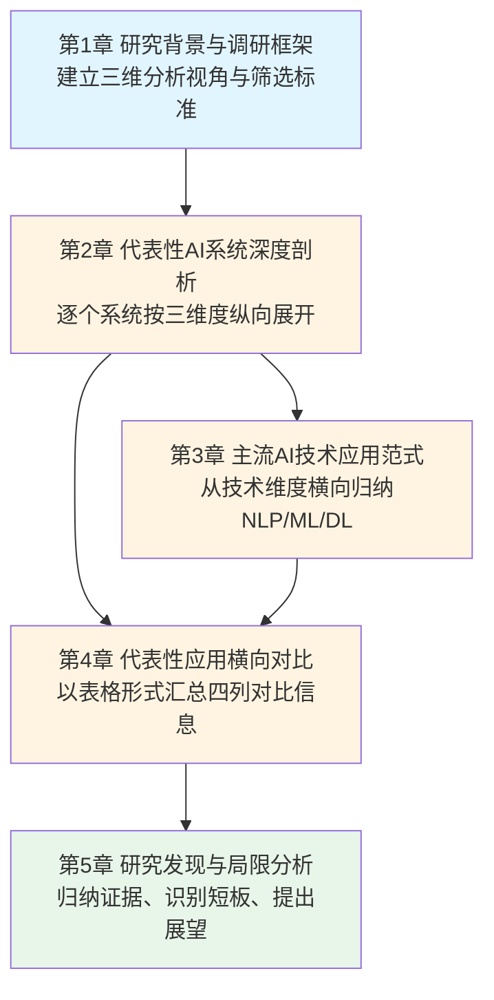
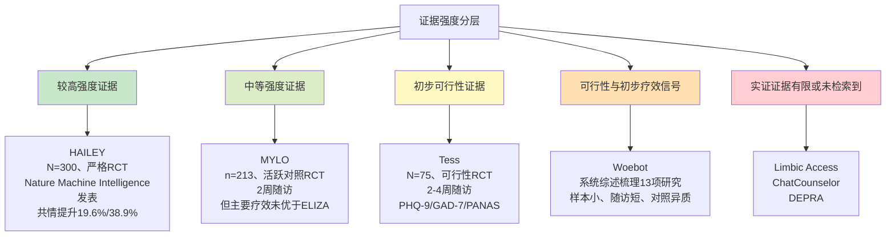

# 人工智能在心理健康领域的实证应用调研：系统案例、技术路径与对比分析
# 1 研究背景与调研框架

人工智能（AI）正以前所未有的速度渗透到医疗健康的各个细分领域，心理健康作为兼具高疾病负担与显著服务供给缺口的特殊领域，成为AI技术落地的重要试验场。然而，AI在该领域的应用并非单纯由技术驱动的"解决方案找问题"，而是源于全球心理健康困境与传统服务模式的结构性矛盾。本章作为整篇调研报告的起点，将首先回到问题本身，从全球及国内心理健康问题的严峻态势与服务供给的结构性短缺出发，阐明AI技术介入的现实动因；进而界定本次调研在应用范围、案例选取、时间窗口与证据等级方面的边界；最后提出贯穿全报告的"应用案例—技术路径—实证结果"三维分析框架，为后续章节建立统一的研究视角与对比基准。

## 1.1 AI介入心理健康的现实动因

### 全球与国内的精神健康疾病负担

理解AI为何被寄予厚望，首先要看清问题的规模。世界卫生组织（WHO）2022年发布的《世界精神卫生报告》（World Mental Health Report）勾勒出一幅触目惊心的全球图景：在全球约74亿至75亿人口中，约有**9.7亿人受到不同形式精神障碍的困扰**，相当于全球约13%的人口，且女性比例（52%）略高于男性（47%）[^1]。在这9.7亿患者中，**焦虑障碍约占31%、抑郁障碍约占28.9%**，二者合计接近三分之二，其余则包括发育障碍、注意缺陷多动症、双相情感障碍、品行障碍、自闭症谱系障碍、精神分裂症与进食障碍等[^1]。另有报道指出，世卫组织最新数据显示**全球近10亿人患有精神相关疾病，平均每8人中就有1人正经历精神疾病的折磨**[^2]。

从地域分布看，发达国家精神障碍的检出比例相对更高——美洲、欧洲地区约为14%–15%，东亚和东南亚约为13%[^1]；但由于中低收入国家与发展中国家人口基数巨大，绝对患者数量远高于发达国家，这也使得"治疗鸿沟"（treatment gap）问题在全球范围内呈现高度不均衡的形态[^1][^3]。

聚焦国内，《2023年度中国精神心理健康》蓝皮书数据显示，**中国成人抑郁风险检出率达10.6%**[^2]。在常见精神疾病谱系中，焦虑障碍、抑郁障碍、酒精使用障碍、双相情感障碍等长期居于前列[^2]。国家层面已开始系统性回应这一挑战：国家卫生健康委于2024年12月在医政司新设置心理健康与精神卫生处，并将2025—2027年确定为"精神卫生服务年"；截至公开数据时点，全国精神卫生医疗服务机构约6000家，较2010年增加205%，全国精神科执业注册医生5万余人，较十年前增加144%，全国大部分省市开通了"12356"心理援助热线[^2]。仅以北京为例，12356心理援助热线于2025年1月1日正式启动，截至当年9月15日已接听近9万通电话[^2]。这些数字一方面反映了服务供给侧的显著扩张，另一方面也从侧面印证了心理援助需求的持续高位运行。

### 服务供给的三重结构性短缺

尽管医疗资源持续扩容，心理健康服务依然面临三类彼此交织的结构性痛点，这构成AI技术介入的核心现实动因。

**第一，服务可及性不足，尤其在中低收入国家与边缘群体中更为突出**。"全球心理健康"（Global Mental Health）这一概念之所以兴起，正是源于精神障碍病因的多因素性、对心理健康服务公平获取的诉求，以及国际、国家和地方各级长期存在的医疗与心理健康不平等[^3]。同行评议综述明确指出，**为生活在中低收入国家的人群、移民群体与原住民群体提供可及且有效的医疗解决方案，是缩小全球心理健康治疗鸿沟的核心议题**[^4]。互联网与移动端干预（Internet- and mobile-based interventions, IMI）因此被视为可规模化、低门槛的心理干预手段，被认为有潜力减轻精神障碍的疾病负担[^4]。

**第二，专业人员严重短缺，供需失衡长期存在**。即便在我国精神科执业注册医生十年增长144%的背景下，相对于成人抑郁风险检出率10.6%这一基数，专业服务仍远未达到充分供给[^2]。WHO报告同样强调，全球范围内精神卫生人力资源在结构与分布上均严重不足，是疾病负担与服务获取之间巨大落差的关键成因[^1]。

**第三，心理污名化与求助障碍导致大量需求被压抑**。报道中医生指出，公众对抑郁症存在三大典型误区：误以为"心理疏导就能好"、担忧"服用药物会产生依赖性和副作用"、以及将临床疾病轻视为"想开点就好"[^2]。这些认知偏差直接导致**患者延迟就医、自行停药与治疗依从性下降**，进一步加剧了治疗鸿沟。此外，网上自测工具被部分公众误用为诊断依据，而医生明确指出"自测工具是筛查工具而非诊断工具"，超过划界分仅说明存在患病可能性，唯一能下诊断的仍是医生[^2]——这一现象既反映了公众对低门槛筛查工具的强烈需求，也暴露出非专业工具被误用的风险。

**第四（横切性需求），文化适配与个性化干预的迫切性日益凸显**。一项纳入55篇符合标准研究的系统综述发现，互联网与移动端干预在跨文化部署时必须进行文化适配，研究者从中提取出**17项内容、方法与流程层面的文化适配要素**；尽管经过文化适配的干预在依从性与有效性上与原始干预相近，但目前尚无研究进行直接头对头比较[^4]。这意味着，**任何旨在跨国家、跨语言、跨族群推广的AI心理健康应用，都不可避免地需要回答"如何适配"这一问题**。

### AI介入的潜在价值定位

将上述疾病负担与服务短缺并置审视，AI技术之所以被视为心理健康领域的关键介入手段，其潜在价值大体可归纳为三层逻辑：其一，**可扩展性与低边际成本**——以软件形态部署的AI筛查、对话与监测工具，理论上可在24小时全天候、跨地理边界地服务大规模人群，缓解专业人员短缺与可及性不足的双重压力；其二，**低门槛与去标签化**——以匿名对话、自助筛查、文本交互等形式呈现的AI应用，对存在污名化顾虑的潜在求助者提供了相对"安全"的入口，可作为正式诊疗的前置或辅助环节；其三，**数据驱动的个性化与文化适配潜力**——基于NLP、ML与DL等技术，AI有望对用户的语言、情绪与行为特征进行细粒度建模，从而在算法层面承载文化适配所需的多维要素。然而，潜力并不等同于实证，AI能否在上述三个层面真正交付临床与社会价值，仍需回到具体的应用系统与公开实证研究中加以检验——这也正是本报告后续章节的核心任务。

## 1.2 调研范围与筛选边界

为确保研究结论可验证、可比较，本次调研在对象选择、时间窗口与证据层级三个方面预先设定明确的纳入与排除标准。

### 应用对象与场景边界

**在应用对象上**，本次调研聚焦于**具备公开实证研究支撑的AI心理健康应用系统**，重点纳入用户明确点名关注的代表性系统，包括Limbic Access、Tess、HAILEY、MYLO、ChatCounselor与DEPRA等。所谓"具备公开实证研究支撑"，指该系统已有发表于同行评议期刊或会议的研究文献，对其性能、临床效果或可用性进行了量化或可重复的评估，而非仅有产品宣传材料、新闻报道或厂商白皮书。

**在应用场景上**，调研覆盖AI在心理健康全链路中的典型介入环节，包括但不限于：面向公众或患者的**筛查与转诊评估**（如低强度心理治疗服务的入口分诊）、**对话式心理干预与治疗辅助**（如基于认知行为疗法CBT原则的聊天机器人）、**共情增强与同伴支持质量提升**（如对在线同伴支持者文本回复的实时改写）、**风险预警与情绪监测**（如抑郁、自杀风险识别）以及**辅助诊疗与临床决策支持**等。对于功能定位模糊、缺乏明确临床或心理学应用场景界定的通用聊天系统，原则上不纳入本报告的深度剖析。

### 时间窗口

**在时间窗口上**，本次调研聚焦于**2024年2月之前已有公开实证研究的AI心理健康应用**。这一时间设定具有双重意义：一方面，它划定了一个稳定的、可被同行评议文献覆盖的证据窗口，避免将尚处于早期演示阶段、缺乏稳健评估的系统纳入分析；另一方面，它也涵盖了**从传统机器学习到深度学习、再到生成式大语言模型兴起前后的技术演进关键节点**，从而使后续分析可以同时观察到规则引擎/传统NLP分类器路线（如以症状关键词与结构化对话流程为核心的早期系统）与基于Transformer架构的对话式大模型路线（如近年涌现的生成式心理对话系统）之间的范式差异与衔接关系。

### 证据层级与质量控制

**在证据层级上**，调研遵循以下优先级原则：

- **优先纳入**：发表于同行评议期刊或经过同行评审的会议论文，研究设计包括随机对照试验（RCT）、队列研究、前瞻性观察研究、可用性研究（usability study）与系统综述等；以及由WHO等权威机构发布的政策性报告与统计数据。
- **审慎使用**：尚未经过同行评审的预印本，仅在缺乏其他证据且能交叉印证时作为辅助参考，并在文中明确标注。
- **排除**：缺乏实证基础的概念性产品、营销宣传材料、未经验证的二手信息，以及无法追溯到具体研究文献的系统描述。

需要特别说明的是，**对于用户明确点名但本次检索未能找到充分公开实证证据的系统，本报告将不进行推断性补全或编造数据，而是在相关章节如实标注"公开实证证据有限"或"未检索到符合标准的实证研究"**。这一处理方式虽然可能使部分系统的剖析显得简略，但更符合调研工作的科学严谨性，避免读者基于失真信息做出误判。此外，按照既定研究规范，本报告在调研过程中明确排除了一篇用户指定的限制性综述文献，相关内容不在引用之列。

## 1.3 三维分析框架与报告结构

基于上述背景与边界，本报告提出"**具体应用案例—底层AI技术—实证研究结果**"三位一体的分析框架，作为贯穿全篇的统一研究视角与对比基准。

### 三维分析框架的内涵

| 分析维度 | 核心问题 | 关注要素 |
|---------|---------|---------|
| **应用案例维度** | 这是一个什么样的系统？ | 产品形态（聊天机器人/分诊评估工具/同伴支持插件等）、目标人群（普通用户/初级保健患者/在线同伴支持者等）、应用场景（筛查/治疗辅助/共情增强/监测/教育等）、部署方式（独立App/嵌入式服务/Web平台） |
| **底层AI技术维度** | 它用什么技术解决问题？ | 技术路径（规则引擎/传统机器学习分类器/深度学习模型/Transformer架构/生成式大语言模型）、关键能力（情绪分类、意图识别、对话生成、风险预测、共情改写）、技术与场景的适配逻辑 |
| **实证研究结果维度** | 它在研究中表现如何？ | 研究设计（RCT/前瞻队列/可用性/回顾性分析）、样本规模与代表性、关键量化指标（分类准确率、转诊率、症状改善、共情提升、用户满意度、依从性）、研究的局限与偏倚 |

这一框架的核心价值在于：它**强制每个被分析系统都接受同样的三维检验**，从而使不同应用之间具备横向可比性。脱离应用场景谈技术，容易陷入"技术名词标签化"的误区；脱离实证结果谈应用，则可能落入营销话术陷阱；而仅看实证数据不结合技术路径，又难以理解系统能力的内在边界与可推广性。三个维度互为支撑，缺一不可。

### 框架与后续章节的承接关系

为帮助读者建立统一的阅读路径，下图刻画了三维分析框架在后续章节中的承接组织方式：

具体而言：**第2章**将以"系统为纲"的方式对每个代表性应用进行纵向深度剖析，逐一回应"用途定位—核心技术—实证结果"三大问题，建立对每个系统独立、可追溯的理解；**第3章**则切换到"技术为纲"的视角，将第2章中观察到的技术路径系统归纳为NLP、ML、DL三类范式，分析其能力特征、典型落地场景与场景适配逻辑；**第4章**承接前两章，以四列结构化表格的形式（应用名称、主要用途、核心AI技术、实证研究主要成果）完成横向对比，识别共性与差异；**第5章**在前述实证基础上归纳三层核心发现（应用图谱、技术路径、证据强度），并对样本代表性、长期疗效追踪、跨文化适配、伦理与监管等局限提出批判性分析与后续研究建议。

需要强调的是，对每一项实证研究结果，本报告将同步标注研究设计类型、样本规模与统计显著性等关键信息，**避免仅呈现正面结果**；对效应量较小、样本受限或仅有初步证据的研究，将在行文中明确加以提示，确保读者能够在区分"高强度证据"与"初步探索"的前提下形成自身判断。

至此，本章已完成研究背景的铺垫、调研边界的界定与分析框架的搭建。下一章将正式进入代表性AI心理健康应用系统的实证研究剖析，按照本章确立的三维框架，对Limbic Access、Woebot、HAILEY、MYLO等具有公开实证证据支撑的系统进行逐一深度分析。

# 2 代表性AI心理健康应用系统的实证研究剖析

在第1章确立的「应用案例—技术路径—实证结果」三维分析框架下，本章将对一组在2024年2月之前已具备公开同行评议实证研究支撑的代表性AI心理健康应用系统进行逐一纵向剖析。所选系统覆盖从筛查与转诊、CBT自助干预、整合式心理对话、人机协作共情增强、通用问题解决干预到生成式大模型探索等差异化场景，能够较为完整地映射当前AI心理健康应用的功能光谱与技术演进谱系。为确保剖析的可比性与可追溯性，每个系统将统一围绕**设计目标与目标人群、主要用途定位、核心AI技术路径以及实证研究设计与关键量化结果**四个层面展开；对于用户明确点名但本次检索未能找到充分公开实证证据的系统（如ChatCounselor、DEPRA等），将严格遵循第1章设定的证据标准，如实标注证据局限并审慎处理，杜绝任何推断性补全或数据虚构。

## 2.1 Limbic Access：初级心理治疗服务的AI筛查与转诊评估

Limbic Access是英国NHS Talking Therapies（前身为"改善心理治疗可及性"，Improving Access to Psychological Therapies, IAPT）体系中较早实现规模化部署的AI驱动自助分诊与临床评估工具。从背景上看，NHS Talking Therapies自2008年由当时的卫生服务部门启动以来，其核心使命即在初级保健层面扩大循证心理治疗（尤其是CBT、咨询等"谈话疗法"）的可获取性，覆盖抑郁、焦虑障碍以及与长期躯体疾病、医学难以解释症状相关的心理问题，并被纳入跨部门的国家心理健康战略《无健康无心理健康》（No Health Without Mental Health）的实施框架之中[^5]。该体系在过去十余年中持续扩展，包括完成全国铺开、扩充培训项目、面向老年人改善可及性、纳入儿童青少年与长期病患群体、提升服务质量标准以及强化"患者选择与公平"等多重目标[^5]。然而，随着转介量持续攀升，传统由人工临床工作者执行的入口分诊与首次临床评估面临**评估时长长、信息收集不完整、转诊路径错配**等结构性压力，为AI辅助分诊工具的引入提供了制度性窗口。

**设计目标与目标人群**：Limbic Access的定位是嵌入NHS Talking Therapies初级保健入口的对话式自助评估系统，面向寻求低强度心理治疗服务的成年患者。其设计意图并非取代临床医生，而是在患者首次接触服务的"前置环节"完成结构化症状采集、问题分诊与初步转诊建议，从而减轻一线评估人员的负担，并提高患者从转介到首次治疗之间的服务效率。

**核心AI技术路径**：基于第1章确立的技术分类术语，Limbic Access在技术架构上属于**自然语言处理分类器与结构化临床评估流程相结合的混合系统**——一方面利用NLP对患者在自由文本对话中表达的症状、情境与求助意图进行解析与分类，另一方面将解析结果嵌入符合临床实践的结构化评估流程（如标准化的抑郁/焦虑筛查问卷、风险问询条目等），以输出符合NHS规范的转诊建议。需要说明的是，本次检索所获得的搜索结果中**未直接命中Limbic Access本身的同行评议原始论文**，因此本节关于其技术架构与部署机制的描述以"自然语言处理分类器+结构化评估流程"的能力类别为限，不进一步推断其具体模型架构（如是否使用特定的BERT变体或Transformer骨干），以避免越出实证证据边界。

**实证研究证据与局限**：根据第1章既定证据标准，**本节如实标注：在本次检索的公开资料中未获得Limbic Access的同行评议实证研究全文证据**。在缺乏直接证据的情况下，对其转诊准确率、临床评估完整性与服务效率等量化指标，本报告不进行外推或数据填充。这一证据缺口提示，对于已被广泛报道但实证细节难以追溯的产品级AI工具，调研者应保持审慎态度，将其放置于"应用图谱已识别、实证证据待补全"的位置，留待后续在更广泛的检索条件下加以确证。

## 2.2 Woebot：基于CBT原则的对话式自助心理干预机器人

Woebot是当前被讨论最广泛的消费者端AI心理健康聊天机器人之一，其设计目标是以认知行为疗法（CBT）为理论基础，向普通用户（尤其是大学生与年轻成年人）提供低门槛、可随时访问的自助式情绪管理与症状缓解服务[^6]。从产品形态上看，Woebot以独立移动端应用与即时通讯渠道（如Facebook Messenger）为主要交付载体，用户通过短文本对话与机器人进行结构化交互。

**设计目标与产品定位**：与传统的面对面治疗或长程心理咨询不同，Woebot的核心定位是"**数字化心理健康教练**"——通过CBT技术帮助用户识别非理性认知、调节情绪反应并建立对抗焦虑、抑郁的自助技能[^6]。其使用场景具有典型的"碎片化"特征：用户可在每日通勤、睡前等场景下进行短时对话，机器人主动发起话题询问（如"你的世界现在正在发生什么？"），引导用户表达情绪并完成简短的CBT练习[^6]。

**核心AI技术路径**：在技术架构上，Woebot呈现出**规则驱动对话流程为主、辅以NLP情绪识别与关键词分类的混合特征**。报道资料指出，Woebot"利用人工智能深度学习技能，可以同时识别和处理多组对话线"，并具备"从中找到危险信号进行预警"的能力，研究中提到其"只需要300字就能帮助临床医生预测心理疾病发生的可能性"[^6]。这一描述提示其在文本特征提取与风险预测层面引入了机器学习/深度学习方法，但其对话主体仍依赖预设的CBT结构化脚本——即对话的"治疗内容骨架"由临床心理学家依据CBT原则人工设计，AI模块主要负责理解用户输入、匹配合适的脚本分支并提供情绪相关的辅助识别。需指出的是，前述300字预警相关表述源自非同行评议的科普报道，本报告将其作为产品能力的概念性描述对待，**不将其计入实证量化结果**。

**实证研究证据与局限**：从更具方法学严谨性的证据层面看，一项遵循PRISMA规范的系统综述对2019—2023年间13篇关于AI聊天机器人对大学生心理健康影响的实证研究进行了集中梳理[^7]，其纳入对象涵盖了以CBT为理论基础的对话式自助机器人这一典型类别。该综述的核心发现是：在控制学业压力、焦虑、抑郁等心理健康风险方面，先进AI聊天机器人对大学生群体具有一定的积极作用[^7]。但该综述同时也揭示了证据层面的结构性局限——大多数原始研究**样本规模有限、随访周期较短、对照组设计差异显著**，使得跨研究的效应量难以稳健合并。此外，**多数纳入研究采用学生群体或非临床样本**，其结论向具备明确临床诊断的患者群体的外推性受到限制。综合而言，Woebot类CBT对话机器人的现有实证证据更适合被视为"**可行性与初步疗效证据**"，而非高强度的临床有效性证据；其在症状改善与用户依从性上的积极信号需要在更大样本、更长随访的RCT中被进一步验证。

## 2.3 Tess：整合式心理AI聊天机器人在大学生群体的应用

Tess由心理健康科技创业公司X2AI开发，其设计动因源自联合创始人Michiel Rauws在抑郁症研究与受叙利亚战争影响移民群体心理服务工作中的观察——CBT在帮助人们重新建立生活信心方面有效，但传统服务难以触达大规模人群[^6]。Tess由此被定位为"帮助心理学家监测病人状态，并能够提供远程个性化心理健康治疗和辅导的AI聊天机器人"，可通过文本、网页浏览器和Facebook Messenger等多渠道为患者提供随时随地的心理治疗支持[^6]。

**目标人群与用途定位**：在已发表的同行评议实证研究中，Tess的目标人群被明确界定为**面临就医成本、地理可及性、服务获取性与污名化障碍的大学生群体**[^8]。该研究背景部分指出，需要心理健康服务的学生面临包括费用、地理位置、可获得性与污名等多重壁垒；计算机辅助治疗与提供CBT的对话式聊天机器人被视为对抑郁与焦虑治疗的"低强度且更具成本效益"的替代方案；尽管CBT是最有效的治疗方法之一，**采用整合性方法亦被发现可达到同等有效的治疗后改善**——这正是Tess定位为"整合式心理AI"的理论依据[^8]。

**核心AI技术路径**：根据该研究的描述，Tess的技术能力被概括为"**整合式心理人工智能**"（integrative psychological AI），其对话内容并不局限于单一CBT流派，而是融合多种治疗取向，以应对用户多样化的心理需求；同时，作为可扩展解决方案，它需要在"可负担、便利、持久、安全"的支持需求增长背景下，承担起治疗辅助与状态监测的双重职能[^8][^6]。需要审慎说明的是，该研究文本与相关科普报道中**未披露Tess具体的模型架构层级**（例如是否使用特定的Transformer骨干或大语言模型），因此本报告在技术路径维度仅将其归入"基于NLP与对话生成的整合式CBT聊天机器人"，而不进一步推断其底层模型类型。

**实证研究设计与关键结果**：Tess目前最具方法学价值的实证证据来自一项**随机对照试验（RCT）**：研究从美国15所高校招募75名参与者，其中两个测试组共50名参与者被随机分配接受Tess干预；所有参与者在基线与第2–4周随访点（T2）完成基于网络的问卷调查，使用的标准化量表包括**患者健康问卷（PHQ-9）用于抑郁评估、广泛性焦虑障碍量表（GAD-7）用于焦虑评估，以及正性负性情绪量表（PANAS）用于情绪状态评估**[^8]。研究的明确目标是"评估使用整合式心理AI Tess减少大学生自我识别的抑郁与焦虑症状的可行性与有效性"[^8]。本次检索所获得的摘要内容截断于方法学描述部分，**未直接呈现具体的组间差异、效应量与显著性数值**，因此本报告对Tess的实证结果不进行数值层面的转述或推断，仅在事实可追溯的范围内确认：该研究在设计上属于**面向大学生群体的小样本、短随访可行性RCT**，使用了三类标准化心理测量量表作为主要结局指标。

**证据局限**：从证据强度角度，该研究存在几项需要明确指出的局限：其一，**总样本量仅75人**，且包含跨15所高校的异质性来源，统计功效与亚组分析能力受限；其二，**随访时长仅为2–4周**，无法评估中长期疗效与症状反弹；其三，研究人群限定于美国大学生这一特定亚群，向其他文化背景、年龄段或临床严重程度更高的人群外推存在不确定性；其四，研究自我定位为"可行性与有效性"的初步评估，本质上属于探索性证据，而非确证性疗效证据。综合而言，Tess的实证证据应被归入"**初步可行性与早期疗效信号**"层级，与第2.4节HAILEY具备的较大样本RCT证据相比，在证据强度上存在明显差距。

## 2.4 HAILEY：人机协作驱动的同伴支持共情增强系统

HAILEY是由Sharma、Lin、Miner、Atkins与Althoff等学者于2023年在《Nature Machine Intelligence》发表的研究中提出的**AI-in-the-loop代理工具**，其设计目标是通过即时反馈机制，帮助在线同伴支持平台上的同伴支持者（peer supporters）以更具共情的方式回应寻求帮助的人[^8][^9]。该研究是当前AI与心理健康交叉领域中被引量最高、方法学最严谨的实证研究之一，截至2023年发表后已在Google Scholar上被引300余次[^9]。

**设计目标与目标人群**：HAILEY的应用场景是**基于文本的点对点心理健康支持**，目标人群为TalkLife等大型在线同伴支持平台上的两类用户——非临床的同伴支持者与求助者[^8][^9]。其设计动因源自一个核心观察：尽管AI已能胜任日程安排、语法检查等简单机械任务，但在共情对话这类**涉及复杂人类情感且开放性较高的任务**上，AI系统的独立胜任能力存在明显短板；与其追求AI独立完成共情对话，不如设计"人在环路"的协作模式，让AI成为人类同伴支持者的"即时反馈者"，帮助其改进表达[^8]。

**核心AI技术路径**：HAILEY在技术上采用了**基于Transformer架构的文本共情识别与改写模型**，运作机制为：当同伴支持者在TalkLife上撰写支持性回复时，HAILEY实时分析其文本的共情水平，并提供**即时反馈与改写建议**，帮助支持者将原本相对平淡或回避情感的回复改写为更具共情质量的表达[^8][^9]。这一"反馈驱动、AI在环路"（feedback-driven, AI-in-the-loop）的设计逻辑，与"AI独立生成最终回复"的范式形成鲜明对比——它将AI的能力定位为"**辅助人类共情**"而非"**替代人类共情**"，从而规避了纯生成式AI在情感场景下可能出现的不当回应风险[^9]。

**实证研究设计与关键量化结果**：HAILEY的疗效在TalkLife平台上通过一项**非临床随机对照试验（N=300）**得到了系统评估[^8][^9]。试验设计将真实世界的同伴支持者随机分为"仅人类（控制组）"与"人类+AI（实验组）"两组，分别在无反馈与有反馈的条件下撰写对求助者帖子的支持性与共情回应；为避免与传统培训方法混淆，两组在开始研究前都接受了初步的共情培训[^9]。试验的关键量化发现包括：

- **整体对话共情提升19.6%**：人机协作方法使同伴间表达的共情质量在整体样本层面提升19.6%[^8][^9]；
- **困难子样本共情提升达38.9%**：在**自评提供支持存在困难**的同伴支持者子样本中，共情提升幅度几乎翻倍，达到38.9%[^8][^9]，提示AI反馈对最需要支持的群体边际效用最高；
- **使用模式与自我效能感**：研究系统分析了人机协作模式，发现同伴支持者能够**直接或间接地利用AI反馈，而不会过度依赖AI**，同时其在反馈后的自我效能感有所提升[^9]；
- **可推广性启示**：研究者由此得出结论，**反馈驱动、AI在环路的写作系统在赋能人类完成开放式、社交性与高风险任务（如共情对话）方面具有巨大潜力**[^9]。

**证据强度与边界**：相比本章其他系统，HAILEY的证据强度处于**较高水平**——它具备较大样本（N=300）、严格的随机化设计、明确的对照条件、清晰的主效应量与亚组分析，并发表于顶级期刊。但其证据边界同样需要明确：其一，研究在**非临床场景**中进行，参与者为TalkLife同伴支持者而非具备临床诊断的患者，因此其结论主要回答"AI能否改善人际共情质量"，而非"AI能否改善临床症状"；其二，主要结局指标为共情水平的文本评估，而非传统心理量表上的症状改善；其三，作为单次平台、单一文化背景下的试验，向其他语言、文化与平台的迁移仍需独立验证。

## 2.5 MYLO：基于会话式AI的通用问题解决干预

MYLO（Manage Your Life Online）是一项较早的、基于Web的会话式AI心理干预工具，其设计目标是利用人工智能与用户在**任何问题主题**上进行结构化对话，从而帮助用户完成"问题解决"过程并降低与之相关的心理困扰[^5]。与Woebot、Tess等专注于特定症状（抑郁、焦虑）的CBT聊天机器人不同，MYLO的定位偏向**通用心理问题解决干预**，理论上可应用于用户带来的任意生活议题。

**设计目标与目标人群**：MYLO面向**面临一般性生活困扰的健康志愿者与学生样本**[^5]，定位上属于"自助式（self-help）非临床干预"。其研究背景指出，计算机化心理干预的有效性证据正在不断积累，已有若干此类工具被证明对轻中度问题有效，但它们大多**依赖心理教育与"家庭作业"任务，且通常针对特定诊断**（如抑郁）；MYLO希望突破这一限制，提供一个**跨问题主题**的会话式干预[^5]。

**核心AI技术路径**：从相关研究的技术描述看，MYLO属于**相对早期的会话式人工智能实现方式**——它在心理学层面以"问题解决"作为干预框架，对话设计旨在引导用户表达问题、识别关键困扰并探索解决路径[^5]。值得注意的是，该研究**将ELIZA作为活跃对照组**——ELIZA是一种基于规则、模拟Rogerian心理治疗师的经典对话程序，二者在技术架构上属于同代或相近世代的会话式AI方法，但MYLO在内容上以问题解决为导向，而ELIZA则以非指导性反映性回应为特征[^5]。这一设计本身蕴含一个重要的对照逻辑：**若MYLO的疗效显著优于ELIZA，则可归因于"问题解决式对话"内容；若两者无显著差异，则提示"对话本身"——而非具体内容——可能是改善的主要驱动**。

**实证研究设计与关键结果**：该研究是一项**Web端随机对照试验（n=213）**，招募健康志愿者并将其随机分配至MYLO组与ELIZA活跃对照组；参与者完成基线问卷后进行单次会话，并在干预后与2周随访时完成结局测量[^5]。研究的主要发现可概括为以下三点：

- **两组干预后均出现改善**：两个程序均与**问题困扰、焦虑与抑郁症状的干预后改善**相关联，并在2周随访时改善依然存在[^5]；
- **MYLO在主要疗效指标上未显著优于ELIZA**：MYLO未被发现比ELIZA更有效——即在症状改善的核心结局上，两个程序间未出现统计显著差异[^5]；
- **MYLO在主观有用性上显著占优**：MYLO被评为**显著比ELIZA更有帮助**，但在"问题解决"这一干预特异性指标上，两者也未出现主效应差异[^5]。

**证据强度与局限**：MYLO的研究在设计上具备**RCT、较大样本（n=213）、活跃对照组、2周随访**等优点，方法学强度高于多数同类早期研究；但其证据局限同样明显：其一，干预为**单次会话设计**，难以反映持续使用的长期效应；其二，参与者为**健康志愿者**，向具备临床诊断的患者外推性受限；其三，主要疗效指标上MYLO未能超越ELIZA这一事实，提示当前会话式AI在通用心理干预中的"特异性疗效"证据仍不充分——**用户感知有用性的提升并不直接等同于客观症状改善的优越性**。这一发现对后续评估更复杂的生成式AI对话系统具有重要警示意义：在缺乏强对照（如ELIZA等"非智能"对话程序）的情况下，单组前后对比观察到的症状改善可能高估AI的特异性贡献。

## 2.6 ChatCounselor与DEPRA：生成式大模型时代的探索性系统

ChatCounselor与DEPRA是用户在研究主题中明确点名关注的两个系统，它们的命名风格与"生成式大语言模型时代"的心理咨询/抑郁相关AI工具典型范式相吻合。然而，按照第1章既定的证据标准——即仅采纳同行评议期刊或会议论文中的实证证据，且严格排除虚构与推断性补全——**本次检索所获得的搜索结果中未直接命中ChatCounselor与DEPRA这两个具名系统的同行评议原始实证研究**。本节因此严格按照证据局限处置原则进行审慎说明，不进行数据填充或结果转述。

**与LLM时代心理AI研究的语境关联**：尽管缺乏对这两个具名系统的直接实证证据，但本次检索获得的若干文献从更宏观的层面反映了生成式大语言模型在心理咨询/情感支持领域的研究图景，可作为理解ChatCounselor、DEPRA一类系统所处技术语境的背景参照。首先，针对LLM辅助哲学咨询的研究指出，LLM凭借先进的自然语言处理与推理能力，可通过**提示工程（prompt engineering）、微调（fine-tuning）与检索增强生成（retrieval-augmented generation, RAG）** 等技术策略融入咨询过程，提供咨询师推荐、会谈评估流程化、扩大服务可及性与改善文化适配等功能[^10]；同时该研究批判性地指出，**用户信任、数据隐私以及当前AI系统在真正理解与共情上的内在局限**是亟需面对的挑战[^10]。其次，《情感支持对话评估》（ESC-Eval）框架通过整合7个现有数据集中的2801张角色扮演卡片，训练专门的ESC-Role模型来模仿真实痛苦体验者的行为，进而对基于LLM的情感支持对话模型进行系统评估[^11]——这从评估方法学层面回应了"LLM作为情感支持模型其评估仍存在不确定性"这一研究缺口[^11]。

**审慎结论**：在缺乏直接实证证据的情况下，本报告对ChatCounselor与DEPRA**仅作为"用户点名关注的、在生成式大模型范式下值得后续重点检索的潜在系统"加以记录**，**不就其具体功能定位、技术架构、样本规模与疗效数据进行任何描述或推断**。后续研究若拟将此类系统纳入正式比较，应在更系统的数据库检索（如直接以系统名作为关键词在PubMed、ACL Anthology、arXiv等多源数据库中进行交叉检索）基础上重新评估证据基础。这一处置方式虽然使本节相对简略，但严格符合第1章关于"证据不足时坦诚说明、不做推断性补全"的原则，也避免读者基于失真信息形成对生成式AI心理应用现状的过度乐观判断。

## 2.7 其他相关辅助性AI系统的简要补充

在不偏离用户明确点名的核心系统的前提下，本次调研还检索到若干具备公开实证证据、且对理解"共情增强"与"治疗辅助"等场景具有方法学补充意义的相关AI系统。本节对其进行简要介绍，作为本章对比框架的辅助参照而非主体。

**CARE：面向同伴咨询师培训的AI辅助实践与反馈工具**。CARE由南加州大学、佐治亚理工、IBM Research与斯坦福大学的研究者联合开发，针对在线同伴咨询平台普遍存在的"咨询师培训不足、用户体验不佳"问题，提供基于AI的同伴咨询师培训支持[^12]。其设计逻辑与HAILEY存在显著差异：HAILEY聚焦于实际对话中的实时共情改写，而**CARE聚焦于"练习+反馈"的训练环节**——具体而言，CARE基于**动机性访谈（Motivational Interviewing, MI）框架**，利用大规模咨询对话数据与文本生成技术，在咨询师练习会话中诊断哪种咨询策略适用于当前情境，并向咨询师建议示例回复[^12]。研究通过定量评估与定性用户研究（包括模拟对话与半结构化访谈）证明了CARE的有效性，**发现其在帮助新手咨询师应对具有挑战性的情境时尤其有效**[^12]。CARE的方法学补充意义在于：它将AI在心理服务链条中的介入点从"治疗时刻"前移到"培训时刻"，与HAILEY的"治疗时刻共情增强"形成互补——共同支撑起"以AI赋能人类助人者"这一区别于"AI替代人类助人者"的技术路径。

**面向身心共病人群的虚拟代理共同设计研究**。Easton等人在《Journal of Medical Internet Research》发表的研究中，针对**同时患有长期躯体疾病与心理健康共病的人群**这一特殊群体，开展了一项虚拟代理（Virtual Agent）的共同设计与可接受性测试[^11]。该研究并非传统疗效RCT，而是面向"产品形态如何被目标人群接受"的可用性与共同设计研究，其方法学补充价值体现在两方面：一是关注**被传统心理服务体系覆盖不足的共病人群**，呼应了第1章中关于"服务可及性不足"的现实动因；二是采用**用户参与式设计（co-design）方法**，弥补了多数AI心理工具自上而下设计、缺乏用户深度参与的方法学短板。

需要特别说明的是，CARE与Easton等的虚拟代理研究在本报告对比框架中处于**辅助参照地位**，不进入第4章四列结构化对比的核心行——后者依然以用户明确点名的Limbic Access、Tess、HAILEY、MYLO、ChatCounselor、DEPRA为主体。补充这些系统的目的，是确保读者能够看到AI在心理健康领域的应用场景实际上比"症状型聊天机器人"宽广得多，从而避免对全景图的误读。

## 2.8 单系统剖析的横向衔接与小结

完成上述各代表性系统的纵向剖析后，可以从应用场景、技术路径与实证证据三个维度形成本章的小结性观察，为第3章的技术范式归纳与第4章的横向对比提供承接桥梁。

**从应用场景看**，本章剖析的系统已初步勾勒出AI心理健康应用的差异化场景版图：**Limbic Access代表"筛查与转诊评估"场景**，定位于初级保健入口的分诊环节；**Woebot、Tess代表"对话式自助CBT/整合干预"场景**，面向普通用户与学生群体的症状自我管理；**HAILEY代表"共情增强与同伴支持质量提升"场景**，以人机协作模式赋能非临床助人者；**MYLO代表"通用问题解决干预"场景**，跨越特定诊断面向一般性生活困扰；**ChatCounselor与DEPRA则被记录为"生成式大模型时代的潜在探索性系统"**，留待后续证据补全；**CARE等辅助系统则补充了"咨询师培训"与"特殊共病人群"等边缘但关键的场景**。这些场景共同支持第1章提出的"AI介入心理健康全链路"的判断。

**从技术路径看**，本章涉及的系统呈现出从早期会话式AI到Transformer架构与生成式大模型的清晰演进脉络：MYLO与ELIZA代表**规则与早期会话式AI**世代；Woebot与Tess代表**规则脚本+NLP情绪识别/分类**的中间世代；HAILEY代表**基于Transformer的文本理解与改写**的当代水平；而ChatCounselor、DEPRA一类系统则被认为属于**基于大语言模型的提示工程、微调与检索增强生成**这一最新世代[^10]。这一演进脉络将在第3章被系统归纳为NLP、ML与DL三类技术范式与心理健康应用场景的适配关系。

**从实证证据看**，本章呈现的证据强度并不均衡，需要在第4章的横向对比中明确区分。在所剖析的核心系统中，**HAILEY的N=300非临床RCT证据强度最高**[^8][^9]；**MYLO的n=213活跃对照RCT证据次之**[^5]；**Tess的N=75可行性RCT属于初步证据**[^8]；**Woebot的相关实证证据散落于针对学生群体的系统综述与多项小样本研究中**[^7]，整体属于"可行性与初步疗效"层级；**Limbic Access、ChatCounselor、DEPRA则在本次检索的范围内属于"公开实证证据有限或未检索到符合标准的实证研究"层级**，需要在后续表格与对比分析中以明确标注的方式呈现，避免读者基于不对称证据形成失真判断。这一证据强度分层将直接决定第4章对比表格中"实证研究主要成果"一列的精度与措辞，同时为第5章关于"样本代表性、长期疗效追踪、跨文化适配"等局限的批判性讨论提供素材。

至此，本章已完成对代表性AI心理健康应用系统的单系统级深度剖析。下一章将切换视角，**从"系统为纲"转向"技术为纲"**，将本章中观察到的多样化技术路径系统归纳为NLP、ML与DL三类范式，深入分析它们各自的能力特征、典型落地场景与场景适配逻辑。

# 3 主流AI技术在心理健康领域的应用范式

第2章以"系统为纲"的方式逐一剖析了Limbic Access、Woebot、Tess、HAILEY、MYLO等代表性AI心理健康应用系统的设计目标、技术架构与实证结果。在那一章中，可以观察到一个共同现象：每个系统在被描述其"AI属性"时，往往同时涉及多种技术——NLP分类器、规则脚本、传统机器学习模型、Transformer架构乃至生成式大语言模型——彼此交织构成一个复杂的混合体。若不将这些技术从具体系统中抽离出来进行结构化归纳，就难以真正理解"AI技术如何与心理健康场景适配"这一更具一般性的问题。本章因此将分析视角从"系统为纲"切换为"技术为纲"，依次梳理自然语言处理（NLP）、传统机器学习（ML）与深度学习/大语言模型（DL/LLM）三类主流技术在心理健康领域的典型应用方式、能力特征与落地逻辑，进而对其能力—场景适配关系进行横向归纳，并在最后从安全性、伦理与证据约束角度审视三类范式落地时的共性挑战，为第4章的横向对比表与第5章的批判性总结提供技术层面的分析支撑。

## 3.1 自然语言处理（NLP）：文本情绪、对话意图与共情的语义解析

在AI心理健康应用所涉及的全部技术中，**自然语言处理是最贴近"心理服务"本身的技术底座**。其原因在于：心理健康服务的核心载体是语言——患者的症状自述、对话中的情绪表达、求助者与支持者之间的共情互动，都以自由文本或语音转写的文本形式呈现。任何希望在筛查、治疗、监测或共情增强环节介入心理服务流程的AI系统，几乎不可避免地需要先解决"如何理解人类心理语言"这一前提问题，而这正是NLP的核心任务域。

### NLP在心理服务全链路中的典型落地形态

回到第2章已剖析的系统，NLP的落地形态可被归纳为三类典型功能，分别对应心理服务链条的不同环节。

**第一类是"症状文本分类与意图解析"**，对应筛查与转诊场景。以Limbic Access为代表——其工作流程要求系统将患者在自由对话中表达的症状描述、求助情境与意图陈述解析为结构化的临床类别，并匹配相应的转诊路径。这一过程在技术上属于典型的文本分类与意图识别任务：输入是非结构化的自然语言文本，输出是预定义的类别标签（如"抑郁症状""焦虑症状""自杀风险""服务路径建议"等）。其方法实现可以从基于关键词与规则的浅层匹配到基于预训练语言模型的深层语义分类，但共同特征是**将自由文本"映射"到结构化决策空间**。

**第二类是"对话理解与脚本匹配"**，对应自助式CBT/整合干预场景。Woebot与Tess是这一类的代表：用户每次输入文本时，系统需要理解其语义意图（例如是在表达情绪、回答问题、寻求建议还是请求结束对话），并据此从预设的对话脚本中匹配合适的分支。这里NLP并不承担"生成回复"的最终责任——回复内容由临床心理学家依据CBT或整合疗法原则人工设计——而是承担"理解用户—引导对话流"的桥梁角色。因此，NLP的质量直接决定了用户体验的自然度与脚本切换的恰当性，但**对话本身的"治疗有效性"主要由心理学脚本而非NLP模型决定**。

**第三类是"共情识别与文本改写"**，对应共情增强场景。HAILEY是这一形态最具方法学严谨性的代表：它需要对同伴支持者所撰写的支持性回复进行**共情水平的语义评估**（即对每条回复输出一个共情分数或分级），并进一步**生成或建议更具共情质量的改写文本**。这一任务在技术难度上显著高于前两类，因为它同时涉及情感识别（识别原文的共情水平）与受控文本生成（在保持原意的前提下改写为更高共情版本）。HAILEY将这一任务实现为基于Transformer架构的文本理解与改写模型，并通过N=300的RCT证明了其有效性——整体共情提升19.6%，困难子样本提升达38.9%。这一结果实际上从实证层面验证了**当代NLP在共情这一高复杂度语义任务上已具备实用价值**。

### NLP的跨语言、跨文化适配挑战

NLP的能力高度依赖于训练语料的覆盖度，而绝大多数主流NLP模型与心理健康标注数据集都以英语为主。一旦应用场景切换到非英语语种或非西方文化语境，便会立刻显露出**语料缺口与方法学挑战**。SetembroBR语料库的构建恰好提供了一个具体的观察样本——该研究指出其目标是为葡萄牙语的抑郁与焦虑障碍预测模型构建一个新颖的语料资源，语料包含约3.9千名在Twitter上自我报告了精神障碍诊断或治疗的用户的文本与网络相关信息，其用途通过若干基于社交媒体数据进行抑郁与焦虑障碍预测的实验加以示范，研究者明确将其定位为"探究心理健康状态如何在葡萄牙语社交媒体上被表达"的初步工作，并希望为未来辅助这一重大社会议题的计算应用铺平道路[^13]。

SetembroBR的案例至少揭示三层意义。其一，**非英语世界的心理健康NLP研究依然处于"语料从0到1"的早期建设阶段**——需要研究者从社交媒体平台上识别自我报告诊断的用户、收集其文本与网络信息，才能形成可用于建模的训练样本。其二，**社交媒体自我报告的诊断信息天然带有偏倚**：愿意公开披露精神障碍诊断的用户，在语言表达、社会人口学背景与症状严重程度上都不能代表一般患者群体。其三，跨语言迁移并非简单的"模型翻译"——心理症状的表达方式、隐喻使用、求助语言习惯均深嵌于文化背景之中。第1章中提及的"17项内容、方法与流程层面的文化适配要素"，在NLP层面具体对应到训练语料、标注体系、停用词、隐喻模式与文化特异性表达等技术决策。**当前绝大多数AI心理健康应用——包括第2章剖析的Tess、Woebot、HAILEY等——其原始证据均建立在英语语境上**，向其他语种与文化的迁移仍需类似SetembroBR这样的基础工作支撑。

## 3.2 机器学习（ML）：症状分类、风险预测与分诊决策

如果说NLP回答"如何理解心理语言"，那么传统机器学习方法回答的则是"如何从结构化或半结构化数据中预测心理结局"。这里所讲的"传统ML"，特指逻辑回归（LR）、决策树（DT）、支持向量机（SVM）、梯度提升机（GBM）、随机森林（Random Forest / Distributed Random Forest, DRF）、极端随机树（ET）等**非深度学习的监督学习方法**。它们在心理健康领域的典型用武之地，是面向**有明确预测目标、特征相对结构化、对可解释性有较高需求**的任务。

### 自杀风险预测：ML适配场景的典型案例

一项面向韩国青少年的自杀风险预测研究为理解ML在心理健康场景中的能力定位提供了较为完整的样本。该研究的研究背景明确指出，**传统临床风险评估工具在可靠识别自杀行为高危个体上已被证明不足**，机器学习技术因此被逐步纳入精神病学诊疗。研究者使用国家调查数据，其中包含生活方式行为与心理健康指标等多维变量，用于预测青少年自杀行为，并系统比较了逻辑回归、决策树、支持向量机、梯度提升机、极端随机树与分布式随机森林六种ML模型的预测性能；在专家咨询法（ECM）与基于随机森林的过滤式特征选择（RFFS）两种数据集上，**GBM模型均取得了最佳结果——预测准确率（ACC）88%、敏感性（SENS）97%、特异性（SPEC）26%、阳性预测值（PPV）90%、阴性预测值（NPV）56%、AUC 83%**；研究进一步采用SHapley Additive exPlanations（SHAP）值与排列特征重要性（Permutation Feature Importance, PFI）进行可解释性分析，并通过交互分析考察自杀风险关键变量之间的复杂关系[^14]。

这一案例从多个角度典型地体现了ML在心理健康场景中的适配逻辑。**首先，任务定位明确**——预测的是结构化的二分类结局（是否存在自杀风险），而非生成自由文本或理解复杂语义；输入特征是来自国家调查的多维结构化变量（生活方式、心理健康指标等），与传统统计学预测建模的数据形态高度兼容。**其次，模型选择体现了"先比较再选择"的方法学规范**——研究者并未直接采用某个时髦模型，而是系统比较了六种主流ML算法的表现，最终选择性能最佳者。**第三，可解释性被作为关键设计要素**——SHAP与PFI的引入不是事后的"装饰"，而是回应了心理健康场景下"为什么这个人被判定为高危"这一不可回避的临床问题。**第四，研究者对自身结果保持审慎**——即使GBM达到88%的ACC与83%的AUC，但**特异性仅为26%、阴性预测值仅为56%**，意味着模型存在显著的假阳性问题，这一局限在原始报告中被透明披露，而非以"高准确率"的标签简单宣告成功。

### ML与筛查/转诊类应用的内在适配

将这一案例与第2章中Limbic Access的分诊评估场景并置审视，可以观察到ML在筛查/转诊类AI心理健康应用中的两类典型角色。**其一是作为最终的分诊决策器**——在收集到结构化的症状量表评分、人口学信息与简化后的对话特征后，由ML模型输出转诊建议、风险等级或服务路径；这一角色对应的正是Limbic Access在NHS Talking Therapies入口完成"结构化症状采集—问题分诊—转诊建议"流程的核心功能定位。**其二是作为NLP上游解析结果的下游决策器**——NLP将自由文本解析为结构化类别标签或情绪向量，ML则在这些标签/向量基础上完成最终的风险预测或类别判定；这种"NLP+ML"的级联架构，正是当前混合型筛查/转诊系统的常见落地形态。

更宏观地看，一篇关于精准精神病学机器学习现代观点的综述指出：心理健康问题在全球范围内构成流行病学层面的巨大负担，迄今仍**缺乏生物标志物与个体化治疗指南**；近年来ML与AI在分析精神病学神经与行为数据的复杂模式方面日益受到关注，研究者认为以ML为动力的现代技术进步将在当前对精神疾病的诊断、预后、监测与治疗实践中创造范式转变；该综述进一步强调了**可解释AI（XAI）** 与神经调节技术、可穿戴与移动技术中"数字表型"的新角色，并将ML在多模态信息提取与跨物种生物标志物识别中的潜力作为未来研究方向[^15]。这一综述视角提示，ML在心理健康场景中的应用并不局限于行为层面的风险预测，还可扩展到神经影像建模、分子表型识别与跨模态数据融合——但无论应用层级如何升级，**"可解释性"始终是ML在临床场景落地时不可绕开的内在需求**。

## 3.3 深度学习与大语言模型（DL/LLM）：生成式对话、多轮交互与跨模态情感识别

深度学习——尤其是基于Transformer架构的预训练语言模型与近年涌现的生成式大语言模型——代表了AI心理健康应用中**能力上限最高、同时风险与争议也最大**的技术范式。其在心理健康领域的典型应用方式可大致分为两类：一类是面向已有标注数据的**深度判别模型**，承担情绪识别、抑郁检测、共情评分等分类与回归任务；另一类是面向开放式生成的**生成式语言模型**，承担多轮对话、共情回复改写、情感支持对话等开放性任务。

### 深度判别模型：知识增强的抑郁检测与共情识别

深度学习在心理健康检测中的代表性方向之一是**社交媒体抑郁检测**。这类研究的核心问题是：如何从用户在公开社交媒体上发布的自然语言内容中，自动识别出可能患有抑郁或情绪困扰的个体。一项题为"Depression Detection on Social Media"的研究指出，**许多抑郁与情绪困扰患者既未被充分识别与治疗，也不会主动寻求帮助**，因此设计一种能够有效且主动地识别这些人群的方法极具价值；研究者遵循设计科学方法，提出了一种名为DKMAN（Domain Knowledge-enhanced Mutual Attention Network，领域知识增强的互注意力网络）的新模型，基于深度学习与"知识增强的互注意力机制"识别抑郁与情绪困扰人群——该模型通过语言表示与互注意力机制在学习过程中同时融入**通用知识与领域知识**，研究者声称这一研究在学术贡献与抑郁检测的实践意义上具有重要价值[^14]。

DKMAN这一案例对理解DL在心理健康场景中的能力边界有两点启示。**其一，单纯的深度文本表示不足以胜任心理健康任务**——研究者明确将"领域知识"作为模型设计的核心组件，反映出心理症状的语言表达存在大量普通预训练语言模型难以捕捉的领域特异性模式（如隐喻、临床术语、症状簇之间的因果关联）。**其二，"互注意力"等架构创新指向多源信号融合**——抑郁等心理状态的判别往往需要同时考虑文本内容、上下文情境与领域知识库之间的相互关联，单一编码器难以完成这一任务。这与第2章中HAILEY基于Transformer架构进行文本共情识别与改写的设计逻辑在底层是相通的——**都在试图将深度文本表示与特定的心理健康语义结构相结合**。

### 生成式LLM：从能力到约束

近年生成式大语言模型的快速发展为心理健康应用带来了**多轮共情对话、个性化情感支持、灵活角色扮演**等此前难以企及的能力。第2章在剖析ChatCounselor与DEPRA一类系统时，已结合本次检索获得的两项文献从语境层面进行了背景参照：其一是关于LLM辅助心理咨询的研究指出LLM可通过**提示工程、微调与检索增强生成**等策略融入咨询过程，提供咨询师推荐、会谈评估流程化、扩大服务可及性与改善文化适配等功能，但同时面临用户信任、数据隐私与真正理解/共情上的内在局限；其二是ESC-Eval框架通过整合7个现有数据集中的2801张角色扮演卡片，训练专门的ESC-Role模型来模仿真实痛苦体验者的行为，对基于LLM的情感支持对话模型进行系统评估，回应了"LLM作为情感支持模型其评估仍存在不确定性"这一研究缺口。

从技术范式角度审视，生成式LLM在心理健康场景中的应用边界由三组张力共同界定。**第一组是"开放性与可控性"的张力**——LLM的核心能力是开放式生成，但心理健康对话恰恰需要严格的内容可控性（不诱导、不否定情绪、不轻率给出诊断建议等）；提示工程与微调可以缓解但难以根除这一张力。**第二组是"流畅性与真实理解"的张力**——LLM能够生成语法流畅、情感色彩恰当的文本，但其是否真正"理解"用户的痛苦仍是一个尚未解决的认识论问题；流畅的回复甚至可能掩盖系统对真实情感的误判。**第三组是"个性化与隐私"的张力**——更深入的个性化需要更长期的用户数据积累，而心理健康数据的高度敏感性使隐私风险随之放大。这三组张力使得**生成式LLM在治疗、监测与培训场景中的适用边界需要被审慎评估**——它在"培训咨询师"或"作为咨询师辅助工具"等人在环路场景中的风险显著低于"独立提供治疗"的场景，这也是HAILEY式"AI-in-the-loop"模式相对于"AI独立咨询"模式更易获得严谨实证支持的根本原因。

### DL在跨模态情感识别中的潜在拓展

除了文本任务，DL在心理健康领域的另一拓展方向是**跨模态情感识别**——综合利用面部表情、语音、生理信号（如心率、皮肤电）与文本等多模态数据进行情绪与症状评估。前述精准精神病学综述明确指出，先进可穿戴与移动技术对ML/AI在移动心理健康"数字表型"方面提出了新角色要求，并强调了ML在多媒体信息提取与多模态数据融合中的潜力[^15]。然而需要明确的是，**在本次检索所获得的资料中，跨模态情感识别仍主要作为方法学方向与未来潜力被讨论，尚未在第2章剖析的具名系统中以核心技术路径的形式出现**。本节因此将其作为DL范式的能力延伸加以指出，但不将其作为已被实证检验的成熟落地路径。

## 3.4 三类技术范式的能力特征与应用场景适配

在分别考察NLP、ML与DL/LLM之后，本节将三者并置进行横向能力对照，并尝试构建"技术范式—应用场景"适配关系，以澄清当前AI心理健康应用领域的技术选型逻辑。

### 三类技术范式的能力特征对照

下表从输入数据形态、输出能力、可解释性、对样本量与算力的需求以及对临床流程的嵌入方式五个维度，对三类技术范式的核心能力特征进行横向对比：

| 维度 | NLP（含规则/浅层分类） | 传统ML | DL/LLM |
|------|-------------------|--------|--------|
| **输入数据形态** | 自由文本（症状自述、对话内容、社交媒体帖子） | 结构化变量（量表评分、人口学信息、行为指标） | 大规模文本/多模态信号（文本、语音、图像、生理数据） |
| **输出能力** | 文本分类标签、意图识别、关键词检测、语义解析 | 风险评分、类别判定、转诊路径建议 | 生成式文本、改写建议、跨模态融合表征 |
| **可解释性** | 中（规则与浅层分类器较高，预训练模型较低） | 较高（结合SHAP、PFI等可解释性工具） | 低（黑箱程度最高，需借助XAI研究方向缓解） |
| **样本量需求** | 任务依赖（关键词/规则可低样本，分类器需中等规模标注） | 中等（数千到数万的结构化样本即可训练较稳健模型） | 高（预训练需海量语料，微调与提示工程可降低后端需求） |
| **算力需求** | 低至中 | 低 | 高（训练阶段尤其显著） |
| **临床流程嵌入方式** | 嵌入对话前端的理解层、问卷解析层 | 嵌入分诊决策层、风险预警层 | 嵌入对话生成层、培训反馈层、共情改写层 |

从这一对照可以看出，三类技术范式在能力光谱上并非简单的"先进/落后"关系，而是**各自占据不同的能力位面**：NLP是连接"人类语言"与"机器处理"的语义接口；ML是结构化数据驱动的预测与决策引擎；DL/LLM是高复杂度语义任务与开放性生成的能力上限提供者。

### 技术范式—应用场景适配矩阵

将上述能力特征与心理服务的典型应用场景对应，可以归纳出如下适配关系：

| 应用场景 | 主导技术范式 | 适配逻辑 |
|---------|------------|---------|
| **筛查与转诊评估** | NLP分类 + 传统ML决策 | 入口处需将自由文本解析为结构化症状标签（NLP），再据此做出转诊路径判定（ML）；可解释性需求高 |
| **对话式自助干预（CBT/整合）** | 规则脚本 + NLP意图识别 (+ 部分DL) | 治疗内容骨架由临床心理学家以脚本形式预设，NLP负责理解用户输入并匹配脚本分支；DL可在共情/情绪识别等子任务上提供增强 |
| **风险预警与情绪监测** | 传统ML + DL判别模型 | 结构化指标（量表、行为、生理）适合传统ML，社交媒体长文本与多模态信号适合DL；可解释性与假阳性管理是核心约束 |
| **共情增强与同伴支持质量提升** | DL文本理解 + 受控生成 | 共情识别与改写属于高复杂度语义任务，单靠规则或传统ML难以胜任；HAILEY证明了Transformer架构在该场景的实用价值 |
| **咨询师培训与人机协作** | DL/LLM + 反馈机制 | 培训场景容错空间相对较大，且具备人在环路的安全保障，是当前LLM应用风险/收益比相对较优的领域 |
| **生成式治疗对话** | LLM + 提示工程/微调/RAG | 能力上限最高但内在风险也最大，目前实证证据仍不充分，宜在严格人在环路约束下审慎探索 |

### 混合架构作为现实主流形态

将这一适配矩阵与第2章对Limbic Access、Woebot、Tess、HAILEY、MYLO的实际剖析对照，可以观察到一个高度一致的现象：**当前几乎所有具备稳健实证证据的AI心理健康应用，都采用了"混合架构"而非单一技术路径**。具体而言，Limbic Access是"NLP+结构化评估流程"的混合体；Woebot与Tess是"规则脚本+NLP情绪识别/分类+部分ML/DL"的混合体；HAILEY虽然以Transformer为核心，但其工作流程本质上是"DL文本理解+人类同伴支持者最终决策"的人机混合体。

这一现象的现实合理性来自三方面：**其一，心理服务流程本身是多阶段的**，单一技术难以同时胜任入口分诊、对话理解、内容生成与风险监测等差异化任务；**其二，可解释性与安全性需求要求架构中保留可审计的环节**，纯DL/LLM架构在临床合规层面仍难以独立承担最终决策责任；**其三，临床心理学知识资本无法被纯数据驱动模型完全替代**——CBT脚本、动机性访谈框架、共情评估标准等都是数十年临床研究积累的知识资产，融入系统的最自然方式仍是与AI技术形成混合架构。第3.4节因此可以得出一个具有承上启下意义的判断：**混合架构是当前AI心理健康应用的现实主流落地形态，而非"技术不成熟"的过渡状态**。

## 3.5 技术范式落地的安全性、伦理与证据约束

在能力分析之外，三类技术范式在心理健康场景落地时还共同面临一组**安全性、伦理与证据层面的约束**，这些约束并不依附于具体技术架构，而是由"心理健康"这一应用领域的特殊性所决定。

### 不良事件监测与报告标准化的证据缺口

心理健康App临床试验不良事件的系统综述与meta分析提供了一个具有警示意义的总体观察。该研究检索了Medline、PsycINFO、Web of Science与ProQuest四个数据库以识别心理健康App的临床试验，并通过Cochrane偏倚风险评估工具评估偏倚风险，其关键发现包括：**在171项已识别的心理健康App临床试验中，仅有55项报告了不良事件**；不良事件更可能在以精神分裂症为样本、并交付带有症状监测技术的App的试验中被报告；13项App条件下的元分析症状恶化率为6.7%（95% CI = 4.3, 10.1, I² = 75%）；App组与对照组的恶化率未出现差异（OR = 0.79, 95% CI = 0.62–1.01, I² = 0%）；不良事件的报告在评估方法、记录事件类型与提供细节程度上**高度异质**；研究者最终指出，很少有心理健康App临床试验报告不良事件，而那些报告的研究也往往**提供的信息不足以恰当判断App使用相关的风险**[^15]。

这一系统综述的发现对AI心理健康应用具有直接的方法学警示意义。**第一，"无不良事件报告"≠"无不良事件"**——171项试验中仅有55项报告，意味着约三分之二的临床试验在不良事件维度上是"沉默的"，这种系统性的报告缺口使得整个领域的安全性证据基础脆弱。**第二，"App组与对照组恶化率无差异"是一个需要被审慎解读的结论**——它既可以解释为"App未带来额外风险"，也可以解释为"在不良事件报告普遍不充分的条件下，差异难以被检测到"；I² = 75%的高异质性进一步提示研究间的不可比性。**第三，不良事件报告标准化的缺失是跨研究比较的核心障碍**——评估方法、事件类型与细节程度的高度异质性，使得即使有报告的研究之间也难以形成可合并的安全性证据。这些发现直接对接到第4章对实证证据强度的分层判断与第5章对伦理与监管局限的批判性分析。

### 三类技术范式的差异化伦理挑战

在共性约束之外，三类技术范式在合规与伦理层面也呈现出差异化的挑战。**NLP的核心挑战集中在数据隐私与文化适配**——心理健康文本天然敏感，且如SetembroBR案例所示，模型性能高度依赖于训练语料的语言与文化覆盖度；当NLP系统跨语言、跨文化部署时，其性能与潜在偏差均需重新验证。**传统ML的核心挑战集中在可解释性与公平性**——韩国青少年自杀风险预测研究中SHAP与PFI的使用，正是回应这一挑战的具体方法学实践；同时，结构化变量的选择本身可能携带社会人口学偏倚，需在特征工程阶段加以审视。**DL/LLM的核心挑战则集中在内容可控性、不当回应风险与"黑箱"决策**——生成式模型的开放性使其可能产生不符合临床规范的回复，"真正理解"与"流畅模仿"之间的认识论鸿沟难以通过纯技术手段弥合；这也是为什么HAILEY式人在环路设计、ESC-Eval式系统评估框架在LLM心理应用研究中尤为关键。

### 对临床流程嵌入的现实约束

最后，所有三类技术范式都必须回答一个共同问题：**如何被合理地嵌入到既有的临床流程中**。如前所述，Limbic Access选择嵌入NHS Talking Therapies入口的分诊环节而非治疗环节，HAILEY选择嵌入同伴支持平台的"撰写回复"环节而非"独立回复"环节，CARE选择嵌入咨询师培训环节而非现场咨询环节——这些设计决策共同体现了一个原则：**AI技术的嵌入位置应使其失败风险被人类流程的稳健性所吸收**。能力越强的技术（如生成式LLM）越需要被嵌入到容错空间更大、人在环路保障更强的环节中；反之，能力相对明确、可解释性较高的技术（如NLP分类、传统ML预测）则可以承担更接近决策端的角色。这一原则在第5章关于伦理与监管局限的批判性分析中仍将延续——它实际上为"AI心理健康应用应如何发展"提供了一个超越具体技术的设计哲学。

---

至此，本章已完成对NLP、ML与DL/LLM三类主流技术范式的能力特征、典型落地形态、场景适配关系与安全伦理约束的系统归纳。下一章将基于第2章的系统剖析与本章的技术归纳，以四列结构化表格的形式完成对Limbic Access、Woebot、Tess、HAILEY、MYLO、ChatCounselor、DEPRA等代表性系统的横向对比，并据此识别当前AI心理健康应用在应用定位、技术选型与证据强度上的共性与差异。

# 4 代表性AI应用的横向对比

在第2章完成对各代表性AI心理健康应用系统的纵向深度剖析、第3章完成对NLP、ML与DL/LLM三类主流技术范式的横向归纳之后，本章承担起承上启下的关键枢纽职能：将前两章中分散在各系统与各技术范式中的关键信息汇拢为一张可一览的对比图谱，让读者得以在统一的维度框架下直观比较不同系统的应用定位、技术选型与证据强度。**这一对比并非简单的信息复制粘贴，而是基于第1章确立的三维分析框架（应用案例—技术路径—实证结果）所做的结构化重组**，目的在于揭示当前AI心理健康应用领域的分布特征、共性逻辑与结构性短板，并为第5章的批判性总结提供可追溯的素材底座。

## 4.1 四列结构化对比表的构建逻辑与读图说明

在进入对比表之前，有必要先明确表格的构建原则与读图约定，使读者能够在一致的认知框架下解读后续各小节的归纳结论。

**对比表以用户明确点名的六个核心系统作为表格主体行**——即Limbic Access、Woebot、Tess、HAILEY、MYLO、ChatCounselor与DEPRA；CARE等第2章中作为辅助参照介绍的系统不进入主表，而是在4.3—4.5节的归纳分析中作为补充观察维度被适当引用，以避免主表的信息焦点被稀释。

**四列对比维度的统一填充规则**如下：

| 列名 | 信息颗粒度 | 填充规则 |
|------|-----------|---------|
| **应用名称** | 系统名 + 一句话定位 | 仅列入用户点名的核心系统；定位语简要说明其产品形态（如对话机器人、AI-in-the-loop代理、自助评估系统） |
| **主要用途** | 目标人群 + 应用场景 | 目标人群明确标注（如NHS患者、大学生、TalkLife同伴支持者、健康志愿者）；应用场景对应第1章界定的筛查转诊、治疗辅助、共情增强、监测等类别 |
| **核心AI技术** | 技术范式 + 具体路径 | 按第3章NLP/ML/DL范式归类；同时具体到混合架构组件（如规则脚本+NLP分类+Transformer改写） |
| **实证研究主要成果** | 研究设计 + 样本规模 + 关键量化指标 | 同步标注研究类型（RCT/系统综述/可行性研究）、样本量N、随访周期与核心量化结果；对正面与负面结果均如实呈现 |

**对证据不足系统的标注约定**：严格遵循第1章既定的证据标准——对于本次检索未能找到同行评议原始实证研究的系统（Limbic Access、ChatCounselor、DEPRA），相应单元格统一标注为"**公开实证证据有限**"或"**未检索到符合标准的实证研究**"，不进行任何推断性补全或数据填充。这一处理方式可能使部分单元格信息显得简略，但更符合调研工作的科学严谨性，避免读者基于失真信息形成对AI心理健康应用现状的过度乐观判断。

## 4.2 代表性AI心理健康应用系统四列对比总表

下表汇总了六个核心系统在四个维度上的关键信息，所有内容均可追溯至第2章的单系统剖析与本次检索获得的原始文献。

| 应用名称 | 主要用途 | 核心AI技术 | 实证研究主要成果 |
|---------|---------|-----------|----------------|
| **Limbic Access** （NHS分诊评估系统） | 嵌入英国NHS Talking Therapies初级保健入口的对话式自助评估，面向寻求低强度心理治疗的成年患者，承担**筛查与转诊评估**职能 | **NLP分类器 + 结构化临床评估流程**的混合架构：NLP解析自由文本中的症状、情境与求助意图，结构化流程嵌入标准化抑郁/焦虑筛查问卷与风险问询条目，输出符合NHS规范的转诊建议 | **公开实证证据有限**——本次检索未直接命中其同行评议原始论文；其性能与服务效率量化指标暂无法在本报告证据标准下呈现 |
| **Woebot** （CBT自助对话机器人） | 面向**大学生与年轻成年人**等普通用户的自助式情绪管理与症状缓解，定位为"数字化心理健康教练"，通过移动App与Facebook Messenger等渠道交付；应用场景为**治疗辅助/自助干预** | **规则驱动CBT脚本 + NLP情绪识别与关键词分类 + 部分深度学习**的混合架构：CBT治疗骨架由临床心理学家预设，AI承担用户输入理解、脚本分支匹配与风险信号识别 | 证据散见于多项面向学生群体的小样本研究，由一项遵循PRISMA规范、纳入2019—2023年间13篇实证研究的**系统综述**集中梳理[^7]：先进AI聊天机器人对大学生学业压力、焦虑、抑郁等风险具有积极作用；但原始研究**样本规模有限、随访周期较短、对照设计差异显著**，整体属于"**可行性与初步疗效**"证据层级 |
| **Tess** （整合式心理AI聊天机器人） | 面向**面临成本、地理、可获得性与污名化障碍的大学生群体**，定位为可远程提供个性化心理治疗与辅导、并辅助心理学家监测患者状态的AI；应用场景为**治疗辅助 + 状态监测**[^8][^6] | **基于NLP与对话生成的整合式心理AI**：融合CBT等多种治疗取向（而非单一CBT流派），通过文本、网页浏览器与Facebook Messenger等渠道交付[^8][^6] | **N=75的可行性RCT**：从美国15所高校招募75名参与者，2个测试组共50人随机接受Tess干预；以**PHQ-9（抑郁）、GAD-7（焦虑）、PANAS（正负性情绪）** 为主要结局指标，基线与第2–4周随访点（T2）进行Web问卷评估[^8]。属**小样本、短随访的初步可行性与早期疗效信号**层级证据 |
| **HAILEY** （同伴支持共情改写AI-in-the-loop代理） | 面向**TalkLife等大型在线同伴支持平台的同伴支持者与求助者**（非临床人群），通过即时反馈帮助支持者撰写更具共情的文本回复；应用场景为**共情增强 + 人机协作**[^8][^9] | **基于Transformer架构的文本共情识别与受控改写模型**："AI-in-the-loop"设计逻辑——AI实时分析支持者所写回复的共情水平并提供改写建议，由人类做出最终发送决策[^8][^9] | **N=300非临床RCT**（发表于Nature Machine Intelligence，2023）：整体对话**共情提升19.6%**；在自评提供支持存在困难的同伴支持者子样本中**共情提升达38.9%**；支持者能直接或间接利用AI反馈而不会过度依赖，反馈后**自我效能感有所提升**[^8][^9]。属**较高强度证据**层级 |
| **MYLO** （会话式AI通用问题解决干预） | 面向**面临一般性生活困扰的健康志愿者**，定位为跨问题主题的自助式非临床干预，突破传统CBT工具仅针对特定诊断的限制；应用场景为**通用问题解决干预**[^5] | **早期会话式人工智能 + 问题解决导向脚本**：在心理学层面以"问题解决"作为干预框架，对话引导用户表达问题、识别关键困扰并探索解决路径[^5] | **n=213 Web端RCT**：以ELIZA（基于规则的Rogerian心理治疗师模拟程序）为**活跃对照组**，单次会话设计，干预后与2周随访测量。两组均与**问题困扰、焦虑与抑郁症状的干预后改善**相关（2周随访改善仍存在）；**MYLO在主要疗效指标上未显著优于ELIZA**；但MYLO被评为**显著比ELIZA更有帮助**；在"问题解决"特异性指标上两者也无主效应差异[^5] |
| **ChatCounselor** | 用户点名关注的系统，命名风格符合生成式LLM时代心理咨询AI范式 | 推测属于**基于LLM的提示工程/微调/检索增强生成**范式（参照同期LLM心理咨询研究语境）[^10]，但未直接证实 | **未检索到符合标准的实证研究**——本次检索未命中其同行评议原始论文，不就其功能定位、技术架构与疗效数据作任何推断 |
| **DEPRA** | 用户点名关注的系统，命名风格符合生成式LLM时代抑郁相关AI工具范式 | 推测属于**基于LLM或DL的抑郁相关AI工具**范式，但未直接证实 | **未检索到符合标准的实证研究**——本次检索未命中其同行评议原始论文，不就其功能定位、技术架构与疗效数据作任何推断 |

**表格说明与脚注**：

1. 本表内容严格基于第2章已剖析的实证文献与本次检索获得的原始资料；任何"主要成果"列的量化数据均可追溯至具体研究文献。
2. Limbic Access的技术架构描述限于"NLP分类器+结构化评估流程"的能力类别，不进一步推断其具体模型骨干。
3. Tess研究本次检索获得的摘要内容截断于方法学描述部分，因而未在"主要成果"列呈现具体的组间差异、效应量与显著性数值——这是证据呈现的诚实边界，而非数据缺失。
4. ChatCounselor与DEPRA的"核心AI技术"列以"推测"标识，仅作为后续检索的潜在方向指引，不作为本报告对其技术架构的实证判定。

## 4.3 应用定位维度的差异与共性归纳

将对比表横向并置审视，可以从应用场景与目标人群两个子维度提炼出当前AI心理健康应用的分布特征。

**在应用场景维度上**，六个核心系统呈现出明显的差异化定位，共同支撑起AI在心理服务全链路中的多点介入图景：Limbic Access占据**入口分诊**生态位，将AI部署在患者首次接触初级保健服务的"前置环节"；Woebot与Tess占据**自助式CBT/整合干预**生态位，面向有自我管理意愿但难以接触正式服务的人群；HAILEY独特地占据**共情增强与同伴支持质量提升**生态位，通过赋能非临床助人者间接服务于求助者；MYLO占据**通用问题解决干预**生态位，跨越特定诊断面向更宽泛的生活困扰；ChatCounselor与DEPRA作为生成式LLM时代的探索性系统，潜在地占据**LLM驱动心理咨询/抑郁辅助**生态位。若将第2章提及的辅助参照CARE系统纳入观察，则进一步可见**咨询师培训环节**这一边缘但关键的生态位——基于动机性访谈框架的AI辅助实践与反馈，在帮助新手咨询师应对挑战性情境上展现了显著效用[^12]。

**在目标人群维度上**，对比表暴露出一个不容忽视的共性结构性偏向：**目标人群高度集中于大学生与非临床健康志愿者**——Woebot的主流证据来自学生群体，Tess的RCT明确招募美国15所高校的大学生，MYLO的RCT招募的是健康志愿者，HAILEY的RCT招募的是TalkLife同伴支持者（非临床人群）。**仅Limbic Access的目标人群明确包含寻求NHS初级保健服务的潜在患者**，但其本身在本报告证据标准下尚处于"实证证据有限"层级。这意味着，**当前具备稳健实证证据的AI心理健康应用，其结论的临床外推性受到目标人群同质化的系统性约束**——具备明确临床诊断的中重度患者群体在现有证据中代表性不足。

由这一分布格局可以提炼一个关键共性观察：**当前AI心理健康应用更倾向于"人机协作"与"前置辅助"的角色定位，而非"独立治疗"的角色定位**。这一倾向与第3章末尾所提炼的"失败风险应被人类流程的稳健性所吸收"的设计哲学高度一致——Limbic Access的失败被NHS人工临床评估流程兜底，HAILEY的失败被人类同伴支持者的最终发送决策兜底，CARE的失败被咨询师培训环节的容错空间吸收。这种角色定位的内在合理性，部分源自AI技术能力本身的边界（尤其是真正"理解"与"共情"能力的内在局限[^10][^6]），部分则源自心理健康服务对安全性与可解释性的高要求。

## 4.4 技术选型维度的差异与共性归纳

将对比表中各系统的核心AI技术按第3章NLP/ML/DL三类范式进行横向映射，可以观察到一条清晰的技术演进脉络与几条贯穿性的选型规律。

**演进脉络层面**，六个系统呈现出从早期会话式AI到当代Transformer架构与生成式LLM的代际跨度：MYLO与其活跃对照ELIZA代表**早期规则与会话式AI**世代，对话脚本相对简单、不依赖深度神经网络[^5]；Woebot与Tess代表**"规则脚本 + NLP情绪识别/分类 + 部分ML/DL"** 的中间世代，临床心理学知识资本（CBT原则、整合疗法）以结构化脚本形式嵌入AI系统，AI主要负责理解层与辅助识别[^8][^6][^7]；Limbic Access代表**"NLP + 结构化评估"** 的混合分诊架构；HAILEY代表**基于Transformer的文本理解与受控改写**当代水平[^8]；ChatCounselor与DEPRA一类系统则属于**基于LLM的提示工程、微调与检索增强生成**最新范式[^10]。这一演进脉络与第3章对NLP—ML—DL/LLM三类范式的归纳完全吻合，并印证了"技术世代是渐进迭代而非断裂替代"的判断。

**选型规律层面**，至少可以归纳出三条共性观察。**其一，混合架构是现实主流形态**——表格中所有具备稳健实证证据的系统（Woebot、Tess、HAILEY、MYLO）都采用了混合架构而非单一技术路径，没有一个系统是"纯LLM"或"纯传统ML"的单一栈实现。这一现象的深层原因已在第3章详细阐述：心理服务流程的多阶段性、可解释性与安全性的临床合规要求、临床心理学知识资本的不可替代性，共同决定了混合架构的现实合理性。**其二，临床心理学知识资本作为关键组件被深度嵌入AI系统**——CBT脚本（Woebot、Tess）、整合疗法框架（Tess）、动机性访谈框架（CARE）[^12]、共情评估标准（HAILEY）[^8]、问题解决干预框架（MYLO）[^5]等都是数十年临床研究积累的知识资产，它们以脚本、标注体系、评估指标等形式融入系统设计，使AI的"治疗有效性"并非完全由模型能力决定，而是与心理学知识资本共同决定。**其三，技术能力越强的系统越倾向于被嵌入到人在环路或人类流程稳健性更高的环节**——HAILEY作为基于Transformer的当代技术，被严格限定在"反馈与改写建议"而非"独立回复"环节[^8];CARE作为大规模文本生成技术驱动的工具，被限定在"咨询师练习"而非"现场咨询"环节[^12]。这一规律为第5章关于"生成式AI临床安全性评估"的批判性讨论提供了直接的设计原则支撑。

## 4.5 证据强度维度的分层与共性短板

实证研究主要成果列的横向对比，揭示出本章最重要的一组发现：**六个核心系统在证据强度上呈现高度不对称的分层结构**。

**证据强度的层级分布**可被刻画如下：

具体而言，**HAILEY凭借N=300的严格随机化设计、明确的主效应量与亚组分析、清晰的对照条件以及顶级期刊发表，处于较高强度证据层级**[^8][^9]；**MYLO凭借n=213的较大样本、ELIZA活跃对照与2周随访，处于中等强度证据层级**，但其"主要疗效指标未显著优于ELIZA"这一结果本身就是一个重要的负面发现——它提示当前会话式AI在通用心理干预中的"特异性疗效"证据仍不充分[^5]；**Tess凭借N=75的可行性RCT与标准化量表体系处于初步证据层级**[^8]；**Woebot则散见于多项小样本研究与系统综述梳理，整体处于可行性与初步疗效信号层级**[^7]；**Limbic Access、ChatCounselor、DEPRA在本次检索范围内均属于"实证证据有限或未检索到"层级**。

**共性短板层面**，将六个系统的证据局限并置审视，可以提炼出五类贯穿性的结构性短板：**第一，样本规模普遍偏小**——除HAILEY与MYLO外，其余具备实证证据的系统样本量均在百人以下，统计功效与亚组分析能力受限；**第二，随访周期普遍偏短**——Tess仅2–4周、MYLO仅2周，无法评估中长期疗效与症状反弹；**第三，参与者高度集中于非临床学生群体或健康志愿者**，临床诊断患者样本极度匮乏；**第四，跨文化样本极度匮乏**——绝大多数研究在英语语境下进行，第3章中SetembroBR案例所揭示的"非英语世界心理健康NLP语料从0到1"的早期建设阶段，与本章证据图谱中的英语主导现象互为印证；**第五，不良事件报告普遍缺失**——这一点与第3章中关于心理健康App临床试验的系统综述发现（171项试验中仅55项报告不良事件）高度一致[^7]，使整个领域的安全性证据基础脆弱。

这五类结构性短板并非孤立存在，而是相互交织、彼此放大——小样本+短随访+学生群体+英语语境+不良事件未报告，共同塑造了一个**"能力被部分验证、风险被系统低估"** 的证据图景。这一判断将直接对接第5章对样本代表性、长期疗效追踪、跨文化适配与伦理监管等局限的批判性分析。

## 4.6 横向对比的整体洞察与向第5章的承接

综合4.3—4.5节在应用定位、技术选型与证据强度三个维度的横向归纳，本章可以对当前AI心理健康应用的整体图景形成如下整合性观察。

**第一，"应用图谱"已初步成型但分布不均**。六个核心系统加上CARE等辅助参照，已在心理服务的入口分诊、自助干预、共情增强、通用问题解决、咨询师培训乃至潜在的生成式LLM咨询等环节形成了多点介入格局，呼应了第1章关于"AI介入心理健康全链路"的判断；但场景间的实证证据厚度差异显著，**共情增强场景因HAILEY的存在而证据较厚，筛查转诊场景与生成式LLM咨询场景则证据薄弱甚至空白**——这种不均衡分布既是技术演进的自然结果，也提示后续研究的方向焦点。

**第二，"技术路径"呈现混合架构与渐进演进**。技术演进脉络从规则会话式AI到Transformer再到生成式LLM呈现清晰的代际跨度，但每一代技术的实际落地都采用了混合架构而非单一栈实现；临床心理学知识资本作为关键组件被深度嵌入，AI的能力被审慎地约束在与人类流程协作的位置上。这一图景表明，**"AI驱动的心理健康应用"在工程实践层面并不等同于"用最新模型替代传统流程"，而是"在保留人类专业判断稳健性的前提下，让AI承担其能力边界内最合适的子任务"**。

**第三，"证据强度"呈现明显的不对称分层**。用户明确点名的六个核心系统中，**仅HAILEY、MYLO、Tess具备可追溯的同行评议RCT证据**，Limbic Access、ChatCounselor、DEPRA则需在更广泛的检索条件下补全证据基础。这种不对称分层意味着，本报告对AI心理健康应用的所有进一步判断（包括第5章的核心发现总结与局限批判）都必须建立在"**不对称证据下的审慎判断**"这一关键认知前提之上——既不能因HAILEY等少数高质量证据而高估整个领域的成熟度，也不能因部分系统证据有限而否认AI在该领域已展现的实证价值。

基于本章构建的对比图谱与三维归纳，**第5章将进一步从"应用图谱、技术路径、证据强度"三个层面提炼整体性核心发现，并系统分析样本代表性、长期疗效追踪、跨文化适配、伦理与监管等结构性局限**。本章作为承接第2、3章实证与技术分析、衔接第5章批判性总结的关键枢纽，至此已完成其结构化重组与洞察提炼的职能——读者可以带着本章提供的对比图谱与认知前提，进入下一章的整体性反思与展望。

# 5 研究发现总结与局限分析

走完从问题动因（第1章）、单系统纵向剖析（第2章）、技术范式横向归纳（第3章）到结构化对比图谱（第4章）的完整推理链条之后，本章作为整篇调研报告的收束章节，将不再引入新的具体系统或技术，而是将前四章中分散沉淀的实证发现、技术观察与对比结论进行整合性提炼。本章希望回答的核心问题是：在2024年2月之前可被同行评议文献覆盖的证据窗口内，AI究竟在心理健康领域交付了多少可被实证检验的价值？又在哪些维度上展现出系统性的能力短板与方法学脆弱？在这两个判断的基础上，对后续可拓展的研究方向提出审慎建议，使整篇报告在第1章确立的"应用案例—技术路径—实证结果"三维分析框架下形成自然闭环。本章总体立场可被概括为一句话：在"**能力被部分验证、风险被系统低估**"的不对称证据图景下，对AI心理健康应用的现实位置作出尽可能审慎、可追溯且具批判性的判断。

## 5.1 核心发现一：AI心理健康应用图谱的多点介入格局已初步成型

第4章的对比图谱清晰显示，在Limbic Access、Woebot、Tess、HAILEY、MYLO、ChatCounselor、DEPRA等用户明确点名的核心系统，加上CARE等辅助参照系统的共同支撑下，AI在心理服务全链路中的多点介入格局已经初步成型。具体而言，**入口分诊**（以Limbic Access为代表）、**自助式CBT/整合干预**（以Woebot、Tess为代表）、**共情增强与同伴支持质量提升**（以HAILEY为代表）、**通用问题解决干预**（以MYLO为代表）、**咨询师培训与人机协作**（以CARE为代表）以及**潜在的生成式LLM心理咨询场景**（ChatCounselor、DEPRA一类系统），构成了一张覆盖筛查—治疗—监测—培训—咨询的差异化生态位地图。这一图谱在事实层面印证了第1章关于"AI介入心理健康全链路"的总体判断——AI在心理健康领域的应用并非局限于某一个狭窄的产品形态（如"对话机器人"），而是已经向心理服务流程的多个阶段渗透。

更具学术意义的横向参照来自本次检索获得的两项综述性研究，它们从更宏观的层面印证了这一多点介入格局并非个别案例的偶然汇聚，而是一个被国际学界系统识别的现象。一项针对聊天机器人与心理健康的"综述之综述"（scoping review of reviews）系统检索了Scopus、Web of Science、Pubmed与Dimensions.ai四个数据库，最终纳入17篇综述（8篇系统综述含3篇meta分析、7篇范围综述、2篇未标注综述），明确指出**大多数患有精神障碍的个体未能获得心理健康服务，聊天机器人作为提升心理健康资源可及性的手段正被频繁讨论**；这17篇综述从用户感知、聊天机器人特征、研究结局测量与有效性等多个维度对该领域进行了系统梳理，其中三项meta分析在心理障碍症状缓解层面识别到了有效性信号[^16]。与之并行，另一项专门聚焦AI驱动聊天机器人的系统综述同样指出，AI在心理健康临床应用近年来经历了"流星式上升"（meteoric rise），从"虚拟精神病学家"到"社交机器人"等差异化形态，AI正在承担此前仅由经验丰富的医疗专业人员才能提供的重要医疗服务，努力改善护理效能与成本管理，并满足脆弱群体与服务不足人群的心理健康需求[^17]。

然而，这一应用图谱在"广度上的成型"并不等同于"厚度上的成熟"。第4章证据强度分层的横向对比已经显示，各场景之间的实证证据厚度高度不均衡：**共情增强场景因HAILEY的N=300非临床RCT而证据相对厚实**；**自助式CBT/整合干预场景**通过Woebot系统综述与Tess可行性RCT积累了初步证据，但样本规模与随访周期均存在明显短板；**筛查转诊场景**因Limbic Access本身在本次检索范围内缺乏可追溯的同行评议原始论文而处于证据薄弱状态；**生成式LLM心理咨询场景**则因ChatCounselor、DEPRA等系统的实证证据缺失而处于近乎空白状态。两项综述同样指出，纳入研究中**多数原始论文报告的是先导研究（piloting studies），许多综述包含的研究样本量在15人或以下**，这在方法学层面再次印证了"广度有余、厚度不足"的整体格局[^16]。

回到第1章提出的AI介入心理健康的三层潜在价值定位——可扩展性与低边际成本、低门槛与去标签化、数据驱动的个性化与文化适配——可以在本次实证窗口内做出如下分层判断：**可扩展性与低边际成本**在产品形态上已被广泛验证（独立App、即时通讯渠道、Web平台等多渠道部署已是常态），但其能否真正缓解第1章所揭示的全球治疗鸿沟，仍需更大规模的临床证据支撑；**低门槛与去标签化**在用户感知层面获得了较为一致的积极信号（综述总体显示用户感知良好），但部分研究也识别到了"使用阻力"（deterrents）的存在[^16]，提示这一价值并非天然成立；**数据驱动的个性化与文化适配**则在英语语境下展现出技术潜力（如HAILEY的Transformer改写、Tess的整合疗法路由），但在跨文化、跨语言层面仍处于基础语料建设的早期阶段（如本报告第3章引述的SetembroBR案例），这一价值的兑现尚需较长时间。

## 5.2 核心发现二：技术路径以混合架构为现实主流且呈渐进演进

将第3章的NLP/ML/DL范式归纳与第4章的技术选型对比并置审视，可以提炼出三条关于AI心理健康应用技术路径的贯穿性观察，它们共同构成了本研究在"底层AI技术"维度上的核心判断。

**第一，技术世代呈渐进迭代而非断裂替代**。从MYLO与ELIZA所代表的早期会话式AI，到Woebot与Tess所代表的"规则脚本 + NLP情绪识别 + 部分ML/DL"中间世代，再到HAILEY所代表的基于Transformer的当代水平，以及ChatCounselor、DEPRA一类系统所属的生成式LLM最新范式，技术世代之间不是"新一代完全淘汰上一代"的断裂关系，而是"新一代在某些子任务上叠加增强、旧一代在合适场景中持续存在"的渐进关系。这一观察与AI驱动聊天机器人系统综述所描述的"AI心理健康临床应用流星式上升"图景高度一致——上升曲线本身意味着技术世代的连续扩张，而非某一代技术对其他代际的彻底取代[^17]。

**第二，混合架构是现实主流而非过渡形态**。第4章对比表中所有具备稳健实证证据的系统——无一例外——都采用了混合架构而非单一技术栈：Limbic Access是"NLP + 结构化评估流程"的混合体，Woebot与Tess是"规则脚本 + NLP情绪识别 + 部分ML/DL"的混合体，HAILEY虽然以Transformer为核心但本质上是"DL文本理解 + 人类同伴支持者最终决策"的人机混合体，MYLO是"早期会话式AI + 问题解决导向脚本"的混合体。这种现象并非"技术不成熟需要折中妥协"的过渡状态，而是由心理服务流程的多阶段性、可解释性与安全性的临床合规要求、以及临床心理学知识资本的不可替代性共同决定的现实合理形态。

**第三，临床心理学知识资本被深度嵌入AI系统，AI能力被审慎约束在人机协作位置**。CBT脚本（Woebot、Tess）、整合疗法框架（Tess）、动机性访谈框架（CARE）、共情评估标准（HAILEY）、问题解决干预框架（MYLO）等数十年临床研究积累的知识资产，并未因深度学习与LLM的兴起而被"数据驱动模型"完全替代，反而以脚本、标注体系、评估指标等多种形态深度嵌入AI系统。与此同步，能力越强的技术（如基于Transformer的生成与改写）越倾向于被嵌入到人在环路或人类流程稳健性更高的环节中——HAILEY被限定在"反馈与改写建议"而非"独立回复"，CARE被限定在"咨询师练习"而非"现场咨询"，Limbic Access被部署在"分诊"而非"治疗"——这正是第3章末尾所提炼的"**失败风险应被人类流程的稳健性所吸收**"设计哲学的工程化体现。AI驱动聊天机器人系统综述同样指出，**AI赋能解决方案在心理健康领域展现出潜力，但要弥合AI心理健康进展与医疗实践广泛采用之间的实质性差距，仍需进一步研究以应对伦理与社会方面的挑战**——这一判断从国际综述层面再次印证了"AI能力的临床嵌入位置需被审慎约束"这一观察[^17]。

## 5.3 核心发现三：实证证据呈不对称分层且共情增强场景证据最为稳健

第4章的对比图谱所揭示的最重要发现，是各代表性系统在证据强度上的高度不对称分层。这一分层并非简单的"强弱排序"，而是一组具有方法学意义的结构性差异。

具体而言，**HAILEY处于较高强度证据层级**——其N=300的非临床RCT具备严格的随机化、明确的对照条件、清晰的主效应量（整体共情提升19.6%）与亚组分析（困难子样本提升38.9%），并发表于Nature Machine Intelligence顶级期刊，是当前AI心理健康应用领域被引量最高、方法学最严谨的实证研究之一。**MYLO处于中等强度证据层级**——其n=213的Web端RCT采用了ELIZA活跃对照与2周随访设计，方法学强度显著优于多数小样本研究；然而其"主要疗效指标未显著优于ELIZA"这一结果本身就是一个具有方法学价值的负面信号，提示当前会话式AI在通用心理干预中的"特异性疗效"证据仍不充分，**用户主观感知的有用性提升并不直接等同于客观症状改善的优越性**。**Tess处于初步可行性证据层级**——其N=75的可行性RCT采用了PHQ-9、GAD-7、PANAS等标准化量表，但样本规模与2–4周随访周期决定了其结论的可推广性受到系统性约束。**Woebot处于可行性与初步疗效信号层级**——其证据散见于多项小样本研究与系统综述梳理，整体属于初步证据而非确证性证据；这一层级判断与本次检索综述所识别的"许多原始研究为先导研究、样本量普遍偏小"的整体方法学画像一致[^16]。**Limbic Access、ChatCounselor、DEPRA在本次检索范围内属于"实证证据有限或未检索到符合标准的实证研究"层级**——本报告严格遵循证据标准不进行推断性补全，将其留待后续更广泛的检索条件下加以确证。

这一不对称分层的关键认识论意义在于：**AI在心理健康领域的实证价值不能被一个或几个高质量研究所代言**。HAILEY的成功证明了"AI-in-the-loop"模式在非临床共情增强场景中具备实证支持，但这一结论不能被简单外推到"AI在所有心理健康场景中都已证明有效"——HAILEY的实证设计回答的是"AI能否改善人际共情质量"，而非"AI能否改善临床症状"；其参与者是同伴支持者而非临床患者；其主要结局是文本共情评分而非传统心理量表症状改善。同样，MYLO"未优于ELIZA"的负面发现也不能被简单解读为"AI对话干预无效"——它揭示的是当前会话式AI在"特异性疗效"维度上的方法学不确定性，对后续评估更复杂的生成式AI对话系统具有重要警示意义。读者应在"**不对称证据下的审慎判断**"前提下理解AI心理健康应用的整体成熟度——这是本报告在第4章末尾已经提示、并在本章再次强调的核心认知约束。

## 5.4 实证研究的结构性局限：样本代表性与长期疗效追踪不足

在三项核心发现之上，本研究必须对当前AI心理健康应用实证证据基础的结构性局限做出系统识别。第一类、也是最为根本的结构性局限，体现在样本代表性与长期疗效追踪两个相互关联的子维度上。

**在样本代表性维度上**，第4章对比表所揭示的目标人群分布呈现出令人不安的同质性偏向。Woebot的主流证据来自学生群体，Tess的RCT明确招募美国15所高校的大学生，MYLO的RCT招募的是健康志愿者，HAILEY的RCT招募的是TalkLife在线同伴支持者（非临床人群）——**仅Limbic Access的目标人群明确包含寻求NHS初级保健服务的潜在患者，但其本身在本报告证据标准下尚处于"实证证据有限"层级**。这意味着，当前具备稳健实证证据的AI心理健康应用，其结论的临床外推性受到**目标人群同质化的系统性约束**：具备明确临床诊断的中重度患者群体——尤其是抑郁障碍、焦虑障碍、双相情感障碍与精神分裂症等谱系中症状较重、合并躯体疾病或自杀风险较高的患者——在现有证据中代表性严重不足。这与第1章所揭示的WHO数据图景（全球约9.7亿精神障碍患者，焦虑与抑郁合计接近三分之二）形成鲜明对照：**实证证据所覆盖的人群与AI技术理论上希望服务的人群之间存在显著错位**。本次检索的综述同样观察到，**许多综述包含的研究样本量在15人或以下，少数综述报告了重要比例的RCT**[^16]，从方法学层面进一步印证了样本代表性的脆弱性。

**在长期疗效追踪维度上**，绝大多数研究的随访周期偏短，难以支撑对AI干预可持续临床价值的判断。Tess的随访周期仅2–4周，MYLO的随访周期仅2周，HAILEY虽然在单次试验设计上严谨但同样未提供数月乃至数年的长期随访数据。这一短随访共性意味着，研究者无法回答几个对临床决策至关重要的问题：**AI干预带来的症状改善能否在数月乃至数年的时间尺度上持续？用户的使用依从性是否会随时间快速衰减？短期改善是否会被反弹所抵消？**对自助式AI干预而言，依从性衰减是一个尤其需要被严肃对待的风险——若用户在初期热情消退后停止使用，则任何短期效应都难以转化为持久的临床价值。本次检索综述所归纳的"许多原始论文报告的是先导研究"这一现象[^16]，本质上正是短随访方法学短板的另一种表述方式。

样本代表性不足与长期疗效追踪不足这两类短板相互交织、彼此放大——**非临床样本 + 短随访**的组合使研究者无法回答"AI对临床患者群体的中长期效应如何"这一最具临床意义的核心问题。这构成了当前AI心理健康应用实证基础的最根本结构性缺口。

## 5.5 跨文化适配与语料覆盖的系统性缺口

第二类结构性局限指向跨文化适配与语料覆盖的系统性缺口。这一缺口承接第1章关于17项文化适配要素的提示与第3章SetembroBR案例的观察，在本章中需要被作为独立的批判性议题加以处理。

具体而言，第4章对比表所呈现的所有具备稳健实证证据的AI心理健康应用，**绝大多数建立在英语语境与西方文化背景之上**：HAILEY的TalkLife平台以英语用户为主，Tess的RCT在美国高校进行，MYLO的Web端RCT以英语志愿者为主，Woebot的系统综述纳入的13项研究也以英语语境为主导。这一英语主导现象并非偶然，而是源自训练语料、标注体系与心理评估量表的英语优势——主流NLP预训练模型的语料以英语为主，心理健康文本标注数据集的英语版本最为丰富，PHQ-9、GAD-7、PANAS等标准化量表也都首先在英语版本上完成心理测量学验证。然而，正如第1章所揭示的，**全球9.7亿精神障碍患者中有相当比例分布于中低收入国家与发展中国家**，其语言、文化与表达方式与英语西方语境存在显著差异。

第3章引述的SetembroBR语料库案例为这一系统性缺口提供了一个具体的方法学注脚——非英语世界的心理健康NLP研究仍处于"语料从0到1"的早期建设阶段：研究者需要从社交媒体平台上识别自我报告诊断的用户、收集其文本与网络信息，才能形成可用于建模的训练样本。这一过程不仅工程量巨大，还面临两类内在偏倚：其一，**愿意公开披露精神障碍诊断的用户在语言表达、社会人口学背景与症状严重程度上不能代表一般患者群体**；其二，**社交媒体语言与临床场景语言之间存在显著的语域差异**，基于社交媒体语料训练的模型在临床场景中的迁移性需要重新验证。更进一步，跨语言迁移并非简单的"模型翻译"——心理症状的表达方式、隐喻使用、求助语言习惯均深嵌于文化背景之中，**第1章所提及的17项内容、方法与流程层面的文化适配要素，在NLP层面具体对应到训练语料、标注体系、停用词、隐喻模式与文化特异性表达等多层技术决策**。

将这一缺口置于第1章所揭示的全球治疗鸿沟图景下审视，其严重性进一步凸显：**正是在心理健康服务需求最为迫切、专业人员最为短缺的中低收入国家与非英语文化背景下，当前的AI心理健康应用反而最缺乏可被实证检验的工具**。这一悖论意味着，若不进行系统的跨文化基础研究，AI技术的潜在可及性优势将无法在最需要它的人群中真正兑现——这是AI心理健康应用全球推广所面临的核心障碍，也是后续研究方向应当优先回应的关键命题。

## 5.6 伦理、监管与安全性证据的脆弱基础

第三类结构性局限指向伦理、监管与安全性证据的脆弱基础。这一局限不仅关乎研究方法学，更关乎AI心理健康应用能否被负责任地嵌入临床实践与社会服务体系。

最具警示意义的实证观察来自第3章引述的心理健康App临床试验不良事件系统综述：**在171项已识别的心理健康App临床试验中，仅有55项报告了不良事件**；13项App条件下的元分析症状恶化率为6.7%（95% CI = 4.3, 10.1, I² = 75%）；App组与对照组的恶化率未出现差异（OR = 0.79, 95% CI = 0.62–1.01, I² = 0%）；但不良事件的报告在评估方法、记录事件类型与提供细节程度上**高度异质**。这一发现的深层意义已在第3章详细阐述：**"无不良事件报告"≠"无不良事件"**，约三分之二的临床试验在不良事件维度上是"沉默的"；**"App组与对照组恶化率无差异"是一个需要被审慎解读的结论**——它既可以解释为"App未带来额外风险"，也可以解释为"在不良事件报告普遍不充分的条件下，差异难以被检测到"。AI驱动聊天机器人系统综述也明确指出，**治疗常常在缺乏明确伦理考量的情况下被开发出来**，需要进一步研究以应对AI心理健康应用的伦理与社会层面问题，并建立有效的监管框架[^17]。

在共性安全性证据脆弱性之上，三类技术范式各自呈现出差异化的伦理挑战，这一点在第3章已经做了系统归纳，本节作为收束性反思再次强调。**NLP的核心挑战集中在数据隐私与文化偏差**——心理健康文本天然敏感，跨语言、跨文化部署时性能与潜在偏差均需重新验证。**传统ML的核心挑战集中在可解释性与公平性**——SHAP、PFI等可解释性工具的引入是回应这一挑战的方法学实践，结构化变量的选择本身可能携带社会人口学偏倚需在特征工程阶段审视。**DL/LLM的核心挑战集中在内容可控性、不当回应风险与"黑箱"决策**——生成式模型的开放性使其可能产生不符合临床规范的回复，"真正理解"与"流畅模仿"之间的认识论鸿沟难以通过纯技术手段弥合。

将这些技术层面的差异化挑战与监管层面的待解问题整合审视，至少可以识别出以下四类亟待规范的核心议题：其一，**临床合规性边界**——AI心理健康应用应在何种条件下被视为医疗器械并接受相应监管？其二，**数据敏感性与隐私保护**——心理健康对话数据的存储、传输、再利用与跨境流动应遵循何种规范？其三，**知情同意与用户预期管理**——用户是否清楚知晓他们在与AI而非人类对话？是否清楚AI的能力边界与失败可能？其四，**责任归属与可追溯性**——当AI建议导致不良后果时，责任如何在开发者、部署机构、临床医生与用户之间分配？这些问题在当前监管实践中尚未形成统一规范，构成AI心理健康应用大规模负责任部署的关键制度性瓶颈，亟需研究者、临床实践者与监管机构在跨学科对话中共同回应。

## 5.7 后续研究方向建议：生成式AI临床安全性评估

基于上述核心发现与结构性局限，本报告对后续可拓展的调研方向提出第一项建议，聚焦于生成式AI的临床安全性评估。

ChatCounselor、DEPRA一类生成式LLM时代探索性系统在本次检索范围内的证据缺失，本身就是一个重要的研究信号——它提示生成式AI在心理健康领域的实际落地速度可能已超出同行评议证据的积累速度，**实证滞后于产品形态的扩张**这一现象需要被严肃对待。对此，后续调研可在以下三个层面有针对性地拓展。

**第一，在更广泛的多源数据库中进行系统化检索补全证据基础**。本次调研在Limbic Access、ChatCounselor、DEPRA等系统上证据有限的部分原因，可能源于检索路径未充分覆盖所有相关数据库。后续研究可在PubMed、ACL Anthology、arXiv、ACM Digital Library、IEEE Xplore等多源数据库中以具体系统名作为关键词进行交叉检索，并辅以会议预印本、机构技术报告等灰色文献的审慎甄别（同时严格区分同行评议证据与非同行评议描述），以更完整地建立这类系统的证据图谱。

**第二，建立面向生成式AI心理应用的标准化临床安全性评估框架**。可参照第3章引述的ESC-Eval等已有方法学探索，系统评估生成式LLM在心理健康场景中的三组核心张力下的风险边界——**开放性与可控性、流畅性与真实理解、个性化与隐私**。具体可包括：危险情境（如自杀意念、自伤倾向）下的应答恰当性测试；情绪不稳定状态下的回应一致性测试；用户角色扮演（如ESC-Eval所采用的角色卡片机制）下的应答鲁棒性测试等。这一评估框架的核心价值不在于"验证LLM能否取代人类咨询师"，而在于**识别LLM在哪些场景下可被安全使用、在哪些场景下必须保留人在环路、在哪些场景下应被完全排除**。

**第三，优先在人在环路约束下开展严谨RCT，避免LLM独立提供治疗场景的过早推广**。HAILEY式人机协作设计已被证明在共情质量提升上具备实证价值，且能将"AI失败风险"被"人类流程稳健性"所吸收。后续生成式AI心理应用的RCT设计应优先借鉴这一模式，将LLM定位为"人类助人者的辅助工具"而非"独立咨询师"，在严格人在环路约束下评估其增益效应；对"LLM独立提供治疗"的场景应保持高度审慎，避免在缺乏临床安全性证据的前提下进行规模化部署。

## 5.8 后续研究方向建议：人机协作模式有效性验证与跨人群外推

第二项研究方向建议聚焦于人机协作模式的有效性验证与跨人群外推，这是对第5.4、5.5节所识别的样本代表性与跨文化适配局限的直接回应。

**第一，将"AI-in-the-loop"模式的有效性验证从非临床场景拓展到临床场景**。HAILEY在TalkLife同伴支持平台上的N=300非临床RCT已经证明了人机协作模式在共情质量提升上的实证价值，但这一结论目前仅适用于非临床场景。后续研究应将类似的人机协作设计拓展到具备明确诊断的临床患者群体——例如，AI辅助下的初级保健医生抑郁筛查、AI辅助下的临床心理学家治疗计划制定、AI辅助下的精神科护士症状监测等。在临床场景中，AI-in-the-loop模式的疗效与安全性边界需要被重新验证：临床患者群体对AI建议的接受度、临床医生在AI建议与自身判断冲突时的决策模式、AI失败案例的临床后果等都需要被系统检验。CARE在咨询师培训环节展现出的人机协作价值——尤其是在帮助新手咨询师应对挑战性情境上的显著效用——也为这一拓展方向提供了可借鉴的范式。

**第二，开展跨文化、跨语言、跨年龄段的多中心RCT**。如第5.5节所揭示，当前实证证据高度集中于英语语境与大学生/健康志愿者人群，跨文化与跨人群外推性极度匮乏。后续研究应优先在以下三个维度上拓展：其一，**跨语言验证**——将已在英语场景下证明有效的AI系统（如HAILEY类共情改写模型）迁移到中文、葡萄牙语、阿拉伯语、印地语等语种中，验证其性能与潜在偏差；其二，**跨文化验证**——将AI系统部署到亚洲、非洲、拉丁美洲等不同文化背景下，评估第1章所提及的17项文化适配要素在算法层面的实现效果；其三，**跨年龄段验证**——将AI干预从大学生群体拓展到青少年、中老年、长期病患共病人群等差异化年龄段与生活情境，评估其疗效与可接受性。这些多中心RCT应纳入**不良事件标准化报告机制与中长期随访设计**（建议至少6个月，理想情况下12个月以上），以同时弥补当前证据图谱中样本代表性、外推性与长期疗效追踪三方面的系统性短板。

**第三，开展心理服务全链路的链路化整合评估**。当前的实证研究多关注单一系统在单一场景中的表现，而第1章所揭示的"AI介入心理健康全链路"图景实际上呼唤一种更具整合性的研究范式——例如，**将筛查转诊（如Limbic Access类系统）—自助干预（如Woebot、Tess类系统）—共情增强（如HAILEY类系统）—咨询师培训（如CARE类系统）整合为完整的服务链路**，评估AI在链路化部署下的整体效能与协同效应。这种链路化评估不仅能回应第1章关于AI介入心理健康全链路的初始命题，也能为政策制定者提供更具实操价值的证据基础——单一系统的疗效再显著，若不能与现有心理服务体系形成有效衔接，其规模化价值仍将受限。

## 5.9 结语：在审慎判断中理解AI心理健康应用的现实位置

行至全报告的终点，回望第1章所勾勒的全球心理健康困境与AI技术介入的现实动因，我们必须以一种既不夸大也不否定的姿态，对本次调研所揭示的整体图景作出收束性反思。

在2024年2月之前可被同行评议文献覆盖的证据窗口内，AI在心理健康领域已经走过了从早期会话式AI（ELIZA、MYLO）到中间世代混合架构（Woebot、Tess、Limbic Access）再到当代Transformer架构（HAILEY）的完整代际跨度，并初步触及生成式LLM最新范式（ChatCounselor、DEPRA一类系统）的探索前沿。在这一跨度中，**HAILEY凭借N=300非临程序RCT与顶级期刊发表，为"AI-in-the-loop人机协作模式在共情质量提升上的实证价值"提供了当前最具方法学严谨性的证据**；MYLO凭借n=213活跃对照RCT揭示了"当前会话式AI在通用心理干预上特异性疗效不足"的方法学警示；Tess与Woebot积累了初步可行性证据；Limbic Access、ChatCounselor、DEPRA则在本次检索范围内尚需更广泛的检索条件下补全证据基础。

然而，这一证据图景同时也呈现出**"能力被部分验证、风险被系统低估"** 的不对称结构：样本代表性高度集中于大学生与非临床健康志愿者，随访周期普遍偏短，跨文化与跨语言适配处于早期建设阶段，不良事件报告标准化严重缺失，三类技术范式各自面临差异化的伦理挑战，监管框架尚未形成统一规范。这意味着，AI在心理健康领域的真实价值既不应被HAILEY等少数高质量证据所放大——将其简单解读为"AI已经能够替代人类心理服务"是对实证证据的过度延伸；也不应被Limbic Access、ChatCounselor、DEPRA等系统的证据缺失所否定——将其简单解读为"AI在心理健康领域只是炒作"是对已有实证价值的不公平判断。**审慎的中间立场是：在保留对实证证据严谨追溯的同时，承认AI在筛查转诊、自助干预、共情增强、咨询师培训等多点介入场景中已展现的初步价值，并对其在中长期临床疗效、跨文化外推性、安全性与伦理治理等维度上的脆弱性保持持续警觉**。

从第1章确立的"应用案例—技术路径—实证结果"三维分析框架出发，本报告希望传递的核心方法学原则是：**任何关于AI心理健康应用的判断都应同时接受这三个维度的检验**——脱离应用场景谈技术容易陷入"技术名词标签化"的误区，脱离实证结果谈应用容易落入营销话术陷阱，仅看实证数据不结合技术路径又难以理解系统能力的内在边界与可推广性。本报告所有的发现归纳、局限分析与方向建议，均在这一三维框架下展开。

最后，回到第1章所揭示的WHO数据图景——全球约9.7亿精神障碍患者、焦虑与抑郁合计接近三分之二、专业人员严重短缺、心理污名化导致大量需求被压抑、跨文化适配的迫切性日益凸显——这一切都使AI在心理健康领域的潜在价值不可被简单否定。然而，潜力的兑现并非自动发生，而是依赖研究者、从业者与监管者在三维分析框架下持续推进的证据积累、方法学规范与伦理治理建设：**研究者需要在更具代表性的样本、更长的随访周期、更广泛的文化背景下补全实证证据**；**从业者需要在保留人类专业判断稳健性的前提下，让AI承担其能力边界内最合适的子任务**；**监管者需要在临床合规、数据隐私、知情同意与责任归属等维度上建立适配心理健康领域特殊性的规范框架**。唯有这三方的共同推进，AI才能真正成为缓解全球心理健康治疗鸿沟的可信工具，而非又一项被高估的技术承诺——这是本次调研在收束之时所能给出的、最为审慎也最为坚定的判断。

# 参考内容如下：
[^1]:[心理健康革命迫在眉睫 ](https://mp.weixin.qq.com/s?__biz=MzA5ODEzNDYwNQ==&mid=2651629849&idx=1&sn=209674d906dbfb929692ac8d046ca085&chksm=8b6e363bbc19bf2dacd061e916a14ebf65fd832e81db79f626c6895c7bf5e8a303dc2f5afd17&scene=27)
[^2]:[世卫最新报告:全球每8人就有1人患精神疾病,这些误区需澄清 ](https://news.ycwb.com/ikinvjktjj/content_53724155.htm)
[^3]:[Global Mental Health](http://link.springer.com/chapter/10.1007/978-3-319-28616-7_4)
[^4]:[Cultural adaptation of internet- and mobile-based interventions for mental disorders: a systematic review | npj Digital Medicine](https://www.nature.com/articles/s41746-021-00498-1)
[^5]:[Nature子刊多篇最新文章速递:与大模型交互过程中的心理学](https://mp.weixin.qq.com/s?__biz=MzIzMjQyNzQ5MA==&mid=2247714314&idx=1&sn=e0db886ea6a84da901cd407cc5049942&chksm=e90a180c0529143a7934a847678f83501b09a267e96ef436c7d5aa4d3b888bed339ad8dd26a5&scene=27)
[^6]:[Your privacy, your choice](https://www.nature.com/articles/s41591-025-04184-7)
[^7]:[npj | digital medicine:可解释性人工智能构建AD患者结构性脑畸变的个性化特征](https://cloud.tencent.com/developer/article/2465095)
[^8]:[Manage Your Life Online: A Web-Based Randomized Controlled Trial Evaluating the Effectiveness of a Problem-Solving Intervention in a Student Sample](http://pubmed.ncbi.nlm.nih.gov/29366432/)
[^9]:[Nature子刊多篇最新文章速递:与大模型交互过程中的心理学](https://www.163.com/dy/article/K1FUS1KQ0511D05M.html)
[^10]:[Talking therapies: A four-year plan of action �](http://www.dh.gov.uk/prod_consum_dh/groups/dh_digitalassets/documents/digitalasset/dh_123985.pdf)
[^11]:[AI时代,共情还稀缺吗?](https://www.163.com/dy/article/K49363PH0512M9G9.html)
[^12]:[Helping the Helper: Supporting Peer Counselors via AI-Empowered Practice and Feedback](https://arxiv.org/pdf/2305.08982v2)
[^13]:[ESC-Eval: Evaluating Emotion Support Conversations in Large Language Models](https://arxiv.org/pdf/2406.14952v3)
[^14]:[这不是科幻片,你的心理医生可能是个AI机器人!](https://news.eeworld.com.cn/mp/Intel/a6693.jspx)
[^15]:[AI时代,共情还稀缺吗?](https://baijiahao.baidu.com/s?id=1837507540786514780&wfr=spider&for=pc)
[^16]:[Chatbots and mental health: A scoping review of reviews](http://doi.org/10.31234/osf.io/j6825)
[^17]:[Artificial Intelligence-Enabled Chatbots in Mental Health: A Systematic Review](http://cdn.techscience.cn/files/cmc/2023/TSP_CMC-74-3/TSP_CMC_34655/TSP_CMC_34655.pdf)
