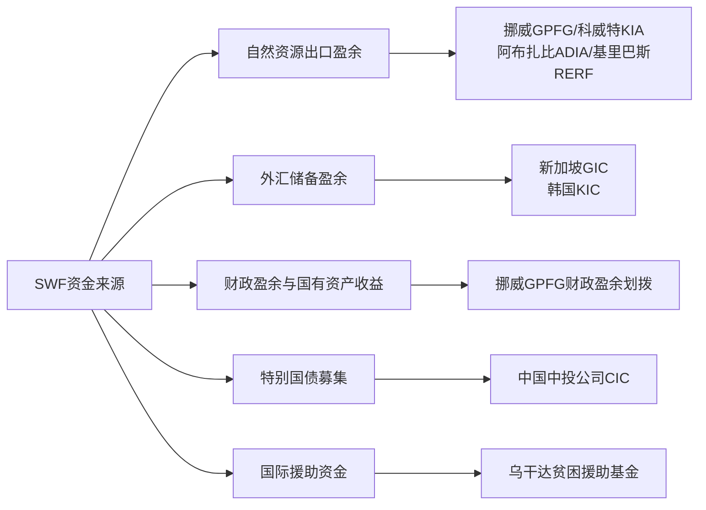
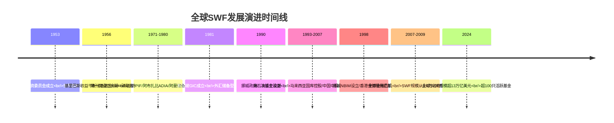
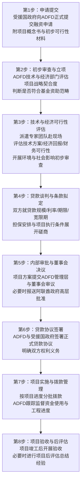

# 主权财富基金的企业社会责任实践研究：以挪威GPFG与阿布扎比ADFD为例
# 1 主权财富基金基础知识

主权财富基金（Sovereign Wealth Fund，简称SWF）作为全球金融体系中一支独特的机构投资力量，近几十年来从相对边缘的政府资产管理工具，逐步演变为深刻影响国际资本流动与公司治理的"超级理财账户"。截至2024年底，全球较为活跃的主权财富基金已超过100只，管理资金总规模超过13万亿美元，相当于德国、日本、印度三国国内生产总值（GDP）的总和[^1]。在如此庞大的资金规模背后，SWF并非单一性质的金融实体，其设立动因、资金来源、投资策略与治理模式高度异质化，这种异质性也直接塑造了它们在企业社会责任（CSR）议题上所表现出的迥异路径。

本章作为全文的概念基础与分类参照，旨在系统梳理SWF的基本理论框架：先厘清其概念内涵与本质属性，区分其与外汇储备、传统养老金等公共投资工具的边界；继而剖析其资金来源的多元化渠道；进而依据设立动因与资金性质对其进行类型化归纳，并为每一类型选取具有代表性的具体基金加以阐释；最后回顾全球SWF的发展演进与治理格局。通过这一铺陈，本章将明确挪威政府养老基金全球（GPFG）与阿布扎比发展基金（ADFD）在SWF谱系中的位置，揭示二者CSR行为差异的内在制度根源，为后续章节的深入比较奠定坐标系。

## 1.1 主权财富基金的概念内涵与本质属性

主权财富基金的核心定义可以概括为：**由主权国家政府建立并拥有，用于在全球范围内进行长期投资的金融资产或基金**[^1]。其设立目的具有明显的公共属性，主要包括降低国家收入意外波动的影响、干预外汇市场、预防经济危机、支持国家发展战略、为子孙后代积蓄财富等[^1]。从机构属性看，SWF既不同于传统的政府养老基金，也不同于那些简单持有储备资产以维护本币稳定的政府机构，而是**一种全新的专业化、市场化的积极投资机构**[^2]。

要把握SWF的本质属性，关键在于将其与官方外汇储备进行严格区分。两者尽管都由国家所有，但在多个维度上存在根本差异。外汇储备追求资产的低风险与高流动性，因此主要从事固定收益类金融产品的投资；而主权财富基金更偏好收益率，可以较多地投资股权等较高风险的市场[^3]。在会计归属上，外汇储备的资产体现在央行的资产负债表上，而主权基金的资产负债则不并入央行报表[^3]。按照国际货币基金组织（IMF）的定义，以主权财富基金形式用于中长期投资的外汇资产不再属于国家外汇储备的范畴[^2]。下表系统呈现两者的核心差异：

| 比较维度 | 官方外汇储备 | 主权财富基金（SWF） |
|---------|------------|-------------------|
| 首要目标 | 维护币值稳定、保障流动性 | 实现长期保值增值、战略性投资 |
| 风险偏好 | 低风险 | 中高风险，可承担股权与另类投资风险 |
| 投资期限 | 短期为主 | 中长期为主，跨期甚至跨代 |
| 资产构成 | 以固定收益类产品为主 | 涵盖债券、股票、房地产、基础设施、私募股权等 |
| 会计归属 | 列入中央银行资产负债表 | 独立于央行资产负债表 |
| 运作模式 | 央行被动管理 | 多由独立机构主动管理 |

该对比揭示出SWF的本质属性——**它是国家公共财富在"流动性管理"逻辑之外开辟的"收益与战略"逻辑专属空间**。这种制度安排使SWF得以摆脱短期流动性约束，进入更长周期、更高风险偏好的资产领域，也由此打开了将非财务因素（如环境、社会、治理）纳入投资决策的可能性，为CSR议题的引入预留了制度接口。

除与外汇储备相区别外，SWF与传统养老金、央行储备资产管理机构之间的边界同样值得辨析。传统政府养老金通常具有明确的负债端约束，须对特定群体的退休给付承担义务；而SWF的"负债"则更为弥散，常表现为对全体国民乃至后代福祉的一般性承诺[^2]。这种"软约束"使SWF在投资目标设定上享有更大自由度，但也意味着其问责机制必须依靠透明度、伦理标准与外部监督等制度来补足，而非依赖精算式的负债匹配。需要指出的是，挪威GPFG虽冠以"政府养老基金"之名，但并未与具体的养老金支付义务直接挂钩，本质上更接近一只代际储蓄型SWF，这一定位将在1.3节进一步展开。

## 1.2 主权财富基金的资金来源渠道

SWF的资金来源决定了其规模的稳定性、政治属性以及外部对其行为的期待，进而深刻影响其投资策略与CSR取向。综合各类研究的归纳，SWF的资金来源可大致划分为五类渠道。

**第一类是自然资源出口的外汇盈余**，包括石油、天然气、铜、钻石、磷酸盐等自然资源出口形成的外贸盈余，主要以中东、拉美等地区的资源出口国为代表[^2][^3]。这一渠道是SWF最古老也是规模最大的资金来源。20世纪70至80年代两次石油危机推动油价不断攀升，石油输出国积累了大量石油外汇，纷纷设立主权财富基金：沙特于1971年成立沙特阿拉伯公共投资基金，阿联酋于1976年成立阿布扎比投资局，阿曼于1980年成立国家储备基金；其后，挪威、委内瑞拉、阿塞拜疆、安哥拉等国也相继成立了以石油收入为主要资金来源的主权财富基金[^1]。值得注意的是，资源型SWF并非富裕国家的专利——太平洋岛国基里巴斯依靠磷酸盐出口收入于1956年设立收益平衡储备基金，尽管磷矿资源早已枯竭，2023年该基金规模仍接近9亿美元，远超基里巴斯当年的GDP（2.8亿美元）[^1]。

**第二类是外汇储备盈余**，主要见于亚洲新加坡、马来西亚、韩国等国家及台湾、香港地区[^2][^3]。20世纪90年代以来，不少新兴经济体通过实施出口导向政策积累了大量外汇储备，为避免美元贬值风险而设立主权财富基金，掀起了SWF设立的第二次浪潮[^1]。新加坡政府投资公司（GIC）成立于1981年，其资金来源即为新加坡的外汇储备，主要投资于较长期的海外高收益资产[^1]。

**第三类是财政盈余与国有资产收益**。一些国家在宏观经济、贸易条件改善以及长期预算规划下，将持续累积的财政盈余划入SWF。挪威即为典型——1995年起，挪威政府的财政盈余开始每年划入石油基金[^2]，使该基金兼具资源型与财政型双重来源特征。

**第四类是特别国债募集与外汇储备置换的复合模式**，以中国投资有限责任公司（中投公司）为代表。中投公司于2007年9月成立，其资金来源于中国的国家外汇储备，成立初期注册资本金为2000亿美元[^3]，由财政部发行特别国债募集对应人民币资金后向央行购汇注入[^4]。截至2023年底，其资产规模已突破万亿美元大关[^4]。

**第五类是依靠国际援助形成的特殊资金来源**，以乌干达的贫困援助基金为代表[^2][^3]。这类基金规模通常较小，但其资金性质（援助资金）使其在使用上承担特殊的发展责任。

不同资金来源对基金运作模式与CSR取向具有显著的塑造作用。**资源型基金**因其收入的不可再生性与代际公平诉求，往往更强调长期投资视角与可持续性议题，挪威GPFG即在这一土壤上发展出系统化的负责任投资框架；**外汇储备型基金**的母国常面临"道德风险、权力腐败和泄漏国家商业机密"等争议，更注重商业化运作以化解"国家资本主义"的外部疑虑[^5]；**援助型与发展型基金**则天然带有发展使命，其CSR属性内嵌于基金宗旨本身，阿布扎比ADFD的运作逻辑正反映了这一特征。这一观察构成第2章对比分析的重要前提。

## 1.3 主权财富基金的类型化划分与代表案例

根据设立动因与资金性质，SWF可被系统性地划分为若干类别。综合现有文献，主流分类涵盖稳定型、储蓄型、冲销型、战略/发展型、养老储备型与预防型六大类[^5][^2][^3]。下表汇总各类型的核心特征与代表案例：

| 类型 | 核心动因 | 主要特征 | 代表案例 |
|------|---------|---------|---------|
| 稳定型 | 跨期平滑国家收入，熨平资源价格波动对经济与财政的冲击 | 投资期限相对较短，强调流动性与防御性 | 俄罗斯稳定基金、科威特投资局（前身科威特投资委员会，1953年） |
| 储蓄型 | 跨代平滑国家财富，为子孙后代积蓄资产 | 投资期限极长，资产配置多元，强调长期收益 | 挪威GPFG、阿布扎比投资局（ADIA）、美国阿拉斯加永久性储备基金 |
| 冲销型 | 协助央行分流外汇储备，干预外汇市场，冲销过剩流动性 | 与货币政策紧密配合 | 香港金融管理局外汇基金（1998年） |
| 战略/发展型 | 服务国家发展战略，重构特定产业 | 常对企业进行控股，带有政治性战略投资色彩 | 新加坡淡马锡、中投下属汇金公司、阿布扎比发展基金（ADFD） |
| 养老储备型 | 前瞻性应对未来可能出现的养老金支付缺口 | 与三支柱养老金体系互补 | 澳大利亚未来基金（Future Fund） |
| 预防型 | 预防国家社会经济危机，促进平稳发展 | 兼具流动性与战略储备功能 | 部分新兴市场设立的预防性基金 |

具体来看：

**稳定型基金**的鼻祖是科威特投资委员会，成立于1953年，被普遍认为是世界第一家现代意义上的主权财富基金。其设立背景是科威特将每年石油收入的10%交由该机构管理，主要进行海外投资，目标是避免油价波动对国内经济造成严重影响，并为产业结构调整预留资金[^1]。俄罗斯主权财富基金被命名为"稳定基金"（Stabilization Fund），同样体现了这一动因[^5]。

**储蓄型基金**的典型代表是挪威GPFG。挪威是世界第三大石油净出口国，1990年代财政盈余和外汇储备快速增长，尤其是石油出口收入增长迅速。为更好地管理石油财富，也为石油资源可能耗尽做好准备，挪威于1990年设立了主权财富基金——政府石油基金；1998年挪威央行设立专门机构——挪威央行投资管理公司（NBIM）负责具体运作，以提高长期投资收益并避免"荷兰病"[^2]。美国阿拉斯加州的石油基金被冠名为"永久性储备基金"（Permanent Reserve Fund），同样典型地体现了为子孙后代积蓄财富的代际公平理念[^5]。中东国家的储备型基金亦多属此类，用以应对老龄化社会以及自然资源收入下降对养老金体系的挑战[^2]。

**冲销型基金**以1998年香港金融管理局设立的外汇基金为代表，其核心功能在于维持港元汇率稳定，配合央行的货币政策操作[^2]。

**战略/发展型基金**则承担着更为强烈的政治与产业目标。新加坡的淡马锡以及中投公司下属的汇金公司常被视为这一类别的典型代表，其投资被视为政治性目的浓厚的战略投资[^5]。阿布扎比发展基金（ADFD）虽然在功能上更偏向于对外发展援助而非国内产业重构，但同样属于将SWF工具用于实现国家战略目标的范畴——其使命指向通过资金安排服务于国家的对外发展合作议程，这一定位将在第2章中详细展开。

**养老储备型基金**以澳大利亚未来基金（Future Fund）为典型代表。澳大利亚作为典型的三支柱养老金体系国家，于设立未来基金作为前瞻型的储备养老金以应对未来可能出现的养老金支付缺口；该基金由未来基金、医学研究基金、残障保险基金、国家建设基金以及ATSILS基金五个公共资产基金组成，截至2019年3月31日总资产管理规模已增长至1880亿澳元，2009—2018财年10年间年化收益达10.4%，超越比较基准近4个百分点[^6]。

通过上述分类可以清晰地定位本研究关注的两支基金在SWF谱系中的位置：**GPFG属于典型的"资源型—储蓄型"基金**，其代际公平诉求与超长投资期限决定了它有强烈动机将ESG风险纳入决策，并以"被动型负责任投资者"姿态对组合公司施加影响；**ADFD则属于"战略/发展型"基金**，其使命直接指向通过资金供给推动受援国发展，因此其CSR行为不是体现在对组合公司的事后筛选上，而是内嵌于资助项目的事前选择、条件设定与审批流程之中。这一类型差异是理解两者CSR模式分野的根本制度根源。

## 1.4 全球主权财富基金的发展演进与格局

主权财富基金并非新生事物，其历史可追溯至20世纪50年代初期。从1953年科威特投资委员会开创先河起算，至今已有逾七十年的发展历程[^1][^3]。在这一历程中，SWF的设立呈现出明显的两次浪潮。

**第一次浪潮发生于20世纪70至80年代**，由石油美元驱动。两次石油危机推动油价飙升，石油输出国积累了巨额外汇盈余，纷纷效仿科威特设立SWF：沙特阿拉伯公共投资基金（1971年）、阿布扎比投资局（1976年）、阿曼国家储备基金（1980年），其后挪威、委内瑞拉、阿塞拜疆、安哥拉等国相继跟进[^1]。这一时期SWF的核心动因是应对资源收入的不可持续性，体现了强烈的代际公平与跨期平滑诉求。

**第二次浪潮始于20世纪90年代**，由新兴经济体外汇储备积累驱动。新兴市场国家通过出口导向战略积累了庞大外汇储备，为提高储备收益并对冲美元贬值风险纷纷设立SWF：马来西亚于1993年成立国库控股投资有限公司，中国于2007年正式成立中投公司[^1]。这一浪潮反映出全球贸易格局变化对国际金融体系的深刻影响。

从规模演进看，根据德意志银行的报告，2007年年底全球主权基金资本总量达到当时的高峰，约为3.6万亿美元；受全球金融危机冲击，到2009年夏季缩水至约3万亿美元，主要因其持有股票市值大幅下降[^3]。此后SWF进入新一轮扩张期，到2024年底，全球较为活跃的主权财富基金已超过100只，管理资金总规模超过13万亿美元[^1]。在分布格局上，规模最大的基金集中于中东产油国与亚洲外汇盈余国——阿布扎比投资管理局资本规模曾达7000多亿美元，新加坡两家主权基金（GIC与淡马锡）资产合计约4000亿美元，挪威主权基金规模达3500亿美元（数据反映金融危机后阶段）[^3]，其后挪威GPFG在持续注资与投资收益累积下规模快速扩张，2024年股票投资回报率达18%[^1]。

伴随规模与影响力的扩张，SWF日益受到国际社会的关注与审视。一方面，SWF作为国有投资载体，其投资行为可能干预市场经济的正常运行，引发东道国的国家安全担忧；另一方面，**SWF的透明度普遍较低，仅挪威等少数国家公开信息**[^5]，这种信息不对称放大了外界对其投资动机的疑虑。美国《外国投资风险审查现代化法》（FIRRMA）的出台、CFIUS审查权限的强化，正是这种疑虑制度化的体现[^4]。

为回应上述挑战，国际社会推动形成了规范SWF行为的多边框架，其中最具影响力的是"圣地亚哥原则"——由国际货币基金组织（IMF）协调下、各SWF国家共同制定的一套自愿遵循的行为准则，旨在规范主权财富基金的治理、透明度与问责行为[^4]。同时，国际主权财富基金论坛（IFSWF）等同行组织也逐步成为推动行业最佳实践的重要平台。这些规范框架的存在，为本报告第3章探讨SWF的CSR最佳实践提供了制度抓手。

综观全章，**SWF谱系中的差异不仅体现在规模、来源与功能定位上，更深刻地体现在其面对企业社会责任议题时的制度准备与行动逻辑上**。储蓄型SWF（如GPFG）因长投资期限与代际责任诉求，倾向于发展出系统化的负责任投资框架与伦理排除机制；发展型SWF（如ADFD）则因其使命直接指向发展援助，CSR要素以项目筛选与条件设定的形式内嵌于运作流程。这种"被动型负责任投资者"与"主动型发展援助方"的范式分野，正是下一章对比分析的核心切入点。

# 2 挪威GPFG与阿布扎比ADFD的CSR模式对比

在第1章对主权财富基金谱系的类型化梳理中，已经初步定位了挪威政府养老基金全球（GPFG）与阿布扎比发展基金（ADFD）在SWF制度光谱中的位置——前者是典型的"资源型—储蓄型"基金，后者则是"战略/发展型"基金中以对外援助为使命的特殊形态。这种类型差异为二者在企业社会责任议题上走出截然不同的路径埋下了制度伏笔。本章将沿着这一线索深入剖析：GPFG作为全球最大单一所有者机构投资者，如何在不寻求控股、不直接干预企业经营的前提下，借助伦理排除、积极所有权与披露要求等"规则化—制度化"工具对组合公司施加影响；ADFD作为以发展援助为基本使命的发展型基金，又如何通过项目筛选、贷款条件与可持续性评估，将社会责任要素"前置化"嵌入资金供给的每一道工序。在分别刻画两支基金CSR运作机制的基础上，本章将从作用对象、介入方式、治理结构、透明度安排与国家战略关联等维度展开系统对照，最终提炼"被动型负责任投资者"与"主动型发展援助方"两种范式的内在逻辑与制度根源，并客观评估其各自的优势、局限与互补价值，为第3章最佳实践原则的归纳铺设经验基础。

需要说明的是，本章主要依托前一章已构建的概念框架与公开制度信息进行结构化对比分析，对个别细节的描述若与官方权威文件存在表述差异，将以官方一手资料的原始用语为准，并在行文中明示局限。

## 2.1 挪威GPFG的CSR实践：被动型负责任投资者范式

### 2.1.1 基金概况与投资定位

挪威政府养老基金全球（Government Pension Fund Global，GPFG）的资金来源于挪威北海石油与天然气的出口收入及相关税费。1990年挪威议会通过《政府石油基金法》，正式设立"政府石油基金"作为承接石油财富的制度容器；1996年首次注资；2006年更名为"政府养老基金—全球"，以强调其代际储蓄属性，但实际上并不与具体的养老金支付义务直接挂钩。基金由挪威财政部代表挪威人民拥有，受托管理职责由挪威央行下设的专门机构——挪威央行投资管理公司（Norges Bank Investment Management，NBIM）承担，NBIM成立于1998年。

GPFG的投资定位呈现三大特征：**一是规模庞大且持续扩张**——经过二十余年累积，已成为全球规模最大的主权财富基金之一；**二是高度分散化的全球配置**——投资覆盖全球七十余个国家、九千余家上市公司，单一公司持股比例通常被严格控制在较低水平（一般不超过该公司股本的10%，多数远低于此），刻意回避控股股东地位；**三是超长投资期限**——基金的代际储蓄属性决定了其投资视野以数十年乃至更长周期计，这使其在结构上对长期可持续性风险高度敏感。这三大特征共同塑造了GPFG"分散持股、长期持有、不谋求控制"的投资者画像，也决定了其CSR介入方式只能是"被动型"的——即通过预先设定的规则、标准与流程，而非通过直接的经营干预，来引导组合公司的行为。

### 2.1.2 负责任投资理念与对组合公司的可持续发展期望

GPFG的CSR实践建立在**"负责任投资"（Responsible Investment）**这一核心理念之上。其基本逻辑是：作为一只跨代储蓄基金，组合公司在ESG（环境、社会、治理）维度上的长期表现，将直接决定基金能否实现保值增值的代际使命；因此，将ESG因素系统性地纳入投资决策、所有权行使与风险管理，并非偏离财务目标的"善举"，而恰恰是履行受托责任的内在要求。这一理念将道德诉求与财务理性相统一，构成GPFG区别于传统"伦理投资"的关键标识。

在这一理念指导下，NBIM对其所投资的公司提出了一系列**可持续发展期望文件（Expectations Documents）**。这些期望并不构成法律意义上的强制约束，而是基金作为长期股东对所投资公司提出的"行为预期"，通过对话、投票与公开披露施加压力。综合公开的制度安排，GPFG提出的主要可持续发展期望覆盖以下几大领域：

| 期望领域 | 核心内容 |
|---------|---------|
| 气候变化（Climate Change） | 公司应识别、评估并披露气候相关的财务风险，制定温室气体减排目标与转型战略 |
| 水资源管理（Water Management） | 在用水密集型行业，公司应评估水资源风险并优化用水效率，尊重所在社区的用水权 |
| 儿童权利（Children's Rights） | 公司应在自身运营与供应链中防止童工，保障儿童健康、教育等基本权利 |
| 人权（Human Rights） | 遵循《联合国工商业与人权指导原则》，开展人权尽职调查，建立救济机制 |
| 反腐败（Anti-Corruption） | 建立健全反腐败合规体系，杜绝商业贿赂，提高交易透明度 |
| 税务透明（Tax and Transparency） | 公司应在经济活动发生地依法纳税，反对激进的避税安排，逐国披露税务信息 |
| 海洋可持续性（Ocean Sustainability） | 涉海业务公司应评估对海洋生态系统的影响，推动可持续渔业与海洋资源利用 |
| 生物多样性与生态系统服务 | 公司应识别其对生物多样性的依赖与影响，避免对关键生态系统的不可逆破坏 |
| 公司治理与董事会问责 | 建立独立、多元的董事会，完善高管薪酬与股东权利安排 |

这些期望共同构成GPFG对组合公司的"软规则"体系——它们既是基金评估公司ESG表现的标尺，也是基金与公司开展对话、提出投票指引乃至最终决定是否撤资的依据。**通过将期望以正式文件形式公开发布，GPFG实质上把自身的受托标准外化为可被全球资本市场参照的行业基准**，这是其市场影响力的重要来源。

### 2.1.3 道德委员会（Council on Ethics）与排除机制

GPFG的CSR制度安排中，最具辨识度的当属其**道德委员会（Council on Ethics，挪威语Etikkrådet）**与基于其建议运作的伦理排除机制。这一机制的演进可以简要勾勒如下：2004年挪威财政部颁布《伦理指引》（Ethical Guidelines），首次确立了基金的伦理筛查框架；同年道德委员会正式成立；2010年挪威议会通过修订后的《基金伦理观察与排除指引》（Guidelines for Observation and Exclusion），进一步明确了排除标准与程序。

**道德委员会的角色**可以从三个层面理解：**第一，独立性**——委员会由挪威财政部任命的5名成员组成，独立于NBIM运作，确保伦理判断不受日常投资管理压力的干扰；**第二，咨询性**——委员会本身不直接作出排除决定，而是向挪威央行执行委员会（Executive Board of Norges Bank）提出建议，由后者作出最终决定，从而把伦理判断与执行决策分离；**第三，证据导向**——委员会依托外部研究机构、媒体监测、NGO报告等多元信息渠道，对疑似违反伦理标准的公司开展系统调查，形成详尽的案件报告并公开发布。

道德委员会用以建议排除投资对象的具体标准，可分为**"产品标准"（Product-based Criteria）**与**"行为标准"（Conduct-based Criteria）**两大类。下表对其作系统呈现：

| 类别 | 具体标准 | 说明 |
|------|---------|------|
| **产品标准**（基于公司生产或销售的产品本身的性质） | 生产违反基本人道主义原则的武器 | 主要指核武器、集束弹药、杀伤人员地雷、化学与生物武器等大规模杀伤性武器或被国际公约禁止的武器 |
| | 生产烟草制品 | 烟草公司因其产品对公众健康的系统性危害被整体排除 |
| | 出售武器或军事物资给特定国家 | 主要针对向被联合国制裁国家出售武器的公司 |
| | 基于煤炭的业务标准（2016年起引入） | 煤炭采掘业务或煤电业务占公司收入或装机容量30%以上，或绝对规模超过门槛的公司纳入排除范围 |
| **行为标准**（基于公司在经营中表现出的行为或参与的事件） | 严重或系统性侵犯人权 | 如谋杀、酷刑、剥夺自由、强迫劳动、利用童工等最恶劣的人权侵害 |
| | 严重违反个人权利的战争或冲突情境下的行为 | 在武装冲突中实施严重侵权行为 |
| | 严重的环境损害 | 对生态系统造成大规模、不可逆破坏 |
| | 导致或引发不可接受的温室气体排放的行为 | 与气候变化相关的严重不当行为 |
| | 严重腐败 | 重大商业贿赂与系统性腐败行为 |
| | 其他严重违反基本伦理规范的行为 | 兜底性条款，覆盖未被前述类别列举但严重程度相当的行为 |

值得注意的是，除"排除"（Exclusion）这一最严厉处置外，机制还设有**"观察"（Observation）**这一中间档位——对于尚未达到排除门槛但存在显著伦理风险的公司，可置于观察期内继续持有并加强监督。这一分级处置安排体现了机制设计的精细化，**在"道德底线"与"建设性约束"之间取得了制度平衡**。

截至2020年前后，被GPFG以伦理标准为由排除或置于观察的公司涉及多个行业与多国企业，每一项排除决定及其依据均通过NBIM与道德委员会的网站公开披露，这种**透明的"指名道姓"做法**本身就构成对其他公司的强烈外部威慑。

### 2.1.4 积极所有权与气候风险管理

除排除机制这一"退出渠道"外，GPFG的CSR实践更倚重**积极所有权（Active Ownership）**作为日常介入手段。其核心内容包括：**一是投票权的系统性行使**——NBIM在全球数千家被投资公司的股东大会上对议案进行投票，并预先发布投票指引，对气候议案、薪酬议案、董事提名等关键议题表明立场，事后公开每一项投票的结果与理由；**二是公司对话**——与重点持仓公司管理层及董事会就ESG议题开展持续对话，由数据驱动、问题导向；**三是协同行动**——通过参与气候行动100+（Climate Action 100+）等机构投资者联盟，与其他长期投资者形成合力。

在气候风险管理领域，GPFG建立了较为完整的框架：从前述的煤炭排除标准，到对组合公司气候相关披露的系统性要求，再到对气候议案的投票支持，构成"产品退出—信息透明—股东行权"三层递进的工具组合。

### 2.1.5 高透明度的信息披露体系

GPFG的CSR实践之所以能够形成可被外部观察、评价与模仿的"范式"，其根本支撑在于**高度系统化的信息披露体系**。NBIM每年发布详尽的年度报告、负责任投资报告、所有权报告等；道德委员会独立发布年度报告并公开每一项排除/观察建议的详细理由；财政部定期向议会提交基金管理白皮书。**这种"基金—管理机构—伦理委员会—议会—公众"多层次的披露与问责链条**，使GPFG成为全球SWF透明度评估（如Linaburg-Maduell透明度指数）中的标杆。

综观以上各机制，GPFG的CSR实践呈现出鲜明的"被动型负责任投资者"特征：它不直接经营企业、不寻求控股地位、不强加产业政策意图，而是通过**预设的规则、标准化的流程、公开的披露**对其庞大组合中的每一家公司施加间接但持续的影响。这种"通过规则统治"的模式，是其制度禀赋（代际储蓄定位+挪威民主问责文化）的自然延伸。

## 2.2 阿布扎比ADFD的CSR实践：主动型发展援助方范式

### 2.2.1 基金概况与设立背景

阿布扎比发展基金（Abu Dhabi Fund for Development，ADFD）由阿布扎比酋长国政府于**1971年7月正式设立**，是阿联酋最早设立的对外发展援助机构。其设立背景与第1章所述的第一次SWF浪潮密切相关：20世纪70年代石油美元的迅速积累为阿联酋积累了庞大的可调度财富，阿布扎比的统治者将其中一部分专门划拨用于对外发展合作，以服务于年轻共和国的外交战略与区域影响力构建。

与阿布扎比投资局（ADIA，1976年成立）作为典型的储蓄型基金主要从事海外财务投资以追求收益不同，ADFD的定位从一开始便不是"理财"，而是"援助"——其使命表述为通过提供优惠贷款、管理政府赠款、参股投资等多种工具，**协助发展中国家实现可持续社会经济发展**。这种使命定位决定了ADFD的运作逻辑与GPFG在根本上迥异：它不是在全球资本市场上配置资产以追求风险调整后的财务回报，而是在受援国清单内筛选项目以追求发展成果的最大化。

### 2.2.2 资助形式与项目领域

ADFD的资金供给主要采取以下几种形式：

**第一，优惠贷款（Concessional Loans）**。这是ADFD最主要的资助形式，向受援国政府或政府担保的实体提供利率显著低于市场水平、还款期较长、含宽限期的贷款，专项用于受援国的优先发展项目。优惠贷款既保证了基金资金的回流与循环利用，又通过较低的融资成本对受援国构成实质性援助。

**第二，政府赠款管理（Grant Administration）**。ADFD代表阿联酋联邦政府或阿布扎比政府管理一定规模的对外赠款，用于人道主义紧急援助、最不发达国家的关键民生项目等不要求偿还的支出。

**第三，股权投资与参股（Equity Investment）**。在部分项目中，ADFD通过参股受援国的开发性项目或合资企业，将自身利益与项目长期可持续性绑定。

**第四，针对可再生能源的专项合作机制**。ADFD与国际可再生能源署（IRENA，总部位于阿布扎比）合作设立了"IRENA/ADFD项目机制"（IRENA/ADFD Project Facility），自2013年启动以来，分多轮向发展中国家的可再生能源项目（太阳能、风能、生物质能、地热、水电等）提供专项优惠贷款。该机制是ADFD将CSR理念专项化、议题化的标志性安排，呼应了全球可持续发展议程中的能源转型目标。

在项目领域上，ADFD的资助高度集中于受援国的**基础设施与民生领域**，包括但不限于：**交通基础设施**（公路、桥梁、港口、机场）、**能源**（电力生产与输配、可再生能源）、**水资源与供水**（水坝、灌溉、饮用水供应）、**农业与粮食安全**、**卫生与医疗**（医院、初级卫生设施）、**教育**（学校、职业培训中心）、**住房**（保障性住房建设）等。这些领域几乎全部对应联合国可持续发展目标（SDGs）中的核心议题，体现了**ADFD将CSR内嵌于"资助什么"这一前端决策**的特点。

在地理覆盖上，ADFD的受援对象历史上以阿拉伯国家与非洲国家为主，后扩展至亚洲、加勒比与太平洋岛国等数十个发展中国家，与阿联酋的外交格局与区域影响力诉求高度一致。

### 2.2.3 申请条件与项目筛选标准

申请ADFD资金的实体须满足一系列条件，这些条件本身即构成CSR要素的"前端筛选器"。综合公开制度安排，主要包括以下方面：

**申请主体资格**：申请方通常须为受援国的中央政府、地方政府、公共部门实体或政府担保的项目实体，确保资金使用的国家信用背书；私营部门项目须经东道国政府认可并符合战略优先级。

**项目战略契合度**：拟资助项目须与受援国的国家发展规划、阿联酋与受援国之间的合作框架、以及国际可持续发展议程（如SDGs）相契合，避免脱离受援国实际需求的"无效援助"。

**经济与技术可行性**：项目须经过严格的经济可行性研究（成本—收益分析、内部收益率测算）与技术可行性评估，确保资金投入能够产生预期的经济与社会回报。

**财务偿付能力**（针对贷款类资助）：受援国政府须具备相应的还款能力或提供主权担保，项目自身具备稳定的现金流或受益机制。

**环境与社会影响评估**：项目须开展环境影响评估（EIA）与社会影响评估，识别并管理对当地生态系统、社区生计与弱势群体的潜在不利影响，并制定相应的缓解措施。

**符合阿联酋外交政策方向**：作为对外援助工具，受援国选择须与阿联酋的双边关系框架与区域战略保持一致。

### 2.2.4 资金审批流程

ADFD的资金审批流程相对规范化，通常涵盖以下步骤：

上述流程的关键特征在于：**审批不是单一环节的"是/否"决断，而是贯穿项目全生命周期的"前端筛选—中端监督—后端评估"链条**。CSR要素（如环境社会影响、可持续性、与发展议程的契合度）在这一链条的每一节点都被审视与强化，从而使ADFD的CSR实践呈现"主动嵌入"的特征——即并非在事后对投资组合进行"伦理筛除"，而是在事前对资金流向进行"使命筛选"。

### 2.2.5 与南南合作与多边发展议程的呼应

ADFD的CSR实践在制度叙事上也积极呼应南南合作与多边发展议程。一方面，它通过与IRENA等多边机构的合作机制将自身嵌入全球可持续发展治理网络；另一方面，它在公开材料中将自身定位为南南合作的实践者，强调对发展中国家"伙伴式"而非"施舍式"的援助理念。

但与GPFG高度结构化的披露体系相比，**ADFD在透明度方面存在显著差距**：其项目层面的详细信息、贷款条款、后评估结果等多数不向公众披露，外部观察者难以系统评估其CSR绩效。这一不足将在第3章的最佳实践讨论中得到进一步呼应。

## 2.3 两种CSR范式的多维对比分析

在分别刻画GPFG与ADFD的CSR实践后，可建立统一维度框架对二者进行系统对照。下表从八个关键维度展开比较：

| 比较维度 | 挪威GPFG（被动型负责任投资者） | 阿布扎比ADFD（主动型发展援助方） |
|---------|------------------------------|-------------------------------|
| **基金类型** | 资源型—储蓄型SWF | 战略/发展型SWF（对外援助工具） |
| **CSR目标定位** | 在追求长期财务回报的同时管理ESG风险、维护伦理底线 | 直接推动受援国经济社会发展，实现外交—发展双重目标 |
| **作用对象** | 全球数千家被投资上市公司 | 数十个发展中受援国的具体发展项目 |
| **介入方式** | 事后筛选+股东行权：伦理排除/观察+投票+对话+披露 | 事前筛选+条件融资：项目选择+贷款条件+全周期监督 |
| **核心制度安排** | 道德委员会+排除清单+期望文件+积极所有权 | 项目可行性评估+贷款协议条款+多边合作机制 |
| **治理结构** | 财政部委托—NBIM管理—道德委员会独立咨询—议会监督 | 阿布扎比政府所有—ADFD管理层与董事会决策—阿联酋政府政策指导 |
| **决策流程** | 规则驱动：标准公开、程序规范、决定公示 | 项目驱动：逐案审批、谈判定制、保密性较强 |
| **透明度与问责** | 高透明度：年报、所有权报告、排除清单、投票记录均公开 | 中低透明度：基金整体信息有限公开，项目层面披露不足 |
| **衡量标准** | ESG指标、投票参与率、对话覆盖率、被排除公司数等 | 拨款规模、项目完工率、受援国数量、SDG贡献 |
| **与国家战略关联** | 与挪威国家发展战略相对独立，强调财务受托职责 | 直接服务于阿联酋对外发展合作与援助外交战略 |
| **国际规范嵌入** | 联合国全球契约、PRI、UNGPs等深度嵌入 | 与IRENA等机构合作；圣地亚哥原则之外嵌入程度较低 |

这一对比揭示了一个核心洞察：**GPFG的CSR是"在资本市场中做一个负责任的所有者"，而ADFD的CSR是"通过资金流动直接生产发展成果"**。前者的逻辑是"市场—规则—影响"，后者的逻辑是"使命—项目—成果"。两者并非高下之分，而是不同制度禀赋下的不同合理选择。

进一步看，介入方式的差异折射出"风险管理"与"目标实现"两种CSR哲学的分野：GPFG视CSR为对长期财务风险的系统性识别与缓释，因此倾向于发展出可重复、可审计、可外部验证的标准化工具；ADFD视CSR为基金存在意义本身的实现路径，因此更看重项目级的实质成果而非组合级的规则一致性。这种哲学分野直接决定了二者在治理结构、透明度安排与问责机制上的差异化设计。

## 2.4 差异化路径的制度根源解析

GPFG与ADFD的CSR范式之所以走向截然不同的两端，根源不在于决策者偏好的偶然差异，而在于**资金来源属性、基金类型定位、母国政治经济体制、国际规范嵌入程度**四个层面的制度禀赋差异。

**第一，资金来源属性的塑造作用**。GPFG的资金虽然来源于石油，但通过严格的"财政纪律—基金积累—代际共享"制度安排（如挪威的"财政规则"，即每年只允许使用基金长期实际收益的一定比例），使其与挪威普通公民的代际福祉紧密绑定，这种"全民信托"属性自然要求基金以伦理可辩护、过程透明的方式运作。ADFD的资金虽然同样来自石油美元，但其制度路径是从酋长国政府的可调度财政中直接划拨用于对外合作，缺乏GPFG那种"国民代际信托"的法律拟制，因此其问责对象更多是阿联酋政府本身的战略意图而非分散的公民群体。

**第二，基金类型定位的逻辑延伸**。如第1章所述，储蓄型基金的代际责任诉求和超长投资期限，使其有强烈的内在动机将长期可持续性风险纳入投资决策——气候变化、人权风险、治理失败等因素在数十年尺度上极可能损害基金价值，这一逻辑直接催生了GPFG系统化的负责任投资框架。发展型基金的使命则天然要求"主动作为"——援助本身就是行动，CSR要素无须额外引入即已内嵌于使命定义之中。

**第三，母国政治经济体制的形塑**。挪威是一个民主制度成熟、公共问责文化深厚、信息公开传统悠久的北欧国家，议会对基金运作的常态化审议、媒体对基金行为的密切监督、公民社会对伦理议题的高度关切，共同构成GPFG高透明度运作的外部压力与合法性来源。阿联酋则是一个以王室主导的联邦君主制国家，决策机制更多体现行政高效与战略集中的特点，对外援助本身就是国家战略的延伸，因此ADFD运作中"保密性较强、与外交政策协同密切"的特征是其政治体制的自然映射。

**第四，国际规范嵌入程度的差异**。GPFG深度参与联合国负责任投资原则（PRI）、联合国全球契约、UNGPs等国际规范网络，这些规范不仅为其制度建设提供了模板，也为其行为合法性提供了外部背书。ADFD虽与IRENA等机构存在专项合作，但整体上嵌入全球CSR与发展规范网络的深度不及GPFG，更多保留了基于双边外交关系的传统运作方式。

综合而言，**SWF的CSR模式并不是一个可以"自由选择"的政策菜单，而是其制度禀赋的必然延伸**。这一判断不仅有助于理解GPFG与ADFD之间的差异，也提示了第3章在归纳最佳实践时必须避免的一个误区——不能简单地将一种范式的具体做法机械移植到另一种类型的基金上，而须在制度兼容性约束下提炼具有普适性的高层次原则。

## 2.5 两种范式的优势、局限与互补性

客观评估两种范式各自的优势与局限，是为第3章提供完整经验基础的必要前提。

**GPFG模式的优势**集中体现在三个方面：**一是规则透明带来的高合法性**——通过公开的标准、流程与结果，基金的每一项CSR决定都经得起公众与同行检验，极大提升了基金行为的合法性与公信力；**二是可复制性与可借鉴性**——其制度安排（伦理委员会、排除清单、期望文件等）以模块化形式呈现，便于其他SWF乃至大型机构投资者学习借鉴，事实上已成为全球负责任投资的事实标准之一；**三是市场影响力**——作为全球最大单一所有者之一，GPFG的伦理判断与投票立场对组合公司及其同行构成持续的"无形压力"，能够推动整个资本市场的ESG标准提升。

但GPFG模式也存在显著局限：**一是介入深度有限**——由于不寻求控股地位，基金对公司经营的实质性影响仍依赖于公司管理层的自愿响应，对一些根深蒂固的不可持续行为可能难以根本扭转；**二是对发展中国家的直接贡献不足**——基金主要投资于发达市场的大型上市公司，对最需要资金的低收入国家发展几乎没有直接资金注入；**三是"排除"工具的双刃剑性**——被排除公司虽承受声誉损失，但其控制权并未因此改变，部分研究质疑排除是否能真正改变被排除公司的行为，还是仅仅将"负担"转移给其他不那么挑剔的投资者。

**ADFD模式的优势**则恰好弥补了GPFG模式的若干短板：**一是对发展中国家可持续发展的直接推动**——资金直达基础设施、能源、卫生、教育等关键民生领域，对受援国福祉的改善具有直接因果链条；**二是项目级针对性**——通过逐案审批与定制化条款，基金能够精准回应每一个项目的具体风险与机会；**三是与全球发展议程的对接**——通过与IRENA等多边机构合作，基金的发展资金直接服务于联合国SDGs。

但ADFD模式同样面临深刻局限：**一是透明度不足**——项目层面信息披露有限，外部难以系统评估CSR绩效，也难以发现潜在的资金滥用或腐败风险；**二是项目监测与后评估能力的挑战**——大规模、跨地域的项目组合对监测体系构成压力，部分项目的长期可持续性难以保证；**三是援助有效性的传统争议**——发展援助领域长期存在"援助效益递减""援助依赖""政治附加条件"等争议，ADFD作为带有外交属性的双边援助方亦难以完全规避；**四是与受援国治理质量的耦合风险**——若受援国本身治理薄弱，资金有可能被低效甚至腐败地使用，需要更强的事后问责机制加以约束。

**两种范式的互补价值**在全球可持续发展议程下尤为突出。**GPFG模式擅长在已有的资本存量上"提升质量"——通过规则与标准引导上市公司向更可持续的方向演进；ADFD模式擅长在缺乏资本积累的地方"创造增量"——通过资金注入将发展可能性转化为现实**。前者作用于全球资本市场的"上层结构"，后者作用于发展中国家的"基础结构"；前者是渐进式的、市场化的、规则导向的，后者是跨越式的、政策性的、项目导向的。两种逻辑共同构成主权财富基金在全球可持续发展治理中的完整图景。

更进一步，二者的优势与局限恰好呈现镜像关系：GPFG的高透明度对应ADFD的透明度不足，GPFG对发展中国家直接贡献的不足对应ADFD在该领域的针对性，GPFG的规则化可复制对应ADFD的项目化定制。**这种镜像关系本身就为最佳实践的归纳提供了一个内在框架——理想的SWF CSR治理体系，应当在"规则透明性"与"成果针对性"之间寻求平衡，在"市场化影响"与"发展性贡献"之间寻求兼容**。这正是第3章将要展开的核心命题。

# 3 主权财富基金CSR管理的最佳实践原则

承接第2章对挪威GPFG"被动型负责任投资者"与阿布扎比ADFD"主动型发展援助方"两种范式的系统对比，本章的任务是从经验观察走向规范提炼——在两种范式镜像互补的关系中萃取出主权财富基金（SWF）开展企业社会责任（CSR）管理时可遵循的最佳实践原则。CSR治理并非SWF运作的附属议题，而是关乎其作为公共资金合法性、长期可持续性与国际声誉的核心命题。本章将以"提升透明度—增强有效性—防止腐败滥用"三大目标为主轴，结合《圣地亚哥原则》、国际主权财富基金论坛（IFSWF）框架、联合国反腐败公约（UNCAC）与全球契约（UN Global Compact）等国际规范，归纳具有跨基金类型适用性的高层次原则，并提出面向不同类型SWF的差异化适配建议，最终形成兼具理论参考价值与实践可操作性的政策与实践建议集，为整篇报告画上自然闭环。

## 3.1 最佳实践原则的提炼逻辑与三维分析框架

在进入具体原则归纳之前，须先明确两个方法论前提。**第一个前提是"避免机械移植"**。第2章已论证，SWF的CSR模式是其资金来源属性、基金类型定位、母国政治经济体制与国际规范嵌入程度等制度禀赋的必然延伸，而非可以自由挑选的政策菜单。因此，将GPFG的伦理委员会—排除清单工具直接复制到一只发展援助型基金、或将ADFD的项目审批流程套用于一只全球分散投资的储蓄型基金，都既不现实也不必要。最佳实践的归纳必须聚焦于**高层次、可跨类型适用的普适性原则**，而非具体操作工具的简单拷贝。**第二个前提是"互补而非替代"**。GPFG与ADFD的优势与局限恰好呈现镜像关系——前者高透明度对应后者透明度不足，前者对发展中国家直接贡献的有限对应后者在该领域的针对性，前者规则化的可复制对应后者项目化的定制能力。这种镜像关系提示，最佳实践原则的提炼应当吸收两种范式的长处，在"规则透明性"与"成果针对性"、"市场化影响"与"发展性贡献"之间寻求兼容。

基于上述方法论前提，本章构建**"透明度—有效性—防腐败滥用"三维分析框架**作为原则归纳的组织结构。三个维度并非彼此孤立，而是构成一个内在关联的整体：**透明度是有效性与防腐败的共同基础**——没有充分披露，公众与同行无从评估CSR绩效，腐败行为也得以在信息阴影中滋生；**有效性体现CSR的实质价值**——若CSR仅停留于声明与报告层面而未能真正改变组合公司行为或受援国发展成果，则一切制度安排都将沦为形式主义；**防腐败滥用则是公共资金合法性的底线要求**——SWF作为国民共同财富的受托管理者，一旦发生腐败或资金滥用，将根本动摇其存在的政治与道德基础。三者共同构成SWF CSR治理体系的完整制度图景，缺一不可。

## 3.2 提升透明度的关键机制

透明度问题是SWF领域长期备受关注的核心议题。学术研究指出，**国际舆论对SWF投资政策和投资行为缺乏透明度感到担忧**，这种担忧若得不到妥善回应，可能引发一系列金融保护主义反应，恶化SWF未来的国际投资环境[^7]。同时实证研究还揭示了一个值得警惕的现象：在被研究的52只样本基金中，透明度较高的14只基金中有11只属于发达国家，而透明度较低的24只基金均属于发展中国家；总资产最大的10只基金规模占总量的78.83%，其中只有2只透明度较高[^7]。这一"规模—透明度倒挂"现象凸显了在SWF领域系统性提升透明度的紧迫性。本节归纳五类核心机制。

### 3.2.1 治理架构的分权制衡

治理架构的独立性与分权制衡是透明度的制度基石。GPFG构建的"财政部委托—NBIM专业管理—道德委员会独立咨询—议会监督"多层次问责链条提供了一个成熟模板：每一环节的角色边界清晰、相互制约、信息互通，从而确保任何单一环节的失误或偏私都能被其他环节及时识别与纠正。这一架构的核心精神在于**伦理判断与执行决策的分离、政策制定与日常运营的分离、内部管理与外部监督的分离**。即便是不能完全复制四层结构的基金，至少应在"所有者—管理者—监督者"三层之间实现实质性独立。

对于发展援助型或战略型SWF而言，治理架构的独立性还有一个特殊维度——**投资决策与外交意图的分离**。在与中投公司治理架构相关的学术讨论中，学者明确警示，若投资公司"要对财政部、人民银行、发改委、国资委同时负责，就是典型的多个委托、一个代理人现象，绝对会失败"[^8]。这一警示同样适用于发展援助型基金：当ADFD这样的机构既要服务于阿联酋外交战略、又要承担发展援助使命、还须对资金安全负责时，分权制衡的设计就更为关键。一个值得借鉴的安排是设立由相关部门代表与"国内外独立的经济学家"共同组成的委员会，"类似央行货币政策委员会的体制"[^8]，将专业判断与政治意图有效隔离。

### 3.2.2 信息披露与报告机制

系统化的信息披露是透明度的可观察表征。GPFG的实践已经形成了一套可参照的标准动作组合：年度报告、负责任投资报告、所有权报告、排除清单、投票记录、道德委员会案件报告等多层次文件覆盖了基金CSR运作的各个面向。对其他SWF而言，至少应建立以下披露基线：**定期发布经审计的财务报表、定期发布CSR或可持续投资专项报告、公开重大投资决策的依据、公开伦理排除或项目拒绝的理由**。

阿塞拜疆国家石油基金（SOFAZ）提供了一个值得借鉴的中等规模基金披露范例。该基金"不仅在年报中公布审计财务报表，还在其网站上公布所有其他相关财务信息，包括每季度持有的黄金"，并"在其网站上明确阐述了其黄金投资政策"[^9]。这种**"政策公开+数据季报"**的组合是一种可操作性很强的披露范式，特别适合那些尚未建立完整CSR报告体系的基金作为起步路径。

在评估标尺上，国际上已经形成若干被广泛接受的透明度衡量工具，包括基于《圣地亚哥原则》的合规评估、Linaburg-Maduell透明度指数（L-M指数，"基于主权财富基金面向公众的十项重要原则来进行编制，满分为10分，主权财富基金研究所针对于透明度的指标的最低要求是8"），以及由埃德温·杜鲁门提出的记分牌方法（总分25分，"结构占8分，治理占4分，透明度占12分，行为占1分"）[^7]。挪威GPFG在L-M透明度指数中"常年保持满分"[^10]，这一标杆事实上已成为全球SWF透明度比较的参照原点。**SWF应主动对照这些工具自我评估并公开结果**，把外部评估转化为内部改进的驱动力。

更高阶的披露则涉及CSR与可持续投资的实质内容。清华大学相关研究指出，国际上主要使用GSR评估体系（治理Governance、可持续性Sustainability、韧性Resilience）来评估主权财富基金与养老基金在ESG实践方面的表现，**"GSR分为八大标准，包括结构、操作、透明度、政策、行动、报告、合法性和适应性"**[^11]。新加坡淡马锡控股、新西兰超级年金、爱尔兰战略投资基金在该评估中"名列前茅，成为全球主权财富基金在此领域的标杆"[^11]。SWF应将GSR这类多维评估工具作为披露设计的方向标，避免陷入单一财务报表合规的狭隘视野。

### 3.2.3 伦理标准与排除清单的公开化

伦理标准的预先公开与排除决定的"指名道姓"披露，是GPFG模式中最具辨识度的透明度做法。这一做法的精髓不在于排除多少家公司，而在于**将基金的伦理底线以可被外部验证的方式书面化、规则化**。当伦理标准（如产品标准与行为标准）以白纸黑字的形式公开时，被投资公司、其他股东、媒体与公民社会都获得了一面共同的"镜子"，可据以评估基金行为的一致性与公司行为的合规性。

需要强调的是，公开化不仅适用于资产端的伦理筛除，也适用于资金端的项目筛选。对于ADFD这类发展援助型基金，**公开资助项目的筛选标准、入选与否的理由、贷款的关键条款（在不损害商业谈判合理保密的前提下），是其透明度升级的应有方向**。如本章后文将进一步讨论的，发展援助领域的"援助有效性"原则之一即是受援与援助双方共同的信息透明。

### 3.2.4 利益相关方参与

透明度不仅是单向的信息公开，更是多元主体的实质参与。GPFG模式中，挪威议会对基金管理白皮书的常态化审议、媒体对道德委员会建议的密切跟踪、NGO对基金组合中潜在ESG风险公司的举报，共同构成了一个充满活力的"透明度生态"。**SWF应当主动构建并维护这一生态**：通过定期向议会或最高权力机关报告确保政治问责，通过公开听证、公众咨询与利益相关方对话保持社会问责，通过与PRI、UN Global Compact等国际倡议的对接获得专业问责。

具体到中国情境，类似讨论早已展开。学者在评议中投公司治理结构时即指出，**"需要引入外部独立审计制度，国家审计部门的监督要加强"**，并建议"成立委员会进行监督，委员会要有相关部门参与，还要有国内外独立的经济学家"[^8]。这些建议虽针对特定基金，但其指向的"多元主体参与"原则具有普遍意义。

### 3.2.5 外部审计与同行评议

外部审计的常态化与同行评议机制是透明度的最后一道闸门。前者通过独立第三方对基金财务与CSR绩效的客观核验，确保披露内容的真实性；后者则通过同业之间的相互评估与最佳实践分享，促进整个行业透明度水平的同步提升。**国际主权财富基金论坛（IFSWF）是同行评议机制的核心载体**——该论坛"由全球26家大型主权财富基金于2009年4月创立，并由国际货币基金组织（IMF）担任秘书处"，其宗旨在于"促进主权财富基金间合作、与投资接受国政策对话，维护开放投资体系及稳定有序的资本市场"，成员"共同遵守自愿性指导原则《圣地亚哥原则》"[^12]。IFSWF年会、专题研讨会与行业研究报告为成员基金提供了相互学习、交叉验证、共同进步的平台[^12]，参与并贡献于该论坛是任何SWF提升透明度的应然之举。

## 3.3 提升CSR有效性的核心路径

如果说透明度回应的是"是否可被监督"的问题，那么有效性回应的则是"是否真正改变行为与产生成果"的根本追问。基于GPFG与ADFD两种范式的优势提炼，本节归纳四类有效性提升路径。

### 3.3.1 明确可持续发展期望

清晰的可持续发展期望是CSR有效性的逻辑起点。GPFG向其组合公司提出的覆盖气候变化、水资源、儿童权利、人权、反腐败、税务透明、海洋可持续性、生物多样性、公司治理等多领域的期望文件体系，其价值不仅在于内容本身，更在于**它把"我们期望公司怎么做"以可援引、可对照、可验证的方式书面化**。期望文件实质上是基金为整个资本市场提供了一份"准公共产品"——其他投资者、被投资公司乃至监管机构都可参照使用。

SWF在制定本机构的可持续发展期望时，应至少覆盖以下议题：**气候变化与能源转型**——这是当前全球可持续发展议程的核心；**人权与劳工**——遵循UNGPs等国际框架；**反腐败合规**——呼应UN Global Compact第十项原则（"企业应反对各种形式的贪污，包括敲诈勒索和行贿受贿"），该原则要求企业"积极地制定政策和具体方案去解决企业内部及其供应链中存在的腐败问题"[^13]；**税务透明**——反对激进避税；**公司治理**——独立董事、薪酬合理性、股东权利保护。议题之外，期望文件还应配有解释性说明，让公司清晰知晓"为什么提出这一期望"与"达成期望的合理路径是什么"，从而避免空洞的口号化表达。

### 3.3.2 可衡量的绩效指标体系

期望若不能量化、考核与回溯，便难以转化为实际改变。SWF应建立可衡量的CSR绩效指标体系，至少包括两个层面：**一是基金自身的CSR运作指标**——例如投票参与率、与公司开展ESG对话的覆盖率、被排除/被观察公司数量、负责任投资资产占比、披露完整性评分等；**二是CSR成果指标**——例如组合公司加权碳排放强度变化、组合公司ESG评分加权改善、对接SDGs的投资规模与比例等。对于发展援助型基金，则应关注**项目层面的成果指标**——项目完工率、按时按预算交付率、受益人口规模、单位资金的社会经济效益、项目后评估的合规率等。

GSR评估的八大标准（结构、操作、透明度、政策、行动、报告、合法性和适应性）[^11]为指标体系设计提供了一个全面的方向感。SWF应避免陷入"只看产出不看成果"的指标误区——例如仅披露"发布了多少份报告"或"召开了多少次对话"而不评估"对公司行为的实质影响"。

### 3.3.3 积极股东行权

积极股东行权是规则化SWF（特别是大规模上市公司组合持有者）实现CSR有效性的关键工具。其核心实践包括：**系统化行使投票权**——对全球持仓公司股东大会议案逐一研判与表决，预先发布投票指引并事后披露投票理由；**结构化公司对话**——围绕重点ESG议题与重点持仓公司管理层与董事会开展持续对话，以数据驱动、议题聚焦；**协同行动**——通过加入气候行动100+、Climate Bonds Initiative等机构投资者联盟，与其他长期投资者形成集体行权合力。

新加坡政府投资公司（GIC）与淡马锡的实践也提供了印证：GIC"在可再生能源领域的投资总额达187亿美元"，"在投资流程中系统整合ESG因素，进行严格的尽职调查"，并"积极参与多个国际ESG倡议，如联合国负责任投资原则（UNPRI）"[^11]；淡马锡则"承诺到2050年实现净零排放，并制定了明确的中期目标"[^11]。这些跨地区案例表明，**积极所有权并非GPFG的专利，而是一种正在被全球大型SWF广泛采纳的有效性路径**。

### 3.3.4 项目后评估与全生命周期监督

对于发展援助型与战略型SWF，CSR有效性的关键载体不是组合层面的指标而是**项目层面的成果**。ADFD的项目筛选—监督—验收链条提供了一个可参照的结构：**事前筛选**确保只有符合可持续发展标准的项目获得资金，**事中监督**通过分批拨款与进度跟踪确保资金按既定用途使用，**事后评估**通过项目验收与后评估总结经验教训。

为提升有效性，发展型SWF应进一步**强化后评估的独立性与公开性**——独立性意味着由非项目执行方开展评估，公开性意味着评估结论包括失败案例向公众披露。后者尤为重要：发展援助领域的国际经验普遍表明，**愿意公开承认并系统总结失败案例的援助机构，往往拥有更高的长期有效性**。

### 3.3.5 规则化与项目化两种路径的兼容

最后，需要回应一个关键问题：规则化（GPFG式）与项目化（ADFD式）两种有效性路径是否可以兼容？答案是肯定的，且这种兼容正是大型综合性SWF的应然方向。**对于以全球资本市场投资为主业、但同时承担部分发展性资金安排的基金（如新加坡GIC同时投资全球资本市场与战略性项目）**，其CSR有效性体系应当同时具备：组合层面的负责任投资框架（处理大量分散持仓的ESG风险）+项目层面的全周期评估机制（处理少量战略性直接投资的实质成果）。两种机制并行不悖，分别针对不同的资金使用形态，共同构成完整的有效性图景。

## 3.4 防止腐败与资金滥用的制度安排

主权财富基金以巨额公共资金进行长期投资，其受腐败侵蚀的潜在风险不容低估。一旦发生重大腐败案件，不仅损害基金本身的资产价值，更将根本动摇基金作为国民财富托管者的合法性。本节从国际规范、合规体系、利益冲突管理、问责机制与受援国治理耦合五个层面构建多层次防腐败治理框架。

### 3.4.1 国际规范的遵循与嵌入

国际反腐败规范为SWF提供了基础性约束框架。其中最具普适性的是**《联合国反腐败公约》（UNCAC，2005年生效）**，该公约确立了三项核心宗旨："促进和加强各项措施，以便更加高效而有力地预防和打击腐败""促进、便利和支持预防和打击腐败方面的国际合作和技术援助，包括在资产追回方面""提倡廉正、问责制和对公共事务和公共财产的妥善管理"[^14]。公约第五条要求各缔约国"制订和执行或者坚持有效而协调的反腐败政策，这些政策应当促进社会参与，并体现法治、妥善管理公共事务和公共财产、廉正、透明度和问责制的原则"[^14]。这些原则对SWF的内部反腐败安排具有直接指导意义。

**联合国全球契约第十项原则**则从企业行为视角对反腐败提出要求："企业应反对各种形式的贪污，包括敲诈勒索和行贿受贿"，并"积极地制定政策和具体方案去解决企业内部及其供应链中存在的腐败问题"，与"民间团体、联合国机构和各国政府协同努力，以打造一个更透明的全球经济"[^13]。其对腐败行为的定义引用了透明国际的表述——"滥用所受委托的权力以谋取私利"[^13]——这一定义清晰指出了腐败的本质特征。

针对SWF行业特定的规范，最具影响力的是**《圣地亚哥原则》**——由国际货币基金组织协调下、各SWF国家共同制定的一套自愿遵循的行为准则，其24项规定涵盖法律框架、机构与治理结构、投资与风险管理框架等议题，是SWF行业反腐败与良治的事实标准。圣地亚哥原则的合规评估应作为每家SWF年度自我审视的常规动作。**IFSWF同行框架**作为圣地亚哥原则的实施载体，通过年度会议、专题研讨会与行业研究报告[^12]为成员基金提供持续的同行压力与学习机会。

### 3.4.2 反腐败合规体系建设

在国际规范之下，SWF须建立内部反腐败合规体系，至少包括以下要素：**反腐败行为准则**——明确禁止商业贿赂、敲诈勒索、不当利益输送等各种形式的腐败行为；**风险评估与重点领域管控**——识别基金运营中的高腐败风险环节（如重大投资决策、外部合作伙伴选择、海外项目执行等）并配置专门控制措施；**举报保护机制**——为内部员工与外部利益相关方举报腐败提供安全渠道与法律保护；**供应链反腐败延伸**——按照UN Global Compact第十项原则的要求，将反腐败合规延伸至基金的服务提供商、托管行、咨询机构、被投资公司等"供应链"实体，避免基金成为他人腐败行为的间接通道。

### 3.4.3 利益冲突管理

利益冲突是腐败的温床，SWF的特殊性使其面临三类典型利益冲突：**一是政治意图与商业判断的冲突**——基金可能被政治压力推动作出非财务最优的投资决策；**二是关联交易引发的冲突**——基金管理人员或其关联方与被投资公司、合作机构之间存在利益关联；**三是个人利益与受托职责的冲突**——管理层的个人投资、兼职、馈赠等可能影响其客观判断。

针对这些冲突，应建立三类管控机制：**一是投资决策与政治意图的制度性分离**——通过分权治理架构（如3.2.1节所述）确保投资决策的专业独立；**二是关联交易的强制披露与回避**——所有可能存在关联的交易均须公开披露并由相关人员回避决策；**三是关键岗位的回避与轮换制度**——管理层个人投资申报、亲属关系申报、利益冲突自查与第三方审查相结合。对涉及外汇投资公司治理的学者讨论再次提供了警示：当多个委托人同时指挥一个代理人时，利益冲突管理几乎不可能有效[^8]。

### 3.4.4 问责机制

腐败的最终遏制有赖于实质性的问责。SWF的问责机制应包括：**一是向最高权力机关（议会或类似机构）的定期报告**——基金管理层须定期接受立法机关的常态化审议，回答关于资金使用、CSR绩效与重大决策的质询；**二是独立审计的常态化与公开化**——由独立第三方审计机构开展年度财务与合规审计，审计报告向公众披露主要结论；**三是法律追究机制的健全**——对资金滥用、渎职、腐败行为通过明确的法律途径追究民事与刑事责任，避免内部"和稀泥"处理；**四是绩效问责与个人问责的结合**——除制度性问责外，对重大失误的具体责任人进行个人问责。

学者关于"专门的投资公司法"的讨论提示了立法保障的可能路径，但也指出了立法时机选择的难题——"主权财富基金毕竟是一个新生事物，不够完整成熟。过早制定专门法律，从哪儿来经验和依据？如果急于立法，可能很快会需要大面积修正"[^8]。这一辩论提示SWF的反腐败立法应**遵循"原则先行、规则跟进"的渐进路径**：先以圣地亚哥原则与UNCAC等国际框架确立基本原则，再通过实践积累形成具体规则，最后在条件成熟时上升为专门立法。

### 3.4.5 受援国治理质量的耦合风险管理

对于发展援助型SWF（如ADFD），还存在一类特殊的腐败风险——**受援国治理质量与基金资金安全的耦合风险**。若受援国本身治理薄弱、腐败严重，则基金资金有可能在受援国境内被低效使用、被挪用甚至被腐败侵蚀。这种风险不是基金内部反腐败合规可以完全控制的，需要专门的耦合管理机制：**一是受援国治理评估前置**——将受援国的反腐败治理质量纳入项目筛选标准；**二是项目执行的资金跟踪**——通过分批拨款、第三方监理、独立审计等手段跟踪资金在受援国境内的流向；**三是治理能力建设的协同援助**——在资金援助的同时提供反腐败能力建设的技术援助；**四是与多边机构的协同**——借助IMF、世界银行等多边机构在受援国的债务可持续性框架（DSF）评估[^15]、金融部门评估规划（FSAP）[^15]等工具，借力多边问责。

## 3.5 面向不同类型SWF的差异化适配原则

前述各原则虽具普适性，但在不同类型SWF中的具体落地路径应当有所差异。基于第1章的类型化分析与第2章的范式对比，本节针对四类典型SWF提出差异化适配建议。

### 3.5.1 储蓄型/资源型SWF

对于以挪威GPFG、阿布扎比ADIA、美国阿拉斯加永久性储备基金为代表的储蓄型/资源型SWF，**其代际责任诉求与超长投资期限决定了应优先建设规则化的负责任投资框架**。重点工作包括：建立完整的可持续发展期望文件体系、设立独立的伦理或道德委员会、制定明文化的伦理排除与观察标准（涵盖产品标准与行为标准）、系统化行使投票权与开展公司对话、深度对接PRI与UN Global Compact等国际倡议。透明度建设应以L-M指数满分为目标，并向GSR评估八大标准对标。

### 3.5.2 发展援助型SWF

对于以阿布扎比ADFD为代表的发展援助型SWF，**其使命指向决定了CSR要素天然内嵌于"资助什么"的前端决策，但同时面临透明度不足与受援国治理耦合风险**。重点工作包括：项目筛选标准与申请条件的全面公开化、项目级信息（贷款条款、执行进度、后评估结论）的常态化披露（在合理保密边界内）、与多边发展机构（IMF、世界银行、IRENA等）的深度协作、强化对受援国治理质量的耦合管理、积极对接联合国SDGs与南南合作规范框架。**英国国际战略研究所的相关研究指出，海湾地区主权基金"治理透明度不足，绿色项目波动性高，制约了其在全球气候金融中的稳定领导地位"**，因此应当"强化治理机制，建立独立审计和公开机制，增强外部信任，吸引国际资本共同参与绿色项目"[^16]。这一外部观察直指发展型SWF的核心改进方向。

### 3.5.3 外汇储备型与战略型SWF

对于以新加坡GIC、中投公司为代表的外汇储备型与战略型SWF，**其面临的特殊挑战是平衡商业化运作与国家战略目标，并化解国际舆论关于"国家资本主义"的疑虑**。重点工作包括：通过严格的商业化治理彰显投资决策的专业独立性、通过对IFSWF与圣地亚哥原则的深度参与积累国际信任、通过加入PRI等国际倡议获得专业身份认同、通过加强ESG投资与可持续投资展示与全球可持续发展议程的对齐。中投公司"始终认真践行规范全球主权财富基金治理的《圣地亚哥原则》，持续发挥在论坛的引领作用"[^17]，是这一路径的实际诠释。**淡马锡承诺2050年净零排放、GIC在可再生能源领域投资187亿美元**[^11]等做法表明，商业化运作与CSR要求的平衡不是不可调和的二元对立，而是可以通过专业化路径实现的双赢。

### 3.5.4 适配的核心原则

无论何种类型，差异化适配应遵循三条核心原则：**第一，制度兼容性**——新工具的引入必须与基金现有的法律地位、治理结构、政治环境相兼容，避免"水土不服"；**第二，渐进性**——从基础披露做起，逐步引入伦理标准、可持续发展期望、绩效指标体系，避免一次性引入过多复杂工具导致执行失灵；**第三，借力国际规范**——通过加入PRI、UN Global Compact、IFSWF等国际平台借助外部规范压力推动内部改革，比单纯依靠内生改革阻力更小、合法性更强。

## 3.6 普适性政策与实践建议综合

综合前述三维框架与差异化适配讨论，本节最终提炼一组SWF完善CSR治理体系的综合性政策与实践建议，按"制度—运营—国际协同"三个层面组织。

### 3.6.1 制度层面建议

**第一，立法或制度文件层面明确基金的CSR受托责任**。通过基金设立法或最高层级的章程文件，将ESG风险管理、可持续发展、反腐败合规等要素纳入基金的法定受托职责，使CSR不再是管理层可选择的"附加项"，而是不得违背的"必选项"。挪威通过《政府石油基金法》与配套的《伦理指引》《观察与排除指引》构建的法律框架是这一原则的典范。

**第二，建立独立的伦理或可持续投资委员会**。无论基金规模大小，至少应设立由独立成员组成的伦理咨询机构，确保伦理判断不受日常投资管理压力的干扰。该委员会应**独立于投资管理机构、向基金所有者（财政部或类似机构）汇报，案件报告公开披露**。

**第三，加入PRI、UN Global Compact等国际倡议**。加入国际倡议不仅是声明性的表态，更是通过持续的报告义务、同行审视与议题压力推动内部改革的有效路径。新加坡GIC"积极参与多个国际ESG倡议，如联合国负责任投资原则（UNPRI）"[^11]的经验值得借鉴。

### 3.6.2 运营层面建议

**第一，标准化披露模板**。建立涵盖财务、投资、CSR、治理的标准化年度披露模板，确保各年度披露的可比性与各基金间披露的可参照性。L-M指数十项要求与GSR八大标准可作为模板设计的检验工具。

**第二，量化绩效考核**。将CSR绩效纳入基金管理层的考核体系，包括ESG指标、投票参与率、公司对话覆盖率、SDG贡献度、项目完工率等多维指标，避免CSR沦为"软指标"。

**第三，年度负责任投资报告制度化**。除常规年报外，单独发布负责任投资专项报告，详述基金在ESG风险管理、伦理决策、积极所有权等方面的实践与成果。这一做法已被GPFG、新加坡GIC、淡马锡等多家领先SWF采纳。

**第四，可再生能源与气候投资的专项安排**。在全球可持续发展议程日益紧迫的背景下，SWF应当**在投资组合中明确可再生能源、清洁技术等可持续投资的比例与目标**。海湾基金"从购买豪华资产转向绿氢、太阳能等清洁能源领域，体现战略调整与国家能源转型目标的契合"[^16]，新加坡淡马锡设定的2050年净零排放目标[^11]，均提供了可参照的运营层面承诺方式。

### 3.6.3 国际协同层面建议

**第一，深化IFSWF框架下的同行学习**。作为SWF行业的核心国际平台，IFSWF的年会、专题研讨会与行业研究[^12]为成员基金提供了不可替代的同行学习机会。SWF应将参与IFSWF活动作为常态化工作，主动分享自身实践与吸收他方经验。

**第二，推动《圣地亚哥原则》向CSR维度延伸**。圣地亚哥原则当前主要聚焦治理、透明度、问责等基础议题，对CSR的覆盖相对有限。SWF行业应推动该原则在保持自愿性的前提下，进一步纳入ESG风险管理、可持续投资、负责任所有权等CSR维度的内容，使其与PRI、UN Global Compact等国际框架更好衔接。

**第三，加强与多边机构在可持续发展议程下的协作**。IMF与世界银行在金融部门评估规划（FSAP）、债务可持续性框架（DSF）、气候变化政策评估（CCPA）、可持续发展目标（SDG）支持等方面的工作[^15]，为SWF的CSR实践提供了多边制度依托。ADFD与IRENA合作设立的项目机制是SWF与多边机构协作的典范，应在更多议题领域（健康、教育、生物多样性等）拓展类似合作。值得注意的是，关于SWF管辖权归属的讨论中曾有学者警示，若"将主权财富基金的管辖权交给国际货币基金组织，麻烦就大了"[^8]——这一警示提示**多边协作的目标是借力而非让渡治理权**，SWF应在保持自身治理独立的前提下选择性地借助多边机构的专业能力。

**第四，主动参与全球可持续发展议程的塑造**。SWF不仅应作为规则的接受者，更应作为规则的共同塑造者积极参与全球可持续发展治理。中投公司"承办主权财富基金国际论坛可持续投资研讨会"、邀请"来自全球近20个国家主权财富基金及相关国际组织和机构代表"交流"主权财富基金可持续投资前沿实践和发展路径"[^17]的做法，即体现了这种主动参与的姿态。

### 3.6.4 综合原则集

综观本章各节讨论，可将SWF CSR最佳实践原则浓缩为以下综合命题：

| 维度 | 核心原则 | 关键工具 |
|------|---------|---------|
| 透明度 | 治理分权、披露标准化、伦理标准公开、利益相关方参与、外部审计与同行评议 | 多层次问责链条、L-M指数与GSR评估、伦理排除清单、IFSWF同行框架 |
| 有效性 | 期望明确化、绩效可衡量、所有权积极化、全生命周期监督、规则化与项目化兼容 | 可持续发展期望文件、ESG指标体系、投票与对话、项目后评估、规则+项目双轨制 |
| 防腐败 | 国际规范遵循、内部合规建设、利益冲突管理、问责机制健全、受援国耦合管理 | UNCAC与UN Global Compact、举报保护、关联披露与回避、独立审计、多边协同 |
| 差异化适配 | 制度兼容、渐进推进、借力国际规范 | 储蓄型重规则、发展型重项目、外汇/战略型重平衡 |

**最终的核心洞察是**：SWF的CSR治理并非一套可以从外部强加的统一规范，而是基金根据自身制度禀赋、在透明度—有效性—防腐败三维约束下、借助国际规范网络与同行学习机制不断演进的开放体系。GPFG与ADFD两种范式的镜像互补关系表明，**没有任何一种基金可以完全独自承担SWF行业的CSR使命，但每一种基金都可以在其制度禀赋允许的范围内，朝向更高水平的透明度、更实质的有效性与更严格的廉洁性持续改进**。这一改进路径既是基金自身可持续发展的内在要求，也是其作为公共资金托管者向国民、向受援者、向国际社会应尽的责任。在全球可持续发展议程日益紧迫的当下，SWF作为全球资本市场最具长期视野与最具规模影响力的机构投资者之一，理应在CSR最佳实践的前沿持续探索，为整个机构投资者生态贡献规则、标准与示范。

# 参考内容如下：
[^1]:[揭开主权财富基金神秘面纱](https://baijiahao.baidu.com/s?id=1824710055431075021&wfr=spider&for=pc)
[^2]:[什么是主权财富基金](http://intl.ce.cn/main/mc/tt/200708/13/t20070813_12522625.shtml)
[^3]:[什么是主权财富基金?(一)](https://www.sohu.com/a/818629576_121287478)
[^4]:[以“圣地亚哥原则”为镜:我国主权财富基金法律监管的破局与重构](https://www.renrendoc.com/paper/463543110.html)
[^5]:[主权财富基金SWF](https://baike.baidu.com/item/主权财富基金SWF/14707017)
[^6]:[光大证券:澳大利亚未来基金 前瞻储备型主权财富基金](http://finance.sina.com.cn/money/fund/jjcl/2019-07-31/doc-ihytcerm7535733.shtml)
[^7]:[主权财富基金的透明度研究](http://d.wanfangdata.com.cn/thesis/D396138)
[^8]:[谁来管?](https://m.sohu.com/n/251971161/)
[^9]:[提高主权财富基金黄金持有量的透明度](https://xw.qq.com/amphtml/20200909A0F4E300)
[^10]:[挪威主权财富基金的成功之道](http://mbd.baidu.com/newspage/data/dtlandingsuper?nid=dt_4600062398938163844)
[^11]:[行稳致远:主权财富基金与养老基金的ESG实践|财富与资管](https://www.163.com/dy/article/JNDNGT700530P452.html)
[^12]:[主权财富基金国际论坛](https://baike.baidu.com/item/主权财富基金国际论坛/2970726)
[^13]:[反腐败](http://cn.unglobalcompact.org/anticorruption.html)
[^14]:[联合国反腐败公约 ](http://www.sxdi.gov.cn/djfg/gjfgzd/gjgy/art/2023/art_602ef4760b1b40f0bd999e370d3e23d7.html)
[^15]:[IMF和世界银行](https://www.imf.org/zh/About/Factsheets/Sheets/2022/IMF-World-Bank-New)
[^16]:[全球智点·全球发展倡议丨英国知名智库认为主权财务基金可在能源转型中发挥重要作用](https://m.thepaper.cn/newsDetail_forward_31854121)
[^17]:[中国投资有限责任公司](https://www.china-inv.cn/china_inv/About_CIC/Global_Outreach.shtml)
