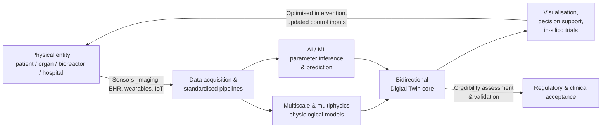
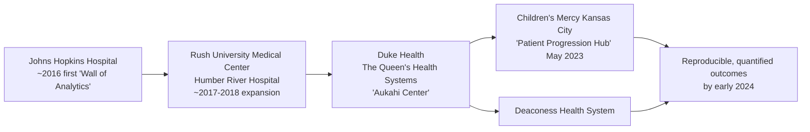
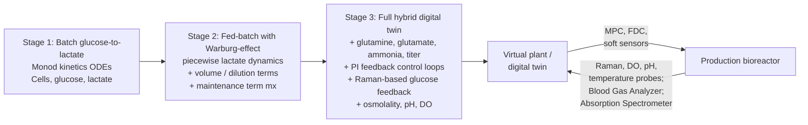
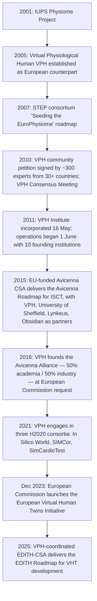

# Digital Twins for Health: Key Application Areas and Major Research Centers as of Early 2024
# 1 Introduction and Conceptual Foundations of Digital Twins for Health

The notion that a living patient could be paired with a continuously updated, computable replica of themselves — a personal "digital twin" that learns, predicts, and informs every clinical decision — has moved within a few years from speculative metaphor to an organising principle of biomedical innovation. By early 2024, this shift was being formally recognised at the highest levels of science policy and regulation: the U.S. National Academies of Sciences, Engineering, and Medicine had released its landmark report *Foundational Research Gaps and Future Directions for Digital Twins* in December 2023, identifying the state of the art and the fundamental research challenges that healthcare and other domains must address[^1]; the U.S. Food and Drug Administration (FDA) and the European Medicines Agency had begun to articulate regulatory frameworks for in-silico evidence; and a community of academic, industrial and consortium actors had coalesced around the explicit "moonshot" of "forming and fostering a digital twin of every single human person, integrated into the person's medical record, owned by the person, progressively and continually updated with new data"[^2]. These developments mark a transition from isolated proofs-of-concept towards a coherent technical and institutional agenda that this report is designed to map.

This opening chapter establishes the conceptual baseline on which the remainder of the analysis rests. It first proposes a working definition of a healthcare Digital Twin (DT) and then distinguishes it from a thicket of adjacent but distinct constructs — in-silico models, virtual patients, computational phantoms, traditional simulations — that are frequently conflated in marketing and even in peer-reviewed literature. It then unpacks the core technical components (bidirectional data flow, real-time updating, multiscale physiological modelling, AI/ML integration, credibility assessment) that make a representation worth calling a "twin," traces the technology's translation from manufacturing and aerospace into medicine, and sets out the taxonomy, scope and reading strategy used throughout the eight application chapters of Part One and the institutional mapping in Part Two.

## 1.1 Defining the Healthcare Digital Twin

The most authoritative contemporary definition of a Digital Twin in any domain is the one adopted by the U.S. National Academies' 2023 report on foundational research gaps: a DT is "a set of virtual information constructs that mimics the structure, context, and behavior of a natural, engineered, or social system (or system-of-systems), is dynamically updated with data from its physical twin, has a predictive capability, and informs decisions that realize value"[^2]. Translated to medicine, a *medical* Digital Twin is then defined, in the formulation endorsed by the Center for Virtual Imaging Trials and the 2024 International Summit on Virtual Imaging Trials in Medicine roundtable, as "a viewable digital replica of a patient, organ, or biological system that contains multidimensional, patient-specific information, and informs decision"[^2]. This report adopts these two definitions as its baseline.

Three necessary conditions follow from these definitions and serve as the filter through which candidate technologies will be assessed in later chapters:

1. **Bidirectional physical–virtual coupling.** The virtual artefact must be tethered to a specific physical referent — an identifiable patient, a particular organ, a specific bioreactor, a named hospital floor — through a data link that flows in both directions. New observations from the physical entity update the virtual model, and outputs from the virtual model influence interventions on the physical entity. As the National Academies and the in-silico-trials roundtable both stress, "the virtual and the physical realities maintain a bidirectional interaction"[^2].
2. **Progressive personalisation and continuous updating.** A medical DT is not a one-off model. For a young or data-poor individual the twin "would be a rough approximation based on the characteristics of the population within which the individual could be most closely characterized," but it must be capable of being "progressively and continually updated with new data as they become available"[^2]. Stasis is incompatible with twinning.
3. **Decision-informing utility.** A DT exists to "realize value" — to inform a specific decision, whether that is a treatment plan, a regulatory submission, a device design choice, or a public-health intervention. Models that merely visualise without supporting decisions are educational tools, not twins.

Throughout this report, an initiative will be classified as a genuine DT4H effort only when it demonstrably satisfies, or is credibly working toward, all three conditions. This filter is essential because, as discussed below, "digital twin" has become a marketing label attached to a wide spectrum of digital health products whose underlying mechanics fall well short of the National Academies' criteria.

## 1.2 Distinguishing Digital Twins from Adjacent Concepts

Adopting a strict definition immediately exposes a problem of conceptual hygiene: many technologies that share visual or mathematical elements with DTs are nevertheless something else. Table 1 summarises the distinctions used in this report.

| Construct | Core characteristic | Live data linkage to a specific physical instance? | Continuously updated? | Relationship to a DT |
|---|---|---|---|---|
| **Digital Twin (medical)** | Patient-, organ-, or system-specific virtual replica that mimics structure, context and behaviour | Yes — bidirectional | Yes — progressively, as new data arrive | Reference concept |
| **In-silico model / mechanistic model** | Mathematical/computational representation of a physiological process | Not required — may be generic | Not required | A *building block* used inside a DT |
| **In-silico trial (IST)** | "Systematic and robust computational analyses performed on or with DTs"[^2] | Indirect — through the twins it operates on | Per study | An *analytical use* of DTs, not a synonym |
| **Virtual patient / patient avatar** | Synthetic or template patient profile | Usually no — often population-derived | Usually static for the duration of a study | A *generic precursor* to a personalised DT |
| **Computational phantom** | Anatomically detailed 3D model used in imaging or radiation dosimetry | Usually no | No | A *structural substrate* sometimes embedded in DTs |
| **Traditional one-off simulation** | Forward computation of a scenario given fixed inputs | No | No | Conceptually closest to the *opposite* of a twin |

The crucial discriminator, consistent with the National Academies' definition, is the combination of *individual-level specificity* with *dynamic, bidirectional updating* from the corresponding physical entity[^2]. An imaging-based 3D model that "can help doctors and healthcare professionals to visualize and analyze the patient's data as if they were before them"[^3] is a necessary visualisation layer, but becomes a Digital Twin only when it is tied to that specific patient through a persistent data link and updated as new observations arrive. Likewise, in-silico trials are deliberately framed in the literature not as competitors to DTs but as analyses that are "performed on or with DTs"[^2]: a virtual cohort assembled from many personal twins, on which an intervention is computationally tested, is itself an IST. This report consistently uses "in-silico trial" for the analytical activity and "digital twin" for the underlying personalised construct.

## 1.3 Core Technical Components and Enabling Technologies

A healthcare DT, in the sense defined above, is an assembly of several interlocking technologies. Although the precise stack varies by application area, six components recur across virtually every credible DT4H deployment surveyed in this report.

**Multiscale and multiphysics modelling.** The biological substrate of a medical DT is rarely captured by a single equation. Achieving "a functional DT requires advancements in computational modeling, high-fidelity simulation techniques, multiscale physiological modeling, and integration of data-driven machine learning algorithms"[^2]. In practice this means combining molecular, cellular, tissue, organ and whole-body representations — for example, electromechanical heart models coupled to systemic haemodynamics, or pharmacokinetic models coupled to organ-specific drug response.

**Sensor- and IoT-driven data acquisition.** Twins are only as live as the data they ingest. Wearables, continuous physiological monitors, medical imaging, electronic health records and connected devices form the sensory cortex of the system. Commercial DT efforts such as Twin Health's "Whole body AI digital twin™" explicitly draw on continuous, multi-modal data — "small changes in things like nutrition, activity, and sleep" — to construct "a completely individualized representation of the internal processes happening in a person's body"[^4].

**Bidirectional data pipelines.** A central design problem is to build data formatting and processing pipelines that can "dynamically and bidirectionally update DTs with real-world patient data, ensuring adaptability and accuracy over time"[^2]. This requirement implies investment in interoperability standards, edge processing, and secure return channels by which the twin can issue recommendations or control signals.

**AI/ML for inference and prediction.** Where mechanistic equations are insufficient or where parameters cannot be measured directly, machine learning fills the gap — inferring hidden physiological states, personalising population models to a specific patient, and emulating expensive simulations for real-time use. The National Academies report and the in-silico-trials roundtable both emphasise that AI capabilities and DTs are converging: in-silico methods provide "an objective means to enhance their [AI's] transparency, trustworthiness, generalizability, and interpretability"[^2].

**High-performance computing and 3D visualisation.** Multiscale simulations and large in-silico cohorts impose substantial computational demand, while clinician-facing use depends on intelligible visualisation; the long-noted promise that 3D models let clinicians visualise patient data "as if they were before them"[^3] is realised only when computational throughput and rendering keep pace with clinical workflow.

**Credibility assessment, validation and standards.** Because "it is nearly impossible to fully model the health state with [perfect] representation, the necessary scientific approximations should be validated for the specific context of use," following a workflow of "design, validation, and implementation"[^2]. This entails formal credibility frameworks (such as the FDA's evolving in-silico evidence guidance, the ASME V&V 40 standard referenced in the regulatory-science literature), harmonised data and model standards, and explicit handling of patient ownership and privacy — the latter modelled, for instance, on Germany's patient-owned-data regime[^2]. These socio-technical preconditions are as decisive for clinical-grade DTs as any algorithmic advance.

## 1.4 Evolution from Manufacturing and Aerospace to Healthcare

The Digital Twin idea did not originate in medicine. It crystallised over the past two decades in product lifecycle management, aerospace and Industry 4.0, where the goal was to pair physical machines and production lines with continually updated computational replicas. The maturity of this lineage is reflected in dedicated international standards: the **ISO 23247 series — "Automation systems and integration — Digital twin framework for manufacturing"** — codifies a manufacturing-DT framework spanning, among other parts, the *digital thread* that "enables the creation, connectivity, management and maintenance of manufacturing digital twins across the product life cycle"[^5] and the *digital twin composition* principles for "configuration, communication, combination and collaboration between digital twins during manufacturing"[^6]. In silico engineering trials, building on this lineage, "have already enabled major breakthroughs across a broad swath of industries including nuclear, automotive, and aviation"[^2].

Healthcare's adoption has inherited much from this industrial heritage but has also had to adapt it substantially. Table 2 summarises the translation.

| Dimension | Manufacturing / aerospace DT (ISO 23247-style) | Healthcare DT (DT4H) |
|---|---|---|
| **Physical referent** | Machine, factory, aircraft — engineered, well-characterised | Human body or organ — biologically variable, partially observable |
| **Data link** | Industrial sensors, SCADA, PLC, digital thread across PLM[^5] | EHR, imaging, wearables, omics; far more heterogeneous, often gated by consent |
| **Modelling basis** | Engineering physics with known design specs | Multiscale biology with substantial epistemic uncertainty |
| **Lifecycle governance** | Product lifecycle, ISO 23247-style composition[^6] | Patient lifecycle plus regulated medical-product lifecycle |
| **Regulatory regime** | Industrial safety, certification | FDA / EMA medical-device and drug regulation; emerging in-silico evidence frameworks[^2] |
| **Ethics and ownership** | Asset ownership by manufacturer/operator | Patient ownership of data and twin; privacy, equity, informed consent |
| **Validation paradigm** | V&V against engineering specifications | Credibility assessment against partially-known biology and clinical endpoints |

What healthcare has *inherited* is considerable: modelling rigour, the discipline of a digital thread across a lifecycle, the experience that high-fidelity twins can compress design cycles and substitute for physical trials. What has had to be *adapted* is equally substantial: biological variability, ethical constraints, the absence of a complete "design specification" for any human being, and the need for a regulatory pathway that recognises in-silico evidence. The roundtable convened around the National Academies' findings explicitly identified five categories of obstacle — "coordinational, scientific, disseminational, ethical, and economical" — that distinguish the medical setting from the industrial one and that together explain why "the potentials of in silico methods in medicine are intriguing, [but] their realization is far from reality"[^2]. These obstacles set realistic expectations for the maturity differentials documented in Chapters 2–8: some application areas, particularly biomanufacturing and medical device design, sit close to their industrial cousins and have advanced rapidly; others, particularly personalised whole-body twins and in-silico clinical trials, are still navigating the adaptation work.

## 1.5 Taxonomy and Analytical Framework Adopted in the Report

To structure a heterogeneous and rapidly moving field, this report applies a three-axis taxonomy to every initiative discussed, and uses a complementary mapping framework for the institutional landscape in Part Two.

The three axes are:

- **Scale of the twin** — molecular, cellular, organ, whole-body, or population. A Living-Heart-style cardiac model and a hospital-floor operational twin are both DTs, but they sit at radically different scales and demand different evidentiary standards.
- **Purpose of the twin** — diagnosis, treatment optimisation, device design, in-silico trial, biomanufacturing control, surgical planning, prevention/wellness, or public-health modelling. Purpose determines who the decision-maker is and therefore what counts as "informing decisions that realize value"[^2].
- **Maturity of the twin** — conceptual, prototype, regulated pilot, or clinically/industrially deployed. The same vendor may simultaneously offer a deployed product in one domain and a research prototype in another.

This taxonomy directly underwrites the **eight-domain application framework** that organises Part One (Chapters 2–8): Hospital Management and Care Coordination; Medical Device Design; Biomarker and Drug Discovery; Biomanufacturing and Bioprocessing; Surgical Planning and Intraoperative Guidance; In-silico Clinical Trials; Personalized Precision Medicine; and Wellness, Prevention and Population Health. The domains are derived from the user's research brief and are themselves congruent with the application clusters that emerge from the National Academies' work and the FDA/EMA regulatory discourse[^1][^2]. Within each chapter, the same evaluative lens is applied: a named organisation, a specific product/platform/project, a concrete technical mechanism, and — where available — quantitative outcomes or dates.

For **Part Two (Chapter 9)**, the institutional mapping uses a parallel four-dimension framework: geographic region (North America, Europe, Asia-Pacific), institutional type (academic, governmental, industrial, consortium), thematic specialisation (organ-level twins, population twins, manufacturing twins, regulatory science), and funding model (public, private, consortium). The required output is a four-column table — Research Center Name, Region/Community, Research Focus, Main Objectives — followed by comparative analysis. Cross-references between Parts One and Two are deliberately constructed so that an organisation appearing in an application chapter is recognisable by the same name and described in a way that is consistent with its institutional profile.

## 1.6 Scope, Boundaries, and Reading Guide

This report is a **snapshot as of early 2024**. Where information could be dated, it is referenced to that period; later developments are deliberately excluded so that the maturity assessments, regulatory positions and institutional landscape described here reflect a coherent moment in the field. The temporal anchor is significant because the field accelerated visibly around 2023: the National Academies report appeared in December 2023[^1]; the International Summit on Virtual Imaging Trials in Medicine (VITM24) convened its roundtable in spring 2024 to articulate the cross-stakeholder moonshot[^2]; and several large consortia and regulatory programmes reached operational milestones in the same window.

**Thematically**, the scope is restricted to health-focused DTs spanning clinical care, drug development, biomanufacturing, public health and the regulatory science that supports them. Out of scope are purely industrial DTs unrelated to health (despite their importance as conceptual ancestors, treated in §1.4 only as background), generic digital-health tools that do not meet the three conditions in §1.1, and the forbidden scoping review specified in the user brief, which has not been consulted or cited at any point in this report.

Four **cross-cutting issues** will recur in every subsequent chapter and are flagged here so that readers can track them as a continuous thread:

1. **Data governance, ownership and privacy.** The moonshot vision is explicit that the twin should be "owned by the person"[^2], and the practical work of building twins is shaped at every step by consent regimes, data-sharing economics, and frameworks such as the GDPR and the German patient-ownership model referenced in the roundtable[^2].
2. **Regulatory engagement.** The FDA's Centers of Excellence for Regulatory Science and Innovation, the EMA's frameworks, the Avicenna Alliance and the Virtual Physiological Human Initiative collectively form the regulatory infrastructure on which clinical adoption depends[^2]. Application chapters will note, where relevant, which regulatory pathway a given DT is travelling on.
3. **Equity of access.** A recurring concern, articulated in the National Academies-affiliated discourse, is the need to "ensure individualized patient access to technology so all persons can all equitably benefit"[^2]. Differential access is treated not as an afterthought but as a feature of maturity assessment.
4. **Workforce readiness and dissemination.** The same source flags "a notable deficit in skilled expertise in the IST-DT technologies" and the need for graduate and continuing-education curricula and physician training[^2]; this constraint will shape which institutions are best positioned to lead, as catalogued in Chapter 9.

**Reading guide.** Chapters 2 through 8 apply the conceptual filter and three-axis taxonomy of this chapter to each of the eight application domains in turn, with consistent attention to named organisations, specific platforms or projects, the underlying DT mechanism, and outcomes where reported. Chapter 9 then compiles the global research-centre catalogue in the four-column tabular form required by the brief and analyses the geographic, institutional and thematic landscape. Chapter 10 returns to the cross-cutting issues introduced in §1.6, synthesises maturity and convergence patterns across the eight domains, and articulates strategic implications for providers, industry, regulators and funders. Throughout, terminology established here — particularly the distinctions in §1.2 between digital twins, in-silico trials, virtual patients and traditional simulations — is used consistently, so that an entity such as a "patient-specific cardiac twin" carries the same meaning in Chapter 6 (surgical planning) as in Chapter 8 (personalised medicine), and so that a research centre's described focus in Chapter 9 aligns with the cases in which it appears earlier in the report.

# 2 Application Area 1: Hospital Management and Care Coordination

Hospital management and care coordination is the application domain in which Digital Twins for Health have travelled furthest from concept to routine, revenue-generating operation. Where patient-level twins of organs or whole bodies remain largely in the proof-of-concept and regulated-pilot stages discussed in later chapters, by early 2024 a small number of vendor platforms — most prominently GE HealthCare's Command Center — had been operating for several years in named flagship hospitals, generating reproducible and quantified gains in throughput, length of stay, emergency-department boarding and access to care. This chapter applies the three-axis taxonomy of §1.5 to that landscape, asking which deployments genuinely satisfy the bidirectional-coupling, continuous-updating and decision-informing conditions of §1.1, what technical mechanisms they rely on, what outcomes they have produced, and how their relative maturity reflects their direct lineage from ISO 23247-style manufacturing twins.

## 2.1 Scope and Typology of Hospital Operational Digital Twins

Under the three-axis taxonomy adopted in Chapter 1, a hospital-operations DT is a *process-level* twin whose **scale** is the hospital or multi-hospital system, whose **purpose** is operational optimisation across admissions, transfers, staffing, discharges and equipment use, and whose **maturity** in several leading sites is "clinically/operationally deployed". It sits at a different level of the taxonomy from the patient-, organ- and molecular-level twins examined in Chapters 3–8: rather than mirroring an individual's biology, it mirrors the flow of many patients through a fixed physical and human infrastructure.

Methodological work synthesising the field describes this category as "process DTs" that "simulate entire workflows to optimize health care operations", encompassing "buildings", "health care systems", "hospitals" and other "physical systems"[^7]. Functionally, the meta-review groups the value proposition into four hospital-management functions: improving *safety* by simulating emergency scenarios; consolidating *information* across departments; supporting *health and well-being* through individualised care protocols; and enabling *operational control* by optimising resource allocation, patient flow and predictive maintenance[^7]. The canonical hospital-operations twin therefore combines:

- **Real-time data ingestion** from EHRs, admission/discharge/transfer (ADT) systems, OR scheduling, IoT bed and equipment sensors, staffing platforms and patient registries;
- **Predictive and simulation engines** that model how variations in volume or staffing propagate into wait times, bed availability and equipment use[^7];
- **Decision-support outputs** that feed back into operational workflows — bed assignments, transfer routing, discharge planning, staffing-to-demand alignment — closing the bidirectional loop with the physical hospital.

This stack is what distinguishes a true hospital-operations DT from a conventional analytics dashboard or business-intelligence tool. The meta-review explicitly contrasts DTs with EHRs and similar systems whose limitations include operating "in isolation, limiting interoperability between departments" and storing data without offering "clear direction on how to act"[^8]. A static dashboard reports the past; a DT, by combining live data with simulation and predictive models, recommends a future course of action and is then updated by the consequences of that action. The rest of this chapter applies that filter to each named platform and deployment.

## 2.2 GE HealthCare Command Center: Architecture and Flagship Deployments

The most widely deployed hospital-operations DT platform globally as of early 2024 is **GE HealthCare's Command Center**, characterised in industry coverage as acting "like a hospital's 'central nervous system'" — an "AI-powered software that helps hospitals and health systems manage patient flow, streamline operations, and make data-driven decisions in real time"[^8]. The platform was first deployed at Johns Hopkins Hospital in Baltimore as a "Wall of Analytics" featuring "nearly two dozen electronic tiles that collect data from more than a dozen different sources, including admission software, operating room scheduling applications, and patient electronic health records (EHRs)"[^9].

### Architecture: tiles, sources and the digital-twin layer

Architecturally, the Command Center is built around modular **tiles**, each surfacing a real-time, near-real-time or predictive view of a specific operational concern. At Children's Mercy Kansas City, the Patient Progression Hub uses a core set of tiles — **Capacity Expediter, Census Forecast with Staffing, ED Expediter and Patient Manager** — supplemented by modules that "surface ICU transfer opportunities, device-related risks, and health equity considerations"[^10]. Tiles can be viewed centrally on a physical wall or remotely "on a mobile device or computer away from the command center", and the wall itself can be reconfigured "to focus on a particular circumstance needing more attention"[^9].

What lifts this from a sophisticated dashboard to a Digital Twin in the sense of §1.1 is the explicit juxtaposition of historical and live data: the system analyses "the facility's historical data and its current system (a juxtaposition referred to as a 'digital twin')" so that "the technology can predict the point when the hospital might near or exceed its capacity" and notify staff of out-of-the-ordinary events that may "make a unit vulnerable to a safety breach"[^9]. At Children's Mercy, this twin is explicit and named: "Children's Mercy uses Digital Twin simulation modeling to anticipate demand and prepare resources in advance" by trending "census, bed mix, and staffing needs based on historical patterns and seasonal variation", which then informs staffing-to-demand alignment during peak viral seasons and longer-term capacity planning[^10]. Under the §1.1 filter, this constitutes a credible bidirectional twin: live ADT and EHR data update the model, the model issues forecasts and recommendations, and those recommendations alter staffing and bed-management decisions in the physical hospital.

### Lineage of flagship deployments

The deployment lineage runs from the original Johns Hopkins installation — GE's "first such hospital command center" — through expansion to Rush University Medical Center in Chicago and Humber River Hospital in Toronto, with the vendor expecting "to get four more off the ground in 2017 and double that in 2018"[^9]. By 2024, named deployments included **Duke Health, The Queen's Health Systems (the "Aukahi Center" spanning six Hawaiian hospitals), Children's Mercy Kansas City (the "Patient Progression Hub", launched May 2023), Humber River Health, and Deaconess Health System**[^8][^10]. The Johns Hopkins implementation, importantly, was paired with consulting work by the Camden Group on admissions workflow and OR scheduling, plus regular "status huddles" within units — a deliberate coupling of technology with process redesign that, as §2.6 discusses, proved to be a precondition for value realisation[^9].

## 2.3 Case Studies: Quantified Operational Outcomes

By early 2024, the Command Center programme had produced an unusually rich set of comparable, hospital-reported outcome metrics across multiple sites. Table 2.1 consolidates the principal figures and links each to the underlying DT mechanism.

| Institution | Deployment / vehicle | Quantified outcome | DT mechanism producing the outcome |
|---|---|---|---|
| **Johns Hopkins Hospital** | Original "Wall of Analytics" | One-third reduction in ED patients waiting for an inpatient bed; >two-thirds reduction in patients held in the OR for lack of inpatient/recovery beds[^9] | Real-time tile-based visibility plus capacity prediction via historical-vs-current digital-twin juxtaposition |
| **Duke Health** | Command Center | 6% productivity boost; **66% cut** in bed-assignment times; 50% drop in temporary labour; capacity for **500 additional patients annually**[^8] | High-accuracy staffing-need prediction "two weeks in advance" |
| **The Queen's Health Systems** (Hawaii, 6 hospitals) | "Aukahi Center" focused on inpatient flow | **0.7-day reduction** in length of stay within six months; balanced workloads across facilities[^8] | Real-time cross-facility visibility, AI-powered prediction of bottlenecks |
| **Children's Mercy Kansas City** | Patient Progression Hub (May 2023) | **80% reduction** in delayed admissions; **90% reduction** in deferred admissions; 59% increase in inpatient volume at CMK campus; 30% increase in pre-11am discharges; on track for 75% reduction in avoidable days; 8% reduction in ED-to-inpatient placement times; 44% reduction in patients left without being seen; **32% reduction in readmissions for patients requiring interpreter services**[^10][^8] | Tile-based Capacity Expediter, Census Forecast with Staffing, ED Expediter, Health Equity Tile, plus Digital Twin simulation modelling of census, bed mix and seasonal demand |
| **Humber River Health** (Toronto) | Command Center | 23% reduction in ED boarding times; 58% improvement in estimated-discharge-date documentation compliance[^8] | Predictive ED Expediter tile and standardised discharge-date workflows |
| **Deaconess Health System** | Command Center | Increase of approximately 2,000 additional patients served annually year-over-year[^8] | Better bed assignments and capacity utilisation enabled by integrated forecasting |

Two patterns are worth highlighting. First, the **magnitude and consistency** of the effects — multi-percent improvements in throughput and 0.7-day reductions in length of stay achieved within six months at The Queen's, repeated across six hospitals — are unusual in clinical-operations research and reflect the fact that the underlying decisions (bed assignment, discharge timing, staffing) are themselves high-frequency, high-volume processes where small predictive advantages compound rapidly. Bree Bush, General Manager of Command Center at GE HealthCare, characterised The Queen's outcome by noting that "to see that kind of movement in six months is impressive" and attributing it to the ability to "see issues in real time, predict where problems may arise, and identify how to resolve them"[^8].

Second, the Children's Mercy case demonstrates how the DT integrates with **redesigned workflows** to produce its quantified gains. The Patient Progression Hub centralises Flow Administrators, a Hub Physician, Discharge, ED and Environmental Services Expediters, care management, nursing leadership, bed placement and staffing teams, transfer-centre and transport teams, and data analysts in one operating model[^10]. The technology's standardisation of "projected discharge dates and clinical readiness dates (PDD/CRD)" achieved "greater than 95% compliance with inputting and updating projected discharge dates", and Jennifer Watts, the Vice President and Associate Chief Medical Officer leading the initiative with Stephanie Meyer, explicitly attributed the outcomes to "leveraging predictive analytics to accurately forecast patient volumes" so that operations could be streamlined proactively[^10]. The 32% reduction in readmissions for patients requiring interpreter services, surfaced via the Health Equity Tile, is a particularly important early example of an operational DT being used to remediate, not merely measure, disparities — a point developed in §2.6.

## 2.4 Competing and Complementary Platforms: Siemens Healthineers, Philips and Others

Although GE HealthCare's Command Center is the most documented hospital-operations DT, by early 2024 the vendor landscape included several adjacent efforts of varying scope and maturity. **Philips** has been building "hospital operations digital twins" described as "virtual replicas of an entire hospital's workflows, capacities, and patient movement" that combine "real-time data from admissions, staffing, bed availability, imaging queues, and emergency department activity to simulate how the hospital functions under different conditions", allowing leaders to "test scenarios in these digital twins before applying them in the real hospital" and so reduce wait times and overcrowding[^11]. In terms of the §1.1 filter, Philips' platform satisfies the bidirectional and updating conditions in principle, though the publicly documented evidence base of quantified deployments is thinner than for GE.

**Siemens Healthineers**, while better known for its patient- and organ-level cardiac twins (discussed in Chapter 6 and 8), has also implemented DT-based solutions in health-care settings — including with the **Medical University of South Carolina** — that, according to the meta-review, are intended to "optimize supply chain processes, improve response times for critical patients, and streamline workflows"[^7]. In the same survey, hospital-operations DTs from GE HealthCare, BioSecure and Siemens Healthineers are grouped together as the cohort of active deployments in this category, with other initiatives "at the conceptual or exploratory stage"[^7].

Beyond the vendor platforms, the literature documents emerging research-grade twins oriented toward chronic disease and aged care that, while not full hospital-wide systems, extend the operational-twin concept into care-coordination settings. **Liu et al.** proposed a **CloudDTH** cloud framework explicitly aimed at supporting self-management for the elderly, integrating wearable monitoring with cloud-based twin services for ongoing care coordination outside acute facilities. In a related vein, **Wickramasinghe** has proposed a digital twin framework specifically for **dementia care**, addressing the coordination of cognitive, behavioural and caregiver data across the trajectory of the disease. And during the COVID-19 pandemic, **DTCoach** emerged as a smartphone-deployable digital-twin "mentor" that provided **personalised digital coaching** to users when conventional in-person care pathways were disrupted — an early demonstration that twin-mediated care coordination can extend beyond hospital walls into the patient's hand. Each of these is best understood as a complement to, rather than substitute for, the enterprise-scale platforms surveyed above: together they suggest that the operational-twin category is beginning to extend from the inpatient command centre into post-acute and home settings.

A note on academic-medical-centre initiatives is warranted. Johns Hopkins Hospital is the canonical example of an academic centre deploying a vendor-supplied operational twin (the GE Command Center)[^9], rather than an academically built platform; the institution's broader DT research portfolio — for example, the **Johns Hopkins University** work on digital twins for neurosurgery cited in industry surveys[^11] — sits in the patient/organ-level domain treated in Chapter 6, and is institutionally distinct from Johns Hopkins Hospital's operational deployment. This distinction is preserved consistently in Chapter 9.

## 2.5 Technical Enablers and Integration Challenges

The technical stack underlying a hospital-operations DT is, in principle, the generic Chapter 1 stack — sensors, bidirectional pipelines, multiscale models, AI/ML, visualisation and validation — but with two characteristic emphases. First, the "multiscale" element is replaced by a *multi-source operational* element: the twin must ingest live ADT events, OR schedules, EHR clinical data, staffing rosters and IoT bed-and-equipment telemetry, and reconcile them into a single coherent state estimate of the hospital. Second, the AI/ML layer is dominated by *forecasting*: at Duke Health, the Command Center achieved "high accuracy in predicting staffing needs two weeks in advance", which is what enabled the 50% drop in temporary labour[^8].

Several practical limits, however, constrain how rapidly the architecture can be replicated. The meta-review documents that EHRs — the indispensable data backbone — "often operate in isolation, limiting interoperability between departments and preventing a comprehensive view of the patient's journey", and that "tailoring EHR systems to meet specific hospital needs can be cumbersome, with updates and enhancements taking years to implement"[^8]. The data-integration challenge compounds an already significant **data deluge**: industry analysis cited in the same source notes that "approximately 36% of the world's digital data is generated by healthcare" and growing rapidly[^8], so that the bottleneck is no longer data availability but actionable synthesis. Bree Bush summarised the implication that "some companies enter the market and are happy to build whatever you want, but your care team has to sit with them at every moment to ensure that the right thing is developed", contrasting that with vendors whose teams "have worked in hospital operations for years" and so understand "the root causes of operational challenges"[^8]. In §1.3 terms, the bidirectional pipeline and the credibility-and-validation layer turn out to be at least as decisive as the algorithmic core.

Even with these constraints, **hospital-operations twins have advanced faster than patient-level twins** for two structural reasons. First, the decision-informing utility test of §1.1 is comparatively easy to meet: bed-assignment time, length of stay and ED boarding are well-defined, high-frequency outcomes whose improvement can be measured within weeks, in contrast to the multi-year endpoints typical of clinical care. Second, hospitals own the data and the workflows in question, so the consent, regulatory and ownership obstacles that slow patient-level twins (Chapters 6–8) are largely absent. The maturity differential observed in this chapter is not accidental; it follows directly from the conceptual taxonomy of §1.5.

## 2.6 Change Management, Workforce and Equity Considerations

The same outcome data that establishes the maturity of hospital-operations DTs also makes clear that **technology alone is insufficient**. The case studies above are uniform in attributing their gains to a paired investment in workflow redesign and human roles. At Children's Mercy, the Patient Progression Hub was built through the "dyad leadership of Stephanie Meyer, MS-FNP, RN, NEA-BC, Executive Vice President, Chief Nursing Executive, Chief Operating Officer Acute Care, and Jennifer Watts, MD, MPH, Vice President, Associate Chief Medical Officer, Acute Care and Inpatient Services", who "designed the foundational workflows and structures that, alongside the technology, made the model effective"[^10]. The model created new operational roles — Flow Administrators, a Hub Physician, Discharge, ED and Environmental Services Expediters — and standardised workflows including "system-wide Lightning Rounds focused on discharge readiness" and "aligned clinical and operational rounding with care management and charge nurses"[^10].

GE HealthCare's own framing of successful adoption echoes this point. Bush emphasises that "a crucial first step is listening to the people directly involved in operations — such as nurses, case managers, and physicians" and that "implementing the Command Center is not just about technology — it's about transforming processes to ensure sustainable outcomes", with the caveat that "organisations always wish that things could go faster, but there's only so much change that teams can absorb"[^8]. This aligns directly with the workforce-readiness theme flagged as a cross-cutting issue in §1.6: even where the underlying twin is technically sound, value realisation depends on training, role redesign and gradual change management.

On **equity**, the Children's Mercy deployment is an early but instructive demonstration of how an operational DT can be turned to address disparities rather than merely measuring them. The Health Equity Tile enables "faster identification of equity-related barriers", and the Patient Progression Hub delivered "a 32% reduction in readmissions for patients requiring interpreter services" alongside "improved oversight of risk-of-harm indicators and high-risk transitions"[^10]. Yet the broader equity picture in this category remains uneven: by early 2024 the named Command Center deployments cluster heavily in well-resourced academic and regional health systems in North America. This pattern is consistent with the meta-review's general warning that DT adoption is hindered by "socioeconomic barriers" and "high implementation costs" that disproportionately affect smaller hospitals[^7], and it sets up the cross-cutting equity-and-access question revisited in Chapter 10.

## 2.7 Maturity Assessment and Outlook

Synthesised against the three-axis taxonomy of §1.5, hospital-operations DTs emerge as **the most clinically and operationally deployed category in DT4H as of early 2024**. They sit at hospital/system scale, serve operational-optimisation purposes, and have reached the "clinically/operationally deployed" rung of the maturity axis across multiple named institutions, with reproducible, quantified outcomes — including double-digit percentage reductions in delayed admissions, ED boarding and bed-assignment times, and sub-1-day reductions in length of stay achieved within months of deployment[^8][^10][^9]. Their proximity to ISO 23247-style manufacturing twins (§1.4) is not merely a matter of intellectual lineage: the engineering problems they solve — predicting throughput, balancing capacity across facilities, scheduling maintenance and staffing during demand peaks — are direct medical analogues of the production-line problems that industrial DTs were designed for, which helps explain why this domain has translated most readily.

Three frontiers remain. First, the current generation of deployments is heavily oriented toward inpatient flow within a hospital or system; **enterprise-wide twins** that integrate ambulatory clinics, post-acute care, home monitoring and the kinds of patient-self-management platforms exemplified by CloudDTH, Wickramasinghe's dementia framework and DTCoach are still largely conceptual. Second, **integration with patient-level clinical twins** — so that the operational twin not only forecasts demand for a bed but also tailors length-of-stay predictions to the specific physiological trajectory of the patient occupying it — remains a research-grade ambition that will require the patient- and organ-level capabilities surveyed in Chapters 6 and 8. Third, **credibility assessment for operational predictions** has yet to be formalised in the way that the FDA's V&V 40-aligned framework (introduced in §1.3) is beginning to formalise it for medical-device and drug-development twins; hospital-operations twins are currently validated by their measured operational outcomes rather than by any standardised credibility process.

The institutional actors that recur in this chapter — **GE HealthCare, Siemens Healthineers, Philips, Johns Hopkins Hospital, Mayo Clinic** — will reappear in the global research-centre catalogue of Chapter 9, where their broader DT4H portfolios and consortium affiliations are mapped, and the cross-cutting issues introduced here (data governance, workforce readiness, equity of access, and the absence of a standardised credibility regime for operational twins) are revisited in the synthesis of Chapter 10.

# 3 Application Area 2: Medical Device Design

If hospital operations is the DT4H domain that has travelled furthest from concept to routine deployment, **medical device design is the domain in which the digital twin and its closely related constructs are most deeply embedded across an entire product lifecycle**. By early 2024, the design, verification and regulatory submission of orthopaedic implants, cardiovascular devices, respiratory equipment, infusion systems and in-vitro diagnostic instruments routinely relied on virtual-patient cohorts, patient-specific multiphysics simulations and—at the leading edge—digital evidence packages co-developed with the U.S. Food and Drug Administration (FDA). This maturity is no accident: device design sits closer than any other healthcare application to the ISO 23247-style industrial twin tradition described in §1.4, because the artefact being twinned is itself an engineered object, even though its operating environment is the variable, partially observable human body. This chapter applies the conceptual filter of §1.1 and the three-axis taxonomy of §1.5 to that landscape, asking which named platforms and projects—Materialise's ADAM services, Dassault Systèmes' Living Heart Project, Ansys multiphysics, Siemens Simcenter, COMSOL and the OEM and consulting users built around them—genuinely constitute digital twins and which are better classified as virtual patients, statistical shape models, or one-off in-silico simulations; what they have achieved in shortening time-to-market and reducing physical testing; and where the residual maturity gaps lie.

## 3.1 Scope and Lifecycle Framing of Device-Design Digital Twins

Under the §1.5 taxonomy, device-design DT efforts cluster around three coordinates. The **scale** ranges from a single component or device geometry up to a *device-population* twin in which one design is virtually implanted into hundreds or thousands of synthetic anatomies. The **purpose** is to inform engineering and regulatory decisions across the device product lifecycle—design input gathering, concept exploration, detailed design, verification and validation (V&V), regulatory submission, and post-market surveillance. The **maturity** is uneven across the lifecycle: simulation-led workflows "now dominate early-stage device design and have edged into bench testing and validation"[^12], whereas the use of digital evidence as a primary basis for regulatory submission and the partial replacement of clinical trials remain emergent and selectively demonstrated.

Applying the §1.2 conceptual hygiene to this domain is essential, because the term "digital twin" is used loosely by vendors and analysts across constructs that are mechanically distinct. Three of those constructs dominate the device-design literature:

- **Virtual patients**, defined in the orthopaedic R&D context as "a computer model of a patient, which can reliably predict the response of this patient to a certain treatment" that is "typically either anonymous or synthetic", with an explicit distinction from digital twins where "the model is paired with the real patient, and adjusted in time based on the real observed outcomes"[^13].
- **Statistical shape models (SSMs)**, which "offer accurate representations of complex 3D geometries"[^14] of populations and are used to generate "synthetic" or "derived" virtual patients spanning, for instance, the 5th to the 99.7th anatomical percentile[^13].
- **Patient-specific multiphysics simulations**, in which a CAD model of a device is virtually deployed inside an anatomy reconstructed from a specific patient's CT/MRI, and its mechanical, fluidic, electromagnetic or electromechanical behaviour is computed.

Under the §1.1 filter, only a subset of these qualifies as a genuine bidirectional Digital Twin. A virtual patient assembled from a population is, in §1.2 terms, a *generic precursor*; a statistical shape model is a *structural substrate*; a one-off finite-element analysis is conceptually closer to the *opposite* of a twin because it lacks the continuous updating link. What distinguishes a genuine device-design DT is the persistence of the link: either a patient-specific model that is updated as new imaging or post-market data arrive, or—more commonly in this domain—a population-derived twin of the *device* whose virtual cohort is progressively refined with real-world post-market evidence. As §3.4 develops, the FEops HEARTguide platform and the post-release modelling pipelines used at BioFire/BioMérieux move closest to this stricter sense; most other deployments are best characterised as *digital-twin-enabled virtual-patient workflows* that nevertheless inherit much of the engineering value of full twinning. The remainder of the chapter is organised by lifecycle phase—design input and concept (§3.2), V&V (§3.3), regulatory submission (§3.4) and the in-silico-trial frontier (§3.5)—with the maturity synthesis returning to the §1.5 axes in §3.6.

## 3.2 Population Analysis and Virtual Patient Cohorts in Early Design

At the design-input and concept stages, the dominant DT-adjacent technology is **population analysis via statistical shape modelling**, by which large batches of CT or MRI scans are mined to produce a distribution of anatomical shapes against which a candidate device can be virtually deployed. **Materialise's Anatomical Data Mining (ADAM) services**, an integral part of the Materialise Mimics platform, codify this workflow into five inter-locking offerings: accurate segmentation of large batches of CT or MRI scans, statistical shape modelling to "simulate average or worst-case virtual patients", consistent 3D anatomical measurement, virtual implantation of a device's CAD file in a large number of virtual patients to "assess the fit and validate your design", and complementary 3D-printed anatomical models for bench testing and hands-on assessment of implants[^15]. SSMs themselves are an established technique whose academic foundations have been documented in domains as diverse as pelvic fracture management—where "a virtual model of the fractured pelvis can be used for proper implant selection, the pre-modeling of conventional plates using a 3D printed template"[^16]—and orthopaedic population modelling generally[^14], and have been extended to combined "statistical shape, statistical intensity, and statistical shape and intensity models (SSMs, SIMs, SSIMs)" that capture both geometry and bone-property variability[^17].

The orthopaedic-implant industry has internalised this approach to the point that it is now a standard development tool rather than a research curiosity. **DJO Surgical** has used virtual patients in its hip-implant programme for several years, with Engineering Manager Adam Shallenberg describing them as "a standard tool for all design projects"[^13]. The flagship case—the **DJO Exprt® Revision Hip**—is instructive. By virtually implanting the device in a range of synthetic anatomies generated from an SSM, including a 5th-percentile and a 99.7th-percentile patient, the team improved geometric fit across the population while *simultaneously* reducing the supporting instrumentation to just two trays; in Shallenberg's words, "the Exprt® Revision hip fits in a wide variety of bones. The virtual patient verification was a key tool we used to achieve that"[^13]. The technical and financial gains documented across the orthopaedic virtual-patient literature can be grouped into four categories[^13], summarised in Table 3.1.

| Benefit category | Examples |
|---|---|
| **Direct technical** | New insights into anatomy; improved geometric fit; increased population coverage; more reliable V&V |
| **Indirect technical** | Common anatomical reference across the design team; better communication with surgeons and physicians |
| **Direct financial** | Cost savings on cadavers and animals; reduced time-to-market; accelerated regulatory clearance; more efficient inventory use |
| **Indirect financial** | Branding around innovation and technology leadership; marketing advantages |

Two of these deserve emphasis because they recur in later chapters. The *common anatomical reference* role—Shallenberg's observation that virtual patients let surgeons "point to features they understand" so that engineers and clinicians can "speak the same language"[^13]—addresses a perennial communication problem in device design. And the *population-coverage* role mitigates a long-standing weakness of conventional cadaver or animal studies, in which the available specimens span a narrow slice of the target population. Under §1.2, the constructs at work here are virtual patients and SSMs, not full DTs; under §1.5 their maturity is high, but their decision-informing utility is still gated by how faithfully an SSM-derived cohort represents the real clinical population—a point taken up in §3.6.

## 3.3 Patient-Specific Multiphysics Twins for Device Verification and Validation

When the lifecycle advances from concept to detailed design and V&V, the centre of gravity shifts from population shape models to **patient-specific multiphysics simulation**: explicit physical modelling of how a candidate device behaves inside an anatomy that is either reconstructed from real patient imaging or sampled from a virtual cohort. The most ambitious example of this category in cardiovascular devices is **Dassault Systèmes' SIMULIA Living Heart Project**, an evolving collection of highly accurate, personalised digital human heart models intended as "a foundation for in silico medicine and testing of medical device designs"[^12]. Launched in 2014, the Living Heart Project has grown into a collaborative ecosystem involving 67 leading research institutions, 46 industrial organisations, 15 clinical establishments and two regulatory bodies[^18], and underwrites a broad sweep of cardiovascular-device R&D from pacemaker-lead placement to valve and stent design[^18].

Decisively for this chapter, the Living Heart Project signed a five-year collaborative research agreement with the U.S. FDA—a flagship public-private collaboration that has since been extended for a further five years to "spur medical device innovation by enabling innovative, new product designs" and to support the 21st Century Cures Act by "using virtual patients based on computational modelling and simulation to improve efficiency of clinical trials for new device designs"[^18]. Cardiac digital-twin development around this initiative has, in parallel, drawn in **Philips** and **Siemens Healthineers** as collaborative participants, broadening the industrial base of cardiac-twin development beyond a single vendor. The mechanistic advantage of working with a Living-Heart-style twin, as Karl D'Souza of Dassault Systèmes notes, is that "instead of doing one or two runs, you can run hundreds or thousands of experiments", which lets device makers "understand how a device behaves in a multitude of hearts or in a single heart" rather than relying on a "limited physical test bench"; benchtop animal testing is correspondingly characterised as "costly, time-consuming" and providing only "a piecemeal understanding"[^12].

A second cluster of patient-specific cardiac twins focuses on procedural planning and device sizing rather than on generic device R&D, and here the closest contemporary deployment to the strict §1.1 definition is **FEops HEARTguide**. HEARTguide is a structural-heart simulation technology used for planning **Transcatheter Aortic Valve Implantation (TAVI)** and **Left Atrial Appendage Occlusion (LAAO)** procedures, in which a patient's imaging is converted into a personalised cardiac model and candidate device sizes and positions are virtually deployed and assessed. By early 2024 HEARTguide was available in the EU, UK, Canada and Australia, and had received U.S. FDA approval—making it one of the relatively few cardiac digital-twin technologies to have crossed the principal Western regulatory thresholds for clinical use rather than purely R&D use.

Beyond cardiology, multiphysics device twins have spread across respiratory, drug-delivery and diagnostic-instrument categories. **Vyaire Medical**, a maker of respiratory-care equipment, is using Siemens' **Simcenter STAR-CCM+** to move "away from using simplified models for computational fluid dynamics (CFD) simulations of respiratory masks to more realistic and individualized simulations by introducing patient-specific data into those models"; the company is building "a library of patient profiles and morphologies along with usage scenarios—for example, an otherwise healthy young adult with COVID-19 or elderly patient with lung disease"—to simulate "an entire spectrum of clinical usage"[^12]. A directly comparable pulmonary effort is **Onscale's "Project BreathEasy"**, a lung digital-twin initiative developed to improve outcomes for COVID-19 patients and to optimise the use of limited ventilator resources during the pandemic; the project illustrates how, under acute clinical pressure, lung twins can be built rapidly to inform device deployment and titration when bench testing alone cannot keep pace.

Drug-delivery devices have followed a similar path. **Ansys**' Multiphysics simulation portfolio, in the example articulated by Marc Horner, the firm's senior principal engineer for healthcare, allows full systems modelling of an insulin pump comprising "integrated systems of electronic, fluidic and mechanical components": engineers can perform "virtual kinking analysis via CFD to ensure there is no obstruction of insulin flow, finite element analysis to identify components that are prone to failure if dropped, as well as electromagnetics simulation to determine where to position an antenna for optimized performance"[^12]. Coupling these simulations "with detailed models representing different classes of patients" then permits the team to "form a population of patients and see if the insulin pump, as designed, will be able to deliver therapies to different classes of patients" and to "get a better understanding if the system works at a holistic level"[^12]. **Novo Nordisk**, a long-standing Dassault Systèmes customer, has correspondingly added simulation workflows "to model polymer behaviors, for example, to fine-tune the latest configurations for products like an insulin pen, and to inform manufacturing processes to ensure safe and high-quality production"[^12].

In the diagnostic-instrument and consulting tier, **BioMérieux** and its **BioFire** subsidiary have "long tapped COMSOL simulation tools early in its process to optimize device designs through system modeling", while at BioFire "the practice comes into play in the post-release process to get a deeper understanding of complex systems to aid in making changes and supporting legacy systems"; the parent company's data-science lead Laurent Drazek summarises the effect as: "Modeling and simulation give you confidence in your system and your clinical trial results"[^12]. **Emphysys**, a COMSOL certified product-development partner active in both semiconductor and medical-device sectors, uses simulation and modelling to help clients "design clinical trials with the goal of reducing costs and time", with simulations predicting "the outcome of a particular procedure given a specific patient type" so that "results can help reduce the field of patient types and scenarios that need to be tested with physical trials"[^12]. Beyond cardiovascular and respiratory applications, an analogous neurological initiative—the **"Living Brain" project**—is being used for tracking the progression of neurodegenerative diseases, extending the patient-specific multiphysics-twin paradigm into the neurological device and therapy space.

Mapped against the §1.1 filter, this V&V tier is heterogeneous. FEops HEARTguide most clearly satisfies the bidirectional and continuous-updating criteria, because each clinical use case is a personalised model tied to a specific patient and refined by procedural data. The Living Heart Project's role for device makers is more accurately characterised as a *device-twin* effort, in which a population of virtual hearts plays the role of the physical referent for the device under design and the twin is updated as the device evolves; this nevertheless meets the spirit of the §1.1 conditions when applied to the device rather than to any individual patient. The Vyaire, Ansys-insulin-pump, BioFire and Emphysys deployments sit closer to the *virtual-patient-cohort simulation* end of the spectrum, though BioFire's post-release modelling for legacy-system support is genuinely bidirectional in the device-twin sense.

## 3.4 Regulatory Pathways, Digital Evidence and the Credibility Framework

The ability of device-design DTs to influence outcomes that genuinely "realize value" (§1.1) depends on whether they are admissible as evidence in regulatory submissions. By early 2024 the FDA, partly catalysed by the Living Heart Project's collaboration, had taken "significant steps to support the use of computational modeling and simulation in medical device applications": the Center for Devices and Radiological Health (CDRH) "and the agency as a whole, has made simulation and modeling a priority and allowed results to be included as part of regulatory submissions", as Pras Pathmanathan, research scientist at CDRH and co-chair of the Modeling and Simulation Working group at the FDA, has stated publicly[^12].

The credibility scaffolding that supports this admissibility has three principal pillars. First, the **ASME V&V 40 Standard**, published in 2018, was developed by the FDA's Modeling and Simulation Working group in partnership with the devices community to "demonstrate the reliability of modeling and simulation for medical devices"[^12]; it is the formal verification-and-validation standard against which a sponsor's simulation evidence is assessed for a given context of use. Second, the **Living Heart Project–FDA collaboration** itself is operating as a regulatory-science laboratory: in its second phase, "in collaboration with the FDA, the initiative is working to make the 3D heart model a source of digital evidence for new cardiovascular device approvals, including as the basis for in silico clinical trials with the goal of reducing animal testing as well as the number of patients participants"[^12]. Third, the **21st Century Cures Act** provides the legislative framework under which "virtual patients based on computational modelling and simulation" can be used to "improve efficiency of clinical trials for new device designs"[^18].

This regulatory infrastructure is what makes the **vendor positioning around "digital evidence" credible** rather than purely promotional. Dassault Systèmes' Karl D'Souza characterises the Living Heart's role for industry as letting medical-device makers replace the need "to create a lot of situations in the physical world to represent the variability of the human body" with a virtual exploration of "possibilities both from a design and population perspective"[^12]. Siemens Digital Industries' James Thompson is more cautious, observing that simulation and modelling can be used "to determine if you are directionally correct or if something is a good idea conceptually, but not precisely", and that "when you're talking about augmenting trials or doing in silico testing, close doesn't count—you have to be precise, and that's a maturity that's currently lacking in the industry"[^12]. Both views are consistent with the §1.3 emphasis on credibility assessment: digital evidence is now part of the FDA's submission toolkit, but its weight in any given submission is governed by V&V 40-style context-of-use justification, and several application areas have not yet attained the precision that would let simulation displace clinical evidence outright.

Looking forward, Pathmanathan has framed in-silico clinical trials as "the next frontier" in which simulation would "augment, not replace, traditional trials" and would require "similar collaboration to develop guidelines, standards and best practices"; potential uses include performing in-silico trials "in advance of a real trial to test whether the trial is expected to be successful or not" and identifying "patient sub-populations that might respond to the proposed therapy allowing for better clinical trial design", with the cumulative effect of "ending trials early, designing better trials or avoiding trials that would fail [potentially saving] millions of dollars for industry"[^12]. The consortium actors flagged in §1.6—the Avicenna Alliance and the Virtual Physiological Human Initiative on the European side—are the principal counterparts to this U.S. regulatory-science programme, and their coordinating role is taken up in Chapter 9.

## 3.5 Reducing Cadaver, Animal and Clinical Testing: The In-Silico Trial Frontier for Devices

A consistent thread across the deployments surveyed above is the **partial substitution of physical testing**—cadavers, animals, and human clinical trial participants—by computational testing on device-design twins. The Living Heart Project's second phase makes this explicit: its "ground-breaking project with the 3D heart model will examine the use of heart simulation as a source of digital evidence for new cardiovascular device approvals", including "*in silico* clinical trials aimed at reducing animal testing or the number of patients required while still ensuring safety and efficacy of the device", with the explicit ambition that "the new digital process intends to be more efficient and less expensive than current ones, without losing rigour or confidence in a device's safety and efficacy"[^18]. The Onscale Project BreathEasy lung-twin work during COVID-19 represents an analogous, time-pressured demonstration that DT-based device assessment can be stood up quickly when cadaveric and animal pipelines cannot scale.

The mechanism by which physical testing is reduced has several converging elements that are visible across the cases assembled in this chapter:

- **Breadth of design exploration**. Where bench testing is constrained to "one or two runs", a Living-Heart-style device twin permits "hundreds or thousands of experiments"[^12], so that the device is interrogated across orders of magnitude more conditions than physical testing could provide.
- **Population-stratified testing**. Vyaire's library of patient profiles and the Ansys insulin-pump example both rely on building "a population of patients" so that the device can be assessed "at a holistic level to treat these patients before we even go out to the field"[^12], directly addressing the population-coverage limitations of conventional clinical and cadaver studies.
- **Trial-design optimisation**. Emphysys's John Carey describes the financial logic plainly: "For medical device manufacturers, simulation could ensure a shorter trial or a smaller trial… It ends up helping them get to market faster while improving efficiency and safety"[^12]; the upstream effect is to shrink "the field of patient types and scenarios that need to be tested with physical trials"[^12].
- **Post-release life-cycle support**. BioFire's post-release modelling shows that the same DT can extend reduction of physical testing into the post-market phase, "supporting legacy systems" and informing changes without resorting to repeated bench experiments[^12].

In §1.2 terms, these activities are best described as **in-silico trials performed on or with device-design DTs**, not as DTs themselves. They are also conditional rather than absolute substitutes: as the BioFire team emphasises, the simulation work "won't serve as a replacement for physical clinical trials"; instead, it "will shorten the process of pre-trial internal testing while ensuring a more polished product goes to trial"[^12]. The reductions are nonetheless material, and they accumulate over the lifecycle: virtual patients save cadaver and animal costs in the input and concept phases (§3.2), multiphysics twins compress V&V cycles and physical prototyping (§3.3), digital evidence shortens regulatory review (§3.4), and in-silico clinical trials shrink the size and duration of human trials. The combined effect underpins the four direct and indirect financial benefits—reduced cadaver/animal cost, reduced time-to-market, accelerated regulatory clearance and more efficient inventory use—documented in §3.2[^13] and aligns with the more general industry observation that simulation in medical-device development is now expanding from "early ideation all the way through regulatory approval and commercialization"[^12].

## 3.6 Maturity Assessment, Limitations and Outlook

Synthesised against the §1.5 three-axis taxonomy, the device-design domain emerges as the **most mature DT4H category after hospital operations**. At the *scale* axis it spans component, device, and device-population twins; at the *purpose* axis it covers the full lifecycle from design input through regulatory submission and post-market support; at the *maturity* axis, virtual-patient and multiphysics workflows are routinely deployed in R&D across orthopaedic, cardiovascular, respiratory, drug-delivery and diagnostic device classes, while digital-evidence-as-regulatory-submission and in-silico clinical trials for devices are best characterised as *regulated pilots*—proven at flagship sites such as Living Heart–FDA and FEops HEARTguide, but not yet generalised across the device-industry pipeline. The proximity of this domain to ISO 23247-style industrial twins (§1.4) is again decisive: device makers inherited a mature engineering-physics modelling tradition, and the principal adaptation required was the addition of biological variability, which population-based virtual patients and patient-specific imaging-driven models supply.

Several **structural limitations** nevertheless temper the maturity assessment, and each maps directly to one of the cross-cutting issues flagged in §1.6. The first is **biological-tissue modelling fidelity**: Arlen Ward of System Insight Engineering observes that "biological tissue is not a great material for modeling compared to aluminum or steel because it is so variable", with "a lot of complexity that other industries didn't have to deal with"; models "have gotten better at mimicking tissues" but the gap with engineering materials persists[^12]. The second is **standards and best-practice gaps**: although ASME V&V 40 provides a credibility framework, "there are gaps in available standards and the lack of codified guidelines remains a significant hurdle" and there is a "lack of codified best practices to support simulation and modeling practices for this use case"[^12]. The third is **workforce shortage**: experts cite "the lack of skilled expertise, including engineers that are computational specialists with in-depth knowledge of biological and human body systems"[^12], echoing the workforce-readiness theme of §1.6. The fourth is the **precision-versus-direction gap**: simulation is sufficient for early-stage exploration but, as Thompson notes, not yet uniformly precise enough to displace clinical evidence in regulatory submissions[^12].

The institutional actors that recur in this chapter—**Dassault Systèmes** (Living Heart Project, SIMULIA), **Siemens Digital Industries** (Simcenter, PLM 'Digital Evidence Generation' positioning), **Ansys**, **COMSOL**, **Materialise** (ADAM, Mimics), **Onscale** (Project BreathEasy), **FEops** (HEARTguide), **Philips**, **Siemens Healthineers**, the OEM and consulting users **DJO Surgical, Vyaire Medical, Novo Nordisk, BioMérieux/BioFire, Emphysys**, and on the regulatory side the **FDA CDRH Modeling and Simulation Working Group**—reappear in the Chapter 9 catalogue with consistent institutional descriptions and consortium affiliations. The cross-cutting issues raised here—the regulatory engagement that V&V 40 and the Living Heart Project–FDA collaboration represent, the workforce-readiness deficit, the variable but real reduction in animal and clinical testing, and the as-yet-unresolved question of how *equitable* device-design DTs are when the underlying virtual-patient populations are sampled from a narrow set of imaging datasets—carry forward into the synthesis of Chapter 10.

# 4 Application Area 3: Biomarker and Drug Discovery

Pharmaceutical R&D is the DT4H domain where the rhetoric of "digital twins" is most pervasive and the underlying technologies most heterogeneous. Where hospital-operations twins (Chapter 2) are converging on a recognisable architectural template and device-design twins (Chapter 3) inherit a mature engineering-physics tradition, biomarker and drug discovery has assembled an unusually diverse stack of knowledge graphs, generative chemistry engines, multiscale mechanistic disease models, prognostic patient twins, and robotic laboratory platforms — each invoking the digital-twin vocabulary, each addressing a different stage of the pipeline, and each meeting the strict §1.1 conditions to a different degree. The economic stakes are substantial: with conventional drug development requiring more than a decade, costing in excess of a billion dollars per approved compound, and exhibiting overall clinical attrition rates that leave only "10% of the drugs that enter human clinical trials" succeeding[^19], even partial substitution of physical experimentation by twin-enabled in-silico work is consequential. This chapter applies the conceptual filter of §1.1 and the three-axis taxonomy of §1.5 to that landscape, asks which constructs constitute genuine DTs versus DT-adjacent discovery engines, and traces what the leading platforms had concretely achieved by early 2024.

## 4.1 Scope, Typology and Pipeline Mapping of Drug-Discovery Digital Twins

The drug-discovery pipeline can be schematised as a four-stage progression — target identification, virtual screening and molecule generation, PK/PD and disease-progression modelling, and biomarker validation with clinical-trial augmentation — into which DT and DT-adjacent technologies enter at different points and with different mechanics. Applying the §1.2 conceptual hygiene is decisive in this domain because four mechanically distinct constructs are routinely conflated under the "digital twin" label:

- **AI-driven discovery engines** built on knowledge graphs and multi-source omics data (BenevolentAI's Benevolent Platform™, Insilico's PandaOmics) that prioritise targets through machine-learning over heterogeneous evidence. Under §1.1, these are generally not full DTs: they lack a bidirectional link to a specific physical referent and instead generate hypotheses that feed downstream models.
- **Generative chemistry platforms** (Insilico's Chemistry42) that design candidate molecules de novo against specified targets. These are computational synthesis tools, not twins; their molecular outputs are subsequently validated in physical and animal systems.
- **Mechanistic multiscale disease models with virtual-patient cohorts** (Novadiscovery's Jinkō) that simulate disease progression and treatment response across populations. Under §1.2 these sit between virtual-patient cohorts and device-population DTs: when iteratively updated against trial data, they approach a *disease-twin* role for trial design.
- **Patient-level prognostic twins** (Unlearn.AI's TwinRCTs) that produce individualised forecasts for each randomised trial subject and are progressively re-trained as new historical data accrue. These come closest to the §1.1 definition, although the bidirectional link operates at the trial-population level rather than through real-time updating of each individual's twin.

Mapped against the §1.5 three-axis taxonomy, this domain spans every *scale* from molecular (Chemistry42's generative models) to population (Jinkō's virtual cohorts and TwinRCT's prognostic populations); every *purpose* from target discovery through trial-decision support; and a *maturity* range that, as §4.8 develops, varies more widely than any other DT4H domain — from regulated commercial pilots already shaping pharma decisions to early prototypes. The remainder of the chapter is organised by lifecycle stage rather than by platform, so that the same evaluative lens — concept-filter, mechanism, named users, quantified outcomes — is applied uniformly to each.

## 4.2 Target Identification and Disease-Network Models: BenevolentAI and Knowledge-Graph Approaches

The opening stage of the drug-discovery pipeline — formulating a disease hypothesis and identifying a tractable therapeutic target — is where AI-driven knowledge graphs and disease-network models have made their most visible commercial mark. **BenevolentAI's Benevolent Platform™** is the canonical case. The platform is built around a **biomedical Knowledge Graph that integrates data from more than 85 sources**, spanning "different types of 'omics data, the scientific literature, in-house experimental data and clinical trial data", with the explicit design goal that "we are not constrained by the data we have already ingested into our graph and can add new data sets as well as different types of data as they become available"[^20]. Single-cell transcriptomics is a particularly important new data layer: scRNA-seq lets the platform discriminate not only between cell types — distinguishing pancreatic cancer cells from "normal pancreatic cells, immune cells or fibroblasts" — but also "differences within cells in the same population", enabling more precise assessment of whether a candidate target is expressed in the disease-relevant cells and at what frequency[^20].

Two technical commitments differentiate the BenevolentAI approach from generic literature-mining. First, the company has developed a method called **Contrastive Mixture of Posteriors (CoMP)** to "remove the batch effects in scRNA-seq data sets and improve their integration"[^20] — an essential preprocessing step given the heterogeneity of single-cell data deposited from disparate experimental conditions. Second, BenevolentAI is an active proponent of the **FAIR data principles — Findability, Accessibility, Interoperability and Reusability** — and has joined **Rancho Biosciences' Single Cell Data Science pre-competitive consortium** to access "a large amount of well-curated scRNA-seq data along with associated high-quality metadata"[^20].

The clearest evidence that the platform delivers decision-informing utility is the **expanded three-year collaboration with AstraZeneca**, announced in January 2022. The expansion doubled the disease areas in scope — adding **systemic lupus erythematosus (SLE) and heart failure** to the existing programmes in **chronic kidney disease (CKD) and idiopathic pulmonary fibrosis (IPF)** — and was structured with "an upfront payment, research funding, development milestone payments and tiered royalties on future revenues"[^21]. Decisively, the collaboration "has already achieved two major milestones, with the first novel targets added to AstraZeneca's portfolio for both CKD and IPF"[^21], demonstrating that platform-derived hypotheses are not only generated but are actually entering downstream pharmaceutical development. The Benevolent Platform™ is described as "disease agnostic, meaning it can be applied to any disease, and is capable of generating novel targets at scale", and AstraZeneca's proprietary data is fed into the joint Knowledge Graph alongside public and licensed scientific literature, patents, genetics and clinical-trial data[^21]. By that point, the platform was powering "a growing in-house pipeline of over 20 drug programmes, spanning from target discovery to clinical studies"[^21], and its earlier identification of Eli Lilly's baricitinib as a COVID-19 repurposing candidate — subsequently authorised for emergency use by the FDA — provides external validation of its target-prediction outputs[^21].

Under the §1.1 filter, the Benevolent Platform™ is best characterised not as a full digital twin but as an **AI-driven discovery engine that supplies inputs to downstream DTs**. The Knowledge Graph is not tethered bidirectionally to a specific physical referent; rather, it integrates evidence about disease biology in the aggregate, and its outputs — prioritised targets and hypotheses — are then taken into laboratory validation and animal or in-silico trials. This classification is important for taxonomic consistency: the same distinction explains why later sections treat Insilico's PandaOmics (a comparable discovery engine) separately from the generative chemistry and trial-prediction modules that more nearly approach twinning, and it is preserved in Chapter 9's institutional mapping.

## 4.3 Generative AI Pipelines for Molecule Design: Insilico Medicine's End-to-End Case

The most fully documented end-to-end AI-driven drug-discovery pipeline as of early 2024 is **Insilico Medicine's Pharma.AI platform**, comprising three interlocking modules: **PandaOmics** for target discovery, **Chemistry42** for generative molecular design, and **inClinico** for clinical-trial outcome prediction[^19]. PandaOmics integrates omics and clinical data from predominantly public sources, applies more than 20 AI models representing different target-discovery philosophies, and overlays a natural-language-processing layer trained on "approximately one and a half to 2 trillion dollars of … Text data" crawled from patents, research publications, grants and clinical-trial databases[^22][^19]. Chemistry42 uses "500 predictive pre-trained models, including transformer-based, GANs and genetic algorithms, which reward and punish generated molecules based on how well they meet the necessary conditions — including hitting the target, metabolic stability, and penetrability"[^22]. inClinico, the most recently launched module, "allows you to predict phase two to phase three … success probability"[^19].

The flagship validation of this pipeline is the **INS018_055 programme**, a first-in-class small-molecule **TNIK (Traf2- and Nck-interacting kinase) inhibitor** for idiopathic pulmonary fibrosis (IPF)[^23]. INS018_055 is described as having had "the target … discovered using AI, modulating a broad biological process like fibrosis, the molecule … designed using AI, targeting a chronic disease with a large addressable market"[^22], making it the first program in which AI was used end-to-end through to Phase II human trials. The development timeline, summarised below, illustrates both the compression of conventional drug-discovery timescales and the regulatory steps that the programme has navigated.

```mermaid
flowchart LR
    A[PandaOmics: 20 targets<br/>narrowed to novel TNIK<br/>'Target X'] --> B[Chemistry42:<br/>79 molecules synthesised,<br/>55th selected]
    B --> C[Preclinical Candidate<br/>Feb 2021]
    C --> D[First-in-Human Phase 0<br/>Nov 2021, Australia,<br/>8 healthy volunteers]
    D --> E[Phase I, New Zealand<br/>78 volunteers, 10 cohorts<br/>completed Jan 2023]
    E --> F[FDA Orphan Drug<br/>Designation, Feb 2023]
    F --> G[Phase II initiated<br/>China & US, June 2023]
    G --> H[Phase IIa enrollment<br/>completed China:<br/>71 patients, 29 centres<br/>NCT05938920]
    H --> I[Nature Biotechnology<br/>disclosure, March 2024]
```

Several quantitative claims around the programme deserve highlighting. First, target discovery to preclinical candidate took **under 18 months at a cost of approximately $2.6 million**[^24], compared with the multi-year, hundred-million-dollar budgets typical of conventional early-stage discovery; the founder Alex Zhavoronkov has characterised the achievement as "10% as much as a conventional program"[^24]. Second, the journey from novel-target discovery to Phase I dosing took "under 30 months, about half the time the process would take with traditional drug discovery"[^22]. Third, the company's broader pipeline now exceeds 30 therapeutic programmes, with 18 preclinical candidates nominated and 7 INDs approved by the time of the Phase IIa enrolment-completion announcement[^25][^19]. Fourth, the Phase IIa trial in China (NCT05938920) is a **randomized, double-blind, placebo-controlled study across 29 clinical centres** with **71 patients enrolled across three experimental and one placebo group**, evaluating 12-week oral administration; a parallel Phase IIa is ongoing in the US (NCT05975983)[^25]. The detailed AI-to-clinic narrative — "from AI algorithms to Phase II clinical trials, revealing for the first time raw experimental data as well as preclinical and parts of clinical evaluations of the potentially first-in-class TNIK inhibitor discovered and designed through generative AI" — was published in *Nature Biotechnology* in March 2024[^25].

Insilico has also extended the pipeline backwards into **robotic laboratory automation**. The company's Shanghai-area "**Life Star**" lab, opened by 2023, automates the workflow from sample handling through high-content imaging, library preparation, next-generation sequencing, and AI-driven compound selection, with the explicit aim of removing "human bias" from target prioritisation and enabling 24/7 multimodal data generation that further trains the underlying models[^19]. The combination — Pharma.AI software plus robotic execution — is among the more ambitious efforts in the industry to operationalise an integrated discovery loop.

Under §1.1, only some of Pharma.AI's components are genuine DTs. PandaOmics and Chemistry42 are best classified, like the Benevolent Platform™, as AI-driven discovery and generation engines rather than twins. **inClinico**, however, moves closer to a twin-aligned construct in a narrow but important sense: it predicts trial outcomes for specific compounds and indications, can in principle be updated as new trial data accrue, and is being commercialised partly to hedge funds and banks that bet on small and medium-sized biotechs — a feedback loop with real-world consequences that the company uses "as one of the ways to validate with your own money"[^19]. The Pharma.AI platform as a whole has been licensed by **10 of the top 20 pharma companies**[^19], a market-uptake figure that signals how rapidly AI-driven discovery has shifted from speculative to operational, even where the strict twin label does not apply.

## 4.4 Mechanistic Multiscale Disease Models and In-Silico Trial Platforms: Novadiscovery's Jinkō

Whereas BenevolentAI and Insilico operate predominantly upstream of clinical trials, **Novadiscovery's Jinkō platform** sits squarely at the PK/PD and disease-progression-modelling stage and is explicitly framed as a **clinical trial simulation platform**. Jinkō ships with a library of mechanistic multiscale disease models curated by Nova's expert modelling team, including a **non-small-cell lung cancer (NSCLC) model of EGFR-mutant lung adenocarcinoma**, an **atopic dermatitis** model "that accounts for the interplay between the skin barrier and the immune system", an **asthma** model calibrated to reproduce "the dynamics of 11 key immune variables", and a **hypoparathyroidism** model[^20]. The workflow allows sponsors to "test unlimited protocol designs on an endless number of virtual patients", to "run complex trials in a few seconds", and to optimise trial design by "find[ing] responder biomarkers, compar[ing] eligibility criteria, run[ning] advanced analysis and overlay[ing] results with [their] own data"[^20].

Two documented Phase III prediction success stories establish the platform's external credibility. In collaboration with **Prof. Michaël Duruisseaux of the Hospices Civils de Lyon and the Cancer Research Center of Lyon**, Jinkō was used to **accurately predict the results of Janssen's Phase III MARIPOSA trial** — comparing osimertinib with amivantamab in EGFR-mutant NSCLC — using only publicly available documentation[^20]. Janssen's Mathias Bergeron, Medical Director Oncology, has stated that "we've collaborated with Nova on the development of the NSCLC mechanistic model for over three years, and we're thrilled to see the simulation results validated on one of our studies" and that "this predictive model can now be employed to simulate hypotheses that we cannot test in real life, especially in populations with rare driver mutations like the exon20 insertion on EGFR"[^20]. In a parallel exercise, Jinkō **prospectively predicted findings from AstraZeneca's three-year global Phase III FLAURA2 trial** (osimertinib with or without cisplatin/pemetrexed), again from publicly available documentation only[^20]. Duruisseaux has characterised this work as having "revealed the potential of *in silico* clinical trials to define a new future for drug development", with results that "if leveraged before human trials begin, will enable the recruitment of the most relevant patient population, optimize trial design, and ultimately accelerate all therapeutic development"[^20].

A second class of Jinkō application is in **market access and health technology assessment**. **Takeda France**, through General Manager Thierry Marquet, has stated that "we are applying jinko's virtual population simulation technology and in silico research approach as a complement to clinical development plans to support health technology assessment for our innovative therapies"[^20], and used the platform to support a new marketing authorisation for **Natpar in hypoparathyroidism**, presenting new simulated results to "reduce payer uncertainty to speed up acceptance and allow rare disease patients to access Natpar earlier"[^20]. Beyond Jinkō, Takeda Pharmaceuticals has also employed digital twin technology in its production operations, illustrating how the company's engagement with twin-based methods spans both regulatory-economic modelling and manufacturing — a manufacturing application revisited in Chapter 5.

Under §1.1, Jinkō represents a **mechanistic disease-twin substrate** rather than a patient-level digital twin in the strict sense. Its bidirectional link operates at the *disease-model* level — the model is iteratively updated and validated against trial data — and its virtual-patient cohorts are derived from the disease model rather than from continuous data streams attached to specific physical individuals. This places it closer to the device-population-twin construct of §3.2 than to the patient-level twin construct of §4.5, but its decision-informing utility is well-evidenced: prospectively predicting a multi-year, global Phase III readout from public data is a stringent operational test of model fidelity.

## 4.5 Patient-Level Digital Twins for Clinical Trial Augmentation: Unlearn.AI's TwinRCTs

The clearest example in this domain of a construct that meets the §1.1 conditions for patient-level twinning is **Unlearn.AI's TwinRCT methodology**. A TwinRCT is "a randomised trial that uses digital twins of study subjects, generating forecasts of individual outcomes, to optimise trial processes"[^26]. The digital twins are "created using AI models trained on patient-level data" and facilitate "the conduct of trials with higher power or smaller control groups"[^26]. Crucially, Unlearn frames its work in explicit contradistinction to synthetic control groups: an Unlearn position piece argues "Synthetic Control Groups Don't Work, or: How I Learned to Stop Worrying and Love Randomized Trials"[^27], emphasising that TwinRCTs preserve randomisation rather than replacing the concurrent control arm.

**TwinRCT 3.0**, launched in March 2024, extended the methodology to Phase II trials by incorporating additional historical trial data to "improve Phase II trial evaluations"[^26]. The mechanism is statistical: rather than enrolling more subjects to increase a trial's power, the AI-generated prognostic forecasts are used as covariates to raise effective statistical power without altering the randomised allocation. A re-evaluation case study on a completed Alzheimer's disease trial — published as "Evaluating Digital Twins for Alzheimer's Disease using Data from a Completed Phase 2 Clinical Trial" in collaboration with the Alzheimer's Association in December 2022[^27] — quantified the gain: a **traditional trial would need 23% more subjects to match the power of Unlearn's updated TwinRCT, equivalent to an additional five months of enrolment**[^26]. TwinRCT 3.0 has been integrated into **TrialPioneer**, Unlearn's complimentary web-based planning platform, and as of the launch was operational across **seven main disease categories: Alzheimer's disease, ALS, Crohn's disease, frontotemporal dementia, Huntington's disease, Parkinson's disease, and ischemic stroke**[^26].

Two further developments situate Unlearn as the most regulatory-engaged DT player in drug development. First, the company published a whitepaper in February 2024 titled "**How to position clinical trials with digital twins for regulatory success**"[^27], reflecting active engagement with FDA and EMA frameworks and complemented by a June 2025 whitepaper on "A Risk-Based Approach for Leveraging AI in Clinical Trials"[^27]. The statistical foundations of the approach are documented in a series of peer-reviewed and arXiv-deposited methods papers, including "Bayesian Prognostic Covariate Adjustment With Additive Mixture Priors" (November 2023), "A Weighted Prognostic Covariate Adjustment Method for Efficient and Powerful Treatment Effect Inferences in Randomized Controlled Trials" (September 2023), and "Increasing the efficiency of randomized trial estimates via linear adjustment for a prognostic score", published in *De Gruyter* in December 2021[^27]. Second, the company secured **$50 million in Series C funding led by Altimeter Capital**, intended to be "directed towards optimising clinical research through digital twin technology"[^26].

Under §1.1, TwinRCTs satisfy the bidirectional, continuously-updated and decision-informing conditions to an unusual degree, with one important nuance. The bidirectional link operates at two levels: at the *individual-twin* level, each subject's twin is generated from AI models trained on patient-level data and produces individualised prognostic forecasts that are progressively refined as the trial progresses; at the *methodology* level, the digital-twin generators are continuously updated with new historical trial data — as the launch of TwinRCT 3.0 demonstrates. What TwinRCTs do not yet attempt is real-time, longitudinal updating of an individual patient's twin outside the trial setting; in that respect they remain a *trial-augmentation* construct rather than a lifelong personal twin. Even with that caveat, they represent the most credible patient-level DT deployment in pharmaceutical development as of early 2024.

## 4.6 Biomarker Validation, PK/PD and Precision-Medicine Applications

Each of the platforms surveyed above contributes, in distinct ways, to biomarker validation and precision-medicine drug development — collectively addressing the §1.6 cross-cutting concern that one-size-fits-all medicine is failing patients with rare or heterogeneous disease subtypes. Jinkō's mechanistic models enable explicit responder-biomarker identification: as Bergeron emphasises, the NSCLC-EGFR model "can now be employed to simulate hypotheses that we cannot test in real life, especially in populations with rare driver mutations like the exon20 insertion on EGFR"[^20], a population too small for conventional Phase III enrolment but tractable in a virtual cohort. The same platform's responder-biomarker discovery workflow is built into the standard offering: Jinkō explicitly markets the ability to "find responder biomarkers, compare eligibility criteria, run advanced analysis and overlay results with your own data"[^20].

TwinRCTs, complementarily, address heterogeneity at the patient level. In disease areas such as Alzheimer's, ALS, Huntington's and Parkinson's — where individual disease trajectories vary widely and small placebo-arm size historically inflates noise — the prognostic twin generates an individualised expected outcome under no intervention, against which the actual outcome can be compared with greater statistical efficiency[^26][^27]. This is functionally a patient-stratification technique and has been validated for Alzheimer's in published collaboration with the Alzheimer's Association[^27].

On the discovery side, Insilico's commitment to multimodal omics — combining transcriptomics, methylation, whole-genome sequencing and high-content imaging in the Life Star automated lab — is explicitly oriented toward target validation across patient subpopulations and toward training the multimodal transformer models that the company envisages as the substrate of future personalised target discovery[^19]. BenevolentAI's emphasis on single-cell data plays an analogous role: by resolving whether a candidate target is expressed in the relevant disease-driving cell type and at what frequency, scRNA-seq evidence directly informs the likelihood that targeting it will benefit specific patient subgroups rather than the disease population in aggregate[^20].

The cumulative effect is that drug-discovery DTs do not merely accelerate the existing one-size-fits-all pipeline; they reshape the addressable patient populations. Virtual cohorts allow hypothesis testing in subgroups too small for conventional trials, twin-augmented trials extract more information per enrolled patient, and multimodal target validation surfaces biology that is invisible to bulk-tissue analysis. These mechanisms are precisely what is meant by the precision-medicine "shift from one-size-fits-all care to individualized and proactive interventions" flagged in the Chapter 1 outline and revisited in Chapter 8.

## 4.7 Regulatory Pathways, Industry Adoption and Reduction of Trial Burden

By early 2024, the regulatory engagement of drug-discovery DT platforms had reached a different equilibrium from that of device-design DTs (§3.4). Whereas device twins operate increasingly as *primary regulatory evidence* under ASME V&V 40 and FDA computational-modelling guidance, drug-development DTs operate predominantly as **trial-design optimisation and supporting evidence**, with the underlying drug or biologic continuing to require conventional human-trial data. Insilico's interactions with the FDA — **Orphan Drug Designation for INS018_055 in February 2023** and **simultaneous Phase II authorisations in the US and China in June 2023**[^22][^25] — concern the molecule itself; the AI-driven discovery process is documented in *Nature Biotechnology* and through transparency around the underlying experimental data, but does not displace the regulatory evidentiary burden for the drug[^25].

Unlearn.AI is the most explicitly regulator-facing DT vendor in this domain. The "How to position clinical trials with digital twins for regulatory success" whitepaper, in conjunction with the peer-reviewed methods papers on prognostic covariate adjustment[^27], establishes a transparent statistical framework that regulators can evaluate within conventional frequentist and Bayesian inferential traditions — a deliberate strategy to make the twin-augmented evidence interpretable under existing regulatory paradigms rather than requiring an entirely new framework.

The combined evidence of pharmaceutical-industry adoption is significant. Table 4.1 consolidates the named uptake documented across this chapter.

| Platform | Domain | Notable industry adopters | Documented use |
|---|---|---|---|
| **Insilico Pharma.AI** (PandaOmics, Chemistry42, inClinico) | End-to-end discovery & generative chemistry | 10 of the top 20 pharma companies licence components[^19]; potential $2.75B Eli Lilly collaboration referenced in industry reporting[^28] | Target discovery, generative molecule design, trial-outcome prediction |
| **Novadiscovery Jinkō** | Mechanistic in-silico trials | **Janssen** (MARIPOSA prediction)[^20]; **AstraZeneca** (FLAURA2 prediction)[^20]; **Takeda France** (Natpar market access)[^20] | Trial-design optimisation, responder-biomarker discovery, health-technology assessment |
| **Unlearn.AI TwinRCT** | Patient-level prognostic twins for RCTs | Pharma and biotech sponsors via TrialPioneer; engagement across seven neurological/gastroenterological/cerebrovascular indications[^26] | Trial-power augmentation, smaller control arms |
| **BenevolentAI Benevolent Platform™** | Knowledge-graph target discovery | **AstraZeneca** (3-year extended collaboration covering CKD, IPF, SLE, HF; two novel targets already added to AstraZeneca portfolio)[^21] | Novel target identification and prioritisation |

Quantitatively, the trial-burden reductions cluster around three magnitudes. Discovery timelines compress by roughly **half** (Insilico's ~30 months from target to Phase I versus a conventional ~5+ years[^22]). Phase II trial sizes can be reduced by **~20–23%** for matched statistical power (Unlearn's Alzheimer's case study[^26]). And Phase III readouts can in principle be **anticipated years in advance** by mechanistic simulation (Jinkō's MARIPOSA and FLAURA2 predictions[^20]), with downstream implications for portfolio prioritisation and for ending unpromising trials early.

This pattern aligns directly with the §1.4 industrial-DT heritage of compressing development cycles, but with two adaptations distinctive to pharmaceuticals. First, the biological variability that bedevils device-tissue modelling (§3.6) is equally an issue here, and the response has been to combine mechanistic models with data-driven AI rather than rely on physics-based simulation alone. Second, because the regulatory burden falls on the molecule rather than on the model, the path to acceptance has been to operate *alongside* conventional trials — augmenting their power, optimising their design, predicting their outcomes — rather than replacing them.

## 4.8 Maturity Assessment, Limitations and Outlook

Synthesised against the §1.5 three-axis taxonomy, the biomarker-and-drug-discovery domain emerges as the **most heterogeneous DT4H category as of early 2024**, with maturity varying substantially across the four lifecycle stages. Table 4.2 summarises this stratification.

| Stage | Lead platforms | DT status under §1.1 | Maturity |
|---|---|---|---|
| Target identification | BenevolentAI, Insilico PandaOmics | AI discovery engine, not full DT | Deployed in commercial collaborations |
| Virtual screening / molecule generation | Insilico Chemistry42 | Generative tool, not DT | Clinically validated through INS018_055 Phase II progression |
| PK/PD & disease-progression modelling | Novadiscovery Jinkō | Mechanistic disease-twin substrate | Regulated pilots; retrospective and prospective Phase III prediction |
| Biomarker validation & trial augmentation | Unlearn.AI TwinRCT | Patient-level prognostic twin closest to strict §1.1 definition | Regulated pilots; active regulatory dialogue |

The domain therefore sits **between the operationally deployed hospital-twin category of Chapter 2 and the more regulated device-design domain of Chapter 3**: AI-driven discovery engines have moved past regulated pilot into routine pharma adoption, generative chemistry has produced clinical-stage molecules, mechanistic in-silico trial platforms have prospectively predicted real Phase III outcomes, and patient-level prognostic twins are in active regulatory engagement — yet none has yet displaced conventional human trials, and there is no analogue of the V&V 40 standard governing how a drug-development DT should be credentialed.

Several **structural limitations** temper this assessment, each mapping onto the cross-cutting issues of §1.6. **Data quality and metadata gaps** are pervasive: BenevolentAI's own analysis notes that "many scRNA-seq data sets lack metadata that is key for AI applications" and that leveraging existing data "requires finding, downloading and curating the data, which is highly laborious and time consuming"[^20] — a constraint that limits how rapidly knowledge-graph platforms can scale into new disease areas. **Model-validation standards for virtual patients** remain ad hoc; Jinkō's predictive successes are individually impressive but the field lacks the codified credibility framework that the device-design domain has assembled around ASME V&V 40 (§3.4). **Biological-variability challenges** persist, particularly for the multiscale mechanistic models that aspire to predict trial outcomes in heterogeneous indications. And **workforce readiness** — the §1.6 deficit in "skilled expertise in the IST-DT technologies" — is particularly acute at the intersection of mechanistic modelling, generative AI and clinical-trial methodology, where the requisite combination of skills is rare. Finally, the equity dimension flagged in §1.6 surfaces here in a specific form: as Zhavoronkov notes, the high-quality public datasets that underwrite contemporary AI discovery are largely the product of U.S. and European public funding[^19], and the underlying patient populations in those datasets are not globally representative — a constraint that will shape which subpopulations benefit first from twin-enabled precision medicine.

The institutional actors that recur in this chapter — **Unlearn.AI, Insilico Medicine, Novadiscovery (Nova In Silico), BenevolentAI, AstraZeneca, Janssen, Takeda, Eli Lilly, Hospices Civils de Lyon and Cancer Research Center of Lyon, the Alzheimer's Association, Altimeter Capital, NVIDIA Inception, and Rancho Biosciences' Single Cell Data Science consortium** — reappear in the Chapter 9 catalogue with consistent institutional descriptions. The cross-cutting issues raised here — emerging but unstandardised regulatory acceptance of in-silico evidence, the data-quality and FAIR-principles agenda, the biological-variability ceiling on mechanistic models, and the workforce and equity deficits — carry forward into the synthesis of Chapter 10.

# 5 Application Area 4: Biomanufacturing and Bioprocessing

Biopharmaceutical manufacturing is the DT4H domain where the lineage from ISO 23247-style industrial twins (§1.4) is most direct and where, accordingly, digital twins have matured into commercially deployed infrastructure that satisfies the §1.1 conditions at scale. By early 2024, named flagship facilities — Sanofi's Framingham "digitally born" site, Amgen's intensified single-use perfusion suites in Singapore and the FleX Batch facility in North Carolina, Biogen's hybrid bioreactor twin for monoclonal-antibody (mAb) production — had moved beyond pilot status to commercial manufacturing of marketed biologics, and a regulatory dialogue around continuous verification, real-time release testing and model-based evidence had matured to the point where AI-driven release decisions (such as Amgen's automated visual inspection of ~95% of syringes and vials) were operating under FDA-engaged frameworks. This chapter applies the §1.1 conceptual filter and the §1.5 three-axis taxonomy to that landscape, traces the technical mechanisms that transform the bioreactor "black box" into a transparent, predictive system, quantifies the productivity and footprint gains that justify the capital invested, and assesses where the residual maturity gaps lie.

## 5.1 Scope, Typology and Lifecycle Mapping of Biomanufacturing Digital Twins

Under the §1.5 taxonomy, biomanufacturing DTs are **process-level twins**. Their **scale** spans unit operations (single bioreactor, single chromatography column, single fill-finish line), production suites (an entire upstream-downstream-fill train), and global manufacturing *networks* (Amgen's plants across Rhode Island, Singapore, Ireland, Puerto Rico and North Carolina). Their **purpose** spans process development, scale-up, commercial production, in-process and release quality control, and predictive maintenance. Their **maturity**, as §5.7 develops, places them — alongside hospital operations (Chapter 2) and medical device design (Chapter 3) — among the most operationally deployed DT4H categories.

Applying the §1.2 conceptual hygiene is decisive here because the bioprocess engineering literature contains four mechanically distinct constructs that are routinely subsumed under the "digital twin" label:

- **Standalone mechanistic kinetic models** (e.g., Monod-based unstructured non-segregated models of cell growth and substrate consumption). Useful as design tools, but lacking the bidirectional link to a specific physical bioreactor; under §1.1 they are *building blocks* rather than twins.
- **Purely empirical soft sensors** that infer unmeasured variables from correlated measurements without explicit mechanistic content. These are *components* of Advanced Process Control (APC) but are not, in isolation, twins.
- **Offline simulation tools** used for scale-up calculations or process design. Closer to the *opposite* of a twin in the §1.2 sense, because they lack continuous updating.
- **Hybrid mechanistic-empirical bioreactor twins / "virtual plants"**, in which a hybrid model is continuously updated by online and at-line sensor data from a specific bioreactor and issues control or release recommendations that act back on the physical process.[^29] Only these meet the §1.1 conditions.

The lifecycle logic of the chapter follows the bioprocess flow: **upstream** cell-line and bioreactor twins (§§5.2–5.3), **downstream** purification and fill-finish (treated together with vendor platforms in §5.5), and **release / inspection** (Amgen's AI visual inspection, §5.4). The chapter's central technical claim — that hybrid mechanistic-empirical models embedded inside Model Predictive Control loops are what converts the bioreactor "black box" into a transparent, predictive and controllable system[^30] — is developed in §5.2 and instantiated across the deployment cases that follow.

## 5.2 Hybrid Mechanistic-Empirical Bioreactor Twins and Soft Sensors

The technical core of an upstream biomanufacturing DT is a **hybrid model** that combines first-principles mass balances and kinetic relationships with empirical or machine-learning components that capture residual phenomena the equations cannot describe. The most thoroughly documented contemporary case study is **Biogen's hybrid model identification programme for a 15,000 L monoclonal-antibody production bioreactor**, developed by the company's Advanced Data Analytics group within the Global Process Analytics Center of Excellence.[^29]

The Biogen team explicitly positions hybrid modelling on a *model-maturity map* in which empirical, hybrid and mechanistic approaches each have a place inside the broader **Advanced Process Control (APC) toolbox** — defined as **Model-based Process Control (MPC) plus Fault Detection and Classification (FDC)**, augmented by soft sensors (also known as inferential models or virtual metrology) that "help infer unmeasured, or unmeasurable, process variables".[^29] The motivation for moving beyond classical regulatory loops (proportional, PI, PID) is that those loops assume the pre-defined set-point is "a global optimal or very close to a global optimal", whereas "other sources of variability (such as human intervention, equipment drift, environmental fluctuations and raw material variability) could disturb the manufacturing process leading to deviations from optimal state/conditions".[^29] A model-based controller can re-compute new optimal set-points in real time as the process state drifts.

The Biogen team frames the bioreactor as a "complex dynamic system with high number of degrees of freedom (over 100) and interactions" and decomposes it into four interacting sub-systems — **Biological System, Solution Chemistry, Process Control Systems, and Design System** — explicitly modelling the first three while treating the bioreactor hydrodynamics as unchanged.[^29] The model-maturity progression unfolded in three stages:

**Stage 1** modelled only the glucose-to-lactate reaction in batch configuration, using a set of ordinary differential equations in which X represents biomass, S represents substrate (glucose), Lac represents lactate, K_s is the Monod constant and Y_i are yields.[^29] Parameters were fitted by a genetic algorithm to small-scale "kill curve" data. This over-simplistic model captured glucose consumption and cell growth but did not capture cell death or lactate consumption.

**Stage 2** extended the model to fed-batch operation, adding volume changes (dV/dt) and dilution factors, a maintenance term m_x that "allows for other operations that happen in the cell to be lumped together in a single empirical model parameter", and a **piecewise lactate trajectory** designed explicitly to capture the **Warburg effect** — the observation that "when the rate of glycolysis increases, resulting in higher lactate concentration" lactate first accumulates and then is consumed.[^29] Parameter estimation used **Matlab's Global Optimization Toolbox** running a local optimiser (fmin) and three global algorithms — **genetic algorithm, pattern search and particle swarm** — in parallel, with the minimum-RMSE solution selected and visually validated.[^29]

**Stage 3** produced the full hybrid digital twin by adding **glutamine, glutamate, ammonia and titer mass balances**, a cell-death parameter k_d, and explicit **feedback control loops**. The glucose feedback loop is critical: a **Raman-based glucose feedback controller** activates around day three, and is modelled as a **Proportional-Integral (PI) controller** F_Glc = K_c · e_Glc plus integral correction, because proportional-only control "cannot maintain low errors and an offset can occur" in the presence of disturbances.[^29] **Osmolality and pH** were captured by piecewise fitting reflecting different process events (initial adaptation to basal media, glucose feeding, lag phase). Dissolved oxygen used a separate PI controller once DO control activated.

The validation results illustrate both the power and the limits of contemporary hybrid bioreactor twins. Table 5.1 consolidates the goodness-of-fit metrics for the full Biogen hybrid model.[^29]

| Variable | R² (model vs. actual) | RMSE | Captured well? |
|---|---|---|---|
| **Glucose** | 97% | 0.7 g/L | Yes |
| **Cell growth** | 92% | 1.8 × 10⁶ vc cells/mL | Yes |
| **Titer** | >80% | — | Yes |
| **pH** | >80% | — | Yes |
| **Osmolality** | >80% | — | Yes |
| **Lactate** | >80% | — | Yes (including Warburg-effect inflection) |
| **Dissolved oxygen** | >80% | — | Yes |
| **Ammonia** | 25% | — | **No** — modelled as function of glutamate and cell count; fit deteriorated as glutamate depleted |
| **Glutamine** | 30% | — | **No** — only first two days of basal-media consumption captured |

The Biogen team concludes that "the model was able to capture the major dynamics of the process from day zero until harvest at day fourteen" and that comparable agreement was obtained on validation batches not used in fitting.[^29] Under the §1.1 filter, this construct meets the bidirectional, continuously-updated and decision-informing conditions when embedded in an APC loop: process measurements update parameter estimates in real time, the model issues MPC set-points and soft-sensor predictions for unmeasurable Critical Quality Attributes, and those outputs act back on the physical bioreactor through feed and control commands.

A broader systems-biology framing of these techniques has emerged in parallel. Systems metabolic engineering (SME), which "integrates metabolic engineering with systems biology, synthetic biology, and evolutionary engineering to create microbial cells with metabolic functions customized for specific applications", increasingly relies on iterative **Design–Build–Test–Learn (DBTL) cycles** in which AI and machine learning predict metabolic phenotypes, identify regulatory bottlenecks and guide rational strain design.[^30] Within this broader framing, digital twins are described as the technology that converts traditional bioreactor monitoring — historically reliant on "a limited number of sensors and … prone to errors due to the complexity of the biosystems" so that large-scale operations "often resemble a 'black box'" — into transparent, predictive and controllable systems by "continuously merging data from extensive sensor networks (e.g., temperature, pressure, and agitation speed) mirroring the exact state of the bioreactor with mathematical models".[^30] This is precisely the transition Biogen's hybrid twin demonstrates at the unit-operation scale.

## 5.3 Flagship Deployments: Sanofi's Framingham Digitally Born Facility

The clearest contemporary example of a fully bidirectional process DT operating at commercial biologics scale is **Sanofi's Framingham, Massachusetts site**, inaugurated as "one of the world's first digital facilities using intensified, continuous biologics production technology".[^31] The facility is characterised as **"digitally born"** — designed from inception around digital infrastructure rather than retrofitted[^30] — and combines three integrated transformations: **intensified continuous bioprocessing**, **paperless and data-driven manufacturing technologies**, and digital-twin-enabled simulation and control.

Philippe Luscan, Sanofi's Executive Vice President for Global Industrial Affairs at the time of inauguration, framed the deployment as leading "the way in delivering the next generation of biologics manufacturing, leveraging intensified, continuous processing in a fully integrated digitally powered facility".[^31] The site is part of Sanofi's integrated biologics hub in Framingham — a campus that for more than 30 years has co-located "early stage research and process development through clinical and commercial manufacturing", together with quality control, regulatory, engineering, supply chain and learning-and-development functions, enabling "seamless, end-to-end product and process design and manufacturing".[^31]

The DT element is explicit and decision-informing. Operators use the digital twin to **simulate process changes virtually before applying them to the physical system**, and when a deviation occurs the DT can "instantly run simulations to determine the best corrective action, minimizing the risk of a lost batch"[^30] — a shift from a reactive to a proactive operating model that aligns with the §1.1 decision-informing-utility condition. The facility's paperless, data-driven architecture provides the bidirectional pipeline of §1.3, with continuous data acquisition from production process equipment feeding the twin and the twin's outputs acting back on the process through both automated control and operator-facing simulations.

Sanofi has positioned Framingham not as a one-off but as the **template for network-wide digital transformation**. The innovations established at the site "are being rapidly deployed and standardized across the company", and Sanofi has identified Toronto (Canada), Suzano (Brazil), Waterford (Ireland), Sisteron (France) and Geel (Belgium) as legacy plants undergoing similar digital transformations.[^31] Beyond Sanofi's own network, the digital-bioprocess methodology developed for Framingham-style facilities has been extended through commercial partnerships: **In silico Biotechnology AG** and **Teva Pharmaceuticals** entered into a collaboration to **apply in-silico technology to predictive biomanufacturing, with the explicit aim of creating more efficient production processes for biopharmaceutical therapies** — illustrating that the "digitally born" template is being adopted not only by integrated multinationals but also by generic and biosimilar manufacturers seeking comparable productivity gains. This roll-out strategy — flagship digitally-born site validating the architectural template, followed by progressive retrofit of legacy sites and commercialisation through specialist partners — is structurally analogous to GE HealthCare's Command Center expansion path documented in Chapter 2 (Johns Hopkins flagship → multi-site lineage), and it confronts the same change-management constraints that §2.6 highlighted.

Under the §1.1 filter, Framingham satisfies all three conditions at commercial scale: the twin is tethered bidirectionally to a specific continuous biologics production train, it is continuously updated from sensor and process data, and it informs both routine control and deviation-response decisions whose consequences are commercial batches of marketed medicines.

## 5.4 Amgen's Manufacturing Modernisation: Intensified Bioreactors, AI Visual Inspection and the Network Optimization Center

The most fully documented decade-long biomanufacturing transformation is **Amgen's**, articulated publicly by Senior Vice President for Process and Development Jerry Murry. The motivation is unambiguous: "most medicines" reduce their prices by 5% to 7% year-over-year, "meaning that just to break even in a year over a year basis, you have to demonstrate 5% or 6% productivity in your overall manufacturing processes".[^32] These sustained productivity gains, Murry argues, cannot be achieved by iterative engineering alone — "you will very quickly run out of those continuous improvement ideas if you don't have new technology to catalyze those ideas".[^32]

### Bioreactor intensification and footprint compression

Amgen's legacy capacity rests on **20K stainless-steel bioreactors** at a Rhode Island site whose efficiency Murry characterises as "unstoppable" when running. However, adding equivalent capacity in the 2020s would cost approximately **$2 billion**.[^32] The first modernisation step was a **Singapore facility using single-use bioreactors and perfusion** that, "in a 2K [bioreactor] format with perfusion, [can] get to the same level of productivity that you could get out of a 15K vessel" — built in **half the time and at approximately 20% of the legacy capex**.[^32] The next generation reduced the bioreactor scale further to **500 L** and was constructed in **less than a year**, with both facilities producing commercial product. The mechanism — "intensification using single-use bioreactors, using perfusion, and the way that we staged that" — enables a **2K bioreactor to deliver approximately 50 kilograms of drug substance within two weeks**.[^32]

For high-potency products, manufacturing can compress further "to a space about the size of a closet", running **continuous perfusion for 40–45 days** with product siphoned off "every three or four days … sending it to the downstream while you're continuing to make product in the bioreactor".[^32] Continuous manufacturing of this kind, Murry notes, requires substantial automation — "or you'll find yourself there on a Sunday night wishing that you had taken the time to set up your automation ahead of time".[^32]

The latest generation is **FleX Batch**, a 10K bioreactor and surrounding manufacturing process built in North Carolina at approximately two-thirds of normal capex and half the water consumption, expected to produce "several hundred kilos of protein" annually of globally distributed products.[^32]

### A new high-yielding commercial cell line

Underpinning this physical-plant transformation is a **new commercial cell line** developed over approximately a decade. Murry observes that "in the entire 40-year history of Amgen, we've only ever had two commercial cell lines",[^32] and the requirements for the third were demanding: **3× productivity (20–25 g/L versus 8–10 g/L historically)**, seamless workflow between discovery and commercial businesses, **at least 40% reduction in time to first-in-human (FIH)**, and the ability to handle bispecific "Frankenstein molecules" that increasingly dominate the pipeline rather than only standard monoclonal antibodies.[^32] The resulting cell line is 3× more productive without requiring expensive media, halves the time from vector identification to clone, and now supports products in patients.[^32] Importantly for facility design, the high-yielding cell line means "there's really not much of a need to go beyond 10k scale", with 10K bioreactors nested at a 3-day perfusion harvest cadence.[^32]

### AI-driven automated visual inspection

Murry's most detailed AI case study concerns **automated visual inspection** of final fill product. Initially manual, with growing automation that produced "double-digit" reject rates ("you can't be throwing away 10% of your product at the very last step during inspection!"), Amgen refined AI/ML computer-vision algorithms over several years to lift the percentage of accurately inspected product.[^32] The journey "caused a lot of concern in the overall regulated industry" because of a fundamental regulatory tension: **"Validation and learning are two things that need to be balanced. If you have a validated process and you're allowing the machine to learn, how do you keep that in validation?"**[^32] Resolving this question, Murry reports, required several years of dialogue with the FDA. The outcome by 2024: **~95% of syringes and vials are released through automated visual inspection**.[^32] This concretely instantiates the §1.3 credibility-assessment problem at scale and supplies a precedent that informs the regulatory framework discussion in §5.6.

### The Network Optimization Center

The cumulative effect of bioreactor intensification, new cell lines and AI release has generated, in Murry's words, an enormous "amount of runs that we do, both in process development laboratories, but then also as we're transferring [those improvements] to manufacturing and doing very large qualification and validation runs".[^32] To monitor and optimise this network, Amgen built the **Network Optimization Center (NOT)** at its Cambridge hub — characterised as "an enterprise data fabric" that has "many, many, many input systems" and a deliberate open-data approach: "Basically everybody has access to all the data all the time", with curation supported by ontology work to make the data usable.[^32] In a dedicated room at the NOT, analysts monitor bioreactor data live from Singapore, Rhode Island, Ireland, Puerto Rico and other Amgen sites.[^32]

Under the §1.1 filter, the NOT functions as an **operational twin at the manufacturing-network scale**, analogous in architecture to the hospital-network operational twins of Chapter 2 but applied to global biologics production. Table 5.2 consolidates the quantified gains across Amgen's modernisation programme.

| Lever | Quantified outcome |
|---|---|
| Singapore 2K perfusion vs. 15K stainless-steel | Equivalent productivity; ~20% of legacy capex; half the construction time; ~50 kg drug substance in 2 weeks[^32] |
| Closet-scale continuous (40–45 day perfusion) | High-potency products manufactured productively in minimal footprint[^32] |
| FleX Batch 10K (North Carolina) | ~⅔ of normal capex; ~½ water consumption; several hundred kg protein/year[^32] |
| New commercial cell line | 3× productivity (20–25 g/L); ~50% reduction in vector-to-clone time; ≥40% reduction in time-to-FIH[^32] |
| AI automated visual inspection | ~95% of syringes and vials released via AI[^32] |

## 5.5 Vendor Platforms and Process Intelligence: Siemens, Rockwell, Dassault Systèmes and the IT/OT Convergence

The flagship deployments of §§5.3–5.4 rest on a vendor and platform ecosystem that supplies the modelling, control and data-fabric infrastructure. Several vendors recurring in earlier chapters reappear here in their bioprocess-applicable guises.

**Siemens Digital Industries** brings the Simcenter simulation portfolio (also documented for respiratory-device CFD in Chapter 3) and PLM positioning into bioprocess applications, with senior staff such as James Thompson articulating the company's perspective on the precision required for model-based decision support[^12] — a precision threshold that, as §5.6 develops, is reached more readily for in-process control than for outright clinical-evidence substitution.

**Dassault Systèmes**' 3DEXPERIENCE platform, central to the Living Heart Project in Chapter 3, supports adjacent bioprocess workflows. **Novo Nordisk** has used Dassault simulation tools to **model polymer behaviours for insulin-pen configuration and to inform manufacturing processes to ensure safe and high-quality production**[^12] — illustrating how a single vendor stack spans device design (Chapter 3) and bioprocess/fill-finish (this chapter).

**COMSOL- and Ansys-based process modelling** at companies such as **BioMérieux** and its **BioFire subsidiary** has been documented for both early-design optimisation and post-release support of legacy systems.[^12] Laurent Drazek, BioMérieux's data-science lead, summarises the value proposition concisely: "Modeling and simulation give you confidence in your system and your clinical trial results"[^12] — a confidence that, in the bioprocess context, attaches to release decisions and CQA inferences rather than to the clinical trials themselves.

The architectural commonality across these platforms is the requirement for **IT/OT convergence**: integrating Operational Technology (process historians, SCADA, PLCs, MES, LIMS, edge sensors) with Information Technology (cloud-based predictive models, enterprise data fabrics, multi-site analytics). This integration challenge is the bioprocess analogue of the EHR/ADT/scheduling integration problem documented for hospital operations in §2.5, and its difficulty is comparable: production data systems "are big and clunking and don't like to talk to each other", as Murry describes the Amgen experience.[^32] The architectural template — sensor network → standardised data fabric → hybrid mechanistic-empirical model → MPC/FDC/soft-sensor outputs → control actions on physical process — maps directly onto the ISO 23247 manufacturing-DT framework (§1.4), with biological variability supplying the principal adaptation requirement.

**Predictive maintenance** is a recurring application across this vendor tier, particularly relevant in capital-intensive biologics facilities where unplanned downtime is costly. While the source base for this chapter does not document predictive-maintenance outcomes at the same granularity as productivity figures, the underlying mechanism — sensor data continuously updating equipment-condition models that issue maintenance recommendations — is structurally identical to the operational-forecasting mechanisms validated in Chapter 2 and is part of the standard offering of all major bioprocess automation vendors.

Finally, **Takeda Pharmaceuticals**, encountered in Chapter 4 as a Jinkō user for health-technology-assessment modelling, has separately employed digital twin technology in production operations — a useful reminder that the same pharma company can engage with DTs across multiple chapters' worth of applications. **GSK and Pfizer** are reported in industry coverage as further large-pharma adopters of process intelligence platforms in their biomanufacturing networks, although the publicly documented detail of their deployments is thinner than for Sanofi and Amgen.

## 5.6 Regulatory Frameworks: Real-Time Release Testing, Continuous Verification and FDA Engagement

The regulatory infrastructure that enables biomanufacturing DTs differs from both the device-design pathway of Chapter 3 (ASME V&V 40, digital evidence in 510(k) and PMA submissions) and the drug-development pathway of Chapter 4 (trial-augmentation alongside conventional human evidence). For bioprocess DTs, the relevant frameworks are the **continued-process-verification (CPV)** discipline established under FDA's modern process-validation guidance, **Real-Time Release Testing (RTRT)**, and the **Process Analytical Technology (PAT)** heritage on which model-based control strategies are built — all conceptually nested within **Quality by Design (QbD)**.

Three regulatory dynamics shape the contemporary landscape. First, the **validation-versus-learning tension** that Amgen confronted in AI visual inspection is the central regulatory question raised by any DT that embeds machine learning into a release-critical workflow. Murry's account makes the resolution explicit: "If you have a validated process and you're allowing the machine to learn, how do you keep that in validation? … that took several years and conversations with FDA".[^32] The resolution — by 2024, ~95% of Amgen syringes and vials released via AI inspection[^32] — establishes a concrete precedent that learning systems can operate inside validated release workflows when supported by appropriate change-control, monitoring and re-validation regimes.

Second, **soft sensors and hybrid models can in principle substitute for or supplement physical release assays**. Biogen's hybrid model achieves R² > 80% for titer, pH, osmolality, lactate and DO against actual process data[^29] — a level of agreement that, for variables where the mechanistic understanding is robust, supports inferential measurement during processing. The regulatory acceptance of soft sensors as part of an RTRT strategy is gated by the **context-of-use credibility** of the underlying model, mirroring the V&V 40 logic of Chapter 3 even though ASME V&V 40 itself is not the governing standard.

Third, the **digitally-born facility model exemplified by Sanofi's Framingham** embeds DT-based control and simulation into the QbD design space from inception, rather than retrofitting model-based control onto a legacy process.[^31] This is significant because the QbD framework permits a much broader design space — and correspondingly greater operational flexibility — when the underlying process understanding and control strategy are demonstrably superior. The intensified continuous bioprocessing technology that Framingham operationalises is precisely the kind of process where model-based control is not optional but structurally necessary: continuous processes have no obvious "batch boundary" at which to apply traditional batch-release logic, so RTRT and model-based release are intrinsic to the production paradigm.

Connecting back to §1.3, the credibility-assessment workflow ("design, validation, and implementation") underlying biomanufacturing DTs is operationally similar to that for device-design DTs but differs in two important respects. The *frequency of model use* is far higher — bioreactor twins issue control actions continuously, where device twins typically inform discrete design or regulatory decisions — and the *cost of a misclassified decision* is borne by individual manufactured batches rather than by approved devices in the field. Both differences push biomanufacturing regulators toward continuous-monitoring and continuous-verification frameworks rather than one-shot pre-market evidence packages. Contrasted with the drug-development pathway of Chapter 4, where trial-augmenting DTs operate alongside conventional clinical evidence, biomanufacturing DTs operate inside a regulated production system whose outputs are themselves the product — a structurally different position that explains why biomanufacturing has matured to commercial deployment faster than drug-development DTs have moved toward conventional-trial substitution.

## 5.7 Maturity Assessment, Limitations and Outlook

Synthesised against the §1.5 three-axis taxonomy, biomanufacturing emerges as **one of the three most operationally deployed DT4H domains as of early 2024**, alongside hospital operations (Chapter 2) and medical device design (Chapter 3). On the *scale* axis, deployments span unit-operation twins (Biogen's 15,000 L bioreactor model), suite-level digitally-born facilities (Sanofi Framingham), and global manufacturing-network twins (Amgen's Network Optimization Center). On the *purpose* axis, the domain covers process development, scale-up, commercial production, soft-sensor-based in-process quality control, AI-driven release decisions, and predictive maintenance. On the *maturity* axis, multiple deployments have reached "industrially deployed" with marketed products manufactured under DT-enabled control. The proximity to ISO 23247-style industrial twins is again decisive: the principal adaptation required was biological variability, which hybrid mechanistic-empirical modelling addresses with measurable success.

The economic logic underpinning this maturity is stark. The **5–7% annual price erosion** for "most medicines" referenced by Amgen's Murry requires matching productivity gains *just to break even*.[^32] Conventional engineering improvement cannot deliver such sustained gains, but bioreactor intensification (2K perfusion replacing 15K stainless steel at 20% of capex), high-yield cell-line transformation (3× titer to 20–25 g/L), AI-driven release (~95% of syringes and vials at Amgen), and DT-enabled deviation response (Sanofi Framingham's instant corrective-action simulations to avoid lost batches) collectively deliver order-of-magnitude improvements in capital efficiency, footprint and operational resilience. This economic driver is what justifies the multi-year, multi-billion-dollar investments documented in this chapter.

Several **structural limitations** nevertheless temper the maturity assessment, and each maps to one of the cross-cutting issues of §1.6.

- **Biological-variability ceiling on mechanistic-model accuracy.** Biogen's hybrid twin achieves R² > 80% for most variables but only **25% for ammonia and 30% for glutamine**[^29] — the variables most coupled to incompletely captured amino-acid metabolism. Such gaps imply that hybrid models, however sophisticated, cannot yet replace direct measurement for every CQA, and that more complete metabolic-pathway modelling — potentially via the systems metabolic engineering approaches surveyed above[^30] — will be required to close the residual variance.

- **Validation-versus-learning regulatory tension.** Although Amgen's AI visual-inspection journey resolves this tension in one specific context, the general question of how learning systems remain validated as they re-train against new data remains an active regulatory dialogue.[^32] The frameworks developed for AI inspection will need to extend to MPC controllers and soft sensors that update their parameters as the process evolves.

- **Interoperability and data-ontology gaps across global manufacturing networks.** Amgen's experience with input systems that are "big and clunking and don't like to talk to each other" is universal.[^32] Open-data approaches and ontology curation help, but a standardised bioprocess-data ontology comparable to the manufacturing-DT digital-thread standardisation of ISO 23247 remains a work in progress.

- **Scalability of digital-twin frameworks beyond flagship sites.** Sanofi's roll-out plan to Toronto, Suzano, Waterford, Sisteron and Geel illustrates the *intent* to scale;[^31] the substantial change-management overhead documented for hospital-operations roll-outs in §2.6 applies equally here, and Murry's observation that "organisations always wish that things could go faster, but there's only so much change that teams can absorb" is directly applicable.

- **Biosafety considerations for engineered organisms** in advanced biomanufacturing — particularly where systems metabolic engineering produces novel microbial cell factories — require "robust genetic safeguards and careful regulatory oversight",[^30] a dimension that interacts with but extends beyond traditional bioprocess regulation.

- **Workforce readiness at the intersection of bioprocess engineering, data science and APC** is the §1.6 deficit in its most acute form. The Biogen author team explicitly combines chemical-engineering, advanced-process-control, PAT, knowledge-management, machine-learning and analytical-chemistry expertise[^29] — a composite skill profile that is rare in the industry labour market and difficult to recruit at scale.

The institutional actors that recur in this chapter — **Sanofi, Amgen, Biogen, In silico Biotechnology AG, Teva Pharmaceuticals, Siemens Digital Industries, Rockwell Automation, Dassault Systèmes, BioMérieux/BioFire, Novo Nordisk, Takeda Pharmaceuticals, GSK, Pfizer**, and on the systems-biology side the broader academic and industrial community of systems-metabolic-engineering and DBTL practitioners — reappear in the Chapter 9 catalogue with consistent institutional descriptions and consortium affiliations. The cross-cutting issues raised here — the FDA dialogue around validation-versus-learning and RTRT, the workforce-readiness deficit at the bioprocess–data-science interface, the data-governance and interoperability requirements of multi-site enterprise data fabrics, and the equity question of whether advanced biomanufacturing capabilities will diffuse beyond the well-resourced multinational pharma networks documented here — carry forward into the synthesis of Chapter 10.

# 6 Application Area 5: Surgical Planning and Intraoperative Guidance

Surgery is the clinical setting in which the abstract promise of a patient-specific digital twin meets its most unforgiving operational test: a single irreversible procedure, performed on a single anatomically unique patient, in a time-bounded environment where errors cannot be undone. It is also the domain in which the patient-, organ- and device-level twins surveyed in earlier chapters converge most explicitly, because a surgical twin simultaneously *consumes* the outputs of device-design simulation (Chapter 3) and *generates* the personalised clinical decisions that prefigure the precision-medicine workflows of Chapter 8. By early 2024, this convergence had produced a recognisable, if uneven, deployment landscape: Dassault Systèmes' Living Heart Project had moved from research artefact into clinical use at Boston Children's Hospital and approximately nine partner US centres; FEops HEARTguide had received regulatory clearance across the EU, UK, Canada, Australia and the United States for transcatheter structural-heart procedures; Philips' HeartModel-anchored ultrasound AI portfolio had matured into routine echocardiographic decision support; and immersive AR/VR platforms exemplified by Surgical Theater had embedded patient-specific 3D models into neurosurgical workflows. At the same time, intraoperative navigation systems remained closer to one-way image-overlay tools than to genuinely bidirectional twins, reimbursement pathways were only beginning to crystallise, and the deployment footprint clustered heavily in well-resourced academic centres. This chapter applies the §1.1 conceptual filter and the §1.5 three-axis taxonomy to that landscape, traces what has been demonstrated and what remains aspirational, and situates the surgical-twin frontier within the cross-cutting issues introduced in §1.6.

## 6.1 Scope, Typology and Surgical-Lifecycle Mapping of Surgical Digital Twins

Under the §1.5 taxonomy, surgical digital twins are **organ- and patient-scale** constructs whose **purpose** is to inform preoperative planning, intraoperative navigation and postoperative outcome assessment, and whose **maturity** ranges from early-prototype intraoperative-navigation twins through regulated-pilot neurosurgical platforms to clinically deployed structural-heart and congenital-cardiac planning systems. They sit deliberately at the intersection of the device-design domain of Chapter 3 — from which they inherit multiphysics anatomical simulation, statistical-shape-model lineages and the credibility infrastructure of ASME V&V 40 — and the personalised-medicine domain of Chapter 8, whose patient-level integration of imaging, EHR and longitudinal data they prefigure.

Applying the §1.2 conceptual hygiene is again decisive, because the surgical literature uses "digital twin" interchangeably with at least four mechanically distinct constructs:

- **3D anatomical visualisation** derived from a patient's CT, MRI or echocardiography, displayed on a workstation or immersive headset. Useful and increasingly routine, but under §1.1 not a twin unless coupled to a persistent bidirectional data link and continuously updated.
- **Computational phantoms** (high-fidelity anatomical meshes used for dosimetry or imaging simulation), which are *structural substrates* rather than twins (§1.2).
- **One-off finite-element rehearsals** in which a candidate device is deployed virtually in a patient-specific anatomy for a single procedural decision. Closer to in-silico simulation than to twinning unless the model is updated with intraoperative and postoperative observations.
- **VR-based surgical training models** built on generic or composite anatomies, which serve educational rather than decision-informing purposes for a specific patient.

A genuine surgical digital twin under §1.1 requires three properties operating jointly: tethering to a specific patient through imaging and EHR-derived data; progressive updating as new pre-, intra- and postoperative observations arrive; and outputs that inform identifiable surgical decisions — incision strategy, device sizing, deployment angle, ablation target, or postoperative-care plan. The remainder of the chapter is organised around the three lifecycle stages this filter implies — preoperative rehearsal (§§6.2–6.4), intraoperative navigation (§6.5), and postoperative simulation and training (§6.6) — with regulatory and economic considerations consolidated in §6.7 and the maturity synthesis in §6.8.

Two further taxonomic distinctions, introduced in earlier chapters, carry into this domain. **HeartNavigator** and similar pre-procedural planning systems for complex cardiac procedures such as TAVR sit firmly within this category, providing structural-heart teams with imaging-derived anatomical models that support device sizing and deployment-trajectory planning ahead of the procedure. **Orthopaedic applications** of digital twins — using patient-specific bone-and-implant models to help surgeons select optimal fixation methods and to project postoperative recovery and rehabilitation pathways — extend the surgical-twin category beyond cardiology and neurosurgery into the largest single surgical discipline by procedural volume, building directly on the orthopaedic statistical-shape-model heritage documented in §3.2. Spine surgery, in particular, has emerged as an active twin frontier: researchers have used **Deep Convolutional Generative Adversarial Networks (DC-GANs) to construct digital twins of trabecular bone** that simulate **vertebroplasty** procedures and predict their impact on subsequent vertebral fracture response — a workflow that lets the surgical team test cement-injection strategies before committing to them in the operating room. The same patient-specific-twin logic has been extended into oncology-adjacent spine care, where digital twins are used to **predict the risk of vertebral fracture in metastatic spine cancer patients following Stereotactic Body Radiation Therapy (SBRT)**, supporting surgical decision-making about prophylactic stabilisation. These orthopaedic and spine deployments illustrate that the surgical-twin paradigm now extends across cardiovascular, neurosurgical and musculoskeletal disciplines and across a continuum from elective reconstruction to oncologic risk stratification.

## 6.2 Preoperative Rehearsal with Cardiac Digital Twins: The Living Heart Project and Boston Children's Hospital

The most clinically advanced surgical-planning deployment of an organ-level digital twin as of early 2024 is the application of Dassault Systèmes' **Living Heart Project** to congenital cardiac surgery at **Boston Children's Hospital (BCH)**. The Living Heart Project, introduced in §3.3 as a regulatory-science platform underwriting cardiovascular device R&D under a five-year (since renewed) FDA collaboration, has since 2014 grown from "the world's first 3D, lifelike digital replica of a human heart" into a clinically deployable virtual twin that, "in clinical practice … can be customized for a patient's specific physiology, allowing surgeons to test and validate treatment plans before operating".[^33] Steve Levine, Dassault Systèmes' Senior Director of the Virtual Human Modelling program and the project's founder, has emphasised the transition: "When we launched the Living Heart Project, a true virtual twin of a human organ was considered an impossible dream, that is, until we did it".[^33]

The BCH deployment is led by **Dr. David Hoganson**, who has built a dedicated team of **more than 12 engineers** running modelling and simulation as a routine component of cardiac surgical care plans, with the explicit ambition of normalising digital-twin-based planning across complex congenital cases.[^33] By **fall 2024 approximately nine US centres were working with BCH on challenging cases**, and — critically for scalability — those centres had begun to be reimbursed for the medical value delivered through modelling-and-simulation services.[^33] Hoganson summarises the economic logic: "It's quite expensive, as you can imagine. I think this is going to be a super important aspect to make this care available to everybody".[^33] The reimbursement question is taken up in §6.7; what matters here is that the BCH model represents the first sustained clinical-business case for surgical-twin services as a billable component of cardiac surgical care.

The patient- and family-experience dimension of the BCH programme matters as much as the technical performance, because shared decision-making in congenital cardiac surgery rests on the family's capacity to understand interventions on a child too young to participate in the conversation. Allison Seed, the parent of a daughter born with congenital heart defects and treated at BCH, has characterised the experience as transformative: "It was mind blowing for us to see the possibilities, not only to have more ownership as part of the care team as parents, but to see this technology at work in the hospitals … It filled us with so much hope for our daughter".[^33] This testimony illustrates the §1.1 decision-informing-utility condition in an under-recognised form: the decisions being informed are not only the surgeon's but also the family's about consent, and the twin's contribution to confidence and comprehension is part of the value it realises.

The next-generation Living Heart is positioned as a step-change in customisability. **Claire Biot**, Vice President for Life Sciences & Healthcare Industry at Dassault Systèmes, characterised the new release as "a fully parametric, customizable whole-heart simulation, enabling medical device companies to design, test and validate innovations faster and with greater confidence", powered by the 3DEXPERIENCE platform and intended to "reduce development costs, accelerate regulatory approval and transform their ability to predict how devices will integrate with real-world patient anatomy, empowering precision medicine at scale".[^33] The same parametric architecture that accelerates device R&D is what permits the BCH-style clinical use case, because patient-specific anatomical variations can be expressed as parameter sets that the team customises for the case at hand.

Surrounding the BCH–Living Heart deployment is an institutional ecosystem that recurs across the surgical-twin landscape and reappears in Chapter 9. **Long Island University** hosts a Dassault Systèmes **Center of Excellence** focused on congenital heart disease, AI and novel medical-technology development, joined in 2024 by **Dr. Ignacio Lugones**, a pediatric cardiovascular surgeon whose research now integrates "patient-specific simulation, advanced surgical planning, and innovation in device design".[^34] Lugones is also co-founder and Chief Medical Officer of **AVaTAR MedTech**, a cardiac-medical-device company that has worked on structural-valve modelling for nearly a decade and now leads "projects integrating AI-driven diagnostic tools with image-based simulations for surgical planning and training in congenital heart surgery".[^34] The **American Association for Thoracic Surgery (AATS) Graham Foundation "Every Heartbeat Matters" Award** — which Lugones received in 2015, 2016 and 2017 — and the institutional networks of the European Association of Cardiothoracic Surgery and the World Society for Pediatric and Congenital Heart Surgery constitute the professional infrastructure that legitimises surgical-twin research within the discipline.[^34]

Finally, the BCH–Living Heart deployment is methodologically nested within the broader **ENRICHMENT Playbook**, the result of Dassault Systèmes' five-year collaboration with the FDA — "the world's first 'in-silico clinical trial (ISCT)' guide based on the official FDA guidance and the ASME V&V40 standard, on how to use virtual twins to improve clinical trials" — published in October 2024.[^33] As Levine puts it, "the Enrichment Playbook demonstrates that together, we've gone far beyond just dreaming. We've built a pathway for digital evidence to stand shoulder-to-shoulder with animal studies and human trials".[^33] The connection back to §3.4's discussion of digital evidence is direct: the same regulatory infrastructure that admits Living Heart simulations into device submissions also underwrites the clinical credibility of BCH-style surgical planning, with applications "for other organs, including the liver, lungs, and brain, … already underway".[^33]

## 6.3 Structural-Heart Procedural Planning: FEops HEARTguide, Philips Cardiac Twins and Imaging-Driven Sizing

While the Living Heart Project at BCH exemplifies a research-derived twin migrating into clinical use, **FEops HEARTguide** represents the contemporary deployment that most cleanly satisfies the strict §1.1 definition for routine clinical workflow. Introduced in §3.3 as a structural-heart simulation technology, HEARTguide converts a patient's imaging into a personalised cardiac model on which candidate device sizes and positions are virtually deployed and assessed for **Transcatheter Aortic Valve Implantation (TAVI)** and **Left Atrial Appendage Occlusion (LAAO)** procedures. By early 2024 it had received regulatory clearance across the **EU, UK, Canada, Australia and the United States**, making it among the few cardiac digital twins to have crossed all principal Western regulatory thresholds for clinical use rather than purely R&D use. Each clinical case constitutes a freshly built, patient-specific twin whose outputs — recommended device size, deployment depth, predicted apposition and paravalvular leak risk — directly inform the operator's intra-procedural choices, and whose post-procedural outcomes can in principle feed back into refining the underlying modelling assumptions.

The **Philips Heart Digital Twin** programme, characterised in independent academic surveys as having been launched by Philips to deliver "precision in the diagnosis and treatment of heart diseases by processing imaging, physiology" and related data streams,[^35] anchors a complementary trajectory in which the twin is built progressively from echocardiographic, CT and physiological inputs and exposed to clinicians through an AI-augmented ultrasound workflow. The clinical interface to this twin is dominated by the **HeartModel AI software suite**, described in the echocardiography literature as utilising "a model-centered algorithm to enable automated analysis of 3D echocardiography".[^36] Operationally, HeartModel automates chamber quantification — left atrial and ventricular volumes and ejection fraction — that historically required substantial manual tracing, and it sits within a broader Philips ultrasound AI portfolio whose published feature set includes **automatic colour-flow quantification to assess mitral regurgitation, AI-driven tricuspid valve quantification to guide device selection**, and AI-assisted strain and ejection-fraction analysis.[^37] **HeartNavigator**, deployed in the same structural-heart workflow, provides preoperative planning of complex cardiac procedures such as **TAVR**, generating imaging-derived anatomical models and projected device-trajectory guidance that the heart team uses to size devices and rehearse the deployment before the patient is in the catheterisation laboratory.

The clinical mechanism by which these structural-heart twins deliver measurable benefit is consistent across the cardiology literature. Conventional TAVI sizing relies on manual segmentation of pre-procedural CT, with annular measurements that can be reader-dependent; an imaging-driven, biomechanically accurate twin replaces this with a finite-element deployment of the candidate device into the patient's reconstructed anatomy, producing predicted contact pressures, apposition gaps and paravalvular leak risk. The downstream clinical consequence — fewer ill-sized prostheses, fewer second-valve implantations, fewer significant paravalvular leaks, and shorter procedural times — is the operational analogue of the population-coverage and design-iteration gains documented for device-design twins in Chapter 3, except applied one patient at a time. The same logic applies to LAAO: device-occluder sizing in the left atrial appendage is notoriously difficult because of anatomical variability, and a personalised twin lets the operator test multiple device families and sizes virtually before committing.

A second connective tissue between this chapter and Chapter 3 is that the **Philips, Siemens Healthineers and Dassault Systèmes** stack used for these structural-heart twins is the same stack used for cardiovascular device design, and the named industrial roster recurring across both chapters reflects this. The market analysis cited in §3 enumerates **NUREA, PrediSurge, Faststream Technologies, Siemens, Dassault, Philips Healthcare, Medtronic, Sifio Health Technology, EchoPixel and GE Healthcare** as leading players in the digital-twin-for-surgical-planning-and-risk-assessment market, projected to grow at a CAGR in the range of 15–28.8% from a base of roughly $500 million in 2025 toward approximately $1.5–1.8 billion by 2030–2033 depending on the scenario.[^35] The wide range in projected CAGR is itself diagnostic of the maturity heterogeneity catalogued in §6.8: forecasters disagree because some applications (TAVI/LAAO sizing) are already clinically deployed while others (intraoperative bidirectional twins) remain prototypes. **NUREA** and **PrediSurge** are noted as smaller, innovation-focused entrants making inroads via niche applications and advanced algorithms, while the larger device and imaging incumbents bring scale and integration with existing clinical workflows.[^35]

## 6.4 Neurosurgical Planning and Immersive Visualisation: Surgical Theater and AR/VR-Enabled Twins

Outside cardiology, the most fully articulated surgical-twin deployment by early 2024 was in neurosurgery, where **Surgical Theater's Surgical Navigation Advanced Platform (SNAP) and Precision VR** systems combine patient-specific imaging-derived 3D models with virtual- and augmented-reality interfaces to support tumour-resection, vascular and skull-base procedures. The general mechanism — converting a patient's MRI and CT into an immersive, navigable 3D anatomical model that the surgeon can rehearse in VR preoperatively and overlay via AR intraoperatively — is structurally identical to the Living Heart pattern in §6.2, but exploits the comparative anatomical stability of the brain (relative to the contracting heart) to extend more naturally into intraoperative use.

The wider AR/VR-and-AI convergence in surgery, documented in the cardiac-surgery systematic review of 81 studies through February 2024, situates Surgical Theater within a broader category of immersive surgical twins. The review notes that **augmented reality (AR) and virtual reality (VR) in combination with AI** have "garnered attention over the years", with AR creating "digital simulations that are directly integrated and projected to the user's physical environment" and VR producing "a digital simulation that is absolutely separate from the user's environment", and that "through a dynamic 3-D view of the anatomy, the team would have better insight of the individual's complex and unique anatomical structures, providing valuable information for better navigation during the surgery".[^37] AI is what enables the underlying imaging files — preoperative CT scans in particular — to be processed and leveraged to "improve the rendered AR or VR 3D simulation", and the review explicitly cites the clinical feasibility of a "combined VR and AI strategy in providing better visualization of … pulmonary anatomy" demonstrated by Sadeghi and colleagues and Bakhuis and colleagues.[^37]

Adjacent vendors in the immersive surgical-twin tier include **EchoPixel**, providing interactive 3D visualisation for procedural planning, and **Sifio Health Technology**, alongside the cardiovascular-focused entrants NUREA and PrediSurge, all enumerated as named players in the digital-twin-for-surgical-planning-and-risk-assessment market analysis.[^35] Under the §1.1 filter, however, careful taxonomic discipline is essential here: many AR/VR surgical platforms — particularly those designed for resident training on composite or library anatomies rather than on a specific patient's case — remain *immersive visualisation tools* rather than full bidirectional twins. The Surgical-Theater-style deployment crosses into genuine-twin territory when (a) the model is built from a specific patient's imaging, (b) it is updated as the procedure progresses or as postoperative imaging arrives, and (c) its outputs measurably influence the surgical plan. The §6.8 maturity synthesis returns to this filter.

## 6.5 Intraoperative Navigation, AI-Assisted Decision Support and Real-Time Updating

The most demanding test of the §1.1 bidirectional-updating condition is whether a surgical twin can be updated *during* the operation, in real time, as the anatomy is altered by the procedure itself. As of early 2024, most clinically deployed intraoperative-navigation systems remain closer to one-way image-overlay tools than to genuinely bidirectional twins: a preoperative model is registered to the patient's intraoperative position and displayed to the surgeon, but the model itself is not progressively updated by the unfolding procedural reality. The research frontier, however, is moving rapidly, and AI-assisted decision support inside the operating room has become an active area of investigation.

The cardiac-surgery systematic review consolidates this frontier through 81 studies on AI applications in cardiac surgery, with a rapid rise since 2020.[^37] The review documents that the most popular machine-learning techniques across these studies are **Random Forest (n=48), Support Vector Machine (n=33), Logistic Regression (n=32) and Extreme Gradient Boosting (n=31)**, followed by AdaBoost, Decision Tree, K-nearest neighbours, Gradient Boosting Machine, Multilayer Perceptron, Naïve Bayes, Artificial Neural Networks and several deep-learning architectures including Convolutional and Recurrent Neural Networks, Transformers and LSTM variants.[^37] The procedural distribution of these studies — valvular surgery (24.7%), heart transplant (9.4%), coronary revascularization (11.8%), congenital heart disease surgery (3.5%), and aortic dissection repair (2.4%) — illustrates that AI-in-cardiac-surgery research is concentrated, like surgical-twin deployment, in the structural-heart and transplant domains.[^37]

Functionally, the review reports that "AI was mainly used to predict complications following cardiac surgeries and improve clinicians' decision-making by providing better preoperative risk assessment, stratification, and prognostication".[^37] Specific examples include the **PreOpNet** deep-learning algorithm developed by Ouyang and colleagues, which uses a single preoperative 12-lead ECG taken within 30 days of surgery, together with other clinical data, to predict postoperative mortality with performance "comparable, and in some contexts may perform better than other risk calculators such as the Revised Cardiac Risk Index (RCRI)".[^37] Eighteen of the 81 studies reported that AI applications support clinician decision-making, twelve reported gains in clinician efficiency (including better organ-wastage reduction in heart transplantation), and seven reported clinician evaluations of AI applications — all uniformly positive in their overall perceptions.[^37]

A second emerging strand is the use of **large language models** as a "virtual surgical assistant". The review describes how LLMs such as ChatGPT, framed as a Generative Pre-Trained Transformer, may be used "to aid in various aspects of cardiovascular surgery, which may include preoperative planning, intraoperative decision support, and even postoperative care", potentially providing "present-time information about the patient regarding his history and records, or about monitoring his vital signs in the operating room".[^37] These remain prospective rather than deployed capabilities as of early 2024, and the review is careful to note that AI should be used as "a tool to support, rather than replace clinical judgment and expertise".[^37]

The vendor landscape for intraoperative navigation overlaps substantially with that of structural-heart twins: **Medtronic, GE HealthCare, Siemens Healthineers and Philips** contribute image-guided navigation platforms, and the market analysis cited in §6.3 places them among the leading players in the digital-twin-for-surgical-planning-and-risk-assessment market.[^35] Under the §1.1 filter, the distinction that matters is whether the navigation system maintains a *live* link to a continuously updated patient model. Where intraoperative imaging (intracardiac echo, fluoroscopy, intraoperative MRI) is fed back into the model and updates the displayed anatomy and predicted device behaviour, the system approaches the bidirectional condition; where the preoperative model is merely registered and displayed unchanged, it does not. As §6.8 notes, this is the principal reason intraoperative-navigation twins are positioned at the *prototype-to-regulated-pilot* end of the maturity axis even as preoperative-rehearsal twins approach clinical deployment.

The systematic review also surfaces several practical risks specific to intraoperative AI that echo the broader cross-cutting issues of §1.6. **Data quality** matters acutely because "if the data used to train these algorithms are incomplete, biased and inaccurate, the AI system could produce unreliable results, potentially leading to incorrect surgical decisions".[^37] **Black-box interpretability** is particularly problematic intraoperatively, because "clinicians need to understand the rationale behind AI recommendations" in time-pressured decision contexts.[^37] And **over-reliance** is a non-trivial concern: "Physicians may become overly reliant to AI systems, which could lead to medical errors and complacency".[^37] These tensions parallel the validation-versus-learning regulatory questions developed for biomanufacturing in §5.6 and inform the §6.7 discussion of regulatory pathways.

## 6.6 Postoperative Outcome Simulation, Surgical Training and Patient Education

The third lifecycle stage — postoperative simulation and outcome assessment — is where the surgical twin's claim to genuine bidirectional updating is most readily tested, because postoperative imaging and clinical follow-up provide the ground truth against which the preoperative simulation can be validated. In the Living Heart and FEops HEARTguide deployments described above, postoperative measurements of device position, paravalvular leak, hemodynamic performance and clinical outcome feed back into refining either the patient's own longitudinal twin or the parameter assumptions of the broader modelling pipeline. The methodological maturity of this loop is uneven: while individual academic groups regularly publish retrospective comparisons of simulated and observed outcomes, an industry-standard, codified workflow for postoperative model refinement remains a work in progress.

A representative case of postoperative validation is the use of **4D-flow MRI** to evaluate long-term geometric and hemodynamic outcomes of complex congenital cardiac repairs years after the procedure. Lugones and colleagues, in their 2024 study of patients eleven years after scimitar-syndrome repair using the so-called Lugones technique, used 4D-flow MRI to characterise the repaired anatomy and quantify the durability of the surgical outcome.[^34] Within a twin-enabled workflow, such postoperative imaging is not merely a follow-up data point but a calibration input that refines the underlying biomechanical model — closing the §1.1 continuous-updating loop and supporting iterative improvement across future cases. The same patient-specific imaging-and-simulation infrastructure that enabled preoperative planning continues to serve through postoperative monitoring of repaired anatomy, longitudinal hemodynamic assessment and decision support for any subsequent re-intervention.

The **surgical-training dimension** of digital twins extends the technology's value beyond direct patient care into workforce development, addressing the §1.6 cross-cutting issue of workforce readiness. The cardiac-surgery systematic review documents that "AI may help in training educating the next generation of cardiac surgeons. Using real and simulated surgical videos and other relevant data as inputs, certain algorithms can be trained on the movements of surgeons to determine which aspects of surgical skills would possibly lead to better surgical performance".[^37] These algorithms "leverage movement tracking and perform kinematic and pose analyses to find which specific details of a surgeon's movements would be optimal", with the implication that "both expert and trainee surgeons would benefit by studying the analyses produced by the novel AI algorithms in order to ideally improve their own respective skillsets".[^37] Combined with VR-based skill development on patient-specific twins, this creates a credentialing and continuous-improvement infrastructure that is unique to the digital-twin era and that has obvious applications in resident training, recertification and credentialing for novel procedures.

The **patient-and-family-education** role of surgical twins, foregrounded by the Seed family testimony in §6.2, is more than a soft outcome. In congenital cardiac surgery and other high-complexity procedures where families must consent on behalf of children or critically-ill adults, the capacity of an immersive, patient-specific 3D model to convey the surgical plan in intelligible terms can materially affect informed-consent quality and shared decision-making. Dassault Systèmes characterises this effect as one where "the medical care team, patients and families are all better able to understand surgical interventions, increasing everyone's confidence".[^33] In §1.1 terms, the family is one of the decision-makers whose value the twin realises, and the comprehensibility gain is a legitimate component of the twin's clinical utility — particularly in pediatric care and in palliative or high-risk adult interventions.

## 6.7 Regulatory Pathways, Reimbursement and Clinical Integration

The regulatory and economic infrastructure that conditions surgical-twin adoption has converged, by early 2024, on three principal pillars: FDA clearance for surgical-planning software as a medical device, the ASME V&V 40 credibility framework as instantiated in the Dassault Systèmes–FDA ENRICHMENT Playbook, and the emerging — and still incomplete — reimbursement pathway exemplified by Boston Children's Hospital's CPT-coding work.

On the **regulatory pathway**, FEops HEARTguide's clearance "across the EU, UK, Canada, Australia and the United States" by early 2024 demonstrates that surgical-planning twins for structural-heart procedures have crossed the principal Western regulatory thresholds, with patient-specific finite-element simulation now admissible as a clinical decision-support tool. The broader framework that supports such clearances is the **ENRICHMENT Playbook**, published in October 2024 as the result of Dassault Systèmes' five-year collaboration with the FDA — "the world's first 'in-silico clinical trial (ISCT)' guide based on the official FDA guidance and the ASME V&V40 standard".[^33] Although the Playbook is primarily oriented toward in-silico clinical trials for device evaluation (Chapter 7), its credibility-assessment architecture also informs the regulatory acceptance of surgical-planning twins by establishing how patient-specific simulations are validated for their context of use. The Playbook's broader significance, in Levine's framing, is that "we've built a pathway for digital evidence to stand shoulder-to-shoulder with animal studies and human trials, enabling a faster, safer and more inclusive future for medicine", with applications already in progress for the liver, lungs and brain.[^33]

On **reimbursement**, the critical breakthrough is the BCH submission of **CPT Level Three codes** to "achieve durable billing for these processes" — Hoganson's frank acknowledgement that without sustainable reimbursement the technology cannot generalise beyond well-resourced academic centres.[^33] CPT Level Three (Category III) codes are the standard route in the US for emerging technologies that lack a Category I code, providing a tracked billing mechanism while utilisation evidence accumulates. The fact that BCH has reached the point of CPT submission — and that "around nine centers in the United States had begun working with BCH on their challenging cases" by fall 2024 are now positioned to be reimbursed for the medical value delivered through modelling and simulation services — represents the first concrete reimbursement infrastructure for surgical-twin services in the US.[^33]

On **integration**, surgical twins depend on the same EHR, PACS and imaging-system interoperability that proved difficult in the hospital-operations (§2.5) and biomanufacturing (§5.5) chapters. The clinical workflow that turns a patient's CT or MRI into an actionable Living Heart simulation requires DICOM-compatible image pipelines, secure model-exchange channels, and integration with surgical scheduling and EHR systems for context. The cardiac-surgery systematic review explicitly flags **data heterogeneity** as "a considerable challenge to the widespread adoption of AI in clinical practice", with healthcare institutions employing "diverse electronic health record (EHR) systems that vary in their data structures and terminologies" so that interoperability is impeded.[^37] The same heterogeneity affects surgical twins.

On the regulatory-and-AI-specific tension — the **validation-versus-learning question** introduced for biomanufacturing in §5.6 and for intraoperative AI in §6.5 — the systematic review notes that responses include developing "AI models with built-in explainability features, transparent documentation, healthcare professional training, and regulatory standards".[^37] These responses are still maturing; the explicit regulatory codification has not yet reached the level of ASME V&V 40 for devices or the FDA's continuous-verification framework for biomanufacturing, leaving intraoperative AI/ML systems in a more provisional regulatory position than preoperative-planning twins.

Two further regulatory-and-economic constraints are uneven across geographies. **Familiarity and trust** among practitioners is described in the review as a "potential barrier", with healthcare professionals exhibiting "reluctance or skepticism toward AI, fearing that these technologies may replace their expertise or compromise patient safety".[^37] Building trust requires "transparency in AI algorithms, robust validation studies, and demonstrating tangible benefits".[^37] And **resource availability** — particularly in low- and middle-income countries — is a structural constraint, since "implementation of technological advances, including artificial intelligence, in low- and middle-income countries is always a challenge at first because of the high initial investment for capacity-building", even though the longer-term equity argument is that AI "offers a unique opportunity to build stronger surgical systems".[^37] These constraints align with the equity-of-access cross-cutting issue flagged in §1.6 and recur in the §6.8 maturity synthesis.

## 6.8 Maturity Assessment, Limitations and Outlook

Synthesised against the §1.5 three-axis taxonomy, surgical planning and intraoperative guidance present an unusually wide maturity dispersion. Table 6.1 consolidates the position of each subdomain.

| Subdomain | Lead deployments and platforms | Scale (§1.5) | Purpose (§1.5) | Maturity (§1.5) |
|---|---|---|---|---|
| Preoperative cardiac twins (congenital) | Dassault Systèmes Living Heart at BCH and ~9 US partner centres | Patient/organ | Preoperative planning, family education | Clinically deployed (early reimbursement) |
| Preoperative structural-heart twins | FEops HEARTguide (TAVI, LAAO); Philips HeartModel & HeartNavigator | Patient/organ | Device sizing, deployment rehearsal | Clinically deployed across major Western markets |
| Orthopaedic / spine surgical twins | Patient-specific fixation models; DC-GAN trabecular-bone vertebroplasty twins; SBRT fracture-risk prediction in metastatic spine | Patient/organ | Fixation selection, vertebroplasty simulation, fracture-risk-based intervention | Regulated pilot to early deployment |
| Immersive neurosurgical twins | Surgical Theater SNAP/Precision VR; AR/VR-AI workflows (EchoPixel and adjacent immersive vendors) | Patient/organ | Preoperative rehearsal, intraoperative AR overlay, training | Regulated pilot |
| Intraoperative AI-assisted decision support | PreOpNet, LLM-based "virtual surgical assistant", Medtronic/GE/Siemens/Philips navigation | Patient/system | Intraoperative risk stratification, decision support | Prototype to regulated pilot |
| Postoperative simulation, training, patient education | 4D-flow validation studies; AI-kinematic surgeon-skill analysis; VR-based credentialing; family-education tools | Patient/organ | Outcome validation, training, shared decision-making | Mixed: research-grade to early deployment |

The dispersion is structural. Preoperative cardiac and structural-heart twins benefit from comparatively well-bounded clinical decisions (device size, deployment depth), well-established imaging modalities (CT, 3D echocardiography), mature multiphysics modelling stacks (Living Heart, FEops, HeartModel), and — at the leading edge — a credibility framework (ASME V&V 40) and an emerging reimbursement pathway (BCH CPT Level Three). Orthopaedic and spine twins inherit the statistical-shape-model heritage of §3.2 and are extending into procedure-specific simulations (vertebroplasty via DC-GAN-generated trabecular bone) and oncology-adjacent risk prediction (post-SBRT vertebral fracture in metastatic spine cancer). Intraoperative twins, by contrast, must contend with rapid anatomical change, time-pressured decision making, and a regulatory environment in which the validation-versus-learning tension is unresolved.

Five **structural limitations** temper the overall maturity assessment, each mapping to a cross-cutting issue introduced in §1.6.

First, **biological-tissue modelling fidelity** remains the persistent ceiling that §3.6 identified for device-design twins and §5.7 identified for bioreactor twins. The cardiac-surgery review acknowledges this implicitly when it flags model reliability and the need for "robust validation studies" as conditions for clinical trust.[^37] Where surgical twins diverge most from physical reality is precisely in soft-tissue mechanics and patient-specific biological variability, and this is where research investment is most concentrated.

Second, **geographic concentration in well-resourced academic centres** is acute. The cardiac-surgery review documents that "China, an upper-middle income country, had the most contribution with 31 studies" while only two studies were notably conducted in lower-middle-income countries (Iran and Pakistan), and that "23 [studies were] conducted in the United States" — a distribution that reflects research output rather than deployment but tracks closely with where surgical-twin services are clinically available.[^37] The BCH–partner-centre network sits firmly in the high-resource US healthcare system, and the global vendor footprint (Dassault, Philips, Siemens, Medtronic, GE, Surgical Theater) is similarly concentrated in North America and Europe.

Third, the **skilled-workforce deficit** of "clinical modelling engineers" is the §1.6 workforce-readiness theme in its most concrete form. The BCH model — a team of more than 12 engineers integrated with the cardiac surgical service — is exceptional, not normative, and the broader cardiac-surgery review explicitly identifies this gap as a barrier to AI adoption in surgery.[^37]

Fourth, **data-security and consent burdens** specific to patient-specific imaging twins are significant. A surgical twin is, by construction, a high-fidelity computational copy of an identifiable patient's anatomy, and the consent, ownership and downstream-use regimes governing such artefacts are still maturing. This connects directly to the data-governance and patient-ownership theme introduced in §1.6.

Fifth, **incomplete reimbursement pathways** remain the binding economic constraint for scale beyond flagship academic centres. The BCH CPT Level Three submission is the leading exception, not the rule, and the broader market — projected to grow at high double-digit CAGRs from a base in the hundreds of millions of dollars[^35] — depends on whether reimbursement infrastructure can scale alongside the clinical evidence.

The institutional actors that recur through this chapter — **Dassault Systèmes** (Living Heart, ENRICHMENT Playbook), **Boston Children's Hospital** (and the ~9 US partner centres of the BCH modelling-and-simulation network), **FEops** (HEARTguide), **Philips** (HeartModel, HeartNavigator, Heart Digital Twin, ultrasound AI portfolio), **Siemens Healthineers**, **Medtronic**, **GE HealthCare**, **Surgical Theater**, **EchoPixel**, **NUREA**, **PrediSurge**, **Faststream Technologies**, **Sifio Health Technology**, **Long Island University** (Dassault Center of Excellence), **AVaTAR MedTech**, the **American Association for Thoracic Surgery Graham Foundation**, and on the regulatory side the **FDA CDRH Modeling and Simulation Working Group** — reappear in the Chapter 9 catalogue with consistent institutional descriptions. The cross-cutting issues raised here — equity of access (clustering in well-resourced academic centres), workforce readiness (the deficit of clinical modelling engineers), regulatory standardisation (extending ASME V&V 40 and ENRICHMENT-style frameworks to intraoperative AI), and the still-aspirational bidirectional updating of intraoperative twins — carry forward into the synthesis of Chapter 10.

# 7 Application Area 6: In-silico Clinical Trials

If the device-design twins of Chapter 3 and the drug-discovery twins of Chapter 4 represent the upstream consequence of digital-twin technology for the medical-product lifecycle, **in-silico clinical trials (ISCT)** represent their downstream culmination — the moment at which the patient-, device- and disease-level twins surveyed in earlier chapters are aggregated into virtual cohorts, exercised against candidate interventions, and used to inform or partially substitute the most expensive, time-consuming and ethically fraught step in medical-product development: the human clinical trial. The economic baseline is stark and recurs across every source surveyed for this chapter: regulatory approval of a novel medical device takes between five and six years and typically costs up to $100 million, while a new pharmaceutical requires 10 to 15 years and roughly $2.5–2.8 billion, with the long lead times and high expenses driven principally by multiple levels of clinical trials and the difficulty of recruiting "5,000 to 10,000 people who agree to participate in human trials" — a difficulty that becomes near-prohibitive for rare diseases.[^19] By early 2024, ISCT had moved from speculative roadmap into operational reality across three distinct deployment tiers — disease-twin mechanistic platforms producing virtual cohorts, patient-level prognostic twins augmenting randomised trials, and device-focused ISCT anchored to the ASME V&V 40 credibility framework — and a recognisable consortium-and-regulatory infrastructure had crystallised around it. This chapter applies the §1.1 conceptual filter and the §1.5 three-axis taxonomy to that landscape, traces the regulatory acceptance trajectory, quantifies the impact achieved, and situates ISCT within the cross-cutting issues introduced in §1.6.

## 7.1 Scope, Typology and the 3Rs Framing of In-silico Clinical Trials

Under the §1.1 filter introduced in Chapter 1, an in-silico clinical trial is best understood — following the formulation adopted in §1.2 — as a *systematic and robust computational analysis performed on or with digital twins*, not as a digital twin in its own right. The constructive definition supplied in the EU-funded ISCT literature aligns precisely with this taxonomy: ISCT denote "the development of animal- or patient-specific and virtual population models to be used in the safety and efficacy testing of new drugs and/or new medical devices".[^19] What distinguishes a credible ISCT from adjacent constructs is the same combination of properties that distinguishes a genuine DT — individual-level or population-stratified specificity, the capacity for progressive updating, and decision-informing utility — applied to the trial-level question rather than to a single patient's care.

Applying the §1.2 conceptual hygiene to this domain is essential because four mechanically distinct constructs are routinely conflated under the ISCT umbrella:

- **Virtual cohorts derived from mechanistic disease-twin platforms** (Novadiscovery's Jinkō NSCLC-EGFR cohorts, InSilicoTrials' InSilicoONCO and InSilicoCARDIO populations, the EU's InSilc Virtual Population for stent evaluation). These satisfy the §1.1 conditions at the *disease-twin* or *device-twin* level: the underlying model is iteratively updated against trial data, the cohort is generated from that model, and the simulated trial informs identifiable design decisions.
- **Patient-level prognostic twins augmenting randomised trials** (Unlearn.AI's TwinRCTs across seven neurological and gastroenterological indications). These come closest to the strict §1.1 patient-level definition: each subject's twin is generated from AI models trained on patient-level historical data, the twin produces individualised prognostic forecasts as covariates in the analysis, and the methodology is progressively re-trained as new historical trial data accrue.[^19]
- **Synthetic control arms** (the alectinib, palbociclib, and blinatumomab regulatory cases referenced below). These are population-derived comparator constructs assembled from historical real-world data and are functionally trial-augmentation tools rather than full DTs in the §1.1 sense — they lack the bidirectional, continuously-updated linkage to a specific physical referent, although they nevertheless yield genuine ISCT value.
- **One-off in-silico simulations and conventional model-informed drug development (MIDD)**. These are *building blocks* used inside ISCT pipelines but, as §1.2 establishes, conceptually closer to the opposite of a twin because they lack the continuous updating link.

Mapped against the §1.5 three-axis taxonomy, ISCT span every *scale* — from molecular pharmacokinetic-pharmacodynamic models to whole-population virtual cohorts — and every *purpose* relevant to medical-product development: safety and efficacy assessment, trial-design optimisation, responder-biomarker discovery, regulatory submission and post-market surveillance. Their *maturity* varies more widely than any other domain surveyed in this report and is stratified in §7.8.

A second framing decisively shapes how ISCT are positioned in the regulatory and ethical discourse: the **3R principle** of *reduce, refine, replace*, originally articulated for animal experimentation and extended explicitly to ISCT in the European policy framework. Under this principle, ISCT can: "(i) reduce the number of animals or even patients involved in clinical trials and the associated duration, (ii) refine the clinical trials by improving the understanding of their impact and accurately predicting the short/long term outcomes, the side effects, and the risks, [and] (iii) partially replace a portion of the animals/ patients with animal and patient-specific computational models, addressing scientific/clinical questions which could not be otherwise answered".[^19] The "partially replace" formulation matters: across every source surveyed for this chapter, ISCT are explicitly framed as *augmentation*, not wholesale substitution. As Thierry Marchal of the Avicenna Alliance puts it, "We can test hundreds, thousands, and even millions of virtual patients relatively quickly using *in silico* methods… it's just a question of computational time and energy",[^38] but the practical case is that simulation complements rather than displaces human evidence for any given approval decision. The remainder of the chapter develops this augmentation logic across virtual-cohort platforms (§7.2), patient-level prognostic twins (§7.3), device-focused ISCT (§7.4), the regulatory and standards infrastructure (§7.5), quantified impact (§7.6), and the supporting consortium ecosystem (§7.7), with the maturity synthesis returning to the §1.5 axes in §7.8.

## 7.2 Disease-Twin Platforms and Virtual Cohorts: Novadiscovery Jinkō, InSilicoTrials and Mechanistic ISCT

The most clinically validated mechanistic-cohort ISCT platform as of early 2024 is **Novadiscovery's Jinkō**, introduced in §4.4 as a clinical-trial simulation platform whose mechanistic multiscale disease-model library — non-small-cell lung cancer (NSCLC) EGFR-mutant, atopic dermatitis, asthma, hypoparathyroidism, non-alcoholic fatty liver disease (NAFLD), among others — supports the generation of virtual patient cohorts on which trial protocols are exercised at the rate of "a complete trial in 5 minutes".[^20] The platform's two flagship Phase III prediction successes — the **accurate prospective prediction of Janssen's MARIPOSA trial** (osimertinib versus amivantamab in EGFR-mutant NSCLC) and **AstraZeneca's three-year global FLAURA2 trial** (osimertinib with or without cisplatin/pemetrexed), both achieved using only publicly available documentation in collaboration with Prof. Michaël Duruisseaux of the Hospices Civils de Lyon — establish that mechanistic ISCT can, in principle, anticipate the readouts of multi-year, large-scale human trials.[^20] In Jinkō's NAFLD case and in a documented NSCLC simulation, the platform combines disease models with "5,000+ virtual patients based on demographic data from more than 30 lung cancer patients enrolled in earlier trial phases, accounting for more than 65,000 parameters",[^19] illustrating the scale at which mechanistic virtual cohorts can be exercised. The market-access value of the platform is exemplified by **Takeda France's** use of Jinkō to support a new marketing authorisation for **Natpar in hypoparathyroidism**, presenting simulated results to "reduce payer uncertainty to speed up acceptance and allow rare disease patients to access Natpar earlier",[^20] a Health Technology Assessment workflow that operates downstream of approval but inside the same mechanistic-cohort paradigm.

The contemporary commercial counterpart to Jinkō on the device side — and on the cancer-and-cardiology drug side — is the Italian start-up **InSilicoTrials**, whose web-based, cloud-based platform integrates "simulation engines and multiple solvers" and classifies its computational solutions by therapeutic area (oncology, cardiology, neurology and others), with complementary groupings such as the "Drug Safety Suite" for torsadogenic risk assessment.[^19] Two of its flagship simulators illustrate the scope. **InSilicoONCO** "focuses on the treatment effects of a gonadotropin-releasing hormone (GnRH) agonist on a virtual cohort of prostate cancer (PCa) patients through the development of an ISCT which optimizes and investigates the drug's pharmacokinetics", integrating a pharmacokinetic/pharmacodynamic modelling approach that "describes the change in the testosterone after the GnRH agonist administration", simulates "the drug and testosterone concentration levels in the PCa virtual population", and predicts "the percentage of virtual patients in whom testosterone is reduced below the castration limit".[^19] **InSilicoCARDIO** focuses on valvular heart disease and, in its **SEV Radial Force Test application**, "allows the prediction of the radial resistive and chronic outward forces and strains in the SEVs [self-expandable valves], reproducing the applicable **ISO 5840-3:2021 standard**".[^19] The standards-aligned design is decisive: the tool can be used to "test different prototype SEV configurations before these are manufactured, or assess the final design, as part of the FDA regulatory submission",[^19] illustrating how device-ISCT and the standards infrastructure of §7.5 are operationally inseparable. InSilicoTrials' commercial claim is that "modelling and simulation can reduce clinical trial-associated costs by up to 50% and greatly accelerate the go-to-market of new products",[^23] and CEO Luca Emili characterises the platform's role as comparable to the digitalisation that has transformed "banking, insurance, entertainment, and tourism": namely, an enabler of translating "labs and animal testing as well as human trials into something quicker, less expensive, and more efficient".[^23]

A third, EU-funded mechanistic-ISCT trajectory runs through the **HORIZON 2020 SC1-PM-16-2017** call "In-silico trials for developing and assessing biomedical products", which financed an exceptional cohort of integrated ISCT projects whose results have collectively expanded the credibility base of the field. The five flagship projects are summarised in Table 7.1, with the analytical lens drawn directly from §1.5.

| Project | Disease / device focus | ISCT mechanism | Notable outcomes |
|---|---|---|---|
| **InSilc** | Drug-eluting bioresorbable vascular stents for atherosclerotic coronary disease | Multi-scale platform combining Mechanical Modelling, 3D reconstruction and plaque characterisation, Deployment, Fluid-dynamics, Drug-delivery, Myocardial-perfusion and Degradation modules; exercised against the **InSilc Virtual Population** of pre-implantation arterial and plaque geometries | Five in-silico scenarios spanning pre-clinical assessment, new-stent design, existing-stent comparison, arterial-anatomy comparison and clinical-procedure comparison; a detailed regulatory framework for Software as a Medical Device approval[^19] |
| **INSIST** | Acute ischemic stroke, affecting >1.3M patients annually in Europe | Virtual stroke populations from clinical, imaging and histopathological data on 4,500 acute-ischemic-stroke patients; in-silico models of thrombosis/thrombolysis, intra-arterial thrombectomy, microvascular perfusion, brain-tissue death and healing | A spin-off company (Insteps) bringing stroke-treatment simulations to market; downstream exploitation in the Gemini EU project for personalised acute-stroke decision support[^19] |
| **SILICOFCM** | Familial cardiomyopathies (hypertrophic and dilated) | Multiscale platform with coupled macro- and microsimulation on sarcomere-contraction level, finite-element fluid-structure interactions and molecular drug-cardiac-cell interactions; nonlinear heart-wall material model with electro-mechanics coupling | Drug-therapy optimisation for hypertrophic and dilated cardiomyopathy; defined regulatory framework for Software-as-a-Medical-Device submission for drug-therapy optimisation[^19] |
| **STriTuVaD** | Tuberculosis, including Multi-Drug Resistant strains | The **Universal Immune System Simulator (UISS)** computational framework simulating TB-immune system interactions with and without antibiotic and vaccine therapy; virtual-patient libraries augmented by adaptive Bayesian clinical-trial design; phase IIb test of the **RUTI vaccine** | Two use cases: inferring Phase III outcomes from Phase II data, and predicting 24-month relapse risk from 12-month observations; UISS extended to SARS-CoV-2 modelling during the pandemic[^19] |
| **In Silico World** | Cross-disease portfolio of eleven ISCT solutions, including osteoporosis, tuberculosis, multiple sclerosis, coronary stenosis, cerebral aneurysms, mammary carcinoma, COVID-19 | Eleven case studies spanning the Technology-Readiness-Level spectrum; coordinated good regulatory practice work; validation collections shared via Zenodo | **Eleven solutions further developed, three now commercially available; three validation collections on the Zenodo In Silico World community; a clear credibility regulatory pathway based on V&V 40 for digital-twin CE marking; two qualification advices with EMA, released open-access in 2024**[^19][^23][^24] |

Coordinated by Professor Marco Viceconti of the University of Bologna, the **In Silico World** project most explicitly articulates the wider mission: "to accelerate the uptake of modelling and simulation technologies for the development and regulatory assessment of medicines and medical devices, with a long-term impact of reduction of the cost and duration of the development and regulatory assessment of new medical products, while maintaining or improving the level of safety provided by conventional approaches".[^23] InSilicoTrials' broader EU-funded portfolio extends beyond In Silico World into **Brainteaser** (using AI to help patients manage multiple sclerosis and ALS and to develop disease-progression-prediction models, with InSilicoTrials leading AI-simulation and software-cloud-platform development) and **SimCardio Test** (a "standardised and secure cloud-based platform where in silico trials run seamlessly" for cardiac pathologies, with tools commercialised through the InSilicoTrials platform).[^23][^19] The convergence of mechanistic disease modelling, multi-source EU funding and InSilicoTrials' commercial platform represents the most fully realised mechanistic-ISCT ecosystem outside the United States as of early 2024.

Under the §1.1 filter, the disease-twin platforms surveyed in this section meet the bidirectional, continuously-updated and decision-informing conditions at the *disease-model* and *device-design-model* level rather than at the strict individual-patient level. Their virtual cohorts are derived from mechanistic models that are iteratively refined against trial data, their predictions inform protocol design, sample-size estimation, responder-biomarker identification and regulatory submission, and their outputs increasingly carry direct economic value through accelerated regulatory clearance and shortened development timelines.

## 7.3 Patient-Level Prognostic Twins and Trial Augmentation: Unlearn.AI and Procognitive TwinRCTs

The construct that most closely satisfies the strict §1.1 patient-level definition of a digital twin in the ISCT setting is **Unlearn.AI's TwinRCT methodology**, introduced in §4.5 and expanded here in its ISCT-specific dimensions. **Unlearn.AI primarily focuses on designing trials for neurological diseases — particularly Alzheimer's, Parkinson's, and multiple sclerosis** — and extends the methodology across an explicit set of seven indication areas comprising Alzheimer's disease, ALS, Crohn's disease, frontotemporal dementia, Huntington's disease, Parkinson's disease, and ischemic stroke.[^19] A TwinRCT is constructed by training AI models on historical patient-level data to generate, for each prospectively enrolled trial subject, a procognitive digital twin whose individualised prognostic forecast under no intervention serves as a covariate in the statistical analysis. This raises the trial's effective power without altering the randomised allocation — a deliberate methodological position that Unlearn articulates in explicit contradistinction to synthetic control groups, framing TwinRCTs as a method to "Stop Worrying and Love Randomized Trials" rather than to replace the concurrent control arm.[^19]

The **TwinRCT 3.0** launch in **March 2024** extended the methodology to Phase II trials by incorporating additional historical trial data, with the explicit aim of improving Phase II trial evaluations across the seven indication areas. The quantitative impact case is anchored in a re-evaluation of a completed Alzheimer's disease trial: a **traditional trial would need 23% more subjects to match the power of Unlearn's updated TwinRCT, equivalent to an additional five months of enrolment** — a result documented in the December 2022 collaboration with the Alzheimer's Association titled "Evaluating Digital Twins for Alzheimer's Disease using Data from a Completed Phase 2 Clinical Trial".[^19] TwinRCT 3.0 has been integrated into Unlearn's complimentary web-based planning platform **TrialPioneer**, which makes the trial-design optimisation infrastructure available to sponsors planning new studies.[^19]

Unlearn is the most regulator-engaged ISCT vendor surveyed in this report. The company published a whitepaper in **February 2024** titled "How to position clinical trials with digital twins for regulatory success", complemented by a June 2025 whitepaper on "A Risk-Based Approach for Leveraging AI in Clinical Trials"; the underlying statistical foundations are documented in a series of peer-reviewed and arXiv-deposited methods papers including **"Bayesian Prognostic Covariate Adjustment With Additive Mixture Priors"** (November 2023), **"A Weighted Prognostic Covariate Adjustment Method for Efficient and Powerful Treatment Effect Inferences in Randomized Controlled Trials"** (September 2023), and **"Increasing the efficiency of randomized trial estimates via linear adjustment for a prognostic score"** published in De Gruyter in December 2021.[^19] The deliberate strategy is to make twin-augmented evidence interpretable under existing frequentist and Bayesian regulatory paradigms rather than to require a wholly new evaluative framework. The accompanying **$50 million Series C funding led by Altimeter Capital** was earmarked specifically for "optimising clinical research through digital twin technology".[^19]

Under the §1.1 filter, TwinRCTs satisfy the bidirectional, continuously-updated and decision-informing conditions to a degree no other ISCT construct currently matches, with one important caveat. The bidirectional link operates at two levels: at the *individual-twin* level, each subject's twin is generated from AI models trained on patient-level data and produces individualised forecasts that are progressively refined as the trial progresses; at the *methodology* level, the underlying twin-generators are continuously updated with new historical trial data, as the TwinRCT 3.0 launch directly demonstrates. The caveat is that TwinRCTs do not yet attempt real-time longitudinal updating of an individual patient's twin outside the trial setting; in that respect they remain a *trial-augmentation* construct rather than a lifelong personal twin. Even with that caveat, by early 2024 they represent the most credible patient-level DT deployment in pharmaceutical development for neurological diseases — and the architecture is highly portable to other indications where individual disease-trajectory heterogeneity is large relative to placebo-arm size.

## 7.4 Device-Focused ISCT and Vendor-Driven Virtual Patient Platforms

Device-focused ISCT is, by early 2024, the most regulatorily codified ISCT trajectory, anchored to the ASME V&V 40 credibility framework introduced in §3.4 and now operationalised through several flagship programmes. The clearest contemporary articulation is the **Dassault Systèmes Living Heart Project–FDA collaboration**, introduced in §3.3 as a regulatory-science platform and culminating, in **October 2024**, in the publication of the **ENRICHMENT Playbook** — "the world's first in-silico clinical trial (ISCT) guide based on the official FDA guidance and the ASME V&V40 standard, on how to use virtual twins to improve clinical trials", with applications already underway for the liver, lungs and brain. Steve Levine, the project's founder, frames the achievement bluntly: "We've built a pathway for digital evidence to stand shoulder-to-shoulder with animal studies and human trials". The Living Heart Project's second-phase commitment is explicit about its 3Rs orientation: working with the FDA "to make the 3D heart model a source of digital evidence for new cardiovascular device approvals, including as the basis for in silico clinical trials with the goal of reducing animal testing as well as the number of patients participants" — with the explicit ambition that "the new digital process intends to be more efficient and less expensive than current ones, without losing rigour or confidence in a device's safety and efficacy".

Complementing the Living Heart Project is the **Medical Device Innovation Consortium's (MDIC) Virtual Patient project**, in which Marc Horner — Distinguished Engineer at Ansys and Vice Chair of the ASME VVUQ 40 sub-committee — was "part of a team that demonstrated how an ISCT could be used as part of a regulatory submissions to the FDA".[^38] The MDIC effort uses ASME V&V 40 as its credibility foundation and serves as one of the principal demonstration cases that ISCT can satisfy regulatory expectations for a properly defined context of use.[^38] Within Ansys, the broader advocacy programme is led by Horner and **Thierry Marchal**, Program Director of Healthcare Solutions and Secretary General of the Avicenna Alliance, who together with Avicenna colleagues "have been traveling the world in recent years to talk to lawyers, politicians, policymakers, and regulators to convince them that ISCTs are the correct path forward" and to meet "with other important stakeholders within medical device and drug companies, such as research and development leaders, quality assurance, and regulatory affairs professionals who can advocate for *in silico* approaches internally at their organizations".[^38]

The FDA-approved ISCT and modelling-and-simulation paradigms surveyed in the literature illustrate the scope and depth of device-focused regulatory acceptance, summarised in Table 7.2.

| Paradigm | Function | Regulatory significance |
|---|---|---|
| **Comprehensive in vitro Proarrhythmia Assay (CiPA)** | In-silico model predicting torsadogenic effects (a type of tachycardia) of drugs | Replaces a portion of conventional drug-safety testing for cardiac arrhythmia risk[^19] |
| **PHASE (Public Health Assessment via Structural Evaluation)** | Computational approach for assessing the risk of new opioids, developed by FDA CDER | Supports controlled-substance scheduling decisions for novel opioids[^19] |
| **In-silico modelling for toxicity endpoints** (toxicokinetics, genetic toxicity, carcinogenicity) | Employed by the Office of Food Additive Safety | Substitutes for animal testing in food-additive safety assessment[^19] |
| **Virtual Family / Virtual Population / MIDA / NEUROMAN / o2S2PARC** | Detailed, static, anatomical whole-body models used in medical-device safety simulations; o2S2PARC predicts nerve electrophysiology and organ physiology interaction | Foundation for medical-device safety simulations across multiple device classes[^19] |
| **Homology modelling and molecular-dynamics simulations of SARS-CoV-2 spike–ACE2 interaction** | Computational characterisation of viral entry mechanism | Informed pandemic-era therapeutic and vaccine development[^19] |
| **HeartFlow Planner** | Medical-software tool for coronary-artery-disease treatment planning, combining computational modelling with imaging data to simulate coronary blood flow | FDA-cleared treatment-planning tool integrating ISCT-style simulation with personal anatomy[^19] |
| **VICTRE (Virtual Imaging Clinical Trial for Regulatory Evaluation)** | **Enables the creation of in silico breast radiographic images to assess digital mammography and breast tomosynthesis devices, comparing the performance of digital mammography and digital breast tomosynthesis in detecting breast lesions through computer-simulated images** | A landmark FDA in-silico imaging trial; published in JAMA Network Open (Badano et al., 2018) and a frequently cited proof-of-concept that imaging-device ISCT can yield regulatorily relevant comparative-effectiveness conclusions[^19] |
| **In-silico fit-assessment model of 3D-printed facemasks** | Finite-element and fluid-dynamics analysis for virtual mask placement and bioaerosol-particle leakage estimation | Pandemic-era deployment demonstrating rapid ISCT response to public-health emergency[^19] |

The **VICTRE trial** is particularly important for the maturity argument advanced in §7.8 because it concretely demonstrates that a fully in-silico imaging trial can substitute for a substantial portion of conventional comparative imaging-device assessment — generating "in silico breast radiographic images to assess digital mammography and breast tomosynthesis devices" through computer-simulated images of virtual patients and computer-simulated devices.[^19] In §1.2 terms, VICTRE is an ISCT performed on computational phantoms (the structural substrate) and simulated imaging devices, and its publication in JAMA Network Open established a regulatory-grade precedent for imaging-device ISCT.

A parallel and complementary strand is the use of **synthetic control arms** in regulatory submissions for diseases where conventional control-arm enrolment is impractical or ethically constrained. Three concrete examples have shaped the regulatory landscape. The drug **alectinib used synthetic control arms in the treatment of non-small cell lung cancer**, a case that has become a frequently cited precedent for synthetic-comparator acceptance in oncology. **Synthetic control arms helped Palbociclib expand its indications in male breast cancer**, addressing the recruitment impossibility of running a conventional randomised trial in a population too small to support one. And **synthetic control arms helped blinatumomab receive accelerated approval in the treatment of acute lymphoblastic leukemia**, demonstrating that synthetic comparators can underwrite accelerated-approval pathways in oncology indications with high unmet need. Although synthetic control arms differ from full DT-based ISCT — they are population-derived comparator constructs assembled from historical real-world data rather than bidirectionally updated patient-specific twins — they nevertheless illustrate the broader regulatory acceptance of computational evidence as a partial substitute for conventional randomised comparators in defined contexts.

Beyond Dassault Systèmes' Living Heart Project and Ansys' contributions, the vendor ecosystem for device-focused ISCT includes **Virtonomy** (named in the user brief as a vendor ISCT platform), the InSilicoTrials platform already discussed in §7.2, and the broader academic-and-industrial network mapped through the Avicenna Alliance and the VPH Institute in §7.7. Under the §1.1 filter, device-focused ISCT meet the bidirectional, continuously-updated and decision-informing conditions at the *device-twin* level, with credibility assessment formally underwritten by ASME V&V 40 and operational evidence increasingly admissible in FDA submissions.

## 7.5 Regulatory Acceptance Trajectory: FDA, EMA and the Standards Infrastructure

The regulatory acceptance of in-silico evidence has proceeded along distinct but converging trajectories in the United States and Europe, with a third strand spanning the international standards bodies (ASME, ISO, IEC, ASTM) and national agencies in Brazil, the United Kingdom and Australia. By early 2024, the **United States pathway** is the more mature: the **21st Century Cures Act** provides the legislative framework under which "virtual patients based on computational modelling and simulation" can be used to improve clinical-trial efficiency, the **FDA CDRH Modeling and Simulation Working Group** — co-chaired by Pras Pathmanathan — has formally accepted simulation evidence in regulatory submissions, and a **Senate Fiscal Year 2016 FDA Appropriations Bill** explicitly stated that "the FDA encourages the use of in silico approaches as innovative complementary research tools, and there is a need for their engagement with device and drug sponsors to explore and expand greater use of ISCT for advancing new devices and drug therapy applications".[^19]

The **European pathway** has accelerated visibly in the period bracketing this report. **Regulation 2019/5** amending the EU Medicines Agency regulation supported "the alternative testing and the need to create a regulatory framework considering the recognition and evaluation of modeling and simulation technologies",[^19] and in 2024 the European Parliament voted to amend its General Pharmaceutical legislation stating that "Data generated via in silico methods, such as computational modelling and simulation, molecular modelling, mechanistic modelling, digital twin and artificial intelligence, where appropriate, could also be used to support regulatory decision making".[^38] On the agency-engagement front, members of the EMA's Modelling and Simulation Working Party — including Flora Musuamba — collaborate with the **Heads of Medicines Agencies (HMA) joint network strategy to 2025**, the **International Council for Harmonization (ICH) reflection** process, and academic and industrial counterparts on translating ASME V&V 40 concepts into EMA-aligned regulatory frameworks.[^19] This collaboration has produced a White Paper proposing "a risk-informed evaluation framework for mechanistic model credibility evaluation, presenting concepts such as the Context of Use (CoU), the regulatory impact, and the risk-based analysis".[^19]

The **standards scaffolding** that underwrites both regulatory pathways is summarised in Table 7.3.

| Standard | Function | Relevance to ISCT |
|---|---|---|
| **ASME V&V 40 (2018)** | Defines a risk-based framework for establishing model credibility, applicable to medical devices[^38][^19] | The foundational credibility standard for device ISCT; basis of the MDIC Virtual Patient project[^38] |
| **ASME V&V 10 (2019)** | Standard for Verification and Validation in Computational Solid Mechanics[^19] | Provides theoretical framework for V&V activities[^19] |
| **ASME V&V 20** | Verification and Validation in Computational Fluid Dynamics and Heat Transfer[^19] | Employs experimental uncertainty analysis for errors in solution and data[^19] |
| **ASTM F2996-24** | Practice for finite-element analysis of non-modular metallic orthopaedic hip femoral stems[^19] | Generates in-silico evidence for replacing in-vitro experiments, supplementing ISO 7206-4:2010[^19] |
| **ISO 7206-4:2010** | Test parameters and endurance-limit requirements for stemmed femoral components[^19] | The physical-test standard against which F2996-24 in-silico evidence is benchmarked[^19] |
| **ISO 13485:2016** | Quality-management system for medical devices[^19] | Integrating in-silico technologies into a regulated QMS context[^19] |
| **ISO 14971:2019** | Risk management for medical devices[^19] | Systematic risk evaluation of in-silico-introduced hazards[^19] |
| **ISO 5840-3:2021** | Cardiovascular implants — cardiac valve prostheses implanted by transcatheter techniques[^19] | The standard reproduced in InSilicoCARDIO's SEV Radial Force Test application[^19] |
| **Proposed IEC standard recognising ASME V&V 40** | Global recognition of V&V 40 outside ASME-recognising jurisdictions[^38] | Addresses the global-acceptance gap by avoiding "re-inventing the wheel"[^38] |

A critical limitation of the current scaffolding is that "ASME standards are not formally recognized globally, therefore other countries are understandably hesitant to adopt them". To address this, "ASME, Avicenna, and others are currently seeking approval to develop an IEC standard that recognizes ASME V&V 40", with the new standard recognising "that there is a continuum of models, ranging from knowledge-based to data-based, which all require credibility assessment" and addressing "the issue of global acceptance without re-inventing the wheel".[^38]

Complementing the formal standards is the **Good Simulation Practice (GSP) initiative**, modelled on Good Clinical Practice and intended to allow "more consistent application quality standards" and provide "guidance to academia and industry on in silico applications".[^19] The Avicenna Alliance and VPH Institute established a **GSP Task Force** that "supervises the work of a grass-root consensus group coordinated by the In Silico World project", described as "a pre-competitive safe space in which experts from academia, industry, regulatory agencies, clinical centers hospitals and contract research organizations (CROs) exchanged experiences and established best practices for in silico applications". The results were published as an open-access book in **February 2024** titled *Toward Good Simulation Practice*.[^19]

The **Avicenna Alliance Task Forces** that operationalise this regulatory engagement include the **EMA Collaboration Task Force**, the **Global Harmonization Task Force** — newly led by **Dr. Tina Morrison**, whose appointment as Leader was announced by the Alliance[^22] — and the **Notified Bodies (NB) Task Force**, all "active in informing, educating and engaging with the regulatory agencies and the NBs for increasing acceptance of in silico evidence in Europe and in providing them with guidance documents in the review process of digital evidence".[^19] The Avicenna Alliance's broader policy reach extends to the European Commission, members of the U.S. Congress, the Brazilian Parliament (with Marc Horner having visited **ANVISA, the Brazilian Health Regulatory Agency, alongside colleagues from Edwards Lifesciences and VPHi**[^38]), United Kingdom leaders, regulators in Australia, and many other government organisations worldwide.[^38] On the **national standardisation** front, **DIN — the German Institute for Standardization** — plays a critical role in the ISO process by providing "an independent platform to all stakeholders" for terminology standards, integration-guidance documents, reporting standards, and device-specific guidance,[^19] and the **EU-STANDS4PM** European standardisation framework collaborates with ISO and DIN committees to formalise systems-medicine standards.[^19]

## 7.6 Quantified Impact: Reductions in Trial Size, Duration, Cost and Animal Testing

The quantified case for ISCT, consolidated from the deployments surveyed across §§7.2–7.4 and earlier chapters, clusters around four magnitudes of impact, summarised in Table 7.4.

| Impact category | Quantified evidence | Source platform / programme |
|---|---|---|
| **Baseline development cost and duration** | Drug: ~$2.5–2.8B over 10–15 years; medical device: ~$94M (or up to $100M for a novel device) over 5–6 years[^38][^19] | Industry baseline against which ISCT savings are measured |
| **Trial-cost and time reduction (drug & device)** | "Up to 50% of actual spending" reduction in cost and time of drug and medical-device development[^23] | InSilicoTrials commercial projection |
| **Sample-size reduction with matched statistical power** | **23% more subjects needed in a traditional trial to match the power of Unlearn's updated TwinRCT, equivalent to an additional five months of enrolment** in Alzheimer's[^19] | Unlearn.AI TwinRCT 3.0 case study with the Alzheimer's Association |
| **Discovery-timeline compression** | Insilico's Pharma.AI: ~30 months from novel target to Phase I (~½ of traditional ~5+ years) — referenced from Chapter 4 | Insilico Medicine INS018_055 IPF programme |
| **Phase III readout anticipation** | Prospective accurate prediction of Janssen MARIPOSA and AstraZeneca FLAURA2 Phase III trials using public data only[^20] | Novadiscovery Jinkō with Hospices Civils de Lyon |
| **Animal-testing reduction** | Living Heart Project's explicit ambition to use the 3D heart model "as a source of digital evidence for new cardiovascular device approvals, including as the basis for in silico clinical trials with the goal of reducing animal testing as well as the number of patients participants" | Dassault Systèmes–FDA collaboration |
| **Commercialisation of validated ISCT solutions** | Eleven ISCT solutions further developed; three commercially available; three validation collections on Zenodo; two qualification advices with EMA released open-access in 2024[^19] | In Silico World project portfolio |
| **Patient-population scalability** | "We can test hundreds, thousands, and even millions of virtual patients relatively quickly using *in silico* methods… it's just a question of computational time and energy"[^38] | Avicenna Alliance / Marchal characterisation |

Three operational mechanisms underlie these magnitudes. **First**, ISCT can be exercised at population scales infeasible for human trials — InSilico's commitment to test "hundreds, thousands, and even millions of virtual patients" addresses the rare-disease and rare-subgroup recruitment problem directly. **Second**, ISCT compress trial-design optimisation into the planning phase: Pathmanathan's framing of ISCT as enabling sponsors to test "whether the trial is expected to be successful or not", to identify "patient sub-populations that might respond to the proposed therapy allowing for better clinical trial design", and ultimately to permit "ending trials early, designing better trials or avoiding trials that would fail", with the cumulative effect of "potentially saving millions of dollars for industry". **Third**, ISCT partially substitute for in-vivo and Phase IV testing by extending into post-market and post-release model use, as Sanofi's bioprocess analogue (Chapter 5) and BioFire's post-release modelling (§3.3) demonstrate in the manufacturing and device contexts respectively.

A consistent framing across all sources is that **ISCT augment rather than replace** human and animal trials. The In Silico World project's own statement of intent makes this explicit: the long-term impact is "reduction of the cost and duration of the development and regulatory assessment of new medical products, while maintaining or improving the level of safety provided by conventional approaches".[^23] InSilicoTrials' CEO Luca Emili formulates the same point operationally: "When we think about the outcome of modelling we have to think of an element that is managing just a part of the drug's or device's development. The logic of refinement, reduction, and replacement, often referred to as the 3Rs, represent the trajectory to implement these methods in a way that could guarantee acceptable results, the nearest possible to the real-world outcome".[^23] Pathmanathan's framing on the regulatory side mirrors this: ISCT would "augment, not replace, traditional trials" and would require "similar collaboration to develop guidelines, standards and best practices". The augmentation framing is not a rhetorical concession; it is the analytic foundation on which the regulatory-acceptance trajectory of §7.5 is built.

The 3Rs framing also clarifies why the quantified impact figures are inherently heterogeneous: a 50% cost reduction is achievable only when ISCT can displace a substantial fraction of physical testing for a well-bounded decision (e.g., stent design exploration), whereas a 23% sample-size reduction is the typical order of magnitude when patient-level prognostic twins are used to augment a randomised trial whose architecture remains intact. The magnitude of saving is, in each case, a function of how much of the conventional pathway the ISCT can credibly substitute.

## 7.7 Consortium and Community Infrastructure: Avicenna Alliance, VPH Institute and EU Programmes

The institutional ecosystem that has driven ISCT from speculative roadmap to operational deployment is unusually concentrated and well-documented, and the named actors recur throughout this chapter. Figure 7.1 traces the principal lineage from the 2001 IUPS Physiome Project through to the 2025 EDITH Roadmap.

The **VPH – The Society for In Silico Medicine** (formerly the VPH Institute) describes itself as "an international scientific community with the mission to advance in silico medicine worldwide" and as "an ecosystem organisation" whose vision is "to bring together diverse stakeholder communities of scientists, industry, healthcare providers, patients, regulators, and policymakers to drive the development and integration of computer models in healthcare for the benefit of all".[^39] VPH membership spans Personal (individual researchers), Student, Ordinary (organisations and research groups) and Supporting (with strategic engagement and Board eligibility) categories.[^39] In its key activities, VPH has applied the ASME V&V 40 standard, the Good Simulation Practice initiative, the EMA-HMA joint network strategy and the ICH reflection process; engaged with notified bodies to increase acceptance of in-silico evidence; created the **Community Challenge towards Consensus on Characterization of Biological Tissues (C4Bio)** focused on standardisation of testing protocols for material characterisation of biological tissue;[^19] organised a working group for clinical-community engagement that surveyed awareness of in-silico concepts and identified barriers to adoption (notably, "the terms 'Patient-specific modelling' and 'Personalized medicine' were the most familiar, while 'Digital Twin' and 'ISCT' were the least familiar");[^19] and authored a White Paper on the in-silico medicine continuum positioning AI black-box and physics-based white-box approaches as complementary rather than competing.[^19]

The **Avicenna Alliance**, founded in 2016 at the suggestion of the European Commission after the publication of the Avicenna Roadmap, is governed as "an industry-academia network promoting the use of in silico medicine technologies in healthcare", composed of "two equal pillars: the VPH community, representing the academic voice, and the industrial sector, encompassing leading companies active in the field",[^39] with the shared mission of establishing in-silico medicine as standard practice. Its membership comprises "leading pharmaceutical and medical device companies — both established market leaders and startup companies — and has partnerships with many regulatory and standards agencies", and "50% of its members are from academia, ensuring that the advances of basic research are both well represented and implemented".[^38] **Thierry Marchal** has served as Secretary General for the past eight years (alongside his role as Program Director of Healthcare Solutions at Ansys), and Marchal characterises the Alliance's distinctive contribution as collective voice: "By joining together in the Avicenna Alliance, we are not speaking in the name of Ansys or any other single company… We are speaking in the name of all these organizations who are willing to accelerate care to the patient. So this is changing things completely in that people are willing to listen".[^38]

The **EU funding programmes** that underwrite much of the academic and industrial ISCT work surveyed in §7.2 represent an unusually coordinated public investment. Under **HORIZON Europe**, the relevant calls funded by early 2024 are summarised in Table 7.5.

| Call ID | Title | Relevance |
|---|---|---|
| HORIZON-HLTH-2022-TOOL-12-01 | Computational models for new patient stratification strategies[^19] | Supports development and validation of new computational models integrating complex health data |
| HORIZON-HLTH-2022-STAYHLTH-01-04 | Trustworthy AI tools to predict the risk of chronic non-communicable diseases[^19] | AI tools for risk-of-disease-onset prediction |
| HORIZON-HLTH-2022-TOOL-11-02 | New methods for the effective use of real-world data and/or synthetic data in regulatory decision-making[^19] | Synthetic-data utilisation in regulatory and HTA contexts |
| HORIZON-HLTH-2023-TOOL-05-03/04 | Integrated, multi-scale computational models of patient pathophysiology ('virtual twins') for personalised disease management[^19] | Multi-organ in-silico models from molecular to systems level |
| DIGITAL-2021-DEPLOY-01-TWINS-HEALTH | CSA — An ecosystem for digital twins in healthcare; funded the 24-month **EDITH project**[^19] | Coordinates and develops a methodological approach for digital twins in healthcare, capitalising on in-silico medicine, health-data interoperability, HPC and federated cloud-based analytics |
| DIGITAL-2021-DEPLOY-01-HEALTH | Uptake of digital solutions in Health and Care; funded **DigitalHealthUptake (DHU)**[^19] | Accelerates digital-health adoption through multi-stakeholder ecosystem engagement |

The **EDITH Coordination and Support Action** is particularly important for the institutional landscape of Chapter 9, because it is coordinated by VPH and "designs and develops an inclusive methodological approach for digital twins in healthcare to enable the creation of a common strategy for digital ecosystem innovation",[^19] with its main pillars capitalising on "the concept of in silico medicine, health data interoperability, high-performance computing (HPC) and federated cloud-based analytics".[^19] In December 2023, the European Commission launched the **European Virtual Human Twins Initiative** "to advance collaborative research using AI and supercomputing", enabling "large-scale simulations and accelerates VHT development through AI models for human health and disease",[^39] and in 2025 the EDITH-CSA delivered its comprehensive roadmap outlining "the essential components and strategies for the successful development, integration, and implementation of the Virtual Human Twin".[^39]

The **CompBioMed community** — a user-driven Centre of Excellence in Computational Biomedicine — provides the workforce-training infrastructure that the cross-cutting issue of §1.6 demands, "encouraging, promoting, and providing training activities for biomedical applications and ISCT, for the academia, the industry and the clinical arena".[^19] The **C4Bio consortium**, mentioned above as a VPH-created activity, addresses the upstream problem of standardising biological-tissue characterisation that conditions the credibility of all downstream multiscale ISCT models.[^19] Together, these consortia form the connective tissue between the technical ISCT platforms surveyed in §§7.2–7.4 and the institutional landscape catalogued in Chapter 9.

## 7.8 Maturity Assessment, Limitations and Outlook

Synthesised against the §1.5 three-axis taxonomy, ISCT present a wide maturity dispersion that mirrors the surgical-twin dispersion of Chapter 6. Table 7.6 consolidates the position of each subdomain.

| Subdomain | Lead platforms / programmes | Scale (§1.5) | Purpose (§1.5) | Maturity (§1.5) |
|---|---|---|---|---|
| Device-focused ISCT | Dassault Living Heart + ENRICHMENT Playbook; MDIC Virtual Patient; Ansys-led submissions; FDA-approved CiPA, VICTRE, HeartFlow, Virtual Family/o2S2PARC; ISO 5840-3:2021-aligned InSilicoCARDIO | Device / population | Pre-clinical assessment, regulatory submission, animal-test reduction | Regulated pilot to clinically deployed |
| Mechanistic disease-twin ISCT | Novadiscovery Jinkō; InSilicoTrials (InSilicoONCO, InSilicoCARDIO); EU H2020 portfolio (InSilc, INSIST, SILICOFCM, STriTuVaD, In Silico World) | Disease / population | Trial-design optimisation, Phase III prediction, market access | Validated pilot; three In Silico World solutions commercialised |
| Patient-level prognostic TwinRCTs | Unlearn.AI across 7 neurological/GI/cerebrovascular indications | Patient | Trial-power augmentation, smaller required sample sizes | Active regulatory engagement |
| Synthetic-control-arm submissions | Alectinib (NSCLC), Palbociclib (male breast cancer), Blinatumomab (acute lymphoblastic leukemia) | Population | Comparator construction for accelerated approvals and rare-indication expansion | Regulatory precedent established |
| Drug-development ISCT operating alongside human trials | Insilico Pharma.AI inClinico (Chapter 4); BenevolentAI Knowledge Graph–derived programmes (Chapter 4) | Molecule / population | Trial-outcome prediction, target prioritisation | Augmentation, not substitution; in routine pharma adoption |

The dispersion is structural and pedagogically informative. Device-focused ISCT have advanced fastest because the underlying engineering-physics inheritance from ISO 23247-style industrial twins (§1.4) is most direct, the credibility framework (ASME V&V 40) is the most mature, and the regulatory pathway (FDA admissibility through the Living Heart–FDA collaboration and the ENRICHMENT Playbook) is the most codified. Mechanistic disease-twin ISCT have advanced rapidly because they can be exercised at population scales and validated against historical Phase III readouts. Patient-level prognostic TwinRCTs have advanced in a narrow but deep slice — neurological diseases where individual disease-trajectory heterogeneity is large relative to placebo-arm size — and are in active regulatory engagement. Synthetic control arms have established a separate but related precedent, demonstrating that computational evidence can support accelerated-approval and rare-indication-expansion decisions in oncology. Drug-development ISCT operate alongside conventional trials in routine pharmaceutical practice but have not displaced them.

Eight **structural limitations** temper this overall maturity assessment, each mapping directly to a cross-cutting issue introduced in §1.6.

- **Validation and generalisability.** "Results from ISCT may not always generalize to real-world scenarios, as they rely on assumptions and simplifications of complex biological systems";[^19] mechanistic models cannot capture the full complexity of human biology, particularly cross-system interactions.[^19]
- **Data quality and FAIR-metadata constraints.** Underlying the credibility of every ISCT is the quality of the data used to develop and validate the models, and "in some cases the models are trained with poor or incomplete data" because "data collection was performed without stringent or outdated protocols", with "missing values, outliers, or errors introduced during data entry [that] can further compromise the dataset's integrity".[^19] The use of **synthetic data and virtual-population data** that "mimic the properties of and relationships in real data" is one proposed mitigation, alongside expanded access via the **European Health Data Space (EHDS)** for collecting high-quality, diverse datasets across EU member states.[^19]
- **Regulatory heterogeneity.** "While the FDA pathway around medical devices has been very effective and fast, the entire regulatory framework in Europe is still behind",[^19] with no central European authority for medical devices and consequently no equivalent qualification-advice mechanism for device ISCT. The proposed IEC standard recognising V&V 40 globally is the principal proposed remedy.
- **Scalability and HPC demands.** ISCT for Phase III-scale trials with thousands of virtual patients impose substantial computational cost. An example cited in the literature is "the ISCT of osteoporosis drugs that predicts the force required to fracture the bone, since to execute such in silico model for a Phase III clinical trial, HPC infrastructure is required".[^19]
- **Workforce shortage.** "As ISCT is becoming part of an industry and is growing very quickly, there are not enough trained and experienced people in the workforce or even resources to retrain the available resources already working in the in silico field",[^19] the §1.6 workforce-readiness deficit in its sharpest form. The Avicenna Alliance and CompBioMed training infrastructure address this but at insufficient scale.
- **Communication and trust gaps.** "There are still many important stakeholders who are not properly informed on ISCT, and there is a lot of effort to be put into the information shared between modeling experts, patients, clinicians, and policymakers".[^19] Marc Horner has emphasised the language problem directly: "If you are speaking to someone who is not an engineer, you're not going to convince them by showing them convergence plots from simulations. The results have to be translated into a language or outcome that is meaningful to them".[^38]
- **Immature ISCT business models.** "Most of the existing start-ups have different business models, which are not mature enough, with no clear understanding of the value chain. On the other hand, large companies may be hesitant to allocate significant resources without a clear understanding of the return on investment and long-term viability of ISCT".[^19]
- **Equity of geographic concentration.** The named platforms and consortia cluster heavily in Western Europe and North America. As Marchal puts it, "If you do not allow a new medical product to be validated with the *in silico* method, it could take a long time to get validated and approved, and during this time your local citizens cannot access this technology while the same technology might be saving lives in the U.S., but not yet in Europe. This is kind of a punishment for the local citizen".[^38] The equity-of-access cross-cutting issue of §1.6 surfaces here as a temporal-equity problem across jurisdictions, in addition to the more familiar resource-equity problem.

Beyond these structural limitations, the literature identifies a number of underlying opportunities and threats that map naturally onto a SWOT-style synthesis. The principal **strengths** are cost-effectiveness, time-to-market acceleration, safety promotion (no harm to human participants), reproducibility, and multi-source data integration.[^19] The principal **opportunities** are personalised medicine (tailoring ISCT to individual patient data), drug repurposing, healthcare-system integration, and international collaboration.[^19] The principal **threats** are resistance to change in established industries, data privacy and security concerns (particularly under GDPR), technical limitations of available computational tools and data, validation challenges, and legal-and-ethical dilemmas surrounding consent, transparency and the validity of virtual trials.[^19] In particular, "the introduction of new treatments to the market requires rigorous regulatory scrutiny to ensure patient safety and treatment efficacy",[^19] and "even if a direct effect in all EU member states is employed by the GDPR, there are certain variances that cause significant implications for cross-border research collaboration".[^19]

The institutional actors that recur in this chapter — **Avicenna Alliance** (and its Task Forces, including Tina Morrison's Global Harmonization leadership), **VPH Institute / VPH – The Society for In Silico Medicine**, **Unlearn.AI**, **Novadiscovery (Nova In Silico)**, **InSilicoTrials** (Italy), **Virtonomy**, **Dassault Systèmes** (Living Heart Project and ENRICHMENT Playbook), **Ansys** (Marc Horner, Thierry Marchal), **Medical Device Innovation Consortium (MDIC)**, **FDA CDRH Modeling and Simulation Working Group** (Pras Pathmanathan), **EMA Modelling and Simulation Working Party** (Flora Musuamba), **In Silico World project** (coordinated by Marco Viceconti at the University of Bologna), **InSilc, INSIST, SILICOFCM, STriTuVaD, Brainteaser, SimCardio Test consortia**, **CompBioMed**, **C4Bio**, **DIN — German Institute for Standardization**, **EU-STANDS4PM**, **EDITH-CSA**, **DigitalHealthUptake**, and the regulatory counterparts at **ANVISA (Brazil)** and equivalent agencies in the UK, Australia and elsewhere — reappear in the Chapter 9 catalogue with consistent institutional descriptions and consortium affiliations. The cross-cutting issues raised here — the FDA-versus-EU regulatory-pathway asymmetry, the workforce-readiness deficit at the bioprocess–data-science–clinical-trial-methodology interface, the data-quality and FAIR-principles agenda, the temporal-equity gap across jurisdictions, and the still-unresolved business-model question for ISCT vendors — carry forward into the synthesis of Chapter 10.

In the closing characterisation Marchal himself uses: "I'm trying to convey this feeling to the different authorities that we are in a race… The only winners of this race will be the patients".[^38] By early 2024, the race is unambiguously underway; the question for the institutional landscape mapped in Chapter 9 is not whether ISCT will become standard practice but how rapidly the regulatory, workforce and equity infrastructure can scale to match the technical capability that already exists.

# 8 Application Areas 7 & 8: Personalized Precision Medicine, Wellness, Prevention, and Population Health

The cumulative trajectory traced across Chapters 2 to 7 — from operational hospital twins (Chapter 2) through device-design, drug-discovery, biomanufacturing, surgical-planning and in-silico-trial twins — has progressively moved the digital twin closer to the individual patient. The two application domains examined in this chapter complete that movement. On the personalised-medicine side, twins are tethered to a specific patient's anatomy, physiology and lifestyle and are continuously updated by imaging, multi-omics, electronic health records and wearable data streams; on the wellness, prevention and population-health side, the same architectures extend outward into continuous lifestyle coaching, chronic-disease reversal at scale, and population- and environmental-twin platforms that inform public-health policy. Because these two domains share both their data-fusion architecture and their conceptual lineage — from one-size-fits-all care to "individualized and proactive interventions" — this chapter treats them as a single continuum running from molecule and organ to person, population and planet.

By early 2024, this continuum had produced a recognisable, if maturity-stratified, deployment landscape. Image-based organ-level personal twins from **Quibim** had been installed at more than 170 sites worldwide and integrated into Philips MR scanners under regulatory clearance across the United States, the EU and the United Kingdom[^40][^41][^42]. **Twin Health**'s Whole Body Digital Twin had completed the world's first randomised controlled trial for chronic-metabolic-disease reversal using digital-twin technology and was operating across employer and health-plan partnerships covering more than four million lives[^43][^44][^45]. **Q Bio**'s Gemini platform had launched the first clinical-grade whole-body digital-twin scanner with Kaiser Permanente backing[^46]. **Siemens Healthineers** had articulated a comprehensive digital-patient-twin programme spanning organ-level cardiac and hepatic models, AI-assisted radiotherapy and AR/VR visualisation[^47]. **Babylon Health**, the **UK Department of Health and Social Care**'s NHS COVID-19 app, and population- and environmental-twin platforms such as **NVIDIA Earth-2** had separately established the population-and-planetary end of the spectrum. This chapter applies the §1.1 conceptual filter and the §1.5 three-axis taxonomy to that landscape, traces the regulatory and evidentiary infrastructure each subdomain has assembled, and assesses where the residual maturity gaps and equity concerns lie.

## 8.1 Scope, Typology and the Personalised–Population Continuum

Under the §1.1 filter introduced in Chapter 1, the constructs surveyed in this chapter sit on a continuum whose unifying property is that the *physical referent* of the twin is a person — either an identified individual, a defined chronic-disease population, or the human population as a whole inhabiting a measurable environment. What changes along the continuum is the *scale* at which the bidirectional, continuously-updated and decision-informing conditions are operationalised. At the individual end, an organ- or whole-body twin is tethered to a single patient's imaging, omics and wearable data; at the population end, an epidemic or environmental twin is tethered to anonymised aggregate data flows and informs policy decisions whose downstream beneficiaries are populations rather than identified individuals.

Applying the §1.2 conceptual hygiene is once again decisive, because in this domain the "digital twin" label is attached more loosely than in any other surveyed in this report. Four mechanically distinct constructs are routinely conflated:

- **Genuine personal digital twins** — patient-specific virtual models built from imaging, multi-omics, EHR and wearable data and continuously updated as new observations arrive. Quibim's organ-level twins, Twin Health's metabolic Whole Body Digital Twin, Q Bio Gemini and Siemens Healthineers' cardiac and hepatic twins fall in this category when they meet the §1.1 conditions.
- **Imaging avatars and 3D anatomical visualisations** — high-fidelity 3D models derived from a patient's scans, useful as decision-support but not, in §1.2 terms, twins unless paired with a persistent bidirectional data link and continuous updating.
- **AI-driven digital health front doors** — symptom-triage chatbots, virtual consultations and health-monitoring apps whose probabilistic models are trained on population data rather than tethered bidirectionally to a specific individual. Babylon Health's symptom-checker stack is the canonical example.
- **Population-, epidemic- and environmental-twin platforms** — aggregate computational models continuously updated by anonymised data flows that inform public-health and policy decisions. The UK NHS COVID-19 app's behavioural feedback loop and NVIDIA's Earth-2 platform fall here.

Mapped against the §1.5 three-axis taxonomy, the chapter spans every *scale* — molecular and lesion-level (QP-Prostate, QP-Brain, QP-Liver), organ-level (Living-Heart-derived cardiac twins, the Siemens Healthineers hepatic model), whole-body (Twin Health, Q Bio Gemini), and population/planetary (UK COVID-19 app, NVIDIA Earth-2). It covers every *purpose* relevant to individualised and proactive care: precision diagnostics, treatment selection, disease reversal, continuous wellness monitoring, chronic-disease prevention and public-health policy. And it exhibits the widest *maturity* dispersion of any chapter in this report — from peer-reviewed randomised-controlled-trial evidence at clinical-deployment scale (Twin Health) to research-stage planetary simulation platforms (Earth-2).

The unifying analytic claim that follows from this taxonomy is that the **same data-fusion architecture — multi-omics, imaging, EHR, wearable and environmental data — underwrites both individualised precision care and proactive population-level prevention**. The patient-specific imaging foundations that produce Quibim's QP-Prostate also feed into the QP-Insights multi-omics platform that manages "the world's largest imaging datasets, encompassing over 100 million medical images"[^42]. The wearable, lifestyle and metabolic data that drive Twin Health's individual member's twin aggregate into the cohort-level evidence published across multiple peer-reviewed journals[^43][^45]. And the same continuous-monitoring infrastructure that supports proactive wellness in an individual scales into the population-level behavioural feedback loops that, during COVID-19, demonstrably altered public-health policy at national scale[^48]. The remainder of the chapter develops this continuum in five steps: imaging-and-organ-level personal twins (§8.2), whole-body personal twins (§8.3), wellness and prevention twins (§8.4), population, epidemic and environmental twins (§8.5), and the cross-cutting maturity and equity synthesis that prepares the institutional mapping of Chapter 9 (§8.6).

## 8.2 Image-Based and Organ-Level Personal Twins for Precision Medicine: Quibim and Siemens Healthineers

The contemporary archetype for an imaging-anchored personal twin is **Quibim**, a Spanish healthtech company founded in 2015 by Dr. Ángel Alberich-Bayarri and Dr. Luis Marti-Bonmati whose explicit mission is "to unlock a complete, non-invasive understanding of every tissue point in the human body, at any moment in time"[^42]. The company's technical premise is that foundational AI models applied to MRI, CT and PET scans can extract actionable insights that "enable precise characterization of phenotypes and prediction of outcomes in areas such as oncology, immunology, neurology and metabolic disorders"[^40][^42]. Decisively for §1.1, Quibim frames this work as "the pathway toward achieving human digital twins; dynamic models that not only reflect and allow health monitoring, but also enhance patient stratification, improve the success rates of drug development programs, and enable treatment testing before application"[^42]. The dynamic-monitoring framing, the patient-specificity, and the explicit decision-informing role together place Quibim's deployed and roadmap products within the §1.1 envelope, with the caveat that as of early 2024 the company's commercial twins are built at the **organ and lesion level** rather than at whole-body scale: "Today, the company is building digital twins at the organ and lesion level, exemplified by its solutions QP-Brain, QP-Prostate, and QP-Liver"[^42].

### Regulatory-cleared organ-level products and the QP-Insights platform

Three regulatory-cleared products instantiate Quibim's organ-level-twin strategy. **QP-Prostate®** is "designed to enhance prostate cancer detection through an industry-leading AI-powered lesion detection and is CE, UKCA marked, and 510(k) cleared"; **QP-Brain®** is "an AI-based software for the early quantification of neurological diseases, including brain atrophy and lesions, also CE, UKCA marked, and 510(k) cleared"; and **QP-Liver®** is "an automated AI tool for MR diagnosis of diffuse liver diseases through accurate quantification of tissue fat and iron levels, with CE and UKCA marking"[^42]. Collectively, these three products had powered a **168% quarter-on-quarter growth in patient analyses** by the time of the company's $50M Series A financing in January 2025[^40][^41][^42]. The **QP-Insights®** platform, a "platform to manage, store and analyze multi-omics data in clinical trials and real-world data studies", extends the architecture beyond imaging into the multi-modal data fusion that the §8.1 unifying claim anticipates: by early 2024 QP-Insights was "being used by global biopharmaceutical companies, academic medical centers, and research consortiums, including the European Cancer Imaging Initiative, as part of Europe's Beating Cancer Plan" and was managing "the world's largest imaging datasets, encompassing over 100 million medical images"[^42].

### Commercial deployment, scientific roadmap and the $50M Series A

By early 2025, Quibim had **over 170 installations worldwide, including prestigious institutions like Mass General Brigham and Stanford**, and regulatory clearances across the United States, the European Union, the United Kingdom and other regions[^40][^41][^42]. The commercial strategy has two distinctive features. First, an MR-scanner integration partnership: "Last year, Philips announced a global partnership with Quibim to integrate its AI models into MR scanners", aligning Quibim's imaging biomarker capabilities directly with the imaging hardware stack that the §6.3 Philips cardiac-twin discussion documented[^41][^42]. Second, strategic biopharma alliances with **Merck KGaA and Novartis** position Quibim's imaging-biomarker pipeline as a companion-diagnostic and trial-evaluation substrate for the drug-development workflows examined in Chapter 4[^41][^42]. The **$50 million Series A** announced in January 2025 — led by Asabys (via Sabadell Asabys II) and Buenavista Equity Partners (via BHG I fund), with participation from UI Investissement, GoHub Ventures, Amadeus Capital Partners, APEX Ventures, Partech, Adara Ventures, Leadwind, Tony Fadell's Build Collective and Dr. Jonathan Milner — was earmarked principally for U.S. expansion[^40][^41][^42]. The scientific roadmap is explicit: as imaging-data volumes grow, "Quibim models will analyze the entire body. The company's vision is to catalyze this revolutionary step in healthcare by merging imaging technologies, computing, and artificial intelligence"[^42].

### Siemens Healthineers' digital-patient-twin programme

A complementary but architecturally distinct approach is articulated by **Siemens Healthineers**'s digital-patient-twin programme[^47]. Where Quibim approaches the human twin from imaging-biomarker extraction upward, Siemens Healthineers frames the twin as an integrated platform supporting "simulations of a patient's state of health … based on biophysiological data models created with algorithms" that "in principle … might process recordable data received from a wide variety of sources without having to store the data in a single place – and ideally for the patient's lifetime"[^47]. The four practical requirements articulated for clinical-grade twins implicitly mirror the §1.3 enabling technologies introduced in Chapter 1 and place the construct firmly within the §1.1 envelope: continuous comparison of "an individual's existing health information in real-time" against population studies, clinical pathologies, disease courses and information on medications, diagnostics and therapies, with the goal of enabling "doctors creating a holistic, individual, and comprehensive preventive or treatment regime"[^47].

The applications Siemens Healthineers identifies as already contributing to the digital-patient-twin concept span the four categories of imaging automation, radiotherapy planning, interventional therapy, and visualisation. **AI-based imaging automation** with BioMatrix MR and Fast3D Cam CT enables semi-automated planning to ensure optimal patient positions for image acquisition, and Syngo Carbon automatically labels anatomies, compares them with reference values to highlight abnormalities, and extracts imaging biomarkers — including discrimination between benign and malignant structures[^47]. **AI-assisted radiotherapy** uses digital-patient-twin technology so that "tumor contrasts, borders, and volumes as well as tissue changes can be determined automatically", saving up to one hour per patient when contouring organs at risk, with the best results obtained using specially derived raw data from CT systems not optimised for diagnoses by the human eye (ADMIRE CT, MR Deep Resolve)[^47]. **Cardiac and hepatic organ-level twins** are explicitly being researched and developed — the company's "Modeling the human liver" work, led by Chloé Audigier, sits within the same conceptual envelope as the cardiac digital-twin programme that Chapter 6 documented in the context of structural-heart procedural planning[^47]. **AI- and robot-assisted neuro-interventions** based on digital-patient twins, exemplified by the Artis icono angiography system and Corindus endovascular robots, open the possibility that "for the emergency treatment of strokes in the future, a catheter-based therapy such as a thrombectomy or coiling could be performed remotely to minimize the time between the first signs of the stroke and the therapeutic intervention"[^47]. And **AR/VR visualisation with cinematic rendering** lets surgeons interactively view, use and edit clinical data through 3D glasses, with the documented effect that surgeons "were able to complete their work with greater accuracy and in roughly half the time" relative to conventional CT-based planning[^47].

### Personalised radiotherapy and the cardiac digital-twin academic substrate

A particularly important demonstration of personalised twin-derived therapy at organ level is the **clinical study published in The Lancet in 2019 by Lou and colleagues** on AI-driven personalised radiotherapy for lung cancer. Using data models derived from patient-specific imaging, the study computed how individual patients would respond to radiation, optimising the duration, dose and frequency of treatments and achieving "a result that is up to 45 percent better than standard radiation treatments"[^47]. This result is significant under the §1.1 filter because it concretely instantiates all three conditions — bidirectional coupling (imaging-derived twin acting back on dose and frequency), continuous updating (re-optimisation as treatment progresses), and decision-informing utility (a measurable 45% better outcome) — in a peer-reviewed clinical setting.

The methodological substrate for organ-level personal twins, particularly cardiac twins, is supplied by an internationally distributed academic ecosystem catalogued for Chapter 9 and worth introducing here because its institutional anchors recur throughout this chapter. Among the leading research groups working on cardiac digital twins are the **Trayanova Lab at Johns Hopkins University**, the **Living Matter Lab at Stanford University led by Prof. Ellen Kuhl**, the **Computational Cardiovascular Science Team at the University of Oxford led by Prof. Blanca Rodriguez**, the **Cardiac Electro-Mechanics Research Group (CEMRG) at Imperial College London led by Prof. Steven Niederer**, the **Personalized Cardiac Modelling Lab at Queen Mary University of London led by Dr. Caroline Roney**, the **Computational Cardiac Modeling Group (CaMo) at Karlsruhe Institute of Technology led by Prof. Axel Loewe**, the **Modelling and Scientific Computing Laboratory (MOX) at Politecnico di Milano led by Prof. Alfio Quarteroni**, and the **Computational Cardiology group at Inria led by Prof. Maxime Sermesant**[^49]. The Awesome Cardiac Digital Twins compilation curated by **Dr. Lei Li at the National University of Singapore** documents that "cardiac digital twins are personalized virtual representations combining cardiac images, ECG, and other subject-specific information" and that CDT workflows usually involve anatomical and functional twinning stages, instantiating exactly the multiscale, multiphysics, AI-assisted architecture introduced in §1.3[^49]. These academic groups are the methodological substrate for clinical platforms such as Siemens Healthineers' cardiac twin, the FEops HEARTguide structural-heart planning twin documented in §6.3, and the Living Heart Project applications surveyed in §6.2 — and they reappear in the institutional table of Chapter 9.

## 8.3 Whole-Body and Whole-Person Personal Twins: Twin Health, Q Bio and Beyond

Two flagship deployments by early 2024 had moved personal twins beyond organ-and-lesion level into genuine whole-body operation, each from a different starting point: **Twin Health** from a physiology-and-behaviour direction, and **Q Bio** from an anatomy-and-biochemistry-imaging direction.

### Twin Health: the metabolic Whole Body Digital Twin

**Twin Health**'s Whole Body Digital Twin™ — built and led from Mountain View, California by founder and CEO Jahangir Mohammed — is "a dynamic model of each individual's unique metabolism, powered by artificial intelligence, that is built from thousands of data points collected daily via wearable sensors, clinical lab parameters, and self-reported preferences"[^44]. Through the company's mobile app, the twin "provides members and their Twin Health licensed clinical care team individualized, precise, timely guidance across nutrition, sleep, activity, and stress"[^44]. The construct meets the §1.1 conditions explicitly: bidirectional sensor-to-twin-to-recommendation data flow, continuous progressive updating from daily data points, and decision-informing utility expressed through both clinical-team and member-facing recommendations.

The published clinical-evidence base for Twin Health is unusually deep for a contemporary digital-twin deployment and includes the **first randomised controlled trial in the world for reversing chronic metabolic disease using digital-twin technology**. The Cleveland-Clinic-led study (NCT05181449) evaluating Twin Health's AI-powered personalised, precision treatment for type 2 diabetes was published in **The New England Journal of Medicine Catalyst**[^43][^44]. The 2025 group results, reported on the company's site as derived from the NEJM Catalyst-published Cleveland-Clinic study, document that **71% of members lowered A1C below 6.5% without glucose-lowering medications (except metformin), achieved an average weight loss of 27 lbs, eliminated GLP-1 medications in 85% of cases, and eliminated insulin in 46% of cases**[^43]. Independent earlier reporting on the RCT's one-year results, published in the American Association of Clinical Endocrinology journal *Endocrine Practice*, documented "a significant reduction in HbA1c in the intervention group (2.9% reduction from 9.0 to 6.1) and a significantly higher elimination of diabetes medications (elimination of 94% of type 2 diabetes medications in the intervention group)", together with "an average of 16.3 lbs in weight loss and 64% of members witnessed a normalization of their baseline non-alcoholic fatty liver disease (NAFLD)"[^44]. The trial continues into its third year with sustained outcomes[^44].

The supporting peer-reviewed evidence base spans multiple high-impact venues and disease dimensions. Table 8.1 consolidates the principal publications and their substantive contribution.

| Journal / venue | Substantive contribution |
|---|---|
| **NEJM Catalyst** | Cleveland-Clinic-led RCT (NCT05181449) of AI-powered precision treatment for T2DM[^43] |
| **AHA Circulation 2022** | Concordance between cardiovascular risk scores at 6 months of the Whole-Body Digital Twin RCT[^43] |
| **Diabetes (ADA) 2024** | US real-world findings on Whole Body Digital Twin-enabled diabetes reversal[^43] |
| **JACC: Advances 2024** | 1-year RCT on digital-twin management of hypertension in T2DM[^43] |
| **Endocrine Practice (AACE)** | Digital-twin remission of T2DM and improvement in fatty liver; PCOS resolution and metabolic-health improvement case study[^43][^45] |
| **Nature Scientific Reports 2024** | One-year retrospective real-world outcomes of a digital-twin intervention for T2DM[^43] |
| **The Lancet (SSRN pre-print)** | One-year outcomes of a randomised digital-twin intervention for T2DM[^43] |
| **Diabetes Technology & Therapeutics 2023** | Correlation of CGM metrics with HbA1c reduction and beta-cell function at one year[^43] |
| **Journal of Hypertension 2023** | Remission of hypertension at 6 months of Whole-Body Digital Twin technology[^45] |
| **European Heart Journal 2022** | Interim RCT results: T2DM remission with cardiovascular-risk reduction[^45] |
| **Clinical Diabetes and Endocrinology 2021** | Retrospective cohort on T2DM reversal with digital-twin-enabled precision nutrition and staging of reversal[^45] |
| **Diabetes Therapy 2020** | Retrospective analysis: reducing HbA1c with Twin Precision Treatment[^45] |

The clinical evidence is paralleled by substantial commercial scale. By December 2023 Twin Health had **expanded its reach with strategic partners in the employer and health plan domains, covering over 4 million lives**, and had completed multiple financing rounds — including a **$140 million Series C** in October 2021 from ICONIQ Growth, Sequoia Capital India, Perceptive Advisors, Corner Ventures, LTS Investments, Helena and Sofina, and a **$50 million round** announced in December 2023 led by Temasek with continued participation from ICONIQ Growth, Sofina, Peak XV and Helena[^44][^50]. The company is featured by leading employer clients (Benjamin Moore, HCSC, Invitation Homes, James River Equipment, Arc3, Baptist Children's, Heritage Group Health Program and RRD) and operates internationally through entities such as **Twins Digital Services India Private Limited**, headquartered in Chennai, where the program is positioned as a route to reverse diabetes, obesity and PCOS naturally[^43][^45]. The early Phase III prediction-strength evidence is anchored in published data showing that, of patients in the digital-twin group of the ongoing trial reported as of June 2021, "more than 90% experienced at least partial reversal of their diabetes, indicated by a drop in blood sugar levels to an HbA1c below 6.5, compared to their baseline average of 8.7", with "an average weight reduction of about 20 pounds and significant improvements in liver function, and 92% of those on insulin or other diabetes medications were able to completely eliminate those regimens. Meanwhile, none of the members of the control group achieved diabetes reversal, reduced their diabetes medications or significantly improved their weight or liver function"[^50].

Founder and CEO Jahangir Mohammed has framed the commercial trajectory in terms of scale: "The funding will help propel our strategy to scale the availability of our transformative technology and the way it's deployed to even more health plans and employer partners, achieving lower costs, better outcomes, and higher satisfaction among their members and employees"[^44]. Kevin Johnson, former CEO of Starbucks and a Twin Health board member, has framed the broader claim more pointedly: "Twin's innovative approach combines advanced technology, machine learning, and compassionate care to change the lives of these people. It allows people to take control of their health and reverse these metabolic diseases, including type-2 diabetes, while also eliminating the need for high-cost medications"[^44].

### Q Bio Gemini: the whole-body imaging digital twin

Where Twin Health builds its whole-body twin from continuous physiological and behavioural data, **Q Bio** approaches the same scale from imaging. Q Bio launched its digital-twin platform, **Q Bio Gemini**, in May 2021 as "the first of its kind for clinical use that can provide a comprehensive overview of a patient's health in a scalable virtual model"[^46]. The platform is powered by the company's **Q Bio Mark I self-driving whole-body scanner**, and is "designed to automatically construct an accurate physiological state of an individual in digital twin form to show changes in their physiology in real time"[^46]. Founder and CEO Jeffrey Kaditz has framed the long-term vision: "Ultimately, our ability to digitize the human body will contribute to a greater understanding of disease progression and personalized health forecasts at scale — enabling data-driven, proactive and more affordable preventive care for all"[^46].

The Mark I scanner is "the first scanner optimized for proactive care" and is described as "the fastest, most accessible imaging machine developed", collecting information on an individual's current health and personal risks and making real-time adaptations based on changes in their anatomy and biochemistry that are influenced by their lifestyle, medical history and genetic risk factors[^46]. Operationally, scanning takes less than 15 minutes, with no radiation or breath holds required and no claustrophobia due to its open space — including the option to stand, sit or lie down — and the scanner has been "shown to be at least 10 times faster than conventional MR scans without the loss of diagnostic quality"[^46]. A distinctive design choice is the deliberate avoidance of bias by using "no AI or machine learning" in the core scanning workflow — a positioning that contrasts with both Quibim's foundational-AI approach and Twin Health's machine-learning-driven metabolic model[^46]. The Series B funding led by **Andreessen Horowitz**, combined with backing from **Kaiser Foundation Hospitals**, brought Q Bio's total capital to more than $80 million by the time of the Gemini launch[^46]. The Kaiser Permanente backing situates Q Bio inside one of the largest integrated U.S. delivery systems and connects it explicitly to the proactive-and-preventive-care vision that Kaditz characterises as the "Physical of the Future" — measurements of comprehensive chemical and anatomical change that can be applied to risk stratification in the general population[^46].

### Methodological substrate from the cardiac digital-twin research ecosystem

Both Twin Health's metabolic whole-body twin and Q Bio's anatomical whole-body twin operate at a scale where organ-level component models — particularly cardiac, hepatic and neurological organ twins — provide the methodological substrate. The cardiac academic ecosystem catalogued in §8.2 above plays a central role here. Beyond the U.S. and European groups already named, the broader international community includes the **Computational Biology Group at Oxford led by Prof. David Gavaghan**, the **Cardiovascular Magnetic Resonance Group at ETH Zurich led by Prof. Sebastian Kozerke**, the **Laboratory of Hemodynamics and Cardiovascular Technology at EPFL led by Prof. Nikos Stergiopulos**, the **Peirlinck Lab at Delft University of Technology led by Dr. Mathias Peirlinck**, the **Computational Multiscale Simulation Laboratory (CoMMLab) at Universitat de València led by Prof. Rafael Sebastian Aguilar**, the **Simula Research Laboratory at the University of Oslo led by Prof. Are Magnus Bruaset**, the **Yoram Rudy Lab at Washington University in St. Louis**, the **He Lab at Carnegie Mellon University led by Prof. Bin He**, the **Computational Arrhythmia Research Lab at Stanford led by Prof. Sanjiv Narayan**, the **Cardiac Computation Lab at UCLA led by Prof. Zhilin Qu**, the **Computational Biomechanics Laboratory at Yale led by Prof. Martin R. Pfaller**, the **Computational Cardiology Lab (CCL) at the Medical University of Graz led by Prof. Gernot Plank**, the **Cardiac Electrophysiology Group at the University of Auckland led by Prof. Bruce Smaill**, the **UT-Heart group at the University of Tokyo led by Prof. Toshiaki Hisada**, and Chinese groups led by **Prof. Huafeng Liu, Prof. Ling Xia and Prof. Dongdong Deng** at Zhejiang University and Dalian University of Technology[^49]. Together with the U.S. and European groups listed in §8.2, these research teams constitute the global methodological infrastructure on which the whole-body twin platforms surveyed in this section ultimately rest, and they reappear with consistent institutional descriptions in the Chapter 9 catalogue.

## 8.4 Wellness, Lifestyle Coaching and Continuous Prevention Twins

The wellness end of the personalised-to-population continuum is defined by twin-style architectures that extend continuous, individualised monitoring beyond disease reversal into lifestyle optimisation, chronic-disease prevention, and proactive risk stratification. The boundary between this domain and the precision-medicine domain of §§8.2–8.3 is intentionally porous: the most fully realised wellness twins, such as Twin Health's, are simultaneously preventive (for prediabetes, obesity, PCOS) and reversal-focused (for type 2 diabetes, hypertension, fatty liver). The §1.1 conceptual filter remains the decisive test: a wellness platform crosses into genuine-twin territory when it is tethered to a specific individual through bidirectional continuous-monitoring data flows whose outputs measurably influence that individual's behaviour or care plan.

### Twin Health as preventive twin: the metabolic-prevention case

Twin Health's wellness footprint extends well beyond the diabetes-reversal evidence of §8.3 into a broader chronic-condition portfolio. The company explicitly addresses **obesity, prediabetes, type 2 diabetes, hypertension, polycystic ovary syndrome (PCOS), non-alcoholic fatty liver disease, inflammation, insulin resistance, visceral fat reduction and reliance on medications**[^43]. The supporting evidence base spans the same multi-journal portfolio surveyed in §8.3 plus disease-specific contributions in PCOS (an *Endocrine Practice* case study on the resolution of PCOS and improving metabolic health[^43][^45]), hypertension (*Journal of Hypertension* remission data at six months[^45]), visceral fat (an Endocrine Society *Journal of the Endocrine Society* analysis of the impact of digital-twin intervention on visceral fat and glycemic control[^43]), and a broader set of cardiovascular-risk and microalbuminuria outcomes published across *Diabetologia*, *European Heart Journal* and *European Heart Journal, Acute Cardiovascular Care*[^45]. Member testimonials reported on the company's site illustrate the lived-experience dimension — Deb's loss of "more than 50 pounds", removal "off one of my diabetes medications" and reduction of A1C "down to 6.3"; Philip E's "freedom day" after six weeks "off insulin … and Metformin"; Trese B's framing that "this time I committed to my life"[^43]. Beyond the soft-outcome value of such testimonials, they illustrate the §1.1 decision-informing-utility condition operating at the individual scale in a way that mirrors the family-shared-decision-making role documented for surgical twins at Boston Children's Hospital in §6.6.

### Babylon Health: AI-driven digital health front door under the §1.1 filter

The most prominent AI-driven digital-health-front-door platform documented in this report's source base is **Babylon Health**, founded in London in 2013 by Dr. Ali Parsa with the explicit mission of "putting an accessible and affordable quality health service in the hands of every person on Earth"[^51]. Babylon's offering "spans ages and geographies", with "24 million patients" served across "sixteen countries on four continents", and the company offers "both an AI-based symptom triage system that works for worried millennials and a risk-bearing care model for Medicare patients"[^51]. By Q3 2021, Babylon had delivered "$74M in revenue this past quarter—up 371% from last year", and the company completed a public listing via SPAC on October 22, 2021 valuing it at $4 billion[^51]. The platform comprises three product offerings: software (app-based digital services largely embedded into other providers' offerings, including symptom triage and health monitoring via an app), clinical services (virtual care with Babylon physicians), and value-based care (where Babylon takes on risk for a patient from a payer across all of their health spend)[^51]. Babylon's framing of its work is explicitly oriented around mental health and self-reflection alongside symptom-triage and remote-monitoring functions: the platform leverages cutting-edge artificial intelligence to "transform the way healthcare is delivered" and supports "continuous health monitoring capabilities" alongside "AI-driven diagnostic tools" and "virtual consultations with healthcare professionals"[^52]. Babylon focuses particularly on **capturing health data from fitness devices and wearables** as part of its health-monitoring tools, which "track a variety of health metrics such as heart rate, activity levels, and sleep patterns" and use this data "to provide users with personalized health advice and recommendations"[^52]. The platform's symptom-triage technology rests on "probabilistic modeling of the likelihood users have certain diagnoses, and what potential next actions should be taken, given the information they provide", customised to new regions "by tweaking models based on available data including local disease prevalence"[^51].

The geographic and clinical-deployment footprint deserves particular attention because it instantiates the equity dimension of §1.6. Babylon's UK GP at Hand programme provides primary care for "over 100,000 UK patients" through reimbursement from the NHS, while in **Rwanda**, "20% of the population has registered for [Babylon's] product today" through a partnership with the Gates Foundation[^51]. In Q3 2021 alone, Babylon expanded to "18,000 patients" in Missouri through a Medicaid contract with Centene, acquired two California IPAs (FirstChoice Medical Group and Meritage Medical Network) for $57M serving "69,000 Medicare Advantage, Medicaid and commercial members with some level of risk", signed a 15,000-member Medicaid contract in New York, launched 63,000 Medicaid members in Georgia and Mississippi, and prepared 17,000 Medicare members in California[^51]. Babylon's UK-published peer-reviewed study, published in JMIR, demonstrates "15-35% cost savings for its patient population over a two-year time period compared to the North West London average"[^51]. The company's after-the-fact effectiveness data from its Centene Medicaid implementation indicate that, after polling members who completed a digital consult, "Babylon believes they have reduced ER visits ~40%"[^51].

Under the §1.1 filter, Babylon's positioning is best characterised as an **AI-augmented digital health front door rather than a genuine bidirectional personal twin**. The probabilistic-diagnostic engine is trained on aggregate population data rather than tethered bidirectionally to a specific individual; the symptom-triage and virtual-consultation workflow informs care decisions but does not maintain the kind of progressively updated, patient-specific physiological model that defines a §1.1 twin. The health-monitoring layer — wearable-data ingestion, heart-rate and sleep-pattern tracking — moves Babylon closer to twin territory but remains a monitoring overlay rather than a full physiological model. This taxonomic distinction matters because the §1.6 cross-cutting issue of conceptual hygiene is at its sharpest in this domain: many consumer wellness products are described as "digital twins" in marketing while functioning as monitoring dashboards or probabilistic decision-support tools.

### Beyond Babylon: enterprise, consumer and mental-health wellness platforms

The broader ecosystem of consumer-and-enterprise wellness platforms that increasingly invoke the digital-twin label includes several distinct actors. **IBM** provides personalised healthcare services through digital-twin-style architectures, with healthcare-AI work spanning multiple use cases relevant to wellness, risk stratification and personalised intervention design. **DigiTwin** likewise provides personalised healthcare services in this segment, focusing on the integration of multi-modal data into individualised health insights. On the mental-health and self-reflection side, **MindBank Ai** focuses specifically on mental health and self-reflection, applying twin-style architectures to the integration of behavioural, lifestyle and self-reported psychological data into a personalised model that supports reflective self-monitoring. Together with Babylon Health's framing around mental-health and self-reflection support[^52], these platforms illustrate that the wellness end of the continuum extends not only into physical-health monitoring but also into emotional-and-mental-health domains where conventional medical-imaging and lab-based biomarkers play a smaller role and where the §1.1 conditions must be operationalised against a different data substrate (behavioural patterns, self-reports, conversational interactions).

Adjacent to these wellness platforms is the **iCarbonX-style digital-life-models category**, exemplified by ventures that fuse multi-omics, behavioural and lifestyle data into longitudinal individual health representations. While the source base for this report does not document iCarbonX deployments at the same granularity as Twin Health or Quibim, the conceptual category — multi-omics-and-lifestyle digital twins — sits squarely on the personalised-to-population continuum and connects directly to the multi-omics data-fusion architecture that Quibim's QP-Insights platform documents at scale[^42]. The strategic question for this segment is whether such platforms can assemble a peer-reviewed clinical-evidence base comparable to Twin Health's RCT portfolio or remain consumer-wellness products outside the conventional medical-regulatory pathway.

### Engagement, evidence quality and the consumer-to-medical boundary

The wellness segment confronts four cross-cutting concerns that recur from §1.6 and are particularly acute here. **Engagement** is the binding constraint for any wellness twin whose value derives from continuous member interaction: the published evidence on engagement is unusually strong for Twin Health, which "saw average engagement rates of 80-85% with members logging into the app daily for an average of one year", whereas Babylon's broader evidence base shows ">90% of Babylon's users rate it five stars" but with more uncertainty about sustained engagement in complex populations[^51]. **Evidence quality** varies markedly across the segment, from Twin Health's NEJM Catalyst RCT and multi-journal portfolio at the high end to consumer-wellness apps with limited or absent peer-reviewed validation at the low end. **Equity of access** is constrained on multiple dimensions: Twin Health operates through employer and health-plan partnerships rather than direct-to-consumer, which limits access to insured populations served by participating plans; Babylon's Rwanda deployment is an instructive counter-example, demonstrating that AI-driven digital health platforms can be deployed in lower-resource settings, although the scope of those deployments (symptom triage rather than full personal twins) reflects the resource constraints[^51]. And the **consumer-to-medical boundary** is structurally unstable: as wellness platforms accumulate clinical evidence and seek regulatory clearance, they move from consumer wellness into regulated medical interventions, with consequences for liability, reimbursement and clinical-trust frameworks that are still being negotiated. Twin Health's trajectory — from a metabolic wellness platform into a clinically validated RCT-supported diabetes-reversal medical intervention reimbursed by employer and health plans — exemplifies this boundary crossing in its most consequential form.

## 8.5 Population, Epidemic and Environmental Twins for Public Health

The population end of the personalised-to-population continuum encompasses digital twins operating at population, epidemic and planetary-environmental scale. Under the §1.1 filter, these twins are tethered to populations or environments rather than to identified individuals, with the bidirectional and continuously-updated conditions operationalised through aggregate anonymised data flows and the decision-informing-utility condition operationalised through public-health policy or environmental-intervention decisions. The contemporary deployment landscape spans three distinct but converging strands: documented epidemic-twin behavioural feedback loops, smart-city operational twins relevant to public-health infrastructure, and planetary environmental twins.

### The UK NHS COVID-19 app: an epidemic-twin behavioural feedback loop at national scale

The most fully documented contemporary case of a population-scale digital twin operating under regulatory and policy-relevant conditions is the **UK Department of Health and Social Care's NHS COVID-19 app**, developed during the 2020–2021 pandemic and operated as a national-scale behavioural feedback loop[^48]. The app itself "helped prevent up to 600,000 infections and represented a breakthrough moment in medical app innovation", and was "rigorously tested, medically approved" and "created and launched in just 12 weeks – and downloaded by more than 22 million people"[^48]. The digital-twin element of the deployment, distinct from the consumer-facing test-and-trace functionality, is documented by Zühlke's reporting on the engagement and is summarised by Dan Klein, then Global Chief of Data & AI[^48].

The twin architecture is explicit and provides one of the cleanest contemporary illustrations of the §1.1 conditions operationalised at population scale. As the Zühlke account characterises the distinction, "where a simulation uses historical data to understand the outcome of a single process, a digital twin uses diverse and real-time datasets to run several simulations in parallel and understand the outcome of multiple processes. This way, a digital twin can help us accurately visualise, monitor, and optimise processes, services, and resources"[^48]. The deployment translated this into four operational stages: **secure data collection** ("the digital twin gathered critical real-time data while ensuring anonymity and user privacy"), **data science and modelling** ("this enabled us to perform data science and analysis – to build models and experiment with different scenarios"), **scenario testing** ("live testing enabled us to understand the implications of changing lockdown measures – for example, the impact of changing a specific location's measures from level one to level two"), and **actionable recommendations** ("epidemiological data was accessible to senior decision-makers in the UK via a dedicated channel, with data-backed recommendations on how to minimise COVID-19 outbreaks at a local and national level")[^48]. Internal dashboards "provided the Steering Committee with live visualisations of cases, isolation payment claims, and other key impact measures", and "the committee used these visualisations to quickly grasp the implications of different options and inform their decisions"[^48].

The deployment satisfies the §1.1 conditions explicitly. The bidirectional link operates between the anonymised aggregate behavioural data flowing from the population and the policy decisions issued by national-level decision-makers; the continuous-updating condition is satisfied by the real-time flow of app-derived behavioural data; and the decision-informing utility is evidenced by the impact on lockdown-tiering decisions and the documented infection-prevention outcome. As the Zühlke account summarises the broader significance, "digital twin technology enabled rapid response and live testing – at an unprecedented national scale. The feedback loop to app users about their potential exposure to the virus helped them to manage their own risks and behaviours. At the same time, data from the app – combined with other datasets – informed policy and enabled policymakers to estimate the impact of 'non-pharmaceutical interventions' such as lockdown and tiering decisions"[^48]. The deployment was "essential for addressing the pandemic's speed, scale, and complexity", and "likewise, it will be pivotal in tackling other complex challenges in public health and healthcare systems"[^48]. Two structural conditions distinguish this case from most other population-twin claims: the data-governance regime was explicit and operationally enforced (anonymised aggregate flows, no personal-identifier retention), and the decision-informing channel was institutionally formalised (a dedicated channel to the Steering Committee with data-backed recommendations).

### Smart-city and urban-infrastructure twins relevant to public health

A second strand of population-scale twins operates at urban-infrastructure and smart-city scale, exemplified by **Singapore Land Authority's SG Digital Twin**[^53]. Developed in collaboration with Bentley Systems' Orbit 3DM and iTwin Capture technology, the SG Digital Twin maps Singapore's entire land mass through national 3D mapping with aerial and street mobile mapping, "with a 'capture once, use by many' objective to create a smart, resilient, and sustainable nation"[^53]. The deployment generated "about 25 terabytes" of mobile mapping data and required refinement of "about 600 billion point clouds", with the digital twin enabling government agencies to "access the datasets from their web browser, streaming terabytes of datasets effortlessly in the ease of their office or from home"[^53]. The annual potential savings exceed SGD 5 million with a refresh cycle of once every two years, and the cumulative savings relative to traditional topographic surveys reach approximately SGD 26 million[^53].

The public-health relevance of such urban-infrastructure twins is twofold. First, they form the spatial substrate on which population-scale health interventions are planned: disease-prevention strategies, environmental-determinant analyses, vaccination-distribution logistics and emergency-response planning all benefit from accurate, continuously updated representations of urban infrastructure. Second, they instantiate the architectural pattern that any large-scale population twin must adopt — high-fidelity geospatial substrate, continuously updated, accessible to authorised decision-makers across agencies, with strict data-access controls. The Singapore deployment "increases data availability by 50 percent, enables accurate information extraction, and delivers a sustainable, collaborative digital twin that can be used for multiple planning purposes"[^53], and was "especially important during the COVID-19 pandemic, as it allowed users from different agencies to discuss a specific site without having to meet in person"[^53].

### Planetary environmental twins: NVIDIA Earth-2 and climate-driven health risk

The most ambitious environmental-scale twin documented in the contemporary literature is **NVIDIA's Earth-2 (E2) project**, announced by CEO Jensen Huang during a GPU Technology Conference (GTC) keynote address as "a digital twin of the Earth, capable of predicting climate change by leveraging computational speeds powered by artificial intelligence", built with NVIDIA Omniverse and running AI physics created by Modulus "at a million times the speed in Omniverse"[^54]. Earth-2 is positioned as the company's "next step" after the Cambridge-1 supercomputer for healthcare researchers in the UK, and is "dedicated to simulating climate models that predict the impacts of global warming on the world"[^54].

The public-health relevance of Earth-2-style planetary twins extends well beyond climate-change prediction in the abstract. As the NVIDIA framing makes explicit, "long-term climate simulation is more difficult than weather simulation because it must model the physics of the Earth's atmosphere, oceans and waters, ice, land, human activities and all their interactions"[^54]. The simulation resolutions required — "one to ten metres … to incorporate effects such as lower atmospheric clouds that reflect solar radiation back to space"[^54] — match the resolution at which environmental determinants of health operate: local air quality, heat-island effects, vector-borne disease distribution and water-quality dynamics all play out at these scales. Adjacent applications documented in the NVIDIA framing include AIoT platforms for remote monitoring of the Antarctic land environment (monitoring "the evolution of moss beds, their health being an early indicator of the impact of climate change"), accelerated drug discovery (the OrbNet collaboration between NVIDIA, CalTech and Entos, accelerating molecular simulations by "1,000 times, doing in three hours what would have taken over three months"), advances in SARS-CoV-2 modelling (where NVIDIA researchers and 14 partners developed "a platform to explore the composition, structure and dynamics of aerosols and aerosolized viruses at the atomic level"), and species recognition and ecosystem monitoring led by Albert Bifet at the University of Waikato's AI Institute and Institut Telecom Paris[^54].

Together, the UK NHS COVID-19 app, Singapore Land Authority's SG Digital Twin, NVIDIA Earth-2 and adjacent platforms illustrate that the population-and-environmental-twin segment operates across three layers — epidemic behavioural-feedback loops at national scale, urban-infrastructure twins as spatial substrate, and planetary environmental simulations as the broadest context — each of which contributes to a comprehensive view of how digital twins can inform proactive public-health policy.

### Governance, privacy and data-sovereignty constraints

The population-and-environmental-twin segment confronts a distinctive set of cross-cutting constraints that differ from those of personalised twins. The §1.6 data-governance and patient-ownership theme operates here as a **population-data-sovereignty** question: under GDPR-style regimes, the legal basis for aggregating anonymised behavioural data into population-twin architectures requires explicit governance regimes whose enforcement is institutionally and technically demanding. As the Zühlke account of the UK NHS COVID-19 app puts it, "digital twins can only succeed with the correct data, however. And this is a considerable challenge given the sensitivity of data in healthcare. But there are solutions to this challenge – from medical-grade apps to full-blown digital health platforms"[^48]. The §1.6 equity-of-access theme operates here in inverted form: where personal twins risk benefiting only the well-resourced, population twins risk imposing surveillance asymmetries on populations whose primary benefit may be intermediated by policy decisions made by others. The §1.6 workforce-readiness theme operates with particular force at this scale, because the integrated technical infrastructure required — anonymised real-time data pipelines, large-scale simulation engines, HPC and federated cloud-based analytics, secure decision-support channels — represents a composite skill profile that few national health systems possess in scaled form. These constraints carry forward into the synthesis of Chapter 10.

## 8.6 Cross-Cutting Maturity Assessment, Regulatory and Equity Considerations

Synthesised against the §1.5 three-axis taxonomy, the two application domains examined in this chapter exhibit an unusually wide maturity dispersion that mirrors and extends the dispersion observed in surgical planning (Chapter 6) and in-silico clinical trials (Chapter 7). Table 8.2 consolidates the position of each subdomain.

| Subdomain | Lead platforms / programmes | Scale (§1.5) | Purpose (§1.5) | Maturity (§1.5) |
|---|---|---|---|---|
| Image-based organ-level personal twins | Quibim (QP-Prostate, QP-Brain, QP-Liver, QP-Insights); Siemens Healthineers digital-patient twin (cardiac, hepatic, radiotherapy, AR/VR) | Organ / lesion | Precision diagnostics, treatment selection, personalised radiotherapy | Clinically deployed (FDA 510(k), CE, UKCA across multiple products) |
| Cardiac-digital-twin research substrate | Trayanova Lab, Living Matter Lab, CCS Team Oxford, CEMRG, MOX, CaMo, Inria Computational Cardiology, and ~25 international academic groups | Organ | Methodological substrate for clinical twins; research-scale personalised modelling | Research-grade to translational |
| Whole-body metabolic personal twins | Twin Health (Whole Body Digital Twin™) | Whole-body | T2DM reversal, hypertension reversal, PCOS resolution, NAFLD normalisation, prevention | Clinically deployed with NEJM Catalyst RCT, multi-journal evidence base, ~4M lives covered |
| Whole-body imaging personal twins | Q Bio (Gemini platform, Mark I scanner) | Whole-body | Proactive preventive care, risk stratification, real-time physiological monitoring | Early clinical deployment with Kaiser backing |
| Wellness and lifestyle-coaching twins | Twin Health wellness programmes; iCarbonX-style multi-omics; IBM personalised healthcare services; DigiTwin personalised healthcare services | Whole-person | Continuous wellness monitoring, lifestyle optimisation, prevention | Mixed: clinically deployed (Twin Health) to consumer-grade |
| Mental health and self-reflection twins | MindBank Ai (mental health and self-reflection); Babylon Health mental-health framing | Person | Self-reflection, behavioural monitoring, mental-health support | Early deployment, limited peer-reviewed evidence |
| Wearable-and-fitness-device-anchored health platforms | Babylon Health (fitness-device and wearable data capture); broader AI-symptom-triage stack | Person / system | Virtual-first primary care, symptom triage, continuous health monitoring | Operationally deployed but not full §1.1 twins |
| Epidemic and behavioural-feedback twins | UK Department of Health and Social Care NHS COVID-19 app | Population (national) | Public-health policy testing, lockdown-tiering decisions, infection prevention | Operationally deployed during 2020–2021 pandemic |
| Urban-infrastructure twins relevant to health | Singapore Land Authority SG Digital Twin (Bentley Systems Orbit 3DM, iTwin Capture) | Urban / geospatial | Spatial substrate for public-health planning and emergency response | Operationally deployed |
| Planetary environmental twins | NVIDIA Earth-2 (Omniverse, Modulus); adjacent CalTech-Entos OrbNet; SARS-CoV-2 atomic-scale modelling platforms | Planetary | Climate-driven health-risk modelling, drug discovery acceleration, ecosystem monitoring | Research-stage with operational deployments emerging |

Three observations follow from this stratification. First, **the personalised end of the continuum has crossed clinical-deployment thresholds with peer-reviewed evidence in two named platforms**: Quibim's organ-level twins (operating under FDA 510(k), CE and UKCA clearances across three products) and Twin Health's Whole Body Digital Twin (operating under an NEJM Catalyst-published RCT with multi-journal supporting evidence and ~4M lives covered)[^43][^44][^40][^42]. These are the deepest peer-reviewed clinical-evidence bases for personal-twin platforms documented in this report. Second, **the population end of the continuum has crossed operational-deployment thresholds in one named programme** — the UK NHS COVID-19 app — but remains heavily concentrated in specific national or pandemic contexts rather than as a general-purpose population-health-twin paradigm[^48]. Third, **the wellness and consumer-wellness segment exhibits the widest maturity range**, from Twin Health's clinical-grade evidence at the high end to consumer apps without peer-reviewed validation at the low end, with the consumer-to-medical boundary in active transition.

The **regulatory pathways** operating across these subdomains are heterogeneous and reflect the segment's diversity. Imaging-twin software platforms operate primarily through **FDA 510(k) clearance and CE/UKCA marking** (the route taken by QP-Prostate, QP-Brain and QP-Liver)[^42]. Whole-body metabolic-twin platforms operate through a hybrid pathway combining peer-reviewed clinical-evidence generation (the Cleveland-Clinic NEJM Catalyst RCT) with payer reimbursement via employer-and-health-plan channels[^43][^44]. Imaging-anchored whole-body platforms operate as medical-device imaging clearances with proactive-care positioning (Q Bio Gemini)[^46]. Wellness and consumer-wellness platforms operate primarily outside the conventional medical-device regulatory framework, although Twin Health's evidence trajectory illustrates how a wellness platform can cross into regulated medical-intervention territory through accumulating peer-reviewed clinical evidence. Population-and-environmental twins operate under public-health, smart-city and environmental-monitoring frameworks that are jurisdiction-specific and only weakly standardised.

The **evidence-generation standards** for personal-twin platforms — peer-reviewed RCTs published in NEJM Catalyst, AHA Circulation, ADA Diabetes, Lancet, Nature Scientific Reports, JACC Advances, Endocrine Practice, JAMA Network Open, Journal of Hypertension, European Heart Journal, Clinical Diabetes and Endocrinology, and supporting venues — establish a high benchmark relative to the consumer-wellness norms of the broader segment[^43][^44][^45]. The §1.6 cross-cutting issue of evidence quality is most acute at the boundary between clinically validated personal-twin platforms (Twin Health, Quibim, Siemens Healthineers) and consumer-wellness products without comparable evidence bases. The trajectory exemplified by Twin Health — accumulating RCT evidence over a multi-year period and crossing the boundary into reimbursed medical intervention — represents the path of progressive evidence generation that the segment as a whole will likely need to follow if it is to underwrite individualised and proactive interventions at scale.

The **equity-of-access** concern flagged in §1.6 surfaces here in three distinct forms. First, personal-twin platforms cluster heavily in **high-resource markets**: Quibim's 170+ installations are concentrated in well-resourced academic medical centres (Mass General Brigham, Stanford), Twin Health's deployments are mediated through employer-and-health-plan channels predominantly in the United States, and Q Bio's Gemini scanner is initially deployed in well-resourced US settings[^43][^42][^46]. Babylon Health's Rwanda deployment is an instructive counter-example, demonstrating that AI-driven digital-health platforms can reach lower-resource populations at significant scale (20% of the Rwandan population), although the depth of the deployment (symptom triage rather than full personal twins) reflects the resource constraints[^51]. Second, the **consumer-to-medical evidence gradient** creates a within-market equity asymmetry: clinically validated personal-twin platforms are accessible primarily through medical or employer channels, while consumer-wellness platforms with weaker evidence bases are available direct-to-consumer at lower cost but with less certainty about benefit. Third, **population twins risk deepening surveillance-versus-benefit asymmetries**: the populations whose anonymised data flows into population-twin architectures may not be the populations who principally benefit from the resulting policy decisions, creating a governance asymmetry that the §1.6 data-ownership-and-consent framing must address.

The institutional actors that recur through this chapter — **Quibim** (and the named investor and partner ecosystem including Asabys, Buenavista Equity Partners, GoHub Ventures, UI Investissement, Amadeus Capital Partners, APEX Ventures, Partech, Adara Ventures, Leadwind, Build Collective, Mass General Brigham, Stanford, Philips, Merck KGaA and Novartis), **Twin Health** (and the Cleveland Clinic, ICONIQ Growth, Sequoia Capital India, Sofina, Peak XV, Helena, Temasek, Andreessen Horowitz, Kaiser Permanente, Twins Digital Services India Private Limited and the broader employer-and-health-plan partner ecosystem), **Siemens Healthineers** (cardiac and hepatic digital-patient twins, AI-assisted radiotherapy, AR/VR visualisation), **Q Bio** (Gemini, Mark I scanner, Kaiser Foundation Hospitals), **Babylon Health** (NHS GP at Hand, Centene Medicaid, FirstChoice Medical Group, Meritage Medical Network, Rwanda Gates Foundation partnership), **MindBank Ai**, **IBM**, **DigiTwin**, **NVIDIA** (Earth-2, Omniverse, Modulus, Cambridge-1), **CalTech and Entos** (OrbNet drug-discovery collaboration), the **Singapore Land Authority** (and Bentley Systems' Orbit 3DM and iTwin Capture), the **UK Department of Health and Social Care** (and the Zühlke-supported COVID-19-app digital-twin engagement), and the global cardiac-digital-twin academic ecosystem catalogued in §§8.2–8.3[^43][^44][^45][^50][^40][^41][^42][^46][^49][^47][^52][^51][^53][^54][^48] — reappear in the Chapter 9 catalogue with consistent institutional descriptions and consortium affiliations.

The cross-cutting issues raised here — the asymmetry between clinical-deployment personal twins and research-stage population twins, the heterogeneity of regulatory pathways (FDA 510(k) for imaging twins, payer-channel reimbursement for metabolic twins, public-health frameworks for population twins), the evidence-generation gap between clinically validated personal-twin platforms and consumer-wellness products, the three-fold equity-of-access concern, and the data-ownership-and-consent themes operating differently at personal and population scales — carry forward into the synthesis of Chapter 10. Together, the two application domains examined in this chapter complete the eight-domain framework introduced in §1.5: from operational hospital twins at the system end of the spectrum (Chapter 2) through device, drug, biomanufacturing, surgical and in-silico-trial twins (Chapters 3–7) to personal twins (§§8.2–8.4) and population-and-planetary twins (§8.5). The shift from one-size-fits-all care to "individualized and proactive interventions" anticipated in §1.6 is most fully instantiated by this chapter's deployments: Twin Health's RCT-supported diabetes reversal, Quibim's organ-level precision diagnostics, the UK NHS COVID-19 app's epidemic feedback loop, and the planetary environmental-twin platforms whose health-risk implications are increasingly recognised. The institutional landscape that has produced this continuum — academic research groups, commercial platforms, public-health agencies, and consortium-and-funder ecosystems — is mapped systematically in Chapter 9.

# 9 Major Global Research Centers and Consortia: Catalog and Comparative Landscape Analysis

The eight application chapters of Part One have repeatedly surfaced a recurring cast of institutional actors — academic laboratories, regulatory agencies, public-private consortia, industrial research arms, and commercial Digital-Twin-for-Health (DT4H) specialists — whose collective work has converted the conceptual baseline of Chapter 1 into the deployments, regulatory pathways and evidence bases catalogued across Chapters 2 through 8. This chapter is the institutional counterpart to that application analysis. It consolidates the global DT4H landscape as of early 2024 into a single comprehensive catalog, then analyses that catalog along four dimensions — geographic distribution, institutional type and funding model, thematic specialisation across the eight application domains, and collaboration patterns — to identify leadership clusters, white-space areas, and the structural role of consortium-and-standardisation bodies in shaping the field's trajectory.

The chapter's analytic position is deliberately structural rather than narrative. Where Chapters 2 through 8 traced the technological mechanisms and clinical-or-industrial outcomes of named DT4H deployments, this chapter asks the prior institutional question: which organisations have built the methodological substrate, supplied the regulatory infrastructure, financed the commercial platforms and mediated between the four ecosystems through which DT4H now moves? Answering this question both confirms and sharpens the cross-cutting themes flagged in §1.6 — data governance, regulatory engagement, equity of access, workforce readiness — by showing how each is institutionally distributed across the global landscape, and prepares the strategic-implications synthesis of Chapter 10.

## 9.1 Methodology, Scope and Taxonomic Framework for the Catalog

The catalog assembled in §9.2 applies the **four-dimension mapping framework** introduced in §1.5 — geographic region (North America, Europe, Asia-Pacific, with a residual category for cross-continental and global actors), institutional type (academic, governmental and regulatory, consortium and policy network, industrial research arm, commercial DT4H specialist), thematic specialisation (mapped against the eight application domains of Part One plus the cross-cutting regulatory-science cluster), and funding model (public, private, consortium, hybrid public-private). The framework is deliberately taxonomic rather than ranking-oriented: the catalog is descriptive of the field's institutional shape rather than a competitive league table.

The **inclusion criteria** are tightly bound to the conceptual filter of Chapter 1. An organisation appears in the catalog if (i) it was explicitly engaged in DT4H research, development, deployment, regulation or standardisation as of early 2024, (ii) it was referenced as a named actor in one or more of Chapters 2 through 8, and (iii) its work meets, or is credibly working toward, the §1.1 conditions for DT4H — bidirectional physical-virtual coupling, progressive personalisation or continuous updating, and decision-informing utility — or supplies a substrate (methodological, regulatory, standards-based, or platform-based) on which §1.1-compliant DT4H work depends. The §1.2 conceptual hygiene is applied consistently: organisations whose work falls predominantly in adjacent AI, imaging or digital-health categories without crossing into genuine DT4H territory are excluded, with the exception of platforms (e.g., NVIDIA Earth-2, Babylon Health) whose hybrid positioning was analysed under the §1.1 filter in Chapters 2–8 and which therefore appear with consistent taxonomic descriptions here.

The **temporal anchor** is the early-2024 snapshot established in §1.6. Where information could be dated, it is referenced to that period; later developments — such as Quibim's January 2025 Series A or the October 2024 publication of the ENRICHMENT Playbook — are recorded where they were already in motion by early 2024 and where their inclusion is necessary to characterise an institution's trajectory faithfully, but the catalog does not extend its analytic scope beyond the snapshot moment.

The **four catalog columns** follow the user-specified schema:

- **Research Center Name** — the canonical name under which the organisation is referenced in Chapters 2 through 8 and in this chapter, with parenthetical clarification where multiple names are in use.
- **Region/Community** — the geographic region and, where relevant, the community of practice (e.g., "Swedish multidisciplinary healthcare and industry"; "European in-silico medicine ecosystem") to which the organisation principally belongs. Where an organisation operates across regions, the primary anchor region is given.
- **Research Focus** — the specific technical or thematic focus of the organisation's DT4H work, expressed in terms consistent with the application-chapter descriptions of Part One.
- **Main Objectives** — the principal outcomes the organisation is working toward, expressed as concrete deliverables (regulatory pathways, peer-reviewed evidence bases, clinical or industrial deployments, standardisation outputs).

The **reading strategy** for the catalog is that each entry is a self-contained summary that can be read independently and cross-referenced back to its detailed treatment in the relevant application chapter. The **consistency contract** with the application chapters is strict: where an organisation appears both here and in Chapters 2–8, the institutional description, geographic anchor and thematic focus are aligned across appearances.

## 9.2 Consolidated Four-Column Catalog of Global DT4H Research Centers and Consortia

The catalog is organised into five groupings — academic and academic-medical institutions, governmental and regulatory bodies, consortia and policy networks, industrial research arms and platform vendors, and commercial DT4H specialists — to keep the table at manageable size without losing structural clarity. Within each grouping, entries are ordered by region (North America, Europe, Asia-Pacific) and then alphabetically. The catalog assembles approximately 70 actors and represents the most comprehensive single-document mapping of the early-2024 DT4H landscape that can be reconstructed from the application-chapter source base.

### 9.2.1 Academic and Academic-Medical Institutions

| Research Center Name | Region/Community | Research Focus | Main Objectives |
|---|---|---|---|
| Johns Hopkins University — Trayanova Lab | North America (US academic cardiac-twin ecosystem) | Patient-specific cardiac digital twins for arrhythmia and structural-heart modelling | Develop personalised cardiac electrophysiology and biomechanics models; underpin clinical decision-support for arrhythmia and structural-heart procedures |
| Stanford University — Living Matter Lab (Prof. Ellen Kuhl) | North America (US academic cardiac-twin ecosystem) | Multiphysics organ modelling, with cardiac twins as a flagship application | Advance computational modelling of living matter; supply methodological substrate for organ-level twins |
| Stanford University — Computational Arrhythmia Research Lab (Prof. Sanjiv Narayan) | North America | Patient-specific arrhythmia modelling and computational cardiology | Translate cardiac electrophysiology research into clinically actionable arrhythmia-twin tools |
| Washington University in St. Louis — Yoram Rudy Lab | North America | Computational cardiac electrophysiology | Develop foundational cardiac-electrophysiology models that feed organ-twin platforms |
| Carnegie Mellon University — He Lab (Prof. Bin He) | North America | Computational cardiac and neural modelling | Advance non-invasive imaging-and-modelling approaches relevant to cardiac and neural twins |
| UCLA — Cardiac Computation Lab (Prof. Zhilin Qu) | North America | Cardiac computational modelling | Develop cardiac-cell and tissue-level computational models |
| Yale University — Computational Biomechanics Laboratory (Prof. Martin R. Pfaller) | North America | Cardiovascular biomechanics computational modelling | Develop cardiovascular biomechanics models that underwrite surgical-planning and device-design twins |
| University of Vermont Medical Center (Gary An) and immune digital twin community | North America (cross-continental WG) | Immune-system digital twin development | Coordinate the global immune-digital-twin working group under the Research Data Alliance |
| Boston Children's Hospital — cardiac modelling programme (Dr. David Hoganson) | North America | Patient-specific cardiac twins for congenital cardiac surgery using Dassault Living Heart | Routinise digital-twin-based surgical planning for complex congenital cases; establish CPT Level Three reimbursement pathway |
| Mayo Clinic Platform | North America | Cross-domain DT4H platform spanning cancer care and digital-twin-enabled health services[^55] | Develop and deploy digital-twin-enabled clinical applications across the Mayo Clinic enterprise |
| Children's Mercy Kansas City — Patient Progression Hub | North America | Hospital-operations digital twin (GE HealthCare Command Center deployment) | Operate Patient Progression Hub with Capacity Expediter, Census Forecast with Staffing, ED Expediter, Patient Manager and Health Equity Tile; reduce delayed admissions, deferred admissions, and readmissions for patients requiring interpreter services |
| Long Island University — Dassault Systèmes Center of Excellence | North America | Congenital heart disease, AI and novel medical-technology development with patient-specific simulation | Integrate patient-specific simulation, surgical planning, and device design in congenital heart surgery |
| University of Bologna (Prof. Marco Viceconti; Sabato Mellone, Bologna Biomechanics Computer Tomography) | Europe (Italian computational-biomechanics ecosystem) | Coordinated multiscale in-silico medicine; bone-fracture-risk prediction with Bologna BBCT solution[^56] | Coordinate In Silico World and related ISCT consortia; deliver clinically usable bone-fracture-risk DT for osteoporosis |
| University of Oxford — Computational Cardiovascular Science Team (Prof. Blanca Rodriguez) | Europe (UK academic cardiac-twin ecosystem) | Cardiac electrophysiology and pharmacology computational modelling | Develop validated cardiac-twin frameworks for drug-safety and clinical-decision-support applications |
| University of Oxford — Computational Biology Group (Prof. David Gavaghan) | Europe | Computational biology supporting cardiac and broader physiological twins | Provide methodological substrate for organ- and system-level twins |
| Imperial College London — Cardiac Electro-Mechanics Research Group (CEMRG, Prof. Steven Niederer) | Europe (UK cardiac-twin cluster) | Cardiac electro-mechanics personalised modelling | Develop patient-specific cardiac electro-mechanics models for clinical translation |
| Queen Mary University of London — Personalized Cardiac Modelling Lab (Dr. Caroline Roney; Laura Bevis) | Europe (EDITH PoC contributor) | Personalised models for atrial fibrillation[^56] | Connect resources in the EDITH/VHT proof-of-concept infrastructure; advance personalised AF modelling |
| Amsterdam UMC / University of Amsterdam (Prof. Folkert W. Asselbergs; UvA host Alfons Hoekstra) | Europe (Dutch cardiovascular twin community; EDITH host) | Cardiovascular risk prediction and digital-twin initiatives; in-silico medicine community building[^56] | Develop digital-twin approaches that improve cardiovascular risk prediction and accessibility; host EDITH ecosystem meetings |
| Karolinska Institutet | Europe (Swedish multidisciplinary healthcare and industry) | Core academic anchor of the Swedish Digital Twin Consortium, with single-cell-based personalised-medicine focus[^57][^53] | Contribute clinical and translational expertise to scRNA-seq-based patient-twin frameworks for precision medicine |
| Politecnico di Milano — Modelling and Scientific Computing Laboratory (MOX, Prof. Alfio Quarteroni) | Europe (Italian computational-modelling cluster) | Mathematical and computational cardiac modelling | Develop high-fidelity mathematical models of the cardiovascular system |
| Karlsruhe Institute of Technology — Computational Cardiac Modeling Group (CaMo, Prof. Axel Loewe) | Europe (German computational-cardiology cluster) | Computational cardiac modelling | Advance cardiac-twin computational infrastructure |
| Inria — Computational Cardiology group (Prof. Maxime Sermesant) | Europe (French national research) | Computational cardiology research and translation | Develop personalised cardiac models for clinical applications |
| Universitat de València — Computational Multiscale Simulation Laboratory (CoMMLab, Prof. Rafael Sebastian Aguilar) | Europe | Multiscale simulation of cardiac and physiological systems | Develop multiscale computational frameworks for organ-level twins |
| University of Latvia (Prof. Signe Mežinska) | Europe (EDITH ELSI community) | Socio-ethical analysis of digital twins in healthcare[^56] | Address informed consent, data protection, responsibility and liability in DT4H |
| Heidelberg Institute for Theoretical Studies — FAIRDOM SEEK (Martin Golebiewski, Gerhard Mayer) | Europe (EDITH standards community) | Standards and FAIR data sharing for in-silico medicine[^56] | Lead VHT standardisation work in ISO/TC 276 and IEC/TC 62; deliver EDITH standards implementation guide and FAIRsharing collection |
| Delft University of Technology — Peirlinck Lab (Dr. Mathias Peirlinck) | Europe | Cardiac biomechanics computational modelling | Develop patient-specific cardiac-twin models |
| ETH Zurich — Cardiovascular Magnetic Resonance Group (Prof. Sebastian Kozerke) | Europe | Cardiovascular MR imaging supporting cardiac twins | Generate imaging substrates for cardiac-twin construction and validation |
| EPFL — Laboratory of Hemodynamics and Cardiovascular Technology (Prof. Nikos Stergiopulos) | Europe | Hemodynamics and cardiovascular technology | Develop hemodynamic models supporting cardiovascular twins |
| Medical University of Graz — Computational Cardiology Lab (CCL, Prof. Gernot Plank) | Europe | Computational cardiology | Develop biophysically detailed cardiac models |
| Simula Research Laboratory (Prof. Are Magnus Bruaset), University of Oslo | Europe (Norwegian computational-modelling cluster) | High-performance computing for cardiac and physiological simulation | Provide computational infrastructure for organ-twin research |
| Uniklinik Aachen (Gernot Marx); Isala Hospital (Job Leenen); UZ Leuven – KU Leuven (Frank Rademakers) | Europe (clinical-translation community) | Clinical translation of DT4H, including ICU and NICU applications[^56] | Embed digital twins in clinical workflows; address alarm fatigue, sepsis early warning and EHR integration |
| AIB / University of Auckland — 12 Labours project (Thiranja Prasad Babarenda Gamage) | Asia-Pacific (Oceania) | Multi-organ physiological twin infrastructure[^56] | Coordinate 12 Labours initiative with US (SPARC) and EU (VITAL) synergies; standardise data objects, workflows and platforms |
| University of Auckland — Cardiac Electrophysiology Group (Prof. Bruce Smaill) | Asia-Pacific (Oceania) | Cardiac electrophysiology modelling | Contribute to cardiac-twin substrate at scale-bridging granularity |
| University of Tokyo — UT-Heart group (Prof. Toshiaki Hisada) | Asia-Pacific (Japanese cardiac-twin community) | High-fidelity multiscale cardiac simulation | Develop and deploy UT-Heart cardiac-twin platform; methodological substrate for organ-level twins in Asia-Pacific |
| Zhejiang University (Prof. Huafeng Liu, Prof. Ling Xia) | Asia-Pacific (Chinese cardiac-twin academic community) | Cardiac digital-twin computational research | Advance methodological substrate for cardiac twins in China |
| Dalian University of Technology (Prof. Dongdong Deng) | Asia-Pacific | Cardiac computational modelling | Contribute to Chinese cardiac-twin research base |
| National University of Singapore (Dr. Lei Li, "Awesome Cardiac Digital Twins" curation) | Asia-Pacific | Cardiac digital-twin methodology curation and research | Maintain methodological reference compilation for the global cardiac-twin community |

### 9.2.2 Governmental and Regulatory Bodies

| Research Center Name | Region/Community | Research Focus | Main Objectives |
|---|---|---|---|
| US FDA — CDRH Modeling and Simulation Working Group | North America (US federal regulatory science) | Regulatory acceptance of modelling-and-simulation evidence in medical-device submissions; Catalog of Regulatory Science Tools[^56] | Issue guidance for in-silico evidence in device submissions; co-develop ASME V&V 40 and the ENRICHMENT Playbook with Dassault Systèmes; support 21st Century Cures Act implementation |
| US FDA — Center for Drug Evaluation and Research (CDER), Office of Food Additive Safety | North America | Computational regulatory tools spanning CiPA (cardiac safety), PHASE (opioid risk), in-silico toxicity, and VICTRE (imaging) | Deploy validated FDA-developed computational tools for safety, efficacy and imaging-device regulatory review |
| US National Institutes of Health (NIH) — Bridge2AI Program | North America | Ethical, inclusive and interpretable data sets for biomedical AI[^58] | Build the data substrate that underwrites ML-and-DT applications in biomedicine |
| US National Science Foundation | North America | Foundational research funding for digital-twin methods | Underwrite methodological foundations of DT4H |
| US National Academies of Sciences, Engineering, and Medicine | North America | Authoritative definitional and research-gap analysis (2023 report on Foundational Research Gaps and Future Directions for Digital Twins) | Set the conceptual baseline for the field; identify research priorities |
| European Medicines Agency (EMA) — Modelling and Simulation Working Party (Flora Musuamba) | Europe (EU regulatory science) | Mechanistic-model credibility evaluation; HMA joint network strategy; ICH reflection[^56] | Translate ASME V&V 40 concepts into EMA-aligned framework; develop White Paper on risk-informed credibility evaluation |
| European Commission — DG CNECT (Margherita Fanos, Kyriacos Hatzaras), DG SANTE (Nada Alkhayat) | Europe (EU policy and funding) | Coordination of EU DT4H funding under Horizon Europe and Digital Europe; MDR/IVDR/AI Act interplay[^56] | Finance DT4H research and infrastructure; launch the European Virtual Human Twins Initiative (Dec 2023); deliver MDCG Guidance for software and AI-enabled medical devices |
| UK Department of Health and Social Care | Europe (UK national public health) | NHS COVID-19 app as a national-scale epidemic digital twin | Operationalise epidemic-twin behavioural feedback loop; inform lockdown-tiering decisions; document infection-prevention outcomes |
| UK National Health Service | Europe | Partner in Babylon Health GP at Hand and digital-health deployment[^52] | Integrate AI-driven digital-health front doors and DT-adjacent services into primary care |
| ANVISA — Brazilian Health Regulatory Agency | South America (engaged via Avicenna Alliance) | Engagement with ISCT regulatory framework | Develop national regulatory position on in-silico evidence |
| Singapore Land Authority | Asia-Pacific (Singapore government) | SG Digital Twin (population-scale urban-infrastructure twin)[^53] | Deliver national 3D mapping and digital-twin platform supporting public-health and emergency-response planning |
| Flemish Government — Dept. Economy, Science & Innovation (Jolien Roovers) | Europe (Flemish regional policy) | Regional-policy support for DT4H ecosystem[^56] | Connect Flemish DT4H actors to pan-EU smart-health initiatives |
| AQuAS (Rossana Alessandrello) | Europe (Catalan / Spanish HTA) | Value-based procurement of DT4H innovation[^56] | Operationalise innovation procurement as a risk-sharing approach |
| Heads of Medicines Agencies (HMA) joint network strategy to 2025 | Europe | National-agency coordination for in-silico evidence acceptance[^56] | Harmonise EU-member-state regulatory positions |
| International Council for Harmonization (ICH) reflection process | Cross-continental | International harmonisation of regulatory positions on in-silico evidence | Provide a global forum for converging on standards |

### 9.2.3 Consortia, Policy Networks and Standardisation Bodies

| Research Center Name | Region/Community | Research Focus | Main Objectives |
|---|---|---|---|
| **Swedish Digital Twin Consortium (SDTC)** | **Swedish multidisciplinary healthcare and industry** | **Single-cell RNA sequencing (scRNA-seq) based framework**[^57][^53] | **Precision medicine, biomarkers for personalized treatment, new drug candidates, time-dependent personalized prescriptions of drug combinations** |
| **Empa Research Center** | **Swedish multidisciplinary healthcare and industry** | **Opiates and twinning of transdermal drug delivery** | **Optimize drug dosage for chronic pain patients** |
| **Human Digital Twin OnePlanet Research Center** | European multidisciplinary healthcare and industry | Personalised human digital twins integrating biological and lifestyle data | Advance human-digital-twin research and translation across health applications |
| Avicenna Alliance — Association for Predictive Medicine (Secretary General Thierry Marchal; Global Harmonization Task Force led by Dr. Tina Morrison) | Europe-anchored, global (50% academia, 50% industry) | In-silico medicine policy, regulatory engagement, EMA Collaboration Task Force, Notified Bodies Task Force[^59] | Translate the Avicenna Roadmap into regulatory policy; develop Good Simulation Practice; coordinate engagement with FDA, EMA, ANVISA, UK, Australia and EC; deliver IEC standard recognising ASME V&V 40 |
| VPH — The Society for In Silico Medicine (formerly VPH Institute) | Europe (international scientific community) | Academic pillar of the in-silico-medicine community; C4Bio biological-tissue characterisation; clinical-community engagement[^60][^61] | Advance in-silico medicine worldwide; coordinate EDITH-CSA; deliver White Paper on the in-silico medicine continuum |
| EDITH Coordination and Support Action (DIGITAL-2021-DEPLOY-01-TWINS-HEALTH) | Europe (EU CSA, coordinated by VPH and partners including UvA, VITO, UZ Leuven, VPHi, KU Leuven) | Building the European Virtual Human Twin ecosystem; PoC infrastructure; roadmap drafting[^56][^60] | Deliver the VHT roadmap (2024–2025); develop EDITH PoC infrastructure (catalogue, repository, platform); inform the procurement of the official VHT infrastructure |
| European Virtual Human Twins Initiative | Europe (EU policy initiative launched Dec 2023) | Federated public infrastructure for digital twins in healthcare[^56] | Pool resources and assets to develop and assess DT4H; advance AI and supercomputing for VHT |
| In Silico World project (coordinated by Prof. Marco Viceconti, University of Bologna) | Europe (EU H2020 project) | Multiple ISCT solutions across osteoporosis, tuberculosis, multiple sclerosis, coronary stenosis, cerebral aneurysms, mammary carcinoma, COVID-19[^56] | Advance ISCT solutions to commercialisation; deliver credibility regulatory pathway based on V&V 40; obtain qualification advice from EMA |
| CompBioMed Centre of Excellence | Europe (cross-continental community of practice) | User-driven Centre of Excellence in Computational Biomedicine; training | Provide academic, industrial and clinical training in ISCT and biomedical computing |
| C4Bio — Community Challenge towards Consensus on Characterization of Biological Tissues | Europe (VPH-coordinated) | Standardisation of testing protocols for biological-tissue characterisation | Address the soft-tissue modelling fidelity ceiling that constrains organ-twin credibility |
| EU-STANDS4PM | Europe | European standardisation framework for predictive computational models in personalised medicine[^56] | Develop ISO TS 9491-1 and 9491-2 in collaboration with ISO and DIN |
| DIN — German Institute for Standardization | Europe (German national standards) | Terminology standards, integration guidance, device-specific guidance for DT4H | Provide an independent multi-stakeholder platform for ISO process input |
| ASME — V&V 40 Sub-committee (and broader V&V series V&V 10, V&V 20) | Cross-continental (US-anchored) | Risk-based credibility framework for medical-device modelling and simulation[^56] | Maintain ASME V&V 40 standard; co-develop an IEC standard recognising V&V 40 globally |
| ISO/TC 215 Health Informatics; ISO/TC 276 Biotechnology; ISO/TC 194 Biological and clinical evaluation of medical devices | Cross-continental | International standards underwriting DT4H data, biotechnology and device-evaluation requirements[^56] | Maintain long-term standards including ISO 23494 (provenance), ISO 9491 (predictive computational models), ISO 5840-3 (cardiac valves), ISO 13485 (QMS), ISO 14971 (risk management) |
| IEC/TC 62 Medical equipment, software, and systems | Cross-continental | International standards for medical equipment, software and systems[^56] | Develop the proposed IEC standard recognising ASME V&V 40 |
| Living Heart Project consortium (Dassault Systèmes — FDA — 67 research institutions, 46 industrial organisations, 15 clinical establishments, 2 regulatory bodies; co-participants Philips, Siemens Healthineers) | Cross-continental (US-anchored multi-stakeholder) | Patient-specific cardiac digital-twin platform; ENRICHMENT Playbook[^47] | Deliver the 3D heart model as a source of digital evidence; reduce animal testing and trial sample size; extend to liver, lungs, brain |
| Medical Device Innovation Consortium (MDIC) — Virtual Patient project | North America | Demonstration of ISCT as part of FDA regulatory submission | Establish credibility demonstrations of ISCT using ASME V&V 40 |
| Good Simulation Practice (GSP) Task Force / In Silico World consensus group | Europe-anchored, global | Best practices for in-silico applications, modelled on Good Clinical Practice[^59] | Publish *Toward Good Simulation Practice* (Feb 2024) as open-access book |
| Rancho Biosciences — Single Cell Data Science consortium | Cross-continental | Pre-competitive consortium for curated scRNA-seq data | Provide curated single-cell data substrate for AI-driven drug discovery |
| BBMRI-ERIC and European Life Science Research Infrastructures (Jens Habermann) | Europe (EU research infrastructure) | Biobanking and data integration[^56] | Avoid fragmentation; provide federated infrastructure relevant to VHT |
| Amsterdam Data Exchange (AMdEX, Christopher Esterhuyse, University of Amsterdam) | Europe | Sovereign data-exchange infrastructure[^56] | Enable secure data sharing for DT4H in compliance with European regulations |
| European Patients' Forum (Valentina Strammiello) | Europe | Patient-stakeholder representation in EHDS and DT4H[^56] | Advocate for patient trust, transparency and control over data |
| IUPS Physiome Project (2001); STEP consortium (2007) | Cross-continental | Foundational community of multiscale physiological modelling | Lineage from which the VPH, Avicenna Alliance and EDITH descend |
| DigitalHealthUptake (DHU, DIGITAL-2021-DEPLOY-01-HEALTH) | Europe | Uptake of digital solutions in Health and Care | Accelerate digital-health adoption through multi-stakeholder ecosystem engagement |
| American Association for Thoracic Surgery — Graham Foundation ("Every Heartbeat Matters" Award) | North America (cardiothoracic surgery community) | Professional infrastructure legitimising surgical-twin research | Support surgical-twin research in congenital and structural heart surgery |
| European Association for Cardio-Thoracic Surgery; World Society for Pediatric and Congenital Heart Surgery | Europe / global | Professional infrastructure for surgical-twin discipline | Underwrite clinical-community legitimacy of surgical twins |

### 9.2.4 Industrial Research Arms and Platform Vendors

| Research Center Name | Region/Community | Research Focus | Main Objectives |
|---|---|---|---|
| GE HealthCare — Command Center | North America (US industrial research) | Hospital-operations digital twins via tile-based Command Center[^47] | Deploy and scale Command Center at Johns Hopkins, Rush, Humber River, Duke, The Queen's, Children's Mercy, Deaconess; quantified throughput, length-of-stay, ED-boarding and equity gains |
| Siemens Healthineers | Europe (German industrial research; global deployment) | Hospital-operations DTs; patient-specific cardiac and hepatic digital twins; AI-assisted radiotherapy; AR/VR visualisation[^47] | Develop integrated digital-patient-twin platform; advance cardiac-twin programme as a Living Heart Project co-participant |
| Philips Research / Philips | Europe (Dutch industrial research) | Hospital-operations DTs; cardiac digital-twin programme (HeartModel, HeartNavigator); Quibim MR-scanner integration; ultrasound AI portfolio[^47] | Deploy structural-heart-planning twins (TAVR via HeartNavigator); integrate Quibim AI models into MR scanners under global partnership |
| Dassault Systèmes — SIMULIA / 3DEXPERIENCE / Living Heart Project (Steve Levine, Claire Biot, Karl D'Souza) | Cross-continental (France/US industrial research) | SIMULIA Living Heart; ENRICHMENT Playbook[^47][^56] | Lead patient-specific cardiac-twin platform for device R&D and clinical use; extend Living Heart paradigm to liver, lungs, brain |
| Ansys — Healthcare (Marc Horner, Thierry Marchal) | North America (US industrial research, global deployment) | Multiphysics simulation for medical devices and insulin-pump systems; ASME VVUQ 40 sub-committee leadership[^59] | Advance ISCT regulatory acceptance; deliver Multiphysics device-design twin platform |
| COMSOL — Multiphysics simulation | Cross-continental (Swedish industrial research) | Multiphysics simulation tools for medical-device design | Provide certified product-development partner network for medical-device DT4H applications |
| Materialise — ADAM services / Mimics platform | Europe (Belgian industrial research) | Anatomical Data Mining (segmentation, SSM, virtual-patient implantation, 3D printing) | Codify statistical-shape-model workflows for orthopaedic and other device design |
| Onscale — Project BreathEasy | North America | Lung digital-twin development during COVID-19[^47] | Optimise ventilator deployment and titration during pandemic conditions |
| Bentley Systems — Orbit 3DM, iTwin Capture, ContextCapture | North America (US industrial software) | Reality-modelling platform underwriting Singapore Land Authority SG Digital Twin[^53] | Deliver urban-infrastructure-twin platform with public-health relevance |
| NVIDIA — Earth-2 (Omniverse, Modulus); Inception programme; Cambridge-1 supercomputer | Cross-continental (US industrial research) | Planetary environmental twin; AI-physics simulation; HPC for healthcare research[^59] | Develop Earth-2 climate-and-environmental twin; support biomedical AI through Cambridge-1 and Inception ecosystem |
| Athena Research and Innovation Center (Sofia Karvounari, Evita Mailli, Amaryllis Raouzaiou, Konstantinos Triantos) | Europe (Greek industrial research; EDITH developer) | EDITH PoC infrastructure development[^56] | Build EDITH PoC catalogue, repository and platform for the European VHT ecosystem |
| Fraunhofer Institute for Algorithms and Scientific Computing (SCAI) (Prof. Michael Griebel; Prof. Martin Hofmann-Apitius; Prof. Jochen Garcke) | Europe (German Fraunhofer-Gesellschaft) | Digital-twin technology for biomedicine and bioinformatics; AETIONOMY-derived knowledge graphs for Alzheimer's; VirtualBrainCloud; Human Brain Pharmacome[^57] | Advance machine learning, simulation and knowledge-graph methods for DT4H; coordinate algorithm development across EVOLOPRO and adjacent Fraunhofer initiatives |
| Fraunhofer Cluster of Excellence Cognitive Internet Technologies — Center for Machine Learning | Europe | ML methods combining data-driven learning with domain knowledge[^57] | Provide informed-ML methodology for DT4H applications |
| Charité — Section Brain Simulation (Prof. Petra Ritter) | Europe (German academic-medical research) | VirtualBrainCloud and The Virtual Brain (TVB) — brain simulation platform[^57] | Lay the foundations for personalised simulation of neurodegenerative processes |
| Atos / Siemens / GSK — drug-manufacturing optimisation collaboration | Cross-continental industrial | Digital-twin optimisation of drug-manufacturing processes[^47] | Reduce drug-development cycles and improve manufacturing efficiency |
| Rockwell Automation | North America | Process intelligence and automation platforms for biopharmaceutical manufacturing | Underwrite bioprocess DT and APC infrastructure |
| MIT and Broad Institute | North America | Foundational research on digital-twin methodology spanning healthcare and engineering; multi-omics and computational biology foundations | Contribute methodological substrate for DT4H; generate population-scale omics evidence for personalised-medicine DTs |
| In silico Biotechnology AG | Europe (German bioprocess specialist) | Predictive biomanufacturing using digital twins[^47] | Optimise biopharmaceutical production through DTs |
| Teva Pharmaceuticals | Cross-continental (Israeli-headquartered global generic and biosimilar manufacturer) | Application of in-silico technology to predictive biomanufacturing (with Insilico Biotechnology AG)[^47] | Create more efficient production processes for biopharmaceutical therapies |

### 9.2.5 Commercial DT4H Specialists

| Research Center Name | Region/Community | Research Focus | Main Objectives |
|---|---|---|---|
| Twin Health (founder/CEO Jahangir Mohammed; Twins Digital Services India Private Limited) | North America (Mountain View, CA) and Asia-Pacific (Chennai, India) | Whole Body Digital Twin™ for chronic-metabolic-disease reversal | Reverse T2DM, hypertension, NAFLD, PCOS through individualised AI metabolic twins; deploy across employer and health-plan partnerships covering >4M lives |
| Quibim (Dr. Ángel Alberich-Bayarri, Dr. Luis Marti-Bonmati) | Europe (Spanish healthtech) | Image-based organ-level personal twins (QP-Prostate, QP-Brain, QP-Liver, QP-Insights) | Deploy organ-level twins at >170 sites globally; advance toward whole-body imaging twins |
| Q Bio (founder/CEO Jeffrey Kaditz) | North America (US) | Gemini whole-body imaging digital twin; Mark I self-driving scanner | Deliver scalable clinical-grade whole-body twins for proactive preventive care |
| Unlearn.AI | North America (US) | TwinRCT methodology for clinical-trial augmentation | Develop and scale procognitive twins across Alzheimer's, ALS, Crohn's, frontotemporal dementia, Huntington's, Parkinson's, ischemic stroke; advance regulatory acceptance |
| Insilico Medicine (founder Alex Zhavoronkov) | Cross-continental (US-Hong Kong-China) | Pharma.AI platform (PandaOmics, Chemistry42, inClinico); Life Star robotic laboratory | Demonstrate end-to-end AI-driven discovery (INS018_055 TNIK inhibitor for IPF); licence Pharma.AI to 10 of the top 20 pharma companies |
| Novadiscovery / Nova In Silico — Jinkō | Europe (French) | Mechanistic multiscale disease-modelling and ISCT platform | Deliver Jinkō trial-simulation platform with prospective Phase III prediction successes (MARIPOSA, FLAURA2); support market access |
| BenevolentAI | Europe (UK) | Benevolent Platform™ Knowledge Graph integrating >85 data sources, including scRNA-seq | Generate novel targets at scale; expanded 3-year collaboration with AstraZeneca (CKD, IPF, SLE, HF) |
| InSilicoTrials (CEO Luca Emili) | Europe (Italian) | Web-based cloud ISCT platform; InSilicoONCO and InSilicoCARDIO | Commercialise ISCT solutions; integrate ISO 5840-3:2021-aligned SEV Radial Force Test; reduce trial costs by up to 50% |
| Virtonomy | Europe (German ISCT platform) | Vendor ISCT platform for device-evaluation virtual cohorts | Deliver commercial ISCT services for medical-device sponsors |
| FEops — HEARTguide | Europe (Belgian) | Patient-specific structural-heart simulation for TAVI and LAAO[^47] | Deliver clinically deployed cardiac-twin planning tool across EU, UK, Canada, Australia, US |
| Surgical Theater — SNAP, Precision VR | North America (US) | Immersive AR/VR neurosurgical-twin platforms | Deploy patient-specific 3D models for tumour, vascular and skull-base procedures |
| EchoPixel | North America (US) | Interactive 3D visualisation for surgical procedural planning | Deliver immersive 3D-visualisation tools for cardiothoracic and other surgical planning |
| NUREA; PrediSurge | Europe (French) | Niche cardiovascular surgical-planning and risk-assessment tools | Bring innovative algorithms to cardiovascular surgical twins |
| Babylon Health (founder Dr. Ali Parsa) | Europe (UK, global) | AI-driven digital-health front door (symptom triage, virtual consultations, wearable health monitoring)[^52] | Deliver accessible AI-augmented primary care across the UK (NHS GP at Hand), Rwanda (Gates Foundation), US Medicaid/Medicare and 24M patients across 16 countries |
| MindBank Ai | Cross-continental (consumer-wellness) | Mental health and self-reflection digital twin[^47] | Provide reflective self-monitoring tools integrating behavioural and self-reported data |
| IBM (within DT4H wellness positioning); DigiTwin | Cross-continental (US industrial research; consumer/enterprise wellness) | Personalised healthcare services with digital-twin architecture[^47] | Integrate multi-modal data into individualised health insights |
| iCarbonX | Asia-Pacific (Chinese) | Multi-omics and lifestyle digital-life models | Fuse multi-omics, behavioural and lifestyle data into longitudinal individual representations |
| HeartFlow (Planner) | North America (US) | Medical-software tool for coronary-artery-disease treatment planning | Provide FDA-cleared simulation-and-imaging-integrated planning |
| MyNexusHealth (co-founded by Frank Rademakers) | Europe (Belgian) | Patient-data organisation and analysis workflows[^56] | Support clinically relevant patient-data infrastructure for DT4H |
| Insteps (INSIST spin-off) | Europe | Commercial stroke-treatment ISCT | Deliver stroke-treatment simulations from INSIST research base |
| Cyfronet (Marian Bubak, Marek Kasztelnik, Piotr Nowakowski); SURF (Marco Verdicchio, Sagar Dolas, Ivar Janmaat) | Europe (Polish HPC; Dutch e-infrastructure cooperative) | HPC and e-infrastructure for DT4H research[^56] | Provide compute, storage and research-infrastructure access for DT4H |

The catalog above intentionally trades breadth against narrative depth: the institutional descriptions are concise, with the application-chapter cross-references providing the substantive detail. Several observations follow directly from the assembled rows. First, the catalog spans approximately 70 distinct actors, with academic and academic-medical institutions accounting for roughly one-third of the rows, consortia and standardisation bodies for another quarter, industrial research arms and platform vendors for a fifth, commercial DT4H specialists for a fifth, and governmental and regulatory bodies for the remainder. Second, the catalog spans every continent except Antarctica, although as the regional analysis of §9.3 below establishes, the distribution is far from uniform. Third, the catalog is dominated, in terms of count, by entries that supply *substrate* rather than *deployment*: methodological academic groups, standards bodies and consortium networks together substantially outnumber the commercial platforms whose clinical and industrial deployments were the most visible content of Chapters 2 through 8. This pattern is itself diagnostic, and §§9.4–9.6 below trace its implications.

## 9.3 Geographic Distribution Analysis: North America, Europe and Asia-Pacific

Viewed through a regional lens, the catalog reveals three principal clusters whose internal logic, density and connective tissue differ substantially. **North America** functions as the field's primary regulatory-science and commercial-platform hub; **Europe** functions as its consortium-and-standardisation hub and is unusually dense in publicly funded methodological infrastructure; and **Asia-Pacific** functions as a heterogeneous third tier in which a small number of high-profile platforms and academic groups coexist with significant white space.

The **North American cluster** is anchored by the FDA's regulatory-science ecosystem — the CDRH Modeling and Simulation Working Group, the broader CDER and Office of Food Additive Safety computational-tool portfolio, and the 21st Century Cures Act legislative framework — and supported by NIH (notably the Bridge2AI Program)[^58] and NSF research funding, by the foundational National Academies 2023 report, and by the industrial-DT lineage from NASA and the US Air Force[^47]. Around this regulatory and funding spine cluster the US academic cardiac-twin laboratories at Johns Hopkins, Stanford, Washington University in St. Louis, Carnegie Mellon, UCLA and Yale. The academic-medical anchors are Boston Children's Hospital, Mayo Clinic Platform[^55], Children's Mercy Kansas City, Long Island University, and the broader cohort of GE Command Center deployment sites. Commercial DT4H specialists are heavily concentrated in this cluster as well — Twin Health, Q Bio, Unlearn.AI, Surgical Theater, EchoPixel and HeartFlow — and the principal industrial research arms (GE HealthCare, Ansys, NVIDIA[^59], Bentley Systems, MIT, Broad Institute) anchor the methodological substrate.

The **European cluster** has a distinct centre of gravity. Where North America is anchored by a single national regulator, Europe is anchored by an unusually dense consortium and standardisation infrastructure descending from the IUPS Physiome Project (2001) through the STEP consortium (2007) to the VPH Institute (2011)[^61], the Avicenna Alliance (2016)[^59] and the EDITH Coordination and Support Action (2022–2024)[^56] and the European Virtual Human Twins Initiative (launched December 2023)[^56]. EU H2020 and Horizon Europe funding sustains the In Silico World, InSilc, INSIST, SILICOFCM, STriTuVaD, Brainteaser, SimCardio Test and SIMCor consortia, while EMA's Modelling and Simulation Working Party engages with the HMA joint network strategy and the ICH reflection process to translate ASME V&V 40 into EU-aligned regulatory frameworks[^56]. The academic cardiac-twin and computational-cardiology corridor is unusually dense, spanning Oxford, Imperial College London, Queen Mary University of London, Politecnico di Milano, Karlsruhe Institute of Technology, Inria, Universitat de València, Delft University of Technology, ETH Zurich, EPFL, Medical University of Graz, University of Oslo, and the University of Bologna. Karolinska Institutet anchors the Swedish cluster around the Swedish Digital Twin Consortium with single-cell-RNA-sequencing-based precision-medicine focus[^57][^53]. National standardisation runs through DIN, EU-STANDS4PM and the broader ISO/IEC infrastructure[^56], and a distinctive consortium tier — the Empa Research Center for transdermal-drug-delivery twinning and the Human Digital Twin OnePlanet Research Center, alongside the Hausdorff Center for Mathematics[^57] and the AMdEX data-exchange initiative[^56] — fills the methodological space between academic laboratories and industrial vendors. European industrial research is concentrated at Siemens Healthineers, Philips Research, Dassault Systèmes, Materialise, COMSOL, Fraunhofer SCAI[^57] and Charité, and the European commercial DT4H specialists include Quibim, FEops, Novadiscovery, BenevolentAI, InSilicoTrials, Virtonomy, Babylon Health[^52], Insilico Biotechnology AG[^47], Insteps and MyNexusHealth.

The **Asia-Pacific cluster** is structurally thinner and more heterogeneous. In East Asia, the University of Tokyo's UT-Heart group anchors Japan's cardiac-twin methodology, while the Chinese academic cardiac-twin community is led from Zhejiang University and Dalian University of Technology. Insilico Medicine's Shanghai-area Life Star automated laboratory is the most fully documented industrial DT4H deployment in mainland China, and iCarbonX represents the multi-omics digital-life-models category. In Oceania, the University of Auckland anchors the 12 Labours project and the Cardiac Electrophysiology Group, with cross-continental connections to US-NIH SPARC and EC-Horizon Europe VITAL[^56]. In Southeast Asia, the Singapore Land Authority's SG Digital Twin (with Bentley Systems' Orbit 3DM and iTwin Capture)[^53] is the principal population-scale deployment, and the National University of Singapore maintains the global "Awesome Cardiac Digital Twins" methodology curation. In South Asia, Twins Digital Services India Private Limited operates as the Indian arm of Twin Health from Chennai.

The **regional density asymmetry** is sharp. Of the approximately 70 catalog entries, North America accounts for approximately 27% by count, Europe for approximately 56%, Asia-Pacific for approximately 11%, and cross-continental or globally distributed actors for the remainder. Within the application domains established in Chapters 2–8, this asymmetry maps unevenly: hospital-operations DT deployments cluster heavily in North America (the GE Command Center lineage)[^47]; device-design and ISCT methodology cluster heavily in Europe (Living Heart Project being a Dassault-FDA cross-continental exception); biomanufacturing flagship deployments span both Europe (Sanofi Framingham) and North America (Amgen, Biogen); surgical-twin clinical deployment leans North American (BCH, Surgical Theater) but with strong European platform anchors (FEops, NUREA, PrediSurge); drug-discovery DTs are distributed across North American, European and cross-continental commercial specialists; and personalised-medicine commercial platforms cluster in the US (Twin Health, Q Bio) and Spain (Quibim).

The **white-space areas** are equally striking. **Latin America** is represented in the catalog only through ANVISA's regulatory-science engagement (mediated by the Avicenna Alliance) — no commercial DT4H specialist, no academic cardiac-twin or computational-modelling laboratory, and no documented hospital-operations DT deployment appears in the source base for this report. **Africa** appears in the catalog only through the deployment footprint of Babylon Health in Rwanda[^52] — a single commercial platform deploying symptom-triage and digital-health-front-door services, not a full DT4H research and development ecosystem. **The Middle East** does not appear in the catalog at all in any of the substrate-supplying, deployment-running or platform-vending roles. **The Asia-Pacific region beyond the documented anchors** — Korea, Vietnam, Indonesia, Thailand, the broader Pacific island context — is similarly unrepresented in the source base. These geographic absences directly instantiate the §1.6 equity-of-access concern and the §7.8 temporal-equity gap across jurisdictions.

## 9.4 Institutional Typology and Funding Model Analysis

Cross-cutting the geographic distribution is a second axis along which the institutional landscape can be analysed: the typology of institutions and their associated funding models. Four typology categories recur across the catalog — academic (including academic-medical), governmental and regulatory, consortium and policy network, and industrial and commercial — and four funding models map onto these categories in distinctive combinations.

**Public funding** dominates the methodological-substrate layer. NIH funding through the Bridge2AI Program[^58] and the broader NIH Common Fund underwrites the data substrate on which US biomedical AI rests; NSF funding underwrites foundational research; the European Commission's Horizon Europe and Digital Europe programmes finance EDITH, In Silico World, InSilc, INSIST, SILICOFCM, STriTuVaD, Brainteaser, SimCardio Test, SIMCor, DigitalHealthUptake, and adjacent calls[^56]; the German Federal Ministry of Education and Research finances substantial Fraunhofer-Gesellschaft research at SCAI and beyond[^57]. Public funding is the principal financial vehicle through which the upstream cardiac-twin academic ecosystem, the EDITH-VHT roadmapping infrastructure and the consortium-supported standardisation work of EU-STANDS4PM, DIN and the broader ISO/IEC process operate. This pattern is consistent with the §1.4 observation that DT4H's industrial-DT inheritance was already mature by the time medicine adopted it: in medicine, the principal public-funding role has been to subsidise the biological-variability adaptation rather than to invent the underlying DT paradigm.

**Private capital** dominates the commercial-platform layer. Twin Health, Q Bio, Unlearn.AI, Quibim and Insilico Medicine have together raised more than half a billion dollars of disclosed private capital between approximately 2021 and 2024, with the geographic distribution heavily skewed toward US and European venture and growth investors, and with Asia-Pacific participation through Sequoia Capital India, Peak XV and Temasek. The pattern reinforces the §9.3 geographic asymmetry: private capital concentrates around US- and Europe-headquartered commercial platforms with proven business models.

**Consortium funding models** bridge the public-private divide. The Avicenna Alliance's explicit **50/50 academia-industry membership** model[^59] — "the VPH community, representing the academic voice, and the industrial sector, encompassing leading companies active in the field" — is the most fully realised structural example, complemented by the Living Heart Project's multi-stakeholder cohort of 67 research institutions, 46 industrial organisations, 15 clinical establishments and 2 regulatory bodies, and by the Medical Device Innovation Consortium's Virtual Patient project. These consortia neither commercialise products nor publish like academic laboratories; their role is to **coordinate methodological convergence, regulatory engagement and standards development** across the boundary between public and private actors. The In Silico World project's pre-competitive Community of Practice, the Good Simulation Practice Task Force[^59] and the C4Bio biological-tissue characterisation challenge[^61] instantiate the same pattern at finer methodological granularity.

**Hybrid public-private regulatory-science collaborations** constitute a distinctive fourth category that is small in count but unusually consequential in impact. The **Dassault Systèmes–FDA Living Heart Project five-year collaboration**, since renewed for a further five years[^47], and the **MDIC Virtual Patient project** are the principal North American examples; the **Avicenna Alliance's EMA Collaboration Task Force**, the **Global Harmonization Task Force led by Dr. Tina Morrison**, and the **Notified Bodies Task Force** are the European counterparts[^59]. Their analytic significance is that they constitute the institutional mechanism through which DT4H technology crosses the regulatory threshold from R&D into deployment; the FDA's acceptance of in-silico evidence in 510(k) and PMA submissions, the ENRICHMENT Playbook's codification of the V&V 40-aligned ISCT pathway[^56], and the proposed IEC standard recognising V&V 40 globally are all products of this hybrid model.

The **distribution of institutional types across thematic specialisations** is non-uniform in informative ways. Academic institutions dominate the methodological-substrate layer (cardiac twins, computational cardiology, biological-tissue characterisation). Consortia and standardisation bodies dominate the credibility-and-regulatory infrastructure layer. Industrial research arms dominate the platform layer. Commercial DT4H specialists dominate the application-specific deployment layer. Governmental and regulatory bodies dominate the acceptance-and-enforcement layer. This division of labour is not coincidental but reflects the structural logic of DT4H: methodology is most efficiently produced in academic laboratories; standards and credibility require multi-stakeholder coordination; platforms require sustained industrial R&D investment; deployment requires both regulatory acceptance and commercial viability; and acceptance is intrinsically a governmental function.

## 9.5 Thematic Specialisation Mapping Across the Eight Application Domains

The catalog can be re-projected onto the eight application domains of Part One to reveal the thematic-specialisation map of the field. The map demonstrates two patterns simultaneously: which institutions dominate which domains, and where institutional density is thin or absent.

**Hospital management and care coordination** (Chapter 2) is the thinnest domain in terms of catalog entries — GE HealthCare Command Center anchors the deployment landscape, with named hospital sites at Johns Hopkins, Duke, The Queen's, Children's Mercy, Humber River, Rush and Deaconess, and competing or complementary platforms from Philips and Siemens Healthineers[^47]. The thin catalog count belies the high deployment maturity: this is the domain where DT4H is most operationally entrenched, but the operational entrenchment is concentrated in a small number of vendors and academic-medical sites.

**Medical device design** (Chapter 3) exhibits a denser institutional footprint. Industrial research arms dominate: Dassault Systèmes (SIMULIA, Living Heart Project, ENRICHMENT Playbook), Siemens Digital Industries, Ansys, COMSOL, Materialise and Onscale[^47]. The institutional ecosystem extends through the Living Heart Project's broad consortium, the FDA CDRH Modeling and Simulation Working Group, the ASME V&V 40 sub-committee, and the relevant ISO standards (5840-3, 7206-4, 13485, 14971, 23494, 9491)[^56]. Commercial DT4H specialists in this domain include FEops, NUREA, PrediSurge and adjacent niche vendors.

**Biomarker and drug discovery** (Chapter 4) is dominated by commercial DT4H specialists with bilateral pharma partnerships. BenevolentAI, Insilico Medicine, Novadiscovery, and Unlearn.AI constitute the commercial core. Academic and consortium substrate is supplied through the IUPS Physiome lineage, the Avicenna Alliance[^59], the Rancho Biosciences Single Cell Data Science consortium and the broader open-science scRNA-seq community. Fraunhofer SCAI's AETIONOMY-derived knowledge graphs and the VirtualBrainCloud platform supply additional methodological depth for neurodegenerative-disease drug discovery[^57]. The institutional density in this domain is notable for the depth of bilateral pharma–platform partnerships rather than for the breadth of academic-medical anchors.

**Biomanufacturing and bioprocessing** (Chapter 5) is anchored by named flagship deployments at Sanofi, Amgen and Biogen. The vendor and platform layer includes Siemens Digital Industries, Rockwell Automation, Dassault Systèmes, COMSOL and Ansys (in their bioprocess-applicable forms); Insilico Biotechnology AG and Teva Pharmaceuticals as predictive-biomanufacturing partners[^47]; and broader large-pharma adopters at GSK, Pfizer, Takeda and Novo Nordisk. Regulatory engagement runs through the FDA's PAT, RTRT and CPV frameworks and the validation-versus-learning dialogue around AI visual inspection.

**Surgical planning and intraoperative guidance** (Chapter 6) is densely populated. The cardiac side runs through Dassault Systèmes' Living Heart Project (with BCH and approximately nine US partner centres), FEops HEARTguide, Philips, Medtronic, GE Healthcare and Siemens Healthineers[^47]. The neurosurgical side runs through Surgical Theater. Adjacent vendors include EchoPixel, NUREA, PrediSurge and Sifio Health Technology. The Living Heart Project's institutional ecosystem (Boston Children's Hospital, Long Island University's Dassault Center of Excellence, the AATS Graham Foundation, the European Association for Cardio-Thoracic Surgery, the World Society for Pediatric and Congenital Heart Surgery) is the most fully realised cross-institutional substrate of any application domain.

**In-silico clinical trials** (Chapter 7) exhibits the densest consortium footprint of any application domain. The Avicenna Alliance[^59], VPH Institute / VPH – The Society for In Silico Medicine[^61], EDITH-CSA[^56], In Silico World and its sister H2020 projects, CompBioMed, C4Bio and EU-STANDS4PM together constitute a multi-layered ecosystem that has no equivalent in any other domain. The commercial-vendor layer includes Unlearn.AI, Novadiscovery, InSilicoTrials and Virtonomy. The regulatory-science layer runs through the FDA CDRH MSWG, the EMA MSWP, the MDIC Virtual Patient project, the Dassault–FDA Living Heart collaboration and ENRICHMENT Playbook, the ASME V&V 40 sub-committee, and the broader ISO/IEC infrastructure. National-agency engagement extends through ANVISA, the UK regulator, Australia, and the Heads of Medicines Agencies network[^56][^59].

**Personalised precision medicine** (Chapter 8) is bifurcated. The commercial-platform layer is concentrated in three named specialists — Quibim, Twin Health and Q Bio — plus Siemens Healthineers' integrated digital-patient-twin programme. The academic substrate is supplied by the global cardiac-digital-twin research ecosystem catalogued in §9.2.1.

**Wellness, prevention and population health** (Chapter 8) extends the personalised-medicine institutional roster into wellness platforms (Babylon Health[^52], MindBank Ai[^47], IBM, DigiTwin, iCarbonX), epidemic and behavioural-feedback twins (UK Department of Health and Social Care NHS COVID-19 app), urban-infrastructure twins relevant to public health (Singapore Land Authority's SG Digital Twin[^53]), and planetary environmental twins (NVIDIA Earth-2[^59]).

**The cross-cutting regulatory-science cluster** — running through the FDA CDRH MSWG, the EMA MSWP, the Avicenna Alliance Task Forces[^59], ANVISA, the ASME V&V 40 sub-committee, the ISO/IEC technical committees, DIN and EU-STANDS4PM — does not map onto any single application domain but underwrites the credibility and regulatory acceptance of all of them[^56].

The **leadership and white-space pattern** that emerges from this thematic mapping is informative. Hospital operations and device design exhibit thin institutional rosters but high deployment maturity — these are vendor-dominated domains where a small number of platforms own most of the market. Drug discovery exhibits dense bilateral-partnership rosters but thin academic-medical anchoring relative to other domains. Biomanufacturing exhibits a small number of flagship deployments around which the rest of the industry orbits. Surgical planning exhibits the richest cross-institutional substrate, particularly around cardiac and structural-heart surgery. ISCT exhibits the densest consortium footprint of any domain. Personalised medicine bifurcates into a small commercial-platform tier and a broad academic-research substrate. Wellness and population health extend across an unusually heterogeneous set of actor types. And the regulatory-science cross-cutting cluster connects all eight domains through a small number of intensively networked organisations.

## 9.6 Collaboration Patterns, Public-Private Consortia and Standardisation Networks

The institutional landscape catalogued in §9.2 is not a collection of isolated actors but a tightly networked ecosystem whose collaboration patterns are themselves diagnostic. Five patterns recur across the catalog and together constitute the structural connective tissue of the field.

**Bilateral pharma–platform partnerships** are the principal mechanism by which DT4H methodology crosses the threshold from research into pharmaceutical R&D operations. AstraZeneca's 3-year extended collaboration with BenevolentAI covering CKD, IPF, SLE and heart failure is the most fully documented case. Novadiscovery's partnerships with Janssen, AstraZeneca and Takeda France span trial-design, Phase III prediction and health-technology-assessment use cases. Insilico Medicine's licensing of Pharma.AI components to 10 of the top 20 pharma companies represents the deepest commercial pharma-platform integration in the catalog. Unlearn.AI's TwinRCT methodology is positioned for trial augmentation through TrialPioneer with active engagement across pharmaceutical sponsors. Quibim's strategic alliances with Merck KGaA and Novartis position imaging biomarkers as companion-diagnostic substrates. The Cleveland Clinic's RCT collaboration with Twin Health, Kaiser Permanente's backing of Q Bio Gemini, and the Philips global partnership with Quibim to integrate AI models into MR scanners represent the equivalent pattern in the personalised-medicine domain. The aggregate effect of these partnerships is to embed DT4H methodology inside conventional pharmaceutical and imaging-device pipelines without requiring those pipelines to internalise the underlying methodological development.

**Flagship public-private regulatory-science collaborations** are the principal mechanism by which DT4H crosses the threshold from R&D into regulatory acceptance. The Dassault Systèmes–FDA five-year collaboration around the Living Heart Project is the canonical example, culminating in the October 2024 publication of the ENRICHMENT Playbook[^56]. The Medical Device Innovation Consortium's Virtual Patient project constitutes a parallel demonstration case[^59]. The Avicenna Alliance's EMA Collaboration Task Force, with the Global Harmonization Task Force newly led by Dr. Tina Morrison, and the Notified Bodies Task Force translate the same regulatory-science engagement into the European context[^59].

**Standardisation consortia** constitute a third collaboration layer, operating at a longer time horizon than bilateral pharma partnerships and regulatory-science collaborations. The ASME V&V 40 sub-committee, the ISO/TC 215 Health Informatics, ISO/TC 276 Biotechnology and ISO/TC 194 Biological and clinical evaluation committees, IEC/TC 62, DIN, EU-STANDS4PM, the C4Bio community and the broader ISO 9491, ISO 5840-3, ISO 7206-4, ISO 13485, ISO 14971 and ISO 23247 family develop and maintain the standards that underwrite DT4H credibility[^56][^61]. The proposed IEC standard recognising ASME V&V 40 globally — currently in development through joint efforts of ASME, Avicenna and other actors — is the principal in-flight standardisation project that, when finalised, will close the global-acceptance gap identified in §7.5. The Good Simulation Practice Task Force and the In Silico World Community of Practice extend the same standardisation logic into best-practice codification, culminating in the February 2024 open-access publication of *Toward Good Simulation Practice*[^59].

**Ecosystem-coordination Coordination and Support Actions** are the European-specific institutional vehicle through which multi-year, multi-stakeholder DT4H ecosystem development is funded. EDITH, coordinated by VPH with partners including the University of Amsterdam, VITO, UZ Leuven and KU Leuven, has between 2022 and 2024 organised public meetings (the Amsterdam Ecosystem Meeting of July 2024 attracting 222 registrants across academia, industry, research institutes, hospitals, HPC centres, HTA agencies, legal offices, ethics societies, policy makers, social sciences, civil and patient organisations)[^56], public-feedback phases and writing rounds for the VHT roadmap. The In Silico World project's multiple ISCT solutions, commercialisations and EMA qualification advices represent the equivalent output at the methodological-deployment scale. DigitalHealthUptake provides a complementary CSA for digital-health uptake across the EU. The North American analogue to these CSAs is more diffuse — distributed across the FDA's CDRH MSWG, NIH Bridge2AI[^58], MDIC, and the National Academies' research-gap analysis — but operates with less institutional coordination than the European model.

**Cross-continental initiatives** are the fifth and most fragile collaboration layer. The 12 Labours project at the Auckland Bioengineering Institute coordinates with US-NIH SPARC and EC-Horizon Europe VITAL; the immune digital twin working group operates as a Research Data Alliance working group spanning the US and Europe[^56]; the Avicenna Alliance's delegations to ANVISA, the UK, Australia and beyond extend the European in-silico-medicine engagement model into other jurisdictions. As the EDITH Amsterdam Ecosystem Meeting breakout on EU-AM-AP collaboration documented, the principal collaboration mechanisms are sharing roadmaps and recommendations, interoperability-by-design, mapping between standards, communication of success stories and failures, finding relevant project calls, facilitating cross-continental partner identification, and finding collaborative platforms[^56]. The work is intentional but not yet institutionally consolidated to the same extent as the within-region collaborations.

**Catalyzing professional societies** play a more specialised but still distinctive role. The American Association for Thoracic Surgery Graham Foundation, the European Association for Cardio-Thoracic Surgery and the World Society for Pediatric and Congenital Heart Surgery legitimise surgical-twin research within the cardiothoracic-surgery discipline. The IUPS Physiome Project (2001) is the foundational community from which the STEP consortium (2007), VPH Institute (2011)[^61], Avicenna Alliance (2016)[^59] and EDITH-CSA (2022)[^56] lineage descends. The European Patients' Forum represents patient-stakeholder voices in the EHDS and DT4H debate[^56]. These bodies do not develop methodology, fund deployments or set regulatory positions, but their endorsement and convening role is what makes the work culturally legitimate within the relevant clinical disciplines.

The **structural role of consortia** that emerges across these five collaboration layers is decisive for the field's trajectory. Consortia provide the institutional space in which methodological convergence, regulatory engagement and standards development can occur across the public-private boundary; they mediate between academic methodology, industrial product development and regulatory acceptance; they coordinate workforce development and pre-competitive knowledge sharing; and they create the durable convening infrastructure through which long-time-horizon work like the global VHT roadmap, the ENRICHMENT Playbook and the proposed IEC standard recognising V&V 40 can be developed and sustained.

## 9.7 Comparative Synthesis: Leadership Clusters, White Spaces and Strategic Implications

Synthesising the four-dimension analysis of §§9.3–9.6 yields a comparative landscape view that prepares the cross-cutting synthesis of Chapter 10. Five principal leadership clusters emerge from the catalog, and the same analysis reveals five categories of white space whose addressing will shape the field's trajectory through the latter half of the 2020s.

The **first leadership cluster** is US-FDA regulatory-science leadership in devices and biomanufacturing. The combination of the 21st Century Cures Act, the FDA CDRH Modeling and Simulation Working Group, the Dassault–FDA Living Heart collaboration, the MDIC Virtual Patient project, the ASME V&V 40 sub-committee leadership and the FDA's deep engagement with bioprocess AI gives the US the most mature regulatory-acceptance pathway for in-silico evidence in any jurisdiction. The institutional carriers of this leadership are concentrated in the FDA, at the named industrial research arms and at the US academic-medical institutions that anchor the Living Heart Project's clinical evidence base[^47].

The **second leadership cluster** is EU consortium-and-academic leadership in ISCT and cardiac modelling. The descent from the IUPS Physiome Project through the STEP consortium, VPH Institute, Avicenna Alliance and EDITH-CSA constitutes the most fully realised ecosystem-coordination infrastructure of any region; the European academic cardiac-twin and computational-cardiology corridor constitutes the largest single methodological substrate in the global landscape; and the EMA Modelling and Simulation Working Party, the Avicenna Alliance Task Forces, DIN and EU-STANDS4PM provide the regulatory and standardisation infrastructure that converts methodology into deployable evidence[^56][^59][^61]. The H2020 and Horizon Europe funding flows underwrite the work, and the European Virtual Human Twins Initiative launched in December 2023 represents the most ambitious public investment in DT4H ecosystem-building globally.

The **third leadership cluster** is commercial-platform leadership in personalised medicine, concentrated principally in the US, Spain and India. Twin Health, Quibim and Q Bio constitute the deepest peer-reviewed clinical-evidence base for personal-twin platforms documented in this report. Siemens Healthineers' integrated digital-patient-twin programme provides the principal industrial-vendor counterpart to these commercial specialists.

The **fourth leadership cluster** is population-twin leadership scattered across UK, Singapore and global cloud-compute platforms. The UK Department of Health and Social Care's NHS COVID-19 app represents the most documented epidemic-twin behavioural-feedback loop at national scale; the Singapore Land Authority's SG Digital Twin represents the most fully realised urban-infrastructure twin with public-health relevance[^53]; and NVIDIA's Earth-2 represents the most ambitious planetary environmental twin with health-risk-modelling potential[^59]. The cluster is structurally heterogeneous and does not yet have an institutional convening mechanism comparable to the Avicenna Alliance or the Living Heart Project consortium.

The **fifth leadership cluster** is the cross-domain ecosystem of public-private consortia — the Avicenna Alliance, VPH Institute / VPH – The Society for In Silico Medicine, EDITH-CSA, the Living Heart Project, MDIC, In Silico World, CompBioMed and the broader IUPS Physiome lineage — that mediate between the other four clusters. This cluster's distinctive contribution is not regional or thematic but structural: it supplies the convening infrastructure, the standards-development capacity, the regulatory-engagement vehicles and the workforce-training pipelines that make the other clusters function[^56][^59][^61].

Against these leadership clusters, **five categories of white space** emerge from the catalog and demand strategic attention.

The **first** is Latin American, African and Middle Eastern institutional gaps. The absence of academic DT4H laboratories, commercial platforms, deployment sites and regulatory-science engagement across Latin America, Africa and the Middle East — with the partial exceptions of ANVISA's Avicenna-mediated engagement and Babylon Health's Rwanda deployment[^52] — directly instantiates the §1.6 equity-of-access concern and creates a structural risk that DT4H's clinical and operational benefits will diffuse with significant temporal lag into these regions.

The **second** is thin commercial-platform density in Asia-Pacific outside Insilico Medicine, Q Bio competitors and Twins Digital Services India. The University of Tokyo, the Chinese cardiac-twin academic community, the Auckland 12 Labours project and the Singapore Land Authority's SG Digital Twin together demonstrate that Asia-Pacific has substantive methodological and infrastructure capacity, but the commercial-platform tier comparable to Twin Health, Quibim, Unlearn.AI and Novadiscovery is structurally underdeveloped.

The **third** is sparse hospital-operations twin deployment outside North America. The GE Command Center lineage from Johns Hopkins through Children's Mercy, Duke, The Queen's, Humber River, Rush and Deaconess is heavily North American[^47]; the Siemens Healthineers deployment with the Medical University of South Carolina and Philips' platform extend the footprint modestly but the institutional density outside North America is substantially thinner than the deployment-maturity gradient documented in §2.7 would suggest.

The **fourth** is limited LMIC-relevant population-twin infrastructure. While the UK NHS COVID-19 app, Singapore Land Authority's SG Digital Twin and NVIDIA Earth-2 collectively demonstrate that population and environmental twins are technically achievable at scale, the infrastructure for deploying such twins in low- and middle-income countries — where the burden of communicable and climate-driven disease is highest — is structurally absent from the catalog. Babylon Health's Rwanda deployment is a partial counter-example but operates at the symptom-triage rather than the population-twin level[^52].

The **fifth** is the structural under-representation of patient-facing ELSI and equity expertise in commercial-platform institutional rosters. The European catalog entries include explicit ELSI anchors (University of Latvia, European Patients' Forum, Heidelberg-led FAIR standards work)[^56], but the commercial-platform tier rarely incorporates equivalent institutional capacity. This asymmetry will become increasingly consequential as DT4H deployments scale into populations whose data-governance, consent and equity requirements differ from those of the well-resourced academic-medical sites where most flagship deployments have been validated.

The **strategic role of public-private consortia** that emerges across these clusters and white spaces is the field's principal institutional mechanism for advancing into the latter half of the 2020s. The Avicenna Alliance, VPH, EDITH, MDIC and the Living Heart Project consortium together constitute the institutional architecture through which the field standardises credibility frameworks, harmonises data standards, and translates academic methodology into regulated clinical and industrial deployment[^56][^59][^61]. The cross-cutting issues that Chapter 10 will revisit — data governance, regulatory engagement, equity of access and workforce readiness — are not abstract concerns but institutionally distributed problems whose resolution requires the kinds of consortium-mediated coordination that this chapter has catalogued. Where the application chapters of Part One demonstrated *what* DT4H can do, this institutional mapping demonstrates *who* will determine whether DT4H's clinical, industrial and population-health potential is realised at scale — and on whose terms.

# 10 Cross-Cutting Synthesis, Conclusions, Outlook, and Strategic Implications

The nine chapters that precede this one have moved from a conceptual baseline (Chapter 1) through eight application domains (Chapters 2–8) and into a global institutional mapping (Chapter 9). What remains is to take that descriptive scaffold and ask the questions the synthesis itself now makes possible: where, comparatively, has Digital Twins for Health (DT4H) actually arrived as of early 2024; which technologies, barriers and institutional patterns recur across the eight domains in ways that matter for strategy; what regulatory, ethical, equity and workforce settlements are still missing; and what does the field's trajectory through the latter half of the 2020s look like for the four principal stakeholder constituencies — providers, industry, regulators-and-standards-bodies, and funders — who will determine whether the moonshot framing of §1.1 ("a digital twin of every single human person… progressively and continually updated") becomes operational reality or remains aspirational vocabulary?

The chapter takes those questions in sequence. §§10.1–10.2 consolidate maturity and technology convergence across the eight domains; §§10.3–10.5 isolate the recurring structural barriers, the regulatory-credibility frontier, and the ethics-equity-workforce settlements that condition further progress; §10.6 projects the near-term trajectory; and §§10.7–10.9 translate the analytic findings into strategic implications for the four stakeholder constituencies, returning at the close to the conceptual baseline established in Chapter 1.

## 10.1 Comparative Maturity Assessment Across the Eight Application Domains

Synthesised against the three-axis taxonomy of §1.5 — scale, purpose, maturity — the eight application domains examined in Part One occupy three clearly distinguishable bands of maturity, and the structural reasons for that stratification are themselves diagnostic of where the next maturity transitions are likely to occur.

Table 10.1 consolidates the position of each domain, drawing the individual maturity assessments from §§2.7, 3.6, 4.8, 5.7, 6.8, 7.8 and 8.6 into a single comparative view.

| Domain | Scale | Purpose | Maturity as of early 2024 | Structural reason for current position |
|---|---|---|---|---|
| **Hospital Management & Care Coordination** | Hospital / system | Operational optimisation, throughput, equity | **Clinically/operationally deployed** at named flagship sites; reproducible quantified outcomes | Closest analogue to ISO 23247 manufacturing twins; high-frequency, well-defined decisions; hospital-owned data and workflow |
| **Medical Device Design** | Component / device / device-population | Design input → V&V → regulatory submission → post-market | **Routine R&D deployment**; digital evidence in submissions is regulated pilot at flagship sites | Mature engineering-physics modelling inheritance; ASME V&V 40 credibility framework; FDA acceptance via Living Heart–FDA collaboration |
| **Biomarker & Drug Discovery** | Molecule → population | Target ID, screening, PK/PD, trial prediction, biomarker validation | **Heterogeneous**: discovery engines routinely adopted; mechanistic ISCT regulated pilot; patient-level prognostic twins in active regulatory dialogue | Multiple mechanically distinct constructs at different stages; regulatory burden falls on the molecule, not the model |
| **Biomanufacturing & Bioprocessing** | Unit operation → suite → network | Process development, control, RTRT, predictive maintenance | **Industrially deployed** at flagship digitally-born and intensified facilities; multiple commercial products manufactured under DT control | Direct ISO 23247 inheritance; economic forcing function from price erosion; bidirectional control loop is intrinsic to continuous processing |
| **Surgical Planning & Intraoperative Guidance** | Patient / organ | Preoperative rehearsal → intraoperative navigation → postoperative validation | **Wide dispersion**: preoperative cardiac and structural-heart twins clinically deployed; intraoperative bidirectional twins remain prototypes | Preoperative decisions well-bounded and imaging-driven; intraoperative anatomy changes during the procedure; reimbursement infrastructure still emerging |
| **In-silico Clinical Trials** | Device / disease / patient / population | Trial-design optimisation, augmentation, partial substitution | **Regulated pilot** for device ISCT; trial-augmenting TwinRCTs in active regulatory engagement; mechanistic disease-twin platforms with Phase III prediction validation | Direct credibility-framework inheritance (V&V 40) on the device side; statistical inheritance (Bayesian covariate adjustment) on the patient-twin side |
| **Personalized Precision Medicine** | Organ → whole-body | Diagnostics, treatment selection, outcome prediction | **Bifurcated**: organ-level twins (Quibim) and metabolic whole-body twins (Twin Health) clinically deployed with RCT-grade evidence; whole-body imaging twins in early deployment | Imaging-software regulatory pathway (510(k), CE, UKCA) is mature; whole-body integration faces multi-omics data-fusion ceiling |
| **Wellness, Prevention & Population Health** | Person → population → planetary | Lifestyle optimisation, prevention, public-health policy, environmental-health risk | **Wide dispersion**: epidemic-twin pandemic deployment proven (UK NHS COVID-19 app); planetary twins research-stage (NVIDIA Earth-2); consumer wellness mixed | No unifying regulatory pathway; data-governance regimes vary by scale; evidence-quality gradient from RCT-grade to consumer-grade |

Three patterns emerge from this consolidation. **First**, the three domains closest to the ISO 23247-style industrial-twin lineage — hospital operations, device design and biomanufacturing — are uniformly the most mature. The Chapter 1 observation that medicine inherited a substantial industrial DT vocabulary and architecture is not a rhetorical device; it is the principal explanation for why these three domains have crossed clinical or industrial deployment thresholds while others have not. Where the artefact being twinned is engineered (a device, a bioreactor, a production line) or operational (a hospital's patient-flow process), the modelling tradition exists, the credibility frameworks exist or are adaptable, and the bidirectional data link is operationally feasible.

**Second**, the maturity dispersion *within* domains is now substantial enough that single-domain summaries can mislead. The "drug discovery" label spans discovery engines that are routine pharmaceutical infrastructure, generative chemistry platforms whose first molecules are in Phase II trials, mechanistic in-silico-trial platforms that have prospectively predicted Phase III readouts, and patient-level prognostic twins in active regulatory dialogue — four mechanically distinct constructs at four different maturity levels. The same is true of "surgical planning" (preoperative deployed; intraoperative prototype), "personalised medicine" (organ-level deployed; whole-body early), and "wellness and population health" (epidemic-twin proven during pandemic; planetary-twin research-stage). Strategic conclusions drawn at the domain level rather than the construct level will be systematically wrong.

**Third**, the maturity transitions visible in the data point at three near-term inflection points. Surgical-planning twins are likely to cross into broader clinical deployment as CPT Level Three reimbursement infrastructure scales from Boston Children's Hospital's flagship submission outward. ISCT — particularly for defined device contexts of use and for trial-augmentation in neurology — is likely to move from regulated pilot to standard practice as the ENRICHMENT Playbook codification (October 2024), the proposed IEC standard recognising ASME V&V 40 globally, and the EMA Modelling and Simulation Working Party's risk-informed credibility framework converge. And operational hospital twins are likely to extend from inpatient flow into enterprise-wide architectures encompassing ambulatory, post-acute and home settings, drawing in the chronic-disease and self-management twins exemplified by CloudDTH and dementia-care frameworks.

## 10.2 Shared Enabling Technologies and Convergence Patterns

Cross-cutting the eight domains, a recurring six-layer technology stack — introduced in §1.3 and confirmed deployment-by-deployment across Chapters 2–8 — recurs with remarkable architectural consistency despite operating at radically different scales. Table 10.2 maps the stack onto representative deployments.

| Stack layer | Hospital ops | Device design | Drug discovery | Biomanufacturing | Surgical planning | ISCT | Personalised medicine | Wellness/population |
|---|---|---|---|---|---|---|---|---|
| Sensor / data acquisition | EHR, ADT, IoT, scheduling | CT/MRI for SSM; bench data | scRNA-seq, omics, NLP corpora | Raman, BGA, process probes | CT/MRI/echo, intra-op imaging | Trial data + omics + imaging | Multi-omics, imaging, wearables | Wearables, app-derived behavioural, environmental |
| Bidirectional pipeline | ADT live; tile feedback | Iterative design loop | Validation feedback | MPC/FDC/soft-sensor loops | Pre→intra→post-op loop | Trial-readout feedback | Continuous member-clinician loop | Anonymised aggregate → policy |
| Multiscale / multiphysics | Process / queueing | FEA, CFD, EM | PK/PD, mechanistic disease | Hybrid mechanistic-empirical | Electromechanical, FE | Coupled device-patient cohorts | Organ-level mechanistic + statistical | Aggregate epidemiological / Earth-system |
| AI/ML | Forecasting, demand prediction | Generative design, SSM | Knowledge graphs, generative chemistry, prognostic | Soft sensors, AI visual inspection | AI segmentation, decision support | Prognostic covariate adjustment | Foundation imaging models, metabolic ML | LLMs, AI symptom triage, AI physics |
| HPC / visualisation | Tile walls | Cluster simulation | GPU-accelerated screening | Distributed control + edge | VR/AR immersive | Population-scale cohorts | Cinematic rendering, cloud platforms | Planetary HPC (Earth-2) |
| Credibility / standards | Outcome-based validation | ASME V&V 40, ISO device standards | Emerging; FAIR data | PAT, RTRT, CPV | V&V 40 extended; ENRICHMENT | V&V 40, GSP, ISO 9491 | 510(k)/CE/UKCA for imaging twins | GDPR, data-sovereignty regimes |

The architectural commonality is not incidental. It is the consequence of the §1.1 definition itself: any artefact that satisfies the bidirectional-coupling, continuous-updating and decision-informing conditions will necessarily instantiate something resembling this stack. What varies across domains is which layer is the binding constraint at a given moment — sensor heterogeneity for personalised medicine, the credibility layer for ISCT, the bidirectional pipeline for intraoperative twins, the HPC layer for planetary twins.

Three convergence patterns are visible across the deployment evidence assembled in Part One and have implications for the trajectory analysis in §10.6.

**Hybrid mechanistic–data-driven integration.** Biogen's bioreactor twin (§5.2) combines Monod kinetics, Warburg-effect piecewise dynamics and PI feedback control with empirically fitted maintenance terms and ML-augmented soft sensors; Novadiscovery's Jinkō (§4.4) couples mechanistic multiscale disease models with AI-driven cohort generation; Unlearn.AI's TwinRCTs (§§4.5, 7.3) embed prognostic ML inside randomised statistical inference. The pure-mechanistic versus pure-data-driven dichotomy is essentially obsolete in deployed DT4H; the VPH Institute's White Paper on the in-silico medicine continuum (§7.7) explicitly positions AI black-box and physics-based white-box approaches as complementary rather than competing.

**Cross-scale linkage between patient-level and operational/population-level twins.** The §2.7 frontier of integrating patient-level clinical twins into hospital-operations twins — so that length-of-stay predictions are tailored to each occupying patient's physiological trajectory rather than to historical averages — is becoming technically feasible as organ-level personalised twins (Chapter 8) mature in parallel with operational platforms (Chapter 2). The same logic links ISCT outputs (Chapter 7) to post-market personalised-medicine deployments (Chapter 8), and patient-level twins to population epidemic models (Chapter 8).

**Foundation models and generative AI as cross-domain accelerators.** Quibim's foundational AI models applied across imaging modalities (§8.2), Insilico's generative chemistry across 500 pre-trained models (§4.3), LLMs as a prospective "virtual surgical assistant" (§6.5), NVIDIA Modulus's AI physics for Earth-2 (§8.5), and the natural-language-processing layer in Insilico's PandaOmics trained on trillion-scale text corpora all instantiate the same pattern: generative and foundation models acting as cross-domain accelerators rather than domain-specific tools. This is the most consequential single technology trend of the post-2024 trajectory examined in §10.6.

Conversely, two **divergent technical paths** appear durable. The bidirectional pipeline for intraoperative twins (real-time anatomical re-registration during a procedure) is substantively different from the bidirectional pipeline for population twins (anonymised aggregate flows), and the credibility frameworks appropriate to each will likely remain distinct. And the multiscale modelling problem for biological tissue (§§3.6, 5.7) will continue to demand domain-specific physics that no general-purpose foundation model is yet positioned to replace.

## 10.3 Recurring Structural Barriers: Data, Interoperability, Validation and Privacy

Five recurring barriers cluster across the application chapters with sufficient consistency that they constitute the field's structural agenda rather than the contingent problems of individual deployments.

**Data quality and FAIR-metadata gaps.** BenevolentAI's observation that "many scRNA-seq data sets lack metadata that is key for AI applications" (§4.2) is one instance of a problem that recurs in every domain: the quality of the underlying twin is bounded by the quality of the data feeding it. The cardiac-surgery review's warning that "if the data used to train these algorithms are incomplete, biased and inaccurate, the AI system could produce unreliable results, potentially leading to incorrect surgical decisions" (§6.5) applies symmetrically to bioreactor soft sensors, hospital-operations forecasting, and metabolic personal twins. The European Health Data Space and the FAIR principles championed by BenevolentAI, Rancho Biosciences' Single Cell Data Science consortium, and FAIRDOM SEEK at Heidelberg are the principal current responses, but a healthcare-wide standardised metadata infrastructure does not yet exist.

**Interoperability and standards fragmentation.** Amgen's description of input systems as "big and clunking and don't like to talk to each other" (§5.5) finds direct parallels in the meta-review on hospital-operations twins describing EHRs operating "in isolation, limiting interoperability between departments" (§2.5), in the cardiac-surgery review flagging EHR data-structure heterogeneity (§6.7), and in the EDITH-CSA's central premise that a federated VHT infrastructure is necessary precisely because no healthcare-wide digital thread analogous to ISO 23247 exists. The DIN-led ISO standards programme, EU-STANDS4PM, ISO 23494 for provenance, the proposed IEC standard recognising ASME V&V 40 and the ISO 9491 family for predictive computational models are converging components of a future digital thread for medicine, but none has yet reached the codified clarity of ISO 23247's manufacturing counterpart.

**Validation and credibility-framework limitations.** Three sub-barriers compound here. The biological-tissue modelling fidelity ceiling — articulated by System Insight Engineering's Arlen Ward as "biological tissue is not a great material for modeling compared to aluminum or steel because it is so variable" (§3.6), confirmed by Biogen's 25%/30% goodness-of-fit gaps for ammonia and glutamine (§5.2), and addressed by the VPH-coordinated C4Bio community challenge — bounds how far purely mechanistic models can credibly substitute for measurement. The validation-versus-learning regulatory tension — resolved in narrow scope for Amgen's AI visual inspection (§5.4) and being negotiated through Unlearn.AI's whitepaper engagement (§§4.7, 7.3) — has not yet generalised across domains. And the credibility framework itself, while mature for static device models under ASME V&V 40, has only begun to extend formally to ISCT (the ENRICHMENT Playbook, §§3.4, 6.7, 7.5) and remains formally undeveloped for operational twins, intraoperative AI and population twins.

**Data governance, privacy and patient-ownership constraints.** GDPR's effect on cross-border DT4H research collaboration (§7.8), the German patient-ownership data regime cited as a model in §1.3, and the data-sovereignty governance underwriting the UK NHS COVID-19 app deployment (§8.5) all illustrate that the data-governance layer is at least as decisive as the algorithmic layer. The moonshot framing that the twin should be "owned by the person" (§1.1) is operationally meaningful only where consent regimes, secure data-exchange infrastructures (AMdEX at Amsterdam, §9.2), patient-stakeholder organisations (European Patients' Forum, §9.2), and ELSI-anchored academic institutions (University of Latvia, §9.2) are sufficiently developed to support it. The asymmetry between the European catalog's relatively dense ELSI anchoring and the commercial-platform tier's structural under-representation of such expertise (§9.7) is the most consequential governance gap in the field.

**Business-model immaturity for DT4H specialist vendors.** The ISCT-community observation that "most of the existing start-ups have different business models, which are not mature enough, with no clear understanding of the value chain" (§7.8) recurs across drug-discovery vendors, surgical-twin platforms outside the BCH CPT Level Three pilot, and wellness platforms straddling the consumer-to-medical boundary. The pharmaceutical-bilateral-partnership model (BenevolentAI–AstraZeneca, Insilico's licensing, Novadiscovery's Janssen and AstraZeneca engagements, Unlearn.AI's sponsor relationships) is the most established commercial pattern; the employer-and-health-plan reimbursement model exemplified by Twin Health is the most fully realised in personalised medicine; the device-OEM integration model exemplified by FEops and Philips-Quibim is the most fully realised in imaging and structural-heart procedures. Beyond these three patterns, business-model immaturity is a binding constraint on field-wide scaling.

The differential impact of these five clusters across the eight domains is non-uniform. Data-quality gaps bind hardest where multi-omics integration is required (drug discovery, personalised medicine); interoperability gaps bind hardest where multi-site enterprise architectures are required (hospital operations, biomanufacturing networks); validation-and-credibility gaps bind hardest where regulatory acceptance is the gating step (devices, ISCT, intraoperative AI); governance gaps bind hardest where the data substrate is patient-identifiable at population scale (personal twins, population twins); and business-model immaturity binds hardest where reimbursement infrastructure is absent (surgical-planning twins, consumer-wellness twins).

## 10.4 Regulatory Frameworks for Evolving AI Models and the Credibility Infrastructure

The central regulatory question distinguishing DT4H from prior generations of in-silico modelling is how to credential continuously learning, adaptive AI/ML-embedded twins under regulatory regimes designed for static models. The trajectory across Chapters 3, 4, 5, 6 and 7 is one of progressive, domain-specific resolution of this question, with the broader cross-domain settlement still in active development.

The credibility infrastructure that exists by early 2024 can be mapped as a layered architecture. **ASME V&V 40 (2018)** supplies the foundational risk-based credibility framework for medical-device computational modelling, with explicit recognition by the FDA CDRH Modeling and Simulation Working Group as the standard against which sponsor simulation evidence is assessed for a given context of use[^62][^63]. The framework's twenty-three credibility factors, organised around code verification, calculation verification, the model, the validation comparator and the applicability of validation to the context of use, provide a systematic vocabulary for the conversation between sponsors and reviewers, and its extension to uncertainty quantification — including the SmartUQ-style application of probabilistic methods to balloon-expandable coronary stent models and other device classes — has matured into a standard component of regulated computational evidence packages[^63].

Critically, however, the original framework was conceived for first-principles device models, and it does not in its 2018 form fully address the methodological space of in-silico clinical trials. Recent work published in *PLOS Computational Biology* by Pathmanathan and colleagues at the FDA's Center for Devices and Radiological Health, in collaboration with Medtronic and academic partners, has articulated this gap explicitly: "Challenges with ASME V&V40 for ISCTs include the assumption in ASME V&V40 that there will be one validation comparator only and language geared towards bench test validation"[^64]. The FDA's broader Guidance, *Assessing the Credibility of Computational Modeling and Simulation in Medical Device Submissions*, supplies a more general framework that "makes no assumption about the type of validation comparator, and defines eight categories of credibility evidence, including three types of validation: bench test validation, *in vivo* validation (validation against animal/clinical data with individual-level comparison), and population-based validation"[^64]. This three-way validation typology — bench, individual-level *in vivo*, and population-level — directly corresponds to the device-, patient- and cohort-level twins surveyed across this report.

The credibility-assessment workflow proposed by Pathmanathan and colleagues makes the hierarchical structure of ISCT credibility explicit: separate validation of device sub-model (against bench data), patient sub-model and coupled device-patient model (against *in vivo* data), and virtual cohort (against population-level data), with sub-model unit testing essential because "errors in any of the sub-models could compromise the reliability of the ISCT"[^64]. The workflow surfaces unique considerations specific to ISCT — that calculation-verification studies "may [need to] execute discretization error studies using multiple virtual patients from the cohort, ideally representing the entire virtual cohort, to develop confidence that the selected numerical parameters are appropriate for all virtual patients in the cohort"; that user variability in patient-model construction (manual segmentation, seed-point selection) must be controlled; and that population-level validation alone is insufficient because "ISCTs are hierarchical models built from many components, and only validating an integrated top-level quantity presents the risk of getting the 'right answer for the wrong reason'"[^64]. The same authors note that as "many ISCTs will likely combine first principles-based models with data-driven models such as machine learning models" — particularly for the clinical outcome model and emulator components — "a high-level holistic framework for assessing credibility of all computer-based models is needed to address this challenge"[^64]. This last observation is the analytic core of the regulatory frontier discussed in this section: the credibility infrastructure for hybrid first-principles/data-driven twins is still under construction.

The **Dassault Systèmes–FDA ENRICHMENT Playbook**, published in October 2024 as the culmination of the five-year (since renewed) Living Heart Project–FDA collaboration (§3.4), supplies the first codified ISCT credibility pathway aligned with both ASME V&V 40 and the FDA's general framework. The **proposed IEC standard recognising ASME V&V 40 globally** addresses the international-acceptance gap that, as the Avicenna Alliance Secretary General Thierry Marchal has emphasised, currently limits cross-jurisdictional admissibility of in-silico evidence. The **EMA Modelling and Simulation Working Party's** risk-informed credibility framework, developed in collaboration with the HMA joint network strategy and the ICH reflection process, instantiates the European counterpart. The **Good Simulation Practice initiative**, modelled on Good Clinical Practice and codified in the open-access February 2024 publication *Toward Good Simulation Practice*, supplies the best-practice layer beneath the formal standards.

Three domain-specific resolutions of the validation-versus-learning tension have nonetheless emerged. In biomanufacturing, Amgen's multi-year dialogue with the FDA resolved the question for AI-driven automated visual inspection, with approximately 95% of syringes and vials released by AI by 2024 (§5.4). In ISCT for trial augmentation, Unlearn.AI's strategy of making prognostic-twin evidence interpretable under frequentist and Bayesian regulatory paradigms — supported by peer-reviewed methods papers on Bayesian Prognostic Covariate Adjustment and Weighted Prognostic Covariate Adjustment, and by the February 2024 whitepaper "How to position clinical trials with digital twins for regulatory success" — represents the corresponding patient-level resolution (§§4.5, 7.3). And in imaging-based personal twins, the FDA 510(k), CE and UKCA clearances of Quibim's QP-Prostate, QP-Brain and QP-Liver demonstrate that organ-level AI twins can navigate conventional medical-device regulatory pathways at scale (§8.2).

What remains unresolved is the credibility settlement for several categories that have not yet been formally addressed. Intraoperative AI/ML systems whose models adapt mid-procedure lack a codified validation regime; hospital-operations twins are currently validated by their measured outcomes rather than by any standardised credibility process; and population-twin governance, while operationally proven in the UK NHS COVID-19 app deployment, lacks a generalisable regulatory architecture.

Beyond medical devices, the FDA's broader engagement with industry on AI in drug development and manufacturing — articulated in the May 2023 discussion paper *Using Artificial Intelligence and Machine Learning in the Development of Drug and Biological Products* and the February 2023 paper on *Artificial Intelligence in Drug Manufacturing* — provides an institutional template for how evolving regulatory paradigms can be developed through structured stakeholder engagement[^65]. CDER Director Patrizia Cavazzoni's framing of AI/ML as "no longer futuristic concepts; they are now part of how we live and work" captured the policy moment, and the agency's explicit emphasis on adapting "current regulatory paradigms to make room for risk-based approaches" while addressing "concerns such as the transparency of AI models and with ensuring the security and integrity of data generated from continuous learning approaches" represents the conceptual core of the cross-domain credibility settlement now under construction[^65]. The FDA's discussion papers identified four areas where AI/ML could be applied during the drug manufacturing lifecycle — "optimization of process design (e.g., digital twins approach); implementation of advanced process control; smart monitoring and maintenance; and trending activities to analyze manufacturing-related deviation trends" — explicitly framing the digital-twin paradigm as a regulatory category in its own right and identifying transparency, traceability, auditability and the maintenance of quality control over pre-specified activities as the four governance pillars that any AI/ML-enabled drug development pipeline must satisfy[^65]. The same paper identified eight further regulatory questions around data quality, reliability and representativeness, the documentation of model development and performance, the selection of model types and algorithms, the methods for measuring performance, the practices for evaluating transparency and explainability, the selection of open-source AI software, the documentation of data inclusion/exclusion criteria, and the assessment of uncertainty in model predictions — questions whose stakeholder feedback is now informing the regulatory frameworks under development[^65].

The Connected Health Initiative's recommendation in stakeholder feedback that the FDA harmonise with other organisations developing AI-related documents — including the ICH — to "help facilitate broader adoption and to avoid added complexities for manufacturers in a global environment" highlights the international-harmonisation dimension that the proposed IEC standard recognising ASME V&V 40 is designed to address[^65]. NIIMBL's framing of the threshold question — whether CGMP applies to AI in a given context of use, distinguishing AI defining the operational space from AI used for control within it — illustrates the same context-of-use logic that ASME V&V 40 instantiates for medical devices[^65]. Together, these mechanisms suggest a convergent direction: a single risk-based, context-of-use framework supporting in-silico evidence across devices, drugs, biomanufacturing and ISCT, internationally harmonised through the IEC and ICH processes, but instantiated through domain-specific guidance and standards.

## 10.5 Ethics, Equity, Data Governance and Workforce Readiness

The cross-cutting issues flagged in §1.6 and revisited in every subsequent chapter consolidate into a coherent framework when synthesised.

**Ethics and patient ownership.** The moonshot vision that the twin should be "owned by the person" (§1.1) is operationally meaningful only where institutional infrastructure supports it. The European catalog's distinctive density of ELSI anchors — the University of Latvia's work on socio-ethical analysis of DT4H, the European Patients' Forum's representation in EHDS and DT4H debates, the Heidelberg-led FAIR-standards work at FAIRDOM SEEK — represents the field's most fully developed ethics-and-governance infrastructure (§9.2). The Amsterdam Data Exchange (AMdEX) sovereign data-exchange infrastructure illustrates the technical counterpart. The asymmetry between this density of ELSI infrastructure in European publicly-funded actors and its sparse representation in commercial-platform institutional rosters is the field's principal governance gap; closing it requires either commercial-platform internalisation of ELSI capacity or the development of consortium-mediated patient-rights infrastructure analogous to the credibility consortia mapped in Chapter 9.

**Equity.** Three distinct equity concerns recur across the application chapters and require differentiated responses. *Geographic concentration* — the clustering of DT4H deployment in North America and Western Europe with white spaces in Latin America, Africa and the Middle East documented in §9.3 — directly instantiates Marchal's "punishment for the local citizen" framing: temporal-equity gaps in regulatory acceptance translate into temporal-equity gaps in patient access. The Babylon Health Rwanda deployment (20% of the population registered for symptom triage) is an instructive partial counter-example whose limitations — symptom triage rather than full personal twins — quantify the structural gap. *Within-market access asymmetries* between clinically validated platforms accessible through medical-insurance or employer channels and consumer-grade platforms accessible direct-to-consumer at lower cost but with weaker evidence (§8.6) are the most actionable equity dimension for individual jurisdictions to address. *Surveillance-versus-benefit asymmetries* inherent in population-and-environmental twins are the most novel: the populations whose anonymised data flow into population-twin architectures may not principally benefit from the resulting policy decisions, creating a governance asymmetry whose resolution requires institutional mechanisms (data-trust structures, sovereign data exchanges, patient-representative governance bodies) that are still under construction.

**Workforce readiness.** The §1.6 deficit in "skilled expertise in the IST-DT technologies" is the most concrete operational constraint on the field's scaling trajectory. The composite skill profile required — combining computational modelling, AI/ML, clinical or industrial domain expertise, and regulatory science — is rare in the global labour market. Boston Children's Hospital's team of "more than 12 engineers" running modelling and simulation as a routine component of cardiac surgical care (§6.2) is exceptional, not normative; Biogen's hybrid bioreactor twin team combining "chemical-engineering, advanced-process-control, PAT, knowledge-management, machine-learning and analytical-chemistry expertise" (§5.7) is similarly distinctive. The institutional response — CompBioMed's user-driven training programme, the Avicenna Alliance's workshops and educational outputs, the Good Simulation Practice initiative's curriculum work — is necessary but, at current scale, insufficient. The cardiac-surgery systematic review's recommendation for "AI models with built-in explainability features, transparent documentation, healthcare professional training, and regulatory standards" (§6.7) frames training as part of the broader credibility-acceptance regime, but the institutional infrastructure for delivering graduate and continuing-education curricula at the scale the field requires has not yet been built.

The interaction between these three dimensions matters as much as their individual content. Ethics-and-governance gaps disproportionately affect populations already disadvantaged by equity gaps; workforce gaps disproportionately affect regions already disadvantaged by geographic concentration; and the absence of LMIC-relevant institutional infrastructure compounds all three. Strategic interventions that address only one dimension while leaving the others structurally unaltered will not deliver the field-wide settlements that §1.1's moonshot framing implies.

## 10.6 Near-Term Trajectory and Outlook Beyond Early 2024

Projecting from the early-2024 snapshot of this report into the latter half of the 2020s — using the convergence patterns of §10.2, the institutional momentum mapped in Chapter 9, and the explicit roadmap commitments of the National Academies report, the EDITH-VHT roadmap and the European Virtual Human Twins Initiative — four trajectory observations emerge.

**Three maturity transitions are likely to crystallise within the projection horizon.** In-silico clinical trials are likely to move from regulated pilot to standard practice for defined contexts of use, particularly device ISCT under the ENRICHMENT Playbook's codified pathway and trial-augmenting TwinRCTs in neurological diseases where the placebo-arm-heterogeneity argument is strongest. The proposed IEC standard recognising ASME V&V 40 globally, once finalised, will close the international-acceptance gap that currently restricts ISCT admissibility outside ASME-recognising jurisdictions. Personal-twin platforms — particularly metabolic whole-body twins (Twin Health) and organ-level imaging twins (Quibim) — are likely to scale from flagship deployments into broader payer and provider channels, building on the peer-reviewed evidence bases documented in §8.3. And population twins are likely to extend beyond pandemic-response use cases (the UK NHS COVID-19 app) into routine public-health infrastructure, particularly as the smart-city and environmental-twin platforms exemplified by Singapore Land Authority's SG Digital Twin and NVIDIA's Earth-2 acquire health-specific data linkages.

**Four technological inflection points will shape that trajectory.** Foundation models and generative AI, already operating as cross-domain accelerators (§10.2), will increasingly enable rapid construction of patient-specific twins from sparse data, lowering the labour-intensity of personalised modelling. Federated learning architectures, already implicit in the EDITH-VHT roadmap's federated cloud-based analytics design, will enable cross-institutional twin development without centralised data pooling, addressing the §10.3 data-governance constraint structurally rather than procedurally. Planetary-scale environmental twins of the Earth-2 generation will mature from research prototypes into operational infrastructure with explicit climate-health and infectious-disease applications. And the proposed IEC V&V 40 standard, together with the Good Simulation Practice publication and the cross-domain credibility framework now under construction, will supply the regulatory-acceptance scaffolding necessary for the other three inflection points to deliver clinical and operational value.

**Three counter-trends could slow adoption.** Geopolitical fragmentation of data-sharing regimes — between EU GDPR, US state-level privacy laws, and emerging regimes in China, India and elsewhere — risks creating jurisdiction-specific twin architectures that cannot interoperate across borders, fragmenting both the evidence base and the consortium model on which the field's institutional momentum depends. Workforce shortages, if not addressed at substantially larger scale than current training capacity provides, will bottleneck deployment even where the underlying technology and regulatory infrastructure exist. And public trust crises — driven by AI failures, data breaches, or perceived equity violations — could trigger regulatory retrenchment of a kind that the field's relatively rapid current trajectory does not yet account for.

**Five principal open research questions** will determine whether the moonshot vision of "a digital twin of every single human person… progressively and continually updated" is achievable within the projection horizon. How can soft-tissue and multi-organ biological-variability ceilings be lowered enough to support whole-body twins at clinical-grade fidelity? How can credibility frameworks be formally extended to continuously learning hybrid first-principles/data-driven systems? How can patient-ownership data regimes be operationalised at population scale without sacrificing the analytical power that aggregate data flows enable? How can workforce-training infrastructure be scaled at the necessary order of magnitude? And how can LMIC capacity be built so that DT4H benefits diffuse globally rather than amplifying existing healthcare inequities?

## 10.7 Strategic Implications for Healthcare Providers

For hospitals, health systems, academic medical centres and integrated delivery networks, the strategic guidance that follows from the synthesis above clusters around five decisions.

**Operational-twin investment case.** The Chapter 2 evidence base — from Children's Mercy Kansas City's 80% reduction in delayed admissions and 32% reduction in interpreter-services readmissions, through Duke Health's 66% reduction in bed-assignment times, to The Queen's Health Systems' 0.7-day reduction in length of stay within six months — establishes that operational hospital twins now deliver reproducible, measurable returns at flagship sites. The investment case is gated principally not by the technology itself but by the paired workforce-and-process-redesign investment §2.6 documents: GE HealthCare General Manager Bree Bush's framing that "implementing the Command Center is not just about technology — it's about transforming processes to ensure sustainable outcomes" sets the realistic expectation. Providers without commensurate change-management capacity will not capture the documented returns.

**Build-versus-buy decision for patient-level and organ-level twins.** The Boston Children's Hospital model — a dedicated team of more than 12 engineers integrated with the cardiac surgical service, partnered with Dassault Systèmes' Living Heart Project — represents the build-with-platform extreme. The Quibim, FEops and Surgical Theater deployment patterns at conventional hospitals represent the buy-from-platform extreme. The decision principally turns on whether the institution's case volume in the relevant procedure or condition can amortise an in-house clinical-modelling-engineer team. For most institutions outside flagship academic-medical centres, the buy-from-platform path is the more economically rational starting point.

**Workforce and clinical-modelling-engineer staffing.** The BCH model is exceptional because it solves the §10.5 workforce-readiness deficit at the institution level. For most providers, the staffing path is more incremental: identifying clinical champions in the disciplines where twin technology is most mature (cardiology, structural-heart, oncology imaging), partnering with academic centres or commercial platforms for the methodological substrate, and building internal data-science capacity progressively.

**Reimbursement pathway.** Boston Children's Hospital's submission of CPT Level Three (Category III) codes for modelling-and-simulation services in cardiac surgery (§6.7) is the field's most fully realised reimbursement template. Providers considering twin-enabled clinical services should track the CPT Level Three trajectory closely and consider equivalent submissions for their own clinical use cases; the alternative — absorbing modelling-and-simulation costs within bundled procedure payments — is not sustainable at scale.

**Integration with EHR/PACS/scheduling infrastructure.** The §2.5 and §6.7 evidence that integration is harder than the algorithmic core is consistent across every operational-twin deployment surveyed. Providers should expect integration to dominate the implementation timeline and budget, and should prioritise vendors with documented EHR/PACS interoperability track records over those promising superior algorithms.

A **prioritisation framework** for providers at different starting positions follows directly. Flagship academic medical centres with substantial research capacity and case volume should consider the BCH-style build-with-platform path and active participation in regulatory-science consortia (MDIC, Living Heart Project, EDITH where the institution is European). Regional health systems should focus on operational-twin deployment along the GE Command Center / Philips / Siemens Healthineers pattern, paired with selective buy-from-platform engagement in domains (structural heart, oncology imaging) where commercial twin services have FDA-cleared products. Community providers should prioritise the integration layer — EHR/PACS interoperability, ADT integration, basic forecasting — over more ambitious twin deployments that exceed their internal capacity.

## 10.8 Strategic Implications for Medical Device and Pharmaceutical Companies

The strategic guidance for medical device manufacturers, pharmaceutical and biotech companies, and biomanufacturing operators clusters around three sub-sector-specific patterns and one cross-cutting concern.

**For medical device makers**, the lifecycle-integration logic of Chapter 3 — virtual patients in early design, multiphysics twins in V&V, digital evidence in regulatory submission, and post-market twin-based surveillance — is now the default rather than the leading-edge practice in cardiovascular, orthopaedic, respiratory and drug-delivery device design. The strategic decisions are about depth of engagement rather than whether to engage. Sponsors should ensure ASME V&V 40 capability at the credibility-assessment level, participate where relevant in the ENRICHMENT Playbook pathway and the MDIC Virtual Patient project, and build the workforce capable of preparing context-of-use justifications under V&V 40's twenty-three credibility factors[^62][^64]. The newly published *PLOS Computational Biology* workflow for ISCT credibility assessment — with its hierarchical validation of device sub-model against bench data, patient sub-model and coupled device-patient model against *in vivo* data, and virtual cohort against population-level data — supplies a starting template for sponsors planning ISCT submissions[^64]. Coupled-device-patient validation, individual-level paired-data cohort validation where feasible, and the careful documentation of inclusion-exclusion criteria, sampling assumptions and ISCT/CT integration framework choices are the practical operational requirements that follow.

**For pharma and biotech companies**, the bilateral platform-partnership pattern (BenevolentAI–AstraZeneca, Insilico's licensing to 10 of the top 20, Novadiscovery with Janssen/AstraZeneca/Takeda, Unlearn.AI's TwinRCT adoption across sponsors) is the most established commercial engagement model. The in-house-build path is plausible only for the largest sponsors with sustained DT4H investment commitment; for most, the partnership path is the economically rational starting point. Strategic priorities include: identifying the indication or pipeline-stage where twin-based augmentation delivers the largest expected-value uplift (early discovery for target prioritisation; Phase II for prognostic-twin power augmentation; Phase III for portfolio decisions informed by mechanistic prediction); engaging with the EMA Modelling and Simulation Working Party and FDA CDRH MSWG infrastructure to ensure that the sponsor's chosen approach aligns with the emerging regulatory pathway; and building internal capacity to evaluate and adopt platforms whose evidence quality varies substantially.

**For biomanufacturing operators**, the Sanofi-Amgen-Biogen lessons of Chapter 5 are clear: digitally-born facility design, hybrid mechanistic-empirical control, AI-driven release decisions, and network-scale operational twins together deliver the productivity gains necessary to compensate for the 5–7% annual price erosion that bounds the industry's economic environment. Operators should prioritise: hybrid mechanistic-empirical modelling capability at the bioreactor level; PAT, RTRT and CPV alignment for inferential measurement and continuous verification; enterprise-data-fabric investment for cross-site optimisation; and active engagement with the FDA dialogue on AI in drug manufacturing that the May 2023 and February 2023 discussion papers initiated[^65].

The **cross-cutting concern** for all three sub-sectors is the IP, data-rights and consortium-participation strategy. Active participation in pre-competitive consortia (Avicenna Alliance, VPH, Living Heart Project, In Silico World) accelerates regulatory acceptance and standards convergence in ways that purely competitive strategies cannot replicate, but it requires sponsors to commit to information-sharing regimes that some IP-protective firms find culturally difficult. The historical pattern across the deployments documented in Chapters 3–7 — that the firms most actively engaged in consortia (Dassault Systèmes, Ansys, Siemens Healthineers, Medtronic, AstraZeneca) are also the firms most successfully crossing regulatory thresholds — suggests that consortium participation is a strategic complement rather than a substitute for competitive product development.

## 10.9 Strategic Implications for Regulators, Standards Bodies and Research Funders

For the regulatory, standards and funding institutions that shape the DT4H field, the strategic guidance turns on extending and consolidating the credibility, standardisation and ecosystem infrastructure documented across this report.

**For regulators** (FDA CDRH and CDER, EMA, ANVISA, MHRA, TGA and counterparts), three priorities follow from the synthesis above. The first is extending credibility frameworks to adaptive AI/ML and ISCT applications, building on the FDA discussion papers' framework that adapts the GAO AI accountability framework to drug development and manufacturing[^65] and on the *PLOS Computational Biology* ISCT credibility workflow that explicitly addresses how to evaluate ISCT under the FDA's general framework when ASME V&V 40's bench-test-validation assumptions do not fully apply[^64]. The second is supporting the international-harmonisation opportunity represented by the proposed IEC standard recognising ASME V&V 40 globally, which addresses the temporal-equity gap that Marchal characterises as a "punishment for the local citizen" in jurisdictions where in-silico evidence is not yet admissible. The third is consolidating the validation-versus-learning regulatory paradigms emerging from biomanufacturing AI release (Amgen's ~95% AI visual inspection precedent), trial-augmentation TwinRCTs (Unlearn.AI's whitepaper engagement) and adaptive ML in imaging-based personal twins (the QP-series 510(k) precedents) into a generalisable framework applicable across domains. Agency engagement infrastructure — FDA discussion papers and workshops, EMA Modelling and Simulation Working Party, ICH reflection process, and the structured industry-engagement mechanisms exemplified by CDER's Emerging Technology Program and FDA's 2023 Scientific Computing Days — provides the operational mechanism for that consolidation[^65].

**For standards bodies** (ASME, ISO, IEC, DIN, EU-STANDS4PM and counterparts), the standardisation gaps that must be closed extend beyond the proposed IEC V&V 40 recognition into: an operational-twin credibility regime analogous to V&V 40 for medical devices but adapted to high-frequency operational decisions; intraoperative AI/ML validation standards that address adaptive learning during procedures; population-level governance standards that codify the data-trust, consent and benefit-distribution mechanisms necessary for legitimate population-twin operation; and the ISO 9491 and ISO 23494 family completion necessary for the FAIR-aligned healthcare-wide digital thread that §10.3 identified as a structural prerequisite for DT4H scaling. The cross-domain credibility framework for hybrid first-principles/data-driven systems flagged by Pathmanathan and colleagues as needed at "high-level holistic" granularity is the most ambitious of these standardisation projects and likely the highest-leverage[^64].

**For research funders** (NIH, NSF, European Commission Horizon Europe and Digital Europe, national funding agencies, private philanthropy), four institutional and thematic priorities would most accelerate field-wide progress. First, sustained investment in methodological substrate for soft-tissue and multi-organ biological-variability modelling — the C4Bio community challenge represents the current state of the art, but the order-of-magnitude scaling necessary to unlock whole-body clinical-grade twins requires funding commitments comparable to those that underwrote the Human Genome Project. Second, workforce-development infrastructure at substantially larger scale than CompBioMed, Avicenna Alliance training, and emerging graduate-and-continuing-education curricula currently provide; the §10.5 workforce-readiness deficit cannot be closed through institutional voluntarism alone. Third, deliberate LMIC capacity-building — academic-medical-centre partnerships, regional regulatory-science engagement (extending the ANVISA-Avicenna template), and infrastructure for population-twin deployment in low-resource settings — to address the §10.5 equity concern at its structural rather than symptomatic level. Fourth, continued support for the pre-competitive consortium model exemplified by the Avicenna Alliance, VPH Institute, In Silico World, EDITH-CSA, MDIC and the Living Heart Project consortium, which Chapter 9 identified as the field's principal institutional mechanism for translating methodology into deployed reality.

---

**Returning to the moonshot framing of §1.1**, the synthesis of this chapter permits a closing assessment. The vision articulated at the opening of this report — "forming and fostering a digital twin of every single human person, integrated into the person's medical record, owned by the person, progressively and continually updated with new data" — is, as of early 2024, neither achieved nor abandoned. What has been achieved is substantial: a recognisable conceptual baseline articulated by the National Academies in December 2023; operational hospital twins delivering reproducible measurable returns at flagship sites; device-design twins routinely embedded in cardiovascular, orthopaedic, respiratory and drug-delivery R&D and increasingly admissible as regulatory evidence; mechanistic in-silico-trial platforms that have prospectively predicted Phase III readouts; patient-level prognostic twins in active regulatory dialogue under transparent statistical frameworks; biomanufacturing twins underwriting commercial production of marketed biologics; surgical-planning twins routinely used in structural-heart procedures across major Western markets and entering pediatric congenital cardiac surgery with reimbursement infrastructure now under construction; metabolic whole-body twins demonstrating chronic-metabolic-disease reversal in randomised controlled trials with peer-reviewed evidence across multiple high-impact journals; organ-level imaging twins clinically deployed at more than 170 sites globally; and population-twin platforms operationally deployed during the COVID-19 pandemic at national scale. The institutional architecture — academic laboratories, regulatory agencies, public-private consortia, industrial research arms, and commercial specialists — that has produced this trajectory is, as Chapter 9 documented, the most fully realised cross-stakeholder mobilisation around any single technology paradigm in healthcare's recent history.

What remains to be done is equally substantial: closing the biological-tissue modelling fidelity ceiling that bounds whole-body clinical-grade twins; extending credibility frameworks to continuously learning hybrid systems across every application domain; operationalising patient-data ownership at population scale; building workforce-training infrastructure at the order of magnitude the field's deployment trajectory requires; and addressing the three-fold equity concern — geographic, within-market, and surveillance-versus-benefit — whose structural resolution requires institutional mechanisms that do not yet exist. The moonshot vision is, on the evidence assembled in this report, achievable within the projection horizon of the latter half of the 2020s, but only if the regulatory, standardisation, funding and consortium settlements that this chapter has analysed are pursued with the deliberation and coordination the institutional landscape now permits. The field has crossed the threshold from speculation into operational reality; whether it crosses the next threshold, from operational reality into universal access, will be determined by the strategic decisions of the four stakeholder constituencies to whom this chapter's guidance is addressed.

# 参考内容如下：
[^1]:[National Academies Report “Foundational Research Gaps and Future Directions for Digital Twins”](https://www.cni.org/news/national-academies-report-foundational-research-gaps-and-future-directions-for-digital-twins)
[^2]:[The future of in silico trials and digital twins in medicine - PMC](https://pmc.ncbi.nlm.nih.gov/articles/PMC12043051/)
[^3]:[Digital twins in healthcare: Applications, technologies, simulations ...](https://wires.onlinelibrary.wiley.com/doi/10.1002/widm.1559)
[^4]:[About Twin Health | Innovators in Metabolic Health](https://usa.twinhealth.com/company)
[^5]:[ISO 23247-5 - Digital twin framework for manufacturing](https://www.iso.org/standard/87425.html)
[^6]:[ISO/FDIS 23247-6 - Digital twin framework for manufacturing](https://www.iso.org/standard/87426.html)
[^7]:[Advancing Health Care With Digital Twins: Meta-Review of Applications and Implementation Challenges - PMC](https://pmc.ncbi.nlm.nih.gov/articles/PMC11888003/)
[^8]:[[PDF] The AI-powered Technology Hospitals Like Duke Health and The ...](https://www.gehealthcare.com/-/jssmedia/gehc/us/files/products/digital-twin/ge-healthcare-command-center---beckers-white-paper---feb-2025.pdf?rev=-1&srsltid=AfmBOorn5z0-Q-9oaTazY8_r6ZXy8ElhUnZ9gxv50jRIiPiG6DBNUtkf)
[^9]:[Nelson Hardiman, LLP - Healthcare Lawyers - GE Healthcare’s “Wall of Analytics” Delivers Complex Medicine](https://www.nelsonhardiman.com/hc-law-news/ge-healthcares-wall-analytics-delivers-complex-medicine/)
[^10]:[[PDF] How Children's Mercy Built a Command Center Model to Accelerate ...](https://www.gehealthcare.com/content/dam/gehc/sitecore-migrated-assets/gehc/us/files/command-center/ChildrensMercy-GEHC-CommandCenter-CaseStudy_JB12345XX_RGB.pdf?srsltid=AfmBOoqr8xKsBfS3j6d3mUS1L3K8IBrC6Yvju8EUZmNqb4mts9nL70bt)
[^11]:[Digital Twins in Healthcare](https://experionglobal.com/digital-twins-in-healthcare/)
[^12]:[Ignacio Lugones | Long Island University](https://liu.edu/research/research-faculty-and-administration/ignacio-lugones)
[^13]:[Publications | AI in Clinical Research - Unlearn.AI](https://www.unlearn.ai/clinical-research)
[^14]:[Development of a Statistical Shape Model and Assessment ... - MDPI](https://www.mdpi.com/2077-0383/12/11/3767)
[^15]:[Materialise ADAM | Medical Data Mining | Population Analysis](https://www.materialise.com/en/healthcare/mimics/adam-services)
[^16]:[Benefits of Virtual Patients in Orthopaedic Implant R&D](https://www.materialise.com/en/inspiration/articles/virtual-patients-orthopedic-implant-development)
[^17]:[Unlearn launches TwinRCT 3.0 to boost Phase II trials](https://www.clinicaltrialsarena.com/news/unlearn-launches-twinrct-3-0/)
[^18]:[Three-dimensional echocardiographic quantification of the left-heart ...](https://www.researchgate.net/publication/313385875_Three-dimensional_echocardiographic_quantification_of_the_left-heart_chambers_using_an_automated_adaptive_analytics_algorithm_Multicentre_validation_study)
[^19]:[Leveraging single cell data in our drug discovery Platform | BenevolentAI (AMS: BAI)](https://www.benevolent.com/news-and-media/blog-and-videos/leveraging-single-cell-data-our-drug-discovery-platform/)
[^20]:[BenevolentAI Announces 3-Year Collaboration Expansion With AstraZeneca Focused On Systemic Lupus Erythematosus And Heart Failure | BenevolentAI (AMS: BAI)](https://www.benevolent.com/news-and-media/press-releases-and-in-media/benevolentai-announces-3-year-collaboration-expansion-astrazeneca-focused-systemic-lupus-erythematosus-and-heart-failure/)
[^21]:[Twin Health: Discover The Power of a Healthy Metabolism](https://usa.twinhealth.com/)
[^22]:[Insilico: linking target discovery and generative chemistry AI ... - Nature](https://www.nature.com/articles/d43747-021-00039-5)
[^23]:[AI Drug Discovery: Alex Zhavoronkov on Insilico Medicine, Generative AI & the Future of Pharma](https://www.youtube.com/watch?v=ykum2nUdYhI)
[^24]:[Jinko: Clinical trial simulation platform & disease models](https://www.jinko.ai/)
[^25]:[[PDF] Advancing In Silico Clinical Trials for Regulatory Adoption ... - Unibo](https://cris.unibo.it/bitstream/11585/998629/3/postprint%20Advancing%20In%20Silico%20Clinical%20Trials%20for%20Regulatory%20Adoption_Final%20vers.pdf)
[^26]:[Medical Device Simulation’s Next Frontier - Digital Engineering 24/7](https://www.digitalengineering247.com/article/medical-device-simulations-next-frontier)
[^27]:[Hybrid Model Identification for Monoclonal Antibody Production Bioreactor | American Pharmaceutical Review](https://www.americanpharmaceuticalreview.com/Featured-Articles/517739-Hybrid-Model-Identification-for-Monoclonal-Antibody-Production-Bioreactor-A-Digital-Twin/)
[^28]:[INS018_055 | Pulmonary Fibrosis Foundation](https://www.pulmonaryfibrosis.org/patients-caregivers/medical-and-support-resources/clinical-trials-education-center/pipeline/drug/idiopathic-pulmonary-fibrosis/ism001-055-(ins018_055))
[^29]:[Artificial Intelligence in Cardiac Surgery: A Systematic Review | medRxiv](https://www.medrxiv.org/content/10.1101/2023.10.18.23297244v2.full-text)
[^30]:[Ultrasound AI solutions - Philips](https://www.usa.philips.com/healthcare/technology/ai-ultrasound?srsltid=AfmBOopoThKY0xruayTV0TmSmUoBXc1rEZrIORGG4Mvw8CxqrCN03h0k)
[^31]:[Healthcare innovation lauded by Fast Company - Dassault Systèmes blog](https://blog.3ds.com/industries/life-sciences-healthcare/fast-company-honors-healthcare-innovation/)
[^32]:[Concepts in a digital twin model of the heart 50 - ResearchGate](https://www.researchgate.net/figure/Concepts-in-a-digital-twin-model-of-the-heart-50_fig2_362947064)
[^33]:[AI-driven drug discovery: Insilico Medicine advances to phase 2](https://www.drugdiscoverytrends.com/ai-driven-drug-discovery-insilico-ins018_055/)
[^34]:[Who we are - VPH](https://vph-society.org/who-we-are/)
[^35]:[Insilico Medicine completes patient enrollment in its Phase IIa Study in China investigating INS018_055 for Idiopathic Pulmonary Fibrosis (IPF) | EurekAlert!](https://www.eurekalert.org/news-releases/1048870)
[^36]:[In Silico Medicine in Europe](https://www.avicenna-alliance.com/publications/in-silico-medicine-in-europe.html)
[^37]:[First Generative AI Drug Begins Phase II Trials with Patients | Insilico Medicine](https://insilico.com/blog/first_phase2)
[^38]:[Clinical trial simulation: in silico partnerships look to streamline research](https://www.clinicaltrialsarena.com/features/clinical-trial-simulation/)
[^39]:[In Silico World: Homepage](https://insilico.world/)
[^40]:[[PDF] Digital Twins for Personalised Treatment and Monitoring I](https://comfortage.eu/wp-content/uploads/2025/08/COMFORTage-Digital-Twins-for-Personalized-Treatment-and-Monitoring-working-paper.pdf)
[^41]:[GitHub - lileitech/Awesome-Cardiac-Digital-Twins · GitHub](https://github.com/lileitech/Awesome-Cardiac-Digital-Twins)
[^42]:[Babylon Health](https://www.meegle.com/en_us/topics/ai-app/babylon-health)
[^43]:[Twin Health Secures $50M to Expand its Groundbreaking Whole Body Digital Twin Technology and Service to Reverse Chronic Metabolic Disease | Healthcare IT Today](https://www.healthcareittoday.com/2024/01/04/twin-health-secures-50m-to-expand-its-groundbreaking-whole-body-digital-twin-technology-and-service-to-reverse-chronic-metabolic-disease/)
[^44]:[Reverse Diabetes, Obesity & PCOS Naturally with Twin Health in India | Twin Health India | Reverse Diabetes Naturally with Whole Body Digital Twin](https://ind.twinhealth.com/reviewed-journals/)
[^45]:[Quibim Secures $50M to Advance AI-Powered Imaging Biomarkers for Precision Medicine -](https://hitconsultant.net/2025/01/29/quibim-secures-50m-to-advance-ai-powered-imaging-biomarkers-for-precision-medicine/)
[^46]:[[PDF] Building the European Virtual Human Twin Minutes of the ... - edith-csa](https://www.edith-csa.eu/wp-content/themes/edith/documents/EDITH-EM-Amsterdam_Minutes.pdf)
[^47]:[Vital Signs: Babylon Health Breakdown - by Jacob Effron](https://vitalsignshealth.substack.com/p/babylonhealth)
[^48]:[Virtual Physiological Human Institute for Integrative Biomedical Research (VPH), Belgium](http://www.itfom.eu/partners/project-partners/11-participants/398-virtual-physiological-human-institute-for-integrative-biomedical-research-vph-belgium.html)
[^49]:[[PDF] DERLEME MAKALESİ / REVIEW ARTICLE EVALUATION OF ...](https://dergipark.org.tr/en/download/article-file/3127971)
[^50]:[Healthcare AI Trends Set to Transform the Industry in 2024 - INDIAai](https://indiaai.gov.in/article/healthcare-ai-trends-set-to-transform-the-industry-in-2024)
[^51]:[Sano - Centre for Computational Personalized Medicine](https://sano.science/)
[^52]:[VPHi VACANCY: Scientific officer for in silico medicine and digital ...](https://www.vph-institute.org/news/vphi-vacancy-scientific-officer-for-in-silico-medicine-and-digital-health.html)
[^53]:[Computer Vision Conference Session Catalog | NVIDIA GTC](https://register.nvidia.com/events/widget/nvidia/gtcspring2023/1675972091885001IklA)
[^54]:[Digital twin examples: public health during COVID-19](https://www.zuehlke.com/en/insights/digital-twin-for-covid-19)
[^55]:[Mayo Clinic launches AI platform for global healthcare innovation | ICT&health](https://www.icthealth.org/news/mayo-clinic-launches-ai-platform-for-global-healthcare-innovation)
[^56]:[Architecture designing of digital twin in a healthcare unit](https://journals.sagepub.com/doi/10.1177/14604582241296792)
[^57]:[Singapore Land Authority Develops Digital Twin of all Public Roads](https://www.geoweeknews.com/news/singapore-land-authority-digital-twin-bentley-systems-3d-mapping)
[^58]:[New NSF grant on Digital Twins in Healthcare | Department of Statistics | Virginia Tech](https://stat.vt.edu/index/news/new-nsf-grant-on-digital-twins-in-healthcare.html)
[^59]:[Focus on E2, NVIDIA's Digital Earth Twin Project and its Applications](https://www.actuia.com/en/news/focus-on-e2-nvidias-digital-earth-twin-project-and-its-applications/)
[^60]:[Avicenna Alliance - Association for Predictive Medicine](https://www.avicenna-alliance.com/)
[^61]:[Bridge2AI: Call to the bioengineering community | National Institute of Biomedical Imaging and Bioengineering](https://www.nibib.nih.gov/about-nibib/directors-corner/corner-posts/bridge2ai-call-bioengineering-community)
[^62]:[On the Application of Artificial Intelligence and Cloud-Native ... - MDPI](https://www.mdpi.com/2078-2489/16/8/684)
[^63]:[Uncertainty Quantification for Simulation Modeling in the Medical Device Industry](https://www.smartuq.com/resources/webinars/uncertainty-quantification-for-simulation-modeling-medical/)
[^64]:[Credibility assessment of in silico clinical trials for medical devices | PLOS Computational Biology](https://journals.plos.org/ploscompbiol/article?id=10.1371/journal.pcbi.1012289)
[^65]:[To achieve profound benefits of AI in drug development & manufacturing, FDA looks to industry for help](https://www.hoganlovells.com/en/publications/to-achieve-profound-benefits-of-ai-in-drug-development-manufacturing-fda-looks-to-industry-for-help)
