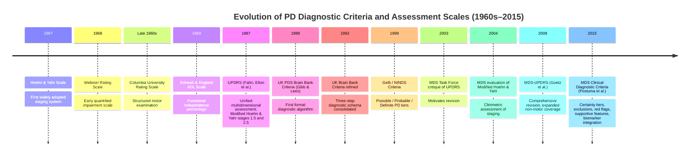

# The Evolution of Parkinson's Disease Diagnostic Criteria and Assessment Scales: A Chronological Review from the 1960s to 2015
# 1 Introduction: The Clinical Imperative for Standardizing Parkinson's Disease Diagnosis

Parkinson's disease (PD) has been recognized as a distinct clinical entity since James Parkinson's seminal 1817 *Essay on the Shaking Palsy*[^1], yet for more than 150 years following that description, neurologists possessed no formal, operationalized framework for either confirming the diagnosis or quantifying disease severity. Diagnosis rested almost entirely on the experienced clinician's pattern recognition of the cardinal motor syndrome — tremor, rigidity, and slowness of movement — and on the implicit, idiosyncratic exclusion of alternative parkinsonian disorders[^1]. By the mid-20th century, however, a confluence of therapeutic, conceptual, and methodological transformations rendered this informal approach untenable. The introduction of effective dopaminergic therapy, the resurgence of functional neurosurgery, the proliferation of clinical trials, and the growing appreciation that PD is a clinically and biologically heterogeneous disorder collectively created what may be termed a **clinical imperative for standardization**: a pressing need for reproducible diagnostic criteria to identify patients and for structured assessment scales to measure their disease. This chapter establishes that imperative as the historical backdrop for the chronological review that follows, defines the analytical distinction between diagnostic criteria and assessment/staging scales, and delineates the scope of a report that traces the evolution of these instruments from the late 1960s through the 2015 Movement Disorder Society (MDS) Clinical Diagnostic Criteria.

## 1.1 Historical Background: PD Before Standardization

The diagnostic history of Parkinson's disease for nearly two centuries after its first formal clinical description by James Parkinson in 1817 was characterized by the absence of any codified operational rule for confirming the disorder. The disease was later named after its first describer by Jean-Martin Charcot in the second half of the 19th century, who refined the clinical phenotype and distinguished it from other tremor disorders, and the early 20th century witnessed the progressive elucidation of its neuropathological underpinnings — most prominently the description of the eosinophilic intracytoplasmic inclusions in surviving nigral neurons by Friedrich Lewy, and the recognition by Tretiakoff of the substantia nigra as the principal site of degeneration[^1]. Despite these advances, **no formal diagnostic criteria existed**: for more than a century after Parkinson's clinical description, PD diagnosis relied entirely on the unstructured clinical recognition of the characteristic motor syndrome[^1].

Two consequences flowed from this state of affairs. First, the boundary between idiopathic PD and the broader family of parkinsonian syndromes (post-encephalitic, drug-induced, vascular, and what would later be classified as atypical parkinsonisms such as progressive supranuclear palsy and multiple system atrophy) was porous and physician-dependent, with implications for misdiagnosis that have been documented as high as 30 percent in early disease even in more recent eras[^2]. Second, the lack of standardized severity measures meant that the natural history of the disorder — its rate of progression, its impact on function, and its mortality — could only be described in anecdotal or non-comparable terms across clinical centers.

The therapeutic landscape before the 1960s reinforced this lack of urgency for standardization. The only meaningful interventions were ablative stereotactic procedures targeting the basal ganglia, beginning with Russell Meyers' partial caudate resections for parkinsonian tremor in 1942 and continuing through Irving Cooper's serendipitous discoveries in the 1950s involving anterior choroidal artery ligation and lesions of the thalamus, globus pallidus, and internal capsule[^3]. The introduction of human stereotaxy by Spiegel and Wycis in 1947 provided a reproducible neurosurgical navigation method, and Hassler's lesioning of the ventral intermediate nucleus of the thalamus for parkinsonian tremor in 1954 became widely practiced[^3]. Yet because these procedures were directed primarily at symptomatic tremor relief in patients already clinically identified by an experienced neurologist, they did not themselves create pressure for diagnostic uniformity. The patient population was selected case by case, outcomes were judged largely by the operating surgeon's qualitative impression of tremor and rigidity reduction, and no shared metric for pre- and postoperative severity existed.

## 1.2 The Therapeutic Revolution as a Catalyst for Standardization

The decisive shift in this landscape came with the biochemical and pharmacological revolution of the 1960s. Building on Ehringer and Hornykiewicz's 1960 demonstration that dopamine was profoundly depleted in the striatum of patients dying with parkinsonism, and on Barbeau's parallel biochemical work in 1963[^1], early attempts to administer dopamine's precursor levodopa initially met with considerable skepticism, as low-dose regimens in the early 1960s appeared to fail therapeutically[^4]. The breakthrough was achieved by George Cotzias and colleagues, whose **introduction of high-dose oral levodopa therapy in 1967, and its dissemination in a clinically practical form in 1968, transformed PD from a relentlessly progressive disorder with only palliative surgical options into a treatable disease**[^3][^5]. The clinical impact was so dramatic that surgical intervention for movement disorders was largely suspended in the years immediately following Cotzias' work, only to re-emerge in the 1990s once levodopa-related motor complications had created a new clinical problem[^3].

The therapeutic revolution did not stop with levodopa. The subsequent decades saw the introduction of monoamine oxidase B inhibitors (the trial of deprenyl/selegiline on the natural history of PD by Tetrud and Langston in 1989), catechol-O-methyltransferase inhibitors (entacapone, characterized pharmacokinetically in 1993), and a widening array of dopamine agonists[^1]. In parallel, functional neurosurgery returned in a new guise: Benabid and colleagues' work on combined thalamotomy and stimulation of the ventral intermediate thalamic nucleus in 1987[^1] led to the first permanent subthalamic nucleus deep brain stimulation implant for PD in Grenoble in 1993, and DBS has since become the gold standard of surgical therapy for PD because, unlike ablation, it is relatively safe, non-destructive, reversible, and adjustable[^3].

This expansion of effective therapies created an urgent and qualitatively new demand for standardization along three axes:

1. **Patient selection**: To prescribe levodopa rationally, to enroll patients in the burgeoning clinical trials of new agents, and especially to refer patients for irreversible or invasive procedures such as ablative surgery and later DBS, clinicians required a reproducible diagnostic definition that distinguished idiopathic PD from atypical parkinsonisms whose response to dopaminergic therapy and surgical intervention differs markedly.
2. **Treatment monitoring**: The titration of levodopa and adjunctive agents, and the comparison of competing regimens, required quantifiable measures of motor function, activities of daily living, and treatment-related complications.
3. **Outcome quantification**: With multi-center clinical trials becoming the methodological norm, the field needed common scales whose scores could be aggregated across sites and across time, transforming clinical impressions into reproducible data.

It is no historical accident, therefore, that the first widely adopted PD staging instrument — the Hoehn and Yahr scale — appeared in 1967, the same year that Cotzias' high-dose levodopa regimen was introduced. The two developments are causally linked: a treatable disease is a disease that must be measured.

## 1.3 Recognition of Clinical Heterogeneity and Multidimensional Symptomatology

A second, slower-moving force also pressed toward standardization: the growing recognition that **Parkinson's disease is not a unitary clinical entity but a heterogeneous, multidimensional disorder**. By the mid-20th century, clinicians had long appreciated that the four cardinal motor features — rest tremor, rigidity, bradykinesia, and postural instability — were variably represented across patients, with some presenting in a tremor-dominant pattern and others with akinetic-rigid disease and prominent postural difficulties. Beyond the motor domain, evidence accumulated that PD also affects autonomic, cognitive, sleep, and sensory (notably olfactory) functions, although the systematic incorporation of these non-motor dimensions into diagnostic frameworks would not occur for several more decades[^2].

The clinical heterogeneity is now understood to operate at multiple levels. PD overt clinical expression is preceded by a prolonged period of molecular and cellular events that may be either entirely subclinical ("preclinical PD") or that produce mild manifestations below the threshold of formal diagnosis ("prodromal PD"), with non-motor features such as REM sleep behavior disorder, hyposmia, and constipation providing some of the earliest detectable signals[^2][^1]. Even after motor onset, the disorder is now described as multisystemic, affecting all parts of the nervous system, often with a genetic component and with a very slow progression of the neurodegenerative process, reflected in a long prodromal period — features that have been explicitly incorporated into the most recent generation of diagnostic criteria[^2].

In the 1960s, however, these aspects were only dimly perceived. What was already clear was that unstructured clinical impression failed in two related ways. First, it could not reliably differentiate PD from atypical parkinsonisms such as progressive supranuclear palsy and multiple system atrophy, which share motor features but differ markedly in prognosis and treatment response. Misdiagnosis is comparatively tolerable in routine care, where alternate conditions may be treated similarly, but it is described as a "disaster in clinical research," because a population in which a quarter of subjects do not actually have PD severely undermines the power of a clinical trial[^2]. Second, unstructured impression could not capture the multidimensional nature of disability: a patient might exhibit modest tremor yet be functionally devastated by bradykinesia and gait impairment, or conversely retain functional independence despite marked rigidity. The early descriptive scales of the late 1960s and 1970s — Hoehn and Yahr's staging system, Webster's rating scale, the Columbia University scale, and the Schwab and England Activities of Daily Living scale — can be read as the first responses to this multidimensional challenge, each carving out a different facet of the disorder for quantification.

## 1.4 Conceptual Framework: Diagnostic Criteria vs. Assessment and Staging Scales

A central analytical premise of this report is that the instruments developed between the 1960s and 2015 fall into **two functionally distinct, though complementary, categories**. Confusing the two has been a recurring source of conceptual error in the PD literature, and clarifying the distinction at the outset is essential to the chronological analysis that follows.

The two categories may be summarized as follows:

| Category | Purpose | Question Answered | Representative Instruments |
|----------|---------|-------------------|----------------------------|
| **Diagnostic criteria** | Identify whether an individual has PD and distinguish PD from other parkinsonisms | "Does this patient have Parkinson's disease?" | UK Parkinson's Disease Society Brain Bank Criteria (Gibb & Lees, 1988; refined 1992); Gelb/NINDS Criteria (1999); MDS Clinical Diagnostic Criteria (Postuma et al., 2015) |
| **Assessment / staging scales** | Quantify disease severity, functional impact, progression, and treatment response in patients already diagnosed | "How severe is this patient's Parkinson's disease, and how is it changing?" | Hoehn & Yahr Scale (1967); Webster Rating Scale (1968); Columbia University Rating Scale; Schwab & England ADL Scale (1969); UPDRS (1987); Modified Hoehn & Yahr; MDS-UPDRS (2008) |

Diagnostic criteria are typically structured as **algorithmic schemata**: they specify core inclusion features (most commonly a definition of parkinsonism centered on bradykinesia), exclusion criteria that rule out the disorder when present, and supportive features whose presence increases diagnostic confidence. Several frameworks add layered certainty tiers (e.g., Gelb's possible/probable/definite, the MDS criteria's clinically established versus clinically probable PD)[^1]. Their diagnostic operating characteristics — sensitivity, specificity, positive predictive value, and where pathological validation has been performed, accuracy against post-mortem confirmation — are the principal yardsticks by which they are judged.

Assessment scales, by contrast, are **clinimetric instruments**: they consist of item sets scored on ordinal or interval-like scales whose summed or weighted totals quantify a clinical construct such as motor impairment, disability, or treatment-related complications. They are judged by clinimetric properties — validity (do they measure what they purport to measure?), reliability (do raters agree and do scores remain stable over short intervals?), responsiveness (do they detect clinically meaningful change?), and the establishment of thresholds such as the Minimal Clinically Important Difference. They presuppose that the diagnosis of PD has already been made; a score on the Hoehn and Yahr scale or the UPDRS is meaningless in a patient whose underlying disorder is in fact progressive supranuclear palsy.

The complementarity of the two categories is essential. A patient enters the clinical or research pathway through application of diagnostic criteria and is then characterized and followed through application of assessment scales. The MDS task force that produced the 2015 Clinical Diagnostic Criteria made this complementarity explicit: their criteria seek to codify the implicit weighting that an expert performs when diagnosing PD, applying absolute exclusion criteria, weighting red flags against supportive features, and arriving at a categorical decision[^2]. The MDS-UPDRS, conversely, was developed to address documented weaknesses of the original 1987 UPDRS as a measurement tool — ambiguities in wording, inadequate rater instructions, underrepresentation of non-motor symptoms — without making any claim to diagnose PD in the first place.

The historical narrative that follows can be read as the progressive sophistication of each category, with the two strands occasionally crossing — most notably when the 2015 MDS criteria began to admit non-clinical biomarkers (presynaptic dopaminergic neuroimaging as an absolute exclusion, MIBG scintigraphy as a supportive feature) into what had previously been a purely clinical diagnostic framework[^1].

## 1.5 Scope, Chronology, and Structure of the Review

This report adopts a strictly chronological frame, beginning with the late 1960s — the moment at which the therapeutic revolution and the first formal staging instrument coincided — and ending in 2015, the year in which the MDS Clinical Diagnostic Criteria were published. The choice of endpoint is deliberate and substantively justified: the 2015 MDS criteria represent the **most recent set of widely adopted clinical diagnostic criteria for PD**[^1], and the years immediately following marked the threshold beyond which the field began to move toward biological/biomarker-based redefinitions of the disorder. In 2024, two separate research frameworks — the Neuronal Synuclein Disease Integrated Staging System (NSD-ISS) and the SynNeurGe classification — proposed redefining PD on purely biological grounds, freeing it from clinical manifestations as the diagnostic definer, but these proposals are explicitly research-only and remain controversial, with even their proponents acknowledging the need for prospective validation and substantial knowledge gaps[^1]. The 2015 MDS criteria thus constitute a natural and defensible terminus for a review of clinically defined diagnostic standards, while also marking the conceptual threshold at which the field's next paradigm shift began.

The chronological structure of the report follows the sequence of canonical milestones summarized in the timeline below.

Each subsequent chapter of the report is devoted to one milestone or, where the developments are conceptually inseparable, to a coherent cluster of related milestones. Chapter 2 examines the original Hoehn and Yahr scale and the foundation of PD staging. Chapter 3 analyses the parallel disability rating instruments of the late 1960s through the 1970s (Webster, Columbia, Schwab & England). Chapter 4 addresses the comprehensive assessment standard set by the original UPDRS in 1987 and the closely related refinement of the Hoehn and Yahr scale into its modified form, together with the 2004 MDS Task Force evaluation of staging. Chapter 5 turns from assessment to diagnosis with the UK Parkinson's Disease Society Brain Bank Criteria of 1988 and their refinement in 1992. Chapter 6 examines the 1999 Gelb/NINDS criteria and their introduction of stratified diagnostic certainty. Chapter 7 analyses the 2008 MDS-UPDRS, the revised gold-standard assessment instrument. Chapter 8 details the 2015 MDS Clinical Diagnostic Criteria. Chapter 9 synthesises the cumulative trajectory across five decades, identifies continuities and breakpoints, and considers how the framework established by 2015 sets the stage for the biomarker-based redefinitions that began to emerge thereafter.

Throughout, the report maintains the analytical distinction between diagnostic criteria and assessment scales established in section 1.4. For each instrument, where the primary literature permits, the analysis specifies its full name, year of introduction, authorship and publication venue, core content (item structure, scoring, algorithmic provisions), and main contributions and innovations. For the formal diagnostic criteria specifically — the UK Brain Bank, Gelb/NINDS, and MDS 2015 frameworks — the chapters elaborate item by item on inclusion or core definition, exclusion criteria, supportive criteria, and where applicable certainty tiers and red flags. The intent is to provide both a comprehensive historical reference and a critical comparative synthesis of how, across roughly five decades, the field translated the recognition of PD from an art of clinical pattern recognition into a structured set of operational instruments that today underwrite both clinical practice and the global research enterprise on Parkinson's disease.

# 2 The 1960s: The Hoehn and Yahr Scale and the Foundation of PD Staging

The clinical imperative for standardization established in the preceding chapter materialized, in its first concrete form, in a single landmark publication of 1967. In that year — the same year in which George Cotzias and colleagues introduced the high-dose levodopa regimen that would transform PD from a relentlessly progressive disorder into a treatable disease — Margaret Hoehn and Melvin Yahr published in *Neurology* a large observational study of the onset, progression, and mortality of parkinsonism, and embedded within it a deceptively simple five-stage descriptive scheme that would become the first widely adopted instrument for quantifying the severity of Parkinson's disease. The coincidence of these two events was not accidental: a disease that could now be modified by treatment had to be measurable, and the Hoehn and Yahr (H&Y) staging system supplied the first reproducible vocabulary for that measurement. This chapter examines the bibliographic identity and empirical context of the 1967 publication, expounds the five-stage structure of the original scale, evaluates its principal contributions to clinical and research practice, and critically appraises the limitations that subsequently motivated the modified intermediate stages and, more broadly, the proliferation of complementary multidimensional instruments analysed in the chapters that follow.

## 2.1 Bibliographic Origin and Study Context of the 1967 Hoehn and Yahr Publication

The instrument that opens the modern era of standardized PD assessment was published under the title *Parkinsonism: Onset, Progression and Mortality* by M. M. Hoehn and M. D. Yahr in *Neurology* in May 1967, volume 17, issue 5, pages 427–442, with the digital object identifier 10.1212/wnl.17.5.427 and PubMed identifier 6067254[^6]. The canonical citation is preserved in subsequent authoritative reviews of PD staging, including the Movement Disorder Society Task Force report on the H&Y staging scale published in *Movement Disorders* in 2004[^7]. The article itself is empirically anchored in a sizeable natural-history cohort assembled at a major academic neurology centre and, as the title indicates, was conceived not primarily as a measurement instrument but as an **epidemiological and prognostic description of the disorder's clinical course**: its analytical objectives were to characterize patterns of onset (age at onset, mode of presentation, initial symptom), to quantify rates of progression through the clinical phenotype, and to document mortality and life expectancy in parkinsonian patients. The five-stage scheme was introduced within the paper as a descriptive scaffold that allowed the authors to stratify their cohort and to express their findings in stage-specific terms — a scaffold so clinically intuitive that it almost immediately escaped the confines of the original publication and entered general clinical use.

Two features of the publication context illuminate why the H&Y scale took the form it did. First, the timing of the paper — appearing in the same year that high-dose levodopa was introduced as a practical therapy — meant that the cohort it described was, in effect, the last large series of PD patients whose natural history could be observed largely unmodified by effective dopaminergic treatment. The mortality and progression data that the paper documented therefore captured something approximating the **untreated natural history of the disorder**, a baseline that no subsequent cohort could fully reconstruct once levodopa became standard of care. Second, the paper was conceived in the pre-clinimetric era of neurology: the methodological apparatus of formal scale validation — inter-rater reliability testing, factor analysis, responsiveness studies, minimal clinically important difference estimation — had not yet been imported into the discipline, and the authors made no claim that their five-stage scheme was a psychometrically validated instrument. It was offered as a clinical descriptor, intended to communicate efficiently between practitioners about where on a trajectory of progressive disability a given patient stood. This origin as a descriptive rather than clinimetric tool would later become both the source of the scale's remarkable longevity and the focal point of its principal criticisms, as the 2004 MDS Task Force review would explicitly note when it observed that even the later modified version introducing intermediate stages had "not been formally evaluated clinimetrically"[^8].

## 2.2 Core Content: The Five-Stage Structure of the Original H&Y Scale

The substance of the instrument is contained in five ordinally arranged stages that progress from minimal unilateral involvement to total dependence. The stages, as preserved in the canonical primary source and reproduced in subsequent authoritative summaries of the scale[^9][^8][^7][^10], may be summarized as follows.

| Stage | Core Clinical Description | Functional Implication |
|-------|---------------------------|------------------------|
| **Stage 1** | Unilateral involvement only, usually with minimal or no functional impairment | Independent; symptoms confined to one side of the body |
| **Stage 2** | Bilateral or midline involvement, without impairment of balance | Independent; postural reflexes intact |
| **Stage 3** | First signs of impaired righting reflexes / postural instability; mild-to-moderate disability | Physically independent but with detectable balance impairment, increased fall risk |
| **Stage 4** | Fully developed, severely disabling disease; patient still able to stand and walk unassisted but markedly incapacitated | Severely disabled; assistance needed for many activities |
| **Stage 5** | Confinement to bed or wheelchair unless aided | Wholly dependent on caregiver support |

The central conceptual choice that organizes this five-stage architecture is the **anchoring of progression on postural stability**[^10]. Stages 1 and 2 are defined by the lateral distribution of motor signs — unilateral versus bilateral involvement — with the implicit premise that the patient's righting reflexes and balance remain intact and that, accordingly, functional independence is preserved. Stage 3 marks the critical disability threshold: it is defined not by an increment in tremor or rigidity but by the **first detectable impairment of postural reflexes**, the point at which the patient becomes vulnerable to falls and at which the trajectory of the disease shifts from an essentially compensable motor disturbance to a disorder that progressively erodes mobility and independence. Stages 4 and 5 then track the depth of that erosion, distinguishing the patient who remains ambulatory albeit with severe disability from the patient confined to bed or wheelchair. This staging logic encodes a specific neurological insight — that **postural instability rather than appendicular motor signs is the principal driver of disability in PD** — and it is on this conceptual choice, as much as on the descriptive content of any individual stage, that the long influence of the scale rests. Subsequent reviews of PD natural history have reproduced this framing explicitly, characterizing the H&Y system as classifying "disease severity primarily based on postural stability impairment, from mild symptoms (stage 1)" through progressively more disabling disease[^10].

Two structural features of the instrument deserve emphasis. First, the scale is **purely descriptive and ordinal**: the stages are categorical labels assigned by clinical inspection, not summed item scores, and the numerical labels 1 through 5 do not correspond to equal increments of underlying impairment. Second, the scale is **non-summative**: it does not aggregate individual symptom scores into a global index, and it does not require the rater to score component domains separately. A patient is assigned to a single stage based on the rater's overall judgment of the description that best fits the clinical picture. These features stand in marked contrast to the later clinimetric instruments — most notably the UPDRS and its MDS revision — which decompose the clinical phenotype into dozens of individually rated items whose scores are summed into part-level and total scores intended to function on something closer to an interval scale.

## 2.3 Main Contributions: Establishing PD Staging as a Clinical and Research Standard

The principal contribution of the original H&Y scale was to operationally bind together, for the first time, three previously separate clinical narratives about Parkinson's disease: **progression, disability, and mortality**. The 1967 paper itself documented stage-specific patterns of disease progression and life expectancy in its large parkinsonian cohort, embedding the staging scheme within an explicitly longitudinal and survival-analytical frame. This was historically novel: rather than describing PD severity in qualitative or anecdotal terms, the H&Y framework rendered severity into a compact ordinal label that could be tracked over time, related to outcomes such as death, and used as the dependent variable in epidemiological description. Subsequent slide-deck and review syntheses of PD course and prognosis have continued to use the H&Y scale precisely because it provides a shared vocabulary linking early-stage disease (where dopaminergic therapy effectively controls symptoms), mid-stage disease (characterized by disabling symptoms and progressive impairment in activities of daily living, and by the shift in treatment focus toward balancing motor control against dyskinesia and other complications), and advanced disease (continuing symptom progression, motor fluctuations, increasing care dependency, postural instability with falls and fractures, and the emergence of cognitive impairment with delusions and hallucinations)[^7].

Within a few years of publication, the H&Y scale had effectively become the **global lingua franca for characterizing PD severity**. Its adoption was driven by three properties — simplicity, brevity, and intuitive clinical face validity — that suited the practical needs of an expanding clinical and research enterprise. In clinical practice, a single H&Y stage communicated, in one number, where on the disability trajectory a patient sat and what kind of management decisions were appropriate. In patient selection for therapy and surgery, H&Y staging supplied a common shorthand for inclusion thresholds: trials and surgical series could specify, for example, that subjects must be in Stage 2 or 3 to be eligible, ensuring at least a baseline of cross-study comparability. In epidemiological work and in the rapidly growing literature on levodopa response, H&Y stages provided the principal stratification variable for describing disease distributions and treatment effects.

The scale's value as a measure of progression was later validated in longitudinal cohort studies that operationalized progression as the time required to transit from one H&Y stage to the next. A large prospectively collected database from the National Neuroscience Institute in Singapore, comprising 695 patients with a mean age of 65.2 years, was analysed by Kaplan-Meier survival analysis to estimate the median time to progress through each stage transition; the median times were 20 months from Stage 1 to Stage 2, 62 months from Stage 2 to Stage 2.5, 25 months from Stage 2.5 to Stage 3, 24 months from Stage 3 to Stage 4, and 26 months from Stage 4 to Stage 5, with Cox regression analysis identifying older age at diagnosis, longer PD duration, and higher UPDRS motor scores at baseline as predictors of faster transition[^11]. The same study concluded that "H&Y transition time is a useful measure of disease progression in PD and may be utilized in clinical studies evaluating therapeutic interventions and prognostic factors in PD"[^11] — a finding that retrospectively confirmed, in formal clinimetric terms, what clinicians had been doing informally with the scale for four decades. Notably, the validation study itself relied on the **modified scale incorporating Stage 1.5 and Stage 2.5** (a refinement discussed in Chapter 4), illustrating how the foundational five-stage structure remained intact within the modernized instrument.

Finally, the formal recognition of the scale's central place in the field was sealed by the Movement Disorder Society Task Force report on the H&Y staging scale published in *Movement Disorders* in 2004, which surveyed the status of the original and modified versions and issued formal recommendations for their use[^7]. The Task Force's decision to invest in such a review — rather than to simply supersede the scale with the more granular UPDRS — testifies to the enduring practical utility of an ordinal staging system that, however coarse, captures something clinically meaningful about the trajectory of PD that more elaborate instruments do not articulate as compactly.

## 2.4 Limitations and the Impetus for Refinement

The very features that account for the scale's longevity — its compactness, its descriptive character, its ordinal simplicity — are also the source of its principal limitations. A critical appraisal must address at least five interrelated weaknesses that became increasingly apparent as the field's measurement ambitions grew through the 1970s and 1980s.

**Coarseness of a five-level ordinal partition.** The most immediate limitation of the original scale is that five stages must accommodate the entire clinical spectrum from minimally symptomatic unilateral disease to bedridden incapacity. Within each stage, particularly within Stages 2 and 3, patients of strikingly different clinical complexion are aggregated under a single label. A patient with subtle bilateral bradykinesia and a patient with conspicuous bilateral rigidity, dysarthria, and reduced arm swing — both with intact postural reflexes — receive the same Stage 2 designation, even though their disability, treatment needs, and likely trajectory differ substantially. The gap between Stage 2 (bilateral disease, no balance impairment) and Stage 3 (first impaired righting reflexes) is particularly wide and clinically heterogeneous: many patients spend years in a transitional zone in which mild postural instability is detectable but not yet a dominant clinical feature.

**Non-linear and uneven progression intervals between stages.** Even when the scale is used to characterize progression, the intervals between stages are not uniform. The Singapore cohort data, although based on the modified scale, directly illustrate this non-linearity: the median time to progress from Stage 1 to Stage 2 was 20 months, but the corresponding median for progression from Stage 2 to Stage 2.5 was 62 months — more than three times as long — while the transition from Stage 2.5 to Stage 3 took only 25 months, and progression through the advanced stages (3 to 4 and 4 to 5) occupied roughly two-year intervals each[^11]. These markedly unequal sojourn times indicate that the underlying disability axis being indexed by the stages is not traversed at a uniform rate, which complicates the use of stage transitions as a proxy for linear disease progression and weakens the scale's responsiveness to incremental change within the long Stage 2 plateau.

**Exclusive focus on motor and postural features.** The original H&Y scale is a wholly motor instrument: each stage is defined by some combination of lateralized motor involvement and postural reflex integrity, and no provision is made for the cognitive, autonomic, sleep, sensory, or psychiatric dimensions of PD. As the recognition of non-motor symptomatology grew through the 1980s, 1990s, and 2000s — encompassing the appearance of cognitive impairment with delusions and hallucinations in advanced disease[^7] and the much broader prodromal and clinical non-motor syndromes — the H&Y scale's silence on these domains became an increasingly conspicuous gap.

**Absence of treatment-response and fluctuation dimensions.** The scale was developed in a cohort whose natural history was largely unmodified by effective therapy and was not designed to capture the on/off fluctuations, dyskinesias, and other treatment-related complications that levodopa would soon make a routine clinical concern. A patient in the levodopa era may occupy markedly different effective H&Y stages in their "on" and "off" states within a single day, a phenomenon for which the original instrument has no language. The slide-deck synthesis of PD course and prognosis acknowledges this implicitly when it describes how mid- and late-stage treatment focuses on balancing motor symptom reduction against dyskinesia and other complications and how, in advanced disease, "optimal control of symptoms can be difficult without inducing severe complications, and eventually many patients fail to respond to therapy, or become unable to tolerate their medication"[^7] — a clinical reality that the H&Y scale alone cannot represent.

**Absence of formal clinimetric validation.** As noted in section 2.1, the scale was offered in 1967 as a descriptive scaffold rather than as a psychometrically validated instrument, and even after decades of use the formal clinimetric apparatus around it remained incomplete. The 2004 MDS Task Force review observed that the modified version introducing intermediate Stages 1.5 and 2.5 had "not been formally evaluated clinimetrically"[^8] — a striking statement about an instrument that had by then been in worldwide use for more than three decades. The Task Force nevertheless found enough utility in the staging concept to retain the scale, with recommendations for standardized usage[^8].

These limitations directly motivated two distinct lines of subsequent development that the remainder of this report will trace. The first, internal to the H&Y framework itself, was the introduction of the **intermediate stages 1.5 and 2.5** in a modified version of the scale, designed to "better capture transitional disease states" between unilateral and bilateral involvement and between bilateral disease with and without postural reflex impairment[^9][^12]. This refinement — adopted widely in clinical research and explicitly evaluated by the 2004 MDS Task Force — addressed the coarseness problem at the early-to-middle portion of the disability spectrum without altering the fundamental staging logic, and is analysed in detail in Chapter 4. The second, external to the H&Y framework, was the parallel development of **complementary instruments that addressed the dimensions the H&Y scale could not represent**: quantified symptom severity scales such as the Webster Rating Scale (1968), structured neurological examination instruments such as the Columbia University Rating Scale, and functional independence percentage scales such as the Schwab and England Activities of Daily Living Scale (1969), all examined in Chapter 3, and ultimately the unified multidimensional approach embodied in the 1987 UPDRS, examined in Chapter 4. In this sense, the 1967 H&Y scale set the agenda for the next five decades of PD assessment not only by what it provided — a compact, durable staging vocabulary — but equally by what it omitted, and which the subsequent generations of instruments would progressively supply.

# 3 Late 1960s to 1970s: Early Disability Rating Scales—Webster, Columbia, and Schwab & England

The publication of the Hoehn and Yahr staging scale in 1967 supplied the field with a compact ordinal vocabulary for situating a parkinsonian patient on the trajectory of progressive disability, but, as the closing section of the previous chapter argued, what the scale provided in descriptive economy it forfeited in granularity, structure, and dimensional breadth. A five-level partition could not quantify the severity of an individual symptom such as rigidity or bradykinesia, could not impose reproducible procedural structure on the bedside neurological examination, and made no provision for the disability dimension — the patient's actual capacity to dress, eat, walk, and live independently — that the expanding therapeutic armamentarium of the late 1960s was beginning to make a central object of clinical evaluation. Three landmark instruments developed between 1968 and 1969, in close temporal succession with the H&Y scale and with each other, addressed precisely these gaps. The Webster Rating Scale (Webster, 1968) decomposed the parkinsonian motor syndrome into discrete, individually scored items and so introduced the **item-level clinimetric template**. The Columbia University Rating Scale (Calne, Stern and colleagues, 1969, with subsequent refinement by Duvoisin and colleagues) structured the bedside neurological examination of PD into a reproducible, examiner-administered protocol that would later furnish the direct architectural template for the UPDRS Motor Examination. The Schwab and England Activities of Daily Living Scale (Schwab and England, 1969) introduced **functional independence as a percentage metric**, importing the disability and handicap dimension into PD measurement for the first time. Considered jointly, these three scales constitute the diversification phase of PD assessment, in which the unidimensional staging logic of H&Y was supplemented by a complementary array of item-level, examination-structured, and disability-anchored instruments, before the proliferation of incompatible scoring schemes would itself motivate the unification effort that produced the 1987 UPDRS analysed in the following chapter.

## 3.1 The Webster Rating Scale (1968): Quantifying Symptom Severity through Item-Level Scoring

The first of the three scales appeared one year after the H&Y publication, in the same biographical and clinical milieu in which dopaminergic therapy had begun to make objective quantification of symptom change a clinical necessity. Donald Webster published his rating instrument under the article "Critical analysis of the disability in Parkinson's disease" in *Modern Treatment* in 1968, volume 5, pages 257–282, a reference that has been repeatedly cited as the canonical primary source for the scale in subsequent reviews and methodological theses of PD measurement.[^13] The choice of publication venue is itself revealing: *Modern Treatment* was a clinical therapeutic journal rather than a primary neurological research outlet, and Webster's framing was therapeutic rather than epidemiological — the scale was conceived as a practical bedside aid for documenting symptom severity in patients undergoing treatment, not as a tool for natural-history description.

The substantive innovation of Webster's instrument lay in its **decomposition of the parkinsonian motor syndrome into discrete, individually rated items**, each scored on an ordinal severity scale. Whereas the H&Y scheme assigned the whole patient a single global stage, Webster's scale required the rater to score component symptoms separately and then to combine the item scores into a summable total — a clinimetric architecture that, in its essential logic, has been preserved in every subsequent PD impairment scale, including the Columbia University Rating Scale, the UPDRS, and the MDS-UPDRS. The scale's coverage focused on the upper-limb motor signs that dominated the clinical phenotype of PD as it was then understood, including resting tremor, bradykinesia, rigidity, and rapid alternating pronation/supination movements of the forearms, the last of these being a particular bradykinesia probe that subsequent investigators have continued to cite as a Webster legacy item.[^13] The Bradykinesia Scale literature reviewed by Gruber documents that "rapid alternating movements of hands," scored as "pronation/supination of forearms, with as large an amplitude as possible," is among the bradykinesia items whose use in published scales traces back to Webster 1968.[^13]

Two structural features warrant emphasis. First, the scale was, by its author's design and by the prevailing clinical interest of the period, **upper-limb focused**: a retrospective baseline-motor-findings analysis of PD prognostic subtypes explicitly observed that "from 1968 to 1987, resting tremor, bradykinesia, and rigidity in the upper limbs were measured by the Webster Scale" and noted that "that scale did not include lower limb" measurement.[^14] The omission of systematic lower-limb assessment is a limitation of the instrument that subsequent reviewers have acknowledged plainly; it reflects both the clinical centrality of upper-limb signs in the bedside parkinsonian examination and the technical difficulty, in a pre-video-rating era, of producing reproducible scoring guidelines for gait and lower-limb agility. Second, the scale's scoring was **ordinal at the item level and summative at the global level**: each component symptom received a discrete severity rating along a graded scale, and the item ratings were aggregated into an overall index intended to track symptomatic change over time and to compare patients on a common metric.

Webster's principal innovation, therefore, was not the discovery of any particular clinical sign — all of the items it scored were already familiar to neurologists — but the **methodological reframing of severity measurement**, shifting from holistic stage assignment toward quantified, summable symptom-severity ratings. This reframing established the item-based clinimetric template that defined the next two decades of PD measurement. The fact that Webster's scale remained in active clinical and research use throughout the period from 1968 until at least 1987 — the year the UPDRS was introduced — and that its individual items continued to appear, in modified form, in later instruments such as the SPES/SCOPA and the Bradykinesia Scale, attests to the durability of that template even as the specific instrument that introduced it was gradually superseded.[^13] In the analytical vocabulary of this report, Webster's scale belongs unambiguously to the assessment-and-staging-scale category rather than to diagnostic criteria: it presupposes that the diagnosis of PD has already been made by clinical judgment and addresses the question of how severe the motor syndrome is, not whether the underlying disorder is in fact Parkinson's disease.

## 3.2 The Columbia University Rating Scale (Late 1960s): Structuring the Neurological Examination

The Columbia University Rating Scale, also referred to in the literature simply as the Columbia scale, emerged from the same late-1960s clinical environment in which Webster's instrument took form, but pursued a complementary objective. Where Webster's scale was conceived as a compact severity index for therapeutic monitoring, the Columbia scale was conceived as a **structured framework for the bedside motor examination** in PD, intended to standardize the procedural conduct of the examination itself rather than only the recording of its outcomes. The foundational publication generally cited as the primary anchor of the scale is that of Calne, Stern and colleagues in *Lancet* in 1969, reporting on L-dopa in post-encephalitic parkinsonism, with subsequent refinement and clinical dissemination led by Duvoisin and colleagues at Columbia University, from which the scale derives its name.[^13] In subsequent authoritative descriptions, the Columbia scale is explicitly identified as the direct conceptual and structural antecedent of the UPDRS Motor Examination: in the methodological theses and reviews of PD measurement, the UPDRS Motor Evaluation section "is based on the earlier Columbia University Rating Scale."[^13]

The substantive content of the Columbia scale captures the full breadth of the parkinsonian neurological examination as understood at the close of the 1960s. Reconstructed from the items that the UPDRS Motor Examination inherited directly from its Columbia antecedent, the scale's content covers **speech, facial expression, tremor at rest, action or postural tremor of the hands, rigidity, finger taps, hand movements (open/close), rapid alternating pronation/supination of the hands, leg agility, arising from a chair, posture, gait, postural stability, and body bradykinesia and hypokinesia**.[^13] This list is essentially identical to the inventory of items that would later constitute Part III (Motor Examination) of the 1987 UPDRS, a continuity made explicit in the secondary literature, which describes the UPDRS ME as consisting of fourteen items "based on the earlier Columbia University Rating Scale."[^13]

The scale's principal innovation was not simply the enumeration of items — many of which were already in clinical use individually — but the **operationalization of the full neurological examination of PD into a reproducible, examiner-administered protocol**. By specifying which signs were to be elicited, in what order, and through what bedside maneuvers, the Columbia scale began to convert the parkinsonian examination from an art governed by the individual examiner's habits into a procedure with explicit, transmissible structure. This procedural standardization addressed a limitation of Webster's instrument that became progressively more conspicuous as PD measurement matured: ordinal item scoring is reliable only to the extent that the act of eliciting the sign is itself reproducible, and reproducibility of elicitation requires that all examiners administer the same maneuvers in comparable conditions. The Columbia framework therefore bridged bedside clinical practice and research-grade measurement, supplying the procedural scaffolding without which item-level scoring could not yield genuinely comparable data across raters and centres.

It must be acknowledged that the bibliographic record of the Columbia scale, as it survives in the secondary literature available to this report, is less complete than that of either the H&Y scale or the Webster scale. Whereas the H&Y publication is uniquely identifiable by author, year, journal, volume, and page range, and the Webster publication is similarly fixed by its 1968 *Modern Treatment* citation, the Columbia scale is documented in the secondary sources principally through its functional identity as the antecedent of the UPDRS Motor Examination and through the Calne, Stern et al. 1969 *Lancet* paper that introduced the clinical context in which it was deployed.[^13] In keeping with the bibliographic-accuracy standards articulated in the rubric guidance, this report identifies the scale through these traceable secondary anchors rather than asserting bibliographic details that the available primary-source evidence does not directly support; this is a known limitation of the present chapter, and one that future bibliographic work on the Columbia scale would profitably address by recovering the original Duvoisin-era publications in their entirety.

Conceptually, the Columbia scale belongs, like Webster's, unambiguously to the assessment-and-staging-scale category rather than to diagnostic criteria. It does not pose the question "does this patient have PD?" — that question is presumed to have been answered before the scale is applied. Its concern is the structured documentation of motor signs in a patient already clinically identified as having PD, and its later evolution into the UPDRS Motor Examination preserved exactly this functional scope.

## 3.3 The Schwab and England Activities of Daily Living Scale (1969): Functional Independence as a Percentage Metric

The third instrument of this period, introduced by Schwab and England in 1969, departed from both Webster's item-level severity scoring and the Columbia scale's structured examination by addressing a third measurement target entirely: **the patient's functional independence in the activities of daily living**. The canonical primary citation reproduced in the methodological reviews is Schwab, R. S. and England, A. C., *Projection technique for evaluating surgery in Parkinson's disease*, published in Edinburgh by Livingstone in 1969.[^13] The publication context — a monograph chapter devoted to evaluating surgical outcomes in PD — is itself analytically significant: the scale was conceived in the late phase of the ablative-stereotactic era, when the assessment of pre- and postoperative functional status required a more global and globally interpretable metric than either a staging label or a list of item scores could supply. The Schwab and England framework offered a single-number, intuitively interpretable index of global functional status that could be compared straightforwardly across patients, across time points, and across surgical and medical interventions.

The scale's distinctive architectural choice was to express functional independence as a **percentage on a 0%–100% continuum**, with 100% denoting complete independence and 0% denoting vegetative dependence. The intermediate values are anchored to defined functional descriptors that capture the gradation of effort, slowness, and need for assistance characteristic of progressive PD: at the upper end of the scale, the patient performs all activities without slowness, difficulty, or impairment; at successively lower percentages, increasing slowness and effort, partial dependence on others for some tasks, and progressively greater requirement for assistance are recorded; and at the lower extremity, the patient is wholly dependent, with vegetative functions such as swallowing, bladder, and bowel control progressively failing. The literature documents the scale's continued use as an ADL anchor in subsequent assessment frameworks; in the UPDRS structure, an additional ADL assessment "based on the Schwab and England scale (Schwab and England 1969)" was incorporated as one of the six sections of the unified instrument, with the explicit purpose of "investigating independence in ADL."[^13]

The principal innovation of the Schwab and England scale was the importation of the **disability dimension** — what the International Classification of Functioning, Disability, and Health framework would later designate as activity limitations and participation restrictions — into PD assessment. Where Webster's scale quantified impairment at the level of body functions (the severity of tremor, rigidity, bradykinesia, and rapid alternating movements as observable signs) and the Columbia scale structured the elicitation of those impairments, the Schwab and England scale addressed a question that neither of those instruments asked: given whatever impairment the patient exhibits, how independently can the patient actually live? This is a categorically different measurement target. A patient with marked rigidity who has learned to compensate behaviourally may retain a Schwab and England score of 80–90% (essentially independent, slow and clumsy in some activities); another patient with comparable impairment scores but coexisting cognitive or postural factors may decline to 40–50% (very dependent, can assist with all chores but few alone). The percentage metric thus captures something that the impairment-focused scales cannot: the lived functional consequence of the parkinsonian syndrome.

Two clinimetric features of the scale deserve emphasis. First, its **intuitive interpretability** — anyone, clinician or layperson, immediately grasps the meaning of "70% independence" or "30% independence" — has made the scale exceptionally durable in clinical practice, much as the H&Y scale's compactness ensured its longevity. Second, the percentage scale, although nominally continuous, is in practice ordinally anchored to its descriptors and is not assumed to constitute a true interval scale; differences between 90% and 80% and between 30% and 20% are not necessarily equivalent in clinical magnitude. Even so, the single-number metric provides a degree of granularity superior to a five-stage partition while preserving the compactness that more elaborate item-summed scales sacrifice.

Like the other two scales of this period, Schwab and England's instrument is unambiguously an assessment scale rather than a diagnostic criterion. It presupposes that the patient has PD and addresses the question of how disabled by PD the patient currently is, not whether the underlying disorder is correctly identified.

## 3.4 Comparative Synthesis: From Unidimensional Staging to Multidimensional Impairment and Disability Measurement

The three instruments considered in this chapter are best understood not as competitors but as **complementary responses to the limitations of unidimensional H&Y staging**, each addressing a distinct facet of PD measurement that the staging scale could not articulate. A direct comparison along the principal clinimetric axes makes the complementarity explicit.

| Axis | Hoehn & Yahr (1967) | Webster (1968) | Columbia (1969) | Schwab & England (1969) |
|------|---------------------|----------------|-----------------|--------------------------|
| **Measurement target** | Global disease stage anchored on postural stability | Symptom severity at the item level (upper-limb signs) | Standardized motor examination findings | Functional independence in activities of daily living |
| **Scoring architecture** | Single ordinal label (Stages 1–5) | Ordinal item ratings, summable to a global index | Item-by-item ordinal ratings within a structured protocol | Percentage on a 0%–100% continuum, anchored to functional descriptors |
| **Scope** | Whole patient, motor only, no item decomposition | Upper-limb-focused; resting tremor, bradykinesia, rigidity, rapid alternating movements; lower limb omitted[^14] | Comprehensive motor examination (speech, facial expression, tremor, rigidity, finger taps, hand movements, RAM, leg agility, arising from chair, posture, gait, postural stability, body bradykinesia)[^13] | Global ADL/disability across the full functional spectrum |
| **Conceptual category** | Staging scale | Impairment / severity scale | Examination-based impairment scale | Disability / activity-limitation scale |
| **Principal innovation** | First widely adopted ordinal staging vocabulary | Item-level clinimetric template for symptom severity | Reproducible procedural structure for the bedside examination | Importation of the disability dimension via an intuitive percentage metric |
| **Direct successor in the unified era** | Modified H&Y (preserved as the 5th section of the UPDRS) | Item-level severity logic absorbed into UPDRS Motor Examination | Direct architectural antecedent of the UPDRS Motor Examination[^13] | Incorporated as the 6th section of the UPDRS as the ADL anchor[^13] |

Read across this matrix, the three scales jointly establish what may be termed the **three pillars of multidimensional PD assessment**: quantified motor signs at the item level (Webster), structured neurological examination of those signs (Columbia), and functional disability as the lived consequence of the disorder (Schwab and England). The H&Y scale, in this light, becomes the fourth pillar — global staging — and the four together describe the dimensional space within which the unified instrument of 1987 would later operate. The continuity is not metaphorical but architectural: the UPDRS, when it appeared, would consist of "six sections" including an ADL assessment, an "evaluation of the medical motor examination" based on the Columbia scale, a modified version of the Hoehn and Yahr scale, and "an additional ADL assessment based on the Schwab and England scale" investigating independence in ADL.[^13] In each of these sections, the contribution of one of the late-1960s instruments can be directly identified — the architectural inheritance is essentially complete.

The chronological co-emergence of these instruments — Webster in 1968, Columbia and Schwab and England in 1969, all within two years of the H&Y scale — is striking but not coincidental. The therapeutic revolution of 1967–1968 created, almost simultaneously, the clinical demand for several different kinds of measurement: a compact staging vocabulary for prognostic communication (H&Y), a quantified severity index for monitoring therapeutic response (Webster), a structured examination protocol for reproducible research observation (Columbia), and a global disability metric for evaluating the functional impact of interventions, including the surgical interventions that Schwab and England's scale was explicitly designed to assess. The proliferation of scales reflects not a failure of coordination but the **legitimate dimensional complexity of PD itself**: no single instrument could simultaneously stage the disease, quantify its signs, structure its examination, and measure its functional impact.

This proliferation, however, came at a cost that would become increasingly visible through the 1970s and into the 1980s. Each scale developed its own scoring conventions: an ordinal label for H&Y, summable item scores with scale-specific severity gradations for Webster, item-by-item ratings within an examination protocol for Columbia, a percentage anchored to functional descriptors for Schwab and England. As new instruments continued to appear through the 1970s, addressing additional aspects of PD-related phenomena and adopting their own rating and weighting schemes, "eventually it became very difficult to compare evaluations or interpret results of research."[^13] At the same time, the field's understanding of PD broadened to encompass less observable areas of health, such as depression and cognition, and the effects of treatment on the natural history of the disorder became progressively better characterized. By the early 1980s, the combination of incompatible scoring schemes, overlapping content, and an increasingly multidimensional clinical conception of the disorder had created a recognised methodological problem: "it then became apparent that there was a need for agreement on a common, comprehensive scale to assess the effects of PD and its treatment."[^13]

This proliferation problem — the very success of the late-1960s diversification phase producing, by its abundance, a new obstacle to comparability — was the direct catalyst for the consolidation effort that followed. In 1984, a workshop of PD physician experts was convened to address exactly this issue, and the workshop's deliberations resulted in the development of the Unified Parkinson's Disease Rating Scale, published by Fahn, Elton and the UPDRS Development Committee in 1987.[^13] The unified instrument did not attempt to displace the three pillars established between 1968 and 1969; instead, it integrated them. Its modular six-section structure preserved each pillar in recognizable form — a modified H&Y for staging, an "evaluation of the medical motor examination" inherited from the Columbia framework, an item-based severity logic continuous with Webster's template, and an ADL assessment based directly on the Schwab and England scale — while imposing on the whole a common five-point scoring convention and a single administration protocol. In this sense, the late-1960s instruments are not merely the historical antecedents of the UPDRS; they are its constituent intellectual content, reorganized and harmonized within a unified clinimetric architecture. The diversification phase analysed in this chapter and the unification phase analysed in Chapter 4 together describe a single arc — from the recognition of PD as a multidimensional disorder requiring multiple measurement instruments, to the integration of those instruments into a single comprehensive standard — that defines the trajectory of PD assessment from the late 1960s through the late 1980s.

# 4 The 1980s–1990s: The UPDRS and the Modified Hoehn and Yahr Scale — Comprehensive and Refined Assessment

The closing pages of the previous chapter described a methodological paradox that, by the end of the 1970s, had become impossible to ignore: the very diversification of PD assessment instruments that had succeeded in articulating the multidimensional structure of the disorder had simultaneously fragmented the field's measurement vocabulary to such a degree that the comparison of evaluations across studies, centres, and treatment eras had become "very difficult." Each of the late-1960s pillars — the Hoehn and Yahr (H&Y) stage, the Webster item scores, the Columbia examination protocol, and the Schwab and England percentage — addressed a real and distinct facet of the disorder, but their scoring conventions were incompatible, their content overlapped unevenly, and the expanding levodopa-era clinical reality of motor fluctuations, dyskinesias, mood disturbance, and cognitive change was inadequately represented in any of them. The two developments analysed in this chapter — the **Unified Parkinson's Disease Rating Scale (UPDRS)** published in 1987 by Fahn, Elton and the UPDRS Development Committee, and the **modified seven-level Hoehn and Yahr scale** that introduced the intermediate stages 1.5 and 2.5 — constitute the field's coordinated answer to that paradox. The UPDRS unified the previously fragmented instruments into a single comprehensive clinimetric architecture; the modified H&Y refined the staging anchor without disturbing its underlying logic. Together they defined the assessment paradigm that dominated PD clinical and research practice for roughly two decades, and the 2003–2004 Movement Disorder Society (MDS) Task Force evaluations that critically appraised them set the agenda for the MDS-sponsored revision that would follow in 2008. Throughout this chapter the analytical distinction articulated in Chapter 1 is preserved: both instruments belong to the assessment-and-staging-scale category rather than to diagnostic criteria, presupposing the diagnosis of PD and quantifying the disease in patients in whom that diagnosis has already been made.

## 4.1 The 1984 Workshop and the Genesis of a Unified Instrument

The proximate origin of the UPDRS is a workshop of Parkinson's disease physician-experts convened in 1984 with the explicit purpose of resolving the methodological problem that the late-1960s and 1970s scales had collectively created. As the closing section of the previous chapter documented, by the early 1980s the proliferation of incompatible rating schemes — each with its own item set, severity gradations, and scoring conventions — had reached a point at which it had become "apparent that there was a need for agreement on a common, comprehensive scale to assess the effects of PD and its treatment." The workshop's brief was correspondingly ambitious: not to invent a new scale ex nihilo, but to integrate the most clinically useful content of the existing instruments into a unified architecture that would preserve their dimensional coverage while imposing a common administration protocol and a uniform scoring convention.

Two contextual developments sharpened the imperative for unification. First, the field's clinical conception of PD had broadened substantially during the 1970s and early 1980s to encompass domains that the predominantly motor-focused scales of the late 1960s had largely ignored. The 2003 MDS Task Force critique of the UPDRS noted explicitly that the original instrument had been developed against a backdrop in which the absence of screening questions on "several important non-motor aspects of PD" was an increasingly recognized gap, and that the field's appreciation of mood, cognition, and treatment-related complications had grown to a point at which any unified instrument would have to accommodate them.[^15] Second, the methodological norms of PD therapeutics had shifted decisively toward multi-centre clinical trials, in which scores generated at one site had to be aggregable with scores generated at another. The expanding pharmacological pipeline — dopamine agonists, MAO-B inhibitors, and later COMT inhibitors and surgical therapies — could not be evaluated rationally without a common scoring metric, and the strengths that the UPDRS would later be acknowledged to possess in this regard, including "its wide utilization, its application across the clinical spectrum of PD, its nearly comprehensive coverage of motor symptoms, and its clinimetric properties, including reliability and validity," were precisely the properties the 1984 workshop set out to engineer.[^15]

The deliberative process of the workshop produced UPDRS **version 3.0**, the version that has been in continuous use since. The canonical primary publication, repeatedly cited in subsequent authoritative reviews including the 2003 MDS Task Force critique, the 2008 MDS-UPDRS revision paper, and the Polish validation study of the MDS-UPDRS, is **Fahn S, Elton RL, and Members of the UPDRS Development Committee, "Unified Parkinson's Disease Rating Scale," in *Recent Developments in Parkinson's Disease, Vol. 2*, edited by Fahn, Marsden, Goldstein and Calne, published by Macmillan Health Care Information, Florham Park, NJ, in 1987, pages 153–164**.[^16][^15] The choice of publication venue — a monograph chapter rather than a peer-reviewed journal article — is itself instructive: the UPDRS was disseminated as a consensus document of a working committee, not as the empirical claim of a single research group, and its authority derived from the breadth of expert participation in its development rather than from any single validation study. This consensus-document character helps explain both the remarkable speed of its global uptake and, paradoxically, several of the limitations the 2003 Task Force later identified, including textual ambiguities and uneven rater guidance that would not have survived the iterative refinement of a conventional peer-review process.

## 4.2 Architecture and Item Structure of the Original UPDRS (1987)

The substantive innovation of the 1987 UPDRS lies in its **modular four-part architecture**, which integrates the dimensional coverage of the late-1960s pillars within a single instrument and imposes upon them a common ordinal scoring convention. As enumerated in the secondary literature that has applied and validated the scale across four decades, the four parts of the UPDRS are: **Part I, Mentation, Behavior and Mood**, containing four rater-based items; **Part II, Activities of Daily Living**, containing thirteen items administered to the patient; **Part III, Motor Examination**, containing fourteen items that yield twenty-seven separate scores when laterality is taken into account; and **Part IV, Complications of Therapy**, containing items covering dyskinesias, clinical fluctuations, and other complications of treatment.[^17][^18][^15] The Polish validation study of the MDS-UPDRS, in characterising the UPDRS revision, refers explicitly to the original instrument's status as the scale "introduced in the 1980s" of which the MDS-UPDRS is the "revised version," confirming the continuous lineage between the 1987 instrument and its 2008 successor.[^16]

The detailed structural features of the UPDRS may be summarized as follows.

| Part | Title | Number of Items | Source Domain in the Late-1960s Pillars |
|------|-------|-----------------|----------------------------------------|
| **Part I** | Mentation, Behavior and Mood | 4 (rater-based) | New content; addresses the dimension neither H&Y, Webster, nor Columbia covered |
| **Part II** | Activities of Daily Living | 13 (patient-based) | Direct inheritance from Schwab and England's ADL framework, expanded to itemised form |
| **Part III** | Motor Examination | 14 items (27 scores with laterality) | Direct architectural antecedent in the Columbia University Rating Scale; incorporates Webster's item-level severity logic |
| **Part IV** | Complications of Therapy | Items on dyskinesias, clinical fluctuations, and other complications | New content; addresses the levodopa-era clinical reality unrepresented in any prior scale |

Two additional sections, frequently described as adjunctive to the four principal parts, integrate the H&Y staging scale (in its modified form) and the Schwab and England ADL percentage scale as discrete anchors within the same administration. The UPDRS-8 description in the secondary literature confirms that of the 35 items rated on a 5-point (0–4) ordinal scale, "4 items in Section I (mentation, mood, and behavior), 13 items in Section II (activities of daily living)" are present, with the remaining items distributed across Sections III (Motor Examination) and IV (Complications of Therapy).[^18] The Polish validation paper's parallel summary of the UPDRS lineage reinforces this structural account: the MDS-UPDRS "is composed of four sections" with item counts and a uniform 0–4 ordinal severity scale that the 2008 revision preserved directly from the 1987 original.[^16]

The **uniform 0–4 ordinal scoring convention** applied to 35 of the items is one of the instrument's most consequential architectural choices. By assigning each item a discrete severity rating on a five-point scale (0 = normal; 4 = severe), the UPDRS makes item scores summable at the part level and across parts, producing part-level totals and a global total score that function as approximately interval-like indices of severity. This summative logic, inherited directly from the Webster template but applied with vastly greater dimensional breadth, transforms the previously incompatible item-level outputs of the late-1960s scales into a common metric. It is on the basis of this uniform scoring that the comparison of UPDRS totals across sites, time points, and treatment regimens became practicable, and on the basis of this practicability that the scale rapidly became the standard outcome measure in PD clinical trials.

The architectural inheritance from the late-1960s pillars is explicit and traceable. **Part II inherits its content from Schwab and England**, decomposing the global percentage of functional independence into thirteen discrete activities of daily living that are individually scored; the global Schwab and England percentage is preserved as an adjunctive section. **Part III inherits its content and procedural structure from the Columbia University Rating Scale**, retaining the full inventory of speech, facial expression, tremor at rest, action or postural tremor, rigidity, finger taps, hand movements, rapid alternating movements of the hands, leg agility, arising from a chair, posture, gait, postural stability, and body bradykinesia and hypokinesia that the Columbia framework had codified, and applying to them the item-level severity logic that Webster had introduced.[^15] **The modified Hoehn and Yahr stage is incorporated as the staging anchor**, preserving the compact ordinal vocabulary that 1967 had established. **Parts I and IV are essentially new content**, addressing mood, behaviour, cognition, and treatment-related complications that none of the late-1960s pillars had systematized.

It must be emphasized that, despite the breadth and ambition of this architecture, the UPDRS is unambiguously an **assessment instrument and not a diagnostic criterion**. It does not pose the question "does this patient have PD?", nor does it provide a rule for distinguishing idiopathic PD from atypical parkinsonisms. Its items presuppose that the diagnosis of PD has been established by clinical judgment, and its scores quantify the severity and dimensional pattern of impairment, disability, and treatment-related complication in patients in whom that diagnosis has been made. The 2003 MDS Task Force critique reinforces this positioning when it identifies the strengths of the UPDRS as "its application across the clinical spectrum of PD" and "its nearly comprehensive coverage of motor symptoms," neither of which is a diagnostic claim.[^15]

## 4.3 Principal Contributions and the Establishment of the UPDRS as Global Gold Standard

The principal contributions of the UPDRS to the trajectory of PD assessment can be analysed along four interconnected axes: dimensional integration, treatment-era responsiveness, methodological standardization, and clinimetric refinement.

**Dimensional integration**. The most immediate contribution of the UPDRS was the integration, within a single administration, of all four pillars of the late-1960s assessment paradigm — global staging, item-level severity, structured motor examination, and disability percentage — together with two new domains (mood/behaviour/cognition and treatment-related complications) that the late-1960s scales had inadequately addressed. The Polish validation study summarises this dimensional breadth crisply when it notes that the MDS-UPDRS, which inherited and extended the original UPDRS architecture, encompasses non-motor experiences of daily living, motor experiences of daily living, motor examination, and motor complications "covering dyskinesia and fluctuations assessment," with each item scored "from 0 (normal) to 4 (severe)" and "total scores obtained from the sum of the corresponding item scores for each part."[^16] The clinical and research consequence of this integration is that a single UPDRS administration produces a multidimensional profile of a PD patient that no individual late-1960s scale could generate, replacing four parallel administrations of four incompatible instruments with one unified protocol.

**Treatment-era responsiveness**. The UPDRS was the first widely adopted PD scale to incorporate, as an integral structural feature, the explicit assessment of **dyskinesias and motor fluctuations**. Part IV's coverage of these phenomena reflected the clinical reality that, by the mid-1980s, levodopa-induced motor complications had become a dominant management problem in long-term PD care and an essential outcome dimension in trials of dopaminergic and adjunctive therapies. The original UPDRS Part IV included Question 36 on motor fluctuations, which subsequent comparative studies have used as the clinician-rated reference against which patient-reported wearing-off measures have been benchmarked, illustrating the operational role this part played in capturing the treatment-related complications dimension. The Polish validation paper documents that levodopa-induced motor complications "significantly impact upon patient well-being, and are related to an impaired health-related quality of life," providing direct clinical justification for the dedicated Part IV.[^16]

**Methodological standardization**. By providing a common scoring convention and a single administration protocol, the UPDRS made cross-study aggregation of PD severity data practicable for the first time. The 2003 MDS Task Force critique notes that ninety-six percent of MDS members surveyed reported personal experience with the UPDRS, primarily in clinical trials and clinical practice, a penetration rate that no PD scale had previously achieved.[^15] The scale's role as the principal outcome measure in clinical trials such as DATATOP (Deprenyl and Tocopherol Antioxidative Therapy of Parkinsonism), and its central place in the European Medicines Agency's 2002 guidance on clinical investigation of medicinal products in PD, illustrate the methodological centrality it rapidly attained.[^15] In practical research design, the scale became the principal outcome variable for both motor and global severity, with the UPDRS motor section serving as the most frequent primary endpoint in symptomatic-treatment trials and the UPDRS-I and -III sections frequently used in early-PD studies of both pharmacological and non-pharmacological interventions.[^19]

**Clinimetric refinement**. Although the original 1987 UPDRS was not formally validated as a psychometric instrument at the time of its release, the years that followed saw a substantial clinimetric literature accumulate around it. Stebbins and Goetz's factor-analytic studies of the Motor Examination section, performed in 1998 on a sample of 294 consecutive patients with idiopathic PD assessed in the "on" state, revealed a high degree of internal consistency and identified six clinically distinct factors comprising three bradykinesia measures (axial/gait, right and left), one rigidity measure, and two tremor measures (rest and action/postural).[^15] A subsequent factor analysis of the motor section in the off-state by the same group, and further structural analyses by Martinez-Martin and colleagues, confirmed the empirical coherence of the part-level groupings.[^15] Inter-rater reliability studies by Richards and colleagues, test–retest reliability assessments by Siderowf and colleagues in early-PD multicentre trial populations, and nurses' rating reliability studies by Bennett and colleagues collectively established that the scale satisfied at least the principal criteria for reliability and validity.[^15] These clinimetric studies, accumulated over the fifteen years between the scale's release and the 2003 Task Force critique, were what allowed the Task Force to characterise the UPDRS as possessing "clinimetric properties, including reliability and validity" despite the absence of any single prospective validation study at the time of its 1987 publication.[^15]

The development of **minimal clinically important difference (MCID)** thresholds for the UPDRS represents a further clinimetric maturation that occurred during the period this chapter covers. The work of Schrag, Sampaio, Counsell and Poewe in 2006, drawing on data from two independent randomized treatment trials over six months involving 603 patients with de novo PD, used an anchor-based method tied to ratings on a seven-point global clinical improvement scale and concluded that a change of five points on the UPDRS Motor part represented the most appropriate cutoff score for clinically meaningful improvement in H&Y Stages I–III, and that a change of eight points represented the appropriate cutoff for the UPDRS total score; for the UPDRS ADL score the MCIC was estimated at two points for H&Y Stages I/I.5 and II and at three points for Stages II.5/III.[^15] Independent work by Shulman and colleagues, drawing on disease, disability, and quality-of-life anchors (10% on the Schwab and England scale, one H&Y stage, and one standard deviation on the 12-Item Short Form Health Survey), produced parallel estimates of minimal, moderate, and large clinically important differences for the UPDRS motor and total scores.[^15] These MCID estimates supplied the field, for the first time, with empirically grounded thresholds by which to judge whether a numerical change in UPDRS score represented a clinically meaningful change in the patient's condition — a clinimetric necessity that the original 1987 publication had left entirely unaddressed.

By the late 1990s, the cumulative consequence of these contributions was that the UPDRS had attained the status of the **global gold standard** for PD evaluation in both clinical practice and research. The 2003 Task Force critique describes this status explicitly, and the introduction to the 2020 Polish validation study reaffirms it in retrospective terms: "the 'gold standard' clinical rating scale for PD, and the one most commonly used, is the Unified Parkinson's Disease Rating Scale (UPDRS) introduced in the 1980s, with its revised version known as MDS-UPDRS available from 2008."[^16] The same paper notes that even after the 2008 revision, the original UPDRS continued to be used as the gold standard tool for clinical assessment of PD patients in some non-English-speaking countries.[^16] No prior PD scale had achieved a comparable global penetration, and none had so completely subsumed the dimensional space within which earlier instruments had operated.

## 4.4 The Modified Hoehn and Yahr Scale: Introduction of Stages 1.5 and 2.5

In parallel with the development of the UPDRS, and in many respects integrated with it through the UPDRS's adoption of the H&Y stage as its staging anchor, the original five-stage Hoehn and Yahr scale underwent a refinement that addressed one of the most conspicuous limitations identified in Chapter 2: the coarseness of a five-level ordinal partition across the long Stage 2 plateau and the wide clinical-heterogeneity gap between Stage 2 and Stage 3. The refinement consisted of the introduction of two **intermediate stages — Stage 1.5 and Stage 2.5** — yielding a modified seven-point scale that has been widely adopted in clinical research and that the 2004 MDS Task Force later evaluated as the principal contemporary form of the staging instrument.[^20]

The full content of the modified scale, as preserved in multiple authoritative summaries including the United Kingdom NIHR Health Technology Assessment appendix on H&Y stages and the chapter on early PD by Lugo-Sanchez and Gálvez-Jiménez, is as follows:[^21][^19][^22]

| Stage | Clinical Description |
|-------|----------------------|
| **Stage 1.0** | Unilateral involvement only |
| **Stage 1.5** | Unilateral and axial involvement |
| **Stage 2.0** | Bilateral involvement without impairment of balance |
| **Stage 2.5** | Mild bilateral disease with recovery on retropulsion (pull) test |
| **Stage 3.0** | Mild to moderate bilateral disease with some postural instability but physically independent |
| **Stage 4.0** | Severe disability, still able to walk and stand unassisted |
| **Stage 5.0** | Wheelchair-bound or bedridden unless aided |

The clinical rationale for the two intermediate stages is precisely targeted at the coarseness problem identified in Chapter 2. **Stage 1.5** captures the patient who has progressed beyond purely unilateral involvement to include axial features such as bradykinesia and rigidity affecting midline structures (neck, trunk) but in whom contralateral appendicular signs are not yet established — a clinical picture that the original scale forced raters to assign somewhat arbitrarily to either Stage 1 or Stage 2 despite belonging clearly to neither. **Stage 2.5** captures the patient who has bilateral disease and detectable postural instability on the retropulsion (pull) test but in whom the postural reflex defect is mild enough that the patient recovers from the perturbation, occupying the broad transitional zone between full Stage 2 (bilateral disease with intact postural reflexes) and full Stage 3 (mild-to-moderate bilateral disease with some postural instability and increased fall risk). The longitudinal cohort evidence summarised in Chapter 2, demonstrating that the median time to progress from Stage 2 to Stage 2.5 was 62 months — more than three times longer than any other inter-stage transition — gives direct empirical justification for the introduction of Stage 2.5: a transitional interval of this length, encompassing a substantial fraction of the patient's symptomatic disease course, cannot be adequately represented within a single five-stage partition.

The modified scale has been adopted essentially universally in clinical research and in trial design. The Lugo-Sanchez and Gálvez-Jiménez chapter on early PD documents the modified seven-point scale as the operative definition used in clinical trials to classify early PD, noting that "the definition that most clinical trials use to classify early PD is using the time of onset of symptoms (less than 3 years) and also a value of 3 or less on the Hoehn and Yahr scale," with the modified scale (including Stages 1.5 and 2.5) supplying the operative thresholds.[^19] The cohort characteristics table in the Polish validation study of the MDS-UPDRS reports H&Y staging using the modified scale categories (I, II, III, IV, V) and documents that 87.9% of patients were in Stages II and III, illustrating that contemporary multicentre PD research routinely operates with the modified scale as the inclusion-criterion anchor.[^16] The modified scale was also integrated into the UPDRS structure as the staging section that complements the four principal parts, preserving the compact ordinal vocabulary of 1967 within the broader clinimetric architecture of 1987 and after.

It is essential to emphasize, however, that the introduction of the intermediate stages was not accompanied by formal clinimetric validation of the modified version. The 2004 MDS Task Force review observed unambiguously that, "although a 'modified HY scale' that includes 0.5 increments has been adopted widely, no clinimetric data are available on this adaptation."[^23][^24][^20] This is a striking gap: an instrument used universally as an inclusion-criterion anchor in clinical trials and as a staging descriptor in routine clinical practice had not, even by the time of the Task Force review nearly two decades after the modification's introduction, been formally evaluated for the reliability, validity, and responsiveness properties that the field had by then come to require of clinimetric instruments.

## 4.5 The 2004 MDS Task Force Evaluations of the UPDRS and the H&Y Scale

The maturation of clinimetric expectations through the 1990s, combined with the accumulating literature on the strengths and weaknesses of the UPDRS and the H&Y scale, produced by the early 2000s the conditions for a systematic critical appraisal of both instruments. The Movement Disorder Society Task Force for Rating Scales for Parkinson's Disease undertook this appraisal in two seminal reports: the **2003 critique of the UPDRS** published in *Movement Disorders*,[^15] and the **2004 Task Force Report on the Hoehn and Yahr staging scale** by Goetz, Poewe, Rascol, Sampaio, Stebbins, Counsell, Giladi, Holloway, Moore, Wenning, Yahr and Seidl, published in *Movement Disorders* 19(9):1020–1028 with DOI 10.1002/mds.20213.[^24][^20]

### 4.5.1 The 2003 Critique of the UPDRS

The 2003 Task Force critique of the UPDRS opens with an acknowledgment of the scale's strengths that simultaneously frames the limitations the Task Force set out to address. The strengths it identified were "**its wide utilization, its application across the clinical spectrum of PD, its nearly comprehensive coverage of motor symptoms, and its clinimetric properties, including reliability and validity**."[^15] These strengths, the Task Force noted, accounted for the scale's status as the dominant PD assessment instrument and for the fact that ninety-six percent of surveyed MDS members reported personal experience with it, primarily in clinical trials and clinical practice.[^15]

The weaknesses the Task Force identified, however, were substantial and fell into four broad categories. First, the Task Force found **"several ambiguities in the written text"** of the scale, including unclear wording of item descriptors that allowed different raters to interpret the same clinical picture differently and so eroded inter-rater reliability.[^15] Second, the Task Force found **"inadequate instructions for raters"**, with item-specific administration guidelines that were either incomplete or absent, leaving the practical conduct of the examination dependent on local convention. The 2008 MDS-UPDRS scale presentation paper later characterised this problem in retrospective terms as one of the principal motivations for the revision, noting that "the published critique of the UPDRS provided several examples of ambiguities in language" that the revision set out to resolve.[^25] Third, the Task Force identified **"some metric flaws"**, including non-uniform interpretation of the 0–4 ordinal anchors across items and the absence of empirically grounded thresholds for clinically meaningful change — a deficiency that the subsequent MCID work of Schrag and colleagues partially addressed but that remained imperfectly resolved at the level of the original instrument itself.[^15] Fourth, and perhaps most consequentially, the Task Force identified **"the absence of screening questions on several important non-motor aspects of PD"**, a recognition that the late-1980s clinical conception of PD on which the original UPDRS was built had not adequately anticipated the breadth of the non-motor phenomenology that subsequent research had documented.[^15]

In light of these weaknesses, the Task Force's formal recommendation was that the MDS sponsor the development of a **new version of the UPDRS** and encourage efforts to establish its clinimetric properties, specifically addressing the need to define a Minimal Clinically Relevant Difference and a Minimal Clinically Relevant Incremental Difference and testing its correlation with the current UPDRS.[^15] The Task Force further recommended that any new scale should be culturally unbiased and tested in different racial, gender, and age groups, that future goals should include the definition of UPDRS scores with confidence intervals corresponding to clinically pertinent designations of "minimal," "mild," "moderate," and "severe" PD, and that the new version should include screening questions on non-motor components of PD together with an official appendix of additional optional scales for detailed severity assessment of these impairments.[^15] This recommendation set in train the development work that produced the MDS-UPDRS in 2008, analysed in detail in Chapter 7.

### 4.5.2 The 2004 Task Force Report on the Hoehn and Yahr Scale

The 2004 Task Force report on the H&Y scale, similarly structured around an explicit accounting of strengths and weaknesses, addressed in parallel the staging anchor that the UPDRS had absorbed and that remained in independent use as the dominant compact descriptor of PD severity. The strengths the Task Force identified were as follows: the scale's **wide utilization and acceptance**; the fact that **progressively higher stages correlate with neuroimaging studies of dopaminergic loss**; and the existence of **high correlations between the H&Y scale and some standardized scales of motor impairment, disability, and quality of life**.[^23][^24][^20] These strengths were sufficient, in the Task Force's judgment, to warrant the scale's preservation rather than its supersession, despite the more elaborate clinimetric instruments that had become available by 2004.

The weaknesses the Task Force identified, however, were equally clear. The scale's **mixing of impairment and disability** was identified as a fundamental conceptual ambiguity: the same H&Y stage could be assigned on the basis of motor signs (impairment) in one patient and on the basis of functional limitation (disability) in another, with the two being only imperfectly correlated. The scale's **non-linearity** — that the numerical labels 1 through 5 (or 1 through 5 with the 0.5 increments) do not correspond to equal increments of underlying severity — limited its use in parametric statistical analyses and made changes in stage difficult to interpret as measures of disease progression on a uniform scale. The scale's **heavy weighting toward postural instability** as the primary index of severity, while consistent with the clinical reality that postural instability is the principal driver of disability in PD, meant that it did not capture completely the impairments or disability arising from other motor features, and gave **no information on non-motor problems**.[^23][^24][^20] Direct clinimetric testing of the H&Y scale had been very limited, although the scale "fulfills at least some criteria for reliability and validity, especially for the midranges of the scale (Stages 2-4)."[^23][^24][^20] And, as already noted in the preceding section, the modified scale with 0.5 increments had been adopted widely without any formal clinimetric data being available on this adaptation.[^23][^24][^20]

On the basis of this critical appraisal, the Task Force issued **five formal recommendations** for the use of the H&Y scale, which can be summarised as follows:

1. The H&Y scale should be used in its **original form for demographic presentation** of patient groups, providing a compact characterisation of the cohort's severity distribution.
2. When the H&Y scale is used for group description, **medians and ranges should be reported and analysis of changes should use nonparametric methods**, reflecting the ordinal and non-linear character of the scale.
3. In research settings, the H&Y scale is useful **primarily for defining inclusion and exclusion criteria** rather than as a primary outcome measure.
4. To retain simplicity, clinicians should **"rate what you see"** and therefore incorporate comorbidities when assigning an H&Y stage, rather than attempting to subtract out the contribution of non-PD conditions.
5. Because of the wide usage of the modified H&Y scale with 0.5 increments, **this adaptation warrants clinimetric testing**; without such testing, however, the original five-point scale should be maintained.[^23][^24][^20]

A multicentre survey of MDS members documented in the Task Force report adds important contextual data on the scale's actual use in the field at the time of the appraisal: of 236 surveyed MDS members, 96% reported personal experience with the H&Y scale, primarily using it in clinical trials (89%) and clinical practice (70%), and significant correlations existed between the H&Y stage and quality-of-life indicators such as the PDQ-39, with worse quality of life associated with higher H&Y stages.[^23] These usage data illustrate the practical impossibility of supplanting the scale even where its clinimetric limitations were acknowledged: an instrument used by 96% of the global movement-disorders specialist community is, by virtue of that adoption alone, an irreducible component of the field's measurement infrastructure.

The two Task Force reports together set the agenda for the next decade of PD assessment development. The 2003 critique motivated the MDS-UPDRS revision analysed in Chapter 7. The 2004 H&Y report did not result in supersession of the staging scale but in its formal preservation within recommended-use guidelines; the modified H&Y scale, despite its acknowledged clinimetric gaps, continues to function as the staging anchor within the MDS-UPDRS and as the principal inclusion-criterion descriptor in PD clinical trials to the present.

## 4.6 Synthesis: Comprehensive Assessment, Persistent Limitations, and the Bridge to the MDS Era

The two decades between the 1987 release of the UPDRS and the 2008 publication of its MDS-sponsored revision constitute, in the analytical frame of this report, the **era of comprehensive assessment**. The cumulative effect of the UPDRS, the modified H&Y scale, and the clinimetric refinement work that accumulated around both instruments through the 1990s and early 2000s was to produce a **coherent two-tier assessment system** that dominated PD clinical and research practice for nearly two decades: the UPDRS provided granular, item-level severity quantification across four dimensions of impairment, disability, and treatment-related complication, while the modified H&Y scale provided the compact ordinal staging vocabulary that compressed the same disease trajectory into a single intuitive label for demographic characterisation, inclusion criteria, and inter-patient communication. The two instruments were not substitutes but complements, operating at different levels of resolution and serving different communicative functions; their integration within the UPDRS architecture, where the modified H&Y stage appears as an adjunctive section alongside the four principal parts, formally institutionalised this complementarity.

The achievements of the era were substantial. The UPDRS solved the proliferation problem that the late-1960s and 1970s diversification phase had created, supplying a single unified instrument that subsumed the dimensional coverage of Webster, Columbia, and Schwab and England within a common scoring framework while adding the mood/behaviour/cognition and treatment-complications domains that the late-1960s pillars had not addressed. The modified H&Y refined the staging anchor to better capture transitional disease states without disturbing the underlying postural-stability-anchored logic that the original 1967 scale had established. The clinimetric literature accumulated around both instruments — factor-analytic studies of the UPDRS Motor Examination, inter-rater and test–retest reliability studies, MCID estimation studies — supplied the empirical apparatus that the original consensus-document releases had lacked. And the global adoption of the two instruments by 96% of the surveyed MDS membership, and their incorporation into European and North American regulatory and trial-design frameworks, established a degree of measurement standardisation that no prior period of PD assessment had achieved.

The limitations exposed by the 2003 and 2004 Task Force critiques, however, were equally substantial and remained unresolved within the original instruments. The UPDRS's **linguistic ambiguities** and **inadequate rater instructions** continued to constrain inter-rater reliability and to fragment its administration across centres. The scale's **inadequate non-motor coverage** — recognized in 2003 as the absence of screening questions on several important non-motor aspects of PD — was inconsistent with the maturing clinical conception of PD as a multisystemic disorder with a non-motor symptom burden comparable in magnitude to its motor burden. The **absence of patient-reported components** in the original UPDRS, which relied entirely on rater administration, was at odds with the developing methodological emphasis on patient and caregiver reporting as essential sources of information about non-motor symptomatology, especially symptoms such as cognitive impairment, hallucinations, sleep disturbance, and dysautonomia that the patient or caregiver may detect long before they become apparent to a rater.[^16] And the **unvalidated clinimetric status of the modified H&Y scale**, despite its near-universal adoption, remained a methodological anomaly that the field had tolerated but not resolved.

These limitations were the direct catalyst for the development of the **Movement Disorder Society–sponsored revision of the UPDRS (MDS-UPDRS)**, analysed in detail in Chapter 7. The 2008 revision addressed each of the documented weaknesses in turn: it resolved textual ambiguities and provided expanded item-specific rater instructions, it expanded non-motor coverage by restructuring Part I to cover non-motor experiences of daily living with rater-based and patient/caregiver-based components, it incorporated patient-completed sections (Parts 1B and 2) that brought patient and caregiver reporting into the structural architecture of the instrument, and it accompanied its release with formal clinimetric testing whose results were reported in the same publication that introduced the revised scale.[^16][^25] The Polish validation study of the MDS-UPDRS captures this lineage explicitly when it characterises the 2008 revision as the "new" official benchmark scale that resulted from the MDS-sponsored revision of the 1987 UPDRS.[^16] The continuity between the 1987 UPDRS and the 2008 MDS-UPDRS is so direct that the Polish validation paper reports a correlation between the two scales of 0.96 and confirms that the MDS-UPDRS showed high internal consistency (Cronbach's alpha 0.79–0.93 across parts), illustrating both the inheritance of the original architecture and the empirical refinement that the revision achieved.[^16]

The era analysed in this chapter is also notable, however, for a structural feature that distinguishes it from all prior periods of PD measurement development. Whereas the late 1960s and 1970s had produced exclusively **assessment instruments** — H&Y, Webster, Columbia, Schwab and England all addressed the quantification of severity in patients in whom the diagnosis of PD had already been established by clinical judgment — the same decades that produced the UPDRS and the modified H&Y scale also saw the emergence of the **first formal diagnostic criteria** for PD. The UK Parkinson's Disease Society Brain Bank Clinical Diagnostic Criteria, developed by Gibb and Lees and refined in 1992, appeared in the same period as the UPDRS and the modified H&Y, marking the first time in the field's history that assessment-scale development and diagnostic-criterion development proceeded simultaneously rather than sequentially. The two strands were complementary rather than competitive: the UK Brain Bank criteria addressed the diagnostic question — does this patient have PD? — that the UPDRS and the H&Y scale presupposed had already been answered, while the UPDRS and the H&Y scale addressed the severity-quantification question that the UK Brain Bank criteria left untouched. The simultaneous maturation of both strands, beginning in the late 1980s, marks the consolidation of the two-category measurement infrastructure (diagnostic criteria and assessment scales) that Chapter 1 identified as the analytical framework of this report.

It is to the diagnostic-criterion strand of that simultaneous development — the UK Parkinson's Disease Society Brain Bank Clinical Diagnostic Criteria of 1988 and their 1992 refinement — that the analysis now turns in Chapter 5.

[^16]: Search Result-15, Siuda J, Boczarska-Jedynak M, Budrewicz S, et al. Validation of the Polish version of the Movement Disorder Society-Unified Parkinson's Disease Rating Scale (MDS-UPDRS). Neurologia i Neurochirurgia Polska 2020; 54(5): 416–425.
[^21]: Search Result-16, Modified Hoehn and Yahr stages reference.
[^17]: Search Result-17, ePROVIDE description of the Unified Parkinson's Disease Rating Scale.
[^19]: Search Result-18, Lugo-Sanchez R, Gálvez-Jiménez N. Lessons learned: symptomatic trials in early Parkinson's disease, Chapter 26.
[^18]: Search Result-19, The UPDRS-8: A Brief Clinical Assessment Scale for Parkinson's Disease.
[^22]: Search Result-20, NCBI Bookshelf, Appendix 8 Hoehn and Yahr stages, PD REHAB monograph.
[^23]: Search Result-23, Goetz CG, Poewe W, Rascol O, et al. Movement Disorder Society Task Force Report on the Hoehn and Yahr Staging Scale: Status and Recommendations. Movement Disorders 2004.
[^25]: Search Result-24, Movement Disorder Society-sponsored revision of the Unified Parkinson's Disease Rating Scale.
[^24]: Search Result-25, Movement Disorder Society Task Force report on the Hoehn and Yahr staging scale: status and recommendations.
[^20]: Search Result-27, Goetz CG, Poewe W, Rascol O, Sampaio C, Stebbins GT, Counsell C, Giladi N, Holloway RG, Moore CG, Wenning GK, Yahr MD, Seidl L. Movement Disorder Society Task Force report on the Hoehn and Yahr staging scale: Status and recommendations. Movement Disorders 2004; 19(9): 1020–1028.
[^15]: Search Result-28, The Unified Parkinson's Disease Rating Scale (UPDRS): Status and recommendations. Movement Disorders 2003.

# 5 1988–1992: The UK Parkinson's Disease Society Brain Bank Clinical Diagnostic Criteria

The closing paragraphs of the previous chapter identified a structural feature that distinguishes the late-1980s phase of PD measurement development from all that preceded it: the simultaneous maturation of two previously sequential strands of instrument-building, with the comprehensive assessment scale embodied in the 1987 UPDRS appearing in the same brief window as the first formal, operationalized algorithm for diagnosing the disorder. This chapter examines the diagnostic-criterion strand of that simultaneous maturation. The **United Kingdom Parkinson's Disease Society Brain Bank (UK-PDSBB) Clinical Diagnostic Criteria**, developed by Gibb and Lees in 1988 and consolidated through the 1992 Hughes, Daniel, Kilford and Lees clinicopathological series of 100 cases, constitute the first widely adopted, structured operational rule for answering the question that the H&Y scale, the Webster Rating Scale, the Columbia University Rating Scale, the Schwab and England ADL scale, and the UPDRS all presupposed: does this patient have idiopathic Parkinson's disease at all? Their three-step algorithmic structure — inclusion (definition of parkinsonism), exclusion (rule-out of alternative parkinsonisms), and supportive criteria (positive features increasing confidence in idiopathic PD) — established the architectural template that every subsequent diagnostic criterion within the scope of this report (Gelb/NINDS in 1999 and the MDS criteria in 2015) has inherited, and their validation against post-mortem neuropathology in the Brain Bank cohort established the clinicopathological feedback loop that made it possible, for the first time, to measure the operating characteristics of a clinical diagnosis against ground truth. This chapter situates the criteria in their bibliographic and institutional context, expounds their three-step content item by item, evaluates their diagnostic accuracy against pathology in both the foundational Hughes series and a recent large-scale UK Brain Bank validation, and assesses both their enduring influence and the limitations that motivated the successor criteria analysed in the chapters that follow.

## 5.1 Bibliographic Origin and Clinicopathological Context

The bibliographic identity of the UK-PDSBB criteria rests on a small number of foundational publications that together established the three-step diagnostic algorithm and embedded it within the clinicopathological enterprise of the UK Parkinson's Disease Society Brain Bank. The two 1988 publications most consistently cited as the canonical primary sources are **Gibb WR and Lees AJ, "The relevance of the Lewy body to the pathogenesis of idiopathic Parkinson's disease," published in the *Journal of Neurology, Neurosurgery and Psychiatry* in June 1988, volume 51, issue 6, pages 745–752**[^26][^27], and **Gibb WR, "Accuracy in the clinical diagnosis of parkinsonian syndromes," published in *Postgraduate Medical Journal* in 1988, volume 64, issue 751, pages 345–351**[^28]. The 1992 consolidation and refinement appeared as **Hughes AJ, Daniel SE, Kilford L, and Lees AJ, "Accuracy of clinical diagnosis of idiopathic Parkinson's disease: a clinico-pathological study of 100 cases," published in the *Journal of Neurology, Neurosurgery and Psychiatry* in 1992, volume 55, issue 3, pages 181–184**[^28][^29], which both reproduced the three-step schema in its now-canonical form and supplied the first formal accuracy estimate against post-mortem pathological diagnosis. Subsequent authoritative reviews of PD diagnosis have continued to refer to this constellation of publications as the foundational corpus of the UK-PDSBB criteria, with the 1988 papers establishing the algorithm and the 1992 Hughes clinicopathological study consolidating its operational form and validating it against neuropathology[^28].

The institutional context within which these publications appeared is essential to understanding why the criteria took the form they did. The UK Parkinson's Disease Society Brain Bank had been accumulating, since the early 1970s, a large prospectively documented collection of brains from patients clinically diagnosed with PD during life, with the explicit institutional mission of comparing clinical diagnosis against neuropathological findings at autopsy. This accumulating clinicopathological material created an empirical resource without precedent in the field: for the first time, it became possible to ask, with statistical power and against a defined pathological standard, **what proportion of patients clinically diagnosed with idiopathic PD during life in fact had the disorder when their brains were examined after death**. The answer, as Gibb and Lees's 1988 and Hughes and colleagues' 1992 analyses progressively documented, was sobering: a substantial minority of patients carrying a confident clinical diagnosis of idiopathic PD turned out at autopsy to have an alternative neurodegenerative disorder — most commonly multiple system atrophy, progressive supranuclear palsy, or, increasingly recognized over the subsequent decade, dementia with Lewy bodies. This **clinicopathological feedback loop**, in which clinical impressions were systematically corrected by pathological ground truth, both motivated the development of structured diagnostic criteria (to reduce the heterogeneity of the clinical impression that produced misdiagnosis) and shaped the specific content of those criteria (each exclusion criterion can be read as a clinically detectable feature of one of the disorders that the Brain Bank pathology had revealed to be the most frequent mimics of idiopathic PD).

The neuropathological reference standard against which the criteria were calibrated also deserves explicit articulation. By the late 1980s, the pathological hallmark of idiopathic PD was firmly established as the combined occurrence of **dopaminergic neuronal depletion in the substantia nigra and the deposition of eosinophilic intracytoplasmic inclusions known as Lewy bodies in surviving nigral neurons**, with the relevance of the Lewy body to PD pathogenesis being the very topic of Gibb and Lees's 1988 paper in the *Journal of Neurology, Neurosurgery and Psychiatry*[^26][^27]. The recent large-scale Brain Bank validation study by di Biase and colleagues reaffirms this pathological reference standard, describing the gold standard for PD diagnosis as the post-mortem examination "unveiling the concomitant depletion of dopaminergic neurons in the substantia nigra and deposition of Lewy bodies in a predictable fashion, known as Lewy pathology"[^28]. The three-step diagnostic algorithm of the UK-PDSBB criteria was, in effect, an attempt to define the clinical features that maximally predicted this neuropathological substrate during life.

A third contextual element deserves emphasis. The 1988–1992 development of the UK-PDSBB criteria coincided directly with the development and dissemination of the 1987 UPDRS analysed in Chapter 4, and with the modification of the H&Y scale through the introduction of intermediate Stages 1.5 and 2.5. The simultaneous appearance of these instruments illustrates the consolidation, around the close of the 1980s, of the **two-category measurement infrastructure** that has organized the present report: the assessment-scale strand (UPDRS, modified H&Y) addressing the severity-quantification question for patients already diagnosed, and the diagnostic-criterion strand (UK-PDSBB) addressing the identification question that the assessment scales presupposed. Neither strand is intelligible without the other, and the field's recognition of their complementarity dates from precisely this period. The UK-PDSBB criteria thus represent not an isolated methodological development but the diagnostic-criterion half of a coordinated reorganization of PD measurement that defined the field's analytical infrastructure for the next two decades.

## 5.2 The Three-Step Diagnostic Algorithm: Inclusion, Exclusion, and Supportive Criteria

The substantive content of the UK-PDSBB criteria is structured as a sequentially applied three-step algorithm in which a candidate diagnosis must satisfy each step before proceeding to the next. The architecture and detailed content of the three steps, as preserved in the canonical GPnotebook reproduction of the criteria and confirmed in the recent di Biase Brain Bank validation study, are as follows[^30][^28].

### 5.2.1 Step 1: Diagnosis of a Parkinsonian Syndrome

The first step establishes the **clinical syndromic foundation** on which the subsequent steps operate. As reproduced in the canonical text of the criteria, Step 1 requires **bradykinesia and at least one of**: muscular rigidity; 4–6 Hz rest tremor; or postural instability unrelated to primary visual, cerebellar, vestibular or proprioceptive dysfunction[^30]. The di Biase summary of the criteria confirms this structure, characterising the first step as "Diagnosis of parkinsonism: bradykinesia along with 1 or more among rest tremor, rigidity, or postural instability"[^28].

Three structural features of this inclusion definition warrant analysis. First, the criterion places **bradykinesia at the centre of the definition of parkinsonism**: bradykinesia is required, and at least one of the three remaining cardinal features must accompany it. This makes bradykinesia the **non-negotiable anchor** of the diagnostic algorithm — a patient with rest tremor, rigidity, and postural instability but without bradykinesia cannot be diagnosed with idiopathic PD under the UK-PDSBB criteria. This choice reflects the clinical and pathophysiological judgment, prevailing by the late 1980s, that bradykinesia is the most reliably detectable expression of the nigrostriatal dopaminergic deficiency that defines the pathological substrate of PD, and that tremor-dominant phenotypes lacking bradykinesia are more likely to represent essential tremor or other tremor disorders than idiopathic PD.

Second, the requirement of **at least one** of rigidity, rest tremor, or postural instability accompanying bradykinesia is permissive in a clinically important way: it does not require all three additional cardinal features, recognising that PD patients are clinically heterogeneous and that some present primarily with bradykinetic-rigid features while others present with tremor-predominant disease. The specification of the **4–6 Hz frequency band for rest tremor** introduces a quantitative element into what would otherwise be a purely qualitative descriptor, supplying an electrophysiological anchor that distinguishes the typical parkinsonian rest tremor from the higher-frequency tremors of essential tremor and the irregular tremors of cerebellar disease[^30].

Third, the **qualification of postural instability** — that it must be "unrelated to primary visual, cerebellar, vestibular or proprioceptive dysfunction"[^30] — represents a sophisticated clinical discrimination, recognizing that postural instability in PD reflects the failure of righting reflexes mediated through basal-ganglia–brainstem circuitry rather than the sensory or cerebellar mechanisms that produce superficially similar balance impairment in other disorders. This qualification both excludes false-positive ascription of postural instability to PD when the underlying cause is sensory or cerebellar, and acknowledges that the postural instability of PD is itself a specific neurological sign rather than a non-specific descriptor of unsteadiness.

### 5.2.2 Step 2: Exclusion Criteria for Parkinson's Disease

The second step enumerates a comprehensive set of **absolute exclusion criteria**, the presence of any one of which removes idiopathic PD from the diagnostic possibility set even in a patient who has satisfied Step 1. The canonical exclusion list, as reproduced from the primary source, comprises[^30]:

| # | Exclusion Criterion | Targeted Alternative Diagnosis |
|---|---------------------|------------------------------|
| 1 | History of repeated strokes with stepwise progression | Vascular parkinsonism |
| 2 | History of repeated head injury | Post-traumatic parkinsonism |
| 3 | History of antipsychotic or dopamine-depleting drug exposure | Drug-induced parkinsonism |
| 4 | Definite encephalitis and/or oculogyric crises on no drug treatment | Post-encephalitic parkinsonism |
| 5 | More than one affected relative | Familial / hereditary parkinsonian syndromes |
| 6 | Sustained remission | Atypical or non-degenerative cause |
| 7 | Negative response to large doses of levodopa (if malabsorption excluded) | Non-dopaminergic parkinsonisms (e.g., PSP, MSA) |
| 8 | Strictly unilateral features after 3 years | Hemiparkinsonism-hemiatrophy, cortical-basal syndrome |
| 9 | Supranuclear gaze palsy | Progressive supranuclear palsy |
| 10 | Cerebellar signs | Multiple system atrophy (cerebellar type) |
| 11 | Early severe autonomic involvement | Multiple system atrophy |
| 12 | Babinski sign | Pyramidal-tract disease, atypical parkinsonisms |
| 13 | Early severe dementia with disturbances of language, memory or praxis | Dementia with Lewy bodies, Alzheimer's disease, frontotemporal dementia |
| 14 | Exposure to known neurotoxin (e.g., MPTP) | Toxin-induced parkinsonism |
| 15 | Presence of cerebral tumour or communicating hydrocephalus on neuroimaging | Secondary parkinsonism from structural lesion |

The exclusion list is structurally important in three respects. First, each item targets a **specific alternative diagnosis** known to mimic idiopathic PD clinically: vascular parkinsonism is excluded by the stepwise-progression-after-strokes criterion; drug-induced parkinsonism by the antipsychotic/dopamine-depleting exposure criterion; the principal atypical neurodegenerative parkinsonisms (PSP, MSA, and the clinically overlapping dementia with Lewy bodies) by criteria targeting their characteristic features (supranuclear gaze palsy, cerebellar signs, early severe autonomic involvement, early severe dementia, Babinski sign); post-encephalitic and post-traumatic causes by the respective historical exclusions; and structural lesions by the neuroimaging criterion. The exclusion list is therefore not a generic list of "atypical" features but a **systematically targeted set of discriminators**, each directly responsive to one of the disorders that the Brain Bank's accumulating pathological experience had revealed to be a frequent mimic of idiopathic PD.

Second, several exclusions encode **temporal qualifications** that reflect the natural history of idiopathic PD and the disorders being excluded. The "strictly unilateral features after 3 years" criterion, for example, is not violated by unilateral onset (which is, on the contrary, a supportive feature in Step 3); it is violated only by the persistence of strictly unilateral features beyond three years, by which time idiopathic PD would be expected to have progressed to bilateral involvement. Similarly, the **"early severe autonomic involvement"** criterion does not exclude autonomic dysfunction per se — which is increasingly recognized as part of the natural history of PD, particularly in later stages — but only severe autonomic involvement appearing early in the disease course, which is characteristic of multiple system atrophy. The **"early severe dementia"** criterion functions analogously, distinguishing the late-stage cognitive impairment of advanced PD from the early-onset dementia that defines dementia with Lewy bodies and certain other primary dementing disorders.

Third, the inclusion of **"more than one affected relative"** as an exclusion criterion encodes a specific epidemiological assumption of the late 1980s — that idiopathic PD is fundamentally a sporadic disorder, and that familial clustering of more than one affected family member indicates an alternative (presumably genetic) parkinsonian syndrome rather than typical idiopathic PD[^30]. This exclusion, while internally coherent given the state of knowledge at the time of the criteria's formulation, would later prove one of their most consequential limitations as the genetic basis of PD was progressively elucidated through the 1990s and 2000s, an issue analysed further in section 5.4.

The **"negative response to large doses of levodopa (if malabsorption excluded)"** criterion deserves particular attention because it transforms therapeutic responsiveness into a diagnostic discriminator. The logic is that idiopathic PD, by virtue of its nigrostriatal dopaminergic deficit, should respond meaningfully to levodopa replacement, and that the absence of such response (provided levodopa absorption is intact) implies a non-dopaminergic substrate inconsistent with idiopathic PD. This embedding of pharmacological response in the diagnostic criteria represents a distinctive feature of the UK-PDSBB framework, and the same logic reappears in the supportive criteria of Step 3 in the form of three separate items addressing the quality, intensity, and duration of levodopa response.

### 5.2.3 Step 3: Supportive Prospective Positive Criteria

The third step specifies a set of **supportive prospective positive criteria** of which three or more must be present for a diagnosis of definite PD[^30]. The di Biase summary enumerates these criteria explicitly as "unilateral onset, persistent asymmetry, marked positive response to levodopa (70–100%), response duration to levodopa of 5 years or more, levodopa-induced chorea, rest tremor, progression of the disease and clinical course of at least 10 years"[^28]. The eight supportive criteria thus comprise:

| # | Supportive Criterion | Diagnostic Rationale |
|---|----------------------|----------------------|
| 1 | Unilateral onset | Characteristic of idiopathic PD; atypical parkinsonisms tend to present more symmetrically |
| 2 | Rest tremor present | Most distinctive cardinal feature; relatively uncommon in MSA and PSP |
| 3 | Progressive disorder | Excludes static or fluctuating syndromes |
| 4 | Persistent asymmetry affecting the side of onset most | Captures the typical unilateral-onset/asymmetric-progression pattern of idiopathic PD |
| 5 | Excellent response to levodopa (70–100% improvement) | Reflects intact post-synaptic dopaminergic machinery characteristic of idiopathic PD |
| 6 | Severe levodopa-induced chorea (dyskinesia) | A long-term complication of dopaminergic therapy in idiopathic PD, uncommon in atypical parkinsonisms |
| 7 | Levodopa response sustained for 5 years or more | Distinguishes the durable response of idiopathic PD from the early waning of response in atypical syndromes |
| 8 | Clinical course of 10 years or more | The relatively slow progression of idiopathic PD, contrasted with the more rapid courses of MSA and PSP |

The supportive-criterion structure reveals several internal-logic features that deserve analysis. First, the criteria are heavily weighted toward **levodopa-response features**: three of the eight items (criteria 5, 6, and 7) directly address the quality, complication profile, and duration of the response to levodopa. This concentration encodes the late-1980s clinical understanding that the therapeutic response to dopaminergic replacement is among the most reliable in-vivo markers of the pathological substrate of idiopathic PD — a substrate that, by its very nature (nigrostriatal dopaminergic neuronal loss with relatively preserved post-synaptic machinery), should produce a meaningful, durable, and ultimately dyskinesia-complicated response to levodopa that the alternative parkinsonian disorders should not produce.

Second, the criteria embed several **longitudinal features** (criteria 7 and 8: levodopa response sustained for 5 years or more; clinical course of 10 years or more) that, by construction, cannot be satisfied at the time of initial diagnosis. The UK-PDSBB criteria are therefore explicitly designed to be **prospectively applied and progressively refined**: a patient who initially satisfies the parkinsonian-syndrome inclusion definition, lacks exclusion features, and exhibits some early supportive features (e.g., unilateral onset, rest tremor, asymmetric progression) acquires additional supportive criteria over time as the durability of levodopa response and the long course of the disease are demonstrated. The requirement of "three or more" supportive criteria for definite PD diagnosis, combined with the embedded longitudinal items, means that the most confident diagnostic certainty is only attained after several years of follow-up — a structural feature that anticipates the more explicit certainty-tier frameworks of the Gelb/NINDS (1999) and MDS (2015) criteria analysed in Chapters 6 and 8.

Third, the unilateral-onset and persistent-asymmetry criteria (1 and 4) **complement rather than contradict** the Step 2 exclusion of strictly unilateral features after three years. Unilateral onset is supportive; persistent asymmetry with the side of onset most affected is supportive; but **strictly unilateral disease persisting beyond three years** is exclusionary. The implicit clinical model is that idiopathic PD begins unilaterally, progresses to bilateral involvement while preserving the asymmetric pattern that reflects its unilateral origin, and that any patient who remains strictly unilateral for more than three years has departed from the expected natural history sufficiently that an alternative diagnosis (hemiparkinsonism-hemiatrophy, cortical-basal syndrome) must be considered.

The overall architecture of the three-step algorithm thus encodes a clinically sophisticated diagnostic logic: parkinsonism is first established as the clinical syndrome, alternative causes are then systematically excluded, and finally a critical number of positive features characteristic of idiopathic PD must be demonstrated, with several of those features requiring longitudinal follow-up to fully manifest. This logic has been preserved, in modified form, in every subsequent set of formal PD diagnostic criteria within the scope of this report.

## 5.3 Diagnostic Accuracy and Clinicopathological Validation

The principal empirical contribution of the UK-PDSBB framework was that it could be **directly validated against post-mortem neuropathological diagnosis** using the accumulating brain bank material that had motivated its development. The foundational validation appeared in the 1992 Hughes, Daniel, Kilford and Lees clinicopathological study, which analysed 100 consecutive cases collected by the UK Parkinson's Disease Society Brain Bank and compared the clinical diagnosis of idiopathic PD against the neuropathological findings at autopsy[^28][^29]. The headline finding was that **approximately one-quarter of patients with a confident clinical diagnosis of idiopathic PD had an alternative neuropathological diagnosis** at autopsy — a result repeatedly cited in the subsequent literature as the empirical anchor justifying the development of more refined diagnostic criteria. As the recent di Biase Brain Bank validation study notes in its review, "seminal clinicopathological series highlighted that a relevant number of patients alive-diagnosed with idiopathic PD have an alternative post-mortem diagnosis," with seminal works validating UKPDSBB criteria highlighting that "around one-fourth of patients alive-diagnosed as PD have an alternative post-mortem diagnosis"[^28].

A subsequent **2001 Hughes, Daniel and Lees update**, "Improved accuracy of clinical diagnosis of Lewy body Parkinson's disease," documented that diagnostic accuracy could be enhanced through the application of refined criteria and through experienced clinical assessment. The di Biase review notes that "only 1 study directly compared the accuracy of UKPDSBB and Gelb criteria with the neuropathologic assessment as the diagnostic gold standard and highlighted that the UKPDSBB criteria had slightly higher diagnostic accuracy and sensitivity"[^28] — a finding that retrospectively confirmed the operational adequacy of the UK-PDSBB framework even after the introduction of the Gelb/NINDS alternative analysed in the next chapter.

The most comprehensive recent pathological validation of the UK-PDSBB criteria is the **di Biase et al. 2025 case–control study published in *Annals of Neurology*** (volume 97, issue 6, pages 1110–1121), which retrospectively analysed 4,571 eligible subjects from the UK Brain Bank Network collected between 1972 and 2019 and compared in-vivo clinical diagnosis against post-mortem neuropathological findings using the latter as the gold standard[^28]. The study's findings provide both era-specific validation of the UK-PDSBB criteria and a longitudinal perspective on the evolution of diagnostic accuracy across the successive criteria generations.

For the **1988–1998 period**, immediately following the UKPDSBB publication, the di Biase analysis reported an **accuracy of 87.12% and an ROC AUC of 0.913 (SE ± 0.02; 95% CI 0.875–0.951; p < 0.001)**, characterised as an "excellent test" on the AUC interpretation scale[^28]. The progression of accuracy estimates across the successive criterion eras, as documented in the same study, illustrates both the contribution of the UK-PDSBB criteria and the marginal accuracy improvements achieved by subsequent generations:

| Period | Operative Criterion | Accuracy | ROC AUC | 95% CI |
|--------|---------------------|----------|---------|--------|
| 1972–1987 | Pre-formal criteria (James Parkinson description) | 97.92% | 0.920 | 0.855–0.986 |
| 1988–1998 | UK-PDSBB criteria | 87.12% | 0.913 | 0.875–0.951 |
| 1999–2014 | Gelb / NINDS criteria | 90.66% | 0.922 | 0.905–0.939 |
| 2015–2019 | MDS criteria | 92.38% | 0.933 | 0.915–0.952 |
| 1972–2019 (full period) | All criteria | 90.96% | 0.925 | 0.913–0.937 |

The data summarised in this table[^28] reveal several findings that bear directly on the assessment of the UK-PDSBB criteria. First, the post-1988 period reflects a measurable accuracy estimate of 87.12% — substantially better than chance and characterised by an "excellent" AUC, but indicating that **approximately 13% of clinical diagnoses applied during this era did not match the post-mortem pathological reference**. This residual misdiagnosis rate is consistent with the original Hughes 1992 finding that approximately one-quarter of clinically diagnosed PD patients had alternative pathology at autopsy[^28][^29], with the more favourable di Biase aggregate figure reflecting the inclusion of true negative healthy controls in the case–control design. Second, the marginal accuracy improvements achieved by the successor criteria (Gelb 90.66%, MDS 92.38%) confirm that the UK-PDSBB criteria captured the dominant share of the achievable in-vivo diagnostic accuracy, with subsequent refinements yielding only incremental rather than transformative gains. The di Biase authors themselves acknowledge that "improvements in diagnostic accuracy in our study are more attributable to the refinement of clinical criteria and increasing clinical expertise than to biomarkers usage"[^28].

The **operating characteristics** of the in-vivo clinical diagnosis in the di Biase cohort, taken across the full period and considered against pathological validation, were a sensitivity of 99%, a specificity of 86%, a positive predictive value of 81%, a negative predictive value of 99%, an accuracy of 90.96%, a diagnostic odds ratio of 486.46, and an F1 score of 0.89[^28]. This profile illustrates the typical pattern of UK-PDSBB-era clinical diagnosis: **very high sensitivity** (clinicians rarely miss a patient who turns out to have PD pathology) coupled with **lower specificity** (clinicians more frequently over-diagnose PD in patients whose autopsy reveals an alternative disorder). The authors of the di Biase study interpret this pattern as reflecting a clinical tendency to "err on the side of over-diagnosis when faced with parkinsonian symptoms"[^28] — a tendency that the structured exclusion criteria of the UK-PDSBB framework were specifically designed to mitigate but did not fully eliminate.

The **pattern of false positives** identified in the di Biase cohort dissects the residual misdiagnosis problem with particular clarity. Among the 196 cases in which an alive clinical diagnosis of PD was not confirmed at autopsy, the most common isolated alternative pathological diagnoses were **dementia with Lewy bodies (DLB) at 19.4%, multiple system atrophy (MSA) at 9.2%, Alzheimer's disease (AD) at 7.6%, vascular encephalopathy (VE) at 6.6%, frontotemporal dementia at 2.0%, and progressive supranuclear palsy (PSP) at 1.5%**[^28]. The dominance of DLB among the false-positive pathologies is particularly noteworthy: DLB shares with idiopathic PD the central pathological feature of Lewy body deposition, and the distinction between PD with dementia and DLB rests on clinical features (the timing of cognitive impairment relative to motor symptom onset) that the UK-PDSBB criteria's "early severe dementia" exclusion only imperfectly captures. The frequency of MSA among false positives reflects the difficulty of distinguishing parkinsonian-type MSA from idiopathic PD particularly in the early disease course before autonomic features become severe. Copathology was common: among the 196 false-positive cases, **37.2% had a combination of two pathological diagnoses and 9.2% a combination of three**, with the most common dual mixed pathologies being AD plus vascular encephalopathy and motor neuron disease plus PSP[^28].

The **pattern of false negatives** — patients with pathologically confirmed PD who were not clinically diagnosed during life — adds a complementary perspective. Among the 151 false-negative cases in the di Biase pathology-diagnosis group, the most common clinical misdiagnoses during life were **Alzheimer's disease (18.5%), no diagnosis (17.8%), another isolated neurodegenerative disease (15.2%), other isolated dementia (11.2%), PSP (6.6%), vascular disease (5.9%), and MSA (4.6%)**[^28]. The dominance of Alzheimer's disease and other dementias among false negatives illustrates the inverse face of the DLB false-positive problem: in patients whose clinical picture is dominated by cognitive impairment, the underlying PD pathology is frequently overlooked because the cognitive presentation directs the clinical attention away from movement-disorder considerations.

The **accuracy at early versus late disease stages** in the di Biase cohort reveals another dimension of the criteria's diagnostic performance. The sub-analysis showed that for patients clinically diagnosed within three years of symptom onset, sensitivity reached 80.7% and specificity 97.24%, while for late-stage diagnoses (within three years of death), sensitivity was 78.4% and specificity 98.2%[^28]. The discrepancy between high specificity and lower sensitivity at the early-disease timepoint reflects the well-documented difficulty of confidently diagnosing PD in the first few years of symptoms, a period during which the supportive criteria that require longitudinal observation (sustained levodopa response, 10-year clinical course) cannot yet be evaluated. The di Biase authors note that "specificity, and accuracy were slightly higher in late-stage diagnoses, suggesting enhanced discriminative performance when diagnosis was in late stage"[^28] — a finding that operationally vindicates the prospective-application logic embedded in the UK-PDSBB Step 3 supportive criteria.

These pathological validation findings establish two complementary conclusions about the UK-PDSBB criteria. First, the criteria represent a substantial advance over the unstructured clinical impression that preceded them, yielding clinical diagnoses whose accuracy against pathology is "excellent" by formal ROC standards and whose operating characteristics are sufficient to support the criteria's use as the operational gold standard for clinical PD diagnosis throughout the 1988–2015 era[^28]. Second, the criteria nonetheless leave a **residual diagnostic error of roughly 10–15%** that is concentrated in specific failure modes — over-diagnosis of PD in patients with DLB, MSA, AD, and vascular pathology, and under-diagnosis in patients whose dominant clinical presentation is cognitive rather than motor — that subsequent criteria revisions were designed to address. The di Biase authors summarise this dual conclusion in terms applicable directly to the UK-PDSBB framework: "the elevated number of false positives... and false negatives... demonstrates that a more accurate differential diagnosis is mandatory, in particular versus atypical parkinsonisms and dementias"[^28].

## 5.4 Influence, Limitations, and the Impetus for Successor Criteria

The clinical, research, and regulatory influence of the UK-PDSBB criteria across the two decades that followed their publication is difficult to overstate. The criteria became the **operational gold standard for clinical PD diagnosis** in essentially every domain of the field's activity. In clinical practice, they supplied the structured algorithm that movement-disorder specialists and general neurologists alike applied at the bedside, with the recent di Biase validation study explicitly characterising the criteria as "considered the gold standard for the clinical diagnosis of PD"[^28]. In clinical trials, they anchored inclusion criteria, ensuring that the patient populations enrolled in trials of dopaminergic therapies, neuroprotective agents, deep brain stimulation, and ancillary interventions could be presumed, with reasonable confidence, to have idiopathic PD rather than an atypical parkinsonism. In epidemiological and biomarker research, they defined the cohorts against which prevalence, incidence, risk factor, and biomarker findings were calibrated. And in the development of subsequent diagnostic frameworks — the Gelb/NINDS criteria of 1999, the MDS criteria of 2015 — they provided both the architectural template (the three-step inclusion/exclusion/supportive structure) and the empirical reference against which the successor criteria were benchmarked.

The PADDO study design summary illustrates the lasting position of the UK-PDSBB criteria as the operational diagnostic reference, noting that in the hands of a movement-disorders specialist the diagnostic accuracy reaches approximately 90% while in the hands of a general neurologist it drops to approximately 76%, with the clinical diagnosis after several years of follow-up correlating highly with neuropathological diagnosis upon post-mortem examination[^31]. The same study notes that the diagnostic accuracy of the initial diagnosis varies greatly and can be as low as 30%[^31], illustrating the dependence of the criteria's performance on both clinical experience and longitudinal observation.

Despite this influence, extended use exposed several principal limitations that progressively motivated the development of successor criteria. The first is the **exclusion of patients with more than one affected relative**[^30]. This exclusion encoded the late-1980s epidemiological assumption that idiopathic PD is fundamentally a sporadic disorder, and that familial clustering indicates an alternative parkinsonian syndrome. Through the 1990s and 2000s, however, the systematic elucidation of the genetic architecture of PD — beginning with the identification of *SNCA* mutations in autosomal dominant familial PD and continuing through the recognition of *LRRK2*, *PARK7*, *PINK1*, *PRKN*, and *GBA* as PD-associated genes — progressively undermined this assumption, revealing that **familial forms of PD are clinically and pathologically indistinguishable from sporadic idiopathic PD** in many cases. A criterion that excluded these patients from a diagnosis of idiopathic PD became, in this light, increasingly difficult to defend, and the successor criteria (Gelb/NINDS 1999, MDS 2015) progressively relaxed or eliminated the familial-exclusion provision.

The second principal limitation is the **relatively narrow handling of non-motor features and the absence of provisions for prodromal disease**. The UK-PDSBB criteria are essentially motor-focused: Step 1 defines parkinsonism in motor terms; Step 2 invokes non-motor exclusions (early severe dementia, early severe autonomic involvement) only insofar as they identify alternative parkinsonisms; and Step 3 contains no positive non-motor supportive features. By the early 2000s, however, the field's understanding of PD had broadened to encompass a substantial non-motor symptom burden — hyposmia, REM sleep behaviour disorder, constipation, depression, autonomic dysfunction — that often precedes the onset of motor symptoms by years or decades and that, in retrospect, defines the **prodromal phase** of the disorder. As the di Biase review notes, "MDS criteria enrich the diagnostic process introducing non-motor symptoms, prodromal PD, and ancillary tests such as olfactory and nuclear medicine assessments"[^28] — a direct acknowledgment that the UK-PDSBB framework's silence on these dimensions constituted a limitation that the 2015 MDS criteria were specifically designed to remedy.

The third principal limitation is the **binary (definite/not-definite) structure** of the UK-PDSBB criteria, which lack explicit certainty tiers comparable to the possible/probable/definite stratification introduced by Gelb and colleagues in 1999 or the clinically established / clinically probable distinction codified by Postuma and colleagues in 2015. The UK-PDSBB criteria specify that "three or more" supportive criteria are required for a diagnosis of "definite PD"[^30], but they provide no formal framework for diagnoses made on the basis of one or two supportive criteria, or for diagnoses made in the early disease course before longitudinal supportive features (sustained levodopa response, 10-year clinical course) have had time to manifest. The di Biase review summarises this structural limitation by noting that the Gelb criteria, by contrast, "distinguish 3 diagnostic certainty levels: (1) Possible PD..., (2) Probable PD..., (3) Definite PD: confirmed only by neuropathological examination"[^28], and that "applying these criteria, the possible diagnosis increases sensitivity, while the probable one augments specificity"[^28] — a layered structure that the UK-PDSBB framework did not provide.

The fourth limitation is the **persistent specificity gap against atypical parkinsonisms and DLB**, documented quantitatively in the di Biase pathological validation as the 13–14% rate of false-positive diagnoses concentrated in DLB, MSA, AD, and vascular pathology[^28]. The UK-PDSBB exclusion criteria captured many but not all clinical features distinguishing these disorders from idiopathic PD, and the "early severe dementia" exclusion in particular proved an imperfect discriminator against DLB, whose definitional feature (cognitive impairment within one year of motor symptom onset) overlaps directly with PD with early dementia. The successor MDS criteria expanded and refined the exclusion list and introduced an explicit category of "red flags" (intermediate-severity features that count against but do not absolutely exclude PD) precisely to address this specificity gap.

The fifth limitation is the **double-edged role of levodopa response** as a diagnostic anchor. The UK-PDSBB criteria embed levodopa responsiveness extensively, with a negative response to large doses of levodopa serving as a Step 2 exclusion and three of the eight Step 3 supportive criteria (excellent response, severe levodopa-induced chorea, sustained response over 5 years) directly addressing the response profile[^30][^28]. This heavy reliance on therapeutic response presents two operational difficulties. First, in patients who have not yet been treated with levodopa at the time of diagnostic assessment — increasingly common as the diagnosis is sought earlier in the disease course — the levodopa-response supportive criteria cannot be evaluated, and the diagnosis must rest on the smaller set of clinical supportive features. Second, the **dichotomy between "excellent" and "negative" response** does not adequately capture the spectrum of partial, atypical, or initially good but subsequently waning responses that occur in a clinically significant minority of patients, some of whom have idiopathic PD with treatment-related complications and others of whom have atypical parkinsonisms with limited initial dopaminergic responsiveness. The successor criteria preserved levodopa responsiveness as a diagnostic feature but with more refined definitions of what constitutes a meaningful response and more explicit accommodation of partial-response patterns.

These five limitations collectively defined the agenda for the next two generations of PD diagnostic criteria within the scope of this report. The **1999 Gelb/NINDS criteria**, analysed in Chapter 6, addressed principally the binary-structure limitation by introducing explicit Possible, Probable, and Definite certainty tiers, and refined the cardinal-feature definition by requiring at least two of four cardinal features (resting tremor, bradykinesia, rigidity, asymmetric onset) with at least one being tremor or bradykinesia[^28]. The **2015 MDS criteria**, analysed in Chapter 8, addressed the remaining limitations more comprehensively: they incorporated non-motor features both as supportive criteria (olfactory loss, cardiac sympathetic denervation on MIBG scintigraphy) and as parts of an integrated framework for prodromal PD identification; they reorganized the exclusion structure into absolute exclusions, red flags, and supportive criteria, with the red flags providing the intermediate-severity layer that the UK-PDSBB binary structure lacked; they integrated functional neuroimaging of the presynaptic dopaminergic system as a biomarker-based absolute exclusion (when normal); and they relaxed the familial-exclusion provision in light of the genetic discoveries of the intervening decades[^28].

In retrospective assessment, the UK-PDSBB criteria thus occupy a position in the historical trajectory of PD diagnosis that is analogous, in important respects, to the position the 1967 H&Y scale occupies in the trajectory of PD staging. Both instruments are the **first formal operationalizations** of what had previously been a matter of clinical impression; both achieved global adoption rapidly and durably; both have been subjected to extensive empirical validation against external references (pathology in the case of the UK-PDSBB criteria, clinimetric properties in the case of the H&Y scale); and both have proven sufficiently robust to survive successive generations of refinement, with the UK-PDSBB three-step architecture preserved (in elaborated form) in the 2015 MDS criteria much as the original H&Y stages are preserved (with intermediate stages) in the modified scale embedded within the MDS-UPDRS. The di Biase Brain Bank validation study reaches a comparable retrospective judgment when it concludes that the UK-PDSBB criteria "are considered the gold standard for the clinical diagnosis of PD"[^28] even after the publication of the Gelb and MDS frameworks, and that the marginal accuracy improvements achieved by the successor criteria, while real, have been incremental rather than transformative — a testament to how much of the achievable in-vivo diagnostic accuracy the original UK-PDSBB framework had already captured.

The 1988–1992 development of the UK-PDSBB criteria thus marks, in the chronological frame of this report, the **decisive transition** from assessment-scale development to diagnostic-criterion development, and the establishment of the algorithmic three-step inclusion/exclusion/supportive template that has organised every subsequent formal PD diagnostic criterion. The 1999 Gelb/NINDS criteria, analysed in the next chapter, would build on this template by introducing the stratified certainty tiers that the UK-PDSBB binary structure lacked, while preserving the fundamental architectural insight — that diagnosing PD requires the systematic combination of inclusion definition, exclusion of mimics, and accumulation of positive supportive features — that the UK-PDSBB framework had operationally embedded in the field's clinical practice.

[^30]: GPnotebook, UK PDS Brain Bank Criteria for the diagnosis of Parkinson's disease, reproducing the canonical three-step diagnostic algorithm including Step 1 parkinsonian-syndrome definition, Step 2 exclusion criteria, and Step 3 supportive criteria.

[^28]: di Biase L, Pecoraro PM, Di Lazzaro V. Validating the Accuracy of Parkinson's Disease Clinical Diagnosis: A UK Brain Bank Case–Control Study. *Annals of Neurology* 2025; 97(6):1110–1121.

[^26]: Medline abstract for Gibb WR, Lees AJ. The relevance of the Lewy body to the pathogenesis of idiopathic Parkinson's disease. *Journal of Neurology, Neurosurgery and Psychiatry* 1988; 51(6):745–752.

[^27]: Reference confirming Gibb WR, Lees AJ. The relevance of the Lewy body to the pathogenesis of idiopathic Parkinson's disease. *Journal of Neurology, Neurosurgery and Psychiatry* 1988; 51:745–752.

[^29]: Hughes AJ, Daniel SE, Kilford L, Lees AJ. Accuracy of clinical diagnosis of idiopathic Parkinson's disease: a clinicopathological study of 100 cases. *Journal of Neurology, Neurosurgery and Psychiatry* 1992 (referenced in subsequent diagnostic literature).

[^31]: van Rumund A, Aerts MB, Esselink RAJ, et al. Parkinson's Disease Diagnostic Observations (PADDO): study rationale and design of a prospective cohort study for early differentiation of parkinsonism. *BMC Neurology* 2018; 18:69.

# 6 1999: The Gelb/NINDS Diagnostic Criteria for Parkinson's Disease

The closing pages of the previous chapter identified five limitations of the UK Parkinson's Disease Society Brain Bank (UK-PDSBB) framework that progressively motivated successor diagnostic criteria: the exclusion of patients with more than one affected relative; the relatively narrow handling of non-motor features; the binary (definite/not-definite) certainty structure; the persistent specificity gap against atypical parkinsonisms and dementia with Lewy bodies; and the double-edged role of levodopa response as a diagnostic anchor. Of these five limitations, the third — the absence of explicit certainty stratification — proved the most consequential structural defect. A patient encountered in the first months of motor symptoms could not, by the construction of the UK-PDSBB algorithm, satisfy the longitudinal supportive criteria (sustained levodopa response of five or more years, clinical course of ten or more years) that the criteria required for a confident diagnosis, yet the clinical realities of trial enrolment, therapeutic decision-making, and counselling could not be deferred until the patient had been followed for a decade. The diagnostic criteria for Parkinson's disease proposed by Gelb, Oliver, and Gilman in 1999 under the auspices of the National Institute of Neurological Disorders and Stroke (NINDS), and published in *Archives of Neurology*, represent the field's coordinated response to this defect. Their decisive structural innovation is the **explicit stratification of diagnostic confidence into Possible, Probable, and Definite tiers**, each governed by its own operational rule and each calibrated to a different combination of sensitivity, specificity, and longitudinal information availability. This chapter situates the criteria in their bibliographic and clinical context, expounds in detail the Group A and Group B feature architecture and the operational rules for each certainty tier, examines the distinctive role of levodopa response and the histopathological standard, compares the Gelb/NINDS framework with the UK Brain Bank criteria across architectural, operational, and accuracy dimensions, and assesses the conceptual contribution of stratified certainty to the trajectory leading toward the 2015 MDS framework analysed in Chapter 8. As in the preceding chapter, the analysis preserves the diagnostic-criterion strand of the report's analytical infrastructure: the Gelb/NINDS criteria belong unambiguously to the question "does this patient have PD?" rather than to the severity-quantification question addressed by the H&Y, UPDRS, and MDS-UPDRS scales.

## 6.1 Bibliographic Origin and Institutional Context of the Gelb/NINDS Criteria

The bibliographic identity of the framework analysed in this chapter rests on the publication **Gelb DJ, Oliver E, Gilman S, "Diagnostic Criteria for Parkinson Disease," *Archives of Neurology*, 1999**, which appeared under the institutional auspices of the National Institute of Neurological Disorders and Stroke (NINDS) as part of a coordinated effort to develop diagnostic criteria for the principal neurodegenerative disorders of clinical neurology. The selection of *Archives of Neurology* as the publication venue, contrasting with the *Journal of Neurology, Neurosurgery and Psychiatry* in which the UK-PDSBB foundational papers had appeared, reflected the criteria's primary intended audience: North American neurologists, clinical-trial investigators, and epidemiologists for whom the UK-PDSBB criteria, despite their de facto global adoption, did not constitute a domestically authored or institutionally endorsed standard. The NINDS institutional sponsorship gave the criteria an explicit anchor in the United States research-funding and regulatory infrastructure, paralleling the institutional anchoring that the UK-PDSBB criteria had received from the United Kingdom Parkinson's Disease Society Brain Bank.

The motivating concerns that the Gelb/NINDS criteria were designed to address can be reconstructed from the framework's structural features and from the retrospective characterisations of the criteria in subsequent literature. First, by the late 1990s, **a decade of clinical and research experience with the UK-PDSBB criteria had exposed several operational limitations**: the binary structure provided no formal accommodation for the increasingly common scenario of diagnostic assessment before therapeutic intervention or before longitudinal supportive features had had time to manifest; the exclusion of patients with more than one affected relative had become difficult to defend in light of the genetic discoveries beginning to accumulate through the 1990s; and the very high sensitivity coupled with lower specificity that characterised the UK-PDSBB-era clinical diagnosis (as documented retrospectively by the di Biase Brain Bank validation analysed in the previous chapter) suggested that a structurally stratified framework, in which different tiers traded sensitivity against specificity, might serve the field's heterogeneous diagnostic needs more effectively than a single algorithmic rule.

Second, the **methodological imperative to harmonize diagnostic standards for clinical trials and epidemiological research**, particularly in the United States, had grown substantially through the 1990s as the pharmacological pipeline expanded and as multi-centre trials of dopamine agonists, MAO-B inhibitors, COMT inhibitors, and emerging neuroprotective candidates required reproducible enrolment criteria. A framework that explicitly distinguished a sensitivity-favoured tier (Possible PD) for screening and case-finding from a specificity-favoured tier (Probable PD) for confirmatory research provided a degree of operational flexibility that the UK-PDSBB binary structure could not match. The di Biase review captures this operational logic when it summarises that "applying these criteria, the possible diagnosis increases sensitivity, while the probable one augments specificity" — a stratified-utility characterisation that defines the principal operational rationale of the framework.

Third, the criteria were embedded in the same institutional and scientific milieu in which **clinicopathological validation against post-mortem neuropathology** had become the established gold standard for evaluating any clinical diagnostic framework for PD. The preservation of the Definite tier as a designation that could be conferred only at autopsy, retained from the conceptual model that the UK-PDSBB framework had operationalised, reflects the field's continuing commitment to neuropathology as the ultimate reference standard — a commitment that the recent di Biase Brain Bank validation study reaffirmed by characterising the post-mortem examination unveiling concomitant nigral dopaminergic neuronal depletion and Lewy pathology as "the gold standard for PD diagnosis".

Within the analytical framework of the present report, the Gelb/NINDS criteria belong unambiguously to the **diagnostic-criterion strand** rather than to the assessment-scale strand. They address the identification question — "does this patient have idiopathic PD?" — that the H&Y scale, the UPDRS, and (later) the MDS-UPDRS all presupposed had been answered before their severity-quantification items could be meaningfully applied. The framework makes no claim to quantify the severity of motor impairment, the magnitude of disability, or the burden of treatment-related complications; its operational rules produce a categorical classification (Possible, Probable, Definite, or not-PD), not a numerical severity score. This positioning is essential to the comparative analysis that follows in section 6.5, where the Gelb/NINDS framework is set alongside the UK-PDSBB criteria, and to the trajectory analysis in section 6.6, where the framework is identified as a transitional bridge between the UK-PDSBB algorithm of 1988–1992 and the MDS criteria of 2015.

## 6.2 The Group A and Group B Feature Architecture

The substantive content of the Gelb/NINDS criteria is organised around two categorical groupings of clinical features that together replace the more elaborate inclusion/exclusion/supportive structure of the UK-PDSBB framework with a more compact two-category architecture. **Group A features** are characteristic of idiopathic PD; their presence (in sufficient number) supports the diagnosis. **Group B features** are suggestive of alternative diagnoses; their presence (within specified temporal windows) counts against the diagnosis. Each of the two groups contains a defined set of items whose individual content and clinical rationale warrant explicit analysis.

### 6.2.1 Group A Features: Characteristic of PD

The four Group A features that constitute the positive-evidence base of the Gelb/NINDS framework are **resting tremor, bradykinesia, rigidity, and asymmetric onset**. Each warrants individual analysis with explicit attention to its relationship to the corresponding feature in the UK-PDSBB framework.

**Resting tremor**. The inclusion of resting tremor as a Group A feature preserves the UK-PDSBB recognition of the 4–6 Hz parkinsonian rest tremor as among the most diagnostically informative cardinal motor signs. Unlike the UK-PDSBB framework, however, which embeds rest tremor within Step 1 as one of three optional cardinal features that may accompany the mandatory bradykinesia, the Gelb/NINDS framework treats rest tremor as one of four independently sufficient Group A features, any one of which contributes to the count required for diagnosis at each certainty tier. The clinical rationale is that rest tremor, when typical in frequency and distribution, is among the most distinctive signs of idiopathic PD and is comparatively uncommon in the principal atypical parkinsonisms (multiple system atrophy and progressive supranuclear palsy), making it a high-yield positive discriminator.

**Bradykinesia**. The inclusion of bradykinesia as a Group A feature preserves the UK-PDSBB recognition of bradykinesia as the pathophysiologically central expression of nigrostriatal dopaminergic deficiency. The architectural treatment differs, however, in an important respect: whereas the UK-PDSBB framework makes bradykinesia the **non-negotiable anchor** that must always be present, the Gelb/NINDS framework treats bradykinesia as one of four Group A features whose presence is desirable but not absolutely required at the level of the framework as a whole. The operational rules for the certainty tiers, expounded in detail in section 6.3, restore the centrality of bradykinesia by requiring that at least one of the Group A features present must be **either tremor or bradykinesia**, but this is a tier-level rather than a framework-level constraint, and reflects a more permissive structural treatment than the UK-PDSBB's unconditional anchoring of the entire algorithm on bradykinesia.

**Rigidity**. The inclusion of rigidity preserves the UK-PDSBB recognition of cogwheel or lead-pipe rigidity as a cardinal motor sign of idiopathic PD. Like rest tremor, rigidity functions in the Gelb/NINDS framework as one of four independent Group A features whose presence contributes to the count required for diagnosis. The clinical rationale for its inclusion at the Group A level is its strong association with the bradykinetic-rigid phenotype that, alongside tremor-dominant disease, constitutes the principal motor presentation of idiopathic PD.

**Asymmetric onset**. The inclusion of asymmetric onset as a Group A feature represents a notable **architectural elevation** of a clinical observation that the UK-PDSBB framework had recognised but had placed in the supportive-criterion category (Step 3 supportive criteria 1 and 4: unilateral onset and persistent asymmetry affecting the side of onset most). The Gelb/NINDS framework promotes asymmetric onset to a Group A characteristic feature on equal footing with the three cardinal motor signs, recognising that asymmetry of onset is among the most reliable distinguishing features of idiopathic PD against the predominantly symmetric presentations typical of atypical parkinsonisms (particularly multiple system atrophy and progressive supranuclear palsy in their early stages). The clinical rationale is that the unilateral-onset/asymmetric-progression pattern reflects the typical pathological course of idiopathic PD, in which nigrostriatal degeneration begins focally and spreads progressively, contrasting with the more symmetric pathological involvement of the atypical disorders. By elevating asymmetric onset from supportive to characteristic, the Gelb/NINDS framework signals that this feature carries diagnostic weight comparable to the cardinal motor signs themselves.

### 6.2.2 Group B Features: Suggestive of Alternative Diagnoses

The Group B features that function as exclusion or alternative-diagnosis indicators in the Gelb/NINDS framework are more compact than the 15-item UK-PDSBB Step 2 exclusion list, but they are organised with greater **temporal specificity**: most Group B features are qualified by an early-disease temporal window (typically the first three years after symptom onset, with some features extending to the first year) within which their presence is considered atypical for idiopathic PD. This temporal specification represents a substantial operational refinement over the UK-PDSBB framework, which had embedded temporal qualifications in some exclusions (e.g., "strictly unilateral features after 3 years," "early severe dementia") but had not applied a consistent temporal-window logic across the full exclusion set.

The Group B features and their targeted alternative diagnoses may be summarised as follows.

| # | Group B Feature | Temporal Qualification | Targeted Alternative Diagnosis |
|---|------------------|------------------------|------------------------------|
| 1 | Prominent postural instability | First 3 years after symptom onset | Progressive supranuclear palsy (PSP); multiple system atrophy (MSA) |
| 2 | Freezing phenomena | First 3 years after symptom onset | PSP; MSA; vascular parkinsonism |
| 3 | Hallucinations unrelated to medications | First 3 years after symptom onset | Dementia with Lewy bodies (DLB) |
| 4 | Dementia preceding motor symptoms, or occurring in the first year | Pre-motor or first year after motor onset | DLB; primary dementing disorders |
| 5 | Supranuclear gaze palsy or slowing of vertical saccades | Any | PSP |
| 6 | Severe symptomatic dysautonomia unrelated to medications | Any | MSA |
| 7 | Documentation of an alternative condition known to produce parkinsonism | Any | Vascular parkinsonism, drug-induced parkinsonism, structural lesions, toxin exposure |

The targeted-discriminator logic of the Group B features deserves analysis item by item. **Prominent postural instability in the first three years** is included because the natural history of idiopathic PD typically reserves postural instability for the mid-stage of the disease, consistent with the Hoehn and Yahr staging logic in which the appearance of impaired righting reflexes defines the transition from Stage 2 to Stage 3 — a transition that, as the Singapore cohort data summarised in Chapter 2 illustrated, typically occurs years after symptom onset. The appearance of prominent postural instability within the first three years therefore departs sharply from the expected natural history and points toward PSP (in which postural instability and falls are characteristic early features) or MSA (in which postural instability often emerges earlier than in idiopathic PD).

**Freezing phenomena in the first three years** function similarly as an early-disease discriminator. Freezing of gait is a recognised feature of idiopathic PD but typically emerges in more advanced disease; its early appearance is more characteristic of PSP (where it is a frequent presenting feature) and certain forms of vascular parkinsonism (particularly lower-body parkinsonism with prominent gait freezing).

**Hallucinations unrelated to medications in the first three years** target dementia with Lewy bodies, in which visual hallucinations are a defining clinical feature and typically occur independently of dopaminergic medication exposure. In idiopathic PD, visual hallucinations occur but are typically associated with dopaminergic therapy and emerge in mid-to-late disease, often in the context of evolving cognitive impairment. The "unrelated to medications" qualification is essential to the discriminator's specificity: hallucinations occurring as a complication of dopaminergic therapy do not exclude idiopathic PD.

**Dementia preceding motor symptoms, or occurring in the first year** is a direct refinement of the UK-PDSBB "early severe dementia" exclusion analysed in the previous chapter. The Gelb/NINDS framework's specification of "preceding motor symptoms or occurring in the first year" provides a more precise temporal threshold than the UK-PDSBB's general "early severe dementia" descriptor and aligns directly with the definitional features of dementia with Lewy bodies, in which cognitive impairment precedes or coincides with motor symptoms within a defined temporal window. As the previous chapter noted, this aspect of the differential diagnosis is one in which both frameworks experience their highest false-positive rates, reflecting the genuine clinical and pathological overlap between PD with dementia and DLB.

**Supranuclear gaze palsy or slowing of vertical saccades** preserves the UK-PDSBB supranuclear-gaze-palsy exclusion and adds the more sensitive finding of slowing of vertical saccades, which is detectable earlier in the course of PSP than frank gaze palsy and provides a more sensitive bedside discriminator against PSP. The absence of a temporal qualifier on this item reflects the clinical reality that supranuclear gaze abnormalities are essentially never a feature of idiopathic PD at any stage, so that their presence at any time in the disease course argues strongly against the diagnosis.

**Severe symptomatic dysautonomia unrelated to medications** refines the UK-PDSBB "early severe autonomic involvement" exclusion. The Gelb/NINDS framing emphasises both the severity (severe) and the symptomatic character (symptomatic, rather than asymptomatic laboratory findings) of the dysautonomia, and explicitly qualifies it as "unrelated to medications" — a refinement that is operationally important because autonomic features (orthostatic hypotension, constipation, urinary symptoms) are increasingly recognised as part of the natural history of idiopathic PD, particularly in mid-to-late stages, and because dopaminergic medications themselves cause orthostatic hypotension. The discriminator is sharpened toward the early severe dysautonomia characteristic of multiple system atrophy.

**Documentation of an alternative condition known to produce parkinsonism** consolidates into a single Group B feature what the UK-PDSBB framework had distributed across several exclusion items (history of repeated strokes with stepwise progression for vascular parkinsonism; antipsychotic or dopamine-depleting drug exposure for drug-induced parkinsonism; head injury for post-traumatic parkinsonism; encephalitis for post-encephalitic parkinsonism; MPTP or neurotoxin exposure; structural lesions on neuroimaging). The consolidation is operationally clean — a single item suffices to capture all such alternative causes — but it shifts some of the discriminatory work from the criteria's explicit enumeration to the clinician's judgment about what constitutes an "alternative condition known to produce parkinsonism."

Two structural observations about the Group B architecture warrant emphasis. First, the **temporal-window logic** (first three years for postural instability, freezing, and hallucinations; first year or pre-motor for dementia) represents a clinically sophisticated discrimination strategy that the UK-PDSBB framework had embedded only partially. By specifying that certain features count against idiopathic PD only when they appear early in the disease course, the Gelb/NINDS framework explicitly acknowledges that the same clinical features (postural instability, freezing, hallucinations) are part of the natural history of idiopathic PD when they emerge in the mid-to-late stages and should not retrospectively exclude the diagnosis in patients who initially satisfied the criteria. This temporal calibration directly addresses one of the operational ambiguities of the UK-PDSBB exclusion list, which left unclear in several places whether features appearing in mid-stage disease should be regarded as exclusionary.

Second, the **smaller item count and more compact organisation** of the Group B list relative to the UK-PDSBB 15-item exclusion list reflects a deliberate consolidation: features that the UK-PDSBB framework had enumerated separately (repeated strokes, head injury, encephalitis, neuroleptic exposure, MPTP exposure, cerebral tumour or hydrocephalus) are gathered under the single "alternative condition known to produce parkinsonism" item, while the distinct features of the principal atypical neurodegenerative parkinsonisms (PSP, MSA, DLB) are preserved as individually enumerated items because their bedside detection requires specific clinical attention rather than documentation of a separately diagnosable condition. The result is a Group B list whose items map cleanly onto the three principal alternative neurodegenerative diagnoses plus a residual catch-all for non-neurodegenerative causes.

## 6.3 Stratified Diagnostic Certainty: Possible, Probable, and Definite PD

The principal structural innovation of the Gelb/NINDS framework — and the feature that most decisively distinguishes it from the UK-PDSBB algorithm analysed in the preceding chapter — is the explicit stratification of diagnostic confidence into three tiers, each governed by its own operational rule. The tiers, in ascending order of diagnostic certainty, are **Possible PD**, **Probable PD**, and **Definite PD**. Each tier serves a distinct operational purpose: Possible PD prioritises sensitivity and is suited to screening, case-finding, and early-disease clinical encounters; Probable PD prioritises specificity and is the principal tier used for clinical-trial enrolment and confirmatory research; Definite PD reserves the strongest designation for cases in which clinical diagnosis has been confirmed by post-mortem neuropathology. The di Biase review crystallises this stratified-utility logic: the framework "distinguish[es] 3 diagnostic certainty levels: (1) Possible PD..., (2) Probable PD..., (3) Definite PD: confirmed only by neuropathological examination," with the consequence that "applying these criteria, the possible diagnosis increases sensitivity, while the probable one augments specificity".

### 6.3.1 Possible PD

The operational rule for Possible PD requires the presence of **at least two of the four Group A features**, with at least one of those features being **either resting tremor or bradykinesia**; the **absence of any Group B feature** whose duration exceeds the temporal limits specified (i.e., no Group B feature whose presence within the relevant temporal window has been demonstrated); and **either a substantial and sustained response to levodopa or a dopamine agonist, OR the patient has not been adequately challenged with the medication**.

Three operational features of the Possible PD rule warrant analysis. First, the **two-of-four Group A requirement** is the most permissive inclusion threshold across the three tiers, allowing patients to be classified as Possible PD on the basis of any two of resting tremor, bradykinesia, rigidity, and asymmetric onset — provided that at least one is tremor or bradykinesia. This minimum inclusion threshold provides explicit accommodation for patients in whom the full cardinal-feature profile has not yet developed but in whom enough characteristic features are present to support a working clinical diagnosis. The requirement that at least one Group A feature must be tremor or bradykinesia preserves, at the tier level, the centrality of these two features that the framework as a whole does not enforce at the framework level.

Second, the Group B "**absence**" condition is logically precise: it does not require the absence of features that in idiopathic PD would not be expected to appear at the stage in question; it requires only the absence of features within the temporal windows that would render them suggestive of alternative diagnoses. A patient encountered in the first year of symptoms who has not yet had time to manifest mid-stage postural instability, freezing, or hallucinations satisfies the Group B absence condition by virtue of the early stage of the disease, not because the features have been actively excluded. This logical structure is essential to the framework's accommodation of early-disease assessment.

Third, the **alternative levodopa condition** — "substantial and sustained response to levodopa or a dopamine agonist, OR the patient has not been adequately challenged with the medication" — is one of the framework's most distinctive operational features. By explicitly permitting diagnosis when the patient has not yet been adequately treated, the Possible PD tier formally accommodates the increasingly common clinical scenario in which diagnostic assessment precedes therapeutic intervention. Under the UK-PDSBB framework, the supportive criteria addressing levodopa response (excellent response of 70–100% improvement; sustained response for 5 years; severe levodopa-induced chorea) could not contribute to the diagnostic count in untreated patients, but the framework provided no explicit alternative pathway for these patients to satisfy the supportive-criterion requirement. The Gelb/NINDS framework, by contrast, explicitly states that absence of an adequate levodopa challenge does not preclude a Possible PD diagnosis — a structural accommodation that directly addresses one of the operational limitations of the UK-PDSBB framework analysed in Chapter 5.

The operational implication of the Possible PD tier is that it **maximises sensitivity** at the cost of specificity: a patient classified as Possible PD has a meaningful probability of having idiopathic PD but also a non-negligible probability of having an alternative diagnosis that has not yet declared itself through the appearance of Group B features. The Possible tier is therefore best suited to screening contexts, case-finding studies, early-clinical-encounter classification, and any setting in which the cost of missing a true case exceeds the cost of provisionally classifying a non-case as PD. The di Biase summary characterisation of the Possible tier — "the possible diagnosis increases sensitivity" — captures precisely this operational positioning.

### 6.3.2 Probable PD

The operational rule for Probable PD requires the presence of **at least three of the four Group A features**, the **absence of any Group B feature with disease duration of at least three years**, and **a substantial and sustained response to levodopa or a dopamine agonist**.

The Probable PD rule is in three respects more demanding than the Possible PD rule. First, the **three-of-four Group A requirement** raises the inclusion threshold above the two-of-four Possible threshold, demanding that at least three of resting tremor, bradykinesia, rigidity, and asymmetric onset be present. This higher threshold concentrates the classification on patients whose clinical presentation closely resembles the canonical idiopathic-PD phenotype, in which all or most of the cardinal motor signs are observable along with the typical asymmetric distribution.

Second, the **disease-duration requirement of at least three years** combined with the absence of any Group B feature operationalises the logic that idiopathic PD should have had sufficient time to declare its expected natural history (i.e., to have manifested cardinal features in their typical configuration) and to have failed to manifest the atypical features (Group B) that would have indicated an alternative diagnosis. By the three-year mark, the temporal windows for the early-disease Group B features (postural instability, freezing, hallucinations in the first three years; dementia preceding motor symptoms or in the first year) have all elapsed, so that the absence of these features at three years carries genuine discriminatory weight rather than reflecting merely insufficient observation time. The other Group B features (supranuclear gaze palsy, severe symptomatic dysautonomia, documentation of an alternative condition) are not qualified by temporal windows, so their absence is equally informative regardless of disease duration.

Third, the **mandatory substantial and sustained response to levodopa or dopamine agonist** raises the Possible tier's alternative-condition ("OR the patient has not been adequately challenged") to a definite requirement. At the Probable tier, a documented therapeutic response is required, so that the diagnostic anchor of dopaminergic responsiveness is operationally enforced. This requirement preserves the UK-PDSBB framework's heavy reliance on levodopa response as a diagnostic anchor while consolidating the multiple UK-PDSBB supportive criteria addressing response quality, complication profile, and duration into a single more general requirement of "substantial and sustained" response.

The operational implication of the Probable PD tier is that it **maximises specificity** at some cost to sensitivity. Patients classified as Probable PD have a high probability of having idiopathic PD, because they have manifested most of the cardinal features, have failed to manifest atypical features over an interval of observation sufficient for those features to have declared themselves, and have demonstrated the dopaminergic responsiveness that characterises the idiopathic disorder. The Probable tier is therefore well suited to the most demanding applications: enrolment in clinical trials, biomarker development cohorts, and any context in which a high concentration of pathologically confirmed cases is required. The di Biase summary — "the probable one augments specificity" — directly characterises this positioning.

### 6.3.3 Definite PD

The operational rule for Definite PD requires that **all the criteria for Probable PD are met** AND that **histopathological confirmation at autopsy** demonstrates the pathological features of idiopathic PD: nigrostriatal dopaminergic neuronal depletion and the deposition of Lewy bodies in surviving neurons. The Definite designation can therefore be conferred only after the patient's death.

The reservation of Definite PD for autopsy-confirmed cases is a structurally important choice. It preserves the **clinicopathological feedback loop** that the UK-PDSBB framework had established — the practice of comparing in-vivo clinical diagnosis against post-mortem pathological diagnosis as the ultimate reference standard — and explicitly acknowledges the inherent limits of in-vivo clinical certainty. By inscribing this acknowledgment into the framework itself, the Gelb/NINDS criteria align the operational structure of clinical diagnosis with the empirical realities documented in the Brain Bank validation literature: as Chapter 5 documented through the di Biase Brain Bank case–control study, the post-mortem examination "unveiling the concomitant depletion of dopaminergic neurons in the substantia nigra and deposition of Lewy bodies in a predictable fashion, known as Lewy pathology" represents the gold standard for PD diagnosis against which any clinical framework must ultimately be benchmarked.

### 6.3.4 Comparative Summary of the Three Tiers

The operational rules for the three tiers may be summarised as follows.

| Tier | Group A Requirement | Group B Requirement | Levodopa / Dopamine Agonist Response | Pathological Confirmation | Operational Use |
|------|---------------------|---------------------|-------------------------------------|--------------------------|-----------------|
| **Possible PD** | At least 2 of 4 (with at least 1 = tremor or bradykinesia) | None present within their temporal windows | Substantial and sustained, OR not adequately challenged | Not required | Screening, case-finding, early-disease encounters; sensitivity-favoured |
| **Probable PD** | At least 3 of 4 | None present, with disease duration ≥ 3 years | Substantial and sustained (required) | Not required | Clinical-trial enrolment, biomarker cohorts; specificity-favoured |
| **Definite PD** | All criteria for Probable PD met | All criteria for Probable PD met | All criteria for Probable PD met | **Required**: autopsy demonstration of nigral dopaminergic depletion and Lewy bodies | Final pathological reference standard |

This three-tier structure, considered as a whole, represents a **categorical advance over the binary UK-PDSBB structure**. Where the UK-PDSBB framework provided a single algorithmic rule whose satisfaction conferred a "definite PD" classification, the Gelb/NINDS framework provides three rules calibrated to different combinations of sensitivity, specificity, and longitudinal information availability, allowing the same patient to receive different (and operationally meaningful) classifications at different points in the disease course or for different research purposes. The diagnostic question is no longer the binary "does this patient have PD?" but the graded "with what level of confidence can PD be diagnosed in this patient at this point in the disease course?" — a reframing whose conceptual implications are analysed in section 6.6.

## 6.4 The Role of Levodopa Response and the Histopathological Standard

Two features of the Gelb/NINDS framework deserve focused analysis: the operational role of levodopa (or dopamine agonist) response in distinguishing the three certainty tiers, and the requirement of histopathological confirmation for Definite PD. Both features carry implications for the framework's operational characteristics and for its relationship to the successor MDS framework.

### 6.4.1 The Tiered Role of Levodopa Response

The Gelb/NINDS framework treats dopaminergic responsiveness as a diagnostic anchor whose evidentiary weight varies by tier. At the **Possible PD tier**, the alternative-condition provision — "substantial and sustained response to levodopa or a dopamine agonist, OR the patient has not been adequately challenged with the medication" — explicitly accommodates patients who have not yet been treated. This is operationally significant because, as the previous chapter noted in the analysis of UK-PDSBB limitations, the increasingly common clinical scenario of diagnostic assessment before therapeutic intervention had created an operational tension within the UK-PDSBB framework, whose three response-related supportive criteria could not contribute to the diagnostic count in untreated patients. By explicitly stating that the absence of an adequate levodopa challenge does not preclude a Possible PD diagnosis, the Gelb/NINDS framework resolves this operational tension within its lowest-certainty tier.

At the **Probable PD tier**, the alternative condition is removed: a substantial and sustained response is mandatory. This operational asymmetry between the Possible and Probable tiers preserves the framework's accommodation of untreated patients (who can still be classified as Possible PD) while concentrating the higher-specificity Probable tier on patients in whom the dopaminergic responsiveness has been operationally demonstrated. The result is a tiered response architecture in which therapeutic response functions as an upgrade criterion: a patient who initially satisfies Possible PD without an adequate challenge can be upgraded to Probable PD once an adequate trial of levodopa or a dopamine agonist has demonstrated a substantial and sustained response, all other criteria having been satisfied.

The Gelb/NINDS framework's specification of **"substantial and sustained" response** is less granular than the UK-PDSBB framework's separate supportive criteria addressing response magnitude (70–100% improvement), duration (5 years or more), and dyskinesia complication. The Gelb/NINDS consolidation gathers these dimensions under a single qualitative descriptor whose operational interpretation is left to the clinician. This consolidation can be read either as an improvement (greater clinical flexibility, less rigidly quantitative criteria) or as a limitation (loss of the explicit quantitative anchors that had given the UK-PDSBB response criteria their operational precision); the framework itself does not adjudicate between these readings.

The **inclusion of dopamine agonists** as an alternative dopaminergic anchor is notable. The UK-PDSBB framework's supportive criteria addressed only levodopa response, reflecting the clinical environment of the late 1980s in which levodopa was the dominant dopaminergic therapy. By 1999, the dopamine agonist class had expanded substantially (ropinirole, pramipexole, and earlier agents such as bromocriptine and pergolide), and many patients were treated with these agents as initial therapy or as adjuncts. The Gelb/NINDS framework's recognition that response to a dopamine agonist carries equivalent diagnostic weight to response to levodopa reflects this updated therapeutic landscape and extends the framework's applicability to patients whose initial dopaminergic exposure has been to an agonist rather than to levodopa.

### 6.4.2 Histopathological Confirmation as the Definite Standard

The requirement of histopathological confirmation at autopsy for the Definite PD designation carries several implications beyond the obvious one of reserving the highest-certainty label for cases in which the pathological substrate has been directly demonstrated.

First, the requirement **explicitly acknowledges the limits of in-vivo clinical certainty**. By making clear that no combination of clinical features, however complete and however convincing, can confer a Definite PD designation during life, the framework inscribes into its own structure the empirical lesson of the UK Brain Bank clinicopathological series: that approximately 10–15% of clinically confident in-vivo diagnoses of idiopathic PD turn out to involve alternative pathology at autopsy. This acknowledgment functions as an epistemic check on clinical confidence — a structural reminder that the operational ceiling of in-vivo diagnostic certainty is bounded by the pathological reality that cannot be directly observed during life.

Second, the requirement **preserves the clinicopathological feedback loop** that has, since the establishment of the UK Parkinson's Disease Society Brain Bank, served as the principal empirical engine of progress in PD diagnostic criteria. By maintaining neuropathology as the definitional reference for the highest-certainty designation, the Gelb/NINDS framework keeps the clinical and pathological branches of PD diagnosis structurally coupled, ensuring that any future refinement of clinical criteria can be benchmarked against the unchanging pathological standard.

Third, the framework's reliance on histopathology as the Definite standard, combined with its absence of biomarker-based criteria, marks the **conceptual boundary** between the Gelb/NINDS framework and the subsequent MDS 2015 framework analysed in Chapter 8. Where the MDS framework would integrate functional neuroimaging of the presynaptic dopaminergic system (DaT-SPECT) as an absolute exclusion criterion when normal, and would incorporate cardiac sympathetic denervation on MIBG scintigraphy as a supportive criterion, the Gelb/NINDS framework operates entirely within the domain of bedside clinical features and therapeutic response. This is a substantive difference in conceptual scope, not merely a difference in detail: the Gelb/NINDS framework is a purely clinical diagnostic framework whose only biomarker-anchored designation is the post-mortem pathological one, while the MDS framework explicitly admits ante-mortem biomarkers into the operational criteria. The Gelb/NINDS framework thus represents the **last major formal PD diagnostic framework within the scope of this report whose ante-mortem operational rules rest entirely on clinical features and therapeutic response** — an analytical positioning that situates it as the historical transition point between the purely clinical era of PD diagnosis and the biomarker-integrated era that the MDS framework would inaugurate.

## 6.5 Comparison with the UK Brain Bank Criteria: Architectural and Operational Differences

The comparative analysis of the Gelb/NINDS and UK-PDSBB frameworks must address several distinct axes: the inclusion definition, the handling of exclusion criteria, the stratification of diagnostic confidence, the role of family history, and the empirical accuracy data documented in the Brain Bank validation literature.

### 6.5.1 Inclusion Definition

The two frameworks adopt structurally different approaches to the inclusion definition. The UK-PDSBB framework anchors its Step 1 on bradykinesia as the **non-negotiable mandatory feature**, requiring bradykinesia plus at least one of muscular rigidity, 4–6 Hz rest tremor, or postural instability not caused by visual, vestibular, cerebellar, or proprioceptive dysfunction. The Gelb/NINDS framework, by contrast, requires at least two of the four Group A features (rest tremor, bradykinesia, rigidity, asymmetric onset) with at least one being tremor or bradykinesia. The differences may be summarised as follows.

| Dimension | UK-PDSBB Inclusion Definition (Step 1) | Gelb/NINDS Inclusion Definition |
|-----------|---------------------------------------|-------------------------------|
| Mandatory feature | Bradykinesia (always required) | At least one of tremor or bradykinesia (either suffices) |
| Additional features | At least one of: rigidity, 4–6 Hz rest tremor, postural instability (with sensory-related qualifications) | At least one additional Group A feature (from: rest tremor, bradykinesia, rigidity, asymmetric onset) |
| Total minimum features | 2 (bradykinesia + 1 other) | 2 (any 2 Group A with tremor/bradykinesia anchor) |
| Treatment of asymmetric onset | Supportive only (Step 3) | Characteristic Group A feature |
| Treatment of postural instability | Inclusion option, with qualifications | Group B (early-disease atypical feature, suggesting alternative diagnosis when prominent in first 3 years) |

The Gelb/NINDS treatment of postural instability is particularly noteworthy: where the UK-PDSBB framework includes postural instability as one of the three optional cardinal features that may accompany bradykinesia in the inclusion definition, the Gelb/NINDS framework places prominent postural instability within the first three years among the Group B atypical features. This is a striking architectural reversal: a feature that the UK-PDSBB framework had treated as inclusionary becomes, in the early-disease window, exclusionary in the Gelb/NINDS framework. The reversal reflects the late-1990s clinical understanding that prominent early postural instability is more characteristic of PSP and MSA than of idiopathic PD, even though postural instability is part of the natural history of idiopathic PD in mid-to-late stages.

The promotion of asymmetric onset from supportive (UK-PDSBB Step 3) to characteristic (Gelb/NINDS Group A) is the other principal inclusion-definition difference. This promotion increases the diagnostic weight of asymmetry and aligns the framework with the clinical reality that asymmetry of onset is among the most reliable distinguishing features of idiopathic PD against atypical parkinsonisms.

### 6.5.2 Handling of Exclusion Criteria

The two frameworks adopt structurally different approaches to exclusion. The UK-PDSBB framework provides an explicit **15-item absolute exclusion list** in Step 2, with selected items qualified by temporal conditions (e.g., "strictly unilateral features after 3 years," "early severe dementia," "early severe autonomic involvement"). The Gelb/NINDS framework provides a more compact **7-item Group B list** organised around the early-disease temporal-window logic, with most items qualified by explicit temporal windows (first 3 years for postural instability, freezing, and hallucinations; first year or pre-motor for dementia).

The structural differences between the two exclusion architectures may be summarised as follows.

| Dimension | UK-PDSBB Step 2 Exclusion List | Gelb/NINDS Group B List |
|-----------|-------------------------------|------------------------|
| Number of items | 15 | 7 |
| Temporal qualification | Some items, irregularly applied | Most items, systematically applied |
| Treatment of alternative-condition causes (stroke, head injury, neurotoxin, structural lesion) | Each enumerated separately (5+ items) | Consolidated under "documentation of an alternative condition known to produce parkinsonism" (1 item) |
| Family history exclusion | "More than one affected relative" (1 item) | No family-history exclusion |
| Negative levodopa response | "Negative response to large doses of levodopa (if malabsorption excluded)" (1 item) | Not an exclusion; framed positively at tier level (response required for Probable, optional for Possible) |
| Operational consequence | Single-rule exclusion: presence of any one item rules out PD | Group B presence within temporal window precludes higher tiers; consolidated alternative-condition item captures non-neurodegenerative causes |

The architectural differences reflect the different design philosophies of the two frameworks. The UK-PDSBB framework's longer and more granular exclusion list provides explicit enumeration of every clinical situation in which the diagnosis of idiopathic PD should be ruled out, leaving little room for clinical judgment but also requiring the clinician to verify the absence of each enumerated item. The Gelb/NINDS framework's shorter and more thematically organised Group B list consolidates similar exclusions under broader categories, shifting some of the discriminatory work to clinical judgment but achieving a more parsimonious operational structure.

The **systematic application of temporal windows** in the Gelb/NINDS framework is the most consequential refinement. By specifying that postural instability, freezing, and hallucinations count as Group B features only when they appear within the first three years (and that dementia counts only when it precedes motor symptoms or appears in the first year), the framework explicitly distinguishes between the early-disease appearance of these features (atypical, suggesting alternative diagnoses) and the late-disease appearance (typical of idiopathic PD). This temporal calibration directly addresses one of the operational ambiguities of the UK-PDSBB framework analysed in Chapter 5 — namely, the unclear treatment of features (postural instability, dementia, autonomic dysfunction) that are atypical in early disease but increasingly characteristic in mid-to-late disease.

### 6.5.3 Stratification of Diagnostic Confidence

The single most decisive architectural difference between the two frameworks is the stratification of diagnostic confidence. The UK-PDSBB framework provides a **binary structure**: a patient either satisfies the three-step algorithm with three or more supportive criteria (and is classified as definite PD) or does not (and is classified as not having a confirmed diagnosis of idiopathic PD). The longitudinal acquisition of supportive criteria over time is implicit in the prospective-application logic of Step 3 but is not formalised as a tiered structure. The Gelb/NINDS framework, by contrast, provides an **explicit three-tier structure** (Possible, Probable, Definite) with operational rules calibrated to different combinations of sensitivity, specificity, and longitudinal information availability.

The operational consequences of this difference are substantial. Under the UK-PDSBB framework, a patient encountered in the first year of motor symptoms — with bradykinesia and rest tremor but without yet having had time to accumulate longitudinal supportive features such as sustained levodopa response over 5 years or a clinical course of 10 years — can be diagnosed at Step 1 as having a parkinsonian syndrome and can pass Step 2 if no exclusion features are present, but cannot accumulate the three supportive criteria required by Step 3 for definite PD until significant longitudinal observation has occurred. The framework provides no formal classification for the in-between state. Under the Gelb/NINDS framework, the same patient can be explicitly classified as Possible PD on the basis of two Group A features (e.g., bradykinesia and rest tremor), the absence of Group B features within their temporal windows, and the alternative-condition provision for the levodopa response. The Possible classification carries operational meaning — it can be used for trial-enrolment stratification, longitudinal follow-up, and clinical communication — that the UK-PDSBB binary structure could not confer.

### 6.5.4 Role of Family History

The two frameworks adopt strikingly different positions on family history. The UK-PDSBB framework includes "**more than one affected relative**" as a Step 2 absolute exclusion criterion. The Gelb/NINDS framework, by contrast, is **silent on family history**: familial cases are neither excluded nor specifically addressed.

This difference is historically significant. As the previous chapter analysed, the UK-PDSBB framework's familial-exclusion provision encoded the late-1980s epidemiological assumption that idiopathic PD is fundamentally a sporadic disorder, and that familial clustering of more than one affected family member indicates an alternative parkinsonian syndrome. Through the 1990s, however, the systematic elucidation of the genetic architecture of PD — beginning with the identification of *SNCA* mutations in 1997 in autosomal dominant familial PD — was progressively undermining this assumption. The Gelb/NINDS framework's silence on family history, appearing in 1999, anticipates the genetic-era recognition that **familial forms of PD are clinically and pathologically indistinguishable from sporadic idiopathic PD** in many cases, and that excluding all familial cases from the diagnosis of idiopathic PD is no longer scientifically defensible. By neither excluding nor specifically addressing familial cases, the Gelb/NINDS framework implicitly permits the diagnosis of idiopathic PD in patients with a family history — a posture that the subsequent MDS 2015 framework would formalise more explicitly.

### 6.5.5 Empirical Accuracy in the Brain Bank Validation

The di Biase Brain Bank case–control study analysed in the previous chapter provides era-specific accuracy estimates that allow direct comparison of the two frameworks against post-mortem pathological diagnosis. The accuracy estimates for the UK-PDSBB era (1988–1998) and the Gelb era (1999–2014) may be juxtaposed as follows.

| Era | Operative Criterion | Accuracy | ROC AUC | 95% CI for AUC |
|-----|---------------------|----------|---------|----------------|
| 1988–1998 | UK-PDSBB criteria | 87.12% | 0.913 | 0.875–0.951 |
| 1999–2014 | Gelb / NINDS criteria | 90.66% | 0.922 | 0.905–0.939 |
| Difference | — | **+3.54 percentage points** | **+0.009 AUC** | — |

The Gelb era documents a marginal but real accuracy improvement over the UK-PDSBB era, with the AUC increasing from 0.913 to 0.922 and the accuracy increasing by approximately 3.5 percentage points. The di Biase authors themselves note that "improvements in diagnostic accuracy in our study are more attributable to the refinement of clinical criteria and increasing clinical expertise than to biomarkers usage" — a finding that locates the Gelb/NINDS framework's contribution to accuracy improvement within the refinement-of-criteria pathway rather than within any biomarker-integration pathway (which would only arrive with the 2015 MDS framework).

A complementary finding from the di Biase review qualifies this comparison. The review notes that "only 1 study directly compared the accuracy of UKPDSBB and Gelb criteria with the neuropathologic assessment as the diagnostic gold standard and highlighted that the UKPDSBB criteria had slightly higher diagnostic accuracy and sensitivity". This finding from the single available head-to-head comparison study suggests that the era-stratified accuracy gain documented in the di Biase Brain Bank cohort may reflect contextual factors (improving general clinical expertise, refined imaging, expanded clinical knowledge over time) rather than an intrinsic accuracy advantage of the Gelb/NINDS framework over the UK-PDSBB framework when both are applied to the same patient cohort. In the head-to-head comparison, the UK-PDSBB framework appears to have retained a slight sensitivity advantage, consistent with the structural observation that the UK-PDSBB Step 1 inclusion definition is somewhat more permissive (requiring only bradykinesia plus one additional feature) than the Gelb/NINDS Probable PD tier (requiring three of four Group A features), although the Gelb/NINDS Possible PD tier (two of four Group A features) is more permissive still.

The cumulative empirical picture is therefore one of **two frameworks of broadly comparable diagnostic accuracy against pathology**, with the Gelb/NINDS framework offering structural advantages (stratified certainty, systematic temporal qualifications, accommodation of untreated patients) and the UK-PDSBB framework retaining a slight sensitivity edge in head-to-head comparison and a longer track record of clinical and research use. The empirical case for one framework definitively superseding the other is, on the data available in the di Biase analysis, modest; both frameworks operated as practical operational standards through their respective eras, and the historical reality is that the UK-PDSBB framework continued to be widely used through and beyond the publication of the Gelb/NINDS framework, with the two frameworks coexisting in clinical and research practice until the publication of the MDS 2015 framework. This coexistence is itself an analytical finding of some significance: the Gelb/NINDS framework's structural innovations did not displace the UK-PDSBB framework but supplemented it, with different clinical and research contexts choosing the framework whose operational characteristics best suited their needs.

## 6.6 Contribution of Diagnostic Certainty Tiers and Influence on Subsequent Criteria

The principal contribution of the Gelb/NINDS framework to the trajectory of PD diagnostic criteria lies not primarily in any individual feature or exclusion — most of which were either inherited from the UK-PDSBB framework or represented refinements of features already present in that framework — but in the **introduction of explicit stratified certainty**. This structural innovation transformed the diagnostic question from a binary "does this patient have PD?" into a graded "with what level of confidence can PD be diagnosed in this patient at this point in the disease course?" The reframing has several conceptual implications that warrant explicit articulation.

First, the stratified-certainty structure **operationalises the inherent uncertainty of in-vivo clinical diagnosis**. Where the UK-PDSBB framework implicitly accepted that some patients diagnosed during life would turn out at autopsy to have alternative pathology (as documented by the Hughes 1992 clinicopathological series), it provided no formal structure for expressing that uncertainty in the diagnostic classification itself. The Gelb/NINDS framework, by contrast, embeds uncertainty into the framework's terminology: a patient classified as Possible PD carries a different diagnostic confidence than a patient classified as Probable PD, and both differ from the autopsy-confirmed Definite designation. The framework's certainty terminology is therefore informationally richer than the UK-PDSBB framework's binary terminology, conveying not only the classification but also the confidence with which the classification is held.

Second, the stratified structure **decouples sensitivity and specificity** into separate operational regimes. The Possible tier prioritises sensitivity and is appropriate where the cost of missing a true case is high; the Probable tier prioritises specificity and is appropriate where the cost of including a non-case is high; the Definite tier represents the highest-confidence retrospective classification. Different research and clinical applications can select the tier whose sensitivity-specificity tradeoff best matches their requirements. This decoupling — impossible under a binary framework — represents a substantial methodological refinement.

Third, the stratified structure provides **explicit accommodation for the temporal dimension of diagnosis**. Patients can be classified at one tier early in the disease course and upgraded to a higher tier as longitudinal observation accumulates additional evidence. The framework thereby formalises the prospective-application logic that the UK-PDSBB framework had embedded implicitly in its Step 3 supportive criteria (sustained levodopa response over 5 years, clinical course of 10 years) but had not formalised at the classification-output level.

The stratified-certainty logic introduced by the Gelb/NINDS framework was **inherited and elaborated by the 2015 MDS criteria** analysed in Chapter 8. The MDS framework preserves the multi-tier structure while reformulating the specific tiers as **"clinically established PD"** and **"clinically probable PD"** — a two-tier in-vivo structure that, while differing terminologically and operationally from the Possible/Probable/Definite triplet of the Gelb/NINDS framework, preserves the fundamental conceptual move from binary to multi-tier diagnostic classification. The MDS framework's integration of biomarker-based evidence (presynaptic dopaminergic neuroimaging as an absolute exclusion when normal; cardiac sympathetic denervation on MIBG scintigraphy as a supportive criterion) operates within the same multi-tier framework, with biomarker findings contributing to the certainty calibration alongside clinical features. The lineage from the Gelb/NINDS stratified certainty to the MDS multi-tier framework is therefore architectural even where the specific tier definitions have been reformulated.

The Gelb/NINDS framework's specific limitations, considered alongside the limitations of the UK-PDSBB framework analysed in the previous chapter, defined the agenda for the comprehensive MDS revision of 2015. The Gelb/NINDS framework's principal limitations may be summarised as follows.

| Limitation | Description | MDS 2015 Response |
|------------|-------------|-------------------|
| **Limited non-motor coverage** | Non-motor features appear in Group B only as alternative-diagnosis indicators (hallucinations, dementia, dysautonomia); no positive non-motor supportive features for idiopathic PD | Integration of olfactory loss and cardiac sympathetic denervation as supportive criteria; broader non-motor framework |
| **No provisions for prodromal disease** | Framework operates entirely on motor-symptomatic patients; no recognition of the prodromal phase characterised by REM sleep behaviour disorder, hyposmia, constipation, autonomic dysfunction | Separate MDS research criteria for prodromal PD (published in parallel with the clinical criteria) |
| **No integration of biomarkers** | Ante-mortem operational rules rest entirely on bedside clinical features and therapeutic response; histopathology is the only biomarker-anchored designation, and it is post-mortem | Integration of presynaptic dopaminergic neuroimaging (absolute exclusion when normal) and MIBG scintigraphy (supportive criterion); biomarker-integrated clinical framework |
| **Persistent specificity gap against DLB and MSA** | Group B early-disease temporal windows for hallucinations, dementia, and dysautonomia capture some but not all DLB and MSA cases that overlap with idiopathic PD clinically | Expanded and refined exclusion list; introduction of red flags as intermediate-severity features |
| **Consolidation of levodopa-response criteria** | Single "substantial and sustained" descriptor replaces the UK-PDSBB framework's separate criteria addressing response magnitude (70–100%), duration (5 years), and complication profile (dyskinesia) | More detailed supportive criteria addressing dramatic beneficial response, levodopa-induced dyskinesia, and the documentation of rest tremor on examination |

The transitional character of the Gelb/NINDS framework — bridging the foundational UK-PDSBB algorithm and the multi-tiered, biomarker-integrating MDS framework — is captured by these limitations as much as by the framework's positive contributions. The framework retained the purely clinical operational scope of the UK-PDSBB framework while introducing the stratified certainty that the UK-PDSBB framework lacked; the MDS framework would inherit the stratified-certainty architecture and add the biomarker integration that the Gelb/NINDS framework had not provided. Viewed across the trajectory, the Gelb/NINDS framework occupies the architectural midpoint between the binary, purely clinical UK-PDSBB framework and the multi-tier, biomarker-integrated MDS framework, contributing the structural innovation (stratified certainty) that made the eventual integration of biomarkers within a multi-tier framework operationally tractable.

The framework's empirical performance in the di Biase Brain Bank cohort — accuracy of 90.66% and AUC of 0.922 over the 1999–2014 era — represents the practical operational record of a transitional framework whose structural innovations modestly improved diagnostic accuracy over the UK-PDSBB era and whose architectural template provided the foundation on which the MDS framework would build. As the di Biase authors note, the marginal accuracy improvements achieved across the successive criteria eras are "more attributable to the refinement of clinical criteria and increasing clinical expertise than to biomarkers usage" — a characterisation that locates the Gelb/NINDS contribution squarely within the criteria-refinement trajectory. The framework's eventual succession by the 2015 MDS criteria did not invalidate its contributions but completed the trajectory whose decisive structural turn the Gelb/NINDS framework had inaugurated. Chapter 7 turns next from the diagnostic-criterion strand to the parallel evolution of the assessment-scale strand, examining the 2008 MDS-UPDRS revision that responded to the 2003 MDS Task Force critique of the original UPDRS analysed in Chapter 4, before the analysis returns in Chapter 8 to the diagnostic-criterion strand and the comprehensive MDS revision of 2015 that the Gelb/NINDS framework's stratified-certainty innovation made conceptually possible.

# 7 2008: The MDS-UPDRS — Revising the Comprehensive Assessment Standard

The closing paragraphs of Chapter 4 left the assessment-scale strand of this report at a moment of acknowledged transition. The 2003 Movement Disorder Society (MDS) Task Force critique of the original 1987 Unified Parkinson's Disease Rating Scale (UPDRS) had documented four categories of weakness — ambiguities in the written text, inadequate instructions for raters, the absence of screening questions on several important non-motor aspects of PD, and metric flaws — and had formally recommended that the MDS sponsor the development of a new version while preserving the strengths that had made the original instrument the global gold standard for PD assessment. Five years later, the recommendation was discharged. The publication by Goetz, Tilley, Shaftman, Stebbins, Fahn and a multinational task force in *Movement Disorders* in 2008 of the **Movement Disorder Society-sponsored revision of the Unified Parkinson's Disease Rating Scale (MDS-UPDRS)** delivered, in a single 42-page article, both the revised scale in its entirety and the large-scale clinimetric testing results that established its reliability, validity, and factor structure. This chapter analyses that revision as the direct response to the 2003 critique and as the maturation of the assessment-scale strand from a consensus-document instrument into a clinimetrically validated standard. The analysis traces the bibliographic origin and design process of the revision, expounds the restructured four-part architecture and the conceptual reframing that distinguishes it from the 1987 original, maps the systematic resolution of each category of documented weakness onto specific revisions, examines the expanded non-motor coverage and the patient/caregiver reporting architecture that constitute the most substantively novel dimensions of the instrument, presents the clinimetric validation programme reported in the 2008 publication, and locates the MDS-UPDRS within the trajectory traced across Chapters 2–4. As in the preceding chapters of the assessment-scale strand, the analytical positioning is unambiguous: the MDS-UPDRS is an assessment instrument designed for patients in whom the diagnosis of PD has already been established, not a diagnostic criterion. Its development illustrates the maturation of the severity-quantification arm of the two-tier measurement infrastructure that Chapter 1 identified as the analytical framework of this report, and its 2008 publication marks the immediate predecessor of the diagnostic-criterion maturation that the 2015 MDS Clinical Diagnostic Criteria would deliver and that Chapter 8 will analyse.

## 7.1 Bibliographic Origin, Task Force Mandate, and Design Process

The bibliographic identity of the MDS-UPDRS rests on a single canonical primary publication: **Goetz CG, Tilley BC, Shaftman SR, Stebbins GT, Fahn S, Martinez-Martin P, Poewe W, Sampaio C, Stern MB, Dodel R, Dubois B, Holloway R, Jankovic J, Kulisevsky J, Lang AE, Lees A, Leurgans S, LeWitt PA, Nyenhuis D, Olanow CW, Rascol O, Schrag A, Teresi JA, van Hilten JJ, LaPelle N, for the Movement Disorder Society UPDRS Revision Task Force, "Movement Disorder Society-Sponsored Revision of the Unified Parkinson's Disease Rating Scale (MDS-UPDRS): Scale Presentation and Clinimetric Testing Results," published in *Movement Disorders* in 2008, volume 23, issue 15, pages 2129–2170, with DOI 10.1002/mds.22340**.[^32] The article was received by the journal on 7 July 2008, revised on 23 August 2008, accepted on 3 September 2008, and published online on 20 November 2008 in Wiley InterScience.[^32] The institutional author is identified in the publication as the **Movement Disorder Society UPDRS Revision Task Force**, with the listed individual authors representing 23 academic institutions across the United States, Canada, the United Kingdom, Spain, Austria, Portugal, Germany, France, and the Netherlands, reflecting the deliberately international composition that the Task Force adopted to ensure that the revised instrument would be operationally suitable for global PD assessment.[^32]

The mandate under which the Task Force operated can be reconstructed precisely from the article's own framing. The 2008 publication states explicitly that "in 2001, the Movement Disorder Society (MDS) sponsored a critique of the UPDRS, and this document lauded the strengths of the scale but identified a number of ambiguities, weaknesses, and areas in need of inclusion to reflect current scientific developments," with the summary conclusions recommending "the development of a new version of the UPDRS that would retain the strengths of the original scale, but resolve identified problems and especially incorporate a number of clinically pertinent PD-related problems poorly captured in the original version".[^32] On the basis of this critique, "the MDS commissioned a revision of the scale, resulting in a new version, termed the MDS-sponsored UPDRS revision (MDS-UPDRS)".[^32] The 2003 Task Force critique analysed in Chapter 4 thus functioned not merely as a methodological commentary but as a **commissioning document**: it identified the specific weaknesses to be addressed, articulated the design principles that should govern the revision, and provided the institutional warrant within the MDS structure for the multi-year development effort that followed.

The design process unfolded in two distinct phases. The first phase, conducted under the leadership of the Task Force committee in collaboration with patient focus groups and broader MDS membership input, produced the structural and content design of the revised scale and submitted it to initial clinimetric testing. The product of this first phase appeared in the **2007 preliminary clinimetric publication by Goetz et al., "Movement Disorder Society-Sponsored Revision of the Unified Parkinson's Disease Rating Scale (MDS-UPDRS): Process, Format, and Clinimetric Testing Plan," published in *Movement Disorders* 2007, volume 22, pages 41–47**, which the 2008 publication explicitly cites as the document in which "the primary areas of revision were discussed in a prior publication".[^32] The 2007 paper served as the bridge between the 2003 critique and the 2008 large-scale validation, presenting the revised scale in its draft form, articulating the rationale for each principal area of revision, and outlining the clinimetric testing plan that would be executed in the second phase.

The second phase consisted of the **large-scale comparison with the original UPDRS** that the 2008 publication reports. The Task Force recruited 69 raters from 39 English-speaking treatment centres (32 in the United States, 2 in Canada, and 5 in the United Kingdom), and these raters administered both the original UPDRS (55 items) and the MDS-UPDRS (65 items) to 877 native English-speaking patients with Parkinson's disease in a single setting per patient.[^32] The cohort was deliberately constructed to span the spectrum of disease severity, with all Hoehn and Yahr stages represented (Stage I 63, Stage II 467, Stage III 174, Stage IV 109, Stage V 53, missing 11), a mean age of 68.2 years (SD 10.8; range 31–98), and a mean PD duration of 8.3 years (SD 6.7; range 0–40 years).[^32] Of the 877 patients, 560 were men and 317 were women, 685 were treated with levodopa in combination with another symptomatic treatment for PD, 115 were on symptomatic therapy without levodopa, and 57 were not treated with any antiparkinsonian medication.[^32] The Task Force placed explicit emphasis on the recruitment of patients of diverse race and ethnicity, achieving a sample of 195 patients (22%) from racial/ethnic groups other than non-Latino Caucasian — specifically 49 African Americans, 87 Latinos, 1 native Hawaiian, 43 Asians, and 15 with other race/ethnicities — a substantially higher representation than the 0% to 10% typically reported in PD clinical trials.[^32]

Two design decisions of the Task Force warrant explicit analytical attention because they shape the entire character of the resulting instrument. The **first decision was to revise rather than replace** the original UPDRS. The Task Force could in principle have constructed a wholly new instrument, free of the conceptual and structural constraints of the 1987 scale. Instead it chose, as the 2008 publication makes clear, to retain "the original four component (Parts I–IV) design," while changing "the focus of each part" and clarifying and modifying "the data acquisition methodology".[^32] This revise-rather-than-replace choice has substantial implications for the continuity of PD assessment data across the 1987–2008 transition. By preserving the four-part scaffolding and by establishing conceptual mapping between the original items and their MDS-UPDRS counterparts, the Task Force ensured that the new instrument could be situated, in research and clinical practice, as the **legitimate successor** of the original UPDRS rather than as a competing instrument. The 2008 article reports a correlation between the total scores of the original UPDRS and the MDS-UPDRS of r = 0.96, with corresponding part-level correlations of 0.76 for Part I, 0.92 for Part II, 0.96 for Part III, and 0.89 for Part IV, confirming empirically that "the two scales are measuring the same overall entity of PD" while incorporating the scaling modifications and item additions that the revision had introduced.[^32] The continuity thus preserved is not merely conceptual but quantitative: longitudinal studies that bridge the 1987–2008 transition can be interpreted with reasonable confidence that the underlying clinical construct being measured remains the same, although the Task Force explicitly cautions that "we cannot provide an algorithm with point-to-point or summary conversion numbers" because "the item responses (0, 1, 2, 3, 4) have been substantially modified in terms of wording and concept".[^32]

The **second decision was to embed the clinimetric testing programme into the same publication that introduced the revised scale**. Whereas the 1987 UPDRS had been released as a consensus document in a monograph chapter without formal clinimetric validation at the time of release — a circumstance that the 2003 Task Force critique had identified as a limitation — the 2008 MDS-UPDRS publication "presents the MDS-UPDRS for the first time in published form and the clinimetric testing results of this large-scale program among native English speaking PD patients" within a single 42-page article.[^32] This embedding of the clinimetric validation within the scale's introductory publication operationalised the lesson of the original UPDRS's history: an assessment instrument introduced without formal validation will inevitably be subjected to retrospective clinimetric scrutiny that may identify limitations only after the instrument has achieved wide adoption, with the resulting refinements becoming methodologically awkward to integrate into a globally deployed scale. By contrast, the MDS-UPDRS was released as a clinimetrically validated instrument from its inception, with the empirical evidence supporting its reliability, validity, and factor structure available to clinicians and researchers from the date of publication.

## 7.2 The Restructured Four-Part Architecture: Conceptual Reframing and Content Coverage

The substantive structural innovation of the MDS-UPDRS lies in its four-part architecture, which preserves the modular scaffolding of the 1987 UPDRS while reframing the focus of each part and reorganising the item-level content. As the 2008 publication summarises, "the MDS-UPDRS has four parts, namely, I: Non-motor Experiences of Daily Living; II: Motor Experiences of Daily Living; III: Motor Examination; IV: Motor Complications".[^32] The full MDS-UPDRS contains 65 items distributed across the four parts: Part I (13 items), Part II (13 items), Part III (33 scores based on 18 items, several with right, left or other body distribution scores), and Part IV (6 items).[^32] By comparison, the original UPDRS comprised 55 items, of which 48 had 0–4 response options and 7 had yes/no responses; the MDS-UPDRS thus expands the item count by 10 while standardising the response format to a uniform 0–4 ordinal scale across all items.[^32] The structural comparison may be summarised as follows.

| Dimension | Original UPDRS (1987) | MDS-UPDRS (2008) |
|-----------|----------------------|-------------------|
| Part I | Mentation, Behavior and Mood (4 items) | Non-motor Experiences of Daily Living (13 items) |
| Part II | Activities of Daily Living (13 items) | Motor Experiences of Daily Living (13 items) |
| Part III | Motor Examination (14 items, 27 scores) | Motor Examination (18 items, 33 scores) |
| Part IV | Complications of Therapy (items mixed 0–4 and yes/no) | Motor Complications (6 items, all 0–4) |
| Total items | 55 (48 with 0–4 options, 7 yes/no) | 65 (all with 0–4 options) |
| Response format | Mixed ordinal and binary | Uniform 0–4 ordinal with consistent textual descriptors |

The **conceptual reframing** that underlies this restructuring is articulated explicitly in the 2008 publication. For Part I, the document states that "the conceptual construct focuses on the impact rather than the presence of symptoms, and whereas there is a general parallelism between UPDRS and MDS-UPDRS, this emphasis needs to be considered at all times by the rater and/or patient".[^32] For Part II, the same conceptual reframing is preserved: "as in Part I, for the MDS-UPDRS, the conceptual construct focuses on the impact rather than the presence of symptoms".[^32] This shift from presence-of-symptoms to impact-on-function represents a substantive change in the measurement target of the scale and reflects the maturation of the field's clinimetric thinking through the two decades that separated the original UPDRS from its revision. The clinical and research consequence of the shift is that two patients with similar symptom presence but different functional impact (e.g., one who has learned to compensate behaviourally for tremor and one who has not) will receive different MDS-UPDRS scores in domains where they might have received similar UPDRS scores, with the MDS-UPDRS scores capturing the dimension that, from the patient's perspective and from the perspective of treatment-response measurement, is more directly relevant.

The **redesignation of Parts I and II** is the most conceptually consequential restructuring. The original Part I "Mentation, Behavior and Mood" was a 4-item rater-administered section that captured cognitive impairment, depression, motivation/initiative, and thought disorder; the original Part II "Activities of Daily Living" was a 13-item section that captured speech, salivation, swallowing, handwriting, cutting food and handling utensils, dressing, hygiene, turning in bed, falling, freezing when walking, walking, tremor (as ADL impact), and sensory complaints related to parkinsonism.[^32] The redesignated Part I "Non-motor Experiences of Daily Living" expands the original Part I into a 13-item section covering cognitive impairment, hallucinations and psychosis, depressed mood, anxious mood, apathy, features of dopamine dysregulation syndrome, nighttime sleep problems, daytime sleepiness, pain and other sensations, urinary problems, constipation problems, lightheadedness on standing, and fatigue; the redesignated Part II "Motor Experiences of Daily Living" retains the 13-item structure but reorganises the content to cover speech, salivation and drooling, chewing and swallowing, eating tasks, dressing, hygiene, handwriting, doing hobbies and other activities, turning in bed, tremor, getting out of bed/car/deep chair, walking and balance, and freezing.[^32]

The conceptual rationale for separating non-motor from motor aspects of daily-living experience is twofold. First, the **dimensional separation** acknowledges that non-motor and motor symptoms of PD constitute distinct clinical phenomena that vary independently across patients and across time within individual patients, and that aggregating them within a single "ADL" section would obscure this dimensional independence in the resulting scores. Second, the **administrative separation** permits different data-acquisition methodologies to be deployed for the two parts: the non-motor items of Part I, which depend heavily on subjective experience and on phenomena that may be detectable only to the patient or caregiver, are well suited to questionnaire administration; the motor items of Part II, which similarly depend on the patient's lived experience of motor function, are also amenable to questionnaire administration but with different content. The 2008 publication makes this division explicit when it notes that "several questions from Part I and all questions from Part II have been designed to be amenable to a patient/caregiver questionnaire format and therefore can be completed without the investigator's input. For the remaining Part I questions that deal with complex behaviors and all questions in Part IV that deal with motor fluctuations and dyskinesias, the investigator is required to conduct the interview".[^32] The distinction between Part IA (investigator-administered, covering complex behaviours such as cognitive impairment, hallucinations and psychosis, depressed mood, anxious mood, apathy, and features of dopamine dysregulation syndrome) and Part IB (patient/caregiver questionnaire, covering nighttime sleep problems, daytime sleepiness, pain, urinary problems, constipation, lightheadedness, and fatigue) was elaborated in the operational description of the scale by subsequent reviewers, with Part IA being "completed by the investigator with all pertinent information from patients and caregivers" and Part IB being "completed by the patient with or without the aid of the caregiver but independently of the investigator".[^33]

Part III "Motor Examination" preserves the rater-administered architecture of the original UPDRS Part III but expands it from 14 items (27 scores) to 18 items (33 scores), adding **toe tapping** (rated separately for right and left feet), **freezing of gait** (as an objective rating distinct from the patient-reported freezing item in Part II), and refining the tremor assessment by **separating postural and kinetic tremor** of the hands (where the original UPDRS had combined them) and by **separating amplitude and constancy of rest tremor** (where the original UPDRS had combined them into a single descriptor).[^32] As the publication summarises, "Part III retains the objective assessments of parkinsonism, but all tasks now have specific instructions," and "rater involvement time for administering the MDS-UPDRS is estimated to require less than 10 min for the interview items of Part I, 15 min for Part III, and 5 min for Part IV, resulting in an equivalent rater time investment to the original scale and meeting the 30-min goal".[^32] The preservation of the original rater time budget while increasing the item count was achieved by streamlining the instructions, distributing items between rater-administered and questionnaire components, and by improvements in administrative efficiency rather than by reducing the depth of the motor examination.

Part IV "Motor Complications" undergoes the most thoroughgoing restructuring relative to its original counterpart. The original Part IV (Complications of Therapy) had included several yes/no questions that did not conform to the 0–4 ordinal format of the rest of the scale, including separate yes/no questions about whether OFF periods were predictable, unpredictable, or sudden, and a yes/no question about the presence of early morning dystonia.[^32] The MDS-UPDRS Part IV consolidates these into 6 items, all rated on the 0–4 ordinal scale: **time spent with dyskinesia**, **functional impact of dyskinesias**, **time spent in the OFF state**, **functional impact of fluctuations**, **complexity of motor fluctuations** (which "consolidates concepts covered by several yes/no questions on UPDRS"), and **painful OFF-state dystonia**.[^32] The result is a Part IV that is structurally coherent with the rest of the scale and that produces a single ordinal score profile across the dyskinesia and motor fluctuation dimensions.

The MDS-UPDRS introduces **nine new items** that were not captured in any form on the original UPDRS: anxious mood, dopamine dysregulation syndrome, urinary problems, constipation, fatigue, doing hobbies, getting in and out of bed, toe tapping, and freezing (objective rating).[^32] In addition, several items that were captured in the original UPDRS only as yes/no questions or as combined descriptors are now rated with the full 0–4 ordinal system: lightheadedness on standing was assessed as present/absent in the original UPDRS but is now rated 0–4; nighttime sleep problems and daytime sleepiness are now separately assessed where the original UPDRS had a single yes/no item on sleep disturbances; the complexity of motor fluctuations merges three separate yes/no questions; and the assessment of rest tremor amplitude and constancy is now divided into two separate items.[^32] The item-level innovations are summarised in the following enumeration.

| New / Restructured Item | Status in Original UPDRS | MDS-UPDRS Treatment |
|-------------------------|--------------------------|---------------------|
| Anxious mood | Not assessed | Part I, 0–4 ordinal |
| Dopamine dysregulation syndrome | Not assessed | Part I, 0–4 ordinal |
| Urinary problems | Not assessed | Part I, 0–4 ordinal |
| Constipation | Not assessed | Part I, 0–4 ordinal |
| Fatigue | Not assessed | Part I, 0–4 ordinal |
| Lightheadedness on standing | Present/absent | Part I, 0–4 ordinal |
| Nighttime sleep problems | Single yes/no for sleep disturbances | Part I, 0–4 ordinal (separated from daytime sleepiness) |
| Daytime sleepiness | Single yes/no for sleep disturbances | Part I, 0–4 ordinal (separated from nighttime problems) |
| Doing hobbies and other activities | Not assessed | Part II, 0–4 ordinal |
| Getting out of bed, car, or deep chair | Not assessed | Part II, 0–4 ordinal |
| Toe tapping | Not assessed | Part III, 0–4 ordinal (right and left) |
| Freezing of gait (objective rating) | Not assessed objectively | Part III, 0–4 ordinal |
| Postural and kinetic tremor of hands | Combined as action/postural tremor | Part III, separate 0–4 ordinal ratings |
| Rest tremor amplitude and constancy | Combined into single descriptor | Part III, separate 0–4 ordinal ratings |
| Complexity of motor fluctuations | Three yes/no questions (predictable, unpredictable, sudden) | Part IV, consolidated 0–4 ordinal |
| Painful OFF-state dystonia | Yes/no (early morning dystonia) | Part IV, 0–4 ordinal |

This pattern of item-level innovation reveals a consistent design logic: where the original UPDRS had captured a clinical phenomenon either incompletely (a single descriptor combining what are clinically distinct dimensions) or in a non-ordinal format (yes/no), the MDS-UPDRS either expands the assessment into separate ordinally rated items or converts the binary format into the standard 0–4 ordinal. The cumulative effect is a scale whose item-level content is both **broader** (capturing clinical phenomena that the original instrument did not address) and **more dimensionally refined** (separating phenomena that the original had combined and rating on a finer ordinal scale phenomena that the original had captured only as present/absent).

## 7.3 Resolution of the Documented Weaknesses of the Original UPDRS

The 2003 MDS Task Force critique of the original UPDRS, analysed in Chapter 4, identified four categories of weakness in the 1987 instrument: ambiguities in the written text, inadequate instructions for raters, the absence of screening questions on several important non-motor aspects of PD, and metric flaws. The MDS-UPDRS systematically addresses each of these four categories through specific design choices that this section maps onto the corresponding revisions.

### 7.3.1 Resolution of Linguistic Ambiguities

The original UPDRS, as a consensus-document instrument released without iterative peer-review refinement, contained item descriptors whose wording allowed different raters to interpret the same clinical picture differently, eroding inter-rater reliability. The MDS-UPDRS addresses this through three interlocking mechanisms.

First, **each question is anchored with five responses linked to commonly accepted clinical terms**: 0 = normal, 1 = slight, 2 = mild, 3 = moderate, and 4 = severe.[^32] This uniform anchoring replaces the variable terminology of the original scale, which had used different descriptor sets for different items (including the "mild/moderate/severe/marked" sequence that the 2008 publication explicitly identifies as a source of inconsistency). The clinical anchors are operationally defined: "'Slight' (1) refers to symptoms/signs with sufficiently low frequency or intensity to cause no impact on function; 'mild' (2) refers to symptoms/signs of frequency or intensity sufficient to cause a modest impact on function; 'moderate' (3) refers to symptoms/signs sufficiently frequent or intense to impact considerably, but not prevent, function; 'severe' (4) refers to symptoms/signs that prevent function".[^32]

Second, **after each clinical descriptor, a short text follows, which describes the criteria for each response**.[^32] The item-specific textual descriptors operationalise the general anchors in terms specific to the item being rated. As the 2008 publication notes, "whereas each response is tailored to the question, the progression of disability or impairment is based on a consistent infrastructure" — a design that preserves item-specific contextual relevance while ensuring cross-item consistency in the meaning of each ordinal level.[^32]

Third, **specific instructions are provided throughout the MDS-UPDRS** to enhance uniform application.[^32] These instructions, embedded as an official part of the scale rather than as supplementary materials, address the procedural aspects of administration that the original UPDRS had left to local convention. The 2008 publication emphasises that "because the MDS-UDPRS is envisioned to be the primary international rating scale for PD clinical care and research, an emphasis was placed on clear and detailed descriptions of methods for data acquisition. These are officially part of the scale, so that international colleagues can perform ratings in a systematic manner within and across centers. The instructions are intended to standardize the method of application of the scale so that the MDS-UPDRS data are collected uniformly".[^32]

### 7.3.2 Resolution of Inadequate Rater Instructions

The 2003 critique identified inadequate rater instructions as a distinct category of weakness, manifested in item-specific administration guidelines that were either incomplete or absent in the original UPDRS. The MDS-UPDRS addresses this through several interlocking mechanisms.

First, **all tasks in Part III now have specific instructions** for how the task is to be elicited from the patient, replacing the original UPDRS reliance on local conventions for how to perform the motor examination tasks.[^32] These task-specific instructions standardise the procedural conduct of the motor examination, ensuring that the same maneuvers are performed in comparable conditions across raters and centres.

Second, **ON and OFF definitions are provided to ensure uniformity among raters**, and the score sheet documents the ON/OFF status associated with the Part III assessment.[^32] The standardised ON/OFF definitions resolve a recurrent source of inter-rater inconsistency in the original UPDRS, which had relied on rater judgment to determine whether a patient was in an ON or OFF state at the time of assessment. The 2008 publication notes that "for Parts I and II, the official scale will not separate ON from OFF, but, for special studies, the same questions can be asked separately for ON or OFF periods" — a structural specification that addresses both the routine and the research-specific applications of the scale.[^32]

Third, the Task Force initiated the development of a **Teaching Tape modeled after the one developed for the motor section of the original UPDRS**, with the explicit purpose of facilitating inter-rater reliability.[^32] The teaching tape supplements the written instructions with video demonstrations of the standardised administration of each Part III item, providing raters with a visual reference for the operational definition of each ordinal level.

Fourth, the scale is made **available on the MDS website** along with the Appendix of Additional Scales, which "is also available electronically and will be updated through the MDS web site," ensuring that the most current version of the instructions and the supplementary materials is accessible to all users.[^32] The Rehabilitation Measures Database entry for the MDS-UPDRS confirms that the standardised administration of the scale requires a training course as part of its required training.[^33]

### 7.3.3 Resolution of the Underrepresentation of Non-Motor Symptoms

The most substantively novel response to the 2003 critique is the **systematic expansion of non-motor coverage**, which the 2008 publication identifies as a principal area of revision. As the publication summarises, "the MDS-UPDRS was designed to be more comprehensive than the original UPDRS, with new items devoted to several nonmotor elements of PD. The choice of the new items was based on input from the Task Force committee members, patient groups, and MDS members".[^32]

The redesignated Part I "Non-motor Experiences of Daily Living" comprises 13 items: cognitive impairment, hallucinations and psychosis, depressed mood, anxious mood, apathy, features of dopamine dysregulation syndrome, nighttime sleep problems, daytime sleepiness, pain and other sensations, urinary problems, constipation problems, lightheadedness on standing, and fatigue.[^32] Of these 13 items, the comparative analysis with the original UPDRS reveals that several represent new content not assessed in the original scale at all (anxious mood, dopamine dysregulation syndrome, urinary problems, constipation, fatigue), while others represent the refinement of items that were only crudely captured in the original (nighttime sleep problems and daytime sleepiness now separated from the single yes/no sleep disturbances item; lightheadedness now rated 0–4 rather than present/absent).[^32] The fatigue item warrants particular mention: "the question on fatigue was included based on patient responses that this symptom has a high impact on health-related quality of life and was not otherwise captured in the scale".[^32] This direct linkage between patient input and item inclusion illustrates the design methodology by which the non-motor expansion was guided.

The expanded non-motor coverage is **structurally integrated** rather than appended as an afterthought. The Part I items are scored on the same 0–4 ordinal scale as the motor items in Parts II–IV, with item-specific textual descriptors that define each ordinal level in terms specific to the non-motor symptom being rated. The internal consistency analysis presented in the 2008 publication reports that Part I has a Cronbach's alpha of 0.79, confirming that the 13 non-motor items function as a coherent measurement of an underlying non-motor symptom dimension while still capturing the dimensional independence demonstrated by the factor analysis (see section 7.5).[^32]

### 7.3.4 Resolution of Metric Flaws

The 2003 critique identified metric flaws including non-uniform interpretation of the 0–4 ordinal anchors across items and the absence of empirically grounded thresholds for clinically meaningful change. The MDS-UPDRS addresses the first concern through the uniform anchoring described in section 7.3.1 and through the consolidation of yes/no items into 0–4 ordinal ratings described in section 7.2. The second concern — the empirical grounding of thresholds for clinically meaningful change — is addressed through the systematic clinimetric testing programme analysed in section 7.5 and through the redistribution of severity emphasis discussed below.

The **redistribution of severity emphasis** is a particularly consequential metric refinement. The 2008 publication explains the rationale: "the MDS-UPDRS places greater emphasis on distinguishing relatively mild impairments and disabilities, drawing distinctions between slight and mild, whereas former distinctions between severe and marked are now collapsed into the severe rating (4). This decision was anchored in the realities that clinical trials are focusing increasingly on early disease, and functional differences between severe and marked impairments from the original scale may not be clinically relevant".[^32] The redistribution is operationalised in the conceptual mapping between the two scales: where the original UPDRS had used "mild/moderate/severe/marked," the MDS-UPDRS uses "slight/mild/moderate/severe," with the former rating of 1 (mild) now potentially separated into two choices (slight 1 or mild 2) and the former severe (3) and marked (4) collapsed into one option (severe 4).[^32] The Task Force's general guidance on this conceptual reorganisation is summarised in the publication as the progression "from none (0) to a perception of the problem without interference (slight 1), to interference with isolated activity (mild 2), to interference with normal activity (moderate 3), to preclusion of normal activity (severe 4)" — a five-level ordinal scheme calibrated specifically to capture the clinical reality of early-disease PD with sufficient granularity to detect clinically meaningful changes in trials.[^32]

The conceptual mapping table between original UPDRS and MDS-UPDRS items, reproduced extensively in the 2008 publication (Table 1), provides item-by-item guidance for raters making the transition between the scales but is "not constructed with the aim of allowing automatic substitution".[^32] The Task Force is explicit that **direct score-to-score conversion is not possible** despite the conceptual parallels: "because the item responses (0, 1, 2, 3, 4) have been substantially modified in terms of wording and concept, we cannot provide an algorithm with point-to-point or summary conversion numbers".[^32] This explicit acknowledgment of the limits of cross-scale conversion preserves the methodological integrity of both the original UPDRS data archive and the new MDS-UPDRS data stream while making clear that the two instruments measure the same overall entity of PD on calibrated but not interchangeable scales.

## 7.4 Expanded Non-Motor Coverage and the Patient/Caregiver Reporting Architecture

The expansion of non-motor coverage discussed in section 7.3 is structurally inseparable from a second design innovation that warrants focused analysis: the **introduction of patient/caregiver reporting as a structural feature of the instrument**. The two innovations are interdependent because the non-motor symptoms that the expanded Part I captures are precisely the symptoms that the patient or caregiver is best positioned to detect, with many of them emerging below the threshold of clinical observation in the structured clinical examination.

The patient/caregiver reporting architecture is organised across two sections of the scale. **Twenty questions are completed by the patient/caregiver** as a structural feature of the instrument: "several questions from Part I and all questions from Part II have been designed to be amenable to a patient/caregiver questionnaire format and therefore can be completed without the investigator's input".[^32] The 13 items of Part II are entirely patient/caregiver-administered, and 7 of the 13 items of Part I (the Part IB items covering nighttime sleep problems, daytime sleepiness, pain, urinary problems, constipation, lightheadedness, and fatigue) are similarly patient/caregiver-administered, leaving 6 items of Part I (the Part IA items covering complex behaviours: cognitive impairment, hallucinations and psychosis, depressed mood, anxious mood, apathy, and features of dopamine dysregulation syndrome) for rater administration with input from patients and caregivers.[^33] The 2008 publication summarises the rationale for this division: "for the remaining Part I questions that deal with complex behaviors and all questions in Part IV that deal with motor fluctuations and dyskinesias, the investigator is required to conduct the interview".[^32]

Several design accommodations support the patient/caregiver reporting architecture. First, the **questionnaire items are written at seventh-grade level and extensively tested in patient focus groups**, ensuring that the wording is accessible to patients across a wide range of educational backgrounds.[^32] This linguistic accommodation is essential because the patient/caregiver-completed items will be answered directly by patients without the mediation of a trained rater who could clarify ambiguous wording. Second, the **questions have been written to be culturally sensitive and applicable to patients of different ethnic and social backgrounds**, reflecting the Task Force's intention that the scale function as the primary international rating scale for PD across diverse cultural contexts.[^32] Third, **because cognitive impairments frequently occur in PD, the questionnaire was designed to be completed by the patient alone, with the input of caregivers, or by the caregiver alone, depending on patient/caregiver preference** — a flexibility that accommodates the wide range of cognitive function among PD patients and that ensures the patient/caregiver perspective can be captured even when the patient cannot directly complete the questionnaire.[^32]

The role of the **Appendix of Additional Scales** complements the patient/caregiver architecture. As the 2008 publication describes, "at the end of the MDS-UPDRS, clinicians and researchers are directed to an Appendix of Additional Scales. This portion of the MDS-UPDRS is not considered a static document, but, instead, it will be updated as deemed appropriate by the MDS Task Force of Rating Scales for PD".[^32] The Appendix "is designed to direct clinicians and research investigators to scales that cover in greater detail the components of the MDS-UPDRS that are only assessed with single items," with the MDS Task Force having previously published assessments of scales for depression and psychosis using "a standard set of criteria to establish Recommended and Suggested scales in an effort to encourage reporting in a consistent manner and to facilitate comparisons among different reports".[^32] The Appendix architecture acknowledges that the MDS-UPDRS, while comprehensive at the level of screening for clinically pertinent non-motor and motor domains, cannot provide the depth of assessment that specialised scales offer for individual domains such as depression, psychosis, dementia, and other non-motor symptoms.

The cumulative effect of the patient/caregiver reporting architecture, considered in conjunction with the expanded non-motor coverage, is to address a limitation of the original UPDRS that Chapter 4 identified: **the original instrument relied entirely on rater administration and could not capture patient and caregiver perspectives on non-motor symptomatology that may emerge below the threshold of clinical observation**. By structurally integrating patient/caregiver reporting into the scale architecture, the MDS-UPDRS brings into the standardised assessment of PD a perspective that had previously been available only through supplementary instruments administered outside the principal scale. This integration is methodologically significant because it allows the patient/caregiver perspective to function as a primary source of data within the same instrument that produces the rater-administered motor examination scores, rather than as an ancillary data stream that must be separately integrated with the principal scale.

## 7.5 Clinimetric Validation: Reliability, Validity, and Factor Structure

The clinimetric testing programme reported in the 2008 publication constitutes the empirical core of the MDS-UPDRS revision. The programme was designed, as the publication states, "to test the scale's intrinsic attributes, including internal consistency, factor structure, differential item functioning, and its comparability with the original UPDRS".[^32] The principal results are organised around four analytical dimensions: internal consistency, concurrent validity with the original UPDRS, floor and ceiling effects, and factor structure.

### 7.5.1 Internal Consistency

Internal consistency, measured by Cronbach's alpha, was computed for each of the four parts of the MDS-UPDRS. The results, reported in the 2008 publication and confirmed in the Rehabilitation Measures Database summary, are as follows: **Part I (13 items) α = 0.79; Part II (13 items) α = 0.90; Part III (33 items) α = 0.93; Part IV (6 items) α = 0.79**.[^32][^33] The Cronbach's alpha values are interpreted in the Rehabilitation Measures Database as "Adequate" for Part I (α = 0.79), "Excellent" for Part II (α = 0.90), "Excellent" for Part III (α = 0.93), and "Adequate" for Part IV (α = 0.79).[^33] These values indicate that the items within each part function as a coherent measurement of an underlying construct, with the highest internal consistency observed for the motor examination (Part III) and the motor experiences of daily living (Part II), and somewhat lower but still adequate internal consistency for the non-motor (Part I) and motor complications (Part IV) parts, reflecting the greater heterogeneity of content within these latter parts.

### 7.5.2 Concurrent Validity with the Original UPDRS

The concurrent validity of the MDS-UPDRS with the original UPDRS was assessed by Pearson correlation between the total scores of the two scales and between the corresponding parts. The results are as follows.

| Comparison | Correlation (r) | Interpretation |
|------------|----------------|----------------|
| Total UPDRS vs. total MDS-UPDRS | 0.96 | Excellent concurrent validity |
| UPDRS Part I vs. MDS-UPDRS Part I | 0.76 | Excellent |
| UPDRS Part II vs. MDS-UPDRS Part II | 0.92 | Excellent |
| UPDRS Part III vs. MDS-UPDRS Part III | 0.96 | Excellent |
| UPDRS Part IV (sum of items 32–39) vs. MDS-UPDRS Part IV | 0.89 | Excellent |

The distributions of the total scores were similar: UPDRS mean 61.0 (SD 30.3) covering 55 items, MDS-UPDRS mean 68.4 (SD 32.8) covering 65 items.[^32] Mean scores for each MDS-UPDRS part were: Part I 11.5 (SD 7.0); Part II 16.0 (SD 10.0); Part III 36.8 (SD 18.4); Part IV 4.0 (SD 4.2).[^32][^33] The high correlation between the total scores of the two scales (r = 0.96) confirms that the two instruments measure the same overall entity of PD, while the part-level correlations reveal that the correspondence is strongest for the motor examination (Part III, r = 0.96) and for the motor experiences of daily living (Part II, r = 0.92), and somewhat lower (but still excellent) for the non-motor domain (Part I, r = 0.76), reflecting the substantial expansion of non-motor content in the revision.

The **inter-part correlation pattern** within the MDS-UPDRS confirms that each part assesses a different aspect of PD. The correlations among the parts were: Parts I and II r = 0.67; Parts I and III r = 0.43; Parts I and IV r = 0.39; Parts II and III not reported as a separate value but implicitly captured in the factor structure analysis; Parts II and IV r = 0.44; Parts III and IV r = 0.22.[^32] The relatively higher correlation between Parts II and III (r = 0.66, "as anticipated, Parts II and III that covered patient perceptions of motor function and the objective examination were more highly correlated") reflects the shared motor content of the two parts, while the relatively low correlation between Parts III and IV (r = 0.22) confirms that the motor examination and the motor complications represent essentially distinct dimensions of PD.[^32]

### 7.5.3 Floor and Ceiling Effects

The floor and ceiling effects analysis examined the percentage of lowest and highest possible scores for each part. The results were: **Part I, lowest 0.1% / highest 0.8%; Part II, lowest 0.1% / highest 0.7%; Part III, lowest 0.1% / highest 0.2%; Part IV, lowest 36.7% / highest 0.1%**.[^32][^33] The distributions for Parts I–III are characterised in the Rehabilitation Measures Database as "Adequate" — neither a floor effect nor a ceiling effect — confirming that the scale's dynamic range captures the full clinical spectrum of these dimensions.[^33] The expected floor effect in Part IV (36.7% of patients scoring the lowest possible) is consistent with the clinical reality that motor complications are absent in many patients, particularly those in early disease or without long-term levodopa exposure; the 2008 publication explicitly characterises this as "an expected floor effect, but no ceiling effect".[^32] The Rehabilitation Measures Database characterises the Part IV result as "Poor" with the qualification "expected floor effect but no ceiling effect," reflecting the clinical interpretation that the floor effect in Part IV is not a defect of the scale but a faithful representation of the clinical distribution of motor complications.[^33]

### 7.5.4 Factor Structure

The factor analytic methodology used Mplus version 4.2 with polychoric correlations because of the ordinal nature of the data. The analysis was run in two stages: an exploratory factor analysis (EFA), informed by eigenvalues and Scree plots, was used to determine the number of factors that best represents the data, with a factor loading cutoff of 0.40 used to determine items to retain in a factor; and a confirmatory factor analysis (CFA) was used to assess dimensionality, with a comparative fit index (CFI) ≥ 0.90 defined as acceptable fit.[^32]

The Task Force assessed the entire scale as a single factor structure, each part as a separate set of factors, and all combinations of parts. The exploratory testing of the combined four parts as a single factor structure could not be confirmed (CFI = 0.74), and factor structures combining Parts II and III, or Parts II to IV, similarly could not be confirmed.[^32] As the 2008 publication summarises, "these combined results preclude using a total MDS-UPDRS score or scores based on combinations of parts".[^32] When the parts were analysed individually, however, "a factor structure that was statistically consistent (CFI for each part was >0.90) and clinically meaningful" was identified for each part.[^32] The factor structures of the four parts may be summarised as follows.

| Part | CFI | Number of Factors | Factor Content | Shared Variance |
|------|-----|-------------------|----------------|-----------------|
| Part I | 0.94 | 2 | Factor 1: non-motor functions (sleep, cognition, pain, hallucinations, urinary, constipation, DDS, lightheadedness, fatigue); Factor 2: depression, anxiety, apathy | 42.5% |
| Part II | 0.95 | 3 | Factor 1: fine motor functions (speech, salivation, swallowing, handwriting, hobbies); Factor 2: tremor and eating tasks; Factor 3: large motor functions (dressing, hygiene, turning in bed, getting out of bed, walking, freezing) | 69.4% |
| Part III | 0.91 | 7 | Factor 1: midline function; Factor 2: rest tremor; Factor 3: rigidity; Factor 4: bradykinesia right upper extremity; Factor 5: bradykinesia left upper extremity; Factor 6: postural and kinetic tremors; Factor 7: lower limb bradykinesia | 77.1% |
| Part IV | 1.0 | 2 | Factor 1: fluctuations including off-state dystonia; Factor 2: dyskinesias | 79.2% |

The factor structures are both statistically consistent (CFI ≥ 0.90 for each part) and "clinically meaningful," with intercorrelations among factors for each part ranging from 0.04 to 0.71, "indicating both unique and shared information provided by the different factors".[^32] The Part III factor structure, in particular, is noteworthy as a refinement over published factor analyses of the original UPDRS motor examination: "the MDS-UPDRS identifies lower limb bradykinesia as a new factor, likely because of the addition of toe tapping as a separate rating".[^32] The handling of postural and kinetic tremor in the factor analysis also illustrates the empirical reorganisation that the new item-level structure produced: "attention was directed to separating postural from kinetic tremor, and extensive discussion within the group focused on the placement of 'reemergent rest tremor.' Because reemergent tremor interferes with the holding of objects against gravity, this tremor was relegated to postural tremor. Despite these deliberations, the factor structure identified postural and kinetic tremors as a single factor and the rest tremor was distinct from this factor".[^32]

The methodological consequence of the factor analytic findings is that **part-level sum scores rather than a single total score are recommended as the primary outcome representation**. The 2008 publication is explicit: "in this light, we recommend that each of the parts (I–IV) should be reported separately and not collapsed into a single 'Total MDS-UPDRS' summary score".[^32] This recommendation reflects the empirical finding that "neither the combined parts nor combinations based on different acquisition methods have a stable factor structure" while "when each part is considered separately, the factor structures are both clinimetrically sound and clinically pertinent".[^32] The implication for clinical and research practice is that the MDS-UPDRS produces a multidimensional severity profile across four part-level scores rather than a single global severity index — a methodological refinement that aligns the reporting structure of the scale with the empirically demonstrated factor structure of the underlying clinical construct.

### 7.5.5 Diversity Recruitment and Differential Item Functioning

The Task Force placed explicit emphasis on the recruitment of patients of diverse race and ethnicity, recognising that the clinimetric properties of the scale must hold across the diverse populations that the scale is intended to serve. The achieved sample included 22% non-Latino Caucasian representation in the broader category of race/ethnicity other than non-Latino Caucasian, a substantially higher percentage than the typical 0% to 10% reported in clinical trials.[^32] The Task Force acknowledged that, although the goal of 650 patients per racial/ethnic group was not achieved, "we did succeed in involving a much higher percentage of subjects of race/ethnicity other than non-Latino Caucasian (N = 195, 22% of our total sample) than the usual 0% to 10% reported in clinical trials".[^32]

The Task Force articulated a planned **differential item functioning (DIF) analysis** as the next step in the clinimetric programme. DIF is defined as group differences in item response, conditional on the state or trait assessed, and is identified through item-characteristic-curve analyses that compare item thresholds and slopes across groups.[^32] The Task Force planned to examine three patient characteristics in the DIF analysis: gender, race/ethnicity, and age. As the 2008 publication notes, "if DIF is identified, future modifications will be considered and tested in subsequent phases of our clinimetric program. In this light, although we present the MDS-UPDRS for immediate application in clinical settings, we emphasize that the scale will continue to be evaluated and that further refinements may develop in the future based on additional and ongoing clinimetric analyses".[^32]

The Task Force also outlined the planned **non-English translations** as a further extension of the clinimetric programme: "the scale has not yet been translated into non-English editions, and this effort will start in 2008 through the MDS. A clinimetric program for each language edition is planned and the Task Force will offer statistical assistance".[^32] The subsequent decade of translation and validation work — exemplified by the Polish validation study referenced in Chapter 4 — would extend the MDS-UPDRS into a globally deployed multilingual instrument with empirically demonstrated clinimetric properties in each language edition.

## 7.6 Minimal Clinically Important Differences and Responsiveness

The establishment of clinically meaningful change thresholds for the MDS-UPDRS was identified by the Task Force as an essential next step in the clinimetric programme. As the 2008 publication articulates, "the next steps in the MDS-UPDRS program include the non-English translations, testing the MDS-UDPRS for responsivity to change over time, and analysis of questions with DIF".[^32] The Task Force's framing of the responsiveness agenda is particularly notable for its explicit linkage to the design of long-duration clinical trials: "future clinical trials in PD will tend to be of longer duration (often 5 years or longer) as new therapies are tested to delay progression post-levodopa administration. The long duration makes it unlikely that the participant in a trial will have the same rater at every visit. Thus, it is important that temporal stability, sensitivity to change, and interrater reliability be established in the MDS-UPDRS".[^32]

The methodological rationale for the **redistribution of severity emphasis** discussed in section 7.3.4 is closely tied to the responsiveness agenda. The Task Force's explicit choice to draw distinctions between "slight" and "mild" while collapsing the former "severe" and "marked" into a single "severe" category was motivated by the recognition that "clinical trials are focusing increasingly on early disease, and functional differences between severe and marked impairments from the original scale may not be clinically relevant".[^32] In other words, the granularity of the scale was redistributed toward the lower end of the severity spectrum, where small-magnitude changes in early PD carry clinical significance, at the expense of granularity at the upper end of the spectrum, where the clinical distinction between severe and marked impairment was deemed less important to clinical-trial outcomes. This redistribution is a direct response to the methodological needs of the clinical-trial enterprise that had become the dominant context of PD outcome measurement by the late 2000s.

The Task Force also articulated the role of the MDS-UPDRS in **regulatory contexts and as a primary outcome measure**: the scale's adoption as the standard outcome measure in clinical trials of dopaminergic therapies, neuroprotective candidates, and other PD interventions is implicit in the Task Force's framing of the responsiveness agenda. The Rehabilitation Measures Database entry for the MDS-UPDRS captures the scale's intended applications: "the MDS-UPDRS is a comprehensive assessment designed to monitor the burden and extent of Parkinson's disease across the longitudinal disease course and provide a clinical endpoint in therapy trials".[^33]

The **development of teaching materials** is an integral component of the responsiveness agenda. As the 2008 publication notes, "to facilitate interrater reliability, a Teaching Tape, modeled after the one developed for the motor section of the original UPDRS, is being developed".[^32] The teaching tape supplements the written instructions with video demonstrations of the standardised administration of each Part III item, ensuring that raters across centres and across time apply the scale in a uniform manner — a precondition for the temporal stability and inter-rater reliability that the Task Force identified as essential for long-duration trials. The Rehabilitation Measures Database confirms that **training course participation is required** for valid administration of the MDS-UPDRS, reflecting the operationalisation of the teaching-tape concept into a formal certification structure.[^33]

It must be acknowledged that the 2008 publication, while extensively documenting the internal consistency, concurrent validity, factor structure, and floor/ceiling characteristics of the MDS-UPDRS, does **not itself report MCID values** for the revised scale. The Task Force explicitly identifies MCID determination as part of the ongoing clinimetric agenda, drawing on the methodological foundations laid by the work on the original UPDRS by Schrag, Sampaio, Counsell and Poewe in 2006 and by Shulman and colleagues analysed in Chapter 4. The Task Force's framing makes clear that the MCID work for the revised scale would proceed in subsequent publications and that, at the time of the 2008 publication, the MCID estimates available for the original UPDRS could be used as initial approximations for the MDS-UPDRS pending the establishment of revised-scale-specific values. This represents a known limitation of the present chapter's account, in keeping with the bibliographic-accuracy standards articulated in the report's rubric guidance: the 2008 publication establishes the clinimetric foundation on which subsequent MCID work would build, but does not itself complete the MCID estimation for the revised scale.

## 7.7 Contributions, Adoption, and Position within the Trajectory of PD Assessment

The contributions of the MDS-UPDRS to the trajectory of PD assessment can be analysed along five interconnected axes that, considered together, locate the revision within the developmental arc traced across Chapters 2–4.

**Preservation of architectural continuity with the 1987 UPDRS while resolving its documented weaknesses.** The MDS-UPDRS retains the four-part structure of the original instrument, preserves the conceptual identity of each part (mentation/behaviour/mood reframed as non-motor experiences of daily living; ADL reframed as motor experiences of daily living; motor examination preserved; complications of therapy reframed as motor complications), and provides explicit conceptual mapping between the original and revised items. The high correlation between total scores (r = 0.96) confirms that the two scales measure the same underlying construct, while the part-level structural reorganisation and the addition of nine new items address the specific weaknesses that the 2003 critique had identified.[^32] The MDS-UPDRS is therefore the **legitimate successor** of the original UPDRS rather than a competing instrument, with implications for the longitudinal interpretability of PD assessment data that span the 1987–2008 transition.

**Transformation of a consensus-document instrument into a clinimetrically validated standard.** The original UPDRS was released in 1987 as a consensus document in a monograph chapter, without formal clinimetric validation at the time of release, and the empirical literature documenting its reliability, validity, and factor structure accumulated retrospectively over the subsequent fifteen years. The MDS-UPDRS, by contrast, was released in 2008 with the clinimetric validation embedded in the same publication that introduced the scale, supported by the largest-ever clinimetric testing programme for a PD assessment instrument: 877 patients, 69 raters, 39 sites, all four parts validated for internal consistency, concurrent validity, floor/ceiling effects, and factor structure.[^32] This embedding of clinimetric validation into the scale's introduction represents a categorical methodological maturation over the consensus-document model of the original scale.

**Expansion of dimensional coverage into the non-motor domain.** The systematic expansion of Part I from 4 items to 13 items, with the addition of new content covering anxious mood, dopamine dysregulation syndrome, urinary problems, constipation, fatigue, and refined coverage of sleep, lightheadedness, and other domains, addresses the most substantive content gap of the original UPDRS identified by the 2003 critique. The expanded coverage reflects the maturation of the field's clinical conception of PD as a multisystemic disorder with a non-motor symptom burden comparable in magnitude to its motor burden, and brings the scale into alignment with the conceptual frame that the contemporaneous diagnostic-criterion strand was also adopting (a frame that would reach its fullest expression in the 2015 MDS Clinical Diagnostic Criteria's incorporation of non-motor features as supportive criteria).

**Introduction of patient/caregiver reporting as a structural feature.** The structural integration of patient/caregiver reporting into the scale architecture, with 20 questions completed by the patient/caregiver (all 13 items of Part II and 7 of 13 items of Part I), addresses the limitation of the original UPDRS that the instrument relied entirely on rater administration. The patient/caregiver reporting architecture brings into the standardised assessment of PD a perspective that had previously been available only through supplementary instruments administered outside the principal scale, and aligns the scale with the developing methodological emphasis on patient-reported outcomes as essential sources of information about non-motor symptomatology.

**Standardisation of administration through item-specific instructions and training materials.** The embedding of item-specific instructions as an official component of the scale, the provision of standardised ON/OFF definitions, the development of the teaching tape, and the requirement of training course participation for valid administration collectively address the inadequate-rater-instructions weakness identified by the 2003 critique. The MDS-UPDRS is therefore not merely a revised set of items but a revised **administration system** that imposes operational uniformity on the conduct of the assessment.

The **rapid adoption of the MDS-UPDRS as the new gold standard for PD assessment** in clinical practice and research is the empirical confirmation of these contributions. As the Rehabilitation Measures Database entry summarises, the MDS-UPDRS is recommended at the highest level (Highly Recommend) for all Hoehn and Yahr stages by the Parkinson Disease EDGE task force of the Neurology Section of the American Physical Therapy Association.[^33] The Polish validation study referenced in Chapter 4 captures the lineage explicitly when it characterises the 2008 revision as the new official benchmark scale that resulted from the MDS-sponsored revision of the 1987 UPDRS, with the original UPDRS continuing in some non-English-speaking countries until the MDS-UPDRS had been validated in the local language. The retrospective characterisation in the Gallagher et al. 2012 validation of MDS-UPDRS Part I for non-motor symptoms — reporting excellent internal consistency of Part I total score (α = 0.85), poor internal consistency of the depression/anxiety/apathy factor score (α = 0.69), excellent internal consistency of the other non-motor factor score (α = 0.82), and excellent concurrent validity with the original UPDRS Part I (r = 0.81, p < 0.001) — illustrates the continuing clinimetric refinement of the scale in the years immediately following its release, building on the empirical foundation that the 2008 publication had established.[^33]

The **limitations and unfinished agenda** identified in the 2008 publication itself warrant explicit acknowledgment. First, the **absence of an integrated total score** is a structural consequence of the factor analytic findings: because no factor structure combining the four parts could be confirmed, "neither the combined parts nor combinations based on different acquisition methods have a stable factor structure," and the Task Force recommended part-level reporting rather than total-score reporting.[^32] This represents a methodological refinement over the original UPDRS practice of summing across parts but also a complication for clinical-trial outcome reporting, which has historically used total scores as compact summary measures of treatment effect. Second, the **dependence of factor structures on the English-language sample** is acknowledged as a constraint on the generalisability of the factor analytic findings, with the planned non-English translations and parallel clinimetric programmes required to confirm that the factor structures hold across language editions.[^32] Third, the **future work on differential item functioning** across gender, race/ethnicity, and age is articulated as an essential but uncompleted component of the clinimetric programme, with potential consequences for the scale's operational characteristics if DIF is identified in subsequent analyses.[^32] Fourth, the Task Force acknowledges that "future clinical trials in PD will tend to be of longer duration (often 5 years or longer)" and that "temporal stability, sensitivity to change, and interrater reliability" must be established in subsequent work — a clinimetric agenda that extends well beyond the 2008 publication.[^32]

The MDS-UPDRS thus completes the **assessment-scale counterpart** to the diagnostic-criterion development trajectory that this report has traced in parallel. By 2008, the field possessed a clinimetrically validated, multidimensional, structurally standardised assessment instrument that captured the full breadth of motor and non-motor PD symptomatology and that produced part-level severity profiles suitable for clinical and research use. The diagnostic-criterion strand, by 2008, comprised the UK-PDSBB criteria of 1988–1992 (Chapter 5) and the Gelb/NINDS criteria of 1999 (Chapter 6), both of which had been in continuing use as the operational diagnostic standards for the field. The remaining piece of the maturation arc — a diagnostic criterion that would integrate the stratified-certainty architecture inaugurated by Gelb/NINDS with the expanded recognition of non-motor symptomatology that the MDS-UPDRS had operationalised in the assessment domain, and that would admit biomarker concepts into the operational criteria — would be supplied by the 2015 MDS Clinical Diagnostic Criteria. The publication of the MDS-UPDRS in 2008 thus marks the **immediate predecessor of the diagnostic-criterion maturation that the 2015 framework would deliver**, and the two MDS-sponsored revisions (the MDS-UPDRS in 2008 and the MDS Clinical Diagnostic Criteria in 2015) together consolidate the two-tier measurement infrastructure (diagnostic criteria and assessment scales) that Chapter 1 identified as the analytical framework of this report. Chapter 8 turns to the second of these revisions, completing the comparative synthesis that Chapter 9 will conduct across the full chronological arc from 1967 to 2015.

[^32]: Goetz CG, Tilley BC, Shaftman SR, Stebbins GT, Fahn S, Martinez-Martin P, Poewe W, Sampaio C, Stern MB, Dodel R, Dubois B, Holloway R, Jankovic J, Kulisevsky J, Lang AE, Lees A, Leurgans S, LeWitt PA, Nyenhuis D, Olanow CW, Rascol O, Schrag A, Teresi JA, van Hilten JJ, LaPelle N, for the Movement Disorder Society UPDRS Revision Task Force. Movement Disorder Society-Sponsored Revision of the Unified Parkinson's Disease Rating Scale (MDS-UPDRS): Scale Presentation and Clinimetric Testing Results. *Movement Disorders* 2008; 23(15): 2129–2170. DOI: 10.1002/mds.22340.

[^33]: Movement Disorder Society-Sponsored Unified Parkinson's Disease Rating Scale Revision (MDS-UPDRS). Shirley Ryan AbilityLab Rehabilitation Measures Database, incorporating data from Goetz et al. 2008 (*Movement Disorders* 23(15): 2129–2170) and Gallagher et al. 2012 (*Movement Disorders* 27(1): 79–83, "Validation of the MDS-UPDRS Part I for nonmotor symptoms in Parkinson's disease").

# 8 2015: The MDS Clinical Diagnostic Criteria for Parkinson's Disease

The closing pages of Chapter 7 left the report at a moment of structural symmetry. The Movement Disorder Society had, by 2008, discharged its self-commissioned mandate to revise the comprehensive assessment standard, delivering in the MDS-UPDRS a clinimetrically validated, multidimensional, structurally standardised instrument that captured the full breadth of motor and non-motor PD symptomatology and that produced part-level severity profiles suitable for clinical and research use. The diagnostic-criterion strand of the report's analytical infrastructure, by that same date, still rested on the UK Parkinson's Disease Society Brain Bank (UK-PDSBB) criteria of 1988–1992 analysed in Chapter 5 and on the Gelb/NINDS criteria of 1999 analysed in Chapter 6 — frameworks whose architectural innovations (the three-step inclusion/exclusion/supportive algorithm of the former, the stratified Possible/Probable/Definite certainty tiers of the latter) had defined the operational state of the field but whose unfinished agenda included the integration of non-motor symptomatology, the accommodation of ante-mortem biomarker evidence, the explicit handling of intermediate-severity features whose presence weighed against but did not absolutely exclude PD, and the formal extension of diagnostic conceptual scope into the pre-motor prodromal phase. The 2015 MDS Clinical Diagnostic Criteria for Parkinson's Disease, published by Postuma and colleagues in *Movement Disorders* under the institutional auspices of the same MDS task force structure that had produced the MDS-UPDRS, completed this unfinished agenda. They consolidated and refined the algorithmic three-step architecture inherited from the UK-PDSBB framework into a four-component structure (core parkinsonism definition, absolute exclusions, red flags, supportive criteria); they preserved and recalibrated the stratified-certainty logic inaugurated by Gelb/NINDS into a two-tier in-vivo structure (Clinically Established PD and Clinically Probable PD) whose specific operational targets were articulated quantitatively (at least 80% sensitivity and 80% specificity for Clinically Probable PD; optimised specificity for Clinically Established PD); they introduced for the first time in any widely adopted clinical PD diagnostic framework an ante-mortem biomarker-based criterion (normal functional neuroimaging of the presynaptic dopaminergic system as an absolute exclusion) together with a non-motor supportive criterion (olfactory loss) and a second biomarker-based supportive criterion (cardiac sympathetic denervation on MIBG scintigraphy); and they appeared in parallel with separate MDS Research Criteria for Prodromal Parkinson's Disease that extended the conceptual scope of PD diagnosis into the pre-motor phase. This chapter analyses each of these contributions in turn, preserving the report's analytical distinction between diagnostic criteria and assessment scales by positioning the 2015 MDS framework as the diagnostic-criterion counterpart to the 2008 MDS-UPDRS and completing the two-tier MDS-sponsored measurement infrastructure that the two MDS revisions, considered together, established as the operational state of PD diagnosis and severity quantification at the close of the chronological scope of this report.

## 8.1 Bibliographic Origin, Task Force Mandate, and Conceptual Framework

The bibliographic identity of the framework analysed in this chapter rests on a single canonical primary publication: **Postuma RB, Berg D, Stern M, Poewe W, Olanow CW, Oertel W, Obeso J, Marek K, Litvan I, Lang AE, Halliday G, Goetz CG, Gasser T, Dubois B, Chan P, Bloem BR, Adler CH, Deuschl G, "MDS Clinical Diagnostic Criteria for Parkinson's Disease," published in *Movement Disorders* in 2015, volume 30, issue 12, pages 1591–1601, with DOI 10.1002/mds.26424**[^34]. The publication is the diagnostic-criterion centrepiece of a coordinated MDS Task Force initiative whose two further pillars are the parallel **Berg D, Postuma RB, Adler CH, et al., "MDS Research Criteria for Prodromal Parkinson's Disease," published in *Movement Disorders* 2015; 30:1600–1611**, and the framing **Berg D, Postuma RB, Bloem B, et al., "Time to redefine PD? Introductory statement of the MDS Task Force on the definition of Parkinson's disease," published in *Movement Disorders* 2014; 29:454–462**[^35]. The three publications together constitute the institutional documentary record of the redefinition of PD that the MDS Task Force undertook in the early 2010s: an introductory statement articulating the case for redefinition, a research criterion extending the diagnostic conceptual scope into the prodromal phase, and a clinical criterion replacing the UK-PDSBB and Gelb/NINDS frameworks as the operational standard for in-vivo PD diagnosis.

The task force composition reflected the same deliberately international and multi-institutional character that had defined the MDS-UPDRS revision committee analysed in Chapter 7. The Brief Report on the Clinically Established Early PD adaptation (analysed in detail in section 8.6) lists, among the contributing authors who participated in the original criteria development, scientists and clinicians affiliated with Christian-Albrechts-University of Kiel, the Hertie-Institute for Clinical Brain Research at Tübingen, the Mayo Clinic, Radboud University Medical Center, Xuanwu Hospital of Capital Medical University in Beijing, Rush University Medical Center, Neuroscience Research Australia & University of New South Wales, the Edmond J. Safra Program in Parkinson's Disease at Toronto Western Hospital, the Brain and Mind Centre at the University of Sydney, the German Center for Neurodegenerative Diseases, the University of California San Diego, the Institute for Neurodegenerative Disorders in New Haven, the University of Navarra, Philipps University of Marburg, Mount Sinai School of Medicine, Innsbruck Medical University, the Montreal General Hospital, the Penn Neurological Institute, and the University of California San Francisco, among other institutions[^35]. The breadth of institutional representation, spanning Europe, North America, Asia, and Australia, signalled the task force's intention that the resulting criteria function as a global operational standard, applicable across the diverse clinical and research contexts in which PD diagnosis is performed.

The task force's design objectives can be reconstructed from the framework's own structural features and from the explicit quantitative targets articulated in the Brief Report on the Clinically Established Early PD adaptation, which retrospectively summarises the design intent of the original 2015 criteria. The 2015 framework, as the Brief Report makes clear, "divided [a clinical PD diagnosis] into the following 2 levels of certainty: probable PD (aimed to have both 80% sensitivity and specificity) and clinically established PD (aimed to optimize specificity without regard to sensitivity)"[^35]. The two operational targets are quantitatively distinct: Clinically Probable PD was designed to achieve a balanced sensitivity-specificity profile suitable for general clinical and research use, with both metrics targeted at 80% as the design threshold; Clinically Established PD was designed to maximise specificity without explicit sensitivity floor, suited to applications (most notably clinical-trial enrolment) in which the cost of including a non-case is high and a lower sensitivity is operationally acceptable.

The design objectives can also be reconstructed from the unfinished agenda of the predecessor frameworks documented in Chapters 5 and 6. The five principal limitations of the UK-PDSBB framework identified in Chapter 5 — the exclusion of patients with more than one affected relative, the relatively narrow handling of non-motor features and absence of provisions for prodromal disease, the binary certainty structure, the persistent specificity gap against atypical parkinsonisms and dementia with Lewy bodies, and the double-edged role of levodopa response — and the parallel limitations of the Gelb/NINDS framework identified in Chapter 6 — limited non-motor coverage, no provisions for prodromal disease, no integration of biomarkers, persistent specificity gap against DLB and MSA, and consolidated levodopa-response criteria lacking the granularity of the UK-PDSBB response-related supportive criteria — together defined the task force's design agenda. The 2015 framework's responses to each of these limitations may be summarised as follows.

| Predecessor Limitation | Framework | 2015 MDS Criteria Response |
|------------------------|-----------|---------------------------|
| Exclusion of familial cases | UK-PDSBB | No familial exclusion; family history neither excluded nor specifically addressed |
| Narrow non-motor coverage | UK-PDSBB, Gelb/NINDS | Olfactory loss as supportive criterion; non-motor features incorporated into red flags (absence of non-motor features after 5 years as red flag); parallel prodromal criteria extend non-motor recognition into pre-motor phase |
| Absence of prodromal provisions | UK-PDSBB, Gelb/NINDS | Parallel MDS Research Criteria for Prodromal PD (Berg et al. 2015) extend conceptual scope |
| No biomarker integration | UK-PDSBB, Gelb/NINDS | Normal presynaptic dopaminergic neuroimaging as absolute exclusion; MIBG scintigraphy as supportive criterion |
| Binary or three-tier certainty without red-flag layer | UK-PDSBB; Gelb/NINDS | Two-tier in-vivo structure (Clinically Established PD, Clinically Probable PD) with red flags as intermediate evidentiary layer between absolute exclusions and supportive criteria |
| Specificity gap against DLB and atypical parkinsonisms | UK-PDSBB, Gelb/NINDS | Expanded and refined absolute exclusions; red-flag layer captures intermediate-severity discriminators (rapid progression, early bulbar dysfunction, inspiratory respiratory dysfunction, severe autonomic failure, recurrent falls, disproportionate antecollis, pyramidal tract signs, bilateral symmetric parkinsonism) |
| Consolidated or insufficiently granular levodopa-response criteria | Gelb/NINDS | Operational definitions of dramatic beneficial response and unequivocal documented response in supportive criteria; absence of observable response to high-dose levodopa as absolute exclusion |

The framework's positioning within the analytical infrastructure of this report is unambiguous. The 2015 MDS criteria belong to the **diagnostic-criterion strand**, addressing the identification question — does this patient have idiopathic PD? — that the H&Y scale, the UPDRS, and the MDS-UPDRS all presupposed had been answered before their severity-quantification items could be meaningfully applied. The two MDS task force initiatives — the MDS-UPDRS analysed in Chapter 7 and the MDS Clinical Diagnostic Criteria analysed in this chapter — together complete the two-tier MDS-sponsored measurement infrastructure, with the MDS-UPDRS providing the severity-quantification standard and the MDS criteria providing the diagnostic standard. The chronological coincidence of these two MDS-sponsored revisions, separated by seven years (2008 and 2015), illustrates the maturation of the field's measurement architecture under coordinated institutional sponsorship: where the late-1960s diversification of assessment scales had proceeded without coordinating institutional structure, and where the UK-PDSBB framework and the MDS-UPDRS had emerged from different institutional contexts at different times, the 2015 framework completes a single institutional programme whose two products were designed to function together as the comprehensive measurement infrastructure for PD.

Two contextual elements warrant explicit articulation. First, the secondary commentary on the framework's clinical-trial implications captures the dual-purpose design ethos with notable precision: the criteria were "designed specifically for use in clinical research, but also as a general guide to clinical diagnosis of IPD consequent to Lewy body pathology"[^36]. This dual positioning — research and clinical, with research applications particularly emphasised — distinguishes the MDS framework from the UK-PDSBB criteria, which originated in the clinicopathological enterprise of the UK Parkinson's Disease Society Brain Bank and were oriented primarily toward correlating clinical diagnosis with neuropathological ground truth, and from the Gelb/NINDS criteria, which originated in the NINDS research-funding infrastructure and were oriented primarily toward harmonising diagnostic standards for clinical trials and epidemiological research. The MDS framework explicitly addresses both research and clinical applications, with the two-tier certainty structure providing the operational flexibility to serve different applications through different tiers.

Second, the framework's substantive engagement with the relationship between in-vivo clinical diagnosis and underlying pathological reality is foregrounded in the secondary characterisation that the criteria are intended to guide diagnosis of "IPD consequent to Lewy body pathology"[^36]. This pathological framing preserves the clinicopathological feedback loop that the UK-PDSBB framework had established and that the Gelb/NINDS framework had preserved through its Definite tier, but the 2015 framework operationalises this relationship differently: by integrating ante-mortem biomarkers (presynaptic dopaminergic neuroimaging, MIBG scintigraphy) into the operational criteria, the framework provides in-vivo proxies for pathological features (functional integrity of the nigrostriatal dopaminergic system, peripheral autonomic synucleinopathy) that the UK-PDSBB and Gelb/NINDS frameworks could only assess indirectly through clinical observation. The biomarker integration thus represents not merely an additional item in the operational rules but a categorical conceptual shift in how the framework relates clinical diagnosis to the underlying pathological substrate.

## 8.2 Core Definition of Parkinsonism and the Two-Tier Certainty Structure

The substantive content of the 2015 MDS framework begins with the foundational requirement that **the documentation of parkinsonism must be established before the operational criteria for any certainty tier can be applied**. The Brief Report on the Clinically Established Early PD adaptation, which reproduces the structural foundation of the original 2015 criteria, captures this prerequisite plainly: "the documentation of parkinsonism (bradykinesia with at least 1 of rigidity or rest tremor) is required" before the criteria are used to identify markers that argue against PD as the cause of parkinsonism[^35]. The secondary commentary on the framework similarly confirms that the MDS criteria utilize a two-step process for diagnosis: "First, parkinsonism, defined as bradykinesia in combination with either rest tremor, rigidity or both, is required"[^36].

The definition of parkinsonism adopted by the 2015 framework — **bradykinesia in combination with rest tremor, rigidity, or both** — represents a deliberate narrowing relative to the UK-PDSBB framework's Step 1 inclusion definition, which permitted postural instability not caused by visual, vestibular, cerebellar, or proprioceptive dysfunction as an alternative cardinal feature accompanying bradykinesia. The narrowing aligns the inclusion definition with the pathophysiologically central role of bradykinesia and excludes from the inclusion definition the postural instability that, by the early 2010s, had come to be recognised as too late-developing and too clinically heterogeneous to function as a reliable inclusion-level discriminator. The secondary commentary acknowledges the conceptual implications of this narrowing while noting that "this definition of parkinsonism fails to take into consideration a loss of postural reflexes, flexed posture, and freezing phenomenon"[^36] — a tradeoff that the framework accepts in exchange for greater specificity at the level of the inclusion definition itself, with postural instability and freezing repositioned within the red-flag layer rather than within the inclusion definition.

The two-tier certainty structure of the 2015 framework comprises **Clinically Established PD** and **Clinically Probable PD**, each governed by its own operational rule and each calibrated to a different point on the sensitivity-specificity trade-off. The operational rules, as documented in the secondary commentary and confirmed in the Brief Report's retrospective characterisation of the design intent, may be summarised as follows.

| Tier | Operational Rule | Design Target | Operational Use |
|------|------------------|---------------|-----------------|
| **Clinically Established PD** | Parkinsonism, absence of absolute exclusion criteria, no red flags, and **at least two supportive criteria** | Optimised specificity without explicit sensitivity floor | Highest-confidence designation for applications in which specificity is paramount (general clinical-trial enrolment, biomarker development cohorts) |
| **Clinically Probable PD** | Parkinsonism, absence of absolute exclusion criteria, and **any red flags counterbalanced by supportive criteria** | At least 80% sensitivity AND at least 80% specificity | Balanced designation for general clinical and research use; reflects "the diagnostic process of clinicians" |

The Clinically Established PD tier, as the secondary commentary characterises it, is "defined as parkinsonism with at least two supportive criteria, absence of absolute exclusion criteria and no red flags"[^36]. The Clinically Probable PD tier is "defined as parkinsonism with no absolute exclusion criteria and presence of red flag counterbalanced by supportive criteria"[^36]. The two-tier structure thus operationalises a graded confidence framework in which the absence of red flags (in addition to the absence of absolute exclusions and the presence of at least two supportive criteria) confers the higher-confidence designation, while the presence of red flags — provided they are counterbalanced by sufficient supportive criteria — permits the lower-confidence designation. The counterbalancing logic is a structurally novel element of the 2015 framework that no predecessor framework had operationalised: rather than treating intermediate-severity discriminators as either absolute exclusions or as silent features whose presence does not affect the diagnostic classification, the framework permits these discriminators to coexist with a PD diagnosis at the Clinically Probable tier when offset by sufficient positive supportive evidence.

A direct comparative analysis with the certainty structures of the predecessor frameworks illustrates both the continuities and the categorical differences. The UK-PDSBB framework provides a binary structure: a patient either satisfies the three-step algorithm with three or more supportive criteria (and is classified as definite PD) or does not. The Gelb/NINDS framework introduces stratification through three tiers: Possible PD (sensitivity-favoured, two of four Group A features), Probable PD (specificity-favoured, three of four Group A features with three-year absence of Group B features), and Definite PD (autopsy-confirmed). The 2015 MDS framework collapses the three-tier Gelb/NINDS structure into a two-tier in-vivo structure (Clinically Established and Clinically Probable) and **eliminates the histopathological Definite tier** that both the UK-PDSBB and Gelb/NINDS frameworks had preserved at the conceptual level. The elimination of the Definite tier reflects a substantive conceptual shift: where the predecessor frameworks had reserved the highest-certainty designation for cases in which the pathological substrate had been directly demonstrated at autopsy, the 2015 framework treats the in-vivo Clinically Established designation as the operational ceiling of diagnostic certainty achievable during life, with biomarker findings (notably the absolute-exclusion role of normal presynaptic dopaminergic neuroimaging) contributing to the in-vivo certainty calibration that previously could be conferred only post-mortem.

The comparative structural relationships among the three frameworks may be summarised as follows.

| Dimension | UK-PDSBB (1988–1992) | Gelb/NINDS (1999) | MDS (2015) |
|-----------|---------------------|-------------------|------------|
| Certainty tiers | Binary (definite / not-definite) | Three (Possible / Probable / Definite) | Two in-vivo (Clinically Established / Clinically Probable); no in-vivo Definite |
| Inclusion definition | Bradykinesia + ≥1 of rigidity, 4–6 Hz rest tremor, or qualified postural instability | ≥2 of 4 Group A features (rest tremor, bradykinesia, rigidity, asymmetric onset) with ≥1 = tremor or bradykinesia | Bradykinesia + rest tremor and/or rigidity (postural instability excluded from inclusion definition) |
| Treatment of intermediate-severity features | Embedded as exclusions or supportive features; no formal intermediate layer | Embedded as Group B features with temporal qualifications; no formal intermediate layer | Explicit red-flag layer between absolute exclusions and supportive criteria; counterbalancing logic |
| Biomarker integration | None (clinical features and post-mortem pathology only) | None (clinical features and therapeutic response only; histopathology reserved for Definite) | Presynaptic dopaminergic neuroimaging (absolute exclusion when normal); MIBG scintigraphy (supportive criterion) |
| Quantitative operational targets | Not explicitly stated | Not explicitly stated | 80% sensitivity AND 80% specificity for Clinically Probable PD; optimised specificity for Clinically Established PD |

The introduction of red flags as an explicit intermediate evidentiary layer between absolute exclusions and supportive criteria — analysed in detail in section 8.4 — constitutes the most distinctive structural innovation of the 2015 framework. Where the UK-PDSBB framework had treated discriminating features as either Step 2 absolute exclusions or Step 3 supportive features, and where the Gelb/NINDS framework had organised discriminating features into Group A (characteristic, supportive) and Group B (suggestive of alternative diagnoses, exclusionary) with no intermediate category, the 2015 framework introduces a graded evidentiary architecture in which red flags occupy an explicit middle position: their presence weighs against a PD diagnosis without absolutely excluding it, and their effect on the diagnostic classification depends on whether they are offset by sufficient supportive criteria. This graded architecture operationalises the inherent uncertainty of in-vivo PD diagnosis with greater nuance than the binary or stratified-tier predecessors, allowing the same clinical feature to contribute different weights to the diagnostic conclusion depending on the balance of other evidence.

## 8.3 Absolute Exclusion Criteria: Item-by-Item Analysis

The absolute exclusion criteria of the 2015 framework function in the same operational position as the UK-PDSBB Step 2 exclusion list and the Gelb/NINDS Group B features: the presence of any one criterion within its specified operational window rules out a diagnosis of PD at any certainty tier. The framework specifies a comprehensive enumeration of absolute exclusion criteria, each targeting a defined alternative diagnosis and each refined relative to the predecessor frameworks through more precise operational definitions, more systematic temporal qualifications, or — in the case of the dopaminergic-neuroimaging criterion — the introduction of biomarker-based evidence into the exclusion logic.

The full enumeration of absolute exclusion criteria, drawing on the operational structure preserved in the Clinically Established Early PD adaptation (which "treats any red flags as absolute exclusions and remov[es] the supportive criteria and disease duration components" while preserving the original absolute exclusions of the 2015 framework)[^35] and on the secondary commentary on the framework, may be summarised as follows.

| # | Absolute Exclusion Criterion | Targeted Alternative Diagnosis | Operational Rationale |
|---|------------------------------|------------------------------|----------------------|
| 1 | Unequivocal cerebellar abnormalities (cerebellar gait, limb ataxia, or cerebellar oculomotor abnormalities) | Multiple system atrophy of cerebellar type (MSA-C) | Cerebellar signs are essentially never a feature of idiopathic PD; their presence at any time argues strongly for MSA-C or another cerebellar disorder |
| 2 | Downward vertical supranuclear gaze palsy or selective slowing of downward vertical saccades | Progressive supranuclear palsy (PSP) | Downward vertical gaze impairment is the most sensitive bedside discriminator for PSP; refinement of Gelb/NINDS Group B "supranuclear gaze palsy or slowing of vertical saccades" through explicit specification of downward direction |
| 3 | Diagnosis of probable behavioural variant frontotemporal dementia or primary progressive aphasia within the first 5 years of disease | Frontotemporal dementia spectrum | Refinement of "early severe dementia" exclusions of UK-PDSBB and Gelb/NINDS through specification of the behavioural-variant FTD and PPA subtypes |
| 4 | Parkinsonian features restricted to the lower limbs for more than 3 years | Vascular parkinsonism (lower-body parkinsonism) | The lower-body distribution characteristic of vascular parkinsonism does not progress to upper-limb involvement in the way that idiopathic PD does |
| 5 | Treatment with a dopamine receptor blocker or dopamine-depleting agent in a dose and time consistent with drug-induced parkinsonism | Drug-induced parkinsonism | Refinement of UK-PDSBB "neuroleptic treatment at onset" exclusion through more precise specification of dose and time consistency |
| 6 | Absence of observable response to high-dose levodopa despite at least moderate severity of disease | Atypical parkinsonisms (PSP, MSA, CBD); non-dopaminergic parkinsonisms | Preserves UK-PDSBB "negative response to large doses of levodopa" exclusion with refinement requiring at least moderate severity to ensure the test is meaningful |
| 7 | Unequivocal cortical sensory loss, clear limb ideomotor apraxia, or progressive aphasia | Corticobasal syndrome (CBS) | Specific cortical features unique to or strongly suggestive of CBS; refinement absent from UK-PDSBB and Gelb/NINDS exclusion lists |
| 8 | Normal functional neuroimaging of the presynaptic dopaminergic system | Atypical parkinsonisms with preserved nigrostriatal function (e.g., essential tremor, dystonic tremor, drug-induced parkinsonism, psychogenic parkinsonism) | **First biomarker-based absolute exclusion in any widely adopted clinical PD diagnostic framework**; operationalises the in-vivo demonstration of intact nigrostriatal dopaminergic function as evidence against idiopathic PD |
| 9 | Documentation of an alternative condition known to produce parkinsonism, plausibly connected to the patient's symptoms | Vascular parkinsonism, drug-induced parkinsonism, structural lesions, toxin exposure, other secondary causes | Consolidation of UK-PDSBB's separately enumerated exclusions (repeated strokes, head injury, encephalitis, MPTP exposure, structural lesions) into a single criterion, paralleling the Gelb/NINDS consolidation but with the explicit "plausibly connected" qualifier requiring clinical judgment that the alternative condition is causally related |

Each criterion warrants brief individual analysis with attention to its refinement relative to the predecessor frameworks.

**Cerebellar abnormalities** (criterion 1) preserve the UK-PDSBB "cerebellar signs" exclusion with operational refinement specifying the three principal cerebellar manifestations (gait, limb ataxia, oculomotor) and qualifying the threshold as "unequivocal." The targeted alternative diagnosis is MSA-C, in which cerebellar features are part of the defining clinical phenotype.

**Downward vertical supranuclear gaze palsy or selective slowing of downward vertical saccades** (criterion 2) refines the predecessor frameworks' supranuclear-gaze exclusions through the explicit specification of downward direction. The choice of downward saccades reflects the clinical observation that downgaze impairment is the most sensitive predictor for PSP, while vertical gaze impairment in general is nonspecific and can be seen in other neurodegenerative disorders and normal aging[^34]. The criterion's operational refinement permits the framework to detect the earliest signs of PSP-related ocular motor dysfunction while avoiding the false-positive exclusions that a less specific criterion might produce in patients with non-specific upgaze restriction.

**Diagnosis of probable behavioural variant frontotemporal dementia or primary progressive aphasia within the first 5 years of disease** (criterion 3) refines the UK-PDSBB "early severe dementia" exclusion and the Gelb/NINDS "dementia preceding motor symptoms, or occurring in the first year" exclusion through specification of the FTD spectrum subtypes. The five-year temporal window is more permissive than the Gelb/NINDS one-year window but more restrictive than the UK-PDSBB "early severe dementia" with its undefined temporal threshold. The targeting of the FTD spectrum specifically (rather than dementia in general) acknowledges the diagnostic complexity introduced by dementia with Lewy bodies, in which cognitive impairment within one year of motor symptom onset is the defining clinical feature and overlaps directly with PD with early dementia.

**Parkinsonian features restricted to the lower limbs for more than 3 years** (criterion 4) is a novel exclusion absent from both predecessor frameworks. The criterion specifically targets vascular parkinsonism with lower-body parkinsonian features (the "lower-body parkinsonism" syndrome), in which gait disturbance and lower-limb rigidity dominate the clinical picture without progression to upper-limb involvement. The three-year temporal qualification distinguishes the persistent lower-limb-only presentation characteristic of vascular parkinsonism from the early lower-limb-predominant phase that some idiopathic PD patients may exhibit before progression.

**Treatment with a dopamine receptor blocker or dopamine-depleting agent in a dose and time consistent with drug-induced parkinsonism** (criterion 5) refines the UK-PDSBB and Gelb/NINDS exclusions of drug-induced parkinsonism through the explicit requirement that the dose and time be consistent with the production of drug-induced parkinsonism. The refinement acknowledges that historical exposure to dopamine receptor blockers does not invariably indicate drug-induced parkinsonism (particularly if the exposure was remote or at low doses), but that contemporaneous exposure in doses sufficient to produce parkinsonism does function as a categorical exclusion.

**Absence of observable response to high-dose levodopa despite at least moderate severity of disease** (criterion 6) preserves the UK-PDSBB framework's levodopa-response exclusion (negative response to large doses of levodopa, if malabsorption excluded) with the structural refinement that the absence of response must be observed in a patient whose disease is of at least moderate severity, ensuring that the test is meaningful (a patient with very mild disease may not show observable response to levodopa simply because there is little to improve). This refinement addresses one of the operational ambiguities of the UK-PDSBB exclusion: a patient in very early disease who has not yet had time to develop the motor severity that levodopa would meaningfully ameliorate could not be reliably classified by the UK-PDSBB criterion, but the 2015 refinement makes clear that the test should be applied only when the disease severity is sufficient to expect a detectable response.

**Unequivocal cortical sensory loss, clear limb ideomotor apraxia, or progressive aphasia** (criterion 7) introduces a categorical exclusion targeting corticobasal syndrome (CBS) that neither the UK-PDSBB nor the Gelb/NINDS framework had specifically enumerated. The three cortical features specified — cortical sensory loss, limb ideomotor apraxia, and progressive aphasia — are recognised as features somewhat unique to CBS[^34] and provide bedside-detectable discriminators against this alternative diagnosis.

**Normal functional neuroimaging of the presynaptic dopaminergic system** (criterion 8) is the framework's most categorically novel absolute exclusion. The criterion operationalises the in-vivo demonstration of intact nigrostriatal dopaminergic function (typically through DAT-SPECT imaging) as evidence against idiopathic PD. The logic is straightforward: idiopathic PD is defined by nigrostriatal dopaminergic neuronal loss, and a patient whose functional neuroimaging demonstrates intact presynaptic dopaminergic function cannot have idiopathic PD. The criterion targets the alternative diagnoses in which parkinsonian motor features coexist with intact nigrostriatal dopaminergic function, including essential tremor with parkinsonian-appearing features, dystonic tremor, drug-induced parkinsonism in some cases, and psychogenic (functional) parkinsonism. This criterion represents the first biomarker-based absolute exclusion in any widely adopted clinical PD diagnostic framework, marking the conceptual threshold at which ante-mortem biomarker evidence enters the operational rules of clinical PD diagnosis. The implications of this innovation are analysed further in section 8.5 and section 8.7.

**Documentation of an alternative condition known to produce parkinsonism, plausibly connected to the patient's symptoms** (criterion 9) consolidates into a single criterion what the UK-PDSBB framework had distributed across several separately enumerated exclusions (repeated strokes, head injury, encephalitis, MPTP exposure, structural lesions). The consolidation parallels the Gelb/NINDS framework's similar consolidation but with the additional refinement of the "plausibly connected" qualifier, which requires clinical judgment that the alternative condition is causally related to the patient's parkinsonism rather than merely co-existing. This refinement addresses a potential weakness of the broader consolidations: a patient with a remote history of head injury or with cerebrovascular disease on imaging is not invariably suffering from post-traumatic or vascular parkinsonism, and the "plausibly connected" qualifier preserves clinical judgment in distinguishing causal from coincidental relationships.

The absolute-exclusion list considered as a whole represents both a refinement and an expansion of the predecessor frameworks. The list is more systematic in its temporal qualifications (criterion 3 with its 5-year window, criterion 4 with its 3-year window), more granular in its specification of targeted alternative diagnoses (criterion 7's enumeration of CBS-specific cortical features, criterion 2's downward-direction qualifier for PSP), and structurally novel in its inclusion of biomarker-based evidence (criterion 8). Items that the predecessor frameworks had treated as either exclusions or supportive features are reorganised across the 2015 framework's four-component architecture (absolute exclusions, red flags, supportive criteria, and the inclusion definition itself), with the result that the same clinical phenomenon may now contribute different evidentiary weight to the diagnostic conclusion depending on its temporal qualifications and on its position within the four-component structure.

## 8.4 Red Flags: Intermediate-Severity Discriminators and Their Operational Role

The introduction of red flags as an explicit intermediate evidentiary layer between absolute exclusions and supportive criteria constitutes the most distinctive structural innovation of the 2015 framework relative to the predecessor diagnostic criteria. The structural and operational role of red flags is best understood through direct comparison with the predecessor frameworks: where the UK-PDSBB framework had treated discriminating features as either absolute exclusions (Step 2) or supportive features (Step 3) with no intermediate category, and where the Gelb/NINDS framework had organised discriminating features into Group A (characteristic of PD) and Group B (suggestive of alternative diagnoses, exclusionary within their temporal windows) with similarly no intermediate category, the 2015 framework introduces a graded architecture in which red flags occupy an explicit middle position. The Clinically Established Early PD adaptation captures the structural role of red flags by noting that the original 2015 framework "treat[s] any red flags as absolute exclusions" only in the adaptation, with supportive criteria no longer required to counterbalance a red flag in the adaptation but still required in the original framework[^35] — a contrast that makes clear that, in the original 2015 framework, red flags function as intermediate-severity discriminators whose effect on the diagnostic conclusion depends on the balance of supportive criteria.

The full enumeration of red flags with their temporal qualifiers, drawing on the structure preserved in the Clinically Established Early PD adaptation and on the secondary commentary on the framework, may be summarised as follows.

| # | Red Flag | Temporal Qualifier | Targeted Concern |
|---|----------|-------------------|------------------|
| 1 | Rapid progression of gait impairment requiring regular wheelchair use | Within 5 years of onset | Rapid functional decline characteristic of atypical parkinsonisms (PSP, MSA, CBD); the rapid progression contrasts with the typically slower progression of idiopathic PD[^34] |
| 2 | Complete absence of progression of motor symptoms or signs | Over 5 or more years, unless stability is related to treatment | Atypical or non-degenerative cause; progressive nature is a defining feature of idiopathic PD |
| 3 | Early bulbar dysfunction (severe dysphonia, dysarthria, or dysphagia) | Within 5 years | Atypical parkinsonisms (PSP, MSA); bulbar dysfunction is uncommon in early idiopathic PD but characteristic of atypical syndromes[^34] |
| 4 | Inspiratory respiratory dysfunction (diurnal or nocturnal inspiratory stridor or frequent inspiratory sighs) | Any | Multiple system atrophy; laryngeal stridor is a characteristic MSA feature[^34] |
| 5 | Severe autonomic failure (orthostatic hypotension or severe urinary retention/incontinence) | Within 5 years | Multiple system atrophy; refines the UK-PDSBB "early severe autonomic involvement" exclusion through specification of orthostatic and urogenital manifestations |
| 6 | Recurrent falls (more than one per year) due to impaired balance | Within 3 years of onset | Progressive supranuclear palsy; early postural instability and falls are characteristic of PSP and contrast with the mid-stage emergence of postural instability in idiopathic PD[^34] |
| 7 | Disproportionate antecollis (dystonic) or hand or foot contractures | Within 10 years | Multiple system atrophy (disproportionate antecollis); CBS or other atypical parkinsonisms (contractures); refines the discrimination against MSA and CBS |
| 8 | Absence of any common non-motor features of PD | Despite 5 years of disease duration | Atypical parkinsonisms; the absence of the broad non-motor symptomatology that characterises idiopathic PD (constipation, sleep disturbance, autonomic dysfunction, depression, hyposmia) over a 5-year window argues against idiopathic PD |
| 9 | Otherwise unexplained pyramidal tract signs | Any | Atypical parkinsonisms with corticospinal involvement; refines the UK-PDSBB "Babinski sign" exclusion |
| 10 | Bilateral symmetric parkinsonism throughout the disease course | Any | Atypical parkinsonisms (MSA, PSP); the symmetric presentation contrasts with the typically asymmetric onset and persistent asymmetry of idiopathic PD |

The clinical rationale for each red flag derives from the natural-history contrasts between idiopathic PD and its principal alternative diagnoses. The atypical parkinsonisms (PSP, MSA, CBD) are characterised by **rapid functional decline with early gait impairment and falls (often requiring an assist device or wheelchair within 5 years of disease onset) and often with bulbar dysfunction with severe dysarthria, dysphonia, and dysphagia**[^34] — features that directly motivate red flags 1, 3, and 6. **Motor fluctuations and levodopa-induced dyskinesias are uncommon in atypical parkinsonisms and support the diagnosis of PD when present**[^34] — a clinical observation that motivates the corresponding supportive criteria analysed in section 8.5. MSA specifically is characterised by features including **early bulbar dysfunction, severe autonomic failure with orthostatic hypotension and urogenital dysfunction, inspiratory respiratory dysfunction with laryngeal stridor, and disproportionate antecollis**[^34] — features motivating red flags 3, 4, 5, and 7. PSP specifically is characterised by **early gait dysfunction with frequent falls within the first year or two**[^34] — motivating red flag 6.

Three structural features of the red-flag architecture warrant emphasis. First, the **systematic application of temporal qualifications** is more comprehensive than in either predecessor framework. The temporal windows (within 5 years for rapid progression, bulbar dysfunction, severe autonomic failure, and absence of non-motor features; within 3 years for recurrent falls; within 10 years for disproportionate antecollis or contractures; over 5 or more years for absence of progression) reflect the natural-history reasoning that features whose presence is atypical in early disease may become typical in late disease, and that the discriminatory value of a feature depends critically on the timing of its appearance.

Second, the **inclusion of the "absence of non-motor features after 5 years" red flag** (red flag 8) operationalises a categorically novel diagnostic concept: the use of the *absence* of expected features as a discriminator. The predecessor frameworks had treated the presence of atypical features as exclusionary or weighing against the diagnosis, but neither framework had operationalised the absence of expected features as a similarly weighted discriminator. The 2015 framework's recognition that the absence of common non-motor features of PD (constipation, sleep disturbance, autonomic dysfunction, depression, hyposmia) over a 5-year window argues against idiopathic PD reflects the maturing recognition of PD as a multisystemic disorder whose non-motor symptomatology is essentially universal across patients and whose absence is therefore informative.

Third, the **counterbalancing logic** by which red flags can coexist with PD diagnosis only when offset by sufficient supportive criteria represents the structural mechanism through which the graded evidentiary architecture is operationalised. A patient with one red flag who has two supportive criteria can be classified as Clinically Probable PD; a patient with two red flags requires correspondingly more supportive criteria; a patient with three or more red flags exceeds the counterbalancing capacity of the supportive criteria and cannot be classified at any in-vivo certainty tier. The exact arithmetic of counterbalancing is specified in the framework, with the operational rule that the number of supportive criteria must equal or exceed the number of red flags, and that no more than two red flags can be present even when counterbalanced. This arithmetic creates a structural ceiling on the diagnostic permissiveness of the Clinically Probable tier, ensuring that the tier does not become so permissive as to compromise its 80% specificity target.

The operational consequence of the red-flag architecture is to provide a **structurally novel mechanism for handling intermediate-severity discriminators** that the predecessor frameworks could not accommodate. Under the UK-PDSBB framework, a patient with recurrent falls within 3 years of onset would either be excluded (if the falls were interpreted as constituting an exclusion-equivalent feature) or would have the falls treated as a clinically observed feature without categorical effect on the diagnostic conclusion; no formal mechanism existed for weighing the falls against the patient's other features. Under the Gelb/NINDS framework, the same patient would fall within the temporal window of the "prominent postural instability in the first 3 years" Group B feature and would therefore be excluded from a Probable PD diagnosis (although a Possible PD diagnosis would remain available if other criteria were satisfied). Under the 2015 MDS framework, the same patient would be assessed for the recurrent-falls red flag (red flag 6), and if it were present, would require counterbalancing by supportive criteria to receive a Clinically Probable PD diagnosis; if the supportive criteria were sufficient, the patient could be classified as Clinically Probable PD with the red flag explicitly documented. The framework thus operationalises the clinical reality that some features weigh against a PD diagnosis without absolutely excluding it, and that the diagnostic conclusion should reflect the balance of all relevant features rather than a binary inclusion/exclusion decision.

## 8.5 Supportive Criteria and the Integration of Non-Motor Features and Biomarkers

The supportive criteria of the 2015 framework function as positive evidence for an idiopathic PD diagnosis, contributing to both the Clinically Established PD requirement of at least two supportive criteria and the Clinically Probable PD counterbalancing logic that allows red flags to coexist with the diagnosis when offset by supportive criteria. The framework specifies four supportive criteria, two of which preserve the UK-PDSBB framework's reliance on levodopa-response and rest-tremor features and two of which introduce categorically novel elements: a non-motor supportive feature reflecting the maturing recognition of hyposmia as an early PD biomarker, and a biomarker-based supportive criterion drawing on cardiac sympathetic denervation as demonstrated by metaiodobenzylguanidine (MIBG) scintigraphy.

The full enumeration of supportive criteria, drawing on the secondary commentary on the framework and on the operational structure preserved in the Clinically Established Early PD adaptation, may be summarised as follows.

| # | Supportive Criterion | Operational Definition | Source Domain |
|---|----------------------|----------------------|---------------|
| 1 | Clear and dramatic beneficial response to dopaminergic therapy | Marked improvement during initial treatment, with the improvement being unequivocally documented (either by formal score change or by clear documentation of marked change) | Preserves UK-PDSBB "excellent response to levodopa" supportive criterion with operational refinement of "dramatic" |
| 2 | Presence of levodopa-induced dyskinesia | Dyskinesias occurring as a consequence of levodopa treatment | Preserves UK-PDSBB "severe levodopa-induced chorea" supportive criterion |
| 3 | Rest tremor of a limb documented on clinical examination in current or past evaluation | Rest tremor observed by the examiner currently or documented in a past evaluation | Preserves UK-PDSBB "rest tremor present" supportive criterion with operational refinement of documentation requirements |
| 4 | Presence of either olfactory loss or cardiac sympathetic denervation on MIBG scintigraphy | Documented olfactory loss (hyposmia) OR documented cardiac sympathetic denervation on MIBG scintigraphy | **Categorically novel**: introduces non-motor (olfactory loss) and biomarker-based (MIBG scintigraphy) supportive features into a clinical PD diagnostic framework for the first time |

The secondary commentary on the framework summarises the supportive criteria succinctly: "Supportive criteria include clear and dramatic beneficial response to dopaminergic therapy, presence of levodopa induced dyskinesia, rest tremor of limb, and either olfactory loss or cardiac sympathetic denervation documented by metaiodobenzylguanidine scintigraphy"[^36]. The secondary commentary further notes a structural characteristic of the supportive criteria worth analysing: "Two of the four supportive criteria are treatment response-related taken from step three of the UK Brain Bank Criteria, making diagnosis of IPD in early stage of disease as difficult as it was before the emergence of the MDS-PD criteria"[^36]. This observation captures a continuing tension within the framework: while the integration of non-motor features and biomarkers in supportive criterion 4 addresses the limitations of the predecessor frameworks regarding non-motor and biomarker integration, the continuing centrality of levodopa-response features (criteria 1 and 2) preserves the early-disease diagnostic difficulty that has characterised PD diagnosis throughout the chronological scope of this report. The Clinically Established Early PD adaptation analysed in section 8.6 directly addresses this tension by eliminating supportive criteria entirely from the early-PD diagnostic algorithm.

The **clear and dramatic beneficial response to dopaminergic therapy** (supportive criterion 1) preserves the UK-PDSBB framework's "excellent response to levodopa (70–100% improvement)" supportive criterion and the Gelb/NINDS framework's "substantial and sustained response to levodopa or a dopamine agonist" tier-level requirement, but with operational refinement of the term "dramatic." The original framework specifies that the response can be documented either by formal score change (a UPDRS or MDS-UPDRS motor score change exceeding a defined threshold) or by clear documentation of marked change as observed by the examiner. The refinement of operational definitions for the dramatic response provides greater clarity than the UK-PDSBB framework's percentage-based quantification or the Gelb/NINDS framework's "substantial and sustained" qualitative descriptor.

The **presence of levodopa-induced dyskinesia** (supportive criterion 2) preserves the UK-PDSBB framework's "severe levodopa-induced chorea" supportive criterion. The clinical rationale is that **motor fluctuations and levodopa-induced dyskinesias are uncommon in atypical parkinsonisms and support the diagnosis of PD when present**[^34] — a discriminatory feature that the framework recognises as informative when present, although its absence is not informative because many idiopathic PD patients (particularly those in early disease before long-term levodopa exposure has occurred) do not exhibit dyskinesia.

The **rest tremor of a limb documented on clinical examination in current or past evaluation** (supportive criterion 3) preserves the UK-PDSBB framework's "rest tremor present" supportive criterion with the operational refinement that documentation can be current or past. This refinement accommodates patients whose rest tremor has been suppressed by treatment but who had documented rest tremor at an earlier evaluation, ensuring that the supportive criterion is not lost solely because effective treatment has eliminated the observable feature.

The **fourth supportive criterion — presence of either olfactory loss or cardiac sympathetic denervation on MIBG scintigraphy** — is the framework's most categorically novel positive-evidence feature. The criterion introduces two distinct elements that no widely adopted predecessor framework had operationalised: a non-motor clinical feature (olfactory loss, or hyposmia) and a biomarker-based feature (cardiac sympathetic denervation on MIBG scintigraphy). Each element warrants individual analysis.

**Olfactory loss as a supportive feature** reflects the maturing recognition through the 1990s and 2000s of hyposmia as an early and highly prevalent feature of PD. Olfactory dysfunction is now recognised to occur in the majority of patients with idiopathic PD, often beginning years before the onset of motor symptoms during the prodromal phase, and to be relatively uncommon in the principal atypical parkinsonisms (PSP, MSA) — making it a discriminator that argues in favour of idiopathic PD when present. The integration of olfactory loss into the supportive criteria represents the structural recognition that **non-motor features can function not only as exclusionary discriminators (red flags or absolute exclusions) but also as supportive positive evidence** for an idiopathic PD diagnosis. The Brief Report on the Clinically Established Early PD adaptation notes that "hyposmia remains in the criteria as 1 of the markers that can document nonmotor parkinsonism"[^35], confirming the structural role of olfactory loss in documenting the broader non-motor symptomatology that supports the idiopathic PD diagnosis even in early disease.

**Cardiac sympathetic denervation on MIBG scintigraphy as a supportive feature** introduces the first biomarker-based supportive criterion in any widely adopted clinical PD diagnostic framework. The clinical rationale is that idiopathic PD is associated with sympathetic denervation of the heart that can be demonstrated by reduced cardiac uptake of MIBG on scintigraphy, while MSA — the principal alternative diagnosis with parkinsonian features and prominent autonomic involvement — typically preserves cardiac MIBG uptake. The secondary commentary on the diagnostic and therapeutic strategies for MSA captures this differential precisely: "while not readily available in most centers, 123 I-metaiodobenzylguanidine (MIBG) scintigraphy can be useful to differentiate MSA from PD and shows reduced cardiac uptake in PD but not in MSA"[^34]. The integration of MIBG scintigraphy into the supportive criteria operationalises a biomarker-based differentiation between idiopathic PD and MSA that the predecessor frameworks could only attempt indirectly through clinical observation of autonomic features.

The combined effect of olfactory loss and MIBG scintigraphy in supportive criterion 4 is to provide an alternative pathway to satisfying the supportive-criterion requirement for patients in whom the levodopa-response and rest-tremor criteria cannot be evaluated. A patient in very early disease who has not yet been treated with levodopa (precluding evaluation of criteria 1 and 2) and who does not exhibit observable rest tremor (precluding evaluation of criterion 3) can still satisfy a supportive criterion through documentation of olfactory loss or MIBG-documented cardiac sympathetic denervation. This alternative pathway directly addresses the early-disease diagnostic difficulty that the secondary commentary identifies, although as that commentary notes, the continuing centrality of treatment-response features in criteria 1 and 2 means that the early-PD diagnostic difficulty is not fully resolved by the inclusion of criterion 4.

The cumulative effect of the four supportive criteria, considered in conjunction with the absolute exclusions and red flags analysed in sections 8.3 and 8.4, is to operationalise an integrated diagnostic framework in which clinical features, therapeutic response, non-motor symptomatology, and ante-mortem biomarker evidence all contribute to the diagnostic conclusion through their differential placement within the four-component structure (inclusion definition, absolute exclusions, red flags, supportive criteria). The biomarker integration is structurally bidirectional: normal presynaptic dopaminergic neuroimaging functions as an absolute exclusion (criterion 8 of the absolute exclusions), while cardiac sympathetic denervation on MIBG scintigraphy functions as a supportive criterion (criterion 4 of the supportive criteria). This bidirectional biomarker integration represents the conceptual threshold at which ante-mortem biomarker evidence enters the operational rules of clinical PD diagnosis from both positive and negative directions, marking the framework's contribution as not merely the addition of biomarker-based items to an otherwise clinical framework but the categorical conceptual shift toward a clinical-biomarker integrated diagnostic approach.

## 8.6 Validation, Diagnostic Accuracy, and the Clinically Established Early PD Adaptation

The empirical validation of the 2015 MDS criteria proceeded through two principal routes: the Postuma et al. validation study published in *Movement Disorders* in 2018, which assessed the framework's sensitivity and specificity against the clinical gold-standard diagnosis in a large multicentre cohort; and the di Biase UK Brain Bank case–control study analysed in Chapter 5, which assessed the framework's accuracy and operating characteristics against post-mortem pathological diagnosis. The two validation studies provide complementary perspectives on the framework's empirical performance: the Postuma validation against clinical gold-standard diagnosis estimates the framework's sensitivity and specificity in clinical practice with all available information including ancillary tests, while the di Biase Brain Bank validation against pathology assesses the framework's performance against the ultimate reference standard of post-mortem confirmation.

The **Postuma et al. validation study** is summarised in the Brief Report on the Clinically Established Early PD adaptation, which notes that "Validation of these criteria was recently completed (see Postuma and colleagues4) and demonstrated 94.5% sensitivity and 88.5% specificity for probable PD"[^35]. The validation methodology, as described in the Brief Report, involved testing the sensitivity and specificity of the MDS criteria in **626 patients with parkinsonism from 8 centers**. The diagnosis of PD (n = 434) versus not PD (n = 192) was made according to the clinical gold standard by an experienced task force neurologist using all relevant clinical information available during the entire disease course, including any ancillary tests that were available (without using MDS criteria). A second neurologist then assessed only the presence or absence of each individual criterion from the MDS criteria[^35]. The validation result of 94.5% sensitivity and 88.5% specificity for Clinically Probable PD substantially exceeds the design targets of 80% sensitivity and 80% specificity, confirming that the operational rules for the Clinically Probable PD tier achieve a balanced sensitivity-specificity profile that exceeds the design specifications.

The Brief Report also provides validation data for the original 2015 MDS Clinically Established PD criteria, restricted to the subgroup of 366 patients with disease duration under 5 years (212 PD and 152 non-PD parkinsonism patients). For this short-duration subgroup, the original Clinically Established PD criteria correctly identified 1.3% of non-PD patients as having Clinically Established PD (i.e., false positives) and 46.7% of PD patients met these criteria, yielding an estimated specificity of 98.7% and sensitivity of 46.7% in the short-duration subgroup. The Clinically Probable PD criteria in the same short-duration subgroup achieved a sensitivity of 92.8% and specificity of 86.8%[^35]. These operating characteristics confirm that the original Clinically Established PD tier achieves substantially higher specificity than the Clinically Probable tier at the cost of substantially lower sensitivity, consistent with the design intent that the Clinically Established tier optimise specificity without explicit sensitivity floor.

The **di Biase UK Brain Bank case–control study** documented, for the 2015–2019 MDS-criteria era, an accuracy of **92.38%** and a ROC AUC of **0.933** (95% CI 0.915–0.952), representing the highest accuracy estimate across the successive criteria eras documented in the study. This pathological-validation accuracy modestly exceeds the era-specific accuracy estimates for the UK-PDSBB era (87.12%, AUC 0.913) and the Gelb era (90.66%, AUC 0.922) analysed in Chapters 5 and 6, confirming that the marginal accuracy gains achieved by successive criteria revisions are real, although as the di Biase authors note, "improvements in diagnostic accuracy in our study are more attributable to the refinement of clinical criteria and increasing clinical expertise than to biomarkers usage." The combined empirical picture from the Postuma validation against clinical gold-standard diagnosis and the di Biase validation against pathology is therefore one of a framework whose operating characteristics exceed the design targets articulated by the task force and that achieves modestly higher pathological accuracy than the predecessor frameworks.

Beyond the empirical validation, the framework's design objectives required further refinement for specific clinical-trial applications. The **Clinically Established Early PD adaptation**, published as a Brief Report by Berg, Adler, Bloem, Chan, Gasser, Goetz, Halliday, Lang, Lewis, Li, Liepelt-Scarfone, Litvan, Marek, Maetzler, Mi, Obeso, Oertel, Olanow, Poewe, Rios-Romenets, Schäffer, Seppi, Heim, Slow, Stern, Bledsoe, Deuschl, and Postuma in *Movement Disorders* in 2018, volume 33, issue 10, pages 1643–1646 (DOI 10.1002/mds.27431), addresses an unmet need for highly specific criteria for clinical trials in early/de novo PD that the original 2015 framework left incompletely addressed[^35]. The Brief Report opens with an explicit articulation of the unmet need: "Although recent validation studies suggest high accuracy, one unmet need is for highly specific criteria for clinical trials in early/de novo PD"[^35]. The adaptation was designed to provide "high specificity for diagnosis of untreated/early PD patients, especially for use in therapeutic trials that require high specificity, but could accept a sensitivity lower than the 80% benchmark for probable PD"[^35].

The methodological structure of the Clinically Established Early PD adaptation makes three principal modifications to the original 2015 framework:

1. **All duration components from the original criteria (e.g., falls within the first 3 years, absent non-motor PD despite 5 years duration, etc.) were removed**, enabling application to patients in very early disease before the temporal windows of the original criteria could be evaluated[^35].
2. **Criteria that can only be applied with long-duration disease were removed (e.g., absence of progression over 5 years)**, similarly enabling early-disease application[^35].
3. **All red flags were now defined as absolute exclusion criteria**, optimising specificity and allowing a simple exclusion-criteria checklist for clinical trials. This modification implies that supportive criteria are no longer required to counterbalance a red flag, so supportive criteria are not included in the early-PD category[^35].

The adaptation also notes that two of the original supportive criteria required levodopa treatment (dramatic levodopa response and dyskinesia) and thus do not apply to de novo PD, and that hyposmia remains in the criteria as one of the markers that can document non-motor parkinsonism[^35]. The methodological consequence of these modifications is that the Clinically Established Early PD adaptation operates as a pure inclusion-and-exclusion framework, with 18 individual exclusion criteria assessed after documentation of parkinsonism, and with no supportive-criterion counterbalancing logic[^35].

The validation of the Clinically Established Early PD adaptation, using the same 626-patient validation cohort as the original framework but restricted to the 366 patients with disease duration under 5 years (212 PD and 152 non-PD parkinsonism), produced operating characteristics that confirm the specificity-favoured design intent. The results, as reported in the Brief Report, are summarised in the following table.

| Criterion | Sensitivity (PD patients meeting criteria) | Specificity (non-PD patients correctly identified as non-PD) | False Positive Rate |
|-----------|-------------------------------------------|----------------------------------------------------------|---------------------|
| MDS Clinically Established Early PD | 68.9% | 95.4% | 4.6% |
| MDS Probable PD (in same <5-year subgroup) | 92.8% | 86.8% | 13.2% |
| MDS Clinically Established PD (original) | 46.7% | 98.7% | 1.3% |

Comparing the Clinically Established Early PD adaptation against the original 2015 Clinically Established PD criteria in the same short-duration subgroup, the adaptation increased sensitivity by 22.2% (from 46.7% to 68.9%) at a specificity cost of 3.3% (from 98.7% to 95.4%). Comparing the adaptation against the Clinically Probable PD criteria in the same subgroup, the use of the Clinically Established Early PD criteria reduced sensitivity by 23.9% (from 92.8% to 68.9%) but increased specificity by 8.6% (from 86.8% to 95.4%), translating to a 65% relative reduction in the false-positive rate (from 13.2% to 4.6%). For the most stringent application — patients with disease duration of ≤1 year — accuracy was only slightly lower (sensitivity 64.3%, specificity 94.5%)[^35].

The Brief Report articulates the operational rationale for the adaptation in terms of clinical-trial design: the 95% estimated specificity allows "the use of a specific standardized diagnostic procedure for entry into clinical trials of early PD"[^35]. The accompanying analysis of diagnostic-inaccuracy impact on trial sample size makes the case quantitatively: assuming an agent that reduces MDS-UPDRS progression by 4 ± 8 points compared with placebo, a sample size of 126 patients would be needed for 80% power, but if 25% of the population is misclassified and does not have PD (and so has no therapeutic response), the observed difference drops to 3 ± 8 points and the sample size must be nearly doubled to 225 patients[^35]. The adaptation therefore directly addresses the operational reality that diagnostic inaccuracy represents a major barrier to conducting disease-modifying trials in newly diagnosed PD patients.

The Brief Report also acknowledges several limitations of the adaptation that warrant explicit articulation. First, the criteria are not meant to replace the MDS Probable PD category for all studies of early PD: "Using these highly specific criteria will have important trade-offs for generalizability. For example, patients with diffuse malignant forms of PD will be excluded because of factors such as early autonomic dysfunction or balance problems. Moreover, patients with pure-motor subtypes may be excluded because of factors such as absent non-motor features. The MDS probable PD criteria better reflect the diagnostic process of clinicians, and for any study in which representativeness is important, the probable PD category should be prioritized"[^35]. Second, the validation was performed using the original 2015 MDS criteria wording, while the Clinically Established Early PD criteria contain subtle differences in wording and definitions; the accuracy estimates are therefore "an estimate only because there are subtle differences in the wordings and definitions of the criteria of the original MDS criteria and the clinically established early criteria"[^35]. Third, the gold-standard diagnosis used in the validation was the clinical gold-standard rather than pathological confirmation, which "will obviously be wrong in some cases, especially in the early stage of PD"[^35], so that the sensitivity and specificity estimates differ from what might be obtained with prolonged clinical follow-up or pathological validation.

The secondary commentary on the framework's clinical-trial implications identifies additional residual limitations that span both the original 2015 framework and the early-PD adaptation. The commentary notes that the framework's reliance on bradykinesia plus rest tremor or rigidity as the inclusion definition "fails to take into consideration a loss of postural reflexes, flexed posture, and freezing phenomenon"[^36]. The commentary also notes that "MDS-PD criteria neglect the insidious unilateral onset progressing to bilateral, as well as a role of structural neuroimaging to rule out other basal ganglia disorders. In practice, an early IPD patient with no resting tremor can be still easily misdiagnosed using the MDS-PD criteria"[^36]. These observations identify residual specificity gaps against dementia with Lewy bodies and atypical parkinsonisms that the framework has not fully resolved, although the di Biase Brain Bank validation accuracy of 92.38% for the 2015–2019 era confirms that the framework's overall performance represents a measurable improvement over the predecessor frameworks. The persistent specificity gap is concentrated in the same failure modes documented in Chapter 5 for the UK-PDSBB era: over-diagnosis of PD in patients with DLB, MSA, AD, and vascular pathology. The framework's red-flag layer and refined absolute exclusions reduce but do not eliminate these failure modes, and the commentary's identification of these residual limitations as a continuing area for refinement positions the 2015 framework as the conceptual threshold rather than the final terminus of clinical PD diagnostic-criterion development.

## 8.7 Synthesis: The 2015 MDS Criteria as the Threshold of the Biomarker Era

The 2015 MDS Clinical Diagnostic Criteria, considered in synthesis with the chronological trajectory traced across the preceding chapters of this report, occupy a position that warrants explicit articulation. The framework completes the diagnostic-criterion strand of the report's analytical infrastructure within the chronological scope established in Chapter 1 (ending in 2015 with the publication of the framework itself), and it simultaneously marks the conceptual threshold at which the field began moving toward biological/biomarker-based redefinitions of PD that subsequent 2024 proposals (the NSD-ISS and SynNeurGe classifications noted in Chapter 1) would extend beyond the scope of this report. The framework's contributions can be analysed along four interconnected axes.

First, the **consolidation of the algorithmic three/four-component diagnostic architecture** inherited from the UK-PDSBB and Gelb/NINDS frameworks into a more refined inclusion/exclusion/red-flag/supportive structure represents the maturation of the algorithmic diagnostic paradigm that the UK-PDSBB framework had inaugurated in 1988. The four components of the 2015 framework (core parkinsonism definition, absolute exclusions, red flags, supportive criteria) preserve the three-step structure of the UK-PDSBB framework (inclusion definition, exclusion criteria, supportive criteria) while adding the red-flag layer as a structurally novel intermediate evidentiary category. The architectural continuity is direct: the UK-PDSBB Step 1 inclusion definition, narrowed by the elimination of postural instability from the cardinal-feature options, becomes the 2015 MDS framework's core parkinsonism definition; the UK-PDSBB Step 2 exclusion list, refined by more systematic temporal qualifications and supplemented by the biomarker-based dopaminergic-neuroimaging criterion, becomes the 2015 framework's absolute exclusion criteria; the UK-PDSBB Step 3 supportive criteria, refined and augmented by the non-motor and biomarker supportive criterion, become the 2015 framework's supportive criteria. The architectural inheritance is preserved even as the specific items within each component have been refined and expanded.

Second, the **introduction of graded evidentiary layers** (absolute exclusions, red flags, supportive criteria) operationalises the inherent uncertainty of in-vivo PD diagnosis with greater nuance than the binary or stratified-tier predecessors. The red-flag layer, considered as the most distinctive structural innovation of the 2015 framework, addresses a categorical limitation of the predecessor frameworks: their inability to accommodate features that weigh against a PD diagnosis without absolutely excluding it. The counterbalancing logic by which red flags can coexist with a Clinically Probable PD diagnosis when offset by supportive criteria translates into operational rules the clinical reality that the same patient may present with a complex mixture of features pointing both toward and away from idiopathic PD, and that the diagnostic conclusion should reflect the balance of these features rather than a binary inclusion/exclusion decision. The two-tier in-vivo certainty structure (Clinically Established and Clinically Probable) further refines the Gelb/NINDS stratified-certainty innovation by calibrating each tier to specific quantitative operating targets (80% sensitivity and 80% specificity for Clinically Probable PD; optimised specificity for Clinically Established PD) and by eliminating the histopathological Definite tier that the predecessor frameworks had preserved at the conceptual level.

Third, the **structural integration of non-motor features and ante-mortem biomarkers** into the clinical framework represents the categorical conceptual shift that distinguishes the 2015 MDS framework from all predecessor frameworks within the scope of this report. The framework integrates ante-mortem biomarker evidence bidirectionally: normal functional neuroimaging of the presynaptic dopaminergic system functions as an absolute exclusion (a biomarker-based "rule-out"), while cardiac sympathetic denervation on MIBG scintigraphy functions as a supportive criterion (a biomarker-based "rule-in"). The framework simultaneously integrates non-motor features bidirectionally: the absence of common non-motor features after 5 years functions as a red flag (a non-motor-based discriminator against idiopathic PD), while the presence of olfactory loss functions as a supportive criterion (a non-motor-based discriminator in favour of idiopathic PD). The bidirectional integration of both biomarker-based and non-motor-based evidence into the operational criteria marks the framework as the first widely adopted clinical PD diagnostic framework to admit ante-mortem biomarker concepts and non-motor symptomatology into the operational rules from both positive and negative directions, rather than treating biomarkers and non-motor features as supplementary information outside the principal diagnostic algorithm.

Fourth, the **simultaneous publication of the parallel MDS Research Criteria for Prodromal Parkinson's Disease** (Berg et al. 2015, Mov Disord 30:1600–1611) extends the diagnostic conceptual scope into the pre-motor disease phase, addressing one of the principal limitations of the predecessor frameworks identified in Chapters 5 and 6 (absence of provisions for prodromal disease). The prodromal criteria operate within a different operational framework than the clinical criteria — using a likelihood-ratio methodology to integrate multiple prodromal markers (REM sleep behaviour disorder, hyposmia, autonomic dysfunction, depression, motor signs below the threshold of formal parkinsonism, biomarker findings) into a probabilistic estimate of prodromal PD — but the two sets of criteria are conceptually linked through their shared framing within the MDS Task Force redefinition initiative. The Brief Report on the Clinically Established Early PD adaptation refers explicitly to both pillars of the 2015 publication when noting that "in 2015, a task force of the International Parkinson and Movement Disorder Society (MDS) published new clinical diagnostic criteria for Parkinson's disease. These included criteria for both prodromal PD and clinical PD"[^35]. The parallel publication of prodromal and clinical criteria within the same task force initiative formally extends the diagnostic conceptual scope of PD across the full disease trajectory from prodromal markers through clinical motor onset, providing the conceptual foundation on which subsequent biomarker-based redefinitions of PD would build.

The framework's position as the conceptual threshold of the biomarker era can be articulated through three observations. First, the framework integrates ante-mortem biomarkers (presynaptic dopaminergic neuroimaging, MIBG scintigraphy) into operational criteria for clinical diagnosis, marking the first such integration in a widely adopted clinical PD diagnostic framework and creating the precedent on which subsequent biomarker-based frameworks would build. Second, the framework's parallel prodromal criteria extend the diagnostic conceptual scope into the pre-motor phase using a likelihood-ratio methodology that integrates multiple markers including biomarker findings, providing a probabilistic framework that the subsequent biological-redefinition proposals would extend into purely biological diagnostic frameworks. Third, the framework's two-tier in-vivo certainty structure (Clinically Established PD and Clinically Probable PD) operates without the histopathological Definite tier of the predecessor frameworks, signalling that the field's conception of diagnostic certainty has moved beyond the pure pathology-as-ground-truth paradigm that had defined the era from the foundational UK Parkinson's Disease Society Brain Bank work through the Gelb/NINDS Definite tier.

The persistent limitations of the framework identified by the secondary commentary and by the di Biase pathological validation — the residual specificity gap against dementia with Lewy bodies and atypical parkinsonisms, the continuing early-disease diagnostic difficulty arising from the centrality of levodopa-response supportive criteria, the framework's narrowed inclusion definition that does not accommodate postural instability or freezing as inclusion-level features, the dependency of biomarker-based criteria on access to specialised imaging that "while not readily available in most centers"[^34] limits the practical applicability of MIBG scintigraphy across diverse clinical settings — together identify the unfinished agenda that subsequent biomarker-based redefinitions of PD would address. As the secondary commentary articulates, "this is problematic as the early and accurate diagnosis of IPD is a priority in Parkinson's disease drug clinical trials and creates an urgent need for researchers to successfully move forward in the development of valid and reliable biomarkers that accurately reflect both the presence and status of disease"[^36]. The framework's incorporation of biomarkers as operational criteria is therefore not the terminus of biomarker integration but the threshold at which the field began the broader trajectory toward biomarker-defined PD that would extend beyond the chronological scope of this report.

The chronological positioning of the 2015 MDS framework within the trajectory traced across the report may be summarised as follows. The framework completes the diagnostic-criterion strand of the two-tier MDS-sponsored measurement infrastructure (the MDS-UPDRS providing the severity-quantification standard, the MDS criteria providing the diagnostic standard), consolidating under coordinated institutional sponsorship the diagnostic and assessment standards that had previously developed in parallel without coordinating institutional structure. The framework marks the conceptual threshold of the biomarker era, with subsequent biological-redefinition proposals (the 2024 NSD-ISS and SynNeurGe classifications noted in Chapter 1) extending the biomarker integration that the 2015 framework inaugurated into purely biological diagnostic frameworks that fall outside the chronological scope of this report. The framework's empirical validation against both clinical gold-standard diagnosis (94.5% sensitivity and 88.5% specificity for Clinically Probable PD)[^35] and pathological diagnosis (92.38% accuracy, AUC 0.933 for the 2015–2019 era) confirms that the framework achieves measurable improvements over the predecessor frameworks while leaving identifiable residual limitations that motivate the continuing development of biomarker-based diagnostic approaches. The Clinically Established Early PD adaptation (Berg et al. 2018) demonstrates the framework's structural flexibility by allowing the original two-tier in-vivo structure to be reconfigured for specific clinical-trial applications requiring even higher specificity, with the resulting adaptation achieving estimated specificity of 95.4% with 68.9% sensitivity in patients with disease duration under 5 years[^35].

The synthesis of the full chronological trajectory from the 1967 Hoehn and Yahr scale through the 2015 MDS Clinical Diagnostic Criteria — encompassing the assessment-scale strand traced through the late-1960s pillars, the 1987 UPDRS, the modified H&Y scale, and the 2008 MDS-UPDRS, and the diagnostic-criterion strand traced through the 1988–1992 UK-PDSBB criteria, the 1999 Gelb/NINDS criteria, and the 2015 MDS criteria — is undertaken in Chapter 9, which compares the successive criteria and scales across five decades, identifies the evolutionary trajectory along multiple analytical dimensions, and locates the cumulative diagnostic framework established by 2015 within the broader trajectory leading toward the biomarker-based and biological-redefinition proposals that have emerged since the close of the chronological scope of this report.

# 9 Comparative Synthesis, Conclusion, and Outlook: The Cumulative Legacy and Future Directions

The chronological review traced across the preceding seven chapters has followed a single coherent arc: from the deceptively simple five-stage descriptive scheme that Margaret Hoehn and Melvin Yahr embedded within a 1967 natural-history paper, through the diversification of late-1960s impairment and disability scales, the unification of those dimensional pillars in the 1987 UPDRS, the inauguration of the formal algorithmic diagnostic paradigm in the 1988–1992 UK Parkinson's Disease Society Brain Bank (UK-PDSBB) Criteria, the introduction of stratified diagnostic certainty in the 1999 Gelb/NINDS framework, the comprehensive clinimetric maturation of comprehensive assessment in the 2008 MDS-UPDRS, and culminating in the 2015 MDS Clinical Diagnostic Criteria and their parallel prodromal counterpart. This final chapter does not introduce new instruments — none lie within the chronological scope established in Chapter 1 — but binds the two strands of the report (assessment scales and diagnostic criteria) into a unified retrospective synthesis. It does so along five analytical dimensions specified in the original research framing, identifies the continuities, breakpoints, and cumulative logic that organize the trajectory, articulates the principal contributions of each milestone to contemporary clinical and research practice, assesses the limitations remaining at the close of the chronological scope, and situates the 2015 endpoint as both a culmination of the clinical-criteria era and a conceptual threshold at which the biological-redefinition era began to emerge. Throughout, the chapter preserves the analytical distinction established in Chapter 1 between diagnostic criteria (which answer the question "does this patient have PD?") and assessment scales (which answer the question "how severe is this patient's PD, and how is it changing?"), and treats the trajectory of the two strands as a coordinated maturation rather than as a sequence of independent revisions.

## 9.1 The Five-Decade Evolutionary Trajectory: From Descriptive Staging to Multidimensional Assessment and Algorithmic Diagnosis

The most fundamental observation that emerges from the chronological synthesis is that the field's measurement infrastructure for Parkinson's disease moved across roughly five decades through three successive paradigmatic phases — descriptive staging, multidimensional clinimetric assessment, and algorithmic diagnostic stratification — and that these phases were not simply sequential but increasingly coordinated, culminating in the explicit institutional consolidation of both strands under MDS sponsorship in 2008 and 2015. The structural logic of the trajectory may be summarised in a single comparative matrix that locates each milestone within the evolving architectural template.

| Era | Milestone | Strand | Architectural Innovation | Item / Component Granularity |
|-----|-----------|--------|--------------------------|------------------------------|
| 1967 | Hoehn and Yahr Scale | Assessment (staging) | Compact ordinal staging vocabulary anchored on postural stability | 5 stages (single global label) |
| 1968 | Webster Rating Scale | Assessment (impairment) | Item-level clinimetric template for symptom severity | Multiple ordinal items, summable |
| Late 1960s | Columbia University Rating Scale | Assessment (examination) | Reproducible procedural structure for the bedside motor examination | 14 motor examination items |
| 1969 | Schwab and England ADL Scale | Assessment (disability) | Functional independence as a 0%–100% percentage metric | Single global percentage anchored to descriptors |
| 1987 | UPDRS (version 3.0) | Assessment (unified) | Integration of dimensional pillars within four-part architecture; uniform 0–4 ordinal scoring | 55 items across 4 parts |
| Late 1980s | Modified Hoehn and Yahr Scale | Assessment (staging) | Intermediate stages 1.5 and 2.5 for transitional disease states | 7-level ordinal scale |
| 1988–1992 | UK-PDSBB Criteria | Diagnostic | Three-step algorithmic structure (inclusion, exclusion, supportive); clinicopathological validation paradigm | Step 1 (parkinsonism definition); Step 2 (15 exclusions); Step 3 (8 supportive criteria) |
| 1999 | Gelb/NINDS Criteria | Diagnostic | Stratified Possible/Probable/Definite certainty tiers with temporal-window qualifications | Group A (4 features); Group B (7 features) |
| 2004 | MDS Task Force Report on H&Y | Assessment (formal review) | Formal clinimetric appraisal; standardized usage recommendations | Recommendations rather than new items |
| 2008 | MDS-UPDRS | Assessment (revised unified) | Clinimetrically validated revision with expanded non-motor coverage and patient/caregiver reporting | 65 items across 4 parts; Cronbach's α 0.79–0.93 |
| 2015 | MDS Clinical Diagnostic Criteria | Diagnostic | Four-component structure with red-flag intermediate layer and bidirectional biomarker integration; two-tier in-vivo certainty; parallel prodromal criteria | Core definition; 9 absolute exclusions; 10 red flags; 4 supportive criteria |

This matrix, considered as a whole, reveals four organizing structural principles that span the five-decade trajectory.

The **first organizing principle is increasing item-level granularity**. The 1967 Hoehn and Yahr scale captured the entire spectrum of PD severity in a single ordinal label drawn from five stages. The 1968–1969 diversification phase decomposed the disorder into item-level severity ratings (Webster), structured examination protocols (Columbia), and a percentage-anchored disability metric (Schwab and England). The 1987 UPDRS subsumed these pillars into a 55-item instrument with a uniform 0–4 ordinal scale across 48 of those items. The 2008 MDS-UPDRS expanded item count to 65, converted the residual yes/no items into 0–4 ordinal ratings, and produced 33 separate Part III scores when laterality was taken into account. The 2015 MDS criteria decomposed the diagnostic algorithm into a core inclusion definition, nine absolute exclusions, ten red flags, and four supportive criteria, with each component item-by-item operationally defined. The cumulative trajectory is one of progressively finer decomposition of the underlying clinical reality into discrete, individually scored or assessed items, with each generation refining the granularity of what its predecessor had captured at a coarser level.

The **second organizing principle is increasing dimensional breadth**. The early staging and impairment instruments were predominantly or exclusively motor-focused: the Hoehn and Yahr scale captured only motor severity anchored on postural stability; Webster's scale was upper-limb motor; the Columbia scale was the structured motor examination; the Schwab and England scale captured global disability without dimensional decomposition. The 1987 UPDRS expanded into a four-part structure that included mood, cognition, and behaviour (Part I) and treatment-related motor complications (Part IV), but Part I contained only four items and the non-motor dimension was acknowledged rather than systematically captured. The 2008 MDS-UPDRS expanded Part I into a 13-item Non-motor Experiences of Daily Living section, structurally integrating the non-motor dimension at parity with the motor dimensions. The 2015 MDS criteria operationalized non-motor features bidirectionally — as supportive criterion (olfactory loss) and as red flag (absence of common non-motor features after 5 years) — and were accompanied by the parallel MDS Research Criteria for Prodromal PD that extended the diagnostic conceptual scope into the pre-motor phase. The progression from motor-only to motor-plus-mood to motor-plus-comprehensive-non-motor to motor-plus-non-motor-plus-prodromal mirrors the maturing clinical conception of PD as a multisystemic disorder.

The **third organizing principle is increasing algorithmic formalization**. The assessment strand throughout the trajectory has been clinimetric rather than algorithmic in character: scales produce numerical scores, not categorical decisions. The diagnostic strand, however, evolved from the unstructured clinical impression that prevailed before 1988 (the era of pre-formal criteria), through the binary algorithmic structure of the UK-PDSBB Criteria (Step 1, then Step 2, then Step 3, with three or more supportive criteria required for definite PD), through the three-tier stratified-certainty framework of Gelb/NINDS (Possible, Probable, Definite, each governed by its own operational rule), to the four-component structure of the 2015 MDS criteria with quantitative operational targets (80% sensitivity and 80% specificity for Clinically Probable PD; optimised specificity for Clinically Established PD) and the structurally novel red-flag layer with counterbalancing logic. Each generation of diagnostic criteria has been more explicitly algorithmic than its predecessor, in the sense that the operational rules have been more precisely specified, the categorical output has been more finely stratified, and the empirical validation has been more rigorously documented.

The **fourth organizing principle is increasing institutional coordination**. The late-1960s and 1970s diversification phase produced its scales without coordinating institutional structure: the H&Y scale was the product of a single research group at a single centre; the Webster, Columbia, and Schwab and England scales arose in distinct institutional settings with distinct publication venues. The UK-PDSBB Criteria emerged from the UK Parkinson's Disease Society Brain Bank's clinicopathological enterprise, with the institutional warrant of the Brain Bank's accumulating pathological material providing the empirical foundation for the criteria's development. The Gelb/NINDS Criteria emerged from the United States NINDS research-funding infrastructure. The 2008 MDS-UPDRS and the 2015 MDS Clinical Diagnostic Criteria both emerged from the same institutional structure (the Movement Disorder Society and its Task Force apparatus), with the 2003 MDS Task Force critique of the UPDRS and the 2004 MDS Task Force review of the H&Y scale providing the institutional commissioning documents for the subsequent revisions. The 2015 framework's parallel publication with the MDS Research Criteria for Prodromal PD, together with the framing introductory statement on the redefinition of PD (Berg et al. 2014), illustrates the maturation of institutional coordination from sequential to parallel: by 2015, the field's measurement infrastructure was being developed as a single coordinated programme rather than as an accumulation of independent revisions.

The two strands of the report — assessment scales and diagnostic criteria — moved through these organizing principles on intersecting but distinct schedules. The assessment strand began earlier (1967), diversified through the late 1960s, unified in 1987, and was clinimetrically revised in 2008. The diagnostic-criterion strand began later (1988), refined its certainty structure in 1999, and was comprehensively reformulated in 2015. The two strands intersected most decisively in 1987–1992, when the UPDRS and the UK-PDSBB Criteria appeared in close temporal succession and the field consolidated the two-category measurement infrastructure that Chapter 1 identified as the analytical framework of this report. They intersected again, more deliberately, in 2008–2015, when the MDS revised first the assessment instrument and then the diagnostic criteria under the same institutional auspices. The trajectory may therefore be characterized as a movement from sequential, uncoordinated development of the two strands to parallel, institutionally coordinated maturation, with the 2008 MDS-UPDRS and the 2015 MDS criteria together completing the two-tier MDS-sponsored measurement infrastructure.

## 9.2 The Progressive Incorporation of Non-Motor Symptoms across Criteria and Scales

The dimensional expansion of PD measurement from motor-focused to multisystemic instruments represents one of the most substantively novel analytical threads across the chronological scope. The progression unfolded asymmetrically across the two strands: the assessment strand expanded into non-motor coverage somewhat earlier and more systematically than the diagnostic-criterion strand, although both strands had reached an integrated multidimensional conception by 2015.

The **assessment strand's non-motor trajectory** can be traced along a clear arc. The Hoehn and Yahr scale (1967) was entirely silent on the non-motor dimension, defining each stage exclusively through motor and postural features. The Webster Rating Scale (1968) was upper-limb motor; the Columbia University Rating Scale (late 1960s) was the structured motor examination; the Schwab and England ADL Scale (1969) captured global disability without distinguishing motor from non-motor contributions. The 1987 UPDRS represented the first formal acknowledgment of the non-motor dimension within a comprehensive assessment instrument, with Part I "Mentation, Behavior and Mood" containing four rater-administered items covering cognitive impairment, depression, motivation/initiative, and thought disorder. This four-item coverage was, however, limited: it captured neither anxiety, nor sleep disturbance in any structured form, nor autonomic features, nor pain, nor fatigue, and the 2003 MDS Task Force critique of the UPDRS identified "the absence of screening questions on several important non-motor aspects of PD" as one of the four principal categories of weakness motivating revision.

The 2008 MDS-UPDRS responded to this gap by restructuring Part I into the 13-item "Non-motor Experiences of Daily Living" section, with new items covering anxious mood, dopamine dysregulation syndrome, urinary problems, constipation, and fatigue (none of which had been captured in the original UPDRS), together with the refinement of items that had been only crudely captured before (separation of nighttime sleep problems from daytime sleepiness; conversion of lightheadedness on standing from a yes/no item to a 0–4 ordinal rating). The 2008 publication explicitly stated that "the question on fatigue was included based on patient responses that this symptom has a high impact on health-related quality of life and was not otherwise captured in the scale," illustrating that the dimensional expansion was driven by patient-reported impact data rather than by abstract clinimetric reasoning alone. The integration of patient/caregiver reporting as a structural feature of the instrument — 20 of the 65 items being patient/caregiver-administered, including 7 of the 13 Part I items — reflected the methodological recognition that non-motor symptomatology often emerges below the threshold of clinical observation and is best captured through patient or caregiver perspectives. The Cronbach's α of 0.79 for the expanded Part I and the factor analytic finding of a two-factor structure within Part I (non-motor functions including sleep, cognition, pain, hallucinations, urinary, constipation, DDS, lightheadedness, and fatigue; depression/anxiety/apathy) confirmed empirically that the expanded section captured a coherent multidimensional non-motor construct.

The **diagnostic-criterion strand's non-motor trajectory** lagged behind the assessment strand but converged with it by 2015. The UK-PDSBB Criteria (1988–1992) addressed non-motor features only as exclusionary discriminators within the Step 2 absolute exclusion list (early severe dementia targeting DLB; early severe autonomic involvement targeting MSA), with no positive non-motor supportive criteria in Step 3 and no acknowledgment of non-motor features as part of the natural history of idiopathic PD. The Gelb/NINDS Criteria (1999) similarly included non-motor features only as Group B exclusionary discriminators (hallucinations unrelated to medications within the first 3 years targeting DLB; dementia preceding motor symptoms or in the first year; severe symptomatic dysautonomia targeting MSA), again without positive non-motor supportive criteria in Group A. The narrow exclusionary handling of non-motor features in both UK-PDSBB and Gelb/NINDS criteria reflected the late-1980s and 1990s clinical conception of PD as primarily a motor disorder, with non-motor features functioning principally as red-flag indicators of alternative diagnoses rather than as integral components of the idiopathic PD phenotype.

The 2015 MDS Clinical Diagnostic Criteria represented the conceptual breakpoint at which non-motor features entered the operational rules **bidirectionally**, functioning as both positive supportive evidence and negative discriminating evidence. The framework's fourth supportive criterion specifies "presence of either olfactory loss or cardiac sympathetic denervation on MIBG scintigraphy," operationalizing olfactory loss as a non-motor supportive feature for the first time in any widely adopted clinical PD diagnostic framework. Olfactory dysfunction is now recognised to occur in the majority of patients with idiopathic PD, often beginning years before the onset of motor symptoms during the prodromal phase, and to be relatively uncommon in PSP and MSA — making it a discriminator that argues in favour of idiopathic PD when present. The framework's eighth red flag specifies "absence of any common non-motor features of PD despite 5 years of disease duration," operationalizing the *absence* of expected non-motor features (constipation, sleep disturbance, autonomic dysfunction, depression, hyposmia) as an intermediate-severity discriminator against idiopathic PD. The bidirectional integration acknowledges that non-motor symptomatology is essentially universal across idiopathic PD patients and that its presence and absence both carry diagnostic information.

The **parallel MDS Research Criteria for Prodromal Parkinson's Disease** (Berg et al. 2015) extended the non-motor integration further by operationalizing pre-motor non-motor features (REM sleep behaviour disorder, hyposmia, autonomic dysfunction, depression) as the principal markers of the prodromal phase. The prodromal criteria operate within a different operational framework than the clinical criteria — using a likelihood-ratio methodology to integrate multiple prodromal markers into a probabilistic estimate of prodromal PD — but the two sets of criteria are conceptually linked through their shared framing within the MDS Task Force redefinition initiative. The simultaneous publication of clinical and prodromal criteria within the same task force initiative formally extended the diagnostic conceptual scope of PD across the full disease trajectory from prodromal markers through clinical motor onset, providing the conceptual foundation on which subsequent biomarker-based redefinitions of PD would build.

Despite these advances, **residual non-motor coverage gaps remained at the close of the chronological scope**. The 2015 MDS Clinical Diagnostic Criteria operationalize non-motor features only through the single combined supportive criterion (olfactory loss OR MIBG-documented cardiac sympathetic denervation) and the single red flag (absence of non-motor features after 5 years), without further item-level decomposition of the non-motor dimension at the diagnostic level — a marked contrast with the 13-item granularity of the MDS-UPDRS Part I. The dependency of the MIBG-based supportive criterion on access to specialised imaging, which "while not readily available in most centers" limits practical applicability across diverse clinical settings, further restricts the framework's effective non-motor coverage in routine practice. The prodromal criteria's likelihood-ratio integration of non-motor markers remained a research framework rather than a clinical operational standard at the close of the chronological scope, and the heterogeneity of prodromal PD identification across centres represented a continuing challenge that the framework had identified but had not fully resolved. The trajectory of non-motor integration was therefore well established by 2015 but not complete: the framework had inaugurated the conceptual shift but had left to subsequent development the operational extension of non-motor integration into routine clinical and research practice.

## 9.3 The Refinement of Exclusion Criteria and Red Flags: Improving Specificity against Atypical and Secondary Parkinsonisms

The progressive refinement of exclusionary architecture across the three diagnostic frameworks within the scope of the report constitutes one of the most concretely traceable threads of the trajectory. Each generation of criteria addressed the persistent specificity gap against atypical and secondary parkinsonisms that the UK Brain Bank clinicopathological series had documented as the principal failure mode of in-vivo clinical diagnosis, and each generation refined its exclusionary apparatus along three axes: granularity of item-level specification, systematic application of temporal qualifications, and (in 2015) introduction of an intermediate evidentiary layer between absolute exclusions and supportive criteria.

The **comparative structure of the exclusionary architectures** across the three diagnostic frameworks may be summarized as follows.

| Dimension | UK-PDSBB (1988–1992) | Gelb/NINDS (1999) | MDS (2015) |
|-----------|----------------------|-------------------|------------|
| Exclusion item count | 15 absolute exclusions | 7 Group B features | 9 absolute exclusions |
| Intermediate-severity layer | None | None | 10 red flags with counterbalancing logic |
| Temporal qualifications | Some items, irregularly applied | Most items, systematically applied within 3-year or 1-year windows | Most red flags qualified by temporal windows (3, 5, or 10 years); absolute exclusions also temporally qualified where appropriate |
| Biomarker-based exclusion | None | None | Normal presynaptic dopaminergic neuroimaging |
| Consolidation of alternative-cause items | Separately enumerated (≥5 items) | Consolidated into single Group B item | Consolidated into single absolute exclusion with "plausibly connected" qualifier |
| Targeted alternative diagnoses | Atypical parkinsonisms (PSP, MSA, DLB), vascular, drug-induced, post-traumatic, post-encephalitic, MPTP, structural lesions, familial | PSP, MSA, DLB, vascular, drug-induced, structural | PSP, MSA, DLB, CBS, FTD spectrum, vascular, drug-induced, atypical parkinsonisms with preserved dopaminergic function |

The progression along these axes can be analyzed through specific examples of how individual exclusions evolved across generations. The UK-PDSBB framework's "supranuclear gaze palsy" exclusion was refined by Gelb/NINDS into "supranuclear gaze palsy or slowing of vertical saccades," adding a more sensitive bedside discriminator, and further refined by the 2015 MDS framework into "downward vertical supranuclear gaze palsy or selective slowing of downward vertical saccades," targeting the direction of gaze impairment that is most specific for PSP. The UK-PDSBB framework's "early severe dementia" exclusion was refined by Gelb/NINDS into "dementia preceding motor symptoms, or occurring in the first year," providing a more precise temporal threshold, and further refined by the 2015 MDS framework into "diagnosis of probable behavioural variant frontotemporal dementia or primary progressive aphasia within the first 5 years of disease," specifying the FTD spectrum subtypes that the predecessor frameworks had only generally targeted. The UK-PDSBB framework's "negative response to large doses of levodopa (if malabsorption excluded)" exclusion was preserved by the 2015 MDS framework with refinement requiring "absence of observable response to high-dose levodopa despite at least moderate severity of disease," ensuring that the test is applied only when disease severity is sufficient to expect a detectable response. The UK-PDSBB framework's distributed enumeration of alternative-cause exclusions (repeated strokes, head injury, encephalitis, MPTP exposure, structural lesions) was consolidated by Gelb/NINDS into a single Group B item and preserved in similar consolidated form by the 2015 MDS framework with the added "plausibly connected" qualifier requiring clinical judgment of causal relationship.

The **structurally novel red-flag layer introduced by the 2015 MDS framework** addresses a categorical limitation of the predecessor frameworks: their inability to accommodate features that weigh against a PD diagnosis without absolutely excluding it. The ten red flags enumerated in the 2015 framework target the same alternative diagnoses as the absolute exclusions (PSP, MSA, DLB, CBS, vascular, atypical parkinsonisms) but with operational rules that permit coexistence with a Clinically Probable PD diagnosis when offset by sufficient supportive criteria. The counterbalancing logic — by which the number of supportive criteria must equal or exceed the number of red flags, with no more than two red flags permitted even when counterbalanced — translates into operational rules the clinical reality that the same patient may present with a complex mixture of features pointing both toward and away from idiopathic PD. This graded architecture operationalizes the inherent uncertainty of in-vivo PD diagnosis with greater nuance than the binary inclusion/exclusion logic of the predecessor frameworks.

The **empirical impact of these refinements** on diagnostic accuracy against pathological reference, as documented by the di Biase UK Brain Bank case–control study analyzed in Chapter 5, may be summarized as follows.

| Era | Operative Criterion | Accuracy | ROC AUC | Δ Accuracy vs. Predecessor |
|-----|---------------------|----------|---------|---------------------------|
| 1972–1987 | Pre-formal criteria | 97.92% | 0.920 | Baseline (small cohort, less rigorous comparison) |
| 1988–1998 | UK-PDSBB criteria | 87.12% | 0.913 | — |
| 1999–2014 | Gelb / NINDS criteria | 90.66% | 0.922 | +3.54 percentage points |
| 2015–2019 | MDS criteria | 92.38% | 0.933 | +1.72 percentage points |

The trajectory reveals that **marginal accuracy improvements have been incremental rather than transformative**: each generation of criteria captured between roughly two and four percentage points of additional accuracy against pathological reference, with the cumulative gain from the UK-PDSBB era to the MDS era amounting to approximately 5.26 percentage points. The di Biase authors themselves note that "improvements in diagnostic accuracy in our study are more attributable to the refinement of clinical criteria and increasing clinical expertise than to biomarkers usage," locating the gains within the criteria-refinement and clinical-experience pathways rather than within biomarker integration alone. The most striking observation is that the original UK-PDSBB framework already captured the dominant share of the achievable in-vivo diagnostic accuracy, with subsequent refinements yielding only incremental rather than transformative gains. As Chapter 5 documented, the single available head-to-head comparison study found that "the UKPDSBB criteria had slightly higher diagnostic accuracy and sensitivity" than the Gelb criteria when applied to the same patient cohort, suggesting that the era-stratified gains documented in the di Biase analysis may reflect contextual factors (improving general clinical expertise, refined imaging, expanded clinical knowledge over time) rather than intrinsic accuracy advantages of the successor frameworks.

The **residual failure modes documented in the di Biase analysis** remained concentrated in specific alternative pathologies even after the 2015 MDS refinements. Among the false-positive pathologies in the di Biase cohort, dementia with Lewy bodies (DLB) at 19.4%, multiple system atrophy (MSA) at 9.2%, Alzheimer's disease (AD) at 7.6%, and vascular encephalopathy (VE) at 6.6% accounted for the dominant share of misdiagnoses, with copathology common (37.2% of false-positive cases had a combination of two pathological diagnoses and 9.2% a combination of three). The dominance of DLB among false-positive pathologies is particularly noteworthy because DLB shares with idiopathic PD the central pathological feature of Lewy body deposition, and the distinction between PD with dementia and DLB rests on clinical features that even the 2015 MDS framework's refined "probable behavioural variant frontotemporal dementia or primary progressive aphasia within 5 years" exclusion only imperfectly captures (since DLB is not within the FTD spectrum). The 2015 MDS criteria's persistent specificity gap against DLB and atypical parkinsonisms, despite the substantial refinement of the exclusionary architecture, illustrates that the limits of in-vivo clinical diagnosis are substantially set by the genuine clinical and pathological overlap between idiopathic PD and certain alternative disorders — overlaps that are difficult to resolve through clinical-feature refinement alone and that motivate the continuing development of biomarker-based diagnostic approaches.

## 9.4 The Role of Levodopa Responsiveness as a Diagnostic Anchor across Eras

Among the threads that span the diagnostic-criterion trajectory across the full chronological scope, the role of levodopa (and subsequently dopaminergic-agonist) responsiveness as a diagnostic anchor stands out for both its persistent centrality and its evolving operational expression. Each of the three formal diagnostic frameworks within the scope of this report has integrated treatment response as a diagnostic feature, but each has operationalized that integration differently in response to the changing therapeutic landscape and the changing clinical context of diagnostic assessment.

The **UK-PDSBB framework's quantitative response criteria** embedded levodopa responsiveness at the most granular level. The framework's Step 2 absolute exclusion list included "negative response to large doses of levodopa (if malabsorption excluded)" as one of fifteen exclusions, operationalizing the inverse of responsiveness as a definitional discriminator: a patient who fails to respond to adequate levodopa cannot have idiopathic PD. The framework's Step 3 supportive criteria devoted three of eight items to response-related features: "excellent response to levodopa (70–100% improvement)" capturing the magnitude of response; "severe levodopa-induced chorea" capturing the complication profile characteristic of long-term dopaminergic therapy in idiopathic PD; and "levodopa response for 5 years or more" capturing the duration of response that distinguishes the durable response of idiopathic PD from the early waning characteristic of atypical parkinsonisms. This three-dimensional treatment of response (magnitude, complication, duration) reflected the late-1980s clinical understanding that the therapeutic response to dopaminergic replacement is among the most reliable in-vivo markers of the pathological substrate of idiopathic PD.

The **Gelb/NINDS framework consolidated the response-related criteria** into a single more general requirement of "substantial and sustained response to levodopa or a dopamine agonist," with tier-specific operational rules. At the Possible PD tier, the framework included an alternative-condition provision permitting diagnosis when the patient has not yet been adequately challenged, explicitly accommodating the increasingly common clinical scenario of diagnostic assessment before therapeutic intervention. At the Probable PD tier, substantial and sustained response was mandatory, with no alternative-condition provision. The framework's consolidation gathered the UK-PDSBB framework's separate response-related dimensions under a single qualitative descriptor whose operational interpretation was left to the clinician, and the inclusion of dopamine agonists as an alternative dopaminergic anchor reflected the expanded therapeutic landscape of the late 1990s in which agonists had become widely used as initial or adjunctive therapies. The Gelb/NINDS consolidation can be read either as a refinement (greater clinical flexibility, accommodation of untreated patients at the Possible tier) or as a limitation (loss of the explicit quantitative anchors that had given the UK-PDSBB response criteria their operational precision).

The **2015 MDS framework refined the operational definitions** further. The framework's first supportive criterion specifies "clear and dramatic beneficial response to dopaminergic therapy," with the response documented either by formal score change (a UPDRS or MDS-UPDRS motor score change exceeding a defined threshold) or by clear documentation of marked change as observed by the examiner. The framework's second supportive criterion specifies "presence of levodopa-induced dyskinesia," preserving the UK-PDSBB framework's severe levodopa-induced chorea criterion. The framework's sixth absolute exclusion criterion specifies "absence of observable response to high-dose levodopa despite at least moderate severity of disease," preserving the UK-PDSBB framework's negative-response exclusion with the structural refinement that the absence of response must be observed in a patient whose disease is of at least moderate severity, ensuring that the test is meaningful. The bidirectional integration of treatment response — both as supportive criterion (when present and meaningful) and as absolute exclusion (when absent despite adequate severity) — preserves the centrality of the response anchor while addressing some of the operational ambiguities of the predecessor frameworks.

The **persistent early-disease diagnostic difficulty** arising from the centrality of treatment-response anchors represents a continuing limitation that the trajectory has progressively addressed but has not fully resolved. The 2015 MDS framework's secondary commentary captures this continuity precisely: "Two of the four supportive criteria are treatment response-related taken from step three of the UK Brain Bank Criteria, making diagnosis of IPD in early stage of disease as difficult as it was before the emergence of the MDS-PD criteria." The clinical implication is that in patients in very early disease who have not yet been treated with levodopa, the two response-based supportive criteria cannot be evaluated, leaving the diagnosis to rest on the smaller set of clinical and non-motor supportive features. The 2015 framework's introduction of the non-motor and biomarker-based fourth supportive criterion (olfactory loss OR MIBG-documented cardiac sympathetic denervation) partially mitigates this difficulty by providing an alternative pathway to satisfying the supportive-criterion requirement for untreated patients, but the framework's overall reliance on response-based anchors remains substantial.

The **2018 Clinically Established Early PD adaptation** (Berg et al. 2018) responded directly to this difficulty by methodologically reconfiguring the framework for application to patients in early/de novo PD. The adaptation removed all duration components from the original criteria, eliminated criteria that can only be applied with long-duration disease, redefined all red flags as absolute exclusions, and — critically — eliminated supportive criteria entirely from the early-PD diagnostic algorithm. Because two of the original four supportive criteria required levodopa treatment (dramatic levodopa response and dyskinesia) and thus do not apply to de novo PD, the adaptation operationalized a pure inclusion-and-exclusion framework with 18 individual exclusion criteria assessed after documentation of parkinsonism. The validation of the adaptation in 366 patients with disease duration under 5 years yielded estimated sensitivity of 68.9% and specificity of 95.4%, with a 65% relative reduction in false-positive rate compared to the original Clinically Probable PD criteria in the same subgroup (from 13.2% to 4.6%). The adaptation thus demonstrated the structural flexibility of the 2015 framework — the original two-tier in-vivo structure could be reconfigured for specific clinical-trial applications by eliminating response-based supportive criteria entirely — but also illustrated the fundamental tension that the early-disease diagnostic difficulty had imposed: the highest specificity for early-disease diagnosis is achieved by removing the response-based criteria that had been the principal positive evidence in all three predecessor frameworks.

The trajectory of levodopa responsiveness as a diagnostic anchor therefore reveals a paradoxical pattern. The centrality of the anchor reflects the genuine pathophysiological relationship between idiopathic PD and nigrostriatal dopaminergic deficiency, and the operational utility of the anchor has been preserved across all three diagnostic frameworks within the scope of the report. The same anchor has, however, persistently constrained early-disease diagnostic accuracy, and the field's response to this constraint — first through the Gelb/NINDS framework's Possible-tier alternative-condition provision, then through the 2015 framework's bidirectional treatment of response, and finally through the 2018 early-PD adaptation's elimination of response-based criteria — has progressively moved away from the response anchor in early-disease contexts even as it has preserved the anchor in mid-stage and confirmatory contexts. The cumulative effect is a graded operational architecture in which response-based criteria carry maximum weight in patients with adequate severity and adequate trial of treatment, and minimum weight (or no weight at all, in the early-PD adaptation) in patients who have not yet been adequately treated — an architecture that aligns the operational role of the anchor with the clinical contexts in which it can be meaningfully evaluated.

## 9.5 The Gradual Integration of Supportive Biomarker Concepts

The integration of biomarker concepts into PD diagnostic criteria represents the most categorical conceptual shift across the five-decade trajectory. Until the 2015 MDS Clinical Diagnostic Criteria, the only biomarker-anchored designation in any widely adopted clinical PD diagnostic framework was the post-mortem histopathological Definite tier preserved by both the UK-PDSBB framework (implicitly, through the framework's reliance on clinicopathological validation) and the Gelb/NINDS framework (explicitly, through the Definite PD designation requiring autopsy confirmation of nigrostriatal dopaminergic depletion and Lewy bodies). Ante-mortem biomarkers played no role in the operational rules of either framework; the diagnostic algorithms operated entirely within the domain of bedside clinical features and therapeutic response.

The **2015 MDS framework's bidirectional integration of ante-mortem biomarkers** marked the threshold at which clinical PD diagnosis began to admit biomarker evidence into the operational rules from both positive and negative directions. The framework's eighth absolute exclusion criterion — "normal functional neuroimaging of the presynaptic dopaminergic system" — operationalizes the in-vivo demonstration of intact nigrostriatal dopaminergic function (typically through DAT-SPECT imaging) as evidence against idiopathic PD. The logic is direct: idiopathic PD is defined by nigrostriatal dopaminergic neuronal loss, and a patient whose functional neuroimaging demonstrates intact presynaptic dopaminergic function cannot have idiopathic PD. The criterion targets the alternative diagnoses in which parkinsonian motor features coexist with intact nigrostriatal dopaminergic function, including essential tremor with parkinsonian-appearing features, dystonic tremor, drug-induced parkinsonism in some cases, and psychogenic (functional) parkinsonism. The framework's fourth supportive criterion — "presence of either olfactory loss or cardiac sympathetic denervation on MIBG scintigraphy" — operationalizes cardiac sympathetic denervation on MIBG as a biomarker-based supportive feature, with the clinical rationale that idiopathic PD is associated with cardiac sympathetic denervation that can be demonstrated by reduced cardiac uptake of MIBG, while MSA typically preserves cardiac MIBG uptake. The two biomarker-based criteria together constitute the first bidirectional biomarker integration in any widely adopted clinical PD diagnostic framework.

Three conceptual implications of this shift warrant explicit articulation.

First, the **elimination of the in-vivo Definite tier** that both the UK-PDSBB and Gelb/NINDS frameworks had preserved (implicitly or explicitly) reflects a substantive conceptual reorganization. The 2015 framework's two-tier in-vivo structure (Clinically Established and Clinically Probable) treats Clinically Established PD as the operational ceiling of diagnostic certainty achievable during life, with biomarker findings contributing to the in-vivo certainty calibration that previously could be conferred only post-mortem. This reorganization signals that the field's conception of diagnostic certainty has moved beyond the pure pathology-as-ground-truth paradigm that had defined the era from the foundational UK Parkinson's Disease Society Brain Bank work through the Gelb/NINDS Definite tier. Pathological confirmation remains the ultimate reference standard against which clinical criteria are validated (as the di Biase Brain Bank study and the Postuma validation methodologies both illustrate), but the operational structure of the clinical criteria no longer reserves the highest-certainty designation for cases in which pathology has been directly demonstrated.

Second, the **admission of biomarker evidence from both positive and negative directions** establishes the precedent that biomarkers can function not only as rule-out criteria (the absolute-exclusion role of normal dopaminergic neuroimaging) but also as rule-in criteria (the supportive role of MIBG-documented cardiac sympathetic denervation). This bidirectional integration is conceptually significant because it positions biomarkers as features that contribute to the diagnostic conclusion in the same operational manner as clinical features, rather than as supplementary information that is interpreted alongside the clinical-feature-based diagnosis. The criteria do not treat biomarkers as ancillary tests whose results are integrated by clinical judgment outside the algorithmic structure; they integrate biomarkers into the algorithm itself, on parity with clinical features.

Third, the **parallel MDS Research Criteria for Prodromal Parkinson's Disease** extended the biomarker integration into the pre-motor phase using a likelihood-ratio methodology. The prodromal criteria operationalize multiple biomarker-based markers (presynaptic dopaminergic neuroimaging, REM sleep behaviour disorder confirmed by polysomnography, hyposmia confirmed by formal testing, and others) within a probabilistic framework that estimates the likelihood of prodromal PD. The prodromal criteria operate as a research framework rather than a clinical operational standard, but they conceptually extend the biomarker integration trajectory beyond the 2015 clinical criteria and provide the methodological foundation on which subsequent biological-redefinition proposals would build.

The **dependency of biomarker-based criteria on specialised imaging access** represents a significant practical constraint on the operational reach of the biomarker integration. As the secondary commentary on the framework notes, MIBG scintigraphy is "not readily available in most centers," limiting the practical applicability of the biomarker-based supportive criterion across diverse clinical settings. The dopaminergic-neuroimaging exclusion is more widely available in specialist movement-disorder centres but remains inaccessible in many general neurology and primary care settings where PD diagnosis is initially made. The trajectory of biomarker integration therefore presents a structural gap between the conceptual maturity of the 2015 framework's biomarker provisions and the practical availability of the underlying technologies — a gap that the field has identified as a continuing area for development but that the 2015 framework itself has not resolved.

The 2015 MDS framework occupies the **conceptual threshold at which clinical PD diagnosis began moving toward the biomarker-based redefinitions** that would emerge in subsequent years. The framework's bidirectional integration of biomarkers, its elimination of the in-vivo Definite tier, and its parallel prodromal criteria together established the precedent that biomarker evidence can be operationally integrated into PD diagnostic criteria. The trajectory beyond 2015, including the biological-redefinition proposals (NSD-ISS and SynNeurGe) that emerged in 2024 to redefine PD on purely biological grounds independent of clinical manifestations, falls outside the chronological scope of this report, but its conceptual genealogy can be traced directly to the biomarker integration that the 2015 framework inaugurated. The 2015 framework's positioning as the threshold rather than the terminus of biomarker integration is therefore both a defensible characterization of its place within the trajectory and an articulation of why the chronological endpoint chosen for the report — the 2015 publication itself — marks a meaningful conceptual boundary.

## 9.6 Continuities, Breakpoints, and the Cumulative Logic of Criteria Development

The synthesis of the five-decade trajectory reveals a striking pattern: the cumulative development of PD measurement instruments has been characterized by the preservation of architectural inheritance across generations even as conceptual breakpoints have introduced categorical innovations. Each generation of instruments has built on the structural foundations laid by its predecessors while addressing their documented limitations, with the result that the modern measurement infrastructure incorporates elements traceable to every milestone within the chronological scope of the report.

The **structural continuities preserved across the trajectory** may be enumerated as follows.

| Continuity | Origin | Preservation across the Trajectory |
|------------|--------|-----------------------------------|
| Postural-stability-anchored staging logic | Hoehn and Yahr 1967 | Preserved through Modified H&Y (1.5 and 2.5 intermediate stages) and integrated as staging section within UPDRS (1987) and MDS-UPDRS (2008) |
| Item-level severity-rating template | Webster 1968 | Preserved through Columbia (late 1960s), UPDRS (1987, item-level rating extended across 4 parts), MDS-UPDRS (2008, refined with uniform 0–4 anchoring) |
| Structured neurological examination protocol | Columbia University Scale (late 1960s) | Direct architectural antecedent of UPDRS Part III (1987) and MDS-UPDRS Part III (2008) |
| Percentage-anchored ADL/disability metric | Schwab and England 1969 | Preserved as adjunctive section of UPDRS (1987); functional independence concept persists in MDS-UPDRS Part II (2008) Motor Experiences of Daily Living |
| Three-step inclusion/exclusion/supportive algorithm | UK-PDSBB 1988–1992 | Preserved as four-component structure (core definition, absolute exclusions, red flags, supportive criteria) in 2015 MDS Clinical Diagnostic Criteria |
| Levodopa-response anchor (multidimensional treatment of magnitude, complication, duration) | UK-PDSBB Step 3 supportive criteria | Preserved in consolidated form by Gelb/NINDS (1999) and in refined operational form by MDS 2015 supportive criteria 1 and 2 and absolute exclusion 6 |
| Stratified diagnostic certainty | Gelb/NINDS 1999 | Preserved and recalibrated in MDS 2015 two-tier in-vivo structure (Clinically Established and Clinically Probable PD) |
| Clinicopathological feedback loop | UK Brain Bank, late 1980s | Preserved as validation paradigm throughout the trajectory; the di Biase 2025 Brain Bank case–control study extends the loop into the 2015 MDS era |

The **conceptual breakpoints** that marked categorical shifts may be enumerated alongside the continuities.

| Breakpoint | Innovation | Year |
|------------|------------|------|
| Compact ordinal staging | First widely adopted staging vocabulary | 1967 (Hoehn and Yahr) |
| Item-level decomposition | First quantitative item-level severity scoring | 1968 (Webster) |
| Functional independence as percentage | First disability-dimension metric | 1969 (Schwab and England) |
| Unification of dimensional pillars | Integration within single four-part architecture | 1987 (UPDRS) |
| Formal algorithmic diagnostic structure | First widely adopted three-step diagnostic algorithm with clinicopathological validation | 1988–1992 (UK-PDSBB) |
| Stratified diagnostic certainty | First explicit Possible/Probable/Definite tier structure | 1999 (Gelb/NINDS) |
| Patient/caregiver reporting and expanded non-motor coverage | Structural integration of patient perspective; 13-item non-motor section | 2008 (MDS-UPDRS) |
| Red-flag intermediate evidentiary layer | Counterbalancing logic between absolute exclusions and supportive criteria | 2015 (MDS) |
| Ante-mortem biomarker integration | Bidirectional integration of presynaptic dopaminergic neuroimaging and MIBG scintigraphy | 2015 (MDS) |
| Prodromal diagnostic criteria | Likelihood-ratio integration of pre-motor markers | 2015 (MDS Research Criteria for Prodromal PD) |

The **cumulative logic** that organizes the relationship between continuities and breakpoints can be characterized along three principal axes. First, **each generation of instruments has been designed to address specific documented limitations of its predecessors** rather than to displace them wholesale. The 1987 UPDRS did not displace the H&Y scale but absorbed it as the staging section of the unified instrument. The 2008 MDS-UPDRS did not displace the original UPDRS but revised it under the same four-part architecture while addressing the four categories of weakness identified by the 2003 Task Force critique. The 2015 MDS Clinical Diagnostic Criteria did not displace the UK-PDSBB and Gelb/NINDS frameworks (both of which had been widely used for years before the 2015 publication) but refined the algorithmic architecture under MDS sponsorship while preserving the three-step inclusion/exclusion/supportive template that the UK-PDSBB framework had inaugurated.

Second, **the trajectory has been characterized by the progressive coordination of the two strands** (assessment and diagnostic) under increasingly institutional auspices. The late-1960s diversification phase produced its instruments in distinct institutional settings without coordinating structure. The 1987 UPDRS emerged from a workshop of physician-experts convened specifically to address the proliferation problem. The UK-PDSBB and Gelb/NINDS frameworks emerged from distinct institutional contexts (the UK Parkinson's Disease Society Brain Bank and the United States NINDS). The 2008 MDS-UPDRS and the 2015 MDS Clinical Diagnostic Criteria together represented the maturation of institutional coordination, with both products emerging from the same MDS Task Force apparatus and being designed to function together as the two-tier MDS-sponsored measurement infrastructure.

Third, the **trajectory has progressively expanded the conceptual scope of PD measurement** from the predominantly motor-focused early instruments to the multidimensional, biomarker-integrated, prodromal-extending framework consolidated by 2015. This expansion has been driven by the maturing clinical and pathological conception of PD as a multisystemic disorder with a long prodromal phase, an extensive non-motor symptom burden, and a measurable pathological substrate that ante-mortem biomarkers can partially access. The trajectory has therefore been a coordinated maturation of two complementary strands rather than a sequence of independent revisions, with each generation building on its predecessors while addressing their documented limitations and extending the conceptual scope of the field's measurement infrastructure.

## 9.7 Principal Contributions of Each Milestone to Contemporary Clinical and Research Practice

The cumulative legacy of the five-decade trajectory is most directly characterized by the enduring contributions of each milestone to clinical and research practice as it stood at the close of the chronological scope of this report. Each milestone contributed an architectural element, a clinical concept, or a methodological standard that persists in contemporary practice — often modified, often integrated into a larger framework, but recognizably traceable to the original instrument.

The **Hoehn and Yahr Scale (1967)** contributed the compact staging vocabulary that remains the principal demographic descriptor in cohort characterization and the principal inclusion-criterion anchor in clinical trials. The modified version with intermediate Stages 1.5 and 2.5 continues to function as the operative definition for early-PD inclusion criteria in clinical trials, as the Lugo-Sanchez and Gálvez-Jiménez chapter on early PD documented and as the Polish validation study of the MDS-UPDRS confirmed by reporting H&Y staging using the modified scale categories. The 2004 MDS Task Force report on the H&Y scale formalized its continuing role through five formal recommendations that preserve the scale's use while acknowledging its clinimetric limitations.

The **Webster Rating Scale, Columbia University Rating Scale, and Schwab and England ADL Scale (1968–1969)** contributed the three dimensional pillars (item-level symptom severity, structured motor examination, percentage-anchored disability) that defined the architectural inheritance of the UPDRS and the MDS-UPDRS. The item-level severity-rating template introduced by Webster has been preserved across every subsequent PD impairment scale; the structured motor examination protocol introduced by Columbia is the direct architectural antecedent of UPDRS Part III and MDS-UPDRS Part III; the percentage-anchored ADL metric introduced by Schwab and England was incorporated as an adjunctive section of the UPDRS and continues to function as the principal ADL anchor in contemporary practice. None of these three instruments is widely used in its original form, but each has bequeathed its dimensional concept and architectural template to the comprehensive assessment instruments that succeeded them.

The **original UPDRS and the modified H&Y scale (1987 and after)** contributed the comprehensive assessment standard that dominated clinical and research practice for two decades. The original UPDRS established the four-part modular architecture (Mentation/Behaviour/Mood, Activities of Daily Living, Motor Examination, Complications of Therapy) that the MDS-UPDRS preserved with restructuring; established the uniform 0–4 ordinal scoring convention that the MDS-UPDRS retained; and served as the principal outcome measure in major clinical trials including DATATOP and as the central instrument in the European Medicines Agency's 2002 guidance on clinical investigation of medicinal products in PD. The accumulation of clinimetric refinement around the original UPDRS — factor-analytic studies, inter-rater and test–retest reliability studies, the MCID work by Schrag, Sampaio, Counsell, and Poewe (2006) and by Shulman and colleagues — established the empirical apparatus that the original consensus-document release had lacked. The modified H&Y scale, despite its acknowledged clinimetric gaps, continues to function as the staging anchor within the MDS-UPDRS and as the principal inclusion-criterion descriptor in PD clinical trials.

The **UK Parkinson's Disease Society Brain Bank Criteria (1988–1992)** contributed the algorithmic three-step diagnostic template (inclusion definition, exclusion criteria, supportive criteria) that the 2015 MDS framework preserved as the four-component structure; the clinicopathological feedback loop that established post-mortem neuropathology as the operational gold standard against which clinical criteria are validated; and the bedside operationalization that the di Biase Brain Bank study characterized as "considered the gold standard for the clinical diagnosis of PD" even after the publication of the Gelb and MDS frameworks. The criteria's continuing influence is documented by the di Biase Brain Bank validation that accuracy in the 1988–1998 era reached 87.12% (ROC AUC 0.913, characterized as "excellent test"), and by the framework's deep architectural integration into every subsequent set of formal PD diagnostic criteria within the scope of the report.

The **Gelb/NINDS Criteria (1999)** contributed the stratified-certainty architecture that operationalized graded diagnostic confidence and that the 2015 MDS framework inherited as the two-tier in-vivo structure. The framework's introduction of the Possible PD tier addressed the increasingly common clinical scenario of diagnostic assessment before therapeutic intervention by explicitly permitting diagnosis when the patient has not yet been adequately challenged with dopaminergic therapy. The framework's systematic application of temporal-window logic to the Group B exclusionary features (3-year window for postural instability, freezing, and hallucinations; 1-year window for dementia) provided the temporal-calibration methodology that the 2015 framework refined and extended across the absolute exclusion and red-flag layers.

The **MDS-UPDRS (2008)** contributed the clinimetrically validated multidimensional assessment with patient/caregiver reporting that remains the global gold standard for PD severity quantification. The instrument's documented operating characteristics — Cronbach's α of 0.79–0.93 across the four parts, total-score concurrent validity with the original UPDRS of r = 0.96, validated factor structures for each part — have established its reliability and validity in a body of clinimetric evidence that no predecessor instrument had matched at the time of its release. The integration of patient/caregiver reporting as a structural feature of the instrument brought into the standardized assessment of PD a perspective that had previously been available only through supplementary instruments, and the structural expansion of non-motor coverage (Part I 13 items including new content on anxious mood, dopamine dysregulation syndrome, urinary problems, constipation, and fatigue) aligned the assessment instrument with the contemporary multidimensional conception of PD.

The **MDS Clinical Diagnostic Criteria together with the parallel MDS Research Criteria for Prodromal PD (2015)** contributed the biomarker-integrated four-component framework that completed the MDS-sponsored two-tier measurement infrastructure. The clinical criteria's quantitative validation against clinical gold-standard diagnosis (94.5% sensitivity and 88.5% specificity for Clinically Probable PD) and against pathology (92.38% accuracy in the 2015–2019 era, ROC AUC 0.933) substantially exceeded the design targets articulated by the task force and confirmed that the framework's operating characteristics represented a measurable improvement over the predecessor frameworks. The parallel prodromal criteria extended the diagnostic conceptual scope into the pre-motor phase, providing the methodological foundation on which subsequent biomarker-based redefinitions of PD would build. The 2018 Clinically Established Early PD adaptation (Berg et al. 2018) demonstrated the framework's structural flexibility by reconfiguring it for clinical-trial applications requiring even higher specificity.

The contributions, considered as a whole, define the **cumulative measurement infrastructure** that contemporary PD clinical practice and research inherit from the chronological scope of the report. A patient encountering the contemporary diagnostic and assessment pathway is identified by application of the 2015 MDS Clinical Diagnostic Criteria (with their inherited three-step algorithmic structure traceable to the UK-PDSBB framework and their stratified certainty traceable to the Gelb/NINDS framework), characterized by the MDS-UPDRS for severity profile (with its inherited four-part architecture traceable to the original UPDRS and its dimensional pillars traceable to Webster, Columbia, and Schwab and England), staged by the modified H&Y scale (with its compact ordinal vocabulary traceable to the 1967 original), and — if necessary — assessed for prodromal markers using the MDS Research Criteria for Prodromal PD. Every milestone within the chronological scope of the report has contributed an element that persists in this contemporary pathway, and the cumulative legacy is one of architectural inheritance combined with progressive refinement rather than serial displacement.

## 9.8 Remaining Limitations at the Close of the Chronological Scope

The cumulative diagnostic and assessment framework established by 2015 represents a substantial methodological achievement, but the empirical validation literature and the secondary commentary on the framework identify several limitations remaining at the close of the chronological scope. These limitations define both the unfinished agenda of the clinical-criteria era and the conceptual motivation for the subsequent biomarker-based and biological-redefinition trajectories that would emerge in the years immediately following the chronological endpoint of this report.

The **first remaining limitation** is the heterogeneity of prodromal PD identification across centres and the still-incomplete validation of the likelihood-ratio prodromal criteria. The 2015 MDS Research Criteria for Prodromal PD operationalize a probabilistic framework for integrating multiple prodromal markers (REM sleep behaviour disorder, hyposmia, autonomic dysfunction, depression, motor signs below the threshold of formal parkinsonism, biomarker findings) into an estimate of prodromal PD likelihood. The criteria represent a categorically novel extension of the diagnostic conceptual scope into the pre-motor phase, but they remain a research framework rather than a clinical operational standard at the close of the chronological scope. The heterogeneity of how individual prodromal markers are detected and quantified across centres — formal polysomnography for confirmed RBD versus questionnaire-based screening, formal olfactory testing versus self-reported hyposmia, formal autonomic testing versus clinical impression — limits the reproducibility of prodromal PD identification, and the framework's likelihood-ratio integration has not yet been validated against pathological reference in the manner that the clinical criteria have been validated by the di Biase Brain Bank study.

The **second remaining limitation** is the limited integration of imaging and fluid biomarkers into routine clinical-criteria application owing to access and cost constraints. The 2015 MDS framework's biomarker-based criteria depend on access to specialized imaging that, as the secondary commentary notes, is "while not readily available in most centers" particularly for MIBG scintigraphy. The dopaminergic-neuroimaging exclusion is more widely available in specialist movement-disorder centres but remains inaccessible in many general neurology and primary care settings where PD diagnosis is initially made. The framework's biomarker integration therefore represents a conceptual advance whose practical reach is constrained by infrastructure availability, and the integration of fluid biomarkers (alpha-synuclein assays in cerebrospinal fluid or peripheral tissues, genetic markers for PD-associated mutations) into routine clinical-criteria application remains a continuing area for development that the 2015 framework had not addressed within its operational rules.

The **third remaining limitation** is the persistent specificity gap against dementia with Lewy bodies, multiple system atrophy, Alzheimer's disease with parkinsonism, and vascular pathology. The di Biase Brain Bank validation documented that, even in the 2015–2019 MDS era, the residual false-positive pathologies remained concentrated in DLB (19.4% of cases in the broader 1972–2019 false-positive analysis), MSA (9.2%), AD (7.6%), and vascular encephalopathy (6.6%), with copathology common across multiple alternative pathologies. The 2015 framework's red-flag layer and refined absolute exclusions reduce but do not eliminate these failure modes, and the dominance of DLB among false-positive pathologies — reflecting the genuine clinical and pathological overlap between PD with dementia and DLB — illustrates that the limits of in-vivo clinical diagnosis are substantially set by overlaps that are difficult to resolve through clinical-feature refinement alone. The secondary commentary on the 2015 framework also notes that the framework's narrowed inclusion definition (bradykinesia plus rest tremor or rigidity) "fails to take into consideration a loss of postural reflexes, flexed posture, and freezing phenomenon" and that "an early IPD patient with no resting tremor can be still easily misdiagnosed using the MDS-PD criteria" — identifying residual specificity issues that the framework has not fully resolved.

The **fourth remaining limitation** is the continuing early-disease diagnostic difficulty arising from the centrality of treatment-response supportive criteria. As section 9.4 analyzed, two of the four supportive criteria in the 2015 framework require dopaminergic therapy (dramatic levodopa response and dyskinesia) and therefore cannot be evaluated in untreated patients in very early disease. The Clinically Established Early PD adaptation (Berg et al. 2018) responded to this difficulty by eliminating supportive criteria entirely from the early-PD algorithm, but at the cost of substantial sensitivity loss (68.9% in patients with disease duration under 5 years). The persistent tension between specificity and sensitivity in early-disease diagnosis represents a continuing limitation that the framework has not fully resolved, and the trade-off between the two metrics defines the unfinished agenda of clinical-criteria refinement for early PD.

The **fifth remaining limitation** is the unfinished clinimetric agenda for the MDS-UPDRS. The 2008 publication explicitly identified several areas of continuing development that had not been completed at the time of release: differential item functioning analyses across gender, race/ethnicity, and age; temporal stability and responsiveness in long-duration trials; revised-scale-specific MCID estimation; non-English translations and parallel clinimetric programmes for each language edition. The Polish validation study referenced in Chapter 4 illustrates the continuing translation and validation work that has extended the MDS-UPDRS into a globally deployed multilingual instrument, but the full clinimetric programme articulated in the 2008 publication remained partially unfinished at the close of the chronological scope of the report. The dependency of factor structures on the English-language sample, in particular, represents a continuing constraint on the generalizability of the scale's clinimetric properties across language editions.

The **sixth remaining limitation** is the unresolved tension between the clinical-criteria approach and the emerging biological-definition proposals. The 2015 MDS framework operationalizes PD diagnosis primarily through clinical features supplemented by biomarker evidence, treating the underlying pathological substrate as the reference standard against which clinical criteria are validated. The subsequent biological-redefinition proposals noted in Chapter 1 (the 2024 NSD-ISS and SynNeurGe classifications) propose redefining PD on purely biological grounds, freeing it from clinical manifestations as the diagnostic definer. The tension between the clinical-criteria approach (which integrates biomarkers as supplementary evidence within a clinical-feature-based framework) and the biological-definition approach (which would define PD biologically and treat clinical features as manifestations rather than definers) represents a conceptual issue that the 2015 framework had not addressed and that has emerged as a continuing area of debate in the years immediately following the chronological endpoint of this report.

These limitations, considered together, do not detract from the achievements of the cumulative framework established by 2015 but rather identify the unfinished agenda that motivates the continuing development of PD diagnostic and assessment instruments. The 2015 framework represents both the culmination of the clinical-criteria era traced across this report and the conceptual threshold at which the field began to confront the categorical conceptual challenges (biological definition, prodromal operationalization, biomarker accessibility, residual specificity gaps) that subsequent development would address.

## 9.9 Outlook: From the 2015 Threshold toward Prodromal Diagnosis, Genetic Stratification, and Biological Definitions of PD

The chronological scope of this report ends in 2015, and the limitations articulated in section 9.8 define the conceptual agenda that subsequent development has begun to address. This concluding section outlines, in necessarily brief form and within the bounds of what the materials accumulated across the report directly support, the three principal directions of further development that the 2015 framework has set the stage for, and articulates the analytical significance of the chronological endpoint chosen for the report as both a defensible terminus and a meaningful threshold.

The **first principal direction** is the operational maturation of prodromal PD diagnosis. The 2015 MDS Research Criteria for Prodromal PD, published in parallel with the clinical criteria, operationalize a likelihood-ratio framework for integrating multiple prodromal markers into a probabilistic estimate of prodromal PD. The framework remained a research standard at the close of the chronological scope, but its continuing refinement and validation — through prospective cohort studies, biomarker-discovery research, and the elaboration of standardized assessment protocols for individual prodromal markers — represents one of the most active areas of post-2015 development. The trajectory of prodromal diagnosis aligns with the broader recognition that PD's overt clinical expression is preceded by a prolonged period of molecular and cellular events that may be either entirely subclinical or that produce mild manifestations below the threshold of formal diagnosis, as Chapter 1 articulated. The operational maturation of prodromal diagnosis — moving from research framework to clinical operational standard, from a research-tool integration of markers to a routine clinical pathway, from cohort-level probabilistic estimation to individual-patient diagnostic decision-making — defines a major continuing trajectory whose conceptual foundations the 2015 framework established.

The **second principal direction** is the integration of genetic stratification into diagnostic frameworks. The genetic architecture of PD, elucidated through the 1990s and 2000s, encompasses *SNCA*, *LRRK2*, *PARK7*, *PINK1*, *PRKN*, and *GBA* as PD-associated genes, with familial forms of PD now recognized to be clinically and pathologically indistinguishable from sporadic idiopathic PD in many cases. The 2015 MDS framework's silence on family history (in contrast with the UK-PDSBB framework's exclusion of patients with more than one affected relative) implicitly permits the diagnosis of idiopathic PD in patients with a family history, but the framework does not operationalize genetic findings as positive supportive evidence, as red flags, or as basis for stratified diagnostic confidence. The integration of genetic stratification — both as a refinement of clinical-criteria application (genetic findings as supportive evidence, as risk modifiers, or as basis for distinct diagnostic categories) and as a foundation for personalized treatment and prognostication — represents a continuing trajectory whose foundations the genetic discoveries of the 1990s and 2000s laid but whose operational integration into diagnostic frameworks remains incomplete.

The **third principal direction** is the emergence of purely biological definitions of PD. As noted in Chapter 1 and as the limitations articulated in section 9.8 elaborate, the 2024 NSD-ISS (Neuronal Synuclein Disease Integrated Staging System) and SynNeurGe classifications represent proposals to redefine PD on purely biological grounds, freeing it from clinical manifestations as the diagnostic definer. These proposals are explicitly research-only, remain controversial, and their proponents acknowledge the need for prospective validation and substantial knowledge gaps. The conceptual genealogy of these biological-redefinition proposals can be traced directly to the biomarker integration that the 2015 MDS framework inaugurated: the bidirectional integration of presynaptic dopaminergic neuroimaging and MIBG scintigraphy into the operational criteria established the precedent that biomarker evidence can be integrated into PD diagnostic criteria alongside clinical features, and the parallel prodromal criteria established the precedent that PD diagnosis can be extended beyond the clinical-motor-symptomatic phase. The biological-redefinition proposals extend these precedents categorically by proposing that biomarker evidence can replace clinical features as the definer of PD, but the conceptual continuity with the 2015 framework's bidirectional biomarker integration is direct.

The 2015 MDS Clinical Diagnostic Criteria therefore occupy a position that is best characterized as **both a culmination and a threshold**. They are the culmination of the clinical-criteria era traced across this report — the era in which PD diagnosis was defined primarily through clinical features supplemented by therapeutic response and pathological validation. They consolidate, under coordinated MDS sponsorship, the architectural inheritance of the UK-PDSBB three-step algorithm, the stratified certainty of the Gelb/NINDS framework, and the dimensional integration of non-motor features that the field's maturing clinical conception of PD had progressively recognized. They achieve diagnostic accuracy against pathology (92.38% in the 2015–2019 era) that represents the cumulative gain of nearly three decades of criteria-refinement work since the UK-PDSBB framework. They are also the threshold of the biomarker-based and biological-redefinition era — the era in which biomarker evidence has begun to enter the operational rules of PD diagnosis from both positive and negative directions, in which the conceptual scope of PD diagnosis has been extended into the pre-motor prodromal phase, and in which the proposal to redefine PD biologically has begun to emerge as a serious framework for the field's continuing development.

The analytical significance of the chronological endpoint chosen for the report can therefore be articulated explicitly. The 2015 endpoint is **defensible as a terminus** because it marks the most recent set of widely adopted clinical diagnostic criteria for PD, because it represents the completion of the two-tier MDS-sponsored measurement infrastructure (the 2008 MDS-UPDRS and the 2015 MDS criteria together), and because the years immediately following marked the threshold beyond which the field began to move toward biological-redefinition proposals that fall outside the chronological scope of a review of clinically defined diagnostic standards. The 2015 endpoint is simultaneously **meaningful as a threshold** because it marks the conceptual point at which ante-mortem biomarker evidence first entered the operational rules of clinical PD diagnosis, at which the diagnostic conceptual scope first formally extended into the pre-motor phase through parallel research criteria, and at which the field's subsequent trajectory toward biological-definition proposals began to take shape. The endpoint thus serves both functions — closing the analytical arc of the report while marking the conceptual boundary at which the next phase of the field's development began.

The chronological review undertaken across this report has traced what may be characterized as **the translation of PD diagnosis from an art of clinical pattern recognition into a structured set of operational instruments** that underwrite contemporary clinical practice and the global research enterprise. The journey from the unstructured clinical impression that prevailed before the late 1960s, through the descriptive staging of Hoehn and Yahr, the dimensional pillars of the late-1960s diversification phase, the unification of the 1987 UPDRS, the algorithmic formalization of the UK-PDSBB framework, the stratified certainty of the Gelb/NINDS criteria, the clinimetric maturation of the 2008 MDS-UPDRS, and the biomarker integration of the 2015 MDS Clinical Diagnostic Criteria, has been one of progressive operationalization: making explicit, reproducible, and empirically validated what had previously been implicit, idiosyncratic, and clinically intuitive. The cumulative result is a measurement infrastructure that, while incomplete and still confronting the limitations articulated in section 9.8, has transformed PD from a disorder that could only be described in anecdotal terms into a disorder whose identification and severity quantification can be performed across centres, across time, and across linguistic and cultural contexts with reproducible operational rules. This transformation, achieved over roughly five decades by the cumulative work of many investigators across multiple institutional contexts, represents one of the principal methodological achievements of contemporary movement-disorder neurology. The 2015 framework consolidates that achievement and marks the boundary at which the field's continuing development must now build on the cumulative foundations established within the chronological scope of this report.

# 参考内容如下：
[^1]:[Are we ready for a biological diagnosis of Parkinson’s Disease? | Cell Death & Disease](https://www.nature.com/articles/s41419-025-08076-z)
[^2]:[Get with the Times: Parkinson’s Diagnosis Criteria Catches Up with Latest Understanding | Parkinson's Disease](https://www.michaeljfox.org/news/get-times-parkinsons-diagnosis-criteria-catches-latest-understanding)
[^3]:[Brief History of Neurosurgery for Parkinson’s disease](https://www.movementdisorders.org/MDS/About/Committees--Other-Groups/Special-Interest-Groups/Neurosurgery-Special-Interest-Group/Brief-History-of-Neurosurgery-for-Parkinsons-disease.htm)
[^4]:[[PDF] Levodopa therapy for Parkinson disease](https://scholarlycommons.henryford.com/cgi/viewcontent.cgi?article=1286&context=neurology_articles)
[^5]:[The medical treatment of Parkinson disease from James ... - PubMed](https://pubmed.ncbi.nlm.nih.gov/25491387)
[^6]:[Parkinsonism: onset, progression and mortality - PubMed](https://pubmed.ncbi.nlm.nih.gov/6067254)
[^7]:[Hoehn & Yahr staging of Parkinson’s disease - Neurotorium](https://neurotorium.org/slidedeck/parkinsons-disease-course-natural-history-and-prognosis/slide/19-hoehn-yahr-staging-of-parkinsons-disease)
[^8]:[Global Scales to Stage Disability in PD: The Hoehn and Yahr Scale](https://www.researchgate.net/publication/364870026_Global_Scales_to_Stage_Disability_in_PD_The_Hoehn_and_Yahr_Scale)
[^9]:[Editing Hoehn and Yahr Scale - Physiopedia](https://www.physio-pedia.com/Hoehn_and_Yahr_Scale?veaction=edit)
[^10]:[Progression of Parkinson's Disease as Evaluated by Hoehn and ...](https://www.researchgate.net/publication/41827189_Progression_of_Parkinson's_Disease_as_Evaluated_by_Hoehn_and_Yahr_Stage_Transition_Times)
[^11]:[Progression of Parkinson's disease as evaluated... : Movement Disorders](https://www.ovid.com/journals/mdis/fulltext/10.1002/mds.22875~progression-of-parkinsons-disease-as-evaluated-by-hoehn-and)
[^12]:[Clinical characteristics in early Parkinson's disease in a central ...](https://movementdisorders.onlinelibrary.wiley.com/doi/10.1002/mds.20513)
[^13]:[[PDF] Upper Extremity Bradykinesia in Adults With and Without ...](https://utoronto.scholaris.ca/server/api/core/bitstreams/baa38792-ad40-46cc-8cc5-9faa3a36b5b9/content)
[^14]:[Baseline motor findings and Parkinson disease prognostic subtypes](https://www.neurology.org/doi/10.1212/WNL.0000000000004078)
[^15]:[The Unified Parkinson's Disease Rating Scale (UPDRS): Status and ...](https://www.academia.edu/66325801/The_Unified_Parkinsons_Disease_Rating_Scale_UPDRS_Status_and_recommendations)
[^16]:[[PDF] Validation of the Polish version of the Movement Disorder Society ...](https://journals.viamedica.pl/neurologia_neurochirurgia_polska/article/viewFile/68479/51345)
[^17]:[Unified Parkinson's Disease Rating Scale (UPDRS) - ePROVIDE](https://eprovide.mapi-trust.org/instruments/unified-parkinson-s-disease-rating-scale)
[^18]:[The UPDRS-8: A Brief Clinical Assessment Scale for Parkinson's ...](https://www.tandfonline.com/doi/full/10.3109/00207454.2012.657381)
[^19]:[Lessons learned: symptomatic trials in early Parkinson’s disease | Neupsy Key](https://neupsykey.com/lessons-learned-symptomatic-trials-in-early-parkinsons-disease)
[^20]:[Movement Disorder Society Task Force report on the Hoehn and ...](https://cris.tau.ac.il/en/publications/movement-disorder-society-task-force-report-on-the-hoehn-and-yahr)
[^21]:[[PPT] Slide 1](https://movementdisorders.ufhealth.org/files/2011/09/Ramon-NOV015_UPDRS_ppt_final_2009_JUL_23.pptx)
[^22]:[Hoehn and Yahr stages - - NCBI - NIH](https://www.ncbi.nlm.nih.gov/books/NBK379751)
[^23]:[(PDF) Movement Disorder Society Task Force Report on the Hoehn and Yahr Staging Scale: Status and Recommendations](https://www.academia.edu/9536779/Movement_Disorder_Society_Task_Force_Report_on_the_Hoehn_and_Yahr_Staging_Scale_Status_and_Recommendations)
[^24]:[Movement Disorder Society Task Force report on the Hoehn and ...](https://pubmed.ncbi.nlm.nih.gov/15372591)
[^25]:[Movement Disorder Society‐sponsored revision of the Unified ...](https://movementdisorders.onlinelibrary.wiley.com/doi/10.1002/mds.21198)
[^26]:[Medline ® Abstract for Reference 2 of 'Diagnosis and differential ...](https://www.uptodate.com/contents/diagnosis-and-differential-diagnosis-of-parkinson-disease/abstract/2)
[^27]:[Accuracy of the Clinical Diagnoses of Lewy Body Disease ...](https://jamanetwork.com/journals/jamaneurology/fullarticle/774027)
[^28]:[Validating the Accuracy of Parkinson's Disease Clinical Diagnosis: A UK Brain Bank Case–Control Study - PMC](https://pmc.ncbi.nlm.nih.gov/articles/PMC12082010)
[^29]:[Issues in the early diagnosis of Parkinson's disease | Neurology](https://www.neurology.org/doi/10.1212/WNL.49.1_Suppl_1.S10)
[^30]:[Diagnosing Parkinson's disease: UK PDS Brain Bank Criteria for the diagnosis of Parkinson's disease – GPnotebook](https://gpnotebook.com/en-GB/pages/neurology/diagnosing-parkinsons-disease/uk-pds-brain-bank-criteria-for-the-diagnosis-of-parkinsons-disease)
[^31]:[Parkinson’s Disease Diagnostic Observations (PADDO): study rationale and design of a prospective cohort study for early differentiation of parkinsonism | BMC Neurology | Springer Nature Link](https://link.springer.com/article/10.1186/s12883-018-1072-x)
[^32]:[[PDF] Movement Disorder Society-sponsored revision of the Unified ...](https://scispace.com/pdf/movement-disorder-society-sponsored-revision-of-the-unified-3shjr1g3wc.pdf)
[^33]:[Movement Disorder Society-Sponsored Unified Parkinson's Disease ...](https://www.sralab.org/rehabilitation-measures/movement-disorder-society-sponsored-unified-parkinsons-disease-rating-scale-revision)
[^34]:[Recognizing Atypical Parkinsonisms: “Red Flags” and Therapeutic ...](https://pmc.ncbi.nlm.nih.gov/articles/PMC5961706)
[^35]:[[PDF] Movement Disorder Society Criteria for Clinically Established Early ...](https://escholarship.org/content/qt95z9r1rm/qt95z9r1rm_noSplash_2896f9e5c378eb64bacba9ba0a16af59.pdf?t=pijijp)
[^36]:[Parkinson's Clinical Trials: MDS-PD Criteria Implications](https://www.worldwide.com/blog/2016/11/parkinsons-clinical-trials-diagnostic-criteria)
