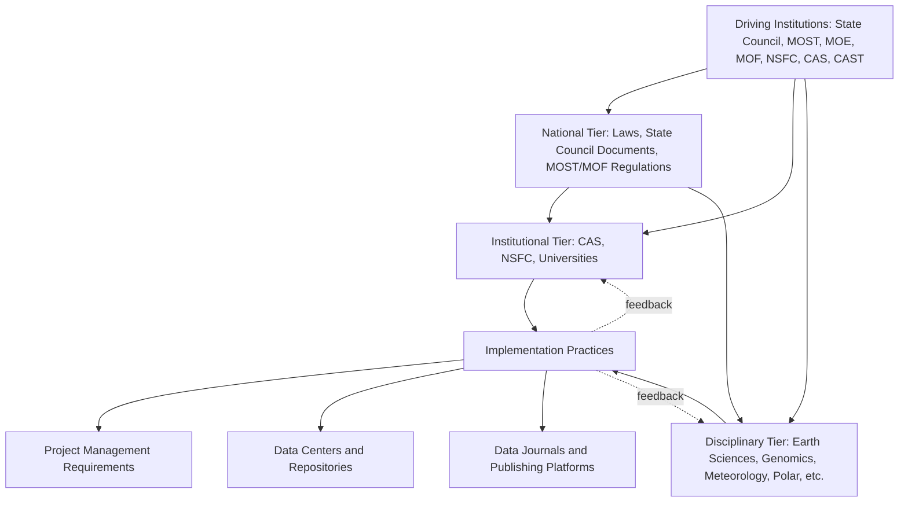
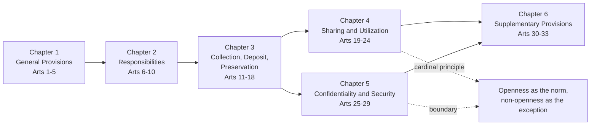
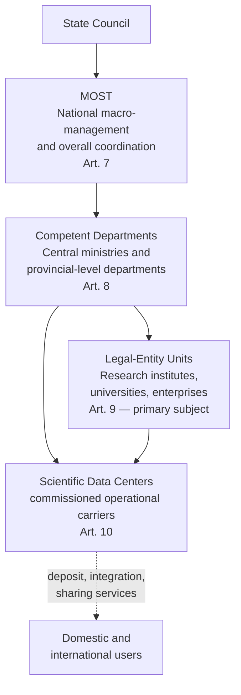
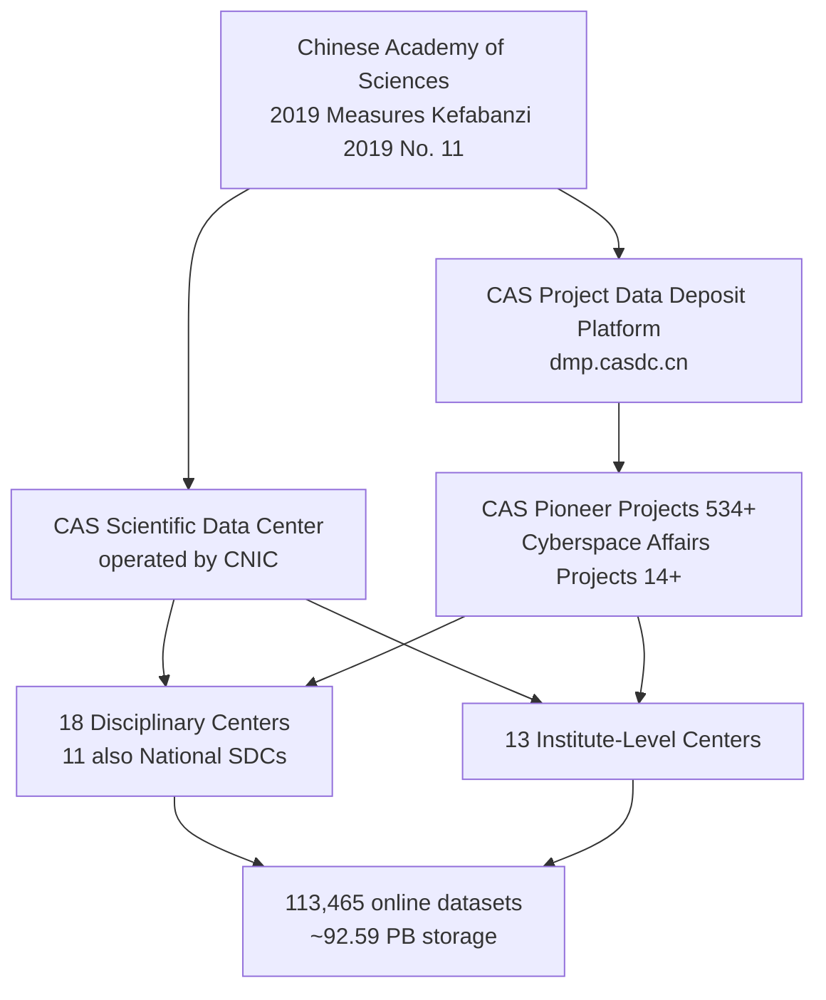
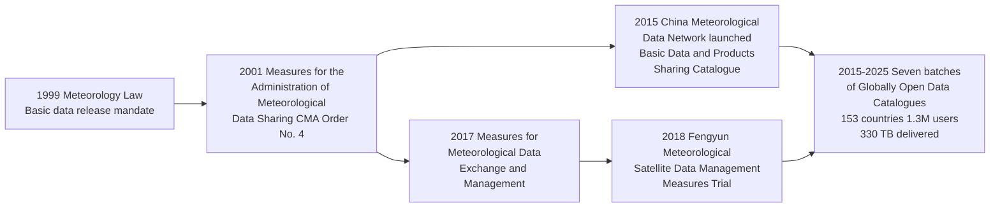
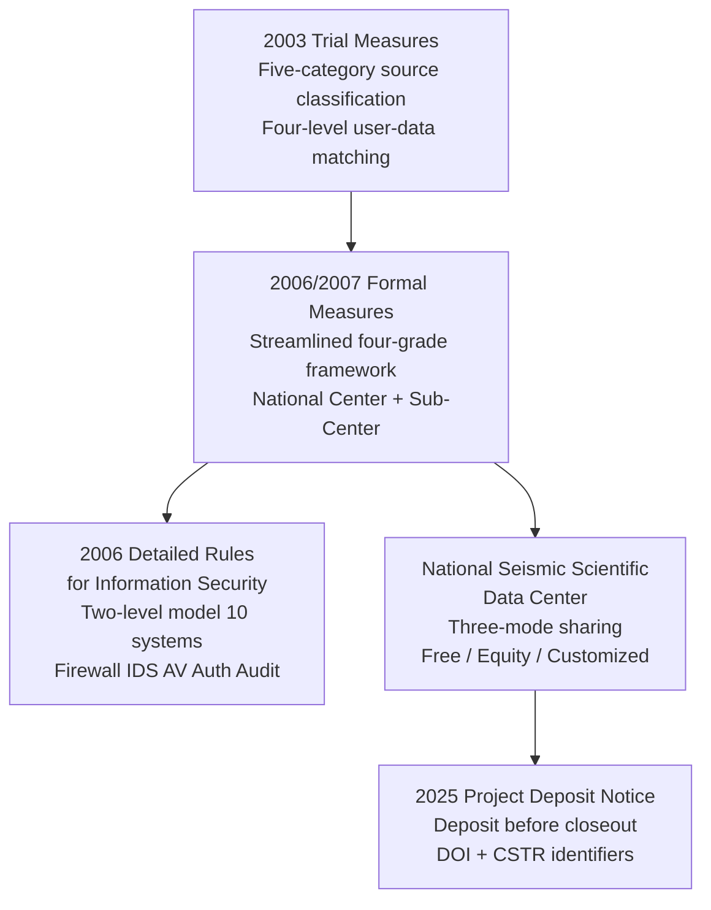
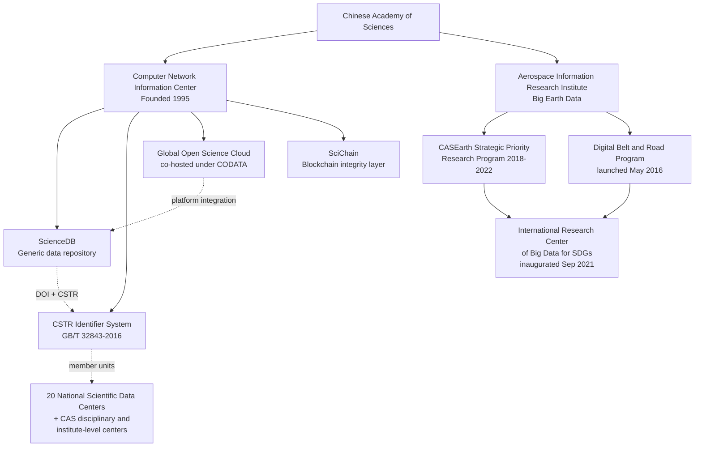
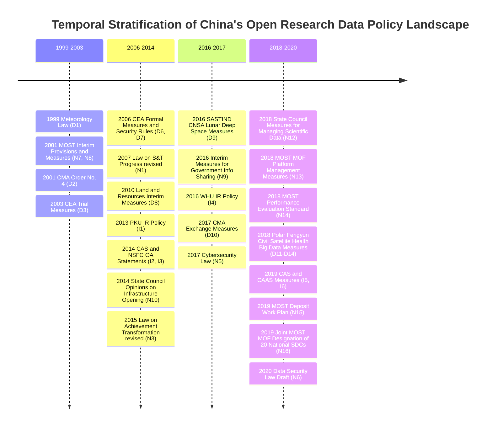

# China's Open Research Data Policies and Practices: A Multi-Level Review (Pre-July 2020)
# 1 Introduction, Research Framework, and Contextual Background

Research data have, over the past two decades, evolved from a by-product of scientific inquiry into a strategic asset whose accessibility, reusability, and stewardship are widely regarded as constitutive of modern scientific capability. In the international arena, the publication of the OECD *Principles and Guidelines for Access to Research Data from Public Funding* in 2007[^1][^2], the articulation of the FAIR (Findable, Accessible, Interoperable, Reusable) Guiding Principles in 2016[^3][^4], and the sustained convening work of the Research Data Alliance (RDA), the ICSU Committee on Data (CODATA), and the World Data System (WDS) under International Data Week[^5] have collectively normalized the view that publicly funded research data should, in principle, be openly shared. China has neither been a passive observer of these developments nor a wholesale importer of them. Rather, since the early 2000s, and with markedly increasing intensity after the issuance of the *National 13th Five-Year Plan for S&T Innovation* in 2016[^6], China has constructed a distinctive open research data ecosystem that combines top-down state coordination, infrastructure-led investment, and selective alignment with international norms.

This opening chapter establishes the conceptual scope, analytical framework, and contextual rationale of the report. It defines what is meant by "open research data" in the Chinese context, articulates a three-tier policy lens (national, institutional, disciplinary) that will structure all subsequent analyses, and situates China's trajectory at the intersection of international drivers and domestic scientific modernization imperatives. It also surfaces, at the outset, the structural tensions—between openness and security, between international integration and data sovereignty, between supply-side infrastructure provisioning and demand-side researcher incentives—that frame the limits of what the Chinese system had achieved by mid-2020. By grounding readers in these definitional, analytical, and contextual coordinates, the chapter prepares the way for the policy and practice analyses that follow.

## 1.1 Scope, Definitions, and Analytical Boundaries

The report concerns itself with **open research data** rather than with the broader and more heterogeneous categories of open access publications or open government data, although the three domains intersect at multiple points in Chinese policy. Following the conceptual lineage established by the OECD, "research data" are understood as factual records—numerical scores, textual records, images and sounds, instrument readings, and processed derivatives—that are used as primary sources for scientific research and that are commonly accepted in the scientific community as necessary to validate research findings[^2]. The OECD *Principles and Guidelines* further clarify that such guidance is meant to apply specifically to research data that are gathered using public funds for the purposes of producing publicly accessible knowledge[^2]. This functional definition aligns closely with the operational scope adopted by Chinese authorities when they speak of *科学数据* (scientific data) in policy texts.

Within this report, **open research data** therefore refers principally to scientific data generated through publicly funded research activities in China that are, or are intended to be, made available for discovery, access, and reuse under specified conditions. **Open sharing** (*开放共享*) denotes the policy and operational commitment to make such data available beyond the originating project team, ranging from fully unrestricted public release to conditional access regimes. **Research data management** encompasses the lifecycle activities—planning, collection, documentation, archiving, curation, and dissemination—through which data are rendered shareable. These usages are consistent with the FAIR framework, which similarly distinguishes "Accessible" (the technical and procedural means by which data can be retrieved) from notions of being "open" or "free": a dataset can be FAIR-compliant while remaining subject to authentication, authorization, or licensing constraints[^3].

Several boundaries delimit the report. First, the **temporal cutoff is July 2020**: while the policy environment has continued to evolve, the analysis is anchored to the regulatory and institutional landscape consolidated by mid-2020, when the major architectural elements—the 2018 *Measures for Managing Scientific Data*, the 2019 designation of national scientific data centers, and the maturation of disciplinary policies in earth sciences, genomics, and meteorology—were in place. Second, the **geographic scope** is the People's Republic of China (mainland), with international references introduced only as comparative or contextual anchors. Third, the report treats **policy** as expressed in formally issued state documents, ministerial measures, institutional rules, and disciplinary regulations, and treats **practice** as expressed in project management requirements, operational data repositories, and publishing platforms. Fourth, the report does not attempt to systematically evaluate the data quality, scientific impact, or commercial valuation of Chinese open data, focusing instead on the structural review of policies, institutions, and operational practices.

## 1.2 Analytical Framework: The Three-Tier Policy Lens

China's open research data system is too heterogeneous to be captured by any single-layer description. National laws and State Council documents set the overarching legal and strategic frame, but their effects on day-to-day research practice are mediated by the rules of individual research-performing organizations and funding agencies, and further differentiated by the data cultures and regulatory traditions of specific scientific disciplines. To render this layered architecture analytically tractable, this report adopts a **three-tier policy lens**:

1. **National tier** — Comprising laws (notably the *Law on Scientific and Technological Progress*), State Council documents (most prominently the 2018 *Measures for Managing Scientific Data*, State Council General Office No. 17), and ministerial regulations issued by central organs such as the Ministry of Science and Technology (MOST) and the Ministry of Finance (MOF). This tier defines the legal status of scientific data, allocates responsibilities, and articulates the principle of openness as the default for publicly funded data.

2. **Institutional tier** — Comprising data management and open-sharing rules issued by major research-performing and research-funding organizations, including the Chinese Academy of Sciences (CAS), the National Natural Science Foundation of China (NSFC), and leading universities. This tier translates national mandates into operational rules governing data ownership, deposit, access, and reuse within specific organizational boundaries.

3. **Disciplinary tier** — Comprising domain-specific regulations issued by sectoral ministries and disciplinary authorities, such as policies on meteorological data, seismological data, genomic data, agricultural data, and polar expedition data. This tier reflects the technical specificities, sensitivity profiles, and international cooperation regimes of individual scientific fields.

The analytical logic linking these tiers is one of **cascading specification and reciprocal feedback**. National documents establish principles and mandates; institutional and disciplinary policies operationalize them in ways that reflect local capabilities and field-specific norms; and the observable practices of project management, repositories, and data journals provide the empirical evidence of how, and how well, the cascade functions. The framework is illustrated below.

This framework also makes visible the **driving institutions** that propel the system as a whole. The State Council provides the apex authority; MOST and MOF jointly steer the most consequential operational decisions, including the 2019 designation of national scientific data centers; CAS—particularly through its Computer Network Information Center (CNIC), which hosts the CODATA China secretariat and co-hosts CODATA's Global Open Science Cloud initiative[^5]—serves as both a research-performing institution and an infrastructure-building actor; the NSFC and the Ministry of Education shape funding-side and university-side practice; and sectoral ministries (e.g., the State Oceanic Administration, China Meteorological Administration) govern disciplinary regimes. Subsequent chapters apply this lens systematically: Chapter 2 addresses the national tier; Chapter 3, the institutional tier; Chapter 4, the disciplinary tier; Chapter 5, implementation practices; and Chapter 6, driving institutions.

## 1.3 International Drivers: Global Norms and Frameworks Shaping China's Engagement

China's open research data agenda has been shaped, from its inception, by international developments. Four such developments stand out for the period preceding July 2020.

**The OECD Principles (2007).** The earliest and arguably most consequential international reference point is the OECD's work on access to research data. In January 2004, ministers of science and technology of OECD countries met in Paris together with representatives of China, Israel, Russia, and South Africa, and adopted a *Declaration on Access to Research Data from Public Funding*; this declaration invited the OECD to develop a set of guidelines based on commonly agreed principles to facilitate optimal cost-effective access to digital research data from public funding[^2]. The resulting *Principles and Guidelines* were endorsed by the OECD Council on 14 December 2006 and published in 2007[^1][^2]. The fact that China participated in the 2004 ministerial declaration is itself significant: it indicates that China's engagement with the open research data agenda was, from a very early stage, embedded in multilateral norm-setting rather than developed in isolation. The OECD's emphasis on openness, transparency, formal responsibility, professionalism, interoperability, quality, and efficiency would subsequently provide a recognizable conceptual vocabulary that Chinese policy texts and academic commentaries have drawn upon, even when not citing the OECD directly.

**The FAIR Guiding Principles (2016).** The FAIR principles were first articulated at the January 2014 Lorentz workshop in Leiden and systematically published in 2016 by Wilkinson and colleagues in *Scientific Data*[^3][^4]. They comprise four high-level objectives—Findability, Accessibility, Interoperability, Reusability—elaborated through fifteen specific sub-principles covering globally unique persistent identifiers, rich metadata, standardized retrieval protocols, formal and shared knowledge representations, qualified references, clear licensing, detailed provenance, and adherence to community standards[^3][^4]. A noteworthy feature of FAIR is its dual emphasis on human and machine readability: data should be usable not only by researchers but also by computational agents, which is critical for the scale and complexity of contemporary science and increasingly relevant in the era of large language models[^4]. FAIR has been adopted by the European Union as a cornerstone of its open science strategy—Horizon 2020 required funded projects to manage data according to FAIR principles—and has been recognized in policy commentary as appropriate for inclusion in future Chinese data circulation legislation, having been progressively embraced across Chinese scientific data centers and research communities[^3].

**Research Data Alliance, CODATA, and World Data System.** The institutional infrastructure of global research data governance is anchored by three organizations: the Research Data Alliance (RDA), which builds and supports the global infrastructure that facilitates data sharing and reuse; CODATA, the International Science Council's Committee on Data; and the World Data System (WDS). These organizations co-host the biennial International Data Week (IDW), the leading international conference on research data; IDW 2025, for example, combines the 25th RDA Plenary Meeting with SciDataCon 2025[^5]. The Computer Network Information Center of the Chinese Academy of Sciences (CNIC, CAS), founded in 1995, serves as the supporting organization of the CODATA China secretariat and as a co-host organization of CODATA's Global Open Science Cloud initiative, and has regularly participated in IDW sessions related to open science, open data, and emerging research e-infrastructures[^5]. This sustained institutional participation provides one of the primary channels through which international research data norms have been transmitted into the Chinese system.

**UNESCO and the broader open science discourse.** Although the formal UNESCO Recommendation on Open Science was adopted after the July 2020 cutoff, the discussions that fed into it—on open access, open data, open educational resources, and inclusive participation—were already shaping the global discourse in which Chinese institutions participated. Together with the OECD, FAIR, RDA, CODATA, and WDS streams, these discussions constituted a normative environment in which open research data was increasingly framed as a prerequisite for credible participation in international science.

The table below summarizes how the main international frameworks have entered Chinese discourse and practice prior to July 2020.

| International Framework | Year / Origin | Core Contribution | Channel of Influence on China |
|---|---|---|---|
| OECD Declaration on Access to Research Data | 2004 (Paris ministerial) | Political commitment to open research data | China was a non-OECD signatory[^2] |
| OECD Principles and Guidelines | 2006/2007 | Operational principles for public-funded data access | Conceptual vocabulary referenced in Chinese policy commentary[^1][^2] |
| FAIR Guiding Principles | 2014 workshop / 2016 publication | Findable, Accessible, Interoperable, Reusable; 15 sub-principles | Adopted by Chinese scientific data centers; advocated for inclusion in data legislation[^3][^4] |
| RDA / CODATA / WDS (IDW) | Ongoing | Global community infrastructure for data sharing | CNIC, CAS hosts CODATA China secretariat and co-hosts Global Open Science Cloud[^5] |

China's engagement with these frameworks has been **selective and adaptive** rather than wholesale: the OECD's broad principles and FAIR's technical specifications have been embraced at the level of scientific data centers and research communities, while the political and legal vocabulary of "data sovereignty" has been deployed to qualify the scope of openness in domains touching on national security or strategic competitiveness.

## 1.4 Domestic Drivers: Scientific Modernization and Innovation-Driven Development

If international norms have provided the templates, domestic strategic imperatives have provided the motive force. Three intertwined domestic drivers are particularly important.

**Innovation-driven development and the 13th Five-Year Plan.** The *National 13th Five-Year Plan for S&T Innovation*, issued by the State Council on 28 July 2016, defines the 2016–2020 period as "a crucial period for forming a well-off society in an all-round way" and "for the entry of China into the ranks of innovation-oriented countries," and identifies entering the "ranks of innovation-oriented countries" by 2020 and building a "world S&T superpower" as overarching goals[^6]. The Plan explicitly emphasizes that "the openness and sharing of innovation resources need to be improved" and calls for accelerating the construction of an "efficient and collaborative national innovation system" featuring "the smooth flow and efficient allocation of innovative elements"[^6]. Data—as a foundational innovative resource alongside talent, knowledge, technology, and capital—are implicitly positioned within this resource-flow imperative, and the Plan's targets (e.g., raising R&D intensity to 2.5% of GDP, doubling PCT patent applications, ranking second globally in international scientific paper citations) are unachievable without robust data infrastructures[^6].

**Major science and technology projects and big data.** The Plan operationalizes its ambitions through "Science and Technology Innovation 2030—Major Projects," among which **Big Data** is explicitly listed as one of the major engineering projects, with the objective to "build a nationwide standard system and exchange platform for open data sharing, form a consensus application model and technical solution for typical applications, and form a big data industry cluster with global competitive advantages"[^6]. Adjacent projects—integrated space-to-ground information networks, smart manufacturing and robotics, brain science, quantum communications, and health protection—all generate massive volumes of scientific data whose value can only be fully realized through systematic sharing[^6]. This places data infrastructure construction at the center, rather than the periphery, of China's S&T modernization agenda.

**Building the national innovation system.** The Plan calls for "creating open and collaborative innovation networks" and for "using resource openness and sharing as the means" to deploy innovation chains around production chains[^6]. This vision converges with the FAIR agenda's emphasis on dismantling data silos and supporting cross-disciplinary reuse. Indeed, commentary on FAIR has explicitly framed it as a remedy for the problem of "data silos" (*数据孤岛*), arguing that adoption helps overcome the disciplinary boundaries that impede data circulation and that FAIR's machine-readability foundation also lays the groundwork for future human–machine interaction and artificial intelligence development[^3]. The convergence is not coincidental: by 2016–2020, Chinese policymakers, scientific leaders, and infrastructure operators had come to view systematic research data sharing as both an enabler of scientific competitiveness and a precondition for participating in the global AI and data economy.

These domestic drivers help explain a distinctive feature of the Chinese model: the heavy emphasis on **state-coordinated infrastructure provision**—national scientific data centers, the CAS Scientific Data Cloud, persistent identifier systems—as the principal lever through which the open data agenda is pursued. Where some jurisdictions have leaned on funder mandates and researcher incentives, China has leaned, characteristically, on the construction of authoritative, top-down platforms.

## 1.5 Tensions and Constraints: Openness versus Security, Sovereignty, and Competitiveness

The Chinese open research data trajectory is, however, neither linear nor unconditional. A series of structural tensions shape the boundaries of openness in ways that must be understood at the outset.

**Openness versus national security.** The 13th Five-Year Plan explicitly elevates "national cyberspace security" to the status of a major science and technology project and emphasizes the need for science and technology innovation to provide "strong safeguards" for national security and strategic interests[^6]. Categories of research data with security implications—high-resolution earth observation, certain genomic and biosafety data, polar and deep-sea data, and data linked to dual-use technologies—are accordingly governed by access regimes that depart from default openness. Notably, the OECD framework itself recognizes that "the balance between the costs of improved access to research data and the benefits that result from such access will need to be judged by individual national governments and their research communities"[^2], providing an internationally legitimate basis for such hedging. The FAIR framework similarly distinguishes "Accessible" from "open": even strictly protected private data can be FAIR-compliant if the precise conditions of access are clearly specified[^3][^4].

**Openness versus data sovereignty.** As cross-border data flows have become more politically sensitive globally, Chinese policy has increasingly emphasized **data sovereignty**—the principle that data generated within national jurisdiction are subject to national rules on storage, transfer, and reuse. This concern shapes both the architecture of national scientific data centers (which are designed as authoritative domestic custodians) and the international cooperation modalities of disciplinary regimes such as genomics and polar expeditions.

**Openness versus competitiveness.** The 13th Five-Year Plan repeatedly frames innovation in competitive terms—"seize future commanding positions in strategically contested areas," "seize the strategic initiative in a new round of global science and technology competition," "rebalance economies and create new national competitive advantages"[^6]. This competitive framing creates an inherent tension with the openness norm, particularly for data linked to disruptive technologies (artificial intelligence, quantum information, synthetic biology, new materials, advanced manufacturing) where data assets carry significant strategic value.

**Openness versus practical implementation gaps.** Beyond these strategic tensions, the Plan itself acknowledges that "obstacles in ideological concepts and deep-seated institutional mechanisms that restrict innovation and development still exist, and the overall efficiency of the innovation system is not high"[^6]. In the open data context, this manifests as weak linkage between data sharing and researcher evaluation, inconsistent enforcement of deposit obligations, and uneven licensing and long-term preservation practices—issues that Chapter 8 will examine in detail.

The aggregate effect is a **policy posture of conditional, calibrated openness**: open as the default for publicly funded basic research data; conditional for sensitive or dual-use data; restricted for data with national security or strategic competitive significance. This calibration is not unique to China, but its institutional expression—through national scientific data centers, classified data restrictions, and discipline-specific access regimes—gives the Chinese system its particular character.

## 1.6 Report Positioning, Logic, and Roadmap

This report is positioned as a **structured, pre-July 2020 snapshot** of China's open research data ecosystem. It is neither a sectoral case study nor a quantitative evaluation of data reuse; it is an integrated, multi-level review designed to give readers a coherent map of policy architecture, institutional implementation, and disciplinary practice as they stood on the eve of the COVID-era policy reorientation. Its contribution lies in synthesizing materials that are usually examined in isolation—national legislation, institutional rules, disciplinary regulations, repository operations, and data journal development—into a single analytical narrative organized by the three-tier framework.

The logic linking the remaining chapters follows directly from the framework introduced above. Chapter 2 reviews the **national-level policy system**, including the *Law on Scientific and Technological Progress*, the 2018 *Measures for Managing Scientific Data*, and the broader corpus of State Council and MOST documents that together form the apex of the policy hierarchy. This includes early enabling instruments such as MOST's 2001 *Interim Provisions on the Administration of National S&T Plans*, which already required the establishment of databases and data sharing rules in publicly funded research, and the cross-cutting *Interim Measures for the Management and Sharing of Government Information Resources* (2016), which provides guidance for electronic record management and complements scientific data governance. Chapter 3 turns to the **institutional tier**, examining CAS, NSFC, and university policies. Chapter 4 examines the **disciplinary tier**, including foundational instruments such as the *Measures for Managing Polar Expedition Data of China* issued by the State Oceanic Administration in 2018, alongside meteorological, seismological, genomic, and agricultural data regimes. Chapter 5 documents **implementation practices** across project management, data repositories (notably the 20 National Scientific Data Centers designated by MOST and MOF in 2019), and Chinese data journals such as *China Scientific Data* and the *Journal of Global Change Data & Discovery*. Chapter 6 profiles the **driving institutions** and their flagship initiatives, including CNIC's role in CODATA China and the Global Open Science Cloud[^5]. Chapter 7 provides a **consolidated reference table** of policies organized by issuing body and tier. Chapter 8 offers a **critical assessment**, distilling the distinctive features of the Chinese model—top-down, infrastructure-led, state-coordinated—and outlining the directions of evolution already discernible by mid-2020.

Readers approaching the report from a comparative policy perspective may find Chapters 2 and 4 most informative; those interested in operational implementation may turn first to Chapter 5; those concerned with institutional agency may begin with Chapter 6; and those seeking a quick reference may consult the consolidated table in Chapter 7. In all cases, the conceptual scaffolding established in this chapter—the definition of open research data, the three-tier policy lens, and the dual recognition of international and domestic drivers under conditions of strategic tension—provides the interpretive lens through which the subsequent analyses are intended to be read.

# 2 National-Level Policy System for Open Research Data

Building on the three-tier analytical framework set out in Chapter 1, this chapter examines the apex of China's open research data hierarchy: the national-level corpus of laws, State Council documents, and central ministerial regulations that, by mid-2020, jointly defined the legal status of scientific data, allocated administrative responsibilities, and articulated the operational principles of open sharing. Whereas Chapter 1 situated this national tier within international and domestic drivers, the present chapter dissects its internal architecture—how foundational statutes provide the legal hooks; how the 2018 *Measures for Managing Scientific Data* (Guobanfa [2018] No. 17) operationalizes the cardinal principle that openness is the norm and non-openness the exception; how the 2014 *Opinions on Opening Major National Scientific Research Infrastructure and Large Scientific Instruments* (Guofa [2014] No. 70) complements it on the infrastructure-and-instrument side; and how supporting Ministry of Science and Technology (MOST) and Ministry of Finance (MOF) regulations close the loop through platform designation, deposit workflows, and security safeguards. The chapter pays particular attention to the deposit-before-acceptance mechanism for publicly funded project data, the graded confidentiality regime that qualifies the openness mandate, and the multi-actor governance architecture that cascades responsibilities from the State Council to data-producing legal entities. By tracing the formation and interlocking logic of these instruments, the chapter establishes the binding frame within which institutional rules (Chapter 3) and disciplinary regulations (Chapter 4) are subsequently operationalized.

## 2.1 Legal Foundations: The Law on Scientific and Technological Progress and Adjacent Statutes

China's open research data regime, by July 2020, did not rest on a stand-alone "data law." Instead, it was anchored in a constellation of statutes whose individual articles—on resource sharing, intellectual property allocation, security classification, and information systems—together supplied the legal authority on which subsequent State Council and ministerial documents were built.

The cornerstone is the **Law of the People's Republic of China on Progress of Science and Technology** (*中华人民共和国科学技术进步法*), first adopted by the Standing Committee of the Eighth National People's Congress on 2 July 1993 and revised by the Standing Committee of the Tenth National People's Congress on 29 December 2007 (the version in force for the entirety of the pre-July 2020 analytical window); a second revision was subsequently adopted in December 2021.[^7][^8] The 2007-revised version, which entered into force on 1 July 2008, is one of the basic regulations explicitly invoked by the 2018 *Measures for Managing Scientific Data* as part of their statutory basis.[^9] Several of its provisions are pivotal for the open data regime. Article 20 stipulates that intellectual property rights arising from projects covered by the scientific and technological fund established with government funds—including patents, software copyrights, integrated-circuit layout-design rights, and new plant strain rights—are, except where national security or vital public interests are involved, granted to the authorized project undertakers, who must report annually on their exercise and protection; if not exercised within a reasonable time, the State may implement them without compensation or license them to others.[^8] Article 65 of the same version (Article 102 in the 2021-revised text) requires the science and technology administrative department under the State Council, together with relevant departments, to "establish a system of information about such scientific and technological resources as scientific and technological research bases, scientific instruments and equipment, scientific and technological documents, data and natural resources, and resources for scientific and technological popularization," and to "make known to the public the distribution and use of scientific and technological resources in a timely manner."[^8][^7] This provision constitutes the statutory hook for the subsequent construction of the national scientific data center system. Article 28 of the 2007 version (Article 106 in 2021) institutes a science and technology security system protecting state-secret scientific and technological information and an export-management system for precious, rare, and endangered biological germplasm, hereditary resources, and—in the 2021 revision—data resources, thereby providing the legal basis for the confidentiality and outbound-transfer carve-outs analyzed in later sections.[^8][^7]

The Law's resource-opening orientation is further amplified by Article 64 of the 2007 version, which requires that large scientific instruments and equipment be planned in accordance with the principles of "overall planning, emphasizing of common sharing, optimized allocation of resources, comprehensive integration, leading by the government and concerted efforts," and subjected to joint appraisal when purchased mainly with government funds.[^8] Article 68 of the same version makes the failure to perform sharing obligations with respect to government-funded large instruments a basis for administrative rectification and sanctions, providing an explicit, if seldom invoked, enforcement basis.[^8]

Adjacent statutes complete the legal scaffolding. The **Law of the People's Republic of China on Promoting the Transformation of Scientific and Technological Achievements** (revised in 2015) is one of the regulations governing the management and conversion of scientific and technological achievements into practical productive forces and is also expressly cited, together with the Law on Scientific and Technological Progress, as a statutory basis of the 2018 *Measures for Managing Scientific Data*.[^9] The **Copyright Law of the People's Republic of China** (revised in 2010) constitutes one of the regulations bearing on intellectual property rights in research data, particularly insofar as datasets, databases, and derivative compilations may attract copyright protection. The **Cybersecurity Law of the People's Republic of China** (2017) provides the lex generalis on data security applicable to scientific data centers and their custodians, undergirding the cybersecurity provisions of Chapter 5 of the 2018 *Measures*. By June 2020, this body of law was being supplemented by the **Data Security Law of the People's Republic of China (Draft)**, which the Standing Committee of the National People's Congress released for public comment in June 2020 as a forthcoming systemic instrument on data classification, security review, and outbound-transfer management; although not yet enacted by the July 2020 cutoff, the draft was already cited as a directly relevant policy reference for scientific data deposit guidance.[^10] Two further instruments round out the legal-regulatory base: the **Regulations of the People's Republic of China on Disclosure of Government Information** (*政府信息公开条例*) govern the disclosure of government information and frame the relationship between scientific data—when held by administrative agencies—and the wider regime of public-sector information access; and the **Interim Measures for the Management and Sharing of Government Information Resources** (*政务信息资源共享管理暂行办法*, 2016) provide guidance for electronic record management and inter-agency information sharing, and are likewise expressly cited as a statutory basis of the 2018 *Measures*.[^9]

Crucially, the Law on Scientific and Technological Progress also embeds the openness principle in research-organization governance: Article 46 of the 2007 version requires that scientific research and technological development institutions established with government funds "set up a mechanism conducive to sharing of scientific and technological resources in order to facilitate effective use of such resources."[^8] This statutory injunction explains why later institutional-tier policies (treated in Chapter 3) are not merely encouraged but legally required forms of compliance. Taken together, these statutes provided the legal authority on which the 2018 *Measures* and the 2014 *Opinions* could rest as binding administrative instruments, and reconciled, at the level of legal principle, the imperative of openness with countervailing concerns of security, confidentiality, and export control.

## 2.2 The 2018 Measures for Managing Scientific Data: Architecture and Core Provisions

The **Measures for Managing Scientific Data** (*科学数据管理办法*), printed and distributed by the General Office of the State Council under Guobanfa [2018] No. 17 on 17 March 2018 (publicly issued on 2 April 2018), is the most consequential national instrument for open research data prior to July 2020. It brought research data management in China into a new stage by consolidating, for the first time at the State Council General Office level, a comprehensive operational framework covering definitions, responsibilities, deposit, sharing, and security.[^9][^11] Its statutory basis is explicitly stated in Article 1: the *Law on Scientific and Technological Progress*, the *Law on Promoting the Transformation of Scientific and Technological Achievements*, and the *Interim Measures for the Management and Sharing of Government Information Resources*, with the stated purpose of "further strengthening and standardizing scientific data management, safeguarding scientific data security, raising the level of openness and sharing, and better supporting national S&T innovation, economic and social development, and national security."[^9]

The *Measures* are organized into **six chapters and thirty-three articles**: Chapter 1 General Provisions (Articles 1–5); Chapter 2 Responsibilities (Articles 6–10); Chapter 3 Collection, Deposit and Preservation (Articles 11–18); Chapter 4 Sharing and Utilization (Articles 19–24); Chapter 5 Confidentiality and Security (Articles 25–29); and Chapter 6 Supplementary Provisions (Articles 30–33).[^9] This architecture mirrors the logical lifecycle of scientific data—from creation, through deposit and preservation, to sharing and use, with security as the cross-cutting constraint—and supplies the operational template for subordinate ministerial regulations.

Article 2 supplies the **operative definition**: "scientific data" (*科学数据*) refers principally to data generated in the natural sciences and engineering technology sciences through basic research, applied research, and experimental development, as well as original and derived data obtained through observation and monitoring, exploration and survey, and inspection and testing for scientific research activities.[^9] Article 3 fixes the **scope of application**: the *Measures* apply to the collection, processing, open sharing, management, and use of scientific data supported by government budget funds, and to any unit or individual engaged in scientific data activities within Chinese territory who falls within the regulated scenarios.[^9] Article 4 establishes the **operational principles**—"graded management, security control, and full utilization" (*分级管理、安全可控、充分利用*)—and the strategic posture of "clarifying responsible subjects, strengthening capacity building, and promoting open sharing."[^9] Article 5 imposes the general legal limit: no unit or individual may use scientific data for activities that endanger national security, the public interest, or others' lawful rights.[^9]

The cardinal substantive principle of the *Measures*—articulated in Article 19—is that "scientific data formed with the support of government budget funds shall, in accordance with the principle of **openness as the norm and non-openness as the exception** (*开放为常态、不开放为例外*), be made openly available to society and relevant departments through catalogues compiled by competent departments and timely connection to the national data sharing and exchange platform, with smooth channels for military–civilian sharing, except where national laws and regulations provide otherwise."[^9][^11] This formulation, which has since been quoted in virtually every subsequent operational document and disciplinary policy[^12][^13], inverts the default presumption: rather than data being closed unless a specific permission to share exists, data are presumed open unless a specific exception applies. The same article requires that competent departments organize the compilation of scientific data resource catalogues, that those catalogues and the underlying data be timely connected to the national data-sharing exchange platform, and that the channel for "military–civilian sharing" be kept open. Article 24 further specifies the **pricing regime**: for uses related to governmental decision-making, public safety, national defense, environmental protection, disaster prevention and mitigation, and public-good scientific research, legal-entity custodians must provide data free of charge; where charges are genuinely necessary, fees must be set in accordance with the prescribed procedures and a non-profit principle, published, and subjected to social supervision; for commercial uses, parties must conclude a fee-based service contract defining respective rights and obligations.[^9]

The figure shows how the six chapters articulate a lifecycle logic in which Chapter 4 (sharing) and Chapter 5 (security) act as paired forces shaping the substantive content of the openness default established in Article 19.

## 2.3 Responsibility Allocation and Governance Architecture

Articles 6–10 of the *Measures* establish a multi-actor governance architecture characterized by the formula **"national overall coordination, with central departments and regions each responsible for their share"** (*国家统筹、各部门与各地区分工负责*).[^9] This formula institutionalizes a four-level cascade of responsibilities from policy formulation to data-producer compliance.

At the **apex** sits the science and technology administrative department under the State Council—the Ministry of Science and Technology (MOST)—which under Article 7 leads national macro-management and overall coordination of scientific data. MOST's enumerated responsibilities include organizing the research and formulation of national scientific data management policies and standards; coordinating the promotion of standardized data management, open sharing, and performance evaluation; planning the overall construction and development of national scientific data centers; and building and maintaining the national scientific data network management platform.[^9]

At the **second level**, Article 8 identifies "competent departments" (*主管部门*)—relevant departments under the State Council and relevant departments of provincial-level people's governments—whose responsibilities include establishing departmental or regional scientific data management policies and rules; guiding affiliated legal-entity units; performing or authorizing data classification work; planning and constructing departmental/regional scientific data centers; and operating evaluation and incentive mechanisms for affiliated legal-entity units' data work.[^9]

At the **third level**, Article 9 designates research institutes, universities, and enterprises as **legal-entity units** (*法人单位*) that constitute the "primary responsible subject for scientific data management." Their obligations include implementing national and departmental data management policies; conducting standardized data collection, processing, and long-term preservation; performing confidentiality and security management; establishing scientific data management systems; publishing and timely updating open data catalogues; actively providing data sharing services; and providing the hardware, software, funding, and personnel necessary to support data management.[^9]

At the **fourth, operational level**, Article 10 positions **scientific data centers** (*科学数据中心*) as "important carriers for promoting scientific data open sharing." Established by competent departments via commissioned, qualified legal-entity units, data centers are charged with integrating and accepting deposit of scientific data in their fields; performing data grading, classification, processing, and analytical mining; safeguarding data security while lawfully promoting open sharing; and strengthening domestic and international exchange and cooperation on scientific data.[^9] This positioning supplied the institutional template for the joint MOST–MOF designation of the first batch of national scientific data centers in 2019, examined in §2.8.

The diagram makes visible a key feature of the architecture: legal-entity units bear simultaneous obligations both upward (deposit, reporting) and downward (data production, internal management), while scientific data centers operate as nodes linking the institutional and operational layers. The architecture is recognizably **state-coordinated and infrastructure-led**, consistent with the distinctive Chinese model identified in Chapter 1, and it sets the institutional groundwork on which Chapter 6 of this report will profile the driving institutions.

## 2.4 Data Deposit, Quality Control, and the "Deposit-Before-Acceptance" Mechanism

Chapter 3 of the *Measures* (Articles 11–18) operationalizes the upstream end of the data lifecycle. It requires legal-entity units and scientific data producers to organize collection and processing "in accordance with relevant standards and norms" so as to form usable databases or datasets, and obliges legal-entity units to establish quality control systems guaranteeing the accuracy and usability of data (Article 11). Competent departments are required to "establish a scientific data deposit system" and to conduct departmental or regional deposit on the basis of the national unified government network and data sharing and exchange platform (Article 12).[^9]

The decisive innovation lies in **Article 13**, which institutes the **"deposit-before-acceptance" mechanism** (*先汇交、再验收*). The article provides that scientific data generated by science and technology plan projects (including special projects and funds) at all levels supported by government budget funds "shall be deposited by the project lead unit with the relevant scientific data center," and the receiving data center "shall issue a deposit certificate" (*汇交凭证*). Crucially, "management departments of science and technology plans (special projects, funds) at all levels shall establish a mechanism of **first depositing scientific data and then accepting the science and technology plan (special project, fund) projects**; scientific data produced after project/topic acceptance shall also be deposited."[^9] This converts data deposit from a voluntary, post-hoc practice into a binding precondition for project closeout, with direct fiscal consequences attached to non-compliance.

Article 14 imposes a parallel obligation on academic publication: where scientific data formed with government budget funding are used to write papers published in foreign academic journals and the journal requires that the underlying data be deposited externally, the authors "shall, before publication, submit the scientific data to the host unit for unified management."[^9] This provision was directly motivated by the experience of Chinese authors transferring underlying data to foreign repositories—and thereby to foreign jurisdictions—without parallel domestic safeguarding, and it locks the academic publication channel into the broader data-sovereignty agenda introduced in Chapter 1.

Articles 15 through 18 round out the chapter. Article 15 requires that data formed with social-capital funding that nevertheless involve state secrets, national security, or the social public interest "must" be deposited in accordance with relevant rules, while encouraging deposit of other social-capital-funded data on a voluntary basis. Articles 16 and 17 require legal-entity units to maintain preservation systems with necessary storage, management, service, and security facilities and to build scientific data talent capacity through incentive mechanisms in post setting, performance income, and title evaluation. Article 18 directs MOST to "strengthen overall planning and layout" and, on the basis of well-resourced data centers with marked advantages, to "optimize and integrate to form national scientific data centers."[^9]

The 2018 *Measures* do not, however, stand alone in articulating the deposit workflow. They are complemented by two subordinate instruments that became operationally decisive by mid-2020. The **Management Measures for the National Science and Technology Resource Sharing Service Platform** (Guokefajui [2018] No. 48), issued together with the 2018 *Measures*, set the platform-level rules for certification, operation, and evaluation; and the **Work Plan for Scientific Data Deposit in Science and Technology Plan Projects** (Guokebanji [2019] No. 104), issued in 2019, specifies the procedural choreography that translates the Article 13 mandate into an executable workflow.[^10] These instruments are examined more systematically in §2.8.

In domain practice, the resulting workflow can be illustrated by the deposit guidance issued by the National Space Science Data Center, which implements the State Council's framework through eight sequential steps for science and technology plan projects: (i) preparation of a project data management plan during project initiation, reviewed by the data center and approved by the project management department as a precondition for formal project establishment; (ii) standardized data preparation during project execution; (iii) preparation of a project data deposit plan, signed by both submitter and data center and filed with the management department; (iv) data submission accompanied by a self-inspection report signed by the project leader/chief scientist; (v) data review and feedback, with formal deposit certificate issued upon successful review and submitted to the management department before project acceptance; (vi) cataloging and management; (vii) maintenance and version updates; and (viii) release and sharing in accordance with the data management plan.[^10] For research infrastructures, large instruments, field stations, and strategic biological resource banks, the deposit plan is required to cover the long-term operational stage, with batched submission, periodic deposit certificates serving as one basis for operational performance evaluation, and batched release as appropriate.[^10] The workflow for paper-related data is analogous, anchored on the submitter, the destination journal, and the relevant data center.[^10]

## 2.5 Sharing, Utilization, and the Pricing Regime

Chapter 4 of the *Measures* (Articles 19–24) translates the openness principle from declaratory norm to concrete obligation. Article 19, as already noted, establishes the cardinal "openness as the norm, non-openness as the exception" principle, requires the compilation of resource catalogues by competent departments, and mandates their timely connection to the national data sharing and exchange platform.[^9] Article 20 obliges legal-entity units to "grade and classify scientific data, define their security classification levels and confidentiality periods, opening conditions, opening objects, and review procedures," to publish open data catalogues as required, and to provide open sharing to society through online download, offline sharing, or customized services.[^9]

Articles 21–23 build the **value-added and citation infrastructure** around the basic openness obligation. Article 21 requires legal-entity units to perform analytical mining of scientific data, form valuable scientific data products, and provide value-added services, while encouraging social organizations and enterprises to provide market-based value-added services. Article 22 calls on competent departments and legal-entity units to "actively promote the publication and dissemination of scientific data" and to support researchers in organizing and publishing scientific data with clear property rights, accurate completeness, and high sharing value—a provision that supplies the policy basis for the emergence and expansion of Chinese data journals examined in Chapter 5. Article 23 imposes the reciprocal obligation on data users: they "shall comply with intellectual property regulations" and, in publishing papers, applying for patents, and publishing monographs, "indicate the scientific data used and referenced."[^9]

Article 24 establishes the **two-tier pricing regime** already introduced in §2.2: free provision for non-commercial, public-interest uses (government decision-making, public safety, national defense, environmental protection, disaster prevention, public-good research); where charges are genuinely necessary, fees must follow prescribed procedures and a non-profit principle, be published, and accept social supervision; for commercial uses, parties must conclude a fee-based service contract specifying mutual rights and obligations.[^9] The architecture is summarized below.

| Use category | Pricing rule | Procedural requirement |
|---|---|---|
| Government decision-making, public safety, national defense, environmental protection, disaster prevention, public-good research | Free provision required | Legal-entity unit must provide without charge |
| Public-interest use where charging is genuinely necessary | Non-profit, cost-based fees | Set by prescribed procedure; published; subject to social supervision |
| Commercial use | Contract-based, negotiated fees | Service contract specifying rights and obligations |

The table makes plain that the openness mandate in Chinese national policy does not equate openness with cost-free access in every case; rather, it equates the default with cost-free, public-interest access while preserving an explicit, contractually regulated commercial channel. This dual structure has been reflected operationally in the sharing modes adopted by national scientific data centers: the National Oceanic Scientific Data Sharing Service Platform, for instance, classifies its services into "fully public sharing" (for unrestricted online download, preview, subscription, visualization, and customized push services) and "offline sharing" (for restricted internal or sensitive data through telephone or email-based application).[^14] Article 23's citation obligation has been operationalized through standardized data citation and acknowledgement formats: the Meridian Project's data policy, for example, prescribes a Chinese-language citation format—"data copyright holder; dataset name (version); data service provider; data DOI identifier"—and a standardized acknowledgement: "This achievement uses the scientific data from the Meridian Project, a national major science and technology infrastructure."[^13] These domain-level operationalizations reflect the broader alignment with international practices such as FAIR-aligned licensing and CoreTrustSeal-style trustworthy repository certification, the latter of which had been pioneered in the geosciences field in Asia by the WDC for Renewable Resources and Environment in February 2019, in direct response to "the urgent need to improve professionalism and international influence" created by the 2018 *Measures*.[^15]

## 2.6 Confidentiality, Security, and the Boundaries of Openness

Chapter 5 of the *Measures* (Articles 25–29) carves out the boundaries of the openness default, giving substantive content to the "non-openness as the exception" half of the cardinal principle. Article 25 enumerates the **five categories of data excluded from open sharing**: those involving state secrets, national security, social public interest, commercial secrets, and personal privacy. Where such data must genuinely be opened, the use purpose, user qualifications, and confidentiality conditions must be reviewed, and the scope of knowledge strictly controlled.[^9][^11] Article 26 specifies that the collection, processing, management, and use of state-secret-involving scientific data are governed by national confidentiality regulations; competent departments and legal-entity units must establish complete management and use systems for state-secret-involving data, with strict management of production, review, registration, copying, transmission, and destruction. For **outbound transfer in foreign cooperation**, the legal-entity unit must clearly state the category, scope, and purpose of data use, obtain approval from the competent department under confidentiality management procedures, complete the relevant procedures, and conclude a confidentiality agreement with the user.[^9]

Articles 27–29 specify the **lifecycle security framework**. Article 27 requires competent departments and legal-entity units to strengthen full-lifecycle security management, formulate protection measures, and strengthen authentication and authorization for data downloads to prevent malicious use; for outbound-released catalogues or outbound-provided data, they must establish security and confidentiality review systems. Article 28 requires legal-entity units and data centers to follow national cybersecurity management rules, establish cybersecurity protection systems with secure and reliable products and services, perfect data control, attribute management, identity recognition, behavior traceability, and blacklist measures, and develop **anti-tamper, anti-leak, anti-attack, and anti-virus** protection systems. Article 29 requires data centers to establish emergency management and disaster-recovery backup mechanisms, including off-site backup of important scientific data.[^9] Article 31, in the Supplementary Provisions, supplies the enforcement teeth: for falsifying data, infringing intellectual property, or failing to deposit data as required, competent departments may, depending on severity, order rectification, issue circulars of criticism, impose sanctions, or impose administrative penalties; serious violations are pursued under relevant national laws.[^9]

The confidentiality regime articulated in these articles dovetails with adjacent statutory regimes—the Cybersecurity Law (2017), the State Council's confidentiality regulations, the science and technology security and export-management provisions of the *Law on Scientific and Technological Progress* (Article 28 of the 2007 version; Article 106 of the 2021 version), and, prospectively, the *Data Security Law* (released as a draft in June 2020).[^9][^10][^8][^7] Together, they instantiate the **"conditional, calibrated openness"** posture characterized in Chapter 1: open as the default for publicly funded basic research data; conditional for sensitive or dual-use data with explicit review and access regimes; restricted for data with national security or strategic competitive significance, with outbound transfer subject to special approval. The five exclusion categories of Article 25—state secrets, national security, social public interest, commercial secrets, and personal privacy—closely parallel the categories used in mature foreign data-access regimes, reinforcing that the Chinese architecture's distinctive feature is not the substance of the exclusions but rather the centralized, top-down character of the institutional machinery that implements them.

## 2.7 The 2014/2015 Opinions on Opening Major Scientific Research Infrastructure and Large Scientific Instruments

The companion instrument to the 2018 *Measures*, on the infrastructure-and-instrument side of the open data agenda, is the State Council's **Opinions on Opening Major National Scientific Research Infrastructure and Large Scientific Instruments to Society** (*国务院关于国家重大科研基础设施和大型科研仪器向社会开放的意见*), issued under Guofa [2014] No. 70 on 31 December 2014 and broadly implemented from January 2015 onward.[^16][^17] Although primarily concerned with physical facilities and instruments, the document explicitly extends its opening agenda to the data produced by those facilities, thereby creating the second main pillar of the national-tier open data architecture.

The *Opinions* respond to the diagnosis that the rapidly growing stock of major scientific research infrastructure and large instruments suffers from low utilization and sharing rates, with departmentalization, unit-localization, and individual-localization tendencies; substantial idle and wasted capacity; insufficient professional service capability; and inadequate realization of these facilities' supporting role for S&T innovation.[^16] The target was to "basically build, within three years, a unified, standardized, and powerful professional and networked management service system covering all types of research infrastructure and instruments," with substantially improved openness levels.[^16][^17] The **scope of application** comprises large scientific installations, scientific instrument centers, scientific instrument service units, and individual scientific instruments and equipment valued at **500,000 yuan or above per unit**, distributed across key laboratories, engineering (technology) research centers, analysis and testing centers, field scientific observation and research stations, and large scientific facility centers in universities, research institutes, and some enterprises; the document enumerates fifteen instrument categories, including analytical, marine, astronomical, medical, and nuclear instruments.[^16]

The *Opinions* articulate six basic principles: institution-driven; information-sharing; resource integration; combined reward and punishment; classified management; and the recognition that non-classified, non-restricted facilities must be opened to society as a rule.[^16] Six key measures operationalize these principles. **First**, all qualifying facilities and instruments are to be incorporated into a unified national network management platform under MOST's leadership; management units must, within 30 working days of post-installation acceptance, submit facility and instrument information and opening rules to the platform.[^16][^17] **Second**, openness is implemented through classified management by facility function: large installations and instrument centers must incorporate societal opening into routine operations; instruments at or above 500,000 yuan must be coordinated to form professional, networked service clusters across management-unit boundaries; instruments below 500,000 yuan may be brought into the platform on a voluntary application basis.[^16] The *Opinions* explicitly require that "the scientific data, S&T literature (papers), and S&T reports formed using research facilities and instruments shall be opened and shared in appropriate ways according to their respective characteristics. Open sharing performance shall constitute an important component of the assessment of S&T resource construction and S&T plan project management."[^16][^17] **Third**, an incentive mechanism is established whereby management units may charge material consumption, water and electricity costs, and labor-cost-based service fees on a cost-recovery, non-profit basis, with revenues incorporated into unit budgets, and a "post-subsidy" mechanism rewards effective opening units.[^16] **Fourth**, an evaluation system with third-party assessment is to be constructed, evaluating operation status, openness level, service quality, fees, and outcomes annually, with results published publicly. **Fifth**, intellectual property rights formed in independent experiments by users belong to those users, with the management unit obliged to protect user identity, IP, scientific data, and trade secrets; works produced using such facilities must clearly indicate the use of the facility. **Sixth**, management units bear primary legal responsibility for opening, with strengthened management of technical service teams.[^16]

The implementation timetable was equally specific: 2014 for resource surveys and database construction; 2015 for launching the national network management platform on the basis of the existing nationwide large-instrument cooperation platform, piloting opening at representative facilities, formulating uniform evaluation methods, and establishing the post-subsidy mechanism; 2016 for full platform construction and incorporation of all qualifying facilities and instruments; and 2017 for evaluation of all management units' opening performance, with results publicly released.[^16] Subsequent commentary has noted that this 2014 instrument was followed in 2017 by joint administrative measures issued by MOST, the National Development and Reform Commission, and the Ministry of Finance to give the management system operational substance.[^18]

The structural relationship between the 2014 *Opinions* and the 2018 *Measures* is one of complementarity rather than substitution: the 2014 instrument inaugurated systematic opening at the infrastructure-and-instrument level (with data treated as one category of resources flowing from those facilities), whereas the 2018 *Measures* established the comprehensive lifecycle regime for scientific data as such. Together, they constitute the two principal pillars of the State Council–level open data architecture in force by July 2020.

## 2.8 Supporting MOST and MOF Regulations and the National Coordination Framework

Beneath the State Council–level instruments, a layer of supporting ministerial regulations issued by MOST, MOF, and adjacent central agencies translates higher-order documents into operational rules. Four such instruments are particularly important for the pre-July 2020 landscape.

**MOST's 2001 *Interim Provisions on the Administration of National S&T Plans* and the parallel *Interim Measures for the Administration of National S&T Plan Projects*.** As early as 2001, MOST had begun to encode data-management obligations into the operational rules for national science and technology plans. In the *Interim Provisions on the Administration of National S&T Plans* issued in 2001, MOST required the establishment of databases and data-sharing rules for projects supported under national S&T plans; the parallel *Interim Measures for the Administration of National S&T Plan Projects*, also issued in 2001, required that national science and technology programs "establish compatible databases for sharing information resources." These provisions are seldom invoked in subsequent operational documents, but they are historically important: they pre-dated the 2018 *Measures* by 17 years and demonstrate that the basic policy intuition—that publicly funded research must produce shareable data infrastructure—had been articulated at the ministerial level since the early 2000s, well before the State Council–level consolidation.

**The 2016 *Interim Measures for the Management and Sharing of Government Information Resources***. This document provides guidance for electronic record management and inter-agency information sharing across the broader government information ecosystem, and is one of the three instruments expressly cited in Article 1 of the 2018 *Measures* as a statutory basis.[^9] Its inclusion among the parent instruments signals that, by 2018, scientific data management was being conceived as a specialized sub-regime within the broader regime of government information resource management.

**The 2018 *Management Measures for the National Science and Technology Resource Sharing Service Platform* (Guokefajui [2018] No. 48).** Issued together with the 2018 *Measures*, this document establishes the platform-certification and operational rules for the National Science and Technology Resource Sharing Service Platform system. It is one of the principal national policy documents referenced in domain-level scientific data deposit guidance, alongside the 2018 *Measures*, the 2019 *Work Plan*, and the (then draft) *Data Security Law*.[^10] The 2018 platform measures provide the link between the abstract obligation to share via the "national unified government network and data-sharing exchange platform" (Article 12 of the 2018 *Measures*) and the concrete platform-certification process through which national scientific data centers are accredited.

**The 2019 *Work Plan for Scientific Data Deposit in Science and Technology Plan Projects* (Guokebanji [2019] No. 104).** This instrument is the operational counterpart to Article 13 of the 2018 *Measures*. It specifies the procedural choreography of deposit—data management plans at initiation; standardized preparation; project deposit plans; submission with self-inspection; review, feedback, and certificate issuance; cataloging; maintenance; and release—and is the basis on which national scientific data centers, including the National Space Science Data Center, structure their domain deposit guidance.[^10]

**The 2019 designation of the first batch of 20 National Scientific Data Centers.** In 2019, MOST and MOF jointly certified the first batch of national scientific data centers, transforming the framework articulated in Articles 10 and 18 of the 2018 *Measures* into a concrete institutional landscape. The National Oceanic Scientific Data Sharing Service Platform, for example, had been incorporated into the National Science and Technology Resource Sharing Service Platform system in 2017 and "became one of the first batch of national scientific data centers certified by MOST and the Ministry of Finance in 2019," organized in a "main center + sub-center + data node" co-construction model with the National Marine Information Center as the main center and nine cooperating marine-related institutions.[^14] The certification process is also reflected in the Chinese Academy of Sciences' parallel data center system, which by mid-2020 was organized into one central center, 18 disciplinary centers, and 13 institute-level centers, with national-level certification flagged explicitly for centers including the National Astronomical Data Center (CoreTrustSeal and WDS), the National Space Science Data Center (CoreTrustSeal and WDS), the National Earth Observation Data Center (CoreTrustSeal and WDS), the National Microbiology Data Center, the National Genomics Data Center, the National Cryospheric Desert Data Center, the National High Energy Physics Data Center, the National Basic Disciplines Public Scientific Data Center, the National Ecological Science Data Center, and others.[^7][^14]

These secondary instruments form an interlocking system, summarized below.

| Instrument | Issuing body | Date | Operational role |
|---|---|---|---|
| Interim Provisions on the Administration of National S&T Plans | MOST | 2001 | Required databases and data sharing rules for national S&T plans |
| Interim Measures for the Administration of National S&T Plan Projects | MOST | 2001 | Required compatible databases for information resource sharing |
| Interim Measures for the Management and Sharing of Government Information Resources | State Council / central organs | 2016 | Cross-cutting framework for government information resources; statutory basis cited in 2018 Measures[^9] |
| Management Measures for the National S&T Resource Sharing Service Platform (Guokefajui [2018] No. 48) | MOST | 2018 | Platform certification and operation rules[^10] |
| Work Plan for Scientific Data Deposit in S&T Plan Projects (Guokebanji [2019] No. 104) | MOST | 2019 | Procedural choreography for project data deposit[^10] |
| First batch of 20 National Scientific Data Centers (joint designation) | MOST & MOF | 2019 | Concrete institutional landscape for data centers; National Oceanic Scientific Data Sharing Service Platform among first batch[^14] |

The table makes visible the **temporal stratification** of the national tier: a 2001 MOST baseline; a 2016 cross-cutting framework; a 2018 State Council–level consolidation accompanied by the platform measures; and a 2019 operational rollout that combined the deposit work plan with the joint MOST–MOF designation of the first 20 national data centers. By mid-2020, the architecture sketched in the 2018 *Measures* had thus moved from policy document to operational reality.

## 2.9 Synthesis: The National Tier as the Apex of the Policy Hierarchy

Synthesizing the foregoing analysis, the national tier of China's open research data policy hierarchy by July 2020 can be characterized along six interlocking dimensions.

First, the **legal authority** of the regime rests on a constellation of statutes—chiefly the *Law on Scientific and Technological Progress* (revised 2007), the *Law on Promoting the Transformation of Scientific and Technological Achievements* (revised 2015), the *Copyright Law* (revised 2010), the *Cybersecurity Law* (2017), the *Regulations on Disclosure of Government Information*, and the *Interim Measures for the Management and Sharing of Government Information Resources* (2016), with the *Data Security Law (Draft)* released in June 2020 prefiguring a forthcoming consolidation—rather than on a single data statute. This statutory plurality reflects the layered evolution of the regime and embeds open data within multiple legal traditions (S&T law, IP law, public-information law, cybersecurity law).[^9][^7][^8][^10]

Second, the **substantive scope** of the regime is anchored by the 2018 *Measures*' definition of scientific data and its scope of application to government-budget-funded activities, complemented by the 2014 *Opinions*' scope on facilities and instruments valued at 500,000 yuan or above. Together, these two State Council–level instruments cover the principal supply side of publicly funded research outputs in China.[^9][^16]

Third, the **responsibility allocation** follows a clear cascade—State Council, MOST, competent central and provincial departments, legal-entity units, and scientific data centers—mediated by the formula of national overall coordination with departmental and regional division of labor.[^9] This cascade operationalizes the otherwise abstract injunction of Article 65 of the *Law on Scientific and Technological Progress* (2007 version) that the State Council's S&T department establish information systems for scientific and technological resources, and it provides the institutional bridge to the institutional and disciplinary tiers analyzed in Chapters 3 and 4.[^8]

Fourth, the **openness principle**—"openness as the norm, non-openness as the exception"—is articulated with unusual clarity at Article 19 of the 2018 *Measures*, and it inverts the default presumption of access for publicly funded scientific data.[^9][^11] The principle is operationalized through compulsory open-data catalogues, connection to the national data-sharing exchange platform, multiple sharing modalities (online download, offline sharing, customized services), and a two-tier pricing regime that distinguishes free non-commercial access from contractual commercial access.[^9]

Fifth, the **security carve-outs** are organized around five exclusion categories (state secrets, national security, social public interest, commercial secrets, personal privacy) and supported by lifecycle security management, anti-tamper/anti-leak/anti-attack/anti-virus cybersecurity systems, off-site backup, and a special approval procedure for outbound transfer.[^9] These provisions instantiate the "conditional, calibrated openness" posture characterized in Chapter 1.

Sixth, the **enforcement mechanisms** combine the deposit-before-acceptance precondition in Article 13 of the 2018 *Measures*, which ties deposit compliance to project closeout and thus to fiscal consequences; the rectification, circular, sanction, and administrative penalty hierarchy in Article 31; and the broader administrative liabilities under the *Law on Scientific and Technological Progress* (Articles 68–73 in the 2007 version; corresponding provisions in the 2021 revision) for failures to share government-funded large instruments and data.[^9][^8][^7]

The **strengths** of the architecture lie in the clarity of its substantive default, the integration of deposit into the funding lifecycle, the unified platform architecture connecting national, departmental, and disciplinary layers, and the explicit infrastructure-and-instrument leg established by the 2014 *Opinions*. The **structural gaps** that the national tier did not fully resolve by July 2020 include: limited and uneven provisions for researcher-level incentives that would convert deposit compliance from a custodial obligation into a positive research career asset; uncertainty over the enforcement intensity of the deposit-before-acceptance mechanism in practice (with anecdotal evidence of variable rigor across science and technology plans); ambiguity over the precise allocation of data ownership and licensing rights as between legal-entity units, data centers, and project-undertaking researchers; absence of a comprehensive licensing framework comparable to those developed internationally (although domain-level adoption of CC-BY and similar licenses was emerging, as illustrated by the National High Energy Physics Data Center's use of CC BY 4.0 for shared data); and the still-developing alignment with FAIR principles and CoreTrustSeal-style trustworthiness certification, although Chinese national data centers had begun pursuing such certifications by 2019.[^15][^19]

The national tier, in short, supplies the binding frame within which subsequent tiers operate. It defines what counts as scientific data; who is responsible at every level; how data are to be deposited, preserved, shared, and protected; and what consequences attach to non-compliance. It explicitly delegates further elaboration to competent departments and legal-entity units—Article 32 of the 2018 *Measures* permits competent departments to formulate detailed implementing rules, while data management in the defense sector is reserved to separate regulation by relevant departments[^9]—thereby creating the structured invitation for the institutional and disciplinary tiers to develop their own operational specifications. It is to those tiers, beginning with the Chinese Academy of Sciences, the National Natural Science Foundation of China, and major universities, that Chapter 3 turns.

# 3 Institutional-Level Policies: The Role of Major Research Organizations

The national-tier architecture analyzed in Chapter 2 establishes binding principles—openness as the norm, deposit before acceptance, graded security, and unified platform integration—but it deliberately leaves substantial scope for elaboration at the institutional level. Article 9 of the 2018 *Measures for Managing Scientific Data* designates research institutes, universities, and enterprises as the "primary responsible subject" for scientific data management, while Article 32 authorizes competent departments to formulate detailed implementing rules. The institutional tier is therefore not a passive recipient of national mandates but the principal translation layer where abstract obligations are converted into operational systems—data management platforms, deposit workflows, repository services, and incentive mechanisms. By July 2020, three categories of institutional actors had emerged as the most consequential shapers of this layer: the Chinese Academy of Sciences (CAS) as the largest research-performing organization; the National Natural Science Foundation of China (NSFC) as the principal basic-research funder; and major universities, whose institutional repositories and library consortia provide the higher-education counterpart to the academy-and-funder duo. Adjacent research-performing institutions such as the Chinese Academy of Agricultural Sciences (CAAS) had likewise begun to issue parallel measures by 2019, signaling that the institutional translation pattern was diffusing beyond the CAS–NSFC–university triangle into other major science systems.

This chapter examines how each of these actor categories operationalized national mandates, what governance structures and technical platforms they constructed, and where their policies converged with or diverged from the State Council–level frame. It thereby identifies the institutional tier as the central mechanism through which the Chinese open data system acquired operational substance, while surfacing the structural gaps—publication-versus-data asymmetry, uneven enforcement, weak researcher incentives, partial FAIR alignment—that subsequent chapters will address in greater depth.

## 3.1 The Chinese Academy of Sciences: Measures, Data Center System, and Project Deposit Architecture

Among Chinese research-performing institutions, CAS occupies a position without close analogue: it is simultaneously the country's largest comprehensive natural-science research organization (with more than 100 affiliated research institutes), an operator of national-level data infrastructure, and an active norm-setter in open science discourse. Its institutional-tier open data policy is correspondingly the most comprehensive in China and has functioned, in important respects, as the demonstration architecture for the broader system.

### The 2019 CAS Measures for Scientific Data Management and Open Sharing (Trial)

The principal CAS-internal instrument operationalizing the 2018 national *Measures* is the **Measures for the Management and Sharing of Scientific Data of the Chinese Academy of Sciences (for Trial Implementation)** (*中国科学院科学数据管理与开放共享办法(试行)*), issued by the General Office of CAS as Kefabanzi [2019] No. 11 (科发办字〔2019〕11号) in 2019[^20][^15]. Issued one year after the State Council's Guobanfa [2018] No. 17, this CAS document explicitly carries forward the cardinal national principle: as data-policy presentations of national scientific data centers reiterate, the *Measures* affirm that "scientific data adopt the principle of 'openness as the norm, non-openness as the exception'"[^12]. The trial designation indicates that CAS, like several other major institutional actors, treated 2019–2020 as a calibration phase during which operational details would be refined through implementation experience before formal codification.

The CAS *Measures* cascade from the 2018 national framework on each of the latter's defining dimensions: scope (publicly funded scientific data generated by CAS-affiliated units); responsibility (CAS as the supervising body, affiliated institutes as legal-entity units, designated centers as operational carriers); deposit (project-data deposit as a precondition for closeout); sharing (default openness through unified platforms); and security (graded confidentiality with carve-outs for state secrets, public interest, commercial secrets, and personal privacy). What distinguishes the CAS instrument is less its substantive innovation than its **operational reach**: because CAS controls a dense network of research institutes and dedicated computing and information infrastructure, the Measures can be implemented through a coordinated internal system rather than relying on cross-agency coordination.

### The Tiered CAS Scientific Data Center System

By mid-2020, the institutional architecture envisaged by the CAS *Measures* had taken concrete form as a three-level data center system: **one central data center, 18 disciplinary centers, and 13 institute-level centers**, supplemented by scientific data repository nodes. The central node is the **CAS Scientific Data Center** (中国科学院科学数据总中心), hosted by the Computer Network Information Center (CNIC) of CAS, which serves as a domain-agnostic deposit, management, and release platform for CAS-wide research outputs across datasets, software, reports, papers, patents, and software copyrights, supporting both DOI and CSTR persistent identifiers as dual unique identifier systems.

The 18 disciplinary centers cover the principal scientific domains in which CAS has institutional strength, with many simultaneously designated as **national scientific data centers** under the 2019 MOST–MOF joint certification analyzed in §2.8. The disciplinary breadth and certification profile of the CAS system are summarized below.

| Disciplinary Center | Host Institute | National-Level Certification | Disciplinary Scope |
|---|---|---|---|
| National Astronomical Data Center | National Astronomical Observatories | National SDC; WDS; CoreTrustSeal | Astronomy |
| National High Energy Physics Data Center | Institute of High Energy Physics | National SDC | Physics |
| National Genomics Data Center | Beijing Institute of Genomics (China National Center for Bioinformation) | National SDC | Biology |
| National Space Science Data Center | National Space Science Center | National SDC; WDS; CoreTrustSeal | Astronomy, Earth Science |
| National Earth Observation Data Center | Aerospace Information Research Institute | National SDC; WDS; CoreTrustSeal | Astronomy, Earth Science, Ecology, Agriculture, Forestry |
| National Tibetan Plateau Data Center | Institute of Tibetan Plateau Research | National SDC | Earth Science, Ecology, Agriculture, Forestry |
| National Ecosystem Science Data Center | Institute of Geographic Sciences and Natural Resources Research | National SDC | Multi-disciplinary |
| National Microbiology Data Center | Institute of Microbiology | National SDC | Biology |
| National Basic Disciplines Public Science Data Center | CNIC | National SDC | 17 first-level disciplines |
| National Earth System Science Data Center | Institute of Geographic Sciences and Natural Resources Research | National SDC; WDS; CoreTrustSeal | Earth System |
| National Cryosphere Desert Data Center | Northwest Institute of Eco-Environment and Resources | National SDC | Earth Science |
| CAS Earth Big Data Science Data Center | Aerospace Information Research Institute | — | Earth Science, Ecology, Biology |
| CAS Plant Science Data Center | Institute of Botany | — | Biology, Ecology, Agriculture, Forestry |
| CAS Stem Cell and Regenerative Medicine Data Center | Institute of Zoology | — | Biology |
| CAS Marine Science Data Center | Institute of Oceanology | — | Earth Science |
| CAS Chemistry and Chemical Engineering Data Center | Institute of Process Engineering | — | Chemistry |
| CAS Brain Science Data Center | Center for Excellence in Brain Science and Intelligence Technology | — | Biology |
| CAS Condensed Matter Physics Data Center | Institute of Physics | — | Physics |

[^7]

The figures available through the CAS Scientific Data Center portal indicate the operational scale of this architecture by mid-2020: across its disciplinary and institute-level nodes, the system reported 32 affiliated data centers, 553 deposit projects, 113,465 online datasets, and online storage of approximately 92.59 PB, with cumulative visit and download counts at the level of hundreds of millions[^21]. The deposit workflow is supported by the **CAS Project Scientific Data Deposit Management Platform** (dmp.casdc.cn), operated as the academy-wide entry point through which research projects—pre-eminently CAS Strategic Pioneer Projects (先导项目) and CAS Cyberspace Affairs Office Projects (网信专项)—submit data management plans (DMPs) and deposit their outputs. By mid-2020, the platform had recorded more than 530 CAS Strategic Pioneer Projects with associated DMPs and over 14 institutional Cyberspace Affairs Office projects with several hundred associated DMPs[^7]. This architecture instantiates the **Article 13 "deposit-before-acceptance" mechanism** of the national *Measures* in concrete platform form, with deposit certificates issued by the relevant data centers serving as evidentiary documents in CAS project closeout procedures.

The institute-level centers extend the system to thirteen CAS institutes that produce data of distinctive value, including the Guangzhou Institute of Biomedicine and Health (GIBH), the South China Sea Institute of Oceanology, the Nanjing Institute of Soil Science, the Kunming Institute of Zoology, the Institute of Hydrobiology, the Research Center for Eco-Environmental Sciences, the University of Science and Technology of China, the Kunming Institute of Botany, the Lanzhou Institute of Chemical Physics, the Institute of Genetics and Developmental Biology, the Nanjing Institute of Geography and Limnology, the Nanjing Institute of Geology and Palaeontology, and the Northeast Institute of Geography and Agroecology[^7]. The GIBH Scientific Data Centre, for instance, was approved to build a CAS-recognized scientific data center in December 2019 and was certified as one of the first batch of CAS scientific data centers in December 2021, building on a 2017 designation as a MOST National Public Science Data Center for Basic Disciplines (Stem Cell and Metabolic Disease Database); by mid-2020 it had accumulated more than 1.5 PB of biological multi-omics data covering genome, transcriptome, epigenome, proteome, metabolome, and immunome resources[^22]. The institute-level layer thus performs a dual function: it brings discipline-specific custodianship close to the data-producing scientific communities, and it transmits CAS-wide standards (uniform metadata, dual DOI/CSTR identifiers, quality review) downward to the institute level.

A representative example of operational maturity at the data-center level is the **National Astronomical Data Center**, which provides comprehensive archiving, management, and release services for the **Large Sky Area Multi-Object Fiber Spectroscopic Telescope (LAMOST)**. In September 2021, the center released LAMOST DR7 (v2.0)—covering 4,922 low-resolution and 679 medium-resolution sky regions, with a total of 14.23 million spectra and a stellar parameter catalog of approximately 6.91 million entries (the largest in the world at that time)—through a dedicated international download platform[^10]. The DR7 release illustrates how the CAS data center system implements the international-sharing aspirations of the 2018 national *Measures*: data are released following international astronomical conventions and the LAMOST data policy, with publicly accessible download portals and standardized data products.

The diagram makes visible the **dual logic** of the CAS architecture: a domain-agnostic spine (central center and deposit platform) ensuring uniform standards and identifiers, paired with domain-specific nodes (disciplinary and institute centers) handling the substantive curation and release of field-specific data.

### Alignment with FAIR Principles and International Trustworthy Repository Certification

The CAS system has been deliberately aligned with international FAIR-compliance norms through several converging mechanisms. The widespread adoption of **DOI** (Digital Object Identifier) and **CSTR** (Chinese Science and Technology Resource identifier) dual persistent identifiers across CAS disciplinary and institute centers supports the Findable and Accessible facets of FAIR by ensuring globally unique, persistent identifiers for datasets[^7]. Several CAS-hosted national centers have obtained **CoreTrustSeal** and **World Data System (WDS)** certifications—including the National Astronomical Data Center, the National Space Science Data Center, the National Earth Observation Data Center, and the National Earth System Science Data Center—reflecting compliance with international trustworthy-repository standards covering organizational structure, digital object management, technical infrastructure, and security[^7]. The CAS-developed **Science Data Bank (ScienceDB)**, operated by CNIC, has been positioned as an international generic data repository that, by mid-2020, was already pursuing recognition by Springer Nature, Elsevier Cell Press, and the American Geophysical Union (AGU) as a recommended data repository[^23]. ScienceDB explicitly aims to publish high-quality scientific data conforming to FAIR principles and provides free DOI registration and CSTR identifiers for deposited datasets, supporting open access, embargo, and request-based access modes[^23][^24].

### Strengths and Limits of the CAS Institutional Model

The CAS model exhibits three distinctive strengths. First, **infrastructure depth**: the combination of central platform, disciplinary centers, institute-level centers, and the cross-cutting deposit platform provides end-to-end coverage from data generation to long-term archival and international release. Second, **operational integration**: the deposit-before-acceptance mechanism is directly embedded in CAS internal project management for Strategic Pioneer and Cyberspace Affairs projects, converting national policy into binding internal procedure. Third, **international alignment**: through CoreTrustSeal, WDS, FAIR, and dual DOI/CSTR identifiers, the CAS system has actively pursued interoperability with global scientific data infrastructure rather than building in isolation.

The model's limits are equally instructive. The trial designation of the 2019 *Measures* signals that key operational details—researcher-level incentives, the precise interaction between data ownership and institutional rights, the standardization of licensing across heterogeneous centers—remained in calibration by mid-2020. The coexistence of institute-level centers with diverse certification statuses and identifier-system coverage indicates that the system was still consolidating; the broader policy commentary captured in studies of institutional repositories has noted, more generally, that Chinese institutional knowledge bases have not given sufficient attention to policy elaboration relative to platform construction, with content and submission policies receiving more attention than metadata reuse, data reuse, and preservation policies[^25]. The CAS architecture thus illustrates both the potential of a comprehensive, infrastructure-led institutional model and the calibration challenges inherent in operationalizing such a model at scale.

## 3.2 The National Natural Science Foundation of China: Open Access Policy, Knowledge Base, and Funder-Side Mandates

If CAS embodies the research-performing side of the institutional tier, the **National Natural Science Foundation of China (NSFC)** embodies its funder side. As the principal funder of basic research in China—funding more than 55.2% of the 186,000+ Chinese SCI papers produced in 2012, and operating an annual budget exceeding US$3.1 billion by 2014—NSFC's policy choices on open access and data sharing exert leverage across virtually the entire Chinese basic-research community[^26].

### The 2014 NSFC Open Access Policy Statement

On **15 May 2014**, at the news briefing of the Global Research Council (GRC) 2014 Beijing meeting, NSFC released its **Policy Statement on Open Access to Research Papers Funded by NSFC-Supported Projects** (*中国国家自然科学基金委员会关于受资助项目科研论文实行开放获取的政策声明*)[^16][^27]. Issued on the same day as the parallel CAS *Policy Statement on Open Access to Research Papers Funded by Publicly Funded Projects*[^28], the NSFC statement frames open access in the language of public-goods provision: "scientific research papers published by funded projects are knowledge resources of the entire society; their open access throughout society will promote the dissemination and use of knowledge, advance the globalization of scientific endeavors, and rapidly transform the knowledge generated by public investment into the innovation and development capacity of society as a whole, allowing knowledge to benefit society universally"[^27].

The substantive core of the policy is a **12-month embargo deposit mandate**: from the date of policy issuance, authors of research papers fully or partially funded by NSFC and published in academic journals are required, at the time of paper publication, to deposit the **peer-reviewed accepted manuscript** into the NSFC knowledge base, with open access no later than 12 months after publication. The policy further provides that if the publisher permits earlier open access, this should be enacted at the earlier date; if the paper is open-access published or if the publisher permits deposit of the final published PDF, the published PDF should be deposited and made openly accessible immediately[^27][^29]. NSFC simultaneously authorized its relevant departments to formulate detailed implementation rules, build the open access knowledge base in accordance with internationally accepted norms, and support public retrieval of open-access content; the policy further committed NSFC to cooperate with national departments and public educational and research institutions to extend open access to other publicly funded papers, and to cooperate with the international scientific community to promote global open sharing of publicly funded research papers[^27][^29].

The parallel CAS statement, issued on 9 May 2014, is structurally similar: it requires CAS researchers and graduate students undertaking publicly funded projects under CAS institutional names, from the date of policy issuance, to deposit the peer-reviewed accepted manuscript into their host institution's knowledge base at the time of publication, with open access within 12 months of publication; CAS further encourages authors to deposit pre-policy papers via the same channel, and requires each CAS institute to establish an institutional repository to preserve publicly funded papers and support online open access[^28]. *Nature*'s coverage at the time observed that the joint announcement positioned China alongside major international funders such as the U.S. NIH in mandating public-access deposit, and noted that the China Ministry of Science and Technology was also studying its own open access policy expected to follow a similar approach[^26].

### The NSFC Basic Research Knowledge Base (NSFC-OR)

The operational vehicle for the NSFC open access policy is the **NSFC Basic Research Knowledge Base** (*国家自然科学基金基础研究知识库*, abbreviated **NSFC-OR**, at or.nsfc.gov.cn), officially launched on **20 May 2015**[^30]. NSFC-OR is described as "an infrastructure for China's academic research that collects and preserves the metadata and full texts of research papers from achievements of NSFC-funded projects, providing open access to the general public, and aiming to become an open service platform for disseminating frontier scientific knowledge and achievements in basic research and promoting scientific progress"[^31][^30].

The repository's coverage scale is substantial. By the November 2018 annual data update, NSFC-OR had publicly released **587,234 full-text research papers from 2000 to 2018**, involving **1,863 research institutions and 896,486 authors**; the 2018 annual update alone added 68,710 full-text outputs—61,083 journal papers and 7,627 conference papers—distributed across NSFC's eight departments (mathematical sciences, chemical sciences, life sciences, earth sciences, engineering and materials sciences, information sciences, management sciences, and medical sciences)[^30]. The platform provides general search and advanced search functions, supports filtering by research field, publication date, title, research institution, and author, and offers "hot browsing" and "data details" perspectives that aggregate outputs by discipline, funded project, journal, or institution[^30].

NSFC-OR thus operationalizes the funder-side leg of the Chinese open access architecture in a manner closely analogous to NIH's PubMed Central in the United States. As CAS Library Director Zhang Xiaolin (Xiaolin Zhang) observed at the time, NSFC was likely to model its repository on PubMed Central and require researchers to upload their papers to that repository[^26]. The CAS Institutional Repository Grid (IR Grid)—analyzed further in §3.3 below in connection with universities and in Chapter 6 as part of CAS's flagship initiatives—provided the parallel research-performing-side repository system, with more than 400,000 papers deposited and 14 million cumulative downloads by the end of 2013[^26].

### Adjacent NSFC Data-Sharing Initiatives

Beyond the 2014 publication-deposit policy and NSFC-OR, NSFC has developed adjacent mechanisms that touch on research data, most prominently the **Shared Voyage Plan** (*共享航次计划*) in the earth sciences. The Shared Voyage Plan, administered by NSFC's Department of Earth Sciences, provides shared ship-time on research vessels for marine science projects funded by NSFC, with annual project guidelines released through the NSFC Science Foundation Network Information System[^32]. Although the guidelines do not constitute a full data-sharing policy in the manner of the 2014 open access statement, the program operates on the implicit principle that publicly funded ship-time produces publicly accessible observational data, contributing to the broader marine science data ecosystem that interfaces with the National Oceanic Scientific Data Sharing Service Platform discussed in Chapter 2.

### Strengths and Coverage Gaps of the NSFC Funder-Side Model

NSFC's institutional-tier policy exhibits two principal strengths: **funder leverage**—the capacity to attach deposit obligations directly to research grants reaching across virtually all Chinese basic-research institutions—and **demonstration scope**—the 587,000+ paper coverage of NSFC-OR makes the platform one of the largest funder-side open repositories globally, demonstrating that the embargo deposit model can operate at very substantial scale within the Chinese institutional environment.

The principal coverage gap is the **publication-data asymmetry**. The 2014 NSFC policy statement is explicitly a **paper-deposit policy**, mandating deposit of "peer-reviewed accepted manuscripts" rather than underlying research data; the operational implementation through NSFC-OR similarly focuses on metadata and full text of papers, not on datasets, software, or other research outputs. This gap reflects the historical sequencing of the global open-access movement, which addressed publication openness before tackling data openness, but by mid-2020 it had become a notable structural limit relative to the comprehensive data-lifecycle ambition articulated in the 2018 national *Measures*. Other operational gaps include the absence of detailed disciplinary rules on dataset deposit comparable to those developed by CAS in 2019, the lack of fully developed researcher-level incentives linking deposit compliance to grant performance evaluation, and the still-emerging integration between NSFC-OR and the national scientific data center system. Researchers funded by NSFC who produce significant datasets typically deposit those datasets via the relevant CAS, MOST, or disciplinary platforms rather than through NSFC-OR itself, indicating that the funder-side and research-performing-side architectures had not yet been fully integrated at the dataset level by July 2020.

## 3.3 University-Level Policies and Institutional Repositories: Peking University, Wuhan University, and the CALIS/CASHL Consortia

The third major actor category at the institutional tier comprises the universities, whose institutional repositories and library consortia translate national open access and data-sharing mandates into the higher-education sector. Two prominent universities—Peking University and Wuhan University—illustrate the development trajectory and architectural choices typical of the leading Chinese research universities, while the CALIS and CASHL consortia provide the supra-institutional infrastructure for resource sharing across the broader university system.

### Peking University: PKU IR, PKU Open Research Data, and the Six-Pillar Open Access Policy

Peking University released its **Peking University Institutional Repository (PKU IR)** on **8 July 2013**, simultaneously issuing a trial open access policy[^25]. PKU IR is described as "an infrastructure that supports Peking University's academic research, which collects and preserves academic and intellectual achievements of Peking University researchers"; by mid-2020 the repository had accumulated **649,472 metadata records and 301,356 full-text records**, covering outputs from 1949 onward[^33][^34].

The accompanying open access policy was articulated through a **six-pillar framework** covering content, submission, use, preservation, withdrawal, and privacy—the most comprehensive university-level policy design in China at the time of its release[^25]. The framework drew on OpenDOAR-style policy categorization, supplemented by privacy provisions adapted from Cornell's E-Commons@Cornell and Cambridge's DSpace@Cambridge[^25]:

- **Content policy**: PKU IR's stored works must be wholly or partially produced by Peking University faculty, researchers, staff, or students; eligible content types include books, journal papers, conference papers, dissertations, research reports, datasets, learning objects, preprints, technical reports, presentations, working documents, images, audio recordings, software, and videos. Storage requirements ensure that content has research value and is suitable for long-term preservation and open access.
- **Submission policy**: Submission may be performed by the author or by an author-authorized proxy (e.g., research secretaries, librarians, departmental administrators). Authors retain copyright; third-party copyrights are preserved; PKU IR is granted rights to copy and transform deposits for archival, preservation, and transfer purposes; and content subject to publisher or funder embargo periods is not opened until the embargo expires.
- **Use policy**: Operationalized through a permission framework specifying that no one may use PKU IR metadata or full-text data for commercial purposes without authorization; metadata reuse requires citation of the original metadata record link or OAI identifier; full-text reuse requires citation of author, title, bibliographic information, and a hyperlink or URL to the original metadata page, with no modification of original content permitted.
- **Preservation policy**: Specifies preservation duration, functional preservation, and closure procedures; lists recommended file formats; and commits to periodic backup and maintenance.
- **Withdrawal policy**: Original metadata records for withdrawn content are preserved and continue to be openly accessible.
- **Privacy policy**: Personal information collected during PKU IR operation is protected in accordance with Peking University's confidentiality regulations and internet privacy provisions.

[^25]

In parallel with PKU IR, Peking University Library has constructed the **PKU Open Research Data platform** (Dataverse-based), explicitly positioned as a dedicated infrastructure for research data curation, reuse, and publication. The platform is "dedicated to providing comprehensive / standardized curation and management services for research data and promoting research data reuse / reproduce / quote and publish"; by mid-2020 it hosted approximately **100 Dataverses, 349 datasets, and 3,215 files**[^33][^34]. Together with PKU IR (publication-oriented), the PKU Journals Platform (115 journals, 58,432 articles, 1.27 million downloads), and Scholars @ Peking University (1,060 scholar pages with 25,976 news items and 18,683 publications), the Peking University open-scholarly-communication system represents one of the most comprehensive university-level architectures in China by mid-2020[^33][^34].

The deliberate construction of a **dual platform**—a large publication repository (PKU IR) and a smaller, dataset-focused research data platform—is analytically significant. It reflects the broader pattern observed across the Chinese institutional tier: the publication infrastructure is mature and at scale, while the research data infrastructure is comparatively recent and substantially smaller. The fact that PKU IR contains 649,472 metadata records while PKU Open Research Data hosts 349 datasets makes the asymmetry visible at the most concrete level, mirroring the publication-data asymmetry observed at the funder side in §3.2.

### Wuhan University: WHU IR as Authoritative Data Source

Wuhan University's **WHU Institutional Repository (WHU IR)** was established in 2016, jointly developed and maintained by Wuhan University Library and relevant university departments[^29]. The repository's distinctive feature is its evolution from a scholarly-communication infrastructure into the **sole authoritative data source for the university's scholarly outputs**: in 2022 (subsequent to the July 2020 cutoff but reflecting trajectories already discernible by 2020), WHU IR became the unique data foundation for collection and management of scholarly outputs across all university units, supporting personnel evaluation, annual assessment, supervisor selection, talent evaluation, and discipline construction[^29]. The system is structured around five components: an achievement repository (covering journal papers, conference papers, dissertations, newspaper articles, and books), a scholar center (allowing individual claim, supplementation, and management of outputs), an institution center (for secondary units' output management), a data analysis system (supporting research performance evaluation and disciplinary comparison), and a mobile end[^29].

The WHU IR open access policy follows a structure broadly parallel to PKU IR's six-pillar framework, covering content scope and sources, output use (with separate metadata and full-text use rules), preservation, withdrawal, privacy, and a disclaimer clause on copyright ownership[^29]. The full-text service operates through three modes: open access within author-authorized time-space ranges, links to commercial database authorized full text, and document delivery services; users may only access full text for non-profit personal study, teaching, and research purposes, and automated harvesting is prohibited[^29].

The Wuhan University case illustrates a distinctively Chinese pathway for institutional repository evolution: from voluntary scholarly-communication infrastructure toward mandatory output-management infrastructure tightly integrated with personnel and discipline-construction systems. This trajectory generates strong **compliance incentives**—deposit becomes a precondition for individual evaluation rather than a voluntary contribution—but it also concentrates the repository's function on **publication management** rather than research data services, perpetuating the publication-data asymmetry observed across the institutional tier.

### The CAS Institutional Repository Grid as a Bridging Architecture

Although operated by CAS rather than by individual universities, the **CAS Institutional Repository Grid (IR Grid)** is structurally instructive for understanding the broader institutional repository ecosystem. By 2013, more than 107 CAS research institutes had built institutional repositories, with cumulative deposits of over **400,000 papers and cumulative downloads exceeding 14 million by end-2013, half of which occurred in 2013 alone**[^26][^35]. By 2014 the Grid had grown to store **590,800 scientific outputs, including 455,500 full-text journal papers**, with cumulative visits of 69 million and cumulative downloads exceeding 9.5 million[^35]. The CAS Library and Documentation Center began publishing annual rankings of the most downloaded papers from 2013 onward to incentivize researcher participation[^35]. The IR Grid thus functions as a hybrid institutional/disciplinary bridging architecture: while individual CAS institutes operate their own institutional repositories analogous to those of universities, the Grid aggregates them into a unified retrieval and access service spanning the entire CAS system.

### The CALIS and CASHL Consortia

University-level institutional policies are supplemented by the **consortium-level infrastructure of CALIS (China Academic Library & Information System) and CASHL (China Academic Social Sciences and Humanities Library)**, both managed under the Ministry of Education. CALIS, established as one of three public service systems under the "211 Project" Ninth/Tenth Five-Year Plans, is described as "a public service infrastructure built by the Ministry of Education for all university libraries and an important component of China's literature resource guarantee system, one of the largest university library consortia globally"; CALIS Management Center is located at Peking University and operates four national document information service centers (humanities and sciences, engineering, agriculture, medicine), seven regional centers, and one national defense document service center[^36][^37]. CALIS provides "interlibrary loan and document delivery services to more than 1,300 university libraries and to NSTL, the National Library of China, Shanghai Library, the Hong Kong JULAC consortium, the Korean KERIS consortium, Harvard University in the United States, and other institutions"[^36].

CASHL, established under Ministry of Education unified leadership for the philosophy and social sciences "Prosperity Plan," is described as "the only national philosophy and social sciences resource platform"; launched on 15 March 2004, it had by the time of subsequent reports accumulated over 7,500 foreign humanities and social sciences journals, 900+ electronic journals, and 200,000+ e-books, and had served over 170,000 document delivery requests across more than 200 member institutions[^37]. CASHL operates through two national centers, five regional centers, and ten subject centers, including Shandong University Library[^37].

The CALIS/CASHL consortia provide three principal services: interlibrary loan (borrowing physical books), document delivery (providing copies of book chapters, journal articles, conference papers, and other documents within copyright fair-use limits), and resource sharing. Subsidy policies at member institutions typically cover most or all of the cost of domestic document acquisition while sharing international acquisition costs with users—Fudan University Library, for example, provides full subsidy for domestic literature acquisition while subsidizing 80% of international document acquisition costs[^38]. The consortia thus operationalize a form of **resource openness without dataset openness**: they enable cross-institutional access to literature, but they do not, by design, function as research data repositories.

### Structural Patterns Across University-Level Policies

Three structural patterns emerge across the university-level institutional tier. First, **publication-centric orientation**: PKU IR, WHU IR, the CAS IR Grid, and the CALIS/CASHL consortia are all designed primarily around publication management and document delivery, with research data services emerging as a secondary, smaller-scale activity (illustrated most directly by the order-of-magnitude difference between PKU IR's 649,472 publication records and PKU Open Research Data's 349 datasets). Second, **policy maturity unevenness**: while Peking University and a handful of leading institutions have developed comprehensive, OpenDOAR-style policies covering content, submission, use, preservation, withdrawal, and privacy, broader studies of Chinese institutional repository policies have observed that the policy elaboration has lagged behind platform construction at most universities, with content and submission policies receiving more attention than metadata reuse, data reuse, and preservation policies[^25]. Third, **integration with evaluation systems**: the most consequential incentive driving deposit compliance at universities is the integration of institutional repositories with personnel evaluation, discipline construction, and similar internal management processes (as exemplified by Wuhan University's 2022 designation of WHU IR as the sole authoritative output source)—a Chinese-distinctive pathway that operates through administrative integration rather than through the publication-deposit mandates that drive funder-side compliance under the NSFC and CAS 2014 statements.

## 3.4 Comparative Analysis: Coverage, Enforcement, and Structural Gaps Across Institutional Policies

Synthesizing the foregoing analysis, the institutional tier of China's open research data system by July 2020 can be characterized across five comparative dimensions: scope of coverage, governance architecture, deposit mechanisms, incentive structures, and FAIR alignment with international certifications. The comparison reveals both the distinctive contributions of each actor category and the gaps that remained unresolved at the institutional level.

| Dimension | CAS | NSFC | Universities (PKU, WHU, CALIS/CASHL) |
|---|---|---|---|
| Primary instrument | 2019 *Measures for the Management and Sharing of Scientific Data* (Kefabanzi [2019] No. 11) | 2014 *Policy Statement on Open Access to Funded Project Papers* | Institution-specific OA policies (e.g., PKU 2013 six-pillar policy; WHU IR policy) |
| Primary scope | Scientific data (comprehensive lifecycle) + 2014 OA Statement on papers | Research papers (12-month embargo deposit) | Research outputs (mainly publications); research data emerging as secondary stream |
| Actor type | Research-performing institution | Research funder | Research-performing institutions + consortia |
| Governance architecture | Tiered: central center + 18 disciplinary + 13 institute centers; integrated deposit platform | Unified knowledge base NSFC-OR | Distributed institutional repositories; consortium-level shared services |
| Operational scale (mid-2020) | 32 affiliated centers, 113,465 datasets, ~92.59 PB | 587,234 papers (2000–2018), 1,863 institutions, 896,486 authors | PKU IR 649,472 metadata / 301,356 full-text; CAS IR Grid 590,800+ outputs; CALIS 1,300+ libraries |
| Deposit enforcement | Mandatory deposit-before-acceptance for CAS projects (DMP platform integration) | 12-month embargo deposit obligation | Author claim-and-deposit; integration with evaluation systems (e.g., WHU) |
| FAIR / international certification | DOI + CSTR; multiple CoreTrustSeal/WDS certifications; ScienceDB FAIR-aligned | Limited explicit FAIR alignment; publication-focused | Variable; PKU Open Research Data Dataverse-based; consortia not FAIR-focused |
| Coverage gaps | Trial-stage detailed rules; uneven institute-level certification | Publication-only mandate; data not covered | Publication-data asymmetry; policy elaboration lagging platform build |

The comparison clarifies several structural patterns of the Chinese institutional tier.

**Coverage asymmetry between publications and data.** Across all three actor categories, publication infrastructure is markedly more developed than research data infrastructure at the institutional tier. NSFC's mandate is explicitly publication-focused; CAS's NSFC-parallel 2014 OA Statement is similarly publication-focused, although the 2019 CAS *Measures* extend institutional reach to scientific data through the disciplinary and institute-level center system; and university-level deployments concentrate operational scale on publication repositories with research data services as an emerging adjunct. The aggregate result is that the **2018 national *Measures*' comprehensive data-lifecycle ambition** has been most fully institutionalized at CAS (through its disciplinary and institute-level center system), partially institutionalized at universities (through dedicated but small-scale platforms such as PKU Open Research Data), and only marginally institutionalized at NSFC (where NSFC-OR remains a publication repository).

**Governance architecture: centralization versus distribution.** CAS has constructed a highly centralized internal architecture (one central center, 18 disciplinary, 13 institute-level), integrated through a single deposit platform and a uniform CSTR/DOI identifier system. NSFC operates a single unified knowledge base. Universities, by contrast, have built distributed institutional repositories at each leading institution, supplemented by consortium-level services (CALIS/CASHL) that aggregate access but do not centralize content. The CAS architecture supports stronger cross-disciplinary integration and FAIR compliance through unified standards; the distributed university architecture supports institutional autonomy but creates greater heterogeneity in policy elaboration and platform maturity.

**Deposit mechanisms and enforcement.** The institutional tier exhibits three distinct enforcement modalities. CAS's deposit-before-acceptance mechanism—operationalized through the CAS Project Scientific Data Deposit Management Platform and tied to project closeout for Strategic Pioneer and Cyberspace Affairs projects—provides the strongest enforcement, directly translating Article 13 of the 2018 national *Measures* into binding internal procedure. NSFC's 12-month embargo deposit obligation operates through grant terms but lacks the immediate fiscal consequences attached to project closeout. University-level enforcement is most diverse: PKU IR relies on voluntary claim-and-deposit by authors or authorized proxies; WHU IR has evolved (by 2022) toward designation as the sole authoritative output source for personnel and discipline-construction evaluation; and the CAS IR Grid uses annual download rankings as positive incentives. Across all three actor categories, the systematic enforcement of deposit obligations remained uneven by mid-2020, and the linkage between deposit compliance and individual researcher career advancement—the principal demand-side incentive in mature international open-access systems—remained underdeveloped.

**Researcher-level incentives.** The institutional tier exhibits a consistent gap on the demand side: while supply-side infrastructure (repositories, platforms, standards) has been built at substantial scale, researcher-level incentives that would convert deposit compliance from a custodial obligation into a positive career asset are limited. Wuhan University's integration of WHU IR with evaluation systems represents the most concrete domestic mechanism for generating individual-level compliance incentives, but it operates through administrative pressure rather than through credit-for-data-publishing in the mode of international data journals. The CAS IR Grid's annual download rankings and the broader emergence of data journals (analyzed in Chapter 5) point toward complementary positive incentives, but these had not been systematically integrated with researcher evaluation at the institutional tier by July 2020.

**FAIR alignment and international certification.** CAS leads the institutional tier on this dimension through widespread dual DOI/CSTR identifier deployment, multiple CoreTrustSeal and WDS certifications at the disciplinary-center level, and the FAIR-aligned design of ScienceDB. NSFC-OR exhibits limited explicit FAIR alignment, reflecting its publication-repository orientation. Universities are heterogeneous: PKU Open Research Data uses the international Dataverse platform and supports DOI assignment, but the broader population of Chinese university institutional repositories is at varying stages of FAIR adoption. The CALIS/CASHL consortia do not function as FAIR-aligned data repositories.

**The diffusion of the institutional model.** A noteworthy feature of the 2019 institutional-policy wave is that it extended beyond the CAS–NSFC–university triangle into other major research-performing institutions in adjacent science systems. The **Chinese Academy of Agricultural Sciences (CAAS)** issued the **Measures for Open Access and Scientific Data Management of the Chinese Academy of Agricultural Sciences** in 2019, paralleling the CAS *Measures* in linking open access to scientific data management within a single institutional framework. The CAAS measures signal that, by 2019, the institutional translation pattern—national mandate cascading into institution-internal rules combining publication open access with scientific data management—was diffusing through the broader Chinese research system rather than remaining confined to the CAS demonstration architecture. This diffusion sets the stage for the **disciplinary tier** analyzed in Chapter 4: many of the disciplinary policies governing earth sciences, meteorology, seismology, genomics, agricultural sciences, and astronomy are issued by precisely the kinds of sectoral research institutions (CAAS, the China Meteorological Administration, the China Earthquake Administration, the State Oceanic Administration) whose institutional-tier policies were maturing in parallel.

### Synthesis

The institutional tier functioned, by July 2020, as the central translation layer of the Chinese open research data hierarchy. It converted the abstract obligations of the 2018 *Measures* and the 2014 *Opinions* into operational platforms, deposit workflows, and repository services across the principal research-performing institutions (CAS), the principal basic-research funder (NSFC), the leading universities (Peking University, Wuhan University, and others), and emerging adjacent science systems (CAAS, by 2019). The CAS architecture—comprehensive, infrastructure-led, tied to internal project management, and aligned with FAIR and international trustworthy-repository standards—stands as the most fully developed institutional translation of the national framework. The NSFC architecture demonstrates the **funder-leverage potential** of attaching deposit obligations to public research funding, while exposing the publication-data asymmetry that characterizes the institutional tier more broadly. The university architecture demonstrates the **diversification potential** of distributed institutional repositories, while exposing the unevenness in policy elaboration, platform maturity, and integration with the national infrastructure.

Three structural gaps persisted at the institutional tier by July 2020: the publication-data asymmetry visible across all three actor categories; the underdeveloped state of researcher-level incentives linking deposit compliance to career advancement; and the still-emerging integration between institutional repositories, the CAS disciplinary and institute-level center system, and the national scientific data center system designated jointly by MOST and MOF in 2019. These gaps frame the analytical focus of subsequent chapters: Chapter 4 examines how disciplinary policies attempt to bridge the publication-data asymmetry by addressing the specific data cultures and sensitivity profiles of individual fields; Chapter 5 examines how implementation practices—project management requirements, repositories, and data journals—operationalize the institutional and disciplinary rules at the level of actual research activity; and Chapters 6 through 8 examine the driving institutions, the consolidated policy landscape, and the structural challenges that the Chinese system had begun to face on the eve of the COVID-era policy reorientation.

# 4 Disciplinary-Level Policies and Domain-Specific Regulations

The national-tier framework analyzed in Chapter 2 and the institutional translations examined in Chapter 3 together establish the architectural spine of China's open research data system; yet that spine acquires substantive flesh only when disciplinary authorities—sectoral ministries, specialized administrations, and field-specific data centers—convert the abstract mandates into rules calibrated to the technical specificities, sensitivity profiles, and international cooperation traditions of individual scientific domains. The 2018 *Measures for Managing Scientific Data* explicitly authorize this disciplinary elaboration: Article 32 permits competent departments to formulate detailed implementing rules, while Article 8 designates relevant State Council departments as the disciplinary anchors that link the national tier to operational implementation. The disciplinary tier is therefore neither a residual nor a redundant layer of the policy hierarchy; it is the layer at which the cardinal principle of "openness as the norm, non-openness as the exception" becomes operationally meaningful within the differentiated cultures of meteorology, seismology, oceanography, polar science, genomics, agriculture, astronomy, and space sciences.

This chapter examines how each of these domains has developed its own data-sharing rules and how those rules collectively constitute the disciplinary tier. The analysis proceeds from the longest-established and most operationally mature domain (meteorology), through the security-sensitive disciplines (seismology, polar, oceanic), to the rapidly developing life-sciences regime centered on genomics, the spatially dispersed agricultural science regime, and finally the internationally-conventioned astronomy and space science regime. Throughout, the chapter pays attention to four recurring elements that define the disciplinary tier: the substantive definition of in-scope data; the classification and grading schemes that calibrate access; the user-tier and pricing mechanisms that operationalize differentiated openness; and the confidentiality and outbound-transfer carve-outs that mark the boundary between openness and security. The chapter concludes with a synthetic comparison that surfaces both the convergent operational templates and the divergent domain logics shaping the disciplinary tier on the eve of the July 2020 cutoff.

## 4.1 Earth Sciences: Oceanic, Polar, and Land-Resources Data Regimes

Earth sciences constitute the most heterogeneous and politically sensitive cluster of disciplinary regimes in China's open research data system. The cluster spans marine and oceanic data, polar expedition data, and land-and-resources data, each governed by sectoral regulations issued by what is now the Ministry of Natural Resources (formed in 2018 through the consolidation of the former Ministry of Land and Resources, the State Oceanic Administration, and the National Administration of Surveying, Mapping and Geoinformation). The cluster's heterogeneity reflects both the spatial breadth of earth science data (covering ocean, atmosphere, cryosphere, lithosphere, and biosphere) and the dual-use sensitivities that attach to many of its categories—marine hydrographic data with naval implications, polar data with sovereignty implications, and land-resources data with strategic-minerals and food-security implications.

### Polar Expedition Data: The 2018 SOA Measures

The most recent and most explicit instrument in the cluster is the **Measures for Managing Polar Expedition Data of China** (*中国极地考察数据管理办法*), issued by the **State Oceanic Administration in 2018**. Issued in the same year as the State Council's Guobanfa [2018] No. 17 *Measures for Managing Scientific Data*, the polar measures translate the national framework into the specific context of Chinese polar expeditions—a domain marked by high acquisition costs (each Antarctic or Arctic expedition requires substantial logistical and shipboard investment), unique data irreproducibility (observational windows are constrained by polar seasons and ice conditions), and direct linkage to China's polar science presence and sovereignty interests. The 2018 polar measures provide the disciplinary anchor for the National Polar Science Data Center, which operates as one node within the broader National Scientific Data Center system designated by MOST and MOF in 2019.

### Land and Resources Data: The 2010 Interim Measures

Predating both the polar measures and the 2018 national *Measures* by nearly a decade, the **Interim Measures for Managing Land and Resources Data** were issued by the **Ministry of Natural Resources (formerly the Ministry of Land and Resources) in 2010**. These measures established the framework for sharing of land, mineral, geological, and related natural-resources data within the then-Ministry of Land and Resources' jurisdiction. Their relatively early date—seven years before the 2017 Cybersecurity Law and eight years before the 2018 national *Measures*—indicates that sectoral-level data sharing rules were emerging in the resources-management domain well before the comprehensive national framework was consolidated, and that the 2018 *Measures* therefore inherited a layered landscape of pre-existing sectoral regulations rather than writing on a blank slate.

### Marine and Oceanic Data: The National Platform and Its Operational Framework

The operational core of the marine data regime is the **National Oceanic Scientific Data Sharing Service Platform** (*国家海洋科学数据共享服务平台*; mds.nmdis.org.cn), which was incorporated into the National Science and Technology Resource Sharing Service Platform system in 2017 and became one of the first batch of national scientific data centers certified by MOST and the Ministry of Finance in 2019.[^14] Led by the Ministry of Natural Resources, the platform follows a distinctive co-construction model—**main center plus sub-center plus data node** (*主中心+分中心+数据节点*)—in which the National Marine Information Center serves as the main center coordinating maintenance management mechanisms and integrating multi-source marine data resources, nine cooperating marine-related enterprises, research institutes, and universities operate as sub-centers integrating data resources from their respective industries and host units, and additional data nodes collect specialized data resources in their focal areas.[^14]

Operationally, the platform implements the cardinal principle of graded openness through a **two-tier sharing modality**: **fully public sharing** (*完全公开共享*) provides internet users with online download, preview, favorites, subscription, visualization, customized, and pushed data services for public data; **offline sharing** (*离线共享*) enables users to submit applications via telephone consultation or email for sharing services covering internal data, sensitive data, and other resources not released on the website.[^14] The bifurcated modality, which closely parallels the binary openness/exception structure of Article 19 of the 2018 national *Measures*, operationalizes the calibrated openness posture in a manner appropriate to marine data's mixed sensitivity profile.

Supporting the platform's technical interoperability, the **T/PSC 8-2022 Marine Scientific Data Sharing Service Specification: Interface Service** (T/PSC 8-2022 海洋科学数据共享服务规范 接口服务), released on 30 May 2022 by the China Pacific Society and prepared by the National Marine Information Center together with the State Oceanic Administration's North Sea and South Sea Information Centers, Guangxi Academy of Sciences, and Dalian Ocean University, codifies the domain-specific metadata, identifier, and API standards that operationalize FAIR-aligned interoperability within the marine data regime.[^17] The standard prescribes ten categories of service interfaces—dataset management, data resource management, catalogue inquiry, metadata inquiry, data resource retrieval, service interface management, user management, permission management, runtime monitoring, and others—with concrete interface examples for new-dataset creation, data-resource modification, data catalogue retrieval, dataset metadata inquiry, and online file download.[^17] Crucially, the standard requires the use of the **CSTR (China Science and Technology Resource identifier)** as the dataset identifier (e.g., the example "CSTR:13452.11.10110007" for an integrated ocean current dataset)[^17] and prescribes a three-code typology for service modes (file download, library-table invocation, service-address invocation) and a three-level openness scheme (fully open, permission-based open, others).[^17] Although formally adopted in 2022, the standard codifies practices that had been developing within the marine data center system throughout the pre-July 2020 period and reflects the disciplinary tier's progressive convergence on internationally interoperable interface conventions.

### Cluster-Level Logic

The earth-sciences cluster illustrates two cluster-level patterns. First, **sectoral pre-existence**: regulations such as the 2010 Land and Resources Interim Measures pre-date the 2018 national framework, indicating that the disciplinary tier evolved organically from sectoral practice before being incorporated into a unified national hierarchy. Second, **calibrated openness with platform integration**: the marine and polar regimes have adopted the binary-modality approach (fully public versus offline/controlled) that operationalizes the national principle of openness-as-norm while preserving secure channels for sensitive data; this calibration is reinforced by the co-construction model that distributes custodial responsibility across main centers, sub-centers, and data nodes, allowing domain-specific sensitivity profiles to be respected within a unified architectural frame.

## 4.2 Meteorological Data Sharing: The CMA Regulatory Framework

The meteorological data regime is the longest-established and most operationally mature disciplinary system in China's open research data ecosystem. Its statutory foundation lies in the **Meteorology Law of the People's Republic of China** (1999), which requires meteorological authorities to "release basic meteorological data in a timely manner";[^39][^40] its first operational instrument was issued in 2001; and by mid-2020 it had developed into a multi-instrument, multi-platform system supplying both domestic users and international scientific cooperation partners.

### The 2001 Measures for the Administration of Meteorological Data Sharing

The foundational disciplinary instrument is the **Measures for the Administration of Meteorological Data Sharing** (*气象资料共享管理办法*), passed at the China Meteorological Administration (CMA) administrative meeting on 12 November 2001 and promulgated as CMA Order No. 4 on 27 November 2001 by then-Administrator Qin Dahe, effective on the date of publication.[^41][^22] Structured in five chapters and twenty-five articles, the 2001 Measures established the foundational architecture for meteorological data sharing in China and pioneered the user-tier and use-purpose differentiation that later disciplines would adopt as a template.

The Measures define **meteorological data** as the various meteorological observation (and detection) records collected and archived by meteorological administrative agencies at all levels, together with the various meteorological datasets, climatic statistical values, and numerical analysis materials processed from those records (Article 3).[^41][^22] Articles 6 through 10 establish the **provision side** of the sharing regime: units responsible for shared meteorological data provision must publish, in a timely and rolling manner via networks, two categories of basic meteorological data for unrestricted public download—the regular (4 times daily) surface station observation reports and (2 times daily) upper-air station observation reports that China contributes to the World Meteorological Organization's **Global Telecommunication System (GTS)**, and the monthly and annual statistics of temperature, atmospheric pressure, humidity, wind, precipitation, and sunshine for the meteorological stations participating in international surface climate data exchange (Article 6).[^41][^22]

Article 7 establishes the **tripartite use-purpose differentiation** that became the defining operational template of the regime: meteorological administrative agencies' shared-data provision units must provide data **free of charge** to meteorological institutions, public-good services conducted by public institutions, and non-commercial activities conducted by non-profit research and education institutions; cooperative business and research projects between relevant departments/units and meteorological departments are handled according to the principles and methods agreed when cooperation was established; and for commercial activities by enterprises and public institutions, meteorological data may be provided with **cost-compensated charges** covering data replication and delivery costs, with additional supplementary collection of data processing fees permissible.[^41][^22] Article 8 establishes free provision for Party committees, people's governments and their disaster-prevention/mitigation agencies at all levels, and for foreign embassies, consulates, and UN agencies in China conducting official activities.[^41][^22]

Articles 11 through 15 establish the **use side** of the regime, imposing significant constraints on downstream redistribution: users hold only "limited, non-exclusive" usage rights to received meteorological data (Article 12); users may not transfer received meteorological data—whether with or without consideration—to other domestic or foreign units or individuals, including data formed by unit conversion, medium conversion, measurement conversion, or substantive processing (Article 13); users may not directly use received data as part of databases, products, or services distributed externally or available for external use, nor indirectly use them as the basis for generating such products; received data may be internally distributed and may be stored on local-area networks dedicated solely to the receiving unit's use, but **must not be connected to wide-area networks or the internet** (Article 14); and data obtained for non-commercial activities may not be used for commercial activities (Article 15).[^41][^22]

Chapter 4 (Articles 16–20) specifies a detailed **penalty schedule**: violations of the no-transfer, external-distribution, internet-connection, or substantive-processing-and-distribution rules may attract rectification orders, warnings, and fines of up to RMB 10,000, with cessation of data provision in serious cases (Article 16); for-profit transfer of received data attracts fines of up to RMB 30,000 (Article 17); and use of freely downloaded or freely obtained public-interest data for commercial activities attracts fines of up to RMB 50,000 (Article 18).[^41][^22] These provisions make the 2001 Measures one of the few disciplinary instruments in the Chinese open data system to specify monetary penalty amounts with such precision, reflecting both the maturity of the meteorological data regime and the commercial value attached to weather data.

Article 21 supplies definitions that align the regime with international meteorological practice: "free" is defined according to **World Meteorological Organization Resolution 40 (Cg-XII)** as exempting collection-and-archive costs while permitting collection of replication and delivery costs; "user" is defined as an independent legal entity unit excluding subordinate units; "replication and delivery cost fee" covers personnel hours, equipment depreciation, energy consumption, replication carriers, and communication transmission for retrieval, abstraction, processing, and replication of data; and "data processing fee" covers personnel hours, equipment depreciation, and energy consumption for processing and archiving of collected data.[^41][^22] The explicit invocation of WMO Resolution 40 is analytically significant: it embeds the Chinese meteorological data regime within the international meteorological community's shared sharing norms from the outset, providing both legitimacy and interoperability that subsequent disciplinary regimes have not always achieved.

### The 2017 Measures for Meteorological Data Exchange and Management

Building on the 2001 foundation, the **Measures for Meteorological Data Exchange and Management** were issued by the **China Meteorological Administration in 2017**. These 2017 measures updated the 2001 framework to reflect more than a decade and a half of operational practice, the maturation of digital data delivery infrastructure, and the changing institutional landscape of meteorological data exchange. The 2017 instrument's issuance one year before the 2018 national *Measures* indicates that the meteorological domain was, by mid-decade, leading rather than following the broader policy evolution—a leadership role consistent with its early statutory foundation in the 1999 Meteorology Law and its dense integration into international meteorological cooperation through the WMO and the GTS.

### The 2018 Fengyun Meteorological Satellite Data Management Measures

The third major instrument in the meteorological cluster, the **Fengyun Meteorological Satellite Data Management Measures (for Trial Implementation)**, was issued by the **China Meteorological Administration in 2018**, in parallel with the State Council's Guobanfa [2018] No. 17 *Measures for Managing Scientific Data*. The Fengyun measures extend the meteorological data regime to the specific context of China's Fengyun series of meteorological satellites—a strategically important class of remote-sensing assets generating massive volumes of data with both meteorological and broader earth-observation applications. The trial designation, paralleling the CAS 2019 *Measures*, indicates a calibration phase during which detailed operational rules for satellite data—including reception, processing, sharing, and international distribution—were being refined through implementation experience.

### The 2015 Launch of the China Meteorological Data Network and Globally Open Data Catalogues

The operational manifestation of the meteorological data regime is the **China Meteorological Data Network** (*中国气象数据网*; data.cma.cn), which was officially launched on **29 September 2015**, accompanied by the public release of the **Basic Meteorological Data and Products Sharing Catalogue** (*基本气象资料和产品共享目录*).[^39] By the network's tenth anniversary in 2025, cumulative user registrations had exceeded 620,000, with the platform supporting more than 9,800 national major projects and contributing to more than 8,000 scientific and technological achievements across environment, land, water, agriculture, ocean, forestry, defense, and economic domains.[^39]

The progressive expansion of openly shared meteorological data has been institutionalized through a series of **Globally Open Data Catalogues**, with the first catalogue released in 2015, a second batch released in 2023, an *Artificial Intelligence Meteorological Large Model Training Special Data Catalogue* released in 2024, and the *China Meteorological Administration Global Climate Datasets* released in 2025, marking the meteorological data service's entry into a stage characterized by "global coverage, intelligent response, and scenario integration."[^39] By the time of the **seventh batch of Globally Open Data Catalogues** released on 29 April 2025 at the Digital Meteorological Sub-Forum of the Ninth Digital China Construction Summit, five categories and sixteen data products covering nowcasting through long-term forecasts at national, global, and near-Earth spatial scales had been published, with a deliberate shift from observation-oriented and domestically-oriented products toward **forecasting-oriented products opened to global users**.[^20][^40][^38] By end-2025, the cumulative figures reported by CMA were striking: more than 30 billion data-sharing website visits, more than 330 TB of data provided to 1.3 million users across 153 countries and regions, and operational support to 17 sectors and more than 170,000 industry-domain application scenarios across 21 industries.[^20][^32][^40][^38] Although these figures post-date the July 2020 cutoff, they reflect the trajectory of a regime that, by mid-2020, had already established itself as China's most internationally engaged disciplinary data system.

The figure makes visible the regime's two-decade evolution from statutory foundation to globally engaged data service, with the 2001 Measures functioning as the operational pivot around which subsequent platform launches and catalogue releases have organized.

## 4.3 Seismological Data Sharing: The CEA Two-Generation Framework

The seismological data regime represents a two-stage disciplinary development that illustrates how China's open data system has been calibrated in domains marked by direct national-security and disaster-response sensitivities. The regime is anchored by the **China Earthquake Administration (CEA)**, with two successive foundational instruments—the 2003 trial measures and the 2006/2007 formal measures—and a companion information-security implementation rule.

### The 2003 Trial Measures: Five-Category Classification and Four-Level User Matching

The first foundational instrument is the **Measures for the Administration of Seismic Scientific Data Sharing (Trial)** (*地震科学数据共享管理办法(试行)*), issued by the China Earthquake Administration in **December 2003**.[^37] The 2003 trial measures introduced a highly differentiated classification and access architecture that subsequent Chinese disciplinary regimes have drawn upon as a reference template.

Seismic scientific data are defined as data associated with seismic scientific research and earthquake-prevention/disaster-mitigation work, including original records collected through observation, exploration, investigation, and experimentation, together with data products formed by processing those records (Article 3).[^37] The trial measures introduced two complementary classification schemes. The **first scheme classifies by data source and acquisition pathway into five categories**: **observation data** (from permanent seismic stations or mobile measurements), **exploration data** (using artificial or natural signal sources to probe Earth's interior structure through seismic sounding, electromagnetic sounding, or mobile seismic array methods), **investigation data** (from earthquake-site investigations of macroscopic phenomena, seismic geology, engineering damage, secondary disasters, casualties, and property losses), **experiment data** (from laboratory geoscience experiments including tectonophysics, neotectonic dating, structural seismic, and soil dynamics experiments), and **thematic data** (from specific research topics, engineering projects, or comprehensive studies of particular regions).[^37] The **second scheme classifies by data product layer** into original data, metadata, auxiliary data, data products, and dataset products.[^37] A third axis classifies by impact on national and social interests into confidential and non-confidential data.[^37]

The trial measures' most distinctive architectural feature is the **four-level user-data matching scheme** (Article 26): **Level 1 data** are oriented to public users, released to society in real time or on a timed-rolling basis, with users permitted to query, browse, download, and forward; **Level 2 data** are oriented to domestic and foreign civil-service users and public-good users, who must register, authenticate, and obtain data from the sharing website at no charge; **Level 3 data** are oriented to domestic civil-service and public-good users, who must register, authenticate, and obtain data at no charge; **Level 4 data** are oriented to domestic civil-service users and national S&T special-project users, requiring application and approval before data provision at no charge.[^37] For-profit users using data beyond Level 1 require application and approval and pay for service.[^37] This four-level matching scheme—which directly couples data sensitivity grading with user-tier qualification and use-purpose differentiation—anticipates the user-tier framework subsequently consolidated in the 2018 national *Measures* and has been carried forward, in modified form, into the 2006/2007 formal measures.

### The 2006/2007 Formal Measures: Streamlined Four-Grade Framework

The trial measures were superseded by the formal **Measures for the Administration of Seismic Scientific Data Sharing**, which entered into force on **1 July 2006**.[^36] The formal measures—organized in six chapters and thirty-four articles—streamline the trial framework around four data grades and codify the institutional architecture of seismic data sharing.

The formal measures establish that data falling within sharing scope include data collected and archived by earthquake-work departments and data collected and archived by specialized seismic monitoring networks and strong-motion monitoring facilities built and managed by other departments or units for the seismic safety of major projects (Article 4).[^36] The State Council's earthquake-work administrative department (CEA) is designated as the national supervisor; provincial people's governments' earthquake-work departments supervise within their administrative regions (Article 5).[^36] The institutional architecture comprises a **National Seismic Scientific Data Sharing Center** established by CEA and sharing **sub-centers** established by CEA-affiliated units and provincial earthquake-work departments (Article 6), with the Sharing Center responsible for technical management of seismic data sharing and guidance of sub-centers.[^36]

The data deposit regime (Articles 10–14) establishes that data produced by various seismic monitoring networks and by seismic science and technology projects implemented with government fiscal funding or government-to-government international cooperation funding must be deposited with seismic data sharing service institutions.[^36] Network and project leads are simultaneously data producers and deposit responsible persons; the network host unit and project undertaking unit are deposit responsible units (Article 11).[^36] Routine observation data are deposited according to the network's operational data flow; project data are deposited after project completion and unit review (Article 12).[^36] Producers are responsible for data quality, and falsification or fraud in deposit is prohibited (Article 13).[^36]

The four-grade access scheme (Article 16) streamlines the trial measures' four-level user-matching scheme: **Grade 1**, data that may be publicly released to society; **Grade 2**, data that may be provided to domestic and foreign users; **Grade 3**, data that may be provided to domestic users; **Grade 4**, data provided only to specific-scope users.[^36] Users access Grade 1 data via browsing, querying, and downloading from the sharing service institution's website; Grade 2 and Grade 3 data require website registration (and possibly contract conclusion); Grade 4 data require application and approval (Article 22).[^36] Except for Grade 1 data or where contracts provide otherwise, users may not directly or indirectly transfer obtained data, nor use them for profit-making activities (Article 24).[^36] Users must acknowledge data sources in published outputs and cooperate with user-needs and data-resource surveys conducted by sharing institutions (Article 25).[^36]

The penalty regime (Articles 27–31) supplies the enforcement teeth: users who acquire unauthorized data through unlawful means, transfer data to the detriment of providers' interests, fail to cite data sources causing disputes, or use non-profit-acquired data for profit may be ordered to rectify, have illicit gains confiscated, have data provision suspended, or be prosecuted criminally; deposit responsible persons and units who fail to deposit, falsify, or submit incomplete data are subject to rectification, circulars, and administrative penalties; sharing institutions that fail to safeguard data, fail to honor cross-border data exchange agreements, or fail to honor contracts with users are similarly subject to sanctions.[^36]

### The Companion Information Security Management Rule

Operationalizing the security side of the seismic data regime, the **Detailed Rules for the Information Security Management of Seismic Scientific Data Sharing** (*地震科学数据共享信息安全管理规定细则*) was issued by CEA in 2006 as a companion implementation rule to the 2006 formal Measures.[^25] Adopting a **two-level "National Center–Sub-Center" management model**, the Detailed Rules require each center to designate a dedicated information-security administrator, establish ten categories of security management systems (site and facility security, access control, equipment management, storage media management, information management, key and password management, data backup management, computer virus prevention, security audit management, and emergency response measures), and deploy a comprehensive technical infrastructure including **firewalls**, **intrusion detection systems**, **anti-virus systems**, **identity authentication and authorization with single sign-on**, **encrypted data transmission**, and **audit systems** covering network audit, server log audit, host audit, and database audit.[^25] The Detailed Rules also prescribe penalty grades for failures (warning, circulated criticism, closure of sharing nodes, blocking of accounts), with violations of national law referred for legal liability.[^25] The 2016 revision of the Detailed Rules supported integration of the seismic data platform with 54 databases totaling more than 260 TB and a user visit volume of 1.28 million in the same year, illustrating the regime's progressive operational scale-up.[^25]

### Contemporary Operational Practice: National Seismic Scientific Data Center

The contemporary operational manifestation of the regime is the **National Seismic Scientific Data Center**, which has implemented a **three-mode sharing typology** based on contribution and equal-rights principles: **free sharing** for the majority of data shared freely with all researchers and the public; **equity-based sharing** providing updated and higher-quality data shared on the basis of contribution to those who have themselves deposited data; and **customized sharing** providing processing of the latest and large-volume data on application for specific research-user needs.[^42] The center's project-data deposit practice further institutionalizes Article 13 of the 2018 national *Measures* through a 2025 public notice that the center will receive scientific data from all seismic-, disaster- and emergency-related research projects (including national S&T plan projects, NSFC projects, departmental and local S&T plan projects, and enterprise/public-institution commissioned projects), provide systematic registration with permanent DOI and CSTR identifiers, observe agreed sharing strategies including scope, time, and licensing terms, and require project teams to contact the center at least two months before scheduled project closeout to ensure timely deposit and avoid acceptance delays.[^34]

The diagram makes visible the regime's two-generation evolution from highly differentiated trial classification to a streamlined formal framework operating with detailed security infrastructure and contemporary deposit-before-acceptance enforcement.

## 4.4 Life Sciences and Genomics: The National Health Big Data Provisions and the NGDC Regime

The life sciences and genomics cluster combines a population-health-data regulation issued by the National Health Commission with the operational regime of the National Genomics Data Center. Together, the two strands illustrate how biosafety, personal privacy, and national strategic-resource considerations have produced one of the most graded openness regimes among Chinese disciplines.

### The 2018 National Health Care Big Data Standards, Safety and Service Provisions

The disciplinary anchor on the population-health-data side is the **Interim Provisions on National Health Care Big Data Standards, Safety and Service Management (for Trial Implementation)**, issued by the **National Health Commission in 2018**. Issued in the same year as the State Council's Guobanfa [2018] No. 17, the National Health Commission's provisions extend the 2018 national framework to the specific context of health-care big data—a domain marked by acute personal-privacy sensitivities, complex inter-institutional data flows (between hospitals, public-health authorities, and research institutions), and direct linkage to national health security and biosecurity priorities. The trial designation, consistent with the broader 2018–2019 pattern of disciplinary calibration, signals that detailed operational rules covering data standardization, security classification, and inter-institutional service exchange were being refined through implementation experience as of the mid-2020 reference point.

### The National Genomics Data Center: The GSA Family Architecture

On the genomics side, the operational regime is anchored by the **National Genomics Data Center (NGDC)**, hosted by the **China National Center for Bioinformation / Beijing Institute of Genomics (CNCB-NGDC)**. NGDC is one of the 20 national scientific data centers approved by MOST and the Ministry of Finance, and from 2020 the center has assumed responsibility for scientific data deposit for biology-domain National Key R&D Program projects.[^43] The operational repository system is the **GSA Family**, comprising multiple specialized databases: **GSA (Genome Sequence Archive)** for non-human omics raw sequencing data; **GSA-Human** for human omics raw sequencing data; **GWH (Genome Warehouse)** for genome assembly sequences and annotation data of multiple species (whole genomes, metagenomes, plasmids, chloroplasts, mitochondria, and similar assembly data); **GenBase** for nucleic acid and protein sequences and annotation data covering viruses, organelles, plasmids, and gene fragments; **GVM (Genome Variation Map)** for genome SNP variations, indel variations, and SNP chips; **OMIX (Open Archive for Miscellaneous Data)** for genome secondary analysis data, metabolomic sequencing, proteomic sequencing and analysis, protein structures, image data, chip data, and other types including neural electrophysiology, flow cytometry, and clinical information; **BioCode** for biological software tools and methods; and **Database Commons** for biological databases.[^43][^23]

GSA itself, launched in 2015 as a counterpart resource to the U.S. NCBI Sequence Read Archive (SRA), has obtained FAIRsharing and re3data certification, been adopted as a gene data archive by Springer Nature, Elsevier, Wiley, and Taylor & Francis, and in 2023 was selected as a "Global Authoritative Core Biological Data Resource."[^44] As of December 2025, the GSA Family had archived 44,904 datasets with a total volume exceeding 92.8 PB, including 13,663 publicly accessible datasets with cumulative downloads exceeding 166 million and 6,799 controlled-access datasets with total downloads exceeding 10 PB; data from the GSA Family have been cited in 5,081 research papers across 804 academic journals worldwide, with daily mirror synchronization of NCBI raw sequencing data integrating more than 10 PB of global data resources.[^24] The 2025 version of GSA Family adds the **Open Biomedical Image Archive (OBIA)** as a fourth member alongside GSA, GSA-Human, and OMIX, achieving deep linkage with raw sequence data to support disease molecular-mechanism analysis and individualized diagnostic exploration.[^24]

### The NGDC Data Deposit Guide and SDAS Workflow

The NGDC operationalizes Article 13 of the 2018 national *Measures* through a detailed **Data Deposit Guide** that specifies deposit content (scientific data entities, scientific data description information, and scientific data auxiliary tool software), the **responsibility subject** (project leads bear primary responsibility for the data they deposit), and a **seven-step workflow** managed through the **SDAS (Scientific Data Archive System)** platform.[^43] The workflow proceeds as follows: (1) the project lead registers an account and the project layer organizes the topic layer to compile and submit a project deposit plan online; (2) administrators perform formal review, and upon approval send out a plan sealed with the NGDC seal—or, if not approved, provide revision suggestions; (3) the project layer obtains its host unit's seal and uploads the dual-sealed plan online; (4) during project execution, the project layer urges data submitters to make timely submissions through the BIG-Sub submission system; (5) the project layer queries and monitors deposit progress in real time, with one-click export of deposit status to feedback to data submitters; (6) the project layer organizes topic layers to confirm completion of submissions and applies online for issuance of a deposit certificate; (7) administrators perform formal review and issue the deposit certificate.[^43][^23]

The NGDC Data Deposit Guide also illustrates the **substantive elements** of a typical deposit plan, including scientific data overview (data content, acquisition scheme, location, time, equipment); scientific data resource inventory specifying dataset names, data types, estimated volumes/records, data formats, sharing modes, and public release dates; quality control descriptions for source, acquisition, processing, and analysis stages; software tool descriptions; derivative-data usage principles; usage period and long-term preservation arrangements; and technical scheme for deposit including directory and file naming rules and security strategy.[^43] The detailed quality-control example in the deposit guide covers DNA/RNA extraction quality assessment (Nanodrop, agarose gel electrophoresis, OD260/280, Qubit), library construction quality control (Agilent 2100, qPCR), sequencing quality control (Q30 metric), and detailed analytical pipelines for RNA-seq, STEM-seq, ATAC-seq, hMC-Catch, and CLEVER-seq protocols, with associated open-source software tools (FastQC, Cutadapt, Bowtie2, HISAT2, STAR, TopHat2, Cufflinks, HTSeq, MACS2, Bismark, MethylSeekR, meRanTK, PARalyzer, HOMER, HiC-Pro), illustrating the depth of domain-specific operational detail that the genomics regime has codified.[^43]

### Bifurcated Public-Access and Controlled-Access Regimes

The most distinctive feature of the genomics regime is the **bifurcated public-access and controlled-access architecture** that mirrors the binary GSA / GSA-Human separation. **Non-human data** (animals, plants, microorganisms, viruses, metagenomes) are by default placed under **public-access mode**, with recommended sharing mode in deposit plans specified as "public access" and a small number of cases under "controlled access" when explicit needs exist.[^43] **Human-genetic-resource-related data** are subject to **controlled access** under China's human genetic resources regulations, with biosafety, personal privacy, and national strategic resource considerations governing access decisions.[^43] Workflows for major science and technology programs—such as the National Key R&D Plan and the Science and Technology Innovation 2030 **Brain Science and Brain-Inspired Research major project**—are implemented through tailored deposit plan templates that incorporate the bifurcated access scheme alongside fund-source acknowledgement requirements (project agency: "Ministry of Science and Technology of the People's Republic of China (MOST)"; grant ID specifying the project's number).[^43]

The resulting regime constitutes one of the most graded openness systems among Chinese disciplines: default openness for non-human data is reconciled with strict controlled access for human genetic resources, with the controlled-access mode itself supporting partner authentication and audit through the BioProject and BioSample resource layers that organize project-level metadata and sample-level metadata respectively before raw data submission.[^23][^44]

## 4.5 Agricultural Sciences: The MOA/CAAS Data Sharing System

The agricultural data regime combines two foundational instruments and a tiered operational architecture that reflects the spatial dispersion and applied-science character of agricultural research. The regime is anchored by the **Measures for the Administration of Agricultural Scientific Data Sharing** and the **Measures for the Administration of Agricultural Scientific Data Deposit**, jointly establishing supply-side and provision-side rules for the National Agricultural Scientific Data Center.

### The Measures for the Administration of Agricultural Scientific Data Sharing

The first foundational instrument is the **Measures for the Administration of Agricultural Scientific Data Sharing** (*农业科学数据共享管理办法*), which defines agricultural scientific data as original and foundational data produced in agricultural science and technology activities, together with various datasets systematically processed according to different needs.[^45] These data are obtained primarily through scientific workers' research activities, observations, ground monitoring stations (points), bottom-up statistics, various experiments, space exploration, and selection from related data resources.[^45]

The Measures establish **MOA-led governance**: the State Council's agricultural administrative department is responsible for national agricultural scientific data sharing management; local agricultural administrative agencies at all levels are responsible for management within their administrative regions (Article 4).[^45] Confidentiality-related sharing follows the State Secrets Law and related regulations (Article 5).[^45] The **provision regime** (Articles 6–9) establishes that the National Agricultural Scientific Data Center provides high-efficiency, convenient scientific data services through the network sharing system, including online data browsing, retrieval, downloading, and querying, together with offline services via email, optical disc, and telephone (Article 6).[^45] Metadata for all agricultural scientific data are publicly released; for the data themselves, **graded and classified, authenticated sharing and provision** are implemented: government decision-making and management departments and national public-good public institutions have the highest sharing rights; research and teaching units may selectively obtain data sharing and services through specific permissions; for enterprises and public institutions' commercial activities, agricultural scientific data are provided with cost-compensated charges for replication and delivery plus supplementary collection of data processing fees (Article 7).[^45]

The Measures establish a **registered/anonymous user model** (Article 8): general users do not need login authentication to access the sharing platform, enjoying news, policy regulations, and agricultural scientific data browsing, retrieval, and public-data download/print services; alternatively, users may register online (at no charge) as registered users, enjoying additional benefits including periodic and ad-hoc receipt of pushed service information from the data center and the option to obtain agricultural scientific data via offline channels (CD copy, photocopying, etc.).[^45] Article 9 prohibits use of data obtained for non-commercial activities in commercial activities.[^45] The penalty regime (Articles 10–12) provides for rectification orders, warnings, and suspension of provision in serious cases.[^45]

### The Measures for the Administration of Agricultural Scientific Data Deposit

Complementing the sharing rules, the **Measures for the Administration of Agricultural Scientific Data Deposit** (*农业科学数据汇交管理办法*) standardize deposit work within the framework of the National Science and Technology Basic Conditions Platform Construction Project.[^46] Agricultural scientific data deposit is implemented under MOST's unified guidance and MOA's leadership, by the Agricultural Scientific Data Sharing Center's undertaking unit according to the principle of departmental responsibility and graded classified management (Article 5).[^46]

The Measures distinctively specify a **three-level deposit responsibility hierarchy** (Article 14): the **sub-task leader** consolidates the agricultural scientific databases undertaken by the sub-task, checks completion against the sub-task contract, and deposits the data products with the project leader after quality inspection; the **deposit reviewer** performs overall acceptance of completed data products against the contract, including verifying completeness of dataset entities and accompanying documentation, format, processing, and metadata elaboration, and deposits the data products and related documentation to the sub-task leader; the **project leader** (or designated personnel) consolidates all sub-task deposited data, performs final quality control, and deposits the project's complete data and documentation to the project assignment unit.[^46] The deposit obligations (Article 16) include compliance with the deposit plan, technical specifications, procedure, timing, safekeeping during deposit, responsibility for data authenticity, description of scientific and practical value and usage modes, description of quality, confidentiality obligations for classified data, prior review by the deposit responsible unit, and signing with declaration of legal responsibility.[^46]

The **deposit-as-precondition-for-acceptance procedure** (Articles 18–22) operationalizes the binding linkage between deposit compliance and project closeout: agricultural scientific data deposit proceeds at the sub-task and project levels (Article 18); deposit occurs after project completion and before acceptance, after submission to the deposit responsible unit for review (Article 19); the deposit responsible unit must complete review and acceptance within 15 working days, issuing a deposit certificate for compliant data, which serves as the basis for sub-task acceptance (Articles 21–22); sub-tasks that fail to deposit as required, or that deposit non-compliant data, **cannot complete project closeout**, with serious cases attracting warnings or task termination.[^46] The sub-task undertaking unit deposits to the Agricultural Scientific Data Sharing Center, which then deposits to the National Science Data Center (Article 21).[^46]

### The Operational Architecture of the National Agricultural Scientific Data Center

The operational manifestation of the agricultural regime is the **National Agricultural Scientific Data Center**, certified by MOST and the Ministry of Finance as one of the first batch of 20 national scientific data centers (Guokefajui [2019] No. 194).[^47][^27] Hosted by the Chinese Academy of Agricultural Sciences' Agricultural Information Institute, with co-construction participation from CAAS specialized institutes, the Chinese Academy of Fishery Sciences, and the Chinese Academy of Tropical Agricultural Sciences, the center operates a **"one main center + seven thematic sub-centers + 15 provincial service nodes"** architecture serving 12 core agricultural disciplinary domains—crop science, animal science and veterinary medicine, agricultural zoning, grassland and forage science, fishery and aquatic science, tropical crops, agricultural microbiology, agricultural biotechnology and biosafety, food engineering and agricultural quality standards, agricultural information and S&T development, agricultural resources and environment, and S&T basic data.[^47][^48]

The center traces its lineage from the **2005 National Science and Technology Basic Conditions Platform Construction project (Project No. 2005DKA31800)**, through which the original Agricultural Scientific Data Sharing Center was established as one of the early MOST data sharing pilots.[^47] By the contemporary period, the center had integrated more than 596,571.50 GB of agricultural S&T data resources, formulated 21 scientific data standards and specifications, and adopted a **"physically appropriately distributed, logically highly unified"** resource preservation and service model providing 24-hour-by-365-day uninterrupted service through both website and mobile app channels.[^47] The center operates under the **"openness as the norm, non-openness as the exception"** principle and clarifies a public-interest, free-of-charge service orientation, demonstrating the regime's alignment with the cardinal principle of the 2018 national *Measures*.[^27]

By the relevant reporting period, the National Agricultural Scientific Data Center reported 4,420 databases/datasets, 17 thematic databases, 263 paper-associated datasets, and 616,411 database visits, with services spanning research project data deposit, paper-associated data long-term preservation, data paper publishing, dataset citation reports, dataset record certificate inquiry, data query/download, data mining analysis, and reference consultation.[^48] Service-impact cases include data support for the development of mRNA vaccines for feline toxoplasmosis, research on the molecular mechanisms of coccidia drug resistance, construction of precision agricultural data services for the Huang-Huai-Hai summer maize planting area, and development of six group-standard technical specifications for agricultural scientific data acquisition, processing, and analysis.[^48]

The agricultural regime's distinctive feature is its **spatial dispersion**, reflected in the 15-province service-node architecture, and its **applied-science orientation**, reflected in the emphasis on services for agricultural extension, industrial production, and regional decision-making rather than primarily on basic research. The regime's organizational model—government-funded main center with co-construction sub-centers and provincial nodes—prefigured the 2019 designation pattern adopted across multiple disciplinary domains under the joint MOST–MOF certification.

## 4.6 Astronomy and Space Sciences: International-Convention Alignment and Discipline-Specific Data Policies

The astronomy and space sciences cluster is distinctive within the disciplinary tier for its early and deliberate alignment with international conventions rather than primarily with domestic state-security imperatives. This orientation reflects three structural factors: astronomy's traditionally open, internationally collaborative scientific culture; the involvement of large national facilities (LAMOST, the Five-hundred-meter Aperture Spherical Telescope, the Meridian Project) whose data products carry international scientific value; and the explicit invocation of the Scientific Data Management Measures' "openness as the norm, non-openness as the exception" principle in domain-level data policies. The cluster also includes a specific space-science instrument issued for lunar and deep-space exploration and a remote-sensing instrument covering civil-use satellites.

### Civil Satellite Remote Sensing and Lunar/Deep-Space Exploration Data Measures

Two key disciplinary instruments anchor the space-applications side of the regime. The **Interim Measures for the Management of National Civil Satellite Remote Sensing Data** were jointly issued by the **State Administration of Science, Technology and Industry for National Defense (SASTIND), the National Development and Reform Commission, and the Ministry of Finance in 2018**. Issued in the same year as the State Council's Guobanfa [2018] No. 17, these measures address the management of remote sensing data from China's growing constellation of civil satellites—a domain with substantial commercial, scientific, and dual-use value. The tri-ministerial co-issuance (SASTIND, NDRC, MOF) reflects the multi-stakeholder character of civil satellite data management, spanning defense industry oversight (SASTIND), economic planning and infrastructure investment (NDRC), and fiscal funding (MOF).

The **Measures for Managing Scientific Data in Lunar and Deep Space Exploration** were jointly issued by the **State Administration of Science, Technology and Industry for National Defense and the China National Space Administration in 2016**. Pre-dating both the 2018 national *Measures* and the 2018 civil satellite remote sensing measures, the 2016 lunar and deep-space exploration measures govern the scientific data acquired by China's lunar exploration programs (Chang'e missions) and deep-space exploration programs—a domain marked by extraordinary acquisition costs, unique data irreproducibility (mission opportunities are rare and constrained by planetary mechanics), and direct linkage to China's space-power strategic ambitions. The joint SASTIND-CNSA issuance reflects the historical institutional architecture of Chinese space programs.

### The Meridian Project Data Policy

On the space-physics side, the **Meridian Project (子午工程)** has issued one of the most explicit articulations of the cardinal openness principle at the disciplinary level. The project's data policy stipulates that "Meridian Project data openness follows the basic principle of 'openness as the norm, non-openness as the exception' (*开放为常态、不开放为例外*), with data involving state secrets not to be opened externally."[^13] The project's official website (www.meridianproject.ac.cn) serves as the primary platform for data release, and operating units are encouraged to share their own produced data externally, with shared platforms required to be filed with the Meridian Office and to regularly report opening sharing and application performance; unfiled platforms are prohibited from releasing data externally.[^13]

In keeping with the requirement that national major science and technology infrastructures provide full open sharing, **the Meridian Project does not, in principle, set a data proprietary period**.[^13] However, instrument-development teams and their scientific teams, data centers, and operations centers may apply for a proprietary period upon approval by the National Space Weather Science Center (in preparation), with the proprietary period **in principle not exceeding 6 months**, after which data automatically enter the public release period.[^13] During the proprietary period, data are still accessible without restriction to users with specific use needs.[^13]

The data policy further establishes **standardized data citation and acknowledgement formats**:[^13]
- **Chinese citation format**: data copyright holder; dataset name (version); data service provider; data DOI identifier;
- **English citation format**: Data copyright owner. Dataset name (version). Data service receiver. Data DOI identification;
- **Chinese acknowledgement**: "This achievement uses the scientific data from the major national science and technology infrastructure, the Meridian Project";
- **English acknowledgement**: "We acknowledge the use of data from the Chinese Meridian Project."

Meridian Project data are generally for non-commercial uses such as scientific research; use for commercial activities for economic benefit requires written approval from the National Space Weather Science Center, with violators subject to legal liability up to criminal liability for serious infractions.[^13] Users using data must produce achievements respecting intellectual property rules, citing data sources accurately, and providing data-use feedback to the data center.[^13] Without approval, no unit or individual (other than data producers) may release Meridian Project data externally.[^13]

### The LAMOST Spectroscopic Survey Data Policy

On the optical-astronomy side, the **LAMOST Spectroscopic Survey Data Policy** governs data release for the **Large Sky Area Multi-Object Fiber Spectroscopic Telescope (LAMOST)**, which by 2021 had become the world's first spectroscopic survey project to acquire and continuously hold the world's largest spectroscopic dataset (>10 million spectra).[^10] The data policy implements the **international astronomical convention of staged data releases** through successive Data Releases (DR1, DR2, ..., DR7), with each release first made available to the domestic Chinese astronomical community and international collaborators before being **publicly released globally** after the conventional waiting period.[^10]

The September 2021 release of LAMOST DR7 (v2.0) is illustrative: the dataset contains spectroscopic data from October 2011 through June 2019, including both regular low-resolution survey data and medium-resolution survey data inaugurated on 5 October 2018; the released dataset covers 4,922 low-resolution observation sky areas and 679 medium-resolution observation sky areas, with 14.23 million spectra (10.43 million low-resolution, 0.98 million medium-resolution non-time-domain, 2.82 million medium-resolution time-domain), 11.35 million high-quality spectra (S/N>10), and a stellar parameter catalog of approximately 6.91 million entries—the largest such catalog globally at the time of release.[^10] Compared with the March 2020 v1.0 release made available to Chinese astronomers and international collaborators, the September 2021 v2.0 international release added catalogues of confirmed cataclysmic variables, white dwarfs, and subdwarfs and expanded the stellar parameter temperature range to 8500–18000 K.[^10]

The **National Astronomical Data Center** of the National Astronomical Observatories, CAS, provides comprehensive archiving, management, and release services for LAMOST scientific data, and constructed a dedicated international download platform (dr7.lamost.org) through which scientific users may query and download data globally.[^10] By the time of DR7 release, LAMOST data had supported approximately 770 scientific papers and more than 7,500 citations, with major contributions to Milky Way structure and evolution, stellar physics, special and compact objects, and quasar research.[^10]

### FAIR Alignment and International Trustworthy Certification

The astronomy and space sciences cluster has progressed furthest within the disciplinary tier on **international FAIR-aligned practices and persistent identifier systems**. The **National Astronomical Data Center** supports **DOI, CSTR, and ORCID** persistent identifier systems and has obtained **CoreTrustSeal and WDS (World Data System)** trustworthy repository certifications. The **National Space Science Data Center** likewise supports **PID, DOI, CSTR, and ORCID** identifiers and has obtained CoreTrustSeal and WDS certifications. These dual-identifier and trustworthy-repository certifications—shared with the National Earth Observation Data Center and the National Earth System Science Data Center—position the astronomy and space sciences cluster at the leading edge of Chinese disciplinary regimes for international interoperability.

The cluster's distinctive logic is captured in three features: **early proprietary-period institutionalization with a maximum 6-month cap** (Meridian Project), **international-convention staged release** (LAMOST DR series), and **standardized bilingual citation and acknowledgement formats** that explicitly support attribution to Chinese major science and technology infrastructures. These features mark the cluster as the disciplinary tier's most internationally-oriented regime, providing a counterpoint to the more security-sensitive logics that govern seismology, polar, and human-genomics domains.

## 4.7 Comparative Synthesis: Convergent Templates and Divergent Domain Logics

The disciplinary regimes examined in the preceding subchapters span a remarkable range of domains, from meteorology with its two-decade statutory evolution to genomics with its globally networked archive infrastructure, from seismology with its security-sensitive graded access to astronomy with its international-convention-aligned staged releases. Yet despite this diversity, comparison along six structural dimensions reveals that the disciplinary tier exhibits both substantial convergent operational templates and substantial divergent domain logics. The convergent templates reflect the cascading authority of the 2018 national *Measures* and the parallel operational maturation of national scientific data centers; the divergent logics reflect the technical specificities, sensitivity profiles, and international cooperation traditions of each field.

### Cross-Domain Comparison Along Six Dimensions

| Dimension | Meteorology | Seismology | Marine / Polar | Genomics / Health | Agriculture | Astronomy / Space |
|---|---|---|---|---|---|---|
| Foundational instruments | 1999 Meteorology Law; 2001 CMA Order No. 4; 2017 Exchange Measures; 2018 Fengyun Trial | 2003 Trial Measures; 2006/2007 Formal Measures; 2006 Information Security Detailed Rules | 2010 Land & Resources Interim Measures; 2018 Polar Measures; T/PSC 8-2022 standards | 2018 National Health Big Data Provisions; NGDC Data Deposit Guide | Agricultural Data Sharing Measures; Agricultural Data Deposit Measures | 2016 Lunar/Deep Space Measures; 2018 Civil Satellite Remote Sensing Measures; Meridian Project Data Policy; LAMOST Survey Data Policy |
| Issuing bodies | China Meteorological Administration | China Earthquake Administration | State Oceanic Administration / Ministry of Natural Resources | National Health Commission; National Genomics Data Center | MOA / Chinese Academy of Agricultural Sciences | SASTIND + CNSA (2016); SASTIND + NDRC + MOF (2018); CAS National Astronomical Observatories / National Space Science Center |
| Data classification scheme | GTS-conformant basic data versus advanced products | Five-category source + four-grade access (2006) | Two-modality (fully public versus offline) | Bifurcated non-human (default open) versus human (controlled) | Graded and classified, authenticated | Staged release with proprietary period |
| User-tier mechanism | Public, public-good, commercial; foreign embassies/UN free | Public, civil-service, non-profit, special-project (Trial); four grades (Formal) | Internet users (online) versus applicants (offline) | Open access versus controlled access with audit | Anonymous browse versus registered (online) versus offline | Domestic community, international collaborators, global public |
| Pricing regime | Free for public-good; cost-compensated for commercial (WMO Resolution 40 conformant) | Free for non-profit; for-pay for commercial | Free for fully public; conditional for offline | Free for public-access; conditional for controlled | Free for public-interest; cost-compensated for commercial | Free for non-commercial; written approval for commercial |
| Outbound and security carve-outs | No internet retransfer; external-foreign-exchange restrictions | National-security graded; foreign-exchange agreements honored | Sovereignty-sensitive; domain-specific | Human genetic resources controls | Confidentiality follows State Secrets Law | State-secret exclusion; commercial-use approval |

The table makes visible four observations that are central to understanding the disciplinary tier as a whole.

**First**, the disciplinary tier exhibits **temporal stratification consistent with national-tier evolution**. Foundational instruments cluster in three waves: an early wave (1999–2003) anchored by the Meteorology Law and the 2001 CMA Order No. 4 and 2003 seismic trial measures; a middle wave (2006–2010) reflecting consolidation of the seismic regime and the issuance of the 2010 Land and Resources Interim Measures; and a late wave (2016–2018) clustering around the 2018 national *Measures* and including the 2016 lunar/deep-space measures, the 2017 meteorological exchange measures, the 2018 polar measures, the 2018 Fengyun measures, the 2018 civil satellite remote sensing measures, and the 2018 National Health Big Data provisions. The clustering of late-wave instruments around 2018 indicates that the disciplinary tier did not simply receive cascade specification from the national tier but co-evolved with it, with several disciplinary instruments issued in the same year as or shortly before the State Council's Guobanfa [2018] No. 17.

**Second**, the disciplinary tier exhibits **convergent operational templates** across six interlocking elements: **graded user-data matching** (most explicit in the seismic four-level/four-grade scheme but present in modified form in meteorological tripartite differentiation, marine binary modality, and genomic bifurcation); **deposit-before-acceptance** (present explicitly in NGDC's seven-step SDAS workflow, the agricultural three-level deposit responsibility framework, and the seismic 2025 deposit notice); **default openness with security carve-outs** (the cardinal principle of the 2018 national *Measures* echoed verbatim in the Meridian Project data policy and operationalized variously across all six clusters); **citation and acknowledgement obligations** (most fully developed in the Meridian Project's bilingual standardized formats but present in seismic, NGDC, and agricultural regimes); **persistent identifier adoption** (DOI and CSTR as dual identifiers in CAS/national data centers, with ORCID and PID additions in astronomy and space sciences); and **pricing differentiation** (free for public-interest, cost-compensated or approval-based for commercial, with WMO Resolution 40 as the international reference point in meteorology).

**Third**, the disciplinary tier exhibits **divergent domain logics** that reflect each field's technical specificities and sensitivity profiles. Meteorological export controls are aligned with WMO Resolution 40 and embedded in GTS-based international exchange; the 2001 CMA Order No. 4's prohibition on connecting received data to wide-area networks or the internet (Article 14) is a distinctive feature unmatched in other regimes and reflects the dual-use sensitivities of meteorological data in defense and commercial-aviation applications. Seismic data's national-security-driven graded access produces the most highly differentiated user-data matching scheme. Genomic data's bifurcated human/non-human regime—with human genetic resources subject to controlled access under China's distinctive human-genetic-resources regulatory framework—reflects the simultaneous pressures of personal-privacy protection, biosafety, and national strategic-resource considerations. Agricultural data's spatial-network orientation, embodied in the 15-province service-node architecture, reflects the dispersed, applied-science character of agricultural research. Astronomy and space sciences' international-convention alignment—with maximum 6-month proprietary periods, staged data releases, and standardized bilingual citation formats—reflects astronomy's traditionally open international scientific culture and the strategic value of international scientific recognition for Chinese major facilities such as LAMOST.

**Fourth**, the disciplinary tier exhibits **heterogeneous enforcement intensity**. Meteorological enforcement is the most explicit, with monetary penalty amounts (RMB 10,000 to RMB 50,000) specified in the 2001 Order No. 4 and a two-decade record of evolving Globally Open Data Catalogues. Seismic enforcement combines the 2006 formal measures' Article 27 hierarchy of rectification, confiscation, and criminal liability with the operational practice of deposit-before-closeout coordination with two-month advance contact. Agricultural enforcement embeds deposit compliance directly in project closeout through the 15-working-day review requirement and the inability of non-compliant sub-tasks to complete acceptance. Genomic enforcement operates through the SDAS platform-mediated deposit certificate issuance and the bifurcated controlled-access regime for human data. Marine, polar, and astronomy/space sciences enforcement is comparatively less codified in penalty schedules but is operationalized through platform-mediated access controls, application-approval procedures, and contractual licensing.

### Convergence, Divergence, and the Transition to Implementation Practice

The synthesis of convergent templates and divergent domain logics yields a characterization of the disciplinary tier that bridges the national-tier framework (Chapter 2) and the institutional-tier translations (Chapter 3) on one side, and the implementation practices to be analyzed in Chapter 5 on the other. The convergent templates demonstrate that the cardinal principle of "openness as the norm, non-openness as the exception" has acquired operational substance across virtually all major scientific domains by mid-2020, with deposit-before-acceptance, graded user-data matching, default openness with security carve-outs, persistent identifier adoption, and citation obligations all visible across multiple clusters. The divergent logics demonstrate that this convergence has not produced uniformity: each domain has calibrated the cardinal principle to its specific technical, sensitivity, and international-cooperation profile, with the result that the disciplinary tier exhibits substantial heterogeneity at the operational margin.

This heterogeneity is not a defect of the Chinese open data system but a structural feature of any policy architecture that aims to govern a scientific landscape as differentiated as China's. The 2018 national *Measures*' delegation to competent departments (Article 32) was precisely an invitation for such heterogeneity, recognizing that meteorological data, seismic data, marine data, genomic data, agricultural data, and astronomical data cannot be governed by identical operational rules even when they share a common cardinal principle. The cumulative effect of the disciplinary regimes examined in this chapter is therefore a **policy architecture characterized by principled convergence at the level of cardinal norms and pragmatic divergence at the level of operational implementation**—a characterization that prepares the analytical ground for Chapter 5's examination of how project management requirements, data repositories, and data journals operationalize these disciplinary rules at the level of actual research activity.

Three structural patterns visible across the disciplinary tier connect this chapter directly to the implementation analysis that follows. First, the **deposit-before-acceptance mechanism**, articulated abstractly in Article 13 of the 2018 national *Measures* and translated into binding internal procedure within CAS as analyzed in Chapter 3, acquires concrete operational form across the disciplinary tier through the NGDC SDAS workflow, the agricultural three-level deposit hierarchy, and the National Seismic Scientific Data Center's two-month-advance deposit notice—mechanisms whose implementation effectiveness Chapter 5 will examine in greater depth. Second, the **national scientific data center system** designated jointly by MOST and MOF in 2019, surveyed at the architectural level in Chapter 2 and at the CAS-internal level in Chapter 3, manifests at the disciplinary level as the operational core of each regime (China Meteorological Data Network, National Seismic Scientific Data Center, National Oceanic Scientific Data Sharing Service Platform, National Genomics Data Center, National Agricultural Scientific Data Center, National Astronomical Data Center, National Space Science Data Center)—centers whose comparative operational maturity Chapter 5 will profile. Third, the **emergence of standardized data citation and acknowledgement formats**, visible most clearly in the Meridian Project's bilingual prescription but also present in NGDC, seismic, and agricultural regimes, prefigures the development of Chinese data journals such as *China Scientific Data* and the *Journal of Global Change Data & Discovery*—the analytical focus of Chapter 5's data-publishing analysis.

The disciplinary tier, in short, functions as the operational pivot of the Chinese open research data system. It translates the abstract national mandates into field-specific rules calibrated to domain logics, sustains the cardinal openness principle through convergent operational templates, and supplies the institutional and procedural infrastructure on which the implementation practices examined in the next chapter depend. Whether that infrastructure has by mid-2020 achieved the demand-side researcher incentives and FAIR-compliance maturity that the international open-science movement increasingly expects—and whether the calibrated openness posture sketched across this chapter has produced the substantive openness aspired to by the 2018 national *Measures*—are questions to which Chapter 5's analysis of implementation practices and Chapter 8's critical assessment will return.

# 5 Implementation Practices: Project Management, Repositories, and Data Publishing

The preceding three chapters traced the cascading architecture of China's open research data policy hierarchy from the State Council apex (Chapter 2), through the institutional translations of the Chinese Academy of Sciences, the National Natural Science Foundation of China, and major universities (Chapter 3), to the discipline-calibrated regulations of meteorology, seismology, oceanography, polar science, genomics, agriculture, astronomy, and space sciences (Chapter 4). What remains to be established is whether—and to what extent—this architecture had acquired operational substance at the level of actual research practice by July 2020. Policy texts cascade only as effectively as their implementing mechanisms permit; the cardinal principle of "openness as the norm, non-openness as the exception" becomes meaningful for working researchers only when concrete obligations attach to concrete points in the research lifecycle, when repositories of sufficient operational maturity exist to receive and disseminate deposited data, and when complementary publishing infrastructures convert deposited datasets into scholarly products that can earn the recognition currency of contemporary science.

This chapter accordingly examines the implementation tier across three interlocking practice domains. Section 5.1 traces how open data obligations are embedded in the project management lifecycle of publicly funded research, focusing on the operational chain linking the 2018 *Measures*' Article 13 mandate, the 2019 MOST work plan that procedurally specifies it, and the implementations of the CAS Project Scientific Data Deposit Management Platform and the National Genomics Data Center's SDAS workflow. Sections 5.2 and 5.3 turn to the repository landscape, profiling first the 20 National Scientific Data Centers jointly designated by MOST and the Ministry of Finance (MOF) in 2019 and then the CAS Scientific Data Cloud architecture together with university institutional repositories and the ScienceDB generic repository. Sections 5.4 and 5.5 examine the publishing infrastructure that converts deposited data into citable scholarly products—principally the data journals *China Scientific Data* and the *Journal of Global Change Data & Discovery*, supplemented by complementary open-access discovery platforms such as GoOA and NSFC-OR. Section 5.6 closes the chapter with a comparative international benchmarking that surfaces both the operational maturity and the persistent gaps that characterized the Chinese implementation tier on the eve of the July 2020 cutoff, supplying the empirical centerpiece on which subsequent chapters can build.

## 5.1 Project Management Enforcement and the Deposit-Before-Acceptance Mechanism

The operational pivot through which national policy reaches the working researcher in China is the **deposit-before-acceptance mechanism** (*先汇交、再验收*) articulated in Article 13 of the 2018 *Measures for Managing Scientific Data*. As established in Chapter 2, the article requires that scientific data generated by government-budget-funded science and technology plan projects be deposited by the project lead unit with the relevant scientific data center, that the receiving center issue a deposit certificate, and that management departments establish a mechanism of "first depositing scientific data and then accepting the science and technology plan project."[^49] The article also extends to data produced after project/topic acceptance, locking the deposit obligation into the entire research lifecycle rather than confining it to a single closeout moment.

### The Operational Chain: 2018 Measures, 2019 MOST Work Plan, and Performance Evaluation Rules

The procedural choreography that converts Article 13's abstract mandate into an executable workflow is specified by the **Work Plan for Scientific Data Deposit in Science and Technology Plan Projects (for Trial Implementation)** (Guokebanji [2019] No. 104), issued by MOST in 2019.[^41] This work plan, together with the *Management Measures for the National Science and Technology Resource Sharing Service Platform* (Guokefajui [2018] No. 48) and the State Council's Guobanfa [2018] No. 17 *Measures*, constitutes the operational triad through which project-level deposit is administered.[^41][^50][^39]

The binding linkage between deposit and project closeout is reinforced by the **Working Standard for Comprehensive Performance Evaluation of National Key R&D Plan Projects (for Trial Implementation)** (Guokebanzi [2018] No. 107), which specifies the documents required for comprehensive performance evaluation within three months of project completion. Item (7) of the required materials explicitly mandates that project lead units submit "a science and technology resource deposit plan; for data required to be deposited under the *Measures for Managing Scientific Data*, a **deposit certificate issued by a recognized scientific data center** must be submitted; for science and technology literature, scientific data, image and video materials with publicity and preservation value, photographs and charts, large scientific instruments purchased and used, equipment, and experimental organisms formed during project implementation, clear handling, attribution, preservation, and open sharing schemes must be proposed."[^50][^39] The work plan's effect is therefore to convert the deposit certificate from a custodial receipt into an evidentiary precondition for project completion: without it, project comprehensive performance evaluation cannot proceed.

The diagram makes visible the eight-stage operational chain on which Chinese project-level deposit relies. Crucially, the chain places the **data management plan (DMP)** at the front—before project initiation is finalized—and the **deposit certificate** at the back—before comprehensive performance evaluation can be completed. The two procedural endpoints together convert open data from a post-hoc afterthought into a precondition for both initiation and closeout.

This integration has been formally embraced by MOST since June 2020, when MOST launched systematic National Key R&D Program scientific data deposit work. As of the relevant reporting period, the National Basic Disciplines Public Science Data Center had supported 1,000+ projects across five project management agencies—including the High Technology Research and Development Center of the Ministry of Science and Technology, the Industrial Development Promotion Center of the Ministry of Industry and Information Technology, the Administrative Center for China's Agenda 21, the China National Center for Biotechnology Development, and the China Science and Technology Exchange Center—with cumulative deposit volume exceeding 1 PB.[^51][^8]

For projects funded by MOST specifically, the deposit obligation is reinforced through mandatory contractual instruments. In particular, **projects funded by MOST are mandatorily required to sign a "data submission agreement"** as a binding precondition that ties deposit obligations directly to the funding agreement itself, converting deposit from a downstream procedural step into an upstream contractual commitment that travels with the grant.

### Data Management Plans as Project Initiation Preconditions

The principle that scientific data management must be planned before research begins has become codified across the institutional and disciplinary tiers. The CAS *Measures for the Management and Sharing of Scientific Data of the Chinese Academy of Sciences (for Trial Implementation)* requires that "responsible departments must treat project data management plans as a necessary condition for project initiation," with major business bureaus directing and approving science data management plans and monitoring their execution.[^13]

The substantive content of a CAS data management plan is structured in five layers. At the **project layer**, the plan specifies project granularity (at the project or sub-task level, with the CAS Strategic Pioneer Special Programs deciding uniformly at the project/sub-task level), project name and number (which must correspond strictly to the metadata of data resources or acknowledgement sections), and supporting attachments such as the task book or certifying materials about assessment indicators and research content.[^13] At the **deposit officer layer**, the plan designates at least one deposit officer responsible for tracking deposit progress and coordinating project members throughout project execution.[^13] At the **deposit-indicator layer**, the plan elaborates the categories of data resources to be formed, their content and technical specifications—indicators serving as lower bounds—with each indicator characterized by name, resource type, quantity, data volume, file count, deposit time, access permission, license, preservation plan, and data quality assurance.[^13]

The CAS guidance also specifies **which data resources should be listed** in the management plan: those explicitly stated as assessment indicators in the task book; those whose production is described in the research content; those associated with primary outputs (papers, etc.) of the task book; and other technological resources such as papers, patents, and software copyrights.[^13] Management-dimension data are not listed; sensitive ("SM") data are prohibited from being listed; non-government-funded data may optionally be listed; and data containing personal sensitive information that has not been de-identified is prohibited from being listed.[^13] The plan must specify **access permissions** under the cardinal "openness as the norm" principle, with the four available modalities—full disclosure, embargo period (not exceeding 24 months), conditional sharing, and non-sharing (with strong justification)—matched to the nature of the data and any legitimate protection needs.[^13] Likewise, the **license agreement** must be specified, with CC BY 4.0 recommended for datasets, MIT/BSD/Apache/GPL recommended for software, and predatory or self-defined restrictive licenses prohibited.[^13]

The data management plan is downloaded as a draft, sealed by the relevant business bureau, and uploaded back as a stamped scan to complete the approval process.[^13] This three-step process—draft, seal, upload—creates a paper-and-electronic trail that supports both internal audit and downstream verification at the project closeout stage.

### Procedural Choreography of Deposit: Submission, Review, and Certificate Issuance

Once a project is underway, deposit proceeds through a multi-stage workflow that the National Space Science Data Center articulates in eight steps: (1) preparation of the project data management plan during project initiation, reviewed by the data center and approved by the project management department as a precondition for formal project establishment; (2) standardized data preparation during project execution; (3) preparation of a project data deposit plan, signed by both submitter and data center and filed with the management department; (4) data submission accompanied by a self-inspection report signed by the project leader or chief scientist; (5) data review and feedback, with a formal deposit certificate issued upon successful review and submitted to the management department before project acceptance; (6) cataloging and management; (7) maintenance and version updates; and (8) release and sharing in accordance with the data management plan.[^41]

The CAS pioneer-project deposit guidance further specifies that **deposit certificates** are of two kinds: phase deposit certificates issued upon completion of a current deposit stage and final deposit certificates issued upon completion of all planned indicators.[^13] The data center reviews three elements during certificate issuance: deposit document completeness; formal data quality; and consistency between deposit indicators and submitted content.[^13] The CAS Science Data Center performs a complementary review of the data center's work, and final certificates are registered with CSTR identifiers to support subsequent verification; certificates are then printed, stamped offline, and mailed.[^13]

The **submission stage** is implemented at the level of individual data submitters rather than project leads. The CAS architecture clarifies role separation: data submitters are individual data authors or their authorized representatives who upload entity data, fill in dataset metadata, and submit any necessary attachments; deposit officers track and coordinate submission progress across project members.[^13] The required deposit content includes the **scientific data entity** (raw and processed data in same-class general formats, accompanied by description documents and tools to support usability); **rich metadata** (data content description, copyright statement, sharing method, license, funding project, related papers, references, etc.); and **necessary attachments** (data dictionary, parser/processing tools for proprietary formats, data quality documentation/data paper, qualification certificates for specific data).[^13][^41]

### Representative Operational Implementations: CAS dmp.casdc.cn and NGDC SDAS

The two most operationally mature project deposit platforms are CAS's project management platform (dmp.casdc.cn) and the National Genomics Data Center's SDAS system.

The **CAS Project Scientific Data Deposit Management Platform** (dmp.casdc.cn) is operated as the academy-wide entry point through which research projects—pre-eminently CAS Strategic Pioneer Projects and CAS Cyberspace Affairs Office Projects—submit DMPs and deposit their outputs.[^7] By the relevant reporting period, the platform had recorded 32 affiliated data centers including 11 national scientific data centers, 7 disciplinary centers, 13 institute-level centers, and 1 scientific data repository, with 534 Pioneer Project DMPs and 24,332 data management plans for CAS Strategic Pioneer Special Programs.[^7][^52][^53] The platform's design embeds the three-level CAS deposit responsibility hierarchy: the Office of CAS Bureau of Scientific Communication formulates institutional rules and statistical performance assessment; major business bureaus serve as the supervising responsibility nodes; project leads and data center custodians execute the deposit and review.[^13]

The **National Genomics Data Center's SDAS (Scientific Data Archive System) workflow**, as introduced in Chapter 4, operationalizes Article 13 through a seven-step deposit-plan-to-deposit-certificate sequence beginning with project lead registration and ending with a sealed deposit certificate issued by NGDC administrators.[^54][^55] NGDC has assumed responsibility for scientific data deposit for biology-domain National Key R&D Program projects, illustrating how the deposit-before-acceptance mechanism is implemented at the disciplinary level through tailored, domain-specific deposit plan templates that incorporate the bifurcated public-access/controlled-access scheme.[^54][^55]

The two implementations illustrate the **convergent operational template** identified in Chapter 4 but also differ in important respects. The CAS platform is academy-wide and discipline-agnostic, providing a uniform interface that aggregates statistics across the entire CAS Scientific Data Center system; the NGDC SDAS is discipline-specific, providing the depth of curation appropriate to the technical specificities of genomic data including BioProject and BioSample resource layers, sample-level metadata, and quality control protocols. Both, however, embed the same procedural endpoints—DMP at front, certificate at back—that anchor the deposit-before-acceptance mechanism.

### Paper-Related Data Deposit and the Parallel Mechanism

The deposit-before-acceptance mechanism is paralleled by an obligation, articulated in Article 14 of the 2018 *Measures*, that authors of papers using government-budget-funded scientific data submit underlying data to their host unit before publication when foreign journals require external deposit.[^49] The space-science deposit guidance has institutionalized a five-step workflow for paper-related data: (1) data collection and analysis with adherence to research integrity requirements; (2) data submission to the relevant national scientific data center (which may be selected based on journal requirements), accompanied by description information in regulated formats; (3) review and feedback by the data center; (4) cataloging and management; and (5) version maintenance and release in accordance with journal requirements.[^41]

The institutional reach of paper-related deposit obligations was illustrated by the practice of the Beijing Institute of Genomics' designation as a national-level "global major biological data center" recognized by international peers, and by the broader CAS commitment that "papers with associated data deposit and management mechanisms" would be established institution-wide.[^56] The National Microbiology Data Center's project deposit special topic similarly aggregates scientific data, image and video materials, document and text records associated with major science and technology infrastructure projects, with the center reporting 381,752 scientific data entities, 234,941 image and video items, and 153,321 document records linked to 646 projects, 10,436 datasets, and 41,919 papers and works.[^57][^55]

### The Three-Level Responsibility Hierarchy

The integration of project management and deposit obligations rests on a three-level responsibility hierarchy that connects funding agencies, project lead units, and scientific data centers. CAS's articulation of the hierarchy is illustrative: the Office of the CAS Bureau of Scientific Communication formulates data deposit institutional norms, organizes data deposit evaluations, and issues special program deposit evaluation opinions; the responsible bureaus include data management considerations in special program design and oversee data management plan execution; the National Key Specialized Programs administer deposit plans, audit individual project DMPs, control progress, and report on data work outcomes; project leads compile DMPs, perform data quality control, deposit data on time, and accept supervisory inspection; and CAS scientific data centers assist with DMP compilation, receive and manage scientific data, issue deposit reports and certificates, maintain deposit catalogs, and provide technical support.[^13]

This three-level architecture closely parallels the broader national tier's cascading responsibility allocation (Chapter 2, §2.3), demonstrating the recursive embedding of the national governance model within institutional and project-level practice.

### Persistent Gaps in Researcher-Level Incentives

Despite the procedural maturity of the deposit-before-acceptance mechanism, the **demand-side incentive gap** that surfaced repeatedly in earlier chapters persists at the project level. As articulated in the project deposit practice analysis of the *China Science Daily* coverage of CAS scientific data sharing, the achievement of strong incentive linkage requires that "shared data, like contemporary scientific papers, ensure that author rights are protected, and that the effectiveness and impact of sharing publications can be evaluated and assessed; only then will the motivation of scientific workers to produce high-quality scientific data and to publicly disseminate it be enhanced."[^56] The CAS Network Security and Informatization Leading Group's Office Executive Deputy Director Chu Dawei observed that "scientific data citation indexes and data influence evaluation services should become the new infrastructure of the scientific data sharing ecosystem, connecting the various stages of scientific research."[^56]

The proposed solution articulated by CAS leadership is to construct "a brand-new data citation index, with the third-party citation count of publicly published datasets multiplied by the impact factor weight of the citing papers" serving as a key indicator for measuring data sharing effectiveness and impact.[^56] But as of mid-2020, no such index had been formally institutionalized, and the dominant incentive linking deposit compliance to researcher career advancement remained the procedural binding of deposit certificates to project closeout rather than positive career rewards. This procedural-but-not-positive incentive structure—visible at both the CAS institutional level and the NSFC funder-side level analyzed in Chapter 3—remains the principal structural limit of the implementation tier as it stood in July 2020.

## 5.2 National Scientific Data Centers: The 2019 MOST–MOF Designated System

If the deposit-before-acceptance mechanism is the operational pivot at the project level, the **20 National Scientific Data Centers jointly designated by MOST and MOF in 2019** constitute the operational pivot at the infrastructure level. Issued under Guokefajui [2019] No. 194 on 5 June 2019, the joint designation transformed the Article 10 framework of the 2018 *Measures* into a concrete institutional landscape spanning the principal domains of Chinese scientific research.[^58][^59][^43][^21]

### The 2019 Designation: Origin, Scope, and Governance Logic

The designation followed an optimization and adjustment of the original national platform inventory: MOST and MOF, "to implement the requirements of the *Measures for Managing Scientific Data* and the *Management Measures for the National Science and Technology Resource Sharing Service Platform*, to standardize management of the National Science and Technology Resource Sharing Service Platform (the 'national platforms'), to improve the science and technology resource sharing service system, and to promote opening sharing of science and technology resources to society," carried out the optimization through departmental recommendation and expert consultation, resulting in 20 national scientific data centers and 30 national biological germplasm and experimental materials resource banks.[^58][^59][^43][^21] The notice was distributed to the Ministry of Education, the Ministry of Natural Resources, the Ministry of Agriculture and Rural Affairs, the National Health Commission, the State Administration for Market Regulation, the National Forestry and Grassland Administration, CAS, the China Earthquake Administration, the China Meteorological Administration, and the National Medical Products Administration's science and finance leading departments, as well as Guangdong Province's science and technology and finance departments.[^58][^59]

The notice's governance directives are illustrative of the broader policy logic. Hosting institutions were required to "strengthen management of national platforms, formulate five-year construction and operation implementation plans, further clarify functional positioning and target tasks, sort out science and technology resource system architectures in their respective domains, promote the convergence and integration of related-domain science and technology resources into national platforms, strengthen application and analysis-mining utilization, improve resource use efficiency and innovation support capability, perfect storage, management, and security infrastructure, build sound network security guarantee systems, innovate operational management mechanisms, strengthen evaluation and assessment organization, conduct international exchange and cooperation, and fully exercise the principal responsibility of legal entity units."[^58][^59]

### The 20 National Scientific Data Centers: An Architectural Map

The 20 centers span virtually all major scientific domains and reflect both the principal Chinese research-performing institutions (CAS, the Chinese Academy of Agricultural Sciences, the Chinese Academy of Medical Sciences) and the principal sectoral ministries (Natural Resources, Health, Forestry and Grassland, Meteorology, Earthquake, Education). The full enumeration appears below.

| No. | National Scientific Data Center | Host Institution | Supervising Department |
|---|---|---|---|
| 1 | National High Energy Physics Data Center | Institute of High Energy Physics, CAS | CAS |
| 2 | National Genomics Data Center | Beijing Institute of Genomics, CAS | CAS |
| 3 | National Microbiology Data Center | Institute of Microbiology, CAS | CAS |
| 4 | National Space Science Data Center | National Space Science Center, CAS | CAS |
| 5 | National Astronomical Data Center | National Astronomical Observatories, CAS | CAS |
| 6 | National Earth Observation Data Center | Institute of Remote Sensing and Digital Earth, CAS | CAS |
| 7 | National Polar Science Data Center | China Polar Research Center | Ministry of Natural Resources |
| 8 | National Tibetan Plateau Data Center | Institute of Tibetan Plateau Research, CAS | CAS |
| 9 | National Ecosystem Science Data Center | Institute of Geographic Sciences and Natural Resources Research, CAS | CAS |
| 10 | National Materials Corrosion and Protection Data Center | Beijing Science and Technology University | Ministry of Education |
| 11 | National Cryosphere Desert Data Center | Cold and Arid Regions Environmental and Engineering Research Institute, CAS | CAS |
| 12 | National Metrology Science Data Center | National Institute of Metrology | State Administration for Market Regulation |
| 13 | National Earth System Science Data Center | Institute of Geographic Sciences and Natural Resources Research, CAS | CAS |
| 14 | National Population Health Science Data Center | Chinese Academy of Medical Sciences | National Health Commission |
| 15 | National Basic Disciplines Public Science Data Center | Computer Network Information Center, CAS | CAS |
| 16 | National Agricultural Science Data Center | Agricultural Information Research Institute, Chinese Academy of Agricultural Sciences | Ministry of Agriculture and Rural Affairs |
| 17 | National Forestry and Grassland Science Data Center | Resource Information Research Institute, Chinese Academy of Forestry | National Forestry and Grassland Administration |
| 18 | National Meteorological Science Data Center | National Meteorological Information Center | China Meteorological Administration |
| 19 | National Earthquake Science Data Center | China Earthquake Networks Center | China Earthquake Administration |
| 20 | National Oceanic Science Data Center | National Marine Information Center | Ministry of Natural Resources |

[^58][^59][^43][^21]

A striking feature of the architecture is the **CAS-host dominance**: 11 of the 20 centers are hosted by CAS-affiliated institutions, consistent with the CAS-as-research-performing-institution role profiled in Chapter 3.[^7] The remaining 9 are distributed among the Ministry of Natural Resources (Polar, Oceanic), the Ministry of Education (Materials Corrosion, Forestry/Forestry separately), the State Administration for Market Regulation (Metrology), the National Health Commission (Population Health), the Ministry of Agriculture and Rural Affairs (Agriculture), the National Forestry and Grassland Administration (Forestry and Grassland), the China Meteorological Administration (Meteorology), and the China Earthquake Administration (Earthquake).

### Governance Models: Main Center plus Sub-Centers plus Data Nodes

A recurring architectural pattern across the 20 centers is the **main center plus sub-centers plus data nodes** (*主中心+分中心+数据节点*) co-construction model. The National Oceanic Science Data Center, for example, operates with the National Marine Information Center as the main center, nine cooperating marine-related enterprises, research institutes, and universities as sub-centers, and additional data nodes collecting specialized data resources.[^14] The main center is responsible for completing maintenance management mechanisms, integrating multi-source marine data resources, and constructing the national-level marine data sharing service platform; sub-centers integrate data resources from their respective industries and host units, building and operating sub-center sharing service systems; data nodes collect specialized data resources in their focal areas.[^14]

The National Basic Disciplines Public Science Data Center exhibits a comparable architecture but at significantly larger scale. The center is hosted by the CAS Computer Network Information Center and jointly built with CAS, the Ministry of Education, the Ministry of Industry and Information Technology, the State Administration of Science, Technology and Industry for National Defense, the National Forestry and Grassland Administration, Heilongjiang Province, and over 40 other affiliated units.[^51][^8] By end-2021, the center's data resources covered 17 first-level disciplines, with two sub-centers (Transportation and Information Science) and 23 thematic databases, an online data total of 2.29 PB, and nearly 1 billion data records.[^51][^8] By end-2022, the center's data resources had grown to 2.95 PB covering 44 first-level disciplines, with 23 scientific data national standards (5 led) and 18 group standards (5 led) issued.[^8] Through the 13th and 14th Five-Year Plan periods, the center supported more than 2,000 major projects, more than 10,000 papers, and 800+ representative service cases.[^8]

### Data Volumes, Sharing Modes, and Operational Statistics

The operational scale and sharing modes adopted by the 20 centers vary substantially by discipline but converge on the **fully public / controlled / customized** typology surveyed in Chapter 4. The National Microbiology Data Center reports 2.69–2.73 million visits, 52 databases, 6.032 billion data records, and 8.4 PB of storage capacity by the relevant reporting period; the center's project data deposit topic supports 381,752 scientific data entities, 234,941 images and videos, 153,321 documents linked to 646 projects, 10,436 datasets, and 41,919 papers.[^54][^57][^55] The National Astronomical Data Center provides full archiving, management, and release services for LAMOST and other major astronomical facility data, including the September 2021 release of LAMOST DR7 (v2.0) containing 14.23 million spectra (the world's first spectroscopic survey project to acquire and continuously hold the world's largest spectroscopic dataset).[^10]

The National Space Science Data Center hosts dataset releases across the China-France Astronomical Satellite, the Einstein Probe, Kuafu-1, Mozi, Insight-HXMT, Tianwen-1, Chang'e missions, and other major space science programs, with the December 2025 batch 15 release of Insight HXMT data, the Einstein Probe ("Tianguan") satellite first-batch global open scientific data, and Beidou-3 precision product updates illustrating the ongoing operational expansion.[^60][^61]

The National Basic Disciplines Public Science Data Center has supported 1,000+ deposit projects across five project management agencies, with cumulative deposit volume exceeding 1 PB, and was recognized as one of the first batch of national scientific data centers in 2019 after originating in MOST's 2002 "CODATA China Physico-Chemical Database" project and the 2003 National Science and Technology Basic Conditions Key Project.[^51][^8]

The National Oceanic Science Data Center applies a binary sharing mode following data classification and grading principles, with **fully public sharing** providing internet users with online download, preview, favorites, subscription, visualization, customized, and pushed data services, and **offline sharing** enabling users to submit applications via telephone or email for sharing services covering internal, sensitive, and other resources not released on the website.[^14]

### International Integration: CoreTrustSeal, WDS, and Persistent Identifier Adoption

Several of the 20 centers have actively pursued international trustworthy-repository certifications and persistent identifier system adoption. The National Astronomical Data Center supports DOI, CSTR, and ORCID identifiers and has obtained CoreTrustSeal and WDS (World Data System) certifications; the National Space Science Data Center supports PID, DOI, CSTR, and ORCID identifiers and has obtained CoreTrustSeal and WDS certifications; the National Earth Observation Data Center supports DOI and CSTR identifiers and has obtained CoreTrustSeal and WDS certifications; the National Earth System Science Data Center supports DOI and CSTR identifiers and has obtained CoreTrustSeal and WDS certifications.[^7]

This selective FAIR alignment and international certification is consistent with the pattern observed in Chapter 4: the astronomy, space sciences, and earth-system data domains—which traditionally enjoy the most internationally open scientific cultures—have moved most rapidly to align with international trustworthy-repository conventions. The microbiology and genomics centers exhibit a complementary international alignment through database registration with FAIRsharing and re3data and recognition by Springer Nature, Elsevier, Wiley, and Taylor & Francis, although the human-genomics regime retains its bifurcated controlled-access carve-out for human genetic resources.[^54][^55]

### Service Statistics, Application Outcomes, and the Maturity of the Infrastructure Tier

The operational maturity of the 20-center system is reflected in service statistics aggregated across the 13th Five-Year Plan period. The National Basic Disciplines Public Science Data Center supported 1,000+ major projects, 3,000+ papers, and 519 representative service cases during the 13th Five-Year Plan, with strong support for science and technology power, "Belt and Road" international cooperation, cultural confidence, ecological protection, industrial innovation, and people's life and health.[^51] The center was selected for inclusion in the national 13th Five-Year Plan science and technology innovation achievement exhibition and the CAS 13th Five-Year Plan informatization achievement exhibition in 2021.[^51][^8]

The 20-center designation thus instantiates, at the infrastructure level, both the cardinal openness principle of the 2018 *Measures* and the layered governance architecture of national tier + sectoral departments + legal-entity units. By July 2020, the system had moved from policy document to operational reality, with the centers functioning as the principal nodes through which the deposit-before-acceptance mechanism is implemented and through which the cardinal openness principle is operationalized at scale.

## 5.3 CAS Scientific Data Cloud and Institutional Repositories

The 20 National Scientific Data Centers analyzed in §5.2 are complemented by a denser infrastructure layer hosted by CAS and by leading universities. This layer is anchored architecturally by the CAS Scientific Data Center system—one central center, 18 disciplinary centers, and 13 institute-level centers—and supplemented by the ScienceDB generic repository, university institutional repositories at Peking University and Wuhan University, and the CAS Institutional Repository Grid surveyed in Chapter 3.

### CAS Scientific Data Center System: Operational Scale and Architecture

The CAS Scientific Data Center system functions as both the host architecture for many of the 20 national scientific data centers (11 of the 20 are CAS-hosted) and as a CAS-internal academy-wide infrastructure. The operational core of the system is the CAS Project Scientific Data Deposit Management Platform (dmp.casdc.cn), through which DMP creation, deposit submission, review, and certificate issuance are administered across the CAS Strategic Pioneer Programs and CAS Cyberspace Affairs Office Projects.[^7]

The aggregate scale of the system is substantial. By the relevant reporting period, the CAS Scientific Data Center system reported 32 affiliated data centers (11 national, 7 disciplinary, 13 institute-level, 1 scientific data repository), 553 deposit projects, 113,632 online datasets, 89.96 PB of online storage, cumulative visits exceeding 1.4 trillion, and cumulative downloads exceeding 902 billion records.[^53][^52] The disciplinary breadth covers Earth Science (17,062 datasets), Biology (11,812 datasets), Computer Science (8,243), Physics (6,652), Surveying and Mapping (6,420), Electronic and Communication Technology (6,190), Materials Science (5,289), Chemistry (4,784), Mechanical Engineering (4,272), Energy Science (3,683), Information and Systems Engineering (3,534), Environmental Science (2,733), Transportation Engineering (2,322), Power and Electrical Engineering (2,141), Natural Science Engineering (2,046), Information Science (1,699), Clinical Medicine (1,625), Agronomy (1,384), Nuclear Science (1,375), and additional fields.[^53][^52]

The aggregated count of 534 CAS Strategic Pioneer Project DMPs and 24,332 individual data management plans, plus 14 Cyberspace Affairs Office Project DMPs and 205 sub-plans, illustrates the operational reach of the deposit platform.[^7][^53][^52]

### ScienceDB: A FAIR-Aligned Generic Data Repository

Within the CAS architecture, the **Science Data Bank (ScienceDB; www.sciencedb.cn)** is positioned as a generic, international-facing repository complementing the discipline-specific national scientific data centers.[^62][^63][^64] ScienceDB describes itself as "an open and trusted general-purpose scientific data storage and publication public product" providing data acquisition, long-term preservation, publication, sharing and access, and data community building services for global researchers, teams, scientific journals, research institutions, and universities.[^62][^63]

ScienceDB has been designed from the outset to align with FAIR principles, promoting the findability, accessibility, interoperability, and reusability of scientific data.[^64] Each deposited dataset is assigned **dual DOI and CSTR identifiers**, with the platform providing tamper-prevention through the SciChain blockchain mechanism and offering data impact tracking across multiple dimensions.[^62][^63] The platform's submission workflow comprises five steps: (1) data submission (describe data and upload files with no volume restriction); (2) data review (professional data management services to ensure quality and credibility); (3) data publication (DOI and CSTR assignment, diverse sharing methods, SciChain tamper prevention); (4) data tracking (multi-dimensional impact tracking); and (5) optional data intellectual property registration.[^62][^63]

By mid-2020, ScienceDB had already established itself as an internationally recognized generic data repository: the platform had been included in the recommended generic data repository lists of Springer Nature, Scientific Data, Elsevier, Cell Press, and the American Geophysical Union (AGU).[^64] As of the relevant reporting period, the platform reported 15,021,572 public datasets, 1,013,873,787 platform visits, 1,315,223+ GB of data volume, and 142,223,227 file downloads.[^62] The repository supports both Chinese and English interfaces and serves users across 160+ countries and regions.[^56]

ScienceDB's editorial workflow has also extended to thematic collections, with sub-domain channels including ScienceDB·ECODB (ecology), China Scientific Data (cross-disciplinary), ScienceDB·Psych (psychology), ScienceDB·SPACE (space), and ScienceDB·NBSDC (basic disciplines).[^62][^63] The platform's 2025 anniversary activities reflect on a decade of operations: launched in 2015, ScienceDB has progressively engaged with global open science movement and grown into a core component of the Chinese open data infrastructure.[^60]

### University Institutional Repositories: PKU IR, PKU Open Research Data, WHU IR, and CAS IR Grid

The institutional-repository layer surveyed in Chapter 3 provides the higher-education counterpart to CAS's research-performing-side infrastructure. The Peking University Institutional Repository (PKU IR), released on 8 July 2013, by the relevant reporting period contained 649,472 metadata records and 301,356 full-text records across publications from 1949 onward, organized through the most comprehensive six-pillar open access policy framework deployed at Chinese universities.

The Peking University Open Research Data Platform (opendata.pku.edu.cn), constructed by Peking University Library on a Dataverse foundation, supplies the dedicated research-data complement to PKU IR. By the relevant reporting period it hosted approximately 100 Dataverses, 349 datasets, and 3,215 files, listed as a representative **institutional data repository** alongside discipline-specific national-level centers. The order-of-magnitude difference between PKU IR's 649,472 publication records and PKU Open Research Data's 349 datasets makes visible the publication-data asymmetry characteristic of the institutional tier.

The Wuhan University Institutional Repository (WHU IR), established in 2016 and jointly developed by Wuhan University Library and university departments, follows a parallel open access policy structure covering content scope, output use, preservation, withdrawal, privacy, and copyright disclaimer. Its evolution toward designation as the sole authoritative source for scholarly outputs—supporting personnel evaluation, annual assessment, supervisor selection, talent evaluation, and discipline construction—illustrates the Chinese-distinctive pathway of integrating institutional repositories with administrative evaluation systems to generate compliance incentives.

The CAS Institutional Repository Grid functions as a hybrid institutional/disciplinary bridging architecture, aggregating outputs from more than 100 CAS institutes' individual IRs into a unified retrieval and access service. As of end-2013 the Grid had accumulated more than 400,000 papers with cumulative downloads exceeding 14 million; by 2014 it stored 590,800 outputs including 455,500 full-text journal papers, with annual download rankings published from 2013 onward to incentivize researcher participation. The CAS IR Grid's complementarity with the CAS Scientific Data Center system illustrates the broader pattern of dual publication and data architectures at the institutional level.

### Disciplinary and Institutional Data Repositories: Representative Examples

The Chinese open data ecosystem encompasses several representative repository categories beyond the 20 national scientific data centers and ScienceDB.

**Disciplinary data repositories** include domain-specific platforms operated under sectoral authority. In earth sciences, **GSCloud (Geospatial Data Cloud; www.gscloud.cn)** serves as a representative disciplinary repository hosted by the CAS Computer Network Information Center. Established in 2008, GSCloud has developed into an internationally advanced and domestically the most influential geosciences big data platform; its core technology "Key Technologies and Applications of Large-Scale Geospatial Data Cloud Services" won the 2016 Beijing Science and Technology Progress Second Prize, and its core product "GeoBox" won the 2021 Digital China Summit Leading Science and Technology Achievement New Product Award.[^64] In life sciences, the **Genomics Sequence Archive (GSA; bigd.big.ac.cn/gsa/)** serves as the principal Chinese genomic raw sequencing data repository, with operational characteristics surveyed in Chapter 4 including FAIRsharing and re3data certification and recognition by Springer Nature, Elsevier, Wiley, and Taylor & Francis as a designated gene data archive.

**Institutional data repositories** include university-level platforms such as the **Peking University Open Research Data Platform (opendata.pku.edu.cn)** profiled above. These institutional-level platforms provide university-bounded curation, deposit, and sharing services that supplement the discipline-specific national-level infrastructure.

**Generic data repositories** include **ScienceDB (www.sciencedb.cn)** as the principal Chinese-built international-facing generic repository, profiled above.[^62][^63][^64]

The National Earth System Science Data Center provides an illustrative example of disciplinary repository operational maturity. The center, hosted by the CAS Institute of Geographic Sciences and Natural Resources Research, has integrated multi-temporal and multi-spatial-scale geosystem science data covering terrestrial surface, terrestrial water cycle, atmosphere, natural resources, ocean, solid earth and paleoenvironment, remote sensing, historical maps, and information geography, with recommended datasets spanning GNSS data (2020–2025), Yangtze River Delta socioeconomic and population data, GIS teaching case database, soil nutrient data, and the 697 cultural heritage sites of the Beijing-Hangzhou Grand Canal.[^65]

### Synthesis: Supply-Side Strength and Demand-Side Limits

The CAS Scientific Data Cloud, ScienceDB, university institutional repositories, and supplementary disciplinary repositories together constitute a remarkably extensive supply-side infrastructure. Aggregating across the 20 national scientific data centers, the CAS academy-wide system, and the leading institutional repositories, the Chinese open data infrastructure had by July 2020 achieved a scale and operational maturity comparable to leading international counterparts on the supply side. The CAS system alone, with 32 affiliated centers, 113,632 datasets, and 89.96 PB of storage, exemplifies the infrastructure-led character of the Chinese model identified at the outset of this report.

What remains structurally underdeveloped is the **demand-side researcher engagement**: the linkage between deposit compliance and individual researcher career advancement, the development of citation indexes that recognize data sharing on a par with publication, and the institutional incentives that would convert deposit from a custodial obligation into a positive career asset. The CAS Scientific Data Cloud's expansion and ScienceDB's international visibility supply the infrastructure base on which such demand-side mechanisms could be built; the data journals examined in §5.4 and §5.5 below represent the principal complementary mechanism that has emerged to bridge this gap.

## 5.4 Chinese Data Journals: China Scientific Data and the Journal of Global Change Data & Discovery

The supply-side infrastructure profiled in §5.2 and §5.3 has been complemented, since 2015, by the emergence of Chinese **data journals**—peer-reviewed publication venues that convert deposited datasets into citable scholarly products through dataset peer review, persistent identifier assignment, and standardized citation infrastructure. Data journals function as the principal demand-side incentive mechanism within the Chinese open data ecosystem, attempting to bridge the publication-data asymmetry identified across earlier chapters by providing researchers with citation-based recognition for data sharing equivalent to that received for traditional research papers.

### China Scientific Data: Editorial Model and Operational Practice

**《中国科学数据》(China Scientific Data, CN11-6035/N, ISSN 2096-2223)**, launched in 2015, is the first dedicated multidisciplinary scientific data journal in China.[^56][^51] The journal is jointly sponsored by the Computer Network Information Center of the Chinese Academy of Sciences and the Committee on Data of the International Science Council (CODATA), advised by the National Science & Technology Infrastructure Center and the Office of CAS Leading Group for Cybersecurity and Informatization.[^51] It is a bilingual open-access quarterly publishing data papers across multidisciplinary fields, indexed by the Chinese Science Citation Database, the Source Journal for Chinese Scientific and Technical Paper and Citations, and the Classification Catalogue of High Quality Sci-tech Journals of the China Association for Science and Technology, and is the recipient of the fifth China Publishing Government Award for Advanced Publishing Institution.[^51]

The journal's editorial mission, as articulated in its founding statement, is to advance "the openness, exchange, and citation of scientific data; the long-term preservation and data asset management of scientific data; the exploration of effective evaluation mechanisms for scientific data work; and the development of data science."[^56] The journal's focal disciplinary scope includes earth system science, life science and medicine, space and astronomy, chemistry and chemical engineering, materials science, information science, and social science, covering datasets generated by major science projects, large scientific facilities, large-scale instruments, field observatories, and long-term institutional accumulation of high-quality scientific data resources.[^56]

The journal's **open peer review model** is one of its defining innovations. The review combines peer expert review, synchronous open release of review comments, and reader online review.[^56] The review criteria explicitly **do not include research novelty**—the journal does not "assess subjective judgment of conclusions associated with the dataset" or "research originality." Rather, the focus is on **data reusability value, data production methods, data support for related research conclusions, and data quality and processing**.[^56] Specifically, the reviewer examines: (1) the paper's quality and readability, the sharing and utilization value of the described dataset, the completeness of the description of data processing methods, and the paper's value; (2) the consistency between data and paper; (3) the data itself, including storage, access and viewing, and data abundance and quality control; (4) the originality and reference value of data processing methods; and (5) the data's support and verification of scientific research outcomes.[^56]

The submission template prescribes a specific dataset-description structure: title; abstract; introduction/overview; data acquisition and processing methods; data sample description; data quality control and assessment; data usage methods and recommendations; other; acknowledgements; author contributions; references; cited data; figures and figure captions and tables.[^56] The template explicitly prohibits the inclusion of new scientific hypotheses, new viewpoints, or new scientific methods, maintaining the data-paper-versus-research-paper distinction characteristic of international data journals.[^56]

The journal's **rights and licensing strategy** follows fully open intellectual property models: data papers are openly accessible; datasets are licensed under **CC BY 4.0**; and DOIs follow the 10.11922 prefix.[^56] The published data papers since the 2014 pilot submission period through the journal's early operational years have included diverse domain coverage: Poyang Lake suspended-matter concentration inversion data (2000–2013); population density of China's 25 provinces' township/street-level data (2000); Tibetan Plateau atmospheric physics observation data; China's soil-type database based on the Second National Soil Survey; 2000–2014 China surface temperature monthly data (MODIS); phylogenetic analysis-oriented datasets; polymer-solution vapor-liquid equilibrium databases; microbial species catalog database; Xishuangbanna ethnobotanical plants catalog; rare-earth and Sm-Co compound foundational data; and Chinese butterfly specimen image characteristic data.[^56]

The journal's operational infrastructure is integrated with the broader ScienceDB ecosystem.[^56] The publishing platform comprises a paper submission, paper review, and online publication value-added service system supporting cooperative publishing with literature publishing organizations and external data publishing organizations.[^56] The integration with ScienceDB enables direct linkage between data papers and their underlying datasets, with each dataset assigned a unique DOI in URL form (e.g., http://dx.doi.org/10.11922/scidb.190.722, where 190 represents the disciplinary classification per the National Standard *Disciplinary Classification and Codes*).[^56] Files within datasets are assigned unique identifiers building on the dataset DOI, with version numbers represented by suffixes (e.g., the second file in version two of a dataset would be represented as http://dx.doi.org/10.11922/scidb.190.[NNNN].2/2.3).[^56]

### Journal of Global Change Data & Discovery: Bilingual Publishing and AGU Recognition

**《全球变化数据学报》(Journal of Global Change Data & Discovery, ISSN 2096-3645, CN 10-1493/P)** was launched in March 2017 by the CAS Institute of Geographic Sciences and Natural Resources Research and the Chinese Geographical Society, supervised by the Chinese Academy of Sciences.[^58][^66][^54] The journal is a quarterly, bilingual (Chinese-English) publication focused on scientific data and discoveries in geography, resources, environment, ecology, sustainable development, and global change.[^58][^67][^54] By mid-2021, the journal had published 321 papers with 13,196 cumulative downloads and 144 cumulative citations, achieving a composite impact factor of 0.466 and a comprehensive impact factor of 0.431 (CNKI 2020 version).[^54]

The journal's **AGU recognition** represents a particularly notable international integration achievement: the "Global Change Scientific Research Data Publishing System" (in both Chinese and English) was certified by the American Geophysical Union (AGU) as a journal-associated original data storage center.[^58] This certification places the journal among the international trustworthy data repository network recognized by AGU's journal portfolio.

The journal's content scope encompasses: research findings reflecting the highest academic level of global change scientific data and discoveries; data papers associated with entity data published in the "Global Change Scientific Research Data Publishing System"; world geographical data encyclopedic entries; research findings on new standards, technologies, and methods related to global change scientific data; and domestic and international development trend analysis and academic activities.[^54]

The journal's **editorial board** demonstrates significant international engagement, with 59 members including scholars from Sweden, Brazil, Japan, Austria, South Africa, Myanmar, Kenya, Sri Lanka, Italy, India, Russia, Canada, Ethiopia, Thailand, United States, Germany, and Ukraine.[^54] The deputy editor team includes the executive deputy editor (Liu Chuang), as well as Fu Bojie, Liao Xiaohan, Barbara J. Ryan (United States), Ye Yujiang, Li Jiahong, Gu Xingfa, Chen Jun, and Jiang Dong, illustrating the journal's deliberate international positioning.[^54]

Submission requirements emphasize: (1) data authors bear responsibility for their signed data, with attention to having independent intellectual property; complying with Chinese laws, personal privacy protection, and related scientific research project policies; ensuring data authenticity without any falsified data; and first-publication (datasets cannot be republished, with updates not constituting republication).[^54] Data authors retain permanent attribution rights to data published under their signature, with editing rights, multi-medium replication rights, printing rights, network distribution rights, network dissemination rights, multi-language translation rights, and transfer rights jointly held with the data publisher (DOI: 10.3974).[^54] Data review involves 3–5 peer experts reviewing both the data paper and entity data, with approval by relevant Chinese authorities.[^54]

The data sharing services include user services (data paper and information browsing, downloading) and author services (statistics on data browsing counts, download counts, download volumes, and data citation counts).[^54]

### Data Publication Workflow and Citation Mechanisms

Both *China Scientific Data* and the *Journal of Global Change Data & Discovery* implement a data publishing workflow that distinguishes data papers (which describe datasets) from the deposited entity datasets themselves (which are stored in associated repositories with persistent identifier links).[^56][^58][^66] The standard workflow proceeds through: data paper submission; dataset submission to the associated repository; peer review of both the paper and the dataset; data annotation and consolidation; data paper editing and typesetting; dataset publication with identifier assignment; metadata generation and editing; and finally release with generation of citation links between data and paper.[^56]

The journals' citation mechanisms support both direct citation (citing the dataset directly with its persistent identifier, used by repositories like ScienceDB, Dryad, and Figshare) and indirect citation (citing a representative academic paper associated with the data, or citing a data paper).[^56] The standardized citation format includes author, year, dataset title, repository name, and dataset DOI.[^56]

The data papers' rights strategy follows a "fully open intellectual property model" combining open-access data papers with CC BY 4.0 licensed datasets, the open licensing model reflecting the cardinal openness principle articulated in the 2018 *Measures*.[^56]

### Operational Status, Disciplinary Spread, and Scale

The two Chinese data journals operate within the broader international data publishing ecosystem that emerged in the mid-2010s. Comparable international data journals include Earth System Science Data (ESSD), which published 105 data papers between 2009–2014 with 916 cumulative citations and an average of 12 citations per paper; Ecological Archives, which published 80 data papers between 2000–2013 with 889 cumulative citations and an average of 11 citations per paper; and *Nature Scientific Data*, which had published 93 data papers between its March 2014 launch and the May 2014 reference date.[^56]

The Chinese data journals' contribution is therefore not unique in concept—*Nature Scientific Data* preceded *China Scientific Data* by approximately one year—but in their establishment of a Chinese-language data publishing infrastructure with bilingual capability, integration with domestic deposit infrastructure (CAS Scientific Data Center, ScienceDB), and operational mechanisms that align with international FAIR-aligned licensing and persistent identifier conventions.

The disciplinary coverage of the *Journal of Global Change Data & Discovery* by 2019 included topics such as: Yimeng mountainous area three forest type litter quantity and component data; eastern Tibetan Plateau magnetic anomaly and seismic source temperature structure data; world roof ecological geographical region GlobeLand30 (2010) validation point data; 1985–2015 global 227 countries and regions trade network data; China-built overseas port project data analysis; 2006–2015 Arctic Northeast Passage navigation window data; China East China Sea continental coastline 1990–2015 data; and the 2017 release of intertidal data, ecosystem net primary productivity grid data, and Pearl River Delta urban agglomeration three-dimensional development density data.[^58][^66]

### Limitations and the Demand-Side Mechanism

Despite the procedural maturity of the two journals' editorial workflows, their operational scale by mid-2020 remained substantially smaller than that of their international counterparts. *Nature Scientific Data* by 2024 had an impact factor of 5.8 (JCR Q1) with 877 papers published in 2024 and a Chinese author share of 29.19%[^68]; by contrast, the *Journal of Global Change Data & Discovery* in 2019 reported 321 published papers with 144 cumulative citations.[^54] The order-of-magnitude difference reflects both the temporal advantage of *Scientific Data* (founded 2014) and the broader challenges Chinese data journals face in accumulating international recognition, indexing in major bibliographic databases, and attracting international authorship at scale.

Nevertheless, the two journals' establishment supplies the **citation-based recognition mechanism** that the supply-side infrastructure alone cannot generate. The 2015 launch of *China Scientific Data*, the 2017 launch of the *Journal of Global Change Data & Discovery*, and the broader ScienceDB-mediated data publishing ecosystem together represent the principal Chinese institutional response to the demand-side incentive gap identified across the implementation tier. The §5.6 comparative analysis returns to this question by benchmarking the Chinese journals against their international counterparts on a comprehensive set of editorial, operational, and institutional dimensions.

## 5.5 Open-Access Publishing Platforms: GoOA, NSFC-OR, and the Broader Discovery Infrastructure

The data journals examined in §5.4 are complemented by open-access publishing platforms that, while not primarily dataset-focused, form part of the broader open scholarly communication infrastructure underpinning research data sharing. The principal Chinese platforms in this category are GoOA, NSFC-OR, and supplementary mechanisms including ScienceDB's blockchain-based data integrity mechanism.

### GoOA: Open Access Journal Discovery and Aggregation

**GoOA (gooa.las.ac.cn)** is the principal Chinese OA journal discovery and aggregation service.[^57][^55][^60] Launched by the CAS Documentation and Information Center (formerly the CAS National Science Library) in 2013 with formal launch in March 2015, GoOA is described as "a one-stop discovery platform for open-access journal articles" providing integrated discovery and free download of OA journals and articles, OA journal submission analysis, associated retrieval, knowledge graph analysis, and user sharing.[^57][^55][^60]

By December 2025, the platform had collected 27,000+ OA journals and nearly 17 million full-text papers from 144 well-known publishers, covering natural sciences (life science, earth science, computer science, engineering and technology, mathematics, physics, chemistry, materials science, environmental science, astronomy, etc.) and parts of the social sciences.[^57][^60] The platform follows the CC-BY 3.0 China Mainland License and the OAI-PMH metadata harvesting standard.[^57]

GoOA's distinguishing features include: a rigorous **OA journal evaluation and selection system** combining quantitative indicators (JCR impact factor, SJR evaluation) with expert peer review across multiple dimensions (publication quality, academic impact, openness); journal grading (three-star, two-star, one-star) and disciplinary TOP rankings; a **dynamic predatory-journal monitoring mechanism** that excludes predatory journals through ongoing review; **journal submission analysis** providing review cycle, article processing charge (APC), impact factor, indexing status, and copyright policy data; **semantic navigation based on ontological concepts** with concept-expansion retrieval and knowledge graph visualization analyzing annual trends, collaboration networks, and keyword networks; and **open data interfaces** (OAI-PMH-compliant) supporting third-party data mining and reuse.[^57][^60]

GoOA is positioned as a national-level academic information infrastructure supporting the discovery and use of high-quality OA resources by CAS and broader domestic and international research users; the platform has been adopted by 40+ CAS research institutes and 40+ domestic universities including Peking University and Tsinghua University.[^57][^55] On 24 July 2025, the CAS Documentation and Information Center released the *GoOA 2024 OA Journal White List Report*, illustrating the platform's continued role in providing reference for OA journal quality assessment and submission decisions.[^57]

### NSFC-OR: The Funder-Side Knowledge Base

The **NSFC Basic Research Knowledge Base (NSFC-OR; or.nsfc.gov.cn)**, analyzed in Chapter 3 as the operational vehicle for NSFC's 2014 open access policy, supplies the funder-side counterpart to GoOA's discovery platform. By the November 2018 annual data update, NSFC-OR had publicly released 587,234 full-text research papers from 2000 to 2018, involving 1,863 research institutions and 896,486 authors; the 2018 annual update alone added 68,710 full-text outputs distributed across NSFC's eight departments.

NSFC-OR's complementarity with dataset-focused repositories such as ScienceDB and the 20 national scientific data centers is structural rather than operational: NSFC-OR remains a publication-focused knowledge base under the 2014 OA Policy Statement, while dataset deposit is administered through the discipline-specific national data centers and (for non-discipline-specific data) through ScienceDB. The lack of integration between NSFC-OR and the dataset-focused repository system, as identified in Chapter 3, reflects the broader publication-data asymmetry that characterizes the Chinese institutional tier.

### ScienceDB's Blockchain-Based Data Integrity Mechanism: SciChain

Within the broader open-access publishing ecosystem, ScienceDB's **SciChain blockchain-based data integrity mechanism** represents a technical innovation that supports the credibility of deposited datasets. As noted in §5.3, ScienceDB assigns each deposited dataset dual DOI and CSTR identifiers and equips each dataset with a SciChain tamper-prevention mechanism providing cryptographic verification of data integrity.[^62][^63] The CAS Computer Network Information Center has more broadly explored blockchain-based scientific data sharing, releasing China's first scientific data domain blockchain platform—the "Open Science Data Alliance Chain"—with subsequent work on trusted computing to ensure that scientific data are fully utilized while remaining secure.[^56]

### The Broader Open-Access Discovery Infrastructure

The broader Chinese open-access discovery infrastructure includes additional supporting platforms: the **Open Science Promotion Consortium (OSPC) Open Data Special Working Group** has coordinated annual workshops on open data, including the January 2025 second annual meeting hosted by the CAS Computer Network Information Center; the platform has co-organized with the Chinese Medical Journal Press and Wuhan University Digital Publishing Research Center, and Shenzhen National Base, among others.[^60] The 2025 Chinese Open Data Situation Workshop, hosted by CAS Computer Network Information Center together with Springer Nature on 28 January 2026, released the core findings of the 2025 Chinese Open Data White Paper, systematically reviewing the current situation, problems, and development trends of open data in China; the meeting attracted approximately 36,000 viewers online.[^62]

### Roles of the Platforms in Supporting Open Science Transition

The platforms collectively support the broader transition toward open science by addressing complementary functional needs: GoOA addresses **journal discovery and submission decision support**; NSFC-OR addresses **funder-mandated publication deposit**; ScienceDB addresses **generic dataset publication with international visibility**; and the broader CAS Computer Network Information Center activities address **community building, standards development, and policy advocacy**.[^64][^57][^60][^62]

ScienceDB's positioning as a Chinese-built repository pursuing international publisher recognition (Springer Nature, Elsevier, Cell Press, AGU) supplies the bridge between domestic infrastructure and international scientific publishing—a structural function that addresses the broader concern, articulated in CAS leadership commentary, that "many international journals require that paper-related data be released in their certified repositories, causing many of our scholars' research data to be released abroad before being released domestically."[^56] By providing an internationally recognized domestic repository, ScienceDB supports the data sovereignty objective embedded in Article 14 of the 2018 *Measures* while preserving compliance with international journals' data sharing mandates.[^56]

## 5.6 Comparative Analysis: Chinese Data Journals and International Counterparts

The implementation practices examined across the preceding sections—project management deposit mechanisms, the 20 National Scientific Data Centers, the CAS Scientific Data Cloud and university institutional repositories, ScienceDB as a generic repository, the Chinese data journals, and complementary open-access platforms—collectively manifest the operational tier of the Chinese open data system as it stood on the eve of the July 2020 cutoff. This subchapter benchmarks the Chinese data journals against the most prominent international counterparts, identifying both areas of convergence and persistent gaps, and concludes the chapter with a synthesis of what the implementation evidence reveals about the maturity and limits of the broader Chinese open research data system.

### Benchmarking Chinese Data Journals Against International Counterparts

The principal international counterparts to *China Scientific Data* and the *Journal of Global Change Data & Discovery* are Springer Nature's *Scientific Data* (launched May 2014) and Copernicus's *Earth System Science Data* (ESSD; launched 2009). These journals share with the Chinese journals the data-paper-as-publication-format model, but they differ substantially on operational scale, editorial criteria, and international integration.

| Dimension | China Scientific Data | Journal of Global Change Data & Discovery | Scientific Data (Springer Nature) | Earth System Science Data |
|---|---|---|---|---|
| Founding | 2015 (CNIC + CODATA China) | 2017 (IGSNRR + Chinese Geographical Society) | 2014 (Springer Nature) | 2009 |
| Editorial scope | Multidisciplinary | Geography, resources, environment, ecology, global change | Multidisciplinary (38% natural sciences, 29% medical, 21% engineering, 12% social) | Earth system sciences |
| Article type | Data papers; explicit prohibition of new hypotheses/conclusions | Data papers + encyclopedic entries; foundational data | Data Descriptors; no novelty/impact assessment | Data papers; methodological papers |
| Review criteria | Reusability, methods, quality; not novelty | Data quality, methods, sharing value | Technical quality of data generation, completeness of description; not impact/novelty | Technical and methodological quality |
| Persistent identifier | DOI (10.11922 prefix) + CSTR | DOI (10.3974 prefix) | DOI; storage in community repositories | DOI |
| Licensing | CC BY 4.0 (datasets); open access (papers) | Author-publisher joint rights; standardized citation | CC BY-NC-ND (default), CC BY available | CC BY |
| Indexing | CSCD Source Journal; CSTPCD; CAST High-Quality Journal | CSCD Extended | SCI/SCIE; Q1; 2024 IF 5.8 | SCI/SCIE; Q1 |
| Scale (representative period) | Quarterly | 321 papers; 144 citations by 2021 | 877 papers in 2024 alone; cumulative 4,300+ since 2014; 640M+ downloads in 2023 | 105 papers 2009-2014; 916 citations |
| International integration | Bilingual; integrated with ScienceDB | Bilingual; AGU-recognized as associated data repository; 59 international editorial board members | Authenticated repositories include National Genomics Data Center (GSA), National Tibetan Plateau Data Center | Open peer review; Earth-system-specific |
| Author internationalization | Primarily domestic | International editorial board; primarily domestic authorship | 29.19% Chinese (2023-2024), second to U.S. | International |

[^56][^51][^58][^66][^54][^68][^52]

The comparison surfaces both convergence and persistent gaps.

**Areas of convergence.** Both Chinese and international data journals share the core editorial innovation of separating dataset description from results-oriented analysis. The Chinese journals' explicit prohibition of new hypotheses, viewpoints, and methods directly parallels *Scientific Data*'s policy that Data Descriptors "should not contain tests of new scientific hypotheses, extensive analyses aimed at providing new scientific insights" and that evaluation should be based on the technical quality of experiments and completeness of description rather than perceived impact or novelty.[^52] Both Chinese and international journals adopt FAIR-aligned persistent identifier assignment (DOI universally, CSTR additionally for Chinese platforms) and Creative Commons licensing (CC BY 4.0 for datasets in Chinese journals; CC BY-NC-ND and CC BY in *Scientific Data*).[^56][^52] Both adopt the model of storing entity data in community-recognized repositories rather than within the journal itself, with *Scientific Data* requiring storage in "one or more public, community-recognized repositories"[^52] and Chinese journals integrating with ScienceDB and disciplinary repositories.[^56]

The **AGU recognition** of the *Journal of Global Change Data & Discovery* as a journal-associated original data storage center, and *Scientific Data*'s certification of the National Tibetan Plateau Data Center, the National Genomics Data Center (GSA), and other Chinese repositories as authorized repositories, demonstrate the bi-directional integration that has emerged between Chinese and international data publishing infrastructures.[^58][^68]

**Persistent gaps.** The most consequential persistent gap is **operational scale and citation impact**. *Scientific Data*'s 2024 impact factor of 5.8 (with 877 papers published in 2024 alone and 640M+ annual downloads by 2023) substantially exceeds the *Journal of Global Change Data & Discovery*'s 2020 composite impact factor of 0.466, and *China Scientific Data*'s cumulative published-paper count remains modest by international standards.[^54][^68] This scale gap reflects both the temporal disadvantage of Chinese journals (launching 1–3 years after *Scientific Data*) and the broader challenges of accumulating international recognition.

**Author internationalization** represents another persistent gap. *Scientific Data* attracted 29.19% Chinese authorship in 2023–2024, second only to U.S. authors, demonstrating substantial international reach.[^68] By contrast, although the *Journal of Global Change Data & Discovery* maintains a 59-member international editorial board, primary authorship remains domestically concentrated.[^54] *China Scientific Data*'s bilingual capability provides the linguistic foundation for international authorship but had not by mid-2020 generated international authorship comparable to *Scientific Data*'s.[^51]

**Integration with major bibliographic databases** also exhibits a gap. While Chinese data journals are indexed by domestic databases (CSCD, CSTPCD), they had not by mid-2020 achieved SCI/SCIE indexing or the JCR Q1 status that *Scientific Data* and ESSD enjoy.[^54][^68] This indexing gap directly affects the journals' visibility to international researchers and the citation-based recognition they can offer to authors.

**Breadth of recognized trustworthy repository partnerships** further differentiates the Chinese journals from international counterparts. *Scientific Data*'s authenticated repository network spans multiple international platforms; Chinese journal-repository linkages, while increasingly recognized internationally (ScienceDB by Springer Nature, Elsevier, Cell Press, AGU; AGU recognition of the *Journal of Global Change Data & Discovery* platform; National Tibetan Plateau Data Center by *Scientific Data*), do not yet extend to the same breadth.[^64][^68]

### What the Implementation Practices Collectively Reveal

The implementation practices examined across project management, repositories, and data publishing collectively reveal both the **substantial operational maturity** and the **persistent structural gaps** of the Chinese open research data system as it stood in July 2020.

On the side of **operational maturity**, the system had by mid-2020 achieved an extensive and largely functional supply-side infrastructure: the procedural choreography of the deposit-before-acceptance mechanism was operationally embedded in CAS internal project management, in MOST-administered National Key R&D Program performance evaluation, and in the SDAS workflows of disciplinary repositories such as NGDC; the 20 National Scientific Data Centers designated jointly by MOST and MOF in 2019 had aggregated to a multi-PB data infrastructure covering virtually all major scientific domains; the CAS Scientific Data Center system had reached 32 affiliated centers, 113,632 datasets, and 89.96 PB of online storage; ScienceDB had been recognized by Springer Nature, Elsevier, Cell Press, and AGU as a designated generic repository; and the two principal Chinese data journals had established editorial workflows, dataset peer review criteria, persistent identifier infrastructures, and CC BY 4.0 licensing aligned with international FAIR-compliant publishing conventions.

On the side of **persistent structural gaps**, the system continued to exhibit:

**(1) Researcher-level incentive deficit.** The deposit-before-acceptance mechanism converts deposit into a procedural precondition for project closeout but does not generate positive career rewards for data sharing. The CAS-articulated proposal for a "data citation index" combining citation counts with citing-paper impact factors remained an aspirational rather than institutional mechanism by July 2020, and the integration of data sharing into researcher evaluation systems was uneven across institutions and disciplines.[^56]

**(2) Publication-data scale asymmetry.** The order-of-magnitude difference between publication infrastructure (PKU IR's 649,472 metadata records; NSFC-OR's 587,234 papers; CAS IR Grid's 590,800 outputs) and data infrastructure (PKU Open Research Data's 349 datasets; total CAS-system 113,632 datasets) reflects the historical priority given to publication open access over dataset openness. While the CAS Scientific Data Center system aggregates substantially more datasets at the institutional level, the asymmetry persists in the relative scale of individual repositories.

**(3) International integration unevenness.** The astronomy, space sciences, earth-system, and genomics domains have moved furthest in integrating with international trustworthy-repository certifications (CoreTrustSeal, WDS) and persistent identifier systems (DOI, CSTR, PID, ORCID), while other disciplines (population health, materials, agriculture) had progressed less. Chinese data journals had achieved some international recognition (AGU partnership for the *Journal of Global Change Data & Discovery*; *Scientific Data* recognition of multiple Chinese repositories) but had not by mid-2020 achieved SCI/SCIE indexing or the international author share comparable to leading international data journals.[^58][^68]

**(4) Demand-side platform integration.** Chinese open-access discovery platforms (GoOA, NSFC-OR) and ScienceDB remained partially integrated with each other and with the 20 National Scientific Data Centers. The lack of unified search and citation infrastructure across Chinese OA publications and Chinese open datasets limited the discoverability and reuse potential of deposited resources for working researchers.

### Conclusion of the Implementation Chapter

The implementation practices examined across this chapter supply the empirical centerpiece on which subsequent chapters can build. They demonstrate that the cardinal principle of "openness as the norm, non-openness as the exception" has acquired substantial operational substance through the deposit-before-acceptance mechanism, the 20-center national infrastructure system, the CAS-academy-wide and university-level repository architectures, ScienceDB's internationally recognized generic repository, and the two principal Chinese data journals. They also demonstrate that the Chinese model's distinctive characteristic—top-down, infrastructure-led, state-coordinated supply-side provision—has not yet been complemented by mature demand-side researcher incentives, by full publication-data scale parity, or by uniformly mature international integration across all disciplines.

These findings frame the analytical agenda of the chapters that follow. Chapter 6 will profile the driving institutions—the State Council, MOST, MOF, MOE, NSFC, CAS, CAST, and the disciplinary academies—and their flagship initiatives, identifying the institutional agents that have constructed the implementation infrastructure documented here. Chapter 7 will provide a consolidated table summarizing the policies, regulations, and guiding documents identified across Chapters 2 through 6, organized by issuing body and tier. Chapter 8 will offer the critical assessment, synthesizing the structural patterns, gaps, and trajectories of the Chinese open research data system on the eve of the post-July 2020 reorientation that the system would soon undergo in response to the COVID pandemic, the maturation of data security legislation, and the broader evolution of international open science norms.

# 6 Key Driving Institutions and Their Strategic Initiatives

The preceding chapters traced the policy hierarchy from the State Council apex through institutional translations to discipline-specific regulations, and documented how those rules acquired operational substance through the deposit-before-acceptance mechanism, the 20 National Scientific Data Centers, the CAS Scientific Data Cloud and ScienceDB, and the emerging data-journal infrastructure. What the cumulative evidence makes plain is that policies and platforms do not construct themselves: behind each foundational instrument and each operational repository stands a definite institutional actor whose mandate, resources, and strategic ambition determined whether and how the abstract principles of open data became operational realities. This chapter shifts the analytical lens from rules and platforms to **agents**. It profiles the principal institutional actors that have driven the construction and evolution of China's open research data ecosystem through July 2020, traces their respective mandates and flagship initiatives, and surfaces the patterns of inter-institutional coordination through which individual mandates are knit into a coherent multi-actor governance architecture.

The chapter proceeds from the state-level apex (State Council, Ministry of Science and Technology, Ministry of Finance, Ministry of Education) through the principal basic-research funder (NSFC), to the most consequential research-performing institution (CAS) and its operational nerve center (the Computer Network Information Center, CNIC), then to the flagship CAS/CNIC initiatives that have anchored China's engagement with international open science, to the scientific-community-side actors (CAST, CODATA China), and finally to the disciplinary academies and sectoral ministries that drive the domain-level tier. A concluding section synthesizes the four recurring patterns of inter-institutional coordination—State-Council-level apex coordination, bilateral and tri-ministerial co-issuance, host-institution and supervising-department pairings, and cross-tier integration through CNIC-anchored bridges—that hold the architecture together. By mapping the institutional agency behind the policies and platforms catalogued in Chapters 2 through 5, the chapter prepares the consolidated policy reference table of Chapter 7 and the critical assessment of structural patterns and gaps in Chapter 8.

## 6.1 State-Level Apex Actors: State Council, MOST, MOF, MOE, and Cross-Ministerial Coordination

The apex tier of driving institutions comprises four central state actors whose joint operation gives the Chinese open data system its hierarchical authority and fiscal force. The **State Council** functions as the source of foundational instruments; the **Ministry of Science and Technology (MOST)** functions as the lead operational coordinator; the **Ministry of Finance (MOF)** functions as the fiscal anchor whose co-issuance gives platform designations their budgetary force; and the **Ministry of Education (MOE)** functions as the higher-education-sector authority steering university institutional repositories and consortium-level infrastructure. The interplay among these four actors, together with adjacent central agencies invoked through cross-ministerial co-issuance, instantiates the cascading governance architecture introduced in Chapter 2.

### The State Council as the Source of Foundational Instruments

The State Council occupies the apex position in the open research data driving architecture by virtue of its issuance of the two principal foundational instruments analyzed in Chapter 2: the **Opinions on Opening Major National Scientific Research Infrastructure and Large Scientific Instruments to Society** (Guofa [2014] No. 70, 31 December 2014) and the **Measures for Managing Scientific Data** (Guobanfa [2018] No. 17, 17 March 2018). The former established the infrastructure-and-instrument leg of the open data architecture, requiring that scientific data, S&T literature, and S&T reports formed using research facilities and instruments be opened and shared in appropriate ways; the latter consolidated, for the first time at the State Council General Office level, the comprehensive operational framework covering definitions, responsibilities, deposit, sharing, and security across the entire lifecycle of publicly funded scientific data.

The State Council's apex role extends beyond the issuance of these two instruments to the broader **innovation-driven development strategy** within which open data is positioned. The *National 13th Five-Year Plan for S&T Innovation* (28 July 2016), as analyzed in Chapter 1, identifies the openness and sharing of innovation resources as a precondition for the construction of an efficient and collaborative national innovation system; and it positions Big Data among the "Science and Technology Innovation 2030—Major Projects" whose objective is to "build a nationwide standard system and exchange platform for open data sharing." The aggregate effect is that the State Council provides not only the specific binding instruments but the strategic framing within which subordinate actors operate.

### MOST as the Lead Operational Coordinator

The **Ministry of Science and Technology (MOST)** is China's central science and technology administrative organ and, by virtue of Article 7 of the 2018 *Measures*, the lead operational coordinator of the national open data system. MOST's responsibilities are broad and operationally consequential: organizing the research and formulation of national scientific data management policies and standards; coordinating the promotion of standardized data management, open sharing, and performance evaluation; planning the overall construction and development of national scientific data centers; and building and maintaining the national scientific data network management platform. As the home page of MOST illustrates, the ministry operates a wide-ranging portfolio of administrative responsibilities spanning international S&T cooperation, S&T statistical reporting, S&T plan supervision, and the broader administrative apparatus that supports scientific and technological self-reliance and innovation-driven development[^69].

Within the open data domain specifically, MOST's leadership role is anchored by three converging functions. **First**, MOST has driven the construction of national scientific and technological infrastructure since the early 2000s. In 2001, MOST first encoded data-management obligations into the operational rules for national science and technology plans through the *Interim Provisions on the Administration of National S&T Plans* and the *Interim Measures for the Administration of National S&T Plan Projects*, requiring the establishment of databases and data-sharing rules for projects supported under national S&T plans. The same year saw MOST initiate the **National Science and Technology Infrastructure (NSTI)** project, through which **13 scientific data centers** were initially established as the early demonstration architecture for what would later become the unified national platform system. This early infrastructure investment provides the historical foundation on which the contemporary 20-center architecture rests.

**Second**, MOST drove the introduction and implementation of the 2018 *Measures for Managing Scientific Data*. As the Chinese earth science policy literature observes, "in order to improve the scientific data management in our country and make full use of the development opportunity from big data, the General Office of the State Council officially issued 'The Measures for the Administration of Scientific Data' in March, 2018"[^70]. MOST functioned as the principal substantive drafter and implementing agency for this State Council–level instrument, supplying the operational expertise and the institutional advocacy that translated the international scientific data management trends summarized in the same literature into a Chinese policy framework.

**Third**, MOST has translated the 2018 framework into operational practice through subordinate regulations and platform certifications: the *Management Measures for the National Science and Technology Resource Sharing Service Platform* (Guokefajui [2018] No. 48), the *Work Plan for Scientific Data Deposit in Science and Technology Plan Projects* (Guokebanji [2019] No. 104), and the joint MOST–MOF designation of the 20 National Scientific Data Centers (Guokefajui [2019] No. 194).

### MOF as the Fiscal Anchor

The **Ministry of Finance (MOF)** functions as the fiscal anchor of the apex tier. Its co-issuance of the 2019 platform designation (Guokefajui [2019] No. 194) is operationally consequential precisely because the designation of a national scientific data center carries budgetary implications: certified centers are eligible for ongoing operational and infrastructure investment through the central S&T budget, and the joint MOST–MOF imprimatur converts what would otherwise be a technical certification into a fiscal commitment. The pattern of MOST–MOF co-issuance for matters that combine operational coordination with budgetary commitment is one of the most recurrent inter-ministerial coordination patterns in the Chinese open data system, and it instantiates the principle that infrastructure-led open data provision requires sustained fiscal underpinning rather than one-time capital investment.

### MOE as the Higher-Education-Sector Authority

The **Ministry of Education (MOE)** steers the higher-education-sector dimension of the Chinese open data architecture. As traced in Chapter 3, MOE manages the CALIS (China Academic Library & Information System) consortium and the CASHL (China Academic Social Sciences and Humanities Library) consortium, which together supply the supra-institutional infrastructure for resource sharing across the broader university system. MOE also supervises university institutional repositories and shapes the integration of repositories with discipline-construction and personnel-evaluation systems, exemplified by the Wuhan University Institutional Repository's evolution toward designation as the sole authoritative source for scholarly outputs. Within the 2019 national scientific data center designation, MOE is also the supervising department for the National Materials Corrosion and Protection Data Center hosted by Beijing Science and Technology University.

### Cross-Ministerial Co-Issuance Patterns

The four apex actors do not operate in isolation. The Chinese open data system is characterized by recurring patterns of cross-ministerial co-issuance that distribute drafting authority and implementation responsibility across multiple central agencies. The principal patterns include:

- **MOST + MOF** for national platform designation, exemplified by the 2019 designation of 20 National Scientific Data Centers and 30 National Biological Germplasm and Experimental Materials Resource Banks under Guokefajui [2019] No. 194;
- **SASTIND + NDRC + MOF** for civil satellite remote sensing data, exemplified by the 2018 *Interim Measures for the Management of National Civil Satellite Remote Sensing Data*, which combined defense industry oversight (SASTIND), economic planning and infrastructure investment (NDRC), and fiscal funding (MOF);
- **SASTIND + CNSA** for lunar and deep-space exploration data, exemplified by the 2016 *Measures for Managing Scientific Data in Lunar and Deep Space Exploration*, reflecting the historical institutional architecture of Chinese space programs;
- **CAS + NSFC** for joint open access policy releases, exemplified by the 9 May / 15 May 2014 joint announcement of parallel open access policy statements analyzed in Chapter 3.

The aggregate effect of these co-issuance patterns is to operationalize the cascading governance architecture by ensuring that policy authority, budgetary commitment, and domain expertise are bundled at the level of issuance. The apex tier thereby functions less as a unitary actor and more as a coordinated coalition whose individual members each contribute a specific institutional resource (lawmaking authority for the State Council, operational coordination for MOST, fiscal anchor for MOF, higher-education sector for MOE) to a joint output.

## 6.2 NSFC as the Principal Basic-Research Funder

The **National Natural Science Foundation of China (NSFC)** is the principal funder-side driving institution of the Chinese open research data system. As established in Chapter 3, NSFC functions as the principal funder of basic research in China, with a portfolio extending across the eight scientific departments—mathematical sciences, chemical sciences, life sciences, earth sciences, engineering and materials sciences, information sciences, management sciences, and medical sciences. The scale of NSFC's funder leverage is best appreciated in temporal aggregate: over the past 30 years (as of July 2020), NSFC has supported data-intensive research through approximately **6,000 different projects**, with cumulative funding totaling approximately **3.58 billion RMB**. This sustained funder commitment provides the financial substrate on which much of China's open data infrastructure rests.

### The 2014 Policy Statement and the NSFC Basic Research Knowledge Base

NSFC's principal policy instrument in the open data domain is the **Policy Statement on Open Access to Research Papers Funded by NSFC-Supported Projects**, released on 15 May 2014 at the news briefing of the Global Research Council (GRC) 2014 Beijing meeting. Issued jointly with the parallel CAS *Policy Statement on Open Access to Research Papers Funded by Publicly Funded Projects*, the NSFC statement frames open access in the language of public-goods provision—scientific research papers published by funded projects are knowledge resources of the entire society—and operationalizes this framing through a 12-month embargo deposit mandate covering peer-reviewed accepted manuscripts.

The operational vehicle for this policy is the **NSFC Basic Research Knowledge Base** (*国家自然科学基金基础研究知识库*, abbreviated **NSFC-OR**), officially launched on 20 May 2015. NSFC-OR is described as "an infrastructure for China's academic research that collects and preserves the metadata and full texts of research papers from achievements of NSFC-funded projects, providing open access to the general public, and aiming to become an open service platform for disseminating frontier scientific knowledge and achievements in basic research and promoting scientific progress"[^69][^70]. The platform is freely accessible without registration, with full-text papers available for direct free download[^69].

By the November 2018 annual data update, NSFC-OR had publicly released **587,234 full-text research papers from 2000 to 2018**, involving **1,863 research institutions and 896,486 authors**; the 2018 annual update alone added 68,710 full-text outputs—61,083 journal papers and 7,627 conference papers—distributed across NSFC's eight scientific departments[^70]. This aggregate scale positions NSFC-OR among the largest funder-side open access repositories globally, and demonstrates that the embargo deposit model can operate at very substantial scale within the Chinese institutional environment.

### Adjacent Data-Related Initiatives

Beyond the 2014 policy and NSFC-OR, NSFC has developed adjacent mechanisms that touch on research data more directly. The **Shared Voyage Plan** (*共享航次计划*), administered by NSFC's Department of Earth Sciences, provides shared ship-time on research vessels for marine science projects, with annual project guidelines released through the NSFC Science Foundation Network Information System. Although the Shared Voyage Plan does not constitute a full data-sharing policy in the manner of the 2014 statement, it operates on the implicit principle that publicly funded ship-time produces publicly accessible observational data, contributing to the broader marine science data ecosystem.

NSFC has also functioned as a co-issuer of strategic policy frameworks: as analyzed in Chapter 3, NSFC released its 2014 open access policy jointly with CAS, instituting the first major Chinese funder–research-performer joint open access mandate. NSFC's participation in international funder forums—most prominently the **2014 Global Research Council Beijing meeting** at which the open access policy was unveiled—signals its strategic alignment with international funder-mandate models such as the U.S. National Institutes of Health's PubMed Central and the European Union's Horizon 2020 FAIR mandate.

### NSFC's Distinctive Funder Leverage and Limits

NSFC's distinctive contribution to the Chinese open data architecture lies in **funder leverage**: the capacity to attach deposit obligations directly to research grants that reach across virtually all Chinese basic-research institutions. Where MOST's leverage operates through national science and technology plan projects and the deposit-before-acceptance mechanism for plan projects, NSFC's leverage operates through the broader population of basic-research projects funded across the eight scientific departments. Together, these two funder-side mechanisms cover the principal funding streams of Chinese publicly funded basic and applied research.

The principal structural limit of NSFC's institutional footprint, as identified in Chapter 3, is the **publication-data asymmetry**. The 2014 statement and NSFC-OR are explicitly publication-focused: the mandate covers peer-reviewed accepted manuscripts rather than underlying research data; the repository preserves metadata and full text of papers, not datasets, software, or other research outputs. Researchers funded by NSFC who produce significant datasets typically deposit those datasets via the relevant CAS, MOST, or disciplinary platforms rather than through NSFC-OR itself, indicating that the funder-side and research-performing-side architectures had not yet been fully integrated at the dataset level by July 2020. Nevertheless, the 6,000 projects and 3.58 billion RMB of cumulative data-intensive research funding flowing through NSFC provide the resource base on which the broader Chinese open data infrastructure depends.

## 6.3 Chinese Academy of Sciences and the Computer Network Information Center

The **Chinese Academy of Sciences (CAS)** is the most consequential research-performing-institution driver of the Chinese open research data system. As established in Chapter 3, CAS occupies a position without close analogue: it is simultaneously China's largest comprehensive natural-science research organization, an operator of national-level data infrastructure, and an active norm-setter in open science discourse. Its institutional-tier open data policy is correspondingly the most comprehensive in China and has functioned, in important respects, as the demonstration architecture for the broader system.

### CAS's Sustained Strategic Commitment: From SDP to Scientific Data Cloud

CAS's open data leadership did not emerge with the 2018 national framework but reflects nearly two decades of sustained strategic investment. **Since 2006, CAS has focused on data generation, management, and sharing through its Scientific Database Program (SDP)**, which over time evolved through a distinctive developmental trajectory: from early **data scale expansion**, to **data sharing**, to **data grid integration**, and further to **data cloud and value-added data analysis**. This four-stage evolution—data accumulation → sharing → grid integration → cloud and analytics—captures both the increasing technical sophistication of CAS data infrastructure and the broader maturation of Chinese open data thinking, in which raw deposit was progressively complemented by integration, cloud-based access, and value-added analytical services.

The cumulative scale achieved through SDP is substantial. **As of the end of 2015, CAS's multidisciplinary scientific data volume reached 655 TB, with a total download volume of 456 TB**, indicating both the breadth of data generation across CAS's research portfolio and the active utilization of those data by domestic and international users. This pre-2018 data accumulation supplied the institutional baseline on which the contemporary CAS Scientific Data Center system—comprising one central center, 18 disciplinary centers (11 of which simultaneously serve as national scientific data centers), and 13 institute-level centers—was subsequently built.

### The 2014 Joint Open Access Policy and the 2019 CAS Measures

CAS's policy contributions to the Chinese open data architecture are anchored by two principal instruments. The **2014 CAS Policy Statement on Open Access to Research Papers Funded by Publicly Funded Projects** (9 May 2014), issued jointly with the NSFC statement, established the research-performing-side counterpart to the funder-side open access mandate, requiring CAS researchers and graduate students to deposit peer-reviewed accepted manuscripts in their host institution's knowledge base with open access within 12 months of publication. The CAS statement further required each CAS institute to establish an institutional repository—an obligation that directly drove the construction of the CAS Institutional Repository Grid analyzed below.

The **2019 Measures for the Management and Sharing of Scientific Data of the Chinese Academy of Sciences (for Trial Implementation)** (Kefabanzi [2019] No. 11) supplied the operational instrument for the data-side of the CAS architecture, cascading the 2018 national *Measures* into CAS-internal rules covering scope, responsibility, deposit, sharing, and security. As analyzed in Chapter 3, the trial designation indicates a calibration phase during which operational details would be refined through implementation experience.

### The Computer Network Information Center as Operational Nerve Center

The operational nerve center of the CAS open data architecture is the **Computer Network Information Center (CNIC)**. Founded in 1995, CNIC serves as both the principal CAS infrastructure operator and the bridge between domestic Chinese open data infrastructure and international open science communities. Its portfolio spans multiple interlocking platforms and services that together constitute the technical substrate of the Chinese open data system.

The breadth of CNIC's portfolio is visible in the operational services it currently runs: the next-generation ARP system, online office platform, CAS website cluster, email system, network operations, cloud computing, video conferencing, high-performance computing, the data cloud platform, the science popularization cloud platform, continuing education platform, cybersecurity assurance, international conference services, the CSTNET passport, eduroam, AI platforms, logistics platforms, and the Science and Technology Cloud Drive. CNIC's product services include IDC hosting, internet access, supercomputing time services, cloud host services, cloud storage services, the 12302 SMS/MMS service, eduroam global wireless roaming, CAS international conference services, the CAS email system, video conferencing, the Science and Technology Cloud Drive, the AI data and computing application service platform, and the visualization and interactive analysis platform[^71].

Within this portfolio, the platforms most consequential for open research data are the **China Science and Technology Network (CSTNET)**, the **China Science and Technology Cloud (CSTCloud)**, the **Geospatial Data Cloud (GSCloud)**, the **National Internet-of-Things Identifier Management Public Service Platform**, the **CAS Scientific Data Center System Service Portal**, the **CAS Major Scientific Research Infrastructure Sharing Service Platform**, and the **CAS Instrument and Equipment Sharing Management Platform**[^70][^71].

CNIC's operational reach is illustrated by recent (post-July 2020) developments that nevertheless reflect trajectories already discernible by mid-2020: in March 2026, CNIC was approved to build the **National Quality Standard Laboratory for Scientific Data**—the only national quality standard laboratory in China focused on scientific data work; in September 2025, the China Science and Technology Network was selected as the sole pilot in the scientific research domain for the National Data Infrastructure Construction Pilot; in September 2025, CNIC launched **ScienceDB AI**, an AI-enabled extension of the Science Data Bank platform; in September 2025, CNIC updated its strategic cooperation agreement with the European Open Science Cloud's computing infrastructure EGI; and in September 2025, CNIC hosted the 2025 International Symposium on Open Science Cloud[^71][^70]. These developments document CNIC's continued strategic centrality in Chinese open data and open science infrastructure.

### Science Data Bank and the Bridge to International Open Science

Within CNIC's portfolio, the **Science Data Bank (ScienceDB)** functions as the bridge between domestic CAS infrastructure and international open science. As analyzed in Chapter 5, ScienceDB has been recognized by Springer Nature, Elsevier, Cell Press, and the American Geophysical Union as a designated generic data repository, and supports dual DOI and CSTR persistent identifier assignment, FAIR-aligned licensing under CC BY 4.0, and the SciChain blockchain-based data integrity mechanism. CNIC's investment in ScienceDB reflects the broader strategic ambition to provide a Chinese-built infrastructure capable of satisfying international scientific publishers' data-deposit requirements while preserving compliance with the data sovereignty objective embedded in Article 14 of the 2018 *Measures*.

### CAS as Demonstration Architecture

The cumulative effect of CAS's policy contributions, sustained infrastructure investment, and CNIC's operational portfolio is that CAS functions as the **demonstration architecture** for the broader Chinese open data system. Its 2019 *Measures* prefigured the 2019 designation of national scientific data centers; its disciplinary center system supplied 11 of the 20 designated national centers; its sustained SDP investment from 2006 onward demonstrated that comprehensive data infrastructure can be built and operated at scale within Chinese institutional conditions; and its policy commentary—anchored at CNIC, the National Science Library, and the Office for CAS Strategic Priority Research Programs—has shaped the broader discourse on open data norms in China. Whether CAS's demonstration role can be extended into the demand-side researcher incentives, the publication-data parity, and the uniform FAIR alignment that the broader Chinese system still lacks is a question to which Chapter 8's critical assessment will return.

## 6.4 CNIC Flagship Initiatives: DBAR, CSTR, CASEarth/CBAS, and the Global Open Science Cloud

Anchored at CNIC and adjacent CAS units, a portfolio of flagship initiatives operationalizes CAS's strategic ambition to combine domestic infrastructure leadership with international norm engagement. Five initiatives are particularly consequential for the open data agenda: the Digital Belt and Road International Science Program; the CASEarth Strategic Priority Research Program and its evolution into the International Research Center of Big Data for Sustainable Development Goals; the CSTR persistent identifier system; the Global Open Science Cloud initiative; and the SciChain blockchain-based data integrity mechanism. Together, these initiatives constitute the principal external face of the Chinese open data system and the principal vehicles through which CAS engages international open science communities.

### The Digital Belt and Road International Science Program

The **Digital Belt and Road (DBAR) International Science Program** was launched in **May 2016** under the proposal of Chinese scientists, with sustained leadership from CAS member Guo Huadong as DBAR Chair. The program emerged from two preparatory international conferences—the November 2015 "Maritime Silk Road Spatial Cognition International Conference" in Sanya and the May 2016 "Belt and Road Spatial Cognition International Conference" in Beijing—and was supported from inception by the International Council for Science (ICSU), UNESCO, the Group on Earth Observations (GEO), and more than 20 international organizations, international programs, and countries including Finland, Russia, Kazakhstan, and Sri Lanka[^72].

DBAR's organizational architecture comprises seven working groups and two task groups: the DBAR Earth Big Data Working Group (DBAR-DATA, responsible for the foundational Big Earth Data platform that constitutes DBAR's infrastructure); the DBAR Agriculture and Food Security Working Group (DBAR-AGRI, building on the CropWatch global agricultural remote sensing system); the DBAR Coastal Zone Working Group (DBAR-COAST); the DBAR Environmental Change Working Group (DBAR-ENVI); the DBAR World Heritage Working Group (DBAR-HERITAGE); the DBAR Natural Disasters Working Group (DBAR-DISASTER); the DBAR Water Resources Working Group (DBAR-WATER); the DBAR Urban Environment Task Group (DBAR-URBAN); and the DBAR High Mountains and Cold Regions Task Group (DBAR-HIMAC)[^72].

DBAR is structured as a **10-year plan in three phases**, with the first phase (2016–2019) focused on building the Earth Big Data platform and forming an international research network[^72]. By the **3rd Digital Belt and Road Conference** held in Tengchong, Yunnan in December 2018, DBAR had presented its **first eight international centers of excellence (ICoE)**, located in Russia, Pakistan, the United States, Italy, Morocco, Zambia, Thailand, and Finland, with cooperation extending across infrastructure improvement, environmental protection, disaster risk control, water resources management, urban development, food safety, economic growth in coastal zones, management of natural and cultural heritage sites, and sustainable development of alpine-cold regions and the Arctic[^72]. The 3rd Conference also marked the launching of DBAR's Big Earth Data Platform under the slogan "Digital Connectivity and Share Prosperity," with first-term platform development completed to support standardized data sharing across the eight international centers; DBAR participation had by then expanded to 53 countries and international organizations[^72].

### CASEarth and the International Research Center of Big Data for Sustainable Development Goals

Closely interconnected with DBAR, the **CAS Strategic Priority Research Program on Big Earth Data Science Engineering (CASEarth)** was launched on **1 January 2018** as a comprehensive five-year initiative organizing CAS research resources to address global challenges and the UN 2030 Agenda for Sustainable Development[^73]. CASEarth comprises eight research components: CASEarth Small Satellites, Big Data and Cloud Service Platform, Digital Belt and Road, Beautiful China, Biodiversity and Ecological Security, Three-Dimensional Information Ocean, Spatio-temporal Three-Pole Environment, and the Digital Earth Science Platform[^73]. During its five-year period, CASEarth produced more than 1,300 SCI papers, with 32 in high-impact journals such as *Nature* and *Science*; filed 15 international PCT applications and over 300 national patents; and provided decision support for more than 150 national or provincial-level activities[^73].

Building on CASEarth's achievements, the **International Research Center of Big Data for Sustainable Development Goals (CBAS)** was officially inaugurated on **6 September 2021**, fulfilling President Xi Jinping's commitment at the 75th UN General Assembly on 22 September 2020 that "China will set up an International Research Center of Big Data for Sustainable Development Goals to facilitate the implementation of the 2030 Agenda for Sustainable Development"[^73]. Although CBAS's formal inauguration falls after the July 2020 cutoff, the CASEarth foundation on which CBAS rests, and the trajectory toward its formation, were fully discernible by mid-2020. CBAS's subsequent achievements—including the launch of SDGSAT-1 on 5 November 2021 as the world's first scientific satellite dedicated to the UN 2030 Agenda, the SDGSAT-1 Open Science Program providing free global access to satellite data, and the annual *Reports on Big Earth Data in Support of the Sustainable Development Goals* published since 2019—reflect the operationalization of strategic ambitions already articulated within the CASEarth framework by July 2020[^73].

### The CSTR Persistent Identifier System

The **China Science and Technology Resource identifier (CSTR)** persistent identifier system is operated through the **Science and Technology Resource Identifier Service Platform (www.cstr.cn)**, based on the Chinese national standard **GB/T 32843–2016 *Scientific and Technological Resource Identification***[^74]. The platform provides unique identification services for global scientific data, papers, preprints, patents, and other S&T resources, positioning itself as "an important carrier for China's national standard to serve global S&T resources and a global universal basic service platform for promoting the international mutual recognition of China's standards"[^74].

CSTR's strategic significance is reinforced by its alignment with the **UNESCO Recommendation on Open Science**, adopted at the 41st General Conference of UNESCO on 23 November 2021, which proposed persistent identifiers as one of the important infrastructures of open science and emphasized the need for stable continuous operation of persistent identifier systems. As the CSTR platform statement summarizes: "CSTR, as a global universal scientific and technological resource identifier, is a contributor to the unique identification of global scientific and technological resources and a practitioner of global open science"[^74].

The CSTR platform's service portfolio comprises **registration services** (providing unique identifiers and metadata registration to make published S&T resources easier to discover and use); **query services** (providing convenient query and search via identifier, keyword, or metadata); **association services** (linking papers with authors, papers with resources, and research processes with achievement data in a comprehensive association network); and **data services** (providing multi-dimensional statistical analysis of resource totals, parsing volumes, and query volumes)[^74].

The **CSTR member-unit network** is structured around the principal national scientific data centers and CAS disciplinary and institute-level centers. Member units include the CAS Condensed Matter Physics Data Center, the National Earth System Science Data Center, the National Agricultural Science Data Center, the National Metrology Science Data Center, the National Basic Disciplines Public Science Data Center, the National Earth Observation Data Center, the National Genomics Data Center, the National Cryosphere Desert Data Center, the National Space Science Data Center, the National High Energy Physics Data Center, the National Ecological Science Data Center, the National Astronomical Data Center, the National Microbiology Data Center, and the National Tibetan Plateau Data Center, alongside the CAS Scientific Data General Center and a network of CAS institute-level centers spanning the CAS Institute of Genetics and Developmental Biology, the CAS Nanjing Institute of Soil Science, the CAS Brain Science Data Center, the CAS Nanjing Institute of Geology and Palaeontology, the CAS Institute of Chemistry and Chemical Engineering, the CAS Institute of Oceanology, the CAS Kunming Institute of Zoology, the CAS Institute of Hydrobiology, the CAS Guangzhou Institutes of Biomedicine and Health, the CAS Nanjing Institute of Geography and Limnology, the CAS Big Earth Data Science Data Center, the CAS South China Sea Institute of Oceanology, the CAS Lanzhou Institute of Chemical Physics, the CAS Institute of Zoology, the CAS Northeast Institute of Geography and Agroecology, the CAS Stem Cell and Regenerative Medicine Data Center, the University of Science and Technology of China Scientific Data Center, the CAS Research Center for Eco-Environmental Sciences Scientific Data Center, the CAS Institute of Botany Scientific Data Center, the CAS Chongqing Institute of Green and Intelligent Technology Data Center, the CAS Kunming Institute of Botany Scientific Data Center, the Karst Regional Eco-Science Database, the South China Botanical Garden Scientific Data Center, the Cultural Heritage Scientific Data Center, and the Big Earth Data Science Engineering project[^74].

The CSTR platform's operational scale by April 2026 illustrates the system's reach: approximately 20.06 million scientific data items, 20.064 million scientific datasets, 250,000 dissertations, 114,000 preprints, 362,000 patents, 411 biological species, 152 major scientific research infrastructure entries, 176,000 instruments and equipment, 1.6 million germplasm resources, and approximately 240,000 academic papers[^74]. The platform supports period-specific identification services (e.g., a dedicated CSTR journal identification service area providing each journal paper with a unique CSTR identifier so that each paper's research value can be measured, reused, and tracked), with periodic releases of new registered, parsed, and most-cited items[^74]. Operations are anchored at CNIC, which formally owns the platform's copyright[^74][^75].

### The Global Open Science Cloud Initiative

The **Global Open Science Cloud (GOSC) initiative** is co-hosted by CNIC under CODATA, instantiating the cross-tier integration role that CNIC plays as simultaneously CAS infrastructure operator, CODATA China secretariat host, and GOSC co-host. As the CNIC business updates indicate, in February 2026 the GOSC International Programme Office led a new CODATA Task Group on Open-Science-Cloud adoption, and in March 2026 the CNIC participated in regional dialogues on unlocking data value at a UNESCO Open Science conference[^70]. These activities document the institutional channel through which CNIC engages international open science communities on cloud-based data sharing infrastructure, complementing the bilateral cooperation with the European Open Science Cloud's computing infrastructure EGI and the broader CODATA Task Group portfolio.

### SciChain and the Blockchain Layer

The **SciChain blockchain-based data integrity mechanism**, deployed across the ScienceDB platform and explored more broadly across the CNIC architecture, supplies the technical substrate for tamper-prevention and cryptographic verification of deposited datasets. As analyzed in Chapter 5, the CNIC has more broadly explored blockchain-based scientific data sharing through China's first scientific data domain blockchain platform, the "Open Science Data Alliance Chain," with subsequent work on trusted computing ensuring that scientific data are fully utilized while remaining secure. SciChain functions within the broader portfolio of CNIC flagship initiatives as the credibility-assurance layer that supports the operational claims of FAIR-aligned repositories such as ScienceDB.

### Synthesis: CNIC as the Operational Center of CAS Open Data Ambition

The five flagship initiatives—DBAR, CASEarth/CBAS, CSTR, GOSC, and SciChain—collectively operationalize CAS's strategic ambition to position the Chinese open data system as both domestically authoritative and internationally engaged. DBAR and CASEarth/CBAS supply the international scientific-cooperation channel through which Chinese Big Earth Data infrastructure engages with global sustainable development partners; CSTR supplies the domestically rooted persistent identifier system that interoperates with the international DOI infrastructure while embodying Chinese standards; GOSC supplies the international cloud-infrastructure channel through which CNIC engages with CODATA and counterpart organizations such as the European Open Science Cloud's EGI; and SciChain supplies the technical credibility-assurance layer. The diagram below summarizes the architectural relationships among these initiatives.

The diagram makes visible the layered architecture through which CAS's flagship initiatives interlock: CNIC anchors the identifier, repository, cloud, and credibility infrastructure; the Aerospace Information Research Institute anchors the Big Earth Data programs that engage international SDG communities; and the member-unit network distributes identifier and repository services across the national scientific data center system.

## 6.5 CAST, CODATA China, and Scientific-Community-Side Actors

Alongside the state-level apex actors, the principal basic-research funder, and the principal research-performing institution, the Chinese open data system is driven by scientific-community-side actors that shape researcher norms, convene scientific dialogue, and transmit international research-data norms into the domestic system. The two principal actors in this category are the **China Association for Science and Technology (CAST)** and the **CODATA China National Committee**.

### CAST as Scientific-Society Federation

The **China Association for Science and Technology (CAST)** is the principal scientific-society federation in China, encompassing the broad portfolio of disciplinary scientific societies that organize Chinese researchers within their respective domains. CAST shapes researcher norms and journal evaluation through several mechanisms relevant to the open data agenda. As established in Chapter 5, CAST maintains the **Classification Catalogue of High Quality Sci-tech Journals** that indexes the Chinese data journal *China Scientific Data* alongside the broader population of Chinese scientific journals; this indexing supplies an institutional channel through which CAST's evaluative authority is brought to bear on the development of Chinese data publishing. CAST's broader role in discipline-level open science advocacy operates through its member societies, including the Chinese Geographical Society (co-sponsor of the *Journal of Global Change Data & Discovery*) and the China Pacific Society (sponsor of the T/PSC 8-2022 *Marine Scientific Data Sharing Service Specification* analyzed in Chapter 4).

### CODATA China National Committee

The **CODATA China National Committee** is the principal Chinese institutional channel for international research-data norm engagement. Established in **October 1984**, the committee emerged when, in June 1984, the Chinese Academy of Sciences represented China in joining the International Committee on Data (CODATA) as a national member; in October of the same year, under CAS leadership, related domestic ministries jointly established the CODATA China National Committee[^75]. The committee's secretariat has been hosted at CNIC since inception, providing the institutional infrastructure through which the committee's day-to-day operations are managed.

Over more than three decades, the CODATA China Committee has organized domestic departments and research institutions to participate in CODATA's various academic activities and to coordinate scientific data work across disciplinary fields, including database construction, data exchange, and academic exchange. Under national support, the committee led the construction of the **CODATA China Physico-Chemical Database**, making a substantive contribution to the sharing service for physico-chemical scientific data. The committee has also organized and participated in the publication of multiple monographs, hundreds of thematic reports, and a large volume of academic papers, and has actively participated in CODATA's various academic activities and conducted scientific and technological exchanges with CODATA member countries, becoming an important platform for Chinese scientific data work and an important bridge for international scientific data exchange[^75].

The committee's convening infrastructure comprises a series of major academic events that have transmitted international research-data norms into the Chinese system. The committee successively hosted the **13th CODATA International Conference and the 20th CODATA International Conference**, **three CODATA Developing Countries Workshops**, and **five China Scientific Data Conferences**, cumulatively attracting more than 3,000 domestic and international experts and more than 60 selected participants from "Belt and Road" countries. These activities have effectively promoted scientific and technological innovation in disciplinary fields and the development of data science, while providing a broad platform for the growth of young scientists and data engineers working in multidisciplinary intersections[^75].

### Successive Leadership and Contemporary Governance

The committee's institutional history is reflected in its succession of chairs, each a senior CAS member: **Zhou Guangzhao** (1984–1991), **Hu Qiheng** (1992–1996), **Chen Yiyu** (1997–2004), **Li Jiayang** (2004–2008), and **Ding Zhongli** (2009–2019)[^75]. The contemporary governance is structured around the **Honorary Chair Chen Yiyu** (NSFC Chair and CAS Member); **Chair Zhang Yaping** (CAS Vice President and CAS Member); **National Representative Guo Huadong** (former Director of the CAS Institute of Remote Sensing and Digital Earth, former CODATA President, and CAS Member); **Vice Chair Huang Xiangyang** (Director of the CAS Documentation and Information Center); and **Secretary-General Li Jianhui** (Director of the Big Data Technology and Application Development Department at CNIC)[^75].

The committee's full membership reflects the cross-institutional reach of CODATA China within the Chinese scientific system, with members drawn from the CAS Institute of Biophysics (Chen Runsheng), MOST Development Planning Department (Cai Wenqin), the China Institute of Scientific and Technical Information (Dai Guoqiang), the CAS Research Center for Eco-Environmental Sciences (Fu Bojie), the China Institute of Atomic Energy's Nuclear Data Center (Ge Zhigang), the Chinese Academy of Agricultural Sciences (Liu Xu), the Chinese Academy of Medical Sciences (Liu Depei), CNIC (Liao Fangyu), the CAS Institute of Process Engineering (Li Xiaoxia), the China Association for Science and Technology International Department (Qin Jiuyi), the CAS Institute of Botany (Ma Keping), NSFC Information Science Department (Qin Yuwen), the University of Science and Technology Beijing School of Materials Science and Engineering (Qu Xuanhui), MOST Innovation System Construction Office (Xu Jianguo), the CAS Institute of Geographic Sciences and Natural Resources Research (Yu Guirui), the National Science and Technology Library (Yuan Haibo), the CAS Institute of Biophysics (Zhang Xian'en), the CAS Institute of Zoology (Zhang Zhibin), and the Tsinghua University Materials Research Institute (Zhang Xiaozhong), with youth members from the CAS Institute of Remote Sensing and Digital Earth (Qiu Yubao) and the CAS Institute of Botany (Xu Zheping)[^75].

### Synthesis: CAST and CODATA China as Norm-Transmission Channels

The cumulative effect of CAST's discipline-level evaluative authority and CODATA China's international convening infrastructure is that the scientific-community-side actors supply the **norm-transmission channels** through which international research-data conventions enter the Chinese system. CODATA China in particular operates as a cross-cutting bridge that connects the international CODATA community (and through it, the broader RDA, WDS, and FAIR communities) to the Chinese national platform system, the CAS Scientific Data Center, and the principal Chinese disciplinary data centers. The fact that the CODATA China secretariat has been hosted at CNIC since inception, and that the committee's current Secretary-General is the CNIC Big Data Technology and Application Development Department Director, reinforces the structural centrality of CNIC as the operational hub through which Chinese open data infrastructure engages international open science communities.

## 6.6 Disciplinary Academies and Sectoral Ministries as Domain Drivers

The disciplinary tier examined in Chapter 4 is driven by a portfolio of disciplinary academies and sectoral ministries whose mandates encompass specific scientific domains. Each of these actors hosts one or more of the 20 National Scientific Data Centers designated by MOST and MOF in 2019, and each issues the principal disciplinary policy instruments that calibrate the cardinal openness principle to the technical specificities, sensitivity profiles, and international cooperation traditions of its field.

### The Chinese Academy of Agricultural Sciences and the Agricultural Cluster

The **Chinese Academy of Agricultural Sciences (CAAS)** functions as the principal disciplinary driver of the agricultural data architecture. As established in Chapters 3 and 4, CAAS hosts the **National Agricultural Scientific Data Center** through its Agricultural Information Institute, with co-construction participation from CAAS specialized institutes, the **Chinese Academy of Fishery Sciences**, and the **Chinese Academy of Tropical Agricultural Sciences**. The center operates the "one main center + seven thematic sub-centers + 15 provincial service nodes" architecture serving 12 core agricultural disciplinary domains. CAAS's policy contribution is anchored by the **2019 Measures for Open Access and Scientific Data Management of the Chinese Academy of Agricultural Sciences**, which paralleled the CAS *Measures* in linking open access to scientific data management within a single institutional framework, demonstrating the diffusion of the institutional translation pattern beyond the CAS–NSFC–university triangle.

### The Chinese Academy of Medical Sciences and the Population Health Cluster

The **Chinese Academy of Medical Sciences** hosts the **National Population Health Science Data Center** under the supervision of the National Health Commission. The center operationalizes the disciplinary regime articulated in the 2018 *Interim Provisions on National Health Care Big Data Standards, Safety and Service Management* analyzed in Chapter 4, with a domain focus on the acute personal-privacy sensitivities, complex inter-institutional data flows, and direct linkage to national health and biosecurity priorities that distinguish the population health domain.

### The Chinese Academy of Forestry and the Forestry/Grassland Cluster

The **Chinese Academy of Forestry**, through its Resource Information Research Institute, hosts the **National Forestry and Grassland Science Data Center** under the supervision of the National Forestry and Grassland Administration. This center supplies the disciplinary infrastructure for forestry and grassland data, complementing the agricultural data architecture and extending the disciplinary tier's coverage into renewable natural resources beyond agriculture.

### Sectoral Ministries as Disciplinary Drivers

The principal sectoral ministries that drive the disciplinary tier comprise:

- **China Meteorological Administration (CMA)**, as analyzed in Chapter 4, drives the meteorological data regime anchored by the 1999 Meteorology Law, the 2001 *Measures for the Administration of Meteorological Data Sharing*, the 2017 *Measures for Meteorological Data Exchange and Management*, the 2018 *Fengyun Meteorological Satellite Data Management Measures*, and the operational China Meteorological Data Network. CMA hosts the **National Meteorological Science Data Center** through the National Meteorological Information Center.

- **China Earthquake Administration (CEA)** drives the seismological data regime anchored by the 2003 trial measures, the 2006/2007 formal measures, and the 2006 information security detailed rules. CEA hosts the **National Earthquake Science Data Center** through the China Earthquake Networks Center.

- **Ministry of Natural Resources** (which absorbed the former State Oceanic Administration in 2018) drives the marine and polar data regimes anchored by the 2010 Land and Resources Interim Measures, the 2018 Polar Expedition Data Measures, and the T/PSC 8-2022 marine data sharing service standards. The Ministry hosts the **National Oceanic Science Data Center** through the National Marine Information Center and the **National Polar Science Data Center** through the China Polar Research Center.

- **National Health Commission** drives the population health data regime through the 2018 *Interim Provisions on National Health Care Big Data Standards*.

- **State Administration of Science, Technology and Industry for National Defense (SASTIND)** and the **China National Space Administration (CNSA)** jointly drive the lunar and deep-space data regime through the 2016 *Measures for Managing Scientific Data in Lunar and Deep Space Exploration*. SASTIND, together with the National Development and Reform Commission and MOF, also drives the civil satellite remote sensing data regime through the 2018 *Interim Measures for the Management of National Civil Satellite Remote Sensing Data*.

- **State Administration for Market Regulation** hosts the **National Metrology Science Data Center** through the National Institute of Metrology, supplying the disciplinary infrastructure for metrology data that supports cross-cutting measurement standardization across scientific domains.

### Synthesis: Disciplinary Academies and Sectoral Ministries as Cluster Anchors

The disciplinary academies and sectoral ministries collectively function as the **cluster anchors** of the disciplinary tier, supplying both the host-institution role for the 20 National Scientific Data Centers and the supervising-department role through which sectoral expertise enters the cascading governance architecture. The pattern of pairing—CAAS as host institution with the Ministry of Agriculture and Rural Affairs as supervising department; the National Marine Information Center as host with the Ministry of Natural Resources as supervisor; the China Earthquake Networks Center as host with CEA as supervisor—instantiates the distributed responsibility model articulated in Articles 8 through 10 of the 2018 *Measures*, ensuring that each disciplinary domain has both an operational host with the requisite technical expertise and a supervising department with the requisite policy authority.

## 6.7 Patterns of Inter-Institutional Coordination and Joint Policy Issuance

The driving institutions profiled above do not operate as isolated actors; they are knit together through recurring patterns of inter-institutional coordination that knit individual mandates into a coherent multi-actor governance architecture. Four such patterns are particularly important for understanding how the Chinese open data system functions as a coordinated whole.

### State-Council-Level Apex Coordination

The first coordination pattern is **State-Council-level apex coordination** through Guobanfa and Guofa documents that bind multiple ministries. The 2014 *Opinions on Opening Major National Scientific Research Infrastructure and Large Scientific Instruments to Society* (Guofa [2014] No. 70) and the 2018 *Measures for Managing Scientific Data* (Guobanfa [2018] No. 17) instantiate this pattern: each instrument is issued at the State Council General Office level with binding force on all subordinate ministries, regions, and legal-entity units, and each explicitly designates MOST as the lead operational coordinator while allocating subordinate responsibilities to competent departments and to the broader population of research-performing and funding institutions. The apex pattern supplies the unifying authority that prevents the disciplinary and institutional tiers from fragmenting into incommensurable regimes.

### Bilateral and Tri-Ministerial Co-Issuance

The second coordination pattern is **bilateral and tri-ministerial co-issuance** for matters that combine operational coordination with budgetary commitment or that span multiple sectoral domains. The most consequential bilateral co-issuance is the **MOST + MOF designation of the 20 National Scientific Data Centers** under Guokefajui [2019] No. 194, which converts what would otherwise be a technical certification into a fiscal commitment with multi-year operational implications. Additional important co-issuance patterns include **SASTIND + NDRC + MOF** for civil satellite remote sensing (combining defense industry oversight, economic planning, and fiscal funding); **SASTIND + CNSA** for lunar and deep-space data (combining defense industry oversight with civil space administration); and the **CAS + NSFC** joint policy releases of 2014 (combining research-performing-side and funder-side open access mandates in a coordinated announcement).

### Host-Institution and Supervising-Department Pairings

The third coordination pattern is **host-institution and supervising-department pairings** that distribute legal-entity and competent-department responsibilities across the 20 National Scientific Data Centers. Each of the 20 centers is anchored by a pairing between a host institution (typically a research institute or specialized agency with the requisite technical expertise) and a supervising department (typically a central ministry or commission with the requisite policy authority). The pairings include CAS-affiliated institutes paired with CAS as supervisor for 11 of the 20 centers; the China Polar Research Center paired with the Ministry of Natural Resources; Beijing Science and Technology University paired with the Ministry of Education; the National Institute of Metrology paired with the State Administration for Market Regulation; the Chinese Academy of Medical Sciences paired with the National Health Commission; the Chinese Academy of Agricultural Sciences Agricultural Information Research Institute paired with the Ministry of Agriculture and Rural Affairs; the Chinese Academy of Forestry Resource Information Research Institute paired with the National Forestry and Grassland Administration; the National Meteorological Information Center paired with CMA; the China Earthquake Networks Center paired with CEA; and the National Marine Information Center paired with the Ministry of Natural Resources.

### Cross-Tier Integration Through CNIC-Anchored Bridges

The fourth coordination pattern is **cross-tier integration mechanisms** that connect actors operating at different tiers of the governance architecture. The principal cross-tier integration node is CNIC, which simultaneously functions as (i) CAS infrastructure operator for the CAS Scientific Data Center system and the broader CAS computing and data platforms[^70][^71]; (ii) CODATA China secretariat host since the committee's establishment in 1984, with the current Secretary-General drawn from the CNIC Big Data Technology and Application Development Department[^75]; (iii) GOSC co-host under CODATA, leading new CODATA Task Groups on Open-Science-Cloud adoption[^70]; (iv) operator of the CSTR Science and Technology Resource Identifier Service Platform[^74][^75]; (v) operator of the National Basic Disciplines Public Science Data Center, designated as one of the 20 National Scientific Data Centers in 2019; and (vi) host of the National Quality Standard Laboratory for Scientific Data, the only such laboratory in China focused on scientific data work[^71]. This multi-role configuration positions CNIC as the operational nerve center through which the Chinese open data system's domestic infrastructure, international engagement, identifier standards, scientific community convening, and quality-standards governance are integrated.

### Coordination Gaps

Despite the substantial integration achieved through these four patterns, the multi-actor governance architecture exhibits coordination gaps that frame the consolidated policy reference of Chapter 7 and the critical assessment of Chapter 8. Three gaps are particularly consequential:

**First**, the **uneven integration between funder-side (NSFC-OR) and research-performing-side (CAS, disciplinary academies) infrastructures** that surfaced repeatedly across Chapters 3, 5, and the preceding sections. NSFC-OR's publication-focused mandate, with cumulative coverage of 587,234 papers from 1,863 institutions by November 2018[^70], is not yet operationally integrated at the dataset level with the CAS Scientific Data Center system, the 20 National Scientific Data Centers, or ScienceDB. The aggregate consequence is that researchers funded by NSFC who produce significant datasets continue to deposit those datasets through research-performing-side infrastructures rather than through NSFC-OR itself, perpetuating the publication-data asymmetry that characterizes the funder-side leg of the Chinese open data system.

**Second**, the **limited demand-side coordination on researcher incentives**. As established in Chapter 5, the deposit-before-acceptance mechanism converts deposit into a procedural precondition for project closeout but does not generate positive career rewards for data sharing. The CAS-articulated proposal for a data citation index combining citation counts with citing-paper impact factors remains an aspirational rather than institutional mechanism as of mid-2020, and no coordinated multi-actor initiative had by July 2020 institutionalized data sharing as a positive career asset comparable to publication.

**Third**, the **partial alignment between domestic CSTR-based and international DOI-based identifier networks**. While CSTR has been progressively adopted across the 20 National Scientific Data Centers and the CAS disciplinary and institute-level centers, and while ScienceDB supports dual DOI and CSTR identifier assignment, the broader integration of CSTR with the international identifier ecosystem (DOI, ORCID, ROR, RAiD) remains in early stages. The UNESCO Open Science Recommendation's endorsement of persistent identifiers as critical open science infrastructure provides a strategic framework within which CSTR's international integration could be advanced, but as of mid-2020 the substantive integration with the international DOI infrastructure had not been completed beyond the bilateral arrangements supported by ScienceDB.

### Synthesis: Multi-Actor Governance as the Operational Logic of the Chinese Open Data System

The cumulative analysis of this chapter makes plain that the Chinese open research data system is not the work of any single institution but the coordinated output of a multi-actor governance architecture that knits together state-level apex actors, the principal basic-research funder, the most consequential research-performing institution, scientific-community-side actors, and disciplinary academies and sectoral ministries. Each actor contributes a specific institutional resource—lawmaking authority for the State Council, operational coordination for MOST, fiscal anchor for MOF, higher-education-sector authority for MOE, funder leverage for NSFC, infrastructure depth for CAS and CNIC, identifier-system anchorage and international cloud engagement also for CNIC, scientific-society convening for CAST, international research-data norm transmission for CODATA China, and disciplinary expertise for the agricultural, medical, forestry, meteorological, seismological, marine, polar, space, and metrology academies and ministries.

The four coordination patterns—apex-level binding instruments, bilateral and tri-ministerial co-issuance, host-institution and supervising-department pairings, and cross-tier integration through CNIC-anchored bridges—supply the operational logic through which these individual contributions are bundled into a coherent system. The principal coordination gaps—funder-side and research-performing-side dataset integration, demand-side researcher incentive coordination, and CSTR-DOI international identifier alignment—identify the boundaries within which the Chinese system had not yet completed its operational consolidation by July 2020.

The institutional agency profiled in this chapter is the operational substrate on which the policy texts catalogued in Chapter 7 rest, and the empirical foundation on which Chapter 8's critical assessment of the Chinese model's structural patterns, distinctive features, and foreseeable evolution will build.

# 7 Consolidated Policy and Regulation Summary Table

The preceding five substantive chapters traced China's open research data system across its three policy tiers (Chapters 2–4), its operational implementation layer (Chapter 5), and its institutional drivers (Chapter 6). The cumulative analysis has surfaced a regulatory landscape that is both architecturally coherent—anchored by the cardinal principle of "openness as the norm, non-openness as the exception"—and substantively heterogeneous, reflecting the layered evolution of Chinese science policy and the differentiated cultures of individual scientific domains. To convert this layered analysis into a navigable reference, this chapter consolidates the major policies, regulations, and guiding documents identified throughout the report into a single structured summary table organized along three dimensions: **Policy Name**, **Issuing Body**, and **Level** (National / Institutional / Disciplinary).

The chapter functions as both a navigational aid and an analytical synthesis. As a navigational aid, it provides readers with a quick-reference overview that consolidates dozens of instruments scattered across the preceding chapters into a single coherent display, with each entry keyed back to the chapter in which it was substantively analyzed. As an analytical synthesis, it preserves the three-tier framework introduced in Chapter 1 and makes visible four cross-tier patterns that no single-chapter treatment can fully reveal: the temporal stratification of the policy landscape, the cascading specification logic linking national to institutional to disciplinary instruments, the recurring co-issuance patterns that distribute drafting authority across multiple central agencies, and the convergence of the cardinal openness principle across all three tiers. The chapter prepares the analytical ground for the critical assessment of Chapter 8 by providing a structured baseline against which the system's strengths, gaps, and foreseeable directions of evolution can be evaluated.

## 7.1 Scope, Inclusion Criteria, and Organizing Logic of the Consolidated Table

The consolidated table that follows in §§7.2–7.4 is constructed according to explicit inclusion criteria and organizing conventions, which this section sets out so that readers can interpret the table consistently and locate detailed analysis in the preceding chapters.

**Inclusion criteria.** The table includes formally issued instruments that were in force, or directly relevant to open research data, by the **July 2020 analytical cutoff** of the report. Five categories of instruments are covered: (i) **foundational laws and statutes** providing legal authority for the open data regime; (ii) **State Council documents** (Guofa and Guobanfa instruments) supplying the apex of the policy hierarchy; (iii) **central ministerial regulations** (Guokefa, Guokefajui, Guokebanji, Guokebanzi, and parallel instruments) operationalizing the State Council framework; (iv) **institutional measures** issued by major research-performing organizations, research funders, and research universities; and (v) **disciplinary regulations** issued by sectoral ministries, specialized administrations, and disciplinary academies governing field-specific data regimes. Instruments that post-date July 2020 (such as the formal enactment of the Data Security Law and the UNESCO Recommendation on Open Science) are excluded, with the exception of the *Data Security Law (Draft)* released for public comment in June 2020, which is included on the basis of its direct relevance as a prefiguring instrument by the cutoff date.

**Tier-assignment conventions.** Each entry is tagged at one of three levels in accordance with the three-tier framework introduced in Chapter 1. The **National** tier comprises laws, State Council documents, and central ministerial regulations of cross-cutting application; the **Institutional** tier comprises rules issued by individual research-performing organizations, research funders, and universities, governing the conduct of researchers and units within their institutional boundaries; the **Disciplinary** tier comprises rules issued by sectoral ministries and disciplinary authorities, governing data activities within a specific scientific domain. Two boundary conventions warrant explanation. First, **sectoral ministerial regulations** governing a single scientific domain (e.g., the China Meteorological Administration's measures for meteorological data) are assigned to the Disciplinary tier rather than the National tier, even though their issuing authority is a central ministry, because their substantive scope is field-specific. Second, **co-issued instruments** are listed with all co-issuing bodies in the Issuing Body column; for tier assignment, the substantive scope of the instrument governs (e.g., the joint MOST–MOF designation of the 20 National Scientific Data Centers, although co-issued by MOF, remains a National-tier instrument because of its cross-cutting application).

**Cross-reference conventions.** Each entry is implicitly cross-referenced to the chapter and section in which it was substantively analyzed, and readers are invited to consult those passages for detailed treatment of statutory basis, substantive provisions, operational implementation, and structural significance. The National-tier instruments are principally analyzed in Chapter 2; the Institutional-tier instruments in Chapter 3; the Disciplinary-tier instruments in Chapter 4; the implementation practices that operationalize these instruments in Chapter 5; and the institutional drivers behind them in Chapter 6.

**Organizing logic.** Within each tier, entries are ordered chronologically by year of issuance, so that the temporal stratification of the policy landscape—an analytically important pattern surfaced in §7.5 below—is immediately visible. Where multiple instruments were issued in the same year, ordering follows substantive logic (foundational instruments before subordinate instruments) rather than calendar date. The table is presented as three coordinated sub-tables (National, Institutional, Disciplinary) rather than a single undifferentiated list, both to preserve the three-tier analytical lens and to allow readers to focus on the tier most relevant to their interests.

## 7.2 National-Tier Policies and Regulations

The National tier comprises the legal foundations, the two principal State Council instruments, and the supporting central ministerial regulations that together establish the apex of China's open research data hierarchy. As established in Chapter 2, this tier did not rest on a single comprehensive data statute as of July 2020 but on a constellation of layered instruments evolving from a 2001 MOST baseline through the 2018 State Council–level consolidation to the 2019 operational rollout.

| # | Policy Name | Issuing Body | Level |
|---|---|---|---|
| N1 | Law of the People's Republic of China on Science and Technology Progress (revised 2007; further revised 2021) | Standing Committee of the National People's Congress | National |
| N2 | Copyright Law of the People's Republic of China (revised 2010) | Standing Committee of the National People's Congress | National |
| N3 | Law of the People's Republic of China on Promoting the Transformation of Scientific and Technological Achievements (revised 2015) | Standing Committee of the National People's Congress | National |
| N4 | Regulations of the People's Republic of China on Disclosure of Government Information | State Council | National |
| N5 | Cybersecurity Law of the People's Republic of China (2017) | Standing Committee of the National People's Congress | National |
| N6 | Data Security Law of the People's Republic of China (Draft, released for public comment in June 2020) | Standing Committee of the National People's Congress | National |
| N7 | Interim Provisions on the Administration of National S&T Plans (2001) | Ministry of Science and Technology | National |
| N8 | Interim Measures for the Administration of National S&T Plan Projects (2001) | Ministry of Science and Technology | National |
| N9 | Interim Measures for the Management and Sharing of Government Information Resources (2016) | General Office of the State Council | National |
| N10 | Opinions of the State Council on Opening Major National Scientific Research Infrastructure and Large Scientific Instruments to Society (Guofa [2014] No. 70, 31 December 2014) | State Council | National |
| N11 | National 13th Five-Year Plan for S&T Innovation (28 July 2016) | State Council | National |
| N12 | Measures for Managing Scientific Data (Guobanfa [2018] No. 17, 17 March 2018) | General Office of the State Council | National |
| N13 | Management Measures for the National Science and Technology Resource Sharing Service Platform (Guokefajui [2018] No. 48, 2018) | Ministry of Science and Technology; Ministry of Finance | National |
| N14 | Working Standard for Comprehensive Performance Evaluation of National Key R&D Plan Projects (for Trial Implementation) (Guokebanzi [2018] No. 107, 2018) | Ministry of Science and Technology | National |
| N15 | Work Plan for Scientific Data Deposit in Science and Technology Plan Projects (for Trial Implementation) (Guokebanji [2019] No. 104, 2019) | Ministry of Science and Technology | National |
| N16 | Notice on Releasing the Optimization and Adjustment List of National Science and Technology Resource Sharing Service Platforms — designating 20 National Scientific Data Centers and 30 National Biological Germplasm and Experimental Materials Resource Banks (Guokefajui [2019] No. 194, 5 June 2019) | Ministry of Science and Technology; Ministry of Finance | National |
| N17 | National Key R&D Plan Management Interim Measures (Guokefaji [2017] No. 152, 2017; replaced by 2024 revision) | Ministry of Science and Technology; Ministry of Finance | National |

Several entries warrant brief framing commentary that the chronological listing alone cannot supply. The **Law on Science and Technology Progress** (N1) supplies the principal statutory authority on which the 2018 *Measures* expressly rest: Article 1 of the *Measures* invokes the Law as one of three statutory bases, alongside the *Law on Promoting the Transformation of Scientific and Technological Achievements* (N3) and the *Interim Measures for the Management and Sharing of Government Information Resources* (N9). The 2007-revised version of the Law was in force throughout the analytical window. The two **2001 MOST instruments** (N7, N8) are historically important pre-cursors: as analyzed in Chapter 2, *Interim Measures for the Administration of National S&T Plan Projects* issued in 2001 required that national science and technology programs "establish compatible databases for sharing information resources", demonstrating that the basic policy intuition behind the open data agenda had been articulated at the ministerial level seventeen years before the State Council–level consolidation. The **2014 Opinions** (N10) and the **2018 Measures** (N12) together constitute the two principal pillars of the State Council–level architecture; the **2018 platform management measures** (N13), the **2018 performance evaluation standard** (N14), the **2019 deposit work plan** (N15), and the **2019 platform designation notice** (N16) together constitute the supporting MOST–MOF operational layer that transformed the State Council framework into a concrete institutional landscape.

## 7.3 Institutional-Tier Policies and Regulations

The Institutional tier comprises the rules issued by major research-performing organizations, research funders, and universities that translate the National-tier mandates into operational systems governing the conduct of researchers and units within institutional boundaries. As established in Chapter 3, this tier emerged in two principal waves: the 2014 joint open access policy releases by the Chinese Academy of Sciences and the National Natural Science Foundation of China, and the 2019 institutional measures by CAS and the Chinese Academy of Agricultural Sciences that extended the institutional translation pattern into scientific-data-specific rules.

| # | Policy Name | Issuing Body | Level |
|---|---|---|---|
| I1 | Peking University Institutional Repository Open Access Policy (six-pillar framework covering content, submission, use, preservation, withdrawal, and privacy; trial issued 8 July 2013) | Peking University Library | Institutional |
| I2 | Chinese Academy of Sciences Policy Statement on Open Access to Research Papers Funded by Publicly Funded Projects (9 May 2014) | Chinese Academy of Sciences | Institutional |
| I3 | National Natural Science Foundation of China Policy Statement on Open Access to Research Papers Funded by NSFC-Supported Projects (15 May 2014) | National Natural Science Foundation of China | Institutional |
| I4 | Wuhan University Institutional Repository Open Access Policy (established 2016) | Wuhan University Library | Institutional |
| I5 | Measures for the Management and Sharing of Scientific Data of the Chinese Academy of Sciences (for Trial Implementation) (Kefabanzi [2019] No. 11, 2019) | Chinese Academy of Sciences | Institutional |
| I6 | Measures for Open Access and Scientific Data Management of the Chinese Academy of Agricultural Sciences (2019) | Chinese Academy of Agricultural Sciences | Institutional |
| I7 | China Academic Library & Information System (CALIS) operational framework for interlibrary loan, document delivery, and resource sharing across 1,300+ university libraries | Ministry of Education (CALIS Management Center at Peking University) | Institutional |
| I8 | China Academic Social Sciences and Humanities Library (CASHL) operational framework for the humanities and social sciences resource platform across 200+ member institutions | Ministry of Education (CASHL Management Center) | Institutional |

Two entries call for explanatory framing. The **2014 CAS and NSFC open access policy statements** (I2, I3), as analyzed in Chapter 3 and Chapter 6, were issued jointly at the Global Research Council 2014 Beijing meeting on 9 May and 15 May 2014 respectively, instituting the first major Chinese funder–research-performer coordinated open access mandate. Although the two statements are formally separate instruments issued by different bodies, their structural parallelism—12-month embargo deposit of peer-reviewed accepted manuscripts to the issuing institution's knowledge base—and their coordinated announcement reflect the bilateral coordination pattern profiled in Chapter 6. The **2019 CAS Measures** (I5), issued under Kefabanzi [2019] No. 11, supplies the operational instrument for the data-side of the CAS architecture, cascading the 2018 national *Measures* into CAS-internal rules covering scope, responsibility, deposit, sharing, and security; the parallel **2019 CAAS Measures** (I6), issued in the same year, demonstrate the diffusion of the institutional translation pattern beyond the CAS–NSFC–university triangle into other major research-performing institutions.

A notable structural feature of the Institutional tier visible from the consolidated entries is the **publication-data orientation asymmetry**: the 2014 CAS and NSFC instruments (I2, I3) are publication-focused open access policies; the 2013 PKU IR policy (I1) and the 2016 WHU IR policy (I4) are institutional repository policies primarily oriented to publications; only the 2019 CAS Measures (I5) and the 2019 CAAS Measures (I6) extend the institutional reach to scientific data as such. The chronological pattern reflects the historical sequencing of the global open scholarly communication movement, which addressed publication openness before tackling data openness, and supplies the empirical foundation for the publication-data asymmetry that Chapter 3 identified as a persistent structural gap of the Institutional tier.

## 7.4 Disciplinary-Tier Policies and Regulations

The Disciplinary tier comprises the rules issued by sectoral ministries, specialized administrations, and disciplinary academies that govern field-specific data regimes. As established in Chapter 4, this tier exhibits substantial heterogeneity reflecting the technical specificities, sensitivity profiles, and international cooperation traditions of individual scientific domains, organized into six domain clusters (meteorology, seismology, marine/polar/land resources, life sciences and health, agriculture, and astronomy/space sciences).

| # | Policy Name | Issuing Body | Level |
|---|---|---|---|
| D1 | Meteorology Law of the People's Republic of China (1999) | Standing Committee of the National People's Congress | Disciplinary |
| D2 | Measures for the Administration of Meteorological Data Sharing (CMA Order No. 4, promulgated 27 November 2001) | China Meteorological Administration | Disciplinary |
| D3 | Measures for the Administration of Seismic Scientific Data Sharing (Trial) (December 2003) | China Earthquake Administration | Disciplinary |
| D4 | Measures for the Administration of Agricultural Scientific Data Deposit | Ministry of Agriculture / Agricultural Scientific Data Sharing Center | Disciplinary |
| D5 | Measures for the Administration of Agricultural Scientific Data Sharing | Ministry of Agriculture | Disciplinary |
| D6 | Measures for Managing Seismological Science Data (formal, effective 1 July 2006) | China Earthquake Administration | Disciplinary |
| D7 | Detailed Rules for the Information Security Management of Seismic Scientific Data Sharing (2006) | China Earthquake Administration | Disciplinary |
| D8 | Interim Measures for Managing Land and Resources Data (2010) | Ministry of Land and Resources (subsequently absorbed into Ministry of Natural Resources, 2018) | Disciplinary |
| D9 | Measures for Managing Scientific Data in Lunar and Deep Space Exploration (2016) | State Administration of Science, Technology and Industry for National Defense; China National Space Administration | Disciplinary |
| D10 | Measures for Meteorological Data Exchange and Management (2017) | China Meteorological Administration | Disciplinary |
| D11 | Measures for Managing Polar Expedition Data of China (2018) | State Oceanic Administration | Disciplinary |
| D12 | Fengyun Meteorological Satellite Data Management Measures (for Trial Implementation) (2018) | China Meteorological Administration | Disciplinary |
| D13 | Interim Measures for the Management of National Civil Satellite Remote Sensing Data (2018) | State Administration of Science, Technology and Industry for National Defense; National Development and Reform Commission; Ministry of Finance | Disciplinary |
| D14 | Interim Provisions on National Health Care Big Data Standards, Safety and Service Management (for Trial Implementation) (2018) | National Health Commission | Disciplinary |
| D15 | Meridian Project Data Policy (data openness following "openness as the norm, non-openness as the exception"; maximum 6-month proprietary period; standardized bilingual citation and acknowledgement formats) | National Space Weather Science Center (in preparation) / Meridian Project Office | Disciplinary |
| D16 | LAMOST Spectroscopic Survey Data Policy (international-convention staged data releases DR1–DR7 through the National Astronomical Data Center) | National Astronomical Observatories, Chinese Academy of Sciences | Disciplinary |

Several entries warrant brief framing commentary that the listing alone cannot supply. The **2001 CMA Order No. 4** (D2) is the foundational disciplinary instrument of the longest-established and most operationally mature regime in China's open data ecosystem; its explicit invocation of **World Meteorological Organization Resolution 40 (Cg-XII)** embeds the Chinese meteorological data regime within the international meteorological community's shared sharing norms from the outset. The **2003 CEA Trial Measures** (D3) and the **2006 formal CEA Measures** (D6) together constitute the two-generation framework of the seismological regime, with the 2006 instrument streamlining the trial measures' five-category source classification and four-level user-data matching into a more operational four-grade access framework. The **2010 Land and Resources Interim Measures** (D8), although issued by the then-Ministry of Land and Resources (subsequently absorbed into the Ministry of Natural Resources in 2018), pre-date the 2018 national framework by eight years and indicate that sectoral-level data sharing rules were emerging in the resources-management domain well before the comprehensive national framework was consolidated.

The **2018 cluster** (D11, D12, D13, D14)—comprising the polar measures, the Fengyun satellite measures, the civil satellite remote sensing measures, and the National Health Big Data provisions—reflects the synchronous calibration of disciplinary regimes around the 2018 State Council–level consolidation. The **tri-ministerial co-issuance of D13** by SASTIND, the NDRC, and MOF instantiates the bilateral and tri-ministerial co-issuance pattern profiled in Chapter 6, reflecting the multi-stakeholder character of civil satellite data management. The **bi-administration co-issuance of D9** by SASTIND and CNSA reflects the historical institutional architecture of Chinese space programs.

Two entries (D15, D16) represent **operational data policies issued by specific major scientific facilities or programs** rather than ministerial regulations of general application. The **Meridian Project Data Policy** (D15) provides one of the most explicit articulations of the cardinal openness principle at the facility level, with a maximum 6-month proprietary period and standardized bilingual Chinese-English citation and acknowledgement formats. The **LAMOST Spectroscopic Survey Data Policy** (D16) implements the international astronomical convention of staged data releases through successive DR1–DR7 publications, with each release first made available to the domestic Chinese astronomical community and international collaborators before being publicly released globally. These facility-level policies are included in the Disciplinary tier because their substantive scope is field-specific and their operational effect is analogous to that of disciplinary regulations issued by sectoral authorities.

## 7.5 Cross-Tier Patterns and Reading Guide

The consolidated table, viewed as a coordinated whole, makes visible four cross-tier patterns that no single-chapter treatment can fully reveal. This section provides interpretive commentary on each pattern and a reading guide directing readers with different analytical interests to the most relevant entries.

### Temporal Stratification of the Policy Landscape

The chronological ordering of entries within each tier exposes a four-wave temporal stratification of the Chinese open data policy landscape, summarized below.

The first wave (1999–2003) comprises the foundational statutory and ministerial instruments that established the legal authority and the early disciplinary precedents on which the later architecture would build. The second wave (2006–2014) reflects consolidation in both the disciplinary tier (the 2006/2007 CEA formal Measures, the 2010 Land and Resources Interim Measures) and the institutional tier (the 2013 PKU IR policy, the 2014 CAS and NSFC open access statements), together with the issuance of the 2014 State Council Opinions on infrastructure opening as the first State Council–level instrument explicitly extending its openness agenda to research data. The third wave (2016–2017) supplies cross-cutting frameworks (the 2016 Interim Measures for Government Information Resources Sharing, the 2017 Cybersecurity Law) and disciplinary updates (the 2016 Lunar and Deep Space Measures, the 2017 CMA Exchange Measures). The fourth wave (2018–2020) consolidates the open data system through the 2018 State Council *Measures*, the 2018–2019 supporting MOST/MOF regulations, the 2018 cluster of disciplinary measures, the 2019 CAS and CAAS institutional measures, the 2019 joint MOST–MOF platform designation, and the June 2020 release of the *Data Security Law (Draft)*.

The aggregate temporal pattern is one of **layered evolution rather than single-point creation**. The 2018 State Council *Measures*, often treated in policy commentary as the foundational instrument of the Chinese open data regime, in fact rested on nearly two decades of preceding statutory, ministerial, institutional, and disciplinary development.

### Cascading Specification Logic

The three-tier structure of the consolidated table makes visible the cascading specification logic linking national to institutional to disciplinary instruments. The 2018 State Council *Measures* (N12) articulated the cardinal principle of "openness as the norm, non-openness as the exception" and delegated detailed elaboration to competent departments (Article 32) and to legal-entity units (Article 9); the 2019 CAS *Measures* (I5) and the 2019 CAAS *Measures* (I6) cascaded this principle into institutional rules; and the disciplinary cluster of 2018 instruments (D11, D12, D13, D14) calibrated the principle to the technical specificities of polar, satellite, civil remote sensing, and health-care big data domains.

The cascading logic also runs in the reverse direction: disciplinary instruments such as the 2001 CMA Order No. 4 (D2) and the 2003 CEA Trial Measures (D3) pre-date the 2018 State Council consolidation by 15–17 years, indicating that the National tier did not simply impose top-down requirements on a blank slate but consolidated and harmonized practices that had already emerged at the disciplinary level. The 2018 *Measures* therefore function simultaneously as a top-down framework imposing the cardinal openness principle and as a bottom-up consolidation integrating pre-existing disciplinary practice.

### Recurring Co-Issuance Patterns

The Issuing Body column makes visible the recurring co-issuance patterns profiled in Chapter 6. **MOST + MOF co-issuance** appears in three of the most consequential operational instruments: the 2018 platform management measures (N13), the 2017 National Key R&D Plan Management Interim Measures (N17), and the 2019 joint designation of 20 National Scientific Data Centers (N16). **SASTIND + NDRC + MOF tri-ministerial co-issuance** appears in the 2018 civil satellite remote sensing measures (D13), reflecting the multi-stakeholder character of dual-use satellite data management. **SASTIND + CNSA bi-administration co-issuance** appears in the 2016 lunar and deep-space measures (D9), reflecting the historical institutional architecture of Chinese space programs. **CAS + NSFC parallel co-issuance** appears in the 2014 open access policy statements (I2, I3), instituted in coordinated announcement at the Global Research Council 2014 Beijing meeting.

The aggregate effect of these co-issuance patterns is to operationalize the cascading governance architecture by ensuring that policy authority, budgetary commitment, and domain expertise are bundled at the level of issuance, supplying the multi-actor coordination logic that holds the open data system together.

### Convergence on the Cardinal Openness Principle

Across all three tiers, the entries converge on the cardinal principle of "openness as the norm, non-openness as the exception," first articulated in Article 19 of the 2018 State Council *Measures* (N12) and subsequently echoed in the 2019 CAS *Measures* (I5), the 2019 CAAS *Measures* (I6), the Meridian Project Data Policy (D15), and operational policy statements across the 20 National Scientific Data Centers. This convergence at the level of the cardinal norm coexists with substantial divergence at the level of operational implementation, with each tier and each disciplinary domain calibrating the cardinal principle to its specific technical, sensitivity, and international-cooperation profile.

### Reading Guide

The consolidated table is intended to support readers with different analytical interests through targeted entry points:

- **Comparative policy readers** seeking to benchmark China's national framework against international counterparts should focus on the **National-tier entries (N1–N17)**, particularly the State Council instruments N10 (the 2014 Opinions on infrastructure opening) and N12 (the 2018 Measures for Managing Scientific Data), together with the supporting MOST/MOF regulations N13–N16. Chapter 2 provides the detailed analytical treatment of these instruments.

- **Operational-implementation readers** seeking to understand how policies translate into field-level practice should focus on the **Disciplinary-tier entries (D1–D16)** in conjunction with the operational analyses of Chapter 4 and the implementation practices of Chapter 5. The meteorological cluster (D1, D2, D10, D12) supplies the longest-established operational regime; the seismological cluster (D3, D6, D7) supplies the most highly graded user-data matching scheme; the astronomy cluster (D15, D16) supplies the most internationally-aligned operational practice.

- **Institutional-agency readers** seeking to understand the actors driving the Chinese open data system should focus on the **Institutional-tier entries (I1–I8)** in conjunction with Chapter 6's profiles of CAS, NSFC, CAAS, Peking University, Wuhan University, and the CALIS/CASHL consortia. The 2014 joint CAS and NSFC open access statements (I2, I3) supply the principal funder–research-performer coordination instrument; the 2019 CAS and CAAS measures (I5, I6) supply the principal scientific-data-specific institutional rules.

- **Readers seeking the temporal evolution** of the policy landscape should consult the chronological ordering within each tier, which together with the timeline diagram above makes visible the four-wave stratification from 1999–2003 through 2018–2020.

The consolidated table thus serves as both the empirical centerpiece consolidating the regulatory landscape examined throughout the preceding chapters and the structured baseline against which Chapter 8 will evaluate the system's distinctive features, structural patterns, and foreseeable directions of evolution. The 17 National-tier entries, 8 Institutional-tier entries, and 16 Disciplinary-tier entries together represent the principal formally issued instruments shaping China's open research data ecosystem as it stood on the eve of the July 2020 cutoff, and supply the documentary foundation on which the critical assessment of the Chinese model's strengths and gaps in Chapter 8 will rest.

# 8 Critical Assessment, Conclusion, and Outlook

The seven preceding chapters traced China's open research data system from its conceptual scope and contextual drivers (Chapter 1), through its three-tier policy hierarchy (Chapters 2–4), its operational implementation across project management, repositories, and data publishing (Chapter 5), the institutional agents that constructed and sustain it (Chapter 6), and the consolidated documentary record of its principal instruments (Chapter 7). What remains is the evaluative judgment that converts this descriptive cataloguing into a coherent assessment of the system's maturity, distinctiveness, and trajectory as it stood on the eve of the July 2020 cutoff. This concluding chapter undertakes that task. It synthesizes the substantive achievements of the pre-July 2020 system; surfaces the structural imbalances, tensions, and gaps that characterized it; distills the analytically distinctive features of the Chinese model; and identifies the directions of evolution already discernible by mid-2020. In so doing, it supplies the interpretive baseline against which subsequent developments—the formal enactment of the Data Security Law, the COVID-era reorientation of international scientific cooperation, the November 2021 UNESCO Recommendation on Open Science, and the continued maturation of researcher-incentive mechanisms—can be understood as departures from or extensions of the architecture documented here.

## 8.1 Effectiveness Assessment: Achievements of the Pre-July 2020 System

By mid-2020, China's open research data system had moved decisively from policy document to operational reality. The achievements visible in the cumulative evidence of Chapters 2–7 can be characterized along four interlocking dimensions: architectural coherence at the level of policy hierarchy; operational scale at the level of supply-side infrastructure; procedural maturity at the level of project management enforcement; and diffusion at the level of institutional translation.

**Architectural coherence.** The 2018 *Measures for Managing Scientific Data* (Guobanfa [2018] No. 17), as analyzed in Chapter 2, supplied for the first time at the State Council General Office level a comprehensive operational framework covering definitions, responsibilities, deposit, sharing, and security across the entire lifecycle of publicly funded scientific data, anchored by the cardinal principle of "openness as the norm, non-openness as the exception" articulated in Article 19. The instrument did not stand alone: it rested on a constellation of foundational statutes including the *Law on Science and Technology Progress* (revised 2007), the *Law on Promoting the Transformation of Scientific and Technological Achievements* (revised 2015), and the *Cybersecurity Law* (2017), and it was operationalized through the 2018 platform management measures, the 2018 performance evaluation standard, the 2019 deposit work plan, and the 2019 joint MOST–MOF designation of the 20 National Scientific Data Centers. The three-tier policy hierarchy—national, institutional, and disciplinary—into which this corpus is organized exhibits a coherent cascading logic in which national instruments establish principles and mandates, institutional measures translate them into operational rules within research-performing and funding organizations, and disciplinary regulations calibrate them to the technical specificities of individual scientific domains.

**Operational scale of supply-side infrastructure.** The 20 National Scientific Data Centers jointly designated by MOST and MOF in 2019 under Guokefajui [2019] No. 194 converted Articles 10 and 18 of the 2018 *Measures* into a concrete institutional landscape spanning virtually all major scientific domains, from high-energy physics and astronomy through earth system science, ecology, agriculture, forestry, materials, metrology, population health, and meteorology, to seismology and oceanography. The CAS Scientific Data Center system, organized as one central center, 18 disciplinary centers (11 simultaneously serving as national scientific data centers), and 13 institute-level centers, reported by the relevant period 32 affiliated centers, 113,000+ online datasets, and approximately 90 PB of storage—a scale consistent with leading international counterparts on the supply side. ScienceDB, operated by CNIC, had achieved recognition by Springer Nature, Elsevier, Cell Press, and the American Geophysical Union as a designated generic data repository, and supported dual DOI and CSTR persistent identifier assignment with FAIR-aligned CC BY 4.0 licensing. The emerging data-journal ecosystem, anchored by *China Scientific Data* (launched 2015) and the *Journal of Global Change Data & Discovery* (launched 2017), supplied the citation-based publication infrastructure that converts deposited datasets into citable scholarly products, with the latter achieving AGU recognition as a journal-associated original data storage center.

**Procedural maturity of the deposit-before-acceptance mechanism.** Article 13 of the 2018 *Measures* instituted the "deposit-before-acceptance" mechanism (*先汇交、再验收*) that converts data deposit from a voluntary, post-hoc practice into a binding precondition for project closeout. As Chapter 5 documented, this abstract mandate had been operationalized by mid-2020 through the 2019 MOST work plan, the 2018 performance evaluation standard requiring submission of deposit certificates issued by recognized data centers for comprehensive performance evaluation of National Key R&D Plan projects, the CAS Project Scientific Data Deposit Management Platform (dmp.casdc.cn) administering data management plans and deposit certification across CAS Strategic Pioneer Projects, the National Genomics Data Center's seven-step SDAS workflow, the National Space Science Data Center's eight-step deposit choreography, the National Microbiology Data Center's project deposit topic linking 381,752 scientific data entities to 646 projects, and the National Basic Disciplines Public Science Data Center's support for 1,000+ projects across five project management agencies with cumulative deposit volume exceeding 1 PB. The integration of data management plans at project initiation and deposit certificates at project closeout—the procedural endpoints anchoring the lifecycle—was institutionally embedded by mid-2020.

**Diffusion of the institutional translation pattern.** The 2019 wave of institutional measures extended beyond the CAS demonstration architecture into adjacent science systems, illustrated most directly by the *Measures for Open Access and Scientific Data Management of the Chinese Academy of Agricultural Sciences* (2019), which paralleled the CAS *Measures* in linking publication open access to scientific data management within a single institutional framework. The diffusion signals that, by 2019, the institutional translation pattern—national mandate cascading into institution-internal rules combining publication open access with scientific data management—was spreading through the broader Chinese research system rather than remaining confined to the CAS–NSFC–university triangle. At the disciplinary tier, the 2018 cluster (polar, Fengyun satellite, civil satellite remote sensing, National Health Big Data) demonstrated that sectoral ministries were calibrating their domain-specific regimes to the State Council framework in synchronous parallel rather than after a long lag.

The aggregate effect of these four dimensions is a system that, by July 2020, had achieved architectural coherence, operational scale, procedural maturity, and diffusion sufficient to constitute a recognizably mature first-generation open research data ecosystem. These achievements supply the empirical baseline against which the structural imbalances, tensions, and gaps analyzed in the following sections must be evaluated.

## 8.2 Structural Imbalance: Supply-Side Infrastructure Dominance versus Demand-Side Incentive Deficit

The most consequential structural imbalance of the pre-July 2020 system is the **asymmetry between robust state-coordinated supply-side infrastructure provision and underdeveloped demand-side researcher incentives**. The Chinese model's distinctive trajectory—analyzed in detail in §8.6 below as top-down, infrastructure-led, and state-coordinated—has produced extensive deposit capacity, but the mechanisms that would convert deposit compliance into positive career rewards for individual researchers remained underdeveloped by mid-2020.

**Publication-data scale asymmetry.** The most concrete manifestation of the imbalance is the order-of-magnitude scale asymmetry between publication infrastructure and data infrastructure at the institutional tier. Peking University Library's PKU Institutional Repository, as Chapter 3 documented, contained 649,472 metadata records and 301,356 full-text publication records, while the parallel PKU Open Research Data platform hosted approximately 100 Dataverses, 349 datasets, and 3,215 files—a difference of more than three orders of magnitude in the count of preserved items. The NSFC Basic Research Knowledge Base (NSFC-OR) had publicly released 587,234 full-text papers from 2000 to 2018, involving 1,863 research institutions and 896,486 authors, but the platform's mandate covers peer-reviewed accepted manuscripts rather than underlying datasets, with the dataset deposit function distributed across the discipline-specific national data centers, ScienceDB, and the CAS Scientific Data Center system. The aggregate consequence is that researchers funded by NSFC who produce significant datasets typically deposit those datasets through research-performing-side infrastructures rather than through NSFC-OR, perpetuating an architectural gap between the funder-side leg of the Chinese open data system and its dataset-focused infrastructure.

**Weak linkage to personnel evaluation systems.** The conventional demand-side incentive for researcher participation in open data—the integration of data sharing into personnel evaluation, title evaluation, and discipline construction systems—was unevenly developed across the Chinese institutional landscape by mid-2020. Article 17 of the 2018 *Measures* explicitly requires legal-entity units to "build scientific data talent capacity through incentive mechanisms in post setting, performance income, and title evaluation," but the operational implementation of this requirement remained heterogeneous: Wuhan University's WHU IR had evolved toward designation as the sole authoritative source for personnel and discipline-construction evaluation (a trajectory that operates through administrative pressure rather than positive career rewards), while at most other universities the integration between repository deposit and evaluation systems was less consolidated. Across the institutional tier as a whole, deposit compliance was generated more reliably by the procedural binding of deposit certificates to project closeout than by positive career-asset mechanisms comparable to publication.

**Absence of an institutionalized data citation index.** CAS leadership advocacy for a "brand-new data citation index, with the third-party citation count of publicly published datasets multiplied by the impact factor weight of the citing papers" had articulated, by mid-2020, a clear vision for the demand-side mechanism that would convert deposit into a measurable career asset on a par with publication. As CAS Network Security and Informatization Leading Group's Office Executive Deputy Director Chu Dawei observed, "scientific data citation indexes and data influence evaluation services should become the new infrastructure of the scientific data sharing ecosystem, connecting the various stages of scientific research." Yet no such index had been formally institutionalized by July 2020, and the principal incentive linking deposit compliance to researcher career advancement remained the procedural binding of deposit certificates to project closeout rather than positive career rewards.

**Persistent researcher-side concerns.** The demand-side incentive deficit is reflected in researcher-side concerns about result preemption, data misuse, and insufficient recognition of data sharing contributions—concerns that have been documented across multiple Chinese researcher surveys. Although the 2024 China Open Data White Paper survey (and earlier counterparts) post-dates the July 2020 cutoff, its findings characterize a persistent structural pattern that was already discernible by 2018–2019: in 2024, the three most prevalent concerns Chinese researchers articulated about data sharing were "results being preempted ('抢发')" (42%), "data misuse" (39%), and "containing sensitive information or requiring research-subject consent before data sharing" (36%); and although "data citation" remained the leading positive motivation for sharing (above 60% in 2022–2024), Chinese respondents reported that their contributions to data sharing were not sufficiently recognized.[^76][^77] This pattern of high awareness of data citation as the principal motivation, combined with persistent perception of inadequate recognition, captures the demand-side incentive deficit in researcher-level terms: the supply-side citation infrastructure (DOI, CSTR, data papers) exists, but its translation into evaluative recognition that researchers experience as commensurate with the effort of data preparation and sharing was incomplete by mid-2020. The same pattern of concern is reinforced by analyses of scientific data compliance management, which document that data falsification, fabrication, and unauthorized use of others' data have been the subject of disciplinary cases under the National Natural Science Foundation's research-integrity framework, underscoring that both the carrots and the sticks of the demand-side system require continued strengthening.[^78]

**International parallels and the strategic implication.** This structural pattern is not unique to China. The 2018 *Measures*' supply-side orientation reflects a global sequencing observed in many jurisdictions where open access publication infrastructure preceded open data infrastructure. What is distinctive to the Chinese trajectory is the **degree** of the supply-side / demand-side imbalance, reflecting the broader infrastructure-led character of the Chinese model and the underdevelopment, by mid-2020, of the credit-for-data-publishing recognition mechanisms that mature international open science ecosystems have developed. The persistence of this imbalance frames the central structural challenge that the Chinese system would need to address in subsequent policy cycles, and supplies the principal entry point for the post-July 2020 trajectory toward demand-side mechanism maturation identified in §8.7.

## 8.3 Openness versus Security, Sovereignty, and Outbound-Transfer Tensions

The second structural tension of the pre-July 2020 system runs between the cardinal openness principle and the countervailing imperatives of national security, data sovereignty, and outbound-transfer control. The Chinese model has resolved this tension through a **calibrated openness posture** that distinguishes it from more liberal international frameworks while remaining within the conceptual space that the OECD and FAIR communities have themselves acknowledged.

**The architecture of carve-outs.** Chapter 2 documented how Article 25 of the 2018 *Measures* enumerates five exclusion categories—state secrets, national security, social public interest, commercial secrets, and personal privacy—that delimit the boundaries of the openness default; Article 26 specifies that the collection, processing, management, and use of state-secret-involving scientific data are governed by national confidentiality regulations, with outbound transfer in foreign cooperation requiring competent-department approval under confidentiality management procedures and a confidentiality agreement with the user; and Article 14 imposes the deposit-before-foreign-publication obligation requiring that authors of papers using government-budget-funded scientific data submit underlying data to their host unit before publication when foreign journals require external deposit. Articles 27–29 build the lifecycle security framework around these carve-outs, requiring full-lifecycle protection, anti-tamper/anti-leak/anti-attack/anti-virus systems, off-site backup, and emergency response mechanisms.

**The pre-existing legal layer.** These provisions sit atop a pre-existing layer of laws governing cybersecurity and information regulation. The **Cybersecurity Law of the People's Republic of China (2017)** is one of the regulations concerning data security, applying to all network operators in China including network owners, operators, and service providers, and establishing the Multi-Level Protection Scheme (MLPS) under which network operators are required to determine the protection level of their network systems and undergo MLPS assessment.[^79] The Cybersecurity Law also institutes the Critical Information Infrastructure (CII) regime, under which CII operators are required to implement special protection measures, store important data in China by principle, and undergo security assessment for outbound transfer.[^79] By mid-2020, this regime was being supplemented by the **Data Security Law of the People's Republic of China (Draft)**, which the Standing Committee of the National People's Congress released for public comment in June 2020 and which the Standing Committee subsequently passed on 10 June 2021 at its 29th session, with effect from 1 September 2021.[^80] The 2021-enacted law institutes a data classification and grading protection system distinguishing ordinary data, important data, and core data, with national core data—relating to national security, the lifeline of the national economy, important livelihood, and major public interest—subject to stricter management; it establishes a security review mechanism for data processing activities affecting national security and an export-control regime for data items subject to control as related to national security and interests.[^80] Although the law's formal enactment post-dates the July 2020 cutoff, its draft release in June 2020 was already prefiguring the consolidation of the data-classification and outbound-transfer legal frame that the 2018 *Measures*' Article 26 had outlined in domain-specific terms.

**Disciplinary security carve-outs.** Chapter 4 documented how disciplinary regimes operationalize the security carve-outs in domain-specific ways: the 2001 CMA Order No. 4's prohibition on connecting received meteorological data to wide-area networks or the internet (Article 14); the seismological four-grade access scheme that confines Grade 4 data to specific-scope users and requires application and approval; the marine binary modality distinguishing fully public sharing from offline sharing for internal and sensitive data; the polar measures' calibration to the sovereignty implications of Chinese polar expeditions; the bifurcated public-access / controlled-access regime for genomic data, with human genetic resources subject to controlled access under China's distinctive human-genetic-resources regulatory framework. Together, these carve-outs instantiate the "conditional, calibrated openness" posture characterized in Chapter 1: open as the default for publicly funded basic research data; conditional for sensitive or dual-use data with explicit review and access regimes; restricted for data with national security or strategic competitive significance, with outbound transfer subject to special approval.

**Legitimacy against international comparators.** The legitimacy of these carve-outs against international comparators is not unequivocal but operates within a recognized conceptual space. The OECD *Principles and Guidelines for Access to Research Data from Public Funding* explicitly acknowledges that "the balance between the costs of improved access to research data and the benefits that result from such access will need to be judged by individual national governments and their research communities," providing an internationally legitimate basis for jurisdiction-specific calibration. The FAIR framework similarly distinguishes "Accessible" from "open": a dataset can be FAIR-compliant while remaining subject to authentication, authorization, or licensing constraints, provided the precise conditions of access are clearly specified. The Chinese five-exclusion architecture (state secrets, national security, social public interest, commercial secrets, personal privacy) closely parallels the categories used in mature foreign data-access regimes; the distinctive feature of the Chinese architecture is therefore not the substance of the exclusions but the centralized, top-down character of the institutional machinery that implements them, and the unusually explicit articulation of data sovereignty as a justifying principle for the deposit-before-foreign-publication obligation under Article 14.

**The post-cutoff trajectory.** The June 2020 release of the *Data Security Law (Draft)* prefigured the principal trajectory of this tension in the post-July 2020 period: the strengthening of data-security legislation through the 2021 enactment of the Data Security Law, the parallel development of the Personal Information Protection Law (also enacted in 2021), and the operationalization of outbound-transfer security assessment under the 2022 *Security Assessment Measures for Outbound Data Transfer*.[^80][^79] The trajectory reinforces, rather than departs from, the calibrated openness posture: the post-2020 legislation consolidates the legal frame for data classification and outbound transfer that the 2018 *Measures*' Article 26 had outlined, supplying the cross-sectoral lex generalis on which the open data system's calibrated carve-outs increasingly rest.

## 8.4 Institutional Implementation Inconsistencies and Enforcement Unevenness

Beyond the supply-demand imbalance and the openness-security tension, the pre-July 2020 system exhibited inconsistencies and unevenness in how national mandates were translated into institutional and disciplinary practice. These implementation gaps are the operational manifestation of a layered policy architecture still in the process of consolidation.

**Heterogeneous policy elaboration across institutions.** Chapter 3 documented substantial heterogeneity in policy elaboration at the institutional tier. Peking University's six-pillar framework (content, submission, use, preservation, withdrawal, and privacy)—drawn on OpenDOAR-style policy categorization supplemented by Cornell and Cambridge-derived privacy provisions—stands as the most comprehensive university-level policy design in China at the time of its 2013 release. Wuhan University's WHU IR policy, established in 2016, follows a structurally parallel framework. Yet broader assessments of Chinese institutional repository policies note that policy elaboration has lagged behind platform construction at most universities, with content and submission policies receiving more attention than metadata reuse, data reuse, and preservation policies. The aggregate effect is that the leading institutions have produced policy depth that approaches international counterparts, while the broader university population exhibits substantial unevenness.

**Trial-stage designations and ongoing calibration.** A notable pattern visible across the institutional and disciplinary tiers is the **trial-stage designation** of key instruments: the 2019 CAS *Measures for the Management and Sharing of Scientific Data of the Chinese Academy of Sciences (for Trial Implementation)*; the 2018 *Fengyun Meteorological Satellite Data Management Measures (for Trial Implementation)*; the 2018 *Interim Provisions on National Health Care Big Data Standards, Safety and Service Management (for Trial Implementation)*. The trial designation signals that operational details—researcher-level incentives, ownership and licensing arrangements, the precise interaction between data ownership and institutional rights, the standardization of licensing across heterogeneous centers—remained in calibration by mid-2020. The pattern is not a defect of the Chinese system but a structural feature of any policy architecture that aims to govern a rapidly evolving scientific landscape: the trial designations explicitly invite implementation experience to refine operational details before formal codification.

**Uneven enforcement of the deposit-before-acceptance mechanism.** Although the deposit-before-acceptance mechanism is procedurally embedded through Article 13 of the 2018 *Measures*, the 2019 MOST work plan, the 2018 performance evaluation standard, and the operational platforms of CAS dmp.casdc.cn and NGDC SDAS, enforcement intensity varied across project management agencies by mid-2020. The 2018 performance evaluation standard's requirement that comprehensive performance evaluation materials include deposit certificates issued by recognized scientific data centers supplies the formal binding mechanism for National Key R&D Plan projects, but its implementation rigor across the diversity of project management agencies (the High Technology Research and Development Center of MOST, the Industrial Development Promotion Center of MIIT, the Administrative Center for China's Agenda 21, the China National Center for Biotechnology Development, the China Science and Technology Exchange Center, and others) had not been comprehensively documented in public reporting. The MOST mandatory "data submission agreement" for funded projects supplies an upstream contractual commitment, but the enforcement of compliance with that agreement during project execution and closeout depended on the operational integration of deposit workflows with each project management agency's internal procedures.

**Limited integration between funder-side and research-performing-side infrastructures.** As discussed in §8.2 above and analyzed in Chapter 3, the NSFC Basic Research Knowledge Base remained a publication-focused funder-side repository that had not, by mid-2020, been operationally integrated at the dataset level with the CAS Scientific Data Center system, the 20 National Scientific Data Centers, or ScienceDB. The architectural separation between funder-side publication infrastructure and research-performing-side dataset infrastructure reflects the historical sequencing of the open access and open data movements, but it has consequences for the comprehensiveness of the Chinese system: researchers funded by NSFC who produce significant datasets must navigate two separate compliance regimes—the NSFC-OR publication-deposit regime and the discipline-specific or institution-specific dataset-deposit regime—rather than a unified researcher experience.

**Partial integration of the 20 National Scientific Data Centers with broader infrastructures.** Although the joint MOST–MOF designation of the 20 centers in 2019 supplied a unified national-tier label, the centers' integration with the broader CAS, NSFC, and university infrastructures was partial by mid-2020. The CAS-hosted centers (11 of the 20) benefited from integration with the CAS Project Scientific Data Deposit Management Platform and the academy-wide deposit workflow; the centers hosted by other institutions (Chinese Academy of Agricultural Sciences, Chinese Academy of Medical Sciences, Chinese Academy of Forestry, Beijing University of Science and Technology, National Institute of Metrology, National Marine Information Center, China Polar Research Center, China Earthquake Networks Center, National Meteorological Information Center) operated under varying degrees of operational autonomy. The unified main-center / sub-center / data-node co-construction model adopted by several centers (notably the National Oceanic Science Data Center and the National Basic Disciplines Public Science Data Center) supplies a template for integration but had not by mid-2020 been uniformly applied across the 20-center system.

**Diverging maturity of disciplinary regimes.** Chapter 4 documented substantial divergence in the operational maturity of disciplinary regimes. The meteorological regime, anchored by the 1999 Meteorology Law, the 2001 CMA Order No. 4, the 2017 Exchange Measures, and the 2018 Fengyun Trial Measures, with the China Meteorological Data Network operational since 2015 and progressive Globally Open Data Catalogue releases, stands as the most mature: by the end of 2025, the cumulative figures reported by CMA were more than 30 billion data-sharing website visits, more than 330 TB of data provided to 1.3 million users across 153 countries and regions, and operational support to more than 170,000 industry-domain application scenarios across 21 industries. The seismological regime, with its two-generation framework (2003 Trial Measures, 2006/2007 Formal Measures, 2006 Information Security Detailed Rules) and contemporary three-mode sharing typology (free, equity-based, customized), is similarly mature. The astronomy and space sciences cluster has progressed furthest on international FAIR alignment, with multiple CoreTrustSeal and WDS certifications. By contrast, the population health and materials regimes—anchored by the 2018 National Health Big Data Provisions (Trial) and the 2019 designation of the National Materials Corrosion and Protection Data Center respectively—were at earlier stages of operational consolidation by mid-2020.

These inconsistencies and unevenness are not failures of the Chinese system but operational manifestations of a layered policy architecture still in the process of consolidation. They frame the implementation challenges that the post-July 2020 period would address through continued operational integration, the formal codification of trial instruments, and the deepening of cross-actor coordination patterns.

## 8.5 FAIR Compliance, Licensing Maturity, Standards Harmonization, and Long-Term Preservation Gaps

The technical and procedural alignment of the Chinese system with international FAIR principles, licensing frameworks, standards harmonization, and long-term preservation practices presents a mixed picture by mid-2020: significant progress in leading domains, but uneven adoption across the broader system.

**Uneven FAIR-aligned persistent identifier adoption.** Chapter 5 documented that the astronomy, space sciences, earth-system, and genomics domains had moved furthest in FAIR-aligned persistent identifier adoption. The National Astronomical Data Center supports DOI, CSTR, and ORCID identifiers and has obtained CoreTrustSeal and WDS certifications; the National Space Science Data Center supports PID, DOI, CSTR, and ORCID identifiers and has obtained CoreTrustSeal and WDS certifications; the National Earth Observation Data Center and the National Earth System Science Data Center likewise support DOI and CSTR identifiers and have obtained CoreTrustSeal and WDS certifications; the National Genomics Data Center's GSA family has been adopted as a gene data archive by Springer Nature, Elsevier, Wiley, and Taylor & Francis, with GSA selected in 2023 as a "Global Authoritative Core Biological Data Resource." By contrast, other disciplinary domains had progressed less far on persistent identifier adoption and trustworthy-repository certification by mid-2020. The aggregate effect is a system that demonstrates leading-edge international FAIR alignment in specific domains while exhibiting substantial unevenness across the broader disciplinary portfolio.

**Partial development of standardized licensing.** Standardized licensing under Creative Commons-aligned frameworks had been adopted at the architectural level by mid-2020. The CAS guidance for data management plans recommends CC BY 4.0 for datasets and standard open-source licenses (MIT, BSD, Apache, GPL) for software, while explicitly prohibiting predatory or self-defined restrictive licenses. ScienceDB applies CC BY 4.0 by default; *China Scientific Data* licenses its datasets under CC BY 4.0; the *Journal of Global Change Data & Discovery* adopts an open licensing framework with author-publisher joint rights for citation, replication, and distribution. Yet the consistency of standardized licensing across the disciplinary repositories had not been fully established by mid-2020, with some disciplinary regimes (notably in security-sensitive domains such as marine offline sharing, seismological Grade 3–4 access, and human genomic controlled access) relying on contractual licensing rather than Creative Commons-aligned frameworks. The strategic alignment with international Creative Commons norms is therefore real but incomplete.

**Absence of unified scientific data standards and interoperable interface specifications.** The 2018 *Measures*' Article 7 designates MOST as responsible for "organizing the research and formulation of national scientific data management policies and standards," but the unified scientific data standards and interoperable interface specifications had not been comprehensively codified across platforms by mid-2020. The T/PSC 8-2022 *Marine Scientific Data Sharing Service Specification: Interface Service*, released on 30 May 2022, prescribes ten categories of service interfaces, the CSTR-based dataset identifier convention, and a three-level openness scheme, supplying the domain-specific standard for marine data; the National Basic Disciplines Public Science Data Center reported that by end-2022 it had led the formulation of 5 of 23 issued scientific data national standards and 5 of 18 issued group standards. Yet the broader work on unified national-level standard systems remained in progress by July 2020, and the subsequent recognition of CNIC's role in this domain through its March 2026 approval to build the **National Quality Standard Laboratory for Scientific Data** (the only national quality standard laboratory in China focused on scientific data work) reflects the post-cutoff consolidation of this standards-development function. The standards-harmonization gap is reinforced by contemporary commentary on scientific intelligence platforms, which notes that "platform data standards are not unified, data production methods are inconsistent, and model barriers are prominent," with the consequence that platforms become "digital chimneys" rather than "interconnected national scientific research infrastructure networks"—a diagnosis that, while explicitly framed around the post-cutoff scientific-intelligence-platform context, captures the same standards-harmonization challenge that the open data system faced by mid-2020.[^81]

**Still-developing long-term preservation infrastructure.** Articles 16 and 29 of the 2018 *Measures* require legal-entity units to maintain preservation systems with necessary storage, management, service, and security facilities, and require data centers to establish emergency management and disaster-recovery backup mechanisms including off-site backup of important scientific data. By mid-2020, the operational scale of CAS preservation infrastructure (32 affiliated centers, approximately 90 PB of storage) and the disciplinary centers' individual preservation capabilities (e.g., the National Microbiology Data Center's 8.4 PB; the National Basic Disciplines Public Science Data Center's 2.29 PB by end-2021) demonstrate substantial capacity. Yet the systematic development of format migration protocols, succession plans for at-risk repositories, and emergency response coordination across the 20-center system had not been comprehensively documented by mid-2020. The recent (post-cutoff) work on CSTR's alignment with the UNESCO Open Science Recommendation's emphasis on persistent identifiers as critical open science infrastructure, and the broader trajectory toward harmonization with international open science infrastructure, prefigures the directions in which long-term preservation maturity would be sought in the post-July 2020 period.

**Strategic significance of CSTR's international positioning.** The CSTR persistent identifier system, operated by CNIC and based on the Chinese national standard GB/T 32843–2016 *Scientific and Technological Resource Identification*, supplies a Chinese-built identifier infrastructure that simultaneously interoperates with the international DOI system (through dual DOI/CSTR assignment in ScienceDB and many CAS-hosted centers) and reflects Chinese standards-development priorities. The CSTR platform's alignment with the UNESCO Recommendation on Open Science (adopted at the 41st General Conference of UNESCO on 23 November 2021)—which proposed persistent identifiers as one of the important infrastructures of open science and emphasized the need for stable continuous operation of persistent identifier systems—positions CSTR strategically as a Chinese contribution to the international open science infrastructure rather than a purely domestic substitute. The broader trajectory toward harmonization, including ScienceDB's recognition by Springer Nature and AGU as a designated generic data repository and the AGU recognition of the *Journal of Global Change Data & Discovery* platform, demonstrates that the Chinese system was actively pursuing international integration rather than constructing an isolated identifier ecosystem.

The FAIR compliance, licensing maturity, standards harmonization, and long-term preservation gaps documented here are not failures of the Chinese system but the technical and procedural counterparts of the policy architecture's still-consolidating maturity. They identify the dimensions on which the system would need to deepen its operational substance in the post-July 2020 period, and supply the structural agenda for the continued maturation of the Chinese open data infrastructure in the directions of broader FAIR adoption, more uniform licensing, comprehensive standards codification, and systematic long-term preservation.

## 8.6 Distinctive Features of the Chinese Model: Top-Down, Infrastructure-Led, State-Coordinated

The cumulative analysis of the report supports a characterization of the Chinese open research data model as distinctively **top-down, infrastructure-led, and state-coordinated**, in contrast to the funder-mandate-driven and researcher-incentive-driven trajectories prominent in the United States, the European Union, and other major international jurisdictions. The three defining features interlock in ways that produce a coherent strategic logic but also generate the structural imbalances analyzed in §§8.2–8.5.

**Top-down policy cascade.** The first defining feature is the **top-down policy cascade** from State Council apex through ministerial regulations and institutional measures to disciplinary rules. The 2018 *Measures* (Guobanfa [2018] No. 17) were issued at the State Council General Office level with binding force on all subordinate ministries, regions, and legal-entity units; the 2019 CAS *Measures* (Kefabanzi [2019] No. 11) cascaded the principles into CAS-internal rules; the 2019 CAAS *Measures* extended the cascade to adjacent science systems; and the disciplinary tier instruments (the 2018 cluster of Fengyun, polar, civil satellite remote sensing, and National Health Big Data measures, the 2017 CMA Exchange Measures, and earlier disciplinary regimes) operationalize the cardinal principles within field-specific contexts. The cascade is reinforced by the multi-level responsibility allocation articulated in Articles 7–10 of the 2018 *Measures*, which cascades responsibility from the State Council, through MOST, to competent departments, to legal-entity units, to scientific data centers. This top-down cascade contrasts with funder-mandate-driven trajectories in which deposit obligations are primarily attached to research grants and propagate from funder to researcher without an intervening apex-level legal cascade.

**Infrastructure-led implementation.** The second defining feature is the **infrastructure-led implementation** prioritizing the construction of authoritative state-coordinated platforms over researcher-side mandates and incentives. The 20 National Scientific Data Centers jointly designated by MOST and MOF in 2019, the CAS Scientific Data Center system with 32 affiliated centers, the ScienceDB generic repository, the CSTR persistent identifier system, the CAS Project Scientific Data Deposit Management Platform—all are state-coordinated infrastructure investments whose construction supplies the operational substrate on which the cardinal openness principle is realized. This infrastructure-led trajectory reflects the broader characteristics of Chinese science and technology investment, which has emphasized state-coordinated infrastructure provision—from supercomputing centers to research vessels to major scientific facilities—as the principal lever of science policy. In the open data context, this orientation has produced extensive deposit capacity by mid-2020 but, as §8.2 documented, has not been matched by commensurate development of demand-side researcher incentives.

**State-coordinated multi-actor governance.** The third defining feature is the **state-coordinated multi-actor governance** architecture that knits together apex actors (State Council, MOST, MOF, MOE), the principal basic-research funder (NSFC), the principal research-performing institution (CAS and its operational nerve center CNIC), scientific-community-side actors (CAST, CODATA China), and disciplinary academies and sectoral ministries (CAAS, the Chinese Academy of Medical Sciences, the Chinese Academy of Forestry, CMA, CEA, the Ministry of Natural Resources, SASTIND, CNSA, the National Health Commission). The four recurring coordination patterns analyzed in Chapter 6—apex-level binding instruments, bilateral and tri-ministerial co-issuance (MOST + MOF, SASTIND + NDRC + MOF, SASTIND + CNSA, CAS + NSFC), host-institution and supervising-department pairings, and cross-tier integration through CNIC-anchored bridges—supply the operational logic through which individual mandates are bundled into a coherent system. This multi-actor governance contrasts with the more dispersed agency configurations of jurisdictions where research funders, research-performing institutions, and disciplinary communities operate with greater institutional autonomy.

**The strategic logic.** The strategic logic shaping the Chinese model has three principal components, all rooted in the contextual analysis of Chapter 1. The first is **data sovereignty**: the architectural decision to construct domestic Chinese repositories of sufficient scale and credibility to satisfy international scientific publishers' data-deposit requirements (illustrated by ScienceDB's pursuit of recognition by Springer Nature, Elsevier, Cell Press, and AGU) while preserving compliance with Article 14's deposit-before-foreign-publication obligation. The second is **innovation-driven development**: the framing of open data as a foundational resource for the construction of an "efficient and collaborative national innovation system" featuring the "smooth flow and efficient allocation of innovative elements," as articulated in the *National 13th Five-Year Plan for S&T Innovation*. The third is **scientific competitiveness**: the strategic ambition to position China as both a leading contributor to and norm-setter within the international open science movement, instantiated through the CAS/CNIC flagship initiatives (DBAR, CASEarth/CBAS, GOSC, CSTR) that combine domestic infrastructure leadership with international engagement.

**Comparison with international comparators.** The Chinese model can be contrasted with international comparators along three dimensions. **Vis-à-vis the US model**, which is characterized by funder mandates (NIH's PubMed Central, NSF's Data Management Plan requirement) attached to research grants and operating primarily through researcher compliance, the Chinese model places greater weight on state-coordinated infrastructure provision and the binding linkage between deposit and project closeout. **Vis-à-vis the EU model**, which combines strong funder mandates (Horizon 2020's FAIR data management requirement) with infrastructure provision (the European Open Science Cloud), the Chinese model exhibits comparable infrastructure ambition (with CSTR and GOSC as parallel initiatives to EOSC's identifier and cloud infrastructure) but greater emphasis on top-down policy cascade and less developed researcher-side incentive mechanisms. **Vis-à-vis the international scientific community frameworks** (RDA, CODATA, WDS, FAIR), the Chinese model engages actively through CNIC's CODATA China secretariat hosting and the GOSC co-hosting role, with selective and adaptive rather than wholesale adoption of international norms.

The distinctive features summarized here are not analytical abstractions but the structural patterns that emerged consistently across the seven preceding chapters. They characterize a model that, by mid-2020, had achieved a level of architectural coherence and operational scale comparable to leading international counterparts on the supply side, while exhibiting persistent gaps on the demand side and ongoing calibration of operational details across the institutional and disciplinary tiers.

## 8.7 Foreseeable Directions of Evolution and Concluding Outlook

The directions in which the Chinese open research data system would evolve in the post-July 2020 period were, in many respects, already discernible by mid-2020. This concluding section identifies the principal trajectories visible at the cutoff and provides the interpretive baseline against which subsequent developments can be understood.

**Consolidation of the data-classification and outbound-transfer legal frame.** The June 2020 release of the *Data Security Law (Draft)* prefigured the trajectory most clearly visible at the cutoff: the impending enactment of the Data Security Law and the consolidation of the cross-sectoral lex generalis for data classification, security review, and outbound-transfer management. The 2021 enactment of the law (10 June 2021, effective 1 September 2021), with its tripartite classification of ordinary, important, and core data and its national core data category subject to stricter management, instantiates the consolidation that the draft had prefigured.[^80] The parallel enactment of the Personal Information Protection Law and the operationalization of outbound-transfer security assessment under the 2022 *Security Assessment Measures for Outbound Data Transfer* further consolidate the legal frame.[^79] For the open research data system, this consolidation supplies the cross-sectoral statutory authority on which the calibrated openness posture of the 2018 *Measures* increasingly rests, reinforcing rather than departing from the architecture documented in this report.

**Maturation of researcher-level incentive mechanisms.** The structural imbalance between supply-side infrastructure and demand-side incentives analyzed in §8.2 identifies the trajectory that the Chinese system most needed to address in the post-July 2020 period. The directions of maturation already discernible by mid-2020 included: the development of data citation indexes combining citation counts with citing-paper impact factors, advocated by CAS leadership; the integration of data sharing into personnel evaluation systems, exemplified by the Wuhan University WHU IR designation; the expansion of data journals such as *China Scientific Data* and the *Journal of Global Change Data & Discovery* as citation-based recognition channels; and the broader emergence of research-integrity frameworks that treat data sharing as a positive contribution to scientific work. By the post-cutoff period, these directions had begun to be reinforced by survey-documented trends: the 2024 *China Open Data White Paper*, published by CAS Computer Network Information Center together with Springer Nature on 23 December 2024, reported that the proportion of Chinese respondents supporting "making research data open access a scholarly convention" stood at 78% in 2024 (unchanged from 2023), and that 60% of Chinese researchers chose institutional repositories as their primary data-sharing mode, with the influence of journal and publisher data policies as a driving factor rising to 69%.[^77][^76] These post-cutoff findings characterize a trajectory of demand-side maturation that was already underway by mid-2020.

**Continued expansion and deepening of infrastructure.** The 20-center system designated in 2019 supplied the institutional landscape on which the post-July 2020 period would build through continued expansion (additional center designations, additional disciplinary coverage), deepening of FAIR compliance (broader adoption of dual DOI/CSTR identifiers across the centers; broader pursuit of CoreTrustSeal and WDS certifications), and operational integration (development of unified scientific data standards and interoperable interface specifications, exemplified by the T/PSC 8-2022 marine standard and the broader work on national-level standard systems). The continued strategic positioning of CAS/CNIC flagship initiatives—DBAR, CASEarth/CBAS, the Global Open Science Cloud, CSTR, and ScienceDB—supplies the channel through which the Chinese system engages international open science communities, with CBAS's formal inauguration on 6 September 2021 and the SDGSAT-1 launch on 5 November 2021 instantiating the trajectory of international engagement around the UN 2030 Agenda for Sustainable Development.

**Alignment with the UNESCO Recommendation on Open Science.** The adoption of the UNESCO Recommendation on Open Science at the 41st General Conference on 23 November 2021 supplied the international normative framework with which the Chinese system would increasingly align. The Recommendation's emphasis on persistent identifiers as critical open science infrastructure aligns with CSTR's strategic positioning; its emphasis on open science as a precondition for science to contribute to sustainable development aligns with the CBAS mandate; its emphasis on inclusive and equitable participation in open science aligns with the international engagement channels of CODATA China and DBAR. The directions of alignment with UNESCO's open science framing were already discernible by mid-2020 through CNIC's sustained participation in CODATA, the GOSC initiative, and the bilateral cooperation with the European Open Science Cloud's EGI infrastructure.

**The challenge of scientific intelligence platform integration.** A trajectory not fully visible at the July 2020 cutoff but emerging shortly thereafter is the integration of open research data with scientific intelligence (AI for Science) platforms. The 2024 *China Open Data White Paper* documented that 24% of Chinese researchers were already using AI tools such as ChatGPT for data collection, processing, and metadata creation, with another 36% planning to do so.[^77][^76] The Xiangshan Science Conference's 801st academic discussion meeting, focused on building common standards for scientific intelligence platforms, surfaced the challenge that "platform data standards are not unified, data production methods are inconsistent, and model barriers are prominent," recommending the accelerated construction of national-level scientific intelligence platform standard systems.[^81] For the open research data system, this emerging challenge identifies a post-2020 frontier in which the FAIR compliance and standards harmonization gaps documented in §8.5 would acquire additional strategic significance, as scientific intelligence platforms require not only human-readable but also machine-readable, machine-aligned data infrastructure.

**Synthetic conclusion.** This report has provided a structured snapshot of China's open research data ecosystem as it stood prior to July 2020. Its central findings can be summarized in five propositions.

First, China's open research data system had, by mid-2020, achieved a recognizably mature first-generation architecture organized around the cardinal principle of "openness as the norm, non-openness as the exception" articulated in Article 19 of the 2018 *Measures for Managing Scientific Data*. The architecture rests on a constellation of foundational statutes (the *Law on Science and Technology Progress* revised in 2007, the *Law on Promoting the Transformation of Scientific and Technological Achievements* revised in 2015, the *Cybersecurity Law* of 2017, and the *Data Security Law (Draft)* released for comment in June 2020), two principal State Council instruments (the 2014 *Opinions on Opening Major National Scientific Research Infrastructure and Large Scientific Instruments to Society* and the 2018 *Measures*), and a layered structure of supporting MOST/MOF regulations, institutional measures, and disciplinary regulations.

Second, the architecture is organized through a coherent three-tier policy hierarchy in which national instruments cascade into institutional measures (most fully developed at CAS through the 2019 *Measures* and the CAS Scientific Data Center system, paralleled at NSFC through the 2014 open access policy and NSFC-OR, at leading universities through institutional repositories such as PKU IR and WHU IR, and diffused into adjacent science systems such as CAAS) and into disciplinary regulations (most operationally mature in meteorology, seismology, and the astronomy/space sciences cluster, with progressively maturing regimes in oceanography, polar science, life sciences, agriculture, and population health).

Third, the architecture had acquired substantial operational substance through the deposit-before-acceptance mechanism articulated in Article 13 of the 2018 *Measures*, operationalized through the 2019 MOST work plan and the 2018 performance evaluation standard, and implemented through the CAS Project Scientific Data Deposit Management Platform, the National Genomics Data Center's SDAS workflow, the National Space Science Data Center's eight-step choreography, and parallel deposit workflows across the 20 National Scientific Data Centers. The supply-side infrastructure had reached a scale comparable to leading international counterparts: 20 jointly designated national centers, 32 affiliated CAS centers with approximately 90 PB of storage, the ScienceDB generic repository with international publisher recognition, and the emerging data journal ecosystem.

Fourth, the architecture exhibits persistent structural gaps that frame the agenda for continued maturation. The most consequential is the structural imbalance between supply-side infrastructure dominance and demand-side researcher incentive deficit, visible in the publication-data scale asymmetry, the absence of an institutionalized data citation index, the weak linkage between data sharing and personnel evaluation, and persistent researcher-side concerns about result preemption, data misuse, and insufficient recognition. Adjacent gaps include the calibrated openness / security / sovereignty tensions awaiting consolidation through the Data Security Law, the institutional implementation inconsistencies and uneven enforcement intensity across project management agencies and disciplinary regimes, and the partial development of FAIR compliance, standardized licensing, unified scientific data standards, and long-term preservation infrastructure.

Fifth, the Chinese model is analytically distinctive: top-down in policy cascade, infrastructure-led in implementation, and state-coordinated in multi-actor governance, shaped by the strategic logic of data sovereignty, innovation-driven development, and scientific competitiveness. The model engages international open science communities through selective and adaptive rather than wholesale adoption of norms, with CNIC functioning as the operational nerve center through which domestic infrastructure (the CAS Scientific Data Center system, ScienceDB, CSTR) is connected to international engagement (CODATA China, GOSC, DBAR, CASEarth/CBAS).

The report's contribution is to consolidate, in a single integrated analysis, what had previously been documented in disparate sectoral, institutional, and disciplinary treatments. The three-tier policy lens, the multi-actor governance map, the implementation practice typology, and the consolidated reference table together supply a structured baseline against which subsequent developments—the enactment of the Data Security Law and the Personal Information Protection Law, the COVID-era reorientation of international scientific cooperation, the November 2021 UNESCO Recommendation on Open Science, the continued maturation of researcher-incentive mechanisms, and the emerging integration of open research data with scientific intelligence platforms—can be understood as departures from or extensions of the architecture documented here. The Chinese open research data system stood, at the July 2020 cutoff, on the cusp of a period of consolidation and reorientation in which the structural gaps identified in this report would acquire decisive policy attention. Understanding that pre-July 2020 architecture is the indispensable foundation for understanding what came next.

# 参考内容如下：
[^1]:[OECD Principles and Guidelines for Access to Research Data from Public Funding](http://doi.org/10.1787/9789264034020-en-fr)
[^2]:[OECD Principles and Guidelines for Access to Research Data from Public Funding ](https://xueshu.baidu.com/usercenter/paper/show?paperid=3cf330f8167224599d1bc9d163ce4eff)
[^3]:[数据流通利用 | 数据开放利用应当遵循FAIR原则 ](https://mp.weixin.qq.com/s?__biz=MzI1MjQ2OTQ3Ng==&mid=2247585873&idx=2&sn=ebeab9b48693c3a94d4c8e7001a4f0d2&chksm=e9e099dade9710cc2e8976278db3f8325dd3f81687a0ea378ed8f98e30ef7dc3af4952918ee0&scene=27)
[^4]:[FAIR 数据共享指导原则详解 ](https://www.tanmer.com/blog/fair)
[^5]:[Save the Dates for Open Science Discussions at IDW 2025](http://english.cnic.cn/nws/events/202411/t20241111_694052.html)
[^6]:[National 13th Five-Year Plan for S&T Innovation](https://cset.georgetown.edu/wp-content/uploads/t0085_13th_5YP_tech_innovation_EN-1.pdf)
[^7]:[中国科学院计算机网络信息中心](https://www.cnic.cas.cn/)
[^8]:[重要通知 | Neuroscience Bulletin数据政策5月1日后全面升级!](http://finance.sina.com.cn/wm/2026-04-29/doc-inhwczny7948449.shtml)
[^9]:[服务公告](http://library.sdu.edu.cn/page/id-370.html)
[^10]:[地震科学数据共享管理办法 ](http://datashare.igl.earthquake.cn/standard/581580338511941.shtml)
[^11]:[机构知识库相关政策研究 ———基于北京大学机构知识库的思考与探索](https://ccj.pku.edu.cn/Article/DownLoad?id=332260547&type=ArticleFile)
[^12]:[国家科技基础条件平台中心](https://baike.baidu.com/item/国家科技基础条件平台中心/2637168)
[^13]:[数据共享类型 ](http://www.esdc.ac.cn/class/37)
[^14]:[Law of the People's Republic of China on Progress of Science and Technology](http://www.npc.gov.cn/zgrdw/englishnpc/Law/2009-02/20/content_1471617.htm)
[^15]:[Center for Security and Emerging Technology](https://cset.georgetown.edu/publication/law-of-the-peoples-republic-of-china-on-progress-of-science-and-technology/)
[^16]:[国家基因组科学数据中心数据汇交指南](https://ngdc.cncb.ac.cn/sdas/open-files/NGDC-data-archive-guidance.pdf)
[^17]:[国家自然科学基金委员会2019年度信息公开工作年度报告 ](https://www.nsfc.gov.cn/p1/3281/3285/83568.html)
[^18]:[国家地震科学数据中心科研项目数据汇交公告](https://data.earthquake.cn/gxdt/info/2025/334674184.html)
[^19]:[Peking University Library](https://www.lib.pku.edu.cn/portal/en/front-pc/zy/zzzy/zy)
[^20]:[地震科学数据共享管理办法](https://baike.baidu.com/item/地震科学数据共享管理办法/4489919)
[^21]:[Nature:中国机构宣布实行论文开放获取政策](https://m.ebiotrade.com/Newsf/2014-5/2014520110953840.htm)
[^22]:[中心简介](https://www.nbsdc.cn/general/aboutCenter)
[^23]:[农业科学数据汇交管理办法](https://baike.baidu.com/item/农业科学数据汇交管理办法/5842308)
[^24]:[中国国家自然科学基金委员会 关于受资助项目科研论文实行开放获取的政策声明](http://www.scal.edu.cn/sites/default/files/attachment/zxdt/140515-NSFC%20OAPolicy-Chinese.pdf)
[^25]:[国家生物信息中心组学原始数据管理体系(GSA Family)研发取得新进展----中国科学院北京基因组研究所(国家生物信息中心)](http://www.big.ac.cn/xwdt/kyjz/202601/t20260123_8118412.html)
[^26]:[中科院和基金委发布开放获取政策](http://www.casisd.cn/zcsm/gnzc/201610/t20161017_4677605.html)
[^27]:[首页发现数据专题数据数据论文数据汇交数据仓储数据挖掘数据服务共享杯会议与活动关于我们](https://www.agridata.cn/)
[^28]:[中国国家自然科学基金委员会 关于受资助项目科研论文实行开放获取的政策声明](http://lab.semi.ac.cn/library/upload/2014/5/1911016422.pdf)
[^29]:[关于我们](https://openir.whu.edu.cn/AboutUs)
[^30]:[科研项目数据汇交工具](https://pdat.nssdc.ac.cn/)
[^31]:[Peking University Library](https://www.lib.pku.edu.cn/portal/en/front-pc/newresources/core/newresources/22)
[^32]:[一图读懂 | 科技计划项目科学数据汇交 ](https://www.ncsti.gov.cn/kjdt/xwjj/202112/t20211223_54051.html)
[^33]:[定了!新时代科学基金资助导向](https://skleh.xaut.edu.cn/info/1050/1085.htm)
[^34]:[农业科学数据共享管理办法](https://trop.catas.cn/contents/1257/113300.html)
[^35]:[中心概况](https://www.agridata.cn/aboutus.html)
[^36]:[国家科研机构与高水平研究型大学开展基础研究的差异何在? | 科学学](https://www.163.com/dy/article/KRPVLJK60512RRUR.html)
[^37]:[中国科学院科学数据中心](https://www.casdc.cn/resource/resourceDetailPage?id=d6bcc7ae39d54ddfb6084c5adc42872b&type=1)
[^38]:[BIG Sub](https://bigd.big.ac.cn/gsub)
[^39]:[Peking University Library](https://www.lib.pku.edu.cn/portal/en/front-pc/newresources/%40%40LFaM4/core/zy/zzzy/newresources/22)
[^40]:[科技部 财政部关于发布国家科技资源共享服务平台优化调 整名单的通知](https://kjj.gz.gov.cn/attachment/4/4068/4068365/6515699.pdf)
[^41]:[中国高等教育文献保障系统](http://lhml.calis.edu.cn/index.html)
[^42]:[我所两篇论文入选中科院机构知识库热门论文](http://lab.semi.ac.cn/library/contents/531/39595.html)
[^43]:[中国科学院和国家自然科学基金委发布开放获取政策](http://www.cqvip.com/QK/97176X/201406/49935405.html)
[^44]:[农业科学数据共享中心 ](https://www.most.gov.cn/ztzl/kjzykfgx/kjzygjjctjpt/kjzyptml/201407/t20140716_114264.html)
[^45]:[中科院和基金委发布开放获取政策](http://www.casisd.cas.cn/zcsm/gnzc/201610/t20161017_4677605.html)
[^46]:[国家农业科学数据共享中心](https://baike.baidu.com/item/国家农业科学数据共享中心/9215596)
[^47]:[中国科学院关于公共资助科研项目发表的 论文实行开放获取的政策声明](http://www.scal.edu.cn/sites/default/files/attachment/zxdt/140515-CAS%20OA%20Policy-Chinese.pdf)
[^48]:[中国科学院关于公共资助科研项目发表的 论文实行开放获取的政策声明](http://www.casisd.cas.cn/zcsm/gnzc/201610/P020140520508249023649.pdf)
[^49]:[科技部 财政部关于发布国家科技资源共享服务平台优化调整名单的通知 ](https://www.most.gov.cn/xxgk/xinxifenlei/fdzdgknr/qtwj/qtwj2019/201906/t20190610_147031.html)
[^50]:[地震科学数据共享信息安全管理规定细则](https://baike.baidu.com/item/地震科学数据共享信息安全管理规定细则/9872160)
[^51]:[数据汇交政策要求](https://www.escience.org.cn/data-archive/policy)
[^52]:[国家高能物理科学数据中心-数据资源](https://www.nhepsdc.cn/resource/particle/juno/XDA10010000-28)
[^53]:[国务院关于国家重大科研基础设施和大型科研仪器向社会开放的意见](https://sysc.buaa.edu.cn/info/1138/3835.htm)
[^54]:[数据政策----子午工程](https://www.meridianproject.ac.cn/sjzc)
[^55]:[数据赋能25载 庆祝中国气象数据网上线10周年](http://data.cma.cn/site/article/id/42764.html)
[^56]:[《科学数据管理办法》(2018年)](https://fgw.sh.gov.cn/ys-zscq-1.3.4/20241031/523f588badf3409bafec7513cabb90ff.html)
[^57]:[Discussions on Construction and Operation of Public Experimental Platform in Modern Agricultural Scientific Research Institutes](http://en.cnki.com.cn/Article_en/CJFDTOTAL-NKGL201701009.htm)
[^58]:[[PDF] 海洋科学数据共享服务规范接口服务 - 中国太平洋学会](https://www.psc.org.cn/uploads/file/20220602/3c297105f6a481472c93ff53719a6b20.pdf)
[^59]:[国务院关于国家重大科研基础设施和 大型科研仪器向社会开放的意见](https://www.sstrc.com/Info/news_page?infoid=40826101035173)
[^60]:[国家空间科学数据中心 - 科研废物导航 - 科研，从这里开始！ - 科研数据](https://yanweb.top/nssdc)
[^61]:[Open Scientific Infrastructure: Catalyst for Int'l Cooperation](https://digitalpaper.stdaily.com/http_www.kjrb.com/ywtk/html/2025-04/05/content_586996.htm)
[^62]:[中国国家自然科学基金委员会关于受资助项目科研论文实行开放获取的政策声明](http://www.scal.edu.cn/node/632)
[^63]:[关于发布国家自然科学基金共享航次计划2026年度项目指南的通告 ](https://www.nsfc.gov.cn/p1/3381/2824/121107.html)
[^64]:[国家自然科学基金委关于发布大数据驱动的管理与决策研究重大研究计划2020年度项目指南的通告](https://www.fdsm.fudan.edu.cn/Aboutus/fdsm1556951653996)
[^65]:[China Meteorological Administration](https://www.cma.gov.cn/en/?ref=opendemocracy.net)
[^66]:[国家自然科学基金基础研究知识库](https://ts.jmi.edu.cn/01/5f/c4144a65887/page.htm)
[^67]:[中国科学院先导专项项目数据汇交管理要求](https://nadc.china-vo.org/events/34/files/中国科学院先导专项项目数据汇交管理要求.pdf)
[^68]:[中国气象局已向全社会开放百余种气象数据](https://baijiahao.baidu.com/s?id=1863684997781615310&wfr=spider&for=pc)
[^69]:[科技部 财政部关于印发《国家重点研发计划管理暂行办法》的通知 ](https://www.most.gov.cn/xxgk/xinxifenlei/fdzdgknr/fgzc/gfxwj/gfxwj2024/202404/t20240422_190406.html)
[^70]:[中国科学院项目科学数据汇交管理平台](https://dmp.casdc.cn/dataCenter)
[^71]:[中华人民共和国科学技术进步法(2021年修订)](https://hgxy.xjau.edu.cn/2025/1114/c1345a111244/page.htm)
[^72]:[第七批全球开放数据目录发布](http://field.10jqka.com.cn/20260429/c676376536.shtml)
[^73]:[文献提供](http://www.library.fudan.edu.cn/xszl/588/list.htm)
[^74]:[2018年第11号](https://www.gov.cn/gongbao/content/2018/content_5283177.htm)
[^75]:[中华人民共和国科学技术进步法 ](https://www.stats.gov.cn/gk/tjfg/xgfxfg/202503/t20250306_1958896.html)
[^76]:[【中国新闻网】《中国开放数据白皮书2024》:中国学者对开放数据支持度保持在高位](https://www.cas.cn/cm/202412/t20241224_5043355.shtml)
[^77]:[《中国开放数据白皮书2024》正式发布 中国学者支持开放数据的热情持续高涨](https://www.nesdc.org.cn/collection/view/676e22567e281765a3566505)
[^78]:[警钟长鸣 | 科学数据的合规管理与对策分析 ](https://www.szbl.ac.cn/info/1038/9795.htm)
[^79]:[中国网络安全、数据安全和个人信息保护法概览 ](https://mp.weixin.qq.com/s?__biz=MjM5ODI5MzI0NA==&mid=2651460085&idx=1&sn=2c5b754717f275f9ca2cee58a6bc5bab&chksm=bd324a668a45c37043e33f636b4ff26bae8022cdd6ad62dadf2988e6dbbc9c625b5464cfbf2f&scene=27)
[^80]:[中华人民共和国数据安全法](http://www.npc.gov.cn/npc/c2/c30834/202106/t20210610_311888.html)
[^81]:[让不同科研智能平台都说“普通话”](http://www.xinhuanet.com/tech/20260413/378fbaf625664f008f765e3c4bcec472/c.html)
