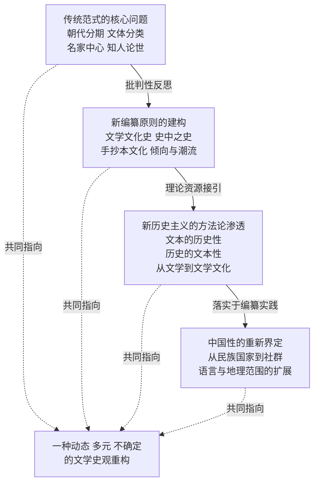
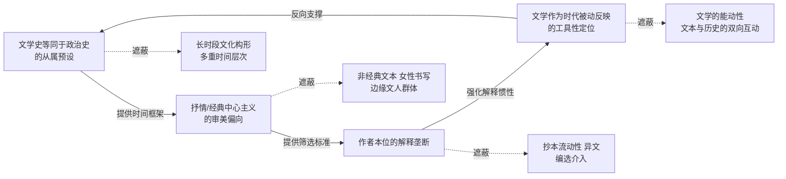
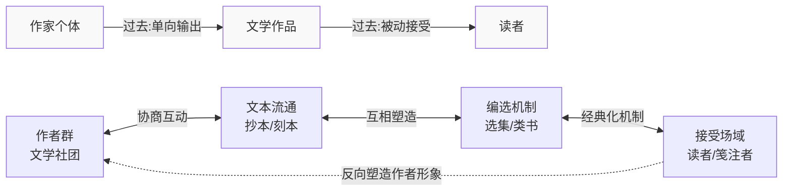
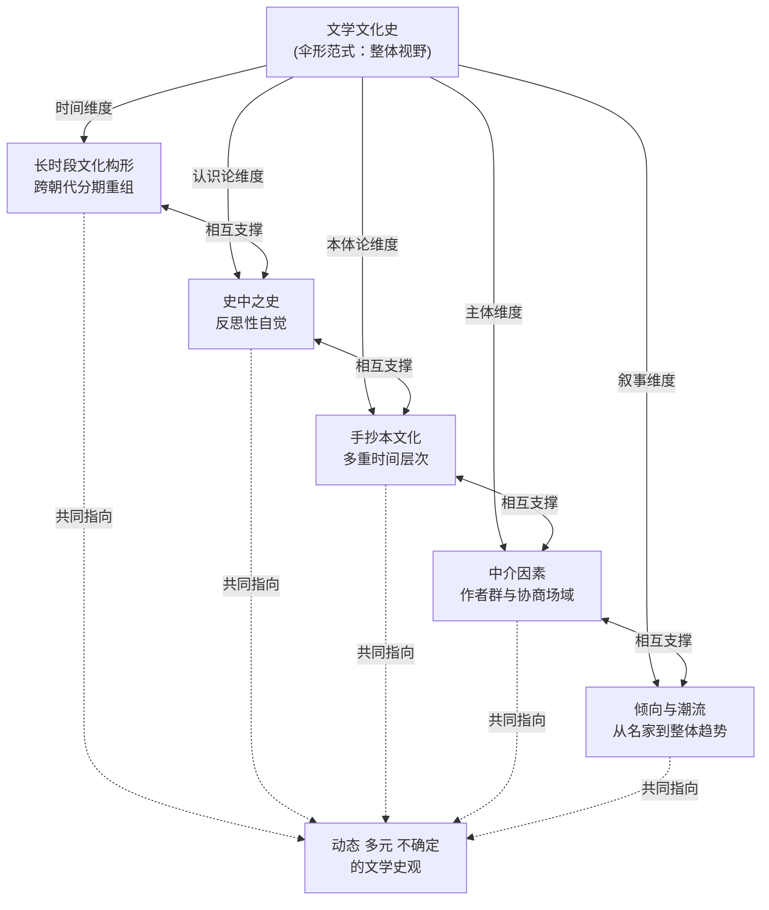
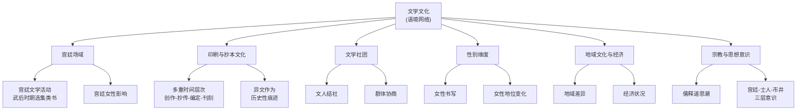
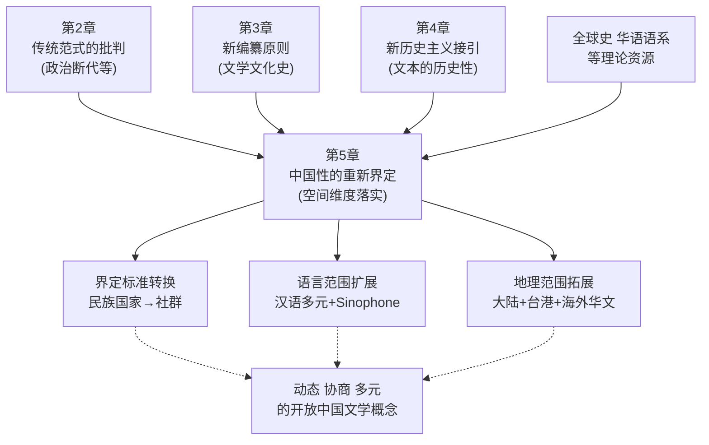
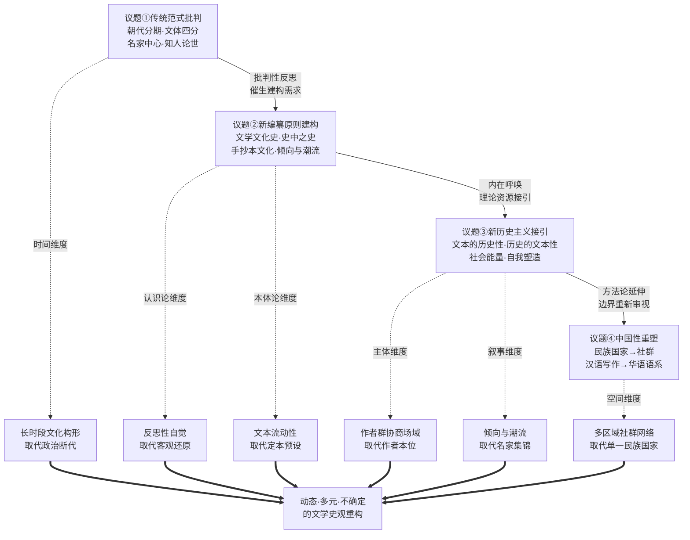

# 重写中国文学史：《剑桥中国文学史》的理论革新与编纂范式转型
# 1 研究缘起与争论语境

## 1.1 《剑桥中国文学史》的出版背景与编纂定位

《剑桥中国文学史》（*The Cambridge History of Chinese Literature*）是剑桥大学出版社"国别文学史"（Cambridge History of Literature）系列的组成部分，英文版于2010年正式面世，简体中文版则由生活·读书·新知三联书店于2013年12月推出，分上下两卷出版[^1][^2]。该书由两位享有国际声誉的汉学家联袂主编：哈佛大学James Bryant Conant特级讲座教授、英语世界唐诗研究权威宇文所安（Stephen Owen, 1946—2025）负责上卷，涵盖上古至1375年的中国文学；耶鲁大学东亚语言文学系教授、东亚研究所主任孙康宜（Kang-I Sun Chang）负责下卷，涵盖明、清以及现代文学部分[^1][^3][^4]。两位主编召集的撰稿团队几乎囊括了当时西方汉学界从事中国文学研究的代表性学者，包括艾朗诺（Ronald Egan）、傅君劢（Michael Fuller）、康达维（David Knechtges）、田晓菲、商伟、王德威、奚密等人，**这种集体性的协作格局使该书在出版伊始即被视为"西方汉学界对中国文学研究的最高成果"的一次集中呈现**[^5]。

就编纂宗旨而言，该书自我定位的读者目标并非专业学者，而是"普通受教育大众"——它有意区别于一般工具书式的文学史，**而是以叙事的方式写成的一本"整体连贯、可通读"的文学史**[^1]。这一定位直接决定了其形式选择：全书采用编年体结构，"既不依文体分类，也不全都按朝代分期"，在写作上体现了一种新的文学史观念[^2]。例如上卷第一章从上古一直写至西汉，编者的考虑不仅在于"许多三代或春秋战国的作品在西汉才整理编纂成形"，更在于"这一时期从口传到简帛书写的文化物质形态变迁"，**这种以物质文化变迁而非政治王朝更替为分期依据的处理方式被认为是该书的一大亮点**[^1]。

将该书置于海外中国通史性著作的整体版图中，其学术坐标可以更为清晰地呈现。就中国通史而言，海外有三部公认的重要作品——日本讲谈社的"讲谈社·中国的历史"、哈佛大学出版社的"哈佛中国史"以及剑桥大学出版社的"剑桥中国史"，其中"剑桥中国史"系列体量最大、学术性最强[^6]。就中国文学通史而言，最重要的两部海外著作即《剑桥中国文学史》与梅维恒（Victor Mair）主编、哥伦比亚大学出版社出品的《哥伦比亚中国文学史》（中译本2016年由新星出版社推出）[^6]。值得注意的是，二者虽同属海外汉学界的集体性书写，但编纂路径存在明显差异：《哥伦比亚中国文学史》采取的是类似"剑桥中国史"系列的专题论文体例，"每一编均由一篇篇相对独立、彼此之间又紧密相联的专题性论文构成"，并按《诗歌》《散文》《小说》《戏剧》等文体形式来设置框架[^6]；而《剑桥中国文学史》则刻意放弃了文体分类与朝代分期的传统骨架，转向以编年叙事追求整体连贯性。**这种差异本身就预示着《剑桥中国文学史》并非又一部体例上"求全"的工具书，而是一次方法论意义上的范式实验**。

下表概括了《剑桥中国文学史》在出版背景与编纂定位上的几项基本信息：

| 维度 | 基本信息 |
|---|---|
| 英文版出版 | 剑桥大学出版社，2010年 |
| 中文版出版 | 三联书店，2013年12月，上下两卷 |
| 上卷主编 | 宇文所安（Stephen Owen），哈佛大学，涵盖上古至1375年 |
| 下卷主编 | 孙康宜（Kang-I Sun Chang），耶鲁大学，涵盖明清及现代文学 |
| 主要撰稿人 | 艾朗诺、傅君劢、康达维、田晓菲、商伟、王德威、奚密等 |
| 读者定位 | 普通受教育大众，追求"整体连贯、可通读" |
| 体例特征 | 编年叙事，不依文体分类，不严格按朝代分期 |
| 同类参照 | 哥伦比亚中国文学史（专题论文体例，文体框架）|

## 1.2 中西文学史编纂的范式张力与问题意识

《剑桥中国文学史》的问题意识并非凭空而起，而是诞生于一种贯穿中西学界的深层焦虑之中——即"文学史"作为一种知识形式本身是否可能。美国文学理论家雷纳·韦勒克（René Wellek）早在《文学理论》中即提出过经典质疑：**"写一部文学史，即写一部既是文学的又是历史的书，有可能吗？"**[^5] 韦勒克指出，大多数所谓文学史的著作，"要么是社会史，要么是文学作品中所阐述的思想史，要么只是写下对那些文学作品的印象与评价"——文学史的写作总是首先服从于历史的设定，"大多数文学史会根据政治变化的发展进行分期"，结果使文学"很容易被认为是一个国家的政治和社会革命所决定"[^5]。这一困境揭示了文学史书写中一种隐秘的政治属性：把文学史分为各个朝代和国别的"基本常识"，所隐含的恰恰"是一种政治而非文学的观点"[^5]。

这一困境在中国语境中表现得尤为突出。国内传统通史性著作"往往简单采取以时间为经、类别为纬的写作思路"[^6]，其结果是文学史叙事被压缩为朝代框架下的作家作品罗列。这种写作惯例的背后隐含着几重相互关联的假设：文学发展的节奏与政治王朝的更替同步；作家个体的生平与作品的社会政治背景构成解释作品的主要钥匙；文学史的任务是从历史长河中辨认并组织一系列"经典"作家与作品。**正是在这种背景下，文学史的写作面临一个韦勒克所谓"做减法又做加法"的双重张力**——一方面要尽量摆脱政治、经济、宗教等外部因素的左右，让文学回到自身；另一方面又必须借助文学理论与文学批评的方法论指导来进行作家作品的价值判断与取舍，本质上是一种"经典的重构"[^5]。

商伟在回顾《剑桥中国文学史》的撰写思路时指出，传统分期方法之所以需要被反思，关键不在于简单替换某个时间节点，而在于揭示"分期本身"作为一种"人为的时间标志"的性质：**"所谓分期不过是文学史叙述中一个人为的时间标志，或沿袭传统而来，或打破惯例以展现历史发展的另类可能。关键在于新的时代分期究竟能否名副其实地提供新的视野和新的历史洞见。"**[^2] 他进一步指出，"历史叙述需要戏剧化的转折标志，往往落实到某一年甚至某一天，但实际的历史过程却要复杂而缓慢得多"，**在中国这样幅员广阔、地域差异明显的国度，文学史的展开"不仅是时间性的，也是空间性的"**[^2]。这一反思直接指向了传统朝代分期的两重盲点——其一是过度依附政治事件而牺牲文学自身的演进逻辑；其二是以线性时间叙事遮蔽了空间维度的多元性。

正是在中西文学史编纂的这种范式张力之中，《剑桥中国文学史》确立了自身的问题意识：**它不仅试图为西方读者提供一部完整的中国文学叙事，更试图通过这部叙事来回应"文学史何以可能"这一长期未决的方法论难题**。它有意将自身呈现为一次自觉突破既有范式的尝试——重视文学史的"有机整体性"，关注文学交流、文人结社、文学社团等以往被忽视的现象，强调物质文化的影响，把作品视为"不断被后世编订、完善"的动态过程而非定本[^1][^7]。也正因如此，理解该书的理论革新，必须将其置于"中西文学史共同困境"与"汉学界范式实验"的双重坐标之中来审视。

## 1.3 学界反响与核心争论焦点

《剑桥中国文学史》自英文版面世以来即"备受瞩目"，2013年简体中文版推出后更在中国大陆读书界和学术界引发了"热烈反响"[^6][^2]。学界对其评价呈现出明显的光谱式分化——一端是高度赞誉，另一端是细致疵议；而争论的焦点几乎覆盖了从编纂理念到具体史实的所有层面。

**赞誉性评价**主要集中于其方法论创新与学术雄心。在海外汉学界，该书被广泛视为"近十年最重要的中国文学史巨著"[^8]。国内研究者则从多个角度肯定其贡献：其一是写作姿态上的整体性追求——"相较于传统文学史注重作家个体和作品的社会政治背景分析，本书更重视文学史的有机整体性，关注文学交流、文人结社、文学社团等现象"[^1]；其二是编年断代上的匠心独运，例如第一章跨越上古至西汉这一处理方式被视为"新颖的编年方式"和"本书的一大亮点"[^1]；其三是文学史观上的转换——它"引入的不仅仅是新的文学史写法，也是观念的碰撞，思想的冲"击，让"传统文学复活于当下的时代语境中"[^5]。

**批评性意见**则主要集中于两个层面。其一是具体史实层面的疏漏，最为系统的批评见于王鹏程对下卷"1841—1949"部分的疵议。王鹏程从史实准确性的角度指出，**"无论著何种史，史实的准确可谓基础。错误成堆、纰漏百出，首先会给读者传递错误的知识，贻害于人；其次，往往使观点、推断等受到很大的影响，牵涉到所著史书的质量"**[^9]。他举出多处具体错误，例如该书称"1841年仲夏，学者、诗人龚自珍暴卒于江苏当阳书院"，实际上"龚自珍卒于1841年9月26日，农历8月12，时维仲秋，而不是'仲夏'。卒地是江苏丹阳云阳书院（亦称'丹阳书院'），而不是当阳书院"；又如征引龚自珍"九州生气恃风雷"时误写为"九州风气恃风雷"等[^9]。这些疵议虽聚焦于近现代部分，**却也提示了一部由不同学者分章撰写的集体性文学史在质量均衡上的天然难度**。

其二是理论与审美层面的检讨。有研究者从整体视角指出，**该书"因偏重文学叙事与思辩，从而在一定程度上忽视了文学抒情与审美"**[^8]。这一批评有其学理深度：中国抒情文学不仅是作家"对一己之情的抒写"，更"集中体现了中国文化由己及人、物我交融、虚怀契道的人文精神，亦即'天人合一'"；而该书对抒情文学的相对忽视，"导致该著对《诗经》、词、山水文学等文类的认识价值与艺术价值的相对忽略"[^8]。值得注意的是，宇文所安本人对此似有所回应——其后续著作《中国传统诗歌与诗学》中"对上述缺失作了解释和补充"，探讨了中国抒情文学所体现的"审美图示"以及对偶、声韵等修辞与接受问题[^8]。

综合而言，围绕该书形成的争论焦点至少包含以下几个维度：编纂范式的革新意义、分期方法的合理性、文学文化史视角的得失、"话语建构"叙述模式的方法论价值、对中国抒情传统的处理方式，以及现当代部分的学术质量等[^8]。**这种多维度的接受光谱本身就证明，《剑桥中国文学史》触及的并非某个局部技术性问题，而是文学史书写的整体观念变革**——这也正是本报告所要深入梳理的核心。

## 1.4 四条核心理论议题的提炼

在前述出版背景、范式张力与学界反响的基础上，本报告将围绕《剑桥中国文学史》的理论革新，提炼出四条贯穿全篇的核心议题。这四条议题构成一个相互支撑的有机整体——前一条孕育后一条，最终指向一种系统性的文学史观重构。

第一条议题是**对传统文学史编纂方法的批判性反思**。宇文所安等编者对以朝代分期为骨架的"政治断代"模式、以诗文小说戏曲四分割裂文学整体性的做法、以名家经典为脉络的线性叙事、"知人论世"的传记式批评惯性、对作品物质生成条件的忽视，均提出了系统性的检讨。这一批判针对的不仅是技术性的写作惯例，**更是其背后的核心观念——文学史等同于政治史的从属预设、抒情/经典中心主义、作者本位的解释框架、文学作为"时代被动反映"的工具性定位**。

第二条议题是**新编纂原则的建构，即从"文学史"到"文学文化史"的范式跃迁**。为回应传统范式的弊端，编者提出了一系列颠覆性的新原则：以"文学文化史"（history of literary culture）取代单纯的作家作品叙事；以"文化唐"等长时段、跨朝代的文化构形重组分期；提出"史中之史"（即文学史本身就是历代不断被重写的过程）的反思性立场；引入"手抄本文化"与"定本"意识，区分作品的创作、抄传、编定、刊刻等多重时间层次；重视接受史、印刷文化、选集编纂、文学社团等中介因素；以"倾向"和"潮流"取代"名家集锦"。该书强调"文学作品不断被后世编订、完善，是变动的、受历史影响的过程"[^7]，这正是"史中之史"立场的具体落实。

第三条议题是**新历史主义与文化史转向的方法论渗透**。该书对文学文化语境的整体性观照——具体而言，包括文本文化（"读写条件、流传语境和辅助文本"）、社会意识（"宫廷、士人和市井三个层面的思想意识以及宗教等"）、物质基础（"地域文化和经济状况"）以及"历史上的重大政治事件及文化思潮的发展嬗变、生产技术特别是印刷技术的进步，以及女性地位的变化与女性书写"等多层面[^8]——折射出新历史主义"文化诗学"对文学文化研究的深层影响。其"话语建构"的述评模式将"话语主体从'作者'还原为'作者群'"，"将话语的实现方式界定为文本与人的交互对谈，即文本间的交叉关联、文本与现实的融通、文人之间的交流"[^8]，**与新历史主义"文本的历史性"与"历史的文本性"两大命题形成方法论上的深层呼应**。

第四条议题是**"中国性"在跨文化语境下的重新界定**。这一议题涉及该书如何在编纂层面回应"中国文学"边界的当代困境——既包括语言范围的扩展（汉语写作传统的内部多元、华语语系/Sinophone视野的引入），也包括地理范围的拓展（大陆、台湾、香港、海外华文写作的并置）。**这一边界重塑既是对民族国家叙事框架的方法论挑战，也是对全球化语境下"何为中国文学"这一根本问题的重新回答**。

下图概括了这四条议题的内在逻辑链条及其相互关系：

四条议题之间并非简单的并列关系，而是一种递进的逻辑链条：**对传统范式的批判催生了新原则的建构需求，新原则的建构需要接引新的理论资源（新历史主义/文化史），而理论资源的接引又最终落实于对"中国性"这一根本问题的重新界定**。这一链条共同指向一种动态、多元、不确定的文学史观——它不再以朝代政治为骨、以名家作品为肉、以民族国家为界，而是以文学文化为整体、以重写与协商为机制、以社群与跨界为视野。

## 1.5 研究路径与报告框架

基于上述问题意识与议题提炼，本报告的研究路径可概括为以下几点。**研究对象**以《剑桥中国文学史》文本本身为核心，结合两位主编及主要撰稿人的相关学术论著与访谈——包括田晓菲译宇文所安《史中有史：从编辑〈剑桥中国文学史〉谈起》（原为宇文所安2007年秋在华东师范大学和台湾大学的讲演稿，2008年发表于《读书》5月号）[^4]、商伟收入《云帆集》的访谈《时间也蕴含了错误和遗忘：谈文学史的写作》[^2]、宇文所安《中国传统诗歌与诗学》[^8]等——以及王德威、奚密等下卷撰稿人就同类问题（如《哈佛新编中国现代文学史》）所表达的方法论立场作为侧面参照[^10]。**研究方法**则结合三种路径：其一是文本细读，对编者的理论表述及该书的具体编纂处理进行精读；其二是范式比较，将该书与传统文学史模式、同类海外著作（如《哥伦比亚中国文学史》《哈佛新编中国现代文学史》）进行对照；其三是学术史考察，将该书置于韦勒克以来文学史方法论反思的长时段脉络中加以理解。

在研究态度上，本报告秉持**梳理与呈现而非评价**的原则——目的在于厘清《剑桥中国文学史》所代表的理论革新的内在逻辑，而非对其成败做出整体性判断。在涉及不同学界立场（赞誉与批评）时，将客观并陈，使理论革新本身的复杂性得以充分呈现。

报告的后续章节将按照前述四条核心议题的逻辑顺序依次展开：**第2章**深入分析宇文所安等人对传统中国文学史写作的系统性批判，揭示其所指向的核心观念局限；**第3章**阐述该书所建构的新编纂原则，重点解析"文学文化史"范式与"史中之史"立场的理论内涵；**第4章**探查新历史主义、特别是格林布拉特"文化诗学"对该书方法论的深层影响，分析"文本的历史性"与"历史的文本性"两大命题如何被转化为编纂操作原则；**第5章**考察"中国性"在该书中的重新界定，分析从"民族国家"到"社群"的视角转移及其对文学史空间的扩展效应；**第6章**则归纳四个理论维度间的内在关联，并就该范式所引发的延伸议题与未尽方向作出展望。各章环环相扣，共同构成对《剑桥中国文学史》理论革新的整体性梳理与理论坐标定位。

# 2 对传统中国文学史写作的批判：核心观念的检讨

承接前章所述的范式张力与问题意识，本章将逐层深入《剑桥中国文学史》编纂团队对传统中国文学史书写的系统性批判。需要特别说明的是，这里所谓"传统"并非指中国古代的目录学、文苑传或诗话词话等本土文学叙述传统，而是特指自20世纪初中国现代学科建制以来形成的、以朝代分期为骨架、以诗文小说戏曲四分为框架、以名家经典为脉络、以"知人论世"为方法的现代文学史书写惯例——这一惯例在游国恩的拓荒之作、新中国时期的四卷本《中国文学史》以及袁行霈主编的《中国文学史》中逐渐定型，并通过被全国千余所高校采用而成为中国学界的"主流范式"[^11]。宇文所安等人的批判正是针对这一现代意义上的"主流范式"。本章将沿着"操作惯例—背后预设—方法论后果"的递进逻辑展开，力图呈现这一批判的内在层次与系统性。

## 2.1 朝代分期的政治断代模式及其内在预设

朝代分期作为传统中国文学史书写最为根深蒂固的骨架性原则，是宇文所安等人批判的首要靶点。这种以王朝更替为时间刻度的分期方式之所以"积重难返"，正如孙康宜所坦言，源自一种历经百年沉淀的学术惯性——"尽管每一位研究中国文学的学者都知道，朝代分期法并不能尽述文学史的变化轨迹，但积重难返，绝大多数现行文学史都在沿用这一做法"[^12]。即使是国内学界公认在分期理论上有所突破的袁行霈主编《中国文学史》，其所采用的"三古七段"说虽强调"把文学自身的发展规律作为分期依据，而不是单纯依据朝代的更替顺序"，被认为"打破了文学史作为'历史学附庸'的旧有格局，实现了从'朝代史'向'文学本体史'的转变"[^11]，但**在底层操作上仍未能完全摆脱朝代框架的牵引——"三古"之内的"七段"细分依然在很大程度上与朝代节奏相重合**。

《剑桥中国文学史》对朝代分期的突破则更为彻底。孙康宜最初拟以1400年作为上下卷的分水岭，理由是"《剑桥文学史》系列中已出的俄、德和意大利文学史，大都是从1400年左右开始"——但当这一时间节点落实到中国语境时，她立即意识到刻意追求系列起跑线的整齐"对历史反倒不忠实，'等于把朱元璋斩腰断掉了'"，最终下卷择定1375年——这一年朱元璋处决了诗人高启，"开启了文禁森严、残酷诛杀的洪武年代，从元朝遗留下来的一代文人基本上被剪除殆尽"[^12]。**这一细微调整背后蕴含着深刻的方法论转换——文学事件（诗人之死与文人群体被剪除）压过了政治事件（明朝开国），成为分期的真正标志**。同样耐人寻味的是首邀撰稿的柯马丁的回应——他在第一封回信中即明确表示"入伙"前提是"早期中国文学"必须包括西汉，否则宁愿不写，因为"通常说的'先秦文本'实际是在西汉末期的'经典化'过程中形成的，之前甚至还未出现'书'和'作者'的概念"；他从考据角度进一步指出，传统文学史中被当作早期文本传播中断罪魁祸首的秦始皇"焚书坑儒"，只是"有利于建构儒家学者身份认同"的传统说辞，"恰恰相反，所谓'焚书'前后，经典学问的传承并无任何改变"[^12]。

王德威对现代文学开端的重新界定则进一步彰显了这一原则：他没有将"五四"运动作为中国现代性的开端，也没有沿用1840年鸦片战争这一传统标志，而是选择了1841年——这一年仲夏，学者、诗人龚自珍暴卒于江苏书院。在王德威的表述中，"本章无意将'五四'文学革命及其后续事件视为一种单向的线性发展，而着力将中国文学的现代性视为一个漫长且曲折的过程，并将其开端上溯至十九世纪中叶"[^12]。

综合柯马丁、孙康宜、王德威这三处分期处理，朝代分期模式所隐含的三重预设被一一暴露：

| 隐含预设 | 暴露方式 | 替代逻辑 |
|---|---|---|
| 文学发展节奏与政治更替同步 | 柯马丁指出先秦文本的"经典化"实际发生于西汉末期 | 文学有"自身的时间表" |
| 政治事件构成文学转折的决定性标志 | 孙康宜选择1375年高启之死而非1368年明朝开国 | 文学事件压过政治事件 |
| 线性时间足以承载文学演进 | 王德威将现代性界定为"漫长且曲折的过程" | 多重时间层次的并行 |

可以看到，朝代分期的方法论困境在韦勒克那里早有揭示——他指出"大多数文学史会根据政治变化的发展进行分期"，使文学"很容易被认为是一个国家的政治和社会革命所决定"，**这种貌似中立的"基本常识"所隐含的恰恰"是一种政治而非文学的观点"**。商伟在反思《剑桥中国文学史》分期实践时也明确指出，"所谓分期不过是文学史叙述中一个人为的时间标志，或沿袭传统而来，或打破惯例以展现历史发展的另类可能"——朝代分期的真正问题不在于它是一种分期方式，而在于它**把"人为的时间标志"误认为文学自身的内在节律**，从而遮蔽了文学发展的长时段连续性（如后文将讨论的"文化唐"）以及文本生成、抄传、编定、刊刻之间的多重时间层次。

## 2.2 文类四分法对文学整体性的割裂

如果说朝代分期是传统文学史的纵向骨架，那么以诗、文、小说、戏曲四分文类为框架的书写则是其横向逻辑。这一文类四分法在中国现代文学史书写中的影响同样深远——它源自游国恩等先驱学者对中国文学流变的初步系统化，最终在新中国时期的四卷本《中国文学史》及其后续教材中得到固化[^11]。**这种文类分立的处理方式在"求全"的工具书定位下确实有其便利性，但其方法论代价是将同一时代、同一文化语境下相互渗透的文学实践人为切割**。

《哥伦比亚中国文学史》正是文类专题体例的典型代表。如前章所述，该书"每一编均由一篇篇相对独立、彼此之间又紧密相联的专题性论文构成"，并按《诗歌》《散文》《小说》《戏剧》等文体形式来设置框架。这种处理方式继承的正是西方汉学界自翟里斯1901年《中国文学史》以来逐步形成的"兼顾学术性和通俗化"的工具书传统[^13]。而《剑桥中国文学史》的刻意反向选择——放弃文体分类、转向编年叙事——本身就构成对这一传统的方法论反思。

文类框架的塑造与限定作用，在张隆溪《A History of Chinese Literature》（Routledge, 2023）对"明传奇"的处置中得到了一种特殊的折射——该书全书"没有片言只语提及'明传奇'"，第十六章论明代时重点完全放在诗歌（明初高启、吴中四子、前后七子、徐渭和李贽、公安派和竟陵派、陈子龙等晚明诗人），**"完全不见'荆、刘、拜、杀'的踪迹"**[^14]。"四大传奇"（《荆钗记》《刘知远白兔记》《拜月亭》《杀狗记》）这类在传统戏剧史中"历史长河沉淀下来"的重要课题，在以诗歌为核心叙事的编排中被边缘化甚至消失[^14]。这一案例并非仅是张隆溪一书的个别选择，**它揭示了一个普遍现象——任何文学史的视野都被其底层框架所塑造和限定，文类框架的选择本身就决定了哪些文学现象被纳入主流叙事、哪些被排除在外**。

文类四分法所隐含的方法论代价至少包含以下几个层次：其一，它遮蔽了文人在不同文类间的跨界书写——同一作家在诗、文、词、曲、小说之间的流转往往不是孤立的文体实践，而是其整体文学活动的有机组成；其二，它无法处理文体之间的相互生成关系——如词如何从诗中蜕化、曲如何吸收词与说唱传统、戏剧如何与散文笔记互动；其三，它使戏剧、说唱、女性书写等在特定历史阶段曾居于中心地位或具有重要文化能量的文类被压抑到边缘位置。**这正是宇文所安等人转向"文学文化"整体视野的内在必然性——只有把诗、文、小说、戏曲乃至选集编纂、文人结社、抄本流通等都视为同一文学文化场域中相互关联的实践，文学史的整体性才有可能恢复**。

## 2.3 名家经典中心的线性叙事与抒情中心主义

与文类四分法相伴而生的是以名家作品为脉络组织文学史的传统做法。这一叙事模式将文学史压缩为"经典作家—代表作品"的序列罗列——杜甫《戏为六绝句》中"王杨卢骆当时体"式的高峰串联，恰是这种叙事的古典先声[^11]，而现代文学史则将其系统化为以名家生平为节点、以代表作品为标本的线性脉络。这种模式在哈罗德·布鲁姆式的"经典化"（canonization）研究中达到极致——它强调个别作家在文学传统中的核心地位，并通过"影响的焦虑"等机制来建构文学史的内在连续性。

孙康宜在谈及《剑桥中国文学史》的方法论取向时明确指出了这一转换的轨迹。她回顾自己学术成长的脉络时坦言，1982年到达耶鲁后，"不知不觉也受到解构主义影响——文学不再是'读者'和'作者'的封闭结构"；**"不同于哈罗德·布鲁姆对经典化（canonization）包括个别作家的强调，在《剑桥中国文学史》中，孙康宜更强调一种倾向"**[^12]——即从"经典化"转向"倾向"（tendency）与"潮流"（trend）的方法转换。这一转换的意义远不止于学术口味的差异——它指向一种更为根本的叙事单元重构：文学史的基本单位不再是孤立的高峰作家，而是由众多作家、文本、读者、编选者共同构成的协商性场域。

名家经典中心模式所承载的核心偏向有两个层面。**其一是审美判断上的抒情中心主义偏向**。中国文学史的现代书写自游国恩"南北二派"理论以来即奠定了诗歌系统的中心地位——《诗经》—汉魏乐府—唐诗—宋词—元曲这一以诗为骨干的演进脉络，几乎构成了中国文学史叙事的基本节奏[^11]。这种偏向在《剑桥中国文学史》面对的批评中也有所反映——有研究者指出该书"因偏重文学叙事与思辩，从而在一定程度上忽视了文学抒情与审美"，而中国抒情文学不仅是"对一己之情的抒写"，更"集中体现了中国文化由己及人、物我交融、虚怀契道的人文精神"。这一批评本身从反面印证了一个事实——抒情中心主义在中国文学史书写中已经形成了一种相当强大的本质化想象，**以致任何偏离抒情主线的叙事尝试都会立即被指认为"对抒情传统的忽视"**。

**其二是主体认定上的高峰作家偏向**。这一偏向导致文学史中大量非经典文本、女性书写、民间写作与边缘文人群体被系统性遮蔽。范方俊在评析英语世界中国文学史时引入的"远读"概念恰恰提供了一种反向视角——"远读"是一个与传统"细读"相对应的概念，"强调文学研究的宏观、整体视角和对文学史中'大量的未读'的重视"[^13]。**"大量的未读"这一表述精确捕捉了名家中心模式的系统性盲点——文学史不仅是高峰作家的故事，更是众多次要作家、佚名作品、边缘文本所共同构成的整体生态**。这种偏向不仅是技术性的取舍问题，更反过来固化了对中国文学"抒情传统"与"经典作家"的本质化想象——后世读者通过文学史所认识的"中国文学"，本质上是经过名家筛选机制层层过滤后的产物，而非中国文学历史实际的完整面貌。

## 2.4 "知人论世"批评惯性与作者本位的解释框架

名家中心的叙事在批评方法上的对应物是"知人论世"的传记式解释惯性。这一源远流长的本土批评传统——主张通过了解作者的生平、时代与意图来理解作品——在现代文学史书写中被系统化为"时代背景+作家生平+作品分析"的三段式叙事。这一模式的方法论预设在于：作品被视为作者意图的透明载体，作者构成文本意义的唯一来源，作品的真实形态等同于作者创作时的原貌。

田晓菲在《尘几录：陶渊明与手抄本文化研究》中所提出的核心命题，正是对这一作者本位框架最为根本的动摇。她以陶渊明这位"经典诗人的个案出发，讨论'抄本/写本文化'的特点，和它对文学史以及具体作家作品的巨大影响"——**她特别强调"对我们没有一个权威的陶渊明却拥有多个陶渊明的强调"**[^15]。这一命题的颠覆性不在于否定陶渊明其人的存在，而在于指出：所谓"陶渊明"作为一个被后世接受的文本形象与诗歌集合，并非作者本人创作时的原貌，而是经过历代抄写、编订、笺注、推崇等一系列文化实践层层建构的产物。

田晓菲在该书序言中进一步阐明了这一方法论立场的理论意义——《尘几录》"呼吁我们注意在抄本文化时代文本传播的特质，对中国写本文化研究与中世纪欧洲写本文化研究做出理论性的联系，提出'新式语文学或曰新考证派'的理念，指出被重新定义了范畴和意义的考证可以为古典文学研究'带来一场革命'"；这本书是"最早归纳'抄本文化'的抽象性质，并就它对作家形象、作品阐释和文学史书写的影响做出探讨的专著"[^15]。**值得注意的是，她特别提到"写《尘几录》的时候，在中国文学研究里还极少有人使用'抄本文化'这一词语，如今，对写本文化和文本流动性的研究和讨论在海内外比比皆是"**[^15]——这一表述本身即印证了这一方法论转向所引发的学术回响。

作者本位框架在面对抄本时代文本流动性、异文多歧、后世编订介入等历史实际时所暴露的解释力危机，可以概括为以下几个层面：

| 作者本位预设 | 抄本文化所揭示的实际 | 解释力危机 |
|---|---|---|
| 作品=作者创作原貌 | 文本经历创作—抄传—编定—刊刻多个时间点 | 哪一个版本才是"作品"？ |
| 作者是文本意义的唯一来源 | 抄者、编选者、笺注者均介入文本塑造 | "作者意图"如何可能被还原？ |
| 作家形象由其生平决定 | 作家形象经后世不断塑造（如陶渊明、李商隐）| 我们认识的是哪一个作家？ |
| 异文是需要校正的"讹误" | 异文反映文本流动性本身的历史性 | 校勘的目标本身受到质疑 |

这一危机直接呼唤一种新的解释框架——它需要"将话语主体从'作者'还原为'作者群'"，将文本视为一个由作者、抄者、编者、读者共同参与的协商性产物。这一新框架正是后续章节将要讨论的"文学文化史"范式的方法论起点。

## 2.5 对"写定本"物质条件与文本生成过程的忽视

紧接作者本位预设的批判，是对传统文学史忽视文本物质生成条件的检讨。传统书写默认作品为"定本"，将文学视为可以脱离其物质载体而独立存在的精神产物——这一预设遮蔽了文本从口传到简帛、从抄本到刻本的物质形态变迁，也忽视了选集编纂、印刷技术、文人结社等中介环节对文本形态与经典地位的塑造作用。

田晓菲在回顾自己的整个学术系列时，将《尘几录》定位为对"抄本文化"研究的开创性尝试——"相对于在书籍文化和出版文化研究里受到很多重视的印刷文化，这本书呼吁我们注意在抄本文化时代文本传播的特质"[^15]。她进一步指出，这一研究方向所开启的"可以继续进行下去的工作，是对上古写本文化、中古写本文化，还有宋元以降印刷与写本的互动，做出更细致深入的区别对待，对'异文'的概念和处理，发展出更敏感、更富有层次感的意识"[^15]。**这一表述清晰地勾勒出物质文化视角的层次性——上古、中古、宋元以降构成不同的物质文化阶段，每个阶段中文本传播的特质与异文的产生机制都有其独特性，传统文学史的"定本"预设恰恰抹平了这些层次差异**。

《剑桥中国文学史》第一章以物质文化变迁为分期依据的处理，正是这一批判在编纂操作层面的具体落实。如前章所述，该书第一章从上古一直写至西汉，**编者的考虑不仅在于"许多三代或春秋战国的作品在西汉才整理编纂成形"，更在于"这一时期从口传到简帛书写的文化物质形态变迁"**。柯马丁坚持先秦文本必须延伸至西汉的方法论主张——即"先秦文本"实际是在西汉末期的"经典化"过程中形成的——正是这种物质文化视角的具体表达[^12]。

忽视物质条件不仅是技术性的疏漏，**更折射出一种将文学视为纯粹精神产物、与其物质载体相分离的形而上学预设**。这一预设在传统书写中表现为多个层面：将口传时期的作品当作文字定本来分析，忽视了口传文学的流动性本质；将抄本时代的异文视为需要校勘消除的"讹误"，而非文本生成过程本身的历史痕迹；将刻本时代的"标准版本"视为天然的研究对象，而忽视了印刷技术、商业出版、文人选编等中介环节如何参与了"标准"本身的塑造。**这种形而上学预设的方法论后果是——文学史成为一种脱离物质条件的纯粹观念史，而非嵌入具体物质文化条件的实践史**。

值得注意的是，田晓菲在自我反思中特别澄清了她的研究取向并非通常意义上的"跨学科研究"——"如我在此书前言中所说，我采取的方法，是把通常被不同学科领域作为专门研究对象的文本放在一起进行考察，把这些文本还原到它们产生的语境中——在那个语境里，并不存在现代学科领域的分界"[^15]。**这一澄清深具启发性——物质文化视角的引入并非简单地"跨入"书籍史、印刷史、考古学等其他学科，而是要求将文本还原到其产生的具体语境之中，而那个语境本身就是文学、物质、社会、文化交织的整体场域**。

## 2.6 倒果为因的因果论与时代决定论

传统文学史中普遍存在的另一种思维惯性是倒果为因的因果推断与时代决定论倾向。这种思维模式的典型表现至少包含三个层次：其一，以后世经典化的结果反推作品产生时的中心地位——某一作家或作品在后世被视为高峰，便被假定其在产生时即已具有这样的中心性；其二，以朝代政治特征单向推导文学风貌——盛唐之"盛"决定盛唐诗之"盛"、晚明之"乱"决定晚明文学之"颓"等；其三，以"时代精神"作为解释作品风格的最终依据，使个别作品的复杂性被压缩为时代特征的标本。

宇文所安所提出的"史中之史"立场，正是对这一传统因果论的根本反思——它承认文学史本身就是历代不断被重写的过程，从而**揭示传统因果论如何混淆了"文学事实"与"文学史建构"两个层次**，将后世的回溯性整理误认为历史的原初状态。一个典型例证是田晓菲对"我们没有一个权威的陶渊明却拥有多个陶渊明"的反复强调[^15]——传统文学史从陶渊明在后世被视为隐逸诗宗的结果出发，反推陶渊明在东晋时期即已是这样一个文学高峰；而抄本文化的视角则揭示，陶渊明的经典形象实际上是经过苏轼等后世推崇者塑造的结果，这一塑造过程本身就构成了文学史的重要环节。

时代决定论的方法论问题在田晓菲对《神游：早期中古时代与十九世纪中国的行旅写作》的自述中也有间接的反映。她将六朝和晚清这两个时代"合在一部书里来写"，"希望超越对时代、文类和文体做出的孤岛式分隔，看到它们相似中的不似、不似中的可比"——**这种跨越时代的比较视角本身即对"每个时代有其独立的时代精神"这一预设构成了挑战**：如果两个相隔千年的时代可以在"对异质文化的遭遇"这一共同问题上展开比较，那么"时代精神"作为解释最终依据的有效性就受到了根本动摇[^15]。

"史中之史"立场的关键意义在于——它要求文学史书写者承认自己所处理的不是文学的"原初事实"，而是经过历代选择、过滤、重写的文学史建构物。**这一立场直接指向了文学被视为"时代被动反映"的工具性定位的失效——如果"时代"本身就是后世建构的产物，那么"文学反映时代"这一命题就失去了单向因果链条的可能**。文学与历史的关系必须被重新理解为一种双向的互动协商——文学嵌入历史、又参与历史的建构，文学史的书写本身就是这种互动协商的一部分。这一反思直接为下一章将要讨论的新历史主义"文本的历史性"与"历史的文本性"两大命题奠定了批判基础。

## 2.7 批判背后的核心观念清算与方法论转向的呼唤

在前述六个层面的具体批判基础上，可以将宇文所安等人所清算的传统文学史核心观念归纳为相互支撑的四重预设。这一归纳并非简单的并列罗列，而是要呈现这四重观念之间的内在结构关联——它们共同构成了一个自我闭合、相互支撑的方法论体系，因而任何单一维度的局部改良都难以撼动其整体格局。

四重观念的相互支撑关系可以做如下解读。**政治断代为时代决定论提供时间框架**——朝代分期不仅是技术性的时间刻度，更是一种隐含的因果预设，它假定每一朝代构成一个相对自足的文化—文学单元，从而使"时代决定文学"的因果链条得以在朝代尺度上展开。**经典中心主义为作者本位提供筛选标准**——只有当少数高峰作家被预先确定为文学史的核心节点，"知人论世"式的作者传记才有了被精细化研究的对象，作者本位的批评惯性才能在有限的"重要作家"范围内可持续运行。**作者本位又反过来强化了"知人论世"的解释惯性**——一旦作品被默认为作者意图的透明载体，那么追溯作者生平、时代背景就成为解读作品的"自然"路径，文本本身的复杂性、流动性与中介性反而退居次要位置。**时代决定论则反向支撑政治断代**——既然文学被视为时代的被动反映，那么以政治时代为单位进行分期便有了"内在合理性"，朝代分期由此从一种偶然的技术选择被合理化为一种"本质性"的方法论选择。

这一四重观念体系的方法论后果，是文学史的解释维度被系统性收窄。在面对"写定本"的物质条件、抄本流动性、文学社群协商、跨朝代文化构形、女性与民间书写、文学接受与经典化机制等历史实际时，这一体系展现出明显的解释力不足：长时段的"文化唐"无法被压缩进唐、五代、北宋初的朝代分割之中；陶渊明的"多个面相"无法被还原为单一作者意图；女性诗集与说唱文学的繁荣无法被纳入"诗文小说戏曲"的文类格架之中；龚自珍的死与五四之间近八十年的"现代性漫长形成过程"无法被压缩为单一的"现代起点"。

需要特别强调的是，**这一系统性批判并非否定传统文学史的全部成就**。从游国恩拓荒之作的"南北二派"理论首次将地理空间维度引入文学史[^11]，到袁行霈"三古七段"说在分期理论上"打破文学史作为'历史学附庸'的旧有格局"[^11]，传统文学史书写在文学知识的积累、文献的整理、研究范式的建立等方面均做出了不可替代的贡献。宇文所安等人的批判针对的是这一传统在面对当代文学史研究新课题时所暴露的方法论边界——**这一边界不是技术性的、可以通过局部修补来克服的问题，而是观念层面的、需要通过整体范式重构才能突破的根本性局限**。

正是在这一意义上，本章所梳理的批判构成了下一章"文学文化史"新范式建构的逻辑起点与理论必要性。**只有当朝代分期的时间框架被打破，长时段文化构形（如"文化唐"）才有可能进入视野；只有当作者本位的解释垄断被消解，"话语主体从作者还原为作者群"的新解释框架才有可能确立；只有当文学作为时代被动反映的工具性定位被超越，文学与历史的双向互动协商才有可能成为文学史的核心命题**。下一章将转入这一新范式的正面建构，探查"文学文化史"如何作为一种系统性的回应方案，将上述批判转化为可操作的编纂原则。

# 3 新编纂原则的建构：从"文学史"到"文学文化史"

承接上一章对传统文学史四重核心观念的系统性批判，本章转入正面建构层面，集中阐述《剑桥中国文学史》编纂团队为回应这些方法论局限所提出的颠覆性新原则。如果说第2章所揭示的是"破"的层次——亦即对朝代分期、文类四分、名家中心、知人论世、定本预设与时代决定论等惯例及其背后预设的清算，那么本章所要呈现的就是"立"的层次：宇文所安、孙康宜、田晓菲等核心编纂者如何在批判的逻辑起点上，沿着分期重组、重写机制、物质文化、中介因素、叙事单元等多个维度，构筑起一种动态、多元、不确定的新文学史观。需要特别指出的是，这一建构并非各项原则的简单并列罗列，而是一种相互支撑、彼此咬合的有机体系——只有当六项原则被纳入"文学文化史"这一伞形范式之下整体把握，其方法论意义才能充分呈现。

## 3.1 "文学文化史"范式的提出与核心内涵

《剑桥中国文学史》的方法论核心在于将自身定位为一部"**文学文化史**"（history of literary culture）而非传统意义上的文学史。这一定位并非简单的术语调整，而是对文学史研究对象的根本性重新界定。宇文所安在上卷导言中开宗明义地将该书与博尔赫斯笔下虚构的19世纪作家彼埃尔·梅纳德相联系——梅纳德用异国的语言把塞万提斯的名作《堂·吉诃德》"重写了一遍"，这是"一种有意地制造时代错误和胡乱归属的技巧"[^16]。在这一隐喻的引导下，参与写作的十几位美国汉学家都在寻找这位"彼埃尔·梅纳德"的蛛丝马迹，并试图让其显形——他"行踪诡秘，分饰多角，从公元前两千年晚期的早期铭文一直穿越到2005年的网络文学"[^16]。

这一文学文化史定位的内涵可以从三个层次加以把握。**第一，研究对象的扩展**——文学不再被理解为一组孤立的作家作品序列，而是被还原到其产生、流通、接受的整体文化场域之中。该书所关注的对象因此从作家作品扩展为"写作不仅是国家统治的工具，同时也是外在于国家的文化媒介"[^16]这一更宽泛的文化实践网络。**第二，研究单元的重组**——以文体形式（诗歌、散文、小说、戏剧）切分的传统专题框架被有意放弃，转而采用以编年为骨架的整体叙事。如该书出版资料所明确说明，全书"以编年而非文体的结构方式介绍了从上古的口头文学、金石铭文一直到1949年中华人民共和国建国前夕中国文学三千年的发展历程"[^16]。**第三，研究姿态的转换**——作品被视为"不断被后世编订、完善"的动态过程而非定本，由此打开了重写、改写、塑造等中介环节在文学史中的方法论空间。

宇文所安本人对这一范式的方法论意义有过明确表述：**"一部新的文学史，是一次重新检视各种范畴的机会，既包括那些前现代中国的范畴，也包括1920年代出现的新文学史所引入的范畴。重新检视并不意味着全盘拒斥，只意味着要用证据来检验各种旧范畴。"**[^17]这一表述至少包含两层含义：其一，文学文化史的提出本身就是一种反思性的范式实验——它不是要否定传统文学史的全部成就，而是要在新证据、新视角的基础上检验旧范畴；其二，被检视的"旧范畴"既包括前现代中国本土的批评传统范畴（如诗文之分、雅俗之辨），也包括1920年代以来现代文学史书写所引入的西方范畴（如朝代分期、文类四分），这两类范畴均需在新范式中得到重新审视。

与《哥伦比亚中国文学史》的对照可以更清晰地呈现"文学文化史"范式的独特性。如前章所述，《哥伦比亚中国文学史》采取的是文体专题论文的体例，每一编"按《诗歌》《散文》《小说》《戏剧》等文体形式来设置框架"——这种处理方式虽然在文体内部追求知识的系统性与权威性，但其方法论代价正是上一章所揭示的"对文学整体性的割裂"。**《剑桥中国文学史》的反向选择——放弃文体框架、转向编年叙事——则使同一时代不同文体之间的相互渗透、文人在多种文类间的跨界书写、文学社群对文本生产的协商性塑造等以往被压抑的关联得以重新进入文学史的主体叙事**。这一选择也间接回应了韦勒克"文学史何以可能"的经典质疑——文学文化史并不试图在"纯文学"与"社会史"之间维持一条不可能的分界线，而是承认文学本身就是社会—文化—物质条件交织的产物，从而将文学史的合法性建立在对这一交织过程的整体描述之上。

## 3.2 长时段文化构形与跨朝代分期重组：以"文化唐"为例

在"文学文化史"伞形范式之下，分期框架的重组是最为直观的方法论落实。宇文所安在上卷所撰写的"**文化唐朝**"（Cultural Tang）一章，是这一原则最具代表性的具体操作。该章被认为揭示出"中国文学史上一个独特的、被低估的时期"[^18]——以"文化唐"取代政治意义上的"唐朝"，意味着以文学文化的同质性而非王朝政治更替作为分期依据。在宇文所安的处理中，"文化唐"跨越了通常所说的唐、五代乃至北宋初期的朝代分割，呈现出一种以文化连续性为脉络的长时段构形。

宇文所安对武后时期文学场域的特殊关注是这一长时段视野的具体体现。据其论述，"武后统治时期出现了一系列的诗文选集、诗文要钞、典范对句集和类书。这些作品的失传使得我们很容易忽略它们的重要性。"[^18]这一表述揭示了一个长期被传统文学史所遮蔽的现象——武后时期的文学制度（选集编纂、类书制作、宫廷文学活动）实际上为后来盛唐诗的兴起提供了关键的文化基础设施，但由于这些文献的大量失传以及传统文学史以盛唐诗大家为中心的叙事偏向，这一时期被系统性地低估。宇文所安将这一时期纳入"文化唐"的整体构形之中加以重新评估，**其方法论意图正是要打破"政治朝代=文学单元"的预设，揭示那些跨越朝代分割、由文学制度与文化实践所共同构成的长时段同质性**。

跨朝代分期重组的实践并非仅见于"文化唐"一例，它在整部《剑桥中国文学史》中具有系统性的体现。如前章已分析，柯马丁坚持将"早期中国文学"延伸至西汉，理由是"通常说的'先秦文本'实际是在西汉末期的'经典化'过程中形成的"——这一处理使先秦至西汉构成一个完整的"早期文本经典化"长时段单元；孙康宜将上下卷分界定为1375年（高启被处决），使元末明初构成一个"文人群体被剪除"的过渡性单元，而非简单服从"元—明"的政治断代；王德威将现代文学开端上溯至1841年（龚自珍卒年），使19世纪中叶至五四之间近八十年的"漫长且曲折的现代性形成过程"得以作为一个整体单元进入文学史。这些处理的共同特征是——分期的真正依据不再是政治事件，而是文学文化自身的演进节律。

这些跨朝代构形的方法论意义可以做如下归纳。**第一，文学有"自身的时间表"**——文学事件（如经典化过程、文人群体的存亡、文体自觉的诞生）压过了政治事件（如朝代更替）成为分期的主要标志。**第二，分期单元的弹性化**——根据所考察的文化现象的不同性质，分期单元的长度与边界可以灵活调整，而非被预先固定的朝代框架所规约。**第三，长时段与短时段的并存**——"文化唐"代表跨越数百年的长时段同质性，而1375年高启之死则代表瞬间事件作为分期标志的可能，两者并存于同一编纂体系之中。需要客观说明的是，"文化唐"分期本身在学界存在争议——部分国内学者认为其650—1020年的跨度可能模糊了宋初文学自主性；这一争议本身恰恰印证了分期重组作为一种解释性建构而非自然事实的性质。

值得注意的是，**长时段文化构形并非以模糊朝代差异为目的，而是要在更高的层次上揭示朝代框架所无法把握的文化连续性**。宇文所安在"文化唐"中并不否定唐、五代、宋初在政治史上的区别，他所做的是揭示在这些政治区分之下，存在着一个由文学制度、文体观念、读写实践所共同维系的相对自足的文学文化场域。这一场域的边界不与政治朝代的边界重合，因此需要一个独立的分期范畴来加以把握。这正是"文化唐"作为方法论概念的核心价值所在。

## 3.3 "史中之史"：文学史作为不断重写的动态过程

如果说长时段构形重塑了文学史的时间框架，那么"**史中之史**"立场的提出则确立了文学史书写者的反思性自觉。这一立场集中表述于宇文所安的演讲与文章中——其原稿为2007年秋在华东师范大学和台湾大学的讲演稿，2008年发表于《读书》5月号，题为《史中之史：从编辑〈剑桥中国文学史〉谈起》。该立场的核心命题是：**文学史本身就是历代不断被重写的产物，文学史叙事自身具有历史性**。

孙康宜在阐述这一立场时给出的经典表述是：**"中国文学史其实是对过去持续不断地重写（rewriting）。"**[^16]她进一步以一个具体案例说明这一命题的颠覆性："以往的文学史上只告诉我们《梧桐雨》《汉宫秋》是元杂剧。但很少有人知道，它们的定稿并不在元朝，直到16世纪明朝，李开先才将它们改写成现在的样子。我们应该给李开先记上一大功。"[^16]这一案例至少揭示了两个层次的方法论问题：其一，作品的"时代归属"问题——所谓"元杂剧"《梧桐雨》《汉宫秋》在传统文学史中被毫无疑问地归入元代文学，但其实际定稿却发生于16世纪明朝；其二，"重写者"的文学史地位问题——李开先作为重写者在传统叙事中几乎被遗忘，而在"史中之史"视角下，他作为彼埃尔·梅纳德的化身之一应当被重新纳入文学史的主体。

"史中之史"立场所揭示的重写机制并非个别现象，而是贯穿整个中国文学传统的普遍机制。孙康宜从《诗经》的阐释到屈原形象的塑造，从苏轼对陶潜诗歌的改写到杜甫的"后世生命"（afterlife），系统列举了"彼埃尔·梅纳德"在中国文学史各个节点上的化身——"他根据自己的兴趣和价值取向保存、组合文本，亦根据自己的观念重塑前人的文本"[^16]。**这一系列案例的累积效应是揭示了一个根本事实：我们今天所认识的"中国文学经典"并非作者创作时的原貌，而是经过历代重写者层层中介塑造的产物**。

中国社会科学院文学研究所研究员蒋寅就此提出过一个重要的中西方法论对比："我们过去研究文学，会把文学作品当作既定的事实来接受，作品就是作家的创造物"，而西方汉学家"却更强调文本的概念"[^16]——文本是一个开放的过程而非封闭的实体，是历代重写者持续协商的产物而非作者意图的透明载体。**这一对比恰恰揭示了"史中之史"立场对传统作者本位与定本预设的双重动摇**：它既挑战了"作品=作者创造物"的本体论假设，也挑战了"文学史=既定事实的记录"的认识论假设。

宇文所安自己对这一立场的表述使用了延异的策略——"如果说得危言耸听一点，我们根本就不拥有东汉和魏朝的诗歌；我们拥有的只是被南朝后期和初唐塑造出来的东汉和魏朝的诗歌。从这个意义上讲，不存在什么固定的'源头'——一个历史时期的画像是被后来的另外一个历史时期描绘出来的"[^18]。这一表述至少包含三层含义：其一，文学经典并非历史的原初事实，而是后世建构的产物；其二，这一建构过程是层层递进的——南朝后期的塑造本身又被初唐进一步重塑，初唐的塑造又被中唐、晚唐、宋代继续重塑；其三，文学史书写者本身也是这一建构链条上的一环，无法站在"外部"客观地描述某个"原初的"文学事实。

需要客观指出的是，"史中之史"立场作为一种解构性策略也面临内在张力的批评。有研究者指出，宇文所安"暗用德里达的延异概念，来解构某个时代文学经典的固有存在"，但"既然固定的源头不再存在，为什么宇文所安不把这种延异概念贯彻到底，却非要在暧昧不清中给我们竭力端出另一个'固定的源头'的源头"[^18]。另一项批评指出，解构主义作为方法"始终有赖于其不亚于新批评的针对具体文本的精深解读功夫"，"但一部简要文学史的写作，限于篇幅，要求的却是大刀阔斧，删繁就简"，这两者之间"显而易见的矛盾，宇文所安并没有处理得很好，于是在其史述中常常流于武断、虚构和臆测"[^18]。**这些批评本身并不否定"史中之史"立场的方法论价值，而是揭示了将解构性策略系统应用于通史写作时所面临的内在张力——这一张力本身即构成新范式的一个未尽议题，本章末节将作进一步讨论**。

## 3.4 手抄本文化与"定本"意识：文本生成的多重时间层次

"史中之史"立场在文本本体论层面的具体落实，是手抄本文化视角的引入。这一视角的核心命题是——在印刷术普及之前，文本以手工抄写的方式流传，每一次抄写都构成一次细微的重写，因此文本本身处于一种持续流动、无单一定本的状态。田晓菲的《尘几录：陶渊明与手抄本文化研究》是这一视角在中国文学研究中最具开创性的运用。如前章所述，她特别强调"对我们没有一个权威的陶渊明却拥有多个陶渊明的强调"——所谓"陶渊明"作为一个被后世接受的文本形象与诗歌集合，并非作者本人创作时的原貌，而是经过历代抄写、编订、笺注、推崇等一系列文化实践层层建构的产物。

宇文所安将手抄本文化的命题进一步推广至整个早期文学研究领域。他从解构主义借来的"惯例与倒置"策略，**"即赋予一贯被认为是边缘性的东西以足够骄傲的地位，从而颠倒了传统二元对立的等级结构，比如重要作家/次要作家、传世选集/佚失选集、经典文本/手抄本异文，等等"**[^18]。这一策略在"经典文本/手抄本异文"的二元对立上的应用，正是手抄本文化视角的核心方法论意涵——传统校勘学将异文视为需要消除的"讹误"，而手抄本文化视角则将异文视为文本流动性本身的历史痕迹，是文本生成过程的有机组成部分。

手抄本文化视角的引入使得文本的"时间"被拆解为多重层次。下表归纳了这一拆解的基本框架：

| 时间层次 | 内涵 | 在传统文学史中的处理 | 在剑桥范式中的处理 |
|---|---|---|---|
| 创作时刻 | 作者原初写作的时点 | 被默认为作品的"真实时间" | 仅为多重时间层次之一 |
| 抄传层次 | 历代抄写者的中介性介入 | 被视为"讹误"或忽略 | 异文反映文本流动性的历史性 |
| 编定层次 | 编选者对作品集的整合塑造 | 被视为"还原作者面貌" | 编选本身参与作品形态的塑造 |
| 刊刻层次 | 印刷出版对"标准版本"的固化 | 默认为研究的可靠起点 | 标准本身受到印刷文化的塑造 |
| 接受层次 | 后世读者的解读与经典化 | 与"作品本身"分离 | 与作品形态不可分割 |

这一多重时间层次的拆解在编纂操作中具有显著的实际意义。前述李开先16世纪改写《梧桐雨》《汉宫秋》的案例即是一个典型例证——在传统的"创作时刻"中心视角下，这两部作品被毫无疑问地归属于元代；而在多重时间层次视角下，"作品"的归属本身就成为一个需要进一步分疏的问题：作为元代文人创作活动的产物，它们属于元代；但作为我们今天所阅读的具体文本形态，它们属于16世纪明朝的重写产物。这一分疏并非文字游戏，**它直接挑战了传统文学史"作品归属"的二元简化预设，要求研究者在每一具体文本上都必须明确所处理的是哪一时间层次的文本**。

手抄本文化视角在阶段性差异上的层次感同样值得关注。如前章所引田晓菲所言，物质文化视角的层次性要求对"上古写本文化、中古写本文化，还有宋元以降印刷与写本的互动，做出更细致深入的区别对待"。这意味着不同历史阶段的文本生成机制存在结构性差异——上古的简帛书写与早期经典化过程、中古的抄本流通与寺院抄写、宋元以降的雕版印刷与抄本/刻本互动，构成不同的物质文化语境，每个语境中文本的稳定性、传播路径、经典化机制都有其独特性。**剑桥范式的方法论贡献正在于将这种阶段性差异纳入文学史的主体叙事之中，而非将其作为校勘学或文献学的专门问题加以隔离**。

需要进一步指出的是，手抄本文化视角的引入并非简单地将文学史"还原"为书籍史或物质文化史。田晓菲所澄清的"把通常被不同学科领域作为专门研究对象的文本放在一起进行考察，把这些文本还原到它们产生的语境中"的方法论立场，正是这一视角的核心精神——物质条件并非外在于文学的"背景"，而是文学实践本身的有机组成。文学文化史范式所追求的，正是这种将文本、物质、社会、文化交织为整体场域的还原性叙事。

## 3.5 中介因素的引入：接受史、印刷文化、选集与文学社团

伴随手抄本文化视角的引入，《剑桥中国文学史》对各类中介因素——接受史、印刷文化、选集编纂、文学社团、宫廷活动、青楼文化等——给予了系统性的重视。这一重视的方法论基础在于：既然文本的形态与意义是经由多重中介环节塑造的，那么这些中介环节本身就应当被纳入文学史的主体叙事，而非作为外在于文学的"背景"被边缘化处理。

宇文所安所撰写的"文化唐朝"一章对武后时期文学制度的关注，正是这一原则的具体落实。如前所述，他特别强调"武后统治时期出现了一系列的诗文选集、诗文要钞、典范对句集和类书"[^18]这一现象的方法论意义——这些选集与类书虽然大多失传，但它们作为文学制度的存在本身就构成了唐代文学文化场域的关键基础设施。宇文所安由此提出的另一个重要议题是宫廷女性对文学的影响——这一议题揭示了女性作为文学制度参与者（而非仅仅作为"女作家"个体）在文学史中的能动作用，构成了对传统男性精英中心叙事的系统性扩展。

宇文所安在词学研究领域的著作《只是一首歌：中国11世纪至12世纪初的词》同样体现了这一中介因素视角的方法论自觉。在该书中，他**"一方面从表演实践、文本传播、作者问题、词集编纂与流变等全新角度将词史看成'词集史'而非'词人史'；另一方面又对代表性词人如柳永、晏几道、苏轼、秦观、贺铸、周邦彦、李清照等人的作品进行文本解读"**[^19]。这一"词集史"而非"词人史"的视角转换具有典型方法论意义——它将词从"宴饮助兴的表演文本——歌词"出发，经历"创作、传唱、抄写、结集诸过程"，最终衍变为"一种独立的文学体裁，并逐渐取得与诗歌并举的正统地位"[^19]——的整个演变过程作为文学史的主体叙事单元，而非将其压缩为词人个体创作的简单序列。

这一中介因素视角的方法论效应可以从以下几个维度加以呈现：

中介因素的引入使文学史的话语主体发生了根本性扩展。**"话语主体从'作者'还原为'作者群'"** ——文学社团、编选者、笺注者、读者、表演者等共同参与文本的塑造过程；而"话语的实现方式"则被界定为"文本与人的交互对谈，即文本间的交叉关联、文本与现实的融通、文人之间的交流"。这一扩展直接呼应了上一章所揭示的作者本位框架的解释力危机——既然文本意义并非源自单一作者，那么文学史的叙事单元就必须扩展为容纳多元参与者的协商性场域。

值得注意的是，编选机制作为中介因素的特殊地位在《剑桥中国文学史》的具体编纂中有突出体现。如前所述，孙康宜撰写的"明代前中期文学"一章中，"彼埃尔·梅纳德"乔装化作"嘉靖八才子"之一李开先[^16]——李开先作为重写者、改写者、编选者的多重身份，使他成为这一时期文学文化场域的关键节点之一。**在传统的名家中心叙事中，李开先作为"次要作家"几乎被遗忘；而在剑桥范式的中介因素视角下，他作为重写机制的承担者获得了重新评估的可能**。这一处理本身就是该书所倡导的"将话语主体从作者还原为作者群"原则的具体例证。

## 3.6 从"名家集锦"到"倾向"与"潮流"：叙事单元的重构

在前述各项原则的支撑之下，《剑桥中国文学史》的叙事单元最终从孤立的"名家集锦"重构为"倾向"（tendency）与"潮流"（trend）。这一重构的核心意义是——文学史的基本单位不再是少数高峰作家的串联序列，而是由众多作家、文本、读者、编选者共同构成的协商性场域中所呈现的整体趋势。

如前章所引，孙康宜在谈及该书方法论取向时明确指出，**"不同于哈罗德·布鲁姆对经典化（canonization）包括个别作家的强调，在《剑桥中国文学史》中，孙康宜更强调一种倾向"**——即从"经典化"转向"倾向"与"潮流"的方法转换。这一转换并非否定经典作家的重要性，而是要将经典作家的产生本身纳入更广阔的协商性场域来理解：经典并非孤立的高峰，而是特定文学文化场域中潮流性力量的集中体现。

宇文所安在其代表作《盛唐诗》中对盛唐诗歌标准的重新界定，是这一叙事单元重构的重要思想前史。该书"立论颇为新颖大胆，质疑乃至否定了许多习见的、传统的观点，比如李白杜甫并非盛唐诗的典型（王维是），王维、孟浩然并非如人想象的那般风格相似；主宰盛唐的是由南朝宫廷诗衍变而来的'京城诗'，而盛唐的伟大成就却是由京城外部的诗人创造的"[^19]。该书的中心观点尤其值得关注——**"盛唐诗歌的标准不是由我们所熟知的几个大诗人来界定的，它也不是被切断了历史的一个多姿多彩、光辉灿烂的瞬间，而是在诗歌观念、题材、风格乃至技巧等方面持续地发展和变化的复杂过程"**[^19]。这一论断的颠覆性在于——它将"盛唐诗"从少数大诗人（李白、杜甫）所定义的封闭高峰，重新理解为由众多诗人的多向探索所共同构成的开放潮流，并强调这一潮流与"京城诗"传统、与盛唐前后的连续演变之间的内在关联。

"倾向"与"潮流"作为叙事单元的方法论价值，在面对那些以往被名家中心叙事所遮蔽的群体时表现得尤为明显。前述武后时期宫廷女性对文学的影响一例即是一个典型——在传统名家叙事中，这一群体由于缺乏"高峰作家"代表而被系统性忽略；而在"潮流"视角下，宫廷女性作为一种文学文化力量的整体存在本身就构成了文学史的重要单元。类似地，女性书写、说唱文学、青楼文化、文人结社等以往被边缘化的现象，也在"倾向"与"潮流"的叙事单元下获得了重新进入文学史主体叙事的方法论空间。

这一叙事单元重构同时回应了上一章所引"远读"概念对"大量的未读"的关注。范方俊所引入的"远读"概念——"强调文学研究的宏观、整体视角和对文学史中'大量的未读'的重视"——正与"倾向"与"潮流"的叙事单元在方法论上形成呼应。**"大量的未读"所指的不仅是历史上失传的文本，更包括传统文学史叙事所未能纳入的次要作家、佚名作品、边缘文本所共同构成的整体生态**。"倾向"与"潮流"的视角恰恰为这一整体生态的呈现提供了叙事框架——它允许文学史叙事在不被少数高峰作家所主导的前提下，呈现一个时代文学文化的整体面貌。

需要客观指出的是，叙事单元的这种重构在具体操作中也面临挑战。如前章已提及，王鹏程对该书近现代部分的史实疵议——以及部分批评者对宇文所安"语焉不详"的论述方式的质疑[^18]——在某种意义上反映了"潮流"视角与"具体史实"之间的张力：当文学史叙事从聚焦少数大家转向描述潮流性力量时，对每一具体作家、文本的细节把握难度也随之上升；如果对潮流的描述未能建立在扎实的史实基础上，就容易陷入概括化或推断性的表述。这一张力本身并不否定"倾向"视角的方法论价值，但它确实构成了新范式在编纂操作中需要审慎处理的问题。

## 3.7 新编纂原则的内在关联与文学史观的整体重构

在前述六项原则的基础上，可以对它们之间的内在逻辑关联做一系统性归纳。这些原则并非各自独立的方法论选项，而是一种相互支撑、彼此咬合的有机体系——只有当它们被纳入"文学文化史"伞形范式之下整体把握，其方法论意义才能充分呈现。下图概括了六项原则的内在结构关系：

六项原则之间的相互支撑关系可以做如下解读。**"文学文化史"作为伞形范式提供整体视野**——它将其余五项原则统摄于同一研究对象的重新界定之下，使各项原则获得共同的方法论基础。**"长时段文化构形"重塑时间框架**——它为其余原则的展开提供了不被政治朝代所规约的时间空间，使文学事件、文化制度、文本生成的内在节律得以浮现。**"史中之史"立场确立反思性自觉**——它为其余原则的运用提供了认识论的自我警醒，使编纂者意识到自身工作并非"客观还原文学事实"而是"参与文学史的持续重写"。**"手抄本文化"重新界定文本本体**——它为多重时间层次、异文的方法论价值、文本流动性等具体操作提供了本体论依据。**"中介因素"扩展话语主体**——它为编选机制、文学社团、接受场域等被传统叙事边缘化的环节提供了进入主体叙事的合法性。**"倾向与潮流"重构叙事单元**——它为前述各项原则的最终落实提供了具体的叙事框架，使文学史得以摆脱名家集锦的线性脉络，呈现为整体潮流的协商性场域。

这六项原则所共同指向的，是一种**动态、多元、不确定的文学史观**。动态在于——文学史不再是对静态事实的客观记录，而是一种不断被重写的过程；多元在于——文学史叙事不再以少数高峰作家、单一文体、单一中心为主轴，而是包容众多协商性力量；不确定在于——文学史书写者自觉承认自身工作的解释性、建构性与历史性，不再追求"还原文学的原初真相"。

这一新范式的整体面貌同时也暴露出其内在的张力，这些张力本身即是新范式作为一种实验性建构的活力所在，但也构成了下一阶段研究中需要进一步处理的方法论议题。**张力之一是解构主义策略与简史写作之间的矛盾**——如前所引，有研究者指出解构主义"擅长的是小中见大，庖丁解牛"，而"一部简要文学史的写作，限于篇幅，要求的却是大刀阔斧，删繁就简"[^18]，两者之间的内在矛盾使该书在某些章节中"流于武断、虚构和臆测"。**张力之二是延异概念的不彻底性**——既然"固定的源头不再存在"，那么任何被该书重新提出的"另一个源头"是否也将面临进一步的解构？[^18]**张力之三是边缘强调与文献证据之间的关系**——该书强调"赋予一贯被认为是边缘性的东西以足够骄傲的地位"，但"如果宇文所安要说服我们承认某个失传文献的重要性乃至文学价值，他要么得有真正文献学意义上的充足证据，要么就必须像其解构主义宗师那样精研细究才行"[^18]。**张力之四是史实准确性与解释性叙事之间的边界**——王鹏程对下卷史实疵议（如龚自珍卒月、卒地、诗句的具体错误）所揭示的，正是当文学史叙事从聚焦具体作家转向描述潮流性力量时所面临的细节把握难度。

需要强调的是，这些张力并不否定新范式的方法论价值，而是揭示了任何范式革新都必然伴随的实践复杂性。**新范式的真正贡献不在于它已经完美解决了文学史书写的所有难题，而在于它为这些难题的重新提出与持续处理提供了新的方法论空间**。正如宇文所安所言，"一部新的文学史，是一次重新检视各种范畴的机会"[^17]——重新检视的意义本身就在于打开思考的可能性，而非提供终极的方法论答案。

至此，我们已经梳理了《剑桥中国文学史》编纂团队所建构的六项核心新原则及其内在关联。这一新范式的建构并非纯粹来自中国本土的方法论资源，而是与西方文学理论的多重传统——特别是新历史主义、文化史、解构主义等——保持着深度的对话关系。**在前述各项原则的具体表述中，已经多次浮现出"文本的历史性"、"协商性场域"、"边缘对中心的颠倒"、"文化作为整体场域"等明显具有新历史主义印记的方法论概念**。下一章将专门考察新历史主义、特别是斯蒂芬·格林布拉特"文化诗学"的理论资源如何被《剑桥中国文学史》所接引并加以本土化转化，揭示这一接引的具体路径、转化机制及其对该书编纂操作的深层影响，从而为本报告的理论革新整体图景提供进一步的方法论坐标。

# 4 新历史主义的理论接引：格林布拉特"文化诗学"的方法论渗透

承接第3章对《剑桥中国文学史》六项新编纂原则的系统梳理，本章将把视野从该书的方法论自我表述转向其背后的西方理论谱系。如前文已多次提示，"文本的历史性"、"协商性场域"、"边缘对中心的颠倒"、"文化作为整体场域"等表述贯穿于该书的方法论自觉之中，而这些表述均与20世纪80年代以来兴起于美国的新历史主义思潮——特别是斯蒂芬·格林布拉特所倡导的"文化诗学"——构成深度的理论亲缘。本章的任务即在于追溯这一理论谱系，并在概念—命题—编纂操作的三层对接中，揭示新历史主义如何被《剑桥中国文学史》本土化转化为一种可操作的中国文学史书写方法。需要在开篇即作的方法论说明是：本章对新历史主义影响的分析采取的是"方法论亲缘性"而非"概念直接移植"的论证策略——现有材料显示，该书主编在序言与导论中并未以"新历史主义"作为自我标识进行正面接引，相关影响更多体现于编纂操作的精神层面与具体处理方式上，因此本章的论述将兼顾理论资源的对应关系与必要的辨析意识。

## 4.1 新历史主义的理论谱系与核心命题

新历史主义作为一种文论批评倾向，兴起于20世纪80年代的美国，以斯蒂芬·格林布拉特为代表人物，其核心主张是在美学、文化与历史的互动中研究文本，摒弃传统"共时性"批评方法[^20]。这一思潮在英美学界呈现出地域性的命名差异——在美国被称为"文学诗学"（或更通行的"文化诗学"），在英国则被称为"文化唯物主义"[^20]。它所要克服的双重对立是：一方面反对传统历史主义对"客观历史"的预设，另一方面也反对形式主义所主张的文本自足论，转而强调文学与历史的互文性，认为历史是通过文本建构的，文学不仅反映历史，更参与历史意义的生成[^21]。

新历史主义的两大基本命题由路易·蒙特罗斯（Louis Montrose）于1986年提出，分别是"文本的历史性"（historicity of texts）与"历史的文本性"（textuality of history）[^20]。前者指一切写作都嵌入特定历史语境，文本产生于具体的文化、社会、物质条件之中；后者指过去仅通过文本中介被建构与阐释——我们所能接触到的"历史"，本质上是经由历代文本叙述、选择、重写所形成的产物，而非透明可达的原初事实[^20]。**这两个命题构成新历史主义的基本立场，二者相互支撑、互为表里——文本嵌入历史，历史亦通过文本得以建构；任何对"文本"或"历史"的孤立处理都将丧失这一互文张力**[^21]。

格林布拉特的学术轨迹清晰地呈现了新历史主义从批评策略到理论范式的演进过程。他早年从廷臣诗人罗利开始其文艺复兴研究，1973年出版了立足于博士论文的著作《罗利爵士：文艺复兴时期的人及其角色》，开始关注文艺复兴时期的身份塑造问题；他曾在大学课堂上讲授马克思主义美学，后来改为"文化诗学"——相比于一般的文化研究，他的"文化诗学"更强调广义文化问题中的"诗学"要素[^22]。1980年，格林布拉特出版其代表作《文艺复兴时期的自我塑造：从莫尔到莎士比亚》（*Renaissance Self-Fashioning: From More to Shakespeare*），此书是其影响最大的作品，提出了"自我塑造"、"即兴表演"、"社会能量的流转"等核心概念，并运用受福柯权力话语理论直接影响的方法，通过分析边缘史料构建历史情境[^23]。其后，他主要在两方面实践其新历史主义原则：一方面主编相关研究著作以完善新历史主义的理论，包括《英国文艺复兴时期形式的权力》（1982）、《再现英国的文艺复兴》（1988）、《实践新历史主义》（2000）；另一方面扩展莎士比亚研究，出版了《莎士比亚的协商：英格兰文艺复兴时期社会能量的流转》（1988）、《炼狱中的哈姆雷特》（2001）等[^22]。

下表概括了格林布拉特新历史主义理论资源的几个关键概念及其原初语境，这一概念群构成了《剑桥中国文学史》理论接引的主要参照系：

| 概念 | 原初语境 | 核心内涵 |
|---|---|---|
| 文化诗学（Cultural Poetics）| 格林布拉特《通向一种文化诗学》（1986）| "文化作为文本"的跨学科厚描，强调文化与文学的相互建构 |
| 文本的历史性 | 蒙特罗斯（1986）| 一切写作嵌入特定历史语境 |
| 历史的文本性 | 蒙特罗斯（1986）| 过去仅通过文本中介被建构 |
| 自我塑造 | 《文艺复兴时期的自我塑造》（1980）| 个体在权力—宗教—文化网络中塑造/被塑造自我 |
| 社会能量的流转 | 《莎士比亚的协商》（1988）| 文本与文化间的协商性互动力量，源自希腊修辞"energia" |
| 即兴表演（improvisation）| 《文艺复兴时期的自我塑造》| 主体在权力网络中的策略性应对 |

在格林布拉特的理论框架中，这些概念彼此咬合形成一个整体方法论。"社会能量的流转"使文学与历史不再处于单向决定关系而是复杂的互动关系——"文学既受历史和社会存在的影响，但是文学和意识形态又能反过来影响社会存在"；借助这一概念，"具体的文学文本与其他文化现象之间的关系"得以呈现，而文学"尤其戏剧是社会能量的积聚之处，居于整个文化的中心位置"；不同的文本和文化现象之间得以立足于同样的"场域"，"不同的文化现象之间才可以互相交叉、互相解释"[^24]。这种处理方式的典型操作是将各种轶事以及居于边缘的材料嵌入更大的文化解释当中——"莫尔记载的一则餐桌前诸位客人竭尽所能吹捧大主教的小轶事，可以表征当时权力与表演之间的潜在关系；霍尔拜因的《大使们》这部画作既可以呈现莫尔所处的时代的人文主义成就，又能够变换视角窥探当时的社会"[^24]。

"自我塑造"作为格林布拉特1980年代表作的核心概念，其内涵的双重性尤其值得关注。"自我塑造"这个词起码暗示着两层意思："既认为存在'自我'，也认为'自我'能被'塑造'"；格林布拉特强调的塑造不是有形的塑造，"对我们的目的来说更重要的是，塑造可能意味着不那么有形的收获：独特的个性、对世界的独特回应、前后一致的认知和行动模式"[^24]。**"塑造自我与自我被塑造成了这部作品基本的张力"**——这一张力构成了新历史主义对主体性问题的根本理解：主体既具有能动性又被结构所塑造，既不是完全自由的创造者也不是被动的被规定物，而是在权力—文化—宗教网络中持续展开协商的协商性主体[^24]。这一概念后来在《剑桥中国文学史》中被转化为对作家身后形象建构的关注（详见4.4节）。

需要特别指出的一个理论接引层面的辨析意识是：新历史主义所伴生的概念在跨文化语境中的转化往往面临翻译与语境的双重张力。正如有学者所观察到的，"一些术语有着特定的来源，很难翻译和转译到其他语境当中"[^25]——这一观察对于理解新历史主义在《剑桥中国文学史》中的本土化转化具有方法论提示意义：当格林布拉特的概念群被运用于中国文学史这一具体语境时，其原初的政治批判锋芒（特别是与福柯权力分析结合的部分）往往会被汉学语境消化与软化，转化为编纂操作精神而非概念标签的直接移植。本章后续各节即在这一辨析意识下展开论述。

## 4.2 "文本的历史性"与"历史的文本性"在剑桥范式中的转化

新历史主义两大核心命题在《剑桥中国文学史》中的转化，可以视为该书方法论自觉的理论原点。**"文本的历史性"被落实为对文本生成、抄传、编定、刊刻、接受等多重历史层次的关注；"历史的文本性"则被落实为"史中之史"的反思性立场——承认文学史本身就是历代不断重写的文本建构物**。这两个层面在该书的编纂操作中并非各自独立，而是相互支撑、彼此咬合的整体方法论。

"文本的历史性"在剑桥范式中的转化，最为系统的体现是手抄本文化视角的引入。如第3章所述，田晓菲在《尘几录：陶渊明与手抄本文化研究》中所阐述的核心立场——文本经历创作、抄传、编定、刊刻多个时间点，每一次抄写都构成一次细微的重写——正是"文本的历史性"命题在中国文学语境中的具体落实。这一转化的方法论意义在于：它将原本相对抽象的"文本嵌入历史语境"命题，落实为一个可操作的多重时间层次分析框架——上古的简帛书写与早期经典化、中古的抄本流通与寺院抄写、宋元以降的雕版印刷与抄本/刻本互动，构成不同的物质文化语境，每个语境中文本的稳定性、传播路径、经典化机制都有其独特性。这一转化使蒙特罗斯命题中"特定历史语境"的抽象表述获得了具体的中国文学史维度。

"历史的文本性"在剑桥范式中的转化则集中体现于"史中之史"立场。如第3章所引宇文所安的延异式表述——**"如果说得危言耸听一点，我们根本就不拥有东汉和魏朝的诗歌；我们拥有的只是被南朝后期和初唐塑造出来的东汉和魏朝的诗歌。从这个意义上讲，不存在什么固定的'源头'——一个历史时期的画像是被后来的另外一个历史时期描绘出来的"**——这一论断正是"历史的文本性"命题在中国文学史书写中的极致表达：我们所能接触到的"东汉魏诗"并非历史的原初事实，而是经由南朝后期与初唐文本建构所形成的产物，而这一建构本身又被中唐、晚唐、宋代的进一步建构所重塑，层层递进，无穷无尽。

这两个命题转化层面的具体案例可以归纳为以下对应关系：

| 新历史主义命题 | 在剑桥范式中的转化 | 具体案例 |
|---|---|---|
| 文本的历史性 | 多重时间层次的拆解 | 《梧桐雨》《汉宫秋》定稿于16世纪明朝（李开先重写）而非元代 |
| 文本的历史性 | 物质文化条件的还原 | 第一章上古至西汉的物质文化变迁分期处理 |
| 文本的历史性 | 抄本文化对文本流动性的揭示 | 田晓菲"没有一个权威的陶渊明却拥有多个陶渊明" |
| 历史的文本性 | "史中之史"的反思性立场 | 宇文所安2008年《读书》同题文章的方法论阐述 |
| 历史的文本性 | 经典化机制的揭示 | 苏轼对陶潜诗歌的改写、杨亿对李商隐的推崇 |
| 历史的文本性 | 作家形象的历代再造 | 屈原形象的持续重塑、杜甫"后世生命"的层累 |

这两大命题在剑桥范式中的转化还呈现出一种内在的咬合关系——**当"文本的历史性"揭示出文本本身的多重时间层次性时，"历史的文本性"就自然成为对编纂者反思性自觉的呼唤**。换言之，既然文本的形态是被历代抄写、编订、笺注、推崇等文化实践层层建构的产物，那么编纂者所处理的"文学事实"就不可能是历史的原初状态，而必然是经由历代文本中介所形成的建构物；既然历史只能通过文本中介被建构，那么文学史的书写本身就构成这一建构链条上的一环，编纂者必须意识到自己并非站在"外部"客观地描述某个"原初的"文学事实。这种双向咬合正是新历史主义两大命题相互支撑的理论结构在中国文学史书写中的具体落实。

需要指出的是，这一转化并非来自《剑桥中国文学史》主编对新历史主义术语的正面引用，而是来自方法论精神层面的深层呼应。现有材料显示，宇文所安《史中有史》（2008年《读书》5月号）一文使用了新历史主义两大命题表述的精神，但未见"新历史主义"字样的直接自我标识——这种"概念隐而不显，方法精神保留"的接引方式，正是新历史主义在汉学语境中本土化转化的典型路径。

## 4.3 "社会能量的流转"与文学文化场域的协商性书写

格林布拉特"社会能量的流转"概念在《剑桥中国文学史》中的呼应，构成新历史主义本土化转化的第二条主线。这一概念在原初语境中的核心意涵是——文学文本与其他文化现象之间立足于同一"场域"、相互交叉解释的能动关系；借助这一概念，**"具体的文学文本与其他文化现象之间的关系"得以呈现，"不同的文本和文化现象之间才能立足于同样的'场域'，不同的文化现象之间才可以互相交叉、互相解释"**[^24]。需要说明的是，《剑桥中国文学史》并未直接使用"社会能量"这一术语，但其叙事框架在精神层面与这一概念形成了深层共振。

这一共振最为直观的体现，是该书"将话语主体从'作者'还原为'作者群'"的方法论立场。如第3章所引，该书将"话语的实现方式"界定为"文本与人的交互对谈，即文本间的交叉关联、文本与现实的融通、文人之间的交流"——这一表述虽然没有使用"社会能量"的术语，但其精神实质正是将文本视为不同文化力量在同一场域中协商互动的产物。文人结社、选集编纂、宫廷活动、青楼文化、表演实践等中介环节被纳入同一文化场域加以整体观照——这一处理方式与格林布拉特将"轶事"与"边缘材料"嵌入更大文化解释的处理方式形成方法论亲缘。

具体的编纂案例可以从多个角度加以呈现。**其一是宇文所安对武后时期文学制度的关注**。如前章已述，他特别强调"武后统治时期出现了一系列的诗文选集、诗文要钞、典范对句集和类书"这一现象的方法论意义——这些选集与类书虽然大多失传，但它们作为文学制度的存在本身就构成了唐代文学文化场域的关键基础设施。**在新历史主义的视角下，这些选集、类书并不是外在于文学的"背景材料"，而是文学社会能量积聚与流转的具体节点——它们既是宫廷权力的文化表达，又是文人群体的协商性产物，同时构成了后来盛唐诗兴起的文化基础设施**。这种将选集与类书纳入文学史主体叙事的处理方式，正是"社会能量的流转"概念在中国文学史书写中的具体落实。

**其二是宇文所安对词作为"词集史"而非"词人史"的重构**。如第3章所引，宇文所安在《只是一首歌：中国11世纪至12世纪初的词》中"一方面从表演实践、文本传播、作者问题、词集编纂与流变等全新角度将词史看成'词集史'而非'词人史'"——这一视角转换的方法论意义在于：词作为文体不再被理解为词人个体创作的简单序列，而是由"宴饮助兴的表演文本——歌词"出发，经历"创作、传唱、抄写、结集诸过程"最终衍变为独立文学体裁的整体演变过程。这一处理方式将词置于一个由作者、表演者、传唱者、抄写者、结集者、读者共同参与的协商性场域之中，正是格林布拉特"社会能量流转"精神的中国版本——词作为文学文化能量的特殊聚集形式，其历史展开本身就构成了一个不同社会力量协商互动的过程。

**其三是该书对宫廷、士人、市井三个层面整合观照的处理**。如第3章所述，该书对"宫廷、士人和市井三个层面的思想意识以及宗教等"的整体观照框架——使这三个层面的文学活动不再被视为相互分离的领域，而是被整合为同一文学文化场域中相互渗透的不同维度。这一整合观照与格林布拉特"借助'社会能量的流转'，新历史主义者给予了文学和文化更大的能动性，这样文学与历史就不是单向的决定关系，而是复杂的互动关系"[^24]的精神实质形成深层共振——文学不再是宫廷、士人、市井三个层面的单向反映，而是这三个层面文化能量协商互动的特殊聚集形式。

需要进一步指出的是，"社会能量"概念的本土化转化在术语层面呈现出明显的"隐而不显"特征。该书未直接套用"社会能量"这一术语，而是通过"互动"、"影响"、"重写"、"改写"、"交互对谈"等中性表述将其精神实质内化于编纂叙事之中。这种处理方式的方法论效应是双重的：一方面，它使新历史主义的精神得以在中国文学史的具体语境中获得自然的落实，避免了术语强行移植所可能造成的语境错位；另一方面，它也使新历史主义的影响成为一种"渗透性"而非"标签性"的存在——影响的痕迹深植于编纂操作的精神之中，但难以通过简单的术语追溯加以系统化把握。这一特征恰恰构成了本章在论证策略上必须采取"方法论亲缘性"立场的原因。

## 4.4 "自我塑造"概念与作家形象的文化建构

格林布拉特"自我塑造"概念在《剑桥中国文学史》中的呼应，呈现出一种特殊的本土化转化——**从共时性的"主体在权力网络中的自我建构"转向历时性的"作家身后形象的被塑造"**。这一转化既保留了"自我塑造"概念的双重张力（主体能动性与被塑造性），又使其获得了与中国文学史经典化机制相契合的具体内涵。

在格林布拉特的原初语境中，"自我塑造"主要指文艺复兴时期个体在权力—宗教—文化网络中塑造自我的过程；他选择莫尔、廷代尔、怀特、斯宾塞、马洛、莎士比亚六位作家加以研究，"形成了两组根本的对立，对立中的每一项都让位于复杂的第三项"——莫尔和廷代尔的冲突在怀特那里得到了重新审视，斯宾塞和马洛的冲突在莎士比亚处得到了重新审视；这六位作家的编排形成了"权威与异类、秩序与颠覆的对立统一"[^24]。**这一处理方式所揭示的核心命题是：作家不是其作品的纯粹来源，而是在权力网络中持续塑造/被塑造的协商性主体**——"塑造自我与自我被塑造"构成"自我塑造"概念的基本张力[^24]。

在《剑桥中国文学史》中，这一概念的本土化转化体现于该书对作家形象历史建构性的处理。最为典型的案例是田晓菲对陶渊明形象的处理——"没有一个权威的陶渊明却拥有多个陶渊明"。这一表述的方法论意涵远超于一个具体作家形象的考辨：它揭示了一个普遍机制，即所谓"陶渊明"作为一个被后世接受的文本形象与诗歌集合，是经由历代抄写、编订、笺注、推崇（特别是苏轼的关键性介入）等一系列文化实践层层建构的产物。**在新历史主义视角下，这一建构过程本身就是"自我塑造"概念的历时性版本——陶渊明既是其作品的创作者，又是后世推崇者所持续塑造的文化符号；他既是文学文化场域的能动参与者，又是该场域中被持续塑造、重写、再叙述的对象**。

类似的本土化转化在其他作家形象的处理中也有系统性体现。如《其他参考信息》所归纳的核心案例：**陶渊明经苏轼神化、李商隐经杨亿推崇、寒山经佛教传播体系塑造、杜甫的"后世生命"经历代不断重塑**——这些案例的共同特征是揭示一个根本事实：我们今天所认识的"中国文学经典作家"并非作者创作时的原貌，而是经过历代重写者层层中介塑造的产物。这一视角与格林布拉特"自我塑造"概念形成的方法论对话可以概括如下：

| 维度 | 格林布拉特原初视角 | 剑桥范式的本土化转化 |
|---|---|---|
| 时间性 | 共时性：作家在其所处时代权力网络中的自我建构 | 历时性：作家身后形象在历代文化中的被塑造 |
| 塑造力量 | 宫廷、宗教、人文主义思潮等权力结构 | 后世推崇者、编选者、笺注者、改写者 |
| 主体能动性 | 作家通过策略性即兴表演应对权力 | 作家通过其作品成为后世重塑的素材 |
| 案例类型 | 莫尔、廷代尔、莎士比亚等 | 陶渊明、李商隐、杜甫、屈原等 |
| 方法论效应 | 揭示主体的历史建构性 | 揭示经典作家形象的历代建构性 |

**这一转化的方法论意义在于：它将新历史主义对主体的历史建构性命题，从共时的政治批判维度转化为历时的文学经典化研究维度**。在格林布拉特那里，"自我塑造"主要服务于揭示文艺复兴时期主体在权力网络中的协商性建构；在《剑桥中国文学史》中，这一概念则被转化为对中国文学经典化机制的反思性把握——经典作家不是文学史的"既定起点"，而是文学文化场域中被持续塑造、重写、再叙述的协商性主体。这一转化使新历史主义的政治锋芒被汉学语境消化，转而服务于"史中之史"立场的具体落实。

孙康宜在阐述这一立场时所举的另一个案例同样值得关注——苏轼对陶潜诗歌的改写、李开先16世纪对《梧桐雨》《汉宫秋》的改写——这些"重写者"在传统名家叙事中几乎被遗忘，而在剑桥范式中却成为文学史的关键节点之一。**重写者作为"自我塑造"的反向施加者，本身也构成了文学文化场域中具有方法论意义的主体形象**——他们的工作不仅是技术性的文本处理，更是经典作家形象历史建构的关键环节。

需要在此特别澄清的一个辨析意识是：现有材料显示，《剑桥中国文学史》主编与撰稿人并未在自身著作中明确引用格林布拉特或新历史主义术语，相关论断更多来自研究者的方法论归纳。因此，"自我塑造"概念与该书作家形象处理之间的关联应当被理解为方法论亲缘性而非概念直接移植——这种亲缘性体现于二者对"主体的历史建构性"这一根本命题的共同把握，而非术语层面的对应关系。

## 4.5 从"文学文本"到"文学文化"：研究焦点的语境网络扩展

新历史主义两大命题、"社会能量的流转"与"自我塑造"概念的本土化转化，最终汇聚于《剑桥中国文学史》研究焦点的根本扩展——**从孤立的"文学文本"转向"文学文化"这一更宽泛的语境网络**。这一扩展是前述各项理论接引的共同落点，也是该书"文学文化史"伞形范式的具体体现。

"文学文化"作为研究焦点的语境网络具有多重维度，可以归纳为如下结构：

这一语境网络的方法论意义可以从两个角度加以呈现。**第一，它使该书超越了传统文学史"作品+背景"的二元处理模式**。在传统模式中，"作品"被视为独立的研究对象，"背景"（政治、经济、社会条件）被视为外在于作品的解释参照——这一模式的方法论代价是文学与其文化语境的人为分离。新历史主义的核心方法论贡献正是消解这一二元对立——文本与语境不再处于"对象"与"背景"的层级关系，而是处于同一文化场域中的相互渗透关系。《剑桥中国文学史》正是通过将宫廷、印刷、抄本、社团、性别、物质条件等纳入同一"文学文化"网络，实现了对这一二元模式的方法论超越。

**第二，它使新历史主义"文化作为文本"的核心立场获得了具体的中国文学史落实**。格林布拉特"文化诗学"的核心命题是将文化作为一个相互关联的文本网络加以厚描，使各种轶事、边缘材料、非经典文本与中心文本立足于同一场域加以并置考察。《剑桥中国文学史》将选集编纂、宫廷活动、文学社团、青楼文化、印刷出版、女性书写等纳入文学史的主体叙事，正是这一立场在中国文学史书写中的具体落实——这些以往被视为"非文学"或"准文学"的现象被还原为文学文化场域中的有机组成部分。

具体而言，这一扩展在该书各章节中呈现出多重落实路径。**在宫廷维度上**，宇文所安对武后时期文学制度的关注、对宫廷女性对文学影响的探讨，使宫廷不再仅仅是文学创作的"背景"，而是文学文化能量积聚与流转的关键场域。**在印刷与抄本文化维度上**，田晓菲对陶渊明手抄本文化研究的方法论自觉、宇文所安对东汉魏诗"被南朝后期和初唐塑造"的论断，使物质文化条件成为文学史的核心叙事维度而非边缘背景。**在文学社团维度上**，文人结社、群体协商等以往被忽视的现象进入主体叙事，构成"将话语主体从作者还原为作者群"的具体落实。**在性别维度上**，女性书写不再被孤立处理为"女作家专章"，而是被整合到文学文化的整体场域之中加以观照。**在地域与经济维度上**，地域文化差异、经济状况等被纳入文学史叙事——这一处理方式与商伟所强调的"中国这样幅员广阔、地域差异明显的国度，文学史的展开不仅是时间性的，也是空间性的"立场形成深层呼应。

值得指出的是，这一扩展并非将文学史"还原"为社会史或文化史。如第3章末节田晓菲所澄清的方法论立场——"把文本还原到它们产生的语境中——在那个语境里，并不存在现代学科领域的分界"——正是这一扩展的根本精神：物质条件、社会力量、文化实践并非外在于文学的"背景"，而是文学实践本身的有机组成；"文学文化"作为整体场域的研究焦点既保留了文学研究的本位（"诗学"维度），又突破了传统文学研究的边界（"文化"维度）。这一姿态正与格林布拉特"文化诗学"强调"广义文化问题中的'诗学'要素"的立场形成方法论对应——相比于一般的文化研究，"文化诗学"始终保持着对诗学维度的关注[^22]。

## 4.6 与新文化史、全球史的方法论亲缘与差异

将《剑桥中国文学史》的理论接引置于更宽广的史学转向脉络中加以理论坐标定位，可以进一步揭示其方法论的复合性与独特性。该书所接引的并非新历史主义一种理论资源，而是与新文化史、全球史等多种史学范式共享着一系列方法论亲缘关系——这种复合性恰恰构成了该书理论革新的独特路径。

**新文化史**作为20世纪80—90年代兴起的史学范式，由林·亨特（Lynn Hunt）等学者主导，其方法论特征包括：以人类学和文学理论取代社会学作为史学的盟友学科；倡导"叙述史学"的写作倾向；强调微观视角、符号解码及文化建构；通过文本分析、身体史等跨学科案例突破传统社会学框架[^26]。林·亨特1989年主编的《新文化史》论文集"以批判和欣赏的双重眼光省视现行的文化史模式"，并通过具体案例"展现新文化史对传统社会学框架的突破"——其中既包括对福柯文化史的探讨，也包括对E·P·汤普森和娜塔莉·戴维斯的研究，还涉及"在文艺复兴君侯的房间里看文化"这样的具体案例[^26]。

《剑桥中国文学史》与新文化史的方法论亲缘可以从多个维度加以呈现：

| 方法论特征 | 新文化史 | 《剑桥中国文学史》 |
|---|---|---|
| 写作倾向 | 叙述史学 | 编年叙事，整体连贯，可通读 |
| 盟友学科 | 人类学、文学理论 | 文学理论、解构主义、文化研究 |
| 关注焦点 | 微观视角、符号解码 | 文学文化场域、边缘材料 |
| 边缘材料 | 文本分析、身体史等 | 选集、类书、青楼文化、女性书写 |
| 文化建构 | 文化作为符号系统 | "文学作品不断被后世编订、完善" |

这种方法论亲缘并非偶然——新文化史与新历史主义在20世纪80年代的美国共享着相似的学术氛围，二者都受到福柯、人类学（特别是吉尔兹的"地方性知识"）和文学理论的影响[^26]。**《剑桥中国文学史》对二者的接引并非对其中任何一种的简单移植，而是以文学研究为本位对二者所代表的史学转向精神的选择性吸收**。

**全球史**则提供了另一层史学转向资源——它打破"以欧洲为中心书写人类历史"的传统模式，反对西方中心主义、反思文化霸权，关注大范围、长时段的整体运动[^25]。21世纪以来，全球史的发展轨迹经历了"从宏观研究和宏大叙事向个案研究和具体实证研究的过渡"，并强调"对某个特定区域的语言知识、文化熟稔，以及对政治和社会背景的了解变得愈加重要起来"[^25]。全球史所引发的方法论反思——包括"打破历史研究中的民族—国家本位"、"发掘新的社会空间作为审视历史的基本单元"、"反对西方中心主义、反思文化霸权"——为《剑桥中国文学史》后续将要讨论的"中国性"重新界定提供了重要的理论铺垫[^25]。

需要审慎辨析的是，《剑桥中国文学史》与全球史的关系是一种**方法论资源借鉴而非范式归属**的关系。该书不是一部"全球史视野下的中国文学史"——它仍然以"中国文学"作为研究对象的边界，没有进入跨文明、跨区域文学交流的全球史叙事框架。但它确实从全球史中借鉴了重要的方法论资源：其一是对民族国家本位的反思——这一资源直接服务于该书"中国性"重新界定的方法论自觉；其二是对长时段构形的关注——这一资源与"文化唐"等长时段分期实践形成方法论对应；其三是对地方性知识与具体实证的强调——这一资源与该书坚持文学研究本位的姿态相契合。

辨析剑桥范式与上述史学转向之间的差异同样重要。**该书既不是纯粹的新文化史，也不是典型的全球史，而是在文学研究本位上对多种史学资源的选择性整合**。这一整合的独特路径可以归纳为如下特征：

第一，**以文学研究为本位**——该书所有的方法论吸收都服从于"文学文化史"这一文学研究的特殊范式，而非将文学研究消解到一般文化史或全球史的更宽广框架之中。这一姿态与格林布拉特"文化诗学"强调"广义文化问题中的'诗学'要素"的立场形成深层呼应。

第二，**以新历史主义为方法论核心**——尽管新文化史与全球史都提供了重要的方法论资源，但新历史主义两大命题（文本的历史性与历史的文本性）与核心概念群（社会能量、自我塑造）构成该书理论接引的主要参照系。这一选择与新历史主义对文学—历史互文性的特殊关注高度契合。

第三，**以本土化转化为接引姿态**——该书并非对西方理论资源的机械移植，而是以中国文学史的具体语境为本位进行选择性吸收。这一姿态使新历史主义、新文化史、全球史等理论资源的精神得以在中国文学研究中获得具体落实，同时避免了术语强行移植所可能造成的语境错位。

## 4.7 跨学科理论资源的整合路径与方法论张力

在前述各节基础上，可以对《剑桥中国文学史》在跨学科理论资源整合上的独特路径作一系统性归纳，并审视这一整合所内含的方法论张力。这一归纳的方法论价值不仅在于厘清该书的理论谱系，更在于揭示一种跨文化理论接引的可能路径——它既不是对西方理论的全盘移植，也不是对本土传统的封闭固守，而是在文学研究本位上对多种理论资源的选择性整合。

**整合路径方面**，该书的接引姿态可以归纳为以下几个特征。**其一，方法论亲缘性而非概念直接移植**。如本章各节所揭示，该书并未在序言与导论中以"新历史主义"作为自我标识进行正面接引，相关影响更多体现于编纂操作的精神层面与具体处理方式上。"概念隐而不显，方法精神保留"——这一特征既使新历史主义的精神得以在中国文学史的具体语境中获得自然的落实，又避免了术语强行移植所可能造成的语境错位。**其二，多种理论资源的复合接引**。该书的方法论资源不仅包括新历史主义，还包括解构主义（如延异概念）、新文化史（叙述史学倾向、文化建构）、全球史（民族国家反思、长时段视野）、福柯权力话语理论（经由新历史主义中介）等。这种复合接引使该书的方法论呈现出多元复合的特征，而非单一理论流派的简单贯彻。**其三，本土资源与西方资源的对话整合**。如第3章所引宇文所安所言，"一部新的文学史，是一次重新检视各种范畴的机会，既包括那些前现代中国的范畴，也包括1920年代出现的新文学史所引入的范畴"——被检视的"旧范畴"既包括前现代中国本土的批评传统范畴，也包括1920年代以来现代文学史书写所引入的西方范畴。这种双向对话的整合姿态使该书的理论接引避免了"以西方理论裁剪中国材料"的简单方法论倾向。

田晓菲所澄清的方法论立场可以视为这一整合姿态的典型表述——"把通常被不同学科领域作为专门研究对象的文本放在一起进行考察，把这些文本还原到它们产生的语境中——在那个语境里，并不存在现代学科领域的分界"。**这一立场的方法论意义在于：跨学科理论资源的整合并非简单的"跨入"其他学科，而是要求将文本还原到其产生的具体语境之中，而那个语境本身就是文学、物质、社会、文化交织的整体场域**。

**方法论张力方面**，跨学科理论接引在编纂操作中带来了若干内在张力。这些张力延续了第3章末节所揭示的范式革新内在矛盾，并在新历史主义接引层面呈现出具体表现：

| 张力维度 | 具体表现 | 方法论后果 |
|---|---|---|
| 解构性策略与简史写作 | 延异概念应用于通史时的篇幅限制 | 部分章节"流于武断、虚构和臆测" |
| 延异概念的不彻底性 | 解构旧"源头"后是否提出新"源头" | 解构姿态与建构需求的内在矛盾 |
| 边缘强调与文献证据 | 提升失传文献地位需充足证据 | 边缘材料的方法论价值面临证据约束 |
| 史实准确性与解释性叙事 | 王鹏程对下卷史实疵议（龚自珍卒月卒地等）| 潮流性叙事中具体史实的精细把握难度 |
| 政治批判与汉学语境消化 | 福柯式权力批判在汉学语境中被软化 | 新历史主义政治锋芒的弱化 |
| 概念隐而不显 | 接引方式难以通过术语追溯系统化把握 | 影响痕迹深植但难以验证 |

这些张力的存在并非新范式的方法论缺陷，而是任何范式革新所必然伴随的实践复杂性的具体体现。**它们既释放了文学史书写的方法论空间——使"史中之史"、"手抄本文化"、"作者群"、"文学文化"等新概念得以提出与展开；同时也带来了新的实践复杂性——使解构性策略、边缘材料、潮流性叙事等在具体编纂操作中面临新的挑战**。这种"释放空间"与"带来复杂性"的双重效应，恰恰是新范式作为一种实验性建构的活力所在。

需要在本章结尾作一进一步的方法论反思。**新历史主义的接引在《剑桥中国文学史》中呈现为一种"渗透性"而非"标签性"的存在**——影响的痕迹深植于编纂操作的精神之中，但难以通过简单的术语追溯加以系统化把握。这种渗透性接引的方法论效应是双重的：一方面，它使该书的方法论自觉得以在中国文学史的具体语境中获得自然的落实，避免了概念移植所可能造成的方法论扭曲；另一方面，它也使该书的理论接引成为一种相对隐含的方法论传统——这一传统的具体内涵、影响路径与方法论后果需要通过深入的文本细读与方法论分析才能得到充分把握。这正是本章在论证策略上必须采取"方法论亲缘性"立场的根本原因，也是新历史主义影响研究在跨文化语境中所面临的根本方法论挑战。

至此，本章已系统梳理了新历史主义、特别是格林布拉特"文化诗学"对《剑桥中国文学史》编纂方法的深层影响。**这一影响在概念层面表现为两大命题（文本的历史性与历史的文本性）与核心概念群（社会能量、自我塑造）的本土化转化；在操作层面表现为从"文学文本"到"文学文化"的研究焦点扩展；在范式层面表现为对多种史学转向资源的选择性整合**。这一理论接引既释放了文学史书写的方法论空间，也带来了新的实践复杂性——这两个方面共同构成了该书范式革新的复杂面貌。

新历史主义"边缘对中心的颠倒"的方法论精神，以及全球史"反对西方中心主义、反思文化霸权"、"打破历史研究中的民族—国家本位"的方法论资源[^25]，将在下一章中获得进一步的具体落实——它们共同为《剑桥中国文学史》对"中国性"边界的重新界定提供了方法论基础。从"民族国家"到"社群"的视角转移，从汉语本土写作到华语语系/Sinophone的范围扩展，从大陆中心到大陆、台湾、香港、海外华文并置的地理重构——这一系列界定方式的根本调整正是本章所梳理的理论接引在第三个核心议题（中国性的重塑）上的延伸落实，也是下一章所要专门考察的对象。

# 5 "中国性"的重新界定：从民族国家到社群的视角转移

承接第4章对新历史主义"边缘对中心的颠倒"与全球史"反对民族国家本位"等方法论资源的梳理，本章将深入考察《剑桥中国文学史》在编纂层面如何回应"何为中国文学"这一根本性问题。如果说前述四章所揭示的方法论革新主要在时间维度上展开——从朝代分期到长时段构形、从定本预设到多重时间层次、从静态作品到动态重写——那么本章所要呈现的则是这一革新在空间维度上的延展落实：**该书如何放弃以民族国家为单一界定标准，转向以"社群"（community）、文化共同体、语言书写传统为基础重构文学史空间**。这一空间维度的革新不仅是文学史地理范围的扩展，更是对"中国性"（Chineseness）这一根本概念的重新界定，是前述各章理论资源在"中国文学边界"这一具体议题上的最终落点。

## 5.1 民族国家叙事框架的方法论局限与重新界定的必要性

传统中国文学史以民族国家为界定边界的方法论预设，植根于现代学科建制以来"国别文学史"这一基本范式。如第1章已指出，《剑桥中国文学史》本身正是剑桥大学出版社"国别文学史"系列的组成部分，而韦勒克对文学史方法论的经典质疑——"大多数文学史会根据政治变化的发展进行分期"，使文学"很容易被认为是一个国家的政治和社会革命所决定"——所揭示的正是民族国家叙事框架在文学史书写中的隐含权力。这一框架的方法论困境在中国语境下表现得尤为突出，主要体现在以下几个层面。

**其一，它将"中国文学"等同于现代民族国家疆域内的汉语写作**，遮蔽了汉语书写传统的内部多元。"中华民族"作为一个现代政治概念，其形成本身就是20世纪初民族国家建构的产物，将这一概念回溯性地套用于上古至今的整个汉语书写传统，必然带来时间错位的方法论困境。**其二，它使大陆中心主义成为一种隐含的叙事偏向**——正如有学者所指出，"早先的提法，海外华文文学实质上不包括中国大陆的华文文学命名以及类似的概念——世界华文文学等等，往往也或多或少难免大中国中心主义的弊端"[^27]。在这一偏向下，台湾、香港、马来西亚、新加坡及海外华人社区的华文写作被系统性地边缘化，被归入"海外华文文学"这一附属性范畴。**其三，它无法处理20世纪以来跨界、离散、移民语境中的华文写作**——当文学写作主体跨越民族国家的政治疆域、在多重语言与文化语境中展开协商时，"国别文学"的框架便丧失了其解释力。

刘俊在对"华语语系文学"概念生成的考察中指出，"Sinophone"一词在西方学界被"创造"出来时，其参照系是"Anglophone"与"Francophone"——后者所指涉的"是英语世界语言、文学、文化、社会和/或政治发展潮流"，"包括了英美以及绝大多数其他英语国家所有时代的文学与文化"[^28]。这一构词法的方法论意涵在于：它将语言书写传统作为文学共同体的组织原则，而非将民族国家作为唯一的边界标准。**正是在这一参照系下，"Sinophone Literature"作为一个能够包容大陆、台湾、香港、海外华文写作等多元区域的综合性概念得以提出**。

将这一界定困境与本报告前述各章的批判相衔接，可以更清晰地把握"中国性"重新界定的方法论必要性。第2章对"政治断代"的批判已揭示——朝代分期模式隐含着将文学史降为政治史附庸的方法论后果；当这一逻辑被推及空间维度时，便表现为将文学共同体降为民族国家附庸的同构性问题。第4章所讨论的全球史方法论资源——"打破历史研究中的民族—国家本位"、"反对西方中心主义、反思文化霸权"——为这一空间维度的重新界定提供了直接的理论铺垫。**"中国性"的重新界定因此不是一个孤立的编纂技术问题，而是前述各章方法论革新在空间维度上的必然延伸**。

## 5.2 从"民族国家"到"社群"：界定标准的根本转移

《剑桥中国文学史》在界定标准上的根本转换，可以概括为以"社群"（community）取代"民族国家"作为文学史空间的组织原则。这一转换并非简单的术语调整，而是对文学史空间组织逻辑的根本性重构。这一重构的三层内涵可以做如下展开。

**第一层内涵是将"中国文学"理解为由汉语书写传统所维系的文化社群，而非政治疆域所界定的国别文学**。这一理解使文学共同体的边界从政治地图转移到文化—语言地图——文学共同体的成员资格由其参与汉语书写传统的方式所决定，而非由其所属的政治国家所规定。在这一理解下，台湾旅居作家、香港作家、马华作家、海外华文写作者均作为汉语书写传统的能动参与者进入文学共同体，而非作为"中心"文学的附属补充。

**第二层内涵是将文学史空间理解为多个相互交叠、协商互动的社群网络，而非单一中心—边缘的层级结构**。如第3章所揭示，"将话语主体从'作者'还原为'作者群'"是该书的核心方法论原则；这一原则在空间维度上的对应表达，正是将文学史空间从单一中心—多重边缘的结构，重构为多个相互交叠的社群网络。在这一网络中，大陆、台湾、香港、海外华文写作各自构成具有相对自主性的社群单元，同时通过文人流动、文学翻译、文本传播、文学奖项等机制形成跨社群的协商互动关系。

**第三层内涵是将"中国性"理解为一种动态、协商、多元的文化属性，而非本质化的民族属性**。这一理解使"中国性"从一种被预先规定的本质特征，转化为一种在文学实践中持续协商、不断重塑的开放属性。马华文学批评界所提出的"第四种中国性"概念恰是这一动态理解的典型表达——马华文学"立足本土性，兼容中华文化，形成了独特的'第四种中国性'"[^29]，意味着"中国性"并非单一固定，而是在不同区域文学实践中呈现出多种可能形态。

这一界定标准转换的方法论整体性可以从其与前述各章的呼应中得到进一步把握。如下表所示，"民族国家→社群"的转换在多个层面上与前述方法论原则形成深层对应：

| 方法论维度 | 前述章节原则 | "中国性"重新界定的对应 |
|---|---|---|
| 时间组织 | 朝代分期→长时段文化构形 | 政治疆域→文化—语言社群 |
| 话语主体 | 作者→作者群 | 单一国家文学→多区域社群网络 |
| 文本性质 | 定本→流动文本 | 本质化中国性→动态协商中国性 |
| 关系模式 | 中心—边缘层级 | 中心—边缘→多元协商网络 |
| 方法论精神 | 边缘对中心的挑战 | 大陆中心主义的解构 |

可以看到，**"中国性"重新界定的方法论意义并非孤立——它是"文学文化史"伞形范式从时间维度向空间维度延展的具体落实**，是前述各章方法论原则在文学共同体边界这一具体议题上的整体性应用。

## 5.3 语言范围的扩展：汉语书写传统的内部多元与华语语系视野

"中国性"重新界定在语言范围上的具体体现，是该书对汉语书写传统的多元性呈现以及"华语语系"（Sinophone）视野的引入。需要说明的是，"华语语系"概念在该书编纂中的实际地位是一个需要审慎处理的问题——主流文献并未显示《剑桥中国文学史》主编在序言中以"Sinophone"作为正面自我标识，相关精神更多体现于编纂操作的具体处理之中。

汉语书写传统的内部多元性首先体现于文言/白话、不同区域汉语变体、方言书写等多个层次。这一多元性在传统文学史的"现代汉语—古代汉语"二分框架下往往被压缩为单线演进的简化叙事，而"文学文化史"范式则要求将这种多元性还原为同一书写传统内部相互协商的多元实践。马华文学的语言特征恰是这一多元性的典型例证——"马华文学使用华语写作，但融入马来语、方言等元素，拓展了汉语的边界，形成了独特甚至引起争议的实验性文风，具有混杂性的语言风格"[^29]。这种混杂性语言风格的方法论意义在于：它揭示了汉语作为文化共同体载体的开放性——汉语并非一个封闭固定的语言实体，而是在不同区域实践中持续被拓展、被重塑的开放传统。

"华语语系"视野的引入则为这一多元性提供了更为系统的理论框架。如刘俊所考察，"Sinophone Literature"这一概念最早由史书美在2004年发表的英文论文《全球文学与认同的技术》中提出——她以注释方式将其界定为"中国之外各个地区说汉语的作家用汉语写作的文学作品，以区别于'中国文学'——出自中国的文学"[^28]。史书美的界定带有强烈的"反殖民/去中心"色彩——"在汉语被视为殖民语言的地方（如在台湾），sinophone在某种程度上近似于anglophone和francophone"[^28]，"创造sinophone一词有纠偏的考量，过去对中国之外出版的汉语文学（literature in Chinese）的态度，若非熟视无睹或将其边缘化，便是选择性的，出于意识形态目的甚或随意地吸纳一些作品到中国文学史中"[^28]。

王德威则提出了另一种与史书美形成对照的界定路径——"包括在外"。如有学者所归纳，王德威对华语语系文学的离散性"是有限度的，它从某种意义上纠偏了罔顾差异、单纯类比于其他语系后殖民意味的泛滥"——"他可以相对宽容地一方面强调'离散'，而另一方面却又反对顾影自怜、自我膨胀"[^27]。在王德威那里，**"华语语系文学的提出既能在英语语境里游刃有余地提升话语身份，这个概念本身又是在确立各区域华文文学主体性基础上包含了中国大陆文学的综合性指称"**[^27]。这一"包括在外"的姿态使华语语系既保留了对大陆中心主义的反思性，又避免了将中国大陆文学排除在外的方法论极端。

下表概括了史书美与王德威两种界定路径的核心差异：

| 维度 | 史书美路径 | 王德威路径 |
|---|---|---|
| 提出时点 | 2004年英文论文 | 2006年起的论文与实践 |
| 核心姿态 | 反殖民/去中心 | 包括在外 |
| 与大陆文学关系 | 排除以与"中国文学"相区隔 | 包含为综合性指称的一部分 |
| 理论参照 | anglophone/francophone后殖民类比 | 纠偏单纯后殖民类比 |
| 离散性强调 | 强势离散 | 限度内的离散 |
| 方法论意图 | 主体性的清晰划界 | 主体性确立与综合性指称并存 |

考察《剑桥中国文学史》的编纂操作，其立场更接近王德威的"包括在外"路径——该书既要呈现汉语书写传统的内部多元（特别是台港澳海外华文写作的主体性），又要将这一多元性整合为一部"中国文学史"的综合性叙事，而非将大陆与其他区域作截然对立的处理。这一立场的方法论合理性在于：它使华语语系视野所揭示的多元性得以进入文学史的主体叙事，同时避免了将"中国文学"概念本身解构为完全分立的多个区域文学的方法论极端。

需要在此审慎指出语言范围扩展所引发的方法论张力。**汉语作为"殖民语言"的指认与汉语作为文化共同体载体的双重定位之间存在内在矛盾**——史书美路径将台湾等地的汉语视为类似于英语在前殖民地的"殖民语言"地位，而王德威路径与该书编纂操作则更倾向于将汉语视为多区域共同参与的文化共同体载体。这一矛盾并非简单的术语分歧，而是涉及对汉语书写传统历史性质的根本理解差异。该书在编纂中所采取的相对包容性立场，可以视为对这一矛盾的一种实践性回应，但并未在理论层面给出最终的解决方案。

## 5.4 地理范围的拓展：大陆、台湾、香港、海外华文写作的并置

"中国性"重新界定在地理范围上的具体体现，是该书对大陆、台湾、香港、马来西亚等海外华文写作的并置处理。这一并置使文学史空间从单一民族国家边界拓展为多区域的协商性网络，构成了"社群"取代"民族国家"作为界定标准的最直接编纂表现。

马华文学是这一地理范围拓展中最具代表性的扩展对象之一。如百科性资料所归纳，**"马华文学"指马来西亚华文文学，泛指马来西亚以华文写作的文学作品**——其发展脉络可以追溯至"明永乐三年（公元1405年）郑和下西洋期间"的广义起源，狭义的马华写作则发生于清末民初，"马华新文学受中国五四新文学运动影响，发轫于1919年"[^29]。在1970年代后，马华文学进入现代阶段，"涌现新生代作家如黎紫书、黄锦树、张贵兴等，作品主题和风格多样化"[^29]。

马华文学中的"旅台文学"分支特别值得关注，因为它揭示了跨区域文学实践的复杂性。"旅台文学跟马华本地文学只有血缘上的关系，极大部分的旅台作家都是'台湾制造'"——"他们的创作源泉，或来自中国古典文哲经典，或来自在台湾出版的中、台、港现代文学著作，以及各种翻译书籍"[^29]。**有学者甚至指出，旅台文学可视为"一支寄生于台湾文学内部的马华文学"，其作家常陷入马来原乡、留台生活和中国传统情愫的三角处境中**[^29]。具体而言，从1970年代下半叶开始，"旅台或离散马华作者李永平、商晚筠、张贵兴因获得台湾两大报文学奖而在当地文学场域取得立足地"——"李永平、张贵兴与黄锦树被并称为'马华文学三驾马车'"[^29]。

旅台文学这一案例的方法论意义可以从几个层面加以呈现。**其一，它揭示了文学共同体边界的多重交叠**——旅台马华作家同时参与马华文学、台湾文学、广义华语语系文学三个相互交叠的社群，其文学史归属无法用单一民族国家框架加以处理。**其二，它展示了"中国性"作为动态属性的具体表现**——这些作家在"马来原乡、留台生活和中国传统情愫的三角处境"中所展开的写作实践，恰恰是"中国性"在跨区域、跨文化语境中持续协商、不断重塑的具体案例。**其三，它确证了"第四种中国性"等本土化界定的方法论价值**——马华文学"立足本土性，兼容中华文化，形成了独特的'第四种中国性'"[^29]，意味着"中国性"在地理范围扩展中获得了多种本土化表达可能。

马华文学界还呈现出关于其与中国文学关系的持续争论。**"马华文学界存在如'断奶论'等争论，探讨马华文学与中国文学的关系，主张意识上与中国本位中心断绝"**[^29]。这一"断奶论"争议本身即可视为"中国性"重新界定在马华本土所引发的方法论回响——它揭示了不同区域华文写作主体性诉求与综合性指称之间的协商难度。该书在编纂层面将马华文学纳入"中国文学史"的综合性叙事，其方法论合理性在于呈现汉语书写传统的整体性；但这一处理与马华文学界部分论者所主张的"断奶"立场之间存在内在张力——这种张力构成了"中国性"重新界定在编纂操作层面的持续未尽议题。

需要客观说明的是，由于现有材料未直接提供《剑桥中国文学史》下卷末章奚密所撰"1937年至当代的中国文学"一章的具体目录与篇章安排，本节关于马华文学在该书中具体编排方式的论述只能基于该书"以社群取代民族国家"的整体编纂方针进行方法论层面的推论。这一方法论方针的具体落实——大陆、台湾、香港、马来西亚等区域文学如何在同一章节中被并置、各区域所获篇幅如何分配、跨区域写作主体（如旅台马华作家）的归属如何处理——需要进一步的文本细读才能得到充分把握。

## 5.5 跨政治断代的现代性界定：王德威"1841—1937年的中国文学"例证

王德威所撰"1841—1937年的中国文学"一章是该书"中国性"重新界定在时空双重维度上的典型例证。如第2章已涉及，王德威没有将"五四"运动作为中国现代性的开端，也没有沿用1840年鸦片战争这一传统政治标志，而是选择了1841年——这一年仲夏，学者、诗人龚自珍卒于江苏书院。在王德威的表述中，"本章无意将'五四'文学革命及其后续事件视为一种单向的线性发展，而着力将中国文学的现代性视为一个漫长且曲折的过程，并将其开端上溯至十九世纪中叶"。

这一处理在"中国性"界定层面的方法论意义可以从三个层次加以展开。**第一，它将现代中国文学从"五四"线性叙事中解放出来**。传统现代文学史以"五四"为现代性的单一起点，使19世纪中叶至20世纪初的近八十年文学实践被压缩为"现代性的前史"，丧失了作为文学史主体单元的方法论地位。王德威以1841年为起点的处理，使这一长时段获得了独立的叙事空间。**第二，它使晚清至民国初年的多元写作实践得以作为整体单元进入主体叙事**——这一时段的传统诗文、翻译文学、报章写作、新小说实验、海外华文写作等多元实践被整合为同一"漫长且曲折的现代性形成过程"的有机组成。**第三，它使现代性的界定从政治标志转向文学文化自身的演进逻辑**——以诗人之死取代政治事件作为分期标志，体现了"文学事件压过政治事件"的根本方法论转换。

穆旦（1918—1977）的跨语际写作实践可以作为这一跨政治断代界定方式所要处理的复杂主体的辅助案例。如有研究所揭示，穆旦"早年就读于清华大学与西南联大外文系，受到著名文学理论家燕卜逊（William Empson）、诗人闻一多和冯至等人的影响"——他的诗歌创作不仅嵌入抗日战争等历史语境（如1942年参加中国抗日远征军赴缅甸作战的经历），还涉及跨语言写作实践——"1949年至上世纪50年代初，穆旦在美国芝加哥大学留学，学习英语文学以及俄语文学，同时也尝试进入英语文坛"，他将自己的一些诗作翻译成英文，"其中有两首被收入到1952年出版的《世界诗歌金库》"[^30]。

王佐良在1946年伦敦《生活与文学》杂志上发表的英文文章《一个中国诗人》对穆旦的论断——**"穆旦最善于表达当时中国知识分子的特定心情，另一方面他最好的品质却全然是非中国的"**——揭示了跨语际写作主体所内含的"中国性"复杂结构[^30]。王佐良所谓"最好的品质却全然是非中国的"并不意味着穆旦照搬了英国诗人的诗风，而是指他的创新性——"最好的英国诗人就在穆旦的手指尖上，但他没有模仿，而且从来不借别人的声音唱歌"[^30]。**这一案例所揭示的根本问题是：跨语际写作主体的"中国性"无法用本质化的民族文学概念加以把握——穆旦的诗歌既是中国知识分子精神世界的深刻表达，又超越了任何固定化的"中国性"边界**。

穆旦的海外接受史则进一步展示了跨区域文学社群的协商性建构。穆旦"也是在逝世后才得到广泛承认"，在这一过程中"海外诗人、学者所起的作用不容忽视"——"其中发挥重要作用的是在加州大学任教的叶维廉和他指导的博士生梁秉钧"，梁秉钧1984年完成的英文博士论文《反抗的美学：1936—1949年中国现代主义诗人研究》在穆旦的"重新发现"中扮演了关键角色[^30]。这一接受史案例呼应了第3章"史中之史"立场——穆旦作为现代诗人的文学史地位是经由海外学者、内地学界、跨语际翻译实践等多重力量共同塑造的产物，而非作者创作时即已确定的客观事实。

## 5.6 "世界诗歌"之争与全球文化等级、地方性与普遍性的张力

将"中国性"的重新界定置于宇文所安1990年发表于《新共和》（*The New Republic*）杂志的《什么是世界诗歌？》一文所引发的"世界诗歌"之争的理论脉络中，可以揭示这一界定背后所回应的全球文化等级与地方性/普遍性张力问题。如邱健所考察，宇文所安这篇书评"以杜博妮（Bonnie S. McDougall）翻译的北岛诗集《八月的梦游者》为批评对象展开讨论"，由此引发的"世界诗歌"之争"主要参与者有奚密（Michelle Yeh, 1991）、周蕾（Rey Chow, 1993）、安德鲁·琼斯（Andrew F. Jones, 1994）、利大英（Gregory B. Lee, 1996）、黄运特（Yunte Huang, 2002）等学者"[^31]。

宇文所安在书评中所提出的核心论断揭示了全球文化等级的方法论问题。**他指出，使用"错误的语言"写作的诗人不仅必须想象他们的诗被翻译成另一种语言，而且必须参与一项奇特的活动——"想象出一种世界诗歌，并把自己放置在里面"**[^32]。其结果是，"按道理，'世界诗歌'应该游离于任何地区性的文学史之外，可结果是，它成为或者是英美现代主义、或者是法国现代主义的翻版"[^32]。宇文所安进一步指出，诺贝尔文学奖在塑造"世界诗歌"方面扮演着特殊角色——它"颁发的对象通常是翻译的作品"，"当一个诗人得到诺贝尔奖，他的诗的成功翻译无疑是一个重要的获奖因素，甚至是决定性因素"——"这种希望自己的作品在翻译以后能得到认可的期待，导致了在诗歌写作上使用可替换的字词的压力"[^32]。

这一论断所揭示的根本问题是：在全球文化等级中，**非英语写作如何在被翻译过程中被规约为"国际化"标准、地方性写作的特殊性如何被普遍性话语所抹平**。宇文所安的批评锋芒指向了一种隐含的文化霸权——"世界诗歌"作为一种看似中立的普遍性范畴，实际上是以英美/法国现代主义为隐含标准的，非英语诗人为了进入这一普遍性范畴而被迫调整自身的语言策略，使其作品能够在翻译中"游刃有余"。

2003年，宇文所安撰文《进与退："世界"诗歌的问题和可能性》对其招致的批评进行回应。他特别讲到"交稿的时候书评没有题目；编辑明智地给文章加上了'世界诗歌'这个致命的标题。这篇书评在中国当代诗人和当代诗歌研究者中激起了相当的反应，其中不少是愤怒的反应"[^31]。邱健的研究进一步指出，"一些文章确实带有某种情绪，批评家们在为北岛极力辩护时没有把'世界诗歌'作为议题来仔细审视，转而是把'世界诗歌'当成某个新起话题的噱头或靶子展开回击"——这一观察揭示了"世界诗歌"之争中"议题"与"话题"的分野[^31]。

将这一论争与《剑桥中国文学史》的"中国性"重新界定相联系，可以看到深层的方法论呼应。**该书对"中国性"的重新界定可以视为在编纂层面对"世界诗歌"之争所揭示的全球文化等级问题的具体回应**——回应路径至少包含三个层次。

**其一，通过呈现汉语书写传统的内部多元，抵抗将中国文学还原为"世界文学"标准案例的诱惑**。如前述各节所揭示，该书对汉语书写传统从上古简帛到当代华语语系的多元呈现，使"中国文学"无法被简化为某种可以在全球文化等级中流通的单一"国际化"形象。**其二，通过并置多区域华文写作，呈现"中国性"作为开放协商属性的本土化多种可能**。马华文学、台湾文学、香港文学等多区域写作的并置使"中国性"获得了多种本土化表达，避免了将其规约为单一普遍性标准。**其三，通过保留地方性维度（如"文化唐"的长时段构形、"史中之史"的反思性立场、手抄本文化的物质性还原等），使中国文学保持其特殊性维度，同时使其得以参与全球文学的对话**。

这一回应路径的方法论意义在于：它既不是对全球文化等级的简单接受（将中国文学规约为世界文学标准案例），也不是对地方性的封闭固守（将中国文学定位为不可翻译的纯粹特殊性），而是在二者的张力之间寻求一种"既保留地方性维度又参与普遍性对话"的中间路径。**这一中间路径的方法论可行性正是"社群"取代"民族国家"作为界定标准所开启的——社群既具有其特殊文化属性，又通过跨社群协商互动参与更宽广的文学网络**。

## 5.7 "中国性"重新界定的方法论意义与未尽议题

在前述各节基础上，可以对本章所讨论的"中国性"重新界定在方法论上的整体意义作一系统性归纳，并审慎指出其未尽议题。这一总结性反思既为本章的论述作收束，也为下一章对四条核心议题整体关联的归纳提供空间维度的最终落点。

**方法论意义至少包含三个层次**。**第一，它构成对民族国家叙事框架的系统性挑战，使文学史空间从政治疆域拓展为文化社群网络**。这一挑战不仅是文学史地理范围的扩展，更是对"国别文学史"这一基本范式的根本性反思——它揭示了民族国家作为文学史组织单位的方法论局限，并提供了一种以社群、文化共同体、语言书写传统为基础的替代框架。**第二，它在编纂层面落实了前述各章所揭示的新历史主义、全球史、华语语系等理论资源，使理论接引转化为具体的编纂操作**。新历史主义"边缘对中心的颠倒"、全球史"反对民族国家本位"、华语语系"多区域协商"等理论资源在"中国性"重新界定中获得了具体的编纂表达。**第三，它使"中国文学"从一个本质化的边界概念转化为一个动态、协商、多元的开放概念**——"中国文学"不再是一个被预先规定的固定对象，而是一个在不同区域写作实践、不同历史时段、不同文化协商中持续展开的开放传统。

下图概括了"中国性"重新界定与前述各章方法论原则的整体关联：

**未尽议题方面**，本章所讨论的"中国性"重新界定同时也暴露出若干需要持续处理的方法论张力。**其一，华语语系视野与汉语书写传统之间的内在张力**——史书美路径与王德威路径之间的差异并非简单的术语分歧，而是涉及对汉语书写传统历史性质的根本理解差异（是否将汉语视为类似于英语在前殖民地的"殖民语言"）。该书在编纂中所采取的相对包容性立场是对这一张力的实践性回应，但未在理论层面给出最终解决方案。**其二，不同区域华文写作主体性诉求与综合性指称之间的协商难度**——马华文学界的"断奶论"争议、台湾文学的本土化思潮、香港文学的特殊语境等都涉及区域主体性的诉求；该书将这些区域纳入"中国文学史"综合性叙事的处理与这些区域主体性诉求之间存在持续张力。**其三，跨界写作主体在文学史归属上的处理边界**——如旅台马华作家的多重归属、穆旦等跨语际诗人的复杂位置等，都构成对单一文学史归属框架的方法论挑战；该书在具体编纂中如何处理这些跨界主体仍是一个需要深入考察的议题。**其四，台港澳海外华文写作分配比重的合理性争议**——由于现有材料所限，本章未能对该书各区域文学的具体篇幅分配作详细分析；这一分配的方法论合理性仍是一个开放的研究议题。

需要特别强调的是，**这些未尽议题并非新范式的方法论缺陷，而是任何具有实验性的范式革新所必然伴随的实践复杂性的具体体现**。它们既释放了文学史书写在空间维度上的方法论空间——使汉语书写传统的内部多元、多区域华文写作的并置、跨界主体的复杂归属等议题得以进入主体叙事；同时也带来了新的实践复杂性——使跨社群协商、主体性诉求平衡、跨界归属处理等成为编纂操作中需要持续审慎应对的问题。这种"释放空间"与"带来复杂性"的双重效应延续了前述各章所揭示的范式革新基本特征，构成了《剑桥中国文学史》理论革新的复杂面貌的空间维度版本。

至此，本章已系统梳理了《剑桥中国文学史》对"中国性"的重新界定及其方法论意义。**这一重新界定使"中国文学"从政治疆域所规定的国别文学，转化为汉语书写传统所维系的文化社群；从大陆中心的层级结构，转化为多区域协商的网络结构；从本质化的民族属性，转化为动态协商的开放概念**。从"民族国家"到"社群"的视角转移，从汉语本土写作到华语语系视野的范围扩展，从大陆中心到大陆、台湾、香港、海外华文并置的地理重构——这一系列界定方式的根本调整使前述四章所揭示的方法论革新在空间维度上获得了最终落实。下一章将归纳本报告所讨论的四条核心议题（传统批判、新原则建构、新历史主义接引、中国性重塑）之间的内在关联，揭示《剑桥中国文学史》如何通过这四个维度的相互支撑，形成一个范式革新的整体图景；同时将客观指出该范式所引发的延伸议题与未尽方向，为本报告作整体收束。

# 6 理论革新的整体图景与未尽议题

作为本报告的收束章节，本章将前述各章所讨论的四条核心理论议题——传统范式批判、新编纂原则建构、新历史主义接引、"中国性"重塑——整合为一个相互支撑的范式革新整体图景，揭示其内在的递进逻辑链条；进而审慎探查这一范式所引发的延伸议题与方法论张力，包括"文学"本位在"文学文化史"框架中的位置、文体讨论的相对淡化、跨学科叙事与文学本位之间的紧张关系，以及与中国本土文学史传统的对话可能等；最后归纳该理论革新对未来中国文学史书写、海外汉学与本土学界跨文化对话所带来的方法论启示。**本章的目的不在于对《剑桥中国文学史》的理论革新作出终极评价，而在于通过整体性的梳理为本报告提供方法论坐标的最终定位**——理论革新的真正价值并非提供封闭的答案，而是持续打开思考的可能性空间。

## 6.1 四条理论议题的内在关联与范式革新的整体图景

回顾前述五章所展开的论述，可以发现《剑桥中国文学史》的理论革新并非各自孤立的四条议题的简单并列，而是一种环环相扣、递进展开的有机整体。**对传统范式的批判催生了新原则建构的方法论必要性，新原则的建构需要接引新历史主义等理论资源加以支撑，而理论资源的接引又最终落实于对"中国文学"边界这一根本问题的重新界定**——这一从"破"到"立"、从"内在原则"到"外在边界"的递进逻辑，构成了该书理论革新的整体骨架。

第2章所揭示的传统范式四重核心观念局限——文学史等同于政治史的从属预设、抒情/经典中心主义的审美偏向、作者本位的解释垄断、文学作为时代被动反映的工具性定位——并非各自独立的技术性问题，而是一个自我闭合、相互支撑的方法论体系。任何单一维度的局部改良都难以撼动其整体格局，因而必须通过整体范式重构才能突破。这一系统性批判恰恰构成了第3章所讨论的"文学文化史"新范式建构的逻辑起点——只有当朝代分期的时间框架被打破，长时段文化构形（如"文化唐"）才能进入视野；只有当作者本位的解释垄断被消解，"话语主体从作者还原为作者群"的新解释框架才有可能确立；只有当文学作为时代被动反映的工具性定位被超越，文学与历史的双向互动协商才能成为文学史的核心命题。

第3章所建构的六项新编纂原则——"文学文化史"伞形范式、长时段文化构形、"史中之史"立场、手抄本文化、中介因素、倾向与潮流——又内在地呼唤新的理论资源加以支撑。"史中之史"立场所表达的反思性自觉、手抄本文化所揭示的文本流动性、倾向与潮流所重构的叙事单元，这些原则的提出并非来自中国本土传统的内部自足资源，而是与西方文学理论的多重传统——特别是新历史主义、文化史、解构主义等——保持着深度的对话关系。这正是第4章所要专门处理的理论接引问题——新历史主义两大命题（文本的历史性与历史的文本性）与核心概念群（社会能量、自我塑造）如何在《剑桥中国文学史》中获得本土化转化，使该书的方法论自觉得以在中国文学史的具体语境中获得自然的落实。

第4章所揭示的新历史主义接引、新文化史与全球史的方法论资源整合，又必然延伸至对"中国文学"边界本身的重新审视。新历史主义"边缘对中心的颠倒"的方法论精神、全球史"反对西方中心主义、反思文化霸权"、"打破历史研究中的民族—国家本位"的方法论资源，共同为第5章所讨论的"中国性"重新界定提供了方法论基础。**从"民族国家"到"社群"的视角转移、从汉语本土写作到华语语系视野的范围扩展、从大陆中心到大陆、台湾、香港、海外华文并置的地理重构，正是前述各章方法论原则在空间维度上的最终落实**。

下图概括了四条议题之间的递进关联及其在多重维度上的相互支撑结构：

四条议题的整体图景可以概括为如下结构性表达。**议题①是逻辑起点**——它通过对传统范式四重核心观念的系统清算，揭示了文学史书写的方法论困境，为后续建构提供了问题意识。**议题②是范式核心**——它通过"文学文化史"伞形范式的提出以及六项新原则的相互咬合，构筑了一个动态、多元、不确定的文学史观骨架。**议题③是理论支撑**——它通过新历史主义、新文化史、全球史等多种理论资源的选择性整合，为新范式的方法论自觉提供了理论谱系上的合法性。**议题④是边界落实**——它通过"中国性"在跨文化语境下的重新界定，使前述各项方法论原则在空间维度上获得了具体的编纂表达。这四个维度共同指向一种**从"确定的文学史"到"变动的文学理解史"的根本转换**——文学史不再被理解为对静态文学事实的客观记录，而是被理解为一种持续重写、协商、建构的动态过程。

需要在此特别强调的是，四条议题的内在关联并非线性的单向因果链，而是一种相互渗透、循环支撑的有机关系。**第5章所讨论的"中国性"重新界定，本身又反过来深化了对第2章传统范式批判的理解**——只有当我们意识到民族国家叙事框架本身就是一种隐含的中心主义偏向时，传统范式批判才能在空间维度上获得完整的方法论意义。**第4章所讨论的新历史主义"边缘对中心的颠倒"，同样回应了第3章新编纂原则中"倾向与潮流"取代"名家集锦"的叙事单元重构**——边缘对中心的方法论挑战既在理论层面表现为新历史主义的核心精神，也在编纂操作层面表现为对女性书写、青楼文化、说唱文学等以往被压抑现象的纳入。这种相互渗透的循环关系，恰恰是该书理论革新作为一种"有机范式"而非"机械组合"的内在标志。

## 6.2 "文学"本位在"文学文化史"框架中的位置之争

范式革新所引发的首要延伸议题，是当文学史的研究焦点从"文学文本"扩展为"文学文化"整体场域时，"文学"本身作为研究对象的本位地位是否被稀释。这一议题并非边缘性的技术问题，而是触及"文学文化史"范式合法性的根本所在——如果"文学"在新范式中无法保持其作为研究本位的独立性，那么"文学文化史"便有可能滑向一般文化史或社会史的更宽广框架，丧失文学研究的特殊价值。

如第1章已涉及，学界对该书的批评性意见中有一条相当重要的指认——该书"因偏重文学叙事与思辩，从而在一定程度上忽视了文学抒情与审美"，并指出这一偏向"导致该著对《诗经》、词、山水文学等文类的认识价值与艺术价值的相对忽略"。在该研究者的表述中，中国抒情文学不仅是作家"对一己之情的抒写"，更"集中体现了中国文化由己及人、物我交融、虚怀契道的人文精神，亦即'天人合一'"。这一批评具有相当的学理深度——它揭示了"文学文化史"范式在拓展研究边界的同时所面临的"文学性"保留问题：当宫廷活动、印刷出版、文人社团、青楼文化、女性书写、抄本流通等大量"准文学"或"非文学"现象被纳入主体叙事时，文学作品本身的审美维度、艺术价值、抒情特质是否仍能获得充分的关注？

陈引驰对这一议题的反思提供了另一个角度。如他所言，**文学史的"考古"——揭示文本流传、定本演变、异文层累等历史性维度——"打破了既定印象，但似乎也没有建立新的定论,反生出些虚无感"**[^33]。这一观察精准捕捉了"文学文化史"范式在审美层面的潜在代价：当文学作品被还原为"流传至今包含的所有过往信息"的层累产物，**当"越是分析作家的哪个字、哪个词用得妙,越是可能站不住,不可靠"时**[^33]，传统文学批评所依赖的细读分析、艺术鉴赏、审美判断便面临方法论合法性的危机。陈引驰对这一虚无感的消解策略是——"文学史是对文学理解的历史,它本来就是变动的。对文学的发现不断在变动,因而对既往文学的理解也在不断地变动。以有限的理解来拥抱无限的发现,往往就要接受变动"[^33]——这一消解策略本身即是对"史中之史"立场的呼应，但同时也间接承认了文学审美维度在新范式中所面临的方法论张力。

宇文所安本人对这一议题的回应路径，体现于其后续著作《中国传统诗歌与诗学》之中。如第1章已述，该书"对上述缺失作了解释和补充"，探讨了中国抒情文学所体现的"审美图示"以及对偶、声韵等修辞与接受问题。这一回应路径的方法论意义在于：它揭示了"文学文化史"范式与传统文学审美研究之间并非简单的取代关系，而是一种**功能性分工**——文学史框架负责呈现文学文化的整体场域与历史动态，而具体的审美分析、诗学反思则在专题性著作中加以系统展开。这一分工虽然在一定程度上缓解了"文学性稀释"的批评，但也使"文学文化史"范式在编纂操作中确实呈现出对审美维度的相对淡化。

需要在此审慎指出的方法论平衡是——**"文学文化史"范式对审美维度的相对淡化并非对文学性的否定，而是对"何为文学"这一根本问题的重新界定**。在传统范式中，文学被理解为作家个体情感与艺术技巧的产物，因而文学史的核心任务是审美评价与经典确认；在"文学文化史"范式中，文学被还原为文化场域中协商性实践的产物，因而文学史的核心任务转向对这一协商过程的整体把握。这两种理解并非绝对对立，但确实代表了两种不同的方法论侧重。该范式所面临的"文学本位"之争，本质上是这两种理解在编纂操作层面的张力体现，而非简单的方法论缺陷。

## 6.3 文体讨论的相对淡化与编年叙事的代价

伴随"文学文化史"范式扩展所带来的另一项方法论代价，是文体讨论在编年叙事框架下的相对淡化。如第1章所分析，《剑桥中国文学史》的编纂决断之一是放弃文体分类、转向编年叙事——这一选择虽然使同一时代不同文体之间的相互渗透、文人在多种文类间的跨界书写、文学社群对文本生产的协商性塑造等关联得以重新进入主体叙事，但其方法论代价是文体内部的演进逻辑、文体自觉的诞生过程、文体形式特征的系统性等议题难以获得集中而连贯的处理。

将《剑桥中国文学史》与《哥伦比亚中国文学史》在编纂体例上的对照置于本节加以再讨论，可以更清晰地呈现这一代价。如第1章已述，《哥伦比亚中国文学史》采取的是"以《诗歌》《散文》《小说》《戏剧》等文体形式来设置框架"的文体专题论文体例——这一体例在文体内部追求知识的系统性与权威性，使诗歌、散文、小说、戏剧各自的演进逻辑、形式特征、艺术规律得以在专章中获得集中阐述。相对而言，《剑桥中国文学史》的编年叙事框架使同一文体（如诗歌）的演进被分散到不同时代章节之中，文体内部的连贯性叙事被时代切片所打断——这一处理方式虽然有利于呈现"文化唐"等长时段文化构形的整体面貌，但也使读者难以通过该书获得对某一文体（如词、曲、小说）发展史的连贯把握。

下表对比了编年叙事与文体专题两种编纂路径在多个维度上的方法论得失：

| 维度 | 编年叙事（剑桥范式）| 文体专题（哥大范式）|
|---|---|---|
| 时代整体性 | 同一时代不同文体的相互渗透得以呈现 | 同一时代被分散到不同文体专章中 |
| 文体连贯性 | 单一文体的演进逻辑被时代切片打断 | 单一文体的内部演进获得系统呈现 |
| 跨文体关联 | 文人跨文体写作得以整体观照 | 跨文体关联难以集中处理 |
| 形式特征 | 文体形式特征的系统性相对淡化 | 文体形式特征获得专章阐述 |
| 文化场域 | 文学社群、印刷、抄本等中介因素得以纳入 | 文学社群等议题在文体框架下受限 |
| 读者友好性 | 适合通读，呈现整体面貌 | 适合检索，呈现专题深度 |

这一对照所揭示的根本问题是：**编年叙事与文体专题作为两种基本的文学史组织原则，各自具有难以兼得的方法论得失**。编年叙事所擅长的是时代整体性与跨文体协商关系的呈现，其代价是文体内部连贯性的牺牲；文体专题所擅长的是文体内部系统性与形式特征的阐述，其代价是同一时代多元文体相互关系的割裂。《剑桥中国文学史》选择前者，《哥伦比亚中国文学史》选择后者——两种选择并非简单的优劣之别，而是不同方法论侧重的体现。

值得指出的是，文体讨论在编年叙事框架下的相对淡化并非绝对淡化。如第4章所讨论，宇文所安在其专题著作《只是一首歌：中国11世纪至12世纪初的词》中对词作为"词集史"而非"词人史"的重构，正是对文体演进逻辑的深度处理——只是这一处理被置于专题著作而非通史框架之中。这一分工与前节所讨论的审美维度处理方式存在结构性同构——**通史框架负责呈现整体动态，专题著作负责深化具体议题**——这一分工策略既保留了通史的整体连贯性，又为文体内部的精细处理留出了独立空间。然而对于将《剑桥中国文学史》作为单一文本阅读的读者而言，文体讨论的相对淡化仍构成新范式编纂代价的具体体现，是范式革新内在张力的一个重要表现。

## 6.4 跨学科叙事的方法论张力与解释边界

延续第3章末节与第4章末节所揭示的范式张力，本节集中考察跨学科叙事在编纂操作中所面临的方法论难题。这些难题并非新范式的独立缺陷，而是任何具有实验性的范式革新所必然伴随的实践复杂性。本节的目的不在于罗列这些张力以作批评，而在于呈现其作为持续未尽议题的开放性质，揭示新范式在编纂操作中所必须持续审慎应对的方法论挑战。

下表归纳了前述各章已涉及的主要张力维度及其方法论后果：

| 张力维度 | 具体表现 | 方法论后果 | 所涉章节 |
|---|---|---|---|
| 解构性策略与简史写作 | 延异概念在通史篇幅限制下的运用 | 部分论述流于武断、虚构和臆测的指认 | 第3章 |
| 延异概念的不彻底性 | 解构旧"源头"后是否提出新"源头" | 解构姿态与建构需求的内在矛盾 | 第3章 |
| 边缘材料强调与文献证据 | 提升失传文献地位需充足证据支撑 | 边缘材料的方法论价值面临证据约束 | 第3章 |
| 史实准确性与解释性叙事 | 王鹏程对下卷史实疵议（龚自珍卒月、卒地等）| 潮流性叙事中具体史实的精细把握难度 | 第1章、第3章 |
| 政治批判与汉学语境消化 | 福柯式权力批判在汉学语境中被软化 | 新历史主义政治锋芒的弱化 | 第4章 |
| 概念隐而不显 | 接引方式难以通过术语追溯系统化把握 | 影响痕迹深植但难以验证 | 第4章 |
| 区域主体性与综合性指称 | 马华文学"断奶论"等区域主体性诉求 | 综合性叙事与区域主体性诉求的协商难度 | 第5章 |
| 跨界写作主体的归属 | 旅台马华作家、跨语际诗人的多重归属 | 单一文学史归属框架的解释力局限 | 第5章 |

这些张力的内在关联可以做如下解读。**第一组张力（解构性策略、延异不彻底、边缘材料、史实准确性）涉及解释性叙事与具体证据之间的关系**——当文学史叙事从聚焦少数大家的细节考辨转向描述潮流性力量时，对每一具体作家、文本的细节把握难度也随之上升；如果对潮流的描述未能建立在扎实的史实基础上，就容易陷入概括化或推断性的表述。**第二组张力（政治批判软化、概念隐而不显）涉及跨文化理论接引的本土化转化代价**——新历史主义的精神得以在中国文学史的具体语境中获得自然落实，避免了术语强行移植所可能造成的语境错位；同时也使该书的理论接引成为一种"渗透性"而非"标签性"的存在，影响的痕迹深植但难以验证。**第三组张力（区域主体性、跨界归属）涉及空间维度的协商难度**——综合性指称对多区域主体性的整合既释放了文学史空间的方法论自由，又带来了不同区域诉求之间持续协商的实践复杂性。

这三组张力的共同特征是——**它们既释放了文学史书写的方法论空间，也带来了新的实践复杂性，这种"释放空间"与"带来复杂性"的双重效应贯穿于《剑桥中国文学史》理论革新的各个层面**。新范式的真正贡献不在于它已经完美解决了文学史书写的所有难题，而在于它为这些难题的重新提出与持续处理提供了新的方法论空间。正如宇文所安所言，"一部新的文学史，是一次重新检视各种范畴的机会"——重新检视的意义本身就在于打开思考的可能性，而非提供终极的方法论答案。

需要在此审慎平衡的一个观察是——本报告所揭示的"方法论亲缘性"立场（即新历史主义影响主要体现于精神层面而非术语移植）使该书的理论接引研究本身就成为一种解释性的方法论建构而非客观还原。**这一立场的方法论自觉本身即是"史中之史"原则在该书研究中的具体体现**——研究者对《剑桥中国文学史》方法论的把握同样是一种文本中介所建构的叙事，而非对其编纂"原初事实"的透明还原。这一反思性自觉既是本报告论述策略的方法论自洽要求，也是新范式所引发的延伸议题在元方法论层面的具体表现。

## 6.5 与中国本土文学史传统的对话可能

将《剑桥中国文学史》的范式革新置于中国本土文学史书写传统的脉络中加以审视，可以揭示一种双向对话而非单向接受的可能路径。这一对话的方法论必要性在于——海外汉学的范式实验并非脱离中国学术语境的孤立创新，而是与中国本土学界长期积累的具体经验、文献研究、问题意识形成深度互动的产物；同样，中国本土学界对文学史方法论的反思也不可能在封闭语境中完成，而必然需要海外汉学的范式资源作为参照。

戴燕在《文学史的权力》中对文学史作为西学东渐舶来品的近代学术史考察，为这一对话提供了重要的学术史背景。如她所述，**"文学史,其实就是用历史的方法评论和研究文学"**[^34]——这一定义本身就揭示了"文学史"作为一种知识形式的特殊性。她进一步指出，**"文学史"概念"最初产生于十九世纪的法国,泰纳的《英国文学史》是这方面的代表作"**[^34]——它在欧洲流行之后经由日本传入中国，"日本最早编写中国文学史的几位学者,大概是当时在中日两国学界都很活跃的人,像古城贞吉,早早就来到中国"[^34]，影响到中国学界。这一历史考察的方法论意义在于：它揭示了中国现代文学史书写本身就是西学东渐的产物，而非纯粹本土传统的内部发展。

值得注意的是，戴燕对中国传统文学叙述资源的明确辨析也具有重要的方法论价值——她指出**"用历史的方法评论和研究文学,在中国,过去不是没有,在大量的诗话、文话、曲话及书目、选集等古代文献中,都有类似的叙说,但它们还不是这个现代意义上的文学史"**[^34]。这一辨析揭示了一个根本事实：现代意义的文学史书写在中国传统中并无直接对应物，因而中国现代文学史的形成必然是一个"借鉴—融合—本土化"的复杂过程。如她进一步所述，**"这个过程,即文学史作为一种评论和研究文学的方式传入中国的过程……与晚清以来的改革、与中国努力追求现代化的过程,是基本一致的"**[^34]——文学史在中国的形成本身就是中国学术现代化进程的有机组成部分。

戴燕对《剑桥中国文学史》方法论的具体评价同样揭示了本土学界与海外汉学的对话可能。她指出该书作者具有"得天独厚的优势,就是他们不必写出一个光辉灿烂、源远流长而可以激发爱国热情的'文学史',他们没有中国学者写作'中国文学史'时的这个责任"[^35]——这一观察精准捕捉了海外汉学与本土学界在文学史书写功能上的结构性差异。在本土学界，文学史长期承担着"激发爱国热情"的隐含功能，因而书写姿态难以摆脱"光辉灿烂、源远流长"的叙述框架；而海外汉学则可以从一种相对"外部"的视角进行方法论实验。**这一差异并非简单的高下之别，而是不同学术语境下文学史书写功能的结构性分化**——它使海外汉学的范式实验得以在相对自由的方法论空间中展开，但同时也使其与本土学界的具体经验积累之间存在天然的距离。

戴燕对中国传统文学史书写中女性创作普遍"失踪"现象的反思——**"过去的文学史基本是以作家作品为中心的,又带有树碑立传、确立经典的意思,由此,便很难将比较多的女性作家容纳进去"**[^35]——揭示了本土文学史范式在面对当代研究新课题时所暴露的方法论边界。她同时也指出，"'五四'以来的中国学界,其实是有过不少女性文学的研究,出现过像胡文楷的《历代妇女著作考》和梁乙真的《中国妇女文学史纲》、谭正璧的《中国女性文学史》一类的著作"[^35]——本土学界并非缺乏对女性文学的研究积累，而是这种积累难以进入以"树碑立传、确立经典"为目的的主流文学史书写。这一观察揭示了海外汉学范式实验对本土学界的方法论参照价值——剑桥范式将女性书写、青楼文化等纳入主体叙事的处理，恰恰为本土学界已有研究积累的整合提供了新的范式空间。

刘跃进对文学史"困境"的反思则从另一个角度呈现了本土学界的方法论自觉。他指出当代中国文学史研究面临几重困境，其中第一是**"'学位体'或者'项目体'盛行。据权威部门统计,中国文学史研究的从业者已经多达三万人以上,多是'学位体''项目体'培养起来的。学术研究越来越技术化,越来越匠气化"**[^36]——这一观察揭示了本土学界文学史书写所面临的结构性问题。戴燕对此问题的尖锐批评更为直接——她指出"如今不是个体而是集体书写历史的时代、不是通才而是专家大行其道的时代。文学史这一领域的流行做法也和其他学科一样,多是聚合起各时代各专题的学者专家,请他们分头著述发挥其所长,然后汇集成一大通史、一大项目"[^35]，并以"司马迁活在今日,他大概也只敢去写一部'断代'的《史记》"[^35]这一反讽性的表述呈现了对当代"拼装式"文学史书写姿态的批评。

需要审慎指出的是，戴燕对"集体拼装"模式的批评同样适用于海外汉学的集体性书写——《剑桥中国文学史》本身就是一部由十几位学者集体撰写的著作，其在体例上虽然追求"整体连贯、可通读"，但在实际编纂操作中仍不可避免地面临不同章节之间风格、深度、立场上的差异问题。如第1章已述，王鹏程对该书下卷的史实疵议恰恰提示了"一部由不同学者分章撰写的集体性文学史在质量均衡上的天然难度"。**这一观察既适用于海外汉学也适用于本土学界——集体书写作为现代学术的普遍模式，其方法论代价是跨学界共同面对的问题**。

陈引驰对《剑桥中国文学史》建设性意义的评价则从积极的方面呈现了海外范式对本土学界的方法论参照价值。如他所言，**"从每个章节、每个局部看,这本文学史可谓一派平和,并无惊人之语,但从整体观之,它是对传统文学史写法的一个大颠覆"**[^33]——这一评价揭示了该书"整体大于局部"的方法论特征：单个章节的处理并不显得激进，但整体的编纂理念却构成对传统范式的系统性反思。**陈引驰对该书"文学考古"价值的具体肯定——"这些历史的真实信息影响着我们对文学的理解"**[^33]——则进一步呈现了海外范式对本土学界深化文学史认识的积极贡献。

陈引驰对"传统"概念的反思同样揭示了海外范式与本土传统对话的更深层方法论可能——他指出**"也不必把'传统'看得过于铁板一块。传统不是从过去传下来的已有的东西,而是现在的人回头去看、重新认可的东西,是身处时间之河下游的人们回溯过去,为自己寻求历史资源"**[^33]。这一对"传统"动态属性的把握，与第3章所讨论的"史中之史"立场在方法论精神上形成深层呼应——传统并非固定不变的客观存在，而是在当下不断被重新发现、重新认可、重新建构的开放过程。**这一认识使海外汉学与本土学界的对话不再被理解为"西方理论"与"中国传统"之间的二元对立，而是被理解为同一开放过程中不同视角的相互协商**。

综合上述讨论，海外汉学范式革新与中国本土文学史传统之间的对话可能可以归纳为以下几个层次。**其一，方法论参照的双向性**——海外范式为本土学界提供了具体的方法论实验案例，本土学界的具体经验、文献积累与问题意识又反向丰富海外汉学的范式探索。**其二，问题意识的共通性**——文学史"困境"作为一个跨学界共同面对的方法论问题，使海外汉学与本土学界在反思层面具有共同的对话基础。**其三，结构性差异的并存性**——海外汉学与本土学界在书写功能、学术语境、方法论资源等方面的结构性差异并非需要被消除的对立，而是双向对话中所必须保留的张力维度。这种"参照—共通—并存"的对话结构，正是新范式所开启的跨文化学术对话的方法论可能性所在。

## 6.6 对未来中国文学史书写的方法论启示与展望

在前述讨论基础上，可以对《剑桥中国文学史》理论革新对未来中国文学史书写所带来的方法论启示作一系统性归纳。这一归纳并非要为未来书写提供封闭的"标准答案"，而是要从已有的范式实验中提炼出若干具有持续启发性的方法论方向。

**第一项启示是从"确定的文学史"到"变动的文学理解史"的认识论转换**。如陈引驰所言，**"一部确定的文学史是不存在的"**[^33]——"对文学的发现不断在变动,因而对既往文学的理解也在不断地变动。以有限的理解来拥抱无限的发现,往往就要接受变动"[^33]。这一认识论转换的方法论意义在于：它要求未来文学史书写者承认自身工作的解释性、建构性与历史性，不再追求"还原文学的原初真相"的不可能任务。文学史不再是对静态事实的客观记录，而是一种持续重写、协商、建构的动态过程——这一认识使文学史书写从"权威定本"的方法论焦虑中解放出来，转向"持续对话"的开放姿态。

**第二项启示是从"集体拼装"到"整体连贯"的写作姿态调整**。如戴燕所批评的"拼装之风"以及该书"整体连贯、可通读"的编纂追求所揭示——集体书写并非必然导致"拼装式"的方法论代价，关键在于编纂团队是否能够在共同的方法论框架下保持叙事的整体连贯。《剑桥中国文学史》虽然由十几位学者集体撰写，但通过"文学文化史"伞形范式、"史中之史"反思性立场、"倾向与潮流"叙事单元等共同方法论原则的统摄，使各章之间保持了相对一致的叙述姿态。这一处理方式为未来集体性文学史书写提供了重要参照——**集体书写的方法论价值不在于专业分工的简单加总，而在于共同方法论框架下的协商性建构**。

**第三项启示是从单一中心到多元社群的空间视野拓展**。如第5章所揭示，"中国性"从民族国家边界到社群网络的重新界定，使文学史空间从政治疆域拓展为文化—语言地图。这一拓展并非要否定"中国文学"作为研究对象的整体性，而是要使这一整体性在多元社群的协商关系中获得更为丰富的表达。未来中国文学史书写可以在这一空间视野下持续探索——大陆、台港澳、海外华文写作的并置处理，跨界主体的复杂归属，区域主体性与综合性指称的协商关系等议题，都构成了空间视野拓展的具体研究方向。

**第四项启示是从"树碑立传"到"倾向潮流"的叙事单元重构**。如戴燕所指出，"过去的文学史基本是以作家作品为中心的,又带有树碑立传、确立经典的意思"[^35]——这一传统叙事单元使文学史的研究焦点局限于少数高峰作家，难以呈现文学文化的整体生态。"倾向与潮流"作为新的叙事单元，使女性书写、说唱文学、青楼文化、文人结社等以往被边缘化的现象得以进入主体叙事，从而为文学史的整体生态呈现提供了方法论空间。**未来文学史书写在叙事单元上的方法论自觉，将直接决定其能否突破"树碑立传"的传统局限**。

**第五项启示是海外汉学与本土学界持续对话的可能方向**。如本章第5节所讨论，海外汉学与本土学界之间的方法论对话并非单向的"西方理论"对"中国传统"的输入，而是一种双向互动的协商关系。海外汉学的范式实验为本土学界提供了具体的方法论参照，本土学界的文献积累、具体经验与问题意识又反向丰富海外汉学的范式探索。这种双向对话的持续展开，将为中国文学史方法论的整体推进提供重要动力。

最后，本报告以宇文所安"重新检视各种范畴"的方法论立场作为整体收束。如第3章所引，**"一部新的文学史，是一次重新检视各种范畴的机会，既包括那些前现代中国的范畴，也包括1920年代出现的新文学史所引入的范畴。重新检视并不意味着全盘拒斥，只意味着要用证据来检验各种旧范畴"**——这一立场所揭示的根本方法论精神是：理论革新的真正价值不在于提供终极的方法论答案，而在于持续打开重新检视、重新提问、重新对话的可能性空间。

《剑桥中国文学史》所代表的理论革新——对传统范式的系统批判、新编纂原则的建构、新历史主义的本土化转化、"中国性"的重新界定——并非为中国文学史书写提供了一个封闭的"完美范式"，而是为这一书写传统提供了一种持续重新检视的方法论参照。新范式所开启的方法论空间——"文学文化史"的整体视野、"史中之史"的反思性自觉、手抄本文化的物质性还原、"作者群"的协商性场域、"倾向与潮流"的叙事单元、"社群"的空间组织原则——既释放了文学史书写的方法论自由，也带来了实践操作中的新的复杂性。**这种"释放空间"与"带来复杂性"的双重效应，恰恰是新范式作为一种实验性建构的活力所在，也是其作为未来文学史书写持续启发资源的方法论价值所在**。

理论革新的意义最终不在于提供答案，而在于持续提出新的问题——这正是本报告所梳理的《剑桥中国文学史》理论革新的根本贡献，也是其作为"史中之史"动态过程中一个重要环节所留给中国文学史书写传统的开放遗产。

# 参考内容如下：
[^1]:[剑桥中国文学史](https://upimg.baike.so.com/doc/8724898-9047572.html)
[^2]:[商伟|时间也蕴含了错误和遗忘:谈文学史写作](https://www.thepaper.cn/newsDetail_forward_26523916)
[^3]:[追忆汉学家宇文所安:中文名取自《论语》,推动中西学术对话](https://new.qq.com/rain/a/20260502A043HE00)
[^4]:[知网星空·心可书馆](https://thinker.cnki.net/BookStore/chapter/chapterdetail?bookcode=9787305235733000_5&type=chapter)
[^5]:[中国文学史书写的问题与迷思](https://book.douban.com/review/6384792/)
[^6]:[读书|文学通史应该以何种方式进行布局和撰写?](http://baijiahao.baidu.com/s?id=1716768883946757881&wfr=spider&for=pc)
[^7]:[《剑桥中国文学史(上卷)》:那些意料外的文学史事](https://baijiahao.baidu.com/s?id=1629256503699319083&wfr=spider&for=pc)
[^8]:[《剑桥中国文学史》研究](http://cdmd.cnki.com.cn/Article/CDMD-10269-1016138182.htm)
[^9]:[王鹏程:《剑桥中国文学史》“1841—1949”部分疵议](https://book.douban.com/review/12079529/)
[^10]:[王德威:编一部“好看”的文学史](https://www.163.com/dy/article/HFSKIP0O0512D3VJ.html)
[^11]:[啃透这五本 文学史轻松拿捏](http://book.youth.cn/zx/202603/t20260312_16553058.htm)
[^12]:[《剑桥中国文学史》出版:一场中国文学史的接力赛](http://hb.ifeng.com/news/cjgc/detail_2013_07/19/1011819_2.shtml)
[^13]:[英语世界的中国文学史及其问题还原 ](https://www.scsqw.cn/gzdt/zyhy/content_169811)
[^14]:[洪涛:“四大传奇”何处寻?——兼论宇文所安、王德威的破畛域_元代_文学_琵琶](https://learning.sohu.com/a/997381593_100098090)
[^15]:[田晓菲|抄本、“解构”与古今贯通——对世界与文本的观看与观照](https://www.thepaper.cn/newsDetail_forward_17125387)
[^16]:[《剑桥中国文学史》本月底出版 作者清一色为美国学者](https://www.guancha.cn/culture/2013_07_20_159735.shtml)
[^17]:[劍橋中國文學史(卷上):1375年之前](https://book.douban.com/subject/26742968/)
[^18]:[《剑桥中国文学史》被指虚构 称李白混吃混喝](http://www.chinawriter.com.cn/news/2013/2013-09-10/173793.html)
[^19]:[宇文所安](https://yd.qq.com/web/search/books?author=宇文所安&ii=26332840811e26fddg0106b8)
[^20]:[简述新历史主义的基本概念及其核心观点。 ](https://easylearn.baidu.com/edu-page/tiangong/questiondetail?id=1817908236278110104&fr=search)
[^21]:[简述新历史主义。](https://easylearn.baidu.com/edu-page/tiangong/bgkdetail?id=982e1921ccbff121dd36838b&fr=search)
[^22]:[【转】吴明波|格林布拉特、新历史主义与《文艺复兴时期的自我塑造》](https://book.douban.com/review/17405085/)
[^23]:[文艺复兴时期的自我塑造](https://baike.baidu.com/item/文艺复兴时期的自我塑造/62243606)
[^24]:[新历史主义“拿来”到了中国,原意个人自由,改用国家重建](https://www.douban.com/note/865399066/)
[^25]:[全球史书写的理论发展与学术实践](https://baijiahao.baidu.com/s?id=1848982620508247682&wfr=spider&for=pc)
[^26]:[新文化史](https://baike.baidu.com/item/新文化史/3885382)
[^27]:[“华语语系”中的洞见与不见](http://www.chinawriter.com.cn/GB/n1/2017/0804/c405172-29448689.html)
[^28]:[刘俊:“华语语系文学”(概念/理论)的生成、变异、发展及批判 ——以史书美、王德威为论述中心](http://www.myhuayu.com/newss/newsshow/1205)
[^29]:[马华文学](https://baike.baidu.com/item/马华文学/5386151)
[^30]:[“防空洞里的抒情诗”](https://www.tsinghua.org.cn/info/1951/36416.htm)
[^31]:[思潮与现象|邱健:新诗创作与翻译:重返宇文所安的“世界诗歌”之争 ](https://mp.weixin.qq.com/s?__biz=MzA5ODU2ODIxOA==&mid=2651782713&idx=1&sn=24c74c6d24cda844795dc74f21b8a3f3&chksm=8af93d873252cb89c314eb06bfa86b4cb9956857f86135d1aa99eca262baab3860c26239e3c9&scene=27)
[^32]:[https://mp.weixin.qq.com/s?__biz=MzA3MTg1NjMwNg==&mid=2650915226&idx=2&sn=033623e0f1e136d6baf3c43e3598f14f&chksm=856944353bcee015f59cbe7b9cea42c3d657b048e0c820a873dc08efbbfdb51d43f52d7f3d03&scene=27](https://mp.weixin.qq.com/s?__biz=MzA3MTg1NjMwNg==&mid=2650915226&idx=2&sn=033623e0f1e136d6baf3c43e3598f14f&chksm=856944353bcee015f59cbe7b9cea42c3d657b048e0c820a873dc08efbbfdb51d43f52d7f3d03&scene=27)
[^33]:[陈引驰:文学史如何关注“大问题”?](http://politics.people.com.cn/n/2013/1209/c70731-23784551.html)
[^34]:[戴燕谈中国文学史的写作](https://baijiahao.baidu.com/s?id=1611722940769525098&wfr=spider&for=pc)
[^35]:[复旦大学教授:文学史写作越来越趋同 ](https://www.chinanews.com.cn/cul/2014/09-30/6646222.shtml)
[^36]:[刘跃进:为什么要不断地书写文学史?](http://www.chinawriter.com.cn/GB/n1/2020/0819/c404063-31827977.html)
