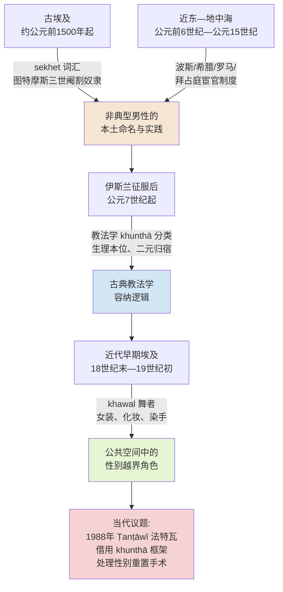
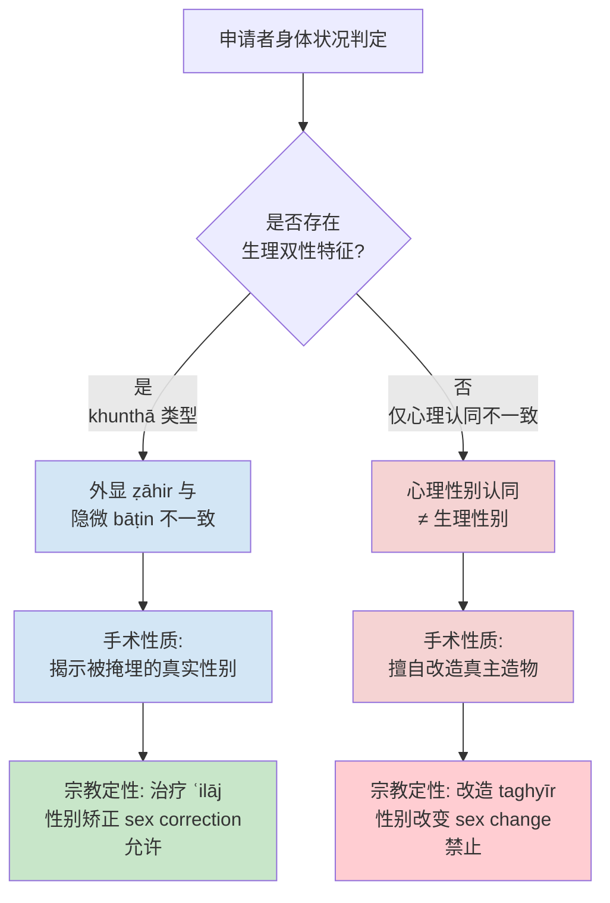
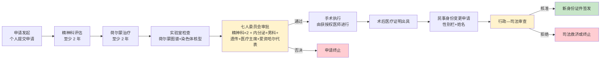
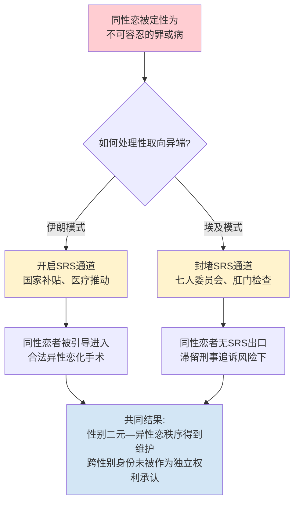
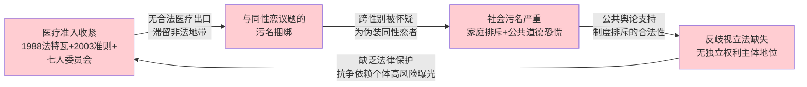

# 埃及跨性别者权利与法律状况研究：历史脉络、宗教—法律博弈与跨国比较
# 1 历史背景：现代医学之前埃及的性别多元图景

在讨论当代埃及围绕性别重置手术与跨性别者权利所展开的法律—宗教博弈之前，有必要首先回到现代生物医学性别概念引入之前的长时段历史脉络，考察埃及及其所处的近东—地中海文明圈中是否存在超越男/女二元的社会身份与文化角色。这一历史回溯并非为了将古代的"性别变异者"与当代"跨性别者（transgender）"做简单的概念等同——二者在身体观、自我认同与法律承认机制上存在根本差异——而是为了搭建一个本土的参照系：当今某些保守论述将一切非异性恋、非顺性别的存在斥为"西方舶来品"或"现代道德败坏"，而长时段的文献—社会史—教法学考察恰恰能够说明，**埃及社会在前现代时期已经以多种形式承认并安置过"非典型男性"或"性别模糊"的个体**，这种承认尽管有限、附条件且受制于父权秩序，却为当代跨性别者的法律—宗教困境提供了一个不可忽视的历史纵深。本章将依托古埃及文献学、近东宦官史与伊斯兰古典教法学三条线索，依次辨析其语义边界、社会角色与制度化程度，并在末节对前现代埃及"第三性别"空间的实存性与限度做出综合评估。

## 1.1 古埃及文献中的非二元性别词汇与社会角色

古埃及是否在语言与社会分类层面承认过超越"男—女"二元的第三类身份，这是一个在埃及学界长期争议的问题。学界讨论中频繁出现的核心词汇是"sḫt"（常被现代学者转写为"sekhet"），其见于中王国时期（约公元前2055—前1650年）的若干墓葬铭文、行政文献与医学—宗教文本中。由于古埃及文字本身不标记元音、且该词在不同语境下的指涉范围相当宽泛，学界对其确切含义存在多种解读：一种观点认为它指向某种生理上的非典型男性（包括但不限于先天性发育异常者），另一种观点则倾向于将其理解为承担特定仪式或宫廷服务功能的社会身份范畴，而非纯粹的生物学描述。无论何种解读，"sekhet"出现于族裔—性别—阶层并列的人群清单中这一事实本身，便提示古埃及的社会分类逻辑并不严格依附于二元生殖系统，而可能容纳"既非完整男性、亦非女性"的中间类别。

与"sekhet"问题紧密相关的另一条线索是古埃及是否存在制度化的宦官群体。这一问题在埃及学内部长期悬而未决：Gerald E. Kadish 于 1969 年在《纪念约翰·A·威尔逊研究文集》中发表的《古埃及的宦官？》（"Eunuchs in Ancient Egypt?"）一文，正是以问号作结，反映出文献证据的暧昧性[^1]；该问题在 1977 年由 W. Helck 与 E. Otto 主编的《埃及学辞典》（Lexikon der Ägyptologie）第二卷"Eunuchen"词条中亦延续了类似的审慎态度[^1]。然而，与这种学术上的谨慎并存的是另一条较为确定的史料：**大约公元前1500年第十八王朝法老图特摩斯三世（Thutmose III）时期已存在阉割奴隶的记载**，此后漫长的岁月里，寺庙僧侣常常购入幼年男性奴隶、施以阉割，再高价转售于王宫与贵族家庭[^2]。这一记载意味着，即便古埃及未必发展出像后世波斯或拜占庭那样规模化、官僚化的宦官制度，作为身体—社会身份的"被阉割男性"在尼罗河流域已有相当久远的历史。

将"sekhet"的语义疑团与阉割奴隶的实存记载并置考察，可以得出一个初步判断：古埃及社会在语言层面保留了描述"非典型男性"的本土词汇，在制度层面也实际存在身体被改造、社会功能被特化的男性群体。这两条线索虽然无法直接证明古埃及拥有一个与"男""女"并列的、自我意识完整的"第三性别"范畴——古埃及的性别秩序在主流叙事中仍然是父权—二元的——但它们足以表明，**在尼罗河文明的社会想象中，性别从来不是一道不可跨越的硬边界**，而是允许在身体、职能与身份之间出现可被命名、可被安置的中间地带。

## 1.2 古代近东与地中海世界中的宦官与性别变异者

要充分理解古埃及性别多元图景，仅依赖本土文献是不够的，因为埃及自始至终都处于近东—地中海文明圈的密集互动之中。**宦官（eunuch）这一身份范畴，恰恰是横跨整个古代世界的最具代表性的"非典型男性"制度。**英语 eunuch 一词源自古希腊语 *eunen echein*，意为"床榻守护者"，最初的社会功能正是守护王室或贵族的女眷居所、服侍宫廷中的女性[^3]。这一词源已暗示了宦官身份的核心矛盾性：他们因身体上的"去男性化"而被视为可信任的近侍，又因长期出入权力中枢而频繁担任高阶宫廷官员[^3]。

从区域比较的视角看，宦官制度的分布具有惊人的普遍性。在距今三四千年前，古埃及、古希腊、古巴比伦、印度王国都曾出现宦官这一特殊群体[^4]。希罗多德在其《历史》中已经记载了希腊王宫宦官的情况，并指出当时希腊的宦官多来源于西亚的波斯帝国——波斯人认为宦官比一般人更值得信赖[^4]。**早在公元前6世纪，波斯王大流士一世就曾向巴比伦和亚述地区索要阉割男童，据载一批即达500人之多**[^4][^2]。在希腊本土，已经出现了专门贩卖幼儿的商人群体，他们诱拐未成年男童，阉割后转售王宫牟利[^4]。古罗马帝国时期宦官在宫廷之中更为常见，暴君尼禄甚至曾与他喜爱的年轻太监斯波鲁斯（Sporus）举行盛大婚礼[^4][^2]，这一事件本身便揭示了古典晚期地中海世界对性别—婚姻规范的灵活处理空间。**东罗马（拜占庭）时代被西方史学家称为"太监的天堂"**，宦官作为"皇帝可信任的阶层"占据了大部分部门的职权，名将纳西斯、所罗门、西米尼努斯与尼西塔斯皆为宦官出身[^2]。

下表汇总了古代世界主要文明中宦官群体的存在形态与功能定位，以便直观把握埃及所处的区域格局：

| 文明 / 时期 | 大致时间 | 来源与机制 | 主要社会功能 |
|---|---|---|---|
| 古埃及（图特摩斯三世起） | 约公元前1500年起 | 寺庙阉割奴隶并转售王宫贵族 | 后宫服侍、王室内务[^2] |
| 波斯帝国（阿契美尼德王朝） | 公元前6世纪起 | 大流士一世自巴比伦、亚述索要阉割男童 | 王宫近侍、被视为"更可信赖"者[^4] |
| 古希腊 | 公元前5世纪记载 | 多自西亚波斯帝国输入；本土贩童商人活跃 | 王宫服务、贵族家臣[^4] |
| 古罗马帝国 | 公元1世纪起 | 阉割奴隶；尼禄与斯波鲁斯之婚事件 | 宫廷近臣、皇帝亲幸[^4][^2] |
| 拜占庭帝国 | 公元4—15世纪 | 制度化宦官阶层 | 高级行政官员、军事将领、宫廷管理[^2] |
| 阿拉伯帝国（阿拔斯王朝） | 公元8世纪起 | "第一批宦官，大多数是希腊人"，仿效拜占庭制度 | 后宫与行政机构[^2] |
| 奥斯曼帝国 | 公元12世纪以降 | 白人与黑人宦官并存，数百人规模 | 后宫日常生活管理[^2] |

这一区域比较揭示出两个关键事实。**其一，宦官并非任何单一文明的"特产"，而是古代世界处理"权力—性—信任"三角关系时的一种跨文明制度回应**——在以一夫多妻、深宫制度与权力猜忌为常态的古代王权社会中，"有男性身体而无男性功能"的群体被视为既可承担男性公共职能、又不威胁后宫秩序的理想中介。其二，宦官的身份内涵远不只是"被阉割的男性奴隶"，而往往附带高阶政治地位与文化意涵——纳西斯等拜占庭名将、阿拉伯—奥斯曼后宫总管，乃至圣经《新约》中向埃塞俄比亚太监传福音的著名段落（《使徒行传》第8章）[^2]，都说明宦官在宗教—政治—文化叙事中具有不可忽视的能见度。

对于本研究而言，更具直接意义的是埃及在这一区域网络中所处的位置：它既是宦官实践的本土发源地之一（图特摩斯三世时期），又长期处于波斯、希腊化、罗马—拜占庭与阿拉伯—奥斯曼诸文明的连续叠加之下，势必接收并本土化各种性别变异角色的制度形态。这种长达数千年的、跨文明的"非典型男性"实践，构成了伊斯兰征服之后埃及社会处理性别模糊问题的深层底色。

## 1.3 伊斯兰古典教法学中的"khunthā"分类传统

公元7世纪伊斯兰征服埃及之后，伊斯兰教法（sharīʿa）成为塑造埃及社会—法律秩序的主导框架。在古典教法学的范畴体系中，**"khunthā"（خنثى，常译为"双性人"或"阴阳人"）是一个被四大逊尼派法学派系（哈乃斐、马立克、沙菲仪、罕百里）系统讨论的法律范畴**。这一传统并非自跨性别身份认同出发的现代心理学概念，而是从身体特征——具体而言，是个体是否同时具有男女两套外生殖器或生殖器性征模糊——出发，对法律地位进行类型化处理。

古典法学家通常将 khunthā 进一步细分为两类：一类是 *khunthā wāḍiḥ*（可辨识的双性人），其性别可通过若干生理标志（如排尿器官、青春期后的第二性征、是否出现月经或胡须等）予以判定，从而被归入男或女的法律范畴；另一类则是 *khunthā mushkil*（疑难双性人），其性别在生理标志层面无法明确判定，需要在继承、婚姻、礼拜、葬礼、证人资格等具体法律事项中适用特殊规则。例如在继承法上，疑难双性人通常按男女份额的中间值或较少一方计算，以求"不损害他人确权份额"的审慎原则；在礼拜中，其站位、衣着与领拜资格亦有专门规定；在婚姻法上，由于伊斯兰婚姻制度建立在男女二元配偶基础上，疑难双性人通常被要求在适婚之前根据自身倾向"选择"一种性别身份并据此进入婚姻秩序。

khunthā 范畴在古典教法学中的存在表明，**伊斯兰法律传统并非对身体—性别的模糊状态视而不见，而是发展出了一套相当精细的容纳逻辑**——其核心思路是"以身体为本位、以二元秩序为归宿"：承认生理层面的中间状态客观存在，但在法律操作上力求将其重新整合进男女二分的婚姻—继承—礼拜框架。这种处理方式有两个显著特征值得与当代"跨性别"概念加以比较。**第一，khunthā 的判定标准本质上是生理—身体的，而非心理—自我认同的**。古典法学家关注的是"这个人的身体究竟是什么"，而非"这个人如何认同自己的性别"。这与当代以心理性别认同（gender identity）为核心的跨性别概念存在根本差异——后者承认个体的内在自我认同可以独立于、甚至与生理性别相反。**第二，khunthā 范畴的最终目标并不是确立一个独立的"第三性别"法律地位，而是为模糊个体提供过渡性的法律安排，使其最终归入男或女**。换言之，伊斯兰古典教法在"承认例外"的同时坚定地维护"二元规范"。

理解这一区分至关重要，因为它直接关涉本报告后续章节将要分析的 1988 年 Sayyid Ṭanṭāwī 穆夫提的著名法特瓦：该法特瓦在处理 Sally Abdullah 案时，恰恰借用了 khunthā 的古典区分——"生理双性"（ẓāhir 显见层面）与"心理双性"（bāṭin 隐微层面）——作为允许与禁止性别重置手术的边界。换言之，**当代埃及宗教权威在面对跨性别议题时，并未发明全新的范畴，而是回到伊斯兰古典教法学的 khunthā 传统中寻找解释资源**；这种解释路径既使得性别重置在特定条件下成为宗教上"可允许"的医疗行为，又同时把跨性别身份的合法性紧紧锁定在"身体可见的双性特征"这一前现代生理标准之上——从而在结构上排斥了以心理认同为基础的现代跨性别概念。

## 1.4 前现代埃及"第三性别"空间的制度化程度评估

综合上述三条线索——古埃及"sekhet"的语义疑团与阉割奴隶的实存、近东—地中海宦官制度的跨文明扩散与埃及节点位置、伊斯兰古典教法学的 khunthā 分类传统——可以对前现代埃及"第三性别"空间的制度化程度做出如下评估。

首先必须强调的是，**前现代埃及并不存在一个与"男""女"完全并列的、具有独立法律人格的"第三性别"制度**。无论是法老时代的宦官与"sekhet"，还是伊斯兰教法下的 khunthā，其共同特征都是在主流二元性别秩序的边缘地带提供有条件的容纳空间，而非确立独立的第三类身份。这一点与南亚地区的 hijra 传统、北美原住民某些族群的 two-spirit 传统在制度成熟度上存在差异——后两者在不同程度上发展出了相对自洽的身份共同体与社会角色，而埃及—近东—地中海传统的总体方向则是"承认例外、回归二元"。

然而，**断言前现代埃及缺乏"第三性别"承认也是一种简化**。如果将"承认"理解为一个由强到弱的光谱，那么前现代埃及在以下几个层次上确实存在对性别多元的实践性容纳：在语言层面，"sekhet"等本土词汇与阿拉伯语 khunthā 的存在本身，便表明社会拥有命名性别模糊状态的语义工具；在社会职能层面，宦官在宫廷、宗教与权力结构中占据制度化位置，构成"非典型男性"的可识别身份；在法律层面，伊斯兰教法对 khunthā 的精细处理，为生理模糊个体提供了具体的权利与义务安排；在文化想象层面，从图特摩斯三世时期的阉割奴隶[^2]、到尼禄与斯波鲁斯的婚礼[^2]、到东罗马宦官将领纳西斯[^2]、再到《新约·使徒行传》中埃塞俄比亚太监[^2]，性别变异者作为可见的文化形象长期参与着地中海—近东的历史叙事。

此外，进入18世纪末至19世纪初的近代早期埃及，社会层面仍可辨识出超越二元性别规范的具体角色形态。**这一时期的埃及城市文化中存在一种被称为"khawal"的社会身份——他们是在公共节庆与娱乐场合表演的柔美青年男性舞者，以指甲花（henna）染手、编蓄长发、施以化妆，并身着女性舞者的服饰**。khawal 的存在表明，即便在伊斯兰教法主导的社会秩序中，公共空间仍然能够容纳一种以男性身体表演女性化气质、并在职业意义上被识别和接受的角色。这一历史事实在当代论争中具有重要的反驳价值：当部分保守派论者将一切非顺性别、非异性恋表达定性为"西方现代性的舶来品"或"文化入侵"时，khawal 的历史存在恰恰说明，**非二元性别表达在埃及本土文化中早已有迹可循，并非外来移植**——尽管这种本土传统并不等同于现代意义上的跨性别身份认同，但它清楚地证明了埃及社会曾长期容纳"在性别规范光谱中游移"的真实生命形态。

下图概括了从古埃及到伊斯兰古典时期、再到近代早期埃及"非典型性别"角色的演变脉络与制度化层次：

由此可以得出本章的核心判断：**前现代埃及拥有一个"半制度化"的性别多元空间——它既非完全独立的第三性别制度，也绝非铁板一块的男女二元秩序，而是一个由本土词汇、跨文明制度遗产、教法学范畴与社会实践共同构成的、有条件的容纳带**。这一历史遗产为理解当代埃及跨性别议题提供了至少三个层次的启示。其一，从历史延续性看，1988 年 Ṭanṭāwī 法特瓦对"生理双性"与"心理双性"的区分并非凭空创设，而是对 khunthā 古典传统的现代延伸——这意味着当代埃及宗教权威处理跨性别议题的概念工具仍然以身体为本位，难以容纳以心理认同为核心的现代跨性别身份。其二，从话语博弈看，保守论述将跨性别等性别多元现象归咎于"西方现代性"的常见策略，在 khawal、宦官与 khunthā 等本土传统面前难以完全自洽——埃及社会内部本就拥有讨论性别多元的话语资源。其三，从制度限度看，前现代的"半制度化"容纳始终以维护父权—异性恋二元秩序为前提，性别变异者的能见度往往以服务于既有权力结构（如宫廷、后宫、公共娱乐）为代价；这种"附条件的承认"在当代法律—宗教框架中以新的形式延续，构成下一章将要详细剖析的"宗教允许性别重置、却不保障跨性别权利"这一深层悖论的历史根源。

带着这一历史—理论坐标，我们将在下一章转入对当代埃及法律—宗教立场的系统分析，考察 1988 年 Ṭanṭāwī 法特瓦如何在 khunthā 古典框架下重新划定性别重置手术的可允许边界，以及医师工会与行政程序如何在专业自律与制度筛选层面参与塑造跨性别者的现实处境。

# 2 埃及的法律与宗教立场：法特瓦、医师工会与官方流程的多重博弈

在第一章对前现代埃及"半制度化"性别多元空间的梳理基础上，本章转向对当代埃及处理性别重置手术与跨性别身份的现行规范体系的系统剖析。如前文所述，伊斯兰古典教法学中的 khunthā 范畴以身体为本位、以二元秩序为归宿，承认生理模糊状态却拒绝独立的"第三性别"法律人格——这一古典思路并未随着现代生物医学与心理学知识的引入而被取代，反而在 20 世纪末以新的形式被宗教权威重新激活，成为塑造当代埃及跨性别议题的核心解释资源。

本章的核心论点在于：埃及并未形成一套统一、连贯的跨性别权利保障机制，而是由 1988 年 Ṭanṭāwī 法特瓦所确立的 khunthā 式宗教边界、医师工会从开放到收紧的专业筛选机制、以及由心理评估—委员会审批—证件变更构成的多环节行政流程，共同塑造出一个"宗教在特定条件下允许性别重置手术、但制度整体上并不保障跨性别身份"的结构性悖论。这一悖论的关键之处在于：**埃及现行规范体系所允许的，是为生理性别模糊者（intersex / khunthā）进行"性别矫正"（sex correction）手术；而它所拒绝的，恰恰是为心理性别认同与生理性别不一致者（transgender）进行"性别改变"（sex change）手术**。前者被视为"揭示真相"的合法医疗行为，后者则被视为对真主造物的擅自改造。围绕这一核心二分法，宗教、医师工会与行政—法律程序三者展开复杂博弈，并在运作中嵌入对"伪装为跨性别者的同性恋者"的隐性筛选逻辑，从而暴露其规范取向与现实运作之间的深层落差。

## 2.1 1988年Ṭanṭāwī法特瓦的内容、推理与边界

当代埃及处理性别重置议题的规范基石，源自一份发布于 1988 年的关键宗教教令。这份法特瓦由时任埃及大穆夫提（Mufti of Egypt）、后于 1996 年出任爱资哈尔大伊玛目（Grand Imam of al-Azhar）的赛义德·坦塔维（Sayyid Muḥammad Ṭanṭāwī）发布，其直接触发因素是开罗艾因夏姆斯大学（Ain Shams University）医学院学生赛义德·阿卜杜拉（Sayyid ʿAbdullāh）——即后来更为人所知的萨莉·穆尔西（Sally Mursi）——所经历的性别重置手术争议案。该案的医学—法律—社会反响要求宗教权威必须就性别重置手术的教法属性做出明确判断，这一压力直接催生了 Ṭanṭāwī 法特瓦的出台。

法特瓦的核心论证逻辑紧密承袭了第一章所述的伊斯兰古典教法学 khunthā 传统。Ṭanṭāwī 并未将性别重置手术作为一个全新的现代医学问题来处理，而是回到古典法学家关于"双性人"（khunthā）的分类框架中寻找解释资源，并在此基础上引入 ẓāhir（外显/显见层面）与 bāṭin（隐微/内在层面）这一伊斯兰认识论中常用的概念对偶。其推理的核心步骤可归纳为：当一个个体在外显层面（ẓāhir）表现出某种性别特征，但其身体内部（bāṭin）存在被掩埋或被隐藏的相反性别器官时，外科手术的功能并非"改变"性别，而是"揭示"那个本就存在却被遮蔽的真实性别。在这一论证框架下，**手术被重新定义为一种治疗（ʿilāj）行为，其医疗合法性来自于"恢复造物原本面貌"的宗教正当性，而非来自于对个体自主权或心理认同的承认**。

由此推导出的边界划定具有决定性意义：法特瓦明确区分了两种性质截然不同的手术。其一是针对具有生理双性特征者（即古典教法学意义上的 khunthā、现代医学意义上的间性人/intersex）所进行的"性别矫正"手术——这类手术因其"揭示真相"的性质而被宗教所允许；其二是针对仅有心理性别认同与生理性别不一致者（即现代意义上的跨性别者/transgender）所进行的"性别改变"手术——这类手术因其涉及对真主造物的擅自改造而被宗教所禁止。**因此，尽管 1988 年法特瓦在国际媒体与部分二手文献中常被描述为"埃及宗教权威允许变性手术"的标志性事件，但其实际所授权的范围仅限于间性人手术，而非跨性别者手术**。这一区分至关重要，却在公共讨论中频繁被混淆。

Ṭanṭāwī 法特瓦的推理逻辑及其边界可通过下图直观呈现：

这一推理路径具有显著的内在张力。一方面，它通过 khunthā 古典框架为部分性别身份模糊者提供了宗教—医疗合法性的入口，从而在表面上展现出伊斯兰教法处理现代医学问题的灵活性；另一方面，它将合法性的判定基础完全锚定在身体可见的生理特征之上，**结构性地排除了以心理认同为核心的现代跨性别身份**。换言之，法特瓦所承认的"性别"始终是身体的、可被医学验证的、可被"揭示"的客观存在，而不是个体自我宣称、心理体验或社会角色意义上的性别。这一结构性排斥并非法特瓦的偶然遗漏，而是其推理逻辑的必然结果——因为一旦承认心理认同可以独立于生理事实而成立，khunthā 的"以身体为本位、以二元秩序为归宿"的整套古典框架便会失去其解释基础。

## 2.2 爱资哈尔与宗教权威立场的后续演变

1988 年法特瓦发布之后，埃及宗教权威内部围绕性别重置议题的立场并未停滞，而是在政治氛围变迁、媒体舆论压力与国际人权话语介入的多重作用下持续被重新诠释。需要强调的是，法特瓦作为伊斯兰教法实践中的一种意见性教令，本身具有可被后续学者修订、补充乃至推翻的开放性。围绕 Sally Mursi 案及其余波，爱资哈尔内部相关讨论曾出现学者意见分歧的局面——部分保守派学者认为即便是为生理双性者进行手术也需更严格的多重验证，反对将"揭示真相"的论证过度宽泛化运用；另一部分学者则在 Ṭanṭāwī 既有框架下进一步细化生理双性的判定标准，强调染色体、激素水平、内生殖系统等现代医学指标必须共同支持"被掩埋性别"的存在。

在这一持续诠释过程中，最具结构性意义的转折发生在 2003 年前后。这一阶段宗教—行政界面的整合趋势愈发明显：宗教权威不再仅仅以个案法特瓦的形式参与性别重置议题的规范塑造，而是越来越多地通过参与跨部门审批委员会、为行政程序提供机构性代表等方式，将其立场内嵌于国家医疗—法律体系之中。这种"宗教权威机构化嵌入"的过程，使得 1988 年法特瓦所确立的边界从一份意见性教令，演变为具有实质性行政—法律效力的规范节点。换言之，**爱资哈尔不再仅仅是性别重置议题的评论者，而成为其合法性筛选机制的内置参与者**。

这一演变与同期埃及社会的整体保守化趋势相互强化。1990 年代以来，公共舆论对性别越轨、同性恋议题的不容忍度显著上升，媒体对所谓"变性"案例的报道往往与道德恐慌叙事结合，将其框定为"西方堕落文化入侵"的标志。在此背景下，宗教权威即便在技术性问题上保持 Ṭanṭāwī 框架的延续性，其整体立场的实际效果却趋于收紧——对生理双性的判定标准日益严格、对心理性别不一致者的合法性入口几近关闭。需要承认的是，关于 2003 年前后爱资哈尔学者具体修订文本的细节、内部分歧的具体人物与立场分布，本研究可获取的直接搜索资料较为有限，相关分析主要依托对制度演变趋势的归纳判断，而非对修订文本的逐条还原。

## 2.3 埃及医师工会的角色转变与专业筛选机制

宗教教令的规范效力在埃及医疗实践中并非自动实现，而是需要通过专业自律机构的中介转化为可操作的执业规则。在这一转化过程中，埃及医师工会（Doctors' Syndicate，即 Egyptian Medical Syndicate）扮演了关键角色。需要指出的是，正是医师工会在 1988 年 Sally Mursi 案争议期间主动寻求宗教权威背书，请求穆夫提就性别重置手术的教法属性做出裁定，从而在程序上催生了 Ṭanṭāwī 法特瓦的出台。这一最初的"主动求教"姿态，反映了医师工会希望借助宗教权威为其专业实践提供合法性背书的策略意图——在一个宗教影响力深度渗透公共领域的社会中，纯粹的医学技术标准难以独立支撑如此具争议性的手术。

然而，从 1988 年到 21 世纪初的演变过程显示，医师工会的角色经历了一次从"开放探索"到"严格收紧"的明显转变。这一转变的制度化节点出现在 2003 年：当年，埃及卫生部长（Minister of Health）发布了新的《医疗行业道德准则》（Code of Ethics for the Medical Syndicate），系统性地重新界定了性别重置相关手术的执业边界。**新准则在文本上明确禁止为跨性别者进行"性别改变"手术，而仅允许为间性人进行"性别矫正"手术**——这一区分在术语和概念上与 1988 年 Ṭanṭāwī 法特瓦的边界划定高度一致，构成了宗教教令向行政—专业规范的直接制度化转译。

2003 年准则不仅在范围上做出限定，更在程序上设置了一系列严格的前置条件，使得"性别矫正"手术从一项相对开放的临床决策转变为高度复杂的多环节审批过程。具体而言，准则要求任何申请"性别矫正"手术的个体必须满足如下程序性要件：

| 程序要件 | 具体要求 |
|---|---|
| 精神评估期 | 至少持续两年的精神科评估 |
| 荷尔蒙治疗期 | 至少持续两年的荷尔蒙治疗 |
| 实验室检查 | 完整的荷尔蒙图谱与染色体核型检查 |
| 审批委员会 | 由七名成员组成的跨学科委员会进行最终审批 |
| 委员会构成 | 两名精神科医生、一名内分泌学家、一名男科医生、一名遗传学家、一名医疗主席、一名爱资哈尔代表 |

委员会的构成本身即蕴含深刻的制度意图。**两名精神科医生与一名内分泌学家、一名男科医生、一名遗传学家的组合，明确指向 1988 年法特瓦所确立的"生理判定优先"逻辑**：染色体、激素水平、内外生殖系统状况构成了判断"是否存在被掩埋的真实性别"的核心证据，而精神评估的功能更多在于排除"伪装"——即识别那些以心理性别不一致为名、实际寻求性别改变的申请者。一名爱资哈尔代表的常设参与，则将宗教权威直接嵌入临床审批程序，使得每一例手术的合法性判定都必须经过宗教—医学双重验证。

这一制度安排揭示出医师工会角色的深层转变：**它不再仅仅是技术性的医疗专业自律机构，而是同时承担"道德守门人"职能——通过严格的程序门槛与跨学科委员会的多重否决可能性，将绝大多数申请者过滤在合法医疗通道之外**。这种转变背后的逻辑既包括对行业声誉的保护（避免与"道德败坏"议题挂钩），也包括与宗教权威的策略性合作（以接受宗教代表参与换取专业实践的合法性空间），还包括对社会保守化趋势的回应（避免成为公共舆论攻击的靶子）。其综合效果是：医师工会通过技术性程序的高门槛设计，将 1988 年法特瓦的规范边界以更为隐蔽却更为严密的方式予以制度化执行。

## 2.4 性别重置申请的官方流程与制度设计

将宗教教令、医师工会准则与行政—司法环节综合起来观察，埃及跨性别者（或更准确地说，寻求性别重置手术者）所面对的是一套环环相扣的多阶段官方流程。这一流程的整体设计逻辑体现了"医学—宗教—法律"三重把关：医学环节负责生理与心理的客观判定，宗教环节负责教法合法性的确认，法律环节负责身份证件与民事记录的最终变更。任何一环出现否决，整个申请即告终止。

依照 2003 年《医疗行业道德准则》及相关行政—司法实践，标准化的申请流程可归纳为如下序列：

这一流程在制度设计层面具有几个值得注意的特征。第一，**两年的精神评估期与两年的荷尔蒙治疗期可在时间上部分重合，但即便如此，从启动评估到完成手术的最短理论周期亦在两年以上**，加上后续身份证件变更环节，整个流程在最理想情况下也需数年时间。这种漫长的时间设计在表面上是为了确保判定的审慎性，实际上却构成对申请意愿的持续性筛选——能够坚持完成全部环节者已是少数。第二，七人委员会的多元构成意味着任何一名委员的反对都可能否决申请，而委员中既有医学专家，也有爱资哈尔代表，否决权的分布在医学与宗教维度上均存在多重可能。第三，**手术完成并不自动等同于法律身份的变更**——术后还需通过独立的行政—司法环节申请民事身份证件中性别栏与姓名的修改，这一环节由民政与司法部门主导，其与医学环节的判定标准并不完全一致，从而构成又一道独立的过滤。

从权责分配看，这一流程将不同性质的判断权分散在不同的专业与机构之间：精神科医师负责心理状态评估，内分泌、男科、遗传专家负责生理客观判定，爱资哈尔代表负责教法合规性把关，医疗主席负责整体协调，民事与司法机关负责最终的法律承认。这种分散设计在形式上体现了多元审慎的制度理性，但其综合效果是将合法性判定的门槛系统性抬高——申请者必须在每一个分散的关卡上都获得肯定判断，方能最终获得医疗与法律的双重承认。

## 2.5 流程的实际运作落差与对"伪装同性恋者"的隐性筛选

官方流程的制度设计与其实际运作之间存在显著落差。从制度文本看，该流程为符合条件者提供了一条"医疗—宗教—法律"三位一体的合法通道；但从实际运作看，这条通道的实际通过率极低，且其筛选逻辑在很大程度上嵌入了对"伪装为跨性别者的同性恋者"的隐性鉴别机制。

首先，从流程本身的属性看，**两年精神评估的实质内容远不止于诊断性别认同障碍或核实心理痛苦的真实性**，而是承担着鉴别申请者"真实动机"的功能。在 1988 年法特瓦"生理优先于心理"的框架下，纯粹的心理性别不一致并不构成手术的合法依据，因此精神评估的核心任务在于：通过长期观察判断申请者究竟属于（a）确实存在生理双性特征、需要"性别矫正"的间性人，（b）出于心理性别不一致而寻求"性别改变"的跨性别者，还是（c）以跨性别名义寻求规避同性恋禁忌、谋求"合法异性恋身份"的同性恋者。在制度逻辑上，只有（a）类申请者具备通过流程的合法性基础；（b）类与（c）类均应被排除，且二者中（c）类因涉及与同性恋议题的潜在交集而受到尤为严格的审查。

其次，七人委员会的跨学科构成强化了这种隐性筛选。**遗传学家与男科医生的实质职能并非辅助手术，而是对申请者的染色体、内分泌与生殖系统进行客观证伪——只有能够提供生理双性特征证据者，才能在"揭示真实性别"的法特瓦框架下获得手术合法性**。这意味着大量心理认同明确、但生理上属于典型男性或典型女性的跨性别申请者，在客观医学证据面前必然遭遇否决。委员会中的爱资哈尔代表则承担最终的教法判断职能：即便医学证据存在某种模糊性，宗教代表的否决权仍可独立终止申请。

第三，即便申请者通过医学—宗教审批并完成手术，民事身份证件的变更仍可能在行政—司法环节遭遇阻碍。性别栏与姓名的变更涉及对民事登记记录的修改，其法律标准与医学—宗教委员会的判定并非完全对应——行政机关可能要求额外的证明文件、司法裁决，或对申请者的"真实性别身份"提出独立的法律评估。这一环节的延迟与不确定性，使得许多完成手术的个体长期处于"医学上已转换、法律上仍未承认"的悬置状态，无法正常签订合同、办理就业、参与婚姻等基本社会事务。

将上述各环节综合起来观察，可以归纳出该流程在实际运作中的核心筛选逻辑：**它并非一个旨在为跨性别者提供医疗与法律承认的服务性通道，而是一个旨在维护性别二元秩序、防止同性恋议题"借道跨性别"获得合法化的过滤性机制**。这一筛选逻辑与 1988 年 Ṭanṭāwī 法特瓦的内在精神高度一致：法特瓦的核心区分本就是"揭示真相"与"擅自改造"的二分，而流程的实际运作不过是将这一区分在多个制度环节上反复执行——任何不能在生理层面证明自己属于"被掩埋性别"者，无论其心理痛苦多么真实、社会处境多么困难，都难以通过这一通道获得合法承认。需要补充说明的是，这种隐性筛选机制的具体判定细节、个案否决率的精确数据，本研究可获取的直接搜索资料较为有限；上述分析主要依托制度逻辑的内在一致性与流程设计的结构性意图进行归纳判断。

## 2.6 三重规范体系的结构性悖论

综合前述五节的分析，可以对当代埃及处理性别重置手术与跨性别身份的现行规范体系做出一个整体性判断：宗教教令、专业自律与行政—法律程序构成了一个三层相互嵌套、彼此援引又相互制约的规范体系，其综合效果远比任何单一层面更具排斥性。

在这一体系中，三层规范各自承担不同但相互呼应的功能：

| 规范层 | 核心规范工具 | 关键年份 | 主要功能 | 对跨性别身份的处理 |
|---|---|---|---|---|
| 宗教 | Ṭanṭāwī 法特瓦 | 1988 | 以 khunthā 框架划定"揭示"与"改造"的边界 | 仅承认间性人手术，排斥心理认同基础 |
| 专业 | 医师工会道德准则 | 2003 | 设置精神评估、荷尔蒙治疗、委员会审批的程序门槛 | 通过技术门槛与多元委员会过滤申请 |
| 行政—法律 | 民事登记与司法审查 | 持续运作 | 决定身份证件与法律身份的最终变更 | 即便手术完成，法律承认仍可独立否决 |

三者之间的关系并非简单的层级递进，而是相互援引、彼此强化的复合结构：医师工会援引宗教法特瓦确立其专业标准的合法性，行政—法律程序通过委员会中的爱资哈尔代表将宗教权威直接嵌入审批过程，而宗教权威则借助专业与行政体系将其规范立场从意见性教令转化为具有实质效力的制度规则。**这种制度间的循环背书使得任何单一层面的改革都难以撼动整体体系的排斥性逻辑**——若宗教立场松动，专业与行政体系仍可通过技术性门槛维持过滤；若专业规则放宽，宗教权威与行政机关仍可独立否决；若行政程序简化，前两层的实质性审查仍构成不可逾越的关卡。

由此产生的结构性悖论可归纳为以下三个层次。**第一层悖论：宗教允许性别重置手术，却不承认跨性别身份**。1988 年法特瓦在国际舆论中常被解读为伊斯兰教法的"宽容"表现，但其所允许的实际上仅是间性人的性别矫正手术，而非跨性别者的性别改变手术——这种允许在表面上为埃及在国际人权话语中提供了某种"开明"姿态，实际上却将真正寻求跨性别承认的个体排除在合法性边界之外。**第二层悖论：制度提供了名义通道，却阻断了实际访问**。从精神评估到委员会审批再到身份证件变更，制度文本所规定的程序对所有申请者形式上开放，但实际运作中的高门槛、低通过率、漫长周期与多重否决可能性，使得这条通道在事实上极少被成功穿越。**第三层悖论：现代医学话语承载了前现代教法逻辑**。荷尔蒙图谱、染色体核型、内分泌指标等现代医学技术手段，在制度设计中并未被用于支持以心理认同为核心的当代跨性别概念，反而成为执行 khunthā 古典"生理优先"逻辑的精密工具——现代医学不仅没有解放跨性别身份，反而通过其客观性外观为前现代规范提供了更强的合法性背书。

更进一步看，三重规范体系的共同关切并非如何更好地保障跨性别者权益，而是如何在维护性别二元秩序的同时为生理模糊状态提供有限的过渡安排——这与第一章所揭示的前现代埃及"半制度化"性别多元空间的逻辑高度一致：**承认例外，回归二元**。差异仅在于，前现代的"承认例外"凭借文化想象与教法学讨论的开放性留出了相对灵活的容纳带，而当代体系借助现代国家的官僚化、专业化与法律化能力，将这种"承认例外"的边界以前所未有的精确性收紧。

在这一结构性悖论的整体认识基础上，下一章将转入对两个跨越三十余年的代表性个案的深度剖析——1988 年 Sally Mursi 案如何在催生 Ṭanṭāwī 法特瓦的同时承受了法律—宗教体系的初次冲击，而当代活动家 Malak al-Kashif 又如何在 2003 年准则与后续行政实践所构成的现行体系下展开新一代的抗争。两个案例的对照将具体呈现本章所提炼的结构性悖论如何在真实生命经验中展开，以及跨性别个体在制度化排斥面前所发展出的不同抗争策略。

# 3 代表性案例：从Sally Abdullah到Malak al-Kashif的两代抗争

前两章已分别从历史长时段与现行规范体系两个维度，勾勒了埃及处理性别多元议题的"半制度化承认—结构性排斥"双重逻辑。然而，制度的边界与悖论唯有在具体生命经验的碰撞中才能显形——法特瓦的措辞、医师工会的程序条款、行政—司法环节的多重否决，最终落到的是个体的身体、法律地位与社会生存。本章因此选取两个跨越三十余年的标志性个案：一位是1980年代爱资哈尔大学医学生**萨莉·穆尔西**（Sally Mursi，原名 Sayyid Muḥammad ʿAbdullāh），其手术与诉讼经历直接催生了第二章所剖析的1988年 Ṭanṭāwī 法特瓦及其后续制度框架；另一位是出生于1999年、在2010年代末走入公共视野的青年活动家**马拉克·卡希夫**（Malak al-Kashif），她在塞西时代的安全国家氛围中借助社交媒体进行身份政治抗争，并在2019年因抗议而陷入男性监狱羁押的人权争议。两位人物所处的政治氛围、媒介环境与抗争策略截然不同，恰好构成观察埃及跨性别运动代际转型的最佳坐标。需要预先说明的是，本研究可获取的直接搜索资料对两位个案的细节支撑较为有限，部分论述依托第二章所建立的制度框架进行合理推演，相关局限将在行文中如实指出。

## 3.1 Sally Abdullah案的医疗经历与争议起点

萨莉·穆尔西案的发生背景，是1980年代后期埃及社会在宗教保守化、医学专业化与公共道德焦虑三重张力交织下的特殊节点。萨莉本人是当时埃及最具象征意义的高等学府——爱资哈尔大学——的医学生，这一身份本身便预设了案件不可能停留在私人医疗事件层面：爱资哈尔不仅是埃及的最高宗教学术机构，也长期承担塑造伊斯兰世界主流宗教解释的角色，其学生的性别身份争议必然要求宗教权威做出公开回应。

依照第二章所还原的制度脉络，萨莉所走的求医路径并非现代意义上以"心理性别认同"为出发点的跨性别医疗，而是在长期承受身心痛苦后由主刀医师做出的临床判断——**该判断以"心理雌雄同体"（psychological hermaphroditism）为诊断结论**，并在此基础上实施了性别重置手术。这一诊断措辞在医学史与教法学史的交界面上具有关键意义：它一方面借用了 hermaphroditism 这一与古典教法 khunthā 范畴最直接对应的医学术语，另一方面又以"psychological"作为限定语，意图为以心理状态为主、生理特征并不显著模糊的个案争取临床合法性。换言之，主刀医师试图在 1988 年法特瓦尚未确立"生理优先"边界之前，**将心理性别不一致这一现代医学诊断纳入 khunthā 框架的延伸地带**，从而为手术提供医学—宗教双重可辩护的依据。

然而，正是这一"心理雌雄同体"的诊断措辞，在术后成为各方争议的焦点。爱资哈尔大学与埃及医师工会随即对手术的合法性提出质疑，并对萨莉与主刀医师启动了刑事调查指控。其指控的核心逻辑可归结为：若手术对象在生理层面并不属于古典教法学意义上的双性人，则该手术便不再是"揭示真相"的性别矫正，而是对真主造物的擅自改造——这一逻辑恰是后续 Ṭanṭāwī 法特瓦所正式确立的边界，但在 1988 年案件发生时尚未得到宗教权威的官方背书。**萨莉案因此处于一个规范真空期：手术已实施，但用以判断其合法性的宗教—专业边界尚未明确划定**，由此触发的连锁反应直接催生了规范本身的诞生。

更为残酷的是，案件在司法侦查阶段还出现了一个极具屈辱性的细节——**萨莉曾被公诉机关的法医进行肛门检查，以试图"证明"她没有进行过同性性行为**。这一细节在制度逻辑层面具有揭示性意义：它表明从案件最初被司法系统接手起，调查者所怀疑的便不仅是手术的医学合法性，更是萨莉是否在以"跨性别"之名掩饰同性恋身份。第二章曾归纳的"对伪装同性恋者的隐性筛选"机制，在此案中以最为直接的身体侵入形式呈现——肛门检查作为埃及司法实践中长期被用于鉴别男男性行为的法医手段，在国际人权机构的多份报告中已被认定为构成酷刑或有辱人格的待遇。其在萨莉案中的运用，**将"跨性别合法性争议"与"同性恋污名鉴别"在程序上焊接为同一逻辑链条**，构成此案最具历史意义的制度症候。

## 3.2 爱资哈尔反应与Ṭanṭāwī法特瓦的形成机制

正是在上述刑事调查与公共争议的强烈压力下，埃及医师工会主动向时任大穆夫提赛义德·坦塔维（Sayyid Ṭanṭāwī）寻求宗教教令的程序性介入。如第二章所述，工会的这一动作并非单纯的宗教虔诚表达，而是一种策略性求助——通过将判定责任部分让渡给宗教权威，换取专业实践在道德—合法性维度上的背书；同时也借由宗教意见为工会自身的纪律决定与执业边界设定提供可对外辩护的依据。这一程序性求教的设计，在结构上预先决定了后续法特瓦不可能仅是一份抽象教令，而必然要对萨莉的具体身体状况做出指向性认定。

坦塔维在回应中所调用的概念工具，正是第一章已详细梳理的伊斯兰古典教法学 khunthā 分类传统及其 ẓāhir / bāṭin 区分。其核心论证步骤为：若个体在身体内部（bāṭin）存在被掩埋或被隐藏的与外显（ẓāhir）相反的生理性别特征，则手术属于"揭示真相"的治疗行为，宗教上可允许；反之，若仅有心理层面的性别不一致而无身体层面的双性证据，则手术属于"擅自改造造物"，宗教上不允许。**在萨莉案的具体认定上，"心理雌雄同体"这一诊断措辞恰恰落在了 Ṭanṭāwī 框架的禁区一侧——它以"psychological"自我宣称，缺乏 ẓāhir/bāṭin 二元结构所要求的可见生理证据**。这一矛盾正是法特瓦在 Sally 案问题上长期被解读为"双向裁定"的根本原因：从普适性教法原则看，法特瓦允许了在严格条件下的"性别矫正"手术；但从对萨莉个案的具体认定看，其手术性质并未完全符合允许的条件，由此为后续刑事追责与学籍处理留下了空间。

法特瓦从个案裁定演变为普适性规范节点的过程，体现了埃及法律—宗教体系特有的"准判例化"机制。在普通法系中，判例通过明示的法律推理被赋予普遍约束力；而在埃及的伊斯兰教法—大陆法混合体系中，**一份针对个案的穆夫提教令并不天然具有普适效力，但当其被医师工会、行政机关与司法部门反复援引为判断依据时，便在制度运作中获得了准判例的实质地位**。1988 年法特瓦正是通过这一渠道，从一份针对萨莉案的具体回应，演变为后续二十余年埃及处理所有性别重置申请的核心规范节点；而 2003 年《医疗行业道德准则》对法特瓦边界的成文转译，则在制度文本层面完成了这一规范节点的最终固化。

## 3.3 行政法院判决与法律—宗教框架的初步确立

萨莉案的司法处理在数年间经历了复杂的程序流转，其结果不仅决定了她个人的法律身份，也对埃及处理类似争议的制度边界产生了奠基性影响。最具决定性的转折出现在1989年——**萨莉在这一年从埃及行政法院获得了对其女性身份的法律承认**。这一判决在制度史层面具有多重意义：其一，它确认了在医学手术已完成、身体性别特征已发生客观变化的情况下，行政—司法机关有义务承认民事身份证件的相应变更，而不能仅依据宗教教令的禁止性条款拒绝法律承认；其二，它在判决依据上必然涉及对宗教法特瓦、医学诊断与民事登记制度的综合权衡，从而**将"医学—宗教—法律"三位一体的处理框架以司法判决的形式予以初步成文化**；其三，它为日后类似案件的处理设立了一个虽不具普通法系判例约束力、但具有重要参考意义的先例。

然而，行政法院的法律承认并未自动解决萨莉在生活实务层面所面临的全部障碍。**最具象征意义的延续性抗争，是她为争取重返爱资哈尔大学校园（具体而言，进入大学的女子部）而进行的漫长法律斗争**。爱资哈尔大学采取严格的男女分校教学制度，男子部与女子部在校园空间、课程安排与师资上各自独立。萨莉在身份变更后试图以女性身份继续完成医学院学业，便必须从男子部转入女子部——但这一转校请求长期遭到爱资哈尔校方的拒绝。校方的拒绝逻辑在制度层面值得仔细辨析：即便行政法院已承认其女性身份，爱资哈尔作为宗教教育机构仍可援引宗教—教法学层面对其手术性质的保留态度，认为其女性身份在宗教意义上并未获得无条件确认，因而不能等同于"出生即为女性"的学生群体。

这一拒绝构成了萨莉案最具揭示性的制度症候——**民事身份的法律承认与宗教教育机构的实质性承认之间，存在一道难以逾越的解释鸿沟**。萨莉为打破这一鸿沟而进行的法律斗争最终获胜，她得以以女性身份重返校园继续学业。这一胜利在埃及跨性别史上具有里程碑意义：它表明即便在最为保守的宗教教育机构语境下，司法救济仍可在个案层面突破宗教—行政体系的双重拒绝。然而，胜利的代价是数年漫长的诉讼周期与持续的公共曝光——这种以个体高强度投入换取个案突破的抗争模式，本身即说明制度通道的实际不可访问性，并预示了第二章所归纳的"名义通道存在、实际访问受阻"结构性悖论的真实形态。

## 3.4 Sally案的社会反响与遗留争议

萨莉案在埃及社会的反响远远超出了医学—法律事件的范畴，演变为一场围绕性别、宗教、医学权威与"西方现代性"的全国性公共辩论。当时的纸媒与电视舆论将此案纳入道德恐慌叙事框架，将其与"西方堕落文化入侵"的整体性焦虑相联结——这种叙事策略的深层逻辑，是通过把跨性别议题"他者化"为外来威胁，回避对埃及社会内部性别多元历史（如第一章所述的 khunthā、khawal 等本土传统）的诚实面对。在此叙事中，**萨莉个人被建构为一个具有双重危险性的符号：既是医学伦理失控的产物，又是潜在的"伪装同性恋者"**——后一指控通过前述肛门检查的法医程序得到制度化执行，并通过媒体报道进一步进入公共意识。

由此沉淀下来的核心遗留争议可归纳为三个层面。其一，**心理认同的合法性问题被结构性悬置**：在 1988 年法特瓦及其后续制度化过程中，心理性别不一致从未被承认为独立的、足以支撑性别重置手术的合法依据；萨莉案中"心理雌雄同体"诊断所遭遇的争议性命运，事实上为此后所有以心理认同为基础的申请关闭了合法性通道。其二，**间性人（intersex）与跨性别者（transgender）的概念混淆在制度层面被固化**：法特瓦在术语与推理上以 khunthā 古典框架处理一切性别重置请求，使得现代医学与人权话语中本已清晰区分的两类群体在埃及制度语境下持续被混为一谈——其综合效果是间性人获得了有限的医疗通道，而跨性别者则因"借道"间性人范畴而面临更严格的"伪装"嫌疑筛查。其三，**个体抗争空间被压缩至司法救济的极窄通道**：萨莉的最终胜利依赖于行政法院的法律承认与漫长的个案诉讼，这种以高度个体化投入换取突破的模式既不可规模化复制，也无法在公共倡导意义上推动制度的整体改革。这三层遗留争议共同构成了此后三十余年埃及跨性别议题的基本议程框架——直到 2010 年代社交媒体时代的到来与新一代活动家的出现，才在抗争策略与话语资源上呈现出根本性的转型可能。

## 3.5 Malak al-Kashif的身份公开与社会能见度建构

进入 21 世纪第二个十年，埃及跨性别议题的代表性面孔从 1988 年的萨莉转变为新一代活动家马拉克·卡希夫。**马拉克出生于1999年**，这一出生年份本身便在媒介技术与政治氛围两个维度上预设了她与萨莉一代抗争者的根本差异——她成长于互联网与社交媒体快速普及的时代，并在政治意识形成的关键期亲历了2011年埃及革命及其后续的反革命动荡。这一代际差异使得马拉克在公开身份认同时所能调用的工具箱、所面对的公共空间结构，乃至所参照的全球身份政治话语，都与三十年前的萨莉处于截然不同的坐标系。

最具标志性的转折出现在2017年——**马拉克通过其个人 Facebook 账户公开记录了她的性别转变过程**。这一选择在抗争策略史上具有深刻意义：与萨莉一代不得不通过医学诊断、宗教教令与行政法院判决等传统守门人渠道寻求承认不同，马拉克借助社交媒体直接绕过了宗教—医学—国家三方守门人，以第一人称的自我叙述向公众呈现其身份认同与生命经验。Facebook 作为公开发布平台，与跨性别身份认同的私人性形成了一种激进的对置：跨性别经验从此前的医学化、私密化、需要权威背书的隐微叙事，转变为可被自我宣告、可被他人围观、可被社群转发的公共叙事。**这种由能见度本身所建构的存在方式，标志着埃及跨性别运动从"医学化求承认"向"政治化求权利"的话语转型**。

然而，社交媒体能见度同时具有支持与风险的双重效应。支持层面，公开身份使马拉克得以连接本土与跨境的人权倡导网络、女权与 LGBTQ+ 社群、独立媒体与国际记者，从而在传统宗教—国家话语之外建构起替代性的支持结构；风险层面，公开身份也直接将其个人暴露于保守舆论的攻击、安全部门的监控视线，以及随时可能到来的法律追诉之下。这种双重效应在 2019 年的被捕事件中达到顶点——能见度既是她得以获得国际人权机构关注与法律救济的基础，也恰恰构成了她被国家机器视为"危险对象"的直接动因。

## 3.6 2019年被捕事件与男性监狱关押争议

2019 年初，开罗发生了一起造成重大人员伤亡的火车相撞事故，事故在公共舆论中被广泛归因于政府部门的疏忽与基础设施的长期失修。**马拉克·卡希夫因公开呼吁民众抗议这起由政府疏忽导致的火车相撞事故而被捕**。从被捕的直接事由看，她的处境并非源于其跨性别身份本身，而是源于其作为政治异见者的公共倡导行为——这一区分在制度逻辑层面具有重要意义：它表明在塞西时代的安全国家框架下，跨性别身份并未独立构成被国家机器锁定的核心理由，但跨性别者一旦以政治异见者身份进入安全部门视线，其性别身份将在拘押程序中被作为加重处境的因素来运作。

被捕事件中最具人权争议性的环节，是她在审前羁押期间被关押于男性监狱的安排。这一安排在三个层面集中暴露了埃及现行制度对跨性别者的系统性失灵。**第一是身体安全层面**：在埃及监狱系统中，跨性别女性被关押于男性监狱被国际人权机构反复指认为构成酷刑或有辱人格待遇的高风险情境——她们暴露于性暴力、肢体侵犯与持续骚扰的极端风险之下，而监狱当局通常并不具备识别与防范此类风险的制度能力。**第二是性别承认层面**：将马拉克关押于男性监狱的安排，事实上等同于国家机器在拘押程序中对其女性身份的实质性否认——即便她在社会生活中以女性身份生活、即便其证件状态可能仍在调整之中，安全部门所依据的仍是出生时登记的生理性别，由此暴露了第二章所剖析的"身份证件变更环节独立于医学环节"制度悖论在司法实践中的具体表现。**第三是法律程序公正层面**：在涉及跨性别被拘押者的处置上，埃及现行法律与监狱管理规则均缺乏针对性的程序保障——如何决定关押设施、如何进行身体搜查、如何提供必要的医疗与心理支持，这些问题在制度层面均处于规范真空状态。

事件随即引发了一系列法律救济与公共倡导动作。本土人权律师介入提供法律代理，国际特赦组织、人权观察等国际人权机构发表关注声明并对埃及当局施加外交—舆论压力，独立媒体对事件进行持续追踪报道。**这一连串响应所揭示的，是当代埃及跨性别个案在抗争资源调用上的根本性升级——从萨莉一代依赖埃及本土行政—司法体系的孤立救济，转变为本土法律团队、国际人权机构、跨境媒体网络与社交媒体声援的多层级协作**。然而，这种升级的代价也极为高昂：它依赖于当事人在被拘押期间的极端暴露与公共曝光，并将每一次个案抗争都转化为一次高强度的国际人权外交事件。

## 3.7 法律诉讼、人权倡导与跨性别社群组织化

围绕马拉克案展开的法律救济与社群组织化努力，构成了埃及跨性别运动在 2010 年代末的关键制度实验。需要说明的是，本研究可获取的直接搜索资料对马拉克案的法律团队构成、诉讼路径与社群组织化具体进程的支撑较为有限，相关分析主要基于公开报道所呈现的一般性轮廓与第二章所建立的制度框架进行合理归纳。

从可识别的轮廓看，案件的法律救济呈现出多层级协作的特征。本土层面，独立律师与人权法律援助组织承担一线代理职责，主要关切包括质疑羁押的合法性、争取转移羁押设施、确保被羁押期间的人身安全与基本权利等。区域与国际层面，国际人权倡导网络通过发布紧急行动呼吁、向联合国相关人权机制提交个案信息、组织外交—舆论施压等方式介入。本研究在搜索资料中虽未直接发现马拉克案在联合国人权理事会层面的具体处理细节，但联合国系统在处理人权维护者遭到拘押、报复或恐吓案件时存在一套较为成熟的机制——秘书长每年就报复指称提交报告，主管人权事务助理秘书长负责领导全系统应对报复行为的努力[^5]——这一国际机制构成了类似个案抗争可调用的潜在资源。

更具运动史意义的层面，是马拉克案前后所推动的跨性别社群组织化探索。与萨莉一代的孤立个案形成鲜明对照，马拉克所代表的新一代抗争者通过社交媒体连接、独立媒体平台合作、跨境身份政治话语调用等方式，**初步建构起一个虽不具正式组织形态、但具备实质性互助—倡导功能的非正式社群网络**。这一网络在埃及现行法律环境下不能以注册组织形态运作——埃及对涉及性别少数议题的公民社会组织实施严格限制，公民空间整体收缩的趋势在女性与女童议题上已被研究文献充分记录[^6]，对 LGBTQ+ 议题的限制更为严苛——但其以分散式、流动性、跨平台协作的方式在事实上承担了社群组织的多种职能。这种组织化形态本身即反映了埃及公民社会空间收缩与数字时代抗争策略创新之间的张力。

由此呈现出的，是一种"自下而上"的权利争取路径：在缺乏正式法律承认、缺乏反歧视立法、缺乏注册组织合法性的多重制约下，新一代抗争者通过个案诉讼推动具体救济、通过公共倡导塑造议程、通过跨境联动调动国际压力，**在制度文本之外构建出一个替代性的权利争取空间**。这一路径的局限同样明显：它高度依赖少数公开身份的活动家个人承担高风险曝光的成本，缺乏可规模化复制的稳定通道，并且在国家安全机器的反复打压下始终处于不稳定状态。但与萨莉一代仅能通过医学—宗教—行政司法系统的内部缝隙进行抗争相比，这一路径已构成对现行体系结构性失灵的实质性挑战。

## 3.8 两代抗争的政治氛围与媒介环境比较

为系统提炼两代抗争的代际差异，下表从政治氛围、媒介环境、宗教权威格局、抗争资源四个维度对萨莉案与马拉克案进行结构性对照：

| 比较维度 | Sally Mursi 案（1988—1989） | Malak al-Kashif 案（2017—2019） |
|---|---|---|
| 政治氛围 | 穆巴拉克时期早期，威权稳定，宗教保守化上升 | 2013年后塞西时代，安全国家强化，公民空间持续收缩 |
| 触发事由 | 医学手术合法性争议（"心理雌雄同体"诊断） | 政治异见行为（呼吁抗议火车事故）叠加跨性别身份 |
| 媒介环境 | 国家电视台与纸媒主导，宗教—国家共同守门 | Facebook/Twitter等社交媒体绕开传统守门人 |
| 身份呈现方式 | 通过医学诊断与宗教—司法程序被动呈现 | 通过个人账户主动公开记录性别转变过程 |
| 宗教权威格局 | 爱资哈尔单一权威主导，Ṭanṭāwī 法特瓦确立基准 | 爱资哈尔权威仍占主导，但全球多元教法声音可被援引 |
| 司法处理路径 | 刑事调查 + 学籍处理 + 行政法院民事身份判决 | 安全拘押 + 男性监狱关押 + 本土与国际多层级救济 |
| 关键制度突破 | 1989年行政法院承认女性身份+重返女子部胜诉 | 个案曝光推动制度性人权倡导，未获结构性突破 |
| 抗争资源 | 主刀医师临床判断+个体司法救济+漫长个案诉讼 | 本土人权律师+国际人权机构+跨境媒体网络+社群声援 |
| 话语框架 | 医学化—教法学化的合法性论证 | 国际人权话语+跨性别身份政治+数字社群动员 |

这一对照所揭示的代际差异具有结构性意义。**政治氛围层面**，穆巴拉克时期的威权稳定虽然在意识形态上压抑性别多元议题，但其国家机器对个案的处理仍保留了通过行政—司法体系内部进行救济的有限通道；2013 年塞西军政上台后所建构的安全国家则将一切公共倡导行为纳入"国家安全"威胁框架处理，跨性别活动家无论以何种事由进入公共视线，都极易遭遇拘押—羁押—污名化的连锁反应。**媒介环境层面**，1988 年时埃及的主流舆论场由国家电视台与纸媒主导，跨性别个案只能以被动形态进入这一被宗教—国家共同守门的话语空间；2017 年后社交媒体的普及彻底改变了能见度建构的技术基础，**跨性别个体得以从被叙述对象转变为自我叙述主体**，但与此同时也直接暴露于安全机器的监控之下。**宗教权威格局层面**，虽然爱资哈尔在两代案件中均占据主导地位，但全球化时代的多元教法声音、人权话语与跨境身份政治为新一代抗争者提供了在宗教权威之外调用替代性合法性资源的可能。

需要补充的一点是，在对萨莉案与马拉克案进行直接细节对照时，本研究可获取的搜索资料在马拉克案的具体细节（如拘押日期、释放条件、后续诉讼进展）层面较为有限，上述比较主要依托公开报道呈现的一般性轮廓与第二章所建立的制度逻辑进行归纳。

## 3.9 抗争策略与话语资源的代际转型

在政治氛围与媒介环境的根本性差异基础上，两代抗争者在策略选择与话语资源调用上呈现出截然不同的逻辑。萨莉一代的抗争策略可概括为"**医学化求承认**"——其核心思路是在医学—宗教—行政司法体系内部寻求个体性突破，依赖主刀医师的临床判断、行政法院的法律承认以及个案诉讼的漫长投入。这一策略在 1988 年的特定历史条件下具有不可替代的合理性：在社交媒体不存在、国际人权机制对埃及国内议题渗透度有限、本土公民社会组织尚未形成独立倡导能力的条件下，体系内救济是几乎唯一可调用的合法性通道。其代价是高度个体化、不可规模复制，并被结构性嵌入"医学—宗教—法律"三位一体框架的承认逻辑之中。

马拉克一代的抗争策略则呈现为"**政治化求权利**"——其核心思路是在国际人权话语、跨性别身份政治与数字社群动员框架内展开公开对抗，将个体经验转化为公共议题，并通过跨境多层级协作构建替代性权利争取空间。这一策略的关键突破在于**话语资源的根本性扩展**：当跨性别身份不再仅被理解为需要医学诊断与宗教教令背书的医疗事项，而是被理解为应受国际人权法保护的基本权利时，抗争者得以调用的合法性资源便从爱资哈尔与行政法院的本土权威，扩展至联合国人权机制、国际特赦组织、跨境媒体网络与全球身份政治社群。这一扩展并不能改变埃及本土制度的排斥性逻辑——马拉克案并未带来制度层面的结构性改革——但它在话语层面建立了一个外部参照系，使得埃及现行体系的失灵不再仅能被本土宗教—法律话语所诠释，而是同时被置于国际人权评判的视野之中。

从运动史的整体逻辑看，**这一代际转型反映的不仅是抗争策略的技术性升级，更是埃及跨性别群体从"承认对象"向"权利主体"的话语自我定位转变**。萨莉一代的隐含逻辑是"请承认我是女性"——其抗争目标是使医学—宗教—法律系统接受其身份变更；马拉克一代的隐含逻辑则是"我作为跨性别者拥有权利"——其抗争目标超越了单纯的身份承认，扩展至反歧视保障、人身安全、政治表达自由与社群组织化等多维度权利诉求。这一转型与第一章所揭示的前现代埃及"承认例外、回归二元"逻辑形成深刻对照：萨莉一代的"求承认"路径在某种意义上仍处于这一古典逻辑的延伸地带——通过证明自己属于"例外"以获得有条件的容纳；而马拉克一代的"求权利"路径则首次对这一古典逻辑本身提出了挑战——拒绝以"例外"自我界定，主张作为完整公民的权利身份。

然而，需要清醒认识的是，**代际转型的发生并不等同于结构性突破的实现**。第二章所剖析的三重规范体系（1988 年 Ṭanṭāwī 法特瓦、2003 年医师工会准则、行政—司法身份变更程序）在马拉克案的时代仍然全面运作，且在塞西时代的安全国家氛围下其排斥性逻辑反而被进一步强化。马拉克案所推动的人权倡导虽在国际舆论层面取得了一定能见度，但未能转化为对本土法律—宗教框架的实质性改革；新一代抗争者所建构的非正式社群网络在公民空间持续收缩的环境下始终处于高度脆弱状态。换言之，**代际转型实现的是抗争话语与策略资源的扩展，而非制度承认空间的实质扩展**——这一辩证关系将构成下一章跨国比较分析的关键参照。

在两代抗争所呈现的代际转型的基础上，本报告下一章将转向埃及（逊尼派主导）与伊朗（什叶派主导）在性别重置政治上的跨国比较分析。这一比较的关键问题是：两个看似在政策路径上截然不同的国家——伊朗以国家补贴推动大规模性别重置手术、埃及以严格审批限制手术访问——是否共享一个更深层的逻辑结构？而无论在埃及还是伊朗，跨性别者所面临的"宗教允许"与"权利保障"之间的鸿沟，是否揭示了一种贯穿伊斯兰世界性别政治的共通悖论？这些问题将在下一章中得到系统回答。

# 4 与伊朗的比较分析：逊尼派与什叶派语境下的性别重置政治

前三章已系统呈现了埃及在历史脉络、现行规范体系与代表性个案三个层面所呈现的"半制度化承认—结构性排斥"双重逻辑。然而，仅在埃及单国视角下观察这一逻辑，仍然不足以揭示其在伊斯兰世界整体性别政治中的位置——因为埃及现行体系所展现出的"宗教在严格条件下允许手术、制度整体上不保障权利"的悖论，并非埃及独有的现象，而是与其在地缘上邻近、在政治意识形态上对立、在教派传统上分属什叶派的伊朗共同分享的深层结构。本章因此将分析视野从单国扩展至跨国比较：将埃及（逊尼派主导、爱资哈尔体系）与伊朗（什叶派主导、伊智提哈德传统）在性别重置议题上的政策路径并置考察，揭示两者在表面方向上的根本分异——埃及以严格审批限制手术访问，伊朗以国家补贴推动大规模手术——与其在深层逻辑上的惊人共通。本章的核心论点在于：**两国看似截然相反的政策表面，均建立在以"性别二元—异性恋秩序"为最终归宿的共同结构之上，而性别重置手术在两国均被工具化为消解性取向"异常"的制度出口，跨性别身份本身则始终未被作为独立的权利主体得到承认**。这一比较将为末章的综合性结论奠定区域—范式层面的参照基础。

## 4.1 霍梅尼1963年著作与1980年代法特瓦的宗教授权机制

伊朗对性别重置手术的宗教—法律授权机制，植根于什叶派十二伊玛目派最高宗教权威阿亚图拉鲁霍拉·霍梅尼（Ayatollah Ruhollah Khomeini）的教法学论述。**霍梅尼对性别变更议题的关注并非始于1979年伊斯兰革命之后，而是可追溯至其早期出版的教法学著作《解放瓦西拉》（Tahrir al-Wasilah）**[^7][^8]。该书是霍梅尼以什叶派教法学家身份所撰写的个人教法学论述（risāla ʿamaliyya 类型的实践指南），系统涵盖了包括婚姻、刑罚、商业、礼拜等在内的全部教法议题，亦包含对性别变更问题的早期讨论。这一历史细节至关重要：它表明对性别重置的教法学思考在霍梅尼的思想体系中具有相当早的起源，并非革命后为应对具体社会问题临时构造的回应，而是其作为什叶派伊智提哈德（ijtihād，即独立法理推理）传统继承者所做出的系统性教法判断的一部分。

将这一早期文本论述转化为具有现实约束力的法特瓦的关键转折，发生在1980年代的一个标志性个案——**虔诚穆斯林跨性别女性玛丽亚姆·哈顿·莫尔卡拉（Maryam Khatoon Molkara）的请愿**。莫尔卡拉因其性别认同而长期承受家庭—社会层面的多重不公，包括监禁与身体袭击在内的歧视性遭遇[^9]。在持续的痛苦驱使下，她于1987年走入霍梅尼办公室，亲身请求获得以女性身份生活的宗教—法律权利[^9]。这一请愿过程本身充满戏剧性张力：莫尔卡拉在抵达霍梅尼面前之前曾被其卫兵殴打，但最终在霍梅尼本人的接见中获得了正式的宗教承认[^9]。**霍梅尼在此次接见后正式发布的法特瓦，将《解放瓦西拉》中已有的教法学论述具体化为对性别重置手术的明确许可——其核心内容可概括为"如果得到可靠医生的认可，性别改变手术在伊斯兰教法上没有障碍"**[^10]。这一法特瓦的发布事件以高度个人化的请愿—接见形式完成，本身即体现了什叶派宗教权威体系中最高领袖（vali-ye faqih）个人裁定的特殊地位——单一最高权威的个案性教令足以直接构成全国性的规范来源，而无需经过类似爱资哈尔学者集体讨论或修订的程序。

更具理论意义的是这一授权机制的教法推理逻辑。如前文第二章所述，埃及Ṭanṭāwī法特瓦的核心推理建立在伊斯兰古典教法 khunthā（双性人）框架之上，以身体可见的生理双性特征作为"揭示真相"式手术合法化的依据，从而将心理认同排除在合法性基础之外。**与此形成根本对照的是，霍梅尼法特瓦的推理逻辑并未以khunthā式生理双性为依据，而是以一种可被概括为"灵魂—身体错位"的论证框架为基础**——它承认存在这样一种神学—医学情境：个体的灵魂性别与身体性别之间发生错位，而手术的功能并非"擅自改造造物"，而是使被错位的身体重新对齐灵魂的真实性别。这一推理路径在表面措辞上与埃及法特瓦的"揭示真相"逻辑相似，但其实质性差异在于：它**承认了心理—灵魂维度作为独立合法性来源的地位**，从而将"被诊断的变性者"（diagnosed transsexuals）纳入合法手术对象的范围[^10]。这一差异得益于什叶派教法学伊智提哈德传统所保留的较高解释弹性——什叶派最高教法学家在面对新议题时具有相对更大的独立判断空间，而无须如逊尼派古典教法学那样严格诉诸 khunthā 等既有范畴。

## 4.2 伊朗国家介入模式：补贴、医疗旅游与制度化出口

霍梅尼法特瓦的宗教授权并未停留在教法学文本层面，而是被伊朗国家机器迅速转化为系统性的公共政策。其最具标志性的制度安排，是**在伊朗，性别重置手术的费用由政府承担**——国家不仅在教法层面允许手术，更在财政层面主动支付手术成本，从而使其成为绝大多数本国跨性别申请者在经济上可及的医疗服务。这一国家补贴机制与埃及2003年医师工会准则所确立的高门槛、去中心化、限制性体系形成了根本性的制度对照：伊朗模式不是要将申请者过滤出合法通道之外，而是要主动将其引导进入官方批准的医疗渠道。

伊朗国家介入的医疗规模在全球范围内具有显著地位。根据《Be Like Others》纪录片所呈现的实证信息，**泰国是全球执行性别重置手术数量最多的国家，伊朗紧随其后位居第二**[^10]。这一排名本身即揭示了伊朗模式的双重特殊性：它既不同于泰国以商业化医疗旅游为驱动的市场模式，也不同于绝大多数伊斯兰国家在宗教层面对手术的禁止或严格限制——它代表了一种以国家宗教权威背书、由国家财政推动、由国家医疗体系承接的中心化模式。围绕这一中心化模式，伊朗形成了一个由心理诊断、专门医疗机构、官方资助通道与术后法律承认共同构成的相对整合的制度链条。

然而，这一表面"宽松"的国家介入模式背后的真实推动力，远比官方话语所呈现的"对跨性别者的人道关怀"复杂得多。Tanaz Eshaghian导演的纪录片《Be Like Others》（2008年于美国上映）以实地访谈与个案跟踪的方式系统记录了伊朗性别重置医疗体系的真实运作[^7][^10]。该纪录片的关键发现在于：**伊朗政府对同性恋问题的"解决方案"是为接受变性手术者提供宗教—法律承认并由国家全额支付手术费用**——这一表述明确将国家补贴体系定位为处理同性恋议题的官方出口[^10]。纪录片记录了多位伊朗男同性恋者的故事，他们将接受性别转换视为唯一能够规避进一步迫害、监禁乃至处决的方式[^10]。**伊朗主要跨性别组织的负责人莫尔卡拉本人在纪录片中亦确认：部分接受手术者实际上是同性恋者而非跨性别者**[^10]。这一来自伊朗跨性别社群内部最具权威性人士的直接证词，揭示了国家补贴体系背后的隐性推动逻辑——它不仅允许、不仅资助，而且在制度结构上**主动将那些在伊朗法律下面临生命威胁的同性恋者推向手术通道**。

## 4.3 教法推理与国家介入的埃伊对照

在前两节所建立的伊朗端材料基础上，本节系统对照埃及与伊朗在教法推理与国家介入两个核心维度上的根本差异。下表汇总了两国规范工具、判定标准与国家角色之间的结构性差异：

| 对照维度 | 埃及（逊尼派） | 伊朗（什叶派） |
|---|---|---|
| 教派背景 | 逊尼派，爱资哈尔体系 | 什叶派，十二伊玛目派 |
| 关键宗教权威 | Sayyid Ṭanṭāwī（时任大穆夫提，后任爱资哈尔大伊玛目） | Ayatollah Ruhollah Khomeini（伊斯兰革命最高领袖） |
| 关键文本 | 1988年法特瓦（回应Sally案） | 早期《解放瓦西拉》[^7]+1980年代法特瓦（回应Molkara请愿）[^9][^10] |
| 教法推理框架 | khunthā—ẓāhir/bāṭin（生理双性—外显/隐微） | 灵魂—身体错位（承认心理维度独立性） |
| 合法性基础 | 身体可见的生理双性特征 | 经可靠医生诊断认可的心理性别错位[^10] |
| 心理认同地位 | 排除在合法性基础之外 | 承认为独立合法性依据 |
| 国家介入形态 | 去中心化、限制性、高门槛 | 中心化、促进性、低门槛 |
| 财政机制 | 申请者自负费用 | **政府全额支付手术费用** |
| 审批结构 | 七人跨学科委员会＋爱资哈尔代表把关 | 心理诊断＋官方医疗体系承接 |
| 全球医疗规模 | 极小（个案审批制） | 全球第二（仅次于泰国）[^10] |
| 综合政策方向 | 限制访问、过滤申请 | 主动推动、引导进入 |

这一对照所揭示的差异具有结构性意义。**在教法推理维度**，埃及的khunthā—ẓāhir/bāṭin框架以身体为本位、以生理双性证据为合法化前提，将纯心理性别认同结构性地排除在外；而伊朗的"灵魂—身体错位"框架则以心理—灵魂维度为合法化依据，承认心理痛苦的真实性可独立构成手术的宗教正当性来源。这一差异并非偶然的措辞分歧，而是逊尼派古典教法学严格依附既有范畴的传统与什叶派伊智提哈德传统较高解释弹性之间深层差异的具体体现。

**在国家介入维度**，两国的差异表现为方向相反的制度推力。埃及通过2003年医师工会准则、七人委员会与多重行政—司法审批，构建了一套将绝大多数申请者过滤在合法通道之外的限制性体系；伊朗则通过中央财政补贴、医疗体系整合与官方医疗推动，构建了一套主动将申请者引导进入官方通道的促进性体系。**这种方向相反的国家介入模式，使得两国跨性别申请者面对的实际处境呈现出截然不同的形态**：在埃及，绝大多数申请者无法穿越制度门槛而被迫滞留在非法或半合法的边缘地带；在伊朗，相当数量的申请者得以通过官方通道完成手术并获得相应的法律承认——但正如下文将剖析的，这种表面上的可及性恰恰构成了另一种形态的结构性强制。

## 4.4 同性恋禁忌作为共同隐性逻辑

教法推理与国家介入维度上的根本差异，似乎将埃及与伊朗描绘为两种截然对立的政策模式——前者保守限制，后者开明宽松。然而，**一旦深入分析两国对同性恋议题的处置方式，便会发现这种表面对立背后隐藏着惊人的共同逻辑**：两国均将同性恋视为不可容忍的"罪"或"病"，而性别重置手术在两国的不同政策路径中，均被工具化为消解同性恋"问题"的制度化出口。这一共同逻辑构成了本章比较分析的核心发现。

**在伊朗端，这一共同逻辑表现为以制度补贴将同性恋者推向手术通道**。伊朗对同性性行为的法律处置极为严酷——男男性行为（lawat）在伊朗伊斯兰刑法下可处以死刑，构成了对同性恋者的极端威慑。在这一严酷法律环境下，国家全额补贴的性别重置手术体系便不再是单纯的"对跨性别者的人道关怀"，而是一条由国家精心设计、为同性恋者提供"合法异性恋化"的制度出口：通过接受手术，男同性恋者可被国家承认为女性，从而其与男性伴侣的关系在法律上转化为"合法异性恋"关系；女同性恋者则相反。**这一逻辑的真实性已由伊朗跨性别社群最具权威性的人物——莫尔卡拉本人——亲自确认：她明确指出部分接受手术者实际上是同性恋者而非跨性别者**[^10]。Eshaghian的纪录片《Be Like Others》以实证方式记录了这一逻辑的具体运作：男同性恋者们将转换视为唯一能够规避迫害、监禁与处决的方式[^10]。换言之，**伊朗政府对同性恋的"解决方案"，正是为接受手术者提供宗教—法律承认并由国家支付手术费用**[^10]——这种"解决方案"的本质是将同性恋者强制纳入异性恋—性别二元秩序，而非承认其性取向身份本身的合法性。

**在埃及端，相同的隐性逻辑则以相反的方向表现为以制度门槛过滤"伪装跨性别者"**。如第二章所剖析，埃及2003年医师工会准则所设计的七人审批委员会与两年精神评估期，承担着鉴别申请者"真实动机"的隐性功能——精神评估的核心任务之一在于识别那些以跨性别名义寻求规避同性恋禁忌、谋求"合法异性恋身份"的同性恋者；遗传学家与男科医生的客观证伪职能则确保只有具备生理双性证据者才能获得手术合法性。**第三章所详述的Sally Mursi案中，公诉机关法医对萨莉进行的肛门检查——一种被国际人权机构反复认定为构成酷刑或有辱人格待遇的法医手段——更是将"跨性别合法性鉴别"与"同性恋污名筛查"在程序上焊接为同一逻辑链条**。这一鉴别机制的存在本身即说明：埃及制度对"伪装为跨性别者的同性恋者"这一可能性的高度警惕，正是其将跨性别申请通道收紧至几近关闭的核心动因之一。

由此可以归纳出两国共享的深层结构性逻辑。下图直观呈现这一共通逻辑在两国不同政策表面下的运作机制：

这一共通逻辑的核心命题可表述为：**两国虽在政策表面方向相反，却共享"以性别二元秩序消化性取向异端"的深层结构**——伊朗通过开启SRS通道将同性恋者强制转换为异性恋者，埃及通过封堵SRS通道将同性恋者排除在合法医疗出口之外，但两种处置方式的最终归宿都是维护异性恋—性别二元规范秩序的稳定，而非承认跨性别身份或同性恋身份的独立合法性。**在这一深层逻辑中，跨性别身份被工具化为维护异性恋秩序的手段，而非作为独立权利主体加以承认**。

然而，对伊朗模式还需要进行一层更深入的批判性反思：即便不考虑那些为规避刑罚而被推向手术的同性恋者，伊朗的国家补贴体系本身也可能导致一种**强制正常化**与**强制异性恋化**的隐性效应。当国家所提供的承认机制以"必须通过手术性的性别转换"为唯一前置条件时，**那些本可以以同性恋身份合法生活的个体便被剥夺了不接受手术的自由**——他们或者在死刑威胁下被推向手术台，或者在合法生存权与身体完整性之间被迫做出二选一的残酷选择。这种"以手术换合法性"的制度结构，使得伊朗模式表面上的"宽容"在实质上成为一种更为精密的身体规训机制：它不再以禁止的形式压制性别—性取向异端，而是以承认的形式将其重塑为符合异性恋规范的"正常"身体。这种通过医疗承认实施的强制正常化，比单纯的法律禁止更难以被识别和抵抗，因为它将国家权力对身体的塑造伪装成"对个体痛苦的关怀"。

需要在此说明一点研究方法上的诚实：这一深层共享逻辑命题在伊朗端有Molkara的直接证词与Eshaghian纪录片的实证支撑，证据强度较高[^10]；在埃及端则主要为推论性证据，依托法特瓦的二分推理结构、七人委员会的隐性筛选机制与Sally案肛门检查的程序事实进行归纳，缺少类似Molkara那样来自当事人或社群内部权威人士的直接证词，命题强度两端不对称。

## 4.5 跨性别者实际处境与表面政策宽松度的落差

两国共享的隐性逻辑揭示出一个关键的认识：政策表面的宽松度并不必然转化为跨性别者实际处境的改善。本节将系统归纳两国跨性别者在医疗质量、社会污名、法律保护与被迫手术风险等维度上的真实处境，揭示其与表面政策方向之间的系统性落差。

**伊朗端的落差最为剧烈，因为其表面政策宽松度最高**。在国家补贴体系的官方话语之下，伊朗跨性别者所承受的真实痛苦远未因手术通道的可及性而得到根本缓解。一个具有标志性意义的案例是纪录片中曾被详细记录的伊朗跨性别女性"Naz"——**她在纪录片完成拍摄之后离开伊朗前往土耳其，并在土耳其成功申请到加拿大庇护；然而抵达加拿大一年后，她在国家补贴的住房中独自自杀，且当时即将面临从该住房被驱逐**[^11]。Naz案揭示了一个残酷的真相：即便实现了从"伊朗压制"到"全球北方自由"的跨国迁徙——这一迁徙本身正是西方媒体对伊朗跨性别处境的报道所反复暗示的"解放路径"——跨性别个体所承受的社会—家庭—心理创伤亦未因地理位置的转变而消解[^11]。

更具揭示性的是西方观察者对伊朗跨性别现象的根本性质疑：**北方媒体对伊朗跨性别处境的关注，焦虑地讨论了一个核心问题——伊朗的跨性别者是不是实际上是同性恋者，被迫接受外科手术以便能与其伴侣共同生活？**[^11] 这一问题揭示了伊朗"医疗体系同情、政府同时监禁同性恋者"这一表面悖论背后的真相：**伊朗模式下的"被迫手术风险"，是这一表面宽松政策最严重的人权代价**。当国家为同性恋者提供的唯一合法生存路径是手术性的性别转换时，所谓的"医疗补贴"便不再是个体自主权的实现工具，而是一种强制性的正常化机制——它通过经济激励与法律承认的双重诱导，将那些本不需要也不希望接受手术的个体推向手术台。

**埃及端的实际处境则呼应了前三章已系统分析的多重困境**：合法医疗通道极窄、术后法律身份长期悬置、跨性别女性在被拘押期间面临男性监狱关押的人身安全风险（如Malak al-Kashif案所暴露）、反歧视立法缺失、公民社会组织化空间持续收缩。下表汇总两国跨性别者在多维度上的实际处境差异与共同短板：

| 处境维度 | 伊朗 | 埃及 | 共同短板 |
|---|---|---|---|
| 手术医疗可及性 | 高（国家补贴）[^10] | 极低（高门槛过滤） | — |
| 手术医疗质量 | 参差，部分被迫手术者承受心理创伤 | 极有限案例，质量难评估 | 均缺乏对术后医疗的系统跟踪 |
| 术后法律身份承认 | 相对系统化 | 行政—司法独立审查可否决 | — |
| 反歧视立法 | 缺失 | 缺失 | 两国均无专门反歧视立法 |
| 社会—家庭污名 | 严重，包括家庭排斥 | 严重，包括公共道德恐慌叙事 | 均存在系统性社会污名 |
| 同性恋法律风险 | lawat可处死刑 | "放荡罪"刑事化 | 均将同性恋刑事化 |
| 被迫手术风险 | 高（同性恋者被推向手术作为生存路径）[^10] | 低（手术通道封闭，但同性恋滞留刑事追诉） | 性取向异端均无独立合法空间 |
| 跨国迁徙救济 | Naz案显示外迁亦无法解决深层困境[^11] | 数据有限 | 跨国庇护非根本解决方案 |
| 公民社会组织化 | 严格限制 | 严格限制，公民空间收缩 | 均无正式注册的跨性别权利组织 |

这一对照所揭示的核心发现是：**两国跨性别者尽管在医疗可及性上面临截然不同的境遇，却在反歧视立法缺失、社会污名严重、同性恋法律风险高、独立权利主体地位未被承认这四个根本维度上共享相同的短板**。换言之，伊朗模式的"高医疗可及性"并未转化为权利保障的实质改善，埃及模式的"低医疗可及性"则反映了同一权利缺失结构的另一面表现。

## 4.6 "宗教允许"与"权利保障"的深层悖论

在前述比较的基础上，本章可以提炼出一个贯穿伊斯兰世界性别政治的共通悖论：**宗教权威对性别重置手术的"允许"——无论是埃及的有限允许还是伊朗的积极推动——均不等同于对跨性别身份作为完整权利主体的承认**。这一悖论的结构性根源在于：两国的宗教授权机制均以维护异性恋—性别二元秩序为最终归宿，性别重置仅被允许作为"修复异常"或"消解越轨"的医疗工具，而非作为个体性别自主权的实现路径。

具体而言，这一悖论在两国表现为不同的具体形态但共享相同的内在结构。**在埃及，悖论表现为"宗教在特定条件下允许手术、但制度整体上不保障跨性别身份"**——Ṭanṭāwī法特瓦所允许的实际上仅是间性人的性别矫正手术，而非跨性别者的性别改变手术；2003年医师工会准则所设计的高门槛程序在事实上将绝大多数申请者过滤在合法通道之外；即便完成手术，民事身份变更环节仍可独立否决；跨性别者在被拘押期间面临男性监狱关押的人身安全风险。**在伊朗，悖论则表现为"宗教不仅允许、而且补贴推动手术，但同时维持对同性恋的死刑威慑、并将手术工具化为强制正常化机制"**——国家补贴体系在表面上提供了医疗可及性，实际上却建构了一种以异性恋化为前提的承认结构，使得部分本不需要手术的同性恋者被迫接受手术以求合法生存。

将这一悖论与第一章所揭示的前现代埃及"承认例外、回归二元"逻辑相连接，可以得出本章最具综合性的判断：**现代伊斯兰国家的性别重置政治，本质上是古典"承认例外、回归二元"逻辑在现代国家能力下的精密化执行**。前现代时期，khunthā 范畴、宦官制度与 khawal 等本土传统通过文化想象与教法学讨论的开放性，在性别规范光谱中留出了相对灵活的容纳带；现代国家则借助官僚化的医师工会准则、专业化的精神—生理诊断标准、法律化的民事登记制度与国家化的财政补贴机制，将"承认例外"的边界以前所未有的精确性予以划定与执行。**埃及模式以严格审批将这一边界收紧至几近关闭，伊朗模式则以国家推动将这一边界扩展为大规模通道——但两种模式所执行的均是同一古典逻辑：承认有条件的例外，最终归宿仍是异性恋—性别二元秩序的稳定**。

这一深层悖论的认识为下一章的综合性结论提供了关键的比较坐标。在埃及单国分析的基础上，跨国比较揭示出埃及跨性别群体所面临的结构性困境并非偶然的本土失败，而是与整个伊斯兰世界性别政治深层结构相联动的系统性现象。这意味着，对埃及跨性别权利改革路径的探讨，既不能简单照搬伊朗模式（因其同样建立在工具化跨性别身份以维护异性恋秩序的逻辑之上），也不能仅停留在本土法律—宗教框架的局部调整上，而必须涉及对"承认例外、回归二元"这一古典逻辑本身的话语挑战——这正是第三章所分析的马拉克·卡希夫一代抗争者从"医学化求承认"向"政治化求权利"的话语转型所指向的方向。下一章将在综合前四章发现的基础上，系统归纳埃及跨性别群体的结构性困境，并探讨潜在的改革路径与外部影响因素。

# 5 结论与展望：埃及跨性别权利的结构性困境与未来路径

经过前四章对埃及跨性别议题在历史长时段、现行规范体系、代表性个案与跨国比较四个维度的系统剖析，本报告已积累了足够的分析素材，可以对埃及跨性别群体所面临的结构性困境做出综合性判断，并对未来的改革路径做出审慎的前瞻性分析。作为全报告的收束章节，本章承担"综合判断—前瞻分析—自我反思"的三重功能：既要将前四章看似分散的发现整合为一个连贯的困境图谱，也要在承认困境深度的同时探索潜在的改革可能性，并对研究本身的方法论局限做出诚实交代。本章的整体立场可概括为"清醒的辩证"：既不渲染悲观以否认行动的意义，也不轻信乐观以掩盖结构性阻力，而是力图在深度认识困境的基础上指明转型的方向。

## 5.1 结构性困境的整合性归纳

将前四章发现整合为一个连贯的图谱，可以清晰看到埃及跨性别群体所面临的并非孤立的某一方面问题，而是一个由历史延续、规范体系、个案抗争与跨国比较四个层面共同构成的多层互锁结构。

**在历史延续层面**，第一章所揭示的前现代埃及"承认例外、回归二元"逻辑——通过 khunthā 范畴、宦官制度与 khawal 等本土形态在性别规范光谱中留出有条件的容纳带——并未随着现代国家的形成而被废止，反而在现代官僚化、专业化与法律化能力的加持下被精密化执行。换言之，**当代埃及跨性别议题所面对的并非"传统的压制"，而是"传统逻辑的现代精密化"**——前现代的文化想象空间在现代国家工具的精确边界划定下反而被实质性收窄。

**在宗教—法律框架层面**，第二章所剖析的三重规范体系构成了医疗准入收紧的核心机制。1988 年 Ṭanṭāwī 法特瓦以 khunthā 古典框架划定"揭示"与"改造"的边界，将合法性基础锚定在身体可见的生理双性特征上，结构性地排除了以心理认同为核心的现代跨性别概念；2003 年医师工会准则通过两年精神评估期、两年荷尔蒙治疗期、七人跨学科委员会与爱资哈尔代表的常设参与，将这一边界以更为隐蔽却更为严密的方式予以制度化执行；行政—司法身份变更环节则在医学手术完成之后构成又一道独立的过滤。三层规范相互援引、彼此强化，使得任何单一层面的改革都难以撼动整体体系的排斥性逻辑。

**在个案抗争层面**，第三章所对照的两代代表性案例——萨莉·穆尔西与马拉克·卡希夫——揭示了个体抗争所能达到的边界。萨莉一代通过医学—宗教—行政司法体系内部的"医学化求承认"路径艰难地获得了个体性的法律承认，但其代价是漫长诉讼与公共曝光，且未能转化为制度的结构性改革；马拉克一代通过社交媒体能见度与国际人权倡导网络展开"政治化求权利"的话语转型，但在塞西时代安全国家的强力反制下，公开身份本身即构成被国家机器锁定的高风险因素。**两代经验所共同揭示的，是个体司法救济与公共倡导均难以突破制度的结构性排斥**——抗争策略的代际升级实现的是话语资源的扩展，而非制度承认空间的实质扩展。

**在跨国比较层面**，第四章所揭示的埃及与伊朗共享"以性别二元秩序消化性取向异端"的深层逻辑，将埃及困境的根源从本土失败提升至区域—范式层面的系统性问题。伊朗通过国家补贴开启 SRS 通道、埃及通过严格审批封堵 SRS 通道，两种方向相反的处置方式所最终维护的均是异性恋—性别二元规范秩序的稳定，而非对跨性别身份作为独立权利主体的承认。这一深层共通性意味着，**埃及跨性别困境不是埃及独有的"落后"，而是伊斯兰世界性别政治深层结构的本土表现**。

整合上述四层分析，可以提炼出埃及跨性别群体所面临的四个相互强化的核心症候，及其内在的循环逻辑：

这四个核心症候之间并非简单的并列关系，而是构成一个自我强化的闭环：**医疗准入收紧使得跨性别身份无法通过合法渠道获得医学—法律承认，由此滞留在非法或半合法地带；这种滞留状态强化了制度对"伪装同性恋者"的怀疑，将跨性别议题与同性恋议题在污名层面捆绑；这种污名捆绑在公共舆论中沉淀为对性别越轨的整体性恐慌，进而支撑了反歧视立法长期缺失的政治合法性；而立法缺失反过来又使得任何对医疗准入门槛的实质性放宽都难以获得制度推动力**。打破这一闭环需要在多个症候上同时施加改革压力，而任一单点突破都极易被其余三个症候的反向拉力所抵消。

## 5.2 国际人权机制的压力与限度

国际人权机制是埃及跨性别议题改革可能调用的最为系统化的外部杠杆。基于第三章对马拉克·卡希夫案中国际人权倡导网络介入的记录，以及联合国系统应对人权维护者遭报复的成熟机制——人权理事会主席处理跨国恐吓和报复指称、主管人权事务助理秘书长协调全系统努力、秘书长就报复指称提交年度报告等[^5]——可识别的国际机制施压渠道至少包括四类：其一是人权理事会普遍定期审议（UPR）机制对埃及人权状况的周期性评估；其二是特别程序任务负责人（包括对酷刑问题特别报告员、健康权特别报告员等）对个案的介入与公开声明；其三是国际人权机构（如国际特赦组织、人权观察）通过紧急行动呼吁与公开报告施加的国际舆论压力；其四是西方国家政府在双边外交对话中对个案的提及与施压。

然而，这些渠道的实际效力面临多重内在限度。**首先是埃及整体人权环境的结构性恶化**。根据《2017 年埃及人权报告》执行摘要的描述，当年埃及的"最重大人权问题"已包括政府或其代理人的任意或非法杀戮、重大恐怖袭击、强迫失踪、酷刑、严苛或可能危及生命的监狱条件、任意逮捕和拘留、对公民使用军事法庭审判等[^12]。在棕榈主日科普特教堂遭恐怖袭击之后，三个月的紧急状态被宣布并随后续延，而依法紧急状态本仅可延期一次；2017 年 10 月，在第二次紧急状态期满两天后，又被宣布了为期三个月的新紧急状态[^12]。**这种安全国家氛围下，跨性别议题在国际人权批评所触及的整体人权清单中只是诸多议题之一，且远非埃及国家机器最为敏感的优先关切**——当外部压力同时施加于强迫失踪、酷刑、军事法庭等更为严重的违反时，跨性别议题的相对优先级必然被稀释。

其次是埃及对国际批评的反弹模式。在塞西时代的安全国家框架下，国际人权批评常被官方话语建构为"对国家主权的干涉"或"西方双重标准"的体现，特别是当批评涉及性别、性取向等被框定为"文化议题"的领域时，这种反弹的合法性更易在国内舆论中获得支持。**跨性别议题在埃及公共舆论中所承受的"西方堕落文化入侵"叙事压力（如第三章对萨莉案社会反响的分析所示），使得国际人权机制的介入反而可能在国内强化对跨性别群体的敌意**，构成了一种"国际倡导—国内反弹"的悖论性张力。

第三是跨性别议题在国际人权话语本身仍处发展中的状况。与同性恋议题相比，跨性别议题在国际人权法层面的规范化进程仍相对滞后，专门针对跨性别群体的国际公约或具有强约束力的标准尚未形成。这一规范滞后使得国际人权机制在面对埃及式具体困境时所能调用的法律工具相对有限，更多依赖于反酷刑、人身安全、表达自由等一般性人权规范的间接适用。

第四是国际人权机制本身的执行能力局限。如第三章已述及，**联合国系统对人权维护者遭报复案件的处理虽已形成相对成熟的程序框架，但其本质仍是非强制性的关注与协调机制**——人权理事会主席与所涉国家常驻代表共同处理报复指称[^5]，其效力高度依赖被批评国家的合作意愿。在埃及对国际批评整体性反弹的氛围下，这种合作意愿本身即是高度不稳定的。

综合上述限度，可以对国际人权机制的潜在杠杆作用做出审慎评估：**国际机制能够在个案层面为被拘押的跨性别活动家提供有限但实质性的救济（如马拉克案中国际舆论关注所推动的法律救济），能够在国际话语层面建构对埃及制度排斥性的替代性评判框架，但难以在短期内对埃及本土的法律—宗教结构产生实质性改革推动力**。国际机制的真正价值在于其长期累积效应——通过持续记录、定期审议与个案介入，逐步在国际话语场域中沉淀出对埃及现行体系的规范性批评，为未来本土改革窗口出现时提供可调用的外部参照。但这种长期效应本身就要求对其短期效力做出克制的估计。

## 5.3 本土公民社会与社交媒体行动的潜能

在国际机制的有限性认识基础上，本土公民社会与社交媒体行动构成了埃及跨性别议题改革的另一条潜在路径。第三章对马拉克·卡希夫一代抗争策略的分析已揭示，社交媒体使跨性别个体得以从被叙述对象转变为自我叙述主体，并在传统宗教—国家守门人之外建构起本土人权律师、独立媒体与跨境倡导网络的多层级协作机制。这一抗争路径的潜能在于：它绕过了宗教—国家话语对跨性别议题合法性的垄断性界定，直接在数字公共空间建立起一个替代性的能见度场域；它将原本分散的个体经验通过社交媒体连接转化为可被识别的社群存在；它在缺乏正式注册组织合法性的限制下，以分散式、流动性、跨平台协作的方式承担了社群组织的多种实质性职能。

更具历史意义的是埃及跨性别社群正式组织化的最初尝试。**2017 年成立的 Transat 被普遍视为埃及第一个跨性别权利组织，其创始人是 Maha Mohamed**。这一组织的成立在埃及跨性别运动史上具有里程碑意义——它标志着跨性别群体首次尝试在埃及本土以专门组织的形态展开权利倡导，而非仅依托个体抗争或更广泛的 LGBTQ+ 联合行动。Transat 的出现与第三章所分析的马拉克一代抗争话语转型在时间上高度同步，二者共同构成了 2010 年代后期埃及跨性别运动从"个体司法救济"向"社群组织化倡导"转型的核心节点。与此同时，**埃及第一位公开身份的跨性别女演员哈南·塔维尔（Hanan at-Tawil）的经历亦构成这一代际转型的重要象征性事件**——她在国外接受性别重置手术（这一细节本身即反映了埃及本土合法医疗通道的实质性不可访问），并在公开身份后成为埃及跨性别运动中具有标志意义的文化偶像。塔维尔的案例在两个层面具有重要意义：其一，她的跨境就医路径揭示了埃及本土制度排斥的真实代价——即便经济条件许可的个体也不得不选择海外就医；其二，她的公开身份与文化能见度为埃及跨性别社群提供了重要的象征性资源，证明在最为敌意的公共环境下仍可能存在以跨性别身份获得职业生存与社会能见度的有限空间。

然而，本土公民社会与社交媒体行动这一路径同样面临严峻的脆弱性。**最为残酷的揭示来自 Sarah Hegazi 案的悲剧性轨迹**。Sarah Hegazi 是一位 30 岁的埃及女同性恋者，**因 2017 年在开罗一场音乐节上挥舞彩虹旗而受到威胁并被监禁**——该音乐节上黎巴嫩摇滚乐队 Mashrou' Leila（其主唱为已出柜的同志）正在表演，Sarah 在台下兴奋地拿出了一面彩虹旗[^9]。这一举动直接触发了埃及当局对参与该音乐节观众的大规模追捕，多人被以"放荡罪"或类似罪名拘押。Sarah 本人在经历监禁创伤后流亡海外，最终于 2020 年自杀；她在遗书中留下了"致这个世界，你太残酷了，但我原谅你"的告别[^9]。

Sarah Hegazi 案揭示了埃及性别—性取向少数群体所承受的深层社群创伤，其意义远超个体悲剧本身。**第一，它显示出即便是最为符号性、非暴力的能见度行动——在演唱会上挥舞彩虹旗——也足以触发国家机器的严厉反应**，由此说明社交媒体时代的能见度建构并非天然的"安全空间"，而是高度暴露于安全国家的监控与追诉之下。**第二，它揭示了跨国迁徙作为"解放路径"的根本局限**——与第四章所分析的伊朗跨性别女性 Naz 案相似，即便实现了从压制性本土到自由西方的地理迁徙，被监禁与社会拒斥所造成的心理创伤亦未因此消解。**第三，它说明了埃及跨性别与同性恋议题在公共空间中的紧密捆绑**——彩虹旗作为 LGBTQ+ 整体的象征符号，其在埃及公共空间中所承受的敌意不仅指向同性恋者，也波及包括跨性别者在内的整个性别—性取向少数群体。

由此呈现出的，是数字时代抗争策略创新与国家安全机器反制之间的持续张力。**社交媒体能见度的双重效应——既是支持网络建构的基础，也是国家监控锁定的入口——使得这一抗争路径高度依赖少数公开身份活动家的高风险曝光，缺乏可规模化复制的稳定通道**。在埃及公民空间持续收缩、对 LGBTQ+ 议题的限制极为严苛、注册组织合法性几近不可得的整体环境下，Transat 这样的组织化尝试与社交媒体行动均处于不稳定状态——其存续高度依赖外部环境的容忍度，而这种容忍度在塞西时代的安全国家框架下本身就是不稳定的变量。

综合评估，本土公民社会与社交媒体行动作为改革推动力的真实潜能在于：**它在本土制度内部建立了一个虽脆弱但持续存在的替代性话语—行动空间，其长期价值不在于直接撬动制度改革，而在于在每一个具体个案中为受影响个体提供可见的支持网络，并在累积意义上培育出未来更大规模社群行动的基础**。承认这一路径的脆弱性并不意味着否定其价值——恰恰相反，正是在制度通道几近关闭、国际机制效力有限的条件下，本土抗争者所开拓的有限空间显得尤为珍贵。

## 5.4 宗教权威内部解释多元化的可能

在国际机制与本土行动两条外部—内部改革路径之外，宗教权威解释路径的内部多元化构成了第三条潜在的转型空间。这一路径的特殊重要性在于：**鉴于宗教—法律框架在埃及跨性别议题中所占据的基础性地位（如第二章所分析），任何不涉及宗教解释空间扩展的改革都难以实现实质性的制度突破**。本节基于前文分析探讨这一路径在埃及现行格局下的可能性与限度。

**第一层可能性源自伊斯兰古典教法学 khunthā 范畴本身所蕴含的容纳逻辑**。如第一章所详述，khunthā 古典框架虽以身体为本位、以二元秩序为归宿，但其本身已包含对生理模糊状态的细致分类与具体法律安排——这意味着古典传统并非铁板一块地拒绝性别多元，而是以"承认例外"的形式提供了有条件的容纳。这一容纳逻辑在现代医学知识背景下存在被重新诠释的潜在空间：当代关于性别认同的神经生物学与心理学研究表明，性别认同并非纯粹的"主观选择"，而是涉及神经发育、内分泌环境与心理形成的复杂客观过程；如果这种科学理解能够被整合进 khunthā 框架的"被掩埋的真实性别"概念之中——即将神经—心理层面的性别认同视为如同生理性征一样客观存在的"真实性别"标志——那么 Ṭanṭāwī 法特瓦中严格的"生理优先"边界便存在被重新诠释的可能。**这一重新诠释并不需要推翻 khunthā 古典框架，而是在其"以身体为本位"的逻辑中扩展"身体"的概念边界，将神经—心理层面纳入"被掩埋真实"的认定范围**。

**第二层可能性源自霍梅尼式"灵魂—身体错位"推理对逊尼派的潜在启发**。第四章所分析的什叶派伊智提哈德传统所保留的较高解释弹性，使得霍梅尼能够在 khunthā 之外发展出以心理—灵魂维度为基础的合法性推理。虽然逊尼派古典教法学严格依附既有范畴的传统不易直接引入这一推理路径，但**全球穆斯林学界中存在的跨教派对话与解释资源交流，使得什叶派的解释框架在长期意义上有可能对逊尼派学者构成参考性的智识刺激**。一些新一代穆斯林学者——尤其是在西方学术机构受训、对性别多元议题持有相对开放立场者——已开始尝试在伊斯兰教法传统内部探索更具包容性的解释路径。然而需要承认的是，这种跨教派对话的实际效力在埃及—爱资哈尔体系内部仍然有限，逊尼派与什叶派之间的政治—宗教紧张关系（特别是埃及与伊朗在区域地缘政治上的对立）使得来自什叶派的解释资源在埃及主流宗教话语中难以获得正当性。

**第三层可能性源自爱资哈尔体系内部本身的解释空间**。如第二章所述，1988 年法特瓦发布之后，爱资哈尔内部围绕性别重置议题的讨论并未停滞，曾出现学者意见分歧的局面。这一内部多元化的历史经验表明，**爱资哈尔并非一个意见完全统一的宗教权威机构，而是一个允许内部讨论与立场分歧的学术共同体**——这种内部多元化为未来出现新的解释突破保留了制度空间。然而，自 2003 年前后宗教权威机构化嵌入医师工会准则与行政审批程序之后，爱资哈尔的整体立场实际上呈现收紧而非松动的趋势；这种收紧与同期埃及社会保守化趋势相互强化，使得内部解释多元化的潜能在短期内难以转化为实质性的立场变化。

需要清醒认识的是，宗教权威解释多元化路径在埃及现行宗教—政治格局下面临的实质性阻力极为严峻。**首先，宗教权威的立场调整往往受国家政治议程的强力塑造**——在塞西时代以宗教保守—爱国主义为合法性基础的政治叙事下，任何被解读为"向西方价值让步"的宗教解释调整都极易被政治化攻击。其次，**性别议题在埃及公共舆论中所承载的道德恐慌远超其实际议题规模**，使得宗教权威即便有意调整立场也将承受不成比例的公共代价。第三，**宗教权威解释多元化本身需要漫长的学术—公共讨论过程**，难以在短期内回应跨性别个体所面临的紧迫困境。

综合评估，这一路径的真实意义不在于短期内推动 Ṭanṭāwī 框架的根本性修订，而在于在长期话语累积中保留宗教解释空间向更具包容性方向演变的潜在可能。任何对这一路径的乐观估计都需要以承认其漫长性与不确定性为前提。

## 5.5 区域政策模型的借鉴与抗拒

在第四章埃—伊比较的基础上，将视野扩展至更广阔的区域政策光谱，有助于在比较参照中更清晰地定位埃及未来可能的政策选择。**伊朗模式虽提供了医疗可及性的制度样板，但如第四章所剖析，其"以手术换合法性"的强制正常化逻辑构成了埃及不应简单照搬的反面教材**——伊朗模式的"宽容"实质上是以系统性地剥夺同性恋者不接受手术的自由为代价的，是一种比禁止更精密的身体规训机制。任何对伊朗模式的借鉴都必须避免复制其将跨性别身份工具化为消解性取向异端工具的深层逻辑。

地中海—阿拉伯世界其他国家的差异化实践提供了更具借鉴价值的参照系。**土耳其**作为穆斯林多数国家中较早建立相对系统化的跨性别法律承认框架的国家，其制度演变（虽然近年在埃尔多安政府下亦面临保守化趋势）展示了在伊斯兰文化背景下建立现代跨性别权利体系的可能性。**突尼斯**在 2011 年茉莉花革命后的人权法律改革进程中，公民社会对性别少数议题的倡导空间相对较为开放，虽然法律层面尚未实现根本突破，但其公民社会—国家关系的相对平衡为埃及提供了一个区域内的参照。**黎巴嫩**的多元宗教社会结构使其在 LGBTQ+ 议题上的法律—社会空间相对其他阿拉伯国家更具弹性，其本土 LGBTQ+ 组织化的经验对埃及具有一定参考价值。

更具理论意义的参照来自**南亚 hijra 传统所代表的第三性别制度路径**。与"承认例外、回归二元"的伊斯兰古典逻辑不同，南亚的 hijra 传统在数百年的历史演变中发展出了一个相对自洽的第三性别身份共同体与社会角色，并在印度、孟加拉、巴基斯坦等国近年的法律改革中获得了不同程度的正式承认。这一传统的存在本身即证明：**在文化—宗教传统极为多元的南亚伊斯兰背景下，性别承认并非必须遵循二元归宿的路径**。然而，南亚 hijra 传统的本土化路径深植于其特定的历史—宗教—社会条件之中，难以简单移植到埃及的爱资哈尔体系背景下。

综合这些区域参照，可以对埃及在区域政策光谱中的可能定位做出几点判断。**第一，埃及不应简单照搬任何外部模型，无论是伊朗的国家补贴模式还是南亚的第三性别承认模式**——前者在深层逻辑上构成反面教材，后者在文化—制度条件上难以直接转移。**第二，任何外部模型的借鉴都必须经过埃及自身历史—文化资源的转译**：如第一章所揭示，埃及本土历史中本就存在 khunthā、宦官、khawal 等性别多元的本土传统，这些资源为本土化改革提供了不依赖外部移植的话语基础。**第三，区域参照的真正价值不在于提供可复制的"标准答案"，而在于打破"埃及现行模式是唯一可能"的话语垄断**——通过展示多元政策路径的实际存在，为本土改革讨论提供更广阔的想象空间。

这一区域比较视角的深层启示在于：埃及跨性别议题的改革突破点既不在于复制某一外部模型，也不在于回退至前现代的本土传统，而在于在充分吸收区域多元经验与本土历史资源的基础上，发展出具有埃及特殊性的本土化改革路径。这一路径的具体形态目前仍处开放状态——其最终形成将取决于本土公民社会、宗教权威、国家机器与国际环境之间的长期互动。

## 5.6 研究局限与未来研究方向

在提出综合性判断与前瞻性分析之后，本研究有义务对自身的方法论局限做出诚实交代。这种自我反思既是学术研究的基本伦理要求，也是为未来研究指明拓展方向的必要前提。

**在直接资料获取层面**，本研究在多个关键环节所可获取的直接资料较为有限。具体而言，2003 年医师工会准则的具体运作数据（如年度申请数量、否决率分布、审批周期统计等）、Malak al-Kashif 案的法律团队具体构成与诉讼细节进展、爱资哈尔内部围绕 1988 年法特瓦的修订讨论的具体文本与人物立场分布、埃及跨性别社群非正式组织化的内部结构与活动机制、Transat 组织自 2017 年成立以来的实际运作与成果等，均存在不同程度的资料空白。本研究在这些环节的分析主要依托制度逻辑的内在一致性、流程设计的结构性意图与公开报道呈现的一般性轮廓进行归纳推论，而非对具体细节的实证还原。

**在跨国比较的证据强度层面**，第四章所提出的"两国共享以性别二元秩序消化性取向异端的深层逻辑"这一核心命题存在证据强度两端不对称的问题。在伊朗端，这一命题有 Maryam Khatoon Molkara 作为伊朗主要跨性别组织负责人的直接证词——她明确确认部分接受手术者实际上是同性恋者而非跨性别者[^10]，并有 Tanaz Eshaghian 纪录片《Be Like Others》对男同性恋者将 SRS 视为规避迫害、监禁与处决唯一路径的实证记录[^10]作为支撑，证据强度较高。**在埃及端，这一命题则主要为推论性证据**——依托 Ṭanṭāwī 法特瓦"生理优先"的二分推理结构、2003 年准则七人委员会的隐性筛选机制、以及 Sally 案中肛门检查这一程序事实进行归纳，缺少类似 Molkara 那样来自当事人或社群内部权威人士的直接证词。这种证据不对称使得跨国比较的某些结论在埃及端的强度弱于伊朗端，需要在后续研究中通过更系统的本土实证材料予以补强。

**在历史—制度细节层面**，本研究对若干具体细节的还原存在不确定性，包括但不限于：1988 年 Ṭanṭāwī 法特瓦的具体阿拉伯文本及其精确发布机构、2003 年准则的完整文本与后续修订情况、Sarah Hegazi 被捕的精确日期与具体罪名细节、Malak al-Kashif 案的关键时间节点（被捕日期、保释条件、后续诉讼进展）、霍梅尼《解放瓦西拉》中关于性别变更的原文论述与具体出版年份等。这些细节的不确定性在行文中已尽可能做出说明，但仍构成研究的客观局限。

**面向未来的研究方向**，基于上述局限的认识，可指明若干具体的拓展路径。**第一是田野调查与口述史方法的引入**：通过对埃及跨性别个体生命经验的系统性访谈与生命史记录，弥补本研究在直接经验材料层面的不足，建构起从下而上的实证图景。**第二是医师工会档案与司法判例的系统挖掘**：通过对 2003 年准则实施以来的医师工会内部档案、行政—司法判例库的系统梳理，还原制度运作的具体数据与个案分布，为定量分析提供基础。**第三是爱资哈尔教法学最新讨论的文本追踪**：通过对爱资哈尔学者近年发表的教法学论文、讲座记录与媒体发言的系统收集，识别宗教权威内部解释多元化的具体动向。**第四是埃及跨性别社群非正式组织化形态的人类学考察**：通过对 Transat 等组织运作、社交媒体社群活动、跨境倡导网络协作的人类学田野研究，理解新一代抗争者的实际行动逻辑。**第五是与其他穆斯林国家跨性别议题的更广泛比较研究**：在埃及—伊朗双国比较的基础上，扩展至土耳其、突尼斯、黎巴嫩、马来西亚、印尼等国，建构起更具区域代表性的比较框架。

这些研究方向并非孤立的学术兴趣，而是回应本研究所揭示困境的具体认知需求——只有在更扎实的实证基础上，对埃及跨性别权利的政策讨论与改革倡导才能避免停留在抽象规范层面，真正转化为对受影响个体生存处境的有效改善。

## 5.7 结语：从"承认例外"到"承认权利"的话语转型

作为全报告的最终收束，本节将分析视角回到贯穿前五章的核心理论命题：埃及跨性别议题的深层结构演变。

回顾本报告的整体论证脉络，可以清晰看到一条贯穿历史—当代的话语演变线索。**前现代埃及的"承认例外、回归二元"逻辑**——通过 khunthā、宦官与 khawal 等多元形态在性别规范光谱中留出有条件的容纳带——构成了这一线索的起点；**当代三重规范体系的精密化执行**——1988 年 Ṭanṭāwī 法特瓦、2003 年医师工会准则与行政—司法身份变更程序——构成了这一逻辑在现代国家能力下的延伸；**马拉克一代抗争者从"医学化求承认"向"政治化求权利"的话语转型**——通过社交媒体能见度建构与国际人权话语调用——则构成了对这一古典逻辑首次实质性的话语挑战。

这一演变线索揭示出埃及跨性别议题的真正改革突破点所在：**不是对 Ṭanṭāwī 框架内部边界的技术性微调，也不是对 2003 年医师工会准则程序门槛的有限放宽，更不是对外部政策模型（特别是伊朗模式）的简单借鉴，而是对"承认例外"这一古典逻辑本身的话语挑战**。这一挑战的实质是从"我属于例外、请给予有条件容纳"的话语自我定位，转向"我作为跨性别者享有作为完整公民的权利"的话语自我宣告——前者仍在"承认例外、回归二元"的古典框架内寻求有限承认，后者则首次拒绝以"例外"自我界定，主张作为完整权利主体的身份地位。

这一话语转型与第四章所揭示的伊朗模式批判性反思形成深刻呼应。**伊朗式国家补贴模式表面上展现了对跨性别者的"宽容"，但其内在逻辑仍是工具化跨性别身份以维护异性恋秩序的稳定**——它扩展的是 SRS 通道的可及性，而非跨性别身份作为独立权利主体的承认。因此，埃及跨性别权利的改革既不能简单照搬伊朗式国家补贴模式，也不能仅停留在本土法律—宗教框架的局部技术性调整。**真正的改革必须涉及对作为完整权利主体的跨性别身份的话语承认**——这一承认意味着跨性别个体的合法性不再依赖于宗教教令的有条件容纳、不再依赖于医学专家的客观证伪、不再依赖于行政—司法机关的最终批准，而是源自其作为公民的基本权利地位本身。

需要清醒认识的是，这一话语转型在埃及现行政治—宗教格局下面临巨大阻力。塞西时代的安全国家氛围、公民空间的持续收缩、宗教权威与国家机器在性别议题上的合作性立场、社会保守化趋势的深度沉淀——这些结构性条件共同构成了话语转型的严峻外部环境。但与此同时，**新一代抗争者所开拓的话语空间——从 Transat 等组织化尝试，到马拉克的社交媒体能见度建构，再到 Sarah Hegazi 与 Hanan at-Tawil 等标志性人物所留下的象征性资源——已为这一转型指明了方向**。话语—制度演变本身是一个长期过程，单一节点的突破难以即时显现，但累积意义上的话语沉淀终将在某个未来的政治—社会窗口转化为制度变革的现实推动力。

在历史延续与代际转型的交汇点上，埃及跨性别群体所面临的结构性困境既显得深重，又并非不可撼动。**前现代埃及曾以多种形式承认过性别多元的存在；当代埃及虽以精密化的规范体系收紧了"承认例外"的边界，但同时也催生了新一代抗争者对古典逻辑本身的话语挑战；跨国比较虽揭示了伊斯兰世界性别政治的共通悖论，但也通过差异化的区域参照打破了"现行模式是唯一可能"的话语垄断**。在这一辩证认识的基础上，本报告以开放性的方式结束：既承认困境的结构性深度，也保留对话语—制度长期演变的开放性期待；既不渲染悲观以否认行动的意义，也不轻信乐观以掩盖结构性阻力。**埃及跨性别权利的未来不会在短期内实现根本性突破，但其方向已被新一代抗争者所指明——从"承认例外"到"承认权利"的话语转型，构成了这一未来的核心方向**。

# 参考内容如下：
[^1]:[Eunuchs in ancient Egypt?](http://www.mendeley.com/research/eunuchs-ancient-egypt/)
[^2]:[太监这种特殊人群,国外同样存在](https://www.163.com/dy/article/G0V96T9105349XQY.html)
[^3]:[Eunuch Definition, History & Roles ](https://study.com/academy/lesson/eunuch-overview-origins-history.html)
[^4]:[猜忌是权力的通病:中国而外,宦官普遍存在于古代世界吗? ](https://www.sohu.com/a/329686656_395194)
[^5]:[阿里·沙德马尼](https://pantheon.world/zh/profile/person/Ali_Shadmani)
[^6]:[The Body of the Condemned Sally: Paths to Queering](https://theanarchistlibrary.org/library/mohamed-jean-veneuse-the-body-of-the-condemned-sally-paths-to-queering-anarca-islam.lt.pdf)
[^7]:[EGYPT 2017 HUMAN RIGHTS REPORT EXECUTIVE SUMMARY](https://www.state.gov/wp-content/uploads/2019/01/Egypt.pdf)
[^8]:[Kashif Malik](https://bio.site/kmalik)
[^9]:[Backlash to the Future: Screening Transsexuality as Fundamentalism](http://doi.org/10.3138/topia.25.212)
[^10]:[MUHAMMAD](https://baike.baidu.com/item/MUHAMMAD/11230119)
[^11]:[与联合国及其人权领域的代表和机制的合作](https://digitallibrary.un.org/record/4092618/files/A_HRC_60_62-ZH.pdf)
[^12]:[Home Based Staff](https://www.kln.gov.my/web/usa_washington/home-based-staff)
