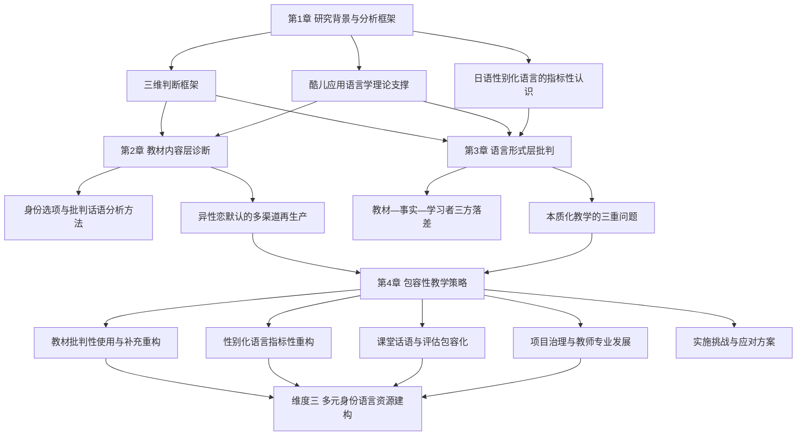

# 迈向更具包容性的日语课堂：北美初中级日语教材与性别化语言教学的LGBTQ+友好性调研（截至2020年）
# 1 研究背景与分析框架

## 1.1 LGBTQ+包容性议题在日语教育中的现实紧迫性

北美高校的日语课堂正在经历一场静默而深远的转变。一方面，日语作为热门外语之一，其学习者群体在性别认同、性取向与文化背景上日益多元；另一方面，主流初中级日语教材所构建的语言世界，仍在很大程度上以异性恋核心家庭、传统性别二元角色为默认场景。这种"默认设置"对LGBTQ+学习者而言并非中性背景，而是一种持续的身份压力——当一名跨性别学生被要求按"外表"在自我介绍中选择"僕"或"わたし"，当一名同性恋学生在练习"彼女いますか／彼氏いますか"这一对句型时被迫面临"出柜、撒谎或回避"的三难抉择，语言课堂便从中立的技能习得场所转变为身份协商的高压情境。

这种结构性张力的背后，是异性恋规范（heteronormativity）作为一种默认认知框架在外语教材中的深度嵌入。异性恋规范假设并非简单的"缺少同性恋内容"，而是一整套关于家庭、恋爱、婚姻、社交角色的预设——这些预设通过对话情境、词汇练习、文化注释、图像配图等多种方式反复强化，使非异性恋身份在课堂语言资源中处于结构性的不可见状态。对学习者而言，可见性缺失会直接削弱学习动机、损害课堂归属感，并在口语产出环节制造额外的认知与情感负担。

与此同时，北美高等教育正在系统性地推进多元、平等与包容（DEI, Diversity, Equity, and Inclusion）的制度化建设，从校级反歧视政策、性别中立代词使用规范，到课程层面的包容性教学（inclusive pedagogy）要求，已经成为评估教学质量与项目治理水平的重要指标。在这一制度环境下，日语项目若仍沿用未经审视的传统教材与教法，便不仅是教学法层面的滞后，更可能与所在机构的整体公平性承诺相抵触。因此，**从教材到教法系统性地审视并改进日语教育中的LGBTQ+包容性，既是回应学习者真实处境的教学伦理要求，也是北美高校日语项目对接整体制度变革的现实必需**。

## 1.2 酷儿应用语言学与外语教育研究脉络

将LGBTQ+议题纳入语言教育的学术讨论，已有近二十年的积累，并逐步形成被称为"酷儿应用语言学"（Queer Applied Linguistics）的研究领域。根据Nelson对该领域的系统梳理，过去二十余年间，关于语言学习中的"酷儿思考"（Queer Thinking）在国际范围内已引起广泛关注，研究主要围绕四个方向展开：将酷儿理论应用于语言学习与教学、分析课堂话语中的性身份与性多样性、批判语言教材中的异性恋规范，以及理解LGBT学生与教师的经历及其身份协商过程[^1]。这四条主线为本报告提供了核心的理论与方法工具：教材批判路径直接对应本报告第2章对主流日语教材的文本分析，课堂话语与身份协商路径则支撑第3章对性别化语言教学问题的剖析，而学生与教师经验研究则为第4章的教学策略建议提供了实践基础。

值得指出的是，这一研究脉络的主体长期集中于英语作为外语／第二语言（EFL/ESL）的语境，相关学者围绕英语教材的异性恋规范批判、LGBT学习者的课堂经验、酷儿教学法的可行性等议题已积累了较为可观的成果。相比之下，**在日语教育领域内，针对性别与性取向多样性的系统性研究直到本报告所聚焦的时间节点（截至2020年）才刚刚起步**，仍属于一个新兴而稀薄的子领域，少数研究者（如Arimori于2017年、Moore于2019年、Sall Vesselényi于2019a、2019b年的工作）开始将这一议题正式纳入日语教育学术讨论的范围。这种学科间的发展时差意味着，本报告在借鉴英语教育领域成熟框架的同时，必须充分考虑日语作为高度性别化语言的特殊性，以及北美日语教育的具体制度与教材生态。

Nelson同时指出，该领域尚需在三个方向上深化：酷儿教学法在不同地理与文化语境中的具体形态、语言教师在职前培训与专业发展中如何学习"酷儿地思考"、以及研究者在调查语言、性与学习关系时所需的支持机制[^1]。这些待解议题既呼应了本报告对教学策略与教师培训的关注（第4章），也提示我们：**对日语教育LGBTQ+包容性的研究本身就是回应国际学界对地理多样化与跨语种深化的呼吁**，具有超出单一项目改革之上的学术与实践意义。

## 1.3 日语性别化语言的语言学特征与教学化问题

日语在世界主要语言中以其高度显性的性别化语言资源而著称。这种性别化体现在多个层面：第一人称代词系统中，"わたし／わたくし"被标记为通用或女性偏向，"僕"与"俺"被标记为男性专用，"あたし"则被标记为女性口语；句末助词层面，"わ／の／かしら"等被归为女性语，而"ぜ／ぞ／だ"等则被归为男性语；此外，敬语使用、词汇选择（如"お＋名词"的美化语）、感叹词等也常被附加性别属性。这一资源系统在社会语言学层面具有丰富的指标性（indexical）意义——同一形式在不同语境、不同说话者口中可承载多重含义，远非简单的"男用／女用"二元归类所能涵盖。

然而，从语言学事实到课堂教材，存在一个被称为"教学化"（pedagogicalization）的中介过程——即为了便于初中级学习者掌握、便于教材体系化呈现，复杂的语言现象被简化、规则化为可教可考的二元对应表。在初中级日语教材中，性别化语言往往以"男性使用什么／女性使用什么"的对照表形式出现，并配以与之"匹配"的角色对话与练习。这一教学化处理在便利教学的同时，**也将本质上是指标性、流动性的语言资源固化为本质性的、强制性的身份规则**，从而与现代日语的实际使用（女性使用传统男性形式、男性使用传统女性形式、年轻人语言形式中性化、非二元说话者灵活调用各类资源等真实图景）之间形成显著张力。

这种张力对学习者构成双重困境：一方面，过于死板的教学可能损害语言准确性，使学习者无法理解和产出真实日语中性别化形式的丰富用法；另一方面，将性别形式与"男／女"身份强制绑定，对跨性别、非二元以及不愿被刻板性别化的学习者构成隐性伤害，迫使其在语言学习的最基础环节（如选择第一人称代词）就承担额外的身份协商压力。因此，**日语性别化语言的教学化问题不仅是社会语言学层面的描述准确性问题，更是教学法层面的包容性问题**，是评估教材与教法包容性时不可绕过的语言学基础。

## 1.4 研究边界与核心问题界定

为确保分析的聚焦性与可操作性，本报告对研究范围作如下界定。在时间范围上，本报告聚焦截至2020年的情况，对此后新版教材修订、数字化补充材料的发展仅在结论与展望中略作提及。在空间与机构范围上，本报告聚焦北美（美国与加拿大）高校的日语项目，研究对象为初中级阶段广泛使用的主流纸质教材及其配套教学实践，包括但不限于Genki I & II、Nakama 1 & 2、Yookoso!、Japanese: The Spoken Language、An Integrated Approach to Intermediate Japanese等具有代表性的教材体系。高级阶段教材、专项口语或商务日语教材、面向K-12的教材体系、以及北美以外地区的日语教育情境，不在本报告主要论述范围之内。

在核心问题上，本报告聚焦两个紧密关联的议题。**其一，主流初中级日语教材在话题设置、对话情境、词汇练习、文化注释与配图等层面所体现的异性恋规范假设**——即默认学习者及其交际对象为异性恋个体、默认家庭结构为异性婚姻核心家庭、默认恋爱与婚姻话题中的性别配置为男女配对——以及由此导致的LGBTQ+学习者身份不可见与表达资源缺失问题。**其二，性别化语言（尤其是第一人称代词与句末助词）在教材中被简化为"男性语／女性语"二元对应规则的教学化处理方式**——即将本质上具有指标性、流动性的语言资源呈现为与生理性别一一对应的强制规范——及其对语言准确性与学习者身份的双重影响。

这两个核心问题之所以构成本报告的双焦点，是因为它们分别对应教材在"内容层"（讲什么样的故事、呈现什么样的人物关系）与"形式层"（教什么样的语言形式、关联什么样的身份属性）的包容性挑战，二者共同塑造了LGBTQ+学习者在日语课堂中的整体经验。任何一个层面的改进若不兼顾另一层面，都难以达成实质性的包容效果。

## 1.5 教材与教法包容性的三维判断标准

基于上述背景梳理与问题界定，本报告提出贯穿后续各章的统一评价框架，包括三条相互关联但维度各异的核心判断标准。下表汇总三条标准的核心定义、操作化指标与在后续章节中的主要应用位置：

| 维度 | 核心判断问题 | 操作化指标 | 主要应用章节 |
|------|------------|----------|------------|
| 维度一：异性恋默认 | 教材是否默认学习者及其交际对象为异性恋？ | 恋爱/婚姻对话的性别配置、家庭结构例句、"彼／彼女"的对比性使用、自我介绍练习中的关系询问、配图中的家庭与情侣形象 | 第2章 |
| 维度二：性别语言本质化 | 教材是否将男性语／女性语本质化、规范化为二元对立？ | 代词与句末助词的呈现方式（对照表 vs. 语境化）、是否引入指标性视角、是否承认现代实际使用的多样性、教师手册的相关指导 | 第3章 |
| 维度三：多元身份语言资源 | 教材是否为多元性别与性身份提供可调用的语言资源与表达空间？ | 是否提供性别中立的代词与表达选项、是否包含非异性恋人物或情境、是否设计开放式自我表达任务、是否提示语言形式的可选择性 | 第3、4章 |

**维度一（异性恋默认）**关注的是教材内容层的可见性问题，其核心判断是"教材所构建的语言世界中，非异性恋身份是否拥有合法位置"。当一本教材在恋爱话题中只设计男女对话、在家庭单元中只呈现父母子女的异性婚姻结构、在自我介绍练习中预设"彼氏／彼女がいますか"的二元提问，即便其文字本身并无歧视性表述，也已通过持续的默认设置实现了对LGBTQ+学习者的结构性排斥。

**维度二（性别语言本质化）**关注的是语言形式层的呈现准确性与规范性问题，其核心判断是"教材是否将性别化语言形式与生理性别绑定为强制规则，还是呈现为可被多元说话者调用的指标性资源"。这一维度直接关联社会语言学对日语性别化语言实际使用的描述，也关联跨性别与非二元学习者在最基础语言形式选择上的身份压力。

**维度三（多元身份语言资源）**关注的是包容性的积极面——不仅要识别"什么是排斥性的"，更要追问"教材是否积极地为多元学习者提供可用的表达工具"。这一维度从消极的"不歧视"推进到积极的"赋能"，也是第4章提出具体教学策略时的核心建构方向。

这三条标准并非简单的勾选清单，而是相互支撑的分析视角：维度一识别教材的"默认场景"问题，维度二识别教材的"语言规则"问题，维度三则同时检视教材在两个层面上是否提供了替代方案与建构空间。在后续章节中，本报告将以这一三维框架对具体教材文本、教学实践与改进策略进行系统分析，确保从问题识别到策略落地的逻辑链条清晰可循。

# 2 北美主流初中级日语教材中的异性恋规范与LGBTQ+缺位问题

承接第1章所建立的三维判断框架，本章将以维度一（异性恋默认）为主要分析视角，同时为第3章对维度二（性别语言本质化）的讨论提供文本铺垫，系统考察北美广泛使用的初中级日语教材在内容层面对LGBTQ+身份的结构性排斥与有限的包容尝试。本章定位于"问题诊断"环节，通过对具体教材文本与练习的细读，揭示异性恋规范如何通过看似中性的默认设置、词汇练习与图像配置进入语言课堂，并讨论这些设定对学习者身份与语言学习经验的具体影响，为后续章节的语言形式分析与教学策略设计奠定文本证据基础。

## 2.1 教材分析对象、方法与代表性范围

本章所分析的教材对象，是截至2020年在北美高校日语项目中具有广泛使用基础与制度影响力的主流初中级纸质教材体系。具体包括坊主社出版的《Genki I》《Genki II》（Banno et al.系列），Cengage Learning出版的《Nakama 1》《Nakama 2》（Hatasa et al.系列），McGraw-Hill出版的《Yookoso! An Invitation to Contemporary Japanese》及其续篇（Tohsaku系列）[^2][^3][^4]，Eleanor Harz Jorden与Mari Noda合著的《Japanese: The Spoken Language》，以及《An Integrated Approach to Intermediate Japanese》等具有代表性的教材。这些教材在北美高校初中级日语课堂中长期占据主导地位，其内容设定不仅塑造个别学生的学习经验，更通过教师培训、课程大纲与考试体系的层层传导，构成北美日语教育的"事实标准"。以《Yookoso!》为例，作为McGraw-Hill旗下面向北美初学者的两卷本系列，它自首版以来即以"整合四项语言技能"为旗号，并配有丰富的插图、照片与现实材料(realia)作为语言学习语境[^2]，这一编排理念在某种程度上代表了北美初级日语教材的主流范式——也正因如此，其所默认的"语言世界"具有跨教材的代表性。

在分析方法上，本章借鉴Shardakova与Pavlenko针对俄语初级教材所提出的"身份选项"（identity options）分析框架。该框架立足于后结构主义理论与批判话语分析（critical discourse analysis），区分外语教材所提供的两类身份选项：一类是教材所**隐性预设**的"想象的学习者"（imagined learners），即文本结构默认将学习者建构为何种身份；另一类是教材所**显性援引**的"想象的交际对象"（imagined interlocutors），即文本中作为学习者对话伙伴出现的人物所代表的身份谱系。Shardakova与Pavlenko通过对两本流行的俄语初级教材的分析指出，即使其中一本（Russian Stage 1）提供了相对更丰富的身份选项，**两本教材都未能充分反映当代俄罗斯社会的多样性**；这些偏差与简化构成"失去的跨文化反思机会"，可能对学生产生负面影响，剥夺其自我表达甚至自我防卫的重要工具[^5]。

将此框架移植到本章对日语教材的分析，意味着提出两组核心问题：教材所隐含预设的"想象的学习者"是否默认为异性恋顺性别者？教材所援引的"想象的交际对象"——例句中的同学、朋友、家人、未来配偶——是否同样被默认配置为异性恋顺性别角色？基于这一双向追问，本章将从话题设置、对话情境、词汇与语法练习、文化注释与视觉配图五个维度展开举证分析。这一分析路径同时呼应了文化相关教学法（culturally relevant pedagogy）与批判话语分析的方法论传统——后者强调关注话语在"主导关系的（再）生产与挑战"中所扮演的角色[^6]。换言之，本章的分析并非对个别例句的孤立挑剔，而是要识别贯穿教材整体的话语生产机制，以判断这些教材在何种程度上"再生产"了异性恋规范，又在何种程度上"挑战"了它。

## 2.2 恋爱与约会话题中的异性配对默认与有限的包容尝试

恋爱与约会话题是日语初中级教材中最早、最频繁触及的高情感卷入话题之一。从词汇层面看，「彼」（kare）与「彼女」（kanojo）的对比性引入几乎是所有主流教材的标配——前者既可表示"他"，又可表示"男朋友"；后者既可表示"她"，又可表示"女朋友"——这种"代词—恋人"的语义双关性，使得在初级阶段几乎不可能绕开二元性别配对来教授这组高频词。配套的句型操练如「彼氏がいますか／彼女がいますか」（你有男朋友吗／你有女朋友吗）则进一步将"恋爱关系=异性配对"的预设固化为语言反射。对于一名同性恋或双性恋学习者，当教师指着自己提问「彼氏がいますか」时，回答的每一种可能——肯定承认、否认存在、模糊回避——都要求学习者在毫无准备的情况下处理身份披露问题，构成第1章所描述的"出柜、撒谎或回避"的三难抉择。

并非所有教材都对这一议题完全回避。一个值得关注的、相对正面的案例来自Japan Foundation编写的中级教材《Marugoto Japanese Language & Culture Intermediate 2》（2017a）。该教材在引入伴侣相关话题时使用了「相方」（aikata）一词。「相方」原指传统艺能（如漫才、落语）中的专业搭档，在现代日语中也被引申用于指代恋爱伴侣，并因其性别中立的语法属性而在同性伴侣社群中较为常见。更具教学法意义的是，《Marugoto》的配套教师手册（Japan Foundation 2017b）明确说明，此处使用「相方」是为了**"有意模糊"说话者伴侣的性别**——这一编写说明使「相方」从单纯的词汇条目升级为一项明示的包容性教学设计，向教师传达了"恋爱话题不必默认为异性配对"的教学立场。**这一案例的意义不仅在于词汇本身，更在于教师手册显式承担了包容性引导的责任**，从而打破了"教材编者默认异性恋，包容性责任完全外推给个别教师"的常见格局。

然而，与《Marugoto》在中级阶段的这一尝试形成对照的是，北美初级阶段最广泛使用的《Genki》《Nakama》《Yookoso!》等教材在恋爱话题的处理上仍以异性配对为压倒性默认。这一对照说明，**初级阶段的入门级教材恰恰是异性恋规范最密集、也最难以被学习者识别和反抗的环节**——学习者在尚不具备充足语言能力去自行重构话题的阶段，被反复操练异性配对的句型与词汇，其累积效应远超单一对话的内容偏差。

## 2.3 词汇与语法练习中基于异性恋假设与刻板性别想象的设定

教材的异性恋规范并非仅体现于"恋爱话题"这一显性模块，更通过看似与性取向无关的语法练习渗透到课堂的方方面面。《Genki II》（Banno et al. 2011）中包含若干基于异性恋假设的练习设计，这些练习虽然以语法点（如条件表达、推测表达等）为操练目标，但其例句与对话情境的设定却默认了异性恋的交际框架，使得学习者在掌握语法形式的同时也内化了相应的关系预设。

更值得警惕的是，主流教材在练习刻板性别想象时所采用的具体语言材料。《Genki II》中有一个练习「みたい」（mitai，看起来像)用法的例子：学生看一张性别中性化人物的插图，一人说「私の友達です。男です。」（这是我朋友。是男性。），另一人则回应「女みたいですね。」（看起来像女性呢。）该练习以"通过外貌判断性别"为操练情境，**将性别刻板印象的视觉判断直接植入语法操练**——其潜在信号是：偏离传统男性外貌特征的男性，可以、甚至应当被评价为"像女性"。对于跨性别学生、性别非二元学生、或仅仅是外表不符合主流性别气质规范的学生而言，这一练习不仅在内容层面冒犯，更在语言学习的最基础层面（语法操练）教给学习者一种将性别外表化、可评判化的话语方式。

《Nakama 2》（Hatasa et al. 2017）中存在结构上几乎完全平行的问题。在教授「ようだ」（yōda，类似/好像)的用法时，该书给出了「女のような男」（像女人的男人）与「男のような女」（像男人的女人）作为示范例句。这两个例句作为孤立的语法示例，既未提供任何语境说明，也未提示其潜在的歧视性含义，**直接将"违反性别规范"的描述方式呈现为标准日语的合法表达**。从批判话语分析的视角看，这种示例选择并非中性——它在向学习者传授「ようだ」的语法功能的同时，也传授了"如何用日语去评判一个人在性别气质上的偏离"的话语模板。对跨性别与非二元学习者而言，这类例句直接将其身份本身呈现为可被语法化、可被对象化讨论的"偏离案例"。

综合《Genki II》与《Nakama 2》中的这两组例证可以看到：**异性恋规范与性别二元规范在教材中并非孤立的"内容问题"，而是深度嵌入语法练习的例句选择与情境设定**。这一发现对教学法的启示是：教师即便回避了"恋爱话题"中的明显异性恋默认，也仍可能在看似无关的语法操练中不自觉地传导规范性话语；而要识别这些更隐蔽的问题，必须将整本教材作为话语整体进行审视，而非仅检视少数显眼的"敏感话题"。

## 2.4 家庭单元、自我介绍与人际关系练习中的身份协商压力

家庭单元是初级日语教材中另一个高度暴露异性恋规范的板块。从词汇层面，「父／母」「夫／妻」「兄／姉／弟／妹」「息子／娘」等亲属词汇通常以二元配对的方式集中引入，并配以"标准家族"的家谱图示——典型图示中，一对异性父母位于顶端，下连若干性别已明确标注的子女，且子女往往被进一步置于"将来会与异性结婚"的隐性叙事框架中。这一默认设置无形中将"家庭"等同于"异性婚姻核心家庭"，将"亲属关系"等同于"由异性繁殖关系派生的关系网络"。其结果是：来自同性伴侣家庭、单亲家庭、有跨性别父母的家庭，或与原生家庭有复杂关系的LGBTQ+学习者，在被要求"用日语介绍你的家庭"时，发现自己缺乏可调用的语言资源——他们要么压缩自身家庭结构以适配教材模板，要么投入额外的认知与情感劳动去解释偏离模板的真实情况。

与家庭单元相互强化的是自我介绍与人际关系练习。这类练习通常出现在教材的最初几个单元，是学习者在课堂上第一次被要求用目标语言"言说自己"的环节。其常见构件包括：以性别化的第一人称代词（如根据外貌引导男生使用「僕」、女生使用「わたし」）开启自我介绍；询问对方是否有「彼氏／彼女」；预设未来的婚姻规划为异性婚姻；以及在角色扮演中按性别分配对话角色。**这些设计中的每一项单独看似无害，但叠加起来便构成一个完整的身份建构机制**——它在课堂最初几周就向学习者反复传达"合格的日语学习者应当是异性恋顺性别个体"这一隐性信号。

对LGBTQ+学习者而言，这种早期、密集、反复的身份预设所带来的不仅是单次的尴尬，更是持续性的课堂归属感削弱与口语产出意愿下降。当学习者意识到"诚实地表达自己"与"完成教材任务"之间存在结构性张力时，他们往往选择降低参与度、提供模糊或虚构的回答、或干脆回避带有身份披露风险的练习。这种回避行为在表面上可能被解读为"学习动机不足"或"口语能力欠缺"，但其深层原因在于教材结构所制造的身份协商负担。

## 2.5 文化注释与配图中的异性恋规范再生产

除了对话、词汇与语法练习之外，教材的"文化注释"模块与视觉配图同样是异性恋规范再生产的重要场所。文化注释通常以"日本社会如此这般"的权威解释口吻出现，介绍日本的恋爱文化、婚礼习俗、家庭观念、青年社交方式等议题。在主流教材中，这类注释普遍呈现的是异性恋核心家庭、男女约会文化、传统婚礼仪式等"主流"图景，而对日本本土LGBTQ+社群、同性伴侣关系、多元家庭实践等内容则鲜有提及。这一遮蔽不仅强化了学习者对日本社会的单一异性恋想象，更在跨文化层面将"日本"建构为一个不存在性别多样性的同质化社会——这与日本本土近年来日益活跃的LGBTQ+权益运动、地方政府的同性伴侣证明制度推进等真实社会动态形成鲜明反差。

视觉配图层面的问题则更具隐蔽性。如《Yookoso!》系列所代表的"丰富插图程序"理念[^2]虽然在语言学习语境化方面具有教学法价值，但当这些插图、照片与现实材料持续呈现异性情侣、异性婚礼、传统性别外貌特征明显的人物形象时，**视觉层的反复曝光便构成对文本层异性恋规范的强化与再生产**。学习者在阅读文本之外，还通过图像不断接收"什么样的人才是日语世界的合法居民"的视觉信号。

值得补充的是，日本本土的文化生产实际上存在丰富的性别多样性表达。Flis对少年漫画（shōnen manga）的研究指出，女性作者如Adachitoka在《Noragami》等作品中，能够"颠覆少年漫画的性别化框架"，呈现对性别权力动态的抵抗与对传统性别角色的戏仿，**在仍属于该类型的同时为性别表演提供新的呈现方式**[^7]。这一研究提示我们：日本流行文化本身就是一个不断协商、挑战和重塑性别规范的复杂场域，而北美日语教材在文化注释与配图层面所呈现的"日本"，相比这一真实的多元图景而言是被高度筛选与简化的版本。这种筛选不仅是对日本社会多样性的失真呈现，也是对学习者获取真实跨文化反思机会的剥夺——回到Shardakova与Pavlenko的判断：教材中的偏差与简化构成"失去的跨文化反思机会"[^5]，这一判断在日语教材的语境下同样成立。

## 2.6 结构性排斥对LGBTQ+学习者的具体影响

综合前述五个维度的分析，可以将主流初中级日语教材对LGBTQ+学习者的结构性排斥影响归纳为四个相互关联的层面。下表汇总各层面的具体影响及其产生机制：

| 影响层面 | 具体表现 | 主要产生机制 |
|---------|---------|------------|
| 身份不可见 | 课堂语言资源中缺乏与自身身份对应的人物形象、关系配置与表达模板 | 话题设置、对话情境、家庭单元、配图中的异性恋默认 |
| 被迫出柜或撒谎 | 在自我介绍、关系询问、约会话题练习中面临即时身份披露的压力 | 「彼氏／彼女がいますか」类问句、自我介绍模板、角色扮演分配 |
| 语言准确性与流利度损失 | 因缺乏合适表达资源而在产出中回避、压缩或扭曲自身真实情况 | 词汇与句型操练的二元配对默认、亲属词汇的标准家庭模板 |
| 学习动机与归属感削弱 | 课堂参与度下降、口语产出意愿降低、对日语项目的整体认同弱化 | 上述三类影响的累积效应、文化注释中日本社会单一形象的固化 |

需要强调的是，**这四个层面的影响并非个别学习者的偶发体验，而是由教材默认设置所系统性制造的结构性后果**。当一名学生反复在不同教材、不同练习、不同教师的课堂上遭遇同样的异性恋默认时，他所体验到的不再是"某一本书或某一位老师的疏忽"，而是"整个日语学习领域不为我这样的人准备"的整体性排斥。这种排斥的累积效应直接转化为学习动机的结构性削弱，并在更长的时间跨度上影响LGBTQ+学习者在日语领域的留存率与发展路径。

同时，这些影响也并非完全无法通过教学干预来缓解。《Marugoto》中「相方」一词及其教师手册说明的案例表明，**只要教材编者愿意明确承担包容性引导的责任，即便是单一词汇的选择也能在课堂上产生显著的正面信号**。这一正面案例的存在意味着，本章所揭示的结构性排斥并非语言本身的固有属性，而是教材编写决策的产物——它可以被识别、被批判，也可以被改变。

本章对教材内容层异性恋规范的诊断，构成第3章分析性别化语言（男性语／女性语）教学问题的直接前提：内容层的异性恋默认与形式层的性别本质化共同构成LGBTQ+学习者在日语课堂中的整体经验，二者的相互交织使得任何单一维度的改进都难以达成实质性的包容效果。第3章将在此基础上，将分析视角从"教材讲什么样的故事"转向"教材教什么样的语言形式"，进一步揭示性别化语言资源被简化为二元规则的教学化处理过程及其对学习者的影响。

# 3 日语性别化语言（男性语/女性语）的传统教法及其问题

承接第2章对教材内容层异性恋规范的诊断，本章将分析视角从"教材讲什么样的故事"转向"教材教什么样的语言形式"，聚焦第1章三维框架中的维度二（性别语言本质化），系统考察北美主流初中级日语教材及其配套教师手册中关于第一人称代词、终助词、感叹词与敬语等性别化语言资源的呈现方式。本章将教材呈现与社会语言学的实证研究、二语习得研究中的学习者经验进行对照，揭示传统教法将指标性、流动性的语言资源固化为二元强制规则所造成的三重问题——语言描述的准确性偏差、性别身份的强制绑定、以及对跨性别与非二元学生的隐性伤害——为第4章包容性教学策略的设计提供问题诊断基础。

## 3.1 主流教材中性别化语言的呈现方式与教学化处理

北美主流初中级日语教材在处理性别化语言时，普遍采用的是一种以"对照"为核心结构的教学化呈现方式。在第一人称代词模块，教材通常将「わたし／わたくし」作为通用或女性偏向的"安全选项"率先引入，而将「僕」「俺」分别标记为男性中性／男性随意，「あたし」则标记为女性随意口语。这一标记方式与日语学习参考资料中的常见分类相一致：「わたし」被定位为"男女均可使用"的标配，「あたし」被界定为"女生版的'我'"，「僕」是"少年、青少年时期的男生常用的称谓"，而「俺」则被描述为"比较随意、粗鲁的一种男性自称"且明确告诫"女生最好不要说'俺'"[^8]。即便在中文学习者参考材料中，"僕娘"（自称「僕」的女生）也被作为偏离主流范式的特例加以解释，并被分类为"活泼开朗的女孩"或"脏话满天飞的不良少女"两种刻板形象[^8]——这种描述方式本身便折射出性别化代词在大众认知层面的强归一化倾向。

终助词模块的处理与代词模块在结构上高度同构。中文学习者熟悉的"必须掌握的10个终助词"清单中，「わ」被明确标注为"用于句末,使语言感觉柔和,同时也有感叹、强调之意,是女性用语"；「の」被注释为"主要为妇女、儿童用语"，其变体「のよ」「のね」被划入"女子用语"；「ぞ」被归为"男性用语"，表"强烈的断言或叮嘱"；「かな」被注明为"男性用语,表示感叹,感动"；与之相对的「かしら」则被界定为"女性用语,与男性用语かな相对的一个词"[^9][^10]。这种以"男／女对应"为骨架的清单式呈现，在面向欧美学习者的初中级日语教材中具有跨语言、跨教材的高度一致性，构成第1章所述"教学化"过程的典型样态——**复杂的指标性语言资源被压缩为可教、可考、可标准化操练的二元对应表**。

这种教学化处理在教材的语法解释与教师指导文献中得到进一步的规范性强化。以广泛被日语教师参考的庵功雄等所著《初級を教える人のための日本語文法ハンドブック》（Iori et al. 2000）为例，该书在论及性别化表达时明确指出，**男性使用仅限女性的表达"尤其不自然"，需要提醒学习者特别注意**——这一规范性论断直接将"不要跨越性别使用语言形式"作为教学指导的核心立场之一。中级阶段的教材也延续了类似立场。在内容与多媒体结合方面常被推荐的《Tobira: Gateway to Advanced Japanese through Content and Multimedia》（Oka et al. 2009）中，编者一方面承认"男女说话差异在缩小"这一现实趋势，但另一方面又通过具体例证劝告学习者：如果女性说出「俺もはら減った」（我也饿了）或男性说出「いやよ」（讨厌啦），听者会感到惊讶——并由此进一步劝告学习者应**避免使用不符合性别规范的表达**。

综合代词、终助词、教师手册三个层面可以看到，北美主流初中级教材在性别化语言的呈现上具有高度的内在一致性：以二元对照表为基本框架，以"男性形式／女性形式"为标签体系，以"避免跨越"为规范性教学口径。这一框架在便利教学的同时，**也将本来具有丰富社会语言学意涵的语言资源固化为与生理性别强制对应的身份规则**——而这正是本章后续分析所要逐一拆解的核心问题。

## 3.2 社会语言学实证研究所揭示的现代日语实际使用图景

将教材的二元化呈现与社会语言学的实证研究相对照，可以清晰地看到二者之间存在显著的描述性偏差。**现代日语中的性别化语言形式，远非教材所暗示的"男女各居一边"的整齐对应，而是一组被说话者在具体语境中灵活调用、协商身份的指标性资源**。

第一人称代词的实际使用即是一个典型案例。Miyazaki（2004）对日本初中男女学生第一人称代词使用的研究表明，**初中阶段的男女学生会使用各种第一人称代词来构建身份认同，其中包括传统上与另一性别相关联的形式**——也就是说，在最被教材所"标准化"的学龄阶段，真实说话者已经在以远超教材描述的方式调用代词资源。这与中文日语学习参考资料中所观察到的现象相吻合：「僕」虽然被传统定义为男性用语，但"在这个性别已经不那么重要的年代,ぼく也常常出现在女生的口中","现在许多个性的年轻女性也会僕来称呼自己,给人留有一种独立、自由、勇敢的女性形象"[^11][^8]。同样，「俺」的历史轨迹也提示了性别化标签的不稳定性——该词"到镰仓时代为止一直是作为第二人称使用,后来逐渐在地方上被转用为第一人称,到了江户时代,不论贵贱,不分男女,被广泛使用"，且在爱知县西三河地区"一直到今天农业地区还有作为女性第一人称被使用的事例"[^11]。这些方言与历史层面的多样性，被教材的"现代标准语二元表"几乎完全过滤掉。

句末助词的实际使用同样偏离教材的二元规则。Sturtz Sreetharan的研究指出，**在实际对话中，男性所使用的句末助词的使用频率并不高**——这一发现直接挑战了教材中将「ぞ／ぜ／な／かな」等作为"男性日常标记"集中操练的处理方式。事实上，相关研究强调，男性气质在话语中的呈现是一种"表演性"过程：说话者通过对意识形态化语言形式的反复调用与挪用来生产性别化主体性，而不是机械地"遵循"某种内在的性别规则；同时，**女性对所谓"男性话语形式"的挪用也持续存在，证明了语言符号本身的"漂浮性"与"无限灵活性"**[^12]。

身份协商语境中性别化资源的灵活调用则在更具边缘性的语言场景中得到充分展示。Abe（2004）对东京新宿lesbian bar话语的研究揭示，在这一空间中，**说话者会使用多样的人称代词与性别化言语风格来协商身份**。Abe的研究框架深受Butler酷儿理论的影响，她明确指出，性别"是一种话语实践,在持续的互动中展开,因此对干预与再赋意是开放的"，并强调酷儿理论的一个关键贡献在于"拆除将异性恋作为规范／起源、将同性恋作为偏离／模仿的区分"[^13]。在这一理论视角下，新宿lesbian bar中说话者灵活调用「僕」「俺」「あたし」等代词与各类终助词的实践，**并非"偏离规范"，而是揭示了所谓"规范"本身就是被话语实践不断再生产的产物**——这从根本上动摇了教材所暗含的"男性语／女性语各有归属"的本质主义预设。

下表对教材二元化呈现与社会语言学实际使用图景进行系统对照，可以更直观地看到二者之间的描述性落差：

| 语言形式 | 教材的二元化标签 | 社会语言学揭示的实际使用 | 关键文献依据 |
|---------|----------------|----------------------|------------|
| 僕 | 男性专用（少年/青年） | 年轻女性、初中女生用以构建独立、个性化身份；女同志酒吧中作为身份协商资源 | Miyazaki (2004); Abe (2004)[^13] |
| 俺 | 男性随意，"女生最好不要说"[^8] | 历史上不分男女广泛使用，部分方言区仍有女性使用；女同志社群中的身份资源 | Abe (2004)[^13]；方言研究[^11] |
| あたし | 女性随意口语 | 历史上东京男性工匠、商人使用；现代单口相声艺人使用[^11] | 历史方言研究 |
| わ／の | 女性用语，柔和、感叹 | 男性在特定语境下使用以表达柔和、亲近、对话性意涵 | Sturtz Sreetharan及Okamoto & Shibamoto Smith相关研究 |
| ぜ／ぞ／かな | 男性用语，强烈断言 | 男性实际使用频率并不高；并非男性日常话语的核心标记 | Sturtz Sreetharan (2004) |

从该对照可以看出，**教材所呈现的"男性语／女性语"系统在很大程度上是一种意识形态化的语言图景，而非对现代日语实际使用的准确描述**。这种描述性偏差不仅是社会语言学层面的学术问题，更直接影响学习者对真实日语的理解能力——这正是下一节所要分析的"三重问题"中的第一重。

需要补充说明的是，由于本报告的搜索结果中Okamoto & Shibamoto Smith、Nakamura、Wang、Ohara、Siegal、Finck Björgén等核心二语习得与社会语言学文献的直接文本未被检索到，本节及后续相关讨论主要依托Abe (2004)[^13]、Sturtz Sreetharan的相关论述[^12]、以及Iori et al. (2000)、Oka et al. (2009)、Miyazaki (2004)等参考要点，并辅以学习者参考资料中可观察到的语言事实[^9][^10][^11][^8]进行分析。这一资料局限不影响本章核心论证的成立，但也表明该议题的进一步实证研究仍有重要的拓展空间。

## 3.3 性别语言本质化教学的三重问题

在教材呈现与语言事实对照的基础上，可以系统识别将性别化语言本质化、二元化教学所造成的三重问题。这三重问题相互关联、相互强化，共同构成传统教法在描述准确性、教学伦理与学习者福祉三个层面的系统性缺陷。

**第一重：语言准确性偏差**。当教材将「僕」严格标记为男性专用、将「わ」严格标记为女性柔和语气标记时，学习者便建立起一套与现代日语实际使用相错位的语言期待。在听力理解层面，学习者可能将一位年轻女性自称「僕」识别为"错误"或"特殊例外"，而无法将其理解为身份协商的常规策略；在阅读理解层面，学习者可能无法把握角色语言中性别化形式所承载的复杂指标意义（如刻意的反差、戏仿、角色扮演等）；在口语产出层面，学习者则可能机械地按教材规则选择代词与终助词，导致其日语听起来过于规范化、缺乏现代说话者所具有的语用灵活性。Sturtz Sreetharan关于男性句末助词使用频率并不高的发现尤其值得警惕——**教材所大量操练的"男性日常话语"形式，可能本身就不是男性日常话语的核心特征**。这种偏差的累积效应是：学习者投入大量精力掌握的"性别规则"，在实际语用中可能既不准确，也不必要。

**第二重：性别身份的强制绑定**。教材在引入第一人称代词时，最常见的教学口径是要求学习者根据自己的生理性别"选择"对应的代词——男生使用「僕」、女生使用「わたし」，这一选择往往发生在课程的最初几周。如Iori et al. (2000)的指导口径所反映的那样，"男性使用仅限女性的表达尤其不自然，需要提醒学习者注意"，这一规范性陈述将语言形式的选择直接绑定于说话者的性别身份，把指标性资源固化为身份规则。**这种绑定将语言学习的最基础环节——自我指称——异化为一次身份归类训练**。学习者在尚未掌握任何复杂语言能力之前，便被要求将自己嵌入预设的性别二元体系，并以此为起点开始所有的语言产出。对于顺性别异性恋学生而言，这一过程可能不易被察觉为压力；但对于不愿被刻板性别化、或对自身性别认同持有更复杂理解的学生而言，这一最基础环节已构成持续的隐性压抑。

**第三重：对跨性别与非二元学生的潜在伤害**。当教材将代词与生理性别强制对应、并通过教师手册口径明确告诫"避免使用不符合性别规范的表达"（Oka et al. 2009的劝告即为典型）时，跨性别与非二元学习者便在制度层面被剥夺了使用符合自身身份的语言资源的合法性。一名跨性别男性学生希望使用「僕」，可能会被教师按"外貌不符"为由引导回「わたし」；一名非二元学习者希望灵活调用各类代词与终助词以表达其流动的身份认同，可能会被教材规则判定为"语言错误"。**这种制度化的语言规训在课堂上贯穿始终，构成微观但持续的压力**，与第2章所揭示的内容层异性恋默认相互叠加，使得LGBTQ+学习者在日语课堂中承受双重的结构性压抑。

更具批判性的视角则将传统教法上的规定性立场本身识别为一个教学伦理问题。Hosokawa（2016）将此种规定性教学法批判为一种**源于教师专家身份的"家长式作风"**——即教师以其在语言知识上的权威位置为依托，向学习者强加自己对"正确性"与"规范"的看法，而不去检视这些规范本身是否反映了语言的实际使用，更不去检视这些规范在被强加于不同身份的学习者时所产生的差异化影响。Sall Vesselényi（2019a）则进一步将规定性教学法的课堂效应描述为：**它会把教室变成一个让学生练习自我隐藏、为进入一个以顺性别为中心的社会做准备的场所**——也就是说，课堂不仅未能为多元身份的学生提供表达空间，反而成为训练其压抑自我、适配主流规范的预备性社会化机构。

将这两种批判与前述三重问题相对照，可以看到传统性别化语言教法的问题不止于"描述不准确"或"对特定学生不友好"这两个层面，而是更深地涉及教学权力的运作方式与课堂作为社会化场所的功能定位。**当教材以"自然／不自然"、"恰当／不恰当"的规范性语言来论述性别化形式的使用时，它实际上是在以语言教学之名进行性别身份的规训**——这一规训既强化了顺性别异性恋为默认的社会秩序，也使日语课堂成为这一秩序的微观再生产场所。

## 3.4 二语习得研究中学习者代词选择与身份协商的困境

将分析视角从教材与社会语言学转向学习者本身，可以观察到性别化语言强制规则在二语习得过程中所制造的独特困境。在最基础的自我指称环节，学习者所面临的并非简单的"记住对应规则"任务，而是一系列被预先性别化的语言选择，每一项选择都伴随着身份层面的协商负担。

对于女性学习者而言，"按规则"选择「わたし」并非中性的语言行为——「わたし」在教材与教师反馈中常常被附加一整套女性气质规范：要"柔和"、要配以「わ／の」等被标记为女性的终助词、要在语调上呈现一定的礼貌与温和。即便是不愿被这样规范的女性学习者，也会发现自己一旦使用「僕」便被教师视为"错误"或"特殊"，从而被剥夺以此构建独立、个性化身份的语言资源——而这一资源在现代日语母语者（如Miyazaki所研究的初中女生）中却是被广泛实际使用的。**学习者所遭遇的语言规则比母语者所实际使用的规则更为严苛，构成一种"被外加的语言保守化"现象**。

对于男性学习者而言，「僕」与「俺」之间的选择构成另一种压力。教材通常将「僕」呈现为"安全"的男性代词，而将「俺」标记为"随意／粗鲁"并暗示其使用语境的局限性。然而在实际生活中，"日本很多成年男子都这么自称"[^8]，「俺」是男性日常交际的重要资源。学习者若仅按教材规则使用「僕」，可能会被日本同龄朋友感知为"过于书面"或"距离感强"；而若试图模仿"俺"，又可能因不熟悉其使用语境而陷入语用错位。这种困境不是单一选择的对错问题，而是教材所提供的代词指南本身与实际语用之间的系统性脱节。

对于跨性别与非二元学习者而言，前述困境进一步放大。Miyazaki对初中男女学生使用各类代词构建身份认同的研究表明，**性别化代词在日本本土说话者中已经是一个被灵活调用的身份协商资源**；Abe对新宿lesbian bar话语的研究则展示了这一资源在LGBTQ+社群内部的丰富使用图景[^13]。然而，对北美课堂中的跨性别与非二元学习者而言，这些日本本土实践所开辟的语言空间往往在教材中被完全过滤，他们在最基础的自我指称环节就要面对：是按外貌"被分配"代词、还是冒着被判定为"错误"的风险选择符合自身身份的代词。**学习者通过形式回避（避免使用第一人称代词）、刻意选择（坚持使用符合身份的形式并承担教学评估上的代价）、跨越规则（在非正式场合灵活调用资源、在正式评估中回归规则）等策略进行应对**——但每一种策略都在不同维度上耗费额外的认知与情感资源。

这种困境揭示了传统教法在二语习得层面的深层问题：它不仅在描述层面失真，更将语言学习过程本身异化为一种身份压抑过程。当学习者每次说出「わたし」「僕」「俺」时所完成的不仅是语言任务，更是一次身份归类操演，**语言学习与身份压抑相互交织，构成LGBTQ+学习者在日语课堂中难以绕开的微观经验**。

## 3.5 教材—事实—学习者三方落差的整体诊断

综合前述各节的分析，传统性别化语言教学的整体问题可以从教材呈现、语言事实与学习者经验三方对照的视角进行结构化诊断。下表汇总各类性别化语言形式在这三个维度上的状况差异，揭示其系统性落差：

| 语言形式／教学环节 | 教材呈现 | 现代实际使用图景 | 对学习者（尤其LGBTQ+学习者）的具体影响 |
|------------------|---------|---------------|---------------------------------|
| 第一人称代词的引入 | 按生理性别"选择"——男生「僕」、女生「わたし」 | 母语者灵活调用各类代词构建身份（Miyazaki 2004；Abe 2004[^13]） | 最基础环节即被强制性别归类，跨性别/非二元学习者面临即时压力 |
| 「僕」的归属 | 男性专用，女性使用为"例外" | 年轻女性广泛使用以构建独立身份；女同志社群常用 | 女性学习者被剥夺该身份资源；跨性别男性学习者使用受阻 |
| 「俺」的教学口径 | 男性随意；女性"不应使用" | 历史上不分男女；部分方言区女性沿用[^11] | 强化"男性—粗犷／女性—柔和"刻板印象 |
| 终助词「わ／の」 | 女性柔和语气标记 | 男性在特定语境下亦有使用；标记意涵复杂 | 女性学习者被附加女性气质规范；男性学习者听力理解出现盲区 |
| 终助词「ぜ／ぞ／かな」 | 男性日常标记，应熟练操练 | 男性实际使用频率并不高（Sturtz Sreetharan）[^12] | 学习者大量操练并不准确反映男性日常话语的形式 |
| 教师手册的规范口径 | 警告"男性使用女性表达尤其不自然"（Iori et al. 2000）；劝告"避免使用不符合性别规范的表达"（Oka et al. 2009） | 母语者跨性别使用是常规身份协商策略 | 教学权威背书规范性立场，强化课堂作为顺性别社会化机构的功能（Sall Vesselényi 2019a） |
| 教学法整体定位 | 规定性、本质化、二元化 | 指标性、流动性、可协商 | 形成Hosokawa (2016)所批判的"家长式作风" |

从该对照可以看出，教材—事实—学习者三方之间存在的并非个别条目的偏差，而是系统性的落差：**教材所教授的语言规则比现代实际使用更为保守、更为二元、更为本质化；而这种本质化语言规则在被传授给学习者时，不仅造成语言准确性的偏差，更通过强制性别归类与规范性教学口径，对LGBTQ+学习者构成结构性的微观压力**。

需要特别强调的是，这一落差既是社会语言学层面的描述准确性问题，也是教学法层面的包容性问题，二者不可分割。改善其中任何一个层面而不触及另一个，都难以达成实质性的教学改进。仅仅更新教材对性别化语言的描述以反映社会语言学的最新发现，但仍保留"按生理性别选择代词"的教学口径，无法解除跨性别与非二元学习者的身份压力；反之，仅仅在课堂上强调"包容多元身份"，但仍按二元规则操练性别化形式，则无法解决语言准确性偏差，也无法为学习者提供真正可调用的多元表达资源。**只有将"描述更准确"与"教法更包容"两个维度同时推进，性别化语言教学才能从制造身份压抑的场所转变为支持多元表达的资源**。

至此，本章对维度二（性别语言本质化）的分析已与第2章对维度一（异性恋默认）的分析相互衔接：教材在内容层（讲什么样的故事）的异性恋默认与在形式层（教什么样的语言形式）的性别本质化共同构成LGBTQ+学习者在日语课堂中的整体经验，二者的相互交织使得任何单一维度的改进都难以实现实质性的包容效果。下一章（第4章）将在此诊断基础上，从维度三（多元身份语言资源）出发，提出从教材批判性使用、性别化语言教学重构、课堂话语与评估实践包容化、到项目层面支持机制建设的可操作教学策略，将本章所识别的问题转化为具体的改进路径。

# 4 面向LGBTQ+包容的日语教学策略与实施建议

承接第2章对教材内容层异性恋默认的诊断与第3章对形式层性别本质化的批判，本章将从第1章三维框架的维度三（多元身份语言资源）出发，将前两章所识别的问题转化为可操作的教学策略。本章定位于"问题—对策"逻辑链条的落地环节，强调任何单一维度的干预都难以达成实质性的包容效果，必须将策略设计同时锚定于内容层与形式层，并立足北美高校日语项目的现实约束——包括教材出版周期长、教师准备度参差、跨文化敏感性张力、以及评估标准化要求等——讨论各项策略的具体实施路径与潜在挑战。本章所提出的建议旨在为教师、项目协调人与课程设计者提供一份可被直接调用的实践指南，将本报告的诊断成果转化为可执行的课堂与项目层面行动。

## 4.1 包容性教学策略的总体设计原则与框架

在进入具体策略之前，有必要确立贯穿全章的设计原则，以避免将干预碎片化为彼此孤立的"技巧清单"。本节提出三条相互关联的设计原则：以维度三（多元身份语言资源）为正向建构目标、区分两类干预层次、并明确策略的分层推进逻辑。

第一条原则是**从"消极性不歧视"推进到"积极性赋能"**。第2章与第3章所揭示的结构性排斥并非由教师的恶意造成，而是由教材默认设置与教学规范口径累积形成。因此，仅仅要求教师"避免说错话"是远远不够的——这种消极性立场只能在事后修补已经发生的伤害，无法主动为多元学习者提供可调用的表达资源。真正有效的干预必须包含正向的资源建构：让多元身份在课堂语言资源中获得合法位置、为非异性恋情境提供可操练的对话样本、为不同身份学习者准备灵活的代词与语体选项。这种正向建构正是维度三所要求的核心方向。

第二条原则是**同时回应内容层与形式层的双重挑战**。第2章诊断的异性恋默认（内容层）与第3章诊断的性别本质化（形式层）在学习者的真实经验中是相互交织的——一位跨性别学生既要面对"彼氏／彼女"对句的身份披露压力，又要面对"按外貌选择代词"的归类压力。因此策略设计不能厚此薄彼：仅改造对话内容而不重构语言形式教学，无法解除最基础语言选择上的身份压力；仅引入指标性视角而不改造默认场景，则跨性别学生在自我介绍的下一句就重新进入异性恋默认框架。

第三条原则是**策略分层推进**。包容性教学的改善需要在三个层级上同步展开：**微观层**（单个教师在单次课堂中可立即采用的干预，如调整提问方式、补充例句）、**中观层**（教学小组或项目层面可推进的改革，如统一补充材料、修订评估量规）、**宏观层**（与所在高校DEI制度、ACTFL等专业组织多元包容政策、以及酷儿应用语言学学术脉络的对接）[^14]。三个层级并非递进关系而是相互支撑——微观干预若缺乏中观协调便难以持续，而中观改革若不嵌入宏观制度环境则难以获得资源与合法性。

下表汇总本章后续各节的策略对应关系，提供整体路线图：

| 节次 | 对应诊断章节 | 干预层级 | 核心策略 |
|------|-----------|---------|---------|
| 4.2 | 第2章（内容层） | 微观＋中观 | 教材批判性使用与补充重构 |
| 4.3 | 第3章（形式层） | 微观＋中观 | 性别化语言的指标性重构 |
| 4.4 | 第2、3章共同 | 微观 | 课堂话语与评估实践包容化 |
| 4.5 | 全部 | 中观＋宏观 | 项目治理与教师专业发展 |
| 4.6 | 全部 | 跨层级 | 实施挑战与应对方案 |

需要进一步说明的是，本章所提出的策略框架并非凭空构建。**英语教育领域已围绕LGBTQ+包容性教学积累了相对成熟的学术与实践资源**——Paiz对ELT中"queer applied linguistics"发展脉络的梳理强调，社会语言学的"社会转向"已经动摇了"性身份与语言教学无关"的传统假设，并呼吁通过教师培训与课程材料两条主线推进LGBTQ+包容性ELT[^15]；Gray则更进一步指出，跨性别学生虽然在课程中常被"擦除"，却在政治与媒体话语中无所不在，这种"课堂缺席—社会在场"的反差使教师面临难以回避的伦理责任[^16]；Knisely则将干预目标从"包容"推进到"性别正义"（gender-justice），主张语言教学不仅要承认LGBTQ+学习者的存在，更要通过跨语言实践促进语言能力与交叉性思维的共同发展[^17]。这三条研究脉络共同构成本章策略设计的理论参照。**日语教育领域的策略建构既可借鉴英语教育的成熟经验，又需立足日语作为高度性别化语言的特殊性与北美日语项目的具体制度生态**——这一双重锚定贯穿本章后续各节。

## 4.2 教材的批判性使用与补充重构方法

在北美高校日语项目的现实条件下，更换主流教材往往受制于课程协调、教师培训、考试体系与采购预算等多重约束，短期内大规模替换《Genki》《Nakama》《Yookoso!》等占主导地位的教材并不现实。因此，**包容性教学的第一线策略是教师在沿用现有教材的同时进行批判性使用与补充重构**——即将教材视为可被分析、标注、补充与重新组织的素材，而非须被原样讲授的权威文本。

### 4.2.1 显性标注与课堂讨论化处理

针对教材中显性的异性恋默认对话与练习，教师可采用"显性标注法"——即在课堂上明确向学习者指出该对话或练习中的预设结构，并邀请学习者共同反思其局限。例如，在讲授「彼氏／彼女がいますか」这一对句时，教师不必回避使用这组句型，但可在操练之后引导学习者讨论：这组句型预设了哪些关系配置？如果学习者本人或交际对象不符合该预设，可以如何重构提问？这种处理方式将教材中的问题点从"隐性默认"提升为"显性议题"，从而将异性恋规范的运作机制本身转化为可被反思的语言现象，呼应批判话语分析对语言在"主导关系再生产与挑战"中所扮演角色的关注。

### 4.2.2 对刻板性别想象例句的替换或反思性使用

针对第2章所举证的《Genki II》"女みたいですね"练习与《Nakama 2》"女のような男／男のような女"例句，教师有两种可选路径。其一是**直接替换**——以同一语法点的中性例句取代原例句，如将「みたい」的练习情境改为对食物、天气、人物心情等无性别敏感性的对象进行推测。其二是**反思性使用**——保留原例句但将其作为"话语分析素材"，邀请学习者讨论："这句话假设了什么？如果对话中的人是一位跨性别男性，这句话会造成什么影响？现代日语中是否有更不带评判的描述方式？"两种路径各有其教学法价值：替换路径适用于初级阶段语言能力有限、学习者尚不足以承担批判性讨论的情境；反思性使用则更适合中级及以上阶段，能将批判性话语意识本身作为学习目标加以培养。

### 4.2.3 家庭单元与自我介绍模板的开放式重构

针对家庭单元的"标准家族"模板与自我介绍练习的二元配对默认，教师可推进两项重构。在家庭单元，可在引入「父／母／兄／姉」等标准亲属词汇之后，主动补充更多元的家庭表达样本——包括同性伴侣家庭的成员称谓、单亲家庭、再婚家庭等多种结构。在自我介绍练习中，则可将"必答项"重构为"可选项"：学习者可以选择介绍自己愿意分享的关系，也可以选择不涉及恋爱与家庭话题；教师不应将"未提及恋人或配偶"判定为信息不全。**这种"赋予学生跳过或选择性回答涉及个人隐私问题的自主权"是包容性教学的基础性实践**——它通过将身份披露权交还给学习者，化解了第2章所诊断的"出柜、撒谎或回避"三难抉择。

### 4.2.4 性别中性词汇的补充与「相方」路径的延展

正如第2章所介绍的《Marugoto》以「相方」一词示范的中性词汇补充路径，教师在使用主流初级教材时也可主动引入一组性别中性的关系词汇作为补充。在「彼氏／彼女」之外，可引入「**恋人**」（koibito，恋人）作为完全性别中性的伴侣称谓——该词在现代日语中被广泛接受、语法上不携带性别属性、且语用上适合任意性别配置的伴侣关系；类似地，「**好きな人**」（sukina hito，喜欢的人）则可作为更含蓄、更开放的表达，既可指尚未确定关系的暗恋对象，也可指各种性别身份的伴侣。教师在教学操练中可将这些词汇与「彼氏／彼女」并列引入，并明确说明"在不确定对方性别或不希望预设性别时，'恋人''好きな人'是更通用的选择"。**这种词汇层的补充虽然看似微小，但其象征意义重大——它向学习者明示：教材所提供的不是唯一选项，性别中性的表达资源本就存在于日语之中，只是被传统教学化过程过滤掉了**。

### 4.2.5 补充材料的设计原则

除了对教材的批判性使用，项目层面还可推动统一的补充材料建设。补充材料的设计应遵循三条原则：第一，**语言准确性**——补充材料应基于真实的日语使用，而非凭空构造的"政治正确"对话；可参照Abe等社会语言学研究所揭示的日本本土LGBTQ+社群语言实践，引入真实存在的话语样本[^17]。第二，**情境多样性**——补充材料应覆盖同性伴侣家庭对话、跨性别人物自我介绍、非二元身份的关系描述等多种情境，避免将"包容性"简化为单一类型的添加。第三，**与主教材的衔接性**——补充材料应在语法难度、词汇范围、话题安排上与主教材相协调，使其能够嵌入既有课程节奏而非作为孤立模块。这种系统化补充材料的建设需要项目层面的协作，将在4.5节进一步讨论。

## 4.3 性别化语言教学的指标性重构路径

针对第3章所诊断的性别本质化问题，本节提出将男性语／女性语从"二元强制规则"重构为"指标性资源"（indexical resources）的具体教学路径。**这一重构不是简单地"放宽规则"，而是从根本上改变语言形式与说话者身份之间的关系预设**——从"语言形式由生理性别决定"转向"语言形式由说话者在具体语境中根据所要建构的身份与关系而选择"。

### 4.3.1 第一人称代词引入环节的根本性改造

最具关键性的改造发生在初级阶段第一人称代词的引入环节。传统教法通常在课程的最初几周即根据学习者的"外貌性别"分配代词——男生「僕」、女生「わたし」。这一做法应被彻底放弃。取而代之的是**呈现代词谱系并由学习者根据自身意愿选择**：教师可同时引入「わたし」「僕」「俺」「あたし」等多个代词，向学习者说明每个代词所承载的语用与社会指标意涵（如「わたし」的通用性与正式感、「僕」所传达的较为内敛的男性气质或独立的现代女性气质、「俺」的随意与亲近感等），并明确指出**没有任何代词是由说话者的生理性别"指派"的**——选择本身就是一种身份建构与语境协商。

为支持这一改造，教师在课堂上应主动引入Miyazaki对日本初中生代词使用的研究、Abe对新宿lesbian bar话语的研究、Sturtz Sreetharan对句末助词使用频率的研究等社会语言学发现，向学习者展示母语者的实际使用图景[^17]。这种"以语言事实为基础"的呈现方式不仅更准确，也将学习者从"按规则归类"的认知模式中解放出来，转入"根据语境与意图选择"的更高阶语言能力培养。

### 4.3.2 终助词的语境化呈现

类似地，终助词的教学应从清单式对照表转向**说话者意图导向的语境化呈现**。教师可不再以"男性用语／女性用语"为分类骨架，而以话语功能为骨架——如"表达柔和的强调"（可使用「わ／の／よね」等）、"表达强烈的断言"（可使用「ぞ／ぜ／だ」等）、"表达试探性推测"（可使用「かな／かしら」等）——并在每个功能下说明不同形式所携带的指标意涵。这种呈现方式将每个终助词从"性别标签"解放为"语用资源"，学习者可根据自己希望在特定场合传达的意涵选择形式，而不必将每次选择转化为身份归类操演。

### 4.3.3 性别化语言作为"抽象规范"的呈现立场

更具理论深度的重构则涉及对性别化语言整体性质的重新定位。Kinoshita-Thomson与Iida（2007）提出，**在教授性别化语言时可以将其呈现为一种"抽象规范"（abstract norm），而非必须遵守的语法规则**——也就是说，性别化形式不是"正确／错误"的语法问题，而是一组在社会中被反复生产、流通、协商的语言意识形态。这一立场的教学法意涵是深远的：它将性别化语言从语法体系（学习者必须掌握以避免错误）转移到社会语言学知识（学习者需要理解以读懂他人，但不必将其作为自己产出的强制规则）。在这种立场下，**学习者既能在听力与阅读中识别性别化形式所携带的社会意涵，又能在自己的产出中自由选择是否调用、如何调用这些资源**。

与"抽象规范"立场相互呼应的是**「言語資源」（gengo-shigen，language resource）概念的引入**。这一概念由Nakamura（2007）提出，主张将日语中的性别化形式理解为可被所有说话者根据语境调用的语言资源池，而非按性别划分的封闭工具箱。引入这一概念意味着在教学中明确告诉学习者：日语为说话者提供了一组丰富的语言资源，包括各种第一人称代词、句末助词、敬语策略、词汇选择等，这些资源在历史上曾与性别有较强关联，但其本质属于公共语言资源——任何说话者都可以根据自己想要建构的身份、想要传达的意涵、想要适配的语境来选择和组合。**这种概念框架既保留了对性别化形式社会意义的认知，又解除了形式与生理性别之间的强制绑定**。

### 4.3.4 面向不同水平学习者的分层活动设计

将"抽象规范"与「言語資源」概念落地为具体课堂活动，需要根据学习者水平进行分层设计。

**针对初级水平学习者**，由于其语言能力尚不足以支撑复杂的话语分析，活动设计应聚焦于"注意到言语风格的多样性"。可采用两类活动：其一是**反思自己的语言使用**——邀请学习者反思自己母语中（如英语中的"dude"、"sweetie"、"y'all"等）是否也存在与场合、对象、身份相关的语言选择，借此理解"语言选择即身份建构"的基本观念；其二是**观察电视剧或动漫中人物在不同情境下的说话方式**——选取若干日剧片段，让学习者注意同一人物在与朋友、家人、上司、恋人对话时如何切换第一人称代词、终助词、敬语等形式，从而通过具体观察建立对语言资源灵活调用的直观认识。这类活动不要求学习者立即掌握所有形式，但能在课程早期就植入"语言形式可选择、可协商"的认知框架。

**针对中高级水平学习者**，则可推进更具创造性的实践活动。可设计的核心活动是**短剧、视频创作或角色扮演**——学习者被邀请扮演自己想探索的任何身份的角色（包括但不限于不同性别、年龄、职业、社会背景的角色），并在剧本创作中有意识地调用日语的性别化语言资源，以使其角色的言语风格符合其身份建构。这类活动的关键设计要点是"扮演自己想探索的任何身份"——学习者不必将其角色限定为自己的真实身份，也不必将自己的真实身份限定为某种"应当"对应的语言风格。**这种活动既将语言资源的调用转化为可被实践的能力，又通过创作过程使学习者直接体验到"我可以选择如何说日语"这一赋能性认知**。对于跨性别与非二元学习者而言，这类活动尤其具有意义——它将课堂从规训性别身份的场所转变为支持身份探索的空间。

### 4.3.5 评估标准的连带改造

性别化语言教学的指标性重构必然带来评估标准的连带改造。在传统评估中，女性学习者使用「俺」、男性学习者使用「わ」可能被判定为"形式选择错误"。在重构后的评估框架下，**评分标准应承认"非规范但合语境"的形式选择**——即判断学习者的语言产出是否在该语境下合理传达了所欲建构的身份与意涵，而非判断其是否符合"性别—形式"的二元对应。这要求评分量规从"形式正确性"转向"语用得体性"，将"得体"定义为"与说话者所建构的身份及所处语境相一致"，而非"与说话者生理性别相一致"。这一评估改造将在4.4节与4.5节进一步讨论。

## 4.4 课堂话语与评估实践的包容化

教材改造与语言形式重构都需要通过教师的具体课堂行为得以实现。本节将干预视角从教材与语言形式转向教师自身的课堂话语与评估实践，提出可被教师立即采纳的微观实践指南。

### 4.4.1 避免基于外貌的性别假定

包容性课堂实践的首要原则是**避免基于外貌的性别假定**。这一原则在英语教育的跨性别包容性实践中已被反复强调——教师不应假定学生的性别认同，也不应假定学生是否为顺性别或跨性别；不正确的性别化语言（包括代词与"man""woman"等性别化名词）的使用可能对学生造成显著困扰[^18]。在日语课堂中，这一原则的具体落地包括几个方面：在点名、分组、角色扮演分配时，不再以"男生一组、女生一组"或"按性别分配对话角色"为默认操作；在板书例句或自我示范时，不再仅使用与自己外貌性别"对应"的代词，而是主动示范多种形式的灵活使用；在询问学生时，不再以"那位男同学"或"那位女同学"指代——而可以改用学生的名字或座位位置。

### 4.4.2 性别中立的课堂语言

教师自身的课堂语言应主动采用性别中立的选项。在询问学习者的关系情况时，可使用「**パートナー**」（partner，伴侣）或前述「**恋人**」「**好きな人**」等中性词汇，而非默认使用「彼氏／彼女」；在讨论家庭话题时，使用更开放的「家族の方」「ご家族」等表达，而非预设特定家庭结构；在讨论未来计划时，避免预设"结婚生子"为标准人生轨迹。这些微小的语言调整在累积效应上具有显著的包容性信号——它们向学习者明示：教师不假设你的身份、不预设你的关系、不规定你的未来。

### 4.4.3 开放式自我表达任务的设计

针对第2章所诊断的自我介绍与人际关系练习中的身份协商压力，教师可将传统的"封闭式预设关系询问"重构为**开放式自我表达任务**。例如，将"请介绍你的男朋友／女朋友"改为"请介绍一位对你而言重要的人"；将"你想和什么样的人结婚"改为"你对未来有什么期待"；将"你家里有几口人"改为"请介绍你最亲密的几个人"。这些开放式任务在语言难度上与原任务相当，但赋予学习者选择分享什么、如何分享的自主权。**自主权的赋予不仅解除了身份披露的强制压力，也将课堂从"按模板填空"的机械操练转变为真正的自我表达练习——后者本就是更高质量的语言教学目标**。

### 4.4.4 评估标准的支持性设计

评估实践的包容化要求评分标准明确支持多元身份表达。具体而言：口语与写作产出的评分量规应明确承认"使用『恋人』『パートナー』等中性词汇"为合规选择；对学习者代词与终助词选择的评分应基于"是否在该语境下合理传达意图"而非"是否符合性别归属"；对自我介绍、家庭描述等任务的评估应基于"语言使用的得体性与流畅性"而非"是否提及了预设的关系类型"。这种评估改造将4.3节所提出的指标性重构落实到学习者的实际利益层面——只有当学习者的多元表达不会带来评分代价时，他们才能在课堂上安心地调用这些资源。

### 4.4.5 教师的自我准备

最后，包容性的课堂话语与评估实践要求教师本人具备相应的知识与意识储备。这包括：理解日语社会语言学中关于性别化语言的最新研究、了解日本本土LGBTQ+社群的语言实践、熟悉所在高校的反歧视政策与代词使用规范、以及对自身在课堂中可能不自觉传达的预设保持反思性警觉。这种自我准备难以在短期内通过单次培训完成，需要项目层面的持续性专业发展支持——这构成下一节的讨论重点。

## 4.5 项目层面的支持机制与教师专业发展

将策略层级从单一课堂上升至项目治理，本节讨论日语项目协调人与系所层面可推进的中观与宏观改革。**单个教师的努力若缺乏项目层面的支持机制，便难以持续、难以扩散、也难以制度化**——这一判断已被英语教育领域的酷儿教学实践反复验证[^15]。

### 4.5.1 课程大纲与项目培养目标的修订

项目层面最具结构性意义的干预是将LGBTQ+包容性纳入课程大纲与项目培养目标。具体而言：在项目培养目标中明确包含"培养学习者对日语社会语言多样性（包括性别与性身份多样性）的认识与理解"；在各课程的教学大纲中明确说明该课程在包容性语言资源、多元身份表达、批判性话语意识等方面的具体目标；在课程评估指标中纳入包容性教学实施情况的考量。这种自上而下的目标设定使包容性教学从"个别教师的善意"转变为"项目层面的承诺"，为后续具体行动提供制度合法性。

### 4.5.2 教师专业发展工作坊

针对教师准备度的不均衡，项目应组织系统性的专业发展工作坊。Nelson在梳理酷儿应用语言学研究脉络时明确指出，**"语言教师在职前培训与专业发展中如何学习'酷儿地思考'"是该领域的核心待解议题之一**——这一判断在第1章已被引用，并在本章的策略建构中获得直接的落地意义。具体的工作坊设计可涵盖三个模块：**理论基础模块**（介绍异性恋规范、性别表演性、指标性等核心概念；介绍酷儿应用语言学的研究脉络与近年发展）、**日语社会语言学模块**（介绍Abe、Miyazaki、Sturtz Sreetharan等关于性别化语言实际使用的研究；介绍Nakamura的「言語資源」概念与Kinoshita-Thomson and Iida的"抽象规范"立场）、**教学实践模块**（介绍教材批判性使用方法、指标性重构的具体活动设计、包容性评估量规等）[^17]。这一工作坊既应面向新入职教师作为入职培训的一部分，也应面向资深教师作为持续专业发展的内容，以避免改革被解读为"对新教师的要求"而被资深教师视为外部强加。

### 4.5.3 教材选择与补充材料开发的协作机制

针对4.2节所讨论的补充材料建设，项目层面应建立稳定的协作机制。具体可推进的工作包括：建立项目级的"包容性补充材料库"，收录经过审定的同性伴侣家庭对话、跨性别人物自我介绍、性别中性词汇练习等材料；定期审视主教材的使用情况，识别需要补充或重构的章节并分工开发对应材料；在新版教材选购时将LGBTQ+包容性作为评估指标之一；与其他高校日语项目建立资源共享机制，避免每个项目都从零开始建设。

### 4.5.4 与高校DEI制度和专业组织的衔接

项目层面的改革应主动对接所在高校的DEI制度。这种对接是双向的：一方面，日语项目从DEI办公室获取政策依据、培训资源与制度支持；另一方面，日语项目通过具体的实践案例向DEI制度贡献语种教学层面的细化经验。同时，项目应关注ACTFL等专业组织在多元包容方面的政策动向——ACTFL早在2019年即发布"Diversity and Inclusion In World Language Teaching & Learning"立场声明，将多元与包容确立为其在全球语言教学中的核心价值，并承诺持续反思与评估其推动多元与包容的具体实践[^14]。这一专业组织层面的立场为各高校日语项目的改革提供了行业合法性背书。

### 4.5.5 持续的评估与反馈机制

包容性教学的实施效果需要通过持续的评估与反馈机制加以监测。具体可推进的实践包括：通过匿名学生反馈问卷收集多元身份学习者的课堂经验；通过同行观察（peer observation）促进教师之间的相互学习；通过定期的项目层面研讨会回顾实施进展与挑战；通过与英语教育、其他外语教育项目的横向交流获取经验借鉴。**评估的目的不是审查教师，而是建立"持续改善的反馈回路"——只有当问题能够被持续识别、讨论与回应时，包容性教学才能从单次改革转变为持续性的项目文化**。

### 4.5.6 跨语种的学术对话与日语领域的特殊贡献

最后，日语项目层面的改革应被自觉地定位于Nelson所指出的"地理多样化与跨语种深化"国际学术脉络之中。**英语教育领域在这一议题上已积累了丰富的研究与实践，Paiz对ELT中queer applied linguistics发展脉络的梳理[^15]、Nelson对queer thinking在语言教学中应用的系统讨论、Gray对反智时代跨性别包容性二语教学的深入分析[^16]、Jaspal以及Kappra与Vandrick等学者的相关研究**——这些英语教育领域的成果为日语领域的策略建构提供了重要参照。同时，Knisely对超越"包容"、走向"性别正义"的呼吁，将干预目标从"承认存在"推进到"促进语言能力与交叉性思维共同发展"，这一推进方向对日语教育同样具有重要启示[^17]。日语作为高度性别化语言、北美作为DEI制度推进较为成熟的教学语境，二者的结合使日语项目在国际学术对话中具有独特的贡献潜力——日语领域的策略实践与研究积累，能够为国际酷儿应用语言学的跨语种深化提供宝贵的实证基础。

## 4.6 实施挑战与应对方案

上述策略的落地不可能一蹴而就，本节系统讨论实施过程中可能遇到的现实挑战及其应对路径。

### 4.6.1 教师准备度的不均衡

最常见的挑战是教师准备度的不均衡。资深教师可能对传统教法存在路径依赖——他们多年来按既有方式教授性别化语言，可能将改革理解为对其专业判断的质疑；新教师虽然在意识层面更接受包容性理念，但可能缺乏将理念转化为具体课堂操作的经验。**应对路径是分层培训与同伴互助**：对资深教师，强调改革并非否定其经验，而是回应语言事实更新与学习者多元化的客观变化；对新教师，提供具体的课堂模板、活动设计与评估量规，使其能够直接调用而不必从零摸索；同时建立"师徒制"或"同伴互助小组"，让不同准备度的教师在共同备课与课后反思中互相学习。

### 4.6.2 跨文化敏感性张力

第二类挑战是跨文化敏感性张力——即如何在尊重日本本土文化语境的同时推进包容性教学，避免将北美DEI话语简单移植。这一张力是实质性的：北美课堂中的"性别中立代词"实践与日本本土的语言习惯之间存在差距，简单地以北美规范评判日语可能引发"文化帝国主义"的批评。**应对路径是积极引入日本本土LGBTQ+社群实践与学术研究**。日本本土在LGBT权益方面的进展近年来呈现明显加速态势——日本国立社会保障·人口问题研究所等机构已开展系统的全国性LGBT意识调查，部分地方政府推出同性伴侣证明制度，相关劳动法规与企业实践也在跟进[^19]。这些本土动态表明：包容性教学并非"北美话语向日本文化的强加"，而是与日本本土社会自身演变趋势相呼应的教学回应。同时，引入Abe等学者基于日本本土田野工作的研究[^17]，能够确保策略建构的语言依据来自日本本身而非北美的想象。

### 4.6.3 教材出版周期长与课程更新慢

第三类挑战是结构性的——主流教材的修订周期可能长达数年甚至十几年，新版教材即便有所改进也难以在短期内大规模采用。**应对路径是通过补充材料、教师手册、数字化资源等灵活路径加以弥补**。补充材料的开发周期远短于教材修订周期，且可由项目层面或教师群体协作完成；教师手册的更新可针对现有教材的具体问题点提供"批判性使用指南"；数字化资源则可低成本地提供多元身份的对话样本、视频片段、文化素材等。这些灵活路径不能完全替代教材修订，但能在等待结构性变革的同时为课堂提供即时的改善工具。

### 4.6.4 评估标准化与个性化表达的张力

第四类挑战来自评估标准化要求与个性化表达之间的张力。许多日语项目使用标准化的评估工具（如统一的口语考试、写作评分量规），这些工具往往预设了对"标准形式"的偏好，与4.3节所提出的指标性重构存在张力。**应对路径是通过评分量规改革予以协调**——将"标准形式"的定义从"性别归属对应"扩展为"语用得体性"，将评分指标从"形式正确"调整为"意图传达"，并在评分培训中明确说明各种"非传统"形式选择在何种条件下应被视为合规。这种量规改革本身就是一项需要项目层面协作推进的中观改革。

### 4.6.5 来自学生、家长或机构内部的潜在阻力

第五类挑战来自机构生态——部分学生可能不理解为何要改变"传统教法"，部分家长可能担心改革影响考试成绩，部分机构内部成员可能对议题本身持保留态度。**应对路径是制度性话语对接**——将包容性教学的推进锚定于所在高校的反歧视政策、DEI制度承诺、ACTFL等专业组织的立场声明等已有制度框架[^14]，使改革具有制度合法性而非个别教师的"特殊偏好"。同时，通过向学生、家长清晰说明改革的语言学依据（即性别化语言的实际使用本就远比教材规则灵活）与教学法依据（即包容性教学有助于所有学习者的语言能力发展），将议题从"政治正确"层面转移到"教学专业性"层面。

### 4.6.6 持续协商而非单次改革

最后需要强调的是，**包容性教学的推进不是一次性的改革事件，而是持续性的反思与协商过程**。语言本身在变化，学习者群体在变化，社会认知与制度环境在变化，包容性教学也必须随之演进。今天被视为"足够包容"的实践，可能在五年后被识别为仍有局限；今天被视为"过于激进"的探索，可能在五年后成为行业标准。因此，项目层面应建立的不是"一套包容性方案"，而是"一种持续改善的项目文化"——其中包括定期审视、开放讨论、勇于试错、及时调整等基本机制。

下表汇总本节所讨论的五类挑战及其应对路径，提供整体的应对路线图：

| 挑战类型 | 具体表现 | 主要应对路径 |
|---------|---------|-----------|
| 教师准备度不均衡 | 资深教师路径依赖；新教师经验不足 | 分层培训、同伴互助、师徒制 |
| 跨文化敏感性张力 | 担忧北美DEI话语对日本文化的强加 | 引入日本本土LGBTQ+社群实践与研究 |
| 教材出版周期长 | 主教材短期内难以替换 | 补充材料、教师手册、数字化资源 |
| 评估标准化张力 | 标准化评估工具与个性化表达冲突 | 评分量规改革，从形式正确转向意图传达 |
| 机构内部阻力 | 部分学生、家长或同行的保留态度 | 与高校DEI制度、ACTFL立场等制度框架对接 |

至此，本章已从总体设计原则、教材批判性使用、性别化语言指标性重构、课堂话语与评估包容化、项目治理与教师专业发展、到实施挑战与应对方案六个层级，系统提出了面向LGBTQ+包容的日语教学策略与实施建议。这些策略既回应了第2章对内容层异性恋默认的诊断，也回应了第3章对形式层性别本质化的批判，并通过维度三（多元身份语言资源）的正向建构目标实现了三维框架的完整闭合。下一章（第5章）将在此基础上对全报告进行总结，归纳从"问题识别—理论支撑—策略落地"的完整改进路径，并展望2020年后的延续议题。

# 5 结论与展望

作为全报告的收束章节，本章将沿着第1章所建立的三维分析框架（异性恋默认、性别语言本质化、多元身份语言资源），将第2章对教材内容层的实证诊断、第3章对语言形式层的批判分析、第4章对教学策略落地路径的系统建构整合为完整的"问题识别—理论支撑—策略落地"逻辑链条；在此基础上，立足2020年这一时间节点，本章将进一步澄清研究局限、展望此后值得持续推进的延续议题，并为北美高校日语项目负责人提供分阶段的中长期改革决策建议，使本报告的诊断成果与策略建构能够真正转化为可被项目层面调用的行动方案。

## 5.1 核心症结的整体回顾

将前述四个主体章节的诊断与批判置于第1章所建立的三维判断框架下进行整体回顾，可以清晰看到北美初中级日语教学在LGBTQ+包容性方面所暴露的核心症结，并非散落的个别问题，而是一组相互嵌套、相互强化的结构性张力。

**在维度一（异性恋默认）层面**，第2章的分析揭示，主流初中级日语教材（《Genki》《Nakama》《Yookoso!》《Japanese: The Spoken Language》《An Integrated Approach to Intermediate Japanese》等）通过多重渠道再生产异性恋规范：恋爱话题中「彼氏／彼女がいますか」的二元对句操练、家庭单元中以异性婚姻核心家庭为模板的亲属词汇引入、自我介绍练习中按性别分配的角色配置、文化注释中对日本本土LGBTQ+社群的系统性遮蔽、视觉配图中持续呈现的异性情侣与传统性别外貌——这些设定看似中性，实则共同构筑了一个"合格日语学习者应当是异性恋顺性别个体"的隐性身份预设。Shardakova与Pavlenko提出的"身份选项"分析框架在此处的应用表明，教材所默认的"想象的学习者"与所援引的"想象的交际对象"均被压缩为异性恋顺性别配置，构成对多元身份学习者的"失去的跨文化反思机会"。

**在维度二（性别语言本质化）层面**，第3章的分析揭示，主流教材与教学指导书（包括Iori et al.的《初級を教える人のための日本語文法ハンドブック》、Oka et al.的《Tobira》等）将日语高度指标性的性别化语言资源压缩为"男性语／女性语"的二元强制规则，并以"自然／不自然"的规范性话语劝告学习者不要跨越规则。这种本质化教学造成三重相互关联的问题：与Miyazaki对初中生代词使用、Abe对新宿lesbian bar话语、Sturtz Sreetharan对句末助词使用频率等社会语言学研究所揭示的实际使用图景之间的**语言准确性偏差**、在最基础的自我指称环节即将语言形式与生理性别绑定的**性别身份强制**、以及通过教学权威背书规范性立场而对跨性别与非二元学习者构成的**隐性伤害**——后者已被Sall Vesselényi批判为将课堂变为"让学生练习自我隐藏、为进入以顺性别为中心的社会做准备的场所"。

**在维度三（多元身份语言资源）层面**，第2章与第3章的诊断共同表明，主流教材在为多元身份学习者提供可调用表达资源方面普遍存在系统性缺失：缺乏性别中性的伴侣称谓在初级阶段的引入、缺乏对代词与终助词作为可被任意说话者调用的"语言资源"的呈现立场、缺乏非异性恋情境的对话样本与练习模板、缺乏支持非传统形式选择的评估口径。维度三所揭示的缺失既是维度一与维度二症结的累积结果，也是后续策略建构的核心着力点。

**这三个维度的症结并非彼此独立，而是在LGBTQ+学习者的真实课堂经验中相互交织**。一名学生在自我介绍环节既要面对"彼氏／彼女がいますか"的关系询问（维度一），又要面对按外貌"被分配"代词的归类压力（维度二），同时还要在缺乏「恋人」「パートナー」等中性词汇明确引入的情况下独自寻找表达资源（维度三）。**正是这种内容层与形式层的相互嵌套，使得任何单一维度的局部改进都难以解除学习者所承受的整体结构性压力**——这一判断构成本报告策略建构的根本前提，也是项目负责人在制定改革方案时必须把握的核心认知。

## 5.2 从问题识别到策略落地的完整改进路径

将全报告四个主体章节的论证整合为可被项目负责人直接调用的逻辑链条，可以形成一条"诊断—理论—对策"的闭环路径。下图以Mermaid流程呈现该路径的整体结构：

具体而言，**第1章奠定理论与评价基础**：提出贯穿全报告的三维判断框架（异性恋默认、性别语言本质化、多元身份语言资源），梳理酷儿应用语言学的国际研究脉络（Nelson、Paiz、Gray、Knisely等），并确立日语性别化语言的指标性认识作为后续分析的语言学基础。**第2章以"身份选项"和批判话语分析为方法对教材内容层进行实证诊断**：通过对恋爱话题、词汇语法练习、家庭单元、文化注释与配图五个维度的细读，揭示《Genki II》"女みたいですね"练习、《Nakama 2》"女のような男／男のような女"例句等具体案例所反映的结构性排斥；同时通过对《Marugoto》中「相方」一词及其教师手册说明的分析，指出"教材编者明确承担包容性引导责任"的正面可能性。**第3章以社会语言学实证研究与指标性视角对语言形式层进行批判**：通过对教材—事实—学习者三方落差的对照诊断，揭示传统教法在准确性、伦理与学习者福祉层面的系统性缺陷。**第4章以六个层级的策略设计实现对策落地**：从总体设计原则到教材批判性使用、性别化语言指标性重构（包括「言語資源」概念与"抽象规范"立场的引入）、课堂话语与评估包容化、项目治理与教师专业发展、再到实施挑战与应对方案，将前两章的诊断转化为可执行的行动指南。

**这一闭环路径的核心判断在于**：包容性教学的实质性推进必须同时回应内容层与形式层的双重挑战、必须同时在微观（课堂）、中观（项目）与宏观（制度）三个层级展开、必须将"消极不歧视"推进到"积极赋能"的正向资源建构。任何脱离这一整体性的局部干预——如仅更换教材中的几个例句而不重构语言形式教学，或仅引入指标性视角而不改造默认场景——都难以达成实质性的包容效果。

## 5.3 研究的学术意义与实践价值

本报告的贡献可从学术与实践两个维度加以阐明。

**在学术意义层面**，本报告呼应了酷儿应用语言学研究领域近年来明确提出的"地理多样化与跨语种深化"诉求。Nelson在梳理该领域研究脉络时所强调的"酷儿教学法在不同地理与文化语境中的具体形态"以及"研究者在调查语言、性与学习关系时所需的支持机制"等待解议题，正是本报告所试图回应的方向。同时，该议题在国际学术对话中具有广泛的延续性——Paiz对ELT中queer applied linguistics发展脉络的梳理[^15]、Gray在反智时代背景下对跨性别包容性二语教学的批判性论述[^16]、Knisely所主张的"超越包容、走向性别正义"的语言教育目标[^17]，以及Eide、Gjesdal与Skalle主编的关于语言学科中性别与多样性的专题研究[^20]，共同构成了一个正在快速积累的国际学术场域。**本报告将这一长期集中于英语教育的研究脉络系统性地拓展至日语这一高度性别化语言的具体语境**，并通过与Abe对日本跨性别说话者语法指标性的分析[^17]、Sakata对日语"性别"助词习得的研究[^16]、Miyazaki对初中生代词使用、以及Nakamura「言語資源」概念等日本本土社会语言学研究形成对话，为国际酷儿应用语言学的跨语种深化提供了具体的实证与策略素材。

**在实践价值层面**，本报告为北美高校日语项目提供了与所在机构整体DEI制度承诺相对接的具体改革依据。ACTFL作为北美外语教育领域最具影响力的专业组织，早在2019年即发布"Diversity and Inclusion In World Language Teaching & Learning"立场声明，明确表示"重视多样性并努力在世界语言教学与学习的各种语境中推动包容性，并承诺持续反思和评估其具体实践与举措以促进多样性与包容性"[^14]。GLSEN、NAEA等专业组织也持续推进K-20教育领域的LGBTQ+包容性实践[^14][^19]。在这一专业组织与制度环境下，**本报告所提出的策略框架不再是个别教师的"特殊偏好"，而是项目层面对接ACTFL立场、回应所在高校DEI承诺的专业责任落实**。报告将抽象的包容性理念分解为教材批判性使用方法、性别化语言指标性重构活动、课堂话语操作指南、项目治理机制等可被直接调用的具体工具，使日语项目负责人能够将其制度承诺转化为可执行的课程与课堂实践。

## 5.4 研究局限与边界澄清

为确保本报告的诚实性与可被后续研究继承的可信度，有必要对其局限与边界作出明确澄清。

**在资料范围层面**，本报告在写作过程中存在若干核心二语习得与社会语言学文献的直接文本未能充分获取的情况——包括Okamoto与Shibamoto Smith关于日语性别化语言意识形态的系列研究、Nakamura关于「言語資源」概念的完整论述、Wang关于年轻人语言变迁的实证研究、Ohara关于学习者音高与身份协商的研究、Siegal关于西方女性学习者在日本身份协商的民族志研究、以及Finck Björgén关于学习者代词选择的研究等。这些文献在第3章相关讨论中以参考要点形式得以引用，但其完整论证未能直接呈现，构成本报告论证密度上的实质性局限。这一局限不影响本报告核心论证（即教材—事实—学习者之间存在系统性落差、且这一落差需要从内容层与形式层同时干预）的成立，但表明该议题在更深入的实证层面仍有重要拓展空间。

**在研究对象范围层面**，本报告聚焦截至2020年的北美初中级纸质主流教材及其配套教学实践，**未涵盖**：高级阶段教材、专项口语或商务日语教材、面向K-12的教材体系、北美以外地区（如欧洲、东亚、大洋洲）的日语教育情境、以及2020年之后陆续推出的新版教材修订与数字化补充材料。这一边界设定是为确保分析的聚焦性与可操作性，但也意味着报告结论的适用范围以这些边界为限。

**在研究方法层面**，本报告主要依托对教材文本与既有学术文献的批判性分析，**未包含**对北美日语课堂中LGBTQ+学习者一手经验的实证收集——如系统的学习者访谈、课堂观察、问卷调查等。这一方法局限意味着，本报告对学习者所承受的"出柜、撒谎或回避"三难抉择、"被强制性别归类"压力等具体经验的描述，更多是基于教材结构与教学规范的逻辑推演，而非对真实经验的实证记录。这一局限同样为后续延续议题指明了方向（详见5.5节）。

**这些局限既是研究边界的诚实声明，也表明本报告的定位是"提供分析框架与策略路线图"而非"提供穷尽性的实证结论"**——它为项目负责人提供一份基于现有学术资源的最佳综合判断与可操作建议，但任何具体改革决策的落地仍需结合各项目的具体生态、学习者构成与制度环境作出本地化调整。

## 5.5 2020年后的延续议题与未来研究方向

立足2020年这一时间节点，有四类议题值得在此后持续推进。

**第一，新版教材修订的跟踪与评估**。主流初中级日语教材的修订周期较长，但2020年前后部分教材已开始进入新版准备阶段。后续研究应系统跟踪《Genki》《Nakama》《Yookoso!》等主流教材在新版中对包容性议题的回应程度——是否引入了性别中性词汇（如「恋人」「パートナー」）、是否调整了恋爱与家庭话题的默认配置、是否在配图中纳入了更多元的人物形象、是否在教师手册中提供了类似《Marugoto》对「相方」一词所做的明确包容性引导。这种跟踪评估既能识别行业的实际进展，也能为后续教材选择提供基于实证的决策依据。

**第二，数字化补充材料与开放教育资源（OER）的系统建设**。纸质教材出版周期长是本报告4.6节所识别的结构性挑战之一，而数字化路径恰恰能够绕过这一约束。后续值得推进的方向包括：建立由多所北美高校日语项目协作维护的"包容性补充材料库"，收录经过同行评审的同性伴侣家庭对话、跨性别人物自我介绍、非二元身份关系描述、性别中性词汇练习等材料；开发可直接嵌入主流教材课程节奏的数字化模块；与日本本土LGBTQ+社群合作收集真实的语言使用素材，确保补充材料的语言准确性与文化真实性。

**第三，跨机构与跨语种的合作网络建设**。包容性教学的推进若仅依赖个别项目的孤立努力，难以形成可持续的改革势能。后续应推动北美各高校日语项目之间的横向合作——包括联合工作坊、共享补充材料库、协同评估量规改革等；同时推动与英语教育、其他外语教育领域的跨语种对话，借鉴ELT领域已有的成熟经验[^15][^16]，也将日语教育的特殊性贡献于国际跨语种学术场域。在这一方向上，类似《Journal of Language, Identity & Education》《TESOL Journal》《Modern Language Journal》等关注语言、身份与教育交叉议题的学术期刊[^15][^17][^18]，可成为日语领域研究者发表跨语种对话成果的重要平台。

**第四，学习者声音的实证研究**。如5.4节所指出的，本报告对LGBTQ+学习者具体经验的描述更多基于逻辑推演而非实证收集，这是日语教育领域研究的重要缺口。后续应通过访谈、问卷、民族志、课堂话语分析等方法系统记录LGBTQ+学习者（包括同性恋、双性恋、跨性别、非二元等各类身份）在北美日语课堂中的真实经验——他们如何应对异性恋默认的对话练习、如何在代词选择中协商身份、如何评价不同教师的课堂实践、如何看待新引入的包容性教学策略。这类实证研究将使未来的策略建构建立在更坚实的学习者经验基础之上，**也将使日语项目的改革决策从"基于既有文献的最佳推断"升级为"基于本项目学习者真实声音的精准回应"**。

这四类议题相互关联：教材跟踪评估为项目选择提供依据、数字化资源建设缓解结构性约束、跨机构合作放大改革势能、学习者声音研究锚定改革方向。它们共同构成2020年之后北美日语教育包容性改革的延续脉络。

## 5.6 面向项目负责人的中长期改革决策建议

将全报告的诊断、批判与策略凝练为可被大学日语项目负责人直接采用的中长期改革路线图，本节按短期、中期、长期三个时间维度提出分阶段建议。

下表汇总三阶段改革路线的核心举措、关键产出与所对应的本报告章节支撑：

| 阶段 | 时间维度 | 核心举措 | 关键产出 | 章节支撑 |
|------|---------|---------|---------|---------|
| 短期 | 1年内 | 教师工作坊启动；补充材料试点；课堂话语指南制定；个别教师层面的批判性教材使用试行 | 至少一轮教师工作坊；初版课堂话语指南；3-5份试点补充材料 | 第4.2、4.3、4.4、4.5.2节 |
| 中期 | 2-3年 | 课程大纲修订；评估量规改革；项目级补充材料库建设；与高校DEI办公室的制度对接 | 修订后的课程大纲；新版评估量规；系统化补充材料库；与DEI办公室的协作机制 | 第4.5.1、4.5.3、4.5.4节 |
| 长期 | 3-5年及以上 | 建立持续改善的项目文化；跨机构合作网络；学习者反馈回路与定期评估机制；与酷儿应用语言学学术对话 | 项目层面的"持续改善文化"；跨机构合作协议；定期化的学习者反馈机制 | 第4.5.5、4.5.6、5.5节 |

**短期阶段（1年内）的核心任务是"启动改革进程并积累初步经验"**。项目负责人应在这一阶段优先推进三项工作：第一，组织面向全体教师的入门级工作坊，介绍本报告所梳理的核心诊断与策略框架，建立教师团队的共同认知基础；第二，邀请少数对议题敏感的教师在其课堂上试行教材的批判性使用与补充重构，积累具体经验；第三，制定一份简明的"课堂话语包容性指南"——涵盖4.4节所述的避免基于外貌的性别假定、性别中立词汇的使用、开放式自我表达任务的设计等基本实践——作为全体教师的共同行动参考。

**中期阶段（2-3年）的核心任务是"将试点经验制度化"**。在短期阶段所积累经验的基础上，推进三项结构性改革：第一，将LGBTQ+包容性目标纳入项目培养目标与各课程教学大纲，使包容性教学从"个别教师的善意"提升为"项目层面的承诺"；第二，改革评估量规，将"形式正确性"转向"语用得体性"，明确支持学习者对中性词汇与多元形式的选择；第三，建设系统化的项目级补充材料库，覆盖恋爱话题、家庭单元、自我介绍、性别化语言等关键模块；与所在高校的DEI办公室建立稳定的协作机制，获取制度合法性与资源支持。

**长期阶段（3-5年及以上）的核心任务是"建立持续改善的项目文化"**。在中期改革成果稳定之后，项目应进一步推进：第一，建立定期的项目层面研讨与评估机制，确保改革成果不被时间稀释、并能持续回应新出现的议题；第二，参与跨机构合作网络的建设，与其他北美高校日语项目共享经验与资源；第三，建立学习者反馈回路，通过匿名问卷、焦点小组等方式持续收集多元身份学习者的课堂经验，并据此动态调整教学实践；第四，与酷儿应用语言学的国际学术对话保持衔接，将本项目的实践经验贡献于跨语种、跨地理的学术场域。

**贯穿三个阶段的核心判断是：改革应被理解为持续协商而非一次性事件**。语言本身在变化、学习者群体在变化、社会认知与制度环境在变化——这意味着项目层面所要建立的不是"一套完成形态的包容性方案"，而是"一种能够在多重张力中寻求动态平衡的项目文化"。这些张力包括：制度合法性与教学专业自主权之间的张力、教师准备度参差与改革推进时效之间的张力、跨文化敏感性与北美DEI规范之间的张力、评估标准化要求与学习者个性化表达之间的张力。**项目负责人的核心角色不是消除这些张力，而是在其中持续寻找最适合本项目生态的动态平衡点**。

至此，本报告完成了从问题背景与分析框架（第1章）、教材内容层诊断（第2章）、语言形式层批判（第3章）、教学策略落地（第4章）到结论与展望（第5章）的完整论证。**全报告所提供的不仅是对截至2020年北美初中级日语教学LGBTQ+包容性问题的一次系统诊断，更是一份可被项目负责人直接调用的、贯穿"诊断—理论—对策—决策"的完整行动框架**。当一名大学日语项目负责人将本报告的诊断结果与其项目的具体生态相对照、将本报告的策略建议与其项目的可调动资源相结合、并按短中长期路线图分阶段推进改革时，本报告便从一份学术性的分析文本转化为推动北美日语教育包容性实质改善的实践工具——这正是本报告的最终价值所在。

# 参考内容如下：
[^1]:[Queer Thinking about Language Learning: Current Research and Future Directions](http://doi.org/10.1093/oxfordhb/9780190212926.013.34)
[^2]:[Yookoso! an Invitation to Contemporary Japanese](https://book.douban.com/subject/7921092/)
[^3]:[Yookoso!](https://book.douban.com/subject/2002834/)
[^4]:[Identity Options in Russian Textbooks](http://www.tandfonline.com/doi/abs/10.1207/s15327701jlie0301_2)
[^5]:[Learning from Culturally Relevant Pedagogy and Critical Discourse Analysis: Informing and Successfully Impacting Foreign Langua](https://archive.nyu.edu/jspui/bitstream/2451/75565/2/AbarcaMillan_LearningfromCRPCDA_FINAL.pdf)
[^6]:[Yookoso! An Invitation to Contemporary Japanese](http://www.semanticscholar.org/paper/aa1eafaae7d5ca0017ed5342673dacff12a26bbe)
[^7]:[Straddling the Line: How Female Authors are Pushing the Boundaries of Gender Representation in Japanese Shōnen Manga](https://newvoices.org.au/volume-10/straddling-the-line-how-female-authors-are-pushing-the-boundaries-of-gender-representation-in-japanese-shonen-manga/)
[^8]:[日语中光“我”的常见说法就有8种,该用哪种才好?](https://baijiahao.baidu.com/s?id=1670656752091168886&wfr=spider&for=pc)
[^9]:[学习日语必须掌握的10个终助词](https://jp.hjenglish.com/riyucihui/p1436727/)
[^10]:[学习日语必须掌握的10个终助词](https://jp.hjenglish.com/rumen/p1436727/)
[^11]:[日语第一人称代词知识学习](https://jp.hjenglish.com/waijiao/p1376551/)
[^12]:[MOVING FROM RACE TO IDENTITIES IN SECOND LANGUAGE LEARNING](https://www.hawaii.edu/sls/wp-content/uploads/2014/09/Calhoun-Alicia.pdf)
[^13]:[Lesbian Bar Talk in Shinjuku, Tokyo](http://doi.org/10.1093/oso/9780195166170.003.0012)
[^14]:[1. NAEA LGBTQ+ Interest Group: Advocates for the inclusion and fair representation of LGBTQIA2S+ issues in art education. Provi](https://www.arteducators.org/wp-content/uploads/2025/10/LGBTQIA2S_2025.pdf)
[^15]:[ELT Journal | 期刊-维普官网](https://www.cqvip.com/journal/957243X/957243X/2021)
[^16]:[Welcome Back, Educators!](https://content.acsa.org/wp-content/uploads/2022/08/GLSEN_Back_To_School_Educator_Guide-2022.pdf)
[^17]:[Living in Anti-Intellectual Times: Addressing Transgender Inclusion in Second Language Teaching and Teacher Education](https://discovery.ucl.ac.uk/id/eprint/10179559/1/Gray%202023.pdf)
[^18]:[Sakata, Minako (1991). The acquisition of Japanese 'gender' particles. Language & Communication , 11(3): 117-125.](http://doi.org/10.1016/0271-5309(91)90001-c)
[^19]:[LGBT が働きやすい 職場環境に向けて](https://www.jil.go.jp/kokunai/blt/backnumber/2017/02/002-014.pdf)
[^20]:[Gender and Sexuality in English Language Education: Focus on Poland](http://www.researchgate.net/publication/282610340_Gender_and_Sexuality_in_English_Language_Education_Focus_on_Poland)
