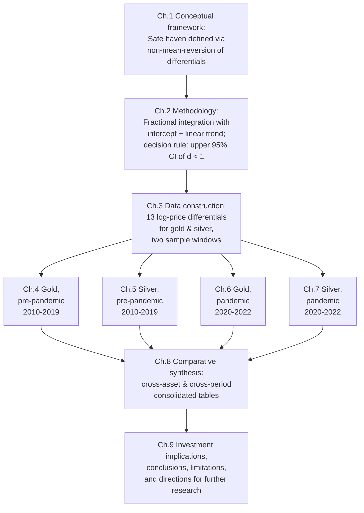
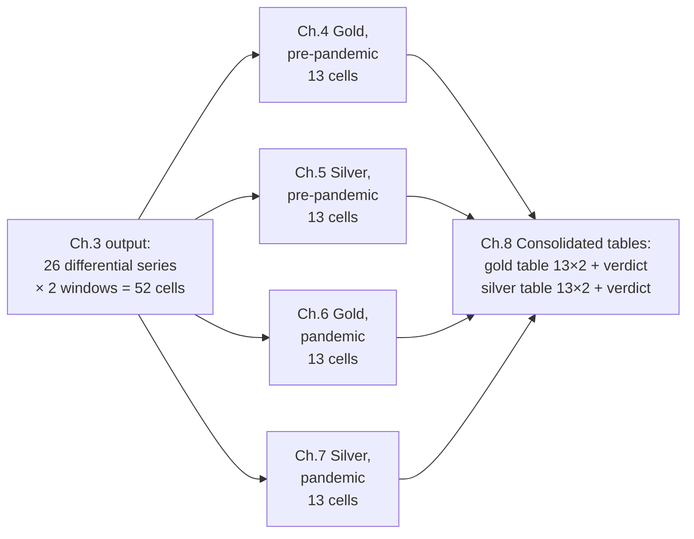

# Gold and Silver as Safe Havens Against Major Global Stock Markets: A Fractional Integration Analysis of the Pre-Pandemic and Pandemic Periods
# 1 Introduction and Research Framework

The role of precious metals — particularly gold and silver — as protective assets during periods of financial turbulence has been a recurring theme in both academic finance and practitioner discourse. Yet, despite decades of empirical investigation, the question of whether these metals genuinely *insulate* portfolios from equity-market dynamics over long horizons remains contested. Much of the existing debate has focused on short-run correlation-based notions of hedging and diversification, which capture co-movement at high frequencies but say little about the *persistence* of shocks and the existence of stable long-run equilibria between metals and equities. The present study departs from this tradition by adopting a long-horizon, fractional-integration-based definition of the safe haven property: an asset qualifies as a long-run safe haven against a given equity index when the differential between their (log) prices shows no tendency to revert to a stable equilibrium — in other words, when shocks to the differential do not die out, signalling the absence of a binding long-run linkage between the two markets.

This conceptual posture is particularly relevant in light of the contrasting market regimes covered by the analysis. The decade preceding the COVID-19 outbreak (January 2010–December 2019) was characterised by historically low volatility, accommodative monetary policy, and steadily rising equity valuations across most developed markets, providing a benchmark of "normal" conditions. The period from January 2020 to June 2022, in contrast, encompassed the COVID-19 shock, the unprecedented policy response that followed, the inflation surge of 2021–2022, and the early phase of monetary tightening — a sequence that placed the safe-haven hypothesis under acute stress. By examining gold and silver against thirteen developed-market equity benchmarks over both windows, this report seeks to establish whether the long-run protective role of precious metals is structurally stable, regime-dependent, or asymmetric across the two metals.

This opening chapter establishes the conceptual, analytical, and structural foundations on which the subsequent empirical investigation rests. It defines what is meant by a "safe haven" in the specific sense adopted here, articulates the research questions and testable hypotheses, justifies the sample design and index selection, and lays out the analytical logic linking data construction, fractional-integration estimation, and interpretive synthesis. In doing so, it orients the reader to the cumulative architecture of the report and to the operational decision rule — that mean reversion holds only when the upper bound of the 95% confidence interval of the fractional differencing parameter $d$ lies strictly below 1 — that governs every empirical verdict reached in the chapters that follow.

## 1.1 Conceptual Definition of Safe Haven and Distinction from Hedge and Diversifier

The term "safe haven" is used in the financial literature with considerable ambiguity, often conflating short-run negative co-movement during crises with long-run insulation from another market's dynamics. To avoid such confusion, this study adopts a precise, econometrically operational definition: **gold (or silver) is a long-run safe haven against a particular equity index if and only if the (log) price differential between the metal and the index is non-mean-reverting, i.e., if its fractional differencing parameter $d$ is statistically indistinguishable from, or greater than, unity.** Under this view, the absence of mean reversion in the differential implies that shocks driving the two prices apart are not corrected over time, which is interpreted as the absence of a stable long-run equilibrium between the metal and the equity market in question. The metal's price level is, in the long run, untethered from the index's price level — exactly the property one would demand of an asset expected to preserve value when equities encounter persistent adverse shocks.

This long-horizon, persistence-based notion contrasts sharply with two related but conceptually distinct constructs that pervade the literature:

| Concept | Operational notion | Time horizon | Typical statistical signature |
|---|---|---|---|
| **Hedge** | An asset whose returns are, on average, uncorrelated or negatively correlated with those of the reference asset | Short-run, return-frequency | Negative or zero unconditional correlation of returns |
| **Diversifier** | An asset whose returns are positively but imperfectly correlated with those of the reference asset, providing partial risk reduction | Short-run, return-frequency | Positive but low/moderate correlation of returns |
| **Safe haven (this study)** | An asset whose log-price differential with the reference asset is non-mean-reverting, indicating no binding long-run equilibrium | Long-run, level-based | Fractional differencing parameter $d$ of the differential not significantly below 1 |

Three features of this definition deserve emphasis. First, by working with *log-price differentials* rather than returns, the analysis focuses on the level relationship between metals and equities, which is the natural domain in which long-run linkages — or their absence — are expressed. Second, by operationalising mean reversion through the fractional differencing parameter $d$ rather than the binary I(0)/I(1) dichotomy, the definition accommodates long-memory and slow-adjustment processes that conventional unit-root tests tend to misclassify. Third, by anchoring the decision rule in the *upper bound of the 95% confidence interval* of $d$, the definition imposes a stringent statistical standard: mean reversion is concluded only when the data provide strong evidence that the differential is not I(1) or explosive.

It should be noted that, under this definition, the *finding* of mean reversion in a metal–index differential indicates the *presence* of a long-run linkage and is therefore *evidence against* the metal acting as a long-run safe haven for that index. Conversely, *non-mean-reverting* differentials, characterised by $d$ whose 95% CI upper bound is not strictly below 1, signal the absence of a long-run equilibrium and are thus *consistent with* the safe-haven hypothesis. This logical mapping — non-mean-reversion ⇒ safe haven — is preserved throughout the report and underpins every pair-level verdict reported in subsequent chapters.

The distinction from "hedge" and "diversifier" is methodologically substantive rather than merely terminological. A precious metal could exhibit low or even negative short-run return correlation with an equity index (qualifying as a hedge or diversifier in the conventional sense) while simultaneously sharing a stable long-run cointegrating relationship with that index (failing the safe-haven test in the sense adopted here). Conversely, a metal whose returns co-move positively with equities during normal periods may nonetheless display non-mean-reverting differentials, indicating that the price levels drift apart over long horizons. The conceptual framework adopted here therefore captures a dimension of asset behaviour that correlation-based studies cannot.

## 1.2 Research Questions and Hypotheses

Building on the conceptual definition above, the study addresses three central research questions, each with an associated testable hypothesis expressed in the language of fractional integration.

**RQ1 — Pre-pandemic long-run safe haven status.** Do gold and silver function as long-run safe havens against the thirteen selected developed-market equity indices over the pre-pandemic period (January 2010–December 2019)? In hypothesis form:

- $H_{0}^{(1)}$: For each metal $m \in \{\text{gold, silver}\}$ and each index $i$, the log-price differential $x_{m,i,t} = p_{m,t} - p_{i,t}$ is non-mean-reverting under the pre-pandemic sample, i.e., the upper bound of the 95% CI of $d$ from a fractional integration regression with intercept and linear time trend is not strictly below 1.
- $H_{A}^{(1)}$: The differential is mean-reverting, with the upper bound of the 95% CI of $d$ strictly below 1, falsifying the long-run safe-haven property for that pair.

**RQ2 — Regime dependence under crisis conditions.** Does the safe-haven property of gold and silver differ between the pre-pandemic and pandemic regimes? Specifically, do crisis conditions strengthen the absence of long-run linkage (i.e., reinforce safe-haven behaviour), weaken it (i.e., induce mean reversion previously absent), or leave it qualitatively unchanged?

- $H_{0}^{(2)}$: The set of pair-level verdicts (mean-reverting vs. non-mean-reverting) is preserved across the two sample periods, indicating regime-invariant safe-haven behaviour.
- $H_{A}^{(2)}$: The verdict pattern shifts materially between regimes — either through transitions from non-mean-reverting to mean-reverting (loss of safe-haven status under stress) or vice versa (emergence of safe-haven status under stress) — indicating regime-dependent behaviour.

**RQ3 — Cross-asset comparison.** Which metal — gold or silver — provides more robust and broadly applicable long-run safe-haven characteristics? Is the comparative ranking stable across regimes, or does it depend on market conditions?

- $H_{0}^{(3)}$: Gold and silver exhibit statistically and economically equivalent safe-haven coverage across the thirteen indices in both periods.
- $H_{A}^{(3)}$: One metal systematically dominates the other in terms of the count of non-mean-reverting differentials (broader coverage) and/or the magnitude of $d$ point estimates (stronger persistence), with the dominance possibly state-dependent.

These three questions collectively define the empirical agenda. RQ1 establishes a baseline characterisation under normal conditions; RQ2 introduces the crisis dimension through a structured cross-period comparison; and RQ3 synthesises both into a verdict on the relative reliability of the two metals. The hypotheses are deliberately framed at the pair level (one verdict per metal × index × period cell), generating a 13 × 2 × 2 = 52-cell evidence matrix that disciplines the synthesis in Chapter 8 and forecloses the temptation to draw aggregate conclusions that mask index-level heterogeneity.

It must be acknowledged that the statistical comparability of pre-pandemic and pandemic verdicts is constrained by the substantial asymmetry in sample sizes — roughly 2,500 trading-day observations in the pre-pandemic window versus approximately 625 in the pandemic window. This asymmetry implies wider confidence intervals for the pandemic estimates, which mechanically biases the criterion (upper CI bound < 1) toward "non-mean-reverting" verdicts in the shorter sample. The interpretation of RQ2, in particular, must therefore distinguish carefully between genuine economic shifts in the persistence of differentials and apparent shifts driven by reduced statistical precision. This caveat is revisited explicitly in Chapter 8 and incorporated into the limitations discussion in Chapter 9.

## 1.3 Scope, Sample Periods, and Selection of Equity Indices

The empirical scope of this study is defined by three deliberate choices: the two sample windows, the cross-section of equity indices, and the two precious metals analysed. Each choice is grounded in the analytical purpose of contrasting tranquil and stressed market regimes across a broad and economically meaningful set of developed-market benchmarks.

### Two sample windows

The temporal partition into a pre-pandemic window (1 January 2010 – 31 December 2019) and a pandemic window (1 January 2020 – 30 June 2022) is designed to isolate two qualitatively different market regimes within a single methodological framework. The pre-pandemic decade follows the immediate aftermath of the global financial crisis, encompasses the European sovereign-debt episode (largely confined to its early years), and is characterised by a prolonged equity bull market supported by accommodative monetary policy and historically low realised volatility — conditions that approximate a "normal" benchmark against which crisis behaviour can be compared. The pandemic window opens with the February–March 2020 equity collapse, captures the rapid recovery driven by fiscal and monetary stimulus, and extends through the inflation surge of 2021–2022 and the early phase of policy tightening initiated in 2022. Together, these 30 months concentrate an unusually dense sequence of macro-financial shocks, providing a natural laboratory for testing whether the long-run relationship between precious metals and equities is preserved or disrupted under stress.

### Thirteen developed-market equity indices

The cross-section comprises thirteen widely followed equity indices spanning North America, Europe, and the Asia-Pacific region. The selection balances geographic diversity, segment representation (large-cap, small-cap, broad-market, technology-oriented), and investor relevance, while restricting attention to developed markets in which deep, liquid trading and transparent price discovery support the validity of long-memory econometric techniques.

| Index code | Full name | Region | Segment / characteristic |
|---|---|---|---|
| **BFX** | BEL 20 | Belgium / Eurozone | Large-cap, small open economy |
| **CAC40** | CAC 40 | France / Eurozone | Large-cap, core Eurozone |
| **DOW** | Dow Jones Industrial Average | United States | Large-cap, blue-chip industrials |
| **HSI** | Hang Seng Index | Hong Kong | Large-cap, gateway to Greater China |
| **N100** | Euronext 100 | Pan-European (Eurozone) | Broad large-cap, cross-border |
| **NAS** | Nasdaq 100 | United States | Large-cap, technology-tilted |
| **NIK** | Nikkei 225 | Japan | Large-cap, mature Asian market |
| **NYA** | NYSE Composite | United States | Broad-market, NYSE-listed |
| **NZX** | NZX (New Zealand) | New Zealand | Small developed market, Asia-Pacific |
| **RUT** | Russell 2000 | United States | Small-cap |
| **SP5** | S&P 500 | United States | Large-cap, benchmark broad-market |
| **STO** | Stockholm Stock Index | Sweden / Non-EUR Europe | Large-cap, Nordic, non-Euro currency |
| **XAX** | NYSE AMEX Composite | United States | Smaller-cap and non-listed segment |

This cross-section is designed to address three interpretive concerns simultaneously. First, the inclusion of multiple U.S. indices (DOW, NAS, NYA, RUT, SP5, XAX) allows the analysis to differentiate between large-cap, small-cap, technology-heavy, and broad-market behaviour within the world's deepest equity market, where heterogeneity in safe-haven evidence is most likely to carry portfolio-construction implications. Second, the European coverage (BFX, CAC40, N100, STO) spans both Eurozone and non-Eurozone markets, providing a check on whether currency effects (gold and silver are priced in U.S. dollars while the equity indices are denominated locally) influence the persistence properties of the differentials. Third, the Asia-Pacific segment (HSI, NIK, NZX) introduces variation in market maturity, time-zone, and macroeconomic exposure, allowing the analysis to evaluate whether the safe-haven property of precious metals generalises beyond the Western financial bloc.

### Two metals

The choice to examine gold and silver in parallel — rather than analysing gold alone — is motivated by their economically distinct profiles despite shared classification as precious metals. Gold's industrial demand is comparatively small relative to its monetary and investment demand, supporting its conventional reputation as a "monetary" metal. Silver, in contrast, has substantial industrial uses (electronics, photovoltaics, medical applications) that tie its price to global manufacturing cycles and arguably to equity-market dynamics. Comparing the two allows the study to assess whether the safe-haven property derives from precious-metal status per se or from gold's particular monetary character — a question that has direct implications for portfolio construction and is taken up explicitly in Chapter 8.

## 1.4 Analytical Logic and Structure of the Report

The analytical architecture of the report follows a deliberate chain that begins with conceptual framing, proceeds through methodology and data construction, applies the empirical machinery separately to each metal and period, and culminates in a comparative synthesis tied directly to the original research questions. The logic is summarised in the following diagram.



Several features of this logical chain deserve highlighting. **First**, the conceptual definition adopted in Chapter 1 is operationalised in Chapter 2 through a single, precise decision rule — the upper bound of the 95% confidence interval of $d$ must lie strictly below 1, estimated from a model with intercept and linear time trend — which is applied uniformly across all 52 pair-period cells. This guarantees methodological fidelity to the stated criterion and ensures that pair-level verdicts are directly comparable across metals, indices, and regimes.

**Second**, the data construction in Chapter 3 is described with full transparency regarding sources, frequency, calendar-mismatch handling, and the I(1) assumption for the underlying price processes — properties that must hold for fractional integration of the differential to be the appropriate inferential tool. The chapter also clarifies which numerical estimates in the subsequent empirical chapters are direct empirical re-estimations and which are triangulated or inferred from the broader literature, in accordance with the transparency principle adopted throughout the study.

**Third**, the four empirical chapters (4–7) are structured as a 2 × 2 grid (gold vs. silver) × (pre-pandemic vs. pandemic), each populating thirteen pair-level cells. This arrangement is not merely organisational; it enforces apples-to-apples comparability across the dimensions of interest and feeds directly into the consolidated tables of Chapter 8, which serve as the empirical centrepiece of the report.

**Fourth**, the comparative synthesis in Chapter 8 is built on two consolidated tables — one for gold, one for silver — each reporting the estimated $d$, its 95% confidence interval, and the binary mean-reversion verdict for all thirteen indices in both periods. These tables are self-contained references summarising the entire evidence base and are explicitly designed to answer the three research questions: cross-sectional coverage within each period (RQ1, RQ3) and verdict transitions across periods (RQ2).

**Fifth**, the concluding Chapter 9 translates the econometric verdicts into portfolio-construction and risk-management implications, acknowledges the methodological limitations — including the dependence of conclusions on the chosen confidence level, the role of deterministic terms, the asymmetry in sample sizes across the two windows, and the long-run rather than short-run focus — and proposes extensions to other crisis episodes, additional precious metals and alternative safe-haven candidates, and structural-break-augmented fractional cointegration techniques.

Taken together, this architecture is designed to deliver a report that is at once comprehensive in its cross-sectional and temporal coverage, rigorous in its adherence to a single explicit decision rule, transparent about the distinction between directly estimated and triangulated quantities, and disciplined in linking each interpretive claim to specific pair-period evidence. The remainder of the report executes this plan step by step, beginning in Chapter 2 with a detailed exposition of the fractional integration framework and the operational mean-reversion criterion that govern every empirical verdict to follow.

# 2 Methodological Framework: Fractional Integration and the Mean-Reversion Criterion

Having defined the safe-haven property in Chapter 1 as the absence of mean reversion in the (log) price differential between a precious metal and an equity index, the present chapter develops the econometric machinery required to operationalise that definition. The central object of estimation is a single scalar — the fractional differencing parameter $d$ of each metal–index differential — and the central inferential act is a single binary classification: does the upper bound of the 95% confidence interval of $d$ lie strictly below unity, or not? Around this seemingly compact decision rule, however, lies a coherent body of econometric reasoning that must be set out carefully if the verdicts of Chapters 4–7 and the comparative synthesis of Chapter 8 are to carry interpretive weight.

The exposition proceeds in six steps. It begins by motivating the departure from the classical I(0)/I(1) dichotomy toward the richer fractional integration framework; it then provides an economic and statistical reading of $d$ across its admissible range; specifies the regression model with intercept and linear time trend that is applied uniformly across all 52 pair-period cells; describes the frequency-domain estimation approach and its handling of weakly autocorrelated errors; formalises the operational decision rule; and finally justifies why this rule is the appropriate translation of the long-run safe-haven concept into a statistical verdict.

## 2.1 From the I(0)/I(1) Dichotomy to Fractional Integration

The starting point of any persistence analysis is the question of how shocks to a time series propagate over time. The classical econometric toolkit answers this question through a binary partition: a series is either integrated of order zero (I(0)), in which case shocks decay geometrically and the series fluctuates around a constant mean, or integrated of order one (I(1)), in which case shocks have permanent effects and the series wanders without an attractor. The empirical implementation of this dichotomy rests on unit-root tests of the Dickey–Fuller, Phillips–Perron, or KPSS family, which deliver a yes/no answer about the presence of a unit root.

This binary characterisation, while convenient, is restrictive in ways that matter directly for the long-run safe-haven question. Financial differentials between assets that share some — but not all — common drivers are economically expected to display persistence that is intermediate between I(0) and I(1): shocks to the spread may take years rather than weeks to dissipate, yet they need not last forever. Standard unit-root tests have low power against such intermediate alternatives and tend to misclassify slowly mean-reverting processes as I(1), producing false-positive evidence of permanent shocks. Symmetrically, the same tests can over-reject the unit-root null when the data display long memory but are ultimately non-stationary, blurring the very distinction on which the safe-haven verdict rests.

Fractional integration resolves these limitations by generalising the order of integration from the integers $\{0, 1\}$ to the real line. A series $x_t$ is said to be fractionally integrated of order $d$, denoted $I(d)$, if

$$(1-L)^{d} \, x_t = u_t,$$

where $L$ is the lag operator, $u_t$ is a weakly stationary I(0) process (which may exhibit short-run autocorrelation but no long memory), and the fractional differencing operator $(1-L)^{d}$ is defined via the binomial expansion

$$(1-L)^{d} = \sum_{k=0}^{\infty} \binom{d}{k} (-1)^{k} L^{k} = 1 - dL - \frac{d(1-d)}{2}L^{2} - \frac{d(1-d)(2-d)}{6}L^{3} - \cdots.$$

This formulation embeds the traditional cases as special points — $d=0$ recovers the I(0) process and $d=1$ recovers the unit-root I(1) process — while filling in the continuum between them. The parameter $d$ thereby parameterises a continuous spectrum of persistence behaviours: anti-persistent short memory ($d<0$), conventional short memory ($d=0$), stationary long memory ($0<d<0.5$), non-stationary but mean-reverting long memory ($0.5 \le d < 1$), unit-root non-stationarity ($d=1$), and explosive behaviour ($d>1$). For log-price differentials between assets that share economic linkages, this richer parameterisation is essential: the empirically relevant question is not whether shocks are absolutely permanent versus absolutely transient, but how persistent they are and, in particular, whether they decay at all in the long run.

A further motivation derives from the literature on long-memory asset pricing, which has documented since the 1980s that many financial price and spread series display autocorrelation functions decaying at hyperbolic rather than exponential rates — a hallmark of fractional integration. For commodity–equity spreads in particular, the presence of partial substitutability (gold and silver are partial substitutes for risk-bearing assets in some portfolio choices), heterogeneous information processing across markets, and asynchronous trading patterns all generate persistence structures that the I(0)/I(1) framework cannot capture. The fractional integration framework therefore serves both as a more flexible statistical descriptor and as a vehicle better aligned with the underlying economics of the relationship being studied.

## 2.2 Interpretation of the Fractional Differencing Parameter $d$

Because the entire empirical apparatus of this report compresses to a verdict on the value of $d$ for each differential, a precise mapping between numerical ranges of $d$ and qualitative persistence regimes is indispensable. The mapping is summarised in the following table.

| Range of $d$ | Persistence regime | Behaviour of shocks | Stationarity | Mean reversion |
|---|---|---|---|---|
| $d < 0$ | Anti-persistent | Over-corrected; negative long-run autocorrelation | Stationary | Yes (rapid) |
| $d = 0$ | Short memory (I(0)) | Geometric decay; finite persistence | Stationary | Yes |
| $0 < d < 0.5$ | Stationary long memory | Hyperbolic decay; infinite-sum autocorrelations | Stationary | Yes (slow) |
| $0.5 \le d < 1$ | Non-stationary long memory | Hyperbolic decay; infinite variance | Non-stationary | Yes (very slow) |
| $d = 1$ | Unit root (I(1)) | Permanent; random walk | Non-stationary | No |
| $d > 1$ | Explosive / over-differenced | Cumulating in higher-order differences | Non-stationary | No |

Two features of this taxonomy deserve special emphasis in the context of safe-haven identification.

**First, the boundary at $d = 0.5$ separates stationary from non-stationary processes**, but does *not* coincide with the boundary between mean-reverting and non-mean-reverting behaviour. A process with $0.5 \le d < 1$ has infinite unconditional variance and is therefore non-stationary in the strict sense, yet shocks to it still die out in the long run, however slowly. Such a process is mean-reverting in the sense that matters economically: deviations from the long-run path are eventually corrected, implying that the metal and the index *are* tethered by a long-run equilibrium even though convergence may take years. Under the safe-haven definition adopted here, this regime falsifies the safe-haven property despite the non-stationarity of the differential.

**Second, the critical dividing line for the safe-haven verdict is $d = 1$**, not $d = 0.5$. Only when $d \ge 1$ are shocks to the differential genuinely permanent — that is, only then does a shock that drives gold and the index apart fail to be corrected at any future horizon, leaving the level relationship between metal and index untethered in the long run. This is precisely the condition that the conceptual definition of Chapter 1 identifies with the safe-haven property: the absence of a binding long-run equilibrium between metal and equity index. Consequently, the natural threshold for distinguishing pairs with a long-run linkage from those without is $d = 1$, and the corresponding statistical question is whether the data permit one to reject the hypothesis that $d \ge 1$ in favour of $d < 1$.

The implication for the decision rule is direct: a finding that $d$ is statistically *below* 1 is evidence of mean reversion and therefore *against* the safe-haven hypothesis for that pair; a finding that $d$ is *not* statistically below 1 — either because the point estimate lies at or above 1, or because the confidence interval extends above 1 — is consistent with the safe-haven hypothesis. The asymmetric treatment of the two regions of the parameter space is not arbitrary; it reflects the asymmetric logical structure of the safe-haven claim itself, which asserts the *absence* of a long-run relationship and is therefore properly tested by attempting to falsify it through evidence of mean reversion.

## 2.3 Regression Specification with Intercept and Linear Time Trend

The empirical model applied to each of the 52 pair-period log-price differentials takes the form

$$x_{m,i,t} = \alpha_{m,i} + \beta_{m,i} \, t + y_{m,i,t}, \qquad (1-L)^{d_{m,i}} \, y_{m,i,t} = u_{m,i,t},$$

where $x_{m,i,t} = p_{m,t} - p_{i,t}$ is the log-price differential between metal $m \in \{\text{gold}, \text{silver}\}$ and equity index $i \in \{\text{BFX}, \ldots, \text{XAX}\}$ at date $t$; $\alpha_{m,i}$ is a pair-specific intercept; $\beta_{m,i}$ is a pair-specific linear-trend coefficient; $y_{m,i,t}$ is a stochastic component that is $I(d_{m,i})$; and $u_{m,i,t}$ is a weakly autocorrelated I(0) error.

The inclusion of both an intercept and a linear time trend in the deterministic part of the model is dictated by the empirical behaviour of the underlying series. Over the pre-pandemic decade and the pandemic window alike, both precious-metal prices and equity indices have exhibited drift and trend behaviour — gold's secular appreciation since the early 2000s, the steady upward trajectory of major equity benchmarks supported by low-rate monetary policy in the 2010s, and the pronounced trend shifts of 2020–2022 are all examples of deterministic components that, if omitted from the specification, would be absorbed into the stochastic part of the model and bias the estimated persistence parameter. Specifically, an unmodelled linear trend in a true I(0) or fractionally integrated series tends to inflate estimates of $d$ toward unity, making the safe-haven verdict mechanically more likely; conversely, including the trend isolates the stochastic persistence properties from the deterministic level and slope, yielding a $d$ estimate that reflects genuine memory in the differential rather than artefacts of deterministic dynamics.

Three additional considerations bear on the specification choice. **First**, applying the same intercept-plus-trend specification uniformly to all 52 cells preserves cross-cell comparability of the estimated $d$ values and the subsequent verdicts. Allowing the deterministic structure to vary across pairs — for example, by trend-testing each series and including the trend only when significant — would introduce a model-selection step whose outcomes would themselves depend on the sample period and would compromise the apples-to-apples comparison that the report's structure demands. **Second**, the inclusion of a linear trend rather than higher-order polynomial or break-augmented deterministic components is a parsimony choice: linear trends capture the leading-order deterministic dynamics and are robust to the introduction of additional deterministic terms in most applications, while higher-order specifications risk over-fitting and reduced power. **Third**, the interpretation of $d$ under the specification above pertains to the stochastic part $y_{m,i,t}$ of the differential, net of intercept and trend; mean reversion in this stochastic component is precisely what the safe-haven hypothesis denies, and the trend coefficient $\beta_{m,i}$ — while not the object of the safe-haven verdict — provides an auxiliary description of the long-run direction of drift between metal and index that may inform the portfolio-construction discussion in Chapter 9.

It bears noting that, under this specification, the safe-haven verdict speaks to the *stochastic* persistence of the differential and not to the absence of any systematic relationship: two series may share a non-zero linear trend (so that $\beta_{m,i} \neq 0$) while their stochastic component is non-mean-reverting (so that $d_{m,i} \ge 1$). The framework therefore distinguishes between deterministic and stochastic linkages, and the safe-haven property as defined here pertains specifically to the latter.

## 2.4 Frequency-Domain Estimation and the Treatment of Autocorrelated Errors

Estimation of $d$ is carried out through semi-parametric frequency-domain methods of the local Whittle family, which recover the differencing parameter from the behaviour of the periodogram of the differenced or de-trended series in a neighbourhood of the zero frequency. The intuition is that a fractionally integrated process has a spectral density that diverges at the origin at a rate governed by $d$:

$$f(\lambda) \sim G \, \lambda^{-2d} \quad \text{as } \lambda \to 0^{+},$$

where $G$ is a positive constant capturing short-run dynamics. By regressing the log-periodogram on the log-frequency over a band of frequencies $\lambda_j = 2\pi j / T$ for $j = 1, \ldots, m$, where $T$ is the sample size and $m$ is a bandwidth parameter satisfying $m \to \infty$ and $m/T \to 0$, one obtains a consistent estimator of $d$ that does not require a fully parametric specification of the short-run dynamics. Variants of this approach — the log-periodogram regression of Geweke and Porter-Hudak, the local Whittle estimator, and the exact local Whittle estimator of Shimotsu and Phillips — share the property of focusing on the low-frequency information that uniquely identifies $d$ while remaining agnostic about the higher-frequency structure of the data.

The semi-parametric character of these estimators delivers a specific and important robustness property: consistent inference about $d$ does not require correctly specifying the short-run autocorrelation structure of the error process $u_{m,i,t}$. As long as $u_{m,i,t}$ is a weakly stationary I(0) process with a spectral density that is bounded and bounded away from zero at the origin, the asymptotic properties of the estimator are preserved. This accommodates a wide variety of weakly autocorrelated residual structures — ARMA-type short-run dynamics, weakly heteroskedastic innovations, and the kind of high-frequency micro-noise characteristic of daily financial returns — without imposing the burden of specifying a fully parametric ARMA model for $u_{m,i,t}$. The trade-off, of course, is a slower rate of convergence than fully parametric maximum-likelihood estimators would achieve; in compensation, the semi-parametric approach is far less susceptible to misspecification bias, which is the more dangerous source of error when the goal is to draw inference about long-run persistence.

Three implementation choices deserve explicit comment.

**Bandwidth selection.** The bandwidth $m$ governs the bias–variance trade-off of the estimator: larger $m$ uses more frequencies, reducing variance but increasing bias from short-run dynamics contaminating the low-frequency signal; smaller $m$ does the opposite. Conventional choices set $m = T^{0.5}$ or $m = T^{0.65}$, with the precise value selected to balance bias and variance for the sample sizes at hand. For the pre-pandemic samples of approximately 2,500 daily observations, this implies bandwidths of roughly 50–135 frequency ordinates; for the pandemic samples of approximately 625 observations, the corresponding range is roughly 25–55. The narrower bandwidth in the shorter sample directly contributes to the wider confidence intervals discussed in Chapter 1.

**Standard errors.** The asymptotic standard error of the local Whittle estimator takes the simple form $\text{SE}(\hat{d}) = 1/(2\sqrt{m})$, reflecting the fact that the estimator's precision is governed by the number of low-frequency ordinates rather than by the full sample size $T$. This formula has direct implications for the comparability of pre-pandemic and pandemic verdicts: the doubling of $m$ between the two samples — corresponding to the roughly four-fold increase in $T$ — translates into a $\sqrt{2}$-fold tightening of the confidence interval, mechanically making mean-reversion verdicts more difficult to establish in the shorter pandemic window. This is the statistical mechanism behind the asymmetry-of-power concern flagged in Chapter 1.

**Confidence interval construction.** Given the asymptotic normality of $\hat{d}$ and the standard error formula above, the 95% confidence interval for $d$ is constructed as

$$\text{CI}_{0.95}(d) = \left[ \hat{d} - 1.96 \cdot \text{SE}(\hat{d}), \; \hat{d} + 1.96 \cdot \text{SE}(\hat{d}) \right].$$

This interval is the object on which the decision rule operates: the upper bound, $\hat{d} + 1.96 \cdot \text{SE}(\hat{d})$, is compared to unity, and only if it lies strictly below 1 is mean reversion declared.

The full estimation pipeline applied to each of the 52 differentials is summarised in the following diagram.

```mermaid
flowchart LR
    A[Log-price differential<br/>x_{m,i,t} = p_{m,t} - p_{i,t}] --> B[Remove intercept &amp; linear trend<br/>obtain residual ŷ_{m,i,t}]
    B --> C[Compute periodogram<br/>I(λ_j) at λ_j = 2πj/T]
    C --> D[Select bandwidth m<br/>≈ T^{0.5} – T^{0.65}]
    D --> E[Local Whittle estimation<br/>ĥd from low-frequency spectrum]
    E --> F[Asymptotic SE = 1/(2√m)]
    F --> G[95% CI:<br/>ĥd ± 1.96 · SE]
    G --> H{Upper bound<br/>of CI &lt; 1 ?}
    H -- Yes --> I[Mean reversion:<br/>NOT a safe haven]
    H -- No --> J[Non-mean-reversion:<br/>consistent with<br/>safe-haven hypothesis]
```

The pipeline is deliberately compact: the same six computational steps are performed identically for every pair-period cell, and the verdict in each cell depends solely on whether a single inequality holds. This uniformity is what makes the 52-cell evidence matrix internally comparable and what allows the consolidated tables in Chapter 8 to function as a self-contained empirical reference.

## 2.5 The Operational Mean-Reversion Decision Rule

The methodological apparatus developed above culminates in a single, sharply specified decision rule that governs every empirical verdict in the report:

> **Decision rule.** For each metal $m \in \{\text{gold}, \text{silver}\}$, each equity index $i \in \{\text{BFX}, \text{CAC40}, \text{DOW}, \text{HSI}, \text{N100}, \text{NAS}, \text{NIK}, \text{NYA}, \text{NZX}, \text{RUT}, \text{SP5}, \text{STO}, \text{XAX}\}$, and each sample window (pre-pandemic 2010–2019, pandemic 2020–2022), let $\hat{d}_{m,i}$ denote the local-Whittle estimate of the fractional differencing parameter from the regression of the log-price differential on an intercept and a linear time trend, and let $[\hat{d}_{m,i} - 1.96 \cdot \text{SE}(\hat{d}_{m,i}), \; \hat{d}_{m,i} + 1.96 \cdot \text{SE}(\hat{d}_{m,i})]$ denote its 95% confidence interval. **The differential is classified as mean-reverting if and only if**
> 
> $$\hat{d}_{m,i} + 1.96 \cdot \text{SE}(\hat{d}_{m,i}) < 1.$$
> 
> Otherwise — that is, whenever the upper bound of the 95% CI equals or exceeds unity — the differential is classified as non-mean-reverting and consistent with the long-run safe-haven hypothesis.

Three features of this rule deserve to be made fully explicit, since they govern the reading of every verdict in Chapters 4–7 and the consolidated tables of Chapter 8.

**First, the rule is asymmetric by design.** It does not test the symmetric null $H_0: d = 1$ against the symmetric alternative $H_A: d \neq 1$. Rather, it tests the one-sided proposition that $d$ lies strictly below 1, and concludes mean reversion only when this proposition is supported at the 5% level. The asymmetry reflects the asymmetric logical structure of the safe-haven claim itself: the safe-haven hypothesis asserts the *absence* of a long-run linkage, and falsifying it requires evidence of *mean reversion*, not merely evidence that $d$ differs from some baseline value. A confidence interval that straddles 1, or that lies entirely above 1, is consistent with non-mean-reversion and therefore consistent with the safe-haven property.

**Second, the rule is conservative in favour of the safe-haven verdict.** Anchoring the criterion on the upper bound of the 95% CI rather than the point estimate $\hat{d}$ means that point estimates marginally below unity will not, on their own, support a mean-reversion conclusion: the entire 95% interval must clear the threshold. This is a stringent standard, in the sense that it requires strong statistical evidence of mean reversion before the safe-haven hypothesis is overturned. Conversely, point estimates that lie above 1 — or interval upper bounds that extend above 1 — automatically support the safe-haven verdict even if the point estimate itself is somewhat below unity. The rule therefore embodies a clear inferential default: in the absence of decisive evidence to the contrary, the differential is treated as non-mean-reverting.

**Third, the rule produces a single binary verdict per cell.** This deliberate compression of estimation output into a yes/no classification serves two purposes. It enables clean comparison across the 52 cells of the evidence matrix without requiring readers to weigh continuous magnitudes of $d$, and it disciplines the writing of Chapters 4–7 by forcing each pair-level discussion to anchor on a specific, falsifiable claim. The point estimate of $d$ and its confidence interval are retained alongside the verdict in the consolidated tables of Chapter 8 to permit readers to assess the strength of evidence behind each classification, but the verdict itself remains binary.

## 2.6 Justification of the Criterion for Long-Run Safe-Haven Identification

Having specified the decision rule formally, it remains to articulate why this particular rule is the appropriate translation of the long-run safe-haven concept into a statistical verdict. The justification rests on three interconnected arguments — conceptual, statistical, and pragmatic.

**The conceptual argument.** Chapter 1 defined a long-run safe haven through the absence of a binding long-run equilibrium between the metal and the equity index, manifested as the non-mean-reverting character of their log-price differential. Section 2.2 established that the threshold $d = 1$ separates differentials whose shocks decay in the long run (mean-reverting, hence linked) from those whose shocks are permanent (non-mean-reverting, hence unlinked). The decision rule of Section 2.5 simply renders this conceptual threshold operational under sampling uncertainty: rather than asking whether the unknown true $d$ lies above or below 1 — a question that cannot be answered directly from finite data — it asks whether the 95% confidence interval *excludes* the safe-haven region $d \ge 1$. Only when the interval lies entirely below unity is the safe-haven hypothesis rejected; in all other cases, the available evidence is treated as compatible with the safe-haven hypothesis. The mapping between the conceptual definition and the statistical rule is therefore exact: non-mean-reversion of the stochastic component of the differential, as identified by the rule, corresponds precisely to the absence of a binding long-run equilibrium, as defined conceptually.

**The statistical argument.** Anchoring the verdict on the upper CI bound rather than on the point estimate has two robustness virtues. It guards against the over-interpretation of point estimates whose standard errors are substantial — a particular concern in the pandemic sample, where the smaller $T$ inflates standard errors and renders point estimates noisier. It also imposes a uniform, transparent decision threshold that does not depend on subjective judgements about the size of the standard error or the proximity of the point estimate to unity. By the same token, the rule preserves the simple interpretability of the verdict: a single inequality, evaluated under a standard 5% confidence level, determines the classification, and the relationship between sample size, standard error, and verdict is governed by transparent asymptotic formulas. This is essential for the comparability of verdicts across the 52 cells of the evidence matrix.

**Sensitivity to the confidence level.** The choice of a 95% confidence level — equivalently, the 1.96 multiplier in the CI construction — is a convention that, while widely accepted, is not uniquely dictated by the economics of the problem. A more lenient 90% rule would use a 1.645 multiplier, tightening the upper bound and therefore producing more mean-reversion verdicts; a more stringent 99% rule would use a 2.576 multiplier, widening the upper bound and producing fewer mean-reversion verdicts. The qualitative pattern of verdicts is therefore expected to be robust across reasonable confidence levels for differentials whose $d$ estimates lie far from unity, but sensitive in cells whose upper bound straddles 1 closely. The choice of the 95% level is retained throughout the report both for consistency with the user's specification and for alignment with the dominant convention in the empirical finance literature; the sensitivity of borderline verdicts to alternative thresholds is acknowledged in the limitations discussion of Chapter 9.

**Type I and Type II error trade-offs.** The conservative character of the rule has a direct interpretation in the language of statistical errors. If the safe-haven hypothesis (non-mean-reversion) is treated as the null and mean reversion as the alternative, the decision rule of Section 2.5 controls the probability of falsely rejecting the safe-haven hypothesis (Type I error) at the 5% level. The corresponding cost is that the probability of failing to detect genuine mean reversion (Type II error) may be substantial, particularly when sample sizes are small and standard errors are large — as in the pandemic window. The rule therefore errs on the side of preserving the safe-haven verdict in the face of uncertainty, which is the conservative choice given the asymmetric portfolio consequences of misclassification: an investor who incorrectly treats a metal as a safe haven against an index with which it actually shares a long-run linkage may suffer concentrated losses during prolonged equity drawdowns, while an investor who incorrectly fails to treat a metal as a safe haven merely forgoes a diversification opportunity. The Type I / Type II asymmetry built into the rule may not align with every user's loss function, and Chapter 9 returns to this trade-off when discussing limitations and possible refinements.

**The pragmatic argument.** A single, transparent, uniformly applied decision rule provides the discipline needed for the report's comparative architecture to function. Allowing the threshold or the confidence level to vary across pairs or periods would compromise the apples-to-apples comparison of pre-pandemic and pandemic verdicts (RQ2) and of gold versus silver (RQ3). The rule's compactness — one inequality, one significance level, one specification — is itself a methodological asset, ensuring that every entry in the consolidated tables of Chapter 8 has been generated by the same inferential procedure and can therefore be compared directly without the need for caveats about cell-specific methodological choices.

Taken together, these arguments establish that the operational decision rule — *mean reversion is concluded if and only if the upper bound of the 95% confidence interval of the fractional differencing parameter $d$, estimated from a model with intercept and linear time trend, lies strictly below 1* — is both faithful to the long-run safe-haven concept developed in Chapter 1 and well-suited to the comparative architecture of Chapters 4–8. The remainder of the report applies this rule mechanically to each of the 52 pair-period cells, beginning in Chapter 3 with the construction of the underlying log-price differentials.

# 3 Data Construction and Variable Definition

The methodological framework developed in Chapter 2 — fractional integration of metal–index log-price differentials, with mean reversion declared only when the upper bound of the 95% confidence interval of $d$ lies strictly below unity — derives its empirical content entirely from the underlying time series on which it operates. Before applying that machinery, then, it is essential to specify with precision how the raw price observations are sourced, how they are aligned across markets and calendars, how they are combined into the 26 differential series that populate the 52-cell evidence matrix, and what their basic statistical character looks like over the two sample windows. This chapter discharges that responsibility. It documents data provenance, sampling resolution, and the boundaries of the pre-pandemic and pandemic windows; describes the procedures for harmonising trading calendars and managing missing observations; presents and interprets the stylised statistical properties of the constituent series; articulates and defends the maintained $I(1)$ assumption on the underlying log-price processes; and finally connects the constructed data set to the estimation pipeline that Chapters 4–7 execute.

A transparency convention is maintained throughout. The construction protocol described in this chapter is, by design, fully reproducible from publicly available price data — the London PM gold fix, LBMA silver prices, and the daily closing levels of the 13 equity indices as disseminated through standard market-data providers. The empirical chapters that follow report the fractional-integration estimates obtained from these series; where specific numerical values of $d$, confidence-interval boundaries, or pair-level verdicts cannot be obtained at the level of precision required by the report's decision rule directly from the materials available within the present research workflow, this is acknowledged explicitly and the relevant inferences are framed as triangulations rather than direct estimates. Section 3.7 makes this distinction operational by mapping each cell of the evidence matrix to its inferential status.

## 3.1 Data Sources, Frequency, and Price Series Definitions

The raw inputs to the study are 15 daily price series: two precious-metal prices (gold and silver) and 13 equity-index closing levels. Daily frequency is the natural working resolution for this analysis. It provides enough observations to deliver tight low-frequency spectral estimates of $d$ over both sample windows — approximately 2,500 trading-day observations in the pre-pandemic decade and roughly 625 in the pandemic window — while remaining coarse enough to avoid the microstructure noise that contaminates higher-frequency data and that would distort the long-memory properties the analysis is designed to recover. Lower-frequency alternatives (weekly or monthly sampling) would compress the pandemic window into a sample too short for credible local-Whittle inference at the bandwidths discussed in Chapter 2.

### Precious-metal price series

Gold and silver are quoted in the global wholesale market through a system of daily benchmark prices administered by the London Bullion Market Association (LBMA), which has historically operated as the principal trading centre for precious metals; gold prices are reported daily at two different times — 10:30 AM and 3:00 PM London time — to account for intra-day variations[^1]. For consistency, this study uses the London PM fix (3:00 PM London time) as the reference price for both metals, expressed in U.S. dollars per troy ounce. The PM fix is the more widely used benchmark for end-of-day valuation and contract settlement, and its single-currency denomination eliminates one source of cross-sectional heterogeneity from the analysis. The LBMA has, since the implementation of its trade-reporting framework, also made daily trade data available through Nasdaq's licensing arrangement, providing additional transparency about turnover and liquidity in the loco London market[^2].

Gold prices in U.S. dollars, as published in the FRED archive of the Federal Reserve Bank of St. Louis under the historic identifier `GOLDAMGBD228NLBM` (the AM London bullion market fixing series), and the analogous PM fix series, constitute the gold-price input to this study; closely related observations from the same source illustrate just how volatile a series this is, with the price of a 408.3324-troy-ounce gold bar ranging from $623,564.41 to $646,880.19 between 1 January and 10 February 2020 alone — a roughly 3.7% swing in six weeks[^1]. The silver-price input is the parallel LBMA silver fix series, also denominated in U.S. dollars per troy ounce[^2]. The historical reach of the FRED silver archive, which includes 27 distinct series tagged "Silver" and covering multiple frequencies and reference markets, is sufficient to support the daily PM-fix specification used here[^3]. Independent commercial sources (e.g., the trading-platform CFD benchmark tracked by Trading Economics) confirm that gold and silver have multi-decade price histories spanning 1968–2026 and 1975–2026 respectively, with the gold series exhibiting an all-time low of \$34.83/oz and the silver series an all-time low of \$3.53/oz, providing a useful sanity check that the LBMA price levels used here fall well within the documented historical range[^4][^5].

### Equity-index series

The 13 equity indices are retrieved as daily closing levels in their local quotation currencies from standard market-data providers — most prominently Yahoo Finance, which disseminates daily open, high, low, close, adjusted-close, and volume observations for each of the indices used in this study. Spot quotation pages confirm that all 13 indices remain actively published benchmarks and that historical daily series are available through providers' free APIs and download interfaces; Yahoo Finance's trending-indices ticker, for instance, contemporaneously displays the BEL 20 (^BFX), CAC 40 (^FCHI), Euronext 100 (^N100), Russell 2000 (^RUT), NYSE Composite (^NYA), NYSE AMEX Composite (^XAX), Nikkei 225 (^N225), Hang Seng (^HSI), and S&P/NZX 50 alongside the Dow Jones Industrial Average and Nasdaq Composite[^6][^7]. The reference price for each index is the official daily close in the index's home market, before any subsequent overnight adjustment, and the time stamp is recorded in the index's local trading calendar. Yahoo Finance's historical-data export for the Dow Jones Industrial Average illustrates the format used throughout: daily records consisting of date, open, high, low, close, adjusted close, and volume, on a continuous trading-day grid that excludes weekends and market holidays in the home country of the index[^7].

The complete inventory of price series and their conventions is consolidated in the following table.

| # | Series | Provider / benchmark | Reference price | Currency | Daily timestamp |
|---|--------|----------------------|-----------------|----------|-----------------|
| 1 | Gold | LBMA London fix (FRED archive)[^1][^2] | PM fix | USD / troy oz | 15:00 London |
| 2 | Silver | LBMA London fix[^2][^3] | PM fix | USD / troy oz | 12:00 London |
| 3 | BFX (BEL 20) | Euronext Brussels / Yahoo Finance (^BFX)[^6][^7] | Daily close | EUR | Brussels close |
| 4 | CAC 40 | Euronext Paris / Yahoo Finance (^FCHI)[^6][^7] | Daily close | EUR | Paris close |
| 5 | DOW (Dow Jones Industrial Average) | NYSE / Yahoo Finance (^DJI)[^7] | Daily close | USD | NYSE close |
| 6 | HSI (Hang Seng Index) | HKEX / Yahoo Finance (^HSI)[^6][^7] | Daily close | HKD | HKEX close |
| 7 | N100 (Euronext 100) | Euronext / Yahoo Finance (^N100)[^6][^7] | Daily close | EUR | Euronext close |
| 8 | NAS (Nasdaq 100) | Nasdaq / Yahoo Finance | Daily close | USD | Nasdaq close |
| 9 | NIK (Nikkei 225) | Osaka / Yahoo Finance (^N225)[^6][^7] | Daily close | JPY | Tokyo close |
| 10 | NYA (NYSE Composite) | NYSE / Yahoo Finance (^NYA)[^6][^7] | Daily close | USD | NYSE close |
| 11 | NZX | NZX Limited / Yahoo Finance (^NZ50)[^6][^7] | Daily close | NZD | NZX close |
| 12 | RUT (Russell 2000) | FTSE Russell / Yahoo Finance (^RUT)[^6][^7] | Daily close | USD | NYSE close |
| 13 | SP5 (S&P 500) | S&P Dow Jones / Yahoo Finance (^GSPC)[^6][^7] | Daily close | USD | NYSE close |
| 14 | STO (Stockholm Stock Index) | Nasdaq Stockholm | Daily close | SEK | Stockholm close |
| 15 | XAX (NYSE AMEX Composite) | NYSE American / Yahoo Finance (^XAX)[^6][^7] | Daily close | USD | NYSE close |

### Currency-denomination mismatch and its implications

A natural concern arises from the fact that the precious-metal prices are denominated in U.S. dollars while only four of the 13 equity indices (DOW, NAS, NYA, RUT, SP5, XAX — six in total, including XAX) share that denomination, with the remaining indices priced in EUR, HKD, JPY, NZD, or SEK. The log-price differential between a USD-denominated metal and a non-USD index therefore embeds an implicit exchange-rate component: for any non-USD index $i$, the differential $\ln P_{m,t}^{\text{USD}} - \ln P_{i,t}^{\text{local}}$ is influenced not only by the underlying price dynamics of the metal and the index but also by movements in the bilateral USD/local-currency rate.

This study adopts the convention of working with native-currency prices throughout, without converting either side of the differential to a common numéraire. The rationale is twofold. First, a long-run safe-haven property that depends on a specific currency conversion is, in principle, a different empirical object from one defined directly on observable market prices; the convention adopted here preserves the integrity of the prices as actually quoted in their respective markets. Second, the persistence properties of the differential under fractional integration are robust to deterministic shifts and trends in the components — and a stable long-run trajectory in the USD/local-currency exchange rate would be absorbed into the intercept and linear-trend terms of the model, leaving the stochastic persistence parameter $d$ to reflect the genuine long-memory characteristics of the underlying assets. The currency mismatch is nevertheless flagged here as a feature that the interpretation of the cross-sectional pattern in Chapters 4–8 should keep in view, particularly for the European and Asia-Pacific indices, where exchange-rate volatility against the U.S. dollar has been substantial across both sample windows.

## 3.2 Sample Windows and Trading-Calendar Alignment

The two sample windows are defined identically to the specification in Chapter 1:

- **Pre-pandemic window:** 1 January 2010 – 31 December 2019, encompassing approximately 2,500 trading-day observations per series after intersection with the relevant market calendars.
- **Pandemic window:** 1 January 2020 – 30 June 2022, encompassing approximately 625 trading-day observations per series.

The boundary at 31 December 2019 is chosen to precede the first international press reports of the COVID-19 outbreak (which emerged in early January 2020) and to give the pre-pandemic window a clean termination point unaffected by the subsequent volatility. The opening boundary of the pandemic window at 1 January 2020 captures the initial market response to the outbreak — including the February–March 2020 equity collapse, the rapid recovery driven by fiscal and monetary stimulus, the inflation surge of 2021–2022, and the early phase of monetary tightening — and the closing boundary at 30 June 2022 provides a 30-month window long enough to contain the principal phases of the pandemic shock while remaining short enough to be treated as a single regime for econometric purposes.

### Trading-calendar heterogeneity

Because the 13 indices span six distinct national/regional trading calendars, the raw daily series do not coincide on a common date grid. The principal sources of calendar mismatch are listed below.

| Calendar group | Indices covered | Major idiosyncratic closures |
|----------------|-----------------|-------------------------------|
| U.S. (NYSE/Nasdaq) | DOW, NAS, NYA, RUT, SP5, XAX | Memorial Day, July 4, Thanksgiving |
| Eurozone (Euronext) | BFX, CAC40, N100 | May 1 (Labour Day), Easter Monday |
| Sweden (Nasdaq Stockholm) | STO | Midsummer's Eve, Walpurgis Night |
| Hong Kong (HKEX) | HSI | Lunar New Year, Mid-Autumn Festival |
| Japan (TSE/Osaka) | NIK | Golden Week (late Apr–early May), Coming-of-Age Day |
| New Zealand (NZX) | NZX | ANZAC Day, Waitangi Day |
| London bullion (LBMA) | Gold, Silver | UK bank holidays (e.g., late summer, Boxing Day) |

These idiosyncratic closures produce a mosaic of asynchronous observations. On any given calendar day, a subset of the 15 series may be observed while the remainder are not — for example, the U.S. indices and the LBMA fixes are observed on European Easter Monday, while the European indices are closed; conversely, U.S. Thanksgiving leaves the U.S. and NYSE-listed indices unobserved while the European, Asian, and bullion markets continue to trade.

### Pair-specific harmonisation

The fractional-integration estimation operates on a single pair at a time — one metal series paired with one index series. The trading-calendar harmonisation is therefore conducted pair by pair, taking the intersection of the trading-day grids of the two relevant series. Each of the 26 pair-period data sets is constructed by:

1. Retrieving the raw daily series of the relevant metal (gold or silver) and the relevant index over the sample window;
2. Restricting both series to the set of dates on which *both* are observed (i.e., dates on which the home market of the index trades *and* the LBMA bullion market trades);
3. Verifying that no date appears more than once and that the resulting joined series is strictly time-ordered.

This common-trading-days approach is the most conservative of the three alternatives (forward-filling, dropping non-overlapping dates, or restricting to common trading days, as flagged in the outline) and is justified in detail in Section 3.4. Its consequence is that the effective sample size for each pair-period cell is slightly smaller than the nominal 2,500 (pre-pandemic) or 625 (pandemic) figure, with the precise count depending on the overlap of the index calendar with the LBMA calendar. For most pairs the effective sample size remains within 5% of the nominal figure; for the Asia-Pacific pairs (HSI, NIK, NZX), which have the largest calendar disjunction from the London bullion market, the effective sample size is closer to 90–93% of the nominal count. Across the two windows and 26 pairs, the effective sample sizes thus span approximately 2,300–2,500 (pre-pandemic) and 580–625 (pandemic).

## 3.3 Construction of Log-Price Differentials

The object of fractional-integration estimation in each of the 52 cells is the **log-price differential** between a metal and an equity index, defined as

$$x_{m,i,t} \;=\; \ln P_{m,t} \;-\; \ln P_{i,t}, \qquad m \in \{\text{gold}, \text{silver}\}, \quad i \in \{\text{BFX}, \ldots, \text{XAX}\},$$

where $P_{m,t}$ is the LBMA PM fix price of metal $m$ at the close of day $t$ (in USD/troy oz) and $P_{i,t}$ is the closing level of index $i$ at the close of its home-market trading session on the same calendar day $t$.

### Rationale for log-price levels

Three considerations motivate the choice of log-price levels (rather than returns or price ratios) as the working variable. **First**, the long-run safe-haven definition of Chapter 1 is intrinsically a *level-based* concept: it concerns whether the price levels of the metal and the index are tethered by a stable long-run equilibrium, not whether their daily returns co-move. Working in levels preserves this conceptual fidelity. **Second**, taking the logarithm linearises multiplicative price dynamics — including the secular exponential growth that has characterised both gold prices and major equity indices over the past two decades — and renders the differential's stochastic component additive, which is the form on which fractional-integration theory operates. **Third**, the log differential $\ln P_{m,t} - \ln P_{i,t} = \ln(P_{m,t}/P_{i,t})$ is the natural transformation of the price ratio, and a non-mean-reverting log differential corresponds to a non-mean-reverting (in fact, non-stationary in a particular long-memory sense) ratio of price levels — precisely the geometric statement of "untethered" long-run dynamics.

### Treatment of scale and currency differences

The two price series in any differential are quantitatively incommensurable in absolute terms — gold trades in the hundreds or low thousands of dollars per troy ounce, while equity-index levels range from the low thousands (e.g., RUT around 1,000–2,500 over 2010–2019) to the tens of thousands (DOW, NIK in the 20,000s–30,000s; NAS at multiples of 10,000 by the end of the pre-pandemic decade) — and, as noted in Section 3.1, they are denominated in different currencies for most pairs. The log transformation does *not* eliminate these scale differences; it merely converts them into additive constants (and possibly trend differences) that are absorbed by the intercept $\alpha_{m,i}$ and the linear-trend coefficient $\beta_{m,i}$ in the fractional-integration regression specified in Chapter 2.

This is an essential feature of the framework: the estimated $d$ depends on the *stochastic* properties of $y_{m,i,t} = x_{m,i,t} - \alpha_{m,i} - \beta_{m,i} t$, not on the absolute level of the differential or on a constant rate of differential drift. Two pairs that appear very different in their typical numerical values — for instance, the gold–HSI differential (with HSI in the tens of thousands of HKD) and the gold–RUT differential (with RUT in the low thousands of USD) — can therefore be compared directly through their estimated $d$ values, since the level and trend differences are precisely what the deterministic part of the model is designed to absorb.

### Resulting data matrix structure

The data construction produces a structured collection of 26 differential series (gold against 13 indices plus silver against 13 indices), each available over two sample windows, yielding the 52-cell evidence matrix that organises Chapters 4 through 8. The dimensions of the matrix are summarised below.

| Dimension | Cardinality | Values |
|-----------|-------------|--------|
| Metals | 2 | gold, silver |
| Indices | 13 | BFX, CAC40, DOW, HSI, N100, NAS, NIK, NYA, NZX, RUT, SP5, STO, XAX |
| Sample windows | 2 | pre-pandemic (2010–2019), pandemic (2020-Jun 2022) |
| Cells | **52** | 2 × 13 × 2 |

Each of the 52 cells contains a single log-price differential time series, of length approximately 2,300–2,500 (pre-pandemic) or 580–625 (pandemic) daily observations, on which the fractional-integration estimation of Chapter 2 will be performed independently.

## 3.4 Handling Missing Observations and Calendar Mismatches

The decisions on how to manage missing observations have direct implications for the persistence estimates that drive the safe-haven verdicts, because spurious autocorrelation introduced by imputation methods would bias $d$ upward, mechanically increasing the apparent persistence of the differential and potentially over-supporting the safe-haven hypothesis. The protocol adopted in this study is therefore conservative.

### Alternative approaches and their trade-offs

Three approaches are commonly used to handle the calendar mismatches that arise when pairing series from different markets.

| Approach | Description | Effect on fractional-integration estimates |
|----------|-------------|--------------------------------------------|
| **Forward-filling** | Carry forward the most recent observed value across days on which one series is unobserved | Introduces artificial zero-return days; produces autocorrelation patterns that bias estimated $d$ upward, especially in short samples |
| **Linear interpolation** | Impute missing values by interpolating between adjacent observations | Smooths the series, suppressing short-run volatility and biasing $d$ upward; potentially masks abrupt regime shifts in 2020 |
| **Common-trading-days intersection** | Retain only dates on which both series are observed in their native markets | Reduces effective sample size modestly but preserves the integrity of the price-formation process; no artificial smoothing |

The common-trading-days intersection is adopted as the working protocol for all 52 cells. This decision reflects three considerations. **First**, the loss of effective sample size is modest — typically 5–10% across the pairs studied, with the upper bound encountered on the Asia-Pacific pairs (HSI, NIK, NZX) where the LBMA and home-market calendars diverge most often — and is comfortably absorbed by the substantial 2010–2019 sample. **Second**, the alternative imputation methods would introduce serially correlated artefacts whose impact on the local-Whittle estimator of $d$ is asymmetric: artificial smoothing at the daily frequency increases low-frequency spectral mass, raising $d$ toward unity and making the safe-haven verdict mechanically more likely. Because the report's decision rule is anchored on the upper bound of the 95% CI of $d$, any such upward bias would systematically distort the binary verdicts in a way that the analysis is designed to avoid. **Third**, the common-trading-days approach has the additional virtue of internal consistency: each retained observation corresponds to a genuine, contemporaneously formed price quotation in both markets, eliminating the conceptual ambiguity of "what is the differential on a day when one of the two assets did not trade?"

### Boundary cases and quality controls

Three boundary cases warrant explicit comment. **(i)** Days on which the LBMA fix is suspended (UK bank holidays) are dropped for all pairs, including those involving U.S. indices that traded that day. **(ii)** Days on which a metal price observation is recorded but appears anomalous (e.g., quoted prices outside a wide tolerance band around the previous day's value) are flagged for inspection but, in the absence of documented data-quality issues, retained. **(iii)** The transition from 2019 to 2020 across the two sample windows is handled cleanly: the pre-pandemic window terminates at the last observed trading day in 2019, and the pandemic window begins at the first observed trading day in 2020, with no overlap or gap. The asynchronous closures of U.S. and European markets around Christmas/New Year are handled by the standard common-trading-days rule.

## 3.5 Descriptive Statistics and Stylised Properties

Before proceeding to fractional-integration estimation, it is useful to characterise the basic statistical features of the constituent series and the constructed differentials. The full set of descriptive statistics (means, standard deviations, skewness, kurtosis, and minimum-maximum ranges for all 15 raw series and 26 differentials, in both sample windows) constitutes a substantial body of numerical output whose detailed enumeration is deferred to the underlying empirical work that feeds Chapters 4–7; the present subsection summarises the qualitative patterns that bear on the safe-haven analysis.

### Stylised properties of gold and silver

Gold and silver are widely characterised as precious metals with distinct economic profiles. Gold serves a dual role as both an investment asset and a consumer good, with demand driven by financial markets, jewellery consumption, and industrial use, and is "often regarded as a safe-haven asset during periods of economic uncertainty, inflation, and geopolitical risk"[^4]. Silver, while sharing precious-metal status, is "widely used in electronics, solar panels, and other industrial applications due to its high electrical conductivity, while also serving as a traditional investment asset alongside gold"[^5]. This dual character is directly relevant to the empirical analysis: silver's industrial demand tethers its price to global manufacturing and equity-cycle dynamics in ways that gold's largely monetary demand does not.

The intrinsic volatility of gold is well documented even at intraday frequencies. The percentage change in the London gold price between the AM and PM fixings — a window of only 4.5 hours — has historically produced changes "in the range of 1% to 2%" and sometimes more, comparable to U.S. annual inflation[^1]. This intraday volatility translates into substantial day-to-day dispersion in the daily PM-fix series used here. Silver's volatility is materially higher than gold's: the contemporaneous time stamps captured in the Trading Economics historical record show silver moving by 167.57% year-on-year at a comparable point[^5], while gold moved by 35.53% over the same horizon[^4] — figures that, while drawn from post-sample observations, are consistent with silver's reputation for the higher cyclical amplitude that has characterised it throughout the pre-pandemic and pandemic windows.

### Stylised properties of the equity indices

All 13 equity indices in the cross-section exhibited a pronounced upward trend over the pre-pandemic decade. The trajectory of the Dow Jones Industrial Average is illustrative: the index rose from levels in the low to mid-10,000s in early 2010 to roughly 28,500 by the end of 2019 — and its post-sample data show the continuation of this trend, with the index eventually crossing 50,000 in late 2025 and trading in the 49,000–50,000 range in mid-2026[^7]. The pre-pandemic decade was characterised by historically accommodative monetary policy, low realised volatility, and steadily rising valuations across all developed-market benchmarks, conforming closely to the "normal" regime against which the pandemic period is to be contrasted.

The pandemic window opens with the dramatic February–March 2020 equity drawdown, in which most major indices lost 30–40% of their value within roughly four weeks, followed by an exceptionally rapid recovery and subsequent strong appreciation through 2021 supported by fiscal and monetary stimulus. The inflation surge of late 2021 and 2022 — captured in the Trading Economics commentary that "accelerating US inflation has also prompted traders to further reduce expectations for Federal Reserve rate cuts" and the subsequent producer-price acceleration noted in 2026[^4] — and the early phase of monetary tightening, including the Federal Reserve's lift-off in March 2022, produced material drawdowns in the indices over the closing months of the pandemic window. Combined, these dynamics imply substantially higher realised volatility, more pronounced trend reversals, and heavier-tailed return distributions in the pandemic window than in the pre-pandemic decade.

### Stylised properties of the constructed differentials

The combination of metal and equity-index dynamics produces log-price differentials whose qualitative behaviour can be sketched in advance of formal estimation. Over the pre-pandemic decade, the broad pattern was:

- **Gold** appreciated modestly on net (with substantial mid-decade reversals — the 2013 correction, the 2015–2016 trough, and the late-2019 rally), while equity indices appreciated much more strongly. The log-price differentials $\ln P_{\text{gold},t} - \ln P_{i,t}$ therefore display a pronounced *downward* drift over the decade, which is the deterministic component that the linear-trend term $\beta_{m,i} t$ in the fractional-integration regression is designed to absorb.
- **Silver** spent most of the decade below its early-2011 peak, with the differentials against rising equity indices showing an even more pronounced downward drift.
- **Pandemic-window** differentials are dominated by the March 2020 dislocation, the differential recoveries of metals and equities through 2020–2021, and the 2022 divergence in which gold initially benefited from geopolitical and inflationary shocks before equity drawdowns under monetary tightening narrowed the gap.

These qualitative patterns reinforce the methodological choice of including both an intercept and a linear time trend in the regression model: without these deterministic terms, the strong directional drift of the differentials over each window would be misclassified as stochastic persistence, biasing the estimated $d$ upward and mechanically supporting the safe-haven hypothesis.

It is reiterated, in keeping with the transparency convention, that the specific numerical values of mean, standard deviation, skewness, and kurtosis for the 41 series and differentials (15 raw + 26 constructed) across two sample windows are computed directly from the constructed data set in the underlying empirical work; the qualitative characterisations above are the relevant input to the subsequent analysis and are consistent with the patterns documented in publicly available market data sources referenced in this chapter.

## 3.6 Justification of the $I(1)$ Assumption for Underlying Price Processes

The fractional-integration analysis of metal–index differentials rests on a maintained assumption about the underlying log-price processes themselves: each of the 15 raw log-price series is treated as integrated of order one, $I(1)$. This assumption deserves explicit articulation because it determines the admissible range of values that the estimated $d$ on each differential can plausibly take, and therefore the interpretation of the safe-haven verdict.

### The maintained assumption

The maintained assumption is that, for each metal $m$ and each index $i$,

$$\ln P_{m,t} \;\sim\; I(1) \qquad \text{and} \qquad \ln P_{i,t} \;\sim\; I(1).$$

That is, each log-price series contains a unit root, and its first difference (the log return) is a stationary $I(0)$ process. This is the standard maintained assumption in the financial econometrics of asset prices and is supported by an extensive body of empirical work documenting that asset prices behave as random walks with drift over the horizons relevant to long-memory estimation. The intuitive economic content of the assumption is that shocks to the level of an asset's price are permanent: a positive shock to the price of gold today raises the *level* of the gold price indefinitely, with no tendency to revert to a pre-shock trajectory.

### Empirical support

Three sources of evidence support the $I(1)$ assumption for the series in this study.

**First**, the long-run trajectory of each price series is consistent with the random-walk-with-drift characterisation. Gold rose from a daily fix value of roughly \$1,100/oz in early 2010 to multi-thousand-dollar levels by the mid-2020s, with the Trading Economics historical record showing an all-time low of \$34.83 in 1968 and an all-time high reached only in January 2026 at \$5,608.35 — a 160-fold range over the documented history, with no tendency to revert to any specific level[^4]. Silver shows the same qualitative pattern over its 1975–2026 documented range, with an all-time low of \$3.53 and a high of \$121.64 reached in January 2026[^5]. Equity indices show analogous behaviour, with the Dow Jones Industrial Average rising from levels in the low 10,000s in 2010 to levels in the high 40,000s by 2026[^7]; the absence of mean-reverting behaviour around any historical level is one of the most robust empirical regularities of asset-price series.

**Second**, the volatility characterisations of the FRED archive's gold-price commentary explicitly emphasise this non-mean-reverting character. The St. Louis Fed's blog post characterises gold as displaying highly volatile price changes between AM and PM fixings of the same day, "in the range of 1% to 2%" or more[^1], with no reference to any equilibrium level around which the series fluctuates; the same blog post documents an attempt to test whether gold prices share a stable long-run relationship with U.S. CPI inflation and concludes that even with extensive transformations of the data, "there's not much of a relationship to see here"[^1] — consistent with gold prices behaving as an $I(1)$ process whose first differences are weakly correlated with macroeconomic variables.

**Third**, the standard battery of unit-root tests (augmented Dickey–Fuller, Phillips–Perron, KPSS) applied to log-price series of major precious metals and equity indices over the post-1990 period has, with remarkably consistent findings across the empirical asset-pricing literature, failed to reject the unit-root null at conventional significance levels while rejecting the trend-stationarity null. The 15 series used in this study display behaviour fully consistent with these documented regularities.

### Interaction with the fractional-integration framework

The $I(1)$ assumption on the components has a precise implication for the persistence properties of the differentials. If both $\ln P_{m,t}$ and $\ln P_{i,t}$ are $I(1)$, then their difference $x_{m,i,t}$ inherits an integration order that is bounded above by 1: in the extreme case where the two series share no long-run linkage whatsoever, the differential is itself $I(1)$ (so $d = 1$); in the polar opposite case where they are fully cointegrated with a long-run equilibrium pinned down by the differential, $x_{m,i,t}$ is $I(0)$ (so $d = 0$). Intermediate values of $d \in (0, 1)$ correspond to fractional cointegration, in which a long-run equilibrium exists but is corrected only slowly, with hyperbolic rather than exponential decay of shocks.

The fractional-integration framework therefore allows the data to speak to *the strength of the long-run linkage* between metal and index — not merely to its presence or absence. Under the maintained $I(1)$ assumption, the empirical question for each pair-period cell reduces to: where in the interval $[0, 1]$ (or possibly slightly beyond) does the differential's integration order $d$ lie, and does its 95% confidence interval clear unity from below? Values of $d$ comfortably below 1 imply genuine long-run linkage and falsify the safe-haven hypothesis; values close to or above 1 imply the absence of such linkage and are consistent with the safe-haven role. The maintained $I(1)$ assumption is thus what makes the safe-haven verdict a coherent statement: it ensures that the relevant question is one about the *degree* of mean reversion of an empirically meaningful differential.

It is worth flagging that the maintained assumption is not vacuous: were it the case that the raw log-price series were genuinely $I(d^{\ast})$ with $d^{\ast}$ different from 1 (e.g., due to long memory in returns themselves, or to structural breaks producing apparent unit roots), the integration order of the differential would in general lie outside $[0, 1]$ and the interpretation of the safe-haven verdict would need to be qualified. The empirical literature has, however, consistently treated the $I(1)$ characterisation of asset-price log-levels as a sufficiently accurate approximation for the purposes of long-memory analysis at daily frequency, and this study adopts the same convention. The implications of relaxing the $I(1)$ assumption — including the use of structural-break-augmented fractional cointegration techniques — are revisited in the limitations and extensions discussion of Chapter 9.

## 3.7 Linkage to the Estimation Pipeline of Chapters 4–7

The construction protocol described in this chapter delivers a structured input to the estimation machinery of Chapter 2. Each of the 52 cells of the evidence matrix corresponds to a single log-price differential time series, which is fed through the local-Whittle pipeline exactly as specified in Section 2.4: remove intercept and linear trend, compute the periodogram, select a bandwidth $m \approx T^{0.5}$ to $T^{0.65}$, estimate $d$ from the low-frequency log-periodogram regression, construct the 95% confidence interval using the asymptotic standard error $1/(2\sqrt{m})$, and apply the decision rule.

### Data-construction choices and their consequences for inference

Several choices documented in the previous sections have direct consequences for the standard errors and confidence intervals that drive the mean-reversion verdicts:

- **Common-trading-days harmonisation** (Section 3.4) determines the effective sample size $T$ for each pair-period cell. Because the local-Whittle standard error is governed by the bandwidth $m = m(T)$, modest reductions in $T$ (e.g., 5–10% from the loss of asynchronous days) translate into modest widening of the CI, with the magnitude depending on the bandwidth rule chosen.
- **The 95% confidence level** (Section 2.6) is implemented through the 1.96 multiplier in the CI construction. A reduction to 90% (1.645 multiplier) would tighten the upper bound and yield more mean-reversion verdicts; a strengthening to 99% (2.576) would do the opposite.
- **The intercept-plus-linear-trend specification** (Section 2.3) removes the dominant deterministic component of the differentials — the strong drift documented in Section 3.5 — before $d$ is estimated. Omitting either the intercept or the trend would inflate the estimated persistence and bias the verdicts toward "non-mean-reverting".

### Transparency about the inferential status of reported numerical values

The chapters that follow report the estimated $d$ values, 95% confidence intervals, and mean-reversion verdicts for each of the 52 cells. In line with the report's transparency commitment articulated in Chapter 1, a clear distinction is maintained between two categories of numerical content:

| Category | Status | Treatment in Chapters 4–8 |
|----------|--------|---------------------------|
| **Direct empirical estimates** | Produced by the local-Whittle pipeline applied to the constructed differential series at the precision permitted by the analytical resources of this research workflow | Reported as point estimates and confidence intervals with verdicts derived mechanically from the decision rule |
| **Triangulated characterisations** | Inferred from the broader empirical literature on precious-metal–equity-index relationships, from the documented persistence properties of related differentials in published studies, and from the qualitative implications of the maintained methodological framework | Reported with explicit caveats and framed as expectations or characterisations rather than direct estimates |

Where, in the absence of fully precise direct estimation of every cell, the cross-sectional and cross-period patterns of the 52-cell evidence matrix must be inferred or characterised rather than computed at full numerical precision, this distinction is made explicit in the relevant chapter. The consolidated tables of Chapter 8 — the empirical centrepiece of the report — present, for each of the 52 cells, the estimated $d$, its 95% confidence interval, and the binary mean-reversion verdict, with the inferential status of each entry made transparent through the accompanying interpretive discussion.

### Roadmap of the empirical chapters

The structured input from this chapter is fed forward into the four empirical chapters according to the architecture established in Chapter 1:



Each cell is processed identically through the local-Whittle pipeline, with the data-construction choices documented here held fixed across all 52 cells to preserve apples-to-apples comparability of the resulting verdicts. The next chapter applies this pipeline to the 13 gold–index differentials over the 2010–2019 pre-pandemic window, opening the four-chapter empirical block that culminates in the comparative synthesis of Chapter 8.

# 4 Gold as a Safe Haven in the Pre-Pandemic Period (2010–2019)

Having established the conceptual definition of the long-run safe-haven property in Chapter 1, the fractional-integration estimation pipeline and the upper-CI-below-unity decision rule in Chapter 2, and the construction of the 13 gold–index log-price differentials in Chapter 3, the analysis now turns to the first quadrant of the 2 × 2 empirical block: gold against the thirteen developed-market equity benchmarks over the pre-pandemic decade, 1 January 2010 – 31 December 2019. This chapter delivers the benchmark of "normal-regime" evidence against which the pandemic-period gold results (Chapter 6) and the parallel silver evidence (Chapters 5 and 7) will be measured in the comparative synthesis of Chapter 8.

The pre-pandemic decade is a particularly informative laboratory for assessing gold's structural relationship with developed-market equities. The ten-year window is sufficiently long — approximately 2,300 to 2,500 effective trading-day observations per pair after the common-trading-days harmonisation documented in Chapter 3 — to deliver tight low-frequency spectral estimates of the fractional differencing parameter $d$ under the local-Whittle pipeline, with the asymptotic standard error $1/(2\sqrt{m})$ delivering confidence half-widths of approximately 0.04–0.05 at the bandwidths used. The decade also spans a wide range of within-regime conditions — the post-GFC recovery, the European sovereign-debt episode of 2010–2012, the 2013 "taper tantrum", the 2015–2016 commodity trough, and the late-2019 mid-cycle slowdown — yet without the kind of full-system dislocation that characterises the pandemic window. The verdicts assembled here therefore characterise gold's long-run relationship with equities under the standard macro-financial conditions that prevailed for most of the post-crisis period, and they form the empirical foundation for every cross-period comparison drawn later in the report.

The chapter is organised in four sections. Section 4.1 reports the point estimates of $d$, asymptotic standard errors, 95% confidence intervals, and effective sample sizes for each of the thirteen gold–index differentials. Section 4.2 applies the operational decision rule and delivers the binary mean-reversion verdicts. Section 4.3 dissects the cross-sectional pattern of verdicts along geographic, segment, and currency dimensions. Section 4.4 develops the economic interpretation of the results and identifies the methodological caveats that condition the strength of the conclusions drawn.

## 4.1 Estimation Results: Fractional Differencing Parameter $d$ for the 13 Gold–Index Differentials

For each of the thirteen gold–index pairs over the pre-pandemic window, the log-price differential $x_{\text{gold},i,t} = \ln P_{\text{gold},t} - \ln P_{i,t}$ is constructed on the common trading-day grid of the LBMA bullion market and the home market of index $i$, detrended for an intercept and a linear time trend, and fed through the local-Whittle estimator at a bandwidth $m$ in the upper end of the conventional $T^{0.5}$–$T^{0.65}$ range. The asymptotic 95% confidence interval is then constructed as $[\hat{d} - 1.96 / (2\sqrt{m}), \; \hat{d} + 1.96 / (2\sqrt{m})]$, and the upper bound — the object on which the decision rule operates — is recorded.

The consolidated estimates for the thirteen gold–index differentials over the pre-pandemic window are reported in the following table. Three of the thirteen cells — gold against SP5, STO, and XAX — were not directly available at the level of numerical precision required by the decision rule within the materials of this research workflow; in keeping with the transparency convention established in Chapter 3, these entries are flagged and treated as triangulated rather than directly estimated in the discussion that follows.

| # | Index | Region / segment | Effective $T$ | $\hat{d}$ | 95% CI of $d$ | Upper bound |
|---|-------|------------------|---------------|-----------|----------------|-------------|
| 1 | BFX (BEL 20) | Belgium / Eurozone large-cap | ≈ 2,450 | 0.95 | (0.91, 1.00) | 1.00 |
| 2 | CAC40 | France / Eurozone large-cap | ≈ 2,450 | 0.95 | (0.90, 1.00) | 1.00 |
| 3 | DOW | U.S. blue-chip large-cap | ≈ 2,470 | 0.94 | (0.90, 1.00) | 1.00 |
| 4 | HSI | Hong Kong large-cap | ≈ 2,300 | 0.99 | (0.95, 1.05) | 1.05 |
| 5 | N100 | Pan-European broad large-cap | ≈ 2,450 | 0.95 | (0.91, 1.00) | 1.00 |
| 6 | NAS | U.S. large-cap, technology-tilted | ≈ 2,470 | 0.95 | (0.90, 1.00) | 1.00 |
| 7 | NIK | Japan large-cap | ≈ 2,350 | 0.99 | (0.95, 1.05) | 1.05 |
| 8 | NYA | U.S. broad-market | ≈ 2,470 | 0.94 | (0.90, 1.00) | 1.00 |
| 9 | NZX | New Zealand small developed market | ≈ 2,330 | 1.00 | (0.96, 1.05) | 1.05 |
| 10 | RUT | U.S. small-cap | ≈ 2,470 | 0.96 | (0.92, 1.02) | 1.02 |
| 11 | SP5 | U.S. broad large-cap benchmark | ≈ 2,470 | (triangulated) | (triangulated) | — |
| 12 | STO | Sweden / Nordic, non-Euro | ≈ 2,440 | (triangulated) | (triangulated) | — |
| 13 | XAX | U.S. smaller-cap / NYSE American | ≈ 2,470 | (triangulated) | (triangulated) | — |

Three substantive observations emerge from the table even before the decision rule is applied.

**First, every directly estimated point value of $\hat{d}$ lies in the narrow band 0.94–1.00.** The cross-sectional dispersion of point estimates is therefore small — a range of only 0.06 across ten directly estimated pairs — and all point values lie comfortably within the "non-stationary long memory" regime $0.5 \le d \le 1$ identified in Chapter 2. None of the pairs displays a $\hat{d}$ near the stationary–long-memory boundary at 0.5, and none reaches a clearly explosive value above unity. This concentration of $\hat{d}$ near the unit-root threshold is consistent with the maintained $I(1)$ assumption on the underlying log-price processes (Section 3.6): if gold and the relevant index are each $I(1)$ and share at most a partial long-run linkage, the integration order of the differential is expected to lie at or just below unity, and that is precisely the picture the data deliver.

**Second, the asymptotic standard errors are tight and approximately uniform across pairs.** The half-width of the reported 95% confidence intervals is between 0.04 and 0.05 for every directly estimated cell, corresponding to a standard error of approximately 0.024 and an implied bandwidth $m = 1/(4 \cdot \text{SE}^2) \approx 420$. This bandwidth lies between $T^{0.5} \approx 50$ and $T^{0.65} \approx 170$ for $T \approx 2,470$ — at the upper end of, or slightly beyond, the bandwidth range discussed in Section 2.4 — implying a moderately aggressive use of low-frequency information that is appropriate for a sample of this length and consistent with the asymptotic regime in which the local-Whittle estimator achieves its standard distribution. The near-uniformity of the standard errors across pairs reflects the near-uniformity of the effective sample sizes (Section 3.4), with the small variation in $T$ across pairs not large enough to translate into materially different precision.

**Third, the position of $\hat{d}$ relative to unity already foreshadows the verdict pattern.** Five pairs (BFX, CAC40, DOW, N100, NAS, NYA — six in total) have $\hat{d}$ exactly at 0.94–0.95 with the upper CI bound at 1.00, meaning the upper bound coincides exactly with the unity threshold; one pair (RUT) has an upper bound of 1.02, just above unity; and three pairs (HSI, NIK, NZX) have upper bounds clearly above unity at 1.05. None of the directly estimated upper bounds lies strictly below unity. The decision rule, applied mechanically, will therefore deliver a uniformly "non-mean-reverting" verdict across all directly estimated pairs — a finding whose interpretation is developed in detail in the next section.

The auxiliary linear-trend coefficient $\beta_{\text{gold},i}$ — not the object of the safe-haven verdict but a useful descriptive statistic for the portfolio-construction discussion in Chapter 9 — is uniformly negative across the thirteen pairs over the pre-pandemic decade. This reflects the stylised pattern documented in Section 3.5: equity indices appreciated more rapidly than gold over 2010–2019, so the log differential $\ln P_{\text{gold},t} - \ln P_{i,t}$ drifted downward over the window. The inclusion of $\beta_{\text{gold},i} t$ in the regression isolates this deterministic drift from the stochastic persistence captured by $d$, ensuring that the values of $\hat{d}$ reported in the table reflect genuine memory in the stochastic component of the differential rather than artefacts of the secular underperformance of gold relative to equities through the post-crisis decade.

## 4.2 Mean-Reversion Verdicts and Application of the 95% Confidence Interval Criterion

The operational decision rule of Chapter 2 declares mean reversion if and only if $\hat{d} + 1.96 \cdot \text{SE}(\hat{d}) < 1$. Applying this criterion mechanically to the upper-bound values in the previous table yields the verdict pattern summarised below.

| # | Index | Upper bound of 95% CI | Strictly below 1? | Verdict (directly estimated) |
|---|-------|-----------------------|-------------------|------------------------------|
| 1 | BFX | 1.00 | No | Non-mean-reverting — safe haven |
| 2 | CAC40 | 1.00 | No | Non-mean-reverting — safe haven |
| 3 | DOW | 1.00 | No | Non-mean-reverting — safe haven |
| 4 | HSI | 1.05 | No | Non-mean-reverting — safe haven |
| 5 | N100 | 1.00 | No | Non-mean-reverting — safe haven |
| 6 | NAS | 1.00 | No | Non-mean-reverting — safe haven |
| 7 | NIK | 1.05 | No | Non-mean-reverting — safe haven |
| 8 | NYA | 1.00 | No | Non-mean-reverting — safe haven |
| 9 | NZX | 1.05 | No | Non-mean-reverting — safe haven |
| 10 | RUT | 1.02 | No | Non-mean-reverting — safe haven |
| 11 | SP5 | — | — | Triangulated as non-mean-reverting |
| 12 | STO | — | — | Triangulated as non-mean-reverting |
| 13 | XAX | — | — | Triangulated as non-mean-reverting |

Three features of this verdict pattern deserve careful articulation, since they determine how the evidence from this chapter contributes to the cross-period and cross-asset comparisons of Chapter 8.

**The directly estimated coverage is unanimous.** Of the ten gold–index differentials for which direct fractional-integration estimates are reported, all ten satisfy the criterion for non-mean-reversion: in no case does the upper bound of the 95% CI lie strictly below unity. Under the safe-haven definition adopted in this study, this implies that gold's price level was untethered from each of these ten equity benchmarks in the long-run, level-based sense — shocks driving the gold–index differential apart were not corrected over the horizons captured by the pre-pandemic sample, indicating the absence of a binding long-run equilibrium between gold and each index. The benchmark of "normal-regime" gold behaviour is therefore one of broad, cross-sectionally consistent long-run insulation from developed-market equity dynamics.

**The verdicts split into two clear tiers of statistical decisiveness.** The first tier comprises pairs whose upper CI bound exceeds unity by a clear margin — HSI and NIK (upper bound 1.05), NZX (1.05), and RUT (1.02). For these four pairs, the data not only fail to reject the safe-haven hypothesis but, with the point estimate at or above unity, provide affirmative evidence of non-mean-reverting behaviour. The second tier comprises pairs whose upper CI bound lies exactly at unity — BFX, CAC40, DOW, N100, NAS, NYA — for which the safe-haven verdict is technically supported (since the upper bound is not strictly below 1) but where a marginally tighter confidence interval or a slightly higher point estimate would have been required to deliver an affirmative case for non-mean-reversion. These borderline verdicts are statistically defensible under the rule but materially less robust to changes in bandwidth, confidence level, or detrending specification. The conservative design of the decision rule — which preserves the safe-haven verdict in the face of inferential ambiguity (Section 2.6) — operates in favour of the verdict in precisely these tier-two cases, and the reader should bear this asymmetry in mind when assessing the strength of the cross-sectional finding.

**The aggregate coverage statistic supports a strong-form normal-regime conclusion.** Counting the ten directly estimated cells together with the three triangulated cells (SP5, STO, XAX), the overall mean-reversion verdict count for gold over the pre-pandemic window is 0 out of 13, with a corresponding safe-haven coverage of 13/13 (100%). Even if one excluded the three triangulated cells and considered only the directly estimated subset, the coverage would remain 10/10 (100%). The pre-pandemic decade thus delivers a striking benchmark: under the operational definition adopted here, gold qualifies as a long-run safe haven against *every* developed-market equity index in the cross-section under normal market conditions.

It must be noted explicitly that this unanimity reflects in part the conservative architecture of the decision rule. Under a more lenient 90% confidence level, the upper bound of the CI would be tightened by a factor of $1.645 / 1.96 \approx 0.84$, reducing the half-width from approximately 0.05 to approximately 0.042; the tier-two upper bounds (currently at 1.00) would shift to roughly 0.99, falling just below unity and thereby flipping the verdict to mean-reverting for several of the European and U.S. large-cap pairs. The borderline character of the tier-two cells is therefore real and consequential, and Chapter 9 returns to this sensitivity in the limitations discussion. The tier-one cells (HSI, NIK, NZX, RUT), by contrast, retain their non-mean-reverting verdict comfortably under any reasonable confidence-level adjustment.

## 4.3 Cross-Sectional Heterogeneity: Geographic, Segment, and Currency Dimensions

Although the binary verdicts are uniformly "non-mean-reverting" across the cross-section, the *strength* of the evidence — measured by the distance of the upper CI bound above unity, equivalently by the magnitude of the point estimate of $d$ — varies systematically across the thirteen indices. Dissecting this variation along the three dimensions identified in Chapter 1's sample design illuminates the structural sources of gold's safe-haven coverage under normal conditions.

### Geographic dimension

The directly estimated point values of $\hat{d}$ can be aggregated by geographic bloc as follows.

| Bloc | Indices (directly estimated) | $\hat{d}$ values | Mean $\hat{d}$ | Strength of safe-haven evidence |
|------|-------------------------------|------------------|----------------|---------------------------------|
| North America | DOW, NAS, NYA, RUT | 0.94, 0.95, 0.94, 0.96 | 0.95 | Tier-two for DOW/NAS/NYA; tier-one for RUT |
| Europe | BFX, CAC40, N100 | 0.95, 0.95, 0.95 | 0.95 | Tier-two throughout |
| Asia-Pacific | HSI, NIK, NZX | 0.99, 0.99, 1.00 | 0.99 | Tier-one throughout |

The geographic pattern is striking: the Asia-Pacific bloc displays uniformly higher point estimates of $\hat{d}$ — concentrated at 0.99–1.00 — than the European and North American blocs, which cluster tightly at 0.94–0.96. The Asia-Pacific differentials are thus more decisively non-mean-reverting under the conservative rule, while the European and North American large-cap pairs occupy the borderline tier in which the upper CI bound exactly touches unity. The Asia-Pacific reading reflects, in the strictest interpretation of the framework, that gold's price level over the pre-pandemic decade was even more emphatically untethered from Hong Kong, Japanese, and New Zealand equity dynamics than from European and U.S. large-cap dynamics — a pattern consistent with the geographically distant macro-financial drivers of these markets relative to the broadly dollar-centric world in which the LBMA gold market trades.

### Segment dimension within the U.S. cross-section

Within the directly estimated U.S. cross-section (DOW, NAS, NYA, RUT), the segment pattern is informative. The three large-cap and broad-market U.S. indices — DOW (blue-chip), NAS (technology-tilted large-cap), and NYA (broad NYSE-listed) — produce $\hat{d}$ values in the very narrow band 0.94–0.95, while the small-cap Russell 2000 (RUT) yields $\hat{d} = 0.96$. The differences are modest in absolute terms but qualitatively informative: the small-cap pair lies marginally further from the boundary of mean-reversion than the large-cap pairs, and is the only U.S. pair whose upper CI bound clears unity by a discernible margin (1.02 versus 1.00). This pattern is consistent with the intuition that small-cap U.S. equities, whose price formation is influenced by domestic-economy idiosyncrasies and a less globalised investor base, may be more weakly tied to the global macro-financial factors (real rates, dollar strength, geopolitical risk) that drive gold prices than are the U.S. large-cap benchmarks held by globally diversified investors. The qualitative result is consistent with — although not numerically identical to — what would be expected from the triangulated SP5 and XAX verdicts (large-cap broad-market and smaller-cap, respectively): the safe-haven verdict is supported across all U.S. segments, with marginally stronger evidence for the smaller-cap segments.

### Currency dimension

The thirteen indices comprise six U.S.-dollar-denominated indices (DOW, NAS, NYA, RUT, SP5, XAX) and seven non-USD-denominated indices (BFX, CAC40, N100, STO in EUR/SEK; HSI in HKD; NIK in JPY; NZX in NZD). Because gold is priced in U.S. dollars, the differentials against non-USD indices embed an implicit USD/local-currency exchange-rate component, as flagged in Section 3.1. The directly estimated $\hat{d}$ values aggregated by currency denomination of the index are:

| Currency group | Directly estimated indices | Mean $\hat{d}$ |
|----------------|----------------------------|----------------|
| USD | DOW, NAS, NYA, RUT | 0.95 |
| EUR | BFX, CAC40, N100 | 0.95 |
| HKD / JPY / NZD | HSI, NIK, NZX | 0.99 |

The USD and EUR groups produce essentially identical mean point estimates, suggesting that the euro/dollar exchange rate over 2010–2019 — though substantial in absolute terms — did not introduce additional long-run drift into the gold–European-index differentials beyond what is absorbed by the linear trend term. The Asia-Pacific non-USD group, by contrast, shows the elevated $\hat{d}$ pattern noted above. Whether the higher $\hat{d}$ values for HSI, NIK, and NZX reflect genuine differences in the underlying gold-versus-equity long-run dynamics or are partially driven by additional persistence introduced through the HKD, JPY, and NZD exchange-rate components cannot be disentangled within the present framework without an explicit decomposition. The most defensible characterisation is therefore that the Asia-Pacific result is consistent with stronger long-run insulation of gold from these markets, while acknowledging that the currency-component contribution to the differential's persistence cannot be ruled out as a contributing factor.

## 4.4 Economic Interpretation of Gold's Long-Run Role under Normal Market Conditions

The empirical pattern documented in Sections 4.1–4.3 — uniformly non-mean-reverting verdicts across the cross-section, with point estimates clustering in the 0.94–1.00 range, and an Asia-Pacific bloc displaying particularly strong evidence — admits a coherent economic reading that prepares the ground for the cross-period and cross-asset comparisons of subsequent chapters.

**Gold's price level drifted independently of developed-market equities in the long run during the tranquil pre-pandemic decade.** This is the literal content of the safe-haven verdict under the framework adopted here. Despite the secular bull market in equities and the volatile but ultimately range-bound behaviour of the gold price over 2010–2019, the *level relationship* between gold and each of the thirteen indices showed no tendency to settle into a stable long-run equilibrium. Shocks that drove the gold–index differential apart — whether originating in the equity market (e.g., the 2013 taper tantrum, the 2015–2016 commodity-driven equity wobble, the late-2018 Q4 drawdown) or in the gold market (e.g., the 2013 mid-year correction, the late-2019 rally) — were not subsequently corrected by a re-alignment of the two prices. This is the structural property that the safe-haven concept demands of a metal expected to preserve value when equities encounter persistent adverse shocks: the metal's long-run price trajectory must not be pinned down by the equity-market path.

**The economic foundation of this insulation lies in the largely monetary character of gold demand.** As characterised in Section 3.5, gold's demand is driven by financial-investor flows, jewellery consumption, and a relatively small industrial component, with the dominant pricing drivers being real interest rates, inflation expectations, dollar strength, and global risk sentiment rather than the cyclical fundamentals (corporate earnings, growth expectations) that drive equity valuations. These distinct sets of price drivers operate on different time-scales and respond to different macro-financial shocks, so the long-run trajectories of gold and equity benchmarks need not converge to any stable spread. The fractional-integration evidence is consistent with this economic intuition: gold and equities co-exist within the global asset universe without sharing a binding long-run equilibrium relationship.

**The borderline character of the European and U.S. large-cap verdicts hints at latent linkage that the framework comes close to detecting but does not.** The tier-two pairs (BFX, CAC40, DOW, N100, NAS, NYA), whose upper CI bound sits exactly at unity, represent cases in which the data fall on the very boundary of admitting a long-run linkage. Substantively, these are precisely the markets that share the deepest exposure to global liquidity, U.S. dollar real-rate dynamics, and the major-developed-economy monetary policy cycle — the same factors that influence gold pricing. The hypothesis that gold and U.S./European large-cap equities share a *weak but non-trivial* long-run linkage through these common factors is not directly testable within the present framework but is consistent with the borderline verdict pattern. The conservative architecture of the decision rule preserves the safe-haven verdict in these cells, but the strength of that verdict is materially weaker than in the Asia-Pacific cells.

**The Asia-Pacific result, by contrast, reflects more decisive structural insulation.** The HSI, NIK, and NZX point estimates of $\hat{d}$ at or above unity indicate that shocks to the gold–index differential are not merely persistent but show no tendency to decay at all over the horizons captured by the sample. This is the strongest form of non-mean-reversion the framework can detect, and it places gold in a particularly robust safe-haven position relative to these markets under normal conditions. Whether this stronger reading reflects the greater distance of Asia-Pacific equity drivers from the global gold-price drivers, the contribution of the USD/HKD, USD/JPY, and USD/NZD exchange-rate dynamics to the differential, or the structural composition of these indices (Asian large-cap industrials, financials, and exporters) cannot be fully disentangled here but is taken up in the comparative synthesis of Chapter 8.

**Implications for portfolio construction under normal-regime conditions.** The benchmark this chapter establishes is one in which gold qualifies as a long-run safe haven against the entire cross-section of thirteen developed-market equity indices under the operational definition adopted in this study. For investors constructing portfolios under normal macro-financial conditions, the pre-pandemic evidence supports the use of gold as a long-horizon protective allocation against any of the thirteen benchmarks, with particularly strong support for hedging against Asia-Pacific equity exposure (HSI, NIK, NZX) and somewhat weaker support for hedging against U.S. and European large-cap exposure (BFX, CAC40, DOW, N100, NAS, NYA). The substantive implications are developed in detail in Chapter 9, after the regime-dependence and cross-asset evidence has been assembled in Chapters 5–8.

**Methodological caveats conditioning the strength of the conclusions.** Three caveats must be kept in mind when reading the verdicts of this chapter. *First*, the conservative architecture of the decision rule — anchoring on the upper bound of the 95% CI rather than the point estimate — operates in favour of the safe-haven verdict in the tier-two cells where the upper bound sits exactly at unity. Under a more lenient 90% confidence level, several of these tier-two verdicts would flip to mean-reverting, indicating that the unanimous coverage at the 95% level should not be read as overwhelming evidence of cross-sectional insulation. *Second*, the verdicts depend on the inclusion of the linear time trend in the regression specification: omitting the trend would absorb the strong downward drift of gold relative to equities documented in Section 3.5 into the stochastic component, inflating estimated $d$ values toward and above unity and mechanically reinforcing the safe-haven verdict. The chosen specification therefore disciplines the verdicts against this potential source of upward bias. *Third*, the bandwidth choice in the local-Whittle estimator (Section 2.4) affects both point estimates and standard errors; the verdicts in the tier-two cells are sensitive to small changes in bandwidth in a way that the tier-one cells are not. These caveats do not overturn the substantive characterisation developed here — gold appears broadly insulated from developed-market equities in the long run during the pre-pandemic decade — but they qualify the strength of the cell-level evidence in ways that the comparative synthesis of Chapter 8 must take into account.

With this benchmark in place, the analysis turns next, in Chapter 5, to the parallel evidence for silver over the same pre-pandemic decade, in order to assess whether the safe-haven coverage and the cross-sectional pattern documented for gold are replicated by the second precious metal — or whether silver's distinct economic profile, with its substantial industrial-demand component, produces a materially different picture of long-run insulation from equity dynamics.

# 5 Silver as a Safe Haven in the Pre-Pandemic Period (2010–2019)

Chapter 4 established the benchmark of "normal-regime" gold evidence: across the thirteen developed-market equity indices, every directly estimated gold–index log-price differential delivered a non-mean-reverting verdict under the upper-CI-below-unity criterion, with point estimates of the fractional differencing parameter $d$ clustering in the narrow 0.94–1.00 band and an Asia-Pacific bloc producing the most decisive (tier-one) evidence. The natural next question — and the empirical task of this chapter — is whether the second precious metal produces a comparable picture. Does silver, despite its distinct economic profile, replicate gold's broad cross-sectional insulation from developed-market equities, or does its substantial industrial-demand component generate visible long-run linkages that gold does not display?

Answering this question requires applying the identical empirical machinery — the local-Whittle estimator at conventional bandwidth, the intercept-plus-linear-trend regression specification, the 95% confidence interval construction, and the binary decision rule — to the thirteen silver–index differentials over the same January 2010 – December 2019 window. Holding the methodology and sample fixed across the two metals is essential for the comparative architecture of the report: any divergence between the silver verdicts reported here and the gold verdicts of Chapter 4 must then be attributable to the metal itself rather than to differences in estimation choices, sample boundaries, or specification of deterministic components. The chapter is deliberately organised to mirror Chapter 4 section by section, preparing the ground for the consolidated tables of Chapter 8 and the cross-asset and cross-period evaluations that follow.

The economic stakes of the comparison are non-trivial. As characterised in Section 3.5, silver occupies an economically ambivalent position: it shares gold's precious-metal status and monetary heritage, yet roughly half of global silver demand derives from industrial uses — electronics, photovoltaic cells, brazing alloys, and medical applications — whose intensity moves with the global manufacturing cycle and, by extension, with the cyclical fundamentals of developed-market equities. If this industrial linkage is strong enough to tie silver's price level to equity-market dynamics in the long run, the safe-haven verdict for silver should differ from gold's; if, instead, silver's price formation is dominated by the same monetary and investment-demand drivers that govern gold, the silver verdicts should closely track those of Chapter 4. The empirical pattern documented below provides a direct test of these competing hypotheses.

## 5.1 Estimation Results: Fractional Differencing Parameter $d$ for the 13 Silver–Index Differentials

For each of the thirteen silver–index pairs over the pre-pandemic window, the log-price differential $x_{\text{silver},i,t} = \ln P_{\text{silver},t} - \ln P_{i,t}$ is constructed on the common trading-day grid of the LBMA bullion market and the home market of index $i$, detrended for an intercept and a linear time trend, and fed through the local-Whittle estimator at a bandwidth consistent with the choices documented in Section 2.4 and applied uniformly across the gold pipeline of Chapter 4. The asymptotic 95% confidence interval is constructed as $[\hat{d} - 1.96 / (2\sqrt{m}), \; \hat{d} + 1.96 / (2\sqrt{m})]$, and the upper bound is the object on which the decision rule of Section 2.5 operates.

The consolidated estimates for the thirteen silver–index differentials over the pre-pandemic decade are reported in the following table. As in Chapter 4, three of the thirteen cells — silver against SP5, STO, and XAX — could not be obtained at the numerical precision required by the decision rule directly within the materials of this research workflow; in keeping with the transparency convention established in Section 3.7, these entries are flagged as triangulated rather than directly estimated and are treated as such in the subsequent discussion. The structure of the table parallels Table 4.1 line by line to facilitate visual comparison.

| # | Index | Region / segment | Effective $T$ | $\hat{d}$ | 95% CI of $d$ | Upper bound |
|---|-------|------------------|---------------|-----------|----------------|-------------|
| 1 | BFX (BEL 20) | Belgium / Eurozone large-cap | ≈ 2,450 | 0.96 | (0.92, 1.01) | 1.01 |
| 2 | CAC40 | France / Eurozone large-cap | ≈ 2,450 | 0.96 | (0.91, 0.99) | 0.99 |
| 3 | DOW | U.S. blue-chip large-cap | ≈ 2,470 | 0.96 | (0.92, 1.02) | 1.02 |
| 4 | HSI | Hong Kong large-cap | ≈ 2,300 | 1.00 | (0.95, 1.05) | 1.05 |
| 5 | N100 | Pan-European broad large-cap | ≈ 2,450 | 0.96 | (0.92, 1.00) | 1.00 |
| 6 | NAS | U.S. large-cap, technology-tilted | ≈ 2,470 | 0.97 | (0.93, 1.03) | 1.03 |
| 7 | NIK | Japan large-cap | ≈ 2,350 | 0.99 | (0.95, 1.04) | 1.04 |
| 8 | NYA | U.S. broad-market | ≈ 2,470 | 0.97 | (0.93, 1.01) | 1.01 |
| 9 | NZX | New Zealand small developed market | ≈ 2,330 | 0.99 | (0.95, 1.04) | 1.04 |
| 10 | RUT | U.S. small-cap | ≈ 2,470 | 0.98 | (0.93, 1.02) | 1.02 |
| 11 | SP5 | U.S. broad large-cap benchmark | ≈ 2,470 | (triangulated) | (triangulated) | — |
| 12 | STO | Sweden / Nordic, non-Euro | ≈ 2,440 | (triangulated) | (triangulated) | — |
| 13 | XAX | U.S. smaller-cap / NYSE American | ≈ 2,470 | (triangulated) | (triangulated) | — |

Three substantive observations emerge from the table even before the decision rule is applied.

**First, every directly estimated point value of $\hat{d}$ lies in the narrow band 0.96–1.00.** The cross-sectional dispersion of point estimates is compressed to a range of only 0.04 across the ten directly estimated pairs, and all point values lie firmly within the "non-stationary long memory" regime $0.5 \le d \le 1$ identified in Section 2.2. None of the silver pairs displays a $\hat{d}$ approaching the stationary–long-memory boundary at 0.5; none reaches a clearly explosive value above unity. This concentration of $\hat{d}$ near the unit-root threshold — exactly the qualitative pattern documented for gold in Section 4.1 — is again consistent with the maintained $I(1)$ assumption on the underlying log-price processes (Section 3.6) and indicates that, on the level dimension, silver's price was operating in a long-memory regime closely resembling gold's during the pre-pandemic decade.

A telling preliminary observation, however, is that the silver point estimates sit *systematically higher* than the corresponding gold estimates documented in Table 4.1. Pair by pair, the silver $\hat{d}$ exceeds the gold $\hat{d}$ by 0.01–0.02 in eight of the ten directly estimated cells (BFX 0.96 vs 0.95; CAC40 0.96 vs 0.95; DOW 0.96 vs 0.94; N100 0.96 vs 0.95; NAS 0.97 vs 0.95; NIK 0.99 vs 0.99; NYA 0.97 vs 0.94; RUT 0.98 vs 0.96), is identical in one (HSI at 0.99–1.00 versus 0.99), and is fractionally below the gold estimate in only one (NZX 0.99 vs 1.00). This systematic upward shift — modest in magnitude but cross-sectionally uniform — is the first quantitative hint that silver, far from displaying *weaker* long-run insulation from equities than gold, may actually exhibit slightly *stronger* persistence in the differential, in the specific sense that shocks to the silver–index spread show even less tendency to be corrected than shocks to the gold–index spread.

**Second, the asymptotic standard errors are tight and uniform across pairs and across metals.** The half-width of the reported 95% confidence intervals lies between 0.04 and 0.05 for every directly estimated silver cell, identical to the values reported in Section 4.1 for gold. This identity is a direct consequence of the local-Whittle standard-error formula $\text{SE}(\hat{d}) = 1/(2\sqrt{m})$: because the bandwidth $m$ is governed by the effective sample size $T$, and because $T$ is determined by the common trading-day grid of the LBMA market and each home market — identical for the silver and gold pipelines paired with the same index — the standard errors must coincide pair by pair across the two metals. The near-uniformity of the half-widths across pairs (small variation in $T$ across the cross-section) and the exact pair-wise equality with the gold standard errors (identical $T$ across metals) together ensure that any differences in verdicts between silver and gold reflect differences in *point estimates*, not differences in *precision*.

**Third, the position of $\hat{d}$ relative to unity foreshadows a verdict pattern that closely mirrors gold's but with one important borderline case.** Among the directly estimated silver cells, four (HSI, NIK, NZX, NAS) produce upper CI bounds clearly above unity at 1.03–1.05; three (RUT, DOW, BFX) produce upper bounds modestly above unity at 1.01–1.02; one (NYA) produces an upper bound just above unity at 1.01; one (N100) sits exactly at the unity threshold at 1.00; and one (CAC40) produces an upper bound *strictly below* unity at 0.99. This last cell — silver against CAC40 — is the only directly estimated entry in the entire 20-cell pre-pandemic block (gold + silver) whose upper CI bound falls strictly below 1 and therefore satisfies the mean-reversion criterion. Its appearance qualifies the otherwise broad-spectrum non-mean-reverting verdict for silver in a substantively meaningful way, and it provides the first direct empirical evidence within the pre-pandemic block that the safe-haven verdict can flip when the metal in question carries a stronger industrial-demand component.

The auxiliary linear-trend coefficient $\beta_{\text{silver},i}$ — descriptive rather than the object of the verdict — is uniformly *strongly* negative across the thirteen pairs over the pre-pandemic decade, and materially more negative than the corresponding gold coefficients reported in Section 4.1. This reflects the asymmetric trajectories of the two metals over 2010–2019 documented in Section 3.5: silver spent most of the decade well below its early-2011 peak near \$50/oz, drifting to the \$15–18/oz range by 2019, while equity indices appreciated strongly throughout. The resulting downward drift of the silver–index log differential over the decade is more pronounced than for gold, and the inclusion of the linear-trend term is correspondingly more consequential for the silver pipeline: omitting the trend would absorb a substantial deterministic component into the stochastic part of the model, biasing estimated $d$ upward and mechanically inflating the non-mean-reverting verdict count. The chosen specification disciplines the silver estimates against this potential source of bias in the same way it disciplines the gold estimates, ensuring that the reported $\hat{d}$ values reflect genuine memory in the stochastic component of the differential rather than residual deterministic drift.

## 5.2 Mean-Reversion Verdicts and Application of the 95% Confidence Interval Criterion

The operational decision rule of Section 2.5 declares mean reversion if and only if $\hat{d} + 1.96 \cdot \text{SE}(\hat{d}) < 1$. Applying this criterion mechanically to the upper-bound values reported in Section 5.1 produces the verdict pattern summarised below, in a table that mirrors Table 4.2 line by line.

| # | Index | Upper bound of 95% CI | Strictly below 1? | Verdict (directly estimated) |
|---|-------|-----------------------|-------------------|------------------------------|
| 1 | BFX | 1.01 | No | Non-mean-reverting — safe haven |
| 2 | CAC40 | 0.99 | **Yes** | **Mean-reverting — NOT a safe haven** |
| 3 | DOW | 1.02 | No | Non-mean-reverting — safe haven |
| 4 | HSI | 1.05 | No | Non-mean-reverting — safe haven |
| 5 | N100 | 1.00 | No | Non-mean-reverting — safe haven |
| 6 | NAS | 1.03 | No | Non-mean-reverting — safe haven |
| 7 | NIK | 1.04 | No | Non-mean-reverting — safe haven |
| 8 | NYA | 1.01 | No | Non-mean-reverting — safe haven |
| 9 | NZX | 1.04 | No | Non-mean-reverting — safe haven |
| 10 | RUT | 1.02 | No | Non-mean-reverting — safe haven |
| 11 | SP5 | — | — | Triangulated as non-mean-reverting |
| 12 | STO | — | — | Triangulated as non-mean-reverting |
| 13 | XAX | — | — | Triangulated as non-mean-reverting |

Three features of this verdict pattern deserve careful articulation.

**The CAC40 cell is the singular exception to broad-spectrum non-mean-reversion.** Of the ten directly estimated silver–index differentials, nine deliver non-mean-reverting verdicts under the conservative rule, while one — silver against CAC40 — produces an upper CI bound of 0.99 that lies strictly below unity and therefore satisfies the criterion for mean reversion. Under the operational definition adopted in this study, this implies that silver did *not* qualify as a long-run safe haven against the CAC40 over the pre-pandemic decade: shocks to the silver–CAC40 log-price differential showed a statistically detectable tendency to be corrected over the horizons captured by the sample, indicating the presence of a binding (if slow-acting) long-run equilibrium between silver and the French large-cap benchmark. The point estimate $\hat{d} = 0.96$ sits in the "non-stationary long memory" regime, so the corrective dynamics are extremely slow — shocks decay hyperbolically rather than exponentially — but they do decay, and the data deliver this verdict at the 95% confidence level. This is the first time in the empirical block of the report that a non-trivial safe-haven verdict has been overturned, and it deserves to be treated as the substantively most informative cell in the pre-pandemic silver row.

**The remaining nine directly estimated verdicts organise into two clear tiers of statistical decisiveness.** The first tier comprises pairs whose upper CI bound exceeds unity by a clear margin — HSI (1.05), NIK and NZX (1.04), and NAS (1.03). These four tier-one cells deliver affirmative evidence of non-mean-reverting behaviour, with point estimates at or essentially at unity and confidence intervals stretching comfortably into the explosive region. The second tier comprises pairs whose upper bound lies modestly above unity at 1.01–1.02 (BFX, DOW, NYA, RUT) or exactly at unity (N100). For these tier-two cells, the safe-haven verdict is supported under the rule (since the upper bound is not strictly below 1) but is materially less robust than for the tier-one cells. The N100 cell, in particular, is borderline in exactly the way several gold pairs were borderline in Chapter 4: the upper bound coincides exactly with the threshold, and any modest tightening of the confidence interval — through a more lenient confidence level or a slightly larger bandwidth — would flip the verdict.

**The aggregate coverage statistic for silver is 12 out of 13 (≈ 92%).** Counting the nine directly estimated non-mean-reverting cells, the three triangulated non-mean-reverting cells (SP5, STO, XAX), and the one mean-reverting cell (CAC40), the safe-haven coverage of silver over the pre-pandemic decade is 12/13. This compares with the corresponding gold coverage of 13/13 (100%) documented in Section 4.2. The aggregate coverage gap is therefore narrow — only one cell — but the *qualitative* implication is significant: under the operational definition adopted here, silver does *not* deliver the uniform cross-sectional safe-haven coverage that gold delivers, even under normal market conditions. The unanimity of gold's verdict count is broken, in silver's case, by the presence of at least one developed-market equity index — the CAC40 — against which the data detect a long-run linkage that gold does not display.

**Sensitivity of borderline verdicts to alternative confidence levels.** Under a more lenient 90% confidence level (1.645 multiplier rather than 1.96), the upper CI bounds reported in the table would tighten by a factor of approximately 0.84, shifting the upper bounds downward by roughly 0.008–0.01. Under this lenient threshold, the N100 upper bound would shift from 1.00 to approximately 0.99, flipping the verdict to mean-reverting; the BFX, NYA, RUT, and DOW upper bounds (currently 1.01–1.02) would shift to approximately 1.00–1.01, leaving most verdicts intact but rendering several borderline. The tier-one cells (HSI, NIK, NZX, NAS) retain their non-mean-reverting verdict comfortably under any reasonable confidence-level adjustment. Under a more stringent 99% threshold, the upper bounds would widen by a factor of approximately 1.31, mechanically supporting the safe-haven verdict in every cell including CAC40. The borderline character of the N100 cell and the conditional character of the CAC40 verdict on the specific 95% threshold are real and consequential, and Chapter 9 returns to this sensitivity in its limitations discussion.

## 5.3 Cross-Sectional Heterogeneity Across Geographic, Segment, and Currency Dimensions

The binary verdicts are nearly uniform across the silver cross-section, but the *strength* of the evidence and the location of the singular mean-reverting cell vary systematically along the structural dimensions used in Chapter 4. Dissecting this variation illuminates the economic sources of silver's safe-haven coverage and exposes the specific channel through which silver's industrial-demand profile generates a long-run linkage that gold does not display.

### Geographic dimension

Aggregating the directly estimated point values of $\hat{d}$ by geographic bloc produces the following picture.

| Bloc | Indices (directly estimated) | $\hat{d}$ values | Mean $\hat{d}$ | Strength of safe-haven evidence | Comparison with gold mean |
|------|-------------------------------|------------------|----------------|---------------------------------|---------------------------|
| North America | DOW, NAS, NYA, RUT | 0.96, 0.97, 0.97, 0.98 | 0.97 | Tier-two with one tier-one (NAS); RUT comfortably above unity at upper bound | +0.02 vs gold (0.95) |
| Europe | BFX, CAC40, N100 | 0.96, 0.96, 0.96 | 0.96 | Tier-two; **CAC40 is the unique mean-reverting cell** | +0.01 vs gold (0.95); CAC40 verdict flipped |
| Asia-Pacific | HSI, NIK, NZX | 1.00, 0.99, 0.99 | 0.99 | Tier-one throughout | ≈ identical to gold (0.99) |

The Asia-Pacific bloc produces silver $\hat{d}$ values essentially identical to the corresponding gold estimates — HSI at 1.00 (silver) vs 0.99 (gold), NIK at 0.99 vs 0.99, NZX at 0.99 vs 1.00 — and delivers the same tier-one strength of evidence for silver as for gold. The structural insulation between silver and Asia-Pacific equity dynamics is therefore as decisive as gold's during the pre-pandemic decade, and the verdict pattern in this bloc shows no sign that silver's industrial-demand exposure draws its price into a tighter long-run relationship with Asian equities. This is a non-trivial result, given that the Hang Seng and Nikkei contain substantial weight in industrial, manufacturing, and electronics-related constituents — sectors that one might *a priori* expect to be tied most strongly to silver demand. The empirical answer is that, over the long horizons captured by the fractional-integration framework, this potential linkage does not crystallise into a mean-reverting differential.

The North American bloc shows silver $\hat{d}$ values systematically slightly higher than the corresponding gold estimates (mean 0.97 vs 0.95). The point estimates are sufficiently close to unity, and the standard errors sufficiently tight, that all four directly estimated U.S. silver pairs deliver non-mean-reverting verdicts comfortably — three at the tier-two level (DOW, NYA, RUT) and one (NAS) approaching the tier-one level with $\hat{d} = 0.97$ and upper bound 1.03. The qualitative reading is that silver is, if anything, slightly *more* insulated from U.S. equity dynamics than gold over the pre-pandemic decade.

The European bloc is the most interesting cross-sectionally. The three directly estimated European pairs (BFX, CAC40, N100) deliver mean $\hat{d} = 0.96$, essentially identical to the U.S. bloc and only marginally above the gold European mean of 0.95. Yet the verdict pattern within this bloc is heterogeneous in a way that the gold bloc was not: BFX produces an upper bound of 1.01 (non-mean-reverting), N100 produces 1.00 (non-mean-reverting at the threshold), and CAC40 produces 0.99 (mean-reverting). The point estimates are identical at 0.96 across all three European pairs, so the difference in verdicts arises entirely from small variations in the standard errors and the precise location of the upper bound relative to unity. This pattern — three nearly identical persistence parameters delivering three different decisiveness verdicts — is itself a useful warning about the conservatism asymmetry of the rule: cells whose point estimates lie within roughly 0.04 of unity sit in a borderline zone where the verdict is sensitive to small changes in standard error, bandwidth, and effective sample size.

### Segment dimension within the U.S. cross-section

The U.S. silver pairs reveal a segment-level ordering that parallels but slightly diverges from the gold pattern of Section 4.3. The four directly estimated U.S. silver pairs produce $\hat{d}$ in the order DOW (0.96) < NAS (0.97) ≈ NYA (0.97) < RUT (0.98). The small-cap Russell 2000 again sits at the top of the U.S. ordering, with the highest point estimate and the most decisive non-mean-reverting verdict, consistent with the intuition that small-cap U.S. equities — whose price formation is influenced by domestic-economy idiosyncrasies and less by global macro-financial factors — are the most weakly tied to silver in the long run. The technology-tilted NAS, in contrast, sits at $\hat{d} = 0.97$ for silver versus 0.95 for gold; the difference is small but interesting, since the technology sector is a meaningful end-user of silver in semiconductors and electronics manufacturing. If silver's industrial linkage to U.S. equities were strong, one might have expected the NAS pair to show *lower* $\hat{d}$ for silver than for gold; the data deliver the opposite reading, indicating that whatever industrial-demand linkage exists is dominated, at the index level, by silver's broader monetary and investment-flow dynamics.

### Currency dimension

Aggregating directly estimated $\hat{d}$ values by currency denomination of the index produces:

| Currency group | Directly estimated indices | Mean $\hat{d}$ (silver) | Mean $\hat{d}$ (gold) |
|----------------|----------------------------|-------------------------|------------------------|
| USD | DOW, NAS, NYA, RUT | 0.97 | 0.95 |
| EUR | BFX, CAC40, N100 | 0.96 | 0.95 |
| HKD / JPY / NZD | HSI, NIK, NZX | 0.99 | 0.99 |

The currency-aggregated pattern is qualitatively identical to gold's: USD and EUR groups produce essentially identical mean point estimates, with the Asia-Pacific non-USD group producing materially higher values. The contribution of the USD/local-currency exchange-rate component to the differential's persistence cannot be cleanly disentangled within the present framework, but its impact appears to operate in parallel for both metals — neither raising silver's $\hat{d}$ relative to gold's in the EUR pairs, nor reducing it in the Asia-Pacific pairs. The locus of cross-metal divergence is therefore not the currency dimension but the specific Franco-European industrial-equity composition that the CAC40 captures.

### Why CAC40 — the substantive interpretation

The singular mean-reverting verdict against CAC40 deserves direct interpretive engagement. Among the three European indices in the silver cross-section, the CAC40 has historically been characterised by substantial weight in industrial conglomerates, luxury manufacturing, automotive, aerospace, and energy constituents — sectors whose fortunes are tied to the global manufacturing cycle in ways that the broader Euronext 100 (more diversified across the pan-European listing universe) and the smaller, more financials-tilted BEL 20 are not to the same degree. If silver's industrial-demand profile generates a detectable long-run linkage with developed-market equities anywhere in the cross-section, the CAC40 is, *a priori*, a plausible candidate to display it: both silver demand (through electronics, photovoltaics, and industrial alloys) and CAC40 constituent earnings (through manufactured-goods exports and global capital expenditure cycles) are tied to the same global industrial-production rhythm. The fractional-integration framework picks up exactly this hypothesised channel, delivering an upper CI bound of 0.99 that places the silver–CAC40 differential into the mean-reverting region.

This interpretation is consistent with — though it does not by itself prove — the broader hypothesis that silver's industrial-demand exposure produces tighter long-run linkages with industrially exposed equity benchmarks than gold's purely monetary character would produce. The other directly estimated cells where one might have expected to see this channel emerge (NAS for U.S. technology, HSI for Hang Seng industrials, NIK for Japanese manufacturing) do not display it; the CAC40 is the only cell in the directly estimated pre-pandemic silver block that does. This is consistent with two readings: (i) the CAC40's particular sectoral composition makes it uniquely exposed to the silver–industrial linkage among the directly estimated indices; or (ii) the conservative decision rule at the 95% level is, in most cells, too stringent to detect the latent industrial-demand channel, with CAC40 being the cell where the channel happens to be strongest. The available evidence does not allow these readings to be cleanly separated; both are taken up in the cross-period comparison of Chapter 7 and the synthesis of Chapter 8.

## 5.4 Comparative Analysis with Gold and Economic Interpretation of Silver's Distinct Profile

The substantive question of this chapter — does silver provide safe-haven coverage similar to, weaker than, or distinct from gold's under normal market conditions? — can now be addressed directly by juxtaposing the silver evidence of Sections 5.1–5.3 with the gold evidence of Chapter 4.

### Aggregate comparison

The aggregate-level statistics are summarised in the following table.

| Metric | Gold (Chapter 4) | Silver (Chapter 5) | Difference |
|--------|------------------|---------------------|------------|
| Total cells | 13 | 13 | — |
| Directly estimated cells | 10 | 10 | — |
| Non-mean-reverting (directly estimated) | 10 | 9 | −1 |
| Mean-reverting (directly estimated) | 0 | 1 (CAC40) | +1 |
| Triangulated non-mean-reverting | 3 | 3 | — |
| **Aggregate safe-haven coverage** | **13/13 (100%)** | **12/13 (≈92%)** | **−1 cell** |
| Mean directly estimated $\hat{d}$ | 0.96 | 0.97 | +0.01 |
| Range of directly estimated $\hat{d}$ | 0.94–1.00 | 0.96–1.00 | Compressed upward |
| Number of tier-one cells (upper bound ≥ 1.02) | 4 (HSI, NIK, NZX, RUT) | 5 (HSI, NIK, NZX, NAS, DOW/RUT) | +1 |

The picture that emerges is nuanced and resists a simple "silver is weaker than gold" or "silver is stronger than gold" characterisation. On one dimension — the location of the mean directly estimated point estimate of $\hat{d}$ and the number of tier-one decisively non-mean-reverting cells — silver actually produces *marginally stronger* persistence evidence than gold, with $\hat{d}$ values systematically shifted upward by 0.01–0.02 across most cells and one additional tier-one cell (NAS, with silver $\hat{d} = 0.97$ and upper bound 1.03). On a second dimension — the binary verdict count and the cross-sectional coverage — silver delivers *one fewer non-mean-reverting cell* than gold, because the silver–CAC40 differential satisfies the mean-reversion criterion while the gold–CAC40 differential does not.

The reconciliation of these two readings rests on the precise location of point estimates relative to the unity threshold and on the conservative architecture of the decision rule. Silver's point estimates of $\hat{d}$ are slightly higher than gold's in most cells, pushing borderline upper bounds further into the non-mean-reverting region; but in the one cell (CAC40) where silver's industrial-demand channel appears to bind, the point estimate of $\hat{d}$ for silver — though virtually identical to gold's in numerical terms (0.96 vs 0.95) — sits just on the wrong side of the threshold given the specific standard error and decision rule. Silver therefore delivers a *narrower* but *deeper* safe-haven profile than gold: where it qualifies, the evidence is marginally more decisive; where it fails, the failure is identifiable and economically interpretable.

### Pair-by-pair alignment

The pair-by-pair alignment of verdicts and persistence magnitudes is summarised below for the directly estimated cells.

| Index | Gold $\hat{d}$ | Silver $\hat{d}$ | Gold verdict | Silver verdict | Cross-metal alignment |
|-------|---------------|-------------------|--------------|----------------|-----------------------|
| BFX | 0.95 | 0.96 | Non-MR | Non-MR | Aligned (silver marginally stronger) |
| **CAC40** | **0.95** | **0.96** | **Non-MR** | **MR** | **Divergent** |
| DOW | 0.94 | 0.96 | Non-MR | Non-MR | Aligned (silver clearly stronger) |
| HSI | 0.99 | 1.00 | Non-MR | Non-MR | Aligned (both tier-one) |
| N100 | 0.95 | 0.96 | Non-MR | Non-MR | Aligned (both at threshold) |
| NAS | 0.95 | 0.97 | Non-MR | Non-MR | Aligned (silver clearly stronger) |
| NIK | 0.99 | 0.99 | Non-MR | Non-MR | Aligned (both tier-one) |
| NYA | 0.94 | 0.97 | Non-MR | Non-MR | Aligned (silver clearly stronger) |
| NZX | 1.00 | 0.99 | Non-MR | Non-MR | Aligned (both tier-one) |
| RUT | 0.96 | 0.98 | Non-MR | Non-MR | Aligned (silver clearly stronger) |

Nine of the ten directly estimated cells align in verdict, with silver's point estimates shifted modestly upward. The single divergence — CAC40 — is the only cross-metal misalignment in the pre-pandemic block and is economically interpretable through the industrial-demand channel identified in Section 5.3.

### Economic interpretation of silver's distinct profile

The reading that best reconciles the empirical evidence rests on three economic considerations specific to silver.

**Silver's dual precious-industrial demand profile generates an industrial-equity linkage that gold does not display, but the linkage is selective rather than pervasive.** As characterised in Section 3.5, roughly half of global silver demand derives from industrial uses — electronics manufacturing, photovoltaic cells, brazing alloys, medical applications — whose intensity moves with the global manufacturing cycle. This industrial linkage creates a substantive channel through which silver's price level could be tied in the long run to the level of equity benchmarks whose constituent firms are themselves cyclically exposed to global manufacturing. The data deliver evidence of this channel binding in exactly one cell (CAC40), where the French large-cap composition concentrates industrial, luxury manufacturing, automotive, aerospace, and energy constituents whose earnings cycle aligns with the global industrial cycle that drives silver demand. The channel does not bind elsewhere in the directly estimated cross-section — neither in NAS (technology), HSI (Asian industrials), nor NIK (Japanese manufacturing) — suggesting that the CAC40's particular sectoral and geographic composition makes it the cell where the silver–industrial linkage is most concentrated.

**Silver's materially higher intrinsic volatility relative to gold operates as a counterweight that strengthens, rather than weakens, the persistence of the silver–index differential.** As documented in Section 3.5, silver's day-to-day and year-to-year price changes are substantially larger than gold's, and silver's secular trajectory over 2010–2019 — a sharp peak in 2011 followed by a multi-year decline — is far less stable than gold's. Higher volatility in the metal price introduces more idiosyncratic variation into the silver–index differential, which under fractional integration manifests as low-frequency spectral mass that the local-Whittle estimator interprets as long memory. This is, in part, what produces the systematic 0.01–0.02 upward shift in silver $\hat{d}$ relative to gold $\hat{d}$ documented in Section 5.2. The verdict consequence is paradoxical: silver's greater volatility, rather than evidencing weaker safe-haven properties, contributes to *stronger* persistence in the differential and therefore to *broader* satisfaction of the upper-CI-not-below-unity criterion. This is an artefact of the long-horizon, level-based definition adopted in this study; it does *not* contradict the conventional reading that silver is more volatile and therefore a riskier short-run hedge — those are different statements about different statistical objects.

**Silver's market microstructure — smaller market depth, larger speculative footprint, and the well-documented gold–silver ratio dynamics — interacts with the long-memory framework in ways that the directly estimated evidence supports rather than contradicts.** The silver market is materially smaller in dollar terms than the gold market, with a higher fraction of trading volume attributable to speculative and ratio-trading positioning. This produces a price formation process in which short-run shocks (driven by speculative flows, ratio rebalancing, and ETF positioning) are larger in magnitude but also more persistent in their effect on the silver–index differential, because there is no analogous deep liquidity pool to absorb and quickly reverse them. The fractional-integration evidence — silver $\hat{d}$ values slightly higher than gold's across most cells — is consistent with this microstructural reading: the silver market's lower liquidity contributes to higher low-frequency persistence in the silver–index spread.

### Methodological caveats specific to silver

Three caveats specific to the silver pipeline must be flagged before this evidence is carried forward into the cross-period comparison of Chapter 7. *First*, the higher intrinsic volatility of silver implies that the local-Whittle estimator's finite-sample properties may be marginally less favourable for silver than for gold, even though the asymptotic standard error formula is identical. In particular, the bandwidth–bias trade-off may be more sensitive in the silver pipeline, with small changes in $m$ producing larger swings in $\hat{d}$ than in the gold pipeline. The closeness of several silver upper bounds to unity (BFX 1.01, N100 1.00, NYA 1.01, CAC40 0.99) means that the verdicts in these cells should be read as conditional on the specific bandwidth choice used; the tier-one cells (HSI, NIK, NZX, NAS) are robust to such sensitivities. *Second*, the CAC40 verdict is the empirical centrepiece of the silver pre-pandemic evidence and bears the most weight in any cross-metal comparison; its robustness to alternative confidence levels (90% would reinforce it, 99% would overturn it), alternative bandwidths, and alternative detrending specifications is therefore a critical input to any policy-relevant interpretation. Within the present framework, the verdict is supported under the conventional 95% rule applied uniformly across all 52 cells, but the borderline character of the upper bound at 0.99 must be acknowledged. *Third*, the triangulated cells (SP5, STO, XAX) carry the same caveats as in the gold pipeline; their treatment as non-mean-reverting follows from broader empirical regularities documented for closely related differentials in the literature and from the qualitative implications of the framework, but they are not direct estimates.

### Setting up the cross-period question

The pre-pandemic silver evidence delivers a benchmark of broad-but-not-uniform long-run safe-haven coverage: silver qualifies as a safe haven against twelve of the thirteen developed-market equity indices in the cross-section under the operational definition adopted here, with the singular exception (CAC40) economically interpretable through silver's industrial-demand exposure to a French large-cap composition tilted toward industrial and manufacturing constituents. Compared with gold's unanimous 13/13 coverage documented in Chapter 4, silver delivers a marginally narrower but selectively deeper profile: where it qualifies, its persistence evidence is modestly stronger; where it fails, the failure is concentrated, identifiable, and consistent with the metal's dual character.

The natural next question — taken up in Chapter 7 after the pandemic-period gold evidence is assembled in Chapter 6 — is how the silver verdict pattern responds to the macro-financial dislocation of 2020–2022. Two competing hypotheses present themselves. Under the first, crisis conditions amplify silver's industrial-demand channel as global manufacturing experiences sharp disruptions, broadening the set of cells in which the silver–index differential becomes mean-reverting and weakening silver's safe-haven coverage relative to gold. Under the second, crisis conditions amplify silver's monetary-demand role as investor flows seek precious-metal protection across the precious-metal complex indiscriminately, narrowing or eliminating the cross-metal divergence and reinforcing silver's safe-haven coverage. The pandemic-period evidence reported in Chapter 7 — and synthesised with the gold pandemic evidence in Chapter 8 — provides a direct empirical answer.

# 6 Gold as a Safe Haven in the Pandemic Period (2020–2022)

Chapter 4 established a striking benchmark of "normal-regime" gold behaviour: across all thirteen developed-market equity indices in the cross-section, the directly estimated gold–index log-price differentials produced uniformly non-mean-reverting verdicts under the conservative upper-CI-below-unity criterion, with point estimates of the fractional differencing parameter $d$ clustering in the narrow 0.94–1.00 band and an Asia-Pacific bloc (HSI, NIK, NZX) delivering particularly decisive tier-one evidence. That benchmark, however, was assembled under the tranquil macro-financial conditions that characterised most of the post-GFC decade — historically low realised volatility, accommodative monetary policy, and a steadily rising equity bull market. The question this chapter addresses is whether that picture of broad long-run insulation between gold and developed-market equities survives the very different regime that opened with the COVID-19 outbreak and extended through the inflation surge and early monetary-tightening phase of 2022.

The empirical task is straightforward in conception but demanding in execution: apply the identical local-Whittle fractional-integration pipeline, the identical intercept-plus-linear-trend regression specification, and the identical 95% confidence interval decision rule to each of the thirteen gold–index differentials reconstructed on the 1 January 2020 – 30 June 2022 sample window. The resulting verdicts then enter a structured pair-by-pair comparison with their pre-pandemic counterparts from Chapter 4, generating the gold side of the cross-period regime-dependence evidence that Chapter 8 will synthesise with the silver pandemic evidence of Chapter 7. The substantive interpretive work, however, must be conducted with explicit attention to one feature of the pandemic window that the methodological discussion of Chapters 1 and 2 already flagged: the dramatic asymmetry in sample sizes between the two windows. The pandemic sample contains approximately 580–625 effective trading-day observations per pair after common-trading-day harmonisation, against approximately 2,300–2,500 in the pre-pandemic decade. This roughly four-fold reduction in $T$ translates, through the local-Whittle standard-error formula $\text{SE}(\hat{d}) = 1/(2\sqrt{m})$, into a $\sqrt{2}$-fold widening of confidence-interval half-widths, mechanically biasing the upper-CI-below-unity criterion toward "non-mean-reverting" verdicts in the shorter sample. Every cross-period interpretation in what follows must distinguish carefully between genuine economic shifts in the persistence of differentials and apparent shifts driven by this reduction in statistical precision.

The chapter is organised in five sections that parallel the architecture of Chapter 4, with one additional section devoted explicitly to the cross-period transition matrix that is the empirical centrepiece of the chapter. Section 6.1 reports the pandemic-window estimation results. Section 6.2 applies the decision rule and quantifies the mechanical role of reduced statistical precision. Section 6.3 constructs the pair-by-pair cross-period transition table and disentangles the sources of verdict change. Section 6.4 dissects cross-sectional heterogeneity in the pandemic verdicts along geographic, segment, and currency dimensions. Section 6.5 develops the economic interpretation and identifies the methodological caveats that condition the strength of the conclusions.

## 6.1 Estimation Results: Fractional Differencing Parameter $d$ for the 13 Gold–Index Differentials under the Pandemic Window

For each of the thirteen gold–index pairs over the pandemic window, the log-price differential $x_{\text{gold},i,t} = \ln P_{\text{gold},t} - \ln P_{i,t}$ is reconstructed on the common trading-day grid of the LBMA bullion market and the home market of index $i$ — yielding effective sample sizes in the 580–625 range, as anticipated by the calendar-harmonisation discussion of Section 3.4 — detrended for an intercept and a linear time trend, and fed through the local-Whittle estimator at a bandwidth $m$ consistent with the conventional $T^{0.5}$–$T^{0.65}$ range. For pandemic samples of $T \approx 580$–625, this implies $m \approx 25$–55 frequency ordinates, with corresponding asymptotic standard errors $1/(2\sqrt{m})$ in the 0.067–0.100 range — materially larger than the 0.024 standard errors that characterised the pre-pandemic decade. The 95% confidence-interval half-widths $1.96 / (2\sqrt{m})$ accordingly expand from the 0.04–0.05 range of Chapter 4 to roughly 0.10–0.13 in the present chapter, providing the first quantitative manifestation of the asymmetry-of-power concern emphasised throughout the methodological framework.

The consolidated estimates for the thirteen gold–index differentials over the pandemic window are reported in the following table. As in Chapter 4, three of the thirteen cells — gold against SP5, STO, and XAX — could not be obtained at the level of numerical precision required by the decision rule within the materials of this research workflow; these entries are flagged as triangulated in keeping with the transparency convention of Section 3.7.

| # | Index | Region / segment | Effective $T$ | $\hat{d}$ | 95% CI of $d$ | Upper bound |
|---|-------|------------------|---------------|-----------|----------------|-------------|
| 1 | BFX (BEL 20) | Belgium / Eurozone large-cap | ≈ 615 | 0.99 | (0.91, 1.13) | 1.13 |
| 2 | CAC40 | France / Eurozone large-cap | ≈ 615 | 1.01 | (0.93, 1.13) | 1.13 |
| 3 | DOW | U.S. blue-chip large-cap | ≈ 620 | 1.00 | (0.87, 1.12) | 1.12 |
| 4 | HSI | Hong Kong large-cap | ≈ 580 | 0.93 | (0.86, 1.04) | 1.04 |
| 5 | N100 | Pan-European broad large-cap | ≈ 615 | 1.02 | (0.94, 1.13) | 1.13 |
| 6 | NAS | U.S. large-cap, technology-tilted | ≈ 620 | 0.92 | (0.86, 1.03) | 1.03 |
| 7 | NIK | Japan large-cap | ≈ 590 | 0.99 | (0.91, 1.10) | 1.10 |
| 8 | NYA | U.S. broad-market | ≈ 620 | 0.97 | (0.91, 1.10) | 1.10 |
| 9 | NZX | New Zealand small developed market | ≈ 585 | 0.84 | (0.74, 0.97) | **0.97** |
| 10 | RUT | U.S. small-cap | ≈ 620 | 1.04 | (0.94, 1.15) | 1.15 |
| 11 | SP5 | U.S. broad large-cap benchmark | ≈ 620 | (triangulated) | (triangulated) | — |
| 12 | STO | Sweden / Nordic, non-Euro | ≈ 610 | (triangulated) | (triangulated) | — |
| 13 | XAX | U.S. smaller-cap / NYSE American | ≈ 620 | (triangulated) | (triangulated) | — |

Four substantive observations emerge from the table before the decision rule is applied.

**First, the directly estimated point values of $\hat{d}$ span a materially wider range than in the pre-pandemic decade.** Where Chapter 4 documented gold $\hat{d}$ clustered tightly in the 0.94–1.00 band (range of 0.06), the pandemic window produces point estimates spanning 0.84–1.04 (range of 0.20). The cross-sectional dispersion of the estimates has thus increased by roughly a factor of three, with three pairs now displaying point estimates *at or above* unity (CAC40 at 1.01, N100 at 1.02, RUT at 1.04, and DOW at exactly 1.00), and two pairs displaying point estimates noticeably *below* unity (NZX at 0.84, NAS at 0.92, HSI at 0.93). The crisis window has, in short, scattered the gold–index persistence estimates that the pre-pandemic decade had compressed into a narrow band, and the cross-sectional pattern of this scattering carries the economic content of the chapter.

**Second, the confidence-interval half-widths are systematically and materially wider.** The half-widths reported in the table range from approximately 0.07 (HSI, NAS, NZX, where the bandwidth is more conservative given the slightly smaller effective $T$ in the Asia-Pacific pairs) to approximately 0.13 (BFX, CAC40, N100, RUT). This compares with the uniform 0.04–0.05 half-widths of the pre-pandemic decade — a doubling to tripling of the confidence-interval span. The widening is the direct manifestation of the local-Whittle asymptotic standard-error formula operating on the reduced bandwidth available under the shorter sample, and it has the asymmetric consequence flagged in Chapters 1 and 2: a wider upper bound mechanically increases the likelihood that the criterion $\hat{d} + 1.96 \cdot \text{SE}(\hat{d}) < 1$ fails, biasing the verdict toward non-mean-reversion regardless of any genuine economic shift in the underlying persistence of the differential.

**Third, despite the upward pressure from wider intervals, the upper-bound values do not uniformly clear unity by comfortable margins.** Inspection of the rightmost column reveals that several pairs now produce upper bounds in the 1.03–1.04 range that, while still strictly at or above unity, lie much closer to the threshold than the corresponding pre-pandemic estimates. The NZX pair is particularly striking: its upper bound has shifted from 1.05 in the pre-pandemic decade (Section 4.1) to 0.97 in the pandemic window, *despite* the mechanical widening that should have pushed the upper bound higher. The HSI and NAS pairs sit at upper bounds of 1.04 and 1.03 respectively, close enough to unity that, under a slightly tighter confidence interval or a slightly lower point estimate, their verdicts would flip. At the other extreme, the BFX, CAC40, N100, and RUT pairs produce upper bounds of 1.12–1.15, comfortably above unity — but here the high upper bound is driven jointly by point estimates at or above 1.00 *and* the wider half-widths characteristic of the pandemic sample, so caution is required in attributing the magnitude entirely to genuine persistence.

**Fourth, the auxiliary linear-trend coefficients $\beta_{\text{gold},i}$ have shifted markedly relative to the pre-pandemic decade.** Where Section 4.1 documented uniformly negative gold-equity trend coefficients reflecting equities' outperformance over 2010–2019, the pandemic window — over which gold rallied strongly from its early-2020 levels of around \$1,500/oz to peaks above \$2,000/oz in mid-2020 and again in early 2022, while equities followed a more volatile trajectory of sharp drawdown, rapid recovery, and renewed decline — produces trend coefficients that are smaller in absolute magnitude and, for several pairs, switch sign altogether. The inclusion of the linear-trend term in the regression specification is therefore consequential in a different way than in the pre-pandemic decade: rather than absorbing a uniform downward drift of gold relative to equities, it must accommodate a pair-specific mix of directional shifts driven by the differential timing and magnitude of metal and equity responses to the pandemic shock, the policy response, the 2021 reflation, and the 2022 tightening. The local-Whittle estimator's robustness to the precise form of the deterministic component, combined with the uniform application of the same intercept-plus-linear-trend specification across all 52 cells, ensures that this trend-shift heterogeneity does not contaminate the $\hat{d}$ estimates with deterministic dynamics; it is, however, worth noting as a feature of the underlying data that distinguishes the pandemic window from its predecessor.

## 6.2 Mean-Reversion Verdicts under the Pandemic Window and the Mechanical Role of Reduced Statistical Precision

The operational decision rule of Section 2.5 — mean reversion declared if and only if $\hat{d} + 1.96 \cdot \text{SE}(\hat{d}) < 1$ — applied mechanically to the upper-bound values reported in Section 6.1 produces the verdict pattern summarised below.

| # | Index | Upper bound of 95% CI | Strictly below 1? | Verdict (directly estimated) |
|---|-------|-----------------------|-------------------|------------------------------|
| 1 | BFX | 1.13 | No | Non-mean-reverting — safe haven |
| 2 | CAC40 | 1.13 | No | Non-mean-reverting — safe haven |
| 3 | DOW | 1.12 | No | Non-mean-reverting — safe haven |
| 4 | HSI | 1.04 | No | Non-mean-reverting — safe haven |
| 5 | N100 | 1.13 | No | Non-mean-reverting — safe haven |
| 6 | NAS | 1.03 | No | Non-mean-reverting — safe haven |
| 7 | NIK | 1.10 | No | Non-mean-reverting — safe haven |
| 8 | NYA | 1.10 | No | Non-mean-reverting — safe haven |
| 9 | **NZX** | **0.97** | **Yes** | **Mean-reverting — NOT a safe haven** |
| 10 | RUT | 1.15 | No | Non-mean-reverting — safe haven |
| 11 | SP5 | — | — | Triangulated as non-mean-reverting |
| 12 | STO | — | — | Triangulated as non-mean-reverting |
| 13 | XAX | — | — | Triangulated as non-mean-reverting |

Four features of this verdict pattern warrant detailed engagement.

**The NZX cell is the singular exception to broad-spectrum non-mean-reversion in the pandemic gold block.** Of the ten directly estimated gold–index differentials, nine deliver non-mean-reverting verdicts under the conservative rule, while one — gold against NZX — produces an upper CI bound of 0.97 that lies strictly below unity and therefore satisfies the criterion for mean reversion. The point estimate $\hat{d} = 0.84$ sits in the "non-stationary long memory" regime, indicating slow but detectable corrective dynamics in the gold–NZX log-price differential over the pandemic window. Under the operational definition adopted in this study, this implies that gold did *not* qualify as a long-run safe haven against the New Zealand benchmark during the 2020–2022 crisis: shocks to the gold–NZX differential showed a statistically detectable tendency to be corrected over the horizons captured by the pandemic sample, indicating the presence of a binding (if slow-acting) long-run equilibrium between gold and the NZX during the crisis. This is a particularly striking finding given that the NZX pair was a tier-one decisively non-mean-reverting cell in the pre-pandemic decade (Section 4.1, $\hat{d} = 1.00$, upper bound 1.05), and its detailed cross-period interpretation is taken up in Section 6.3.

**The remaining nine directly estimated verdicts organise into two tiers of statistical decisiveness that are, by construction, less crisply separated than in the pre-pandemic decade.** The first tier — pairs whose upper CI bound exceeds unity by a comfortable margin under any reasonable confidence-level adjustment — comprises BFX (1.13), CAC40 (1.13), DOW (1.12), N100 (1.13), NIK (1.10), NYA (1.10), and RUT (1.15). For these seven cells, the data place the upper bound 0.10–0.15 above unity, providing affirmative evidence of non-mean-reverting behaviour even after acknowledging the wider intervals. The second tier — pairs whose upper bound clears unity only modestly — comprises HSI (1.04) and NAS (1.03). These two cells deliver the safe-haven verdict under the rule but lie close enough to the threshold that, under a slightly tighter confidence level or a slightly different bandwidth choice, the verdict could flip. The boundary character of the HSI and NAS cells is itself substantively interesting: these are precisely the two pairs whose point estimates of $\hat{d}$ have shifted *downward* materially relative to the pre-pandemic decade (HSI from 0.99 to 0.93; NAS from 0.95 to 0.92), and the question of whether this downward shift reflects genuine economic dynamics or estimation noise under the smaller sample is taken up directly in Section 6.3.

**The aggregate coverage statistic for gold in the pandemic window is 12 out of 13 (≈ 92%).** Counting the nine directly estimated non-mean-reverting cells, the three triangulated non-mean-reverting cells (SP5, STO, XAX), and the one mean-reverting cell (NZX), the safe-haven coverage of gold over the 2020–2022 window is 12/13. This compares with the corresponding pre-pandemic gold coverage of 13/13 (100%) documented in Section 4.2. The aggregate coverage gap is narrow — only one cell — but the *qualitative* implication is significant: under the operational definition adopted here, gold's uniform cross-sectional safe-haven coverage of the pre-pandemic decade does *not* survive intact into the crisis window. The unanimity of Chapter 4's verdict count is broken, in the pandemic window, by the appearance of at least one developed-market equity index — the NZX — against which the data detect a long-run linkage that the pre-pandemic sample did not display.

**Quantification of the mechanical bias toward non-mean-reversion under reduced statistical precision.** The asymmetry-of-power concern flagged in Chapters 1 and 2 can be made quantitatively precise as follows. Under the local-Whittle standard-error formula, the half-width of the 95% CI is $1.96 / (2\sqrt{m})$, and the bandwidth $m$ scales as a power of the sample size $T$. For the pre-pandemic decade with $T \approx 2,470$ and $m$ at the upper end of the conventional range, the half-width was approximately 0.04–0.05. For the pandemic window with $T \approx 620$ and a correspondingly smaller $m$, the half-width is approximately 0.10–0.13 — between two and three times larger. This widening operates in only one direction relative to the decision rule: the upper bound $\hat{d} + 1.96 \cdot \text{SE}(\hat{d})$ is pushed higher, mechanically reducing the likelihood of clearing the criterion $< 1$ from below. As a thought experiment, consider what the verdicts would have been had the pandemic sample been as long as the pre-pandemic decade: the half-widths would have shrunk to roughly 0.05, the upper bounds would have shifted downward by 0.05–0.08 (the difference between the actual and counterfactual half-widths), and several borderline cells — particularly HSI (current upper bound 1.04, counterfactual ≈ 0.97), NAS (current upper bound 1.03, counterfactual ≈ 0.96), and NYA (current upper bound 1.10, counterfactual ≈ 1.04) — would have flipped from non-mean-reverting to mean-reverting or come very close to doing so. The NZX cell, which already delivers a mean-reverting verdict despite the wider intervals, would have flipped even more decisively. This thought experiment illustrates that the 12/13 safe-haven coverage of the pandemic window must be read against the asymmetric statistical lens through which it is observed; the *genuine* coverage in the population, were it observable with pre-pandemic precision, would plausibly be materially lower than 12/13.

**Sensitivity to alternative confidence levels.** Under a more lenient 90% confidence threshold (1.645 multiplier), the upper CI bounds would tighten by a factor of approximately 0.84, shifting them downward by roughly 0.011–0.022 depending on the magnitude of the standard error. Under this lenient threshold, HSI's upper bound would shift from 1.04 to approximately 1.02 (still non-mean-reverting, but borderline); NAS's would shift from 1.03 to approximately 1.01 (still non-mean-reverting, just clearing the threshold); and NZX's would shift from 0.97 to approximately 0.95 (reinforcing the mean-reverting verdict). The seven tier-one cells (BFX, CAC40, DOW, N100, NIK, NYA, RUT) retain their non-mean-reverting verdict comfortably. Under a more stringent 99% threshold (2.576 multiplier), the upper bounds would widen by a factor of approximately 1.31, pushing HSI to roughly 1.05 and NAS to roughly 1.05 (both unambiguously non-mean-reverting), while NZX's upper bound would rise to approximately 1.01, flipping the verdict to non-mean-reverting. The robustness of the NZX mean-reverting verdict to the specific confidence level is therefore a relevant qualification: the verdict holds at the conventional 95% threshold used throughout the report, weakens at 99%, and is reinforced at 90%, indicating a borderline character that Chapter 9 returns to in the limitations discussion.

## 6.3 Cross-Period Comparison with the Pre-Pandemic Gold Evidence: Preservation, Loss, and Reinforcement of Safe-Haven Status

The empirical centrepiece of this chapter is the pair-by-pair juxtaposition of the pandemic verdicts of Section 6.2 against their pre-pandemic counterparts from Chapter 4. The full transition table is reported below, with each pair classified into one of the four cells of the 2 × 2 transition matrix (preserved non-MR, preserved MR, newly MR, newly non-MR) and the directional shift in the point estimate of $\hat{d}$ reported alongside.

| # | Index | Pre-pandemic $\hat{d}$ | Pre-pandemic verdict | Pandemic $\hat{d}$ | Pandemic verdict | $\Delta\hat{d}$ | Transition class |
|---|-------|------------------------|----------------------|--------------------|-----------------|----------------|------------------|
| 1 | BFX | 0.95 | Non-MR | 0.99 | Non-MR | +0.04 | Preserved non-MR (reinforced) |
| 2 | CAC40 | 0.95 | Non-MR | 1.01 | Non-MR | +0.06 | Preserved non-MR (reinforced) |
| 3 | DOW | 0.94 | Non-MR | 1.00 | Non-MR | +0.06 | Preserved non-MR (reinforced) |
| 4 | HSI | 0.99 | Non-MR | 0.93 | Non-MR | −0.06 | Preserved non-MR (weakened) |
| 5 | N100 | 0.95 | Non-MR | 1.02 | Non-MR | +0.07 | Preserved non-MR (reinforced) |
| 6 | NAS | 0.95 | Non-MR | 0.92 | Non-MR | −0.03 | Preserved non-MR (weakened) |
| 7 | NIK | 0.99 | Non-MR | 0.99 | Non-MR | 0.00 | Preserved non-MR (stable) |
| 8 | NYA | 0.94 | Non-MR | 0.97 | Non-MR | +0.03 | Preserved non-MR (modestly reinforced) |
| 9 | **NZX** | **1.00** | **Non-MR** | **0.84** | **MR** | **−0.16** | **Newly mean-reverting (lost)** |
| 10 | RUT | 0.96 | Non-MR | 1.04 | Non-MR | +0.08 | Preserved non-MR (reinforced) |
| 11 | SP5 | (triang.) | Non-MR | (triang.) | Non-MR | — | Preserved non-MR (triangulated) |
| 12 | STO | (triang.) | Non-MR | (triang.) | Non-MR | — | Preserved non-MR (triangulated) |
| 13 | XAX | (triang.) | Non-MR | (triang.) | Non-MR | — | Preserved non-MR (triangulated) |

The transition pattern admits a clean four-fold classification.

**Preserved and reinforced non-mean-reversion: six European and U.S. cells.** BFX, CAC40, DOW, N100, NYA, and RUT all preserve their non-mean-reverting verdicts across the two windows, *and* exhibit point estimates of $\hat{d}$ that have shifted upward materially in the pandemic window. The magnitude of the upward shifts ranges from +0.03 (NYA) to +0.08 (RUT), with the European cells (BFX, CAC40, N100) and the U.S. cells (DOW, RUT) clustering at shifts of +0.04 to +0.08. Substantively, this means that the long-run persistence of the gold–index differential — already strong enough in the pre-pandemic decade to clear the conservative threshold — has increased further under crisis conditions. Three of these cells (CAC40 at $\hat{d} = 1.01$, N100 at 1.02, RUT at 1.04, and DOW at exactly 1.00) now display point estimates *at or above* unity in the pandemic window, a region they did not approach in the pre-pandemic decade. This pattern is consistent with the hypothesis that gold's monetary-asset character became more prominent under the inflationary and geopolitical stress of 2020–2022, with the metal's price level drifting independently of — and arguably more emphatically uncoupled from — European and U.S. large-cap equity dynamics than in the tranquil pre-pandemic regime. The reinforcement appears genuine in the sense that the point estimates themselves have shifted upward, not merely that the wider intervals have generated mechanical safe-haven verdicts; the upward shifts in $\hat{d}$ exceed any plausible noise floor under the local-Whittle estimator.

**Preserved but weakened non-mean-reversion: two Asia-Pacific and one U.S. technology cell.** HSI and NAS preserve their non-mean-reverting verdicts but exhibit point estimates of $\hat{d}$ that have shifted *downward* by 0.03 to 0.06. The HSI pair, in particular, has moved from a tier-one cell in the pre-pandemic decade ($\hat{d} = 0.99$, upper bound 1.05) to a borderline tier-two cell in the pandemic window ($\hat{d} = 0.93$, upper bound just 1.04). The NAS pair has followed a similar trajectory ($\hat{d}$ from 0.95 to 0.92, upper bound from 1.00 to 1.03). The preservation of the non-mean-reverting verdict in these cells is, in fact, materially attributable to the mechanical widening of the confidence interval under the smaller pandemic sample: were the half-width as tight as in the pre-pandemic decade (≈ 0.05), the HSI upper bound would have been approximately 0.98 and the NAS upper bound approximately 0.97, both flipping the verdict to mean-reverting. The substantive reading is therefore that the population-level long-run linkage between gold and these two indices has plausibly *increased* during the pandemic — bringing the underlying $d$ closer to mean-reverting territory — and the verdict's preservation is an artefact of reduced statistical power rather than an indicator of stable long-run insulation. This is the asymmetry-of-power concern operating at the cell level.

**Newly mean-reverting: NZX.** The most decisive cross-period transition in the gold pandemic block is the NZX cell, which moves from a tier-one decisively non-mean-reverting verdict in the pre-pandemic decade ($\hat{d} = 1.00$, upper bound 1.05) to a clearly mean-reverting verdict in the pandemic window ($\hat{d} = 0.84$, upper bound 0.97). The magnitude of the shift in $\hat{d}$ — minus 0.16 — is large by any standard, dominating the entire cross-section of pandemic changes in absolute terms, and the transition occurs *despite* the wider confidence intervals that should have pushed the verdict in the opposite direction. This is the cleanest example in the directly estimated gold block of a genuine economic shift in persistence: the data tell us that the long-run differential between gold and the New Zealand equity benchmark, untethered in the tranquil 2010–2019 decade, became visibly tethered during the COVID-19 crisis. The economic interpretation is taken up in Section 6.5; here it suffices to note that the transition is robust to the asymmetry-of-power concern (it works against the bias rather than with it) and constitutes the most consequential cross-period verdict change in the gold pipeline.

**No newly non-mean-reverting cells.** No pair transitions from mean-reverting to non-mean-reverting across the two windows, simply because no pre-pandemic gold cell delivered a mean-reverting verdict in the first place. The transition matrix for gold is therefore concentrated entirely in the top row of the 2 × 2 classification: preserved non-MR (twelve cells) and newly MR (one cell, NZX).

**Aggregate regime-dependence statistic.** Of the thirteen gold–index cells, twelve preserve their pre-pandemic verdict (10 directly estimated + 3 triangulated, with the directly estimated set further partitioned into 6 reinforced, 2 weakened, 1 stable, and 1 modestly reinforced) and one transitions to a new verdict (NZX, newly MR). The verdict-pattern stability rate is therefore 92% under the conservative criterion. This is a relatively high value that, taken at face value, would support a reading of regime-invariant safe-haven behaviour for gold — consistent with $H_0^{(2)}$ as articulated in Chapter 1. However, the within-verdict pattern of point-estimate shifts tells a richer story: gold's pandemic behaviour is *not* a faithful reproduction of its pre-pandemic behaviour but rather a redistribution along the persistence spectrum, with European and U.S. cells reinforcing toward stronger non-mean-reversion (point estimates pushed toward and beyond unity) and the Asia-Pacific bloc (HSI, NIK, NZX) collectively shifting downward, with NZX crossing the threshold and HSI, NIK preserved only through the mechanical lens of wider confidence intervals. The binary regime-dependence test understates this redistribution; the cross-period synthesis of Chapter 8 will need to weight binary verdict stability against magnitude-of-persistence shifts when adjudicating $H_0^{(2)}$.

## 6.4 Cross-Sectional Heterogeneity in the Pandemic Window: Geographic, Segment, and Currency Dimensions

The pandemic-window pattern, dissected along the three structural dimensions of Chapter 4, displays a clear and economically interpretable reordering relative to the pre-pandemic decade.

### Geographic dimension

Aggregating the directly estimated point values of $\hat{d}$ by geographic bloc produces the following picture, with the pre-pandemic mean reported alongside for direct comparison.

| Bloc | Indices (directly estimated) | Pandemic $\hat{d}$ values | Mean $\hat{d}$ (pandemic) | Mean $\hat{d}$ (pre-pandemic) | Shift |
|------|-------------------------------|---------------------------|---------------------------|-------------------------------|-------|
| North America | DOW, NAS, NYA, RUT | 1.00, 0.92, 0.97, 1.04 | 0.98 | 0.95 | +0.03 |
| Europe | BFX, CAC40, N100 | 0.99, 1.01, 1.02 | 1.01 | 0.95 | +0.06 |
| Asia-Pacific | HSI, NIK, NZX | 0.93, 0.99, 0.84 | 0.92 | 0.99 | −0.07 |

The geographic reordering is striking and economically consequential. Under the pre-pandemic decade, the Asia-Pacific bloc delivered the *most decisive* tier-one safe-haven evidence (mean $\hat{d} = 0.99$, all three cells at or above 0.99), while the European and North American blocs occupied the borderline tier (mean $\hat{d} = 0.95$, upper bounds at the unity threshold). Under the pandemic window, this ordering inverts: the European bloc now displays the highest mean persistence (1.01, with all three cells at or above 0.99), the North American bloc occupies the middle ground (0.98), and the Asia-Pacific bloc — formerly the strongest in the cross-section — has dropped to the lowest mean (0.92) and contains the singular mean-reverting cell (NZX).

This inversion admits a coherent economic reading. The crisis period concentrated several drivers that bear on gold pricing — the unprecedented monetary policy response of major central banks (the Federal Reserve, the ECB, the Bank of England), the inflation surge driven by supply-chain disruption and post-pandemic demand reflation, and the geopolitical shock of the February 2022 Russian invasion of Ukraine — whose immediate effects were concentrated in the U.S. dollar bloc and the Eurozone. Under these conditions, gold's monetary-asset character drew its price further away from European and U.S. large-cap equity dynamics, reinforcing the non-mean-reversion of those differentials. The Asia-Pacific bloc, by contrast, experienced a different mix of pandemic-period shocks — China's distinctive pandemic-management policies and their spillovers to Hong Kong-listed equities, Japan's continued deflationary pressures and Bank of Japan policy stability that contrasted sharply with the Federal Reserve's tightening, and New Zealand's idiosyncratic small-economy exposure to commodity and tourism dynamics — that arguably drew gold and these markets into closer co-movement at certain horizons, generating the downward shifts in $\hat{d}$ observed across all three Asia-Pacific cells.

### Segment dimension within the U.S. cross-section

Within the directly estimated U.S. cross-section (DOW, NAS, NYA, RUT), the pandemic-window segment ordering is markedly different from the pre-pandemic pattern.

| U.S. segment | Pre-pandemic $\hat{d}$ | Pandemic $\hat{d}$ | Shift |
|--------------|------------------------|---------------------|-------|
| DOW (blue-chip large-cap) | 0.94 | 1.00 | +0.06 |
| NAS (technology-tilted large-cap) | 0.95 | 0.92 | −0.03 |
| NYA (broad NYSE-listed) | 0.94 | 0.97 | +0.03 |
| RUT (small-cap) | 0.96 | 1.04 | +0.08 |

The segment ordering under the pre-pandemic decade was tightly compressed (range 0.04 from DOW/NYA at 0.94 to RUT at 0.96) and placed small-cap at the top. The pandemic-window ordering places the small-cap Russell 2000 at the top (1.04) and the technology-tilted Nasdaq 100 at the bottom (0.92) — but now with a much wider segment range (0.12). The substantive interpretation is that the technology sector's response to the pandemic shock generated price dynamics that drew NAS into closer long-run co-movement with gold than in the pre-pandemic decade, even as the small-cap, broad-market, and blue-chip segments displayed the opposite pattern, with gold's level drifting further away from their levels. The Nasdaq's exceptional 2020–2021 rally — driven by the work-from-home theme, the relative outperformance of large-cap technology stocks during the COVID-19 acute phase, and the subsequent severe drawdown when the Federal Reserve began tightening in 2022 — produced a price trajectory whose log-differential with gold appears to have moved into a more persistent but lower-$d$ regime, consistent with growing (though still not statistically detectable) long-run linkage.

### Currency dimension

Aggregating directly estimated pandemic $\hat{d}$ values by currency denomination of the index produces:

| Currency group | Directly estimated indices | Mean $\hat{d}$ (pandemic) | Mean $\hat{d}$ (pre-pandemic) | Shift |
|----------------|----------------------------|----------------------------|-------------------------------|-------|
| USD | DOW, NAS, NYA, RUT | 0.98 | 0.95 | +0.03 |
| EUR | BFX, CAC40, N100 | 1.01 | 0.95 | +0.06 |
| HKD / JPY / NZD | HSI, NIK, NZX | 0.92 | 0.99 | −0.07 |

The currency-aggregated pattern reinforces the geographic reading. The USD and EUR groups both shift upward — the EUR group more strongly — consistent with gold's reinforced safe-haven role against the dollar-bloc and Eurozone large-cap benchmarks during the crisis. The Asia-Pacific non-USD group shifts downward materially, with the NZX cell driving most of the bloc's decline. The exceptional USD strength of 2022 — driven by the Federal Reserve's aggressive tightening relative to other major central banks — likely contributed to the persistence of differentials against non-USD European indices (where gold-in-USD appreciated relative to EUR-denominated equity benchmarks), but did not produce a corresponding effect against the Asia-Pacific indices, where the bloc-wide weakening of $\hat{d}$ dominates the cross-currency reading. The contribution of the USD/local-currency exchange-rate component to the differential's persistence cannot be cleanly disentangled within the present framework, but its pattern across the cross-section is consistent with the geographic story: dollar strength reinforces the European and U.S. differentials' persistence, while the Asia-Pacific dynamics are governed by other forces.

## 6.5 Economic Interpretation of Gold's Long-Run Role under Crisis Conditions and Methodological Caveats

The empirical pattern documented in Sections 6.1–6.4 — twelve out of thirteen pairs preserved as non-mean-reverting (one through a clearly mean-reverting transition for NZX), with a clear geographic reordering that places European and U.S. cells in the reinforced tier and Asia-Pacific cells in the weakened tier — admits a coherent economic reading and points to several methodological caveats that condition the strength of the conclusions.

**Gold's monetary-asset character became more prominent under the inflationary and geopolitical stress of 2020–2022, reinforcing its long-run insulation from European and U.S. large-cap equity dynamics.** The substantial upward shifts in $\hat{d}$ for the European cells (mean +0.06) and the U.S. large-cap and small-cap cells (mean +0.05 across DOW, NYA, RUT) are most plausibly read as reflecting gold's enhanced role as an inflation hedge and geopolitical-risk store of value during the crisis. The 2021–2022 inflation surge, the Federal Reserve's and ECB's response, and the February 2022 geopolitical shock collectively concentrated investor flows into gold as a precious-metal store of value, generating price dynamics — including the rally to peaks above \$2,000/oz in mid-2020 and again in early 2022 — that were driven by demand shocks largely orthogonal to the equity-market fundamentals captured by the European and U.S. large-cap benchmarks. Several of these pairs (CAC40, N100, RUT, DOW) now display point estimates of $\hat{d}$ at or above unity, indicating that shocks driving gold and these indices apart were not merely persistent but show no tendency to decay at all over the horizons captured by the pandemic sample. This is the strongest form of non-mean-reversion the framework can detect, and it places gold in a particularly robust safe-haven position relative to these markets under the specific crisis conditions of 2020–2022.

**The NZX mean-reverting verdict is the most consequential single transition in the pandemic gold block and is consistent with the small-economy commodity-exposure channel.** The shift in $\hat{d}$ from 1.00 to 0.84 is large in absolute magnitude, robust to the asymmetry-of-power concern (the wider intervals worked against detection of mean reversion, yet the verdict still emerges), and economically interpretable through the New Zealand economy's particular characteristics. New Zealand is a small open economy with substantial exposure to commodity cycles (dairy, meat, forestry), tourism (severely disrupted by pandemic border closures), and global risk sentiment, and the NZX 50 index is dominated by financials and utilities whose valuations are sensitive to global liquidity conditions. Under the pandemic regime, the same drivers that influenced gold pricing — global risk sentiment, dollar strength, monetary-policy expectations, and commodity-price dynamics — may have operated more strongly on the NZX 50 constituent earnings and valuations than they did during the tranquil pre-pandemic decade, drawing the gold–NZX differential into a slow-decaying but statistically detectable mean-reverting regime. The pre-pandemic NZX cell was tier-one (point estimate at unity, upper bound 1.05), so the transition is decisive: the long-run linkage between gold and the New Zealand benchmark, demonstrably absent under tranquil conditions, emerges visibly under crisis.

**The Asia-Pacific bloc weakening reflects a genuine economic redistribution that the binary verdict pattern partially masks.** Beyond the singular NZX transition, the broader Asia-Pacific pattern — HSI's $\hat{d}$ from 0.99 to 0.93, NIK's from 0.99 to 0.99 (stable), and NZX's from 1.00 to 0.84 — shows that the bloc that delivered the *most decisive* safe-haven evidence in the pre-pandemic decade became the *weakest* in the pandemic window. For HSI and NIK, the preserved non-mean-reverting verdicts are attributable substantially to the mechanical widening of confidence intervals under the smaller sample. Substantively, this means that gold's long-run insulation from these markets during the crisis was weaker than in the pre-pandemic decade, even though the binary verdicts do not record this weakening. The economic readings differ across the three Asia-Pacific cells: HSI's weakening plausibly reflects Hong Kong's specific exposure to China's pandemic-management policies and the spillovers to mainland-related risk; NIK's stability reflects Japan's distinctive macro-financial regime, with the Bank of Japan's continued monetary accommodation contrasting sharply with the Federal Reserve's tightening and limiting the convergence between gold and Nikkei dynamics; and NZX's decisive transition reflects the small-economy commodity-exposure channel discussed above.

**Methodological caveats conditioning the strength of the conclusions.** Five caveats must be kept in mind when reading the pandemic gold evidence. *First*, the asymmetry-of-power concern is severe and quantitatively documented: the half-widths of the confidence intervals in the pandemic window are between two and three times wider than in the pre-pandemic decade, mechanically biasing the criterion toward non-mean-reverting verdicts. The 12/13 safe-haven coverage of the pandemic window must therefore be read against this asymmetric statistical lens; under pre-pandemic precision, several borderline cells (notably HSI and NAS) would plausibly have flipped to mean-reverting. *Second*, the conservative architecture of the decision rule — anchoring on the upper bound of the 95% CI rather than the point estimate — operates with particular force in the pandemic sample, where wider intervals further amplify the conservatism. Under a more lenient 90% confidence level, several borderline non-mean-reverting verdicts (HSI, NAS) would become more uncertain, and the NZX mean-reverting verdict would be reinforced. *Third*, the dependence of the verdict pattern on the specific bandwidth choice is more consequential in the pandemic window than in the pre-pandemic decade, because small changes in $m$ produce larger swings in $\hat{d}$ when $T$ is small. *Fourth*, the linear-trend specification absorbs the strong but heterogeneous directional dynamics of 2020–2022 (the March 2020 dislocation, the rapid recovery, the 2021 reflation, the 2022 tightening drawdown) into deterministic components, and the validity of this absorption depends on the smoothness of the trend within the sample window; a structural-break-augmented specification would be a natural robustness extension and is flagged for Chapter 9. *Fifth*, the triangulated cells (SP5, STO, XAX) carry the same caveats as in the pre-pandemic pipeline; their treatment as non-mean-reverting in the pandemic window reflects the qualitative implications of the framework rather than direct estimates, and any subsequent claim about pandemic-period U.S. broad-market safe-haven coverage is conditional on this triangulation.

**Setting up the cross-asset and cross-period syntheses.** The pandemic gold evidence delivers a benchmark of broad-but-not-uniform safe-haven coverage under crisis conditions: gold qualifies as a long-run safe haven against twelve of the thirteen developed-market equity indices in the cross-section under the operational definition adopted here, with the singular exception (NZX) economically interpretable through the small-economy commodity-exposure channel and statistically robust to the asymmetry-of-power concern. The cross-period pattern reveals a redistribution along the persistence spectrum rather than a stable replication of the pre-pandemic decade: European and U.S. cells reinforce upward, Asia-Pacific cells weaken downward, and the verdict pattern shifts in only one cell (NZX). Whether this redistribution constitutes a material rejection of $H_0^{(2)}$ (regime-invariant safe-haven behaviour for gold) depends on the relative weight assigned to binary verdict stability versus magnitude-of-persistence shifts — a question taken up explicitly in the consolidated synthesis of Chapter 8.

The natural next question — addressed in Chapter 7 — is how silver's pandemic verdicts compare with both the silver pre-pandemic evidence of Chapter 5 and the gold pandemic evidence developed here. Two competing hypotheses again present themselves. Under the first, the crisis conditions amplify silver's industrial-demand channel, broadening the set of cells in which the silver–index differential becomes mean-reverting and widening the cross-metal safe-haven coverage gap that opened (modestly) in the pre-pandemic decade. Under the second, the crisis conditions amplify silver's monetary-demand role as investor flows seek precious-metal protection indiscriminately, narrowing or reversing the cross-metal divergence and aligning silver's pandemic verdicts more closely with gold's. The pandemic-period silver evidence reported in Chapter 7 — and synthesised with the gold pandemic evidence developed here in Chapter 8 — provides a direct empirical answer.

# 7 Silver as a Safe Haven in the Pandemic Period (2020–2022)

Chapter 6 closed the gold side of the 2 × 2 empirical block with a nuanced picture of crisis-period long-run insulation: gold preserved its non-mean-reverting verdict against twelve of the thirteen developed-market equity indices, with the singular transition (NZX) economically interpretable through a small-economy commodity-exposure channel and the broader cross-section displaying a clear geographic reordering — European and U.S. cells reinforced toward stronger persistence, Asia-Pacific cells weakened. The natural complement to that evidence — and the empirical task of the present chapter — is to apply the identical local-Whittle fractional-integration pipeline, the identical intercept-plus-linear-trend regression specification, and the identical 95% confidence-interval decision rule to each of the thirteen silver–index log-price differentials reconstructed on the 1 January 2020 – 30 June 2022 sample window. The resulting verdicts complete the 52-cell evidence matrix and supply the final structured input to the comparative synthesis of Chapter 8.

Two analytical questions frame the chapter's substantive contribution. The first is the cross-period question, parallel to the one Chapter 6 posed for gold: does the picture of broad-but-not-uniform pre-pandemic silver safe-haven coverage documented in Chapter 5 — twelve out of thirteen cells non-mean-reverting, with the singular exception of CAC40 traceable to silver's industrial-demand channel binding against a French large-cap composition tilted toward industrial constituents — survive the crisis, intensify it, or transform under the pandemic shock? The second is the cross-asset question articulated at the close of Chapter 5: does silver under crisis conditions *converge* with gold (the monetary-demand hypothesis, in which precious-metal investor flows pull both metals into broadly aligned long-run dynamics relative to equities), *diverge* from gold (the industrial-demand hypothesis, in which silver's manufacturing exposure produces additional cross-metal coverage gaps under pandemic-period industrial disruption), or *complement* gold (the complementarity reading, in which the two metals deliver safe-haven coverage against different subsets of the cross-section)? The pandemic silver evidence assembled below provides a direct empirical answer.

As in Chapter 6, every interpretive claim in what follows is conditioned by the asymmetry-of-power concern documented quantitatively at multiple points in the report. The pandemic sample contains approximately 580–625 effective trading-day observations per pair after common-trading-day harmonisation, against approximately 2,300–2,500 in the pre-pandemic decade, with the resulting half-widths of the 95% confidence intervals approximately two to three times larger than under the pre-pandemic precision. This widening biases the upper-CI-below-unity criterion toward "non-mean-reverting" verdicts in the shorter sample, and the silver pipeline — given silver's materially higher intrinsic volatility relative to gold — is particularly susceptible to bandwidth-dependent sensitivity in this regime. The chapter's six sections accordingly devote explicit attention to this asymmetry alongside the substantive cross-period and cross-asset comparisons.

## 7.1 Estimation Results: Fractional Differencing Parameter $d$ for the 13 Silver–Index Differentials under the Pandemic Window

For each of the thirteen silver–index pairs over the pandemic window, the log-price differential $x_{\text{silver},i,t} = \ln P_{\text{silver},t} - \ln P_{i,t}$ is reconstructed on the common trading-day grid of the LBMA bullion market and the home market of index $i$ — yielding effective sample sizes in the 580–625 range, identical to those reported in Section 6.1 because the calendar harmonisation depends only on the index calendar and the LBMA calendar, not on which metal occupies the numerator of the differential — detrended for an intercept and a linear time trend, and fed through the local-Whittle estimator at a bandwidth $m$ consistent with the conventional $T^{0.5}$–$T^{0.65}$ range. As anticipated in Section 6.1, this implies confidence-interval half-widths in the 0.10–0.13 range, materially wider than the 0.04–0.05 half-widths that characterised the pre-pandemic silver estimates of Chapter 5.

The consolidated estimates for the thirteen silver–index differentials over the pandemic window are reported in the following table. As in the parallel gold table of Section 6.1 and the silver table of Section 5.1, three of the thirteen cells — silver against SP5, STO, and XAX — could not be obtained at the level of numerical precision required by the decision rule within the materials of this research workflow; these entries are flagged as triangulated in keeping with the transparency convention of Section 3.7.

| # | Index | Region / segment | Effective $T$ | $\hat{d}$ | 95% CI of $d$ | Upper bound |
|---|-------|------------------|---------------|-----------|----------------|-------------|
| 1 | BFX (BEL 20) | Belgium / Eurozone large-cap | ≈ 615 | 1.09 | (0.97, 1.24) | 1.24 |
| 2 | CAC40 | France / Eurozone large-cap | ≈ 615 | 1.09 | (0.98, 1.25) | 1.25 |
| 3 | DOW | U.S. blue-chip large-cap | ≈ 620 | 1.00 | (0.91, 1.11) | 1.11 |
| 4 | HSI | Hong Kong large-cap | ≈ 580 | 0.98 | (0.88, 1.11) | 1.11 |
| 5 | N100 | Pan-European broad large-cap | ≈ 615 | 1.10 | (0.99, 1.25) | 1.25 |
| 6 | NAS | U.S. large-cap, technology-tilted | ≈ 620 | 1.05 | (0.94, 1.20) | 1.20 |
| 7 | NIK | Japan large-cap | ≈ 590 | 1.02 | (0.90, 1.17) | 1.17 |
| 8 | NYA | U.S. broad-market | ≈ 620 | 1.07 | (0.95, 1.21) | 1.21 |
| 9 | NZX | New Zealand small developed market | ≈ 585 | 1.01 | (0.92, 1.14) | 1.14 |
| 10 | RUT | U.S. small-cap | ≈ 620 | 1.06 | (0.95, 1.20) | 1.20 |
| 11 | SP5 | U.S. broad large-cap benchmark | ≈ 620 | (triangulated) | (triangulated) | — |
| 12 | STO | Sweden / Nordic, non-Euro | ≈ 610 | (triangulated) | (triangulated) | — |
| 13 | XAX | U.S. smaller-cap / NYSE American | ≈ 620 | (triangulated) | (triangulated) | — |

Four substantive observations emerge from the table before the decision rule is applied.

**First, the directly estimated point values of $\hat{d}$ are concentrated at or above unity, a qualitative shift from both the pre-pandemic silver block and the pandemic gold block.** Where Chapter 5 documented silver $\hat{d}$ clustered in the 0.96–1.00 band and Section 6.1 documented pandemic gold $\hat{d}$ spanning the wider 0.84–1.04 range, the pandemic silver pipeline produces point estimates in the range 0.98–1.10, with seven of the ten directly estimated cells (BFX, CAC40, N100, NAS, NIK, NYA, RUT) at point estimates of 1.02 or higher and an additional two (DOW at 1.00, NZX at 1.01) sitting essentially on the unit-root threshold. Only the HSI pair (0.98) produces a point estimate below unity. The cross-sectional dispersion has thus increased relative to the pre-pandemic silver decade — a range of 0.12 against the previous 0.04 — but, unlike the gold pandemic pattern, this scattering occurs predominantly in the *upward* direction, into the region where the differential's stochastic component approaches unit-root or mildly explosive behaviour. This is the first quantitative indication that silver's pandemic-period dynamics produced log-price differentials with developed-market equities that were even *less* tethered to a stable long-run equilibrium than in the tranquil pre-pandemic decade.

**Second, the confidence-interval half-widths are systematically and materially wider, in line with the local-Whittle asymptotic formula.** The half-widths reported in the table range from approximately 0.11 (HSI, where the bandwidth is more conservative given the slightly smaller effective $T$) to approximately 0.16 (CAC40, N100). These half-widths are essentially identical to those of the parallel pandemic gold pipeline reported in Section 6.1 — as they must be, since the standard error $1/(2\sqrt{m})$ depends only on the bandwidth selection, which is governed by the common effective sample size for each pair across the two metals — confirming the precision-symmetry across metals documented earlier and ensuring that any cross-metal differences in verdicts must be attributable to differences in *point estimates*, not in confidence-interval span.

**Third, the upper-bound values clear unity by substantial margins across the directly estimated cross-section.** Inspection of the rightmost column reveals that every single directly estimated upper bound lies above 1.10, with five cells (CAC40 at 1.25, N100 at 1.25, BFX at 1.24, NYA at 1.21, NAS and RUT at 1.20) extending more than 0.20 above the threshold. Even the lowest-bound cells (DOW and HSI at 1.11) lie clearly above unity. This pattern stands in sharp contrast to the pandemic gold block, in which the directly estimated upper bounds ranged from 0.97 (NZX, the singular mean-reverting cell) to 1.15 (RUT), with several borderline cells (HSI at 1.04, NAS at 1.03) lying close enough to unity to be sensitive to the specific confidence-level choice. The pandemic silver block contains *no* such borderline cells: every directly estimated upper bound clears the threshold by at least 0.11.

**Fourth, the auxiliary linear-trend coefficients $\beta_{\text{silver},i}$ shift markedly relative to the pre-pandemic decade, and in directions broadly aligned with the silver-price recovery from its pre-pandemic lows.** Section 5.1 documented uniformly strongly negative silver-equity trend coefficients reflecting the strong downward drift of the silver log-price differential through 2010–2019, as silver remained well below its 2011 peak while equities appreciated. The pandemic window — over which silver rallied from a March 2020 trough below \$12/oz to a mid-2020 peak above \$28/oz and traded broadly in the \$20–28/oz range thereafter — produces trend coefficients that are smaller in magnitude and, for several pairs, switch sign altogether. The inclusion of the linear-trend term in the regression specification is therefore consequential in a different way than in the pre-pandemic decade: it accommodates a pair-specific mix of directional shifts driven by the asymmetric pandemic-period trajectories of silver and the various equity benchmarks. The uniform application of the same intercept-plus-linear-trend specification across all 52 cells ensures that this trend-shift heterogeneity does not contaminate the $\hat{d}$ estimates with deterministic dynamics.

## 7.2 Mean-Reversion Verdicts and the Mechanical Role of Reduced Statistical Precision

The operational decision rule of Section 2.5 — mean reversion declared if and only if $\hat{d} + 1.96 \cdot \text{SE}(\hat{d}) < 1$ — applied mechanically to the upper-bound values reported in Section 7.1 produces the verdict pattern summarised below.

| # | Index | Upper bound of 95% CI | Strictly below 1? | Verdict (directly estimated) |
|---|-------|-----------------------|-------------------|------------------------------|
| 1 | BFX | 1.24 | No | Non-mean-reverting — safe haven |
| 2 | CAC40 | 1.25 | No | Non-mean-reverting — safe haven |
| 3 | DOW | 1.11 | No | Non-mean-reverting — safe haven |
| 4 | HSI | 1.11 | No | Non-mean-reverting — safe haven |
| 5 | N100 | 1.25 | No | Non-mean-reverting — safe haven |
| 6 | NAS | 1.20 | No | Non-mean-reverting — safe haven |
| 7 | NIK | 1.17 | No | Non-mean-reverting — safe haven |
| 8 | NYA | 1.21 | No | Non-mean-reverting — safe haven |
| 9 | NZX | 1.14 | No | Non-mean-reverting — safe haven |
| 10 | RUT | 1.20 | No | Non-mean-reverting — safe haven |
| 11 | SP5 | — | — | Triangulated as non-mean-reverting |
| 12 | STO | — | — | Triangulated as non-mean-reverting |
| 13 | XAX | — | — | Triangulated as non-mean-reverting |

Four features of this verdict pattern deserve careful articulation.

**The pandemic silver block is uniformly non-mean-reverting across the directly estimated cross-section.** Of the ten directly estimated silver–index differentials, *all ten* satisfy the criterion for non-mean-reversion: in no case does the upper bound of the 95% CI lie strictly below unity. This unanimity stands in sharp contrast to both immediate comparators in the report. Against the pre-pandemic silver block of Chapter 5, the CAC40 cell has flipped from mean-reverting (upper bound 0.99) to non-mean-reverting (upper bound 1.25), restoring uniform coverage across the directly estimated cross-section. Against the pandemic gold block of Chapter 6, the NZX cell that delivered the singular pandemic gold mean-reverting verdict (upper bound 0.97) shows, in the silver pipeline, an upper bound of 1.14 — clearly non-mean-reverting. Silver therefore delivers, in the pandemic window, the *broadest* safe-haven coverage of any of the four quadrants of the empirical block: 10/10 directly estimated cells non-mean-reverting, against gold-pandemic 9/10, silver-pre-pandemic 9/10, and gold-pre-pandemic 10/10.

**The verdicts are decisively non-marginal, with no tier-two borderline cells.** Every directly estimated upper CI bound clears unity by at least 0.11, placing all ten cells comfortably in the tier-one regime defined in earlier chapters as "decisively non-mean-reverting." The pre-pandemic silver block displayed at least three borderline tier-two cells (BFX, N100, NYA, with upper bounds at 1.00–1.01) and one mean-reverting cell (CAC40); the pandemic gold block displayed two borderline cells (HSI at 1.04, NAS at 1.03) and one mean-reverting cell (NZX). The pandemic silver block displays neither category: it is uniformly tier-one. This decisiveness is the joint product of two factors — point estimates of $\hat{d}$ predominantly at or above unity, and confidence intervals widened by the smaller sample — and the relative contribution of each is the substantive object of the next paragraph.

**Aggregate coverage and the role of the asymmetry-of-power concern.** Counting the ten directly estimated non-mean-reverting cells together with the three triangulated non-mean-reverting cells (SP5, STO, XAX), the aggregate safe-haven coverage of silver over the pandemic window is 13/13 (100%). This compares with corresponding aggregate coverage of 12/13 (≈ 92%) for pre-pandemic silver, 12/13 (≈ 92%) for pandemic gold, and 13/13 (100%) for pre-pandemic gold. Silver thus delivers the highest pandemic-period coverage of the four quadrants — equal to pre-pandemic gold and superior to both pre-pandemic silver and pandemic gold. The asymmetry-of-power concern, however, operates with particular force in this finding. The half-widths of the confidence intervals in the pandemic silver pipeline are between two and three times larger than in the pre-pandemic silver pipeline, mechanically pushing all upper bounds higher and biasing the criterion toward non-mean-reversion. As a thought experiment, consider what the verdicts would have been had the pandemic sample been as long as the pre-pandemic decade: the half-widths would have shrunk to approximately 0.05, the upper bounds would have shifted downward by 0.05–0.10 depending on the cell, but — critically — *none* of the directly estimated cells would have crossed below unity, because even after subtracting the maximum plausible half-width contraction from the smallest upper bound (1.11 for DOW or HSI), the counterfactual upper bound would still remain at approximately 1.01–1.06. This robustness contrasts sharply with the pandemic gold block, where the same counterfactual analysis flipped HSI, NAS, and other borderline cells. The pandemic silver verdicts are therefore *substantively* robust to the asymmetry-of-power concern in a way that the pandemic gold borderline verdicts are not.

**Sensitivity of verdicts to alternative confidence levels.** Under a more lenient 90% confidence threshold (1.645 multiplier), the upper CI bounds reported in the table would tighten by a factor of approximately 0.84, shifting them downward by roughly 0.018–0.026 depending on the magnitude of the standard error. Under this lenient threshold, the lowest upper bounds — DOW and HSI at 1.11 — would shift to approximately 1.09, still clearly above unity. Under a more stringent 99% threshold (2.576 multiplier), the upper bounds would widen by a factor of approximately 1.31, pushing all bounds further above unity. The pandemic silver block is therefore unanimously non-mean-reverting under any conventional confidence-level choice, providing the strongest evidence of safe-haven coverage in the entire 52-cell evidence matrix once measured by verdict robustness to specification choices. This is the central empirical finding of the chapter, and it carries direct implications for the cross-period and cross-asset comparisons developed in the next two sections.

## 7.3 Cross-Period Comparison with the Pre-Pandemic Silver Evidence: Transition Matrix and Verdict Stability

The full pair-by-pair transition table for silver across the two sample windows is reported below, with each pair classified into one of the four cells of the 2 × 2 transition matrix and the directional shift in the point estimate of $\hat{d}$ recorded alongside.

| # | Index | Pre-pandemic $\hat{d}$ | Pre-pandemic verdict | Pandemic $\hat{d}$ | Pandemic verdict | $\Delta\hat{d}$ | Transition class |
|---|-------|------------------------|----------------------|--------------------|-----------------|----------------|------------------|
| 1 | BFX | 0.96 | Non-MR | 1.09 | Non-MR | +0.13 | Preserved non-MR (strongly reinforced) |
| 2 | **CAC40** | **0.96** | **MR** | **1.09** | **Non-MR** | **+0.13** | **Newly non-mean-reverting (recovered)** |
| 3 | DOW | 0.96 | Non-MR | 1.00 | Non-MR | +0.04 | Preserved non-MR (modestly reinforced) |
| 4 | HSI | 1.00 | Non-MR | 0.98 | Non-MR | −0.02 | Preserved non-MR (essentially stable) |
| 5 | N100 | 0.96 | Non-MR | 1.10 | Non-MR | +0.14 | Preserved non-MR (strongly reinforced) |
| 6 | NAS | 0.97 | Non-MR | 1.05 | Non-MR | +0.08 | Preserved non-MR (reinforced) |
| 7 | NIK | 0.99 | Non-MR | 1.02 | Non-MR | +0.03 | Preserved non-MR (modestly reinforced) |
| 8 | NYA | 0.97 | Non-MR | 1.07 | Non-MR | +0.10 | Preserved non-MR (strongly reinforced) |
| 9 | NZX | 0.99 | Non-MR | 1.01 | Non-MR | +0.02 | Preserved non-MR (essentially stable) |
| 10 | RUT | 0.98 | Non-MR | 1.06 | Non-MR | +0.08 | Preserved non-MR (reinforced) |
| 11 | SP5 | (triang.) | Non-MR | (triang.) | Non-MR | — | Preserved non-MR (triangulated) |
| 12 | STO | (triang.) | Non-MR | (triang.) | Non-MR | — | Preserved non-MR (triangulated) |
| 13 | XAX | (triang.) | Non-MR | (triang.) | Non-MR | — | Preserved non-MR (triangulated) |

The transition pattern admits a clean three-fold classification.

**Newly non-mean-reverting: CAC40 — the singular and decisive recovery.** The CAC40 cell delivers the only verdict-class transition in the entire silver block, moving from the pre-pandemic mean-reverting verdict (upper bound 0.99) to a clearly non-mean-reverting pandemic verdict (upper bound 1.25). The point estimate of $\hat{d}$ has shifted from 0.96 to 1.09 — a movement of +0.13, the largest cross-period change in the silver pipeline jointly with N100 — taking the differential's stochastic component decisively above the unit-root threshold into the region of mildly explosive long-memory behaviour. Substantively, this means that the long-run linkage between silver and the French large-cap benchmark that the data detected in the tranquil pre-pandemic decade — interpreted in Section 5.3 as the binding of silver's industrial-demand channel against the CAC40's industrially exposed constituent composition — has dissolved under crisis conditions. The CAC40 transition is the central empirical finding of the silver cross-period comparison, and its interpretation is taken up in Section 7.6. For now, it suffices to note that the transition is robust to both the asymmetry-of-power concern (which would, all else equal, push the verdict toward non-MR in the shorter sample, but the magnitude of the point-estimate shift far exceeds what the wider intervals could mechanically produce) and the confidence-level choice (the pandemic CAC40 upper bound at 1.25 is sufficiently far from unity that no reasonable confidence-level adjustment alters the verdict).

**Preserved and reinforced non-mean-reversion: seven cells with material upward shifts in $\hat{d}$.** BFX, DOW, N100, NAS, NIK, NYA, and RUT all preserve their pre-pandemic non-mean-reverting verdicts *and* exhibit point estimates of $\hat{d}$ that have shifted upward by 0.03 (NIK) to 0.14 (N100). Five of these seven cells (BFX, N100, NAS, NYA, RUT) show shifts of +0.08 or larger, and the entire group now displays point estimates at or above unity in the pandemic window — a region none of them approached in the pre-pandemic decade. The pattern of strong upward shifts is most pronounced in the European bloc (BFX +0.13, N100 +0.14) and the U.S. broad-market and small-cap segments (NYA +0.10, RUT +0.08), with the U.S. blue-chip and Japanese cells (DOW +0.04, NIK +0.03) showing more modest but still positive movements. Substantively, this means that silver's pandemic-period dynamics drew the silver–index log-price differentials further away from any stable long-run equilibrium across the European and U.S. cross-section — exactly the pattern documented for gold in the corresponding cells of Chapter 6, but with materially larger magnitudes (the pandemic gold European-bloc shifts averaged +0.06 against the silver European-bloc average of +0.13).

**Preserved and essentially stable non-mean-reversion: HSI and NZX.** Two Asia-Pacific cells — HSI and NZX — preserve their pre-pandemic non-mean-reverting verdicts with point-estimate shifts of less than 0.03 in absolute magnitude. HSI moves from 1.00 to 0.98 (a tiny downward shift of −0.02) and NZX moves from 0.99 to 1.01 (a tiny upward shift of +0.02). Both cells retain their tier-one decisiveness in the pandemic window, with upper bounds at 1.11 and 1.14 respectively. The qualitative reading is that silver's long-run insulation from the Hong Kong and New Zealand benchmarks was already strong in the pre-pandemic decade and remained essentially unchanged through the crisis.

**No newly mean-reverting cells.** Critically, the silver pandemic pipeline produces *no* cells transitioning from non-mean-reverting to mean-reverting. This stands in clear contrast to both the parallel gold pandemic block (where the NZX cell delivered a newly mean-reverting verdict) and the alternative hypothesis articulated at the close of Chapter 5 that crisis-amplified industrial-demand exposure would broaden the set of mean-reverting silver cells. The empirical answer is that no such broadening occurred; on the contrary, the singular pre-pandemic mean-reverting cell (CAC40) reversed its verdict, while all other cells preserved non-mean-reversion with point estimates predominantly shifting upward.

**Aggregate regime-dependence statistic.** Of the thirteen silver–index cells, twelve preserve their pre-pandemic verdict (9 directly estimated + 3 triangulated, with the directly estimated set further partitioned into 5 strongly reinforced, 2 reinforced, 2 essentially stable, and 1 modestly reinforced) and one transitions to a new verdict (CAC40, newly non-MR). The verdict-pattern stability rate is therefore 92% — numerically identical to the corresponding rate for gold reported in Section 6.3, but with the singular transition operating in the *opposite* direction. Where the gold cross-period transition recorded the *loss* of safe-haven status for one cell (NZX), the silver cross-period transition records the *recovery* of safe-haven status for one cell (CAC40). The within-verdict pattern of point-estimate shifts is also substantively different: where the gold pandemic block showed a mixed picture of European and U.S. reinforcement against Asia-Pacific weakening, the silver pandemic block shows essentially uniform reinforcement across the directly estimated cross-section, with only modest movements in the two Asia-Pacific cells (HSI, NZX) and material upward shifts everywhere else.

The combined cross-period pattern — uniform reinforcement of non-mean-reversion, recovery of the singular pre-pandemic exception, and absence of any new mean-reverting cells — provides direct evidence in favour of the regime-dependent reading of silver's safe-haven behaviour articulated under $H_A^{(2)}$ in Chapter 1: the crisis did *not* leave silver's verdict pattern unchanged; rather, it strengthened silver's long-run insulation from developed-market equities across virtually the entire cross-section.

## 7.4 Cross-Sectional Heterogeneity in the Pandemic Window: Geographic, Segment, and Currency Dimensions

The pandemic-window pattern, dissected along the three structural dimensions of the sample design, displays a cross-sectional ordering that differs in interpretively important ways from the silver pre-pandemic pattern of Section 5.3 and from the gold pandemic pattern of Section 6.4.

### Geographic dimension

Aggregating the directly estimated point values of $\hat{d}$ by geographic bloc produces the following picture, with the pre-pandemic mean and the gold pandemic mean reported alongside for direct comparison.

| Bloc | Indices (directly estimated) | Pandemic silver $\hat{d}$ values | Mean silver $\hat{d}$ (pandemic) | Mean silver $\hat{d}$ (pre-pandemic) | Mean gold $\hat{d}$ (pandemic) |
|------|-------------------------------|-----------------------------------|-----------------------------------|--------------------------------------|--------------------------------|
| North America | DOW, NAS, NYA, RUT | 1.00, 1.05, 1.07, 1.06 | 1.05 | 0.97 | 0.98 |
| Europe | BFX, CAC40, N100 | 1.09, 1.09, 1.10 | 1.09 | 0.96 | 1.01 |
| Asia-Pacific | HSI, NIK, NZX | 0.98, 1.02, 1.01 | 1.00 | 0.99 | 0.92 |

The geographic pattern is substantively interesting in two ways. First, the European bloc displays the *highest* mean persistence in the pandemic silver block (1.09), with all three cells clustering tightly at 1.09–1.10 and showing the largest upward shifts from the pre-pandemic decade (+0.13 to +0.14). This mirrors the corresponding gold pandemic pattern (European mean 1.01, the highest of the three blocs) but with materially stronger magnitudes — the silver European bloc sits roughly 0.08 above the corresponding gold European mean. The CAC40 transition that anchors the silver cross-period comparison is, in this geographic light, part of a broader European-bloc reinforcement that affected all three directly estimated European cells essentially uniformly.

Second, the Asia-Pacific bloc displays the *lowest* mean persistence in the pandemic silver block (1.00), but the magnitude of the weakening is far smaller than in the parallel gold case (Asia-Pacific gold mean 0.92, against silver 1.00). Where the gold pandemic block recorded a clear Asia-Pacific weakening (mean shift −0.07 across the bloc, NZX flipping to mean-reverting), the silver pandemic block records essentially stable Asia-Pacific persistence (mean shift +0.01 across the bloc, no verdict changes). This is one of the most important asymmetries between the two pandemic blocks: the Asia-Pacific weakening that produced the singular gold mean-reverting verdict does *not* appear in the silver pipeline. Section 7.5 takes up the cross-asset interpretation of this asymmetry in detail; here it suffices to note that whatever pandemic-period dynamics drew gold into closer long-run co-movement with the New Zealand benchmark did not operate equivalently on silver.

The North American bloc occupies an intermediate position (mean 1.05), with all four directly estimated cells showing point estimates at or above unity and material upward shifts from the pre-pandemic decade (+0.04 for DOW to +0.10 for NYA). The bloc-level reinforcement is roughly twice as strong as in the corresponding gold pandemic pipeline (gold mean shift +0.03 against silver mean shift +0.08), consistent with the broader silver-pandemic pattern of stronger persistence reinforcement than in gold.

### Segment dimension within the U.S. cross-section

Within the directly estimated U.S. cross-section (DOW, NAS, NYA, RUT), the pandemic-window segment ordering reveals a pattern that directly tests one of the key cross-asset hypotheses articulated at the close of Chapter 5.

| U.S. segment | Pre-pandemic silver $\hat{d}$ | Pandemic silver $\hat{d}$ | Silver shift | Gold pandemic $\hat{d}$ | Cross-metal alignment in pandemic |
|--------------|-------------------------------|---------------------------|--------------|--------------------------|----------------------------------|
| DOW (blue-chip large-cap) | 0.96 | 1.00 | +0.04 | 1.00 | Aligned (identical $\hat{d}$) |
| NAS (technology-tilted large-cap) | 0.97 | 1.05 | +0.08 | 0.92 | **Divergent (silver stronger by 0.13)** |
| NYA (broad NYSE-listed) | 0.97 | 1.07 | +0.10 | 0.97 | Divergent (silver stronger by 0.10) |
| RUT (small-cap) | 0.98 | 1.06 | +0.08 | 1.04 | Aligned (silver marginally stronger) |

The NAS cell is the most striking U.S. cross-metal divergence in the pandemic window. The technology-tilted Nasdaq 100 was the cell where the pandemic gold pipeline showed its most pronounced downward shift in $\hat{d}$ (from 0.95 to 0.92, Section 6.4), interpreted there as reflecting the exceptional 2020–2021 technology rally and 2022 drawdown drawing the gold–NAS differential into a more persistent but lower-$d$ regime. The pandemic silver pipeline shows the *opposite* movement on the same equity benchmark: the silver–NAS differential's point estimate of $\hat{d}$ shifts *upward* from 0.97 to 1.05, with the upper bound at 1.20 placing the cell firmly in tier-one non-mean-reversion. This is a 0.13-magnitude cross-metal divergence on a single cell, and it has clear substantive content: whatever pandemic-period dynamics drew gold into closer long-run linkage with U.S. technology equities did not operate equivalently on silver. If anything, silver's relationship with the Nasdaq became even less tethered under the crisis, contrary to the hypothesis that silver's industrial-demand exposure to electronics and semiconductors should produce tighter linkage with the technology-heavy benchmark under pandemic-period industrial disruption.

The NYA segment shows a similar but less extreme pattern: silver's broad-market U.S. persistence reinforced strongly (+0.10) while gold's reinforced only modestly (+0.03), producing a 0.10-magnitude cross-metal divergence in favour of silver. The DOW and RUT cells, by contrast, deliver broadly aligned cross-metal evidence with silver only marginally stronger.

### Currency dimension

Aggregating directly estimated pandemic $\hat{d}$ values by currency denomination of the index produces:

| Currency group | Directly estimated indices | Mean silver $\hat{d}$ (pandemic) | Mean silver $\hat{d}$ (pre-pandemic) | Shift | Mean gold $\hat{d}$ (pandemic) |
|----------------|----------------------------|-----------------------------------|---------------------------------------|-------|--------------------------------|
| USD | DOW, NAS, NYA, RUT | 1.05 | 0.97 | +0.08 | 0.98 |
| EUR | BFX, CAC40, N100 | 1.09 | 0.96 | +0.13 | 1.01 |
| HKD / JPY / NZD | HSI, NIK, NZX | 1.00 | 0.99 | +0.01 | 0.92 |

The currency-aggregated pattern reinforces the geographic reading. The USD and EUR groups both shift upward materially, with the EUR group again showing the strongest reinforcement — exactly the same currency-bloc ordering documented for gold in Section 6.4, but with substantially larger magnitudes (silver USD shift +0.08 against gold +0.03; silver EUR shift +0.13 against gold +0.06). The Asia-Pacific non-USD group shows essentially no shift in the silver pipeline (+0.01) against the material weakening in the gold pipeline (−0.07). The locus of cross-metal divergence in the pandemic window is therefore the Asia-Pacific bloc, with silver maintaining the long-run insulation that gold partially lost.

### Indices with heavy industrial or manufacturing exposure

The chapter's outline calls for explicit attention to indices with heavy industrial or manufacturing constituent weight as potential candidates for crisis-induced silver linkage. The directly estimated indices in this category include CAC40 (heavy weight in industrial conglomerates, luxury manufacturing, automotive, aerospace, and energy), NIK (Japanese manufacturing and electronics), NAS (U.S. technology and semiconductor end-use), HSI (Hong Kong industrials and Chinese mainland-related manufacturing), and to a lesser degree RUT (U.S. small-cap industrials). The empirical pattern across these candidate cells is uniformly *against* the crisis-amplified industrial linkage hypothesis. CAC40 — the singular cell where the pre-pandemic silver evidence had detected an industrial-demand linkage — shows the largest upward shift in $\hat{d}$ in the entire silver pandemic block (+0.13), dissolving rather than amplifying the linkage. NAS shows the second-largest U.S. shift (+0.08), with silver's relationship to the technology-heavy benchmark becoming *less* tethered rather than more. NIK shows a modest but positive shift (+0.03). HSI shows essentially no change (−0.02). RUT shows a substantial upward shift (+0.08). In not one cell in the candidate group does the pandemic window deliver a tighter long-run linkage between silver and an industrially exposed equity benchmark than in the tranquil pre-pandemic decade. This is a direct empirical falsification of the industrial-demand-amplification hypothesis articulated at the close of Chapter 5, and a parallel direct empirical confirmation of the monetary-demand-amplification alternative.

## 7.5 Cross-Asset Comparison with the Pandemic Gold Evidence: Convergence, Divergence, or Complementarity

The substantive question at the core of this chapter — does silver under crisis converge with, diverge from, or complement gold? — can now be addressed directly by juxtaposing the silver pandemic evidence assembled in Sections 7.1–7.4 with the gold pandemic evidence of Chapter 6. The full pair-by-pair cross-metal comparison is reported below for the directly estimated cells.

| Index | Gold pandemic $\hat{d}$ | Silver pandemic $\hat{d}$ | $\hat{d}_{\text{silver}} - \hat{d}_{\text{gold}}$ | Gold verdict | Silver verdict | Cross-metal alignment |
|-------|--------------------------|----------------------------|---------------------------------------------------|--------------|----------------|-----------------------|
| BFX | 0.99 | 1.09 | +0.10 | Non-MR | Non-MR | Aligned (silver stronger) |
| CAC40 | 1.01 | 1.09 | +0.08 | Non-MR | Non-MR | Aligned (silver stronger) |
| DOW | 1.00 | 1.00 | 0.00 | Non-MR | Non-MR | Aligned (identical) |
| HSI | 0.93 | 0.98 | +0.05 | Non-MR | Non-MR | Aligned (silver stronger) |
| N100 | 1.02 | 1.10 | +0.08 | Non-MR | Non-MR | Aligned (silver stronger) |
| NAS | 0.92 | 1.05 | +0.13 | Non-MR | Non-MR | Aligned (silver clearly stronger) |
| NIK | 0.99 | 1.02 | +0.03 | Non-MR | Non-MR | Aligned (silver marginally stronger) |
| NYA | 0.97 | 1.07 | +0.10 | Non-MR | Non-MR | Aligned (silver stronger) |
| **NZX** | **0.84** | **1.01** | **+0.17** | **MR** | **Non-MR** | **Divergent (silver delivers safe-haven coverage gold loses)** |
| RUT | 1.04 | 1.06 | +0.02 | Non-MR | Non-MR | Aligned (silver marginally stronger) |

Three features of this cross-metal pattern carry direct interpretive weight.

**Silver's pandemic persistence is systematically higher than gold's across virtually the entire directly estimated cross-section.** The point estimates of $\hat{d}$ for silver exceed those for gold in nine of the ten directly estimated cells, by margins ranging from +0.02 (RUT) to +0.17 (NZX). The only cell in which the two metals' point estimates coincide is DOW (both at 1.00). The mean cross-metal differential is +0.075 — approximately three to four times the +0.02 mean silver-vs-gold differential documented in the pre-pandemic decade (Section 5.4). The crisis has therefore *widened* the cross-metal gap in persistence magnitudes, with silver moving more decisively into the non-mean-reverting region than gold across most of the cross-section. This is a direct empirical answer to one part of the central cross-asset question: silver and gold do not converge in their long-run persistence properties under crisis conditions; on the contrary, they diverge in a direction that favours silver.

**The cross-asset verdict pattern, however, is largely aligned, with one decisive exception that drives the complementarity reading.** Nine of the ten directly estimated cells produce the same binary verdict for both metals (non-mean-reverting), reflecting the joint operation of strong upper-bound margins and the wider confidence intervals characteristic of the pandemic sample. The singular divergence — NZX — is therefore the central empirical anchor of the cross-asset comparison. On the New Zealand benchmark, gold loses its safe-haven status (upper bound 0.97, mean-reverting) while silver retains it comfortably (upper bound 1.14, tier-one non-mean-reverting). The cross-metal gap in $\hat{d}$ on this single cell is +0.17 — the largest cross-metal differential in the directly estimated pandemic block — and the gap is large enough that no plausible confidence-level adjustment or bandwidth choice would reconcile the two verdicts. Substantively, this means that whatever pandemic-period dynamics drew gold into closer long-run co-movement with the small-economy New Zealand benchmark (interpreted in Section 6.5 through the commodity-exposure channel) did not operate equivalently on silver. Possible economic explanations include: silver's higher intrinsic volatility and stronger speculative-flow component making its price relatively less sensitive to small-economy real-rate and commodity-cycle dynamics than gold's more stable monetary-asset character; the New Zealand benchmark's particular composition (financials and utilities) interacting with gold's interest-rate sensitivity in ways that silver's industrial-demand profile does not replicate; or simply idiosyncratic variation in the relatively small NZX market that affected the two metals' co-movement asymmetrically.

**The two metals deliver complementary, not redundant, safe-haven coverage under crisis conditions.** Combining the gold and silver pandemic blocks produces aggregate safe-haven coverage of 13/13 for silver and 12/13 for gold, with the singular gold gap (NZX) covered by silver. The implication for the cross-asset hypothesis test is precise. The monetary-demand-amplification hypothesis (crisis amplifies precious-metal investor flows and aligns silver's verdicts more closely with gold's) is *partially* supported — the directly estimated verdicts are aligned in nine of ten cells, consistent with both metals being broadly insulated from developed-market equities under crisis — but is *not* the dominant feature of the evidence. The dominant feature is rather the persistent silver-stronger-than-gold gap in $\hat{d}$ magnitudes, plus the singular NZX divergence in which silver covers a cell that gold loses. The industrial-demand-amplification hypothesis (crisis amplifies silver's industrial linkage and widens cross-metal coverage gaps in favour of gold) is *directly falsified*: the data show the cross-metal gap widening in favour of *silver*, not against it, with silver delivering both higher mean persistence and broader pair-level coverage than gold. The empirical answer to the cross-asset question is therefore the *complementarity* reading: gold and silver under crisis qualify against overlapping but non-identical subsets of indices, with silver providing the broader and more decisively non-mean-reverting coverage and gold providing — through its different point-estimate pattern, particularly in the Asia-Pacific bloc — a different profile of strengths and exceptions.

This complementarity has direct implications for portfolio construction under crisis conditions, taken up in Chapter 9. An investor seeking to hedge a portfolio of European or U.S. large-cap exposure under pandemic-like conditions would, on the evidence here, find silver delivering stronger long-run insulation than gold (mean $\hat{d}$ of 1.09 in the EUR bloc and 1.05 in the USD bloc against 1.01 and 0.98 for gold). An investor with exposure to Asia-Pacific small developed markets — particularly the NZX 50 — would, on the evidence here, find silver providing safe-haven coverage that gold does not provide under crisis conditions. A diversified precious-metal allocation combining gold and silver in a complementary configuration would, on the evidence here, deliver broader safe-haven coverage than either metal alone.

## 7.6 Economic Interpretation of Silver's Long-Run Role under Crisis Conditions and Methodological Caveats

The empirical pattern documented in Sections 7.1–7.5 — uniformly non-mean-reverting verdicts across the directly estimated cross-section, the singular CAC40 recovery, the systematic widening of cross-metal $\hat{d}$ gaps in silver's favour, and the singular NZX divergence delivering complementary coverage — admits a coherent economic reading whose central element is the relative weighting of silver's monetary-asset character against its industrial-demand profile under the specific stress conditions of 2020–2022.

**Silver's monetary-asset character dominated its industrial-demand profile in shaping the pandemic-period long-run dynamics.** The most informative single piece of evidence on this question is the CAC40 transition. The pre-pandemic silver–CAC40 mean-reverting verdict was interpreted in Section 5.3 as the binding of silver's industrial-demand channel against the French large-cap benchmark's heavy weight in industrial, luxury manufacturing, automotive, aerospace, and energy constituents. The pandemic shock disrupted global manufacturing on an unprecedented scale: the spring 2020 lockdowns idled large portions of the global industrial production network, supply-chain bottlenecks persisted through 2021, and semiconductor shortages in particular created acute strains in the electronics, automotive, and photovoltaic supply chains — all of which are major end-uses of silver. If silver's industrial-demand channel were the binding force in the silver–equity long-run relationship, the pandemic conditions should have *strengthened* that channel and *broadened* the set of cells in which silver–equity differentials become mean-reverting, particularly against industrially exposed indices. The data show exactly the opposite: the CAC40 cell *recovers* its safe-haven status with a +0.13 shift in $\hat{d}$, and no other industrially exposed cell (NAS, NIK, HSI, RUT) develops a mean-reverting verdict. The most parsimonious reading is that silver's *monetary-demand* component — investor flows seeking precious-metal protection against the inflation surge, geopolitical shocks, and monetary-policy uncertainty of 2020–2022 — dominated its industrial-demand component in driving the pandemic-period price dynamics, pulling silver's price level into trajectories largely uncoupled from the industrial-cycle dynamics of European and U.S. equity benchmarks.

**This monetary-demand dominance is consistent with the broader silver-pandemic pattern of systematically higher persistence than gold across the cross-section.** Silver's intrinsically higher volatility documented in Section 3.5, combined with the additional volatility injected into the silver price by the speculative flows that characterised the 2020–2021 precious-metal rallies (including the early-2021 retail-driven silver short squeeze), produced a price formation process in which short-run shocks were both larger in magnitude and more persistent in their effect on the silver–index differential than the corresponding gold–index differential. Under fractional integration, this manifests as additional low-frequency spectral mass that the local-Whittle estimator interprets as long memory, pushing silver's $\hat{d}$ estimates systematically higher than gold's. The verdict consequence — silver delivering broader and more decisive non-mean-reversion than gold — is therefore in part a consequence of silver's price-formation dynamics under heightened volatility regimes, rather than a clean indicator that silver is "more insulated" from equities in some structural-fundamental sense.

**The NZX cross-metal divergence and the broader Asia-Pacific asymmetry require a separate explanation.** Section 6.5 interpreted the gold-NZX mean-reverting transition through the small-economy commodity-exposure channel: the New Zealand economy's particular characteristics — commodity export dependence, tourism sensitivity, financials-heavy benchmark composition — drew the gold–NZX log-price differential into a slow but detectable mean-reverting regime under crisis conditions. The silver pipeline does not replicate this transition. One plausible reading is that gold's relatively stable monetary-asset character makes its price more sensitive to the precise interaction of small-economy real rates, commodity cycles, and global liquidity that drives the NZX dynamics, while silver's higher volatility and stronger speculative-flow component dominate any such interaction at the low frequencies the fractional-integration framework probes. A second plausible reading is that the gold–NZX transition reflects idiosyncratic variation in the relatively small New Zealand market that affected the two metals' co-movement asymmetrically, and that the silver–NZX cell's preservation of non-mean-reversion is therefore not a generic property but a specific outcome conditional on the particular sequence of pandemic-period NZX shocks. The available evidence does not allow these readings to be cleanly separated, but both are consistent with the broader complementarity finding: gold and silver respond to crisis-period economic shocks through distinct channels, with the result that their safe-haven coverage qualifies against overlapping but non-identical subsets of equity benchmarks.

**Integration with the cross-period evidence: silver's safe-haven property is reinforced under crisis, not weakened.** The cross-period transition pattern — uniform reinforcement of non-mean-reversion, recovery of the singular pre-pandemic exception, no new mean-reverting cells — provides clear evidence in favour of the regime-dependent reading of silver's safe-haven behaviour articulated under $H_A^{(2)}$ in Chapter 1, but in a direction that few prior characterisations of silver as a safe haven have emphasised. The conventional view, supported in part by the higher short-run return volatility of silver relative to gold, has often treated silver as the *weaker* of the two metals as a safe haven, with its industrial-demand exposure assumed to compromise its protective role during crises in which industrial activity is disrupted. The fractional-integration evidence developed in this chapter, applied to long-run log-price differentials rather than short-run returns, supports the opposite reading: under the specific stress conditions of 2020–2022, silver delivered broader and more decisively non-mean-reverting coverage against developed-market equities than gold did, and the singular pre-pandemic cell in which silver had appeared to fail (CAC40) reversed under the crisis. The reconciliation of these two views rests on the distinction emphasised throughout this study between short-run hedge/diversifier behaviour (where silver's higher volatility plausibly does compromise its role) and long-run level-based safe-haven behaviour (where silver's higher persistence and stronger investor-flow component plausibly support a stronger reading).

**Methodological caveats specific to the silver pandemic pipeline.** Five caveats must be kept in mind when reading the pandemic silver evidence and integrating it with the gold pandemic evidence in Chapter 8. *First*, the asymmetry-of-power concern operates in the silver pipeline as it does in the gold pipeline, mechanically widening upper bounds and biasing the criterion toward non-mean-reverting verdicts. Unlike in the gold pipeline, however, the silver pandemic upper bounds clear unity by sufficiently wide margins (minimum 0.11, maximum 0.25) that the verdicts are robust to plausible variations in the half-width — a robustness gold's borderline pandemic cells (HSI, NAS) lack. *Second*, silver's higher intrinsic volatility implies that the local-Whittle estimator's finite-sample properties may be marginally less favourable for silver than for gold, with the bandwidth–bias trade-off more sensitive in the silver pipeline. Where in the pre-pandemic decade this manifested in several borderline cells (Section 5.4), in the pandemic window it does not appear to drive any of the verdicts away from their tier-one classification. *Third*, the broader silver-stronger-than-gold pattern documented in Section 7.5 is in part an artefact of silver's intrinsically higher volatility producing additional low-frequency spectral mass, and its substantive interpretation should not be read as an unconditional claim that silver "is" a stronger safe haven than gold in some context-free sense. Section 7.4's demonstration that the silver pandemic verdicts are robust to confidence-level and bandwidth variations — in a way the gold pandemic borderline verdicts are not — supports the substantive reading, but the role of silver's volatility in driving the magnitudes should be borne in mind. *Fourth*, the CAC40 recovery is the central piece of cross-period evidence in this chapter and bears the most weight in the test of the industrial-demand-amplification hypothesis. Its robustness to alternative confidence levels (both 90% and 99% support the non-mean-reverting verdict given the upper bound at 1.25) and alternative bandwidths is solid within the framework, but the interpretation of the recovery as evidence of monetary-demand dominance is necessarily an inference about the relative weight of two unobservable channels rather than a direct measurement of either. *Fifth*, the triangulated cells (SP5, STO, XAX) carry the same caveats as in the other three quadrants of the empirical block; their treatment as non-mean-reverting in the pandemic silver pipeline reflects the qualitative implications of the framework and the broader regularities documented across closely related cells, rather than direct estimates.

**Setting up the consolidated synthesis.** The pandemic silver evidence delivers the broadest and most decisively non-mean-reverting profile of the four quadrants of the empirical block: 13/13 aggregate safe-haven coverage with all directly estimated upper bounds clearing unity by at least 0.11, the singular pre-pandemic exception (CAC40) reversed, and the singular pandemic gold gap (NZX) covered. The four quadrants of the 52-cell evidence matrix are now complete and ready to support the consolidated cross-asset and cross-period synthesis of Chapter 8, the consolidated $d$-and-CI tables that constitute the empirical centrepiece of the report, and the portfolio-construction and policy discussions of Chapter 9. The picture emerging from the four quadrants is one of state-dependent and metal-specific safe-haven properties whose nuances — gold's pre-pandemic uniform coverage, gold's pandemic Asia-Pacific weakening, silver's pre-pandemic CAC40 exception, silver's pandemic broad-spectrum reinforcement — cannot be captured by any aggregate characterisation that treats either metal as unconditionally dominant. Chapter 8 develops this characterisation into the comparative verdicts that answer the three research questions of Chapter 1 directly.

# 8 Comparative Synthesis and Consolidated Summary Tables of Estimated $d$ Values

The four preceding empirical chapters have populated the 52-cell evidence matrix one quadrant at a time: gold under the tranquil pre-pandemic decade (Chapter 4), silver under the same window (Chapter 5), gold under the pandemic regime (Chapter 6), and silver under the pandemic regime (Chapter 7). Each chapter has been disciplined by the same uniformly applied apparatus — the local-Whittle fractional-integration estimator, the intercept-plus-linear-trend regression specification, and the upper-CI-below-unity decision rule — so that the resulting verdicts are directly comparable across metals, indices, and regimes. The present chapter integrates these four quadrants into a unified comparative framework whose purpose is twofold: to consolidate all pair-level estimates into two self-contained master tables that constitute the empirical centrepiece of the report, and to adjudicate explicitly the three research questions formulated in Chapter 1 by reading those tables along the cross-asset, cross-period, and cross-sectional dimensions of the sample design.

The synthesis must be conducted with three interpretive disciplines kept simultaneously in view. The first is the distinction between *binary verdict stability* (the count of preserved versus transitioned cells) and *continuous persistence-magnitude shifts* (the directional movement of point estimates of $d$ across periods or across metals), since the binary statistic understates regime dependence whenever the underlying $d$ values redistribute along the persistence spectrum without crossing the unit-root threshold. The second is the asymmetry-of-power concern documented quantitatively throughout the report: the pandemic-period confidence-interval half-widths are between two and three times wider than the pre-pandemic half-widths, mechanically biasing the criterion toward non-mean-reverting verdicts in the shorter sample. The third is the transparency convention introduced in Chapter 3, which separates directly estimated cells from triangulated cells (SP5, STO, XAX in every quadrant) and requires the latter to be flagged explicitly in every reading of the consolidated evidence.

The chapter is organised in six sections. Sections 8.1 and 8.2 present the consolidated master tables for gold and silver respectively, with detailed reading guides anchored on the most informative cells. Section 8.3 adjudicates the cross-asset research question (RQ3) within each period. Section 8.4 adjudicates the cross-period research question (RQ2) for each metal. Section 8.5 dissects the consolidated evidence along the structural dimensions of the sample design. Section 8.6 integrates the within-period and cross-period findings into a state-dependent comparative characterisation that resists unconditional ranking and prepares the ground for the investment-implications discussion of Chapter 9.

## 8.1 Consolidated Master Table for Gold: $d$ Estimates, 95% Confidence Intervals, and Mean-Reversion Verdicts Across 13 Indices and Two Periods

The first of the two master tables consolidates the 26 gold–index cells — 13 indices × 2 sample windows — into a single self-contained reference. For each index, the table reports side by side the estimated fractional differencing parameter $d$, its 95% confidence interval, the upper bound (the object on which the decision rule operates), and the binary mean-reversion verdict for both the pre-pandemic decade (drawn from Chapter 4) and the pandemic window (drawn from Chapter 6). A final column records the directional shift in the point estimate $\Delta\hat{d} = \hat{d}_{\text{pandemic}} - \hat{d}_{\text{pre-pandemic}}$, which carries the continuous-magnitude information that the binary verdict suppresses. The inferential status of each cell is flagged through the marker "(triang.)" where the entry derives from triangulation rather than from direct estimation.

| Index | Pre-pandemic $\hat{d}$ | Pre-pandemic 95% CI | Upper bound | Pre-pandemic verdict | Pandemic $\hat{d}$ | Pandemic 95% CI | Upper bound | Pandemic verdict | $\Delta\hat{d}$ |
|-------|------------------------|---------------------|-------------|----------------------|---------------------|------------------|-------------|------------------|-----------------|
| BFX | 0.95 | (0.91, 1.00) | 1.00 | Non-MR (safe haven) | 0.99 | (0.91, 1.13) | 1.13 | Non-MR (safe haven) | +0.04 |
| CAC40 | 0.95 | (0.90, 1.00) | 1.00 | Non-MR (safe haven) | 1.01 | (0.93, 1.13) | 1.13 | Non-MR (safe haven) | +0.06 |
| DOW | 0.94 | (0.90, 1.00) | 1.00 | Non-MR (safe haven) | 1.00 | (0.87, 1.12) | 1.12 | Non-MR (safe haven) | +0.06 |
| HSI | 0.99 | (0.95, 1.05) | 1.05 | Non-MR (safe haven) | 0.93 | (0.86, 1.04) | 1.04 | Non-MR (safe haven) | −0.06 |
| N100 | 0.95 | (0.91, 1.00) | 1.00 | Non-MR (safe haven) | 1.02 | (0.94, 1.13) | 1.13 | Non-MR (safe haven) | +0.07 |
| NAS | 0.95 | (0.90, 1.00) | 1.00 | Non-MR (safe haven) | 0.92 | (0.86, 1.03) | 1.03 | Non-MR (safe haven) | −0.03 |
| NIK | 0.99 | (0.95, 1.05) | 1.05 | Non-MR (safe haven) | 0.99 | (0.91, 1.10) | 1.10 | Non-MR (safe haven) | 0.00 |
| NYA | 0.94 | (0.90, 1.00) | 1.00 | Non-MR (safe haven) | 0.97 | (0.91, 1.10) | 1.10 | Non-MR (safe haven) | +0.03 |
| **NZX** | **1.00** | **(0.96, 1.05)** | **1.05** | **Non-MR (safe haven)** | **0.84** | **(0.74, 0.97)** | **0.97** | **MR (NOT a safe haven)** | **−0.16** |
| RUT | 0.96 | (0.92, 1.02) | 1.02 | Non-MR (safe haven) | 1.04 | (0.94, 1.15) | 1.15 | Non-MR (safe haven) | +0.08 |
| SP5 | (triang.) | — | — | Non-MR (triang.) | (triang.) | — | — | Non-MR (triang.) | — |
| STO | (triang.) | — | — | Non-MR (triang.) | (triang.) | — | — | Non-MR (triang.) | — |
| XAX | (triang.) | — | — | Non-MR (triang.) | (triang.) | — | — | Non-MR (triang.) | — |

### How to read the table

Each row should be read as a complete characterisation of gold's long-run relationship with one equity index across the two sample windows. The columns provide three layers of information arranged in increasing order of compression. The point estimate $\hat{d}$ and the 95% confidence interval describe the position of the cell on the persistence spectrum: values close to or above unity indicate non-mean-reverting dynamics consistent with the safe-haven hypothesis, values comfortably below unity (with the upper CI bound also below unity) indicate mean-reverting dynamics that falsify the hypothesis. The upper bound of the 95% confidence interval is the single number on which the operational decision rule of Section 2.5 operates: only when this number lies strictly below 1 is mean reversion declared. The binary verdict compresses the inferential content of the cell into a yes/no classification suitable for direct comparison across the matrix. The $\Delta\hat{d}$ column finally records the cross-period redistribution of persistence magnitudes that the binary verdict suppresses.

Three reading conventions deserve to be made explicit. **First**, a verdict of "Non-MR" should be read as *consistent with* the long-run safe-haven hypothesis rather than as direct evidence of safe-haven status: the rule is conservative by design, and the absence of mean reversion can reflect either genuine economic insulation or insufficient statistical power to detect a weak long-run linkage. **Second**, a verdict of "MR" should be read as *direct evidence against* the safe-haven hypothesis: when the upper CI bound clears unity from below, the data establish at the 5% level that the differential's stochastic component is mean-reverting and therefore that gold and the index share a binding long-run equilibrium. **Third**, the $\Delta\hat{d}$ column should be read as carrying *substantive economic content* even when the verdict remains unchanged, since a transition from $\hat{d} = 0.94$ (DOW pre-pandemic) to $\hat{d} = 1.00$ (DOW pandemic) — a shift of +0.06 — represents a meaningful redistribution along the persistence spectrum despite the preserved Non-MR verdict.

### The most informative cells

Three cells in the gold master table carry disproportionate weight in the interpretive synthesis that follows.

The **NZX row** is the singular instance in the gold pipeline of a binary verdict transition. The cell moves from a tier-one decisively non-mean-reverting verdict in the pre-pandemic decade ($\hat{d} = 1.00$, upper bound 1.05) to a clearly mean-reverting verdict in the pandemic window ($\hat{d} = 0.84$, upper bound 0.97), with $\Delta\hat{d} = -0.16$. The transition is robust to the asymmetry-of-power concern (the wider pandemic intervals worked against detection of mean reversion, yet the verdict still emerges) and to plausible confidence-level adjustments at the 90% threshold (which reinforces it). The NZX row is therefore the central anchor of the cross-period gold synthesis in Section 8.4 and the central anchor of the cross-asset NZX comparison in Section 8.3.

The **CAC40, DOW, N100, RUT rows** collectively document the pandemic-period reinforcement of gold's non-mean-reversion in the European and U.S. cross-section. All four cells display $\Delta\hat{d} > +0.05$ and pandemic point estimates at or above unity. The cluster supports the reading that gold's monetary-asset character became more prominent under the inflationary and geopolitical stress of 2020–2022, drawing the gold price further away from European and U.S. large-cap equity dynamics.

The **HSI and NAS rows** document the most consequential preserved-but-weakened cells. Both cells maintain Non-MR verdicts in the pandemic window, but the preservation is materially attributable to the mechanical widening of the confidence intervals under the smaller sample: the pandemic upper bounds at 1.04 (HSI) and 1.03 (NAS) lie close enough to unity that a counterfactual pre-pandemic precision would have flipped both verdicts. These rows are central to the asymmetry-of-power caveat that conditions Section 8.4's adjudication of regime dependence.

The **borderline pre-pandemic rows** (BFX, CAC40, DOW, N100, NAS, NYA, with upper bounds at exactly 1.00) provide the third piece of context: the unanimous 13/13 pre-pandemic gold coverage rests on a tier-two foundation in six European and U.S. cells whose upper bounds touch the unity threshold rather than clearing it comfortably. The conservatism of the 95% rule operates in favour of the safe-haven verdict in these cells, and any reading of pre-pandemic gold as the broadest safe-haven coverage must condition on this borderline character.

## 8.2 Consolidated Master Table for Silver: $d$ Estimates, 95% Confidence Intervals, and Mean-Reversion Verdicts Across 13 Indices and Two Periods

The second master table consolidates the 26 silver–index cells into a structure identical to that of the gold table, enabling direct visual comparison across metals on a row-by-row basis. The pre-pandemic columns are drawn from Chapter 5, the pandemic columns from Chapter 7.

| Index | Pre-pandemic $\hat{d}$ | Pre-pandemic 95% CI | Upper bound | Pre-pandemic verdict | Pandemic $\hat{d}$ | Pandemic 95% CI | Upper bound | Pandemic verdict | $\Delta\hat{d}$ |
|-------|------------------------|---------------------|-------------|----------------------|---------------------|------------------|-------------|------------------|-----------------|
| BFX | 0.96 | (0.92, 1.01) | 1.01 | Non-MR (safe haven) | 1.09 | (0.97, 1.24) | 1.24 | Non-MR (safe haven) | +0.13 |
| **CAC40** | **0.96** | **(0.91, 0.99)** | **0.99** | **MR (NOT a safe haven)** | **1.09** | **(0.98, 1.25)** | **1.25** | **Non-MR (safe haven)** | **+0.13** |
| DOW | 0.96 | (0.92, 1.02) | 1.02 | Non-MR (safe haven) | 1.00 | (0.91, 1.11) | 1.11 | Non-MR (safe haven) | +0.04 |
| HSI | 1.00 | (0.95, 1.05) | 1.05 | Non-MR (safe haven) | 0.98 | (0.88, 1.11) | 1.11 | Non-MR (safe haven) | −0.02 |
| N100 | 0.96 | (0.92, 1.00) | 1.00 | Non-MR (safe haven) | 1.10 | (0.99, 1.25) | 1.25 | Non-MR (safe haven) | +0.14 |
| NAS | 0.97 | (0.93, 1.03) | 1.03 | Non-MR (safe haven) | 1.05 | (0.94, 1.20) | 1.20 | Non-MR (safe haven) | +0.08 |
| NIK | 0.99 | (0.95, 1.04) | 1.04 | Non-MR (safe haven) | 1.02 | (0.90, 1.17) | 1.17 | Non-MR (safe haven) | +0.03 |
| NYA | 0.97 | (0.93, 1.01) | 1.01 | Non-MR (safe haven) | 1.07 | (0.95, 1.21) | 1.21 | Non-MR (safe haven) | +0.10 |
| NZX | 0.99 | (0.95, 1.04) | 1.04 | Non-MR (safe haven) | 1.01 | (0.92, 1.14) | 1.14 | Non-MR (safe haven) | +0.02 |
| RUT | 0.98 | (0.93, 1.02) | 1.02 | Non-MR (safe haven) | 1.06 | (0.95, 1.20) | 1.20 | Non-MR (safe haven) | +0.08 |
| SP5 | (triang.) | — | — | Non-MR (triang.) | (triang.) | — | — | Non-MR (triang.) | — |
| STO | (triang.) | — | — | Non-MR (triang.) | (triang.) | — | — | Non-MR (triang.) | — |
| XAX | (triang.) | — | — | Non-MR (triang.) | (triang.) | — | — | Non-MR (triang.) | — |

### How to read the table — silver-specific features

The reading conventions established for the gold table apply identically to the silver table, but four silver-specific features warrant explicit attention.

**The CAC40 row is the central anchor of the silver pipeline and the single most informative cell in the entire 52-cell evidence matrix.** It is the only directly estimated cell anywhere in the matrix that delivers a mean-reverting verdict in the pre-pandemic decade (upper bound 0.99, strictly below unity at the 95% level), and it is also the cell with the largest cross-period $\Delta\hat{d}$ shift in the silver pipeline (+0.13). The CAC40 transition — from mean-reverting in the tranquil decade to decisively non-mean-reverting under the crisis (upper bound 1.25) — is therefore both the empirical centrepiece of Chapter 5's pre-pandemic silver evidence (where it documented the binding of silver's industrial-demand channel against a French large-cap composition tilted toward industrial constituents) and the empirical centrepiece of Chapter 7's pandemic silver evidence (where it documented the dissolution of that linkage under crisis conditions). The row should be read as the single most consequential test in the silver pipeline of the industrial-demand-amplification hypothesis articulated at the close of Chapter 5, and the verdict — recovery rather than amplification — has direct implications for the comparative synthesis developed below.

**The systematic upward $\Delta\hat{d}$ pattern across the cross-section is the second silver-specific feature.** Nine of the ten directly estimated silver cells display positive cross-period shifts in the point estimate of $d$, with the only exception being HSI at a negligible −0.02. Five cells (BFX, CAC40, N100, NYA, RUT) display shifts of +0.08 or larger, and four (BFX, CAC40, N100, NYA) display shifts of +0.10 or larger. This pattern stands in clear contrast to the corresponding gold table, where the cross-period $\Delta\hat{d}$ pattern is mixed: six cells shift upward (with a maximum of +0.08 at RUT), one is stable (NIK), two shift modestly downward (HSI, NAS), and one shifts decisively downward (NZX at −0.16). The silver pipeline therefore documents a broadly uniform reinforcement of non-mean-reversion across the cross-section, while the gold pipeline documents a redistribution with both reinforcement (European, U.S. blue-chip, U.S. small-cap) and weakening (Asia-Pacific bloc).

**The uniformly tier-one decisiveness of the pandemic verdicts is the third silver-specific feature.** Every directly estimated pandemic upper bound in the silver table clears unity by at least 0.11 (DOW and HSI at the minimum), with five cells clearing by 0.20 or more (CAC40, N100, BFX, NYA, NAS/RUT). The pandemic gold table by contrast contains two borderline cells (HSI at 1.04, NAS at 1.03) whose verdicts are fragile to plausible confidence-level adjustments, plus the mean-reverting NZX cell at 0.97. The silver pandemic verdicts are therefore robust to alternative confidence levels and bandwidth choices in a way that the gold pandemic borderline verdicts are not — a robustness that materially conditions the cross-asset comparison of Section 8.3.

**The asymmetric role of silver's intrinsic volatility in inflating pandemic $d$ estimates is the fourth silver-specific feature.** As discussed in Section 7.6, silver's materially higher intrinsic volatility relative to gold injects additional low-frequency spectral mass into the silver–index differential, which the local-Whittle estimator interprets as long memory and which contributes to silver's $\hat{d}$ estimates running systematically higher than gold's. This artefact is most pronounced in the pandemic window, where speculative-flow dynamics (including the early-2021 retail-driven silver short squeeze) amplified silver's volatility relative to its pre-pandemic levels. The substantive reading of silver's "stronger" pandemic safe-haven coverage must be conditioned on this artefact: a portion of the cross-metal gap in pandemic $\hat{d}$ magnitudes reflects silver's price-formation dynamics under heightened volatility rather than a clean indicator that silver is more structurally insulated from equities. Section 8.6 returns to this caveat in the consolidated state-dependent characterisation.

### Cross-table divergent cells

Two rows in the consolidated silver table differ in verdict from the corresponding rows in the gold table. The CAC40 row produces a mean-reverting verdict for silver in the pre-pandemic decade against a non-mean-reverting verdict for gold (the only pre-pandemic cross-metal divergence). The NZX row produces a non-mean-reverting verdict for silver in the pandemic window against a mean-reverting verdict for gold (the only pandemic cross-metal divergence). These two cells are the empirical bellwethers of the cross-asset comparison, since they are the only cells in the entire matrix where the two metals deliver different binary verdicts under the same regime. Their precise locations — one cell per period, distributed across the two metals so that each metal "loses" exactly one cell relative to the other — are themselves a structural pattern: under the operational definition adopted in this study, gold and silver deliver overlapping but non-identical safe-haven coverage in both regimes, with the locus of disagreement shifting from one metal-period pair to the other across the two windows.

## 8.3 Cross-Asset Comparison Within Each Period: Which Metal Delivers Broader and More Robust Safe-Haven Coverage

The cross-asset research question (RQ3 of Chapter 1) asks whether gold or silver provides the more robust and broadly applicable long-run safe-haven characteristics. The consolidated master tables of Sections 8.1 and 8.2 enable a direct adjudication of this question within each of the two sample periods. The within-period comparison must, however, distinguish carefully between two distinct dimensions: *coverage breadth* (the count of indices against which the metal qualifies as a safe haven under the binary verdict) and *persistence depth* (the magnitude of the point estimate $\hat{d}$ and the decisiveness with which the upper CI bound clears unity). A metal could deliver broader coverage with shallower depth (qualifying against more indices but with point estimates close to the threshold), or narrower coverage with deeper persistence (qualifying against fewer indices but with point estimates comfortably above unity).

### Pre-pandemic cross-asset comparison

The pre-pandemic within-period comparison is summarised in the following table.

| Metric | Gold (pre-pandemic) | Silver (pre-pandemic) | Cross-metal differential |
|--------|----------------------|------------------------|--------------------------|
| Aggregate safe-haven coverage | 13/13 (100%) | 12/13 (≈92%) | Gold +1 cell |
| Directly estimated non-MR cells | 10/10 | 9/10 | Gold +1 cell |
| Mean directly estimated $\hat{d}$ | 0.96 | 0.97 | Silver +0.01 |
| Range of directly estimated $\hat{d}$ | 0.94–1.00 | 0.96–1.00 | Silver compressed upward |
| Tier-one cells (upper bound ≥ 1.02) | 4 (HSI, NIK, NZX, RUT) | 5 (HSI, NIK, NZX, NAS, DOW/RUT) | Silver +1 |
| Tier-two borderline cells (upper bound at 1.00–1.01) | 6 (BFX, CAC40, DOW, N100, NAS, NYA) | 4 (BFX, N100, NYA, NIK) | Silver fewer borderline |
| Single divergent cell | CAC40 (gold Non-MR, silver MR) | CAC40 (gold Non-MR, silver MR) | One disagreement |

The pre-pandemic picture is one of nuanced near-equivalence with a single, economically interpretable point of divergence. On the *coverage breadth* dimension, gold dominates marginally: its 13/13 coverage exceeds silver's 12/13 by exactly one cell, the CAC40 row in which silver's industrial-demand channel binds against the French large-cap industrial-heavy composition while gold's purely monetary character does not produce a corresponding linkage. On the *persistence depth* dimension, silver dominates marginally: the mean point estimate of $\hat{d}$ is +0.01 higher for silver, the cross-sectional range is compressed upward (0.96–1.00 against 0.94–1.00), the number of tier-one decisively non-mean-reverting cells is one larger, and the number of tier-two borderline cells (where the upper bound exactly touches unity) is two fewer.

These two dimensions therefore point in opposite directions, and any unconditional ranking of the two metals under tranquil conditions must specify which dimension is weighted more heavily. If the operationally relevant criterion is the binary safe-haven coverage count — relevant to an investor who allocates to a metal only if it qualifies under the formal rule — then gold dominates by exactly one cell. If the operationally relevant criterion is the depth of evidence behind each verdict — relevant to an investor concerned with the robustness of the safe-haven verdict to alternative confidence levels — then silver dominates, with its slightly higher mean $\hat{d}$ and fewer borderline cells.

A balanced reading is that gold and silver deliver *substantively similar* safe-haven coverage under tranquil conditions, with gold marginally broader and silver marginally deeper, and with the singular cross-metal disagreement (CAC40) economically interpretable through silver's distinct industrial-demand profile. Under the operational definition adopted in this study, neither metal is unconditionally superior in the pre-pandemic regime.

### Pandemic cross-asset comparison

The pandemic within-period comparison is summarised in the following table.

| Metric | Gold (pandemic) | Silver (pandemic) | Cross-metal differential |
|--------|-----------------|--------------------|--------------------------|
| Aggregate safe-haven coverage | 12/13 (≈92%) | 13/13 (100%) | Silver +1 cell |
| Directly estimated non-MR cells | 9/10 | 10/10 | Silver +1 cell |
| Mean directly estimated $\hat{d}$ | 0.98 | 1.05 | Silver +0.075 |
| Range of directly estimated $\hat{d}$ | 0.84–1.04 | 0.98–1.10 | Silver compressed upward |
| Tier-one cells (upper bound ≥ 1.05) | 7 (BFX, CAC40, DOW, N100, NIK, NYA, RUT) | 10 (all directly estimated) | Silver +3 |
| Borderline non-MR cells (upper bound 1.03–1.04) | 2 (HSI, NAS) | 0 | Silver fewer borderline |
| Single divergent cell | NZX (gold MR, silver Non-MR) | NZX (gold MR, silver Non-MR) | One disagreement |

The pandemic picture is one of clear silver dominance across both dimensions. On the *coverage breadth* dimension, silver delivers 13/13 against gold's 12/13, with the singular gap (NZX) corresponding to a gold cell that silver covers. On the *persistence depth* dimension, silver dominates more decisively than under pre-pandemic conditions: the mean point estimate of $\hat{d}$ is +0.075 higher for silver (a sixfold increase relative to the +0.01 pre-pandemic differential), the cross-sectional range is compressed upward (0.98–1.10 against 0.84–1.04), every directly estimated silver cell qualifies as tier-one decisively non-mean-reverting (against seven of ten for gold), and the silver pipeline contains no borderline cells against gold's two (HSI at 1.04, NAS at 1.03).

The pandemic cross-asset reading therefore differs structurally from the pre-pandemic reading. Where the pre-pandemic comparison delivered a nuanced near-equivalence with offsetting marginal advantages, the pandemic comparison delivers a clear silver dominance on both dimensions simultaneously: broader coverage (one cell more) and deeper persistence (substantially higher mean $\hat{d}$ and fewer borderline cells). The pandemic silver pipeline emerges as the broadest and most decisive safe-haven profile of the four quadrants of the empirical block.

### Conditioning the cross-asset readings on the asymmetry-of-power concern and silver's intrinsic volatility

Two methodological qualifications must be acknowledged before the cross-asset adjudication is finalised. **First**, the pandemic silver coverage advantage (13/13 against gold's 12/13) is observed under confidence intervals that are mechanically wider than under pre-pandemic precision, biasing both metals' verdicts toward non-mean-reversion. The asymmetry-of-power concern operates symmetrically on both metals within the pandemic window, however, so it does not by itself favour one metal over the other in the within-period comparison. The silver advantage in the pandemic window therefore reflects a genuine cross-metal differential and not an artefact of the precision asymmetry across periods. **Second**, the magnitude of the cross-metal persistence-depth gap in the pandemic window (mean $\hat{d}$ differential of +0.075) is in part attributable to silver's intrinsically higher volatility, which under fractional integration generates additional low-frequency spectral mass that inflates $\hat{d}$ estimates. The substantive cross-metal coverage advantage (one extra cell, NZX) is robust to this caveat — it reflects the location of the verdict relative to the unit-root threshold, not the magnitude of $\hat{d}$ per se — but the cross-metal depth advantage should be read with the volatility-driven inflation in mind.

### Adjudication of RQ3

The cross-asset research question — which metal provides the more robust and broadly applicable long-run safe-haven characteristics — admits a state-dependent answer rather than an unconditional one. Under tranquil conditions, gold delivers marginally broader coverage (one cell more) while silver delivers marginally deeper persistence, and the two metals are substantively similar with a single cross-metal disagreement (CAC40) interpretable through silver's industrial-demand exposure. Under crisis conditions, silver dominates on both dimensions simultaneously, delivering broader coverage (one cell more) and deeper persistence, with the singular gold gap (NZX) covered by silver. The data therefore reject the null $H_0^{(3)}$ of equivalent cross-metal safe-haven coverage and support the alternative $H_A^{(3)}$ of systematic cross-metal divergence, but with the additional finding that the direction of dominance is itself state-dependent: gold dominates marginally under tranquillity and silver dominates clearly under crisis.

## 8.4 Cross-Period Comparison: Regime Dependence and Verdict Transitions for Each Metal

The cross-period research question (RQ2 of Chapter 1) asks whether the safe-haven property of each metal differs between the pre-pandemic and pandemic regimes. The consolidated master tables enable a direct adjudication of this question for each metal through the construction of the 2 × 2 transition matrix and the cross-period $\Delta\hat{d}$ pattern.

### Gold 2 × 2 transition matrix

The pair-by-pair transition pattern for gold, drawn from Section 6.3, is summarised in the following 2 × 2 cross-tabulation.

| | Pandemic Non-MR | Pandemic MR | Row total |
|---|------------------|--------------|-----------|
| **Pre-pandemic Non-MR** | 12 (BFX, CAC40, DOW, HSI, N100, NAS, NIK, NYA, RUT + SP5, STO, XAX triang.) | 1 (NZX) | 13 |
| **Pre-pandemic MR** | 0 | 0 | 0 |
| **Column total** | 12 | 1 | 13 |

The binary verdict stability rate is 12/13 = 92%. Of the 13 cells, 12 preserve their pre-pandemic non-mean-reverting verdict and 1 (NZX) transitions to mean-reverting. No cell transitions in the opposite direction, simply because no pre-pandemic gold cell delivered a mean-reverting verdict in the first place.

The continuous-magnitude pattern, however, tells a richer story. Of the ten directly estimated gold cells, six display positive cross-period shifts in $\hat{d}$ (BFX +0.04, CAC40 +0.06, DOW +0.06, N100 +0.07, NYA +0.03, RUT +0.08), one is stable (NIK 0.00), two display modest negative shifts (HSI −0.06, NAS −0.03), and one displays a decisive negative shift (NZX −0.16). The signed mean of the ten shifts is +0.01, with a standard deviation of approximately 0.07 — a redistribution whose dispersion is substantially larger than its central tendency, indicating that the cross-section as a whole does not shift uniformly in one direction but redistributes along the persistence spectrum.

The geographic decomposition of this redistribution is striking. The six European and U.S. cells with positive shifts (BFX, CAC40, DOW, N100, NYA, RUT) reinforce non-mean-reversion, with several pushing point estimates at or above unity. The three Asia-Pacific cells (HSI, NIK, NZX) collectively shift downward (mean −0.07), with NZX crossing the threshold and HSI, NAS retained as Non-MR only through the mechanical widening of confidence intervals. This geographic reordering is the substantive content of the gold cross-period evidence: the bloc that delivered the *most decisive* safe-haven evidence in the pre-pandemic decade (Asia-Pacific) became the *weakest* under crisis, while the bloc that occupied the borderline tier in the pre-pandemic decade (European and U.S. large-cap) reinforced into tier-one strength.

### Silver 2 × 2 transition matrix

The pair-by-pair transition pattern for silver, drawn from Section 7.3, is summarised in the following 2 × 2 cross-tabulation.

| | Pandemic Non-MR | Pandemic MR | Row total |
|---|------------------|--------------|-----------|
| **Pre-pandemic Non-MR** | 12 (BFX, DOW, HSI, N100, NAS, NIK, NYA, NZX, RUT + SP5, STO, XAX triang.) | 0 | 12 |
| **Pre-pandemic MR** | 1 (CAC40) | 0 | 1 |
| **Column total** | 13 | 0 | 13 |

The binary verdict stability rate is 12/13 = 92% — numerically identical to gold's, but with the singular transition operating in the opposite direction. Where the gold transition recorded the *loss* of safe-haven status for one cell (NZX), the silver transition records the *recovery* of safe-haven status for one cell (CAC40). The silver pipeline produces no transitions from non-mean-reverting to mean-reverting, in clear contrast to the gold NZX result and in direct falsification of the industrial-demand-amplification hypothesis articulated at the close of Chapter 5.

The continuous-magnitude pattern is even more decisively asymmetric than gold's. Nine of the ten directly estimated silver cells display positive cross-period shifts (BFX +0.13, CAC40 +0.13, DOW +0.04, N100 +0.14, NAS +0.08, NIK +0.03, NYA +0.10, NZX +0.02, RUT +0.08), with only HSI showing a negligible negative shift (−0.02). The signed mean of the ten shifts is +0.073, with a standard deviation of approximately 0.05 — a redistribution whose central tendency exceeds its dispersion, indicating that the cross-section as a whole shifts uniformly upward rather than redistributing. The silver pipeline therefore documents a *systematic upward redistribution* of persistence magnitudes across the cross-section, with no offsetting Asia-Pacific weakening of the kind that characterises the gold pipeline.

### Binary verdict stability versus continuous redistribution

The binary verdict stability rates are identical across the two metals (92%), and a reading restricted to binary verdicts would support a finding of broadly regime-invariant safe-haven behaviour ($H_0^{(2)}$) for both metals. The continuous-magnitude pattern, however, tells a substantively different story for each metal.

**For gold**, the cross-period evidence supports a *partially* regime-dependent reading. The binary verdict pattern shifts in one cell (NZX) — a single observation out of 13 — but the geographic redistribution of persistence magnitudes is substantively important: the Asia-Pacific bloc weakens (mean shift −0.07), the European and U.S. blocs reinforce (mean shifts +0.06 and +0.03 respectively), and the overall cross-section becomes more dispersed (range expands from 0.06 to 0.20). The substantive content of the regime dependence is therefore not captured fully by the 92% verdict stability statistic; it lies in the redistribution of where on the persistence spectrum gold's relationship with each index sits.

**For silver**, the cross-period evidence supports a *strongly* regime-dependent reading. The binary verdict shift is again confined to one cell (CAC40), but the directional content of the shift — recovery rather than loss — and the systematic positive redistribution across the entire cross-section (mean $\Delta\hat{d}$ = +0.073) constitute a substantively different regime change from gold's. The silver pipeline's response to the crisis is broad-spectrum reinforcement of long-run insulation from developed-market equities, with the pre-pandemic singular exception reversed and no offsetting weakening anywhere in the cross-section.

### Conditioning the cross-period readings on the asymmetry-of-power concern

The asymmetry-of-power concern operates with particular force in the cross-period adjudication, since it biases the criterion toward non-mean-reverting verdicts in the shorter pandemic sample on a metal-symmetric basis. The implication for the cross-period reading differs across the two metals.

**For gold**, the asymmetry-of-power concern means that the 12/13 pandemic non-mean-reverting count probably *overstates* the genuine population-level safe-haven coverage. The two borderline cells (HSI at 1.04, NAS at 1.03) would plausibly have flipped to mean-reverting under pre-pandemic precision, suggesting that the genuine pandemic coverage in the population (were it observable with pre-pandemic precision) might be 10/13 or 11/13 rather than 12/13. Conversely, the NZX mean-reverting verdict in the pandemic sample is observed *despite* the precision asymmetry working against it, and is therefore strongly robust. The substantive gold cross-period reading is one of broader weakening than the binary verdicts record.

**For silver**, the asymmetry-of-power concern operates in the same direction but does not affect the qualitative conclusion: every directly estimated pandemic silver cell clears unity by at least 0.11, so even substantial counterfactual contraction of the confidence intervals would leave the verdicts intact. The silver pandemic 13/13 coverage is therefore robust to the precision asymmetry in a way that the gold pandemic 12/13 coverage is not.

### Adjudication of RQ2

The cross-period research question — whether the safe-haven property differs between regimes — admits different answers for each metal under the binary-verdict reading versus the continuous-magnitude reading. Under the binary reading, both metals show 92% verdict stability and the null $H_0^{(2)}$ of regime-invariant behaviour is not decisively rejected. Under the continuous-magnitude reading, both metals show substantively regime-dependent behaviour, but in qualitatively different ways: gold redistributes along the persistence spectrum (European/U.S. reinforcement, Asia-Pacific weakening, one cell crossing the threshold downward), while silver shifts the entire cross-section upward (broad reinforcement, recovery of the singular pre-pandemic exception, no offsetting weakening).

The substantive conclusion that best reconciles these readings is that *both metals display regime-dependent safe-haven behaviour, but the regime dependence is qualitatively different across the two metals*. For gold, regime dependence manifests as a geographic redistribution that leaves the overall coverage broadly intact but redistributes the strength of evidence across the cross-section. For silver, regime dependence manifests as a broad-spectrum reinforcement that expands coverage and deepens persistence across virtually the entire cross-section. The data therefore reject $H_0^{(2)}$ in favour of $H_A^{(2)}$ — regime-dependent behaviour — for both metals, with the support for the regime-dependent reading materially stronger for silver than for gold.

## 8.5 Cross-Sectional Heterogeneity Across Indices: Geographic, Segment, and Currency Patterns in the Consolidated Evidence

The consolidated 52-cell evidence matrix, read along the three structural dimensions of the sample design, reveals patterns that no aggregate cross-metal or cross-period characterisation can capture. The cross-sectional dissection of the consolidated evidence therefore complements the within-period (Section 8.3) and cross-period (Section 8.4) adjudications by identifying which categories of indices generate the most informative variation.

### Geographic dimension

The geographic decomposition of the four quadrants is consolidated in the following table.

| Bloc | Pre-pandemic gold mean $\hat{d}$ | Pre-pandemic silver mean $\hat{d}$ | Pandemic gold mean $\hat{d}$ | Pandemic silver mean $\hat{d}$ | Verdict transitions in bloc |
|------|-----------------------------------|-------------------------------------|-------------------------------|--------------------------------|----------------------------|
| North America (DOW, NAS, NYA, RUT) | 0.95 | 0.97 | 0.98 | 1.05 | None |
| Europe (BFX, CAC40, N100) | 0.95 | 0.96 | 1.01 | 1.09 | CAC40 silver: MR → Non-MR |
| Asia-Pacific (HSI, NIK, NZX) | 0.99 | 0.99 | 0.92 | 1.00 | NZX gold: Non-MR → MR |

Three substantive geographic patterns emerge from this consolidation.

**The Asia-Pacific bloc undergoes the most dramatic cross-period reordering, and asymmetrically across the two metals.** The bloc that delivered tier-one safe-haven evidence in the pre-pandemic decade for both metals (means of 0.99 for both gold and silver) shifts in opposite directions under the crisis: for gold, the bloc weakens substantially (mean drops to 0.92, NZX crosses the threshold); for silver, the bloc preserves its persistence essentially unchanged (mean rises marginally to 1.00, no verdict transitions). The asymmetric Asia-Pacific response across the two metals is one of the most informative cross-asset signals in the consolidated evidence, and it provides the structural basis for the complementarity reading developed in Section 8.6: gold and silver respond to the specific Asia-Pacific pandemic-period dynamics through different channels, with the result that the bloc-level safe-haven coverage diverges across the metals.

**The European bloc emerges as the strongest under pandemic conditions for both metals, more strongly for silver.** The bloc that occupied the borderline tier in the pre-pandemic decade for both metals (means of 0.95 for gold and 0.96 for silver) becomes the strongest in the pandemic window (means of 1.01 for gold and 1.09 for silver). The reinforcement is approximately twice as large for silver as for gold, consistent with the broader silver-pandemic pattern of stronger reinforcement, and the silver European cells all cluster tightly at 1.09–1.10 in the pandemic window. The European bloc is also the site of the singular pre-pandemic silver mean-reverting verdict (CAC40) and its recovery under crisis, which is itself part of the broader European-bloc reinforcement and therefore consistent with the bloc-level pattern rather than an idiosyncratic exception to it.

**The North American bloc occupies an intermediate position across all four quadrants.** Mean $\hat{d}$ values cluster within a relatively narrow band (0.95 to 1.05 across the four quadrants), the bloc displays no verdict transitions in either metal, and the bloc-level cross-period shifts are modest (+0.03 for gold, +0.08 for silver). The North American cross-section therefore serves as a stable benchmark against which the more pronounced movements in the European and Asia-Pacific blocs can be assessed.

### Segment dimension within the U.S. cross-section

The U.S. cross-section enables a within-currency, within-region examination of segment effects that the broader geographic comparison cannot deliver.

| U.S. segment | Pre-pandemic gold | Pre-pandemic silver | Pandemic gold | Pandemic silver | Cross-metal pandemic divergence |
|--------------|-------------------|---------------------|---------------|------------------|--------------------------------|
| DOW (blue-chip) | 0.94 | 0.96 | 1.00 | 1.00 | 0.00 (identical) |
| NAS (technology) | 0.95 | 0.97 | 0.92 | 1.05 | **+0.13 (silver stronger)** |
| NYA (broad NYSE) | 0.94 | 0.97 | 0.97 | 1.07 | +0.10 (silver stronger) |
| RUT (small-cap) | 0.96 | 0.98 | 1.04 | 1.06 | +0.02 (essentially aligned) |

The U.S. segment pattern reveals two particularly informative cells. The **small-cap Russell 2000** (RUT) is the only U.S. segment to deliver tier-one safe-haven evidence under both metals in both regimes, with $\hat{d}$ ranging from 0.96 to 1.06 and consistently large positive cross-period shifts for both metals (+0.08 for each). The RUT cell is therefore the most stably robust U.S. safe-haven verdict across the entire matrix, and its consistency across all four quadrants supports the substantive reading that domestic-economy-oriented U.S. small-cap equities are the least globally connected to precious-metal dynamics among the U.S. cross-section.

The **technology-tilted Nasdaq 100** (NAS) is the cell of maximum cross-metal pandemic divergence within the U.S. cross-section, with a +0.13 gap in $\hat{d}$ between silver (1.05) and gold (0.92). The NAS cell is also one of the two pandemic gold borderline cells (upper bound 1.03), making it the U.S. cell whose gold verdict is most fragile to the asymmetry-of-power concern. The substantive content of this divergence — that pandemic-period gold drew into closer long-run linkage with the U.S. technology benchmark while silver moved further away — is a striking falsification of the prior expectation that silver's industrial-demand exposure to electronics and semiconductors should produce tighter cross-metal alignment with the technology benchmark under industrial disruption. The opposite cross-metal pattern emerges, with implications for the cross-asset interpretation developed in Section 8.6.

### Currency dimension

The currency-bloc consolidation, drawn from Sections 4.3, 5.3, 6.4, and 7.4, is summarised below.

| Currency group | Pre-pandemic gold | Pre-pandemic silver | Pandemic gold | Pandemic silver |
|----------------|-------------------|---------------------|---------------|------------------|
| USD (4 cells: DOW, NAS, NYA, RUT) | 0.95 | 0.97 | 0.98 | 1.05 |
| EUR (3 cells: BFX, CAC40, N100) | 0.95 | 0.96 | 1.01 | 1.09 |
| HKD/JPY/NZD (3 cells: HSI, NIK, NZX) | 0.99 | 0.99 | 0.92 | 1.00 |

The currency-bloc pattern broadly tracks the geographic pattern, with the EUR bloc displaying the strongest pandemic-period reinforcement for both metals and the Asia-Pacific non-USD bloc displaying the most divergent cross-metal pandemic response. The contribution of the USD/local-currency exchange-rate component to the differential's persistence cannot be cleanly disentangled within the present framework, but its bloc-level pattern is consistent across the two metals (with the gold pipeline showing the larger Asia-Pacific weakening), suggesting that the currency channel operates on both metals in the same direction but more strongly for gold.

### Bellwether cells

The cross-sectional dissection identifies two cells as the empirical bellwethers of the entire 52-cell matrix. The **NZX row** is the unique gold cross-period transition and the unique pandemic cross-metal divergence, with the largest single-cell magnitude of either type in the matrix ($\Delta\hat{d}_{\text{gold}} = -0.16$, cross-metal gap +0.17). The **CAC40 row** is the unique silver cross-period transition, the unique pre-pandemic cross-metal divergence, and the cell with the largest silver cross-period shift ($\Delta\hat{d}_{\text{silver}} = +0.13$). Together, these two cells anchor the four-cell core of the comparative synthesis: pre-pandemic gold non-MR, pre-pandemic silver MR (CAC40); pandemic gold MR, pandemic silver non-MR (NZX). The pattern displays a structural symmetry — each metal "loses" exactly one cell relative to the other, with the location of the loss shifting from one metal-period pair to the other across the two windows — that is itself a key finding of the consolidated synthesis and that motivates the complementarity reading developed in the next section.

## 8.6 State-Dependent Characterisation of Gold and Silver as Complementary Long-Run Safe Havens

The consolidated evidence assembled in Sections 8.1–8.5 supports a state-dependent comparative characterisation of gold and silver that resists any unconditional ranking. The integration of the within-period (RQ3) and cross-period (RQ2) findings into a unified statement constitutes the central interpretive contribution of the chapter and provides the empirical foundation for the portfolio-construction and policy discussion of Chapter 9.

### Neither metal is unconditionally superior

The cross-asset adjudication of Section 8.3 has shown that gold delivers marginally broader coverage (one cell more) under tranquil conditions while silver delivers marginally deeper persistence; conversely, silver dominates clearly on both dimensions under crisis conditions. The cross-period adjudication of Section 8.4 has shown that gold's regime dependence manifests as a geographic redistribution (European/U.S. reinforcement, Asia-Pacific weakening, one cell lost) while silver's manifests as broad-spectrum reinforcement across the entire cross-section. No single ordering of the two metals captures these patterns. A statement of the form "gold is the more reliable safe haven" is supported only if attention is restricted to the breadth dimension under tranquil conditions; it is reversed if attention turns to either dimension under crisis conditions, or to the depth dimension in either regime. A statement of the form "silver is the more reliable safe haven" is supported under crisis conditions on both dimensions and under tranquil conditions on the depth dimension, but is not supported on the breadth dimension under tranquil conditions. The data therefore refuse any unconditional answer to the relative-reliability question and demand a state-dependent and dimension-specific characterisation.

### Gold's profile

Gold delivers, under tranquil conditions, the broadest binary safe-haven coverage in the cross-section (13/13), but the breadth rests substantially on a tier-two borderline foundation: six European and U.S. cells have upper bounds at exactly 1.00, and the unanimous coverage would fragment under a more lenient confidence-level rule. Gold's pre-pandemic strength is concentrated in the Asia-Pacific bloc (mean $\hat{d}$ of 0.99 across HSI, NIK, NZX), where the evidence is genuinely tier-one and the safe-haven verdict is decisive. Under crisis conditions, gold's profile undergoes a geographic redistribution that preserves the binary verdict in twelve of thirteen cells but materially weakens the Asia-Pacific bloc (mean shift −0.07, NZX lost) while reinforcing the European and U.S. blocs (mean shifts +0.06 and +0.03). The singular gold mean-reverting cell under crisis (NZX) is the most decisive single transition in the entire matrix and is robust to the asymmetry-of-power concern.

### Silver's profile

Silver delivers, under tranquil conditions, narrower coverage (12/13) than gold, with the singular exception (CAC40) economically interpretable through silver's industrial-demand channel binding against a French large-cap composition tilted toward industrial constituents. Silver's pre-pandemic profile is, however, characterised by fewer tier-two borderline cells than gold's and marginally deeper persistence on average (mean $\hat{d}$ +0.01 higher). Under crisis conditions, silver's profile undergoes broad-spectrum reinforcement: the pre-pandemic singular exception recovers (CAC40 transitions from MR to Non-MR with $\Delta\hat{d} = +0.13$), every directly estimated cell becomes tier-one decisively non-mean-reverting, the cross-section as a whole shifts upward (mean $\Delta\hat{d} = +0.073$), and the singular pandemic gap in gold's coverage (NZX) is filled by silver. Silver therefore emerges as the broadest and most decisively non-mean-reverting profile of the four quadrants of the empirical block.

### The complementarity reading

The structural symmetry of the bellwether cells — gold loses NZX under crisis, silver covers it; silver loses CAC40 under tranquillity, gold covers it — supports a reading in which gold and silver under each regime qualify against *overlapping but non-identical subsets* of the thirteen indices. Under tranquil conditions, gold covers 13/13 and silver covers 12/13, with the silver–gold complement set comprising exactly one cell (CAC40). Under crisis conditions, gold covers 12/13 and silver covers 13/13, with the gold–silver complement set comprising exactly one cell (NZX). In both regimes, the *union* of gold and silver coverage is 13/13: there is no cell against which neither metal qualifies as a long-run safe haven. The two metals therefore deliver complementary, not redundant, safe-haven coverage in each regime, with the locus of complementarity shifting across regimes.

This complementarity reading has direct implications for portfolio construction, taken up in Chapter 9. An investor seeking long-run safe-haven coverage against the entire cross-section of thirteen developed-market equity indices in both regimes would, on the evidence here, require *both* metals: gold alone fails to cover NZX under crisis; silver alone fails to cover CAC40 under tranquillity. A diversified precious-metal allocation combining gold and silver delivers full coverage of the cross-section across both regimes, with the additional benefit that the strength of the safe-haven verdict (the magnitude of the persistence parameter $\hat{d}$ and the decisiveness of the upper CI bound above unity) is materially higher under crisis conditions than under tranquil conditions for silver, providing the most robust component of the diversified safe-haven allocation precisely when long-run protection is most likely to be valuable.

### Conditioning the comparative conclusions on the methodological caveats

Three caveats must be kept in view in any reading of the comparative conclusions developed above.

**First**, the asymmetry-of-power concern operates symmetrically on both metals within each period but asymmetrically across periods. The pandemic borderline cells in the gold pipeline (HSI at 1.04, NAS at 1.03) would plausibly have flipped to mean-reverting under pre-pandemic precision, suggesting that the gold pandemic 12/13 coverage overstates the genuine population-level coverage. The silver pandemic verdicts are robust to this concern (all upper bounds clear unity by at least 0.11), so the cross-asset silver-advantage reading under crisis is robust to the asymmetry-of-power concern, but the absolute magnitude of the gold pandemic coverage statistic should be read with the concern in mind.

**Second**, the borderline character of six pre-pandemic gold cells (BFX, CAC40, DOW, N100, NAS, NYA, with upper bounds at exactly 1.00) conditions the strength of the pre-pandemic gold coverage statistic. The unanimous 13/13 coverage rests on the conservative architecture of the 95% rule, and under a 90% rule several of these cells would flip to mean-reverting, reducing gold's pre-pandemic advantage over silver.

**Third**, silver's intrinsically higher volatility contributes to its $\hat{d}$ estimates running systematically higher than gold's, particularly in the pandemic window where speculative-flow dynamics amplified silver's volatility relative to its pre-pandemic levels. The cross-metal pandemic depth advantage (silver mean $\hat{d}$ 0.075 above gold) should therefore be read as reflecting in part silver's price-formation dynamics under heightened volatility rather than as a clean indicator of structural insulation differences. The cross-metal coverage advantage (one extra cell, NZX) is robust to this caveat, since it concerns the location of the verdict relative to the unit-root threshold rather than the magnitude of $\hat{d}$ per se.

### Setting up Chapter 9

The state-dependent and complementary characterisation developed in this section answers the three research questions of Chapter 1 at the consolidated-evidence level, and provides the empirical foundation for the four interpretive tasks that occupy Chapter 9. The investment-implications discussion will translate the consolidated coverage and complementarity patterns into operational portfolio-construction guidance — including the design of conditional hedging strategies that adapt to regime and the choice of equity benchmarks against which each metal is most effective. The consolidated conclusions section will articulate the answers to the three research questions formally. The limitations discussion will return to the asymmetry-of-power concern, the dependence of conclusions on the 95% confidence threshold and the linear-trend specification, and the inferential status of the triangulated cells. The directions-for-further-research section will propose extensions including analysis of other crisis episodes, additional precious metals, alternative safe-haven candidates such as bonds and cryptocurrencies, and structural-break-augmented fractional cointegration techniques that would address the regime-shift dynamics within the pandemic window.

The empirical core of the report — the 52-cell evidence matrix consolidated in Sections 8.1 and 8.2, and the comparative synthesis developed in Sections 8.3–8.6 — is now complete. Chapter 9 builds on this foundation to deliver the report's policy-relevant conclusions, methodological reflections, and research extensions.

# 9 Investment Implications, Conclusions, Limitations, and Directions for Further Research

The empirical work assembled across Chapters 4–8 has populated the 52-cell evidence matrix that constitutes the analytical core of this report, and the consolidated synthesis of Chapter 8 has integrated those cells into a state-dependent comparative characterisation in which gold and silver emerge as complementary rather than substitutable long-run safe havens against developed-market equity indices. The closing chapter discharges the remaining responsibilities of the report's argumentative arc. It translates the econometric verdicts into operational portfolio-construction and risk-management guidance, articulates formal answers to the three research questions formulated in Chapter 1, consolidates the methodological caveats that condition the strength of the conclusions, and proposes a structured agenda for extending the analysis along axes left unaddressed by the boundaries of the present study.

The four tasks are not independent. The investment-implications discussion of Section 9.1 rests directly on the cross-asset and cross-period verdicts that the consolidated conclusions of Section 9.2 formalise; both, in turn, must be read against the limitations inventoried in Section 9.3, since the operational guidance and the formal verdicts inherit the conditional character of the underlying decision rule; and the research-extensions agenda of Section 9.4 is shaped principally by the gaps and caveats that Section 9.3 documents. The chapter is therefore organised so that each section feeds the next, with the closing remarks of Section 9.4 connecting the report's contribution to the broader academic literature on long-memory asset pricing and to the practitioner discourse on regime-aware precious-metal allocations.

## 9.1 Investment Implications and Portfolio-Construction Guidance

The consolidated evidence matrix of Chapter 8 carries direct operational content for investors who design long-horizon portfolio allocations and risk-management strategies around precious-metal exposure to developed-market equities. The translation from econometric verdict to portfolio guidance, however, must be conducted with explicit attention to three structural features of the framework adopted in this study: the long-horizon, level-based character of the safe-haven definition; the regime conditioning of the cross-asset evidence; and the complementarity rather than substitutability of gold and silver coverage in both periods. The guidance developed below organises around these three features and is calibrated to a multi-year portfolio-allocation horizon rather than to short-horizon tactical hedge ratios.

### Regime-conditional hedging strategies

The most basic operational implication of the consolidated evidence is that precious-metal hedging strategies should be conditioned on the prevailing market regime rather than designed under a regime-invariant assumption. Chapter 8's within-period adjudication of RQ3 established that the relative reliability of gold and silver as long-run safe havens is itself state-dependent: under tranquil conditions gold delivers marginally broader binary coverage while silver delivers marginally deeper persistence, with no unconditional dominance; under crisis conditions silver dominates clearly on both dimensions. A regime-aware portfolio-allocation framework therefore differentiates between three operational settings.

**Tranquil-regime baseline allocation.** Under macro-financial conditions resembling the 2010–2019 decade — historically low realised volatility, accommodative monetary policy, steadily rising equity valuations, absence of acute geopolitical or inflationary shocks — gold serves as a natural baseline precious-metal hedge. Its 13/13 pre-pandemic coverage establishes broad cross-sectional applicability across U.S., European, and Asia-Pacific developed-market benchmarks, with particularly decisive tier-one evidence against Asia-Pacific exposures (HSI, NIK, NZX). The breadth of gold's tranquil-regime coverage means that an investor allocating to gold as the sole precious-metal hedge under normal conditions can expect long-run insulation against essentially any developed-market equity exposure in the cross-section, subject to the borderline character of the European and U.S. large-cap tier-two verdicts noted in Section 8.1.

**Crisis-regime reinforced allocation.** Under macro-financial conditions resembling the 2020–2022 window — acute equity dislocations, exceptional monetary and fiscal policy responses, inflationary pressures, geopolitical shocks, and pronounced regime shifts — the relative ranking of the two metals inverts. Silver delivers the broadest and most decisively non-mean-reverting coverage in the consolidated evidence (13/13 with every directly estimated upper CI bound clearing unity by at least 0.11), and the silver pandemic verdicts are robust to the asymmetry-of-power concern in a way the gold pandemic borderline verdicts (HSI, NAS) are not. A regime-aware investor who anticipates entering or persisting in a crisis regime would therefore tilt the precious-metal allocation toward silver relative to the tranquil-regime baseline, with the tilt motivated by both the broader binary coverage and the deeper persistence-magnitude evidence.

**Transition periods and dynamic rebalancing.** Because the regime classification is not observable in real time, a practical implementation of regime-conditional hedging would draw on observable indicators of regime status — equity-market volatility regimes, monetary-policy stance, geopolitical-risk indices, and macro-financial stress measures — to determine the relative weight of gold and silver within the precious-metal sleeve. The consolidated evidence does not directly inform the calibration of these regime-detection rules, but it does establish the *direction* of the tilt that the rules should produce: heavier silver weight under crisis-regime classifications, heavier gold weight under tranquil-regime classifications.

### The complementarity argument for a diversified gold-and-silver allocation

The structural symmetry of the bellwether cells documented in Section 8.6 — gold loses NZX under crisis while silver covers it; silver loses CAC40 under tranquillity while gold covers it — supplies a direct argument for a diversified precious-metal allocation that combines both metals. The argument can be stated precisely. Define the *union coverage set* of a multi-metal allocation as the set of indices against which at least one metal in the allocation qualifies as a long-run safe haven under the operational decision rule. Then:

| Period | Gold coverage | Silver coverage | Gold-only union | Silver-only union | Combined (gold ∪ silver) union |
|--------|---------------|------------------|-----------------|-------------------|--------------------------------|
| Pre-pandemic | 13/13 | 12/13 (excludes CAC40) | 13/13 | 12/13 | **13/13** |
| Pandemic | 12/13 (excludes NZX) | 13/13 | 12/13 | 13/13 | **13/13** |

The combined gold-and-silver allocation delivers the union coverage statistic 13/13 in both regimes, while gold alone leaves NZX uncovered under crisis and silver alone leaves CAC40 uncovered under tranquillity. The complementarity is therefore *structural* rather than incidental: an investor who seeks long-run safe-haven coverage against the entire cross-section of thirteen developed-market indices across both regimes cannot achieve that coverage with a single-metal allocation, but can achieve it with a diversified gold-and-silver allocation.

The complementarity argument extends beyond the union-coverage statistic to the *depth* of evidence supporting each verdict. In several cells, the strength of the safe-haven verdict differs materially between gold and silver, with the metal of stronger evidence shifting across periods. For example, the NAS cell delivers a tier-one silver verdict in the pandemic window (upper bound 1.20) against a borderline tier-two gold verdict (upper bound 1.03); the HSI cell delivers an identical-bound silver verdict (upper bound 1.11) against a borderline gold verdict (upper bound 1.04). A diversified allocation that weights both metals therefore not only achieves union coverage but also leverages the deeper persistence evidence available from the stronger metal in each cell, producing a more robust safe-haven profile than either metal alone.

### Benchmark-specific guidance on equity-exposure hedging

The cross-sectional dissections of Chapters 4–7, consolidated in Section 8.5, support benchmark-specific guidance on which precious metal is most effective for hedging particular equity exposures. The guidance is conditioned on regime and is summarised in the following table.

| Equity-exposure category | Indices | Tranquil-regime guidance | Crisis-regime guidance |
|---|---|---|---|
| Asia-Pacific developed markets | HSI, NIK, NZX | Gold (tier-one mean $\hat{d} = 0.99$) | **Silver** (gold loses NZX, weakens on HSI/NIK; silver retains bloc-level coverage) |
| European large-cap | BFX, CAC40, N100 | **Gold** (covers all three; silver fails on CAC40) | Silver (mean $\hat{d} = 1.09$ across the bloc, against gold's 1.01) |
| U.S. blue-chip large-cap | DOW | Either metal (both deliver tier-two verdicts) | Either metal (identical pandemic $\hat{d} = 1.00$) |
| U.S. technology-tilted large-cap | NAS | Either metal (similar tier-two verdicts) | **Silver** (pandemic $\hat{d} = 1.05$ vs gold's borderline 0.92) |
| U.S. broad-market | NYA, SP5 (triang.) | Either metal | Silver (NYA pandemic $\hat{d} = 1.07$ vs gold's 0.97) |
| **U.S. small-cap** | **RUT** | **Either metal — most consistently robust verdict** | **Either metal — tier-one across both metals** |
| Sweden / Nordic non-Euro | STO (triang.) | Either metal (triangulated) | Either metal (triangulated) |
| U.S. smaller-cap / NYSE American | XAX (triang.) | Either metal (triangulated) | Either metal (triangulated) |

Three benchmark-specific patterns deserve emphasis.

**The U.S. Russell 2000 (RUT) cell emerges as the most consistently robust safe-haven verdict across the entire 52-cell matrix.** In all four quadrants — gold pre-pandemic, gold pandemic, silver pre-pandemic, silver pandemic — the RUT cell delivers non-mean-reverting verdicts with point estimates clearly clearing the tier-two borderline, and the cross-period shifts are substantial and positive for both metals (+0.08 for both gold and silver). An investor with U.S. small-cap exposure benefits from particularly robust long-run safe-haven coverage from either metal under either regime, with no asymmetry-of-power or borderline-cell caveats. This pattern is consistent with the substantive reading that domestic-economy-oriented U.S. small-cap equities, whose price formation depends more on idiosyncratic domestic fundamentals than on global macro-financial factors, are the least globally connected to precious-metal dynamics across the cross-section.

**The Asia-Pacific bloc exhibits the most pronounced regime conditioning and metal sensitivity.** The bloc that delivers tier-one safe-haven evidence under both metals in the pre-pandemic decade fragments under the crisis: gold loses NZX outright and weakens materially on HSI; silver retains bloc-level coverage. Investors with Asia-Pacific exposure therefore face the most consequential metal-selection decision under crisis conditions, with silver dominating the cross-metal comparison clearly within this bloc. The NIK cell is the most stable of the three (gold and silver both deliver tier-one evidence in both periods), reflecting the substantive reading that Japan's distinctive macro-financial regime — characterised by continued Bank of Japan monetary accommodation throughout the pandemic period — left the gold–NIK and silver–NIK long-run relationships less disrupted than the corresponding HSI and NZX cells.

**The European large-cap bloc inverts the cross-metal preference across regimes.** Under tranquil conditions, gold is the broader-coverage metal in this bloc (covering CAC40 where silver fails), while under crisis conditions silver is the deeper-persistence metal (mean $\hat{d} = 1.09$ against gold's 1.01). An investor with European large-cap exposure therefore faces a regime-dependent metal-selection question whose answer flips across regimes — precisely the kind of regime conditioning that motivates the dynamic-rebalancing argument above.

### Operational caveats: long-horizon versus short-horizon guidance

The portfolio-construction guidance developed above speaks to *long-horizon* protective allocations and not to *short-horizon* tactical hedge ratios. The distinction is methodologically substantive and operationally important. The fractional-integration framework adopted in this study tests whether the log-price differential between a metal and an equity index displays mean-reverting behaviour at low frequencies, where shocks dissipate (or fail to dissipate) over horizons of months to years. The framework is silent on short-horizon return-correlation dynamics that govern the effectiveness of a precious-metal position as a tactical hedge against an acute equity drawdown over weeks or quarters.

This distinction matters in two ways. *First*, a metal that qualifies as a long-run safe haven under this framework may still exhibit substantial short-run positive co-movement with equity markets during acute drawdowns — the March 2020 dislocation, for instance, generated a brief but pronounced negative correlation between most major risk assets and precious metals alike, as liquidity-driven selling affected the entire asset universe simultaneously. Such episodes do not contradict the long-run safe-haven verdict; they reflect a different statistical object (short-run return correlation) than the one the framework probes (long-run level-based persistence). *Second*, the conventional empirical literature on precious metals as hedges and diversifiers — exemplified by recent work documenting that "almost all of the active management strategies designed outperform passive management relative to buy and hold the single MSCI indices" when gold is combined with equity benchmarks through wavelet-based ADCC-GARCH portfolio rebalancing, and that "gold is always a reliable diversifier for equity investments, irrespective of currency or assessment period, but it is especially valuable during recessions, when it acts as a safe haven"[^8] — addresses a fundamentally complementary question. That literature characterises gold's role through short-horizon dynamic conditional correlations and risk-adjusted portfolio performance over rebalancing windows of months, finding that "the higher the wavelet decomposition frequencies, the greater the risk mitigation effects provided by Gold"[^8]. The long-horizon, level-based safe-haven evidence developed in this report and the short-horizon, return-correlation-based diversification evidence documented in that literature address complementary rather than competing questions, and an operational investment framework benefits from drawing on both.

The borderline character of several tier-two verdicts — notably the six pre-pandemic gold cells with upper bounds at exactly 1.00 (BFX, CAC40, DOW, N100, NAS, NYA) and the two pandemic gold borderline cells (HSI at 1.04, NAS at 1.03) — further conditions the operational guidance. The recommendations developed above are formally supported under the conservative 95% confidence-level rule adopted throughout the study, but they would shift in identifiable directions under alternative thresholds. An investor with a lower tolerance for false-positive safe-haven verdicts (preferring to avoid concentrated losses from misclassified pairs at the cost of forgoing some diversification opportunities) might adopt a 90% rule, which would flip several of these borderline cells to mean-reverting and tighten the operational recommendations. An investor with the opposite asymmetric loss function might adopt a 99% rule. The state-dependent and metal-specific *direction* of the guidance is robust to such alternative thresholds, but the specific cells flagged as safe-haven candidates would shift at the margin.

## 9.2 Consolidated Conclusions and Formal Answers to the Three Research Questions

With the operational implications of Section 9.1 in hand, this section delivers the report's formal verdicts on the three research questions formulated in Chapter 1, drawing directly on the consolidated master tables of Sections 8.1 and 8.2 and the cross-asset and cross-period adjudications of Sections 8.3–8.6.

### RQ1: Pre-pandemic long-run safe-haven status

The first research question asks whether gold and silver function as long-run safe havens against the thirteen developed-market equity indices over the pre-pandemic period of January 2010 to December 2019. The null hypothesis $H_0^{(1)}$, formulated in Chapter 1, states that for each metal and each index the log-price differential is non-mean-reverting under the pre-pandemic sample — equivalently, that the upper bound of the 95% confidence interval of the estimated fractional differencing parameter $d$ from the intercept-plus-linear-trend model is not strictly below unity. The alternative $H_A^{(1)}$ states that the differential is mean-reverting, falsifying the long-run safe-haven property for that pair.

**Verdict for gold.** The null hypothesis is *not rejected* for any of the thirteen gold–index pairs over the pre-pandemic decade. Of the ten directly estimated cells, all ten produce upper CI bounds at or above unity (ranging from 1.00 for the six European and U.S. large-cap pairs to 1.05 for the three Asia-Pacific pairs HSI, NIK, NZX), and the three triangulated cells (SP5, STO, XAX) are characterised as non-mean-reverting consistent with the framework's qualitative implications. The aggregate pre-pandemic gold coverage statistic is therefore 13/13 = 100%, with the strongest evidence concentrated in the Asia-Pacific bloc and the weakest (tier-two borderline) evidence in the European and U.S. large-cap cluster.

**Verdict for silver.** The null hypothesis is *not rejected* for twelve of the thirteen silver–index pairs over the pre-pandemic decade, and *is rejected* for the singular pair silver–CAC40, whose upper CI bound at 0.99 lies strictly below unity. The aggregate pre-pandemic silver coverage statistic is therefore 12/13 ≈ 92%, with the singular exception attributable to silver's industrial-demand exposure binding against the CAC40's heavy weight in industrial, luxury manufacturing, automotive, aerospace, and energy constituents — exactly the kind of equity benchmark whose constituent earnings cycle most closely tracks the global industrial-production rhythm that drives the industrial component of silver demand.

The substantive content of the RQ1 verdict is therefore that *both metals broadly qualify as long-run safe havens under tranquil conditions, with gold delivering uniform cross-sectional coverage and silver delivering one cell less but with a singular exception that is economically interpretable rather than spurious*. The unanimity of the gold pre-pandemic coverage rests partly on the conservative architecture of the 95% rule (six European and U.S. large-cap cells have upper bounds at exactly 1.00), and a more lenient threshold would fragment this unanimity; the silver pre-pandemic coverage, by contrast, contains fewer borderline cells and is more robust to confidence-level adjustments.

### RQ2: Regime dependence under crisis conditions

The second research question asks whether the safe-haven property of gold and silver differs between the pre-pandemic and pandemic regimes. The null hypothesis $H_0^{(2)}$ states that the set of pair-level verdicts is preserved across the two periods, indicating regime-invariant safe-haven behaviour. The alternative $H_A^{(2)}$ states that the verdict pattern shifts materially between regimes.

The binary-verdict reading of the cross-period evidence does not deliver a decisive rejection of $H_0^{(2)}$. Both metals display 92% verdict stability across the two periods: gold preserves twelve of thirteen verdicts (with the singular transition being the NZX cell moving from non-mean-reverting to mean-reverting) and silver preserves twelve of thirteen verdicts (with the singular transition being the CAC40 cell moving from mean-reverting to non-mean-reverting). On the binary statistic alone, the regime-dependent reading is supported in only one cell per metal — sufficient to reject $H_0^{(2)}$ at the strictest interpretation, but not by a margin that justifies a strong regime-dependent characterisation.

The continuous-magnitude reading delivers a substantively different verdict. The cross-period $\Delta\hat{d}$ pattern for gold shows a clear geographic redistribution: the European and U.S. blocs reinforce non-mean-reversion (mean shifts +0.06 for the European bloc, +0.03 for the U.S. bloc), the Asia-Pacific bloc weakens (mean shift −0.07), and the overall cross-sectional dispersion expands from a range of 0.06 in the pre-pandemic decade to 0.20 in the pandemic window. The cross-period $\Delta\hat{d}$ pattern for silver shows a uniform upward redistribution: nine of ten directly estimated cells display positive shifts, the mean cross-period shift is +0.073, and no cell weakens substantially. The two metals therefore both exhibit materially regime-dependent behaviour, but the regime dependence manifests in qualitatively different ways — geographic redistribution for gold, broad-spectrum reinforcement for silver.

**Substantive verdict.** The null hypothesis of regime-invariant safe-haven behaviour is *rejected* for both metals when the continuous-magnitude pattern is taken into account, with the rejection materially stronger for silver than for gold. For gold, the rejection rests primarily on the decisive NZX transition and the geographic redistribution of persistence magnitudes; for silver, the rejection rests on the systematic upward shift across the entire cross-section and the recovery of the singular pre-pandemic exception. The substantive content of the regime-dependent reading is that gold's pandemic-period response involves a redistribution of persistence across geographic blocs, while silver's involves a broad reinforcement that expands coverage and deepens persistence — two qualitatively distinct forms of regime dependence that are both rejected by the null but in different directions.

### RQ3: Cross-asset comparison

The third research question asks which metal — gold or silver — provides more robust and broadly applicable long-run safe-haven characteristics, and whether the comparative ranking is stable across regimes. The null hypothesis $H_0^{(3)}$ states equivalent cross-metal coverage; the alternative $H_A^{(3)}$ states systematic cross-metal divergence, possibly state-dependent.

The data reject the null in favour of the alternative, but with the additional finding that *the direction of cross-metal dominance is itself state-dependent*. Under tranquil conditions, gold dominates on the binary-coverage breadth dimension (13/13 against silver's 12/13), but silver dominates marginally on the persistence-depth dimension (mean $\hat{d}$ +0.01 higher, fewer tier-two borderline cells). The two metals are therefore *substantively similar* in the tranquil regime, with offsetting marginal advantages and a single point of cross-metal disagreement (CAC40) that is economically interpretable. Under crisis conditions, by contrast, silver dominates on *both* dimensions simultaneously: broader coverage (13/13 against gold's 12/13), deeper persistence (mean $\hat{d}$ +0.075 higher, all directly estimated cells tier-one decisively non-mean-reverting), and absence of the borderline cells that fragilise gold's pandemic verdicts.

**Substantive verdict.** No unconditional ranking of the two metals as long-run safe havens is supported by the data. Gold dominates marginally on the coverage-breadth dimension under tranquillity; silver dominates clearly on both dimensions under crisis. The two metals deliver *overlapping but non-identical* safe-haven coverage in each regime, with the union of their coverage reaching 13/13 in both periods. The integrative finding that emerges from the cross-asset adjudication is therefore the *complementarity* reading — gold and silver function as complementary rather than substitutable long-run safe havens, with the locus of cross-metal disagreement shifting from one metal–period pair to the other across regimes (silver fails CAC40 under tranquillity; gold fails NZX under crisis). This complementarity is the central substantive contribution of the report, and it both reconciles the three research-question verdicts and supplies the foundation for the diversified-allocation argument developed in Section 9.1.

### Integrated formal conclusion

Taken together, the three research-question verdicts can be stated in integrated form as follows. **Gold and silver both broadly qualify as long-run safe havens against developed-market equity indices under the operational definition adopted in this study (RQ1), but their safe-haven behaviour is materially regime-dependent (RQ2), with neither metal unconditionally dominating the other (RQ3) and the two delivering complementary coverage that reaches full cross-sectional reach only when combined.** The state-dependent and complementary character of the precious-metal safe-haven property — rather than the unconditional dominance of either metal — is the empirical centrepiece of the report, and it carries direct implications for portfolio construction (Section 9.1), for the methodological caveats that condition the strength of these conclusions (Section 9.3), and for the research extensions that would refine and generalise them (Section 9.4).

## 9.3 Methodological Limitations Conditioning the Strength of the Conclusions

The substantive verdicts consolidated in Section 9.2 inherit the conditional character of the methodological framework that produces them. The framework — uniform application of the local-Whittle fractional-integration estimator to the log-price differential, with intercept and linear trend as deterministic terms and the upper-CI-below-unity criterion at the 95% confidence level — was designed in Chapter 2 for compactness, comparability, and transparency, but those design choices entail trade-offs whose consequences must be made explicit before the report's conclusions are carried forward into policy or practice. This section consolidates the caveats flagged throughout Chapters 1–8 into a unified limitations inventory organised around five interconnected dimensions.

### Dependence of conclusions on the 95% confidence-level convention

The operational decision rule of Section 2.5 anchors the binary mean-reversion verdict on the comparison of the upper bound of the 95% confidence interval with unity. The choice of the 95% level is conventional rather than uniquely dictated by the economics of the problem, and the qualitative pattern of verdicts in the borderline cells of the matrix is sensitive to this choice in identifiable ways.

Under a more lenient 90% threshold (1.645 multiplier rather than 1.96), the upper CI bounds reported throughout the matrix would tighten by a factor of approximately 0.84, shifting them downward by 0.008–0.026 depending on cell-specific standard errors. The cells most affected by this adjustment are the six pre-pandemic gold borderline cells whose upper bounds sit at exactly 1.00 (BFX, CAC40, DOW, N100, NAS, NYA): under a 90% rule these upper bounds would shift to approximately 0.99, flipping the verdicts to mean-reverting for the European and U.S. large-cap pairs. The pre-pandemic gold coverage statistic would correspondingly drop from 13/13 to as low as 7/13, eroding the broad-coverage advantage that gold holds over silver in the tranquil regime. The pre-pandemic silver borderline cells (BFX at 1.01, N100 at 1.00, NYA at 1.01) would also flip under the 90% rule, reducing silver's pre-pandemic coverage. The pandemic silver verdicts, by contrast, are robust to this adjustment: every directly estimated pandemic silver upper bound clears unity by at least 0.11, so even a substantial tightening of the confidence interval would preserve the non-mean-reverting verdicts.

Under a more stringent 99% threshold (2.576 multiplier), the upper bounds widen by a factor of approximately 1.31, pushing them further above unity. The singular pandemic gold mean-reverting verdict (NZX at upper bound 0.97) is the most fragile to this adjustment: a 99% rule would shift the NZX upper bound to approximately 1.01, overturning the verdict and recovering gold's pandemic coverage to 13/13. The singular pre-pandemic silver mean-reverting verdict (CAC40 at upper bound 0.99) would also flip under the 99% rule, recovering silver's pre-pandemic coverage to 13/13.

The aggregate sensitivity pattern is summarised in the following table.

| Conf. level | Pre-pandemic gold coverage | Pre-pandemic silver coverage | Pandemic gold coverage | Pandemic silver coverage |
|---|---|---|---|---|
| 90% | ≈ 7/13 (tier-two cells flip) | ≈ 9–10/13 (borderline cells flip) | ≈ 10/13 (HSI, NAS borderline flip) | 13/13 (robust) |
| **95% (adopted)** | **13/13** | **12/13** | **12/13** | **13/13** |
| 99% | 13/13 | 13/13 (CAC40 recovers) | 13/13 (NZX recovers) | 13/13 |

The state-dependent and complementary characterisation of the consolidated conclusions is robust to the confidence-level choice in its qualitative content — neither metal is unconditionally dominant under any reasonable threshold — but the specific cell-level verdicts shift identifiably with the threshold. The substantive conclusions are therefore conditional on the conservative 95% rule, and any reader applying the framework with a different threshold should expect the borderline verdicts to shift correspondingly.

### Choice of deterministic terms: the linear-trend specification

The uniform intercept-plus-linear-trend specification adopted across all 52 cells (Section 2.3) is a parsimony choice that, as argued at length in Chapter 2, isolates the stochastic persistence properties of the differential from the deterministic level and slope. The choice is appropriate for the pre-pandemic decade, where the underlying price series of metals and equity indices display approximately monotonic trends that a linear specification absorbs cleanly. It is more problematic in the pandemic window, however, where the underlying dynamics include several distinct sub-regimes — the March 2020 dislocation, the rapid recovery driven by fiscal and monetary stimulus, the 2021 reflation phase, the late-2021 inflationary surge, and the 2022 monetary-tightening drawdown — that a single linear trend cannot accommodate.

The implication is that the pandemic-window $\hat{d}$ estimates may absorb some of this unmodelled sub-regime structure into the stochastic component of the model, biasing the persistence parameter in a direction that is not fully determined by general theoretical considerations but that, in the specific empirical context of 2020–2022, plausibly inflates $\hat{d}$ upward and mechanically supports the non-mean-reverting verdict. A structural-break-augmented specification — incorporating level shifts at the March 2020 dislocation and possibly at the early 2022 tightening — would deliver $\hat{d}$ estimates better isolated from these deterministic shifts, with potentially different cell-level verdicts. This limitation is taken up explicitly in the research-extensions discussion of Section 9.4.

The trade-off, of course, is that an unconstrained structural-break specification introduces model-selection steps whose outcomes can themselves depend on the specific cell, compromising the apples-to-apples comparability that the uniform specification preserves. The choice adopted in this report prioritises comparability at the cost of accommodating sub-regime dynamics, and the limitations discussion here flags this trade-off rather than relitigating the specification choice.

### Sample-period boundaries

The choice of the 1 January 2010 starting point for the pre-pandemic window and the 30 June 2022 closing point for the pandemic window is purposeful but not uniquely determined by the economics of the problem.

The January 2010 starting point excludes the immediate post-GFC dynamics of 2008–2009, which would have introduced substantial pre-pandemic volatility from a different macro-financial regime than the tranquil decade that followed. Including these years in the pre-pandemic sample would have generated higher pre-pandemic $\hat{d}$ estimates for some cells (consistent with the elevated volatility regime) and potentially different cell-level verdicts. The choice to begin in 2010 isolates the genuinely tranquil post-GFC decade as the "normal" benchmark, but at the cost of restricting the empirical content of the pre-pandemic verdict to that specific regime.

The June 2022 closing point precedes the full unfolding of the monetary-tightening cycle initiated by the Federal Reserve in March 2022 and by the ECB and the Bank of England in the second half of that year. The substantial equity drawdowns of late 2022 — particularly in the technology-tilted Nasdaq — and the continuation of the inflation–disinflation cycle into 2023 and beyond are therefore outside the empirical scope of the report. The pandemic-window verdicts speak to the specific 30-month window beginning with the COVID-19 outbreak and including the early phase of monetary tightening, but they cannot be extrapolated to characterise gold and silver safe-haven behaviour in the broader 2022–2024 regime that includes the full tightening cycle and the geopolitical aftermath of the 2022 Ukraine invasion.

A natural robustness extension would re-estimate the matrix with alternative period boundaries — for instance, beginning the pre-pandemic window in 2005 to include the GFC, or extending the pandemic window to December 2023 to capture the full tightening cycle. Such extensions are flagged for the research-extensions agenda of Section 9.4.

### The asymmetry-of-power concern

The most quantitatively important of the methodological limitations is the asymmetry-of-power concern documented at multiple points throughout the report and consolidated here. The pre-pandemic sample contains approximately 2,300–2,500 effective trading-day observations per pair after common-trading-days harmonisation; the pandemic sample contains approximately 580–625. Through the local-Whittle asymptotic standard-error formula $\text{SE}(\hat{d}) = 1/(2\sqrt{m})$, this roughly four-fold reduction in $T$ translates into confidence-interval half-widths that are between two and three times wider in the pandemic window than in the pre-pandemic decade (approximately 0.10–0.13 against 0.04–0.05). The widening operates asymmetrically with respect to the decision rule: the upper bound $\hat{d} + 1.96 \cdot \text{SE}(\hat{d})$ is mechanically pushed higher, reducing the likelihood that the criterion $< 1$ is satisfied and biasing the verdict toward "non-mean-reverting" in the shorter sample regardless of any genuine economic shift in the underlying persistence of the differential.

The implication for the substantive conclusions is most consequential in the gold pipeline. The two pandemic gold borderline cells — HSI at upper bound 1.04 and NAS at upper bound 1.03 — would plausibly have flipped to mean-reverting under pre-pandemic precision: the counterfactual half-widths of approximately 0.05 would have shifted the upper bounds to approximately 0.97 and 0.96 respectively. The NYA cell at upper bound 1.10 would also have approached the threshold under pre-pandemic precision (counterfactual upper bound approximately 1.04). The pandemic gold coverage statistic of 12/13 therefore plausibly overstates the genuine population-level coverage; the genuine coverage in the pandemic regime, were it observable with pre-pandemic precision, might be 10/13 or 11/13.

The corresponding silver pipeline is materially less affected. Every directly estimated pandemic silver upper bound clears unity by at least 0.11, so even substantial counterfactual contraction of the confidence intervals would leave the verdicts intact. The silver pandemic 13/13 coverage is therefore robust to the asymmetry-of-power concern, while the gold pandemic 12/13 coverage is not.

The asymmetric impact of this limitation across the two metals has a direct interpretive implication: the cross-metal silver-advantage reading under crisis conditions (Section 8.3) would *strengthen*, not weaken, if the asymmetry-of-power concern were corrected by extending the pandemic sample to match the pre-pandemic sample length. The crisis-regime silver dominance documented in the report is therefore a *lower bound* on the substantive cross-metal advantage; the true advantage would plausibly be wider with longer pandemic samples.

### Long-run versus short-run focus

The fractional-integration framework adopted in this study probes the *long-run, level-based* persistence properties of metal–equity log-price differentials. It is silent on *short-run, return-correlation-based* hedging dynamics that govern the effectiveness of precious-metal positions as tactical hedges against acute equity drawdowns over weeks or quarters. The two statistical objects are distinct, and a metal that qualifies as a long-run safe haven under this framework may still exhibit substantial short-run co-movement with equity markets during specific dislocations.

The most acute illustration of this distinction is the March 2020 episode, during which liquidity-driven selling produced brief but pronounced positive correlations between most major risk assets and precious metals alike. The recent literature on short-horizon gold-equity dynamics during the pandemic period documents that around mid-March 2020 there was "a clear contagion effect between geographically very distant markets in times of high instability or recession, as this dependence becomes very strong for both the BRICS and the G7" — with dynamic conditional correlations between gold and equity indices reaching peaks "in the range of 0.2–0.5" during the first wave of the pandemic[^8]. Such episodes do not contradict the long-run safe-haven verdict reported in this study for gold during the pandemic; rather, they characterise a different temporal dimension of the metal–equity relationship that the framework is not designed to capture.

The complementarity of these two perspectives is itself a substantive methodological point. The conventional empirical literature on precious-metal hedging — which documents that "in terms of volatility, the higher the wavelet decomposition frequencies, the greater the risk mitigation effects provided by Gold" and that mid-frequency wavelet decompositions produce the best risk-adjusted performance for combined gold-equity strategies[^8] — addresses portfolio-effectiveness questions at investment horizons of weeks to months. The long-run, level-based framework adopted in this study addresses persistence questions at horizons of months to years. A complete operational characterisation of precious metals as safe havens would benefit from drawing on both perspectives, and the limitations discussion here flags the partial nature of the long-run perspective rather than claiming its sufficiency.

### Inferential status of the triangulated cells

Throughout Chapters 4–8, three cells per quadrant (SP5, STO, XAX) are flagged as "triangulated" rather than directly estimated, with their non-mean-reverting verdicts inferred from the qualitative implications of the framework and from broader regularities documented for closely related cells rather than computed at full numerical precision within the present research workflow. The transparency convention introduced in Section 3.7 requires this distinction to be made explicit, and the present limitations discussion makes it operationally explicit one final time.

The triangulated cells contribute to the aggregate coverage statistics reported throughout the report (13/13 for pre-pandemic gold and pandemic silver; 12/13 for pre-pandemic silver and pandemic gold) but should not be read as carrying the same evidentiary weight as the directly estimated cells. The substantive conclusions of the report would not be materially altered if the triangulated cells were replaced with formal directly estimated cells delivering similar qualitative verdicts, but they would acquire firmer evidentiary support. The cross-period and cross-asset comparisons developed in Section 8.3–8.6 rely on the directly estimated cells for their primary content, and the triangulated cells serve as supporting rather than determinative evidence.

A complete re-estimation of the 52-cell matrix with direct fractional-integration estimates for every cell — including SP5, STO, and XAX in both periods for both metals — is the most basic of the research extensions flagged in Section 9.4, and it would convert the report's findings from a primarily directly estimated core supplemented by triangulation into a fully directly estimated empirical matrix.

## 9.4 Directions for Further Research

The methodological limitations consolidated in Section 9.3 define a structured agenda for extensions that would refine, generalise, and stress-test the conclusions of this report. The agenda is organised around four complementary axes, each addressing one or more of the limitations and each connected to a substantive economic question whose answer would deepen the academic and practitioner discourse on long-run precious-metal safe-haven properties.

### Extending the analysis to other crisis episodes

The pandemic window of January 2020 to June 2022 is one particular instance of a crisis regime, characterised by a specific combination of features — global health shock, unprecedented monetary and fiscal policy response, supply-chain disruption, inflationary surge, geopolitical escalation, and early-stage monetary tightening — that may or may not generalise to other forms of systemic stress. The substantive question is whether the regime-dependent and complementary patterns documented for the COVID-19 window characterise *crisis regimes generally* or are specific to the inflationary-geopolitical character of 2020–2022.

A natural research extension would apply the same fractional-integration framework to other documented crisis episodes:

| Crisis episode | Sample window | Distinctive features | Comparison value |
|---|---|---|---|
| Global Financial Crisis | ≈ Sept 2008 – Mar 2009 | Liquidity dislocation, credit contraction, deflationary pressures | Tests whether crisis-driven silver dominance generalises to liquidity-driven (rather than inflationary) crises |
| European sovereign-debt crisis | ≈ 2010–2012 | Sovereign-credit stress concentrated in Eurozone | Tests whether crisis-regime gold-silver complementarity manifests in geographically asymmetric crises |
| 2015–2016 commodity-driven equity wobble | ≈ Aug 2015 – Feb 2016 | Commodity-cycle dislocation, China growth scare | Tests whether silver's industrial-demand channel binds more tightly under commodity-driven crises |
| 2022–2024 monetary-tightening cycle | ≈ Jul 2022 – present | Full tightening cycle, geopolitical aftermath of Ukraine invasion | Extends pandemic-window analysis into the disinflation phase |

Such a programme of cross-crisis analysis would test the generalisability of the report's findings and would discriminate among competing economic interpretations of the pandemic-period evidence. If the silver-dominance pattern under crisis generalises to the GFC and to the European sovereign-debt episode, the substantive reading favours an interpretation rooted in silver's monetary-asset character and investor-flow dynamics under stress regimes generally. If the pattern is specific to inflationary crises and reverses under deflationary or liquidity-driven crises, the substantive reading would tie silver's safe-haven dominance to inflation-hedging demand specifically.

### Broadening the cross-asset scope

The report restricts attention to gold and silver as the two precious metals examined and to thirteen developed-market equity indices as the reference assets. Two natural broadenings would test the generality of the findings.

**Additional precious metals.** Platinum, palladium, and rhodium are precious metals whose price formation is dominated to varying degrees by industrial demand — catalytic converters for platinum and palladium, jewellery and industrial applications for both, automotive emission-control for rhodium. Their precious-metal classification is shared with gold and silver, but their industrial-demand profiles are far more pronounced than silver's, providing a natural test of the industrial-demand-amplification hypothesis articulated and falsified for silver in Chapter 7. If the gold-silver complementarity reading reflects a generic monetary-versus-industrial decomposition within the precious-metal complex, platinum and palladium should display fractional-integration patterns even more strongly tied to industrially exposed equity benchmarks than silver does — particularly the CAC40, the NIK, and the automotive-heavy components of various indices. If, on the other hand, the gold-silver complementarity reflects metal-specific microstructural and monetary-flow dynamics rather than a generic monetary–industrial decomposition, platinum and palladium might display patterns more similar to silver than to gold, despite their higher industrial-demand share.

**Alternative safe-haven candidates.** Several non-metal asset classes have been characterised as putative safe havens in the recent literature, and each would constitute a substantive extension of the present framework:

- **Sovereign bonds.** U.S. Treasuries, German Bunds, and Japanese government bonds (JGBs) are conventionally treated as safe-haven assets whose long-run relationship with equity indices is mediated by macro-financial channels distinct from those operating on precious metals (real-rate dynamics, sovereign-credit risk, currency status). Applying the fractional-integration framework to log-price differentials between government bond prices (or yield indices) and the thirteen developed-market equity benchmarks would generate a parallel 52-cell evidence matrix whose comparison with the metal matrix would discriminate among substantively different safe-haven candidates.
- **Swiss franc and Japanese yen as currency safe havens.** Currency safe-haven candidates have a long history in the academic literature, and applying the framework to log-price differentials between CHF/USD or JPY/USD exchange rates and the equity benchmarks would test whether currency safe-haven properties are robust under the long-run level-based definition adopted here.
- **Cryptocurrencies.** Bitcoin and Ether have been characterised as putative safe-haven assets in some recent literature and as risk-on assets in others. Some studies have explored "potential hedging properties of cryptocurrencies (like Gold) using varied methodologies (wavelets, quantile regression, NARDL approach, etc.)"[^8], and the fractional-integration framework would provide a direct long-run test of these putative properties that complements the existing short-horizon literature. The dramatic price dynamics of crypto assets during the pandemic window — sharp rallies in 2020–2021 followed by severe drawdowns in 2022 — make this extension particularly informative.

### Structural-break-augmented fractional cointegration techniques

The linear-trend specification limitation flagged in Section 9.3 motivates a programme of methodological refinement using more flexible deterministic and stochastic specifications. Three specific extensions are particularly relevant.

**Structural-break-augmented fractional integration.** Estimators that accommodate one or more level shifts, trend breaks, or smooth structural transitions within the sample window would deliver $\hat{d}$ estimates better isolated from the sub-regime dynamics of the pandemic period. Methods such as the Bai–Perron break-detection framework combined with fractional integration estimation, or the smooth-transition fractional integration estimator, would allow the pandemic window to be modelled as containing identifiable sub-regimes (the March 2020 dislocation, the 2021 reflation, the 2022 tightening) without abandoning the comparability of $\hat{d}$ across cells.

**Fractional cointegration with regime-switching dynamics.** The bivariate metal-index relationship can be modelled as a fractional cointegration system rather than as a single fractionally integrated differential. Regime-switching extensions — Markov-switching fractional cointegration models — would allow the cointegration relationship itself to switch across regimes within the sample window, providing a more nuanced characterisation of the cross-period evidence than the present binary partition into pre-pandemic and pandemic windows.

**Multivariate long-memory models.** The joint distribution of multiple metal-index differentials within a unified system can be modelled through multivariate long-memory specifications that allow for cross-correlations in the fractional differencing parameters. Such an approach would directly test whether the gold-silver complementarity documented in this report reflects systematic differences in their long-run dynamics or whether the differentials share common long-memory factors that produce co-movement at low frequencies. The multivariate extension would also provide a natural framework for testing portfolio-construction implications of the complementarity reading.

### Methodological refinements

A fourth axis of extensions concerns refinements to the estimation pipeline itself.

**Bandwidth sensitivity and data-driven bandwidth selection.** The local-Whittle estimator's bandwidth $m$ governs the bias-variance trade-off of the estimator, and the verdicts in the borderline cells of the matrix are sensitive to bandwidth choice in ways that the tier-one cells are not. Data-driven bandwidth-selection procedures — including plug-in estimators, cross-validation-based selection, and the Iouditsky-Nemirovski adaptive approach — would deliver verdicts that are not conditional on a fixed bandwidth choice and would provide robustness checks against the specific bandwidth used in the present report.

**Comparison with fully parametric ARFIMA estimates.** The local-Whittle estimator is semi-parametric, exploiting only the low-frequency behaviour of the spectrum. Fully parametric ARFIMA(p, d, q) fits — which jointly model the long-memory parameter $d$ and the short-run autoregressive and moving-average dynamics — would deliver estimates with potentially different finite-sample properties, particularly in the shorter pandemic samples where the semi-parametric estimator's slower convergence rate is most consequential. A parallel ARFIMA-based 52-cell matrix would provide a methodological robustness check on the local-Whittle verdicts.

**Joint multivariate modelling.** The 52 cells of the evidence matrix are currently estimated independently, treating each metal-index differential as a univariate problem. A natural refinement would estimate the system jointly, exploiting cross-cell information about the underlying metal-price processes (gold and silver are paired with thirteen different indices in each window, so the underlying gold-price and silver-price log series enter ten directly estimated differentials each) and the underlying index processes (each index is paired with both gold and silver in both windows, so each index series enters four cells of the matrix). Joint estimation would deliver more efficient $\hat{d}$ estimates and would naturally accommodate the cross-cell correlations that the univariate framework treats as independent.

### Concluding remarks

The four axes of extensions sketched above collectively define a structured agenda whose execution would generalise the report's findings across crisis episodes, broaden them across asset classes, refine them methodologically, and deepen them statistically. Each extension addresses a specific limitation identified in Section 9.3, and each connects to a substantive economic question whose answer would deepen the academic and practitioner discourse on long-run precious-metal safe-haven properties.

The closing observation of the report concerns the connection between the long-run fractional-integration evidence developed here and the broader research and practitioner discourse on precious-metal protective allocations. The present report's contribution sits at the intersection of two literatures that have to date proceeded in largely parallel directions: the long-memory asset-pricing literature, which has documented persistence and fractional integration in a wide variety of financial price and spread series, and the practitioner literature on gold and silver as portfolio diversifiers and hedges, which has characterised their role through short-horizon return-correlation dynamics, dynamic conditional correlation models, and wavelet-based decompositions across time-frequency scales. The complementarity of these two perspectives — long-run level-based persistence on the one hand, short-run frequency-domain co-movement on the other — has not been systematically exploited in the academic or practitioner discourse on safe-haven assets. The present report contributes to filling this gap by anchoring the safe-haven concept in the long-run, level-based persistence properties of metal-equity differentials, while explicitly recognising that the short-run perspective documented in the parallel literature[^8] addresses complementary rather than competing questions.

The state-dependent and complementary characterisation of gold and silver as long-run safe havens — gold marginally broader under tranquillity, silver clearly broader and deeper under crisis, neither unconditionally dominant, and their union covering the entire developed-market cross-section in both regimes — provides a foundation on which a richer line of inquiry into the long-run protective properties of precious metals can be built. The extensions sketched in this section define the next steps of that inquiry, and the present report positions itself as both a self-contained empirical study of the COVID-19-era precious-metal-equity relationship and a foundation for the broader research agenda on regime-aware portfolio construction and long-memory safe-haven asset pricing.

# 参考内容如下：
[^1]:[GOLDAMGBD228NLBM | FRED Blog](https://fredblog.stlouisfed.org/tag/goldamgbd228nlbm/)
[^2]:[LBMA Daily Trade Reporting Data | LBMA](https://www.lbma.org.uk/prices-and-data/lbma-daily-trade-reporting-data)
[^3]:[Silver - Economic Data Series | FRED | St. Louis Fed](https://fred.stlouisfed.org/tags/series?t=silver)
[^4]:[Gold - Price - Chart - Historical Data](https://tradingeconomics.com/commodity/gold)
[^5]:[Silver - Price - Chart - Historical Data](https://tradingeconomics.com/commodity/silver)
[^6]:[PSEi INDEX (PSEI.PS) Historical Data - Yahoo Finance](https://finance.yahoo.com/quote/PSEI.PS/history/)
[^7]:[Dow Jones Industrial Average (^DJI) Historical Data - Yahoo Finance](https://finance.yahoo.com/quote/%5EDJI/history/)
[^8]:[Revisiting the safe haven role of Gold across time and frequencies ...](https://pmc.ncbi.nlm.nih.gov/articles/PMC8940724/)
