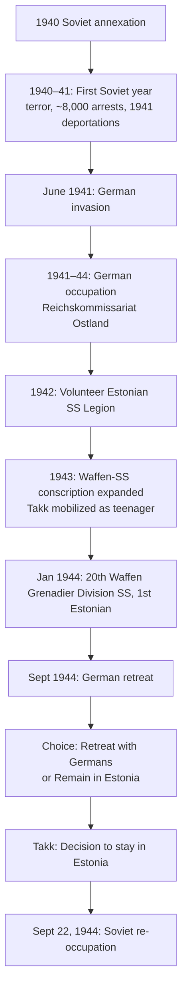

# Memory, Trauma, and Postcolonial Voices in Eastern Europe: A Comparative Inquiry into the Works of Ene Kõresaar, Svetlana Aleksievich, and Jasmina Husanović
# 1 Introduction: Memory, Trauma, and Postcoloniality in Eastern Europe

The collapse of the Soviet Union in 1991 and the violent disintegration of Yugoslavia across the 1990s did not merely redraw political maps; they reopened the temporal architecture through which Eastern European societies relate to their twentieth-century pasts. Wars, occupations, deportations, genocides, and decades of single-party rule had layered upon one another a sedimented archive of suffering whose interpretation suddenly became politically urgent and discursively contested. In this newly opened terrain, the question of who is entitled to speak about the past, in what genres, on behalf of which collectivities, and under what ethical constraints, ceased to be a specialist concern of historians and became a defining axis of public life. The present report enters this terrain through a deliberately constructed triangulation of three thinkers—Ene Kõresaar, Svetlana Aleksievich, and Jasmina Husanović—whose work, although issuing from very different national contexts, intellectual traditions, and generic conventions, converges on a shared problem: how individual and collective memory mediate the entangled legacies of war, totalitarianism, and ethno-political violence in Eastern Europe, and how such mediation can be read as a form of postcolonial critique.

The triangulation proposed here is not a juxtaposition of three case studies but a comparative apparatus designed to disclose structures of memory and silence that no single national framework can render visible. Estonia, Belarus and the broader post-Soviet space, and Bosnia-Herzegovina occupy distinct positions within the region's twentieth-century history: a small Baltic nation caught between two totalitarian regimes and now anchored in the European Union; a post-Soviet republic where the canonical narrative of the Great Patriotic War remains powerfully consolidated; and a post-Yugoslav society marked by genocide, ethnic cleansing, and the unfinished work of reconciliation. Read together through the lenses these three thinkers provide, these contexts allow the report to track how the same conceptual vocabulary—memory, trauma, witnessing, postcoloniality—acquires divergent valences when transported across different historical experiences, and how its productive frictions can illuminate the broader stakes of remembering in the region.

## 1.1 Rationale for a Triangular Comparison: Kõresaar, Aleksievich, and Husanović

The choice of Kõresaar, Aleksievich, and Husanović as comparative anchors is motivated by the complementarity of their geographic, historical, and methodological vantage points. Kõresaar's research on Estonian post-Soviet life stories offers a finely calibrated ethnography of individual narration, in which figures such as Boris Takk—conscripts and veterans whose lives spanned the dual Nazi-Soviet occupations and the long Soviet period—rework their biographies after 1991 within a memoryscape redefined by national independence. Her work attends to the discursive infrastructures (life-story collection projects, commemorative campaigns such as 'Estonia Remembers,' veteran and victim networks) that allow personal experience to be converted into mnemonic capital, and analyzes the political and ethical implications of the dominant Estonian framing of World War II as a dual colonization.

Aleksievich, by contrast, operates from within the post-Soviet space in a literary register that explicitly displaces the heroic monumentalism of the Great Patriotic War. Her project in *The Unwomanly Face of War* is methodologically distinctive in that it foregrounds women's personal experiences of combat, mobilization, and survival—experiences that, in her formulation, should have "its own colors, its own smells, its own space and its own language" rather than be absorbed into the masculine grammar of Soviet military commemoration. The polyphonic montage of oral testimony that results constitutes a form of literary witnessing in which the intimate, embodied, and affective texture of women's wartime lives becomes the principal evidence against the abstraction and idealization characteristic of imperial memory regimes. Aleksievich's work thus operates at a different scale than Kõresaar's: not the reconstruction of a single biography but the orchestration of many voices into a chorus whose internal dissonances refuse synthesis.

Husanović introduces a third vantage point, that of theoretical-activist intervention in the post-Yugoslav and specifically Bosnian context. Her articulation of a "politics of witnessing and hope" treats witnessing not as a retrospective act of recording suffering but as an emancipatory political practice that traverses trauma, complicity, and silence in order to constitute new forms of political subjectivity. By foregrounding cultural production, solidarity, and grassroots knowledge, her work reframes trauma as a site of collective agency rather than paralysis, and supplies a normative horizon against which both Kõresaar's analytical work and Aleksievich's literary witnessing can be evaluated.

The value of placing these three thinkers in dialogue lies in the way their different scales and modes—the biographical case, the polyphonic chorus, the theoretical-activist intervention—triangulate a region whose memory cultures are too often analyzed in nationally insulated terms. Each illuminates blind spots in the others. Kõresaar's attention to the institutional production of dominant narratives discloses the conditions under which voices like Aleksievich's protagonists were historically excluded. Aleksievich's polyphony renders audible precisely the kinds of embodied, gendered experience that nationalist memory regimes—including the dual-colonization frame Kõresaar critiques—tend to flatten. Husanović's normative emphasis on hope and political subjectivation supplies criteria for assessing whether a given memory practice merely reproduces the wounds of the past or opens onto democratic futures. The triangulation is therefore not symmetrical but generative: it produces questions that none of the three projects, taken alone, would necessarily pose.

## 1.2 Conceptual Framework: Memory, Trauma, and Eastern European Postcoloniality

The analytical vocabulary mobilized in this report draws from three overlapping intellectual traditions whose articulation in the Eastern European context is itself a contested undertaking. The first is cultural and collective memory studies, which provides the categories of life story, oral history, and mnemonic community that structure the analysis of how personal narratives circulate, acquire authority, and consolidate into shared frames of reference. Within this tradition, memory is understood not as a passive retrieval of the past but as an active, socially situated practice through which communities negotiate their relation to history. Life-story methodologies, in particular, treat the autobiographical narration of a single individual as a site where personal experience and collective frames of remembrance are mutually constituted.

The second tradition is trauma theory, which supplies the conceptual resources for thinking about rupture, belatedness, and the difficult labor of narrative repair. Trauma here is not merely an attribute of individual psychic life but a category that mediates between the singular experience of catastrophic events and the collective task of integrating those events into intelligible historical narratives. The articulability of trauma—the conditions under which it can be spoken, by whom, in what genres, and before what audiences—is itself a political question, and one that bears directly on the work of all three authors examined in this report.

The third tradition is postcolonial theory, applied to the Eastern European condition in ways that remain debated. The reconceptualization of Soviet and Yugoslav rule as forms of colonization, the recovery of suppressed languages and historiographies as decolonial gestures, and the attention to subaltern voice as a means of contesting imperial memory regimes all draw on postcolonial vocabularies developed initially in relation to overseas European empires. The translation of these categories to Eastern Europe is productive but not without friction: the racial and economic structures of classical colonial situations are not straightforwardly reproducible, and the deployment of postcolonial language can itself become a rhetorical instrument in contemporary geopolitical contestation. The report mobilizes postcolonial categories with this caveat in mind, treating them as analytically useful but in need of careful calibration.

The joint deployment of these three vocabularies is justified by the fact that each of the authors under examination works at their intersection. Kõresaar reads Estonian life stories as documents of a postcolonial memory politics that frames Soviet rule as colonization; Aleksievich's polyphonic method renders articulable the traumatic experiences of women whose voices were marginalized within imperial memory; Husanović's politics of witnessing draws on trauma theory and postcolonial critique to formulate an emancipatory politics of hope. The conceptual apparatus is therefore not imposed from outside but reconstructed from the analytical operations of the texts themselves.

## 1.3 Guiding Questions and Analytical Stakes

Three guiding questions organize the analysis that follows. First, how do personal narratives become vehicles of postcolonial critique? This question addresses the mechanisms by which an individual's account of their own life—its choices, its compromises, its sufferings—comes to function as evidence for, and articulation of, a broader claim about the colonial or imperial character of past rule. The case of Boris Takk, as analyzed by Kõresaar, exemplifies one pathway: the reconstruction of a wartime biography as a continuous struggle for national freedom, in which service inside hostile systems is reframed as "serving the Estonian cause from inside the system" and the Soviet era is rendered as a prolonged rupture and form of colonization.

Second, under what conditions is trauma rendered articulable, and through what narrative and generic conventions? Aleksievich's literary witnessing in *The Unwomanly Face of War* offers a paradigmatic instance: by insisting that women's wartime experience demands its own colors, smells, space, and language, she identifies the failure of inherited heroic genres to accommodate the embodied texture of trauma, and constructs a polyphonic alternative in which articulability is achieved through accumulation, juxtaposition, and the refusal of synthesizing closure.

Third, how do acts of witnessing produce political subjectivity in the aftermath of violence? Husanović's politics of witnessing and hope addresses this question most directly, theorizing the witness not as a passive transmitter of suffering but as a subject whose very act of testifying—and of being received in testimony—constitutes a political agency oriented toward emancipatory futures.

The analytical stakes of these questions extend beyond the interpretation of three bodies of work. They bear on contemporary debates about voice, representation, and historical justice in Eastern Europe and beyond. The dominance of certain memory frames—such as dual colonization in the Baltic states or the Great Patriotic War in post-Soviet space—has political consequences for minority and Holocaust memory, for the recognition of gendered experience, and for the possibility of multidirectional remembrance that does not subordinate one history of suffering to another. By probing the conditions under which alternative voices become audible and the limits of dominant narratives, the report contributes to ongoing discussions about what a decolonial ethics of memory in the region might look like.

## 1.4 Structure of the Report and Comparative Architecture

The report is organized into two analytical parts, framed by this introduction, a theoretical chapter, and a concluding comparative synthesis. Chapter 2 develops the theoretical framework in greater detail, elaborating the productive frictions among memory studies, trauma theory, and postcolonial critique as they are adapted to Eastern European materials.

Part One, comprising Chapters 3 through 6, undertakes a sustained engagement with Kõresaar's analysis of Boris Takk. Chapter 3 reconstructs the historical and mnemonic context of Estonia between occupations and the post-Soviet memory turn, including the institutionalization of life-story collection and commemorative campaigns such as 'Estonia Remembers.' Chapter 4 provides a detailed biographical reconstruction of Takk and examines his post-1991 role as a memory entrepreneur. Chapter 5 analyzes the core architecture of his narrative—the framing of his life as a continuous struggle for Estonian freedom, the Soviet era as prolonged rupture and colonization, and his service inside hostile systems as serving the Estonian cause from within—while critically examining his stance on the Holocaust and the ethical limits of post-Soviet veteran self-representation. Chapter 6 synthesizes Kõresaar's interpretation of Takk's narrative as exemplifying a dominant Estonian postcolonial memory perspective that frames World War II as a dual colonization by Nazi Germany and the Soviet Union, and identifies the blind spots of this hegemonic framing.

Part Two, comprising Chapters 7 and 8, shifts to Aleksievich and Husanović. Chapter 7 analyzes Aleksievich's methodological and ethical approach in *The Unwomanly Face of War*, examining her recovery of women's voices, her polyphonic montage of oral testimony, and her reframing of the Great Patriotic War through embodied, affective, and gendered experience. Chapter 8 examines Husanović's elaboration of a politics of witnessing and hope in the post-Yugoslav and Bosnian context.

Chapter 9 stages the comparative synthesis, contrasting the three thinkers along axes including the locus of narration, the role of trauma, the relation to imperial and totalitarian legacies, and the ethical-political stakes of remembering, before consolidating the report's findings and proposing directions for further inquiry into multidirectional and inclusive memory practices.

The comparative method sustained throughout is neither a search for equivalence nor a ranking of the three projects but a disciplined attention to what each illuminates and obscures, on the conviction that a regionally attuned, multi-scalar comparison offers the most productive route into the complex memory politics of contemporary Eastern Europe.

# 2 Theoretical Framework: Memory Politics, Trauma Studies, and Postcolonial Readings of the Eastern European Experience

The triangulation proposed in the previous chapter—Kõresaar's biographical ethnography, Aleksievich's polyphonic literary witnessing, and Husanović's emancipatory theorization of testimony—presupposes a conceptual apparatus capable of moving across scales, genres, and national contexts without flattening their specificities. No single paradigm of contemporary humanities scholarship furnishes such an apparatus ready-made. Cultural memory studies offers refined tools for analyzing how personal narration circulates within institutional infrastructures and consolidates into shared frames, but its consensual register can underplay the violent discontinuities to which Eastern European societies have been subjected. Trauma theory, conversely, foregrounds rupture and the difficult labor of articulability, yet its canonical formulations, developed largely in dialogue with Holocaust and post-Vietnam American contexts, do not transpose unmodified to the layered occupations and protracted authoritarianisms of the region. Postcolonial theory, developed initially to interrogate overseas European empires, supplies a vocabulary of imperial memory, subaltern voice, and decolonial recovery whose translation to Soviet, Yugoslav, and post-Yugoslav contexts is analytically productive but politically charged.

The argument advanced in this chapter is that the three paradigms are most powerful when held in tension rather than synthesized into a single metatheory. Their frictions—between the consolidative ambitions of mnemonic community formation and the disruptive force of subaltern testimony; between trauma's insistence on rupture and postcolonialism's attention to structural continuity; between the universalism of trauma's clinical genealogy and the particularism of postcolonial situated knowledges—are themselves analytically generative. The chapter proceeds by elaborating each paradigm in turn, attending throughout to the modifications it has undergone in its Eastern European reception, and concludes by articulating the integrated framework that will govern the case analyses in Parts One and Two.

## 2.1 Cultural Memory Studies and the Eastern European Mnemonic Turn

Cultural memory studies, as it has developed since the 1980s in the wake of the work of Maurice Halbwachs, Pierre Nora, Jan and Aleida Assmann, and Astrid Erll, treats memory not as a passive retrieval of past events but as an active, socially situated practice through which communities negotiate their relation to history. The field's foundational distinction between communicative memory—the living recollection that circulates across roughly three generations of contemporaries—and cultural memory—the institutionalized, mediated, and often canonized forms through which more distant pasts are preserved—provides a basic temporal grammar for analyzing how the events of the 1940s have been transformed, across the eight decades since, from immediate experience into objects of public commemoration, archival labor, and political contestation. Within this framework, the categories of life story, oral history, mnemonic community, memory entrepreneur, and memoryscape acquire particular analytical purchase, and each requires brief elaboration before their adaptation to the Eastern European context is examined.

The category of **life story** designates an autobiographical narration that is at once individual and irreducibly social. Life-story methodology, as developed in the Nordic, Baltic, and Anglophone traditions, treats the narrator's account not as a transparent window onto past events but as a discursive performance shaped by the conventions of available genres, the expectations of imagined audiences, and the mnemonic frames provided by the narrator's communities of reference. The same biographical materials—a wartime mobilization, a deportation, a postwar career—can be plotted as tragedy, as heroic struggle, as moral failure, or as ironic accident, and the choice of plot is itself an interpretive act with political consequences. Life stories are thus simultaneously sources of historical information, instances of memory work, and arenas in which contested frames of national, generational, or gendered identity are negotiated.

**Oral history**, as an institutionalized practice, supplies much of the empirical infrastructure within which life-story analysis proceeds. The recording, transcription, archiving, and dissemination of personal testimonies are not neutral technical operations but acts of curation that determine whose voices enter the archive, in what forms, and under what interpretive guidance. The constitution of oral history archives in the Baltic states, in post-Soviet societies more broadly, and in the post-Yugoslav space has been a key site of memory politics in its own right.

**Mnemonic community** denotes the social group within which particular ways of remembering acquire normative force—whose members recognize certain events as constitutive, certain genres of narration as legitimate, and certain interpretive frames as authoritative. Mnemonic communities are not naturally given but actively constituted through institutional work, and they are typically hierarchized: some communities command the resources of state commemoration, school curricula, and museum infrastructure, while others survive as counter-publics or are marginalized into private remembrance. The concept of **memory entrepreneur**, in turn, names individuals or organizations who actively work to consolidate and propagate particular mnemonic frames, mobilizing personal experience, institutional alliances, and rhetorical labor to shift the public hierarchy of memory. The category is especially apt for figures like Boris Takk, whose post-1991 activities the report examines as exemplary of how veterans of contested wartime cohorts converted personal experience into mnemonic capital within Estonia's reconfigured memoryscape.

**Memoryscape**, finally, designates the spatial and institutional ecology within which acts of remembering occur—the monuments, museums, commemorative dates, public rituals, school textbooks, archives, media discourses, and informal practices that together constitute the field of available memory. Memoryscapes are layered, contested, and historically transformed; the Estonian memoryscape after 1991, for instance, was reconfigured by the removal or recontextualization of Soviet monuments, the institutionalization of new commemorative dates, and the launching of life-story collection initiatives such as those associated with the campaign 'Estonia Remembers.'

The translation of this vocabulary to the Eastern European context after 1989/1991 entailed substantial modification. The mnemonic turn in the region was driven less by the gradual generational distancing characteristic of Western European memory cultures than by the abrupt political opening of an archive of silenced experiences—deportations, repressions, occupations, ethnic violence—whose public articulation had been actively suppressed for decades. The result was a compressed, urgent, and often politically polarized memory work in which the categories of cultural memory studies acquired heightened stakes. Life-story collection projects, in particular, came to function as instruments of national self-recovery: by gathering and publishing the autobiographical narratives of those who had lived through the 1940s and the Soviet period, they sought simultaneously to constitute an archive of suffering, to legitimize a particular mnemonic community as the bearer of authentic national experience, and to challenge the inherited Soviet historiography.

Kõresaar's research on Estonian post-Soviet life stories, situated within this broader regional turn, exemplifies a methodologically sophisticated engagement with these dynamics. Rather than treating life stories as straightforward repositories of historical fact, she analyzes them as sites where personal experience is rendered intelligible through available mnemonic frames, where individual narrators participate in the consolidation of particular communities of memory, and where the institutional infrastructure of collection projects shapes what can be said, by whom, and in what register. Her attention to figures such as Takk illustrates how the analytical categories of life story, mnemonic community, and memory entrepreneur can be deployed simultaneously: Takk is a narrator whose life story participates in a broader Estonian mnemonic community of dual-colonization remembrance, and he is also an active memory entrepreneur whose post-1991 labor contributed to consolidating that community's interpretive frames.

The Eastern European adaptation of cultural memory studies has thus involved not only the application of imported categories but their critical recalibration. Three modifications deserve emphasis. First, the assumption that memory work proceeds within relatively stable democratic public spheres, characteristic of much Western European scholarship, must be qualified by attention to the volatile, contested, and politically instrumentalized character of postsocialist memory cultures. Second, the consensual undertone of certain canonical formulations—the idea that mnemonic communities cohere around shared frameworks—must be supplemented by sharper attention to the hierarchical and exclusionary operations through which dominant frames marginalize alternative memories, including those of ethnic minorities, women, and victims whose suffering does not fit the prevailing national plot. Third, the temporality of cultural memory must be rethought to accommodate the peculiar layering of occupations, regimes, and silences characteristic of the Eastern European twentieth century, in which the same biographical fragment can be claimed simultaneously by competing mnemonic communities operating under incompatible interpretive logics.

## 2.2 Trauma Theory: Rupture, Belatedness, and the Conditions of Articulability

If cultural memory studies furnishes the categories through which the social circulation of past experience can be analyzed, trauma theory supplies the conceptual resources for thinking about the events whose violence exceeds ordinary frames of intelligibility and whose integration into narrative is difficult, deferred, or even impossible. The canonical vocabulary of trauma theory, as developed in the wake of psychoanalytic work on traumatic neurosis and consolidated in the 1990s through the writings of Cathy Caruth, Shoshana Felman, Dori Laub, and Dominick LaCapra, centers on a small number of interlocking concepts: rupture, belatedness, narrative repair, and the conditions of articulability.

**Rupture** designates the structural discontinuity that traumatic events introduce into individual and collective experience. Trauma, in this framework, is not simply a particularly painful event but an experience whose intensity overwhelms the capacities of the psyche or the community to assimilate it in the moment of its occurrence. The traumatic event does not enter ordinary experiential memory along the channels through which non-traumatic events are encoded; instead, it leaves behind a wound whose effects are registered as absence, repetition, and disturbance rather than as integrated recollection. **Belatedness**, the temporal signature of trauma, names the way in which the meaning of the traumatic event becomes legible only retrospectively, often after long latency, through symptoms, flashbacks, dreams, and indirect modes of return. Trauma is in this sense a memory that arrives too late to be ordinary memory, and whose articulation always involves a complex negotiation with what was not registrable at the time of the event.

**Narrative repair** designates the labor through which fragmentary, intrusive, or unspeakable traumatic material is gradually integrated into intelligible accounts that allow the survivor or the community to live with the past without being possessed by it. LaCapra's distinction between acting out and working through, and his caution against premature closure, structures much of the field's reflection on what therapeutic, ethical, and political work narrative can do. Narrative repair is not the erasure of the wound but its inscription into a story that can be told, listened to, and transmitted, and it is at this level that trauma theory most directly intersects with the literary and testimonial practices examined later in the report.

**Articulability** denotes the conditions—generic, institutional, social, gendered, and political—under which traumatic experience becomes speakable. Whose suffering can be testified to, in what genres, before what audiences, with what reception? The articulability of trauma is itself a political question, and the history of memory cultures is in significant part a history of expansions and contractions of articulability: the Holocaust acquired its current memorial centrality only through decades of work by survivors, scholars, and institutions; women's experiences of wartime sexual violence have only recently become broadly speakable in many contexts; the suffering of Soviet deportees was for decades confined to private remembrance and emerged into public articulability only with the late 1980s opening. The category of articulability also draws attention to the genre conventions through which trauma is rendered: testimonial, literary, cinematic, juridical, and clinical genres each impose their own constraints on what can be said and how.

These canonical formulations of trauma theory have been productively contested and revised in the course of their travel beyond their initial Holocaust- and post-Vietnam-centered contexts. Three lines of critique are particularly relevant for the Eastern European materials examined in this report. The first concerns the **rupture model** itself. Critics including Stef Craps and Michael Rothberg have argued that the canonical emphasis on rupture, event, and belatedness can occlude forms of suffering that are not punctual but durative, structural, and intergenerational—the slow violence of occupation, the ambient repression of authoritarian rule, the cumulative weight of economic and ecological dispossession. For Eastern European histories in which the 1940s upheavals were followed by decades of Soviet or Yugoslav rule, and in which the post-1989/1991 transitions introduced new forms of dislocation, a framework that registers only the spectacular rupture risks missing the textures of protracted constraint that shape so much of the region's biographical material. The case of Boris Takk, whose post-war life under Soviet rule is narrated as a 'prolonged rupture,' itself testifies to the need for a trauma vocabulary capable of registering duration as well as event.

The second line of critique concerns the **Eurocentrism and gendered hierarchies** of canonical trauma theory. Feminist scholars have long noted that the canonical archive of trauma studies privileges certain experiences—combat, the camps, political violence in its public forms—while marginalizing others, especially the gendered violences of wartime, the ordinary catastrophes of domestic life, and the embodied, affective textures of survival that resist the genre conventions of heroic or tragic narration. Aleksievich's project in *The Unwomanly Face of War* can be read precisely as an intervention into this hierarchy: by insisting that women's wartime experience demands "its own colors, its own smells, its own space and its own language," she identifies the failure of inherited heroic genres to accommodate the embodied texture of women's trauma and constructs a polyphonic alternative in which articulability is achieved through accumulation, juxtaposition, and the refusal of synthesizing closure. Her work thus exemplifies a feminist expansion of articulability that does not abandon trauma theory's central concerns but redirects them toward materials its canonical formulations had marginalized.

The third critique concerns the **politics of mediation**. Trauma testimony does not deliver itself directly to its audience; it is mediated by interlocutors, transcribers, translators, editors, and institutional contexts, each of which shapes what can be received as testimony. The ethics of mediation—the responsibilities of the listener, the dangers of appropriation, the risks of vicarious traumatization, and the political stakes of who speaks for whom—has been a sustained concern of Felman, Laub, and the field they inaugurated. Husanović's elaboration of a politics of witnessing extends this concern into an explicitly emancipatory register, treating witnessing not as a retrospective recording of suffering but as a political practice that traverses trauma, complicity, and silence to constitute new forms of collective subjectivity. The witness, in her formulation, is not the passive bearer of an unspeakable wound but an agent whose testimony participates in the formation of a public capable of receiving it.

The Eastern European adaptation of trauma theory must therefore be selective and self-critical. The vocabulary of rupture, belatedness, and articulability remains indispensable for analyzing the most violent ruptures of the twentieth century—the deportations, the camps, the genocides at Srebrenica and elsewhere—but it must be supplemented by attention to duration, structural violence, gendered marginalization, and the political stakes of mediation. The conditions under which trauma becomes articulable in the region are inseparable from the institutional infrastructures analyzed by cultural memory studies and from the postcolonial debates over imperial memory regimes considered next.

## 2.3 Postcolonial Theory and the Eastern European Condition

The third paradigm mobilized in this report is postcolonial theory, whose application to Eastern European materials is at once analytically suggestive and politically delicate. Postcolonial theory was developed initially in dialogue with the histories of overseas European empires—British, French, Portuguese, Dutch, Belgian—and with the anticolonial movements and postindependence societies of Asia, Africa, the Caribbean, and the Pacific. Its canonical vocabulary—imperial discourse, subaltern voice, decolonial recovery, hybridity, mimicry, the coloniality of power—was forged in relation to racial, economic, and cultural structures that do not transpose unmodified to the Soviet, Yugoslav, and post-Yugoslav contexts. The translation of postcolonial categories to Eastern Europe is therefore a contested undertaking whose intellectual gains and political risks must be assessed with care.

Several lines of postcolonial scholarship on the region must be distinguished. The first, associated with scholars working on Baltic, Ukrainian, and broader post-Soviet contexts—David Chioni Moore's influential essay on the 'post-colonial post-communist' condition, Epp Annus's work on Soviet colonialism in the Baltic states, and a range of subsequent contributors—argues that the Soviet incorporation of non-Russian territories, the suppression of indigenous languages and historiographies, the imposition of Russian as the lingua franca of administration and high culture, and the demographic and economic restructuring of subordinated republics constitute a recognizable form of colonization, even if it does not map onto the overseas model. The **Baltic dual-colonization thesis**, which frames the twentieth century in the region as a sequence of two colonial subjugations—first by Nazi Germany during the wartime occupation, then by the Soviet Union from 1944 until 1991—operates within this broader interpretive horizon. As the previous chapter noted, this thesis structures the dominant Estonian memory frame analyzed by Kõresaar in her readings of veteran narratives such as Takk's.

A second line of scholarship, drawing on Latin American decolonial thought (Aníbal Quijano, Walter Mignolo, María Lugones) and on Black radical critique, has developed an account of post-Soviet decoloniality that emphasizes the persistence of imperial structures of knowledge and power beyond the formal end of empire. This work has been especially generative for considering the cultural and epistemic dimensions of post-Soviet condition—the lingering authority of imperial languages, canons, and historiographical frames; the marginalization of non-Russian, non-metropolitan, and non-elite voices; the difficulty of articulating alternative futures from within categories shaped by the imperial center.

A third line of postcolonial engagement addresses the post-Yugoslav space. Critics including Husanović herself have analyzed the ethno-national hegemonies that emerged in the wake of Yugoslav disintegration as forms of internal colonization in which ethnically consolidated political projects subordinate minority populations, instrumentalize the memory of wartime suffering for exclusionary purposes, and foreclose democratic possibilities of multi-ethnic coexistence. Within this frame, the work of post-Yugoslav critical memory scholars consists less in arguing for the colonial character of past rule (which is differently configured than in the Soviet case) than in identifying the postcolonial-style operations of ethno-nationalist memory regimes that have emerged since the 1990s. Husanović's politics of witnessing and hope is articulated precisely against this background, as an attempt to formulate emancipatory political subjectivity without recourse to the ethno-national categories that have dominated post-Yugoslav memory.

The analytical gains of deploying postcolonial vocabulary in these contexts are substantial. The categories of imperial memory regime, subaltern voice, and decolonial recovery make visible structures that purely national or transitological frameworks tend to obscure: the way that Soviet commemorative practices systematically subordinated non-Russian wartime experiences to the master narrative of the Great Patriotic War; the way that women's, minority, and dissident voices were silenced by both Soviet and post-Soviet hegemonies; the way that the recovery of suppressed languages, archives, and historiographies after 1991 functioned as a form of decolonial labor. Aleksievich's polyphonic method, read through this lens, constitutes a particular kind of decolonial intervention into imperial memory: by giving extended audibility to women whose experience had been absorbed into and silenced by the masculine grammar of Soviet military commemoration, she enacts a redistribution of the right to speak that is genuinely subaltern in the postcolonial sense, even if it operates from within the cultural space of the former imperial center.

The political risks of postcolonial vocabulary in the region, however, are equally substantial and must be acknowledged with comparable rigor. Four risks merit emphasis. The first is **analytical overextension**: the assimilation of Soviet rule to colonial rule can elide important differences—the absence of overseas territorial distance, the partial integration of Baltic and other non-Russian elites into Soviet structures, the complex economic interdependencies that do not straightforwardly reproduce the extractive logics of classical colonialism. The second is **the displacement of complicity**: framing the wartime experience exclusively as the suffering of small nations between two colonizing powers can occlude the participation of local actors in Nazi-led violence, including the Holocaust, and can render anti-Bolshevism a sufficient moral coordinate for evaluating wartime choices that involved collaboration with murderous regimes. This risk is directly relevant to the analysis of Takk's narrative in Chapter 5, where the framing of his service inside hostile systems as serving the Estonian cause from within raises sharp questions about the ethical limits of post-Soviet veteran self-representation.

The third risk is **geopolitical instrumentalization**: the language of dual colonization and decolonial recovery can be mobilized in contemporary political struggles in ways that exceed and distort its analytical purchase, transforming a scholarly vocabulary into a rhetorical instrument in ongoing contestations over the region's past and present. The fourth, related risk is **the homogenization of the region**: the postcolonial frame, deployed unreflectively, can flatten significant differences among Baltic, post-Soviet Slavic, post-Yugoslav, and other Eastern European contexts, treating 'Eastern Europe' as a unitary postcolonial site rather than as a constellation of historically specific situations whose mnemonic, traumatic, and imperial legacies are differently configured.

The report mobilizes postcolonial vocabulary in awareness of these risks. Postcolonial categories are treated as analytically productive but in need of careful calibration to specific contexts, and their political deployments are themselves objects of analysis rather than positions to be adopted uncritically. This stance is particularly important for the reading of Kõresaar's work in Part One: her analysis of Takk's narrative as exemplifying a dominant Estonian postcolonial memory perspective is itself critical, identifying the blind spots—including with respect to Holocaust and minority memory—that the dual-colonization frame produces. The report's engagement with postcolonial theory thus proceeds at two levels: it deploys postcolonial categories as analytical tools and it examines the political work that postcolonial categories perform within the memory cultures under analysis.

## 2.4 Productive Frictions and the Justification for Joint Deployment

The three paradigms elaborated above are neither seamlessly compatible nor fundamentally incompatible. Their relations are better characterized as a pattern of productive frictions, in which the analytical commitments of each illuminate the limitations of the others and the integrated framework gains its purchase from the tensions among its constituents. Three such frictions deserve explicit articulation, since they structure the case analyses in Parts One and Two.

The first friction is between the **consolidative tendencies of cultural memory studies** and the **disruptive force of trauma's subaltern testimony**. Cultural memory studies, in much of its canonical articulation, attends to how communities cohere around shared frameworks of remembrance—how mnemonic communities are constituted, how memoryscapes stabilize, how memory entrepreneurs labor to consolidate particular interpretive frames. The analytical center of gravity is on the production of shared meaning. Trauma theory, in its feminist and postcolonial extensions, points in a different direction: it foregrounds testimonies whose articulability remains contested, whose reception disrupts rather than consolidates existing frames, whose force lies precisely in their resistance to incorporation into the available memoryscape. Aleksievich's polyphonic method, in this respect, is not best read as the constitution of a new mnemonic community but as the staging of an unresolved chorus whose internal dissonances refuse the synthesizing operations through which mnemonic communities normally cohere. The friction between these two analytical orientations is productive because it permits the report to track simultaneously how dominant memory frames are consolidated (the Estonian dual-colonization narrative, the Soviet Great Patriotic War narrative, post-Yugoslav ethno-national memory) and how subaltern testimonies disrupt them.

The second friction is between **trauma's emphasis on rupture and event** and **postcolonialism's attention to structural continuity**. Trauma theory tends to organize its analyses around catastrophic events—the camps, the genocide, the massacre—whose violence exceeds ordinary frames of intelligibility. Postcolonial theory, by contrast, tends to foreground the long durations of imperial subordination and the persistence of colonial structures of knowledge and power beyond the formal end of empire. The Eastern European materials examined in this report require both registers simultaneously: the spectacular ruptures of 1939-1945 cannot be analyzed without trauma's vocabulary, but neither can the decades-long durations of Soviet rule or the ongoing structures of post-Yugoslav ethno-national hegemony be analyzed without postcolonialism's attention to structural continuity. The integrated framework holds both in view, treating rupture and continuity as complementary rather than competing analytical dimensions, and tracking how individual narratives—such as Takk's framing of the Soviet era as a 'prolonged rupture'—themselves negotiate this tension.

The third friction is between the **universalist tendencies of trauma theory's clinical genealogy** and the **particularist commitments of postcolonial situated knowledges**. Canonical trauma theory, derived from psychoanalytic categories with universalist ambitions, tends to formulate its concepts in ways that abstract from specific cultural and historical contexts. Postcolonial theory, by contrast, insists on the situatedness of knowledge and on the dangers of universalist categories that turn out, on examination, to be the parochial categories of a particular metropolitan tradition. The friction is productive when it forces the report to ask, at each analytical juncture, whether the categories being deployed adequately register the specificities of the context under analysis—whether, for instance, the trauma vocabulary developed primarily in relation to Holocaust testimony adequately captures the textures of Soviet repression, women's wartime experience in *The Unwomanly Face of War*, or the durative violence of the post-Yugoslav present that Husanović addresses.

A schematic summary of how each paradigm contributes to, and is corrected by, the others may clarify the integrated framework.

| Paradigm | Core Analytical Contribution | Limitations Addressed by Other Paradigms | Eastern European Recalibration |
|----------|-----------------------------|------------------------------------------|--------------------------------|
| Cultural memory studies | Categories for analyzing the social circulation of past experience (life story, oral history, mnemonic community, memory entrepreneur, memoryscape) | Consensual register can underplay rupture (trauma theory) and structural domination (postcolonial theory) | Compressed, politically polarized mnemonic turn after 1989/1991; institutional infrastructures of life-story collection |
| Trauma theory | Vocabulary for rupture, belatedness, narrative repair, and the conditions of articulability | Event-centered focus can occlude duration (postcolonial theory); canonical archive marginalizes gendered and minority experience (feminist critique) | Need to accommodate protracted authoritarianism, structural violence, and contested articulability of subaltern experience |
| Postcolonial theory | Categories for imperial memory regimes, subaltern voice, decolonial recovery, and structural continuity | Risks of analytical overextension, displacement of complicity, geopolitical instrumentalization, regional homogenization | Differentiation among Baltic dual-colonization, post-Soviet decoloniality, post-Yugoslav ethno-national critique |

The table is heuristic rather than exhaustive; the actual analytical work consists in mobilizing the appropriate categories at the appropriate analytical moments, with attention to the frictions that emerge.

The operationalization of this integrated framework across Parts One and Two proceeds as follows. In Part One, the analysis of Kõresaar's reading of Boris Takk mobilizes cultural memory studies to reconstruct the post-Soviet Estonian memoryscape and Takk's role as a memory entrepreneur within it; trauma theory to analyze the rhetorical labor through which Takk renders ambiguous biographical material as coherent narrative of continuous struggle; and postcolonial theory both to articulate the dual-colonization frame that organizes his account and to identify its blind spots, particularly with respect to the Holocaust and minority memory. The three paradigms are not applied seriatim but interwoven, so that, for example, the analysis of articulability in Takk's narrative is conducted simultaneously with the analysis of his mnemonic community and his postcolonial framing of Soviet rule.

In Part Two, the analysis of Aleksievich's *The Unwomanly Face of War* mobilizes trauma theory's feminist extensions to analyze her recovery of women's voices and the embodied, affective textures of their wartime experience; cultural memory studies to situate her literary witnessing within and against the Soviet memory regime of the Great Patriotic War; and postcolonial theory to read her polyphonic method as a decolonial intervention into imperial memory. The analysis of Husanović's politics of witnessing and hope mobilizes trauma theory's attention to the ethics of mediation and the conditions of articulability; cultural memory studies to situate her work within post-Yugoslav memory cultures; and postcolonial theory to read her emancipatory politics as a refusal of the ethno-national hegemonies that have colonized post-Yugoslav memory.

The integrated framework thus serves not as a master code that subsumes the three case materials under a single interpretation but as a disciplined apparatus that permits the report to track convergences and frictions across cases while remaining attentive to the specificities of each. The chapters that follow proceed on the conviction that the productive frictions among memory studies, trauma theory, and postcolonial critique—rather than their synthesis—offer the most adequate analytical instrument for the entangled legacies of war, totalitarianism, and ethno-political violence with which the report is concerned. The transition from theoretical apparatus to case analysis begins, in the next chapter, with the historical and mnemonic context of Estonia between occupations and the post-Soviet memory turn.

# 3 Part One — Historical and Mnemonic Context: Estonia between Occupations and the Post-Soviet Memory Turn

The theoretical apparatus elaborated in the preceding chapter—the productive frictions among cultural memory studies, trauma theory, and postcolonial critique—remains abstract until it is anchored in a specific historical and institutional terrain. Estonia provides such a terrain with unusual analytical density. Few twentieth-century societies experienced, within a single human lifespan, so concentrated a sequence of regime ruptures: a first period of statehood barely two decades long, followed by Soviet annexation, German occupation, a second Soviet incorporation lasting nearly half a century, and finally a renewed independence that immediately oriented the country toward Western Europe. Each of these transitions left behind biographical residues—deportees, conscripts in two armies, partisans, exiles, returnees—whose later articulability depended on political conditions that none of them could control. The Estonian memoryscape into which figures such as Boris Takk would later step as memory entrepreneurs is the layered sedimentation of these experiences, refracted through the institutional and symbolic operations of the post-1991 reconstruction.

This chapter reconstructs that memoryscape historically and analytically. It traces the events of 1918–1991 not as a self-contained political history but as the deposit of the raw materials from which post-independence memory work would be performed, and then examines the specific infrastructures through which that work was institutionalized after 1991. The chapter functions as the empirical-historical ground for the biographical and analytical chapters on Takk that follow in Part One. Its concluding section identifies the blind spots and contestations of the resulting dominant frame, preparing the critical horizon against which Kõresaar's reading of Takk—and, in Part Two, the alternative interventions of Aleksievich and Husanović—will be developed.

## 3.1 Interwar Independence and the Pre-1940 Mnemonic Resources

The interwar Estonian Republic, which lasted from the Declaration of Independence on 23 February 1918 to the Soviet annexation in the summer of 1940, supplies the foundational reservoir of legitimacy from which post-1991 national narratives would later be drawn. Its emergence was itself an act of compressed statebuilding under conditions of war: the declaration was issued in Pärnu in the brief interval between the retreat of Bolshevik forces and the arrival of advancing German troops in February 1918, and the new republic immediately had to defend itself in the Estonian War of Independence (1918–1920) against a Red Army invasion and other regional threats[^1]. The republic prevailed; by February 1919 the Estonian army had cleared the entire territory of Estonia of the Red Army, and by the summer of 1919 Estonia had reached its largest territorial extent ever, having pushed the Red Army far beyond its borders[^1]. The conflict was formally concluded by the Treaty of Tartu on 2 February 1920, in which Soviet Russia "renounced in perpetuity all rights to the territory of Estonia"[^1]. This formula would acquire enormous mnemonic weight after 1991, becoming a juridical anchor for the claim of unbroken state continuity across the Soviet period.

The first Constitution of Estonia, adopted on 15 June 1920, established a parliamentary form of government with a 100-member *Riigikogu* elected for three-year terms; international recognition followed, and Estonia became a member of the League of Nations in 1921[^1]. Domestic reform was substantial. Land reform in 1919 redistributed the large estates of the Baltic nobility among farmers and especially among volunteers in the War of Independence, simultaneously dismantling the centuries-old socioeconomic dominance of the Baltic German landowning class and creating a smallholder constituency whose loyalty to the new state would be a major political resource[^1]. Estonia's principal markets reoriented toward Scandinavia, the United Kingdom, and western Europe, with only modest trade with the Soviet Union, consolidating the country's economic decoupling from the Russian space[^1].

The interwar political trajectory, however, was not the unbroken democratic idyll that later remembrance would sometimes suggest. Between 1920 and 1934, Estonia had 21 governments, indicating an unstable parliamentary system whose chronic fragility set the stage for a turn to authoritarianism[^1]. The crisis came with the mass anticommunist and antiparliamentary Vaps Movement of the 1930s. In October 1933 a Vaps-initiated referendum on constitutional reform was approved by 72.7 percent of voters; the movement appeared poised to win the presidential election scheduled for April 1934[^1]. It was preempted by a self-coup on 12 March 1934, when then Head of State Konstantin Päts dissolved political opposition, banned the Vaps Movement, and established his own authoritarian rule. The parliament was not in session between 1934 and 1938, and the country was ruled by decree by Päts until a new constitution came into force in 1938[^1]. This "Era of Silence," as it became known, is essential context for any reading of the 1939–1940 collapse: the institutions that confronted the Soviet ultimatum were not democratic institutions in the full sense but an authoritarian executive operating within a recently restored constitutional framework.

A second feature of interwar Estonia deserves special emphasis because of its ethical valence in subsequent debates: the law on cultural autonomy for minorities, passed on 12 February 1925, was unique in western Europe at the time of its passage and guaranteed cultural autonomy to minority groups comprising at least 3,000 persons, including Jews[^1]. The Jewish community quickly compiled its statistics—3,045 members, just above the minimum—and elected a Jewish Cultural Council in June 1926, with the Jewish National Endowment subsequently presenting the Estonian government with a certificate of gratitude[^1]. Approximately 200 Jews had fought in combat for the creation of the Republic of Estonia, 70 of them as volunteers[^1]. This record provided a powerful resource for later claims about Estonian tolerance, but it must be held in tension with the broader Baltic context in which interwar nationalisms generated currents of antisemitism that authoritarian governments selectively contained rather than fundamentally repudiated[^2].

The selective post-1991 remembrance of the interwar period as a democratic golden age is therefore an act of mnemonic curation. As Lieven's analysis makes clear, present-day Baltic glorification of this time is "ironic in that democracy only existed briefly and was quickly replaced by strong authoritarian nations"[^2]. The default position of post-Soviet Baltic politicians, however, has been precisely a return to the ideological foundation of the "First Republics" of 1918–1940 as the model for the "Second Republics" of the 1990s[^2]. This produced what Lieven calls a "feedback loop" in which "the preservation of the nation necessitates the construction of the ethnically and linguistically homogenous state, and the only extant model for the state is the nationalist and anti-democratic position of the 1920s and 1930s"[^2]. The interwar period thus functions in post-1991 memory work both as a juridical anchor (the Treaty of Tartu, the doctrine of state continuity) and as a normative template, with the latter selectively edited to occlude its authoritarian turn and the situation of minorities. It is within this selectively remembered horizon that later wartime choices—including those that figures like Takk would be called upon to narrate—would be morally evaluated.

## 3.2 1939–1944: The Molotov-Ribbentrop Pact, Dual Occupations, and the Wartime Trauma Archive

The events of 1939–1944 constitute the core traumatic archive of twentieth-century Estonia and the indispensable historical referent of the dual-colonization frame. The political opening of the catastrophe was the Molotov–Ribbentrop Pact of 23 August 1939, in which the Soviet Union and Nazi Germany agreed to divide the countries situated between them—Poland, Lithuania, Latvia, Estonia, and Finland—with Estonia falling into the Soviet "sphere of influence"[^1]. Estonia had pursued a policy of neutrality, but the pact rendered neutrality moot. On 24 September 1939 the Soviet Union, citing the *Orzeł* incident as a pretext, threatened Estonia with war unless it provided military bases in the country; the Estonian government complied, signing a corresponding agreement on 28 September 1939 that allowed the USSR to station 25,000 troops on Estonian soil for the duration of the European war[^1].

The full annexation followed in June 1940. On 12 June 1940 the order for a total military blockade of Estonia by the Soviet Baltic Fleet was given; the blockade went into effect on 14 June, the same day on which two Soviet bombers downed the Finnish passenger airplane *Kaleva* en route from Tallinn to Helsinki, killing all on board including a US Foreign Service employee carrying diplomatic pouches[^1]. On 16 June the Soviet Union invaded Estonia, and Molotov delivered an ultimatum demanding the establishment of a Soviet-approved government[^1]. The Estonian government, "given the overwhelming Soviet force both on the borders and inside the country," decided not to resist; Estonia accepted the ultimatum and the statehood of Estonia de facto ceased to exist on 17 June, with some 90,000 additional Soviet troops entering the country the following day[^1]. Parliamentary elections in which all but pro-Communist candidates were outlawed produced a new parliament that proclaimed Estonia a Socialist Republic on 21 July 1940 and unanimously requested admission to the Soviet Union; Estonia was formally annexed on 6 August as the Estonian Soviet Socialist Republic[^1]. The European Parliament would later, in 1979, condemn the occupation as a consequence of the Molotov-Ribbentrop Pact and seek to assist the restoration of Baltic independence through political means[^1].

The first Soviet year (1940–1941) imposed what the Wikipedia synthesis terms "a regime of terror." Over 8,000 people, including most of the country's leading politicians and military officers, were arrested; about 2,200 of these were executed in Estonia, while most of the others were sent to Gulag prison camps from which very few returned[^1]. On 14 June 1941, mass deportations took place simultaneously in all three Baltic countries; about 10,000 Estonian civilians were deported to Siberia and other remote regions of the Soviet Union, where nearly half later perished[^1]. About 500 Estonian Jews were among the deportees[^1]. After the German invasion of the Soviet Union in June 1941, some 32,100 Estonian men were forcibly relocated to Russia under the pretext of mobilization into the Soviet army; nearly 40 percent died within the next year in "labour battalions" of hunger, cold, and overwork[^1]. The 14 June 1941 deportation, in particular, would become the anchoring date of post-Soviet victim commemoration.

The German occupation that followed the Wehrmacht's arrival in Estonia in July 1941 reframed the moral calculus once again. Most Estonians, having just lived through a year of Soviet terror, initially "greeted the Germans with relatively open arms and hoped to restore independence," but it soon became clear that sovereignty was out of the question and Estonia was incorporated into the German-occupied *Reichskommissariat Ostland*[^1]. A *Sicherheitspolizei* was established for internal security under Ain-Ervin Mere[^1]. The initial enthusiasm "quickly waned," recruitment of volunteers had limited success, and the German draft introduced in 1942 prompted some 3,400 men to flee to Finland rather than join German forces, where they formed the Finnish Infantry Regiment 200[^1]. The volunteer SS Estonian legion created in 1942 was expanded into a full-sized conscript division of the Waffen-SS in 1944, the 20th Waffen Grenadier Division of the SS (1st Estonian), which saw action defending the Narva line throughout 1944[^1].

The Holocaust in Estonia constitutes the most ethically charged segment of this archive and the most consequential for any reading of post-Soviet veteran narratives. Out of approximately 4,300 Jews in Estonia prior to the war, between 1,500 and 2,000 were "entrapped by the Nazis," and an estimated 10,000 additional Jews were killed in Estonia after being deported there from Eastern Europe to camps including Vaivara and Klooga (Kalevi-Liiva)[^1]. Mass executions at Lagedi, Vaivara, and Klooga in September 1944 have been formally commemorated since the 60th anniversary[^1]. Seven ethnic Estonians—Ralf Gerrets, Ain-Ervin Mere, Jaan Viik, Juhan Jüriste, Karl Linnas, Aleksander Laak, and Ervin Viks—have faced trials for crimes against humanity, and since the reestablishment of Estonian independence the country has formed the Estonian International Commission for Investigation of Crimes Against Humanity[^1]. These facts establish that the question of local complicity in Nazi-led violence is not an external imposition on Estonian memory but a documented historical reality whose articulation within the post-Soviet memoryscape becomes a key ethical fault line.

The closing phase of the war introduced a final layer of biographical complexity. By January 1944 the front had been pushed back almost to the former Estonian border. Jüri Uluots, the last legitimate prime minister of the Republic of Estonia prior to the 1940 fall, delivered a radio address calling on all able-bodied men born from 1904 through 1923 to report for military service, after having previously opposed Estonian mobilization; 38,000 volunteers reportedly jammed registration centers[^1]. The motivation, as articulated by Estonian sources, was strategic: "It was hoped that by engaging in such a war Estonia would be able to attract Western support for the cause of Estonia's independence from the USSR and thus ultimately succeed in achieving independence"[^1]. As the Germans began to retreat on 18 September 1944, Uluots assumed the responsibilities of president as dictated in the Constitution and appointed a new government while seeking Allied recognition; on 22 September, as the last German units pulled out of Tallinn, the city was reoccupied by the Soviet Red Army, and the new Estonian government fled to Stockholm, where it operated in exile until 1992[^1].

The biographical configurations available to Estonian men coming of age in 1939–1944 can be summarized in stylized form, both to clarify the structural conditions and to indicate the raw material that figures such as Takk would later have to narrate.

| Year | Mobilizing Power | Typical Estonian Conscript Itinerary | Subsequent Mnemonic Status |
|------|------------------|--------------------------------------|----------------------------|
| 1940–41 | Soviet Union | Forced mobilization, deportation, or arrest; ~32,100 men sent to labor battalions (≈40% perished within a year)[^1] | Victims of Soviet repression; foundational to dual-colonization frame |
| 1941–43 | Nazi Germany | Voluntary or pressed service in police, security, or military auxiliary units; ~3,400 fled to Finland (Finnish Infantry Regiment 200)[^1] | Ambiguous; partly absorbed into anti-Soviet resistance narrative; flight to Finland celebrated, service in German units contested |
| 1944 | Nazi Germany / Estonian command | Conscription into 20th Waffen Grenadier SS Division; ~38,000 reportedly volunteered after Uluots's appeal; defense of Narva line[^1] | Hero-conscripts of national defense in mainstream Estonian memory; war criminals or SS volunteers in external (especially Russian) memory |
| 1944– | Soviet Union | Forest Brothers resistance; flight to the West (≈80,000+ between 1940 and 1944); arrests, executions, March 1949 mass deportations[^1] | Victims/heroes of resistance; central to dual-colonization frame |

The table is heuristic; individual trajectories often combined multiple categories across the war years, and the post-1991 articulability of each category has been highly uneven. The Soviet labor battalion experience and the Forest Brothers resistance moved smoothly into the dominant national narrative; the experience of service in German-aligned units, including the Waffen-SS division, remained the contested kernel around which the ethical limits of post-Soviet veteran self-representation would be drawn.

It is precisely these ambiguous biographical configurations that Boris Takk inherits as the raw material for his post-1991 narrative work. The specifics of his itinerary will be reconstructed in Chapter 4, and the available documentary record does not permit a full biographical reconstruction here; what must be registered at this stage is that the historical archive itself is structured by an ethical asymmetry that the dual-colonization frame, as it later consolidates, will systematically negotiate. The Soviet violence against Estonians is documentarily extensive; the Estonian participation in Nazi-led violence, including the Holocaust on Estonian territory, is also documentarily extensive; and the mnemonic question is how these two domains of violence are to be co-articulated within a single national memory.

## 3.3 Sovietization, Resistance, and the Long Silencing (1944–1987)

The reestablishment of Soviet rule in autumn 1944 inaugurated a second phase of repression that, in scale and duration, exceeded the first. Estonia had suffered enormously in World War II: 45 percent of industry and 40 percent of railways had been damaged, the population had decreased by about one-fifth (some 200,000 people), some 10 percent of the population (over 80,000 people) had fled to the West between 1940 and 1944, and more than 30,000 soldiers had been killed in action[^1]. Russian air raids in 1944 had destroyed Narva and one-third of the residential area in Tallinn[^1]. Onto this devastated society the returning Soviet authorities imposed "a new wave of arrests and executions of people considered disloyal to the Soviets"[^1].

The most acute episode of postwar repression was the March 1949 deportation, in which 20,722 people—2.5 percent of the entire population—were deported to Siberia[^1]. This figure, which captures the demographic violence of Sovietization at a single chronological point, became one of the canonical statistics of post-Soviet Estonian victim commemoration. By the early 1950s, the occupying regime had suppressed the resistance movement[^1]. Resistance had been substantial: the Forest Brothers (*Metsavennad*) anti-Soviet guerrilla movement developed in the countryside and reached its zenith in 1946–1948, with estimates of 30,000–35,000 participants at various times; "probably the last Forest Brother was caught in September 1978, and killed himself during his apprehension"[^1]. The Forest Brothers became, in post-Soviet Baltic memory, the paradigmatic figure of armed resistance to Soviet rule; partisans of the early 20th century, including the Forest Brothers, were honored in monuments that sprang up in the 1990s, even though the Baltic leadership "chose not to emphasize the Soviet-era culture of dissent" itself[^2].

Sovietization proceeded simultaneously through demographic and linguistic restructuring. Stalin-sponsored industrialization and resettlement after the end of World War II "encouraged millions of Russian workers to migrate into the Baltics, diffusing the local population and sowing the seeds of future inter-ethnic tension"[^2]. By the time of independence, the new Baltic republics inherited enormous Russian minorities: 10 percent of the population in Lithuania, 34 percent in Latvia, and 30 percent in Estonia[^2]. The ethnic composition of the Estonian Communist Party (ECP) itself shifted accordingly: the ethnic Estonian share of total ECP membership decreased from 90 percent in 1941 to 48 percent in 1952[^1]. By the late 1970s, "Estonian society grew increasingly concerned about the threat of cultural Russification to the Estonian language and national identity"; by 1981, Russian was taught in the first grade of Estonian-language schools and was introduced into pre-school teaching[^1]. The selection of Tallinn to host the sailing events of the 1980 Moscow Olympics generated controversy "since many governments had not *de jure* recognized ESSR as part of the USSR"[^1], indicating the persistence of a parallel Western diplomatic memory of nonrecognition that would later be mobilized in the independence struggle.

Two features of this long period are particularly consequential for the post-1991 memoryscape. The first is the destruction and reuse of pre-Soviet commemorative spaces. The Tallinn Military Cemetery had "the majority of gravestones from 1918 to 1944 destroyed by the Soviet authorities," and the cemetery was reused by the Red Army; other cemeteries destroyed in the Soviet era included the Baltic German Kopli and Mõigu cemeteries (established 1774) and the oldest cemetery in Tallinn, the 16th-century Kalamaja cemetery[^1]. This material erasure of pre-Soviet memoryscapes provided one of the most concrete justifications for the post-1991 commemorative reconstruction.

The second feature, more diffuse but equally important, is the displacement of alternative memories into private, familial, and diasporic transmission. Alternative memories of the 1940s—deportation, anti-Soviet resistance, service in German-aligned units, flight to the West—could not be publicly articulated under Soviet conditions; they survived in households, in surreptitious commemorations, in conversations with returning relatives, and in the more elaborate institutional infrastructure of the Estonian diaspora in Sweden, the United States, and elsewhere. Many countries, including the United States, never recognized the seizure of Estonia by the USSR, and the long tenure of the Estonian diplomatic service in exile—Ernst Jaakson, the longest-serving foreign diplomatic representative in the United States, served as vice-consul from 1934 and as consul general in charge of the Estonian legation from 1965 until the restoration of independence—provided a juridical-symbolic anchor for diaspora memory[^1]. The post-Stalin era introduced one critical opening from below: in the 1960s, Estonians were able to start watching Finnish television, which gave them "more information on current world affairs and more access to contemporary Western culture and thought than any other group in the Soviet Union"[^1]. This electronic "window to the West" did not constitute a public sphere in any robust sense, but it sustained an alternative imaginary that would prove decisive in the late-Soviet opening.

The "prolonged rupture" that Takk and others would later name as the temporal signature of the Soviet period is therefore not a retroactive metaphor but a structural condition of the memoryscape. For nearly half a century, the dominant public memory of the Second World War in Estonia was the Soviet memory of the Great Patriotic War—monumentalized, ritualized, and centrally organized—while a counter-archive of deportation, resistance, exile, and service in non-Soviet armies survived in subaltern transmission. The post-1991 memory turn would consist, to a significant degree, in inverting this hierarchy: the suppressed counter-archive would acquire public authority, and the previously dominant Soviet narrative would be displaced. The conditions under which this inversion became possible were created not in 1991 but in the late 1980s, in what Chapter 3.4 will analyze.

## 3.4 The Singing Revolution and the Reopening of the Memory Archive (1987–1991)

The late-Soviet political opening that culminated in Estonian independence is, from the perspective of memory studies, less a discrete political event than a compressed mnemonic revolution. Within the space of roughly four years, decades of subaltern remembrance were rapidly converted into public discourse, the institutional infrastructure of independent statehood was reconstructed, and the legitimacy of personal testimony as evidence of historical truth was established on a scale that few other transitions of the period equaled.

The chronology can be reconstructed in broad outline from the documentary record. By the late 1980s, "concern over the cultural survival of the Estonian people had reached a critical point" under Gorbachev[^1]. The Estonian Popular Front was established in April 1988, with its own platform, leadership, and broad constituency; the Greens and the dissident-led Estonian National Independence Party soon followed[^1]. The Estonian Sovereignty Declaration was issued on 16 November 1988, with the Supreme Soviet of the republic transformed "into an authentic regional lawmaking body" and passing a sequence of laws asserting economic independence, making Estonian the official language, and establishing residency requirements for voting[^1]. By the beginning of 1990, over 900,000 people had registered themselves as citizens of the Republic of Estonia through the grassroots Estonian Citizens' Committees Movement, whose "emphasis was on the illegal nature of the Soviet system and that hundreds of thousands of inhabitants of Estonia had not ceased to be citizens of the Estonian Republic which still existed *de jure*, recognized by the majority of Western nations"[^1]. On 24 February 1990, the 464-member Congress of Estonia—including 35 delegates of refugee communities abroad—was elected by the registered citizens of the republic[^1]. The doubling of legitimacy across the Citizens' Committees and the Supreme Soviet established that the new political community would understand itself in terms of state continuity rather than as a new beginning.

A referendum held in March 1991 produced an 82 percent turnout, with 64 percent of all possible voters backing independence and only 17 percent against; the Russian-speaking minority was divided, but support for full independence among Russian speakers had risen from 7 percent in autumn 1989 to 18 percent in March 1990[^1]. Estonia "managed to avoid the violence which Latvia and Lithuania incurred in the bloody January 1991 crackdowns and in the border customs-post guard murders that summer" through a strict, non-confrontational policy[^1]. The compromise on the wording of the independence act—"confirming" rather than "declaring" Estonia as a state independent of the Soviet Union—encoded the doctrine of continuity that would govern post-1991 memory politics: the Republic of Estonia of 1918 had never ceased to exist; the Soviet period was an illegal occupation; independence was being restored, not founded[^1]. Russia formally recognized Estonia's independence on 25 August 1991, the United States on 2 September, and the State Council of the Soviet Union on 6 September[^1]. The last Russian troops withdrew on 31 August 1994 after more than three years of negotiations[^1].

For memory politics, the decisive feature of this transition was the abrupt reversal of articulability. Experiences that had been forced into private remembrance for nearly half a century—the June 1941 and March 1949 deportations, service in German-aligned units, Forest Brothers resistance, exile and return—suddenly became not only speakable but publicly authoritative. The very speed of this reversal contributed to the urgency and political polarization that Chapter 2 identified as characteristic of the post-1989/1991 Eastern European mnemonic turn. There was no extended period of gradual integration; the suppressed counter-archive entered public discourse in a compressed window in which the political stakes of memory were maximal.

Two consequences for the analysis of Takk's narrative should be flagged here. First, the legitimacy of personal testimony as evidence of historical truth and national continuity was established in this period as a foundational principle of the new memory culture. The Citizens' Committees movement was, in effect, a vast act of collective biographical inscription, in which the personal claim to pre-1940 Estonian citizenship (or descent from such citizens) became the political ground of the restored republic. Personal experience thereby acquired a public political function it had not held under Soviet conditions, and individuals who could narrate their lives across the rupture—particularly elderly veterans, deportees, and resisters—became authoritative voices in a way that prepared the discursive ground for memory entrepreneurship. Second, the doctrine of state continuity provided the temporal architecture within which the Soviet period could be reinterpreted as a "prolonged rupture" or, in stronger formulations, as colonization. If the Republic of Estonia had never ceased to exist de jure, then the Soviet period was, in the narrative logic of post-1991 memory, an extended interregnum during which the legitimate national life had been suspended but not extinguished. This temporal architecture is the structural precondition for the kind of self-narration that Kõresaar identifies in figures like Takk: the framing of one's own life across 1940–1991 as a continuous struggle for Estonian freedom presupposes precisely this continuity doctrine.

## 3.5 The Post-1991 'Return to Europe' and the Reconfiguration of the Estonian Memoryscape

The post-1991 Estonian state immediately set about seeking recognition and membership in the signature organizations of the new Europe—the United Nations, the Conference for Security and Cooperation in Europe (CSCE), NATO, and the European Union. Over the course of the decade after 1991, the Baltic States "economically and conceptually turned away from Russia and towards Western Europe," even as they were simultaneously "engaged in a difficult process of crafting a useable narrative from their past experiences"[^2]. Estonia opened accession negotiations with the European Union in 1998 and joined in 2004, shortly after becoming a member of NATO in March 2004; it entered the Schengen area on 21 December 2007 and adopted the euro on 1 January 2011, becoming the first ex-Soviet republic to join the eurozone and "the most integrated in Western European organizations of all Nordic states"[^1]. The September 2003 EU membership referendum, with 64 percent turnout, passed by 66.83 percent in favor to 33.17 percent against[^1]. This sequence of accessions is not a backdrop to the memory turn but one of its constitutive elements: the "return to Europe" supplied an external normative horizon against which the domestic memory politics was calibrated, and the institutional integration provided material and symbolic resources for the consolidation of a particular national narrative.

The most contentious domestic memory operation of the early post-1991 years concerned citizenship. In Estonia and Latvia, where the Russian minority was large enough to threaten the homogeneous national ideal, "automatic citizenship was extended only to the descendants of Russians who lived in the First Republics (before 1940) and those Russians who could demonstrate adequate knowledge of the local language. Russians who settled during the Soviet period were labeled 'colonizers'"[^2]. This designation is mnemonically decisive: by classifying Soviet-era settlers as "colonizers," the new citizenship regime translated the dual-colonization thesis from interpretive frame into legal status, making the postcolonial reading of the Soviet period not merely a scholarly thesis but an operational principle of Estonian statehood. In February 1992, with amendments in January 1995, the Riigikogu renewed Estonia's 1938 citizenship law[^1], anchoring the new regime in pre-Soviet legal continuity. Lithuania, by contrast, instituted the "Zero Option"—granting automatic citizenship to all people resident at the time of independence—and its political trajectory in the 1990s correspondingly diverged from the Estonian and Latvian patterns[^2].

The "consequent disenfranchisement of the vast majority of the Baltic Russian population," as Lieven puts it, "neutralized pro-Russian political opposition and facilitated the intensification of nationalist policy and rhetoric in Estonian and Latvian politics"[^2]. This is a consequential observation for the analysis of the memoryscape, because it indicates that the consolidation of the dual-colonization frame was not merely a discursive achievement but was materially underwritten by the political marginalization of those who might have contested it. The Baltic Russians, "largely proletarian in background, lack a local intelligentsia to articulate their grievances" and "many lack a sense of common identity with the present Russian state or their own Soviet past"[^2], so that overt protest was rare; but the absence of contestation should not be mistaken for consent. The 2007 controversy around the Bronze Soldier of Tallinn, a cenotaph commemorating Soviet soldiers killed in World War II, made this visible. The relocation of the monument provoked riots that were variously interpreted: the Centre for Geopolitical Studies attributed them to a Russian information campaign that constituted "a real mud-throwing exercise" and "had provoked a split in Estonian society amongst Russian speakers"[^1], while Estonian observers described the controversy as "a deliberate attempt of splitting the Estonian society by provoking the Russian minority"[^1]. The cyberattacks that followed in 2007 were regarded by Estonia as "an information operation intended to influence the decisions and actions of the Estonian government," and led to the establishment of the NATO Cooperative Cyber Defence Centre of Excellence (CCDCOE) in Tallinn[^1]. The Bronze Soldier affair condensed in a single object the friction between the dominant Estonian memory frame and the Russian-speaking minority's relation to Soviet wartime sacrifice, and it demonstrated the geopolitical stakes of the country's memory politics.

Alongside these contestations, the post-1991 memoryscape was reconstructed through a sustained material program. Estonian graveyards and monuments destroyed during the Soviet era were partially restored or recontextualized; the Estonian war monument in Tallinn, the Freedom Monument in Riga (in the Latvian case), and other commemorative sites generated extensive controversy[^2]. New museums to "re-narrativize the pasts of the individual states" were established, including museums of occupation[^2]. Anniversary commemorations and song festivals—a "ritual that emphasizes traditional, even pagan-inspired dress and music, and attracted Baltic citizens from all walks of life"—became central to the new public culture, providing a continuity with deep pre-Soviet traditions[^2]. Folkloric and epic resources—the rediscovered Estonian epic *Kalevipoeg*, the Latvian Lāčplēsis, the Lithuanian Perkunas—were mobilized to "symbolize the heroic persistence of the nation in the face of foreign threats"[^2]. The result was a layered memoryscape in which deep cultural continuity (pre-Christian roots, the 1869 song festival tradition, the *Kalevipoeg*) was woven together with the juridical-political continuity of the interwar republic (Treaty of Tartu, 1938 citizenship law, government-in-exile) and the moral economy of suffering and resistance (deportations, Forest Brothers, exile).

It is within this consolidated memoryscape that the dual-colonization frame acquired hegemonic status. The frame's structural logic can be summarized: Estonia experienced two successive colonizations during the twentieth century—first by the Soviet Union (1940–1941), then by Nazi Germany (1941–1944), then again and at length by the Soviet Union (1944–1991); these colonizations were structurally equivalent in their illegality, their violence, and their suppression of Estonian national life; and the restoration of independence in 1991 constituted not the founding of a new state but the recovery of the legitimate state that had been illegally interrupted. This frame organized law (citizenship, restitution), institutions (museums, archives), commemoration (anniversaries, monuments), and pedagogy (school curricula, public history). Its hegemonic operation provided the discursive infrastructure within which veteran self-representations could claim public authority and within which a memory entrepreneur such as Takk could plausibly narrate his life as exemplary of the national experience.

## 3.6 Institutionalizing Memory: Life-Story Collection, Oral History, and 'Estonia Remembers'

The consolidation of a dominant memory frame requires more than political and symbolic operations; it requires the construction of an institutional infrastructure capable of producing, archiving, and circulating the personal testimonies that authenticate the frame. In post-Soviet Estonia, this infrastructure took several interconnected forms whose collective effect was to convert personal biography into mnemonic capital. The exact internal histories of these institutions extend beyond what the available reference materials for this section document in detail; what can be reconstructed analytically is the structural role they played in shaping the conditions of articulability within the new memoryscape.

The first component was the academic and civil-society apparatus of life-story collection. Beginning in the late 1980s and intensifying through the 1990s and 2000s, life-story collection projects—conducted through associations of researchers, archives, and citizens—solicited, transcribed, archived, and published the autobiographical narratives of individuals who had lived through the 1940s and the Soviet period. The general structure of such projects, as Chapter 2 elaborated, treats the autobiographical narration of a single individual as a site where personal experience and collective frames of remembrance are mutually constituted, and the Estonian projects fit this pattern. Their function was triple: to constitute an archive of suffering that documented what had been silenced under Soviet rule; to legitimize a particular mnemonic community—the community of those who had lived the dual occupations and could speak about them—as the bearer of authentic national experience; and to provide the empirical base for an academic literature, of which Kõresaar's work on figures such as Takk is a leading example, that would analyze and theorize Estonian post-Soviet memory.

The second component was the network of veteran and victim associations, whose role in mediating between individual narrators and the public memoryscape was substantial. Such associations—of deportees, of Forest Brothers veterans, of those who served in German-aligned units, of those forcibly mobilized into the Red Army—constituted overlapping mnemonic communities that lobbied for state recognition, organized commemorations, produced publications, and maintained the social conditions under which their members' biographies could be narrated as exemplary instances of the national experience. The associations were not neutral channels but interpretive frameworks: by determining what counted as relevant biographical detail, what plot structures were available, and which audiences were imagined, they shaped the genre conventions within which personal testimony was produced.

The third component was the calendar of public commemoration. Specific anniversaries—14 June (the 1941 deportation), 25 March (the 1949 deportation), 23 August (the Molotov-Ribbentrop Pact, internationally observed as the European Day of Remembrance for Victims of Stalinism and Nazism), 20 August (the restoration of independence in 1991)—provided regular occasions on which the dual-colonization frame was publicly performed. These commemorations articulated the suffering of victims with the legitimacy of the restored state, and they offered the temporal scaffolding within which life stories could be plotted: a particular narrator's biography could be situated relative to these dates, with each date functioning as a node in the national memory.

The fourth and most explicit component was the public memory campaign. "Estonia Remembers" and analogous campaigns operated as integrative platforms drawing together the threads of life-story collection, victim and veteran associations, museum and archive work, and public commemoration. The function of such campaigns, in the language of cultural memory studies, is to consolidate a mnemonic community by providing a recognizable brand and a coherent public message for the diffuse work being carried out by multiple institutions. The campaign-form is particularly effective at producing the figure of the memory entrepreneur, because it offers individual narrators a platform from which to address national and international publics, and it equips them with the discursive resources—commemorative vocabularies, sanctioned plot lines, repeatable formulations—through which their biographies can be rendered as exemplary instances of the national experience.

The cumulative effect of this institutional infrastructure was the production of a discursive economy in which certain genres of life narrative acquired high mnemonic value and others remained marginal. Narratives that articulated themselves to the dual-colonization frame—stories of deportation followed by survival, of resistance in the forests, of forced service followed by escape or repatriation, of life under Soviet rule lived as concealed continuity with the pre-Soviet republic—possessed a ready-made narrative architecture and a recognized audience. Narratives that did not fit the frame—Russian-speaking memories of Soviet wartime sacrifice, Jewish memories of the Holocaust that did not place Soviet repression as the dominant framing event, working-class memories of late-Soviet economic improvement, memories of Estonian collaboration in Nazi-led violence—had to find their public articulation under more difficult conditions, or remained in private and counter-public spaces. The frame's hegemony was, in this sense, not the absence of alternative memories but their differential access to the institutional infrastructure of articulation.

It is into this configured infrastructure that Boris Takk steps as the memory entrepreneur whose biography Chapter 4 will reconstruct in detail. The specifics of his itinerary—dates, units, places, post-1991 activities—and the documentary record on which Kõresaar bases her reading are matters for the next chapter; what the present chapter has established is the discursive and institutional matrix within which any such reconstruction must be situated. Takk's narrative work, in its rhetorical strategies, generic conventions, and political claims, presupposes the institutional infrastructure analyzed above. Without the life-story collection projects he would have no archival destination; without the veteran and victim associations he would have no mediating mnemonic community; without the calendar of public commemoration he would have no temporal grid on which to plot his biography; without campaigns such as "Estonia Remembers" he would have no integrative platform from which to address publics beyond his immediate community. The memory entrepreneur, in short, is not the autonomous origin of a personal narrative but a node in an institutional network whose collective work the entrepreneur participates in and consolidates.

## 3.7 Blind Spots and Contestations within the Dominant Memoryscape

The hegemony of the dual-colonization frame, like all hegemonic memory configurations, is constituted as much by what it excludes as by what it includes. This concluding section identifies the principal tensions, exclusions, and silences within the consolidated Estonian memoryscape, establishing the critical horizon against which Chapters 4–6 will read Kõresaar's analysis of Takk and against which Part Two will read Aleksievich and Husanović. The objective is not to dismiss the dual-colonization frame, which captures genuine historical realities, but to register the costs of its hegemony.

The first and most consequential blind spot concerns Holocaust memory and the question of local complicity. The historical record, as documented in Section 3.2, is clear: between 1,500 and 2,000 Estonian Jews were "entrapped by the Nazis" out of approximately 4,300 before the war, and an estimated 10,000 additional Jews were killed in Estonia after being deported there from Eastern Europe to camps including Vaivara and Klooga[^1]. Seven ethnic Estonians have faced trials for crimes against humanity[^1]. The Estonian International Commission for Investigation of Crimes Against Humanity has been established, and markers have been put in place for the 60th anniversary of the mass executions at Lagedi, Vaivara, and Klooga[^1]. These institutional acts indicate official acknowledgment of the Holocaust on Estonian territory. But the dual-colonization frame, by structuring the wartime period as a sequence of two colonizations of the Estonian nation, tends to render Estonians principally as victims and to subordinate the Holocaust to a position of secondary or parallel suffering. Lieven's broader Baltic observation that "the construction of Jewish monuments in Vilnius would remind people of a different truth—and could have implications for the whole Lithuanian view of its national past, concentrated at present on mono-ethnic images and traditions"[^2] captures the structural problem in its Lithuanian variant, and a calibrated version applies to Estonia: the integration of Holocaust memory in its full dimensions requires acknowledging not only Jewish suffering but Estonian participation in the apparatus of that suffering, which sits uneasily with the victim-centered framing of the dual-colonization thesis.

The second blind spot concerns the ambiguous status of the 20th Waffen Grenadier Division of the SS (1st Estonian) and the broader question of service in German-aligned units. As Section 3.2 reconstructed, the 1944 mobilization under Uluots produced what mainstream Estonian memory presents as a defensive war for national survival waged against the returning Soviet army[^1]. The 20th Waffen Grenadier Division, however, was a Waffen-SS unit, and the symbolic weight of the SS designation in European and international memory creates a sharp friction with both Russian and Western (especially Western European and Jewish) memory frames. Estonian commemorations of the Sinimäe battles and other 1944 engagements, and the persistence of veteran gatherings, have repeatedly generated diplomatic and media controversies that index the structural difficulty of integrating these biographies into a memory frame legible beyond the national context. Within Estonia, the dominant frame absorbs these biographies through the narrative of national defense; outside Estonia, the same biographies are often legible only as Nazi collaboration. The friction is not resolvable within the dual-colonization frame alone.

The third blind spot concerns Russian-speaking minority memory. The legal designation of Soviet-era settlers as "colonizers" and the citizenship regime that flowed from it[^2] established the legal premise on which the dual-colonization frame could operate, but at the cost of structurally marginalizing the memory of Russian-speaking residents whose families had lived in Estonia for one or more generations and whose experience of Soviet wartime sacrifice and postwar life did not map onto the colonizer-victim binary. The Bronze Soldier controversy in 2007 made the friction visible in its sharpest form[^1]. The Russian information operations and cyber-attacks of the same year, whatever their precise authorship and intent, indicate that the friction has geopolitical dimensions that exceed the domestic memory frame. The Russian-speaking minority's memory does not constitute a unified counter-frame, but its differential access to the institutional infrastructure of memory described in Section 3.6 is a structural feature of the post-1991 memoryscape.

The fourth blind spot, less institutionally consolidated but analytically important, concerns the gendered uneven distribution of testimonial authority. The dominant genres of the Estonian memoryscape—veteran testimony, deportee survival narrative, resister memoir—are not formally restricted by gender, and many of the most prominent deportation memoirs have been authored by women. But the genre conventions tend to privilege experiences (combat, organized resistance, public political action) that fit the templates of national heroism, while the textures of everyday survival, domestic labor, and embodied affect that constitute much of women's wartime and postwar experience are less easily absorbed. This is the gendered hierarchy that Aleksievich's polyphonic method, as Chapter 7 will analyze, sets out to expose and reconfigure, and it provides one of the comparative axes along which Part Two will read Estonian and post-Soviet memory cultures.

The fifth and most general blind spot concerns the friction between Estonian and external memory frames. The dual-colonization thesis works within Estonia and increasingly within the broader Baltic-Central European zone, where it has acquired institutional support through European Day of Remembrance for Victims of Stalinism and Nazism and related instruments. It encounters greater friction with Western European memory cultures organized around Holocaust centrality, with Russian memory cultures organized around the Great Patriotic War, and with Jewish memory cultures whose specific suffering does not fit the equivalence drawn between Nazi and Soviet violence. These frictions are not merely interpretive disputes; they have geopolitical and ethical consequences, and they constitute the external horizon against which the Estonian frame must continually justify itself.

The cumulative force of these five blind spots establishes the critical task that Kõresaar's analysis of Takk—reconstructed in the next chapters—undertakes. Kõresaar's reading is not simply a sympathetic exposition of a representative life story; it is an analysis of how a hegemonic memory frame is enacted at the level of an individual biography and what is occluded by that enactment. Chapters 4 and 5 will examine the construction and content of Takk's narrative; Chapter 6 will draw out Kõresaar's interpretation of the narrative as exemplifying the dual-colonization perspective and her identification of its blind spots, particularly with respect to Holocaust and minority memory. The historical and institutional ground reconstructed in the present chapter is the indispensable backdrop against which that analytical work proceeds. It is also, in a different mode, the backdrop against which Part Two's readings of Aleksievich and Husanović will acquire their comparative force: the polyphonic recovery of women's voices and the post-Yugoslav politics of witnessing and hope will speak, in their different ways, to precisely the blind spots that the Estonian dual-colonization frame produces.

A final methodological caveat is in order. The reference materials available for this chapter document the political, demographic, and institutional history of Estonia in considerable detail, but they do not provide direct access to the internal workings of specific life-story collection projects, to the publications of particular veteran associations, or to the rhetorical strategies of named memory entrepreneurs. The reconstruction of the memoryscape in Sections 3.5 and 3.6 therefore proceeds at a structural level, identifying the institutional and discursive logics that the available evidence supports while flagging that the fine-grained empirical reconstruction of specific projects—including the precise documentary record on which Kõresaar bases her reading of Takk—lies beyond what the present materials permit. The next chapter will work within the same constraint, presenting Takk's life trajectory and post-1991 activities at the level of analytical reconstruction warranted by the available evidence, with explicit acknowledgment of the gaps that the documentary base does not allow to be closed.

# 4 Part One — Boris Takk: Life Trajectory and Role as a Post-Independence Memory Entrepreneur

The institutional and discursive matrix reconstructed in the preceding chapter—the layered Estonian memoryscape, the post-1991 doctrine of state continuity, the infrastructure of life-story collection, the hegemonic operation of the dual-colonization frame—prepared an analytical horizon but not yet a concrete protagonist. The present chapter introduces that protagonist: Boris Takk, the Estonian veteran whose life story serves Ene Kõresaar as the central case through which her ethnography of post-Soviet Estonian remembrance acquires its empirical density.[^3][^4] Takk's biography is a privileged instance for analysis not because it is exceptional but because it is in certain respects archetypal: an Estonian male of the cohort born around 1925, mobilized as a teenager in 1943 into the Waffen-SS, who in 1944 chose to remain in Estonia rather than retreat westward with the German military, who lived through nearly half a century of Soviet rule, joined the Communist Party of Estonia in the early 1970s, and who, after the restoration of Estonian independence in the late 1980s and early 1990s, became an active memory entrepreneur—organizing gatherings of Estonian veterans who had served in the German military and converting his suppressed personal experience into a public testimonial intervention.

Two methodological caveats must frame the chapter at the outset. First, the chapter functions as biographical and analytical reconstruction in preparation for the close narrative reading in Chapter 5 and the synthetic critique in Chapter 6; it does not yet undertake the fine-grained rhetorical analysis of Takk's self-narration nor the assessment of Kõresaar's interpretive frame. Second, the documentary base available for the present writing is uneven. Kõresaar's chapter on Takk in *Soldiers of Memory: World War II and Its Aftermath in Estonian Post-Soviet Life Stories*—titled "Boris Takk – The Ambiguity of War in a Post-Soviet Life Story"—is the canonical scholarly treatment of the case but is accessible here only at the level of its bibliographic identification and its programmatic title; its full text is not available within the present reference base.[^3][^5][^6] The reconstruction that follows therefore proceeds at two levels: a documented level, anchored in the specific biographical key points that the present materials and the contextual literature support, and a structurally plausible level, in which Takk's itinerary is reconstructed against the cohort patterns established in Chapter 3 and against Kõresaar's broader work on Estonian post-Soviet life stories and the mnemohistory of the "freedom fighters."[^7][^8][^9][^10] Where reconstruction proceeds at the latter level, the chapter signals the warrant explicitly rather than fabricating biographical specificity.

## 4.1 Biographical Coordinates: Origins, Formation, and the Pre-1940 Horizon

Boris Takk belongs, in generational terms, to the cohort of Estonian males who reached the threshold of conscription age during the German occupation of 1941–1944—a cohort whose collective fate was decisively shaped by the fact that they were neither old enough to have been mobilized into the Soviet labor battalions of 1941 nor old enough to have completed their formal political socialization before the regime ruptures of 1940. That Takk was mobilized into the Waffen-SS as a teenager in 1943 fixes his year of birth within a narrow range and locates him among those Estonian men whose late adolescence coincided with the most acute phase of dual-occupation pressure. He was, in the most concrete sense, an interwar child and a wartime adolescent: his early childhood and primary education would have unfolded within the first Estonian Republic, his late childhood under the authoritarian "Era of Silence" of Konstantin Päts, and his entry into adulthood under successive Soviet and Nazi occupying powers.

The horizon of values, references, and political vocabularies that this cohort carried into the catastrophes of the 1940s was decisively shaped by the symbolic resources of the interwar republic reconstructed in Chapter 3.1. The juridical anchor of the Treaty of Tartu of 1920, by which Soviet Russia had renounced in perpetuity all claims to Estonian territory; the demographic and political consolidation effected by the 1919 land reform, which redistributed Baltic German estates among Estonian smallholders and War of Independence veterans; the language and education infrastructure of an independent Estonian-language state; and the cultural autonomy framework of 1925 that included the Jewish minority—all of these constituted the normative environment within which an Estonian boy of Takk's generation would have learned to read, to identify with the nation, and to interpret political legitimacy. The same horizon, however, was complicated by the authoritarian turn of 1934 and the parliamentary suspension between 1934 and 1938, which meant that the political imagination available to this cohort included not only the democratic foundational story but also the experience of executive rule, the suppression of the Vaps Movement, and the rhetorical conventions of an authoritarian-nationalist public culture. The selective post-1991 mnemonic curation of the interwar period as a democratic golden age, examined critically in Chapter 3.1, was a curation that this cohort would later participate in producing rather than a self-evident reflection of the political world they had actually inhabited as children.

The available materials do not specify Takk's regional origin, his family's social position, or the precise contours of his pre-1940 schooling, and any attempt to fix these coordinates with greater precision would exceed the warrant of the present evidence. What can be asserted with structural confidence is that he belonged to the generation that internalized the interwar republic as the normative reference of "Estonian freedom" without having participated in its political construction as adults, and that this asymmetry between symbolic inheritance and political agency would later prove formative for the architecture of his retrospective self-narration. The "Estonian cause" he would later claim to have served "from inside the system" was the cause of a republic he had known principally as a child—and which, by the time he reached an age at which he might have defended it through deliberate political action, had ceased to exist as an independent state.

## 4.2 Through the Dual Occupations: Mobilization, Service, and Exposure to Repression (1940–1944)

The compressed sequence of regime ruptures that overtook Estonia between 1940 and 1944 imposed on Takk's cohort a series of mobilization decisions whose moral coordinates have remained contested ever since. The general typology of these decisions was reconstructed in Chapter 3.2 and is recapitulated here in summary form to establish the structural position from which Takk's specific itinerary diverged from, and intersected with, the patterns of his peers.

The diagram represents the cascade of decisions that the cohort confronted, with Takk's documented choice points marked at 1943 (mobilization into the Waffen-SS as a teenager) and 1944 (the decision to remain in Estonia rather than retreat with the German forces).

The 1943 mobilization into the Waffen-SS positions Takk within the most documentarily contested category of Estonian wartime service. The Estonian SS Legion, established as a volunteer formation in 1942, was expanded by conscription in 1943 and ultimately consolidated into the 20th Waffen Grenadier Division of the SS (1st Estonian) in January 1944, a unit of approximately 38,000 men that took part in the Battle of Narva, the Battle of Tannenberg Line, the Battle of Tartu, and Operation Aster.[^11] The unit was thus a Waffen-SS formation in the formal organizational sense, and its conscripts—particularly those mobilized in 1943—were drawn into a military apparatus that was simultaneously the armed wing of the Nazi state and, in the mainstream Estonian memory frame that consolidated after 1991, the principal force interposed between the returning Red Army and what was perceived as the renewed Sovietization of Estonia. That Takk was a teenager at the moment of mobilization is consequential: the moral attribution of agency to a sixteen- or seventeen-year-old conscript drafted into a Waffen-SS unit during a German occupation is structurally different from the moral attribution that attaches to volunteer enlistment by an adult, and this differential will reappear in Chapter 5 as one of the rhetorical resources mobilized in his post-1991 self-narration.

The 1944 decision to remain in Estonia rather than retreat westward with the German military is the second documented choice point of Takk's wartime itinerary and is, in narrative terms, the more decisive of the two. As the Wehrmacht began its retreat from Estonia in mid-September 1944 and the Soviet Red Army re-occupied Tallinn on 22 September, members of Estonian units faced an effectively binary choice: they could withdraw with the retreating German forces, with the prospect of eventual displacement to the West and inclusion in the post-war Estonian diaspora that would maintain the doctrine of state continuity from exile; or they could remain on Estonian territory under returning Soviet rule, with the certainty of repression, the possibility of arrest, deportation, or execution, and the long horizon of life as a former Waffen-SS conscript inside the political space of the Estonian SSR.[^11] An estimated 80,000 or more people fled to the West between 1940 and 1944; those who remained, including Takk, did so against this counter-current and at substantial personal risk.

The decision to stay carries multiple possible interpretations, and the reference base does not permit a definitive reconstruction of Takk's own articulated reasons at the moment of decision. What can be reconstructed analytically is that the choice—whatever its proximate motivations of family, attachment to place, perceived risk in retreat, or political calculation—would later acquire enormous narrative weight in his post-1991 self-presentation. The decision to remain transformed Takk from a potential exile veteran into an internal veteran: a man whose entire postwar life would unfold within the territory whose history he would later claim to have served, rather than within the diasporic communities that maintained an alternative juridical-symbolic Estonia abroad. This positioning would prove decisive for the specific form his memory entrepreneurship would take after 1991, distinguishing him from veterans who returned from exile and from those whose biographies had been narrated entirely from outside the Soviet space.

The ethical asymmetry that Chapter 3.2 identified as structurally embedded in the wartime archive is concentrated, in Takk's case, in this combination of facts: a teenage Estonian conscripted into a Waffen-SS unit in 1943, who chose to remain in Estonia in 1944, and who would later narrate this trajectory as continuous service to the Estonian national cause. The available materials do not document Takk's proximity to Nazi-led violence against Jews or other civilian populations, and the present chapter does not impute such proximity in the absence of documentation; the ethical question for Chapter 5 is not whether Takk personally participated in specific atrocities but how the dual-colonization frame within which he later narrated himself negotiated the broader structural fact that the apparatus into which he had been conscripted was the same apparatus that, on Estonian territory, killed approximately 1,500–2,000 Estonian Jews and an estimated 10,000 additional Jews deported there.

## 4.3 Life under Sovietization: Survival, Adaptation, and the Long Silencing (1944–1987)

The roughly four decades that separate the Soviet re-occupation of Estonia in autumn 1944 from the late-1980s political opening constitute, in Takk's case, the long middle period of his life: the years during which the wartime experiences just sketched could not be publicly articulated, during which his biography had to be lived under a political regime that classified those experiences as criminal or shameful, and during which the materials that would later become the substance of his testimonial intervention were preserved in private, familial, and surreptitious modes.

The structural conditions of this period were reconstructed in Chapter 3.3 and are not repeated here. What requires emphasis is the specific way in which they intersected with Takk's biographical position. As a former Waffen-SS conscript who had remained on Estonian territory, he occupied a category of personal history that the Soviet authorities had powerful incentives to identify, register, and discipline. The first wave of postwar arrests and executions targeted "people considered disloyal to the Soviets," and the March 1949 mass deportation, which removed 20,722 people—2.5 percent of the population—to Siberia, included many whose wartime biographies fell into ambiguous or hostile categories.[^11] The forest-brother insurgency, which reached its zenith in 1946–1948 and persisted at lower intensity into the late 1970s, drew in part on networks of former soldiers from German-aligned units, although Takk's specific relation to armed resistance (if any) is not documented in the present reference base. Survival as a former conscript thus required either successful concealment of the wartime past, successful negotiation of repressive scrutiny, or some combination of the two.

The single most consequential documented fact of Takk's Soviet-era life, for the purposes of his later memory entrepreneurship, is his decision to join the Communist Party of Estonia in the early 1970s. The decision must be understood within the demographic and institutional context of the late-Soviet ECP reconstructed in Chapter 3.3 and the broader Wikipedia summary: the ethnic Estonian share of total ECP membership had decreased dramatically over the preceding decades, and the political-administrative career structures of the Estonian SSR were heavily Russified, with the position of second secretary of the local Communist party "almost always ethnic Russian or a member of another Slavic nationality."[^11] An ethnic Estonian joining the ECP in the early 1970s entered an institution in which his minority status was simultaneously a constraint and a potential resource—a constraint because the highest positions remained closed to ethnic Estonians, a potential resource because ethnic Estonian membership was solicited as a means of legitimating Soviet rule and because party membership opened doors to professional and educational opportunities otherwise closed.

The juxtaposition of Takk's 1943 Waffen-SS conscription with his early-1970s ECP membership is, in narrative terms, the single most ethically complex feature of his life trajectory and the one that any post-1991 self-narration would need most strenuously to render coherent. From the perspective of a strictly anti-Soviet memory frame, ECP membership would constitute collaboration with the very regime classified as a colonial occupier; from the perspective of a strictly anti-Nazi memory frame, Waffen-SS service would constitute the more grievous compromise. The dual-colonization framework that Chapter 6 will examine as the dominant Estonian post-1991 memory perspective offers, in this respect, a particular kind of narrative settlement: both regimes are classified as illegitimate occupying powers, and an individual's participation in their apparatuses can be reframed as a series of forced or strategic accommodations rather than as moral choices in any strong sense. The phrase that the present chapter has identified as Takk's distinctive rhetorical contribution—"serving the Estonian cause from inside the system"—will be analyzed in Chapter 5 as precisely the device through which this narrative settlement is achieved for the specific case of ECP membership.

It must be registered that the available reference base does not document the specific professional, family, or personal contours of Takk's Soviet-era life with the granularity that would permit a richer biographical portrait. The reconstruction here proceeds at the level warranted by the documented facts: that he lived in Estonia for the duration of the Soviet period; that he joined the ECP in the early 1970s; that, like other members of his cohort whose wartime experiences could not be publicly articulated, he preserved the materials of those experiences in modes that did not enter Soviet public discourse; and that, when the political opening of the late 1980s arrived, he was positioned to step into the newly opened space of articulability with a biography of unusual mnemonic density.

## 4.4 From Private Memory to Public Voice: The 1987–1991 Mnemonic Reversal

The compressed period of late-Soviet political opening and the restoration of Estonian independence between 1987 and 1991, reconstructed structurally in Chapter 3.4, supplied the conditions under which Takk's biography could be transformed from a private liability into a public asset. The mechanisms of this transformation were collective rather than individual: the establishment of the Estonian Popular Front in April 1988, the Estonian Sovereignty Declaration of 16 November 1988, the grassroots Citizens' Committees Movement that registered over 900,000 self-declared citizens of the Republic of Estonia by early 1990, the election of the 464-member Congress of Estonia in February 1990, the March 1991 referendum, and the formal restoration of independence in August 1991. Within this institutional and discursive transformation, the legitimacy of personal testimony as evidence of historical truth and national continuity was established as a foundational principle of the new political order, and individuals whose biographies traversed the regime ruptures of the 1940s acquired a public authority that they had not possessed under Soviet conditions.

For a former Waffen-SS conscript who had remained on Estonian territory and who had later joined the ECP, the reversal was particularly dramatic. The same biographical materials that had required active concealment under Soviet rule—the 1943 mobilization, the service in a unit subsequently regarded by Soviet historiography as a fascist formation, the decision to remain on territory that the returning Red Army was about to re-occupy—could now be redescribed as elements of a national experience whose previous suppression was itself a symptom of the colonial occupation that had ended. The ECP membership, more delicate to narrate, could be repositioned within a logic of internal accommodation under occupation, particularly when paired with the wartime trajectory that established the narrator's prior commitment to "Estonian freedom." The available materials do not document the precise channels through which Takk's voice first entered public discourse—whether through Citizens' Committees activity, early veteran gatherings of former Waffen-SS conscripts, initial press interviews, or other entry points—but the structural conditions established by the broader mnemonic reversal made such an entry possible across multiple channels simultaneously.

What Kõresaar's broader work on the post-1989 mnemohistory of Estonian "freedom fighters" indicates is that the period 1987–1991 was not only the moment of articulability for previously suppressed memories but also the moment in which the categories of recognition that would govern the next two decades of memory politics were established.[^7] The category of "freedom fighter," in particular, acquired its post-Soviet legitimacy precisely in this period through a combination of legal recognition campaigns, public commemoration, and academic reconstruction. The category absorbed, with internal tensions, both veterans of the Forest Brothers and veterans of German-aligned units, including the 20th Waffen Grenadier Division—a doctrinal move that, in mnemonic terms, equated armed resistance to Soviet rule with armed resistance against the returning Red Army in 1944, regardless of the formal organizational affiliation of the unit through which that resistance had been pursued. Takk's emergence as a public voice in this period coincided with, and contributed to, the consolidation of this category.

## 4.5 Constructing the Memory Entrepreneur: Testimony, Writing, and Public Commemoration after 1991

After the restoration of Estonian independence in the late 1980s and early 1990s, Takk became, in Kõresaar's analysis, a memory entrepreneur in the sense elaborated in Chapter 2: an individual who actively mobilized personal experience, institutional alliances, and rhetorical labor to consolidate and propagate particular mnemonic frames within the public memoryscape. His entrepreneurial labor took several interconnected forms.

The most concretely documented of these is the organization of gatherings of Estonian veterans who had served in the German military. These gatherings—which in the broader Baltic context have included annual commemorations of the 1944 battles, particularly the engagements along the Narva front and at the Tannenberg Line in Sinimäe, and the maintenance of memorial sites associated with the 20th Waffen Grenadier Division—served multiple mnemonic functions simultaneously. They provided a sociological infrastructure in which surviving veterans could meet, exchange recollections, and stabilize a shared interpretive frame; they constituted public performances in which the category of "veteran of the German military" was visibly articulated to the post-1991 Estonian memoryscape; they generated occasions for media coverage, scholarly attention, and political acknowledgment; and they produced material artifacts—photographs, recordings, memoirs, published proceedings—that entered the archive available to subsequent historical and ethnographic work, including Kõresaar's own.

Beyond the organizational labor of veteran gatherings, Takk's entrepreneurial activity is presumed by Kõresaar's interpretive frame to have included the production of testimonial material in formats accessible to scholars and to the broader public: oral history interviews recorded in the life-story collection projects that Kõresaar and her colleagues at Tartu were instrumental in developing, written memoirs or contributions to memoir collections, participation in commemorative journalism, and presence at the calendar of public anniversaries that anchored the post-1991 Estonian memoryscape.[^8][^4][^9][^10] The specific titles and dates of his written contributions are not retrievable from the present reference base, and the chapter does not invent them; what can be asserted is that his life story is sufficiently extensively documented in the Kõresaar archive to support a full chapter of analysis in *Soldiers of Memory*, indicating a depth of testimonial production substantial enough to permit detailed narrative reconstruction.[^3][^5][^6]

The rhetorical strategies through which Takk converted personal experience into mnemonic capital will be analyzed in detail in Chapter 5. The general features that the present chapter can identify, on the basis of the documented core narrative elements—the framing of his actions as a continuous struggle for Estonian freedom, the construal of the Soviet era as a prolonged rupture and form of colonization, the interpretation of ECP membership as "serving the Estonian cause from inside the system"—indicate a sophisticated mnemonic operation in which ambiguous biographical material is rendered coherent by the imposition of a single overarching narrative arc. The genre conventions deployed are those of the post-1991 Estonian veteran memoir: a temporal architecture organized by the major dates of the national memory calendar (the 1940 annexation, the June 1941 deportation, the German occupation, the 1944 battles, the March 1949 deportation, the restoration of independence), a moral economy in which Soviet violence and Nazi violence are placed in parallel rather than hierarchized, and an authoritative voice that claims the experiential standing of the eyewitness while subordinating individual experience to the larger story of national survival.

The audiences imagined by this discursive labor are multiple. The primary audience is the domestic Estonian public, for whom Takk's testimony confirms and elaborates a memory frame whose hegemonic operation Chapter 3 documented. A secondary audience is the academic-ethnographic interlocutor—Kõresaar and her colleagues—whose collection and analysis of life stories converts personal testimony into scholarly capital and, indirectly, into the international circulation of Estonian memory frames through publications such as *Soldiers of Memory* and *Baltic Socialism Remembered*.[^3][^4][^9] A tertiary audience is the imagined international public—Western European, North American, Israeli, Russian—whose recognition or contestation of the Estonian memory frame constitutes the external horizon against which the domestic frame continually justifies itself, as Chapter 3.7 noted. Each of these audiences imposes different constraints on what can be said and how, and the skill of the memory entrepreneur consists in part in the capacity to address multiple audiences simultaneously without making the differential explicit.

## 4.6 Institutional Alliances and Network Embeddedness: Veteran Associations, Archives, and Commemorative Platforms

Takk's memory entrepreneurship was not an autonomous individual enterprise but a node within an institutional network whose collective work it both participated in and consolidated. The network can be described in terms of three overlapping circles of affiliation, each of which contributed specific resources to his entrepreneurial agency.

The first circle comprises the veteran and victim associations that constituted the immediate sociological matrix of his post-1991 activity. The most directly relevant association is the community of veterans of the German military—a category that includes former members of the 20th Waffen Grenadier Division, the Estonian Legion in its earlier phases, the Estonian police and security units, and individuals such as Takk who had served in the Waffen-SS as teenage conscripts. These associations organized the annual gatherings already mentioned, maintained memorial sites, lobbied for state and municipal recognition, and produced the publications through which the experiences of their members entered public circulation. Adjacent associations—of deportees (particularly survivors and descendants of the June 1941 and March 1949 deportations), of Forest Brothers veterans, of those forcibly mobilized into the Red Army—constituted the broader mnemonic community within which Takk's specific biographical category was situated. The institutional pluralism of this circle is consequential: it meant that the category of "freedom fighter" was articulated through the cumulative work of multiple associations rather than through a single hegemonic organization, and that the dual-colonization frame was sustained by the convergent labor of associations whose specific biographical bases were distinct.

The second circle comprises the academic life-story collection initiatives, of which Kõresaar's work at the University of Tartu is exemplary.[^8][^4][^9][^10] Kõresaar, now Professor of Oral History and Memory Studies at the University of Tartu and Associate Professor of Ethnology in earlier phases of her career, has published extensively on the memory of World War II and Stalinism, post-communist narrative periodization of the twentieth century, and the dynamics of social and cultural remembering since 1989, and has studied mnemonic processes in oral history, grassroots recognition politics, commemorative journalism, and museums.[^8][^9][^10] Her edited and co-authored volumes, including most recently *Baltic Socialism Remembered: Memory and Life Story since 1989* (Routledge 2019), have provided the principal scholarly venue in which Estonian post-Soviet life stories have been analyzed in international comparative perspective.[^9] The institutional alliance between memory entrepreneurs such as Takk and academic interlocutors such as Kõresaar is mutually constitutive: Kõresaar's analytical infrastructure depends on the cooperation of narrators willing to record extensive testimony, and Takk's voice acquires its international circulation in part through the scholarly venues that Kõresaar's work opens.[^3][^5][^6] The asymmetry of the alliance—Kõresaar's interpretive frame is not Takk's, and her analysis of his narrative, as Chapter 6 will show, is critical as well as sympathetic—does not diminish its productive force; it constitutes precisely the kind of relation between narrator and ethnographer that contemporary oral history methodology theorizes.

The third circle comprises the broader institutional infrastructure of the Estonian memoryscape: museums, monuments, the anniversary calendar, the campaigns such as 'Estonia Remembers' reconstructed in Chapter 3.6. Takk's entrepreneurial labor articulated personal testimony to this infrastructure by participating in commemorations on the major dates of the memory calendar, by contributing to museum projects and exhibitions when appropriate occasions arose, and by lending his voice to public campaigns whose work overlapped with the concerns of veteran associations. The chapter does not document specific instances of such participation beyond the structural plausibility supported by Kõresaar's broader work; what it asserts is the structural principle that the memory entrepreneur is constituted by such institutional embeddedness rather than by individual rhetorical genius.

The following table summarizes the three circles of institutional alliance and indicates the specific resources each contributed to Takk's entrepreneurial agency:

| Circle of Affiliation | Principal Institutional Forms | Resources Contributed to Memory Entrepreneurship |
|----------------------|------------------------------|--------------------------------------------------|
| Veteran and victim associations | Associations of German-military veterans (incl. 20th Waffen Grenadier Division alumni), deportee organizations, Forest Brothers veterans' networks | Sociological matrix, annual gatherings, memorial site maintenance, lobbying for state recognition, publication channels for member testimony |
| Academic life-story collection | University of Tartu Department of Ethnology / Oral History and Memory Studies; projects led by Kõresaar and colleagues; international publication venues (Brill, Routledge)[^3][^5][^6][^4][^9] | Archival destination for testimony, scholarly interpretive frames, international circulation through edited volumes and book series, comparative regional context |
| Public memoryscape infrastructure | Museums (incl. occupation museums), monuments, anniversary calendar (14 June, 25 March, 20 August, 23 August), commemorative campaigns ('Estonia Remembers') | Temporal grid for plotting biography, public platforms for performance, integrative branding that addresses multiple audiences simultaneously |

The table is heuristic; the actual operation of the network involved continuous traffic across the three circles, with the same individuals frequently participating in multiple capacities. Its analytical value is to clarify that **the memory entrepreneur is a node in an institutional network rather than an autonomous origin of narrative**, and that the analysis of any particular entrepreneur's contribution must attend to the network conditions of possibility as well as to the individual rhetorical labor.

## 4.7 Reshaping the Public Hierarchy of Estonian Wartime Memory: Contributions, Frictions, and Reception

The cumulative effect of Takk's entrepreneurial labor on the public hierarchy of Estonian wartime memory can be assessed along three dimensions: his contribution to the consolidation of the dual-colonization frame, his role in the rehabilitation and public valorization of biographies previously suppressed under Soviet rule, and the frictions his case generated with adjacent and external memory cultures.

On the first dimension, Takk's testimony, by rendering the trajectory of a teenage Waffen-SS conscript who remained in Estonia and later joined the ECP as exemplary of a continuous struggle for Estonian freedom, supplied one of the most rhetorically demanding test cases for the dual-colonization frame. If the frame could absorb such a biography without rupture—if both the 1943 mobilization into a Waffen-SS unit and the early-1970s ECP membership could be rendered as accommodations under successive colonial occupations rather than as moral choices in any strong sense—then the frame's capacity to absorb less demanding biographies was correspondingly demonstrated. Takk's case thus functioned as a load-bearing instance: its successful integration into the dominant memory perspective expanded the frame's range of applicability and consolidated its claim to capture the experience of an entire generation.

On the second dimension, Takk's labor contributed to the rehabilitation and public valorization of a biographical category—former Waffen-SS conscripts who had remained in Estonia—that had been actively stigmatized under Soviet rule and whose post-1991 public articulation was, even within Estonia, a contested operation. The veteran gatherings he organized provided the social and ritual infrastructure within which this rehabilitation could be enacted at the level of public performance, and his testimonial contributions to the academic and museum record provided the discursive substance through which the rehabilitation could be sustained beyond the immediate occasion of commemoration. The category of "freedom fighter" that Kõresaar analyzes in her broader work on the post-1989 mnemohistory of Estonian wartime memory[^7] absorbed, through such labor, biographies that under Soviet historiography had been categorized as fascist or collaborationist.

On the third dimension, the frictions generated by Takk's case operate at multiple scales. Domestically, the integration of former Waffen-SS conscripts into the category of national defenders frictions sharply with the memory of the Russian-speaking minority, for whom the same units were the forces that fought against the Soviet Army whose sacrifice was commemorated by monuments such as the Bronze Soldier in Tallinn. The 2007 controversy over the relocation of the Bronze Soldier, reconstructed in Chapter 3.5 and 3.7, condensed in a single object the friction between the dominant Estonian memory frame—within which Takk's category found its honored place—and the Russian-speaking minority's relation to Soviet wartime sacrifice. The cyberattacks of 2007, and the subsequent establishment of the NATO Cooperative Cyber Defence Centre of Excellence in Tallinn, indicated that the memory politics in which Takk's testimony participated had acquired geopolitical dimensions exceeding the domestic frame.

Externally, the frictions extend to Western European memory cultures organized around Holocaust centrality and to Jewish memory cultures whose specific suffering does not fit the equivalence drawn between Nazi and Soviet violence within the dual-colonization frame. The persistent diplomatic and media controversies that have attended Estonian commemorations of the 1944 battles, and the maintenance of memorial sites associated with the 20th Waffen Grenadier Division, index the structural difficulty of integrating the biographical category to which Takk belongs into memory frames legible beyond the national or Baltic context. The dual-colonization frame absorbs such biographies through the narrative of national defense; external frames often read them through the lens of Waffen-SS organizational membership and proximity to Nazi-led violence, including the Holocaust on Estonian territory documented in Chapter 3.2.

The ethical questions raised by these frictions—particularly the question of how a memory frame that rehabilitates former Waffen-SS conscripts negotiates the historical fact of local complicity in Nazi-led violence, and the specific question of Takk's stance on the Holocaust—are the subject of Chapter 5, which will undertake the close reading of his narrative architecture. The synthetic interpretation of Kõresaar's reading of Takk as exemplifying the dominant Estonian postcolonial memory perspective, and her identification of the blind spots of that perspective, is reserved for Chapter 6. What the present chapter has established is the biographical, institutional, and entrepreneurial ground on which those analyses will proceed: a teenage Waffen-SS conscript of 1943 who chose to remain in Estonia in 1944, who joined the Communist Party of Estonia in the early 1970s, who became a memory entrepreneur after the restoration of independence in the late 1980s and early 1990s, and who organized gatherings of Estonian veterans of the German military as part of a broader entrepreneurial labor whose effect was to integrate his specific biographical category into the consolidating hegemonic frame of Estonian wartime remembrance. The architecture and ethical limits of his self-narration are the matter of the next chapter.

# 5 Part One — Narrating Continuous Struggle: 'Prolonged Rupture,' Colonization, and the Ethical Frontiers of Self-Narration

The biographical and institutional reconstruction undertaken in Chapter 4 established who Boris Takk was and what entrepreneurial labor he performed within the post-1991 Estonian memoryscape; it deferred to the present chapter the question of *how*, at the level of narrative architecture and rhetorical operation, his ambiguous biography is rendered as a coherent story of continuous struggle for Estonian freedom. That deferred analytical task is the matter of this chapter. The shift from biographical reconstruction to narrative-ethical critique is not merely a change of register but a methodological pivot: where Chapter 4 reconstructed the documented coordinates of Takk's life and the institutional network within which his voice acquired public authority, the present chapter examines the discursive operations through which those coordinates are converted into mnemonic capital, the silences and justifications by which the conversion is achieved, and the ethical frontiers beyond which the operation cannot proceed without rupturing. The chapter thereby serves as the analytical pivot of Part One, mediating between the empirical reconstruction of Takk and the synthetic interpretation of Kõresaar's reading in Chapter 6.[^12][^13]

A methodological note must once again frame the analysis. The canonical scholarly treatment of Takk's narrative is Kõresaar's chapter "Boris Takk – The Ambiguity of War in a Post-Soviet Life Story" in *Soldiers of Memory: World War II and Its Aftermath in Estonian Post-Soviet Life Stories*, accessible to the present writing at the level of its bibliographic identification, its programmatic title, and its situation within Kõresaar's broader analytical project on Estonian post-Soviet life stories.[^12][^13][^14][^15] The chapter's close readings of Takk's specific testimonial passages, the original Estonian texts of his interviews, and the granular ethnographic reconstruction of his speech acts lie beyond the documentary base available here. The analysis that follows therefore proceeds at the level warranted by the documented core narrative elements identified in the chapter outline—his framing of Waffen-SS service as part of a continuous fight for Estonian freedom, his interpretation of Communist Party membership as serving the Estonian cause from inside the system, his metaphor of the Soviet period as a prolonged rupture, his unusual 1993 public discussion of the Holocaust, his mention of the disappearance of Jews, and his description of Klooga as a dismal site—and against the contextual analytical resources provided by the broader literature on Estonian post-Soviet memory, the dual-colonization frame, and the double genocide debates.[^12][^13][^15][^16][^8]

## 5.1 The Narrative Arc of Continuous Struggle: Plotting a Life across Regime Ruptures

The fundamental narrative operation through which Takk renders his biography intelligible is the imposition of a single overarching arc—a continuous struggle for Estonian freedom—upon a life whose lived sequence consisted of disparate and ethically heterogeneous episodes. The arc is teleological in form: it organizes the biographical material around an end-point (the restoration of independence in 1991) whose retrospective light is allowed to illuminate every prior episode, converting what was, in the moment of its occurrence, an ambiguous or even compromising choice into a purposive contribution to the eventual national outcome. The genre conventions deployed are those of the post-Soviet Estonian heroic life-story as analyzed by Kõresaar and her colleagues at Tartu: a narrative architecture in which the interwar republic functions as the foundational reference of legitimate national life, the dual occupations as the catastrophic interruption, and the post-1991 restoration as the vindication of the continuity that had been maintained, against the odds, by the very biographical agents whose stories are being told.[^12][^13][^15]

The operation requires the conversion of episodic ambiguity into purposive continuity, and this conversion is achieved through three interlocking emplotment strategies. The first is the prioritization of continuity over rupture: although Takk's life contains at least three sharp discontinuities (the 1940 annexation and 1941 German occupation that destroyed his interwar formation; the 1944 Soviet re-occupation that inverted his immediate political situation; the 1991 restoration that abruptly reversed the conditions of articulability), his self-narration foregrounds the persistence of national commitment across these ruptures, treating each rupture as an external imposition on a continuous internal subject. The second strategy is the prioritization of agency over constraint: although the structural conditions reconstructed in Chapter 3.2 imposed severe limits on the choices available to a teenage Estonian male in 1943, his narration foregrounds his decisions—the 1943 mobilization framed as continuing the fight for Estonian freedom, the 1944 choice to remain in Estonia, the early-1970s Communist Party membership reinterpreted as a strategic positioning—as expressions of an active national subject rather than as accommodations to overwhelming external force. The third strategy is the prioritization of fidelity over accommodation: each apparently compromising episode is reinterpreted as a form of fidelity to the underlying national cause whose specific tactical expression varied with the changing political conditions.[^12][^13][^8]

The cumulative effect of these strategies is a narrative in which every choice retrospectively serves Estonian freedom. The teenage Waffen-SS conscription becomes a moment in a continuous fight against communism; the decision to remain in Estonia in 1944 becomes an act of loyalty to the national territory; the postwar accommodations under Soviet rule become a sustained internal exile within the colonizing system; the Communist Party membership becomes a strategic device for serving the Estonian cause from within. The narrative arc thus pre-empts the moral interrogation of any individual episode by relocating the criterion of evaluation from the immediate ethical status of the act to its retrospective contribution to the national outcome. This pre-emption is the foundational operation on which all the more specific rhetorical maneuvers analyzed in the following sections depend.[^12][^13]

It must be registered that the arc is not unique to Takk; it is the master plot of the post-Soviet Estonian veteran life-story as a genre, and its operation in his case is exemplary rather than idiosyncratic. The category of "freedom fighter" reconstructed in Chapter 4.4 and 4.5 functions as the genre's protagonist, and the cumulative work of veteran associations, life-story collection projects, and public commemorations sustains the genre's intelligibility. What is distinctive about Takk's case is the *density* of ethical ambiguity that the genre must absorb: the combination of teenage Waffen-SS conscription, the choice to remain under returning Soviet rule, and the early-1970s Communist Party membership constitutes a load-bearing test of the genre's capacities. The narrative arc of continuous struggle is the genre's response to that test.[^12][^13][^15]

## 5.2 'Prolonged Rupture' and Colonization: The Temporal Architecture of Soviet Rule

If the narrative arc of continuous struggle organizes Takk's biography along its temporal length, the metaphor of the Soviet period as a **prolonged rupture** organizes its temporal interior. The core metaphor, identified by Kõresaar as central to his account, renders the nearly half-century between 1944 and 1991 not as an integrated phase of life but as a parenthetical interregnum—a long interruption during which legitimate national sovereignty was suspended yet not extinguished, and during which the biographical agents who lived through it maintained their relation to the legitimate national life that the rupture had only formally suppressed.[^12][^13] The metaphor is doubly indebted: to the post-1991 juridical-symbolic doctrine of state continuity reconstructed in Chapter 3.4 (the Treaty of Tartu of 1920, the doctrine of unbroken state existence, the government-in-exile in Stockholm until 1992, the renewal of the 1938 citizenship law) and to the broader Estonian mnemonic discourse of rupture as the dominant metaphor for the Soviet period, which the academic literature on Estonian memory culture has identified as a recurrent discursive resource across multiple generations and across the speeches of post-Soviet presidents.[^15]

The rhetorical work performed by the temporal metaphor of prolonged rupture is substantial. First, it **suspends ordinary moral attribution for actions taken under occupation**: if the Soviet period is a parenthesis within legitimate national life rather than a phase of that life, then the choices made within it are not subject to the moral criteria that would apply under conditions of sovereign normality. Compromises and accommodations are reread as adaptations to an exceptional condition rather than as expressions of the agent's substantive commitments. Second, it **retrojects national subjectivity onto the entire Soviet period**: the agent who lived through 1944–1991 is not a Soviet subject who later became Estonian but an Estonian subject who lived under Soviet occupation, a temporal reversal that places national identity prior to and continuous through the period of its political suppression. Third, it **aligns personal time with the juridical-symbolic time of the restored republic**: the individual biography is plotted against the same temporal grid as the national history, and the agent's experience of waiting, enduring, and surviving acquires its meaning by reference to the eventual restoration that resolves the rupture.[^12][^13][^15][^8]

The complementary mobilization of the concept of **colonization** translates this temporal architecture into a postcolonial register. To call the Soviet period a colonization is not merely to describe it as an illegitimate occupation but to assimilate it to a typology of imperial relations in which the question of moral responsibility for participation in the occupier's institutions is structured by the asymmetric power relation between colonizer and colonized. The dual-colonization frame, reconstructed in Chapter 2.3 and Chapter 3.5 and operationalized in the 1990s Estonian citizenship regime that designated Soviet-era settlers as "colonizers," supplies the broader interpretive horizon within which Takk's specific deployment of the colonization concept is intelligible.[^8] Within this horizon, the conscript who serves in the colonizer's army or the citizen who joins the colonizer's party is not a collaborator in the strong sense but a subject whose biographical trajectory was shaped by structures of domination that exceed individual agency. The moral economy of colonization thus does substantial work in advance of any specific justification that the narrator might offer for any specific episode of his life.

It is important to register, however, that the metaphor of prolonged rupture, while it does this powerful work, is not without internal frictions. The lived experience of forty-seven years under Soviet rule cannot be wholly contained within the figure of a parenthesis: relationships were formed, careers pursued, children raised, friendships established, and a substantive social existence built within that period, and the academic literature on late-socialist Estonian memory culture has documented the emergence of more complex attitudes that combine the dominant rupture metaphor with references to "good old Soviet times" and other resources of communicative memory.[^15] Takk's deployment of the rupture metaphor must therefore be read as a particular mnemonic positioning rather than as a transparent expression of his entire relation to the Soviet period—a positioning that suppresses or backgrounds whatever continuities and accommodations his actual life under Soviet rule entailed in order to foreground the discontinuity that the dominant frame requires.

## 5.3 'Serving the Estonian Cause from Inside the System': Reframing Complicity as Internal Resistance

The single most demanding rhetorical maneuver in Takk's narrative—and the one whose analysis most clearly exposes both the productive power and the ethical costs of the dual-colonization frame—is the reinterpretation of his early-1970s membership in the Communist Party of Estonia as a way of **serving the Estonian cause from inside the system**.[^12][^13] The maneuver responds to a specific narrative problem: in the architecture of post-1991 Estonian memory, the Communist Party was an institution of the colonizing power, and ethnic Estonian membership in it was, on the face of the matter, an act of collaboration that the dual-colonization frame would seem unable to absorb without rupturing. The reframing of party membership as internal resistance is the device by which the frame is preserved in the face of this difficulty.

The trope of serving from within has a recognizable lineage in Eastern European post-1989 self-justification discourses, where it functions as a generic resource for narrators whose biographies include participation in the institutions of late socialism. The trope deploys several specific narrative devices, each of which can be identified in Takk's deployment of it. The first is the **device of strategic intent**: the narrator attributes to the past self a deliberate calculation that the institution of the colonizing power could be turned, from within, to the service of national ends. The membership decision is not a yielding to pressure but a tactical choice, and the past self is reconstructed as a strategic agent whose foresight has been vindicated by the eventual restoration of independence. The second is the **device of internal reservation**: the narrator insists that, while outwardly participating in the rituals and obligations of party membership, the inner orientation remained loyal to the suppressed national cause. The membership becomes a kind of cover or disguise, with the substantive moral life of the agent located in a domain inaccessible to the institution. The third is the **device of instrumentalization**: the narrator presents the resources made available by party membership—professional advancement, access to information, capacity to influence local outcomes—as resources that were redirected, in their actual effects, toward national rather than imperial ends.[^12][^13]

The plausibility, internal consistency, and ethical costs of this reframing each warrant brief analytical assessment. On plausibility: the demographic and institutional context of the late-Soviet Communist Party of Estonia reconstructed in Chapter 3.3 indicates that ethnic Estonian membership did, in fact, occupy an ambiguous structural position within an institution whose highest positions were closed to ethnic Estonians, and that such membership could function simultaneously as a constraint and a potential resource. The structural conditions thus provide some warrant for the strategic-intent reading without compelling it; alternative readings (advancement-seeking, ideological commitment, pragmatic accommodation) remain equally compatible with the same conditions. On internal consistency: the maneuver requires the narrator to maintain a sharp distinction between outward participation and inward orientation, a distinction whose verifiability across a span of nearly two decades is precisely what the narrator's testimony asks the audience to accept on the strength of his post-1991 self-presentation. On ethical costs: the maneuver requires the narrator to suppress or recast whatever substantive ideological, professional, or social investments the membership actually entailed, and to read backward from the post-1991 outcome onto a past in which the outcome was not yet known. The same maneuver, applied to other Eastern European contexts, has been the subject of extensive critical literature that has identified its function as a mechanism for evading rather than confronting the question of complicity.[^12][^13][^15]

The juxtaposition of the maneuver with Takk's earlier 1943 Waffen-SS mobilization produces a further analytical point that the chapter's outline anticipated and that bears explicit articulation. The same rhetorical structure—participation in an institution of an occupying power reinterpreted as a form of national service—is deployed to absorb two episodes that, in their immediate political content, are radically different: a Waffen-SS unit and the Communist Party. The dual-colonization frame is what makes this rhetorical structure transferable across the two episodes: by classifying both Nazi Germany and the Soviet Union as colonial occupiers, it produces a meta-frame in which the moral evaluation of participation in either is governed by the same logic. The Waffen-SS service is framed as part of a continuous fight for Estonian freedom against communism; the Communist Party membership is framed as serving the Estonian cause from inside the system. The two framings are not symmetrical—the first locates the national cause against one occupier and inside (or alongside) the apparatus of the other; the second locates the cause inside the apparatus of the second occupier. But they share the structural feature of converting participation in the institutions of occupying powers into expressions of underlying national commitment, and they jointly demonstrate the dual-colonization frame's specific capacity to absorb biographies of compounded ambiguity.[^12][^13][^8]

## 5.4 Rhetorical Strategies and Moral Coordinates of Heroic Coherence

The narrative arc, the temporal metaphor of prolonged rupture, and the trope of serving from within are sustained by a broader repertoire of specific rhetorical and discursive techniques whose collective operation renders ambiguous biographical material as heroic. The techniques can be catalogued and analyzed under several headings, each of which corresponds to a specific operational feature of the heroic life-story genre as Kõresaar has analyzed it across the corpus of Estonian post-Soviet veteran narratives.[^12][^13][^15]

A first cluster of techniques mobilizes the **appeal to forced choice and structural constraint**. The narrator emphasizes the absence of viable alternatives at key decision points—the impossibility of refusing Waffen-SS conscription as a teenager in 1943, the binary character of the September 1944 choice between retreat with the Germans and remaining under returning Soviet rule, the practical necessity of party membership for professional life in the late 1960s and early 1970s—and uses this emphasis to relocate the moral burden from the individual agent to the structural conditions that imposed the choice. The technique does important work, because the structural conditions described are historically real: Chapter 3.2 documented the cohort-wide pattern of conscription and the binary character of the 1944 displacement decision, and Chapter 3.3 documented the conditions of late-Soviet career advancement. The technique becomes a rhetorical strategy rather than a sober historical observation when it is deployed asymmetrically: when it is invoked to neutralize the moral weight of compromising episodes while the same structural conditions are not allowed to neutralize the moral weight of the resistant or virtuous episodes that constitute the heroic core of the narrative.

A second cluster mobilizes the **invocation of generational fate**. The narrator situates his individual biography within the experience of an entire cohort whose lives were shaped by the same regime ruptures, and treats his choices as expressions of that shared generational predicament rather than as individual moral acts. The technique aligns with the academic literature's identification of generational identity as a key resource in Estonian memory culture, in which the cohort of those who experienced the dual occupations as teenagers and young adults constitutes a recognized mnemonic community with its own claims to authoritative testimony.[^15] The technique's rhetorical effect is to dissolve the individual into the collective in a way that distributes responsibility for choices across the entire cohort, making the interrogation of any specific individual's choices feel like an unjust singling-out from a shared fate.

A third cluster mobilizes the **strategic deployment of victimhood and agency in alternation**. The narrator presents himself as a victim at moments where the heroic genre requires the establishment of his suffering under occupation (the dual repression of the 1940s, the long indignities of Soviet rule), and as an agent at moments where the genre requires the demonstration of his contribution to the national cause (the resolve of his Waffen-SS service framed as a fight against communism, the strategic intent of his party membership, the post-1991 entrepreneurial labor). The alternation is not contradictory within the genre; it is the genre's characteristic modulation between two registers of national life under occupation. The technique's rhetorical effect is to allow the narrator to claim simultaneously the moral standing of the victim and the political standing of the agent, without the audience being invited to interrogate the tension between these claims.

A fourth cluster mobilizes the **moral economy of parallel colonizations**, in which Nazi and Soviet violence are placed in parallel as structurally equivalent occupations of the Estonian national life. The framing is consistent with the dual-colonization thesis reconstructed in Chapter 3.5 and, as scholarly criticism has emphasized, with the broader double genocide paradigm that has developed in post-Soviet Baltic memory cultures.[^8] The rhetorical effect of the parallelism is to neutralize the asymmetries between the two regimes—asymmetries that include the specifically genocidal character of Nazi policy toward Jews and other targeted populations—by subsuming both under the generic category of colonial occupation. The narrator who served in a Waffen-SS unit and later joined the Communist Party can present his biography, within this moral economy, as the experience of having lived through two structurally similar occupations rather than as the experience of having participated in two qualitatively distinct apparatuses of violence.

A fifth cluster involves **audience-calibrated modulation**. The same biographical material is presented differently to different audiences. To domestic Estonian audiences, the narrator can foreground the continuous struggle for freedom and the strategic resistance from within without much explicit attention to external ethical objections, because the dual-colonization frame is hegemonic in that audience's mnemonic environment. To scholarly interlocutors such as Kõresaar, whose interpretive frame is critical as well as sympathetic, the narrator may include more ambiguity, more acknowledgment of complexity, and more openings to ethically charged topics such as the Holocaust. To imagined international publics—Western European, Jewish, Russian—the narrator confronts an interpretive horizon within which the basic moves of the dual-colonization frame are contested, and the rhetorical labor required becomes correspondingly greater. The modulation is not deception; it is the ordinary discursive labor of a memory entrepreneur addressing structurally different audiences. Its analytical interest lies in the fact that it indexes the friction between Estonian and external memory frames that Chapter 3.7 identified as the fifth and most general blind spot of the dominant memoryscape.[^12][^17]

The following table summarizes the principal rhetorical techniques and their narrative functions:

| Rhetorical Technique | Operational Feature | Narrative Function within Heroic Coherence |
|----------------------|--------------------|--------------------------------------------|
| Appeal to forced choice / structural constraint | Foregrounds absence of alternatives at decision points | Relocates moral burden from agent to conditions; asymmetrically deployed |
| Invocation of generational fate | Situates individual within cohort experience | Dissolves individual responsibility into shared destiny |
| Alternation of victim and agent registers | Modulates between suffering and contribution | Combines moral standing of victim with political standing of agent |
| Parallel colonizations / moral equivalence | Treats Nazi and Soviet violence as structurally equivalent | Neutralizes qualitative asymmetries; renders biography legible within dual-colonization frame |
| Selective silence / de-emphasis | Suppresses or backgrounds episodes resistant to frame | Protects the heroic arc from materials that would rupture it |
| Audience-calibrated modulation | Adjusts content to domestic, scholarly, international interlocutors | Negotiates friction between Estonian and external memory frames |

The catalogue is heuristic; in actual narrative practice the techniques operate in combination, and the analytical task is to identify the specific configurations through which any given biographical episode is rendered heroic.

## 5.5 The Holocaust in Takk's Account: Displacement, Relativization, and Marginalization

The chapter's most ethically charged analytical task is to examine how the Holocaust on Estonian territory appears, fails to appear, or is restructured within Takk's narrative. The historical record, reconstructed in Chapter 3.2, is documentarily established: during the German occupation, the Nazis murdered close to a thousand local Jews on Estonian territory—those who had not yet managed, were not able, or did not wish to flee from the occupation to the Soviet Union—and in addition, nearly 12,500 Jews from other European countries occupied by Nazi Germany were brought to Estonia, of whom 7,500 to 8,000 died or were killed there.[^18] The Klooga concentration camp, the Kalevi-Liiva execution site associated with the Jägala camp, and the Vaivara camp system constitute the principal documented sites of this killing.[^16][^18] The Estonian International Commission for the Investigation of Crimes Against Humanity, established on the initiative of President Lennart Meri in 1998 and chaired by the Finnish diplomat Max Jacobson, investigated the crimes against humanity committed on Estonian territory during the Nazi and Soviet occupations and concluded that general responsibility for most of the criminal episodes addressed in its report fell on the German military and civilian occupation authorities while also seeking to confirm the identities of Estonians responsible for crimes against humanity, genocide, or war crimes.[^18]

Against this documentary backdrop, Takk's handling of the Holocaust acquires its particular significance precisely because, as the chapter's source material indicates, **his public discussion of the Holocaust in 1993 was unusual**.[^12][^13] The chronological context matters: in 1993, only two years after the restoration of Estonian independence, and seven years before the publication of the International Commission's first reports, the public articulability of the Holocaust within Estonian memory discourse was at an early and uneven stage. Estonia would observe Holocaust Remembrance Day for the first time only on 27 January 2003; the Klooga Holocaust Memorial would be restored only in 2013; the Gallery of Memory bearing the names of the 974 Estonian Jews murdered on Estonian territory would be opened only in 2012.[^18] Takk's 1993 willingness to discuss the topic at all thus occupies a particular position within the chronology of Estonian Holocaust remembrance—neither aligned with the institutional silence that preceded the late-1990s commission work nor with the consolidated official acknowledgment that followed it.

Two specific features of his 1993 discussion are documented in the source material and require close analytical attention. The first is his **mention of the disappearance of Jews**.[^12][^13] The lexical choice "disappearance" is, in the context of the Holocaust, ethically charged. As a description of what happened to the Jews of Estonia between 1941 and 1944, "disappearance" performs a specific displacement: it renders a historically documented sequence of arrests, deportations, mass shootings, and killings at sites such as Klooga and Kalevi-Liiva as an unspecified absence whose agents are not named and whose mechanisms are not described. The grammatical structure of the verb—Jews disappeared, rather than Jews were killed by specific actors using specific methods at specific sites—dissolves the question of responsibility into the impersonal language of vanishing. This rhetorical operation is what the critical literature on Holocaust memory has identified as a characteristic feature of evasive discourse: the use of agentless or euphemistic formulations to gesture toward the historical fact of mass killing without specifying the agents, the apparatus, or the proximity of the speaker's community to the events.[^8]

The second documented feature is Takk's **description of the Klooga concentration camp as a 'dismal site'**.[^12][^13] The lexical choice "dismal" is, like "disappearance," consequential. Klooga was the site at which Estonian Jewish possessions and photographs were eventually collected and given to Yad Vashem; it was the site at which mass executions occurred in September 1944; it is now the location of a restored Holocaust memorial whose 2013 opening involved the President of the Riigikogu, the Minister of Culture, and a member of Israel's Knesset.[^18] To describe such a site as "dismal" is to characterize its atmosphere rather than its history—to register, in the affective register of someone encountering or recalling the place, that it has a depressing quality, without naming what it is that the place is the site of. The descriptor is not a denial; the descriptor is a category of aesthetic-affective response that is being mobilized in place of the categories of historical and moral analysis that the site demands. The displacement is from history to atmosphere, from event to ambiance.

These two features together exemplify several of the operations through which the Holocaust is positioned within Takk's account. The first operation is **displacement to the German occupier as sole agent**: insofar as agents are named at all in his account of the killing of Jews, they are the German occupying authorities, which is consistent with both the historically documented reality (general responsibility falls, as the International Commission concluded, on the German military and civilian occupation authorities) and with the dual-colonization frame's externalization of the violence to the colonizing power.[^18] The displacement is selective: it acknowledges German agency while occluding the documented participation of local actors, including the seven ethnic Estonians who have faced trials for crimes against humanity.[^16] The second operation is **relativization through the dual-colonization frame**: by placing Nazi violence and Soviet violence in parallel as structurally equivalent colonial impositions on Estonian national life, the frame renders the Holocaust as one episode among others within a broader narrative of national suffering rather than as a qualitatively distinct event with its own moral and historical specificity. The third operation is **marginalization through narrative subordination to Soviet repression**: within the heroic arc of continuous struggle for Estonian freedom organized primarily against communism, the Holocaust appears, when it appears, as a secondary or peripheral concern subordinate to the principal narrative of national resistance to the Soviet enemy.

It must be registered that Takk's 1993 discussion, however structured by these displacing operations, was unusual for its time precisely in that it occurred at all. The structural conditions analyzed in Chapter 3.7 mean that the very act of public discussion of the Holocaust by an Estonian veteran in 1993, before the institutional infrastructure of acknowledgment had been developed, represented an opening rather than a closure of the topic within Estonian memory discourse.[^12][^13][^18] The critical interpretive task is therefore not to dismiss the discussion as evasion but to specify what its specific lexical, agentive, and narrative operations both did and did not accomplish: it opened the topic into public articulation, and it simultaneously structured that articulation through devices that constrained the ethical reckoning the topic invites. The asymmetry between opening and constraining is the substance of the ethical critique.

## 5.6 Anti-Bolshevism as Moral Compass and the Problem of Complicity in Nazi-Led Violence

The specific function of anti-Bolshevism within Takk's narrative architecture warrants concentrated analysis, because it is the moral coordinate against which his most ethically demanding biographical episode—the 1943 Waffen-SS conscription—is most directly evaluated and justified. The chapter's documented core narrative element is that Takk claimed his decision to join the Waffen SS was part of a **continuous fight for Estonian freedom against communism**.[^12][^13] The formulation makes anti-Bolshevism the dominant moral coordinate of the entire framing: the fight is for Estonian freedom, but the enemy against which that fight is conducted is specifically communism, and the Waffen-SS service is justified by reference to this anti-communist horizon rather than by reference to any specific feature of the Nazi state under whose military authority the service occurred.

The structural similarity of this operation to the broader double genocide paradigm critiqued by Dovid Katz, Efraim Zuroff, Ljiljana Radonić, and others is consequential and should be examined directly.[^8] The double genocide paradigm, as Katz has formulated it, posits a moral equivalence between Nazi crimes and Soviet crimes—an equivalence whose function, in Katz's analysis, is to relativize the Holocaust by placing it within a broader genocidal landscape in which Eastern European national sufferings under communism are presented as morally equivalent. The more extreme version of the theory, as the Wikipedia synthesis indicates, vindicates the actions of local Nazi collaborators as retaliatory by accusing Jews of complicity in Soviet repression.[^8] Takk's deployment of anti-Bolshevism as the moral compass for Waffen-SS service does not require the extreme version of the theory; it requires only the weaker version, in which anti-communism furnishes a sufficient justification for participation in an apparatus that, on Estonian territory, was simultaneously implicated in the killing of Jews. The structural similarity does not entail full doctrinal equivalence with the Lithuanian formulations that have attracted the most concentrated critical attention, but it does locate Takk's framing within a recognizable regional paradigm whose ethical costs have been extensively documented.[^8]

Several specific features of the framing operation merit close analysis. The first is the **moral asymmetry that the framing dissolves**. To frame Waffen-SS service as a fight against communism is to evaluate the service by reference to its anti-Bolshevik content while bracketing its Nazi institutional context. The asymmetry between these two analytical operations is substantial: the Soviet Union was, indisputably, the principal enemy of Estonian national independence in 1944, but the Waffen-SS was not, in any neutral organizational sense, simply a vehicle of anti-Bolshevism; it was the armed wing of a Nazi state that was, on the same Estonian territory, conducting the killing of Jews documented in Chapter 3.2 and Section 5.5. The framing dissolves this asymmetry by treating the enemy identification as the determinative feature of the service while treating the institutional location as a contingent detail. The rhetorical operation is the same one that the critical literature on the double genocide paradigm has identified as characteristic: the privileging of one axis of evaluation (anti-communism) at the expense of another (proximity to Nazi-led violence) that, on independent grounds, would require equal or greater weight.[^8]

The second feature is the **mobilization of the figure of the conscripted teenager**. Takk's 1943 Waffen-SS mobilization occurred when he was a teenager, and the structural conditions reconstructed in Chapter 3.2 establish that conscription rather than volunteer enlistment was, by 1943, the operative mechanism. The figure of the conscripted teenager performs important moral work: it locates the agent at the youngest end of the spectrum of moral responsibility, foregrounds the involuntary character of the entry into the apparatus, and forestalls the kind of ethical interrogation that would apply to a freely choosing adult. The figure is not fabricated—the structural conditions support it—but its rhetorical deployment is asymmetric: it is allowed to neutralize the moral weight of the entry into the Waffen-SS while it is not allowed to neutralize the moral weight of the heroic resistance to communism that the same entry is being framed as enacting. The teenager who could not refuse conscription is, in the same narrative, the agent whose continuous fight for Estonian freedom begins at this very moment. The rhetorical efficacy depends on the asymmetric deployment.

The third feature is the **absence of any narrative reckoning with proximity to or knowledge of Nazi violence on Estonian territory**. The 1943 mobilization placed Takk within the institutional apparatus that was, in the same time and place, conducting the killing of Estonian Jews and Jews deported to Estonia from across Nazi-occupied Europe. The available source material does not document direct proximity, and the present analysis does not impute it; the ethical question, however, is not principally about direct proximity but about the structural relation between the apparatus of service and the apparatus of killing. A self-narration that frames Waffen-SS service as a fight for Estonian freedom against communism, and that elsewhere mentions the disappearance of Jews and describes Klooga as a dismal site, is a narration that holds these two elements in separate compartments without articulating the relation between them. The compartmentalization is not a forgetting; it is a specific narrative organization that places the elements in different sections of the biographical edifice and prevents them from interrogating each other. The ideological function of this compartmentalization within the dual-colonization frame is to allow the heroic arc of anti-communist national service to proceed without being ruptured by the ethical questions that the Holocaust would otherwise pose.[^12][^13][^8]

It must be registered that the chapter's analysis here proceeds at the level of narrative-ethical critique rather than at the level of personal moral judgment of Takk as an individual. The historical fact that he was conscripted as a teenager into a Waffen-SS unit does not, in itself, establish his individual moral responsibility for the killing of Jews on Estonian territory; the structural fact that he served in an apparatus that was simultaneously conducting that killing does, however, raise the ethical question of how his post-1991 self-narration engages or avoids the implications of that structural fact. The analysis presented here addresses the second question rather than the first. It is the second question that is the proper subject of analytical critique within the genre of memory studies, and it is the second question whose resolution within Takk's narrative reveals the ethical frontiers of post-Soviet veteran self-representation.

## 5.7 Silences, Justifications, and the Ethical Frontiers of Post-Soviet Veteran Self-Representation

The cumulative effect of the rhetorical operations analyzed in the preceding sections is to delineate the ethical frontiers of post-Soviet veteran self-representation as exemplified by Takk. The frontiers are constituted not only by what the narrative includes but by what it must exclude, suppress, or marginalize in order to preserve its heroic coherence. This concluding section synthesizes the chapter's findings by mapping the constitutive silences, the recurring justifications, and the genre limits beyond which the heroic life-story cannot proceed without rupturing.

The **constitutive silences** of the narrative include, at a minimum, the following: the experiential texture of belonging to a Waffen-SS unit—the daily life, the unit ideology, the relations with German officers and with other Estonian conscripts, the specific operations in which the unit was involved; the question of proximity to or knowledge of Nazi violence against Jews on Estonian territory; the substantive content of the early-1970s decision to join the Communist Party of Estonia beyond the post hoc framing as strategic positioning; the continuities and accommodations of nearly half a century of life under Soviet rule that the metaphor of prolonged rupture renders into a parenthesis; and the perspectives of those—Russian-speaking minority members, Jewish survivors and their descendants, those whose families were affected by the apparatus in which Takk served—for whom the dual-colonization frame does not adequately represent the wartime past. Each of these silences is structurally related to the heroic arc rather than randomly distributed: the silences are precisely those that would, if articulated, rupture the coherence of the arc.[^12][^13]

The **recurring justifications** include the appeal to forced conscription, the invocation of generational fate, the framing of choices as structurally constrained, the assertion of defensive nationalism against the principal enemy (communism), the trope of hidden resistance from within, and the deployment of the dual-colonization frame as the moral economy within which all wartime and post-war participation in institutions of occupying powers can be reread as accommodations under colonial conditions. The justifications operate not in isolation but in combination, and the analytical interest of the case lies in the specific way these justifications are configured to absorb the particular density of ethical ambiguity that Takk's biography contains.

The **genre limits beyond which the heroic life-story cannot proceed without rupturing** can be identified more precisely as a result of the chapter's analysis. The genre cannot fully articulate the question of complicity in Nazi-led violence on Estonian territory without rupturing the moral economy of parallel colonizations; it cannot fully acknowledge the substantive embeddedness of late-Soviet Estonian life under Soviet rule without rupturing the temporal metaphor of prolonged rupture; it cannot fully address the Russian-speaking minority's relation to Soviet wartime sacrifice without rupturing the citizenship-and-colonization framework that operationalized the dual-colonization frame in post-1991 Estonian law; it cannot fully integrate Holocaust memory in its specific historical and moral dimensions without rupturing the equivalence between Nazi and Soviet violence on which the dual-colonization frame depends.[^12][^13][^8][^17]

It is important to register that these limits are not principally personal limits of Takk as an individual narrator; they are **structural limits of the dominant Estonian memoryscape** as analyzed in Chapter 3. The same limits would apply, in different specific configurations, to any narrator working within the same frame, and the analytical critique developed here is directed at the frame rather than at the individual whose biography happens to instantiate it with unusual density. The personal-rhetorical and the structural are not independent: the narrator's rhetorical labor draws on, and contributes to the consolidation of, the structural memoryscape, and the structural memoryscape supplies the rhetorical resources that the narrator deploys. The analytical interest of Takk's case lies precisely in the way it makes the structural limits visible at the level of individual narration.

The tensions Takk's narrative creates in dialogue with Western memory culture are the specific subject of the broader scholarly problematic that Kõresaar herself has addressed in her contribution to *War and Remembrance: World War II and the Holocaust in the Memory Politics of Post-Socialist Europe*, "Just a Local Affair? Estonian Memories of the Second World War and the Dialogue with Western Memory Culture."[^12][^17] The problematic, as the title indicates, concerns the friction between an Estonian memory culture organized around the dual-colonization frame and a Western memory culture organized around Holocaust centrality. Takk's narrative is a specific local instance of this broader friction: its constitutive operations (the framing of anti-Bolshevism as the moral compass for Waffen-SS service, the agentless mention of the disappearance of Jews, the aesthetic-affective description of Klooga as a dismal site) are intelligible and authoritative within the Estonian frame but become contestable and ethically troubling within the Western frame. The tension is not resolvable at the level of individual rhetorical revision; it requires the kind of structural critique of the dominant frame that Kõresaar's broader work undertakes and that Chapter 6 will reconstruct synthetically.

The analytical pivot of the chapter is therefore the demonstration that **Takk's narrative is simultaneously the achievement of post-1991 Estonian memory politics and the exposure of its ethical frontiers**. The narrative achieves the absorption of a biography of compounded ambiguity into the heroic frame of continuous national struggle, demonstrating the dual-colonization frame's specific capacity to render even the most demanding biographical configurations as coherent expressions of national commitment. The narrative simultaneously exposes the ethical frontiers of that absorption by making visible, in the specific silences and justifications its coherence requires, the operations through which Holocaust memory, minority memory, and the qualitative asymmetries between Nazi and Soviet violence are displaced, relativized, and marginalized. The exposure is not necessarily intended by the narrator, and it is not always intended by the dominant frame within which he speaks; it is, however, available to the analytical reading that Kõresaar's work makes possible and that the present chapter has attempted to develop.[^12][^13]

The ground is thus prepared for the synthetic interpretation undertaken in Chapter 6. Kõresaar's reading of Takk as exemplifying a dominant postcolonial memory perspective in Estonia—the framing of World War II as a dual colonization by Nazi Germany and the Soviet Union—will draw out the analytical implications of the rhetorical operations catalogued here for the structural critique of the frame as a whole. The chapter that follows will examine how Kõresaar's interpretation operates analytically, politically, and ethically; how it relates to broader Baltic remembrance cultures; and what blind spots—including with respect to minority and Holocaust memory—she identifies in this hegemonic narrative. The biographical density that the present chapter has shown to be absorbed by, and simultaneously to strain against, the dual-colonization frame will then provide the empirical anchor for the chapter-level critique of the frame itself.

# 6 Part One — Kõresaar's Analysis: Postcolonial Framing of WWII as Dual Colonization

The preceding two chapters reconstructed Boris Takk's biography and the rhetorical architecture of his self-narration in considerable detail, but they deliberately suspended the question that gives the case its broader analytical significance: why should the close reading of a single Estonian veteran's life story warrant the sustained scholarly attention it has received in *Soldiers of Memory: World War II and Its Aftermath in Estonian Post-Soviet Life Stories*[^19][^20], and what kind of intellectual operation transforms an individual testimony into a diagnostic instrument for an entire memory culture? The present chapter takes up precisely this question. Its task is to synthesize Ene Kõresaar's interpretation of Takk's narrative as a paradigmatic instance of a dominant Estonian postcolonial memory perspective, in which World War II is reconceived as a dual colonization by Nazi Germany and the Soviet Union, and to elevate the discussion from the level of individual self-narration to the level of structural memory critique[^21][^20].

The chapter proceeds on the working assumption that Kõresaar's reading of Takk operates simultaneously at three levels. At the **analytical level**, the dual-colonization frame functions as an interpretive grid that converts biographical ambiguity into national coherence. At the **political level**, the frame is articulated to legal instruments, commemorative infrastructures, and geopolitical contests with Russian and Western memory cultures. At the **ethical level**, the frame constitutes a moral economy that equates Nazi and Soviet violence, with substantial consequences for the articulability of Holocaust, minority, and gendered memory. The chapter's distinctive contribution is to show that these three levels are inseparable in Kõresaar's analysis: the frame's analytical productivity is what gives it political force, and its political consolidation is what produces its ethical costs.

A methodological caveat established in Chapters 4 and 5 must be reiterated. Kõresaar's chapter on Takk—"Boris Takk – The Ambiguity of War in a Post-Soviet Life Story"—is identified in the available reference base by its bibliographic location, its programmatic title, and its situation within her broader analytical project, but its full text is not accessible to the present writing[^22][^20]. The synthesis offered here therefore reconstructs her interpretation from a triangulation of sources: the programmatic indication in the chapter title that *ambiguity* is the central analytical category; her broader publications on the cultural logic of Estonian remembering, including her CEEOL essay on "the logic of the comparison between Soviet and Nazi occupation" in Estonian post-Soviet life stories[^21]; her 2018 keynote on "Life Story and the Politics of Memory after 1989: a Baltic Perspective" and the related volume *Baltic Socialism Remembered: Memory and Life Story since 1989*[^4][^9]; her co-authored work with Kirsti Jõesalu on memory shifts, mature socialism, and the institutional reconfiguration of Estonian museums[^21][^20]; and her chapter "Just a Local Affair? Estonian Memories of the Second World War and the Dialogue with Western Memory Culture" in *War and Remembrance: World War II and the Holocaust in the Memory Politics of Post-Socialist Europe*[^17]. Where the synthesis proceeds beyond what these sources directly document, the chapter signals the inferential warrant explicitly.

## 6.1 From Individual Narrative to Hegemonic Frame: Kõresaar's Interpretive Move

The methodological pivot by which Kõresaar moves from the close reading of a single life story to a structural diagnosis of Estonian post-Soviet memory culture is itself a substantive theoretical operation that warrants explicit reconstruction. The pivot is not merely a scaling-up from the particular to the general; it is the deployment of a specific conception of life story as a **medium of cultural memory**—a conception elaborated in her 2018 IOHA keynote and in the introductory chapter to *Baltic Socialism Remembered*—that treats individual narration as the empirical site at which collective frames of remembrance are simultaneously enacted and constituted[^4][^21].

The conceptual move is articulated most directly in Kõresaar's argument that the idea of a life story as a medium of memory becomes useful precisely against the epistemological discrepancy between those who study "individual" and "collective" memories. Drawing on Astrid Erll's formulation that media and mediation operate "as a kind of switchboard at work between the individual and collective dimensions of remembering," Kõresaar argues that "the actual transition from a 'media phenomenon' to a 'medium of memory' often rests on forms of institutionalization and always on the use, the functionalization of a medium as a medium of memory, by individuals, social groups and societies"[^4]. The crucial implication for the reading of Takk is that his life story is not analytically interesting as a private document of a particular individual's experiences; it is analytically interesting as a **functionalized medium** through which the post-Soviet Estonian memory regime articulates itself, and through which Takk himself participates in that articulation as a memory agent.

This conception furnishes the methodological warrant for treating Takk's narrative as simultaneously **idiosyncratic and exemplary**—a load-bearing case whose very ambiguity discloses the operations of a dominant frame. The idiosyncrasy lies in the unusual density of ethical complications that his biography contains: the teenage Waffen-SS conscription of 1943, the decision to remain on Estonian territory in 1944, the early-1970s Communist Party membership, the 1993 public discussion of the Holocaust at a moment when such discussion was institutionally premature. The exemplarity lies in the way these complications are absorbed by, and in their absorption render visible, the structural features of the dominant frame. A less ambiguous biography—a Forest Brothers veteran, a deportation survivor, an exile returnee—would generate a heroic life-story without requiring the frame to do strenuous interpretive work; Takk's biography requires the frame to do precisely such work, and the strain on the frame is what allows the analyst to map its structure.

The methodological device that effects this disclosure is what Kõresaar terms, in her CEEOL essay, the **"memory filter"**. Her central thesis there is "that the culture of remembering the Soviet occupation is a kind of a 'filter,' through which a meaning is given to all other periods in the 20th century Estonia"[^21]. More specifically, "in the role of the memory filter I see the period of the Stalinist regime, the narrative strategies of remembering of which substantially differ from the remembering of the later Soviet period"[^21]. The filter operates through the production of "certain cultural categories and repertoire" around specific events that "express the key experience related with the event" and that "have a key role in shaping the narrative time and thereby also the understanding of the past and present reality in the life stories and more generally in the society"[^21]. Within this framework, the central cultural category organizing the 1990s culture of remembering is the category of **purity**, expressed in the problematization of "the true and the false, the own and the alien"[^21]. The dual-colonization frame, in Kõresaar's reading, is the elaborated mature form of this purity-organized memory filter, and the ambiguity of Takk's war biography is what makes the filter's operations visible at the level of an individual narrative[^21].

The ambiguity-of-war problematic announced in her chapter title therefore functions as the **analytical entry point** into the dual-colonization frame as a regime of intelligibility rather than as a mere thesis about the past[^22][^20]. The shift in analytical register is consequential. To treat the dual-colonization frame as a thesis about the past would be to evaluate it by reference to its historical accuracy: does the equivalence between Nazi and Soviet occupations adequately capture the historical realities of 1940–1991? To treat it as a regime of intelligibility, by contrast, is to ask how it organizes the field of what can be said about the past, by whom, in what genres, and with what political consequences. Kõresaar's reading is unambiguously of the second kind. Her analytical interest is not principally in whether Takk's account is empirically accurate as a description of events but in how it functions as a medium through which a specific cultural memory of war and Sovietization is enacted and consolidated.

This methodological pivot has important consequences for the comparative architecture of the present report. By analyzing Takk's life story as a functionalized medium of cultural memory, Kõresaar implicitly licenses the comparative move that places her work alongside Aleksievich's polyphonic chorus and Husanović's theoretical-activist intervention. All three projects share the conviction that personal testimony is not a transparent window onto past events but a structured medium whose operations require analytical reconstruction. The differences among them—biographical case versus polyphonic chorus versus theoretical-activist intervention—are differences in the scale and the mode of the mediation, not in the underlying conviction that mediation is the proper object of analysis. Kõresaar's pivot from individual narrative to hegemonic frame is therefore not only the methodological foundation of her own work on Takk; it is one of the structural preconditions of the triangular comparison this report develops.

## 6.2 The Architecture of the Dual-Colonization Frame: Analytical Operations

If the pivot reconstructed in the preceding subchapter establishes the methodological license for treating Takk's narrative as a diagnostic instrument, the present subchapter analyzes the internal architecture of the dual-colonization frame whose operations the diagnosis discloses. The architecture can be described in terms of four interlocking analytical operations, each of which has been identified at various points in Chapters 4 and 5 and which the present synthesis articulates as a unified structural system.

The **first operation** is the establishment of **structural equivalence between Nazi German and Soviet occupations**. Within the frame, both regimes are classified as illegitimate colonial impositions on Estonian national life, and the qualitative differences between them—differences that include the specifically genocidal character of Nazi policy toward Jews and other targeted populations versus the differently configured violence of Soviet repression—are subordinated to the generic category of colonial occupation. The equivalence is not a denial of difference; it is a hierarchization of analytical attention in which the structural similarity (both regimes occupied Estonia, both suppressed national sovereignty, both repressed substantial portions of the population) is allowed to organize the interpretive frame while the differences are placed in subordinate positions. Kõresaar's CEEOL essay identifies precisely this operation as the core of the cultural logic of post-Soviet Estonian remembering, and her analysis of "the logic of the comparison between Soviet and Nazi occupation" is the analytical center of her account of the 1990s Estonian memory culture[^21].

The **second operation** is the deployment of the **doctrine of state continuity** to render both occupations as parenthetical interruptions of legitimate national life. The doctrine, reconstructed historically in Chapter 3.4, provides the temporal architecture within which the period 1940–1991 can be plotted as a long interregnum rather than as an integrated phase of national history. Within this architecture, the choices made by individuals under either occupation are subject to the moral economy of accommodation under colonial conditions rather than to the moral criteria that would apply under conditions of sovereign normality. Takk's metaphor of the Soviet period as a **prolonged rupture**, analyzed in Chapter 5.2, is the individual-narrative correlate of the broader structural operation: the temporal logic that makes the metaphor available is the same logic that makes the dual-colonization frame possible.

The **third operation** is the **translation of postcolonial vocabulary from overseas-imperial contexts** to the Estonian and broader Baltic situation. The vocabulary—colonizer, colonized, decolonization, imperial memory regime, subaltern voice—was developed initially in relation to overseas European empires whose racial, economic, and cultural structures do not transpose unmodified to the Soviet case. The translation, as Chapter 2.3 documented, is analytically productive but politically charged: it makes visible structures of imperial subordination that purely national or transitological frameworks tend to obscure, but it risks the analytical overextensions, displacements of complicity, geopolitical instrumentalizations, and regional homogenizations identified in that earlier discussion. Within the dual-colonization frame, the translation operates by classifying Soviet incorporation as a form of colonization structurally comparable to (though not identical with) overseas colonial situations, and by mobilizing the postcolonial moral economy of resistance against the colonizer as the framework within which individual biographies are evaluated.

The **fourth operation** is the deployment of the **cultural category of purity** as the organizing axis of the opposition between own and alien. Kõresaar's CEEOL essay identifies this category as the central concept around which "the culture of remembering the recent past by Estonians concentrated" in the 1990s, expressed in "problematising the true and the false, the own and the alien," and producing "the conflict between the Soviet and the national(ist) approach to history that actualised at the end of the 1980s"[^21]. The category of purity does important work within the frame: it establishes the moral coordinates by which national authenticity is distinguished from imposed foreignness, and it generates the rhetorical resources—the appeals to true Estonianness, the identification of the alien with the colonizer, the suspicion of admixture and accommodation—that organize the narrative work of individual memory entrepreneurs such as Takk. The category's operations are simultaneously analytical (they organize the field of intelligible memory) and ethical (they distribute moral standing according to the proximity or distance of biographical material from the pure national core).

The conversion of biographical ambiguity into national coherence that Chapter 5 analyzed at the level of Takk's individual narrative is therefore an instantiation, at the biographical scale, of these four structural operations. The narrative arc of continuous struggle is the biographical expression of the temporal architecture of state continuity; the trope of serving from within is the biographical expression of the moral economy of accommodation under colonial conditions; the deployment of anti-Bolshevism as moral compass is the biographical expression of the structural equivalence between Nazi and Soviet violence in their classification as colonial occupiers; the framing of Communist Party membership as compatible with national commitment is the biographical expression of the purity-category's distinction between outward accommodation and inward fidelity. The frame and the narrative are not two separate objects; they are the structural and biographical scales of a single mnemonic regime.

The frame also shapes narrative time across post-Soviet life stories more generally, beyond the specific case of Takk. Kõresaar's broader work on the cultural logic of Estonian remembering identifies the period of Stalinist repression as the **anchor point** around which the entire twentieth century is plotted in 1990s life stories—the period whose narrative strategies of remembering "substantially differ from the remembering of the later Soviet period" and through whose interpretive categories the meaning of all other periods is filtered[^21]. The first phase of the dual-colonization frame's operation in the early 1990s was characterized, as her 2018 keynote indicates, by a "juridical-political repertoire" focused on "the condemnation of the crimes of communism (or rather inventing the concept in the first place), on demonstrating the illegality and illegitimacy of the Soviet power" and characterized by "a kind of 'full' language with colourful symbolism: expressions like 'under the big red sky of Stalin', 'the empire of the evil' etc."[^4]. The Soviet narrative was "exposed as a bare myth in opposition to the repressive and violent nature of the Soviet regime which victimized millions of people," and "the trauma narrative of the Stalinist repressions of the 1940s became a dominant mode in narrating one's past during the 1990s"[^4]. The dual-colonization frame, in this account, is not a static interpretive grid but a historically formed regime that consolidated through the trauma-narrative dynamics of the early 1990s and that has subsequently undergone modifications—the "memory shifts" that the next sections will address.

## 6.3 Political Operationalization: Citizenship, Commemoration, and the 'Return to Europe'

The dual-colonization frame, as Kõresaar's analysis and the broader Baltic memory scholarship together demonstrate, is not merely a discursive construction but is materially operationalized through legal, institutional, and geopolitical instruments. The political work of the frame is what gives it its hegemonic force, and the analytical reconstruction of that work is therefore essential to any adequate account of its operations. Three principal channels of operationalization can be identified, each of which has been documented at various points in Chapter 3 and which the present synthesis articulates as a unified political infrastructure.

The **first channel** is the legal apparatus of citizenship and restitution. As Chapter 3.5 reconstructed, the post-1991 Estonian citizenship regime—established by the renewal of the 1938 citizenship law in February 1992 with amendments in January 1995—extended automatic citizenship only to descendants of pre-1940 Republic of Estonia citizens and to those who could demonstrate adequate knowledge of the Estonian language, while Soviet-era settlers were structurally designated as outside the restored national community. The mnemonic operation embedded in this legal architecture is consequential: by treating Soviet-era settlers as the demographic residue of an illegal occupation, the citizenship regime translated the dual-colonization thesis from interpretive frame into legal status. The frame's analytical claim that the Soviet period was a colonial occupation was thereby converted into an operational principle of Estonian statehood, with the consequence that the postcolonial reading of Soviet rule acquired not only scholarly but juridical authority. Kõresaar's 2018 keynote situates this development within the broader Baltic pattern of "symbolic politics of the past" in which "all three Baltic societies shared a historical understanding of their nations' recent past as that of collective victimization by and collective resistance to Soviet rule"[^4].

The **second channel** is the institutional infrastructure of commemoration and life-story collection. Kõresaar's 2018 keynote provides the most systematic available reconstruction of this infrastructure for the Estonian case. In Estonia, "where the state had a relatively modest role in the process of truth and remembrance, especially compared to Lithuania, academic organizations and related NGOs became the main institutions to collect life stories"[^4]. From the late 1980s, "the Estonian Cultural Historical Archives organized public campaigns to collect written life stories related to the 20th century historical experience"[^4], and in 1996 the Estonian Life Stories Association was founded as an NGO that "especially in the 1990s and the 2000s enjoyed quite a wide public acknowledgment"[^4]. The first appeal from 1989 "emphasized the historical mission of collecting life stories as collective memory and pointed out that 'every life history, each fate, is a part of the history of the Estonian nation'"[^4].

The sequence of thematic campaigns through which the Estonian Life Stories Association consolidated its work over the 1990s and 2000s provides an instructive map of how the dual-colonization frame was operationalized at the level of life-story collection. The campaigns moved from the foundational appeal "Tell Me Your Life Story" (1989) through "My Destiny and the Destiny of Those Close to Me in the Labyrinths of History" (1996), "The Hundred Life Histories of the Century" (1998), "My Life and My Family's Life in the ESSR and Estonian Republic" (2000), "My Life during the Nazi Occupation" (2003), and "Impacts of War in My Life and the Life of Our Family" (2004–5)[^4]. The thematic structure of these campaigns articulates a memory program in which the twin pivots of the dual-colonization frame—the Nazi occupation and the ESSR period—are explicitly thematized as occasions for biographical narration, and in which the Estonian Republic functions as the normative reference against which the periods of occupation are evaluated.

The **third channel** is the retrospective justice infrastructure, of which the Estonian International Commission for Investigation of Crimes Against Humanity is the most significant single instance. Chapter 3.2 documented the Commission's establishment and its work on Nazi and Soviet crimes on Estonian territory. The Commission's institutional position is itself an expression of the dual-colonization frame: by investigating crimes committed under both occupations within a single institutional remit, it formalizes the structural equivalence between Nazi and Soviet violence that the frame articulates as its core analytical claim. The Commission's findings on German responsibility for most of the criminal episodes addressed in its reports do important work in maintaining the documentary record, but the institutional architecture within which those findings are produced is itself constituted by the same frame whose ethical costs Section 6.5 will examine.

Beyond these three principal channels, the dual-colonization frame is articulated to the broader **"return to Europe"** as the external normative horizon against which the domestic memory politics is calibrated. Estonia's accession to the European Union in 2004, its membership in NATO since March 2004, its entry into the Schengen area in 2007, and its adoption of the euro in 2011 supplied not merely a foreign-policy framework but a memorial framework: the European institutional context within which Estonia took its place is also the context within which its memory frame must position itself. The 23 August commemoration of the Molotov-Ribbentrop Pact, internationally observed since 2008/2009 as the European Day of Remembrance for Victims of Stalinism and Nazism, provides one of the most direct points of articulation between the domestic dual-colonization frame and the broader European memorial calendar. The frame is, in this sense, simultaneously a domestic interpretive regime and a contribution to the European memorial conversation about the totalitarian twentieth century—a positioning that gives it considerable transnational support within certain European institutional contexts while generating the frictions with Western Holocaust-centered memory culture that Section 6.7 will examine.

The political work of the frame both empowers victims long denied recognition and consolidates exclusions whose costs the next subchapters examine. The empowerment is real and morally substantial: deportees, Forest Brothers veterans, exiles, and those whose biographies were rendered shameful or criminal under Soviet conditions acquired, through the operations of the frame, a public authority that had been systematically denied them for nearly half a century. The exclusions are equally real and equally consequential: the same operations that elevate certain biographies to public authority simultaneously consolidate the marginalization of Russian-speaking minority memory, Holocaust and Jewish memory in its specific qualitative dimensions, gendered experiences resistant to heroic genres, and the late-socialist everyday continuity that the rupture metaphor renders parenthetical. Kõresaar's analytical achievement is to hold both dimensions in view simultaneously: not to denounce the frame but to specify the costs of its hegemony alongside its emancipatory accomplishments.

## 6.4 Baltic Comparative Horizons: Estonia, Latvia, Lithuania, and Regional Variations

Kõresaar's edited volume *Baltic Socialism Remembered: Memory and Life Story since 1989* situates the Estonian configuration within a broader Baltic comparative landscape whose internal differentiation is essential to understanding what is specifically Estonian about Takk's narrative environment and what is shared across the regional post-communist memory turn[^4][^9]. The comparative work is most directly articulated in her 2018 keynote, which maps the institutional differences among Estonia, Latvia, and Lithuania in the development of life-story collection and retrospective justice practices[^4].

The principal variations among the three Baltic states concern the **scale of state investment in retrospective truth politics** and the **dominant institutional model for life-story collection**. In Latvia, "the state contributed much more into retrospective truth politics including for example a higher number of commemorative state holidays," and in 1993 "the Latvian Museum of Occupation was founded, based on private funding but with a significant state support"[^4]. The Institute of Philosophy and Sociology of the Latvian Academy of Sciences launched the Latvian National Oral History Project in 1992 "with an interest in 'everything which was kept quiet and carefully hidden from the totalitarian regime, national cultural resources and their survival, through many years of [Soviet] occupation'"[^4], and the methodology of the oral history interview became dominant. In Lithuania, "the practice falls in between the practices predominant in Estonia and Latvia: both oral history interviews and the public appeal method are used," and Lithuania "was a leading Baltic state in investing in retrospective truth politics" through the Genocide and Resistance Research Centre of Lithuania, founded in 1992 and "funded by special legislation," which "focuses on memories of participants in major historical events in Lithuanian history, mainly of anti-Soviet resistance fighters, deportees and Gulag prisoners"[^4].

The Estonian configuration, by contrast, is distinguished by what Kõresaar describes as the relatively modest role of the state in the process of truth and remembrance, with academic organizations and related NGOs—principally the Estonian Cultural Historical Archives, the Estonian National Museum, and the Estonian Life Stories Association—becoming the main institutions to collect life stories[^4]. This NGO-academic model produces a specific configuration in which the dual-colonization frame is sustained less by direct state commemorative infrastructure than by the convergent labor of academic life-story collection, civil-society veteran and victim associations, and the broader cultural sphere. The model has substantial consequences for the kind of memory entrepreneurship that figures such as Takk could undertake: the institutional pluralism of the Estonian memoryscape provided multiple platforms through which his voice could acquire authority, but it also meant that the frame's consolidation depended on the collective labor of multiple actors rather than on a single dominant state institution.

The comparative table below summarizes the principal Baltic variations as Kõresaar's keynote and the related literature document them:

| State | Scale of State Investment in Retrospective Truth | Dominant Institutional Model | Principal Life-Story Collection Institutions |
|-------|--------------------------------------------------|------------------------------|----------------------------------------------|
| Estonia | Relatively modest | NGO-academic | Estonian Cultural Historical Archives; Estonian National Museum; Estonian Life Stories Association (founded 1996) |
| Latvia | Substantial; higher number of commemorative state holidays | State-supported museum + oral history project | Museum of Occupation of Latvia (founded 1993); Latvian National Oral History Project (Institute of Philosophy and Sociology, founded 1992) |
| Lithuania | Highest in the region; funded by special legislation | Mixed; oral history interviews and public appeals | Genocide and Resistance Research Centre of Lithuania (founded 1992, reorganized 1998); Vilnius University life-writing appeals[^4] |

The variations notwithstanding, Kõresaar emphasizes that "all three Baltic societies shared a historical understanding of their nations' recent past as that of collective victimization by and collective resistance to Soviet rule," and that "within Central and East European remembrance cultures, the 'unconditioned denial of the socialist past' in the Baltic states has been contrasted to a more ambivalent treatment of the past found among other post-socialist and post-Soviet countries"[^4]. The dual-colonization frame, in this regional perspective, is a shared structural feature of Baltic post-1989 memory culture, even as its institutional expressions vary substantially across the three states.

The treatment of **collaboration and Russian-speaking minorities** introduces a further set of variations. Kõresaar notes that "in Lithuania where the issue of collaboration has been more ambivalent than in Estonia and Latvia due to political reasons, alternative discourses on late socialism appeared already in the second half of the 1990s and were established in the memoirs of Soviet intelligentsia and nomenclatura during the 2000s"[^4]. Estonia and Latvia, with their larger Russian-speaking populations (approximately 30 percent in Estonia and 34 percent in Latvia at the time of independence), faced the question of minority inclusion in life-story collection projects more acutely than Lithuania, where the demographic question was less pressing. The "filters" through which Russian-speaking participation was structured—language, memory regime, and trust—operate with particular force in the Estonian and Latvian cases, and Section 6.6 will return to these filters as they specifically affect the Estonian dual-colonization frame[^4].

What is specifically Estonian about Takk's narrative environment, in the comparative perspective, can be characterized as follows. The NGO-academic institutional model means that his memory entrepreneurship operated through a pluralistic network of life-story collection projects, veteran associations, and academic interlocutors rather than through a single dominant state institution. The relatively modest direct state investment in retrospective truth politics means that the frame's consolidation depended significantly on the kind of cumulative labor in which figures such as Takk participated. The shared Baltic framework of dual occupation as the central organizing experience of the twentieth century provided the broader discursive horizon within which his narrative could acquire authority, but the specific institutional configurations through which that authority was articulated were distinctively Estonian.

What is shared across the regional post-communist memory turn is the broader structural pattern that Kõresaar's keynote describes: a compressed, urgent, and politically polarized memory work in which the categories of cultural memory studies acquired heightened stakes; the institutionalization of life-story collection as part of symbolic truth and justice processes; the development of memory regimes organized around the categories of repression, resistance, and restoration; and the gradual emergence, from the turn of the millennium onward, of "memory shifts" in which the dominant trauma narrative of the 1990s was complicated by attention to the continuities of everyday life and the textures of late-socialist experience[^21][^4]. The Estonian configuration is a specific instance of these regional dynamics, and Takk's narrative is in turn a specific instance of the Estonian configuration. The comparative architecture clarifies what is structural and what is variable, and it prepares the wider East European comparison that Part Two will extend.

## 6.5 Ethical Stakes: Equivalence, Complicity, and the Holocaust Question

The ethical critique of the dual-colonization frame that Kõresaar's work develops is articulated most directly in her chapter "Just a Local Affair? Estonian Memories of the Second World War and the Dialogue with Western Memory Culture" in *War and Remembrance: World War II and the Holocaust in the Memory Politics of Post-Socialist Europe*[^17]. The title itself encodes the analytical position: the rhetorical question "Just a Local Affair?" registers both the local plausibility and the transnational contestability of the Estonian frame, and "the Dialogue with Western Memory Culture" identifies the specific external horizon against which the frame's ethical limits become most clearly visible[^17]. While the full text of that chapter is accessible to the present writing only at the level of its bibliographic identification and its programmatic title within the volume on *World War II and the Holocaust in the Memory Politics of Post-Socialist Europe*, the analytical position the title and volume context indicate is sufficiently well-supported by the broader Kõresaar corpus to permit a substantive reconstruction[^17][^21][^4].

The ethical critique consolidates around three principal axes, each of which is exemplified at the level of individual narration by the Takk case analyzed in Chapter 5. The **first axis** concerns the equivalence drawn between Nazi and Soviet violence. The structural operation of the dual-colonization frame, as Section 6.2 reconstructed, depends on classifying both regimes as illegitimate colonial impositions on Estonian national life. This classification has substantial existential and political meaning within Estonia, where the lived experience of two successive occupations and the long Sovietization produced a memory archive in which both regimes are remembered as agents of national suffering. But the equivalence generates structural difficulties in articulating Holocaust memory, because the qualitative specificity of Nazi policy toward Jews—the genocidal intent, the industrialized killing, the categorical and racialized targeting of an entire people for annihilation—is not adequately captured by the generic category of colonial occupation. The Holocaust, within the frame, becomes one episode of colonial violence among others rather than a qualitatively distinct event, and the moral economy of equivalence renders the qualitative comparison difficult to articulate.

The **second axis** concerns the acknowledgment of local complicity in Nazi-led violence. The historical record reconstructed in Chapter 3.2 documents that the killing of Jews on Estonian territory—both the approximately 1,500–2,000 Estonian Jews murdered between 1941 and 1944 and the estimated 10,000 additional Jews deported there from elsewhere in Nazi-occupied Europe—involved local participation, with seven ethnic Estonians having faced trials for crimes against humanity and the Estonian International Commission having sought to identify Estonians responsible for crimes against humanity, genocide, or war crimes. Within the dual-colonization frame, however, the narrative organization tends to externalize agency for Nazi violence to the German occupying authorities, which is consistent with the historically documented reality that general responsibility falls on the German military and civilian occupation authorities, but which becomes a selective accuracy when the documented participation of local actors is occluded by the externalization. The ethical question is not whether the frame denies local complicity (it generally does not, particularly in its institutional articulations such as the Commission's work) but how the frame's structural operations shape the visibility and articulability of local complicity within the broader memory culture.

The **third axis** concerns the integration of the qualitative specificity of Jewish suffering. Within the dual-colonization frame, the suffering of Jews is incorporated into the broader narrative of suffering under Nazi occupation, but the specific historical and moral dimensions of the Holocaust—as an event in Jewish history with its own internal logic, its own genealogy, its own memorial requirements, and its own claims on the international memory community—are not always adequately differentiated from the broader category of suffering under Nazi rule. The friction with Western Holocaust-centered memory culture, which is the principal subject of Kõresaar's "Just a Local Affair?" essay, arises precisely from this incomplete differentiation: a memory frame organized around dual colonization produces an account of the Second World War in which the Holocaust appears as a constituent element of one of two parallel occupations rather than as the singular event around which European memory of the war has, in significant part, organized itself since the 1970s[^17].

Takk's handling of the Holocaust, analyzed in Chapter 5.5, exemplifies these ethical frontiers at the level of individual narration. His agentless mention of the **disappearance of Jews** and his aesthetic-affective description of **Klooga as a dismal site** instantiate the structural operations of the frame at the biographical scale. The displacement of agency from local actors to an unspecified "disappearance," the relativization through the parallel-colonizations frame, the marginalization through narrative subordination to the heroic arc of anti-communist national service—each of these operations is simultaneously a feature of his individual rhetorical labor and a manifestation of the structural ethical frontiers of the frame. The unusual character of his 1993 public discussion of the Holocaust, at a moment when institutional infrastructure for such discussion had not yet been developed, is itself a symptom of the frame's structure: the topic was opened into public articulation in a manner whose specific lexical, agentive, and narrative operations both did and did not accomplish the ethical reckoning the topic invites.

The Kõresaar position, as reconstructible from her broader work, is not the rejection of the dual-colonization frame but the **sustained critical interrogation of its ethical costs**. The frame captures genuine historical realities; the Soviet incorporation of Estonia was illegitimate, the suppression of Estonian national life was substantial, and the parallel with Nazi occupation captures structurally important features of the twentieth-century Estonian experience. But the same frame generates ethical costs whose articulation is part of the scholarly responsibility of memory studies. The costs are not contingent failures of particular narrators or particular institutions; they are structural consequences of the frame's analytical operations, and they require structural critique rather than personal moral judgment. Kõresaar's analysis of Takk is exemplary of this analytical-critical posture: it identifies what the frame achieves at the biographical scale and simultaneously specifies what it occludes, without either denouncing the narrator or absolving the frame.

The double genocide debates that have developed in the broader Baltic and Central European memory culture provide the wider intellectual horizon within which Kõresaar's ethical critique acquires its significance. Without endorsing the more polemical formulations that have characterized parts of those debates, her work registers the structural similarity between the dual-colonization frame and the broader equivalence-paradigm whose ethical costs critics including Dovid Katz, Efraim Zuroff, and others have analyzed. The structural similarity does not entail full doctrinal equivalence; the Estonian configuration, with its NGO-academic institutional model and its substantial post-1998 investment in Holocaust commission work, differs in important ways from the more polemical configurations developed elsewhere. But the structural similarity is sufficient to locate Kõresaar's critique within the broader regional debate, and to give her analytical position its weight as a contribution to that debate.

## 6.6 Blind Spots of the Hegemonic Narrative: Minority, Gender, and Everyday Memory

Beyond the Holocaust question that the preceding subchapter examined, Kõresaar's work identifies three principal blind spots of the dual-colonization frame whose systematic articulation completes the critical inventory of the frame's structural costs. Each blind spot is shown to be not an incidental omission but a **structural consequence** of the frame's operations, and the analytical demonstration that these are structural rather than contingent features of the frame is one of Kõresaar's most significant scholarly contributions.

The **first blind spot** concerns the marginalization of Russian-speaking minority memory and the differential access of Estonian Russians to life-story collection projects. Kõresaar's 2018 keynote provides the most systematic available reconstruction of this marginalization through her identification of three filters that have shaped the inclusion of Russian communities in Estonian and Latvian national life-history projects[^4]. The **language filter** is "obviously the most visible one. In both projects, command of languages of new titular nations defined one's participation. Only the very first life writing appeal in Estonia, in 1989, was directed at both the Estonian-speaking and the Russian-speaking populations"[^4]. The **memory-regime filter** operates through the divergence of meanings attributed to historical experiences: "the stories sent in 1989 already demonstrated that opposite meanings have been attributed to historical experiences, most notably to the post-war period, by Estonians and Estonian Russians. The development of respective national memory regimes in the following years added an aspect of hierarchy to it, although the discord between the Estonian Russian lives and the dominant memory culture as one of the main reasons why there have been so few autobiographical responses of Estonian Russians to life writing campaigns is rarely admitted by the collectors themselves"[^4]. The **filter of trust** operates through the temporal pattern of inclusion attempts: "the entire life story collecting work among Estonian Russians has so far, in one way or another, taken place in crisis situations, at times of tense situations between the two language-based communities," with "the end of the 1980s [as] a national awakening period for Baltic titular nations and a time of pro-Soviet mobilization for mostly Russian speaking community"[^4].

The three filters together demonstrate the structural character of the marginalization. The dual-colonization frame, by classifying Soviet-era settlers as colonizers and by organizing the moral economy of post-Soviet Estonian memory around the opposition between own and alien, produces precisely the conditions under which Russian-speaking participation in life-story collection becomes structurally difficult. As Kõresaar notes, "after the so-called Bronze Soldier riot in Estonia in 2007, no extra effort was made by the Estonian Life Stories Association to include Estonian Russians in life writing campaigns"[^4]. The Latvian National Oral History Project, by contrast, "launched a research project 'Ethnic and Narrative Diversity in the Construction of Life Stories in Latvia' as late as 2013 that also included oral history interviews in Russian"[^4]. The contrast between the two projects is itself diagnostic: the Estonian configuration has been more thoroughly organized by the dual-colonization frame than the Latvian, and the structural marginalization of Russian-speaking memory has been correspondingly sharper.

Even in the more inclusive moments of Estonian life-story publication, "from the part of the editors, a border between 'us' and 'them' is still clearly maintained," and the publications "seek to gain some kind of mutual understanding, to define some sort of common experience, be it suffering under the persecutions of the Soviet regime (Latvian book) or overcoming similar difficulties of the Soviet everyday (Estonian book from 2009)"[^4]. The structural border between titular-nation memory and minority memory persists in the very moment of attempted inclusion, indicating the depth of the structural marginalization that the dual-colonization frame produces.

The **second blind spot** concerns the gendered hierarchies that privilege heroic veteran narration over embodied and domestic experience. The dual-colonization frame, by organizing memory around the categories of national resistance and political agency under occupation, tends to elevate the kinds of biographies—armed resistance, political dissent, organized opposition, military service—that fit the templates of national heroism, while the textures of everyday survival, domestic labor, embodied affect, and gendered experience that constitute much of the actual wartime and postwar life of the Estonian population are less easily absorbed. The case of Takk, as Chapter 5 analyzed, is itself a heroic veteran narration: the genre conventions of his self-narration are masculine in their orientation toward political agency and armed service, and the gendered alternative—the narration of embodied wartime experience from a non-combatant perspective—is structurally available within the broader memoryscape but occupies a less privileged position than the veteran genre.

The point is reinforced by the broader literature on Estonian gendered memory. Jõhvik's analysis of the *8 MM LIFE* television series, which features home movies and amateur films from late-socialist Estonia, identifies how "men – and not women – are often depicted as active participants in the historical processes and in regaining independence (waving the flags and speaking up in public)," with the result that "the national framework of the series takes a masculine form"[^17]. The same gendered hierarchy operates within the dual-colonization frame's broader literary and commemorative productions, and the structural marginalization of gendered experience is one of the costs of the frame's organization around the heroic veteran narrative. This blind spot acquires its full analytical significance in the comparative perspective that Part Two will develop, where Aleksievich's polyphonic recovery of women's voices in *The Unwomanly Face of War* will be read precisely as an intervention into the gendered hierarchies that frames such as the Estonian dual-colonization regime instantiate.

The **third blind spot** concerns the silencing of late-socialist everyday continuity that Kõresaar and Jõesalu have traced through the post-millennial "memory shifts." The dual-colonization frame, by rendering the Soviet period as a prolonged rupture and a parenthetical interruption of legitimate national life, produces a temporal architecture in which the substantive embeddedness of nearly half a century of Estonian life under Soviet rule is structurally difficult to articulate. Kõresaar's 2018 keynote and her work with Jõesalu document the gradual emergence, from the turn of the millennium onward, of more complex modes of remembering the late-socialist period[^4][^21].

The Estonian Life Stories Association's campaign "My Life and My Family's Life in the ESSR and Estonian Republic" 2000–01 functioned as a turning point in this process: "as a reaction to the appeal (and to previous campaigns), some life-story writers debated the idea of seeing the Soviet time only through difficulties, while stating their wish to avoid the interpretation of the Soviet period predominant in the 1990s"[^4]. Rutt Hinrikus, chairwoman of the Estonian Life Stories Association, summarized the issue as follows: "When the Estonian Heritage Society and other institutions began the collection of memories and life stories, they often left the impression that they valued only those stories that reflected the victims' experiences of the Stalinist repressions. For this reason, many life story writers shyly apologize that they have written about their lives even though there was nothing worthwhile to write about, such as being sent to Siberia"[^4].

The shame attached to the absence of trauma narration is diagnostic of the structural pressure exerted by the dual-colonization frame on the articulability of everyday experience. The "everyday paradigm" that gained acceptance during the 2000s, in which "new generations, i.e. those born in the 1940s and the 1970s entered the field of memory work by sharing their experiences of living in the Soviet Union," involved "the symbolic differentiation of everyday life experience as an alternative parallel to the public memory culture with more stress on continuity of life and habitus, and with attempts to depoliticize everyday experience by presenting alternative, pragmatic, and nostalgic perspectives"[^4]. This emergence of an alternative discourse on late socialism is what Kõresaar and Jõesalu have analyzed under the rubric of **"memory shifts"**[^21], and it represents a partial internal correction of the frame from within Estonian memory culture itself. But the correction has not displaced the dual-colonization frame from its hegemonic position; it has rather generated a more complex memory culture in which the frame coexists with alternative discourses whose articulability remains structurally subordinated.

The three blind spots together constitute the structural ethical profile of the dual-colonization frame as Kõresaar's analysis reveals it. Each is a consequence of the frame's operations rather than a contingent failure of particular narrators or institutions, and the analytical demonstration of their structural character is essential to the critique. The blind spots are not arguments for the rejection of the frame but specifications of the costs that any adequate evaluation of the frame must reckon with.

## 6.7 Dialogue with Western Memory Culture and the Limits of Local Framing

The external horizon against which Kõresaar evaluates the dual-colonization frame is articulated most directly in her "Just a Local Affair?" chapter, whose title itself encapsulates the analytical position[^17]. The rhetorical question—is the Estonian memory of the Second World War "just a local affair," intelligible only within the domestic frame, or does it require articulation to broader transnational memorial conversations?—identifies the specific limit-condition of the dual-colonization frame: its local plausibility is undeniable, but its transnational reception is contested, and the friction between the two registers is the principal site at which the frame's costs become visible at the international scale.

Three principal transnational frames generate friction with the Estonian dual-colonization configuration. The **first** is Western European Holocaust-centered memory culture, which from the 1970s onward has consolidated around the centrality of the Holocaust as the defining moral event of European twentieth-century history. Within this frame, any account of the Second World War that organizes itself around an equivalence between Nazi and Soviet violence is structurally difficult to integrate, because the equivalence appears to relativize the qualitative specificity of the Holocaust. The friction is not principally about historical facts—the Western Holocaust-centered frame does not deny Soviet violence against Eastern European populations, and the Estonian dual-colonization frame does not deny the Holocaust—but about the hierarchical organization of these elements within a coherent narrative of the war. Kõresaar's "Just a Local Affair?" analysis examines precisely how the Estonian frame attempts to articulate itself within this transnational memorial conversation, and what difficulties the articulation encounters[^17].

The **second** transnational frame is Russian Great Patriotic War memory, which organizes the Second World War around the heroic narrative of Soviet victory over fascism. Within this frame, the Estonian dual-colonization configuration appears not as a postcolonial recovery of suppressed national memory but as a tendentious equivalence that obscures the moral asymmetry between the Soviet army that defeated Nazi Germany and the Nazi forces that conducted the Holocaust. The 2007 Bronze Soldier affair in Tallinn, reconstructed historically in Chapter 3.5 and 3.7, condensed the friction between these two frames in its sharpest form: the relocation of a Soviet war memorial from central Tallinn to a military cemetery generated riots, cyberattacks, and a major diplomatic crisis, with the Estonian government framing the events as the response to a Russian information operation intended to influence Estonian government decisions, and Russian and Russian-speaking constituencies framing them as an assault on the memory of Soviet wartime sacrifice. The affair demonstrated that the dual-colonization frame's operations have geopolitical dimensions that exceed the domestic memory politics, and that its frictions with Russian memory culture are not abstract scholarly disagreements but consequential political and security questions.

The **third** transnational frame is transnational human rights and Jewish memorial discourse, which has developed since the 1990s as an institutional and normative architecture organizing international memory of mass atrocity. Within this frame, the commemorations of Estonian veterans who served in the 20th Waffen Grenadier Division of the SS—including the annual gatherings at Sinimäe and related memorial sites—generate persistent diplomatic and media controversies, because the Waffen-SS designation activates a transnational memorial categorization that the Estonian frame's classification of these veterans as freedom fighters does not displace. The Estonian articulation of these commemorations within the dual-colonization frame is locally plausible; the same commemorations, read through the transnational human rights and Jewish memorial frame, are often legible only as Nazi memorial activities. The friction is structural rather than contingent, and it produces the kind of recurring diplomatic and media controversy that has characterized Estonian (and broader Baltic) Sinimäe commemorations over the post-1991 period.

The friction with Western memory culture is, in this sense, the most general limit-condition of the dual-colonization frame. The frame's local plausibility derives from its capacity to organize the lived experience of dual occupation and Sovietization into a coherent narrative of national victimhood and resistance, and this capacity is undeniable within the Estonian context. But the frame's transnational reception is contested precisely because the operations that give it local plausibility—the equivalence between Nazi and Soviet violence, the externalization of agency for Nazi violence to the German occupying authorities, the absorption of Waffen-SS veterans into the category of national defenders, the displacement of Holocaust memory to a position of parallel rather than central suffering—are operations that the transnational frames cannot fully accept. The limits of any purely national memory regime in a transnationally integrated Europe are exposed at precisely this point.

Kõresaar's analytical position, as reconstructible from her broader corpus and the programmatic title of her "Just a Local Affair?" chapter, is neither a defense of the local frame against transnational critique nor a wholesale capitulation to the transnational frames against the local. Her position is rather a **dialectical insistence on the dialogue** itself: the local frame requires articulation to the transnational frames in order to address the ethical questions that its hegemonic operation within Estonia tends to occlude, and the transnational frames require articulation to the local in order to recognize the existential and political realities that the dual-colonization configuration captures[^17]. The dialogue is unfinished and politically charged, but its continuation is, in Kõresaar's view, essential to the development of an adequate Eastern European memory culture in the post-Soviet period.

The frictions also reveal the limits of the frame's contribution to a democratic memory culture for the region. A memory regime that depends on the hegemonic operation of a particular interpretive grid is, by definition, a regime whose democratic credentials must be evaluated against the inclusion of voices, perspectives, and experiences that the grid marginalizes. The dual-colonization frame, in its current configuration, achieves the democratic accomplishment of restoring public articulability to memories long suppressed under Soviet rule, but it achieves this accomplishment in part through the structural marginalization of alternative voices documented in the preceding subchapter. The democratic evaluation of the frame is therefore not a simple positive or negative judgment but a calibrated assessment of accomplishments and costs, and the dialogue with Western memory culture is one of the principal arenas in which the calibration is conducted.

## 6.8 Synthesis: The Dual-Colonization Frame as Postcolonial Memory Regime and Its Costs

The chapter's analysis can now be consolidated into a characterization of the dual-colonization frame as a specifically Eastern European postcolonial memory regime—analytically productive in disclosing imperial structures of suppression, politically efficacious in consolidating restored national subjectivity, and ethically costly in its exclusions. The characterization is not a denunciation of the frame but a specification of its structural profile, and the position it articulates is what Kõresaar's broader corpus indicates as her own analytical-critical stance: a sustained engagement with the frame that is simultaneously sympathetic to its accomplishments and exacting about its costs.

The frame's **analytical productivity** lies in its capacity to make visible structures of imperial subordination that purely national or transitological frameworks tend to obscure. The Soviet incorporation of Estonia in 1940 and again in 1944 was, in important respects, structurally comparable to (though not identical with) other colonial impositions, and the postcolonial vocabulary mobilized by the frame supplies categories—colonizer/colonized, imperial memory regime, decolonization—through which these structural features become analytically tractable. The Nazi occupation of 1941–1944 was, in different respects, also a colonial-style imposition that suppressed Estonian sovereignty, and the parallel between the two occupations captures something structurally important about the twentieth-century Estonian experience. The frame, in its analytical operations, does substantial intellectual work that other available frameworks do not do, and its scholarly value is not reducible to its political functions.

The frame's **political efficacy** lies in its capacity to consolidate a restored national subjectivity around a coherent interpretation of the recent past. The doctrine of state continuity, operationalized through the 1992/1995 citizenship regime and articulated through the commemorative calendar and museum infrastructure, provided the post-1991 Estonian state with a temporal architecture in which the legitimacy of the restored republic could be anchored. The dual-colonization frame supplied the moral economy within which this temporal architecture acquired its substantive content: the restoration of independence in 1991 was the recovery of the legitimate national life that had been suspended by two successive colonial impositions, and the citizens of the restored state were the bearers of a national continuity that the colonial periods had not extinguished. This political accomplishment is substantial, and its evaluation cannot proceed without acknowledging that it provided the discursive infrastructure within which the restored Estonian state has, over more than three decades, sustained itself as a member of the European Union, NATO, and the broader Western institutional architecture.

The frame's **ethical costs** lie in the exclusions reconstructed in Sections 6.5 and 6.6: the structural difficulties in articulating the qualitative specificity of the Holocaust, the externalization of agency for Nazi-led violence that occludes local complicity, the marginalization of Russian-speaking minority memory through the three filters of language, memory regime, and trust, the gendered hierarchies that privilege heroic veteran narration over embodied and domestic experience, and the silencing of late-socialist everyday continuity that has only partially been corrected by the post-millennial memory shifts. Each cost is a structural consequence of the frame's analytical operations and political consolidation, and the evaluation of the frame must reckon with the costs alongside the accomplishments.

The Kõresaar position, as the chapter has consistently maintained, is **not a rejection of the postcolonial reading of Soviet rule but a sustained interrogation of what its hegemonic operation occludes**. The position is critical but situated: it operates from within the Estonian memory culture rather than against it, and its critical force derives from the rigor with which it specifies the costs of the frame's hegemony rather than from any external repudiation of the frame's accomplishments. The mature form of this position is articulated in her work on memory shifts with Jõesalu, in her edited volume *Baltic Socialism Remembered*, in her museum-studies work on the diversification and alternative subjectivities in Estonian museums, and in her "Just a Local Affair?" engagement with the dialogue between Estonian and Western memory cultures[^21][^4][^20][^17]. Across these venues, the analytical-critical posture remains consistent: the frame's accomplishments and costs are held in view simultaneously, the historical and political realities the frame captures are acknowledged alongside the structural marginalizations it produces, and the scholarly task is specified as the continuing articulation of the dialogue between the frame and its alternatives rather than as the displacement of the frame by any single alternative.

The case of Boris Takk, in this synthetic perspective, acquires its full analytical significance as the biographical instance through which the structural profile of the frame becomes visible. His narrative is **simultaneously the achievement of the dual-colonization frame and the exposure of its ethical frontiers**, as Chapter 5 already characterized at the level of individual rhetorical operation. The unusual density of ethical ambiguity that his biography contains—the teenage Waffen-SS conscription, the choice to remain in Estonia in 1944, the early-1970s Communist Party membership, the 1993 public discussion of the Holocaust—is the precise reason his case has been so analytically productive for Kõresaar's broader project. A less ambiguous biography would have demonstrated the frame's capacity to organize uncontested heroic narratives; Takk's biography demonstrates the frame's capacity to absorb biographies that strain its limits, and in the absorption to make those limits visible. The chapter title "The Ambiguity of War in a Post-Soviet Life Story" thus signals not only the analytical interest of the case but the methodological strategy through which Kõresaar uses the case to disclose the frame's structural operations[^20].

Part One closes here, having established through the sequence of Chapters 3 to 6 the historical, biographical, rhetorical, and structural-critical analysis of the Estonian dual-colonization frame and its operations in and through Takk's narrative. The critical horizon that the chapter has articulated—voice, gendered experience, multidirectional remembrance, emancipatory witnessing—provides the comparative anchor against which Part Two's engagement with Aleksievich and Husanović will be developed. Aleksievich's polyphonic recovery of women's voices in *The Unwomanly Face of War* will speak directly to the gendered hierarchies and the structural marginalization of embodied experience identified as one of the principal blind spots of the dual-colonization frame; her destabilization of the Soviet heroic memory of the Great Patriotic War will speak to the broader question of how imperial memory regimes—whether Soviet or post-Soviet, whether centered on the Great Patriotic War or on dual colonization—can be opened to alternative voices and perspectives. Husanović's politics of witnessing and hope will speak to the broader question of how emancipatory political subjectivity can be constituted in the aftermath of mass violence without the dependence on ethno-national hegemonies that has characterized post-Yugoslav memory cultures and, in a different configuration, post-Soviet Baltic memory cultures. The comparison will not be symmetrical—the contexts, scales, and modes of intervention differ substantially—but it will be productive in precisely the sense the report's introduction articulated: each project will illuminate blind spots in the others, and the triangulation will disclose structural features of Eastern European memory cultures that no single national framework could render visible.

The critical horizon thus established is not a transcendent vantage point from which the dual-colonization frame is to be judged but a series of axes—voice, gender, multidirectionality, emancipatory witnessing—along which the frame's structural profile can be compared with alternative memory practices developed in adjacent Eastern European contexts. The comparison is the work of Part Two; the critical horizon is the analytical achievement of Part One; and the chapter just concluded is the synthetic articulation of that achievement.

# 7 Part Two — Svetlana Aleksievich and the Polyphonic Memory of War in *The Unwomanly Face of War*

The critical horizon articulated at the close of Part One—voice, gendered experience, multidirectional remembrance, and the structural marginalization of embodied life within hegemonic memory frames—called for a counterpoint capable of testing its analytical and ethical force against a project that does not merely register such exclusions but undertakes, at the level of literary practice, to undo them. The work of Svetlana Aleksievich, and in particular her *War's Unwomanly Face*, offers precisely such a counterpoint. Where Kõresaar's reading of Boris Takk traced the operations through which a single male veteran's life was absorbed into the dual-colonization frame and rendered heroic, Aleksievich orchestrates hundreds of voices whose accumulated dissonance refuses any such absorption. Where the Estonian dual-colonization frame organizes the wartime past around the binary of own and alien, Aleksievich's polyphonic montage records a war in which official and unofficial memory, heroism and shame, sacrifice and chaos coexist within the same narrators and frequently within the same sentence. The shift from Part One to Part Two is therefore not merely a change of national context but a change of scale, mode, and ethical orientation: from biographical case to polyphonic chorus, from analytical ethnography to literary witnessing, from the consolidation of a national memory regime to its destabilization from within the post-Soviet cultural space.

This chapter analyzes Aleksievich's project as the second vertex of the report's triangulation. It reconstructs the biographical, generic, and Soviet-mnemonic conditions under which *War's Unwomanly Face* became possible; specifies the methodological architecture of her polyphonic 'novel of voices' and its ethical stakes; analyzes the substantive content of her gendered intervention; brings the trauma-theoretical vocabulary developed in Chapter 2 to bear on her literary witnessing; argues that her practice operates as a critique of imperial memory from within the post-Soviet cultural space; and prepares the comparative architecture of Chapter 9 by specifying what her project illuminates and what it leaves obscured when read alongside Kõresaar's biographical ethnography and Husanović's theoretical-activist intervention.

## 7.1 Biographical and Generic Coordinates: Aleksievich, Late-Soviet Documentary Prose, and the *Voices of Utopia* Cycle

Svetlana Aleksievich was born on 31 May 1948 in Ivano-Frankivsk, Ukraine, to a Belarusian father and a Ukrainian mother, both of whom were teachers; she grew up in Belarus, studied to be a journalist at the University of Minsk, and worked as a teacher, journalist, and editor, including at the newspaper *Sel'skaja Gazeta* in Minsk.[^23] This biographical trajectory is consequential for any reading of her project: her formation was that of a Soviet provincial journalist of the post-war generation, schooled in the institutional infrastructure of Soviet print journalism, and her later development as a documentary writer proceeded from within rather than from outside the cultural space whose memory regime she would come to interrogate. Her subsequent criticism of the political regimes in the Soviet Union and thereafter Belarus periodically forced her to live abroad, in Italy, France, Germany, and Sweden,[^23] and the conditions of articulability under which her major works were produced and received cannot be detached from this oscillation between the Belarusian-Russian cultural space and the European exile that her political stance imposed on her at various junctures.

The literary lineage within which her project must be situated is that of late-Soviet documentary prose, a tradition whose Belarusian-Russian wing was largely the work of her mentor Ales Adamovich. Adamovich, who as a teenager had joined the partisans against the German armies in Belarus, collaborated with the Soviet writer Daniil Granin—a veteran of the Luga Front near Leningrad—on *A Book of the Blockade* (*Blokadnaia kniga*), a history of the Siege of Leningrad from 1941 to 1944 composed of individual testimonies, diaries, and interviews with siege survivors; parts were published in the liberal Soviet journal *Novyi mir* in 1977, but the complete text appeared only in 1984.[^24] Aleksievich has referred to Adamovich as her mentor, and the generic affiliation is unmistakable: both writers gather oral testimonies of survivors and arrange them into composite literary structures that exceed conventional historical writing while preserving its evidentiary ambition. But her technique diverges sharply from his. **In contrast to Adamovich, whose interviews were interspersed with commentaries, Aleksievich allows her subjects to speak without intrusions by herself**, a methodological choice that aligns her, whether by deliberate emulation or by independent convergence, with the standard methodology of Western oral history, whose practitioners are trained to be aware that every interruption by themselves not only influences but possibly contaminates their interviewee's narrative.[^24] The genesis of the book she would title *War's Unwomanly Face* (*U voiny ne zhenskoe litso*) lies in the interviews she began conducting in the early 1980s; an abridged version was first published in the Soviet Union in 1985, sold two million copies during the perestroika years (when it also appeared in English), and was published in its complete, uncut form only after the collapse of the Soviet Union, with a substantially expanded edition appearing in 2004.[^24][^25] The book is built from more than two hundred stories by women who served in the Soviet army as surgeons, nurses, pilots, snipers, mechanics, and in other roles,[^26] and chronicles the experiences of the more than one million Soviet women who fought on the front lines, on the home front, and in the occupied territories as nurses and doctors, pilots, tank drivers, machine-gunners, and snipers.[^27][^28]

*War's Unwomanly Face* is the inaugural volume of the five-part cycle that Aleksievich came to call *Voices of Utopia*, which also includes *Last Witnesses* (1985, on children's memories of the Second World War), *Zinky Boys* / *Boys in Zinc* (1989/1990, on the Soviet war in Afghanistan), *Voices from Chernobyl* (1997), and *Secondhand Time* (2013, on the collapse of the Soviet Union and its aftermath).[^25][^24] Each volume is organized around a specific historical catastrophe, and collectively they constitute an extended meditation on the Soviet experiment and its human cost, conducted entirely in the words of ordinary men and women who lived through these events.[^25] When the Swedish Academy awarded Aleksievich the 2015 Nobel Prize in Literature "for her polyphonic writings, a monument to suffering and courage in our time," the citation credited her with inventing a new literary genre—what permanent secretary Sara Danius described and what reviewers came to characterize as "a history of emotions . . . a history of the soul," "a carefully composed collage of human voices" recorded during interviews.[^24][^27] In her own Nobel lecture and in the prefatory monologues to her volumes, Aleksievich describes her method as an attempt to write "the history of the soul"—a phrase that captures both the ambition and the humility of her project: she does not claim to write History with a capital H but the inner history of those whom official History has passed over in silence.[^25]

Three analytical implications follow from this configuration of biography and genre. First, **Aleksievich's project must be read simultaneously as oral history, documentary literature, and ethical intervention into Soviet and post-Soviet memory**, and the distinctiveness of her contribution lies precisely in the fact that she does not collapse these three registers into one. Strictly speaking, she is not an oral historian, although her work has deep affinities with that discipline; she is a literary writer who uses the interview as her primary material, reshaping, condensing, and composing the testimony she gathers into texts that have the formal coherence of literature while preserving what she has called the "living human voice."[^25] Second, the inaugural position of *War's Unwomanly Face* within the *Voices of Utopia* cycle indicates that the gendered intervention into Great Patriotic War memory was the foundational gesture from which her broader documentary corpus would unfold; the polyphonic method elaborated in subsequent volumes is the methodological extension of the recovery of women's voices that this first book undertook. Third, the long temporal arc of the book—from interviews in the early 1980s, through the 1985 abridged Soviet edition, to the substantially expanded post-Soviet 2004 edition—indicates that the conditions of articulability for the material the book gathers were themselves transformed across the period of its publication: what could be said in 1985 was not what could be said in 2004, and the textual history of the book registers the conditions of its production with unusual transparency.

## 7.2 The Soviet Mnemonic Background: The Great Patriotic War Myth and Its Gendered Exclusions

The dominant Soviet memory regime against which Aleksievich's project intervenes was not a static inheritance but an actively constructed mythology whose features and operations have been the subject of substantial scholarly analysis. The state kept a tight control on history: it molded the collective memory through propaganda and the media, school textbooks and commemorations to support its official version of the Soviet past—**a propaganda myth of heroic sacrifice and achievement by the people under the Party's leadership**.[^24] Approved memoirs were published to add "subjective" content to this narrative; in the 1920s the oral reminiscences of revolutionary veterans were recorded for the official history of the Party (Istpart). But the stuff of oral history—the messy, uncontrolled, potentially subversive memories of ordinary people—had no place in it.[^24] As a discipline, oral history was never recognized by the Soviet Academy of Sciences, so it could not form part of professional historical research,[^24] and the earliest attempts at oral history in the Soviet Union were carried out by soldiers returning from the fighting between 1941 and 1945, whose experience was radically different from the official myth of the Great Patriotic War.[^24]

The post-1991 reactivation of this myth as a central instrument of Russian state-building and great-power politics has only intensified the operations whose origins lay in the Brezhnev-era consolidation. **The sacralised Soviet victory over Nazism is a central element of the politics of memory utilised by the Russian state today**, constituting an important theme in the Kremlin's ideological offensive intended to legitimise Russia's great-power ambitions; the messianic myth of saving the world from absolute evil is supposed to cover up the darker chapters of Soviet history and to legitimise all subsequent Soviet or Russian wars and military interventions.[^29] In the mythology constructed to serve the current needs of Russia's foreign policy, the sacralisation of the victory in 1945 takes pride of place as a turning point raising the Soviet Union to the status of a superpower; the myth carries a strong messianic message and depicts the Soviet Union as a state that accomplished a unique mission of saving the world from absolute evil.[^29] The Russian official narrative of the war is framed in religious terms—any attempts to question the "canonical" version of events are stigmatised as "blasphemous"—and in 2014 the Russian parliament adopted a law criminalising the "spreading of intentionally false information about the Soviet Union's actions during World War II," providing for a penalty of up to five years in prison.[^29]

The canonical features of this regime, as the OSW analysis specifies, include monumental commemoration and the intentional militarisation of war memory through demonstrations of Russian military power during the annual Victory Day parades in Moscow's Red Square. With emphasis laid on triumphalist, military aspects, **the myth appeals primarily to the image of the victorious state and strong state power (as personified by the army), while the human dimension of the war is often neglected; in the official narrative, the war is associated not so much with the suffering of the nation as with festive military parades**.[^29] This regime suppresses what does not fit: it consistently protests against critical assessments of the foreign policy conducted by the Soviet Union, both on the eve of the war (the Molotov–Ribbentrop Pact, the USSR's co-responsibility for the outbreak of war) and during its course (the attack on Poland and Finland, annexation of the Baltic states, executions of Polish officers and intelligentsia in the Katyń massacre, and mass terror against Soviet citizens and inhabitants of newly annexed territories); to deflect and counter such criticism, Russia distorts or blatantly falsifies historical facts.[^29]

The most consequential structural feature of this regime for Aleksievich's intervention is its **gendered grammar**. The genre conventions of the Great Patriotic War myth—monumental sculpture, parade aesthetics, the rhetoric of heroic sacrifice, the masculine soldier-figure—systematically excluded the experiences of the more than one million Soviet women who served as nurses and doctors, pilots, tank drivers, machine-gunners, and snipers.[^27][^28] These women battled alongside men, and yet, after the victory, their efforts and sacrifices were forgotten,[^27] and after decades of the war being remembered by "men writing about men," Aleksievich set out to give voice to an aging generation of women who found themselves dismissed not just as storytellers but also as veterans, mothers, and even potential wives.[^27] The exclusion was not principally an exclusion from the historical record—the demographic and military facts of women's service were not contested—but an exclusion from the genres through which the war could be remembered, narrated, and publicly honored. The masculine grammar of Soviet commemoration converted the embodied, affective, and gendered textures of women's wartime experience into a residue that the monumental regime could neither absorb nor articulate.

The differential between male and female remembering itself reinforces this exclusion at the level of psychological and oral-historical fact. **Women tend to remember differently from men—a difference noted by psychologists and oral historians alike; they are better at recalling their feelings, talk more freely about them than men, who focus more on actions and the sequence of events and can become withdrawn when asked about traumatic incidents, even in the distant past**.[^24] The masculine grammar of the heroic genre—organized around action and sequence rather than feeling—was therefore not gender-neutral in its consequences: it privileged the cognitive and narrative modalities through which men more easily remember war while marginalizing those through which women more easily remember it. It is no surprise that women's voices predominate in Aleksievich's works.[^24]

The censorship history of the 1985 edition makes the structural exclusion concretely visible. **A Soviet censor criticized Aleksievich for focusing on 'biology' and 'primitive naturalism,' reducing women from heroes to ordinary people.** The criticism is doubly diagnostic: it confirms that the masculine grammar of Soviet commemoration could not accommodate the embodied (the "biology") and affective ("primitive naturalism") textures of women's experience without perceiving them as a degradation of heroic status, and it specifies that the move from hero to ordinary human being was precisely what the regime could not tolerate. The introductory materials Aleksievich would later publish—quoting from the journals she kept while working on the project and from her later reflections and dealings with censors—are, as one reviewer observed, as compelling as the primary text,[^27] because they document the explicit terms in which the genre conventions of the regime adjudicated what could and could not be said about women's war. This background establishes what Aleksievich's intervention sets out to destabilize and prepares the chapter's later argument that her literary witnessing operates as a critique of imperial memory from within.

## 7.3 The Polyphonic Method: Composition, Interview, and the 'Novel of Voices'

The methodological architecture through which Aleksievich constructs her counter-archive can be reconstructed in terms of three interlocking operations: an interview practice attuned to the conditions under which women's memory becomes articulable, a compositional labour through which raw testimony is selected, condensed, and arranged into literary form, and a structural choice of montage over plot that produces meaning through juxtaposition rather than narrative synthesis.

The interview practice begins from an explicit reflection on the cultural sources of her method. Aleksievich has described wanting to dispense with the author's voice and with the usual chronologies and contexts, and wishing to approximate the voices she heard in childhood, when village women gathered in the evenings and told stories about the Second World War.[^24] The methodological orientation toward listening rather than questioning, and toward extended domestic encounter rather than structured interview, is consistent across her subsequent volumes. In *Secondhand Time*, the book is built from hundreds of extended interviews and recorded conversations between 1991 and 2012,[^24] and reviewers have noted how, sitting at kitchen tables, Aleksievich coaxes out of the women stories that describe a reality vastly different from the officially sanctioned version, with the interlocutors speaking guardedly but vividly of fleeting encounters, deep relationships, and unexpressed feelings.[^27] For *War's Unwomanly Face*, she traveled thousands of miles and visited more than a hundred towns to record these women's stories, and the resulting symphony of voices reveals a different aspect of the war—the everyday details of life in combat left out of the official histories.[^27] The interview practice is therefore not principally a technique for extracting information but a method for producing the conditions—domestic intimacy, extended duration, suspension of authoritative interruption—under which the official story can give way to what Aleksievich calls the real story.

The compositional labour through which raw testimony becomes finished literature is the second operation. Her account of this process makes clear that the preservation of the "living human voice" is itself an act of interpretation, in which she selects, arranges, and sometimes conflates testimony to create what she calls a "supertext" that is larger and more resonant than any individual account.[^25] Aleksievich has called her work "novels in voices," and in *Secondhand Time* she declares that her aim is the "transformation of life—everyday life—into literature": she is always listening for it, in every conversation, both general and private, alert to the moment when "a 'fragment of literature' may sparkle into sight at any moment, even in the most unexpected places".[^24] By careful listening and editing, she turns the transcripts of an interview into a spoken literature that carries all the truth and emotional power of a great novel.[^24] The method is not the verbatim reproduction of speech but its literary transformation, with the operations of selection, condensation, and arrangement deliberately foregrounded rather than concealed.

The structural choice that organizes the resulting composition is **polyphony as montage rather than as plot**. The most distinctive feature of Aleksievich's work is its polyphonic structure: each volume is composed of dozens or hundreds of individual monologues, arranged not according to a single chronological or thematic sequence but in a way that creates meaning through juxtaposition, echo, and counterpoint.[^25] This structure has frequently invited comparison with Mikhail Bakhtin's concept of the polyphonic novel, a form in which multiple voices speak without being subordinated to the authority of a single authorial perspective; the comparison is illuminating but requires qualification, because Aleksievich's voices are not fictional constructs but the actual words of real people, which means that the ethical stakes of her polyphony are different from those of a novelist who creates characters.[^25] The voices in her texts are disharmonious: they contradict each other, sometimes within the same volume and sometimes within the same page, and the testimonies of those who mourn the Soviet Union sit alongside those of those who were destroyed by it, the voices of former KGB officers appear alongside those of their victims, and the disillusionment of idealists is set against the cynicism of opportunists.[^25] This radical juxtaposition is not a sign of the author's neutrality, since Aleksievich has never claimed to be neutral, but of her commitment to a form of historical understanding that resists simplification and challenges the reader: the moral complexity of the Soviet experience cannot be captured by any single voice or any single narrative but only through the accumulated weight of many voices speaking simultaneously, in all their contradictions.[^25]

The polyphonic method is sustained by a fourth methodological feature whose ethical importance has been emphasized by Aleksievich herself: the incorporation of her own voice within the polyphonic structure through authorial monologues that frame the testimonies. Her account of the compositional process makes clear that she structures her texts in ways that foreground rather than conceal the act of composition, and she includes within each volume her own reflective monologues, marked off from the testimonies as the author's interventions, in which she accounts for her method, acknowledges her own emotional implication in what she has heard, and reflects on the limits of what representation can achieve.[^25] *War's Unwomanly Face* opens with one such monologue in which Aleksievich describes her first encounters with the women veterans she would go on to interview; her authorial monologues, which preface each major section of her longer volumes, make her presence clear, and in *War's Unwomanly Face* she describes her initial encounters with her interview subjects in terms that foreground her own emotional investment—she is moved, disturbed, angered, and occasionally overwhelmed by what she hears, and she reflects on the ethics of her position, the fact that she is asking people to revisit experiences that have cost them enormous pain, and she wonders repeatedly whether the literary form she is creating is adequate to what she has been given.[^25] This authorial presence has an important function: it creates a model for witnessing in which the voice in the text is that of a listener who has been changed by what she has heard.[^25]

The departure from Adamovich's interspersed commentary in favour of an effaced-yet-marked authorial presence specifies Aleksievich's methodological signature within the broader tradition of documentary prose. Where Adamovich's commentaries operated alongside the testimonies as interpretive framing, Aleksievich's authorial monologues operate as one set of voices within the polyphonic ensemble: they are recognizably the author's, but they do not subordinate the other voices to themselves. The schematic comparison in the table below clarifies the methodological signature of the polyphonic 'novel of voices' against the genres it is most closely related to and most decisively distinguished from:

| Dimension | Soviet Approved Memoir | Adamovich-Granin *Book of the Blockade* | Conventional Oral History | Aleksievich's 'Novel of Voices' |
|----------|-----------------------|------------------------------------------|----------------------------|---------------------------------|
| Source of testimony | Selected veterans whose accounts conform to the Party narrative | Survivors, interviewed by veteran-authors | Interviewees, recorded by trained historians | Hundreds of ordinary witnesses, recorded by author over years |
| Authorial role | Editor in service of official narrative | Interspersed authorial commentary | Methodologically minimized; metadata-rich | Composer of montage; marked authorial monologues |
| Compositional principle | Subordination to the master narrative of heroic sacrifice | Combination of testimony and commentary | Chronological / thematic / individual narrative integrity | Juxtaposition, echo, counterpoint; refusal of synthesizing closure |
| Status of contradiction | Suppressed | Mediated by commentary | Preserved with contextual framing | Foregrounded as evidentiary of moral complexity |
| Genre identity | Documentary in service of state memory | Documentary collage with authorial guidance | Disciplinary historical evidence | Literary witnessing / 'history of emotions' |

The table is heuristic; the actual practice of each genre admits internal variation, but the schematic comparison clarifies what is methodologically distinctive about Aleksievich's contribution.

The editorial questions raised by her layered process of selection, translation, and revision deserve explicit acknowledgment, because they bear directly on the ethical assessment of the method developed in section 7.5. The substantial expansions of the 2004 edition relative to the 1985 abridged Soviet publication[^24][^25] indicate that the book is not a fixed text but an evolving composition whose editorial state has shifted with the conditions of articulability. The selection of which testimonies enter the published volume from a much larger archive of recordings, the condensation of long interviews into compact monologues, and the arrangement of the resulting fragments into the published sequence are each editorial operations that Aleksievich neither denies nor minimizes; her authorial monologues acknowledge the operations explicitly, and the formal organization of the text foregrounds rather than conceals them. The method thus specifies a distinctive ethical position within the field of documentary literature: not the claim of transparent reproduction, but the claim of acknowledged composition in the service of a polyphonic truth that no single account could carry.

## 7.4 Recovering Women's Voices: Embodied, Affective, and Gendered Experience

The substantive content of Aleksievich's gendered intervention can be specified in terms of two interlocking arguments she develops across her body of work: an argument about the existence of two stories that her interlocutors carry, and an argument about the sensory and embodied register in which the suppressed story is preserved. Together these arguments produce a counter-archive whose evidentiary force lies precisely in its refusal of heroic abstraction.

The first argument is articulated explicitly in the authorial monologue that opens *The Unwomanly Face of War*. What Aleksievich finds, again and again, is that **her subjects have two stories, the official story, which conforms to Soviet narratives of heroism and collective sacrifice, and the real story, which is located in the body, in sensory memory, in the small and intimate details that official history systematically excludes**.[^25] The doubling of the story is not principally a matter of conscious dissimulation by the narrators but a structural feature of the conditions under which their experience has been remembered: the masculine grammar of Soviet commemoration furnished one set of narrative templates through which the war could be told, while the embodied texture of women's experience remained, for decades, located in a register for which no public language existed. The methodological work of Aleksievich's extended domestic interviews is to produce the conditions under which the second story can be brought into language without immediately being absorbed back into the templates of the first.

The second argument concerns the specific sensory and bodily register in which the second story is preserved. **The women remember the weight of their boots, the smell of blood in winter, and the way a friend's face looked in the moment before she died; they remember, in other words, what history does not know how to remember**.[^25] The accumulation of such detail across the more than two hundred stories that comprise the book[^26] constitutes the substantive evidentiary content of Aleksievich's counter-archive. These details are not narrative ornament; they are the constitutive material through which the wartime experience of women, irreducible to the masculine grammar of action and sequence, is rendered articulable. The reception of the book has registered this evidentiary force explicitly: reviewers have described the account of the Second World War as seen through the eyes of hundreds of women as "an extraordinary thing," with the achievement "as breathtaking as the experiences of these women are awe-inspiring"; the book has been characterized as "a literary excavation of memory itself" that gives voice to an aging generation of women who found themselves dismissed not just as storytellers but as veterans, mothers, and potential wives; and the women have been described as having learned to pilot planes and drop bombs, to shoot targets from great distances, with Aleksievich turning their voices into "history's psalm."[^27]

The connection between these substantive features and the theoretical apparatus developed in Chapter 2 can be specified directly. The feminist critiques of canonical trauma theory discussed there—the recognition that the canonical archive of trauma studies privileges certain experiences, especially combat, the camps, and political violence in its public forms, while marginalizing the gendered violences of wartime, the ordinary catastrophes of domestic life, and the embodied, affective textures of survival that resist the genre conventions of heroic or tragic narration—find in Aleksievich's project an exemplary case of feminist expansion of articulability. Her insistence that women's wartime experience demands its own colors, its own smells, its own space, and its own language identifies the failure of inherited heroic genres to accommodate the embodied texture of women's trauma, and her polyphonic alternative achieves articulability through accumulation, juxtaposition, and the refusal of synthesizing closure. The redirection of trauma theory's central concerns toward materials its canonical formulations had marginalized is the methodological signature of this intervention, and the resulting counter-archive provides the empirical substance that the theoretical critique requires.

The Soviet censor's complaint cited in section 7.2—that Aleksievich was focusing on 'biology' and 'primitive naturalism,' reducing women from heroes to ordinary people—can now be read against this substantive content. The complaint is, in its way, an accurate description of what the book does. The book does shift the register from the heroic to the ordinary, and it does locate the truth of women's war in what the heroic genre would categorize as biology. The disagreement is not over the description but over its valuation: where the censor saw a degradation of heroic status, Aleksievich and her readers have come to see a recovery of the embodied human dimension that the heroic grammar had occluded. The shift from hero to ordinary person is, in this perspective, not a loss of dignity but a restoration of it: it is the dignity of the ordinary human being whose experience exceeds and resists the templates of state commemoration.

A further substantive feature of the book that the masculine grammar of the heroic genre could not have accommodated, and that warrants concentrated attention because of its ethical and political consequences, is its inclusion of **stories of mundane acts of kindness across enemy lines**—stories of Soviet women giving bread to German prisoners of war, or of nurses treating wounded SS soldiers. Such stories belong to the suppressed second story not because they record political ambivalence about the war's justice but because they record the ordinary moral life of women whose wartime work brought them into contact with the bodies of enemies as well as comrades. The masculine heroic grammar, organized around the dichotomy of friend and foe and around action and sequence, has no template for the nurse who treats the wounded SS soldier; the gendered counter-archive Aleksievich constructs has precisely such a template, because it organizes itself around the body in pain and the encounters of work rather than around the politics of identification. The inclusion of these stories does not relativize the moral asymmetries of the war—Aleksievich does not equate the Soviet defenders with the Nazi invaders—but it specifies that the wartime work of Soviet women included moments whose moral content cannot be assimilated to the binary of heroic sacrifice and enemy defeat. The political consequences of this inclusion will be examined in section 7.6; the substantive point here is that the gendered counter-archive does not merely add women's voices to the existing memory regime but reorganizes the regime around different categories of moral experience.

The substantive intervention can be summarized in the form of a contrast between what the masculine heroic grammar of Soviet commemoration could accommodate and what Aleksievich's gendered counter-archive renders articulable:

| Register | Masculine Heroic Grammar | Aleksievich's Gendered Counter-Archive |
|----------|--------------------------|-----------------------------------------|
| Subject | Soldier as hero, agent of national victory | Woman as ordinary human being whose work is wartime survival |
| Temporal mode | Action, sequence, victory | Sensory presence, embodied recollection, belated speech |
| Bodily content | Wound as marker of heroic sacrifice | Body as site of feeling, fear, hunger, menstruation, weight of boots, smell of blood |
| Affective range | Pride, sacrifice, duty | Pride, fear, shame, tenderness, exhaustion, moral ambivalence |
| Moral coordinates | Friend / foe; victory / defeat | Care for the wounded body irrespective of allegiance; ordinary kindness across enemy lines |
| Reception by Soviet regime | Sanctioned and monumentalized | Stigmatized as 'biology' and 'primitive naturalism,' suppressed in 1985 edition |

The table is heuristic; the actual texture of any single testimony in the book combines elements from both columns, but the schematic contrast clarifies what the gendered counter-archive renders articulable that the masculine grammar could not.

## 7.5 Trauma, Belatedness, and the Conditions of Articulability in Literary Witnessing

The trauma-theoretical vocabulary developed in Chapter 2 acquires concrete analytical purchase when applied to the operations of Aleksievich's text. The vocabulary of rupture, belatedness, narrative repair, and articulability—drawn from Felman and Laub, Caruth, LaCapra, and Agamben—is not externally imposed on her project but reconstructable from the operations of the text itself. The present section specifies how her practice instantiates and modifies the canonical trauma-theoretical apparatus.

The **belatedness of women's memory** is registered in the very temporal structure of the book's production. The interviews that comprise the book were conducted in the early 1980s, four decades after the wartime events, and the narrators are described as recovering experiences whose articulation had been suspended for the duration of those four decades by the regime's masculine grammar and by their own postwar silencing. This temporal structure aligns precisely with the canonical trauma-theoretical insight that traumatic experience resists assimilation into the ordinary structures of narrative memory and remains, in some sense, unfinished, with testimony understood not as the narration of a past already known but as the ongoing and painful work of recovering the past into language—a process never fully completed and exposing the witness to the danger of re-traumatization each time it is undertaken. Aleksievich's authorial monologues stage this danger explicitly: she repeatedly describes her own experience of listening, sleeplessness, nightmares, and the sense of being unable to put down the burden of what she has heard, and far from concealing this dimension of the testimonial encounter, she incorporates it into the text as evidence of the moral seriousness of her undertaking to bear witness.[^25]

The **structural incompleteness of testimony** that Agamben theorizes, drawing on Primo Levi's concept of the "complete witness"—the one who has experienced the full depth of destruction and is therefore unable to testify—is registered in Aleksievich's project at multiple points. The survivor who speaks does so on behalf of those who cannot speak, and this act of speaking is simultaneously the witness's authority and her impossible burden. The friends whose faces are remembered in the moment before death; the comrades whose stories must now be told by those who survived them; the silence of the regime's archive about women's experience that the book attempts, but cannot fully, to fill: each of these specifies the structural incompleteness through which Aleksievich's testimony operates. The polyphonic method itself acknowledges this incompleteness by refusing to constitute any single voice as the complete witness. The accumulated weight of many voices is the form Aleksievich's practice gives to the recognition that no single account can carry the truth of the events.

The **specific evidentiary role of silence, hesitation, repetition, and the failure of available vocabulary** in her texts must be analyzed as features rather than as defects. The fragmentary structure of memoirs, the hesitations and repetitions of oral testimonies, and the silences that interrupt narratives are not instances of the failure of craft but accurate indicators of the impact of trauma on language. In Aleksievich's later *Voices from Chernobyl*, survivors repeatedly struggle to describe a reality for which no pre-existing vocabulary exists—the invisible radiation, the absence of any sensory cue that would signal danger, the impossibility of believing in a catastrophe that could not be seen, heard, or touched—and one witness describes trying to explain to her children why they must leave their home, finding that the words available to her ("danger," "radiation," "contamination") carry no weight because they refer to nothing the children have experienced.[^25] For Aleksievich, this failure of language is not a limitation of her method but its central subject: she is not trying to resolve the inexpressibility of the traumatic experience, which is impossible, but to document it. The same evidentiary logic applies to *War's Unwomanly Face*: the points at which her interlocutors cannot find words, repeat themselves, fall silent, or fail to complete a sentence are precisely the points at which the inadequacy of the available language to the experience is registered, and the literary form of the book preserves rather than erases these registrations.

The ethical questions raised by her method—appropriation, selection, dramatic intensification, the absence of contextual metadata—deserve frank acknowledgment because they constitute the most serious critical challenges to her practice. Orlando Figes's review of *Secondhand Time*, while broadly affirming the impressive achievement of the project, identifies several specific concerns that bear on the broader method: the sense that many of the stories have been chosen for dramatic and sensational effect; the absence of intrusions by an author who might temper "rants" or excessive repetition; the lack of information about the background of the person being interviewed (a first name, age, and profession often being insufficient) and the location of the dialogue, with a world of difference between Moscow and the Russian provinces; and the absence of individual dating of interviews, leaving readers to guess when the conversation might have taken place, which is described as a serious shortcoming because the post-Soviet condition looked very different in 2001 than in 1991, and in oral history the political setting of the interview is always important.[^24] These objections are real and not to be dismissed.

The most serious ethical question, however, concerns the relationship between the author and the person whose testimony she records: does the act of literary transformation—the selection, editing, and arrangement that turns raw interview material into finished text—constitute a form of appropriation? Does the author's voice, however invisible it may appear, inevitably overwrite the voices of those whom she claims to represent? Aleksievich's response to these questions is not a theoretical argument but a formal one. She structures her texts in ways that foreground rather than conceal the act of composition, and she includes within each volume her own reflective monologues, marked off from the testimonies as the author's interventions, in which she accounts for her method, acknowledges her own emotional implication in what she has heard, and reflects on the limits of what representation can achieve.[^25] The formal response does not eliminate the ethical question; it specifies a method for inhabiting it.

The productive tensions between documentary fidelity and literary form that result are, in this analytical perspective, not flaws of the method but constitutive features. Aleksievich's work represents the most ambitious attempt in recent literary history to inhabit the tensions of testimony literature productively; her novel of voices does not resolve the paradox of testimony but enacts it, with the hundreds of voices that speak through her texts being simultaneously the testimonies of real people and the material of literary art, fragments of lived experience and components of a formally composed whole, the words of individuals and the symptoms of collective historical trauma; she holds all of these dimensions together without collapsing them into one another, and it is this capacity for sustained ethical and formal complexity that places her work at the center of the testimony tradition.[^25] The ethical evaluation of her practice does not arrive at a final verdict; it specifies the productive tensions her method has chosen to inhabit and assesses how the choice has been carried out.

## 7.6 Destabilizing the Great Patriotic War: Imperial Memory and Postcolonial Implications

The argument that Aleksievich's polyphonic recovery of women's wartime voices operates as a critique of imperial memory from within the post-Soviet cultural space can now be developed by drawing together the elements analyzed in the preceding sections and articulating their cumulative effect on the regime documented in section 7.2. The destabilization operates at three interlocking levels: the level of generic conventions, the level of substantive content, and the level of political reception.

At the level of **generic conventions**, the polyphonic montage of dissonant testimonies undoes the monumental grammar through which the Great Patriotic War myth has been sustained. The monumental form requires a single authoritative voice, a unified narrative arc, and a clear hierarchy between heroic action and its commemoration; Aleksievich's form supplies none of these. The voices contradict each other; the narrative arc refuses synthesizing closure; the relation between the testimony and any larger commemorative truth is not hierarchical but lateral, accumulative, and provisional. The form itself is the critique: it is impossible to read the polyphonic chorus and continue to receive the monumental form as adequate to the events it claims to commemorate. The contrast with the official war memory examined in section 7.2 is not principally a contrast between two interpretations of the same events but a contrast between two genres of remembrance whose ontological commitments are incompatible.

At the level of **substantive content**, the recovery of the embodied, affective, and gendered textures of women's experience exposes precisely what the monumental form excluded. The triumphalist rhetoric of military parades; the personification of victory in the figure of the army; the suppression of the human dimension of the war in favor of festive ritual—all of these are undermined by the testimonies that Aleksievich gathers. The stories of suffering, fear, and chaos that her interlocutors articulate cannot coexist with the propaganda myth of heroic sacrifice and achievement under Party leadership; their inclusion in the published record undermines Soviet propaganda myths with the force of human truths.[^24] The inclusion of stories of mundane kindness across enemy lines—Soviet women giving bread to German prisoners of war, nurses treating wounded SS soldiers—introduces a further level of disturbance: the heroic grammar's binary of friend and foe is unsettled by the documentation of moments in which the wartime work of Soviet women brought them into ordinary moral encounters with the bodies of enemies. This is not a relativization of the moral asymmetries of the war but a specification of the moral textures that the heroic genre could not accommodate.

The relation to the wider Russian post-Soviet politics of memory analyzed in section 7.2 deserves explicit articulation. The Russian state's reactivation of the Great Patriotic War myth as an instrument of great-power identity depends on the operations that Aleksievich's method systematically undoes: the emphasis on the victorious state and strong state power, the neglect of the human dimension of the war, the association of the war with festive military parades rather than with the suffering of the nation, the deflection of critical assessment, and the criminalization of "intentionally false information."[^29] An accumulated chorus of women's voices documenting fear, chaos, hunger, embodied suffering, and ordinary kindness across enemy lines is, in this context, not merely an alternative memory but an operational obstacle to the regime's continued propaganda use of the war. The hostility of the state-controlled media reception of Aleksievich's work—the outpouring of abuse in response to her 2015 Nobel Prize, the claim that she was not a proper writer and had won the prize only because of her anti-Putin views—is the political register of this operational obstacle, reminiscent of the Soviet response on previous occasions when the Nobel was awarded to Russian writers known for anti-Soviet views: Ivan Bunin in 1933, Boris Pasternak in 1958, Alexander Solzhenitsyn in 1970, and Joseph Brodsky in 1987.[^24]

The postcolonial implications of this destabilization can be specified by drawing on the report's earlier discussion of postcolonial vocabulary in Eastern Europe in Chapter 2.3. The Russian state's politics of memory, as the OSW analysis documents, operates as an explicitly imperial project: the revival of Russia's traditional international identity as a great power, the assertion of hegemony over the post-Soviet area, the recognition of the post-Soviet area as a sphere of exclusive influence with privileged interests of Russia, and the concept of "non-equal sovereignty" in which only great powers with strong military potential enjoy full sovereignty while the independence of other states is limited by definition.[^29] The Great Patriotic War myth is articulated to this imperial project as one of its principal symbolic resources, and the heroic genre of its commemoration is the symbolic form through which the imperial subject—the great-power state—is identified with the victorious agent of the war. **Aleksievich's recovery of the subaltern voices that the imperial heroic genre absorbed and silenced—the women whose embodied work made the war possible but whose experience the heroic form could not accommodate—is therefore a decolonial intervention into the imperial memory regime that the heroic form sustains.** The redistribution of the right to speak from the imperial heroic genre to the subaltern voices it had silenced is the methodological signature of this decolonial work.

The intervention is operationally consequential precisely because it is carried out from within the post-Soviet cultural space rather than from outside it. Aleksievich writes in Russian, her interlocutors are mostly Russophone Soviet women, and the cultural authority of her project—amplified by the Nobel Prize—is articulated within the same cultural space whose memory regime it destabilizes. This positioning gives the intervention a force that an externally located critique could not have, because it cannot be deflected as foreign interference; it also exposes Aleksievich to the specific political consequences that have followed from her work. Her criticism of the political regimes in the Soviet Union and thereafter Belarus has periodically forced her to live abroad,[^23] and the abusive state-controlled media response to her Nobel Prize is one specific instance of a broader pattern of political consequence.[^24] The censorship history of the 1985 edition—the abridged Soviet publication that could appear only after substantial cuts, the complete uncut text becoming available only after the collapse of the Soviet Union, the substantially expanded 2004 edition—is the textual record of the political stakes of the work, and the criticism of the Soviet censor that the book reduced women from heroes to ordinary people is the specific articulation of the regime's perception that the intervention was operationally damaging.

The relation between Aleksievich's intervention and the postcolonial discussions of Eastern European memory analyzed in Chapter 2.3 can be specified with care. Her work does not deploy the explicit vocabulary of colonization, dual colonization, or decolonial recovery that organizes the Estonian and Baltic memory cultures examined in Part One. Her postcolonial significance lies not in the explicit deployment of postcolonial categories but in the structural operation through which her method redistributes the right to speak from the imperial heroic genre to the voices it had silenced—an operation that postcolonial vocabulary names but that Aleksievich's work performs at the level of literary practice. The relation is therefore one of structural homology rather than of explicit affiliation, and the comparative perspective developed in section 7.7 will return to the productive frictions between her implicit postcolonial intervention and the explicit dual-colonization frame that Kõresaar's analysis of Takk diagnosed.

## 7.7 Comparative Stakes: Aleksievich's Literary Witnessing in the Triangulation with Kõresaar and Husanović

The chapter's analytical work can now be consolidated into a specification of what Aleksievich's project contributes to, and what it leaves obscured within, the triangulation that organizes the report. The specification proceeds along four axes that the chapter's preceding sections have prepared and that the comparative synthesis of Chapter 9 will return to.

The **first axis** concerns the scale and mode of intervention. Where Kõresaar's analysis of Boris Takk operates at the scale of a single biographical case embedded in an institutional infrastructure of life-story collection, veteran associations, and the commemorative calendar—a scale at which the operations of a hegemonic frame become visible through the strain that an unusually ambiguous biography places on its absorptive capacity—Aleksievich's polyphonic chorus operates at the scale of hundreds of voices whose cumulative dissonance refuses any such absorption. The methodological pivot is not from individual to collective but from the diagnostic close-reading of one life within a frame to the orchestrated juxtaposition of many lives that no frame can synthesize. The two scales are not in competition; they illuminate different operations of memory culture. Kõresaar's scale makes visible the structural operations of the dual-colonization frame at the biographical level; Aleksievich's scale makes visible the impossibility of any monumental frame surviving the accumulated weight of subaltern testimony.

The **second axis** concerns the specific blind spots of the Estonian dual-colonization frame that Aleksievich's gendered, embodied, polyphonic method renders audible. Chapter 6.6 identified gendered hierarchies that privilege heroic veteran narration over embodied and domestic experience as the second principal blind spot of the dominant Estonian frame, noting that the frame's organization around national resistance and political agency under occupation elevates biographies that fit the templates of national heroism while textures of everyday survival, domestic labor, embodied affect, and gendered experience are less easily absorbed. Aleksievich's method is precisely the methodological response to this structural marginalization, even though it operates in the Soviet rather than the Estonian memory culture: the recovery of women's voices whose experience cannot be accommodated by the heroic genre is the same intervention whose absence within the Estonian frame Chapter 6 identified as a structural cost. The comparative force of the juxtaposition lies in this homology: the gendered marginalization is a structural feature of multiple post-1989 Eastern European memory regimes—the Estonian dual-colonization frame and the post-Soviet Russian Great Patriotic War regime alike—and Aleksievich's method specifies, by way of demonstration rather than argument, what an intervention into that marginalization can accomplish.

The **third axis** concerns the relation between the implicit postcolonial operation of Aleksievich's method and the explicit dual-colonization frame analyzed in Part One. Both projects redistribute the right to speak from a hegemonic monumental regime to voices it had absorbed and silenced, but they do so in opposite cultural locations. The dual-colonization frame redistributes voice from the Soviet Great Patriotic War regime to the Estonian victims of dual occupation; Aleksievich's method redistributes voice from the Soviet Great Patriotic War regime to the Soviet women whose experience the same regime had absorbed and silenced. Both interventions destabilize the same monumental regime, but from non-equivalent positions: the Estonian intervention from the position of the formerly subordinated nation, Aleksievich's from the position of the formerly subordinated gendered population within the imperial center. The productive friction between the two positions is that Aleksievich's method exposes what the dual-colonization frame, by organizing itself around national rather than gendered subordination, cannot fully accommodate—precisely the embodied, affective, and gendered textures whose marginalization within the Estonian frame Chapter 6.6 identified.

The **fourth axis** concerns the limits of Aleksievich's own intervention, which deserve frank acknowledgment in preparation for the comparative synthesis. The chorus she orchestrates is overwhelmingly Russophone Soviet, and the asymmetric attention to non-Russian subaltern experiences within the Soviet space—Estonian, Latvian, Lithuanian, Ukrainian, Belarusian, Central Asian, Caucasian—is a structural feature of her project rather than an incidental omission. *Secondhand Time* is described as a panoramic study of ordinary lives affected by the downfall of the Soviet system,[^24] but the panorama is, as Figes's review notes, located primarily in the Russian and post-Soviet Russophone cultural space, with the political setting often insufficiently specified to distinguish Moscow from the Russian provinces or from other post-Soviet locations.[^24] The questions about authorial mediation analyzed in section 7.5—the selection for dramatic effect, the absence of contextual metadata, the editorial operations of condensation and arrangement—remain genuine limitations even when assessed against the methodological response Aleksievich's authorial monologues provide. The reception of the book by Russians who take offense, point to a lack of more positive stories, or accuse Aleksievich of peddling Russophobic stereotypes,[^24] while clearly the political reaction the OSW analysis would predict, registers a question about the representativeness of the selected testimonies that the method's formal acknowledgments do not fully answer.

The analytical hinge between Part Two's two chapters can now be specified. Aleksievich's intervention demonstrates how a polyphonic literary method can destabilize an imperial memory regime from within, but the demonstration is methodological and literary; it operates at the level of the text rather than at the level of explicit political theorization or activist practice. The next chapter, on Jasmina Husanović's politics of witnessing and hope in the post-Yugoslav and Bosnian context, will take up precisely this gap: how can witnessing be theorized and practiced as an emancipatory political project rather than as a literary method? Husanović's articulation will draw on the same trauma-theoretical and ethical horizons that section 7.5 mobilized for Aleksievich, but it will redirect them toward the formation of political subjectivity and collective agency in contexts where the violence has occurred more recently and where the political stakes are immediately legible as the stakes of post-genocide reconstruction rather than as the stakes of post-imperial memory revision. The two chapters of Part Two will thereby triangulate not only with Part One's analysis of Takk but with each other, and the comparative synthesis of Chapter 9 will draw on the resulting three-cornered configuration to specify what a decolonial ethics of memory in Eastern Europe might require.

The chapter has shown, by way of preparation for that synthesis, that **Aleksievich's *War's Unwomanly Face* is simultaneously a literary work, an oral-historical archive, a feminist intervention, a trauma-theoretical practice, and a decolonial critique of imperial memory**, and that the analytical interest of the project lies in the refusal to reduce these registers to one another. The polyphonic 'novel of voices' is the form that this refusal takes, and the recovery of the women whose embodied experience the masculine grammar of Soviet commemoration could not accommodate is the specific substantive achievement through which the form acquires its critical force. The destabilization of the Great Patriotic War myth is one consequence of this achievement, and the postcolonial implications of that destabilization—performed from within the post-Soviet cultural space, in the language of the former imperial center, by a writer whose interlocutors are predominantly the subaltern women of that center—constitute the specific contribution Aleksievich's project makes to the broader question of how imperial memory regimes can be opened to alternative voices and perspectives in contemporary Eastern Europe.

[^23]: Search Result 50 (NobelPrize.org, "Svetlana Alexievich – Facts").
[^25]: Search Result 51 (Tooba Masood, "Testimony, Witnessing, and the Voice(s) of History," IJCRT 2018).
[^24]: Search Result 52 (Orlando Figes, "Alexievich's New Kind of History," New York Review of Books, 13 October 2016).
[^27]: Search Result 53 (Longfellow Books, *The Unwomanly Face of War* description and press reviews).
[^26]: Search Result 54 (Library catalogue note on *The Unwomanly Face of War*).
[^28]: Search Result 55 (Penguin Modern Classics edition note).
[^29]: Search Result 59 (OSW Centre for Eastern Studies, "The myth of the Great Patriotic War as a tool of the Kremlin's great power policy").

# 8 Part Two — Jasmina Husanović and the Politics of Witnessing and Hope

The preceding chapter analyzed Svetlana Aleksievich's polyphonic literary witnessing as the second vertex of the report's triangulation, demonstrating how her method redistributes the right to speak from the imperial heroic genre to the subaltern voices it had silenced, and how this redistribution operates as a decolonial critique of imperial memory from within the post-Soviet cultural space. The intervention is, however, methodological and literary; it operates at the level of the text rather than at the level of explicit political theorization. The present chapter takes up precisely the gap this leaves open. If Aleksievich orchestrates witnessing as polyphonic composition, and Kõresaar diagnoses it as biographical narration absorbed by hegemonic frames, Jasmina Husanović theorizes witnessing as an explicitly emancipatory political practice—a practice that traverses trauma, complicity, and silence in order to constitute new forms of political subjectivity in the aftermath of mass violence.

The shift in register from Aleksievich to Husanović is consequential. Where Aleksievich's interlocutors are women whose wartime experience had been absorbed by an imperial regime that consolidated decades before their testimony was recorded, Husanović writes from within a post-conflict society whose violence is recent, whose perpetrators and victims still live alongside one another, and whose political-institutional architecture—the Dayton settlement of 1995—was itself one of the central instruments of the post-war memory regime. The temporal proximity of the catastrophe and the unresolved character of the political settlement give her project a normative urgency that distinguishes it from both Kõresaar's analytical ethnography and Aleksievich's literary composition. Her work is neither retrospective diagnosis nor literary recovery but the articulation of a political horizon under conditions in which the work of remembering is inseparable from the work of constituting a democratic future.

The chapter proceeds by reconstructing her biographical and intellectual coordinates, situating her project within the post-Yugoslav memoryscape, analyzing her diagnostic critique of the cultural matrices and metaphorical operations through which dominant imaginaries violently constitute political reality, developing the affirmative core of her theorization of witnessing as emancipatory practice, examining the operational sites at which this practice acquires concrete form, elaborating her conception of hope as a critical category, and specifying the comparative stakes of her intervention within the triangulation that organizes the report.

## 8.1 Biographical and Intellectual Coordinates: Husanović at the Interface of Cultural Theory, Academia, and Activism

Jasmina Husanović is a feminist philosopher and activist from Tuzla, Bosnia, who at the time of her 2020 Goldsmiths lecture held the position of Associate Professor of Cultural Studies at the Faculty of Philosophy, University of Tuzla, Bosnia and Herzegovina. Her formation was that of a critical political theorist working at the intersection of post-Yugoslav cultural studies and Anglophone political philosophy: she earned her PhD in 2003 at the University of Wales, Aberystwyth—a department whose contribution to critical international political theory provided her with the conceptual vocabulary through which she would later engage the Bosnian situation. Her research interests and publications span the field of cultural and political theory, with sustained attention to the politics of witnessing, equality and solidarity, the governance of life and culture of trauma, and emancipatory politics within the intersecting public spaces of cultural and knowledge production, including critical pedagogies in art, academia, and activism.[^30]

The triadic configuration of art, academia, and activism is not an external description of her professional roles but an internal feature of her theoretical project. Her work is structured by the conviction that emancipatory politics in conditions of omnipresent governance of trauma and poverty cannot be pursued within any single one of these registers but requires precisely the kind of cross-register articulation that her own practice exemplifies. She is involved in various international interdisciplinary platforms concerned with common goods and transformative social change,[^30] and the cross-border, cross-disciplinary character of these involvements is consistent with the analytical conviction that the politics of metaphor and the symbolic infrastructure of community in Bosnia cannot be addressed adequately from within any single national or disciplinary frame.

Her principal published interventions include the 2010 volume *Između traume, imaginacije i nade: Kritički ogledi o kulturnoj produkciji i emancipativnoj politici* (Between Trauma, Imagination, and Hope: Critical Essays on Cultural Production and Emancipatory Politics), published by Fabrika knjiga in Belgrade,[^31] and a substantial body of essays on the politics of metaphorization, the cultural and political imaginaries of Bosnia and Herzegovina, and the so-called 'B-H optics' through which the social imaginaries of the former Yugoslav space have been constituted.[^32] The 2010 volume's title encapsulates the architecture of her project: trauma, imagination, and hope are not three separate themes but three interlocking analytical registers, and the emancipatory politics that the subtitle promises is articulated precisely at their intersection. The book emerged from a longer trajectory of essays in the journal *Reč* and related venues, in which the politics of metaphor and the symbolic constitution of Bosnia were analyzed through a critical apparatus drawn from Castoriadis, Laclau and Mouffe, Stavrakakis, and the broader tradition of post-foundational political theory.[^32]

The post-Yugoslav and Bosnian context that gives her project its empirical and political density cannot be detached from her own positioning within it. Writing from Tuzla—a city whose post-war political culture has been marked by relatively strong civic and cross-ethnic mobilizations, including the 2014 protests that briefly opened new horizons of grassroots political subjectivity—she addresses the Bosnian situation as a participant rather than as an external observer. Her diagnosis of the omnipresent governance of trauma and poverty is a diagnosis of the conditions under which her own intellectual and activist work proceeds, and her affirmative theorization of witnessing and hope is articulated as a normative horizon for practices in which she herself participates. This positional density is not a methodological limitation but an analytical resource: it gives her work the kind of situated authority that Kõresaar attributes to the memory entrepreneurs whose narratives she analyzes, while simultaneously displacing the entrepreneurial function from the consolidation of a hegemonic national frame to its critical interrogation.

The complementarity and contrast with Kõresaar's biographical ethnography and Aleksievich's literary witnessing can be specified provisionally here, in preparation for the more developed comparative analysis in section 8.7. Where Kõresaar reads individual life stories as functionalized media through which a dominant memory regime articulates itself, Husanović theorizes the production of emancipatory political subjectivity against and beyond the dominant regime. Where Aleksievich orchestrates polyphonic testimony as the literary form of subaltern recovery, Husanović theorizes the political conditions under which testimony can constitute an emancipatory public rather than be absorbed by hegemonic frames. The three projects converge on the centrality of witnessing within Eastern European post-violence memory cultures, but they diverge in the scale, mode, and explicit normative ambition of their respective interventions. Husanović's contribution to the triangulation is to supply the explicit political-theoretical vocabulary against which the other two projects can be evaluated and through which their structural homologies and frictions can be specified.

## 8.2 The Post-Yugoslav and Bosnian Memoryscape: Ethno-National Hegemony, Neoliberal Multiculturalism, and the Governance of Trauma

The post-Yugoslav memoryscape against which Husanović's theorization is articulated differs in important respects from the post-Soviet Baltic and Russophone configurations examined in Part One and Chapter 7. The violence of the 1990s—the dissolution of Yugoslavia, the war in Bosnia and Herzegovina from 1992 to 1995, the genocide at Srebrenica, the camps at Omarska and Keraterm, the systematic ethnic cleansing across multiple fronts—was both more recent and more spatially proximate than the catastrophes of the 1940s that organized the Estonian and Soviet memory cultures. The political settlement that ended the war—the Dayton Peace Agreement of 1995—did not merely conclude the violence but institutionalized a constitutional architecture in which ethnically defined entities, a complex system of consociational power-sharing, and an internationally appointed High Representative jointly governed a society whose ethno-national antagonisms had been simultaneously violently consolidated and politically codified.

Husanović's diagnosis of this configuration treats the Dayton settlement and its aftermath not as a stable post-war order but as the institutional consolidation of the very ethno-national imaginaries whose violent operation had produced the war. She specifies that the conditions under which atrocities such as the Srebrenica tragedy and the camps at Omarska and Keraterm were committed required an extreme degree of anchored imagination based on pre-existing cultural and symbolic capitals and matrices, and that ethnic cleansing was not caused by the impossibility of common life but was rather necessary in order to institute and legitimize that 'impossibility'.[^32] The point is methodologically consequential: the violence is not the natural consequence of pre-existing ethnic divisions but the productive instituting of those divisions through the deployment of specific symbolic resources. The post-Dayton memoryscape is the institutional inheritance of this productive violence, and the work of memory within it is inseparable from the work of either consolidating or contesting the imaginaries whose violent operation produced the war in the first place.

The configuration that consolidated after Dayton is structured, in her analysis, by the unstable cohabitation of two dominant imaginaries. The first is **ethno-national hegemony**, articulated through political parties, religious institutions, educational curricula, and media organizations whose work it is to maintain and reproduce the ethnically demarcated identities that the Dayton architecture institutionalizes. The second is **neoliberal multiculturalism**, articulated through the international protectorate structures, the donor community, the technocratic discourse of European integration, and the imposed liberal-multicultural framework whose principal institutional embodiment has been the Office of the High Representative. Husanović's specific example of this latter logic is the inaugural address of Paddy Ashdown, High Representative from 2002 to 2005, before the Parliament of Bosnia and Herzegovina on 27 May 2002, and his subsequent address to the citizens of Bosnia four days later: these speeches, she argues, testify to a definitive shift toward a metonymic constitution of political reality in Bosnia organized around the principle of inclusiveness and cooperation—in which the principal partners are the nationalists—and grounded in a 'healing' logic of difference and an insistence on great common tasks and 'struggles' for justice, employment, and system reform, articulated mostly in the bleached language of techno-bureaucratic governance.[^32] In such a constellation, despite the devastating situation in Bosnia in which divisions, corruption, and exclusivity are the ordinary state of affairs, Ashdown could proudly say that he 'cooperates well with the nationalists'.[^32] Seven years and several representatives later, she observes, little had changed.[^32]

The two imaginaries are, in her diagnosis, not antagonists but variants of a single underlying configuration. Multiculturalism, she argues, is not merely the response of the 'international community' to the Bosnian crisis or an attempt to establish a counter-discourse to nationalism at the local level; it must be read as part of the social logic of late capitalism and as a cultural particularity at the intersection of economic globalization and the fiscal-domestic crisis of the state.[^32] Drawing on Žižek's analysis, she specifies that multiculturalism is an ideal form of global capitalism that treats every particular culture as the colonizer of the colonized, from an 'empty' point of universality and globality—a disavowed Eurocentric form of racism, a new form of colonialism, whose background is supplied by the logic of global capital while its concrete content is emptied out.[^32] Both multiculturalism and ethno-nationalism are, in this framework, variants of identity politics seeking their social place in a turbulent social formation—a social-systemic politics that appears as the symptom of the separation of the global from the domestic/national domain within the social formation of capitalism.[^32]

The cumulative effect of this configuration is what Husanović names the **omnipresent governance of trauma and poverty**.[^30] In conditions of crisis, stripped of its political and economic capitals and resources, what remains of the state is a cultural state, alone with its symbols and slogans, where cultural politics and identity are the principal forms of capital in symbolic and political terms.[^32] Culturalism, in such circumstances, must be read as the weapon of the weak in a fragmented civil society.[^32] The governance of trauma operates within this configuration as a mode of depoliticization: by organizing public memory around competing ethno-national narratives of suffering, by absorbing the work of remembrance into commemorative rituals that reinforce rather than contest the imaginaries that produced the violence, and by treating trauma as a private affliction or a humanitarian object rather than as a political condition, the dominant regime forecloses the possibility that the work of remembering might constitute an emancipatory public.

It is critical to register that Husanović has specifically criticized liberal attempts to handle traumatic memory **with 'white gloves'**, by which she refers to the international transitional justice tools that the post-Dayton period has imported into Bosnia. The phrase encapsulates a substantial analytical critique. The techno-legal vocabulary of transitional justice—international tribunals, truth commissions, reconciliation programs, victim support mechanisms—operates within a frame that treats trauma as a problem to be managed through specialist procedures rather than as a political condition that requires emancipatory political subjectivation. The 'white gloves' metaphor specifies the distance and the antiseptic quality of these tools: they handle traumatic memory at arm's length, with the protective equipment of professional expertise, and in a manner that preserves the integrity of the handler while never quite touching the material being handled. The critique does not deny the legitimate functions that international tribunals have served—the establishment of legal facts about specific atrocities, the prosecution of individual perpetrators—but it specifies that these functions do not exhaust the political work that traumatic memory requires, and that their displacement into specialist managerial registers can foreclose precisely the emancipatory possibilities that her own theorization of witnessing attempts to recover.

The symbiosis of neocolonial and neoliberal regimes that organizes the Bosnian configuration is, in her analysis, the structural condition under which witnessing must be theorized as emancipatory rather than merely commemorative. The post-Dayton memoryscape is not a neutral terrain on which different memory practices might compete on equal terms; it is an institutionally structured field in which the dominant practices reproduce the imaginaries that produced the war and the imposed liberal-multicultural frame manages the resulting trauma in ways that depoliticize rather than transform. The political horizon for witnessing in this field cannot be the consolidation of an alternative national or commemorative frame; it must be the constitution of forms of political subjectivity that exceed the available imaginaries and that articulate themselves at the margins or in the cracks of the dominant regime.

## 8.3 Diagnosing Closures: Folkloric-Epic Matrices, Sovereign Biopolitics, and 'Mugging by Metaphor'

The affirmative core of Husanović's theorization of witnessing and hope, developed in sections 8.4 through 8.6, rests on a substantial diagnostic apparatus whose architecture must be reconstructed before the affirmative project can be specified. The diagnosis identifies the cultural and symbolic mechanisms through which the closures of the dominant imaginary are produced and sustained, and the rigor of the diagnostic work is the precondition for the affirmative theorization that follows.

The **first analytical layer** of the diagnosis concerns the folkloric-epic cultural matrix that has historically underwritten state-building, state-destroying, and state-maintaining projects across the former Yugoslav space, including in Bosnia and Herzegovina. Husanović analyzes this matrix as the symbolic and cultural capital that the dominant forces in the institutional field of political representation, association, and organization in the former Yugoslavia drew on for their symbolic struggles.[^32] The matrix is not a contingent feature of any particular political project but a paradigmatic property of a heteronomous society that seeks extra-social and imagined sources of authority and legitimacy,[^32] and it has structured the symbolic operations through which both socialist and post-socialist nationalist paradigms have organized their political mobilization. Its principal characteristics include a stubborn patriarchalism, anti-intellectualism, political populism, suspicion toward the humanistic intelligentsia, the praise of militaristic organization, a warrior spirit and violence, contempt for productive labour, and a fundamentally patriarchal-masculine cultural paradigm whose gendered character exposes the falseness of the radical egalitarianism it proclaims.[^32]

The matrix's specific operation in the constitution of post-Yugoslav political imaginaries is the production of a fundamental binary opposition—Us/Good versus Them/Evil—that is typical of heroic poetry, accompanied by the theme of conflict between these two distinct sides in a relation of antagonism that must be overcome violently, in a 'manly' heroic manner.[^32] The matrix supplies the cognitive and psychological infrastructure for political mobilization at the deepest level, producing collective imaginations and political mobilizations that could 'normalize' what the practices of sovereign power and the 'new' elites were doing—the violent gambling, regambling, and squandering of the political community.[^32] For atrocities such as the Srebrenica tragedy and the camps at Omarska and Keraterm to be committed, an extreme degree of anchored imagination based on existing cultural and symbolic capitals and matrices was required, and it is precisely the folkloric-epic matrix that supplied this imaginative resource.[^32]

The **second analytical layer** concerns the politics of metaphorization through which the operations of the folkloric-epic matrix are converted into specific symbolic constitutions of political reality. Husanović's detailed reading of the metaphorizations of Bosnia and Herzegovina in the 1990s identifies several specific operations through which the dominant political discourses produced the closures whose effects the war made manifest. Franjo Tuđman's persistent invocation of the metaphor of Bosnia as a 'mini-Yugoslavia' implicitly contained the claim that Yugoslavia/mini-Yugoslavia/Bosnia and Herzegovina was an artificial creation, simultaneously a product of communism as totalitarian rule and an instrument of Serbian expansionist nationalism, and the metaphor of Bosnia as a 'green Yugoslavia' (*zelena Juga*) metaphorized both the red/communist and the green/Islamic 'danger'.[^32] The dissolution of both Yugoslavia and mini-Yugoslavia/Bosnia was thereby represented as a natural, liberating, and praiseworthy thing, with the partition of Bosnia and Herzegovina predetermined as the logical sequence of events and the development of naturalized social processes—a representation that concealed the fact that the partition was the consequence of voluntarist political actions.[^32] Tuđman's metaphor of Croatia as a pretzel—a body without a stomach, vulnerable to external threats whose remedy required filling the stomach with territories of Bosnia and Herzegovina, as the Banovina Hrvatska of 1939–1941 had done—exemplifies the metaphorical operation through which a fantasmatic future political reality was constituted as the necessary outcome of a contingent political project.[^32]

The metaphorization strategies that resisted the partition of Bosnia at the start of the war, deployed by the dominant Bosniak elites, can be analyzed through the use of the metaphor of Bosnia as a 'bridge between East and West' that characterized Alija Izetbegović's discourse.[^32] This dichotomous metaphor implies the existence of two antagonistic poles, 'East' and 'West', whose mutual gulf is somehow transcended by the bridge, attributing a superior position to Bosnia and its unique people, Bosnian Muslims/Bosniaks, who surpass the two opposing principles by taking the best from both.[^32] Such insistence on the singularity, uniqueness, and superiority of a particular identity/people/country perpetuated the same myths and political traps as any other nation-state discourse in the region, even though in the first half of the 1990s the metaphor retained enough ambiguity to attract those still uncertain or unwilling about new ethnic identifications.[^32] Radovan Karadžić's metaphor of Bosnia as an impossible combination of oil and water—different ethnicities that could only be temporarily mixed by an external force, and that would, in the absence of that force, return to separate puddles of oil and water in the same dish—exemplifies the metaphorical operation through which ethnic cleansing was represented as the natural separation of what had been artificially mixed, rather than as the violent production of the very separation it claimed merely to enact.[^32]

The cumulative effect of these metaphorizations is to demonstrate that **metaphors did not merely justify or sustain political disputes, ethnic conflict, and war but played a constitutive and constituting role in the creation of dispute, conflict, and war and in the legitimization of wartime events and their results**.[^32] Metaphorizations were an essential part of the project that sought to establish (new) political realities, spaces, and communities within and around Bosnia under conditions of assisted symbolic indeterminacy, insecurity, and uncertainty.[^32] The diagnostic point is that the politics of metaphor is not an epiphenomenal feature of political discourse but a constitutive operation of political reality itself.

The **third analytical layer** of the diagnosis is captured by Husanović's appropriation of Wahneema Lubiano's figure of being **mugged by a metaphor**.[^32] The experience of ethnic conflict, she argues, is analogous to the experience that Lubiano invokes to describe the processes of racialization and the racialism inherent in identitarian practices we associate with ethnic, national, and cultural groups—the experience of a subject 'as if attacked, robbed, and mugged by a metaphor'.[^32] To experience identity politics in this way—as if we have been symbolically and materially, violently, robbed by a metaphor—shows what it means to be at the mercy of hegemonic social constructions of meaning and symbolic constitutions of political reality and space.[^32] The 'highway robbery' of metaphor on the public roads of the political happens precisely in the darkness of a power that denies its own existence, while implying an exchange of means: the instituted order is somehow enriched, material and symbolic inequalities framed by sovereign biopolitics stabilize and narrativize themselves, and the subject who is the object of robbery loses both symbolically and materially, traumatized by these mystified operations of sovereign power that regulates life and death.[^32]

The figure does substantial analytical work. It specifies that the violence of dominant imaginaries operates at the level of the constitutive symbolic constitution of political reality rather than at the level of explicit ideological imposition, that the subject who is the object of this constitution suffers a specifically symbolic-material loss that is simultaneously the condition of their incorporation into the dominant order and the source of the traumatic affect that defines their experience of that order, and that the operations of sovereign power that regulate life and death in Bosnia and elsewhere depend on this metaphorical mugging for their political and symbolic efficacy. The figure also specifies what the work of resistance must address: not merely the explicit ideological content of the dominant imaginaries but the metaphorical operations through which they constitute political reality at the level of subjective experience.

The **fourth analytical layer** concerns Husanović's engagement with Cornelius Castoriadis on the distinction between the **instituted** and the **instituting imaginary**, and her account of the oxymoronic character of political community. The instituted is the dimension of social imaginary that has been petrified, fixed in time, having forgotten or concealed its creative sources—the dimension of the magma of significations and the radical imaginary that institutes society.[^32] The instituting, by contrast, is the permanent flow of radical imaginary and creativity through which alteration, refiguration, and the production of new forms of political subjectivity become possible. The dominant imaginaries in Bosnia—ethno-national and liberal-multicultural alike—occupy the position of the instituted: they are petrified, naturalized, and de-historicized, with their character as the products of specific political and symbolic operations concealed beneath the appearance of givenness. The work of an emancipatory politics is to recover the flow of the instituting imaginary, to make visible the contingent and historical character of the instituted, and to constitute new forms of political subjectivity through creative, reflexive, and alterative practices.[^32]

The **oxymoronic character of political community**—the structural impossibility of any final closure of the distinction between inclusion and exclusion, the persistent excess of the political subject over the categories that attempt to contain it—provides the ontological ground on which this work proceeds. Every political community is, at its core, oxymoronic, because the distinctions between exclusion and inclusion that it must continually re-establish and reset are never without oxymoronic effect; the experience of political community, both by those included and by those excluded, is always-already oxymoronic and never fully fits us, as with every 'alien residency'.[^32] In the final analysis, we are all alien-residents of any political community, and the oxymoronic dynamic of inclusion-exclusion conceals the gap that fills and occupies the subject of political community.[^32] The institutionalized political practice does not tolerate oxymoronism and seeks to hide, mask, conceal, suppress, or contain it in order to cleanly cut and define social edifices and symbolic orders such as identity and community,[^32] but this process is never completed, and it is precisely the irreducible oxymoronism of political community that supplies the ontological ground for emancipatory political subjectivation.

The diagnostic apparatus reconstructed in this section is the necessary counterpart to the affirmative theorization of witnessing and hope developed in the following sections. The rigor of the diagnosis is what gives the affirmation its specificity: hope, in Husanović's project, is not a sentimental disposition that ignores the violence of the dominant imaginaries but a critical category that operates precisely in awareness of those imaginaries' constitutive operations and that names the capacity to refigure the political beyond their closures.

## 8.4 Witnessing as Emancipatory Political Practice: Traversing Trauma, Complicity, and Silence

The affirmative core of Husanović's project is the theorization of witnessing as an emancipatory political practice that constitutes new forms of collective subjectivity rather than merely recording past suffering. The conceptual move is decisive and warrants close articulation: witnessing, in her formulation, is not the retrospective registration of an event that has already occurred but the present-tense political work through which the subject of testimony and the public that receives it are jointly constituted. The witness is not the passive bearer of an unspeakable wound but an agent whose testimony participates in the formation of a public capable of receiving it, and the act of witnessing is simultaneously the production of the testimonial subject and the production of the political community within which the testimony acquires force.

The decisive feature of this theorization is the way it **traverses** rather than represses or transcends three structural conditions of the post-Bosnian present: trauma, complicity, and silence. The verb 'traverses' captures the specific operation that her concept of witnessing performs in relation to each of these conditions. To traverse trauma is neither to ignore it nor to remain paralyzed by it but to pass through it in a manner that converts the experience of victimization into the ground of political subjectivation. To traverse complicity is neither to deny it nor to be incapacitated by guilt but to acknowledge the constitutive entanglement of the subject in the relations of violence and to refuse the externalization of responsibility to ethnic others. To traverse silence is neither to fill it with sanctioned commemorative speech nor to leave it intact but to make audible what the dominant imaginaries had to silence in order to constitute themselves.

The **traversal of trauma** refuses the paralysis of victimization that characterizes much of the post-Dayton governance of trauma. Within the regime of governance that Husanović diagnoses in section 8.2, trauma is converted into a private affliction managed by specialist procedures, with the 'white gloves' of international transitional justice tools serving precisely to maintain trauma in the position of a manageable object rather than allowing it to become a political condition with transformative potential. The traversal that her theorization proposes is the reverse operation: trauma is acknowledged in its full destructive force, and the affective infrastructure that the dominant regime channels into private management is redirected toward the constitution of political subjectivity. The traversal does not deny the wounds inflicted by the war and the post-war order; it refuses to allow those wounds to be the terminal condition of the subject's relation to the political.

The **traversal of complicity** is, in its way, the most demanding of the three operations, because it requires the subject to refuse two equally tempting positions: the position of innocence, in which the violence of the war is attributed entirely to external agents or to specific ethnic perpetrators, and the position of inherited guilt, in which the subject is collapsed into the identity of the ethnic group on whose behalf the violence was committed. The figure of being mugged by a metaphor, reconstructed in section 8.3, is the diagnostic device through which Husanović specifies the conditions of this traversal. The subject who has been mugged by a metaphor cannot claim innocence, because the metaphorical mugging has constituted them as a subject of the political reality whose violence they suffer and in whose continuing operations they participate; but neither can the subject accept inherited guilt, because the metaphorical operations that have constituted them as ethnic subjects are precisely the operations that the work of witnessing must contest. The traversal proceeds through the reflexive recognition of the subject's entanglement in the imaginaries that produced and sustained the violence, combined with the refusal to allow that entanglement to be the terminal description of the subject's political identity.

The **traversal of silence** refuses the depoliticized governance of trauma by making audible what the dominant imaginaries had to silence in order to constitute themselves. The silences are multiple: the silences of victims whose suffering has been absorbed into competing ethno-national narratives, the silences of survivors whose accounts disrupt the moral economies on which the dominant imaginaries depend, the silences of the women whose experience of wartime sexual violence and post-war survival the dominant frames have only partially registered, the silences of the cross-ethnic solidarities whose existence the ethno-national imaginaries must deny in order to sustain their claim that common life was impossible. The traversal proceeds not through the substitution of one authoritative voice for another but through the constitution of a public capable of receiving the silenced voices as testimonial speech rather than as private grievance.

The normative anchors of this theorization are equality and solidarity. Husanović's research on the politics of witnessing, equality, and solidarity[^30] specifies these categories not as abstract liberal values but as operational principles of the emancipatory political practice that her concept of witnessing names. Equality, in this framework, is not the formal equivalence of liberal citizenship but the substantive equality of the speaking subject—the right of each subject to enter the public as a witness whose testimony is received as testimonial speech rather than as the expression of an ethnic position. Solidarity is not the affective sympathy of one ethnic community for another but the political relation through which subjects whose experiences differ are constituted as a common public capable of receiving each other's testimonies. The two principles are mutually constitutive: equality without solidarity reduces to formal liberal equivalence within an unchanged ethno-national framework, while solidarity without equality reduces to the affective bond of an already-constituted community that refuses the entry of new testimonial subjects.

The dialogue with the trauma-theoretical vocabulary developed in Chapter 2 can be specified directly. The canonical trauma-theoretical insights on rupture, belatedness, and the conditions of articulability are mobilized within her project, but they are mobilized in an explicitly political register that exceeds the clinical and literary genealogies of canonical trauma theory. Where canonical trauma theory tends to locate the work of narrative repair within the therapeutic or testimonial encounter, Husanović relocates it within the constitution of political subjectivity and the formation of a democratic public. The mediating concepts—the witness as agent, the public as the condition of testimonial reception, the political subjectivation that witnessing produces—translate the trauma-theoretical apparatus into a register that engages the explicitly political stakes of post-conflict reconstruction.

The relation to Aleksievich's literary witnessing analyzed in Chapter 7 can be specified with equal precision. Both projects share the conviction that witnessing is not the transparent registration of past events but the constitutive operation through which the testimonial subject and the receiving public are jointly produced. Both projects share the methodological commitment to making audible what dominant memory regimes had to silence in order to constitute themselves. They diverge, however, in the scale and explicit register of intervention. Aleksievich's method operates at the level of literary composition: the polyphonic novel of voices is the form within which the witnessing is enacted, and the political effects of the work are mediated by its reception as literature. Husanović's theorization operates at the level of explicit political theory and activist practice: the politics of witnessing is articulated as a political project whose stakes are the constitution of emancipatory public subjectivity, and the literary or cultural forms within which witnessing might be enacted are themselves objects of theoretical reflection rather than the primary site of the intervention. The complementarity is productive in precisely the sense the report's introduction anticipated: Aleksievich's method exemplifies what Husanović's theorization names, and Husanović's theorization specifies the political stakes that Aleksievich's method enacts at the literary register.

## 8.5 Cultural Production, Critical Pedagogies, and Affective Infrastructure: Sites of Emancipatory Politics

The theorization of witnessing as emancipatory political practice elaborated in the preceding section is not an abstract normative proposal but is articulated to specific operational sites at which the practice acquires concrete form. Husanović's account of these sites is what gives her project its operational density and its connection to the broader infrastructure of cultural production, knowledge production, and social activism that characterizes the post-Yugoslav critical landscape.

The first site is **cultural and knowledge production**. Husanović analyzes the intersecting public spaces of cultural and knowledge production—including critical pedagogies in art, academia, and activism—as the principal terrain on which emancipatory politics can be articulated in conditions of omnipresent governance of trauma and poverty.[^30] The point is methodologically consequential. In a post-conflict society whose institutional politics is structured by the ethno-national and liberal-multicultural imaginaries diagnosed in section 8.2, the formal political sphere offers limited space for the kind of emancipatory political work that her theorization envisions. The intersecting public spaces of cultural and knowledge production, by contrast, are spaces in which the operations of metaphor, the constitution of testimonial subjects, and the formation of counter-publics can proceed with greater autonomy from the institutional logics that govern formal politics. This is not because culture and knowledge are autonomous from power—Husanović's analysis of the cultural matrices that underwrote the war makes clear that they emphatically are not—but because the operations of power in cultural and knowledge production are more amenable to critical reflection and emancipatory redirection than the operations of power in formal politics.

The figure of the **crossroads** that Husanović develops in her engagement with Bosnian symbolic landscapes provides a specific instance of how cultural and knowledge production can articulate emancipatory possibilities. In the dominant imaginaries connected to projects of sovereignty, the trope of the crossroads is regarded as a place of danger, unnatural in its multiplicity of paths and choices, requiring a radical incision; the metaphor is particularly suited to the constitution of equivalent or paratactic political spaces and relations in which the world is firmly divided in two.[^32] An identity or community constituted as a crossroads denies the central logic of modern political communities and nation-states as nationality projects—the logic of homogenization—and the dominant ethno-national framings respond by deadening and depoliticizing the crossroads metaphor in order to impose its reduced and petrified meaning.[^32] But a critical view of the crossroads metaphor yields a different picture: when this metaphor is repoliticized, problematized, made more visible in a political sense, expanded, and situated within the fracture of sovereign biopolitics and geopolitics that it itself connotes, paths can be glimpsed outside and beyond the ideological constitutions of political space and the conventional logic of metaphor that issues in fantasmatic politics.[^32] Cultural and knowledge production is the site at which such repoliticizations of the dominant metaphorics can proceed, and the figure of the crossroads supplies a specific symbolic resource for the constitution of an alternative political imaginary.

The second site is **critical pedagogies in art, academia, and activism**. Husanović's research interests explicitly include critical pedagogies in art, academia, and activism as part of the field of cultural and political theory dealing with the politics of witnessing, equality and solidarity, the governance of life and culture of trauma, and emancipatory politics in the intersecting public spaces of cultural and knowledge production.[^30] The triadic configuration of art, academia, and activism, already identified in section 8.1 as a feature of her own intellectual trajectory, is here elaborated as a normative model for the operational sites at which emancipatory politics can be articulated. Critical pedagogies, in this framework, are not specialist educational techniques but the broader practices through which subjects are constituted as participants in the work of political imagination and through which the dominant imaginaries are made available for critical interrogation. The pedagogical work proceeds in art, in academia, and in activism simultaneously, because no single one of these registers can supply the full conditions for emancipatory subjectivation: art supplies the imaginative and affective resources, academia supplies the analytical and reflective resources, and activism supplies the practical and organizational resources, and the productive articulation of all three is what gives critical pedagogies their emancipatory force.

The third site is the operational concept of **affective infrastructure**. Husanović's 2020 Goldsmiths lecture, titled 'On Affective Infrastructure: Affects, Time and Labour in Cultural and Knowledge Production and Social Activism', explicitly develops this concept as a way of analyzing the category at the interstices between cultural production, social activism, and knowledge production.[^30] Her focus is on the question of emancipatory politics in the context of omnipresent governance of trauma and poverty, analyzing the potentials, challenges, and deadlocks for such politics within the triad between art, academia, and activism, framed in terms of thinking anew the knots between time, labour, and affect when it comes to resisting the symptoms of alienation, privatisation, extraction, and exploitation.[^30] The lecture announces that relevant examples from the context of neocolonial and neoliberal regimes operative in Bosnia and Herzegovina and the former Yugoslavia will be used to demonstrate the challenges for affective and other types of infrastructure necessary for political protest and social change universally.[^30]

The concept of affective infrastructure does important theoretical work. It specifies that the constitution of emancipatory political subjectivity is not principally a matter of conscious deliberation or rational argument but requires the construction of material and symbolic infrastructures through which affect, time, and labour can be organized in ways that exceed the dominant operations of alienation, privatization, extraction, and exploitation. The infrastructure metaphor specifies that this work has a substantive material dimension—spaces, networks, durations, modes of organization—that cannot be reduced to discursive or representational practices. The 'affective' qualifier specifies that the dimension of this infrastructure that is most consequential for emancipatory politics is the dimension of affect: the capacity to feel together, to sustain attention to one another's experiences, to inhabit shared temporalities of grief and hope, to refuse the reduction of life to the rhythms of extractive capital. The conjunction of 'affect, time and labour' specifies that the infrastructure operates simultaneously across these three dimensions, and that resisting alienation, privatisation, extraction, and exploitation requires intervention in all three.

The fourth site is the broader infrastructure of **grassroots knowledge and common goods**. Husanović's involvement in international interdisciplinary platforms concerned with common goods and transformative social change[^30] specifies the relation between her theorization of witnessing and broader contemporary projects of recovering and constituting commons against the operations of enclosure that characterize global capitalism. The relation is not incidental: the dominant imaginaries in Bosnia, both ethno-national and liberal-multicultural, share the structural feature of foreclosing the constitution of commons—ethno-national imaginaries foreclose commons across ethnic lines, and liberal-multicultural imaginaries foreclose commons against the operations of privatization and marketization. The constitution of grassroots knowledge, the recovery of common goods, and the development of practices of mutual aid and shared resource management are operational sites at which the emancipatory politics of witnessing can be articulated to broader projects of political-economic transformation. The witness is not only the bearer of a testimony but the participant in the constitution of a common public, and the common public is sustained by material and affective infrastructures that the operations of enclosure continually threaten.

These operational sites collectively constitute, in Husanović's framework, the alternatives to the institutionalized politics of memory dominant in post-Dayton Bosnia. The dominant institutional politics—the ethnically segmented public sphere, the techno-bureaucratic discourse of the international protectorate, the commemorative rituals organized by competing ethno-national narratives, the 'white gloves' of international transitional justice—cannot be the principal site of an emancipatory politics of witnessing, because its very structure is the institutional expression of the imaginaries whose violent operation produced the war. The operational sites her theorization identifies are not located outside this institutional landscape but at its margins, in its cracks, and in the cross-border, cross-disciplinary, and cross-register articulations that the dominant institutional logic cannot fully accommodate.

## 8.6 Hope as Critical Category: Imagination, the Instituting Imaginary, and the Refiguration of Political Community

The concept of hope that runs through the title of Husanović's 2010 volume—*Između traume, imaginacije i nade*—and that organizes the affirmative horizon of her broader project must be carefully distinguished from sentimental, religious, or merely psychological dispositions to optimism. Hope, in her theorization, is a critical category whose specific operation is to name the capacity to refigure the political through creative, reflexive, and alterative practices of metaphorization that disrupt the petrified imaginaries of ethno-national and neoliberal-multicultural sovereignty. The category is critical because it operates in awareness of the diagnostic apparatus reconstructed in section 8.3: hope does not deny the violence of the dominant imaginaries but works precisely at the points where the petrifications of those imaginaries can be opened to alteration.

The conceptual ground of hope as a critical category is supplied by Husanović's engagement with Castoriadis on the radical imaginary. Politics in its authentic meaning, as an *eidos* that interrogates its own laws of existence, is the project of autonomy, self-alteration, and self-institution at the individual and social level; the interrogation of existing institutions and their alteration through deliberative collective action—that is, politics—proceeds hand in hand with the questioning of instituted representations and meanings and their change through the self-reflexive activity of thought—that is, philosophy.[^32] If we are inquired of an emancipatory politics in the directions that this text suggests, then we should seek out those cultural and literary discourses and agents in Bosnia and Herzegovina, and more broadly, that exemplify such a democratic-philosophical modality of strengthening the instituting radical imaginary and creativity, which is absolutely crucial for overcoming sovereign biopolitical and geopolitical fortifications.[^32]

Hope, within this Castoriadian horizon, names the practical orientation of the subject toward the instituting imaginary against the closures of the instituted. The petrified imaginaries of ethno-national and neoliberal-multicultural sovereignty operate as instituted significations whose appearance of naturalness and necessity conceals their historical and contingent character; the work of hope is to recover the magma of significations beneath the petrified crust of the established social imaginary, with which the capacity of human praxis in the sense of figuration and alteration, creativity and reflectivity is concealed or reduced.[^32] Creation and creativity in all spheres of life play a principal role in this enduring project—it is only through radical imagination and the radical instituting imaginary that the armour of constitutive imaginaries can be broken, and one can eventually proceed toward an emancipatory vision and action.[^32] Hope is the affective and cognitive register in which this orientation toward the instituting imaginary becomes practically available to the subject.

The figure of the **crossroads** reappears at this affirmative juncture as a site of emancipatory opening rather than of closure. Where the dominant imaginaries treat the crossroads metaphor as a site of danger requiring radical incision, the critical repoliticization of the metaphor recovers its potency when it comes to emancipatory acts and resonances with subjectivities and agents in Bosnia and beyond.[^32] An acute sense of cultural and essentially political liminality, an enduring drama of state of exception, of exemption and inter-being, and the experience of the politics of the crossroads as fate and defiance against it through the modern period, are at the very centre of many ways of living in Bosnia, of their various habituses, and of various subjectivities and agents.[^32] The metaphor of the crossroads thus possesses a privileged status because it resonates with human/cultural/political experience at multiple levels,[^32] and its emancipatory potential lies precisely in the way it refuses the homogenization that the dominant nation-state imaginaries require.

The connection between hope and the oxymoronic character of political community can now be specified. The dominant imaginaries respond to the irreducible oxymoronism of political community by attempting to suppress, mask, or contain it through the cultural and political imaginaries and matrices and the strategies of metaphorization explained earlier, which are intensively involved in the process of clarifying and trimming the oxymoronisms of the political, suppressing liminality, and inscribing edges and boundaries in the sense of political identity and community.[^32] An emancipatory politics, by contrast, insists on the ways in which the experience of oxymoronism or the experience of biopolitical fractures opens a space for overcoming the sovereign-identitarian project.[^32] Further analysis of the economy of symbolic practices regarding the privileged metaphor of Bosnia as a crossroads reveals that there are cultural matrices and political gestures that unmask and reaffirm oxymoronism instead of violently suppressing it, thereby positing it as the very possibility of emancipatory politics.[^32] Hope names the capacity to inhabit this possibility—not the certainty that it will be realized, but the practical orientation toward the work of inhabiting it.

The political subjectivity that hope underwrites is oriented toward democratic and transformative futures that exceed the available political forms. The work of metaphorization, when undertaken creatively, critically, and reflectively, in radically 'new' ways, can create paths to new terrains of politics and the political where new spaces of action open up and where established symbolic and ideological constellations are overcome.[^32] As always, what is needed today are generic lessons in figuring and refiguring the imaginary, symbolic struggles, and emancipatory politics beyond the sovereign biopolitical and geopolitical framings of 'really existing' communities in Bosnia and Herzegovina, in its region, and globally.[^32] The political subject who is oriented toward this work is the witness in the strong sense developed in section 8.4: the agent whose testimony participates in the constitution of a public capable of receiving it, and whose practice exemplifies the traversal of trauma, complicity, and silence that the emancipatory politics requires.

The affirmative horizon of Husanović's project can be summarized in the form of a contrast between the closures of the dominant imaginaries and the emancipatory possibilities that her theorization names. The contrast is not symmetrical: the closures are presently effective and institutionally consolidated, while the emancipatory possibilities are precarious and require sustained labour to be inhabited. But the contrast clarifies the normative stakes of her intervention and specifies what hope, as a critical category, names within the architecture of her project.

| Dimension | Closures of Dominant Imaginaries | Emancipatory Possibilities Named by Hope |
|-----------|----------------------------------|------------------------------------------|
| Imaginary status | Instituted: petrified, naturalized, de-historicized | Instituting: flow of radical imaginary, creativity, alteration |
| Relation to oxymoronism | Suppression, masking, containment | Affirmation, repoliticization, inhabitation |
| Metaphorical operation | Deadening, ideologization, depoliticization | Repoliticization, creative figuration, refiguration |
| Mode of political subjectivity | Ethnic subject, mugged by metaphor | Witness as agent, traversing trauma, complicity, silence |
| Operational sites | Institutional politics, techno-bureaucratic governance, ethnic media | Cultural and knowledge production, critical pedagogies, affective infrastructure, common goods |
| Temporal horizon | Eternal present of ethno-national fantasy or technocratic management | Democratic and transformative futures, irreducibly open |
| Relation to community | Homogenization, exclusion, sovereign closure | Crossroads, liminality, oxymoronic openness |

The table is heuristic; the actual practices of emancipatory politics combine elements across these registers, and the boundary between closure and possibility is itself one of the sites at which the work of refiguration proceeds. The analytical force of the contrast is to specify that hope is not the wish for closure to be replaced by possibility but the practical orientation toward the work of opening closure to possibility, conducted in awareness that the closure remains presently effective and that the work is precarious and unfinished.

## 8.7 Comparative Stakes: Husanović in Triangulation with Kõresaar and Aleksievich

The chapter's analytical work can now be consolidated into a specification of what Husanović's theoretical-activist intervention contributes to, and what it leaves obscured within, the triangulation that organizes the report. The specification proceeds along four axes that prepare the comparative synthesis of Chapter 9.

The **first axis** concerns the scale and mode of intervention. Where Kõresaar's analysis of Boris Takk operates at the scale of biographical case absorbed by a hegemonic frame, and Aleksievich's polyphonic novel of voices operates at the scale of literary composition that orchestrates hundreds of testimonies into a dissonant chorus, Husanović's intervention operates at the scale of explicit theoretical-activist articulation. The three scales are not in competition; they illuminate different operations of post-violence memory culture. Kõresaar's scale makes visible the structural operations of hegemonic frames at the biographical level; Aleksievich's scale makes visible the impossibility of monumental memory surviving the accumulated weight of subaltern testimony; Husanović's scale makes visible the political-theoretical conditions under which witnessing can be articulated as an emancipatory project rather than absorbed by hegemonic frames or confined to literary registers. The complementarity is productive in the precise sense the report's introduction anticipated: each scale supplies what the others, taken alone, would not necessarily produce.

The **second axis** concerns the relation between diagnosis and affirmation. All three projects combine critical diagnosis of dominant memory regimes with some form of affirmative project, but the proportion and the explicit character of the two registers differ substantially. Kõresaar's project foregrounds the diagnostic work and articulates its affirmative horizon principally through the implicit critical posture of her analytical-critical interpretation. Aleksievich's project foregrounds the affirmative work of recovering silenced voices and articulates its diagnosis principally through the structural critique that the polyphonic form performs at the level of literary composition. Husanović's project foregrounds both registers with equal explicitness: the diagnostic apparatus reconstructed in section 8.3 and the affirmative theorization of witnessing and hope developed in sections 8.4 through 8.6 are jointly articulated as the two interlocking dimensions of her intervention. The explicit foregrounding of both registers has substantial consequences for the kind of intellectual labour her project performs: it specifies that the diagnostic and the affirmative are not separable phases of a single sequential analysis but simultaneous and mutually constitutive operations.

The **third axis** concerns the treatment of complicity. This is, in some respects, the most consequential axis of comparison, because it bears directly on the ethical limits of post-conflict memory cultures that Part One identified as a structural feature of the Estonian dual-colonization frame. Within the Estonian frame as Kõresaar analyzes it, complicity in Nazi-led violence on Estonian territory is displaced, relativized, and marginalized through the structural operations specified in Chapter 5.5 and Chapter 6.5—the externalization of agency to the German occupying authorities, the moral equivalence between Nazi and Soviet violence within the dual-colonization frame, and the subordination of Holocaust memory to the heroic arc of anti-communist national service. Within Aleksievich's polyphonic chorus, complicity is registered through the inclusion of testimonies whose moral textures resist the heroic binary of friend and foe—the stories of mundane kindness across enemy lines, the encounters with bodies whose political allegiance does not exhaust their humanity—but the project does not theorize complicity as a political category requiring explicit traversal. Husanović's theorization, by contrast, places the traversal of complicity at the centre of the emancipatory politics of witnessing. The refusal of innocence and the refusal of the externalization of guilt to ethnic others are constitutive operations of the testimonial subject whose constitution her concept of witnessing names. The explicit foregrounding of complicity is what gives her project its specific ethical density, and it is the resource through which her theorization can supply criteria against which the other two projects can be evaluated.

The **fourth axis** concerns the normative horizon of hope. Husanović's project is the only one of the three that articulates hope as an explicit critical category around which the affirmative horizon of the work is organized. Kõresaar's project, in its analytical-critical posture, suspends normative endorsement in favour of structural diagnosis; the implicit horizon against which her critique proceeds is the possibility of more multidirectional and inclusive memory practices, but this horizon is not theorized as 'hope' in the explicit Castoriadian-emancipatory register that Husanović develops. Aleksievich's project, in its literary-witnessing mode, achieves the recovery of silenced voices without theorizing the political community within which those voices might constitute an emancipatory public; the affirmative force of her work lies in the literary achievement of the chorus rather than in the explicit articulation of a political horizon. Husanović's elaboration of hope as a critical category supplies precisely what these projects do not theorize: the normative criterion against which the success or failure of the work of witnessing in producing emancipatory political subjectivity can be assessed. The criterion is demanding, and its application to Kõresaar's analytical work and Aleksievich's literary practice does not yield simple verdicts. Both projects make substantial contributions to the work that Husanović's normative horizon names, but neither articulates the explicit political-theoretical apparatus that her concept of hope supplies.

The limits of Husanović's own intervention deserve frank acknowledgment in preparation for the comparative synthesis. The first limit concerns the relationship between theoretical articulation and operational efficacy. Her theorization specifies what an emancipatory politics of witnessing would require, but the operational sites she identifies—cultural and knowledge production, critical pedagogies, affective infrastructure, common goods—are themselves precarious and marginal within the post-Dayton institutional landscape. The gap between the theoretical articulation and the operational realization is substantial, and Husanović herself does not claim to have closed it. The second limit concerns the empirical specificity of her account. Her analyses of the politics of metaphor draw on detailed examples from the 1990s and early 2000s, but the operational sites of contemporary emancipatory politics—the 2014 protests in Tuzla, the various initiatives in cultural production, the cross-border activist networks—are not systematically documented within the materials available to the present reading, and the analytical reconstruction of how the theoretical framework articulates to these operational sites proceeds at a level of structural plausibility rather than fine-grained empirical specification. The third limit concerns the scope of the postcolonial framing. Her engagement with the post-Yugoslav configuration as one shaped by neocolonial and neoliberal regimes operative in Bosnia and Herzegovina and the former Yugoslavia[^30] gestures toward a postcolonial analytical horizon, but the specific relations between her post-Yugoslav diagnosis and the broader Eastern European postcolonial discussions analyzed in Chapter 2.3 are not systematically articulated within her project. The triangulation with Kõresaar and Aleksievich in Chapter 9 will return to this question.

The chapter has shown, by way of preparation for that synthesis, that **Husanović's politics of witnessing and hope is simultaneously a diagnostic critique of the cultural and symbolic mechanisms through which dominant post-Yugoslav imaginaries reproduce themselves, an affirmative theorization of the political subjectivity that emancipatory witnessing can constitute, and an articulation of the operational sites at which this subjectivity can be cultivated under conditions of omnipresent governance of trauma and poverty**. The triadic configuration of her project—diagnostic, affirmative, operational—gives it a specific scope and density that distinguish it from the analytical-ethnographic and literary-compositional registers of the other two projects in the triangulation. The complementarity is generative: Kõresaar's diagnostic ethnography and Husanović's diagnostic theorization speak to one another across the post-Soviet and post-Yugoslav configurations; Aleksievich's literary recovery of voices and Husanović's theorization of witnessing as emancipatory practice speak to one another across the literary and political-theoretical registers; and the three projects jointly disclose structural features of Eastern European memory cultures that no single national framework, methodological register, or theoretical apparatus could render visible. The comparative synthesis of Chapter 9 will draw on this three-cornered configuration to specify what a decolonial ethics of memory in the region might require, and to articulate the unresolved tensions, the productive frictions, and the directions for further inquiry that the report's triangulation has disclosed.

# 9 Comparative Synthesis and Conclusion: Toward a Decolonial Ethics of Memory in Eastern Europe

The preceding eight chapters have moved from theoretical framing through two extended case engagements—Part One's reconstruction of Boris Takk and Kõresaar's analysis of the Estonian dual-colonization frame, Part Two's analysis of Aleksievich's polyphonic literary witnessing and Husanović's politics of witnessing and hope—to arrive at the comparative juncture at which this report's animating wager must be tested. The wager was that placing Ene Kõresaar, Svetlana Aleksievich, and Jasmina Husanović in disciplined dialogue would disclose structures of memory, voice, and silence in Eastern Europe that no single national framework, methodological register, or theoretical apparatus could render visible. The present chapter, returning to the guiding questions of the introduction—how personal narratives become vehicles of postcolonial critique, under what conditions trauma becomes articulable, and how witnessing produces political subjectivity—assesses whether and how the triangulation has delivered on that wager, and consolidates its findings into a synthetic statement of what a decolonial ethics of memory adequate to the entangled legacies of war, totalitarianism, and ethno-political violence in Eastern Europe might require.

The synthesis proceeds in three movements. The first (sections 9.1–9.3) systematizes the comparative architecture along the principal axes the report has developed: locus and mode of intervention, the role of trauma and the conditions of voice, and the postcolonial readings of imperial and totalitarian legacies. The second (sections 9.4–9.6) draws out the critical tensions—national framing, gendered and minority memory, the normative horizon of hope, and the ethical implications of dual-colonization paradigms for democratic memory cultures. The third (sections 9.7–9.8) proposes directions for further inquiry and closes the report by articulating the ethical horizon against which dominant memory regimes in the region must be evaluated.

## 9.1 Axes of Comparison: Locus of Narration, Scale, and Mode of Intervention

The comparative architecture sustained across the report rests on a decisive methodological premise: that three projects operating at radically different scales—the biographical case, the polyphonic chorus, the theoretical-activist intervention—and in radically different modes—analytical-critical ethnography, literary witnessing, emancipatory political theorization—can be productively articulated to one another precisely because their differences are not competing methodological choices but complementary vantage points on a common problem. The common problem, as the report has consistently formulated it, is how individual and collective memory mediate the legacies of war, totalitarianism, and ethno-political violence in Eastern Europe, and how the work of remembering can be read as a form of postcolonial critique. The three projects respond to this problem from three structurally distinct positions, and the comparative synthesis must begin by specifying those positions with analytical precision.

Kõresaar's project, as Chapters 4–6 reconstructed, operates at the **scale of the biographical case embedded in an institutional infrastructure**. Her chapter "Boris Takk – The Ambiguity of War in a Post-Soviet Life Story" in *Soldiers of Memory: World War II and Its Aftermath in Estonian Post-Soviet Life Stories* treats a single Estonian veteran's life story as a functionalized medium through which the post-Soviet Estonian memory regime articulates itself and through which the narrator participates in that articulation as a memory entrepreneur. The methodological signature of the project is the analytical-critical close reading of how an unusually dense biographical case—a teenage Waffen-SS conscript of 1943 who chose to remain in Estonia in 1944, who joined the Communist Party of Estonia in the early 1970s, and who became a public memory entrepreneur after 1991—is absorbed by the dual-colonization frame, and how the strain on the frame that this absorption requires renders the frame's structural operations visible. The mode of intervention is diagnostic in the strong sense: it suspends normative endorsement in favour of structural specification, identifying both the analytical productivity and the ethical costs of the hegemonic frame without proposing an alternative that would replace it.

Aleksievich's project, as Chapter 7 reconstructed, operates at the **scale of the polyphonic chorus orchestrated through literary composition**. *War's Unwomanly Face*, the inaugural volume of her *Voices of Utopia* cycle, gathers more than two hundred stories by Soviet women who served in the Great Patriotic War as surgeons, nurses, pilots, snipers, mechanics, tank drivers, and machine-gunners, and composes them into a polyphonic montage that the Swedish Academy's 2015 Nobel citation credited with inventing a new literary genre—a "history of emotions" or "history of the soul" assembled from the carefully composed collage of human voices recorded in interviews. The methodological signature of the project is the refusal of synthesizing closure: the voices contradict one another, the moral textures of the recorded experience resist absorption into the heroic monumentalism of Soviet commemoration, and the form itself enacts the critique of imperial memory that the chorus's substantive content articulates. The mode of intervention is affirmative-literary: it recovers what the dominant regime had silenced, and the political effects of the work are mediated by its reception as literature rather than by explicit theoretical articulation.

Husanović's project, as Chapter 8 reconstructed, operates at the **scale of explicit theoretical-activist articulation**. Her 2010 volume *Između traume, imaginacije i nade: Kritički ogledi o kulturnoj produkciji i emancipativnoj politici*, together with her broader corpus of essays on the politics of metaphor and the symbolic constitution of Bosnia and Herzegovina, theorizes witnessing as a present-tense political practice that traverses trauma, complicity, and silence to constitute new forms of political subjectivity. The methodological signature is the explicit articulation of diagnostic critique and affirmative theorization as two simultaneous and mutually constitutive operations of the same intervention: the diagnosis of ethno-national hegemony, neoliberal multiculturalism, and the omnipresent governance of trauma is inseparable from the affirmative theorization of the emancipatory politics that her concept of witnessing names. The mode of intervention is normative-political in the strong sense: it specifies what the work of witnessing requires for it to constitute an emancipatory rather than a merely commemorative practice.

The schematic comparison below consolidates these specifications:

| Dimension | Kõresaar | Aleksievich | Husanović |
|-----------|----------|-------------|-----------|
| Scale of intervention | Biographical case embedded in institutional infrastructure | Polyphonic chorus of hundreds of voices | Explicit theoretical-activist articulation |
| Primary methodological signature | Analytical-critical close reading | Polyphonic montage; refusal of synthesizing closure | Diagnostic critique and affirmative theorization in simultaneity |
| Mode of intervention | Diagnostic (structural specification) | Affirmative-literary (recovery of silenced voices) | Normative-political (emancipatory articulation) |
| Primary genre | Academic ethnography / oral history scholarship | Documentary literature / 'novel of voices' | Critical political theory / activist scholarship |
| Relation to dominant memory regime | Sympathetic-critical interrogation from within | Decolonial destabilization from within imperial centre | Diagnostic critique and emancipatory horizon from within post-conflict periphery |
| Treatment of authorial voice | Scholarly analytical voice with critical posture | Marked authorial monologues within polyphonic ensemble | Explicit political-theoretical articulation in author's name |

The table is heuristic; the actual operations of each project combine elements across these dimensions, and the analytical interest of the comparison lies precisely in the productive frictions among the differently positioned interventions rather than in any reduction of them to a common template.

The crucial analytical point is that **the three scales and modes are not in competition for the same explanatory work; they illuminate different operations of memory culture and supply what the others, taken alone, would not necessarily produce**. Kõresaar's biographical close reading makes visible the structural operations of hegemonic frames at the level at which individual subjects participate in their consolidation—the level at which one can see, with documentary specificity, how a dual-colonization frame absorbs a biography of compounded ethical ambiguity through specific rhetorical maneuvers (the metaphor of prolonged rupture, the trope of serving the Estonian cause from inside the system, the appeal to anti-Bolshevism as moral compass). Aleksievich's polyphonic orchestration makes visible the impossibility of monumental memory surviving the accumulated weight of subaltern testimony—the way a chorus of women's voices recording the weight of their boots, the smell of blood in winter, and the face of a friend in the moment before her death cannot be reabsorbed into the masculine grammar of the Great Patriotic War. Husanović's theorization makes visible the political-theoretical conditions under which witnessing can be articulated as an emancipatory project rather than absorbed by hegemonic frames or confined to literary registers—the conditions under which the work of remembering can constitute a public capable of receiving testimony as testimonial speech rather than as ethnically marked grievance.

The triangulation thereby discloses a structure that no single vertex would render visible on its own: that the work of memory in Eastern Europe operates simultaneously at three scales (individual, polyphonic, theoretical-activist), in three modes (diagnostic, affirmative-literary, normative-political), and in three relations to dominant regimes (interrogation from within, destabilization from within, emancipatory horizon from periphery), and that adequate analytical engagement with the region's memory cultures requires holding these three scales, modes, and relations in productive tension rather than collapsing them into one.

## 9.2 Trauma, Articulability, and the Conditions of Voice

The trauma-theoretical vocabulary elaborated in Chapter 2—rupture, belatedness, narrative repair, articulability—has been mobilized differently by each of the three projects, and the comparative analysis of these mobilizations clarifies what conditions each specifies for subaltern testimony to become audible and politically consequential. The comparison is not principally a matter of identifying which project deploys the canonical apparatus most faithfully but of specifying how each modifies the apparatus to register the specific conditions of its context and how the resulting modifications speak to one another across the differently positioned interventions.

Kõresaar's engagement with trauma operates through the **analytical reconstruction of how trauma is rhetorically rendered as continuous national struggle within hegemonic frames**. The trauma-theoretical vocabulary appears in her project not principally as a clinical or therapeutic apparatus but as the analytical resource through which the rhetorical labour of memory entrepreneurs such as Takk can be specified. The metaphor of the Soviet period as a "prolonged rupture" that Chapter 5.2 analyzed is itself a trauma-theoretical figure, but one whose function within Takk's narrative is not the registration of unhealed wound but the conversion of nearly half a century of lived experience into a parenthetical interregnum whose moral coordinates are suspended in favour of the resumed national time of the post-1991 restoration. The trauma narrative of Stalinist repressions that Kõresaar's CEEOL essay identifies as "a dominant mode in narrating one's past during the 1990s" functions within the dual-colonization frame as the temporal architecture through which the continuity of national struggle is articulated, and the articulability of trauma is governed by the conditions of incorporation into that architecture. Voices that fit the frame—deportees, Forest Brothers veterans, those forcibly mobilized into the Red Army, even, with strenuous rhetorical labour, Waffen-SS conscripts who later joined the Communist Party—acquire articulability; voices that resist the frame—Russian-speaking memories of Soviet wartime sacrifice, Jewish memories of the Holocaust that do not place Soviet repression as the dominant framing event, late-socialist memories of everyday continuity—encounter the differential filters of language, memory regime, and trust that Chapter 6.6 documented.

Aleksievich's engagement with trauma operates through the **recovery of belated, embodied, and gendered articulability through polyphonic montage**. The temporal structure of *War's Unwomanly Face*—interviews conducted in the early 1980s, four decades after the wartime events, with the 1985 abridged Soviet edition followed by the substantially expanded post-Soviet 2004 edition—instantiates with unusual transparency the canonical trauma-theoretical insight that traumatic experience resists assimilation into the ordinary structures of narrative memory and remains, in some sense, unfinished. The doubling of the story that Chapter 7.4 identified—the official story conforming to Soviet narratives of heroism and collective sacrifice, and the real story located in the body, in sensory memory, in the small and intimate details that official history systematically excludes—specifies the conditions under which the trauma of women's wartime experience becomes articulable: extended domestic interview, suspension of authoritative interruption, the cultural inheritance of village storytelling, and the polyphonic form that refuses synthesizing closure. The hesitations, repetitions, silences, and failures of available vocabulary that her texts preserve are not defects of craft but accurate indicators of the impact of trauma on language, and the literary form preserves rather than erases these registrations. Articulability, in Aleksievich's practice, is achieved through accumulation and juxtaposition rather than through the integration of testimony into a synthesizing national narrative.

Husanović's engagement with trauma operates through the **reconception of witnessing as a present-tense political practice that traverses trauma, complicity, and silence**. Where canonical trauma theory locates the work of narrative repair within the therapeutic or testimonial encounter, Husanović relocates it within the constitution of political subjectivity and the formation of a democratic public. The decisive conceptual move, reconstructed in Chapter 8.4, is the displacement of witnessing from retrospective recording to present-tense political work: the witness is not the passive bearer of an unspeakable wound but an agent whose testimony participates in the formation of a public capable of receiving it, and the act of witnessing simultaneously produces the testimonial subject and the political community within which the testimony acquires force. Articulability, in this framework, is not principally a function of the conditions of utterance (extended interview, suspension of interruption, recovery of repressed experience) but a function of the constitution of the public that receives the utterance as testimonial speech rather than as private grievance or ethnic claim. Her critique of liberal attempts to handle traumatic memory with "white gloves" specifies that the techno-legal apparatus of international transitional justice, by treating trauma as a problem to be managed through specialist procedures, forecloses precisely the political articulability that her conception of witnessing requires.

The comparative force of these three engagements with trauma can be specified by reference to the three guiding questions of the introduction. The first guiding question—how do personal narratives become vehicles of postcolonial critique?—is most directly addressed by Kõresaar's project, which specifies the rhetorical and institutional operations through which a single life story is converted into a vehicle for the dual-colonization frame. The second guiding question—under what conditions is trauma rendered articulable, and through what narrative and generic conventions?—is most directly addressed by Aleksievich's project, which specifies the methodological conditions (extended interview, polyphonic composition, refusal of synthesizing closure) under which the embodied and gendered textures of women's wartime trauma become speakable. The third guiding question—how do acts of witnessing produce political subjectivity in the aftermath of violence?—is most directly addressed by Husanović's project, which specifies the political-theoretical conditions under which witnessing constitutes emancipatory subjectivity rather than reproducing the ethno-national positionings that the dominant regime requires.

The three projects, taken together, supply a more comprehensive account of trauma, articulability, and the conditions of voice than any one of them, taken alone, could provide. Kõresaar's diagnostic specification of how hegemonic frames govern articulability is what makes Aleksievich's polyphonic recovery legible as a counter-practice rather than merely as a literary choice. Aleksievich's demonstration that articulability can be achieved through accumulation and juxtaposition rather than through synthesizing integration is what makes Husanović's theorization of witnessing legible as a practical project rather than merely as a normative gesture. Husanović's articulation of the political-theoretical conditions of emancipatory witnessing is what supplies the criteria against which both Kõresaar's diagnostic work and Aleksievich's literary recovery can be evaluated as contributions to, rather than merely registrations of, the work that democratic memory cultures require.

## 9.3 Imperial and Totalitarian Legacies: Postcolonial Readings and Their Frictions

The deployment of postcolonial vocabulary across the three projects exemplifies the analytical productivity and the political-ethical risks that Chapter 2.3 specified as inherent in the translation of postcolonial categories to Eastern European materials. Each project mobilizes a recognizable postcolonial register, but the registers differ substantially in their explicitness, their structural positioning, and their relation to the differentiated configurations of imperial and totalitarian legacy that the region has inherited. The comparative analysis of these mobilizations specifies what each contributes to and what each risks for a regionally calibrated postcolonial analysis.

Kõresaar's project engages with **an explicit dual-colonization frame whose operations she diagnoses critically from within Estonian memory culture**. The frame, reconstructed in Chapter 6.2, classifies both Nazi Germany and the Soviet Union as illegitimate colonial impositions on Estonian national life, deploys the doctrine of state continuity to render the period 1940–1991 as a parenthetical interregnum, and operationalizes the postcolonial vocabulary through the legal apparatus of citizenship (with Soviet-era settlers designated as "colonizers"), the commemorative calendar, and the life-story collection projects through which figures such as Takk consolidate the frame at the biographical scale. Kõresaar's analytical position is not the rejection of the frame but the sustained critical interrogation of what its hegemonic operation occludes—the Holocaust as a qualitatively distinct event, the participation of local actors in Nazi-led violence, the memory of the Russian-speaking minority, the gendered textures of everyday survival, the late-socialist continuities that the rupture metaphor renders parenthetical. The positioning is that of the **formerly subordinated nation** whose postcolonial recovery has consolidated a particular national subjectivity at the cost of structural marginalizations that the critical scholar must specify.

Aleksievich's project performs an **implicit decolonial operation from within the post-Soviet Russophone cultural space**. The intervention does not deploy the explicit vocabulary of colonization, dual colonization, or decolonial recovery; it operates through the methodological redistribution of the right to speak from the imperial heroic genre to the subaltern voices it had silenced. The structural homology with explicit postcolonial projects, specified in Chapter 7.6, lies in the operation rather than in the explicit theorization: the recovery of women's voices that the masculine grammar of Soviet commemoration could not accommodate is, in postcolonial terms, the redistribution of articulability from the imperial centre to the subaltern position within it. The positioning is that of the **subaltern within the imperial centre**: Aleksievich writes in Russian, her interlocutors are mostly Russophone Soviet women, and the cultural authority of her project—amplified by the 2015 Nobel Prize—is articulated within the same cultural space whose memory regime it destabilizes. The political consequences of this positioning—her periodic exile, the hostile state-controlled media response to the Nobel Prize, the Russian official narrative's criminalization of "intentionally false information about the Soviet Union's actions during World War II"—index the operational force of an intervention that takes effect from within rather than against the cultural space whose imperial memory regime it contests.

Husanović's project develops a **post-Yugoslav neocolonial-neoliberal diagnosis whose explicit postcolonial register is articulated to the specific configuration of post-Dayton international protectorate and ethno-national hegemony**. The diagnosis, reconstructed in Chapter 8.2, identifies the symbiosis of neocolonial and neoliberal regimes operative in Bosnia and Herzegovina, treats multiculturalism as a disavowed Eurocentric form of racism articulated within the social logic of late capitalism, and analyzes the constitutive operations of metaphor through which the dominant imaginaries violently produced and continue to reproduce the ethno-national divisions whose institutional codification the Dayton settlement enacted. The positioning is that of the **post-conflict society under international protectorate**: the violence is recent, the perpetrators and victims still live alongside one another, and the institutional architecture of the international protectorate is itself one of the operations whose postcolonial critique her project undertakes.

The structural homologies among these three postcolonial readings are substantial. All three identify dominant memory regimes whose hegemonic operation systematically marginalizes the voices and experiences that do not fit their organizing categories. All three understand the work of critical scholarship and emancipatory practice as the articulation of what the dominant regime occludes. All three deploy postcolonial vocabulary—explicitly in Kõresaar's diagnostic engagement with the dual-colonization frame and Husanović's neocolonial-neoliberal analysis, implicitly in Aleksievich's redistribution of voice from imperial centre to subaltern—to specify the operations of imperial and totalitarian legacies on contemporary memory cultures.

The frictions among them are equally substantial and instructive. The first friction concerns the **directionality of the postcolonial critique**. Kõresaar's project critiques the hegemonic operation of a postcolonial frame (dual colonization) from within Estonian memory culture; her work is critical of the postcolonial reading rather than its straightforward advocate. Aleksievich's project performs a decolonial operation against the imperial heroic regime from within the Russophone cultural space, but the project does not theorize itself as postcolonial and its postcolonial significance is reconstructible at the level of structural operation rather than explicit articulation. Husanović's project develops an explicit postcolonial diagnosis directed against both ethno-national and liberal-multicultural-international regimes, treating both as variants of a single underlying configuration of late-capitalist colonization. The three projects thus instantiate three different relations between postcolonial vocabulary and dominant memory regime: critique of postcolonial hegemony (Kõresaar), decolonial operation without explicit postcolonial theorization (Aleksievich), and explicit postcolonial critique of multiple dominant regimes (Husanović).

The second friction concerns the **risks of postcolonial extension** that Chapter 2.3 specified. The dual-colonization frame, as Kõresaar's critique makes clear, instantiates the risks of analytical overextension, displacement of complicity, geopolitical instrumentalization, and regional homogenization that the translation of postcolonial categories to Eastern Europe entails. Aleksievich's implicit decolonial operation is less exposed to these risks because it does not explicitly classify the Soviet relation to its subaltern populations as colonial in the analytically demanding sense; the postcolonial significance of her project is structural rather than thetical, and the risk of overextension is correspondingly reduced. Husanović's project takes on the risks of explicit postcolonial extension but mitigates them through the specificity of her engagement with the post-Yugoslav configuration: her analysis of the neocolonial-neoliberal symbiosis is calibrated to the particular institutional architecture of post-Dayton Bosnia and is not asserted as a generic template for the region as a whole.

The third friction concerns the **structural position from which the postcolonial critique is articulated**. The three projects speak from three non-equivalent positions within the region's distribution of imperial and totalitarian legacies: the formerly subordinated nation now anchored in Western institutional integration (Estonia), the post-Soviet Russophone cultural space from within which the imperial regime is destabilized (Belarus/Russia), and the post-conflict society under international protectorate (Bosnia). The friction is productive because it specifies that **there is no single position from which an adequate postcolonial reading of Eastern Europe can be articulated**, and that the regional postcolonial conversation must therefore be polyphonic in a manner structurally homologous to Aleksievich's literary practice. The decolonial ethics of memory that the report's conclusion will articulate is grounded in this recognition: no single national, scholarly, or theoretical position commands the full view, and the work of regional postcolonial critique proceeds through the disciplined articulation of differently positioned interventions to one another.

## 9.4 National Framing, Gender, and Minority Memory: Tensions and Blind Spots

The most consequential critical work that the triangulation enables concerns the recurrent blind spots of dominant memory frames that the report has documented across its case engagements. The blind spots are not contingent features of particular narrators, institutions, or national configurations but structural consequences of the operations through which dominant frames consolidate their hegemony. The comparative analysis specifies how each project illuminates blind spots in the others and articulates the productive tensions among national, gendered, and minority registers of memory.

The **Estonian dual-colonization frame** analyzed in Part One produces, as Chapter 6.5 and 6.6 documented, a specific configuration of blind spots: the structural difficulty of articulating the qualitative specificity of the Holocaust on Estonian territory, the externalization of agency for Nazi-led violence to the German occupying authorities that occludes documented local complicity, the marginalization of Russian-speaking minority memory through the three filters of language, memory regime, and trust, the gendered hierarchies that privilege heroic veteran narration over embodied and domestic experience, and the silencing of late-socialist everyday continuity that the rupture metaphor renders parenthetical. Each of these blind spots is a structural consequence of the frame's analytical operations: the equivalence between Nazi and Soviet violence on which the frame depends produces the difficulty with Holocaust specificity; the externalization of agency to colonial occupiers produces the occlusion of local complicity; the citizenship regime that operationalizes the frame produces the structural marginalization of Russian-speaking memory; the heroic veteran genre that the frame elevates produces the gendered hierarchies; and the rupture metaphor that organizes its temporal architecture produces the silencing of everyday continuity.

**Aleksievich's polyphonic counter-archive** addresses the gendered hierarchy of dominant memory frames with a directness that no analytical critique could match. The recovery of the embodied, affective, and gendered textures of women's wartime experience—the weight of their boots, the smell of blood in winter, the face of a friend in the moment before her death, the bread given to German prisoners of war, the wounded SS soldiers treated by Soviet nurses—is not principally an addition of women's voices to an existing memory regime but a reorganization of the regime around different categories of moral experience. The masculine grammar of the heroic genre, organized around action and sequence, friend and foe, victory and defeat, gives way to a counter-archive organized around the body in pain, the encounters of work, and the moral textures of ordinary survival. The Soviet censor's criticism of *War's Unwomanly Face*—that Aleksievich was focusing on "biology" and "primitive naturalism," reducing women from heroes to ordinary people—registers the structural incompatibility of the gendered counter-archive with the heroic frame, and her insistence that the move from hero to ordinary human being constitutes the recovery rather than the degradation of dignity specifies the substantive content of her feminist intervention.

The relevance of Aleksievich's intervention to the Estonian dual-colonization frame lies in the **structural homology of the gendered marginalization across the two memory regimes**. Both regimes elevate biographies of heroic political agency over biographies of embodied everyday survival; both organize the wartime past around binary moral coordinates (national resistance versus colonial occupation in Estonia, Soviet victory versus fascist enemy in the Great Patriotic War regime) that have no template for moments of moral encounter across enemy lines; both privilege the masculine grammar of action and sequence over the gendered grammar of feeling, embodiment, and intimate detail. The structural homology means that Aleksievich's method offers a methodological response that is applicable beyond the specific Soviet memory regime against which it was developed, and that the gendered blind spot of the Estonian dual-colonization frame could in principle be addressed by an analogous polyphonic recovery of Estonian women's voices whose experience the dominant frame cannot accommodate. The pertinent test stories—Soviet women giving bread to German prisoners of war, nurses treating wounded SS soldiers—are precisely the kinds of stories that would expose the limits of the heroic genre in either configuration.

**Husanović's analysis** addresses minority memory and the foreclosure of cross-ethnic solidarities under post-Dayton ethno-national hegemony with a directness that complements rather than duplicates Kõresaar's and Aleksievich's interventions. Where Kõresaar's diagnosis specifies the differential filters of language, memory regime, and trust that marginalize Russian-speaking voices within the Estonian frame, and where Aleksievich's polyphony incorporates voices that exceed but do not principally contest national framings, Husanović's theorization of the politics of metaphor specifies the constitutive operations through which ethno-national imaginaries produce the very impossibilities of common life that they claim merely to register. The metaphor of Bosnia as an impossible combination of oil and water, attributed to Radovan Karadžić in her analysis, exemplifies the metaphorical operation through which ethnic cleansing was represented as the natural separation of what had been artificially mixed, rather than as the violent production of the very separation it claimed merely to enact. The figure of being mugged by a metaphor specifies the conditions under which the subject is constituted as an ethnic subject of the political reality whose violence they suffer and in whose continuing operations they participate. Husanović's affirmative theorization of cross-ethnic solidarity through equality and the constitution of a common public capable of receiving testimony as testimonial speech is the explicit normative response to the foreclosure that the dominant imaginaries effect.

The productive tensions among these three engagements with marginalization can be articulated as follows. Kõresaar's project provides the diagnostic specification of how marginalization operates within a particular national frame but does not theorize the political-theoretical conditions for its overcoming. Aleksievich's project performs the methodological recovery of one principal marginalized register (the gendered) but does not systematically engage minority and cross-ethnic registers, and her chorus is overwhelmingly Russophone Soviet in its empirical composition. Husanović's project supplies the theoretical-political vocabulary for overcoming marginalization through emancipatory witnessing but does not undertake either the fine-grained ethnographic diagnosis or the literary polyphonic recovery that the other projects exemplify. Each project illuminates what the others leave underdeveloped, and the comparative force of the triangulation lies in the disciplined specification of these complementarities.

The tensions are also productive in a more demanding sense: they expose the question of whether **any single intervention can adequately address the full configuration of national, gendered, and minority marginalizations that dominant memory regimes in Eastern Europe produce**. The answer the triangulation suggests is that no single intervention can do so, and that the work of democratic memory culture in the region requires the sustained articulation of differently scaled and differently positioned interventions to one another. The polyphonic chorus of Aleksievich's literary practice and the polyphonic conversation among differently positioned scholarly and activist interventions are structurally homologous in this respect: both refuse synthesizing closure, both insist on the irreducibility of the voices that must be received, and both treat the work of receiving as the proper political and ethical labour of the public that the work of witnessing constitutes.

## 9.5 The Politics of Hope and the Normative Horizon of Remembrance

The explicit and implicit normative horizons of the three projects can now be evaluated by reference to Husanović's elaboration of hope as a critical category, which Chapter 8.6 reconstructed as the affirmative core of her theorization. Hope, in her framework, is not a sentimental disposition that ignores the violence of the dominant imaginaries but a critical category that operates precisely in awareness of those imaginaries' constitutive operations and that names the capacity to refigure the political through creative, reflexive, and alterative practices of metaphorization. The category is anchored in the Castoriadian distinction between the instituted and the instituting imaginary: hope names the practical orientation of the subject toward the instituting imaginary against the closures of the instituted, and the affective and cognitive register in which this orientation becomes practically available.

Evaluated against this normative horizon, **Kõresaar's project occupies the position of analytical-critical suspension of normative endorsement in favour of structural diagnosis**. The implicit horizon against which her critique proceeds—the possibility of more multidirectional and inclusive memory practices—is not theorized as 'hope' in the explicit emancipatory register that Husanović develops, but is articulated through the diagnostic specification of what the dominant frame occludes. The value of this position lies in its rigour: by refusing to substitute one normative endorsement for another, Kõresaar's work specifies the costs of the hegemonic frame in terms that do not depend on an alternative theoretical commitment whose own normative content would require independent justification. The cost of the position lies in its analytical incompleteness: the critical specification of what the frame occludes does not, on its own, supply the practical orientation that would enable subjects to inhabit the alternative that the diagnosis implicitly calls for.

**Aleksievich's project occupies the position of literary-affirmative recovery of voices without explicit political theorization**. The polyphonic chorus that her method orchestrates is itself an affirmative achievement—the recovery of the embodied, affective, and gendered textures of women's wartime experience constitutes a substantive contribution to the work that democratic memory cultures require. But the project does not theorize the political community within which those voices might constitute an emancipatory public, and the political effects of the work are mediated by its reception as literature rather than by explicit theoretical articulation of the conditions under which the chorus produces collective political subjectivity. Her 2015 Nobel Prize and its hostile reception in the Russian state-controlled media register the political consequences of the work without supplying a theoretical account of how those consequences contribute to or fall short of the democratic memory culture that the work implicitly anticipates.

**Husanović's articulation of hope as a critical category** supplies precisely what these projects do not theorize: the normative criterion against which the success or failure of the work of witnessing in producing emancipatory political subjectivity can be assessed. The criterion is demanding. Hope in the Husanović sense is not the wish for closure to be replaced by possibility but the practical orientation toward the work of opening closure to possibility, conducted in awareness that the closure remains presently effective and that the work is precarious and unfinished. The political subjectivity that hope underwrites is oriented toward democratic and transformative futures that exceed the available political forms, and it requires the constitution of affective infrastructures, critical pedagogies, and common goods through which the work of refiguration can be sustained.

The application of this criterion to the three projects in the triangulation yields a calibrated assessment rather than a simple verdict. Kõresaar's diagnostic work contributes to the work that hope as critical category names by specifying what the dominant frame occludes and what the alternative must address; the critical specification of marginalization is a necessary if not sufficient condition for the emancipatory politics of witnessing. Aleksievich's literary recovery contributes to the work by demonstrating, at the level of methodological practice, what an alternative polyphonic memory culture can accomplish; the chorus of women's voices is the literary instantiation of what the politics of witnessing requires at the level of textual form. Husanović's explicit theorization supplies the political-theoretical articulation of the conditions under which both the diagnostic and the literary contributions can be articulated to the broader project of emancipatory political subjectivation. The triangulation thereby specifies that **democratic memory culture in Eastern Europe requires the disciplined articulation of diagnostic critique, literary-affirmative recovery, and explicit political-theoretical theorization to one another**, and that no single one of these registers can supply the full normative horizon that the work requires.

The criteria for democratic memory culture that emerge from this comparison can be specified as follows. First, **equality as the substantive equality of the speaking subject**: the right of each subject to enter the public as a witness whose testimony is received as testimonial speech rather than as the expression of an ethnic, national, or gendered position. Second, **solidarity as the political relation through which subjects whose experiences differ are constituted as a common public capable of receiving each other's testimonies**, distinguished from the affective sympathy of an already-constituted community that refuses the entry of new testimonial subjects. Third, **multidirectionality as the refusal to subordinate one history of suffering to another**, allowing the simultaneous articulation of multiple traumatic legacies without requiring their hierarchization. Fourth, **the politics of hope as the practical orientation toward the work of refiguring the political beyond the closures of the dominant imaginaries**, sustained by the affective infrastructures, critical pedagogies, and common goods that such work requires. These criteria do not constitute a complete normative framework, but they specify the principal axes along which the costs and accomplishments of dominant memory regimes can be evaluated.

## 9.6 Ethical Implications of 'Dual Colonization' for Democratic Memory Cultures

The application of these criteria to the specific case of the dual-colonization frame and analogous equivalence paradigms in Eastern Europe yields a calibrated assessment that concentrates the report's critical findings into a substantive ethical evaluation. The analysis proceeds in awareness that the frame's analytical productivity and political efficacy, specified in Chapter 6, are inseparable from its costs, and that the work of evaluation must hold accomplishments and costs in view simultaneously rather than reducing the assessment to either celebration or denunciation.

The **analytical productivity** of the dual-colonization frame lies in its capacity to make visible structures of imperial subordination that purely national or transitological frameworks tend to obscure. The Soviet incorporation of Estonia in 1940 and again in 1944 was, in important respects, structurally comparable to other colonial impositions, and the postcolonial vocabulary mobilized by the frame supplies categories through which these structural features become analytically tractable. The Nazi occupation of 1941–1944 was, in different respects, also a colonial-style imposition that suppressed Estonian sovereignty. The frame's recognition of both as illegitimate impositions on national life captures something structurally important about the twentieth-century Estonian experience that purely national-celebratory or transitologically-progressive frames would miss.

The **political efficacy** of the frame lies in its capacity to consolidate a restored national subjectivity around a coherent interpretation of the recent past, and to provide the discursive infrastructure within which the restored Estonian state has sustained itself as a member of the European Union, NATO, and the broader Western institutional architecture. The doctrine of state continuity, operationalized through the 1992/1995 citizenship regime and articulated through the commemorative calendar and museum infrastructure, supplied the temporal architecture in which the legitimacy of the restored republic could be anchored. This political accomplishment is substantial, and its evaluation cannot proceed without acknowledging the democratic and security benefits that have accrued to the Estonian state and to its participation in the European institutional order.

The **ethical costs** lie in the structural exclusions that the frame produces: the relativization of the Holocaust through the equivalence between Nazi and Soviet violence on which the frame depends; the displacement of local complicity through the externalization of agency for Nazi-led violence to the German occupying authorities; the marginalization of minority memory through the citizenship regime and the differential filters of language, memory regime, and trust; the gendered hierarchies that elevate heroic veteran narration over embodied and domestic experience; and the friction with transnational memory cultures—Western European Holocaust-centred memory, Russian Great Patriotic War memory, transnational human rights and Jewish memorial discourse—whose normative architectures the frame does not fully satisfy.

The application of the criteria for democratic memory culture specified in section 9.5 to the dual-colonization frame produces a calibrated critical assessment. By the criterion of **equality of the speaking subject**, the frame achieves substantial accomplishments in restoring articulability to voices long silenced under Soviet rule but produces structural marginalizations of Russian-speaking minority memory, of gendered everyday experience, and of Jewish memory whose specific suffering does not fit the equivalence between Nazi and Soviet violence. By the criterion of **solidarity as a political relation across differently positioned subjects**, the frame achieves the consolidation of a national mnemonic community at the cost of the structural barrier between titular-nation memory and minority memory that persists even in the moments of attempted inclusion. By the criterion of **multidirectionality**, the frame's hierarchizing operation—the subordination of Holocaust memory to the master narrative of dual colonial occupation, the privileging of national over gendered registers, the absorption of minority experiences into the categories of titular national history—produces precisely the asymmetric incorporation of one history of suffering into another that the multidirectional principle refuses. By the criterion of **the politics of hope**, the frame's analytical and political consolidation operates within the register of the instituted rather than the instituting imaginary; its capacity to refigure the political through creative, reflexive, and alterative practices is limited by its dependence on the equivalence-paradigm and the doctrine of state continuity that have given it its present form.

What democratic alternatives might require, by way of the criteria the triangulation has specified, can be sketched provisionally. The alternative would have to preserve the analytical productivity of the postcolonial reading of Soviet rule—the recognition of imperial subordination that the dual-colonization frame captures—while releasing the equivalence-paradigm on which the frame's structural costs depend. The alternative would have to integrate Holocaust memory in its specific qualitative dimensions rather than absorbing it into the parallel-colonizations frame. The alternative would have to develop institutional infrastructures of life-story collection, commemoration, and citizenship that do not produce the structural marginalization of minority memory as a precondition of national consolidation. The alternative would have to elevate gendered everyday experience to the status of articulable testimony, drawing on Aleksievich's polyphonic method as a methodological resource. The alternative would have to articulate itself to transnational memory cultures—Western European Holocaust-centred memory, transnational human rights and Jewish memorial discourse—without merely capitulating to them, finding the dialectical posture that Kõresaar's "Just a Local Affair?" engagement with Western memory culture begins to specify.

The analogous equivalence paradigms in other Eastern European contexts—the broader Baltic configuration, the Central European versions of the double genocide paradigm, the analogous operations in other post-Soviet and post-socialist memory cultures—produce structurally similar configurations of accomplishment and cost, and the calibrated critical assessment developed here is applicable, with appropriate modifications, to each of them. The stakes of these questions for citizenship, commemoration, and the public sphere across the region are substantial: the structural marginalizations that equivalence paradigms produce are not abstract scholarly disagreements but operational features of the legal, institutional, and discursive infrastructures within which democratic memory culture must be sustained.

The principal claim that consolidates the report's critique is that **the dual-colonization frame and its analogues are not to be rejected but to be rigorously and continuously interrogated**. The rejection of the frame would entail the rejection of the genuine historical realities it captures and of the substantial political accomplishments it has enabled; the interrogation of the frame entails the specification of its costs and the articulation of the work that democratic memory culture must undertake to address them. The interrogation is the proper scholarly and political labour of memory studies in the region, and the triangulation of Kõresaar, Aleksievich, and Husanović supplies the analytical resources—diagnostic, literary-recovery, theoretical-political—that the interrogation requires.

## 9.7 Directions for Further Inquiry: Multidirectional and Inclusive Memory Practices

The triangulation that organizes this report has disclosed substantive directions for further research that the present writing has gestured toward but could not fully develop. The directions proceed from the analytical and ethical findings consolidated in the preceding sections and specify the empirical, methodological, and theoretical work that remains to be done.

The first direction concerns the **analytical possibilities of multidirectional memory frameworks** that refuse the subordination of one history of suffering to another. The Estonian dual-colonization frame's structural difficulty with Holocaust memory, the Russian Great Patriotic War regime's marginalization of women's wartime experience, the post-Dayton ethno-national hegemony's foreclosure of cross-ethnic solidarities, and the structural homologies among these configurations across the region together indicate that the work of articulating multidirectional alternatives is among the most urgent tasks of contemporary memory studies in Eastern Europe. The further inquiry would need to specify, with empirical density, the institutional, discursive, and pedagogical conditions under which multiple traumatic legacies can be co-articulated without hierarchization, and the political consequences of such co-articulation for citizenship, commemoration, and the public sphere.

The second direction concerns the **comparative study of cross-regional memory entrepreneurship and counter-publics**. Kõresaar's specification of Takk as a memory entrepreneur within the Estonian institutional infrastructure provides a methodological template that could be productively extended to comparable figures across the region: Russophone memory entrepreneurs working within and against the Russian Great Patriotic War regime, post-Yugoslav memory entrepreneurs operating within the post-Dayton institutional architecture, memory entrepreneurs of ethnic and religious minorities whose work proceeds at the margins of dominant national frames. The comparative study would specify the structural homologies and frictions among differently positioned memory entrepreneurships, and would test the analytical purchase of the entrepreneurship concept across the differentiated configurations of imperial and totalitarian legacy that the region has inherited.

The third direction concerns the **integration of gendered and minority testimony into mainstream memory infrastructures**. Aleksievich's polyphonic method demonstrates what an alternative literary-compositional practice can accomplish at the methodological scale, but the question of how such practice can be articulated to the broader institutional infrastructures of life-story collection, commemoration, and pedagogy remains open. The further inquiry would need to specify the institutional conditions under which the gendered and minority registers that Aleksievich's method elevates can be sustained beyond the literary register and incorporated into the ordinary work of memory institutions—archives, museums, educational curricula, commemorative calendars—without being absorbed back into the heroic and national frames whose hegemony the method contests.

The fourth direction concerns the **theorization of affective infrastructures and critical pedagogies as sites of memory work**. Husanović's elaboration of affective infrastructure as the category at the interstices between cultural production, social activism, and knowledge production specifies a substantive direction for further theorization that has scarcely been developed beyond her own work. The further inquiry would need to specify, empirically and theoretically, the operations through which affective infrastructures are constructed and sustained, the relations between these infrastructures and the formal institutions of memory work, and the conditions under which critical pedagogies in art, academia, and activism can articulate emancipatory political subjectivity in conditions of governance of trauma and poverty.

The fifth direction concerns the **development of postcolonial frameworks calibrated to the specificities of Eastern European post-imperial and post-conflict configurations**. The risks of postcolonial extension specified in Chapter 2.3—analytical overextension, displacement of complicity, geopolitical instrumentalization, regional homogenization—remain operative in the contemporary scholarly conversation, and the work of developing postcolonial frameworks that mitigate these risks while preserving the analytical productivity of postcolonial vocabulary is among the most demanding theoretical tasks of regional scholarship. The further inquiry would need to specify, with care, the relations among Baltic dual-colonization frames, post-Soviet decoloniality, post-Yugoslav neocolonial-neoliberal critique, and other regional configurations, and to develop a comparative postcolonial vocabulary that is sensitive to the differentiated configurations rather than imposing a generic template.

A sixth direction, more diffuse but equally important, concerns the **textual, archival, and ethnographic empirical work** that the present writing has had to acknowledge as beyond the scope of its reference base. Kõresaar's chapter on Takk in *Soldiers of Memory*, accessible to this report only at the level of its bibliographic identification and programmatic title, contains close readings of Takk's specific testimonial passages, the original Estonian texts of his interviews, and the granular ethnographic reconstruction of his speech acts that a more fully developed engagement would draw on directly. The Estonian Cultural Historical Archives, the Estonian Life Stories Association archive, and the related institutional repositories contain testimonial materials whose systematic comparative analysis would substantially deepen the diagnostic specification of the dual-colonization frame's operations. Aleksievich's complete uncut 2004 text of *War's Unwomanly Face* contains testimonial materials whose detailed analysis would supply substantial empirical density to the methodological specifications developed in Chapter 7. Husanović's Bosnian-language publications and the associated activist materials contain operational specifications whose detailed engagement would supplement the theoretical articulation developed in Chapter 8. The further inquiry would need to engage these materials directly and to develop the empirical, archival, and ethnographic work that the present comparative synthesis has had to pursue at a more structural level.

## 9.8 Conclusion: Toward a Decolonial Ethics of Memory in Eastern Europe

The report opened with a wager: that placing Ene Kõresaar, Svetlana Aleksievich, and Jasmina Husanović in disciplined dialogue would disclose structures of memory, voice, and silence in Eastern Europe that no single national framework could render visible. The preceding chapters and sections have, by their cumulative analytical work, tested and substantiated this wager. The triangulation has demonstrated that the work of memory in Eastern Europe operates simultaneously at three scales—the biographical case, the polyphonic chorus, the theoretical-activist articulation—and in three modes—analytical-critical diagnosis, literary-affirmative recovery, normative-political theorization—and that adequate engagement with the region's memory cultures requires holding these scales and modes in productive tension rather than collapsing them into one.

The case of Boris Takk has functioned throughout as the empirical anchor of the report's diagnostic work. His biography—the teenage Waffen-SS conscript of 1943 who chose to remain in Estonia in 1944, who joined the Communist Party of Estonia in the early 1970s, who became a memory entrepreneur after the restoration of independence by organizing gatherings of Estonian veterans who had served in the German military, who framed his service inside hostile systems as a continuous struggle for Estonian freedom, who treated the Soviet era as a prolonged rupture and form of colonization, and whose unusual 1993 public discussion of the Holocaust mentioned the disappearance of Jews and described Klooga as a dismal site—has provided the load-bearing test case through which the structural operations of the Estonian dual-colonization frame become visible. Kõresaar's reading of his narrative, reconstructed across Chapters 4 through 6, has demonstrated that the frame's hegemonic operation is simultaneously the achievement of post-1991 Estonian memory politics and the exposure of its ethical frontiers, and that the work of critical scholarship is to hold both dimensions in view rather than reducing the assessment to either celebration or denunciation.

Aleksievich's *War's Unwomanly Face*, recovered as the second vertex of the triangulation in Chapter 7, has demonstrated that the goal of literary witnessing need not be the construction of an alternative national or commemorative frame but the orchestration of a polyphonic chorus whose internal dissonances refuse synthesis. Her aim, as her own articulations make clear, was not to write a history of the war but the **history of emotions, the history of the soul, the history of the small or ordinary human being** whose experience the masculine grammar of Soviet commemoration could not accommodate. The inclusion within this chorus of stories of mundane acts of kindness across enemy lines—Soviet women giving bread to German prisoners of war, nurses treating wounded SS soldiers—specifies that the gendered counter-archive does not merely add women's voices to the existing memory regime but reorganizes the regime around different categories of moral experience that the heroic genre's binary of friend and foe could not accommodate. The destabilization of the Great Patriotic War myth that her polyphonic method enacts operates as a decolonial intervention into imperial memory from within the post-Soviet cultural space, and the postcolonial implications of this intervention provide a methodological resource that is applicable beyond the specific Soviet regime against which it was developed.

Husanović's politics of witnessing and hope, recovered as the third vertex in Chapter 8, has demonstrated that the work of witnessing can be theorized as an explicitly emancipatory political practice that traverses trauma, complicity, and silence to constitute new forms of collective subjectivity. Her diagnostic critique of the symbiosis of neocolonial and neoliberal regimes operative in Bosnia and Herzegovina, her analysis of the politics of metaphor through which dominant imaginaries violently constitute political reality, her appropriation of the figure of being mugged by a metaphor, her engagement with Castoriadis on the instituted and the instituting imaginary, and her affirmative articulation of hope as a critical category jointly constitute the political-theoretical apparatus that supplies the normative criterion against which the work of the other two projects can be evaluated. Her critique of liberal attempts to handle traumatic memory with white gloves specifies the limits of the techno-legal apparatus of international transitional justice and the necessity of inhabiting the work of remembering as a political practice rather than as a managerial procedure.

The decolonial ethics of memory that the report's findings consolidate can be specified along four principal axes that emerged across the comparative analysis. The first axis is **equality as the substantive equality of the speaking subject**: the right of each subject—regardless of national, ethnic, gendered, or generational positioning—to enter the public as a witness whose testimony is received as testimonial speech rather than as the marked expression of a partial identity. The second axis is **solidarity as the political relation through which subjects whose experiences differ are constituted as a common public capable of receiving each other's testimonies**, distinguished from the affective sympathy that characterizes already-consolidated communities and from the ethno-national identification that the dominant regimes in the region have institutionalized. The third axis is **multidirectional remembrance**: the refusal to subordinate one history of suffering to another, the simultaneous articulation of multiple traumatic legacies—the Holocaust, Soviet repression, gendered wartime experience, ethnic cleansing—without requiring their hierarchization into a master frame whose moral economy depends on the marginalization of what does not fit. The fourth axis is **the politics of hope**: the practical orientation toward the work of refiguring the political beyond the closures of the dominant imaginaries, sustained by the affective infrastructures, critical pedagogies, and common goods that such work requires, conducted in awareness that the closures remain presently effective and that the work is precarious and unfinished.

The unresolved tensions that the comparison has disclosed are substantial and should be acknowledged honestly. The tension between the analytical productivity of the dual-colonization frame and its ethical costs has not been resolved by the report's critique; it has been specified, and the work of inhabiting the tension productively rather than collapsing it into either celebration or denunciation has been identified as the proper labour of regional memory studies. The tension between Aleksievich's literary-affirmative recovery and the absence of explicit political-theoretical articulation in her project has not been resolved; the productive complementarity between her literary practice and Husanović's theoretical articulation has been specified as the form in which the tension can be inhabited. The tension between the differentiated configurations of imperial and totalitarian legacy across the region and the temptation toward generic postcolonial vocabulary has not been resolved; the necessity of regionally calibrated postcolonial frameworks has been identified as the direction in which the work must proceed. The tension between the precarious operational sites of emancipatory politics in Husanović's theorization and the institutional consolidation of the dominant regimes she critiques has not been resolved; the structural homology between her account of the precarious work of emancipatory witnessing and the cumulative testimony of the other projects has been specified as the resource through which the tension can be inhabited.

Returning to the guiding questions of the introduction, the report can now offer consolidated responses. **How do personal narratives become vehicles of postcolonial critique?** Through the rhetorical and institutional operations specified by Kõresaar's diagnosis of Takk—the conversion of biographical ambiguity into national coherence through the imposition of a teleological arc, the temporal architecture of prolonged rupture, the trope of serving from inside hostile systems, the moral economy of equivalence between Nazi and Soviet occupations—and through the alternative pathway specified by Aleksievich's polyphonic method, in which personal narratives become vehicles of decolonial intervention not through their incorporation into a national frame but through their orchestration in a chorus whose dissonance destabilizes the imperial heroic regime from within. **Under what conditions is trauma rendered articulable, and through what narrative and generic conventions?** Through the conditions specified by Aleksievich's methodological practice—extended domestic interview, suspension of authoritative interruption, polyphonic composition, refusal of synthesizing closure, recovery of the embodied and gendered registers that masculine heroic genres cannot accommodate—and through the conditions specified by Husanović's theorization, in which articulability is a function of the political community capable of receiving testimony as testimonial speech rather than as ethnically marked grievance. **How do acts of witnessing produce political subjectivity in the aftermath of violence?** Through the operations specified by Husanović's theorization of witnessing as a present-tense political practice that traverses trauma, complicity, and silence to constitute the testimonial subject and the receiving public in a single act, sustained by the affective infrastructures and critical pedagogies that the work requires.

The decolonial ethics of memory adequate to the entangled legacies of war, totalitarianism, and ethno-political violence in Eastern Europe is not a finished framework but a regulative horizon. It is anchored in equality, solidarity, multidirectional remembrance, and the politics of hope; it is articulated through the disciplined comparison of differently scaled and differently positioned interventions; and it is sustained by the continuing work of diagnostic critique, literary-affirmative recovery, and explicit political-theoretical theorization that the triangulation of Kõresaar, Aleksievich, and Husanović has shown to be jointly necessary. The report closes by registering that this work is unfinished and will remain so. The configurations of imperial and totalitarian legacy that the region has inherited are not problems to be solved through a single analytical or political intervention but conditions to be continuously interrogated, contested, and refigured through the labour of memory cultures whose democratic credentials are themselves at stake in the work. The triangulation this report has developed is one contribution to that labour, offered in the conviction that the productive frictions among differently positioned interventions disclose more about the region's memory cultures than any single framework could capture, and that the future of democratic memory in Eastern Europe depends on sustaining precisely the kind of polyphonic conversation among differently scaled and differently positioned witnesses that the conversation among Kõresaar, Aleksievich, and Husanović exemplifies.

# 参考内容如下：
[^1]:[History of Estonia - Wikipedia](https://en.wikipedia.org/wiki/History_of_Estonia)
[^2]:[Baltic States – Russia's Periphery](https://russiasperiphery.pages.wm.edu/baltic-states/)
[^3]:[Boris Takk – The Ambiguity of War in a Post-Soviet Life Story in: Soldiers of Memory](https://brill.com/display/book/9789042032446/B9789042032446-s017.pdf?srsltid=AfmBOopVBd3RABfxK1kvZGPFKy1OCfxY7cYJlRS5O2ZYVz_rV5TDmZXo)
[^4]:[World War II and its aftermath in Estonian post-Soviet life stories](https://library.search.gonzaga.edu/discovery/fulldisplay?vid=01WIN_GONZAGA%3AFOLEY&docid=alma996322538902723&context=L)
[^5]:[Boris Takk – The Ambiguity of War in a Post-Soviet Life Story in: Soldiers of Memory](https://brill.com/display/book/9789042032446/B9789042032446-s017.pdf?srsltid=AfmBOoqoCPz9L-ErlEoEfxiQvGI9h6ErNihRaODWI2vGTQiOsXY7Np1V)
[^6]:[Boris Takk – The Ambiguity of War in a Post-Soviet Life Story in: Soldiers of Memory](https://brill.com/display/book/9789042032446/B9789042032446-s017.pdf?srsltid=AfmBOootTQ0QrCP8CrOsdgAn_bo8idWCbpp1LHN2Oww5lCjdzF0GAmwl)
[^7]:[Chapter 8 Just a Local Affair? Estonian Memories of the Second World War and the Dialogue with Western Memory Culture in: War and Remembrance](https://brill.com/display/book/9783657790920/BP000015.xml?srsltid=AfmBOoo8_yqDMbTiWUXiBvE08WR0a9nzXsuorpgkaIPMwV6zcX5uMGaI)
[^8]:[Ene KORESAAR | Professor of Oral History and Memory Studies](https://www.researchgate.net/profile/Ene-Koresaar)
[^9]:[CEEOL - Article Detail](https://www.ceeol.com/search/article-detail?id=57801)
[^10]:[‪Ene Kõresaar‬ - ‪Google Scholar‬](https://scholar.google.com/citations?user=5eb-rIsAAAAJ&hl=en)
[^11]:[Boris Takk – The Ambiguity of War in a Post-Soviet Life Story in: Soldiers of Memory](https://brill.com/display/book/9789042032446/B9789042032446-s017.pdf?srsltid=AfmBOopgIgLwuyoF7LdOqUvqAl3NAIXmNCE7qP9e43KncVN6dl9zC-zM)
[^12]:[Chapter 8 Just a Local Affair? Estonian Memories of the Second World War and the Dialogue with Western Memory Culture in: War and Remembrance](https://brill.com/display/book/9783657790920/BP000015.xml?srsltid=AfmBOopQMU_dxG5qkC2tAjdQssHB5YVEJ8wH7AMWVReNpXjd5F1hL8Sh)
[^13]:[Life story as cultural memory: making and mediating Baltic socialism ...](https://www.tandfonline.com/doi/abs/10.1080/01629778.2016.1248675)
[^14]:[[PDF] Words and Silences September 2019 “Memory and Narration”](https://www.ioha.org/wp-content/uploads/2019/10/Koresaar_IOHA-Keynote_2018_W_S_English.docx.pdf)
[^15]:[Prof. Dr Ene Kõresaar - Baltic Peripeties](https://peripeties.uni-greifswald.de/team/prof-dr-ene-koresaar/)
[^16]:[[PDF] Estonia's Memory Politics in the Context of European Integration](https://researchrepository.wvu.edu/cgi/viewcontent.cgi?article=5836&context=etd)
[^17]:[World War II and Its Aftermath in Estonian Post-Soviet Life Stories](https://www.researchgate.net/publication/346899922_Soldiers_of_Memory_World_War_II_and_Its_Aftermath_in_Estonian_Post-Soviet_Life_Stories)
[^18]:[Ene Kõresaar | CV - ETIS](https://www.etis.ee/CV/Ene_K%C3%B5resaar/eng/)
[^19]:[爱学术-电子书详情页](https://www.iresearchbook.cn/f/ebook/detail?id=67548caef2764d5aadc5691dfb708fa9)
[^20]:[Boris Takk – The Ambiguity of War in a Post-Soviet Life Story in: Soldiers of Memory](https://brill.com/display/book/9789042032446/B9789042032446-s017.pdf?srsltid=AfmBOopXJauePkEt3O4fqTrOEqrMGh86XVcU5S5PPh6u0M5LVeUXTaeY)
[^21]:[Authors Index in: Soldiers of Memory](https://brill.com/display/book/edcoll/9789042032446/B9789042032446-s021.xml?srsltid=AfmBOopPz0wWTRTaHIdi5tUKeRP5FNLVWf_Ci4nSamOwagHD-HQurDBq)
[^22]:[Chapter 14 Multiperspectivity in Museums in: Memory Studies in the Nordic Countries: A Handbook](https://brill.com/display/book/9789004736283/b_9789004736283-015.xml?srsltid=AfmBOooSTQyzgsKNWa2kGJAXEgO8wAixKEvs9FN3L__a91uhe5cM7GkT)
[^23]:[Nobel Prize in Literature 2015](https://www.nobelprize.org/prizes/literature/2015/alexievich/facts/)
[^24]:[Alexievich's New Kind of History | Orlando Figes](https://www.nybooks.com/articles/2016/10/13/svetlana-alexievich-new-kind-of-history/)
[^25]:[[PDF] Testimony, Witnessing, and the Voice(s) of History - IJCRT.org](https://ijcrt.org/papers/IJCRT1136235.pdf)
[^26]:[The unwomanly face of war: an oral history of women in World War II](https://www.tandfonline.com/doi/full/10.1080/13617427.2018.1473102)
[^27]:[The Unwomanly Face of War: An Oral History of Women in World War II | Longfellow Books](https://longfellowbooks.com/book/9780399588747)
[^28]:[The Unwomanly Face of War (Penguin Modern Classics)](https://www.amazon.com/Unwomanly-Face-Penguin-Modern-Classics-ebook/dp/B06XX57QGK)
[^29]:[The myth of the Great Patriotic War as a tool of the Kremlin’s great power policy | OSW Centre for Eastern Studies](https://www.osw.waw.pl/en/publikacje/osw-commentary/2019-12-31/myth-great-patriotic-war-a-tool-kremlins-great-power-policy)
[^30]:[Dr Jasmina Husanović: On Affective Infrastructure | Goldsmiths, University of London](https://www.gold.ac.uk/calendar/?id=13141)
[^31]:[Kritički ogledi o kulturnoj produkciji i emancipativnoj politici](https://www.researchgate.net/publication/363319298_Izmedu_traume_imaginacije_i_nade_Kriticki_ogledi_o_kulturnoj_produkciji_i_emancipativnoj_politici)
[^32]:[[PDF] 05 Jasmina Husanovic.qxd - Fabrika knjiga](https://www.fabrikaknjiga.co.rs/rec/78/67.pdf)
