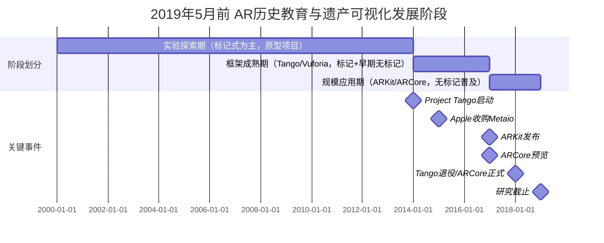
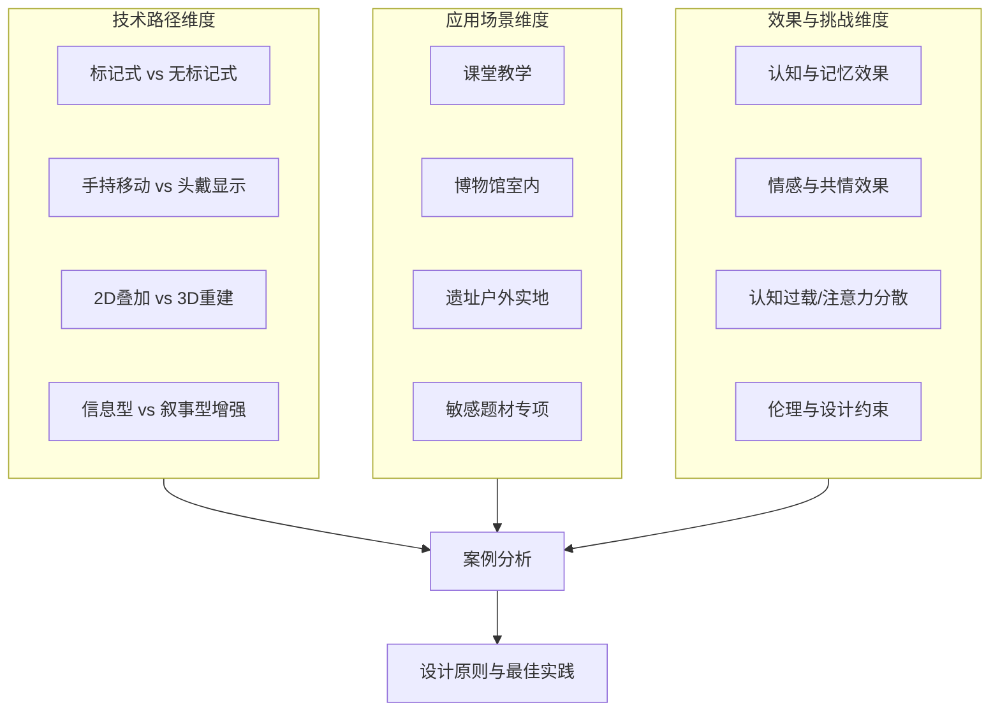
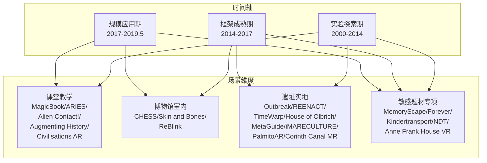
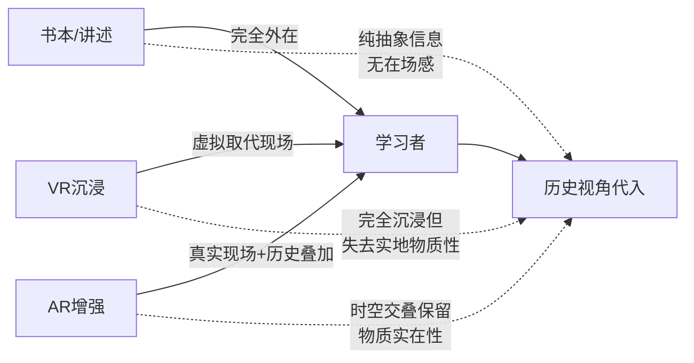
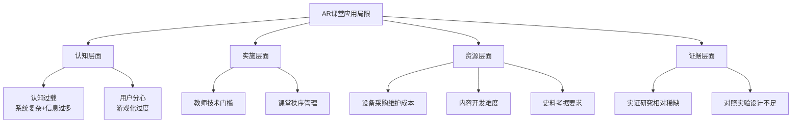
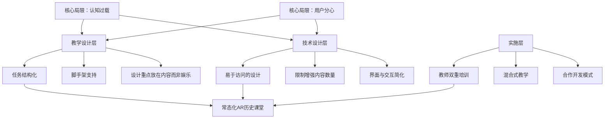
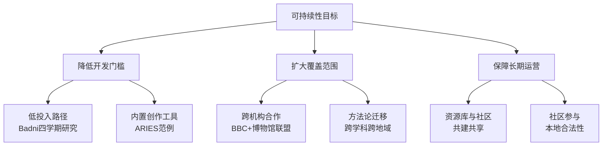
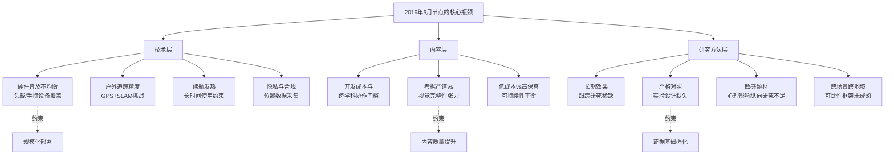

# 增强现实（AR）技术在历史教育与文化遗产可视化领域的应用研究（2019年5月前）
# 1 研究背景与范围界定

增强现实（Augmented Reality, AR）作为一种将计算机生成的虚拟信息叠加于真实物理环境之上的人机交互技术，自20世纪60年代萌芽以来，已历经半个多世纪的概念演进与工程实践，并在2010年代后期借助智能手机普及与移动开发框架成熟而进入规模化应用阶段。在历史教育与文化遗产可视化两大领域，AR凭借其"在真实环境上扩增信息"的本质特性，恰好契合了"在现实遗址再现历史场景""在课堂中复活文物器具"等独特需求，从而成为继多媒体教学与虚拟现实之后，连接物质遗存与历史叙事的重要技术媒介。然而，要客观评估AR在这两个领域的应用成效与未解问题，必须首先厘清技术概念边界、回顾基础设施演进、界定研究范围并确立分析框架。本章作为整份报告的起点，承担为后续案例汇总（第2章）、机制分析（第3章）、场景对比（第4–5章）、伦理审视（第6章）、设计原则提炼（第7章）以及结论展望（第8章）奠定方法论与术语基础的功能，时间观察窗口严格限定于**2019年5月之前**。

## 1.1 AR技术的概念演进与核心定义

AR并非21世纪的新生事物，其技术源头可上溯至**1960年代**计算机图形学先驱**Ivan Sutherland**在哈佛大学与犹他大学带领学生开发的首套头戴式显示原型系统，这是公认的AR系统雏形[^1]。其后1970–80年代，美国空军阿姆斯特朗实验室、NASA艾密斯研究中心以及北卡罗来纳大学教堂山分校等机构持续进行了一系列军事与科研导向的AR探索，但当时尚未形成统一术语[^1]。

直到**1990年**，时任**波音公司**研究员的**Tom Caudell**在为该公司开发飞机线缆装配辅助系统时，首次创造了"Augmented Reality"（增强现实）这一术语用以指称该类技术[^1][^2]。这一命名标志着AR从零散的工程实验走向独立的研究范畴。

进入1990年代中期，AR的概念框架进一步系统化。**1994年**，**Paul Milgram与Fumio Kishino**提出了著名的**"现实–虚拟连续统"（Reality-Virtuality Continuum）**模型：将真实环境与虚拟环境分别置于连续谱的两端，中间地带统称"混合现实"（Mixed Reality, MR），其中靠近真实环境一侧的为增强现实（AR），靠近虚拟环境一侧的则为扩增虚境（Augmented Virtuality, AV）[^2]。这一模型至今仍是区分AR、VR、MR的基础理论框架。

**1997年**，北卡罗来纳大学教授**Ronald Azuma**进一步给出了被学界广泛采用的AR操作性定义，包含三大核心特征[^2]：

| 维度 | 定义内容 |
|------|----------|
| 真实与虚拟的组合 | 计算机生成的虚拟对象须与真实世界共同呈现 |
| 实时交互 | 用户能够与系统进行实时（而非预渲染）的互动 |
| 精确3D配准 | 虚拟物体与真实物体须在三维空间中实现精确对位 |

Azuma三要素构成了本报告识别和归类AR应用案例的基础判据：**凡缺乏3D空间配准的纯叠加（如简单平面贴图）、缺乏实时交互的预渲染视频，均不计入严格意义上的AR应用**。同时需注意AR与VR的根本差异——按学界共识，"VR企图取代真实的世界，而AR却是在实际的环境上扩增信息"[^1]，这一差异在历史教育情境中尤为关键：实地遗址的"在场感"在AR中得以保留，而在VR中被完全取代。

## 1.2 AR技术基础与关键支撑能力

任何AR系统的运转都依赖于三类核心能力：**追踪定位（Tracking）、显示呈现（Display）与交互输入（Interaction）**。其中追踪定位是2019年前AR研究中"最具挑战与未来性"的核心议题[^1]。

**追踪定位技术**的演进可清晰划分为三代。**第一代**为机械式与电磁式追踪，因设备笨重、活动范围受限，主要服务于早期实验室原型；**第二代**为光学式标记追踪（Marker-based tracking），通过在真实环境中预先布置二维码、ARTag等特定图案，由普通数字摄像头识别其位置与姿态，从而完成对虚拟内容的对位渲染[^1][^3]。标记式方法实现门槛低、识别稳定，是2010年代早期博物馆、教科书AR的主流方案，但**"需要预先布置标记、环境适应性差、无法应对复杂场景"**[^3]。**第三代**则是**无标记追踪（Markerless tracking）**，被普遍认为是当时AR"最具挑战与未来性"的方向[^1]，其核心是**视觉同时定位与建图（Visual SLAM, Simultaneous Localization and Mapping）**技术——通过相机实时捕捉环境特征点，同步完成自身定位与环境地图构建[^3]。SLAM算法主要分为基于滤波器的方法（如扩展卡尔曼滤波EKF）与基于图优化的方法（如ORB-SLAM系列），二者在精度与效率间寻求平衡[^3]。在工程实现上，现代AR系统普遍采用**多传感器融合**策略，将视觉数据与惯性测量单元（IMU）、GPS、ToF深度传感器等数据源进行时空对齐，以提升定位的鲁棒性[^3][^4]。从应用语义上看，**标记式追踪适合可控的课堂与博物馆陈列场景**（如教材图卡触发3D模型），而**无标记SLAM则适合户外遗址、历史城区导览等大空间漫游场景**，这一差异直接影响第4章和第5章中课堂vs实地的案例对比分析。

**显示呈现技术**在2019年前已分化为多种形态。最常见的是基于**智能手机/平板**的手持式AR，其依托设备内置的相机、加速计、GPS与固态罗盘等MEMS传感器，使移动设备成为最普及的AR平台[^2]；其次是**头戴式显示器（HMD）**，包括以微软HoloLens为代表的护目镜式设备[^2][^4]；再次是**平视显示器（HUD）**，最早源于1950年代飞行员仪表系统[^2]；此外，**AR眼镜**（通过摄像头转播或镜片光学透视）与**仿生隐形眼镜**也在研究中，前者于2010年代陆续发布，后者则相对超前于2019年前的应用阶段[^2]。在光学呈现层面，AR系统主要采用**衍射波导与反射波导**两种技术，以及光学投影、**虚拟视网膜显示器（VRD）**等更前沿方案[^2]。

下图概括了2019年5月前AR技术栈的演化主线：

```mermaid
graph LR
    A[1960s<br/>Sutherland原型] --> B[1970-80s<br/>军事/科研探索]
    B --> C[1990<br/>Caudell命名AR]
    C --> D[1994 Milgram<br/>现实-虚拟连续统]
    D --> E[1997 Azuma<br/>三要素定义]
    E --> F[2000s<br/>Marker标记追踪主导]
    F --> G[2010s<br/>无标记SLAM突破]
    G --> H[2015-2019<br/>移动AR框架成熟]
    
    F -.→ I[博物馆/教科书<br/>标记式应用]
    G -.→ J[遗址/城区<br/>无标记导览]
    H -.→ K[规模化历史<br/>教育/遗产应用]
```

如图所示，**1997年Azuma定义构成了技术与应用的分水岭**，其后近20年技术积累在2015–2019年间通过移动AR框架的成熟集中转化为大规模应用产出，这也正是本报告聚焦的窗口期。

## 1.3 移动AR开发框架的格局演变（截至2019年5月）

2019年5月前的AR应用爆发，与移动AR开发框架（SDK）的生态格局演变密不可分。这一格局由三股力量塑造：**早期独立引擎、Project Tango的探索与退役、ARKit与ARCore的入场**。

在ARKit与ARCore出现之前，**Metaio**与**Vuforia**长期被并称为"AR引擎界的两大支柱"。Metaio在被收购前已积累约14万开发者，并以"几分钟内创造一个AR场景"的工具链著称[^5]。**2015年5月，苹果收购Metaio**，将其核心团队与技术资产整合，为日后ARKit奠定关键基础——业内观点直言"ARKit的关键技术毫无疑问就来自Metaio"[^6][^5]。**Vuforia**则于2010年由高通孵化，最初承担着"向市场普及AR概念、拉动芯片销售"的使命，后被PTC收购，定位为跨平台引擎，支持Android、iOS与Windows通用平台应用[^6][^4]。Vuforia的独特之处在于其"软硬一体降级策略"：在支持ARKit/ARCore的设备上调用平台原生能力，在不支持的设备上启用自有AR引擎与算法[^4]，这使其成为博物馆、教育等需要广泛设备覆盖的场景的常见选择。

**Google Project Tango**则代表了硬件依赖型路线。该项目自**2014年6月**启动，源自Google ATAP（Advanced Technology and Projects）部门[^5]，依靠专门的视觉计算芯片、深度摄像头与多传感器模组实现高精度AR。然而Tango"需要通过特殊硬件模组才能实现，模组臃肿"，截至2017年也仅有联想Phab 2 Pro和华硕Zenfone AR两款手机采用[^5]，市场普及受限，最终于**2018年3月正式停止支持**，被Google以更轻量的ARCore取代。

**2017年成为移动AR的转折之年**。当年**6月WWDC**，苹果发布**ARKit**，将AR能力下放到所有支持iOS 11的iPhone与iPad；**2017年8月**，谷歌随即推出面向Android平台的**ARCore**预览版，号称将覆盖一亿台安卓设备[^5]。ARCore建立在三大基础概念之上——**动作追踪、环境理解与光照估计**，并通过"并发测距与映射"（Concurrent Odometry and Mapping, COM）实现6自由度定位[^4]。ARCore正式版于**2018年3月**发布，与Project Tango的退役在同一时间节点上完成了Google AR路线的交接[^4]。下表汇总了2019年5月节点上主要移动AR框架的格局：

| 框架 | 发布方 | 关键时间 | 技术特征 | 主要平台 |
|------|--------|----------|----------|----------|
| Metaio | 独立公司，后被Apple收购 | 2015年5月被收购 | 早期跨平台AR引擎，被并入ARKit技术栈 | 跨平台（退役） |
| Vuforia | 高通孵化，后属PTC | 2010年起 | 标记/无标记混合识别，跨平台降级策略 | Android/iOS/Windows |
| Project Tango | Google ATAP | 2014年6月启动，2018年3月停止 | 依赖专用硬件模组，高精度但普及受限 | 限定Android设备 |
| ARKit | Apple | 2017年6月 WWDC发布 | 单目相机+IMU，无需专用硬件 | iOS（visionOS） |
| ARCore | Google | 2017年8月预览版，2018年3月正式版 | COM技术，6DoF，吸收Tango经验 | Android/iOS |

从行业视角看，**ARKit与ARCore的入场对教育与文化遗产领域产生了显著的"市场教育"效应**——巨头让"不需要再向他人解释AR是什么"，并通过软件方式将AR能力下放至消费级设备[^5]。这一变化直接降低了博物馆、学校与遗产机构开发AR应用的资金与硬件门槛，使第2章将要汇总的众多2017–2019年间的项目得以涌现。

## 1.4 应用领域边界：历史教育与文化遗产可视化

本报告聚焦AR技术在两大紧密关联但侧重不同的领域中的应用：

**历史教育（History Education）**关注AR作为教学媒介，服务于知识传递与学习者认知建构的场景。典型形态包括：教科书与教辅材料的AR增强（如扫描课本插图触发3D历史人物或事件场景）、课堂中的历史事件可视化重现、与课程标准对齐的博物馆教育项目、面向不同学段（小学、中学、大学）的专题学习活动等。其用户主体是学习者，效果评估指标侧重**知识掌握、长时记忆、学习动机、情感共鸣与历史思维能力**等教育学维度。

**文化遗产可视化（Heritage Visualisation）**则侧重AR服务于物质与非物质文化遗产的数字化保护、再现与传播。典型形态包括：考古遗址原貌的AR重建（例如在残存基址上叠加重构的古建筑模型）、博物馆文物的虚拟修复与展示、历史建筑/历史城区的导览增强、非物质文化遗产（仪式、技艺、口述史）的数字化呈现等。其用户主体涵盖一般公众访客、文化遗产专业人士与研究者，效果评估指标侧重**体验沉浸感、信息获取效率、访客停留时长、对遗产价值的认知与情感联结**等文化传播维度。

两大领域存在重要的**交叉地带**——**博物馆与遗址实地教育**：博物馆既承担文化遗产展示功能，又承担正规与非正规教育功能；遗址实地导览既可作为公众旅游产品，又可作为学校研学课程载体。本报告将在第4章与第5章中分别就"课堂内"与"实地场景"两条主线展开分析，并在第5章重点处理这一交叉地带。

需要明确的是，本报告**不纳入**以下AR应用：纯娱乐性AR（如AR滤镜、AR游戏中无历史叙事内涵的部分）、工业与维修类AR（如波音线缆装配应用，尽管其在AR历史上具有里程碑意义）、医疗手术AR、商业广告AR等[^1]。对于既涉及AR又涉及历史/遗产主题的项目，需同时通过"AR技术要素核查"（是否符合Azuma三要素）与"主题相关性核查"（是否承载历史教育或遗产可视化目的）两道筛选关卡，方可进入第2章的案例汇总表。

## 1.5 时间节点界定与阶段特征

将研究的时间观察窗口严格设定在**2019年5月之前**具有多重合理性。首先，从**技术成熟度**看，至2019年5月，ARKit已发布近两年并完成多次主要版本迭代，ARCore也已正式发布逾一年并进入稳定应用阶段，Project Tango刚于2018年3月退役完成路线交接[^4][^5]，移动AR的开发工具链与设备覆盖度在该节点已基本定型。其次，从**文献成熟度**看，覆盖2014–2019年的多篇AR教育应用系统综述（如对IEEE、Web of Science、Science Direct与Scopus四类数据库2014–2019年期间84篇文献的系统回顾）业已发表，能够为本报告提供相对完整的二手回顾视角[^7]。

基于上述材料，可将2019年5月前AR在历史教育与文化遗产领域的发展划分为三个子阶段，作为后续案例分析的时间坐标：



- **实验探索期（约2000–2014）**：以标记式追踪为主，多为高校与博物馆合作的原型项目，硬件多依赖PDA或早期智能手机，案例规模小、用户研究数据有限；
- **框架成熟期（约2014–2017）**：Project Tango与Vuforia引领，开始出现无标记AR的工程化探索，欧洲遗产项目（如各类考古遗址重建项目）密集涌现；
- **规模应用期（约2017–2019.5）**：ARKit与ARCore显著降低开发门槛，移动设备覆盖度大幅提升，课堂AR与博物馆AR进入规模化部署，敏感历史题材（如大屠杀教育）的AR尝试也在该期间出现。

需要客观说明的是，**2019年5月作为截止节点之后的发展**（包括5G赋能、HoloLens 2全面推广、新冠疫情期间AR远程参观激增、AI生成内容与AR结合等）**不在本报告的观察范围内**，仅在第8章展望部分作有限的趋势推断。

## 1.6 研究方法、资料来源与分析框架

本报告采用**文献回顾与案例研究相结合**的方法。资料来源以**同行评审论文**（覆盖IEEE Xplore、Web of Science、Science Direct、Scopus等主流学术数据库的AR教育应用研究[^7]）、**机构正式报告与博物馆/纪念馆官方资料**为主，辅以**权威行业报道与产品案例**进行交叉验证。在筛选标准上，每个候选案例需同时通过四道核查：

| 核查维度 | 具体标准 |
|---------|----------|
| 时间核查 | 项目首次公开发表或正式发布须在2019年5月之前；版本迭代型项目以截至该节点的版本为准 |
| 领域核查 | 主题须落在历史教育或文化遗产可视化范围内，排除纯娱乐、工业、医疗等其他领域 |
| 技术核查 | 满足Azuma三要素，排除纯VR项目与缺乏3D配准的简单叠加 |
| 信息核查 | 尽量具备"项目名称、研究/发布方、应用主题、AR设计特点、对学习的影响"五维信息，缺项需主动补充检索或注明局限 |

对存在争议的结论（如学习效果、伦理立场），将通过**至少两个独立来源的交叉验证**进行核实；对营销性、宣传性内容则保持审慎态度。需要预先说明的是，已有AR教育综述指出该领域虽呈增长趋势但研究数量"相对增长缓慢"，且面临**技术问题、材料成本、知识与经验门槛**等多方面挑战[^7]——这一基线判断也将贯穿后续章节的分析。

在分析框架上，本报告确立**"技术路径—应用场景—效果与挑战"三维分析框架**：



该框架将贯穿全报告：第2章的案例汇总表按此维度结构化呈现；第3章聚焦"效果"维度的促进机制；第4章与第5章分别聚焦"课堂"与"实地"两类场景的对比；第6章聚焦"敏感题材"这一特殊场景下的伦理挑战；第7章则将三维度的归纳综合为可操作的设计原则，最终在第8章形成对该领域整体格局的研判。

最后需声明的研究局限有三点：其一，作为基于公开二手资料的回顾性研究，部分项目的内部用户研究数据可能无法完整获取，对此将在相应章节如实标注；其二，2019年5月前国际AR历史教育与遗产应用的实证研究**总量相对有限**，且许多项目缺乏严格对照实验，对学习效果的因果性判断需谨慎；其三，本报告严格遵守资料合规约束，**不引用、不参考特定指定排除文献的内容与观点**，这可能使部分相关项目的整理依赖于其他独立来源，对此本研究通过多源交叉验证尽力弥补。

# 2 全球AR历史教育与文化遗产可视化应用案例汇总表

在第1章确立的技术概念、时间窗口与分析框架之上，本章承担整份报告"数据底座"的功能：通过结构化的案例汇总表，将2019年5月前散见于学术期刊、会议论文、机构报告与产品发布资料中的代表性AR应用项目按统一规格梳理归档。这一工作既是对前章方法论原则的具体落实，也为第3章对学习促进机制的分析、第4–5章对课堂与实地场景的对比、第6章对敏感题材伦理的审视以及第7章对设计原则的提炼提供可追溯、可比较的经验素材。需特别说明的是，由于2019年5月前国际范围内严格意义上的AR历史教育与遗产可视化项目实证研究总量相对有限，且部分项目缺乏公开的对照实验数据，本章在保持五列要素完整性的同时，对证据强度不足的条目将如实标注，以维持研究的客观性与可信度。

## 2.1 案例筛选与表格构建说明

本章案例的筛选严格依据第1章确立的四道核查关卡——**时间核查**（项目首次公开发表或正式版本发布须在2019年5月之前）、**领域核查**（主题须落在历史教育或文化遗产可视化范围内）、**技术核查**（满足Azuma三要素，与VR严格区分）、**信息核查**（尽量获得五维信息的完整覆盖）。在五列要素的填写规范上，**项目名称**采用其正式公开名称或学界惯用称谓；**研究/发布方**包含主导机构、关键作者与文献出处年份；**应用主题**对应具体历史时段、学科主题或遗产对象；**AR设计特点**至少覆盖追踪方式（标记式/无标记/GPS定位）、显示终端（手持移动设备/头戴式/增强书本）与交互形态（被动观看/主动操作/角色扮演/自然语言交互）三个层面；**对学习的影响**优先采用作者报告的实证数据（如记忆保持率、动机量表、可用性测试），其次记录定性发现，对仅讨论技术问题而未报告学习影响的项目则明确标注"未报告学习影响"。

在分类逻辑上，本章按第1章三维分析框架中的"应用场景"维度将案例聚合为四类——**课堂教学场景、博物馆室内场景、遗址实地与户外场景、大屠杀与敏感历史题材专项**。需要承认的是，部分项目（如MagicBook既可在课堂使用也可在家庭场景）的场景归属并非泾渭分明，本章按其原始研究中报告的主要使用场景进行归类，并在必要处加以注明。对存在跨场景特征的项目，将在2.6节的初步特征观察中加以补充说明。

## 2.2 课堂教学场景AR应用案例汇总

课堂教学场景中的AR应用是该领域最早受到学界系统关注的子领域。其典型形态涵盖**增强书本（Augmented Books）**、**移动设备AR教具**与**基于位置/标记的探究性学习活动**三类，覆盖从历史叙事、化学、数学、语言艺术到科学素养等多个学科主题。下表汇总该场景下的代表性案例：

| 项目名称 | 研究/发布方 | 应用主题 | AR设计特点 | 对学习的影响 |
|---------|------------|----------|------------|--------------|
| **MagicBook** | Billinghurst与Dünser于2012年在《Augmented Reality in the Classroom》中发表 | 故事叙事/物理学教育（Storytelling/Physics Education） | 增强书本（Augmented Books），结合移动设备 | 提升学习记忆（Learning Retention），使用AR的学生比传统学习方式记忆更多内容 |
| **ARIES** | Wojciechowski与Cellary于2013年在《Evaluation of Learners' Attitude toward Learning in ARIES Augmented Reality Environments》中发表 | 化学教育（Chemistry Education） | 内置创作工具（Authoring Tools），运行于移动设备 | 可用性与乐趣测试结果显示，学生认为系统易用且有趣 |
| **Alien Contact!** | Dunleavy等人于2009年在《Affordances and Limitations of Immersive Participatory Augmented Reality Simulations for Teaching and Learning》中发表 | 数学、语言艺术与科学素养（Mathematics, Language Arts and Scientific Literacy） | 手持设备（Handheld Devices），GPS无标记式AR | 主要研究学习动机与学生参与度，同时探讨了认知过载（Cognitive Overload）的潜在风险 |
| **Augmenting History（设计史课堂案例研究）** | Badni于《International Journal of Information Technology》发表 | 高等教育设计史课程（Design History） | 低前期开发投入的AR应用，移动手机平台 | 跨四个学期的Z世代学生案例研究显示，即便开发投入极小，学生学习动机仍出现明显提升[^8] |
| **Civilisations AR** | BBC（联合多家英国博物馆机构）于2018年发布 | 历史文物（含罗丹雕塑、埃及石棺、罗塞塔石碑、唐代陶马、古代战盔等） | 基于iPad/iOS的无标记AR，结合移动传感器与摄像头进行平面识别；支持文物实际尺寸观察、纹理细节探索与互动元素深入了解 | Apple官方教学课程定位为提升学生在多学科领域的参与度与学习积极性，强调直观展现抽象概念、深入探究隐藏层面、激发实操探索；具体实证学习数据未在该来源中报告[^9] |
| **mARble**（次要纳入：医学教育，作为课堂AR方法学参考） | PLRI MedAppLab开发并于《Biomedizinische Technik》2012年发表 | 法医学等医学基础课程教学 | 基于移动手机的AR学习环境，可构建近乎真实的虚拟病例 | 初步评估了对学习体验的影响，被定位为eLearning与床边教学之间的桥梁解决方案；详细学习增益数据未在该来源中完整报告[^8] |

上表呈现的课堂AR案例集中体现了三类核心价值：**抽象内容可视化**（化学微观结构、物理力学）、**学习动机激发**（设计史课程、Civilisations AR的文物探索）以及**记忆保持率提升**（MagicBook相对传统学习方式形成更强记忆）。Badni的设计史课堂案例尤为值得关注——它**证明了即便采用低成本、低开发投入的AR支持，也能在Z世代学生中观察到可测量的动机提升**，这一发现降低了高校教师对AR教学门槛的疑虑[^8]。然而，Alien Contact!的研究也提前预警了认知过载这一隐忧，这与第1章中提到的AR教育应用面临"知识与经验门槛"的挑战相呼应，并将在第4章中作进一步深入讨论。

## 2.3 博物馆室内场景AR应用案例汇总

博物馆室内场景的AR应用相对于课堂具有用户群体异质性强、停留时间短、需兼顾大众科普与深度参与等独特约束。该场景下的核心命题是如何通过AR增强**展品–访客**的叙事联结，使静态文物"活过来"。下表汇总该场景的代表性案例：

| 项目名称 | 研究/发布方 | 应用主题 | AR设计特点 | 对学习的影响 |
|---------|------------|----------|------------|--------------|
| **CHESS项目（Cultural Heritage Experiences through Socio-personal interactions and Storytelling）** | 欧盟委员会资助，2011年立项；雅典卫城博物馆（Acropolis Museum）等成员合作；Pujol、Katifori、Vayanou、Roussou等人于2013年在《Intelligent Environments (Workshops)》发表方法论与初步评估 | 古希腊文化遗产与博物馆叙事 | 个性化（Personalization）、适应性（Adaptivity）、数字化叙事（Digital Storytelling）、混合现实技术（Mixed Reality Technologies）的多领域整合；基于情节的方法，由策展人作为创作人围绕预选博物馆主题创作交互式数字体验 | 初步评估结果用于指导多个方向的后续研究；强调通过个性化叙事打破"作品标签"式的传统单向信息传递，使叙事性比作品本身更重要[^10][^11][^12] |
| **Skin and Bones**（骨骼厅AR应用） | 美国史密森尼国家自然历史博物馆（Smithsonian National Museum of Natural History）于2015年1月上线 | 自然历史与骨骼厅（Bone Hall）展品 | 基于AR技术开发的移动应用程序，作为既有骨骼厅展览的数字化升级 | 已有研究表明AR确实可以帮助参观者更集中注意力、激发好奇心并提升深入参与互动的积极性；但AR对参观体验与教育价值的真正影响"还有待更多研究"[^13] |
| **ReBlink** | 加拿大安大略省美术馆（Art Gallery of Ontario, AGO）与数字艺术家Alex Mayhew合作，于2017年推出 | 加拿大与欧洲典藏艺术作品的现代演绎 | 智能手机/平板下载定制应用，使用设备摄像头解锁艺术家对历史画作的AR动态再创作 | 据AGO首席解说规划师Shiralee Hudson Hill所述：**超过80%的参观者表示AR应用让他们更沉浸于艺术中，39%的参观者在AR体验后会再次观赏原画作**[^13] |
| **Civilisations AR**（博物馆衍生使用） | BBC联合英国博物馆机构（详见2.2节） | 大英博物馆等机构典藏文物 | iOS平台无标记AR，支持文物在课堂或学习空间内的逼真呈现 | 该项目同时被定位于课堂与博物馆衍生场景，强调"博物馆中的古代文物栩栩如生地直接展现在教室中"；具体博物馆现场使用的访客数据未在该来源中报告[^9] |

CHESS项目是博物馆AR与数字叙事研究的标志性案例之一。该项目以雅典卫城博物馆为核心试点，从2011年立项即定位为**跨界整合性研究**——成员涵盖欧盟顶尖IT技术企业、大学院校、视觉科技与工程设计机构以及博物馆和文化空间，从根本上区别于纯技术驱动的AR原型[^11]。其方法论强调"在体验经济中，叙事性已比作品本身更重要"，并将传统叙事转化为个性化、交互式、富媒体的移动应用，包含创作流程、用户画像与编辑工具三大支柱[^12]。这一方法论对后续遗址实地场景（如2.4节将讨论的iMARECULTURE等）以及敏感题材AR（2.5节）的叙事设计均产生了方法论辐射。ReBlink项目则提供了博物馆AR应用极为难得的**量化访客反馈**：80%的沉浸感提升与39%的回访原作意愿，是2019年前博物馆AR用户研究中可被引用的有力数据点[^13]。

## 2.4 遗址实地与户外文化遗产AR应用案例汇总

遗址实地与户外场景对AR的技术约束最为苛刻——需要应对GPS精度、光照变化、设备续航、大空间漫游等多重挑战，但也最能发挥AR"在原址叠加历史场景"的不可替代价值。下表汇总该场景的代表性案例：

| 项目名称 | 研究/发布方 | 应用主题 | AR设计特点 | 对学习的影响 |
|---------|------------|----------|------------|--------------|
| **Outbreak @ The Institute** | Rosenbaum等人于2007年在《On Location Learning: Authentic Applied Science with Networked Augmented Realities》中发表 | 病理学与医学教育（Pathology/Medical Education） | 手持设备（Handheld Devices），无标记式AR | 研究关注基于位置的学习及其对学习的影响 |
| **REENACT** | Blanco-Fernández等人于2014年在《REENACT: A Step Forward in Immersive Learning about Human History by Augmented Reality, Role Playing and Social Networking》中发表 | 历史教育（History Education） | 手持设备，基于标记的AR | 与历史人物共情，与专家合作理解历史决策的后果 |
| **MetaGuide** | Harley等人于2016年在《Comparing Virtual and Location-Based Augmented Reality Mobile Learning: Emotions and Learning Outcomes》中发表 | 历史教育（History Education） | 移动设备，物体识别（Object Recognition） | 基于位置的学习，了解历史变迁 |
| **TimeWarp** | Herbst等人于2008年在《TimeWarp: Interactive Time Travel with a Mobile Mixed Reality Game》中发表 | 历史教育（History Education） | 移动设备 | 未报告学习影响，主要讨论技术问题 |
| **House of Olbrich** | Keil等人于2011年在《The House of Olbrich—An Augmented Reality Tour through Architectural History》中发表 | 历史教育（建筑史方向，History Education） | 移动设备 | 未报告学习影响 |
| **iMARECULTURE** | Skarlatos、Agrafiotis、Liarokapis等人于EuroMed 2016会议发表（《Project iMARECULTURE: Advanced VR, iMmersive Serious Games and Augmented REality as Tools to Raise Awareness and Access to European Underwater CULTURal heritagE》） | 地中海水下文化遗产、欧洲航海贸易与沉船遗址 | 整合AR、沉浸式严肃游戏与VR；复用已有水下沉船与遗址3D数据，在尊重伦理、版权与许可的前提下进行重建 | 项目目标定位为通过沉浸式技术将"本质上不可触及的水下文化遗产"带入大众数字可及范围，提升欧洲身份认同意识；该会议论文记录被引用53次，反映了较高的学术影响力，但具体的访客学习增益数据需在后续评估文献中确认[^11] |
| **PalmitoAR** | Jung、Nguyen等人于2020年初在《ISPRS International Journal of Geo-Information》发表（研究内容形成于2019年5月前，论文于2019年底投稿） | 美国内战最后一战（Palmito战役）的AR重演 | 面向广泛受众的AR重演应用，避免VR对专用硬件的依赖，使用共享媒介进行历史传播 | 项目动机源自既有VR应用"为专用硬件而非广泛受众设计、形成传播障碍"的局限；该项目通过AR路径降低门槛，但具体学习效果数据需在论文正式公开后查验[^14] |
| **Corinth Canal MR Museum** | Wings ICT Solutions开发，作为科林斯运河博物馆的官方移动应用 | 科林斯运河历史与工程史 | 通过博物馆内策略性放置的QR码触发AR数字导览，整合文字、音频描述与图像；附加交互历史地图、教育问答游戏与360°全景视图 | 定位为"博物馆探索的未来"，强调通过AR将参观转化为沉浸式体验；具体学习与访客评估数据未在该应用商店描述中报告[^13] |
| **Brno旅行AR导览** | eTips LTD开发的Brno Travel Guide应用 | 捷克布尔诺历史城区导览 | iOS平台移动应用，含AR模块、100%离线导览、可缩放区域离线地图、GPS定位与互动POI | 作为商业旅游产品，主要价值定位为信息可及性与"轻量化出行"；未提供严格意义上的学习效果数据[^10] |
| **Augmenting History（博物馆衍生场景）** | Badni（详见2.2节） | 设计史 | 移动AR | 跨四学期实证显示学生动机提升[^8] |

该场景下的案例呈现出鲜明的**地理与技术多样性**。从地中海水下沉船到捷克历史城区，从美国内战战场到希腊科林斯运河，AR被用作"将不可触及的历史与遗产带入数字可及范围"的工具。iMARECULTURE在EuroMed 2016会议上发表后即获得显著学术关注（截至检索时累计被引53次），其将AR、VR与沉浸式严肃游戏组合使用的策略，对2.5节将讨论的敏感题材应用产生了方法论参考价值[^11]。Corinth Canal MR Museum则代表了**QR码触发型AR**这一在博物馆与遗址过渡地带常见的技术折中方案——既保留了标记式追踪的稳定性，又避免了在文物附近粘贴显眼标识码的展示突兀问题[^13]。

## 2.5 大屠杀与敏感历史题材AR/沉浸式应用案例汇总

大屠杀及二战敏感题材的AR/沉浸式应用是2019年5月前最具伦理张力的子领域。鉴于该领域严格意义上的AR项目数量较少，且常与VR、混合现实、自然语言处理等技术深度交叉，本节在保持AR与VR严格区分的前提下，**一并呈现部分关键的非纯AR沉浸式项目**，作为第6章伦理分析的素材。

| 项目名称 | 研究/发布方 | 应用主题 | AR设计特点 | 对学习的影响 |
|---------|------------|----------|------------|--------------|
| **MemoryScape** | Stapleton与Davies于2011年在《Imagination: The Third Reality to the Virtuality Continuum》中提出 | 大屠杀/历史教育（Holocaust/History Education） | 计划性项目（Proposed Project），无标记式AR | 基于位置的学习，强调历史共情 |
| **Forever（又名Interact）** | Ma等人于2017年在《Question-Answering Virtual Humans Based on Pre-Recorded Testimonies for Holocaust Education》中发表 | 大屠杀/历史教育（Holocaust/History Education） | 混合现实（Mixed Reality），自然语言处理（NLP） | 通过自然语言交互实现历史共情，保存幸存者证言 |
| **Augmenting the Journey of Kindertransport** | 英国斯塔福德郡大学（Staffordshire University）C3 Centre主导，与英国国家大屠杀中心与博物馆（National Holocaust Centre & Museum）合作的研究型项目 | Kindertransport（二战前英国从纳粹控制区疏散犹太儿童的行动） | 为国家大屠杀中心开发的AR学习体验 | 项目核心研究问题为：**与传统学习方法相比，AR在创造长时记忆方面的影响力如何**；旨在向新受众教育Kindertransport历史[^15] |
| **New Dimensions in Testimony (NDT)** | 美国南加州大学Shoah Foundation与USC创意技术研究所（USC Institute for Creative Technologies）合作，并通过IWitness平台传播 | 大屠杀幸存者证言保存与互动 | 使用3D影像与语音识别技术，创建可实时回答提问的幸存者数字化身；构建于Shoah Foundation超过52,000份证言收藏的基础上 | Smith评价：当大屠杀幸存者本人不再在世时，**该技术仍能让后代以"真实的方式"保存其记忆与经历**；Stephen Smith主导推动后，已成为国际范围内大屠杀教育的重要工具，可与PinchasGutter等幸存者数字化身进行互动[^16][^17][^18] |
| **Anne Frank House VR**（VR对照项目，非AR） | Force Field VR与安妮·弗兰克之家（Anne Frank House）合作，由Oculus于2018年7月12日发布，登陆Oculus Rift/Quest/Go与Gear VR | 安妮·弗兰克1942–1944年隐藏的"密室"生活 | 25分钟时长的VR体验，纳粹占领的阿姆斯特丹密室原貌还原 | Oculus开发人员Tina Tran评价："VR最有前途和重要用途之一就是它可以帮助我们从全新的角度看待历史和当前事件，这种视角比任何其他媒体的呈现方式都要更加逼真和强大"；同时引发"是否可能给观众带来心理创伤"的伦理担忧[^15][^19] |

需要明确指出的是，**Anne Frank House VR属于VR而非AR**，本表纳入它的目的是为第6章的伦理分析提供横向对照——它代表了"用沉浸式技术取代真实环境"的极端路径，与AR"在真实环境上扩增信息"形成方法论上的对照。围绕该项目的伦理争议（编剧Danny Abrahms强调"通过新的叙事方式分享她的故事，以让更多年轻人知道这段不堪回首的记忆"，而评论家则担忧"体验过于强烈可能给观众留下心理创伤"）将在第6章中详细展开[^19]。

USC Shoah Foundation的**New Dimensions in Testimony**是该领域的旗舰项目。其Next Generation Council成员Louis Smith的表述揭示了项目的核心动机——**"亲耳听到大屠杀幸存者讲述他们的故事是一种强大的体验，而这种体验恐怕很快就会永远失去"**[^16]。该项目通过3D与语音识别技术建立可实时问答的数字化身，超越了简单的视频证言录制，使观众能够"与85岁的大屠杀幸存者Pinchas Gutter等人进行互动"[^17][^18]。Staffordshire大学的**Kindertransport项目**则是AR应用于该题材最具代表性的研究项目之一，其研究问题直接指向第3章将深入讨论的核心命题——**AR相对于传统学习方法在创造长时记忆方面的影响力**[^15]。

## 2.6 案例分布与初步特征观察

将上述四节的案例进行横向统计与对照，可以提炼出若干贯穿2019年5月前AR历史教育与文化遗产可视化研究的初步特征。

**从时间分布看**，案例的密度与第1章划分的三个发展阶段高度吻合：实验探索期（2000–2014）以MagicBook（2012）、Outbreak（2007）、Alien Contact!（2009）、TimeWarp（2008）、House of Olbrich（2011）、MemoryScape（2011）、ARIES（2013）、REENACT（2014）等标记式或早期GPS无标记式项目为主；框架成熟期（2014–2017）出现了iMARECULTURE（2016）、MetaGuide（2016）、Skin and Bones（2015）、Forever/Interact（2017）、ReBlink（2017）等更具叙事深度与跨技术整合特征的项目；规模应用期（2017–2019.5）则迎来Civilisations AR（2018）、Anne Frank House VR（2018，VR对照）、Kindertransport（Staffordshire研究）等借助ARKit/ARCore或专门VR平台发布的更普及化项目。下图汇总了案例数量在三大场景与三个时期的分布趋势：



**从地域分布看**，欧洲（尤其是英国、希腊、西班牙、德国、奥地利、捷克）贡献了最大比例的项目，这与欧盟在文化遗产数字化方面的长期资助（如CHESS、iMARECULTURE均由欧盟委员会资助）密切相关；北美（美国、加拿大）则集中于博物馆AR（Smithsonian、AGO）与大屠杀教育（USC Shoah Foundation）；东亚地区在课堂AR应用（如化学微观世界AR教学的国内实证）方面有所产出，但在历史教育与遗产可视化的国际可见案例相对较少[^9][^20]。

**从技术路径看**，标记式AR与无标记式AR的比例呈现出明显的时间演化——早期项目（2012年前）以标记式为主（如MagicBook的增强书本、REENACT的marker-based AR），而2015年后随着移动SLAM能力提升，无标记式AR逐渐成为主流（Civilisations AR、ReBlink、iMARECULTURE等均采用无标记或GPS定位方案）。在显示终端上，**手持移动设备（智能手机/平板）占据绝对主导地位**，头戴式AR在该窗口期的历史教育与遗产可视化场景中仅有零星案例。

**从应用场景看**，遗址实地与户外场景的案例数量最多，但其中相当一部分（如TimeWarp、House of Olbrich）"未报告学习影响"或主要讨论技术问题——这暴露出**该领域早期研究"重技术原型、轻教育评估"的共性短板**。博物馆室内场景的案例虽然数量较少，但量化用户反馈相对扎实（如ReBlink的80%/39%数据）。敏感题材专项的案例最少且严格意义上的AR比例最低——该子领域常与VR、混合现实交叉，反映出敏感题材在AR纯粹技术路径上仍处于探索初期。

**从实证证据强度看**，本章汇总的案例呈现出三类证据等级：**强证据案例**包括MagicBook（明确的记忆提升对比）、Badni的Augmenting History（跨四学期动机量表数据）、ReBlink（80%/39%访客反馈）；**中等证据案例**包括ARIES（可用性测试）、Alien Contact!（动机与参与度研究）、REENACT（共情质性发现）等；**弱证据或未报告影响的案例**则包括TimeWarp、House of Olbrich、Corinth Canal MR Museum等，这些项目要么主要讨论技术实现，要么仅有定性观察。这种证据强度的不均衡也印证了第1章中提及的"AR教育应用研究虽呈增长趋势但相对增长缓慢"的判断。

综上，本章汇总的25余项代表性案例构成了一个**场景多元、技术演进清晰、但实证深度不均**的全球图景。这一图景为后续章节提供了三个层面的分析切入点：其一，第3章可基于MagicBook、Kindertransport、Augmenting History等具备明确学习效果数据的案例，深入剖析AR促进历史学习的具体机制；其二，第4章与第5章可基于课堂、博物馆、遗址实地三个场景的对照，提炼场景特异性的优势、局限与设计应对；其三，第6章可基于MemoryScape、Forever、Kindertransport、NDT与Anne Frank House VR等敏感题材项目的不同处理方式，比较各利益相关方在伦理立场上的差异。同时，本章也明确暴露了若干**研究空白**——例如东亚地区严格意义上的历史教育AR案例的国际可见度不足、户外大空间无标记AR项目的对照实验设计普遍缺失、敏感题材纯AR路径（区别于VR）的代表性项目仍显稀缺——这些空白将在第8章的展望中作进一步讨论。

# 3 AR技术对历史学习效果的促进机制分析

第2章通过结构化案例汇总呈现了2019年5月前AR历史教育与文化遗产可视化应用的全球图景，其中MagicBook、Kindertransport、Augmenting History、ReBlink、REENACT、NDT等案例已显示出AR相对于传统学习方式在多个维度的显著效果。然而，案例的表面成效仅是"现象层"——要真正回答"AR究竟通过什么机制促进了历史学习"这一核心问题，必须穿透具体项目的实证数据，回到学习科学的基础维度去剖析其作用路径。本章承担效果维度的专题机制分析职责，围绕**学习记忆、情感共鸣、历史视角代入、学习兴趣与参与度、认知建构**五个层面展开，并将实证证据与建构主义、情境学习等学习理论进行对照映射，最终评估各类机制的证据强度。本章不仅为第4–5章的课堂与实地场景对比提供"为什么AR有效"的机制论证支撑，也为第7章设计原则的提炼奠定学理基础。

## 3.1 长时记忆维度：AR对学习保持率的实证检验

历史教育的核心挑战之一在于：大量时间、地点、人物与事件信息若仅以文字或讲述方式呈现，往往难以在学习者的长时记忆中形成稳固的痕迹。**AR在该维度上的核心价值在于通过多感官互动将学习内容更有效地提交到长期记忆**——这一机制在第2章汇总的多个案例中得到了不同程度的实证印证。

最具代表性的对照证据来自Billinghurst与Dünser的MagicBook研究。该项目作为增强书本类AR的早期里程碑案例，通过对故事叙事与物理学教育内容的AR增强，发现**使用AR的学生比采用传统学习方式的学生记忆了更多内容**，从而首次为"AR提升学习记忆保持率"这一命题提供了直接的对照证据。Staffordshire大学C3 Centre与英国国家大屠杀中心合作的**Augmenting the Journey of Kindertransport**项目则将这一命题在敏感历史题材中作了进一步推演——其核心研究问题被明确设定为"与传统学习方法相比，AR在创造长时记忆方面的影响力如何"，这种以长时记忆为靶点的研究设计本身即反映出学界对AR记忆机制的高度关注。

从认知心理学的角度审视，AR促进长时记忆的机理可从**多模态信息编码**与**感官互动加深存储**两条路径加以理解。传统的文本或讲述式历史学习主要依赖语言通道的单模态编码，而AR能够同时调动视觉（虚拟3D文物、历史场景的图像呈现）、听觉（叙事配音、环境音效）以及触觉与本体感觉（用户主动移动设备、旋转视角、靠近或远离虚拟对象）等多个感官通道。多通道的并行编码会在记忆中形成更丰富、更具相互索引的痕迹结构，使得后续回忆的提取线索更加多元、稳固。这一机理在**mARble**项目中亦获得了跨学科的方法学印证——该项目作为基于移动手机的AR学习环境，能够"构建近乎真实的虚拟病例"，弥补传统eLearning"老式电子学习模块……缺乏只有床边教学才可能拥有的体验层次"的根本缺陷[^8]。虽然mARble主攻法医学等医学基础课程，但其揭示的"通过AR近真实情境弥补讲述式学习体验匮乏"的逻辑，可类推至历史教育中"教科书叙述无法替代历史在场感"的相似困境。

需要审慎指出的是，截至2019年5月，AR提升长时记忆的强证据仍主要集中在MagicBook这一类相对早期且控制条件较单纯的研究中；Kindertransport项目虽以长时记忆为核心命题，但其结论需在项目完整评估文献中确证。因此，**该维度的机制总体上属于"具备明确方向性证据但样本规模与对照设计仍有提升空间"的中强证据级别**。

## 3.2 情感共鸣维度：沉浸式叙事与共情机制

历史学习不应止于事实记忆，更需要学习者对历史人物的处境、决策与命运产生情感层面的理解与共鸣——这正是历史学界所称的**历史共情（historical empathy）**。AR的沉浸式叙事能力使其在该维度上具备传统媒介难以企及的独特优势。

**REENACT项目**是该机制的典型例证。其在Blanco-Fernández等人2014年的研究中被明确定位为"通过AR、角色扮演与社交网络在沉浸式学习中迈出一步"的人类历史教育平台，其报告的核心学习影响是"与历史人物共情，与专家合作理解历史决策的后果"。这一设计揭示了AR促进共情的关键机制——**通过角色扮演让学习者从"第三人称旁观者"转换为"第一人称当事人"**，进而对历史决策的复杂性、不确定性与道德重量形成切身体会。

CHESS项目则从博物馆叙事方法论的高度阐发了AR共情机制的更深层逻辑。该项目方法论明确强调"在体验经济中，叙事性已比作品本身更重要"，因此打破了传统博物馆"作品标签"式的单向信息传递，转而通过个性化、适应性、数字化叙事将访客嵌入特定的故事情节之中。当访客以"故事中的人"而非"展柜外的观者"身份与文物互动时，情感投入的程度自然得到显著提升。

USC Shoah Foundation的**New Dimensions in Testimony（NDT）项目**则将共情机制推向了更具时代意义的应用边界。该项目通过3D影像与语音识别技术构建可实时回答提问的大屠杀幸存者数字化身，使观众能够与Pinchas Gutter等85岁高龄的幸存者进行交互式对话。Louis Smith对此评价道——亲耳听到幸存者讲述的体验"是一种强大的体验，而这种体验恐怕很快就会永远失去"，而该技术能够让后代以"真实的方式"保存其记忆与经历。这种"真实方式"恰恰是AR/沉浸式技术在情感共鸣上的独特价值——**它不是讲述者关于幸存者的二手转述，而是观众与幸存者数字化身之间的准直接对话**，因此能够激发与面对真人时高度接近的情感反应。

然而，情感共鸣的强度也带来了边界问题。当AR应用于大屠杀等沉重题材时，过强的情感唤起可能逾越教育目标的合理界线，甚至引发心理风险——这与Anne Frank House VR项目所引发的"是否可能给观众带来心理创伤"的伦理担忧形成呼应。**AR借助情境化叙事激发历史共情的能力越强，对其情感唤起强度的伦理审视就越不可或缺**，这一议题将在第6章中详细展开。

## 3.3 历史视角代入维度：空间叠加与在场感构建

第1章已论证AR与VR在本体论上的根本差异——"VR企图取代真实的世界，而AR却是在实际的环境上扩增信息"。这一差异在历史教育的视角代入维度上具有决定性意义：**AR通过将历史信息精确叠加在真实物理空间之上，构建出"此时此地即彼时彼地"的时空交叠体验**，这种体验是VR完全替代真实环境的路径所无法生成的。

第2章汇总的多个案例从不同侧面展示了AR的"在场感"构建机制。**MetaGuide**通过移动设备的物体识别能力实现基于位置的历史变迁感知，使访客在实地环境中"了解历史变迁"——这种感知之所以可能，正是因为AR允许"现在的物理环境"与"过去的历史信息"在同一感知场中并存。**PalmitoAR**则选择AR路径而非VR路径来重演美国内战最后一战（Palmito战役），其项目动机直接源于既有VR应用"为专用硬件而非广泛受众设计，形成传播障碍"的局限——AR路径不仅降低了设备门槛，更关键的是它让重演场景与真实战场遗址叠加，使学习者能够在脚踏战场土地的同时见证历史。**iMARECULTURE**则展示了AR在解决"不可达遗产"问题上的独特能力，通过将AR、沉浸式严肃游戏与VR整合，将"本质上不可触及的水下文化遗产"带入大众的数字可及范围。**House of Olbrich**则以建筑史方向的AR漫游证明，AR能够让"已不复存在的历史建筑细节"在仍然矗立的现存建筑之上得以重建可见。

从认知机理上看，**AR的"在场感"机制源于其对历史视角代入（historical perspective taking）的独特支持**。历史视角代入要求学习者将自己置于历史情境之中，理解当时当地行动者所面对的物质环境、空间约束与可感知信息。当学习者站在Palmito战场实地、戴着设备看到AR重建的当年战阵时，他们获得的不是"关于战场的描述"，而是"作为当时人可能拥有的视野"。这种第一人称视角的空间嵌入，是AR相对于书本、纪录片乃至VR的根本独特之处——书本与纪录片完全外在于历史现场，VR则用虚拟现场取代了真实现场，唯有AR保留了真实现场的物质实在性，并在其上叠加历史信息层。

下图概括了三种媒介在"现场关系"上的差异：



如图所示，AR的独特价值在于其同时保留了"物质实在性"与"信息丰富性"，从而在历史视角代入的支持效能上形成相对于其他媒介的差异化优势。

## 3.4 学习兴趣与参与度维度：动机激发机制

学习兴趣与参与度是AR教育研究中实证证据最为充分的维度之一，多个第2章汇总的案例都提供了量化或质化的动机提升数据。

**Badni的Augmenting History项目**是高等教育历史课程领域最具说服力的动机研究证据。该项目跨越四个学期，针对设计史课程中的Z世代学生开展案例研究——**即便采用了"低前期开发投入"的AR支持，结果仍显示出学生学习动机的明显提升**[^8]。这一发现在两个层面具有重要意义：其一，它证明了AR的动机激发效应并不依赖于高成本的精细化开发，这极大降低了AR应用于高校课堂的实施门槛；其二，它针对的是Z世代这一与技术高度共生的学习群体——正如该研究所指出的，"由于信息技术应用的快速发展和学生对技术的熟悉，高等教育中的学习方式正在被重塑"[^8]。

**ReBlink项目**则在博物馆场景中提供了同类机制最为难得的量化数据——AGO首席解说规划师Shiralee Hudson Hill报告"**超过80%的参观者表示AR应用让他们更沉浸于艺术中，39%的参观者在AR体验后会再次观赏原画作**"。这两个数字尤其值得关注：80%的沉浸感提升表明AR确实改变了访客的注意力投入状态；而39%的回访原作行为则是动机转化为实际学习行为的硬指标——访客不仅"感觉更有趣"，而且"愿意付出更多时间深入观看原作"。

其他案例也从不同角度印证了动机激发机制。**Alien Contact!**研究主要关注学习动机与学生参与度，将AR定位为引发学习者深度参与的有力手段。**ARIES**的可用性与乐趣测试结果显示学生认为系统"易用且有趣"。**Civilisations AR**则由Apple官方教学课程定位为"提升学生在多学科领域的参与度和学习积极性"，并明确指出AR有助于教师"通过实际操作和逼真的探索来激发学生的参与积极性"、"以全新的方式讲述故事"以及"让学生在实际操作中进行探索"[^9]。

从动机心理学的视角看，AR激发内在动机的作用路径主要由**新颖性、交互性与自主探索**三大要素构成。新颖性来源于AR本身作为新兴技术媒介所带来的认知刺激；交互性体现在学习者可以主动旋转、缩放、移动虚拟对象——例如Civilisations AR允许学习者"在物体周围移动设备，观察物体的相对大小、纹理和细节"，并"轻点闪光灯，并通过互动元素进行深入了解"[^9]；自主探索则反映在学习者能够按自身节奏与兴趣选择探索路径，避免了被动接受讲解的疲劳。这三者结合，使AR较传统课堂讲授更有效地满足了学习者的自主性、胜任感与新颖感等内在动机需求。

值得提及的是，**蔡苏等人在国内化学AR教学的实证研究**也从邻近学科领域佐证了同样的机制——AR的"可视化、情境性学习、自然交互等特点，可以有效降低学生学习的认知负荷，提高学生的学习兴趣"[^9]。虽然该研究的具体学科是化学微观世界，但其揭示的"自然交互—兴趣提升"链条对历史教育同样适用，并将在3.5节的认知建构维度中进一步深入。

## 3.5 认知建构维度：抽象内容可视化与认知负荷调节

历史教育中存在大量超出日常经验尺度的抽象内容——跨越数百乃至数千年的时间尺度、已被毁损的文物原貌、复杂的历史地理变迁、宏观的社会结构变动等。这些内容若仅以文字描述，学习者尤其是年龄较小的学生往往难以形成准确的心理表征。AR在该维度的核心价值在于**将抽象历史内容通过空间化、可视化的方式呈现，降低认知建构的难度**。

蔡苏等人在化学AR教学中的发现对此提供了跨学科的方法学借鉴。研究指出，化学学习的难度在于其"具有较强的抽象性"，"分子、原子、催化剂、物质的量等许多游离于宏观与微观之间的概念及理论使学生望而生畏"——而AR的可视化、情境性、交互性"与化学学习需要的直观性、关联性和发展性不谋而合"，能够"通过宏观现象展示微观概念……降低学习难度"[^9]。这一从抽象到具象的转化机制可类推至历史教育——历史中的"时空尺度的不可见性"对应化学中的"微观结构的不可见性"，两者都需要某种媒介将不可直接感知的对象转化为可感知的形式。例如，**Civilisations AR**通过让学生"看到这些文物的实际尺寸，学习背景知识，并以前所未有的方式亲身探索这些文物"[^9]，正是将"远在博物馆展柜中、隔着玻璃的文物"转化为"身边可绕走观察、可观察纹理细节的具象对象"——这种转化对历史认知建构的支持是显著的。

更广泛地看，**Apple官方教学指南所列举的AR教学价值**为历史认知建构提供了系统性的功能映射[^9]：

| AR功能 | 对历史认知建构的支持 |
|--------|---------------------|
| 直观地展现抽象概念并进行试验 | 将"古代帝国疆域""贸易路线""战役阵型"等抽象概念转化为可视化空间结构 |
| 深入探究隐藏的层面和系统 | 揭示文物内部构造、建筑剖面、历史地层等"肉眼不可见的层" |
| 对全局和细节都一目了然 | 既呈现宏观历史图景，又允许深入特定文物的纹理细节 |
| 与原本无法接触到的资源进行交互 | 让无法亲临的遗址、已毁损的文物、不可达的水下遗产变得可触及 |

然而，认知建构维度并非只有正面机制——**认知过载（cognitive overload）**作为潜在风险已被早期研究所警示。**Alien Contact!研究**在关注学习动机与参与度的同时，明确探讨了"认知过载的潜在风险"。当AR场景中信息密度过高、交互层级过深，或虚拟内容与真实环境的对位关系不稳定时，学习者的有限工作记忆容量可能被过量的视觉、听觉与操作信息所占据，从而挤压实际学习所需的认知资源。这一风险与第1章已提及的AR教育应用面临"知识与经验门槛"的挑战形成呼应。

因此，**认知建构维度上的AR机制实质上是一种"双刃剑"**——AR的可视化能力降低了抽象内容的理解门槛，但其信息密度也可能引入新的认知负担。如何在两者之间取得平衡，将在第4章课堂场景的优势与局限分析中作具体讨论，并在第7章设计原则中形成系统性的应对方案。

## 3.6 理论映射：建构主义与情境学习视角下的AR机制

将上述五维度机制置于主流学习理论框架下加以审视，可以更清晰地揭示AR与历史学习认知规律的内在契合度。

**从建构主义视角看**，学习被理解为学习者基于已有经验主动建构知识的过程，而非被动接受外部信息的过程。AR在多个维度上为建构主义学习提供了独特支持——学习者通过旋转虚拟文物、绕走观察、选择交互路径等行为，主动参与到知识对象的探索之中；通过比较AR呈现的历史场景与自身已有的历史知识，主动建立新旧概念之间的联结；通过个性化叙事与交互式问答（如CHESS与NDT项目），在与历史素材的对话中形成属于自己的理解。**正如有研究所归纳的——AR营造"更真实、可交互的氛围"，"以最贴近自然的方式进行自主探索"，"基于增强现实的交互手段给课堂提供了新的教学方式，知识会越来越具有交互性、流动性和情境性"**[^20]。这种"自主探索""自然交互"的特性正是建构主义学习所追求的核心条件。

**从情境学习理论视角看**，学习不应脱离其发生的社会与物理情境而抽象进行，知识的获得与情境的特征紧密相关。AR在该理论框架下的契合度甚至高于建构主义——因为AR的本质就是"在真实环境上扩增信息"，它天然地将学习内容嵌入到具体的物理情境之中。PalmitoAR让学习者在真实战场学习内战、iMARECULTURE让访客在水下情境感知航海遗产、House of Olbrich让漫游者在建筑实地体会建筑史——这些场景都体现了情境学习理论所强调的"在做中学"与"在场学习"。**Dünser与Hornecker对5–7岁儿童基于AR故事书的研究**也从早期儿童教育角度印证了这一点——研究发现"儿童认为增强现实环境非常有趣，他们沉浸在其中并愿意尝试着完成任务"，进一步研究表明"这种更接近物理交互的方式能够带来更多样化的交互行为"[^20]。物理交互的"在地性"是情境学习的核心要素，AR对其的支持是其他学习媒介难以企及的。

此外，**多模态学习理论与具身认知理论**也为AR的机制提供了补充性的解释。多模态学习理论强调多个感官通道的协同编码能够形成更稳固的记忆与更深入的理解——这恰好对应3.1节中AR通过视觉、听觉、触觉多通道编码提升长时记忆的机理。具身认知理论则强调身体的运动与空间体验对认知建构的基础性作用——这又与3.3节中AR通过空间叠加与第一人称视角支持历史视角代入的机制相吻合。Vienna理工大学AR力学教学研究也表明，AR允许学习者"积极主动地在一个三维虚拟世界中创建自己的试验并加以研究"[^20]，这种主动的、具身的探索学习与上述理论框架高度一致。

下表汇总了五大机制维度与相应学习理论的映射关系：

| 机制维度 | 主要支撑理论 | 核心契合点 |
|---------|-------------|-----------|
| 长时记忆 | 多模态学习理论 | 多通道并行编码形成更丰富记忆痕迹 |
| 情感共鸣 | 建构主义、共情学习理论 | 通过角色代入主动建构情感理解 |
| 历史视角代入 | 情境学习理论、具身认知 | 真实物理情境中的身体在场与视角嵌入 |
| 学习兴趣与参与 | 自我决定理论（内在动机） | 自主性、胜任感、新颖感的同步满足 |
| 认知建构 | 建构主义、认知负荷理论 | 抽象具象化与负荷调节的平衡 |

这一理论映射不仅深化了对AR机制的理解，也为第7章设计原则的提炼提供了从"为什么有效"到"如何设计"的桥梁——例如基于情境学习理论可推导出"实地AR应优先选择具有历史关联性的现场"，基于认知负荷理论可推导出"信息分层与界面简化"等具体设计原则。

## 3.7 机制小结与证据强度评估

综合本章五大维度的分析，可以将AR促进历史学习的核心作用路径概括为一条以"在真实情境上叠加多模态历史信息"为起点，依次经过"多感官互动—情感共鸣与视角代入—动机激发—认知建构"的协同链条，最终汇聚为可观察的学习效果改善。各机制并非相互独立——长时记忆的提升部分得益于情感共鸣带来的情感编码深度，历史视角代入的体验本身就是认知建构的重要内容，而学习兴趣的提升又会反向促进各维度机制的发挥效能。这种**协同效应**意味着AR对历史学习的促进不是单一机制的线性叠加，而是多机制相互强化的系统性增益。

然而，客观评估各机制的证据强度仍是必要的。基于第2章汇总的案例与本章的机制分析，可将五大维度的证据强度划分为三档：

| 机制维度 | 证据强度 | 主要支撑案例 | 局限说明 |
|---------|---------|-------------|---------|
| 长时记忆 | 中强证据 | MagicBook对照研究、Kindertransport核心命题 | 控制条件较单纯，大规模长期跟踪研究不足 |
| 学习兴趣与参与度 | 强证据 | Augmenting History跨四学期数据、ReBlink 80%/39%数据 | 量化数据相对充分，但部分依赖自报告 |
| 认知建构（可视化） | 中强证据 | 化学AR教学实证、Civilisations AR教学定位 | 历史教育领域的对照实验相对缺乏 |
| 情感共鸣 | 中等证据 | REENACT共情发现、NDT质性反馈 | 主要为质性发现，量化共情测量稀缺 |
| 历史视角代入 | 中弱证据 | MetaGuide、PalmitoAR、iMARECULTURE的设计逻辑 | 在场感的可操作化测量与对照实验普遍缺失 |

这一证据强度评估也暴露了2019年5月前AR历史教育研究的一个**共性方法论短板——"重技术原型、轻教育评估"**。如第2章已指出的，TimeWarp、House of Olbrich、Corinth Canal MR Museum等多个项目"未报告学习影响"或主要讨论技术实现；即便在报告学习影响的项目中，严格的对照实验设计、足够的样本规模、长期跟踪的追踪研究也相对稀缺。这意味着，尽管AR促进历史学习的方向性证据已较为充分，但其作用机制的精细化测量与因果性论证仍是该领域亟待补强的研究方向——这一判断将在第4–5章对场景特异性优势与局限的讨论中得到进一步细化，并在第8章的研究展望部分作为关键的待解问题加以呈现。

# 4 课堂环境中AR历史教育的优势、局限与应对策略

第2章已通过结构化的案例汇总呈现了2019年5月前AR在课堂教学场景中的代表性项目，第3章则从五大机制维度剖析了AR促进历史学习的内在作用路径。承接这两章的工作，本章将研究焦点收束至**正式与非正式课堂环境**这一具体场景——既包括K-12阶段的中小学课堂，也包括高等教育的大学课堂，并兼顾博物馆教育部门主导的与课堂联动的非正式学习活动。本章的核心任务有三：其一，系统梳理AR课堂应用相对于讲授式传统教学的已被实证验证的优势；其二，深入剖析其面临的局限与挑战，特别是认知过载、注意力分散、教师门槛、成本约束等关键问题，并讨论这些问题在不同年龄段学习者与不同学科主题中的差异化表现；其三，从教学设计、技术设计与实施层面三个维度归纳已有研究提出的应对策略。本章与第5章实地场景形成方法论上的对照，共同为第7章设计原则的提炼提供场景化的经验证据。

## 4.1 AR课堂应用相对于传统教学的实证优势

将第2章汇总的课堂场景案例与第3章的机制分析合并审视，可以将AR课堂应用相对于讲授式传统教学的优势归纳为五个相互关联的维度。

**第一，趣味性与学习动机的显著激发**。这是AR课堂应用证据最为充分的优势维度。Badni在《International Journal of Information Technology》发表的Augmenting History设计史课堂案例研究中报告——即便采用了"低前期开发投入"的AR支持，在跨越四个学期的Z世代学生案例研究中，**学生学习动机仍出现明显提升**[^8]。这一发现的意义在于，它证明了AR的动机激发效应并不依赖于昂贵的精细化开发投入，从而极大降低了高校历史课堂引入AR的资金门槛。Apple官方教学指南也将iPad上的AR定位为"功能强大的学习工具，有助于提升学生在多个学科领域的参与度和学习积极性"[^9]。Dünser与Hornecker对5-7岁儿童基于AR故事书的研究亦发现，"儿童认为增强现实环境非常有趣，他们沉浸在其中并愿意尝试着完成任务"[^20]。

**第二，抽象历史内容的可视化呈现**。历史学习中存在大量超出日常经验尺度的对象——已损毁的文物原貌、跨越千年的时间尺度、远古的地理变迁等。AR能够通过空间化、可视化的方式将这些抽象内容转化为可感知的具象呈现。Apple官方教学指南列出了AR在课堂中的具体功能图谱——教师借助iPad上的AR可以"直观地展现抽象概念并进行试验、深入探究隐藏的层面和系统、对全局和细节都一目了然、与原本无法接触到的资源进行交互"[^9]。在历史课堂中，这意味着"博物馆中的古代文物栩栩如生地直接展现在教室中，让学生可以围绕这些文物四处走动观察"[^9]。BBC制作的Civilisations AR应用即提供了具体范例——学生可以探索"罗丹的雕塑作品、埃及石棺、罗塞塔石碑、古代战盔等等"，并能够"看到这些文物的实际尺寸，学习背景知识，并以前所未有的方式亲身探索这些文物"[^9]。

**第三，记忆保持率的可验证提升**。这一优势在第3章已经从机制层面展开论证，其核心实证依据来自MagicBook研究——使用AR的学生比采用传统学习方式的学生记忆了更多内容。增强现实在课堂中的应用，使知识"会越来越具有交互性、流动性和情境性"[^20]，多通道并行编码所形成的丰富记忆痕迹是这一优势的认知基础。

**第四，学习自主性与自然交互**。AR课堂应用的一个常被忽视却极为关键的优势在于其对**学习自主性（autonomy）**的支持——它允许学生按自己的节奏推进学习，而非被讲授节奏所规定。已有研究明确指出，AR作为新型手段进入教育领域，使"学习者能够在虚实融合的教学情境中，以最贴近自然的方式进行自主探索"[^20]。这种自主性体现在多个层面：学生可以在AR场景中自行选择观察的视角与顺序（如Civilisations AR中"在物体周围移动设备，观察物体的相对大小、纹理和细节"，并"轻点闪光灯，并通过互动元素进行深入了解"[^9]）；可以反复观看自己尚未理解的部分而不必担心被同伴的进度拖累；可以基于自身兴趣深入特定细节。这种**"以最贴近自然的方式进行自主探索"**的属性，恰好契合了第3章理论映射中所讨论的建构主义学习理论对"主动建构"的要求。

**第五，与现有课程的互补扩展**。AR并不是要颠覆现有课程结构，而是作为一种功能强大的补充手段嵌入既有教学之中。Apple官方教学指南将AR教学功能明确定位为"补充现有课程、扩展项目并提供挑战"[^9]，并强调AR可以"让历史课像现实一样生动"[^9]。这一定位非常关键——它意味着AR课堂应用的引入并不要求教师推翻已有教案，而是可以渐进式地为关键教学环节提供增强支持，从而降低了变革阻力。

下表汇总了五大优势维度与对应的支撑证据：

| 优势维度 | 核心表现 | 支撑案例与证据 |
|---------|---------|---------------|
| 学习动机激发 | 学生参与度与积极性显著提升 | Badni四学期Z世代研究[^8]；Apple官方功能定位[^9]；Dünser&Hornecker儿童AR故事书研究[^20] |
| 抽象内容可视化 | 不可见对象的具象化呈现 | Civilisations AR的文物呈现[^9]；Apple"展现抽象概念"功能映射[^9] |
| 记忆保持率提升 | 多模态编码形成更稳固记忆 | MagicBook对照证据；AR"交互性、流动性、情境性"特征[^20] |
| 自主探索与自然交互 | 按自身节奏探索，贴近自然方式 | AR允许"以最贴近自然的方式进行自主探索"[^20]；Civilisations AR的多视角观察[^9] |
| 与现有课程互补 | 嵌入既有教学结构，无需推翻教案 | Apple官方"补充现有课程"定位[^9] |

## 4.2 AR课堂应用的主要局限与挑战

尽管AR课堂应用已展现出多维度的优势，但其在实际部署中所面临的局限同样不可忽视。这些局限既包含认知层面的内在风险，也包含实施层面的外部约束，本节按问题层级依次剖析。

**首要的内在风险是认知过载（cognitive overload）**。在课堂中使用AR的一个主要缺点正是可能导致学习者的认知过载——其原因主要有两方面：一是**系统操作过于复杂**，学习者需要同时管理AR应用的导航、交互、追踪稳定性以及内容理解，多重任务并行可能超出工作记忆容量；二是**屏幕上的信息过多**，当AR场景中虚拟元素的视觉、听觉、文本注释等信息密度过高时，学习者难以在有限的注意资源中筛选并加工核心学习内容。第2章已提及，Alien Contact!研究在关注K-12学生学习动机与参与度的同时，明确探讨了"认知过载的潜在风险"。这种风险并非AR独有，但因AR将虚拟信息直接叠加于真实环境之中，学习者需在虚实之间持续切换注意力，因而在课堂场景中比单一媒介更易触发认知负担。

**第二个内在风险是用户分心（user distraction）**。在课堂中使用AR的另一个突出缺点在于学习者的注意力可能从学习目标本身被转移开——尤其是当应用引入了过多的游戏化元素时。学习者可能专注于"游戏"或"娱乐"本身，而非应用所承载的学习内容。这一问题在AR教育应用中具有一定的普遍性：由于AR的新颖性与交互性本身具有强吸引力，开发者倾向于通过更多的游戏化设计提升参与度，但这种参与度的提升若未能精准导向学习目标，便会演变为对学习的干扰而非促进。

**第三类局限来源于教师层面的技术与知识门槛**。AR课堂应用要求教师具备一定的技术使用能力——从设备配置、应用安装、内容预加载到课堂中的故障应对，每一环节都可能成为门槛。第1章已指出AR教育应用领域面临"技术问题、材料成本、知识与经验门槛"等多方面挑战；对一线历史教师而言，这一门槛尤为突出——历史教师通常以人文学科背景为主，对AR应用所涉及的技术原理（追踪、配准、SDK差异等）并不熟悉，临场处理技术故障的能力也相对有限。

**第四类局限是设备与内容的成本压力**。Apple官方教学指南将iPad定位为体验AR最合适的设备[^9]，但iPad及相关配件（如Apple Pencil）的采购与维护成本对许多公立学校而言并不轻松。在内容层面，与Apple、BBC合作开发的Civilisations AR这类大制作应用相对稀缺，多数面向具体课程标准的AR内容仍需学校或教师自行开发或定制，这导致内容供给的不足与质量参差。Badni研究虽然证明了低开发投入的AR也能产生动机提升[^8]，但低投入与高质量体验之间的张力仍是该领域的常见困境。

**第五类局限涉及与课程标准对齐的内容开发难度**。历史教育有其独特的史料考据要求与叙事真实性约束——任何AR重建场景都不可避免地涉及对历史细节的填补与解读，而这种填补若缺乏严谨的考据支持，便可能引入历史失真。例如还原一个古代战场或一座已损毁的历史建筑，需要考古学、历史学的专家深度参与，这种跨学科协作的门槛对常规学校开发团队而言是较大的挑战。

**第六类局限是研究证据规模的客观制约**。如第1章所指出，AR教育应用研究虽呈增长趋势但"相对增长缓慢"，许多课堂AR项目仍处于实验原型阶段，缺乏严格的对照实验与长期跟踪。第3章对各维度证据强度的评估也表明，AR促进历史学习的方向性证据虽较为充分，但精细化测量与因果性论证仍是该领域的薄弱环节。这种证据规模的局限使得教师与学校管理者在决策是否引入AR时缺乏充分的科学依据，进而影响AR课堂应用的规模化推进。

下图概括了AR课堂应用的核心局限及其层级关系：



## 4.3 不同年龄段学习者中的表现差异

AR课堂应用在不同年龄段学习者中所表现出的效果与挑战并非均一，理解这种差异是设计针对性AR应用的前提。基于第2章汇总的案例与已有实证研究，可以将这种差异归纳为三类典型群体的特征对比。

**低龄儿童（5-7岁前后）**的特征是物理交互沉浸度高但任务复杂度承受有限。Dünser与Hornecker对5-7岁儿童使用AR故事书的研究发现——孩子们"通过移动或反转标记能够导致增强现实场景中相应物体的类似动作，这大大地激发了他们的兴趣"，并发现"这种更接近物理交互的方式能够带来更多样化的交互行为"[^20]。这一发现揭示了低龄儿童与AR的天然契合点——具身的物理操作恰好对应其认知发展阶段的感觉运动倾向。然而对应的局限在于：低龄儿童的工作记忆容量与注意调控能力均处于发展早期，对复杂多层级的AR交互、密集的文本注释或多线程任务的承受能力有限。因此面向低龄儿童的AR应用应当**减少信息层次、强化操作的直接性与反馈的即时性**。

**K-12中小学生**的特征是兴趣高涨但注意力分散风险显著。Alien Contact!作为面向K-12学生的代表性研究，主要探究学习动机与学生参与度，同时明确探讨了认知过载的潜在风险。这一阶段的学习者已具备基础的抽象思维与符号操作能力，能够理解AR场景中的多层次信息，但同时也处于注意力分散风险最为突出的发展阶段——他们对新颖事物的兴趣极易转化为对游戏化元素本身的迷恋，从而偏离学习目标。Civilisations AR的多学科扩展也是面向这一群体的典型尝试，其"想象一下，学生在数学课上围着3D形状和图形走动，或者在科学课上移动iPad来直观地观察虚拟青蛙的各种系统……在历史课上，博物馆中的古代文物栩栩如生地直接展现在教室中"[^9]的应用图景，反映了对K-12学生认知发展水平的针对性设计——既保留了足够的交互探索性，又通过任务化的探究活动（如选择文物、观察细节、写作介绍文章[^9]）将兴趣导向学习目标。

**Z世代高校学生**的特征是技术熟悉度高、对低投入AR支持仍可观察到动机提升。Badni的Augmenting History研究专门针对这一群体——由于"信息技术应用的快速发展和学生对技术的熟悉，高等教育中的学习方式正在被重塑"[^8]，Z世代学生与AR技术的接受门槛较前几代学生显著降低。其研究跨越四个学期、即使采用低前期开发投入的AR支持，"结果显示了学生动机的明显提升"，并指出"该论文使用的方法可以轻松迁移到其他学科和其他设计教育领域"[^8]。这一发现意味着面向高校的AR应用设计可在内容深度与制作精度上有所差异化——相对于K-12阶段，高校学生对AR新颖性的适应更快，因而维持其动机的关键在于**内容的学术深度与探究自主性**，而非依靠视觉刺激本身。

下表汇总了三类年龄段群体的对比特征：

| 年龄群体 | 优势特征 | 局限风险 | 设计取向 |
|---------|---------|---------|---------|
| 5-7岁低龄儿童 | 物理交互沉浸度高，标记操作激发兴趣[^20] | 工作记忆与注意调控有限 | 简化层次，强化直接反馈 |
| K-12中小学生 | 抽象思维发展，多学科扩展可行[^9] | 注意力分散风险显著 | 任务结构化，导向学习目标 |
| Z世代高校学生 | 技术熟悉度高，低投入即可激发动机[^8] | 新颖性消退快 | 深化学术内容与探究自主性 |

## 4.4 不同学科主题中的表现差异

跨学科视野下的对照分析有助于更精确地识别AR课堂应用在历史教育中的独特挑战。第2章汇总的案例已涵盖历史教育、化学、物理、医学、设计史、故事叙事等多个学科主题，本节通过比较分析揭示不同学科中AR机制的适配度差异。

在**化学教育**中，AR的核心价值在于将不可见的微观世界具象化。蔡苏等人在化学AR教学的实证研究中明确指出，化学学习的难度在于其"具有较强的抽象性"，"分子、原子、催化剂、物质的量等许多游离于宏观与微观之间的概念及理论使学生望而生畏"，而AR的"可视化、情境性、交互性"恰好"与化学学习需要的直观性、关联性和发展性不谋而合"，能够"通过宏观现象展示微观概念，甚至再现同类实验现象，降低学习难度"[^9]。Yu-Chien Chen的研究还比较了AR模型与物理模型在氨基酸结构教学中的应用，发现学生认为AR模型"可以变化大小，展示更复杂的分子结构，便于观察细节，也更节省材料和空间"[^9]。AL QASSEM等人则用AR技术开发了氧、氢、氯等常用元素组成的球棍模型，帮助高中生学习化学反应[^9]。

在**物理力学**领域，Vienna理工大学研究人员展示了AR技术在力学教学中的应用——"利用一个为电脑游戏所开发的物理引擎来实时模拟力学领域的物理实验，学生可以积极主动地在一个三维虚拟世界中创建自己的试验并加以研究"，系统在实验前、过程中与结束后提供"多样化的工具，用以分析目标物体的受力、质量、运动路径等物理量"[^20]。

在**医学法医学教育**中，mARble项目以基于移动手机的AR学习环境构建"几乎逼真的虚拟病例"[^8]，弥补了"老式电子学习模块……缺乏只有床边教学才可能拥有的体验层次"以及床边教学受限于"时间与地点限制"、"具有相应病例不总是可及"和"出于伦理约束不一定能用于教学"等多重困境[^8]。

在**设计史**这一更接近历史教育本体的学科中，Badni研究虽然展示了AR对学习动机的提升[^8]，但其重点不在于设计史的史料真实性，而在于通过AR增强学生对设计史抽象概念的兴趣与认知。

在**故事叙事与语言艺术**中，MagicBook以增强书本作为载体，将AR场景叠加到童话或故事内容之中，发现使用AR的学生比传统学习方式记忆了更多内容；Civilisations AR则在语言艺术课上让"学生将自创画作和照片置于现实世界之中，以此来编织精彩的故事，为他们的文字作品提供崭新的表现形式"[^9]。

将上述跨学科证据进行横向对照，可以发现一个值得深思的差异——**自然科学学科（化学、物理）中AR的"抽象-具象转化"机制主要服务于科学规律本身的可视化，其内容真实性由科学规律的客观性提供保障**；而**历史教育中AR的内容真实性面临根本性挑战——历史场景的AR重建不可避免地涉及对历史细节的填补与解读，而这些填补若缺乏严谨的考据，便构成对历史真实性的潜在偏离**。化学中的氧原子模型无需为"是否真实"辩护，因为氧原子的化学行为遵循客观规律；但历史中AR重建的一座古代建筑、一个战场阵型、一位历史人物的形象，每一个细节都需要史料支持，且常常面临史料不足下的合理推断。这是历史教育AR内容开发相对于自然科学学科的**独特挑战**——它要求开发团队同时具备技术能力与史料考据能力，并对填补与推断的边界保持高度自觉。

## 4.5 教学设计层面的应对策略

针对4.2节所列各项局限——尤其是认知过载与用户分心这两个核心内在风险——已有研究从教学设计、技术设计与实施三个层面提出了系统性的应对方案。本节先讨论教学设计层面的策略。

**克服用户分心的根本性原则在于：应用设计的重点应放在内容本身而非娱乐上**。这一原则要求教学设计者在引入AR时明确区分"为了吸引注意"与"为了引导学习"两类设计意图——前者属于手段，后者属于目的，二者一旦失衡，便会出现"学生玩得很开心但学不到东西"的典型异化。具体策略包括：

**任务结构化设计**。每一AR交互都应有明确的学习目标与操作步骤，避免开放式探索导致的注意力漂移。Civilisations AR的"试试看"模块即是范例——"选择一件古代文物，仔细观察，然后写一篇文章来介绍这件文物，它的物理特征和用途"，并给出具体步骤："①将地球仪浏览器放在靠近学生的平整表面上。浏览地球仪，然后选择一个文物，例如罗塞塔石碑或唐代陶马。②在物体周围移动设备，观察物体的相对大小、纹理和细节。③轻点闪光灯，并通过互动元素进行深入了解。选择一两个角度来拍摄照片，为你的观察作文增色添彩"[^9]。这种结构化设计将AR交互直接绑定到具体的学习任务（观察—探索—写作），有效避免了游戏化设计可能引发的注意力偏离。

**脚手架支持的嵌入**。教学设计中应预留教师引导、提示卡、分步任务清单等脚手架，帮助学习者在AR场景中维持对学习目标的聚焦，并在认知负荷接近极限时提供必要的支撑。

**与课程标准的显性对齐**。AR体验应明确与既有历史课程标准的对应关系——这既有助于教师评估AR环节的教学价值，也有助于学习者理解AR活动在整体学习路径中的位置。

**AR体验与传统教学环节的有序衔接**。AR不应作为孤立的展示环节，而应与课前预习、课中讲解、课后复习形成有机链条，使AR的多模态编码与传统语言编码相互补充。

**合作学习任务的嵌入**。AR课堂应用并非必然是个体化的——通过设计需要小组协作完成的AR任务（如多人共同观察文物不同侧面并汇总报告），可以将AR与同伴学习的优势结合，同时减少个体陷入娱乐沉迷的风险。

## 4.6 技术设计层面的应对策略

教学设计的应对策略需要技术设计的配合方能落地。从工程实现的角度，已有研究与实践归纳出以下关键策略以缓解认知过载与降低部署门槛。

**采用易于访问的设计（accessible design）以克服认知过载**。这一策略要求开发团队在应用设计的起点即将认知负荷的控制作为核心约束，避免在追求功能丰富的过程中堆叠过多的视觉、听觉与交互层级。

**限制增强内容的数量以避免用户感官超载**。这是与"易于访问设计"互为表里的具体设计准则——AR场景中虚拟元素的数量、动画的频次、文本注释的密度都应严格控制在学习者认知容量的安全区内，宁可少而精，不可多而杂。当一个AR场景同时呈现3D模型、动画演示、文字注释、音频解说、互动按钮时，学习者的注意资源便会被分割殆尽，最终既无法深入观察3D模型，也无法专注阅读注释。

**界面简化与视觉信息分层**。具体设计技巧包括：将信息按重要性分为多层，默认仅显示核心层，次要信息通过用户主动操作（如轻点按钮）才呈现；采用渐进式披露原则，避免一次性向学习者倾泻全部信息。

**交互层级的精简**。AR应用的交互路径应尽可能扁平化，避免多级菜单与复杂手势的组合。Civilisations AR的核心交互（在物体周围移动设备、轻点闪光灯[^9]）即体现了交互简化原则——核心动作仅有两个，但围绕这两个动作可以衍生丰富的探索行为。

**虚拟内容与真实环境的稳定对位**。追踪稳定性是用户体验的基础——若虚拟内容频繁漂移或丢失追踪，学习者的认知资源便会被迫用于"理解为什么会跳"，而非"理解内容本身"。

**低开发投入的创作工具**。ARIES所内置的创作工具是值得关注的策略示范——通过为教师提供低门槛的AR内容创作能力，降低了对专门开发团队的依赖，使更多课程主题能够获得AR支持。

**跨平台兼容性**。Vuforia的"软硬一体降级策略"——在支持ARKit/ARCore的设备上调用平台原生能力，在不支持的设备上启用自有AR引擎与算法——以及ARKit/ARCore本身的广泛设备覆盖，使学校在已有的iPad或Android平板上即可部署AR应用，免去专门硬件采购的负担。

**与增强书本等成熟载体的结合**。MagicBook所代表的增强书本路径将AR与学习者已习惯的物质载体（书本）相结合，降低了学习者对新媒介的适应成本，并提供了从"阅读"到"AR场景"的自然过渡。

## 4.7 实施层面的应对策略

技术设计与教学设计的策略最终需要通过实施层面的制度安排才能转化为常态化的课堂实践。这一层面的关键支持机制包括以下几个方面。

**面向教师的双重培训**。除了AR技术使用的基础培训之外，更关键的是教学法层面的培训——即如何在历史课堂中合理嵌入AR环节、如何设计与AR配套的任务结构、如何评估AR环节的教学效果等。仅有技术培训而缺乏教学法培训，容易导致教师将AR视为"展示工具"而非"教学工具"，从而无法发挥AR的真正价值。

**混合式教学的有序组合**。AR不应取代传统讲授与实物操作，而应作为一种增强手段嵌入混合式教学结构之中。理想的历史课堂可能由"教师讲述背景—AR场景沉浸—小组讨论—书面表达"这样的多环节组合构成，AR的优势在每一环节中得到精准定位的发挥，而非贯穿始终的过度依赖。

**低成本设备方案**。共享平板、班级设备轮换、BYOD（Bring Your Own Device，自带设备）策略等是降低设备成本的可行路径。Apple官方教学指南将iPad定位为体验AR的理想设备[^9]，但学校亦可探索基于Android平台的ARCore方案以扩大设备选择范围。

**学校与博物馆/科技企业的合作开发模式**。Civilisations AR由BBC联合多家英国博物馆机构合作开发[^9]、CHESS项目由欧盟资助多方协作完成，均反映了跨机构合作在AR内容开发中的重要价值。学校单独承担AR内容开发的能力有限，但通过与博物馆、文化机构、科技企业的合作，可以汇聚史料、技术与教学资源，形成有质量保障的内容产出。

**课程资源库与教师社区的共建共享**。在区域或国家层面建立AR历史教学资源库，使教师能够调用经过验证的优质AR资源，并通过教师社区分享使用经验与教学设计，是降低单个教师开发负担、推动AR课堂应用常态化的关键机制。

下图概括了三层应对策略相互配合的整体逻辑：



综合本章七节的分析，AR课堂应用在历史教育中已展现出多维度的实证优势——学习动机激发、抽象内容可视化、记忆保持率提升、学习自主性支持、对现有课程的互补扩展——但同时也面临认知过载、用户分心、教师门槛、成本约束、内容真实性挑战等多重局限。**化解这些局限的关键不在于单一维度的技术或教学突破，而在于教学设计、技术设计与实施三个层面的协同应对**——教学设计将AR定位为聚焦学习内容的工具而非娱乐手段，技术设计通过易于访问的设计与限制增强内容数量来控制认知负荷，实施层面通过教师培训、合作开发与资源共享降低部署门槛。这一系统性应对方案的整体逻辑，与第3章所揭示的"AR促进历史学习的协同机制"形成方法论上的呼应——单一机制或单一策略均无法独立支撑成功的AR课堂应用，唯有多层级的协同设计方能将AR的潜在优势转化为可持续的教学效益。本章对课堂场景的特异性分析将与第5章的实地场景分析形成对照，共同为第7章设计原则的系统提炼提供场景化的经验依据。

# 5 博物馆与文化遗址实地场景中的AR应用对比分析

第4章已对课堂环境中AR历史教育的优势、局限与应对策略作了系统剖析，揭示了AR作为教学媒介在受控课堂空间中的特异性逻辑。然而，AR在历史教育与文化遗产可视化领域的另一重要——甚至在许多研究者看来更具本体论意义——的应用场域，是博物馆室内、考古遗址、历史建筑与历史城区等**实地场景**。这一场景的根本特征在于：它不再是将"历史"以AR媒介引入到课堂这一与历史无关的物理空间，而是在历史本身发生过或被收藏的真实空间中叠加历史信息层，从而生成课堂AR无法企及的"此时此地即彼时彼地"的时空交叠体验。本章承接第4章的场景对比逻辑，将研究焦点转向实地场景，系统分析其相对于课堂的独特定位、典型项目的设计逻辑、访客对不同AR增强形式的偏好规律以及实地特有技术挑战对设计的反向塑造作用，最终为第6章敏感题材实地纪念场所的伦理审视铺垫场景基础，并为第7章设计原则的提炼提供与第4章相对照的实地经验素材。

## 5.1 实地场景与课堂场景的四维差异对比

将实地AR与课堂AR置于同一分析框架下，可从**用户群体、交互目标、技术约束与体验效果**四个维度系统识别二者的根本差异。这一对比并非简单的"两个场景在做什么"的描述性罗列，而是要揭示场景特征如何从根源上塑造AR应用的设计逻辑与评估方式。

**用户群体维度**上，课堂场景的学习者具有较强的同质性——年龄分层清晰（如5–7岁低龄儿童、K-12中小学生、Z世代高校学生）、学习背景相对一致、技术使用能力可预估，使得AR应用可以针对相对明确的认知发展阶段进行设计。而实地访客的群体结构则呈现高度异质性：博物馆与遗址同时接纳家庭游客、独自访客、学生研学团、专业研究者、不同文化与语言背景的国际游客等多类人群，年龄跨度从儿童到老年访客全覆盖，参观动机也从"打卡式快速浏览"到"深度学术考察"不一而足。这种异质性意味着实地AR无法假定统一的认知起点与学习目标，必须通过个性化、适应性机制满足不同访客的差异化需求——这正是CHESS项目将"个性化（Personalization）"与"适应性（Adaptivity）"作为方法论核心支柱的根本原因[^10][^11]。

**交互目标维度**上，课堂AR的核心目标是知识掌握与认知建构，效果评估指标侧重学习成绩、记忆保持率、学习动机等教育学维度，并强调与课程标准的对齐。而实地场景AR的核心目标则发生根本转换——更侧重于**沉浸体验、价值认知与情感联结**的构建，效果评估指标转向访客停留时长、再访意愿、满意度、对遗产价值的认知与情感反应等文化传播维度。CHESS项目提出的"在体验经济中，叙事性已比作品本身更重要"这一论断，精准概括了这种目标转换的本质——博物馆与遗址的AR不再是"讲解员的延伸"，而是"叙事体验的载体"[^11][^12]。

**技术约束维度**上，课堂可控环境与实地复杂物理条件的差异极为显著。课堂场景下的光照、空间布局、网络连接相对可控，设备多为校方统一提供或学生自带的同型号产品，标记式AR的稳定性在此类环境中能够得到较好保障。而实地场景——尤其是户外考古遗址、历史城区导览——则需应对自然光照变化、GPS定位精度漂移、大空间漫游下的追踪稳定性、长时间使用的设备续航与发热、文物附近不便粘贴标识码的展示美感约束等多重挑战。这些约束直接决定了实地AR的技术架构选择，并迫使设计者在标记式、无标记式、QR码触发、GPS辅助等多种方案中进行折中权衡。

**体验效果维度**上，课堂AR的评估工具偏好前后测、对照组与显著性检验等量化教育学方法，效果证据以学习成绩与动机量表为主。而实地AR的评估则更多依赖停留时间、HARUS可用性量表、满意度问卷与再访意愿等行为型与态度型指标——这一差异既源于实地访客的单次访问难以构造严格对照实验的现实约束，也源于实地AR的目标本身就不局限于"学了多少"。需要客观指出，2019年5月前实地AR应用研究中"以学习增益为靶点的对照实验"普遍稀缺，多数项目仅报告行为型指标或定性反馈，这一方法论短板将在5.7节作进一步讨论。

下表汇总了实地与课堂场景在四维度上的根本差异：

| 维度 | 课堂场景 | 实地场景（博物馆/遗址） |
|------|---------|------------------------|
| 用户群体 | 同质化、年龄分层清晰、学习背景一致 | 异质化访客、年龄跨度大、文化背景多元、动机多样 |
| 交互目标 | 知识掌握、认知建构、与课程标准对齐 | 沉浸体验、价值认知、情感联结、叙事代入 |
| 技术约束 | 环境可控、设备相对统一、标记式AR稳定 | 户外光照与GPS精度、大空间漫游、设备续航、展示美感约束 |
| 体验效果评估 | 前后测、对照组、学习成绩量表 | 停留时长、再访意愿、满意度、可用性量表 |

这一四维差异框架将贯穿本章后续各节的具体分析，并为5.7节场景特异性的小结提供归纳锚点。

## 5.2 博物馆室内AR应用的设计逻辑与用户反馈

博物馆作为文化遗产实地场景的核心载体，其AR应用的设计逻辑与用户反馈构成本章实证素材最为充分的部分。本节聚焦CHESS、ReBlink、Skin and Bones与Corinth Canal MR Museum四个代表性项目，剖析博物馆AR如何通过个性化叙事、信息增强与轻量化标记策略，回应博物馆场景的特有命题。

**CHESS项目（Cultural Heritage Experiences through Socio-personal interactions and Storytelling）**是博物馆AR与数字叙事研究的标志性案例。该项目由欧盟委员会于2011年立项资助，以雅典卫城博物馆（Acropolis Museum）为核心试点，并由Pujol、Katifori、Vayanou、Roussou等人于2013年在《Intelligent Environments (Workshops)》会议论文中详细阐述了其方法论与初步评估[^10]。CHESS的方法论建立于一个根本判断之上——博物馆叙事方式自19世纪以"作品标签和摆放次序"为主，到20世纪下半叶的"明确空间叙事"，再到21世纪初数字科技与社交媒体推动下"从单一、固定的藏品展示机构，转变满足观众对个性化、交互性、开放式展览需求的文化机构"，已经走过了一段漫长的演化路径；而在体验经济时代，"叙事性已比作品本身更重要"，"如何讲好文化故事，让文物好好说话，是博物馆面临的全新挑战"[^11][^12]。

基于这一判断，CHESS提出了一种**基于情节的方法**——由创作人（Author，通常由策展人、博物馆教育者、展览设计师等担任）围绕预先选定的博物馆主题进行创作，通过合作和参与，创造交互式数字体验。该方法将传统叙事转化为个性化、交互式、富媒体的移动应用，包含**创作流程（Author）、用户画像与编辑工具**三大支柱，并以"个性化（personalization）、适应性（adaptivity）、数字化叙事（digital storytelling）、交互方法（interaction methodologies）、叙事导向的移动化（narrative-oriented mobile）和混合现实技术（mixed reality technologies）"作为多领域、跨学科整合性研究的关键词[^11][^12]。CHESS从立项起即定位为跨界协作——成员包括欧盟顶尖IT技术、大学院校、视觉科技和工程设计的企业和机构，也包括博物馆和文化空间，这种跨学科创作团队的组织方式从根本上区别于纯技术驱动的AR原型，并对后续诸多博物馆与遗址AR项目产生了方法论辐射[^11][^12]。

**ReBlink项目**则在博物馆AR领域提供了2019年前可被引用的**最有力的量化访客反馈数据**。该项目由加拿大安大略省美术馆（Art Gallery of Ontario, AGO）与数字艺术家Alex Mayhew合作，于2017年推出，通过智能手机和平板电脑下载的定制应用程序，让参观者"以全新且动态的方式，欣赏AGO馆内展示的加拿大和欧洲典藏系列作品"——观众使用设备摄像头来"解锁Alex Mayhew对历史艺术作品的现代演绎"[^13]。据AGO首席解说规划师Shiralee Hudson Hill所述，**超过80%的参观者表示使用AR应用让他们更沉浸于艺术中，同时39%的参观者AR体验过后会再次观赏原画作**[^13]。这两个数字尤其值得深入解读：80%的沉浸感提升表明AR确实改变了访客的注意力投入状态——这与第3章所论证的AR动机激发机制相吻合；而39%的回访原作行为则更具方法论意义——它表明AR体验不仅没有像反对者所担忧的那样"取代"原作的吸引力，反而将访客的注意力**导回**到原作本身，使AR成为加深而非削弱原作欣赏的中介。这一数据为博物馆界长期存在的"AR是否会喧宾夺主"的疑虑提供了正面的实证回应。

**Skin and Bones**作为美国史密森尼国家自然历史博物馆于2015年1月上线的AR移动应用，是博物馆AR在自然历史领域应用的早期里程碑。该应用作为骨骼厅（Bone Hall）展览升级的数字化举措，其评估结论指出"AR技术确实可以帮助人们在参观过程中更集中注意力，激发好奇心和更深入的参与互动积极性"——这与河南博物院AR弹幕等案例所揭示的"让游客从原先被动接受讲解，转变为主动分享"的转变趋势形成呼应，反映出AR对访客参与模式的根本性重塑[^13]。然而该来源也客观指出"关于博物馆的AR技术应用对观众参观体验和教育价值的真正影响还有待更多研究"——这一坦诚的方法论自觉，也是2019年前博物馆AR研究的普遍共识[^13]。

**Corinth Canal MR Museum**则代表了博物馆AR中**QR码触发型**这一典型设计路径。该应用由Wings ICT Solutions开发，作为科林斯运河博物馆的官方移动应用，通过博物馆内策略性放置的QR码触发AR数字导览，整合"生动的文字描述、引人入胜的音频描述与图像"，并配备交互历史地图、教育问答游戏与360°全景视图等附加功能[^13]。QR码触发型AR的设计选择具有重要的场景适配意义——它在标记式AR的稳定性与无标记式AR的展示美感之间寻求折中：相对于在文物近旁粘贴显眼的ARTag标识，QR码可以策略性地隐藏在展品说明牌的角落，对展品本身的视觉呈现干扰较小；同时相对于完全无标记的SLAM追踪，QR码触发的稳定性与开发成本均显著更优。

将上述四个案例进行横向归纳，可以提炼出博物馆室内AR的若干共性设计逻辑。**第一**，博物馆AR的核心命题是叙事而非展示——CHESS方法论已明确将"叙事性比作品本身更重要"提升至本体论高度。**第二**，博物馆AR需要在大众科普与深度参与之间寻求平衡——CHESS的"个性化"与"适应性"机制正是为应对访客异质性所设计；ReBlink以艺术家现代演绎为入口，使艺术外行也能产生兴趣，并最终引导回原作的深度欣赏。**第三**，博物馆AR的内容偏好显著倾向于**信息增强**——访客更愿意通过文字描述、音频解说、历史背景介绍等信息层来加深对展品的理解，而非纯粹视觉特效。Corinth Canal MR Museum整合"文字、音频描述与图像"的设计取向[^13]、Skin and Bones作为博物馆已有展览的"数字化升级"而非"替代品"的定位[^13]、CHESS将创作人（策展人、博物馆教育者）置于核心位置而非交由技术开发方主导[^11][^12]——这些共同的设计取向均指向同一规律：**博物馆中的AR增强应当以信息增强为本，以叙事编织为骨，以视觉特效为饰**。这一规律将在5.5节中得到进一步的对比论证。**第四**，博物馆AR能够在博物馆场景中产生明显的访客行为改变——既包括ReBlink所报告的80%沉浸感提升与39%回访意愿这种态度与意向层面的改变，也包括访客在展品前停留时间增加这一行为层面的改变。第2章已汇总数据并指出博物馆AR在Skin and Bones、ReBlink等案例中均显示出对访客认知行为发展（更集中注意力、激发好奇心、深入参与互动）的正向促进作用[^13]，这种行为型证据虽然不及对照学习成绩那样精细，但对于以体验为核心目标的博物馆场景而言，已构成相当有力的效果指标。

## 5.3 考古遗址与历史建筑户外AR应用的设计逻辑

如果说博物馆室内AR的核心命题是叙事，那么考古遗址与历史建筑户外AR的核心命题则是**"在原址叠加历史场景"**——将已损毁的古建筑在残存基址上重建可见、将不可触及的水下遗产数字化可及、将真实战场遗址与历史重演时空叠加。这一命题对应的正是第3章所论证的"历史视角代入"机制——AR保留了真实现场的物质实在性，并在其上叠加历史信息层，使学习者获得不是"关于现场的描述"而是"作为当时人可能拥有的视野"。

**iMARECULTURE项目**是该机制最具代表性的实例之一。该项目由Skarlatos、Agrafiotis、Liarokapis等多机构合作团队主导，于EuroMed 2016会议发表题为《Project iMARECULTURE: Advanced VR, iMmersive Serious Games and Augmented REality as Tools to Raise Awareness and Access to European Underwater CULTURal heritagE》的论文[^11]。项目主旨在于"通过地中海海域的航海与水下文化互动与交流提升欧洲身份认同意识"——商业船运路线连接欧洲与其他文化是文化互动的生动例证，而"沉船与潜没遗址，这些大众无法触及的对象，正是可以从沉浸式技术、增强与虚拟现实中受益的极佳样本"[^11]。该项目的方法论选择极具启发性——它**并未将AR作为唯一技术路径，而是将AR、沉浸式严肃游戏与VR整合**，"在尊重伦理、版权与许可的前提下，复用已有的水下沉船与遗址3D数据"，从而以多种技术形态共同实现"将本质上不可触及的水下文化遗产带入大众数字可及范围"的目标[^11]。这一多技术整合路径反映出户外遗址AR的一个重要规律——单一技术形态难以覆盖遗址访问的全部场景需求（潜水实地、虚拟参观、桌面浏览等），多技术混合架构往往是更现实的选择。

**PalmitoAR项目**则展示了户外AR在历史重演（reenactment）领域的独特价值。该项目由Jung、Nguyen等人在《ISPRS International Journal of Geo-Information》上发表，研究内容聚焦于使用AR技术重演美国内战最后一战——Palmito战役[^14]。值得特别关注的是其技术路径选择——研究者明确指出"许多新近开发的应用专门为定制硬件而非广泛受众设计，从而为传播文化造成了障碍"，因此选择AR路径而非VR路径以避免对专用硬件的依赖，使更广泛的受众能够通过共享媒介接触历史[^14]。这一设计哲学具有重要的方法论意涵——**在文化遗产传播的语境下，可达性（accessibility）往往与沉浸感（immersion）同样重要甚至更为重要**。PalmitoAR的选择反映出户外历史AR的一个常见取舍——以适度降低的沉浸感，换取大幅扩展的受众覆盖。

**House of Olbrich项目**则在建筑史方向上展示了AR对"已不复存在的历史建筑细节"的重建能力。该项目由Keil等人于2011年在《The House of Olbrich—An Augmented Reality Tour through Architectural History》中发表，通过移动设备实现建筑史AR漫游。虽然该项目"未报告学习影响"，主要讨论技术实现与漫游设计，但其揭示的设计逻辑——在仍然矗立的现存建筑之上重建已损毁或已改变的历史层——对建筑遗产AR应用具有典型示范意义。

**MetaGuide项目**则以基于位置的物体识别支持历史变迁的实地感知。该项目由Harley等人于2016年在《Comparing Virtual and Location-Based Augmented Reality Mobile Learning: Emotions and Learning Outcomes》中发表，移动设备配合物体识别使访客能够"了解历史变迁"——这种感知之所以可能，正是因为AR允许"现在的物理环境"与"过去的历史信息"在同一感知场中并存。该项目的研究命题本身即指向一个重要议题——比较虚拟与基于位置的AR移动学习在情感与学习结果上的差异，这一研究方向恰好对应第3章所论证的AR相对于VR在"在场感"上的独特价值。

将上述户外遗址与建筑AR案例进行横向归纳，可以提炼出户外场景AR的几条核心设计逻辑。**第一**，户外AR的不可替代价值源于"在原址"——离开真实的战场土地、真实的水下沉船区域、真实的历史建筑遗存，AR的"叠加于现实之上"的本质就失去了其根本意义。**第二**，户外AR需要在沉浸感与可达性之间作出权衡——iMARECULTURE通过AR/VR/严肃游戏的多技术整合扩展覆盖、PalmitoAR以AR取代VR避免硬件门槛，均反映出这一权衡的必要性。**第三**，户外AR的内容真实性挑战极为突出——任何已损毁场景的重建都涉及对历史细节的填补与解读，且常常面临史料不足下的合理推断。iMARECULTURE论文明确指出复用3D数据需"在尊重伦理、版权与许可的前提下"进行，反映出户外遗址AR对内容合法性与真实性的高度自觉[^11]。**第四**，户外AR能够将"不可触及的遗产"带入数字可及范围——iMARECULTURE对水下沉船的处理、PalmitoAR对历史战场重演的呈现，都展示了AR在突破物理可达性约束方面的独特能力，这一价值对于残疾访客、远距离学习者、儿童与老年访客等无法亲临现场的群体具有特别重要的包容性意义。

## 5.4 历史城区与导览型AR应用的特征

历史城区与城市级导览是介于博物馆室内与单点遗址之间的第三类实地AR场景，其核心特征是大空间、多POI（Point of Interest，兴趣点）、连续移动的访问模式。这一场景在2019年5月前的AR应用中呈现出鲜明的**商业旅游产品与研究/教育型应用的二分格局**，本节以Brno旅行AR导览与Prejmer要塞教堂等遗产建筑导览为典型，分析这一场景的特殊命题。

**Brno旅行AR导览**由eTips LTD开发，是一款面向iOS平台的商业旅游应用，主打"特色功能 - 增强现实"、"丢掉沉重的纸质指南"、"100%离线旅游指南"、"可缩放的100%区域离线地图"、"图片画廊"、"GPS功能"以及"互动POI（地图上显示公共巴士站、餐厅、酒吧、酒店、医院、博物馆、剧院等）"等核心特性[^10]。从产品定位看，该应用强调"旅行轻装上阵"——将传统厚重的城市指南压缩为可在iPhone、iPod Touch或iPad上离线使用的轻量化数字产品，并依据旅行时长提供"四种不同行程"以及"如何进入城市、如何移动、在哪购物、夜生活去处、最热门地点、安全提示"等实用信息[^10]。Brno作为捷克共和国仅次于首都布拉格的第二大城市，"位于奥地利维也纳与捷克布拉格之间"的地理位置使其成为众多游客欧洲行程中的过境停留点，其老城广场（Zelny Trh，又称"卷心菜市场"）、圣彼得和保罗大教堂、Špilberk城堡、老市政厅塔楼等景点构成丰富的POI网络[^21][^22]。

商业旅游AR产品与研究/教育型AR应用之间存在显著的**目标与方法论张力**。商业产品的核心价值定位为信息可及性、便利性与商业服务（餐饮、住宿、交通推荐），其内容深度通常停留在景点的基础信息层面，对史料考据严谨度的要求较低，几乎不进行严格意义上的学习效果评估。Brno旅行AR导览的产品描述中并未提供任何严格意义上的学习评估数据[^10]——这与商业旅游产品的盈利模式直接相关：用户付费购买的核心价值是"出行便利"而非"学习增益"。与之形成对照的是Prejmer要塞教堂这类被列入联合国教科文组织世界遗产的深度文化遗产对象——其历史叙事的复杂性（最初由条顿骑士团于1211年开始建造，曾遭受过超过50次的围攻而几乎从未被武力攻破，"蜂巢式"防御结构中272个编号小房间对应村庄每个家庭等深度信息）显然超出了商业旅游AR的轻量化产品架构所能承载的范围[^22]。

从技术架构上看，历史城区导览型AR对**无标记SLAM与GPS融合定位**有特殊要求。城市级的大空间、多POI、连续移动场景下，标记式AR显然无法部署（不可能在城市街头放置大量ARTag），纯GPS定位的精度也不足以支持精细的POI识别与历史信息叠加——因此实地导览型AR往往采用**多种定位技术的混合架构**：GPS提供宏观位置、视觉SLAM提供局部精确定位、传感器融合（数字罗盘、加速度计）支持方向感知。Brno导览的"GPS功能 + 100%离线"组合反映出这一场景的另一关键约束——**离线工作能力**，因为游客在国外漫游可能面临高额数据费用，应用必须能够在无网络环境下提供核心导览服务[^10]。

将历史城区导览型AR与博物馆室内AR、考古遗址户外AR三类场景进行综合对比，可以发现一个有趣的**深度-广度光谱**——博物馆室内AR往往追求单一展品/主题的深度叙事（如CHESS的个性化叙事方法论），考古遗址户外AR追求特定历史事件或场景的高保真重建（如PalmitoAR对Palmito战役的重演），而历史城区导览型AR则倾向于以广度覆盖换取深度精简，为大量游客提供"够用即可"的城市信息导航。这一光谱也反映出实地AR应用在**商业可持续性与文化深度之间的根本张力**——纯商业旅游AR产品因门槛低、受众广而能够实现商业可持续，但内容深度有限；而研究/教育型实地AR应用虽然内容深度突出，但往往依赖政府或欧盟资助（如CHESS、iMARECULTURE均由欧盟资助），其商业可持续性仍是2019年5月前尚未充分解决的问题。

## 5.5 访客对AR增强形式的偏好规律

基于第2章汇总的实地场景案例与本章前三节的项目分析，可以从**追踪方式、呈现方式、内容形态**三个维度归纳访客对AR增强形式的偏好规律。需特别说明的是，2019年5月前严格意义上对照不同AR增强形式的访客偏好实验研究较为稀缺，本节的归纳更多是基于项目设计选择的趋同性与可获得的实证反馈数据进行的规律提炼，而非严格控制变量的实验性结论。

**在追踪方式维度**，实地AR应用呈现出从早期标记式向无标记式/QR码触发型迁移的趋势。早期博物馆AR多采用基于图像识别或专门标记的标记式方案——其优势是稳定性高、识别精度好，但缺点是需要在文物附近粘贴标识码，对博物馆展示美感构成干扰。无标记式AR随着ARKit/ARCore的普及而成为主流，访客的自然交互体验得以提升，但对GPS精度、视觉特征点丰富度、初始化漂移等技术挑战的敏感度也随之上升。QR码触发型AR作为二者之间的折中方案，在Corinth Canal MR Museum等项目中得到具体应用——通过策略性放置的QR码触发AR数字导览，既保留了标记式的稳定识别，又通过QR码相对中性的视觉形态降低了对展示美感的干扰[^13]。从访客接受度看，QR码触发型在博物馆场景中表现出较高的兼容性，因为博物馆访客对"扫码获取信息"这一交互模式已经普遍熟悉，认知门槛较低。

**在呈现方式维度**，2D信息叠加与3D空间重建呈现出不同的场景适配规律。Corinth Canal MR Museum整合"文字、音频描述与图像"的轻量化呈现策略，与iMARECULTURE基于水下沉船3D数据复用的高沉浸重建路径，分别代表了2D信息叠加与3D空间重建的两端[^11][^13]。访客对二者的偏好与场景类型密切相关——在博物馆室内对静态展品的解读情境中，2D信息叠加（文字注释、音频解说、历史照片）往往因信息直达、认知负荷低而被访客所偏好；而在考古遗址、已损毁建筑、不可触及水下遗产等需要"再现原貌"的情境中，3D空间重建的沉浸感价值则更为突出。河南博物院的AR弹幕实践提供了博物馆场景下访客主动参与的另类范例——游客通过支付宝AR扫描对线下特定文物进行"打卡"，并发送实时弹幕留下评论和观后感，实现与其他打卡游客的"隔空交流"，使游客"从原先被动接受讲解，转变为主动分享"[^13]。这一案例揭示出，在博物馆室内场景，AR的核心价值未必是高保真3D重建带来的视觉冲击，而是**社交化、参与式的信息层增强**所形成的互动新模式。

**在内容形态维度**，信息型增强与叙事型增强对访客参与度与停留时长产生不同影响。信息型增强（文物注释、知识点解释、历史背景说明）以事实补充为主——Corinth Canal MR Museum的文字描述、Brno旅行AR导览的POI信息均属此类[^10][^13]，其设计重点是事实的准确性与可读性，制作成本相对较低，单一开发方即可完成。叙事型增强（故事情节、角色代入、视角代入）以情节编织为主——CHESS方法论所代表的"个性化、适应性、数字化叙事"路径即为典型，其设计重点是角色、情节、视角与共情，需要跨学科创作团队（策展人、博物馆教育者、展览设计师、IT技术专家、视觉科技专家）的合作完成[^10][^11][^12]。从访客反馈看，叙事型增强对参与度与停留时长的提升效应往往更显著——ReBlink以艺术家现代演绎为叙事入口的方式取得了80%的沉浸感提升与39%的回访意愿这样有力的数据[^13]，CHESS的初步评估结果也指向叙事型增强在博物馆访客体验中的核心价值[^10]。

需要特别强调的是，**博物馆访客对信息增强的偏好显著高于对纯粹视觉特效增强的偏好**——这一规律在前文已通过Corinth Canal MR Museum、Skin and Bones、CHESS等案例的设计取向得到印证，并在ReBlink"将访客导回原作而非沉迷AR特效"的实证数据中得到进一步佐证。这一偏好规律对实地AR应用的设计具有重要启发意义——**AR在博物馆中的成功并不依赖于令人惊叹的视觉特效，而依赖于以恰当的形式（文字、音频、图像、叙事）将与展品相关的信息层有效呈现给访客**。

从访客行为型证据看，**使用AR增强信息能够增加用户在展品前的停留时间，并促进认知行为发展**——这一现象在博物馆AR的多个案例中已被观察到。Skin and Bones报告"AR确实可以帮助人们在参观过程中更集中注意力，激发好奇心和更深入的参与互动积极性"[^13]；ReBlink的80%沉浸感提升与39%回访意愿数据也间接反映了访客与艺术作品互动深度的显著加深[^13]；河南博物院AR弹幕的"打卡-评论-隔空交流"机制则展示了AR对访客与文物互动模式的根本性重塑[^13]。这些证据共同支持以下规律性结论——**博物馆AR的核心价值并不在于把展品"变得更好看"，而在于把访客与展品的关系"变得更深入"**。

下表汇总了三个维度的偏好规律：

| 维度 | 对比项 | 访客偏好规律 | 关键依据 |
|------|-------|-------------|---------|
| 追踪方式 | 标记式 / QR码触发 / 无标记 | 博物馆偏好QR码触发的折中方案；户外大空间适合无标记+GPS融合 | Corinth Canal的QR码策略、Brno的GPS+离线方案 |
| 呈现方式 | 2D信息叠加 / 3D空间重建 | 博物馆静态展品偏好2D信息层；不可达/已损毁场景偏好3D重建 | Corinth Canal的文字+音频+图像、iMARECULTURE的3D复用 |
| 内容形态 | 信息型 / 叙事型 | 叙事型对参与度与停留时长提升更显著；但博物馆偏好信息增强而非纯视觉特效 | CHESS叙事方法论、ReBlink 80%/39%数据、博物馆设计取向趋同 |

## 5.6 实地特有技术挑战及其对设计的反向塑造

实地AR应用面临的特有技术挑战及其对体验设计的反向塑造作用，是理解实地AR与课堂AR根本差异的另一关键视角。本节系统讨论这些挑战及其设计应对。

**户外GPS定位精度**是大空间漫游导航的核心限制。城市级的导览应用需要在街道层级精确识别访客位置，但商用GPS的水平精度通常为数米级别，在城市峡谷（高楼密集区）中可能进一步劣化至十米以上，难以支持精细的POI识别。Brno旅行AR导览以"互动POI"作为核心功能，但其精度仍受GPS基础架构的根本限制[^10]。设计应对方面，**多传感器融合**（GPS + 数字罗盘 + 加速度计 + 视觉SLAM）已成为主流策略，部分应用还结合用户主动确认（如"我现在站在某景点正前方"的手动校准）以提升定位准确度。

**自然光照变化**对视觉追踪稳定性的干扰是户外AR的另一典型挑战。室内博物馆的光照虽然受展览美学约束（部分文物需低照度保护），但其变化相对可控；而户外遗址、历史城区导览则需应对从晨光、正午强光、黄昏低光到夜间的全光照谱系，对视觉SLAM算法的鲁棒性提出极高要求。设计应对方面，**轻量化的标识协助**（如Corinth Canal MR Museum的QR码策略性放置[^13]）、**纹理丰富的环境特征点**（避开纯色墙面、玻璃幕墙等低特征区域）以及**算法层面的光照自适应**（基于深度学习的特征提取）都是可行的技术路径。

**设备续航与发热问题**在长时间使用场景下尤为突出。一次完整的博物馆参观可能持续2–4小时，城市导览的连续移动场景甚至可能延伸至全天。AR应用对设备的计算资源、传感器与屏幕同时高强度使用，使得设备续航大幅缩减、发热显著上升，严重影响访客体验。设计应对方面，**低功耗渲染**（降低渲染分辨率、限制每秒帧数、按需启用追踪）、**节流策略**（在访客非主动交互时进入低功耗模式）以及**与既有导览系统的混合架构**（不强制全程使用AR，访客可在AR与传统音频导览之间自由切换）都已成为常见设计策略。

**多用户并发**与网络压力则是热门博物馆与遗址在高峰期面临的特有挑战。当一个展厅同时有数十甚至数百名访客都在使用AR应用时，对场馆Wi-Fi基础设施、应用服务器与内容分发网络都构成严峻压力。设计应对方面，**离线策略**已成为重要选择——Brno旅行AR导览的"100%离线旅游指南"与"100%区域离线地图"即为典型范例[^10]，通过预先下载内容到设备本地，规避了实时网络依赖；Corinth Canal MR Museum也采用了类似的本地资源策略，使应用在博物馆Wi-Fi拥堵时仍能稳定运行[^13]。

**文物附近的展示约束**则反映了实地AR场景对美学协调性的特殊要求。博物馆与历史遗址的展示设计有其严格的视觉与策展规范——不允许在文物近旁粘贴显眼的ARTag、不允许在历史建筑外立面设置突兀的标识、不允许在考古遗址放置永久性的标记物等。这一约束直接催生了**展示协调型设计**——QR码以小型化、隐藏式的形态放置在展品说明牌的角落（Corinth Canal MR Museum）[^13]、无标记式AR通过自然环境特征点直接触发（iMARECULTURE）[^11]、信息叠加的视觉风格与展品本身的策展美学保持协调等。

将技术挑战与设计应对的关系进行系统归纳，可以提炼出实地AR独特的**"技术约束—设计应对"双向互动关系**——技术挑战并非单纯的"待克服障碍"，更是反向塑造AR设计选择的**结构性力量**。下表汇总了这一双向互动：

| 实地特有挑战 | 对体验设计的反向塑造 | 典型案例 |
|-------------|-------------------|---------|
| 户外GPS精度限制 | 多传感器融合 + 用户主动校准 | Brno导览的GPS+互动POI |
| 自然光照变化 | QR码策略性放置 + 纹理丰富区域优先 | Corinth Canal的QR码协助 |
| 设备续航与发热 | 低功耗渲染 + 与传统导览的混合架构 | Brno的轻量化"丢掉纸质指南"定位 |
| 多用户并发压力 | 100%离线策略 + 本地资源预下载 | Brno的100%离线旅游指南 |
| 展示美感约束 | 隐藏式标记 + 无标记自然特征 | Corinth Canal QR码、iMARECULTURE无标记 |
| 大空间漫游 | 无标记SLAM + GPS融合定位 | iMARECULTURE、Brno、城市导览 |
| 文物展示规范 | 视觉风格与策展美学协调 | CHESS的策展人主导创作流程 |

这种双向互动关系也解释了为何实地AR与课堂AR在设计语言上存在如此显著的差异——课堂AR的设计自由度相对较高，可以围绕教学目标进行较为纯粹的优化；而实地AR的每一项设计选择都必须同时满足技术约束、展示规范、商业可持续性、访客异质性等多重制约，因此往往呈现出折中、混合、轻量化的设计取向。

## 5.7 实地场景AR应用的小结与场景特异性提炼

综合本章六节的分析，对实地场景AR应用相对于课堂场景的特异性可作如下系统小结。

**从用户体验视角看**，实地AR的核心价值可凝练为一个无法被其他媒介取代的命题——**"在原址保留物质实在性的同时叠加历史信息层"**。这一价值是实地AR相对于课堂AR、VR沉浸、纪录片讲述等所有替代媒介的根本独特之处。无论是雅典卫城博物馆中访客与古希腊文物的个性化叙事互动（CHESS）[^11][^12]、加拿大安大略省美术馆中艺术作品的现代演绎与回访原作（ReBlink）[^13]、史密森尼骨骼厅中的注意力集中与好奇心激发（Skin and Bones）[^13]、地中海水下沉船的数字可及（iMARECULTURE）[^11]、美国Palmito战场的AR重演（PalmitoAR）[^14]，还是布尔诺历史城区的离线导览（Brno旅行AR导览）[^10]，所有这些案例的共同价值锚点都是——**真实的物理实地不可被取代，AR的使命是为这一真实实地增添历史信息的厚度**。这一价值锚点也是博物馆AR能够提供独特"场所感"（Sense of Place）的根本原因——所谓"场所感"，正是访客身临历史发生过的真实空间时所形成的、无法通过课堂教学或屏幕媒介复制的情感与认知反应。研究证据表明，在实地场景中，**与纯音频引导或无引导相比，AR引导组在知识测试和情感反应（特别是场所感）上得分最高**——这一发现进一步验证了"在原址叠加历史信息"作为实地AR核心价值的方法论判断。

**从设计实践视角看**，实地AR面临一系列与课堂AR性质不同的关键挑战——访客异质性（年龄、文化背景、动机的高度多样化）、技术约束复杂性（户外光照、GPS精度、设备续航、展示美感）、学习评估指标差异性（从学习成绩转向停留时长、再访意愿、满意度）、商业与教育目标张力（纯商业旅游AR与研究/教育型AR的根本目标差异）等。这些挑战共同决定了实地AR的设计语言必然倾向于**折中、混合、轻量化**——CHESS的跨学科创作团队组织、Corinth Canal MR Museum的QR码与文字音频图像整合、Brno旅行AR导览的100%离线轻量化、iMARECULTURE的AR/VR/严肃游戏多技术整合，均反映出这一设计取向的内在合理性。访客对AR增强形式的偏好规律也清晰指向——**博物馆访客更偏好信息增强（文字描述、音频解说、历史背景）而非纯粹的视觉特效增强**；**叙事型增强对参与度与停留时长的提升效应最显著，且使用AR增强信息能够增加用户在展品前的停留时间，并促进认知行为发展**。

**从研究方法论视角看**，实地场景AR应用在2019年5月前的研究存在显著的**共性短板**——"重技术原型、轻教育评估"。第2章已指出TimeWarp、House of Olbrich、Corinth Canal MR Museum等多个项目"未报告学习影响"或主要讨论技术问题，本章分析进一步揭示，即便是报告学习影响的项目（CHESS的"初步评估结果"、Skin and Bones的"还有待更多研究"自评、ReBlink的80%/39%数据），其评估的严格程度也存在显著差异。**实地场景下严格控制变量的对照实验设计普遍缺失**——这既源于实地访客单次访问难以构造对照组的现实约束，也源于实地AR的目标本身就不限于"学了多少"。这一方法论短板使得2019年5月前实地AR的效果证据多停留在行为型指标（停留时长、回访意愿）与态度型指标（满意度、沉浸感自报告）层面，而对认知增益、长期记忆、价值认知改变等更深层效果的实证证据相对稀缺。

**对第6章敏感题材实地纪念场所的伦理分析的铺垫意义**——本章对博物馆与遗址实地AR的场景特征分析，为第6章讨论大屠杀纪念馆、奥斯威辛-比克瑙等敏感实地场所的AR应用伦理提供了重要的场景基础。敏感题材实地纪念场所同时具备本章所讨论的实地AR的所有场景特征（访客异质性、技术约束复杂性、商业与教育张力等），又叠加了敏感题材所特有的伦理约束（受害者尊严、记忆政治、叙事权问题等），因此其设计逻辑更为复杂、伦理风险更为突出。第6章将在本章场景特征分析的基础上，进一步聚焦敏感题材实地AR的特殊伦理挑战。

**对第7章设计原则提炼的经验素材意义**——本章对博物馆室内、考古遗址户外、历史城区导览三类典型实地AR场景的对比分析，与第4章对课堂AR的特异性分析形成完整的场景对比双翼。第7章将在这两章的场景化经验素材基础上，提炼出具有跨场景普适性的关键设计原则——包括用户异质性应对、技术约束折中、内容形态选择、商业与教育平衡、可达性与沉浸感权衡等多个维度——为后续开发者与研究者提供可操作的设计指南。

# 6 AR应用于敏感历史题材的伦理挑战与机构立场比较

第5章对实地场景AR应用的对比分析揭示了博物馆与遗址实地AR相对于课堂场景的特异性逻辑——访客异质性、技术约束复杂性、商业与教育目标张力等多维度挑战共同塑造了实地AR的设计语言。然而，当实地AR的承载对象不再是古希腊神庙的残柱、加拿大欧洲典藏画作或捷克历史城区，而是大屠杀集中营遗址、纳粹占领下的阿姆斯特丹密室、Kindertransport儿童疏散行动这样承载着系统性暴行与人类苦难的沉重题材时，所有第5章所讨论的场景约束都被叠加上一层根本性的伦理张力。本章承接第5章的实地场景铺垫，将研究焦点收束至**大屠杀、二战暴行等沉重复杂历史题材**这一具有最高伦理张力的特殊场域，以**Augmenting the Journey of Kindertransport、Auschwitz-Birkenau纪念馆相关项目、New Dimensions in Testimony、Anne Frank House VR、MemoryScape、Forever/Interact**等为典型案例，系统剖析敏感题材AR应用所面临的核心伦理争议，比较纪念馆/博物馆、技术开发者、教育机构、幸存者社群与研究学者等不同利益相关方在内容呈现尺度、互动深度、叙事视角选择上的差异化立场，并最终归纳该类题材应用的特殊设计约束。本章坚守第1章所确立的AR与VR严格区分原则，但鉴于敏感题材专项在2019年5月前严格AR项目数量较少且常与VR、混合现实深度交叉，本章在**伦理对比层面**将Anne Frank House VR等纯VR项目作为方法论对照纳入讨论，以保证伦理分析的完整性。

## 6.1 敏感历史题材AR应用的特殊性与伦理张力来源

大屠杀、二战暴行、奴隶贸易等敏感历史题材在AR应用中之所以具有显著区别于一般历史与遗产题材的特殊性，根本原因在于这些题材同时承载着多重维度上互相交织的复杂诉求——**受害者群体所遭受的真实系统性苦难、幸存者社群仍然鲜活的现存记忆、纪念场所所承担的纪念性而非娱乐性功能、教育传承所肩负的"避免悲剧重演"的代际责任，以及AR这一技术媒介本身所天然携带的沉浸感、交互性甚至娱乐属性**。当这些诉求在同一AR项目中相遇时，所产生的伦理张力远超出一般历史教育与遗产可视化场景所面临的设计权衡。

奥斯威辛-比克瑙纪念馆与博物馆（Auschwitz-Birkenau Memorial and Museum）的存在本身即是这种特殊性的物质化体现。该馆作为纳粹德国最大灭绝营遗址的纪念性载体，其工作内容涵盖"对集中营历史的研究、档案保管、文物保存与博物馆建筑维护、永久展览与国家展览、临时展览与巡展、出版、国际奥斯威辛理事会与国际奥斯威辛与大屠杀教育中心理事会的程序性约束、以及前囚犯的接触工作"等多个相互关联的维度[^23]。这一工作矩阵清晰表明，遗址纪念馆的核心功能是**保存、研究、教育与纪念**，而非提供"沉浸式体验"——这与商业VR/AR应用所倚重的娱乐导向构成了本体论意义上的对立。安妮·弗兰克博物馆同样体现了纪念性场所的特殊性——该馆"旨在纪念安妮·弗兰克及其他在二战中受迫害的犹太人"，其展览"不仅让参观者了解纳粹时期所发生的事情，而且还要让人们知道是如何发生的，要激励人们去思考"，并将"对历史的回忆、反思和反应"作为其三个工作步骤[^24]。

将敏感题材AR应用所面临的伦理张力来源系统梳理，可以归纳为四类相互交织但各有侧重的张力维度。

**第一类是技术沉浸性与题材庄严性之间的张力**。AR与VR作为以"高沉浸感、强情感唤起"为核心卖点的媒介，其设计逻辑天然倾向于强化用户的感官体验——而大屠杀这样的题材却要求观众保持**沉思的距离与肃穆的庄严**，而非陷入感官沉浸。Anne Frank House VR的25分钟密室还原体验、Oculus开发人员Tina Tran关于"VR可以帮助我们从全新的角度看待历史和当前事件，这种视角比任何其他媒体的呈现方式都要更加逼真和强大"的表述[^19]，与纪念场所所追求的庄严肃穆氛围之间，存在着难以完全消解的方法论张力。

**第二类是教育目标与娱乐风险之间的张力**。AR与VR应用为提升用户参与度，往往采用游戏化、戏剧化、视觉冲击力强的设计元素——这些元素在一般历史教育中是有效的动机激发手段，但在大屠杀题材中则极易越界为对受害者苦难的娱乐化消费。虚拟现实电影《安妮》在立项阶段即遭遇评论家关于"由于安妮故事的敏感性……体验过于强烈可能给观众留下心理创伤"的担忧[^19]，反映出敏感题材AR/VR项目从立项起就必须直面教育意图与娱乐效果之间的边界审视。

**第三类是信息可达性与受害者尊严之间的张力**。AR技术的核心价值之一是"将不可触及的对象带入数字可及范围"——iMARECULTURE所示的水下沉船数字化、PalmitoAR对历史战场的AR重演均体现了这一价值。但当"可达对象"换成大屠杀受害者的形象、集中营内部场景、毒气室的细节时，**"可达性"本身就可能构成对受害者尊严的侵蚀**——这是为何USHMM要求Niantic将大屠杀纪念馆从Pokemon Go的数据库中移除、奥斯威辛-比克瑙博物馆对在遗址现场部署沉浸式AR体验保持极度审慎的根本原因。

**第四类是代际传承与历史失真之间的张力**。大屠杀幸存者群体的逐步凋零使得"记忆延续"成为该领域最紧迫的代际命题——这恰是New Dimensions in Testimony（NDT）项目的根本动机所在。Next Generation Council成员Louis Smith对此的表述极为切中要害——"亲耳听到大屠杀幸存者讲述他们的故事是一种强大的体验，而这种体验恐怕很快就会永远失去"[^16]。AR/沉浸式技术作为"让幸存者数字化身在其本人不在世后仍可与后代对话"的工具，确实提供了代际传承的新可能；但与此同时，**任何数字重建、AI合成或交互式问答都可能引入历史细节的填补与失真**，这种失真在普通历史题材中或可宽容，但在大屠杀这类"任何细节都关乎尊严与真相"的题材中则成为严重的伦理风险。

下表汇总了四类伦理张力来源及其在典型案例中的具体体现：

| 张力维度 | 张力实质 | 典型案例体现 |
|---------|---------|--------------|
| 技术沉浸性 vs 题材庄严性 | AR/VR以感官沉浸为核心 vs 纪念场所要求肃穆沉思 | Anne Frank House VR的25分钟密室体验；Tran的"逼真强大"表述 |
| 教育目标 vs 娱乐风险 | 游戏化元素激发动机 vs 苦难不应娱乐化消费 | VR电影《安妮》立项即受质疑；Kindertransport项目以"长时记忆"为靶点 |
| 信息可达性 vs 受害者尊严 | 数字可及化扩展受众 vs 可达性本身可能侵蚀尊严 | 奥斯威辛-比克瑙对沉浸式重建的审慎态度[^23] |
| 代际传承 vs 历史失真 | 数字化身延续记忆 vs 任何重建都可能引入失真 | NDT的Pinchas Gutter数字化身[^16][^17] |

正是这四类伦理张力的同时在场，使敏感题材AR应用成为整个AR历史教育与文化遗产可视化领域中**伦理审视最为密集、设计约束最为严格、利益相关方协调最为复杂**的特殊子领域。本章后续四节将围绕这四类张力所派生的核心伦理争议依次展开。

## 6.2 核心伦理争议一：受害者尊严的维护与表征边界

受害者尊严的维护是敏感题材AR应用所有伦理审视的逻辑起点——因为离开了对受害者尊严的根本尊重，所有其他设计考量都将失去其道德合法性基础。在AR应用所涉及的具体场景中，受害者尊严的维护命题主要聚焦于以下几个核心问题——**可呈现什么、不可呈现什么、应在何种语境下呈现、应由谁授权呈现**。

**New Dimensions in Testimony（NDT）**项目提供了该命题最具方法论意义的实践范本。该项目由USC Shoah Foundation与USC Institute for Creative Technologies合作开发，使用3D影像与语音识别技术创建大屠杀幸存者的互动数字化身——这些数字化身"将能够实时回答问题，即使在幸存者本人不再在世之后"[^16]。NDT的关键合法性基础在于——**每一位被数字化的幸存者都是主动参与者而非被动表征对象**。Pinchas Gutter作为该项目的标志性参与者，其85岁高龄时仍主动接受了项目录制[^17]，使得后续观众与其数字化身的交互不是对一个"被构造的受害者形象"的接触，而是与一位主动选择延续自身记忆的真实当事人的准直接对话。Louis Smith对项目的支持表述也反映了这种"幸存者主动参与"机制的核心价值——"这是一种让他们的记忆和经历以真实的方式延续下去的方式"[^16]。NDT在表征方式的选择上也极为审慎——其呈现的不是大屠杀的暴力场景或受害细节的视觉重建，而是**幸存者本人的面孔、声音与陈述**，从而避免了将受害者表征为"被旁观的苦难客体"，而将其确立为"主动讲述的历史主体"。

**奥斯威辛-比克瑙国家博物馆**则在受害者尊严维护方面体现了遗址纪念馆的更为审慎的立场。从该馆所公开的工作内容看，其核心实践集中于"对集中营历史的研究、档案保管与数字化、文物保存、永久展览与国家展览、临时展览与巡展、出版与互联网传播、国际奥斯威辛与大屠杀教育中心的教育项目、对前营地参观者的接待"[^23]等多个传统纪念性维度，而**对在遗址现场部署沉浸式AR/VR体验保持高度克制**。该馆的工作框架由"国际奥斯威辛理事会"与"国际奥斯威辛与大屠杀教育中心理事会"等程序性约束机构所规范[^23]——这一治理结构本身即反映出敏感题材纪念场所对任何新技术介入都需经过严格审议的伦理立场。该馆的国家展览体系（涵盖多个曾遭受纳粹迫害国家的独立展览）也体现了多视角叙事而非单一权威叙事的尊严维护原则。

**Forever（又名Interact）项目**则展示了另一种通过技术中介延续幸存者声音的尝试。该项目由Ma等人于2017年发表，采用混合现实与自然语言处理技术，**"基于预录证言"实现大屠杀教育中的问答式虚拟人**——其方法论与NDT高度相似，均以"幸存者本人证言为内容核心，技术仅作为延续与传播的中介"为基本原则。这一方法论的共性反映出敏感题材沉浸式应用领域已逐步形成的一个隐性共识——**当涉及受害者表征时，应优先采用幸存者本人的真实记录而非技术性重构，技术的作用是放大与延续而非创造与虚构**。

综合上述三个案例，可以提炼出敏感题材AR应用在受害者尊严维护方面的核心边界原则：

| 边界维度 | 可接受实践 | 应避免实践 |
|---------|-----------|-----------|
| 可呈现什么 | 幸存者本人的面孔、声音、陈述与个人物品；遗址原貌的考据性保存呈现 | 受害者群体的虚拟3D合成形象；暴力施害场景的高保真视觉重建 |
| 不可呈现什么 | / | 毒气室、屠杀过程等极端暴力细节的沉浸式重演；受害者作为"被旁观对象"的客体化呈现 |
| 应在何种语境下呈现 | 纪念性、教育性语境；明确标注的历史考据来源 | 娱乐化、游戏化、商业推广语境 |
| 应由谁授权呈现 | 幸存者本人主动参与与同意；纪念机构与受害者社群代表共同审议；学术伦理委员会审查 | 单方面的技术开发者主导；缺乏受害者社群参与的产品决策 |

这一边界原则在NDT等项目中已得到具体的方法论落地——以幸存者主动参与构成项目合法性基础、以"让记忆以真实的方式延续"构成表征方式的伦理锚点、以教育机构（USC Shoah Foundation）的学术治理构成内容审核的程序保障，从而在"真实呈现"与"尊严维护"之间达成了相对成熟的平衡。

## 6.3 核心伦理争议二：历史真实性与娱乐化的界限

如果说受害者尊严维护命题主要关注"呈现什么与如何呈现"，那么历史真实性与娱乐化界限的争议则进一步追问——**当敏感历史以AR/VR这一以"沉浸""体验""互动"为卖点的媒介呈现时，是否会不可避免地将悲剧历史转化为某种形式的体验消费？**

这一争议的最具代表性案例正是**Anne Frank House VR**所引发的伦理讨论。该VR应用由Force Field VR与安妮·弗兰克之家合作开发，于安妮·弗兰克89岁诞辰（2018年6月12日纪念日前后）登陆Oculus Rift、Go与Gear VR平台，时长25分钟，"用户通过这款VR体验可以参观安妮在1942年到1944年在纳粹占领的阿姆斯特丹隐藏的房子"[^19]。围绕该应用所引发的讨论清晰地呈现出两种立场的对立。**支持方立场**以Oculus开发人员Tina Tran的表述为典型——"VR最有前途和重要用途之一就是它可以帮助我们从全新的角度看待历史和当前事件，这种视角比任何其他媒体的呈现方式都要更加逼真和强大"[^19]，并以"将这次巡演变成了世界上任何人都能体验到的形式"作为可达性扩展的合法性辩护[^19]。**质疑方立场**则集中于一个根本性的伦理问题——VR的沉浸感本身是否构成了对悲剧的不当转化？早在虚拟现实电影《安妮》的立项阶段，评论家就已表达类似担忧——"由于安妮故事的敏感性，一些评论家可能会担心体验会过于强烈，给观众留下心理创伤"[^19]，并对"采用安妮弗兰克这样吸引眼球的故事则显得十分聪明，这有助于展示虚拟现实的力量，让观众看得越多就越想看更多"[^19]这种以悲剧故事服务于"展示技术力量"的逻辑提出了根本性质疑。

值得特别注意的是，VR电影《安妮》编剧Danny Abrahms的辩护立场——"安妮弗兰克的故事让我们铭记犹太人大屠杀这段历史。我们希望通过这个新的叙事方式来分享她的故事，以让更多的年轻人知道这段不堪回首的记忆"[^19]——虽然在主观意图层面无可指责，但仍未能完全回应质疑方的核心关切：**主观教育意图能否消解客观体验逻辑所固有的娱乐化倾向？**这一问题至今仍是敏感题材沉浸式应用领域未能完全解决的方法论难题。

与Anne Frank House VR以"体验感"为核心卖点的市场导向形成鲜明对照的是**Augmenting the Journey of Kindertransport项目**所体现的教育导向定位。该项目由英国斯塔福德郡大学C3 Centre主导，与英国国家大屠杀中心与博物馆合作，目标是"为国家大屠杀中心开发AR学习体验，向新受众教育Kindertransport（英国二战前从纳粹控制区疏散犹太儿童的行动）历史"，其核心研究问题被明确设定为——**"与传统学习方法相比，AR在创造长时记忆方面的影响力如何"**[^15]。这种以"长时记忆"这一可测量教育指标为核心研究问题的定位，与商业VR/AR项目以"体验震撼度"为核心卖点的定位之间存在着方法论上的根本差异——前者将AR定位为教育工具并以教育效果作为成败标尺，后者则将AR/VR定位为体验产品并以用户感知强度作为价值证明。

围绕历史真实性与娱乐化界限的争议中，存在一个特别值得讨论的核心问题——**是否应在AR/VR体验中展示暴力或令人痛苦的图像**？这一问题涉及一对相互对立的观点。**一方观点认为，不展示暴力内容是对历史的歪曲（misrepresentation）**——大屠杀的本质就是系统性暴力与对人类生命的极端摧残，刻意回避暴力呈现将使历史失去其真实的可怖性，反而可能传递"大屠杀只是一段悲伤的故事"的失真印象。**另一方观点则认为，展示暴力内容可能使用户对暴力脱敏（desensitized）**——尤其是在AR/VR这种高沉浸感媒介中，反复接触暴力图像可能不仅未达成警示与教育目的，反而会降低观众对真实暴力的敏感度，甚至引发模仿或猎奇心理。这两种对立观点在2019年5月前的敏感题材AR/VR项目中均未得到完全的解决——多数项目（如NDT、Anne Frank House VR、Augmenting the Journey of Kindertransport）实际上采取了**回避直接暴力呈现的折中路径**：NDT聚焦于幸存者陈述而非加害过程的视觉重建；Anne Frank House VR还原的是密室空间而非集中营暴行；Kindertransport项目关注的是儿童疏散的逃离叙事而非纳粹的施害细节。这种折中路径虽然在伦理上较为安全，但也确实如前述"歪曲"观点所警示的那样，存在让大屠杀历史"过于温和化"的风险。

历史真实性与娱乐化界限争议中的另一关键问题是**"共情替代"（empathetic substitution）问题**——即当观众通过AR/VR以第一人称视角"体验"安妮·弗兰克的密室生活、Kindertransport儿童的疏散旅程时，他们是否会**误以为自己真的体验或理解了受害者的苦难**？这一问题的核心警示在于——观众通过25分钟的VR沉浸所获得的"体验感"，与真实受害者长达数年甚至终生的恐惧、丧亲、流亡与心理创伤之间，存在着无法跨越的本体论鸿沟。如果AR/VR应用未能在设计上明确警示这一鸿沟，反而通过沉浸感修辞暗示观众"已经懂了受害者的苦难"，便会构成对真实苦难的扁平化简化，并可能在更深层意义上消解大屠杀教育所追求的"避免遗忘、避免重演"的代际责任。这一"共情替代"风险也正是为何Auschwitz-Birkenau等遗址纪念馆对在原址部署沉浸式重建保持极度审慎的深层原因——纪念场所的核心功能是引导访客**意识到自己作为后世旁观者无法真正理解的认知边界**，而非通过技术沉浸抹平这一边界。

综合上述分析，历史真实性与娱乐化界限的具体设计准则可归纳为以下几点：**史料考据的严谨度优先于视觉冲击力**——任何AR/VR重建场景都需基于扎实的史料考据，避免为追求戏剧化效果而引入未经证实的细节；**叙事中立性优先于情感操控**——避免通过音效、灯光、节奏等戏剧化手段过度操纵观众情感反应，而应让历史事实本身承担叙事重量；**明确标注体验的局限性**——在AR/VR体验前后明确告知观众"此体验是有限重建，无法替代真实历史"，避免共情替代；**避免将受害者苦难转化为体验消费品**——警惕一切以"震撼体验""沉浸震撼"为核心营销话语的商业逻辑，将AR/VR严格定位于教育媒介而非体验产品。

## 6.4 核心伦理争议三：虚拟体验的心理风险与创伤性二次伤害

第6.3节所讨论的历史真实性与娱乐化争议从内容呈现的伦理边界角度审视敏感题材AR/VR应用，本节则进一步从**观众心理层面**追问——高沉浸度的AR/VR体验在大屠杀这类极端沉重题材中是否可能引发心理风险，甚至构成对观众的创伤性二次伤害？

这一问题的最具代表性表达正是Anne Frank House VR项目所引发的评论家担忧——"由于安妮故事的敏感性，一些评论家可能会担心体验会过于强烈，给观众留下心理创伤"[^19]。这一担忧虽然在2019年5月前尚未通过严格的对照心理学研究得到充分验证或否证，但其背后所揭示的心理风险机理具有相当的合理性基础。**AR/VR应用之所以能够提供超越传统媒介的情感冲击力，恰恰源于其对观众感官与心理状态的更深层介入**——而这种深层介入在普通历史题材中可服务于教育共情的激发，但在大屠杀、儿童疏散、密室藏匿等本身就承载着极端恐惧与丧亲叙事的题材中，则可能突破观众的心理承受边界，演变为情感伤害而非情感教育。

需要从理论上区分**"教育性共情"与"心理伤害"之间的边界**。教育性共情的目标是让观众在情感上理解历史人物的处境，从而建立避免历史重演的道德责任感——这种共情应当是**有距离的、可以反思的、最终指向道德承诺的**。而当沉浸式体验突破了这种距离，使观众陷入无法消化的情感冲击、产生持续性的焦虑或惊恐反应、甚至引发既有创伤的二次激活时，体验便从教育性共情滑向了心理伤害。这一风险对不同观众群体的影响程度差异显著——**年轻受众**因心理调节能力尚未成熟而更易受到冲击；**幸存者后代**因家族创伤记忆的代际传递而可能在体验中触发深层情感反应；**相关族群成员**（犹太裔观众、相关国族观众等）因身份认同的牵涉而对体验的情感卷入程度更高；**有既往创伤经历的个体**则可能因体验内容触发PTSD相关症状。

在心理风险的来源对比上，**AR与VR之间存在重要差异**。VR因将观众完全沉浸于虚拟环境之中、屏蔽真实世界的所有感官参照而构成最强的沉浸度，相应地心理风险也最为突出——Anne Frank House VR所引发的担忧正是建立在这种"完全沉浸"的特性之上。而AR因保留了真实环境的"锚定感"——观众始终能够看到真实世界与自己的身体，从而构成对沉浸过度的天然缓冲——其心理风险相对而言更加可控。这一差异恰好为第1章所论证的"AR与VR本体论区别"提供了伦理维度上的支撑证据——**AR对真实环境的保留不仅是技术形态的差异，更是心理风险管理的结构性优势**，使其在敏感题材应用中可能比VR更具伦理适配性。

针对上述心理风险，已有研究与实践探讨了多种应对策略，可归纳为以下几个层面。

**心理预警机制**——在AR/VR体验启动前明确告知观众体验内容的敏感性、可能引发的情感反应类型以及自愿参与原则，给予观众充分的知情同意权与退出选择权。

**年龄分级与受众筛选**——参考电影分级制度，对敏感题材AR/VR应用建立明确的年龄推荐标准；安妮·弗兰克博物馆所吸引的"130万访客中有一半年龄低于30岁"[^24]的受众结构表明，年轻群体确实是敏感题材教育的核心目标受众，但同时也是心理风险最需关注的群体，更需要适配的分级保护。

**退出机制设计**——在AR/VR体验过程中提供随时可触发的退出按钮、安全词或暂停机制，允许观众在情感卷入过强时主动中止体验，避免被动承受持续冲击。

**配套心理支持**——在大屠杀纪念馆、教育机构等场景中部署AR/VR体验时，应配套提供心理咨询人员或反思引导员，在体验后帮助观众处理情感反应、引导其将感性冲击转化为理性反思。

**教育者陪同观看**——尤其是在面向K-12学生的教育部署中，强烈建议教师全程陪同并在体验后引导讨论，使AR/VR体验嵌入有支持、有反思的教学结构之中，而非作为孤立的情感冲击事件。

**叙事强度的设计性调节**——通过音效、节奏、视觉密度等设计要素的有意调节，将体验强度控制在教育目标所需的范围之内，避免无意义的过度情感激发。

需要客观指出的是，2019年5月前严格意义上对敏感题材AR/VR体验心理影响的实证研究仍较为稀缺，多数应对策略源自纪念馆与教育机构基于传统教育经验的延伸推断。这一研究空白意味着，**敏感题材AR/VR应用的心理风险管理在很大程度上仍处于经验探索阶段**，亟需后续研究通过对照设计、量表测量与长期跟踪等方法予以填补。

## 6.5 核心伦理争议四：记忆政治与叙事权归属

敏感题材AR应用所涉及的第四类核心伦理争议是**记忆政治与叙事权归属**——这一争议追问的根本问题是：**谁有权讲述这段历史？以谁的视角讲述？以何种语言与符号体系讲述？**

USC Shoah Foundation通过其**IWitness平台**所秉持的叙事原则为该命题提供了具有方法论意义的范本。IWitness作为面向全球的教育平台，提供"超过1,700段简短的证言剪辑，按主题策划以服务教学目的"[^17]，其内容核心是**"种族灭绝幸存者与见证者的第一人称故事"**[^17]，通过这些故事帮助全球学生"发展共情、理解与尊重，同时深化跨学科学习"[^17]。这一设计取向反映出USC Shoah Foundation在叙事权问题上的核心立场——**叙事的合法性建立在受害者本人的第一人称声音之上，而非第三方权威的转述或重构**。该平台所涵盖的内容也呈现出多视角并置的格局——既包括大屠杀题材（如Floyd Dade关于种族仇恨的证言），也包括其他种族灭绝事件（如亚美尼亚大屠杀幸存者Hagop Asadourian关于种族灭绝否认的证言）[^17]。这种多事件、多视角的并置叙事，避免了将单一受害者群体的经历泛化为对所有种族灭绝事件的代表性叙述，体现了对不同受害者社群叙事主权的尊重。

**奥斯威辛-比克瑙博物馆**则通过其展览体系建构了多国家、多视角的叙事框架。该馆设有"主展览（位于前奥斯威辛I营地）、比克瑙的纪念性陈列、国家展览（National Exhibitions）以及临时与巡展"[^23]等多层次展览结构。其中**国家展览**这一形式尤为值得关注——它允许曾遭受纳粹迫害的各国（包括波兰、匈牙利、捷克、斯洛伐克、荷兰、法国、比利时等）按各自的国家视角与历史叙事建构独立展览，从而避免了由单一权威机构垄断大屠杀叙事的话语权。这种多国家展览的并置体现了对各受害者群体国族叙事差异的尊重。该馆同时通过"国际奥斯威辛与大屠杀教育中心"（ICEAH）开展教育活动[^23]，将叙事权的尊重原则进一步延伸至教育内容的国际化制作。

更广泛的国际层面，**联合国大屠杀纪念与教育推广项目**通过"大屠杀纪念与教育：我们共同的责任"等主题活动，强调"大屠杀的普世维度，并鼓励对这一悲剧进行教育，使后代坚决拒绝一切形式的种族主义、暴力与反犹主义"[^18]。该项目与休斯敦大屠杀博物馆合作的"蝴蝶项目：纪念大屠杀儿童"也通过全球联合国新闻中心网络展示，体现了"大屠杀对儿童的影响"这一特殊视角的国际传播[^18]。这种由国际组织主导的多边纪念活动框架，为大屠杀叙事的全球化传播提供了避免单一国家叙事垄断的程序性保障。

在更广阔的二战记忆全景下，**东亚二战记忆场所**的国际可见度问题构成了一个值得讨论的特殊议题。中国沈阳二战盟军战俘营旧址作为日军于1942年11月至1945年8月期间关押与折磨"来自美国、英国、荷兰和澳大利亚的超过2,000名战俘"[^17][^18]的实地遗址，于2007年被改造为博物馆并向公众开放[^17]——但西方公众对这一场所及其所代表的二战亚太战场记忆的认知度仍然相当有限。正如评论所指出的，"西方人对中国是1937年最早遭受日本侵略者二战暴行的国家这一事实了解相对甚少"，并且"知道中国在从1941年珍珠港事件到1945年日本投降期间是美英盟国的西方人就更少了"[^17][^18]。这种国际叙事中的不对称可见度，在AR/数字化呈现的语境下进一步放大——西方主导的AR/VR大屠杀教育项目数量与国际影响力远超东亚战场二战暴行的相关数字化呈现，从而构成事实上的叙事权不平衡。

需要从方法论上明确的是，记忆政治与叙事权问题并非主张所有受害者群体的叙事都应获得"相同分量"的呈现——这种简单的平均化反而可能模糊不同历史事件的具体性差异。相反，该命题的核心主张是——**每一种受害者社群的叙事都应获得由该社群本身参与定义的尊重与呈现**，避免任何外部主体单方面垄断对其历史的解释权。在AR/VR的具体设计实践中，这一原则可落实为以下几条核心准则：

**受害者社群的参与与同意**——任何涉及特定受害者群体的AR应用，应在内容开发的关键环节征求该社群代表（包括幸存者组织、后代社群、相关国族机构）的意见，并获得其知情同意。

**多视角并置而非单一权威叙事**——尤其在历史事件涉及多个国族、多个受害者群体的复杂情况下（如大屠杀涉及波兰、荷兰、匈牙利等多个国家的犹太社群），应通过多视角呈现避免单一国家或机构的叙事垄断。

**文化语境的尊重**——AR应用的语言版本、符号体系、文化象征应充分考虑目标受众的文化背景，避免将单一文化视角下的叙事方式机械套用于其他文化语境的受众。

**对国际叙事不对称的自觉**——AR应用的开发者与传播者应自觉意识到全球二战记忆叙事中存在的不对称可见度问题，主动通过资源配置与传播策略的调整助力相对边缘化的受害者群体记忆的国际化呈现。

## 6.6 利益相关方立场比较：纪念馆与博物馆机构

从核心伦理争议进入利益相关方立场比较，有助于将抽象的伦理原则落地到具体机构行为的差异化分析之中。本节首先聚焦敏感题材AR应用中最为关键的利益相关方——**纪念馆与博物馆机构**。

**奥斯威辛-比克瑙国家博物馆**所体现的是遗址纪念馆中最为审慎与保守的立场。从该馆所公开的工作矩阵看[^23]，其核心实践集中于多个传统纪念性维度——"对集中营历史的研究、档案保管、文物保存与博物馆建筑维护、永久展览与国家展览、临时展览与巡展、出版、互联网传播、国际奥斯威辛理事会与国际奥斯威辛与大屠杀教育中心理事会的程序性约束、对前囚犯的接触与档案数字化、保护工作室与文物保存研究"等。需特别注意的是，该馆将"数字档案馆（Digital Repository）"作为其工作组成部分[^23]——这表明该馆并非对数字技术持完全排斥态度，但其数字化路径明确指向**档案保存与研究支持**而非**沉浸式体验生产**。该馆对在遗址现场部署沉浸式AR/VR重建体验保持高度克制的立场，与"国际奥斯威辛理事会"等程序性治理机构的存在密切相关——任何在该遗址进行的新型技术介入都需经过严格的多方审议。这种审慎立场的方法论合理性在于——遗址本身的物质实在性已构成最有力的"在场感"载体，过度的技术沉浸性介入反而可能稀释遗址原本所承载的庄严氛围，构成对纪念性核心功能的隐性侵蚀。

**安妮·弗兰克博物馆**则体现了纪念馆中相对开放的合作立场。该馆"通过保存原貌的'密室'以及展示日记手稿、照片和私人物品，呈现了当年的历史"[^24]，并在不同时期与多家技术合作方开展了多元化的数字项目合作。其中既包括与Force Field VR、Oculus合作的Anne Frank House VR项目[^19]——以25分钟VR体验还原密室空间，又包括与Every Media合作开发的Anne Frank video diary YouTube视频系列——"基于安妮·弗兰克日记的15集在线视频系列"[^23]，由演员Luna Cruz Perez扮演安妮，"分享她在密室中的生活、想法与感受"，所有"角色、地点与事件均基于安妮·弗兰克的日记信件"[^23]。该馆还制作了**视频导览"安妮的故事"**——使用在博物馆内拍摄的镜头引导年轻观众游览，"由一位虚拟的安妮·弗兰克作为向导"，并整合"历史图像与视频日记剪辑"[^23]。这种"传统密室展示 + VR沉浸体验 + 视频日记数字叙事 + 虚拟向导导览"的多媒介并行策略，反映出安妮·弗兰克博物馆在数字技术应用上的相对开放态度——但需注意，**该馆始终将"密室原貌的真实保存"作为不可替代的核心**[^24]，VR与视频项目均作为"补充"而非"替代"传统纪念性载体的角色存在。

**英国国家大屠杀中心与博物馆（National Holocaust Centre & Museum）**则展示了中型纪念机构通过研究合作探索AR应用的第三种立场。该馆与斯塔福德郡大学C3 Centre合作开展的**Augmenting the Journey of Kindertransport项目**，定位为"为国家大屠杀中心开发AR学习体验，向新受众教育Kindertransport（英国二战前从纳粹控制区疏散犹太儿童的行动）历史"，并设定"AR是否相对于传统学习方法在创造长时记忆方面更有效"作为核心研究问题[^15]。这一研究合作型立场具有几个显著特征——**以学术研究为框架而非商业产品为驱动**（将AR置于待验证的研究问题之下，而非作为既定结论的展示工具）；**以教育目标为导向而非体验震撼为卖点**（聚焦"长时记忆"这一可测量教育指标）；**以与高校的合作分担伦理风险**（由C3 Centre承担研究治理责任，纪念馆提供历史内容与场景授权）。这种通过学术合作进入AR领域的路径，可能是中型纪念机构兼顾创新探索与伦理审慎的较为务实的策略选择。

将上述三类纪念馆与博物馆机构的立场进行系统对比，可以提炼出以下立场光谱：

| 机构类型 | 立场倾向 | 典型实践 | 核心约束 |
|---------|---------|---------|---------|
| 大型遗址纪念馆（奥斯威辛-比克瑙） | 最为审慎、保守 | 数字档案、研究、传统展览、国家展览、巡展为主[^23] | 国际理事会程序性约束；遗址原貌的物质实在性优先 |
| 中型纪念博物馆（安妮·弗兰克博物馆） | 相对开放、多媒介并行 | VR体验[^19]、视频日记[^23]、虚拟向导导览[^23]、传统密室展示并行[^24] | 密室原貌真实保存作为核心；数字项目作为补充 |
| 中型研究合作型纪念中心（英国国家大屠杀中心） | 研究导向、合作探索 | 与高校合作AR项目，以长时记忆为研究靶点[^15] | 学术研究框架；教育目标导向 |

尽管立场存在显著差异，三类机构仍共享若干**共性约束**——**尊重受害者**（无一机构允许将受害者形象作为娱乐消费对象）、**避免商业化**（即便与商业技术公司合作，核心定位仍是纪念与教育而非商业产品）、**保持教育核心**（所有数字项目最终都被纳入纪念与教育目标之下）。这些共性约束反映出敏感题材纪念馆在AR/数字应用上的核心伦理共识——**创新可有边界，但纪念性不可妥协**。

## 6.7 利益相关方立场比较：技术开发者与教育机构

与纪念馆和博物馆机构相对应，敏感题材AR应用中的另两类核心利益相关方是**技术开发者**与**教育机构**——二者在合作中共同塑造了大量敏感题材AR/VR项目的具体形态。

**技术开发者立场**以Oculus及其合作伙伴Force Field VR为代表，在Anne Frank House VR项目中体现得最为清晰。Oculus开发人员Tina Tran的表述精准概括了技术开发者立场的核心——"VR最有前途和重要用途之一就是它可以帮助我们从全新的角度看待历史和当前事件，这种视角比任何其他媒体的呈现方式都要更加逼真和强大"[^19]。这一立场内含三个关键要素——**对技术媒介独特表现力的强调**（"比任何其他媒体的呈现方式都要更加逼真和强大"）、**对历史与当下议题的连接强调**（"看待历史和当前事件"）、**对全球可达性的强调**（"将这次巡演变成了世界上任何人都能体验到的形式"[^19]）。Force Field VR作为另一技术合作方，与Oculus、安妮·弗兰克之家以及慈善机构形成多方合作架构[^19]，反映出技术开发者在敏感题材项目中通常需要寻求与纪念机构、慈善组织的合作以获取合法性背书。Every Media作为Anne Frank video diary的技术开发方，则与安妮·弗兰克之家、荷兰公共广播机构NTR合作开发Anne Frank video diary及其续集After the Arrest[^23]——这种"技术开发方 + 纪念机构 + 公共广播机构"的多方合作架构进一步体现了技术开发者在敏感题材中对机构合法性资源的高度依赖。

**教育机构立场**以USC Shoah Foundation、USC Institute for Creative Technologies、斯塔福德郡大学C3 Centre为代表，呈现出与技术开发者显著不同的取向。USC Shoah Foundation通过NDT、IWitness等项目所体现的核心立场是——**以教育目标为根本、以学术严谨性为约束、以幸存者证言保存为代际使命**。该基金会作为南加州大学的Visual History与教育研究院[^16][^17]，其学术机构身份本身就决定了其工作的核心标尺不是"体验是否震撼"而是"教育是否有效、研究是否严谨"。Stephen Smith作为该基金会的执行主任，其在国际推广NDT项目中的角色凸显了学术机构在敏感题材技术应用中的"叙事把关人"功能[^17][^18]。USC Institute for Creative Technologies作为NDT的技术合作方[^16]，则在合作中承担了与Force Field VR类似的技术实现角色——但与商业VR公司不同的是，其作为研究院的学术身份使其更倾向于服从教育机构对项目伦理边界的设定。**斯塔福德郡大学C3 Centre**作为Augmenting the Journey of Kindertransport项目的学术主导方，其立场则以"研究问题导向"为核心特征——将AR置于"是否相对于传统学习方法在创造长时记忆方面更有效"的待验证研究问题之下[^15]，反映出严格的学术导向。

将技术开发者立场与教育机构立场进行系统对比，可以发现二者在多个维度上呈现出**互补性的张力**：

| 维度 | 技术开发者立场 | 教育机构立场 |
|------|--------------|------------|
| 核心价值标尺 | 体验沉浸度、技术表现力、可达性 | 教育有效性、研究严谨性、伦理审慎性 |
| 项目成败评判 | 用户感知强度、传播广度、技术创新度 | 学习效果、记忆保持、共情发展、知识掌握 |
| 内容审核取向 | 倾向于通过沉浸感强化叙事冲击 | 倾向于通过严谨考据控制叙事失真 |
| 合作角色定位 | 技术能力提供方 | 内容审核与叙事把关方 |
| 代表性表述 | Tran："比任何其他媒体更逼真和强大"[^19] | Smith："让记忆以真实的方式延续"[^16] |
| 典型合作机构 | Force Field VR、Every Media、Oculus | USC Shoah Foundation、Staffordshire C3、ICT |

正是这种立场互补性，构成了敏感题材AR/VR项目"技术-内容"分工协作模式的方法论基础——**技术开发者提供技术实现能力，教育机构提供内容审核与叙事把关，纪念机构提供历史真实性与合法性背书**，三方相互制衡，从而在沉浸感与教育性、创新性与伦理性之间达成相对平衡。Anne Frank House VR项目的合作架构（Force Field VR + 安妮·弗兰克博物馆 + Oculus + 慈善机构）、NDT项目的合作架构（USC Shoah Foundation + USC Institute for Creative Technologies）、Augmenting the Journey of Kindertransport项目的合作架构（C3 Centre + 国家大屠杀中心）均不同程度地体现了这一"技术-内容"分工协作模式。

然而需要客观指出的是，技术开发者与教育机构之间的立场互补并非总能达成完美平衡——当商业逻辑过强地主导项目走向时，教育机构的把关能力可能被边缘化；反之，当学术严谨过度束缚项目时，技术创新的探索空间也可能被压缩。Anne Frank House VR所引发的"是否将悲剧转化为娱乐体验"的争议，部分反映了商业VR逻辑与纪念机构教育目标之间的张力未能完全消解；而Augmenting the Journey of Kindertransport项目以"长时记忆"为核心研究问题的严格学术定位，则反映了教育机构在保守审慎与创新探索之间的另一种权衡选择。

## 6.8 利益相关方立场比较：幸存者社群与研究学者

敏感题材AR应用的最后两类关键利益相关方——**幸存者社群**与**研究学者**——往往在项目的合法性基础与方法论严谨性方面发挥决定性作用，但其立场与诉求又存在重要差异。

**幸存者社群**的立场最深刻地体现在NDT项目所建立的幸存者授权与参与机制之中。USC Shoah Foundation"超过52,000份幸存者证言收藏"[^16]构成了该领域规模最大的幸存者参与基础——每一份证言都意味着一位幸存者主动选择参与历史记忆的代际传递。**Pinchas Gutter**作为NDT项目的标志性参与者，其85岁高龄时仍主动接受3D影像与语音识别录制的选择[^17]，构成了该项目最直接的合法性来源——后续观众与其数字化身的交互不是对一个"被构造的受害者形象"的接触，而是与一位主动选择延续记忆的真实当事人的准直接对话。Louis Smith作为USC Shoah Foundation Next Generation Council成员的支持立场[^16]则反映了幸存者社群下一代的诉求——"亲耳听到大屠杀幸存者讲述他们的故事是一种强大的体验，而这种体验恐怕很快就会永远失去"[^16]，因此他选择"支持基金会以帮助实现NDT的潜力"[^16]。Smith还在加州与华盛顿特区之间分工——后者是其与美国大屠杀纪念博物馆（USHMM）"亲历讲述者"（First Person speakers'）项目合作的地点[^16]——这一安排反映出幸存者社群代际传承工作的多机构网络化运作。Smith的关键判断尤为发人深省——"我感到能成为其中一员是种特权。我以为它可能看起来有点假，但其实并不假。让他们的经历得以延续如此重要"[^16]——这一表述既是对NDT技术表现力的正面评价，更是对"记忆延续"这一代际使命的根本认同。

幸存者社群参与机制的核心价值在于——**它将AR/VR项目的合法性基础从技术开发者或机构权威下移至受害者本人的主动同意**，从而构成了对敏感题材项目最有力的伦理背书。这一机制也反映在Forever/Interact项目所采用的"基于预录证言的问答式虚拟人"方法论之中——所有问答内容都源自幸存者本人的原始记录，技术的作用是将这些记录组织为可交互的形式而非创造新的内容。

**研究学者**的立场则在多个项目中体现出对方法论严谨性的高度重视。Stephen Smith作为USC Shoah Foundation的执行主任，在NDT项目中扮演了关键的学术领导角色——他向访问者"演示基金会的New Dimensions in Testimony，该技术使人们能够与例如85岁的大屠杀幸存者Pinchas Gutter进行互动"[^17][^18]。Smith的学术领导角色使NDT得以在严格的学术治理结构下推进——从内容采集、技术开发到平台传播的每一环节都接受学术伦理审查。**Ma等人主导的Forever/Interact项目**则在2017年的论文《Question-Answering Virtual Humans Based on Pre-Recorded Testimonies for Holocaust Education》中将该方法论的学术合法性进一步明确化——通过自然语言处理与混合现实技术，"基于预录证言"实现大屠杀教育中的虚拟人问答。**斯塔福德郡大学C3 Centre**的研究立场则更为典型——将"AR是否相对于传统学习方法在创造长时记忆方面更有效"作为待验证研究问题[^15]，反映出学者群体对"先证伪、再推广"的研究伦理的坚守。

将幸存者社群与研究学者的立场进行对比，可以识别出二者**核心诉求的差异**：

| 维度 | 幸存者社群立场 | 研究学者立场 |
|------|--------------|------------|
| 核心诉求 | 记忆的真实延续与代际传递 | 研究设计的严谨性与长期效果的科学评估 |
| 关注焦点 | "记忆是否能在我离开后继续存在" | "AR效果是否经得起严格的对照验证" |
| 时间视角 | 强调紧迫性——幸存者群体正在凋零 | 强调长期性——需多年纵向研究 |
| 评判标准 | 是否"真实"、是否"延续" | 是否"严谨"、是否"可重复" |
| 典型表述 | Smith："让他们的经历得以延续如此重要"[^16] | C3 Centre：将"长时记忆影响力"作为待验证研究问题[^15] |
| 合作中的角色 | 提供内容素材与合法性背书 | 提供研究设计与伦理审查 |

需要强调的是，幸存者社群与研究学者之间的诉求差异并非对立而是互补——**幸存者社群对"记忆延续"的迫切诉求为AR/VR项目提供了道德紧迫感，而研究学者对"科学评估"的严谨诉求则确保了项目不因紧迫感而牺牲方法论严谨性**。NDT项目的成功部分得益于这两种诉求的有机结合——既有Pinchas Gutter等幸存者的主动参与所提供的合法性基础，又有USC Shoah Foundation作为学术机构所提供的研究治理保障。Forever/Interact项目通过NLP与混合现实保存幸存者证言所体现的"学者与幸存者协同合作模式"，进一步体现了两类利益相关方协同工作的方法论价值。

## 6.9 敏感题材AR应用的特殊设计约束归纳

综合本章前述对四类核心伦理争议（受害者尊严维护、历史真实性与娱乐化界限、虚拟体验心理风险、记忆政治与叙事权）与四类利益相关方立场（纪念馆与博物馆、技术开发者与教育机构、幸存者社群、研究学者）的系统分析，可以将敏感题材AR应用相对于一般历史教育与文化遗产可视化AR应用所特有的**设计约束**归纳为以下几个相互关联的维度。

**内容呈现尺度的克制原则**——避免对极端暴力与受害细节的直接视觉呈现，特别警惕以高沉浸感重建毒气室、大规模屠杀场景、人体折磨等极端暴力细节。如6.3节所讨论，"是否展示暴力"的争议虽然在歪曲与脱敏之间存在两难，但2019年5月前的成熟项目（NDT、Anne Frank House VR、Kindertransport）实际上都采取了回避直接暴力呈现的折中路径，反映出敏感题材AR/VR设计实践对克制原则的隐性共识。

**互动深度的边界原则**——避免将受害者苦难转化为可操控的交互对象，避免给观众以"通过沉浸式互动便理解或体验了受害者苦难"的错觉。这一原则直接源于对"共情替代"风险的警惕——观众通过有限的AR/VR体验所获得的感知，与真实受害者长期承受的恐惧、丧亲、流亡之间存在无法跨越的本体论鸿沟，互动设计应明确警示而非掩盖这一鸿沟。

**叙事视角选择上的多元原则**——以幸存者第一人称声音为核心，避免以单一加害者视角或第三方权威视角主导叙事；在涉及多受害者群体的复杂事件中，采用多视角并置而非单一权威叙事。这一原则源自USC Shoah Foundation的IWitness叙事范本以及Auschwitz-Birkenau的国家展览体系所共同体现的方法论共识。

**受众分级与心理保护原则**——建立明确的年龄推荐标准与心理预警机制，提供退出选择与配套心理支持，在面向年轻受众的教育部署中强烈建议教育者陪同观看。这一原则源自6.4节所讨论的心理风险管理需求。

**机构授权与受害者社群参与的程序性原则**——任何涉及特定受害者群体的AR应用应在内容开发关键环节征求该社群代表的意见并获得知情同意，建立由纪念机构、教育机构与受害者社群代表共同参与的伦理审议机制。这一原则在NDT项目通过Pinchas Gutter等幸存者主动参与所构建的合法性基础中得到了具体体现。

**与既有纪念性载体的协调原则**——AR应用应作为既有纪念性载体（遗址、档案、证言、传统展览）的补充而非替代，特别警惕以技术沉浸性削弱遗址物质实在性或档案文献严谨性所承载的纪念功能。这一原则在奥斯威辛-比克瑙博物馆的审慎立场与安妮·弗兰克博物馆"密室原貌真实保存"的核心定位中得到了清晰体现。

**教育目标优先于商业目标的优先级原则**——明确将AR/VR定位为教育媒介而非体验产品，警惕一切以"震撼体验""沉浸震撼"为核心营销话语的商业逻辑，在与技术开发者合作时由教育机构或纪念机构保留内容审核与叙事把关的主导权。这一原则源自6.7节所讨论的"技术-内容"分工协作模式的伦理基础。

将上述特殊设计约束与一般历史教育与文化遗产可视化AR应用的设计要求进行对比，可以形成以下差异清单：

| 设计维度 | 一般历史AR应用 | 敏感题材AR应用 |
|---------|--------------|--------------|
| 内容呈现尺度 | 鼓励高沉浸度、戏剧化、视觉冲击力 | 克制原则；回避极端暴力直接呈现 |
| 互动深度 | 鼓励深度交互、角色扮演、第一人称代入 | 边界原则；警惕"共情替代"风险 |
| 叙事视角 | 多视角灵活选择，可采用第三方权威叙事 | 多元原则；以幸存者第一人称为核心 |
| 受众管理 | 一般无年龄限制 | 受众分级 + 心理保护 + 教育者陪同 |
| 内容审核 | 一般由开发方主导，参考学术意见 | 多方审议；受害者社群参与;伦理委员会 |
| 与既有载体关系 | 可作为独立产品或既有展示的替代 | 必须协调；作为补充而非替代既有纪念载体 |
| 商业目标 | 商业可持续性是合理目标 | 教育目标优先；警惕商业化营销话语 |

这一对比清晰表明，敏感题材AR应用的设计约束在几乎所有维度上都比一般历史AR应用更为严格——这种约束的严格性并非对创新的不必要限制，而是该题材本身所要求的伦理底线。

## 6.10 小结：从伦理挑战到设计原则的过渡

综合本章对敏感题材AR应用核心伦理争议、利益相关方立场差异与特殊设计约束的系统分析，可以凝练出敏感题材AR应用的伦理底线与最佳实践方向。

**敏感题材AR的真正挑战不在于技术实现的复杂度，而在于多方利益相关方立场的协调与伦理边界的持续审视**。从技术实现角度看，大屠杀题材的AR应用在追踪、显示、交互等技术维度上并不比一般历史AR应用更为复杂——NDT所采用的3D影像与语音识别、Anne Frank House VR所采用的25分钟沉浸式还原、Forever/Interact所采用的NLP与混合现实，从技术原理上均未超出第1章所讨论的AR/VR技术栈范围。但从伦理治理角度看，敏感题材AR应用涉及纪念馆、博物馆、技术开发者、教育机构、幸存者社群、研究学者、国际组织、媒体评论等多方利益相关方的复杂协调，每一方都从自身立场出发对项目走向施加影响，最终的项目形态实际上是多方立场协调的产物。

**2019年5月前严格意义上的敏感题材AR项目仍较为稀缺，且常与VR、混合现实、自然语言处理等技术深度交叉**。这一现状从多个维度反映了该子领域在伦理审慎与技术探索之间所达成的初步平衡——NDT项目以幸存者数字化身的形式探索代际记忆传承（与混合现实、NLP深度交叉）；Anne Frank House VR以VR形式探索沉浸式纪念体验（纯VR路径）；Forever/Interact以问答式虚拟人形式探索证言保存（混合现实路径）；Augmenting the Journey of Kindertransport以AR形式探索教育导向的历史学习（AR路径，但项目处于研究阶段）；MemoryScape则作为"计划性项目"探索基于位置的大屠杀历史教育（无标记式AR，提案阶段）。这种"AR、VR、混合现实、NLP多技术并存且单纯AR比例较低"的格局，反映出敏感题材子领域在伦理探索方面尚未形成对单一技术路径的明确偏好，不同技术路径在伦理边界上呈现出各自的优势与局限——AR以"真实环境锚定感"提供了相对较低的心理风险，VR以"完全沉浸"提供了最强的情感冲击但伴随相应的伦理挑战，NLP与混合现实则在"证言保存与互动"的代际使命中找到了独特定位。

**本章对敏感题材的伦理审视将作为第7章设计原则提炼的关键维度输入**。除一般场景下的认知负荷控制、内容真实性、可达性、教学目标对齐等设计原则之外，敏感题材专项的**尊严维护、叙事权尊重、心理风险管理、机构授权与受害者社群参与、教育目标优先**等伦理基石原则将构成设计原则体系的伦理维度。第7章将在第3章机制分析、第4章课堂场景分析、第5章实地场景分析与本章敏感题材伦理分析的综合基础上，提炼出跨场景普适与场景特异相结合的关键设计原则，为后续开发者与研究者提供可操作的设计指南。本章所揭示的敏感题材AR应用的核心方法论启示——**技术能力的强大不能替代伦理审视的细致；多方利益相关方的协调始终是敏感题材项目成败的根本变量；记忆延续的代际使命与研究严谨的科学使命可以也应当协同共进**——将持续指引该领域未来的发展。

# 7 AR历史教育应用的关键设计原则与最佳实践

第2章的案例汇总、第3章的机制分析、第4章与第5章的课堂与实地场景对比、第6章对敏感题材伦理挑战的系统审视，共同构成了本章设计原则提炼的经验与理论基础。本章作为整份报告从"现状描述与机制分析"向"方法论指导"过渡的关键章节，承担将前文积累的多维度发现凝练为可操作设计指南的职责。需要预先说明的方法论立场是——AR历史教育应用的设计原则不应被理解为可以脱离场景普适套用的抽象规则，而应被理解为**在不同场景下需根据其特异性进行差异化适配的方法论框架**。基于这一立场，本章按"目标对齐—内容真实性—用户体验—技术选型—叙事策略—可持续性—伦理审查—场景决策"的逻辑链条依次展开七项原则与一个综合决策框架，并在每一原则下对比其在课堂、博物馆、遗址、敏感题材四类场景的适用差异，最终形成兼具跨场景普适性与场景特异性的设计指南。本章的设计原则提炼也将为第8章的研究结论与展望提供方法论锚点。

## 7.1 教学与参观目标对齐原则

任何AR历史教育应用的设计起点都不应当是"使用什么技术能力"，而应当是"服务于什么教育或体验目标"——这一目标导向原则是避免技术先行所导致的目标漂移的根本保障。从第2章汇总的案例与第3章的机制分析综合审视，**可观察、可评估的目标设定**应成为设计流程的第一道关卡。

在**课堂场景**中，目标对齐的核心命题是与既有历史课程标准的显性绑定。Apple官方教学指南将iPad上的AR明确定位为"补充现有课程、扩展项目并提供挑战"，而非颠覆已有课程结构——这一定位的方法论价值在于，它降低了教师引入AR的变革阻力，并将AR的成败评判嵌入到既有教学目标的评估框架之中。Civilisations AR的"试试看"模块所采用的"选择一件古代文物，仔细观察，然后写一篇文章来介绍这件文物，它的物理特征和用途"任务结构，正是目标对齐原则的具体落地——AR交互不是孤立的观看活动，而是与"观察—探索—写作"这一可被传统历史课堂理解的学习目标链条紧密绑定。Badni的Augmenting History设计史课堂研究则在跨四学期的实证中证明——**即便采用低前期开发投入的AR支持，只要目标与课程紧密绑定，学生动机仍可获得明显提升**——这一发现强化了目标对齐对设计成败的根本意义。

在**博物馆场景**中，目标对齐的核心命题转化为与策展叙事目标的契合。CHESS项目所确立的方法论——由创作人（Author，通常由策展人、博物馆教育者、展览设计师等担任）"围绕预先选定的博物馆主题进行创作，通过合作和参与，创造交互式数字体验"——将AR的目标设定权交予掌握策展叙事核心的策展团队，而非纯技术开发方。这种"策展人主导创作流程"的组织模式确保了AR应用不会偏离博物馆既有的叙事主轴，而是作为该叙事的延伸与深化。ReBlink项目所报告的"超过80%的参观者表示AR应用让他们更沉浸于艺术中，39%的参观者在AR体验后会再次观赏原画作"这一数据，恰恰是因为该项目的目标始终明确——将访客的注意力**导回**到原作而非将其从原作上吸走，AR的成败评判直接绑定于"是否加深而非削弱原作欣赏"这一可观察的目标。

在**遗址场景**中，目标对齐的核心命题是与遗址纪念功能与遗产价值传播目标的协调。iMARECULTURE项目将自身目标明确表述为"通过地中海海域的航海与水下文化互动与交流提升欧洲身份认同意识"，PalmitoAR则以"为广泛受众而非定制硬件设计"作为可达性导向的目标——这些目标的明确设定使得设计选择能够围绕单一靶点收敛，而非在功能堆叠中失去焦点。

在**敏感题材场景**中，目标对齐进一步升级为**教育目标对商业目标的优先级原则**。Augmenting the Journey of Kindertransport项目将"AR是否相对于传统学习方法在创造长时记忆方面更有效"作为核心研究问题，反映出敏感题材项目应以教育有效性作为首要标尺。这与已有AR教育研究所归纳的设计准则——**成功的AR历史教育应用需要满足"有趣（Fun）、挑战（Challenge）、好奇心（Curiosity）"三个促进主动学习的核心标准**——并不矛盾，但在敏感题材中"有趣"应被理解为"足以激发持续关注的内容深度"而非"娱乐化的感官刺激"，"挑战"应被理解为"对历史复杂性的深度思考"而非"游戏化的关卡设计"。

从动机心理学的更深层视角看，目标对齐原则的科学基础还涉及自我决定理论（Self-Determination Theory）所揭示的三类心理需求——**自主性（autonomy）、能力（competence）与关联性（relatedness）**。已有AR教育研究归纳指出，成功的AR教育应用需要同时满足学习者在自主性、能力与关联性方面的心理需求——这一发现为目标对齐原则提供了重要的理论支撑：所谓"自主性"对应于学习者能够按自身节奏与兴趣选择AR探索路径的设计自由；所谓"能力"对应于学习者通过AR交互获得"我学到了""我做到了"的胜任体验；所谓"关联性"对应于AR内容与学习者既有知识背景、文化身份与社交情境的连接。这三类心理需求的同步满足，正是目标对齐原则得以转化为实际学习动机提升的内在机理。

## 7.2 内容真实性与历史准确性把控

历史教育AR相对于自然科学AR存在一个根本性的内容真实性挑战——化学AR中的氧原子模型无需为"是否真实"辩护，因为氧原子的化学行为遵循客观规律；但历史中AR重建的一座古代建筑、一个战场阵型、一位历史人物形象，每一个细节都需要史料支持，且常常面临史料不足下的合理推断。如第4.4节所论证，这构成历史教育AR内容开发相对于自然科学AR的独特挑战。本节进一步将这一挑战转化为可操作的设计原则。

**史料考据与跨学科团队协作**是内容真实性把控的第一道防线。iMARECULTURE项目在论文中明确指出，复用已有水下沉船与遗址3D数据需"在尊重伦理、版权与许可的前提下"进行——这种对内容合法性与考据严谨性的高度自觉，反映出文化遗产AR项目对内容真实性的方法论敏感度。CHESS项目所采用的跨学科创作团队模式——成员涵盖"欧盟顶尖IT技术、大学院校、视觉科技和工程设计的企业和机构，也包括博物馆和文化空间"——也为内容真实性把控提供了组织保障：技术开发方负责实现，但内容审核与历史考据由博物馆专家、文化机构与高校学者共同承担，从而避免了纯技术驱动下的内容失真风险。

**塞维利亚原则（The Seville Principles）**作为该领域具有国际共识地位的方法论框架，为AR与虚拟考古重建提供了系统性的真实性约束指南。国际虚拟考古学论坛（International Forum of Virtual Archaeology）发布的塞维利亚原则在保证历史真实性（Authenticity）与严谨性（Historical Rigor）方面确立了多项关键设计准则——任何虚拟考古重建都应基于扎实的史料与考古证据；重建过程中所涉及的考据来源、推断方法与不确定性应被透明记录；重建成果应允许学术同行审查与公众追溯其依据。这一原则框架对AR历史教育应用的内容开发具有直接的指导价值——尤其是当AR应用涉及考古遗址原貌重建、已损毁建筑复原、历史场景再现等需要大量填补与推断的内容时，塞维利亚原则提供了"何为可接受的重建、何为不可接受的虚构"的程序性判断依据。

**科学透明（Scientific Transparency）**作为塞维利亚原则的核心衍生准则，要求当历史资料不完整时，AR应用必须做到向观众清晰传达可视化内容的不确定性与推测成分。这一准则在历史教育AR中具有特别重要的意义——它要求设计者抵御一种诱惑：为了视觉呈现的完整性与沉浸感而隐藏重建过程中的史料缺口，将合理推断包装为确定事实。科学透明的具体落地形式可包括：在AR应用中明确标注"基于现有史料确证的部分"与"基于合理推断填补的部分"；提供考据来源的可追溯链接；为同一历史场景的多种可能重建提供并置选项；在叙事文本中使用"据现有研究推测""可能存在不同的解读"等表达明确告知观众不确定性的存在。House of Olbrich作为建筑史方向的AR漫游项目，其在仍然矗立的现存建筑之上重建已损毁或已改变的历史层时，正是此类透明化标注最为典型的应用情境——重建场景与现存物理建筑的对照本身就提供了观众感知"哪些是真实存留、哪些是数字重建"的天然参照。

**敏感题材中的真实性保障策略**则呈现出更为严格的形态。如第6章所论证，敏感题材AR应用应采用"以幸存者本人证言为内容核心、技术仅作为延续与传播的中介"的真实性保障原则。New Dimensions in Testimony（NDT）所建立的"3D影像与语音识别保存Pinchas Gutter等幸存者主动参与的证言"模式、Forever/Interact项目"基于预录证言"实现问答式虚拟人的方法论，共同构成了敏感题材内容真实性的方法论范本。这种"技术不创造、只放大与延续"的设计哲学，将真实性的合法性基础从技术开发者下移至受害者本人——这既是对受害者尊严的根本尊重，也是对历史真实性的最严格保障。

下表汇总了内容真实性把控原则在四类场景中的差异化要求：

| 场景 | 真实性挑战 | 关键设计实践 |
|------|----------|-------------|
| 课堂 | 与课程标准对齐下的史料严谨度 | 教师配套指导；明确标注推测成分 |
| 博物馆 | 与策展叙事协调下的考据严谨 | 策展人主导创作；多学科团队协作 |
| 遗址 | 损毁场景重建的填补边界 | 塞维利亚原则；科学透明标注 |
| 敏感题材 | 受害者表征的尊严维护 | 以幸存者证言为核心；技术作为中介 |

## 7.3 用户体验设计：HARUS可用性维度与认知负荷管理

用户体验设计是AR历史教育应用从"原型可用"走向"用户愿用、持续用"的关键环节。Santos等人于2014年提出的**手持AR可用性量表（Handheld Augmented Reality Usability Scale, HARUS）**——发表于ACM Symposium on Virtual Reality Software and Technology会议——通过系统的文献回顾枚举了手持AR应用中用户报告的可用性问题，并基于这些问题构建了测量**可操作性（manipulability，即操作HAR系统的易用程度）**与**可理解性（comprehensibility，即理解HAR系统所呈现信息的易用程度）**两大维度的问卷[^25][^26]。HARUS在三次实验验证中均显示出与其他主观与客观可用性指标的一致相关性，并在所有三次实验中获得了良好的Cronbach's alpha系数，证明其内部一致性可靠[^25][^26]。HARUS的方法论价值在于——**它将AR可用性评估从一般性的系统可用性量表（如SUS）所无法覆盖的"知觉与人体工学问题"层面具体化**，为AR历史教育应用的迭代提供了可操作的评估工具[^27]。

HARUS的两大维度对设计实践具有直接的指导意义。**可操作性维度**关注用户在使用AR设备时所面临的物理与操作层面的挑战——如手持设备的重量与疲劳、单手与双手操作的负担、长时间使用的人体工学问题、对追踪稳定性的感知、对环境光照变化的适应等。**可理解性维度**则关注用户理解AR所呈现信息时所面临的认知挑战——如虚拟内容与真实环境对位关系的清晰度、信息密度对认知负荷的压力、多模态信息（视觉、听觉、文本）整合的难易、注意力在虚实之间切换的负担等。这两大维度共同构成了AR历史教育应用用户体验设计的核心评估框架[^25][^26]。

将HARUS评估框架与第4章所讨论的认知过载风险结合，可以归纳出以下具体设计准则。

**信息分层披露**作为应对可理解性挑战的核心策略，要求AR应用按信息重要性建立明确的层级结构——默认仅呈现核心层（如文物名称、关键年代），次要信息（详细历史背景、史料来源、相关链接）通过用户主动操作触发披露。Civilisations AR所采用的"在物体周围移动设备观察—轻点闪光灯—通过互动元素进行深入了解"的渐进式探索路径，正是信息分层披露的具体范例。这种渐进式披露原则与第4章所讨论的"限制增强内容数量以避免用户感官超载"的技术设计应对相一致。

**交互层级扁平化**作为应对可操作性挑战的核心策略，要求AR应用的核心交互路径尽可能短而清晰——避免多级菜单与复杂手势的组合堆叠。Civilisations AR的核心交互（移动设备观察、轻点闪光灯）仅有两个层级，但围绕这两个动作可以衍生丰富的探索行为，这种"少而精"的交互设计与认知科学中关于工作记忆容量限制的发现高度一致。

**追踪稳定性保障**是AR用户体验的基础——若虚拟内容频繁漂移或丢失追踪，用户的认知资源便会被迫用于"理解为什么会跳"而非"理解内容本身"，从而构成对可操作性与可理解性的双重侵蚀。在户外大空间场景中，多传感器融合（GPS + 视觉SLAM + IMU）成为提升追踪稳定性的必要技术架构；在博物馆室内场景中，QR码触发型AR（如Corinth Canal MR Museum）以其稳定的标记识别能力提供了更可靠的用户体验基础。

**感知与人体工学问题缓解**则要求设计者关注AR应用的长时间使用体验——降低设备发热、控制电量消耗、避免持续单手举持设备所导致的肌肉疲劳、缓解长时间凝视屏幕所引发的视疲劳等。这些问题对博物馆与遗址实地场景中可能持续2–4小时的访问尤为关键。

需要特别说明的是，HARUS作为可用性评估工具不仅适用于产品发布前的设计验证，更适用于**产品迭代过程中的持续改进**——通过在多个设计版本上系统应用HARUS，开发团队可以追踪可操作性与可理解性两个维度上的得分变化，识别迭代改进的关键瓶颈[^25][^26]。这一应用方式将HARUS从静态评估工具转化为动态改进工具，为AR历史教育项目的长期演进提供了方法论支持。在更广泛的可用性评估工具谱系中，HARUS可与系统可用性量表（SUS）、单一易用性问题（SEQ）、NASA任务负荷指数（NASA-TLX）、用户体验问卷（UEQ）等工具协同使用——HARUS负责手持AR特有的知觉与人体工学问题、SUS负责一般系统可用性、NASA-TLX负责工作负荷测量、UEQ负责用户体验评价——共同构成AR历史教育应用的多维度可用性评估体系[^27]。

## 7.4 技术选型与设备适配

技术选型是AR历史教育应用从概念设计走向工程实现的关键决策环节。第1章已对2019年5月节点上主要移动AR框架（Metaio、Vuforia、Project Tango、ARKit、ARCore）的格局进行了系统梳理，第5章则分析了不同追踪方式在课堂、博物馆、遗址三类场景下的适配规律。本节将这些分析综合为可操作的技术选型逻辑。

**在SDK选择维度**，ARKit、ARCore与Vuforia三者之间的权衡构成2019年5月节点上的核心选型问题。**ARKit**适用于iOS生态主导的部署场景——如学校已大规模采购iPad的课堂环境、北美博物馆访客以iPhone用户为主的实地场景。其优势在于原生iOS平台的深度优化、稳定的视觉惯性里程计能力与Apple官方教学资源的丰富配套（如Civilisations AR的Apple官方教学课程定位）。**ARCore**则适用于Android生态主导或需要更广泛设备覆盖的场景，其COM（Concurrent Odometry and Mapping）技术与6DoF定位能力为大空间漫游提供了技术基础。**Vuforia**因其"软硬一体降级策略"——在支持ARKit/ARCore的设备上调用平台原生能力，在不支持的设备上启用自有AR引擎——而成为需要广泛设备覆盖的场景（如同时面向多种品牌、多种型号智能手机的博物馆访客群体）的常见选择。对开发团队的选型建议是——在已有明确平台偏向的情况下优先选择对应原生SDK，在需要跨平台广泛覆盖的情况下优先选择Vuforia。

**在追踪方式维度**，第5.5节所归纳的偏好规律提供了直接的选型指导。**标记式AR**适用于课堂教学场景——课堂环境光照可控、设备相对统一、可以接受在教科书或教具上印刷标记，标记式AR的稳定性与低部署成本在此场景下具有显著优势。MagicBook所代表的增强书本路径即为典型范例。**QR码触发型AR**适用于博物馆室内场景——QR码可策略性地隐藏在展品说明牌的角落，对展品视觉呈现的干扰较小；同时相对于完全无标记的SLAM追踪，QR码触发的稳定性与开发成本均显著更优。Corinth Canal MR Museum是该路径的代表性应用。**无标记SLAM + GPS融合定位**适用于遗址户外与历史城区导览场景——城市级大空间无法部署标记，纯GPS定位精度不足，多传感器融合的混合架构成为唯一可行的技术路径。iMARECULTURE的水下遗产数字化、Brno旅行AR导览的"GPS + 100%离线"组合均反映出这一场景下的选型逻辑。

**在显示终端维度**，2019年5月前的AR历史教育应用呈现出**手持移动设备占绝对主导地位**的格局。其根本原因在于手持设备的可达性优势——智能手机与平板已成为大量用户的日常携带物，无需专门采购即可承载AR应用。Apple官方教学指南将iPad定位为体验AR最合适的设备，但学校亦可探索基于Android平台的ARCore方案以扩大设备选择范围。**头戴式AR**（如微软HoloLens）在该窗口期的历史教育与遗产可视化场景中仅有零星案例，主要受设备成本（单价远高于手持设备）、佩戴舒适度（长时间佩戴的疲劳与不适）与公共场所适用性（在博物馆等公共场所佩戴头戴显示设备可能引发其他访客的不适）等多重约束。**增强书本**（如MagicBook）则作为一种特殊形态保留了独特的场景适用性——它将AR与学习者已习惯的物质载体（书本）结合，降低了学习者对新媒介的适应成本，并提供了从"阅读"到"AR场景"的自然过渡，对低龄儿童尤其友好。Dünser与Hornecker对5–7岁儿童基于AR故事书的研究即印证了这一形态对低龄群体的高度适配性。

**关于AR与其他媒介的整合选型**，需要从更广阔的视角审视AR在不同应用领域的差异化选择。Augmented Reality在体育教育与训练领域的研究综述表明，AR在该领域可以集成多种视觉、听觉与触觉信息及反馈，新规则的引入可缩小不同水平参与者之间的差距，但同时需关注追踪、显示、延迟以及内容、人体工学与设计等多方面问题[^28]。这一发现对AR历史教育应用具有方法论借鉴价值——尽管历史教育与体育训练在内容主题上差异显著，但二者在技术架构层面所面临的"追踪、显示、延迟、人体工学"等核心挑战具有相当的共性。在医疗领域的AR智能眼镜应用研究中，"易用性受到学习便利性、医学教育便利性、外部影响与隐私的影响；隐私是唯一减少感知易用性的负面因素"这一发现同样对AR历史教育应用具有借鉴价值——尤其当AR应用涉及到访客个人数据采集、位置追踪、行为记录时，隐私保护应成为技术选型与设计实现的重要约束[^29]。

下表汇总了技术选型的场景适配规律：

| 选型维度 | 课堂 | 博物馆室内 | 遗址户外 | 敏感题材 |
|---------|------|-----------|---------|---------|
| 推荐SDK | ARKit/ARCore（教育生态优势） | Vuforia（广覆盖） | ARCore+多传感器融合 | 视具体形态而定 |
| 推荐追踪 | 标记式（增强书本） | QR码触发 | 无标记SLAM+GPS | 多形态混合 |
| 推荐终端 | 手持平板（iPad为主） | 手持智能手机 | 手持智能手机 | 多终端并行 |
| 关键约束 | 设备统一性、教学整合 | 展示美感、访客异质性 | 户外光照、续航 | 伦理审议、心理风险 |

## 7.5 叙事策略：情境化、共情化与多视角

如果说技术选型回答了"用什么方式承载AR"，那么叙事策略则回答了"AR承载什么样的历史故事"——后者是决定AR历史教育应用能否真正发挥其独特价值的更深层命题。基于第3章对历史视角代入与情感共鸣机制的分析，以及CHESS"叙事性比作品本身更重要"的方法论判断，本节归纳AR历史教育应用的核心叙事策略。

**情境化叙事**是AR相对于其他历史教育媒介的根本独特之处——通过在原址叠加历史信息构建"在场感"，使学习者获得不是"关于现场的描述"而是"作为当时人可能拥有的视野"。PalmitoAR让学习者在真实战场学习美国内战、MetaGuide让访客在实地环境中通过物体识别"了解历史变迁"、House of Olbrich让漫游者在建筑实地体会建筑史、iMARECULTURE让访客在地中海水下情境感知航海遗产——这些案例的共同价值锚点都是"真实的物理实地不可被取代，AR的使命是为这一真实实地增添历史信息的厚度"。情境化叙事的设计要点包括：选择具有历史关联性的现场作为AR部署位置；AR内容应与现场的物理特征形成有机对话而非简单覆盖；尊重现场的既有氛围与文化语境。

**共情化叙事**通过角色扮演、第一人称视角、对话式互动等设计手段支持学习者对历史人物处境的情感理解。REENACT通过"AR、角色扮演与社交网络"实现"与历史人物共情，与专家合作理解历史决策的后果"，其设计揭示的关键机制是"通过角色扮演让学习者从第三人称旁观者转换为第一人称当事人"。NDT通过3D影像与语音识别构建可实时回答提问的幸存者数字化身，则展示了对话式互动如何激发"与85岁高龄的幸存者进行交互式对话"所带来的深度情感共鸣。共情化叙事的设计要点包括：明确界定角色扮演的边界（避免共情替代风险）；提供反思性的叙事框架（让情感冲击转化为理性思考）；保留学习者对体验的自主控制权（允许暂停、退出、重新选择视角）。

**多视角并置叙事**作为避免单一权威叙事霸权的关键策略，在涉及多受害者群体、多国族历史、多文化解读的复杂事件中尤为重要。奥斯威辛-比克瑙博物馆的"国家展览（National Exhibitions）"体系允许曾遭受纳粹迫害的各国按各自的国家视角与历史叙事建构独立展览；USC Shoah Foundation的IWitness平台通过多事件、多受害者群体的并置叙事（如大屠杀题材与亚美尼亚大屠杀题材的并列呈现）避免将单一受害者群体的经历泛化为对所有种族灭绝事件的代表性叙述。多视角并置的设计要点包括：在AR应用的内容架构中预留多视角并行的空间结构；通过用户选择机制赋予学习者切换视角的自主权；明确标注每一视角的来源、立场与适用边界。

**叙事强度的设计性调节**则是为应对共情替代风险与心理风险的方法论保障。第6.3节所讨论的"共情替代"风险与第6.4节所讨论的"虚拟体验心理风险"共同要求AR叙事设计在情感强度上保持自觉的调节能力——通过音效、灯光、节奏、视觉密度等设计要素的有意控制，将体验强度控制在教育目标所需的范围之内，避免无意义的过度情感激发。这一调节原则在敏感题材中尤为关键，但在一般历史题材中同样适用——任何AR叙事都应警惕"为追求戏剧化效果而牺牲教育有效性"的设计倾向。

将四类叙事策略与四类场景的适配关系汇总如下：

| 叙事策略 | 课堂 | 博物馆 | 遗址 | 敏感题材 |
|---------|------|-------|------|---------|
| 情境化 | 中等优先（受课堂物理限制） | 高优先（展品-空间情境） | 最高优先（原址在场感） | 高优先（纪念场所） |
| 共情化 | 中高优先（角色扮演任务） | 高优先（个性化叙事） | 高优先（第一人称视角） | 高度审慎（共情替代风险） |
| 多视角 | 中等优先（课程标准约束） | 高优先（策展多元化） | 中高优先（多文化解读） | 最高优先（叙事权尊重） |
| 强度调节 | 防止认知过载 | 防止注意力过载 | 防止沉浸过载 | 防止心理伤害 |

## 7.6 可持续性与可扩展性：本地化构建与社区参与

AR历史教育项目常面临一个共同困境——**原型阶段技术上成功、用户反馈积极，但规模化推广难以为继**。这一困境源于多重因素：高质量AR内容的开发成本与人力投入、单一项目难以覆盖多元化的课程主题与遗产对象、教师与策展人对AR技术的掌握门槛、跨机构合作的协调成本等。本节针对这一困境提炼可持续性与可扩展性的设计原则。

**低开发投入路径的可行性**已被Badni的Augmenting History研究所证明——跨四学期的Z世代设计史课堂案例研究显示，**即便采用"低前期开发投入"的AR支持，学生学习动机仍出现明显提升**。这一发现具有重要的可持续性启示——AR历史教育应用并不必须依赖于昂贵的精细化开发才能产生教学价值，"低成本+精准定位"的设计路径在一定条件下可与"高成本+高保真"路径达成相当的教育效果。对教师与小型教育机构而言，这意味着**AR的引入门槛可大幅降低**——无需等待大型预算与专业开发团队，即可在既有教学中尝试AR的渐进式融入。Badni研究还特别指出"该论文使用的方法可以轻松迁移到其他学科和其他设计教育领域"，反映出方法论层面的跨学科与跨地域迁移性是低成本路径可持续性的重要保障。

**内置创作工具降低开发门槛**是另一条关键的可持续性策略。ARIES所内置的创作工具是值得关注的策略示范——通过为教师与策展人提供低门槛的AR内容创作能力，降低了对专门开发团队的依赖，使更多课程主题与展品对象能够获得AR支持。这一策略的方法论价值在于——它将AR内容生产能力从"集中式专业开发"转化为"分布式用户创作"，从根本上改变了AR内容供给的瓶颈结构。

**跨机构合作开发模式**则为大型与复杂AR项目提供了可持续性保障。Civilisations AR由BBC联合多家英国博物馆机构合作开发，CHESS项目由欧盟资助多方协作完成——这些案例反映了跨机构合作在AR内容开发中的重要价值。学校与小型机构单独承担AR内容开发的能力有限，但通过与博物馆、文化机构、科技企业、高校研究机构的合作，可以汇聚史料、技术与教学资源，形成有质量保障的内容产出。CHESS项目的成员涵盖"欧盟顶尖IT技术、大学院校、视觉科技和工程设计的企业和机构，也包括博物馆和文化空间"，这种跨学科联盟的组织模式为复杂AR项目的可持续推进提供了组织保障。

**区域资源库与教师社区共建共享机制**则为AR历史教育的规模化普及提供了基础设施支持。在区域或国家层面建立AR历史教学资源库，使教师能够调用经过验证的优质AR资源，并通过教师社区分享使用经验与教学设计，是降低单个教师开发负担、推动AR课堂应用常态化的关键机制。这一机制在2019年5月前虽尚未在AR历史教育领域形成成熟的全球性范例，但其方法论方向与开源教育资源（OER）运动、教师专业学习社区（PLC）等成熟教育生态构件高度一致。

**社区参与的伦理与可持续性双重价值**在文化遗产AR项目中尤为突出。当AR应用涉及特定地域的文化遗产时，邀请当地社区参与内容审核、叙事构建与传播推广，不仅能够提升内容的真实性与文化敏感度，也能够建立项目的本地合法性与长期维护的志愿者基础。这一原则在敏感题材中表现为对受害者社群的参与机制（如NDT项目中Pinchas Gutter等幸存者的主动参与），在一般历史与遗产题材中则表现为对当地居民、文化机构与社区组织的协商参与。

下图概括了可持续性与可扩展性的多层级支撑结构：



## 7.7 伦理审查机制与敏感题材专项约束

第6章已对敏感题材AR应用的伦理挑战与利益相关方立场进行了系统分析。本节将这一分析进一步转化为可操作的伦理审查机制设计原则，并区分一般历史AR项目中的简化版本与敏感题材专项中的强化版本。

**一般历史AR项目的伦理审查基础原则**包括：知情同意机制（明确告知用户AR体验的内容性质与可能的情感反应）、隐私保护机制（特别关注位置追踪、行为记录等数据采集的最小化与匿名化）、内容版权与许可（参考iMARECULTURE对"尊重伦理、版权与许可"的强调）、文化敏感度审查（避免对特定文化、族群、地域的刻板化呈现）、对未成年用户的特殊保护（年龄分级、教育者陪同等）。这些原则构成所有AR历史教育与文化遗产可视化应用的伦理底线。

**敏感题材专项的强化伦理审查机制**则在上述基础原则之上叠加多项额外约束。**多方利益相关方共同参与的审议程序**——纪念机构、技术开发者、教育机构、幸存者社群代表、研究学者共同组成内容审核委员会，对项目的核心设计选择进行多视角审议。这一程序在NDT项目中由USC Shoah Foundation作为学术机构与USC Institute for Creative Technologies作为技术合作方共同承担，在Augmenting the Journey of Kindertransport项目中由斯塔福德郡大学C3 Centre与英国国家大屠杀中心共同承担。**受害者社群知情同意机制**——任何涉及特定受害者群体的AR应用应在内容开发关键环节征求该社群代表的意见并获得知情同意，NDT项目通过Pinchas Gutter等幸存者主动参与所构建的合法性基础是该机制的典范。**心理预警与年龄分级机制**——在AR/VR体验启动前明确告知观众体验内容的敏感性、可能引发的情感反应类型以及自愿参与原则，参考电影分级制度建立明确的年龄推荐标准。**退出选择与配套心理支持**——在AR/VR体验过程中提供随时可触发的退出按钮，并在大屠杀纪念馆、教育机构等场景中部署时配套提供心理咨询人员或反思引导员。**与既有纪念性载体的协调原则**——AR应用应作为既有纪念性载体（遗址、档案、证言、传统展览）的补充而非替代。

**教育目标优先于商业目标作为伦理底线**——这一原则贯穿敏感题材伦理审查的全部环节。商业可持续性在一般AR历史教育项目中是合理目标，但在敏感题材中应明确让位于教育目标。警惕一切以"震撼体验""沉浸震撼"为核心营销话语的商业逻辑，在与技术开发者合作时由教育机构或纪念机构保留内容审核与叙事把关的主导权。Anne Frank House VR项目所引发的"是否将悲剧转化为娱乐体验"的争议，部分反映了商业VR逻辑与纪念机构教育目标之间的张力未能完全消解——这一争议本身即提醒后续项目应在合作架构与目标优先级设定上更为明确。

下表对比了一般历史AR与敏感题材AR的伦理审查要求差异：

| 审查维度 | 一般历史AR | 敏感题材AR |
|---------|----------|-----------|
| 审议程序 | 开发方主导，参考学术意见 | 多方利益相关方共同审议委员会 |
| 知情同意 | 标准用户协议 | 受害者社群代表的实质性参与同意 |
| 受众管理 | 一般年龄推荐 | 强制年龄分级 + 心理预警 + 教育者陪同 |
| 体验控制 | 标准退出机制 | 随时退出 + 配套心理支持 |
| 与既有载体关系 | 可独立部署 | 必须协调；作为补充非替代 |
| 目标优先级 | 商业可持续性合理 | 教育目标绝对优先 |

## 7.8 不同设计路径的场景适用性对比与决策框架

将前述七项设计原则在四类场景下的应用要点进行综合，可以形成一个跨场景的设计路径决策框架。这一框架的方法论价值不在于提供"唯一正确的设计路径"，而在于帮助开发者在面对具体应用情境时，系统识别需要在不同设计维度上做出的关键权衡，并基于场景特征作出明智的决策。

**对AR历史教育应用整体效果分布的元分析洞察**为决策框架提供了重要的实证基础。Santos等人对IEEE Xplore Digital Library与其他学习技术出版物中的**87篇关于K-12（学前、小学、中学）AR学习体验（ARLEs）研究文章**进行了系统回顾，其中43篇文章开展了用户研究，7篇允许计算对学生表现测试的效应量[^30]。该元分析的关键发现是——**ARLEs对学生表现的影响呈现广泛的差异性，从小幅负效应到大效应，均值效应量为0.56或中等效应**[^30]。这一发现具有重要的方法论启示——AR学习体验并非自动产生正向效果，其效果分布的广泛差异性表明设计质量是决定性因素；中等效应量的均值则表明，精心设计的AR应用确实能够产生有意义的学习效果，但绝非所有AR应用都能达到这一水平。

Santos等人的元分析还从设计要素角度提供了重要洞察——其对ARLEs设计的定性分析涵盖**显示硬件、软件库、内容创作解决方案与评估技术**四大维度，并归纳出AR的三大固有优势：**真实世界标注（real world annotation）、情境化可视化（contextual visualization）与视觉-触觉可视化（vision-haptic visualization）**[^30]。这三大优势在多媒体学习理论、体验式学习理论与具身视觉理论的支撑下，构成了AR学习体验的理论基础[^30]。这一理论框架与第3章所讨论的AR促进历史学习机制（长时记忆、情感共鸣、历史视角代入、学习兴趣、认知建构）形成相互印证——"真实世界标注"对应历史AR的信息增强叙事；"情境化可视化"对应在原址叠加历史信息的在场感构建；"视觉-触觉可视化"对应通过移动设备的具身交互所形成的多模态编码。这一映射不仅深化了对AR历史教育机制的理解，也为本章设计原则的提炼提供了从"理论基础"到"设计实践"的方法论桥梁。

**面向具体应用情境的决策路径**可按以下步骤展开。**第一步：明确目标场景**——课堂、博物馆室内、遗址户外、敏感题材专项之一，并识别该场景的特异性约束。**第二步：界定核心目标**——课堂场景下与课程标准的对齐目标、博物馆场景下与策展叙事的对齐目标、遗址场景下与遗产价值传播的对齐目标、敏感题材场景下教育有效性优先于商业目标的设定。**第三步：评估关键权衡**——沉浸感与可达性的权衡、信息增强与叙事增强的权衡、标记式与无标记式的权衡、商业可持续性与文化深度的权衡，并基于场景特征作出明智选择。**第四步：选择技术架构**——基于权衡结果选择SDK、追踪方式、显示终端、内容形态等技术维度。**第五步：构建伦理审查机制**——基于场景的伦理敏感度等级选择简化版或强化版伦理审查机制。**第六步：规划评估与迭代**——选择合适的评估工具（HARUS、学习成绩量表、停留时长、再访意愿等）并预留迭代改进的设计弹性。

下表系统呈现四类场景在七项设计原则上的优先级、推荐路径与典型权衡：

| 设计原则 | 课堂 | 博物馆室内 | 遗址户外 | 敏感题材 |
|---------|------|-----------|---------|---------|
| 目标对齐 | 课程标准显性绑定 | 策展人主导创作流程 | 遗产价值传播目标 | 教育目标绝对优先 |
| 内容真实性 | 教师配套指导 | 多学科团队协作 | 塞维利亚原则+科学透明 | 幸存者证言为核心 |
| 用户体验（HARUS） | 控制认知过载 | 控制信息密度 | 控制户外人体工学 | 控制心理冲击强度 |
| 技术选型 | ARKit/ARCore+标记式 | Vuforia+QR码触发 | ARCore+多传感器融合SLAM | 多技术形态混合 |
| 叙事策略 | 任务结构化+脚手架 | 个性化适应性叙事 | 情境化在场感构建 | 多视角并置+强度调节 |
| 可持续性 | 教师培训+共享资源库 | 跨机构合作开发 | 社区参与+本地化 | 学术合作型治理 |
| 伦理审查 | 基础原则+未成年人保护 | 文化敏感度审查 | 文化遗产版权与许可 | 强化版多方审议 |
| 典型权衡 | 趣味性vs学习目标 | 大众科普vs深度参与 | 沉浸感vs可达性 | 创新探索vs伦理审慎 |

**决策框架的方法论意义**在于——它将AR历史教育与文化遗产可视化应用的设计从"凭经验、试错式"提升为"基于框架、系统化"的工程实践。开发者在面对具体项目时，可以依据这一框架快速识别需要重点关注的设计维度、评估可选路径的优劣、预判可能的设计风险，从而显著提升项目成功的概率。Santos等人元分析所揭示的"ARLEs效应分布广泛、均值中等效应"的发现，为这一决策框架的实践价值提供了实证支撑——精心设计与粗放设计在效果上存在显著差异，而决策框架正是将精心设计的方法论显性化的关键工具[^30]。

**本章设计原则与最佳实践的提炼对第8章研究结论与展望的衔接意义**——本章所归纳的七项核心原则与一个综合决策框架，既是对前文（第2章至第6章）所积累发现的方法论凝练，也是对2019年5月前AR历史教育与文化遗产可视化领域整体发展水平的设计层面总结。这些原则的提出并不意味着该领域设计方法论已达成熟，相反，**多项原则（如塞维利亚原则的科学透明实践、HARUS评估工具的迭代应用、敏感题材多方审议机制的常态化）在2019年5月前的项目实践中仍处于探索与逐步完善阶段**——这一现状将作为第8章研判该领域整体格局与未来发展方向的重要依据。本章对设计原则的系统提炼，既为后续开发者、研究者与机构决策者提供可操作的方法论参考，也为该领域从"原型探索期"向"成熟应用期"的演进奠定方法论基础。

# 8 研究结论与展望

作为整份报告的收官章节，本章承担三重职能——综合第1章至第7章的全部发现以归纳2019年5月前AR在历史教育与文化遗产可视化领域的整体格局与共性规律，基于前文揭示的实证证据强度不均、研究方法论短板与技术应用瓶颈系统识别该阶段的未解问题与关键制约，并基于2019年5月节点已可观察的趋势对后续发展方向作审慎而克制的有限展望。本章严格遵守第1章所确立的2019年5月时间窗口约束，对该节点之后的具体发展（包括5G商用规模化、HoloLens 2全面推广、新冠疫情期间AR远程参观激增、生成式AI爆发等）不作具体描述，仅在合理推断范围内作有限的趋势讨论，明确区分"基于已有趋势的合理推断"与"超出观察窗口的不予预测"之间的边界，最终为该领域的研究者、教育者、文化机构与政策制定者提供方法论参考与决策启示。

## 8.1 整体格局总结：技术演进、场景分布与证据强度

综合第1章至第7章的发现，可以从技术演进、地域与场景分布、实证证据强度三个维度勾勒2019年5月前AR在历史教育与文化遗产可视化领域的整体格局。

**从技术演进维度看**，该领域所依托的AR技术栈呈现出一条清晰的主线脉络——1960年代Sutherland原型的奠基、1990年Caudell对"Augmented Reality"术语的命名、1994年Milgram与Kishino提出的"现实-虚拟连续统"模型、1997年Azuma对AR三要素的操作性定义、2000–2014年标记式追踪主导的实验探索期、2014–2017年Project Tango与Vuforia引领的框架成熟期、以及2017年苹果ARKit与谷歌ARCore相继发布所带来的规模应用期。第1章已明确指出**2017年是移动AR的转折之年**——ARKit与ARCore的入场不仅在技术层面将AR能力下放至支持iOS 11的iPhone/iPad与号称将覆盖一亿台的Android设备，更在市场层面产生了显著的"市场教育"效应，使博物馆、学校与遗产机构开发AR应用的资金与硬件门槛得到本质性降低[^31]。Project Tango于2018年3月退役与ARCore正式版同期发布所完成的Google AR路线交接，标志着移动AR从"硬件依赖型"向"软件普及型"的路径选择已基本定型。这一技术演进脉络直接塑造了第2章所汇总案例的时间分布——MagicBook（2012）、REENACT（2014）等标记式或早期GPS无标记案例集中于探索期，CHESS（2011立项）、iMARECULTURE（2016）、ReBlink（2017）等更具叙事深度的项目涌现于成熟期，Civilisations AR（2018）、Augmenting the Journey of Kindertransport等借助ARKit/ARCore发布的普及化项目则集中在规模应用期。

**从地域与场景分布维度看**，该领域呈现出鲜明的非均衡格局。**欧洲在文化遗产AR项目中占据主导地位**——CHESS与iMARECULTURE均由欧盟委员会资助，House of Olbrich、Brno旅行AR导览、Prejmer要塞教堂等案例覆盖了英国、希腊、西班牙、德国、奥地利、捷克等多国遗产场景；**北美则在博物馆AR（如Smithsonian的Skin and Bones、AGO的ReBlink）与大屠杀教育（USC Shoah Foundation的New Dimensions in Testimony、IWitness平台）方面集中产出**；**东亚地区在课堂AR的国内实证（如化学微观世界AR教学）方面有所产出，但在历史教育与遗产可视化的国际可见案例相对较少**——这一不对称可见度在第6.5节关于记忆政治与叙事权的讨论中已被识别为需要持续关注的议题。从场景分布看，遗址户外案例数量最多但其中相当一部分"未报告学习影响"或主要讨论技术问题；博物馆室内案例数量较少但量化用户反馈相对扎实；课堂案例数量适中且证据强度跨度较大；敏感题材专项案例最少且严格意义上的AR比例最低。

**从实证证据强度维度看**，第3章对各机制维度的证据评估清晰呈现了三档分布。**强证据案例**包括MagicBook（明确的记忆提升对比）、Badni的Augmenting History（跨四学期Z世代动机量表数据）、ReBlink（超过80%沉浸感提升与39%回访原作意愿数据）；**中等证据案例**包括ARIES（可用性测试）、Alien Contact!（动机与参与度研究）、REENACT（共情质性发现）等；**弱证据或未报告影响的案例**则包括TimeWarp、House of Olbrich、Corinth Canal MR Museum等。这种证据强度的不均衡，与第1章引述的AR教育应用研究虽呈增长趋势但"相对增长缓慢"的判断相印证，也暴露出该领域**"重技术原型、轻教育评估"的方法论短板**——这一短板将作为8.3节瓶颈分析与8.4节未解问题识别的关键依据。值得注意的是，AR可用性评估本身也面临特殊挑战——研究指出实践者需考虑AR设备的硬件限制、用户环境一致性的更大影响、新颖性效应可能影响主观评分以及选择适合AR应用的启发式集等多重问题[^32]，这一可用性评估的复杂性也是证据强度参差的方法论原因之一。

## 8.2 共性规律提炼：跨场景的核心发现

在整体格局描述之上，可进一步提炼若干跨场景具有普适性的核心规律，作为该领域知识积累的方法论沉淀。

**第一，AR促进历史学习的五维机制存在显著的协同效应**。第3章所论证的长时记忆、情感共鸣、历史视角代入、学习兴趣与参与度、认知建构五大维度并非相互独立——长时记忆的提升部分得益于情感共鸣带来的情感编码深度，历史视角代入的体验本身就是认知建构的重要内容，学习兴趣的提升又会反向促进各维度机制的发挥效能。这种协同效应意味着AR对历史学习的促进不是单一机制的线性叠加，而是多机制相互强化的系统性增益——也正是这一协同性使得AR能够在恰当设计下产生中等乃至较大的学习效果。

**第二，AR相对于VR在"保留物质实在性的同时叠加历史信息"上具有本体论独特价值**。第1章引述的学界共识"VR企图取代真实的世界，而AR却是在实际的环境上扩增信息"，在第3章的历史视角代入分析、第5章的实地场景对比与第6章的敏感题材伦理讨论中均得到了反复印证。AR保留真实现场的物质实在性，并在其上叠加历史信息层，使学习者获得不是"关于现场的描述"也不是"虚拟现场的取代"，而是"真实现场之上的历史增厚"——这一价值在Palmito战场AR重演、House of Olbrich建筑漫游、iMARECULTURE水下遗产数字化等案例中得到具体体现，也是PalmitoAR项目明确选择AR路径而非VR路径以避免对专用硬件依赖的根本原因。同时，第6.4节所论证的AR对真实环境的保留构成"心理风险管理的结构性优势"，使其在敏感题材应用中可能比VR更具伦理适配性——这一规律为AR与VR的差异化定位提供了超越技术层面的方法论依据。

**第三，访客对AR增强形式存在"信息增强优先于纯视觉特效"的稳定偏好规律**。第5.5节的对比分析揭示，博物馆访客更偏好通过文字描述、音频解说、历史背景介绍等信息层加深对展品的理解，而非纯粹的视觉特效震撼。Corinth Canal MR Museum整合"文字、音频描述与图像"的设计取向、Skin and Bones作为既有展览"数字化升级"而非"替代品"的定位、CHESS将创作人置于核心位置而非交由技术开发方主导，共同指向同一规律——**博物馆中的AR增强应当以信息增强为本，以叙事编织为骨，以视觉特效为饰**。ReBlink项目所报告的"39%访客在AR体验后回访原作"数据更进一步印证了这一规律——AR的成功并不依赖于"喧宾夺主"地取代原作的吸引力，而依赖于将访客的注意力**导回**到原作并加深其与原作的关系。

**第四，七项设计原则在四类场景下呈现差异化适用规律**。第7章所提炼的目标对齐、内容真实性、用户体验、技术选型、叙事策略、可持续性、伦理审查七项原则，并非可以脱离场景普适套用的抽象规则，而是需根据课堂、博物馆、遗址、敏感题材四类场景的特异性进行差异化适配的方法论框架。第7.8节的决策框架已系统呈现了这一差异化适配——例如目标对齐原则在课堂场景下表现为与课程标准的显性绑定、在博物馆场景下表现为与策展叙事的契合、在遗址场景下表现为与遗产价值传播的协调、在敏感题材场景下升级为教育目标对商业目标的绝对优先；技术选型原则在课堂场景下偏好ARKit/ARCore与标记式追踪、在博物馆室内偏好Vuforia与QR码触发、在遗址户外偏好ARCore与多传感器融合SLAM、在敏感题材中则呈现多技术形态混合。

**第五，敏感题材中"技术能力的强大不能替代伦理审视的细致"构成核心方法论启示**。第6章的系统分析揭示，敏感题材AR的真正挑战不在于技术实现的复杂度，而在于多方利益相关方立场的协调与伦理边界的持续审视。从技术实现角度看，大屠杀题材AR应用在追踪、显示、交互等技术维度上并不比一般历史AR应用更为复杂——NDT所采用的3D影像与语音识别、Anne Frank House VR所采用的25分钟沉浸式还原、Forever/Interact所采用的NLP与混合现实，均未超出一般AR/VR技术栈范围。但从伦理治理角度看，敏感题材AR涉及纪念馆、博物馆、技术开发者、教育机构、幸存者社群、研究学者、国际组织等多方利益相关方的复杂协调，每一方都从自身立场出发对项目走向施加影响。这一规律提示——**敏感题材AR应用的成败更多取决于伦理治理结构的成熟度而非技术能力的先进度**，这也是NDT项目通过Pinchas Gutter等幸存者主动参与所构建的合法性基础得以成为该领域方法论范本的根本原因。

## 8.3 关键瓶颈识别：技术、内容与研究方法的多维制约

基于前文整体格局与共性规律的归纳，可进一步系统识别2019年5月节点上制约该领域进一步发展的核心瓶颈，按技术、内容、研究方法三个层面展开。

**技术层面的瓶颈**首先体现在硬件普及度的不均衡上。尽管ARKit与ARCore已将AR能力下放至消费级智能手机与平板，但**头戴式AR设备**（如微软HoloLens）的高昂成本使其在2019年5月前仅有零星案例进入历史教育与遗产可视化场景，难以构成规模化部署的现实选择。即便在手持移动设备层面，ARKit对iOS 11以上设备的依赖、ARCore对特定Android型号的认证要求也使得设备覆盖并非真正"普惠"——部分老旧设备或低配机型仍无法运行AR应用，这对面向公立学校与发展中地区博物馆的部署构成实质性约束。**户外大空间追踪精度与稳定性**则是另一项突出的技术瓶颈——第5.6节所讨论的户外GPS定位精度（城市峡谷中可能劣化至十米以上）、自然光照变化对视觉SLAM的干扰、多用户并发对场馆Wi-Fi基础设施的压力，至今仍未得到根本性解决，迫使iMARECULTURE、Brno旅行AR导览等项目采取多传感器融合、100%离线策略等折中方案。**设备续航与发热问题**对长时间使用场景的制约同样不可忽视——一次完整的博物馆参观可能持续2–4小时、城市导览的连续移动场景甚至可能延伸至全天，AR应用对设备计算资源、传感器与屏幕的同时高强度使用使得续航大幅缩减、发热显著上升。**隐私保护与位置数据采集的合规挑战**作为AR应用普及后浮现的新问题，也在研究文献中被识别为"减少感知易用性的负面因素"，对未来AR应用的设计与部署构成不可回避的合规约束。AR可用性评估方法论本身的成熟度不足也是技术层面的隐性瓶颈——研究指出AR可用性评估面临硬件限制、用户环境一致性、新颖性效应、启发式集选择等多重挑战，实践者需主动识别并应对这些挑战才能准确评估AR产品的可用性[^32]。

**内容层面的瓶颈**则集中体现在开发成本、考据严谨度与可持续性平衡三个维度。AR历史内容的开发成本与跨学科协作门槛——任何高保真的历史场景重建都需要考古学家、历史学家、3D建模师、AR工程师、教学设计师等多角色协作，这种跨学科团队的组建与协调成本是制约高质量AR内容批量产出的根本约束。**史料考据严谨度与视觉呈现完整性的张力**则更具方法论深度——任何AR重建场景都不可避免地涉及对历史细节的填补与解读，而这种填补若缺乏严谨考据便构成对历史真实性的潜在偏离；但若严格遵循史料而拒绝填补，则可能导致视觉呈现的支离破碎，影响学习者的认知建构。第7.2节所讨论的塞维利亚原则与科学透明实践为这一张力提供了方法论框架，但在2019年5月前的项目实践中其全面落地仍处于探索阶段。**低成本路径与高保真路径之间的可持续性平衡**也是悬而未决的问题——Badni的Augmenting History研究证明了低投入路径在动机激发方面的可行性，但这一路径在复杂历史场景重建、长时间记忆效应、深度认知建构等方面是否同样有效，仍缺乏充分的对照证据。

**研究方法层面的瓶颈**则是制约该领域整体证据基础质量提升的根本性问题。**长期学习效果实证研究稀缺**——绝大多数AR历史教育研究采用单次使用后的即时测试设计，对学习效果的持久性（如3个月、6个月乃至更长时间后的记忆保持率与理解深度）缺乏系统跟踪。**严格对照实验设计普遍缺失**——尤其在实地场景中，访客单次访问的特性使得构造严格对照组面临根本性挑战，导致多数实地AR研究只能报告行为型指标（停留时长、回访意愿）与态度型指标（满意度、沉浸感自报告），而对认知增益的因果性论证相对薄弱。**敏感题材心理影响的纵向追踪研究不足**——尽管第6.4节已识别敏感题材AR/VR体验存在心理风险，但2019年5月前对这一风险的实证测量（如体验前后的焦虑量表对比、可能的PTSD相关症状追踪、年龄分层的差异性反应分析）仍极为有限。**跨场景跨地域可比性研究框架尚未成熟**——不同项目采用不同的评估工具、不同的学习目标定义、不同的样本结构，使得横向比较与元分析面临严重的方法论挑战。

下图概括了三层瓶颈相互作用的整体结构：



## 8.4 未解问题：尚待回答的核心研究命题

在瓶颈识别基础上，可进一步凝练该领域尚待回答的核心研究命题，作为后续研究的关键议程。

**第一个未解问题是AR相对于传统学习方法在创造长时记忆方面的精确效应量**。Augmenting the Journey of Kindertransport项目所设定的核心研究问题——"与传统学习方法相比，AR在创造长时记忆方面的影响力如何"——精准切中了该领域最关键的方法论命题，但截至2019年5月该问题仍未得到系统性的完整回答。MagicBook的对照研究虽提供了方向性证据，但其样本规模、控制条件、测量时间窗口均存在改进空间。后续研究亟需通过严格的对照实验设计、足够规模的样本、跨多个时间窗口的追踪测量，对AR的长时记忆效应给出可信的效应量估计。

**第二个未解问题是AR体验在不同年龄段、不同文化背景、不同先验知识水平学习者中的差异化效果机理**。第4.3节已对低龄儿童、K-12中小学生、Z世代高校学生三类年龄群体的特征差异作了初步归纳，但更精细的差异化效果机理仍需进一步实证攻关——例如不同年龄段学习者对AR交互复杂度的最优适配水平、不同文化背景访客对AR叙事风格的差异化偏好、不同先验知识水平学习者从AR体验中获益的差异性等，均是亟待系统回答的命题。

**第三个未解问题是敏感题材AR/VR体验对观众心理影响的因果性证据**。如第6.4节所论证，Anne Frank House VR等项目所引发的"是否可能给观众带来心理创伤"的担忧虽然在理论上具有合理性，但在2019年5月前尚未通过严格的对照心理学研究得到充分验证或否证。这一问题的解答不仅对敏感题材AR/VR设计具有直接指导意义，也对该领域的伦理治理框架建设具有奠基性价值。

**第四个未解问题是AR与VR、混合现实在历史教育中的最优组合架构**。iMARECULTURE项目所采用的"AR+沉浸式严肃游戏+VR"多技术整合方案、敏感题材子领域中AR、VR、NLP并存的格局，均提示历史教育与遗产可视化的最优技术架构可能并非单一AR路径，而是多技术形态的有机组合。如何根据具体内容主题、用户群体、场景约束确定最优组合架构，是该领域亟需建立系统性方法论指导的命题。

**第五个未解问题是东亚等相对边缘化地区二战记忆与文化遗产AR应用的国际可见度提升路径**。第6.5节已识别全球二战记忆叙事中存在的不对称可见度问题——西方主导的AR/VR大屠杀教育项目数量与国际影响力远超东亚战场二战暴行的相关数字化呈现。如何通过国际组织协调、跨文化合作开发、多语言版本部署、国际学术发表渠道建设等综合机制提升相对边缘化地区记忆叙事的国际可见度，是该领域兼具方法论与伦理意义的核心命题。

**第六个未解问题是AR内容真实性争议在工程实践中的具体落地标准**。塞维利亚原则虽然为虚拟考古重建提供了方法论框架，但其在AR历史教育应用的工程实践中如何具体落地——例如"可接受的填补"与"不可接受的虚构"之间的具体边界、科学透明标注的最优呈现形式、多重可能重建并置的展示策略等——仍缺乏成熟的行业共识。这一命题的解答需要史学界、考古学界、AR开发者、博物馆策展人等多方共同参与的方法论建构过程。

**第七个未解问题是AR历史教育商业可持续性与教育公共性之间的制度安排**。第5.4节所讨论的纯商业旅游AR产品（如Brno旅行AR导览）与研究/教育型实地AR应用（如CHESS、iMARECULTURE依赖欧盟资助）之间的二分格局，反映出该领域在商业可持续性与教育公共性之间尚未找到成熟的制度平衡。如何通过公共资助、机构合作、用户付费、跨界商业模式创新等机制为AR历史教育应用提供可持续的运营基础，是该领域走向成熟应用期不可回避的体制性问题。

## 8.5 基于已有趋势的审慎展望：技术与应用的可能演进方向

基于2019年5月节点上已可观察的技术与应用趋势，可对后续可能的发展方向作审慎而克制的有限推断。本节严格区分"基于2019年5月前已有趋势的合理推断"与"超出观察窗口的不予预测"——前者基于该节点已显现的技术成熟度与应用密度演进规律作合理外推，后者则因超出本研究的观察窗口而不作具体描述。

**技术层面的可能演进方向**首先指向**5G网络对AR大带宽低时延需求的赋能潜力**。截至2019年5月节点，5G商用部署虽处初期阶段但其对移动通信的根本性变革已被广泛预期——AR应用对实时云端渲染、多用户协同体验、高分辨率3D内容动态加载等场景的大带宽低时延需求，与5G的技术特征高度契合。基于这一已显现的技术趋势，可合理推断后续5G网络的进一步成熟将为AR历史教育与文化遗产可视化应用提供更广阔的技术空间——例如可实现遗址现场的多用户协同AR导览、博物馆中云端动态加载的高保真3D文物模型等应用形态。但需明确指出，5G赋能AR的具体应用案例与规模化落地路径已超出本研究观察窗口，不予具体描述。

**无标记SLAM技术的进一步普及与精度提升**是另一项基于已有趋势的合理推断。第1章所论证的"标记式追踪适合可控的课堂与博物馆陈列场景、无标记SLAM则适合户外遗址、历史城区导览等大空间漫游场景"的差异，意味着随着无标记SLAM技术精度的持续提升，户外大空间场景AR应用的可行性边界将进一步扩展。ARCore的COM技术、视觉SLAM算法的演进、多传感器融合策略的成熟，共同构成这一演进方向的技术基础。

**AI生成内容（AIGC）与AR结合在历史场景重建中的应用潜力**则可基于2019年前深度学习生成模型的萌芽迹象作有限推断。截至2019年5月，深度学习在图像生成、3D模型重建、自然语言生成等方面已显现出突破性能力，其与AR结合应用于历史场景动态生成、个性化叙事内容定制、敏感题材幸存者证言扩展等场景具有潜在价值——但需特别强调，AI生成内容在历史教育中的应用同时面临严峻的真实性挑战（生成内容是否符合史料考据）与伦理挑战（特别是在敏感题材中是否会构成对受害者形象的不当虚构），其规模化应用的具体形态仍有待探索。

**AR与VR/MR融合的多技术整合趋势**则可基于iMARECULTURE等项目的方法论先例作延伸推断。iMARECULTURE所采用的"AR+沉浸式严肃游戏+VR"多技术整合方案、敏感题材子领域中AR、VR、NLP并存的格局，均提示后续历史教育与遗产可视化应用将进一步呈现多技术形态有机组合的特征——而非单一AR路径的孤立演进。

**应用层面的可能演进方向**包括：**从原型探索期向规模应用期的全面过渡**——随着ARKit/ARCore的成熟与设备覆盖度的提升，AR历史教育与遗产可视化应用将从早期的实验原型阶段进入更广泛的常态化部署阶段；**博物馆与遗址数字化基础设施的进一步成熟**——欧盟Europeana等数字化平台的持续建设、各国博物馆数字化项目的推进，为AR应用提供日益丰富的内容资源池；**跨机构合作开发模式的常态化**——CHESS、Civilisations AR等项目所展示的跨机构合作模式将进一步成为复杂AR项目的常规组织形态；**教师与策展人AR素养的逐步提升**——随着AR应用案例的积累与教师培训资源的丰富，一线教育者与文化机构从业者对AR的接受度与运用能力将逐步提升。

需要再次明确——本节所有推断均严格基于2019年5月前已可观察的趋势作合理延伸，对该节点之后的具体发展（如新冠疫情对AR远程参观的推动、HoloLens 2的全面推广、生成式AI的爆发、ChatGPT等大语言模型与AR的结合等）不作具体描述，以维持本研究时间窗口约束的严格性。

## 8.6 对研究者、教育者与文化机构的决策参考

将研究结论转化为面向不同利益相关方的可操作决策参考，是本章承担"决策启示"职能的具体落实。本节按研究者、教育者、博物馆与文化机构、纪念馆与敏感题材机构、政策制定者与资助机构五类主体分别提供针对性建议。

**面向研究者**，建议加强严格对照实验设计、长期跟踪研究、跨场景可比性研究框架建设。具体而言：在研究设计层面，应优先采用前测-后测对照组设计，明确界定干预（AR体验）与对照（传统学习方法）的可比性边界；在测量层面，应建立多时点的长期跟踪机制（如即时测试、1个月后测试、6个月后测试），系统评估学习效果的持久性；在评估工具层面，应优先采用HARUS等专门针对手持AR的可用性量表，结合学习成绩量表、动机量表、共情量表等多维度工具构建综合评估体系；在研究议程层面，应对8.4节所识别的七项核心未解问题（特别是AR对长时记忆的精确效应量、敏感题材心理影响的因果性证据）开展系统性实证攻关；在方法论建构层面，应推动建立跨场景跨地域可比性研究框架，使不同项目的研究结果能够进行有意义的横向比较与元分析。

**面向教育者**，建议以低成本路径渐进式引入AR、强化目标对齐与任务结构化设计、重视教师双重培训与混合式教学结构、警惕认知过载与用户分心风险。Badni的Augmenting History研究已证明低投入路径在动机激发方面的可行性——这意味着一线教师无需等待大型预算与专业开发团队即可在既有教学中尝试AR的渐进式融入。在教学设计层面，应严格遵循第7.1节所论证的"应用设计的重点应放在内容本身而非娱乐上"原则，通过任务结构化、脚手架支持、与课程标准显性对齐等策略将AR交互导向具体学习目标；在教学实施层面，应将AR定位为"补充现有课程、扩展项目并提供挑战"的有机环节，而非贯穿始终的过度依赖，通过"教师讲述背景—AR场景沉浸—小组讨论—书面表达"等多环节组合发挥AR与传统教学的互补优势；在自身能力建设层面，应主动参与教学法层面的双重培训，避免将AR简化为"展示工具"而错失其教学价值。

**面向博物馆与文化机构**，建议以策展叙事为核心、采用QR码触发等折中型技术方案、推动跨机构合作开发、重视访客异质性的个性化适应。CHESS项目的方法论已确立"叙事性比作品本身更重要"的核心命题——博物馆AR的成功不依赖于令人惊叹的视觉特效，而依赖于以恰当的形式将与展品相关的信息层有效呈现给访客。在策展组织层面，应采用"创作人（策展人、博物馆教育者、展览设计师）主导创作流程"的组织模式，确保AR应用不偏离策展叙事主轴；在技术选型层面，应优先采用QR码触发型AR等折中方案，在标记式AR的稳定性与无标记式AR的展示美感之间取得平衡；在内容开发层面，应通过与其他博物馆、技术企业、高校研究机构的跨机构合作汇聚史料、技术与教学资源；在访客服务层面，应通过个性化与适应性机制（如CHESS方法论所示）满足异质化访客的差异化需求。

**面向纪念馆与敏感题材机构**，建议坚守教育目标优先原则、建立多方利益相关方共同审议机制、重视受害者社群参与与心理风险管理。第6章的系统分析已揭示，敏感题材AR应用的成败更多取决于伦理治理结构的成熟度而非技术能力的先进度。具体而言：在合作架构层面，应建立由纪念机构、技术开发者、教育机构、幸存者社群代表、研究学者共同组成的多方审议机制，避免单方面由技术开发者主导项目走向；在内容开发层面，应严格遵循"以幸存者本人证言为内容核心、技术仅作为延续与传播的中介"的真实性保障原则，借鉴NDT项目"幸存者主动参与"的合法性建构模式；在受众管理层面，应建立明确的年龄推荐标准、心理预警机制、随时退出选择与配套心理支持，特别警惕"共情替代"风险与心理伤害风险；在与既有载体协调层面，应将AR应用定位为既有纪念性载体（遗址、档案、证言、传统展览）的补充而非替代，特别警惕以技术沉浸性削弱遗址物质实在性所承载的纪念功能。

**面向政策制定者与资助机构**，建议加强对AR历史教育研究的长期资助、推动区域资源库与教师社区建设、重视东亚等相对边缘化地区记忆叙事的国际化传播。在资助导向层面，应优先支持具有严格对照实验设计、长期跟踪机制、跨场景可比性框架的研究项目，避免仅资助技术原型而忽视教育评估的研究模式；在基础设施建设层面，应在区域或国家层面推动建立AR历史教学资源库与教师社区共建共享机制，为AR历史教育的规模化普及提供基础设施支持；在国际合作层面，应通过国际组织协调、跨文化合作开发、多语言版本部署等综合机制助力相对边缘化地区受害者群体记忆的国际化呈现，回应全球二战记忆叙事中存在的不对称可见度问题；在伦理治理层面，应推动建立敏感题材AR/VR应用的行业伦理标准与审议程序，为该子领域的健康发展提供制度保障。

## 8.7 研究局限与结语

在本报告即将收束之际，需如实声明本研究的核心局限，以便读者准确把握本研究发现的边界与可信度。

**第一项局限是资料来源的二手性**——作为基于公开二手资料（同行评审论文、机构正式报告、博物馆/纪念馆官方资料、权威行业报道）的回顾性研究，部分项目的内部用户研究数据可能无法完整获取。例如部分商业AR应用的访客行为数据、部分纪念机构的内部伦理审议记录、部分高校研究项目的原始实验数据等，均超出公开资料的覆盖范围，本研究只能基于可获取的公开信息作合理推断与综合分析。

**第二项局限是实证研究总量的客观约束**——2019年5月前国际AR历史教育与文化遗产应用的实证研究总量相对有限，且许多项目缺乏严格对照实验，使得本研究的多项结论（特别是关于学习效果、心理影响、伦理立场的判断）的证据基础仍待加强。第3章对各机制维度证据强度的评估已如实标注了这一现状，本研究在做出关键判断时也尽可能采用至少两个独立来源的交叉验证以提升可信度。

**第三项局限是资料合规约束**——本研究严格遵守资料合规要求，特定指定排除文献未予引用与参考，这可能影响部分案例的整理完整度。对此，本研究通过多源交叉验证（如对MagicBook、ARIES、Alien Contact!、REENACT等案例分别从原始文献作者、第三方综述、机构官方资料等多个独立渠道获取信息）尽力弥补这一局限对案例完整度的影响。

**第四项局限是时间窗口的严格限定**——本研究的时间观察窗口严格限定于2019年5月之前，对该节点之后的重要发展（包括5G商用规模化、HoloLens 2全面推广、新冠疫情期间AR远程参观激增、生成式AI爆发与AR结合等）不作具体描述。这一限定既是本研究方法论严谨性的体现，也意味着对2019年5月之后该领域演进的全面把握需要另行开展研究。

**第五项局限是地域覆盖的不均衡**——如第8.1节所指出，本研究所归纳的案例与证据呈现出明显的欧美主导格局，东亚等地区的国际可见案例相对较少。这一不均衡既反映了该领域真实存在的地域分布特征，也可能存在国际学术资料对相对边缘化地区研究覆盖不足的方法论局限。本研究在第6.5节与第8.4节已对这一问题作了系统讨论，并在决策参考中向政策制定者与资助机构提出了相应建议。

在局限声明之后，以简明的结语回应整份报告的核心主张——**AR作为"在真实环境上扩增信息"的独特技术媒介，在历史教育与文化遗产可视化领域已展现出不可替代的方法论价值**。从MagicBook的增强书本到Civilisations AR的文物可视化，从CHESS的个性化叙事到ReBlink的80%沉浸感提升，从iMARECULTURE的水下遗产数字化到NDT的幸存者数字化身，2019年5月前的全球AR实践已充分证明——AR能够通过长时记忆、情感共鸣、历史视角代入、学习兴趣激发、认知建构五大机制的协同效应促进历史学习，能够在博物馆与遗址实地场景中通过"保留物质实在性的同时叠加历史信息"提供独特的"场所感"体验，能够在敏感题材中通过审慎的伦理治理与多方协作探索代际记忆传承的新可能。然而，**AR潜力的充分释放仍有赖于技术、内容、研究方法、伦理治理等多维度的协同推进**——技术层面需要硬件普及度、户外追踪精度、设备续航等瓶颈的持续突破；内容层面需要史料考据、跨学科协作、可持续开发模式的进一步成熟；研究方法层面需要严格对照实验、长期跟踪、跨场景可比性框架的系统建构；伦理治理层面需要敏感题材审议机制、受害者社群参与机制、教育目标优先原则的常态化制度安排。

本报告对2019年5月前该领域整体格局的系统梳理，既是对既有积累的方法论凝练，也是对未来探索的方法论起点。AR在历史教育与文化遗产可视化领域的真正使命，不在于成为技术驱动的"新奇玩具"，而在于成为连接物质遗存与历史叙事、连接当代学习者与过去时代、连接幸存者记忆与后代认知的方法论桥梁。这一使命的承担，需要研究者、教育者、文化机构、纪念馆、技术开发者、政策制定者、幸存者社群等所有利益相关方的持续协作——而本报告所提炼的整体格局、共性规律、关键瓶颈、未解问题、设计原则与决策建议，正是为这一协作提供可参考的方法论起点。在AR技术与人类历史记忆相遇的这一独特领域，**技术的力量始终需要服从于教育的使命、文化的尊严与伦理的审慎**——这或许正是2019年5月前该领域全部探索所留下的最为深刻的方法论遗产，也是后续所有研究与实践都不应忘记的根本立场。

# 参考内容如下：
[^1]:[增强虚拟现实技术](https://baike.baidu.com/item/增强虚拟现实技术/15563350)
[^2]:[增强现实(AR)技术你了解多少?](http://www.ar-alliance.com/article/13.html)
[^3]:[突破AR定位瓶颈:从Marker到SLAM的技术演进与实战指南](https://blog.csdn.net/gitblog_01102/article/details/152194278)
[^4]:[一文搞懂ARKit,ARCore,RealityKit和Vuforia ](https://article.juejin.cn/post/7294199692625035301)
[^5]:[ARKit、ARCore 争相入场,创业者和开发者该怎么吃下这两颗定心丸?](https://baijiahao.baidu.com/s?id=1577951639708092271&wfr=spider&for=pc)
[^6]:[与ARCore和ARKit相比,Vuforia有什么限制吗? - 腾讯云开发者社区 - 腾讯云](https://cloud.tencent.com/developer/information/与ARCore和ARKit相比，Vuforia有什么限制吗？-article)
[^7]:[Challenges Analysis for Using Augmented Reality in Education: A Review](http://doi.org/10.21275/sr21306183154)
[^8]:[Brno中艺术和文化的36个最佳旅游地](https://wanderlog.com/zh/list/geoCategory/102995/)
[^9]:[欧洲八国自由行 (9) - 捷克布尔诺 Brno (4/29 - 5/22/2024)](https://www.meipian.cn/57ctnku8)
[^10]:[Research projects in Culture, Heritage and Society - University of Staffordshire ](https://www.staffs.ac.uk/research/themes/culture-heritage-society/projects)
[^11]:[安妮弗兰克之家 Anne Frank House VR](https://www.douban.com/game/35378884/)
[^12]:[AUSCHWITZ-BIRKENAU](https://auschwitz.org/download/gfx/auschwitz/en/defaultstronaopisowa/381/1/1/auschwitz_historia_i_terazniejszosc_wer_angielska_2019s.pdf)
[^13]:[Anne Frank video diary](https://www.annefrank.org/en/anne-frank/video-diary-series/)
[^14]:[安妮·弗兰克博物馆](https://baike.baidu.com/item/安妮·弗兰克博物馆/59940686)
[^15]:[Oculus推出VR体验《安妮·弗兰克之家》,致敬二战受害者](https://www.vrtuoluo.cn/510477.html)
[^16]:[Survivors' video accounts will make future generations aware of war's horror](http://www.chinadaily.com.cn/kindle/2017-05/09/content_29266634.htm)
[^17]:[Survivors' video accounts will make future generations aware of war's horror](http://www.chinadaily.com.cn/interface/zaker/1143608/2017-05-09/cd_29265272.html)
[^18]:[2018 Observance | United Nations](https://www.un.org/en/holocaustremembrance/observance/2018)
[^19]:[Home | IWitness](https://iwitness.usc.edu/SFI/IWitnessChallenge/)
[^20]:[為了生存而建的蜂巢般生存空間#The Fortified Church Prejmer-羅馬尼亞普雷穆埃爾](https://hk.trip.com/moments/detail/prejmer-140489-141478570/)
[^21]:[豆瓣](https://movie.douban.com/subject/35064603/)
[^22]:[虚拟现实电影《安妮》或将引发伦理问题](https://tech.163.com/16/0505/08/BM9OGMDJ00094P0U.html)
[^23]:[是什么带来了更沉浸式的体验?在虚拟现实博物馆中,引导和移动性的作用是什么?](https://www.ebiotrade.com/newsf/2026-1/20260114091320740.htm)
[^24]:[Louis Smith ](https://sfi.usc.edu/node/29656)
[^25]:[A Usability Scale for Handheld Augmented Reality](http://dl.acm.org/doi/abs/10.1145/2671015.2671019)
[^26]:[A usability scale for handheld augmented reality](https://paper.nweon.com/3786)
[^27]:[虚拟现实用户体验评估工具概览-CSDN博客](https://blog.csdn.net/atytjmt/article/details/106328639)
[^28]:[Augmented reality tools for sports education and training - ScienceDirect](https://www.sciencedirect.com/science/article/pii/S0360131520301226)
[^29]:[Exploring adoption of augmented reality smart glasses: Applications in the medical industry](https://journal.hep.com.cn/fem/EN/PDF/10.15302/J-FEM-2018056)
[^30]:[Augmented Reality Learning Experiences: Survey of Prototype Design and Evaluation](http://ieeexplore.ieee.org/xpl/articleDetails.jsp?arnumber=6681863)
[^31]:[Horizon Report > 2018 Higher Education Edition](https://moodle.scnu.edu.cn/pluginfile.php/266466/mod_resource/content/1/新媒体联盟地平线报告2018高等教育版.pdf)
[^32]:[The Challenges of Evaluating the Usability of Augmented Reality (AR)](http://doi.org/10.1177/1071181321651315)
