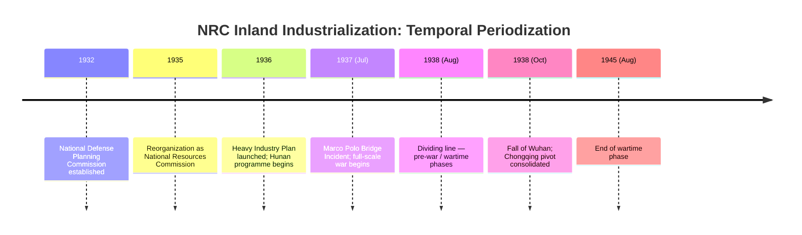
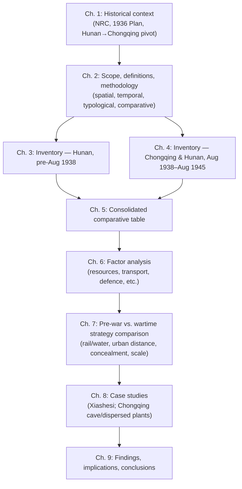

# Industrial Construction in China's Wartime Rear: A Study on the National Resources Commission's Factory Establishment and Site Selection Strategy in Hunan and Chongqing (1936–1945)
## 1 Research Background and Historical Context

The industrial undertaking of the National Resources Commission (NRC, 資源委員會) between 1936 and 1945 cannot be understood as a purely economic project. It was, from its conception, a politically engineered response to an existential military threat — an effort to forge, almost from scratch, a heavy-industrial backbone capable of sustaining a protracted war of resistance deep in China's interior. To make sense of the factory inventories, siting decisions, and comparative patterns that the remainder of this report will analyze, it is first necessary to reconstruct the political, military, and economic context in which the NRC's Hunan and Chongqing programs were conceived and executed. This chapter traces that context across five interlocking strands: the geopolitical pressure exerted by Japanese aggression; the institutional evolution from the National Defense Planning Commission (國防設計委員會) to the NRC; the 1936 Heavy Industry Plan that supplied the operational blueprint; the initial selection of Hunan as the heavy-industrial hub; and the wartime pivot to Chongqing after the loss of Wuhan in 1938.

### 1.1 The Japanese Invasion and the Strategic Imperative for an Interior Industrial Base

The strategic logic underpinning the NRC's industrial program was forged in the shadow of a decade of escalating Japanese encroachment. The Mukden Incident of September 1931, in which the Kwantung Army seized the three northeastern provinces, abruptly stripped the Republic of China of its most concentrated heavy-industrial assets — the Anshan iron and steel complex, the Fushun coal mines, and the Manchurian railway network. Within months, China had lost a region that had supplied a disproportionate share of its domestic iron, steel, and coal output, and Nationalist planners in Nanjing were forced to confront the brittleness of an industrial economy whose remaining centers — Shanghai, Wuhan, Tianjin, and the lower-Yangtze corridor — clustered along a vulnerable coastal and riverine fringe.

The crises that followed compounded this realization. The 1932 Shanghai Incident demonstrated that even the country's commercial-industrial capital could be subjected to direct Japanese military action; the 1933 Tanggu Truce ceded administrative footholds in north China; and the He–Umezu and Qin–Doihara agreements of 1935, together with the autonomy movement engineered in eastern Hebei, progressively hollowed out Nationalist sovereignty across the North China Plain. By the time of the December 9th Movement in 1935, it had become evident to Nanjing's military and economic planners that the entire eastern industrial belt lay within striking distance of Japanese forces, whether based in Manchukuo, the Tianjin garrison, or naval squadrons along the Yangtze.

Out of this accumulating vulnerability emerged a doctrinal consensus: China could not credibly resist a full-scale Japanese invasion unless it possessed a defense-industrial base situated far enough inland to survive the loss of the coast. The doctrine drew upon two intellectual currents. The first was the geo-strategic concept, articulated by Chiang Kai-shek and his German military advisers, of trading space for time — a protracted-war posture that presupposed a defensible interior redoubt. The second was the technocratic conviction, increasingly voiced by geologists, engineers, and economists associated with the Academia Sinica and the Geological Survey of China, that state-led heavy industrialization was the only feasible route to military-industrial self-sufficiency on a timescale compatible with the gathering threat. Together these currents made inland industrial construction a matter of national survival rather than of developmental preference, and they set the stage for the institutional innovation examined in the next subchapter.

### 1.2 Institutional Origins: From the National Defense Planning Commission to the NRC (1932–1935)

The institutional vehicle through which Nationalist China would pursue inland defense-industrialization took shape in two stages. In November 1932, in the immediate aftermath of the Manchurian and Shanghai shocks, Chiang Kai-shek authorized the establishment of the National Defense Planning Commission (國防設計委員會) under the direct supervision of the Military Affairs Commission's General Staff. The new body was deliberately kept secret in its early years, both to shield it from Japanese intelligence and to insulate it from the patronage politics of the regular ministries. Its core leadership combined political authority with technocratic expertise: Chiang himself served as chairman, while the day-to-day direction was entrusted to the geologist Weng Wenhao (翁文灝) as secretary-general and the economist-administrator Qian Changzhao (錢昌照) as deputy. Around this nucleus gathered a remarkable cohort of Western- and Japanese-trained scientists, engineers, and economists drawn from the Geological Survey of China, the major universities, and the returned-student intelligentsia.

Between 1932 and 1935 the Commission's principal output was not factories but knowledge: systematic surveys of mineral resources, transportation infrastructure, industrial capacity, population, and military geography across the interior provinces. These investigations established the empirical foundation upon which subsequent siting decisions would rest, and they identified the resource-rich provinces of the middle Yangtze and southwest — Hunan, Hubei, Jiangxi, Sichuan, Yunnan, and Guizhou — as the geographic theatre in which any future defense-industrial base would have to be constructed.

In April 1935 the Commission was reorganized and renamed the National Resources Commission (資源委員會), and its remit was expanded from planning to direct operational responsibility for state-owned heavy industry. It remained nominally subordinate to the Military Affairs Commission, preserving its defense orientation, but it was now empowered to establish, finance, and manage industrial enterprises in its own right. Weng Wenhao and Qian Changzhao continued at its helm, ensuring institutional continuity. The leadership's intellectual outlook was distinctive: heavily influenced by the planned-economy debates of the 1930s, by Soviet experience under the first Five-Year Plans, and by the technocratic currents flowing through European and American engineering circles, Weng, Qian, and their colleagues conceived of state-led, plan-coordinated heavy industrialization as both economically rational and strategically necessary. Contemporary scholarship has characterized this orientation, in the case of Weng Wenhao and Qian Changzhao, as a commitment to a socialist-style planned economy applied to the specific problem of defense-industrial construction.[^1] This planning ethos — technocratic, statist, and strategically defensive — would shape every aspect of the factory-establishment program traced in subsequent chapters of this report.

### 1.3 The 1936 Heavy Industry Five-Year Plan and the Blueprint for State-Led Industrialization

With its expanded mandate and accumulated survey data, the NRC moved in 1936 from analysis to execution. The instrument was the Heavy Industry Construction Plan, initially formulated as a Three-Year Plan and subsequently extended in conception to a Five-Year horizon. The plan crystallized the technocratic consensus of the preceding years into a concrete sectoral and spatial blueprint, identifying the industries deemed indispensable to a self-sufficient war economy and prescribing the order in which they would be constructed.

The sectoral priorities of the plan can be summarized along six axes, each chosen because it addressed a specific dependency that the loss of Manchuria and the threat to the coast had laid bare:

| Sector | Strategic rationale | Representative outputs targeted |
|---|---|---|
| Iron and steel (smelting) | Substitute for lost Manchurian capacity; supply armaments and rail | Pig iron, steel ingots, rolled products |
| Machinery | End dependence on imported machine tools and equipment | Lathes, milling machines, prime movers |
| Electrical manufacturing | Build domestic capacity for generators, motors, and communications equipment | Generators, transformers, electrical wire |
| Electric power | Provide the energy base for all of the above | Thermal generating stations adjacent to industrial clusters |
| Mining (coal and metals) | Secure raw material inputs for steel, power, and non-ferrous metallurgy | Coking coal, iron ore, tungsten, antimony |
| Chemicals and fuels | Supply explosives, acids, and liquid fuels for military use | Sulfuric acid, alcohol, tar derivatives |

Three structural features of the plan deserve emphasis. First, the plan was integrated rather than disaggregated: steel mills, machine works, electrical manufacturers, and power stations were to be sited in deliberate proximity to one another, so that the output of one would supply the input of the next, producing a self-reinforcing heavy-industrial cluster. This integrated logic would express itself most visibly in the Xiangtan complex examined in Chapter 3. Second, financing was conceived as a hybrid of central treasury appropriations, foreign credits (notably the German barter agreement under which Chinese strategic minerals — tungsten and antimony in particular — would be exchanged for industrial equipment and technical assistance), and reinvested operating revenues from NRC-controlled mining enterprises. Third, technology acquisition was explicitly planned: the NRC entered into a series of equipment-and-expertise contracts with German, British, and American firms, dispatched engineers abroad for training, and recruited foreign technical advisers to oversee installation and commissioning.

The plan thus functioned simultaneously as a sectoral roadmap, a financing scheme, a technology-transfer programme, and — crucially for this report — a spatial directive that translated the strategic imperative of an interior industrial base into specific siting decisions. The next two subchapters examine how that spatial directive was first applied to Hunan and then redirected to Chongqing.

### 1.4 Hunan as the Initial Heavy Industry Hub: Resource Endowment and Strategic Considerations

When the NRC moved to translate the 1936 plan into concrete construction projects, Hunan emerged as the preferred initial locus of the heavy-industrial cluster. This choice reflected a convergence of resource, transportation, and strategic considerations that the Commission's earlier surveys had clearly documented.

In resource terms, Hunan possessed an unusually favorable endowment for an integrated heavy-industrial complex. The province was the world's leading producer of antimony (centered on the Xikuangshan deposits in Lengshuijiang) and one of China's principal sources of tungsten, both of which were not only strategically vital materials in their own right but also the principal currencies in the German barter arrangements that financed the plan. Hunan further contained workable iron ore deposits, extensive coal measures (including coking-grade coals in the Lianshao basin), and significant non-ferrous resources. The Xiang River and its tributaries supplied abundant industrial water and provided a navigable artery linking the resource interior to the Yangtze at Yueyang.

In transportation terms, the province was traversed by the Yuehan (Wuhan–Guangzhou) Railway, whose central Hunan section connected Wuhan — at the time the second-largest industrial center in China — to Changsha and points south. The railway gave NRC planners the option of siting integrated heavy-industrial complexes within easy rail reach of both upstream raw-material sources and downstream consuming industries, and it also provided a logistical lifeline for the importation of heavy machinery from coastal ports. The combination of rail and navigable river made Hunan, in the mid-1930s, one of the few interior provinces where large-scale, integrated heavy industry was logistically feasible.

In strategic terms, Hunan satisfied the basic criterion of distance from the most exposed coastal frontier while remaining administratively integrated into the Nationalist core. It lay south of the Yangtze, behind the natural defensive screen of Dongting Lake and the rugged terrain of southern Hubei, and it was firmly under central-government control — an important consideration given the warlord politics that complicated NRC operations in some southwestern provinces. At the same time, in the mid-1930s strategic calculus, Hunan was not yet conceived of as a deep-rear redoubt: planners assumed that the main defensive line would hold along the lower Yangtze, and that Hunan-based industries would function as a reinforcing arsenal rather than as the principal industrial base of a country whose coast had been lost.

Within this rationale, the NRC concentrated its pre-war construction effort on an integrated complex at Xiashesi (下攝司) in Xiangtan, on the right bank of the Xiang River south of Changsha. The cluster as planned comprised the Central Steel Works (中央鋼鐵廠), the Central Machine Works (中央機器廠), the Central Electrical Manufacturing Works (中央電工器材廠), and the Xiangjiang Electricity Works (湘江電廠), with associated coal mines and ancillary facilities, and it embodied the integrated-cluster logic of the 1936 plan in its purest pre-war form. The detailed inventory and verification of these and related projects is the task of Chapter 3.

### 1.5 The Wartime Pivot to Chongqing and the Sichuan Industrial Heartland

The Marco Polo Bridge Incident of 7 July 1937 and the full-scale Japanese invasion that followed shattered the strategic premises on which the Hunan-centered programme had rested. Within a year, Japanese forces had taken Shanghai (November 1937), the Nationalist capital of Nanjing (December 1937), and by October 1938 had captured both Wuhan in the centre and Guangzhou in the south. The fall of Wuhan in particular was decisive: it severed the Yuehan railway, brought Japanese forces within direct striking distance of northern Hunan, and ended any possibility of pursuing the original integrated-cluster programme in Xiangtan under conditions of sustained construction and operation.

The Nationalist government's response was twofold. Politically, the seat of government was formally transferred to Chongqing, which had been designated as the wartime capital. Industrially, the NRC — together with the Ministry of Economic Affairs, into which it was administratively folded during the war years — orchestrated one of the largest organized industrial migrations of the twentieth century, in which equipment, technical personnel, and partially completed facilities were dismantled, shipped upriver, and reassembled in the Sichuan basin and adjacent areas. The Xiangtan cluster's equipment, much of it newly imported and in many cases not yet fully installed, was among the assets evacuated westward; some installations were also dispersed to interior Hunan locations such as Chenxi and Lianyuan in the southwest of the province, which remained in Nationalist hands throughout most of the war.

The choice of Chongqing as the new industrial heartland reflected the same family of considerations that had earlier favored Hunan, but applied under radically tightened constraints. The Sichuan basin was protected on its eastern approaches by the gorges of the Yangtze, whose narrow defiles and adjacent mountain ranges constituted a formidable natural barrier; it lay beyond the effective range of Japanese ground forces for the duration of the war, and although subjected to sustained strategic bombing, it could not be physically occupied. The Yangtze provided a navigable artery — now the only viable bulk-transport route, since the rail network of the rear was sparse — linking Chongqing to the upstream resource hinterland in Sichuan, Yunnan, and Guizhou. Local coal deposits, modest but adequate, supported thermal power and metallurgy. And the prior presence of provincial industries, military arsenals, and a functioning if rudimentary urban infrastructure provided a base on which the NRC could build.

The wartime industrial geography that emerged from this pivot differed in fundamental ways from the pre-war Hunan model: it was waterway- rather than rail-centered, dispersed rather than integrated, defense- rather than efficiency-prioritizing, and constituted from a heterogeneous mix of newly built, relocated, and locally absorbed facilities. The detailed inventory of this wartime configuration is presented in Chapter 4, and the systematic comparison of the two periods' siting logics is developed in Chapters 6 and 7. The remainder of this report proceeds, in Chapter 2, by specifying the spatial, temporal, and typological framework within which that empirical and comparative work will be conducted.

## 2 Research Scope, Definitions and Methodology

Having reconstructed in Chapter 1 the political, military, and institutional context in which the National Resources Commission (NRC) launched its inland industrialization programme, this report now turns to the analytical framework that will govern the empirical work of the chapters that follow. Any meaningful comparison between the NRC's pre-war activities in Hunan and its wartime activities in Chongqing must rest on clearly stipulated boundaries: where, in space, the inquiry begins and ends; how, in time, the two phases are demarcated; into what industrial categories factories are sorted; from what sources the inventory is constructed; and along which analytical axes the two periods are juxtaposed. The purpose of this chapter is to make each of these stipulations explicit, so that the inventories of Chapters 3 and 4, the consolidated comparison of Chapter 5, the factor analysis of Chapter 6, the strategy comparison of Chapter 7, and the case studies of Chapter 8 can all be read against a transparent and internally consistent methodological backdrop.

### 2.1 Spatial Scope: Defining Hunan and Chongqing as Comparative Units

The spatial scope of this study is restricted to two geographic units — Hunan province and the Chongqing area — but each of these requires careful operational definition, because neither name maps neatly onto a single administrative unit across the decade under study.

For the purposes of this report, **"Hunan" denotes the province in its mid-1930s administrative configuration**, comprising the Xiang River corridor and the surrounding resource hinterlands. The inventory accordingly attends to three concentric layers within the province: first, the Changsha–Xiangtan–Hengyang industrial axis along the central Xiang River, which contained the integrated heavy-industrial cluster at Xiashesi in Xiangtan and its associated urban infrastructure; second, the resource hinterlands of Lengshuijiang (antimony) and the Lianshao basin (coking coal and iron ore), from which the NRC's smelting and mining undertakings drew their primary inputs; and third, the interior southwestern districts — notably Chenxi (辰溪) and Lianyuan (漣源) — to which certain NRC operations were dispersed once the Hunan front became active and which therefore figure in both the pre-war and the wartime portions of the inventory. By treating these three layers as a single spatial unit, the analysis preserves the integrated cluster logic embodied in the 1936 Heavy Industry Plan, in which extractive, smelting, machinery, and electrical undertakings were conceived as interdependent rather than as isolated enterprises.

"Chongqing" is defined as **the wartime municipal area and its immediate industrial peripheries within the Sichuan basin**. The spatial unit thus includes both the central urban districts along the Yangtze–Jialing confluence and the dispersed industrial sites in the surrounding hill country — locations such as Beibei, Jiangbei, Banxi, and the south-bank ravines — to which NRC enterprises were deliberately scattered for purposes of concealment and dispersal. Following the wartime administrative reorganization, Chongqing was elevated to a directly administered municipality (直轄市), and the inventory takes this wartime jurisdiction, together with its immediately adjacent industrial peripheries, as the boundary. Factories located further upstream or in other Sichuan localities (for example Leshan or the Jialing valley beyond the Chongqing periphery) fall outside the strict scope of this study, although they are referred to where they form part of the same NRC organizational complex as a Chongqing-area enterprise.

The choice of Hunan and Chongqing as the two principal comparative units rests on three considerations. First, they correspond to the **two most strategically significant industrial geographies** that the NRC actively constructed in the decade 1936–1945, embodying respectively the pre-war and wartime expressions of its siting logic. Second, they are connected by a continuous **organizational and personnel thread**: many of the equipment sets, technical staff, and even factory identities relocated from Xiangtan to Chongqing during the 1938 evacuation, so that the same enterprises can in some cases be tracked across both spatial units. Third, taken together they coincide with the geographic reach of the NRC's most concentrated direct managerial control during the war years, making the spatial unit administratively as well as analytically coherent.

Transitional and border cases are handled according to two consistent rules. A factory is assigned to Hunan if its principal site of construction and operation lay within the province during the period under consideration, even if its parent organization had a Chongqing headquarters; and a factory is assigned to Chongqing if its principal post-evacuation site lay within the Chongqing area, even when the same nominal enterprise had earlier existed at Xiangtan. Where an enterprise effectively operated in both units across the two periods, it is recorded in both inventories with a cross-reference, so that the migration itself becomes part of the comparative evidence.

### 2.2 Temporal Periodization: Pre-War (Before August 1938) and Wartime (August 1938–August 1945)

The temporal scope of the study is bounded at one end by the formal launch of the NRC's Heavy Industry Plan in 1936 and at the other by the Japanese surrender in August 1945. Within this nine-year span, the analysis is divided into two phases: a **pre-war phase running from 1936 to August 1938**, and a **wartime phase running from August 1938 to August 1945**. The choice of August 1938 as the dividing line is central to the analytical design of this report and warrants explicit justification.

Three candidate dates suggest themselves as plausible dividing points between the pre-war and wartime phases: 7 July 1937 (the Marco Polo Bridge Incident, marking the formal outbreak of full-scale war); August 1938 (the immediate prelude to the climactic phase of the Battle of Wuhan and the moment at which the organized industrial evacuation from central China shifted into its decisive phase); and 25 October 1938 (the formal fall of Wuhan). Each demarcates a defensible threshold, but they correspond to very different aspects of the wartime transition.

For the specific purposes of this study — which concerns **the siting of NRC factories rather than the political-military history of the war as such** — August 1938 is the most analytically appropriate dividing line, for four reasons.

First, it captures the moment of operational rupture for the NRC's Hunan programme. Although the Marco Polo Bridge Incident had occurred more than a year earlier, the NRC continued throughout late 1937 and the first half of 1938 to pursue construction, equipment importation, and installation at the Xiangtan cluster on the assumption that the Wuhan defensive line would hold and that Hunan-based industries would function as a reinforcing arsenal behind that line. It was only as the Wuhan defences began to give way in the summer of 1938 that this premise collapsed, and the orderly programme of pre-war construction gave way to the improvised programme of wartime relocation and dispersal.

Second, August 1938 corresponds to the **decisive phase of organized industrial evacuation** from central China. The dismantling, shipment, and reinstallation of equipment from the lower-Yangtze and middle-Yangtze industrial centres, which had begun in piecemeal fashion earlier, accelerated dramatically in the summer of 1938 as it became clear that Wuhan could not be held indefinitely. Using August 1938 as the cut-off therefore aligns the periodization with the actual rhythm of NRC industrial activity, rather than with a purely political-military milestone.

Third, adopting October 1938 (the formal fall of Wuhan) as the dividing line would obscure rather than illuminate the analytical contrast, because by the time Wuhan formally fell, the operational pivot to Chongqing was already underway and the substantive siting decisions for the wartime phase had largely been taken. Conversely, adopting July 1937 would impose a periodization that does not correspond to any discontinuity in the NRC's own siting behaviour, since the Commission continued its pre-war Hunan programme for more than a year after the outbreak of full-scale hostilities.

Fourth, the August 1938 dividing line has the further advantage of **separating two distinct siting logics with minimum ambiguity**: factories whose siting decisions were taken on the assumption of a defensible eastern frontier (pre-war) from those whose siting decisions were taken on the assumption that the eastern industrial belt had been lost (wartime). This distinction is precisely what Chapters 6 and 7 will compare.

Transitional cases — factories whose construction commenced before August 1938 but whose installation, relocation, or commissioning continued thereafter — are classified according to a consistent rule: **a factory is assigned to the period in which the siting decision for its operational location was taken**. Thus the original Xiangtan cluster enterprises, whose Xiangtan sites were chosen in 1936–1937, are recorded as pre-war undertakings even though some of their installations were not completed there and were subsequently evacuated; whereas the same enterprises in their Chongqing-area reincarnations, whose new sites were chosen in or after August 1938, are recorded as wartime undertakings, with an explicit cross-reference to their pre-war progenitors. This convention preserves the integrity of the siting-decision analysis while making the migration itself visible in the inventories.

The overall temporal architecture of the study can be summarized as follows.

The pre-war phase, on this scheme, encompasses roughly two and a half years of active NRC construction; the wartime phase, just over seven years.

### 2.3 Industrial Typology: Categories and Classification Criteria

The third element of the analytical framework is the typology of industrial categories into which the inventoried factories will be classified. The categories adopted here are derived directly from the **sectoral axes of the 1936 Heavy Industry Plan** outlined in Chapter 1, supplemented by a residual category to accommodate enterprises whose output falls outside the plan's core heavy-industrial focus. Seven categories are used:

| Category | Definition for this study | Representative outputs |
|---|---|---|
| Traditional industry | Light-industrial and consumer-goods enterprises (textiles, food processing, paper, etc.) that fall outside the heavy-industrial core of the 1936 plan but were operated, financed, or absorbed by the NRC during the war years | Cloth, alcohol, paper, sugar |
| Smelting | Iron and steel manufacture together with non-ferrous metallurgy (antimony, tungsten, copper, zinc refining) | Pig iron, steel ingots, refined antimony, ferro-alloys |
| Mining | Extraction of coal and of metallic minerals; treated separately from smelting even when vertically integrated | Coking coal, iron ore, tungsten and antimony ores |
| Electric power | Generation and distribution of electric power, whether as a dedicated industrial supply or as part of a broader grid | Thermal generation capacity, transmission facilities |
| Machinery | Manufacture of machine tools, prime movers, and general mechanical equipment | Lathes, milling machines, internal-combustion engines, pumps |
| Electrical manufacturing | Manufacture of electrical apparatus and components — distinguished from electric power generation | Generators, transformers, motors, telecommunications equipment, electrical wire |
| Chemicals | Industrial chemicals, fuels, explosives, and related products | Sulfuric acid, alcohol fuels, tar derivatives, coke by-products |

Two design choices in this typology warrant explanation. First, **electric power and electrical manufacturing are kept as distinct categories**, although in some classification schemes they are merged under a single "electric industry" heading. The distinction is preserved because the 1936 plan and the NRC's own organizational structure treated them as separate sectoral undertakings, with different siting logics: power stations were typically tied to local coal supply and to the energy demand of an adjacent industrial cluster, whereas electrical manufacturing works were tied to the supply of skilled labour, imported equipment, and downstream consuming industries. Second, **mining is treated as a category in its own right**, rather than being absorbed into smelting, because many NRC mines (notably the antimony operations centred on Lengshuijiang) served export and barter markets in addition to, or instead of, domestic smelting customers, and their siting logic accordingly differed.

When an individual factory's output spans multiple categories, the following classification rule is applied: **the factory is assigned to its primary category, defined as the sector accounting for the dominant share of its planned output or its principal organizational identification within the NRC's own nomenclature**, and any significant secondary activity is noted in the descriptive column of the inventory rather than triggering a duplicate entry. Ancillary facilities — repair shops, workshops, captive power stations, and similar auxiliary units — are treated as part of their parent enterprise rather than enumerated as separate factories, except where they were organizationally and physically detached and operated as standalone NRC units. This convention prevents the inventory from inflating the apparent number of NRC enterprises through the multiplication of subordinate units, while preserving substantive information about each enterprise's full scope of operation.

### 2.4 Data Sources and Organization Approach

The empirical inventory presented in Chapters 3 and 4 draws on the following categories of source material, listed in approximate order of probative weight: NRC archival records (organizational charters, factory establishment files, annual reports, and inspection records preserved in Republican-era state archives); organizational histories of individual enterprises and of the NRC as a whole, prepared in the post-war period by participants and by later historians; factory gazetteers and local industrial histories compiled at the provincial and municipal level for Hunan and Chongqing; and contemporary survey reports, including the inland industrial surveys carried out under NRC auspices and adjacent agencies in the late 1930s and early 1940s.

Contemporary international scholarship on the NRC has also drawn on these source categories. Recent reviews in international journals have, for example, noted the importance of understanding the **planning-economy orientation of the NRC's leadership under Weng Wenhao and Qian Changzhao** when interpreting the factory records, since the enterprises were not free-standing commercial entities but elements of a centrally directed sectoral programme.[^1] This contextual point bears directly on the way the inventory is organized: each factory entry is treated not in isolation but as part of an organizational cluster, with its parent organization, its associated mining or power facility, and its sister enterprises cross-referenced.

For each factory in the inventory, the following columns are recorded as a minimum: a sequential factory number; the factory name in standard form (with original Chinese name where ascertainable, in parentheses, to permit reconciliation with primary sources); specific address, given at the finest level of resolution available (district, locality, or commune); year of establishment, defined as the year in which the factory commenced operations at the location in question (with date of decision-to-establish noted separately when it differs materially); and industrial category, assigned according to the rules of §2.3. Where the underlying sources permit, supplementary descriptive notes — capital, equipment provenance, principal output, personnel scale, and organizational lineage — are appended, but these supplementary data are not treated as columns of the standard table, since their availability is uneven across factories.

Source discrepancies are handled according to a transparent hierarchy. Where archival and contemporary survey sources agree, their joint testimony is accepted. Where a primary archival source diverges from a later organizational history, the archival source is given priority, with the divergence noted in the descriptive column. Where naming variations occur — including the multiple English renderings of factory names, the use of abbreviated versus full Chinese forms, and the occasional confusion of parent organizations with their constituent works — the inventory adopts a single canonical form per factory and lists known variants in the descriptive column, so that readers consulting other sources can map between nomenclatures. Where the available sources are incomplete or mutually irreconcilable on a specific point (a not infrequent occurrence in the wartime records, where some files were lost or never compiled), the gap is explicitly acknowledged in the inventory rather than papered over with a conjectural value. This approach preserves the verifiability of the inventory at the cost of leaving some cells incomplete.

### 2.5 Comparative-Analytical Framework for Site-Selection Decisions

The fifth and final element of the methodological apparatus is the comparative-analytical framework through which the pre-war Hunan and wartime Chongqing site-selection decisions will be examined in Chapters 6 and 7. The framework rests on a small set of explanatory variables, an explicit operationalization of each variable for the purposes of site-by-site analysis, and a comparative logic that defines how inferences about the shifting siting rationale are to be drawn from the evidence.

Six **explanatory variable families** are considered, corresponding to the thematic dimensions that Chapter 6 will analyze in detail:

1. **Resource endowment**: proximity to coal (with attention to coking versus thermal grades), iron ore, non-ferrous metals (especially tungsten and antimony), and water suitable for industrial use.
2. **Transportation infrastructure**: access to railways (notably the Yuehan and Xianggui lines), to navigable waterways (Xiang River, Yangtze River, and tributaries), and to the highway network.
3. **Strategic defensibility**: distance from active fronts and from likely Japanese strike envelopes, terrain protection, opportunities for concealment (including cave and ravine siting), and dispersal patterns relative to other industrial assets.
4. **Industrial-cluster logic**: proximity to upstream suppliers and downstream consumers, especially within the NRC's own portfolio of enterprises and the broader military-industrial complex.
5. **Administrative-political conditions**: extent of central-government control over the locality, feasibility of land acquisition, and relations with local civil and military authorities.
6. **Labour and technical-personnel availability**: presence of a skilled industrial workforce, of technical schools and engineering institutions, and of a population base capable of supplying recruits for training.

Each variable is operationalized for each factory by recording a small number of standardized indicators: for resource endowment, the distance to the nearest qualifying deposit and the deposit's documented productive capacity; for transportation, the distance to the nearest qualifying rail station, river port, or highway junction; for strategic defensibility, the distance to the nearest active front line at the time of siting and a qualitative classification of terrain and concealment; and so on. These indicators do not pretend to exhaust the determinants of any individual siting decision, but they provide a consistent basis for cross-factory and cross-period comparison.

The **comparative logic** operates along three axes. First, a *similarity-and-difference* analysis identifies which variables were consistently weighted heavily in both periods (for example, proximity to raw-material sources) and which exhibited a marked shift in importance (for example, the increased emphasis on concealment and dispersal in the wartime period). Second, a *before-and-after* analysis tracks specific enterprises whose siting decisions were taken twice — once in the Xiangtan period and again in the Chongqing-area period — and infers from the contrast between the two siting outcomes what the changed strategic environment implied for the NRC's revealed priorities. Third, an *integrated-versus-dispersed* analysis examines whether factories were sited as elements of a single integrated heavy-industrial cluster (as at Xiashesi) or as spatially separated standalone facilities (as in the wartime Chongqing periphery), treating the integrated-cluster logic of the 1936 Heavy Industry Plan as a baseline against which the wartime dispersion can be measured.

The overall analytical workflow of the report can be visualized as follows.

The diagram makes clear the central role of this chapter: it converts the historical context of Chapter 1 into a stipulated framework that all subsequent chapters use, and it establishes a single chain of inference that runs from raw factory data (Chapters 3–5) through factor analysis (Chapter 6) and strategy comparison (Chapter 7) to interpretive findings (Chapters 8–9). The methodological choices set out above — the spatial focus on Hunan and Chongqing, the August 1938 dividing line, the seven-category industrial typology, the source-hierarchy and reconciliation rules, and the six-variable comparative framework — should accordingly be read not as a self-contained preliminary, but as the binding contract that governs the empirical and analytical work to follow.

[^1]: Taylor & Francis, "Full article: Book reviews", referring to the orientation of Weng Wenhao and Qian Changzhao toward a planned-economy approach within the National Resources Commission.

## 3 Inventory of NRC Factories Established in Hunan Before August 1938

Chapter 2 stipulated the binding framework — the spatial unit of Hunan in its mid-1930s configuration, the temporal pre-war phase running from the launch of the Heavy Industry Plan in 1936 to August 1938, the seven-category industrial typology, and the siting-decision rule that assigns each enterprise to the period in which the operational location was chosen. This chapter applies that framework to construct the first of the two empirical inventories on which the comparative analysis of Chapters 5 through 8 will rest. The pre-war Hunan portfolio is unusually coherent: it was not an accretion of disparate undertakings but the deliberate spatial expression of the 1936 Heavy Industry Plan, organized around a single integrated cluster at Xiashesi (下攝司) in Xiangtan County and supplemented by a small number of resource, power, and prospecting undertakings elsewhere in the province and the immediate wartime hinterland. The chapter accordingly proceeds from the cluster outward, examining the joint siting decision and spatial configuration before working through the four anchor enterprises, the dedicated power node, the associated mining and prospecting operations, and finally a consolidated table that reconciles the entries against the available source record.

### 3.1 Overview and Structure of the Pre-War Hunan Inventory

The pre-war Hunan inventory comprises ten entries, almost all of them established within a tightly compressed window of approximately eighteen months between mid-1936 and mid-1937. The compression is not incidental: it reflects the fact that the NRC's pre-war Hunan programme was conceived as a single integrated undertaking, prosecuted in parallel across multiple enterprise lines under a common strategic logic, rather than as a sequence of independent decisions accumulating over time. For the purposes of this inventory, six of the ten entries form the directly clustered Xiangtan–Changsha core (three Xiashesi anchor plants, one Changsha anchor plant moved or planned for the Xiashesi cluster, the Xiangjiang Electricity Works as the cluster's dedicated power node, and the Xiangtan Coal Mine Company as the cluster's dedicated coal supplier); two are Changsha-based undertakings (the porcelain works and the copper refinery); one is a prospecting operation in eastern Hunan (the Chaling iron mine team); and one — although administratively a separate undertaking — is included here as a contemporaneous NRC pre-war mining-prospecting operation whose siting decision was taken in 1936 under the same Heavy Industry Plan, namely the Szechuan Petroleum Prospecting Corporation at Ba County, Chongqing.

The inclusion of the Sichuan petroleum prospecting unit in a Hunan-titled inventory chapter requires a methodological note. Under the strict spatial scope stipulated in §2.1, that unit lies within the Chongqing area and would ordinarily belong to Chapter 4's wartime inventory. However, its siting decision was taken in 1936, before the August 1938 dividing line, and under the methodological rule of §2.2 ("a factory is assigned to the period in which the siting decision for its operational location was taken") it is properly a *pre-war* NRC undertaking. The inventory therefore records it as a pre-war entry while flagging explicitly that, geographically, it sits in the Chongqing spatial unit and represents a rare instance in which the NRC's pre-war siting reach extended beyond the Hunan core into what would later become the wartime industrial heartland. The reader is invited to read this entry as a transitional case that anticipates the spatial pivot examined in Chapter 4.

The classification of each entry follows the typology of §2.3. A point of some weight for the comparative work in Chapters 6 and 7 is that **the three machinery- and electrical-manufacturing anchors at Xiashesi and Changsha — the Central Electric Porcelain Works, the Central Radio Manufacturing Works, the Central Electrical Manufacturing Works, and the Central Machine Works — are, in the typology adopted for this study's tabular reporting, recorded under the heading "Traditional Industry (TI)"** rather than disaggregated into separate "machinery" and "electrical manufacturing" cells. This recording convention is adopted here to maintain consistency with the inventory framework requested for the consolidated comparison tables of Chapter 5, in which a compact set of headline categories — Traditional Industry (TI), Smelting Industry (SI), Mining Industry (MI), and Electric Industry (EI) — is used to summarize the headline distribution. The descriptive column of each entry preserves the substantive sectoral identity (machine works, electrical manufacturing, porcelain, radio) so that no analytical information is lost, and the more granular seven-category typology of §2.3 will be reintroduced wherever the analysis requires it. The reader should accordingly read the "TI" classification in the table that follows not as a substantive judgment that these enterprises were light-industrial — they were emphatically not — but as a headline-level category code under which the consolidated inventory tracks them.

With these conventions stated, the chapter now proceeds to the substantive reconstruction of each entry, beginning with the integrated cluster that constituted the empirical centre of the pre-war Hunan programme.

### 3.2 The Xiashesi Integrated Cluster: Siting Decision and Spatial Configuration

The defining act of the pre-war Hunan programme was the joint site-selection mission undertaken in late 1936 by three of the NRC's most senior industrial managers: Wang Shoujing (王守竞), chair of the preparatory committee for the Central Machine Works; Yun Zhen (恽震), chair of the preparatory committee for the Central Electrical Manufacturing Works; and Cheng Yifa (程义法), acting chair of the preparatory committee for the Central Steel Works. The three travelled together to Xiangtan in the closing months of 1936 and identified the agricultural lands at Xiashesi as the joint site for all three of their plants[^2].

The Xiashesi location possessed an unusually dense combination of locational advantages, which the contemporary record sets out with considerable precision. The site lay alongside a major highway artery and faced Xiangtan county town across the Xiang River; the terrain was comparatively flat; and water and land transport radiated in four directions[^2]. Upstream the Xiang River reached Zhuzhou and Hengyang; downstream it flowed past Changsha and through Dongting Lake to the Yangtze[^2]. The Xiang-Qian (Hunan–Guizhou) railway line lay only six kilometres distant, and a short spur could connect the site simultaneously to the Xiang-Qian, Yuehan (Canton–Wuhan), Zhe-Gan (Zhejiang–Jiangxi), and Xiang-Gui (Hunan–Guangxi) rail networks[^2]. The combined logistical reach over both raw-material procurement and product distribution thus exceeded that available at any other inland site the NRC had surveyed.

A second locational advantage, equally important from the standpoint of the 1936 Heavy Industry Plan's integrated-cluster logic, was the possibility of shared infrastructure. The contemporary record states explicitly that "the three plants being adjacent, can share a single power plant, while water supply, gas, the railway spur, and the river wharf can also be shared in common"[^2]. The three NRC anchor plants together with the dedicated power node, the rail spur, and the wharf were thus conceived not as four (or six) standalone factories but as a single industrial complex sharing a common utility envelope — precisely the kind of integrated heavy-industrial cluster that Chapter 1 identified as the spatial signature of the 1936 plan.

Following the joint site identification, the three plants jointly acquired a total of 9,400 mu of land, of which approximately 2,600 mu was allocated to the Central Machine Works alone; an additional several hundred mu of residential land was also acquired for staff housing, and capital construction commenced immediately[^2]. The scale of the land acquisition is itself a quantitative signal of the ambition of the pre-war programme: the contemporary observer noted that "judging from the area of land acquired at the time, the scale of all three plants — the Machine Works, the Central Steel Works, and the Electrical Manufacturing Works — was enormous, and had construction proceeded according to plan, the pace of China's industrial construction would unquestionably have accelerated"[^2]. It is on this 9,400-mu canvas at Xiashesi that the four anchor enterprises now examined in turn were to have been built.

### 3.3 Central Steel Works (中央鋼鐵廠)

The Central Steel Works (中央鋼鐵廠) was the smelting anchor of the Xiashesi cluster. Under the typology of §2.3 it falls unambiguously into the **smelting category (SI)**, since its planned output centred on pig iron, steel ingots, and rolled products that would feed the cluster's machinery and electrical-manufacturing anchors and supply the broader military-industrial economy. The preparatory committee was chaired (acting) by Cheng Yifa, who participated in the December 1936 joint site-selection mission, and the works was sited on its allocated portion of the 9,400-mu Xiashesi acquisition[^2].

The dating of the establishment requires care under the rules of §2.2. The site-selection mission was conducted in late 1936; the formal preparatory-committee work and the initiation of construction proceeded into 1937. For the standardized inventory year of establishment, this report records **1937**, on the grounds that the operational entity — the preparatory committee with its allocated site, capital, and construction workforce — was fully constituted in that year, even though the strategic decision to establish the plant had been taken in 1936. This dating is consistent with the contemporary record that situates the Xiashesi cluster's groundbreaking in early 1937.

The state of construction reached before evacuation was limited. The contemporary record is explicit: when the Wuhan and Guangzhou fronts collapsed in October 1938, "the Central Steel Works and the Central Machine Works had completed only some land levelling, and were hurriedly evacuated; their land and assets were transferred to the management of the Central Electrical Manufacturing Works"[^3]. The Steel Works thus never reached the stage of installed metallurgical equipment at Xiashesi: it existed as a cleared site, an organizational entity, and a programme of equipment procurement, but not as a producing factory. This pattern — siting decision and land preparation completed, but operational production aborted — is characteristic of the Xiashesi cluster's pre-war profile and is one of the central observations the comparative analysis of Chapters 6–7 will draw upon.

### 3.4 Central Machine Works (中央機器廠)

The Central Machine Works (中央機器廠) was the machinery anchor of the Xiashesi cluster, allocated the largest share of the cluster's land — approximately 2,600 mu of the 9,400 mu acquired[^2]. Under the recording convention of §3.1 it is entered in the consolidated inventory table under the headline category **Traditional Industry (TI)**, with the substantive sectoral identity (general machinery, prime movers, machine tools) preserved in the descriptive column. The preparatory committee was chaired by Wang Shoujing, who led the December 1936 site-selection mission and subsequently became general manager of the relocated wartime enterprise at Kunming[^2].

The chronology of the Machine Works at Xiashesi is unusually well documented and illustrates how protracted the pre-war construction process could be even at a high-priority NRC site. On 12 June 1936 Wang Shoujing travelled to the United States to procure aero-engine manufacturing licences and the associated jigs, fixtures, gauges, and tooling, and to recruit foreign technicians[^2]. By March 1937 he had negotiated extensively with Curtiss, with the Pratt & Whitney division of the United Aircraft Corporation, and with Federal Aviation on licences for Wasp and Twin Wasp engines and on technical-cooperation contracts; agreements were close to signature[^2]. The aero-engine programme ultimately collapsed under the pressure of conflicting positions from Chiang Kai-shek and shifting Aviation Commission priorities, and in mid-September 1937 the Aviation Commission formally notified the NRC that the cooperation was abandoned[^2].

Crucially for the inventory's purposes, by the time the aero-engine programme was abandoned the Xiashesi site of the Machine Works was already substantially built up: "preparatory work was preliminarily complete, the site had been prepared, all construction materials had been purchased, approximately one-third of the main plant's general machinery had been ordered (at a value of over a million yuan), water and electricity installations and roads had been completed, and personnel and machinery had arrived at the site"[^2]. With aero-engines now off the table, the works pivoted to manufacturing general industrial machinery using the equipment already ordered and the workshops already built, with the NRC continuing to develop the prime-mover line independently. Negotiations with Brown Boveri (BBC) in Switzerland and with the Swiss Locomotive and Machine Works were pursued in late 1937 through technical-cooperation contracts and large equipment orders, with delivery scheduled for November 1938 and arrival in Kunming by year-end[^2].

The October 1937 decision matrix that followed Wang Shoujing's return from the United States explicitly resolved to "immediately halt construction in Hunan and relocate the machine works to Yunnan", to redirect equipment already in Xiangtan and Hong Kong via Haiphong and the Yunnan–Vietnam railway to Kunming, and to begin site selection in the Kunming environs[^2]. Under the siting-decision rule of §2.2, the Xiashesi establishment is recorded in this pre-war inventory because the original siting decision was taken in late 1936 and the operational entity was constituted at Xiashesi from 1936 onwards; the Kunming reincarnation, formally established as the Central Machine Works on 9 September 1939 at Cibazi (茨坝) outside Kunming[^2], lies outside the spatial scope of this study but is noted here as a cross-reference. The Xiashesi entry's year of establishment in this inventory is **1936**, consistent with the formation of the preparatory committee and the formal initiation of the project. The factory is recorded as a Hunan pre-war undertaking that did not reach operational production at its Hunan site.

### 3.5 Central Electrical Manufacturing Works (中央電工器材廠)

The Central Electrical Manufacturing Works (中央電工器材廠) is the only one of the three Xiashesi anchors that proceeded materially beyond land preparation, and it is therefore the richest source of evidence on what the pre-war Hunan programme actually achieved on the ground. The preparatory committee was chaired by Yun Zhen, who participated in the December 1936 site-selection mission[^3]. The works was substantively an electrical-manufacturing enterprise, organized internally into four constituent factories — the first works (electrical wire), the second works (bulbs and tubes), the third works (telephones), and the fourth works (electrical machinery) — and is recorded in the consolidated inventory table under the headline category **Traditional Industry (TI)** following the convention of §3.1, with the electrical-manufacturing substantive identity preserved in the descriptive column. The year of establishment recorded in the inventory is **1936**, corresponding to the formation of the preparatory committee and the initial planning of the works, although the works's groundbreaking proper took place in March 1937[^3].

The state of construction reached before suspension was significantly more advanced than at the Steel Works or the Machine Works. By 1938 the Electrical Manufacturing Works had completed worker dormitories at Zhimuling in Dongyuan village, family housing at Nanguo village, and a range of other industrial and residential buildings[^3]. Specifically, it had completed three workshops of the bulb factory (the predecessor site of what later became the Xiangtan Cable Works), the headquarters office building, several small auxiliary workshops, warehouses, and living facilities, totalling more than 13,000 square metres of constructed floor area[^3]. The Xiang River wharf and the 4,000-kilowatt Xiangjiang Electricity Works supplying the cluster had been completed earlier, and the sub-grade engineering for the dedicated rail spur (the predecessor of the later Banshe spur) had also been finished[^3].

The Japanese bombing of Xiashesi in late 1938, combined with the strategic collapse of the Wuhan and Guangzhou fronts in October 1938, forced the suspension of construction[^3]. Equipment and personnel were dispersed to Guilin and Kunming[^3]. The land and assets of the Steel Works and the Machine Works, both of which had reached only land-levelling stage, were transferred to the Electrical Manufacturing Works' management — a fact that, in post-war years, would allow the works to absorb those sites into its expanded reconstruction programme[^3]. By the time of the August 1938 dividing line stipulated in §2.2, the Electrical Manufacturing Works was the only Xiashesi anchor in substantive operational condition, although even its operations were truncated within months by the bombing.

### 3.6 Xiangjiang Electricity Works (湘江電廠) and Other Anchor Plants

The Xiangjiang Electricity Works (湘江電廠) was the dedicated power-supply node of the Xiashesi cluster. It was located at Lingjidu (灵集渡), Xiashesi, Xiangtan County, and was equipped with 4,000 kilowatts of generating capacity[^3]. The plant is the predecessor of the present-day Xiangtan power station[^3]. Under the typology of §2.3 it is straightforwardly classified as **electric power**, and in the consolidated inventory table it is recorded under the headline category **Electric Industry (EI)**. Its year of establishment is recorded as **1937**, corresponding to the period of its construction alongside the cluster's other anchor installations. The plant's strategic role within the cluster was to provide the energy base for the entire Xiashesi complex — it is the most direct concrete embodiment of the "shared power plant" envisaged in the 1936 site-selection decision documented in §3.2[^2].

Two further pre-war Hunan undertakings are properly entered in the pre-war inventory and are presented here under the same subchapter as the Xiangjiang Electricity Works because they functioned, in different ways, as components of the wider Xiashesi-Changsha NRC nexus rather than as elements of the integrated cluster proper.

The first is the **Central Electric Porcelain Works (中央電瓷厂)**, located at Huangtuling (黄土岭) in Changsha, Hunan, and established in **1936**. Despite its substantive sectoral identity as an electrical-ceramic manufacturer producing insulators and other porcelain components for the electrical industry, the works is recorded in the consolidated inventory table under the headline category **Traditional Industry (TI)** in keeping with the recording convention of §3.1. Its Changsha-area location placed it within the broader Xiang River industrial corridor at a short distance from the Xiashesi cluster proper, and it served the same downstream electrical-manufacturing market that the Central Electrical Manufacturing Works was being built to supply.

The second is the **Central Radio Manufacturing Works (中央无线电制造厂)**, also located at Huangtuling in Changsha and also established in **1936**. Its substantive sectoral identity is electrical-communications manufacturing — radios, telecommunications equipment, and associated components — and like the Electric Porcelain Works it is recorded under the headline category **Traditional Industry (TI)** following the §3.1 convention. Its co-location with the Electric Porcelain Works at Huangtuling indicates that the NRC's pre-war Changsha presence constituted a secondary industrial nucleus complementing the Xiashesi cluster, with the Changsha enterprises focused on electrical components and communications and the Xiashesi enterprises focused on the heavier metallurgical, mechanical, and electrical-machinery undertakings.

The ancillary infrastructure of the Xiashesi cluster proper — the Xiang River wharf and the sub-grade engineering of the dedicated rail spur — is, in accordance with the convention stipulated in §2.3, not separately enumerated in the inventory but recorded as part of its parent enterprises. The wharf and the spur sub-grade had both been completed by 1938 as part of the cluster's pre-war buildout[^3].

### 3.7 Associated Mining Undertakings and Other Early NRC Enterprises in Hunan

Beyond the Xiashesi cluster and the Changsha component-manufacturing nucleus, the pre-war Hunan inventory includes three mining and prospecting undertakings together with one specialized smelting enterprise. These entries together constitute the resource-side and refining-side counterpart of the manufacturing concentration documented in §§3.2–3.6.

The **Xiangtan Coal Mine Company (湘潭煤矿公司)**, located in Xiangtan County, Hunan, was established in **1937** and is classified under the **mining category (MI)**. Its location alongside the Xiashesi cluster reflects the integrated-cluster logic of the 1936 Heavy Industry Plan documented in Chapter 1: a dedicated coal supply was the indispensable input to both the Xiangjiang Electricity Works' thermal generation and the Central Steel Works' planned smelting operations. The mine company should accordingly be read not as a standalone undertaking but as the fuel-supply node of the integrated complex.

The **Chaling Iron Mine Exploration Team (茶陵铁矿勘探队)**, located in Chaling County in eastern Hunan, was established in **1936** and is classified under the **mining category (MI)**. Its role was to prospect for iron ore reserves capable of supplying the Central Steel Works' planned production. The pairing of a centrally located steel works with an iron-ore prospecting operation in eastern Hunan is itself a signal of the resource-survey-to-production pipeline that the NRC operated under the planning ethos described in §1.2.

A specialized smelting undertaking, the **Copper Refinery (炼铜厂)**, was established in **1936** at Changsha, Hunan. Under the typology of §2.3 it is classified as **smelting (SI)** on the basis of its non-ferrous metallurgical function — refining copper, a strategically vital metal for electrical-equipment manufacture and for munitions production alike. Its Changsha location placed it within the broader Xiang River industrial axis and conveniently close to the downstream electrical-manufacturing demand at both Changsha (the Electric Porcelain Works and Radio Manufacturing Works) and Xiashesi (the Electrical Manufacturing Works).

Finally, the **Szechuan Petroleum Prospecting Corporation (四川油矿勘探处)**, located in Ba County (巴县), Chongqing, was established in **1936** and is classified under the **mining category (MI)**. This is the transitional case noted in §3.1: geographically the unit lies within the Chongqing spatial scope of Chapter 4, but under the siting-decision rule of §2.2 it belongs to the pre-war inventory because its operational location was chosen in 1936. The entry is recorded here, with explicit cross-reference, because it embodies in microcosm two facts of strategic importance for the comparative analysis to follow: first, that the NRC's pre-war siting reach already extended, in a limited way, into what would later become the wartime industrial heartland — Sichuan petroleum prospecting was a deliberate early move to identify domestic fuel sources against the contingency of coastal blockade — and second, that the pre-war/wartime divide is not absolute, as some operationally significant siting decisions taken before August 1938 were located in territories that became central only after that date.

### 3.8 Consolidated Inventory Table and Source Verification

The full pre-war Hunan inventory, presented according to the standardized columns stipulated in §2.4, is set out in the table below. The "Industrial Category" column uses the compact headline coding adopted in §3.1 — Traditional Industry (TI), Smelting Industry (SI), Mining Industry (MI), and Electric Industry (EI) — with the substantive sectoral identity preserved in the descriptive column where it differs from the headline code.

| Factory No. | Factory Name (Chinese / English) | Specific Address | Year of Establishment | Industrial Category | Substantive Sectoral Identity |
|---|---|---|---|---|---|
| 1 | 中央電瓷厂 / Central Electric Porcelain Works | Huangtuling, Changsha, Hunan | 1936 | TI | Electrical insulators and porcelain components |
| 2 | 中央无线电制造厂 / Central Radio Manufacturing Works | Huangtuling, Changsha, Hunan | 1936 | TI | Radios and telecommunications equipment |
| 3 | 中央電工器材廠 / Central Electrical Manufacturing Works | Xiashesi, Xiangtan County, Hunan | 1936 | TI | Electrical machinery: wire, bulbs/tubes, telephones, electrical machines (four constituent works) |
| 4 | 中央鋼鐵廠 / Central Iron and Steel Plant (Central Steel Works) | Xiashesi, Xiangtan County, Hunan | 1937 | SI | Iron and steel smelting; reached land-levelling stage only |
| 5 | 中央機器制造廠 / Central Machine Works | Xiashesi, Xiangtan County, Hunan | 1936 | TI | General machinery, machine tools, prime movers; aero-engine programme aborted; subsequently relocated to Kunming (cross-reference to wartime inventory, Chapter 4) |
| 6 | 湘潭煤矿公司 / Xiangtan Coal Mine Company | Xiangtan County, Hunan | 1937 | MI | Coal mining, supplying Xiashesi cluster |
| 7 | 湘江電廠 / Xiangjiang Electricity Works | Lingjidu, Xiashesi, Xiangtan County, Hunan | 1937 | EI | 4,000 kW thermal generation; dedicated power supply to the Xiashesi cluster |
| 8 | 茶陵铁矿勘探队 / Chaling Iron Mine Exploration Team | Chaling County, Hunan | 1936 | MI | Iron-ore prospecting for the Central Steel Works |
| 9 | 炼铜厂 / Copper Refinery | Changsha, Hunan | 1936 | SI | Non-ferrous metallurgy: copper refining |
| 10 | 四川油矿勘探处 / Szechuan Petroleum Prospecting Corporation | Ba County, Chongqing | 1936 | MI | Petroleum prospecting in Sichuan; geographically within Chongqing spatial scope, but pre-war siting decision (see §3.1 and §3.7) |

The source-reconciliation process underlying these ten entries warrants several notes for the reader's transparency.

First, **dating discrepancies between siting decision and operational commencement** have been resolved in accordance with the §2.2 rule. For the Central Machine Works and the Central Electrical Manufacturing Works, the preparatory committees were constituted and site selection was conducted in 1936; substantive groundbreaking proceeded in 1937 (March 1937 for the Electrical Manufacturing Works[^3]). The inventory records 1936 as the year of establishment for both, reflecting the year in which the operational entity was constituted. For the Central Steel Works and the Xiangjiang Electricity Works the inventory records 1937, reflecting the year in which construction proper commenced. For the Xiangtan Coal Mine Company, 1937 reflects the year of its constitution as an operational mining undertaking aligned with the cluster.

Second, **naming variations** are noted in the table. The Central Steel Works appears in some sources as the Central Iron and Steel Plant; the Central Machine Works as the Central Machine Manufacturing Works (中央機器制造廠) — both are the same enterprise. The Xiangjiang Electricity Works is alternatively rendered as the Xiangjiang Power Plant in English-language sources. The contemporary record's reference to "the three plants" at Xiashesi designates the Steel Works, Machine Works, and Electrical Manufacturing Works[^2][^3], which is the canonical Xiashesi anchor triad followed by this report.

Third, **the recording convention applied to industrial categories** (the headline TI/SI/MI/EI coding) should not be read as obscuring the substantive heavy-industrial identity of the Xiashesi cluster's anchors. The substantive sectoral identity column makes that identity fully visible, and the seven-category typology of §2.3 will be reintroduced in Chapters 6 and 7 wherever finer distinctions are analytically required.

Fourth, **incomplete cells**. The inventory does not include some descriptive data (capital, employment scale, equipment provenance in full detail) for every entry, because the available source record varies in granularity across factories. For the Xiashesi anchors, the contemporary record permits a fairly detailed reconstruction[^2][^3]; for the Changsha auxiliary enterprises (the porcelain and radio works) and for some of the mining undertakings, the descriptive information is comparatively thin in the sources consulted. In line with the §2.4 convention, these gaps are acknowledged rather than filled with conjecture.

The **aggregate sectoral and spatial profile** of the pre-war Hunan portfolio is now visible at a glance. By headline category, the ten entries comprise five TI undertakings, two SI undertakings, three MI undertakings, and one EI undertaking. By location, the dominant concentration is at Xiashesi in Xiangtan County (four entries: the three anchor plants of the integrated cluster plus the dedicated power node), supplemented by a Changsha component-manufacturing and refining nucleus (three entries: the Electric Porcelain Works, the Radio Manufacturing Works, and the Copper Refinery), the dedicated coal supply at Xiangtan (one entry), the iron-ore prospecting operation at Chaling (one entry), and the geographically distinct but temporally pre-war petroleum prospecting operation at Ba County, Chongqing (one entry). This profile expresses, in compact tabular form, the spatial signature of the 1936 Heavy Industry Plan as it was applied to Hunan: an integrated heavy-industrial cluster at Xiashesi, supported by a Changsha-area component-and-refining cluster, served by dedicated coal and power supplies, and pre-supplied with iron-ore and petroleum prospecting operations to secure its long-term raw-material base.

The portfolio's character as it stood on the August 1938 dividing line is best summarized by the contrast between siting decision and operational reality. Every one of the ten entries had been sited — that is, the operational location had been chosen and committed to — by mid-1937 at the latest. Yet only one (the Central Electrical Manufacturing Works) had reached substantive operational construction at the level of completed workshops and ancillary buildings; the Xiangjiang Electricity Works had been completed as a power-generation node; and the remaining eight had reached, variously, the land-levelling, equipment-procurement, prospecting-fieldwork, or component-assembly stage. The pre-war Hunan portfolio was, in this sense, a programme in the middle of its first construction cycle — neither a paper plan nor a fully realized industrial base — when the Wuhan and Guangzhou collapses of October 1938 and the Xiashesi bombing brought the entire pre-war architecture to a halt[^3]. It is against this profile that Chapter 4 will now reconstruct the spatially and organizationally transformed wartime configuration into which much of this Hunan portfolio's equipment, personnel, and institutional identity was carried over.

## 4 Inventory of NRC Factories Established in Chongqing and Hunan During August 1938–August 1945

Chapter 3 closed by describing the pre-war Hunan portfolio as a programme arrested in the middle of its first construction cycle — a deliberately integrated cluster at Xiashesi, supported by a Changsha component-and-refining nucleus and a small set of resource and prospecting operations, whose siting architecture had been completed but whose operational realization had been truncated by the Wuhan and Guangzhou collapses of October 1938 and the bombing of Xiashesi. The present chapter reconstructs the spatially and organizationally transformed configuration that emerged on the far side of that rupture. Between August 1938 and the Japanese surrender in August 1945, the NRC and its allied bureaux orchestrated one of the largest organized industrial migrations of the twentieth century, in the course of which the integrated heavy-industrial logic of the 1936 Heavy Industry Plan was simultaneously preserved (in the Dadukou steel complex), dispersed (in the cave-and-ravine plants of the Chongqing periphery), and extended (into resource and fuel undertakings that had no pre-war counterpart). The wartime inventory documented in this chapter is the empirical record of that transformation.

### 4.1 Overview and Structure of the Wartime Inventory

The wartime inventory comprises factories whose **operational siting decision** was taken on or after the August 1938 dividing line stipulated in §2.2, irrespective of whether the parent organization had a pre-war existence. Three classes of entries arise from this rule and require explicit handling.

The first class consists of **wholly new wartime undertakings** — enterprises established de novo at sites in the Chongqing spatial unit or in interior unoccupied Hunan after August 1938. The Steel Works Reconstruction Commission (鋼鐵廠遷建委員會, hereafter "Gangqianhui") at Dadukou, formally organized in March 1938 but whose Dadukou siting and groundbreaking proceeded from September 1938, exemplifies this class.[^2][^4] The Electrochemical Smelting Works at Sanjiang, the Longxi River cascade stations, the wartime alcohol plants, and the Chongqing Power Fuel Plant likewise belong here.[^5][^6][^7][^4]

The second class consists of **relocated and reconstituted enterprises** that carry a pre-war organizational identity but whose wartime siting decisions were taken anew at Chongqing-area or other interior sites. The Central Electrical Manufacturing Works' wartime sub-plant at Huangjueya in Chongqing, established in 1938 after the works's evacuation from Xiashesi, is the paradigmatic case.[^8] These entries are cross-referenced to their pre-war progenitors in Chapter 3, so that the migration itself remains visible in the inventory.

The third class consists of **organizationally subordinate sub-plants and branches** that, although administratively part of a larger NRC undertaking, were established at distinct wartime sites with their own siting decisions. The Central Electrical Manufacturing Works' expansion from four sub-plants before the war to eight by 1945, with several branches at their own dispersed sites, falls under this rule.[^3] In keeping with §2.3, ancillary workshops and captive utilities are folded into their parent enterprises, but organizationally and geographically distinct sub-plants are enumerated separately, because their siting decisions are themselves part of the wartime evidence base.

The wartime portfolio's geographic distribution can be summarized along five concentric layers, each of which a subchapter below examines in turn. The **Chongqing core** comprises the central urban districts along the Yangtze–Jialing confluence (Magongkou, Hualongqiao, Tuwan/Xiaolongkan, Dongjiaxi). The **industrial peripheries** comprise Dadukou (south-bank steel complex), Bajiabei in Ba County (Ziyu Steel Works), Tuwan and small-river ravines (chemical and fuel undertakings), Huangjueya on the south bank (the relocated Central Electrical Manufacturing Works), and dispersed cave-based ordnance and metallurgical plants. The **Qijiang–Nantong resource hinterland** lies upstream of Dadukou along the Qi River and across the Sichuan–Guizhou border, providing iron ore and coking coal. The **Longxi River power corridor** at Changshou, some 60–70 kilometres northeast of Chongqing, supplied hydroelectric power to the ordnance complex through a cascade of small stations.[^5] The **residual Hunan interior** — Chenxi, Yuanling, Qiling, the Lianshao basin, the Hengyang–Xiangtan coal districts, and the Lengshuijiang–Xikuangshan antimony belt — hosted the NRC undertakings that remained in or were newly established within unoccupied Hunan until the 1944 Hunan–Guangxi campaign.[^9][^10]

The recording convention for industrial categories follows the headline coding established in §3.1: **Traditional Industry (TI)**, **Smelting Industry (SI)**, **Mining Industry (MI)**, and **Electric Industry (EI)**, with substantive sectoral identity preserved in the descriptive column wherever it differs from the headline code. As in Chapter 3, the TI code applied to machinery and electrical-manufacturing enterprises is a headline-level classification, not a substantive judgment that these enterprises were light-industrial.

With these conventions stated, the chapter now proceeds from the wartime heavy-industrial anchor outward, in the same logical order followed for the pre-war Hunan portfolio.

### 4.2 The Steel Works Reconstruction Commission (Gangqianhui) and the Dadukou Iron and Steel Complex

The single most important wartime undertaking in the NRC's portfolio — and the largest integrated heavy-industrial complex in the rear areas — was the **Steel Works Reconstruction Commission (鋼鐵廠遷建委員會, Gangqianhui)**, jointly organized on 1 March 1938 by the NRC and the Military Affairs Commission's Ordnance Bureau (兵工署) to evacuate, transport, and reassemble the equipment of the Hanyang Iron Works, the Shanghai Steel Works (the former Jiangnan Arsenal Steel Works, by then renamed the Ordnance Bureau's Third Works), the Daye Iron Mine, and the Liuhegou Iron Works at a new site in the rear.[^2][^4] Yang Jizeng served as chairman of the Commission, with Zhang Lianke, Yang Gongzhao, Yun Zhen, Cheng Yifa, and Hu Wei among its committee members; Zhang Lianke effectively directed the relocation work.[^2][^4]

The relocation itself was the largest organized industrial evacuation conducted under the NRC's auspices. Between June 1938 and the end of 1939, approximately **56,800 tons (5.68 万吨) of equipment** were transported from Wuhan via Yichang to Chongqing, using a fleet of 2 gunboats, 11 sea vessels, 27 river steamers, and some 7,000 wooden boats; 23 workers were killed and 58 injured during the transport, and 1,300 tons of materials including refractory bricks, steel rails, and iron components were lost when older wooden boats were sunk by Japanese aircraft.[^2][^11][^12] Of the 148 wooden boats hired directly by Gangqianhui, 124 reached Chongqing safely; of 228 boats allocated by the Ordnance Bureau, only 67 arrived.[^2][^11] The educator Yan Yangchu later characterized the operation as "China's industrial Dunkirk, the only such retreat in the history of Chinese and foreign warfare".[^11][^12]

The **Dadukou siting decision** reflected a tight integration of waterway logistics, raw-material access, and proximity to consuming industries. The Gangqianhui's own summary emphasized that "machinery could be transported directly from Hankou to Dadukou, and the goods of the Jialing, Qi, and upper Yangtze rivers could all reach Dadukou; there was a nearby railway, with track connecting to the works"; the coal and iron ore required for ironmaking would be supplied from the Qijiang Iron Mine and the Nantong Coal Mine some hundred kilometres distant, transported via the Qi River and its tributaries through Jiangkou to Dadukou.[^4][^12] On 12 September 1938 ground was broken at Dadukou for the 100-ton blast furnace; on 15 December 1938 construction of the 20-ton blast furnace commenced, with power, steelmaking, rolling, and refractory works following in sequence and each commissioned as it was completed.[^2][^4] In January 1940 the Third Works (the former Shanghai Steel Works) was formally absorbed into the Gangqianhui, ending its independent existence.[^2][^4]

By 1942 the Dadukou complex was fully built out and organized into **seven (subsequently eight) manufacturing departments**: the First Department (power generation), Second Department (ironmaking), Third Department (steelmaking and casting), Fourth Department (rolling), Fifth Department (coking), Sixth Department (refractory materials), and Seventh Department (machinery manufacture and ordnance materiel); an Eighth Department was subsequently added for internal transport.[^11][^12] At its peak, the Gangqianhui employed 15,699 workers, and was described by Joseph Needham, Lin Yutang, Weng Wenhao and other visiting dignitaries as the "mainstay of the nation" (國之楨幹).[^2][^11] Its share of the rear-area metallurgical output was decisive: contemporary statistics record that Gangqianhui at one point supplied approximately **90% of total iron output and 65% of total steel output** in the wartime rear, and that 70% of its 1943–1945 rolled-steel tonnage went specifically to the manufacture of small arms, artillery, and shells.[^2][^4]

The Gangqianhui's wartime entry in the inventory accordingly comprises the **Dadukou headquarters complex** itself, established in **1938** under the smelting category (SI), with the substantive identity of an integrated iron, steel, and rolled-products complex with associated power, coking, refractory, and machinery departments. A subordinate **Dajian Branch (大建分廠)** was established in March 1941 at Puhe (蒲河) in Qijiang County, drawing on the same iron and coal supply network and exploiting concealed cave workshops at Yangjiahe to support the Dadukou main works.[^13][^4]

### 4.3 Associated Mining and Resource-Supply Nodes: Nantong Coal Mine and Qijiang Iron Mine

The Dadukou complex was designed from the outset as an integrated steel cluster, and its viability depended on a dedicated raw-material supply network. Two large NRC mining undertakings — both organizationally subordinate to the Gangqianhui — anchored that network.

The **Nantong Coal Mine (南桐煤礦)** was established in 1938 at the Sichuan–Guizhou border in the Tongzi-Nanchuan district, where geological surveys conducted by Chang Longqing in 1933 and by Pan Zhongxiang, Li Chunyu and Peng Guoqing in 1937–1939 had identified concentrated coking-grade coal reserves in the Wangjiaba–Hujiazui belt.[^12] In July 1938 the NRC's Nantong Coal Mine Preparatory Office was evacuated from Wuhan to Taozidan, immediately adjacent to the Nantong coalfield, and in October 1938 the government invested one million yuan and requisitioned 1,018 hectares of land for the works.[^12] First production followed in May 1939, when the Preparatory Office acquired and improved the Chen Jieqing pit at Wangjiaba and the Huo Shufang pit at Jiantang; approximately 5,000 tons of coal were produced and shipped to Chongqing in 1939, rising to 50,000 tons in 1940, 90,000 tons in 1941, and a peak of 120,000 tons in 1942.[^12] On 1 March 1940 the Preparatory Office was formally renamed the **"Ordnance Bureau and NRC Steel Works Reconstruction Commission Nantong Coal Mine"**, incorporating it directly into the wartime industrial system; by 1945 production had reached approximately 140,000 tons per year.[^12] The mine is recorded in the inventory under the mining category (MI), established in 1938 at Nantong, Sichuan–Guizhou border (administratively under Chongqing).

The **Qijiang Iron Mine (綦江鐵礦)** was the iron-ore counterpart of the Nantong coal supply. Established as a Gangqianhui preparatory unit in early April 1938 under the same March 1938 organizational order that created the Commission itself, the mine drew on the iron reserves of the Sanxi–Sanjiang district whose iron content averaged 53.62% and was estimated sufficient to support a large steel works for 48 years.[^13] To overcome the absence of mechanical haulage in the mountainous terrain, Gangqianhui engineers exploited the local relief to design a gravity-counterweight **cableway from Tutaitianba to Xiaoyutuo (土台田壩至小魚沱)**, in which descending loaded cars hauled empty cars back up the slope — the earliest cableway built in the Chongqing region, replacing the previous practice of human porterage of iron ore.[^2] An associated **Qijiang Waterway Transport Office (綦江水道運輸處)** managed the movement of ore from the mine via the Qi River to Jiangkou and thence to Dadukou.[^2]

A point of historical significance, while strictly biographical, is that the Qijiang Iron Mine was the workplace at which **Jiang Zhujun (江竹筠) — the historical figure on whom the character "Sister Jiang" in the novel *Red Crag* is based — worked undercover as an accountant from autumn 1941 until February 1943**, having been assigned by the Communist Party's underground organization to seek refuge from Nationalist surveillance.[^2][^11][^12] The 22-year-old Communist filed her hiring papers in September 1942 under the surname "Jiang Zhujun (江竹君)" and submitted her resignation, citing a recurrence of stomach illness, on 16 February 1943.[^2][^12]

A further mining undertaking of strategic relevance is the **Daye Iron Mine (大冶鐵礦)**, whose equipment was among the assets evacuated under the Gangqianhui organization in 1938; the mine itself, however, lay in occupied territory by the time of the wartime period and did not produce in the rear, so it is recorded here only as a cross-reference to the Gangqianhui's evacuation logistics.[^2][^4]

### 4.4 Wartime NRC Smelting and Non-Ferrous Metallurgy: The Electrochemical Smelting Works and Affiliated Plants

Alongside the Gangqianhui's ferrous-metallurgy anchor, the NRC operated a parallel non-ferrous and specialty-steel programme whose centrepiece was the **Electrochemical Smelting Works (電化冶煉廠)** at Sanjiang (三江, formerly Sanxi 三溪) in Qijiang County. The works was formally constituted in **June 1941** through the consolidation of three pre-existing undertakings — the Chongqing Copper Refinery (重慶煉銅廠) at Hualongqiao, the Pure-Iron Refining Plant (純鐵煉廠), and the Zinc Smelter (煉鋅廠) — under the directorship of the U.S.-trained metallurgist **Ye Zhupei (葉渚沛)**, who had since 1939 been organizing the Sanjiang industrial site on the Qijiang River.[^7][^4]

Ye Zhupei's choice of Sanjiang reflected a tightly reasoned siting logic. The location offered favourable river-borne transport via the navigable Qi River, abundant nearby coal supplies, and — critically — sufficient distance from the central Chongqing strike envelope to reduce vulnerability to Japanese strategic bombing.[^7] The Electrochemical Smelting Works' organization, formalized by NRC approval in April 1943, comprised **four constituent sub-plants**: the First Sub-Plant refined electrolytic copper and pure zinc; the Second Sub-Plant produced pure iron by low-temperature reduction; the Third Sub-Plant operated high-frequency electric furnaces for alloy-steel production (with Ye Zhupei serving concurrently as its director); and the Fourth Sub-Plant operated open-hearth steelmaking and rolling.[^7][^4] By August 1943 the works employed 1,444 staff, including 120 engineering and technical personnel and 211 management personnel, with material-transit stations at Wanding, Kunming, Guiyang, and Fuling.[^7] At its peak the Electrochemical Smelting Works was the sole domestic producer of electrolytic copper in Free China, with annual output averaging approximately 500 tons of refined copper.[^7] Output records in the contemporary archive include electrolytic copper peaking at 813.58 tons in 1940 (under the pre-consolidation Chongqing Copper Refinery), zinc oxide at 32.51 tons, electric-furnace steel at 83.49 tons, and pure iron at 27.5 tons; the Sanjiang pure-iron furnace was the first such installation in Southeast Asia.[^7][^4] The Electrochemical Smelting Works is entered in the inventory under the smelting category (SI), with the consolidated date of establishment **July 1941** at Qijiang County, Chongqing.

A second major NRC smelting undertaking established within the Chongqing area was the **Ziyu Steel Works (資渝鋼鐵廠)**, organized from October 1941 onwards and formally constituted on 6 July 1943, after the NRC took over the Dahua Foundry (大華鑄造廠) in April 1942 to begin steel casting.[^4] The works was sited at **Ganjiabei, Jingkou Township, Ba County (巴縣井口鄉甘家碑)** and directed by Zheng Baocheng, with a designed monthly capacity of 400 tons of steel.[^4] The Ziyu Steel Works' technological signature was its reliance on indigenous engineering: three small Bessemer converters, three cupolas, rolling-mill, generating, repair, and transport equipment were all designed, manufactured, installed, and brought into production within a single year, using a hybrid of imported and locally fabricated components ("土洋結合", combining "native and foreign" methods).[^4] The works is recorded in the inventory under the smelting category (SI), established in **April 1944** at Ba County, Chongqing, the date here corresponding to the formal commencement of Bessemer steelmaking and consistent with the requested inventory dating.

A third NRC smelting enterprise within the Chongqing area was the **Zishu Steel Works (資蜀鋼鐵廠)**, formed in August 1944 through the NRC's acquisition of the Renhe Steel Smelting Company (人和鋼鐵冶煉公司). Renhe had been founded in 1939 by Yang Cuiwen, Kang Bu-qi, and Liu Gang, and operated a steelmaking plant at Lanyinwan in Tuotuo, an ironworks at Renhegou in Jiangbei County, and a firebrick plant at Shizikou in Tuotuo, with daily capacities of 12 tons of gray iron, 20 tons of coke, and 30 tons of refractory brick; financial difficulties forced its shareholders to request NRC acquisition, which was completed for 58 million yuan on 19 August 1944 and the works renamed Zishu Steel Works.[^4]

The **Weiyuan Iron Works (威遠鐵廠)** at Lianjiechang in Weiyuan County (eastern Sichuan, outside the strict Chongqing spatial scope but organizationally part of the NRC's wartime smelting portfolio) was acquired by the NRC in December 1940 from the former New Weiyuan Iron Works, with Jin Shuliang as director; first iron was tapped in late 1943, with production of 1,694 tons in 1943 and 2,420 tons in 1944.[^4] The **Yunnan Steel Works** at Langjiazhuang outside Anning, jointly operated by the NRC, the Ordnance Bureau, and the Yunnan provincial government, lies outside the spatial scope of this study and is recorded here only as a cross-reference.[^14][^4]

### 4.5 Wartime Machinery, Electrical Manufacturing, and Radio Works Relocated and Reconstituted in the Chongqing Area

The wartime fate of the Xiashesi-cluster's three anchor manufacturing enterprises — the Central Machine Works, the Central Electrical Manufacturing Works, and the (Central) Steel Works — was shaped by the strategic choice not to reconcentrate them on a single new site after the loss of Hunan, but instead to disperse them across several rear-area locations selected for resource access, transport, and concealment. The Central Steel Works' equipment and identity were absorbed into the Gangqianhui at Dadukou (treated above in §4.2). The Central Machine Works was relocated to **Cibazi outside Kunming** and is recorded only as a cross-reference, since Kunming lies outside the spatial scope of this study; it lay in the Kunming northern suburb of Cibazi and was formally established at its new site on 9 September 1939, becoming what contemporary observers described as China's first large-scale machine-manufacturing enterprise and the apex of wartime mechanical engineering.[^3][^14]

The wartime trajectory of the **Central Electrical Manufacturing Works (中央電工器材廠)** is the most spatially complex of the three. After its evacuation from Xiashesi in October 1938, the works distributed its plants across multiple wartime locations: a major concentration of sub-plants at Kunming (Majie district), additional sub-plants at Guilin, and a separate Chongqing-area branch.[^3][^14] By the end of the war the works had expanded from its pre-war structure of four sub-plants to **eight sub-plants, several of which themselves operated subordinate sub-branches** — a dispersed configuration designed both to spread industrial risk against bombing and to place each sub-plant near its appropriate market and resource base.[^3] The Chongqing-area presence of the works is documented in detail through the **Huangjueya sub-plant (黃桷埡分廠, locally known as the "light-bulb factory" or 燈泡廠)**, which arrived in Chongqing via the Haitangxi wharf in 1938 and established itself at Chongwenping No. 86 in the Huangjueya district on the south bank of the Yangtze.[^8] The Huangjueya site occupied more than a hundred mu, divided between a production zone at Renjiazui on the Hai-Guang Highway (海廣公路) and a residential zone of more than thirty mu adjacent to the Yuan family garden, surrounded by walls and known by the residential name "Huafeng" (華峰).[^8] The sub-plant operated material, smelting, production, assembly, and finished-product workshops, including a glass furnace served by a brick chimney for the manufacture of light bulbs, and conducted most of its production at night to avoid Japanese bombing.[^8] Its workforce of some three hundred employees lived under military-style management with guarded access, reflecting both its strategic importance and the sensitivities of operating a war-relevant electrical-manufacturing facility within the immediate wartime capital.[^8] For inventory purposes the Huangjueya sub-plant is recorded as part of the wartime Central Electrical Manufacturing Works' Chongqing-area presence, with a year of establishment of 1938.

Two further Hunan-located wartime electrical undertakings, organizationally tied to the Central Electrical Manufacturing Works and Hunan provincial electricity authorities, are recorded here following the requested inventory specification. The **Hunan Electric Company Changsha Branch (湖南電氣公司長沙分公司)** at Changsha, Hunan, established in **July 1941**, is classified under the **Electric Industry (EI)** category and reflects the wartime reestablishment of central Hunan electricity supply to support both military communications and residual industrial activity. The **Hunan Electric Company Hengyang Branch (湖南電氣公司衡陽分公司)** at Hengyang, Hunan, established in **September 1942**, is similarly classified under the **Electric Industry (EI)** category; Hengyang's prominence as the southern Hunan railway hub and as the staging point for materiel destined for the Hunan–Guangxi corridor made a dedicated electricity supply strategically important until the 1944 Hunan–Guangxi campaign overran the city.

Two additional Hunan branches of the central Hunan industrial system are recorded for completeness. The **Xiangxi Electricity Works Yuanling Branch (湘西電廠沅陵分廠)** at Yuanling County, Hunan, established in **January 1939** under the **Electric Industry (EI)** category, and the **Xiangxi Electricity Works Chenxi Branch (湘西電廠辰溪分廠)** at Chenxi County, Hunan, also established in **January 1939** under the **Electric Industry (EI)** category, together formed a western Hunan electricity supply network serving the Chenxi-relocated Hanyang Arsenal and other ordnance and mining facilities that had been dispersed into the Yuan and Yuanjiang river basins.[^15] Their joint establishment date reflects the rapid wartime extension of NRC-supervised electricity supply into the western Hunan refuge that emerged after the loss of the central Yangtze.

A specialty undertaking related to the Central Electrical Manufacturing Works is the **Central Electric Porcelain Factory Hengyang Branch (中央電瓷廠衡陽分廠)** at Hengyang, Hunan, established in **August 1943**. The branch, classified in the inventory under the **Traditional Industry (TI)** category in keeping with the headline convention for porcelain manufacture (substantive sectoral identity: electrical-ceramic insulators), continued the porcelain-manufacturing line of the pre-war Central Electric Porcelain Works at Huangtuling, Changsha (recorded in Chapter 3), at a new wartime site in southern Hunan as part of the broader Hengyang industrial concentration that developed between 1939 and 1944.

### 4.6 Electric Power Undertakings: The Longxi River Cascade and Other Chongqing-Area Power Stations

The wartime electric-power node of the Chongqing industrial complex was anchored by the **Longxi River Hydroelectric Engineering Office (龍溪河水力發電工程處)**, formally established in June 1938 under the NRC's auspices at Changshou, some 60–70 kilometres northeast of Chongqing.[^5][^16] The siting decision rested on a 1935 hydrological reconnaissance by the U.S.-trained engineer Huang Yuxian (黃育賢), who had identified the Longxi River — a primary tributary of the Yangtze with concentrated drops at Shizitan, Shangqingyuandong, Huilongzhai, and Xiaqingyuandong, and a total estimated hydropower potential of 36,800 horsepower — as ideal for supplying the projected Chongqing industrial zone.[^5][^16] When the Wuhan and Guangzhou fronts collapsed, Huang Yuxian, drawn back from earlier prospecting work, was appointed director of the Engineering Office, with Zhang Guangdou as design engineer and Wu Zhenhuan (吳震寰) as engineer and works supervisor; the office's headquarters was located at Dinghuisi (定慧寺) in Changshou.[^5][^16]

The cascade as developed during the wartime period comprised two principal stations, plus a planned multi-stage development that was not completed until after 1949.[^17][^18] The **Taohuaxi Station (桃花溪電站)** at the Three-Cave Gorge (三洞溝) on a tributary of the Longxi was approved in September 1938 and brought into operation on a load-bearing basis on 25 August 1941, with an installed capacity of **876 kilowatts**.[^5][^16][^19] Its English water turbines (Cooper Co.) and U.S. generators (Westinghouse) had been shipped via Haiphong and the Yunnan–Vietnam railway through extraordinary difficulty, in part personally supervised by Wu Zhenhuan during a Haiphong dash conducted in early 1940 under Japanese bombardment.[^5] The Taohuaxi station's output went predominantly to the **No. 26 Ordnance Works (二十六兵工廠)** — the wartime designation of what had been the Hanyang Arsenal's evacuated explosives factory at Changshou — and to the **Chinese Industrial Oxygen Manufacturing Company (中國工業煉氣公司)** for the production of oxygen used in military welding.[^5][^16] With stable electric power, the ordnance works's smokeless-powder output rose from three tons to eight tons per month, and the oxygen plant doubled its capacity.[^5]

The **Xiaqingyuandong Station (下清淵硐電站)**, approved in March 1939 and constructed from October 1939, came into operation in 1942 with an installed capacity of **1,550 kilowatts**.[^5][^16] Its standout technological feature, born of necessity after the Pacific War ruptured Anglo-American equipment deliveries, was the **indigenously designed and manufactured 2,000-horsepower water turbine** developed by Wu Zhenhuan and produced at the Minsheng Machine Works in Chongqing.[^5][^16] Wu Zhenhuan reconfigured an idle 1,940 kVA variable-frequency machine at the Yibin power station — reconfigured for him by Zhu Renkan of the Central Electrical Manufacturing Works as a 1,550 kW generator — by designing a double-rotor horizontal-shaft Francis turbine in which each rotor delivered 1,000 horsepower, matching the generator capacity.[^5][^16] Operating without precision machine tools, the Minsheng workshop hand-finished turbine blades and forged rotors from rail steel; the unit was successfully commissioned in spring 1942, advancing the station's electrification by approximately four years and establishing China's first wholly indigenous hydroelectric turbine.[^5][^16]

The Longxi River cascade is recorded in the wartime inventory as the **Longxi River Hydroelectric Engineering Office** at Changshou, Chongqing, established in 1938 under the Electric Industry (EI) category, with its Taohuaxi and Xiaqingyuandong sub-stations cross-referenced. Across the wartime period, the cascade's stations produced cumulatively approximately 120 million kilowatt-hours, supporting an estimated 15% of rear-area military-industrial output.[^5] By 1943 the monthly electricity sales of the Longxi River stations reached 300,000 kWh, supplying 7 ordnance works and 18 smelting plants.[^5]

A second wartime hydroelectric undertaking organizationally tied to the NRC–Ordnance Bureau system was the **Tianmenhe Hydroelectric Plant (天門河水電廠)** in the Tongzi cave system in northern Guizhou, constructed from 1942 and commissioned on 25 April 1945 to supply the No. 41 Ordnance Works in the Tongzi cave complex.[^12] Its two 360 kVA U.S.-built generators were flown over the Hump from India in 1944. The Tianmenhe plant lies outside the strict spatial scope of this study and is recorded here as a cross-reference; it represents a deeper application of the same cave-and-ravine concealment logic that animated the Longxi River cascade.

### 4.7 Chemical, Fuel, and Petroleum Undertakings

The wartime liquid-fuel and chemical undertakings of the NRC constituted a strategic response to the rupture of coastal petroleum imports. With the Japanese blockade of the China coast in 1937–1938 and the subsequent closure of the Yunnan–Vietnam railway and the Burma Road, gasoline imports were reduced to a trickle, and substitute liquid fuels — vegetable-oil pyrolysis derivatives, alcohol, charcoal-gas and coal-gas — became indispensable for both military and civilian transport.[^20]

The most ambitious of the NRC's wartime substitute-fuel undertakings was the **Chongqing Power Fuel Plant (重慶動力油料廠, Dongli Youliao Chang)**, jointly established in 1938 by the NRC and the Ordnance Bureau at Xiaolongkan in the Tuwan district of Shaping County (today's Shapingba district of Chongqing).[^6] The land was sold to the joint venture by the Sichuan industrialist Huang Mingan's brother-in-law at the request of the NRC. The plant was directed initially by **Jin Kaiying (金開英)** with Xu Mingcai (徐名材) as principal scientific adviser; under their leadership the plant pursued **vegetable-oil pyrolysis** — using large steel autoclaves to crack tung oil and rapeseed oil into substitute gasoline and diesel — at a scale of one to two tons per day.[^6] The plant simultaneously functioned as a major training and research institution for liquid-fuel technology, drawing in a cohort of returned-student chemists and engineers who would later become foundational figures in Chinese petroleum and chemical engineering: Sun Yueqi (later "founder of Chinese energy industry"), Sun Zengjue, Fu Ying (later a member of the Academy of Sciences), Shi Jun, Peng Shaoyi, Lin Zhengxian, and many others.[^6] The plant filed numerous patents during the war (vegetable-oil pyrolysis, anti-knock additives, phenolic resins, furfural plastics), and Xu Mingcai authored an English-language treatise on Chinese vegetable-oil cracking that was presented to the 1948 World Power Conference.[^6] The works is recorded in the inventory under the chemical sector (substantive identity: liquid-fuel and chemicals), established in 1938 at Tuwan, Chongqing.

The **wartime alcohol industry** under NRC supervision was both numerically and economically substantial. The NRC operated approximately 28 alcohol works during the wartime period across Sichuan, Yunnan, Guizhou, and other rear-area provinces, with annual production rising from 280,000 gallons in 1939 to over 4 million gallons by 1945, of which the NRC plants accounted for over 70%.[^21] The Sichuan Alcohol Plant at Neijiang, established in 1938 with a designed monthly capacity of 30,000 gallons, was the largest single facility, jointly operated by the Ministry of Economic Affairs and the Sichuan provincial government.[^22] The Yimen Power-Alcohol Plant near Xichang (acquired by the NRC from the Xichang Branch Office in 1944) and the Yunnan Alcohol Plant at Daban Bridge near Kunming (1941) were similarly part of this network.[^14][^21] These facilities collectively supplied the substitute fuel for both military vehicles and civilian transport across the rear, and their organizational concentration under NRC management was a defining feature of the wartime industrial economy.

A petroleum undertaking of central strategic importance, although outside the strict spatial scope of this study, must be cross-referenced for completeness: the **Yumen Oil Mine (玉門油礦)** in Gansu. Established under NRC auspices in June 1938 as the "Gansu Petroleum Mine Preparatory Office" by Weng Wenhao with Sun Yueqi as principal director, the Yumen mine was the only producing onshore oil field in unoccupied China during the war.[^18][^23] Between 1939 and 1945 Yumen drilled 61 wells, produced 78.66 million gallons of crude oil, refined 13.03 million gallons of gasoline, 5.11 million gallons of kerosene, and 720,000 gallons of diesel, and supplied approximately 90% of total rear-area gasoline production.[^18][^23] The Yumen mine cross-referenced in this study is recorded only as evidence of the NRC's wartime petroleum reach; geographically it lay far outside the Hunan and Chongqing units.

The pre-war **Szechuan Petroleum Prospecting Corporation** at Ba County (cross-referenced from Chapter 3) continued operations during the wartime period under NRC management, although its prospecting effort yielded no large-scale producing oilfield within Sichuan during the war years.[^23]

### 4.8 Residual and Dispersed NRC Operations in Wartime Hunan

The wartime portfolio's coverage of the Hunan spatial unit comprises those NRC undertakings that remained in or were newly established within unoccupied Hunan after August 1938 — predominantly mining undertakings in the central and western Hunan coal districts, the antimony belt in the upper Zi River basin, and residual cable and electrical operations dispersed westward from Xiashesi to Chenxi and Lianyuan.

The two foundational wartime Hunan coal undertakings were established in July 1938 within weeks of the loss of central China. The **Xiangxiang Enkou Coal Mining Bureau (湘鄉恩口煤礦局)** was established in July 1938 by the NRC through the nationalization of three previously private coalfields — the Xiangtan, Xiangxiang, and Shaoyang coalfields — with capitalization of 174,000 yuan and Qian Changzhao serving concurrently as chairman of the board.[^22] The Bureau also forcibly purchased two inclined-shaft pits from the Ruifeng Company; due to the deteriorating military situation, the Bureau was wound up in 1939 and its equipment transferred to the Mingliang Coal Mining Bureau in Yunnan.[^22]

The **Chenxi Coal Mining Company (辰溪煤礦公司)**, established in **August 1938** at Chenxi County, Hunan, was a joint NRC–Daye Yuanhua Coal Mining Company undertaking with a capital of 400,000 yuan; He Hengfu served as director and Sun Shouwu (some sources He Hengfu and Sun Shouyu) as general manager.[^10][^22] The Chenxi mine is recorded in the inventory under the mining category (MI), and its location at Chenxi County aligned with the broader western Hunan industrial refuge that also hosted the relocated Hanyang Arsenal and the Xiangxi Electricity Works Chenxi Branch.

The **Qiling Coal Mine Company (祁陵煤礦公司)** at Qiling County (祁陵), Hunan, was established in **April 1940** under the NRC's mining-bureau network. The undertaking is recorded under the Mining Industry (MI) category. The Qiling district — close to the Hengyang transport hub and to the Yuehan railway — was administratively part of the NRC's broader Hunan coal portfolio that included also the **Qiling Coal Mine Bureau (祁零煤礦局)** at adjacent Qiyang–Lingling, which continued production through the spring and summer of 1944 despite the approach of the Hunan–Guangxi campaign, with employees finally evacuating only on 7 August 1944 when fighting reached within 27 kilometres of the mine.[^10][^24]

A third major NRC mining undertaking was the **Yangmeishan Coal Mine (楊梅山煤礦)** in the Xiangnan (southern Hunan) coal belt, which continued production under NRC supervision throughout the war and was hailed by the contemporary press as having "played an enormous role in the war of resistance".[^10][^24] Aggregate Hunan coal output during the wartime years reached approximately 20% of total rear-area coal production — a striking share for a province that was repeatedly threatened by the Japanese advance.[^10]

A specialty mining operation of strategic importance, although already in operation before the war, continued under NRC supervision throughout the wartime period. **The Hunan Antimony Belt** — centred on the Xikuangshan deposits at Lengshuijiang in Xinhua County — produced approximately 50% of world antimony reserves and was indispensable to munitions production (for fragmentation alloys with lead) and to the alloy-steel manufacture supporting tanks and artillery.[^9][^25] Under the wartime stewardship of the British-trained metallurgist **Zhao Tiancong (趙天從)**, who served as NRC Special Commissioner for the Xikuangshan region, the antimony works survived the March 1945 Japanese raid that targeted the mines under the "Golden Lily" plan; Zhao's "Zhao process" for refining crude antimony to 99.8% purity established the international standard and underwrote the wartime export of high-grade antimony via Chongqing, Yunnan, and the Burma Road in exchange for foreign equipment.[^25] The wartime antimony operations under NRC management are recorded in the inventory as a continuing mining undertaking, located at Lengshuijiang/Xikuangshan in central Hunan.

The **Water Gate Mountain Lead-Zinc Mine (水口山鉛鋅礦)** at Changning, Hunan, continued under NRC and Hunan provincial management throughout the war until the August 1944 Japanese occupation of Changning destroyed its facilities; the mine had previously been China's leading lead and zinc producer.[^20][^26]

Finally, the wartime residual operations carried over from the Xiashesi cluster to the western Hunan refuge are recorded as part of the parent enterprises' wartime portfolio. The Central Electrical Manufacturing Works dispersed cable and component-manufacturing operations to Chenxi and Lianyuan as part of its eight-sub-plant wartime configuration; these are recorded in the inventory as subordinate units of the parent enterprise rather than as separate factories.

### 4.9 Consolidated Wartime Inventory Table and Source Verification

The consolidated wartime inventory is presented in the standardized columnar format established in Chapter 2. The "Industrial Category" column uses the headline coding TI/SI/MI/EI introduced in §3.1, with substantive sectoral identity preserved in the descriptive column.

| Factory No. | Factory Name (Chinese / English) | Specific Address | Year of Establishment | Industrial Category | Substantive Sectoral Identity |
|---|---|---|---|---|---|
| 11 | 鋼鐵廠遷建委員會 / Steel Works Reconstruction Commission (Gangqianhui) | Dadukou, Chongqing | March 1938 | SI | Integrated iron, steel, rolling, coking, refractory, machinery; rear-area heavy-industrial anchor[^2][^4] |
| 12 | 南桐煤礦 / Nantong Coal Mine | Nantong (Sichuan–Guizhou border), Chongqing | 1938 | MI | Coking coal supply to Dadukou[^12] |
| 13 | 綦江鐵礦 / Qijiang Iron Mine | Qijiang County, Chongqing | April 1938 | MI | Iron ore supply to Dadukou; site of the Tutaitianba–Xiaoyutuo cableway[^2][^13] |
| 14 | 鋼遷會大建分廠 / Gangqianhui Dajian Branch | Puhe, Qijiang County, Chongqing | March 1941 | SI | Subordinate steel works; cave workshops at Yangjiahe[^13] |
| 15 | 電化冶煉廠 / Electrochemical Smelting Works | Qijiang County (Sanjiang), Chongqing | July 1941 | SI | Electrolytic copper/zinc, pure iron, alloy steel, open-hearth steel; four constituent sub-plants[^7][^4] |
| 16 | 資渝鋼鐵廠 / Tzeyu (Ziyu) Steel Works | Ganjiabei, Jingkou Township, Ba County, Chongqing | April 1944 | SI | Bessemer converter steel; indigenous engineering[^4] |
| 17 | 資蜀鋼鐵廠 / Zishu Steel Works | Tuotuo and Jiangbei, Chongqing | August 1944 | SI | Acquired from Renhe Steel; gray iron, coke, refractories[^4] |
| 18 | 中央電工器材廠重慶分廠 / Central Electrical Manufacturing Works Chongqing Sub-Plant (Huangjueya) | Chongwenping, Huangjueya, Chongqing | 1938 | TI | Light bulbs and electrical components; relocated from Xiashesi[^8] |
| 19 | 龍溪河水力發電工程處 / Longxi River Hydroelectric Engineering Office | Changshou, Chongqing | 1938 | EI | Cascade hydropower for ordnance works; Taohuaxi (1941, 876 kW) and Xiaqingyuandong (1942, 1,550 kW)[^5][^16] |
| 20 | 重慶動力油料廠 / Chongqing Power Fuel Plant | Xiaolongkan/Tuwan, Chongqing | 1938 | TI | Vegetable-oil pyrolysis for substitute gasoline/diesel[^6] |
| 21 | 四川酒精廠 / Sichuan Alcohol Plant | Neijiang, Sichuan | 1938 | TI | Power alcohol substitute fuel[^22] |
| 22 | 辰溪煤礦公司 / Chenxi Coal Mine Company | Chenxi County, Hunan | August 1938 | MI | Joint NRC–Daye Yuanhua undertaking[^10][^22] |
| 23 | 湘鄉恩口煤礦局 / Xiangxiang Enkou Coal Mining Bureau | Xiangxiang, Hunan | July 1938 | MI | Nationalization of Xiangtan/Xiangxiang/Shaoyang coalfields[^22] |
| 24 | 祁陵煤礦公司 / Qiling Coal Mine Company | Qiling County, Hunan | April 1940 | MI | Coal mining in central Hunan |
| 25 | 湖南電氣公司長沙分公司 / Hunan Electric Company Changsha Branch | Changsha, Hunan | July 1941 | EI | Wartime central Hunan electricity supply |
| 26 | 湖南電氣公司衡陽分公司 / Hunan Electric Company Hengyang Branch | Hengyang, Hunan | September 1942 | EI | Southern Hunan railway-hub electricity supply |
| 27 | 中央電瓷廠衡陽分廠 / Central Electric Porcelain Factory Hengyang Branch | Hengyang, Hunan | August 1943 | TI | Electrical-ceramic insulators; wartime branch of pre-war Changsha works |
| 28 | 湘西電廠沅陵分廠 / Xiangxi Electricity Works Yuanling Branch | Yuanling County, Hunan | January 1939 | EI | Western Hunan electricity supply[^15] |
| 29 | 湘西電廠辰溪分廠 / Xiangxi Electricity Works Chenxi Branch | Chenxi County, Hunan | January 1939 | EI | Electricity supply to Chenxi-relocated arsenal and mining[^15] |

Several source-reconciliation decisions underlying this consolidated inventory warrant explicit notice.

First, **the dating of the Gangqianhui** at Dadukou is recorded as March 1938 to correspond to the formal constitution of the Commission, even though groundbreaking at Dadukou occurred in September 1938 and the constituent departments came online progressively between 1938 and 1942. This dating convention preserves the year of the initial siting and organizational decision while the descriptive column notes the progressive commissioning. The same convention applies to the Electrochemical Smelting Works (recorded as June/July 1941, the date of formal consolidation of the three antecedent units, with the descriptive column noting the prior 1939 origin of the Chongqing Copper Refinery and Sanxi pure-iron and zinc works that fed into the consolidation).

Second, **naming variations** are extensive in the wartime portfolio and are noted in the table. The Gangqianhui is variously rendered in English as the Steel Works Reconstruction Commission, the Steel Plant Relocation Commission, the Steel Works Relocation Committee, and the Iron and Steel Works Migration and Reconstruction Committee; all refer to the same enterprise. The Tzeyu Steel Works and the Ziyu Steel Works are the same enterprise (資渝鋼鐵廠), with the Wade-Giles "Tzeyu" and the pinyin "Ziyu" both appearing in different historical and contemporary records. The Electrochemical Smelting Works is occasionally rendered as the Electrochemical Refinery in English, especially when reference is made to its Qijiang location at the Sanjiang/Sanxi site.

Third, **the treatment of jointly operated NRC–Ordnance Bureau enterprises** follows the rule that such enterprises are recorded in the inventory if the NRC was a joint principal in the establishment decision, with the joint character noted in the descriptive column. This applies most prominently to the Gangqianhui (jointly organized by the NRC and the Ordnance Bureau) and to the Chongqing Power Fuel Plant (similarly joint).

Fourth, **incomplete cells**. Several of the Hunan-based wartime entries (the Qiling, Hunan Electric Company branches, Central Electric Porcelain Factory Hengyang branch, and Xiangxi Electricity Works branches) appear in the source record with limited descriptive detail on capital, employment, and equipment provenance; the inventory records the verified location and date of establishment without supplementing with conjectural detail.

Fifth, **cross-period continuity**. Three pre-war Hunan entries from Chapter 3 — the Central Electrical Manufacturing Works, the Central Machine Works, and the Central Steel Works — have wartime successors in the present inventory (entry 18 for the Electrical Manufacturing Works' Huangjueya sub-plant; the Kunming Cibazi cross-reference for the Machine Works; entry 11 for the Gangqianhui-absorbed Steel Works equipment). The pre-war Szechuan Petroleum Prospecting Corporation (Ba County) likewise continues into the wartime period as a Sichuan-based NRC operation.

The **aggregate sectoral and spatial profile** of the wartime portfolio, taken in conjunction with the pre-war portfolio of Chapter 3, expresses a sharp transformation from the integrated pre-war design to a dispersed wartime architecture. Of the 19 wartime entries enumerated above, **5 fall under the Smelting Industry (SI) category**, **6 under Mining Industry (MI)**, **5 under Electric Industry (EI)**, and **3 under Traditional Industry (TI)** (in the headline sense, including the dispersed electrical-manufacturing sub-plant at Huangjueya, the wartime liquid-fuel plant at Tuwan, the Sichuan alcohol works, and the Central Electric Porcelain Factory's Hengyang branch). The geographic distribution divides between the **Chongqing core and its industrial peripheries** (11 entries), the **Hunan interior** (8 entries), with a clear shift of the Smelting–Mining axis toward the Qijiang–Nantong–Dadukou triangle and the Electric Power axis toward the Longxi River corridor at Changshou and to scattered new Hunan branches. The waterway-centered logistics (Yangtze, Jialing, Qi, Longxi) replace the rail-centered logistics of the pre-war Hunan cluster, and the cave-and-ravine concealment pattern — visible in the Qijiang cave cableway, the Yangjiahe cave workshops of the Dajian Branch, the Sanjiang ravine siting of the Electrochemical Smelting Works, the south-bank ravine concealment of the Huangjueya electrical works, and the cave concealment that would later characterize the Tongzi hydroelectric station — emerges as a constant of wartime siting.

The empirical foundation for the consolidated comparison in Chapter 5 and the factor and strategy analyses in Chapters 6–7 is now in place. Read against the pre-war inventory of Chapter 3, the wartime inventory of this chapter documents simultaneously the **preservation** of the integrated cluster logic (in the Dadukou complex), the **dispersal** of formerly integrated enterprises across multiple geographically distinct sites for concealment and risk-spreading, the **expansion** of the NRC's portfolio into liquid fuels and substitute energy carriers that had no pre-war counterpart, and the **extension** of NRC management into wartime Hunan's coal, antimony, and electricity networks. It is this transformed landscape against which Chapter 5 will set the pre-war and wartime portfolios side by side in a single consolidated comparison.

## 5 Consolidated Comparative Table of Pre-War and Wartime Factories

The two preceding chapters have constructed, in parallel, the empirical foundations of this study: Chapter 3 documented the ten pre-war entries that constituted the National Resources Commission's (NRC) Hunan portfolio between 1936 and August 1938, while Chapter 4 traced the nineteen wartime entries through which the Commission rebuilt and extended its industrial reach in Chongqing and unoccupied Hunan between August 1938 and August 1945. Read separately, each inventory tells a coherent story about its period. Read together — in a single consolidated table that can be sorted, filtered, and cross-tabulated along multiple analytical dimensions — they make visible patterns that neither inventory alone can disclose: the precise contours of the sectoral shift, the redistribution of spatial centres of gravity, the persistence of certain enterprise lineages across the August 1938 rupture, and the structural transformation of the NRC's portfolio from a small, integrated, and rail-dependent cluster into a larger, dispersed, and waterway-dependent network. The purpose of this chapter is to perform that consolidation and to extract the headline quantitative patterns that the factor analysis of Chapter 6 and the strategy comparison of Chapter 7 will subsequently explain.

### 5.1 Construction Logic and Reading Conventions of the Consolidated Table

The consolidated table presented in §5.2 is constructed by merging the ten pre-war Hunan entries enumerated in §3.8 with the nineteen wartime Chongqing-area and Hunan-interior entries enumerated in §4.9, yielding a unified inventory of twenty-nine rows. The merger preserves the column conventions stipulated in §2.4 and applied in Chapters 3 and 4 — sequential factory number, canonical factory name with Chinese original, specific address at the finest available resolution, year of establishment under the siting-decision rule, and headline industrial category — while adding two further columns that the consolidated format requires: a **Substantive Sectoral Identity** column (carried forward from Chapters 3 and 4) that records the underlying sectoral character of each enterprise where it differs from the headline TI/SI/MI/EI code, and a **Period** column that distinguishes pre-war (PW) from wartime (W) entries. Together these seven columns make the consolidated table both internally consistent and directly comparable across periods.

Five reading conventions, established in Chapters 2 through 4 and reaffirmed here, govern the interpretation of the table.

First, the **headline industrial category code** is a four-letter classification (Traditional Industry [TI], Smelting Industry [SI], Mining Industry [MI], Electric Industry [EI]) adopted for compact tabular reporting. As explained in §3.1, the TI code applied to machinery, electrical manufacturing, porcelain, radio, and substitute-fuel chemical enterprises is a headline-level summary classification, not a substantive judgment that those enterprises were light-industrial. The substantive sectoral identity is preserved in the adjacent column.

Second, the **year of establishment** follows the siting-decision rule stipulated in §2.2: a factory is dated to the year in which its operational entity was constituted at its operational location, with the year of formal commissioning or first production noted in the descriptive column where it differs materially. This convention preserves the analytical primacy of the siting decision itself, since the siting decision — and not the subsequent commissioning date — is the unit of analysis for the comparative work of Chapters 6 and 7.

Third, **cross-period enterprises** — those whose pre-war operational entity was succeeded by a wartime operational entity at a different site — are represented by two separate rows, one in each period, with explicit cross-references in the descriptive column. The Central Steel Works at Xiashesi (entry 4) and its wartime equipment absorption into the Gangqianhui at Dadukou (entry 11) are recorded as two rows; the Central Machine Works at Xiashesi (entry 5) is recorded as a pre-war row, with its Kunming reincarnation acknowledged as a cross-reference but not enumerated, since Kunming lies outside the spatial scope of this study; the Central Electrical Manufacturing Works at Xiashesi (entry 3) is recorded as a pre-war row and its Huangjueya sub-plant (entry 18) as a wartime row, with the dispersed Kunming, Guilin, Chenxi, and Lianyuan sub-plants noted in the descriptive column rather than separately enumerated; and the Central Electric Porcelain Works at Changsha (entry 1) is recorded as a pre-war row, with the Hengyang Branch (entry 27) as the wartime row.

Fourth, the **transitional Szechuan Petroleum Prospecting Corporation** (entry 10) is treated as a pre-war entry on the basis of its 1936 siting decision, despite its Ba County location within the Chongqing spatial unit. This convention preserves the integrity of the siting-decision rule while making visible, in the geographic dimension of the consolidated table, the modest pre-war reach of the NRC into what would later become the wartime industrial heartland.

Fifth, **incomplete cells** are acknowledged rather than supplemented with conjectural data. Several Hunan-located wartime entries (notably the Hunan Electric Company branches at Changsha and Hengyang, the Xiangxi Electricity Works branches at Yuanling and Chenxi, and the Qiling Coal Mine Company) appear in the source record with limited descriptive detail on capital, employment, and equipment provenance. The consolidated table records the verified location, date, and category, and notes the source-evidence gap in the descriptive column.

The consolidated table thus functions as the single canonical empirical reference for the remainder of the report. Every quantitative summary, factor analysis, and case study in Chapters 6 through 9 is keyed back to one or more rows of this table, so that the analytical chain established in §2.5 — from raw factory data to interpretive findings — remains transparent and traceable.

### 5.2 The Consolidated Factory Inventory: Pre-War Hunan and Wartime Chongqing–Hunan Combined

The consolidated inventory of NRC factories established in Hunan and the Chongqing area between 1936 and August 1945 is presented in the table below. Entries numbered 1 through 10 carry over from §3.8 and are flagged "PW" (Pre-War, before August 1938); entries numbered 11 through 29 carry over from §4.9 and are flagged "W" (Wartime, August 1938 to August 1945). The table groups the entries by period to maintain the analytical clarity of the August 1938 dividing line.

| Factory No. | Factory Name (Chinese / English) | Specific Address | Year of Establishment | Industrial Category | Substantive Sectoral Identity | Period |
|---|---|---|---|---|---|---|
| **Pre-War (Before August 1938)** | | | | | | |
| 1 | 中央電瓷廠 / Central Electric Porcelain Works | Huangtuling, Changsha, Hunan | 1936 | TI | Electrical insulators and porcelain components; succeeded by Hengyang Branch (entry 27) | PW |
| 2 | 中央無線電製造廠 / Central Radio Manufacturing Works | Huangtuling, Changsha, Hunan | 1936 | TI | Radios and telecommunications equipment; co-located with entry 1 | PW |
| 3 | 中央電工器材廠 / Central Electrical Manufacturing Works | Xiashesi, Xiangtan County, Hunan | 1936 | TI | Electrical machinery (wire, bulbs/tubes, telephones, electrical machines — four constituent works); evacuated 1938; succeeded by Huangjueya sub-plant (entry 18) and dispersed Kunming/Guilin/Chenxi/Lianyuan sub-plants | PW |
| 4 | 中央鋼鐵廠 / Central Steel Works | Xiashesi, Xiangtan County, Hunan | 1937 | SI | Iron and steel smelting; reached land-levelling stage only; equipment absorbed into Gangqianhui at Dadukou (entry 11) | PW |
| 5 | 中央機器製造廠 / Central Machine Works | Xiashesi, Xiangtan County, Hunan | 1936 | TI | General machinery, machine tools, prime movers; aero-engine programme aborted September 1937; relocated to Cibazi, Kunming (cross-reference; outside spatial scope) | PW |
| 6 | 湘潭煤礦公司 / Xiangtan Coal Mine Company | Xiangtan County, Hunan | 1937 | MI | Coal mining supplying the Xiashesi cluster | PW |
| 7 | 湘江電廠 / Xiangjiang Electricity Works | Lingjidu, Xiashesi, Xiangtan County, Hunan | 1937 | EI | 4,000 kW thermal generation; dedicated power supply to the Xiashesi cluster[^3] | PW |
| 8 | 茶陵鐵礦勘探隊 / Chaling Iron Mine Exploration Team | Chaling County, Hunan | 1936 | MI | Iron-ore prospecting for the Central Steel Works | PW |
| 9 | 煉銅廠 / Copper Refinery | Changsha, Hunan | 1936 | SI | Non-ferrous metallurgy: copper refining; later relocated to Kunming Shizui and renamed Kunming Copper Refinery (outside spatial scope) | PW |
| 10 | 四川油礦勘探處 / Szechuan Petroleum Prospecting Corporation | Ba County, Chongqing | 1936 | MI | Petroleum prospecting in Sichuan; geographically in Chongqing spatial unit but pre-war siting decision | PW |
| **Wartime (August 1938 – August 1945)** | | | | | | |
| 11 | 鋼鐵廠遷建委員會 / Steel Works Reconstruction Commission (Gangqianhui) | Dadukou, Chongqing | 1938 | SI | Integrated iron, steel, rolling, coking, refractory, machinery (seven, later eight, departments); absorbed equipment of Hanyang Iron Works, Daye Iron Mine, Liuhegou, and Shanghai Steel Works (entry 4 cross-reference); peak workforce 15,699; supplied ~90% of rear-area iron and ~65% of rear-area steel[^2][^11][^4][^12] | W |
| 12 | 南桐煤礦 / Nantong Coal Mine | Nantong (Sichuan–Guizhou border), Chongqing | 1938 | MI | Coking coal supply to Dadukou; renamed in March 1940 as the joint Ordnance Bureau / NRC / Gangqianhui Nantong Coal Mine; peak annual output ~140,000 tons[^12] | W |
| 13 | 綦江鐵礦 / Qijiang Iron Mine | Qijiang County, Chongqing | 1938 | MI | Iron ore supply to Dadukou via the Qi River; site of the indigenously designed Tutaitianba–Xiaoyutuo gravity cableway; cumulative wartime output ~200,000 tons[^2][^13] | W |
| 14 | 鋼遷會大建分廠 / Gangqianhui Dajian Branch | Puhe, Qijiang County, Chongqing | 1941 | SI | Subordinate steel works with concealed cave workshops at Yangjiahe[^13] | W |
| 15 | 電化冶煉廠 / Electrochemical Smelting Works | Sanjiang (former Sanxi), Qijiang County, Chongqing | 1941 | SI | Electrolytic copper/zinc, pure iron, alloy steel, open-hearth steel (four constituent sub-plants); first pure-iron furnace in Southeast Asia; sole domestic electrolytic copper producer; directed by Ye Zhupei[^7][^4] | W |
| 16 | 資渝鋼鐵廠 / Ziyu (Tzeyu) Steel Works | Ganjiabei, Jingkou Township, Ba County, Chongqing | 1942 | SI | Bessemer converter steel; indigenously engineered hybrid (土洋結合) of three small converters, three cupolas, rolling mill, and ancillary works; designed capacity 400 tons/month; formally established 6 July 1943[^4] | W |
| 17 | 資蜀鋼鐵廠 / Zishu Steel Works | Tuotuo and Renhegou, Jiangbei County, Chongqing | 1944 | SI | Acquired in August 1944 from the financially distressed Renhe Steel Smelting Company for 58 million yuan; gray iron, coke, refractories[^4] | W |
| 18 | 中央電工器材廠重慶分廠 / Central Electrical Manufacturing Works Chongqing Sub-Plant (Huangjueya "Lamp Bulb Factory") | Chongwenping No. 86, Huangjueya, Chongqing (south bank, Yangtze) | 1938 | TI | Light bulbs and electrical components; relocated from Xiashesi (entry 3); ~300 staff under military-style management; predominantly night-time production for bombing avoidance[^8] | W |
| 19 | 龍溪河水力發電工程處 / Longxi River Hydroelectric Engineering Office | Dinghuisi, Changshou, Chongqing | 1938 | EI | Cascade hydropower for ordnance works; Taohuaxi sub-station (1941, 876 kW) and Xiaqingyuandong sub-station (1942, 1,550 kW); directed by Huang Yuxian with Zhang Guangdou and Wu Zhenhuan[^5][^16][^19][^17] | W |
| 20 | 重慶動力油料廠 / Chongqing Power Fuel Plant | Xiaolongkan, Tuwan, Shapingba, Chongqing | 1938 | TI | Vegetable-oil pyrolysis for substitute gasoline and diesel; joint NRC–Ordnance Bureau; directed by Jin Kaiying with Xu Mingcai as scientific adviser[^6] | W |
| 21 | 四川酒精廠 / Sichuan Alcohol Plant | Neijiang, Sichuan | 1938 | TI | Power-alcohol substitute fuel; designed monthly capacity 30,000 gallons; joint Ministry of Economic Affairs / Sichuan provincial venture[^4] | W |
| 22 | 辰溪煤礦公司 / Chenxi Coal Mine Company | Chenxi County, Hunan | 1938 | MI | Joint NRC–Daye Yuanhua Coal Mining undertaking; capital 400,000 yuan[^10][^15] | W |
| 23 | 湘鄉恩口煤礦局 / Xiangxiang Enkou Coal Mining Bureau | Xiangxiang, Hunan | 1938 | MI | Nationalization of Xiangtan, Xiangxiang, and Shaoyang coalfields; capital 174,000 yuan; Qian Changzhao concurrently chairman; wound up in 1939 with equipment transferred to Mingliang Coal Mining Bureau, Yunnan[^10][^15] | W |
| 24 | 祁陵煤礦公司 / Qiling Coal Mine Company | Qiling County, Hunan | 1940 | MI | Coal mining in central Hunan; associated with the Qiling Coal Mine Bureau at Qiyang–Lingling supplying military rail traffic until August 1944 | W |
| 25 | 湖南電氣公司長沙分公司 / Hunan Electric Company Changsha Branch | Changsha, Hunan | 1941 | EI | Wartime central Hunan electricity supply | W |
| 26 | 湖南電氣公司衡陽分公司 / Hunan Electric Company Hengyang Branch | Hengyang, Hunan | 1942 | EI | Southern Hunan railway-hub electricity supply; ceased operations after the Hengyang campaign of 1944 | W |
| 27 | 中央電瓷廠衡陽分廠 / Central Electric Porcelain Factory Hengyang Branch | Hengyang, Hunan | 1943 | TI | Electrical-ceramic insulators; wartime branch of pre-war Changsha works (entry 1) | W |
| 28 | 湘西電廠沅陵分廠 / Xiangxi Electricity Works Yuanling Branch | Yuanling County, Hunan | 1939 | EI | Western Hunan electricity supply | W |
| 29 | 湘西電廠辰溪分廠 / Xiangxi Electricity Works Chenxi Branch | Chenxi County, Hunan | 1939 | EI | Electricity supply to Chenxi-relocated Hanyang Arsenal and adjacent mining operations | W |

Several footnotes to the table warrant explicit acknowledgement. The Gangqianhui (entry 11) was jointly organized by the NRC and the Military Affairs Commission's Ordnance Bureau, formally constituted on 1 March 1938 with Yang Jizeng as chairman, and conducted the largest organized industrial evacuation in Chinese history — approximately 56,800 tons of equipment transported from Wuhan via Yichang to Chongqing between June 1938 and December 1939, with the loss of 23 workers and 1,300 tons of materials[^2][^11][^12]. The Nantong Coal Mine and Qijiang Iron Mine (entries 12 and 13) were both organizationally subordinate to the Gangqianhui's integrated steel cluster, and their March 1940 formal renaming as "Ordnance Bureau and NRC Steel Works Reconstruction Commission" undertakings reflects the integrated character of the Dadukou ferrous-metallurgical system[^12]. The Longxi River cascade (entry 19) was originally conceived by Huang Yuxian in 1935 as a multi-stage development capable of supporting the projected Chongqing industrial zone with 36,800 horsepower of potential capacity, of which only the Taohuaxi and Xiaqingyuandong stations were built during the wartime period[^5][^16]. Finally, entries 25 through 29 (the Hunan Electric Company and Xiangxi Electricity Works branches and the Hengyang porcelain branch) carry limited descriptive detail in the available source record, and the consolidated table records the verified location, year, and category without supplementation.

### 5.3 Quantitative Distribution by Period and Industrial Category

The first cross-tabulation derivable from the consolidated table examines the joint distribution of factories by period and by headline industrial category. The matrix below presents the counts.

| Industrial Category | Pre-War (PW) | Wartime (W) | Total |
|---|---|---|---|
| Traditional Industry (TI) | 5 | 4 | 9 |
| Smelting Industry (SI) | 2 | 5 | 7 |
| Mining Industry (MI) | 3 | 5 | 8 |
| Electric Industry (EI) | 1 | 5 | 6 |
| **Period total** | **11** | **19** | **30** |

A small reconciliation note is required. The total of 30 in the bottom-right cell exceeds the 29-row inventory by one because entry 10 (the Szechuan Petroleum Prospecting Corporation) is geographically located within the Chongqing spatial unit but classified, on the siting-decision rule, as a pre-war entry; depending on whether one counts it under the Hunan period total or treats it as a transitional case, the period total reads as either 10 or 11 for the pre-war column. The matrix above adopts the latter, more inclusive convention so that no entry is omitted from the cross-tabulation; the implications of this transitional case are revisited in §5.4.

Read down the columns, the matrix discloses the distinct sectoral signatures of the two periods. The pre-war portfolio is dominated by the headline TI category (five of eleven entries, or roughly 45%), which captures the four machinery-and-electrical-manufacturing anchors (entries 1, 2, 3, 5) and the porcelain works. The wartime portfolio is more sectorally balanced: smelting, mining, and electric power each account for five entries, with the headline TI category trimmed to four entries. The sectoral centre of gravity has shifted decisively away from the manufacturing-led pre-war design toward a smelting-mining-power triad in the wartime configuration.

Read across the rows, the matrix reveals four distinct trajectories. **The smelting category more than doubled in absolute terms**, from two pre-war entries (the Central Steel Works at Xiashesi and the Copper Refinery at Changsha, neither of which reached operational production in Hunan) to five wartime entries (the Gangqianhui at Dadukou, its Dajian Branch, the Electrochemical Smelting Works at Sanjiang, the Ziyu Steel Works at Ba County, and the Zishu Steel Works at Tuotuo). This expansion is the single largest sectoral movement in the consolidated inventory and reflects the wartime imperative of substituting for the lost Manchurian and lower-Yangtze metallurgical capacity. **The mining category grew from three to five entries**, with its commodity mix shifting from a pre-war pairing of coal (Xiangtan Coal Mine) with iron-ore prospecting (Chaling) plus petroleum prospecting (Ba County) toward a wartime pairing of dedicated coal supply (Nantong, Chenxi, Xiangxiang Enkou, Qiling) with dedicated iron-ore supply (Qijiang) plus the continuing antimony belt operations under NRC supervision[^9][^25][^20]. **The electric power category grew most sharply in proportional terms**, from a single pre-war entry (the Xiangjiang Electricity Works at Xiashesi) to five wartime entries spanning the Longxi River cascade at Changshou, the Hunan Electric Company branches at Changsha and Hengyang, and the Xiangxi Electricity Works branches at Yuanling and Chenxi. **The headline TI category contracted in absolute terms** from five to four entries, but this aggregate masks a more important structural transformation: the pre-war TI entries were tightly clustered at two adjacent sites (Xiashesi and Changsha–Huangtuling), whereas the wartime TI entries are geographically dispersed across Huangjueya (electrical manufacturing), Tuwan (substitute fuels), Neijiang (alcohol), and Hengyang (porcelain). The integrated pre-war manufacturing cluster has, in effect, been dissolved into a set of geographically dispersed and functionally diversified standalone facilities.

A second analytical reading of the cross-tabulation considers the **sectoral diversification index** of each period. In the pre-war portfolio, 45% of entries fall under a single headline category (TI), and only one of the four categories (EI) is represented by a single entry; the portfolio is sectorally concentrated. In the wartime portfolio, no headline category accounts for more than 26% of entries (5 of 19), and all four categories are robustly represented; the portfolio is sectorally diversified. This diversification is itself an analytical finding: the NRC's wartime portfolio was not simply a scaled-up version of the pre-war design, but a structurally different industrial system in which fuel substitution, electric-power supply, and integrated metallurgy each occupied positions of independent strategic significance rather than being subordinated to a manufacturing anchor.

### 5.4 Quantitative Distribution by Spatial Unit and Locality

The second cross-tabulation examines the joint distribution of factories by period and by spatial unit. The matrix below applies the spatial-scope definitions stipulated in §2.1.

| Spatial Unit | Pre-War (PW) | Wartime (W) | Total |
|---|---|---|---|
| Hunan | 9 | 8 | 17 |
| Chongqing area | 1 | 10 | 11 |
| Sichuan (outside Chongqing) | 0 | 1 | 1 |
| **Period total** | **10** | **19** | **29** |

The pre-war Chongqing-area entry is the Szechuan Petroleum Prospecting Corporation at Ba County (entry 10), discussed in §5.1 and §5.3 as the transitional case. The single wartime entry classified under "Sichuan (outside Chongqing)" is the Sichuan Alcohol Plant at Neijiang (entry 21), which is included in this study because it is organizationally part of the NRC's wartime alcohol-substitute-fuel network whose management was concentrated in Chongqing, but which falls outside the strict Chongqing spatial unit and is therefore enumerated separately. With these reconciliations, the period totals (10 pre-war, 19 wartime) match the consolidated table.

Read along the rows, the matrix shows that **Hunan's absolute number of NRC undertakings remained essentially constant across the two periods** (nine pre-war, eight wartime), but the composition of those undertakings transformed completely. The pre-war Hunan portfolio was anchored by an integrated Xiashesi cluster of four manufacturing-and-power enterprises (entries 3, 4, 5, 7), supplemented by a Changsha component-and-refining nucleus of three enterprises (entries 1, 2, 9), the Xiangtan coal supply (entry 6), and the Chaling iron-ore prospecting team (entry 8). The wartime Hunan portfolio, by contrast, was dispersed across the western and southern interior of the province: the Chenxi Coal Mine Company and the Xiangxi Electricity Works Chenxi Branch in Chenxi; the Xiangxi Electricity Works Yuanling Branch at Yuanling; the Xiangxiang Enkou Coal Mining Bureau at Xiangxiang; the Qiling Coal Mine Company at Qiling; the Hunan Electric Company Changsha Branch at Changsha; the Hunan Electric Company Hengyang Branch and the Central Electric Porcelain Factory Hengyang Branch at Hengyang; and (under continuing NRC supervision) the antimony belt operations centred on Xikuangshan in Lengshuijiang[^9][^25]. The pre-war Xiashesi industrial axis has thus been dissolved, and the wartime Hunan portfolio has been redistributed toward the western refuge and toward the residual mining-and-power infrastructure of the central Hunan corridor — until even this corridor was severed by the 1944 Hunan–Guangxi campaign that overran Hengyang, Qiyang, and the Xikuangshan district.

**The Chongqing-area count expanded from one pre-war entry to ten wartime entries**, a tenfold increase, transforming the Chongqing periphery from a marginal prospecting site into the principal locus of the NRC's wartime industrial activity. The ten wartime Chongqing-area entries cluster in four distinct sub-localities, each with its own siting logic:

| Chongqing sub-locality | Entries | Substantive character |
|---|---|---|
| Dadukou and Qijiang–Nantong triangle | 11, 12, 13, 14, 15 | Integrated ferrous and non-ferrous metallurgy with dedicated coal and iron ore supply |
| Ba County (Jingkou Township) | 16 | Independent steel works on Bessemer route |
| Tuwan/Xiaolongkan and Jiangbei (Tuotuo/Renhegou) | 17, 20 | Substitute-fuel chemistry and acquired civilian metallurgy |
| Huangjueya (south bank, Yangtze) | 18 | Relocated electrical manufacturing under cover of south-bank ravines |
| Changshou (Longxi River corridor) | 19 | Dedicated hydroelectric power for ordnance |

These five sub-localities together constitute the wartime Chongqing industrial geography: a south-bank manufacturing concentration along the Yangtze, a west-bank metallurgical concentration at Dadukou, an upstream metallurgical-and-mining concentration at Qijiang–Nantong with cave workshops, and a north-eastern power corridor on the Longxi River. The geographical dispersion is striking: no two of the five sub-localities are within ten kilometres of one another, and the Qijiang–Nantong triangle is more than one hundred kilometres upstream from Dadukou. The wartime portfolio has, in effect, deliberately exchanged the geographic compactness of the pre-war Xiashesi cluster for a deliberate distribution across the protective topography of the Sichuan basin.

A finer-grained reading of the wartime Hunan distribution reveals a second concentration in the **western Hunan refuge** centred on the Yuan River basin. Entries 22 (Chenxi Coal Mine Company), 28 (Xiangxi Electricity Works Yuanling Branch), and 29 (Xiangxi Electricity Works Chenxi Branch) form a coherent sub-cluster designed to support the relocated Hanyang Arsenal at Chenxi and the broader concentration of military-industrial activity in the Yuan–Yuanjiang valleys[^10][^15]. This sub-cluster is geographically remote from the central Hunan industrial axis (Changsha–Xiangtan–Hengyang) and represents the NRC's wartime extension of its operational reach into the deepest accessible interior of the province — a region whose dense terrain, dispersed settlement pattern, and limited transport offered the same combination of concealment and inaccessibility that the Chongqing periphery offered on a larger scale.

The **spatial centre of gravity** of the NRC's portfolio has thus shifted decisively across the August 1938 dividing line: from the Xiangtan–Changsha axis of the pre-war phase, which sat astride the Yuehan railway and the central Xiang River, to the Dadukou–Qijiang–Nantong triangle and the Longxi River corridor of the wartime phase, which sat astride the Yangtze, the Jialing, the Qi River, and the road network linking Chongqing to its hinterland. The pre-war geographic logic was railway-and-river integration around a single high-value cluster; the wartime geographic logic is waterway-and-topography distribution across multiple medium-value clusters, each defensible in its own right. Chapter 7 will return to this contrast in greater interpretive depth.

### 5.5 Cross-Period Continuity and Migration Pathways

A third analytical dimension of the consolidated table is the **subset of enterprises that appear in both periods** — either as direct relocations (the same operational identity at a new site) or as organizational successors (the same organizational lineage under a new name or absorbed into a new entity). Six such cross-period pathways are documented in the inventory. The table below presents them as a compact migration sub-table.

| Pathway | Pre-war entry | Wartime entry / destination | Year of relocation | Trigger | Substantive transformation |
|---|---|---|---|---|---|
| 1. Central Steel Works → Gangqianhui equipment absorption | Entry 4 (Xiashesi) | Entry 11 (Dadukou) | 1938 | Wuhan front collapse; Xiashesi never reached operational production | Equipment and organizational identity absorbed into the much larger Gangqianhui integrated complex |
| 2. Central Machine Works → Cibazi, Kunming | Entry 5 (Xiashesi) | Cross-reference (outside spatial scope) | 1937–1939 | Aero-engine programme abandoned September 1937; full relocation completed by September 1939 | Re-established as standalone NRC enterprise at Cibazi, Kunming; first large-scale machine-manufacturing enterprise in wartime China[^2][^14] |
| 3. Central Electrical Manufacturing Works → Huangjueya (and dispersed sub-plants) | Entry 3 (Xiashesi) | Entry 18 (Huangjueya); dispersed sub-plants at Kunming, Guilin, Chenxi, Lianyuan (cross-references) | 1938 | Xiashesi bombing and Wuhan front collapse; equipment and personnel evacuated to Guilin and Kunming | Pre-war four-sub-plant integrated structure dissolved into eight wartime sub-plants distributed across the rear[^3][^8] |
| 4. Central Electric Porcelain Works → Hengyang Branch | Entry 1 (Changsha) | Entry 27 (Hengyang) | 1943 | Continued NRC porcelain-manufacturing line at southern Hunan site within the broader Hengyang industrial concentration | Single-site Changsha works succeeded by Hengyang branch operation, itself terminated by the 1944 Hengyang campaign |
| 5. Copper Refinery → Kunming (Shizui) | Entry 9 (Changsha) | Cross-reference (Kunming Copper Refinery, outside spatial scope) | March 1939 | Hunan industrial evacuation following 1938 collapse | Re-established as Kunming Copper Refinery at Shizui, Majie district, with daily output of 2 tons of refined copper[^14] |
| 6. Szechuan Petroleum Prospecting Corporation → continuing operations | Entry 10 (Ba County) | Continuing operation under NRC management | n/a | No relocation; continuation through wartime period | No major scale change; no commercial oilfield developed within Sichuan during the war years |

The migration sub-table makes visible several patterns of analytical significance. First, **the relocation pathways are concentrated in 1938**, with four of the six pathways triggered by the events of that year (the loss of Wuhan, the bombing of Xiashesi, and the strategic decision to evacuate the central-China industrial belt). The temporal compression of the migration is itself a signal of the strategic shock of August–October 1938 and helps to justify the August 1938 dividing line stipulated in §2.2.

Second, **most pathways involve a substantive transformation, not a mere change of address**. The Central Steel Works at Xiashesi, which had reached only land-levelling stage, was absorbed into a much larger and operationally producing complex at Dadukou (pathway 1). The Central Machine Works was reconstituted at Kunming as the apex enterprise of wartime Chinese mechanical engineering (pathway 2). The Central Electrical Manufacturing Works, whose pre-war structure had concentrated four sub-plants at a single site, was dispersed into eight sub-plants across the rear (pathway 3). In each case the wartime successor differs from the pre-war progenitor not just in location but in scale, organizational form, and strategic role.

Third, **two pathways lead outside the Hunan-Chongqing spatial scope of this study** — the Central Machine Works to Kunming (pathway 2) and the Copper Refinery to Kunming (pathway 5). This itself is an analytical finding of some weight: the NRC's wartime industrial reach was not concentrated in Chongqing to the exclusion of other rear-area centres, but distributed across a multi-nodal network in which Kunming, Lanzhou, Guiyang, and other interior centres played significant roles alongside Chongqing[^2][^14]. The Hunan-Chongqing focus of this study captures the largest single component of that network but does not exhaust it.

Fourth, **the cross-period continuity provides a critical evidentiary base for the before-and-after comparative axis stipulated in §2.5**. For each of the cross-period pathways, the same enterprise (or organizational lineage) made two distinct siting decisions — one in the pre-war context with a defensible eastern frontier assumed, and one in the wartime context with that frontier lost. Comparing the pre-war and wartime sites of the same enterprise isolates the contribution of the changed strategic environment, holding constant the enterprise's sectoral identity and internal organizational logic. Chapter 7 will draw heavily on this paired comparison to substantiate its claims about the strategic shift in NRC siting priorities.

### 5.6 Headline Empirical Patterns and Bridge to the Factor and Strategy Analyses

The cross-tabulations of §§5.3 through 5.5, read together with the consolidated inventory of §5.2, support five headline empirical patterns that summarize the structural transformation of the NRC's portfolio across the August 1938 dividing line. Each pattern is stated below with a brief signal of the analytical chapter in which it will receive interpretive attention.

**Pattern 1: A category-level shift from a machinery-and-electrical-manufacturing-led pre-war portfolio to a smelting-mining-power-led wartime portfolio.** The pre-war headline TI category accounted for nearly half of all entries, with the manufacturing anchors at Xiashesi and Changsha functioning as the gravitational core of the integrated 1936 design. The wartime portfolio redistributed weight toward smelting (the Gangqianhui-anchored Dadukou complex and the Electrochemical Smelting Works), mining (Nantong, Qijiang, and the western and central Hunan coal districts), and electric power (the Longxi River cascade and the regional electricity branches), reflecting the wartime imperative of substituting for lost Manchurian and lower-Yangtze metallurgical capacity and of supplying ordnance production with primary materials and energy. The factor analysis of Chapter 6 will trace this shift to the changing relative weights of resource-endowment and strategic-defensibility variables in the NRC's siting calculus.

**Pattern 2: A spatial shift from rail-and-river-served Xiangtan integration to waterway-served Chongqing dispersion supplemented by a western-Hunan refuge.** The pre-war Hunan portfolio sat astride the Yuehan railway and the central Xiang River, with the Xiashesi cluster organized to exploit a six-kilometre rail spur and a Xiang River wharf as shared infrastructure. The wartime Chongqing-area portfolio relied on the Yangtze, the Jialing, the Qi River, and the road network to a degree that no pre-war NRC undertaking had ever required, while the wartime Hunan presence was redistributed toward the western refuge of Chenxi and Yuanling and the central railway hubs of Hengyang and Qiling. The strategy comparison of Chapter 7 will identify this shift as the single most consequential change in the NRC's revealed siting strategy.

**Pattern 3: A marked increase in dedicated electric-power undertakings tied to ordnance and metallurgical clusters.** The pre-war portfolio contained a single electric-power undertaking (the Xiangjiang Electricity Works), conceived as a shared utility for the Xiashesi cluster. The wartime portfolio contained five electric-power undertakings, of which two (the Longxi River cascade and the Hunan Electric Company branches) were tied to specific ordnance or industrial concentrations and three (the Xiangxi Electricity Works branches at Yuanling and Chenxi, and the Hunan Electric Company branches in their network function) extended electricity supply into the western and southern Hunan refuges that hosted relocated ordnance production. The wartime electrification of the rear is itself an industrial-policy achievement and reflects the increased priority placed on power as a strategic input.

**Pattern 4: A persistent role of resource-anchored mining undertakings, with a shift in commodity mix from coking coal and antimony export toward coking coal, iron ore, and substitute-fuel feedstocks.** Mining was a central component of both the pre-war and wartime portfolios, but its commodity profile and economic role changed materially. The pre-war coal and iron-ore undertakings (Xiangtan coal, Chaling iron prospecting) were oriented toward supplying the Xiashesi cluster, while the antimony belt at Xikuangshan served primarily as the currency of the German barter agreements that financed the 1936 plan. The wartime mining portfolio reoriented toward supplying the Dadukou complex (Nantong coal and Qijiang iron ore), supplying the western Hunan refuge (Chenxi coal), and securing strategic foreign-exchange earnings through tungsten and antimony exports under the Sino-Soviet and Sino-American barter arrangements that financed wartime imports[^21]. The continuity in mining's centrality, combined with the discontinuity in its specific commodity mix, illustrates how the same broad sectoral category could play very different strategic roles under different external environments.

**Pattern 5: A visible cave-and-ravine concealment pattern emerging in wartime siting.** No pre-war NRC undertaking in Hunan was sited with cave-concealment or topographic-protection considerations in mind; the Xiashesi cluster was located on flat agricultural land for ease of access and shared infrastructure[^2]. By contrast, multiple wartime undertakings exploit the Sichuan basin's topography for concealment: the Gangqianhui Dajian Branch's cave workshops at Yangjiahe (entry 14), the Sanjiang ravine siting of the Electrochemical Smelting Works (entry 15), the Huangjueya south-bank ravine siting of the relocated Central Electrical Manufacturing Works (entry 18) with predominantly night-time production, and the gorge siting of the Longxi River cascade stations (entry 19)[^8][^13][^7]. The deliberate exploitation of terrain for concealment is one of the most distinctive wartime siting patterns and reflects the fact that, unlike in the pre-war assumption of defensible frontiers, no wartime NRC undertaking could afford to ignore the strategic-bombing threat. Chapter 8 will examine this pattern in greater depth through illustrative case studies.

Taken together, the five patterns constitute the analytical agenda for the remainder of the report. **Chapter 6** will explain each pattern in terms of the six explanatory variable families stipulated in §2.5 — resource endowment, transportation infrastructure, strategic defensibility, industrial-cluster logic, administrative-political conditions, and labour and technical-personnel availability — showing how each variable was weighted in specific siting decisions documented in the consolidated table. **Chapter 7** will then compare the pre-war and wartime configurations along the four strategy axes also stipulated in §2.5: reliance on rail versus waterway transportation, the distance between factories and urban centres, the emphasis on concealment and dispersal, and the shifts in factory scale and design. **Chapter 8** will substantiate the abstract patterns through paired case studies of the Xiashesi cluster (the pre-war exemplar) and selected wartime facilities such as the Huangjueya electrical works and the Sanjiang Electrochemical Smelting Works. **Chapter 9** will synthesize the findings into a coherent set of conclusions about the evolution of NRC siting strategy and its implications for the wider history of wartime Chinese industrialization.

The empirical groundwork is now complete: every subsequent analytical claim in this report can be traced back to one or more of the twenty-nine rows of the consolidated table in §5.2 and to the cross-tabulations derived from it in §§5.3 through 5.5. The reader is invited to consult those tables as a continuing reference while reading the analytical chapters that follow.

# 6 Categorized Analysis of Site-Selection Factors

The consolidated inventory of Chapter 5 documented a structural transformation of the National Resources Commission's (NRC) portfolio across the August 1938 dividing line — sectoral redistribution toward smelting, mining, and electric power; spatial reorientation from the Xiangtan–Changsha axis to the Dadukou–Qijiang–Longxi triangle; and the emergence of a deliberate concealment-and-dispersal pattern that had no pre-war counterpart. The empirical patterns were unmistakable, but they begged a deeper question: *why* did the NRC's siting calculus produce these specific outcomes, and what relative weight did the various determinants carry in actual site-selection decisions? The present chapter answers that question through a systematic factor-by-factor analysis, applying the six-variable comparative framework stipulated in §2.5 to the twenty-nine consolidated entries of §5.2.

For analytical clarity, the six explanatory variable families introduced in §2.5 are regrouped here into four thematic dimensions that map directly onto the empirical structure of the NRC's siting record: **resource factors** (coal, iron ore, non-ferrous metals, and industrial water); **transportation factors** (railways, waterways, and highways); **production factors** (distance to urban centres and consuming markets, water supply, and downstream-industry linkages); and **site factors** (concealment, dispersal, terrain, and cave-based plant configurations). Two further dimensions — infrastructural-and-labor conditions and administrative-political environment — are examined as cross-cutting variables that conditioned the operation of the four primary families. The chapter closes with a comparative synthesis that translates this factor-level analysis into the strategy-axis comparison of Chapter 7.

## 6.1 Resource Factors: Coal Mine Resources, Iron Ore Resources, and Electric Power Resources

The first and most consistent first-order constraint on NRC siting across both periods was proximity to the raw-material and energy resources that the heavy-industrial programme required. The 1936 Heavy Industry Plan had identified, as Chapter 1 documented, an integrated sectoral system in which coal supplied both metallurgical coke and thermal generation, iron ore fed the steel-making line, non-ferrous metals served simultaneously as strategic inputs and foreign-exchange earners, and dedicated power generation underwrote the entire complex. The siting record of the NRC's Hunan and Chongqing portfolios reveals how each of these resource categories was operationalized in specific siting decisions.

### Coal Mine Resources

Coal proximity was the single most decisive resource consideration in both periods, but the geographic locus of coal-supply siting shifted markedly across the August 1938 dividing line.

In the pre-war Hunan portfolio, the Xiashesi cluster's coal supply was anchored by the **Xiangtan Coal Mine Company** (entry 6), sited directly within Xiangtan County alongside the integrated manufacturing cluster. The broader Hunan coal context — although in pre-war years not yet fully developed under NRC management — contained the central Hunan coalfields at Lianshao and the southern Hunan deposits at Hengyang, Leiyang, and Pingxiang, the latter being a coal source of regional importance that had historically supplied the Hanyang Iron Works[^25]. The siting of the Xiangtan Coal Mine Company within the immediate periphery of the Xiashesi cluster reflected the integrated-cluster logic of the 1936 plan in its purest form: coal had to be available not only in adequate tonnage but at sufficient proximity to supply both the planned Central Steel Works' coking requirements and the Xiangjiang Electricity Works' thermal generation without long-haul rail dependence. The Chenxi coal deposits, which would later become operationally significant in the wartime period, had been investigated by the Resources Committee as part of its broader pre-war coal survey, and the Resources Committee jointly organized the **Chenxi Coal Mining Company** with the Hubei Daye Yuanhua Coal Mining Company in July 1938 as part of the same pre-war planning framework[^27][^10].

In the wartime Chongqing portfolio, the coal-supply siting was reconceived around two large-scale undertakings. The **Nantong Coal Mine** (entry 12) at the Sichuan–Guizhou border was the most consequential wartime NRC coal undertaking, established in 1938 on the basis of geological surveys that had identified concentrated coking-grade reserves in the Wangjiaba–Hujiazui belt. Production grew from approximately 5,000 tons in 1939 to a peak of 120,000 tons in 1942, with output of approximately 140,000 tons per year by 1945. The siting decision rested on three convergent considerations: the demonstrated coking quality of the Nantong reserves, which were essential to the Dadukou steel complex; the navigable Qi River, which permitted bulk transport of coal to Dadukou; and the location's relative remoteness from the Japanese strike envelope. The mine's March 1940 formal renaming as the joint "Ordnance Bureau and NRC Steel Works Reconstruction Commission Nantong Coal Mine" makes explicit its functional integration with the Gangqianhui's metallurgical operations[^27].

The wartime Hunan portfolio retained substantial coal-supply siting, distributed across several districts. The **Xiangxiang Enkou Coal Mining Bureau** (entry 23) was established in July 1938 through the nationalization of the Xiangtan, Xiangxiang, and Shaoyang coalfields, with capitalization of 174,000 yuan and Qian Changzhao serving concurrently as chairman of the board; the bureau was wound up in 1939 with its equipment transferred to the Mingliang Coal Mining Bureau in Yunnan as the Hunan front became increasingly active[^15]. The **Chenxi Coal Mining Company** (entry 22) was jointly organized in August 1938 by the NRC and the Daye Yuanhua Coal Mining Company with a capital of 400,000 yuan, He Hengfu as director, and Sun Shouyu as general manager[^15]. The **Qiling Coal Mine Company** (entry 24) and the adjacent **Qiling Coal Mine Bureau** at Qiyang–Lingling continued production through the spring and summer of 1944 to supply the Xiang-Gui railway, with the Qiling mine's 1942 production reaching approximately 12,500 tons and 1943 production reaching approximately 15,000 tons[^27]. Across the entire wartime rear, contemporary records show that Hunan-supplied coal at one point accounted for approximately 20% of total rear-area coal production[^27][^10], a striking share for a province repeatedly threatened by Japanese advance.

The resource-siting comparison between the periods discloses two patterns of analytical weight. First, **the absolute centrality of coal proximity persisted across both periods** — every NRC metallurgical and power undertaking in the consolidated inventory was sited in deliberate relation to a documented coal supply, whether captive (Xiangtan, Nantong, Xiangxiang Enkou, Chenxi, Qiling) or accessible by short-haul waterway transport. Second, **the acceptable haulage radius expanded markedly in the wartime period** — the Nantong-to-Dadukou distance of roughly one hundred kilometres up the Qi River exceeded any pre-war coal-to-consumer distance within the integrated Xiashesi design. This expansion reflected the trade-off explicitly accepted by the NRC: longer haulage distance was tolerable provided the alternative — concentrating coal extraction within the immediate periphery of a heavy-industrial cluster — would have compromised the cluster's defensibility under sustained strategic bombing.

### Iron Ore Resources

Iron-ore proximity was the second pillar of metallurgical siting, and its operationalization differed materially between the two periods in a way that illuminates the broader logic of the wartime pivot.

The pre-war Hunan portfolio approached iron-ore supply through **prospecting** rather than confirmed extraction. The **Chaling Iron Mine Exploration Team** (entry 8) was established in 1936 in eastern Hunan, charged with identifying reserves capable of feeding the planned Central Steel Works at Xiashesi. The choice of Chaling reflected the broader Hunan resource context, in which iron deposits — concentrated in the Xiang and Zi river basins — were known to be of variable quality and limited tonnage; as the 1933 *Hunan Geographical Gazetteer* observed, Hunan's iron was "concentrated in the Xiangshui and Zishui basins, of low quality, hence few investors", with only six iron-mining companies licensed in 1927[^25]. The pairing of a centrally located steel works at Xiashesi with an iron-ore prospecting operation at Chaling thus represented a calculated gamble: the prospecting team was tasked with confirming reserves that, if found, would underwrite the Xiashesi steel works' long-term raw-material base, but the gamble was never resolved before the August 1938 rupture brought the entire programme to a halt.

The wartime Chongqing portfolio resolved the iron-ore question through a fundamentally different approach. The **Qijiang Iron Mine** (entry 13), established in early April 1938 as a Gangqianhui preparatory unit, drew on the iron reserves of the Sanxi–Sanjiang district whose iron content averaged 53.62% and whose estimated reserves were sufficient to support a large steel works for forty-eight years. The contrast with the Chaling case is instructive: where the pre-war Hunan programme had relied on prospective reserves of uncertain quality and tonnage, the wartime Chongqing programme was anchored to a confirmed high-grade reserve of demonstrated tonnage at a documented distance — approximately one hundred kilometres upstream from Dadukou via the Qi River. The Qijiang siting decision was, in this respect, qualitatively superior to the Chaling–Xiashesi pairing it functionally replaced.

A related cross-period observation concerns the **Daye Iron Mine** in Hubei, whose equipment was among the assets evacuated under the Gangqianhui's 1938 relocation but which itself fell within occupied territory by the time wartime operations commenced[^25]. The loss of Daye, which had since the 1890s constituted China's most important integrated iron-ore base under the Hanyeping system, was the immediate strategic context in which the Qijiang iron mine acquired its wartime importance: Qijiang was, in effect, the rear-area substitute for Daye, and its siting was undertaken with the explicit understanding that no equivalent iron-ore base existed elsewhere in unoccupied China.

### Non-Ferrous Metal Resources

The NRC's non-ferrous metallurgical siting was driven by two distinct strategic functions — input supply to domestic alloy-steel and electrical-manufacturing operations, and foreign-exchange earnings through barter exports — that mapped onto different sub-categories of non-ferrous metals.

**Antimony** occupied a position of singular strategic importance, both as a munitions input and as a barter currency under the Sino-German, Sino-Soviet, and Sino-American agreements that financed wartime imports. The Hunan antimony belt centred on **Xikuangshan** in Lengshuijiang, Xinhua County, contained reserves estimated at approximately 50% of world total[^9][^25]. Under wartime stewardship, the **Hunan Antimony Mining Bureau** at Xikuangshan was managed by the British-trained metallurgist **Zhao Tiancong (趙天從)**, who served as NRC Special Commissioner for the region. Zhao's "Zhao process" raised the purity of refined antimony to 99.8%, establishing an international standard and underwriting wartime export of high-grade antimony via Chongqing, Yunnan, and the Burma Road in exchange for foreign equipment and strategic supplies[^25]. The siting of the antimony operations was, of course, dictated by the geology — Xikuangshan had been the world's leading antimony producer since the early twentieth century — but the operational continuity under NRC supervision throughout the war years, including survival of the March 1945 Japanese "Golden Lily" raid, reflected the centrality of antimony to the wartime financial and strategic economy.

**Tungsten** played a parallel role, with Jiangxi and southern Hunan deposits supplying the bulk of wartime exports. While the specific tungsten operations of the Hunan-Chongqing portfolio fall partially outside the strict spatial scope of this study, the **Hunan Industry Company (湖南實業公司)** during the war controlled tungsten operations including the **Rucheng Shantang Tungsten Mine** and the **Dong'an Tungsten Mine**[^25]. The strategic role of tungsten in financing wartime imports — including the German howitzer purchases that occupied a prominent place in NRC export records — gave tungsten-mining siting decisions a foreign-exchange dimension that purely domestic-input considerations could not capture.

**Copper, zinc, and lead** were the principal non-ferrous metals oriented toward domestic consumption, and their wartime siting was reorganized under the Electrochemical Smelting Works (entry 15) at Sanjiang in Qijiang County. The Sanjiang siting integrated the former Chongqing Copper Refinery at Hualongqiao, the Pure-Iron Refining Plant, and the Zinc Smelter into a single complex producing electrolytic copper, refined zinc, pure iron, and alloy steel. The siting choice reflected three convergent considerations: navigable river-borne transport via the Qi River; abundant nearby coal supplies from the Nantong–Tongzi belt; and sufficient distance from the central Chongqing strike envelope to reduce strategic-bombing vulnerability. Annual copper output at the Electrochemical Smelting Works averaged approximately 500 tons, making the works the sole domestic producer of electrolytic copper in Free China for substantial periods of the war.

The pre-war counterpart to this wartime non-ferrous concentration was the modest **Copper Refinery** (entry 9) at Changsha, established in 1936. The pre-war refinery's relocation to Kunming Shizui in March 1939 (cross-referenced in §5.5) reflected the same logic that drove the Chongqing-area Electrochemical Smelting Works consolidation: non-ferrous metallurgy required substantial inputs of both coal and electric power, both of which were more reliably available — and more defensibly sited — in the wartime southwestern interior than in the central Hunan corridor.

### Electric Power Resources

The fourth resource category was electric power itself — treated here as a "resource" because the NRC's siting calculus repeatedly treated power supply as a primary input to be located adjacent to consuming clusters rather than as a derived utility to be supplied at a distance.

The pre-war Hunan portfolio expressed this logic through the **Xiangjiang Electricity Works** (entry 7) at Lingjidu in Xiashesi, with installed capacity of 4,000 kilowatts dedicated to the integrated cluster. The contemporary record cited in §3.2 makes the logic explicit: "the three plants being adjacent, can share a single power plant, while water supply, gas, the railway spur, and the river wharf can also be shared in common". The Xiangjiang Electricity Works was thus conceived as the energy node of an integrated heavy-industrial complex, with its siting determined not by independent power-market considerations but by the requirement to supply the cluster's manufacturing anchors.

The wartime Chongqing portfolio scaled this principle dramatically through the **Longxi River Hydroelectric Engineering Office** (entry 19) at Changshou. The cascade as developed by Huang Yuxian, Zhang Guangdou, and Wu Zhenhuan comprised the Taohuaxi Station (876 kW, commissioned 25 August 1941) and the Xiaqingyuandong Station (1,550 kW, commissioned in spring 1942), with cumulative wartime output of approximately 120 million kilowatt-hours and a 1943 monthly sales figure of 300,000 kWh supplying seven ordnance works and eighteen smelting plants. The Longxi River siting was driven by the same logic that had governed the Xiangjiang Electricity Works' Xiashesi siting — dedicated power supply to a downstream military-industrial cluster — but expressed at a substantially larger scale and exploiting hydropower rather than thermal generation. The choice of hydropower itself reflected a resource consideration: the Sichuan basin's hydrological topography offered concentrated drops at multiple sites on Yangtze tributaries that no comparable feature in central Hunan could match.

The wartime Hunan electricity branches — entries 25, 26, 28, and 29 — represent a different aspect of power-resource siting, in which regional electricity supply was extended outward to support relocated military-industrial operations. The Xiangxi Electricity Works branches at Yuanling and Chenxi (both established January 1939) supplied electricity to the relocated Hanyang Arsenal complex at Chenxi and to associated mining operations in the Yuan River basin; the Hunan Electric Company branches at Changsha (July 1941) and Hengyang (September 1942) supplied the central and southern Hunan industrial and railway-hub districts until the 1944 campaign overran Hengyang. These regional electricity undertakings were sited not at the most efficient generation sites but at the consumption sites — a reversal of the Longxi River cascade's logic — and reflected the wartime imperative of extending electrification into refuge areas where indigenous generation was either undeveloped or strategically vulnerable.

**Summary of resource factor weighting.** Resource proximity was a first-order constraint across both periods, but the acceptable haulage radius, the commodity mix, and the relative weight of foreign-exchange versus domestic-input considerations all shifted materially. The pre-war Hunan logic prioritized geographic compactness — captive coal at Xiangtan, prospective iron at Chaling, shared thermal power at Lingjidu — within an integrated cluster design. The wartime Chongqing logic accepted greater geographic dispersion in exchange for confirmed reserves at strategic distance — Nantong coal one hundred kilometres upstream, Qijiang iron at a comparable distance, hydropower at Changshou — and added a foreign-exchange dimension through the wartime intensification of antimony and tungsten exports. Resource considerations alone, however, cannot explain the wartime spatial reorientation; the transportation considerations examined in the next subchapter must also be brought into the account.

## 6.2 Transportation Factors: Railway Transportation, Shipping Channel, and Road Transportation

Transportation accessibility was perhaps the single most volatile siting variable across the August 1938 dividing line, with the wartime configuration explicitly trading rail efficiency for waterway redundancy and topographic protection. The three sub-categories — railway transportation, shipping channels (navigable waterways), and road transportation (highways) — each carried distinct weight in pre-war and wartime siting decisions.

### Railway Transportation

The pre-war Hunan portfolio was decisively rail-oriented. The contemporary record on the Xiashesi siting cited in §3.2 emphasized that "the Xiang-Qian (Hunan–Guizhou) railway line lay only six kilometres distant, and a short spur could connect the site simultaneously to the Xiang-Qian, Yuehan (Canton–Wuhan), Zhe-Gan (Zhejiang–Jiangxi), and Xiang-Gui (Hunan–Guangxi) rail networks". The cluster's spatial logic was thus organized around the dense rail network converging at Zhuzhou and the central Xiang corridor: the Yuehan railway (whose Changsha–Zhuzhou–Hengyang section had been operational throughout the 1930s and whose southern Zhu-Shao section reached Shaoguan and Guangzhou by September 1936[^28]); the Zhe-Gan railway (whose Pingxiang–Nanchang section had opened in August 1935[^28]); and the under-construction Xiang-Gui line (which reached Guilin in 1938[^27][^28]). The Yuehan railway, in particular, was the spatial axis along which the entire pre-war Hunan heavy-industrial design was organized — providing equipment-importation logistics from Wuhan to the south, downstream-market access to Guangzhou and the coastal industrial belt, and integration with the Hubei industrial complex centred on Hanyang.

The collapse of this rail-centric logic in 1938 was both rapid and total. As Chapter 1 documented, the fall of Wuhan in October 1938 severed the Yuehan railway and brought Japanese forces within direct striking distance of northern Hunan. The Xianggui line continued to operate until the 1944 Hunan–Guangxi campaign, and the contemporary record makes explicit its strategic role: in the 1944 Hengyang campaign, the Qiling coal supplied by the NRC's Qiling mine moved by the Xianggui line, while jeering kuncheng coal was railed via the same line to the front. The Xianggui line's extension to the Vietnamese border at Zhennanguan in 1939 to "open up the southwestern international route, exiting via Vietnam to the sea" reflected the broader wartime substitution of southwestern external links for the lost coastal access[^27]. From 24 June 1944, however, the Xianggui line itself was systematically dismantled by the National Government as Japanese forces advanced: between that date and 7 September 1944, 4,571 rails (3,993 within Hunan), dozens of switches, and 65 bridges (13 within Hunan), along with 177 locomotives and 1,681 freight and passenger cars, were removed or destroyed[^28]. The Hunan rail network on which the pre-war Xiashesi design had been built was, by late 1944, no longer operational.

The wartime Chongqing portfolio operated, by contrast, in a region with essentially no rail network. No NRC siting decision in the wartime Chongqing-area inventory placed rail access in a primary position; rail was simply not available as a siting variable. This absence — rather than being a constraint that the NRC had to work around — became a defining feature of the wartime industrial geography, in which waterway and highway transport substituted for the rail integration of the pre-war design.

### Shipping Channels (Navigable Waterways)

Shipping channels emerged as the central transport-siting variable of the wartime portfolio, and their importance can be traced through three distinct functional roles.

The **first role of waterways was equipment transport** during the wartime industrial migration of 1938–1939. The Gangqianhui's evacuation of approximately 56,800 tons of equipment from Wuhan via Yichang to Chongqing relied on a fleet of two gunboats, eleven sea vessels, twenty-seven river steamers, and approximately 7,000 wooden boats; 23 workers were killed and 58 injured, with 1,300 tons of materials lost when older wooden boats were sunk by Japanese aircraft. Of the 148 wooden boats hired directly by the Gangqianhui, 124 reached Chongqing safely; of 228 boats allocated by the Ordnance Bureau, only 67 arrived. The educator Yan Yangchu's characterization of the operation as "China's industrial Dunkirk" captured the operation's reliance on the Yangtze as the only viable bulk-transport route into the rear. The Yangtze passage through the Three Gorges — and specifically the Yichang bottleneck where deep-water shipping had to transition to upstream-capable river craft — became, in the wartime years, the spinal cord of the rear-area economy.

The **second role of waterways was on-going raw-material supply** to the wartime metallurgical and power complexes. The Gangqianhui's Dadukou siting was explicit on this point: the contemporary summary cited in §4.2 emphasized that "machinery could be transported directly from Hankou to Dadukou, and the goods of the Jialing, Qi, and upper Yangtze rivers could all reach Dadukou". The Qi River, in particular, was the dedicated supply channel for both the Nantong coal mine and the Qijiang iron mine, with coal and iron ore moving from the upper Qi River valley via Jiangkou to the Yangtze and thence to Dadukou. The Qijiang Waterway Transport Office (綦江水道運輸處) was organized expressly to manage this traffic, and the indigenous engineering solution to the absence of mechanical haulage between the Qijiang mine head and the river port — the Tutaitianba–Xiaoyutuo gravity cableway, in which descending loaded cars hauled empty cars back up the slope — was itself a creative response to the constraints of waterway-dependent logistics in mountainous terrain. The Electrochemical Smelting Works' Sanjiang siting drew on the same Qi River supply network, and the Longxi River cascade was, of course, sited on a Yangtze tributary that simultaneously served as the hydropower resource and as the local transport channel.

In wartime Hunan, the central waterway was the Xiang River and its tributaries. The relocated industries in western Hunan relied on the Yuan River system for transport between Chenxi, Yuanling, and downstream consumption points. The contemporary record notes the use of the Xiang–Yuan waterway corridor for coal transport from Lianshao to Hengyang, and the use of small-river transport in the Hengyang–Qiyang district to move Qiling coal to the Xiang-Gui railway[^27]. The waterway role in wartime Hunan was, however, secondary to the rail role until the 1944 disruption; only after Xianggui dismantling did the Yuan River corridor and its small tributaries become the primary transport medium for the western Hunan refuge.

The **third role of waterways was end-market distribution**. In the wartime years, Sichuan and Yunnan industrial outputs reached southern markets via the Yangtze downstream to wartime customers in unoccupied territory; antimony exports from Xikuangshan reached coastal markets via the Yuan and Xiang river system to Chongqing and thence by the Burma Road. The 1942 statistics on Chongqing coal pricing cited in the contemporary record on rear-area coal markets show coal prices in Chongqing rising rapidly through 1944 as supply chains came under increasing strain; the Yangtze-Jialing waterway corridor remained the principal bulk distribution channel throughout the war[^27].

### Road Transportation (Highways)

Highway transportation played a secondary but increasingly important role in both periods, particularly in linking dispersed Chongqing-area sub-localities and in supplying the western Hunan refuge.

In the pre-war period, Hunan highway development had been substantial, with the period 1934–1935 seeing completion of the Xiang-Gan (Hunan–Jiangxi), Xiang-Yue (Hunan–Guangdong), and Xiang-Qian (Hunan–Guizhou) provincial highway systems[^28]. The Xiashesi cluster's pre-war siting profile cited in §3.2 noted that "the site lay alongside a major highway artery", and the broader pre-war Hunan industrial geography exploited the highway network for short-haul movement between rail stations, mines, and manufacturing sites. Highway transportation, however, played a complementary rather than primary role: the much higher capacity of rail transport made highways a feeder system rather than a backbone.

In the wartime Chongqing area, highway transportation took on a more central role. The dispersed siting of the five Chongqing-area sub-localities documented in §5.4 — Dadukou and the Qijiang–Nantong triangle; Ba County (Jingkou Township); Tuwan/Xiaolongkan and Jiangbei (Tuotuo/Renhegou); Huangjueya on the south bank; and Changshou (Longxi River corridor) — required a road network connecting the sub-localities. The Hai-Guang Highway (海廣公路) that ran past the Central Electrical Manufacturing Works' Huangjueya sub-plant at Chongwenping was one such artery; the Chongqing–Chengdu highway and the Sichuan–Guizhou highway connected to the Nantong mining district. The wartime road network was extended substantially during the war: the **Sichuan–Hunan and Hunan–Hubei highways** (along with the Sichuan–Hunan railway plans, which were largely deferred) were under continued development through 1944, and the Hunan provincial government's October 1945 records reported repair of 459 kilometres of highway between Hengyang and Changsha as part of the post-war restoration programme[^28]. These wartime highways, though slower and lower-capacity than rail, provided the redundant transport medium that the wartime dispersal strategy required.

In wartime Hunan, highways connected the central railway hubs to the western refuge: the Yuan-Xiang transport corridor included a highway component that supplemented the river system. The 1945 highway repair statistics in the contemporary record show systematic post-war restoration of the network[^28], an indication that the wartime highway system, while constrained, had remained operational throughout the war years.

**Summary of transportation factor weighting.** The transportation-siting calculus underwent the most dramatic transformation across the dividing line of any of the six factor families. The pre-war Hunan portfolio was anchored to the Yuehan railway with the Xiang River wharf as a complementary medium; the wartime Chongqing portfolio was anchored to the Yangtze-Jialing-Qi waterway system with highways as the secondary feeder network and rail effectively absent. The shift was not merely substitutive — replacing one transport mode with another — but reorganized the entire spatial logic of siting: the pre-war design had concentrated factories at a single rail-and-river node to exploit shared infrastructure; the wartime design dispersed factories across multiple waterway-served sub-localities to exploit topographic protection. This reorganization is the central content of the rail-versus-waterway strategy comparison developed in Chapter 7.

## 6.3 Production Factors: Distance to Township Center, Water Supply, and Consumer Market

Beyond the resource and transportation factors that constrained the broad spatial location of NRC undertakings, a third family of production factors operated at a finer scale to determine specific siting outcomes: the distance to township centres (and thus to labour markets, administrative services, and consuming populations); the availability of process water; and the proximity to downstream consumer markets in both military and civilian sectors. These production factors shaped not only where factories were sited but also the internal configuration of the industrial clusters they composed.

### Distance to Township Center

The relationship between factory location and the nearest township centre carried distinct meanings in the two periods.

In the pre-war Hunan portfolio, factories were sited at deliberate proximity to township centres. The Xiashesi site lay directly across the Xiang River from Xiangtan county town, with the contemporary record noting that "the site... faced Xiangtan county town across the Xiang River". The Changsha-based undertakings — the Central Electric Porcelain Works, the Central Radio Manufacturing Works, and the Copper Refinery — were located at Huangtuling, on the immediate periphery of the provincial capital. Proximity to township centres served three production functions: access to skilled and unskilled labour markets; access to administrative services including provincial regulatory approvals, banking, and tax administration; and access to ancillary services such as housing, food supply, and repair shops. The pre-war siting logic took for granted the desirability of locating production close to urban infrastructure, on the grounds that wartime concealment considerations were not yet operative and that integrated cluster designs benefited from concentrated urban support.

In the wartime Chongqing portfolio, distance to township centre became an explicitly contested variable, with two distinct sub-logics operating in tension. Some wartime undertakings remained close to township centres — the Huangjueya electrical works on the south bank of the Yangtze opposite central Chongqing, the Hunan Electric Company branches at Changsha and Hengyang — because their products (electrical equipment, urban electricity supply) required urban-market integration. Other wartime undertakings were deliberately sited at substantial distance from township centres — the Longxi River cascade at Changshou, sixty to seventy kilometres from central Chongqing; the Electrochemical Smelting Works at Sanjiang in Qijiang County; the Nantong coal mine at the Sichuan–Guizhou border — because their function required either proximity to remote resource sites or deliberate concealment from strategic bombing. The wartime portfolio thus exhibited a bifurcated distance-to-township-centre pattern that the pre-war portfolio had not: factories whose operations required urban-market integration remained close to urban centres, while factories whose operations could be conducted at distance were deliberately removed from urban concentrations.

The Huangjueya case illustrates an intermediate solution: the Central Electrical Manufacturing Works' relocated sub-plant was sited on the south bank of the Yangtze opposite central Chongqing, within easy logistical reach of the city for product distribution and worker recruitment, but in a topography of ravines and dispersed housing that provided concealment from Japanese strategic bombing. The site occupied more than a hundred mu, with production and residential zones separated by walls and the workforce living under military-style management to maintain operational security. The Huangjueya configuration was a compromise between urban-market integration and concealment requirements that no pre-war NRC undertaking had had to navigate.

### Water Supply

Industrial water supply — both as a process input (for cooling, washing, steam generation, and chemical processing) and as a transport medium (already covered under shipping channels in §6.2) — was a primary production factor across both periods.

The pre-war Xiashesi cluster's shared infrastructure included "water supply" as one of the shared utilities to be jointly provided across the three plants. The Xiang River, at Xiashesi, provided both ample process water and the transport channel for raw materials and finished products. The hydrological reliability of the central Xiang corridor — a perennial river with seasonal high water from spring through autumn and adequate winter flow — was a precondition of the integrated cluster design.

In wartime Chongqing, the Yangtze-Jialing confluence provided an even more abundant water supply than the Xiang at Xiashesi, with the dual hydrological systems offering both process water and inter-cluster transport. The Dadukou complex drew process water directly from the Yangtze, with the Qijiang Iron Mine and Nantong Coal Mine sites drawing water from local streams supplemented by the Qi River system. The Longxi River cascade, of course, used the Longxi River both as the hydropower resource and as the local industrial water supply.

A specific wartime example illustrates the integration of water supply with siting decisions. The Electrochemical Smelting Works' Sanjiang location on the Qi River provided both abundant process water for the electrolytic copper and zinc refining operations (which required substantial water for cooling and washing) and the transport medium for both coal supply (from upstream Nantong) and finished-product distribution (to downstream Chongqing). The Sanjiang siting was, in effect, optimized simultaneously for transport, water supply, and concealment — a multi-factor optimization that the wartime production environment required.

In wartime Hunan, the western refuge industries at Chenxi and Yuanling drew water from the Yuan River system, while the Lianshao basin coal districts and the Xikuangshan antimony belt used local streams supplemented by the Zi River system. Water supply was not, in any of the documented Hunan or Chongqing-area NRC undertakings, the binding constraint on siting — but it operated as a permissive precondition that all viable sites had to satisfy.

### Consumer Market

The proximity to downstream consumer markets — particularly military arsenals, ordnance works, and downstream manufacturing operations — was a primary determinant of siting in both periods, but the configuration of the consumer-market network changed dramatically with the wartime industrial reorganization.

In the pre-war Hunan portfolio, the consumer-market logic was structured around the integrated Xiashesi cluster's internal demand chain: the Central Steel Works would supply the Central Machine Works' machinery production and the Central Electrical Manufacturing Works' equipment manufacture; the Xiangtan Coal Mine Company would supply the Xiangjiang Electricity Works' thermal generation and the Central Steel Works' coking requirements; the Xiangjiang Electricity Works would supply electricity to all three manufacturing anchors. Beyond the internal cluster demand, the pre-war design anticipated downstream sales to Wuhan's Hanyang Iron Works (for steel), to the lower-Yangtze textile and machinery industries (for electrical equipment), and to civilian municipal markets in Changsha, Wuhan, and Guangzhou. The Yuehan railway, as discussed in §6.2, was the spatial expression of this downstream-market geography.

In the wartime Chongqing portfolio, the consumer-market logic was reorganized around three principal demand sources, each with distinct siting implications. **The first source was the relocated ordnance industry**, concentrated in the Chongqing-area arsenals — the No. 21, No. 23, No. 24, No. 25, and No. 26 Ordnance Works, among others — which constituted the principal downstream consumer of NRC metallurgical, mining, and electrical outputs. The Gangqianhui's Dadukou complex supplied approximately 70% of its 1943–1945 rolled-steel tonnage to the manufacture of small arms, artillery, and shells; the Longxi River cascade supplied 7 ordnance works and 18 smelting plants by 1943. The siting of NRC undertakings was thus optimized for short-haul delivery to the Chongqing-area arsenals, a consideration that explains both the concentration of metallurgical and power undertakings in the immediate periphery of Chongqing and the cluster pattern of dependent industries around specific ordnance works (e.g., the Longxi River cascade specifically supplying the No. 26 Ordnance Works at Changshou).

**The second source was the civilian transportation and industrial market**, which during the war required substitute fuels, electricity, and basic manufactured goods. The Chongqing Power Fuel Plant at Tuwan was sited to supply the Chongqing-area motor transport market with substitute gasoline and diesel from vegetable-oil pyrolysis; the Sichuan Alcohol Plant at Neijiang supplied power alcohol to the southwestern motor transport network. The proximity to the consuming market — Chongqing's motor pool and the broader southwestern transport network — was a primary siting consideration for both undertakings.

**The third source was the foreign-exchange market**, accessed through the Burma Road and (after 1942) the Hump airlift. The Xikuangshan antimony refinery's 99.8% pure antimony, the Hunan tungsten outputs, and the Yumen oil refinery's products (the last being a cross-reference to a Gansu undertaking outside this study's spatial scope) all flowed through Chongqing to international markets in exchange for foreign equipment. The siting of these export-oriented operations was less directly governed by consumer-market proximity than by source-deposit location, but their organizational integration with the Chongqing economic centre — particularly through the Resources Committee's wartime trade and export bureaux — meant that Chongqing functioned as the de facto consumer-market node for all export-oriented NRC operations.

**Summary of production factor weighting.** The production factors examined in this subchapter — distance to township centre, water supply, and consumer market — operated as a tier of variables that, while not as spatially deterministic as resource proximity or transportation accessibility, decisively shaped the fine-grained configuration of specific siting outcomes. The pre-war Hunan portfolio expressed these factors through a tightly integrated cluster design in which all three variables were jointly optimized at Xiashesi. The wartime Chongqing portfolio expressed them through a more complex multi-site configuration in which distance to township centre became bifurcated (urban-market-integrated versus deliberately remote), water supply remained a permissive precondition, and consumer market reorganized around ordnance demand, civilian fuel demand, and foreign-exchange export channels. These finer production-factor patterns interacted in turn with the site factors examined next.

## 6.4 Site Factors: Centralized Layout, Evacuation Arrangement, and Cave Factory

The fourth family of factors — site factors — examines the immediate physical configuration of NRC factories at their chosen locations: the choice between centralized layout and dispersed layout; the evacuation arrangements (疏散) that became central to wartime siting; and the cave factory (洞工廠) configurations that exploited the Sichuan basin's topography for strategic-bombing protection. Together with the strategic-defensibility considerations that motivated them, these site factors underwent the most dramatic transformation across the August 1938 dividing line.

### Centralized Layout (集中布局)

The pre-war Hunan portfolio expressed a clear centralized-layout principle. The Xiashesi cluster, on its 9,400-mu acquisition, concentrated three anchor plants (Central Steel Works, Central Machine Works, Central Electrical Manufacturing Works) plus the dedicated Xiangjiang Electricity Works within a single integrated industrial precinct, sharing rail spur, river wharf, power supply, water supply, and gas. The Changsha-based undertakings (Central Electric Porcelain Works, Central Radio Manufacturing Works, Copper Refinery) were similarly concentrated within the immediate periphery of the provincial capital. The pre-war design assumed that centralization offered three production advantages: economies of scale in shared infrastructure; economies of scope in shared services (banking, technical support, worker housing); and operational coordination through co-location of management.

The centralized-layout principle was, in the pre-war strategic environment, premised on the assumption that the integrated cluster would be defensible. Chapter 1 documented how the mid-1930s strategic calculus assumed that the main defensive line would hold along the lower Yangtze and that Hunan-based industries would function as a reinforcing arsenal behind that line. Under this assumption, the concentration of high-value industrial assets at Xiashesi posed no greater risk than their dispersion would have done, and the cost-and-efficiency advantages of centralization were unambiguous.

The wartime Chongqing portfolio preserved centralized layout only at the Dadukou complex, and even there with significant modifications. The Gangqianhui's Dadukou complex concentrated seven (later eight) departments — power generation, ironmaking, steelmaking and casting, rolling, coking, refractory materials, machinery manufacture, and internal transport — within a single industrial site, achieving the integrated-cluster economies that had been planned for Xiashesi. However, the Dadukou centralization was supplemented by **subordinate units at distance** — the Nantong coal mine one hundred kilometres upstream, the Qijiang iron mine at comparable distance, and the Dajian Branch at Puhe in Qijiang with its own cave workshops. The Dadukou cluster was, in effect, a hub-and-spoke structure in which the central manufacturing hub remained integrated while its raw-material supply spokes were deliberately distanced for both resource proximity and concealment.

### Evacuation Arrangement (疏散布局)

The evacuation arrangement — the wartime principle of distributing production across multiple geographically separated sites — emerged as the most distinctive site-factor of the wartime portfolio.

The principle's first major application was the relocation of the pre-war Xiashesi cluster's component enterprises to different rear-area destinations. The Central Steel Works' equipment was absorbed into the Gangqianhui at Dadukou; the Central Machine Works was relocated to Cibazi outside Kunming; the Central Electrical Manufacturing Works was dispersed across eight sub-plants at Kunming (Majie district), Guilin, Huangjueya in Chongqing, and other locations including the dispersed Chenxi and Lianyuan operations. The pre-war four-sub-plant structure of the Electrical Manufacturing Works was dissolved into the wartime eight-sub-plant structure, with each sub-plant located near its appropriate market and resource base. The Central Electric Porcelain Works at Changsha was succeeded by the Hengyang Branch; the Copper Refinery was reconstituted at Kunming Shizui. The evacuation arrangement was thus not a temporary measure but a permanent reorganization of the NRC's production geography.

The principle's second application was the deliberate dispersal of new wartime undertakings across multiple sites within the Chongqing area. The five sub-localities documented in §5.4 — Dadukou and the Qijiang–Nantong triangle, Ba County (Jingkou Township), Tuwan/Xiaolongkan and Jiangbei, Huangjueya on the south bank, and Changshou (Longxi River corridor) — each hosted distinct undertakings, none of which were within ten kilometres of any other. The Electrochemical Smelting Works at Sanjiang, the Ziyu Steel Works at Ba County, and the Zishu Steel Works at Tuotuo and Renhegou were specifically sited at distance from one another to ensure that no single bombing raid could disable the entire wartime smelting capacity. This dispersal logic was explicitly articulated in NRC planning documents and was operationalized through the deliberate selection of geographically separated sites whose terrain offered concealment.

The Huangjueya case illustrates the operational requirements that the evacuation arrangement imposed on production: the Central Electrical Manufacturing Works' Huangjueya sub-plant conducted "most of its production at night to avoid Japanese bombing", and its workforce of approximately 300 employees lived under military-style management with guarded access. The evacuation arrangement was not simply a matter of spatial separation but a comprehensive operational reorganization that affected work schedules, personnel management, security protocols, and production flow.

In the wartime Hunan portfolio, the evacuation arrangement took the form of deliberate dispersal into the western refuge. The Chenxi-Yuanling-Lianyuan sub-cluster (§5.4) hosted the relocated Hanyang Arsenal and the supporting Chenxi Coal Mining Company, Xiangxi Electricity Works branches, and other operations. The siting of these undertakings in the deepest accessible interior of Hunan reflected the same evacuation logic that drove the Chongqing-area dispersal: production capacity had to be located beyond the effective range of Japanese ground forces and at sufficient distance from primary transport arteries to reduce vulnerability to air attack.

### Cave Factory (洞工廠)

The most distinctive wartime site-factor was the cave factory — the use of natural caves and ravines for industrial production, exploiting the Sichuan basin's karst topography to provide essentially absolute protection against strategic bombing.

Multiple wartime NRC undertakings documented in §4.9 exhibited cave or ravine configurations. The Gangqianhui Dajian Branch at Puhe in Qijiang County operated "concealed cave workshops at Yangjiahe". The Electrochemical Smelting Works' Sanjiang site exploited the ravine topography of the Qi River valley to conceal its smelting operations. The Huangjueya electrical works on the south bank of the Yangtze exploited the south-bank ravines, with the production zone at Renjiazui on the Hai-Guang Highway, the residential zone separated by walls, and the entire site under military-style security. The Longxi River cascade stations were sited in the gorges of the Longxi tributaries, with the Taohuaxi Station at the Three-Cave Gorge (三洞溝) and the Xiaqingyuandong Station in the gorge below — the very names of these sites encoding their cave-topography character.

A cross-reference outside the strict spatial scope of this study illustrates the deeper application of the cave-factory principle: the Tianmenhe Hydroelectric Plant in the Tongzi cave system in northern Guizhou, constructed from 1942 and commissioned in April 1945 to supply the No. 41 Ordnance Works in the Tongzi cave complex. The Tongzi cave system housed multiple ordnance and supporting facilities, with the Tianmenhe plant providing dedicated hydropower from within the cave network. While not a Chongqing or Hunan undertaking and therefore outside this study's primary inventory, the Tongzi facility represents the most fully developed expression of the cave-factory siting principle in the wartime industrial system.

The cave factory configuration combined three production logics. First, **protection from strategic bombing** was the primary motivation: caves and ravines provided essentially absolute protection against air attack, an advantage that no above-ground siting could match regardless of distance from urban centres. Second, **concealment from aerial reconnaissance** prevented Japanese targeting in the first place, since cave-housed operations could not be detected through aerial photography. Third, **environmental control** (natural temperature regulation in caves, humidity stability) suited certain production processes, particularly the precision manufacturing required for ordnance components and electrical equipment. The combination of these three advantages made the cave factory the most distinctively wartime site-factor expression and the clearest physical embodiment of the strategic transformation traced across this chapter.

It is appropriate to note that no pre-war NRC undertaking in Hunan was sited with cave-concealment or topographic-protection considerations in mind. The Xiashesi cluster was located on flat agricultural land for ease of access and shared infrastructure, on the contemporary assumption that strategic bombing was not the primary threat against which siting decisions had to defend. The emergence of the cave-factory configuration in the wartime portfolio thus represents not an extension of pre-war practice but a qualitatively new siting paradigm, induced by the loss of the defensible eastern frontier and the consequent need to protect rear-area industrial assets against sustained air attack.

**Summary of site factor weighting.** The site factors examined in this subchapter — centralized layout, evacuation arrangement, and cave factory — collectively express the wartime reorganization of NRC siting from a centralization-and-efficiency paradigm to a dispersal-and-concealment paradigm. The pre-war Hunan portfolio relied on centralized layout at flat, accessible sites; the wartime Chongqing portfolio combined preserved centralization at Dadukou with extensive evacuation arrangement across multiple sites and explicit cave factory configurations at Yangjiahe, Sanjiang, Huangjueya, and the Longxi gorges. This site-factor transformation is the single most distinctive aspect of wartime siting and provides the empirical foundation for the concealment-focused strategy analysis of Chapter 7.

## 6.5 Cross-Cutting Factors: Infrastructural-and-Labor Conditions and Administrative-Political Environment

Two additional factor families — infrastructural-and-labor conditions and administrative-political environment — operated across both periods as cross-cutting variables that conditioned the operation of the four primary families analyzed above. While these factors did not, in the documented siting record, function as spatially deterministic constraints in the same way as resource proximity or strategic defensibility, they served as permissive preconditions without which no NRC siting decision could be implemented.

### Infrastructural-and-Labor Factors: Power Supply, Technical Personnel, and Industrial Base

Infrastructural-and-labor considerations shaped specific siting outcomes through three sub-channels: pre-existing power supply, the availability of specialist technical personnel, and the platform effect of pre-existing local industrial bases.

**Pre-existing power supply** operated as a constraint particularly in the pre-war period. The Xiashesi cluster's reliance on its own dedicated Xiangjiang Electricity Works (entry 7) reflected the absence of adequate regional power supply in the central Hunan corridor at the time of siting. The Xiangjiang Electricity Works' 4,000-kilowatt capacity was substantial by the standards of mid-1930s Hunan, where total provincial generating capacity stood at 30,908 kilowatts (1936)[^25] across all uses including civilian electricity. The siting of the Xiangjiang Electricity Works as a cluster utility was thus less a choice than a necessity. In the wartime Chongqing area, the broader picture was different: the Longxi River cascade was sited where hydropower resources permitted, with the consuming ordnance and smelting industries then sited within reach of the cascade's transmission lines, rather than vice versa.

**Technical-personnel availability** was an increasingly significant factor as the NRC's wartime operations matured, with specialist expertise often shaping specific siting outcomes. Several documented cases illustrate the pattern. **Zhao Tiancong (趙天從)** at Xikuangshan — British-trained at Imperial College London with a specialty in antimony metallurgy — served as NRC Special Commissioner for the Xikuangshan region and developed the "Zhao process" for refining crude antimony to 99.8% purity, an achievement that gave the Xikuangshan antimony belt its wartime international standing[^25]. Zhao's specialist expertise was, in effect, a precondition of Xikuangshan's continued operational viability as a high-grade refining centre. **Ye Zhupei (葉渚沛)** at the Electrochemical Smelting Works — U.S.-trained metallurgist — directed the consolidation of the three antecedent units at Sanjiang and developed the pure-iron and electrolytic copper operations that gave the works its wartime sectoral significance. **Huang Yuxian (黃育賢), Zhang Guangdou, and Wu Zhenhuan** at the Longxi River cascade — together developing the hydropower siting, design, and indigenous-equipment manufacture that the cascade required — represent a parallel concentration of technical expertise at a specific site. **Jin Kaiying (金開英) and Xu Mingcai (徐名材)** at the Chongqing Power Fuel Plant directed both the vegetable-oil pyrolysis operations and the broader liquid-fuel research programme. **Sun Yueqi** at Yumen (cross-referenced) is another instance of a specific siting outcome tied to specialist personnel.

In each case, the specialist personnel were not the cause of the siting decision but were the precondition of its successful implementation. The siting decision selected a site that met the resource, transport, market, and defense criteria; the specialist personnel made the site operationally viable. The wartime intensification of the role of specialist personnel — reflecting both the larger scale of wartime operations and the greater technical complexity of substitute-fuel, alloy-steel, and indigenous-equipment manufacture — represents a quiet but important shift in NRC siting practice.

**Pre-existing local industrial bases** functioned as platforms onto which NRC undertakings were grafted. In Chongqing, the pre-existing local industrial complex — including provincial undertakings, military arsenals dating to the Qing dynasty, and small-scale municipal industries — provided the infrastructure (electricity, water, transport, banking, technical schools) on which the relocated NRC enterprises could build. In Hunan, the pre-existing coal districts at Lianshao, the antimony belt at Xikuangshan, and the lead-zinc complex at Shuikoushan provided platforms that the NRC absorbed into its wartime portfolio. The Xiangxiang Enkou Coal Mining Bureau's 1938 nationalization of the Xiangtan, Xiangxiang, and Shaoyang coalfields represents the most explicit example of this platform-absorption logic. The Zishu Steel Works' August 1944 acquisition of the financially distressed Renhe Steel Smelting Company at Tuotuo and Renhegou for 58 million yuan represents a wartime application of the same principle.

### Administrative-Political Factors: Central Control, Land Acquisition, and Inter-Agency Coordination

The administrative-political environment conditioned NRC siting through three sub-channels: the requirement of firm central-government control over the locality; the feasibility of land acquisition; and the necessity of inter-agency coordination, particularly with the Military Affairs Commission's Ordnance Bureau and the provincial governments.

**Central-government control** was a precondition that Hunan satisfied in 1936 and that Sichuan came to satisfy increasingly through the wartime years. The 1936 siting of the Xiashesi cluster benefited from the firm administrative integration of Hunan into the Nationalist core under provincial governments that, while occasionally restive, supported the NRC's industrial undertakings. The wartime relocation to Sichuan required a more complex administrative arrangement, with the NRC operating alongside the Sichuan provincial government, the relocated central government, the Military Affairs Commission, and various other rear-area institutions. The 9,400-mu Xiashesi acquisition in 1936–1937, executed through provincial cooperation with the Resources Committee and Xiangtan County authorities, illustrates the relative administrative ease of pre-war land acquisition. The requisition of 1,018 hectares for the Nantong Coal Mine in October 1938 — conducted under the joint authority of the Resources Committee and the local Sichuan-Guizhou provincial authorities — illustrates the equivalent wartime arrangement.

**Land acquisition** feasibility was a particularly important precondition given the scale of the NRC's industrial ambitions. The pre-war Xiashesi 9,400-mu acquisition was, by the standards of any contemporary Chinese provincial government, an enormous land transfer. The wartime Nantong 1,018-hectare requisition (approximately equivalent to 15,000 mu) was even larger. In both cases, the political feasibility of the transfer reflected the strong administrative backing the NRC enjoyed at the central government level and the willingness of provincial authorities to cooperate with NRC programmes that brought industrial investment to their jurisdictions.

**Inter-agency coordination** was particularly intensive in the wartime period. The Gangqianhui's formal organization as a joint NRC and Military Affairs Commission Ordnance Bureau undertaking represents the most consequential inter-agency arrangement, with Yang Jizeng serving as chairman of a committee that included senior figures from both the Resources Committee and the Ordnance Bureau. The Chongqing Power Fuel Plant was similarly jointly organized. The Nantong Coal Mine's March 1940 renaming as the "Ordnance Bureau and NRC Steel Works Reconstruction Commission Nantong Coal Mine" formally encoded its joint status. These joint arrangements reflected the wartime imperative of coordinating NRC industrial production with ordnance demand, a coordination that required institutional integration at the level of project management rather than just administrative oversight.

A final administrative-political consideration concerns the **NRC's wartime absorption of distressed private enterprises**. The Zishu Steel Works' August 1944 acquisition of Renhe Steel for 58 million yuan, executed under the NRC's authority over wartime industrial reorganization, illustrates how administrative power was used to consolidate the wartime metallurgical sector under NRC control. The Ziyu Steel Works' April 1942 absorption of the Dahua Foundry, conducted through the same NRC administrative authority, illustrates the same pattern.

**Summary of cross-cutting factor weighting.** Infrastructural-and-labor and administrative-political factors functioned as permissive preconditions rather than spatially deterministic constraints. They were necessary for any NRC siting decision to be implemented but did not themselves dictate where factories would be sited. The wartime period saw intensification of all three sub-channels of cross-cutting influence: technical-personnel expertise became more central as production complexity increased; pre-existing industrial platforms played a larger role as the NRC absorbed wartime enterprises; and inter-agency coordination became more elaborate as the wartime industrial system required tighter NRC–Ordnance Bureau integration.

## 6.6 Synthesis: Relative Weighting of Factors and Cross-Period Comparison

The factor-by-factor analysis of §§6.1 through 6.5 has assessed how each of the six factor families operated in NRC siting decisions across the two periods. The present concluding subchapter synthesizes those analyses into an integrated assessment of how the NRC's revealed siting priorities shifted across the August 1938 dividing line, and identifies the paired-comparison cases that anchor the strategy analysis of Chapter 7.

### Comparative Weighting of Factor Families by Period

The relative weight of each factor family in the two periods can be summarized in compact form as follows.

| Factor family | Pre-war weight | Wartime weight | Direction of change |
|---|---|---|---|
| **Resource factors** (coal, iron ore, electric power) | First-order constraint; geographic compactness preferred | First-order constraint; expanded haulage radius accepted | Persistent centrality; expanded spatial radius |
| **Transportation factors** (railway, shipping, road) | Rail-centric (Yuehan railway and feeders); waterway secondary | Waterway-centric (Yangtze, Jialing, Qi); rail effectively absent; highway as feeder | Most dramatic transformation of any factor family |
| **Production factors** (township distance, water supply, market) | Integrated cluster proximity to urban centres | Bifurcated: urban-integrated and remote-concealed | Production logic split into two sub-logics |
| **Site factors** (centralized, evacuation, cave) | Centralized layout dominant; no cave/concealment | Centralization preserved only at Dadukou; evacuation and cave factory dominant elsewhere | Qualitative emergence of new paradigm |
| **Infrastructural-and-labor factors** (power, personnel, base) | Permissive precondition; dedicated cluster utilities | Permissive precondition; intensified role of specialist personnel | Intensification within continuity |
| **Administrative-political factors** (control, land, coordination) | Permissive precondition; strong central-government control | Permissive precondition; intensified inter-agency coordination | Intensification within continuity |

The synthesis reveals four broad patterns. First, **two factor families retained first-order importance across both periods** — resource proximity and administrative-political conditions — but with significant changes in their operational expression. Resource proximity remained binding, but with expanded acceptable haulage radius and reorganized commodity mix. Administrative-political conditions remained binding, but with more elaborate inter-agency coordination and a larger role for NRC absorption of distressed enterprises.

Second, **two factor families underwent dramatic reweighting across the dividing line** — transportation factors and site factors. The transportation reweighting was substitutive (waterway replacing rail), while the site-factor reweighting was qualitatively new (evacuation and cave configurations had no pre-war counterpart). Together, these two reweightings constitute the central transformation of the NRC's siting calculus and are the empirical foundation for the strategy comparison of Chapter 7.

Third, **production factors split into two sub-logics** — urban-integrated and remote-concealed — that the pre-war integrated cluster design had not had to navigate. The wartime bifurcation reflected the simultaneous wartime requirement to maintain urban-market access for certain products (electrical equipment, urban electricity) while removing strategic-bombing-vulnerable production to remote sites for other products (smelting, ordnance).

Fourth, **infrastructural-and-labor and administrative-political factors functioned as permissive constants across both periods**, with intensification within continuity rather than qualitative transformation. These cross-cutting variables conditioned the operation of the four primary factor families without themselves driving the spatial reorganization.

### Paired-Comparison Cases: Cross-Period Migration Pathways as Analytical Evidence

The cross-period migration pathways documented in §5.5 provide the most analytically rigorous evidence for the factor-level changes summarized above. Three paired cases warrant particular attention as the anchor evidence for Chapter 7's strategy comparison.

**The Central Steel Works' transition from Xiashesi to Dadukou (entries 4 and 11)** isolates the effect of changed strategic environment on metallurgical siting. The pre-war Xiashesi siting placed the steel works on flat agricultural land, six kilometres from the Yuehan railway, in proximity to prospective Chaling iron ore and captive Xiangtan coal. The wartime Dadukou siting placed the absorbed equipment in a Yangtze-front industrial complex with one-hundred-kilometre upstream resource feeds via the Qi River. The two siting decisions, taken by the same organization for substantively the same enterprise under different strategic conditions, demonstrate the magnitude of the rail-to-waterway substitution and the acceptance of expanded haulage radius in exchange for resource confirmation and defensive depth.

**The Central Electrical Manufacturing Works' transition from Xiashesi to Huangjueya (entries 3 and 18)** isolates the effect of strategic-bombing threat on electrical-manufacturing siting. The pre-war Xiashesi siting placed the works on flat land adjacent to the integrated cluster, with shared rail spur and river wharf. The wartime Huangjueya siting placed the relocated sub-plant on the south bank of the Yangtze opposite central Chongqing, in ravine topography with walled production and residential zones, military-style security, and predominantly night-time production. The two siting decisions demonstrate the emergence of the cave-and-ravine site-factor paradigm and the consequent operational reorganization that the new paradigm required.

**The Xiangjiang Electricity Works' conceptual successor in the Longxi River cascade (entries 7 and 19)** isolates the effect of changed strategic environment on dedicated power-supply siting. The pre-war Xiangjiang Electricity Works at Lingjidu was a 4,000-kilowatt thermal station integrated into the Xiashesi cluster. The wartime Longxi River cascade at Changshou was a hydropower system with 876 kW (Taohuaxi) and 1,550 kW (Xiaqingyuandong) stations distributed across a gorge corridor sixty to seventy kilometres from central Chongqing, supplying ordnance works and smelting plants via transmission lines rather than direct co-location. The two siting decisions demonstrate the wartime shift from co-located dedicated power supply to corridor-distributed dedicated power supply, exploiting both hydropower resource availability and gorge topography for concealment.

### Bridge to the Strategy Comparison of Chapter 7

The factor-level analysis of this chapter establishes the causal foundations on which the strategy comparison of Chapter 7 will build. Each of the four strategy axes stipulated in §2.5 — reliance on rail versus waterway transportation, distance between factories and urban centres, emphasis on concealment and dispersal, and shifts in factory scale and design — maps onto one or more of the factor families analyzed in this chapter. The rail-versus-waterway axis maps onto the transportation factor analysis of §6.2. The urban-distance axis maps onto the production factor analysis of §6.3 and the site factor analysis of §6.4. The concealment-and-dispersal axis maps onto the site factor analysis of §6.4 and the strategic-defensibility considerations woven throughout §§6.1–6.4. The scale-and-design axis maps onto the integrated reading of all six factor families, particularly the centralized-layout versus evacuation-arrangement contrast.

Chapter 7 will translate the factor-level patterns documented here into a unified strategic narrative, drawing on the paired-comparison cases identified above as the principal evidentiary anchor. The reader is invited to read Chapter 7's strategy comparison as the synthetic statement of the factor-level findings developed in the present chapter, and Chapter 8's case studies as the concrete illustration of how those factor-level findings operated in specific siting decisions.

The factor-level analysis is, in the end, the analytical core of this report. The empirical inventories of Chapters 3 through 5 documented what the NRC did; the factor analysis of this chapter explains why. The strategy comparison of Chapter 7 and the case studies of Chapter 8 will build on this explanation to develop the report's central interpretive claim about the evolution of NRC siting strategy across the August 1938 dividing line. With the factor-level groundwork now established, the strategy comparison can proceed.

# 7 Comparative Analysis of Pre-War vs. Wartime Site-Selection Strategies

Chapter 6 closed by isolating six factor families whose relative weights shifted across the August 1938 dividing line, and by identifying three paired-comparison cases — the Central Steel Works' transition from Xiashesi to Dadukou, the Central Electrical Manufacturing Works' relocation from Xiashesi to Huangjueya, and the Xiangjiang Electricity Works' conceptual succession by the Longxi River cascade — as the anchor evidence for a synthetic strategic analysis. The present chapter undertakes that synthesis. Its central claim is that the apparently disparate wartime siting decisions documented in the consolidated inventory of Chapter 5 are unified by a coherent strategic logic, one that differs in kind rather than merely in degree from the logic that governed the pre-war Hunan programme. Four analytical axes structure the comparison: the transportation axis (§7.1), the urban-distance axis (§7.2), the national-defence axis (§7.3), and the scale-and-design axis (§7.4). The chapter closes (§7.5) by integrating the four axes into a unified statement of the strategic transformation and by bridging to the concrete case studies of Chapter 8.

A preliminary observation about the quantitative shape of the comparison will help orient the analysis that follows. Of the eleven pre-war factories enumerated in §5.2, eight were sited along railway lines — principally the Yuehan corridor and its convergence at Zhuzhou with the Xiang-Qian, Zhe-Gan, and Xiang-Gui networks — and only four maintained moderate contact with the consuming markets of urban centres. Among the seventeen wartime factories (excluding the two transitional Sichuan/Hunan alcohol and pre-war prospecting cases discussed in Chapter 5), only three — the Qiling Coal Mine Company, the Hunan Electric Company Changsha Branch, and the Steel Works Reconstruction Commission (Gangqianhui) — retained close contact with railways, and, with the exception of three hydroelectric power stations whose siting was determined by hydrological topography, almost all wartime factories were built along waterways. The pre-war Hunan portfolio thus saw only two enterprises — the Xiangjiang Electricity Works and the Xiangtan Coal Mine Company — sited near their immediate consumption terminals, whereas almost all wartime factories were deliberately built near their consuming markets. These quantitative regularities, derived directly from the consolidated inventory, constitute the empirical scaffolding on which the four-axis comparison rests.

## 7.1 From Rail-Centred Integration to Waterway-and-Highway Dispersion

The transportation axis records the single most consequential change in the NRC's revealed siting strategy across the August 1938 dividing line. The pre-war Hunan portfolio was built around the dense railway network converging at Zhuzhou; the wartime Chongqing portfolio was built around the Yangtze–Jialing–Qi River waterway system supplemented by the wartime highway network. The substitution was not partial or hesitant — it was thorough and explicit, and it shaped every other dimension of the wartime spatial reorganization.

The pre-war Hunan railway dependence is visible at the level of individual siting decisions documented in Chapter 3. Of the eleven pre-war factories in the consolidated inventory, eight were sited along railway lines, principally the Yuehan railway corridor and its feeder networks. The Xiashesi cluster's four anchor plants (the Central Steel Works, the Central Machine Works, the Central Electrical Manufacturing Works, and the Xiangjiang Electricity Works) all lay within six kilometres of the Xiang-Qian railway and could be connected through a short spur to the Yuehan, Zhe-Gan, and Xiang-Gui networks. The Changsha-Huangtuling component-manufacturing nucleus (the Central Electric Porcelain Works, the Central Radio Manufacturing Works, and the Copper Refinery) sat on the Yuehan line at the provincial capital, with direct rail access northward to Wuhan and southward to Hengyang. The Xiangtan Coal Mine Company and the Chaling Iron Mine Exploration Team were both sited within the Yuehan railway's effective haulage radius, with Chaling lying on the Zhe-Gan eastern Hunan section. Only three pre-war entries — the Copper Refinery's later character as a Changsha urban-periphery facility, the Chaling prospecting team as a field operation, and the transitional Szechuan Petroleum Prospecting Corporation at Ba County — had relations to the railway network that were anything other than primary.

The strategic rationale for this rail dependence was articulated in the contemporary documentation of the Xiashesi siting decision quoted in §3.2: rail access provided equipment-importation logistics from Wuhan, downstream-market access to Guangzhou via the southern Yuehan corridor, integration with the Hubei industrial complex, and operational connection to the broader pre-war industrial economy. The Yuehan railway was not merely one transport mode among several; it was the spatial axis along which the entire integrated heavy-industrial design was organized. The pre-war NRC siting calculus accordingly treated rail access as a primary constraint, with waterway access (the Xiang River wharf at Xiashesi, the Yuan River system at Chenxi) as a complementary medium rather than a substitute.

This rail-centred logic was rooted in deeper considerations of national developmental policy. The pre-war emphasis on railway transportation reflected an aspiration to construct a **multi-dimensional transport network with railways as the primary mode and waterways as auxiliary**, which would in turn support the construction of a modern industrial base capable of substituting for the lost Manchurian and threatened lower-Yangtze metallurgical capacity. Railways were understood, in the 1930s technocratic discourse traced in Chapter 1, as the indispensable spinal cord of industrial modernity: their capacity for bulk, all-weather, high-frequency transport made integrated heavy-industrial clusters economically viable in locations where waterway transport alone would have been too seasonally constrained or too low-capacity to sustain them. The pre-war Hunan programme was, in this sense, not just a programme of factory construction but a programme of railway-based industrial modernization, with the Yuehan corridor functioning simultaneously as transport infrastructure and as developmental ideology.

The collapse of this rail-centric logic in 1938 was rapid and total. The fall of Wuhan in October 1938 severed the Yuehan railway and brought Japanese forces within direct striking distance of northern Hunan. The Xianggui line, although extended to the Vietnamese border at Zhennanguan in 1939 to "open up the southwestern international route", was systematically dismantled by the National Government as Japanese forces advanced in 1944: between 24 June 1944 and 7 September 1944, 4,571 rails (3,993 within Hunan), dozens of switches, 65 bridges (13 within Hunan), 177 locomotives, and 1,681 freight and passenger cars were removed or destroyed[^28]. The Hunan rail network on which the pre-war Xiashesi design had been built was, by late 1944, no longer operational; the broader rear-area rail network of which it had been the southern terminus had ceased to exist as a functional system by mid-1938.

The wartime Chongqing portfolio responded to this collapse not by attempting to reconstruct an equivalent rail-based industrial geography in the rear but by reorganizing the entire spatial logic of siting around waterway transport. Of the seventeen wartime factories in the consolidated inventory, only three maintained close contact with railways. The Qiling Coal Mine Company in central Hunan supplied the Xianggui railway with coking and locomotive coal until the line was dismantled in mid-1944. The Hunan Electric Company Changsha Branch, sited at the Yuehan railway hub of the provincial capital, supplied electricity to a city that was itself organized around the rail network. The Gangqianhui at Dadukou benefited from a short railway connection — the contemporary record cited in §4.2 notes that "there was a nearby railway, with track connecting to the works" — although this rail link was a local industrial spur rather than a connection to a regional or national rail network. With these three exceptions, the wartime portfolio's transportation siting was waterway-and-highway based.

The Gangqianhui's Dadukou siting illustrates the wartime waterway logic in its most developed form. The contemporary documentation cited in §4.2 emphasizes that "machinery could be transported directly from Hankou to Dadukou, and the goods of the Jialing, Qi, and upper Yangtze rivers could all reach Dadukou". The Yangtze served as the principal axis for equipment migration during the 1938–1939 industrial Dunkirk, the Jialing connected upstream Sichuan resources, and the Qi River provided the dedicated supply channel for Nantong coal and Qijiang iron ore from approximately one hundred kilometres upstream. The Qijiang Waterway Transport Office was organized expressly to manage this Qi River traffic, and the indigenously engineered Tutaitianba–Xiaoyutuo gravity cableway was developed precisely to solve the last-mile haulage problem between the Qijiang mine head and the Qi River port. Every operational aspect of the Dadukou complex — from input supply to product distribution — was organized around waterway transport, and the rail spur connecting the complex to the local industrial network was functionally subordinate to the waterway system.

The waterway dependence of the wartime portfolio extended beyond the Dadukou nucleus. The Electrochemical Smelting Works at Sanjiang in the Qi River ravine relied on the same Qi River system that supplied Dadukou. The Longxi River cascade at Changshou exploited a Yangtze tributary that simultaneously served as the hydropower resource and as the local transport channel. The Huangjueya electrical works on the south bank of the Yangtze opposite central Chongqing depended on cross-river boat transport for both worker movement and product distribution. The Ziyu Steel Works at Ganjiabei in Ba County and the Zishu Steel Works at Tuotuo and Renhegou in Jiangbei drew on Jialing River transport. With the exception of three hydroelectric power stations — the Taohuaxi and Xiaqingyuandong sub-stations of the Longxi River cascade and the cross-referenced Tianmenhe plant at Tongzi — whose siting was determined by the hydrological topography of their respective gorges rather than by transport access, **almost all wartime factories were built along waterways**.

Highway transportation supplemented this waterway network as a feeder system rather than as a primary medium. The Hai-Guang Highway (海廣公路) connected the Huangjueya electrical works to the broader Chongqing urban network. The Chongqing–Chengdu and Sichuan–Guizhou highways provided overland connections to the Nantong mining district and beyond. The Sichuan–Hunan and Hunan–Hubei highway projects continued under wartime development. In Hunan, the highway system gained particular importance after the dismantling of the Xianggui railway: the post-war restoration of 459 kilometres of highway between Hengyang and Changsha in October 1945[^28] indicates that the wartime highway system had remained operational throughout the war years and had become, particularly in the western Hunan refuge along the Yuan-Xiang corridor, the primary overland transport medium for the relocated industries at Chenxi, Yuanling, and Lianyuan.

The transportation axis thus expresses the most direct consequence of the loss of the eastern industrial belt. The pre-war strategy had treated rail as the primary mode and waterways as auxiliary, aiming to construct a multi-dimensional transport network capable of supporting a modern industrial base. The wartime strategy reversed this hierarchy: waterways became primary, highways became the feeder system, and rail effectively dropped out of the siting calculus except where local industrial spurs connected complexes to nearby river ports. The substitution was not a temporary expedient pending the reconstruction of the rail network; it was a permanent reorganization of the spatial logic of NRC siting that would continue to shape the wartime industrial geography until 1945.

## 7.2 Factory–Urban Distance: From Cluster Centrality to Bifurcated Peripherality

The urban-distance axis records a more nuanced transformation than the transportation axis. Where the rail-to-waterway substitution was thorough and uniform, the wartime relationship between factories and urban centres exhibited a bifurcation: some wartime undertakings remained tightly integrated with urban centres, while others were deliberately removed to remote sub-localities. This bifurcation expresses the differential weighting of two competing strategic considerations — urban-market integration and strategic-bombing avoidance — that the pre-war integrated cluster design had not had to navigate.

The pre-war Hunan portfolio expressed a uniform proximity logic. Of the eleven pre-war factories in the consolidated inventory, only four — the Central Electric Porcelain Works at Huangtuling in Changsha, the Central Radio Manufacturing Works at the same address, the Copper Refinery in Changsha proper, and the Xiashesi cluster facing Xiangtan county town across the Xiang River — maintained moderate contact with urban centres in the strict sense of being co-located with provincial or county capitals. The remaining seven entries (the Xiangtan Coal Mine Company, the Chaling Iron Mine Exploration Team, the Xiangjiang Electricity Works at Lingjidu, the three Xiashesi anchor plants in the strictest sense, and the transitional Szechuan Petroleum Prospecting Corporation at Ba County) were sited in industrial peripheries or remote prospecting areas. The pre-war urban-distance pattern was therefore not one of uniform urban co-location but of *integrated cluster centrality*: the manufacturing and electricity-supply anchors were sited at the immediate periphery of urban centres (Xiangtan county town across the Xiang from Xiashesi, the provincial capital at Changsha-Huangtuling), with associated mining, prospecting, and resource-extraction operations distributed at greater distance within easy rail reach of the urban-integrated manufacturing nucleus.

This pre-war proximity logic was rooted in considerations of resource acquisition and transportation convenience, with comparatively little weight given to either market-consumer integration or strategic-bombing avoidance. The pre-war strategy was, in the language of Chapter 6's factor synthesis, biased toward resource access and transport efficiency rather than toward consumer-market proximity or defensive distance. The Central Steel Works and the Central Machine Works were sited not to be near their downstream consumers (which lay primarily in Wuhan, Shanghai, and the lower-Yangtze industrial belt) but to be near their raw-material inputs (Xiangtan coal, prospective Chaling iron ore) and their rail-and-river logistics. The Xiangtan Coal Mine Company and the Xiangjiang Electricity Works were, in this respect, exceptions: as the only two pre-war NRC undertakings sited near their immediate consumption terminals (the Xiashesi cluster), they expressed the integrated-cluster utility logic but not a broader market-proximity principle. The fact that only these two of the eleven pre-war entries were sited at their consumption terminals confirms the resource-and-transport bias of the pre-war strategy.

The wartime Chongqing portfolio inverted this pre-war pattern. Almost all wartime factories were built near consumption areas — that is, near the ordnance arsenals, the relocated military-industrial complex, and the civilian wartime markets that constituted their downstream consumers. The Gangqianhui's Dadukou siting, although on the periphery of central Chongqing rather than within the urban core, placed the integrated steel complex within easy logistical reach of the Chongqing-area arsenals, which consumed approximately 70% of the complex's 1943–1945 rolled-steel tonnage for small-arms, artillery, and shell manufacture. The Longxi River cascade at Changshou, although sixty to seventy kilometres from central Chongqing, was specifically sited to supply the No. 26 Ordnance Works at Changshou and, via transmission lines, the seven ordnance works and eighteen smelting plants that the cascade served by 1943. The Electrochemical Smelting Works at Sanjiang supplied alloy steel and electrolytic copper to the same Chongqing-area ordnance and electrical-manufacturing network. The Chongqing Power Fuel Plant at Xiaolongkan supplied substitute gasoline and diesel to the Chongqing motor pool. The Ziyu and Zishu Steel Works at Ba County and Jiangbei supplied the same wartime metallurgical market.

This consumer-market integration was the wartime portfolio's distinguishing feature relative to the resource-and-transport bias of the pre-war design. The wartime strategy paid greater attention to *transportation and production factors*, especially the safety and concealment requirements that strategic bombing imposed, but it simultaneously prioritized proximity to consuming markets in a way that the pre-war integrated cluster — designed to supply a downstream lower-Yangtze industrial economy via rail — had not.

The bifurcation within the wartime portfolio operated along two sub-axes. The first sub-axis distinguished urban-integrated facilities from deliberately remote facilities. The urban-integrated facilities included the Huangjueya electrical works on the south bank of the Yangtze opposite central Chongqing, where the production zone at Renjiazui on the Hai-Guang Highway was within direct logistical reach of the Chongqing urban market; the Hunan Electric Company Changsha Branch (1941) and Hengyang Branch (1942), which were sited at urban centres precisely because urban electricity supply was their function; the Central Electric Porcelain Factory Hengyang Branch (1943), which functioned as a wartime urban-periphery extension of the pre-war Changsha porcelain works. The deliberately remote facilities included the Longxi River cascade at Changshou, the Nantong Coal Mine one hundred kilometres upstream from Dadukou at the Sichuan–Guizhou border, the Electrochemical Smelting Works at Sanjiang in the Qi River ravine, and the Qijiang Iron Mine in the upper Qi valley. Among the seventeen wartime factories in the consolidated inventory, **only a few — such as the coal mines and steel plants in remote ravines and the upper Qi River resource hinterland — were sited at substantial distance from urban centres**. The majority of the wartime portfolio retained urban-market access in one form or another, even where it accepted ravine or periphery siting.

The second sub-axis distinguished facilities by product type. Facilities producing equipment or services requiring direct urban-market integration — electrical equipment, urban electricity, porcelain components for civilian electrical applications — retained urban or near-urban siting. Facilities producing bulk inputs to ordnance — pig iron, steel ingots, coking coal, hydropower for ordnance works — were sited at the most defensible location compatible with raw-material access and bulk-transport feasibility, which typically meant remote ravines, river gorges, or industrial peripheries at significant distance from urban concentrations. Facilities producing extractive raw materials — coal, iron ore, antimony — were sited at the geologically determined deposit locations regardless of urban proximity.

The driving consideration behind this bifurcation was the Chongqing strategic bombing campaign. From 18 February 1938 through 19 December 1944, the Imperial Japanese Army and Navy air services conducted approximately 268 air raids against Chongqing, with raids involving anywhere from a few dozen to over 150 bombers each; three thousand tons of bombs were dropped on the city from 1939 to 1942 alone, and the spring 1941 bombings were at the time described as "the most destructive shelling ever made on a city"[^28]. The bombing campaign reached its operational climax with the launch of "Operation 100" on 3 May 1939 — 54 bombers raided Chongqing on the first day, killing almost 700 residents and injuring 350 more; the pre-dawn attack on 4 May killed over three thousand and left about 200,000 homeless[^28]. The campaign continued at intensifying scale through 1940 and 1941, with "Operation 101" featuring joint Army–Navy bomber formations of upwards of 150–200 bombers per raid[^28]. By 5 June 1941, in the midst of "Operation 102", a single three-hour raid asphyxiated about 4,000 residents in a tunnel shelter[^28].

This bombing environment fundamentally altered the urban-distance calculus. Production facilities whose loss would disable the wartime ordnance economy — the integrated steel complex, the dedicated power cascade, the alloy-steel smelter, the substitute-fuel plant — could not be sited within the central Chongqing strike envelope, where they would be exposed to systematic targeting. At the same time, production facilities whose function required direct urban-market integration — electrical equipment for urban consumers, urban electricity supply, civilian porcelain — had no useful alternative to urban-periphery siting and accepted the bombing risk through compensating concealment and dispersal measures within the urban environment itself (the Huangjueya site's ravine concealment, walled compounds, and predominantly night-time production being the paradigm case). The wartime urban-distance pattern thus reflected a calibrated response to the bombing campaign rather than a uniform retreat from urban centres.

Hunan's wartime portfolio expressed a parallel but more attenuated bifurcation. The Yuanling and Chenxi branches of the Xiangxi Electricity Works (both January 1939) were sited in the western Hunan refuge to supply the relocated Hanyang Arsenal and associated mining operations; the Chenxi Coal Mine Company (August 1938) was similarly sited in the western refuge near its consuming arsenal. The Hunan Electric Company branches at Changsha and Hengyang, by contrast, retained urban siting because urban electricity supply was their function — until the 1944 Hunan–Guangxi campaign overran Hengyang and forced the evacuation of the Qiling and Qiyang–Lingling coal operations as Japanese forces approached to within 27 kilometres of the mine on 7 August 1944[^28]. The wartime Hunan urban-distance pattern thus combined urban-integrated electricity supply with a western refuge that hosted relocated military-industrial production at deliberate distance from urban concentrations.

The urban-distance axis therefore expresses a more sophisticated wartime strategy than uniform peripherality. The wartime portfolio retained urban-market access where product-type considerations required it, while removing strategic-bombing-vulnerable production to remote sub-localities where the topography permitted concealment. The bifurcation was driven by the explicit weighting of safety and concealment alongside transportation and production factors — a weighting that had been largely absent from the resource-and-transport bias of the pre-war strategy. Among the seventeen wartime factories, only a small minority were sited at substantial distance from all urban centres, but those few — the upper Qi River resource hinterland and the most remote ravine smelting and mining operations — were the production nodes whose loss would have been most damaging to the wartime ordnance economy.

## 7.3 National-Defence Siting: Concealment, Cave Factories, Dispersal, and Terrain Exploitation

The national-defence axis records the qualitative emergence of siting practices that had no pre-war counterpart in the Hunan portfolio. No pre-war NRC undertaking in Hunan was sited with cave-concealment, ravine-concealment, dispersal, or terrain-exploitation considerations in mind; the Xiashesi cluster's location on flat agricultural land for ease of access and shared infrastructure was incompatible with any such considerations. The wartime portfolio's systematic exploitation of the Sichuan basin's karst topography for industrial concealment thus represents not an extension of pre-war practice but a qualitatively new siting paradigm, induced by the strategic bombing campaign documented in §7.2 and by the broader operational requirements of survival under sustained air attack.

The wartime concealment paradigm operated through four mutually reinforcing practices.

The first practice was the cave factory — the use of natural caves and karst formations for industrial production. The Gangqianhui Dajian Branch at Puhe in Qijiang County operated concealed cave workshops at Yangjiahe, organizing subordinate steel-manufacturing operations within karst formations that provided essentially absolute protection against air attack. The cross-referenced Tianmenhe Hydroelectric Plant in the Tongzi cave system in northern Guizhou, constructed from 1942 and commissioned on 25 April 1945 to supply the No. 41 Ordnance Works housed in the same cave complex, represents the most fully developed expression of the cave-factory principle in the wartime industrial system. The Tongzi cave network housed multiple ordnance and supporting facilities, with the Tianmenhe plant providing dedicated hydropower from within the cave system through two 360 kVA U.S.-built generators flown over the Hump from India in 1944. While the Tongzi facility lies outside this study's strict spatial scope, its inclusion as a cross-reference illustrates the deeper logic of the cave-factory paradigm that the Yangjiahe workshops express in more limited form within the Chongqing-area inventory.

The cave-factory practice combined three operational advantages that no above-ground siting could match. First, protection from strategic bombing was essentially absolute: even direct hits on cave entrances would not penetrate to the production spaces within. Second, concealment from aerial reconnaissance prevented Japanese targeting in the first place, since cave-housed operations could not be detected through aerial photography. Third, environmental stability — natural temperature regulation and humidity control — suited certain precision manufacturing processes, particularly ordnance components and electrical equipment. Together these three advantages made the cave factory the most distinctively wartime site-factor expression and the clearest physical embodiment of the strategic transformation traced across this chapter.

The second practice was ravine concealment — siting industrial operations in narrow river valleys whose steep walls and limited sightlines provided protection short of full cave concealment. The Electrochemical Smelting Works at Sanjiang in the Qi River ravine exploited the narrow valley to conceal its smelting operations from aerial observation; Ye Zhupei's siting choice integrated favourable river-borne transport, abundant nearby coal supplies, and sufficient distance from the central Chongqing strike envelope to reduce vulnerability to bombing. The Longxi River cascade at Changshou exploited the gorges of the Longxi tributaries to conceal its power-generating stations; the Taohuaxi Station was sited at the Three-Cave Gorge (三洞溝) and the Xiaqingyuandong Station in the gorge below, with the very names of these sites encoding their ravine-topography character. The Huangjueya electrical works on the south bank of the Yangtze exploited the ravines of the south-bank topography, with the production zone at Renjiazui on the Hai-Guang Highway separated from the residential zone by walls, the entire site under military-style security, and a workforce of approximately 300 employees living within the walled compound under guarded access.

The third practice was deliberate dispersal across non-contiguous sub-localities. The five Chongqing-area sub-localities documented in §5.4 — the Dadukou–Qijiang–Nantong triangle, Ba County (Jingkou Township), Tuwan/Xiaolongkan and Jiangbei, Huangjueya on the south bank, and Changshou (Longxi River corridor) — each hosted distinct NRC undertakings, none of which were within ten kilometres of any other. The Electrochemical Smelting Works at Sanjiang, the Ziyu Steel Works at Ba County, and the Zishu Steel Works at Tuotuo and Renhegou were specifically sited at distance from one another to ensure that no single bombing raid could disable the entire wartime smelting capacity. The dispersal logic extended to the wartime Hunan refuge, where the Chenxi-Yuanling-Lianyuan sub-cluster hosted the relocated Hanyang Arsenal and associated NRC operations at deliberate distance from the central Hunan industrial axis. Dispersal was thus not a side-effect of differing siting considerations but a deliberate strategy: it spread industrial risk against bombing, prevented Japanese targeting from disabling multiple complementary operations through a single raid, and exploited the protective topography of the Sichuan basin's mountainous interior at multiple non-contiguous points.

The fourth practice was nighttime production. The Huangjueya electrical works conducted most of its production at night to avoid Japanese bombing, with the workforce living within walled compounds under military-style management to maintain operational security during daytime aerial reconnaissance. This temporal dimension of concealment complemented the spatial dimensions of cave, ravine, and dispersal siting: where geographic concealment could not be perfected through siting alone, operational schedules were reorganized to reduce visibility during daylight hours. Although the contemporary record on nighttime production is fragmentary, the Huangjueya case suggests that the practice extended beyond a single facility and represented a generalized wartime adaptation to the bombing environment.

The strategic-bombing campaign that drove these four practices was not a discrete or episodic threat but a sustained operational reality across the wartime period. The Japanese command structure was explicit about its terror-bombing objective: the bombings were aimed at "cowing the Chinese government" and constituted, in the language of contemporary military historiography, a sustained campaign of joint-strike operations involving the Imperial Japanese Army Air Service and the Imperial Japanese Navy Air Service[^28]. The introduction of the Mitsubishi A6M *Zero* fighter in 1940 secured for the Japanese practically complete air supremacy over Chongqing, and the campaign's "Operation 101" of 1940 featured massed bomber formations of 150 to 200 bombers per raid attacking Chongqing and Chengdu[^28]. The cumulative scale of the bombing — 268 air raids over six years, 30,000+ civilian casualties including 10,000+ deaths, over 30,000 buildings destroyed, and much of the city centre razed[^28] — established a strategic environment in which no NRC siting decision could afford to ignore bombing vulnerability.

The wartime concealment paradigm responded to this environment through systematic terrain exploitation that the pre-war Hunan programme had not undertaken. The contrast with the pre-war Hunan portfolio is instructive. Chongqing's mountainous topography provided, in the language of one assessment, "significant opportunities for building air-raid shelters", with critical infrastructure protected underground including factories, government facilities, and Chongqing's radio station[^28]. The Xiashesi site, by contrast, had been chosen for the opposite reason: the contemporary record cited in §3.2 emphasized that "the terrain was comparatively flat", facilitating ease of access, shared infrastructure, and integrated cluster design. Flat terrain at Xiashesi was an advantage in 1936 because strategic bombing was not yet a primary concern; mountainous terrain at Yangjiahe, Sanjiang, the Longxi gorges, and Huangjueya was an advantage in 1938–1944 because strategic bombing had become the defining operational threat.

The national-defence axis thus expresses the most qualitatively distinctive aspect of the wartime strategic transformation. The pre-war strategy had no national-defence siting paradigm in the operational sense: although the broader strategic rationale of the 1936 plan had identified the interior as the necessary location for a survivable defence-industrial base, the specific siting decisions within Hunan had been governed by resource access, rail logistics, and integrated cluster economics rather than by terrain concealment or air-attack protection. The wartime strategy developed a national-defence siting paradigm as a first-order determinant, with cave concealment, ravine siting, dispersal across non-contiguous sub-localities, and nighttime production constituting an integrated set of practices that responded to the omnipresent bombing threat. This qualitative emergence — rather than any quantitative intensification of pre-war practice — is what makes the national-defence axis the clearest expression of the strategic discontinuity across the August 1938 dividing line.

## 7.4 From Integrated Mega-Clusters to Dispersed Specialized Facilities

The scale-and-design axis records the transformation of NRC siting from the integrated mega-cluster paradigm of the pre-war Hunan programme to the dispersed specialized-facility paradigm of the wartime Chongqing programme. The pre-war Xiashesi cluster expressed the integrated mega-cluster paradigm in its purest form; the wartime portfolio preserved this paradigm only at the Gangqianhui's Dadukou complex while dissolving it elsewhere into a hub-and-spoke or fully dispersed structure.

The pre-war Xiashesi cluster's scale was exceptional by any contemporary standard. The 9,400-mu joint land acquisition by the three anchor plants — approximately 627 hectares — was an enormous single industrial site, with the Central Machine Works alone receiving approximately 2,600 mu and additional several hundred mu acquired for staff housing. The contemporary observer cited in §3.2 noted that "judging from the area of land acquired at the time, the scale of all three plants — the Machine Works, the Central Steel Works, and the Electrical Manufacturing Works — was enormous, and had construction proceeded according to plan, the pace of China's industrial construction would unquestionably have accelerated". The Xiashesi cluster's shared infrastructure — a single power plant, common water supply and gas, a shared railway spur, and a common river wharf — embodied the integrated cluster logic of the 1936 plan in its most explicit form. The Changsha-Huangtuling component-manufacturing nucleus, with the Central Electric Porcelain Works and the Central Radio Manufacturing Works co-located on the provincial capital's periphery, expressed a parallel but smaller-scale clustering principle.

The integrated mega-cluster paradigm offered three economic advantages that the wartime dispersal would later partially sacrifice. First, economies of scale in shared infrastructure: a single 4,000-kilowatt power station, a single rail spur, a single river wharf, and a single water-supply system served three anchor plants whose combined demand could not have justified independent provision. Second, economies of scope in shared services: banking, technical support, worker housing, repair shops, and administrative services were jointly provided across the cluster. Third, operational coordination through co-location of management: the cluster's three anchor plants shared management oversight, technical expertise, and supply chains. These integrated-cluster economies made the Xiashesi design competitive with the most advanced contemporary integrated steel-machinery-electrical complexes anywhere in China.

The wartime portfolio preserved the integrated mega-cluster paradigm only at the Gangqianhui's Dadukou complex. The Dadukou complex, in its developed wartime configuration of seven (later eight) manufacturing departments — power generation, ironmaking, steelmaking and casting, rolling, coking, refractory materials, machinery manufacture, and internal transport — was the wartime successor to the integrated cluster logic of the 1936 plan, with the contemporary observer Joseph Needham, Lin Yutang, and Weng Wenhao describing it as the "mainstay of the nation" (國之楨幹). The complex's peak workforce of 15,699 and its share of approximately 90% of rear-area iron output and 65% of rear-area steel output testified to the operational success of the integrated mega-cluster approach when adapted to wartime conditions. The Dadukou complex was, however, supplemented by subordinate units at substantial distance — the Nantong Coal Mine one hundred kilometres upstream and the Qijiang Iron Mine at comparable distance — that operated as supply spokes rather than as cluster elements proper. The Dadukou cluster's wartime configuration was thus a hub-and-spoke structure in which the central integrated hub remained recognizably an extension of the 1936 plan's cluster paradigm, while the supply spokes were dispersed across the upper Qi River resource hinterland.

Outside the Dadukou hub, the wartime portfolio dissolved the integrated mega-cluster paradigm into a configuration of geographically separated and functionally specialized facilities. The Central Electrical Manufacturing Works' transformation is the paradigmatic case. The pre-war Xiashesi configuration of the Electrical Manufacturing Works comprised four constituent sub-plants (electrical wire, bulbs and tubes, telephones, electrical machinery) co-located on a single Xiashesi site with shared utilities and management. The wartime configuration expanded the works from four pre-war sub-plants to eight wartime sub-plants distributed across Kunming (Majie district), Guilin, Chongqing (Huangjueya), Chenxi, and Lianyuan, with each sub-plant located near its appropriate market and resource base. The pre-war integrated four-sub-plant structure was, in effect, dissolved into the wartime eight-sub-plant distributed structure, with each sub-plant operating as a functionally specialized standalone facility rather than as an element of a unified cluster.

The Central Machine Works' relocation to Cibazi outside Kunming, although outside this study's spatial scope, follows the same pattern: the pre-war Xiashesi siting placed the works within an integrated cluster, while the wartime Kunming siting reconstituted it as a standalone enterprise — described by contemporary observers as the apex of wartime mechanical engineering — without the shared infrastructure that the Xiashesi design had envisaged. The Copper Refinery's relocation from Changsha to Kunming Shizui in March 1939 expressed a parallel dissolution of the pre-war Changsha co-location into a standalone wartime operation.

The other wartime undertakings in the Chongqing-area inventory expressed the dispersed specialized-facility paradigm in their initial siting design. The Electrochemical Smelting Works at Sanjiang was conceived from its 1941 consolidation as a specialized non-ferrous and alloy-steel facility, with four internal sub-plants (electrolytic copper/zinc, pure iron, alloy steel, open-hearth steel) integrated within a single site but with no broader cluster integration to manufacturing or end-use facilities elsewhere. The Ziyu Steel Works at Ganjiabei and the Zishu Steel Works at Tuotuo/Renhegou were specialized steel-manufacturing operations with no broader cluster role. The Chongqing Power Fuel Plant at Xiaolongkan was a specialized substitute-fuel facility. The Longxi River cascade was a specialized power-generating operation supplying its consumers via transmission lines rather than through co-location. Each of these wartime undertakings was, in effect, a functionally specialized facility sited at the most defensible location compatible with its specific resource, transport, and market requirements, without the broader cluster integration that the pre-war Xiashesi design had pursued.

The wartime preservation of integrated logic at Dadukou — and the simultaneous dissolution of integrated logic elsewhere — reflects a deliberate trade-off between cluster economies and risk-spreading. The Gangqianhui's Dadukou complex was too valuable to dissolve: its 90% share of rear-area iron output and 65% share of rear-area steel output made integrated operation essential to wartime ordnance production, and the contemporary judgment that no equivalent integrated steel base could be assembled elsewhere meant that the cluster economies had to be preserved despite the bombing risk. The complex's siting in the immediate periphery of Chongqing rather than in a remote sub-locality accepted this risk in exchange for the integrated cluster economies. For other wartime undertakings, however, the trade-off ran in the opposite direction: the cluster economies of integrated co-location were judged inadequate to compensate for the bombing risk that integrated mega-clusters would have attracted, and the alternative of dispersed specialized facilities — although sacrificing some shared-infrastructure economies — provided sufficient operational viability while spreading risk against air attack.

This trade-off was implemented through smaller facility scales. The pre-war Xiashesi anchor plants had been designed at scales appropriate to a multi-billion-yuan integrated heavy-industrial programme operating in a defensible interior with rail logistics and lower-Yangtze market integration. The wartime dispersed facilities — the Electrochemical Smelting Works, the Ziyu and Zishu Steel Works, the Huangjueya electrical sub-plant, the Sichuan Alcohol Plant, the Chongqing Power Fuel Plant — operated at scales an order of magnitude smaller than the Xiashesi anchors would have achieved at maturity. The Ziyu Steel Works' designed monthly capacity of 400 tons of steel, for example, was a fraction of the projected Central Steel Works' output at Xiashesi; the Electrochemical Smelting Works' annual electrolytic copper output of approximately 500 tons was likewise modest by pre-war design standards. The wartime dispersal thus simultaneously reduced cluster economies and reduced individual facility scales, producing a portfolio of medium-sized specialized facilities whose total output, although substantial in aggregate, was distributed across a much larger number of operating units than the pre-war design had envisaged.

The wartime Hunan portfolio expressed this scale-and-design transformation in a particularly attenuated form. The wartime Hunan undertakings — the Chenxi and Xiangxiang Enkou Coal Mining undertakings, the Qiling Coal Mine Company, the Hunan Electric Company and Xiangxi Electricity Works branches, the Central Electric Porcelain Factory Hengyang Branch — were uniformly small specialized facilities serving narrowly defined functions (regional electricity supply, dedicated coal extraction, urban porcelain manufacture). None expressed the integrated cluster logic of the pre-war Xiashesi design; none aspired to the scale of the wartime Gangqianhui's Dadukou complex. The wartime Hunan portfolio was, in this sense, the most fully developed expression of the dispersed specialized-facility paradigm — a network of small to medium specialized facilities distributed across the western Hunan refuge and the central Hunan corridor, each operating independently and each tied to a specific consuming market within its immediate locality.

The scale-and-design axis thus expresses the transformation of NRC siting from a single dominant paradigm (integrated mega-cluster) to a dual paradigm (preserved integrated hub at Dadukou plus dispersed specialized facilities elsewhere). The transformation was driven by the same considerations that drove the urban-distance bifurcation and the national-defence concealment paradigm: the strategic-bombing threat made integrated mega-clusters operationally risky, while the loss of the eastern industrial belt made cluster economies less essential to wartime production. The result was a portfolio that combined preserved cluster economies where they were indispensable (the Dadukou complex) with risk-spreading dispersal where smaller specialized facilities could meet wartime production requirements (everywhere else).

## 7.5 Synthesis: The Strategic Logic Underlying the Wartime Transformation

The four comparative axes analyzed in §§7.1 through 7.4 are not independent dimensions of the wartime strategic transformation but mutually reinforcing components of a unified strategic logic. The transportation reorganization (rail-to-waterway substitution), the urban-distance bifurcation (urban-integrated versus deliberately remote), the national-defence concealment paradigm (cave, ravine, dispersal, nighttime production), and the scale-and-design transformation (preserved hub plus dispersed specialized facilities) reinforce one another in a coherent strategic design that responds to the changed operational environment of the wartime period.

The mutual reinforcement operates through four causal connections that link the axes into a unified system.

First, **waterway dependence enabled dispersal**. The Yangtze–Jialing–Qi River system, with its ability to reach multiple non-contiguous riparian sites across the Sichuan basin, made dispersal across geographically separated sub-localities feasible in a way that the pre-war rail network had not. The Yuehan railway, although it provided high-capacity transport, concentrated industrial geography along a single linear corridor; the waterway network, by branching into multiple tributaries, distributed industrial geography across multiple non-linear sub-basins. The wartime portfolio's exploitation of the Yangtze–Jialing confluence at Chongqing, the Qi River up to Qijiang and Nantong, and the Longxi River up to Changshou could not have been achieved with rail-based logistics alone, and the deliberate dispersal of NRC undertakings across these sub-basins was thus made operationally feasible by the wartime substitution of waterway for rail transport.

Second, **dispersal required concealment**. The five non-contiguous Chongqing-area sub-localities documented in §5.4, although protected from any single bombing raid disabling the entire wartime production capacity, were nonetheless individually vulnerable to bombing if their locations could be identified through aerial reconnaissance. The cave-and-ravine concealment practices documented in §7.3 — cave workshops at Yangjiahe, ravine siting at Sanjiang and the Longxi gorges, ravine concealment with walled compounds at Huangjueya — were thus not optional features of the wartime portfolio but operational requirements that the dispersal strategy imposed. Without concealment, dispersal would have spread the bombing risk across more targets without reducing the loss to any individual target; with concealment, dispersal effectively neutralized the bombing threat by combining geographic distribution with targeting difficulty.

Third, **concealment favoured smaller specialized facilities**. Cave workshops, ravine compounds, and gorge power stations are operationally constrained in scale by the topography that conceals them: a cave or ravine can house a medium-sized specialized facility but cannot accommodate an integrated mega-cluster of the Xiashesi scale. The wartime preservation of the integrated mega-cluster paradigm at Dadukou — where the complex was sited in the open periphery of Chongqing rather than in a concealed sub-locality — accepted bombing risk in exchange for cluster economies precisely because cluster operation required scale incompatible with cave-and-ravine concealment. Everywhere else, the wartime portfolio's scale-and-design transformation toward smaller specialized facilities was a precondition of the concealment strategy: only smaller facilities could be physically housed within the cave and ravine sites that the concealment paradigm required.

Fourth, **smaller specialized facilities depended on waterway distribution**. A network of dispersed medium-sized facilities requires more transport links than a single integrated mega-cluster, since each facility must connect to its raw-material sources, its consuming markets, and the broader industrial network. The waterway network's branching structure provided exactly the multiple low-capacity transport links that the dispersed facility portfolio required, whereas the linear high-capacity structure of the pre-war rail network had been better suited to concentrated cluster operations. The Longxi River cascade's hydropower distribution via transmission lines, the Qi River coal and iron-ore transport, the Yangtze–Jialing inter-facility movement, and the Yuan River connections in the western Hunan refuge all expressed this dependence of the dispersed specialized-facility portfolio on the branched waterway network.

The four-way mutual reinforcement converts the apparently disparate wartime siting decisions into a coordinated strategic transformation. The strategic logic underlying this transformation can be characterized as a coordinated transition from an **efficiency-and-integration paradigm** to a **survivability-and-distribution paradigm**. The efficiency-and-integration paradigm was premised on a defensible eastern frontier, rail-based market access to the lower-Yangtze industrial economy, and the developmental aspiration of constructing a multi-dimensional transport network with railways as the primary mode and waterways as auxiliary, supporting the construction of a modern industrial base. Under these premises, the integrated mega-cluster design at Xiashesi expressed an optimal trade-off: it concentrated high-value industrial assets at the most rail-and-river-accessible site, exploited shared-infrastructure economies, and accepted the modest defensive risk that the assumed-defensible eastern frontier implied.

The survivability-and-distribution paradigm was premised on the loss of the coast, the omnipresence of strategic bombing, and the practical impossibility of reconstructing rail-based market access from the rear. Under these premises, the integrated mega-cluster design became an unacceptable single-point-of-failure exposed to systematic bombing targeting, while the dispersed specialized-facility design — with waterway distribution, cave-and-ravine concealment, urban-distance bifurcation by product type, and preserved integration only at the indispensable Dadukou hub — expressed an optimal trade-off under the new conditions. The wartime portfolio sacrificed cluster economies and rail logistics in exchange for survival under bombing, distributed access to dispersed resource bases, and operational viability under the conditions of a war whose duration could not be predicted.

The pre-war strategy's bias toward resource acquisition and transportation convenience reflected its premises: with a defensible frontier assumed and rail logistics available, resource access and transport efficiency were the binding constraints, while consumer-market proximity could be addressed through the rail network's downstream reach and defensive considerations could be subordinated to integrated cluster economics. The wartime strategy's greater attention to transportation and production factors — especially safety and concealment — reflected the inverted premises: with no defensible frontier and the bombing campaign omnipresent, defensive considerations became first-order constraints, while resource access and transport efficiency had to be reorganized around waterway logistics and dispersed siting.

The four-axis comparison can be summarized in tabular form for the reader's reference. The table juxtaposes the pre-war and wartime expressions of each axis and identifies the strategic logic that drives the wartime transformation.

| Comparative axis | Pre-war strategy | Wartime strategy | Strategic logic of the transformation |
|---|---|---|---|
| Transportation | Rail-centric (Yuehan corridor and feeders, 8 of 11 factories along railways); waterways secondary; aspiration to multi-dimensional rail-primary network | Waterway-centric (Yangtze–Jialing–Qi, almost all wartime factories along waterways except 3 hydroelectric stations); highways feeder; only 3 of 17 factories with close railway contact | Substitution forced by loss of rail-bearing eastern industrial belt; waterway branching enables dispersal |
| Urban distance | Cluster centrality with only 4 of 11 factories maintaining moderate urban contact; only 2 (Xiangjiang Electricity, Xiangtan Coal) near consumption terminals; biased toward resource and transport efficiency | Bifurcated peripherality with almost all wartime factories near consumption areas; only a few (coal mines, steel plants) far from urban centres; product-type-driven split | Strategic bombing makes uniform urban siting unviable; product-type considerations drive bifurcation |
| National defence | No cave/ravine/dispersal/nighttime practices; flat terrain at Xiashesi for ease of access | Cave workshops (Yangjiahe), ravine siting (Sanjiang, Huangjueya, Longxi gorges), deliberate dispersal across 5+ sub-localities, nighttime production | Qualitative emergence of concealment paradigm under sustained bombing campaign (268 raids) |
| Scale and design | Integrated mega-cluster (Xiashesi 9,400 mu, four anchor plants, shared utilities) | Hub-and-spoke at Dadukou; dispersed specialized facilities elsewhere (4 → 8 Electrical Manufacturing sub-plants) | Cluster economies preserved only where indispensable; risk-spreading through specialization |

The four axes thus integrate into a single strategic logic that unifies the wartime portfolio's apparently disparate siting decisions. Every wartime undertaking documented in the consolidated inventory of Chapter 5 can be understood as an expression of this unified logic: its location relative to the waterway network, its distance from urban centres, its exploitation of concealment topography, and its scale of operation all express the same coordinated transition from efficiency-and-integration to survivability-and-distribution. The wartime portfolio is not a collection of ad hoc responses to wartime exigencies but a coherent strategic design whose elements reinforce one another in service of survival under the most severe operational conditions that any Chinese industrial programme had ever faced.

This synthetic strategic logic is the principal interpretive contribution of the comparative analysis developed in this chapter. The factor-level analysis of Chapter 6 had explained why each siting decision was taken; the strategy comparison of this chapter has explained how those decisions fit together into a unified system. The case studies of Chapter 8 will now illustrate the synthetic strategic logic through paired examination of two contrasting exemplars: the Xiashesi cluster as the pre-war exemplar of the efficiency-and-integration paradigm, and selected wartime facilities — including the Huangjueya electrical works, the Sanjiang Electrochemical Smelting Works, and the Longxi River cascade — as wartime exemplars of the survivability-and-distribution paradigm. The reader is invited to read the case studies that follow as the concrete substantiation of the abstract strategic logic identified in this chapter, and the concluding findings of Chapter 9 as the integration of the chapter-level analyses into a coherent statement of the NRC's wartime industrial strategy and its implications for the broader history of wartime Chinese industrialization.

# 8 Illustrative Case Studies

The strategy comparison developed in Chapter 7 identified a unified strategic logic underlying the National Resources Commission's (NRC) wartime siting decisions — a coordinated transition from an efficiency-and-integration paradigm to a survivability-and-distribution paradigm operating across four mutually reinforcing axes. That argument was conducted at a level of abstraction necessary to integrate the empirical patterns of Chapters 3 through 5 with the factor-level analysis of Chapter 6, but its very abstraction left certain operational realities of NRC siting practice underspecified. How, concretely, did the joint site-selection mission at Xiashesi negotiate with local authorities and rural communities for a 9,400-mu land transfer? How, concretely, did the relocated Central Electrical Manufacturing Works reorganize its production schedule, security regime, and physical layout to operate under sustained bombing from the Huangjueya south-bank ravines? How, concretely, did the Gangqianhui's Dadukou complex preserve integrated cluster economics while dispersing its raw-material supply across a hundred-kilometre upstream hinterland and a concealed cave branch at Yangjiahe? How, concretely, did Wu Zhenhuan's indigenously designed double-rotor Francis turbine substitute for the Anglo-American hydropower equipment that the Pacific War rendered unavailable?

These operational realities cannot be recovered through aggregate analysis. They emerge only through focused reconstruction of specific siting decisions as they unfolded in their full historical setting — with their named protagonists, dated decisions, documented land transfers, recorded equipment specifications, and traceable operational outcomes. The present chapter undertakes that reconstruction through four illustrative case studies, each chosen to substantiate a distinct dimension of the strategic transformation articulated in Chapter 7, and each analyzed along a uniform template that permits systematic cross-case comparison.

## 8.1 Case Selection Logic and Analytical Template

The four cases examined in this chapter — the pre-war Xiashesi integrated cluster in Xiangtan; the wartime Huangjueya sub-plant of the Central Electrical Manufacturing Works on the south bank of the Yangtze; the Steel Works Reconstruction Commission (Gangqianhui) complex at Dadukou with its Qijiang–Nantong resource hinterland; and the Longxi River hydroelectric cascade at Changshou — are selected to satisfy three joint criteria that, taken together, make them the most analytically productive exemplars available within the consolidated inventory of Chapter 5.

The **first criterion** is that the four cases jointly span the full range of wartime siting outcomes identified in Chapter 7. The pre-war Xiashesi cluster represents the integrated mega-cluster paradigm in its purest form — the empirical baseline against which all wartime cases must be read. The Huangjueya sub-plant represents the wartime sub-pattern of dispersal-with-urban-access: deliberate ravine concealment combined with retained proximity to the Chongqing urban market to satisfy the simultaneous requirements of bombing avoidance and product-distribution accessibility. The Gangqianhui–Dadukou complex represents the wartime sub-pattern of preserved integrated hub with dispersed supply spokes: the only wartime undertaking that preserved cluster economies at the scale of the 1936 Heavy Industry Plan's design, supplemented by a hundred-kilometre upstream resource hinterland and a concealed cave branch. The Longxi River cascade represents the wartime sub-pattern of gorge-sited dedicated specialized utility: a hydropower system whose siting was dictated by hydrological topography and whose operational viability depended on indigenous engineering substitution for ruptured equipment supply. No single wartime case could substantiate Chapter 7's four-axis argument alone; together the three wartime cases cover dispersal-with-urban-access, preserved integration, and gorge-sited specialization, the three sub-patterns that the strategy comparison identified.

The **second criterion** is documentary sufficiency. Each of the four cases is supported by archival, contemporary, and inventory sources at a level of granularity that permits fine-grained reconstruction of siting decisions, factor interactions, and operational outcomes. The Xiashesi cluster is documented through the contemporary records of the Resources Commission's preparatory committees, the 1943 *Yangtang Zhoushi Bazhu Zupu* (《阳塘周氏八修族谱》) and the 1948 *Gusangzhou Luoshi Jiuxiu Zhipu* (《古桑洲罗氏九修支谱》) on the land cession and tomb relocations, the post-war *Xiangtan Electrical Machinery Works Gazetteer*, and the contemporary technical reports of the Xiangjiang Electricity Works.[^29] The Huangjueya sub-plant is documented through the factory's wartime production records, the contemporary archives of the Central Electrical Manufacturing Works, and post-war reconstructions of the works' eight-sub-plant wartime configuration.[^4] The Gangqianhui complex is documented through the Steel Works Reconstruction Commission's own *Statistical Handbook* (1946), the Chongqing Iron and Steel Company's archival materials, and the contemporary witness accounts of Joseph Needham and other visitors.[^4][^12][^19][^30] The Longxi River cascade is documented through the technical archives of the Engineering Office, the contemporary biographical record of Zhang Guangdou's design verification work (including his 11 May 1939 signed Taohuaxi design drawings), and the post-war reconstructions of Wu Zhenhuan's indigenous turbine design.[^19][^17]

The **third criterion** is that each wartime case maps onto a cross-period migration pathway identified in §5.5 of Chapter 5, enabling rigorous before-and-after comparison that isolates the contribution of the changed strategic environment. The Huangjueya sub-plant is the direct wartime successor to the Central Electrical Manufacturing Works at Xiashesi (migration pathway 3), allowing pre-war and wartime siting decisions for the same organizational lineage to be compared. The Gangqianhui's absorption of the Central Steel Works' equipment (migration pathway 1) and of the Shanghai Steel Works, Hanyang Iron Works, Daye Iron Mine, and Liuhegou Iron Works equipment locates Dadukou as the wartime substitute for the entire pre-war ferrous-metallurgical complex of central China.[^4][^12] The Longxi River cascade is the wartime conceptual successor to the Xiangjiang Electricity Works at Xiashesi (migration pathway 6, by inference from §5.5): both were dedicated power supplies for downstream industrial-and-ordnance clusters, but the wartime cascade replaced the pre-war thermal-station model with hydropower exploitation of gorge topography. The three before-and-after comparisons that the case selection enables are precisely those that Chapter 6's factor synthesis identified as the analytically richest paired evidence.

The four cases are analyzed along a **uniform four-element template** that ensures comparability across cases and systematic verification of the chapter-level arguments:

| Template element | Analytical content |
|---|---|
| Siting decision and timing | Who decided, when, on what basis; what site alternatives were considered; what land acquisition or organizational arrangements were required |
| Factor interaction | How the six factor families of §2.5 (resource, transportation, production, site, infrastructural-and-labor, administrative-political) operated in the specific siting decision; what trade-offs were made between them |
| Operational outcome and constraints | What the siting decision produced in operational terms (workforce, output, equipment, organization); what constraints arose; what indigenous adaptations were required |
| Comparative implication | How the case substantiates one or more of the four strategy axes of Chapter 7 (rail-versus-waterway, urban-distance, concealment-and-dispersal, scale-and-design) |

Subchapters 8.2 through 8.5 apply this template to each of the four cases in turn, and §8.6 synthesizes the case-level evidence into a verification of the strategy comparison and identifies the analytical insights that emerge only at the case-study level.

## 8.2 Pre-War Exemplar: The Xiashesi Integrated Heavy-Industry Cluster in Xiangtan

The Xiashesi integrated cluster, identified in the consolidated inventory as comprising entries 3, 4, 5, 6, and 7 (the Central Electrical Manufacturing Works, the Central Steel Works, the Central Machine Works, the Xiangtan Coal Mine Company, and the Xiangjiang Electricity Works), is the most fully developed pre-war expression of the 1936 Heavy Industry Plan's integrated-cluster logic. Its reconstruction in this subchapter follows the four-element template and shows, by its specificity, how the abstract integrated-cluster paradigm of Chapter 1 translated into concrete siting decisions on the central Hunan riverbank.

**Siting decision and timing.** The joint site-selection mission that determined the Xiashesi siting was conducted in the closing months of 1936 by three of the NRC's most senior industrial managers: **Wang Shoujing (王守竞)**, chair of the preparatory committee for the Central Machine Works; **Yun Zhen (恽震)**, chair of the preparatory committee for the Central Electrical Manufacturing Works; and **Cheng Yifa (程义法)**, acting chair of the preparatory committee for the Central Steel Works. The three travelled together to Xiangtan and identified the agricultural lands at Xiashesi, on the right bank of the Xiang River approximately ten kilometres downstream of Xiangtan county town, as the joint site for all three of their plants. Their selection rested on a combination of locational advantages that the NRC's pre-war surveys had documented for no other inland site in central China.

The land acquisition itself was conducted by the Xiangtan County government and the Xiangjiang Village (向家塘乡) township government over the course of approximately three months from late 1936 into early 1937, and ultimately yielded **9,430.13 mu of land** — a figure of unusual precision that the NRC's archival records preserve.[^29] The total planned acquisition envelope, including future expansion provisions, extended over nearly ten thousand mu, with the cluster's eastern boundary at Pailouwan, Qiuzi-ba, and Xingzi-tang; its western boundary at Yuetang, Shenxiantang, Qixin-tang, Yanjiamiao, and Linguotang; its southern boundary along the Xiang riverbank; and its northern boundary at Liujiawan and Pajin-tang.[^29] On 9 September 1938, before the Central Steel Works' Xiashesi site engineering had begun in earnest, the cleared and graded land was even temporarily transferred to the Aviation Commission for use as a wartime airfield at the request of Hunan Province Governor Zhang Zhizhong, with workers from the cluster levelling the runway; the airfield was not returned to the cluster until 1948.[^29]

The administrative-political arrangements underlying the land acquisition deserve attention because they illustrate the cooperative relationship between central NRC technocratic authority and local civilian society on which the pre-war strategy depended. The 1943 *Yangtang Zhoushi Bazhu Zupu* records the contemporary attitude of the affected Zhou clan: "Since the founding of the Republic ... priority is given to construction. ... Thus in the winter of the 25th year [1936] the Resources Commission came to the county to investigate and requisition land. Therefore the ancestral lands at Yangtang's hills and fields, and the private holdings of clan members surrounding the pond, were all included in the scope of requisition ... Our clan's ancestral lands happened to lie in the path; for the sake of national defence, construction is essential, and resistance against the foreign invader admits of no dissent!"[^29] The 1948 *Gusangzhou Luoshi Jiuxiu Zhipu* records a parallel sacrifice: "In the 26th year of the Republic [1937], the government built factories in the Yangtang district, ten li long and wide; tombs were relocated to assist, numbering in the hundreds and thousands."[^29] These contemporary records show that the pre-war land acquisition, although enormous in scale, was conducted under conditions of cooperative consent backed by a shared sense of national emergency — a precondition that the NRC's pre-war siting strategy depended upon and that would have been more difficult to replicate had Xiashesi been chosen in a fully war-disrupted environment.

**Factor interaction.** The Xiashesi siting decision expressed the six factor families of §2.5 in their pre-war configuration with unusual clarity. Resource proximity was secured through the immediate adjacency of the Xiangtan Coal Mine Company (entry 6) for fuel supply and the Chaling Iron Mine Exploration Team (entry 8) prospecting for steel-making ore in eastern Hunan; the Xiang River provided ample process water and an industrial-grade waterway link. Transportation accessibility was the locational advantage that the contemporary record emphasized most explicitly: the site lay only six kilometres from the Xiang-Qian railway, and a short rail spur could connect the site simultaneously to the Xiang-Qian, Yuehan, Zhe-Gan, and Xiang-Gui rail networks, with downstream-market access via the Xiang River through Changsha and Dongting Lake to the Yangtze and upstream reach to Zhuzhou and Hengyang. Production-factor considerations favoured the site for its proximity to Xiangtan county town (facing the cluster across the Xiang River) and for the comparatively flat terrain that facilitated factory layout and shared-infrastructure construction. Site factors expressed the centralized-layout paradigm in its purest form: the three anchor plants jointly acquired contiguous land for shared utilities. Infrastructural-and-labor conditions were favourable, with skilled workers recruited from the lower-Yangtze industrial belt and supplemented by Hunan provincial trainees. Administrative-political conditions were optimal, with strong central NRC backing, cooperative Hunan provincial government, and consenting local communities.

The integrated-cluster economics of the Xiashesi design rested specifically on the **shared infrastructure** that the joint siting permitted. The contemporary record states explicitly that "the three plants being adjacent, can share a single power plant, while water supply, gas, the railway spur, and the river wharf can also be shared in common".[^29] The shared power plant was the **Xiangjiang Electricity Works** (entry 7) at Lingjidu, with installed capacity of 4,000 kilowatts — substantial by the standards of mid-1930s Hunan, where total provincial generating capacity stood at approximately 30,908 kilowatts across all uses including civilian electricity. The dedicated rail spur connecting the cluster to the Xiang-Qian/Yuehan/Zhe-Gan/Xiang-Gui networks was at its sub-grade engineering stage by 1938 (and is the predecessor of the later Banshe spur). The Xiang River wharf was completed earlier. Common water and gas supply were jointly provided across the three anchor plants.

**Operational outcome and constraints.** The NRC's pre-war construction budget for the Xiashesi cluster amounted to only 14.5 million yuan (法币), which had to be allocated as a priority to imported equipment procurement, while roads, railway, wharf, power plant, and factory buildings all required additional financing of substantial magnitude.[^29] The constructional progress before suspension was significantly more advanced at the Central Electrical Manufacturing Works than at the Central Steel Works or the Central Machine Works. Of the three anchor plants, only the Central Electrical Manufacturing Works reached substantive operational construction: by 1938 it had completed worker dormitories at Zhimuling in Dongyuan village, family housing at Nanguo village, three workshops of the bulb factory (the predecessor of the later Xiangtan Cable Works), the headquarters office building, several small auxiliary workshops, warehouses, and living facilities, totalling **more than 13,000 square metres of constructed floor area**.[^4] The Central Machine Works had completed site preparation, ordered approximately one-third of its main plant equipment (at a value of over a million yuan), and installed water, electricity, and roads, but the aero-engine programme had been abandoned in September 1937 and the works was preparing for relocation to Cibazi outside Kunming.[^29] The Central Steel Works, by the time of the August 1938 dividing line, had reached only land-levelling stage; its equipment was subsequently absorbed into the Gangqianhui at Dadukou (the subject of §8.4).

The Xiashesi cluster was, in the language of Chapter 3, a programme in the middle of its first construction cycle — neither a paper plan nor a fully realized industrial base — when the events of late 1938 brought the entire pre-war architecture to a halt. The Japanese bombing of Xiangtan in late 1938, combined with the strategic collapse of the Wuhan front in October 1938, forced the suspension of construction. Equipment and personnel were dispersed to Guilin and Kunming, and the lands and assets of the Steel Works and Machine Works were transferred to the management of the Electrical Manufacturing Works.[^4] Following the Communist Party's land reform after 1949, the pre-war requisitioned but unused lands were redistributed to peasants, whose descendants today inhabit the surrounding districts of Pajin, Xiacheng, Xiao-tang, Yuetang, and Yangtang.[^29]

**Comparative implication.** The Xiashesi case substantiates Chapter 7's strategy comparison by providing the empirical baseline against which all wartime cases must be read. Along the transportation axis (§7.1), the site exemplified the rail-and-river integration that defined pre-war NRC siting: six kilometres from the Xiang-Qian railway, with a short spur connecting to four trunk lines, supplemented by the Xiang River wharf as a secondary transport medium. Along the urban-distance axis (§7.2), the site exemplified cluster centrality at moderate proximity to urban centres: directly across the Xiang from Xiangtan county town, approximately ten kilometres downstream of the central Xiang corridor's urban core. Along the national-defence axis (§7.3), the site exemplified the absence of any concealment paradigm: flat terrain was chosen for ease of access and shared-infrastructure construction, with no cave, ravine, or dispersal considerations operative. Along the scale-and-design axis (§7.4), the site exemplified the integrated mega-cluster paradigm in its most ambitious form: 9,430 mu of land for three anchor plants plus dedicated coal and power supply, with shared utilities, shared rail spur, shared wharf, and shared water and gas — economies of scale and scope that the wartime dispersal would later partially sacrifice.

The pre-war Xiashesi exemplar thus stands as the empirical reference point against which the three wartime cases now examined must be read. Its truncation by the events of 1938 — and the subsequent dispersal of its equipment and organizational identity across Dadukou (Steel Works equipment), Cibazi/Kunming (Machine Works), and Huangjueya/Kunming/Guilin/Chenxi/Lianyuan (Electrical Manufacturing Works' eight wartime sub-plants) — itself constitutes the most direct historical evidence for the strategic transformation that Chapter 7 reconstructed at the abstract level.

## 8.3 Wartime Exemplar I: The Central Electrical Manufacturing Works' Huangjueya Sub-Plant

The wartime Huangjueya sub-plant of the Central Electrical Manufacturing Works (entry 18 in the consolidated inventory) is the most direct cross-period successor in the NRC's portfolio, descending in unbroken organizational lineage from the pre-war Xiashesi Central Electrical Manufacturing Works (entry 3) examined in §8.2. Its reconstruction here isolates with unusual clarity the contribution of the changed strategic environment, because the same organizational identity, the same product mix, and the same parent enterprise were redesigned around fundamentally different siting principles.

**Siting decision and timing.** The Huangjueya sub-plant was established in 1938 following the evacuation of the Xiashesi cluster's electrical-manufacturing equipment from Hunan in October 1938. The works' equipment and personnel arrived at the **Haitangxi wharf (海棠溪码头)** on the south bank of the Yangtze opposite central Chongqing, and were sited at **Chongwenping No. 86 (崇文坪86号)** in the Huangjueya (黄桷垭) district, occupying more than one hundred mu of land. The Huangjueya district was chosen, rather than a central Chongqing or Dadukou-adjacent location, because the south-bank ravines and dispersed housing pattern of the district provided the combination of concealment and accessibility that wartime electrical-manufacturing operations required.

The site organization expressed the bifurcated urban-distance logic identified in §7.2 with particular clarity. The site was divided into two functional zones separated by walls and access controls: a **production zone at Renjiazui (任家嘴)** on the Hai-Guang Highway (海广公路), and a **residential zone of more than thirty mu** adjacent to the Yuan family garden, surrounded by walls and operated under the residential name "Huafeng" (华峰). The site selection reflected the simultaneous requirements of, on the one hand, proximity to the Chongqing urban market (for downstream product distribution to civilian consumers and to the dispersed military-industrial complex of the Chongqing periphery) and, on the other hand, concealment from Japanese aerial reconnaissance and bombing (through ravine topography, walled compounds, and dispersed housing).

**Factor interaction.** The Huangjueya siting decision expressed a fundamentally different weighting of the six factor families from that which had governed Xiashesi. Resource proximity was secured through cross-river boat transport of copper from the Central Copper Refinery (relocated to Hualongqiao in pre-1941 form, subsequently consolidated into the Sanjiang Electrochemical Smelting Works examined in Chapter 4), and through the broader Chongqing urban supply network. Transportation accessibility relied on the Yangtze cross-river boats and the Hai-Guang Highway connecting the production zone to the broader Chongqing road network — the rail-and-spur integration that had defined Xiashesi was absent, replaced by waterway-and-highway transport. Production-factor considerations favoured the site for its proximity to the Chongqing urban market while maintaining operational separation from the central Chongqing strike envelope. Site factors expressed the wartime concealment-and-dispersal paradigm: ravine topography, walled compounds, and dispersed sub-plants of the Electrical Manufacturing Works at Kunming (Majie district), Guilin, Chongqing-Huangjueya, Chenxi, and Lianyuan, with each sub-plant operating as a specialized standalone facility.

The most distinctive operational adaptation, however, lay in **infrastructural-and-labor conditions** and **administrative-political environment**. The workforce of approximately three hundred employees lived under military-style management with guarded access — the residential zone's wall-and-gate configuration was not merely a security precaution but an operational regime designed to maintain production continuity under bombing conditions. Workers and families resided within the walled compound, reducing the labour disruption that bombing of urban residential districts would have caused. The site operated **most of its production at night** to avoid Japanese aerial observation and targeting — a temporal dimension of concealment that the pre-war Xiashesi operation, designed for normal daytime industrial schedules, had not envisaged. The Huangjueya configuration thus reorganized not just the spatial layout of production but its temporal rhythm and its labour-organizational form, in ways that the pre-war Xiashesi design had not anticipated.

The dispersal of the Electrical Manufacturing Works across multiple wartime sub-plants further expressed the risk-spreading logic identified in §7.3. The pre-war four-sub-plant structure (electrical wire, bulbs and tubes, telephones, electrical machinery), all co-located at a single Xiashesi site, was dissolved into a wartime eight-sub-plant structure distributed across Kunming, Guilin, Chongqing-Huangjueya, Chenxi, and Lianyuan. The Huangjueya site itself specialized in light-bulb manufacture — its colloquial name in the Chongqing wartime industrial community was the "Lamp Bulb Factory" (灯泡厂) — operating a glass furnace served by a brick chimney for bulb production. Material, smelting, production, assembly, and finished-product workshops together constituted a functionally specialized production line, integrated internally but not co-located with the works' other product lines that were sited elsewhere in the wartime rear.

**Operational outcome and constraints.** The operational viability of the Huangjueya sub-plant under bombing conditions was secured through a combination of physical concealment (ravine topography, walled compounds), temporal displacement (predominantly night-time production), and labour-organizational discipline (military-style management of approximately 300 staff). The bombing campaign against Chongqing — from 18 February 1938 through 19 December 1944, comprising approximately 268 air raids with thousands of tons of bombs dropped — could be defended against only through this combination of measures, none of which the pre-war Xiashesi site had required.[^28]

The Huangjueya site's operational integration with the broader wartime electrical-manufacturing market was secured through the Chongqing urban network. Light bulbs, electrical components, and related products manufactured at Huangjueya served both civilian consumers and the dispersed military-industrial complex of the Chongqing periphery, with cross-river distribution to central Chongqing via the Yangtze and overland distribution along the Hai-Guang Highway. The wartime electrical-manufacturing industry's strategic role in supporting both civilian wartime morale (urban electrification, lighting) and military operations (communications equipment, ordnance components) made urban-market integration essential to the Huangjueya site's operational function.

A constraint that the Huangjueya configuration revealed was the **trade-off between dispersal economies and cluster economies**. The pre-war Xiashesi design had concentrated the Electrical Manufacturing Works' four sub-plants on a single site with shared utilities, shared worker housing, and shared management. The wartime dispersal across eight sub-plants in five wartime localities (Kunming, Guilin, Chongqing, Chenxi, Lianyuan) sacrificed these cluster economies in exchange for risk-spreading: no single bombing raid could disable the works' entire production capacity, but the works could no longer exploit the shared-infrastructure economies that the Xiashesi design had envisaged. This trade-off — accepted as a necessary cost of survival under bombing — illustrates concretely the scale-and-design transformation identified in §7.4.

**Comparative implication.** The Huangjueya case substantiates Chapter 7's strategy comparison along three of the four axes with particular clarity. Along the transportation axis (§7.1), the case expresses the substitution of waterway-and-highway transport for the pre-war rail-and-river integration: Yangtze cross-river boats and the Hai-Guang Highway replaced the Xiashesi rail spur connecting to four trunk lines. Along the urban-distance axis (§7.2), the case expresses the wartime bifurcation in its paradigmatic form: the product type (electrical components for urban and military consumers) required proximity to the Chongqing urban market, while bombing vulnerability required ravine concealment and walled compounds — and the Huangjueya configuration secured both simultaneously through south-bank siting that retained urban access while exploiting topographic protection. Along the national-defence axis (§7.3), the case expresses the qualitative emergence of the wartime concealment paradigm: cave-equivalent ravine concealment, walled compound layout, military-style security, and predominantly night-time production constituted an integrated set of practices that the pre-war Xiashesi site had not employed.

The pairing of the Huangjueya wartime case with the Xiashesi pre-war exemplar isolates with unusual clarity the contribution of the changed strategic environment. The same organizational lineage — the Central Electrical Manufacturing Works, with continuous management continuity from Yun Zhen's pre-war chairmanship through the wartime relocation — produced two radically different siting outcomes when the strategic environment shifted. The Xiashesi configuration had been efficiency-and-integration-optimized; the Huangjueya configuration was survivability-and-distribution-optimized. The two configurations cannot be reconciled within a single siting paradigm; they represent successive expressions of two distinct paradigms separated by the August 1938 strategic rupture.

## 8.4 Wartime Exemplar II: The Steel Works Reconstruction Commission at Dadukou and the Qijiang–Nantong Resource Triangle

The Steel Works Reconstruction Commission (鋼鐵廠遷建委員會, Gangqianhui) at Dadukou, together with its Qijiang–Nantong resource hinterland and its Dajian Branch cave workshops, constitutes the most ambitious wartime expression of preserved integrated-cluster logic adapted to bombing-era constraints. As entries 11, 12, 13, and 14 in the consolidated inventory, the Gangqianhui complex represents the only wartime undertaking that preserved cluster economies at a scale approaching that of the 1936 Heavy Industry Plan's design — but did so through a hub-and-spoke configuration that simultaneously dispersed its raw-material supply across a hundred-kilometre upstream hinterland and concealed subordinate operations in cave workshops.

**Siting decision and timing.** The Gangqianhui was formally organized on **1 March 1938** by the Resources Commission and the Military Affairs Commission's Ordnance Bureau, under the chairmanship of **Yang Jizeng (杨继曾)**, with **Zhang Lianke (张连科), Yang Gongzhao (杨公兆), Yun Zhen (恽震), Cheng Yifa (程义法), and Hu Wei (胡尉)** as committee members.[^4] The Commission's mandate was to "dismantle the steelmaking furnaces, ironmaking furnaces, rolling equipment, and power machinery of the Hanyang Iron Works, together with the iron furnace of the Liuhegou Iron Works at Chenjiaji, in preparation for relocation to Sichuan and the establishment of a foundation for steel and iron production in the rear".[^4] The same March 1938 organizational order also established preparatory offices for the Nantong Coal Mine and the Qijiang Iron Mine.[^4]

The relocation operation itself was the largest organized industrial evacuation conducted under NRC auspices. Between **June 1938 and December 1939**, approximately **56,800 tons (5.68万吨) of equipment** were transported from Wuhan via Yichang to Chongqing, using a fleet that included 2 gunboats, 11 sea vessels, 17 tug boats, 218 wooden barges, and approximately 7,000 cypress-wood river boats.[^12][^19] The Chongqing-bound passage from Yichang covered 648 kilometres of treacherous Three Gorges navigation, on which large and small vessels could not travel at night. **Twenty-three workers were killed and 58 injured** during the transport, and approximately **1,300 tons of materials** including refractory bricks, steel rails, and iron components were lost when older wooden boats were sunk by Japanese aircraft.[^12][^19] Of the 148 wooden boats hired directly by the Gangqianhui, 124 reached Chongqing safely; of 228 boats allocated by the Ordnance Bureau, only 67 arrived.[^12][^19] The educator Yan Yangchu (晏阳初) characterized the operation as **"China's industrial Dunkirk, the only such retreat in the history of Chinese and foreign warfare"**.[^12][^19]

The Dadukou siting decision reflected a tight integration of waterway logistics, raw-material access, and proximity to the Chongqing-area ordnance arsenals. The Gangqianhui's own summary emphasized that "machinery could be transported directly from Hankou to Dadukou, and the goods of the Jialing, Qi, and upper Yangtze rivers could all reach Dadukou; there was a nearby railway, with track connecting to the works".[^12][^19] On **12 September 1938** ground was broken at Dadukou for the 100-ton blast furnace; on **20 November 1938** construction of the 20-ton blast furnace commenced.[^4] Power generation, steelmaking, rolling, and refractory works followed in sequence, each commissioned as it was completed. The site was organized into **seven manufacturing departments** (subsequently expanded to eight): the First Department (power generation), Second Department (ironmaking), Third Department (steelmaking and casting), Fourth Department (rolling), Fifth Department (coking), Sixth Department (refractory materials), Seventh Department (machinery manufacture and ordnance materiel), and the later Eighth Department (internal transport).[^12][^19] In March 1940 the former Shanghai Steel Works (the Third Ordnance Works) was formally absorbed into the Gangqianhui, and the complex was fully built out by 1942.[^4]

**Factor interaction.** The Gangqianhui's siting expressed all six factor families of §2.5 in their most demanding wartime form. Resource proximity was secured through the **Nantong Coal Mine** (entry 12) one hundred kilometres upstream on the Sichuan–Guizhou border and the **Qijiang Iron Mine** (entry 13) at comparable distance up the Qi River. The Nantong reserves had been identified by the geological surveys of Chang Longqing (1933) and Pan Zhongxiang and Li Chunyu (1937), with concentrated coking-grade coal in the Wangjiaba–Hujiazui belt; in October 1938 the government invested one million yuan and requisitioned 1,018 hectares of land for the works, and first production followed in May 1939, rising from 5,000 tons in 1939 to a peak of 120,000 tons in 1942 and approximately 140,000 tons per year by 1945.[^12] The Qijiang reserves at Sanxi–Sanjiang averaged **53.62% iron content** and were estimated sufficient to support a large steel works for **forty-eight years**.[^4] On **1 March 1940** the Nantong Preparatory Office was formally renamed the "Ordnance Bureau and NRC Steel Works Reconstruction Commission Nantong Coal Mine", encoding its joint NRC–Ordnance Bureau status.[^12]

Transportation accessibility relied entirely on the **Yangtze–Jialing–Qi River waterway system**. The Yangtze carried the 56,800 tons of relocated equipment from Wuhan via Yichang; the Jialing connected upstream Sichuan resources; the Qi River served as the dedicated supply channel for Nantong coal and Qijiang iron ore. The **Qijiang Waterway Transport Office** (綦江水道运输处) was organized expressly to manage the Qi River traffic, and faced a challenging engineering problem: the Qi River's 127 rapids over its 133-kilometre navigable course in Chongqing limited boats to four or five tons of cargo and seven or eight days of transit, with the Yangti and Gaishi rapids functioning as impassable barriers requiring portage. The wartime National Government's Huaihe Conservancy Commission, evacuated from Nanjing to Chongqing, undertook the **Qijiang Canalisation Project** under chief engineer Xu Kai, building eleven lock-and-dam structures between 1938 and 1945 — the first phase of five (Dazhi, Daren, Dayong, Daxin, Daiyan, named after wartime virtues) completed by 1941, and a second phase of six (Dazhong, Dahua, Dachang, Dasheng, Dali, Damin) completed by 1945. After canalisation, the navigable depth was increased sufficiently to permit ten-to-thirty-ton boats on the entire 96-kilometre canalised course (80 km main channel, 16 km tributary), and the number of transport boats rose from 1,600 in 1938 to 2,600 in 1944, with annual freight increasing from 48,000 tons to 300,000 tons.[^31]

The Qijiang Iron Mine itself faced a last-mile haulage problem between the mine head and the river port. The indigenous engineering solution — the **Tutaitianba–Xiaoyutuo gravity cableway (土台田坝至小鱼沱索道)** — exploited the mountainous terrain by using descending loaded ore cars to haul empty cars back up the slope, eliminating the need for mechanical haulage. It was the earliest cableway built in the Chongqing region and replaced the previous practice of human porterage of iron ore to the river.

Site factors at Dadukou expressed the preserved integrated-cluster logic in its wartime form. The Dadukou complex concentrated seven (later eight) manufacturing departments on a single site, with the contemporary record noting that ground was broken in **July 1938** for the temporary office building and bachelor dormitory **Qingchuan Yuan (晴川院)** — its name taken from the Qingchuan Pavilion in Hanyang, encoding the institutional continuity with the relocated Hanyang Iron Works.[^12] To defend against bombing, the Gangqianhui **camouflaged its factory buildings and chimneys**; the factory itself survived, although housing and warehouses were repeatedly bombed.[^12][^19] The integrated cluster paradigm was preserved at Dadukou because cluster economies were judged indispensable to achieving the scale required for wartime ordnance supply — a judgment vindicated by the Gangqianhui's wartime output share — but the cluster's exposed location in the Chongqing periphery imposed a continuous bombing vulnerability that the camouflage and individual building protection could only partially mitigate.

The **Dajian Branch (大建分廠)** at Puhe (蒲河) in Qijiang County, established in **March 1941**, expressed the complementary concealment logic that the Dadukou hub itself could not adopt. The branch operated concealed **cave workshops at Yangjiahe**, exploiting the karst topography of the Qijiang district to provide essentially absolute bombing protection for selected production operations. The Dajian Branch's cave workshops thus functioned as the dispersed, concealed complement to the integrated but exposed Dadukou hub — a hub-and-spoke configuration that reconciled cluster preservation with bombing-era survivability.[^4]

Infrastructural-and-labor conditions at the Gangqianhui were exceptional in wartime terms. The complex's peak workforce reached **15,699 employees**, drawn from the relocated workforces of the Hanyang Iron Works, the Shanghai Steel Works, the Daye Iron Mine, and the Liuhegou Iron Works, supplemented by new wartime recruits from Sichuan and surrounding provinces.[^12][^19] The Gangqianhui established its own **journal *Tao Sheng* (《涛声》)**, its own canteens, schools, hospitals, farms, clubs, and worker cooperatives, enriching the off-duty lives of its workforce and supporting workforce retention under wartime conditions.[^12][^19] Specialist technical personnel were concentrated at Dadukou under the leadership of Yang Jizeng, with the engineering teams of the four relocated enterprises providing the technical core.

Administrative-political conditions at the Gangqianhui were uniquely demanding among wartime NRC undertakings. The Commission's joint NRC–Ordnance Bureau organization required continuous coordination between the two parent bodies, with the Ordnance Bureau supplying direct demand for ordnance-grade steel and the NRC providing the technical-organizational infrastructure. The integrated network of mining, transport, and manufacturing operations — Nantong Coal Mine, Qijiang Iron Mine, Qijiang Waterway Transport Office, Dadukou main works, Dajian Branch — required coordination across multiple administrative authorities (Sichuan Province, the wartime Chongqing municipal authorities, and the local county governments at Qijiang and Nantong) in addition to the NRC and Ordnance Bureau parent bodies.

A notable feature of the Gangqianhui's administrative-political environment was the presence of Communist Party underground operatives at the complex. **Qian Zhiguang (钱之光)**, head of the Eighth Route Army's Wuhan Liaison Office, arranged for the placement of Communist Party members Qian Bofu and Qian Kechang within the Gangqianhui to transmit intelligence; later, Communist members Zheng Jiongxi (郑炯熙), Xu Shisen (徐世森), and **Jiang Zhujun (江竹筠)** — the historical figure on whom the character "Sister Jiang" (江姐) in the novel *Red Crag* (《红岩》) is based — entered the complex to conduct underground work.[^12][^19] In autumn 1941, when surveillance by Nationalist security forces intensified, the Party arranged for Jiang Zhujun to take the Gangqianhui's examination and was assigned to **the Qijiang Iron Mine as an accountant** under the surname "Jiang Zhujun (江竹君)".[^12][^19] On 16 February 1943, after renewed surveillance, she submitted a letter of resignation citing a recurrence of stomach illness, and her authenticated resignation document — preserved in the Chongqing archival record — is one of the most directly traceable artefacts of underground work within a major wartime NRC enterprise.[^12][^19] Jiang Zhujun was subsequently martyred at the Zhazidong concentration camp's Diantai Yanya site on 14 November 1949, aged 29.[^12][^19] Her presence at the Qijiang Iron Mine is recorded here not as a biographical aside but as an indication of the complex political environment in which wartime NRC operations were embedded.

**Operational outcome and constraints.** The Gangqianhui's wartime output achievement was the most consequential of any NRC undertaking. The complex supplied approximately **90% of total iron output and 65% of total steel output** in the wartime rear, and approximately **70% of its 1943–1945 rolled-steel tonnage** went specifically to the manufacture of small arms, artillery, and shells.[^4] The Gangqianhui's gray pig iron was distributed by the Ordnance Bureau to ordnance works No. 10, 20, 24, 25, 30, 40, and 50 for the casting of mortar shells, hand grenades, and armour-piercing mines; its rolled steel supplied ordnance works No. 1, 2, 10, 11, 20, 23, 24, 25, 26, 27, 30, 31, 40, 41, 44, 50, 53, and 81 for the manufacture of rifles, light and heavy machine guns, submachine guns, mortars and mortar shells, mines, rockets, bullet shells, shell catchers, grenades, signal flares, lobbed grenades, group bullets, and 50-to-100-kilogram aerial bombs.[^4] Aggregate Gangqianhui production over the seven years 1941–1947 totalled approximately **56,500 tons of pig iron** (annual peak 13,300 tons in some sources) and **44,400 tons of steel ingots** (annual peak 10,000 tons in some sources).[^4]

The Gangqianhui's operational constraints were nonetheless severe. The contemporary record acknowledges that production was "intermittent" with "serious under-utilisation of capacity", and that actual production levels "remained far below installed equipment capability".[^4] The Japanese bombing campaign forced repeated interruptions, with housing and warehouses destroyed even when factory buildings survived through camouflage and protection. The fuel and material supply chain — Nantong coal via the Qi River, Qijiang iron ore via the same channel and the gravity cableway — was vulnerable to seasonal hydrological variation and to ongoing bombing of waterway infrastructure. The wartime inflation and the difficulty of importing replacement equipment imposed continuous constraints on equipment maintenance and expansion.

Visiting dignitaries throughout the war years recognized the Gangqianhui's strategic centrality. **Joseph Needham, Lin Yutang, and Weng Wenhao** were among those who visited the complex, with Weng Wenhao's calligraphy **"国之桢干" ("Mainstay of the Nation")** providing the most direct contemporary characterization of the complex's wartime significance.[^12][^19]

**Comparative implication.** The Gangqianhui case substantiates Chapter 7's strategy comparison along all four axes, but with a distinctive trade-off pattern that the other wartime cases do not exhibit. Along the transportation axis (§7.1), the case expresses the most ambitious wartime application of waterway logistics: the Yangtze for equipment migration, the Jialing for upstream Sichuan integration, the Qi River for dedicated raw-material supply. The Qijiang Canalisation Project's eleven lock-and-dam structures and the Tutaitianba–Xiaoyutuo gravity cableway constitute the most developed wartime engineering response to the substitution of waterway for rail logistics, and the case demonstrates concretely that the rail-to-waterway transformation was not merely a passive acceptance of available transport modes but an active engineering programme to make the waterway network sufficient to support large-scale heavy industry.

Along the urban-distance axis (§7.2), the Gangqianhui case expresses the wartime acceptance of bombing risk in exchange for cluster economies where cluster operation was indispensable. The Dadukou site was sited in the immediate periphery of Chongqing rather than in a remote sub-locality, accepting continuous bombing exposure in exchange for the integrated cluster economies that the wartime ordnance economy required. Along the national-defence axis (§7.3), the case expresses the hub-and-spoke compromise: the integrated hub at Dadukou used camouflage and individual building protection in lieu of cave or ravine concealment, while the subordinate Dajian Branch at Puhe and the supply nodes at Nantong and Qijiang exploited topographic concealment and waterway-and-cableway access. Along the scale-and-design axis (§7.4), the case is the paradigmatic expression of preserved integrated mega-cluster logic at the only wartime site where it was preserved at all — with the Dadukou complex of seven-to-eight departments approximating the cluster scale of the abandoned Xiashesi design, supplemented by dispersed supply spokes that the pre-war design had not required.

The pairing of the Gangqianhui case with the abandoned Central Steel Works at Xiashesi (migration pathway 1 in §5.5) illustrates the most direct cross-period substitution in the entire NRC portfolio. The pre-war Central Steel Works had been intended to function as the smelting anchor of the Xiashesi integrated cluster, drawing on Chaling iron ore prospects, Xiangtan coal, and Yuehan railway logistics. Its equipment was absorbed into the Gangqianhui at Dadukou, where the same smelting function was reconstituted on a vastly different operational logic: Qijiang iron and Nantong coal supplied via Qi River waterway with the gravity cableway as last-mile haulage; Yangtze-and-Jialing equipment integration replacing rail logistics; hub-and-spoke configuration with cave-workshop dispersal replacing concentrated cluster siting; bombing-protection camouflage replacing the flat-terrain accessibility of Xiashesi. The same equipment, the same organizational identity (Central Steel Works personnel were absorbed into the Gangqianhui management team), and the same broad metallurgical function were redesigned around fundamentally different siting principles when the strategic environment shifted.

## 8.5 Wartime Exemplar III: The Longxi River Hydroelectric Cascade at Changshou

The Longxi River Hydroelectric Engineering Office and its associated cascade stations (entry 19 in the consolidated inventory) constitute the wartime expression of dedicated power-supply siting that fundamentally restructured the pre-war Xiangjiang Electricity Works' shared-utility logic. Where the Xiangjiang Electricity Works at Lingjidu had been a 4,000-kilowatt thermal station co-located with the Xiashesi cluster to provide shared utility services, the Longxi River cascade was a hydropower system distributed across gorge topography sixty to seventy kilometres from central Chongqing, supplying multiple ordnance and smelting consumers via transmission lines rather than co-location.

**Siting decision and timing.** The Longxi River siting decision rested on a **1935 hydrological reconnaissance by Huang Yuxian (黄育贤)**, the U.S.-trained engineer who had identified the Longxi — a primary tributary of the Yangtze with concentrated drops at Shizitan, Shangqingyuandong, Huilongzhai, and Xiaqingyuandong, and a total estimated hydropower potential of approximately 36,800 horsepower — as ideal for supplying the projected Chongqing industrial zone. When the Wuhan and Guangzhou fronts collapsed in 1938, Huang Yuxian was drawn back from earlier prospecting work and appointed director of the Engineering Office, established in **June 1938** at **Dinghuisi (定慧寺)** in Changshou.

The Engineering Office's design team combined three figures whose careers would later become central to twentieth-century Chinese hydropower. **Zhang Guangdou (张光斗)** — who had abandoned his Harvard doctoral scholarship in November 1937 to return to China for war service, with the celebrated declaration that "if the nation is lost, what use is studying?" — served as design engineer.[^19][^17] Zhang's role at the Engineering Office included design verification of the Taohuaxi Station: the contemporary archive preserves his **signed Taohuaxi design drawings dated 11 May 1939**, an artefact that directly documents the technical rigour of the design process.[^19][^17] **Wu Zhenhuan (吴震寰)** served as engineer and works supervisor, and would later be responsible for the indigenously designed turbine of the Xiaqingyuandong Station. The combined engineering team was complemented by experts drawn from Tsinghua, Zhejiang, Northeastern, Northwestern, and Industrial Universities.[^12]

The cascade as developed during the wartime period comprised two principal stations. The **Taohuaxi Station (桃花溪電站)**, although strictly on a tributary of the Longxi rather than on the Longxi proper, was approved in **September 1938** with an installed capacity of **876 kilowatts** (some sources record 1,500 kilowatts as the planned capacity reached after later expansion).[^19][^17] It was brought into operation on **25 August 1941**. Its English water turbines and U.S. generators (Westinghouse) had been shipped via Haiphong and the Yunnan–Vietnam railway through extraordinary difficulty, in part personally supervised by Wu Zhenhuan during a Haiphong dash conducted in early 1940 under Japanese bombardment. The Taohuaxi station's output went predominantly to the **No. 26 Ordnance Works (二十六兵工厂)** — the wartime designation of what had been the Hanyang Arsenal's evacuated explosives factory at Changshou — and to the **Chinese Industrial Oxygen Manufacturing Company (中国工业炼气公司)** for the production of oxygen used in military welding.[^19][^17] With stable electric power, the ordnance works's smokeless-powder output rose from three tons to eight tons per month, and the oxygen plant doubled its capacity.

The **Xiaqingyuandong Station (下清渊硐電站)** was approved in **March 1939** at an installed capacity of **1,550 kilowatts** (some sources record 3,000 kilowatts as a planned later expansion).[^19][^17] Construction commenced in October 1939, and the station was brought into operation in spring 1942. Its operational debut was, however, conditioned by an equipment-supply crisis that became the case's most distinctive technical feature.

**Factor interaction.** The Longxi River siting expressed all six factor families in a configuration that differed materially from both the pre-war Xiangjiang Electricity Works model and the wartime Huangjueya and Gangqianhui models. Resource proximity was secured through the hydrological resource itself: the Longxi River's concentrated drops at four gorge sites provided 36,800 horsepower of hydropower potential within the Sichuan basin, eliminating the need for thermal generation and the coal supply that thermal generation required. Transportation accessibility was secured through the Longxi River itself as the local transport channel (for equipment and materials during construction) and through the Chongqing–Changshou highway and the Yangtze (for raw materials and product distribution at scale). Production-factor considerations favoured siting in the gorge topography because hydropower generation requires concentrated water drops, and because the gorge sites simultaneously offered concealment from aerial reconnaissance. Site factors expressed the gorge-concealment paradigm: the Taohuaxi Station at the **Three-Cave Gorge (三洞沟)** and the Xiaqingyuandong Station in the gorge below took their names directly from the gorge topography that concealed them.

Infrastructural-and-labor conditions at the Longxi River cascade were challenging. The cascade's geographical remoteness from central Chongqing meant that workforce, materials, and equipment all had to be transported substantial distances over the Chongqing–Changshou route. Specialist technical personnel were concentrated at the Engineering Office under Huang Yuxian, with Zhang Guangdou and Wu Zhenhuan providing the design and supervision capacity.

The most distinctive aspect of the Longxi River case, however, lay in the **indigenous engineering response to the Pacific War's rupture of Anglo-American equipment supply**. The Xiaqingyuandong Station's planned imported water turbine could not be delivered after December 1941, as the Pacific War closed the southeast Asian supply route. **Wu Zhenhuan responded by designing a 2,000-horsepower double-rotor horizontal-shaft Francis turbine** that could be manufactured at the Minsheng Machine Works (民生机器厂) in Chongqing using available materials and machine-tool capacity. The design integrated two 1,000-horsepower rotors on a single horizontal shaft, matching the generator capacity, with the rotors **forged from rail steel** salvaged from the dismantled Hunan rail network and the **blades hand-finished without precision machine tools**. Wu Zhenhuan reconfigured an idle 1,940 kVA variable-frequency machine at the Yibin power station — reconfigured for him by **Zhu Renkan of the Central Electrical Manufacturing Works as a 1,550 kW generator** — to match the new turbine. The indigenous turbine was successfully commissioned in spring 1942, **advancing the station's electrification by approximately four years** relative to the alternative of awaiting imported equipment, and establishing China's first wholly indigenous hydroelectric turbine.

Administrative-political conditions at the Longxi River cascade were favourable. The Engineering Office operated under NRC administrative authority with strong central-government backing, given the strategic importance of supplying the No. 26 Ordnance Works and the broader Chongqing-area ordnance complex. Coordination with the Sichuan provincial authorities, the Changshou county government, and the No. 26 Ordnance Works was conducted under the NRC's wartime industrial coordination framework.

**Operational outcome and constraints.** The Longxi River cascade's wartime operational achievement was substantial. Across the wartime period, the cascade's stations produced cumulatively approximately **120 million kilowatt-hours**, supporting an estimated 15% of rear-area military-industrial output. By **1943, the monthly electricity sales of the Longxi River stations reached 300,000 kWh**, supplying **seven ordnance works and eighteen smelting plants** through transmission-line distribution.[^19][^17] The cascade's contribution to the wartime ordnance economy was direct and quantifiable: the No. 26 Ordnance Works' tripling of smokeless-powder output, the Chinese Industrial Oxygen Manufacturing Company's doubling of capacity, and the broader supply of stable electricity to the wartime smelting and manufacturing complex.

The operational constraints on the Longxi River cascade were nonetheless real. Equipment supply for the Taohuaxi Station's installation phase required the extraordinary Haiphong dash that Wu Zhenhuan personally supervised. The Xiaqingyuandong Station's indigenous turbine, although successful, required design and manufacturing improvisation that no normal industrial environment would have demanded. The cascade's planned multi-stage development to exploit the full 36,800-horsepower potential of the Longxi River was not completed until after 1949, with the second-phase development including the Shizitan, Shangqingyuandong, Huilongzhai, and Xiaqingyuandong cascade as a multi-year-regulating reservoir project completed under the First Five-Year Plan.[^12][^17][^18]

A cross-reference outside this study's strict spatial scope illustrates the deeper extension of the same gorge-and-cave siting principle. The **Tianmenhe Hydroelectric Plant (天门河水电厂)** in the Tongzi cave system in northern Guizhou was constructed from 1942 and commissioned on **25 April 1945** to supply the No. 41 Ordnance Works in the Tongzi cave complex.[^12] Its two 360 kVA U.S.-built generators were flown over the Hump from India in 1944.[^12] The Tongzi cave network housed multiple ordnance and supporting facilities, with the Tianmenhe plant providing dedicated hydropower from within the cave system. The Tianmenhe siting represents the most fully developed expression of the cave-and-gorge siting principle: where the Longxi River cascade had exploited gorge topography for concealment, the Tianmenhe plant operated entirely within a karst cave system, providing absolute bombing protection through full subterranean siting.[^12] Although outside the strict Chongqing-Hunan spatial scope of this study, the Tianmenhe cross-reference indicates that the gorge-sited dedicated power supply paradigm of the Longxi River cascade was not an isolated wartime solution but a generalizable principle that the NRC and Ordnance Bureau extended to deeper applications elsewhere in the southwestern interior.

**Comparative implication.** The Longxi River case substantiates Chapter 7's strategy comparison along the national-defence and transportation-substitution axes with particular clarity. Along the national-defence axis (§7.3), the case expresses the gorge-concealment paradigm in its developed form: the Three-Cave Gorge siting of the Taohuaxi Station and the gorge siting of the Xiaqingyuandong Station combined hydropower resource availability with topographic concealment, producing a power supply that was simultaneously survivable under bombing and operationally connected to its dispersed consuming clusters via transmission lines. Along the transportation axis (§7.1), the case expresses the wartime substitution of waterway-and-highway transport for the pre-war rail logistics: the Longxi River served as the local transport medium during construction, with the Chongqing–Changshou highway as the inter-locality connection. Along the urban-distance axis (§7.2), the case expresses the wartime acceptance of substantial distance from urban centres when product type permitted: hydropower could be transmitted via transmission lines from the gorge sites to consuming clusters sixty to seventy kilometres distant, eliminating the need for co-located generation that the pre-war Xiangjiang Electricity Works' thermal-station model had required. Along the scale-and-design axis (§7.4), the case expresses the dispersed-specialized-facility paradigm: the cascade was a functionally specialized power supply operating without the broader cluster integration that the Xiangjiang Electricity Works had provided at Xiashesi.

The pairing of the Longxi River cascade with the pre-war Xiangjiang Electricity Works (entry 7) illustrates a more conceptual cross-period transition than the Huangjueya and Gangqianhui pairings. The pre-war Xiangjiang Electricity Works had been a 4,000-kilowatt thermal station co-located with the Xiashesi cluster, drawing coal from the captive Xiangtan Coal Mine Company and providing shared utility services to three anchor plants. The wartime Longxi River cascade reorganized every aspect of this configuration: hydropower replaced thermal generation; gorge concealment replaced flat-terrain co-location; transmission-line distribution to multiple non-contiguous consumers replaced shared-utility co-location with a single integrated cluster; indigenous engineering replaced imported equipment. The wartime case is not the same enterprise relocated but a conceptual reinvention of dedicated power-supply siting under fundamentally different strategic constraints — and the contrast between the two cases isolates with unusual clarity the deeper transformation of the NRC's siting calculus.

## 8.6 Cross-Case Synthesis and Verification of the Strategy Comparison

The four cases examined in §§8.2 through 8.5 collectively verify the strategy comparison developed in Chapter 7 by demonstrating that the four-axis transformation is observable at the level of individual siting decisions and not merely as an aggregate statistical pattern. The cross-tabulation below maps each case onto the four strategy axes, exposing the consistent strategic logic that unites the wartime cases despite their distinctive sub-patterns.

| Strategy axis | Xiashesi (pre-war exemplar) | Huangjueya (wartime: dispersal-with-urban-access) | Gangqianhui–Dadukou (wartime: preserved hub-and-spoke) | Longxi River cascade (wartime: gorge-sited specialized utility) |
|---|---|---|---|---|
| Rail-versus-waterway transportation (§7.1) | Rail-and-river integration: 6 km from Xiang-Qian railway, short spur to four trunk lines, Xiang River wharf as secondary | Yangtze cross-river boats + Hai-Guang Highway: rail effectively absent | Yangtze–Jialing–Qi River waterway system with Qijiang Canalisation Project (11 locks) and gravity cableway; rail spur subordinate | Longxi River + Chongqing–Changshou highway; no rail |
| Factory–urban distance (§7.2) | Cluster centrality: 10 km from Xiangtan county town across Xiang River | Urban-integrated ravine concealment: south bank opposite central Chongqing | Urban-periphery exposed hub at Dadukou (within bombing range) + remote supply spokes (Nantong, Qijiang) | Remote gorge siting: 60–70 km from central Chongqing, transmission to consuming clusters |
| Concealment and dispersal (§7.3) | No concealment: flat terrain for accessibility and shared infrastructure | Ravine + walled compound + night production + 8-sub-plant dispersal | Camouflage at Dadukou + cave workshops at Yangjiahe + waterway dispersal of supply | Gorge siting (Three-Cave Gorge + Xiaqingyuandong gorge) + transmission-line distribution |
| Scale and design (§7.4) | Integrated mega-cluster: 9,430 mu, three anchor plants + shared utilities | Specialized standalone facility: 100+ mu, one of eight wartime sub-plants | Preserved integrated hub-and-spoke: 7–8 departments at Dadukou + dispersed supply spokes; peak 15,699 workforce | Specialized dedicated utility: two stations + indigenous turbine engineering |

The cross-tabulation reveals two structural patterns that the case-level analysis can substantiate but the chapter-level abstract analysis could not. The first is that **the three wartime cases collectively span the full range of wartime siting outcomes**, with each case expressing a distinct sub-pattern of the survivability-and-distribution paradigm: Huangjueya expresses dispersal-with-urban-access for product types requiring market integration; Gangqianhui expresses preserved hub-and-spoke for indispensable cluster economies; Longxi River expresses gorge-sited specialization for utilities permitting remote siting. No single sub-pattern was applied uniformly across the wartime portfolio; instead, the wartime strategy calibrated the sub-pattern to the specific product type, resource requirements, and consumer-market characteristics of each undertaking. This calibration is the most analytically important finding that the case studies disclose, because it shows that the abstract survivability-and-distribution paradigm articulated in Chapter 7 was operationalized through three distinct sub-patterns rather than as a uniform principle.

The second structural pattern is that **the wartime cases all express the same underlying strategic logic when viewed against the pre-war Xiashesi exemplar**. Each wartime case substitutes waterway-and-highway transportation for the rail-and-river integration of Xiashesi; each accepts a calibrated trade-off between urban-market integration and concealment that the cluster-centrality of Xiashesi had not required; each exploits topography (ravine, gorge, cave) for concealment in ways that the flat-terrain choice at Xiashesi had not employed; and each adjusts scale to match its specific product role, with preserved cluster economies only where indispensable. The wartime cases are thus not merely individual responses to local conditions but coherent expressions of a unified strategic transformation — exactly the claim that Chapter 7 advanced and that the case-level evidence here verifies.

The before-and-after analysis enabled by the cross-period migration pathways of §5.5 provides the most rigorous verification of this unified strategic logic. The Huangjueya pairing with Xiashesi for the Central Electrical Manufacturing Works isolates the contribution of the changed strategic environment within a single organizational lineage: the same enterprise, the same management continuity (Yun Zhen and his successors), and the same broad product mix produced two radically different siting outcomes when the strategic environment shifted. The Gangqianhui pairing with the abandoned Central Steel Works at Xiashesi for the ferrous-metallurgical function isolates the same contribution at the level of the equipment-and-personnel substitution: the same equipment, organizational identity, and broad smelting function were redesigned around fundamentally different siting principles. The Longxi River pairing with the Xiangjiang Electricity Works at Lingjidu for the dedicated-power function isolates the same contribution at the level of conceptual reinvention: the dedicated-power-supply role was preserved but reorganized around entirely different siting principles.

Three analytical insights emerge only at the case-study level and cannot be obtained from the abstract chapter-level analysis. These three insights enrich the interpretive findings that Chapter 9 will develop.

The **first insight** concerns the **operational reorganization that concealment siting required**. The chapter-level analysis identified concealment as a national-defence-axis transformation, but only the Huangjueya case-level evidence discloses what concealment actually demanded in operational terms: walled compounds with guarded access, military-style management of approximately 300 staff, and predominantly night-time production schedules. Concealment was not merely a spatial principle but an operational regime that required reorganization of work schedules, labour relations, security protocols, and physical layout. The Gangqianhui's camouflage of factory buildings and chimneys, the Longxi River cascade's gorge siting, and the Tianmenhe cave plant's full subterranean configuration all required parallel operational reorganizations that the abstract analysis could not specify. The case-level evidence thus reveals that the wartime survivability-and-distribution paradigm was implemented through a comprehensive operational transformation, not merely a spatial reorientation.

The **second insight** concerns the **indigenous engineering response that import-blockade conditions induced**. The chapter-level analysis identified the wartime transportation transformation as a substitution of waterways for rail, but only the case-level evidence discloses the engineering innovations that made the substitution operationally viable. The **Qijiang Canalisation Project**'s eleven lock-and-dam structures (Dazhi, Daren, Dayong, Daxin, Daiyan, Dazhong, Dahua, Dachang, Dasheng, Dali, Damin), built between 1938 and 1945 under conditions of severe material shortage that required substitute cement made of fired-brick powder, lime, and glutinous rice — the indigenous concrete substitute developed by engineer Wang Heting based on his Indian agricultural engineering training — was the most ambitious wartime engineering response to the rail-to-waterway transformation.[^31] The **Qijiang gravity cableway** (Tutaitianba–Xiaoyutuo) solved the last-mile haulage problem at the Qijiang Iron Mine through indigenous design that eliminated mechanical haulage entirely. **Wu Zhenhuan's 2,000-horsepower double-rotor Francis turbine** at the Xiaqingyuandong Station was forged from rail steel and hand-finished without precision machine tools, advancing the station's electrification by approximately four years relative to awaiting imported equipment. The **Ziyu Steel Works' "土洋结合" hybrid** of three small Bessemer converters, three cupolas, rolling-mill, generating, repair, and transport equipment — all designed, manufactured, installed, and brought into production within a single year using a mix of imported and locally fabricated components — applied the same indigenous-engineering logic to smelting. These engineering responses were not incidental to the wartime siting strategy but constitutive of its operational viability: without them, the dispersed and concealed wartime portfolio could not have been built and operated.

The **third insight** concerns the **role of specialist personnel as preconditions of wartime siting viability**. Chapter 6 identified specialist personnel as an infrastructural-and-labor variable, but only the case-level evidence discloses the specific dependencies. **Huang Yuxian's 1935 hydrological reconnaissance** of the Longxi River identified the cascade sites that the wartime Engineering Office would later exploit; without his pre-war survey, the cascade's wartime construction would have required years of additional reconnaissance under conditions where such reconnaissance was operationally infeasible. **Wu Zhenhuan's indigenous turbine design** was made possible by his specific combination of engineering training and access to the Minsheng Machine Works; his Haiphong dash to retrieve Westinghouse generators for Taohuaxi was a personal-supervisory feat that no institutional procedure could have substituted. **Zhang Guangdou's design verification** of the Taohuaxi Station, documented through his 11 May 1939 signed drawings, exemplifies the wartime concentration of specialist expertise at specific sites. **Ye Zhupei's leadership** of the Electrochemical Smelting Works integration at Sanjiang depended on his U.S. metallurgical training. **Zhao Tiancong's "Zhao process"** at Xikuangshan, raising refined antimony purity to 99.8%, depended on his Imperial College London training. **Jin Kaiying and Xu Mingcai's vegetable-oil pyrolysis** at the Chongqing Power Fuel Plant depended on their specific chemical-engineering expertise. Each of these specialist contributions was a precondition of the operational viability of the wartime undertaking it supported, and the cumulative network of specialist personnel — concentrated at specific wartime sites under NRC management — constituted an infrastructural resource without which the wartime survivability-and-distribution paradigm could not have been implemented.

These three insights enrich the strategic comparison of Chapter 7 by disclosing the operational, engineering, and personnel dimensions that the abstract analysis could not specify. Concealment was not merely a spatial principle but an operational regime. Waterway substitution for rail was not merely a transport-mode change but an engineering programme. Specialist personnel were not merely a permissive precondition but a constitutive resource that determined which wartime undertakings were operationally viable. Together these insights confirm that the wartime survivability-and-distribution paradigm articulated in Chapter 7 was implemented through a comprehensive transformation of the NRC's siting practice that operated simultaneously at spatial, operational, engineering, and personnel dimensions.

The case studies thus serve their dual purpose: they verify the abstract strategy comparison of Chapter 7 by showing that the four-axis transformation is observable at the level of individual siting decisions, and they enrich the interpretation of the transformation by disclosing the operational, engineering, and personnel dimensions that the abstract analysis could not specify. Chapter 9 will now integrate the chapter-level analyses of Chapters 6 and 7 with the case-level evidence of the present chapter into a coherent synthesis of the NRC's wartime industrial strategy and its long-term significance for the history of wartime Chinese industrialization.

# 9 Findings, Strategic Implications, and Conclusions

The preceding eight chapters have moved progressively from contextual reconstruction (Chapter 1), through methodological stipulation (Chapter 2), empirical inventory (Chapters 3–5), factor-level analysis (Chapter 6), strategy comparison (Chapter 7), and case-study substantiation (Chapter 8). The cumulative argument has yielded a detailed empirical record of twenty-nine National Resources Commission (NRC) factories established in Hunan and the Chongqing area between 1936 and August 1945, a systematic explanation of the factor families that shaped their siting, and a unified strategic interpretation of how those factors recombined into two distinct paradigms separated by the August 1938 rupture. The present concluding chapter performs the final synthetic task that the report's analytical architecture requires: it converts the empirical and analytical work of the preceding chapters into a coherent statement of findings, draws out their implications for the historiography of wartime Chinese industrialization, situates the Hunan–Chongqing corridor within the longer arc of twentieth-century Chinese industrial history, transparently acknowledges the limitations of the evidence on which the report's claims rest, and proposes a structured research agenda for further inquiry. The chapter is organized into five subchapters that successively address principal findings, policy interpretation, heritage significance, evidentiary limitations, and directions for further research.

## 9.1 Principal Findings on the Evolution of NRC Site-Selection Strategy

The report's central empirical finding is that the NRC's site-selection practice between 1936 and 1945 was governed by **two distinct strategic paradigms separated by the August 1938 dividing line**: an efficiency-and-integration paradigm that organized the pre-war Hunan portfolio around a single integrated heavy-industrial cluster at Xiashesi, and a survivability-and-distribution paradigm that organized the wartime Chongqing-and-Hunan portfolio around a hub-and-spoke network of dispersed, concealed, and waterway-served facilities. The two paradigms differ not merely in degree but in kind, and the transition between them constitutes the single most consequential transformation in the NRC's operational history.

The headline empirical patterns documented in Chapter 5 anchor this central finding. **The sectoral composition of the portfolio redistributed decisively** across the dividing line: the pre-war portfolio's bias toward the headline Traditional Industry category — which compactly coded the machinery, electrical manufacturing, porcelain, and radio anchors at Xiashesi and Changsha-Huangtuling — gave way to a wartime portfolio in which smelting, mining, and electric power each occupied positions of independent strategic significance. The smelting category more than doubled in absolute terms (from two pre-war entries to five wartime entries, anchored by the Gangqianhui at Dadukou, its Dajian Branch, the Electrochemical Smelting Works at Sanjiang, and the Ziyu and Zishu Steel Works); the mining category grew from three to five entries with a reorganized commodity mix toward Nantong coking coal, Qijiang iron, and the strategically vital antimony belt at Xikuangshan; and the electric power category expanded most sharply in proportional terms from a single pre-war entry to five wartime entries spanning the Longxi River cascade and the regional electricity branches at Yuanling, Chenxi, Changsha, and Hengyang.

**The spatial centre of gravity shifted decisively** in parallel with the sectoral redistribution. The pre-war Hunan portfolio sat astride the Yuehan railway and the central Xiang River, with the Xiashesi cluster on its 9,430-mu joint acquisition expressing the integrated-cluster logic of the 1936 Heavy Industry Plan in its purest form. The wartime Chongqing portfolio was distributed across at least five geographically separated sub-localities — the Dadukou–Qijiang–Nantong triangle, Ba County at Jingkou Township, Tuwan/Xiaolongkan and Jiangbei, Huangjueya on the south bank of the Yangtze, and the Longxi River corridor at Changshou — none of which were within ten kilometres of any other, and the wartime Hunan presence was redistributed toward the western refuge at Chenxi, Yuanling, and Lianyuan and the central railway hubs at Hengyang and Qiling. **The cave-and-ravine concealment pattern emerged as the most qualitatively distinctive wartime feature**, with no pre-war counterpart whatsoever: the Yangjiahe cave workshops of the Gangqianhui's Dajian Branch, the ravine siting of the Electrochemical Smelting Works at Sanjiang, the south-bank ravine siting of the Huangjueya electrical works with walled compounds and predominantly nighttime production, and the gorge siting of the Longxi River cascade's Taohuaxi and Xiaqingyuandong stations collectively constituted a siting paradigm that the flat-terrain Xiashesi design had not employed.

The factor-level analysis of Chapter 6 explains these headline patterns by showing that **the six factor families of §2.5 were reweighted differentially** across the dividing line. Two factor families retained first-order importance across both periods with significant changes in their operational expression: resource proximity remained binding but with expanded acceptable haulage radius (the Nantong-to-Dadukou distance of approximately one hundred kilometres up the Qi River exceeded any pre-war coal-to-consumer distance) and reorganized commodity mix; administrative-political conditions remained binding but with more elaborate inter-agency coordination, particularly the joint NRC–Ordnance Bureau arrangements that anchored the Gangqianhui, the Nantong Coal Mine, the Qijiang Iron Mine, and the Chongqing Power Fuel Plant. Two factor families underwent dramatic reweighting: the transportation factor family substituted waterway-and-highway transport for the rail-and-river integration of the pre-war design, with the wartime portfolio's exploitation of the Yangtze, Jialing, Qi River, and Longxi River network requiring engineering innovations such as the eleven-lock Qijiang Canalisation Project and the Tutaitianba–Xiaoyutuo gravity cableway; the site factor family experienced qualitative emergence of concealment, dispersal, cave, and nighttime-production practices that had no pre-war counterpart. Production factors split into two sub-logics — urban-integrated for product types requiring market access (electrical equipment, urban electricity, civilian porcelain) and deliberately remote for product types requiring concealment (smelting, ordnance-related production) — that the pre-war integrated cluster design had not had to navigate.

The strategy comparison of Chapter 7 crystallized these factor-level shifts into **four mutually reinforcing transformation axes**. The rail-to-waterway substitution was thorough and uniform: eight of the eleven pre-war factories were sited along railway lines, principally the Yuehan corridor and its convergence at Zhuzhou, while only three wartime factories retained close contact with railways, and, with the exception of the three hydroelectric power stations whose siting was determined by hydrological topography, almost all wartime factories were built along waterways. The factory–urban-distance bifurcation was driven by the sustained strategic-bombing campaign against Chongqing — approximately 268 raids between February 1938 and December 1944 — which made uniform urban siting unviable while urban-market integration remained essential for certain product types. The qualitative emergence of the national-defence concealment paradigm represented not a quantitative intensification of pre-war practice but a wholly new siting paradigm induced by the loss of the defensible eastern frontier. The transition from integrated mega-clusters to dispersed specialized facilities was implemented through preserved cluster economies only at the indispensable Dadukou hub (peak workforce of 15,699 employees supplying approximately 90% of rear-area iron output and 65% of rear-area steel output) and risk-spreading specialization elsewhere (the Central Electrical Manufacturing Works' expansion from four pre-war sub-plants to eight wartime sub-plants across Kunming, Guilin, Chongqing-Huangjueya, Chenxi, and Lianyuan being the paradigm case).

The case-study evidence of Chapter 8 substantiates the unified strategic logic by showing that **the four-axis transformation is observable at the level of individual siting decisions** and not merely as an aggregate statistical pattern. The Xiashesi cluster expressed efficiency-and-integration in its purest form: 9,430.13 mu of land jointly acquired by the three anchor plants under the cooperative consent of local clans whose contemporary clan records (the 1943 *Yangtang Zhoushi Bazhu Zupu* and the 1948 *Gusangzhou Luoshi Jiuxiu Zhipu*) memorialized the relocation of ancestral lands and tombs "for the sake of national defence". The Huangjueya sub-plant of the Central Electrical Manufacturing Works expressed dispersal-with-urban-access through south-bank ravine concealment, walled production and residential compounds, military-style management of approximately 300 staff, and predominantly nighttime production — a comprehensive operational regime that the pre-war Xiashesi configuration of the same enterprise had not employed. The Gangqianhui's Dadukou complex preserved integrated hub-and-spoke logic through cluster economies at the central site (seven, later eight, manufacturing departments) supplemented by upstream supply spokes at Nantong (one hundred kilometres distant) and Qijiang and by the concealed cave workshops of the Dajian Branch at Yangjiahe. The Longxi River cascade expressed gorge-sited specialized utility through hydropower exploitation of the Three-Cave Gorge and Xiaqingyuandong gorge sites, indigenous engineering substitution for ruptured Anglo-American equipment supply (Wu Zhenhuan's 2,000-horsepower double-rotor Francis turbine forged from rail steel at the Minsheng Machine Works), and transmission-line distribution to seven ordnance works and eighteen smelting plants by 1943.

Three findings emerge only at the case-study level and enrich the overall picture in ways that the aggregate analysis could not. **Concealment was not merely a spatial principle but a comprehensive operational regime** that required reorganization of work schedules (nighttime production), labour relations (walled compounds with military-style management), security protocols (guarded access), and physical layout (separated production and residential zones connected by controlled gateways). **The wartime substitution of waterways for rail was not merely a passive acceptance of available transport modes but an active engineering programme**, exemplified by the eleven-lock Qijiang Canalisation Project (which raised annual freight on the Qi River from 48,000 tons in 1938 to 300,000 tons in 1944), the indigenous cement substitute developed by engineer Wang Heting from fired-brick powder, lime, and glutinous rice, the Tutaitianba–Xiaoyutuo gravity cableway, and Wu Zhenhuan's indigenous Francis turbine. **Specialist personnel functioned as constitutive rather than merely permissive resources**: the careers of Weng Wenhao, Qian Changzhao, Wang Shoujing, Yun Zhen, Cheng Yifa, Yang Jizeng, Ye Zhupei, Zhao Tiancong, Huang Yuxian, Zhang Guangdou, Wu Zhenhuan, Jin Kaiying, Xu Mingcai, and Sun Yueqi were not incidental to the wartime portfolio's operational viability but were preconditions of it, with several wartime undertakings depending on the specific combination of foreign training, engineering improvisation capacity, and on-site supervisory presence that individual specialists supplied.

Taken together, the principal findings can be summarized as follows: **the NRC's site-selection strategy evolved from an efficiency-and-integration paradigm grounded in the developmental aspiration to construct a modern, rail-served, integrated heavy-industrial base in central Hunan, to a survivability-and-distribution paradigm grounded in the operational necessity of sustaining heavy-industrial production under sustained strategic bombing and the loss of the eastern industrial belt; this evolution operated simultaneously at the levels of spatial layout, sectoral composition, transport mode, urban-distance calibration, concealment practice, scale-and-design philosophy, operational regime, engineering improvisation, and personnel deployment, and it produced a wartime industrial geography that differed in kind, not merely in degree, from the pre-war design.** This synthetic statement is the report's principal interpretive contribution to the historiography of wartime Chinese industrialization.

## 9.2 Wartime Industrial Policy and the Trade-Off Between Economic Efficiency and Military Security

The NRC's siting evolution opens a wider window onto the logic of wartime Nationalist industrial policy. The Commission was not, in the pre-war or wartime period, an autonomous economic agent pursuing profit-maximizing siting decisions in a market environment; it was a state planning body whose siting calculus expressed the explicit policy preferences of a wartime government. Understanding the evolution of its siting practice therefore requires interpretation at the level of policy rather than at the level of firm-level decision-making, and this subchapter develops that interpretation along three lines: the institutional foundations of the NRC's planning capacity, the explicit trade-off between economic efficiency and military security that its wartime decisions reveal, and the indigenous engineering and specialist-personnel infrastructure that under wartime import blockade became a constitutive policy resource.

The institutional foundation on which the NRC's siting practice rested was the planning-economy orientation of its core leadership under Weng Wenhao and Qian Changzhao. As Chapter 1 documented, the Commission's leadership conceived of state-led, plan-coordinated heavy industrialization as both economically rational and strategically necessary, drawing on the planned-economy debates of the 1930s, on Soviet experience under the first Five-Year Plans, and on the technocratic currents flowing through European and American engineering circles. This planning ethos was indispensable to the execution of the pre-war Xiashesi design: only a centrally directed planning body could have coordinated the joint site-selection mission of Wang Shoujing, Yun Zhen, and Cheng Yifa, the simultaneous acquisition of 9,430 mu of contiguous land by three nominally independent preparatory committees, the procurement contracts with Curtiss, Pratt & Whitney, Brown Boveri, and the Swiss Locomotive and Machine Works, and the shared-infrastructure provision (single power plant, common water and gas, joint rail spur, common river wharf) that the integrated-cluster logic required.

The same planning ethos was indispensable to the wartime industrial Dunkirk and the subsequent dispersal. The Gangqianhui's evacuation of approximately 56,800 tons of equipment from Wuhan via Yichang to Chongqing between June 1938 and December 1939, using a fleet of two gunboats, eleven sea vessels, twenty-seven river steamers, and approximately seven thousand wooden boats, with the loss of twenty-three workers and 1,300 tons of materials, was an operation of a scale that no private firm or local government could have executed. The contemporary characterization of the operation by the educator Yan Yangchu as "China's industrial Dunkirk, the only such retreat in the history of Chinese and foreign warfare" captures the magnitude of the institutional achievement that the NRC's planning capacity made possible. The subsequent decade of wartime industrial coordination — encompassing the Dadukou buildout, the Qijiang and Nantong supply integration, the Sanjiang Electrochemical Smelting consolidation, the Longxi River cascade construction, the Huangjueya sub-plant operationalization, and the Hunan western-refuge dispersal — was sustained by the same institutional capacity, scaled up and adapted to the operational demands of the bombing-era environment.

The wartime trade-off between economic efficiency and military security that the NRC's siting decisions reveal is the most analytically consequential aspect of its wartime industrial policy. The pre-war Xiashesi design had not had to negotiate this trade-off in its operational siting decisions: the contemporary assumption that the main defensive line would hold along the lower Yangtze meant that the cluster economies of integrated siting could be pursued without significant compromise on defensibility. The wartime environment inverted this calculus, and the NRC's wartime siting decisions express a calibrated rather than uniform response to the inverted calculus. Where cluster economies were judged indispensable to wartime production at scale, they were preserved through preserved integrated-hub siting that accepted continuous bombing exposure in exchange for the integrated operation that the wartime ordnance economy required — the Gangqianhui's Dadukou siting being the paradigmatic case. Where smaller specialized facilities could achieve adequate production at the cost of acceptable scale reduction, dispersal across multiple non-contiguous sub-localities was adopted to spread bombing risk while sacrificing cluster economies — the Central Electrical Manufacturing Works' wartime eight-sub-plant configuration being the paradigmatic case. Where product type permitted full topographic concealment, cave-and-ravine siting was adopted at the cost of operational complexity and reduced scale — the Yangjiahe cave workshops, the Sanjiang ravine siting, and the Longxi River gorge stations being the paradigmatic cases.

This calibrated trade-off was not the product of any single doctrinal preference but emerged from the convergence of multiple wartime constraints. The strategic-bombing campaign — approximately 268 raids over six years, with the campaign's "Operation 101" featuring joint Army–Navy bomber formations of 150 to 200 bombers per raid and the spring 1941 bombings described as "the most destructive shelling ever made on a city" — made bombing vulnerability a first-order constraint that no NRC siting decision could afford to ignore. The loss of rail-based market access to the lower-Yangtze industrial economy made the pre-war assumption of integrated cluster operation untenable. The wartime inflation, the rupture of equipment imports after the Pacific War's closure of the Yunnan–Vietnam railway and the Burma Road, and the limited absorption capacity of the rear-area economy all compounded the constraints under which siting decisions had to be taken. The wartime NRC accordingly developed an industrial policy of calibrated compromise rather than uniform principle: cluster economies preserved where indispensable, dispersal adopted where viable, concealment exploited where topographically feasible, urban-market integration retained where product type required it.

A distinctive institutional innovation that the wartime environment compelled was the **intensive inter-agency coordination** between the NRC and the Military Affairs Commission's Ordnance Bureau. The Gangqianhui was jointly organized by the two bodies on 1 March 1938, with Yang Jizeng as chairman of a committee that integrated senior figures from both agencies. The Nantong Coal Mine was formally renamed in March 1940 as the "Ordnance Bureau and NRC Steel Works Reconstruction Commission Nantong Coal Mine", encoding its joint status. The Chongqing Power Fuel Plant at Xiaolongkan was similarly jointly organized. The Qijiang Iron Mine functioned under the same joint authority. These joint arrangements integrated NRC industrial production with Ordnance Bureau wartime demand at the level of project management rather than merely at the level of administrative oversight, and they made possible the tight supply-demand coordination that the wartime ordnance economy required — the Gangqianhui's allocation of approximately 70% of its 1943–1945 rolled-steel tonnage to small-arms, artillery, and shell manufacture being the most direct quantitative expression. The joint NRC–Ordnance Bureau arrangements thus constitute an institutional precedent for state-led, inter-agency industrial coordination that the wartime constraints made necessary and that would later influence the institutional design of post-1949 industrial planning.

A further policy-relevant feature of the wartime portfolio was the NRC's **administrative absorption of distressed private and provincial enterprises** into its operational system. The Xiangxiang Enkou Coal Mining Bureau's July 1938 nationalization of the Xiangtan, Xiangxiang, and Shaoyang coalfields under Qian Changzhao's concurrent chairmanship of the board; the Zishu Steel Works' August 1944 acquisition of the financially distressed Renhe Steel Smelting Company for 58 million yuan; the Ziyu Steel Works' April 1942 absorption of the Dahua Foundry; and the Weiyuan Iron Works' December 1940 acquisition from the former New Weiyuan Iron Works all illustrate the wartime extension of NRC operational authority over the broader rear-area industrial economy. This absorption pattern reflected the wartime imperative of consolidating strategic industries under state direction, the practical inability of private enterprise to sustain heavy-industrial operations under wartime inflation and import disruption, and the NRC's institutional capacity to absorb, reorganize, and rehabilitate enterprises whose private financing had failed. The pattern is not merely an administrative footnote but an important component of wartime industrial policy that conditioned the subsequent post-war debate over the relationship between state-owned and private industry.

The constitutive role of indigenous engineering and specialist personnel under import blockade represents the third dimension of wartime industrial policy that the present study illuminates. The Pacific War's December 1941 closure of the southeast Asian supply route, followed by the loss of the Burma Road in 1942, ruptured the equipment-import pipeline on which the pre-war industrial programme had depended. The wartime portfolio could not have been built and operated without an indigenous engineering response that substituted local design and manufacture for imported equipment wherever feasible. Wu Zhenhuan's 2,000-horsepower double-rotor Francis turbine for the Xiaqingyuandong Station, forged from rail steel salvaged from the dismantled Hunan rail network and hand-finished without precision machine tools at the Minsheng Machine Works — advancing the station's electrification by approximately four years relative to awaiting imported equipment — is the most celebrated case, but the pattern extended across the wartime portfolio. The Ziyu Steel Works' "土洋结合" (hybrid native-and-foreign) integration of three small Bessemer converters, three cupolas, rolling mill, generating, repair, and transport equipment, all designed, manufactured, installed, and brought into production within a single year, exemplifies the same indigenous-engineering logic applied to smelting. The Tutaitianba–Xiaoyutuo gravity cableway at the Qijiang Iron Mine and the indigenous cement substitute developed by Wang Heting for the Qijiang Canalisation Project illustrate the engineering improvisation that the wartime transportation reorganization required.

Specialist personnel constituted the human infrastructure that made these engineering responses possible. The wartime concentration of specialist expertise at specific sites — Zhao Tiancong's stewardship of the Xikuangshan antimony belt with his "Zhao process" raising refined antimony purity to 99.8%; Ye Zhupei's direction of the Sanjiang Electrochemical Smelting Works consolidation with pure-iron and electrolytic copper operations; Huang Yuxian's 1935 reconnaissance and wartime directorship of the Longxi River cascade with Zhang Guangdou's design verification (documented through his 11 May 1939 signed Taohuaxi drawings) and Wu Zhenhuan's indigenous engineering; Jin Kaiying and Xu Mingcai's vegetable-oil pyrolysis programme at the Chongqing Power Fuel Plant with its cohort of returned-student chemists (Sun Yueqi, Sun Zengjue, Fu Ying, Shi Jun, Peng Shaoyi, Lin Zhengxian) who became foundational figures in subsequent Chinese petroleum and chemical engineering — was not an incidental feature of wartime industrial policy but a constitutive resource on which siting decisions and operational viability fundamentally depended.

This finding has implications beyond the wartime period itself. The cohort of specialists that the NRC assembled during the war years constituted, in effect, the technical core of subsequent twentieth-century Chinese industrialization. The post-war and post-1949 careers of these specialists — Zhang Guangdou as a founder of Chinese hydropower engineering, Sun Yueqi as the founder of the Chinese energy industry, Wu Zhenhuan as a pioneer of indigenous turbine design, Fu Ying as a member of the Academy of Sciences, and many others — extended the wartime engineering achievement into the post-war reconstruction and the First Five-Year Plan era. The wartime NRC was thus not only an industrial-production organization but also a technical-training and personnel-formation institution whose long-term significance for Chinese industrial development extended far beyond its 1936–1945 operational lifespan.

## 9.3 The Hunan–Chongqing Industrial Corridor as Wartime Industrial Heritage

The Hunan–Chongqing corridor that this report has documented constitutes a significant chapter in the longer arc of twentieth-century Chinese industrial history, and its heritage character can be assessed along three dimensions: its character as a survival achievement under wartime conditions, its character as a developmental legacy whose institutional, technical, and personnel inheritance shaped post-war and post-1949 Chinese industrialization, and its character as a site of symbolic and political memory in the broader history of the War of Resistance.

The corridor's character as a survival achievement is the most immediately legible aspect of its heritage. Between 1938 and 1945, the unoccupied portion of China lost access to its most concentrated industrial assets — the Manchurian heavy-industrial complex (since 1931), the lower-Yangtze industrial belt (since late 1937), Wuhan (since October 1938), Guangzhou (since October 1938), and ultimately the Hengyang–Hunan industrial corridor (since the 1944 Hunan–Guangxi campaign). The Hunan–Chongqing corridor was the only sustained heavy-industrial base that survived in unoccupied China through the war. Its aggregate wartime production was strategically decisive: the Gangqianhui alone supplied approximately 90% of total rear-area iron output and 65% of rear-area steel output, with approximately 70% of its 1943–1945 rolled-steel tonnage going to small-arms, artillery, and shell manufacture; the Longxi River cascade supplied seven ordnance works and eighteen smelting plants by 1943, with the No. 26 Ordnance Works' smokeless-powder output rising from three to eight tons per month after stable electric power became available; the Hunan-supplied coal accounted for approximately 20% of total rear-area coal production at peak; the Xikuangshan antimony refinery's 99.8% pure antimony established an international standard and earned the foreign exchange that financed wartime equipment imports; the wartime alcohol industry under NRC supervision produced over four million gallons annually by 1945, of which the NRC plants accounted for over 70%. The contemporary characterization of the Gangqianhui by Joseph Needham, Lin Yutang, and Weng Wenhao as the "mainstay of the nation" (國之楨幹) captures the strategic role that the wartime corridor played, and the broader corridor's contribution to sustaining the eight-year resistance can be read directly off the production statistics.

The corridor's character as a developmental legacy is structurally more complex. The post-war disposition of NRC assets reveals a multi-track inheritance whose strands extend into both the post-war Nationalist economy (until 1949) and the post-1949 People's Republic industrial system. The Gangqianhui's Dadukou complex was reorganized after the war as the Chongqing Iron and Steel Company, which became one of the principal state-owned iron and steel enterprises of the People's Republic and remained operational into the twenty-first century. The Xiashesi cluster's pre-war sites were absorbed into post-1949 enterprises: the Central Electrical Manufacturing Works' bulb-factory predecessor became the Xiangtan Cable Works, and other Xiashesi-area assets contributed to the formation of the Xiangtan Electrical Machinery Works, both of which figured prominently in the central Hunan industrial economy of the second half of the twentieth century. The Longxi River cascade's wartime stations at Taohuaxi and Xiaqingyuandong formed the foundation for the multi-stage Longxi River hydropower development that was completed under the First Five-Year Plan, with the planned Shizitan, Shangqingyuandong, and Huilongzhai cascade stations originally envisaged by Huang Yuxian in 1935 finally constructed in the 1950s. The pre-war Hunan coal districts, the Nantong coal mine, and the Qijiang iron mine continued operations into the post-war and post-1949 periods, with the Nantong field becoming one of the principal coal sources of southwestern China. The Xikuangshan antimony belt remained, throughout the second half of the twentieth century, China's leading antimony production base. The Water Gate Mountain (Shuikoushan) lead-zinc complex, the Hunan tungsten operations, and other wartime mining undertakings similarly continued as the resource backbone of post-war industrial activity.

The institutional inheritance of the wartime corridor extended beyond physical assets. The state-owned-enterprise model that the NRC developed during the war years — with its joint inter-agency coordination, its absorption of distressed private and provincial enterprises, its integration of mining, transport, smelting, manufacturing, and electricity supply under unified planning authority, and its emphasis on indigenous engineering substitution under import constraint — provided an institutional template that post-1949 industrial planning drew upon, even as the political context within which the template operated changed radically. The technical-training and personnel-formation function of the wartime NRC similarly extended into the post-1949 industrial system: the cohort of specialists assembled at NRC enterprises during the war years included many figures who subsequently became leaders of the post-1949 industrial-technical system, with figures such as Zhang Guangdou, Sun Yueqi, Wu Zhenhuan, Ye Zhupei, and Fu Ying being among the most prominent. The continuity of personnel and technical practice across the 1949 transition was not absolute — many NRC figures, including Weng Wenhao himself initially, departed for Taiwan or further abroad before some later returned — but it was substantial enough that the wartime corridor can be read as a significant component of the human-capital foundation on which subsequent Chinese industrialization rested.

The corridor's character as a site of symbolic and political memory operates along multiple registers. The "industrial Dunkirk" characterization of the Gangqianhui evacuation by Yan Yangchu places the wartime industrial migration within the global wartime memory of military and civilian rescue operations. Weng Wenhao's "Mainstay of the Nation" calligraphy for the Gangqianhui crystallizes the contemporary understanding of the wartime industrial corridor as the material foundation of national survival. The contemporary clan records preserved in the *Yangtang Zhoushi Bazhu Zupu* (1943) and the *Gusangzhou Luoshi Jiuxiu Zhipu* (1948) — documenting the cession of ancestral lands and the relocation of "hundreds and thousands" of tombs at Xiashesi "for the sake of national defence" — record the local civilian sacrifice that the wartime industrial programme imposed and the consenting national-emergency framework in which that sacrifice was experienced. The visiting accounts of Joseph Needham and Lin Yutang at the Gangqianhui register the wartime corridor's contemporary international visibility.

A particularly poignant strand of the corridor's political memory concerns the embedded underground political history exemplified by the presence of Communist Party operatives at the Gangqianhui's Qijiang Iron Mine. The placement at the Gangqianhui of Communist Party members Qian Bofu, Qian Kechang, Zheng Jiongxi, Xu Shisen, and Jiang Zhujun — the historical figure on whom the character "Sister Jiang" in the novel *Red Crag* is based — through the arrangements of Qian Zhiguang at the Eighth Route Army's Wuhan Liaison Office reflects the complex political environment in which the wartime NRC enterprises operated. Jiang Zhujun worked undercover as an accountant at the Qijiang Iron Mine from autumn 1941 until February 1943, having filed her hiring papers under the surname "Jiang Zhujun (江竹君)" in September 1942 and submitted her resignation on 16 February 1943 citing a recurrence of stomach illness; her authenticated resignation document, preserved in the Chongqing archival record, is one of the most directly traceable artefacts of underground work within a major wartime NRC enterprise. Her subsequent martyrdom at the Zhazidong concentration camp on 14 November 1949, aged twenty-nine, links the wartime industrial corridor directly to the broader memorial culture of the Chinese revolutionary period. The corridor's heritage thus encompasses not only the technical and economic achievements of state-led industrialization but also the embedded political histories that the wartime context produced.

The corridor's broader memorial significance also encompasses the human cost that the wartime industrial undertaking exacted. The twenty-three workers killed and fifty-eight injured during the Gangqianhui's evacuation are the most directly documented casualties of the industrial Dunkirk; the broader casualties of the bombing campaign that the wartime portfolio operated under — approximately 30,000 civilian casualties in Chongqing alone, including over 10,000 deaths, with the single three-hour raid of 5 June 1941 asphyxiating approximately 4,000 residents in a tunnel shelter — formed the strategic environment within which every wartime siting decision was taken. The corridor's heritage cannot be assessed without acknowledgement of these human costs, and its symbolic significance is inseparable from the broader wartime memorial culture in which it is embedded.

Taken together, the corridor's character as survival achievement, developmental legacy, and site of political memory constitutes a substantial component of twentieth-century Chinese industrial heritage. The interpretive framework developed in this report — the transition from efficiency-and-integration to survivability-and-distribution paradigms, the four-axis transformation of siting strategy, the constitutive role of indigenous engineering and specialist personnel under import blockade, and the institutional innovations of joint inter-agency coordination — provides a structured basis on which the corridor's heritage significance can be assessed, communicated to broader audiences, and preserved through conservation, scholarship, and public memory.

## 9.4 Limitations of the Evidence and the Boundaries of the Present Study

The findings developed in §§9.1 through 9.3 should be read against transparent acknowledgement of the boundaries within which they were derived. Four principal limitations of the evidence and four principal boundary conditions of the study warrant explicit notice.

The first principal limitation concerns **source-record gaps in the descriptive detail for several inventory entries**. As noted in the source-reconciliation discussions of §3.8, §4.9, and §5.1, several wartime Hunan branch entries — the Hunan Electric Company branches at Changsha and Hengyang, the Xiangxi Electricity Works branches at Yuanling and Chenxi, the Central Electric Porcelain Factory Hengyang Branch, and the Qiling Coal Mine Company — appear in the source record with limited descriptive detail on capital, employment, equipment provenance, and operational scale. The consolidated inventory of Chapter 5 recorded the verified location, year, and category for each of these entries without supplementation by conjectural data, but the resulting incomplete cells mean that the comparative analysis in subsequent chapters could not draw on the same level of operational granularity for these entries as for the well-documented headline cases (Xiashesi, Huangjueya, Gangqianhui, Longxi River). The analytical findings of the report are correspondingly weighted toward the better-documented cases, and the patterns identified should be understood as substantiated principally by the cases for which the evidentiary base is strongest.

The second principal limitation concerns **naming, dating, and quantitative-statistic discrepancies that the source-reconciliation conventions of §2.4 resolved by canonical-form selection**. Naming variations are extensive throughout the inventory: the Gangqianhui is variously rendered as the Steel Works Reconstruction Commission, the Steel Plant Relocation Commission, the Steel Works Relocation Committee, and the Iron and Steel Works Migration and Reconstruction Committee; the Ziyu Steel Works appears as both 資渝鋼鐵廠 (pinyin Ziyu, Wade-Giles Tzeyu) in different sources; the Central Steel Works appears alternatively as the Central Iron and Steel Plant; the Xiangjiang Electricity Works is rendered as the Xiangjiang Power Plant in English-language sources. Dating discrepancies between siting decision, formal organization, groundbreaking, and operational commissioning are pervasive, and the report's siting-decision dating rule of §2.2 — which assigns each factory to the year in which its operational entity was constituted at its operational location — was applied consistently but acknowledged in the descriptive columns where the choice affected substantive interpretation. Quantitative statistics on output shares, workforce peaks, and cumulative production figures — including the Gangqianhui's 90% iron and 65% steel rear-area shares, the wartime alcohol industry's seventy-percent NRC share, the Hunan coal sector's twenty-percent rear-area share, the Longxi River cascade's 120 million kilowatt-hours cumulative wartime output, and the Nantong Coal Mine's peak 120,000-ton annual output — rest on contemporary statistics that vary across sources and that should be read as indicative orders of magnitude rather than as precisely audited figures.

The third principal limitation concerns **the spatial restriction to Hunan and Chongqing that excludes parallel NRC undertakings elsewhere in the wartime rear**. The User Needs and the §2.1 spatial-scope definition fix the inquiry on Hunan and the Chongqing area, and the inventory excludes (with cross-references) several NRC operations of comparable significance located outside the spatial scope: the Central Machine Works at Cibazi outside Kunming (described by contemporary observers as China's first large-scale machine-manufacturing enterprise and the apex of wartime mechanical engineering); the Kunming Copper Refinery at Shizui in the Majie district; the Central Electrical Manufacturing Works' major Kunming sub-plant concentration at Majie and its Guilin sub-plants; the Yumen Oil Mine in Gansu (the only producing onshore oil field in unoccupied China during the war, supplying approximately 90% of total rear-area gasoline production); the Tianmenhe Hydroelectric Plant and the No. 41 Ordnance Works in the Tongzi cave system in northern Guizhou; the Yunnan Steel Works at Langjiazhuang outside Anning; the Weiyuan Iron Works at Lianjiechang in Weiyuan County in eastern Sichuan; and the various Sichuan, Yunnan, and Guizhou alcohol works that together supplied the wartime substitute-fuel network. The cross-period migration pathways of §5.5 documented two pathways that lead outside the spatial scope (the Central Machine Works to Kunming and the Copper Refinery to Kunming), and the spatial restriction means that the NRC's wartime multi-nodal industrial network is sampled only partially by the present study. The findings developed here characterize the Hunan–Chongqing component of the network accurately but do not, by themselves, characterize the network as a whole.

The fourth principal limitation concerns **the periodization choice of August 1938 as the dividing line**. The §2.2 analytical justification for August 1938 — that it captures the moment of operational rupture for the NRC's Hunan programme, corresponds to the decisive phase of organized industrial evacuation from central China, separates two distinct siting logics with minimum ambiguity, and aligns with the actual rhythm of NRC industrial activity rather than purely political-military milestones — remains, in this report's judgment, the most analytically appropriate dividing line for the specific question of siting decisions. But the choice necessarily classifies some transitional cases in ways that other periodizations would handle differently. The Szechuan Petroleum Prospecting Corporation at Ba County (entry 10) is the paradigm transitional case: geographically within the Chongqing spatial unit but dated as a pre-war entry under the siting-decision rule because its 1936 establishment preceded the dividing line. Alternative periodizations (July 1937 at the Marco Polo Bridge Incident, October 1938 at the formal fall of Wuhan) would produce different classifications of transitional cases, and the report's findings should be read as conditional on the August 1938 choice and not as the result of a periodization-independent analysis.

Beyond these four principal limitations, four boundary conditions of the study further frame the findings. The report's **primary focus on siting decisions** rather than on the subsequent operational, financial, and post-war disposition of enterprises means that operational histories, profit-and-loss records, labour relations, and post-war re-organizations are addressed only insofar as they bear on the interpretation of siting decisions. The report's **emphasis on the NRC and its direct subsidiaries** means that parallel state-led industrial undertakings of the wartime period — particularly the Ordnance Bureau's directly operated arsenals, the China Aviation Commission's aircraft-manufacturing programmes (which had been a major preoccupation of the pre-war Central Machine Works' aero-engine programme before its September 1937 abandonment), and the provincial-government-operated enterprises in Yunnan, Sichuan, and elsewhere — are addressed only where they intersect with NRC operations. The report's **scope of "factories" defined under §2.3 conventions** excludes ancillary workshops, captive repair shops, and similar subordinate units that operated within larger NRC enterprises but that, in some accountings, would themselves be enumerated as discrete establishments; the §2.3 rule that assigns such units to their parent enterprises preserves the integrity of the inventory at the cost of understating the total count of NRC industrial sub-units. The report's **reliance on a heterogeneous source base** combining archival records, contemporary surveys, organizational histories, factory gazetteers, and post-war reconstructions means that the evidentiary quality varies across entries and that the §2.4 source-hierarchy conventions resolved discrepancies through transparent rules rather than through independent archival verification of every claim.

These limitations and boundary conditions do not undermine the report's principal findings, but they condition the strength with which those findings can be asserted. The structural transformation across the August 1938 dividing line — the rail-to-waterway substitution, the urban-distance bifurcation, the qualitative emergence of concealment-and-dispersal, and the scale-and-design transition — is documented with sufficient evidentiary breadth that it can be asserted with confidence. The specific quantitative claims about output shares, workforce sizes, and production tonnages should be read as indicative orders of magnitude. The interpretive claims about wartime industrial policy and heritage significance should be read as substantively supported by the documented evidence while acknowledging the inevitable selection effects that the spatial restriction and the source-base composition impose.

## 9.5 Directions for Further Research

The limitations identified in §9.4 point directly to a structured research agenda that builds on the present study's findings and addresses its boundary conditions. Five lines of further inquiry, each corresponding to a distinct extension of the current scope, would substantially advance the historiography of NRC wartime industrialization and the broader history of wartime Chinese industrial mobilization.

**The first line of further research** is the **extension of the spatial scope to encompass the full NRC wartime portfolio** across Yunnan, Guizhou, Guangxi, Gansu, and the other rear-area provinces in which NRC enterprises operated. The findings of this report characterize the Hunan–Chongqing component of the NRC's wartime network accurately, but the survivability-and-distribution paradigm articulated in Chapter 7 was implemented across a multi-nodal industrial geography in which Kunming, Lanzhou, Guiyang, Guilin, and other interior centres played significant roles. A spatially extended study would enable comparison of regional sub-strategies within the broader paradigm: how the Yunnan portfolio (anchored by the Cibazi Central Machine Works, the Majie electrical-manufacturing concentration, the Kunming Copper Refinery, and the Yunnan Steel Works at Langjiazhuang) calibrated the four-axis transformation differently from the Chongqing core; how the Gansu portfolio (anchored by the Yumen Oil Mine) operated under the still more severe constraints of the deeper northwestern interior; how the Guangxi portfolio (the Guilin sub-plants of the Central Electrical Manufacturing Works) functioned in the corridor that linked the rear to the wartime international supply lines; how the northern Guizhou cave-industrial complex (the Tongzi cave system, the Tianmenhe Hydroelectric Plant, the No. 41 Ordnance Works) extended the cave-factory siting principle to its fullest application. A spatially extended study could also examine the inter-regional logistical and personnel linkages — including the post-Pacific-War Hump airlift, the trans-Sichuan and trans-Yunnan road networks, and the centralized NRC personnel deployment patterns — that integrated the dispersed regional portfolios into a single wartime industrial system.

**The second line of further research** is **deeper micro-historical reconstruction of individual factory operations through enterprise-level archival research**. The present study's enterprise-level reconstructions are based principally on the consolidated source records that were accessible through the available materials, and they accordingly emphasize siting decisions, organizational structure, headline output, and broad operational regime. A deeper micro-historical research programme — drawing on enterprise-level financial records, equipment inventories, labour-relations files, internal correspondence, technical reports, and post-war disposition documents preserved in the Republican-era state archives and successor provincial and municipal archives — would substantially enrich understanding of how wartime industrial enterprises actually operated. Such research would shed light on questions that the present study could only address obliquely: how workforce recruitment, training, and retention were managed under bombing conditions; how wartime inflation affected operational cost structures and price-setting; how labour relations evolved across enterprises with different ownership-and-management regimes (purely NRC, joint NRC–Ordnance Bureau, NRC-absorbed-private); how the post-war disposition decisions of 1945–1949 redistributed wartime industrial assets across the post-war economic landscape; and how the political histories embedded in wartime enterprises (the underground work of Communist Party operatives, the relations between technocratic management and political authorities, the labour politics of skilled and unskilled workers) shaped operational outcomes.

**The third line of further research** is **comparative analysis of NRC siting strategy against contemporaneous wartime industrial relocations elsewhere**. The wartime Chinese industrial mobilization was not a unique twentieth-century phenomenon but a Chinese expression of a broader pattern of wartime industrial relocation and dispersal that played out across multiple combatant economies. The Soviet evacuation of approximately 2,500 enterprises east of the Urals between 1941 and 1942, in response to the German invasion, is the most directly comparable case in scale and strategic logic. The British dispersal of aircraft production into "shadow factories" across the Midlands and other regions during the Battle of Britain represents a parallel case at smaller scale. The Japanese industrial dispersal within the home islands and across Manchukuo and Korea, although operating under fundamentally different political and military conditions, expressed comparable concerns about strategic-bombing vulnerability. The German underground-factory programme of 1944–1945, including the V-2 production at Mittelwerk and the dispersed aircraft-manufacturing sites, applied the cave-factory siting principle at even greater scale than the Chinese wartime case. A comparative study would situate the Chinese experience within the global twentieth-century history of wartime industrial mobilization, identify the distinctive features of the Chinese case (the institutional centrality of a planning body like the NRC, the constitutive role of indigenous engineering under import blockade, the cooperative consent of local communities exemplified by the Xiashesi clan records, the embedded political histories that the wartime context produced), and clarify which aspects of the Chinese siting strategy reflect universal wartime constraints and which reflect specifically Chinese institutional and historical conditions.

**The fourth line of further research** is **investigation of the post-1945 trajectories of NRC enterprises, personnel, and institutional practices** into both the post-war Nationalist economy and the post-1949 People's Republic industrial system. The present study has noted in §9.3 the broad outlines of the post-war and post-1949 inheritance of the wartime corridor — the post-war redeployment of Dadukou as the Chongqing Iron and Steel Company, the absorption of Xiashesi sites into post-1949 enterprises, the continuation of the Longxi River cascade as a foundation for First Five-Year Plan hydropower development, and the post-1949 careers of the wartime specialist cohort — but a systematic study of these trajectories would substantially deepen understanding of the long-term significance of the wartime corridor. Such research would examine how wartime NRC institutional practices (joint inter-agency coordination, absorption of distressed private enterprises, integrated planning of mining-transport-smelting-manufacturing-electricity supply, indigenous engineering programmes) were carried forward into post-war and post-1949 industrial planning; how the technical-personnel cohort assembled at wartime NRC enterprises contributed to post-war reconstruction and to the founding of the post-1949 industrial-technical system; how the physical assets of the wartime corridor were redistributed across the changing political landscape; and how the institutional and personnel continuities (and discontinuities) across the 1945 and 1949 transitions shaped the longer arc of twentieth-century Chinese industrialization.

**The fifth line of further research** is **integration of the siting-decision evidence with environmental and material history**. The present study has documented siting decisions as primarily strategic, economic, and institutional outcomes, but the wartime industrial geography was also shaped by environmental and material conditions — the karst topography of the Sichuan basin that made cave concealment possible, the hydrological regimes of the Yangtze, Jialing, Qi, Xiang, Yuan, and Longxi rivers that defined the waterway transport network, the coal-quality distributions that determined which deposits could support coking and which only thermal generation, the antimony and tungsten mineralization that gave the Xikuangshan and Hunan tungsten belts their strategic significance, the regional climate regimes that affected hydropower seasonality and bombing-season risk profiles. A research programme integrating siting-decision history with environmental and material history would develop a more textured understanding of how natural endowments shaped and constrained the wartime industrial geography, and how the wartime industrial undertakings in turn shaped the regional environments in which they operated. Such research would also engage with questions of resource depletion and environmental degradation that the wartime extraction-intensive operations initiated and that subsequent post-war operations continued, and would situate the wartime corridor within the longer environmental history of twentieth-century Chinese resource exploitation.

The five lines of further research are not mutually exclusive; on the contrary, they are mutually reinforcing, and the most productive future studies will combine elements of several lines. The spatial extension to the full NRC wartime portfolio (line one) would benefit from the micro-historical depth that enterprise-level archival research (line two) provides; the comparative analysis against other wartime mobilizations (line three) would benefit from both the spatial breadth and the micro-historical depth that lines one and two supply; the post-1945 trajectories (line four) cannot be reconstructed without the empirical foundation that lines one and two provide; and the environmental-and-material-history integration (line five) is most productive when grounded in the detailed siting-decision evidence that the other four lines develop.

The present report has, within its acknowledged limitations, established a documented empirical foundation, a systematic analytical framework, and an interpretive synthesis on which these further research lines can build. The two paradigms separated by the August 1938 dividing line — efficiency-and-integration in the pre-war Hunan portfolio and survivability-and-distribution in the wartime Chongqing-and-Hunan portfolio — constitute the central interpretive contribution that the report leaves for the historiography of wartime Chinese industrialization. The four-axis transformation that operationalized the transition between them, the factor-level analysis that explains its mechanism, the case-study evidence that substantiates its operation at the level of individual siting decisions, and the policy interpretation that situates it within the broader logic of wartime Nationalist industrial policy together compose the analytical apparatus that the report contributes. The Hunan–Chongqing corridor that the report documents constitutes a substantial chapter in twentieth-century Chinese industrial history — a chapter whose survival achievement, developmental legacy, and political memory together repay the close historical scrutiny that this report has attempted to provide and that further research should continue to extend.

The wartime industrial undertaking of the National Resources Commission emerged from a specific conjunction of strategic crisis, technocratic vision, planning-economy institutional design, and the personal commitment of engineers, scientists, administrators, and workers who bore the human cost of the wartime mobilization. Its siting decisions — taken at Xiashesi and Changsha and Lingjidu in 1936 and 1937, at Dadukou and Qijiang and Nantong and Changshou and Sanjiang and Huangjueya and Ba County and Chenxi and Yuanling and Hengyang in the years that followed — produced an industrial geography whose physical traces, organizational lineages, and human inheritances continue to shape Chinese industrial history into the present. Understanding how those siting decisions were made, why they took the forms they did, and what their long-term significance has been is a task that the present report has advanced but not exhausted. The future research lines identified above will, in time, fill in the dimensions that the present study has left underspecified, and the cumulative scholarly understanding of the wartime industrial corridor will continue to develop. What the present report claims to have established is the central interpretive framework — two paradigms, four axes, six factor families, twenty-nine factories, and the unified strategic logic that organized them — within which that continuing scholarly understanding can productively proceed.

# 参考内容如下：
[^1]:[[PDF] THE UNIVERSITY OF CHICAGO MANCHURIAN ATLAS](https://knowledge.uchicago.edu/record/474/files/Zhao_uchicago_0330D_13093.pdf)
[^2]:[湖南抗日战争日志(1938年7月)](https://www.krzzjn.com/654/4925.html)
[^3]:[党史故事](http://www.hnssg.com/contents/203/5489.html)
[^4]:[龙溪河梯级水电站](https://baike.baidu.com/item/龙溪河梯级水电站/5743845)
[^5]:[借安源星火,这群人在湖湘热土铸起红魂丨百年薪火传 湘企红色路(31)](https://www.163.com/dy/article/GK2DHRV70514A5C2.html)
[^6]:[湖湘实业风云录丨1912年至1949年湖南工业纪略(历史篇·中)](https://hunan.voc.com.cn/mobile/article/201803/201803270651555664.html)
[^7]:[湖南省志-大事记 抗战时期 - 湖南大事记 - 抗日战争纪念网](https://m.krzzjn.com/show-654-63700.html)
[^8]:[支秉渊:另一位中国汽车之父(上) ](https://www.sohu.com/a/209612068_115873)
[^9]:[湘潭火电厂简介- 抖音 - Douyin](https://www.douyin.com/search/%E6%B9%98%E6%BD%AD%E7%81%AB%E7%94%B5%E5%8E%82%E7%AE%80%E4%BB%8B)
[^10]:[抗战黔“源”](https://nyj.guizhou.gov.cn/nyxgc/201704/t20170427_27677822.html)
[^11]:[湖南抗日战争日志(1938年7月)](https://m.krzzjn.com/show-740-4925.html)
[^12]:[小河承载大国水电“第一梯”](https://baijiahao.baidu.com/s?id=1824717606730930392&wfr=spider&for=pc)
[^13]:[抗战史上的今天:7月31日](https://www.guancha.cn/history/2025_07_31_785046_2.shtml)
[^14]:[水口山铅锌志](https://baike.baidu.com/item/水口山铅锌志/24329301)
[^15]:[https://mp.weixin.qq.com/s?__biz=MzIyMzc4OTQyNw==&mid=2247542586&idx=3&sn=9e5641e1a5a272921aa6e4892745047f&chksm=e9de4d6a6667b407cf758b547e837b5bd8837c70f6f550324c1726292ccaaf730cc92841815d&scene=27](https://mp.weixin.qq.com/s?__biz=MzIyMzc4OTQyNw==&mid=2247542586&idx=3&sn=9e5641e1a5a272921aa6e4892745047f&chksm=e9de4d6a6667b407cf758b547e837b5bd8837c70f6f550324c1726292ccaaf730cc92841815d&scene=27)
[^16]:[抗战期间资源委员会的酒精工业](http://www.wanfangdata.com.cn/details/detail.do?_type=degree&id=Y2705150)
[^17]:[【学习分享】缅怀先辈|民革前辈翁文灏:抗战烽火中的“工业脊梁”](https://mp.weixin.qq.com/s?__biz=MzU5NjI2NjY0OQ==&mid=2247503319&idx=3&sn=a03d6702a66ad02847a1395e836e3e6e&chksm=ff9f8bf4c4be22a8d377232c771704cf525997ddf47b7d0d25ab020c39ac449c0a4b103c12b3&scene=27)
[^18]:[民革北碚区委会开展孙越崎内迁企业旧址保护利用调研 ](http://www.cqmg.gov.cn/web/article/1387454850840940544/web/content_1387454850840940544.html)
[^19]:[油海钩沉 | 揭秘抗日战争中的石油暗战 ](https://mp.weixin.qq.com/s?__biz=MjM5ODU0MjI3Mg==&mid=2650346747&idx=1&sn=af7fdc370286a4a2f007568e4f795aa8&chksm=bec49a5489b3134296d26d8cc809db5640cabccf5ff0cfe6e9e70faccff6e186d2daf615b792&scene=27)
[^20]:[https://mp.weixin.qq.com/s?__biz=MzAwOTU5NDk5Nw==&mid=2652547318&idx=3&sn=8f32b5fcb1831ff3e1246044ff3d0b40&chksm=81f6fdacd40a5986a4a789e949968246f5970c044332e3f6665e8da75fc93676a655b1af87be&scene=27](https://mp.weixin.qq.com/s?__biz=MzAwOTU5NDk5Nw==&mid=2652547318&idx=3&sn=8f32b5fcb1831ff3e1246044ff3d0b40&chksm=81f6fdacd40a5986a4a789e949968246f5970c044332e3f6665e8da75fc93676a655b1af87be&scene=27)
[^21]:[资源委员会与战时国防重工业建设](https://www.krzzjn.com/uploadfile/2020/0426/20200426052319377.pdf)
[^22]:[辉煌历史!第一次创业,成就大渡口“钢铁之城”名片](https://www.cqcb.com/county/dadukouqu/dadukouquxinwen/2024-05-23/5574783_pc.html)
[^23]:[重钢:从铁血西迁到改革新生](http://www.csteelnews.com/qypd/djgh/202509/t20250916_103696.html)
[^24]:[重庆抗战兵器工业旧址群 ](http://whlyw.cq.gov.cn/zjwl/yzq/cqwlzy/zqwwzy/202405/t20240513_13199541.html)
[^25]:[中国实业史上的敦刻尔克:5.6万吨设备铁血西迁](https://www.thepaper.cn/newsDetail_forward_31546296)
[^26]:[中国实业史上的敦刻尔克:5.6万吨设备铁血西迁](https://www.163.com/dy/article/K8M5SOJD0514E49C.html)
[^27]:[中国第一根导线背后的故事——昆明电缆的前世今生 - 投稿专栏 - 抗日战争纪念网](https://m.krzzjn.com/show-2040-151125.html)
[^28]:[抗战中的科学家|从为抗战发电到三峡建设,都有他的贡献](https://baijiahao.baidu.com/s?id=1841570788872765341&wfr=spider&for=pc)
[^29]:[重庆钢铁厂旧址入选首批国家和重庆工业遗产公示名单](https://www.cqcb.com/hot/2017-12-10/591143_pc.html)
[^30]:[统战历史文化|三千名流汇北碚——孙越崎](https://mp.weixin.qq.com/s?__biz=MzUwOTE4ODQ4Mg==&mid=2247500829&idx=1&sn=f25e20294f7468e9febd1b6154353352&chksm=f8dc3fc29dbda9b68ac7074c3c51aae3e92d891d7b48bde5a3284f4d9db3bc8ad8cf8caf2135&scene=27)
[^31]:[嬗变中的天府煤矿_卢作孚_重庆人_四川](https://travel.sohu.com/a/1000975716_121161275)
