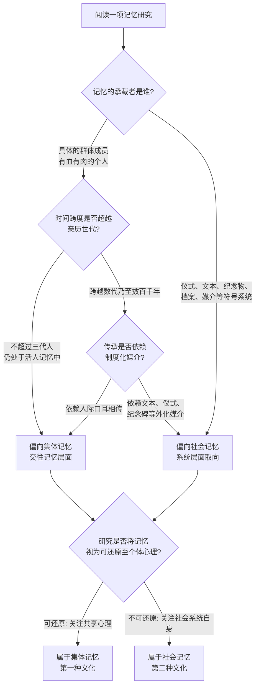
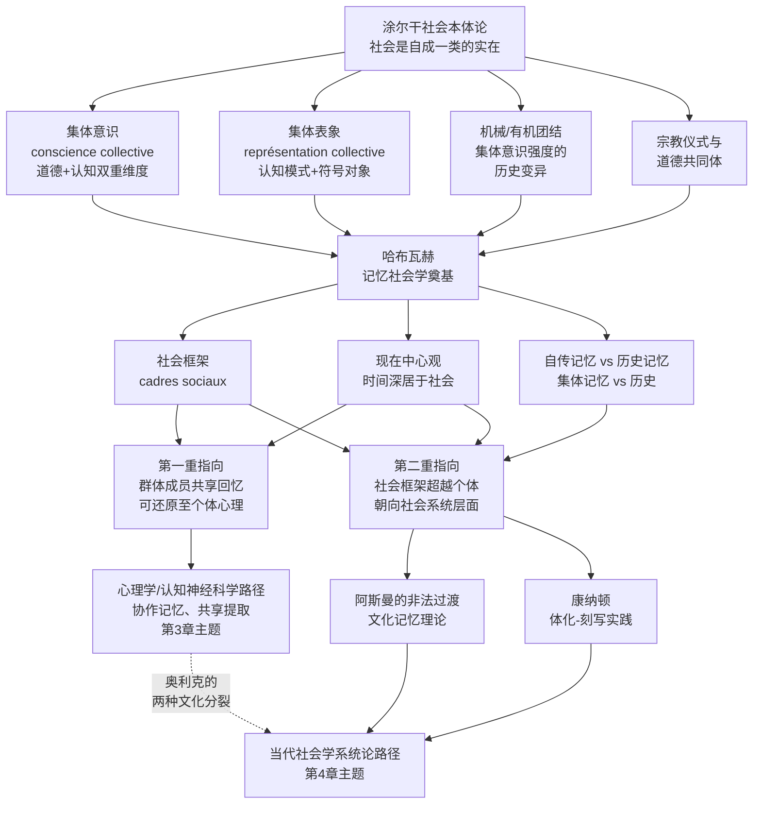
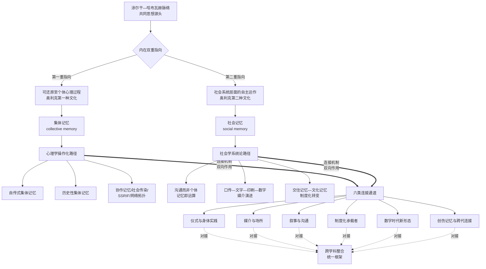

# 集体记忆与社会记忆：跨学科理论概念辨析、源流追溯与连接机制研究
# 1 概念辨析：集体记忆与社会记忆的定义与核心区分

记忆研究的跨学科扩张在过去三十年中催生了一个庞大而异质的学术领域，但伴随这一"记忆热潮"（memory boom）而来的，是一种被学者称为"术语无政府状态"（terminological anarchy）的概念混乱[^1][^2]。在这片纷繁的概念地形中，"集体记忆"（collective memory）与"社会记忆"（social memory）无疑是最常被并列使用、却又最难加以明确区分的一对术语。许多文献将二者视为同义词随意互换，另一些研究则赋予它们截然不同的理论分量——这种张力并非简单的措辞偏好，而是折射出记忆研究内部两种根本性的本体论立场之争：记忆究竟是被社会框架所塑造的个体心理现象的聚合，还是一种独立于个体意识、自主运作于社会系统层面的突生现象？正如奥利克（Jeffrey K. Olick）所指出的，集体记忆研究中存在着"两种文化"（two cultures），它们"在文献中很少被明确区分"，却分别指向"经社会建构的个体记忆的聚合"与"自成一类的集体现象"两种根本不同的概念取向[^3]。本章的任务，正是要为这一术语迷雾提供一份清晰的概念地图，为后续章节的源流追溯与机制分析奠定语义基础。

## 1.1 集体记忆的经典定义与学术内涵

"集体记忆"作为一个学术术语的诞生，应当归功于法国社会学家莫里斯·哈布瓦赫（Maurice Halbwachs）。在其奠基性著作中，哈布瓦赫提出了一个在当时极具革命性的核心命题：**人类记忆只能在集体语境中运作**[^4]。换言之，个体的回忆并非孤立的心理事件，而总是依赖于一定的"社会框架"（cadres sociaux）——家庭、宗教群体、社会阶级等群体所提供的参照系统——才得以发生、保存与重构。哈布瓦赫进一步主张，集体记忆始终具有**选择性**：不同的人群拥有不同的集体记忆，而这些不同的记忆又催生出不同的行为模式。他以朝圣者数个世纪以来对耶稣生平所唤起的截然不同的图像、法国老牌富裕家族与新富阶层在过去认知上的尖锐分歧、以及工人阶级与中产阶级在现实建构上的差异等具体案例，论证了**记忆作为群体共享心理现象的社会规定性**[^4]。

在哈布瓦赫的原始构想中，集体记忆指向**通过人际互动在群体成员之间共享、并由群体所提供的社会框架所支撑的记忆内容**。这一概念的分析焦点仍然落在"被社会化的个体心理"之上——尽管记忆的内容、结构与可激活性受社会条件规定，但记忆的承载者依然是具体的、有血有肉的群体成员。这一基本立场为后续集体记忆研究奠定了一个建构论的、可还原至个体心理过程的解释路径。

20世纪90年代以来，集体记忆概念经历了重要的细化与再阐释。德国学者扬·阿斯曼（Jan Assmann）与阿莱达·阿斯曼（Aleida Assmann）夫妇在继承哈布瓦赫遗产的基础上，对其"集体记忆"做了进一步区分，将其拆分为**"交往记忆"（communicative memory）与"文化记忆"（cultural memory）**两个层次[^5][^6]。其中，**交往记忆**对应于"存在于日常互动中、非体制化、一般不超过三代人（约80—100年）的鲜活记忆"，可以被视为对哈布瓦赫原初意义上集体记忆的精确化继承；而**文化记忆**则是"体制化的、通过特定媒介和仪式传承的、具有长时段时间视域（可达数千年）的稳定记忆"，已经在很大程度上超越了哈布瓦赫的原初概念，朝向后文将讨论的"社会记忆"方向发展[^5]。二者在时间结构、媒介依赖、体制化程度以及承载者（普通成员 vs. 专家）方面存在根本差异[^5]。

奥利克对集体记忆概念的"两种文化"区分则进一步从理论上澄清了这一概念的内在分裂[^3]。他指出，**"集体记忆"在文献中实际上指代两种不同的对象**：一种是"经社会框架塑造的个体记忆的聚合"——这一理解对心理学、神经科学、认知科学考量持开放态度，但忽视了大脑以外的记忆技术，以及认知乃至神经模式如何部分地由真正的社会过程所建构；另一种则是"自成一类（sui generis）的集体现象"——这一理解强调公共与个人记忆的社会与文化模式化，但忽视了那些过程在多大程度上由心理动力学所构成[^3]。这一区分恰恰为我们理解集体记忆与社会记忆的术语张力提供了关键的理论坐标。

## 1.2 社会记忆的概念脉络与学术内涵

与集体记忆相比，"社会记忆"作为一个相对独立的学术术语，其经典化进程出现得较晚，且更明显地朝向"超个体—系统层面"的概念取向倾斜。这一脉络的代表性贡献者是英国社会人类学家保罗·康纳顿（Paul Connerton）。在其1989年出版的《社会如何记忆》（*How Societies Remember*）一书中，康纳顿提出了一个极具开创性的问题：不是个体如何在社会中记忆，而是**社会本身如何记忆**[^7]。

康纳顿的论述立足于一个深刻的洞察：**所有开端都包含回忆的因素**——即使是激进的革命行动（如法国大革命、纽伦堡审判），表面上看似与过去的彻底决裂，实际上仍然依赖于对旧秩序的"回忆"作为其合法性建构的前提[^7]。在此基础上，他将社会记忆的运作机制聚焦于**两个特殊的社会活动领域：纪念仪式（commemorative ceremonies）与身体习惯（bodily practices）**[^7]。在康纳顿看来，社会记忆并不主要存在于个体的脑海或书面文本之中，而是以一种**体化（incorporated）的形式被铭刻在身体姿态、仪式动作与集体操演的肌理之内**。这一观点将社会记忆的载体从个体心理拓展到了身体—仪式—物质实践的整体场域，从而赋予"社会记忆"一种实质性的系统层面含义。

奥利克与罗宾斯（Joyce Robbins）在1998年发表于《社会学年度评论》的纲领性论文中，进一步从理论上确立了"社会记忆研究"（social memory studies）作为一个**非范式化、跨学科、无中心的研究领域**的存在[^8]。他们将社会记忆描述为"狭义上是知识社会学的一个子领域"，"广义上则是社会的连接性结构"（borrowing from Assmann 1992）[^8]。这一定义明确将社会记忆置于一种**超个体的、关涉社会整体连接结构的分析层级**，强调其作为社会自身再生产机制的系统性特质。

将康纳顿与奥利克的论述并置可以发现，"社会记忆"在学术使用中**更倾向于指代一种依托符号媒介、仪式实践、制度安排与文化客观外化物而自主再生产的系统性现象**，而非对个体心理过程的简单加总。这一概念取向与卢曼系统论传统的契合，使社会记忆的讨论日益向"社会系统层面的记忆运作"靠拢——尽管这一进路与哈布瓦赫式的建构论并不完全互斥，但其分析重心已经发生了实质性的转移。

## 1.3 核心维度的对比分析

为更清晰地呈现集体记忆与社会记忆在理论取向上的实质分野，下表从四个关键维度对二者进行系统比较：

| 比较维度 | 集体记忆（collective memory，经典意义） | 社会记忆（social memory，系统取向） |
|---------|----------------------------------------|-----------------------------------|
| **分析层级** | 经社会框架塑造的个体心理现象的聚合，可还原至个体认知过程[^3] | 自成一类（sui generis）的社会系统层面现象，不可还原至个体心理[^3][^8] |
| **记忆承载者** | 共享记忆的具体群体成员（家庭、阶级、宗教群体等）[^4] | 超个体的符号—制度系统（仪式、文本、纪念物、媒介、档案）[^7][^8] |
| **运作逻辑** | 基于面对面人际互动与共享心理框架的回忆建构[^4] | 基于身体实践、仪式操演、符号媒介与文化外化物的自主传承[^7] |
| **时间跨度** | 与亲历世代相绑定，典型上限约三代人（80—100年，即"交往记忆"范围）[^5] | 跨越世代的历时性结构，可达数百乃至数千年（典型如"文化记忆"）[^5][^6] |
| **核心问题** | 群体成员如何在社会框架中共享对过去的回忆？ | 社会如何作为一个整体进行记忆与遗忘？[^7] |
| **典型理论传统** | 哈布瓦赫的记忆社会学、阿斯曼的交往记忆、心理学的协作记忆研究 | 康纳顿的体化—刻写实践、阿斯曼的文化记忆、卢曼系统论启发的研究 |

从这一对比可以看出，**两个概念的实质差异并非措辞偏好，而是源于分析层级与本体论立场的根本不同**。集体记忆的经典取向倾向于将记忆视为"被社会化的个体心理"，其分析焦点在于群体成员之间的共享与互动；而社会记忆的系统取向则将记忆视为"社会自身的属性"，其分析焦点在于符号—制度系统的自主运作。值得强调的是，**这一区分并非在所有学者的用法中都得到一致遵守**——例如阿斯曼夫妇本人将其文化记忆理论描述为对哈布瓦赫"集体记忆"的深化与拓展[^6]，而并未在术语层面与社会记忆做严格区分；但奥利克"两种文化"的诊断恰恰指明，**即使在同一术语之下，研究者实际上常常在讨论两种本质不同的现象**[^3]。

## 1.4 面向初学者的核心区分判据

基于前述多维对比，可以为初学者提炼一组通俗易懂、操作性强的判别问题，用以快速识别一项研究讨论的究竟是个体心理聚合意义上的集体记忆，还是社会系统层面自主运作的社会记忆。这组判据不要求读者熟悉复杂的理论术语，仅需对研究对象的几个基本特征做出判断：

这一判据流程揭示了三个**核心区分问题**：第一，**承载者问题**——记忆是被具体的人所"记住"，还是被仪式、文本、纪念物等符号系统所"承载"？第二，**时间跨度问题**——记忆是否仍处于亲历者尚在的"活人记忆"范围之内，还是已经跨越世代成为历时性的稳定结构？第三，**还原论问题**——研究者是否将记忆视为最终可还原至个体心理过程的现象，还是将其视为一种社会自身的、不可还原的属性？这三个问题对应于奥利克所诊断的"两种文化"的核心分野[^3]，可以帮助初学者在面对纷繁的记忆研究文献时迅速定位其概念归属。

需要补充的是，**这一判据是定向性而非绝对性的**：许多优秀的研究恰恰处于两种取向之间的中间地带，或试图沟通两种文化；判据的目的不是为研究划界，而是为读者提供一个理解概念分歧的认知支架。

## 1.5 概念混用的根源与澄清的理论必要性

明确了上述区分之后，一个自然的问题是：既然两个概念在分析层级与本体论立场上存在如此实质性的差异，为何在学术实践中频繁被互换使用？追溯其根源，至少可以辨识出以下几条相互交织的脉络。

第一，**哈布瓦赫原典的术语流转与翻译再生产**。哈布瓦赫的法文原典使用的核心术语是"mémoire collective"[^5]，其英文译本在使用"collective memory"的同时，也时常使用"social memory"作为相近表达；而中文文献则在"集体记忆""社会记忆""共同记忆"等译名之间存在一定流动性。这种跨语言的术语漂移使得本来在哈布瓦赫思想内部尚相对统一的概念，在跨语境传播中获得了多重所指。

第二，**学科传统的差异性使用习惯**。社会学、人类学、文化研究、历史学等不同学科在引入哈布瓦赫遗产时，根据其自身的研究关切对术语进行了再加工：康纳顿来自社会人类学背景，更强调身体—仪式实践，因此偏好"social memory"以凸显其超越个体心理的特质[^7]；阿斯曼夫妇来自德国文化学与历史学传统，则在"集体记忆"的伞形术语下细分出"交往记忆"与"文化记忆"两个层次[^5][^6]；心理学与认知神经科学则普遍延续"collective memory"的术语，将其操作化为可实验研究的具体子概念。这些学科间的术语习惯差异，使得同一概念在不同文献中可能承担不同的理论分量。

第三，**记忆研究领域整体的"非范式化"特征**。奥利克与罗宾斯在其纲领性综述中明确指出，社会记忆研究是一个"非范式化、跨学科、无中心的事业"[^8]，缺乏统一的概念框架与术语规范。詹森（Jensen）在评论韦尔策（Harald Welzer）的研究时也明确诊断了当代记忆研究所处的"术语无政府状态"，使得研究者之间几乎无法进行直接的概念对话[^1]。这一术语困境与记忆议题本身的跨学科性互为因果——议题的跨学科性吸引了不同学科背景的研究者各自带着不同的术语传统进入，而缺乏统一规范的术语生态又进一步加剧了概念的混乱。

第四，**记忆热潮带来的概念通货膨胀**。奥利克在论及"记忆热潮"时指出，自20世纪70—80年代以来，民族国家在福利国家叙事衰落之后转向过去寻求合法性，"个体记忆"与"集体记忆"都被视为面临威胁的对象——前者受神经退化与感官超载威胁，后者受世代凋零与官方否认威胁[^2]。在这一文化氛围下，"集体记忆""社会记忆""文化记忆""公共记忆""国族记忆"等术语在学术界与公共话语中被大量生产与混用，**概念外延的迅速扩张反过来稀释了术语的精确性**。

澄清集体记忆与社会记忆区分的**理论必要性**正源于上述混乱所带来的研究风险。首先，**避免分析层级的混淆**：将社会系统层面的现象错误地用个体心理机制来解释（个体还原论），或反之将个体心理过程错误地归因于社会系统的自主运作（社会突生论的过度推论），都会导致论证失效。其次，**明确研究对象的边界**：心理学实验所揭示的协作记忆机制与社会学所研究的纪念碑、档案、文化经典属于截然不同层级的现象，混用术语会模糊研究发现的真实意涵。再次，**为跨学科对话搭建共同语义基础**：跨学科整合的前提是各学科首先清楚地知道彼此在谈论什么，"两种文化"的明确区分恰恰为不同学科之间的相互理解与互补提供了坐标系[^3]。最后，**为后续探讨二者源流与连接机制提供前提性概念支点**：只有先厘清两个概念的实质分野，才能进一步追问它们各自的思想源头（如涂尔干—哈布瓦赫脉络对两种取向的共同奠基）、各自的操作化路径（心理学如何研究集体记忆、系统论如何研究社会记忆），以及最为关键的——个体层面的集体记忆与社会系统层面的社会记忆之间究竟通过哪些具体机制相互连接。

带着这一概念区分作为分析支点，下一章将深入追溯涂尔干至哈布瓦赫的奠基性思想脉络，探察这一共同源头如何为后续研究的学科分化与术语分裂埋下了理论伏笔。

# 2 学术源流：从涂尔干到哈布瓦赫的奠基性贡献

第一章已经辨明，"集体记忆"与"社会记忆"在当代学术使用中分别朝向"被社会化的个体心理"与"自主运作的社会系统"两种本体论取向，奥利克所诊断的"两种文化"分裂构成了记忆研究术语困境的核心症结。然而，**这一分裂并非平地而起，而是深植于记忆社会学奠基阶段的思想结构本身**。若要真正理解为何同一术语谱系能够分化出两条如此不同的研究路径，就必须回到这一脉络的源头——涂尔干所确立的社会本体论传统，以及哈布瓦赫如何将这一传统改造并应用于记忆问题。本章追溯这一思想史轨迹，其目的并非单纯的学术考古，而是要论证：**涂尔干—哈布瓦赫脉络从一开始就内含双重指向**——它既为"记忆作为社会化的个体心理"提供了概念支架，也为"社会作为自成一类的记忆主体"埋下了本体论种子。第一章所识别的"两种文化"分裂，正是从这一共同源头处开始萌发的。

## 2.1 涂尔干的社会本体论及其为记忆研究奠定的概念地基

埃米尔·涂尔干（Émile Durkheim, 1858—1917）作为法国社会学的奠基人之一，其学说的核心贡献在于确立了**社会学作为一门独立学科的本体论与方法论基础**。涂尔干通过《社会分工论》（1893）、《自杀论》（1897）、《宗教生活的基本形式》（1912）等一系列经典著作，对社会分工、宗教、自杀等诸多社会现象进行了深入研究，**其学说的根本立场在于强调社会事实的客观性，主张社会是一个有机整体，有其自身的结构和规律，不能简单还原为个体的总和**[^9]。这一立场虽然并不以"记忆"为直接论题，却为后来记忆社会学的诞生提供了不可或缺的概念地基。

### 2.1.1 "社会作为自成一类的实在"：本体论命题及其方法论意涵

涂尔干学说的本体论基石可以浓缩在他的一个著名命题之中："**社会并不是个人相加的简单总和，而是由个人的结合而形成的体系，而这个体系则是一种具有自身属性的独特的实在**"[^9]。这一命题的革命性在于它彻底拒绝了将社会现象还原为个体心理或个体行为加总的解释路径——个体聚集形成社会时，会产生一种**新的、独立于个体之外的结构和属性**，这种实在不能通过单纯研究个体来理解，必须从社会整体的视角去把握[^9]。

这一本体论立场对后续记忆研究的奠基意义是深远的。它为后来的研究者提供了一个根本性的概念前提：**如果社会本身是一种自成一类（sui generis）的实在，那么记忆作为社会的一个面向，也就具备了被作为社会层面现象加以研究的可能性**。换言之，涂尔干为"记忆并非纯粹的个体心理过程，而可以是一种社会性的实在"这一第一章所讨论的核心命题，从本体论上预先准备了理论空间。值得注意的是，涂尔干本人对此社会实在的指称——"fait social"（社会事实）——在跨语言转译中也存在一定的简化风险：英译者Steven Lukes在其权威性研究中指出，法文的"fait"与英文的"fact"含义并不完全对应，**在涂尔干的法文语境下，"fait"带有"作为实在（real）的发生或存在"的意涵，更接近"现象、因素或力量"（phenomena or factors or forces），而不只是某一实例（case）的个别义**[^10]。这一概念翻译困境提醒研究者，涂尔干所主张的"社会事实"并非英语世界常理解的可观察个案，而是一种带有强烈实在论色彩的社会力量。

### 2.1.2 集体意识：社会凝聚的精神纽带

在确立了社会本体论的基础上，涂尔干进一步提出了一组用以刻画社会实在内在结构的核心概念，其中最具记忆理论价值的便是"集体意识"（conscience collective）。涂尔干将其定义为："**当社会成员平均具有的信仰和感情的总和，构成了他们自身明确的生活体系，我们可以称之为集体意识或共同意识**"[^9]。集体意识因此并非个体意识的简单加总，而是一种**社会成员共有的信仰与情感所构成的独特体系，这种体系影响着每个社会成员的生活方式和对世界的认知，是社会团结和凝聚的精神纽带**[^9]。

进一步地，涂尔干将集体意识视为社会凝聚力的核心机制——"社会的凝聚性是完全依靠，或至少主要依靠社会成员的共同信仰和感情，这些共同信仰和感情的总和构成了他们必须坚持的集体意识"[^9]。值得关注的是，**集体意识在涂尔干那里同时具有"道德"与"认知"双重维度**：在道德面上，"道德是一个命令的体系，而个人良心只不过是这些命令内化的结果"[^9]，即社会通过集体意识向个体施加道德规范；在认知面上，集体意识构成了个体理解世界的共享框架。Lukes对这一双重性给出了直接的语言学佐证：法文"conscience"在转译至英语时实际上对应两种意思——"conscience"（良知）与"consciousness"（意识），**因此涂尔干的"conscience collective"同时承载着道德面与认知面，单纯译为"集体意识"或"集体良知"都会遗漏其一**[^10]。这一双重性对后续记忆研究的意义在于：它预示了集体性的心理内容既可以是规范性的（如对历史正义的共同评价），也可以是表征性的（如对历史事件的共同认知），二者在记忆现象中往往交织共存。

### 2.1.3 集体表象：从集体意识到符号性实在

如果说《社会分工论》阶段的涂尔干尚停留在"集体意识"这一较为笼统的概念上，那么到了《宗教生活的基本形式》阶段，他则进一步发展出了"集体表象"（représentation collective）这一更为精致、也更直接指向后续记忆研究的概念。**涂尔干从《社会分工论》开始讨论"集体意识"，到《宗教生活的基本形式》中转而讨论"集体表象"，其间承载着他个人的社会学研究态度与方法的延续与深化**[^11]。集体表象延续并深化了集体意识的核心思路，但其分析焦点从"共有的信仰与情感"转向了**作为符号性实在的认知模式与认知对象**。

集体表象概念的内在丰富性在跨语言流转中同样面临被简化的风险。Lukes指出，**法文中"représentation"既有"我们自己思想/认知的模式"的意思，也有"被我们所认知/思考的对象"的意思**[^10]——这意味着集体表象既指**社会层面共享的认知图式**（如分类系统、时间观念、因果范畴），也指**这些图式所指向的符号性对象**（如神圣物、宗教符号、共同体象征）。正是在《宗教生活的基本形式》中，涂尔干通过对图腾制度的分析，揭示了**符号性实在如何在个体心理之外承载社会的认知与情感内容**——这一思路构成了后来阿斯曼文化记忆理论中"符号—载体—制度"分析框架的深层思想资源。同样在这部著作中，涂尔干展现出了知识社会学的雏形[^11]，将认知范畴本身追溯至社会结构，这一思路对后来记忆作为社会建构现象的研究取向产生了深远影响。

涂尔干对宗教的社会学定义同样具有奠基性意义：宗教是"一种与既与众不同、又不可冒犯的神圣事物有关的信仰与仪轨所组成的统一体系，这些信仰与仪轨将所有信奉它们的人结合在一个被称之为'教会'的道德共同体之内"[^9]。这一定义将**信仰与仪轨视为团结信仰者形成道德共同体的核心机制**，为后来康纳顿"纪念仪式与身体习惯如何承载社会记忆"的论证，提供了直接的理论先导。

### 2.1.4 机械团结与有机团结：集体意识强度的历史变异

涂尔干并未将集体意识视为同质化、永恒不变的现象，而是通过《社会分工论》中**机械团结（mechanical solidarity）与有机团结（organic solidarity）**的二分，刻画了不同社会形态下集体意识的强度差异及其历史变迁。**机械团结建立在社会成员的相似性与共同意识之上，对应传统、同质化的社会**，整合机制依赖于强制和共享信仰、情感，个人相似性极高、个性丧失殆尽；**有机团结则建立在社会分工与个人异质性之上，对应现代、工业化、功能分化的复杂社会**，整合机制依赖于因分工而产生的功能依赖、相互需要以及对权利的共同尊重[^12]。涂尔干借助生物学比喻，将有机团结比作高等动物体内各个功能专门化又相互依赖的器官[^12]。

这一对二的分类对记忆研究具有双重意涵。其一，**它揭示了集体意识并非铁板一块的常量，而是随社会分工的演进而发生强度变化**——"随着分工的深化，传统社会的集体意识相对减弱，社会整合转而依赖于功能性相互依赖网络"[^12]。这一洞察为后来阿斯曼区分"交往记忆"（依赖人际互动）与"文化记忆"（依赖制度化媒介）提供了远端的理论灵感：在结构高度复杂、个体高度分化的现代社会，社会的"记忆"必须越来越依赖外在的符号—制度系统而非内在的共享心理。其二，**涂尔干将机械团结与有机团结视为社会中常常共存、此消彼长的两种理想类型**，"集体意识强、分工水平低时机械团结比重大，个人意识发展、社会分工精细时有机团结比重大"[^12]——这一辩证立场为后来记忆研究中"传统—现代""活态—固化""内化—外化"等多重张力的把握提供了方法论范例。

### 2.1.5 涂尔干遗产中相对薄弱的环节：社会变迁与时间维度

需要客观指出的是，涂尔干学说中存在一个被后来学者持续关注的薄弱环节：**其理论向来被质疑缺乏社会变迁维度，即缺少时间视角**[^13][^14]。虽然涂尔干通过机械团结向有机团结的转变描述了某种宏观历史演进，但其分析框架的整体倾向仍然是结构性、共时性的——集体意识、集体表象、社会事实等核心概念都更多地刻画社会在某一时刻的整体结构，而非这一结构如何在时间中展开、变化与传承。这一薄弱环节为哈布瓦赫将涂尔干传统应用于记忆问题留下了关键的理论空间：**记忆作为一种本质上关乎时间的现象，恰恰要求对涂尔干的静态社会本体论进行时间维度的补充**。这正是下一节将要追溯的理论事件。

## 2.2 哈布瓦赫对涂尔干传统的继承、改造与时间维度的引入

莫里斯·哈布瓦赫（Maurice Halbwachs, 1877—1945）作为涂尔干学派的核心成员之一，其学术贡献的独特性在于**将涂尔干所确立的社会本体论应用并改造于记忆问题，从而完成了记忆社会学这一新学科领域的奠基**。第一章已经介绍了哈布瓦赫"集体记忆"概念的基本内涵与核心命题，本节将进一步追问：哈布瓦赫究竟从涂尔干那里继承了什么？又对涂尔干传统做出了哪些实质性的改造？这一改造对后续学科分化具有何种理论意涵？

### 2.2.1 "社会框架"概念与涂尔干遗产的延续

哈布瓦赫记忆理论的核心概念——"社会框架"（cadres sociaux）——直接承接自涂尔干的社会本体论。**哈布瓦赫记忆理论中的重要概念"社会框架"，其背后是涂尔干学派的社会本体论思路**[^13][^14]。在他的论证中，记忆并非孤立的个体心理事件，而是依赖于家庭、宗教、阶级等社会群体所提供的参照系统才得以发生、保存与重构——这一论证方式正是涂尔干"社会事实具有独立于个体的实在性"这一本体论命题在记忆问题上的具体应用。

哈布瓦赫继承了涂尔干"集体意识"中"社会成员共享信仰与情感"的核心思路，但将其聚焦于一个更具体的现象——**对过去的回忆**。这一聚焦使他能够回应一个涂尔干未曾深入处理的问题：社会的共享心理内容是如何在时间中得以传承、保存与重构的？换言之，哈布瓦赫的工作可以被理解为**将涂尔干静态的"社会成员当下共享什么"的问题，转化为动态的"社会成员如何在时间中共享对过去的回忆"的问题**。在这一转化中，"社会框架"概念发挥了关键的桥梁作用：它既保留了涂尔干式的"社会作为超越个体的规定性实在"的本体论立场，又为记忆这一时间性现象提供了具体的分析单位。

哈布瓦赫的传记学者也指出，其集体记忆研究与涂尔干学说之间的承继关系具有深层意涵——**集体记忆作为一种社会现象，总体上体现为"现在"的特点，即所谓"集体记忆"在很大程度上是留存于"现在"的有关过去的看法。这如同社会学的"现在"/现实立场一样**[^13]，哈布瓦赫的研究正是延续了涂尔干学派以"当下社会现实"为分析立足点的方法论传统。

### 2.2.2 "现在中心观"的真实意涵与常见误读

第一章已经简要提及哈布瓦赫的"现在中心观"立场，本节需要在思想史层面对这一立场做出更细致的辨析，因为这一概念在后续传播中遭遇了相当程度的误读，而对其精确把握直接关系到我们对哈布瓦赫遗产双重指向的理解。

英语学界对哈布瓦赫的看法颇受Lewis Coser的影响。**Coser认为哈布瓦赫的集体记忆概念是"现在中心观"的，而忽视了"历史连续性"问题**[^13][^14]。所谓"现在中心观"的简化版本可以表述为：每个历史时期所呈现的对"过去"的各种看法，都是由"现在"的信仰、兴趣、愿望所塑造的[^13][^14]。Barry Schwartz则进一步警示：**如果把"现在中心观"的方法推至极端，就会让人感到历史中完全没有连续性**[^13]。

然而，深入研读哈布瓦赫原典的学者（如刘亚秋）已经指出，**Coser对哈布瓦赫的归纳并不准确——哈布瓦赫秉持的并不是绝对的"现在中心观"**[^13][^14]。事实上，哈布瓦赫在论证集体记忆的构建过程时，对于"过去"及传统给予了必要的关注；他的一般处理方式是**将"过去"与"现在"的重要性进行排序，并在多数情况下将"现在"置于优先的位置，但并没有明确提出"现在中心观"这一术语**[^14]。相反，他对过去的习俗与传统也给予了充分关注，并注意到了集体记忆变迁/转换中的历史连续性问题[^14]。

这一辨析对理解哈布瓦赫的理论意图至关重要。其"现在中心观"印象的形成，与其说源于哈布瓦赫绝对地将"过去"还原为"现在"的建构，**不如说源于集体记忆这一社会事实本身的特点——即所谓"集体记忆"在很大程度上确实是留存于"现在"的有关过去的看法**[^13]。换言之，"以现在为中心"是哈布瓦赫认识集体记忆的方法论立场，而非对历史连续性的否定。这一立场的实质是一种**"时间深居于社会"的哈布瓦赫式社会观**[^13][^14]——时间并非外在于社会的客观流变，而是在社会结构内部被组织、安排与体验的。

### 2.2.3 对涂尔干的实质性补充：时间维度的引入

正是基于"时间深居于社会"这一深层社会观，哈布瓦赫对涂尔干传统做出了其最具原创性的实质性补充——**引入时间维度**。如前所述，涂尔干理论被持续质疑的薄弱环节正是社会变迁视角的缺失[^13][^14]。**哈布瓦赫因而将自己的理论构建在涂尔干理论的基础之上，并以时间视角去发展涂尔干的社会理论**[^13]；更具体地说，他**以群体与记忆关系的时间视角，去发展涂尔干的社会理论**[^14]。

这一时间维度的引入将涂尔干静态的社会本体论改造为一种**流变性、动态性的社会观**——"社会"不再仅仅是当下结构的总和，而是**一种居于时间（"过去"与"现在"）关系中、深受"社会品质"影响的总体性事实**[^14]。哈布瓦赫由此完成了对涂尔干理论的关键性补充：他不仅延续了涂尔干"社会作为自成一类实在"的本体论立场（通过"社会品质"等概念），同时通过对"过去—现在"关系的强调，揭示了**社会自身的时间性结构与变迁逻辑**[^14]。

### 2.2.4 自传记忆与历史记忆的方法论区分

哈布瓦赫对记忆研究的另一项具有方法论意义的贡献，是其对**自传记忆与历史记忆的区分**，以及**集体记忆与历史的根本对立**。他指出，集体记忆与历史之间存在根本性差异：**记忆是连续的、多重的、情感化的，而历史则是断裂的、单一的、批判性的**。这一区分的方法论意义在于：它将"活态的、依附于群体的、情感性的回忆"与"已经成为外部对象、被专业化书写的过往"明确分开，从而为后续区分"交往记忆/文化记忆""集体记忆/社会记忆"等不同层级的记忆现象，提供了基础性的概念资源。

值得一提的是，哈布瓦赫的理论在20世纪70年代后被重新发掘，尤其通过皮埃尔·诺拉的《记忆之场》工程，成为历史书写与文化研究的重要范式。**诺拉虽然批判性继承了哈布瓦赫，但他将集体记忆从活态传统转变为历史对象，标志着记忆研究从社会学到历史学的转向**。这一转向本身已经预示了哈布瓦赫遗产可以被朝向不同方向加以发展的开放性。

### 2.2.5 哈布瓦赫理论的局限与遗留问题

为保持论证的客观性，需要指出哈布瓦赫的理论也面临若干被后来学者持续辨析的问题。其一，**对个体记忆能动性的忽视**——其强烈的社会建构论立场使他未能充分回应个体记忆的反叛性与多样性。其二，**现在中心观可能导致历史连续性的断裂**——尽管前文已经辨析哈布瓦赫并非绝对的现在中心论者，但其原典在论述上确实更多地强调了"现在"对"过去"的塑造，从而留下了被Schwartz等人批评的空间。其三，**概念边界模糊，易被泛化为意识形态工具**——集体记忆在某些后续实践中常被简化为民族认同的工具，失去其批判性初衷。这些遗留问题不仅是哈布瓦赫研究内部的争论焦点，也正是推动后续记忆研究朝向不同方向分化的内在动力。

## 2.3 奠基性遗产的双重指向与后续学科分化的理论伏笔

在系统梳理了涂尔干的社会本体论基础与哈布瓦赫对这一传统的应用与改造之后，本章最后需要回答的关键问题是：**这一共同的奠基性脉络如何为第一章所识别的"两种文化"分裂埋下了源头性的理论伏笔？**

### 2.3.1 双重理论指向的内在结构

涂尔干—哈布瓦赫脉络作为记忆研究的共同思想起点，其特殊性在于**自身就内含着双重理论指向**——这一双重性既不是后续学者对原典的误读，也不是不同译本带来的偶然差异，而是奠基者本人思想结构中真实存在的双重可能性。

**第一重指向：可还原至个体心理的解释通道**。哈布瓦赫的论证虽然始终强调社会框架对个体记忆的规定性，但**其分析焦点仍然是"个体如何在社会框架中回忆"，记忆的承载者依然是具体的、有血有肉的群体成员**[^15][^16]。在哈布瓦赫的原始构想中，集体记忆被定义为"一个特定社会群体之成员共享往事的过程和结果，保证集体记忆传承的条件是社会交往及群体意识需要提取该记忆的延续性"[^15]——这一定义将集体记忆的运作牢牢扎根于"群体成员之间的社会交往"。这一面向为后续心理学、认知科学路径的集体记忆研究提供了一条**可还原至个体心理过程的解释通道**：既然记忆的承载者最终仍是个体，那么集体记忆就可以通过研究个体如何在群体互动中编码、提取、协商记忆而被实证地把握。第三章将讨论的协作记忆范式、社会共享提取诱发遗忘范式等心理学操作化路径，正是沿着这一通道展开的。

**第二重指向：朝向社会系统层面的本体论空间**。与此同时，涂尔干的"社会是自成一类的实在"这一本体论命题，连同其集体表象、集体意识等概念所确立的"社会层面的符号—认知—情感系统"的概念框架，又为后续阿斯曼夫妇的文化记忆理论、康纳顿的体化—刻写实践等系统层面的社会记忆研究**保留了不可或缺的理论资源**。哈布瓦赫对社会框架超越个体的规定性的强调，更是直接为"社会作为记忆的主体"这一系统取向提供了原型表述。这一面向引导出的研究问题，已经不再是"个体如何记忆"，而是"社会如何作为整体记忆"——这正是第一章所讨论的康纳顿—奥利克脉络的核心问题意识。

### 2.3.2 一个未在术语层面被严格区分的内在张力

值得格外强调的是，**哈布瓦赫本人并未在术语层面严格区分这两种取向**。在他的原典中，"集体记忆"是一个伞形概念，既可以指代群体成员通过日常互动共享的鲜活记忆（更接近后来的"交往记忆"），也可以指代依托宗教仪式、节庆、纪念物等承载的更长时段记忆（更接近后来的"文化记忆"）。哈布瓦赫的思想敏锐性使他同时把握住了记忆现象的两个侧面，但他并未——也许也无需——在两个侧面之间划出一条清晰的概念界线。

然而，**这一未被术语化的内在张力恰恰构成了第一章所识别的"两种文化"分裂的源头性根据**。当后续不同学科背景的学者各自带着不同的研究关切返回哈布瓦赫原典时，他们各自从这一伞形概念中抽取并强化了不同的侧面：心理学家强化了"群体成员的共享回忆"侧面，将其操作化为可实验研究的具体范式；文化学家与人类学家则强化了"社会框架的超个体规定性"侧面，并将其拓展至仪式、文本、纪念物等符号—制度系统。**奥利克所诊断的"两种文化"，本质上是同一思想源头在不同学科语境中分化的产物**。

### 2.3.3 阿斯曼的"非法过渡"：分化的标志性节点

这一分化在学科史上有一个具有标志性意义的节点——扬·阿斯曼（Jan Assmann）对其自身理论起源的自陈。**阿斯曼意识到，他从哈布瓦赫的集体记忆理论转向了一种文化记忆理论，甚至是一种"非法"的过渡**[^13][^14]。这一自陈具有非同寻常的理论史价值：它表明，即便是文化记忆理论最重要的奠基者本人，也清楚地认识到他所开创的理论方向已经在实质上**偏离了哈布瓦赫的核心传统**——尽管二者共享着对"记忆的社会性"这一核心命题的承诺。

如何理解这一"非法过渡"的实质？回顾第一章对"交往记忆/文化记忆"区分的讨论可知，**阿斯曼的关键创新在于将记忆的承载从"鲜活的人际互动"转移到了"制度化的符号媒介与文化仪式"**——而这一转移，恰恰跨越了哈布瓦赫原初概念中"被社会化的个体心理"这一隐含边界。换言之，阿斯曼自觉地从哈布瓦赫遗产的"第一重指向"（个体心理面向）转向了其"第二重指向"（社会系统面向），并将后者发展为一个独立、成熟的理论体系。这一"非法过渡"因此可以被理解为**两种文化分裂在学科史上的第一次自觉化表达**——阿斯曼用"非法"一词诚实地标注了这一理论事件的根本性质：他所开创的新方向，已经不再是对哈布瓦赫的简单延续，而是对哈布瓦赫遗产中长期被遮蔽的另一侧面的系统化展开。

无独有偶，阿斯曼的文化记忆理论也已经在多个学科领域显现出其解释力。在文学研究领域，柯马丁等学者已将"文化记忆"理论应用于早期中国文学（如屈原与《离骚》）的分析，将其用于阐明"在特定时间和特定地点下，意义和身份被社会性、制度性以及物质性元素所构建的过程和实践"[^17]——这一表述清晰地展示了文化记忆理论与哈布瓦赫式集体记忆理论的根本差异：分析对象已经从群体成员的共享心理过程，转向了**社会性—制度性—物质性元素相互交织的符号实践系统**。

### 2.3.4 共同源头与分化路径的整体图景

为更直观地呈现涂尔干—哈布瓦赫脉络作为共同源头如何分化出后续两种学科路径，下图归纳本章的核心论证脉络：

这一图景揭示出本章的核心论证：**涂尔干—哈布瓦赫脉络作为记忆研究的共同思想起点，其内在双重指向构成了后续学科分化的本体论根据**。心理学—认知神经科学路径与社会学—文化学系统论路径之间的分歧，并非两个不相关传统的偶然并立，而是同一思想源头内部双重可能性的历史性展开。理解这一点对于跨学科记忆研究的整合具有根本意义——它意味着，两种路径之间的对话不是从外部强加的拼合，而是回到共同源头之后必然的相互呼应。

回到第一章所识别的术语困境与"两种文化"分裂，本章的追溯工作给出了如下解答：**当代记忆研究中"集体记忆"与"社会记忆"的本体论分歧，并非现代学术分工的偶然产物，而是深植于其奠基者思想结构之中的内在张力**。哈布瓦赫在涂尔干本体论的基础上开创性地引入时间维度，完成了记忆社会学的学科奠基，但他所留下的伞形概念同时内含着两种解释可能；后续学者沿着不同方向展开这两种可能时，无可避免地催生了"两种文化"的分化。第三章将沿着第一种可能——即可还原至个体心理过程的解释通道——具体考察心理学与认知神经科学如何将集体记忆这一宏大概念操作化为可实证研究的对象；第四章则将沿着第二种可能——即朝向社会系统层面的本体论空间——考察当代社会学如何将社会记忆界定为独立于个体意识系统而自主运作的现象。本章所辨明的双重指向，正是这两条后续路径得以并行展开的共同思想根基。

# 3 心理学与认知神经科学视角：集体记忆的操作化路径

第二章已经论证，涂尔干—哈布瓦赫脉络作为记忆研究的共同思想起点，其内在双重指向构成了后续学科分化的本体论根据。其中"第一重指向"——即将集体记忆视为可还原至个体心理过程的解释通道——为心理学与认知神经科学路径的展开提供了理论合法性。然而，从社会学的宏大命题"记忆依赖社会框架"到心理学实验室中可以被测量、操纵与统计分析的具体变量，其间存在着一道不容忽视的方法论鸿沟。本章的任务正是要追问：心理学与认知神经科学究竟如何跨越这道鸿沟，将哈布瓦赫式的"集体记忆"宏大概念转化为可实证研究的具体对象？这一操作化过程经历了怎样的概念二分？它通过哪些实验范式获得了哪些典型发现？又在何种边界上遭遇了系统层面社会记忆现象的"不可见性"？回答这些问题，不仅是为了完整呈现记忆研究跨学科图景的关键一翼，更是为第四章转向社会系统论视角下的社会记忆研究做好对照性铺垫。

## 3.1 心理学进路的基本立场与操作化逻辑

心理学与认知神经科学切入集体记忆研究时面临的首要理论难题，是如何在"记忆在世界中"与"记忆在头脑中"两种本体论立场之间架设可操作的桥梁。Hirst与Manier在其纲领性论文《迈向集体记忆的心理学》中明确诊断了这一张力：许多社会科学家将集体记忆定位于塑造记忆的社会资源之中，对持这一视角的学者而言，**集体记忆被视为超越个体的、"在世界中"的存在**；而另一些学者则承认，归根结底，记忆——无论是集体记忆还是个体记忆——最终仍必须由个体所记住，这些学者因而**将集体记忆视为共享的个体记忆**[^18]。

Hirst与Manier的核心方法论贡献正在于尝试**架接这两种取向**：一方面承认社会资源与记忆实践的"设计"具有其超越个体的结构性特征，另一方面坚持研究这些社会资源在形成与转化个体记忆方面的"有效性"以及指导这种有效性的心理机制[^18]。这一双层架构的精妙之处在于：它既不否定社会学传统对社会框架本体论地位的强调（保留"设计"层面的社会性），又坚守心理学进路的方法论可行性（聚焦"有效性"层面的个体心理机制）——心理学并不试图取代社会学对集体记忆的整体把握，而是承担起**揭示社会资源如何作用于个体心智、个体心智如何在群体互动中汇聚为共享表征**这一中观机制层面的工作。

葛耀君与李海在系统综述心理学视角下的集体记忆研究时同样强调了这一基本立场：心理学路径的核心问题是探讨**集体记忆形成与维护的心理机制**，采用类似流行病学研究方法的视角，将集体记忆的形成系统地分解为社会传染、检索诱发遗忘、共享现实与网络聚合等具体心理机制[^19]。这一表述清晰地体现了心理学进路的操作化逻辑：将哈布瓦赫式的宏大概念分解为一系列可被实验范式检验的微观机制，并通过这些机制的累积作用来重建集体记忆的形成过程。

基于这一基本立场，心理学进路对集体记忆的操作化通常采取**二分策略**：将集体记忆区分为两类性质不同但相互关联的现象——**自传式集体记忆**（autobiographical collective memory，指群体成员对其亲历共同事件的共享记忆）与**历史性集体记忆**（historical collective memory，指群体成员对未亲历的历史事件所共享的认知表征）。这一二分既呼应了第一章所辨明的"交往记忆—文化记忆"区分，又为不同的实验范式提供了对应的研究对象：前者主要诉诸闪光灯记忆、自传记忆等研究传统，后者则更多依赖代际比较、内容分析等方法。下文将分别详述这两类操作化路径的内涵与典型发现。

## 3.2 第一类操作化：自传式集体记忆与共享个体记忆

第一类操作化路径将集体记忆理解为群体成员对其亲历共同事件的**共享自传式记忆**。这一路径将集体记忆的研究焦点聚集于"活人记忆"范围之内——典型的研究对象包括重大公共事件（如肯尼迪遇刺、9·11事件、新冠疫情爆发等）所触发的"闪光灯记忆"、特定世代所经历的标志性历史时刻（如战争、灾难、社会运动）等。其内在逻辑是：当个体经历这些具有公共意义的事件并在事后与群体成员反复交流时，他们的自传记忆已经被嵌入到群体共享的回忆网络之中，从而成为可被心理学经验研究的集体记忆现象。这一操作化对应于第一章所辨明的"交往记忆"层面——其时间跨度通常不超过群体成员的亲历世代，其传承机制主要依赖人际互动而非制度化媒介。

Berntsen与Rubin在其综述性论文《集体记忆与自传记忆：服务于群体凝聚与合作的同一进化基础》中，从演化心理学角度为这一操作化路径提供了深层理论辩护。他们指出，**自传记忆使我们能够回忆个人过去的事件，而集体记忆则是群体共享事件的记忆；自传回忆被置于主观时间之中，集体记忆则被置于历史的（非个人的）时间之中**。尽管两类记忆存在这些差异，二者实际上**共享同一进化根源，并都演化出来以支持广泛合作所必需的群体凝聚——而群体凝聚正是人类生存的核心**[^20]。这一论断的核心意义在于：自传记忆与集体记忆之间并非简单的内容差异，而是同一适应性机制在不同分析层级上的两副面孔——二者都受到**共享集体价值的约束**（作为这些价值的象征性载体），也都具有**建构性**特征[^20]。

更为重要的是，Berntsen与Rubin提供了集体约束如何塑造自传记忆的具体机制，包括**文化生活脚本**（cultural life scripts，即文化所规定的"人生应当如何展开"的标准化叙事模板，影响自传事件的显著性与可提取性）、**道德信念**与**社会认同**等[^20]。这些机制揭示了一个深刻的双向作用过程：一方面，群体所共享的文化模板与价值规范规定了哪些事件值得被记住、应该被如何讲述、在何种意义上具有自传重要性；另一方面，个体的自传记忆又通过人际交流被汇聚为群体所共享的"我们的记忆"。这一双向作用过程恰恰构成了Hirst与Manier所谓"社会资源的设计"与"对个体记忆的有效性"之间的具体连接通道。

值得指出的是，自传式集体记忆这一操作化路径的方法论优势在于其能够直接利用心理学已有的自传记忆研究工具（如线索词法、生命叙事访谈、记忆评定量表等），从而保持了实证研究的可操作性；其解释力则主要体现在揭示**情感卷入、群体认同与共享心理表征**如何在亲历世代内相互强化。然而，这一路径的局限同样明显：它本质上仍以"活人记忆"为边界，难以直接处理那些跨越亲历世代、依托制度化媒介传承的文化记忆现象。这一边界问题将在第二类操作化路径中得到部分弥合。

## 3.3 第二类操作化：历史性集体记忆与集体表征

第二类操作化路径则将集体记忆理解为群体成员对**未亲历的历史事件**所共享的认知表征。其内涵的关键在于：这里所讨论的"记忆"并非来自直接经历，而是通过教育、媒介、纪念活动、家庭叙事等**社会资源**所传递并内化为个体认知图式的内容。典型的研究对象包括不同代际、不同国族群体对同一重大历史事件（如二战、文化大革命、殖民历史等）的心智表征。这一操作化对应于第一章所辨明的"文化记忆"层面在心理学可研究范围内的投射——它并不试图直接研究纪念碑、档案、文本等社会系统层面的客观存在，而是研究这些社会资源**在个体心智中所形成的表征及其在群体层面的分布与一致性**。

Hirst与Manier的纲领性论文恰恰为这一路径提供了关键的概念支架：他们主张研究社会资源与记忆实践的"设计"如何作用于个体记忆的形成与转化，并探究指导这种作用的心理机制[^18]。具体而言，这一路径下的典型研究问题包括：**不同代际**（如经历过事件的"亲历世代"与仅通过媒介与教育接触事件的"后世代"）对同一历史事件的表征是否存在系统性差异？**不同群体**（如同一历史事件中的施害方与受害方、不同政治立场的群体）对该事件的认知结构、情感评价与因果归因是否呈现可识别的群体内一致性与群体间分歧？社会资源（教科书、纪念馆、媒体报道等）的特定"设计"——如叙事框架、视觉符号、情感诉求——在多大程度上有效地塑造了个体的历史认知？

这一操作化路径在方法论上通常依赖**内容分析、认知图式测量、跨群体比较实验、记忆共识度量化**等手段。例如，研究者可以让不同群体的被试列举他们认为最重要的历史事件，并通过对这些列表的统计分析揭示群体记忆的内容、结构与共识程度；也可以通过对历史事件叙事框架的实验操纵，测量不同框架对个体记忆形成的差异性影响。葛耀君与李海所概括的**共享现实**（shared reality）与**网络聚合**机制[^19]同样适用于这一路径：当群体成员通过反复的社会互动确认彼此对历史事件的共同认知时，这种"共享现实"反过来强化了个体对该认知的确信度与可提取性，从而推动群体层面的表征趋同。

第二类操作化路径的解释力主要体现在其能够将原本只能在文化—制度层面被把握的"文化记忆"现象，部分地纳入心理学可测量的研究对象——通过对个体心智表征的系统抽样与统计分析，研究者得以**间接地**触及"社会如何记忆"这一宏大问题在个体心理层面的投射。然而，这一路径的解释边界也十分清晰：它所研究的始终是个体心智中的表征，而非纪念碑本身、档案本身、文本本身——后者作为社会系统层面的客观存在，其自主运作逻辑超出了心理学的方法论射程。这一边界问题将在3.7节与第四章中得到进一步讨论。

## 3.4 协作记忆范式与协作抑制效应

在阐明两类操作化路径的内涵之后，下文转向心理学进路用以揭示集体记忆形成微观机制的核心实验范式。**协作记忆**（collaborative recall）范式是其中最具方法论奠基意义的一种工具，其基本实验逻辑可以概括如下：研究者首先让所有被试单独学习一组材料（如词表、故事或图片），随后将被试分为两类条件——**协作群体**（多名被试共同回忆，可以听到彼此提取出的内容并相互启发）与**名义群体**（每名被试独立回忆，事后将其回忆内容合并去重作为对照基线）。通过比较这两类条件下的回忆产量与内容结构，研究者可以识别**协作过程本身**——而非简单的多人累加——对群体共享表征建构的实际影响。

Barber、Rajaram与Fox在2012年发表于《社会认知》的代表性研究中，对协作记忆范式的核心发现给出了精辟概括：**人们经常协作学习与回忆信息，这可能帮助群体创造关于世界的共享表征——即集体记忆。然而，与直觉相反，协作同时降低了群体的回忆水平**[^21]。这种由协作所导致的群体回忆水平下降被称为**协作抑制效应**（collaborative inhibition effect）——当协作发生于事件初次经历（编码）阶段时表现为**协作编码缺陷**（collaborative encoding deficit），当协作发生于事件回忆（提取）阶段时则表现为**协作抑制效应**[^21]。

Barber等人的关键贡献在于通过实验设计同时比较了协作发生于编码阶段与提取阶段两种情境，揭示了**协作提取在塑造集体记忆形成中所发挥的独特力量**。其研究表明，协作在两个时点都损害了群体的回忆产量，但损害程度在提取阶段尤为显著；更具理论意义的是，**只有协作提取在集体记忆的形成中发挥了显著作用**[^21]。这一发现的深层意涵在于：协作过程对个体记忆产量的"抑制"与对群体共享表征的"塑造"是同一过程的两副面孔——当群体成员在共同提取时相互打断、相互启发、彼此修正各自的回忆内容时，他们一方面无法达到名义群体所能达到的总回忆量（因为某些成员的提取被他人的提取所抑制），另一方面却**在共同的提取活动中趋同于一组成员之间互相确认的共享内容**。

Hirst与Stone在《记忆的社会侧面》一文中将这一现象置于更广阔的研究图景中加以定位：协作回忆"塑造了说者与听者随后所记得的内容"——这种塑造既体现于**当下被群体所共同记起的内容**，也体现于**说者与听者各自此后独立回忆时的内容**[^22]。换言之，协作记忆的影响不仅作用于当下的群体共同记忆，更通过对个体长时记忆的修改作用而延续到协作互动结束之后——这正是个体记忆向集体记忆转化的关键微观机制。

协作记忆范式的方法论意义在于：它为"集体记忆的形成"这一原本只能在宏观层面观察的现象提供了**可控的实验场景**，使研究者能够在严格控制的条件下测量协作过程对群体共享表征的影响，并通过精细的实验操纵识别其边界条件（如群体规模、成员关系、材料类型、回忆策略等的调节作用）。这一范式为心理学操作化路径提供了第一块坚实的微观机制基石。

## 3.5 社会传染与社会共享提取诱发遗忘范式

在协作记忆范式的基础上，心理学进路进一步发展出**社会传染**（social contagion）与**社会共享提取诱发遗忘**（socially shared retrieval-induced forgetting, SSRIF）两类范式，用以更精细地刻画说者—听者互动过程中集体记忆的形成机制。这两类范式与协作记忆范式既有共通之处，又各有侧重：协作记忆范式聚焦于多人共同回忆所导致的群体表征建构，社会传染范式聚焦于错误信息如何在群体成员之间传播并被纳入个体记忆，SSRIF范式则聚焦于说者的选择性提取如何抑制听者对相关未被提取信息的记忆。

**社会传染范式**的基本逻辑是：将真实信息与误导性信息混合呈现给一名"协作者"（confederate，由研究者安排扮演普通被试），让其在回忆时向真正的被试报告若干虚假信息；随后测量被试在独立回忆中是否会将这些虚假信息错误地"传染"到自己的记忆之中。葛耀君与李海将这一机制概括为"社会传染"，并将其列为集体记忆形成的核心心理机制之一[^19]。社会传染机制揭示了一个具有重要理论意涵的事实：**集体记忆的趋同性不仅可以通过共同记起真实内容而达成，也可以通过共同接受错误内容而达成**——这一发现深刻地呼应了哈布瓦赫"集体记忆始终是当下对过去的建构"的核心命题，并从微观心理机制层面为之提供了实证支撑。

**社会共享提取诱发遗忘**（SSRIF）范式则在传统提取诱发遗忘范式的基础上引入社会维度，重点考察**社会情境中说者依据其自身记忆所进行的选择性提取如何影响听者的记忆**[^23][^24]。其经典实验设计为：被试与说者（可能是协作者或另一名被试）共同学习一组材料；随后说者对其中一部分内容进行选择性提取（即只对部分项目进行回忆练习），而被试在旁聆听；最终测量被试对所有材料的记忆水平。典型发现是：被试对**未被说者提取但与已提取项目相关的内容**表现出显著的遗忘——即说者的选择性提取通过社会共享的方式诱发了听者的相关遗忘。

白璐、毛伟宾与李知娅在系统综述SSRIF研究的论文中，归纳了影响SSRIF的多项因素：**听者参与程度、说者特征及说者与听者之间的社会关系、提取时的搜索策略、情绪效价以及个体差异因素**[^23][^24]。这些因素的实证发现为理解集体记忆形成的微观条件提供了丰富的细节：例如，听者的参与程度越高，SSRIF效应越显著；说者与听者之间的社会关系越紧密、说者的权威性越强，SSRIF效应也越明显；情绪效价较强的材料则可能调节SSRIF的方向与强度。

SSRIF研究最具理论意义的发现是其在群体层面的**记忆趋同效应与可传递性**：**SSRIF不仅在群体中对促进群体成员记忆趋同方面发挥作用，而且在连续社会互动中具有可传递性，二者对集体记忆的形成都有重要贡献**[^23][^24]。所谓"可传递性"指的是，当说者A通过选择性提取诱发听者B的相关遗忘后，B在随后扮演说者角色与新的听者C互动时，会进一步将这一遗忘模式"传递"给C——通过这种连续的二人互动链，原本仅存在于A心智中的记忆选择性偏好可以扩散至更广泛的群体，从而构成集体记忆趋同的微观传播机制。Hirst与Stone同样将社会传染、提取诱发遗忘与SSRIF并列为集体记忆形成的核心机制，并强调这些机制不仅影响"当下被群体所共同记起的内容"，也影响"说者与听者随后各自独立的记忆"[^22]。

葛耀君与李海则将这一系列机制整合为更宏观的概念图景，将集体记忆形成的心理机制系统概括为**社会传染、检索诱发遗忘、共享现实与网络聚合**四个层面[^19]——这一概括恰恰呼应了从二人微观互动（社会传染、提取诱发遗忘）到群体共识建构（共享现实）再到网络层级聚合（网络聚合）的多层次解释链条，构成了心理学操作化路径对集体记忆形成机制的完整画卷。

为更清晰地呈现协作记忆、社会传染、SSRIF三类核心范式之间的关系，下表对其加以系统比较：

| 范式 | 核心实验情境 | 关键因变量 | 典型发现 | 对集体记忆形成的贡献 |
|------|--------------|------------|----------|----------------------|
| **协作记忆范式** | 协作群体 vs. 名义群体共同回忆 | 群体回忆产量、成员后续独立记忆 | 协作抑制效应；协作提取塑造集体记忆 | 揭示协作过程如何在降低群体回忆量的同时塑造成员趋同的共享表征 |
| **社会传染范式** | 协作者向被试报告虚假信息 | 被试独立回忆中虚假信息的纳入率 | 错误信息可在群体成员间传播并被纳入个体记忆 | 揭示集体记忆趋同可通过共同接受错误内容达成 |
| **SSRIF 范式** | 听者旁观说者选择性提取 | 听者对未被提取的相关内容的记忆 | 社会共享的选择性提取诱发听者相关遗忘；具有可传递性 | 揭示说者—听者非对称互动如何在连续社会传播中导致群体记忆趋同 |

三类范式在解释力上呈现互补关系：协作记忆范式刻画群体共同建构表征的过程，社会传染范式刻画错误信息的横向传播，SSRIF范式则刻画说者—听者不对称关系中的选择性遗忘扩散——三者共同构成了心理学操作化路径对集体记忆形成微观机制的多维证据链。

## 3.6 社会网络拓扑与记忆传播的群体层级研究

上述三类范式主要在**二人或小群体（dyadic 或 small-group）**层面运作，其方法论优势在于精细可控，但其局限同样明显：现实中的集体记忆形成发生在远比实验室二人对话复杂得多的社会网络之中。如何将协作记忆、社会传染、SSRIF等微观机制扩展至更大群体层面的研究？心理学进路对此的回应是引入**社会网络拓扑实验**，将记忆形成研究从二人互动扩展至群体层级。

葛耀君与李海在系统综述心理学视角下的集体记忆研究时，明确将**网络聚合**列为集体记忆形成的核心心理机制之一[^19]。所谓网络聚合，指的是集体记忆并非通过单一二人对话直接形成，而是通过群体成员之间**复杂的对话网络**在反复互动中逐步聚合而成。研究者通过设计不同拓扑结构的对话网络（如链式、环形、聚类网络等），考察社会传染、SSRIF等微观机制在网络中的传播路径与汇聚效应，揭示网络结构如何调节群体成员记忆趋同的速度、范围与稳定性。

Hirst与Stone在《记忆的社会侧面》一文中明确指出了这一研究方向作为"社会记忆"领域未来研究的关键扩展点。他们将协作回忆等记忆效应的研究领域中**仍待深入的方向**之一明确归纳为：**协作回忆的记忆效应是否能跨群体传播——即超越二人互动而考察更大群体**[^22]。这一论断指明了二人范式向网络范式扩展的理论必要性，同时也强调了这一扩展对于理解集体记忆形成的群体层级动力学的关键意义。

社会网络拓扑研究在心理学操作化路径中扮演着独特的**桥接角色**：一方面，它继承了二人范式对个体记忆变量（如回忆产量、记忆错误率、遗忘模式）的精细测量，从而保持了实证研究的可操作性；另一方面，它开始触及群体层级的**突生属性**——即网络结构本身（节点连接模式、信息流动路径、聚类系数等）如何独立地塑造记忆传播的群体动力学。这一桥接为心理学进路打开了通向更宏观社会层面的可能性，但也同时凸显了心理学进路的方法论射程边界：即便扩展至网络层级，其研究对象依然是**个体心智中的记忆变量在网络中的分布与流动**，而非网络中流通的符号、文本、纪念物等社会客观外化物本身的运作逻辑——后者将是第四章的核心议题。

需要客观说明的是，本节所依据的搜索资料对社会网络拓扑实验的具体设计与典型发现的细节呈现较为有限——参考资料主要在概念层面将"网络聚合"列为集体记忆形成的核心机制之一[^19]，并指明二人范式向多人扩展的研究方向[^22]，而未提供具体网络结构实验的详尽实证细节。这一资料局限提示我们：心理学的网络层级研究虽然在理论上已被识别为重要扩展方向，但其作为成熟实验范式的实证积累仍处于持续发展之中。

## 3.7 两类操作化路径的比较、互补与解释边界

在系统呈现了两类操作化路径与多组核心实验范式之后，本章最后需要从整体上比较二者的研究焦点、互补关系与共同的解释边界，从而为第四章转向社会系统层面的社会记忆研究做好理论对照。

下表系统比较自传式集体记忆与历史性集体记忆两类操作化路径在多个核心维度上的差异：

| 比较维度 | 自传式集体记忆 | 历史性集体记忆 |
|---------|----------------|----------------|
| **研究对象** | 群体成员对亲历共同事件的共享记忆 | 群体成员对未亲历历史事件的认知表征 |
| **时间结构** | 亲历世代之内（与"交往记忆"层面对应） | 跨越亲历世代（与"文化记忆"层面的心理投射对应） |
| **记忆形成路径** | 个人经历 → 人际交流 → 群体共享 | 社会资源（教育、媒介、纪念）→ 个体内化 → 群体共享 |
| **典型情感卷入** | 高（情感记忆、闪光灯记忆显著） | 相对较低（更依赖认知图式与叙事框架） |
| **主要实验范式** | 自传记忆访谈、闪光灯记忆研究、文化生活脚本 | 内容分析、跨代际跨群体比较、社会资源效应研究 |
| **核心心理机制** | 群体凝聚、文化生活脚本、社会认同 | 共享现实、网络聚合、社会资源设计的有效性 |
| **典型理论资源** | Berntsen & Rubin 演化心理学论述 | Hirst & Manier 社会资源—心理机制双层架构 |

两类操作化路径在揭示集体记忆形成的心理机制上呈现**实质性的互补关系**：自传式集体记忆研究侧重**亲历共享与情感卷入**，揭示了群体成员如何通过共同经历与人际交流形成具有强烈情感色彩的共享回忆；历史性集体记忆研究则侧重**制度性传递与表征一致性**，揭示了社会资源如何通过教育、媒介、纪念等渠道将文化记忆的内容植入个体心智，并在群体层面形成可被测量的表征共识。

进一步地，本章所介绍的四类核心实验范式——协作记忆、社会传染、SSRIF与社会网络拓扑——分别对应不同子概念并互为补充：协作记忆与SSRIF更适合研究亲历共同事件后的群体共享建构（自传式集体记忆方向），社会传染则同时适用于亲历事件与历史事件信息的扩散（横跨两类操作化），社会网络拓扑则为两类研究都提供了从二人扩展至群体层级的方法论桥梁。这些范式共同构成了多层次的实证证据链，为"集体记忆作为可还原至个体心理过程的现象"这一第二章所辨明的"第一重指向"提供了丰厚的实证支撑。

然而，必须客观指出心理学进路的**解释边界**。Hirst与Manier在其纲领性论文中已经隐含地标注了这一边界：心理学路径所聚焦的是社会资源在个体记忆形成与转化方面的**有效性**及其**心理机制**[^18]，而**社会资源本身的"设计"——即社会层面的符号—制度系统如何运作、生成与演化**——并不在心理学的方法论射程之内。葛耀君与李海在同一篇综述的局限性反思中同样诚实地承认：**心理学路径对文化记忆有效性的研究不足，对媒介技术变革引发的记忆变化敏感性不够**[^19]——这一自我诊断恰恰指明了心理学进路在面对超越亲历世代的长时段文化记忆、面对符号—制度系统自主运作时所遭遇的方法论困难。

这一解释边界从更深层次呼应了第一章所讨论的奥利克"两种文化"的诊断。心理学进路无论将集体记忆操作化为自传式记忆还是历史性表征，其分析单元终究是**个体心智中的记忆变量**——即便引入了二人互动、群体动力、网络拓扑等更复杂的层级，其本体论基础仍然是**可还原至个体心理过程的解释通道**。这一立场在揭示集体记忆形成的微观机制方面成效卓著，但对于以下三类现象则显得力有不逮：其一，**大脑以外的记忆技术**——文字、印刷、电子媒介、数字数据库等作为记忆载体的自主运作；其二，**符号—制度系统的突生属性**——仪式、纪念碑、档案、文化经典等社会客观外化物如何在脱离任何具体个体的情况下保持其作为"社会记忆"的有效性；其三，**超越亲历世代的长时段文化记忆**——跨越数百乃至数千年的记忆传承如何在制度化媒介中得以稳定再生产。

这些心理学进路难以直接处理的现象，恰恰构成了第四章将要展开的**社会系统层面社会记忆研究**的核心对象。心理学路径与社会学系统论路径之间因此并非相互排斥的竞争关系，而是**面向同一记忆现象不同层面的互补性研究**：心理学揭示了集体记忆"在头脑中"的运作机制，社会学系统论则将揭示社会记忆"在世界中"的自主运作逻辑。二者共同回应着第二章所追溯的涂尔干—哈布瓦赫脉络的"双重指向"，并在跨学科对话中持续生成对记忆现象更为完整的理解。

带着对心理学操作化路径的全面把握以及对其解释边界的清晰认识，下一章将转向系统论视角下的社会记忆研究，考察当代社会学如何将社会记忆界定为独立于个体意识系统而自主运作的社会系统层面现象，并梳理其在媒介演进与制度化转变中所经历的关键历史阶段。

# 4 当代社会学系统论视角：社会记忆作为自主运作的社会系统

第三章末已经清晰标示了心理学进路的三类解释盲区：大脑以外的记忆技术（文字、印刷、电子媒介、数字数据库）如何作为记忆载体自主运作；符号—制度系统在脱离具体个体的情况下如何保持作为"社会记忆"的有效性；以及超越亲历世代的长时段文化记忆如何在制度化媒介中跨越数百乃至数千年得以稳定再生产。这些被心理学方法论射程所排除的现象，恰恰构成了系统论视角下社会记忆研究的核心对象。本章承接第二章所辨明的涂尔干—哈布瓦赫脉络的"第二重指向"，沿着卢曼系统论传统（特别是其后继者埃斯波西托所开创的社会记忆研究路径）展开论证：**社会记忆并非个体记忆的简单加总或社会化版本，而是在沟通系统层面独立于个体意识系统自主运作的社会系统层面现象**。这一视角通过将记忆问题从"心理"重置于"沟通"，从"存储"重置于"运算"，从"过去"重置于"未来"，为奥利克所诊断的"第二种文化"提供了最为彻底的本体论与方法论实现。

## 4.1 系统论路径的本体论转向：从"个体在社会中记忆"到"社会自身记忆"

要理解系统论视角对社会记忆研究的独特贡献，必须先从其根本性的本体论转向谈起。这一转向的精髓可以浓缩为一个看似简短却极具颠覆性的命题：**社会本身不是由人构成的，而是由沟通构成的**。卢曼的这一基本立场——以及在他指导下完成博士论文、后来成为"当代德国社会系统论代表性学者"的埃斯波西托对这一立场的延续——使得社会学传统中长期占据中心位置的"个体—社会"二元图景被一种全新的"心理系统—社会系统"的双系统并置图景所取代[^25]。

### 4.1.1 沟通而非个体：社会作为自创生系统

在卢曼—埃斯波西托传统中，社会被界定为由沟通（而非个体、不是人际互动、亦非角色行为）构成的自创生（autopoietic）系统。**心理系统与社会系统是两个分别独立运作的自创生系统**：心理系统以意识为基本运作要素，社会系统以沟通为基本运作要素；二者通过"结构耦合"相互激扰，但任一系统的运作都不能直接进入另一系统内部。泮伟江在评述卢曼时曾以"意义"概念的重新定义为例展示这一转向的深度：在哈贝马斯仍然延续欧洲人文主义传统、将意义视为"只有人类拥有的主观东西"时，卢曼则冷峻地将意义重新界定为"存在于人与人之间、使得沟通成为可能的那种装置"——一种**高度技术性的、用以在多种可能性面前限制某些可能性而突显其他可能性的运作机制**[^26]。

这一本体论转向对记忆研究的直接意涵是：**社会记忆与个体记忆分属两个不同的自创生系统，前者不可还原至后者**。当我们追问"社会如何记忆"时，我们追问的并不是"社会中的个体如何共同记忆"，而是"沟通系统本身如何在其自主运作中保持对自身过去操作的某种可获得性"。这一立场将第一章奥利克所诊断的"两种文化"中的第二种文化——"自成一类的集体现象"——推至其最严格的本体论表述：社会记忆既不是个体记忆的集合，也不是社会化的个体记忆，而是沟通系统作为一类不同于心理系统的自创生系统所拥有的属于自身的记忆运作。

### 4.1.2 复杂性增长与社会记忆的独立化

埃斯波西托对这一本体论立场给出了一个具有强烈历史解释力的命题：**"社会越复杂，集体记忆就越有限；复杂性的增强，往往会使认知踪迹与个体记忆越来越分离，直至形成一种建立在社会运转方式基础上的社会记忆"**[^27]。这一命题不仅是抽象的本体论断言，更是关于社会记忆何以独立化的历史性论证——它揭示了一条**社会复杂性增长—认知踪迹与个体记忆分离—社会记忆作为独立现象生成**的因果链条。

这一论证的内在逻辑可以这样展开：在低复杂性社会中，社会沟通所需的记忆内容大体上可以容纳于个体心理系统的承载能力之内，社会记忆与心理记忆呈现紧密耦合状态；但随着社会复杂性指数级增长——分工细化、人口扩张、跨地域整合、知识专门化、世代更替加速——任何具体个体都不可能再承载社会运行所需的全部认知踪迹，社会必须发展出**独立于任何具体个体的记忆载体**才能维持自身的可运作性。换言之，社会记忆作为系统层面现象的独立化，并非某个理论家的概念发明，而是社会复杂性自身的演化压力所内在要求的结构性后果。这一命题为本章后续将要展开的媒介演进梳理（4.3节）与制度化转变分析（4.4节）提供了核心的解释逻辑——口传向文字、文字向印刷、印刷向电子/数字的每一次媒介跃迁，本质上都是社会记忆系统对持续增长的复杂性压力的结构性回应。

### 4.1.3 观察者立场的颠倒：世界依赖于记忆

系统论路径还包含着一个对常识图景具有彻底颠覆意义的认识论立场：**"系统论的路径以观察者作为起点，他的世界取决于自己的理解结构和阐述能力，也就是说，也取决于自己的记忆：不是记忆取决于世界，而是每个系统的世界都取决于自己的记忆的形态和能力"**[^27]。这一命题颠倒了常识中"记忆是对世界的复制"这一图景：在系统论视角下，并非世界先于记忆存在、记忆事后地记录世界，而是每个系统的世界本身就是由其记忆的结构与能力所构造的。

这一认识论立场对社会记忆研究的方法论意义在于：研究者不再追问"社会记忆是否准确地反映了过去"——这一问题在系统论框架下已经失去其原初的意义；研究者所追问的应当是**"社会记忆的特定结构如何生成了该系统所能识别、所能处理的'世界'"**。这一转向使得社会记忆研究从"准确性的批判"转向"建构性的描述"，并将哈布瓦赫早已提出的"现在中心观"洞察推进至更彻底的系统论表述——下一节将进一步揭示，这一表述正是通过将记忆重构为"运算设备"而非"存储系统"得以完成的。

## 4.2 社会记忆的运作逻辑：沟通、自反性与记忆—遗忘的动态平衡

在确立了系统论路径的本体论与认识论前提之后，本节进一步剖析系统论视角下社会记忆的具体运作逻辑。埃斯波西托的核心贡献在于提出了一组紧密相扣的命题，将记忆从直觉中"保存过去的存储库"重构为**一种以遗忘为首要功能、以自反性为基本机制、以面向未来重构过去为时间取向的动态运算过程**。

### 4.2.1 遗忘作为首要功能：从"存储隐喻"到"卸载隐喻"

系统论路径对社会记忆运作机制最具颠覆性的论断是：**记忆的主要功能在于忘却**。埃斯波西托明确阐述："**为了能够记住某种东西，首先就要能够遗忘：忘掉事物或者事件当中那些单一、无关的众多方面，忘掉累积性记忆的超量部分，以便腾出记忆的能力，从而去构筑新的记忆**"[^27]。这一论断在卢曼那里有更为系统的表述："**记忆的主要功能在于忘却，从而预防系统由于先前操作结果的累积而'堵塞'自身，同时'腾出'处理能力，以便迎接新的刺激和挑衅**"[^27]。

这一论断颠覆了关于记忆的常识图景。常识图景倾向于将记忆视为某种"越多越好"的存储能力——记得越多，意味着对过去保存得越完整，意味着记忆功能运作得越成功。系统论路径则反向论证：**记忆若不能遗忘，将很快不堪重负**。任何系统的处理能力都是有限的，若每一次操作的累积结果都被无差别地保存下来，系统将很快被"堵塞"而无法继续运作；因此记忆的本职工作并不是"留住一切"，而是**有选择地丢弃绝大多数事物，只保留那些被认为对系统未来运作有用的极少数面向**。

由此，**"记忆与遗忘总是共同进行的"**：**"记忆的任务在于平衡记住和遗忘，在于寻求一种均衡，以使系统的运行能够以一种非任意的方式继续下去"**[^27]。这一表述将"记忆—遗忘"重构为一对辩证性的动态平衡，而非常识中的对立两极——遗忘不是记忆的失败，而是记忆功能得以正常运作的内在前提；社会记忆系统的健康运行恰恰体现于其能够在每一次运作中精确地选择**哪些保留、哪些遗忘**。

### 4.2.2 记忆作为运算设备：程序而非数据

与"遗忘作为首要功能"相配套，系统论路径进一步重新界定了记忆的本质形态：**"记忆不是作为一个存储系统，而是作为一个运算设备在运行，它不包括数据，只包括程序，后者每次都以不同的方式再次生成数据"**[^27]。这一命题将记忆从"硬盘隐喻"重构为"程序隐喻"——记忆并不"包含"任何固定的过去内容，它只包含一组**用以根据当下情境每次重新生成过去的运算程序**。

这一立场对哈布瓦赫"现在中心观"的洞察构成了系统化的深化。第二章已经辨明，哈布瓦赫的"现在中心观"实质上是一种"以现在为认识立足点"的方法论立场，而非对历史连续性的简单否定。系统论路径则将这一立场推进至更彻底的本体论层次：**记忆并不记录过去，过去没有任何用处，只会是一种超量的负荷。记忆每次都是为了未来、以常新的方式重构过去**[^27]。换言之，过去本身在系统中根本不"存在"，存在的只是当下用以重构过去的程序运作——每一次"回忆"都是当下生成的、面向未来需求的、永远不可能与"原初过去"重合的全新建构。

这一论断在与心理学路径的对照中显示出特别的理论张力。第三章所介绍的协作记忆、社会传染、SSRIF等微观机制实质上都揭示了个体记忆的建构性特征——即便在个体层面，记忆也不是过去的客观存储而是当下的重新建构。系统论路径将这一建构论洞察从心理系统层面延伸至社会系统层面：**沟通系统在每一次运作中所"调用"的过去，都是当下沟通需求所重新生成的过去**。从二者的呼应可以看出，建构论并非心理学与社会学系统论的分歧之处，反而构成了两种路径在不同分析层级上的共同基底。

### 4.2.3 自反性、再类别化与冗余—变异的平衡

系统论路径还揭示了社会记忆运作的另一个核心特征：**自反性**。埃斯波西托指出："**遗忘的困难总是与某种自反性（reflexivity）相连：一个人一心想忘掉什么时，他却没法不面对自身、不面对自己的记忆建构程序；而在记忆某种东西时，他可以盯住那些仅仅记录着外部数据的幻象（以难免有缺陷的、选择性的方式）。在记忆过程中，人们面对世界；而在遗忘的过程中，人们面对的却是自身**"[^27]。这一表述揭示了一个深刻的非对称性——记忆指向外部（让系统面对世界），而遗忘指向内部（让系统面对自身的建构程序）。社会记忆作为系统的自反性功能，其运作恰恰意味着系统对自身记忆建构程序的持续性自我观察与自我调节。

这一自反性功能的具体表现在于系统对**冗余与变异、重复与新奇之间关系**的持续调节。埃斯波西托指出："**记忆的任务在于将信息通路组织起来，使这一终端始终处于记忆和遗忘之间的新的、动态的平衡中。……系统由此调节着冗余和变异、重复和新奇之间的关系，这种关系也取决于系统对于惊奇之物的识别和接受能力**"[^27]。冗余（重复、稳定、可预期的内容）使系统能够保持自我同一性与可识别性；变异（新奇、惊奇、超出预期的内容）则使系统能够回应环境变化并生成新的可能性——记忆功能的本质工作正是在二者之间维持精确的动态平衡。

进一步地，社会记忆通过持续的**"再类别化"**（recategorization）实现这一调节。埃斯波西托明确将记忆"描述为一种能够持续实现'再类别化'的程序能力"[^27]。这意味着，社会记忆并不依赖于固定不变的分类体系，而是依赖于一种**持续重构类别的能力**——当环境变化使既有类别失效时，系统通过再类别化生成新的类别框架，从而保持对环境的可识别性与可处理性。这一概念为后续分析媒介跃迁（每次媒介跃迁都意味着社会记忆类别框架的根本重组）提供了关键的分析工具。

## 4.3 媒介演进与社会记忆的历史阶段：口传—文字—印刷—电子/数字

在阐明系统论路径的本体论立场（4.1节）与运作逻辑（4.2节）之后，本节转向社会记忆研究中最具历史厚度的论题：媒介演进与社会记忆的历史阶段。埃斯波西托给出了一个具有方法论纲领性质的论断：**"系统论的路径恰恰将社会记忆的形态和范围归结为这些技术：社会记忆和遗忘能力，必须归结为文字、印刷媒介、以及后来的整个大众传媒机器"**[^27]。这一论断意味着，研究社会记忆的历史演化，本质上就是研究承载社会沟通的媒介技术如何在历史中演变并相应地重塑社会记忆系统的容量、结构与边界。

### 4.3.1 口传记忆阶段：心理与社会的紧密耦合

前文字社会的记忆运作呈现为一种独特的形态：社会记忆与心理系统紧密耦合，主要依靠人际互动、仪式操演与套语策略得以维系。瓦尔特·翁在其经典著作《口语文化与书面文化：语词的技术化》中归纳了"原生口语文化"的九大特征——**附加的而不是附属的、聚合的而不是分析的、冗余的、保守的、贴近人生世界的、带有对抗色彩的、移情和参与式的、衡稳状态的、情景式的而不是抽象的**[^28]。这些特征源于"口语转瞬即逝、依赖记忆和群体交流的特性"——由于声音的瞬时性使得任何已说出的内容立即消失，口语文化必须发展出一整套用以辅助记忆的策略：节奏化表达、公式化套语、重复叙述等"应对声音转瞬即逝的智慧结晶"[^29]。

杰克·古迪的人类学研究为口传记忆阶段提供了具体的田野证据。在《神话、仪式与口述》中，古迪基于加纳北部罗德佳地区的巴格尔神话的田野调查，挑战了结构—功能主义对口语"文学"的僵化解读，**强调神话在口述传承中展现出的多样性、变异性和演说者的个人创造力**[^30]。古迪由此提出了一个重要论断：神话通过叙事调整实现政治合法化，仪式作为"非理性或无理性的标准化行为"在其目标与手段的非直观性中承载着社会的共同认知。值得指出的是，古迪并不接受一种过分简化的"纯粹口语社会"观点——他**提出社会普遍存在"文字—口语"并存的传统**，提醒研究者警惕将口语与书写截然对立的范式陷阱[^30]。

从系统论视角理解口传记忆阶段，刘涛对卢曼"文字与法律演化"的重构提供了精确的概括：在**"口语文化时期，法律系统与心理系统紧密联结，法律依赖于记忆，灵活而不稳定"**[^31]。这一刻画虽然以法律系统为例，但其揭示的特征对整个口传记忆阶段都有普适性——社会记忆此时尚未从心理系统中获得独立，社会沟通的延续高度依赖具体个体（如长老、祭司、说唱艺人）的记忆能力，因而呈现出"灵活而不稳定"的双重特征：灵活，因为每一次叙述都可以根据当下情境做出调整；不稳定，因为承载者一旦逝去，相应的记忆内容也将随之消失。

### 4.3.2 文字记忆阶段：从心理系统中的解耦

文字的产生标志着社会记忆历史上的第一次根本性跃迁。刘涛对卢曼相关论述的重构清晰呈现了文字对社会记忆的解耦作用：**"文字的产生帮助法律脱离心理而存在，但最初只是用于固定过去的信息，并不创制面向未来的规范，法律系统仍然未能自主运行"**；进一步地，**"占卜活动使用文字，形成了'吉/凶'二元代码以及适用代码的'纲要'，为法律的封闭运作创造了条件"**；最终，**"同一文本可能被多重解释，为法律重新赋予可变性，同时又催生了限制解释的学问——法教义学，法律语言与日常语言逐渐分离"**[^31]。

这一渐进性的演化过程揭示了文字对社会记忆系统的深层重塑：第一步，文字将记忆内容从心理系统中外化为可独立保存的物质载体，从而使社会记忆获得了超越具体个体生命跨度的稳定性；第二步，文字使得记忆内容可以被反复检视、对照与重新解释，从而生成了**二元编码**与适用代码的**纲要**——这一发展为社会系统的封闭性自创生运作创造了条件；第三步，文字的可重读性催生了"多重解释"的可能性，由此引发了对解释的限制需求（如法教义学），并使专业语言与日常语言逐渐分离——这一分离本身就标志着社会记忆从普遍心理系统的耦合走向专门化制度的独立运作。

翁的理论补充了这一过程的认知维度。他指出，**"文字作为一种技术重构了人类意识，导致思维从听觉主导转向视觉主导。文字产生了分析性、线性思维，以及作者与读者间的距离感、表达的精确性需求"**[^28]。**"希腊字母促进逻辑思维发展"**[^29]这一论断进一步呈现了书写系统的特定形态如何反过来塑造了认知模式。换言之，文字不仅是记忆的载体，更是记忆功能的结构性重构——它生成了与口传时代根本不同的认知图式与思维方式。

文字对社会整合的宏观意义则在古迪的研究中得到了清晰论证。古迪在《传统社会中的读写》中**强调读写能力在"缓解大帝国的分裂倾向"过程中的重要性**[^32]——稳定的文字系统使得空间上分散的庞大政治共同体能够依托共享的书面文本而维持长时段的凝聚力，这一点对于理解华夏文明在长时段中的稳定性等历史现象具有重要解释力。

### 4.3.3 印刷记忆阶段：强化与过载的双重效应

印刷术的发明带来了社会记忆的第二次根本跃迁。埃斯波西托对这一阶段的双重效应给出了精辟概括：**"印刷媒介强化了社会记忆，同时也让她负荷过重，使我们能够同时记住和忘掉更多的东西，从而让我们得以同时保持更多的冗余信息和更明显的多样性"**[^27]。这一表述揭示了印刷阶段社会记忆系统的核心张力——容量的扩大同时意味着选择性遗忘负担的加剧。

翁同样指出，**"印刷术进一步巩固了视觉主导，催生了'封闭空间'感、个人隐私感、个人主义，并促成了互文性等现代文化问题"**[^28][^29]。这一论断与埃斯波西托的"冗余与多样性"双重扩张论形成深层呼应：印刷术不仅在数量上扩展了社会记忆的容量，更在结构上重塑了社会记忆的组织模式——封闭空间感与个人隐私感的产生意味着记忆内容获得了新的私人化承载形式，互文性问题的浮现则意味着不同文本之间的相互指涉成为社会记忆运作的新维度。

从系统论视角理解这一阶段的根本意义：**印刷使得社会记忆系统获得了支撑大规模功能分化所必需的记忆容量与多样性容差**。前一节所讨论的"社会越复杂、集体记忆越有限"的命题在此处获得了具体的历史对应——印刷阶段恰恰是社会复杂性急剧增长的现代早期，社会记忆系统通过印刷媒介的容量扩张回应了这一压力，使社会得以在更细分的功能子系统（科学、法律、政治、经济、艺术等）中各自维持其专门化的记忆运作。同时，"负荷过重"的论断也指明了印刷阶段所内含的张力——容量扩张并非无限制的好事，它同时也意味着系统必须发展出更精细的选择性遗忘机制以避免信息过载。

### 4.3.4 电子/数字记忆阶段：算法作为"人工沟通"伙伴

社会记忆的最新跃迁发生于电子—数字媒介阶段，这一阶段的特殊性在于：**新型记忆主体——算法与机器学习系统——首次进入社会沟通过程，重塑了社会记忆的生产、检索与遗忘逻辑**。翁本人已经预见到了这一阶段的来临，提出了"次生口语文化"概念以刻画"建立在文字和印刷术的基础之上，兼具原生口语文化的群体感、参与感等特征，但又是更加自觉、自反的文化形态"的电子时代文化形态[^28][^29]。

埃斯波西托在《人工沟通与法：算法如何生产社会智能》中对这一阶段给出了具有强烈系统论色彩的解读。她沿袭卢曼的"社会沟通"理论指出：**"机器学习等数字技术不是人工智能，而是'人工沟通'。在算法和人类智能之间进行这种类比是一种误导。如果机器对社会智能有贡献，那不是因为它们学会了如何像人类一样思考，而是因为人类学会了如何与它们进行沟通。'人工沟通'意味着人类的沟通伙伴可能不是人类，而是算法"**[^25]。

这一论断对社会记忆理论具有深远意涵。回到4.1节所讨论的"社会由沟通而非个体构成"的本体论立场可知，**只要算法能够作为沟通的有效参与者，它就已经进入了社会系统的运作之中**——无论它是否"像人类一样思考"，这一问题在系统论框架下并不构成关键。埃斯波西托所举的一个典型案例是谷歌邮箱的"智能撰写"功能：算法如此恰当地完成记者的电子邮件并符合其风格，"以致于记者发现自己从机器中不仅学习了他会写的内容，而且还学习了他应该写的（并且没有想到的）内容"[^25]。这一案例揭示了人工沟通如何参与社会记忆的运作——算法通过对海量历史沟通数据的学习生成了某种"应当如此说"的模式，并将这一模式反向投射回人类沟通者，从而既塑造了个体的具体表达，也参与了社会层面沟通模式的再生产。

埃斯波西托的研究还涵盖了一系列数字时代特有的记忆—遗忘议题：**算法和人类互动、在线网络列表的激增、数字文本分析中的可视化、算法个性化与数字画像、数字记忆与被遗忘权、遗忘图像、算法预测、法律AI的透明度与解释**等[^25]。其中**"数字记忆与被遗忘权"**议题尤为典型——在前数字时代，遗忘是记忆系统的自然属性（甚至是其首要功能，如4.2节所论），但在数字时代，**数字载体的无限保存能力反而使遗忘成为需要专门权利与机制加以保障的稀缺资源**。这一张力恰恰说明，电子/数字阶段的社会记忆系统正在经历其结构与容量的又一次根本重组——"记忆—遗忘动态平衡"的具体平衡点必须在新的媒介条件下重新建立。

为更清晰地呈现四个媒介阶段在多个核心维度上的演化，下表加以系统比较：

| 媒介阶段 | 主导载体 | 心理—社会系统关系 | 记忆容量 | 典型遗忘机制 | 复杂性回应 |
|---------|---------|--------------------|---------|-------------|-----------|
| **口传记忆** | 人际口耳、仪式、套语 | 紧密耦合，依赖个体心理承载 | 极有限，受限于群体记忆能力 | 自然遗忘、世代凋零 | 仅能支撑小规模、低分化社会 |
| **文字记忆** | 书写文本、文书、法典 | 部分解耦，记忆外化于心理之外 | 显著扩展，跨地域跨世代 | 文本失传、解释封锁 | 支撑大型政治共同体的稳定整合 |
| **印刷记忆** | 书籍、期刊、印刷品 | 进一步解耦，专门化系统独立运作 | 大规模扩张，伴随"过载"风险 | 选择性出版、版本更替、注意力转移 | 支撑现代社会的功能分化 |
| **电子/数字记忆** | 数据库、算法、机器学习 | 算法作为"人工沟通"参与者加入系统 | 几乎无限的保存能力 | 被遗忘权、算法删除、注意力经济 | 重塑跨地域、跨系统、跨人机的沟通秩序 |

从这一对比可以看出，每次媒介跃迁都不是单纯的技术更替，而是社会记忆系统自身**结构与容量的根本性重组**——这一重组同时改变了社会能够"记住"什么、必须"遗忘"什么、以及二者之间的动态平衡如何被维系。

## 4.4 制度化转变：从交往记忆到文化记忆的系统化

媒介演进的宏观脉络主要从技术维度刻画了社会记忆的历史演化，但社会记忆的演化同时还包含着一个制度化维度，这一维度可以通过阿斯曼夫妇的"交往记忆—文化记忆"区分来加以把握。本节将这一区分与前文所述的媒介演进脉络相对接，从而完成对社会记忆历史演化的双维描绘。

### 4.4.1 文化记忆理论的核心命题

第一章已经简要介绍了阿斯曼夫妇对集体记忆的细化区分，本节将进一步阐明文化记忆理论的核心命题及其与系统论路径的内在亲和性。**扬·阿斯曼与妻子阿莱达·阿斯曼在20世纪90年代共同提出"文化记忆"理论，将记忆研究从心理学、神经学和社会学领域拓展至文化学。该理论认为记忆通过文字、图像、仪式等媒介实现文化身份的代际传递，并强调文化记忆具有跨越时空的稳定性与再造性**[^33]。这一理论的奠基性著作《文化记忆：古代高级文化中的文字、回忆和政治身份》于1992年出版，其中文版由北京大学出版社于2015年出版[^33]。

文化记忆理论的几个关键特征使其与系统论路径形成深层呼应。第一，**承载者从有血有肉的群体成员转移到体制化的符号—载体—制度系统**——这恰恰对应于4.1节所述的"社会记忆与个体记忆分属不同自创生系统"的本体论立场。第二，**时间跨度的根本扩展**——文化记忆"具有跨越时空的稳定性与再造性"[^33]，可达数千年时间跨度，这一时间跨度远超任何具体个体心理系统的生命跨度。第三，**通过特定媒介（文字、图像、仪式）实现传承**——这一媒介依赖性使文化记忆与4.3节所述的媒介演进脉络深度同构。

### 4.4.2 古埃及作为长时段文化记忆的典型案例

扬·阿斯曼以古埃及为核心研究对象的学术工作，为文化记忆理论提供了具有强烈说服力的历史案例。金寿福在纪念阿斯曼的文章中精辟地指出，**阿斯曼将古埃及视作"人类早期文明史中完成了从生到死全部过程的文化体，因而对研究其他古代文明和充分理解现代性的来龙去脉具有宝贵的借鉴作用和启发意义"**[^34]。这一定位使古埃及成为研究文化记忆作为社会自主运作机制的"理想型"案例——一个已经"完成"的文化体，其文化记忆的生成、运作、稳定化、最终式微的全过程都可以被回溯性地研究。

阿斯曼的具体研究揭示了文化记忆作为社会自主运作机制的多种载体形态。他指出，**古代埃及人的活动，大到国王建造金字塔，小到官吏们刻写墓碑，中心议题归纳起来无外乎两个，其一是如何得到后人永久的记忆和不断的回忆，其二是以什么样的形式记忆先人，这里涉及生者与死者的互动**[^34]。换言之，整个古埃及文化体的诸多核心实践，本质上都可以被理解为社会记忆系统的运作模式——金字塔作为永久记忆的物质化承载、墓碑作为代际记忆传递的标准化媒介、生者与死者的仪式化互动作为社会记忆得以持续运作的具体机制。这些载体形态在脱离任何具体古埃及个体的情况下保持了数千年的记忆稳定性，恰恰印证了系统论路径关于"社会记忆作为系统层面现象不可还原至个体心理"的核心论断。

阿斯曼的代表作《玛阿特：古埃及公正与永生之间的关系》进一步揭示，古埃及社会"在玛阿特这个包含公正、秩序和真理等意义的原则下运转，众神、国王和民众三者又是如何依据玛阿特原则相互依赖和制约"[^34]。从系统论视角理解，玛阿特恰恰可以被视为古埃及社会记忆系统的核心组织原则——它作为一种**贯穿数千年的二元编码（秩序/混乱、公正/不公、永生/死亡）**，为整个社会的沟通运作提供了稳定的类别框架，并通过持续的"再类别化"过程（4.2节所述）回应着不同历史时期的具体挑战。

### 4.4.3 交往—文化记忆的转变与媒介演进的同构性

将阿斯曼夫妇的"交往记忆—文化记忆"区分与4.3节所述的媒介演进脉络对接，可以揭示一种深层的**结构同构性**：

交往记忆向文化记忆的制度化转变，在系统论视角下可以被理解为**社会记忆从依赖心理系统耦合的状态向依赖独立符号—制度系统的状态的演化**。在交往记忆阶段，记忆主要存在于鲜活的人际互动中，其承载者仍然是具体的群体成员，时间跨度受限于亲历世代——这一状态与口传记忆阶段高度吻合。当社会发展出文字、仪式经典化、纪念碑、专门化的记忆机构（祭司、史官、档案馆）等制度化承载者时，记忆开始从心理系统中解耦，进入独立运作于符号—制度系统层面的文化记忆阶段——这一状态又与文字记忆、印刷记忆乃至数字记忆阶段呈现深层同构。

这一同构性的方法论意义在于：媒介演进维度（技术）与制度化维度（制度）实际上是社会记忆系统演化的两个互补侧面。每一次媒介跃迁都伴随着相应的制度化重组，而每一次制度化转变也都依赖于特定媒介技术的支持。阿斯曼夫妇与1978年联合多位学者创建的学术丛刊《文字交流的考古学》[^34][^33]，其命名本身就暗含了对这一双维同构性的洞察——"文字交流"既是媒介技术，又是制度实践。

值得在此对扬·阿斯曼的学术遗产做一概括性致敬：他于2024年2月19日去世[^34][^33]，是德国著名埃及学家、文化和宗教科学家、文化记忆理论的奠基人之一；其代表作除《文化记忆》外，还包括《摩西的抉择：一神论的代价》《出埃及记：古代世界的革命》《埃及人摩西：西方一神教中的埃及记忆》等[^33]；其"文化记忆"理论"对历史学、社会学等学科影响深远"[^33]。这一学术遗产恰恰证明了文化记忆理论作为系统取向社会记忆研究的核心理论资源的持久影响力。

## 4.5 案例印证与解释力检验：仪式操演、文化外化物与跨代传承

在阐述了系统论路径的本体论立场（4.1）、运作逻辑（4.2）、媒介演进（4.3）与制度化转变（4.4）之后，本节通过具体案例验证这一视角对"记忆的跨代传承与长时段稳定性"这一核心解释任务的有效性，并与第三章心理学进路形成实质性对照。

### 4.5.1 康纳顿的仪式与身体习惯：体化的社会记忆载体

第一章已经介绍了康纳顿《社会如何记忆》的开创性贡献。本节进一步剖析康纳顿在系统取向中的独特位置：其论证既承接了系统取向对"超个体载体"的强调，又通过引入身体维度而保留了与心理学进路对话的接口。

康纳顿明确指出："**我同意这个假设——存在着这样一种东西，它叫做集体记忆或者社会记忆。但是，这种现象即社会记忆，在哪里显得最举足轻重且可供操作？我似乎就此另有所见**"[^35]。这一表述揭示了康纳顿研究的独特定位——他并不否认社会记忆的存在，但他主张社会记忆最关键的运作场域既不在个体心理之中，也不在抽象的符号—制度系统之中，而是在**纪念仪式与身体习惯的具体操演**之中。

康纳顿对记忆与权力关系的论述同样体现了系统取向的特征。他指出，**"控制一个社会的记忆，在很大程度上决定了权力等级。所以，举例来说，当今信息技术的储备，从而借助信息处理机来组织集体记忆，不仅仅是个技术问题，而是直接影响到合法性，是控制和拥有信息的问题，是至关重要的政治问题"**[^35]。这一论断与4.3节所述的媒介演进与社会记忆系统的关系深度呼应——信息技术不是单纯的中性工具，而是社会记忆系统结构的核心组成部分，因而其控制权直接关涉社会权力结构。

康纳顿关于"无意识集体记忆"的论述则触及了系统取向的另一深层维度："**我们不再相信那些历史'主体'——政党、西方——这个事实并不意味着这些宏大支配话语（master-narrative）的消失，而是意味着它们作为我们当今形势下的思维方式和行为方式，在无意识中仍然起作用：换言之，它们作为无意识的集体记忆，存而不去**"[^35]。这一论断揭示了社会记忆作为系统层面现象的一个关键特征——**它可以脱离任何具体个体的有意识认同而继续运作**。这恰恰是系统论路径所揭示的：社会记忆是沟通系统层面的自主运作，它并不需要每一个体的有意识认同才能保持其有效性，正如一个人即便宣称"不再相信"某种历史主体，他的实际思维与行为方式仍然被这一历史主体所组织的话语结构所塑造。

更具方法论意义的是，康纳顿援引普鲁斯特的小说来论证记忆的累积性建构。他借用马塞尔对斯旺面孔的记忆为例指出，**即使是"看见我们认识的某个熟人"这般看似简单的行为，在某种意义上，也是一种心智过程**——我们在见到他人面貌时倾注了事先形成的所有关于他们的概念[^35]。这一论证将文学经验与社会学论证相结合，揭示了**社会记忆如何沉积于看似最日常、最具体的感知行为之中**——它并不需要正式的仪式或纪念物，而是已经渗透进个体感知世界的最基本图式之中。

康纳顿因此可以被理解为系统取向中具有特殊桥接价值的理论家：一方面他坚持社会记忆作为超个体现象的本体论独立性，另一方面他通过"体化—刻写"的双重实践框架（在身体中体化、在符号载体上刻写）将社会记忆的研究下沉至具体可观察的实践层面——这一双重性为第五章将要讨论的连接机制问题提供了直接的理论资源。

### 4.5.2 "老西藏精神"传承社团：当代社会记忆代际传承的实证案例

为进一步检验系统论视角对当代社会记忆运作的解释力，本节引入西藏自治区X大学"老西藏精神"学习与传承社团的实证案例。这一案例的研究价值在于：它呈现了**当代社会记忆代际传承的具体机制**，特别是社会记忆如何从"抢救式记录"向"活态化传承"转化的过程，可以与系统论路径所揭示的多种载体协同运作机制形成直接对照[^36]。

这一研究指出，"许多珍贵的社会记忆难逃表面化、样板化与'博物馆化'的陷阱，抢救式的记忆记录无法带来活态化的精神传承"[^36]。从系统论视角理解，这一现象恰恰对应于4.2节所述的"记忆作为运算设备而非存储系统"的命题——单纯的记录与档案保存（"存储"）并不足以使社会记忆维持其运作能力，社会记忆的活态化传承必须依赖于其"运算程序"在当下沟通中的持续启动。

该社团的代际传承实践通过三种机制的协同实现了这一活态化转化。第一，**在特定的历史场域形成记忆展演，通过仪式操演与记忆之场塑造情感场域，并以具身化感受唤起记忆重现**[^36]——这一机制与康纳顿"纪念仪式与身体习惯"的体化实践框架高度吻合，体现了社会记忆通过仪式与身体维度的代际编码。第二，**日常场域开展记忆实践的部分活动能够使社团成员内化"老西藏"记忆的价值精髓**[^36]——这一机制揭示了社会记忆不仅依赖于特殊仪式时刻，更需要在日常生活的具身实践中持续重生成。第三，**通过打造一套以文字为基础，以展演为手段的一致性记忆文本，将记忆的受众扩大到更为广泛的群体**[^36]——这一机制将文字媒介（4.3.2节）与仪式展演（康纳顿框架）相结合，呈现了文字记忆与体化实践的协同。

这一案例展现了一个重要的理论洞察：**当代社会记忆的活态化传承通常不是单一载体的运作，而是多种载体（仪式、身体、文字、场所、媒介）的协同运作**。三种机制之所以能够实现"老西藏精神"在年轻一代中的有效传承，恰恰因为它们覆盖了社会记忆运作的多个维度——情感场域（仪式）、具身体认（身体实践）、符号一致性（文字文本）——从而共同构成了一个超越任何单一个体心理过程的社会记忆系统。

更深层地看，这一案例也对系统论路径关于"现在中心、面向未来重构过去"的命题（4.2.2节）提供了具体印证。研究者明确指出，社会记忆"是否能够满足当代个体社会化的功能性需要仍待斟酌，而破局之道便在于对社会记忆展开叙事重构，使之与当代价值观与信仰体系更好地有机衔接"[^36]——这一观察恰恰说明，社会记忆传承的成功并不在于对过去的"忠实保存"，而在于面向当下与未来需求的不断重构。"老西藏"记忆的当代价值在于其"在西藏的经济社会发展中彰显出特殊价值"[^36]，这一面向未来的功能性正是社会记忆作为"运算设备"而非"存储系统"的具体体现。

### 4.5.3 系统论视角的三项解释优势：对照心理学盲区

通过上述两组案例，可以系统归纳系统论视角相对于第三章心理学进路所展现的三项实质性解释优势——这三项优势恰好对应第三章末所标示的心理学进路的三类解释盲区。

**第一，解释超越亲历世代的长时段记忆传承**。心理学进路虽然通过"历史性集体记忆"操作化路径尝试触及未亲历事件的认知表征，但其最终研究对象仍是个体心智中的表征，难以处理跨越数百乃至数千年的长时段记忆传承。古埃及文化记忆作为延续数千年的运作体系、阿斯曼笔下的"完成了从生到死全部过程的文化体"[^34]，以及康纳顿所揭示的"无意识中仍然起作用"的历史主体话语[^35]，都是心理学方法论射程之外的现象——而系统论路径通过将社会记忆界定为符号—制度系统层面的自主运作，恰恰为这类现象提供了可分析的概念框架。

**第二，解释脱离具体个体后的符号—制度系统的自主运作**。心理学进路本质上将社会资源视为"在头脑外"但作用"在头脑中"的对象，其分析焦点始终是个体心理中的记忆变量。系统论路径则将符号—制度系统本身视为分析对象——文字、仪式、纪念碑、档案、数字数据库如何在不依赖任何具体个体心理的情况下持续运作，如何通过自身的内部结构组织社会沟通的连续性。"老西藏精神"传承案例中"以文字为基础的一致性记忆文本"如何"将记忆的受众扩大到更为广泛的群体"[^36]——这一受众扩展恰恰依赖于文本作为符号载体的自主运作能力，而非任何具体传承者的心理过程。

**第三，解释媒介技术变革对记忆容量与结构的根本影响**。心理学进路通过协作记忆、社会传染、SSRIF等范式刻画了二人或小群体层面的微观机制，但难以系统处理从口传到文字、从印刷到数字这种**根本性的媒介跃迁**如何重塑社会记忆系统的整体结构。系统论路径通过埃斯波西托"社会记忆和遗忘能力必须归结为文字、印刷媒介、以及后来的整个大众传媒机器"的命题[^27]，为这一议题提供了核心的分析支点；通过对"人工沟通"时代算法作为新型沟通伙伴的探讨[^25]，又为理解数字时代社会记忆的结构重组提供了前沿性框架。

需要客观指出的是，三项解释优势并不意味着系统论路径在所有方面都优于心理学路径——正如下一节将进一步反思的，系统论路径自身也存在其相应的解释边界与方法论局限。两种路径之间的关系最准确的理解仍然应当回到第三章末所标示的**面向同一记忆现象不同层面的互补性研究**这一基本定位。

## 4.6 系统论视角的理论意义、局限与向连接机制问题的开放

在系统呈现了系统论路径的核心论证与案例印证之后，本章最后对其理论意义、局限及其对后续章节所提出的问题做出整体性反思。

### 4.6.1 理论意义："第二种文化"的彻底实现

系统论视角的首要理论意义在于：**它为奥利克所诊断的"第二种文化"提供了最为彻底的本体论与方法论实现**。第一章曾辨析，"第二种文化"将社会记忆视为"自成一类（sui generis）的集体现象"，但在不同理论传统中，这一视角的彻底性各有差异——康纳顿将社会记忆下沉至身体与仪式实践，阿斯曼夫妇将其定位于符号—载体—制度系统，而卢曼—埃斯波西托传统则将其推至最根本的层次：**社会记忆是沟通系统作为不同于心理系统的自创生系统所拥有的属于自身的记忆运作**。这一立场通过明确区分两个自创生系统、明确将记忆功能（遗忘）与自反性机制（再类别化）重构为系统运作的内在特征，完成了对个体还原论的最彻底反驳。

其次，系统论视角通过"记忆—遗忘动态平衡"这一核心机制，**为长时段、跨代际、跨媒介的社会记忆研究提供了统一的分析框架**。在这一框架下，从口传到数字的整个媒介演进史可以被理解为社会记忆系统对持续增长的复杂性压力的结构性回应；从交往记忆到文化记忆的制度化转变可以被理解为社会记忆从心理系统耦合走向独立运作的过程；古埃及文化记忆、"老西藏精神"传承、康纳顿仪式分析等不同尺度的具体案例可以被纳入同一分析体系；甚至"被遗忘权"等数字时代特有议题也可以在"记忆—遗忘动态平衡"的统一框架下加以理解。这一统一性是系统论路径作为研究框架的关键力量所在。

### 4.6.2 局限：系统论路径自身的解释边界

但客观反思也应指明系统论路径自身的解释边界。

**其一，对个体心理过程、情感卷入与能动性维度的相对忽视**。系统论将社会与个体严格区分为两个自创生系统的立场，虽然在本体论上自洽，但在解释具体社会现象时却面临一个内在难题：**社会沟通必须通过具体个体的实际参与才能发生**——文本必须被人阅读、仪式必须被人操演、算法必须与人交互。系统论路径虽然原则上承认"结构耦合"，但其方法论重心始终在沟通系统一侧，对心理系统侧的具体过程（如情感投入、能动选择、抗拒回应等）的处理相对薄弱。第三章心理学进路所细致刻画的协作机制、社会传染、闪光灯记忆中的情感卷入等现象，在系统论路径的纯粹形式中往往难以直接安置。

**其二，"人工沟通"时代的本体论复杂性**。埃斯波西托对算法作为"人工沟通"伙伴的论述虽然富有前瞻性，但也带来了一系列新的本体论难题。例如，当算法能够通过对历史数据的学习生成新的沟通内容时，它是否构成了一种新型的"记忆主体"？这一新主体与传统意义上的人类心理系统、社会沟通系统之间究竟是什么关系？记者面对智能撰写时"毛骨悚然的不适感"（"恐怖谷"现象）[^25]所揭示的，正是新型记忆主体对既有本体论框架的挑战。这些问题在埃斯波西托的研究中虽已被识别，但尚未获得完整理论回应。

**其三，与心理学进路在术语与方法论上的对接困难**。第三章末已经指出，心理学路径与系统论路径之间存在**面向同一记忆现象不同层面的互补性**——但这种互补性如何在具体研究中得到落实，仍面临诸多挑战。两种路径使用着不同的概念词汇（"心理系统"vs."编码—提取"、"沟通"vs."人际互动"、"再类别化"vs."图式重构"）、不同的方法论标准（系统的概念建构 vs. 实验的可重复性）、不同的研究单位（沟通运作 vs. 个体行为）。如何在跨学科记忆研究中搭建二者的对话平台，本身就是一个尚未充分解决的方法论问题。

### 4.6.3 向连接机制问题的开放

带着对系统论路径的全面理解与对其边界的清晰认识，本章最后向第五章的核心议题——**连接机制问题**——开放问题域。

至此，本报告已经分别详细阐释了集体记忆作为可还原至个体心理过程的现象（第三章）与社会记忆作为不可还原的社会系统层面现象（本章）的两条研究路径。两条路径都获得了丰厚的实证与理论支撑，也都展现了各自的解释力与解释边界。然而，一个具有根本重要性的问题至此尚未得到回答：**两个层面之间究竟通过哪些具体机制相互连接？**

更具体而言：**个体心智中的回忆如何被"上载"为社会层面的沟通、符号与制度？社会层面的符号—制度系统又如何被"下载"回个体心智之中？** 当一名个体经历了一场重大公共事件、与他人协作回忆、在记忆中嵌入了群体共享的成分时，这些个体层面的心理过程如何转化为社会层面可以传承的文化记忆？反过来，当社会通过纪念仪式、纪念碑、历史教科书、数字媒介向新一代成员传递既往社会记忆时，这些社会层面的符号—制度内容又如何被内化为新一代个体的心智图式？

这一"连接机制问题"是跨学科记忆研究真正走向整合的关键所在。本章第5节的"老西藏精神"案例已经隐约揭示了这种连接的复杂性——仪式操演、日常实践、文字文本三种机制的协同恰恰跨越了个体与系统两个层面；康纳顿的"体化—刻写"双重框架也已经为这一问题提供了重要的概念资源。但要系统回答这一问题，还需要更全面地梳理仪式与身体实践机制、媒介与场所机制、叙事与沟通机制、制度化承载者机制等多类具体连接通道，并探讨这些连接机制在数字时代正在发生的新形态。

这正是第五章将要系统回答的核心议题——一个回答这一问题的努力，不仅是对前两章分别展开的两种路径的整合，更是对第二章所追溯的涂尔干—哈布瓦赫脉络"双重指向"的根本性回应：双重指向并非静态并立的两种可能，而是动态相互作用的两个层面，理解二者之间的连接机制，恰恰是理解整个记忆现象的关键。

# 5 连接机制：个体集体记忆与社会系统记忆的相互作用

前四章的论证已经为本报告搭建起一个由两条平行路径所构成的理论框架：一条沿着涂尔干—哈布瓦赫脉络的"第一重指向"展开，将集体记忆操作化为可还原至个体心理过程的现象，并在协作记忆、社会传染、SSRIF 等实验范式中获得了微观机制的实证支撑（第三章）；另一条沿着同一脉络的"第二重指向"展开，将社会记忆界定为不可还原至个体意识、在沟通系统层面自主运作的社会系统层面现象，并通过媒介演进与文化记忆制度化获得了长时段、跨代际的解释力（第四章）。然而，正如第四章末所明确开放的问题域：**两个层面之间究竟通过哪些具体机制相互连接？个体心智中的回忆如何被"上载"为社会层面的沟通、符号与制度？社会层面的符号—制度系统又如何被"下载"回个体心智之中？** 这一连接机制问题，构成了跨学科记忆研究真正走向整合的关键所在，也是回应第二章所追溯的涂尔干—哈布瓦赫脉络"双重指向"的最终落点。本章将系统识别并阐释四类经典连接机制（仪式与身体、媒介与场所、叙事与沟通、制度化承载者），并进一步考察数字时代算法、平台与连接性记忆如何重塑既有连接逻辑，以及创伤记忆作为连接机制的特殊形态所揭示的政治张力。

## 5.1 连接机制问题的理论定位与分析框架

在前四章已经分别确立了集体记忆与社会记忆作为两个层面现象的基础上，本节首先需要为"连接机制"这一研究对象做出严格的概念界定，并提出本章的分析框架。

**何谓"连接机制"？** 在本章的语义中，连接机制特指那些**同时跨越个体心理层面与社会系统层面、并使二者之间发生双向因果作用的具体中介通道**。这一界定包含三个核心要素：其一，**跨层级性**——任何单纯停留于个体心理层面（如纯粹的神经编码过程）或单纯停留于社会系统层面（如纯粹的符号系统内部运作）的机制都不在本章讨论之列；其二，**双向性**——单向的"社会塑造个体"（社会决定论）或"个体建构社会"（个体还原论）都不构成完整意义上的连接机制，真正的连接机制必须包含个体向社会、社会向个体两个方向的反馈回路；其三，**具体性**——连接机制必须是可被经验地识别、可被案例化呈现、可被进一步细分的具体通道，而非抽象的"相互建构"等概念套话。这三个要素恰恰针对第一章所诊断的"两种文化"分裂——连接机制研究的目标，正是要超越简单的本体论站队，在双向的具体通道上重建跨层级的统一理解。

从理论资源上看，本章的分析框架综合了三种已在前文中被反复援引的理论传统：**康纳顿的"体化—刻写"双重实践**为身体—仪式机制提供了核心概念，**阿斯曼的文化记忆载体理论与诺拉的"记忆之场"**为媒介—场所机制提供了核心概念，**卢曼—埃斯波西托的"结构耦合"命题**则在最抽象的本体论层次为两个自创生系统之间的相互激扰提供了概念框架。值得指出的是，"结构耦合"概念虽然在卢曼系统论中具有原则性的奠基地位，但它本身并未直接告诉研究者两个系统究竟通过哪些具体通道发生耦合——这一具体化的工作恰恰需要诉诸康纳顿、阿斯曼、诺拉等理论家所揭示的中观机制。本章的分析框架因此可以被理解为对系统论"结构耦合"原则的具体化补充。

基于上述界定，本章提出四类主要的连接通道并将其作为分析框架（5.2—5.5节），随后专门讨论数字时代连接机制的重塑（5.6节）与创伤记忆作为特殊形态的连接机制（5.7节），最后在5.8节给出整合性图景。这一框架的提出并不意味着这四类通道穷尽了所有可能的连接形式——连接机制本身就是一个尚在动态演化中的研究对象，特别是在数字技术与人工智能快速重塑社会沟通的当下，新型连接通道仍在持续生成之中。本章的目标是为这一动态研究对象提供一份阶段性的概念地图，而非穷尽性的目录。

## 5.2 仪式与身体实践机制：体化与刻写的双重通道

在所有连接机制中，仪式与身体实践具有最为基础性的地位——它直接将社会系统的记忆内容编码进个体身体的肌肉记忆与情感体验之中，又通过个体的具身操演反向巩固社会记忆系统的运作。第四章已经介绍了康纳顿在《社会如何记忆》中所提出的两类基础性社会活动领域：**纪念仪式（commemorative ceremonies）与身体习惯（bodily practices）**。本节将进一步深化这一框架的连接机制意涵。

### 5.2.1 体化实践与刻写实践的概念区分

康纳顿框架的方法论精髓在于其对**体化实践（incorporating practices）与刻写实践（inscribing practices）**所做的双重区分。所谓体化实践，指的是社会记忆通过身体姿态、动作序列、礼仪规范等具身化形式被铭刻于个体身体之中，并在身体行动的反复操演中被持续再生产；所谓刻写实践，则指社会记忆通过文字、图像、纪念物等外在符号载体被记录、保存并通过解读得以传承的实践。这一双重区分的关键意义在于：**它揭示了社会记忆并非通过单一渠道作用于个体，而是同时通过"在身体中体化"与"在符号载体上刻写"两条互补通道与个体心智发生连接**。第四章曾援引康纳顿的论断："那些历史'主体'——政党、西方——……作为我们当今形势下的思维方式和行为方式，在无意识中仍然起作用：换言之，它们作为无意识的集体记忆，存而不去"——这一"无意识中仍然起作用"的特质，正是体化实践相对于刻写实践的独特之处。体化的记忆内容并不需要个体在意识层面加以认同，它已经沉积在身体的反应模式之中，因而具有比刻写记忆更深、更难被反思与质疑的渗透力。

### 5.2.2 印尼马鲁古群岛华人案例：双重通道的协同运作

印尼马鲁古群岛华人的公共记忆研究为康纳顿的双重框架提供了一个具有强烈说服力的案例。童莹基于2014—2015年长达半年的人类学田野调查指出，当地华人**借助迁徙史、家族史和传说故事的代际传承来塑造本族群的"刻写实践"记忆；同时又以天后宫为中心反复操演信仰仪式及日常礼仪，并践行华人传统的生计方式和生活哲学，以此来强化基于身体感知的"体化实践"记忆**[^37]。这一案例的独特价值在于它清晰展现了**同一族群通过两条平行通道协同建构其公共记忆**的实际运作。

在刻写实践通道上，迁徙史、家族史与传说故事作为可被口述、记录、传颂的叙事性内容，承担着将族群的历史经验外化为相对稳定的符号内容并向后代传递的功能；在体化实践通道上，天后宫信仰仪式的反复操演、日常礼仪的具身重复、传统生计方式（如香料贸易相关的劳作模式）与生活哲学的身体化实践，则承担着将族群身份在身体层面持续编码的功能。两条通道之间形成深层的协同：刻写实践所提供的叙事框架为体化实践赋予了意义结构（如天后信仰仪式所操演的内容必须依托关于妈祖的叙事才能被理解），而体化实践所提供的身体—情感经验又为刻写实践所提供的叙事赋予了"真实感"与"亲历感"（如反复参与的仪式使叙事中的妈祖不再是抽象的符号而成为身体感知中的临在）。

童莹的研究进一步指出，这一双重机制对于"特别是对那些在异质文化和复杂政治环境中生存的华人来说，公共记忆是使华人保持族群独立性的精神支柱"[^37]。这一论断揭示了体化—刻写双重机制作为连接通道的功能性意义——在缺乏母国制度性支撑、面临异质文化环境压力的离散群体中，正是仪式与身体实践所承担的双重连接功能，使得社会记忆得以脱离任何具体的制度性载体而在群体内部持续运作。**作为社会过程的公共记忆不仅能增强海外华人的族群认同，同时也通过习惯记忆和文化记忆的方式保证了文化的代际延续**[^37]——这里所提到的"习惯记忆"恰恰对应于康纳逻辑下的体化实践，"文化记忆"则对应于刻写实践，二者的协同构成了族群文化代际延续的双重保障。

### 5.2.3 连接通道的双向性：从社会"下载"到个体、从个体"上载"到社会

体化—刻写双重机制作为连接通道的关键特征在于其内在的双向性。第四章曾以西藏自治区X大学"老西藏精神"传承社团为案例，揭示该社团通过**在特定的历史场域形成记忆展演**、**日常场域开展记忆实践**、**打造以文字为基础以展演为手段的一致性记忆文本**三种机制实现了社会记忆的活态化代际传承。从连接机制的角度重读这一案例可以发现：三种机制实际上覆盖了从社会"下载"到个体、从个体"上载"到社会的双向通道。

在"下载"方向上，仪式展演、记忆实践与文字文本将"老西藏精神"这一既已稳定运作于社会层面的符号—制度内容编码进新一代成员的身体感知（在特定历史场域的具身参与）、日常习惯（持续的实践内化）与符号图式（一致性文本的阅读理解）之中；在"上载"方向上，新一代成员通过其具身参与所唤起的情感反应、所产生的新理解、所贡献的新叙述，又反向丰富与重塑了"老西藏精神"作为社会记忆系统在当下的具体内容——若没有新一代成员的实际参与，社会记忆系统将无法在当下沟通中获得"激活"，从而难以维持其作为活态记忆而非"博物馆化"档案的运作状态。

这一双向性恰恰印证了第四章引用的研究观察：单纯的"抢救式记忆记录"无法实现活态化的精神传承，而仪式、日常、文字三重机制的协同之所以能够实现活态化，恰恰因为它们既向个体编码了社会记忆内容，又通过个体的实际参与而反向激活了社会记忆系统本身。**体化—刻写双重机制作为连接通道的核心价值，正在于其同时实现了社会向个体的渗透与个体向社会的反馈这两个方向的连接**。

## 5.3 媒介与场所机制：符号载体作为双向沟通接口

如果说仪式与身体实践机制揭示了社会记忆如何沉积于个体的具身经验之中，那么媒介与场所机制则揭示了另一组关键的连接通道——**符号载体作为同时面向社会层面与个体层面的双向沟通接口**。本节将依托诺拉的"记忆之场"理论与中山陵的具体案例展开分析。

### 5.3.1 "记忆之场"的三重特征作为双向接口

法国历史学家皮埃尔·诺拉（Pierre Nora, 1931—2025）在20世纪80年代主编的鸿篇巨制《记忆之场》（*Les Lieux de Mémoire*）开创了"记忆史"研究的学术范式[^38]。第四章在讨论媒介演进时已经涉及阿斯曼的文化记忆载体理论，本节则补充诺拉理论作为对载体作为连接接口的具体化阐释。

诺拉在《记忆之场》中文版导言中明确指出，"记忆之场"概念由"场（lieu）和记忆（mémoire）"构成，既简单又含糊，"既是自然的，又是人为的；既是最易感知的直接经验中的对象，又是最为抽象的创作"[^39]。这一概念的核心特征体现为**三重维度——实在的、象征的和功能的**[^39]。**实在性**指其作为可被感知的物质载体（如档案馆、纪念碑、教科书）的具体存在；**象征性**指其被赋予的特定意义（如档案馆作为"国家记忆"的象征、一分钟沉默作为哀悼的象征）；**功能性**指其在形塑和传承记忆方面所发挥的实际作用（如老兵协会通过其活动而成为"仪式的对象")。诺拉强调，在这三个层面上，**记忆和历史交互影响，彼此决定**[^39]。

将这一三重特征解读为连接机制可以发现：**"记忆之场"恰恰构成了一种典型的双向接口**。在面向社会层面的方向上，记忆之场作为象征意义的凝结点为社会沟通系统提供了稳定的参照——凡尔登、巴士底狱、马赛曲等场所、符号、文本承担着将社会记忆内容固定下来、使之可以被反复调用的功能[^38]；在面向个体层面的方向上，记忆之场又作为可被直接感知的具体对象进入个体的视觉、触觉、情感体验，使得抽象的社会记忆内容得以被个体所亲身遭遇、所情感共鸣。诺拉所提出的核心命题——"记忆场所"是对"自然记忆"崩塌的一种回应——揭示了现代社会条件下连接机制的特殊困境：当传统社会中的"活记忆"（mémoire vive）失去其根基时，**取而代之的，是人为保存的、选择性的、象征性的记忆机制**[^38]，记忆之场作为这种人为机制的核心形式，正是用以补偿"自然连接"丧失之后的"人工连接"通道。

值得指出的是，诺拉的研究并非在真空中形成。其工作开展的1980—1990年代法国正处于一波"记忆膨胀"之中：1981年密特朗总统推动公共纪念工程，1984年《记忆之场》第一卷出版恰逢诺曼底登陆40周年，1985年纪录片《浩劫》引发公众对大屠杀记忆的深度关注，1989年法国大革命200周年，1990年"盖索法"颁布使记忆进入法律保护范畴[^38]。这一历史背景说明，记忆之场作为连接机制并非纯粹的学术概念，而是回应了现代社会中连接通道重组的真实历史需要。

### 5.3.2 中山陵作为现代中国的"记忆之场"

中国南京中山陵的研究为诺拉理论在非西方语境中的应用提供了具有代表性的本土案例。李恭忠在论文《中山陵：现代中国的"记忆之场"》中明确将中山陵定位为现代中国"记忆丛林"中的"标志性树木"，"具体见证了近代中国公共记忆和国族认同的生成构造机制"[^40]。这一案例的方法论价值在于：它通过对一个具体记忆之场的多维剖析，清晰展示了媒介与场所机制作为双向接口的实际运作。

李恭忠提出从**象征符号、仪式场所、游览空间**三个相互关联的视角剖析中山陵的记忆机制[^40]——这一三维分析恰恰对应于诺拉理论的"象征性—功能性—实在性"三重特征。在**象征符号**维度上，中山陵作为孙中山陵寝承担着将"以'党治国家'为中心的革命记忆"凝结为可被广泛识别的象征的功能[^40]；在**仪式场所**维度上，中山陵通过党国体制下的官方祭典与纪念活动而成为社会记忆的仪式操演场所，将抽象的革命记忆转化为可被身体参与的具体实践；在**游览空间**维度上，中山陵作为面向公众开放的游览场所则深嵌于普通公民的日常生活——通过游览这一相对世俗化的具身经验，社会记忆的内容得以**深嵌于日常生活并持续传承下去**[^40]。

值得格外关注的是，李恭忠所揭示的中山陵作为"记忆丛林"标志性节点的形成过程，恰恰展示了连接机制如何在双向作用中将"历史荒原"转化为"公共记忆内核"。论文指出，孙中山逝世之际由于对其政治理念、行为的理解和评价存在分歧，"进入人们记忆世界的'孙中山'形象也呈现出鲜明的歧异性，犹如历史'荒原'上的一片多元共生、重叠交错的记忆'丛林'"[^40]。换言之，最初的孙中山记忆是一片由多元、矛盾的个体回忆与不同政治派别叙述所构成的混乱地形——只有通过中山陵这一物质性记忆之场的建构与持续运作，才逐步将多元歧义的个体记忆收束为相对统一的社会记忆内核。这一过程清晰呈现了媒介与场所机制作为连接通道的**收束与放大功能**——它既将分散的个体记忆收束为具有公共可见性的社会记忆，又将社会记忆放大为可被每一位游览者所亲身遭遇的具身经验。

### 5.3.3 媒介与场所机制的当代延伸：从档案叙事到多模态表达

媒介与场所机制并不局限于纪念碑、陵墓等传统物质载体，在当代实践中它已经扩展至档案叙事、多模态表达等更为多样的形态。研究指出，档案在个体记忆、集体记忆的生成发展过程中具有双重角色：**一是作为家庭、民族、国家记忆的外部支撑和有形凭证，档案自身的内容和形式本身就是认识的对象、记忆的材料；二是个体对历史的认识与解读是包含了系列相关事实的抽象混合物，不只是客观事实的简单叠加，还有个人对档案等材料的主观联系、拼接与剪辑**[^41]。这一双重角色的描述本质上就是连接机制双向性的具体表述——档案既作为社会层面的"外部支撑"指向个体（社会→个体），又作为个体进行"主观联系、拼接与剪辑"的对象指向社会（个体→社会）。

更具体地，研究强调："从个体层面看，档案叙事能够从探寻个人记忆出发，通过帮助个人寻获关于'我是谁'和'我属于哪里'等本原性问题的回答，促进身份认同的建构……从集体层面看，档案是合法性的象征，是集体身份的证明"[^41]。这一表述明确将档案叙事定位为连接个体身份认同建构与集体合法性凝聚的双向接口。在具体的方法论层面，档案叙事通过**情感叙事**（"最大程度触发社会公众的情感共鸣"）、**多模态表达**（图文并茂、氛围烘托、场景再现）、**互文叙事**（在不同媒介与平台之间构建完整故事链）等手段实现这一连接[^41]——这些手段既保证了社会层面叙事的一致性，又保留了个体层面情感卷入与意义生成的空间，从而在两个层面之间架设了可持续运作的连接通道。

## 5.4 叙事与沟通机制：日常话语中的记忆中介

如果说仪式与场所机制具有较强的仪式性与制度性，那么叙事与日常沟通则构成了一类更具弥散性、更深嵌于日常生活的连接机制。本节将分析叙事如何在家族史、传说故事的代际传颂中实现个体经验向群体共享记忆的转化，并将这一机制与第三章心理学进路所揭示的微观沟通机制相对接。

### 5.4.1 叙事作为"社会过程"：海外华人公共记忆的启示

童莹的海外华人研究为理解叙事机制提供了一个关键的概念性表述。她明确指出，**公共记忆不单是回忆、文化遗产抑或主体对历史的构建，也是与群体日常生活实践同步的，是集体观念和知识不断被创造、叠加和更新的社会过程**[^37]。这一界定的方法论意义在于：它将公共记忆理解为一个**持续运作的"社会过程"**而非静态的存量，从而为叙事机制作为连接通道的运作逻辑提供了理论框架——叙事并不是对既有记忆的简单复述，而是在每一次讲述中**创造、叠加、更新**集体观念与知识的动态过程。

进一步地，童莹指出，海外华人的公共记忆不仅"包括华人族群形成的历史记忆，还涵盖了日常生活实践中所共享的观念、信仰、策略和关系伦理，以及由族群互动所建构的社会网络"[^37]。这一描述揭示了叙事机制运作的多层次性——从家族史的代际传颂、传说故事的反复讲述，到日常关系互动中所共享的策略与伦理表述，再到族群网络中所流通的关于"我们是谁"的集体表征，叙事机制以连续光谱的形态贯穿于个体心智与社会系统之间。这一光谱的一端是个体的具体回忆（如某位长辈讲述自己从故乡迁徙到他乡的经历），另一端则是社会层面的共享叙事（如海外华人群体共同认可的关于族群历史的整体故事）；两端之间通过反复的讲述—聆听—再讲述的循环而被持续地相互转化。

### 5.4.2 与心理学微观机制的连接

叙事与沟通机制的特殊价值在于它直接对接了第三章所讨论的心理学微观机制。**协作记忆范式**所揭示的协作过程对群体共享表征的塑造作用、**社会传染范式**所揭示的错误信息在群体成员之间的传播机制、**SSRIF 范式**所揭示的说者—听者非对称互动中的选择性遗忘扩散，本质上都是叙事与日常沟通在更精细的实验情境中被分解出来的微观机制。换言之，当家族中的长辈向年轻一代讲述祖辈的迁徙故事时，他们的讲述既包含真实的回忆内容，也包含可能的细节失真（社会传染的潜在路径）；他们对某些情节的反复强调与对另一些情节的略过（说者的选择性提取）将系统性地塑造年轻一代对这段族群历史的认知图式（SSRIF 在长时段、跨代际中的延伸表现）；而年轻一代在与同辈交流时所形成的群体共识又通过协作记忆机制反向影响着各自后续的独立回忆。

这一对接揭示了**叙事与沟通机制作为连接通道的微观—宏观贯通性**：在微观层面上，每一次具体的对话、讲述、聆听都受心理学所揭示的微观认知机制的支配；在宏观层面上，无数次微观沟通的累积效应在群体范围内汇聚为相对稳定的共享叙事，从而构成了社会记忆系统的具体内容。这种贯通性恰恰为第三章心理学进路与第四章系统论进路之间的对话提供了具体的连接点——心理学微观机制研究所揭示的，并不是脱离社会层面的纯粹个体心理过程，而是支撑社会层面叙事运作的微观基础；系统论所揭示的社会层面沟通运作，也并非脱离个体心理的纯粹符号系统运作，而是无数次具体讲述—聆听互动的宏观沉淀。

### 5.4.3 档案叙事作为制度化的叙事机制

档案叙事可以被视为叙事机制的一种制度化形态，它将日常的弥散性叙事提升至专门化的制度运作之中。如前节所引，研究强调档案叙事需要"将注意力转移并集中到运用档案构建个体身份认同和集体联系上，借助一条明确的故事主线对碎片化的档案进行能动串联"[^41]。这一表述揭示了档案叙事相对于日常叙事的两个特质：其一，**对原本碎片化的内容进行"能动串联"**——通过明确的故事主线将分散的档案材料组织为可被读者理解的叙事整体；其二，**有意识地面向个体身份认同与集体联系的双重建构**——档案叙事并非随意的故事讲述，而是带有明确连接目的的专业实践。

这一制度化叙事的具体手段包括**情境化叙述**（"既要结合时代背景，实现档案故事情境化叙述"）与**共同记忆的叙述**（"也要叙述共同记忆，扩大社会共鸣，通过对重大历史事件的叙述，唤醒社会集体记忆"）的结合[^41]。在情境化叙述中，档案叙事将抽象的历史档案还原为具体可感的情境，使读者得以通过情感卷入参与到历史经验之中；在共同记忆的叙述中，档案叙事则将个体的情境化体验上升为对群体共同记忆的唤醒。两类手段共同构成了档案叙事作为专门化叙事机制的双向连接功能。

## 5.5 制度化承载者机制：档案、纪念工程与专门化记忆中介

在前述四类机制之外，本节将专门讨论一类具有独特地位的连接通道——**制度化承载者机制**。所谓制度化承载者，指的是国家、专业机构、法律体系等具有正式制度地位的实体，它们作为专门化的记忆中介，承担着将社会记忆系统化、标准化、规范化地植入公民日常生活的功能。

### 5.5.1 国家档案事业作为制度化承载者

中共中央办公厅、国务院办公厅2021年印发的《"十四五"全国档案事业发展规划》明确将档案工作定位为"维护党和国家历史真实面貌、保障人民群众根本利益的重要事业"，并指出"经验得以总结，规律得以认识，历史得以延续，各项事业得以发展，都离不开档案"[^42]。这一定位清晰表明，档案在中国国家治理体系中并非单纯的技术性档案保存工作，而是承担着"历史延续"这一具有强烈记忆维度的功能。

从规划的具体内容可以看到，国家档案事业作为制度化承载者所发挥的连接功能呈现多个具体层面。第一，**资源积累层面**——"十三五"时期"全国档案馆馆藏较'十二五'末增长38.9%"[^42]，这一规模化的资源积累为社会层面的记忆稳定性提供了物质基础。第二，**公共服务层面**——"全国档案馆共有开放档案17659万卷（件）；2016年至2019年，各级综合档案馆接待利用2755.9万人次，出版编研资料3014种、13.9亿字，举办档案展览12870个，接待参观2545.2万人次"[^42]，这一规模的公共参与表明档案作为记忆载体已经成为大量公民接触社会记忆内容的现实接口。第三，**国际认可层面**——"3组档案文献遗产入选《世界记忆名录》，6组档案文献遗产入选《世界记忆亚太地区名录》"[^42]，使中国档案资源进入了全球记忆体系的连接网络。

从连接机制角度理解，国家档案事业作为制度化承载者所发挥的功能具有规模化与系统化的特征。与个体性的家族叙事或社区性的仪式实践不同，国家档案事业能够通过其规模、覆盖与制度性权威，将社会记忆内容稳定、统一地传递至广泛的公民群体——这一规模化与系统化恰恰是其他四类机制难以达成的连接力度。同时，规划还明确将档案视为"独特历史文化遗产"，强调其"基础性、支撑性作用"，并提出"加快档案开放、扩大档案利用、提供优质高效服务"的方向[^42]——这意味着制度化承载者机制并非单纯的"自上而下的灌输"，而是同时包含着面向公民利用的开放维度。

### 5.5.2 公共纪念工程：以法国为例

与中国国家档案事业的当代实践相对照，1980—1990年代的法国公共纪念工程提供了另一类型的制度化承载者案例。前文已经提及，1981年密特朗总统就开始公共纪念工程，1984年《记忆之场》第一卷出版正值诺曼底登陆40周年，1989年法国大革命200周年，1990年"盖索法"颁布使记忆进入法律保护范畴[^38]。这一系列实践共同构成了国家主导下的纪念化潮流，将社会记忆系统化地植入公民日常。

特别值得关注的是**"盖索法"（loi Gayssot）作为记忆立法的特殊意义**——它将记忆议题从单纯的文化—象征层面提升至法律层面，使某些历史事件（特别是对大屠杀的否认）的特定认知成为法律意义上的强制性规范。这一立法实践标志着制度化承载者机制的极端形态：通过法律的强制力将社会记忆的特定内容明确固定下来。然而，正是这一极端形态也暴露了制度化承载者机制的内在张力——"盖索法"颁布后立即"触发史学界对学术自由的担忧与辩论"[^38]。诺拉本人也"警惕历史学沦为'意识形态工具'的危险"[^38]——这一警觉表明，制度化承载者机制虽然具有连接力度的优势，但同时也带来了风险：当国家或其他权威机构过度主导社会记忆的内容时，记忆便可能沦为政治工具，丧失其作为多元共享意义空间的开放性。

### 5.5.3 制度化承载者机制的双重张力

综合中法两个案例可以看出，制度化承载者机制作为连接通道呈现一种内在的双重张力。一方面，它**提供稳定可传承的记忆框架**——通过制度化的资源积累、规模化的公共服务、法律层面的保护规范，制度化承载者能够使社会记忆获得任何其他机制难以达到的稳定性与覆盖面；另一方面，它**也带来记忆政治化与意识形态工具化的风险**——当制度化主体对记忆内容的选择与塑造过度强势时，多元化的个体记忆可能被压制，社会记忆的活力可能被冻结为单一权威叙事。

这一双重张力提示研究者，制度化承载者机制并非中性的技术性通道，而是深嵌于具体政治—社会语境的实践形式。在具体研究中，研究者既需要承认其作为连接通道的客观功能性贡献，也需要保持对其潜在风险的批判性反思——这一辩证立场本身就是跨学科记忆研究方法论成熟度的一项重要表现。

## 5.6 数字时代连接机制的新形态：平台、算法与连接性记忆

前述四类连接机制虽然在前数字时代已经成熟运作，但数字媒介的全面介入正在对它们带来根本性的重塑。第四章已经在"电子/数字记忆阶段"中讨论了算法作为"人工沟通"伙伴的本体论意涵，本节将进一步在连接机制的具体层面剖析数字时代的新形态。

### 5.6.1 连接性记忆与大众记忆：数字网络中的流动记忆

数字时代连接机制研究的关键概念是英国学者安德鲁·霍斯金斯（Andrew Hoskins）所提出的**"连接性记忆"（connective memory）与"大众记忆"（memory of the multitude）**。霍斯金斯指出，"数字媒体、网络与档案重新想象并激活了个体、社会与文化记忆，但它们也将这些记忆缠绕进新型的控制形式之中"[^43]。这一论断揭示了数字技术对连接机制的双重作用——既扩展又约束、既解放又控制。

具体到连接性记忆的概念，相关综述指出：荷兰学者约瑟·范迪克（José van Dijck）指出**数字照片从"存储对象"变为可无限编辑的"记忆机器"**，而霍斯金斯则提出"连接性记忆"和"大众记忆"，**强调记忆在数字网络中持续流动与转化，而非静态存储**[^44]。这一概念转向具有深刻的连接机制意涵——传统的连接机制（如纪念碑、档案、家族叙事）虽然也是动态运作的，但其载体本身具有相对稳定的物质性；数字时代的连接机制则将载体本身重构为可无限编辑、可持续重组的"记忆机器"，从而使个体—社会的连接从相对稳定的接口转变为持续流动的网络过程。

### 5.6.2 平台化与算法策展：连接机制的算法重组

数字时代连接机制的重塑核心在于平台化与算法策展的渗透。综述指出，**平台不仅是记忆仓库，更是主动塑造者**——例如，Facebook 的"记忆"功能基于数据指标（如互动量、关系链）算法化地编排用户过往，形成**"算法叙事"（algorithmic emplotment）**[^44]。这一现象的连接机制意涵在于：算法已经成为个体记忆建构过程中的活跃中介——它不再是被动的存储工具，而是主动地"为用户讲述其过去"的中介者。

进一步地，**算法决定哪些内容获得可见性，可能助长假新闻的传播或制造"过滤气泡"**[^44]。同时，**平台通过信息过载而非删除实现"新式遗忘"，并主动隐藏负面内容（如分手或死亡相关记忆），甚至移除敏感历史图像（如纳粹符号），形成"遗忘政治"**[^44]。这一双重机制——选择性可见性与新式遗忘——重新分配了数字时代的"记得"与"遗忘"，从而在最根本的层面重塑了连接机制运作的基础条件。回想第四章所讨论的埃斯波西托命题——"记忆的主要功能在于忘却"，"记忆与遗忘总是共同进行的"——数字时代的特殊之处在于：**记得与遗忘的具体边界不再由社会记忆系统的内生运算所决定，而是部分被让渡给了平台算法的外部干预**。这一让渡构成了数字时代连接机制重塑的本质。

### 5.6.3 数字档案、数字遗产与数字哀悼

数字技术也在创造全新形态的连接通道。**"数字档案"不是狭义上纸质档案的数字化、电子化，而是指个体或集体在数字世界中留下的各种痕迹**[^45]——这一界定揭示了数字档案的根本特殊性：它是个体日常存在的数字痕迹的累积，而非有意识保存的内容。芬兰媒介理论家尤西·帕里卡因此提出，"**我们每个人都是'微型档案保管员'，而我们的社会即是'信息管理社会'**"[^45]。这一论断意味着，数字时代每个个体都同时承担着传统社会中专门化档案机构的部分功能——个体的日常数字实践即构成了社会记忆系统的微观节点。

**数字遗产是数字记忆的客体形式，而数字哀悼则是数字记忆的实践形式**[^45]。2015年某社交媒体平台推出"遗产联系人"功能，2021年苹果公司也宣布在系统中增加该功能[^45]——这些制度性安排表明，数字遗产已经成为需要专门处理的连接机制问题。数字哀悼相对于传统哀悼则呈现独特的现象学特征：**与传统哀悼相比，数字哀悼的寄托物从实体转变为电子屏幕和背后的信息，时间却从限定性转为即时性。在这种转变过程中，哀悼的仪式感也许失落了，但怀念的亲近性却增强了**[^45]。这种"远与近的辩证法"恰恰展示了数字技术对连接机制的复杂重塑——它在某些维度上削弱了传统连接通道的力度（如仪式感的失落），又在另一些维度上强化了连接通道的密度（如怀念的亲近性增强）。

### 5.6.4 标签纪念、模因记忆与"潜在记忆社区"

数字时代还催生了一系列前所未见的连接实践。综述指出，**标签纪念：如 #SayTheirNames 标签既是个人哀悼，也是构建"潜在记忆社区"（latent mnemonic community）的工具。模因记忆：通过快速变异和混剪，模因成为"民间记忆行动者"（vernacular memory actants），既传播历史（如 TikTok 的历史类比视频），也被极右翼用于扭曲叙事**[^44]。这些新兴实践的连接机制特征在于：它们**不依赖任何稳定的中心机构或物质载体**，而是通过去中心化的社会网络在个体—个体的横向传播中即时建构社会层面的共享意义。

更进一步，**数字记忆行动主义：活动家利用平台记录国家暴力（如叙利亚战争档案），而民粹主义者则利用"语境坍塌"（context collapse）弹性化历史概念**[^44]。"语境坍塌"概念揭示了数字时代连接机制的另一项关键变异——在传统连接通道中，不同语境的记忆内容通常有相对清晰的边界（如学术语境、家庭语境、政治语境的叙事各有其规范），而数字平台则使这些原本分隔的语境同时呈现于同一信息流之中，从而使历史概念可以被任意拆解、重组与挪用。这种弹性化既为民主化的历史叙事提供了空间，也为各种政治势力对历史的工具化使用打开了通道。

### 5.6.5 生成式 AI 作为新型"记忆代理"

数字时代连接机制重塑的最前沿议题是生成式 AI 的崛起。综述指出，**人工智能：生成式 AI（如 ChatGPT）可能成为新型"记忆代理"，既虚构过去（如伪造历史图像），也被用于创作实验性记忆叙事或数字身后化身（digital afterlife）**[^44]。这一议题恰恰呼应了第四章所讨论的埃斯波西托"人工沟通"命题——当算法能够生成新的沟通内容时，它已经作为新型的沟通伙伴进入了社会记忆系统的运作之中。

从连接机制角度理解，生成式 AI 的特殊性在于：它**同时作为个体与社会两个层面之外的第三方主体**而介入了连接通道。在传统的连接机制中，连接的两端始终是个体心智与社会沟通系统两个主体；在生成式 AI 介入的连接机制中，则出现了一种新型的三方关系——个体心智、社会沟通系统、AI 代理三者之间形成相互激扰的复合连接网络。这一三方关系的运作逻辑、伦理含义、长期效应仍处于研究的初期阶段，构成了下一章将进一步展望的关键议题。

## 5.7 创伤记忆与跨代际连接：连接机制的特殊形态

在常规连接机制的讨论之外，本节专门考察一类具有特殊重要性的连接形态——**创伤记忆**。创伤记忆之所以构成连接机制的特殊类型，在于它同时具有强烈的个体心理深度（创伤体验的具身性、不可言说性）与强烈的社会系统效应（创伤事件作为身份认同建构基础、社会和解与冲突的核心议题），并因此成为个体—社会连接最为张力性的场域。

### 5.7.1 创伤作为"由今视昔的视角"

俄罗斯历史学家 Ekaterina Melnikova 在论述集体创伤时给出了一个具有深刻方法论意义的命题：**"创伤不在过去，也不在现在，它将两者联系在一起。创伤是一种从由今视昔的视角"**[^46]。这一表述揭示了创伤记忆作为连接机制的核心特征——它本质上是当下与过去之间的特殊连接形式，并通过这种连接同时影响着个体与社会两个层面。

更重要的是，**"创伤记忆往往会构成集体认同的基础，并促进新的社会联系的出现"**[^46]。这一命题指出，创伤记忆作为连接机制不仅是被动的"对创伤的回忆"，更是积极的"基于创伤的社会建构"——创伤事件作为共同经历的标志性时刻，能够将原本分散的个体凝聚为具有共同认同的群体，并催生新的社会联系网络。这种凝聚功能在 Melnikova 的论述中被描述为创伤的**"社会生产力"**：**"创伤也被证明是一个具有社会生产力的概念：它使人们团结起来，建立社会联系，巩固出现新的关系，并动员他们积极付诸行动。创伤的社会属性，让它成为了一个'整合事件'（консолидирующее событие）"**[^46]。

### 5.7.2 见证时代与"创伤帝国"

Melnikova 引用人类学家 Didier Fassin 与 Richard Rechtman 2009年出版的《创伤帝国》（*The Empire of Trauma*）的开篇论断：**"创伤已经成为我们这个时代的一个主要标志。这是我们将今天的苦难与过去的暴力联结起来的普遍方式"**[^46]。这一论断指出了创伤概念在当代社会的特殊地位——创伤已经不仅是某个具体事件的属性，而是成为了一种**普遍性的连接方式**，使当代社会得以系统性地将当下苦难与历史暴力相连接。

围绕创伤记忆，已经形成了一系列制度化的连接机制。20世纪最后几十年，**"真相与和解委员会"开始在一些国家出现，特别是在非洲和拉丁美洲，重点是为那些有重度创伤经历的人——战争、种族灭绝和其他类型暴力犯罪的受害者——提供心理援助**[^46]。同时，在 PTSD 被纳入临床诊断的国家，**心理创伤被列入工作场所意外保险范畴，而什么是什么不是心理创伤的裁决，则由审理索赔的法庭听证会做出**[^46]。这些制度化安排构成了创伤记忆的专门化连接通道——它们既面向个体的心理治疗与社会承认，又面向社会层面的和解、教育与法律实践，是个体—社会连接的高密度交汇点。

### 5.7.3 创伤记忆的政治张力：以"记忆战争"为例

然而，创伤记忆作为连接机制也具有显著的政治张力——同一历史事件在不同群体的记忆中可能被赋予截然不同的意义，由此引发跨群体的"记忆冲突"。俄罗斯—欧洲的"记忆战争"提供了具有代表性的案例。普京2021年7月12日在俄罗斯总统府官网发表的《论俄罗斯人与乌克兰人的历史统一性》，其核心论点是俄罗斯人、乌克兰人和白俄罗斯人**都起源于古罗斯人，大家在语言、宗教信仰和历史情感上原本密不可分**[^47]，并将2014年克里米亚事件后乌克兰精英对历史的重新叙述定性为"决定通过否认自己国家的历史来为自己的独立辩护"[^47]。

这一案例的方法论意义在于：它清晰展示了**创伤记忆与历史叙事如何成为国家间政治冲突的核心战场**——同样的历史事实（如基辅罗斯的共同起源、苏联时期的加盟共和国关系、二战中的牺牲与解放等）在不同政治主体的叙述中被赋予了截然不同的意义结构，从而支撑着截然不同的当下政治诉求。这种"记忆战争"现象表明，创伤记忆作为连接机制并非中性的"承认与和解"过程，而是深嵌于具体权力关系的政治实践——它既可以成为受害群体获得承认的通道，也可以被强势主体用作政治动员与领土主张的工具。

值得在此呼应本研究开篇所提及的更宏观背景：**2025年正值抗战胜利80周年，全球各地都设置了相应的纪念日或纪念活动。比如，8月14日是世界"慰安妇"纪念日，8月15日是日本宣布无条件投降80周年，9月3日则是中国人民抗日战争暨世界反法西斯战争胜利80周年纪念日**[^38]。这些密集的纪念活动恰恰展示了创伤记忆连接机制在全球公共生活中的当代实践——通过制度化的纪念日设置，社会得以在每一个固定时刻重新激活与历史创伤的连接，使个体与社会两个层面在纪念活动中同步进入对历史的共同回望。

### 5.7.4 受害者与施害者：创伤记忆中的关系建构

创伤记忆作为连接机制还涉及对"受害者"与"施害者"等关系角色的社会建构。Aleida Assmann 在"说明'受害者'这一概念的矛盾性时，举出了比特堡（Bitburg）军人公墓的哀悼仪式"[^46]作为案例——比特堡军人公墓中既有普通德国士兵，也有党卫军成员，1985年里根总统在该公墓的哀悼活动曾引发巨大争议，因为它在仪式层面模糊了二战中受害者与施害者的边界。这一案例展示了创伤记忆连接机制中的另一项核心张力：**当国家或群体试图通过仪式连接历史时，对参与者角色的定义本身即是高度政治化的议题**——谁被定义为受害者、谁被排除在哀悼之外、谁被默认为施害者，这些定义不仅影响当下的群体关系，更影响着未来社会记忆系统的运作。

## 5.8 连接机制的整合图景与跨学科对话的方法论意涵

在系统阐释了六类连接机制（仪式与身体、媒介与场所、叙事与沟通、制度化承载者、数字时代新形态、创伤记忆）之后，本节对这些机制进行整合性归纳，并论证连接机制研究作为跨学科记忆研究方法论支点的根本意义。

### 5.8.1 连接机制的整合性对比

下表从作用方向、典型载体、时间跨度、典型案例、解释优势与潜在风险六个维度系统对比本章所讨论的各类连接机制：

| 连接机制 | 主要作用方向 | 典型载体 | 时间跨度 | 典型案例 | 解释优势 | 潜在风险 |
|---------|--------------|----------|----------|----------|----------|----------|
| **仪式与身体实践** | 双向，强渗透至无意识层面 | 仪式操演、身体姿态、日常礼仪 | 短期至跨代际 | 印尼马鲁古华人天后宫信仰、"老西藏精神"传承社团 | 揭示社会记忆的具身化与情感深度 | 难以被显性反思与批判 |
| **媒介与场所** | 双向，物质载体作为接口 | 纪念碑、陵墓、档案、教科书 | 中长期至长时段 | 中山陵、记忆之场系列 | 提供稳定的象征凝结点 | 可能被政治化、意识形态化 |
| **叙事与沟通** | 双向，弥散于日常生活 | 家族史、传说、媒体叙事 | 短期至跨代际 | 海外华人族群叙事、档案叙事 | 直接对接心理学微观机制 | 易受失真与社会传染影响 |
| **制度化承载者** | 自上而下为主，亦有公众参与 | 档案机构、纪念工程、立法 | 长期稳定 | 中国"十四五"档案规划、法国"盖索法" | 提供规模化与系统化的连接力度 | 记忆政治化与权威单一化 |
| **数字时代新形态** | 多向，含人—机—社会三方 | 平台、算法、数字档案、AI | 弹性、可能"永恒"亦可能瞬时 | Facebook"记忆"功能、标签纪念、模因记忆、ChatGPT | 重构连接的速度、规模与形态 | 算法偏见、过滤气泡、"语境坍塌" |
| **创伤记忆** | 双向，强政治化 | 纪念馆、纪念日、真相与和解委员会 | 跨代际，常被反复激活 | 抗战胜利纪念、俄欧"记忆战争"、大屠杀纪念 | 高密度交汇个体心理与社会政治 | 跨群体冲突、政治工具化 |

这一对比的方法论价值在于：它揭示了**各类连接机制之间并非相互替代而是相互补充的关系**。任何一个真实的社会记忆现象通常同时通过多种机制运作——例如，"老西藏精神"传承既依赖仪式与身体实践（具身展演），也依赖叙事与沟通（一致性记忆文本），还间接依赖制度化承载者（教育机构、社团组织）的支持；中山陵作为记忆之场既是媒介与场所机制的典型，也涉及制度化承载者（党国体制下的官方祭典）与叙事机制（关于孙中山的叙事建构）的协同；当代数字纪念实践则将传统的仪式、媒介、叙事机制整体迁移至数字平台之上并加以重组。这种多机制协同恰恰说明，**连接通道本身具有强烈的复合性，单一机制的研究虽然有助于概念澄清，但理解真实的连接过程必须采取多机制并置的分析视角**。

### 5.8.2 连接机制研究作为跨学科对话的方法论支点

连接机制研究的方法论意义在于：它**直接回应了第二章所追溯的涂尔干—哈布瓦赫脉络"双重指向"的整合命题**。第二章曾指出，涂尔干—哈布瓦赫脉络作为记忆研究的共同思想起点，其内在双重指向构成了后续学科分化的本体论根据；而双重指向并非静态并立的两种可能，而是动态相互作用的两个层面。本章所阐释的多类连接机制，正是从概念层面将这一"动态相互作用"具体化为可被研究的具体通道——通过对仪式、媒介、叙事、制度、数字平台、创伤等具体机制的考察，研究者得以在不放弃任何一方本体论立场的前提下追问"个体与社会究竟如何相互嵌入"这一最根本的整合性问题。

进一步地，连接机制研究**为第三章心理学进路与第四章系统论进路之间的对话提供了具体的接口**。第三章心理学进路所揭示的协作记忆、社会传染、SSRIF 等微观机制，可以被理解为叙事与沟通机制在精细可控实验情境下的微观分解；第四章系统论进路所揭示的媒介演进、文化记忆制度化、人工沟通等系统层面运作，则可以被理解为媒介与场所、制度化承载者、数字时代新形态等连接通道在宏观长时段层面的整体效应。**连接机制视角因此不是凌驾于两条进路之上的"统一理论"，而是为两条进路之间的相互翻译与互补提供具体的概念中介**——心理学的微观发现可以通过连接机制的语言被翻译为社会层面的意涵，社会学的宏观论断也可以通过连接机制的具体化被翻译为微观可观察的过程。

### 5.8.3 对当代记忆现象的解释潜力与开放问题

连接机制视角对理解当代记忆现象——特别是数字时代记忆转型——具有显著的解释潜力。本章第6节已经初步呈现了数字平台、算法策展、生成式 AI 对既有连接机制的重塑，但这一重塑的全部意涵远未被充分把握。一系列开放问题仍待进一步研究：

第一，**人—机—社会三方关系的重新理论化**。当生成式 AI 作为新型"记忆代理"进入连接通道时，传统连接机制框架（个体—社会双层）需要被扩展为三层或更多层的复合网络。这一扩展不仅是概念上的添加，更可能要求对"主体""沟通""记忆"等核心概念进行根本性重构。

第二，**算法策展对连接机制力度与方向的非线性影响**。算法既可能强化某些连接通道（如自动推送的"记忆"功能强化了个体对自身过去的反复接触），也可能弱化其他通道（如算法过滤气泡削弱了跨群体的共同记忆建构）。这一非线性影响的具体机制、长期效应与社会后果，仍是亟待经验研究的核心议题。

第三，**全球化与本土化在连接机制层面的张力**。数字平台的全球架构、AI 模型的训练数据偏向（如"西方中心偏见"[^44]）等问题，使得不同文化语境下的连接机制可能面临前所未有的趋同压力。然而，正如本章对印尼马鲁古华人、中山陵、"老西藏精神"传承等本土案例的考察所揭示的，连接机制的具体形态深嵌于具体文化—历史语境之中。全球化与本土化之间的张力如何在数字时代被重新调和，是未来跨学科记忆研究的核心议题之一。

第四，**创伤记忆连接机制的国际比较与对话**。在抗战胜利80周年、世界各地反法西斯战争纪念活动、"记忆战争"等当代背景下，创伤记忆作为连接机制的运作呈现出强烈的跨国比较与跨群体对话需求。如何在承认不同群体创伤经验差异性的同时建立跨群体的记忆对话通道，是创伤记忆研究面向未来的核心方法论问题。

带着对连接机制的系统理解与对其开放问题的清晰认识，下一章将对前五章的核心发现进行整合性归纳，构建集体记忆与社会记忆跨学科研究的概念地图，并展望数字技术、人工智能、网络社会等新议题对记忆理论的挑战与拓展方向。本章所阐释的连接机制，正是这一概念地图的核心连接环节——它使得心理学操作化路径与社会学系统论路径不再是相互平行的两条独立轨道，而是通过具体连接通道相互嵌入、相互对话的整体研究图景。

# 6 理论整合与研究展望：迈向跨学科记忆研究的统一框架

行至此处，本报告已经完成了从概念辨析（第一章）到学术源流追溯（第二章），从心理学操作化路径（第三章）到当代社会学系统论视角（第四章），再到连接机制具体阐释（第五章）的分层论证。每一章都既是对前一章问题域的展开回应，又向后续章节提出了进一步需要解答的开放议题——而正是这种层层递进的论证脉络，构成了本研究试图回应用户在初始任务中所提出的核心困惑（集体记忆与社会记忆的区分、其学术源流、各自的操作化路径与连接机制）的完整路径。然而，分层论证的优势在于深度，其代价则在于整体图景可能因过度切分而失去整合性把握。本作为收束章节，其核心使命正是要在前五章分层成果的基础上，**完成由分到合的方法论转向**：一方面将前述各章的核心发现整合为一份跨学科记忆研究的整体概念地图，使读者得以在统一框架下把握集体记忆与社会记忆研究的整体图景；另一方面对当前研究内部仍然存在的根本性理论张力（建构论与系统论之争、个体还原论与社会突生论之争、创伤记忆与叙述伦理的方法论挑战等）进行系统再审视；最后向数字技术、人工智能、连接性记忆、全球化—本土化辩证等新兴前沿议题开放未来研究议程，使本报告在收束之处仍向持续生成的学术对话保持充分的理论开放性。

## 6.1 核心发现的整合归纳与跨学科概念地图的搭建

回望本研究的论证脉络，前五章实际上构成了一个**由问题诊断—源流追溯—分支展开—整合连接的螺旋式推进结构**。本节将这一推进结构系统归纳为一份可被整体把握的跨学科记忆研究概念地图。

### 6.1.1 前五章核心发现的整合归纳

**第一章**所完成的核心工作是对"集体记忆"与"社会记忆"两个术语进行了实质性的概念辨析。本研究在该章中借助奥利克所诊断的"两种文化"区分指出，二者在分析层级、记忆承载者、运作逻辑、时间跨度、核心问题、典型理论传统等多个维度上呈现实质性分野：集体记忆的经典取向倾向于将记忆视为"被社会化的个体心理"，其分析焦点在于群体成员之间的共享与互动；社会记忆的系统取向则将记忆视为"社会自身的属性"，其分析焦点在于符号—制度系统的自主运作。这一概念辨析的方法论意义在于：它为后续各章的分层论证提供了清晰的语义基础，使本研究得以避免许多记忆研究文献中常见的术语漂移与概念混用。

**第二章**则将这一概念辨析从横向的对比推进至纵向的源流追溯。该章核心发现是：当代记忆研究中"集体记忆"与"社会记忆"的本体论分歧，并非现代学术分工的偶然产物，而是深植于其奠基者思想结构之中的**内在张力**。涂尔干通过"社会作为自成一类的实在"的本体论命题、集体意识、集体表象、机械/有机团结等概念为记忆社会学奠定了概念地基；哈布瓦赫则在此基础上引入时间维度，开创了"社会框架"概念。这一共同源头**内含双重指向**——既为"记忆作为社会化的个体心理"提供概念支架，也为"社会作为自成一类的记忆主体"埋下本体论种子。阿斯曼对其文化记忆理论作为"非法过渡"的自陈，则标志着两种文化分裂在学科史上的第一次自觉化表达。

**第三章**沿着"第一重指向"展开，系统呈现了心理学与认知神经科学如何将集体记忆操作化为可实证研究的对象。Hirst与Manier所提出的"社会资源—心理机制"双层架构提供了基本方法论立场；自传式集体记忆与历史性集体记忆的二分提供了具体操作化路径；协作记忆、社会传染、SSRIF、社会网络拓扑等实验范式提供了多层次的实证证据链。同时，该章诚实地标注了心理学进路的解释边界：大脑以外的记忆技术、符号—制度系统的突生属性、超越亲历世代的长时段文化记忆等现象，超出了心理学方法论的射程。

**第四章**沿着"第二重指向"展开，依托卢曼—埃斯波西托传统系统阐释了社会记忆作为自主运作的社会系统的运作逻辑。该章的核心论断包括：社会本身由沟通而非个体构成；社会复杂性增长压力推动了社会记忆从心理系统中独立化；记忆的首要功能在于遗忘；记忆作为运算设备而非存储系统；社会记忆的演化可被刻画为口传—文字—印刷—电子/数字四个阶段；交往记忆向文化记忆的制度化转变体现了同一过程的制度维度。古埃及文化记忆、康纳顿仪式分析、"老西藏精神"传承等案例为系统论视角的解释力提供了多层次印证。

**第五章**则在前两章分别展开"两种文化"之后，转入对"两个层面如何相互连接"这一整合性问题的回答。该章系统识别并阐释了六类连接机制：仪式与身体实践（康纳顿体化—刻写双重框架）、媒介与场所（诺拉记忆之场理论与中山陵案例）、叙事与沟通（海外华人公共记忆与档案叙事）、制度化承载者（国家档案与公共纪念工程）、数字时代新形态（平台、算法、连接性记忆、生成式AI）、创伤记忆作为特殊形态（"由今视昔的视角"与记忆战争）。这些连接机制并非相互替代而是相互补充，任何真实的社会记忆现象通常同时通过多种机制运作。

### 6.1.2 跨学科记忆研究的整体概念地图

将前五章核心发现整合为可视化的概念地图，可以得到如下整体图景：

这一概念地图的方法论意义体现在三个层面。**第一**，它清晰展示了集体记忆与社会记忆作为两个相互区分但又共享同一思想源头的研究路径之间的关系结构——二者既非随意可换的同义词，亦非互不相干的并列范畴，而是从同一双重指向中分化出的两条相互补充的研究通道。**第二**，它将连接机制定位于两条路径之间的具体对话接口位置——连接机制研究不是凌驾于两条路径之上的"统一理论"，而是为二者的相互翻译与互补提供具体的概念中介。**第三**，它使整个跨学科图景在保持每一组件分析独立性的同时获得了整体可把握性，从而避免了记忆研究中常见的"分而不合"或"合而失精"两类方法论困境。

## 6.2 集体记忆与社会记忆的分工边界与对话空间

基于6.1节所搭建的概念地图，本节进一步厘清两个核心术语在跨学科研究中的合理分工，并明确二者之间对话空间的边界与可能性。

### 6.2.1 合理分工的方法论原则

从前五章的整体论证可以提炼出关于集体记忆与社会记忆合理分工的基本原则：**集体记忆作为可还原至个体心理过程的现象，适合心理学、认知科学、社会心理学的实证研究**；**社会记忆作为不可还原的社会系统层面现象，适合社会学、文化学、媒介研究的系统性考察**。这一分工并非僵化的学科划界，而是基于两个概念各自所对应研究对象的本体论特征所做出的方法论安排。

具体而言，当研究对象关涉群体成员对共同经历事件的共享回忆（如9·11事件中亲历者群体的闪光灯记忆）、协作回忆过程中的记忆趋同与抑制效应、不同代际或群体对历史事件的认知图式差异等时，研究焦点天然落在**个体心智中的记忆变量及其在群体范围内的分布**——这类研究对象与集体记忆的概念取向高度吻合，也与心理学的方法论工具（实验范式、量表测量、统计分析、神经成像）具有充分的方法论匹配性。反之，当研究对象关涉跨越亲历世代的长时段文化传承（如古埃及玛阿特原则数千年的运作）、符号—制度系统在脱离具体个体后的自主运作（如纪念碑、档案、文化经典如何保持其作为社会记忆载体的有效性）、媒介技术变革对社会记忆容量与结构的根本影响（如从印刷到数字的跃迁）等时，研究焦点必然超越个体心理层面，进入沟通系统层面的自主运作——这类研究对象与社会记忆的概念取向高度吻合，也与社会学—文化学—媒介研究的方法论工具（历史比较、文本解读、制度分析、媒介考古）具有方法论匹配性。

### 6.2.2 分工与对话的辩证关系

然而，必须强调的是，这一合理分工**并不意味着两个领域之间的相互排斥或孤立**。第三章末已经明确指出，心理学路径与社会学系统论路径之间最准确的理解应当是"面向同一记忆现象不同层面的互补性研究"。这一互补关系在多个层面上得到了前述章节的实证支撑：在概念层面，第二章所追溯的涂尔干—哈布瓦赫共同源头表明，两条路径分享着同一思想基础；在机制层面，第五章所阐释的连接机制揭示了两条路径的具体对接通道；在案例层面，"老西藏精神"传承等案例表明，真实的社会记忆现象通常同时跨越两个层面运作，单一路径的研究不足以充分把握这类复合现象。

跨学科对话因此**不能停留于术语统一这一表面层面**——简单地宣称"集体记忆与社会记忆只是同一现象的不同侧面"或"两个术语可以互换使用"将抹去重要的分析区分，反而阻碍了实质性的跨学科理解。真正有效的跨学科对话应当通过连接机制层面的具体对接来实现：心理学微观实验所揭示的协作记忆机制可以为叙事与沟通机制的具体运作提供精细化的心理基础；社会学所揭示的媒介演进规律可以为心理学操作化路径划定其研究对象的历史性边界；连接机制层面的中观研究（如对仪式、媒介、平台等具体通道的考察）则为两条路径提供了相互翻译的中介语言。这种基于连接机制的实质性对话，才是跨学科记忆研究走向方法论成熟的真正路径。

## 6.3 建构论与系统论之争：本体论张力的当代再审视

在明确分工与对话框架之后，本节深入剖析当代记忆研究内部最为根本的本体论张力之一——**建构论与系统论之争**。

### 6.3.1 表面分歧与深层一致

哈布瓦赫的"现在中心观"建构论立场与卢曼—埃斯波西托的系统论命题在表面上呈现明显分歧。第二章已经辨明，哈布瓦赫的"现在中心观"实质是一种"以现在为认识立足点"的方法论立场，主张集体记忆是立足现在、面对过去的一种重构。第四章则呈现了埃斯波西托的命题——"记忆不是作为一个存储系统，而是作为一个运算设备在运行，它不包括数据，只包括程序，后者每次都以不同的方式再次生成数据"——这一命题更为彻底地将记忆重构为面向当下与未来的运算过程。

然而，深入考察可以发现，**两种立场在更深层次上呈现高度一致性**。哈布瓦赫的"现在中心观"与卢曼—埃斯波西托的"记忆作为运算设备"命题共享同一基本洞察：记忆并非对过去的客观存储，而是当下情境对过去的重构性生成。这一共享洞察构成了两种立场的共同基底。差异只在于：哈布瓦赫的建构论主要在记忆社会学的中观层面运作，强调社会框架对个体回忆的塑造；而卢曼—埃斯波西托的系统论则将这一建构论推进至社会沟通系统的本体论层面，将记忆—遗忘的辩证关系作为系统自反性的内在机制。

### 6.3.2 "社会神圣"作为深层调和的概念资源

值得关注的是，对哈布瓦赫思想的深度再阐释揭示，将其简单标签为"现在中心观建构论"实际上忽视了其思想中的另一深层维度——**"社会神圣"概念**。学者指出，哈布瓦赫的理论传统是涂尔干学派的，其"社会本体论"思想是一个基础思想，也是一个核心思想；尤其在"社会阶级及其传统"中对"社会品质"的讨论中，这一思想贯穿着他的记忆理论[^48]。哈布瓦赫指出，在社会变迁中，传统价值还在发挥作用，尤其是那些比较执着于传统的人群，即"昨日的社会"在今天还是存续的；即便是封建制下的贵族阶层在今天已经不复存在，但贵族阶层的某些社会品质还会在后世中得以呈现[^48]。

这一"社会神圣"的意涵显示出哈布瓦赫思想中超越简单建构论的深层维度。学者明确指出，"'社会神圣'在哈布瓦赫这里是指一种时间沉淀下的品质，而非可以现学现用的技术，这种品质只有在一种深厚的社会生活环境中才能得到孕育、发展，在这里，过去和现在勾连在一起，变成一个结实有力的联盟"[^48]。这一表述揭示了哈布瓦赫思想中**社会作为实体的本体论维度**——"确实是存在'社会'这一实体的，但它不是人们或学者凭一般印象就能有所体察到的那个包括经济、政治、文化等各种事项的碎片拼接体。它是一个实体，这意味着它有自己的品格，这一品格经过长期大量的集体历程，才能得以确立"[^48]。

将这一"社会神圣"维度与系统论视角相对照可以发现一个重要的深层一致性：哈布瓦赫所强调的社会作为具有自身品格的实体，与卢曼系统论关于社会作为自主运作系统的本体论立场，在根本方向上**指向同一种社会本体论承诺**。学者明确指出，"社会神圣"与福柯提出的"必须保卫社会"以及波兰尼提出的保卫社会是有联系的[^48]。这一关联恰恰提示，哈布瓦赫思想中的建构论维度与社会本体论维度并非对立，而是在同一记忆理论中并存的两个不同侧面。

### 6.3.3 建构论与系统论的可能调和路径

基于上述分析，建构论与系统论之间的张力实际上可以在更宏观的理论框架内得到调和。**调和的关键在于区分两个不同的分析问题**：一是"记忆内容是如何被生成的"——对此建构论的回答（当下立场对过去的重构）与系统论的回答（运算程序的当下运作）实际上指向同一过程；二是"记忆系统作为整体如何运作"——对此建构论强调社会框架对个体回忆的塑造，系统论则强调沟通系统对自身过去操作的自主调用。这两个问题在不同分析层级上各有侧重，因而二者实际上可以共存而非对立。

更进一步，前文所提到的"社会神圣"维度提示，**记忆的建构性与社会作为实体的实在性并非相互否定的两极**——记忆作为当下对过去的重构这一事实，并不否定社会作为具有自身品格的实体的存在；反之，社会作为实体的实在性，也不要求记忆必须是对过去的客观存储。这一辩证理解为建构论与系统论的调和提供了哲学基础——二者实际上指向社会记忆现象的两个不同侧面，而非两种相互排斥的本体论立场。

## 6.4 个体还原论与社会突生论的方法论之争与未解问题

紧随建构论与系统论之争，记忆研究内部还存在另一重要的方法论张力——**个体还原论与社会突生论之争**。本节剖析这一张力的具体表现、可能桥接路径与当前研究中仍未解答的关键问题。

### 6.4.1 张力的具体表现

个体还原论坚持记忆最终必须由个体承载、社会现象可还原至个体心理过程；社会突生论则主张社会记忆具有不可还原的突生属性、自主运作于个体意识之外。这一张力在心理学微观实验与社会学宏观系统论之间的具体表现可以归纳为以下几个层面。

**在研究单位上**，心理学实验范式以个体记忆变量为基本研究单位——即便扩展至协作记忆、SSRIF乃至网络拓扑研究，其研究焦点始终是个体心智中的记忆内容、提取模式、遗忘倾向等可被测量的变量。社会学系统论则以沟通运作为基本研究单位——其分析对象是符号系统、媒介技术、制度安排等超越任何具体个体的社会客观存在。**在因果方向上**，个体还原论倾向于将社会层面的记忆现象解释为个体心理过程的累积效应（自下而上的因果方向）；社会突生论则倾向于将个体记忆解释为社会框架、媒介结构、制度安排的内化效应（自上而下的因果方向）。**在概念词汇上**，两条路径使用截然不同的语言体系：心理学使用"编码""提取""图式""协作抑制"等认知科学术语；社会学系统论使用"沟通""自创生""结构耦合""再类别化"等系统理论术语。

### 6.4.2 连接机制层面的方法论桥接

第五章所阐释的连接机制为这一张力的桥接提供了重要思路。**连接机制研究并不试图证明哪一种本体论立场更为根本，而是通过对具体通道的考察展示个体心理与社会系统如何在双向作用中相互嵌入**。例如，叙事与沟通机制研究表明，每一次具体的对话讲述都既受心理学微观机制（社会传染、SSRIF等）的支配，又通过累积效应汇聚为社会层面相对稳定的共享叙事；仪式与身体实践机制研究表明，社会层面的纪念仪式既通过具体个体的身体操演得以实现，又通过这种实现反向编码进个体的具身记忆之中。这些案例都展示了一种**双向因果的中观研究路径**，从而避免了简单的还原论或突生论争论。

这一桥接路径的方法论意义在于：它将"个体还原论与社会突生论之争"从抽象的本体论争论转化为可被具体研究的中观机制问题。研究者不再需要先验地选择一种本体论立场，而是可以通过对具体连接机制的实证研究来揭示两个层面之间的实际作用关系。这一方法论转向恰恰是跨学科记忆研究走向方法论成熟的关键。

### 6.4.3 当前研究中仍未解答的关键问题

尽管连接机制研究为方法论桥接提供了重要思路，当前跨学科记忆研究中仍然存在若干关键问题尚待深入回答。

**第一，跨群体传播问题**。心理学协作记忆与SSRIF研究虽然已经在二人或小群体层面取得了丰富的实证发现，但这些微观机制能否以及如何在跨群体、跨网络层级的传播中保持其作用模式，仍缺乏充分的实证积累。第三章已经指出，社会网络拓扑实验作为二人范式向多人扩展的方向已被识别为重要研究方向，但其作为成熟实验范式的实证积累仍处于持续发展中。

**第二，跨代际编码问题**。当代际更替发生时，社会记忆系统如何在亲历者凋零的情况下维持其连续性？阿斯曼夫妇的"交往记忆—文化记忆"区分指出了这一问题的存在（约80—100年的代际转换是关键节点），但具体的跨代际编码机制——亲历者的具身经验如何转化为后代可接受的符号叙事，仪式与媒介在这一转化中扮演何种角色，转化过程中哪些内容被保留、哪些被遗忘——仍缺乏系统的微观—宏观贯通研究。

**第三，伦理与责任归属问题**。当社会记忆作为不可还原的社会系统层面现象自主运作时，伦理责任应当如何归属？例如，当某一国家的社会记忆系统持续运作着对历史暴行的否认时，这种否认应当被视为社会系统层面的运作（因而无具体个体承担责任），还是应当被追溯至具体个体或制度（因而有明确责任主体）？这一问题不仅是理论性的，更具有强烈的实践意涵——它直接关涉创伤记忆研究、历史正义、记忆立法等核心议题。

## 6.5 创伤记忆、伦理叙事与记忆政治化的理论挑战

承接上节关于伦理与责任归属的开放问题，本节专门讨论创伤记忆研究所引发的一系列理论挑战。

### 6.5.1 哈布瓦赫理论在极端历史灾难分析中的局限

哈布瓦赫的集体记忆理论虽然为记忆社会学奠基，但在分析南京大屠杀、犹太大屠杀等极端历史灾难时却暴露出某些理论局限。学者指出，**哈布瓦赫集体记忆理论存在的局限——现代中心观和对个人记忆的轻视，在分析大屠杀记忆时，很容易为历史修正主义者所利用**[^49]。这一论断揭示了一个深刻的方法论挑战：当哈布瓦赫式的建构论被推至极端时，它可能反过来为否认历史事实的修正主义提供理论便利——若集体记忆完全是当下对过去的建构，那么对大屠杀事实的不同"建构"似乎都可获得某种"建构论"的辩护。

第二章曾辨析，哈布瓦赫本人并非绝对的现在中心论者，其理论中包含对历史连续性、对传统价值的关注（如"社会神圣"维度）。然而，**当哈布瓦赫理论在传播过程中被简化为单一的建构论立场时，其内在的批判性维度便可能丧失**。这一传播效应所带来的理论风险，恰恰是创伤记忆研究必须正视的方法论挑战。

学者进一步指出，对极端历史灾难的研究必须超越朴素的实证主义。"如果拘泥于朴素的实证主义，把记忆当成物（thing）——事实来看的话，就无法理解南京大屠杀争论的政治意义，更容易授历史修正主义于口实"[^49]。这一论断同时反对了两种简单立场：既反对将集体记忆完全还原为客观事实（朴素实证主义），也反对将集体记忆完全消解为话语建构（极端建构论）。在两种简单立场之间，应当寻求一种更复杂的方法论态度。

### 6.5.2 玛格利特"共享的记忆"与叙述伦理

学者孙江在《唤起的空间——南京大屠杀的记忆伦理》中引入了"记忆的伦理"这一视角以深化对极端历史灾难记忆问题的研究。该研究指出，"记忆并非不证自明之物，因为历史的不在场，死者（受害者）的记忆是由生者（加害者和目击者）代理表象的，它不可能被完全'复原'，甚至可能永远沉默不显"[^49]。这一观察揭示了创伤记忆研究的根本困境——受害者作为不在场者无法直接为自身记忆代言，记忆的"复原"始终是生者对死者的代理。

然而，孙江同时强调，**记忆不仅是"被叙述的客体"，还是"会说话的主体"**[^49]。"死者虽不能言，但可以通过留下的痕迹（如尸体）和生者进行交流，而伤者则可以通过直接'抗辩'反击历史修正主义者的狡辩"[^49]。这一双重定位为创伤记忆研究提供了一个不同于纯粹建构论的方法论选项——承认记忆的建构性，但同时为受害者保留作为"会说话主体"的伦理位置。

玛格利特所提出的"共享的记忆"概念则为分析个体责任与宽恕问题提供了重要资源。学者明确指出，**基于记忆的伦理，玛格利特提出了"共享的记忆"概念，这为分析个体的责任以及宽恕的问题提供了借鉴**[^49]。这一概念的方法论意义在于：它在集体记忆与个体记忆之间架设了一种新型的概念中介——既不像哈布瓦赫式集体记忆那样消解个体的伦理责任，也不像纯粹的个体记忆那样无法把握群体层面的承担义务。共享的记忆使得"个体在群体经验中的伦理位置"得以被明确思考。

学者最终给出了一个重要的方法论原则：**理论深化了南京大屠杀的研究，也受到了这一特殊历史事件的挑战，研究者的职责在于尊重叙述的伦理，避免理论先行的陷阱**[^49]。这一原则提醒研究者，在面对极端历史灾难时，理论工具的使用必须服从于对历史事件本身的伦理尊重——研究者不能为了概念整齐而牺牲对受害者经验的真实呈现。这一"叙述伦理"立场，应当成为跨学科记忆研究中处理创伤议题时的基本方法论规范。

### 6.5.3 记忆政治化与记忆战争的挑战

创伤记忆研究所引发的另一项理论挑战是记忆政治化与记忆战争现象对纯粹学术研究的挤压。第五章已经讨论了俄罗斯—欧洲"记忆战争"案例，揭示了同一历史事实在不同政治主体的叙述中被赋予截然不同的意义结构。这一现象提示研究者：**当前的记忆研究不可能在纯粹学术的真空中进行，研究者必须自觉意识到其研究本身所处的政治—历史语境**。

第五章也提及法国"盖索法"作为记忆立法的特殊意义，并指出诺拉本人对"历史学沦为'意识形态工具'的危险"的警觉。这一警觉在当代记忆研究中具有日益增长的现实意义——当记忆议题成为国家间冲突、群体间对立、政治动员的核心战场时，学术研究既不可能完全置身事外，也必须警惕被任何一方政治势力工具化。这种**学术独立与政治介入之间的辩证关系**，是创伤记忆研究者必须持续反思的方法论与伦理责任。

## 6.6 数字技术、人工智能与连接性记忆的前沿议题

在系统梳理了当前研究的核心张力之后，本节转向面向未来的前沿议题，系统展望数字技术对记忆研究所提出的挑战。

### 6.6.1 连接性记忆理论对传统二元框架的重构

第四章与第五章已经分别引介了霍斯金斯所提出的"连接性记忆"与"诸众记忆"概念。该理论的核心命题是：**数字与网络技术的广泛应用带来了记忆的"连接性转向"，导致人们的记忆活动与各种自动化、算法化、平台化的记忆回溯功能紧密纠缠**[^50]。这一连接性转向对传统的个体—社会二元框架构成了根本性挑战。

学者指出，"伴随脸书（Facebook）的'那年今日'（On This Day）、色拉布（Snapchat）的'回忆'（Memories）、照片墙（Instagram）的'回溯'（Throwbacks）等记忆功能的问世和流行而来的，是这样一种密切契合于当今时代技术现实的新兴媒介记忆形态：数字技术通过对与用户相关的'数据点'进行存储、挖掘与组织，为其建构出'回忆数据库'（reminiscence databases），进而促成其数字记忆实践的展开"[^50]。这一描述揭示了数字时代记忆实践的根本转变——记忆不再仅仅发生在个体心智与社会系统的二元互动之中，而是在个体、社会、平台、算法所构成的复合网络中持续生成。

进一步地，"在此过程中，社交媒体平台也逐渐超越了作为人们之间连接-沟通平台的初始功能，扩展为一种独特而重要的记忆工具"[^50]。这一论断表明，数字平台已经不再是传统意义上的工具或媒介，而是作为一种新型的记忆主体进入了记忆系统的运作之中。这种平台主体性的浮现，要求记忆理论对其基本概念框架进行根本性扩展。

### 6.6.2 算法化记忆生产与诸众记忆的浮现

学者对QQ空间"那年今日"功能的研究为理解算法化记忆生产提供了具体案例。研究发现，"基于自动推送及'同一时间'的算法逻辑将用户的数字痕迹重构为'重返帖聚类'。这种数字记忆形式在承载特定平台话语和意图的同时，也以独特的内容构造与连接性机制生产出一幅诸众记忆景象"[^50]。这一观察揭示了算法化记忆生产的双重特征：一方面，算法承担了平台的特定话语与意图；另一方面，算法所聚合的内容构成了一幅"诸众记忆"景象——既非传统意义上的个体回忆，也非经典意义上的集体记忆，而是介于两者之间的新型记忆形态。

"诸众记忆"概念的提出对传统集体记忆理论构成了重要拓展。在传统理论中，集体记忆需要明确的群体边界、共享的社会框架、群体成员的相互识别；而诸众记忆则在一个更为弥散、更为流动的"诸众"层面运作——参与者之间可能并无直接的人际关系，他们的记忆活动通过算法的连接而被聚合为某种"诸众景象"，但这一景象并不需要参与者的自觉认同或群体识别。这种新型记忆形态对哈布瓦赫式群体共享记忆的边界提出了挑战，也为未来记忆理论的发展开辟了新的概念空间。

研究还指出，"在用户与'那年今日'功能及其重返帖相遇的过程中，该功能的时间逻辑与算法技艺始终影响着用户的接触方式和选择性接触，产生了'比较'记忆效果，也激发了用户的再中介化行为"[^50]。这一观察提供了重要洞察：算法化记忆功能不仅塑造记忆内容，更**重塑用户与自身过去之间的整体关系结构**——通过时间逻辑的强制（"同一时间"）、算法技艺的中介、用户的再中介化反应，传统的"个体回忆自身过去"行为被重构为一种人—机—社会三方协同的复合实践。

### 6.6.3 "寻忆陌生人"与联结性的悖论

数字时代记忆实践的另一前沿议题是"寻忆陌生人"现象。学者指出，"人类的记忆实践已无法脱离技术的作用，如同数字档案的社交平台在开放与在线中使许多记忆微光得到贮存与显现，看似与记忆无关的'陌生人'也在'人—物'的相互联结下成为追忆者展开记忆实践的聚焦对象，并在主体的公开寻忆中转变为一种联结式的'诸众记忆'"[^51]。

"寻忆陌生人"现象的理论意义在于：它揭示了数字时代记忆实践如何**超越传统群体边界而在陌生人之间建立新型连接**。在"寻忆陌生人"的实践背后，"旧照片、算法等共同构成了记忆和关系联结的触发器。在社交平台铺就的交互轨迹中，'过去'与'当下'得到跨时空联结，形塑出动态的'纵向共时性'"[^51]。这一"纵向共时性"概念尤其值得关注——它指出数字时代的记忆实践不仅在横向上跨越人际边界，更在纵向上将"过去"与"当下"重新连接，从而塑造出一种全新的时间—关系结构。

学者还指出，"记忆实践的展开并不是活动的终点，追忆者与陌生人的联结建立起了新的交际关系，续写了新的记忆，'过去—现在'也在此意境中向'未来'靠近"[^51]。这一观察揭示了数字记忆实践的一个深刻特征——**记忆活动本身成为新关系生成的契机**，从而打破了"记忆即指向过去"的传统理解。这一特征恰恰呼应了第四章所讨论的埃斯波西托命题："记忆每次都是为了未来、以常新的方式重构过去"——数字时代的"寻忆陌生人"实践，正是这一命题在具体连接机制层面的当代展开。

然而，学者同时强调了**"无法联结"作为联结的反面**所揭示的张力。"在联结与记忆触达的背后同样存在着'无法联结'的情况，其不仅反映了记忆攸关方对时空权力的施展，反向突显出联结的意义与价值，以及联结本身的'不稳定性'和'未知性'"[^51]。这一"无法联结"维度提示研究者，数字时代的连接机制并非线性扩展，而是同时包含着新的排斥、新的隔断、新的不可达。在数字技术所许诺的"普遍联结"背后，依然存在着**记忆权力、时空权力、平台权力**所导致的结构性不平等。

### 6.6.4 生成式AI对"人—机—社会"三方关系的本体论挑战

第四章已经引介了埃斯波西托关于"人工沟通"的命题。当生成式AI作为新型"记忆代理"进入记忆系统时，传统的"个体—社会"二元框架必须被扩展为"个体—机器—社会"三方框架。这一扩展不仅是概念上的增添，更可能要求对"主体""沟通""记忆"等核心概念进行根本性重构。

值得在此进一步思考的是：当生成式AI能够"生成"过去（如伪造历史图像、创作虚拟纪念）时，记忆的真实性与建构性之间的边界将面临根本性的模糊化。在传统连接机制中，"建构"与"虚构"之间虽无截然界限，但仍存在大致可辨的程度区分；而生成式AI的强大生成能力可能彻底瓦解这一区分，使得任何关于过去的内容都可能是真实记录、人类建构、机器生成之间难以辨别的混合体。这一前景对记忆研究的伦理基础、方法论工具、本体论假设都构成了根本挑战。

由生成式AI所引发的具体议题还包括：**算法伦理**（算法对记忆内容的选择性塑造应当受何种伦理规范约束）、**被遗忘权**（在数字载体几乎无限保存能力的背景下，遗忘作为权利如何被制度化保障）、**数字遗产**（个体死亡后其数字痕迹的所有权、处理权、记忆权归属问题）。这些议题既是法律—制度层面的具体挑战，也是记忆理论必须正面回应的本体论难题。

## 6.7 网络社会、全球化语境与本土记忆研究的发展方向

数字技术的前沿挑战不仅是技术性的，更是嵌入在网络社会与全球化语境之中的结构性议题。本节进一步从全球化—本土化辩证的角度展望未来研究方向。

### 6.7.1 全球化平台架构与本土文化记忆的张力

全球化平台架构（如Facebook、YouTube、TikTok等跨国数字平台）的扩张，正在对本土文化记忆带来双重影响。一方面，全球化平台为本土记忆内容提供了前所未有的传播渠道——某一族群的迁徙故事、某一历史事件的纪念活动、某一文化传统的具身展演都可以借助全球化平台达到跨越国境的传播效果。另一方面，全球化平台的算法架构、内容规范、用户界面设计往往承载着特定（通常是西方、商业、技术中心化的）的价值预设，这些预设可能在无形中重塑本土文化记忆的呈现方式、传播路径、接受效果。

第五章曾提及"AI模型的训练数据偏向（如'西方中心偏见'）"问题。这一问题在网络社会与全球化语境中具有特殊重要性——当AI系统作为新型记忆代理进入全球记忆生产与传播时，其训练数据中所内含的西方中心偏见可能被系统性地放大与扩散，从而对全球记忆秩序产生不对称影响。这一不对称性的具体形态、长期效应、应对路径，是未来记忆研究必须正视的关键议题。

### 6.7.2 本土化记忆案例的独特价值

在全球化与本土化的张力中，本土化记忆案例具有独特价值。本研究在前述章节中已经涉及多个本土案例——印尼马鲁古群岛华人的体化—刻写双重实践、中山陵作为现代中国的"记忆之场"、"老西藏精神"传承社团的活态化代际传承、QQ空间"那年今日"功能所生产的诸众记忆景象——这些案例既呈现了非西方语境下记忆机制的具体形态，也为西方主导的记忆理论框架提供了重要的经验性检验。

特别需要在此呼应第五章所提及的当代背景：**2025年正值抗战胜利80周年**等重大纪念节点。这些密集的纪念活动构成了一个具有强烈中国语境特征的记忆研究田野——抗战记忆作为跨越多代际的创伤性社会记忆、纪念活动作为制度化承载者机制的典型实践、各类纪念媒介（纪念馆、纪念日、纪念出版、数字纪念）作为多通道连接机制的协同运作——为本土化记忆研究提供了丰富的经验素材。

华人离散群体记忆、少数民族文化记忆等议题也值得在未来研究中获得更系统的关注。这些议题不仅具有重要的文化保护意义，也为记忆理论的概念发展提供了独特的经验基础——离散群体的记忆机制如何在跨国流动中维持稳定、少数民族文化记忆如何在多元文化共存中实现代际传承，这些问题对传统的"民族国家—集体记忆"框架提出了重要拓展要求。

### 6.7.3 跨文化对话的方法论可能

基于本土化记忆案例的丰富积累，未来记忆研究还应当致力于跨文化对话的方法论建设。一方面，这意味着将非西方记忆经验有机融入主流记忆理论框架——避免将本土案例仅仅作为西方理论的"应用对象"或"地方变体"，而是将其作为推动理论概念创新的实质性贡献者。另一方面，这也意味着发展不同文化语境之间记忆经验的相互翻译机制——例如，如何将哈布瓦赫式的"社会框架"概念与中国语境下的"宗族""社团""单位"等组织形态相互翻译，如何将康纳顿的"体化—刻写"双重框架与非西方仪式实践（如中国祭祖仪式、伊斯兰朝觐、印度教节庆等）的具体形态相互对接。

这种跨文化对话的方法论建设并不要求消除文化差异，而是要求**在承认差异的前提下建立沟通通道**——这恰恰呼应了本报告反复强调的连接机制视角：跨文化记忆研究的对话同样需要通过具体的概念中介、案例对接、方法论翻译才能实现实质性整合，而不能停留于抽象的"普遍"或"特殊"之争。

## 6.8 迈向跨学科统一框架的方法论展望与研究议程

在前述各节基础上，本节最后从方法论层面提出迈向跨学科记忆研究统一框架的具体路径，归纳本报告的整体贡献与局限，并提出面向未来的开放性研究议程。

### 6.8.1 跨学科术语规范的渐进建构

第一章已经指出，记忆研究领域整体存在"术语无政府状态"的方法论困境。建构跨学科术语规范是未来研究的首要任务，但这一规范的建构应当采取**渐进性、协商性、多层次**的路径，而非自上而下的强制统一。具体而言，渐进建构应当包括以下几个层面：

在**核心区分层面**，应当在跨学科共同体中持续强化集体记忆与社会记忆作为两类相互区分但又相互补充的研究对象的基本共识。这一共识不要求所有研究者放弃各自的术语偏好，而要求在使用任一术语时明确标注其所对应的本体论立场与分析层级。在**操作化层面**，应当鼓励心理学研究者明确说明其所操作化的具体子概念（自传式集体记忆/历史性集体记忆），社会学研究者明确说明其所讨论的具体载体形态（仪式/媒介/制度等）。在**对话层面**，应当鼓励跨学科论文在引言部分明确说明其研究对象在概念地图（如6.1节所搭建的）中的具体位置，从而避免读者的概念误读。

### 6.8.2 心理学微观实验与社会学宏观研究的方法论桥接

第三章末已经诚实地指出，心理学路径与系统论路径在术语、方法论、研究单位等多个层面存在对接困难。本节进一步提出几条可能的桥接路径。

**第一，连接机制作为跨学科对话支点**。如6.1节概念地图所示，连接机制研究在两条路径之间扮演着关键的中介角色。未来研究应当进一步深化对具体连接机制（仪式、媒介、叙事、制度、数字平台、创伤）的中观层面研究，使其作为微观心理实验与宏观社会理论之间的具体对话接口得以充分发展。**第二，混合方法的引入**。未来研究应当积极探索能够同时跨越微观与宏观的混合方法工具——例如，将心理学的实验范式与人类学的田野方法相结合，将量化的网络分析与质性的话语分析相结合，将神经成像研究与历史档案研究相结合。**第三，长时段微观追踪**。当前心理学实验范式的主要局限之一是其时间跨度通常局限于实验情境内的短期效应。未来研究应当尝试通过纵贯追踪、跨代际研究、口述史与实验研究相结合等方法，将心理学微观机制研究的时间跨度向跨代际方向扩展，从而与社会学的长时段研究形成实质对接。

### 6.8.3 新型混合方法的引入

数字时代的记忆研究为方法论创新提供了前所未有的机遇。**计算社会科学方法**（如对社交媒体大规模数据的算法分析、对网络模因传播路径的网络分析、对数字纪念活动的情感分析等）能够将传统社会学研究无法处理的大规模数字记忆现象纳入实证研究的范围。**数字民族志方法**则能够在保持人类学传统的深度理解与情境敏感性的同时，将研究田野扩展至数字平台、虚拟社区、跨平台流动等新型场域。**跨学科田野研究**——即由心理学家、社会学家、人类学家、历史学家、媒介研究者组成的多学科团队共同进入同一研究田野——则能够在田野研究的实践层面实现跨学科的实质性整合。

这些新型方法的引入并不意味着传统方法的废弃。相反，新型方法与传统方法之间应当形成相互补充的方法论生态——例如，计算社会科学的大规模数据分析需要与质性的深度访谈相结合才能避免"数据丰富而意义贫乏"的陷阱；数字民族志需要与历史比较研究相结合才能避免"当下沉浸而历史遗忘"的局限。这种多方法协同的方法论生态，是未来跨学科记忆研究方法论成熟的标志。

### 6.8.4 本报告的整体贡献与局限

回望全篇，本报告的整体贡献可以归纳为以下几个方面。**第一，在概念辨析层面**，本报告通过对"两种文化"区分的系统阐释、对涂尔干—哈布瓦赫脉络"双重指向"的源流追溯、对心理学操作化路径与社会学系统论路径的分别展开，为记忆研究的术语困境提供了一份相对清晰的概念地图。**第二，在跨学科整合层面**，本报告通过对连接机制的系统识别与具体阐释，为心理学微观研究与社会学宏观研究的实质性对接提供了具体的概念中介。**第三，在前沿议题对接层面**，本报告将连接性记忆、诸众记忆、寻忆陌生人、人工沟通、记忆战争等当代前沿议题有机融入跨学科框架，使经典理论资源与当代研究议程之间形成有效的对话关系。

同时，本报告也存在若干必须诚实承认的局限。**第一，资料覆盖的局限**。本报告所依据的搜索资料虽然涵盖了多个核心理论传统与具体案例，但在某些细分领域（如认知神经科学的脑成像研究、非西方语境的更多本土案例、生成式AI对记忆实践的最新影响等）的资料密度相对有限，这在一定程度上影响了相应章节论证的实证深度。**第二，论证深度与广度的取舍**。本报告作为一份跨学科综合性研究，必然在六大议题之间存在论证深度与广度的取舍——某些议题（如建构论与系统论的本体论调和、生成式AI对人—机—社会三方关系的重构）值得更深入的专题研究，但在本报告的整体框架下只能给予相对概括的处理。**第三，价值立场的反思空间**。本报告虽然在多处提及记忆政治化、叙述伦理等议题，但对研究者自身价值立场的系统反思仍有进一步深化的空间——任何记忆研究都不可能在完全价值中立的真空中进行，研究者应当持续反思自身研究实践所内含的价值预设。

### 6.8.5 面向未来的开放性研究议程

最后，本报告提出面向未来的开放性研究议程，作为对持续生成的学术对话保持开放的具体承诺。

**议程一：跨代际编码机制的微观—宏观贯通研究**。如何通过整合心理学微观机制研究与社会学跨代际研究，揭示亲历者具身经验向后代符号叙事转化的具体机制？这一议程需要心理学、社会学、口述史学、媒介研究等多学科的协同投入。

**议程二：数字时代记忆伦理的理论建构**。在生成式AI、被遗忘权、数字遗产等新型议题的挑战下，记忆研究的伦理基础需要被系统重构。这一议程不仅是理论性的，也具有强烈的法律—制度实践意涵。

**议程三：跨文化记忆对话的方法论建设**。如何在承认文化差异的前提下建立不同文化语境之间记忆经验的相互翻译机制？这一议程需要深入的本土化案例研究与跨文化比较研究的有机结合。

**议程四：连接机制研究的进一步深化**。第五章所识别的六类连接机制并未穷尽所有可能的连接形式。未来研究应当继续探索新型连接机制的浮现（特别是数字技术所催生的新形态），并对各类连接机制之间的相互关系、协同效应、冲突张力进行更系统的分析。

**议程五：创伤记忆与历史正义的跨学科研究**。在记忆政治化、记忆战争、纪念立法等议题的挑战下，跨学科记忆研究应当对创伤记忆的伦理责任、历史正义的实现路径、研究者自身的方法论与伦理责任进行系统反思。

回到本报告的起点——用户在初始任务中所提出的关于集体记忆与社会记忆的概念困惑——可以看到，这一困惑实际上并非用户个人的认知盲点，而是当代跨学科记忆研究领域整体所面临的术语困境的具体反映。本报告通过对这一困惑的系统回应，试图不仅为用户提供一份清晰的概念地图，也为跨学科记忆研究领域的整体方法论成熟贡献一份阶段性的整合努力。**记忆——无论是个体的还是社会的、心理的还是系统的、建构的还是突生的——始终是人类理解自身存在、连接过去与未来、塑造个体与共同体认同的核心机制**；对其的跨学科研究，也注定将与人类对自身复杂性的探索一道，持续生成新的概念、新的方法、新的理解。本报告作为这一持续生成对话中的一份阶段性贡献，也希望在收束之处仍向未来研究的无限可能保持开放。

# 参考内容如下：
[^1]:[Harald Wezler som erindringsforsker: En viderefrer af Halbwachs-Assmann-traditionen?](http://doi.org/10.7146/ta.v0i52.27336)
[^2]:[Turning Points and Myths of German Memory](https://zeithistorische-forschungen.de/sites/default/files/medien/Druckausgabe/2008-3/ZF_3_2008_372_386_Olick.pdf)
[^3]:[Collective Memory: The Two Cultures](http://www.tandfonline.com/servlet/linkout?suffix=cit0047&amp;dbid=16&amp;doi=10.1080%2F10720537.2016.1271375&amp;key=10.1111%2F0735-2751.00083)
[^4]:[On Collective Memory](http://www.researchgate.net/publication/346809055_On_Collective_Memory)
[^5]:[文化记忆研究](https://baike.baidu.com/item/文化记忆研究/67708960)
[^6]:[文化记忆](https://baike.baidu.com/item/文化记忆/65014529)
[^7]:[康纳顿 | 社会如何记忆? ](https://mp.weixin.qq.com/s?__biz=MzUzODI3NjAxMA==&mid=2247521336&idx=1&sn=8e5c2c93a308c235f00e1d3a644cfc44&chksm=fad8edfdcdaf64eb76090c423dcebdb8828a4c32807c770deae9fbb25bcfff60027eec4e0e4b&scene=27)
[^8]:[SOCIAL MEMORY STUDIES: From "Collective Memory" to the Historical Sociology of Mnemonic Practices](https://sociology.as.virginia.edu/sites/sociology.as.virginia.edu/files/2023-04/Social%20Memory%20Studies%20From%20Collective%20Memory%20to%20the%20Historical%20Sociology%20of%20Mnemonic%20Practices.pdf)
[^9]:[涂尔干45句言语,句句精辟,充满对社会结构和现象的深刻洞察](https://baijiahao.baidu.com/s?id=1821267623885565459&wfr=spider&for=pc)
[^10]:[涂尔干社会学概念的法文原义到底是什么?权威英译者Lukes解析三例 ](https://www.sohu.com/a/421626140_806115)
[^11]:[关于涂尔干的“集体表象”](https://blog.sina.com.cn/s/blog_49a210cc010006bw.html)
[^12]:[有机团结](https://baike.baidu.com/item/有机团结/10300128)
[^13]:[一、 哈布瓦赫集体记忆理论中的社会观](https://appbook.qq.com/read/1041717740/4)
[^14]:[【转】刘亚秋:哈布瓦赫集体记忆理论中的社会观](https://book.douban.com/review/15231356/)
[^15]:[集体记忆研究的传播学取向](http://www.sciqk.com/lwfw/wslw/13038.html)
[^16]:[记忆的社会之维与理论回响](https://book.douban.com/review/17182887/)
[^17]:[柯马丁:“文化记忆”与早期中国文学中的史诗](https://www.aisixiang.com/data/154343.html)
[^18]:[Towards a psychology of collective memory](http://europepmc.org/abstract/MED/18324546)
[^19]:[从个体到集体:心理学视角下的集体记忆*](https://psych.chinaxiv.org/user/view.htm?uuid=c60b19e50c6746ee82312fa3b34e1dd2&filetype=pdf)
[^20]:[Collective Memory and Autobiographical Memory: The Same Evolutionary Basis Serving Group Cohesion and Cooperation - ScienceDirect](https://www.sciencedirect.com/science/article/pii/S2352250X25001320)
[^21]:[Learning and Remembering with Others: The Key Role of Retrieval in Shaping Group Recall and Collective Memory](https://rajarammemorylab.com/wp-content/uploads/2015/08/learning-and-remembering-2012-1kgduic.pdf)
[^22]:[Social Aspects of Memory](http://doi.org/10.1002/9781118900772.etrds0304)
[^23]:[社会性记忆的新领域:社会性共同提取诱发遗忘](https://journal.psych.ac.cn/xlkxjz/CN/abstract/abstract3481.shtml)
[^24]:[社会性记忆的新领域:社会性共同提取诱发遗忘](https://journal.psych.ac.cn/xlkxjz/EN/lexeme/showArticleByLexeme.do?articleID=3481)
[^25]:[回归阅读埃琳娜•埃斯波西托:《人工沟通与法:算法如何生产社会智能》_机器_人类_研究](https://www.sohu.com/a/712488731_121124777)
[^26]:[泮伟江: 卢曼与他的现代社会观察](https://www.legal-theory.org/?mod=info&act=view&id=24749)
[^27]:[社会遗忘:系统论的路径](https://book.douban.com/annotation/132279143/)
[^28]:[口语文化与书面文化](https://baike.baidu.com/item/口语文化与书面文化/57472665)
[^29]:[口语文化与书面文化](http://word.baidu.com/noteview/037585362ef90242a8956bec0975f46527d3a7c6.html)
[^30]:[神话、仪式与口述](https://baike.baidu.com/item/神话、仪式与口述/16342894)
[^31]:[【专栏】刘涛:文字与法律演化:卢曼系统理论的视角 | 系统论法学 ](https://www.sohu.com/a/157737673_671251)
[^32]:[杰克·古迪(Jack Goody)在《传统社会中的读写》(Literacy in Traditional Societi... - 雪球](https://xueqiu.com/4020368660/192778947)
[^33]:[扬·阿斯曼](https://baike.baidu.com/item/扬·阿斯曼/64076105)
[^34]:[金寿福|记忆、回忆和文化记忆:纪念扬·阿斯曼](https://baijiahao.baidu.com/s?id=1795022879228850551&wfr=spider&for=pc)
[^35]:[保罗·康纳顿|社会如何记忆](https://baijiahao.baidu.com/s?id=1829796366693986956&wfr=spider&for=pc)
[^36]:[重现与内化:社会记忆的当代操演与代际传承](https://www.xzgzy.cn/mltgs/info/1006/1142.htm)
[^37]:[童莹:海外华人的公共记忆与族群认同——以印尼马鲁古群岛华人为例](https://www.aisixiang.com/data/111165.html)
[^38]:[历史学家就是防止历史仅仅成为历史的人|纪念皮埃尔·诺拉](https://baijiahao.baidu.com/s?id=1840758648411135629&wfr=spider&for=pc)
[^39]:[新书推荐 | 孙江《记忆之场》中译本序 ](https://xueheng.nju.edu.cn/xsxx/20250217/i308626.html)
[^40]:[论文推介 | 李恭忠:中山陵:现代中国的“记忆之场” ](https://xueheng.nju.edu.cn/xsxx/20251112/i350622.html)
[^41]:[借助档案叙事建构集体记忆](https://m.gmw.cn/toutiao/2025-02/16/content_37853108.htm)
[^42]:[中办国办印发《“十四五”全国档案事业发展规划》](https://sdaj.hunan.gov.cn/sdaj/gzdtxx/hydtxx/202106/t20210617_19649615.html)
[^43]:[Digital Memory Studies: Media Pasts in Transition](http://www.researchgate.net/publication/320585784_Digital_Memory_Studies_Media_Pasts_in_Transition)
[^44]:[综述:社交媒体与集体记忆](https://www.ebiotrade.com/newsf/2025-6/20250620073110556.htm)
[^45]:[数字记忆,不止于一串代码](https://wyb.chinawriter.com.cn/Pad/content/202512/22/content82083.html)
[^46]:[见证集体创伤的时代 ](https://www.sohu.com/a/585183500_121119269)
[^47]:[西索欧洲评论|重建道统:俄罗斯与欧洲的“记忆战争”(下)](http://baijiahao.baidu.com/s?id=1709767603929250957&wfr=spider&for=pc)
[^48]:[四、 记忆建构论还是社会神圣论](https://xiaoshuo.qq.com/read/1041717740/7)
[^49]:[学衡青年学人系列(6)| 王楠:叙述的伦理 ——如何叙述南京大屠杀历史记忆 ](https://xueheng.nju.edu.cn/xsxx/20200513/i75774.html)
[^50]:[黄顺铭 陈昭博 | 重返帖与诸众记忆:以 QQ 空间的“那年今日”为例 ](https://news.sohu.com/a/831462039_121118712)
[^51]:[寻忆陌生人:数字记忆实践中的"联结"与 "无法联结"](https://lib.aqnu.edu.cn/xunyimoshengren.pdf)
