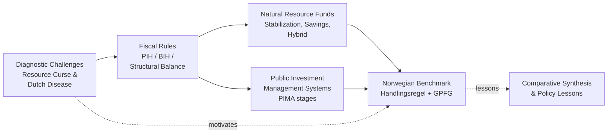
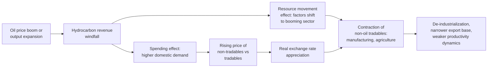
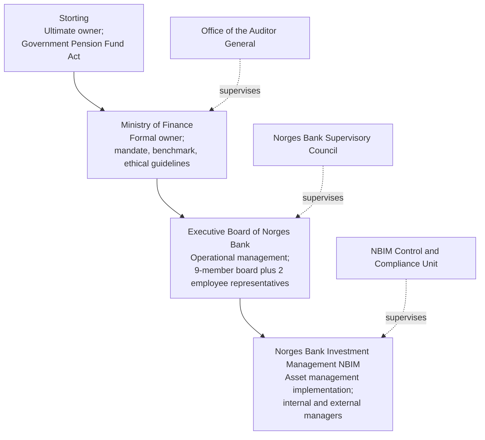

# Managing Oil Wealth to Avoid the Resource Curse: Fiscal Rules, Revenue Management Tools, and the Norwegian Benchmark
# 1 Introduction and Research Framework

Few endowments in modern economic history have proven as paradoxical as petroleum wealth. Over the past half-century, the discovery of large hydrocarbon reserves has appeared to many governments as a transformative windfall—an opportunity to accelerate industrialization, finance infrastructure, alleviate poverty, and elevate national power. Yet the empirical record of resource-rich states has been markedly mixed, and in numerous cases distinctly disappointing: economies that began with high expectations of hydrocarbon-financed prosperity have instead experienced sluggish long-run growth, deepening fiscal fragility, atrophied non-oil sectors, and corrosive political dynamics. The puzzle of why finite subsoil wealth so frequently fails to translate into durable, broad-based development—and what institutional and policy choices can reverse this pattern—motivates this report. This opening chapter establishes the conceptual and analytical scaffolding for the investigation that follows. It clarifies why the question of oil wealth management commands enduring policy importance, defines the core terminology that recurs throughout the report, presents the institutional-economic framework integrating the four substantive pillars of the analysis, and maps the structure of the subsequent chapters.

## 1.1 Research Motivation and Policy Relevance

The motivation for revisiting oil wealth management in a research report is neither academic nostalgia nor a routine restatement of well-known development concerns; it stems from the convergence of several enduring and intensifying pressures that confront petroleum-exporting economies in the contemporary period. The first and most persistent of these is the recurring failure of many oil-rich states to convert resource booms into sustainable development. From the Venezuelan boom-bust trajectories of the late twentieth century to the post-2008 fiscal stress experienced by Gulf and African oil exporters, the empirical record demonstrates that abundant hydrocarbon revenues, in the absence of disciplined institutions, do not reliably produce higher per capita income, broader productive diversification, or improvements in human development outcomes commensurate with the scale of resource rents accruing to public budgets. Numerous economies that experienced large windfalls in the 1970s and again in the 2000s exited those cycles with weakened non-oil tradable sectors, elevated public debt, eroded administrative capacity, and political economies tilted toward rent distribution rather than productivity. This pattern—observed widely enough to have generated a sizeable academic literature on what is termed the "resource curse"—frames the central policy problem: oil wealth is simultaneously an opportunity and a hazard, and the difference between the two is mediated almost entirely by the quality of public management institutions.

A second motivating pressure is **macroeconomic volatility**. Crude oil prices have historically exhibited amplitudes far greater than those of most other major commodities, with successive cycles—the early-1980s collapse, the 1998 trough, the 2008 spike and crash, the 2014–2016 decline, and the sharp 2020 downturn associated with the COVID-19 pandemic and the oil market dislocation—imposing severe procyclical stress on government budgets, balance of payments positions, and exchange rates of producing countries. Because oil revenues frequently account for the majority of fiscal income and export earnings in major exporters, price volatility transmits almost mechanically into expenditure volatility, real exchange rate volatility, and credit-cycle volatility unless explicit insulation mechanisms are in place. The repeated experience of countries discovering, during downturns, that procyclical spending in the preceding boom had left them without fiscal buffers underlines the urgency of institutional design that operates ex ante rather than ex post.

A third, increasingly salient pressure is the **global energy transition**. While the bulk of the literature drawn upon in this report predates the most recent intensification of climate policy, by 2020 the prospect of declining long-term demand for hydrocarbons—driven by decarbonization commitments, falling costs of renewables and electrification, and shifting investor preferences—had begun to reshape the strategic calculus of oil-dependent states. The risk that a substantial fraction of proven reserves could become economically stranded reframes the intergenerational dimension of resource management: the time horizon over which oil wealth must be converted into other productive assets has effectively shortened relative to earlier expectations of multi-decade extraction trajectories. This raises the premium on rapid, efficient diversification and on the prudent transformation of subsoil wealth into financial and human capital that retains value independently of hydrocarbon markets.

A fourth motivation is **policy demand from practitioners**. Finance ministries in resource-rich states, sovereign wealth fund managers, international financial institutions such as the IMF and World Bank, and specialized policy bodies such as the Natural Resource Governance Institute (NRGI) and the International Forum of Sovereign Wealth Funds (IFSWF) have produced an expanding corpus of frameworks, diagnostics, and benchmarks specifically aimed at strengthening hydrocarbon revenue management. The proliferation of fiscal rules, the establishment of new natural resource funds in countries as diverse as Ghana, East Timor, and Mongolia in the 2000s and 2010s, and the development of analytical tools such as the IMF's Public Investment Management Assessment (PIMA) reflect a recognition that this is a domain where institutional design choices can be informed by accumulated cross-country experience. A consolidated research synthesis that distills this experience into a coherent framework therefore answers a concrete policy need.

Taken together, these four pressures—recurrent development failure, structural volatility, transition risk, and active policy demand—justify the central research question of this report: **how can oil-dependent countries design and operate institutions that convert finite hydrocarbon wealth into sustainable, diversified, and intergenerationally equitable prosperity?** The remainder of the report seeks to answer this question by integrating diagnostic analysis with prescriptive policy frameworks and benchmark experience.

## 1.2 Key Concepts and Definitions

Because the academic and policy literatures on resource-rich economies employ a number of closely related but distinct concepts, terminological precision at the outset is essential to ensure analytical clarity in subsequent chapters. This subsection defines three foundational terms—oil dependence, oil wealth, and the resource curse—and distinguishes them from adjacent concepts such as Dutch disease.

**Oil dependence** denotes the structural condition in which an economy's macroeconomic and fiscal performance is materially conditioned by hydrocarbon production. Three measurable dimensions are typically combined to operationalize the concept. The first is the **fiscal dimension**: the share of total government revenue derived from oil and gas, including royalties, profit taxes on petroleum operations, signature bonuses, state-equity dividends, and export duties. Economies in which this share exceeds roughly one-third are conventionally classified as fiscally oil-dependent, and many of the countries discussed in this report exhibit shares well above one-half. The second is the **export dimension**: the share of merchandise (or total goods and services) exports accounted for by hydrocarbons, which captures the balance-of-payments and exchange-rate exposure of the economy. The third is the **output dimension**: the share of gross domestic product directly attributable to oil and gas extraction. Each dimension captures a distinct transmission channel through which oil prices and production volumes affect domestic outcomes, and oil dependence is most rigorously assessed when all three are considered jointly, since an economy can be heavily fiscally dependent yet have a moderate oil share of GDP if the non-oil economy is small or untaxed.

**Oil wealth**, in contrast to dependence, is a stock concept rather than a flow concept. It comprises two components. The first is the **value of in-ground (subsoil) hydrocarbon assets**, ordinarily estimated as the present value of expected future net cash flows from proven and probable reserves, given assumed price paths, extraction costs, and discount rates. The second is the **stock of financial and physical assets accumulated through past hydrocarbon production**, including foreign reserves, sovereign wealth fund holdings, infrastructure, and human capital financed from oil revenues. The distinction between subsoil wealth and accumulated wealth is analytically critical: prudent management can be understood as the systematic transformation of the former into the latter at a pace and in a form that preserves intergenerational equity and economic resilience. The theoretical foundation for this transformation logic is associated with the Hartwick rule, which holds that the consumption of finite resource rents is compatible with non-declining welfare only if a sufficient share of those rents is reinvested in reproducible capital.

The **resource curse** is the umbrella concept describing the empirically documented tendency for resource-rich states, particularly those dependent on point-source extractives such as oil, to exhibit, on average and ceteris paribus, weaker long-run economic growth, more volatile macroeconomic performance, weaker institutional quality, and poorer governance outcomes than comparable resource-poor states. The seminal contributions of Sachs and Warner in the mid-1990s and subsequent refinements by Van der Ploeg, Frankel, and others have established the resource curse as a multi-dimensional phenomenon operating through three principal channels, each of which is examined in detail in Chapter 2:

- An **economic channel**, in which a real exchange rate appreciation associated with the resource boom undermines the competitiveness of non-resource tradable sectors, leading to de-industrialization. This specific mechanism—labelled **Dutch disease** after the experience of the Netherlands following its 1959 Groningen gas discovery and formalized in the Corden–Neary model—should be understood as a *subset* of resource-curse mechanisms rather than a synonym for the broader phenomenon.
- A **political-institutional channel**, in which the availability of large, easily appropriable rents incentivizes rent-seeking, weakens the social contract linking taxation to representation, erodes administrative quality, and in some contexts elevates the risk of corruption and conflict.
- A **macroeconomic volatility channel**, in which the procyclicality of resource revenues induces boom-bust spending patterns, hampers long-term planning, and amplifies external shocks.

The careful separation of these terms—dependence as a structural condition, wealth as a transformable stock, the curse as an outcome syndrome, and Dutch disease as one mechanism within that syndrome—provides the conceptual scaffolding for the report. It also clarifies that the policy challenge is not the existence of oil endowments per se, but the institutional management of dependence and the conversion of subsoil wealth into more durable forms of national capital.

## 1.3 Analytical Framework and Research Logic

The analytical perspective adopted in this report is **institutional-economic**: it combines the macroeconomic logic of resource booms with an institutionalist emphasis on how rules, organizations, and governance arrangements shape the behavior of public actors and the outcomes of fiscal and investment decisions. This perspective rests on two premises. First, the economic transmission mechanisms identified in resource-curse theory—real exchange rate effects, volatility transmission, rent allocation—are not deterministic; they operate through the choices of governments, central banks, public investment agencies, and asset managers, whose discretion is in turn structured by formal rules and informal incentives. Second, no single instrument is sufficient to neutralize the multiple channels of the resource curse simultaneously; effective management requires a coherent ensemble of instruments, each addressing a distinct dimension of the problem, and each operating in a manner that reinforces rather than undermines the others.

From this premise, the report organizes its substantive analysis around four pillars, each corresponding to a sequenced logical task in converting hydrocarbon endowments into sustainable prosperity:

| Pillar | Analytical Task | Question Addressed | Report Chapter |
|---|---|---|---|
| Pillar 1: Diagnostic Challenges | Identify and characterize the risks of oil dependence | What goes wrong, through which channels, and with what consequences? | Chapter 2 |
| Pillar 2: Fiscal Rules | Impose budgetary discipline that delinks spending from revenue volatility and respects intergenerational equity | How should governments decide how much oil revenue to spend versus save? | Chapter 3 |
| Pillar 3: Revenue Management Tools | Operationalize fiscal rules through dedicated institutional vehicles for savings, stabilization, and investment | Through what institutional mechanisms are saved revenues stewarded and invested revenues converted into productive capital? | Chapters 4 and 5 |
| Pillar 4: Benchmark Practice | Provide an integrated empirical proof-of-concept showing how the preceding pillars function in a successful case | What does a working integrated model look like in practice, and what conditions sustain it? | Chapter 6 |

The logical progression among the four pillars is sequential and cumulative. The **diagnostic pillar** identifies the specific risks that policy must counteract; without a clear understanding of the transmission channels of the resource curse, the design of fiscal rules and institutions would be untethered from the problem they are intended to solve. The **fiscal-rules pillar** then translates the diagnostic into ex-ante constraints on spending and saving decisions, formalizing intergenerational equity and stabilization objectives in operationally tractable form. The **revenue-management pillar** addresses the practical question of how those rules are implemented: natural resource funds provide the institutional infrastructure for savings and stabilization (Chapter 4), while public investment management systems govern the conversion of revenues that flow to the domestic budget into productive physical and human capital (Chapter 5). The **benchmark pillar**, exemplified by Norway, demonstrates how these elements can be integrated coherently and offers a reference point against which the experiences of developing oil exporters can be assessed.

The interlocking relationships among the four pillars can be visualized as follows:

The diagram captures the central architecture of the report: the diagnostic of curse mechanisms motivates the design of fiscal rules, which in turn require two distinct categories of operational vehicles—savings/stabilization funds and public investment systems—whose joint operation defines the integrated model exemplified by Norway, against which other countries can be compared. The dashed arrow back from the benchmark to the diagnostic indicates that the Norwegian case is not merely an exemplar but also an analytical lens for evaluating which curse channels are most effectively neutralized, and under what institutional preconditions.

Two cross-cutting analytical commitments inform the application of this framework. First, **causal mechanism over descriptive enumeration**: at each stage, the report seeks to articulate not only what instruments exist but how they work, what preconditions they require, and what evidence supports or qualifies their effectiveness. Second, **comparative qualification of transferability**: while Norway serves as the benchmark, the report consistently considers the extent to which its institutional features depend on context-specific conditions—prior governance quality, economic diversification, demographic structure, political stability—and which are more readily portable to developing oil exporters.

## 1.4 Scope, Structure, and Chapter Roadmap

The scope of this report is delimited along three dimensions. **Temporally**, it draws on public information and academic scholarship up to and including 2020; subsequent developments, including post-pandemic oil market dynamics and accelerated energy transition policies after 2020, fall outside its evidentiary base, though their prospective implications are acknowledged where relevant. **Substantively**, the report focuses on the four pillars identified above—diagnostic challenges, fiscal rules, revenue management tools (covering both natural resource funds and public investment management), and benchmark practice—and treats adjacent topics such as petroleum sector regulation, contract negotiation, and transparency standards only insofar as they intersect with these pillars. **Geographically**, the report draws comparative evidence from major oil exporters across regions—including, illustratively, Nigeria and post-Soviet exporters such as Russia, Kazakhstan, and Azerbaijan in the diagnostic discussion; Chile, Mexico, Botswana, and São Tomé and Príncipe in the fiscal-rules discussion; Kazakhstan, Azerbaijan, Kuwait, and Botswana in the natural resource funds discussion; and Iran and Jordan in the public investment management discussion—while reserving an in-depth case study for Norway as the canonical benchmark.

The remainder of the report proceeds as follows. **Chapter 2** develops the diagnostic foundation by examining the theoretical and empirical literatures on the resource curse and Dutch disease, articulating the economic, political-institutional, and volatility channels through which oil dependence produces adverse outcomes, and illustrating these channels with country evidence. **Chapter 3** turns to fiscal policy strategy, comparing the three principal rules discussed in the literature—the Permanent Income Hypothesis (PIH) rule, the Bird-in-Hand (BIH) rule, and the Structural Fiscal Balance rule—in terms of their underlying logic, intergenerational assumptions, treatment of volatility and exhaustibility, operational mechanics, strengths and weaknesses, and country applications. **Chapter 4** examines natural resource funds as the principal institutional vehicle for translating fiscal rules into operational savings and stabilization practice, classifying funds into stabilization, savings (intergenerational), and hybrid types, and analyzing design, governance, and effectiveness using country illustrations. **Chapter 5** complements this with an analysis of public investment management systems, drawing on the IMF's PIMA framework to explain how the appraisal, selection, implementation, and monitoring of public investments determine whether spent oil revenues generate productive capital or are dissipated. **Chapter 6** synthesizes the preceding analytical elements through an in-depth examination of Norway, covering the political-economic context of its choices, the operation of the *handlingsregel* fiscal rule, the design and governance of the Government Pension Fund Global (GPFG), and the joint contribution of these institutions to insulating the Norwegian economy from Dutch disease and ensuring intergenerational equity, while critically discussing remaining vulnerabilities. **Chapter 7** develops a comparative synthesis, distilling the institutional, political, and economic preconditions that distinguish successful from unsuccessful oil wealth management and assessing the transferability of Norwegian practices to developing exporters. **Chapter 8** concludes by consolidating the integrated policy framework and identifying open questions and avenues for further research, particularly in the context of low-oil-price environments, the global energy transition, and diversification strategies.

This sequence is designed to guide the reader from problem diagnosis through analytical prescription to empirical benchmarking and comparative inference, providing a structured response to the central research question of how oil-dependent countries can convert finite hydrocarbon endowments into sustainable, diversified, and intergenerationally equitable prosperity.

# 2 Core Challenges: The Resource Curse and Dutch Disease

The introductory chapter argued that the gap between oil endowment and developmental outcome is mediated almost entirely by the quality of public management institutions, and identified three transmission channels—economic, political-institutional, and macroeconomic volatility—through which oil dependence can damage host economies. The diagnostic task of the present chapter is to substantiate that argument: to trace the intellectual genealogy of the resource curse hypothesis, to decompose the syndrome into its constituent mechanisms with theoretical precision, and to anchor each mechanism in the empirical record of oil-producing states up to 2020. Only with this diagnostic foundation in place can the report move, in subsequent chapters, to the design of fiscal rules, savings vehicles, and investment systems intended to counteract the specific pathologies identified here. The structure of this chapter therefore mirrors the analytical logic of the framework introduced in Chapter 1: theoretical foundations first (Section 2.1), followed by channel-by-channel analysis (Sections 2.2 through 2.4), and concluding with an integrated assessment of cumulative developmental consequences (Section 2.5).

## 2.1 Theoretical Foundations of the Resource Curse

The resource curse hypothesis emerged from an empirical puzzle that became increasingly visible during the late 1980s and early 1990s. After two oil-price booms (1973–1974 and 1979–1980) had channelled extraordinary rents to producing states, comparative growth data began to suggest that the most resource-abundant developing economies had not, on average, outperformed their resource-poor counterparts; in many cases the opposite was true. Richard Auty, working on the developmental experience of mineral exporters, is generally credited with coining the term "resource curse" in the early 1990s to characterize this counter-intuitive pattern, framing it as a tendency rather than a deterministic outcome and emphasizing the role of policy mismanagement and weak institutions in converting endowment into liability.

The hypothesis received its most influential empirical formulation in the work of Jeffrey Sachs and Andrew Warner in the mid-1990s. Using cross-country regressions covering roughly 1970–1990, they reported a robust negative association between the share of primary-resource exports in GDP at the start of the period and subsequent per capita growth, conditional on standard controls including initial income, investment, openness, and rule of law. The Sachs–Warner finding crystallized the resource curse as a stylized fact and oriented the subsequent literature toward identifying the mechanisms that could explain it. Their preferred interpretation emphasized Dutch-disease-type crowding-out of manufacturing exports, although they also acknowledged that political and institutional dynamics likely played a role.

Subsequent scholarship refined, qualified, and in places contested the Sachs–Warner result along three principal lines. The first line, associated with Frederick van der Ploeg, Jeffrey Frankel, and others, drew an analytical distinction between **resource abundance** (the stock of subsoil wealth) and **resource dependence** (the share of resource revenues in GDP, exports, or government income), arguing that the empirical curse pertains more robustly to dependence than to abundance and that the choice of explanatory variable materially affects findings. This refinement matters because it implies that the curse is at least partly endogenous: countries that fail to develop non-resource sectors *become* dependent, and dependence in turn perpetuates underperformance, producing a feedback loop that institutional reform must break.

The second refinement, developed in particular by Halvor Mehlum, Karl Moene, and Ragnar Torvik, articulated the resource curse as **conditional on institutional quality**. In their formulation, resource rents are neutral inputs whose effect depends on whether the surrounding institutions are "producer-friendly" (channelling entrepreneurial energy into productive activity) or "grabber-friendly" (rewarding rent-seeking and predation). Where institutions are weak, rents amplify rent-seeking and depress productive investment; where institutions are strong, the same rents finance productive accumulation. This insight reframed the curse from a deterministic syndrome to a contingent outcome and made institutional quality the pivotal mediating variable—an analytical move with direct implications for the policy prescriptions developed later in this report. Norway and Botswana, jurisdictions with comparatively strong pre-discovery institutions, are routinely cited as cases where the conditional logic predicted, and broadly delivered, favorable trajectories.

The third refinement, prominent in the work of Frankel and others, drew attention to **volatility and procyclicality** as transmission mechanisms distinct from the long-run real-exchange-rate logic of Dutch disease. In this view, the curse operates not only or even primarily through structural crowding-out of tradables but also through the destabilizing effects of large, oscillating revenue flows on fiscal management, investment planning, and credit cycles. This refinement laid the analytical groundwork for the macroeconomic volatility channel discussed in Section 2.4.

A critical undercurrent in the literature contested the curse hypothesis on methodological grounds, arguing that cross-country regression results are sensitive to the specification of the resource variable, the time period analyzed, and the inclusion of controls for prior institutional quality. Some studies, re-examining longer or different country panels, found the negative association to weaken or reverse, while others argued that any apparent curse reflected reverse causation or omitted variables. The consensus that emerged by the late 2010s was nuanced rather than absolute: there is no universal, deterministic resource curse, but there is a robust pattern of *conditional* underperformance among point-source resource exporters with weak institutions, operating through identifiable economic, political, and volatility channels.

It is important at this stage to fix the conceptual relationship between the resource curse and Dutch disease that was introduced in Chapter 1. The resource curse is the umbrella syndrome encompassing weaker long-run growth, governance erosion, macroeconomic volatility, and developmental underperformance in resource-dependent states. Dutch disease, named after the Netherlands' experience following the 1959 Groningen gas discovery and formalized in the early 1980s by W. M. Corden and J. Peter Neary, is one specific economic mechanism—the structural distortion of the tradable sector through real exchange rate appreciation—through which the curse can operate. The two terms are therefore not synonyms: Dutch disease is a *component* of the resource curse, alongside political-institutional and volatility mechanisms. The remainder of this chapter examines each of the three channels in turn.

## 2.2 The Economic Channel: Dutch Disease and Structural Distortions

The economic channel of the resource curse, captured most precisely by the Dutch disease model, concerns the structural reallocation of resources within an oil-dependent economy in response to a sustained increase in hydrocarbon revenues. The model developed by Corden and Neary in 1982, building on observations of the Dutch macroeconomic experience after the Groningen gas field came on stream and gas exports expanded through the 1960s and 1970s, decomposes the economy into three sectors: the booming sector (oil and gas), the lagging tradable sector (typically manufacturing and agriculture, exposed to international competition), and the non-tradable sector (services, construction, retail, government). The reallocation operates through two distinct but reinforcing effects.

The **resource movement effect** describes the direct reallocation of mobile factors—labor and, where relevant, capital—from the lagging tradable sector to the booming sector and to the non-tradable sector. As the booming oil sector offers higher wages and returns, it draws factors away from manufacturing and agriculture, raising costs and reducing output in those sectors. In oil economies this effect is often modest in scale because hydrocarbon extraction is capital-intensive and employs a small fraction of the labor force directly, yet it can be material at the margin, particularly for skilled labor and specialized services.

The **spending effect**, generally the more powerful of the two in oil contexts, operates through the income generated by the boom. The additional revenue—whether received by the private sector through wages and dividends or by the government through taxes and royalties—is spent on a mix of tradable and non-tradable goods and services. The tradable prices are anchored to international markets and cannot rise much in response to domestic demand, but the non-tradable prices, set domestically, do rise. The resulting increase in the relative price of non-tradables to tradables is, by definition, an appreciation of the real exchange rate. This appreciation makes domestic tradable production less competitive at home and abroad, compressing margins, shrinking output, and reducing employment in the manufacturing and agricultural sectors. The non-tradable sector, by contrast, expands to meet the higher demand at the new higher relative prices.

Schematically, the causal chain runs from the hydrocarbon windfall through domestic spending and real appreciation to contraction of non-oil tradables and expansion of non-tradables:

The macroeconomic consequences of this reallocation can be relatively benign in the short run—indeed the boom often generates apparent prosperity through higher wages, government spending, and consumption—but become problematic when several second-order effects are taken into account. A first such effect is the **loss of learning-by-doing** in the contracting tradable sectors. Manufacturing and modern services are widely regarded as engines of endogenous productivity growth because they generate technological spillovers, on-the-job learning, and economies of scale that resource extraction does not generate to the same degree. When such sectors contract, the economy forgoes the productivity dynamics that would otherwise compound over time, and long-run growth potential is impaired even if short-run incomes are higher.

A second second-order effect is **hysteresis**: the tradable sectors damaged during the boom may not recover symmetrically when the boom ends. Skilled workers retrained or absorbed into non-tradables, supplier networks dismantled, and export market positions lost are not easily restored when real exchange rates depreciate during a bust. The economy therefore exits the cycle with a structurally narrower productive base than it entered, having ratcheted down rather than oscillating around a stable equilibrium.

A third effect concerns the **crowding-out of human and physical capital from productive non-oil activities**. The relative price signals during a boom encourage investment in non-tradables—real estate, retail, government employment, import-dependent consumption—rather than in tradable productive capacity. Tertiary education and skill formation may similarly tilt toward fields that serve the booming sector and the public administration rather than toward broad-based technical and engineering capacity. Over a multi-decade horizon, this reallocation of formative investment compounds the structural narrowing of the economy.

The empirical record of Dutch disease in oil exporters is extensive. The original Dutch case, while milder than many subsequent oil experiences because of the Netherlands' diversified industrial base and effective compensatory policies, demonstrated the basic mechanism: gas exports rose, the guilder appreciated in real terms, and manufacturing employment declined more rapidly than in comparable European economies during the 1970s. The Nigerian case offers a starker illustration. Prior to the oil booms of the 1970s, Nigeria was a significant exporter of agricultural commodities—groundnuts, palm oil, cocoa, cotton—with a non-trivial manufacturing base. The post-1973 oil revenue surge, combined with overvalued exchange rates and ambitious public spending on import-intensive consumption and prestige projects, was associated with the collapse of agricultural exports and the stagnation of manufacturing, leaving the country acutely dependent on a single commodity by the time the price collapses of the 1980s arrived. The hysteresis effect is visible in Nigeria's subsequent inability, despite repeated diversification rhetoric, to rebuild a competitive non-oil tradable sector across the 1980s, 1990s, and 2000s.

Post-Soviet oil exporters provide a related but distinct illustration. In Russia, Kazakhstan, and Azerbaijan, the hydrocarbon booms of the 2000s, occurring against a backdrop of post-transition economies still reorganizing their productive structures, were associated with real appreciation of the ruble, tenge, and manat respectively, and with limited expansion of non-oil tradable industries beyond extractive linkages. The phenomenon was less a destruction of pre-existing non-oil tradables (which had already contracted sharply during the 1990s transition) than a failure of new non-oil tradable sectors to emerge during the boom, with investment and employment growth concentrated instead in construction, retail, financial services, and government-linked activities.

The economic channel, then, articulates a specific and well-documented mechanism by which oil endowments harm long-run developmental performance: by inducing structural distortions that hollow out the productive base required for diversified, productivity-driven growth. It does not, however, exhaust the syndrome. The political-institutional and macroeconomic-volatility channels examined next operate in parallel and frequently amplify the structural damage.

## 2.3 The Political-Institutional Channel: Rent-Seeking, Governance, and Conflict

The political-institutional channel is grounded in the recognition that oil rents are not ordinary income. They are large, geographically concentrated, easily appropriable by whoever controls the relevant territory or contracts, and—because they accrue from the sale of a depletable natural endowment rather than from broad-based taxation of productive activity—they do not require the state to extract resources from a politically organized citizenry. These properties have systematic consequences for the structure of governance in resource-dependent states, consequences that operate independently of, and in addition to, the structural economic distortions described above.

The first and most foundational mechanism is the **weakening of the fiscal social contract**. In the classical accounts of state formation, the necessity of taxation links rulers to ruled: governments that depend on tax revenues from their citizens have an incentive to provide services in exchange for compliance, and citizens have a corresponding incentive to demand accountability for how those revenues are used. The taxation–representation linkage, encapsulated historically in the slogan "no taxation without representation," is widely regarded in the political economy literature as a foundational mechanism of accountable governance. In rentier states—a term originally developed in the 1980s and 1990s to describe Middle Eastern oil monarchies and subsequently generalized to other hydrocarbon-dependent regimes—the dominance of resource revenues over tax revenues weakens this linkage from both sides. The state, financed by rents rather than by taxes, has reduced incentives to negotiate with citizens or to develop the bureaucratic capacity required for broad-based taxation; citizens, in turn, face fewer direct fiscal costs from government action and have weakened standing and incentive to demand accountability. Over time, this can produce political settlements in which patronage and rent distribution substitute for genuine public-goods provision as the principal currency of political exchange.

A second mechanism is **rent-seeking and the redirection of entrepreneurial energy**. Where the prize is the capture of a share of large public rents rather than the creation of new wealth through productive activity, rational actors—politicians, officials, businesspeople, military officers—will tend to allocate effort accordingly. The Mehlum–Moene–Torvik framework formalizes this insight: in grabber-friendly institutional environments, where property rights are insecure, judicial systems are weak, and political access translates into commercial advantage, rents amplify the returns to predation and depress the returns to production. The result is not merely the misallocation of resources within the current generation but the long-run weakening of the institutional infrastructure—courts, regulatory agencies, civil services—that would be required to support a more productive economy.

A third mechanism is **corruption**. The combination of large rents, opaque revenue flows from upstream petroleum operations, and weakened accountability creates structural opportunities for corrupt behavior at multiple points in the value chain: in license allocation, in contract awards, in production-sharing arrangements, in state-owned enterprise management, and in the disbursement of public spending financed by oil revenues. Cross-country evidence has documented a statistically significant association between resource dependence and corruption indicators, conditional on initial institutional quality. Corruption further erodes administrative quality, distorts public spending toward projects that maximize private rents rather than social returns, and undermines the credibility of fiscal rules and revenue management institutions of the kind examined later in this report.

A fourth mechanism concerns the **erosion of bureaucratic quality and policy coherence**. Where political competition centers on rent distribution rather than on policy performance, the senior civil service tends to become politicized, with appointments serving patronage networks rather than meritocratic competence. Specialized fiscal, monetary, and regulatory agencies may be staffed and led with an eye to political loyalty, weakening their capacity to design and enforce the disciplined policies required to manage volatile revenues. Even where formal rules and institutions exist on paper, their substantive operation can be hollowed out, producing the recurring pattern in which fiscal rules are bypassed during booms and sovereign funds are raided during downturns.

A fifth mechanism, applicable in particular contexts, is the **elevated risk of civil conflict and authoritarian consolidation**. Empirical studies have suggested that oil dependence is associated with a higher probability of civil conflict, particularly in countries with ethnically or regionally concentrated extraction zones, weak central authority, and pre-existing grievances; oil rents can finance both incumbent repression and insurgent activity, prolonging conflicts once they begin. In other contexts, oil rents support the consolidation of authoritarian governance by providing rulers with resources to coopt potential opposition, finance security apparatuses, and bypass the need for tax-based legitimacy.

The Nigerian case illustrates several of these mechanisms operating jointly. Decades of oil dependence have been associated with persistent challenges of corruption in revenue collection and public spending, contested federal–state arrangements for distributing oil revenues, episodic conflict in the Niger Delta linked to grievances over the distribution of oil rents and the environmental consequences of extraction, and a recurring inability to convert oil revenues into commensurate human-development outcomes. The political-economic dynamics of oil-dependent rent distribution have shaped electoral competition, civil–military relations, and federal politics in ways that have, on balance, complicated rather than facilitated the institutional reforms required to manage hydrocarbon wealth productively.

Post-Soviet oil exporters present a different but analytically related pattern. In Russia, Kazakhstan, and Azerbaijan, the hydrocarbon-revenue surge of the 2000s coincided with the consolidation of centralized political authority and the development of state-led models of resource governance in which control over the petroleum sector—through state-owned enterprises, regulatory agencies, and political access to licensing—was central to the political settlement. The institutional outcomes in these cases were not uniform: some saw the development of relatively sophisticated sovereign wealth fund architectures (examined in Chapter 4), while transparency, judicial independence, and political competition remained more constrained than in benchmark cases such as Norway. These cases underscore the conditional nature of the institutional curse: oil rents interact with pre-existing institutional configurations to produce path-dependent governance trajectories, rather than imposing a uniform outcome regardless of starting conditions.

The cumulative implication of the political-institutional channel is that the design and credibility of the fiscal and revenue-management institutions examined in Chapters 3 through 5 are themselves endogenous to the political economy that oil dependence helps to shape. A fiscal rule or sovereign fund grafted onto a polity whose underlying incentive structure rewards rent distribution will not, on its own, neutralize the curse; it will more likely be circumvented or repurposed. The prescriptive question is therefore not only "what instruments should be adopted" but "what political and institutional preconditions are required for those instruments to operate as designed"—a question to which Chapter 7's comparative synthesis returns.

## 2.4 The Macroeconomic Volatility Channel: Boom-Bust Cycles and Procyclicality

The third channel of the resource curse operates not through long-run structural distortion or institutional erosion but through the short-to-medium-run volatility of hydrocarbon revenues and its transmission into the domestic macroeconomy. While conceptually distinct from Dutch disease and from rent-seeking, the volatility channel interacts with both: volatility magnifies the difficulty of pursuing consistent diversification policy, and the political incentive to spend during booms exposes the institutional weaknesses described in Section 2.3.

The point of departure is the **historical amplitude of oil price cycles**. Crude oil prices have exhibited some of the largest sustained price swings of any major commodity over the past half-century, with successive episodes—the 1973–1974 and 1979–1980 boom-driven price levels, the early-1980s collapse, the deep 1986 fall, the 1998 trough, the rise through the 2000s to the 2008 peak followed by the financial-crisis-driven collapse, the partial recovery and renewed decline of 2014–2016, and the sharp 2020 collapse associated with the COVID-19 pandemic and concurrent supply dislocation—each translating, for major oil exporters, into multi-billion-dollar swings in annual revenue. Because the cost structure of conventional petroleum extraction is dominated by upfront capital expenditures rather than marginal production costs, output does not adjust quickly to price changes, which means that price volatility translates almost one-for-one into revenue volatility for the producer state.

The central diagnostic concern is not volatility in revenues *per se* but its transmission into volatility in spending—what the literature terms **procyclical fiscal behavior**. A non-resource economy with stable revenues can absorb commodity price shocks through countercyclical fiscal policy: saving during good times and drawing down during bad times to smooth aggregate demand. In oil-dependent economies, however, fiscal expenditure has frequently moved with rather than against revenue. During booms, additional revenues are spent—on current expenditures including public-sector wages and subsidies, on capital projects undertaken with insufficient appraisal, and on transfers that are politically difficult to reverse—rather than saved. During busts, the resulting expenditure commitments must then be financed through borrowing, asset drawdown, or painful spending compression, transmitting the external shock into the domestic economy with full force.

The mechanisms generating procyclicality are interconnected. Political incentives during booms favor visible spending that demonstrates the benefits of the boom and rewards political constituencies; the technical capacity to distinguish permanent from transitory revenue gains is often limited; revenue forecasts tend toward optimism in good times; and where institutional safeguards such as fiscal rules or stabilization funds exist on paper, they can be suspended or bypassed under political pressure. Once boom-era expenditure levels become embedded in budget baselines, fiscal contraction during downturns becomes politically and administratively costly, and governments often defer adjustment through debt accumulation, depletion of reserves, or recourse to monetary financing.

The consequences of procyclicality propagate through several macroeconomic dimensions. **Public investment volatility** is particularly damaging because it disrupts multi-year project pipelines: projects initiated in boom years may be left unfinished or scaled back during busts, raising unit costs, eroding the productivity of completed assets, and discouraging private co-investment. **Real exchange rate volatility**, compounded by the structural appreciation pressures discussed in Section 2.2, generates uncertainty that further discourages investment in non-oil tradables. **Credit cycle volatility**, transmitted from oil-revenue swings through banking systems exposed to oil-linked sectors and oil-financed government deposits, can amplify boom-bust dynamics in the private economy. **Inflation volatility**, particularly where price stability is not anchored by an independent central bank or where exchange-rate management is constrained, complicates household and corporate planning.

The long-run growth costs of macroeconomic volatility have been documented across multiple empirical literatures. Volatility raises the perceived risk of investment and shortens the effective planning horizon of private actors, biasing investment toward short-cycle projects and away from the longer-gestation, higher-productivity investments associated with technological catch-up. It complicates the operation of monetary policy and the management of public debt, raises the risk premium on sovereign and corporate borrowing, and can lock the economy into stop-go growth patterns that produce average outcomes substantially below what stable growth would deliver. In the aggregate, the resource-curse literature has identified volatility transmission as one of the principal mechanisms through which resource dependence reduces long-run growth, distinct from but complementary to the Dutch-disease and institutional channels.

**Balance-of-payments and debt accumulation patterns** are a particularly visible manifestation of the volatility channel. During booms, oil exporters typically run current account surpluses, accumulate external reserves, and benefit from favorable sovereign credit ratings; their access to international borrowing is easy and cheap. The combination of strong external positions and abundant credit facilitates debt accumulation, sometimes by the central government, sometimes by state-owned enterprises (notably national oil companies), and sometimes by sub-national governments. When prices fall, current accounts swing into deficit, reserves decline, credit conditions tighten, and the accumulated debt becomes increasingly burdensome relative to depressed revenues and contracting GDP. The recurring pattern is one of debt-financed expenditure during booms followed by debt-distress dynamics during busts, with International Monetary Fund programs, fiscal adjustment packages, and sometimes outright restructuring required to restore solvency.

The Venezuelan trajectory across the late twentieth and early twenty-first centuries is the canonical illustration of this pattern at its most extreme: successive cycles of oil-financed expansion followed by acute crisis, with rising indebtedness, exchange-rate dislocation, and currency collapse compounding through each cycle. Nigeria's experience across the 1980s and again following the 2014–2016 oil-price decline exhibits the same logic in milder form: boom-era spending commitments that proved difficult to compress, debt accumulation that became problematic when revenues fell, and recurring need for external balance-of-payments support. Post-Soviet exporters provide instructive variation: Russia, which had accumulated substantial reserves and stabilization-fund balances during the 2000s boom, was able to absorb the 2008–2009 and 2014–2016 shocks with less acute distress than Venezuela or Nigeria, illustrating that volatility transmission is moderated by the prior accumulation of buffers; Kazakhstan and Azerbaijan similarly relied on accumulated fund assets to cushion the 2014–2016 downturn, while still experiencing material currency depreciation, fiscal compression, and growth slowdown. The COVID-era 2020 shock then tested all of these arrangements simultaneously, exposing the limits of buffer accumulation when shocks are deep and prolonged.

The volatility channel thus motivates a specific set of institutional responses—stabilization funds, fiscal rules that delink spending from current revenue, and rigorous public investment management systems—each addressing a particular transmission mechanism. The detailed treatment of these instruments occupies Chapters 3 through 5.

## 2.5 Consequences for Growth, Diversification, and Social Outcomes

The three channels examined above are conceptually distinct but empirically conjoined: in most oil-dependent economies they operate simultaneously, reinforce one another, and collectively shape the developmental trajectory. The structural reallocation away from non-oil tradables (Section 2.2) narrows the productive base on which long-run productivity growth depends; the institutional dynamics of rent distribution (Section 2.3) reduce the political and administrative capacity to counteract that narrowing; and the volatility of hydrocarbon revenues (Section 2.4) periodically disrupts investment, public services, and macroeconomic stability. The cumulative consequences for growth, diversification, fiscal sustainability, and social outcomes are the integrated developmental cost of oil dependence under weak institutions.

On **long-run growth**, the cross-country empirical literature, beginning with Sachs and Warner and refined by subsequent contributors, has documented a conditional negative association between resource dependence and per capita growth that, while not universal and contested in some specifications, remains robust under reasonable controls for institutional quality. The interpretation that has emerged is that resource-dependent economies do not exhibit a uniform growth penalty but rather a bimodal distribution: a small group of countries with strong pre-discovery institutions (Norway and Botswana being the most frequently cited) have achieved sustained per capita income growth and successful conversion of resource wealth into broader prosperity, while a much larger group of resource-dependent developing economies have experienced stagnant, volatile, or declining per capita income over multi-decade horizons. The gap between Norway's outcomes and those of comparable mid-twentieth-century resource exporters such as Venezuela or Nigeria, examined comparatively in Chapter 7, gives a sense of the scale of developmental divergence that institutional choices can produce.

On **diversification**, the empirical record of oil-dependent economies is, on the whole, one of persistent narrowness. Despite repeated rhetorical commitment to diversification across multiple decades, most major oil exporters have, by 2020, achieved limited reduction in the dominance of hydrocarbons in exports, fiscal revenues, and—where applicable—employment. Diversification, where it has occurred, has often been toward downstream petrochemical or refining activity within the hydrocarbon value chain, or toward non-tradable services (construction, financial services, real estate, government employment) rather than toward internationally competitive non-oil tradables. The combination of real exchange rate pressures, weak non-oil productive capacity, and political-economy resistance to reforms that would compress incumbent rents has rendered diversification one of the most consistently elusive developmental objectives in resource-dependent states.

On **fiscal sustainability**, the procyclical pattern documented in Section 2.4 has translated, for many oil exporters, into a recurring cycle of debt accumulation, fiscal stress, and adjustment. Public debt levels in oil-dependent developing economies have typically risen during downturns, sometimes sharply, exposing the absence of countercyclical buffers built during preceding booms. The 2014–2016 and 2020 oil-price episodes provided two contemporary stress tests of fiscal frameworks, with substantial cross-country variation in resilience: countries with credible fiscal rules and well-governed stabilization funds (Norway most prominently, but also to varying degrees Kuwait, Botswana, Russia, Kazakhstan, and Azerbaijan) absorbed the shocks with less acute fiscal distress than countries lacking such buffers (such as Nigeria and Venezuela, where the absence of effective insulation produced sharp fiscal compression and rising debt distress). The dispersion of outcomes across this 2014–2020 period offers some of the clearest contemporary evidence that institutional choices materially condition the transmission of oil-price volatility into fiscal outcomes.

On **social outcomes**, the consequences are diverse and context-dependent, but several patterns are visible. Many oil-dependent developing economies have exhibited human-development indicators—life expectancy, educational attainment, poverty rates, inequality—weaker than would be predicted from their per capita GDP, suggesting that oil revenues have not been efficiently converted into human capital and welfare outcomes. Inequality, in particular, has tended to be elevated in resource-dependent economies, partly because rent distribution is often skewed toward urban, formally employed, and politically connected populations, leaving rural and informal-sector populations relatively underserved. Where oil revenues have funded broad social transfers—as in several Gulf monarchies—coverage has been generous but often dependent on continued high oil prices, creating fiscal vulnerabilities of the kind exposed during the 2014–2016 downturn. In conflict-affected oil regions, the developmental damage from violence, displacement, and environmental degradation compounds the underlying resource-curse dynamics, producing some of the most acute developmental underperformance observed in any group of countries.

The integrated diagnostic that emerges from this chapter can be summarized as follows. Oil dependence creates a recurring developmental hazard through three reinforcing channels: structural distortion of the non-oil productive base, weakening of governance and accountability institutions, and macroeconomic instability transmitted from hydrocarbon-price volatility. The aggregate consequence, observed across the majority of resource-dependent developing economies, is weaker long-run growth, persistent failure of productive diversification, recurring fiscal fragility, and social outcomes below what resource endowments might otherwise have permitted. Crucially, however, this outcome is **conditional rather than deterministic**: the experience of Norway and, on a smaller scale, Botswana demonstrates that under appropriate institutional configurations, hydrocarbon wealth can be converted into sustained prosperity, fiscal resilience, and intergenerational equity.

The remainder of the report is dedicated to articulating the institutional architecture that distinguishes the successful from the unsuccessful cases. Chapter 3 examines the fiscal rules through which spending and saving decisions can be disciplined against the procyclical and intertemporal pressures identified here. Chapter 4 examines the natural resource funds that operationalize these rules through dedicated savings and stabilization vehicles. Chapter 5 examines the public investment management systems that determine whether the revenues that are spent generate productive capital or are dissipated. Chapter 6 then assembles these elements through the integrated Norwegian benchmark. The transition from diagnosis to prescription begins, accordingly, with the question that Chapter 3 takes up: given the channels of damage identified above, how should an oil-dependent government decide how much of its hydrocarbon revenue to spend in the current period, and how much to save for the future?

# 3 Fiscal Policy Strategies for Managing Oil Revenues

The diagnostic of Chapter 2 established that oil dependence damages host economies through three reinforcing channels—structural distortion of the non-oil tradable base, the political-economy dynamics of rent distribution, and the macroeconomic volatility transmitted from hydrocarbon-price cycles—and that the difference between cursed and successful trajectories is mediated almost entirely by the quality of public management institutions. Translating that diagnostic into ex-ante policy discipline begins, logically, with the most fundamental budgetary decision an oil-dependent government faces in each year: how much of the hydrocarbon revenue accruing to the treasury should be spent in the current period, and how much should be set aside as financial assets for stabilization purposes and for future generations? Because this decision is recurrent, politically charged, and consequential for nearly every other dimension of macroeconomic management, governments around the world have sought to discipline it through formal fiscal rules that constrain discretion ex ante. This chapter analyzes the three principal classes of fiscal rule discussed in the academic and policy literature for managing volatile and exhaustible oil revenues: the Permanent Income Hypothesis (PIH) rule, the Bird-in-Hand (BIH) rule, and the Structural Fiscal Balance rule. Section 3.1 sets out the rationale for fiscal rules in oil-dependent contexts and the evaluative dimensions that structure the comparison; Sections 3.2 through 3.4 examine each rule in turn; and Section 3.5 synthesizes the comparison and identifies the conditions under which each rule is most appropriate, while flagging the operational and institutional dependencies that subsequent chapters will address.

## 3.1 The Rationale and Analytical Framework for Fiscal Rules in Oil-Dependent Economies

A fiscal rule, in its most general form, is a permanent constraint on fiscal policy expressed in terms of a summary indicator of fiscal performance—a budget balance, a debt level, an expenditure path, or a revenue benchmark. In non-resource economies, fiscal rules are typically motivated by concerns about debt sustainability, deficit bias, or the credibility of macroeconomic policy. In oil-dependent economies, the case for fiscal rules is qualitatively different and substantially stronger, because the rule must address three distinct pathologies simultaneously rather than one.

The first pathology is **procyclicality**, the tendency for spending to track current oil revenue rather than long-run sustainable income. As argued in Chapter 2, this dynamic underlies the boom-bust patterns observed across major oil exporters and converts external price volatility into domestic fiscal, exchange-rate, and credit-cycle volatility. A fiscal rule addresses procyclicality by formally delinking permitted spending in any given year from realized oil revenue in that year, so that the budget operates against a smoothed reference path rather than against the current cash-flow position. This insulation, in turn, attenuates the Dutch-disease pressures of spending-driven real exchange-rate appreciation discussed in Section 2.2: if the rule limits the pace at which oil revenues are converted into domestic demand, the spending effect that bids up non-tradable prices is moderated correspondingly.

The second pathology is **exhaustibility**. Oil revenues differ from ordinary tax revenues in that they represent the liquidation of a non-renewable subsoil asset; spending them as if they were perpetual income would, by the Hartwick logic invoked in Chapter 1, leave future generations strictly worse off when extraction ceases. A fiscal rule addresses exhaustibility by formalizing how much of the current revenue flow should be saved—accumulated as financial assets that can sustain consumption beyond the extraction horizon—and how much can be consumed without violating intergenerational equity. The strictness of this saving prescription is the principal axis on which the three rules examined below differ.

The third pathology is the **political-economy bias toward overspending and rent capture** identified in Section 2.3. Where rents are easily appropriable and the fiscal social contract is weak, the political incentive to spend during booms—whether on visible projects, transfers to politically connected constituencies, or expansion of the public payroll—is structurally strong. An ex-ante rule, particularly when codified in primary legislation and supported by transparency and oversight arrangements, raises the political and reputational cost of deviation and provides finance ministries with a defensible benchmark against which to resist sectoral and political spending pressure. The Natural Resource Governance Institute (NRGI) accordingly emphasizes that fiscal rules, defined as "constraints on government spending or public debt", can be enacted by parliaments precisely to "stabilize the budget, save for future generations, and improve long-term development planning," with Chile, Ghana, Peru, Norway, and Timor-Leste cited as countries that have legislated rules of varying design for these purposes[^1].

Two analytically distinct objectives therefore confront any oil fiscal rule. The first is **short-run stabilization**: smoothing the path of government spending so that domestic demand, the real exchange rate, and the public investment pipeline are not whipsawed by oil-price swings. The second is **long-run intergenerational equity**: ensuring that the consumption of subsoil rents by the current generation is consistent with non-declining welfare for successor generations, which requires the transformation of subsoil wealth into reproducible financial, physical, or human capital at an adequate pace. Different rules weigh these two objectives differently, and the choice among them is in large part a choice about how to trade them off given a country's specific extraction horizon, institutional capacity, and demographic outlook.

To structure the comparison that follows, the analysis evaluates each rule along seven common dimensions:

| Evaluative dimension | Question addressed |
|---|---|
| Economic logic | What theoretical conception of sustainable spending underpins the rule? |
| Intergenerational equity treatment | How does the rule allocate subsoil rents across current and future generations? |
| Volatility insulation | How effectively does the rule delink spending from current-year revenue volatility? |
| Exhaustibility treatment | How explicitly does the rule address the finite character of reserves? |
| Operational mechanics | What is the formula and what inputs are required to compute the permitted spending envelope? |
| Data and institutional requirements | What forecasting, accounting, and oversight capacity does the rule presuppose? |
| Political robustness | How resistant is the rule to bypass, suspension, or manipulation under political pressure? |

A final preliminary clarification concerns the boundary between fiscal rules and the institutional instruments examined in Chapters 4 and 5. A fiscal rule is a *constraint* on the budgetary aggregate—how much can be spent or saved—not in itself a mechanism for stewarding saved revenues or for converting spent revenues into productive capital. Natural resource funds (Chapter 4) are the vehicles through which saved balances are accumulated, invested, and protected from premature drawdown; public investment management systems (Chapter 5) are the processes through which the portion of revenue that is brought into the budget is converted into infrastructure, services, and human capital. The NRGI parliamentary briefing makes this division of labor explicit: fiscal rules "limit the amount of petroleum or mineral revenue that a government can spend in a given year", and the resulting "[f]iscal surpluses are either deposited in one or more special funds designed to help achieve fiscal goals, or are used to pay down public debt"[^1]. A fiscal rule unaccompanied by a credible saving vehicle and a competent public investment system will achieve only a fraction of its intended effects, and may indeed be hollowed out in practice; this dependence is a recurring theme throughout the chapter and is taken up explicitly in Section 3.5.

## 3.2 The Permanent Income Hypothesis (PIH) Rule

The Permanent Income Hypothesis rule represents the most theoretically purist response to the dual problem of volatility and exhaustibility. Its conceptual foundation lies in the consumption-smoothing logic developed by Milton Friedman in the 1950s for household behavior, adapted in the resource-economics literature to the public-finance problem of how a sovereign should consume the rents from a finite endowment. The Hartwick rule, introduced in Chapter 1, provides the welfare-economic backbone: non-declining consumption from a depletable resource is feasible if and only if a sufficient share of the rents is reinvested in reproducible capital. The PIH rule operationalizes this principle by defining the sustainable level of non-oil primary deficit as the annuitized real return on total oil wealth—comprising both accumulated financial assets and the present value of expected future extraction—so that the same real per-capita consumption can be supported in perpetuity.

In analytical form, total oil wealth $W_t$ at any point in time is the sum of two components: the financial assets accumulated from past extraction, $A_t$, and the present value of expected future net oil revenues, $\text{PV}_t$, computed by discounting projected extraction net of costs at a chosen real discount rate. The permanent income corresponding to this stock is then approximately $r \cdot W_t$, where $r$ is the assumed real return. The PIH rule prescribes that the non-oil primary deficit—the gap between non-oil revenues and primary spending, which represents the share of the budget financed by oil—should not exceed this permanent income figure in any given year. Conceptually, all oil revenues received in excess of permitted spending are saved, the saved balances earn a real return, and the projected drawdown from the resulting financial fund eventually substitutes seamlessly for the declining flow of extraction revenue as reserves are depleted. If implemented faithfully, the rule delivers a constant real per-capita consumption stream funded jointly by extraction during the production years and by fund returns thereafter—the most exacting interpretation of intergenerational equity available in the literature.

The PIH rule's treatment of exhaustibility is, accordingly, the most explicit and structurally embedded of the three rules considered in this chapter. Reserve depletion is built into the calculation through the present-value formula: as proven reserves are extracted, the future-revenue component of wealth declines, and the sustainable deficit adjusts mechanically. Its treatment of intergenerational equity is similarly explicit: in its strict per-capita form, the rule equalizes real consumption across generations and rules out the prospect that the current generation might consume more than its "fair share" of the endowment. Its treatment of volatility is weaker but non-trivial: because the permitted deficit is anchored to a long-run wealth concept rather than to current revenue, year-to-year price fluctuations affect spending only insofar as they alter expected future revenues and the present-value calculation.

Operational implementation, however, places exceptionally demanding requirements on a country's data and institutional capacity. Three inputs must be specified, each of which is subject to material uncertainty. First, **proven and probable reserves** must be estimated, ideally with independent technical verification; reserve revisions can be large and, in some contexts, politically influenced. Second, an **expected price path** must be projected over the entire remaining extraction horizon, often spanning several decades; small changes in long-run price assumptions translate into large present-value movements. Third, a **real discount rate** must be selected to convert future cash flows into present-value terms, with the choice between, for example, a sovereign borrowing rate and a long-run real return on diversified financial assets producing materially different permanent-income figures. To these specifications must be added a periodic recalculation protocol that updates the rule's parameters as new information arrives, together with the institutional safeguards required to insulate the calculation from political pressure to inflate reserves, prices, or returns in order to expand the permitted deficit.

The PIH rule has been adopted, in formal or modified form, by a small number of small oil exporters with comparatively short extraction horizons and explicit intergenerational equity priorities. The IMF's case-study literature on special fiscal institutions and oil revenue management identifies São Tomé and Príncipe and Timor-Leste as two such adopters, noting that both "have adopted strategies based on the permanent income approach, but with important differences"[^2]. São Tomé and Príncipe codified its PIH-style framework in the 2004 Oil Revenue Management Law (Law 8/2004)[^3], which structures the legal and institutional architecture for converting oil revenues into a permanent income stream within an otherwise small and aid-dependent economy; the institutional difficulties of operationalizing this framework, particularly the challenge of producing credible reserve and price assumptions in a small administration, have themselves been the subject of academic analysis tracing the "protracted process of shaping the rules governing oil operations" in the country[^4]. Timor-Leste adopted a modified PIH-based approach centered on the concept of an Estimated Sustainable Income, defined as 3 percent of the total petroleum wealth (financial assets plus present value of future oil revenues), drawn annually from the Timor-Leste Petroleum Fund—a savings-oriented vehicle established in 2005 with USD 15.7 billion in assets by 2014[^1]. Botswana's Sustainable Budget Index, although applied to mineral rather than oil revenues, similarly belongs to the broader family of permanent-income-inspired rules that condition the share of resource rents available for current consumption on a sustainability criterion.

The rule's **strengths** lie in its conceptual clarity, its principled treatment of intergenerational equity, and its explicit recognition of exhaustibility—properties that make it particularly well suited to countries with comparatively short extraction horizons, where the question of what happens after reserves run out is not a distant abstraction but a near-term planning concern. Its **weaknesses**, however, are equally fundamental and have been documented across both the academic and policy literatures. The most serious is the rule's **extreme sensitivity to assumed parameters**: small changes in projected long-run prices, reserve estimates, or the discount rate can produce large swings in the calculated permanent income, transferring the volatility that the rule was designed to suppress from current revenues into the assumed parameters themselves. The second weakness is the rule's **weak countercyclical properties**: because the permitted deficit is approximately stable across the cycle, the rule provides no automatic stimulus during downturns or restraint during booms beyond what is implicit in the present-value calculation. The third weakness is its **demanding data and institutional requirements**, which can exceed the capacity of small or low-capacity administrations and create vulnerability to politically motivated parameter manipulation. The fourth is the **risk of premature consumption against optimistic projections**, particularly acute in newly producing countries: if reserves prove smaller, costs higher, or prices lower than forecast, the early consumption of "permanent income" against an inflated wealth estimate undermines the intergenerational logic the rule is designed to enforce. These limitations explain why even countries that have adopted PIH-style frameworks have typically modified them to incorporate elements of more conservative or more cyclically responsive rules.

## 3.3 The Bird-in-Hand (BIH) Rule

The Bird-in-Hand rule is the most conservative of the three rules considered, and it can be understood most economically as a response to the central weakness of the PIH rule identified above—its sensitivity to highly uncertain forecasts of future extraction and prices. Whereas the PIH rule defines sustainable spending in terms of the annuitized return on *total* wealth, including the present value of reserves that have not yet been extracted, the BIH rule defines it in terms of the return on financial assets that have *already* been accumulated. The metaphor that gives the rule its name is exact: a bird in the hand—an actually realized financial asset earning a verifiable real return—is treated as worth more than the speculative birds in the bush of projected future extraction. All oil revenues received are first deposited into a fund; the budget can draw on the expected real return earned by that fund, but not on extraction revenues themselves nor on any present-value imputation of future extraction.

The economic logic of the rule has several distinctive properties. By tying permitted spending to the realized fund balance, the rule front-loads saving and back-loads consumption: in the early years of extraction the fund is small, the permitted budgetary draw is correspondingly modest, and the bulk of oil revenue accumulates in the fund; only as the fund matures does the draw rise to a level approaching the long-run permanent income figure that the PIH would have prescribed from the outset. The result, relative to a pure PIH path, is a more cautious consumption profile that errs on the side of saving and is robust to negative surprises in reserves, prices, or extraction costs. The rule's intergenerational implication is similarly conservative: by transferring a larger share of subsoil wealth into the fund than the PIH would require, it tilts the intergenerational distribution toward future generations.

The volatility-insulation properties of the BIH rule are particularly strong, and constitute its most attractive feature from the perspective of the diagnostic established in Chapter 2. Because the permitted draw is computed as a percentage of the fund's value rather than as a function of current oil revenues, year-to-year oil-price fluctuations are absorbed entirely by the fund—the budget sees only the smoothed return path. The Tempo Committee report that preceded Norway's adoption of the rule made this stabilization function central to its design rationale, discussing how "such a petroleum fund and spending rules should work in practice" within what it labelled a "bird-in-the-hand" approach[^5]. The rule's treatment of exhaustibility, while less explicit than the PIH's, is implicit in the saving-first architecture: extraction revenues are converted into financial assets that retain their value beyond the extraction horizon, and the fund mechanically substitutes for declining extraction over time.

The canonical operational application of the rule is Norway's *handlingsregel*, or fiscal guideline, introduced in 2001 in conjunction with the Government Pension Fund Global (GPFG). The rule originally limited the structural non-oil deficit—that is, the central government deficit excluding petroleum revenues, adjusted for the business cycle—to the expected real return on the GPFG, initially estimated at 4 percent per annum; as Harding and Van der Ploeg's CESifo analysis records, "[i]n 2001, the Norwegian government implemented a 4% bird in hand (BIH) rule, allowing for a business cycle corrected deficit equal to 4% of the fund"[^6][^7]. The rule has two important operational features that distinguish it from a mechanical percentage draw. First, the deficit is *structural*—corrected for the business cycle—so that the rule permits automatic stabilizers to operate in the non-oil economy: in domestic downturns the structural deficit may exceed the 4 percent benchmark and in upturns it may fall below, with the cyclical deviation netted out of the binding calculation. Second, the rule is intentionally flexible over the short run, with deviations permitted in unusual circumstances provided they are reversed over the medium term. The rule's percentage benchmark was subsequently revised downward to 3 percent in 2017 to reflect lower expected real returns on diversified global financial portfolios, a recalibration that itself illustrates the rule's responsiveness to evolving estimates of its key parameter.

The Norwegian case demonstrates the BIH rule's principal **strengths**. First, **transparency and verifiability**: the fund balance and its realized return are publicly reported, audited financial quantities, not contestable forecasts, which makes the rule comparatively resistant to manipulation. Second, **robustness to forecast error**: because the rule does not depend on long-run price or reserve projections, errors in those forecasts do not translate into errors in the permitted spending envelope. Third, **strong insulation from oil-price volatility**, as the budgetary draw is decoupled from current extraction revenues. Fourth, **alignment with intergenerational saving objectives**, since the saving rate implied by the rule is high in the early years of fund accumulation and remains high throughout.

The rule's **weaknesses**, however, are real, and the academic critique has not spared even the Norwegian application. Harding and Van der Ploeg, estimating fiscal reaction functions for Norway's non-hydrocarbon tax and spending shares, concluded that the actual fiscal stance has been "to some extent been forward-looking when it comes to the rising pension bill, but backward-looking when it comes to hydrocarbon revenues," and that "the imminent costs of a rapidly graying population are not sufficiently taken into account in the current fiscal rules"[^7]. On their analysis, Norway is on a trajectory of converting a net-asset-to-GDP ratio close to one into a net-debt-to-GDP ratio approaching two by 2060 if existing policy commitments are maintained; the authors argue that "[s]omething needs to give in the holy trinity: either the rules of the Stabilization fund have to be tightened, or civil servant salaries, benefits and pensions will no longer have to be fully indexed to market wages, or the retirement age has to be increased"[^7]. The critique points to a structural limitation of the BIH rule even in its most successful application: a fund balance sufficient to finance a 4-percent (or 3-percent) draw in perpetuity may nonetheless be insufficient to finance unindexed entitlement growth or demographic pressures that grow faster than the fund's return, particularly when those liabilities are not formally integrated into the rule's calculation. A second limitation is that the BIH path is **only as good as the past extraction and saving choices that built the fund**: a country that adopts the rule after consuming a substantial share of its early oil revenues will find the permitted draw correspondingly modest, and the rule cannot retrospectively correct for past intergenerational transfers. A third limitation is the rule's **demanding institutional preconditions**: meaningful operation requires a credible, well-governed sovereign fund of the kind examined in Chapter 4, a parliamentary and audit architecture capable of enforcing the discipline, and a political settlement willing to forgo the use of extraction revenues for current spending—conditions that the Norwegian case combines but that are not easily replicable elsewhere. The interaction of fund, fiscal rule, and broader fiscal framework in the Norwegian case is examined in detail in Chapter 6.

## 3.4 The Structural Fiscal Balance Rule

The structural fiscal balance rule approaches the discipline of resource-revenue spending from a different starting point than either the PIH or the BIH. Where those rules begin from a long-run intertemporal optimization—how much can sustainably be consumed in perpetuity?—the structural balance rule begins from a short-to-medium-run stabilization objective: how can current spending be insulated from the cyclical component of current revenue, so that fiscal policy is countercyclical rather than procyclical with respect to the commodity cycle? The intergenerational and exhaustibility dimensions are addressed less directly, typically through associated saving vehicles rather than through the rule itself.

Operationally, the rule targets the **cyclically adjusted fiscal balance**—the budget balance that would prevail if commodity prices were at their long-run trend level and non-resource output were at potential. Both adjustments require estimates: a **reference price** for the commodity, typically computed as a long-run moving average or by independent expert panel; and an **estimate of potential or trend output** for the non-resource economy. The permitted level of spending in any given year is then computed as the level consistent with the targeted structural balance given these reference values, regardless of where actual current prices and output stand. When current prices exceed the reference price, actual revenue exceeds reference revenue and the additional inflow accrues to stabilization savings; when current prices fall below the reference, the gap is financed by drawing on accumulated savings or by borrowing, without any compression of expenditure. The rule thus produces a smoothed spending path while permitting the budget balance to vary procyclically with the commodity cycle—exactly the opposite of the typical unconstrained oil-economy pattern, in which spending tracks revenue and the balance is relatively stable in good times but blows out in bad.

The canonical application of the structural balance approach in a resource-dependent economy is Chile's copper-based framework, adopted in 2001. The World Bank's overview characterizes it as "a more ambitious rule designed to facilitate credible counter cyclical policies and enhance" fiscal credibility[^8], while the IMF survey of resource-exporter fiscal policy notes that "[s]ince 2001, Chile's fiscal policy has been built on the concept of a central government structural balance"[^9]. The Chilean framework's distinctive institutional feature is the use of independent expert panels: one panel estimates the long-run reference copper price, and another estimates potential GDP, with both estimates feeding into the structural-balance calculation that constrains the annual budget. By placing these estimates outside direct ministerial control, the design insulates the rule's binding parameters from the political pressure that would otherwise produce optimistic reference values during booms and pessimistic ones during downturns. The resulting structural surpluses accumulated during the copper boom of the 2000s were channelled into the Economic and Social Stabilization Fund and the Pension Reserve Fund, providing buffers that proved valuable during subsequent commodity-price downturns; NRGI's parliamentary briefing identifies the Chilean rule as one that, alongside Norway, Ghana, and Peru, has been used to "smooth volatile expenditures, in order to improve the quality of public investments and save oil or mineral revenues in cases of economic or environmental crisis"[^1]. NRGI's contemporary assessment notes that the Chilean rule "enjoys multiparty and popular support", that it "reduces the impact of mineral price volatility on the economy, keeps public debt levels low, and generates some fiscal savings for the future", and that it "allows for adjustments depending on economic circumstances which can help avoid such rules being abandoned in economically difficult times"[^10]—properties that have made it a frequently cited reference point in the design of comparable frameworks for oil exporters.

Mexico's framework provides a closely related illustration applied to oil. The Mexican approach combines an oil-revenue stabilization fund with an oil-price hedging programme through which the federal government purchases put options against a reference oil price, locking in a minimum revenue level for the budget year. Combined with a structural-balance orientation in the budget process, the Mexican arrangement provides explicit downside protection during sharp price falls—as it did most notably in 2009 and 2015—at the cost of the option premium. NRGI's enumeration lists the Oil Revenues Stabilizing Fund of Mexico (established in 2000) and the Mexican Fund for Stabilization and Development (established in 2014) as the institutional vehicles through which the structural surpluses generated in high-price years are accumulated[^1]. Other oil exporters, including Russia and several Gulf producers, have adopted variants of the structural or reference-price approach in conjunction with stabilization funds, though with considerable variation in the strictness of the rule and the credibility of reference-price estimation.

The structural balance rule's principal **strengths** lie in its volatility-insulation properties and political legitimacy. By design, the rule produces strongly countercyclical fiscal behavior, accumulating savings during booms and permitting deficits during busts without requiring discretionary adjustment in either direction. The use of independent expert panels, where credibly implemented, can give the rule a degree of technocratic legitimacy that helps sustain it through political cycles—a property that NRGI emphasizes in the Chilean case[^10]. The rule's flexibility, including the possibility of formal escape clauses for genuine emergencies, can also enhance its political durability: NRGI notes that "[e]scape clauses—like in Peru's Fiscal Prudence and Transparency Law—can allow governments to increase spending in times of crisis"[^10], which can prevent the abandonment of the rule altogether under stress.

The rule's **weaknesses**, however, are also significant, particularly when assessed against the dual objectives identified in Section 3.1. First, the rule's treatment of **exhaustibility is weak**: a structural balance rule defined around a reference price for the commodity does not, on its face, incorporate any prescription about the conversion of subsoil wealth into financial wealth over the extraction horizon. A country can in principle comply with a structural balance rule throughout the production period and still exhaust its reserves without having accumulated meaningful permanent savings, because the rule disciplines only the cyclical component of revenue, not the average level. Addressing this gap typically requires pairing the structural rule with an explicit saving target or with a parallel intergenerational fund—an institutional combination that effectively grafts elements of the PIH or BIH logic onto the cyclical core of the rule. Second, the rule's **intergenerational equity treatment is similarly indirect**, depending on the reference-price specification and the architecture of the associated funds rather than on an explicit per-capita welfare criterion. Third, the rule depends critically on the **credibility of reference-price and trend-output estimation**: if these can be inflated under political pressure during booms, the structural balance becomes elastic and the rule's discipline is undermined; the institutional preconditions for credible estimation—genuinely independent expert panels insulated from political interference—are themselves substantial. Fourth, the rule's flexibility cuts both ways: the same escape clauses that protect it from premature abandonment can be invoked too readily, gradually eroding the rule's binding force. Mongolia's repeated postponements of its fiscal-rule implementation, despite massive copper, coal, iron, and gold revenue windfalls, are cited by NRGI as a cautionary illustration of how a rules-based framework can be hollowed out by repeated discretion[^10].

## 3.5 Comparative Synthesis and Choice of Fiscal Rule

The three rules examined in this chapter represent distinct responses to the dual challenge of stabilization and intergenerational equity, and their relative attractiveness depends on the specific institutional, economic, and demographic context of the adopting country. The structured comparison summarized in the table below brings together the analysis across the seven evaluative dimensions introduced in Section 3.1, providing the basis for the assessment of contextual fit that concludes this chapter.

| Dimension | PIH rule | BIH rule | Structural balance rule |
|---|---|---|---|
| Economic logic | Annuitized real return on total oil wealth (financial assets plus PV of future extraction) defines sustainable non-oil deficit | Real return on accumulated financial assets only defines permitted budgetary draw | Structural balance computed at reference prices and trend output disciplines current spending |
| Intergenerational equity | Explicit and strict: equalizes per-capita real consumption across generations in steady state | Conservative: front-loads saving, back-loads consumption, tilts toward future generations | Indirect: depends on reference-price specification and complementary savings vehicles |
| Volatility insulation | Moderate: permitted deficit largely stable, but sensitive to revisions of long-run forecasts | Strong: budgetary draw decoupled from current oil revenue, absorbed by fund | Strong: deviations from reference prices flow into/out of fund automatically, cyclically adjusted |
| Exhaustibility treatment | Most explicit: PV calculation embeds reserve depletion mechanically | Implicit but robust: saving-first architecture converts extraction into financial wealth | Weak unless paired with explicit saving target or intergenerational fund |
| Operational mechanics | Requires reserve estimates, long-run price path, real discount rate, periodic recalculation | Requires fund balance and assumed real return; structural balance adjustment for the cycle | Requires reference commodity price, potential output estimate, structural balance target |
| Data/institutional requirements | Very high: reserve audit, price forecasting, sophisticated PV calculation | Moderate to high: credible fund governance, audited balances, cyclical-adjustment capacity | High: independent expert panels for reference prices and potential output, fund infrastructure |
| Political robustness | Vulnerable to politically influenced reserve/price/discount-rate assumptions | High when fund is autonomous and balances publicly reported | Depends critically on independence of expert panels; flexibility a double-edged sword |
| Representative applications | São Tomé and Príncipe, Timor-Leste (Estimated Sustainable Income), Botswana (Sustainable Budget Index, mineral analogue) | Norway (*handlingsregel*, 4% subsequently 3%) | Chile (copper, structural balance since 2001); Mexico (oil, with hedging) |

Several patterns emerge from this comparison. The first is that **no single rule dominates across all dimensions**: each represents a coherent design choice that trades off some objectives against others. The PIH rule offers the most rigorous treatment of exhaustibility and intergenerational equity but is operationally fragile and weakly stabilizing. The BIH rule offers superior volatility insulation and forecast robustness but back-loads consumption and depends on the prior accumulation of a substantial fund. The structural balance rule offers strong stabilization properties and political legitimacy when supported by independent technocratic input but addresses exhaustibility and intergenerational equity only indirectly.

The second pattern is that **the appropriate rule depends on country circumstances** along several axes. **Extraction horizon** matters: countries with short remaining horizons—such as São Tomé and Príncipe at the time of its 2004 legislation, or Timor-Leste—face acute intergenerational equity questions and benefit from the explicit treatment that the PIH provides, even at the cost of operational complexity. Countries with long horizons can afford the slower convergence of the BIH path. **Institutional capacity** matters: low-capacity administrations may struggle to operate either the forecasting demands of the PIH or the expert-panel architecture of the structural rule, and may benefit from the relative simplicity of a BIH-style approach—though that approach itself presupposes a credible fund. **Demographic structure** matters: countries facing significant future pension or healthcare liabilities, as Norway does, must consider whether even a conservative rule generates an adequate fund relative to those liabilities, as Harding and Van der Ploeg argue Norway's may not[^7]. **Political economy** matters: countries with strong incumbent pressure for procyclical spending may benefit most from a rule whose binding parameters are most clearly insulated from political manipulation, which tends to favor the BIH where a credible fund exists and the structural balance with independent panels where it does not.

The third pattern is that **hybrid approaches are common and frequently appropriate**. Several countries combine elements: structural balance rules paired with explicit savings targets or intergenerational funds approximate the combination of stabilization and intergenerational discipline that neither rule provides alone; the Norwegian framework, while described as bird-in-hand in its core mechanism, incorporates a structural (cyclically adjusted) adjustment to the non-oil deficit calculation, blending BIH and structural elements; Timor-Leste's Estimated Sustainable Income approach modifies the PIH in directions that incorporate elements of percentage-of-fund logic. The pure forms examined separately above are best understood as analytical reference points; actual fiscal frameworks typically blend them in proportions calibrated to country circumstances.

The fourth pattern, prominent in the policy literature, concerns the trade-off between **rigidity and flexibility**. A rule that admits no exceptions is more credible ex ante but risks outright abandonment when genuine emergencies occur; a rule with discretionary escape clauses is more durable but invites incremental erosion of discipline. The middle path adopted by several frameworks—formal escape clauses tied to objectively defined triggers (recession, natural disaster), combined with explicit obligations to return to the rule within a defined period—offers a compromise that NRGI identifies in the Peruvian case as a feature that "can allow governments to increase spending in times of crisis" without dismantling the rule[^10]. Mongolia's experience, however, illustrates that even well-designed flexibility can be exploited if the political commitment to the rule is itself weak[^10].

The fifth and overarching pattern is the recurring lesson that **fiscal rules are necessary but not sufficient**. As argued in Section 3.1 and confirmed by the country evidence reviewed throughout this chapter, a rule that disciplines the budgetary aggregate achieves its intended effects only if it operates in conjunction with two further institutional architectures. The first is a credible **savings and stabilization vehicle**—the natural resource fund—through which the saved balances generated by the rule are accumulated, invested, protected from premature drawdown, and (in the BIH case) made to generate the return that anchors the rule. NRGI's parliamentary briefing emphasizes that such funds "could divert scarce resources away from countries' priorities" "without integration into the budget framework and parliamentary oversight"[^1], underscoring that rule and fund must operate as an integrated system rather than as independent instruments. The design and governance of these funds is the subject of Chapter 4. The second architecture is a competent **public investment management system** through which the share of revenue that does enter the budget under the rule is converted into productive physical and human capital rather than dissipated through poor project selection, weak procurement, or absent maintenance. The IMF's PIMA framework, examined in Chapter 5, provides the analytical lens for this dimension. The political and institutional preconditions that enable rule, fund, and investment system to operate jointly—and that distinguish Norway's integrated framework from the weaker outcomes observed in many developing oil exporters—are taken up in Chapter 7.

The transition to Chapter 4 thus follows directly from the analysis here: having established the budgetary rules that determine how much oil revenue should be saved versus spent in each period, the next question is how those saved balances should be stewarded—through what type of institutional vehicle, governed by what principles, invested under what mandate, and with what safeguards against the political and operational pressures that have hollowed out resource funds in many country contexts.

# 4 Revenue Management Tool I: Natural Resource Funds (NRFs)

Chapter 3 concluded that fiscal rules—whether structured around permanent income, bird-in-hand, or structural balance logic—achieve their intended discipline only when they operate in conjunction with credible institutional vehicles capable of stewarding the balances they generate. A rule that prescribes saving in excess of a reference price or that ties the permitted budgetary draw to the realized return on accumulated financial assets is operationally meaningless in the absence of an actual pool of segregated, professionally managed assets through which the saved revenues are accumulated, invested, and protected from premature drawdown. Natural Resource Funds (NRFs) are the principal institutional vehicle through which this stewardship function is performed. They convert the ex-ante budgetary discipline of fiscal rules into the ex-post accumulation of financial wealth, and they provide the operational platform on which the volatility insulation, intergenerational saving, and Dutch-disease attenuation objectives identified in Chapter 2 can be jointly pursued. The empirical record of these funds, however, is markedly heterogeneous: some have accumulated sovereign portfolios that dwarf the annual budgets of their sponsoring states and have proved resilient through multiple commodity cycles, while others have been depleted within years of establishment, hollowed out by procyclical withdrawals, or rendered inert by legal contestation. The diagnostic and prescriptive task of this chapter is to clarify why the former outcome is realized in some cases and the latter in others, and to identify the design and governance features that distinguish the two.

The chapter proceeds as follows. Section 4.1 articulates the rationale for dedicated extra-budgetary vehicles and the three core functions they are designed to perform. Section 4.2 develops a structured typology of stabilization, savings, and hybrid funds. Section 4.3 analyzes the design and governance features—including the Santiago Principles benchmark—that determine effective operation. Section 4.4 applies the typology and framework comparatively across seven country cases. Section 4.5 synthesizes the conditions for success and the recurring failure modes, transitioning to the public-investment-management analysis of Chapter 5.

## 4.1 Rationale and Core Functions of Natural Resource Funds

The case for housing saved oil revenues in a dedicated extra-budgetary vehicle rather than in general government accounts or central bank reserves rests on several reinforcing arguments rooted in the diagnostic of Chapter 2 and the rule-design logic of Chapter 3. The first argument is **institutional separation**. Revenues commingled with general budget receipts are exposed to the full force of the political-economy pressures for procyclical spending identified in Section 2.4: they appear as immediately available cash, they enter the routine bargaining over annual appropriations, and they can be repurposed within the budget year without the friction that an externally segregated account would impose. A separately constituted fund, with its own legal foundation, its own balance sheet, and its own withdrawal protocol, raises the procedural and political cost of redirection and provides finance ministries with a defensible institutional barrier against sectoral spending pressure. The second argument is **specialization of investment mandate**. Central bank reserves are typically managed against a short-duration, low-risk benchmark consistent with their primary function of supporting exchange-rate and balance-of-payments operations; long-horizon resource wealth, by contrast, can be invested across a more diversified asset mix capable of generating the real returns required to convert subsoil rents into durable financial wealth, and this demands a distinct portfolio-construction and risk-management capacity that an NRF can house. The third argument is **transparency and accountability**. A dedicated fund, with discrete reporting cycles and audited financial statements, makes the cumulative outcome of saving discipline publicly visible in a way that diffuse budget accounting does not, sharpening the accountability of the political principals who set the rules.

Around these institutional rationales cluster the three substantive functions that NRFs are designed to perform. The first is **stabilization against price volatility**. By absorbing the difference between actual oil revenue and the reference revenue prescribed by the operative fiscal rule, an NRF mechanically delinks the budgetary spending envelope from the current-year cash-flow position, accumulating balances when prices exceed the reference and releasing them when prices fall short. This buffer function operationalizes the countercyclical logic of structural balance rules and bird-in-hand rules alike, and is the dominant rationale for the family of stabilization funds discussed in Section 4.2. The second function is **intergenerational savings**. Consistent with the Hartwick logic invoked in Chapter 1, an NRF can systematically transform a portion of finite subsoil rents into a portfolio of reproducible financial assets that preserves consumption capacity beyond the extraction horizon. The IMF survey of resource-rich-country institutions explicitly notes that funds are established "to save resource wealth for future generations," and the Oxford Academic study of African sovereign wealth funds clarifies the mechanics: "An intergenerational SWF shares resource wealth with future generations by retaining a portion of revenue for investment in financial assets".[^11] The architecture of Kuwait's Future Generations Fund, with its statutory 10 percent allocation of government revenues since 1976, exemplifies the codification of this function. The third function is **sterilization of excess liquidity to attenuate Dutch-disease pressures**. By investing accumulated balances abroad rather than spending them domestically or holding them in domestic deposits, an NRF prevents oil-revenue inflows from translating directly into domestic demand pressure and real exchange-rate appreciation, addressing the spending-effect mechanism diagnosed in Section 2.2. Norway's Government Pension Fund Global is the canonical illustration: the fund is invested entirely abroad explicitly "to avoid overheating the Norwegian economy and to shield it from the effects of price fluctuations".[^12] Botswana's Pula Fund similarly has "all of the funds assets invested abroad to shield the economy from macroeconomic instability".[^12]

These three functions interface differently with the three fiscal rules examined in Chapter 3. A pure stabilization fund is most naturally paired with a structural balance rule: deviations of actual from reference revenue flow into and out of the fund automatically, as in Chile's Economic and Social Stabilization Fund (ESSF). A pure savings fund is most naturally paired with a bird-in-hand rule, where the realized fund balance and its expected real return define the permitted budgetary draw, as in the Norwegian *handlingsregel*. A fund operationalizing a PIH framework typically takes a hybrid form, accumulating extraction revenues while permitting a draw calibrated to the annuitized return on total wealth, as in Timor-Leste's Petroleum Fund or São Tomé and Príncipe's National Oil Account.

A critical caveat, however, runs through the academic literature on NRFs and must be flagged at the outset. Funds are not self-executing institutions: their existence on the statute book does not guarantee that they will perform the stabilization, savings, and sterilization functions they are nominally designed for. Crain and Devlin, in a study covering 71 countries over 1970–2000, found that natural resource funds increased rather than reduced fiscal volatility on average across their sample, a counter-intuitive result that the subsequent literature has interpreted as reflecting the heterogeneity of fund design and the importance of complementary institutional preconditions.[^13] The IMF's analytical work on stabilization and savings funds for non-renewable resources frames the central question accordingly: whether such funds "can help countries pursue good macroeconomic, and especially fiscal policies", with the answer depending on design.[^14] The implication is that the rationale for NRFs is conditional rather than absolute, and the analysis of design and governance in Section 4.3 is therefore not an optional supplement to the case for NRFs but constitutive of it.

## 4.2 Typology of Natural Resource Funds

The functional analysis above generates a corresponding typology of fund forms. Although the boundaries between categories are not always sharp—many funds combine multiple functions and several have evolved across types over time—the literature converges on a three-fold classification that organizes the bulk of contemporary practice. The Nigerian NEITI analysis of stabilization policymaking distinguishes three broad objectives that funds serve: "smoothening revenue" through stabilization, "savings fund" accumulation of reserves, and "investment funds" that address depleting mineral resources through sovereign-wealth-type vehicles.[^12] The same typology, with minor terminological variations, structures the IMF, NRGI, and IFSWF literatures.

| Type | Primary objective | Inflow trigger | Withdrawal conditions | Investment horizon | Risk tolerance | Asset profile |
|---|---|---|---|---|---|---|
| Stabilization fund | Short-to-medium-run buffering of budget revenue against price shocks | Revenue in excess of reference price/benchmark | Revenue shortfall below reference; sometimes time-limited triggers | Short to medium | Low | Liquid, low-duration fixed income; reserve-like assets |
| Savings (intergenerational) fund | Long-horizon accumulation of financial wealth for future generations | Statutory share of revenue regardless of price; sometimes fixed quantity (e.g., barrels-per-day equivalent) | Restricted or prohibited; sometimes only investment returns disbursable | Multi-decade | Higher | Diversified global portfolio including equities and alternatives |
| Hybrid / multi-purpose sovereign wealth fund | Combination of stabilization, savings, and sometimes domestic development or strategic investment | Mixed: price-based, quantity-based, and discretionary contributions | Mixed: stabilization tranche accessible on triggers, savings tranche restricted | Differentiated by tranche | Differentiated by tranche | Tranched portfolio; sometimes domestic infrastructure exposure |

**Stabilization funds** are designed to absorb the cyclical component of oil revenue and release it during downturns, smoothing the budgetary spending path. Because the buffer is potentially required at short notice—a price downturn can compress fiscal revenues within a single budget cycle—the asset composition is dominated by liquid, low-volatility instruments that can be liquidated without principal loss. Inflow rules typically reference a price benchmark: revenue in excess of the budgeted price (and sometimes production volume) is deposited, while shortfalls trigger drawdown. Chile's ESSF, established in 2007, operationalizes this logic by receiving surpluses generated under the structural fiscal balance rule and disbursing them to finance "structural (non-copper) budget deficit and to service debt".[^12] Russia's Reserve Fund, established in 2008 to "maintain budget balance and contribute to stability of Russian Federation economic development", performs a similar function and was capped at 10 percent of forecast GDP, with excess accumulations transferred to the National Wealth Fund.[^12]

**Savings (intergenerational) funds** are oriented to the multi-decade horizon over which subsoil wealth must be converted into financial wealth. Because the withdrawal pressure is by design distant, the investment horizon is long and the portfolio can incorporate a higher share of return-seeking assets including global equities and, in some cases, alternatives. Inflow rules are typically structured around statutory shares of revenue rather than price-triggered surpluses, so that saving occurs regardless of the cyclical position. Kuwait's Future Generations Fund, established under the Kuwait Investment Authority (KIA) and backed by law of the National Assembly in 1982, allocates 10 percent of the country's general revenues every year to the fund "for the use of future generations", with the law prohibiting "any withdrawal from the fund".[^12] Botswana's Pula Fund, formalized through the 1996 Bank of Botswana Act, was established explicitly "to preserve part of the revenue from diamond exports for the benefit of future generations".[^12] Angola's FSDEA receives a flow equivalent to the prevailing market value of 100,000 barrels of crude per day, a fixed-quantity rule that ensures saving regardless of price level.[^12]

**Hybrid or multi-purpose sovereign wealth funds** combine stabilization and savings functions—and sometimes add a domestic development mandate—within a single legal vehicle, often through internal segmentation into ring-fenced sub-funds with distinct rules. Nigeria's NSIA, established in 2011, comprises three statutorily distinct components: the Future Generations Fund, the Nigeria Infrastructure Fund, and the Stabilisation Fund, with the law prescribing that 60 percent of the fund be allocated equally among the three and 40 percent at the discretion of the NSIA board.[^12] Russia's combined Reserve Fund and National Wealth Fund architecture similarly separates a stabilization tranche (the Reserve Fund) from a longer-horizon savings tranche oriented to the pension system (the National Wealth Fund).[^12] The hybrid architecture is operationally attractive because it allows a single institution to perform multiple functions with internally differentiated mandates, but it places heightened demands on governance: the ring-fences must hold under political pressure, and the discretion that hybrid designs typically grant managers must be exercised within clearly defined rules.

The choice among the three types depends on the same contextual variables identified at the end of Chapter 3. Countries with short extraction horizons and strong intergenerational equity concerns gravitate toward savings-dominant or hybrid structures; countries primarily concerned with smoothing cyclical revenue volatility gravitate toward stabilization-dominant structures; countries seeking to combine both objectives gravitate toward hybrids. Institutional capacity matters as well: a stabilization fund holding short-duration liquid assets is operationally simpler to manage than a diversified global savings portfolio, and the latter requires both internal asset-management capacity and credible external custodial and audit arrangements. As Section 4.4 illustrates, several countries—including Russia and Nigeria—have evolved across types as circumstances changed, and the typology is best read as a set of analytical reference points rather than rigid categories.

## 4.3 Design Features and Governance Arrangements

Whether a fund of any type performs as intended depends decisively on a set of design and governance choices that determine the rules under which money enters and exits the fund, the autonomy and competence with which assets are managed, and the transparency and oversight under which decisions are scrutinized. The cross-country evidence reviewed in Section 4.4 shows that these choices, more than the nominal type or size of a fund, distinguish successful from unsuccessful cases.

### 4.3.1 Design Parameters

A first design parameter is the **legal foundation**. Funds established by act of parliament, with the rules governing inflows, outflows, and governance codified in primary legislation, enjoy higher procedural protection against ad hoc executive modification than funds established by ministerial decree or by general appropriations clauses. The Nigerian experience illustrates the vulnerability of weak legal foundations: the Excess Crude Account (ECA), established in 2004 with only a single-clause backing in subsequent fiscal legislation, has been subject to continuous constitutional challenge before the Supreme Court regarding its consistency with Section 162 of the 1999 Constitution, which requires that "all revenues collected by the government of the federation" be paid into the Federation Account.[^12] The resulting legal uncertainty has impeded both deposit discipline and the broader credibility of the savings architecture, and the NEITI analysis explicitly recommends that "[i]nitiate amendment to Section 162 of the constitution to accommodate the welfare of future generations" be undertaken to "ensure that the rules are not subject to political fluidity".[^12] By contrast, the NSIA Act of 2011, which established Nigeria's sovereign wealth fund, is "a comprehensive legislation with extensive corporate governance and management provisions in line with global principles and best practices," and represents a significant institutional upgrade despite remaining subject to the same underlying constitutional contestation.[^12]

A second design parameter is **explicit deposit and withdrawal rules**. The literature converges on the view that rules must be both clearly specified and operationally enforceable. Vague rules are vulnerable to interpretation creep; rules without a defined approving authority for disbursements are vulnerable to ad hoc withdrawals. The NEITI analysis of the ECA notes that the relevant laws "prescribed the condition for disbursement of the 0.5% Stabilisation Fund and the ECA, but did not specify how the funds should be withdrawn and allocated. This falls short of what is generally regarded as good practice in the management of stabilisation funds for the purpose of transparency and accountability".[^12] The operational consequence was that, in practice, "the President of Nigeria, the Federation Accounts Allocation Committee (FAAC) and the CBN were listed at various times as approving authorities for withdrawals from the ECA", with no consistent locus of authority.[^12] A well-designed inflow rule specifies both the trigger (price benchmark, quantity equivalent, statutory share) and the timing; a well-designed outflow rule specifies the conditions under which withdrawal is permitted (e.g., for Nigeria's ECA, "unless the reference commodity price falls below the pre-determined level for a period of three consecutive months"), the approving authority, and any cap on the share of the fund available for withdrawal in a given period.[^12]

A third design parameter is **integration with the budget process** combined with **ring-fencing against political raids**. The dual requirement reflects a fundamental tension: the fund must be sufficiently integrated with the budget framework that parliamentary oversight extends to its operations and that fiscal-rule discipline can be enforced, while at the same time being sufficiently insulated that revenues do not flow into and out of the fund according to short-term political convenience. The IFSWF's articulation of the Santiago Principles captures the integration requirement in Principle 3, which calls for "domestic activities coordinated with fiscal and monetary authorities", and the ring-fencing requirement in Principle 4 on "clearly defined rules for drawdowns".[^15] The NEITI analysis lists "limit the amount of petroleum or mineral revenue that a government can spend in a given year" and the consequent deposit of "[f]iscal surpluses" in special funds as the integrating mechanism.[^12] Where ring-fencing fails, the fund effectively becomes a sub-account of the general budget and loses both its stabilization and its savings function.

A fourth design parameter is the **investment mandate and the domestic-versus-foreign allocation**. The Dutch-disease attenuation rationale identified in Section 4.1 implies a strong default in favor of foreign investment of accumulated balances. Norway's GPFG is "invested abroad to avoid overheating the Norwegian economy and to shield it from the effects of price fluctuations"; Botswana's Pula Fund similarly has "all of the funds assets invested abroad to shield the economy from macroeconomic instability".[^12] Where funds are partially invested domestically—as in the case of Nigeria's NSIA Infrastructure Fund, which holds investments in domestic agriculture, healthcare, motorways, power, and real estate including the Second Niger Bridge—the rationale shifts from sterilization to development finance, and the trade-off with the macroeconomic stabilization objective must be managed explicitly through tranche separation and clear allocation rules.[^12] The relative weight given to domestic versus foreign investment is itself a substantive policy choice that should follow from the country's diagnosis of which curse channel (volatility, Dutch disease, capital scarcity) is most binding.

### 4.3.2 Governance Arrangements

Governance arrangements operationalize the design parameters and determine whether the formal rules are enforced in practice. Several recurring features distinguish well-governed funds.

The first is a **clear separation of roles among owner, manager, and operator**. The owner of the fund is the state, acting on behalf of the citizens; the manager is typically the finance ministry, which sets the strategic mandate and reports to parliament; the operator is the entity that conducts the actual asset management, often the central bank or a dedicated asset-management subsidiary. The Norwegian arrangement, in which the Ministry of Finance sets the mandate and reports to the Storting while Norges Bank Investment Management (NBIM) operates the portfolio, exemplifies this separation. Chile follows a comparable structure: "[t]he Minister of Finance appoints the central bank, acting strictly in accordance with the rules, to manage the funds on behalf of the Chilean people", with monthly and quarterly reports rendered to parliament.[^12] The Santiago Principles formalize this separation in Principle 6 (clear division of roles), Principle 9 (independence), and Principle 16 (operational independence from the owner).[^15]

The second governance feature is **board composition and independence**. Boards should be appointed under transparent, predetermined procedures (Santiago Principle 7), should "act in the best interest of the SWF" (Principle 8), and should be staffed by individuals with the technical expertise to oversee complex investment operations. Where board membership is dominated by political appointees serving short, removable terms, the independence required for long-horizon investment management is compromised.

The third feature is **audit, parliamentary oversight, and disclosure practices**. Independent external audits (Santiago Principle 12) provide assurance that financial statements accurately reflect fund operations; annual reporting (Principle 11) and public transparency (Principle 17) ensure that citizens and parliamentarians can scrutinize fund performance and compliance with rules. Nigeria's NSIA, despite the broader constitutional contestation surrounding its operation, "scored 9 out of ten on the global Sovereign Wealth Institute's transparency index, the highest score for any African SWF and second joint highest globally", with annual reports presented to "the NSIA Council, the National Economic Council, the National Assembly and states' houses of assembly", quarterly reports published in national newspapers, and accounts audited by PricewaterhouseCoopers to international financial reporting standards—a level of transparency that, by itself, has not been sufficient to overcome the underlying savings-discipline failures but that demonstrates the feasibility of high disclosure standards even in challenging governance environments.[^12]

The fourth feature is **professional asset management** under a clearly defined investment mandate. Risk management (Santiago Principle 22), clear investment policies (Principle 18), commercial orientation (Principle 19), and restrictions against the use of privileged information (Principle 20) collectively define the standards for prudent fund operation.[^15]

### 4.3.3 The Santiago Principles as International Benchmark

The Santiago Principles—formally the *Sovereign Wealth Funds: Generally Accepted Principles and Practices* (GAPP)—are "designed as a common global set of 24 voluntary guidelines that assign best practices for the operations of Sovereign Wealth Funds (SWFs)".[^15] They were drafted in 2008 by the International Working Group of Sovereign Wealth Funds (IWG-SWF), comprising 14 principal funds including the Abu Dhabi Investment Authority and GIC Private Limited, in conjunction with the IMF, and were presented to the IMF International Monetary Financial Committee on 11 October 2008.[^15] The IWG-SWF was succeeded on 6 April 2009 by the International Forum of Sovereign Wealth Funds (IFSWF), the permanent body that now maintains and promotes the standards.[^15] As of 2016, 30 funds had formally signed up to the Principles, "representing collectively 80% of assets managed by sovereign funds globally or US$5.5 trillion".[^15]

The Principles' stated objectives, as articulated by the IFSWF, are: "[t]o help maintain a stable global financial system and free flow of capital and investment"; to comply with regulatory and disclosure requirements in investee jurisdictions; "to ensure that SWFs invest on the basis of economic and financial risk and return-related considerations"; and "to ensure that SWFs have in place a transparent and sound governance structure that provides adequate operational controls, risk management, and accountability".[^16] The 24 principles, taken together, cover six analytical domains that map directly onto the design and governance categories developed above:

| Domain | Representative Santiago Principles |
|---|---|
| Legal framework and mission | Principle 1 (sound legal framework); Principle 2 (well-defined mission) |
| Coordination and integration | Principle 3 (coordination with fiscal/monetary authorities); Principle 4 (clearly defined rules for drawdowns) |
| Governance and division of roles | Principles 5–10 (transparency to owner, division of roles, governing bodies, independence, accountability) |
| Accountability and audit | Principles 11–12 (annual reporting, independent auditors) |
| Operational integrity | Principles 13–16 (ethics, rules-based outsourcing, foreign-law compliance, operational independence) |
| Investment and risk management | Principles 17–24 (public transparency, clear investment policies, commercial orientation, privileged-information restrictions, shareholder rights, risk management, performance reporting, periodic compliance review) |

Source: synthesis based on the enumeration in Search Result-15.[^15]

The voluntary character of the Principles is both their strength and their limitation. Their voluntariness has enabled broad adoption across diverse political systems and has reduced the resistance that a binding international regime might have provoked; the IFSWF emphasizes that they "demonstrate that SWFs invest as economically and financially oriented entities" and thereby "reduce protectionist pressures" in investee countries.[^16] The corresponding limitation is that "compliance relies on the goodwill of the organization, and ultimately, the organization's sponsor", as Dixon's analysis notes; and "[c]ompliance is further complicated when there are varied interpretations as to the standard requirements".[^17] This has fueled an ongoing dialogue about how transparency under the Principles should be operationalized, with Dixon arguing that what is needed is "an explicit treatment of transparency in its different forms such that SWFs, their sponsors, and external analysts have a discursive device for evaluating and communicating when and why (and why they think) certain nondisclosures are legitimate".[^17] For the purposes of this report, the Principles serve as the international reference benchmark against which the design and governance of country-specific funds can be evaluated, while recognizing that adherence is graduated rather than binary and that compliance with the letter of the Principles does not, on its own, guarantee effective fund operation.

A complementary observation from the resource-governance literature is that the Principles, focused as they are on operational and investment governance, do not by themselves substitute for the broader fiscal-rule and budget-integration discipline analyzed in Chapter 3. The Wikipedia synthesis notes that "[n]atural resource-rich developing economies are typically encouraged to adopt good governance standards for sovereign wealth funds, such as the Santiago Principles, which emphasize transparency, accountability, and sound investment practices. This approach is often preferred over local content policies, which can foster corruption and rent-seeking behavior in contexts with weak governance".[^15] The implication is that the Principles are best understood as one layer of a multi-layered architecture, complementing rather than replacing the fiscal-rule, budget-integration, and public-investment-management arrangements examined elsewhere in this report.

## 4.4 Country Cases: Stabilization, Savings, and Hybrid Funds in Practice

The application of the typology and design framework to a comparative set of country cases reveals both the variety of contemporary fund architectures and the strikingly heterogeneous outcomes they have produced. The cases below are organized by region and type, with each examined for size, fiscal rules governing flows, governance quality, transparency, and effectiveness as of the temporal scope of this report (up to 2020). Norway is treated only briefly here, as the canonical benchmark is elaborated in Chapter 6.

### 4.4.1 Norway's Government Pension Fund Global (GPFG)

The GPFG, established in 1990 as the Petroleum Fund of Norway and subsequently renamed, is the canonical benchmark for oil-wealth management and is "[r]egarded as 'the best practice in stabilisation funds'", "managed by Norway's Central Bank on behalf of the Norwegian people".[^12] The architecture is structurally hybrid: although classified historically as a stabilization-and-savings fund, its operation since the introduction of the *handlingsregel* in 2001 has been dominated by the bird-in-hand logic analyzed in Chapter 3. "Norway's entire oil revenue is transferred into the GPFG except the portion that is used to finance the budget deficit. The country's annual budget itself is based on non-oil revenue. The fiscal rule prescribes that withdrawal from the fund to finance the annual budget shall not exceed 4% of the fund, which is equivalent to the estimated return on the fund".[^12] The fund is invested entirely abroad to neutralize Dutch-disease pressures, and "[f]rom a modest 'seed capital' of less than $310 million in 1996, total asset value of the fund [stood] at $922 billion" in the period documented by NEITI, with subsequent growth continuing into the late 2010s.[^12] The proof of concept is striking: "[a]n EITI report in 2015 showed that earnings from Norway's SWF in 2013 was double the total revenue from oil in the same year, even with very high oil prices. In 2016, returns on the fund [were] more than triple the total revenue from oil".[^12] Chapter 6 examines the governance and political-economy preconditions that have sustained this performance.

### 4.4.2 Chile's Economic and Social Stabilization Fund and Pension Reserve Fund

Chile's stabilization architecture, paired with the structural fiscal balance rule examined in Chapter 3, is widely cited as a successful adaptation of the rule-and-fund combination to a non-Norwegian institutional context. The Economic and Social Stabilisation Fund (ESSF) was established in 2007 with the passage of the Fiscal Responsibility Law (2006), replacing the previous Structural (fiscal) Balance Rule with a more formalized arrangement.[^12] The law also created a Pension Reserve Fund (PRF) and prescribed a layered transfer mechanism: "annual transfers, first into the pension fund of an amount equivalent to a minimum of 0.2% (whether there is budget surplus or not) of previous year's GDP, and up to a maximum of 0.5% if the budget surplus exceeds 0.2%. Secondly, any surplus above 0.5% and up to 1% of GDP is paid to the Central Bank as capital contributions to the bank. Surpluses above 1% of GDP are then remitted to the ESSF".[^12] The fiscal savings structure thus comprises three components—pension fund, central bank capital, and ESSF—each governed by a clearly defined trigger.

The withdrawal rule for the ESSF permits it to "finance structural (non-copper) budget deficit and to service debt", with strict limits on annual disbursement ("annual withdrawal only up to the returns on the funds for the first ten years, and subsequently only up to a certain percentage of previous expenditures").[^12] The governance structure separates owner, manager, and operator: "The Minister of Finance appoints the central bank, acting strictly in accordance with the rules, to manage the funds on behalf of the Chilean people. The minister renders monthly and quarterly reports to the parliament, and is assisted by a committee of professionals on the economy and finance".[^12] Through this combination, "the funds have grown from an initial capital injection of $2.58 billion to about $14.7 billion".[^12] The Chilean case demonstrates that the Norwegian benchmark, while uniquely successful in absolute scale, is not the only operationally viable model: a structural-balance-anchored stabilization fund, with disciplined deposit rules, capped withdrawals, and clear separation of roles, can sustain meaningful accumulation in a middle-income context.

### 4.4.3 Kuwait Investment Authority: General Reserve Fund and Future Generations Fund

Kuwait operates one of the oldest savings-oriented architectures in the world. The Kuwait Investment Authority (KIA) "was created in 1953 and later backed by law of the National Assembly in 1982. It is charged with managing the country's reserve fund and the future generations' fund. The authority consists of a Board, which appoints the management and is itself answerable to the Council of Ministers".[^12] The defining feature is the statutory savings rule: "[t]he law allocates 10% of the country's general revenues every year to the fund for the use of future generations. The profits from the investments are also paid into the fund. The law prohibits any withdrawal from the fund".[^12] The combination of a high statutory savings rate, a prohibition on withdrawal of both capital and profits from the Future Generations Fund, and the accumulation of investment returns within the fund itself has produced one of the largest sovereign portfolios in the world: "[t]he KIA has a total asset of $592 billion".[^12] The Kuwaiti architecture exemplifies a savings-dominant hybrid: the General Reserve Fund operates the stabilization function, while the Future Generations Fund operates the intergenerational function under exceptionally strict ring-fencing.

### 4.4.4 Botswana's Pula Fund

Botswana's Pula Fund, although based on diamond rather than oil revenues, is one of the most frequently cited successful intergenerational vehicles in the resource-governance literature and exemplifies the application of the framework outside the hydrocarbon context. The fund "was established in 1994" with "the legal framework of the fund [...] promulgated in 1996 with the Bank of Botswana Act"; the aim is to "preserve part of the revenue from diamond exports for the benefit of future generations".[^12] The architecture is dual-purpose: "[t]he Pula Fund consists of the government investment account and the excess reserve account. There is also a more liquid foreign reserve account at the central bank", with the fund capable of serving "short-term objectives of stabilisation" in addition to its primary long-term role.[^12] "Both long-term and short-term objectives are determined by the Central Bank in consultation with the Ministry of Finance and Development Planning. All of the funds assets are invested abroad to shield the economy from macroeconomic instability", and "[t]he Fund management is subject to parliamentary oversight through submission of annual reports to the National Assembly".[^12] A distinctive feature is the absence of mechanical numerical triggers: "[t]he law did not specify numerical triggers or limits to the amount of funds that should be remitted to or withdrawn from the fund at any time. Government's and the central bank's fiscal and monetary policy choices that give rise to surpluses or deficits determine the amounts that can be saved or withdrawn from the fund in any given year".[^12] This design choice substitutes discretionary policy coherence for rule-based mechanism, and has worked because Botswana has consistently exercised that discretion conservatively—a property that depends on the country's strong institutional baseline rather than on the rule architecture itself. The Pula Fund stood at "$5.7 billion" in the period documented by NEITI, and Botswana's broader stabilization architecture also includes a separate Stabilisation Fund "established earlier in 1972 to smoothen expenditure and avoid sharp fiscal adjustments", which has been drawn down "as loans to statutory corporations and local authorities" given Botswana's record of consistent budget surpluses.[^12]

### 4.4.5 Russia: Oil Stabilization Fund, Reserve Fund, and National Wealth Fund

Russia's experience illustrates the evolution of a hybrid architecture in response to learning from oil-price volatility. "Russia started saving surplus oil revenue in 2002 in a financial reserve fund. The accumulated funds were transferred into the Oil Stabilisation Fund (OSF) in 2004. By the end of 2007, the OSF had $157 billion. In 2008, Russia formally created its SWF comprising the Reserve Fund (RF) and the National Wealth Fund (NWF). The sum of $66.8 billion was transferred into the two funds".[^12] The architecture incorporates a tiered savings rule: "[e]very year, a portion of oil revenue corresponding to 3.7% of GDP is set aside to fund the budget. The rest is transferred to the RF. The size of the RF is capped at 10% of GDP forecast for the Russian Federation. Whenever the RF reaches this threshold, the rest is transferred to the NWF. Funds can be withdrawn from the RF to balance the budget and pay debt with the approval of the Russian Federal Assembly as part of the federal budget process".[^12] At the time documented, "[t]he value of Russia's two SWFs is $89.9 billion".[^12]

Russia's experience is instructive both for what it achieved and for its limitations. The country's accumulated stabilization balances enabled it to absorb the 2008–2009 and 2014–2016 oil-price shocks with less acute distress than other major oil exporters: as the NEITI analysis notes, "Russia's low debt and moderate financing needs, coupled with NWF liquid assets alone, equivalent to 5% of GDP, was more than sufficient to finance its deficit" during this period.[^12] At the same time, Russia "has had significant challenges with saving oil revenue as a federal system" and has faced "intense domestic pressure" for the government to spend the savings.[^12] The Russian case demonstrates that hybrid architectures can perform their stabilization function effectively even in challenging political-economy contexts, while remaining vulnerable to spending pressure during prolonged downturns.

### 4.4.6 Angola: Fundo Soberano de Angola

Angola's stabilization architecture combines a sovereign wealth fund with several specialized accounts. The Fundo Soberano de Angola (FSDEA) was set up in 2012 following a special presidential commission in 2008 and parliamentary legislation in 2011, with an initial capital of $5 billion "corresponding to the revenue generated from sale of 36.5 million barrels (or 100,000 barrels/day) of crude oil in 2010".[^12] The aim is "to promote growth, prosperity and social and economic development" through the generation of wealth for the present and future generations, and to "safeguard the economy of Angola against future adverse economic conditions".[^12] The inflow rule is quantity-based rather than price-based: "the FSDEA receives funds equivalent to the prevailing market value of 100,000 barrels of crude oil per day", though "only half of this amount is remitted directly into the FSDEA. The other half is retained in the Oil Reserve Account for Infrastructure and thereafter transferred to the FSDEA if not utilised by the end of the financial year".[^12] The architecture is explicitly hybrid: "[t]he FSDEA devotes 7.5% of its endowment to social projects in education, health care, clean water, energy and income generation"; up to 20 percent of liquid assets is reserved "to be used in periods of natural disasters/emergency and in the event of severe economic distress"; and the broader architecture comprises "the SWF of Fundo Soberano de Angola (FSDEA), the Strategic Financial Oil Reserve Account for Infrastructure Fund, the Oil Price Differential Account, and the Revenues Account for Bonus from Oil Concessions".[^12] Governance is concentrated in presidential appointment: "[t]he FSDEA is governed by an administrative, advisory and audit boards, all appointed by the president. Periodic reports are submitted to parliament for review and presented to the public".[^12] Total assets stood at $4.6 billion in the period documented, with the IMF putting the combined value of the three other funds at "approximately half of Angola's international reserves".[^12] The Angolan case illustrates a hybrid architecture with substantial executive discretion and explicit domestic-development objectives—features that depart from the foreign-investment, rule-based default of the Norwegian benchmark.

### 4.4.7 Nigeria: Excess Crude Account, 0.5% Stabilisation Fund, and NSIA

Nigeria's experience is the most extensively documented in the comparative literature on resource-fund failure modes, and its detail illustrates several of the recurring failure patterns analyzed in Section 4.5. The country operates two separate stabilisation funds (the 0.5% Stabilisation Fund and the Excess Crude Account) and the three "ring-fenced" components of the NSIA (Future Generations Fund, Nigeria Infrastructure Fund, and Stabilisation Fund).[^12]

The 0.5% Stabilisation Fund was "established to save oil windfall revenues and was later backed by the Allocation of Revenue (Federation Account, etc.) Act 1990", allocating 0.5 percent of the Federation Account to augment state allocations during revenue declines.[^12] The fund has been continuously depleted: between 2007 and 2011, "while N109.7 billion was transferred into the account [...], sum of N152.4 billion was withdrawn", and the IMF found that "funds accruing to the 0.5% Stabilisation Fund from the 1990/91 oil windfall were mainly spent on supplementary and extra-budgetary items, and distributed to states on ad-hoc basis".[^12]

The Excess Crude Account (ECA), established in 2004 as part of the Obasanjo-era economic reforms and operating under an Oil Price-based Fiscal Rule (OPFR), illustrates the rule-implementation gap in particularly stark form. The OPFR prescribed deposits whenever actual oil prices exceeded the budget benchmark, but compliance was systematically incomplete. The NEC committee review of 2005–2015 documented that "$201.2 billion accrued to the ECA between 2005 and 2015, $204.7 billion was withdrawn from the account for sundry reasons, indicating that the amount that was withdrawn from the account exceeded the amount that was transferred into the account for the period. Or put another way, withdrawals were 102% of deposits".[^12] The opening balance of $5.9 billion in January 2005 fell to $2.1 billion by December 2015, and stood at $2.3 billion in May 2017—a manifestly inadequate buffer for an economy that exported roughly $58 billion in oil revenue in 2013 alone.[^12] Further, "withdrawal from the ECA peaked in 2011, the same year that Nigeria recorded the highest revenues in excess of the budget", a pattern that "runs counter to the logic of 'stabilisation' and reinforces the same pro-cyclical fiscal practice that stabilisation funds were designed in the first place to mitigate".[^12] An NEC committee review classified "unusual" withdrawals (subsidy payments, SURE-P payments, loans to states, etc.) at approximately 67 percent of total outflow, indicating that the "unusual" withdrawals were significantly more than double the withdrawals that were properly made.[^12]

The NSIA, established in 2011 to "prepare for the eventual depletion of Nigeria's hydrocarbon resources", represents a substantial governance upgrade. The Act is "a comprehensive legislation with extensive corporate governance and management provisions in line with global principles and best practices", the NSIA scored 9 out of 10 on the Sovereign Wealth Fund Institute transparency index, and earnings have grown progressively from N505 million in 2012–13 to N149.83 billion in 2016.[^12] However, the NSIA has been "$1.5 billion" in size against a 2017 federal budget of N7.44 trillion, representing only 6.2 percent of budget coverage and ranking it among the smallest oil-economy sovereign funds globally on a per-capita basis ($8 per capita).[^12] The constitutional contestation over Section 162—with the governors of all 36 states having taken the federal government to the Supreme Court in 2008 and 2012—has impeded further capitalization.[^12]

### 4.4.8 Kazakhstan and Azerbaijan: Post-Soviet Hybrid Funds (Contextual Note)

The post-Soviet exporters Kazakhstan (National Fund of the Republic of Kazakhstan, established 2000) and Azerbaijan (State Oil Fund of the Republic of Azerbaijan, SOFAZ, established 1999) operate hybrid architectures that combine stabilization and savings functions, and that played a material role in absorbing the 2014–2016 oil-price decline as noted in Chapter 2. The reference materials available for this report do not provide sufficient detail on the specific deposit/withdrawal rules and governance arrangements of these funds for an analysis of comparable depth to the cases above; this represents a limitation of the present chapter's evidentiary base. Their broader macroeconomic role as cushioning vehicles during the 2014–2016 episode was discussed in Section 2.4 and is taken up again in the comparative synthesis of Chapter 7.

### 4.4.9 Comparative Summary

The following table consolidates the comparative attributes of the principal cases documented above. The figures correspond to the temporal snapshot reported in the NEITI analysis (data principally as at April–May 2017) and should be read as illustrative of the relative scale and architecture rather than as live current values.

| Country / Fund | Year established | Type | Inflow rule | Outflow rule | Approving authority | Size (US$ bn) | SWF as % of budget |
|---|---|---|---|---|---|---|---|
| Norway / GPFG | 1990 | Stabilization + Savings (BIH operation) | 100% of oil revenue | 4% of fund value (later 3%) | Automatic trigger | 922.1 | 3,720 |
| Chile / ESSF | 2007 | Stabilization (+ Pension via PRF) | Surplus above 1% of GDP after PRF and CB capital transfers | Not more than fund's profits | Automatic trigger | 14.7 (ESSF) | 39.8 (combined funds) |
| Kuwait / KIA (FGF + GRF) | 1953; law 1982 | Savings (with stabilization) | 10% of government revenue (FGF) | No withdrawal from FGF | Not applicable | 592 | 910.8 |
| Botswana / Pula Fund | 1994 (Act 1996) | Savings (with stabilization) | Budget surplus based on fiscal/monetary policy | Budget deficit based on fiscal/monetary policy | Automatic trigger | 5.7 | 101.8 |
| Russia / RF + NWF | 2008 | Hybrid (Stabilization + Savings) | Oil revenue after 3.7% of GDP retained for budget | Determined annually through budget process | Russian Federal Assembly | 89.9 | 32.1 |
| Angola / FSDEA | 2012 | Hybrid (Savings + Development) | 100,000 oil bpd equivalent | 7.5% for social projects; up to 20% of liquid assets for emergencies | President | 4.6 | 10.4 |
| Nigeria / NSIA | 2012 | Hybrid (Stabilization + Savings + Development) | Difference between budget and actual oil revenue | Up to 100% of stabilization component and 60% of SWF profit | National Economic Council | 1.5 | 6.2 |

Source: synthesis of comparative data presented in Search Result-19.[^12]

Three patterns emerge from the comparative table. First, the **dispersion in fund size relative to budget** is extraordinary, ranging from Norway's 3,720 percent and Kuwait's 911 percent to Nigeria's 6 percent—a range of more than two orders of magnitude that cannot be explained by the relative size of oil endowments alone and that instead reflects the cumulative effect of saving discipline over multiple decades. Second, **the strictness of withdrawal rules correlates strongly with cumulative accumulation**: funds with automatic triggers and binding caps (Norway, Chile, Botswana, Kuwait with its no-withdrawal Future Generations Fund) have accumulated more than funds with politically discretionary withdrawal procedures (Nigeria's ECA, Angola's presidential authority). Third, the **distinction between the formal type of a fund and its operational effectiveness** is crucial: Nigeria's NSIA is technically well-governed, scoring at the top of the global transparency index, but the broader savings architecture in which it sits has been hollowed out by procyclical withdrawals from companion accounts and by constitutional contestation, illustrating that fund-level governance is necessary but not sufficient without a coherent surrounding fiscal-rule and political-settlement architecture.

## 4.5 Effectiveness, Success Conditions, and Failure Modes

The comparative evidence reviewed in Section 4.4 supports a structured synthesis of the conditions under which NRFs effectively mitigate the resource curse and the recurring failure modes when those conditions are absent. The analysis here draws together the design and governance dimensions of Section 4.3 with the country evidence of Section 4.4, and identifies six recurring success factors and a matching set of failure modes.

### 4.5.1 Success Factors

The first success factor is **a robust legal framework codified in primary legislation, with clearly specified deposit and withdrawal rules and a defined approving authority**. The Norwegian and Chilean cases illustrate this property in pure form, with the *handlingsregel* and the Fiscal Responsibility Law respectively codifying the disciplines in instruments that are difficult to bypass under short-term political pressure. The Nigerian NSIA Act demonstrates that even well-drafted primary legislation is insufficient if the underlying constitutional architecture is contested; conversely, the 0.5% Stabilisation Fund and the ECA illustrate the consequences of vague legal foundations that fail to specify "how the funds should be withdrawn and allocated".[^12]

The second success factor is **operational independence and competent professional management**, typically through delegation of asset management to the central bank (Norway, Botswana, Chile) or to a dedicated authority operating under a clear mandate (Kuwait Investment Authority). The Santiago Principles' emphasis on operational independence from the owner (Principle 16), clear division of roles (Principle 6), and effective risk management (Principle 22) operationalize this requirement.[^15] The Norwegian division between the Ministry of Finance, which sets the mandate and reports to parliament, and Norges Bank Investment Management, which operates the portfolio, is the canonical institutional pattern.

The third success factor is **integration with—but protection from—the budget process**. Integration ensures that fund operations are subject to parliamentary scrutiny and that the fiscal rule disciplines spending consistently across budget and fund accounts; protection ensures that the fund cannot be used as a substitute appropriations vehicle for off-budget spending. Chile's tiered transfer mechanism—into the Pension Reserve Fund, central bank capital, and ESSF—exemplifies disciplined integration. Norway's structural deficit framework, which limits the budgetary draw from the fund to the expected real return while permitting cyclical adjustment within the non-oil economy, exemplifies the joint operation of fund and budget under a unified rule.

The fourth success factor is **foreign-asset orientation to neutralize Dutch-disease pressures**. The Norwegian, Botswanan, and Kuwaiti funds are invested predominantly abroad, consistent with the sterilization rationale identified in Section 4.1. Where funds are invested domestically (Angola's FSDEA, Nigeria's NSIA Infrastructure Fund), the trade-off with macroeconomic stabilization must be managed through clear tranche separation and explicit allocation rules; the resulting hybrid architectures can be defensible if the domestic-investment tranche is held to development-finance disciplines rather than treated as a substitute for general budget spending.

The fifth success factor is **high transparency, independent audit, and active parliamentary oversight**. The transparency requirement is partly substantive (audited financial statements, publicly disclosed asset allocations, performance reporting) and partly procedural (regular reporting cycles, accessible documentation). The Norwegian fund's exceptional transparency standards and the NSIA's high score on the Sovereign Wealth Fund Institute transparency index both illustrate that disclosure is feasible under diverse political conditions. Dixon's argument that transparency should encompass not only disclosure but a structured dialogue about non-disclosure—a "discursive device for evaluating and communicating when and why [...] certain nondisclosures are legitimate"—captures the more sophisticated articulation of the requirement.[^17]

The sixth success factor is **credible political commitment to intergenerational saving, sustained across electoral and price cycles**. This is the most context-dependent of the success factors and the most difficult to engineer through design alone. Norway's commitment is sustained by a political settlement that treats the GPFG as a national patrimony beyond partisan contestation; Botswana's by a long-standing consensus on prudent macroeconomic management; Kuwait's by a constitutional architecture that places the Future Generations Fund largely outside the reach of ordinary appropriations. Where the underlying political settlement does not generate this commitment, even well-designed instruments are vulnerable.

### 4.5.2 Failure Modes

Mapped against these success factors, the recurring failure modes can be summarized as follows.

| Failure mode | Mechanism | Representative case |
|---|---|---|
| Rules bypassed or amended under political pressure | Deposit rules suspended, benchmark prices set unrealistically high, withdrawal procedures circumvented | Nigeria ECA: deposits consistently below required level despite high prices [^12] |
| Procyclical withdrawals exceeding deposits | Funds drawn down during booms rather than accumulated; opening balances eroded | Nigeria ECA 2005–2015: withdrawals 102% of deposits, peak withdrawal in highest-revenue year (2011) [^12] |
| Lack of constitutional clarity in federal systems | State governments contest the legal basis for transferring revenues to extra-budgetary funds | Nigeria's Section 162 litigation against ECA and NSIA [^12] |
| Opaque governance and concentrated discretion | Withdrawals approved by shifting authorities; absence of clear separation of roles | Nigeria ECA: "President of Nigeria, FAAC and the CBN were listed at various times as approving authorities" [^12] |
| Use of fund assets for off-budget or quasi-fiscal spending | Funds repurposed as financing vehicles for subsidies, transfers, or extra-budgetary projects | Nigeria 0.5% Fund: "Fund was accessed mainly for loan purposes not related to the stabilisation trigger" [^12] |
| Conceptual conflation of stabilization with general financing | Funds treated as discretionary cash reserves rather than as rule-bound stabilization vehicles | Nigeria 0.5% Fund: "a pool for funding various expenditures" [^12] |
| Operational and accounting weaknesses | Inconsistent records, data-entry errors, large reversals | Nigeria ECA: "over 60% of 'income' into the ECA being 'reversed'" [^12] |
| Insufficient incentives for sub-national stakeholders | Federal architectures without dividend mechanisms for states generate opposition to saving | Nigeria's state governors' resistance to ECA and NSIA capitalization [^12] |
| Insufficient size relative to extraction scale | Cumulative saving inadequate to provide meaningful buffer or future-generations endowment | Nigeria: $3.9 billion total savings against $980 billion in oil exports 1989–2015, i.e., 0.39% [^12] |

Source: synthesis of failure-mode evidence in Search Result-19.[^12]

The Nigerian case appears repeatedly in this enumeration because the NEITI analysis provides the most detailed forensic account of fund failure modes available in the reference materials, but the patterns it documents recur in varied form in other resource-rich states with weak governance baselines. The cumulative implication is that NRFs are vulnerable to a small set of recurring institutional pathologies that can hollow out even well-drafted statutes if the political commitment, constitutional architecture, and governance independence required to enforce them are absent.

### 4.5.3 The Necessary-but-Not-Sufficient Status of NRFs

The closing observation of this chapter is one that has run as a continuous thread through the preceding sections and that frames the transition to Chapter 5. NRFs are **necessary but not sufficient** instruments for managing oil wealth to avoid the resource curse. They are necessary because the fiscal rules examined in Chapter 3 cannot be operationalized without a credible vehicle for stewarding the saved balances those rules generate, and because the volatility, intergenerational, and Dutch-disease objectives identified in Chapter 2 require dedicated institutional architecture that general budget accounts cannot provide. They are not sufficient because, as the comparative evidence reviewed in this chapter demonstrates, fund architectures interact decisively with the surrounding fiscal-rule framework, with the political settlement that governs deposit and withdrawal decisions, and with the public investment management capacity that determines whether the share of oil revenue that does enter the budget under the fiscal rule is converted into productive capital or dissipated. Crain and Devlin's counter-intuitive finding that NRFs on average increased fiscal volatility in their cross-country sample, cited at the outset of this chapter, is best understood as the empirical signature of this insufficiency: in the absence of the complementary institutional preconditions analyzed throughout this report, the mere existence of a fund can be hollowed out by the same political-economy pressures that generated the underlying resource curse, producing outcomes worse than would obtain under a simpler general-budget framework.[^13]

The transition to Chapter 5 follows directly from this observation. Having established the institutional vehicle through which the saved share of oil revenue is accumulated and stewarded, the remaining question concerns the disposition of the spent share—the portion of revenue that flows into the budget under the fiscal rule, and whose conversion into infrastructure, services, and human capital is governed by the public investment management system. The quality of that system determines whether oil revenues spent in the current period generate the productive capital that justifies their consumption from an intergenerational perspective, or whether they are dissipated through poor project selection, weak procurement, and absent maintenance—producing the white-elephant projects and capital-scarcity paradoxes that the next chapter analyzes through the lens of the IMF's PIMA framework.

[^13]: Stabilization Funds in Resource-Rich Countries.
[^11]: Sovereign wealth funds in Africa, Oxford Academic.
[^14]: Stabilization and Savings Funds for Non-Renewable Resources.
[^15]: Santiago Principles, Wikipedia.
[^16]: Santiago Principles®, IFSWF.
[^17]: Dixon, "Enhancing the Transparency Dialogue in the 'Santiago Principles' for Sovereign Wealth Funds".
[^12]: NEITI, "The Case for a Robust Oil Savings Fund for Nigeria".

# 5 Revenue Management Tool II: Public Investment Management (PIM) Systems

Chapter 4 closed with an observation that frames the analytical task of the present chapter directly: Natural Resource Funds are necessary but not sufficient instruments for managing oil wealth, and their effectiveness depends decisively on the quality of the public investment management apparatus that governs the disposition of the share of oil revenue that flows into the domestic budget under the operative fiscal rule. If the fiscal rule of Chapter 3 determines *how much* of each year's hydrocarbon revenue should be available for current spending, and the NRF of Chapter 4 stewards *what is saved*, then Public Investment Management (PIM) governs *what is done with what is spent*. The decisive question is whether the spent share is converted into productive physical and human capital that supports diversification and intergenerational welfare, or whether it is dissipated through poor appraisal, opaque selection, weak procurement, cash rationing, and absent maintenance—producing the white-elephant projects and capital-scarcity paradoxes that have characterized so many resource-dependent developmental trajectories. This chapter develops the case that PIM quality is a co-equal pillar of the institutional architecture alongside fiscal rules and NRFs, diagnoses the recurring pathologies of weak PIM in oil-dependent contexts, presents the IMF's Public Investment Management Assessment (PIMA) framework as the canonical analytical lens, examines each phase of the investment cycle, and synthesizes reform priorities tailored to oil-dependent settings.

## 5.1 The Strategic Importance of PIM in Oil-Dependent Economies

The strategic case for prioritizing PIM in oil-dependent economies rests on a chain of logical steps that connects the diagnostic of Chapter 2 to the integrated policy framework being assembled across the report. The starting point is the recognition that, under any plausible interpretation of the Hartwick rule discussed in Chapter 1, the intergenerational justification for spending oil revenue rather than saving it depends on whether that spending generates a sufficient flow of productive capital—physical infrastructure, human capital, institutional capacity, productive non-oil assets—to substitute for the finite subsoil endowment being liquidated. A unit of oil revenue spent on infrastructure that operates at high efficiency and supports productive non-oil tradable activity is, in welfare terms, a successful transformation of subsoil into reproducible capital; a unit spent on an oversized or undermaintained asset that delivers little economic service is a net intergenerational loss, with no corresponding accumulation against which the depletion can be offset. PIM is the institutional process that determines which of these two outcomes obtains, and its quality is therefore not a peripheral administrative concern but a structurally central determinant of whether oil wealth supports sustainable diversification.

Oil-dependent economies face several PIM challenges that are more acute than those confronting non-resource economies of comparable income levels, and these heightened challenges are themselves reflections of the resource-curse channels diagnosed in Chapter 2. The first is **absorptive-capacity constraint**: the speed at which a public sector can plan, appraise, select, procure, and supervise high-quality projects is bounded by its administrative, technical, and contractual capacity, and that capacity expands only gradually. When oil booms produce sudden windfall expansions of available finance, project pipelines are typically scaled up faster than the absorptive capacity can sustain, producing a compression of appraisal timelines, ad hoc procurement arrangements, and a deterioration of the average efficiency with which spending is converted into capital. The literature on oil-economy investment dynamics, including DSGE-based analyses of countries such as Iran, has formalized this insight: as the pace of public investment rises beyond the absorptive frontier, marginal efficiency falls and the incremental output–capital ratio deteriorates, so that doubling the rate of spending substantially less than doubles the productive capital actually created. The policy implication is that the optimal pace of converting oil revenue into public capital is gradual and quality-prioritized rather than rapid and windfall-driven, even when the cash is available.

The second challenge is **procyclical investment volatility**. As argued in Section 2.4, oil-dependent economies tend to translate revenue volatility into expenditure volatility unless explicit insulation mechanisms are in place, and capital expenditure is frequently the most procyclical component of the budget—expanded aggressively during booms and compressed sharply during busts. The Jordan PIMA explicitly documented this pattern, observing that "in the last two decades, general government investment has become highly correlated to GDP growth, i.e., contracting in economic downturns and expanding during economic recovery," and that public investment is "volatile and procyclical compared to emerging economies and peer countries"[^18]. The damage from procyclicality compounds in capital spending specifically because projects are multi-year by nature: a pipeline initiated during a boom can be left unfinished or scaled back during a bust, raising unit costs, eroding the productive capacity of completed assets, deterring private co-investment, and disrupting the institutional learning that accumulates over a stable project sequence. The cyclical destruction of capital programs is therefore a particular hazard of resource-rich settings and one to which the institutional design of PIM must directly respond.

The third challenge is the **political pressure for visible, large-scale projects**. Oil revenues are politically traceable in a way that ordinary tax revenues are not, and the political economy of rent distribution analyzed in Section 2.3 frequently rewards visible expressions of public spending—prestige infrastructure, signature projects in politically connected regions, large ceremonial complexes—over the more diffuse and less visible spending that economic appraisal would prioritize. Where the political return on spending is calibrated to the visibility of the asset rather than to its economic productivity, the incentive structure surrounding project selection is systematically distorted in favor of larger, more concentrated, and politically symbolic projects.

The fourth challenge is **the temptation to substitute capital spending for structural reform**. The diversification of an oil economy from a productive standpoint requires not only investment but a host of complementary reforms—of the regulatory environment, of factor markets, of trade policy, of the financial sector, of human capital institutions. Because these reforms confront entrenched incumbent interests and impose adjustment costs on identifiable groups, they are politically demanding in a way that capital spending is not. Oil-financed capital programs can therefore become substitutes for, rather than complements to, the structural reforms required for genuine diversification, producing a pattern of repeated infrastructure expansion in the absence of the broader reform agenda that would translate infrastructure into productive non-oil activity.

These four challenges interact with the structural Dutch-disease pressures identified in Section 2.2 in a manner that makes high-quality PIM strategically central to diversification. To the extent that oil-financed public spending bids up domestic non-tradable prices and appreciates the real exchange rate, the resulting Dutch-disease pressure on non-oil tradables can be partially offset if the corresponding capital spending raises the productivity of non-oil sectors—through transport infrastructure that lowers logistics costs, through power infrastructure that improves industrial competitiveness, through human-capital investment that raises productivity in tradable services, through irrigation and agricultural research that strengthens non-oil tradable agriculture. Conversely, where spending produces low-productivity assets concentrated in non-tradable sectors (commercial real estate, urban beautification, oversized public buildings), the Dutch-disease pressure is unmitigated and may indeed be amplified. PIM is thus not merely a question of administrative efficiency but of macroeconomic strategy: the composition and productivity of oil-financed investment directly conditions whether the spending pattern reinforces or counteracts the structural distortions that the diagnostic identified as central to the resource curse.

The strategic case for PIM can therefore be stated compactly. **A disciplined fiscal rule and a well-governed NRF establish the macroeconomic envelope within which oil revenues are managed; a competent PIM system determines whether the share of revenue spent within that envelope generates the productive capital that justifies its consumption.** Without effective PIM, the discipline established at the macroeconomic level is undermined at the microeconomic level, and the developmental promise of the integrated framework is lost in the gap between revenue and asset. The remainder of this chapter examines what effective PIM consists of, how its absence produces specific and documentable pathologies, and what reform priorities follow.

## 5.2 Consequences of Weak PIM: White Elephants, Capital-Scarcity Paradoxes, and Efficiency Gaps

The consequences of weak PIM in oil-dependent economies manifest through three interconnected pathologies, each of which has been documented in the empirical and policy literatures and each of which has direct counterparts in the resource-curse channels identified in Chapter 2.

The first pathology is the **white-elephant project**: a large, visible capital investment selected for political or symbolic reasons rather than for economic return, frequently characterized by oversized capacity relative to demand, location decisions driven by patronage rather than efficiency, and operating costs that exceed the economic value of services delivered. The mechanism that generates white elephants is the conjunction of weak appraisal—which fails to screen out projects whose costs exceed their benefits—and politically driven selection—which overrides the recommendations of whatever appraisal does occur. Where the project pipeline contains many more nominally proposed projects than can be funded, and where selection is not constrained by transparent economic criteria, the projects that survive the selection process are systematically biased toward those that maximize political rather than economic return. The Jordan PIMA articulated this dynamic precisely: "[m]ajor, externally funded projects are reviewed by MoPIC and approved by the Cabinet, but there are no specific selection criteria," and "[i]n practice, project prioritization and selection is largely done by line ministries"[^18]. Where the prioritization is decentralized to line ministries without central economic appraisal, the systemic outcome is a portfolio biased toward sectoral and political preference rather than economic productivity.

The second pathology is the **capital-scarcity paradox**: the empirical phenomenon whereby countries with abundant public capital stocks—often built up rapidly during oil booms—nonetheless experience poor quality of infrastructure services, limited access for users, and recurring complaints of inadequate provision. The paradox arises because the relevant economic variable for development outcomes is not the capital stock measured at cost but the effective capital stock measured by the flow of services it produces, and the gap between the two can be large where projects are oversized, underutilized, poorly located, or undermaintained. The IMF's analytical work on public investment efficiency has formalized this gap through the construction of an **efficiency frontier** representing the maximum infrastructure quality or access achievable for a given level of public capital stock per capita, with each country's distance below the frontier measured as the efficiency gap. The Jordan PIMA applied this technique with notably specific results: "[t]he resulting efficiency gap between Jordan and the most efficient countries with comparable levels of public capital stock per capita averages 21 percent, slightly better than the efficiency gap for the average of emerging countries at 23 percent. These results suggest that one fifth of Jordan's public capital stock did not result in the expected quality-of or access-to infrastructure assets or service delivery"[^18]. For an oil-dependent economy, an efficiency gap of similar magnitude implies that a comparable share of the domestic-budget portion of oil revenue spent on capital projects has effectively been dissipated rather than converted into productive assets—an intergenerational loss directly attributable to PIM weaknesses.

The third pathology is the **diminishing-returns dynamic generated by absorptive-capacity constraints**, formalized in the DSGE-based literature on oil-economy investment. In analytical terms, when the pace of public investment exceeds the absorptive frontier, additional units of spending produce progressively smaller increments to the productive capital stock, because they encounter binding constraints in project preparation capacity, procurement bandwidth, construction-sector capacity, and supervisory oversight. The macroeconomic implication is that the optimal trajectory of converting oil revenue into public capital is bounded above by the absorptive frontier and rises gradually with the development of institutional capacity. Where governments respond to oil booms by attempting to scale up investment far beyond the absorptive frontier—a pattern observed in many oil exporters during the booms of the 1970s, 2000s, and early 2010s—the marginal efficiency of the investment collapses, with much of the additional spending lost to cost overruns, project delays, and quality erosion. The DSGE literature on Iran and similar economies has provided quantitative illustrations of this dynamic, supporting the policy conclusion that a slower pace of investment combined with parallel investment in PIM capacity yields higher cumulative productive capital than a faster pace operating against unchanged capacity.

These three pathologies interact with the resource-curse channels in mutually reinforcing ways. The white-elephant phenomenon directly expresses the political-institutional channel of Section 2.3, channeling rents into politically rewarded projects rather than economically productive ones. The capital-scarcity paradox reflects the macroeconomic volatility channel of Section 2.4, since the boom-bust cycle of investment is itself a principal cause of the efficiency gap—projects initiated in booms and abandoned in busts, or implemented under cash rationing that erodes quality, contribute disproportionately to the divergence between capital cost and capital service. The diminishing-returns dynamic reflects the Dutch-disease channel of Section 2.2, since procyclical investment surges concentrated in non-tradable construction generate domestic demand pressure and real-exchange-rate appreciation that compound the structural damage to non-oil tradables. The diagnostic implication is that PIM strengthening is not a technical administrative exercise but a direct response to the same structural pathologies that fiscal rules and NRFs address from the macroeconomic side, and that the three instruments are properly understood as complementary components of a single integrated framework.

The country evidence assembled in the reference materials provides a sobering view of the magnitude of these pathologies even in middle-income economies with comparatively developed administrative systems. In Jordan, the IMF mission documented that "[e]ight out of the nine largest [projects under implementation] are delayed, with delays ranging from one to four years and average delay of two years. Seven out of the nine have cost overruns, ranging from 3 to 53 percent of cost increase and average increase 12 percent"[^18]. Across the wider Middle East and North Africa region, the METAC analysis observed that "perception of infrastructure quality declined from 3.68 to 3.51 between 2007 and 2017 for METAC countries"[^19], with several oil exporters in the sample reflecting the cumulative effect of procyclical investment, weak appraisal, and inadequate maintenance. The general pattern is that weak PIM in resource-dependent settings produces measurable, persistent, and politically significant gaps between investment spending and infrastructure outcomes—gaps large enough to substantially erode the developmental case for converting subsoil wealth into public capital in the first place.

## 5.3 The IMF PIMA Framework: Structure and Analytical Logic

The diagnostic and prescriptive analysis of PIM in this report is anchored in the **Public Investment Management Assessment (PIMA)** framework developed by the IMF and operationalized since the mid-2010s through bilateral technical assistance missions. The PIMA was developed within the IMF's Fiscal Affairs Department "to help countries strengthen critical infrastructure governance areas"[^20], and by 2020 had been applied through Public Investment Management Assessments "carried out in more than 60 countries"[^21]. The framework's broad adoption across diverse country contexts—including oil exporters, post-conflict states, low-income developing countries, and middle-income emerging markets—has made it the de facto international benchmark for evaluating PIM systems and for structuring reform programs.

The PIMA's analytical architecture is organized around the **three-phase public investment cycle**: planning (ensuring sustainable levels of public investment across the economy), allocation (directing investment to the right sectors and projects), and implementation (delivering productive and durable public assets). Within these three phases, the framework assesses fifteen specific institutional dimensions, providing a structured diagnostic that can be applied consistently across countries while accommodating country-specific institutional details. The fifteen dimensions are enumerated in the table below, drawing on the institutional taxonomy applied in the Jordan PIMA[^18].

| Phase | Institution | Function |
|---|---|---|
| Planning | 1. Fiscal rules | Constrain spending to sustainable aggregates and protect capital expenditure |
| Planning | 2. National and sectoral planning | Provide costed, prioritized investment guidance with measurable targets |
| Planning | 3. Central–local coordination | Limit sub-national borrowing and consolidate investment plans across levels of government |
| Planning | 4. Public–private partnerships | Establish PPP framework with value-for-money review and recording of contingent liabilities |
| Planning | 5. Regulation of infrastructure companies | Support competition in contestable markets; provide independent regulation and SOE oversight |
| Allocation | 6. Multi-year budgeting | Forecast capital spending and disclose full project life-cycle costs over a medium-term horizon |
| Allocation | 7. Budget comprehensiveness | Ensure capital spending is captured through the budget, including PPPs and external financing |
| Allocation | 8. Budget unity | Present capital and recurrent budgets together with consistent classification |
| Allocation | 9. Project appraisal | Subject projects to standardized cost-benefit and risk analysis |
| Allocation | 10. Project selection | Apply transparent selection criteria operating through a credible project pipeline |
| Implementation | 11. Protection of investment | Safeguard capital appropriations against in-year reallocation and permit credible carry-over |
| Implementation | 12. Availability of funding | Provide timely, predictable cash releases integrated with treasury operations |
| Implementation | 13. Transparency of execution | Ensure open procurement, project monitoring, and ex-post audit |
| Implementation | 14. Project management | Maintain accountability for implementation and produce systematic completion reports |
| Implementation | 15. Asset accounting | Register, value, and maintain public fixed assets in financial statements |

Source: institutional structure documented in the Jordan PIMA[^18].

The framework's **dual-scoring methodology** is one of its most analytically powerful features and deserves particular attention because it maps directly onto a theme that has run through Chapters 3 and 4 of this report. Each of the fifteen institutions is assessed along two distinct dimensions: **institutional strength**, which "refers to the objective facts that an organization, policies, rules and procedures are in place," and **effectiveness**, which "refers to the degree to which the intended purpose is being achieved or there is a clear useful impact"[^18]. Both dimensions are scored on a three-point scale (high/medium/low), and an institution can be rated, for example, medium on strength but low on effectiveness, indicating that the formal rules exist but are not operationally enforced. A third dimension—reform priority—identifies which weaknesses are most consequential in the country's specific circumstances and therefore most urgent to address.

The conceptual significance of distinguishing strength from effectiveness cannot be overstated, and it provides a structural parallel to two findings established earlier in this report. In Chapter 3, the discussion of fiscal rules emphasized that the existence of a rule on the statute book is insufficient if political pressure produces repeated suspensions, escape-clause invocations, or parameter manipulation; Mongolia's repeated postponement of its fiscal-rule implementation despite extensive mineral revenues was cited as the canonical illustration. In Chapter 4, the comparative analysis of NRFs documented case after case—most extensively Nigeria's Excess Crude Account—in which strong nominal architectures coexisted with weak operational discipline, producing withdrawals exceeding deposits, opaque approving authorities, and procyclical drawdown patterns. The strength–effectiveness distinction in the PIMA framework is the PIM-level expression of the same insight: that formal institutional design must be evaluated jointly with its operational substance, and that scoring strength alone produces a misleadingly favorable picture in jurisdictions where rules are followed selectively or interpreted flexibly. The Jordan PIMA summary table illustrates this directly: of fifteen institutions, the country was rated medium or low on strength for thirteen and on effectiveness for fourteen, with the gap between formal arrangement and substantive operation being a recurring feature of the assessment[^18].

The PIMA operates alongside several complementary diagnostic tools that together provide a multi-dimensional view of public financial management. **PEFA** (Public Expenditure and Financial Accountability) assessments cover seven pillars including budget reliability, transparency, asset and liability management, fiscal-strategy formulation, predictability and control in budget execution, accounting and reporting, and external scrutiny and audit, and have been undertaken in some 150 countries globally[^19]. **Fiscal Transparency Evaluations (FTEs)** assess country compliance with the IMF Fiscal Transparency Code. The **Open Budget Survey (OBS)** provides biennial, standardized scores of budget transparency across more than a hundred countries on the same methodology, enabling cross-country and over-time comparison. The METAC analysis observed that PEFA assessments and OBS scores cover broad public financial management dimensions while PIMA provides the specific lens for investment management, and that "countries should use more systematically diagnostic tools to assess the needs for reform and design options. Such tools provide credibility to the process and allows governments to anchor it in quantitative benchmarks that are comparable with other countries and over time"[^19]. The combination of PIMA, PEFA, FTE, and OBS provides a structured diagnostic toolkit, and the PIMA-derived recommendations typically feed into country-specific reform roadmaps with sequenced reform priorities and explicit responsibilities, as illustrated by Morocco's experience following its 2018 PIMA[^19].

For the purposes of the analysis that follows, the PIMA framework serves both as the structural organizing principle for Sections 5.4 through 5.7—each of which corresponds to a phase or set of institutions in the cycle—and as the analytical lens through which country evidence is interpreted. The Jordan PIMA in particular is used as an extended worked example throughout, both because it provides one of the most detailed publicly available applications of the framework and because Jordan's intermediate level of institutional development makes it a useful reference point for both more- and less-developed oil-dependent contexts.

## 5.4 Stage One — Strategic Planning and Project Appraisal

The planning phase of the PIM cycle comprises the first five PIMA institutions and establishes the macroeconomic, strategic, and sectoral context within which individual projects are developed and appraised. The phase is logically prior to allocation and implementation because the quality of strategic guidance and project preparation determines the raw material on which downstream decisions operate: a budget process can only choose well from a pipeline of well-prepared projects, and an implementation system can only deliver effectively against credible designs. The recurring lesson from the country evidence is that weaknesses at this stage cascade through the rest of the cycle in ways that are difficult to correct downstream, making the planning phase the highest-priority reform area in most low- and middle-capacity oil economies.

### 5.4.1 Fiscal Rules and Protection of Capital Spending

The first PIMA institution—fiscal rules—provides the macroeconomic discipline within which all subsequent investment decisions occur. The relevance of fiscal rules to PIM is twofold. First, sustainable aggregate fiscal envelopes ensure that the multi-year project pipelines on which efficient PIM depends are not periodically truncated by debt distress or sudden compression. Second, the design of the rule can either protect or expose capital spending to procyclical pressure: rules that target the overall fiscal balance or aggregate expenditure include capital spending within the binding constraint and offer no specific protection, whereas rules that exclude capital spending (a "golden rule") or set a floor on it provide explicit shelter. The Jordan PIMA characterized the country's debt-ceiling rule as offering "no protection for capital spending" and observed that the binding aggregate constraint, combined with weak compliance, had produced capital expenditure that was "procyclical and increasingly volatile"[^18], illustrating the linkage between rule design and investment volatility documented in Section 5.1. The connection to the broader fiscal-rules analysis of Chapter 3 is direct: a structural balance rule, by its construction, partially insulates capital spending from the cyclical component of revenue, and a bird-in-hand rule paired with a credible savings vehicle removes capital spending from the cyclical revenue equation altogether. Where the operative rule fails to provide this protection, the technical work of the PIM cycle proceeds against a constantly shifting fiscal frame, with predictable consequences for project completion and asset quality.

### 5.4.2 National and Sectoral Planning

The second institution—national and sectoral planning—addresses whether the country's overall strategic framework provides the prioritization, costing, and target-setting required to discipline investment decisions toward the most productive sectors. Effective planning requires three properties: published national and sectoral strategies, costing of investment plans at least at aggregate level and ideally at project level, and measurable targets covering both outputs (kilometers of road, hospital beds) and outcomes (reduction in travel times, improved health indicators)[^18].

The recurring weakness in oil-dependent and other middle-capacity settings is **fragmentation**: strategies are produced at multiple levels and by multiple agencies, with inadequate coordination among them, leading to overlapping or contradictory guidance and to pipelines that exceed feasible financing. The Jordan PIMA documented this pattern with particular clarity. The country produces a national strategy (Vision 2025), a three-year rolling Executive Development Plan (EDP), a separate Jordan Response Plan addressing refugee-related needs, and sectoral strategies for major sectors, but these are produced under fragmented institutional responsibility and "do not adequately prioritize investments and are poorly linked to fiscal capacity"[^18]. The most quantitatively striking illustration of the resulting disconnect was the gap between EDP financing needs and Medium-Term Budget Framework allocations: "for the whole period 2016-2018, the EDP estimates financing needs of 9.6 billion JD, while the Medium-Term Budget Framework (MTBF) included in the 2017 budget laws ... identify only 5.9 billion JD of funding sources... For 2017 only, the EDP estimated financing needs are 3.7 billion JD, broadly twice the amount allocated in the budget of 1.8 billion JD"[^18]. When a strategic plan systematically prescribes roughly twice as much investment as the budget can accommodate, the operational consequence is that the plan ceases to function as a meaningful prioritization device: every line ministry receives less than it expected, and the residual allocation decisions are made through opaque political bargaining rather than through the strategic criteria the plan was designed to enforce.

In oil-dependent settings, the planning challenge is amplified by the temptation to project investment programs against boom-era revenue assumptions that do not survive subsequent price declines, producing pipelines that are simultaneously over-ambitious in aggregate and under-prioritized at the project level. The discipline imposed by realistic medium-term fiscal envelopes—itself a function of the rule architecture of Chapter 3 and the stabilization buffers of Chapter 4—is therefore a critical input to coherent strategic planning.

### 5.4.3 Central–Local Coordination

The third institution concerns the coordination of investment plans between central and sub-national governments. In federations and in countries with significant decentralization, sub-national governments may undertake substantial capital spending and may borrow on their own account, generating two concerns from a national PIM perspective: that sub-national spending is consistent with national strategic priorities, and that sub-national borrowing does not undermine aggregate fiscal sustainability. Effective central–local coordination requires limits on sub-national borrowing, consolidation of sub-national capital plans alongside central government investment, and rule-based, transparent capital transfers to sub-national entities[^18].

The Jordan PIMA documented a typical pattern in this dimension: municipalities can borrow with central approval and have their capital plans reviewed by the Ministry of Municipal Affairs, but capital spending plans are not consolidated and presented alongside central government investment, and the formula for central transfers "is not published and does not apply to the three largest municipalities"[^18]. The opacity of the transfer mechanism and the inconsistency of treatment across municipalities erode both strategic coordination and the equity dimensions of intergovernmental fiscal relations. For oil-dependent federations with substantial sub-national revenue claims—Nigeria being the most prominent example, with its constitutionally entrenched revenue-sharing arrangement and the recurring litigation over the Excess Crude Account documented in Section 4.4.7—the central–local coordination challenge interacts directly with the broader political economy of oil-rent distribution, and the credibility of PIM at the central level cannot be sustained without resolution of these inter-governmental tensions.

### 5.4.4 Public–Private Partnerships and Infrastructure SOEs

The fourth and fifth PIMA institutions—the PPP framework and the regulation of infrastructure SOEs—address two routes through which substantial capital spending occurs outside the traditional general government budget. Both routes are particularly relevant in oil-dependent settings: PPPs have become an increasingly common vehicle for infrastructure financing in oil exporters seeking to leverage private capital, and large state-owned enterprises (notably national oil companies and utilities financed by oil-related revenues) frequently account for a substantial share of public-sector investment.

The PPP framework requires three core properties: a published PPP strategy with standard criteria for entering into PPP arrangements, mandatory value-for-money review by a dedicated PPP unit prior to approval, and systematic recording and control of explicit and contingent PPP liabilities[^18]. Weaknesses in any of these dimensions expose governments to fiscal risks that can be substantial and that are typically invisible in conventional debt and deficit statistics, since PPPs accounted for on a cash basis generate no immediate fiscal indicator impact even when they create large long-term contingent claims on the budget.

The Jordan PIMA provided a particularly instructive illustration of how PPP frameworks can deteriorate in operational practice even when the formal rules are in place. Jordan adopted a PPP law in 2014, followed by a by-law and a PPP strategy in 2015, providing a comparatively well-designed legal framework that assigned the Ministry of Finance a strong role in managing fiscal risks. By 2015, however, "30 percent of the total public sector's investment portfolio was procured through PPPs, compared to just 6 percent for the average of emerging economies," with a PPP capital stock estimated at 12.3 percent of GDP, three times the emerging-market average[^18]. Then, a Cabinet decision in 2016 granted two-year exemptions from the PPP Law for the water and energy sectors—the two sectors accounting for approximately 60 percent of the total PPP portfolio—effectively withdrawing the Ministry of Finance's value-for-money and fiscal-risk oversight from the bulk of the country's PPP activity. The PIMA observed that "the oversight role of the PPP unit in the MoF of checking value for money, budget affordability, and fiscal risks does not currently apply to two of the most relevant economic sectors of the economy such as water and energy," and that "[t]his decision, albeit temporary, deviates from good international practices and represents a significant set-back relative to the previous legislation"[^18]. The cumulative exposure was substantial: "[u]p to 2016, accumulated expenditures in PPP physical assets amount to 6.0 billion of USD or about 16 percent of GDP... with many new PPP projects already in the pipeline"[^18].

The Jordanian PPP experience illustrates several lessons of general relevance to oil-dependent settings. First, the temptation to use PPPs as an off-budget financing route is particularly strong in tight fiscal contexts, including the periods of fiscal stress that follow oil-price declines, and the resulting expansion can outpace oversight capacity. Second, the formal framework can be substantively undermined by sector-specific exemptions even when the headline legislation remains intact. Third, the long-term contingent liabilities created by PPPs—payment guarantees, revenue guarantees, take-or-pay clauses—accumulate silently in the absence of systematic recording and can become very large before they are recognized. The Jordan PIMA recommended that PPP exposures and government support be recorded and disclosed in budget annexes, that the value-for-money and fiscal-risk oversight role of the Ministry of Finance be preserved across all sectors, and that explicit guidance on PPP accounting be developed in line with international standards[^18]—a set of recommendations applicable to most oil-dependent countries operating active PPP programs.

The fifth institution covers SOE oversight and the regulation of infrastructure markets. The relevant dimensions include support for competition in contestable markets, independence of price regulators, and oversight of SOE investment plans and financial performance[^18]. The Jordan PIMA documented a recurring oil-economy pattern in which SOEs play a major role in public investment (around 30 percent of the total public investment portfolio in Jordan's case), with line ministries notionally responsible for monitoring but with no centralized reporting of financial or operational performance and no consolidated fiscal-risk assessment[^18]. Where SOEs face cost-recovery problems—as Jordan's water and electricity companies did, with central government guaranteed debt and advances to NEPCO and the Water Authority of Jordan reaching 22 percent of GDP by 2016[^18]—the resulting fiscal risks can be very large and largely invisible until they crystallize. The recommendation that "[a] unit in the MoF should specifically be assigned to monitor the performance of SOEs financial and operational performance and produce a consolidated report on SOEs performance"[^18] is again of general applicability, particularly in oil exporters whose national oil companies and utilities frequently combine commercial operations with quasi-fiscal activities that obscure the true cost to the public balance sheet.

### 5.4.5 Project Appraisal

The remaining planning-phase institution, examined formally in the allocation phase of the PIMA but logically prior to selection, is project appraisal. Effective appraisal requires three properties: standardized cost-benefit analysis for major projects with published results, a standard methodology with central technical support, and systematic risk analysis with contingency provisions[^18]. The Jordan PIMA characterized the country's appraisal arrangements with unusual bluntness: "[t]here is no systematic government appraisal of investment project proposals, but externally-funded projects are assessed according to donor requirements... There is no requirement that projects are subject to standardized cost/benefit analysis. Neither is there any systematic risk analysis in the project proposals"[^18]. The consequences cascade through the rest of the cycle: "[f]or projects funded by the budget, project design and appraisal will often be done after the funding decision, implying that project design may be rushed, and that it may take considerable time to start actual project implementation"[^18].

The Jordan PIMA's emphasis on appraisal as the highest-priority reform area in the country's PIM system is consistent with the broader logic established in Section 5.2: weak appraisal is the principal upstream cause of the white-elephant phenomenon and a substantial contributor to the efficiency gap, and improvements at this stage have multiplicative effects throughout the rest of the cycle. The IMF mission's judgment that "[a]dequate project appraisal is an absolute prerequisite for an efficient capital investment process, and improvements in this area are a high priority"[^18] generalizes to virtually all oil-dependent settings with comparable institutional baselines. The Colombian model—involving project identification, preparation against published methodologies, rigorous appraisal involving sponsoring agencies, line-ministry planning offices, and the National Planning Department (DNP), with the DNP "hav[ing] the final say in determining which projects are feasible and can be pre-selected for inclusion in the investment project database (BPIN)"[^18]—is cited in the Jordan PIMA as an instructive international comparator and is referenced here as a structural reform target rather than a transplantable model.

## 5.5 Stage Two — Project Selection and Budgeting

The allocation phase of the PIM cycle translates the strategic guidance and appraised projects produced in the planning phase into binding budgetary decisions. Five PIMA institutions structure this phase—multi-year budgeting, budget comprehensiveness, budget unity, project appraisal (covered in Section 5.4), and project selection—and the central analytical question is whether projects that survive the budgetary process do so on the basis of transparent criteria operating through a credible pipeline, or whether selection is dominated by line-ministry preference and political discretion.

The first allocation-phase concern is **multi-year budgeting on a full-cost basis**. Because capital projects extend over multiple years and generate associated recurrent costs over the operating life of the resulting asset, single-year budgeting is structurally inadequate for ensuring the financial sustainability of the investment portfolio. Effective multi-year budgeting requires forecasts of capital spending by ministry or program over a three-to-five year horizon, binding multi-year ceilings rather than purely indicative projections, and disclosure of full life-cycle costs for major projects[^18]. The Jordan PIMA characterized the country's arrangements as midway through this trajectory: "[c]apital expenditure is forecasted over a three-year period, on a rolling basis, but projection of the full cost of major projects are not disclosed in the budget documentation"[^18]. While progress had been made since 2011 in extending the budgetary horizon, the absence of binding ceilings beyond the budget year and of full life-cycle cost disclosure meant that "[s]etting ceilings for capital expenditure based on projects' full cost would provide more certainty on budgetary space, and foster a more thorough assessment of their financial sustainability, including impacts on operational and maintenance costs"[^18]. In oil-dependent settings, multi-year budgeting interacts with the structural-balance and bird-in-hand rules examined in Chapter 3: a multi-year capital ceiling anchored to the structural revenue envelope rather than to current cash flow provides one of the most direct mechanisms for delivering the protection of capital spending against cyclical pressure identified as a strategic priority in Section 5.1.

The second concern is **budget comprehensiveness**: the requirement that capital spending be captured through the budget framework rather than executed through off-budget vehicles, with externally funded projects and PPPs explicitly disclosed in budget documentation[^18]. The Jordan PIMA observed that "while Jordan use[s] PPPs extensively to fund public investment projects, the disclosure of information related to their financial impact and their linkage with the budget process remains limited. The fiscal risks resulting from these instruments are not evaluated and disclosed"[^18], and recommended that disclosure of PPP transactions and contingent liabilities be integrated into budget annexes. The general principle is that an investment decision system can only be coherent if the decision-maker has visibility over the full set of public-sector investment activities; off-budget channels that bypass this visibility undermine prioritization, complicate fiscal-risk management, and obscure the true magnitude of public capital spending.

The third concern is **budget unity**: capital and recurrent expenditures should be prepared by a single ministry and presented together with a consistent classification, and the budget should include appropriations for the recurrent costs associated with capital projects rather than treating capital and recurrent budgets as separate streams[^18]. The structural reason for budget unity is the **operating-cost problem** familiar from infrastructure economics: a capital project that is constructed without adequate provision for the recurrent operating and maintenance costs it will generate produces an asset that deteriorates rapidly and delivers far less than its design-life service flow. Where capital and recurrent budgets are prepared separately, with recurrent costs typically the residual after capital allocations have been made, the systematic outcome is under-maintained infrastructure that contributes directly to the efficiency gap diagnosed in Section 5.2. The Jordan PIMA noted that "the budget classification and chart of accounts (CoA) misclassif[ies] some current spending as capital spending (e.g., some items in continuous projects and transfers to municipalities)" and that "MOPW's budget allocations do not necessarily reflect maintenance needs identified by project managers, often resulting in under-maintenance and, thus, a reduction of public fixed assets in the medium-term"[^18]. The under-maintenance pattern is a particularly acute problem in oil-dependent settings, where the political incentive favors visible new construction over the routine maintenance that preserves the productive value of existing assets.

The fourth and most consequential institution in the allocation phase is **project selection**. Effective selection requires central review of major project appraisals before budget inclusion, published and adhered-to selection criteria, and a credible pipeline of approved projects from which budget selection is made[^18]. The recurring weakness in oil-dependent and middle-capacity settings is the absence of central economic review and the dominance of line-ministry preferences. The Jordan PIMA again provided an illustrative description: "[t]here are no standardized, central criteria for project selection, and the EDP is not an effective gateway for project selection. While the EDP serves as a pipeline of vetted projects for possible budget or external funding, inclusion in the EDP is only a first step towards possible selection of the project for implementation... The volume of projects included in the EDP is much higher than the available funding, undermining the credibility of the EDP"[^18]. The 2016–2018 figures cited in Section 5.4.2—EDP needs of 9.6 billion JD against MTBF funding sources of 5.9 billion JD—translate directly into pipeline incredibility: when the formal pipeline is roughly 60 percent larger than the available envelope, neither inclusion in nor exclusion from the pipeline carries clear meaning for actual budget selection.

The institutional response indicated by both the PIMA framework and comparative country experience is the integration of appraisal, pipeline maintenance, and budget allocation under a coherent central authority capable of disciplining the flow of projects from preparation to budgeting. The Colombian DNP–BPIN–Public Investment Program architecture referenced in Section 5.4.5 provides one model: project identification, preparation, and appraisal feed into a centralized investment-project database (BPIN) under the National Planning Department, which has decision authority over which projects are pre-selected for inclusion; the Public Investment Program is then assembled from BPIN projects consistent with the medium-term budget framework; and the MoF consolidates the program with the rest of the budget[^18]. The model's distinguishing feature is the integration of appraisal authority, pipeline maintenance, and budgetary coordination in a single institutional architecture, which produces a credible pipeline against which budget decisions can be disciplined. For oil-dependent countries, the broader policy implication is that the allocation phase requires not only individual technical reforms (multi-year budgeting, budget unity, full-cost disclosure) but the institutional integration that connects appraisal, pipeline, and budget in a coherent decision system.

## 5.6 Stage Three — Project Implementation and Procurement

The implementation phase converts budgeted projects into operating assets, and the recurring observation across country evidence is that even well-appraised and well-selected projects can be substantially degraded by weak implementation. Five PIMA institutions structure this phase: protection of investment, availability of funding, transparency of execution, project management, and asset accounting (the last of which is examined in Section 5.7 because of its strong post-implementation orientation).

The first implementation concern is **protection of investment**: the capacity of capital appropriations to survive in-year reallocation pressures and to extend across budget years through credible carry-over mechanisms[^18]. The structural challenge is that capital project execution does not align neatly with the annual budget cycle, and unspent appropriations at year-end can either lapse (creating incentives for rushed end-of-year spending of low quality) or be carried over through opaque mechanisms (such as the use of trust funds documented in the Jordan PIMA) that undermine budgetary transparency. The Jordan PIMA observed that "[u]nspent capital allocations should fully lapse at the end of the year and project-related expenditure should always be reappropriated during the next year. ... In addition, the utilization of trust funds to set aside resource needed to pay some commitments for which the invoice has not been received at the end of the fiscal year provides a de facto mechanism to carry-over some spending"[^18], and recommended introduction of "a clearly defined and transparent carry-over mechanism in the PFM legal framework," with defined criteria, quantitative restrictions, and constraints tying carried-over funds to the initial appropriation object[^18]. The general principle is that capital expenditure protection must be both substantive (preserving multi-year continuity) and transparent (visible in budget accounts and parliamentary documentation).

The second implementation concern is **availability of funding**: the timeliness and predictability of cash releases against approved appropriations, supported by integrated cash forecasting and a treasury single account[^18]. The challenge is acute in oil-dependent settings because the underlying revenue volatility can compress treasury cash positions, producing periods of cash rationing during which approved expenditures are deferred. The Jordan PIMA observed that "[c]apital outlays are frequently not a priority when choices have to be made regarding the commitments and cash allocations" and that "in a context of limited cash resources, financing of project outlays is frequently subject to cash rationing, leading to delays in the implementation of projects"[^18]. The mechanism is precisely the procyclical capital investment dynamic identified in Section 5.1: revenue volatility transmits through cash management into project execution, disrupting multi-year project sequences in ways that raise unit costs and degrade asset quality. The institutional response—building cash forecasting capacity, consolidating cash within a treasury single account, integrating debt management with cash management, and ensuring that capital allocations receive appropriate priority in cash-rationing decisions—is a direct counterpart at the operational level to the macroeconomic stabilization function performed by NRFs at the aggregate level. Where NRFs successfully insulate the budget from revenue volatility (Chapter 4), and where multi-year capital ceilings provide medium-term predictability (Section 5.5), the cash-management challenge is correspondingly attenuated.

The third concern is **transparency of execution**: openness and competitiveness in procurement, systematic project monitoring, and routine ex-post audit of major projects[^18]. The Jordan PIMA documented a mixed picture in which project monitoring was relatively well structured—monthly monitoring reports for all projects in the EDP, consolidated quarterly reports, and a dedicated Prime Minister's Delivery Unit overseeing mega projects[^18]—but procurement and ex-post audit were significantly weaker. In particular, "special tender committees, established by the Cabinet for specific projects, undermine transparency and competition in capital project procurement, and there are no published ex-post audit reports for capital projects. Many projects are procured by these special committees, in particular in the energy and water sectors"[^18]. The combination of standard procurement law with parallel special-committee arrangements is a common pattern in oil-dependent and middle-capacity settings and is corrosive to competition because it creates a tier of projects exempted from the disciplines that apply to ordinary procurement, typically including the most politically salient and largest projects. The institutional response includes consolidating procurement rules across sectors and projects, establishing genuinely independent appeals mechanisms, requiring international tendering for major projects, and providing public access to tender documentation and award records[^18].

The METAC regional analysis broadened the diagnostic beyond Jordan to a fuller picture of regional implementation challenges, observing that "many METAC countries still rely on outdated frameworks and tools to translate policy orientations in impactful expenditure plans, collect and spend public resources, and understand the outcomes of budget execution," and that the situation was complicated by political instability, conflict in several countries, and limited human-resource capacity to implement reforms[^19]. The countries that had made most progress—Jordan and Morocco are cited as outliers within the region—"have benefitted from a more stable political environment and relatively stronger political support"[^19], underscoring that implementation effectiveness depends not only on technical design but on the broader political-economy preconditions for sustained administrative reform.

The fourth concern is **project management**: clear accountability for project execution, structured implementation arrangements, systematic project completion reports, and learning from outturn data. The Jordan PIMA documented partial strengths: the Ministry of Public Works implements all government-funded construction projects with clear accountability assignments and three sectoral directorates covering roads, schools, and other buildings[^18]. However, "[i]mplementation plans are only prepared after budget approval of a project. Cost increases lead to extended implementation times but there is never any reassessment of project rationale. Until now, there has been no systematic portfolio analysis of project implementation and no available statistics on cost overruns and delays"[^18]. The quantitative evidence from the recently established monitoring framework, cited in Section 5.2, indicated cost overruns averaging 12 percent (ranging from 3 percent to 53 percent) and delays averaging two years for the nine largest projects, providing direct measurement of the implementation gap that systematic monitoring is designed to address[^18].

The cumulative implication of the implementation-phase analysis is that the productive yield of oil-financed investment depends on the joint operation of appropriations protection, cash management, procurement integrity, and project management. Weakness in any one dimension can substantially erode the productivity of even well-designed projects, and the failure modes interact: cash rationing produces delays, delays trigger cost overruns, cost overruns are absorbed through informal procurement variations that erode competition, and the cumulative outcome is the efficiency gap documented in Section 5.2. The reform agenda at this stage is correspondingly multidimensional rather than narrowly technical.

## 5.7 Stage Four — Monitoring, Evaluation, and Asset Management

Beyond the immediate execution of projects, the post-implementation dimensions of PIM—ex-post audit, project completion reports, systematic ex-post evaluation, portfolio-level performance analysis, and fixed-asset registration and valuation—determine whether the public sector accumulates the information required to learn from past projects and to manage the existing capital stock effectively. These dimensions are frequently the weakest in PIM systems, in part because they generate diffuse long-term benefits rather than immediately visible outputs, but they are central to the intergenerational equity logic that motivates the entire framework: subsoil wealth converted into unrecorded, undermaintained physical assets is wealth effectively lost rather than transformed.

The institutional architecture for ex-post evaluation requires systematic ex-post external audit of major projects, project completion reports that document cost overruns, delays, and lessons learned, and portfolio-level analysis that uses outturn data to inform future project preparation. The Jordan PIMA documented significant weaknesses in these areas: "[t]he AB [Audit Bureau] is authorized to audit all aspects of capital project implementation and puts strong emphasis on ex-ante and continuous auditing with a clear regularity focus; ex-post audit is not a high priority. ... There are examples of capital projects that have been subject to ex-post audit. The audit reports are not published, but findings are summarized in the AB annual report"[^18]. The recommendation that the Audit Bureau include "at least 10 ex-post audits of major public investment projects each year, and publish the audit reports" gradually phased in from 2018[^18] is illustrative of the modest scale at which most countries can credibly begin systematic performance auditing. Similarly, the requirement that "project completion reports for all public investment projects, with disclosure of cost overruns and project delays, and identification of lessons learnt"[^18] be produced is a low-cost reform that nonetheless requires sustained institutional discipline.

The METAC regional analysis broadened this observation, noting that "while external audit and scrutiny is one of the areas where the PEFA data reveal some progress in the past decade, participants noted that the role of the legislature and supreme audit institutions (SAIs) could be further enhanced in many METAC countries"[^19]. The under-development of supreme audit institutions—particularly their ex-post performance audit functions—reflects in part their institutional positioning relative to the executive branch and the constrained independence that follows. Strengthening the legislature's capacity to engage with audit findings, and providing greater operational independence to SAIs, are recurring themes in the regional reform agenda.

The most structural of the post-implementation challenges is **asset accounting**: the registration, valuation, and reporting of public fixed assets in financial statements. The Jordan PIMA's assessment was unambiguous: "[t]he value of government assets is not recognized and reported in financial statements. Monitoring of government assets, particularly fixed assets, is incomplete. Government agencies prepare cash-based accounts, which include no information on non-financial assets"[^18]. Even though "[t]he MoF revised its Financial By-law in 2010 to require that all government agencies have asset registries," in practice "[a]n inventory of moveable assets such as vehicles and office furniture is maintained, but immoveable assets such as buildings are not. There is very limited systematic surveying of the stock, value and condition of nonfinancial assets"[^18]. The structural prerequisite for credible asset accounting is the transition from cash-basis to accrual accounting under International Public Sector Accounting Standards (IPSAS), a transition that is technically demanding, institutionally protracted, and politically unrewarding, but that ultimately determines whether the public sector knows what assets it owns, what their condition is, and what maintenance investments are required to preserve their productive value.

The link from asset accounting back to the intergenerational equity logic of Chapter 1 is direct and consequential. Under the Hartwick rule, the case for spending oil revenues rather than saving them depends on the assumption that spending is converted into reproducible capital that substitutes for the subsoil endowment being depleted. If the capital so created is not registered, valued, or maintained, the substitution does not occur in the welfare-relevant sense: a school building that has been constructed but is allowed to deteriorate without maintenance provides progressively less educational service over time, and at the limit becomes an entry in the capital stock that delivers no service flow at all. In this sense, asset accounting is not a peripheral accounting reform but a structural prerequisite for the intergenerational equity case that justifies converting oil wealth into public capital in the first place. The METAC regional finding that "many countries... statistical and accounting systems remain weak, and budgetary and financial data remain too often secret information"[^19] suggests that the under-development of asset accounting is a regional norm rather than a Jordanian peculiarity, and that its correction is one of the more structurally important elements of any sustained PIM reform agenda.

The interaction between asset accounting and the fiscal-risk dimensions of SOEs and PPPs examined in Section 5.4 also bears emphasis. Where SOEs hold large infrastructure assets financed in part by central government transfers or guaranteed debt, and where PPPs create long-term contingent claims on the budget, the absence of consolidated, accrual-basis asset and liability accounting at the central government level produces a systematic understatement of public-sector exposure and a corresponding overstatement of fiscal space. In oil-dependent settings, where the apparent fiscal space during booms is itself substantially attributable to revenue volatility that will eventually reverse, the addition of unrecorded SOE and PPP liabilities can produce a substantial gap between perceived and actual fiscal sustainability—a gap that crystallizes painfully during downturns.

## 5.8 DSGE Insights and Country Evidence: Iran, Jordan, and Comparative Lessons

The preceding sections have drawn extensively on the Jordan PIMA as an illustrative country case and on the METAC regional analysis as a broader regional perspective. This section synthesizes these materials with the analytical insights from DSGE-based modeling of oil-economy investment dynamics to produce an integrated empirical and theoretical picture of how PIM quality conditions the macroeconomic returns to oil revenue.

The **DSGE-based literature on oil-economy investment** has formalized several insights of direct relevance to PIM reform. The first is the **absorptive-capacity frontier**: at any given level of institutional capacity, there is a maximum pace at which public investment can be scaled up without a substantial decline in marginal efficiency. The implication is that the optimal response to an oil windfall is not to accelerate public investment to absorb the entire revenue increment, but to scale it up gradually in line with the development of absorptive capacity, with the residual saved through the NRF and stabilization mechanisms developed in Chapter 4. The second insight is the **investment efficiency parameter**: in DSGE models calibrated to oil economies such as Iran, the share of public investment spending that translates into productive capital is typically substantially below unity, and the gap between spending and effective capital is itself a function of institutional quality. The third insight is the **interaction between investment efficiency and the long-run multiplier on oil revenue**: where efficiency is low, the long-run growth dividend from oil-financed investment is correspondingly small, and a substantial share of the windfall is dissipated through wasteful capital formation. The reference materials available for this report do not provide detailed quantitative results from DSGE analyses of Iran or other oil economies, and the synthesis here is therefore restricted to the broad analytical patterns established in this literature rather than to specific parameter estimates; this represents a limitation of the present chapter's evidentiary base.

The **Jordan PIMA** provides the most detailed institutional anatomy of how the DSGE-level efficiency parameter is determined in practice. As documented across Sections 5.4 through 5.7, the Jordanian system exhibits weaknesses in strategic planning fragmentation, absent systematic project appraisal, line-ministry-dominated selection, PPP oversight gaps, cash rationing during execution, opaque procurement through special committees, under-developed ex-post audit, and absent asset registration. Each of these weaknesses contributes to the measured 21 percent efficiency gap[^18], and the cumulative effect is that approximately one-fifth of the country's public capital stock did not yield the expected service flow. The Jordan case is particularly instructive because Jordan is not an extreme outlier: its efficiency gap is "slightly better than the efficiency gap for the average of emerging countries at 23 percent"[^18], indicating that the institutional weaknesses documented in the PIMA are not specific to Jordan but reflect a pattern characteristic of middle-income developing economies more generally. For oil-dependent economies with weaker institutional baselines than Jordan, the efficiency gap is likely to be substantially larger, with correspondingly larger shares of oil-financed capital spending dissipated rather than transformed into productive assets.

The **METAC regional comparative analysis** broadens the diagnostic to a fuller picture of regional reform dynamics. The METAC workshop concluded that "PFM reforms in the region have been timid over the past decade. Jordan and Morocco appear as outliers, as they have been able to implement ambitious PFM reforms and meet many of their objectives. ... Some countries have seen a degradation of their capacities due to conflict and political instability"[^19]. The contrast between the reform progress of Jordan and Morocco on the one hand and the stagnation or regression of countries facing conflict and political instability on the other identifies the political-economy preconditions for sustained PIM reform: stable political environment, sustained political commitment, and adequate institutional capacity to implement reforms over multi-year horizons. The Morocco case is particularly instructive. Following its 2018 PIMA, Morocco designed a PIM reform plan around three pillars—improving project selection, enhancing monitoring during the project cycle, and strengthening ex-post evaluation—with an operational roadmap including a detailed evaluation of the existing system, an action plan for legal and institutional reform, a process for recording investment projects in a dedicated database, and stakeholder communication and training[^19]. The success factors identified by the Moroccan authorities were "[a] strong buy-in and participation from all stakeholders... A good grasp of the technical concepts and indicators to monitor project execution... A permanent dialogue between the reform unit in the Ministry of Finance and stakeholders"[^19]. The combination of clear ownership, technical capacity, and sustained dialogue distinguishes successful reform from the "réformes de papier"—legal reform on paper but not implemented—that the METAC analysis identified as a recurring pattern in the region[^19].

The broader METAC lessons applicable to oil-dependent settings include the inadequacy of "big-bang" approaches to PFM reform, the importance of well-targeted reforms with narrow and well-defined objectives that provide better return on investment, the centrality of data quality and transparency, the need for systemic and integrated approaches to fiscal-risk management given economic and political volatility, and the importance of designing reforms with attention to local needs and constraints rather than importing models without contextual adaptation[^19]. These lessons are particularly relevant to oil-dependent countries seeking to strengthen PIM in the aftermath of price shocks: the temptation to attempt comprehensive overhauls under fiscal stress should be resisted in favor of sequenced, well-targeted reforms aligned with capacity development trajectories.

A final empirical observation drawn from the METAC analysis bears emphasis. As of 2019, only four METAC countries—Lebanon, Tunisia, Morocco, and Jordan—had undertaken a PIMA, and "only Jordan has a published PIMA"[^19]. The Jordan PIMA is therefore not merely illustrative but evidentially central, providing one of the few publicly available detailed institutional assessments of a middle-income oil-importer (rather than an oil-exporter) but with substantial PPP and SOE exposure to oil-linked sectors. The lessons it yields are directly applicable to oil-dependent economies, both because the underlying PIMA institutional architecture is identical and because the specific pathologies it documents—fragmented planning, weak appraisal, line-ministry-dominated selection, opaque PPPs, cash rationing, weak ex-post audit—are pervasive in oil-dependent settings.

## 5.9 Reform Priorities and the Integrated Role of PIM in Oil Wealth Management

The analysis developed across the preceding sections supports a structured set of reform priorities for oil-dependent countries seeking to strengthen PIM as part of an integrated oil-wealth-management framework. The priorities can be organized around three principles: highest-leverage reforms, sequencing tailored to country capacity, and integration with the broader fiscal and savings architecture.

The **highest-leverage reforms** are those that produce the largest improvements in investment efficiency for a given level of administrative effort. Five reforms cluster at the top of this ranking based on the analysis above.

| Priority | Reform area | Mechanism | Direct evidence |
|---|---|---|---|
| 1 | Systematic project appraisal | Standard methodology, central technical support, mandatory cost-benefit and risk analysis for major projects | Jordan PIMA: appraisal is "an absolute prerequisite for an efficient capital investment process"[^18] |
| 2 | Credible pipeline linked to realistic fiscal envelope | Integration of appraisal, project database, and budget allocation; central authority responsible for pipeline maintenance | Jordan PIMA: EDP needs of 9.6 billion JD vs MTBF of 5.9 billion JD undermines pipeline credibility[^18] |
| 3 | Transparent procurement | Consistent rules across sectors, elimination of special tender committees, independent appeals mechanism, international tendering for major projects | Jordan PIMA: special committees and exemptions undermine transparency and competition[^18] |
| 4 | Systematic ex-post evaluation and audit | Project completion reports, scheduled ex-post audits, portfolio-level performance analysis | Jordan PIMA: limited ex-post audit; no systematic portfolio analysis until recent monitoring framework[^18] |
| 5 | Asset registration and valuation | Compliance with asset-registry requirements; gradual transition toward IPSAS accrual accounting | Jordan PIMA: asset values not recognized; immoveable assets not inventoried in practice[^18] |

The sequencing of these reforms must be **tailored to country capacity** rather than pursued as a comprehensive "big-bang" overhaul. The METAC analysis was emphatic on this point: "the overall inadequacy of the big bang approach of PFM reforms. In many instances, reforms were designed as a stand-alone effort to align the PFM system with the best international standards but were too ambitious"[^19]. The lessons from the regional experience include the need to focus on "well-defined and relatively narrow objectives" providing "better return on investment," to pay attention to "institutional and human capacities, especially in terms of salaries, IT infrastructure, and work environment," and to ensure that "ministries of finance should lead PFM reforms—macro-fiscal units play a pivotal role in this regard, especially to ensure the link between policy objectives and reforms"[^19]. In oil-dependent settings, an appropriate sequencing might begin with appraisal capacity-building and pipeline integration, since these reforms unlock the productivity of subsequent reforms in selection, implementation, and evaluation; would proceed to procurement and cash-management reforms that address the most immediate sources of execution loss; and would extend over a longer horizon to asset accounting and IPSAS implementation, which require fundamental administrative and accounting infrastructure development.

In **fragile and conflict-affected settings**, which include several oil-dependent contexts (notably Iraq, Libya, and Yemen in the METAC sample), the reform agenda must be further compressed. The METAC analysis recommended that "[r]eform strategies should focus on measures that provide direct gains without overburdening limited institutional and human resources," with particular emphasis on "cash management and budget execution, capabilities that are necessary to ensure the basic functions of the states"[^19]. The implication is that the full PIM reform agenda is appropriate for countries with adequate institutional baselines and political stability, but that in more constrained environments the agenda must be sequenced from elementary fiscal functions toward progressively more sophisticated PIM capabilities over an extended horizon.

The **integration of PIM with the fiscal-rule and NRF architecture** developed in Chapters 3 and 4 is the structural conclusion of this chapter and a central thread running through the report as a whole. The three pillars are properly understood not as separate policy instruments but as components of a single integrated framework for converting subsoil wealth into sustainable prosperity. The **fiscal rule** establishes the macroeconomic envelope within which oil revenues are managed, determining how much can be spent in the current period and how much must be saved. The **NRF** stewards the saved share, protecting it from procyclical drawdown, neutralizing its Dutch-disease effects through foreign investment, and converting it into a financial endowment that preserves consumption capacity beyond the extraction horizon. The **PIM system** governs the disposition of the spent share, determining whether budget allocations produce productive capital or are dissipated through the pathologies documented above. Each pillar depends on the others: a fiscal rule without a credible NRF cannot enforce the saving it prescribes, an NRF without a fiscal rule has no mechanical link to the budget cycle, and both fiscal rule and NRF are insufficient if the share of revenue that does enter the budget is poorly converted into capital. The interactions are mutually reinforcing in both directions: a structural-balance or bird-in-hand fiscal rule provides the predictability that multi-year PIM budgeting requires, an NRF provides the cash-flow buffer that prevents procyclical disruption of project pipelines, and a competent PIM system generates the productive capital that justifies the saving-and-spending pattern prescribed by the rule.

This integration is also the structural reason for the analytical sequence of the report: the diagnostic of Chapter 2 identifies the channels of damage; Chapter 3 introduces the fiscal rules that constrain the budget envelope; Chapter 4 introduces the institutional vehicles that operationalize the saving prescription; and Chapter 5 introduces the institutional system that determines the productivity of the spending prescription. The next chapter completes the analytical architecture by examining Norway as the canonical case in which these three pillars operate jointly with sufficient coherence and political durability to deliver sustained intergenerational welfare. The Norwegian *handlingsregel* (Chapter 3), the Government Pension Fund Global (Chapter 4), and Norway's broader public financial management framework operate together as an integrated whole, and the Chapter 6 analysis will examine in particular how the PIM dimension—often less prominently discussed in popular accounts of the Norwegian model than the fiscal rule and the sovereign fund—contributes to the country's success in converting oil revenue into broadly productive public capital. The contrast with the country cases examined in this chapter and in Chapter 4, where one or more of the three pillars is weak or absent, will illustrate the consequences of partial implementation and inform the comparative synthesis of Chapter 7.

# 6 Benchmark Case Study: Norway's Oil Wealth Management Model

The analytical scaffolding constructed across Chapters 2 through 5 has identified the channels through which oil dependence damages host economies, the fiscal rules through which the budgetary aggregate can be disciplined, the institutional vehicles through which saved balances can be stewarded, and the public investment systems through which spent balances can be converted into productive capital. The recurring observation in each chapter has been that these instruments are mutually constitutive: a fiscal rule without a credible savings vehicle is operationally hollow, a sovereign fund without a disciplining rule is a discretionary cash reserve, and both rule and fund are insufficient if the share of revenue that enters the budget is dissipated through poor project preparation and execution. The integrated framework therefore requires an empirical proof of concept—a country in which the three institutional pillars operate jointly with sufficient coherence, durability, and political legitimacy to deliver the developmental outcomes that the framework predicts. Norway is that case. By 2020, after roughly half a century of petroleum production and three decades of fund accumulation, Norway had converted a finite hydrocarbon endowment into a sovereign financial portfolio in excess of one trillion United States dollars, had insulated its mainland economy from the worst pressures of petroleum-revenue volatility through multiple severe price cycles, had sustained per capita income growth substantially above OECD averages, and had done so within a political settlement that has maintained cross-party support for the integrated framework across centre-left and centre-right governments alike. The present chapter examines how this outcome was achieved, what specific institutional features distinguish it, and what limitations and vulnerabilities qualify its status as an unconditional benchmark. Section 6.1 traces the historical and political-economy foundations; Section 6.2 examines the upstream architecture for capturing petroleum rents; Section 6.3 analyzes the *handlingsregel* fiscal rule introduced in 2001; Section 6.4 examines the governance and operations of the Government Pension Fund Global; Section 6.5 turns to ethical guidelines, responsible investment, and transparency standards; Section 6.6 assesses the joint performance of these instruments against the three resource-curse channels; and Section 6.7 offers a critical assessment of remaining vulnerabilities and the limits of transferability.

## 6.1 Historical and Political-Economy Foundations

The trajectory that produced Norway's contemporary oil-wealth-management architecture began not with the establishment of any single institution but with a sequence of choices stretching across more than four decades, each building incrementally on its predecessors. Petroleum activity on the Norwegian Continental Shelf originated with exploration rights granted to Phillips Petroleum Company, which had initiated the engagement in the early 1960s and discovered the Ekofisk field—"one of the largest offshore oil fields in the world"—in 1969 in the Norwegian portion of the North Sea.[^22] Production began in June 1971 on Ekofisk, with the Norwegian involvement in extraction and licensing growing gradually thereafter and oil and gas revenues remaining modest enough through the late 1970s that Norway "ran with sizeable current account deficits to finance the necessary investments" associated with developing the offshore industry.[^23]

The foundational political-economy choice came almost immediately after the Ekofisk discovery. In June 1972, the Storting (Norwegian parliament) unanimously adopted the **Ten Oil Commandments**, a statement of basic principles for national petroleum policy that established the framework within which all subsequent institutional development would proceed.[^23] The principles, summarized internationally as the "Norwegian Model," asserted national supervision and control over operations on the continental shelf; mandated the development of a national oil industry; required—as a general rule—that petroleum from the shelf be landed in Norway; established that "[t]he state must become involved at all appropriate levels and contribute to a coordination of Norwegian interests in Norway's petroleum industry as well as the creation of an integrated oil community"; and provided for the establishment of "a state oil company [...] which can look after the government's commercial interests and pursue appropriate collaboration with domestic and foreign oil interests."[^23] The unanimous parliamentary adoption was politically significant in itself: it placed the fundamental architectural choices outside the domain of routine partisan contestation from the outset, generating the cross-party consensus that has subsequently sustained the framework through changes of government across the political spectrum.

The institutional implementation of these principles proceeded along several parallel tracks. The state-owned oil company **Statoil** was established in 1972 and, "[f]rom 1972 on, [...] took a 50 percent ownership share of all new fields," providing both a vehicle for state participation in the commercial dimensions of extraction and a domestic locus for the accumulation of technical and managerial expertise in the petroleum sector.[^23] The complementary instrument of direct state ownership came later: the **State's Direct Financial Interest (SDFI)** was established in 1985, "when it took over half of Statoil's ownership shares," providing a passive ownership channel through which the state captures a share of upstream cash flow alongside Statoil's commercial operations.[^23] Statoil itself was partially privatized in 2001, but "the government has retained a 67 percent majority ownership," preserving the dividend channel as an additional revenue stream alongside taxes and SDFI receipts.[^23]

Cutting across these architectural choices was a set of pre-existing institutional strengths that the Norwegian polity brought to its 1970 entry into oil production and that conditioned the success of subsequent design choices. As Holden summarizes, "[w]hen oil was discovered in Norway, the country had been a stable democracy since it acquired independence in 1905. The state bureaucracy functioned well, with little corruption. The legal system worked well, and the media was actively evaluating and commenting upon the workings of the system."[^23] The Mehlum–Moene–Torvik framework analyzed in Chapter 2—the conditional resource-curse model in which producer-friendly institutions transform rents into productive investment while grabber-friendly institutions amplify rent-seeking—predicts that economies entering oil production with these institutional characteristics will tend toward the favorable rather than the unfavorable trajectory. Norway's experience confirms the prediction and underscores its analytical significance: the same architectural choices implemented in jurisdictions with weaker pre-existing institutions might well have produced very different outcomes, and the political-economy preconditions documented here are central to the transferability question taken up in Chapter 7.

Cultural attributes complementing the formal institutions are sometimes invoked in the literature, with the Yale case study noting that many observers credit Norway's "overall success with its oil riches" to "the cultural attributes attributed to the country and its neighboring countries," including a "classically Scandinavian" disposition to view "oil revenues as a temporary, collectively owned windfall that, instead of spurring consumption today, can be used to insulate the country from the storms of the global economy and provide a thick, goose-down cushion for the distant day when the oil wells run dry."[^22] The egalitarian dimension is empirically substantial: in 2018 Norway's Gini index of 27.6 contrasted sharply with the United States' 41.1, and "the top ten percent of income earners received 22.2 percent of the country's total income" in Norway against 30.7 percent in the United States.[^22] The Janteloven cultural complex, derived from Aksel Sandemose's 1933 satirical novel, is sometimes credited—or critiqued—as an informal social norm that constrains conspicuous consumption and reinforces egalitarian preferences,[^22] though such cultural explanations must be handled cautiously since they easily slide into untestable post-hoc rationalization. The more analytically defensible claim is that Norway's political settlement and administrative culture, whatever their cultural roots, generated and sustained a parliamentary commitment to long-horizon stewardship of petroleum wealth.

The formative intellectual contribution to the eventual architecture came in the early 1980s through the **Tempo Committee report (NOU 1983:27)**, chaired by Hermod Skånland, then deputy governor of Norges Bank. The committee responded directly to the macroeconomic difficulties of the late 1970s, when "the increase in the oil activities combined with increased public spending led to a sharp rise in the cost level relative to our trading partners, and subsequent economic problems."[^23] The committee's analytical breakthrough was to reframe oil revenues conceptually: "the oil revenues were not due to production in the ordinary sense, but rather should be seen as transformation of wealth, from a natural resource to financial wealth."[^23] This Hartwick-style reframing, anticipated in the academic literature but here translated into a formal policy doctrine, provided the intellectual foundation for the saving rather than spending of petroleum revenues. The committee initially proposed a buffer fund to prevent oil revenues from translating directly into spending pressure, and discussed but did not at that stage formally recommend a larger financial fund "similar to the current Pension Fund."[^23] The committee's hesitation reflected a political-economy realism that has since become a recurring theme in the resource-fund literature: "in the commission's view, politicians would be unable to save a large amount of money in a fund abroad, because there would always be strong political pressure for increased domestic spending."[^23] The committee's solution to this anticipated political pressure was procedural: moderate the pace of production itself, so that resource wealth could be implicitly saved through the extraction profile rather than relying on financial-fund discipline alone.

The fund architecture proposed by the Tempo Committee was implemented six years later, with the **Petroleum Fund** established in 1990, renamed the **Government Pension Fund Global** in 2006 "to emphasize an important motivation for saving the money."[^23] Three design features of the 1990 act would prove central to subsequent institutional success. First, "all government net revenues from the petroleum sector would be transferred to the Fund."[^23] Second, "the Fund would be integrated in the ordinary government budget, so in case of a deficit in the ordinary budget, there would be an automatic deduction from the Petroleum Fund. The idea was to avoid that the politicians could 'pretend' that they were saving in the Fund, while they at the same time borrowed to finance the ordinary budget spending."[^23] Third, "the money from the Fund could only be used on the ordinary government budget. Thus, the money from the Fund could not be used [to] finance purposes which were not given priority in the ordinary budget procedure in Stortinget."[^23] The combination of these three features generated the integration-with-ring-fencing pattern identified in Chapter 4 as a Santiago-Principles-aligned design feature: the fund is sufficiently integrated with the budget that parliamentary discipline applies, but sufficiently ring-fenced that it cannot be used as a substitute appropriations vehicle.

A historically instructive feature of the 1990 architecture is that it produced no actual fund accumulation for several years. "Due to the fall in the oil price and the long lasting downturn of the Norwegian economy, the oil revenues which the government received from the oil sector in the early 1990s were much smaller than in the first part of the 1980s. Thus, no actual saving took place, and no money was put into the fund until several years later, in 1996."[^23] The architectural choice was thus established institutionally before it became fiscally consequential, providing an instructive sequence: the rules were established during a period of fiscal stress, when the political appetite for institutional saving might have appeared weakest, and were then activated as revenues recovered. The implication for sequencing of reforms in other oil-dependent contexts is that the establishment of saving architecture need not await the appearance of large surpluses; indeed, establishing it in advance of windfalls may be more politically tractable than attempting to do so after consumption habits have adjusted to elevated revenue.

The framework was completed with the 2001 introduction of the **fiscal rule** (the *handlingsregel*), examined in detail in Section 6.3, which formalized the disposition of petroleum revenues between current spending and continued accumulation. The motivation reflected accumulated experience: "the memories of the downturn and the long period of weak public finances after the fall in the oil price in 1986 gave motivation for a clear rule which ensured that a large part of the revenues was saved."[^23] The political reception of the rule has been notably durable: it "has received broad political support, and has been followed by subsequent governments, both the Centre-Right government headed by Kjell Magne Bondevik, and the coalition government [...] headed by Jens Stoltenberg from the Labour Party,"[^23] confirming the cross-party legitimacy first established by the 1972 unanimous Storting adoption of the Ten Oil Commandments.

The historical sequence summarized in the table below provides a chronological reference for the architectural development.

| Year | Milestone | Significance |
|---|---|---|
| 1962 | Phillips Petroleum gains permission for NCS exploration | Initiates upstream activity[^22] |
| 1969 | Ekofisk discovery | Establishes scale of Norwegian endowment[^22] |
| 1971 | Production begins on Ekofisk | Onset of revenue flow[^23] |
| 1972 | Storting unanimously adopts Ten Oil Commandments; Statoil established | Foundational political settlement and state-participation vehicle[^23][^22] |
| 1975 | Special petroleum tax of 25% introduced (later raised to 35%) | First step in elevated rent-capture regime[^23] |
| 1983 | NOU 1983:27 (Tempo Committee / Skånland Commission) | Intellectual framing of oil revenues as transformable wealth[^23] |
| 1985 | State's Direct Financial Interest (SDFI) established | Direct passive ownership channel[^23] |
| 1986 | Oil-price collapse; tax rates moderated | Demonstrates credibility through commitment to stability[^23] |
| 1990 | Petroleum Fund Act | Establishes fund architecture[^23] |
| 1996 | First actual inflows to the fund | Architecture becomes fiscally operative[^23] |
| 1998 | Norges Bank Investment Management (NBIM) established | Dedicated operational asset management capacity[^23] |
| 2001 | Handlingsregel fiscal rule introduced; Statoil partially privatized | Completion of the integrated framework[^23] |
| 2006 | Petroleum Fund renamed Government Pension Fund Global | Re-emphasis on intergenerational savings rationale[^23] |
| 2017 | Expected real return assumption revised from 4% to 3% | First major recalibration of the rule[^24] |
| 2020 | New Central Bank Act in force; governance structure of GPFG reviewed | Refinement of the governance architecture[^25] |

The cumulative implication of this historical sequence is that Norway's success rests not on any single instrument but on a sequenced learning process spanning roughly five decades, each step responding to lessons from prior experience and each operating within a political settlement that has sustained cross-party commitment to long-horizon stewardship. The institutional preconditions—pre-existing democratic stability, low corruption, functioning legal system, active media—were necessary inputs that the design choices themselves did not create, and that no parallel reform program could supply at short notice. This sequencing realism is among the most important inferences from the Norwegian case for the transferability discussion of Chapter 7.

## 6.2 Capturing the Rents: Petroleum Taxation, Licensing, and State Participation

The institutional architecture for managing oil wealth is operationally meaningful only if the state captures a substantial share of the underlying rents in the first place. A sovereign fund and a fiscal rule cannot insulate the budget from petroleum-revenue volatility if petroleum revenues are themselves a modest fraction of the total cash flow generated by extraction. The Norwegian system addresses this prerequisite through a combination of taxation, direct state participation, and licensing arrangements that channel approximately 88 percent of the net present value of cash flow from the petroleum sector to the state, with private oil companies retaining the residual share consistent with their cost of capital and the risks they bear.[^23] This subsection examines how the components of that rent-capture architecture operate and how they have proved compatible with sustained international investor confidence.

The **petroleum tax regime** is the principal mechanism through which the state captures profits from oil and gas activities. The structure combines the ordinary corporate income tax applying to all firms with a sector-specific surtax targeting the supernormal profits associated with the exploitation of finite subsoil resources. As of the period documented by Holden, the ordinary corporate rate was 28 percent and the special petroleum profits tax was 50 percent, producing a **combined marginal rate of 78 percent on petroleum profits**.[^23] The economic logic is that the rate spread between the petroleum sector and the general economy corresponds to the resource rent—the supernormal return associated with the depletion of an asset whose ownership the state asserts on behalf of the nation—while the lower base rate matches the return that an investor would require in a generic competitive activity. The design preserves investment incentives at the margin while channeling rents to the public account, addressing the dual constraint identified in Chapter 1 between excessive taxation that deters investment and inadequate taxation that fails to capture the value of the endowment.

The headline 78 percent rate is moderated by an **uplift scheme** that "shelters a normal return of 7.5 percent on the costs of the depreciable assets from the special 50 percent" tax, ensuring that the special petroleum tax applies effectively to the supernormal rather than the normal return on capital.[^23] The mechanism transforms what would otherwise be a flat profits tax into a closer approximation of a pure rent tax, with corresponding improvements in the efficiency of the regime. Complementary provisions support continued exploration by smaller and newer entrants: companies "are allow[ed] to carry losses forward if they do not have revenues from existing fields to cover the costs of exploring new ones," and "[f]rom 2005, the government has even made payments to cover the tax value of losses associated with exploration activities."[^23] The combination of loss carry-forward and exploration-cost refund directly addresses the asymmetry that would otherwise discourage exploration by new entrants relative to incumbents with existing revenue streams against which to offset exploration costs.

The historical evolution of the regime provides direct evidence of the credibility-versus-extraction trade-off. The initial tax system in the 1970s was structured differently from the contemporary regime, with "a royalty on sales revenues which varied from 8 to 16 percent" and a special revenue tax introduced in 1975 at 25 percent and subsequently raised to 35 percent.[^23] The most analytically significant moment came in 1986. The oil-price collapse of that year compressed margins for international oil companies operating on the NCS, threatening to render continued investment uneconomic at prevailing tax rates. The Norwegian response was to moderate the regime: "[w]hen the oil price fell in 1986, tax rates were reduced somewhat to ensure that petroleum production remained sufficiently profitable for the oil companies."[^23] This adjustment is significant precisely because it preserved the long-term credibility of the tax regime in the eyes of international investors. By demonstrating that the state would adjust the regime in response to changed commercial circumstances rather than press for unsustainable extraction, Norway established its commitment to a stable, predictable framework that could justify long-horizon investment. As Holden summarizes the result, "the tax system is seen as credible and transparent, implying that private firms, also foreign, view the Norwegian sector as an attractive area for business."[^23] The contrast with jurisdictions that have unilaterally revised petroleum fiscal terms during price booms, with consequent damage to subsequent investment, is instructive.

The second principal rent-capture channel is **direct state ownership through the SDFI**, established in 1985 as discussed in Section 6.1. SDFI "has a passive owner share in all active projects," entitling the state to a corresponding fraction of net cash flow from each field without itself participating in operational decisions or bearing operational risk beyond its equity exposure.[^23] The SDFI structure has two analytical advantages over a pure tax regime. First, by establishing the state as an equity holder, it aligns the state's revenue exposure with operating performance: improvements in extraction efficiency or oil-price increases that generate higher net cash flow translate directly into higher SDFI revenues, complementing the tax channel. Second, by holding a passive rather than active stake, SDFI does not impose operational interference costs on the operating partners, preserving the efficiency advantages of letting commercial operators run the fields. The combination of high taxation and passive equity participation is, in this sense, a more flexible rent-capture instrument than tax alone, capturing rents through multiple channels while preserving operator autonomy.

The third channel is **dividends from state-majority-owned commercial entities**, principally Statoil/Equinor. As noted in Section 6.1, "the government has retained a 67 percent majority ownership" of Statoil after partial privatization in 2001, "and thus receives a corresponding share of the dividends from this company."[^23] The dividend channel differs from SDFI in that it captures rents through commercial earnings rather than direct project cash flow, and from taxation in that it is contingent on dividend-distribution decisions rather than on tax assessments. The combined effect of the three channels—taxation, SDFI, and dividends—is documented in Holden's account: "the net present value of the future cash flow from the petroleum sector is estimated to some 3700 billion 2013-NOK (about 480 billion euros), and the government share is 88 percent of this, 3270 billion 2013-NOK."[^23] An 88 percent capture rate on a finite resource endowment of this scale establishes the revenue base on which all subsequent saving and stabilization architecture operates.

The Yale case study confirms this tripartite structure with an explicit summary: "The government directly derived oil revenue from three sources: taxes on oil extracted, direct ownership of a portion of various oilfields (SDFI), and dividends from state-owned enterprises engaged in the oil and gas business. The tax revenues supported the country's current operations, while the revenues from ownership of oilfields and dividends from state-owned enterprises went to Norway's sovereign wealth fund."[^22] This division of revenue streams between operational financing and fund accumulation is illustrative rather than precisely codified in legislation (the *handlingsregel* operates on the consolidated net cash flow rather than on segregated streams), but it captures the structural relationship between rent-capture and the fund architecture: the state's multiple revenue channels collectively constitute the inflows that feed the fund and the budget under the operative rule.

The **licensing system** completes the upstream architecture. As Holden documents, the system "consists of two types of licensing rounds. The first is the numbered licensing rounds which comprise less mature parts of the shelf. These rounds have been used since 1965, and in recent years have been held every second year. The oil companies are invited to nominate blocks they would like to see announced and, on this basis, the Government determines a certain number of blocks for which companies can apply for production licenses. The other licensing round system entails award of production licenses in predefined areas (APA) in mature parts of the continental shelf introduced by the Government in 2003."[^23] The system's distinguishing operational feature is its rule-based character: "[t]he Ministry of Petroleum and Energy awards production licenses based on impartial, objective, non-discriminatory and announced criteria."[^23] Together with the published tax regime and the codified SDFI participation, this licensing framework constitutes the procedural architecture through which the state's commercial relationship with international and domestic operators is conducted. The transparency and impartiality of the licensing process are themselves rent-capture instruments: by reducing the scope for discretionary award decisions, they minimize the opportunities for rent-seeking and corruption in license allocation that have characterized weaker petroleum administrations elsewhere.

The aggregate result of this upstream architecture is documented in the petroleum sector's contribution to the Norwegian economy as of 2012, which Holden reports as follows: "the petroleum sector constituted 23 percent of GDP, 30 percent of government revenues, 29 percent of total investments and 52 percent of total exports."[^23] The 30 percent share of government revenues constitutes the fiscal exposure that the *handlingsregel* and GPFG are designed to manage. The 23 percent share of GDP, alongside the 29 percent share of investment, identifies the macroeconomic dimensions of petroleum dependence that the foreign-investment mandate of the fund and the structural-deficit specification of the fiscal rule jointly address through their attenuation of Dutch-disease pressures.

The petroleum tax and licensing architecture is thus the logical precondition for the downstream saving and stabilization framework: without the capture of a substantial majority share of upstream rents, the inflows to the fund and to the budget would be too modest to support either intergenerational saving on a meaningful scale or stabilization buffers adequate to absorb price volatility. The 88 percent capture rate documented above represents the high end of internationally observed shares and is itself one of the distinguishing features of the Norwegian model.

## 6.3 The Handlingsregel: Design, Operation, and Cyclical Performance

The fiscal rule introduced in 2001—the *handlingsregel*, literally the "action rule" or "spending rule"—is the operational hinge of the Norwegian framework. It translates the abstract principle that oil revenues should be transformed into financial wealth rather than consumed currently into a concrete budgetary discipline that can be applied year by year, evaluated against published fiscal documentation, and monitored across cycles. As argued in Chapter 3, the rule falls analytically within the Bird-in-Hand family, deriving the permitted budgetary draw from the realized fund balance rather than from a present-value calculation of future extraction; the present subsection examines how the rule operates in detail, how it has performed across the price cycles since 2001, and how it interacts with the fund architecture and the broader fiscal framework.

The rule's core mechanic is set out in the Norwegian Ministry of Finance's official description. The Government Pension Fund Act "stipulates that the State's net cash flow from the petroleum industry shall in its entirety be transferred to the Government Pension Fund Global, and that resources in the Fund can only be transferred to the budget pursuant to a decision by Parliament."[^24] The rule itself, in operation since 2001, stipulates that "the government expenditure shall, over time, equal government revenues from the mainland economy and the expected future real return from the Fund."[^24] In the equivalent formulation, the permitted **structural non-oil budget deficit** in any given year equals the expected real return on the fund. "At the inception of the fiscal rule, the expected real rate of return of the Government Pension Fund Global was set at 4 percent. In the spring of 2017 the estimate was reduced to 3 percent,"[^24] reflecting a downward revision to expected long-run returns on diversified global financial portfolios.

The operational implementation involves a specific annual procedure. Holden describes the mechanism: "in the budget process in October every year, the Ministry of Finance makes an estimate for the value of the Pension Fund at the beginning of the budget year which starts January 1st. The estimated real return is 4 percent of this value, and it is this amount that can be used to cover the non-oil structural deficit in the government budget, i.e., the budget balance excluding oil related revenues and expenditures, and with cyclical adjustment of taxes and other parts of the budget."[^23] Two features of this mechanism deserve emphasis because they distinguish the *handlingsregel* from a mechanical percentage-of-fund draw and align it with the structural-balance logic examined in Chapter 3.

The first distinguishing feature is the use of the **structural** rather than the **actual** non-oil deficit as the binding target. The rationale is the prevention of procyclical fiscal policy in the mainland economy. Holden's exposition of the logic is precise: "consider the alternative rule where it is the actual non-oil budget deficit that is supposed to be equal to the expected real return from the Pension Fund. In a boom, high levels of employment and output lead to large tax revenues and a small budget deficit. If the actual budget deficit were to be equal to the expected return from the Pension Fund, one would have to increase spending or cut taxes so as to increase the budget deficit, which would amplify the booming economy."[^23] Targeting the structural deficit allows automatic stabilizers to operate freely: in mainland booms the actual deficit may fall below the structural target without triggering offsetting spending, and in mainland downturns the actual deficit may rise above the structural target without triggering offsetting compression. The 2007 case provides a vivid illustration of why this distinction matters: "[d]ue to a booming economy, the non-oil budget was in fact in balance, so in reality, the government spent essentially no oil money. Yet in the way it is measured and presented in policy documents, with the non-oil structural budget deficit [...], it would seem that the spending of oil money was almost 75 billion kroner, or more than 3 percent of GDP."[^23] The accounting captures the underlying logic correctly: the structural concept measures the policy stance net of cyclical variation, providing a consistent benchmark across the business cycle.

The second distinguishing feature is **smoothing of large movements in the fund value**. The Ministry of Finance describes the smoothing provision explicitly: "[i]n the event of large movements in the value of the Fund or in factors that affect the structural non-oil fiscal deficit, the change in the use of petroleum revenue shall be smoothed over several years, based on an assessment of the real rate of return of the Fund a few years ahead."[^24] The smoothing prevents the rule from itself becoming a source of fiscal volatility through swings in the fund's market value: a large equity-market decline that compressed the fund's value would, under a mechanical percentage rule, trigger an immediate compression of permitted spending, transmitting financial-market volatility into budget volatility. The smoothing provision permits the rule to be applied with reference to medium-term expected returns rather than to current-year fund value, attenuating this transmission.

The rule operates within a broader fiscal framework that the Ministry of Finance characterizes as resembling rules in other European jurisdictions in some respects—"the fiscal rule resembles that in use in other European countries. [...] Several countries, including countries in the EU, have fiscal rules that imposes limits on the budget balance"[^24]—but that combines the European structural-balance approach with the BIH anchor in the realized fund balance. The combination produces a framework that delivers stabilization, intergenerational saving, and Dutch-disease attenuation jointly, in a way that neither pure structural-balance rules nor pure intergenerational saving rules achieve on their own.

The empirical record of compliance across the cycles since 2001 has been broadly consistent with the rule's design intent, with documented deviations occurring symmetrically rather than systematically toward over-spending. Holden documents the pattern through 2013 as follows: "while the government spent somewhat more than the 4-percent rule indicated in the period 2002–2005, and also in 2009 – in both periods when the economy was in a downturn – the spending of oil revenues was below the 4-percent rule in 2006–2008, and also in 2011–2013."[^23] The pattern of countercyclical deviation—above the benchmark in downturns and below it in upturns—is consistent with the rule's intended operation: minor flexibility in either direction permits short-run macroeconomic management without abandoning the medium-term anchor. The political durability of the rule across this period is itself notable: "[t]he rule has received broad political support, and has been followed by subsequent governments, both the Centre-Right government headed by Kjell Magne Bondevik, and the coalition government [...] headed by Jens Stoltenberg from the Labour Party."[^23] The cross-party legitimacy of the rule first established through the 1972 unanimous adoption of the Ten Oil Commandments has thus extended to its operational application across multiple government changes.

The 2017 revision of the expected real-return assumption from 4 percent to 3 percent illustrates the rule's capacity for principled recalibration. The change reflected a re-evaluation of long-run financial-market conditions rather than a discretionary adjustment to permit additional spending. The central bank governor had argued as early as 2012 that "it is probably too optimistic to expect 4 percent real return, and 'that a more robust approach would now be to base fiscal policy on an annual expected real return on the Fund of 3 percent.'"[^23] At the time, this recommendation was not followed by the government, but by 2017 it had been incorporated into the official framework, demonstrating both the rule's responsiveness to evolving evidence and the procedural discipline through which such recalibrations occur.

A distinctive structural feature of the *handlingsregel* is its handling of the relationship between fund accumulation and budget spending across time. Because the permitted draw is a fraction of the fund's value, and the fund's value grows over time as petroleum revenues continue to flow in and as investment returns accumulate, the absolute level of permitted petroleum spending rises over time even as the ratio of petroleum spending to mainland GDP gradually declines as GDP grows. As Holden documents, "the Ministry of Finance expects that the real return from the Pension Fund will be sufficient to finance a non-oil structural budget deficit of more than 6–7 percent of mainland GDP in the future decades. As the GDP grows over time, the return from the Pension Fund will gradually diminish as a share of GDP, even if it remains constant in real expected terms for the entire future."[^23] The rule thus provides for a permanent supplement to public spending capacity—on the order of 6 to 7 percent of mainland GDP at the time of the projection—indefinitely into the future. This is the operational manifestation of the intergenerational equity logic: the spending capacity sustained by the rule continues after extraction ceases, with the fund's investment returns substituting for the declining flow of extraction revenue.

A subtlety in the rule's intertemporal dynamics, identified by Holden, deserves attention. While the rule successfully decouples spending from current-year oil revenue, the link between oil-revenue inflows and future spending is not eliminated: "over time, the link will unavoidably be stronger. High oil revenues feed into an increasing Pension Fund, and in the subsequent year, public spending may be increased (or taxes reduced) corresponding to 4 percent of the increase in the Pension Fund."[^23] In this sense, the BIH rule transmits oil-revenue developments to spending with a lag and through an attenuated channel (4 percent, subsequently 3 percent, of fund value increment rather than the full revenue increment), but the transmission is not zero. The implication is that the rule moderates rather than eliminates the intertemporal connection between extraction and spending, and that even Norway's framework is not entirely insulated from sustained shifts in long-run oil-revenue prospects.

The joint operation of the rule with the fund's foreign-investment mandate is the central mechanism through which Dutch-disease attenuation is achieved. As Holden formulates the underlying logic, the foreign investment of the fund "served the double purpose of both providing currency income from the return on the assets, as well as avoiding that increased investments in Norway pushed up the already high Norwegian cost level."[^23] The fiscal rule disciplines the pace at which fund returns are converted into domestic demand, ensuring that the cumulative inflow does not exceed the expected real return; the foreign mandate ensures that petroleum revenues themselves do not bid up domestic prices directly. The combination produces a controlled, gradual conversion of subsoil wealth into domestic spending capacity, attenuating the spending-effect mechanism of Dutch disease analyzed in Section 2.2.

Holden offers an evaluation of this mechanism's importance: "[t]he cost level has increased considerably in Norway over the last decades, as compared to other countries. There is strong reason to believe that the weakened international competitiveness is linked to increased petroleum activities and increased spending of oil revenues, which pushes up demand for domestic resources, leading to higher wages and prices. If the spending of oil revenues had increased faster, the increase in the cost level is also likely to have been faster, increasing the risk of Dutch Disease."[^23] The rule has therefore moderated Dutch-disease pressures rather than eliminated them entirely—an honest assessment that is consistent with the empirical analysis of two-speed dynamics in the Norwegian economy that Section 6.6 examines further.

## 6.4 The Government Pension Fund Global: Mandate, Governance, and Operations

The Government Pension Fund Global is the operational counterpart to the *handlingsregel*: the institutional vehicle through which the saved share of petroleum revenue is accumulated, invested, and stewarded. By the period documented in the Yale case study, the GPFG "had become the largest sovereign wealth fund in the world, valued at $1.2 trillion, roughly $250,000 per citizen of Norway,"[^22] making it not merely the canonical institutional example but the largest single illustration of sovereign accumulation against future intergenerational obligations in contemporary practice. The present subsection examines the fund's governance architecture, mandate, investment strategy, and operational characteristics, drawing on the official documentation of the Ministry of Finance and Norges Bank.

The governance architecture is multi-tiered, with statutorily defined responsibilities distributed across the Storting, the Ministry of Finance, the Executive Board of Norges Bank, and Norges Bank Investment Management. As the Ministry of Finance describes the structure: "The Storting has, in the Government Pension Fund Act, accorded the Ministry of Finance formal responsibility for the management of the Fund. Operational management of the Government Pension Fund Global (GPFG) is carried out by Norges Bank."[^25] The structure embodies the separation of owner, manager, and operator that the Santiago Principles identify as a cornerstone of effective sovereign wealth fund governance. The Storting, as the ultimate owner acting on behalf of the Norwegian state, "decides how the Pension Fund should be managed, and who should be responsible for doing so,"[^23] establishing the statutory framework within which all subsequent decisions occur. The Ministry of Finance, as the formal owner, "defines the benchmark asset allocation, and monitors and evaluates the operational management."[^23] The Executive Board of Norges Bank assumes responsibility for the fund's operational management at the central-bank level, and NBIM—established as "a separate asset management entity" in 1998—"implements the asset allocation defined by the Ministry of Finance" and "exercises the ownership rights" on behalf of the fund.[^23]

The Ministry of Finance characterizes the governance philosophy as balancing parliamentary authority with operational delegation: "The governance structure must ensure that key risk and return decisions, as well as decisions regarding the responsible investment framework, are endorsed by the Storting. At the same time, there must be sufficient delegation of authority to ensure that operational management decisions are made close to the markets in which the Fund is invested."[^25] The structure is hierarchical, with regulation and delegation becoming "more detailed further down the pyramid,"[^25] but with sound control and supervisory bodies in place at all levels.

The composition and responsibilities of the Executive Board, the highest decision-making body for the fund's operational management within Norges Bank, are set out in the Ministry of Finance's documentation. The Board comprises "the Governor, the two Deputy Governors and six external Board members. The Governor is the Chair of the Board. All Board members are appointed by the Government (the King in Council), which also designates one of the two Deputy Governors as the Deputy Chair of the Board. The Governor and the two Deputy Governors are appointed for a fixed term of six years, which may be extended for up to another six years, while the external Board members are appointed for four years at a time. The maximum appointment period for the Board members is 12 years. For administrative matters, the Executive Board also includes two representatives appointed by and from among the employees."[^25] The fixed terms, capped maximum tenures, and government-appointment procedures provide the combination of independence and accountability that the Santiago Principles identify as appropriate for governing bodies.

The governance structure was reviewed in connection with the preparation of the **Central Bank Act**, which entered into force on 1 January 2020. The Ministry of Finance's articulation of the expertise expected of the Executive Board offers a precise statement of the intended governance philosophy: "[T]he expertise and composition of the Executive Board may to a greater extent be oriented towards specialised expertise in investment management and the measurement, management and control of risk, as well as responsible investment practice insight. In addition, the Executive Board needs to be in possession of a general understanding of society, including an understanding of the division of responsibilities and roles between the Executive Board and political authorities. It is crucial for both the governing bodies and the executives entrusted with GPFG investment management to have a robust understanding of Norwegian society, a firm understanding of their role, as well as loyalty to the Fund owner, represented by the Storting and the Government."[^25] The formulation captures the dual nature of the role: technical investment-management expertise on the one hand, and political-institutional understanding sufficient to maintain loyalty to the Storting as ultimate owner on the other.

The investment mandate operationalized by NBIM is defined through a separate document "describ[ing] the general investment framework for the Fund and stipulat[ing] requirements with regard to risk management, reporting and responsible management."[^25] Under the mandate, "Norges Bank may deviate somewhat from the benchmark index in their operational management og the GPFG, within risk limits stipulated in the mandate,"[^25] establishing a structured active-management approach in which the operator can pursue excess returns relative to the benchmark within defined tracking-error and risk limits.

The fund's **asset allocation policy** has evolved over time but operates within strategic ranges that reflect the long-horizon, diversified character of the portfolio. Holden documents the asset-allocation framework as follows: "[t]he fund was supposed to have a diversified portfolio, with both equity and fixed income, and with weights depending on the overall market shares with a slight preference for Europe, due to the shorter geographical distance. The current weights imply that the asset distribution should be 50–70 percent in equities, 30–50 percent in fixed income, and 0–5 percent in real estate. The regional distribution depends on the asset type. For equities, the regional distribution of equities is based on market weights, i.e. the relative size of the regional equity markets, while for fixed income it is based on GDP-weights, to avoid that countries with high debt are given a large weight in the portfolio."[^23] The use of GDP weights rather than market-capitalization weights for fixed income is a distinctive design choice that limits exposure to high-debt sovereigns and reflects a credit-risk consideration that would not be addressed under standard bond-index weights.

The **investment performance** since the fund's first inflows has been substantial. Holden reports that "[t]he return has been fair, with an average annual real return above management costs of 3.25 percent from the Fund started to invest money in 1998 until April 2013."[^23] This figure, falling between the original 4 percent and the revised 3 percent permitted-draw assumptions, illustrates that the fund's realized real returns have been broadly consistent with the magnitude implied by the fiscal rule, though somewhat below the original assumption that motivated the 2017 recalibration. The fund's growth in absolute terms has been remarkable: "[t]otal asset value of the fund [stood] at $922 billion"[^12] in the period documented in the analysis cited in Chapter 4, growing further to USD 1.2 trillion by 2020 as documented in the Yale case study.[^22]

The fund's **cost discipline** is among its most distinctive operational features. Holden documents that "NBIM has been able to keep costs down, so that the annual management costs are below 0.1 percent of the value of the Fund."[^23] For comparison with broader industry benchmarks, management costs of under 10 basis points are exceptionally low for an actively managed diversified portfolio of this size and complexity, and reflect both the scale economies achievable by a fund of this magnitude and the institutional choice to conduct the majority of asset management in-house through NBIM rather than through external mandates that would entail higher fee structures. As Holden notes, "[t]he actual asset management is undertaken by internal managers in NBIM, as well as external managers with a task from NBIM. These managers are supervised by the NBIM Control and Compliance Unit."[^23] The internal-managed default with selective external mandates is itself an institutional design choice that combines cost efficiency with the operational benefits of competitive external benchmarks.

The **supervisory architecture** surrounding the fund completes the governance structure. The internal control framework operates through "the NBIM Control and Compliance Unit," supervising both internal and external managers; "NBIM itself is supervised and controlled by The Executive Board of Norges Bank and Norges Bank's internal audit. Further up, there is supervision of Norges Bank by Norges Bank's Supervisory Council as well as by The Ministry of Finance. The Ministry of Finance is supervised by the Office of Auditor General."[^23] The multi-layer supervisory architecture ensures that no level of operation is unmonitored and that ultimate accountability flows back to the Storting through the parliamentary oversight of the Ministry of Finance.

The total operational framework can be visualized as a vertical hierarchy of authority and accountability.

The architecture's coherence is one of its principal strengths. Each level has a defined responsibility, a defined supervisor, and a defined channel of accountability upward to the Storting. The combination of clearly separated roles, formal mandates documented in primary legislation and secondary instruments, and multi-tier supervision creates the institutional foundation on which the operational decisions of asset management can be made with sufficient autonomy to be commercially effective and sufficient accountability to remain politically legitimate. Norges Bank itself characterizes this division of responsibilities concisely: "The Norges Bank Act [...] governs the relationship between Norges Bank and the authorities. The Act relating to the Government Pension Fund and the mandate for management of Government Pension Fund Global (GPFG) govern the division of responsibilities between Norges Bank and the Ministry of Finance with regard to the management of the GPFG."[^26] The combination of statutory specification at multiple levels with operational flexibility within defined limits is itself a distinctive design feature.

## 6.5 Ethical Guidelines, Responsible Investment, and Transparency Standards

The financial dimensions of the GPFG—mandate, allocation, performance, costs—are necessary but not sufficient for understanding what distinguishes the fund as an institutional benchmark. A further layer of governance encompasses ethical guidelines, responsible-ownership practices, and transparency standards that together address the broader political and reputational dimensions of operating a sovereign portfolio of this scale. These dimensions matter analytically for two reasons. First, they bear directly on the domestic political legitimacy of the fund: a fund of the GPFG's size, owned by the Norwegian state, must be operated in a manner consistent with the broader value commitments of the Norwegian polity, both because those commitments are themselves substantive policy objectives and because failure to do so would erode the cross-party consensus on which the framework depends. Second, they bear on the international acceptability of the fund's investments: a portfolio holding equities and bonds across thousands of companies and dozens of jurisdictions worldwide must be perceived by host countries as a financially oriented investor pursuing returns rather than as a strategic instrument of Norwegian foreign policy, and the institutional features that produce this perception are themselves a form of risk management.

The reference materials available for this report provide direct and detailed evidence of the **transparency architecture** that underpins the GPFG's distinctive standing, while providing relatively less detail on the specific ethical-guidelines framework and the active-ownership practices through which Council on Ethics decisions and shareholder-engagement strategies operate. The analysis here therefore concentrates on the transparency standards, which the materials substantiate in detail, while flagging the more limited evidentiary base on which the ethical-framework discussion rests; this represents a limitation of the present subsection and will be acknowledged transparently in the text.

The fund's **transparency standards** are extensive and have been documented across multiple sources. Holden's exposition identifies the core architecture: "A key feature of the asset management is transparency, reports and supervision. [...] NBIM makes comprehensive reports on its asset portfolios and strategies in quarterly reports and other publications."[^23] The quarterly reporting cadence is substantially more frequent than the annual reporting required by the Santiago Principles (Principle 11), and the comprehensive disclosure of holdings, asset allocation, performance attribution, and risk characteristics in the published reports goes substantially beyond the minimum standards observed in many comparable funds. The supervisory chain documented in Section 6.4—NBIM Control and Compliance Unit, Executive Board internal audit, Norges Bank Supervisory Council, Ministry of Finance, Office of the Auditor General—provides the institutional substrate within which the disclosure obligations are produced and verified.

The **integration of the fund's operation with parliamentary oversight** completes the transparency architecture. As the Ministry of Finance describes the structure: "The governance structure must ensure that key risk and return decisions, as well as decisions regarding the responsible investment framework, are endorsed by the Storting."[^25] The Storting's role is therefore not confined to passive receipt of reports but extends to active endorsement of major strategic decisions, including responsible-investment framework choices. The substantive transparency of the fund is thus reinforced by the procedural transparency of its decision-making, with parliamentary debate of strategic choices providing both democratic legitimacy and an additional layer of substantive scrutiny.

The **responsible-investment dimension** of the fund operates through the Ministry of Finance's mandate, which "describes the general investment framework for the Fund and stipulates requirements with regard to risk management, reporting and responsible management."[^25] The mention of "responsible management" within the mandate confirms that the responsible-investment framework is integrated into the operational rules rather than treated as a parallel or optional consideration. The Ministry of Finance's description of the Executive Board's required expertise explicitly includes "responsible investment practice insight" alongside investment-management and risk-management specialization,[^25] confirming that responsible-investment competence is treated as a core rather than peripheral governance requirement.

The reference materials available for this report do not provide detailed documentation of the operational specifics of the Council on Ethics, the product-based and conduct-based exclusion criteria, or the specific exclusions that have been implemented over time. The general structure of the Norwegian responsible-investment framework—a Council on Ethics making recommendations to the Executive Board, which has authority over observation and exclusion decisions, applying both product-based criteria (such as severe environmental damage, certain weapons categories, tobacco, and thermal coal) and conduct-based criteria (such as serious or systematic violations of human rights, gross corruption, and severe environmental harm)—is well-established in the broader literature on the GPFG, but the specific provisions and their evolution lie outside the evidentiary base of the present chapter. This limitation does not detract from the broader analytical point that the responsible-investment framework is institutionally embedded in the fund's operation and has been a distinguishing feature of its international standing; the more detailed examination of specific exclusions and engagement strategies should be pursued through dedicated sources.

The same evidentiary limitation applies to the **active-ownership and shareholder-engagement strategies** through which NBIM exercises its voting rights and engages with portfolio companies. Holden notes that NBIM "exercises the ownership rights"[^23] on behalf of the fund, and the integration of "responsible investment practice insight" into the Executive Board's expertise requirements[^25] confirms that ownership-rights exercise is treated as substantive rather than passive, but the detailed operational practices of voting, engagement campaigns, and the relationship between active ownership and the exclusion framework lie beyond the evidentiary base accessible here.

The relationship between Norway's transparency and responsible-investment architecture and the **Santiago Principles** examined in Chapter 4 is one of substantial alignment, with Norway in many respects exceeding the standards articulated in the Principles. The Principles' provisions on legal framework (Principle 1), well-defined mission (Principle 2), coordination with fiscal authorities (Principle 3), clearly defined rules for drawdowns (Principle 4), division of roles (Principle 6), independence (Principles 9 and 16), annual reporting (Principle 11), independent auditors (Principle 12), public transparency (Principle 17), clear investment policies (Principle 18), commercial orientation (Principle 19), and risk management (Principle 22) are each operationalized in the Norwegian architecture in forms that meet or exceed the GAPP benchmarks. The Norwegian framework's distinctiveness lies in the comprehensiveness of disclosure, the frequency of reporting, the depth of parliamentary engagement, and the integration of responsible-investment considerations into operational requirements rather than treating them as optional ancillary considerations.

The cumulative effect of the transparency and responsible-investment architecture is twofold. Domestically, it underpins the cross-party political legitimacy of the fund's operations across multiple government changes, making the framework substantially more durable than it would otherwise be. Internationally, it positions the fund as a financially oriented, transparent investor whose holdings in foreign companies are understood as commercial rather than strategic, reducing the protectionist responses that opaque sovereign investment by other major SWFs has periodically attracted. The IFSWF's articulation of the Santiago Principles' purpose—including reducing "protectionist pressures" in investee countries—captures the international dimension of this effect, and Norway's framework can be understood as substantially exceeding the GAPP standard along multiple dimensions, in part precisely because the political settlement and administrative tradition that produced the fund are predisposed to broad and detailed public disclosure.

## 6.6 Joint Performance: Stabilization, Dutch-Disease Insulation, and Intergenerational Equity

The architectural analysis of Sections 6.1 through 6.5 has examined the institutional pillars of the Norwegian framework in turn. The present subsection integrates these elements by examining their joint performance against the three resource-curse channels diagnosed in Chapter 2: the economic channel (Dutch disease), the macroeconomic volatility channel (boom-bust cycles), and—indirectly—the political-institutional channel (governance erosion). The objective is to assess the framework empirically: to what extent has the integrated architecture delivered the outcomes that the analytical framework predicts, where has it succeeded, and where has performance been more qualified?

**Stabilization performance** is the most directly observable dimension of the framework's operation. The combination of the *handlingsregel* and the GPFG produces a structural decoupling between current petroleum revenue and current spending: petroleum revenues flow into the fund, and only the expected real return on the accumulated fund balance flows back into the budget under the rule. Year-to-year fluctuations in oil prices and production volumes therefore affect fund inflows but not fund draws; the budgetary spending envelope is determined by the fund's accumulated value rather than by current cash flow. The empirical pattern across the cycles since 2001 documented in Section 6.3—above the benchmark in downturns (2002–2005, 2009) and below the benchmark in upturns (2006–2008, 2011–2013)[^23]—is the empirical signature of effective decoupling, with the deviations themselves operating in the countercyclical rather than procyclical direction.

The contrast with the macroeconomic dynamics of less-insulated oil exporters is instructive. As argued in Chapter 2, the standard pattern in unconstrained oil economies is for fiscal expenditure to track revenue with relatively short lags, transmitting external price volatility into domestic spending volatility with consequent damage to multi-year project pipelines, real-exchange-rate stability, and credit cycles. The Norwegian framework breaks this transmission at the budgetary level: the structural non-oil deficit is the binding constraint, and the cyclical component of mainland economic activity is permitted to operate through automatic stabilizers without triggering procyclical amplification through oil-revenue use. The 2007 case—non-oil budget in balance during the boom, with the structural calculation indicating large notional oil-money spending while the actual non-oil deficit indicated none[^23]—exemplifies how the structural specification permits the rule to remain economically meaningful across the cycle without itself becoming a source of procyclical bias.

**Dutch-disease attenuation** is the second dimension on which the framework's joint performance can be assessed. The relevant transmission mechanism, as analyzed in Section 2.2, runs from oil-revenue inflows through domestic spending and real-exchange-rate appreciation to contraction of non-oil tradables and expansion of non-tradables. The Norwegian architecture intervenes at the spending stage: by directing the bulk of petroleum revenues into the foreign-invested fund, and by limiting the budgetary draw to the expected real return on that fund, the architecture moderates the domestic-demand pressure that would otherwise drive real-exchange-rate appreciation.

The empirical record indicates that this moderation has been partial rather than complete. Holden's analysis acknowledges the Dutch-disease pressures that have nonetheless operated: "[t]he economic mechanisms behind the Dutch disease have also been at work in Norway. Wage costs have increased considerably relative to trading partners, partly due to higher nominal wage growth and partly due to an appreciation of the Norwegian krone. In 2003, the hourly wage costs in the manufacturing sector was 26 percent above our trading partners in the European Union, and in 2012, this had increased to 69 percent."[^23] The substantial widening of the wage-cost gap over the decade documented in the data represents a material loss of cost competitiveness in the manufacturing sector. At the same time, the structural impact on the size of the manufacturing sector has been less severe than the wage-cost data alone would suggest: "the reduction in the size of the manufacturing sector relative to the overall economy over the last 40 years have been rather similar to that of several other advanced countries."[^23] The implication is that Norway has experienced Dutch-disease-type pressures consistent with its petroleum activities, but at a manageable level that has not produced the wholesale de-industrialization observed in some less-insulated oil economies.

A more nuanced empirical assessment is provided by the Bjørnland–Thorsrud analysis referenced in Holden: "[u]sing a Bayesian Dynamic Factor Model, Bjørnland and Thorsrud (2013) find no evidence of Dutch disease in Norway, but they do find evidence of a two-speed economy, with non-tradeables growing at a much faster pace than tradeables."[^23] The two-speed characterization captures the partial nature of the Dutch-disease attenuation: the framework has prevented the most damaging outcomes (collapse of the tradable sector, broad-based de-industrialization) but has not eliminated the relative-price and relative-growth disparity between non-tradables and tradables that the underlying mechanism predicts. The attribution of the differential growth pattern to petroleum activity is also confirmed by Holden's observation that "the gradual increase over time in deliveries to the petroleum sector in Norway has made the Norwegian economy more vulnerable to the reduction in petroleum activity which inevitably will come,"[^23] identifying a specific channel through which the petroleum sector has shaped mainland economic structure beyond the direct revenue dimensions analyzed in the fiscal rule.

The framework's role in moderating—rather than eliminating—Dutch-disease pressures is therefore the appropriate characterization. As Holden assesses the counterfactual: "[i]f the spending of oil revenues had increased faster, the increase in the cost level is also likely to have been faster, increasing the risk of Dutch Disease."[^23] The framework has delivered a substantially more favorable outcome than the counterfactual of unconstrained spending would have produced, while not eliminating the underlying economic forces.

**Intergenerational equity** outcomes can be assessed through several quantitative indicators. The most direct evidence is the magnitude of the GPFG itself: by 2020, the fund's value of approximately USD 1.2 trillion represented approximately USD 250,000 per Norwegian citizen,[^22] establishing a financial endowment whose investment returns will sustain the structural-deficit-financing capacity of the budget indefinitely beyond the extraction horizon. This is the operational manifestation of the Hartwick logic: subsoil wealth has been substantially transformed into reproducible financial wealth that retains value independently of hydrocarbon markets.

A complementary perspective is provided by Norway's per-capita income performance. Holden documents that "GDP per capita measured in purchasing power parities has increased from 5 percent below the OECD average in 1970 to 70 percent above the average in 2010."[^23] This trajectory is not merely consistent with successful resource management but is among the most favorable outcomes observed in any major economy over the period. The use of Sweden as a synthetic comparator—"a neighboring country which is rather similar on most accounts except for the oil resources"—is analytically illuminating: the comparison "shows that from the outset of the oil age in the mid-1970s, there has been a considerable, but gradual, increase in GDP per capita of Norway relative that of Sweden."[^23] More formally, the Mideksa analysis cited in Holden compared "Norway to a synthetic index of similar countries, and find[s] that about 20 percent of the annual GDP per capita increase of Norway is due to the endowment of petroleum resources."[^23] The 20 percent attribution is substantial: it indicates that petroleum has materially augmented Norwegian per-capita income growth without dominating it, and that the framework has succeeded in converting the endowment into broad prosperity rather than channeling it into narrow rent capture.

A second piece of evidence on the fund's intergenerational contribution comes from the comparison of fund returns to current oil revenues, documented in the EITI analysis cited in Chapter 4: by 2013, "earnings from Norway's SWF [...] was double the total revenue from oil in the same year, even with very high oil prices. In 2016, returns on the fund [were] more than triple the total revenue from oil."[^12] The implication is that the fund has crossed a threshold at which its investment returns dominate the underlying extraction revenue, marking the transition from a fiscal architecture dependent on continued extraction to one supported principally by the financial portfolio that extraction has built. This transition is the operational completion of the intergenerational transformation: the fund is now self-sustaining in the sense that future spending capacity depends on fund returns more than on continued extraction.

**Governance and political-economy outcomes** complete the joint-performance assessment. The contrast with the failure modes documented in Chapters 4 and 5 is striking. Where Nigeria's Excess Crude Account experienced withdrawals of 102 percent of deposits across 2005–2015,[^12] the Norwegian framework has experienced no comparable raid on accumulated balances. Where Mongolia's fiscal rule was repeatedly postponed despite massive mineral windfalls, Norway's *handlingsregel* has been followed with documented compliance—including the symmetric pattern of countercyclical deviations—across two decades and multiple government changes. Where many oil-dependent economies have experienced significant corruption in license allocation and revenue management, Norway has maintained the "credible and transparent" tax and licensing regime documented in Section 6.2.[^23] The political-institutional channel of the resource curse—the rent-seeking, governance erosion, and accountability weakening identified in Section 2.3—does not appear to have materialized in the Norwegian case in any form that has compromised the operation of the integrated framework.

The most parsimonious explanation is the one suggested in the Mehlum–Moene–Torvik framework: Norway entered oil production with the institutional preconditions (democratic stability, competent bureaucracy, functioning legal system) that the conditional resource-curse model identifies as the pivotal mediating variable. The petroleum architecture has reinforced rather than corrupted these preconditions: the transparency required by the fund's operation has provided regular public disclosure of large public revenue flows, the parliamentary endorsement required for major strategic decisions has reinforced the role of the Storting in policy formation, and the cross-party legitimacy established at the foundational stage in 1972 has insulated the framework from partisan contestation. The result is a mutually reinforcing relationship between institutional quality and resource-management architecture: strong institutions produced the architecture, and the architecture has helped sustain the institutions.

## 6.7 Critical Assessment: Vulnerabilities, Limitations, and Open Questions

The substantial successes of the Norwegian framework documented across the preceding sections must be set against a set of vulnerabilities, limitations, and open questions that qualify its status as an unconditional benchmark. A clear-eyed assessment of these qualifications is analytically essential not only for accuracy in the characterization of the model itself but also for the comparative synthesis of Chapter 7, which must distinguish those elements of the Norwegian model that are context-dependent from those that may be more portable to other settings.

The first vulnerability concerns **demographic pressures and the adequacy of the fund relative to future entitlement liabilities**. The Harding–Van der Ploeg critique introduced in Chapter 3 is directly applicable here. Their analysis, examining the medium- and long-term sustainability of Norwegian fiscal policy under existing entitlement commitments, concluded that Norwegian fiscal policy "has to some extent been forward-looking when it comes to the rising pension bill, but backward-looking when it comes to hydrocarbon revenues," and that "the imminent costs of a rapidly graying population are not sufficiently taken into account in the current fiscal rules." On their projection, Norway is on a trajectory of converting a net-asset-to-GDP ratio close to one into a net-debt-to-GDP ratio approaching two by 2060 if existing policy commitments are maintained, with the authors arguing that "[s]omething needs to give in the holy trinity: either the rules of the Stabilization fund have to be tightened, or civil servant salaries, benefits and pensions will no longer have to be fully indexed to market wages, or the retirement age has to be increased." The critique points to a structural limitation: a fund balance sufficient to finance a 3 percent (or, historically, 4 percent) draw in perpetuity may nonetheless be insufficient to finance unindexed entitlement growth or demographic pressures that grow faster than the fund's real return. The *handlingsregel* disciplines the relationship between fund value and structural deficit but does not, by itself, ensure that the resulting deficit-financing capacity is adequate against all foreseeable demographic and entitlement scenarios. Whether the current rule remains appropriate as demographic pressures intensify is therefore an open question, and one that will likely require further policy adjustment over the coming decades.

The second vulnerability concerns the **prudence of the BIH rule's parameters**. The 2017 revision from 4 percent to 3 percent[^24] illustrated the rule's capacity for principled adjustment as evidence accumulated that the original return assumption was too optimistic. The central bank governor's 2012 argument that "it is probably too optimistic to expect 4 percent real return, and 'that a more robust approach would now be to base fiscal policy on an annual expected real return on the Fund of 3 percent'"[^23] anticipated the eventual recalibration by several years. The substantive question of whether even 3 percent remains realistic, given a long-term financial-market environment characterized by historically low real bond yields and elevated equity valuations, is not directly addressed in the reference materials but is a recurring theme in the broader literature on sovereign-wealth-fund return assumptions. If the rule's parameter overstates the sustainable real return available on diversified global portfolios, the long-run consequence is that fund balances will tend to decline as draws exceed returns, undermining the intergenerational equity objective. The rule's parameter is thus itself a recurring object of evaluation, and the periodic recalibration documented in 2017 is likely to recur as evidence on long-run returns accumulates.

The third vulnerability is the **integration of the petroleum-supplier sector with the mainland economy** and the resulting structural exposure to an eventual decline in petroleum activity. Holden identifies this exposure with notable clarity: "the return from the Fund cannot compensate for the reduction in domestic demand for input to the petroleum sector. In that sense, the gradual increase over time in deliveries to the petroleum sector in Norway has made the Norwegian economy more vulnerable to the reduction in petroleum activity which inevitably will come."[^23] The framework has converted subsoil wealth into financial wealth at the fiscal level, but the structural composition of the mainland economy has been shaped over decades by the demand from petroleum operations, and the eventual decline of those operations will produce structural adjustment that the financial fund cannot fully offset. The challenge is conceptually distinct from the fiscal-stabilization function of the fund: where the fund insulates the budget against revenue volatility, it does not directly insulate the supplier sector against demand decline. The structural-adjustment challenge associated with the eventual decline of petroleum activity is one that no Norwegian framework, however well-designed, can entirely prevent, and it will require complementary structural and labor-market policies beyond the scope of the fiscal architecture.

The fourth vulnerability is the **energy-transition risk** to the long-run value of remaining reserves and to the fund's portfolio exposures. The reference materials available for this report predate the most recent intensification of climate policy and energy-transition dynamics, and consequently do not provide direct documentation of how the Norwegian framework has responded to or anticipated these pressures. However, two structural implications of the transition can be identified from the framework's basic mechanics. First, the present value of the future cash flow from petroleum operations, which underpins much of the rent-capture architecture analyzed in Section 6.2, depends on assumptions about future prices that the energy transition may render obsolete. To the extent that long-term oil demand declines faster than current price assumptions imply, the remaining endowment value will be lower than current estimates suggest, and the saving discipline implicit in the framework will need to be accelerated relative to the existing extraction profile to deliver the intended intergenerational transfer. Second, the fund's global equity portfolio includes substantial exposures to the petroleum sector itself, creating a potential correlation between Norwegian extraction revenues and fund returns that the foreign-investment mandate was designed to avoid. The fund has progressively addressed this concern through divestment from certain hydrocarbon exposures and through the responsible-investment framework discussed in Section 6.5, though the broader portfolio-level implications of the energy transition remain an evolving rather than settled question.

The fifth set of qualifications concerns **internal debates over the composition of oil-revenue spending**. Holden documents a continuing debate within Norway over whether the spending of oil revenues should be primarily oriented toward consumption and welfare provision or toward growth-enhancing public goods such as infrastructure and research: "[i]n the White Paper presenting the rule (St.meld. 29, 2000–2001), it was stated that the money in part should be spent to stimulate economic growth in the Norwegian economy. Subsequent governments have not made any explicit such arrangements, and some economists and conservative politicians have argued that the money for the most part is spent on consumption and welfare issues, in contrast to the aim of the White Paper."[^23] Cappelen, cited by Holden, "argues that it is difficult to determine which types of public spending will contribute to economic growth, and that the spending on gross investment and research have grown considerably relative to total public spending."[^23] The empirical pattern—public expenditure stable at 52 percent of mainland GDP from 1990 through 2011, taxes rising and then falling between the early 1990s and 2013—suggests that oil revenues have been used both to reduce taxes and to allow government expenditure to grow at the rate of GDP at a high level, rather than concentrated on either consumption or productive investment.[^23] The debate is unresolved, and it raises the broader question of whether the *handlingsregel* should be supplemented by guidance on the qualitative composition of permitted spending rather than disciplining only the aggregate envelope.

The sixth set of considerations concerns the **trade-offs implicit in the foreign-only investment mandate**. The reasoning behind the foreign-investment requirement, as analyzed in Section 6.3, is the avoidance of Dutch-disease pressures that domestic investment would create. Holden documents the consistent view of the academic and policy mainstream: "economists defending the current system have argued that Norwegian firms have access to national and international capital markets, so profitable investments have sufficient funding."[^23] At the same time, "there has also been opposing voices from firms, capital institutions and individual politicians, arguing that part of the money should rather be used for domestic investments."[^23] The trade-off is genuine: the foreign mandate maximizes Dutch-disease attenuation but forgoes whatever returns might be available from domestic investments that would not otherwise be financed, including potentially productive infrastructure investments in underdeveloped regions. Norway's resolution of this trade-off in favor of foreign investment reflects the country's high level of pre-existing infrastructure development and the depth of its domestic capital markets; the same resolution might be inappropriate for developing oil exporters whose capital markets are shallower and whose infrastructure deficits are larger—a point to which Chapter 7 returns explicitly in the transferability discussion.

The seventh and most important set of qualifications concerns the **limits of transferability arising from Norway's distinctive pre-discovery institutional baseline**. Holden's own assessment is appropriately cautious: "To what extent can the Norwegian experience be copied by other countries? This is hard to assess, in particular when it comes to countries in an entirely different political and economic phase of development. When oil was discovered in Norway, the country had been a stable democracy since it acquired independence in 1905. The state bureaucracy functioned well, with little corruption. The legal system worked well, and the media was actively evaluating and commenting upon the workings of the system."[^23] These pre-existing conditions are not themselves outputs of the framework; they are inputs that no framework can supply at short notice. The Norwegian outcome reflects the interaction between favorable institutional baseline and disciplined architectural design, and the question for countries with less favorable baselines is which elements of the design can deliver positive outcomes even where the baseline is weaker, and which elements presuppose institutional conditions that must be developed before the design can operate effectively.

This question is the bridge to Chapter 7. The institutional baseline that Norway brought to its 1970 entry into oil production—stable democracy, functioning bureaucracy, low corruption, active media, codified rule of law—is not replicable on demand for countries that lack it. But it is not the case that the framework is meaningful only in such pre-favorable settings: Botswana's Pula Fund and Chile's structural-balance architecture, examined in Chapters 3 and 4, illustrate that disciplined frameworks can be built in middle-income and developing settings with results that, while not matching Norway's scale, are nonetheless substantially better than the failure modes documented in weaker-institution cases. The transferability question is thus not all-or-nothing but graduated: which design features depend most heavily on the institutional baseline, which can operate effectively with modest baseline development, and what sequencing of institutional and architectural reforms produces the best outcomes given a country's starting point? Chapter 7 develops the comparative analysis required to address this question, drawing on Norway as the integrated benchmark, on the failure modes documented in Chapters 4 and 5 as cautionary illustrations, and on the intermediate cases of Botswana, Chile, Kuwait, and others as evidence of the range of outcomes achievable under varying institutional conditions.

Several limitations of the present chapter should be acknowledged in closing. First, the evidentiary base on the GPFG's specific ethical-guidelines architecture, on the operational details of Council on Ethics decisions, and on the active-ownership and shareholder-engagement strategies is more limited than the base on the fiscal rule, governance hierarchy, and transparency framework; the analysis of Section 6.5 is correspondingly more concentrated on transparency standards than on responsible-investment specifics. Second, the temporal scope of the reference materials—principally publications up to 2013–2017, with selected items extending to 2020—means that the most recent developments in the framework, including post-2020 responses to the COVID shock and to the energy transition, lie outside the analysis. Third, the public-investment-management dimension of the Norwegian framework—how the share of oil revenue that does enter the budget under the *handlingsregel* is converted into productive capital, in the analytical framework of Chapter 5—is treated less centrally here than the fiscal-rule and fund dimensions because the available reference materials provide substantially more direct documentation of the latter. Norway's PIM architecture, the planning processes through which it operates, and the project-selection disciplines applied within the structural-deficit envelope would merit dedicated examination in a more detailed analysis. These limitations notwithstanding, the chapter establishes Norway as the integrated empirical proof of concept for the framework developed across Chapters 2 through 5, and provides the reference point against which the comparative synthesis of Chapter 7 will assess the conditions and constraints of transferability.

[^24]: Norwegian Ministry of Finance, "The Norwegian Fiscal Policy Framework," regjeringen.no.

[^23]: Holden, S. (2013). "Avoiding the resource curse the case Norway." *Energy Policy*, 63, 870–876.

[^25]: Norwegian Ministry of Finance, "Governance framework: Government Pension Fund Global (GPFG)," regjeringen.no.

[^26]: Norges Bank, "Organisation."

[^22]: "Norwegian Oil Policy | Equinor | Yale Case Study Research and Development," Yale School of Management.

# 7 Comparative Synthesis and Lessons for Oil-Dependent Countries

The preceding six chapters have moved progressively from diagnosis to architectural design to integrated benchmark: Chapter 2 articulated the channels through which oil dependence damages host economies; Chapters 3 through 5 examined, in turn, the fiscal rules, natural resource funds, and public investment management systems through which those channels can be neutralized; and Chapter 6 examined Norway as the canonical case in which these three pillars operate jointly with sufficient coherence to deliver sustained intergenerational prosperity. The analytical task of the present chapter is to convert this accumulated material into structured comparative inference. Norway's outcome is favorable in nearly every dimension on which oil-dependent performance can be measured, but the empirical record of oil exporters as a class is far more heterogeneous, and the question that confronts any policymaker considering institutional reform is which features of the Norwegian model—and of the partial-success cases that have approximated some of its disciplines—are genuinely portable across institutional contexts, and which depend on pre-discovery conditions that no design choice can supply at short notice. This chapter develops a structured answer to that question by establishing a comparative framework (Section 7.1), conducting case-by-case analysis across the principal oil-exporting trajectories (Section 7.2), distilling the cross-cutting preconditions that distinguish success from failure (Section 7.3), assessing transferability on a graduated rather than binary basis (Section 7.4), and consolidating actionable policy principles organized around the integrated three-pillar framework (Section 7.5). The chapter is positioned as the bridge between the integrated benchmark and the prospective conclusions of Chapter 8, providing the comparative inference that converts the report's analytical scaffolding into policy guidance.

## 7.1 A Framework for Comparing Oil Wealth Management Regimes

The comparative analysis that occupies the remainder of this chapter requires an explicit framework, both to discipline the comparison itself and to clarify the inferential structure that connects observed outcomes to underlying causes. The framework adopted here organizes the comparison along three analytical dimensions whose interaction generates the cross-country variation in oil-wealth-management outcomes documented across the report.

The first dimension is **institutional preconditions**. These are the features of the polity that predate or coexist independently of the resource-management framework itself: the quality of democratic institutions and accountability mechanisms, the rule of law and the independence of the judiciary, the bureaucratic competence of the public administration, the freedom and analytical capacity of the media, and the strength of supreme audit institutions and oversight bodies. The Mehlum–Moene–Torvik conditional resource-curse framework introduced in Chapter 2 makes these preconditions the pivotal mediating variable: where institutions are "producer-friendly," resource rents finance productive accumulation, and where they are "grabber-friendly," the same rents amplify rent-seeking and depress productive investment. Norway's pre-1970 institutional inheritance—stable democracy since 1905, low-corruption bureaucracy, functioning legal system, active media—stands at one end of the spectrum; the institutional baselines of several developing oil exporters at the time of their entry into significant petroleum production stand at the other.

The second dimension is **architectural design**: the formal institutional configuration of the resource-management framework itself, comprising the fiscal rule (PIH, BIH, structural balance, hybrid, or none), the NRF (stabilization, savings, hybrid, or none, with associated deposit and withdrawal rules, governance structure, and investment mandate), and the PIM system (assessed against the PIMA dimensions of planning, allocation, and implementation maturity). Design is partly a choice variable—governments can in principle select among rule types, fund architectures, and PIM reform priorities—but it is constrained by the institutional preconditions that determine which designs can be credibly enforced.

The third dimension is **outcome performance**: the empirical results that the institutional baseline and architectural design jointly produce, measured across stabilization effectiveness (the degree to which spending is delinked from current revenue volatility), intergenerational saving (the cumulative conversion of subsoil into financial wealth), diversification (the share of non-oil tradable activity in the economy), and broader social development (per capita income, inequality, human-development indicators). The diagnostic channels of Chapter 2—Dutch disease, political-institutional erosion, macroeconomic volatility—are the transmission mechanisms through which preconditions and design jointly determine outcomes.

The relationships among these three dimensions are not deterministic but conditional. Strong institutional preconditions raise the probability that a given architectural design will perform as intended, but they do not by themselves substitute for the design; Norway's pre-1970 institutions did not generate fund accumulation in the absence of the Petroleum Fund Act and the *handlingsregel*. Conversely, well-drafted architectural design grafted onto weak institutional preconditions tends to be hollowed out in operational practice, as documented in the Nigerian ECA case in Chapter 4. The comparative analysis that follows is accordingly oriented toward identifying the joint configurations of preconditions and design that produce favorable outcomes, rather than treating either dimension in isolation.

The country comparison developed in Section 7.2 covers Norway alongside nine principal developing oil exporters, grouped into four performance trajectories: integrated success (Norway); partial success with savings-dominant or structural-balance architecture (Kuwait, Botswana, Chile); mixed performance with hybrid post-Soviet architectures (Kazakhstan, Azerbaijan); recent reform efforts in newer producers (Ghana, Timor-Leste); and documented failure modes (Nigeria, Venezuela). The grouping is analytically rather than evaluatively motivated: each group represents a distinct configuration of preconditions and design that the comparative analysis can examine for the inferential lessons it yields. The structured comparison matrix below provides a high-level mapping of the cases against the three analytical dimensions, with the more detailed country analyses that follow elaborating the specific configurations and outcomes.

| Country | Institutional baseline | Fiscal rule | NRF architecture | PIM maturity | Performance trajectory |
|---|---|---|---|---|---|
| Norway | Very strong | BIH (*handlingsregel*, structural deficit) | Stabilization + Savings (GPFG, foreign-only) | High | Integrated success |
| Kuwait | Moderate–strong (rentier monarchy with codified savings law) | Statutory savings share (10% of revenue) | Savings-dominant (KIA: GRF + FGF) | Moderate | Partial success |
| Botswana | Strong (low corruption, stable democracy) | Sustainable Budget Index (discretionary, conservative) | Savings + stabilization (Pula Fund, foreign-invested) | Moderate–high | Partial success |
| Chile | Strong (post-1990 democratic consolidation) | Structural balance with independent panels | Stabilization + Pension Reserve (ESSF + PRF) | High | Partial success |
| Kazakhstan | Constrained (authoritarian, opaque) | Hybrid stabilization/savings | Hybrid (National Fund) | Moderate | Mixed performance |
| Azerbaijan | Constrained (authoritarian, opaque) | Hybrid stabilization/savings | Hybrid (SOFAZ) | Moderate | Mixed performance |
| Ghana | Improving (democratic consolidation) | Petroleum Revenue Management Act rules | Stabilization + Heritage (GSF + GHF) | Developing | Recent reform |
| Timor-Leste | Developing (post-conflict state-building) | Modified PIH (Estimated Sustainable Income) | Savings (Petroleum Fund) | Developing | Recent reform |
| Nigeria | Weak (federal contestation, corruption challenges) | OPFR (de jure); rule bypassed in practice | Hybrid (ECA + NSIA), undercapitalized | Weak–developing | Documented failure modes |
| Venezuela | Eroded (institutional decline) | None operative | Effectively absent | Weak | Macroeconomic collapse |

Two methodological cautions concerning Norway's role as benchmark are warranted before proceeding. First, the use of Norway as the reference case carries an inherent risk of treating a unique conjunction of favorable circumstances as a universal template. As Holden's own assessment in Chapter 6 emphasized, the institutional preconditions Norway brought to its entry into petroleum production—democratic stability since 1905, functioning bureaucracy with little corruption, working legal system, active media—are not themselves outputs of the resource-management framework and cannot be supplied on demand. The Norwegian outcome reflects the interaction of these baseline conditions with disciplined architectural design, and treating the design alone as the explanatory variable risks the kind of inferential error that has led some past technical-assistance programs to install Norwegian-style instruments in non-Norwegian institutional environments with disappointing results. Second, the partial-success cases (Botswana, Chile, Kuwait) demonstrate that the integrated Norwegian outcome is not the only operationally viable trajectory: substantially favorable outcomes can be achieved with architectures that depart from the Norwegian template in particular dimensions while preserving its underlying disciplines. The comparative analysis must therefore identify both the Norwegian model's distinctive achievements and the alternative configurations through which other countries have achieved meaningful, if less ambitious, success.

## 7.2 Comparative Country Experiences: Successes, Partial Successes, and Failures

The comparative country analysis developed in this section traces, for each case or country group, the interaction of institutional baseline, architectural design, and outcome performance, drawing on the country evidence assembled in Chapters 3 through 6. The analysis is structured around the four performance trajectories introduced in Section 7.1.

### 7.2.1 Integrated Success: Norway

Norway's status as the integrated success case has been established in Chapter 6 and is summarized here only to anchor the comparative analysis that follows. The configuration combines a very strong institutional baseline (stable democracy, low corruption, competent bureaucracy, active media, codified rule of law) with a comprehensively integrated architectural design (the *handlingsregel* BIH-style fiscal rule with structural-deficit specification, the GPFG with foreign-only investment mandate and multi-tier governance separating Storting, Ministry of Finance, Executive Board, and NBIM, and a generally high-quality PIM system operating within the structural-deficit envelope). The outcome combines effective stabilization across multiple price cycles, intergenerational saving on a scale equivalent to roughly USD 250,000 per citizen by 2020, moderation but not elimination of Dutch-disease pressures, and per-capita income growth that moved from 5 percent below the OECD average in 1970 to 70 percent above the average in 2010, with roughly 20 percent of that gain attributable to petroleum on the synthetic-comparator analysis. The defining feature of the Norwegian configuration, by comparison with the cases that follow, is the **integration** of the three architectural pillars: each pillar reinforces the others, and the framework operates as a coherent whole rather than as a set of independently implemented instruments.

### 7.2.2 Partial Success with Strong Governance Baseline: Botswana

Botswana, though a diamond rather than oil exporter, provides one of the most analytically illuminating partial-success cases because of its strong governance baseline combined with a design that departs from the Norwegian template in important dimensions. Botswana has been characterized in the conditional-curse literature as a jurisdiction whose pre-discovery institutions placed it in the producer-friendly rather than grabber-friendly category, with sustained low-corruption performance, stable parliamentary democracy, and consistent fiscal-management discipline across multiple decades. The Pula Fund, established in 1994 and formalized through the 1996 Bank of Botswana Act, operates with full foreign-investment of assets to "shield the economy from macroeconomic instability," subject to parliamentary oversight through annual reports to the National Assembly, and managed by the Central Bank in consultation with the Ministry of Finance and Development Planning. The accumulated balance of approximately USD 5.7 billion represents roughly 102 percent of the budget—substantial by international comparison though modest in absolute terms relative to Norway's scale.

The architectural departure from the Norwegian template is significant: the Pula Fund's legal framework "did not specify numerical triggers or limits to the amount of funds that should be remitted to or withdrawn from the fund at any time," with deposits and withdrawals determined by the fiscal and monetary policy stance rather than by mechanical rule. This is functionally a discretionary architecture that substitutes policy coherence for rule-based mechanism, and the inferential implication is significant for the transferability discussion: Botswana has been able to operate a discretionary architecture successfully *because* its institutional baseline is strong enough to deliver consistently conservative discretion. A discretionary architecture grafted onto a weaker institutional baseline would be operationally indistinguishable from the absence of a framework, since the discipline that produces favorable outcomes resides entirely in the political settlement rather than in the rules. Botswana's case thus illustrates the conditional logic of resource management: the same architecture can produce very different outcomes depending on the institutional context in which it is embedded, and high-quality institutional context can substitute for some forms of formal architectural discipline.

### 7.2.3 Partial Success with Codified Savings Discipline: Kuwait

Kuwait presents a different partial-success configuration. The Kuwait Investment Authority, created in 1953 and backed by law of the National Assembly in 1982, manages both the General Reserve Fund (performing the stabilization function) and the Future Generations Fund, with the latter receiving a statutory 10 percent allocation of all government revenues annually and "the law prohibit[ing] any withdrawal from the fund." The cumulative result is a sovereign portfolio of approximately USD 592 billion, equivalent to roughly 911 percent of the annual budget—the second largest such ratio in the comparative sample, behind only Norway.

The Kuwaiti configuration is distinctive in several respects. The institutional baseline combines a rentier-monarchy political settlement with codified administrative discipline; the architectural design is savings-dominant rather than rule-disciplined in the BIH sense, with the saving rate set as a statutory share rather than calibrated to a permanent-income or structural-balance benchmark. The mechanism through which the architecture has been durably enforced is the statutory withdrawal prohibition on the Future Generations Fund, which substitutes a legal lockup for the political discipline that the *handlingsregel* requires in Norway. The result has been one of the largest sustained cumulative savings programs in any oil-producing economy, demonstrating that intergenerational savings on a substantial scale can be achieved through statutory lockup even in the absence of the broader integrated architecture that Norway operates.

The limits of the Kuwaiti configuration are also instructive. The architecture is more savings-focused than stabilization-focused in its operational emphasis, and the political settlement that has sustained the savings discipline is itself the product of specific historical and constitutional circumstances that are not readily replicable. The structural diversification of the non-oil economy remains a persistent challenge for Kuwait as for other Gulf hydrocarbon producers, indicating that intergenerational financial-wealth accumulation through fund discipline does not by itself resolve the broader Dutch-disease and diversification challenges that the integrated Norwegian framework addresses through the combination of foreign investment, structural-deficit calibration, and complementary domestic policies.

### 7.2.4 Partial Success with Structural-Balance Discipline: Chile

Chile, though a copper rather than oil exporter, provides the most analytically transferable middle-income partial-success case because its configuration combines a strong post-1990 democratic institutional baseline with an architectural design that has been broadly recognized as adaptable to other middle-income contexts. The structural fiscal balance rule, in operation since 2001, uses independent expert panels to estimate the long-run reference copper price and potential GDP, with the resulting structural balance disciplining annual spending. The Fiscal Responsibility Law of 2006 codified the Pension Reserve Fund and the Economic and Social Stabilisation Fund, with the layered transfer mechanism—minimum 0.2 percent of GDP to the PRF, up to 0.5 percent depending on surplus, surpluses above 0.5 up to 1 percent to central-bank capital, and residual surpluses to the ESSF—providing a rule-based architecture for the disposition of fiscal surpluses. Withdrawal from the ESSF is permitted to "finance structural (non-copper) budget deficit and to service debt," with disbursement capped at fund returns in the early years.

The NRGI characterization of the Chilean rule as enjoying "multiparty and popular support," reducing "the impact of mineral price volatility on the economy," keeping "public debt levels low," and generating "some fiscal savings for the future" captures the partial-success profile precisely. The accumulated balances grew from roughly USD 2.58 billion at inception to approximately USD 14.7 billion (combined funds at approximately USD 39.8 percent of budget), substantially smaller than Norway's or Kuwait's accumulations in absolute terms but representing a meaningful cushion against commodity-price volatility for a middle-income economy. The structural-balance approach addresses stabilization directly through its mechanical countercyclical operation; it addresses intergenerational equity indirectly through the associated PRF and through whatever residual accumulation occurs in the ESSF after stabilization drawdowns. The Chilean configuration thus departs from the Norwegian template in emphasizing stabilization more than long-horizon intergenerational accumulation, but it has delivered a level of fiscal resilience that is materially superior to that observed in unconstrained commodity exporters and that has been sustained across multiple political administrations.

### 7.2.5 Mixed Performance: Kazakhstan and Azerbaijan

The post-Soviet hybrid funds of Kazakhstan (the National Fund of the Republic of Kazakhstan, established 2000) and Azerbaijan (the State Oil Fund of the Republic of Azerbaijan, SOFAZ, established 1999) represent a mixed-performance configuration that combines hybrid architectural designs with more constrained governance environments. As discussed in Chapter 2, both funds played a material role in cushioning the 2014–2016 oil-price decline, providing accumulated buffers that absorbed the fiscal shock with less acute distress than was observed in less-insulated exporters such as Nigeria and Venezuela. As Section 4.4.8 acknowledged, the available reference materials do not provide sufficient detail on the specific deposit-and-withdrawal rules and governance arrangements of these funds for an analysis of the depth applied to the other cases; this limits the inferential reach of the comparative analysis here.

What can be said with confidence is that the post-Soviet hybrid funds demonstrate that sophisticated fund architectures can be operated under political settlements that depart substantially from the Norwegian template, with stabilization outcomes that materially exceed those achievable in the absence of any framework. The political and institutional contexts in both countries—characterized by centralized executive authority, constrained political competition, and varying degrees of opacity in the management of state-linked enterprises—indicate that fund architectures can be partially effective even when the broader institutional baseline is weaker than in the canonical cases, while the long-run intergenerational and diversification dimensions of performance remain more difficult to assess given both the constraints on independent evaluation and the temporal scope of available materials. The post-Soviet cases thus provide intermediate evidence that complicates a simple bifurcation between successful and failed cases: outcomes are graduated, and even partial implementation of stabilization architecture under constrained governance can deliver meaningful welfare improvements relative to the unconstrained counterfactual.

### 7.2.6 Recent Reform Efforts: Ghana and Timor-Leste

Ghana and Timor-Leste represent newer producers that have established comparatively rigorous frameworks at or near the outset of significant petroleum production, providing instructive cases of architectural design implemented before consumption patterns calibrated to elevated revenue have become entrenched. Ghana is identified in the NRGI parliamentary briefing as one of the countries—alongside Chile, Peru, Norway, and Timor-Leste—that has legislated fiscal rules to "stabilize the budget, save for future generations, and improve long-term development planning." Ghana's post-2010 architecture, developed in conjunction with the onset of production from the Jubilee field, includes the Petroleum Revenue Management Act framework with Stabilization and Heritage funds, alongside provisions for parliamentary oversight and public reporting. The detailed assessment of Ghana's operational performance lies beyond the evidentiary base of the present report, but the case is analytically significant as an example of an oil exporter in early production that has chosen to establish disciplined architecture before windfall consumption habits have crystallized—a sequencing that the closing analysis of Chapter 6 identified as advantageous on the basis of Norway's own sequencing of architecture in 1990 before significant fund inflows began in 1996.

Timor-Leste's approach, examined in Chapter 3, is centered on the Estimated Sustainable Income concept, defined as 3 percent of total petroleum wealth (financial assets plus present value of future oil revenues), drawn annually from the Timor-Leste Petroleum Fund established in 2005. The fund reached USD 15.7 billion in assets by 2014, a substantial accumulation relative to the size of the Timorese economy. The Timorese case is instructive as a modified-PIH application that has been operationalized in a low-capacity, post-conflict state-building context, demonstrating that even demanding rule architectures can be implemented in challenging environments when supported by strong external technical assistance and clear domestic political commitment. The limits of the Timorese case are also important: the operational sustainability of an Estimated Sustainable Income calculation depends critically on the credibility of the reserve and price assumptions that enter the present-value calculation, and the long-horizon performance of the architecture as reserves are depleted remains an unfolding rather than concluded narrative.

### 7.2.7 Documented Failure Modes: Nigeria and Venezuela

Nigeria's experience, examined in detail in Chapter 4, illustrates the failure modes that arise when nominally rigorous architecture coexists with weak institutional preconditions and constitutional contestation. The Excess Crude Account, established in 2004 with the Oil Price-based Fiscal Rule, experienced withdrawals of 102 percent of deposits across 2005–2015, with peak withdrawal in 2011—the same year that Nigeria recorded the highest revenues in excess of the budget. The NSIA, established in 2011 with comprehensive corporate-governance provisions and a top score on the Sovereign Wealth Fund Institute transparency index, has been undercapitalized at approximately USD 1.5 billion against a federal budget of N7.44 trillion (6.2 percent of budget coverage), with continued constitutional contestation over the application of Section 162 of the 1999 Constitution to revenues earmarked for the Federation Account. The 0.5 percent Stabilisation Fund "was accessed mainly for loan purposes not related to the stabilisation trigger," operating in practice as a discretionary pool rather than as a rule-bound stabilization vehicle. The cumulative Nigerian savings of approximately USD 3.9 billion against USD 980 billion in oil exports between 1989 and 2015—a savings rate of 0.39 percent—illustrate the magnitude of the failure: in absolute terms, the architecture has neither stabilized nor accumulated meaningfully despite repeated formal reforms.

The Nigerian configuration combines a weak institutional baseline (federal contestation, corruption challenges, weak fiscal social contract) with formal architectural design that has been hollowed out by the political-economy dynamics of rent distribution. The failure modes documented in Chapter 4—rules bypassed under political pressure, procyclical withdrawals exceeding deposits, lack of constitutional clarity, opaque governance and concentrated discretion, conflation of stabilization with general financing—operate jointly to produce an outcome substantially worse than unframed budget management might have achieved. The inferential lesson, returning to the Crain–Devlin finding cited in Chapter 4, is that fund architecture in the absence of complementary institutional preconditions can produce outcomes inferior to the simpler counterfactual; the existence of a fund is not, on its own, a sufficient marker of effective management.

Venezuela represents the most extreme case of failure documented in the comparative literature, and was referenced in Chapter 2 as the canonical illustration of boom-bust dynamics culminating in macroeconomic collapse. The trajectory across the late twentieth and early twenty-first centuries combined successive cycles of oil-financed expansion with rising indebtedness, exchange-rate dislocation, and eventual currency collapse, with the institutional architecture for resource management progressively eroded across the period rather than reinforced. The reference materials available for this report do not provide detailed institutional documentation of Venezuela's resource-management framework comparable to the Nigerian forensic analysis available through the NEITI source; the case is referenced here principally as the extreme reference point at the failure end of the spectrum, illustrating what can occur when institutional preconditions deteriorate over time and resource-management architecture is dismantled or rendered inert. The Venezuelan case is the empirical demonstration that the conditional resource curse is not merely a theoretical construct: where the configuration of preconditions and design fails comprehensively, the developmental damage can extend to outright macroeconomic and humanitarian crisis.

### 7.2.8 Patterns Across the Comparative Cases

Three patterns emerge from the comparative analysis above. The first is the **graduated rather than binary nature of outcomes**. Between Norway's integrated success and Venezuela's collapse lie multiple intermediate trajectories, each reflecting a distinct configuration of institutional baseline and architectural design. The partial-success cases (Kuwait, Botswana, Chile) demonstrate that meaningful favorable outcomes are achievable with architectures that depart from the Norwegian template in important dimensions; the mixed cases (Kazakhstan, Azerbaijan) demonstrate that stabilization functions can be operationalized even in more constrained governance environments; the failure cases (Nigeria, Venezuela) demonstrate that the absence of institutional preconditions can hollow out even well-drafted architecture. The policy implication is that the comparative analysis cannot prescribe a single template; it can, however, identify which configurations have produced which outcomes and inform context-sensitive design choices.

The second pattern is the **strong correlation between institutional baseline and outcome performance**, holding architectural sophistication constant. Norway, Botswana, and Chile—the three cases with the strongest institutional baselines in the sample—occupy the upper tier of outcome performance. Nigeria, with formally sophisticated architecture (the NSIA scores at the top of the global transparency index) but a weaker institutional baseline, occupies a lower tier despite the architectural investment. The correlation is consistent with the Mehlum–Moene–Torvik conditional-curse prediction and underscores the central importance of institutional preconditions to the operational effectiveness of any architectural design.

The third pattern is the **distinctive role of architectural integration**. The Norwegian configuration is unique in the comparative sample in the degree to which the three pillars—fiscal rule, NRF, and PIM—operate as a coherent whole rather than as independent instruments. The partial-success cases each exhibit strength on one or two of the three pillars but not the comprehensive integration that distinguishes Norway: Kuwait excels in savings discipline but with less integrated stabilization and structural-balance architecture; Botswana excels in conservative discretion but with less codified rule architecture; Chile excels in structural-balance discipline but with less ambitious intergenerational saving. The implication is that integration itself is a form of institutional capital that compounds the effects of the individual pillars, and that achieving integration may be among the most demanding aspects of the Norwegian template to replicate.

## 7.3 Institutional, Political, and Economic Preconditions for Success

The comparative analysis of Section 7.2 motivates a more structured examination of the preconditions that distinguish successful from unsuccessful oil-wealth-management trajectories. These preconditions fall into three categories—institutional, political, and economic—each of which conditions the effectiveness of the architectural designs examined in Chapters 3 through 5. The analysis here proceeds category by category and concludes by distinguishing those preconditions that are largely exogenous to the resource-management framework from those that can be strengthened through complementary institutional reforms.

### 7.3.1 Institutional Preconditions

The institutional preconditions identified across the comparative cases cluster around the broader concept of "producer-friendly" governance articulated in the Mehlum–Moene–Torvik framework. Five specific dimensions recur in the successful and partial-success cases and are notably weaker or absent in the failure cases.

The first is **pre-existing governance quality and democratic stability**. Norway's stable democracy since 1905, Botswana's sustained parliamentary democracy, and Chile's consolidated post-1990 democratic institutions all preceded—or in Chile's case, was substantially in place by—the most active phase of resource-management architectural development. By contrast, the failure cases include constitutional contestation (Nigeria), institutional erosion (Venezuela), or other dimensions of governance weakness that have compromised the operational effectiveness of formal architecture. The democratic dimension of governance is significant not merely on intrinsic grounds but because the long-horizon discipline that resource management requires—saving across electoral cycles, maintaining ring-fencing under spending pressure, recalibrating rules in response to evolving evidence—presupposes the kind of routine institutional functioning that stable democracies typically provide and that more contested or volatile political settlements may not.

The second precondition is **rule of law and judicial independence**. Holden's observation that Norway's "legal system worked well" at the time of oil discovery captures a specific functional requirement: the resource-management framework operates through statutes, mandates, and contracts whose enforceability depends on a judicial system capable of impartial application. Where the judicial system is captured, politicized, or simply incapable of effective application, statutory provisions—including the deposit-and-withdrawal rules of NRFs, the budget-protection clauses of fiscal rules, and the procurement disciplines of PIM—can be circumvented without effective recourse. The Nigerian constitutional contestation over the ECA, in which the Supreme Court has been involved in litigation between federal and state governments over the application of Section 162, illustrates both the centrality of judicial functioning to resource-management effectiveness and the potential for unresolved constitutional questions to compromise the operational effectiveness of even well-drafted statutes.

The third precondition is **bureaucratic competence and continuity**. Effective resource management requires high-quality forecasting (for PIH rules), credible reference-price estimation (for structural-balance rules), sophisticated portfolio management (for diversified savings funds), and rigorous project appraisal (for PIM). These functions cannot be performed effectively by administrations whose senior cadres are subject to systematic politicization or whose technical capacity is consistently below the demands of the framework. Norway's "well-functioning state bureaucracy" and the operational capacity that NBIM has developed to manage the world's largest sovereign portfolio at exceptionally low costs (below 0.1 percent of fund value) represent the upper bound of this precondition; the contrast with administrations in which technical positions are subject to political turnover with each electoral cycle, and in which technical advice is routinely subordinated to short-term political imperatives, illustrates the operational consequence of weaker baselines.

The fourth precondition is **media freedom and analytical capacity**. Holden's observation that "the media was actively evaluating and commenting upon the workings of the system" at the time of Norway's entry into petroleum production identifies a specific accountability mechanism: an active and analytically capable media that monitors the operation of resource-management institutions, publicizes deviations from formal rules, and elevates technical questions about the framework to public debate. The disclosure standards that the Norwegian framework operates under—quarterly NBIM reporting, comprehensive parliamentary documentation, transparent rule recalibration—are operationally meaningful in part because the media and broader civic infrastructure subject the disclosed information to active analysis and public discussion. Where media capacity is weaker, the substantive accountability function of disclosure is correspondingly attenuated, even where the formal disclosure obligations are in place.

The fifth precondition is **strong supreme audit institutions and oversight capacity**. The METAC analysis cited in Chapter 5 observed that "the role of the legislature and supreme audit institutions (SAIs) could be further enhanced in many [Middle Eastern] countries," and identified the development of SAI capacity as a recurring reform priority across the region. Norway's multi-tiered supervisory architecture, with NBIM Control and Compliance, Executive Board internal audit, Norges Bank Supervisory Council, Ministry of Finance, and the Office of the Auditor General providing successive layers of oversight, illustrates the institutional depth that effective resource management can require; the contrast with administrations in which audit functions are under-resourced, politically constrained, or limited in their ex-post evaluation capacity identifies a specific dimension along which institutional baselines vary and conditions architectural effectiveness.

### 7.3.2 Political Preconditions

Political preconditions overlap with but are conceptually distinct from institutional preconditions. They concern the political settlement within which the resource-management framework operates, including the breadth of support for long-horizon stewardship, the political economy of rent distribution, the strength of the fiscal social contract, and the constitutional architecture for inter-governmental fiscal relations.

The first political precondition is **cross-party consensus on long-horizon stewardship**. Norway's 1972 unanimous Storting adoption of the Ten Oil Commandments established the foundational principle that the basic architectural choices for oil-wealth management would lie outside the domain of routine partisan contestation, and the subsequent operation of the *handlingsregel* across multiple Centre-Right and Labour-led governments has confirmed the durability of this consensus. The political-economy mechanism through which cross-party consensus operates is straightforward: where successive governments accept the framework as a fixed feature of the policy landscape, the political incentive to bypass the framework for short-term electoral advantage is correspondingly reduced, and the framework becomes self-reinforcing. Where the framework is the partisan project of one party or coalition, the change of government creates the routine possibility of dismantling or hollowing out the framework, with the cumulative result that even well-drafted architecture proves operationally fragile across political cycles. The challenge for countries lacking the cross-party consensus is that building it is itself a political project that cannot be accomplished through technical design choices alone; it requires sustained political work, often across multiple electoral cycles.

The second political precondition is the **strength of the fiscal social contract**. As argued in Chapter 2, the political-institutional channel of the resource curse operates in part through the weakening of the taxation-representation linkage in rentier states: where the state is financed by rents rather than by taxes, the political incentive structure for both rulers and citizens is altered in ways that erode broader accountability. The integration of petroleum revenues with a broader tax-based fiscal social contract—as in Norway, where mainland economic activity remains subject to substantial taxation alongside the petroleum-revenue framework—preserves the accountability dynamics that pure rentier economies lose. The implication for resource-dependent economies considering reform is that strengthening the broader tax-based fiscal social contract is itself a precondition for effective resource management, even though it is often pursued as a separate policy agenda from the resource-management framework itself.

The third political precondition concerns the **federal-versus-unitary constitutional architecture for inter-governmental fiscal relations**. The Nigerian case illustrates with particular clarity the challenges that federal architectures can pose for centralized resource-management frameworks: where the constitutional allocation of revenues to sub-national governments creates legal claims on petroleum revenues that the federal architecture must navigate, the operation of central saving and stabilization funds becomes legally and politically contested. The constitutional litigation over the ECA, in which governors of all 36 states took the federal government to the Supreme Court in 2008 and 2012, exemplifies this dynamic. The NEITI analysis's recommendation that Section 162 of the Constitution be amended to "accommodate the welfare of future generations" identifies the constitutional dimension as itself an object of reform, but constitutional amendment is among the most demanding of political processes, and the persistence of the unresolved constitutional question has materially impeded the operation of the savings architecture across more than a decade.

The unitary constitutional architectures of Norway and Chile, by contrast, do not face comparable inter-governmental contestation over petroleum or mineral revenues, simplifying the institutional task of central saving. The implication is that federal oil-dependent states face a specific political-constitutional challenge that unitary states do not, and that the design of resource-management architecture in federal settings must explicitly address the constitutional allocation of revenues and the incentives of sub-national governments to support or resist the central saving discipline.

### 7.3.3 Economic Preconditions

Economic preconditions are the structural features of the economy that condition which resource-management architectures are appropriate and feasible. Four such preconditions recur in the comparative analysis.

The first is the **extraction horizon**, which determines the urgency of the intergenerational equity question. Countries with comparatively short remaining horizons—Timor-Leste at the time of its 2005 Petroleum Fund Act, or São Tomé and Príncipe at the time of its 2004 Oil Revenue Management Law—face acute intergenerational equity questions and may benefit from the explicit PIH treatment that anchors permitted spending to total wealth including the present value of remaining extraction. Countries with longer horizons, such as the major Gulf producers and Norway, can afford the slower convergence of the BIH path, in which the permitted draw rises gradually with fund accumulation. The choice among fiscal rules is therefore partly conditioned by extraction horizon, with shorter horizons tilting toward PIH-style frameworks and longer horizons tilting toward BIH or structural-balance approaches.

The second economic precondition is the **diversification of the pre-discovery economy**. Norway entered oil production with a diversified industrial base that included manufacturing, shipping, fisheries, and modern services; this baseline diversification has meant that the Dutch-disease pressures examined in Section 6.6 have operated against a structurally resilient mainland economy capable of absorbing relative-price shifts without complete sectoral collapse. Oil exporters that entered production with much narrower pre-discovery economies—including several of the Gulf producers and some African exporters—have faced the more difficult challenge of building productive non-oil capacity from a comparatively low baseline against the structural headwinds of real-exchange-rate appreciation. The pre-discovery economic diversification is not itself manipulable through resource-management design, but it conditions the difficulty of the diversification challenge that the framework must support.

The third economic precondition is the **depth of domestic capital markets and infrastructure**. Norway's choice to invest the GPFG entirely abroad was supported in part by the depth of its domestic capital markets, which provide alternative financing channels for productive domestic investments, and by the relatively developed state of its pre-existing infrastructure, which reduced the marginal return on additional public infrastructure investment relative to financial investment abroad. As Holden noted in the context of debates over the foreign-investment mandate, "Norwegian firms have access to national and international capital markets, so profitable investments have sufficient funding." Developing oil exporters with shallower capital markets and larger infrastructure deficits face a different trade-off: the marginal return on domestic infrastructure investment may be substantially higher than on foreign financial investment, partially offsetting the Dutch-disease rationale for foreign-only allocation. The hybrid architectures of Angola's FSDEA and Nigeria's NSIA, which include domestic investment tranches, reflect attempts to navigate this trade-off, though the analytical and governance challenges of doing so in weaker institutional environments are substantial.

The fourth economic precondition is **demographic structure**. The Harding–Van der Ploeg critique of Norwegian fiscal sustainability cited in Chapters 3 and 6 identified the demographic pressures of an aging population as a structural challenge that even the *handlingsregel* may not adequately address. Demographic structure varies substantially across oil-dependent economies, and the appropriate saving rate from a given oil endowment depends in part on the projected pension and healthcare liabilities that the saved balances will need to support. Countries with younger demographic profiles face less acute demographic-driven liability growth but may face larger productive-employment challenges; countries with aging populations face the reverse configuration. The implication for architectural design is that the saving rate calibration should reflect the country's specific demographic trajectory, with more conservative saving rates appropriate where projected liability growth is faster.

### 7.3.4 Exogenous Versus Endogenous Preconditions

A final analytical step is to distinguish those preconditions that are largely exogenous to the resource-management framework from those that can be strengthened through complementary institutional reforms. The distinction is consequential because it identifies which preconditions must be taken as given inputs to the design problem and which can be treated as joint reform targets alongside the resource-management architecture itself.

Among the institutional preconditions, the broad governance baseline (democratic stability, judicial independence, low corruption) is most accurately characterized as the cumulative product of decades or centuries of institutional development, and is therefore largely exogenous to any specific resource-management reform program. Bureaucratic competence and SAI capacity, by contrast, can be strengthened through specific and targeted reform programs operating over multi-year horizons, and are therefore partially endogenous to the broader reform agenda. Media freedom and analytical capacity are partially conditioned by the broader political environment but can be supported through specific transparency and disclosure standards that create the substrate on which media analysis operates.

Among the political preconditions, the constitutional architecture for inter-governmental fiscal relations is highly resistant to short-term change in federal systems, while cross-party consensus on long-horizon stewardship can be cultivated through deliberate political-economy strategies (foundational unanimous adoption, transparent rule recalibration, broad parliamentary engagement in major strategic decisions). The strength of the fiscal social contract is partly conditioned by the structural dependence on petroleum revenues but can be reinforced through deliberate efforts to broaden the tax base and to strengthen the visibility of public-services delivery as the counterpart to taxation.

Among the economic preconditions, the extraction horizon is essentially exogenous to policy choices (subject to discoveries and depletion dynamics that lie outside the resource-management framework), and the pre-discovery economic diversification reflects historical economic development that cannot be reversed in the short run. The depth of domestic capital markets and the demographic structure can both be addressed through complementary policy reforms, though over horizons that exceed the typical resource-management reform timeframe.

The implication for the transferability assessment of Section 7.4 is that the design of resource-management architecture must explicitly take account of which preconditions are present in the specific country context, must adapt the architecture to operate effectively within those constraints, and must consider whether complementary reform programs targeting the endogenous preconditions should be pursued alongside the resource-management reform agenda itself.

## 7.4 Transferability of the Norwegian Model: What Travels and What Does Not

The transferability question raised at the close of Chapter 6 can now be addressed directly. Holden's own caution—that the Norwegian experience is "hard to assess" in terms of replicability "when it comes to countries in an entirely different political and economic phase of development"—is the appropriate point of departure: Norway's outcome reflects the interaction of pre-existing institutional baseline with disciplined architectural design, and disentangling the relative contributions of baseline and design is essential to identifying which features of the model can be expected to deliver favorable outcomes in different institutional contexts.

The analysis here develops a graduated transferability assessment, distinguishing four categories of Norwegian design features according to their portability: those that are relatively portable across institutional contexts; those that require modest institutional development to operate effectively; those that require substantial institutional development; and those that depend on institutional preconditions that no design choice can supply. The categorization is informed by the partial-success cases (which demonstrate which features have been adapted to less favorable baselines) and the failure cases (which demonstrate which features cannot be operationalized in the absence of specific preconditions).

### 7.4.1 Relatively Portable Design Features

Three features of the Norwegian architecture appear to be relatively portable across institutional contexts in the sense that they have been successfully adapted in cases with substantially weaker institutional baselines than Norway's own.

The first is the **technical separation of owner, manager, and operator roles in fund governance**. The Norwegian architecture distributes responsibilities across the Storting (ultimate owner), Ministry of Finance (formal manager), Executive Board of Norges Bank (operational management), and NBIM (asset management implementation), with multi-tier supervisory oversight. The same separation is observable, in adapted form, in Chile (Minister of Finance appoints the central bank to manage funds on behalf of the Chilean people, with monthly and quarterly reports to parliament), Botswana (Central Bank manages in consultation with the Ministry of Finance and Development Planning, with annual reports to the National Assembly), and Kuwait (KIA Board appoints management and is answerable to the Council of Ministers). The operational viability of this separation across substantially different governance environments suggests that the basic architectural pattern is portable, even if the specific institutional vehicles within which it is implemented vary across contexts.

The second portable feature is the **foreign-investment mandate as a sterilization mechanism**. The Norwegian framework's commitment to foreign investment of fund assets to "avoid overheating the Norwegian economy and to shield it from the effects of price fluctuations" is paralleled by Botswana's commitment that "all of the funds assets are invested abroad to shield the economy from macroeconomic instability." The mechanism operates through standard macroeconomic transmission channels that do not depend on specific institutional preconditions: any oil-revenue inflow that is invested abroad rather than spent domestically attenuates the spending-effect channel of Dutch disease, regardless of the broader institutional environment. The foreign-investment default is therefore a portable design feature whose operational effectiveness is largely independent of institutional baseline, though the choice between full foreign investment and hybrid domestic-foreign architectures depends on the country-specific trade-off between Dutch-disease attenuation and the marginal return on domestic infrastructure investment.

The third portable feature is **rule-based transparency and reporting standards**, including audited financial statements, regular reporting cycles, and public disclosure of fund composition, performance, and operations. Nigeria's NSIA scored 9 out of 10 on the Sovereign Wealth Fund Institute transparency index "despite" the broader institutional challenges facing the fund, demonstrating that high transparency standards are operationally feasible across diverse institutional contexts. The substantive accountability function of transparency depends on the broader media and civic infrastructure (as discussed in Section 7.3.1), but the procedural standards themselves can be implemented through specific disclosure obligations that do not require comprehensive institutional reform to operate.

### 7.4.2 Features Requiring Modest Institutional Development

Three features require modest institutional development for effective operation, in the sense that they have been adapted in middle-income contexts (Chile, Mexico, Ghana) but require capabilities that go beyond elementary administrative functioning.

The first is the **structural-balance rule with independent panel oversight**. Chile's use of independent expert panels to estimate reference copper prices and potential GDP, with the resulting structural balance binding annual spending, has proved adaptable across the country's multiple political administrations and has been cited as a reference point in the design of comparable frameworks elsewhere. The institutional requirement—genuinely independent expert panels insulated from political interference, supported by capable technical secretariats, with their estimates feeding into binding budget decisions—is demanding but not unattainable in middle-income contexts, and the partial-success record of the Chilean rule indicates that the design can deliver materially favorable outcomes when supported by adequate institutional capacity.

The second feature in this category is **statutory deposit-and-withdrawal rules with defined approving authorities**. The contrast between architectures with clearly specified rules and defined authorities (Norway, Chile, Botswana, Kuwait FGF) and those without (Nigeria ECA, in which "the President of Nigeria, FAAC and the CBN were listed at various times as approving authorities for withdrawals") suggests that this design dimension is highly consequential and that its successful implementation requires moderate institutional development—primarily the legislative capacity to draft clear primary legislation and the executive capacity to comply with its provisions.

The third feature is **multi-year budgeting integrated with fiscal-rule discipline**. The Jordan PIMA experience documented in Chapter 5 indicates that multi-year budgeting is operationally feasible in middle-income contexts but requires the development of medium-term forecasting capacity, the alignment of strategic planning with realistic fiscal envelopes, and the discipline to maintain binding ceilings beyond the budget year. Where these capacities are present, multi-year budgeting can provide the predictability that capital project pipelines require; where they are absent, multi-year frameworks remain indicative rather than binding and provide limited operational discipline.

### 7.4.3 Features Requiring Substantial Institutional Development

Two features of the Norwegian architecture require substantial institutional development that is unlikely to be available in low-capacity or institutionally constrained contexts.

The first is **the integrated three-pillar framework operating as a coherent whole**. The Norwegian configuration's distinctive feature, as noted in Section 7.2.8, is the degree to which fiscal rule, NRF, and PIM operate as mutually reinforcing components of a single integrated system. Achieving this integration requires not only the individual sophistication of each pillar but the institutional coordination across ministries, agencies, and oversight bodies that allows the pillars to function jointly. The integration depends on multiple institutional preconditions operating simultaneously: bureaucratic competence sufficient to staff each pillar at high quality, parliamentary capacity sufficient to engage with the framework as a whole, judicial functioning sufficient to enforce the underlying statutes, and political consensus sufficient to sustain the framework across electoral cycles. The institutional development required to achieve comparable integration in less favorable contexts is substantial and operates over multi-decade rather than multi-year horizons.

The second feature in this category is **comprehensive accrual-basis asset accounting and consolidated fiscal-risk reporting**, including the IPSAS-aligned recognition and valuation of public fixed assets, the systematic recording of PPP and SOE contingent liabilities, and the consolidated reporting of fiscal risks. As the Jordan PIMA documented in Chapter 5, even middle-income countries with substantial administrative capacity face significant challenges in implementing these standards, with asset accounting in particular requiring "very limited systematic surveying of the stock, value and condition of nonfinancial assets" in many cases. The transition from cash-basis to accrual accounting is technically demanding, institutionally protracted, and politically unrewarding, and its successful implementation requires sustained reform commitment over multi-year horizons supported by adequate administrative and accounting infrastructure development.

### 7.4.4 Features Dependent on Preconditions That Design Cannot Supply

Three features of the Norwegian model depend on institutional and political preconditions that are largely exogenous to the resource-management framework itself and cannot be supplied through design choices alone.

The first is the **cross-party political settlement on long-horizon stewardship**. Norway's foundational 1972 unanimous Storting adoption of the Ten Oil Commandments and the subsequent operation of the *handlingsregel* across multiple Centre-Right and Labour governments reflect a political consensus that no design choice can manufacture in its absence. The closest analogue in the partial-success cases is Chile's "multiparty and popular support" for the structural-balance rule, which has been sustained across multiple political administrations, but even this is more recently established than the Norwegian consensus and operates within a more institutionally consolidated political environment than is available in many oil-dependent contexts. Where the political settlement does not generate cross-party support for the framework, even well-drafted architecture is vulnerable to dismantling or hollowing out following changes of government.

The second feature in this category is the **high baseline of bureaucratic competence and low corruption**. Norway's "well-functioning state bureaucracy, with little corruption" at the time of oil discovery is the kind of institutional inheritance that decades of patient state-building produced and that cannot be replicated on the timeframes typical of resource-management reform programs. The countries that have most successfully adapted Norwegian-style architectures (Botswana, Chile) have themselves benefited from comparatively strong bureaucratic baselines, and the contrast with cases where corruption challenges have hollowed out formal architecture (the Nigerian ECA, where forensic analysis documented withdrawals exceeding deposits across the documented period) illustrates the operational consequence of weaker baselines.

The third feature is the **broader political culture of egalitarianism and long-horizon orientation** that Yale's case study attributed to Norway's "classically Scandinavian" disposition to view "oil revenues as a temporary, collectively owned windfall that, instead of spurring consumption today, can be used to insulate the country from the storms of the global economy and provide a thick, goose-down cushion for the distant day when the oil wells run dry." The cultural dimension is empirically substantial—Norway's 2018 Gini index of 27.6 contrasts sharply with substantially higher levels in most oil-dependent developing economies—but cultural explanations are notoriously difficult to operationalize and risk untestable post-hoc rationalization. The more analytically defensible characterization is that Norway's political culture has been a complementary rather than necessary input to the framework's success, but to whatever extent culture has been a contributing factor, it is not portable through any conceivable resource-management reform program.

### 7.4.5 The Graduated Transferability Synthesis

The categorization above supports a graduated rather than binary transferability assessment, which the table below consolidates.

| Norwegian design feature | Transferability category | Evidence |
|---|---|---|
| Foreign-investment mandate for fund assets | Relatively portable | Adopted by Botswana with successful sterilization effect |
| Separation of owner-manager-operator roles | Relatively portable | Adapted in Chile, Botswana, Kuwait with varying institutional forms |
| Rule-based transparency and reporting | Relatively portable | Implemented at high standard by Nigeria NSIA despite broader challenges |
| Structural-balance rule with independent panels | Modest institutional development required | Successfully operated in Chile across multiple administrations |
| Statutory deposit-and-withdrawal rules | Modest institutional development required | Distinguishes successful from failed cases across the comparative sample |
| Multi-year budgeting aligned with fiscal rule | Modest institutional development required | Jordan PIMA evidence indicates partial adaptation feasible |
| Integrated three-pillar framework | Substantial institutional development required | No comparative case has achieved comparable integration |
| Accrual-basis asset accounting and consolidated fiscal-risk reporting | Substantial institutional development required | Jordan PIMA documents persistent challenges even in middle-income context |
| Cross-party political settlement on stewardship | Not transferable through design | Chile approximates; Nigeria, Venezuela illustrate consequences of absence |
| High baseline of bureaucratic competence and low corruption | Not transferable through design | Botswana, Chile benefit from strong baselines; Nigeria, Venezuela do not |
| Political culture of long-horizon orientation | Not transferable through design | Cultural explanation not operationalizable through reform |

The synthesis supports two general inferences for countries considering reform. First, **substantial favorable outcomes are achievable even in less favorable institutional contexts** through the adoption of portable design features (foreign investment, role separation, transparency) combined with the development of features requiring modest institutional capacity (structural-balance rules, clear statutory deposit/withdrawal rules). The partial-success cases of Chile and Botswana demonstrate that the upper-tier outcomes need not be confined to Norway-like institutional environments, provided the architectural adaptations are calibrated to the institutional context. Second, **achieving Norwegian-scale integrated success requires institutional preconditions that exceed the reach of any specific resource-management reform program**. Countries lacking these preconditions should not be discouraged from architectural reform—the inferential alternative is the failure-case outcome, which is substantially worse than the partial-success outcomes available with adapted architectures—but should calibrate their expectations to the achievable rather than the canonical benchmark, and should consider whether complementary reform programs targeting the endogenous institutional preconditions should be pursued alongside the resource-management reform itself.

## 7.5 Actionable Lessons and Policy Principles for Oil-Dependent Countries

The comparative synthesis developed across the preceding sections supports a structured set of actionable lessons and policy principles for oil-dependent countries seeking to avoid the resource curse. The principles are organized around the integrated three-pillar framework and address both the design dimensions of each pillar and the cross-cutting issues of integration, sequencing, and political-economy strategy.

### 7.5.1 Principles for Fiscal Rule Design

The choice among fiscal rules should be made on the basis of country-specific considerations rather than by uncritical adoption of any single template. The comparative evidence supports several specific principles.

First, **the choice among PIH, BIH, and structural-balance approaches should be calibrated to the country's extraction horizon, institutional capacity, and demographic outlook**. As argued in Chapter 3, countries with short extraction horizons benefit from the explicit intergenerational equity treatment of PIH-style frameworks; countries with long horizons and credible fund accumulation can operate BIH-style rules effectively; countries with strong technocratic institutional capacity can implement structural-balance approaches with independent panel oversight. Hybrid approaches that combine elements—as in Norway's blending of BIH and structural-deficit specification—are frequently appropriate, particularly where both stabilization and intergenerational saving objectives are simultaneously material.

Second, **rule parameters should be calibrated with conservatism rather than optimism**. The 2017 revision of Norway's expected real return assumption from 4 percent to 3 percent illustrates that even sophisticated frameworks can begin with parameters that prove too optimistic in light of accumulated evidence, and the Harding–Van der Ploeg critique suggests that even the revised parameter may be insufficiently conservative against demographic pressures. Countries adopting new rules should err toward the conservative end of the plausible range of parameters, both because the asymmetry of outcomes favors caution (over-saving can be corrected through subsequent calibration; over-spending against optimistic assumptions can permanently impair the framework's intergenerational delivery) and because conservative initial calibration provides a margin of safety against the parameter manipulation that political pressure can produce over time.

Third, **rules should incorporate transparent escape clauses and recalibration mechanisms**. The NRGI observation that Chile's rule "allows for adjustments depending on economic circumstances which can help avoid such rules being abandoned in economically difficult times" captures the principle: well-designed flexibility enhances political durability without dismantling the binding force of the framework. Escape clauses tied to objectively defined triggers (recession, natural disaster), combined with explicit obligations to return to the rule within a defined period, provide the middle path between excessive rigidity (which invites outright abandonment under stress) and excessive discretion (which permits the gradual erosion of discipline). The Mongolian experience cited in Chapter 3, however, illustrates that flexibility provisions can be exploited where political commitment to the rule is itself weak, indicating that escape-clause design must be accompanied by the broader political settlement supporting the framework.

### 7.5.2 Principles for NRF Design and Governance

The comparative evidence on NRFs supports several principles for design and governance, drawing on the success factors and failure modes identified in Chapter 4.

First, **funds should be established through primary legislation specifying clear deposit-and-withdrawal rules and defined approving authorities**. The contrast between the rule-based architectures of Norway, Chile, Botswana, and Kuwait on the one hand and the legally ambiguous architectures of the Nigerian ECA and 0.5 percent Stabilisation Fund on the other indicates that legal foundation is among the most consequential design dimensions. Primary legislation provides the procedural protection against ad hoc executive modification that secondary instruments cannot offer, and the explicit specification of deposit triggers, withdrawal conditions, and approving authorities forecloses the operational ambiguity that has hollowed out weakly drafted funds elsewhere.

Second, **the foreign-investment default for fund assets should be maintained absent specific and well-articulated reasons for domestic allocation**. The sterilization rationale for foreign investment operates through standard macroeconomic channels that do not depend on specific institutional preconditions, and the partial-success cases (Norway, Botswana, Kuwait) all maintain foreign-investment defaults. Where countries choose hybrid architectures with domestic-investment tranches (Angola's FSDEA, Nigeria's NSIA Infrastructure Fund), the trade-off with the Dutch-disease attenuation objective must be managed through clear tranche separation, explicit allocation rules, and the application of development-finance disciplines to the domestic-investment tranche rather than treating it as a substitute for general budget spending.

Third, **governance should follow the Santiago Principles separation of roles among owner, manager, and operator**, with operational independence from political interference, professional asset management, and multi-tier oversight. The Norwegian architecture's hierarchy of Storting, Ministry of Finance, Executive Board, NBIM, and complementary supervisory bodies provides the canonical illustration, but the comparative cases indicate that the underlying separation can be implemented in adapted forms in middle-income contexts. The integration of "responsible investment practice insight" into board expertise requirements, as in the Norwegian case, reflects the broader principle that the governing bodies must combine technical investment-management competence with the institutional and political understanding required to maintain loyalty to the framework's owners.

Fourth, **transparency standards should meet or exceed the Santiago Principles benchmarks**, including audited financial statements, regular reporting cycles (preferably quarterly), public disclosure of holdings and performance, and parliamentary engagement in major strategic decisions. The Norwegian framework's comprehensive disclosure provides the upper bound, but the Nigerian NSIA's high transparency score demonstrates that ambitious disclosure standards are feasible across diverse institutional contexts. The substantive accountability function of disclosure depends on the broader media and civic infrastructure, but the procedural standards themselves can be established independently and provide the substrate on which subsequent accountability development can build.

### 7.5.3 Principles for PIM Strengthening

The comparative evidence and the PIMA framework support several principles for PIM reform tailored to oil-dependent contexts.

First, **PIM reform should be sequenced from upstream to downstream, with appraisal capacity and pipeline integrity as the highest-leverage early priorities**. The Jordan PIMA assessment that "[a]dequate project appraisal is an absolute prerequisite for an efficient capital investment process, and improvements in this area are a high priority" reflects the broader pattern: weaknesses in appraisal cascade through the rest of the cycle in ways that are difficult to correct downstream, and improvements at this stage have multiplicative effects throughout the framework. The Chilean and Colombian models of centralized appraisal authority feeding a credible pipeline that disciplines budget allocation provide reference points for this sequencing, though the institutional adaptation must reflect country-specific governance contexts.

Second, **multi-year budgeting and capital expenditure protection should be aligned with the fiscal rule architecture**. The interaction between the fiscal rule and PIM is particularly consequential in oil-dependent contexts because the structural-balance or BIH discipline at the macroeconomic level provides the medium-term predictability that capital project pipelines require, while the absence of such discipline transmits revenue volatility into procyclical investment patterns that erode capital quality. The METAC analysis observation that capital spending is "frequently not a priority when choices have to be made regarding the commitments and cash allocations" identifies the operational link, and the corresponding reform agenda includes both the macroeconomic-level rule design and the operational-level cash-management and appropriations-protection arrangements.

Third, **procurement transparency and ex-post evaluation should be progressively strengthened across the reform horizon**. The Jordan PIMA documented the operational damage that special procurement committees, sectoral exemptions, and limited ex-post audit can produce, and the corresponding reform priorities include the consolidation of procurement rules, the establishment of independent appeals mechanisms, and the systematic scheduling of ex-post audits with published reports. The progressive nature of the reform—including the Audit Bureau's gradual introduction of at least 10 ex-post audits per year of major public investment projects—reflects the broader sequencing principle: ambitious reform agendas should be implemented incrementally rather than through "big-bang" overhauls that exceed institutional absorptive capacity.

Fourth, **asset accounting and consolidated fiscal-risk reporting should be developed over the medium term**, with progressive transition toward IPSAS accrual standards. The link from asset accounting back to the intergenerational equity logic established in Chapter 1 is direct: subsoil wealth converted into unrecorded, undermaintained physical assets is wealth effectively lost rather than transformed. The implementation horizon for accrual accounting is multi-year and requires substantial administrative and accounting infrastructure development, but the structural importance of the reform to the broader case for converting oil revenues into public capital justifies sustained investment in this dimension over the longer term.

### 7.5.4 Cross-Cutting Principles

Several principles cut across the individual pillars and address the broader strategic dimensions of oil-wealth-management reform.

First, **architecture should be established before windfalls materialize wherever possible**. The Norwegian sequencing of the 1990 Petroleum Fund Act—which produced no actual fund inflows until 1996, after recovery from the early-1990s downturn—illustrates the advantage of establishing rules during periods of fiscal stress, when the political appetite for institutional saving might appear weakest. The architectural choice was thus established institutionally before it became fiscally consequential, providing a sequencing pattern that other newer producers (Ghana's post-2010 architecture, Timor-Leste's 2005 Petroleum Fund) have approximated. The political-economy argument is straightforward: establishing the architecture in advance of windfalls avoids the much greater political difficulty of attempting to do so after consumption habits have adjusted to elevated revenue, when the framework would require politically painful spending compression rather than the more tractable task of disciplining new inflows.

Second, **the three pillars should be designed and implemented as an integrated framework rather than as independent instruments**. The Crain–Devlin finding that resource funds on average increased rather than decreased fiscal volatility in the cross-country sample, cited in Chapter 4, is best understood as the empirical signature of partial implementation: funds adopted in isolation, without complementary fiscal rules and PIM strengthening, can be hollowed out by the same political-economy dynamics that generated the underlying resource curse. The integrated framework's effectiveness depends on the mutual reinforcement among the pillars, and reform programs that establish one pillar in the absence of the others are likely to produce disappointing outcomes. The implication for sequencing is not that all three pillars must be established simultaneously—the Norwegian case demonstrates that sequenced establishment across multiple decades is viable—but that the reform agenda should aim toward eventual integration rather than treating any single instrument as sufficient on its own.

Third, **complementary structural reforms in non-oil sectors are essential to translate fiscal discipline into broader diversification**. The framework's macroeconomic management of oil revenues addresses the Dutch-disease and volatility channels but does not, by itself, build the productive non-oil capacity required for genuine diversification. The Norwegian case, despite the framework's success in moderating Dutch-disease pressures, has nonetheless experienced the "two-speed economy" pattern documented by Bjørnland and Thorsrud and the structural dependence of the supplier sector on petroleum activity that Holden identified as a vulnerability. For developing oil exporters, the diversification challenge is more acute and requires complementary reforms of the regulatory environment, factor markets, trade policy, the financial sector, and human-capital institutions that lie outside the resource-management framework itself but are essential to converting the framework's macroeconomic discipline into broader productive transformation.

Fourth, **political-economy strategies for building and sustaining cross-party support are integral to architectural durability**. The Norwegian foundational unanimity of the 1972 Ten Oil Commandments and the subsequent maintenance of the framework across multiple government changes illustrate the political dimension of the architecture's success. Comparable consensus has been approximated in Chile and Botswana through different mechanisms, but the cases also indicate that cross-party support is the product of deliberate political work rather than a spontaneous outcome of technical design. The political-economy strategy may include foundational moments that place the architecture beyond partisan contestation, broad parliamentary engagement in major strategic decisions, transparent recalibration processes that reduce the temptation to bypass the framework, and the cultivation of broader civic and media engagement with the framework's operation.

Fifth, **the architectural reform agenda should be calibrated to institutional capacity and sequenced over realistic horizons**. The METAC analysis caution against "big-bang" PFM reform programs that "were too ambitious" generalizes to the broader resource-management reform agenda: ambitious overhauls that exceed institutional absorptive capacity tend to produce "réformes de papier"—legal reform on paper but not implemented in operational practice. The alternative is well-targeted reforms with narrow and clearly defined objectives, sequenced across multi-year horizons in alignment with institutional capacity development. In fragile and conflict-affected settings, the reform agenda must be further compressed, focused on cash management and basic budget execution before more sophisticated capabilities can be addressed.

### 7.5.5 The Policy Distillation

The structured set of principles developed above can be consolidated into a concise policy distillation that integrates the comparative inference across all five dimensions of analysis. The distillation appears in the table below and provides the conceptual foundation that the concluding chapter will develop into a forward-looking framework addressing the energy transition and post-2020 challenges.

| Principle | Core content | Anchored in |
|---|---|---|
| Choose the rule for the context | PIH for short horizons; BIH for long horizons with credible fund; structural balance for strong technocratic capacity; hybrids where multiple objectives are simultaneously material | Chapter 3 comparative analysis; Norway, Chile, Timor-Leste cases |
| Calibrate parameters conservatively | Err toward saving rates and return assumptions at the cautious end of the plausible range; provide for transparent recalibration | Norway 2017 4%→3% recalibration; Harding–Van der Ploeg critique |
| Embed funds in primary legislation | Specify clear deposit/withdrawal rules and approving authorities; protect through legal architecture | Norway, Chile, Kuwait vs. Nigeria ECA contrast |
| Default to foreign investment | Maintain sterilization function absent specific and disciplined exceptions for domestic development tranches | Norway, Botswana, Kuwait FGF |
| Separate owner, manager, operator | Implement Santiago Principles role separation with multi-tier oversight | Norway's Storting–MoF–Executive Board–NBIM hierarchy |
| Sequence PIM reform from upstream | Begin with appraisal and pipeline integrity; progress through implementation to monitoring and asset accounting | Jordan PIMA evidence; METAC regional lessons |
| Establish architecture before windfalls | Pre-empt consumption-habit formation; ride out price cycles within stable rules | Norway 1990/1996; Ghana post-2010; Timor-Leste 2005 |
| Integrate the three pillars | Avoid partial implementation; design rule, fund, and PIM as mutually reinforcing components | Crain–Devlin finding on isolated funds; Norway integrated benchmark |
| Pursue complementary structural reforms | Address regulatory environment, factor markets, trade policy, and human capital beyond the resource framework | Diversification challenge across all cases |
| Build cross-party political consensus | Place foundational architecture beyond partisan contestation through deliberate political-economy strategies | Norway 1972 Ten Oil Commandments; Chile multiparty support |
| Calibrate to institutional capacity | Sequence reform over realistic horizons; avoid "big-bang" overhauls that exceed absorptive capacity | METAC analysis; Morocco reform sequencing |

The policy distillation reflects the central inference of the comparative analysis: there is no single template that can be transplanted across institutional contexts, but there is a set of design principles and sequencing strategies that, when adapted to country-specific institutional baselines and political settlements, can substantially improve the probability of converting oil endowments into sustainable diversified prosperity. Norway provides the integrated benchmark, the partial-success cases provide adapted templates, and the failure cases provide cautionary illustrations of the operational consequences of partial implementation under weak institutional preconditions. The graduated transferability assessment developed in Section 7.4 indicates that meaningful favorable outcomes are achievable across a wide range of institutional contexts, provided the architectural design is calibrated to the available institutional capacity and the reform agenda is sequenced realistically over multi-year horizons. Chapter 8 will consolidate this distillation into a forward-looking framework addressing the additional challenges that the post-2020 environment—including the energy transition, the prospects for stranded reserves, and the imperative of accelerated diversification—poses for oil-dependent countries seeking to convert finite hydrocarbon endowments into intergenerationally equitable prosperity.

# 8 Conclusion and Policy Implications

The investigation that began with the puzzle of why finite subsoil endowments so frequently fail to translate into durable prosperity has, across the preceding seven chapters, traversed a structured analytical arc from diagnosis to prescription to integrated benchmark and comparative inference. The opening chapter framed the central research question—how oil-dependent countries can convert finite hydrocarbon wealth into sustainable, diversified, and intergenerationally equitable prosperity—and committed the report to an institutional-economic perspective organized around four substantive pillars. Chapter 2 articulated the diagnostic foundation, decomposing the resource curse into Dutch-disease structural distortion, political-institutional erosion, and macroeconomic volatility, and demonstrating that these channels operate jointly to produce the developmental underperformance observed across most resource-dependent economies. Chapters 3 through 5 elaborated the architectural prescriptions: the choice among permanent-income, bird-in-hand, and structural-balance fiscal rules; the design and governance of natural resource funds across stabilization, savings, and hybrid types; and the public investment management systems through which spent revenues are converted into productive capital. Chapter 6 examined Norway as the canonical integrated benchmark, and Chapter 7 distilled the comparative inference into a graduated transferability assessment and a structured set of policy principles. The present concluding chapter consolidates this analytical journey into a coherent set of findings, integrates the policy framework as the report's central prescriptive contribution, critically assesses the limitations of the evidentiary base on which the synthesis rests, identifies the open questions that the post-2020 environment poses for oil-dependent countries, and maps directions for further research that the report's scaffolding helps to motivate. The chapter is positioned as both the closure of the analytical argument and the bridge to the policy and research agenda that the contemporary period requires.

## 8.1 Synthesis of Key Findings

The principal analytical findings developed across Chapters 2 through 7 cohere into a structured set of inferences that can be stated compactly while preserving the qualifications and contextual sensitivities that the substantive analysis established. Six findings deserve particular emphasis.

The first and most foundational finding concerns the **conditional rather than deterministic character of the resource curse**. The cross-country empirical literature initiated by Sachs and Warner and refined by Van der Ploeg, Frankel, Mehlum, Moene, Torvik, and others has converged on a nuanced rather than absolute consensus: there is no universal, deterministic resource curse, but there is a robust pattern of conditional underperformance among point-source resource exporters with weak institutions, operating through identifiable economic, political-institutional, and volatility channels. The Mehlum–Moene–Torvik conditional framework, which makes institutional quality the pivotal mediating variable between resource rents and developmental outcome, has emerged as the most analytically productive reformulation of the diagnostic, reframing the curse from a syndrome that resource-rich states cannot escape to a contingent outcome whose realization depends on the configuration of institutions within which rents are managed. The comparative outcomes documented in Chapter 7—from Norway's integrated success through the partial-success cases of Botswana, Chile, and Kuwait, the mixed-performance post-Soviet hybrids, the recent reform efforts of Ghana and Timor-Leste, and the documented failure modes of Nigeria and Venezuela—provide the empirical substantiation: the same endowment scale produces dramatically different developmental trajectories across institutional contexts, and the dispersion of outcomes cannot be explained by endowment characteristics alone.

The second finding concerns the **simultaneous operation of three reinforcing transmission channels**. The diagnostic of Chapter 2 established that the resource curse is not a single mechanism but a syndrome operating through three channels that conceptually distinct but empirically conjoined: an economic channel of structural distortion captured by the Corden–Neary Dutch-disease model, in which spending- and resource-movement effects produce real exchange rate appreciation that hollows out non-oil tradables; a political-institutional channel through which large appropriable rents weaken the fiscal social contract, incentivize rent-seeking, erode bureaucratic quality, elevate corruption risk, and in some contexts elevate conflict risk; and a macroeconomic volatility channel through which the procyclicality of resource revenues induces boom-bust spending patterns, hampers long-term planning, and amplifies external shocks. The analytical significance of treating these as a syndrome rather than independent mechanisms is that effective management requires instruments addressing each channel simultaneously: a fiscal rule that stabilizes the budget envelope but does not address governance erosion, or a sovereign fund that accumulates wealth but does not attenuate Dutch-disease pressure, will not neutralize the full syndrome.

The third finding concerns the **distinct functions and contextual fit of alternative fiscal rules**. Chapter 3 established that the three principal rule families—Permanent Income Hypothesis, Bird-in-Hand, and Structural Fiscal Balance—represent coherent design choices that trade off stabilization, intergenerational equity, and exhaustibility treatment in distinct combinations. No single rule dominates across all dimensions: the PIH offers the most rigorous treatment of exhaustibility and intergenerational equity but is operationally fragile and weakly stabilizing; the BIH offers superior volatility insulation and forecast robustness but back-loads consumption and depends on prior fund accumulation; the structural balance offers strong stabilization properties and political legitimacy when supported by independent technocratic input but addresses exhaustibility only indirectly. The implication is that the choice among rules must be calibrated to country-specific extraction horizon, institutional capacity, demographic structure, and political-economy context, with hybrid approaches that blend elements (such as Norway's combination of BIH and structural-deficit specification) frequently appropriate where multiple objectives are simultaneously material.

The fourth finding concerns the **necessary-but-not-sufficient status of natural resource funds**. Chapter 4 established that NRFs are necessary because fiscal rules cannot be operationalized without institutional vehicles for stewarding saved balances, but not sufficient because the cross-country evidence—including the counter-intuitive Crain–Devlin finding that funds on average increased rather than decreased fiscal volatility in their sample—demonstrates that the existence of a fund does not guarantee that it will perform its intended functions. The success factors that distinguish effective from ineffective funds—primary-legislation foundation with clearly specified deposit-and-withdrawal rules and defined approving authorities, operational independence with competent professional management, integration-with-ring-fencing relative to the budget process, foreign-investment orientation to neutralize Dutch-disease pressures, high transparency with independent audit, and credible political commitment to intergenerational saving—are themselves the operational expression of the Santiago Principles benchmark. The failure modes documented in Nigeria's Excess Crude Account and similar cases—rules bypassed under political pressure, procyclical withdrawals exceeding deposits, constitutional contestation, opaque governance, conflation of stabilization with general financing—illustrate the institutional pathologies that hollow out even well-drafted statutes when complementary preconditions are absent.

The fifth finding concerns the **decisive role of public investment management in determining whether spent revenues generate productive capital**. Chapter 5 established that PIM is a co-equal pillar of the institutional architecture rather than a peripheral administrative concern, because the intergenerational justification for spending oil revenue rather than saving it depends on whether spending produces sufficient reproducible capital to substitute for depleting subsoil wealth. The IMF PIMA framework's dual-scoring methodology—distinguishing institutional strength from operational effectiveness across fifteen institutions covering planning, allocation, and implementation—provides the diagnostic lens through which the consequences of weak PIM (white-elephant projects, capital-scarcity paradoxes, efficiency gaps of 20 percent or more even in middle-income economies) can be traced to specific institutional dimensions. The Jordan PIMA evidence in particular demonstrated that even comparatively well-administered middle-income economies face systemic challenges across appraisal, selection, procurement, and asset accounting, and that the cumulative efficiency gap directly erodes the developmental case for converting subsoil wealth into public capital.

The sixth finding concerns the **integrated rather than additive operation of the three pillars in successful cases**. The Norwegian benchmark examined in Chapter 6 is distinctive not merely for the sophistication of its individual instruments but for the coherence with which fiscal rule, sovereign fund, and broader public financial management operate as a single integrated system. The *handlingsregel* disciplines the structural non-oil deficit; the GPFG stewards the accumulated balances under a multi-tier governance hierarchy with foreign-only investment mandate; the broader public financial management framework operates within the resulting structural envelope; and the cross-party political settlement codified in the 1972 Ten Oil Commandments has sustained the framework across multiple government changes spanning decades. The comparative cases of Chapter 7 demonstrate that meaningful favorable outcomes are achievable through architectures that depart from the Norwegian template in important dimensions—Kuwait's statutory savings lockup, Botswana's conservative discretion, Chile's independent-panel structural-balance approach—but no comparative case has achieved comparable integration of all three pillars. The implication is that integration itself is a form of institutional capital that compounds the effects of individual instruments and that achieving it represents one of the most demanding aspects of the Norwegian template to replicate.

Taken together, these six findings substantiate the central inference that **oil endowments are neither blessing nor curse in themselves but become one or the other through the institutional choices that shape their management**. The conditional resource curse operates through identifiable channels that can be neutralized through identifiable instruments, but the operational effectiveness of those instruments depends on institutional preconditions that condition rather than determine outcomes. The graduated transferability assessment developed in Chapter 7 indicates that meaningful favorable outcomes are achievable across a wide range of institutional contexts, but that the achievable benchmark must be calibrated to the institutional baseline rather than to the canonical Norwegian template.

## 8.2 The Integrated Policy Framework Consolidated

The report's central prescriptive contribution is the **integrated three-pillar policy framework** that connects diagnosis to fiscal rules, fiscal rules to natural resource funds and public investment management systems, and the joint operation of all three pillars to the Norwegian benchmark and the broader comparative experience. This subsection consolidates the framework as a coherent operational architecture rather than a menu of independent instruments, restating its central logic in compact form and emphasizing the interdependencies that make integration consequential.

The framework's logical architecture follows the sequenced reasoning developed across the report. The **diagnostic pillar** identifies the specific risks that policy must counteract through the three transmission channels of the resource curse; without a clear diagnostic, the design of subsequent instruments would be untethered from the problem they are intended to solve. The **fiscal-rules pillar** translates the diagnostic into ex-ante constraints on the budget envelope, formalizing intergenerational equity and stabilization objectives in operationally tractable form and providing the macroeconomic discipline within which the other pillars operate. The **revenue-management pillar** addresses the practical question of how the rules are implemented: natural resource funds provide the institutional infrastructure for stewarding saved balances, while public investment management systems govern the conversion of spent balances into productive physical and human capital. The **benchmark pillar** provides the integrated empirical proof of concept, demonstrating that the framework can deliver sustained developmental outcomes when its components operate jointly under favorable institutional preconditions.

The interdependencies among the three operational pillars are the conceptual core of the framework. A fiscal rule without a credible savings vehicle cannot enforce the saving it prescribes: the saved balances must be stewarded somewhere, and in the absence of a dedicated fund they are exposed to the political-economy pressures for procyclical spending diagnosed in Chapter 2. A sovereign fund without a disciplining rule is a discretionary cash reserve rather than a rule-bound stabilization-and-savings vehicle: deposits and withdrawals respond to short-term political convenience rather than to the structural discipline that the architecture is designed to enforce. Both fiscal rule and sovereign fund are insufficient if the share of revenue that does enter the budget is poorly converted into productive capital: the developmental case for spending rather than saving any portion of oil revenue depends on the productivity of the resulting capital formation, and weak PIM erodes that productivity regardless of how disciplined the macroeconomic envelope may be. The framework's effectiveness therefore depends on the joint operation of the pillars, with each reinforcing rather than undermining the others.

The core principles distilled in Chapter 7 provide the operational content of the framework. They can be consolidated into five clusters that together specify the design and implementation of the integrated architecture.

The first cluster concerns **fiscal-rule design**: choose the rule for the context (PIH for short extraction horizons; BIH for long horizons with credible fund accumulation; structural balance for strong technocratic capacity; hybrids where multiple objectives are simultaneously material); calibrate parameters conservatively, erring toward the cautious end of the plausible range of saving rates and return assumptions; and incorporate transparent escape clauses tied to objectively defined triggers, with explicit obligations to return to the rule within a defined period.

The second cluster concerns **fund design and governance**: establish funds through primary legislation specifying clear deposit-and-withdrawal rules and defined approving authorities; default to foreign investment for fund assets, with disciplined exceptions for domestic-development tranches where the trade-off with Dutch-disease attenuation is explicitly managed; implement the Santiago-Principles separation of owner, manager, and operator roles with multi-tier oversight; and meet or exceed Santiago-Principles transparency standards through audited financial statements, regular reporting cycles, public disclosure of holdings and performance, and parliamentary engagement in major strategic decisions.

The third cluster concerns **PIM strengthening**: sequence reform from upstream to downstream, beginning with appraisal capacity and pipeline integrity as the highest-leverage early priorities; align multi-year budgeting and capital expenditure protection with the fiscal-rule architecture so that the medium-term predictability provided by the macroeconomic rule supports the multi-year discipline of capital project pipelines; progressively strengthen procurement transparency and ex-post evaluation; and develop asset accounting and consolidated fiscal-risk reporting over the medium term, with progressive transition toward IPSAS accrual standards.

The fourth cluster concerns **sequencing and timing**: establish architecture before windfalls materialize wherever possible, following the Norwegian sequencing of 1990 fund establishment in advance of 1996 inflows, the Ghanaian post-2010 architecture aligned with Jubilee field production, and the Timor-Leste 2005 Petroleum Fund preceding the largest revenue flows; design and implement the three pillars as an integrated framework rather than as independent instruments, with the reform agenda aiming toward eventual integration rather than treating any single instrument as sufficient on its own; and calibrate the reform agenda to institutional absorptive capacity, sequencing over realistic multi-year horizons rather than pursuing "big-bang" overhauls that exceed administrative capacity.

The fifth cluster concerns **complementary conditions**: pursue complementary structural reforms in non-oil sectors—regulatory environment, factor markets, trade policy, financial sector, human capital institutions—that are essential to translate macroeconomic discipline into productive non-oil capacity, since the framework's macroeconomic management does not by itself build the productive base required for genuine diversification; and build cross-party political consensus for long-horizon stewardship through deliberate political-economy strategies, including foundational moments that place architecture beyond partisan contestation, broad parliamentary engagement in major strategic decisions, transparent recalibration processes, and the cultivation of broader civic and media engagement with the framework's operation.

The relationship of the integrated framework to the institutional preconditions analyzed in Chapter 7 deserves explicit restatement. The framework is **necessary but not sufficient** on its own: the same architecture grafted onto different institutional baselines produces materially different outcomes, as the contrast between Norway's *handlingsregel*-and-GPFG operation and Nigeria's ECA experience demonstrates. The graduated transferability assessment indicates that certain design features (foreign-investment mandate, role separation, transparency standards) are relatively portable across institutional contexts; others (structural-balance rules with independent panels, statutory deposit/withdrawal rules, multi-year budgeting) require modest institutional development; others (integrated three-pillar operation, accrual-basis asset accounting) require substantial institutional development; and some preconditions (cross-party political settlement, deeply embedded bureaucratic competence and low corruption, political culture of long-horizon orientation) lie beyond what any resource-management reform program can supply. The framework's prescriptive value therefore lies not in providing a transplantable template but in providing a structured set of design principles whose adaptation to country-specific institutional baselines and political settlements can substantially improve the probability of converting oil endowments into sustainable diversified prosperity.

A final emphasis concerns the **integrated rather than sequential** character of the framework's operation in steady state, even where its establishment must be sequenced over time. Once operational, the three pillars must function simultaneously: in any given budget cycle, the fiscal rule disciplines the spending envelope, the sovereign fund accumulates the saved balance and provides the asset base against which the rule's draw is computed, and the PIM system converts the spent share into productive capital. Failure at any pillar in any given cycle compromises the operation of the others: a rule that is suspended in a given year breaks the discipline that the fund's accumulation depends on; a fund that is raided in a given year breaks the asset base that the rule's draw is calibrated against; a PIM system that dissipates the spent share through poor project selection breaks the intergenerational case that justifies any spending in the first place. The framework's coherence is therefore an ongoing operational requirement rather than a one-time architectural achievement, and the political-economy strategies for sustaining cross-party consensus and institutional baseline strength are integral to maintaining that coherence across cycles, electoral changes, and external shocks.

## 8.3 Limitations of the Existing Literature and Evidentiary Base

The synthesis developed across the preceding seven chapters has drawn on a substantial body of academic, policy, and institutional literature, but the resulting analytical structure is subject to several categories of limitation that an honest concluding assessment must acknowledge. The limitations identified here are not defects to be regretted but boundary conditions of the present synthesis—features of the available evidentiary base that condition the confidence with which particular inferences can be advanced and that motivate the research agenda mapped in Section 8.5.

The first category of limitation concerns the **heterogeneity and methodological contestation of the cross-country resource-curse literature**. As noted in Chapter 2, the seminal Sachs–Warner findings have been refined, qualified, and in places contested across multiple specifications, time periods, and country panels, with subsequent contributors arguing that the curse pertains more robustly to dependence than to abundance, that it is conditional on institutional quality rather than universal, and that cross-country regression results are sensitive to the choice of resource variable, the time period analyzed, and the inclusion of controls for prior institutional quality. The consensus that emerged by the late 2010s was nuanced rather than absolute, and the report has accordingly emphasized the conditional rather than deterministic character of the curse. The methodological contestation does not undermine the diagnostic value of the curse framework, but it does mean that quantitative claims about the magnitude of the resource-curse penalty are subject to material uncertainty, and the qualitative emphasis on transmission channels and institutional mediation is more analytically secure than any specific growth-regression coefficient.

The second category of limitation concerns the **asymmetric depth of country-case documentation**. The reference base on which the report has drawn provides substantially deeper forensic evidence on some country cases than others. The Nigerian case has been documented in particular detail through the NEITI analysis of the Excess Crude Account, the 0.5 percent Stabilisation Fund, and the NSIA, providing the most extensive failure-mode evidence available in the comparative literature; the Norwegian case has been documented through multiple complementary sources including academic analysis, Ministry of Finance documentation, central bank materials, and case-study research; the Jordan case has been documented through the publicly available PIMA. Other cases have been treated with substantially less depth: the post-Soviet hybrid funds of Kazakhstan and Azerbaijan, as Section 4.4.8 acknowledged explicitly, were covered through limited evidentiary material that did not support analysis of the depth applied to Norway, Nigeria, or Botswana; the Gulf monarchies beyond Kuwait received less detailed treatment; Venezuela was referenced as the extreme failure point but without the institutional forensic detail available for Nigeria. The asymmetry reflects the available reference base rather than the analytical importance of the under-covered cases, and the inferences drawn from less extensively documented cases should be treated as more provisional than those drawn from the more deeply documented ones.

The third category concerns the **under-treatment of energy-transition dynamics** in the bulk of the literature predating 2020. As acknowledged in Chapter 1, the report's evidentiary base is bounded at 2020, and the most pressing energy-transition pressures—accelerating decarbonization commitments, falling renewable costs and electrification trajectories, shifting investor preferences toward climate-aligned portfolios, and the prospect of large-scale stranded reserves—have intensified materially since the bulk of the underlying scholarship was produced. The conventional fiscal-rule logic developed in Chapter 3, which presumes that the relevant intergenerational equity question is how to transform a finite endowment into perpetual income over a multi-decade extraction horizon, requires reframing where the extraction horizon is itself materially compressed by demand-side decline rather than supply-side depletion. The conventional sovereign-fund portfolio logic developed in Chapter 4, which presumes that diversified global financial portfolios provide adequate insulation from hydrocarbon-sector exposure, requires reassessment where global portfolios themselves contain substantial hydrocarbon-sector equities that face transition risk. These conceptual extensions of the framework lie largely outside the pre-2020 literature on which the report has drawn and are flagged in Section 8.4 as open questions for further research.

The fourth category concerns the **limited evidentiary base on specific operational dimensions** of even the most extensively studied cases. As Section 6.5 acknowledged explicitly, the available reference materials provided detailed documentation of the GPFG's transparency architecture, governance hierarchy, and fiscal-rule integration, but substantially less detailed coverage of the specific operational mechanics of the Council on Ethics, the product-based and conduct-based exclusion criteria, and the active-ownership and shareholder-engagement strategies through which NBIM exercises voting rights and engages with portfolio companies. These dimensions are well-established in the broader literature on the GPFG and have been examined in dedicated specialist sources, but their detailed treatment lies beyond the evidentiary base of the present synthesis. Comparable limitations apply to the operational specifics of fund governance in other cases: the KIA's investment policies, SOFAZ's governance architecture, and the operational dimensions of the post-Soviet hybrid funds would all merit deeper documentation than the available materials supported.

The fifth category concerns the **absence of detailed quantitative DSGE evidence** on oil-economy investment efficiency in several relevant jurisdictions. As Section 5.8 acknowledged, the DSGE-based literature on oil-economy investment provides important analytical insights into absorptive-capacity constraints, investment efficiency parameters, and the relationship between PIM quality and the long-run multiplier on oil revenue, but the reference materials available for this report did not provide detailed quantitative results from DSGE analyses of Iran or other oil economies. The general analytical patterns established in this literature were therefore synthesized at the conceptual level rather than through specific parameter estimates, and the resulting characterization of the absorptive-capacity frontier and the investment-efficiency parameter is qualitative rather than quantitative. A more comprehensive treatment would integrate dedicated DSGE evidence on specific country cases with the institutional-PIMA documentation that was more extensively available.

The sixth category concerns the **conceptual gaps in the literature on adaptation to fragile and conflict-affected states**. The METAC analysis cited in Chapter 5 acknowledged that the standard PIM reform agenda must be substantially compressed in fragile and conflict-affected settings, with the focus shifting to elementary cash management and budget execution capabilities rather than the full sophistication of the PIMA framework. Comparable adaptations are likely required for fiscal-rule and sovereign-fund architecture in such settings, but the literature on these adaptations is substantially less developed than the literature on stable middle- and high-income contexts. The report has accordingly focused its prescriptive analysis on contexts with at least baseline state functioning, with the implicit assumption that the framework's applicability to severely fragile contexts would require adaptations beyond the scope of the present synthesis.

The seventh category concerns the **boundary between the resource-management framework and the broader development policy agenda**. As argued repeatedly across the report, the framework's macroeconomic management of oil revenues does not by itself build the productive non-oil capacity required for diversification: complementary reforms of the regulatory environment, factor markets, trade policy, financial sector, and human-capital institutions are essential complements to the framework but lie outside its boundaries. The literature on these complementary reforms is extensive but operates substantially independently of the resource-management literature, and the integration of the two bodies of work into a coherent diversification framework remains incompletely developed in the pre-2020 scholarship. The Norwegian case, in which strong pre-existing diversification baselines reduced the marginal challenge that the framework needed to address, sheds limited light on the integration question for developing oil exporters whose diversification baselines are substantially weaker.

These limitations together identify the boundaries of the present synthesis and motivate the open questions and research priorities developed in the next two subsections. The limitations do not undermine the central inferences of the report—the conditional character of the curse, the operation of three reinforcing channels, the distinct functions of alternative fiscal rules, the necessary-but-not-sufficient status of NRFs, the decisive role of PIM, and the integrated character of successful cases—but they qualify the confidence with which subsidiary claims can be advanced and identify the dimensions on which further analytical work is most needed.

## 8.4 Open Questions for Low-Price Environments, the Energy Transition, and Diversification

The post-2020 environment confronts oil-dependent countries with a set of structural challenges whose magnitude and convergence distinguish the contemporary period from earlier oil-market cycles. The temporal scope of this report ends at 2020, and the substantive content of these challenges therefore lies largely outside the evidentiary base on which the synthesis has drawn. Nevertheless, the analytical framework developed across the preceding chapters provides a structured lens through which the questions raised by the post-2020 environment can be articulated, and the closing analytical contribution of the report is to identify the most consequential of these open questions in terms that connect them to the framework's logic. Three clusters of open questions deserve particular emphasis.

The first cluster concerns the **implications of sustained low-oil-price environments** for the operation of the framework. The 2014–2016 oil-price decline and the sharp 2020 downturn associated with the COVID-19 pandemic and the concurrent oil-market dislocation collectively stress-tested the fiscal architectures of major oil exporters in ways that exposed substantial cross-country variation in resilience. The dispersion of outcomes—with countries possessing credible fiscal rules and well-governed stabilization buffers absorbing the shocks with materially less acute distress than countries lacking such buffers—broadly validates the framework's central inferences, but it also raises questions that the conventional pre-2020 literature did not fully address. How should fiscal rules be adapted when accumulated buffers prove inadequate to absorb prolonged downturns? The conventional structural-balance and bird-in-hand rules were designed against an implicit assumption of mean-reverting price dynamics around a stable long-run reference; if the post-2020 environment delivers a structurally lower price path, the reference parameters that anchor these rules will require substantial recalibration, with corresponding political-economy challenges around the recalibration process. How should the relative weight of stabilization and intergenerational saving shift in low-price regimes? Where accumulated buffers are inadequate to support both functions simultaneously, the framework requires explicit prioritization choices that the conventional architecture treats as compatible. How do the procyclical political pressures examined in Chapter 2 intensify when fiscal stress persists over multiple years? The political-economy dynamics that hollow out frameworks during short, sharp shocks are likely to operate with even greater force during prolonged stress, raising the question of how architectural resilience can be sustained through extended adverse conditions.

The second cluster concerns the **structural challenge of the global energy transition**. The risk that a substantial fraction of proven hydrocarbon reserves could become economically stranded—as long-term demand for hydrocarbons declines under climate policy, technological substitution, and shifting investor preferences—reframes the intergenerational dimension of resource management in ways that the conventional pre-2020 literature did not fully anticipate. The time horizon over which subsoil wealth must be transformed into other productive assets is effectively compressed by demand-side decline, raising the question of whether the conventional fiscal-rule architecture, calibrated to multi-decade extraction profiles, remains appropriate. If the relevant horizon is shorter and the residual subsoil value is uncertain, the case for accelerated extraction within a shorter window competes with the case for moderating extraction to preserve longer-term option value—a tension that the conventional framework does not directly address. The implications for fund portfolio exposures to hydrocarbon-sector equities are similarly material: the foreign-investment mandate that the conventional framework treats as a sterilization mechanism may, in the presence of substantial hydrocarbon-sector exposure within the global portfolio, partially recreate the very correlation between resource-sector outcomes and fund returns that the foreign mandate was designed to avoid. The reframing of intergenerational equity when long-term demand for hydrocarbons is itself declining requires conceptual extension beyond the Hartwick rule's assumption of stable extraction-and-substitution dynamics: if subsoil wealth is depreciating in value independently of extraction, the implicit valuation framework that anchors the PIH calculation requires fundamental rethinking.

The third cluster concerns the **accelerated imperative of productive diversification**. As noted across the report, diversification has been one of the most consistently elusive developmental objectives in resource-dependent states, with most major oil exporters by 2020 having achieved limited reduction in the dominance of hydrocarbons in exports, fiscal revenues, and employment despite repeated rhetorical commitment across multiple decades. The energy-transition pressures identified above amplify the urgency of diversification by compressing the time horizon over which non-oil productive capacity must be developed, but the structural obstacles to diversification—Dutch-disease real-exchange-rate pressures, weak non-oil productive capacity, political-economy resistance to reforms that would compress incumbent rents—are not relaxed by transition pressures and may be intensified by the fiscal stress that low-price environments create. The limits of the macroeconomic management framework in delivering structural transformation are central to this challenge: the framework's discipline operates on the budget envelope and the fund balance, not on the regulatory, market-structure, and human-capital reforms that actually build non-oil productive capacity. The complementary policy agendas required to translate macroeconomic discipline into productive non-oil capacity—including the structural reforms identified in Chapter 7, the development of human capital, the strengthening of financial sectors, and the establishment of regulatory environments conducive to productive investment—lie outside the framework's boundaries but are essential to its broader developmental contribution. The question of how the resource-management framework can be most effectively integrated with these complementary policy agendas, and how the political economy of diversification reform can be advanced against the entrenched interests of incumbent rent recipients, is among the most consequential open questions of the post-2020 period.

These three clusters of questions intersect in ways that compound the challenge they pose. Low-price environments stress fiscal architectures that were already inadequately calibrated to demographic and transition pressures; energy transition compresses extraction horizons while simultaneously creating fund-portfolio risks that complicate the sterilization function; the diversification imperative becomes more acute as both the fiscal envelope tightens and the long-term hydrocarbon revenue trajectory deteriorates. The framework developed across this report provides a structured lens through which these intersections can be articulated, but the substantive answers require analytical work that extends beyond the temporal scope of the present synthesis. The research priorities mapped in Section 8.5 are oriented toward providing the analytical extensions that the post-2020 environment requires.

## 8.5 Directions for Further Research

The limitations identified in Section 8.3 and the open questions identified in Section 8.4 together motivate a structured research agenda whose pursuit would substantially extend the analytical contribution of the present synthesis. The directions for further research mapped here are not exhaustive but identify the priorities that the report's analytical scaffolding most directly motivates. Five directions deserve particular emphasis.

The first direction concerns the **empirical updating of the comparative evidence base to incorporate post-2020 developments**. The 2020 oil-market shock and its aftermath provided a major natural stress test of the fiscal and savings architectures examined across the report, with substantial cross-country variation in resilience that has not been fully analyzed in the post-2020 literature that has emerged. The accelerating energy transition and its operational implications for fund portfolio strategy, fiscal-rule recalibration, and diversification policy similarly demand updated empirical examination. Comprehensive updating of the comparative evidence base would require documentation of how each of the principal cases analyzed in the report—Norway, Kuwait, Botswana, Chile, Kazakhstan, Azerbaijan, Ghana, Timor-Leste, Nigeria, and others—has performed since 2020, including how their architectures have been adapted (or not adapted) to the changed environment, how their accumulated buffers have absorbed the post-2020 shocks, and how their political settlements have responded to the extended fiscal stress. The updating would address the most immediate limitation of the present report—its temporal cutoff at 2020—and would provide the empirical foundation for assessing whether the inferences drawn from pre-2020 evidence continue to hold under post-2020 conditions.

The second direction concerns **deeper institutional documentation of currently under-covered cases**. As Section 8.3 acknowledged, the asymmetric depth of country-case documentation across the report reflects the available reference base rather than the analytical importance of the under-covered cases. Priorities for deeper institutional documentation include the post-Soviet hybrid funds of Kazakhstan and Azerbaijan, whose roles in absorbing the 2014–2016 and 2020 shocks were materially significant but whose governance architectures, deposit-and-withdrawal rules, and operational performance were not analyzed in the depth applied to the canonical cases; the Gulf monarchies' evolving frameworks beyond Kuwait, including the Saudi Arabian Monetary Authority and Public Investment Fund, the Abu Dhabi Investment Authority and Mubadala, and the Qatar Investment Authority, each of which represents a distinctive configuration of sovereign-wealth-fund architecture in a hydrocarbon-dependent rentier setting; and African newer producers including Ghana, whose post-2010 Petroleum Revenue Management Act framework was referenced in Chapter 7 as analytically significant but received limited detailed treatment, and similar newer producers in Mozambique, Tanzania, and elsewhere. Deeper documentation of these cases would broaden the evidentiary base on which comparative inference can be drawn and would test whether the patterns identified in the more extensively documented cases generalize across the broader population of oil-dependent economies.

The third direction concerns the **analytical extension of the framework to address energy-transition-adjusted intergenerational equity**. As Section 8.4 articulated, the conventional Hartwick rule and the PIH, BIH, and structural-balance rules that operationalize its logic presume extraction-and-substitution dynamics that the energy transition complicates in fundamental ways. Analytical extensions would address the optimal pace of extraction under stranded-asset risk, including how the conventional intertemporal optimization framework should be modified when subsoil wealth is depreciating in value independently of extraction; the design of resource-management institutions for countries facing simultaneous demographic, transition, and price pressures, including how the relative weight of stabilization, intergenerational saving, and accelerated diversification should be calibrated when all three objectives compete for limited fiscal space; and the implications of transition risk for sovereign-fund portfolio strategy, including whether the conventional foreign-investment default remains appropriate when global portfolios themselves carry substantial transition risk. The analytical extensions would draw on adjacent literatures in climate economics, stranded-asset analysis, and energy-system modeling, integrating their insights with the resource-management framework developed across this report.

The fourth direction concerns the **methodological development of integrated diagnostics** that combine the analytical tools currently applied in parallel. As noted in Chapter 5, the diagnostic toolkit available for assessing the resource-management framework includes the IMF's PIMA framework for public investment management, PEFA assessments for broader public financial management, Fiscal Transparency Evaluations for compliance with the Fiscal Transparency Code, the Open Budget Survey for budget transparency, and Santiago-Principles assessments for sovereign-wealth-fund governance. Each of these instruments addresses a specific dimension of the integrated framework, but they have largely been applied independently rather than as components of a single evaluative architecture. The development of an integrated diagnostic that combined these instruments into a single evaluative instrument for oil-dependent economies—organized around the three-pillar framework and providing structured assessment of fiscal-rule design, fund governance, PIM maturity, and the integration of the three—would substantially improve the diagnostic capacity available to policymakers, technical-assistance providers, and oversight bodies. The development would build on the methodological foundations of the existing instruments while addressing the cross-instrument coordination challenges that limit their combined effectiveness.

The fifth direction concerns **political-economy research on the mechanisms through which cross-party consensus and institutional baseline strengthening can be cultivated where they are presently absent**. The graduated transferability assessment developed in Chapter 7 identified cross-party political settlement, high bureaucratic competence and low corruption, and broader political culture of long-horizon orientation as preconditions that lie beyond the reach of design-based reform. This conclusion is analytically defensible on the evidence available but is also unsatisfying as a policy recommendation: countries that lack these preconditions cannot simply accept their absence as permanent, and the question of how the preconditions can be progressively developed over time is among the most consequential for the broader resource-management agenda. Political-economy research on this question would examine the mechanisms through which cross-party consensus on long-horizon stewardship has been built in cases that approximate Norway's foundational unanimity, including Chile's multiparty support for the structural-balance rule and Botswana's sustained governance baseline; the institutional reform trajectories through which bureaucratic competence and oversight capacity have been strengthened over multi-decade horizons in cases of significant institutional improvement; and the transparency and civic-engagement strategies that have supported the broader political environment within which the framework operates. The research would draw on political-science scholarship on institutional development, comparative-politics research on state-building, and political-economy analysis of reform sequencing, integrating their insights with the technical-design orientation that dominates the conventional resource-management literature.

These five directions for further research collectively constitute a research agenda whose pursuit would substantially advance the analytical and policy contribution of the resource-management literature. The agenda is the continuation of an inquiry whose policy stakes have grown rather than diminished with the approaching energy transition, and whose central inference—that institutional design choices materially condition whether oil endowments support sustainable diversified prosperity—is becoming more rather than less consequential as the global economic and energy environment evolves.

The report closes by reaffirming this central inference in the broadest terms in which it can be stated. The empirical record of oil-dependent economies across the past half-century has demonstrated, repeatedly and at substantial human cost, that hydrocarbon endowments are neither blessing nor curse in themselves but become one or the other through the institutional choices that shape their management. The Norwegian benchmark demonstrates that disciplined institutional design, operating under favorable preconditions, can convert finite subsoil wealth into intergenerationally equitable prosperity on a scale that vindicates the developmental potential of resource endowments. The failure cases demonstrate that the absence of that disciplined design, or its hollowing-out by political-economy dynamics that the design failed to anticipate or counter, produces developmental outcomes that the unconstrained counterfactual might have improved upon. Between these poles lies a graduated spectrum of partial-success cases that demonstrate the achievability of meaningful favorable outcomes across a wider range of institutional contexts than the canonical benchmark alone might suggest. The policy task confronting oil-dependent countries in the contemporary period—a period of intensifying transition pressure, structural fiscal stress, and acute diversification imperative—is to draw on the accumulated cross-country experience to design and sustain the institutional architectures that the framework prescribes, calibrated to their specific institutional baselines and political settlements and adapted to the changed environment that the post-2020 period presents. The contribution of this report has been to consolidate the analytical scaffolding that supports this task; the contribution of the research and policy work to come will be to operationalize that scaffolding under the new and demanding conditions that oil-dependent countries now confront.

# 参考内容如下：
[^1]:[[PDF] Managing and Spending Natural Resource Revenues](https://resourcegovernance.org/sites/default/files/documents/nrgi_revenue-management_briefing_eng_20150310.pdf)
[^2]:[III Special Fiscal Institutions and the Management of Oil Revenue](https://www.elibrary.imf.org/display/book/9781589067189/ch03.xml)
[^3]:[[PDF] Electronic copy available at: https://ssrn.com/abstract=4026268](https://papers.ssrn.com/sol3/Delivery.cfm/wpi2021097.pdf?abstractid=4026268&mirid=1)
[^4]:[Management of Oil Wealth Under the Permanent Income Hypothesis](https://www.researchgate.net/publication/228273635_Management_of_Oil_Wealth_Under_the_Permanent_Income_Hypothesis_The_Case_of_Sao_Tome_and_Principe)
[^5]:[[PDF] The Economics of Sovereign Wealth Funds: Lessons from Norway](https://www.elibrary.imf.org/downloadpdf/display/book/9781616351458/ch006.pdf?ref=fins)
[^6]:[(PDF) Is Norway's Bird-in-Hand Stabilization Fund Prudent Enough ...](https://www.researchgate.net/publication/46463822_Is_Norway's_Bird-in-Hand_Stabilization_Fund_Prudent_Enough_Fiscal_Reactions_to_Hydrocarbon_Windfalls_and_Graying_Populations)
[^7]:[Is Norway's Bird-in-Hand Stabilization Fund Prudent Enough? Fiscal Reactions to Hydrocarbon Windfalls and Graying Populations | Working Paper | ifo Institute | CESifo](https://www.ifo.de/en/cesifo/publications/2009/working-paper/norways-bird-hand-stabilization-fund-prudent-enough-fiscal)
[^8]:[[PDF] World Bank Document](https://openknowledge.worldbank.org/bitstreams/1ead12da-e643-516c-8555-974e4b16f6e3/download)
[^9]:[[PDF] fiscal policies of nonrenewable resource exporters](https://repositoriodigital.bcentral.cl/xmlui/bitstream/handle/20.500.12580/3891/BCCh-sbc-v17-p117_173.pdf?sequence=1&isAllowed=y)
[^10]:[Revenue management | Natural Resource Governance Institute](https://resourcegovernance.org/taxonomy/term/167)
[^11]:[SovereignwealthfundsinAfrica - Oxford Academic](https://academic.oup.com/book/60608/chapter/524385184/chapter-pdf/63599974/oso-9780198932482-chapter-5.pdf)
[^12]:[[PDF] The Case for a robust oil savings fund for nigeria](https://eiti.org/sites/default/files/attachments/neiti-ops2-180717.pdf)
[^13]:[Stabilization Funds in Resource-Rich Countries; by Naotaka ...](https://www.imf.org/external/pubs/ft/wp/2014/wp1443.pdf)
[^14]:[Stabilization and Savings Funds for Non-Renewable Resources](https://www.researchgate.net/publication/5120151_Stabilization_and_Savings_Funds_for_Non-Renewable_Resources)
[^15]:[Santiago Principles - Wikipedia](https://en.wikipedia.org/wiki/Santiago_Principles)
[^16]:[Santiago Principles® | IFSWF](https://www.ifswf.org/santiago-principles-landing/santiago-principles)
[^17]:["Enhancing the Transparency Dialogue in the “Santiago Principles” for Sovereign Wealth Funds" by Adam D. Dixon](https://digitalcommons.law.seattleu.edu/sulr/vol37/iss2/10)
[^18]:[[PDF] Jordan - Public Investment Management Assessment (PIMA)](https://infrastructuregovern.imf.org/content/dam/PIMA/Countries/Jordan/Documents/JordanPIMATAR.pdf)
[^19]:[[PDF] PFM Reforms in METAC Countries: Lessons, Priorities, and the Role ...](https://www.imfmetac.org/content/dam/METAC/RegionalNotes/Note3-PFM%20Reforms.pdf)
[^20]:[Chapter 5 The Public Investment Management Assessment ...](https://www.elibrary.imf.org/display/book/9781513511818/ch005.xml)
[^21]:[Chapter 7 Designing Fiscal Rules to Protect Investment in: Well Spent](https://www.elibrary.imf.org/view/book/9781513511818/ch007.xml)
[^22]:[Norwegian Oil Policy | Equinor | Yale Case Study Research and Development](https://cases.som.yale.edu/equinor/norway-and-oil/norwegian-oil-policy)
[^23]:[[PDF] Avoiding the resource curse the case Norway](https://jmaurit.github.io/anvendt_macro/artikler/Holden%20(2013).pdf)
[^24]:[The Norwegian Fiscal Policy Framework - regjeringen.no](https://www.regjeringen.no/en/topics/the-economy/economic-policy/economic-policy/id418083)
[^25]:[Governance framework - regjeringen.no](https://www.regjeringen.no/en/topics/the-economy/the-government-pension-fund/government-pension-fund-global-gpfg/governance-framework-for-the-government-/id696848)
[^26]:[Organisation](https://www.norges-bank.no/en/topics/about/Organisation)
