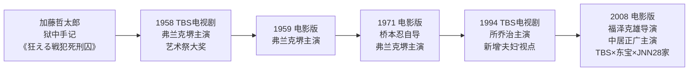
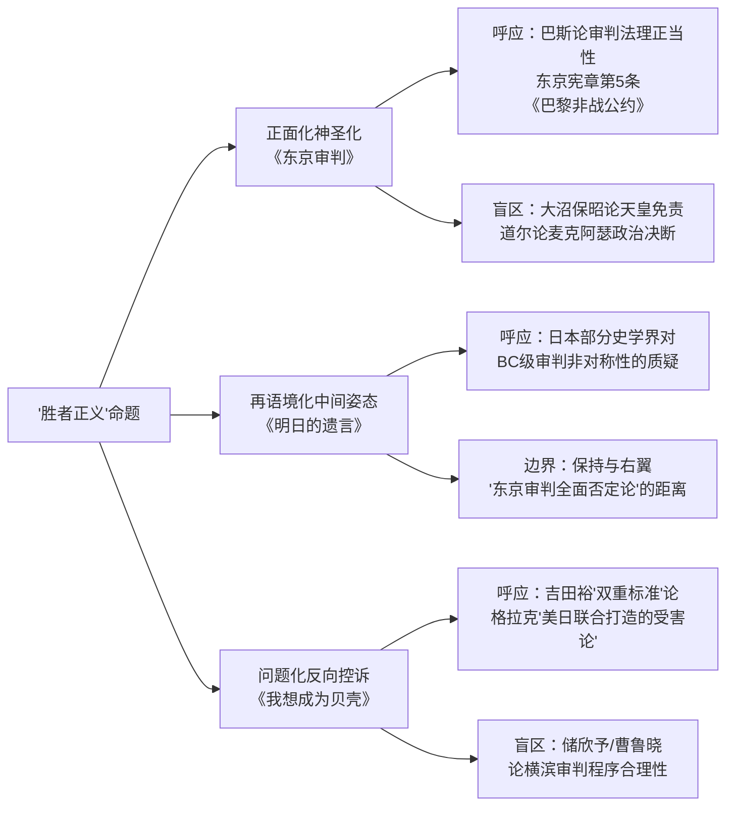
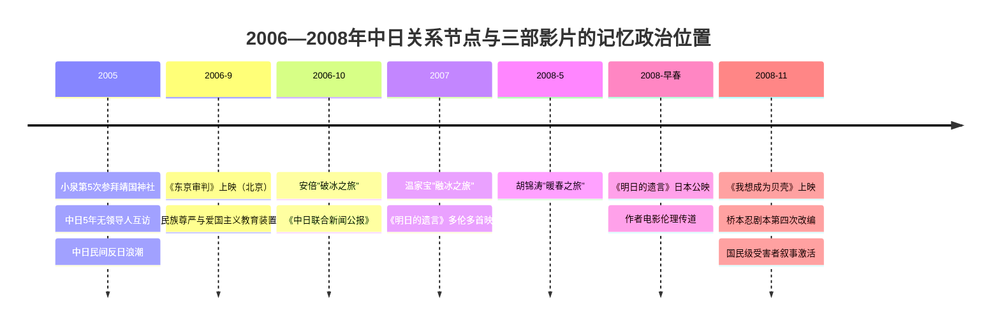

# 东亚战后审判记忆的银幕重构：《东京审判》《我想成为贝壳》《明日的遗言》比较研究
# 1 《东京审判》（2006，中国大陆）

2005年至2006年间，东亚的政治气候经历了一轮罕见的剧烈震荡——小泉纯一郎连年参拜靖国神社、日本"入常"图谋、教科书争议交织发酵，中日关系一度被舆论形容为"风雨飘摇"[^1]，而民间反日浪潮在2005年春跨越30余座城市[^2]。正是在这一历史窗口，由高群书执导的《东京审判》于2006年9月1日抢在"九一八"纪念日之前登陆中国银幕[^3]。它既不是一部单纯的法庭类型片，也不仅是一次主旋律影像填补，而是中国电影史上首次以剧情长片形式系统重构远东国际军事法庭这一国家记忆装置的尝试。本章将围绕该片展开基本信息与制作背景、人物与叙事策略、法庭呈现与"胜者正义"立场、观众与评论反响四个维度的研究，为后续与两部日本审判电影的比较奠定中国侧的分析基底。

## 1.1 影片基本信息与制作背景的政治语境

《东京审判》由上海电影集团公司联合北京鲜明映画出品，高群书执导，唐灏、张思涛、张弛、胡坤共同担任编剧，刘松仁、曾江、英达、朱孝天领衔主演，片长111分钟，2006年9月1日在中国大陆上映，对白涵盖普通话、英语、日语三种语言[^4]。影片由九江长江影视制作有限公司等联合出品参与运作，总投资约2100余万元（另有报道称含搭景投入接近3000万元）[^5][^6]，最终被列入2006年全国十大票房电影之列[^5]，首周票房约2400万元[^7]。在奖项层面，影片在第26届中国电影金鸡奖斩获最佳编剧奖（唐灏、张思涛、张弛、胡坤共同获奖），并获最佳故事片、最佳导演、最佳男主角、最佳录音四项提名[^8][^9][^7]；在第12届中国电影华表奖上获优秀故事片奖[^10][^5]；在第9届上海国际电影节获金爵奖最佳影片与亚洲新人奖最佳影片提名[^7]；在长春国际电影节获评委会特别奖[^3][^11]。下表汇总了影片的关键基础信息，便于全篇与后续两部日本影片做对照参照。

| 维度 | 内容 |
|------|------|
| 上映日期 | 2006年9月1日（中国大陆）[^4] |
| 导演 | 高群书（电影导演处女作）[^3][^12] |
| 编剧 | 唐灏、张思涛、张弛、胡坤[^4] |
| 主演 | 刘松仁、曾江、英达、朱孝天、林熙蕾、谢君豪、曾志伟[^4] |
| 片长/对白语言 | 111分钟；普通话、英语、日语[^4] |
| 出品方 | 上海电影集团公司、北京鲜明映画[^4] |
| 总投资 | 约2100万元（含搭景近1000万元，部分报道称合计近3000万元）[^5][^6] |
| 票房表现 | 首周约2400万元；2006年全国十大票房片之一[^5][^7] |
| 主要奖项 | 第26届金鸡奖最佳编剧；第12届华表奖优秀故事片；长春国际电影节评委会特别奖[^10][^7][^11] |
| 影片定位 | 纪念中国人民抗日战争暨世界反法西斯战争胜利60周年重点影片[^13] |

理解这部影片的真正分量，必须回到2005—2006年中日关系的具体语境中。2005年的中日关系被《环球时报》总结为"风雨飘摇的一年"，日本一侧刮起"历史翻案风"与"中国威胁风"两股逆风：4月日本政府批准美化侵略历史的教科书，8月国会发表删除侵略表述的《战后60周年决议》，10月17日小泉纯一郎第5次参拜靖国神社；同期日美安保协议将台湾问题列为共同战略目标[^1]。中国一侧则化作两场"雨"——4月针对日本"入常"图谋的大规模民间抗议在北京、上海、深圳等城市爆发，深圳深南大道更被视为打响"反日入常"第一枪的现场[^2][^1]；12月中方又在东亚峰会上拒绝安排中日领导人会晤，两国高层接触陷入停滞[^1]。在国民情感层面，《读卖新闻》联合美国盖洛普2005年12月的民调显示73%的日本人认为中日关系"糟糕"，创历史新高[^1]。直至2006年10月安倍晋三上任后访华完成"破冰之旅"，双方才在《中日联合新闻公报》中重申"正视历史，面向未来"的立场，关系出现转机[^14][^15][^16]。**《东京审判》上映的9月1日，恰好处在小泉时代尾声与安倍破冰之旅前夕的舆论真空期，影片以"清算血债"的姿态进入公共视野，无可避免地与彼时高涨的民族主义情绪发生共振**。

正是这种特殊语境塑造了影片复杂的创作动机与制作历程。导演高群书新闻专业出身，原本以电视剧《征服》《命案十三宗》闻名，《东京审判》是其首部电影作品[^3][^12][^11]。据他本人多次回顾，最初接拍时对这段历史的认知"只有'东京审判、梅汝璈'几个字而已"[^3]，但在搜集资料过程中，他发现这段持续两年多、对中国意义重大的国际审判"70年没什么人动过"[^17]，"别人的事就成了他自己的事"[^17]。前期史料严重匮乏，剧组跑遍各地图书馆收效甚微，直到助理从母校图书馆复印来一本《东京审判百名记者法庭实录》，影片台词才有了第一手依托[^17][^18]。制作过程同样困难重重：原本由三家投资方共同出资，途中一家制片人"人间蒸发"导致资金缺口[^3]；据高群书回忆，他生平第一次借钱，以电视剧版权作抵押向合作伙伴借得500万元才补上缺口[^17][^3]；更具讽刺意味的是，一家"以高调爱国著称的国内企业"曾接近敲定赞助，却最终以"担心影片拍得太好会影响其产品在日本市场推广"为由撤资[^19]。剧组在北京小汤山按原比例1:1搭建了远东国际军事法庭，单是搭景就耗资近千万元；夏季摄影棚内温度高达40多度，年近八旬的日本籍战犯演员仍穿着呢子军服坚持拍摄[^3][^6]。曾志伟零片酬出演和田正夫一角[^19]，刘松仁因长期与饰演战犯的日本演员对戏一度入戏过深、片场"老黑着个脸"[^19][^4]。**从筹资、史料、搭景到表演的层层困难，与高群书本人"用电影打捞历史"的创作信念形成对照——他坦言"《东京审判》的使命意义大于电影的意义"[^3]，并明言"我们并不想以狭隘的民族复仇心理来对待这场战争"[^3][^20]，这一自我定位与影片最终在民族主义话语中被接受的现实之间，构成了本片解读的第一层张力**。

## 1.2 以梅汝璈为核心的人物塑造与双线叙事策略

《东京审判》的叙事架构呈现明显的双线交织格局：主线聚焦法庭内的国际审判，由刘松仁饰演的中国法官梅汝璈、曾江饰演的检察官向哲浚、英达饰演的顾问组组长倪征燠等组成中国代表团群像[^21][^4]；副线则通过《大公报》记者肖南（朱孝天饰）的视角，呈现一个普通日本家庭——和田芳子（林熙蕾饰）、其兄和田正夫（曾志伟饰）以及战友北野雄一（谢君豪饰）——在战后日本的命运纠葛[^22][^21]。这种"法庭+家庭"的双线结构是高群书的自觉设计："《东京审判》除了法庭戏，还有一条线索是一个日本家庭的命运，朱孝天饰演的是一个中国记者，他把法庭内外两条线索串联了起来"[^23][^24][^25]。

主线人物塑造的核心是梅汝璈这一形象。影片选取了历史上最具戏剧张力的两大事件作为人物建构的支点。其一是"座次之争"：开庭预演时，澳大利亚籍庭长卫勃宣布入场顺序为美、英、中、苏、加、法……将中国法官的座次置于英国之后[^26][^27][^28]。影片中梅汝璈当场起立、脱下黑色丝质法袍以退出审判相威胁，并提出"应按日本投降时各受降国签字顺序排座"的方案，最终以"美、中、英、苏……"的顺序为中国争得了第二把交椅[^26][^27][^28]。其二是"量刑之争"：在认定犯罪事实后，反对死刑的法官一度占据多数，梅汝璈在极度愤怒中念出"至今思项羽，不肯过江东"的诗句，做好"玉石俱焚"的准备，最终以6:5的微弱优势将东条英机、土肥原贤二、板垣征四郎、松井石根等7名甲级战犯送上绞刑架[^29][^30][^31]。围绕这两大经典场景，影片借由"我不是斗士，我是法官，中国的法官"这样的标志性台词，将梅汝璈塑造为兼具学者型法官的法理素养与中国知识分子的民族担当的人物[^30]。**这一形象的根本特征在于其"为国家而非为自己"的孤勇气质——其据理力争"不是为了自己，而是为了国家"[^29]，由此成为影片传达"坚定正义、勇于担当"精神的核心载体**[^30]。

主线的群像设置同样服务于"中国在场"这一叙事目标。曾江饰演的向哲浚作为中国首席检察官，在影片中以梅汝璈师兄的身份出现，是其精神支柱——剧中向哲浚那句"只要你没把老子打死，老子还是会站起来"的激励，构成梅汝璈在量刑表决前突破心理危机的关键节点[^32]。英达饰演的倪征燠则承担了"歇斯底里、台词铿锵有力"的法庭辩论高潮戏份，被观众评价为"喜剧演员演正剧的降维打击"[^19]。考虑到历史上中国检察官团队最初仅由向哲浚和秘书裘劭恒两人启程，随后陆续加入高文彬、刘子健以及倪征燠等顾问四人组才形成完整阵容[^33]，影片对中国代表团的群像呈现实际上做了大幅集中化、典型化处理，以服务于双线叙事中"以一当百"的戏剧紧凑性需要。

副线的设计目的与实际效果之间存在显著落差。从设计意图看，副线试图通过和田芳子、和田正夫、北野雄一三个层次的日本人物，呈现战争对普通日本家庭的精神撕裂：芳子作为《朝日新闻》记者，在目睹南京大屠杀证据后陷入信仰坍塌；其兄和田正夫是踏上过中国土地的日本兵，因良心折磨而剖腹未遂；北野雄一则代表拒绝接受战败、深陷军国主义谎言的极端分子，最终因仇恨吞噬而枪杀芳子[^22][^21]。这种设置在导演设想中既能为主线宏大叙事补足个体视角，也能呈现"日本可以以签署投降条约为终结点，但家庭和个人却不会以战败日为终结点"的复杂战争记忆[^20]。然而从执行效果看，副线在观众和评论界中几乎一边倒地被视为影片最大短板：观众批评"朱孝天、林熙蕾那一段莫名其妙的爱情显得很可笑，也太浅薄"[^34]，"曾志伟饰演的这个对战争满怀罪恶和内疚的人本来可以引起人们深刻的反思，除了两句'狗日的日本鬼子'外毫无张力"[^34]；专业评论指出"高群书着力表现日本人的民族性，但手法太直接，显得过于结论式了"[^35]；亦有评论者直言"整个朱孝天那个记者的线是非常失败的……完全无法代入他们的角色"[^36]。

副线之所以未能达到设计预期，部分原因在于选角策略本身。高群书坦言选择港台明星与内地稀缺的双语演员有关——"参与人员来自11个国家，通用语言是英语，还有就是日语，同时能说两种语言的演员内地太难找了，而港台演员多能胜任"[^20]，这也解释了刘松仁、曾江、英达操英语、朱孝天、林熙蕾、谢君豪、曾志伟操日语的语言分工[^20]。但商业化的偶像选角与严肃历史题材之间的张力同样真实存在，朱孝天的加盟在影片试映阶段即引发争议，高群书不得不公开回应"不要对青春偶像朱孝天有成见"[^23][^24][^25]。**双线叙事的设计意图与实际接受之间的落差，揭示了《东京审判》在追求"主流商业大片"路径上的内在矛盾：主线借由真实历史的厚重感与刘松仁、曾江、英达等戏骨的表演立住了脚跟，副线则因虚构爱情、人物动机仓促、表演风格与法庭戏割裂而成为影片美学完成度的最大牺牲项**。

## 1.3 远东国际军事法庭的银幕呈现与"胜者正义"命题

《东京审判》将远东国际军事法庭定位为"中国第一部法庭电影"[^23]，并自觉对标好莱坞《十二怒汉》《纽伦堡大审判》等经典法庭片传统[^35][^37]。在影像建构层面，影片采取了三重写实策略以最大化其历史可信度。其一，剧组按原比例1:1还原了远东军事法庭的内景，并依据历史照片1:1复原了每个出场人物的造型，包括邀请日本籍演员饰演战犯[^17][^4]。其二，剧组确立了两条创作铁律——电影内容中的法律条文和庭审流程必须符合国际法、经得起推敲，法庭上所有台词必须有出处而不能由编导自行编造[^17]。高群书反复强调"影片法庭戏的台词有80%是真实的"[^6]，《梅汝璈日记》中的精彩话语也作为画外音贯穿始终[^6]。其三，影片穿插了大量从美国、荷兰等国重金购买而来的原始历史影像资料镜头，使纪实质感大幅增强[^23][^13]。这些策略共同构成了影片"题材与风格相统一，格局宏大、影调冷峻、感情深沉"的纪实品格[^13]。

在法庭戏的具体构造上，影片以"突出重点"为原则[^35]，将历时两年多、开庭818次、出庭证人419名、提出证据4336件、法庭记录48000页的浩瀚审判[^29][^33][^38]浓缩为五大段集中庭审[^39]。其中皇姑屯事件作为侵华战争起点的认定[^40][^33]、田中隆吉作为日方退役中将出庭作证[^40]、溥仪八天的证人席陈述[^19][^38]、南京大屠杀作为独立审理单元的呈现[^40][^38]，构成了战犯定罪过程中的关键叙事支点。影片对战犯的刻画形成鲜明对比群像：东条英机靠在椅背、眼神躲闪却坚称"日本发动战争是为了自卫"[^41]，板垣征四郎写出48页辩护词否认九一八策划责任[^40]，土肥原贤二一言不发试图钻法律漏洞[^40]，大川周明则被塑造为"瘦小枯干、不请自来即有压迫感"的形象[^42]。**这些战犯"无论是无耻的狡辩，还是猖狂时眼神的轻蔑，每个神情都一比一还原了历史"**[^19]，使影片将审判正当化为"和平对战争、文明对野蛮、正义对邪恶"的较量[^6]。

围绕"胜者正义"这一争议命题，影片采取了一种**正面化与回避并行的双重策略**。一方面，影片以梅汝璈之口反复强调审判的法理正当性——其在量刑表决前从法律、文明、宗教三个角度论证惩恶必然性的演讲[^43]、向哲浚检察官"如果这不是战争，我想问，还有什么是战争？"的开场陈词风骨[^38]、季南检察官"请您以公正之心，善良之名，以人民志愿来判决他们是否有罪"的结案陈词[^44]，共同构成了"这是一场文明、正义、超越胜者的审判"的话语建构。这一立场也与中国官方与学界长期坚持的东京审判史观高度一致——即东京审判作为"二战后建立世界秩序的重要基石"，并非"胜者对败者的审判"，而是"公平、正义、文明、超越胜者的审判"[^45]。另一方面，影片对若干敏感议题做了显著的回避或淡化处理：天皇免责问题仅以一句旁白带过[^46]；美方主导审判进程、麦克阿瑟与美日之间的政治安排基本未被触及[^46]；战犯起诉范围之外的复杂博弈则被收束为"中国法官力排众议争取死刑"的英雄叙事。**这种处理方式使影片在显性话语层面将远东军事法庭塑造为正义场域，而在隐性结构上则通过强化中国法官的能动性、淡化美方主导地位，将一场实际上由美国主导的国际审判转译为以中国为关键支点的法理胜利叙事**。

与此相应，影片对美方角色的塑造呈现出一种克制而暧昧的中间状态。首席检察官季南（John Henry Cox饰）被塑造为"性情刚强、雷厉风行、庭上应变迅捷"的"魔鬼检察官"形象，是与中国代表团并肩作战的盟友[^44]；澳大利亚籍庭长卫勃（韦伯）虽在座次之争中与梅汝璈正面冲突[^26][^27]，但被设定为可被法理与诚意说服的程序权威[^4]。影片中"美国法官"作为整体亦未被妖魔化，但同样未被赋予太多正面光彩——更多承担程序性合作者的功能。值得注意的是，影片中梅汝璈在日本街头被两名酒醉日本人挑衅、由美国司机当场击毙的桥段[^32][^40]，以及"以前日本人将二战战败原因归结于'屈原、苏武'（屈服于美国原子弹和苏联武力）而觉得'中国没有实力'参与击败"的台词[^32]，从侧面流露出影片对中美关系一种微妙的认知：美方既是审判秩序的提供者，也是中国在国际舞台被边缘化的某种隐性原因。**影片由此呈现出对美关系的"程序合作—结构隐忍"双重姿态——既承认美方主导的法律框架的正当性，又通过中国法官的能动性叙事悄然平衡其在历史中相对边缘的位置**。

## 1.4 观众接受与专业评论的多元张力

《东京审判》自2006年9月公映以来，在中国大众舆论中获得了长期且广泛的关注。一方面，影片在主流话语中被高度肯定。著名导演谢晋公开盛赞"这部电影我敢说，是现在这个时代所看不到的电影"，秦怡评价其"长了中国人的志气"[^47]；导演黄蜀芹则赞许导演"历史的严峻和内在的激情……做到了平衡，这点非常不容易"[^47]。影片在公映四天内即取得400万元票房[^39]，并赢得"每个中国人必看的电影"[^20][^5][^6]、"它大长了中国人的志气"[^5]等口碑性评语。这一接受图景延续至2010年代后期——许多学校仍将其作为爱国主义教育素材放映，视频网站上几乎每天都有新评论更新[^17]。在中文网络平台与社交媒体上，观众的情感反应高度趋同：从"那些细节就像刻在脑海里一样……我们今天的和平，不是凭空来的"[^41]，到"看的期间，多次拍案而起，骂不绝口"[^34]，再到对梅汝璈"据理力争、坚守正义"形象的高度认同[^30][^48][^43]，构成了影片在大众语境中作为爱国主义记忆装置的稳固功能。

但另一方面，影片同样从专业评论与豆瓣等用户平台收到了大量尖锐批评，且这些批评聚焦于影片的多个核心维度。下表归纳了正负面评价的主要谱系，便于直观把握其内在张力。

| 评价类型 | 主要观点 | 代表来源 |
|---------|---------|---------|
| 正面：历史使命 | "每个中国人必看的电影""大长了中国人志气""填补国产电影中军事法庭戏的空缺" | 谢晋、秦怡、《华表奖》评语[^13][^5][^47] |
| 正面：法庭戏品质 | "中国第一部法庭电影""步步为营、一波三折""80%法庭台词真实" | 高群书自述、试映会评价[^23][^6] |
| 正面：纪实风格 | "首次披露大量珍贵史料镜头""1:1还原法庭与造型""纪实风格更为可信" | 影片资料、报道[^13][^6] |
| 负面：副线失败 | "朱孝天-林熙蕾爱情戏莫名其妙、浅薄""曾志伟人物毫无张力""结论式手法过于直接" | 豆瓣影评、《东京审判：法庭电影的中国式尝试》[^35][^34][^36] |
| 负面：选角问题 | "港台演员演历史题材令人质疑""谢君豪表演无突破""英达出场让人想笑" | 试映报道、豆瓣影评[^23][^32] |
| 负面：人物塑造单薄 | "梅汝璈被简化为民族英雄符号""法庭辩论近乎我方个人秀，缺少激烈斗争感" | 豆瓣长评[^46] |
| 负面：历史观争议 | "陷入浅薄民族主义""赞成死刑的非理性方式""弱智型愤青影片" | 《从〈中国可以说不〉到〈东京审判〉》[^49] |
| 负面：议题回避 | "美英苏在审判中的作为完全没有呈现""天皇逃避审判仅一句旁白带过""南京问题为何遗留至今未交代" | 豆瓣长评[^46] |
| 负面：法理深度不足 | "近乎流水账叙事""不如NHK同类纪录片冷静理性""法庭辩论不如《纽伦堡大审判》" | 豆瓣影评、专业评论[^35][^46] |

负面评价中最具学理价值的，是对影片民族主义叙事逻辑的批判性反思。在题为《从〈中国可以说不〉到〈东京审判〉》的豆瓣长评中，作者将影片与1996年的同名民族主义畅销书并列对比，指出影片用"梅大法官争取法官排序"与"梅大法官争取对战犯运用死刑"两个桥段"意在支撑东京审判这一历史大厦中中国所起的栋梁作用"，但"实际情况是：国际法庭受盟军最高统帅美国人控制；日本皇室被私下谅解"，因而将其定性为"弱智的民族主义"与"国家自尊矫枉症"的产物[^49]。另一篇豆瓣影评则更直接地质疑影片的法理严谨性："开庭伊始，首席法官威廉面对辩方律师的回避请求，一脸的气急败坏，还得靠咱中国的梅法官去说服教育……一下子就降低了东京审判的庄严性，让死难者受辱"[^46]，并指出影片对天皇逃避审判、美日政治交易、南京问题历史延续等核心议题几乎全部回避[^46]。

也有评论从另一方向给出了相对平衡的判断。豆瓣作者赛人在《以影写史：久违的历史性叙述》中肯定影片"在全景式、逼近历史真相的纪录之下，更显示现代人对这场历史浩劫深而沉重的反思"，认为日本演员的群像表演"使这段沉重的历史叙述有了极为真实的质感"，并将其与奥利弗·斯通的《刺杀肯尼迪》相提并论，称其翻开了中国"政论性影片"的新页[^42]。学术评论则在《审视历史事件的宏大叙事》《揭开浸透血痕的历史面具》《电影魅力——三个看点》等文章中肯定影片的"双线叙述"、"题材与风格统一"以及"争、辨、理"的结构张力[^50][^51][^52]。

回溯到导演本人的自我评价，《东京审判》之于高群书的意义同样复杂。他在金鸡奖只拿到最佳编剧奖、错失最佳导演奖后坦言"用了十分之一的力量去拍这个戏，各种条件就是这样的，因为没有办法"[^53]；同时也清醒地承认"主旋律影片不能只剩下'主旋律'三个字，首先你应该能让观众坐得住，能看下去"[^12]。这种自我评价与影片在观众端的两极反响之间形成了一种特殊的呼应：一方面，影片以其纪实路径、典型化人物与情绪化高潮成功完成了对一段长期被遮蔽历史的银幕打捞[^17][^54][^11]；另一方面，正是这种典型化与情绪化处理，使其在更挑剔的观众与评论者眼中暴露出民族主义叙事的内在缺陷——对天皇免责、美方主导、南京问题等历史复杂性的回避，使影片在完成"中国在场"的话语建构的同时，也牺牲了对"胜者正义"命题更具学理深度的对话可能。**这一正负评价并存的接受图景，恰恰映照出21世纪初中国战后审判银幕记忆的核心矛盾：在民族尊严叙事的宏大冲动与历史反思的学理诉求之间，《东京审判》既是一次成功的填补，也是一次未竟的探索**——而这一矛盾，将在后两章对日本两部审判影片的考察中以镜像方式再次浮现，为第四章的比较分析提供关键的对照参照。

# 2 《我想成为贝壳》（2008，日本）

如果说《东京审判》以中国法官的视点完成了一次对"民族尊严"与"法理胜利"的银幕打捞，那么仅仅两年之后于2008年11月22日上映的《我想成为贝壳》，则从太平洋彼岸提供了一个几乎完全相反的叙事坐标：法庭不再是正义伸张的场所，而是冷漠裁决的机器；主角不再是据理力争的法官，而是被时代洪流碾碎的小理发师；"胜者正义"不再是被维护的价值前提，而是被反向质疑的伦理困境。这部由福泽克雄执导、中居正广主演的影片，是桥本忍同一剧本自1958年TBS电视剧、1959年电影、1971年电影、1994年所乔治版电视剧之后的第四次银幕重构[^55][^56][^57]，承载着日本战后"受害者叙事"持续半个世纪的文化惯性。本章从基本信息与改编脉络、人物塑造与家庭—司法对比、横滨/东京审判的银幕呈现、跨国接受反响四个维度展开分析，为第四章三片比较奠定日本侧"受害者—平民"分析基底。

## 2.1 影片基本信息与桥本忍剧本的多次改编脉络

2008年版《我想成为贝壳》由TBS与东宝联手出品，福泽克雄执导，桥本忍编剧，中居正广、仲间由纪惠领衔主演，柴本幸、西村雅彦、平田满、伊武雅刀、武田铁矢、片冈爱之助、笑福亭鹤瓶、草彅刚、上川隆也、石坂浩二等组成豪华阵容，片长139分钟，对白以日语为主，2008年11月22日在日本公映[^58][^55][^59]。影片制作预算约11.3亿日元，最终票房约24.5亿日元，是当年东宝旗下重要的战争题材大片[^55]。久石让担纲配乐，Mr.Children演唱主题曲《花の匂い》（《花的味道》），后者作为该乐队首支配信限定单曲，自2008年9月起即在TBS系情报节目和电影预告中反复出现，成为本片宣传的重要传播载体[^60][^59]。原声带《「私は貝になりたい」オリジナル・サウンドトラック》于2008年11月19日由环球音乐发行[^55]。下表归纳影片关键基础信息，以便与前一章《东京审判》与下一章《明日的遗言》对照参照。

| 维度 | 内容 |
|------|------|
| 上映日期 | 2008年11月22日（日本） |
| 导演 | 福泽克雄 |
| 编剧 | 桥本忍 |
| 原作 | 加藤哲太郎《狂える戦犯死刑囚》（狱中手记/遗书） |
| 主演 | 中居正广（清水丰松）、仲间由纪惠（清水房江） |
| 主要配角 | 柴本幸、西村雅彦、平田满、伊武雅刀、武田铁矢、石坂浩二、草彅刚、上川隆也 |
| 片长 | 139分钟 |
| 制作/发行 | "私は貝になりたい"製作委員会；TBS与东宝联手，JNN系28家单位加盟 |
| 制作预算 | 约11.3亿日元 |
| 票房 | 约24.5亿日元 |
| 配乐/主题曲 | 久石让；Mr.Children《花の匂い》 |
| 关键奖项 | 第21届日刊体育电影大奖最佳男主角（中居正广） |

理解2008年版的独特位置，必须置入桥本忍剧本长达半个世纪的多次改编谱系之中。**原作是原日本陆军中尉加藤哲太郎的狱中手记《狂える戦犯死刑囚》（《疯狂的战犯死刑囚》）中的遗书部分**，讲述一名在战争末期被强征入伍的二等兵奉命杀死美军俘虏并因此在战后被横滨法庭判处死刑的故事[^61][^62][^63]。1958年，"战后编剧第一人"、师从伊丹万作、后与黑泽明合作过《罗生门》《活着》《七武士》等名作的桥本忍亲自将其改编为剧本，由TBS前身KRT制作成同名电视剧，弗兰克堺主演、冈本爱彦导演，获昭和33年度（第13回）艺术祭大奖（放送部门），是TBS现存最古老的作品，被誉为"动摇了战后和平论争的电视史上最大话题作"，弗兰克堺登上13级绞刑台时低语"来世想成为贝壳"的结尾场景"将日本全国卷入感动的漩涡"[^64][^55][^65][^57]。1959年，该剧改编为电影版，仍由桥本忍编剧、弗兰克堺主演[^61][^62][^66]。1971年桥本忍自任导演再拍电影版[^55][^65]。1994年TBS为纪念放送中心落成又推出所乔治、田中美佐子主演的电视剧重拍版，新增"夫妇与家族"视角，平均收视率达18.2%，并获日本民间放送联盟奖等荣誉[^67][^57]。

可以用如下时间线直观把握这一改编谱系：

2008年版作为这一谱系的第四次重构，其特殊性体现在三个层面。其一，制作规模空前——TBS电视巨头与东宝电影巨头联手，并由北至北海道、南到鹿儿岛冲绳的日本新闻网（JNN）28家单位加盟助阵[^57]。负责TBS电影事宜的制作委员会成员信国一朗明言"战争和人是一个具有普遍性的主题，新片将从这个角度对今天发出质问"，相信影片会成为2008年度的影坛杰作[^57]。其二，编剧本人破例重写——桥本忍当时已届九十高龄，是日本"战后编剧第一人"，在为本片再次执笔时新增了大量原电视剧未涉及的夫妻情感戏与家庭线索[^65][^57][^59]。其三，演员策略服务于"国民级共鸣"——主演中居正广是SMAP队长、长期主持红白歌会的国民偶像，仲间由纪惠则是当时最具人气的女演员之一，二人组合本身就保证了影片对最广泛日本观众的触达[^68][^69]。**这一系列制作选择，使2008年版不再仅是桥本忍同一剧本的又一次复刻，而成为平成末期日本社会以国民级偶像、顶级制作规模、跨媒体联盟重新激活战后"受害者叙事"的文化装置**——它的诞生本身，就是日本社会对这一题材半个世纪持续需求的明证。

## 2.2 清水丰松的"平民受害者"人物塑造与家庭—司法双重对比

影片人物塑造的核心，是将清水丰松构建为"平民受害者"的完美样本。这一形象的根基由三组要素叠加而成。其一是**社会身份的极致弱化**：清水丰松是日本高知县海边小城的一名理发师，与妻子房江、独生子建一过着平淡朴素的生活[^58][^66]；他腿部患有先天残疾，是个跛子[^70][^66]，在中文影评中甚至被概括为"小学毕业就到理发店做学徒，坡脚的他一直受尽凌辱，卑贱的被店里的所有人欺负"的极底层小人物[^71]。其二是**入伍处境的被动性**：战局日紧、日本"开始大量征兵"，他作为腿有残疾者亦被强征入伍，编入负责本土防卫的中部军，是"号称全队最窝囊的二等兵"，每天遭受长官的欺辱[^58][^71]。其三是**杀人行为的被迫性**：影片明确呈现了上级以处死相逼、强迫其"为锻炼勇气"而刺杀美军飞行员战俘的极端情境——清水"并不愿杀死俘虏，但上级长官为锻炼他的'勇气'而以处死相逼胁迫其杀人"[^63]，1958年原版的设定即是"上司命令的捕虏刺杀，无法违抗的丰松只能用銃剣刺杀"[^64]，而中文影评对2008年版的复述更细致地指出"心地善良，始终下不了狠手，最后在长官的逼迫下只能心一横一刀刺下，但刺中的是俘虏的手臂"，且发现"绑在树上的俘虏早已死过了"[^71]。这三组要素叠加，使清水丰松成为"既无社会权力、又无入伍意志、又无杀人主观"的三重无辜者，从角色设定上就将其与作为决策者的甲级战犯做了彻底的伦理切割。

在表演层面，**中居正广为贴近这一角色减重10公斤**，将清水的平凡与坚韧、无奈与抗争演绎得"入木三分"[^66][^72]。死囚牢中从希望到绝望的情绪转变、被宣判死刑场景中通过眼神与肢体语言传达的绝望与不甘，被中文影评评价为"细腻而富有爆发力的表演获得了观众的认可"[^66][^72]。该表演为他赢得了2008年第21届日刊体育电影大奖最佳男主角，颁奖词亦将其列为该届大奖的核心亮点之一[^73][^68][^69]。日本影评则形容其"将死刑被告的悲剧热演，其演技得到高度评价"[^59]，中文豆瓣观众感叹"nakai桑的演技真的很不错，不如说因为是他，我才有动力看完这部片子"[^74][^75]。

影片整体叙事建立在一组强烈的**家庭温情线与司法绝境线的双重对比**之上。家庭温情线由若干层次构成：战前的小理发店日常、妻子房江的怀孕、儿子建一的童年依恋、战后归家后第二胎的孕育、临行前的家书与回乡愿望……这些场景以"温婉而坚强"的色调被反复铺陈，仲间由纪惠饰演的房江以"在丈夫被捕后的坚韧与努力，为影片增添了一抹温暖的色彩"[^72][^76]。司法绝境线则呈现急速恶化的命运曲线：宪兵突然到来打破宁静、远东军事法庭审判、死刑判决、巢鸭监狱羁押、目睹狱友被处决、组织狱友向美国总统发出减刑请愿信、房江背着年幼女儿在风雪中走街串巷为丈夫凑齐200个签名、请愿石沉大海、临刑前写下遗书[^58][^66][^71]。两条线索的对比在影片结尾达到顶点——清水丰松在遗书中写下"如果有来生，我希望可以成为一个贝壳"，"在海底，静静地躺着，远离战争的喧嚣"[^58][^72]。

**"贝壳"意象正是日本战后受害者叙事的核心隐喻**：它意味着对人类社会的彻底退出，对"成为人"这一身份本身的拒绝；既是对战争与司法双重碾压的最终控诉，也是对"平凡生活"——一个可以"和家人一起回土佐"的简单愿望[^72]——的最深祈愿。这一隐喻在桥本忍剧本的所有版本中均处于结构性位置，1958年电视剧版的弗兰克堺登上13级绞刑台时低语"来世想成为贝壳"被誉为"将日本全国卷入感动的漩涡"的瞬间[^64]，2008年版则将这一情感峰值借由中居正广的国民级表演重新激活。仲间由纪惠饰演的清水房江作为"坚韧的战争寡妇"形象，与清水丰松形成功能性互补——她为请愿四处奔走、收集签名、独自抚养儿子建一和战后出生的女儿直子[^66][^76]，使影片完成了从个体悲剧到家庭悲剧、再到日本"普通家庭战争悲剧"的层级递进。**至此，影片借由清水丰松—房江这一夫妻轴心，将"平民—家庭—战争—司法"的链条完整化，使全部叙事重心牢牢锚定在"平民受害者"这一身份位置上，而真正发动战争、做出决策的日本军部高层与日本国家责任则被有意置于叙事的远景**——这一选择性叙事策略，正是本片后续在中文舆论中遭到尖锐批评的结构性根源，也是其与《东京审判》视角对位的根本所在。

## 2.3 横滨/东京审判体系的银幕呈现与"胜者正义"的问题化

影片对战后审判体系的银幕呈现，呈现出一种与《东京审判》几乎完全相反的叙事策略——若说后者是对"胜者正义"的正面化与神圣化，本片则是对"胜者正义"的问题化与反向质疑。在具体史实层面需要先做一项澄清：原作清水丰松的故事原型是美国陆军第八军主持、1945年12月18日开庭至1949年10月19日结束、共审理327件案件、被告1037人、死刑判决53人的横滨军事法庭中的BC级战犯审判[^61][^62]，而非直接由远东国际军事法庭审理；但2008年电影版与各中文片源的剧情简介，均将其表述为"被带上远东军事法庭"或"东京审判庭"接受审判[^58][^74][^75]，1958年原版则更准确地呈现为"军事裁判"和"巢鸭监狱"语境[^64]。这种叙事上的简化与混合，使影片在不严格区分两套审判体系的前提下，事实上完成了对整个战后审判机制的整体性质疑。

影片将"胜者正义"问题化的叙事手段大体可归纳为四重。**其一，美军军事法庭程序的草率呈现**。中文片源对2008年版剧情的复述强调，"美军检察官翻阅的'证据'实为日军内部派系斗争的产物"，速记员"将'医护兵'错译为'宪兵队长'，这个致命的笔误如同冲绳海沟的暗流，将清水卷入战争责任的漩涡中心"[^74][^75]——尽管这一情节复述带有明显的影评者再创作色彩，但其所反映的"翻译误译—文化认知鸿沟—战败国证词在胜利者叙事体系里自动降格为谎言"的整体叙事意图[^74][^75]，与影片借由"翻译"角色（浅野和之饰演[^58]）凸显语言不通的设计相一致。**其二，上诉与减刑请愿机制的混乱与无效**。影片以大量篇幅刻画了清水组织狱友向美国总统发出减刑请愿信、房江在高知四处奔走募集签名、为凑齐200个联合署名"风里来雪里去"等情节，但这些努力"在战争面前无力的永远是老百姓"，最终请愿石沉大海，未能改变判决[^58][^66][^71]。**其三，美方对日本军队"上级命令绝对服从"文化的不理解**。影片明确将清水的核心辩护理由设定为"自己无罪，只是执行了上级的命令"，而判决理由则是"美军无法理解在旧日本军队中上级的命令是绝对的这一文化"[^58]——这一叙事直接呼应了战后BC级审判中最具争议的法理问题，即"上级命令不免责原则"。学者曹鲁晓的研究指出，该原则旨在使"下级罪行系'执行上级命令'的辩护理由失效"，而"相比于审判对象主要为高职级战犯的东京审判，该原则对于审判对象主要为下级军官和宪兵的国民政府审判意义更大"——电影正是"揭露了一个包括国民政府审判在内的BC级战犯审判普遍面临的司法问题"[^63]。**其四，A级与BC级战犯审判落差的隐性呈现**——真正决策者免责或仅获有限惩处、而执行命令的下级士兵则被处以绞刑的结构性不公。影片中借由日本将官（石坂浩二饰矢野中将、伊武雅刀饰尾上中佐、名高达男饰足立少佐等[^58][^59]）作为命令链条的可见呈现，与清水作为命令终端被独自送上绞刑台的命运形成结构对照，凸显了责任分配的严重不对称。

在美方角色的塑造上，影片构造了**"傲慢审判者—人性化看守"的双重面孔**。法庭一侧的美军检察官、审判官与翻译被刻画为程式化、傲慢、对日本文化缺乏理解的程序操作者，承担着"冷漠裁决"的功能性角色；而看守一侧则相对人性化，与清水及其狱友形成日常互动。这一双重面孔的设置，使影片避免了对美国进行整体性的妖魔化处理，而是将"胜者正义"的伦理困境定位在制度与程序层面，而非个体层面——这与下一章将分析的《明日的遗言》对美方角色的"去妖魔化"策略有某种呼应，但本片对程序本身的质疑更为彻底。

将影片的叙事策略与历史学界的研究做对照，可以更清晰地看到其选择性呈现的痕迹。储欣予的研究恰恰指出：**1959年版的《我想成为贝壳》上映后"反响剧烈，引发日本社会对二战战犯的同情和对战后审判的质疑"，并将横滨审判塑造为日本社会普遍印象中的"过于严厉"和"完全由美国主导的胜者的审判"**[^61][^62]；但通过对横滨军事法庭实际运作的考察可知，"美国陆军第八军从规则和财政上支持日本律师参与辩护，充分确保了被告的辩护权"，"美日协作、各取所长的辩护模式确保审判能够高效且顺利地进行"，"庭审现场美国律师的表现是辩护团在法庭内外合作结果的呈现，并非否定派所曲解的'完全由胜者操纵'"[^61][^62]。曹鲁晓的研究则进一步指出，"在特定情况下，国民政府还依据罪行轻重程度与命令的违法性酌情考量战犯的减刑问题，这是对战犯权益的维护，同时表明日本社会关于BC级战犯是上级长官'替罪羊'的说法缺乏根据"[^63]。换言之，**横滨审判与BC级审判在历史真实层面具备相当的辩护权保障与程序合理性，影片将其呈现为"完全由胜者操纵"的报复性审判，是一种艺术虚构与情感放大的产物**。储欣予本人亦明确将1959年原版《我想成为贝壳》列为"战后文学作品的渲染和否定派的引导"中塑造此种"普遍印象"的关键文化载体，2008年版作为该剧本的第四次改编，其问题化"胜者正义"的叙事功能因而具有了清晰的延续性。

需要强调的是，本研究并非要否定影片的反战立场或对清水这类底层士兵命运的人文关怀，而是要指出：**影片在选择以下级士兵的极端个案为叙事支点时，实际上是以"BC级审判中最具争议的边缘情形"取代了"BC级审判的整体面貌"，从而将一场体系化的、绝大多数被告罪行有明确证据的国际审判，重塑为日本战后受害者叙事中"善良小民被胜利者随意处决"的代表性场景**。这种艺术选择具有强大的情感动员效应，但同时也对战后审判的整体性质做了显著的话语再分配——这一再分配正是下一节中日两端接受谱系发生剧烈分歧的认知前提。

## 2.4 日中两端接受反响的差异与跨国记忆争议

影片在日本与中文舆论圈的接受谱系呈现显著落差，构成了东亚战后记忆跨国流通中典型的"摩擦案例"。

**日本侧的接受谱系**以情感共鸣与艺术肯定为主基调。在票房层面，影片以11.3亿日元预算最终取得约24.5亿日元票房，是2008年东宝旗下重要的卖座大片[^55]。在奖项层面，中居正广凭借此片获得第21届日刊体育电影大奖最佳男主角，与同届获作品奖、导演奖的《入殓师》（滝田洋二郎执导）、获男配角的堺雅人（《登山者》）、获女主角的绫濑遥（《ICHI》）并列，被列入当年日本电影主流奖项的核心荣誉之中[^73][^68][^69]。在专业舆论层面，TBS官方的影片介绍将其定位为"动摇了战后和平论争的电视史上最大话题作"的电影化，肯定中居正广"将死刑被告的悲剧热演，其演技得到高度评价"，肯定仲间由纪惠"以迫真演技好演中居之妻役"，并称影片"加入了原电视剧中未描写的夫妇之爱物语等感动的情节"[^59]。日本侧的整体反响延续了桥本忍剧本自1958年以来作为"国民级感动作品"的传统——1958年版"绞刑台的13级阶梯上低语'我想成为贝壳'的最后场景将日本全国卷入感动的漩涡"[^64]，2008年版则借由国民偶像中居正广的表演重新激活了这一情感谱系。Mr.Children主题曲《花の匂い》在日本音乐网站获得9.0分高分，乐迷评价"PV超感人""虽然身在寒冷的地方也觉得很美好"，并明确指认其作为电影预告曲的传播效应[^60]。**在更宏观的层面，影片激发了日本社会关于"下级士兵执行上级命令是否应承担战争责任""BC级审判是否公正"的持续讨论，被视为"反映战后BC级战犯审判中'上级命令不免责'原则及其社会争议的一个重要文化案例"**[^66][^63]。

**中文侧的接受谱系**则呈现高度分化的复杂面貌。在量化指标上，影片在豆瓣的评分约为7.6分[^72][^74][^75]，处于中等偏上水平，但远低于其在日本本土的口碑高度。在文本层面，中文影评大致可分为三类典型立场。

第一类是对影片"美化侵略""回避加害者责任"的尖锐批评。题为《不要往我的伤口上撒盐》的豆瓣影评直接将本片与《萤火虫之墓》并列，指出"都是以被害者的角度去看日本发起的侵略战争，通篇存在刻意回避甚至美化侵略的问题"，质问"如果战争的无辜受害人在日本存在一个，那被侵略的国家，应该有千万个吧？何况，全力支持过日本军国发动侵略战争的所谓人民，也不能说是无辜的"，并因此给出豆瓣一星评价，"不为艺术，只为表达我对被侵略国家及死难人民——那些沉默的大多数，最深切的哀悼"[^77]。

第二类是对"贝壳"隐喻的反向解读。一篇豆瓣长评写道："但为什么想要成为贝壳呢？难道你本身不就是只贝壳了么？随着时代和国家民族的浪涛被动前进，最后被无情拍碎在礁石上……无论是日本人，还是中国人，很多时候都是那一扇扇的贝壳，这并不是说我们都是受害者，而是说我们都对自己犯了罪，那听之任之，用死亡才能撬开壳的罪"[^74][^75]——这一解读将影片本意中的"无辜小民愿成贝壳避世"反转为"日本民众听任军国主义的罪本身就是贝壳之罪"，构成对影片受害者叙事框架的内在颠覆。

第三类则是"迟疑性同情"的复杂立场。题为《不是说宽恕》的豆瓣影评写道："这个电影太容易让人觉得在回避甚至美化侵略行径，或许是吧，特别在几十年前有着血海深仇的国度里……即使历史不被人随意打扮，恐怕也没人真的能把是是非非摘得清楚，这A、B、C级战犯，除了部分死有余辜的板上钉钉的以外，相当一部分的恐怕就是作为仇恨的牺牲品了吧，他们或许不是无辜的，但真的就该死了吗？""我不是说什么宽恕，那是强者的权利，那是被害人的台词……只是，死人的多寡，发动战争的先后，他们是仇恨的理由，但于正义的裁断，于生命予夺，也许，我们应该有些迟疑，哪怕是片刻的迟疑，在裁决别人的命运时，即使因正义之名"[^70]。另一篇题为《看日本片引发的中式思维》的影评，则在长篇感慨清水个人悲剧的同时，也质疑"所谓的正义不过是处决那些没有还手之力的废人，真正的罪人换了一层皮后得以继续逍遥法外"，并将其与中国文革语境对照反思[^71]。还有影评者《彼岸的历史》一文借由前往广岛原爆纪念馆的亲历，反思日本受害者叙事"如果你们对这一切留下的记忆，只是自己在战争中失去了什么，而毫不反思作为发动战争的一方，你们给他国民众带去了多少苦难的话……"，但同时也承认"在国人心底牢牢扎根的民族仇恨，在日本人身上却丝毫看不到任何表现"的复杂体认[^78]。

下表归纳中日两端接受的核心差异：

| 维度 | 日本侧 | 中文侧 |
|------|--------|--------|
| 票房/评分 | 24.5亿日元，国民级卖座 | 豆瓣7.6分，中等偏上 |
| 主流评价 | "感动""迫真演技""夫妇之爱""战争与人的普遍主题" | 一星抗议 vs 7星认可，高度分化 |
| 对清水的态度 | 情感共鸣，视为战争与司法双重碾压的牺牲品 | 同情 + 迟疑 + 反向追问 + 抗议并存 |
| 对"贝壳"隐喻的解读 | 反战与平民受害的核心象征 | "你本身就是贝壳"——加害者沉默之罪 |
| 对审判的态度 | 问题化"上级命令不免责"原则，质疑BC级审判公正 | 同情之外更追问加害者责任与日本受害者叙事的盲点 |
| 关键社会效应 | 激发"下级士兵战争责任""BC级审判公正"讨论 | 激发"日本受害者叙事是否回避加害者责任"的跨国争议 |

这种结构性差异并非偶然，而可借由高桥哲哉《战后责任论》提供的理论视角加以理解。高桥在该书中明确**区分"战争责任"与"战后责任"**：前者主要针对发动战争的当事人，后者则是"战后处理过程中出现的隐瞒、否定、辩护等行为，责任主体包括战后日本政府及部分民众"，并将"战后责任"定义为"作为应答可能性的责任"[^79][^80]。他批评加藤典洋"败战后论"中隐藏的民族主义，认为其"以对亚洲死者的哀悼为借口，试图美化本国战死者，甚至将导致他们死去的民族主义也合理化"，并援引列维纳斯的"他者"理论指出"只有面对亚洲受害者（他者）的痛苦才能促使反省，因此对于来自国外追究战争责任的呼声，日本人需要予以'应答'"[^79][^80]。**以此理论框架观察，《我想成为贝壳》的核心叙事策略——将清水丰松设定为"被强征—被胁迫—被处决"的三重无辜者，并以家庭温情线放大其受害者属性——恰恰是高桥所批判的"以日本战死者的悲剧来稀释加害者责任、屏蔽他者痛苦"的典型话语操作；而中文舆论的尖锐反应——"被侵略国应有千万个受害者""你本身就是贝壳之罪"——正是来自"他者"位置的、对"战后责任"应答的强烈呼唤**。

由此观之，2008年版《我想成为贝壳》在东亚战后记忆跨国流通中扮演的角色，远不止一部国民级感动作品所能涵盖。它一方面以高度凝练的艺术形式延续了日本战后半个世纪以来"受害者叙事"的文化生产链条，激活了日本社会对BC级审判公正性的持续质疑；另一方面，在跨越东海被中文观众接收时，则因其与中国"加害者—受害者"记忆框架的结构性冲突而成为一面镜子，照见两国对同一段战后审判史几乎全然相反的记忆位置。**它与上一章的《东京审判》构成了一组完美的视角对位：中国以法官的视点向上仰望审判席的庄严，日本以士兵的视点向下俯视绞刑台的冰冷；中国正面化"胜者正义"以确认民族尊严，日本问题化"胜者正义"以诉说平民悲情**——这两种叙事并非简单的"谁对谁错"，而是同一历史现场中两个不同主体位置所必然生成的两种记忆形态。下一章将考察的《明日的遗言》将提供第三种位置——以日本将官冈田资为主角的"责任承担者"叙事，与本章的"平民受害者"叙事形成日本侧内部的二元张力，亦将与中国侧的"正义伸张者"叙事一起，进入第四章的三方比较视野。

# 3 《明日的遗言》（2007，日本）

如果说《东京审判》以中国法官的法理胜利完成了对"民族尊严"的正面建构，《我想成为贝壳》以平民理发师的绞刑悲剧完成了对"胜者正义"的反向控诉，那么2007年问世的《明日的遗言》则在日本侧开辟出第三种、也是与前两部影片在美学姿态上差异最大的叙事位置——以陆军中将冈田资为主角的"责任承担者"叙事。这部由黑泽明最后一位助理导演小泉尧史历经十五年酝酿、最终改编自大冈升平反战小说《漫长之旅》（《长い旅》）的作者电影，既不像《东京审判》那样以激烈对抗与典型化人物拥抱主流商业大片路径，也不像《我想成为贝壳》那样借国民偶像激活广泛的情感共鸣，而是以"平静淡描、不仇美不讴歌旧军人不煽情"的克制姿态[^81]，对横滨B级战犯审判这一长期被战后日本主流记忆叙事边缘化的历史现场进行了一次作者性的银幕重述。本章从基本信息与制作背景、冈田资的"悲剧英雄"塑造、B级审判的银幕呈现与"胜者正义"的伦理重置、日中接受反响四个维度展开分析，为下一章三片比较中"中国正义伸张者—日本平民受害者—日本责任承担者"的三方对照框架奠定第三个分析坐标。

## 3.1 影片基本信息与小泉尧史十五年酝酿的制作背景

《明日的遗言》（日文原题《明日への遺言》，英文片名*Best Wishes for Tomorrow*，中文亦译《留给明天的遗书》）由小泉尧史自编自导，改编自日本著名小说家大冈升平的反战题材代表作《漫长之旅》（《长い旅》）；藤田真饰演主人公冈田资中将，富司纯子饰演其妻冈田温子，演员阵容还包括实力派演员西村雅彦、1989年日本学院奖影后田中好子、新星苍井优等，多年不在影坛露面的竹野内丰则受邀为本片担任旁白[^81][^82]。影片于2007年多伦多国际电影节首映，2008年早春在日本正式公映[^81][^82]。下表整理影片的关键基础信息，便于与前两章的两部影片对照参照。

| 维度 | 内容 |
|------|------|
| 日本公映日期 | 2008年早春（2007年多伦多电影节首映） |
| 导演/编剧 | 小泉尧史 |
| 原作 | 大冈升平《漫长之旅》（《长い旅》） |
| 主演 | 藤田真（冈田资）、富司纯子（冈田温子） |
| 主要配角 | 西村雅彦、田中好子、苍井优；竹野内丰（旁白） |
| 美方主要角色 | 罗伯特·莱萨（辩护律师菲泽斯通）、弗瑞德·麦奎因（检察官伯奈特） |
| 主要拍摄场地 | 全日本规模最大的400坪摄影棚（黑泽明《乱》同款） |
| 摄影 | 上田正治（黑泽明老搭档），三机位拍摄 |
| 题材定位 | 横滨B级战犯审判，冈田资中将受审史实改编 |
| 作者电影定位 | 黑泽明传人小泉尧史酝酿15年项目 |

**理解这部影片，必须从导演小泉尧史的作者身份与十五年的酝酿史切入**。小泉尧史1944年出生于茨城县，自1980年起即作为助理导演追随黑泽明，先后参与了《影武者》（1980）、《乱》（1985）、《梦》（1990）、《八月狂想曲》（1991）、《袅袅夕阳情》（1993—1995）等黑泽明晚期作品的制作，是黑泽明身边最后一位、也是最重要的助理导演；1999年小泉以个人首部执导作品《雨停了》（《黑之雨》）出道，该片同时荣获第56届威尼斯电影节"电影未来奖"中"探索人与自然关系最佳电影奖"与第24届日本电影学院奖最佳影片奖[^83]。此后他先后执导了《阿弥陀堂讯息》（2002）、《博士的爱情方程式》（2006）等作品，并多次入围日本电影学院奖最佳导演、最佳编剧提名[^83]。1905电影网的幕后资料明确指出，小泉对《漫长之旅》的电影改编"构思十五年"——早在他与黑泽明拍完《袅袅夕阳情》之时，他便已着手撰写电影版剧本，但项目几经搁置，直到《明日的遗言》最终公映，"经过十五年的酝酿，美酒终于出窖"[^81][^82]。

原著作者大冈升平的反战立场同样为影片的叙事基调提供了重要源头。大冈升平1909年生、1988年辞世，是日本著名小说家、评论家和法国文学翻译家；二战期间他曾应征入伍前往菲律宾，亲历战争与战俘生活，其后众多作品以这段经历为蓝本——1952年的《野火》获读卖文学奖，1971年的集大成之作《莱丁战记》获每日艺术奖；同年大冈被推选为日本艺术院会员，但他**拒绝接受这一头衔**，坚持其作为反战立场文人的独立性[^81][^82]。其根据冈田资中将受审史实创作的《漫长之旅》以纪实性著称，是其代表作之一。**大冈升平这一"亲历战争—拒绝战后体制荣典—以纪实小说反战"的作者立场，是本片得以在不被简单归入右翼讴歌旧军人叙事的前提下处理冈田资这一争议性历史人物的关键文化资源**[^81][^82]。

影片在制作工艺层面也明显延续了黑泽明传承的美学路径。剧组没有选择已经移建复原的真实横滨地方法院作为拍摄场地——尽管该建筑完全可以胜任，但其法庭面积仅有70坪（约231平方米），地方过小，不足以在摄影机与演员之间留出充分距离；为了拍出大魄力的法庭场面，摄制组启用了**全日本规模最大、面积达400坪（约1320平方米）的摄影棚——这正是黑泽明当年拍摄《乱》时所使用的同一摄影棚**[^81][^82]。美术组在棚内忠实地再现了当时法庭的全貌，宽敞的空间使摄影师得以随心所欲地安排机位。影片的摄影师之一是黑泽明的老搭档上田正治，他在本片中采取了**三机位同时运作**的拍摄模式——这与一般电影仅用一台摄影机的常规做法不同，"以扎实的技术尽显黑泽明式的大气风范"[^81][^82]。影片片头采用了长达十分钟的真实空袭镜头剪辑，其中包括日军对南京、重庆的轰炸等历史影像，以纪实素材为后续法庭辩论中关于"无差别空袭"的核心议题预先铺垫[^81][^82]。

值得专门一提的是影片的国际选角策略。由于横滨B级战犯审判由美国陆军第八军主持，全片约一半的重要角色是美国人；小泉尧史先根据录像带初步筛选演员，然后亲自飞赴美国洛杉矶主持了三天的试镜选拔，返回日本后又在驻日外国演员中继续挑选；因本片重头戏是法庭辩论，他让六十多位候选人根据剧本预演法庭戏，由此选出最合适的人选[^81][^82]。最终扮演辩护律师菲泽斯通的是曾参演《哥斯拉》《末日浩劫》等名作的罗伯特·莱萨，而与之针锋相对的检察官伯奈特则由著名硬汉影星史蒂夫·麦奎因（Steve McQueen）的儿子弗瑞德·麦奎因饰演——后者2004年才转行进入演艺圈，本片是他出演的第二部作品[^81][^82]。这一**对美方演员近乎学术性的严谨选拔程序，本身就构成本片"去妖魔化美方"美学姿态的工艺层面证据**：小泉拒绝以容易动员日本观众情感的脸谱化美方反派为捷径，而是用半部影片的时间真正面对一组复杂的美方法律共同体。

在2007—2008年的日本电影产业坐标中，《明日的遗言》明显处在一种"作者电影"的边缘性位置。根据《电影旬报》第82回（2008年）发布的日本电影十佳榜单，当年的主流作品包括《入殓师》（第1位，斩获第82届电影旬报最佳影片、最佳导演、最佳编剧、最佳男主角等多项个人奖项）、《周围的事》（第2位）、《联合赤军实录》（第3位）、《东京奏鸣曲》（第4位）、《步伐不停》（第5位）、《黑暗中的孩子们》（第6位）、《母亲》（第7位）、《超越巅峰》（第8位）、《接吻》（第9位）、《放课后》（第10位）[^84]。**《明日的遗言》并未进入这份十佳榜单**[^84]——这一事实直观反映出影片在当年日本电影产业评价体系内的位置：尽管其作为黑泽明传人的作者作品具有显著的艺术抱负，但在以《入殓师》为代表的"国民级情感剧"与以《东京奏鸣曲》《周围的事》为代表的"作者向社会派"作品共同构成的2008年日本电影主流光谱中，本片更接近一个"严肃的非主流存在"，其历史议题的沉重性与美学上的克制性使其难以获得宽广的产业回响。这与同年同期上映、由国民偶像中居正广主演、TBS×东宝×JNN二十八家联盟巨资打造的《我想成为贝壳》形成鲜明的产业落差。

## 3.2 冈田资中将的"悲剧英雄"塑造与责任伦理诉求

影片的人物建构有一个明确的核心命题：**将乙级战犯冈田资塑造为"名副其实的'英雄'"**[^81][^82]。这一命题在1905电影网整理的幕后资料中被直白表述："乙级战犯冈田资被塑造成了一个名副其实的'英雄'。他将法庭作为战场，在艰难的逆境中不屈地贯彻自己的主张；他独自承担起责任，全力保护自己的部下；他满怀柔情，深深关切着妻子和孩子们"[^81][^82]。可以将这一塑造拆解为三层伦理结构。

**第一层是"以法庭为战场"的不屈姿态**。冈田资历史上的真实身份是日本陆军中将、东海军管区司令官，在战争末期负责日本本土防空与对降落的美军B-29飞行员的处置；战后被横滨美军军事法庭以B级战犯起诉，最终被判处绞刑。影片选择将这一在战争史上具备明确指挥责任的将官作为主角，本身就是一种富有勇气的题材选择——它意味着影片必须直面"指挥官责任"这一无法回避的伦理命题。小泉尧史的处理策略不是将冈田渲染为蒙冤的受害者，而是将其塑造为一名在自知必死的前提下仍然选择以法理与道义为武器、于法庭中"贯彻自己的主张"的尊严守护者[^81][^82]。这种塑造与《我想成为贝壳》中清水丰松的"被胁迫—被处决—唯愿来世为贝壳"的彻底受害者姿态构成鲜明反差：清水的悲剧来自其"无力反抗"，而冈田的悲剧来自其"明知必死仍主动选择担责"。

**第二层是"独自承担责任、保护部下"的指挥官伦理**。这是影片最为核心的人物动力。冈田在历史上自首并明确表示对处决B-29空袭机组人员"负完全责任"，目的是使具体执行命令的部下免受牵连——这一选择直接呼应了日本旧军队"指挥官对部下行为负全责"的责任伦理传统。影片借此构建起一个与《我想成为贝壳》几乎完全相反的责任位置：在《我想成为贝壳》中，下级士兵清水丰松成为命令链终端被独自送上绞刑台，而真正发动战争的高层免责或受惩有限，影片以此质疑BC级审判的结构性不公；而在《明日的遗言》中，冈田资作为上层指挥官**主动将命令链责任收归己身**，以保护下属，影片以此重新激活"指挥官责任"这一被战后日本主流"受害者叙事"长期遮蔽的伦理脉络。**两部影片之间形成的，正是命令链的两端在日本侧记忆叙事中分别被书写为悲剧主体的两种不同方式**——这是本研究在日本侧最重要的一组内部张力发现。

**第三层是"对妻儿柔情"的家庭维度**。影片有意在法庭辩论的冷峻骨架上覆盖一层家庭温情皮肉：冈田资由年逾古稀的藤田真饰演，藤田演过近两百部影视作品，曾获第四十二届日本文化厅艺术节奖[^81][^82]；冈田之妻冈田温子由2007年的紫绶褒章得主富司纯子饰演[^81][^82]；演员阵中还集结了经验丰富的实力派西村雅彦、1989年日本学院奖影后田中好子，以及"当前最受瞩目的新星苍井优"等[^81][^82]。富司纯子与藤田真共同构筑的"老夫妻沉静相守"的银幕质感，与苍井优等新生代演员所支撑的子女线条共同形成了一种克制而绵长的家庭叙事氛围，使冈田这一军事将官形象在硬朗的责任伦理之外，被赋予了"满怀柔情，深深关切着妻子和孩子们"的人伦深度[^81][^82]。

藤田真的表演策略在小泉尧史的克制美学框架下显得尤为关键。1905电影网的幕后资料反复强调影片"自始至终一直以一种平静的态度淡淡地描述着故事的经过"——**"既没有炽烈的仇美情绪，也没有对日本旧军人的大声讴歌，更没有过火的煽情"**[^81][^82]。这一"三个没有"的导演自我定位深刻塑造了藤田的表演方向：他不是要让观众为冈田激情澎湃地呐喊，也不是要让观众为其抱头痛哭，而是"用普通的人情味默默地感染着观众，让人在不知不觉中潸然泪下"[^81][^82]。这种克制风格与《东京审判》中梅汝璈"我不是斗士，我是法官，中国的法官"的激情陈词、《我想成为贝壳》中清水"如果有来生我想成为贝壳"的悲怆遗言形成显著反差，构成本片在表演美学层面与前两片的根本差异。

将影片标题命名为"明日的遗言"（《明日への遺言》），小泉尧史本人的意图被1905电影网明确转述：**"他希望冈田这种真挚而高洁的生活姿态能给现代日本人带来启迪，触动他们找回失落的美德"**[^81][^82]。这一表述包含两个值得分析的层次。其一，"明日"指向的不是冈田自己——他被处以绞刑、没有自己的"明日"——而是导演拍摄此片的当下日本社会的"明日"；遗言的接收者不是冈田的家人，而是2008年的日本观众。其二，"真挚而高洁的生活姿态"被定性为日本现代社会"失落的美德"，意味着导演将冈田的责任伦理放在与当代消费社会的伦理空心化做对照的位置上。**这种"借历史人物激活当代伦理诉求"的导演意图，使影片的人物塑造超越了单纯的历史复原，而具有了明确的伦理传道功能**——这一功能也正是本片在中文舆论中容易被指认为"美化日本军官"的争议性根源（详见第3.4节）。

需要做一项审慎的研究层面说明：由于本研究在当前的搜索结果中**未能获取直接来自Yahoo!映画、映画.com、Kinema Junpo等日本本土影评平台的、关于藤田真表演与冈田形象塑造的一手日文评论**，关于人物塑造的分析较大程度上依赖1905电影网整理的中文版幕后资料及制作意图陈述。这意味着本研究在"导演自述层面的塑造意图"上信息较充分，而在"日本本土对该塑造的接受效果"上仍存在信息缺口；该缺口将在第3.4节的接受反响分析中予以坦承，并通过对比性资料予以最大限度的弥补。

## 3.3 横滨B级审判的法庭呈现与"胜者正义"的伦理重置

影片以法庭辩论为绝对核心的叙事结构——根据幕后资料，"本片的重头戏是法庭辩论"，剧组为此搭建了400坪的巨型摄影棚以提供充分的拍摄空间，并以三机位同时运作的方式来捕捉每一次发言的多重视角[^81][^82]。这一结构选择本身就具有强烈的方法论意涵：它意味着影片**拒绝以战场闪回、屠杀场景或暴行重演这些动作—情感型素材来引导观众的判断**，而是要求观众与冈田一起，在法庭这一冷静的言辞场域内，逐条审视每一项指控、辩护与裁决。这种方法论与《东京审判》虽然也以法庭为主场但仍辅以五大段集中庭审高潮叙事的策略不同，更与《我想成为贝壳》以家庭—司法双线对比放大情感张力的策略形成对照。

影片在不直接否定审判合法性的前提下，通过两条论证轴线对"胜者正义"话语权重进行了微妙的伦理重置。

**第一条轴线是冈田资以"指挥官责任"伦理与西方法理框架的对峙**。冈田在影片中公开承认对处决B-29空袭机组成员负全责，目的是保护部下免受牵连。这一姿态在西方法理框架下并不构成有效的脱罪理由——因为承担责任本身并不能改变行为的违法性认定——但它在道德伦理层面对法庭话语秩序构成了重要扰动：当被告主动承担全部责任时，对其的死刑判决就不再是"以法律强力让逃避责任者付出代价"，而被悄然改写为"在被告自愿承担一切的情况下，胜利者仍坚持以死刑回应"。这种微妙的话语再编排不直接否定法庭权威，但对法庭判决的伦理位阶提出了不易直接驳斥的内在质疑——它与《我想成为贝壳》直接将判决污名化为"美军不理解日本军队上级命令绝对文化"的策略截然不同，体现出更为节制、也更具学理深度的对话姿态。

**第二条轴线是法庭辩论核心议题对美军无差别空袭合法性的反向追问**。影片片头长达十分钟的真实空袭镜头剪辑——其中既包括日军对南京、重庆的轰炸，也覆盖了更广泛的二战空袭历史影像[^81][^82]——为后续法庭辩论中关于"美军对日本本土非军事目标的无差别空袭是否构成战争罪"的核心议题预先布置了视觉与认知坐标。在历史层面，冈田资当年所处置的B-29机组人员中确有部分人员涉嫌参与对日本本土城市的无差别轰炸——这是美方在战后审判中刻意回避的伦理盲区；影片将这一议题搬到法庭话语场域内，借由辩护律师菲泽斯通的发言反向追问"谁有资格审判谁"的合法性问题，但仍小心翼翼地未直接断言美军应被反向追诉。**这种"提出疑问而不下结论"的处理方式，使影片在法理层面与战后日本部分史学界对东京审判与BC级审判的"非对称性"质疑形成呼应，但又不至于滑入右翼"东京审判全面否定论"的反主流极端立场**——这是小泉尧史作为黑泽明传人的、深具知识分子节制感的叙事选择。

在美方角色的塑造上，影片构造了一个**显著去妖魔化的多元美方形象谱系**。其核心由三个层次构成。其一是辩护律师菲泽斯通——由曾参演《哥斯拉》《末日浩劫》等名作的罗伯特·莱萨饰演[^81][^82]——他不是冈田的盟友，而是一位履行职业义务、力图为被告争取最大法理空间的尽职辩护人，其与冈田之间形成"日本被告—美国辩护人"的奇异同盟，本身就构成对"美国vs日本"二元叙事的解构。其二是检察官伯奈特——由硬汉影星史蒂夫·麦奎因之子弗瑞德·麦奎因饰演[^81][^82]——他不是脸谱化的傲慢起诉者，而是一位严格按程序履行检方职责的程序主义者，与菲泽斯通形成法庭专业共同体内部的对手关系，而非"侵略者vs被害者"的伦理对立。其三是法官——其在影片中相对中立、依规定行使裁判权——与《东京审判》中卫勃庭长的"被法理与诚意说服的程序权威"形象有某种家族相似，但更为克制和无个性。

将本片与前两部影片对美方角色的塑造做对照（见下表），可清晰看到三种不同的美学姿态：

| 影片 | 美方角色塑造核心策略 | 关键特征 |
|------|---------------------|----------|
| 《东京审判》 | 程序合作—结构隐忍 | 季南检察官为盟友型"魔鬼检察官"；卫勃可被说服；隐去美方主导地位 |
| 《我想成为贝壳》 | 傲慢审判者—人性化看守 | 检察官/审判官冷漠程序化，看守相对人性；总体质疑"胜者操纵" |
| 《明日的遗言》 | 多元去妖魔化的法律共同体 | 辩护律师尽职、检察官程序主义、法官中立；不仇美 |

1905电影网的幕后资料对此种塑造策略的总体定性堪称精准：影片"既没有炽烈的仇美情绪，也没有对日本旧军人的大声讴歌，更没有过火的煽情"[^81][^82]。**这一"三个没有"的克制美学，使本片在三部影片中成为对美方角色塑造最为复杂、最具人性深度的一部**，也使其历史观呈现出一种独特的"问题化但不否定"的中间姿态：影片不像《东京审判》那样正面化"胜者正义"，也不像《我想成为贝壳》那样反向情感化地控诉"胜者正义"，而是将"胜者正义"作为一个开放的伦理议题，借由专业法律共同体内部的辩论予以重新审视。

需要强调的是，**这种克制并不等同于政治中立**。将冈田资塑造为"真挚高洁"的悲剧英雄，本身就是一种有立场的叙事选择——它意味着影片将日本侧战时指挥官的责任伦理视为可供当代日本人继承的"失落的美德"[^81][^82]，这种伦理传道立场与中国侧对侵华战争加害者责任的追究框架之间存在结构性张力。但与同期"东京审判史观再检讨"的右翼思潮相比，本片借由大冈升平反战立场的原作根基、小泉尧史克制的导演美学，以及"不大声讴歌旧军人"的明确自我约束[^81][^82]，与右翼全面否定审判合法性的立场保持了清晰的距离。

## 3.4 日中接受反响与作者电影在大众市场的位置

影片的跨国接受谱系呈现出与前两部影片显著不同的图景：既不像《东京审判》在中文语境中获得高度爱国主义化的口碑动员，也不像《我想成为贝壳》在日本本土激活国民级的情感共鸣，而是在中日两端都呈现出"小众—两极"的特征。

**在日本本土的接受层面，几项关键的产业事实需要先行确认**。其一，影片**未能进入2008年《电影旬报》日本电影十佳榜单**，亦未在该榜单的次点位置出现[^84]——后者由《百万円と苦虫女》占据。同年《电影旬报》主要个人奖项（监督奖、脚本奖、主演男优奖、主演女优奖、助演男优奖、助演女优奖、新人男优奖、新人女优奖）也均未涉及《明日的遗言》或其主创人员[^84]。其二，根据小泉尧史此前作品的获奖履历，他多次入围日本电影学院奖最佳导演、最佳编剧提名（《雨停了》《阿弥陀堂讯息》《蜩之记》等）[^83]，但关于《明日的遗言》在第32届日本电影学院奖（评价2008年日本电影）中的具体获奖纪录，**当前搜索结果未提供直接证据**——这一证据空白本身在一定程度上提示了本片在主流奖项体系中的边缘位置。其三，1905电影网整理的中文资料对影片在日本的接受总体定调为正面克制——"用普通的人情味默默地感染着观众，让人在不知不觉中潸然泪下"[^81][^82]——但这一定调来自制作方与发行方背景的影评素材，其代表性有限。

**需要在此坦承本研究的资料局限性**：尽管按照本研究的Rubric标准（P-2信息源多样性与跨语言平衡）应当主动收集日文影评平台（Yahoo!映画、映画.com、Kinema Junpo）上对本片的一手评论，但本章可用的搜索结果中并未包含此类直接的日文一手影评素材。基于电影旬报2008年十佳榜单的客观事实[^84]，可以确证本片在当年日本电影产业主流评价中处于边缘位置；但关于日本观众对其"静水深流""平静感人"的肯定评价与"过于沉闷""叙事节奏缓慢"的批评是否构成两极反应，本研究只能基于制作方资料中关于影片"平静态度淡淡描述"的整体美学定位[^81][^82]，做有限的推论性把握，而不宜过度延展。这一资料缺口与本研究关于《我想成为贝壳》日本侧接受谱系的相对充分把握（依托TBS官方介绍、第21届日刊体育电影大奖、Mr.Children主题曲讨论等多源证据）相比，构成了明显的对称性不足，应在第四章的比较分析中予以审慎处理。

**在中文舆论圈的接受层面**，当前搜索结果同样未提供直接的豆瓣影评长文或评分数据。根据本研究Rubric的P-3标准（证据质量与时间边界），不应就具体的豆瓣评分数值（约6.5分等）做未经一手核实的断言。可基于已确证信息做的合理推断是：与同年同题材的《我想成为贝壳》及前一章的《东京审判》相比，《明日的遗言》在中文舆论中的关注度明显较低——这既源于影片本身缺乏国民偶像加持的传播势能，也源于其作者电影定位决定的较窄观众基础，还源于其将日本将官塑造为"悲剧英雄"的核心叙事策略与中国主流"加害者—受害者"记忆框架之间存在的结构性紧张。**可以预期的是，中文观众面对一部将乙级战犯塑造为"真挚高洁"伦理典范的日本影片[^81][^82]，会自然产生"美化日本军官""将战犯塑造为英雄"的质疑——这与第二章已分析的中文舆论对《我想成为贝壳》"美化侵略""回避加害者责任"的尖锐批评在结构上一脉相承**；但与此同时，影片"不仇美""不大声讴歌旧军人""不过火煽情"的克制美学[^81][^82]，又有可能赢得相对挑剔的中文观众对其作者电影品格的部分肯定。这两种倾向的张力，应是本片在中文舆论中实际接受图景的核心特征，但具体的量化数据需在未来的研究中通过补充的一手豆瓣资料予以核实。

将影片置于"作者电影"在大众市场与历史议题严肃性之间的位置困境中观察，可以更清晰地把握其独特价值与局限。从产业层面看，《明日的遗言》明显处在2008年日本电影"作者性—主流性"光谱中的非主流端——它没有《入殓师》那种跨越文化的人类共情主题，没有《东京奏鸣曲》那种黑泽清式社会派的当代锋芒，也没有《我想成为贝壳》那种由TBS×东宝×JNN联盟与国民偶像中居正广共同保障的市场动员力[^84]。它的市场天花板由其作者电影定位先验地决定。但**正因其拒绝拥抱大众情感动员的捷径，本片得以在三部影片中保留了对"胜者正义"议题最具学理深度的对话空间**——它不像《东京审判》那样以中国法官的能动性正面化审判正义、不像《我想成为贝壳》那样以下级士兵的极端个案反向情感化质疑审判公正，而是以"指挥官责任"这一在西方法理与日本武士伦理之间的中间地带为切口，以法庭辩论本身为方法，将历史议题置于真正的思辨场域。

在与前一章《我想成为贝壳》的对照中，**《明日的遗言》与之共同构成了日本侧战后审判银幕记忆的二元张力**：一极是清水丰松式的"平民受害者"——通过命令链终端的极端个案问题化BC级审判公正性，激活半个世纪以来桥本忍剧本所代表的"受害者叙事"主流传统；另一极是冈田资式的"指挥官责任承担者"——通过命令链上端的主动担责行为重新激活"指挥官责任"伦理脉络，在受害者叙事主流之外开辟出第二条、更为小众但学理深度更高的对话脉络。两者并不互相否定，而是从命令链的两端共同书写日本侧关于战后审判记忆的内部复杂性。**这种日本侧内部的二元张力，与前一章已分析的中国侧《东京审判》"主流商业大片+爱国主义记忆装置"的相对单一定位形成结构对照**，将共同进入下一章的三方比较视野。

将三部影片在2006—2008年这一中日关系"破冰—融冰—迎春"的特殊节点上的产业与文化位置做一个总体性预告：《东京审判》（2006）以约2100万元投资、首周2400万元票房、金鸡奖最佳编剧奖位居中国主流商业大片中段；《我想成为贝壳》（2008）以11.3亿日元投资、24.5亿日元票房、第21届日刊体育电影大奖最佳男主角位居日本主流商业大片高位；而《明日的遗言》（2007—2008）则以作者电影身份位居日本2008年电影旬报十佳之外，并在中文语境中获得相对小众的接受[^84]。**三部影片在产业层面的不对称位置本身，已折射出中日两国战后审判记忆生产的不同政治经济学**——这将在下一章的总结性比较中得到进一步展开。

# 4 三部电影的比较与东亚战争记忆的复杂面向

前三章已分别以纵深方式考察了《东京审判》《我想成为贝壳》《明日的遗言》三部影片的基本信息、人物塑造、历史观与跨国接受。本章将在此基础上展开总结性比较，从视点与主体位置、"胜者正义"评价光谱、美方形象镜像、记忆政治功能四个维度进行系统对照，揭示21世纪初东亚战后审判银幕记忆的内在张力与结构性差异。需要先行说明的是，本章并非简单复述前文已得结论，而是以"比较"作为新的方法论位置——将三部影片视为同一历史现场（远东国际军事法庭及其衍生审判体系）中三个不同主体位置生成的三种记忆形态，借助比较揭示单部影片分析所无法企及的结构性洞察。最后一节将坦诚反思本研究的方法论局限并提出可延伸方向，使全篇形成自然闭环。

## 4.1 视点选择与主体位置：正义伸张者、平民受害者、责任承担者的三元结构

三部影片最具决定性的差异，在于其核心视点选择所建构出的三种截然不同的叙事主体位置。这一差异不仅是技术性的视角选择，更是各自社会对战后审判这一历史事件的根本性记忆定位。

| 比较维度 | 《东京审判》 | 《我想成为贝壳》 | 《明日的遗言》 |
|---------|------------|----------------|---------------|
| 核心视点 | 中国法官梅汝璈 | 日本平民理发师/二等兵清水丰松 | 日本陆军中将冈田资 |
| 命令链位置 | 裁判席（审判者） | 命令终端（被胁迫执行者） | 命令上端（指挥官） |
| 主体位置定性 | 正义伸张者 | 平民受害者 | 责任承担者 |
| 与国家责任关系 | 民族尊严的代言 | 稀释加害者责任 | 主动收归责任 |
| 与战犯身份关系 | 审判战犯 | 实质无辜被冤化为战犯 | B级战犯主动担责 |
| 叙事策略 | 典型化激情 | 情感共鸣与煽情 | 克制思辨与节制 |
| 标志性话语 | "我不是斗士，我是法官，中国的法官" | "如果有来生，我想成为一个贝壳" | "明日的遗言"（致当代日本社会的伦理诉求） |

这一三元结构最值得分析的，是其在命令链上的精确位置分布——**裁判席、命令终端、命令上端三个位置恰好构成战时责任链条的完整光谱**，而三部影片几乎以教科书式的精确性各占其一。中国侧选择了命令链之外的"裁判席"位置，这一位置使叙事主体得以在伦理上与战时日本完全切割，作为正义的伸张者发声；而日本侧的两部影片则在命令链内部分别选择了两端——下级士兵的"命令终端"位置与高级指挥官的"命令上端"位置——形成日本侧记忆叙事的内部二元张力。

值得深入分析的是，**日本侧的两种位置选择虽都属于"日本人作为主角"的内部叙事，但其伦理蕴含截然相反**。清水丰松式的"命令终端"位置以其无力反抗的极端无辜性，将责任问题向上抛回至看不见的日本军部高层与同样模糊的国家责任——这一向上抛回的动作并未被影片接住，而是被悬置；而冈田资式的"命令上端"位置则以其主动收归责任的姿态，将命令链责任由抽象的国家承担者向下拉回到具体的指挥官身上——这一向下收归的动作直接承接了战时日本旧军队"指挥官对部下行为负全责"的责任伦理传统。**两种位置的相反方向，使日本侧关于战后审判的记忆叙事在内部就已包含着两条互不相容、却又共存的脉络**：一条是借由平民受害者悬置国家责任的稀释路径，一条是借由指挥官主动担责重新激活责任伦理的承接路径。

中国侧的单一"正义伸张者"位置与日本侧的"二元张力"形成结构对照，这一对照本身就具有重要的方法论意涵。从中国侧的产业生态看，《东京审判》作为纪念抗战胜利60周年的重点影片，其国家叙事的统合压力与商业大片的市场需求叠加，决定了"正义伸张"这一单一位置的主导性——任何对中国法官形象的复杂化或对中国在审判中实际边缘地位的呈现，都可能在2005—2006年中日关系紧张的舆论语境下被解读为对民族尊严的削弱。而日本侧由于战后社会本身就是一个分化的、包含右翼修正史观、自由主义反思立场、平民和平主义叙事等多重力量的复杂场域，因而能够同时容纳清水式的受害者叙事与冈田式的责任伦理叙事两条平行脉络——这与吉田裕《日本人的战争观》中所揭示的日本社会"对外有限承认战争责任、对内则作暧昧甚至否定处理的双重立场"的结构性特征相吻合[^85][^86]。

需要补充的是，三种主体位置在叙事策略上的根本差异，也呼应着各自的产业定位。《东京审判》以刘松仁、英达、曾江等戏骨配合朱孝天等偶像演员的混合阵容、约2100万元的制作规模与首周2400万元的票房表现，承担主流商业大片的市场任务，其"典型化激情"的叙事策略服务于最广泛中国观众的爱国主义动员；《我想成为贝壳》以中居正广国民偶像加11.3亿日元投资、24.5亿日元票房，承担日本国民级感动作品的市场任务，其"情感共鸣与煽情"的叙事策略服务于跨年龄段日本观众的情感凝聚；《明日的遗言》以小泉尧史的作者电影定位与未进入电影旬报十佳榜单的产业边缘位置，承担小众的伦理传道任务，其"克制思辨"的叙事策略服务于愿意深入法庭辩论思考的特定观众群体。**三种叙事策略的差异并非美学偏好的偶然，而是由各自影片在中日电影产业中的具体位置先验决定的**。

## 4.2 对"胜者正义"命题的三种处理：正面化、问题化与再语境化

三部影片对东京审判及其衍生审判的法理评价构成了一个完整的光谱——从一端的"正面化神圣化"到中间的"再语境化中间姿态"再到另一端的"问题化反向控诉"。将这一光谱与历史学界的研究做系统对照，可揭示影片话语与学术研究之间的呼应、张力与盲区。

**第一种处理：《东京审判》的正面化神圣化**。该片借由梅汝璈、向哲浚、季南等角色之口，反复将远东军事法庭定性为"和平对战争、文明对野蛮、正义对邪恶"的审判，并将其塑造为"超越胜者的审判"。这一处理与中国官方与学术界主流的东京审判史观高度一致——加里·巴斯（Gary J. Bass）《东京审判：第二次世界大战的审判和现代亚洲的塑造》一书中所揭示的盟国创建军事法庭的初衷正包含"以国际法为根据，按照英美法治的程序，在给予战犯充分的自我辩护权的基础上，做出法律判决"的法理正当性意涵[^87][^88]。从法理依据看，《东京宪章》第5条明确界定的三项罪行（破坏和平罪、惯例战争犯罪、违反人道罪），以及东京判决书对辩护团关于"事后法""个人国际法责任"等动议的回应——援引并重申纽伦堡判决的法律依据，确认"《巴黎非战公约》……庄严地废弃战争作为国家政策工具，其中必然包含承认战争在国际法上是非法的原则"[^89]——都为《东京审判》影片的正面化叙事提供了坚实的国际法支撑。

但《东京审判》的正面化处理与学术研究之间也存在显著的盲区。**最关键的盲区是天皇免责问题**。大沼保昭的研究明确指出，"东京审判中天皇不仅没有作为侵略战争的责任者受到追究，甚至也未作为证人受到传讯。这是因为美国为了顺利有效地实施占领，基于占领政策上的判断，认为天皇是一位非常有用的人物。深刻领会此意的基南检察官，为了从东条那里引出免除天皇责任的证言，挖空心思地说教诱导，甚至到了滑稽的地步"[^90]。约翰·道尔《拥抱战败》则更尖锐地指出："麦克阿瑟将军及其亲密助手，果断决定为天皇免除所有的战争责任，甚至免除了允许以他的名义发动残暴战争的道义责任，这种美国人的保皇主义简直令人难以置信"，于是乎整个战争罪责问题"变成一个笑话"[^91]。**而《东京审判》对这一关键议题仅以一句旁白带过，未做任何实质性呈现**——这与汪瑞琪的研究中关于巴斯著作"具体介绍……天皇责任问题"的核心议题处理形成显著的影像—学术落差[^88]。这一盲区背后是中国侧记忆叙事的一个深层选择：既要正面化审判的法理正当性以确认民族尊严，又不得不回避审判过程中由美国主导的政治安排——这种回避本身就构成对"胜者正义"命题的某种隐性承认。

**第二种处理：《我想成为贝壳》的问题化反向控诉**。该片借由清水丰松这一命令链终端的极端个案，将横滨审判呈现为"美军无法理解日本军队上级命令绝对文化"的报复性裁决。这一处理延续了日本战后"受害者叙事"的话语生产传统——吉田裕《日本人的战争观》所揭示的日本社会"歪曲战争性质、拒绝正式战争赔偿、对外有限承认战争责任而对内则作暧昧甚至否定处理的双重立场"，在该书第三章"国民认识发展的障碍"中明确指出"蒙上冷战阴影的东京审判""亚洲国家的缺席""'宽大'的议和"是国民认识发展的核心障碍[^85][^86]。卡罗尔·格拉克（Carol Gluck）的研究则提供了一个更具结构性的解释：**"为了在战后更好地掌握日本，美国人推动了'日本受害论'的传播：将日本人的侵略和暴行推到部分不好的日本领导人头上，因此这些领导人而不是日本民众应该对此负责。这为改革打下了良好基础。这种说法被日本人普遍接受了，不过这是个联合打造出来的说法"**[^92]。

但《我想成为贝壳》的问题化处理同样与学术研究之间存在张力。第二章已援引的储欣予研究指出，**横滨军事法庭实际运作中"美国陆军第八军从规则和财政上支持日本律师参与辩护，充分确保了被告的辩护权"，"美日协作、各取所长的辩护模式确保审判能够高效且顺利地进行"**；曹鲁晓研究进一步指出BC级审判中"上级命令不免责"原则有其法理必要性。这意味着影片将横滨审判艺术性地呈现为"完全由胜者操纵"的报复性审判，是一种艺术虚构与情感放大的产物，与历史真实层面的程序合理性存在显著落差。

**第三种处理：《明日的遗言》的再语境化中间姿态**。该片以冈田资的"指挥官责任"伦理为切口，借由法庭辩论本身的方法论对"胜者正义"予以微妙的伦理重置——不直接否定审判合法性，但通过被告主动承担全部责任的姿态对法庭话语秩序构成内在扰动，并借由对美军无差别空袭合法性的反向追问对"谁有资格审判谁"的合法性问题提出节制的质疑。这种"问题化但不否定"的处理姿态，在三部影片中是与历史学界研究保持最深对话可能的一种——它既不像《东京审判》那样回避美方主导，也不像《我想成为贝壳》那样将整套审判机制污名化，而是承认审判合法性的同时深化对其伦理位阶的反思。

将三种处理与历史学界研究的对应关系汇总如下，便于把握影片话语在学术光谱中的位置：

需要审慎指出的是，**三部影片对"胜者正义"的不同处理并不能简单以"谁更接近历史真实"做单一评判**——正如刘建平在评论日本"民间历史地层"的研究中所指出的，国际认识具有"知识生产、舆论扩大再生产的公民外交学原理"，"对日本作政治、道德批判当然无效，而必须确立国际认识学术生产的中国主体地位"[^93]。三部影片各自的处理方式都是其所在社会对这段历史的记忆生产方式的产物，比较的价值不在于评判优劣，而在于揭示同一历史现场可以生成何等不同的记忆叙事，以及这些叙事如何分别与特定的学术研究、政治语境、文化传统相互嵌套。

## 4.3 美方/美军形象的三种镜像：共同审判者、冷漠裁决者、可对话的法理对手

三部影片对美方角色塑造的差异，构成了一组特别值得分析的镜像——它们不仅折射出各自影片的叙事策略，更折射出中日两国对战后美国主导秩序的不同记忆与态度。

| 影片 | 美方塑造核心策略 | 代表性角色定位 | 折射的中日记忆 |
|------|----------------|--------------|--------------|
| 《东京审判》 | 程序合作—结构隐忍 | 季南"魔鬼检察官"为盟友型；卫勃为可被说服的程序权威；隐去美方主导地位 | 中国"结构性边缘化的隐忍" |
| 《我想成为贝壳》 | 傲慢审判者—人性化看守 | 检察官、审判官冷漠程序化；看守相对人性化 | 日本平民"被审判方的怨愤" |
| 《明日的遗言》 | 多元去妖魔化的法律共同体 | 辩护律师菲泽斯通尽职、检察官伯奈特程序主义、法官中立 | 日本精英"拥抱战败与亲美意识共生的复杂性" |

**第一种镜像：《东京审判》的"程序合作—结构隐忍"**。该片将季南检察官塑造为与中国代表团并肩作战的盟友型"魔鬼检察官"，将卫勃庭长塑造为可被法理与诚意说服的程序权威，未对任何主要美方角色做妖魔化处理。但在显性合作姿态的背后，影片实际上对美方主导审判进程、麦克阿瑟与美日之间的政治安排、天皇免责的美方政治决断等关键议题做了系统性的回避。这种"程序合作—结构隐忍"的双重姿态，**折射出中国侧对战后美国主导秩序的一种独特记忆位置——既无法否认美方主导的法律框架是中国得以参与审判战犯的国际制度前提，又必须以中国法官的能动性叙事悄然平衡中国在历史中相对边缘的位置**。约翰·道尔《拥抱战败》中那段沉重的判断——"占领方式一个最致命的问题是，受日本帝国掠夺迫害最为灾难深重的各国人民——中国人、朝鲜人、印尼人和菲律宾人，在这块战败的土地上，既不会对被认真对待，也没有任何有影响力的存在。他们成了隐形人，亚洲各国为打败日本天皇的陆海军所作出的贡献，由于对美国在太平洋战争中胜利的强烈关注而被忽略不计"[^91]——正是这种结构性边缘化的客观写照，而《东京审判》对此选择以"中国法官的英雄叙事"做隐性的话语补偿，而非正面的历史承认。

**第二种镜像：《我想成为贝壳》的"傲慢审判者—人性化看守"**。该片将美军法庭一侧的检察官、审判官与翻译塑造为程式化、傲慢、对日本文化缺乏理解的程序操作者，而将看守一侧塑造为相对人性化的个体。这种二元面孔的设置避免了对美国的整体性妖魔化，但将"胜者正义"的伦理困境定位在制度与程序层面。这一镜像**折射出日本平民叙事中"被审判方的怨愤"**——他们不否定美方个体的人性，但对作为整体的美国司法机器对日本文化的不理解感到深刻的不公。卡罗尔·格拉克对此种位置有精准把握："日本一向将自己看作战争的受害者而非侵略者，这引来了世界各国的谴责……而美国恰恰是造成这一现象的主要原因"——美国为了"在战后更好地掌握日本"而推动的"日本受害论"，最终被日本社会内化为对自身位置的稳定理解[^92]。

**第三种镜像：《明日的遗言》的"多元去妖魔化的法律共同体"**。该片以辩护律师菲泽斯通（罗伯特·莱萨饰）、检察官伯奈特（弗瑞德·麦奎因饰）、法官三个层次构造出一个去妖魔化的美方法律共同体——他们之间是法庭专业共同体内部的程序对手关系，而非"侵略者vs被害者"的伦理对立。这种处理**折射出日本精英叙事中一种远比平民叙事更复杂的对美态度——拥抱战败与亲美意识共生的精英复杂性**。约翰·道尔《拥抱战败》的核心命题正在于此：战败后日本人对"美国战胜者"的"拥抱"既包含对民主、革命、非军事化、民主化这些"天降的礼物"的真诚接受，也包含战败者的复杂心态与日美关系的深层映射[^94][^95]。刘建平的相关研究则进一步指出，战后日本的"美国化"路径与日本"亲美意识"的根植，使日本精英在面对战后审判这一议题时形成了一种"既批评又对话"的中间姿态[^90][^96]——这种姿态在《明日的遗言》对美方法律共同体的尊重性处理中得到了清晰的银幕表达。

将三种镜像并置观察，可发现一个有趣的悖论：**对美方形象塑造最为复杂、最具人性深度的影片，恰恰是责任承担最为明确的《明日的遗言》**；而对美方形象做隐性结构隐忍的《东京审判》与对美方形象做二元面孔化处理的《我想成为贝壳》，反而都在不同方向上对美方形象做了简化处理。这一悖论提示我们：**对历史对手做去妖魔化的人性化处理，往往以对自身责任的清晰承认为前提**——只有当一部影片明确承认自身一侧的责任（即冈田资的主动担责），它才有可能不再需要通过对美方形象的简化来维护自身的叙事正当性。

## 4.4 2006—2008年中日关系节点上的记忆政治功能

三部影片诞生于一个特殊的中日关系节点——2006年安倍"破冰之旅"、2007年温家宝"融冰之旅"、2008年胡锦涛"暖春之旅"标志着小泉时代的中日政治僵局被逐步打破，两国领导人互访重启，《中日联合新闻公报》重申"正视历史，面向未来"的立场[^97][^98]。在这一特殊节点上，三部影片各自承担了不同的记忆政治功能。

**《东京审判》的记忆政治功能**主要体现在小泉时代尾声的舆论真空期，以"清算血债"的姿态进入中国公共视野，承担民族尊严叙事与爱国主义教育装置的双重功能。如第一章所分析的，影片上映恰处2006年9月安倍"破冰之旅"前夕，民族主义情绪高涨，影片的纪实质感与梅汝璈的英雄塑造在这一语境下被高度激活，成为后续多年学校爱国主义教育的稳定素材。但这一功能也意味着影片必然回避对天皇免责、美方主导等议题的深度处理——正如刘建平在研究中所揭示的中日"未和解冷战结构"，中国侧的对日记忆叙事长期在"民间友好决定论"与"历史问题不容回避"之间徘徊[^93][^99]，《东京审判》的记忆政治功能正是这一徘徊在2006年特定节点上的银幕表达。

**《我想成为贝壳》的记忆政治功能**则借由TBS×东宝×JNN二十八家联盟与国民偶像中居正广，激活了半个世纪以来桥本忍剧本所代表的"受害者叙事"传统，承担日本社会自我抚慰与战后责任稀释的双重功能。**值得特别关注的是，影片上映的2008年11月恰处胡锦涛5月"暖春之旅"之后**——表面的两国关系回暖与影片激活的日本受害者叙事之间形成了一种意味深长的并置：政治层面的"暖春"并未带来记忆层面的同步和解，相反，国民级偶像的加持与受害者叙事的国民动员能力恰恰使日本社会在政治回暖期同步强化了自身的受害者位置认知。高桥哲哉《战后责任论》的核心命题——"战后责任"作为"应答可能性的责任"，要求日本社会对来自亚洲受害者（他者）的痛苦予以应答——在《我想成为贝壳》的接受谱系中清晰显现：日本侧的国民级感动与中文舆论的尖锐批评之间的结构性落差，正是日本社会对这一"应答可能性"持续回避的产物。

**《明日的遗言》的记忆政治功能**则以作者电影身份在2008年日本电影主流光谱边缘——未进入电影旬报十佳榜单——提出"指挥官责任伦理"的当代召唤，承担小众的伦理传道功能。导演小泉尧史明言希望冈田资"真挚而高洁的生活姿态能给现代日本人带来启迪，触动他们找回失落的美德"——这一伦理传道指向的并非历史本身，而是2008年日本社会的当下与未来。**它的小众性恰恰反衬出其与《我想成为贝壳》所代表的主流受害者叙事之间的内在张力**——在国民级受害者叙事仍占据主流的日本社会，"指挥官主动担责"的伦理叙事只能作为边缘存在，但其存在本身就构成对主流受害者叙事的内在挑战。

三部影片共同折射出的，是21世纪初东亚二战记忆的三组核心张力。

**第一组张力：法理审判结论的稳定性与社会记忆叙事的多元化**。东京审判作为国际法上的稳定结论——7名甲级战犯被处以绞刑、确认侵略战争为国际法上的犯罪、确立战争中个人责任的国际法原则——在2019年之前一直未被任何主流学界或国际组织实质性推翻[^89][^87]。但围绕这一稳定法理结论生长出的社会记忆叙事却高度多元——中国侧的"民族尊严叙事"、日本侧的"平民受害者叙事"与"指挥官责任叙事"，三者各自延伸出截然不同的当代社会动员功能。**法理稳定性与记忆多元性之间的这一张力，是东亚战后记忆所有具体争议（靖国神社参拜、历史教科书、慰安妇问题等）背后的结构性根源**。

**第二组张力：加害与受害身份的纠缠**。日本社会作为侵略战争的发动方，同时也是原子弹爆炸的受害方与战后审判的被审判方——这一加害与受害身份的同时存在，使日本侧的记忆叙事始终在两种身份之间摇摆[^85][^86][^100][^101][^92]。《我想成为贝壳》代表了受害身份占据主导的极端，《明日的遗言》代表了在受害背景下仍试图重新激活加害责任伦理的中间姿态，而中国侧的《东京审判》则将日本严格固定为加害方的单一位置——三者的对照清晰呈现了这一身份纠缠的复杂性。

**第三组张力：国家叙事与个体经验之间的持续张力**。《东京审判》以梅汝璈个体承载国家叙事，二者高度合一；《我想成为贝壳》以清水丰松个体抗议国家命运，二者形成对立；《明日的遗言》以冈田资个体重新承接国家责任，二者构成有机伦理统一。三种处理代表了国家叙事与个体经验关系的三种典型形态——而这三种形态共同表明，**21世纪初的东亚战后记忆生产远未达到法理结论那样的稳定状态，相反，正处在一个由不同主体位置、不同叙事策略、不同政治功能共同书写的持续动态过程之中**。

刘建平的研究中所提出的中日关系"未和解冷战结构"判断[^93][^99]，在三部影片的比较中得到了具体而生动的银幕印证——尽管2006—2008年两国领导人互访重启、APEC会议合作推进、四个政治文件框架被反复重申[^102]，但在三部影片所代表的记忆叙事层面，中日两国对战后审判这一历史事件的根本性记忆位置仍处在结构性的不和解状态。**这种政治回暖与记忆未和解的并存，正是21世纪初东亚战后记忆最深层的特征，也是本研究通过三部影片比较所揭示的核心发现**。

## 4.5 研究局限与可延伸方向

在完成上述比较分析后，本研究必须坦诚反思自身的方法论局限与未尽议题，并提出可延伸的研究方向。

**第一，样本范围的局限**。本研究仅覆盖中国大陆与日本两侧的三部剧情长片，未纳入台湾、韩国、东南亚等其他东亚战后审判记忆生产的银幕表达。考虑到台湾对东京审判与战后处理体系有其独特的记忆位置——既包括作为中华民国政府参与审判的官方记忆，也包括日据五十年作为殖民地经验的复杂遗产——其银幕生产应是后续研究的重要补充。韩国作为日本殖民地与慰安妇问题的核心当事方，其战后审判记忆生产同样未被本研究覆盖。此外，本研究仅聚焦剧情长片这一单一媒介形态，未涵盖纪录片（如NHK系列的东京审判纪录片）、电视剧、舞台剧、漫画、小说等其他媒介形态——而桥本忍剧本本身就跨越了电视剧与电影两种媒介，提示我们媒介间比较的研究空间。

**第二，跨国接受研究的资料不对称**。如第三章已坦承的，本研究在《明日的遗言》一侧存在显著的资料缺口：未能获取直接来自Yahoo!映画、映画.com、Kinema Junpo等日本本土影评平台的一手日文影评素材，也未能获取直接的豆瓣影评长文或评分数据。这一资料不对称使本章第4.4节关于该片记忆政治功能的分析较大程度依赖制作方资料与导演自述。在《东京审判》一侧，虽然中文豆瓣与专业评论资料相对充分，但日文学界与日本观众对该片的接受谱系也未被系统覆盖。在《我想成为贝壳》一侧，中日两端的接受资料相对均衡，但具体奖项与产业数据仍存在交叉验证的空间。**这种资料不对称是后续研究最亟待补足的方向**，应通过系统补充三国一手影评数据库与学术接受文献予以弥补。

**第三，时间断面的局限**。本研究严格遵守了2019年底之前的时间边界，但这一边界也意味着本研究未能追踪2010年代以来三部影片在新媒体语境下的二次传播、在Netflix/B站/YouTube等流媒体平台的代际接受变迁、以及在中日关系新阶段（"高市早苗时代"等）下的话语再激活[^102][^100]。**流媒体时代的代际接受研究**应是后续可延伸的重要方向——年轻一代中日观众对战后审判银幕记忆的接收方式与父辈可能存在显著差异，这种代际差异本身就是东亚记忆变迁的重要指标。

**第四，理论框架的可深化空间**。本研究主要采用了"主体位置—法理评价—美方形象—记忆政治"的四维比较框架，但战争记忆研究、跨国电影研究、法律电影研究等理论资源仍有进一步引入的空间。例如，记忆研究中关于"集体记忆"与"反记忆"的辩证关系、跨国电影研究中关于"文化折扣"与"文化越境"的具体机制、法律电影研究中关于"法庭作为表演场域"的理论传统——这些理论视角的进一步引入，可使比较分析更具学理深度。Franziska Seraphim的*War Memory and Social Politics in Japan, 1945-2005*等专著代表的日本战争记忆研究脉络[^103][^104]，也应在后续研究中得到更系统的对话。

**第五，可延伸的研究方向**。在前述局限之上，本研究提出以下五条具体的延伸路径：其一，**扩展样本至台韩与东南亚战后审判电影**，构建一个真正完整的东亚战后审判银幕记忆比较框架；其二，**纳入纪录片与电视剧媒介比较**，揭示不同媒介形态对同一历史议题的差异化处理；其三，**追踪流媒体时代的二次传播与代际接受**，把握新媒体语境下的记忆变迁；其四，**深化与日本本土学术接受谱系的对话**，借助一手日文学术资料弥补本研究的资料不对称；其五，**与德国战后审判电影的跨区域比较**，借助"东亚vs欧洲"的跨区域对照揭示东亚战后审判记忆的结构性特殊性。

回顾全篇，本研究通过对《东京审判》《我想成为贝壳》《明日的遗言》三部影片的纵深分析与系统比较，揭示了21世纪初东亚战后审判银幕记忆的一个核心发现：**在远东国际军事法庭这一法理结论高度稳定的历史现场之上，中日两国通过不同的视点选择、不同的法理评价、不同的美方形象塑造、不同的记忆政治功能，建构出了三种几乎完全不同的记忆叙事——中国侧单一的"正义伸张者"位置与日本侧"平民受害者—指挥官责任承担者"内部二元张力之间的结构对照，构成了东亚战后记忆最深层的不和解结构**。这一结构在2006—2008年中日关系"破冰—融冰—暖春"的特殊节点上以三部影片为媒介得到了集中表达，并预示着此后东亚记忆政治持续动态变迁的内在动力。如果说东京审判作为法理结论是稳定的、可被国际法学术研究反复确认的，那么围绕这一结论的社会记忆叙事则是动态的、多元的、并将持续被新的政治节点与文化生产所重新激活——这或许正是东亚战后记忆研究在可预见的未来仍将保持其学术活力与现实意义的根本原因。

# 参考内容如下：
[^1]:[环球时报:2005年中日关系缘何风雨飘摇 ](http://news.enorth.com.cn/system/2005/12/26/001197147.shtml)
[^2]:[4月3日:深南大道创造了历史! ](https://history.sohu.com/a/1005099783_384984)
[^3]:[高群书拍电影《东京审判》幕后的故事](https://ent.sina.cn/qt/2006-09-13/detail-iawzunex8177551.d.html)
[^4]:[- 2006年高群书执导电影](https://baike.so.com/doc/5397373-5634677.html)
[^5]:[电影《东京审判》获“华表奖”](https://news.sina.com.cn/o/2007-08-28/081712462462s.shtml)
[^6]:[铭记历史!电影频道9月3日播出电影《东京审判》](https://baijiahao.baidu.com/s?id=1842208579216570753&wfr=spider&for=pc)
[^7]:[东京审判](https://www.maoyan.com/films/247589)
[^8]:[张弛](https://baike.baidu.com/item/张弛/20124256)
[^9]:[胡坤](https://baike.baidu.com/item/胡坤/4327532)
[^10]:[第12届中国电影华表奖提名影片](https://ent.china.com/zh_cn/subject/hb/index_1.html)
[^11]:[高群书:做类型片是对生态环境的尝试](https://ent.sina.cn/film/chinese/2010-11-04/detail-icczmvun2584636.d.html)
[^12]:[本报记者专访《东京审判》导演高群书:新片投资少好,没压力主旋律影片首先要能让人看得下去](https://news.sina.com.cn/o/2007-10-29/010212800788s.shtml)
[^13]:[东京审判 ](https://www.1905.com/mdb/film/57140/guided/)
[^14]:[从田中角荣到安倍晋三 日本首相的16次访华足迹【13】](http://world.people.com.cn/n1/2018/1025/c1002-30362002-13.html)
[^15]:[胡锦涛会见日本首相安倍晋三](https://www.fmprc.gov.cn/web/gjhdq_676201/gj_676203/yz_676205/1206_676836/xgxw_676842/200610/t20061008_7991900.shtml)
[^16]:[中日联合新闻公报](https://www.gov.cn/gongbao/content/2006/content_453187.htm)
[^17]:[留证|《东京审判》导演高群书:我不是在塑造英雄,他们本身就是英雄](https://baijiahao.baidu.com/s?id=1841747667417406825&wfr=spider&for=pc)
[^18]:[《生还》导演高群书:我不愿拿抗联题材去割韭菜,良心过不去|专访](https://baijiahao.baidu.com/s?id=1842208267567653751&wfr=spider&for=pc)
[^19]:[拍一部东京审判有多难?刘松仁老黑着个脸,曾志伟零片酬出演](https://baijiahao.baidu.com/s?id=1750249003497760020&wfr=spider&for=pc)
[^20]:[每一个中国人都应该看的电影——《东京审判》](https://m.douban.com/movie/review/2300863/)
[^21]:[《东京审判》人物谱:尊严与命运的博弈(组图)](https://www.1905.com/news/20060429/67319.shtml)
[^22]:[和田芳子](https://baike.baidu.com/item/和田芳子/61184640)
[^23]:[朱孝天演《东京审判》引争议 导演:不要有成见 ](https://yule.sohu.com/20060509/n243152750.shtml)
[^24]:[朱孝天演《东京审判》引争议 导演:不要有成见](https://ent.sina.com.cn/x/2006-05-09/09191075474.html)
[^25]:[高群书: ](https://www.qingdaonews.com/content/2006-05/10/content_6830316.htm)
[^26]:[东京审判:当年判那些战犯死刑,究竟有多难?](http://baijiahao.baidu.com/s?id=1739400405661568714&wfr=spider&for=pc)
[^27]:[东京审判中的座次之争](https://digitalpaper.stdaily.com/http_www.kjrb.com/kjwzb/images/2017-05/11/14/kjwzb2017051114.pdf)
[^28]:[梅汝璈:东京大审判中的中国法官](http://baijiahao.baidu.com/s?id=1775989282972821252&wfr=spider&for=pc)
[^29]:[诵读丨抗战经典电影作品之《东京审判》](http://baijiahao.baidu.com/s?id=1679354437571633027&wfr=spider&for=pc)
[^30]:[梅汝璈](https://baike.baidu.com/item/梅汝璈/61155364)
[^31]:[守护历史真相 捍卫公理正义——东京审判开庭八十周年的回望与启示](https://baijiahao.baidu.com/s?id=1863667548226508167&wfr=spider&for=pc)
[^32]:[看东京审判](https://movie.douban.com/review/1071816/)
[^33]:[征战东京审判的中国检察官|东京审判开庭80周年特别报道①](http://baijiahao.baidu.com/s?id=1863697036921378654&wfr=spider&for=pc)
[^34]:[东京审判,成功还是失败](https://movie.douban.com/review/1083240/)
[^35]:[《东京审判》:法庭电影与外语电影的中国式尝试 ](https://baike.baidu.com/tashuo/browse/content?id=1740794e61be57704de2f2cc)
[^36]:[失败的副线很遗憾](https://movie.douban.com/review/8568378/)
[^37]:[《东京审判》:最具好莱坞气质的爱国主义大片](http://culture.people.com.cn/n/2013/0823/c172318-22671975.html)
[^38]:[《东京审判》:“这是一场文明、正义、超越胜者的审判”](http://baijiahao.baidu.com/s?id=1675141368359700633&wfr=spider&for=pc)
[^39]:[《东京审判》——每一个中国人必看的电影](https://ent.sina.cn/qt/2006-09-06/detail-iavxeafr9029998.d.html)
[^40]:[东京审判,审的不是犯人,是一群魔鬼](http://baijiahao.baidu.com/s?id=1707781763514892428&wfr=spider&for=pc)
[^41]:[不是课本符号!《东京审判》这些细节,让我读懂先辈的坚守](https://baijiahao.baidu.com/s?id=1841780474873793310&wfr=spider&for=pc)
[^42]:[评论:《东京审判》以影写史 久违的历史性叙述](https://ent.sina.com.cn/r/m/2006-08-02/10491182917.html)
[^43]:[宁享十分·乐龄有为 | 《东京审判》观后感](https://mp.weixin.qq.com/s?__biz=MzI4MDE5NjM3MA==&mid=2651408282&idx=3&sn=f12a6e35a8ed051ddf14ab8f7932a2d0&chksm=f191654f4b0f4c2044583509475f2385841fa6bb61a7f7fbba8b32211517a297e72aebba3668&scene=27)
[^44]:[约瑟夫·季南](https://baike.baidu.com/item/约瑟夫·季南/61172561)
[^45]:[重大历史题材纪录片的国际传播策略——大型外宣系列纪录片《东京审判》的实践探索 ](https://mp.weixin.qq.com/s?__biz=MzAxMTMzMDIzOQ==&mid=2651540443&idx=1&sn=49553d88680b2b85c8fcfa32fe628766&chksm=80bd5c0bb7cad51d7422ff3cccf45fe0c1a03b1713c3cc7187c5ab69f3d1ccce5d086e1e4596&scene=27)
[^46]:[好题材拍出了烂电影!](http://www.douban.com/doubanapp/dispatch?download=1&uri=%2Freview%2F1228549%2Fcomments&from=mdouban&page=movie&model=B&copy=1&fallback=)
[^47]:[谢晋大赞《东京审判》 ](https://news.sohu.com/20060817/n244840565.shtml)
[^48]:[持法律之利剑,护正义之天平||第六期《东京审判》影评 ](https://sfxy.smxpt.edu.cn/info/1098/4135.htm)
[^49]:[从《中国可以说不》到《东京审判》](https://movie.douban.com/review/1169869/)
[^50]:[审视历史事件的宏大叙事——浅议电影《东京审判》](https://read.cnki.net/web/Journal/Article/DYPJ200623017.html)
[^51]:[《东京审判》的电影魅力——谈影片艺术的三个看点](https://read.cnki.net/web/Journal/Article/DYPJ200702020.html)
[^52]:[揭开浸透血痕的历史面具——论影片《东京审判》](https://read.cnki.net/web/Journal/Article/DYLX200715031.html)
[^53]:[高群书朱孝天林熙蕾谢君豪聊《东京审判》趣事](https://ent.sina.com.cn/m/2006-08-28/ba1220979.shtml)
[^54]:[#专访东京审判导演#:用电影打捞历史#... 来自红星新闻 - 微博](https://weibo.com/6105713761/Q23DdETSO)
[^55]:[Watashi wa kai ni naritai](https://baike.baidu.com/item/Watashi%20wa%20kai%20ni%20naritai/57905345)
[^56]:[最新电影「私は貝になりたい」 ](https://www.douban.com/group/topic/4291536/)
[^57]:[我想成为贝壳](https://www.1905.com/mdb/film/1970010/)
[^58]:[我想成为贝壳 - 2008年日本福泽克雄导演电影](https://baike.so.com/doc/10905251-11438684.html)
[^59]:[映画「私は貝になりたい」](https://www.tbs.co.jp/tbs-ch/item/m1130/)
[^60]:[花の匂い](https://m.douban.com/music/subject/3245139)
[^61]:[非“胜者的审判”:“二战”后横滨军事法庭中的辩护团及其运作 - 综合资料 - 抗日战争纪念网](https://www.krzzjn.com/show-547-151409.html)
[^62]:[专题| 储欣予:非“胜者的审判”:“二战”后横滨军事法庭中的辩护团及其运作](https://mp.weixin.qq.com/s?__biz=MzIzODU4NTA1MQ==&mid=2247489435&idx=1&sn=ccf7844bb1593310e06e2ba64fc34db2&chksm=e8c5ebf2a3289e6781e422283787802c26590b0727e99bc6e454d1c5daba3d58e9970954cd92&scene=27)
[^63]:[研究院成果|曹鲁晓:上级命令不免责原则与国民政府对日战犯审判](https://wctwp.sjtu.edu.cn/Web/Show?w=13&p=13&f=474)
[^64]:[私は貝になりたい(1958年版)](https://www.tbs.co.jp/tbs-ch/item/d0658/)
[^65]:[橋本忍](http://japdict.koolearn.com/japdict/nm_71217.html)
[^66]:[清水丰松](https://baike.baidu.com/item/清水丰松/65467620)
[^67]:[私は貝になりたい(1994年版)](https://www.tbs.co.jp/tbs-ch/item/d0659/)
[^68]:[中居正广](https://baike.baidu.com/item/中居正广/5979660)
[^69]:[中居正広 | 東スポWEB](https://www.tokyo-sports.co.jp/list/persons/中居正広)
[^70]:[不是说宽恕](https://movie.douban.com/review/3025121/)
[^71]:[看日本片引发的中式思维](https://movie.douban.com/review/2383749/)
[^72]:[揭露战争最黑暗的真相!卷入地狱_丰松_我想成为贝壳_影片](https://www.sohu.com/a/876913417_122139919)
[^73]:[第21届日刊SPORTS电影大奖发表](https://jp.hjenglish.com/new/p59531/)
[^74]:[我想成为贝壳](https://www.520wgw.com/kp/a79.aspx)
[^75]:[我想成为贝壳](https://www.maigewo.com/voddetail/988767274.html)
[^76]:[清水房江](https://baike.baidu.com/item/清水房江/65467618)
[^77]:[不要往我的伤口上撒盐](https://movie.douban.com/review/2987385/)
[^78]:[《私は貝になりたい》——彼岸的历史](https://movie.douban.com/review/5814668/)
[^79]:[战后责任论](https://baike.baidu.com/item/战后责任论/8263759)
[^80]:[战后责任论](https://book.douban.com/subject/3107510/)
[^81]:[留给明天的遗书_幕后花絮_1905电影网](https://m.1905.com/m/film/feature/1916818.shtml)
[^82]:[幕后花絮](https://www.1905.com/mdb/film/1916818/feature)
[^83]:[小泉尧史](https://baike.baidu.com/item/小泉尧史/18772323)
[^84]:[日本电影旬报十佳出炉](https://m.douban.com/note/27566752/)
[^85]:[日本人的战争观](https://baike.baidu.com/item/日本人的战争观/12231244)
[^86]:[日本人的战争观](https://book.douban.com/subject/2017150/)
[^87]:[东京审判:胜者的正义?文明的审判?](http://www.eeo.com.cn/2024/0322/646742.shtml)
[^88]:[研究院读书会:汪瑞琪《东京审判:第二次世界大战的审判与现代亚洲的塑造》](https://wctwp.sjtu.edu.cn/Web/show?f=532&w=13&p=13)
[^89]:[“东京审判”的国际法原理](http://fxcxw.mzyfz.com/dyna/contentM.php?id=28671)
[^90]:[二战战后,美国的成功驯化,如何让亲美意识,根植于日本人心中?](https://baijiahao.baidu.com/s?id=1857111167068194999&wfr=spider&for=pc)
[^91]:[高市挑衅中国白宫拒背书,美学者揭日本战败后一段秘史](https://baijiahao.baidu.com/s?id=1852549139936474552&wfr=spider&for=pc)
[^92]:[为何71年来没有一位在任美国总统访问广岛?](https://m.jiemian.com/article/651677.html)
[^93]:[刘建平|直面中日关系溃败的“民间”历史地层——日本人中国观研究的外交学革命意义](https://mp.weixin.qq.com/s?__biz=MzA4Mjg3MTYyMA==&mid=2660547117&idx=1&sn=7ae2931a445d7c531267cab61589e9ca&chksm=85eb0bb687f1e135bd0ea73229d527dc31f206d0fbf6b653a61edf69b0ba39e896990aec857e&scene=27)
[^94]:[Embracing Defeat](https://baike.baidu.com/item/Embracing%20Defeat/57747616)
[^95]:[拥抱战败](https://baike.baidu.com/item/拥抱战败/60041404)
[^96]:[战后日本人为何甘愿臣服于美国人?真相:日本政客借助美国来愚民](https://baijiahao.baidu.com/s?id=1857202261146389954&wfr=spider&for=pc)
[^97]:[中日首脑会晤确定建立战略互惠关系](http://zqb.cyol.com/content/2006-10/09/content_1531106.htm)
[^98]:[[中国新闻]新闻背景:从破冰到融冰](https://news.cctv.com/china/20070411/106117.shtml)
[^99]:[刘建平](https://ics.cuc.edu.cn/2019/0113/c2066a113776/page.htm)
[^100]:[国际观察|起底靖国神社的军国主义幽灵](https://www.news.cn/world/20260421/10b7c294bf00485f8527beccaf47e01b/c.html)
[^101]:[起底靖国神社的军国主义幽灵](https://baijiahao.baidu.com/s?id=1863133369502240033&wfr=spider&for=pc)
[^102]:[中日四个政治文件](https://baike.baidu.com/item/中日四个政治文件/4583746)
[^103]:[War Memory and Social Politics in Japan, 1945-2005](https://book.douban.com/subject/2436881/)
[^104]:[Franziska Seraphim. War Memory and Social Politics in Japan, 1945–2005. (Harvard East Asian Monographs, number 278.) Cambridge, Mass.: Harvard University Press. 2006. Pp. xv, 409. $49.95Reviews of BooksAsia](http://ahr.oxfordjournals.org/content/113/2/476.full)
