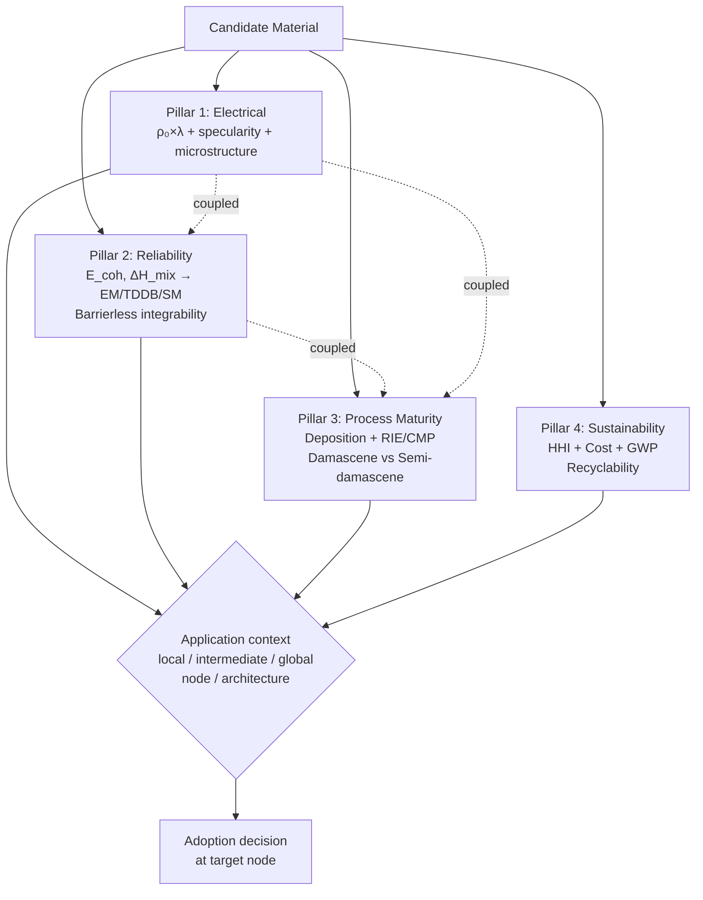
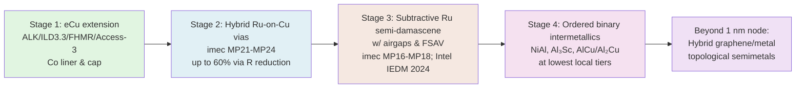

# Alternative Metals for Advanced Semiconductor Interconnects: A Technical Survey of Candidate Materials, Evaluation Criteria, and Comparative Benchmarking
# 1 Background and Motivation: The Copper Interconnect Bottleneck

Among the many physical limits that confront the semiconductor industry as it pushes toward the 2 nm node and beyond, the metallization of the back-end-of-line (BEOL) has emerged as one of the most acute. While transistor scaling has been sustained through architectural reinvention — from planar CMOS to FinFET, and now to lateral gate-all-around (GAA) nanosheets and, beyond, to complementary FETs (CFETs) and monolithic 3D VLSI[^1] — the wires that connect those transistors have continued to rely on essentially the same materials platform introduced by IBM in 1997: copper (Cu) embedded in dual-damascene structures, lined by tantalum-based diffusion barriers and capped by cobalt or related metals[^2]. As the half-pitch of the tightest metal layer (M0) is driven from 15 nm in 2021 toward 8 nm by the end of the decade according to the IRDS 2022 projection[^1], this materials system is encountering a tightly coupled set of physical, structural, and system-level limits that no incremental refinement can fully overcome. The purpose of this chapter is to articulate, with the necessary depth, why those limits exist, how they manifest, and why they justify a deliberate industry-wide search for post-Cu metallization options — a search whose materials landscape and evaluation criteria are taken up systematically in the subsequent chapters of this report.

## 1.1 Evolution of Copper Dual-Damascene Interconnects and the Scaling Imperative

The contemporary BEOL architecture is not the result of a single design decision but the outcome of nearly three decades of iterative co-optimization between conductors, dielectrics, and patterning schemes. In 1997, IBM became the first company to insert copper interconnects into volume manufacturing at the 220 nm technology node, displacing aluminum metallurgy that had dominated since the dawn of integrated circuits[^2]. The motivation was straightforward in principle but demanding in execution: copper offers a lower bulk resistivity than aluminum and a substantially higher current-carrying capacity before the onset of electromigration failure, both of which directly translate into faster signal propagation and improved chip-level reliability[^2]. However, copper could not be patterned with the conventional reactive-ion-etching (RIE) flow used for aluminum, because no volatile copper halide etch byproduct exists at practical process temperatures. This drove the development of an entirely new integration scheme — the **damascene process** — in which trenches and vias are first etched into the interlayer dielectric, then lined with a diffusion barrier and seed, filled with electroplated copper, and finally planarized by chemical mechanical polishing (CMP)[^2]. Because copper readily diffuses into silicon dioxide and silicon, where it acts as a deep-level lifetime killer, the introduction of refractory barrier layers (initially Ta/TaN bilayers) and dielectric cap layers was an inseparable part of the platform.

Following IBM's lead, TSMC migrated to Cu interconnects at the 180 nm node together with an internally developed low-k dielectric system, while UMC adopted a more conservative posture and delayed full Cu integration until the 130 nm node[^2]. From these starting points, the industry executed a long succession of scaling steps in which the dielectric was progressively replaced by lower-k organosilicate glasses, the barrier was thinned and refined (e.g., TaN/Ta evolving toward TaN/Ru and Ru-incorporated TaN surface layers)[^3], the seed step was supplemented by copper reflow techniques to suppress void formation in narrow trenches, and patterning transitioned from 193 nm immersion multi-patterning to single-exposure extreme-ultraviolet (EUV) lithography. The IRDS 2022 roadmap captures the resulting density trajectory: M0 half-pitch is projected to scale from 15 nm in 2021, to 12 nm in 2022, 10 nm in 2025, and 8 nm by 2028, with that 8 nm value remaining essentially unchanged through 2037 because it represents a fundamental patterning and materials limit rather than an engineering target[^1]. In parallel, the device platform is moving from FinFET to lateral GAA (2025) and then to CFET-SRAM/LGAA-3D with two, four, and six stacked tiers by 2028, 2031, and 2034 respectively[^1], placing ever-increasing demands on the BEOL to deliver lower resistance per unit length and lower RC delay despite the shrinking conductor cross-section.

Within this trajectory, IBM's recent IITC 2025 disclosure of an integrated package of innovations — an advanced low-k dielectric ("ALK"), an inter-layer dielectric variant ILD3.3, full hardmask removal (FHMR), an Access-3 reflow metallization, and a post-Cu rhodium (Rh) damascene module — is best read as evidence that the **dual-damascene Cu platform has entered a phase of diminishing returns**, in which extending its life requires simultaneous reinvention of the dielectric, the etch-mask scheme, the fill chemistry, and ultimately the conductor itself[^2]. The same paper explicitly frames the bottleneck in three words: "sharply rising resistance due to line width scaling, declining reliability, and increasing parasitic impact from the proportion of barrier and liner layers"[^2]. The remainder of this chapter examines each of those three elements in turn, before drawing the system-level and industrial conclusions that motivate the survey of alternative metals.

## 1.2 Physical Origins of Resistivity Degradation at Sub-20 nm Dimensions

The bulk room-temperature resistivity of copper, approximately 1.7 µΩ·cm, is the property that originally made it attractive as a replacement for aluminum. However, this value applies only to specimens whose smallest dimension is large compared to the **electron mean free path (λ)** in the material, which for copper at 300 K is approximately 39 nm. Once a conductor's width or thickness falls below this length scale — as is unavoidably the case for M0 lines whose half-pitch is approaching 8 nm[^1] — electrons can no longer travel a full mean-free-path between bulk-like scattering events, and additional scattering channels begin to dominate the transport.

Three such channels are decisive in scaled damascene Cu. The first is **surface (interface) scattering**, captured semiclassically by the Fuchs–Sondheimer model: electrons impinging on the top, bottom, and sidewall interfaces of the line are partially scattered diffusely, and the fraction of diffuse scattering grows as the line dimension shrinks relative to λ. Because copper lines are bounded above by a metallic or dielectric cap, below and on the sidewalls by a barrier/liner stack whose surface roughness and chemistry differ from the bulk Cu, surface scattering in real damascene structures is severe and only weakly tunable. The second channel is **grain-boundary scattering**, described by the Mayadas–Shatzkes formalism: as the trench width approaches the grain size, the line microstructure transitions from many-grain "bamboo-like" or polycrystalline morphologies toward a regime in which grain boundaries lie transverse to the current and the average grain volume shrinks. Because narrow damascene trenches geometrically constrain grain growth during electroplating and post-deposition anneal, grain-boundary density rises and the associated resistivity contribution rises with it. The third channel is **line-edge and sidewall roughness scattering**, which is an unavoidable byproduct of EUV stochastics and subsequent etch processes; the IRDS Lithography roadmap explicitly identifies that "stochastic issues … cause CD variation, feature roughness and critical pattern defects" and that "critical dimensions of features printed with EUVL are small enough now that stochastic effects are a substantial fraction of tolerance budgets"[^1].

The combined effect is captured at the IRDS roadmap level in its identification of one of the principal Materials for Copper Interconnect grand challenges as the need to "mitigate impact of size effects in interconnect structures," noting that "line and via sidewall roughness, intersection of porous low-k voids with sidewall, barrier roughness, and copper surface roughness will all adversely affect electron scattering in copper lines and cause increases in resistivity"[^1]. The practical consequence is that the **effective resistivity** of a Cu damascene line of width ~10 nm is several times its bulk value — a magnitude of degradation that copper, with its relatively long λ, can no longer compensate by having a low ρ₀. This is precisely why the product ρ₀×λ, rather than ρ₀ alone, has become the canonical first-principles figure of merit for alternative-metal screening, a topic developed quantitatively in Chapter 3 of this report.

## 1.3 Volume Penalty from Barrier, Liner, and Cap Layers

The resistivity penalty from intrinsic scattering is compounded by a purely geometric penalty that is unique to the damascene architecture. Because copper diffuses readily through silicon dioxide and most low-k dielectrics, every Cu line must be enclosed on its sides and bottom by a refractory diffusion barrier (typically TaN), often combined with a metallic liner (Ta, Ru, or Co) that promotes wetting and reflow of the Cu fill, and capped on top by a dielectric or metallic film (SiCN, Co, or CoWP) that prevents Cu surface diffusion under electromigration stress. The IRDS expresses the resulting reliability requirement as a hard constraint: "Cu wiring barrier materials must prevent Cu diffusion into the adjacent dielectric but also must form a suitable, high quality interface with Cu to limit vacancy diffusion and achieve acceptable electromigration lifetimes"[^1].

At large pitches, the thickness of the barrier/liner stack — a few nanometers in aggregate — is a negligible fraction of the line cross-section. At a 10 nm half-pitch, however, a 2 nm conformal barrier/liner on each sidewall plus a 2 nm bottom liner leaves a copper core only ~6 nm wide for a 10 nm trench, meaning that **the non-conductive or higher-resistivity ancillary layers can occupy on the order of half of the geometric cross-section**. Because the barrier is many times more resistive than copper, virtually all of the current must still flow through the shrinking Cu core, whose effective conductivity is simultaneously being degraded by the scattering mechanisms of §1.2. The two effects therefore reinforce each other in a way that no single-axis improvement can offset.

This realization has driven a sustained research effort to either thin or eliminate the barrier/liner stack. Work on barrier engineering has shown that "incorporation of Ru into the surface layer of TaN is a strong alternative to the usual TaN/Ta or TaN/Ru stacks"[^3], reducing the effective barrier thickness while preserving Cu wettability and diffusion blocking. More aggressive proposals seek to replace copper with a metal that does not require any diffusion barrier at all, an integration philosophy commonly referred to as **barrierless** or **linerless** metallization. IBM's recent IITC 2025 work is explicitly framed in this direction, with its title — "From Barrier-Limited to Barrier-Free: IBM's New Blueprint for BEOL Scaling" — and its inclusion of a Rh damascene module as a post-Cu candidate signaling that the industry has accepted barrier elimination as a primary lever for recovering effective conductor volume[^2]. The selection criterion that emerges — namely, that a candidate metal should be sufficiently inert toward the surrounding dielectric and sufficiently resistant to vacancy-driven failure to permit barrierless integration — is examined in detail in Chapter 3 in connection with the cohesive-energy descriptor.

## 1.4 Impact on RC Delay, Power, and System Performance

The materials-level penalties just described do not remain confined to the BEOL; they propagate upward into chip-level metrics that the industry uses to gauge generational progress. The interconnect delay between two transistors is set, to first order, by the RC product, where R scales as ρ_eff·L/A and C scales with the per-unit-length capacitance of the line in its dielectric environment. Because ρ_eff is rising sharply with dimension, while line length L for global wires does not decrease proportionally with feature size, and while A is shrinking, R-per-unit-length is climbing rapidly node over node. C-per-unit-length has been partially contained by the sustained transition to lower-k organosilicate and air-gap dielectrics, but at advanced nodes mechanical, breakdown, and integration constraints on k are reaching limits; the IRDS identifies that "future effective κ requirements preclude the use of a trench etch stop for dual damascene structures" and that "the poor mechanical strength and adhesion properties of low-κ materials are obstructing their incorporation"[^1]. The net consequence is that **RC delay has shifted from being a manageable perturbation on transistor delay to a first-order limit on chip frequency and energy per operation**.

The system-level significance of this shift is reinforced by the parallel evolution of clock-frequency limits. The IRDS notes that microprocessor clock frequency has been "limited to less than 10 GHz by power wall" since the mid-2000s[^1], so that further performance gains must come from architectural parallelism (multicore, accelerators, neuromorphic blocks) rather than from raw transistor switching speed. When the dominant delay budget shifts from transistor switching to on-chip data movement, the latency and energy of interconnects — particularly the long, capacitance-dominated upper-metal layers and the resistance-dominated local metals — become the principal levers for further improvement. Compounding this, the IRDS observes that "the most critical resources today are bandwidth and latency of the memory and the global network," that graph and data-analytics workloads exhibit a "high ratio of communication to computation," and that "memory bandwidth is a constraint on both core performance and number of cores per socket"[^1]. In modern AI training and inference workloads, this manifests as energy-per-bit-moved dominating energy-per-operation, with the IRDS reporting that inference systems cluster around an equivalent performance vs. power consumption trend of approximately 1 TOPS/W[^1] — a ratio whose further improvement is now constrained as much by interconnect physics as by transistor physics.

Within an individual chip, the parasitic burden of the barrier/liner volume penalty discussed in §1.3 adds directly to this RC budget, while the IR drop induced by the rising R of supply rails has become severe enough to motivate the industrial adoption of **backside power delivery networks**, which separate signal and power routing into different sides of the wafer. In short, the copper interconnect bottleneck is not a parochial BEOL concern but a system-architecture concern: it limits how much value the foundry industry can extract from the continued shrinkage of GxxMxxTx logic device families (G48M24 in 2022, G42M16 in 2028, G38M16T4 in 2032, etc.)[^1] that are otherwise on track in the IRDS roadmap.

## 1.5 Reliability and Manufacturability Challenges of Scaled Cu Interconnects

If the electrical penalties were the only issue, one could in principle absorb them with circuit-level mitigations. The deeper concern is that copper interconnects are simultaneously losing reliability margin and becoming harder to manufacture at the same dimensional regime. Three reliability mechanisms dominate. **Electromigration (EM)** is the diffusive transport of metal atoms under high current density, which preferentially proceeds along grain boundaries and interfaces in Cu lines and ultimately produces voids at cathode-side terminations and hillocks at the anode. Its activation energy in damascene Cu is set largely by the interface between Cu and its cap, which is why the industry transitioned from SiCN dielectric caps to metallic Co or CoWP caps over the past decade. **Stress migration (SM)** is the void formation driven by thermomechanical stress gradients during cooling and thermal cycling, exacerbated as Cu volumes shrink and grain structure becomes more constrained. **Time-dependent dielectric breakdown (TDDB)** between adjacent Cu lines is driven by the drift of Cu⁺ ions through the inter-line dielectric under bias; as line-to-line spacing shrinks and as low-k dielectrics with higher porosity are introduced, TDDB lifetime degrades sharply unless the barrier system is essentially perfect. The IRDS captures this nexus succinctly in its list of grand challenges, identifying not only barrier integrity but also "patterning, cleaning, and filling at nano-dimensions" as critical, noting that "as features shrink, etching, cleaning, and filling high aspect ratio structures will be challenging, especially for low-κ dual damascene metal structures and DRAM at nano-dimensions"[^1].

On the manufacturability side, the fundamental difficulty is that the damascene flow requires void-free copper fill into trenches and vias of increasingly extreme aspect ratio, on top of a barrier/liner of essentially conformal coverage, followed by CMP that must planarize without dishing or erosion and without damaging the underlying porous low-k dielectric. As trench width approaches 10 nm, the seed layer occupies an appreciable fraction of the opening before electroplating even begins, and pinch-off voids become a primary yield limiter. IBM's IITC 2025 disclosure addresses this concern through a sequence of dedicated process modules — **Access-3 Reflow**, which exploits high-temperature copper surface diffusion to produce void-free fill in narrow features, together with **Full Hardmask Removal (FHMR)** as an etch-mask integration breakthrough[^2] — but each of these refinements is intrinsically a workaround for a process that is being pushed past its natural operating range. As IBM itself frames the larger argument, these innovations are explicitly intended to extend Cu damascene viability while preparing the BEOL platform for a transition to a post-Cu metal, with Rh damascene presented as the first integrated example of such a successor[^2].

A second, less often discussed manufacturability concern concerns the **barrier itself**. Because TaN barriers must be deposited by either PVD or ALD to thicknesses of order 1–2 nm with high conformality and zero pinholes, their process window narrows dramatically as the trench shrinks. Surface engineering approaches such as Ru-incorporation into the TaN surface layer[^3] partially address this, but each new mitigation expands the materials/process complexity of an already crowded integration stack. The cumulative effect is that, at each successive node, a larger fraction of the BEOL R&D budget is consumed simply preserving the reliability and yield of an architecture whose intrinsic returns are diminishing — the engineering signature of a technology approaching its endpoint.

## 1.6 Industry Motivation and Transition Toward Alternative Metallization

When the three pressures developed above — rising effective resistivity, geometric crowding by barrier/liner stacks, and reliability/manufacturability erosion — are superimposed onto a roadmap that simultaneously demands M0 half-pitches of 8 nm[^1] and the introduction of stacked CFET architectures by the early 2030s[^1], the case for evaluating alternatives to Cu damascene becomes not merely academic but operationally urgent. The strategic responses of the principal industry actors reflect this. **IBM** has used IITC, the principal global forum for interconnect technology, to disclose both the Cu-extending modules (ALK, ILD3.3, FHMR, Access-3 Reflow) and the post-Cu Rhodium damascene module as a co-developed package, explicitly framing the trajectory as "From Barrier-Limited to Barrier-Free"[^2]. **imec**, the world's leading semiconductor research institute, presented seventeen papers at IITC 2025 covering "advanced metallization schemes, electrical modeling, sub-2nm integration, and reliability-enhanced interconnect architectures," with senior researchers including Zsolt Tőkei, Giulio Marti, and Blake Hodges leading the program[^2]. **Samsung Electronics** contributed talks on advanced interconnect integration and bonding for future scaling, and **SK hynix** addressed integration limits for future AI memory devices[^2]. The host conference itself — co-organized with KIEEME and UNIST in Busan — drew Intel, TSMC, Samsung, IDMs, EDA vendors, material suppliers and academic groups, with its stated scope spanning metallization and barrier materials, low-k integration, reliability and electromigration, RC delay modeling, CMP, 3D IC integration, and "emerging nanoscale and alternative interconnect architectures"[^2]. The breadth of this engagement establishes that the alternative-metallization question is no longer the domain of any single laboratory or consortium.

The IRDS 2022 roadmap reinforces this conclusion at the planning level. In its More Moore chapter, it identifies as a long-term grand challenge the "introduction of alternatives to Cu-interconnects with low resistance and good reliability," paired with the need for new low-k dielectrics and effective thermal management as 3D stacking intensifies[^1]. In its Emerging Research Materials section, it lists explicitly the requirement to "mitigate impact of size effects in interconnect structures" alongside the patterning, barrier, and dielectric challenges already discussed[^1]. The Beyond CMOS chapter notes that the device platform itself is moving toward new state variables and computational paradigms, which only increases the relative weight that interconnect physics carries in setting overall system performance[^1].

The research question that emerges from this convergent body of evidence, and that the remainder of this report addresses, can therefore be stated with some precision: **given that the dual-damascene copper architecture is approaching simultaneous limits in effective resistivity, barrier-volume penalty, RC-delay budget, and reliability/yield margin, which alternative metallization schemes — whether based on elemental metals such as Ru, Mo, Co, Rh, Ir, or W; on binary intermetallics such as NiAl, CuAl₂, Al₃Sc, CoAl, RuAl, or CuTi; on ternary compounds such as the MAX phases; or on emerging materials including graphene-encapsulated metals, topological semimetals, and intercalated 2D conductors — can deliver superior performance, reliability, and integration compatibility, and against what evaluation criteria should they be screened?** Chapter 2 reviews the candidate materials landscape across these four categories. Chapter 3 develops the four-pillar evaluation framework — electrical performance and size effects (anchored on the ρ₀×λ product), reliability (anchored on cohesive energy and barrierless integration feasibility), process maturity (damascene versus semi-damascene with associated RIE, CMP, and fill requirements), and sustainability (supply risk via the HHI index and environmental footprint via GWP) — that the remainder of the report uses for screening. Chapter 4 synthesizes those threads into a structured comparative benchmarking of Cu, Ru, Mo, Co, and NiAl. Chapter 5 closes with the outlook for the post-Cu transition and its implications for technology roadmaps at the 2 nm node and beyond.

# 2 Overview of Candidate Materials for Alternative Interconnect Metallization

Chapter 1 established that copper damascene metallization is approaching a structural endpoint in which rising effective resistivity, the geometric crowding by barrier/liner/cap layers, and the erosion of electromigration and TDDB margin can no longer be offset by incremental engineering. The natural next question — and the subject of this chapter — is what materials the community is actually proposing in copper's place. Over the past decade, the search has broadened well beyond the small set of refractory metals first considered in the late 2000s, and now spans four reasonably distinct categories: **elemental metals** with short electron mean free paths, **ordered binary intermetallic compounds** (chiefly aluminides), **ternary compounds** including the metallic MAX-phase ceramics, and a heterogeneous set of **emerging materials** that include hybrid graphene/metal stacks, topological semimetals, and intercalated 2D conductors. These categories are not merely taxonomic; they correspond to genuinely different physical and integration strategies for circumventing the size-effect-versus-volume-penalty trap of damascene Cu. This chapter introduces each in turn, with quantitative anchors where the literature permits and with explicit notes on experimental maturity, so that the four-pillar evaluation framework of Chapter 3 and the comparative benchmarking of Chapter 4 can be built on a concrete materials foundation.

## 2.1 Elemental Metals: From Pt-Group Conductors to Refractory Candidates

The earliest and still most mature line of investigation has been to replace copper with another single element whose physics is more favorable at the nanoscale. The guiding insight is that, although copper has a low bulk resistivity (~1.7 µΩ·cm), its long electron mean free path of approximately 40 nm makes its effective resistivity rise very steeply as the conductor cross-section is reduced below that length scale, as discussed in Chapter 1. A metal with a higher bulk resistivity but a much shorter mean free path can therefore overtake copper at narrow dimensions — provided its product ρ₀×λ, which captures the Fermi-surface contribution to resistivity scaling, is comparable to or lower than that of copper. This argument, formalized by Gall's first-principles calculations of electron mean free paths in elemental metals, has motivated a sustained focus on Pt-group and refractory candidates with short λ and high melting points.[^4]

**Cobalt (Co)** was the first such candidate to cross the threshold into volume manufacturing. Following experimental damascene work on sub-100 nm² Co lines and EM/resistivity characterization at imec, Intel disclosed at IEDM 2017 the use of cobalt local interconnects in its 10 nm CMOS technology, alongside third-generation FinFET transistors, self-aligned quad patterning, and contact-over-active-gate.[^4] In that integration, Co served the lowest, most resistance-critical local metal layers, where its short mean free path delivers lower effective resistivity than Cu despite Co's higher bulk resistivity. Subsequent industrial experience, however, has shown that Co is not a universal Cu replacement: at the wider, less scattering-limited pitches of intermediate and global layers, Cu remains superior, and Intel's later nodes are widely reported to have re-emphasized enhanced Cu for those layers, restricting Co to capping and the very lowest interconnect tiers.

**Ruthenium (Ru)** has emerged as the most actively developed elemental alternative for sub-10 nm pitch interconnects. Its appeal lies in a combination of an intrinsically short electron mean free path, a high cohesive energy that suppresses self-diffusion (and hence electromigration), excellent chemical inertness toward common dielectrics, and demonstrated feasibility of barrierless or near-barrierless integration. At IITC 2016, Wen et al. demonstrated atomic-layer-deposition of Ru with a TiN interface for sub-10 nm interconnects beyond Cu, and Zhang et al. characterized Ru interconnects at a 48 nm pitch for resistivity and reliability.[^4] Finite-size effects in highly scaled Ru lines were quantified shortly thereafter.[^4] More recently, imec has pushed Ru aggressively into the **semi-damascene** regime, in which Ru is deposited as a blanket film, patterned by reactive ion etching, and gap-filled with a low-k dielectric — a flow that avoids the barrier/liner volume penalty of damascene entirely. imec has publicly disclosed 16 nm pitch Ru lines with record-low resistance obtained through two-level semi-damascene integration and has been advancing the same scheme toward metal pitches of MP18–MP26 and below.[^5] In the same broader program, imec has also reported hybrid Ru/graphene devices and conductor films on 300 mm wafers with resistivity lower than that of Cu and Ru alone.[^5] Comparative data assembled by imec place Ru's properties in context with Cu, W, and carbon-based candidates (single- and few-layer graphene, CNT), highlighting Ru's balanced position in resistivity, current-carrying capacity, and electromigration robustness.[^5]

**Molybdenum (Mo)** has gained renewed interest as a barrierless candidate, particularly for memory and back-end power applications. Its bulk resistivity is moderate, its melting point and cohesive energy are high, and crucially it can be deposited by PVD without the need for a TaN-class diffusion barrier into many BEOL dielectrics. Reliability studies of barrierless PVD Mo were reported at IITC 2021, examining its viability in scaled interconnect modules.[^4] In production, Kioxia has adopted Mo as a wordline material in 3D NAND flash to replace tungsten at the deepest, highest-aspect-ratio levels, a use case that — while not BEOL logic in the strict sense — establishes Mo's manufacturability at large scale.

**Tungsten (W)** is the longest-standing refractory metal in BEOL integration, traditionally used as the contact/via fill metal because its CVD chemistry conformally fills high-aspect-ratio plugs. As an interconnect line conductor, however, W is handicapped at scaled dimensions by a comparatively long mean free path relative to its bulk resistivity, and imec's comparison of W with Ru, Cu, and carbon-based materials shows W trailing Ru on the most relevant interconnect figures of merit.[^5] W therefore appears in the alternative-metal landscape mainly as a legacy reference and as a candidate for niche, high-aspect-ratio applications rather than as a leading post-Cu line conductor.

**Rhodium (Rh)** and **iridium (Ir)** are platinum-group metals with very short mean free paths and high cohesive energies — physics that should in principle position them ahead of Ru on size-effect grounds. The classic obstacle has been process maturity, since neither metal has historically had a manufacturable BEOL integration flow. This obstacle has recently been narrowed: as discussed in Chapter 1, IBM disclosed at IITC 2025 a Rh damascene module developed as a co-integrated package with advanced low-k dielectrics, ILD3.3, full hardmask removal, and an Access-3 reflow step, explicitly positioned as a "from barrier-limited to barrier-free" successor to Cu damascene. Iridium, conversely, remains essentially a screening-stage candidate. For both, sustainability is a defining constraint: Pt-group metals are among the rarest and most supply-constrained elements in industrial use, an issue revisited in Chapter 3.

A useful synthesis of the elemental-metal landscape, drawing on the IMEC and IBM disclosures and the literature anchored by Gall's mean-free-path work, is given in Table 2.1.

| Metal | Reported role at scaled dimensions | Maturity (early 2024) | Notes |
|---|---|---|---|
| Co | Local interconnect at Intel 10 nm; CoWP caps for Cu EM mitigation | HVM (limited tiers) | Re-scoped to lowest tiers / cap in later nodes |
| Ru | Sub-10 nm ALD Ru/TiN; 48 nm pitch Ru damascene; 16 nm pitch Ru semi-damascene | Pilot / pre-HVM (imec MP18–MP26) | Leading post-Cu local interconnect candidate[^5] |
| Mo | Barrierless PVD Mo (IITC 2021); 3D NAND wordlines (Kioxia) | HVM in NAND; pilot for logic BEOL | High cohesive energy, RIE-friendly |
| W | Plug/via fill; reference conductor | Mature legacy | Long λ limits competitiveness for scaled lines[^5] |
| Rh | Damascene module (IBM IITC 2025) | Module demonstration | Supply / cost concerns |
| Ir | Ab initio and thin-film screening | Lab-scale | Very limited published integration data |

The common physical message across this set is that elemental metals exploit a single axis — a short ρ₀×λ — and pay for that with either supply-chain pressure (Pt-group), reliability constraints (Co at upper tiers), or process incompatibility (W in scaled lines). This single-axis nature is precisely what motivates the move to compound materials, where additional degrees of freedom become available.

## 2.2 Binary Intermetallic Compounds: Ordered Aluminides and Related Phases

Ordered binary intermetallics — and in particular the aluminides — have become the most rapidly expanding category in the alternative-metal landscape, because they offer a way to combine the short-MFP behavior of refractory metals with cohesive energies high enough to permit genuinely barrierless integration. The defining feature of this class is **chemical ordering**: in compounds such as NiAl (B2 structure), Al₃Sc (L1₂), and RuAl (B2), the two atomic species occupy distinct, ordered sublattices, which avoids the strong alloy-scattering penalty that disordered binary alloys would otherwise suffer. As emphasized in the Al₃Sc study by Soulié et al., "only ordered intermetallics exhibit low bulk resistivities, rendering them potentially interesting for interconnect applications. Both stoichiometric as well as nonstoichiometric disorder can lead to alloy scattering, resulting in a strong increase of the resistivity."[^4] The intermetallic strategy therefore requires not only the right composition but also a manufacturable route to high crystallographic order in films a few tens of nanometers thick.

**NiAl (B2 structure)** is the most extensively studied member of this class and has become a benchmark against which newer aluminides are compared. Chen, Ando, Sutou, Gall, and Koike showed in 2018 that NiAl is a viable candidate for **liner- and barrier-free metallization at ultrasmall technology nodes**, with subsequent TDDB and interface-status work confirming its barrierless reliability against SiO₂ dielectrics.[^4] The reported NiAl thin-film resistivity is 10 µΩ·cm at 260 nm thickness, ~13 µΩ·cm at 56 nm, and ~20.2 µΩ·cm at 25.1 nm under reference annealing conditions, with a sharp resistivity minimum at the stoichiometric composition that signals the dominance of alloy scattering when stoichiometry deviates.[^4] Soulié, Tőkei, Swerts, and Adelmann subsequently quantified the thickness scaling of NiAl thin films at IITC 2020, and Sankaran et al. and Koike et al. extended the analysis to ordered intermetallics and aluminide compounds more broadly.[^4] First-principles calculations place the ρ₀×λ product of NiAl at 4.4×10⁻¹⁶ Ω·m², lower than that of Cu (6.8×10⁻¹⁶ Ω·m²) and comparable to that of Ru (5.1×10⁻¹⁶ Ω·m²), confirming that NiAl's Fermi surface gives it intrinsically better size-effect behavior than Cu.[^4] NiAl has also been demonstrated to "have reduced resistivity … by backthinning for advanced interconnect metallization," a result presented at IITC.[^6]

**Al₃Sc (L1₂ structure)** is a newer and currently very promising entrant. In their 2023/2024 work, Soulié et al. deposited stoichiometric Al₃Sc by co-sputtering Al and Sc at room temperature on 300 mm SiO₂/Si wafers, observed crystallization at 193 °C and recrystallization at 443 °C in situ, and obtained a resistivity of **12.6 µΩ·cm at 24 nm thickness** after annealing at 500 °C — substantially below the 20.2 µΩ·cm of 25.1 nm NiAl under comparable conditions.[^4] Combined with first-principles DFT yielding ρ₀×λ = 4.9×10⁻¹⁶ Ω·m² and an experimental bulk resistivity of 7 µΩ·cm, this gives Al₃Sc an electron mean free path of approximately **7 nm**, a value nearly six times shorter than the ~40 nm MFP of Cu and therefore very favorable for size-effect-limited scaling.[^4] Residual resistance ratio (RRR) measurements indicated a strong temperature-independent contribution to scattering attributable to grain boundaries and residual L1₂ disorder on the order of 1%, suggesting that further microstructural optimization could bring the film resistivity still lower.[^4] Two specific challenges were identified: (i) **secondary-phase formation** for Al-rich compositions (x ≥ 0.79), where dendrite-like fcc Al inclusions with heights up to 100 nm appear after 600 °C annealing, consistent with Al₃Sc being a line compound in the Al–Sc phase diagram with negligible miscibility for either constituent; and (ii) a **non-stoichiometric, Sc-rich surface oxide** (~6 nm thick after air exposure, with Al/Sc ≈ 2 rather than the bulk 3) and an interfacial AlScSiOₓ/AlScOy reaction layer (~4 nm) with the underlying SiO₂ after high-temperature annealing.[^4] These features point to the need for in-situ capping layers and reduced thermal budgets when integrating Al₃Sc into ultrathin BEOL lines.

**CuAl₂** has been advanced by Chen, Ando, Sutou, and Koike as a low-resistivity interconnect material for advanced semiconductor devices.[^7][^8][^9][^10] Resistivity scaling in epitaxial CuAl₂(001) layers has been measured to assess the impact of orientation and microstructure,[^8] and dedicated electromigration studies have been reported on CuAl₂ thin films.[^9] The narrative that has built up around CuAl₂ is that, like NiAl, it forms a stable, self-passivating interface with surrounding dielectrics, supporting liner- and barrier-free integration — a phenomenon observed in CuAl₂, NiAl, and CuTi alike, where in-situ-formed interfacial oxides at the metal–SiO₂ interface play the role of a built-in diffusion barrier.[^11] CuAl₂ has accordingly been described as a promising alternative for advanced Cu interconnects.[^7]

**CuTi** has been studied along closely parallel lines and is described in the literature as a candidate liner- and barrier-free interconnect conductor, sharing with NiAl and CuAl₂ the in-situ formation of a stable interfacial oxide layer at the metal–SiO₂ interface that acts as an intrinsic diffusion barrier.[^11]

**RuAl (B2 structure)** sits at an interesting position between the elemental-Ru and the aluminide branches. Single-phase B2-RuAl thin films deposited by magnetron co-sputtering and crystallized by rapid thermal annealing at 800 °C for 1 minute have been characterized in detail.[^12] Fuchs–Sondheimer and Mayadas–Shatzkes fits to the resistivity-versus-thickness data extracted an extremely **short electron mean free path of below 5 nm** combined with a **high specularity parameter of approximately 0.9** at the film interfaces — a combination that essentially neutralizes the surface-scattering term that limits Ru and Cu at the same dimensions.[^12] The same study highlighted RuAl's high cohesive energy (a large negative mixing enthalpy) and thermal stability up to 900 °C, properties consistent with the broader literature view of RuAl as a high-temperature B2 compound with an "almost unique line-up of physical, chemical, and mechanical properties."[^12] At ultra-small thicknesses below ~5 nm, grain-boundary or domain-wall reflection becomes the dominant scattering channel, but the bulk-like and surface terms are essentially saturated.[^12] On these grounds, RuAl has been positioned as a "promising candidate for potential use as the next-generation interconnect metallization without the need of a diffusion barrier."[^13][^14][^12] The notable trade-off, of course, is that RuAl inherits Ru's supply-chain pressure.

**CoAl** is consistently mentioned in the alternative-metal screening literature alongside NiAl as a B2-structured cobalt aluminide of interest, motivated by Co's already established role in Cu-replacement work at the lowest interconnect tiers (see §2.1) combined with the cohesive-energy and ordering arguments that apply to the aluminides generally. Quantitative thin-film data for CoAl at BEOL-relevant thicknesses are more limited than for NiAl and Al₃Sc in the materials surveyed here, and CoAl should be regarded as a less mature member of the aluminide family pending more systematic thin-film studies.

Several broader patterns emerge from the binary-intermetallic data. First, **stoichiometry is a critical control variable**: the resistivity-versus-composition curves of NiAl and Al₃Sc both exhibit sharp minima at the ordered stoichiometric composition, with rapid degradation as alloy scattering switches on at deviations of a few percent.[^4] Second, the **annealing temperature window is narrow**: too low and the film remains amorphous or partially recrystallized with high resistivity; too high and secondary phases (fcc Al in Al₃Sc, for instance) and dielectric-reaction layers form.[^4] Third, **interfacial chemistry can be a feature rather than a bug**, with self-passivating native oxides at the intermetallic–SiO₂ interface providing an intrinsic diffusion barrier that enables linerless integration and underwrites TDDB lifetime.[^11] Together, these properties have made ordered binary intermetallics — and the aluminides in particular — the most actively expanding category in the alternative-metal landscape as of early 2024.

## 2.3 Ternary Compounds and MAX Phases

The natural extension of the ordered-binary-intermetallic strategy is to move to ternary compounds, where an additional compositional degree of freedom permits independent tuning of Fermi-surface morphology, cohesive energy, and chemical inertness against surrounding dielectrics. The most actively investigated ternary family in this context is the **MAX phases**: layered metallic ceramics of nominal composition Mₙ₊₁AXₙ (where M is an early transition metal, A is a group-13/14/15 element, and X is C or N), which combine metallic conduction with the chemical robustness of ceramics. Sankaran, Moors, Tőkei, Adelmann, and Pourtois reported in 2021 a first-principles ab initio screening of metallic MAX ceramics for advanced interconnect applications, systematically evaluating their electronic structures and transport-relevant figures of merit.[^4] Within this broader family, the **Ti–Al–N (e.g., Ti₂AlN, Ti₄AlN₃)** and **Cr–Al–C** subgroups are the most frequently cited candidates for interconnect screening.

The scientific rationale for examining ternary compounds for interconnects can be stated compactly: with three elements to tune, one can in principle simultaneously target a short ρ₀×λ product (via Fermi-surface engineering of the M-element d-states), a high cohesive energy that ensures EM robustness (via strong M–X bonding), and a self-passivating interface chemistry against silicon-bearing dielectrics (via the A-layer chemistry). The MAX phases also typically exhibit high melting points, high thermal conductivities, and good resistance to oxidation, all of which align with the reliability and process-thermal-budget needs of advanced BEOL.

In contrast to the binary aluminides, however, the experimental maturity of ternary compounds for interconnect applications remains low. The cited work is dominated by ab initio screening rather than 300 mm thin-film integration; representative compounds have not yet been deposited and characterized at the thicknesses, microstructures, and patterning conditions relevant for sub-20 nm interconnect lines, at least in the open literature surveyed here. The principal open questions for this category, as they emerge from the broader alternative-metal literature reviewed in this report, can be grouped as follows: (i) **deposition** — can the required ordered ternary phase be formed in films of <30 nm thickness without intervening binary or amorphous phases, and at thermal budgets compatible with BEOL? (ii) **patterning** — can MAX-phase ceramics be etched into trapezoidal, low-roughness lines by RIE chemistries that produce volatile byproducts, and can the resulting sidewalls be cleaned without disturbing stoichiometry? (iii) **interface stability** — does the A-element segregate, oxidize, or react with the surrounding low-k dielectric under the relevant thermal and electrical stress conditions? Until systematic answers exist for these questions, ternary compounds are best regarded as a long-horizon category whose principal contribution is enriching the screening pool from which binary or even elemental candidates may eventually be re-derived.

## 2.4 Other Emerging Materials: Hybrid Graphene/Metal, Topological Semimetals, and Intercalated 2D Conductors

The fourth category collects materials platforms that depart from the conventional polycrystalline-metal conduction paradigm altogether. These include hybrid graphene/metal heterostructures, topological semimetals exhibiting symmetry-protected surface states, and intercalated 2D conductors. They are typically positioned in the literature as **longer-term options for the 1 nm node and beyond**, with the proviso that their integration challenges are correspondingly greater.

### 2.4.1 Hybrid graphene/metal heterostructures

The motivation for hybridizing graphene with conventional metals stems from a clear physical observation. Graphene exhibits exceptional intrinsic properties — carrier mobility up to ~200,000 cm² V⁻¹ s⁻¹, current carrying capacity up to 10⁸ A/cm², high thermal conductivity, and atomically thin geometry that minimizes the thickness contribution to the RC product — but it has too few charge carriers in its intrinsic state to function alone as a local interconnect, because conductivity is proportional to both mobility and carrier concentration.[^5] Modelling reported by imec indicates that "several layers of graphene will be needed to cross-over Cu … for (local) interconnect applications," with the precise number of layers reflecting a trade-off between resistance and capacitance contributions.[^5] Hybrid metal/graphene structures address this limitation by combining "the high carrier concentration of the metal and the high mobility of graphene," with metal-induced doping of graphene at the metal/graphene interface providing additional charge carriers.[^5]

Two concrete sub-architectures dominate the literature. The first is the **graphene-capped metal interconnect**, in which a metal line (Cu or Ru) is overcoated with multilayer graphene grown directly on the metal surface, typically by chemical vapor deposition. Son and co-workers demonstrated Cu-graphene heterostructure interconnects fabricated by direct synthesis of multilayer graphene on Cu lines using benzene or pyridine sources by atmospheric pressure CVD at 400 °C — a temperature compatible with CMOS back-end-of-line constraints.[^15] The graphene films were 4–21 layers thick (~1.5–7.35 nm) depending on growth time, and the polycrystalline Cu surface (in contrast to single-crystal Cu foil) supported multilayer rather than monolayer graphene formation.[^15] Nitrogen-doped (~2.1 at.%) graphene capping using pyridine yielded the strongest performance: relative to pure annealed Cu lines, the Cu/N-graphene structure showed a resistivity reduction of ~3.5% (from 9.58 to 9.25 µΩ·cm), a breakdown current density increase of ~24.1% (from 20.2 to 25.2 MA cm⁻²), and a dramatic enhancement of mean-time-to-failure exceeding **10⁶ s at 100 °C under 3 MA cm⁻² DC stress**, compared with ~2×10⁵ s for Si₃N₄-capped Cu controls.[^15] Crucially, the same authors demonstrated the compatibility of the graphene cap with a **damascene-patterned** Cu interconnect (with TaN/Ta diffusion barriers and CMP), obtaining a 4.1% resistivity reduction, a 21.3% increase in breakdown current density, and an order-of-magnitude lifetime extension, thereby establishing BEOL compatibility for the scheme.[^15] The mechanisms invoked are mitigation of Cu surface electromigration through C–Cu surface binding, enhanced heat dissipation through graphene's high thermal conductivity, and an effective parallel conduction path through the doped graphene layer (with calculated resistivities of 3.4 µΩ·cm for undoped graphene and 3.1 µΩ·cm for N-doped graphene on Cu).[^15]

imec has pursued an analogous approach with **Ru as the underlying metal**, transferring CVD-grown multilayer graphene onto 5 nm PVD Ru films and characterizing the resulting Ru/graphene hybrid devices.[^5] Two main observations were reported: first, the sheet resistance of Ru "dropped by an average of 15 % after encapsulation with graphene"; second, the graphene Fermi level shifted downward into the valence band by ~0.5 eV relative to intrinsic graphene, corresponding to a metal-induced hole concentration of 1.9×10¹³ cm⁻², confirming p-type doping of graphene by contact with Ru.[^5] Ru lines encapsulated with graphene were also observed to be "less sensitive to temperature fluctuations," attributed to graphene's high thermal conductivity providing an additional heat-dissipation channel — an important consideration given the self-heating problem in highly scaled wires.[^5] imec has explicitly stated that "graphene-capped metal hybrid structures provide an answer to the RC delay problem for future interconnects" and envisions their introduction "in the BEOL technology roadmap for the 1 nm node and beyond."[^5]

The second architecture is a **metal/graphene/metal sandwich stack**, in which alternating graphene and metal layers are stacked to multiply the effective conduction cross-section. Here a second and equally important interface appears: that resulting from depositing metal on top of graphene, whose grain boundaries act as line defects and nucleation centers and which suffers from post-transfer contamination.[^5] imec has demonstrated a hydrogen-plasma graphene cleaning step (Ar/H₂ downstream plasma) followed by electron-beam evaporation of Ru, with an overall 18% improvement in electrical conductivity of Ru-capped plasma-treated graphene devices, though single-layer graphene is more susceptible to plasma damage than thicker films.[^5] The integration challenges that remain before these schemes can be adopted in a 300 mm fab include the requirement for direct low-temperature graphene growth on the target metal (since high-quality CVD growth typically requires 900–1000 °C, incompatible with BEOL thermal budgets), the need for an "elegant" transfer process for graphene previously grown on Pt foil, control of graphene defectivity and grain orientation, and topography compatibility of the underlying metal layer.[^5]

### 2.4.2 Topological semimetals

A second emerging strand exploits **topological semimetals**, in which the band structure hosts symmetry-protected surface or bulk states that resist backscattering and therefore promise weaker resistivity scaling at nanoscale dimensions than is achievable with ordinary metals. Compounds such as the chiral topological semimetal **CoSi** and the Weyl semimetal **NbAs** have been advanced in this context, with the argument that their Fermi-arc and topological surface states could short-circuit the surface-scattering contribution that limits ordinary metals at very small thickness. The general line of reasoning has been developed in the broader alternative-metal literature, including work by Kumar et al. on "ultralow electron-surface scattering in nanoscale metals leveraging Fermi-surface anisotropy" — a Phys. Rev. Mater. study (2022) referenced alongside the binary-intermetallic literature in the alternative-metal canon.[^4] As of early 2024, topological-semimetal interconnect candidates remain primarily at the ab initio and lab-scale thin-film stage, with no reported 300 mm wafer-level integration; their principal open question is whether topological protection survives the polycrystalline microstructure, defects, and rough interfaces of realistic BEOL thin films.

### 2.4.3 Intercalated 2D conductors and graphene nanoribbons

A third strand is the use of **intercalated multilayer-graphene-nanoribbon (GNR) interconnects** as standalone conductors. Jiang, Chu, and Banerjee demonstrated intercalation-doped multilayer-GNR interconnects with improved performance and reliability and presented CMOS-compatible doped-multilayer-graphene interconnects for next-generation VLSI at IEDM 2018, while earlier work demonstrated single-layer GNR-based interconnects with high breakdown current densities of order 10⁸ A/cm².[^15] The principal limitation that this approach has faced is that intrinsic graphene's low carrier concentration causes breakdown to occur at low bias when used without doping or intercalation, and the lithographic patterning of nanometer-wide ribbons is itself a non-trivial challenge.[^15] Nonetheless, doped multilayer-GNR interconnects remain an important reference point because they establish the upper bound of what a pure-2D conductor approach can in principle achieve, and they provide a natural complement to the hybrid graphene/metal architectures of §2.4.1.

## 2.5 Comparative Snapshot of the Alternative-Metal Design Space

To synthesize the four categories surveyed above, Table 2.2 consolidates the principal materials along the axes that recur most often in the literature: bulk resistivity, the ρ₀×λ figure of merit (or qualitative MFP), demonstrated thin-film resistivity at a representative scaled thickness, cohesive-energy / barrierless behavior, and current experimental maturity. Where a quantitative anchor is available in the surveyed primary sources, it is given; where the surveyed materials provide only qualitative information, this is stated honestly so as not to overstate the available evidence.

| Category | Representative material(s) | Bulk ρ₀ (µΩ·cm) | ρ₀×λ (×10⁻¹⁶ Ω·m²) | Demonstrated thin-film ρ (µΩ·cm @ thickness) | Cohesive energy / barrierless | Maturity |
|---|---|---|---|---|---|---|
| Elemental — Cu (benchmark) | Cu | 1.7 | 6.8[^4] | Strongly degraded for w<40 nm | Moderate; barrier required | HVM (damascene) |
| Elemental — Pt-group | Ru | (higher than Cu) | 5.1[^4] | Pilot at 16 nm pitch (semi-damascene)[^5] | High; near-barrierless | Pilot/pre-HVM[^5] |
| Elemental — refractory | Mo | Moderate | n.a. (high) | Barrierless PVD Mo (IITC 2021)[^4] | High; barrierless feasible | HVM in NAND; pilot in logic |
| Elemental — short-MFP local | Co | Moderate | n.a. | 10 nm Co local interconnect (Intel)[^4] | Moderate | HVM at lowest tiers[^4] |
| Elemental — Pt-group, new | Rh, Ir | (low–moderate) | (favorable, short MFP) | Rh damascene module (IBM IITC 2025) | High; near-barrierless | Module demo (Rh); screening (Ir) |
| Binary intermetallic — aluminides | NiAl | (low) | 4.4[^4] | 20.2 µΩ·cm @ 25.1 nm; 13 µΩ·cm @ 56 nm; 10 µΩ·cm @ 260 nm[^4] | High; TDDB-validated barrierless[^4][^11] | 300 mm thin-film |
| Binary intermetallic — aluminides | Al₃Sc | 7[^4] | 4.9[^4] | **12.6 µΩ·cm @ 24 nm** (500 °C anneal)[^4] | High; promising; secondary-phase & oxide control needed[^4] | 300 mm thin-film[^4] |
| Binary intermetallic — Ru-based | RuAl (B2) | — | — (MFP <5 nm; specularity ~0.9)[^12] | Highly favorable scaling; stable to 900 °C[^12] | Very high (large –ΔH_mix); barrierless[^13][^14][^12] | Thin-film lab-scale |
| Binary intermetallic — Cu-based | CuAl₂, CuTi | — | — | Reported as low-ρ candidates[^7][^8][^9] | In-situ-formed interfacial oxide; barrierless[^11] | Thin-film lab-scale |
| Binary intermetallic — Co-based | CoAl | — | — | Limited quantitative thin-film data in surveyed sources | High (B2) | Screening / early thin-film |
| Ternary / MAX | Ti–Al–N, Cr–Al–C families | — | — (ab initio) | n.a. | High; engineerable | Ab initio screening[^4] |
| Emerging — graphene-capped Cu | Cu/N-graphene | — | — | 9.25 µΩ·cm @ 500 nm-thick Cu line; MTTF >10⁶ s @ 100 °C, 3 MA cm⁻²[^15] | Cap mitigates Cu surface EM and TDDB-relevant interface[^15] | Lab-scale; damascene-compatible[^15] |
| Emerging — graphene-capped Ru | Ru/graphene | — | — | 15% Ru sheet-R reduction; p-type doping of graphene (1.9×10¹³ cm⁻²)[^5] | Improves Ru thermal robustness[^5] | Lab-scale (imec) |
| Emerging — topological semimetals | CoSi, NbAs | — | (predicted ultralow surface scattering)[^4] | n.a. (lab-scale) | High | Ab initio / lab-scale |
| Emerging — intercalated 2D / GNR | doped multilayer GNR | — | — | J_BR ~10⁸ A cm⁻²[^15] | High intrinsic robustness; patterning-limited | Lab-scale[^15] |

Several cross-cutting trends are visible. First, on the **electrical-scaling axis** — the ρ₀×λ product, examined in detail in Chapter 3 — the ordered binary intermetallics NiAl (4.4×10⁻¹⁶ Ω·m²) and Al₃Sc (4.9×10⁻¹⁶ Ω·m²) and elemental Ru (5.1×10⁻¹⁶ Ω·m²) all sit clearly below Cu (6.8×10⁻¹⁶ Ω·m²), and the demonstrated thin-film resistivity of Al₃Sc (12.6 µΩ·cm at 24 nm) is currently the lowest reported in this thickness range for any binary aluminide.[^4] RuAl pushes the surface-scattering term even further down via its ~0.9 specularity and <5 nm MFP, although at the cost of inheriting Ru's supply-chain pressure.[^12] Second, on the **barrierless-integration axis**, the aluminide family as a whole (NiAl, CuAl₂, CuTi, Al₃Sc, RuAl) shares the property that an ordered structure plus a self-passivating native oxide can act as an intrinsic diffusion barrier against SiO₂, with TDDB studies of NiAl and CuTi providing the primary experimental support.[^4][^11] Third, on the **maturity axis**, elemental Co is already in volume manufacturing (at restricted tiers), elemental Mo is in volume manufacturing in 3D NAND and in pilot for logic BEOL, elemental Ru is in pilot at imec at metal pitches of 16 nm, and IBM's Rh damascene is at the module-demonstration stage; the intermetallics are at the 300 mm thin-film stage, with stoichiometry, anneal-window, and interface-stability questions to resolve; and the ternary / MAX-phase and emerging-materials categories are at lab-scale or ab initio screening, with hybrid graphene/metal interconnects being the most advanced sub-class among them.

The net picture as of early 2024 is therefore that **ordered binary intermetallics constitute the most balanced near-term post-Cu option**, combining favorable ρ₀×λ, demonstrated thin-film resistivity at scaled thickness, intrinsic barrierless behavior, and a credible pathway to 300 mm integration, while **hybrid graphene/metal structures and topological semimetals represent the most promising long-term lever** for extending the BEOL roadmap beyond the 1 nm node. The unresolved questions that this snapshot exposes — how to weight ρ₀×λ against cohesive energy, how to compare a damascene-friendly metal to one that requires subtractive RIE, how to discount a leading candidate by its HHI supply-risk score and its GWP — define exactly the four-pillar evaluation framework developed in Chapter 3.

# 3 Key Evaluation Criteria for Screening Alternative Interconnect Metals

The materials landscape surveyed in Chapter 2 — from elemental Ru, Mo, and Co through ordered binary aluminides such as NiAl, Al₃Sc, and RuAl, to ternary MAX phases and emerging graphene-hybrid and topological-semimetal systems — already makes clear that no single property can serve as the sole basis for down-selection. A metal with extraordinarily low bulk resistivity is irrelevant if its electron mean free path is too long to sustain that conductivity at sub-20 nm dimensions; a metal with an attractive size-effect figure of merit is irrelevant if its self-diffusivity precludes barrierless integration; a metal that satisfies both is irrelevant if it cannot be etched, planarized, or filled into the trenches and lines required by 300 mm manufacturing; and a metal that satisfies all three of these technical pillars may still be rejected if it is concentrated in a single country, priced beyond foundry tolerance, or carries an embodied-carbon penalty incompatible with industry sustainability commitments. The screening framework therefore has an irreducibly multi-dimensional character.

This chapter formalizes that framework around four pillars — **electrical performance and size effects**, **reliability**, **process maturity**, and **sustainability** — and explains for each pillar (i) the underlying physics or industrial constraint, (ii) the quantitative descriptors used to operationalize the criterion, and (iii) the way the descriptor discriminates among the candidate materials introduced in Chapter 2. Section 3.5 then synthesizes the four pillars into the unified screening lens used in Chapter 4 to benchmark Cu, Ru, Mo, Co, and NiAl. The framing here is deliberately conservative: where the literature surveyed in this report provides numerical anchors (e.g., the ρ₀×λ products from first-principles calculations, the Cobalt Institute LCA values for GWP, the imec/Intel/IBM disclosures of process readiness), those anchors are used; where descriptors are widely cited in the community but the surveyed sources provide only qualitative support (e.g., HHI scores for individual interconnect metals), this is stated honestly so as not to misrepresent the available evidence.

## 3.1 Electrical Performance and Size Effects

### 3.1.1 Why bulk resistivity ceases to govern at the nanoscale

The bulk room-temperature resistivity ρ₀ of a metal — for copper, approximately 1.7 µΩ·cm, as recapitulated in Chapter 1 and confirmed at "an excellent bulk resistivity of 1.68 µΩ·cm" in the alternative-metal literature[^16] — is set by phonon and impurity scattering in a regime where the conductor's smallest dimension is much larger than the **electron mean free path (λ)**, the average distance an electron travels between scattering events. For copper, λ at 300 K is approximately 40 nm[^16], a length scale that comfortably exceeded any historical BEOL wire dimension until the past decade. Once the line width or thickness approaches λ, however, electrons can no longer complete a bulk-like mean-free-path before reaching an interface or grain boundary, and two new scattering channels — both absent from ρ₀ — begin to dominate transport.

The first such channel is **surface (interface) scattering**, captured semiclassically by the **Fuchs–Sondheimer (FS) model**. In the FS formalism, an electron incident on the upper, lower, or sidewall interface of a thin film is partially specularly reflected (preserving its tangential momentum) and partially diffusely scattered. The fraction of specular events is parametrized by the **specularity coefficient p**, with p = 1 corresponding to fully specular (no resistivity penalty) and p = 0 corresponding to fully diffuse (maximum penalty). The FS resistivity rises sharply as the ratio of film thickness to λ falls below unity, with the rate of rise increasing as p decreases.

The second channel is **grain-boundary scattering**, captured by the **Mayadas–Shatzkes (MS) model**. As the trench width approaches the natural grain size of the deposited film, an increasing fraction of electrons must cross grain boundaries, where they are partially reflected with a reflection coefficient R characteristic of the boundary chemistry and misorientation. Because narrow damascene trenches geometrically constrain grain growth during electroplating and post-deposition annealing — and because most alternative metals when deposited in <30 nm-thick films exhibit grain sizes of order their thickness — the MS contribution becomes substantial precisely in the dimensional regime of interest. A third related contribution, **line-edge and sidewall roughness scattering**, arises from the stochastics of EUV lithography and the subsequent etch processes, and acts in effect as an additional surface-scattering term with a strongly diffuse character.

The empirical signature of these mechanisms operating in concert is universal across the alternative-metal literature surveyed in this report. Resistivity-versus-thickness curves bend sharply upward as thickness falls below ~λ, with the upturn occurring at larger thickness for metals with longer λ (e.g., Cu) and at smaller thickness for metals with shorter λ (e.g., Ru, NiAl, Al₃Sc, RuAl). For NiAl, for example, thin-film resistivity rises from approximately 10 µΩ·cm at 260 nm to ~13 µΩ·cm at 56 nm and ~20.2 µΩ·cm at 25.1 nm under reference annealing conditions; for Al₃Sc, a resistivity of 12.6 µΩ·cm has been measured at 24 nm thickness after annealing at 500 °C, with first-principles DFT yielding ρ₀×λ = 4.9×10⁻¹⁶ Ω·m² and an experimental bulk resistivity of 7 µΩ·cm corresponding to λ ≈ 7 nm. These data, both reported in Chapter 2, are the experimental manifestation of FS+MS scattering operating jointly on candidate materials in the BEOL-relevant thickness regime.

### 3.1.2 The ρ₀×λ product as a first-principles figure of merit

Because both ρ₀ and λ enter the size-dependent resistivity, neither alone discriminates effectively among candidates. The community has therefore converged on the **ρ₀×λ product** as the canonical first-principles screening descriptor for alternative interconnect metals, an approach formalized by Daniel Gall's ab initio screening of "the most conductive metal for narrow interconnect lines"[^17]. The physical content of ρ₀×λ is that it captures the Fermi-surface contribution to size-dependent transport in a way that is largely independent of the scattering mechanism: a metal with a small ρ₀×λ will, in the limit where the conductor dimension is much smaller than λ, deliver a lower effective resistivity than a metal with a larger ρ₀×λ — regardless of which of the two has the lower bulk ρ₀. In effect, ρ₀×λ measures the intrinsic "size-effect tax" that a given metal must pay, and minimizing it is equivalent to choosing a metal whose Fermi-surface geometry is best suited to nanoscale conduction.

The decisive consequence is that copper's celebrated bulk resistivity advantage is overturned at narrow dimensions by its long mean free path. Quantitatively, **Cu has ρ₀ ≈ 1.7 µΩ·cm and λ ≈ 40 nm, yielding ρ₀×λ ≈ 6.8×10⁻¹⁶ Ω·m²**, whereas **Ru has a much higher bulk resistivity of 7.1 µΩ·cm but a much shorter MFP of ~6–8 nm**[^16], yielding ρ₀×λ ≈ 5.1×10⁻¹⁶ Ω·m². Ruthenium therefore loses to copper at large pitches but wins at narrow pitches — the same physics that underlies imec's 16 nm-pitch Ru semi-damascene demonstrations[^18]. The Vik's Newsletter analysis articulates the trade-off directly: "Copper has a relatively high MFP of ~40 nm which implies that its resistance severely increases due to frequent scattering when interconnect dimensions are scaled to ~10 nm. In contrast, ruthenium has a low MFP of ~6–8 nm which makes it less sensitive to resistance increase at small dimensions and more suitable for narrow interconnects at advanced technology nodes. So while ruthenium has a higher bulk resistivity, its low MFP makes it a better choice for very small feature size interconnects."[^16]

Table 3.1 consolidates the ρ₀×λ values that anchor the screening discussion throughout this report, drawing on the values cited in Chapter 2 and on Gall's first-principles framework[^17]. The trend is unambiguous: the ordered binary intermetallics **NiAl (4.4×10⁻¹⁶ Ω·m²) and Al₃Sc (4.9×10⁻¹⁶ Ω·m²)** and elemental **Ru (5.1×10⁻¹⁶ Ω·m²)** all sit clearly below Cu (6.8×10⁻¹⁶ Ω·m²) on the figure of merit, while **RuAl achieves an even more extreme combination of <5 nm MFP and ~0.9 specularity**, essentially neutralizing the FS contribution entirely[^16]. (Quantitative ρ₀×λ values for Mo, Co, and W as reported in the broader primary literature anchored by Gall are widely cited at similar or somewhat higher levels than Ru's; the surveyed sources here confirm the qualitative ranking but the specific numerical values for those elements are not all reproduced verbatim in the search results consulted for this section.)

| Material | ρ₀ (µΩ·cm) | λ (nm) | ρ₀×λ (×10⁻¹⁶ Ω·m²) | Notes |
|---|---|---|---|---|
| Cu | 1.7 | ~40 | 6.8 | Long λ → strong size-effect penalty at <20 nm |
| Ru | ~7.1 | ~6–8 | 5.1 | High ρ₀, short λ → favorable at narrow CD |
| NiAl (B2) | (low) | (short) | 4.4 | Ordered intermetallic; barrierless |
| Al₃Sc (L1₂) | 7 | ~7 | 4.9 | 12.6 µΩ·cm @ 24 nm; line-compound stoichiometry critical |
| RuAl (B2) | — | <5 | — (very favorable) | Specularity p ≈ 0.9; surface term nearly eliminated |

### 3.1.3 Secondary electrical considerations: specularity, roughness, and microstructure

The ρ₀×λ descriptor is necessary but not exhaustive. Two refinements emerge consistently from the experimental literature surveyed in Chapter 2 and bear directly on screening practice.

First, the **specularity coefficient p** is not a fundamental constant of the material but depends on the chemistry, roughness, and crystallographic relationship of each interface bounding the conductor. The RuAl thin-film study, for example, extracted a Fuchs–Sondheimer specularity of approximately 0.9 at the film interfaces — a value that is essentially unprecedented among polycrystalline metallic thin films and that, combined with an MFP below 5 nm, makes the surface-scattering contribution effectively negligible for RuAl down to thicknesses where grain-boundary or domain-wall reflection takes over. The lesson for screening is that **interface engineering — the choice of cap, liner-replacement, and dielectric chemistry — is a first-class lever, not an afterthought**: a candidate with mediocre ρ₀×λ but high achievable p can in practice outperform a candidate with better ρ₀×λ but unavoidably diffuse interfaces.

Second, **line-edge and sidewall roughness scattering** has become an unavoidable consideration because it is set by the stochastics of EUV lithography rather than by the conductor material per se. Imec's IITC 2024 work on EUV patterning at MP18-26 explicitly addresses this dimension through the development of spacer-is-dielectric (SID) SADP integration and direct Ru etch optimization — including an "improved Ru etch step during which the oxidation of the SiN hard mask was minimized to avoid line bridge defectivity"[^18] — but the residual roughness still contributes to the effective resistivity through an additional diffuse-scattering term. A candidate metal whose etch chemistry yields very vertical sidewalls and minimal CD variation therefore enjoys a real electrical advantage that does not appear in its ρ₀×λ.

Third, **microstructure control** — specifically, the ability to grow large grains or epitaxial films — can be the difference between approaching bulk-like resistivity and remaining trapped well above it. Imec's IITC 2025 disclosure of "an epitaxially grown 25 nm thin film of Ru to result in much lower resistive interconnects, approaching for the first time the bulk resistivity of Ru in the thin film regime"[^18] makes the point quantitatively: by replacing polycrystalline Ru with an epitaxial film, the grain-boundary scattering term in the MS model is essentially removed, and the residual resistivity becomes set by surface scattering and Fermi-surface physics alone. Anneal techniques — including microsecond UV laser annealing studied for the enlargement of Ru grains[^19] — and atom-probe tomography / positron-annihilation spectroscopy for resolving "nanoscale composition fluctuations and defects in advanced interconnects: a crucial step to comprehend thin film resistivity"[^19] are increasingly part of the screening toolkit. The implication for the framework is that **published thin-film resistivity values must be interpreted in light of the deposition route, anneal history, and microstructure**, since a single candidate material can span a substantial range depending on how it was made.

The overall electrical-screening criterion for Pillar 1 is therefore: **minimize ρ₀×λ as the leading-order figure of merit, while securing high specularity, smooth sidewalls, and large or epitaxial grains as second-order — but practically decisive — refinements.**

## 3.2 Reliability: Electromigration, Stress Migration, TDDB, and Cohesive Energy

### 3.2.1 The three dominant failure mechanisms in scaled BEOL

A candidate metal that passes the electrical screen must also survive the operating conditions of a BEOL line for the ten-year product lifetime that customers demand. Three failure mechanisms dominate the reliability budget of scaled interconnects, and any post-Cu metallization must be assessed against all three.

The first and historically most studied is **electromigration (EM)**, "the phenomenon of interconnect metal by self-diffusion along an interconnection as high current density is passing through the interconnect," which is "the transport of material due to the gradual movement of the ions in a conductor by simple momentum transfer between conducting electrons and diffusing metal atoms"[^20]. The wind of high-speed electrons impacts metal lattice atoms and dislodges them by momentum exchange, producing voids on the cathode side and hillocks on the anode side of the line[^20]. The kinetics of EM-induced failure are described by Black's empirical equation, MTF = A·J⁻ⁿ·exp(Ea/kT), where J is the current density, T the line temperature, n a current-density exponent typically set to 2, and Ea the activation energy of the dominant diffusion path — approximately 0.7 eV for grain-boundary diffusion in Al, and bounded by similar values for Cu depending on the cap chemistry[^20]. As technology scales, "increasing the failure rate is believed due to an interconnection with narrower line width and the increasing sensitivity of the circuits to interconnect line resistances," and "the failure rate of a scaled 65 nm processor is more than three times higher than a similarly pipelined 180 nm processor, where EM and time-dependent dielectric breakdown showing the most dominant mechanisms"[^20]. Black's equation makes the central reliability lever explicit: **maximizing Ea — the activation energy of the dominant diffusion path — is the single most effective way to extend MTTF at given J and T.** That observation is the bridge to the cohesive-energy descriptor of §3.2.3.

The second mechanism is **stress migration (SM)**, the void formation driven by thermomechanical stress gradients during cooling and thermal cycling. As Cu volumes shrink and grain structure becomes more geometrically constrained, the back-flow of mass driven by stress gradients can no longer accommodate the redistribution of atoms induced by EM and by intrinsic dielectric–metal mismatch, and voids nucleate at sites of flux divergence — typically grain-boundary triple points or metal-cap interfaces[^20]. The combination of EM and SM at narrow pitch is well documented: voids form first at high-current-density sites, then "extend and decrease the cross-section-area of the solder contact and increase the local current density and local resistance," producing "a so-called EM induced catastrophic failure"[^20]. The implication for candidate screening is that intrinsic resistance to vacancy formation and migration — not only along grain boundaries but also along the dominant metal–dielectric or metal–cap interface — is the key.

The third mechanism is **time-dependent dielectric breakdown (TDDB)** between adjacent metal lines, driven by the drift of metal ions through the inter-line dielectric under bias. In copper interconnects, Cu⁺ drift through low-k organosilicate dielectrics is the dominant TDDB mechanism, and the lifetime degrades sharply as line-to-line spacing shrinks and as porous low-k materials are introduced. The IRDS captures this reliability nexus by requiring that "Cu wiring barrier materials must prevent Cu diffusion into the adjacent dielectric but also must form a suitable, high quality interface with Cu to limit vacancy diffusion and achieve acceptable electromigration lifetimes," as quoted in Chapter 1. TDDB therefore couples directly to the barrier strategy: a candidate metal whose ions do not drift into the surrounding dielectric removes both the TDDB driver and the need for a continuous, pinhole-free TaN-class barrier — the central reliability argument for **barrierless integration**.

### 3.2.2 The barrierless-integration imperative

The reliability mechanisms above explain in detail why the barrier/liner stack is non-negotiable in damascene Cu, and they thereby motivate the barrierless integration paradigm developed in Chapter 1 and Chapter 2. For alternative-metal screening, the reliability question becomes operational: **does the candidate metal's intrinsic resistance to self-diffusion, surface diffusion, and dielectric-interface ion drift permit eliminating the diffusion barrier altogether?** A barrierless candidate recovers the geometric cross-section penalty imposed on Cu by its TaN/Ta or TaN/Ru stack (which can occupy on the order of half of the conductor area at 10 nm half-pitch, as detailed in Chapter 1), and it simultaneously removes the TDDB driver by ensuring that no metal ions reach the dielectric.

The Vik's Newsletter argument for Ru is paradigmatic of how this trade-off is framed in the community: "Since ruthenium atoms are strongly held together, they are less prone to diffuse into the surrounding oxide when deposited into dielectric trenches during damascene processing. As a result, ruthenium can be used without barrier layers which buys back much of the cross-sectional area for current flow that was lost when using copper. This is a significant advantage at small interconnect dimensions because the resistance increase brought about by higher bulk resistivity of ruthenium is recovered from its increased conduction area."[^16] Imec's TCAD evaluation makes the geometric recovery quantitative: at MP18 with 10 nm line width, "RC delay product shows 13% lower RC with Ru semi-damascene thanks to lower film resistivity and barrierless Ru compared to Cu with 2 nm barrier/liner"[^21]. In other words, the reliability axis (cohesive-energy-enabled barrierlessness) directly feeds back into the electrical axis (recovered conductor cross-section), and the two pillars cannot be assessed independently.

For the binary aluminides — NiAl, CuAl₂, CuTi, RuAl — the barrierless argument takes a slightly different form: the relevant mechanism is not high self-cohesion alone but the **in-situ formation of a self-passivating native oxide at the intermetallic–SiO₂ interface**, which acts as an intrinsic diffusion barrier of nanometer-scale thickness without occupying conductor cross-section. As discussed in Chapter 2, this phenomenon has been observed for NiAl, CuAl₂, and CuTi, and TDDB measurements against SiO₂ dielectrics have confirmed the barrierless reliability of NiAl. RuAl combines both arguments: it shares Ru's high cohesive energy and adds an Al-rich self-passivating layer.

### 3.2.3 Cohesive energy as a thermodynamic predictor of intrinsic reliability

The translation of the reliability requirement into a screening descriptor proceeds through the **cohesive energy E_coh**, "a measure of how strong the bonds between atoms are in a material, and is usually measured in electron-volt per atom (eV/atom). Higher cohesive energy is preferred because it means that the atoms are less prone to movement under external stresses induced by current flow"[^16]. The physical content is that E_coh sets the energetic cost of forming a vacancy and of moving an atom out of its lattice site, both of which control the rates of self-diffusion, surface diffusion, and grain-boundary diffusion — and therefore, via Black's equation, the EM activation energy Ea. A high E_coh implies a high melting point, a low equilibrium vacancy concentration, and (typically) low surface and grain-boundary diffusivities, all of which are protective against EM and SM. A high E_coh also generally correlates with chemical inertness toward common dielectrics, suppressing both ionic drift (TDDB) and reactive interfacial layer formation.

The quantitative contrast among interconnect candidates is striking. **Ruthenium has a cohesive energy of approximately 6.7 eV/atom, while copper's cohesive energy is only moderate at ~3.5 eV/atom**[^16] — nearly a factor of two difference, which translates directly into the dramatically improved EM resistance and barrierless integrability of Ru. For B2-structured aluminides such as RuAl, the relevant thermodynamic descriptor is the **mixing enthalpy of formation ΔH_mix**, which for RuAl is described in the literature as "a large negative mixing enthalpy" consistent with the broader view of RuAl as a high-temperature B2 compound with an "almost unique line-up of physical, chemical, and mechanical properties," as cited in Chapter 2. A large negative ΔH_mix indicates that the ordered B2 phase is energetically far more stable than the disordered elemental constituents, which in turn implies high resistance to disordering, dissolution into a surrounding dielectric, or reaction with an overlying cap. NiAl shares this B2 ordering and an analogous thermodynamic stability profile, supporting its experimentally validated barrierless TDDB behavior.

Two important caveats apply to using cohesive energy as the sole reliability descriptor. The first is that the relevant Ea for EM is set by the **dominant** diffusion path, which in damascene Cu is not bulk self-diffusion but rather Cu/cap interface diffusion — which is why CoWP-capped Cu has substantially longer EM lifetime than SiCN-capped Cu, despite identical bulk Cu cohesion. For alternative metals, low-frequency-noise EM activation-energy measurements on Ru and Co wires have yielded Ea values "of ≈ 1 eV … most likely related to diffusion along with the metal-dielectric interface," with the analysis cautioning that "the calculation of the EM E_A is found to be strongly dependent on the assumed temperature profile in the wire due to Joule heating"[^22]. The implication is that **E_coh is a necessary but not sufficient predictor**: the actual EM activation energy must be confirmed by interface-resolved measurements on real integrated structures. The second caveat is that EM activation energies extracted from accelerated stress tests are sensitive to Joule heating, and "for a void forming in direct proximity of the contact, the EM E_A then matches the LFN E_A. For a void at average wire temperature (ambient + JH), E_A ≈ 2 eV"[^22] — meaning that extrapolated MTTF values can vary by orders of magnitude depending on the assumed thermal profile.

Other complementary thermodynamic descriptors used alongside E_coh in the alternative-metal screening literature include **melting temperature T_m** (broadly correlated with E_coh and with the homologous temperature of the operating environment, with most BEOL operating at T/T_m well below the 0.3 threshold often associated with significant diffusion in refractory metals), **self-passivating oxide formation energy** (relevant for aluminide candidates where a thin native oxide acts as the intrinsic barrier), and the **vacancy formation energy** itself (which is the most direct first-principles input into the EM rate constant). These descriptors are increasingly available from ab initio databases and have begun to be incorporated into machine-learning-driven candidate-screening pipelines, a development discussed in Chapter 5.

The overall reliability-screening criterion for Pillar 2 is therefore: **maximize cohesive energy (or its compound analogue, mixing enthalpy) to maximize EM activation energy and to permit barrierless integration, while validating by interface-resolved EM, TDDB, and SM measurements on integrated test structures.**

## 3.3 Process Maturity: Deposition, Fill, CMP, RIE, and Damascene vs. Semi-Damascene Integration

A candidate metal that has cleared Pillars 1 and 2 must finally be manufacturable at 300 mm wafer scale with the patterning fidelity, fill quality, defect density, and process latitude required for high-volume manufacturing (HVM). Pillar 3 — process maturity — is where many otherwise attractive candidates encounter their most decisive obstacle, because process readiness is built up only through years of co-development between the materials, the equipment, and the integration scheme.

### 3.3.1 Deposition routes and their material-specific strengths

The principal BEOL deposition routes — **physical vapor deposition (PVD)**, **chemical vapor deposition (CVD)**, **atomic layer deposition (ALD)**, and **electroplating (ECD)** — each have characteristic strengths that match different candidate materials. PVD is the workhorse for blanket-film deposition of refractory metals and for co-sputter deposition of stoichiometric binary intermetallics (e.g., the Al₃Sc and RuAl thin films described in Chapter 2 were prepared by magnetron co-sputtering of the two constituents on 300 mm wafers). CVD and ALD offer the conformality required for filling high-aspect-ratio trenches and vias and are the methods of choice for Ru (with mature ALD precursor chemistries demonstrated at IITC 2016) and for refractory CVD/ALD candidates such as Mo and W. Electroplating remains the bulk-fill method for Cu damascene and is also used selectively for Cu — including the wafer-level electrochemical deposition of nanotwinned Cu RDL studied in imec's IITC 2024 program[^19] — but is not currently a leading route for the post-Cu candidates whose interfacial chemistry would be perturbed by aqueous electrolytes.

For the binary intermetallics specifically, co-sputtering with subsequent thermal annealing has been the dominant route, but the annealing window is narrow: Al₃Sc crystallizes at 193 °C and recrystallizes at 443 °C in situ, with optimal resistivity at a 500 °C anneal, but for Al-rich compositions (x ≥ 0.79) "dendrite-like fcc Al inclusions with heights up to 100 nm appear after 600 °C annealing," reflecting the line-compound nature of Al₃Sc in the Al–Sc phase diagram, as cited in Chapter 2. NiAl exhibits a similarly sharp stoichiometric optimum. The process-readiness consequence is that the **anneal recipe and thermal budget become first-class design variables** for intermetallic candidates, on par with the choice of metal itself, and that selective surface-treatment or in-situ capping during anneal may be required to suppress secondary-phase formation and oxide reactions with the underlying dielectric.

### 3.3.2 Dual-damascene vs. semi-damascene integration

The two principal integration architectures available to alternative metals are fundamentally different in their materials demands and impose correspondingly different process-maturity criteria.

**Dual-damascene integration**, the legacy Cu flow, "is the process of inlaying one metal into another. First the dielectric had to be deposited, then selectively etched away to create trenches where metal interconnects will exist. It was then filled with copper using electroplating and finally polished to remove excess material"[^16]. The process requires:

1. void-free trench fill of the conductor (and of the barrier, liner, and seed layers underneath it);
2. CMP that planarizes the deposited overburden without dishing, erosion, or damage to the underlying porous low-k dielectric;
3. a continuous, pinhole-free diffusion barrier (TaN-class) to suppress Cu drift and TDDB.

At sub-20 nm pitches, this flow encounters all three of the limits identified in Chapter 1: the barrier/liner consumes a large fraction of the trench area; the seed layer occupies an appreciable fraction of the opening before electroplating even begins, and pinch-off voids become a primary yield limiter; and CMP slurry chemistries must be co-optimized with low-k mechanical properties. Recent fill-engineering breakthroughs — IBM's Access-3 Reflow, which exploits high-temperature copper surface diffusion to produce void-free fill, and full hardmask removal (FHMR) — partially extend the damascene window, as discussed in Chapter 1, but each is a workaround for a flow being pushed past its natural operating range.

**Semi-damascene (subtractive) integration**, championed by imec for Ru and increasingly adopted as the post-Cu paradigm, inverts the patterning order: the metal is first deposited as a blanket film, patterned by **direct metal etch (RIE)**, and the resulting features are gap-filled with low-k dielectric. As Marti et al. summarize, "(1) direct metal etch enables high aspect ratio (AR) patterning. This alleviates the constraints associated with trench filling, permitting resistance reductions at equivalent metal pitch. (2) This methodology affords precise control over the height of patterned lines by adjusting the thickness of the deposited metal and the etch process, removing the need for a metal CMP. (3) Below 22 nm MP, a fully self-aligned via (FSAV) becomes imperative to prevent via-to-line leakage."[^21] In other words, semi-damascene **removes both the CMP and the barrier requirement**, replacing them with the new challenge of high-fidelity direct metal etch. The quantitative benefit is significant: imec's TCAD comparison of Cu dual-damascene vs. Ru semi-damascene at MP18 with 10 nm line width shows "13% lower RC with Ru semi-damascene thanks to lower film resistivity and barrierless Ru compared to Cu with 2 nm barrier/liner," with the possibility of fabricating "high aspect ratio Ru lines with airgaps in semi-damascene [to] lower the RC further by 71%"[^21].

### 3.3.3 Reactive ion etching and the volatile-byproduct requirement

The decisive process-maturity question for semi-damascene candidates is whether the metal can be reactive-ion-etched into trapezoidal, low-roughness lines through a chemistry that produces **volatile byproducts** at practical wafer temperatures. Copper cannot — "no volatile copper halide etch byproduct exists at practical process temperatures," as recapitulated in Chapter 1 — which is exactly why damascene was invented in the first place. Ru can: imec's MP18–MP26 Ru direct-etch development has demonstrated "a nearly vertical profile of the Ru lines and the scalability of current scheme towards higher AR" up to AR 6[^21], and Intel disclosed at IEDM 2024 "a practical, cost-efficient and high-volume manufacturing compatible subtractive Ru integrated process with airgaps that does not require expensive lithographic airgap exclusion zones around vias, or self-aligned via flows that require selective etches," delivering "up to 25% of line-to-line capacitance reduction at pitches less than or equal to 25 nanometers"[^23]. The Intel disclosure also explicitly stated that "this solution could be seen on Intel Foundry's future nodes"[^23], an industrially decisive endorsement of the subtractive-Ru paradigm.

Molybdenum is also a viable RIE candidate; imec's IITC 2024 program included a poster on "Cyclic Etching of Mo Nanowire 17"[^19], indicating active development of Mo direct etch alongside its established role as a wordline material in 3D NAND. The aluminides — NiAl, Al₃Sc, RuAl, CuAl₂ — present a more nuanced RIE question because the etch chemistry must handle two atomic species with different volatile-halide formation energies, and the surveyed literature in this report does not provide detailed RIE process anchors for these compounds, indicating that direct-etch development for ordered binary intermetallics is at an earlier stage than for elemental Ru or Mo. This is one of the clearest process-readiness gaps separating the intermetallic candidates from the leading elemental ones.

### 3.3.4 Chemical mechanical polishing and dielectric compatibility

Where the chosen integration scheme retains a CMP step — primarily in damascene and in selected hybrid semi-damascene flows — the CMP process must planarize the conductor overburden without **dishing** (over-removal of soft metal in wide features), **erosion** (over-removal of dielectric in pattern-dense regions), or damaging the underlying low-k dielectric. Each candidate metal requires its own slurry chemistry, polish-rate window, and endpoint detection scheme. Imec's MP18 two-level semi-damascene with FSAV explicitly uses "subtractive metal etching … removing the need for a metal CMP"[^21], reflecting the semi-damascene philosophy of trading the CMP problem for a direct-etch problem. Where Ru is used as a via metal within a hybrid Ru-Cu integration scheme — as in imec's "Low Resistance Stacked Via Metallization for Future Interconnects" demonstrating "selective Ru on Cu … demonstrated in metal pitch (MP) MP21-MP24 DD structures with yielding chains and vias that meet their resistance target" and giving "up to 60% resistance reduction" with "10% frequency improvement" via Ru vias with Cu wires at EUV patterned levels[^19] — the Cu CMP step is retained, but Ru is integrated as a selectively deposited via material rather than as a fully damascened conductor.

### 3.3.5 Anchoring process maturity with concrete industry benchmarks

The cleanest way to operationalize Pillar 3 is to anchor each candidate to its current most advanced demonstration. Table 3.2 collects these anchors from the literature surveyed in Chapter 2 and in this chapter.

| Candidate | Most advanced demonstration | Integration scheme | Source |
|---|---|---|---|
| Cu | Sub-20 nm dual-damascene with enhanced barrier engineering (Ru-incorporated TaN), Access-3 Reflow, FHMR | Dual-damascene | IBM IITC 2025 (see Ch.1); imec MP21–MP24 |
| Co | Local interconnect at Intel 10 nm (IEDM 2017); CoWP caps for Cu EM mitigation | Damascene (lowest tiers) | Intel IEDM 2017 |
| Mo | 3D NAND wordlines (Kioxia, HVM); barrierless PVD Mo for logic (IITC 2021); cyclic Mo nanowire etch | PVD + RIE; mature in memory | IITC 2021, 2024[^19] |
| Ru | 16 nm pitch lines (656 Ω/µm) by semi-damascene; MP18 two-level semi-damascene with FSAV; subtractive Ru with airgaps (Intel IEDM 2024) | Semi-damascene; SID SADP | imec[^18], Intel[^23], imec MAM 2024[^21] |
| Rh | Damascene module integrated with ALK / ILD3.3 / FHMR / Access-3 Reflow | Damascene module demo | IBM IITC 2025 (Ch.1) |
| NiAl | 300 mm thin-film resistivity scaling; TDDB-validated barrierless reliability against SiO₂ | Thin-film characterization; integration in development | Ch.2 |
| Al₃Sc | 300 mm co-sputter deposition; 12.6 µΩ·cm at 24 nm after 500 °C anneal; secondary-phase and oxide control under investigation | Thin-film characterization | Ch.2 |
| RuAl | Co-sputter + RTA at 800 °C; thermal stability to 900 °C; specularity ~0.9 | Thin-film lab-scale | Ch.2 |

The pattern in Table 3.2 is clear: **elemental Co and Mo are at HVM in their respective niches; elemental Ru is at advanced pilot in imec's semi-damascene flow and at R&D test-vehicle stage at Intel for subtractive integration; elemental Rh is at module-demonstration stage; and the ordered binary intermetallics, despite their attractive Pillar 1 and Pillar 2 properties, remain at the 300 mm thin-film characterization stage with significant residual process-integration questions.**

The overall process-maturity criterion for Pillar 3 is therefore: **demonstrate a manufacturable deposition route, a compatible patterning scheme (direct RIE for semi-damascene, or void-free fill with continuous barrier for damascene), and a planarization or gap-fill route that preserves the dielectric environment, all on 300 mm wafers and with defectivity and yield data sufficient to justify HVM insertion at the target node.**

## 3.4 Sustainability: Supply-Chain Risk (HHI), Cost, and Environmental Footprint (GWP)

The fourth pillar addresses constraints that lie outside the chip itself but increasingly determine whether a candidate metal can be adopted at the volumes — tens to hundreds of tonnes per year of high-purity refined metal — required by leading-edge semiconductor manufacturing. These constraints have historically been treated as ancillary to electrical and reliability metrics, but the convergence of three trends — geopolitical concentration of critical-metal supply, the integration of life-cycle assessment into corporate sustainability commitments, and the inclusion of metals on official critical-raw-material lists by the European Union and other jurisdictions — has elevated them to first-class screening criteria. The Cobalt Institute's LCA work explicitly motivates this elevation by noting that the resulting data will "help industry decarbonise its value chains more effectively by directing attention first to those areas which are most carbon intensive"[^24].

### 3.4.1 Supply-chain risk and the Herfindahl–Hirschman Index

The canonical quantitative descriptor of supply-chain concentration is the **Herfindahl–Hirschman Index (HHI)**, computed as the sum of the squares of the country-level production shares for a given commodity. HHI ranges from 0 (perfectly distributed supply) to 10,000 (single-country monopoly), with values above approximately 2,500 generally regarded as indicating high concentration. As characterized in the broader critical-materials literature, "the Herfindahl-Hirschman Index (HHI) is accepted as an indicator of the monopoly of supply that currently exists for an element"[^25]. The supply-risk study of nickel-based superalloy constituents — a set that overlaps substantially with the alternative-interconnect-metal candidate pool — found that "the supply risks for the elements rhenium, molybdenum and cobalt are found to be the highest"[^26][^27], underscoring that supply concentration cuts across the technical figure-of-merit ranking and can re-order candidates that look equally attractive on technical grounds.

The community-level qualitative picture, as it emerges from the surveyed sources and the broader critical-materials literature on which the candidate-screening community draws, is that **the platinum-group metals (Pt, Ru, Rh, Ir) are heavily concentrated in South Africa and Russia**, **cobalt is heavily concentrated in the Democratic Republic of the Congo and refined predominantly in China** (with Sun et al. noting that "primary production is geographically concentrated in the Democratic Republic of the Congo and China with little extraction or refining elsewhere in the world"[^28]), and **scandium — the second constituent of Al₃Sc — is concentrated in China**. Conversely, **molybdenum, aluminum, titanium, and tungsten have more geographically distributed primary production**, although significant refining capacity for many of these is also concentrated. Copper sits in an intermediate position, with multiple major producing countries but with growing concentration in refining. The surveyed search results in this section confirm the high supply-risk ranking of Co and Mo as part of the broader pool but do not provide single-source primary-production HHI values for each of the five Chapter-4 benchmark metals (Cu, Ru, Mo, Co, NiAl-constituents); this is one of the explicit data gaps in the present screening framework, and the Chapter-4 comparison table accordingly characterizes supply risk qualitatively rather than via a numerical HHI score.

The strategic significance is that the criticality of cobalt has been formalized at the regulatory level: cobalt is on the European Union's list of critical raw materials, and "the high economic importance of cobalt along with the possibility for supply disruption for political reasons, for example, indicates that diversification of its supply would be beneficial"[^28]. For Pt-group metals, analogous concentration concerns have driven significant industrial interest in thrifting and recycling. For Sc, the small global production volume relative to even modest semiconductor demand is a real constraint on Al₃Sc adoption at HVM scale and motivates serious examination of substitute aluminide candidates.

### 3.4.2 Raw-material cost and price volatility

Cost is the most operational sustainability variable. The two components of cost relevant to BEOL adoption are the **steady-state price per gram of refined metal at semiconductor purity** and the **volatility of that price** over the multi-year procurement horizon of a foundry. For Pt-group metals, both components are unfavorable: spot prices of Ru, Rh, and Ir can swing by an order of magnitude on supply disruptions or on shifts in industrial demand from other sectors (notably automotive catalysts and emerging hydrogen-economy applications), and their steady-state prices are several orders of magnitude above that of refined Cu. For Co, the entanglement of refined Co supply with the lithium-ion battery industry — through which "the consumption of cobalt is expected to increase substantially as a result of its use in batteries, particularly those in electric vehicles"[^28] — exposes Co BEOL adoption to demand-side price shocks driven by EV penetration. For Mo, W, Al, and Ti, the cost picture is much more benign, with prices that are stable and low on a per-gram basis. The community treatment in the alternative-metal literature is that **cost typically becomes binding only after the first three pillars have been satisfied**, but that it then operates as a hard filter — a candidate that solves all four physical screens but cannot be procured at semiconductor purity at a defensible cost will simply not be adopted.

### 3.4.3 Environmental footprint and Global Warming Potential

The third sustainability axis is the embodied environmental impact of producing the refined metal, increasingly quantified through cradle-to-gate **life-cycle assessment (LCA)**. The leading indicator is **Global Warming Potential (GWP, in kg CO₂-eq./kg of product)**, but the comprehensive LCA framework also tracks **Primary Energy Demand (MJ)**, **Acidification Potential (kg SO₂-eq.)**, **Eutrophication Potential (kg PO₄³⁻-eq. or kg P-eq.)**, **Photochemical Ozone Creation Potential (kg NMVOC-eq.)**, and **Blue Water Consumption (kg)**[^24].

The Cobalt Institute has performed the most authoritative LCA in the candidate pool for refined cobalt and cobalt compounds, with industry-average cradle-to-gate datasets for reference year 2019, peer-reviewed per ISO 14040/14044, and a representativeness of 55% of global refined Co metal production[^24]. The headline values are reproduced in Table 3.3.

| Cobalt product | Co content | GWP (kg CO₂-eq./kg) | AP (kg SO₂-eq.) | EP (kg PO₄³⁻-eq.) | POCP (kg NMVOC-eq.) | PED (MJ) | Blue water (kg) |
|---|---|---|---|---|---|---|---|
| Cobalt metal | ≥99.8% | **28.2** | 0.44 | 0.01 | 0.11 | 561 | 992 |
| Crude cobalt hydroxide | ~31.1% | 6.4 | 0.13 | 0.0022 | 0.03 | 179 | 863 |
| Tri-cobalt tetraoxide (Co₃O₄) | ~73% | 24.0 | 0.34 | 0.005 | 0.12 | 356 | 1647 |
| Cobalt sulfate heptahydrate | ~21% | 4.0 | 0.29 | 0.004 | 0.03 | 101 | 295 |

Source: Cobalt Institute LCA (2019 reference year)[^24].

The two key observations for interconnect screening are: first, **refined Co metal carries a GWP of 28.2 kg CO₂-eq./kg**, which is high relative to common industrial metals such as Al (typically ~10–20 kg CO₂-eq./kg for primary production) or Cu (typically a few kg CO₂-eq./kg for primary production), reflecting the energy intensity of Co refining; second, the GWP scales strongly with the Co content of the intermediate product, with crude Co hydroxide at 6.4 kg CO₂-eq./kg representing the upstream baseline. The Cobalt Institute analysis identifies the principal hotspots as "electricity usage and direct emissions (e.g. diesel usage) … particularly for Global Warming Potential (GWP)," with "Auxiliaries (i.e. chemicals) as a significant hotspot for GWP," while transportation accounts for only 2.8% to 4.6% of total product GWP[^24].

A complementary LCA on cobalt catalyst production and recycling provides values for the same Cobalt Institute system that are consistent: "The Cobalt Institute has also provided LCIA results for several cobalt products, including cobalt sulfate for which they report a GWP of 4.0 kg CO₂-eq./kg product cradle to gate, with the refining stage accounting for 2.0 kg CO₂-eq."[^28] The same study makes the crucial broader point that **secondary (recycled) feedstocks deliver substantially lower environmental impacts**: "the environmental impacts of producing recycled cobalt products from spent catalyst are less than 45% of the environmental impacts of equivalent products from primary raw materials, for all indicators and products. The recycling impacts are mostly less than 25% of the primary production impacts"[^28]. The implication for interconnect adoption is that **the GWP penalty of a critical metal can be substantially mitigated by closed-loop recycling of fab scrap and end-of-life recovery**, although establishing such loops at semiconductor purity is a non-trivial industrial undertaking.

For the other candidate metals, comparable peer-reviewed cradle-to-gate LCAs are less uniformly available in the surveyed sources. The community treatment, as it emerges from the broader critical-materials literature and from the Cobalt Institute methodology, is that **GWP scales roughly with the energy intensity of mining, beneficiation, and refining to semiconductor purity**, with Pt-group metals carrying very high GWP per kg (reflecting low ore grades and high refining intensity), refined Cu carrying moderate GWP (reflecting mature smelting routes), refined Al and Mo carrying moderate GWP, and Sc carrying very high GWP per kg (reflecting its rarity and complex refining). For the Chapter-4 benchmark candidates, the surveyed sources permit a quantitative GWP anchor for Co (28.2 kg CO₂-eq./kg refined metal) and qualitative characterization for the others; this gap in publicly available LCA data is itself a sustainability-research priority for the alternative-metal community.

### 3.4.4 Why sustainability is increasingly decisive

A candidate metal that passes Pillars 1–3 but fails Pillar 4 — through a prohibitive HHI exposure, an untenable cost trajectory, or an unacceptable embodied-carbon penalty — will not be adopted at scale in the modern industrial environment. Three trends make this concrete. First, **regulatory criticality designations** (the EU Critical Raw Materials Act, the US Defense Production Act listings, the UK BGS Critical Minerals list) directly shape procurement and ESG reporting requirements for major semiconductor manufacturers. Second, **net-zero commitments** by the leading foundries and device makers translate scope-3 emissions of purchased materials into a binding constraint on BEOL material choice. Third, **secondary-feedstock availability** is becoming a real differentiator: a candidate whose end-of-life and scrap streams can be efficiently recycled (as for Cu, where mature recycling chains exist, and increasingly for Co, where the LCA literature documents recycling pathways with <25–45% of the primary-production impacts[^28]) carries a lower long-run risk than a candidate that depends entirely on virgin extraction.

The overall sustainability-screening criterion for Pillar 4 is therefore: **prefer candidates with low HHI exposure, stable and tolerable cost trajectories, low cradle-to-gate GWP and other LCA impacts, and credible secondary-feedstock pathways; and when high-HHI or high-GWP candidates (such as Pt-group metals) are nevertheless selected on Pillar-1/2 grounds, plan in parallel for thrifting, recycling, and supply diversification.**

## 3.5 Synthesis: Integrating the Four Pillars into a Unified Screening Framework

The four pillars developed above are not independent screens that can be applied in series, with candidates that pass each one in turn proceeding to the next. They are coupled, and the coupling has decisive consequences for how a complete screening exercise must be structured.

The most important coupling is between **Pillar 1 (electrical) and Pillar 2 (reliability)** through the barrierless-integration argument. A candidate's ρ₀×λ alone — for example, Ru's 5.1×10⁻¹⁶ Ω·m² — does not immediately imply a lower effective line resistance than Cu's 6.8×10⁻¹⁶ Ω·m², because at any given pitch the realized cross-section depends on whether the candidate requires a TaN-class barrier. It is only when the candidate's high cohesive energy (Ru's ~6.7 eV/atom vs. Cu's ~3.5 eV/atom[^16]) suppresses self-diffusion and dielectric-interface drift enough to permit eliminating the barrier that the full Pillar-1 advantage materializes. **A low ρ₀×λ is necessary but not sufficient; the joint condition (low ρ₀×λ) ∧ (E_coh high enough for barrierless integration) is what unlocks real interconnect benefit.** This is exactly the lever that imec's TCAD evaluation quantifies as a 13% RC reduction for Ru semi-damascene vs. Cu dual-damascene at MP18[^21], and that IBM's "From Barrier-Limited to Barrier-Free" framing makes explicit at the architecture level (Chapter 1).

The second decisive coupling is between **Pillars 1–2 (intrinsic physics) and Pillar 3 (process maturity)**. A candidate that wins on ρ₀×λ and E_coh but cannot be reactive-ion-etched with volatile byproducts, or cannot be deposited conformally into high-aspect-ratio features, or whose anneal window opens secondary phases that destroy the stoichiometric resistivity minimum, will not be adoptable in semi-damascene; and a candidate that requires damascene but cannot be planarized without dishing or low-k damage will not be adoptable in damascene either. Intel's 2024 IEDM disclosure of a "practical, cost-efficient and high-volume manufacturing compatible subtractive Ru integrated process with airgaps"[^23] is a direct manifestation of Pillar-3 readiness translating Pillar-1/2 advantages into an industrially viable solution. By contrast, the intermetallics (NiAl, Al₃Sc, RuAl, CuAl₂) are currently constrained primarily by Pillar 3: their electrical and reliability properties are excellent, but the RIE chemistries, anneal-stability windows, and 300 mm integration flows are not yet at the level required for HVM at a specific target node.

The third coupling is between **Pillars 1–3 (technical) and Pillar 4 (sustainability)**. Pt-group elemental metals (Ru, Rh, Ir) excel on Pillars 1 and 2, are advancing rapidly on Pillar 3, but face severe Pillar-4 constraints in HHI exposure, cost volatility, and embodied-carbon penalty. Refractory metals (Mo, W) score well on Pillars 2 and 4 but are uneven on Pillar 1 (W's MFP penalizes it at narrow CD; Mo is competitive but not best-in-class). Intermetallic aluminides (NiAl, Al₃Sc, RuAl) target balanced performance across all four pillars but remain immature on Pillar 3; Al₃Sc specifically inherits a Pillar-4 concern from its Sc constituent, while NiAl's constituents (Ni, Al) are both relatively benign on supply concentration. Co excels at the very lowest interconnect tiers on combined Pillar-1/2/3 grounds but is heavily exposed on Pillar 4 (GWP of 28.2 kg CO₂-eq./kg refined metal[^24], DRC-concentrated supply[^28], EU critical-raw-material designation[^28]).

The fourth and final coupling is that **the relative weighting of the four pillars depends on the application context**. For local interconnects (M0, M1) at the most aggressive pitches, Pillar 1 dominates and the candidate of choice will be the one whose ρ₀×λ and barrierless integrability deliver the lowest realized line resistance at sub-15 nm width — currently Ru by industrial consensus, with NiAl and Al₃Sc as leading post-Ru aluminide candidates. For intermediate and global metals at larger pitches, Cu retains a competitive advantage and the trade-off shifts toward dielectric, fill, and reliability engineering rather than wholesale metal replacement. For via-level integration, hybrid Ru/Cu schemes (as in imec's 60%-via-resistance-reduction stacked-via demonstration[^19]) offer a near-term path that respects Pillar-4 constraints by limiting Pt-group consumption to via-only volumes. For 3D NAND wordlines, Mo has already cleared all four pillars at sufficient performance to displace W in HVM. For longer-horizon nodes (1 nm and beyond), the hybrid graphene/metal and topological-semimetal categories surveyed in Chapter 2 will need to be screened against the same four-pillar framework with the additional consideration of their substantially less mature process bases.

The Mermaid diagram above summarizes the integrated screening framework: each candidate is evaluated against all four pillars; the pillars are coupled by the physical and industrial relationships established in §§3.1–3.4; and the relative pillar weights are set by the application context — the metal layer, the technology node, and the integration architecture (damascene, semi-damascene, or backside-power-delivery-coupled flows). This framework directly structures the comparative benchmarking of Cu, Ru, Mo, Co, and NiAl in Chapter 4, where the four-column comparison table — Core Advantages, Main Challenges, Process Maturity (RIE/CMP), and Sustainability Brief (Supply Risk/GWP) — is the operational instantiation of the framework, and the accompanying narrative interprets each candidate's position in the trade-off space defined by the pillars and their couplings.

# 4 Comparative Benchmarking of Core Candidate Metals against Copper

The four-pillar screening framework consolidated at the end of Chapter 3 — electrical performance via ρ₀×λ and microstructure-resolved size effects, reliability via cohesive energy and barrierless integrability, process maturity via deposition / RIE / CMP / damascene-vs-semi-damascene fit, and sustainability via HHI exposure and embodied-carbon footprint — is a general instrument. Its industrial utility, however, depends on its ability to discriminate between the small set of candidates that are actually competing for insertion at the next several nodes. This chapter therefore narrows the materials lens from the broad design space of Chapter 2 to the five candidates that are simultaneously most consequential for the post-Cu transition and most thoroughly anchored in primary-source data: **Copper (Cu)** as the incumbent benchmark, **Ruthenium (Ru)** as the leading post-Cu line metal, **Molybdenum (Mo)** as the refractory barrierless candidate, **Cobalt (Co)** as the only alternative metal that has already been inserted into HVM logic at scaled tiers, and **Nickel Aluminide (NiAl)** as the most mature ordered binary intermetallic. The chapter proceeds by first defining the benchmarking methodology and presenting the unified comparison table that operationalizes the User Needs requirement for a five-row, five-column summary, and then interpreting each row in turn before synthesizing the cross-cutting trade-offs and application-scenario mapping that bridges to the forward-looking outlook of Chapter 5.

## 4.1 Benchmarking Methodology and Structured Comparison Table

The selection of these five candidates is deliberate and reflects four distinct strategic positions in the alternative-metal landscape. **Cu** is included not because its future is in doubt — at the relaxed pitches of intermediate and global wiring it remains the most competitive material — but because it sets the quantitative reference against which every other candidate's ρ₀×λ, barrierless integrability, process readiness, and sustainability profile is measured. **Ru** is included because it is the only post-Cu elemental candidate that has been demonstrated at industrially relevant pitches in both subtractive (imec MP18–MP26 semi-damascene) and damascene (IBM IITC test-vehicle) integration, and because both imec and Intel have publicly committed to it as the lead post-Cu metallization for scaled local interconnects. **Mo** is included because, of all the refractory candidates, it is the one that has crossed the HVM threshold (Kioxia 3D NAND wordlines) while simultaneously delivering the most aggressive recent barrierless-logic demonstration data (a ~56% resistance reduction in barrierless hybrid Mo/Cu schemes relative to conventional Cu dual damascene)[^29]. **Co** is included because it is the only metal other than Cu currently present in HVM logic BEOL at scaled tiers — first as a local-interconnect conductor in Intel's 10 nm process[^30], and now as a liner and cap in Intel 4's "enhanced Cu" and in successive TSMC and Samsung nodes from 16FF through N5[^30]. **NiAl** is included as the most thoroughly characterized member of the ordered-binary-intermetallic family, providing the bridge between elemental and compound chemistries and serving as a credible medium-term post-Ru barrierless candidate at the lowest local tiers.

The table is structured to match the User Needs specification: five rows (Cu, Ru, Mo, Co, NiAl) and five columns (Metal; Core Advantages; Main Challenges; Process Maturity in RIE/CMP; Sustainability Brief covering Supply Risk and GWP). Quantitative entries are anchored to the primary sources cited in Chapters 1–3 and supplemented, where applicable, by the new evidence on barrierless Mo and Intel-4 cobalt introduced in this chapter; cells for which the surveyed evidence is qualitative are described as such rather than padded with unsupported numerical claims.

| Metal | Core Advantages | Main Challenges | Process Maturity (RIE / CMP) | Sustainability Brief (Supply Risk / GWP) |
|---|---|---|---|---|
| **Cu** | Lowest bulk resistivity (~1.7 µΩ·cm); mature dual-damascene ecosystem (ECD fill, TaN/Ta(/Ru) barrier, Co liner/cap); recyclable; competitive at relaxed pitches | Long λ (~40 nm) → strong size-effect penalty at sub-20 nm; barrier/liner consumes ~50% of cross-section at 10 nm half-pitch; EM, SM and Cu⁺-driven TDDB erode reliability margin; no volatile Cu halide → cannot be subtractively etched | **HVM (mature)**. RIE: not applicable (damascene was invented because Cu cannot be RIE-etched). CMP: highly mature with Co-liner / Co-cap "eCu" reflow integration through Intel 4 and TSMC N5[^30] | Moderate supply concentration; mature global recycling chains; moderate cradle-to-gate GWP (mature smelting) — used as the sustainability baseline against which alternatives are compared |
| **Ru** | ρ₀×λ ≈ 5.1×10⁻¹⁶ Ω·m² (lower than Cu); short MFP (~6–8 nm); high E_coh (~6.7 eV/atom) enabling barrierless / near-barrierless integration; volatile etch byproducts permit direct RIE; demonstrated 16 nm pitch lines (imec semi-damascene) and 13% RC reduction vs Cu DD at MP18; better long-term extendibility than Mo per imec[^29] | High bulk ρ₀ (~7.1 µΩ·cm) → uncompetitive at relaxed pitches; expensive; "over-deposit and polish back" in damascene generates large waste streams[^29]; subtractive flow requires significant process change[^29]; supply concentrated in South Africa / Russia | **Pilot / pre-HVM**. RIE: direct Ru etch demonstrated at MP18–MP26 with near-vertical sidewalls; Intel disclosed HVM-compatible subtractive Ru with airgaps at IEDM 2024. CMP: less easily polished than Mo because Ru oxidizes less readily than Mo[^29] | High supply-chain risk (Pt-group concentration); high cost and price volatility; high embodied-carbon penalty per kg; thrifting and hybrid (Ru-via-only) integration partially mitigate |
| **Mo** | Lower resistivity than W; barrierless against BEOL dielectrics (no TaN required); better adhesion to dielectrics than Ru[^29]; better thermal conductivity than Ru[^29]; less expensive than Ru[^29]; oxidizes more readily than Ru → easier CMP removal[^29]; large-grain Mo resistivity lower than W, Ru, and even Cu below ~7 nm thickness[^29]; barrierless hybrid Mo/Cu scheme reduces overall resistance by ~56% vs conventional Cu DD[^29] | Resistivity strongly grain-size dependent — small-grain Mo behaves like W, only large-grain Mo wins[^29]; solid precursors MoO₂Cl₂ and MoCl₅ are less thermally stable and give less uniform flux than gas / liquid precursors[^29]; grain-boundary scattering at narrow CD requires doping (e.g., Co) which itself degrades resistivity at higher concentration[^29]; EM in backside-power configurations not yet fully characterized[^29] | **HVM in NAND (wordlines)**; pilot in logic BEOL. RIE: cyclic Mo etch in development. CMP: easier than Ru due to higher oxidation rate[^29]. Cyclic ALD/CVD with thermal+plasma blending for grain-size control demonstrated by Lam Research (ALTUS platform)[^29] | More distributed primary production than Pt-group metals; lower cost than Ru; on critical-minerals lists in several jurisdictions but less concentrated than Co/PGMs; quantitative GWP anchor not provided in surveyed sources |
| **Co** | Short MFP → lower effective resistivity than Cu at the lowest tiers (Intel 10 nm: 60% contact-resistance reduction; 2× via-resistance reduction; 5–10× EM improvement when used at M0/M1)[^30]; as a liner/cap, EM characteristics of "eCu" almost match pure Co while preserving Cu's better RC[^30]; mature CVD-Co ecosystem (Applied Materials Endura Volta, 2014; >90 systems deployed by Semicon West 2014)[^30] | Not competitive at intermediate / global pitches; Intel 4 explicitly **dropped Co for M0/M1 line metal** and reverted to enhanced Cu with Co liner/cap[^30]; Intel's 10 nm Co metallization is widely reported as having been "problematic"[^31]; severe sustainability profile (refined-Co GWP = 28.2 kg CO₂-eq./kg; DRC-concentrated supply; EU CRM listed) | **HVM (mature, but role-restricted)**. RIE: not used as primary line metal. CMP: highly mature for Co fill, liner, and selective cap (CoWP, CVD-Co); used in minimum-pitch metals every TSMC generation since 16FF[^30] | High supply concentration (DRC + China refining); high embodied-carbon footprint (28.2 kg CO₂-eq./kg refined metal); battery-demand entanglement amplifies price volatility; mitigated by small per-die volume (cap/liner only) and growing recycling chains |
| **NiAl** | ρ₀×λ = 4.4×10⁻¹⁶ Ω·m² — lowest in this comparison; ordered B2 structure suppresses alloy scattering; demonstrated thin-film ρ = 10 / 13 / 20.2 µΩ·cm at 260 / 56 / 25.1 nm; TDDB-validated barrierless reliability via in-situ self-passivating native oxide at NiAl/SiO₂ interface; constituents (Ni, Al) more abundant and less concentrated than Pt-group or Co | Sharp stoichiometric ρ minimum → composition control to <few % required; narrow anneal window between insufficient ordering (high ρ) and secondary-phase / interfacial-reaction formation (high ρ, reliability loss); no mature direct-RIE chemistry for two-species ordered intermetallics in surveyed sources; integration on 300 mm at scaled line widths still pre-pilot | **300 mm thin-film characterization**; pre-pilot integration. RIE: dual-species etch chemistry under development; CMP: not yet established at scaled pitches | Benign Pillar-4 profile: Ni and Al have substantially more distributed primary production and lower per-kg GWP than Pt-group metals or Co; quantitative cradle-to-gate LCA for NiAl-purity refined feedstock not yet published in the surveyed literature |

The remainder of this chapter unpacks the table row by row, with explicit attention to the quantitative anchors and to the conflicts and qualifications that any honest reading of the primary literature must surface. The interpretation follows two consistent rules: each row is read **multi-dimensionally** (no candidate is judged on a single axis); and the trade-offs are always contextualized by the **application scenario** (M0 vs M2 vs Mx; logic vs memory; via vs line; frontside vs backside; near-term vs long-term node).

## 4.2 Copper as the Incumbent Benchmark

Copper's status in this comparison is unusual: it is the only candidate that is simultaneously the incumbent and a serious near-term contender. The reasons for the former — its bulk resistivity advantage, its mature dual-damascene flow, and the deep ecosystem of TaN/Ta(/Ru) barriers, Co liners and caps, ECD fill chemistries, and CMP slurries that has been refined over nearly three decades — were developed in Chapter 1 and need no further elaboration here. The reasons for the latter are more nuanced and bear directly on the comparison: **Cu retains a real advantage at any pitch where its long mean free path is not yet the dominant scattering channel**, and the industry has demonstrated through a sequence of well-documented extension steps that this regime continues to encompass the intermediate and global metal layers of leading-edge logic and the bulk of via-level metallization. The IBM IITC 2025 disclosure of ALK / ILD3.3 / FHMR / Access-3 Reflow (Chapter 1), the maturation of Ru-incorporated TaN barriers and nanotwinned Cu RDL fill (Chapter 3), and Intel 4's explicit return to enhanced Cu after the 10 nm Co experiment are all evidence that Cu has not yet been abandoned — quite the opposite, it is being engineered increasingly aggressively at the dielectric, barrier, fill, and patterning levels precisely because the four-pillar arithmetic still favors it wherever the size-effect penalty has not yet overtaken the bulk-resistivity advantage.

The Intel 4 case study is particularly instructive because it directly contradicts the simplistic narrative that "Cu has been replaced." The detailed VLSI-2022 disclosure of Intel 4 documents that M0 through M4 now use "eCu (enhanced copper), and M0/M1 no longer use cobalt," with eCu being "Intel-speak for reflow-copper lines with a tantalum barrier, and cobalt liner and cap," and that this configuration "enables the metal RCs to stay similar to the Intel 7 node despite the dimensional changes"[^30]. The same paper notes that "Intel may have their own tweaks for their eCu process, but in essence it looks as though they had a bit of a misstep using cobalt metallisation in their 10-nm processes"[^30], and the broader engineering community has characterized the 10 nm Co line-metal decision as "rumoured to be problematic"[^31]. The system-level lesson is clear: at the dimensional regime that Intel 4 targets, a Cu line with a Co liner and a Co cap delivers **better RC properties than pure Co lines** while retaining EM characteristics "almost as good as cobalt"[^30] — i.e., Cu with the right ancillary metallurgy continues to win on the joint electrical-reliability axis. This is the strongest available empirical demonstration that pure-elemental Cu replacement at intermediate pitches is not yet justified.

What the same case study also makes clear, however, is that the **runway is finite**. The eCu approach works at the M0–M4 pitches of Intel 4 because at those widths the size-effect penalty, while substantial, has not yet outweighed Cu's bulk-resistivity advantage. As pitches shrink toward the 8 nm M0 half-pitch that IRDS projects for late-decade nodes (Chapter 1), the size-effect penalty grows geometrically through the FS+MS scattering channels, the barrier/liner volume penalty grows geometrically through trench shrinkage, and the TDDB / EM reliability margin shrinks geometrically through closer line-to-line spacing and higher current density. The IBM IITC 2025 framing — "From Barrier-Limited to Barrier-Free" — and IBM's parallel disclosure of a Rh damascene module are the explicit industrial acknowledgment that the Cu extension trajectory and the post-Cu transition trajectory are now being co-developed rather than sequenced. **Cu's role in the comparison table is therefore best understood not as "the alternative that lost," but as the persistent baseline for intermediate and global wires whose extension is itself an active engineering program with quantitatively limited remaining margin.**

## 4.3 Ruthenium: The Leading Post-Cu Elemental Candidate

Ruthenium's row in the comparison table aggregates a set of properties whose alignment is unusual among elemental metals. On the electrical axis, its ρ₀×λ of 5.1×10⁻¹⁶ Ω·m² lies clearly below Cu's 6.8×10⁻¹⁶ Ω·m², and its short MFP of ~6–8 nm means that the FS surface-scattering term saturates at much smaller thicknesses than for Cu — physics that translates directly into the crossover behavior where Ru becomes more conductive than Cu at sufficiently narrow widths. On the reliability axis, Ru's cohesive energy of ~6.7 eV/atom — nearly double Cu's — suppresses self-diffusion and dielectric-interface drift to the extent that the metal can be integrated without a TaN-class barrier, recovering the geometric cross-section penalty that Cu must pay. On the process axis, Ru forms volatile etch byproducts under appropriate plasma chemistries, enabling direct RIE and therefore the subtractive (semi-damascene) integration scheme that imec's MP18–MP26 program and Intel's IEDM 2024 disclosure of subtractive Ru with airgaps have together pushed to industrial credibility.

The price of this alignment is substantial. Ru's bulk resistivity of approximately 7.1 µΩ·cm is several times that of Cu, and at any pitch where the FS+MS terms have not yet overtaken the bulk term, Ru loses the line-resistance race — which is precisely why no one is proposing Ru for intermediate or global wiring. The damascene flow for Ru, as Tőkei has emphasized, generates serious waste streams: **"the amount of waste generated by the 'over-deposit and polish back' steps in damascene schemes is a serious concern"**, and **"while subtractive metallization reduces the amount of waste, it requires more significant and costly changes to the overall process"**[^29]. CMP of Ru is harder than CMP of Mo because **molybdenum "oxidizes more readily than ruthenium, making it more easily removable by CMP"**[^29] — a direct comparative statement that puts a finger on a real process-maturity gap. And on the sustainability axis, Ru inherits the full Pt-group concentration penalty: high HHI, high and volatile spot prices, and a per-kg embodied-carbon footprint among the highest of any industrial metal.

The community has responded to this trade-off in two complementary ways. The first is **architectural narrowing**: rather than attempting to use Ru as a wholesale Cu replacement, integration schemes confine it to where it pays off and use Cu where Cu still wins. The hybrid via demonstrations — imec's "Low Resistance Stacked Via Metallization" with selective Ru on Cu in MP21–MP24 dual-damascene structures, yielding up to 60% via-resistance reduction and ~10% frequency improvement — are the canonical example: Ru consumption is restricted to via volumes, while Cu remains the line metal at those pitches (Chapter 3). The second is **scheme reinvention**: subtractive integration removes the barrier/liner volume penalty entirely and converts the CMP problem into an RIE problem, an exchange that favors Ru because Ru can be etched and Cu cannot. The imec TCAD comparison showing 13% lower RC with Ru semi-damascene vs Cu dual-damascene at MP18 (10 nm line width), and Intel's IEDM 2024 statement that subtractive Ru with airgaps will appear in "Intel Foundry's future nodes," together establish that semi-damascene Ru has crossed from concept to roadmap (Chapter 3).

A further nuance, surfaced by the same Lam Research / imec coverage that introduces Mo, is that **Ru and Mo are not pure substitutes**. Tőkei's summary is explicit: **"molybdenum is a very natural fit for contact and wordline applications. It fits well in existing integration schemes. For the long-term, though, ruthenium may be extendible to smaller devices"**[^29]. The corresponding industrial position is that Ru is the candidate of choice for the most aggressively scaled local interconnect layers and for via metallization where the geometric recovery from barrierlessness is largest, while Mo wins for contacts, wordlines, and applications where dielectric adhesion, thermal conductivity, and cost dominate. Ru is not the universal post-Cu metal — but at the leading edge of local interconnect scaling, it is the consensus near-term choice.

## 4.4 Molybdenum: The Refractory Barrierless Candidate

Molybdenum's recent ascent in the alternative-metal conversation reflects a convergence of three independent lines of evidence: a memory-industry HVM precedent (Kioxia 3D NAND wordlines), an aggressive recent logic-BEOL demonstration (Lam Research's barrierless hybrid Mo/Cu scheme), and a thin-film microstructure result (large-grain Mo's resistivity advantage at single-digit-nanometer thickness) that together place Mo in a class of its own among refractory candidates. The semiengineering.com synthesis is direct: **"molybdenum is looking increasingly promising as a replacement for a variety of metals commonly used in semiconductor manufacturing today, especially at leading-edge nodes,"** with the metal offering **"multiple advantages relative to both the incumbent materials and alternatives like ruthenium"** — specifically, **"better resistivity than tungsten,"** the property that it **"does not require a barrier layer,"** and, **"compared with ruthenium, it's less expensive and offers better adhesion to dielectrics"**[^29].

The barrierless property is the decisive Pillar-2 enabler. In the same sense that Ru's high cohesive energy permits dispensing with the TaN-class diffusion barrier, Mo's combination of high cohesive energy and limited mutual reactivity with common BEOL dielectrics permits barrierless integration into contact, via, and (potentially) line geometries. The Lam Research / imec experimental result is quantitative: TaeYeon Oh and colleagues showed at the IEEE Interconnect Technology Conference that **"a barrierless hybrid molybdenum scheme can reduce overall resistance by about 56% relative to a conventional copper dual damascene design"**[^29]. Because the barrier at the bottom of a via places **"an additional resistance in series"** that **"dominate[s] contact and via resistance"**[^29], removing it delivers a benefit that is essentially impossible to obtain by any other means in a Cu-based flow. Tőkei's process-integration view reinforces the practical attractiveness of this approach: **"integrating molybdenum with a process flow like this would likely require few changes beyond the metal deposition module itself,"** and **"molybdenum oxidizes more readily than ruthenium, making it more easily removable by CMP"**[^29].

The microstructure result is equally important because it qualifies all claims about Mo's electrical behavior. David Mandia and colleagues at Lam Research showed that **"the resistivity of small grain molybdenum showed a comparable thickness dependence to tungsten,"** whereas **"the resistivity of large-grain molybdenum, in contrast, was much less dependent on thickness and was superior to tungsten, ruthenium, and even copper at thicknesses below about 7nm"**[^29]. This is a striking claim: it means that **the same elemental metal can either lose to W or beat Cu, Ru, and W simultaneously, depending entirely on its grain structure**. The implication is that Mo's process-readiness story is inseparable from its grain-control story: a Mo film that is not deposited with the right precursor chemistry, the right thermal profile, and the right deposition platform will deliver mediocre electrical performance, no matter how favorable its bulk ρ₀×λ. Lam Research has accordingly invested in **"cyclic deposition techniques, blending thermal- and plasma-based processes as needed to achieve the desired results,"** with **"large-grain molybdenum films [shown to be] essential for successful integration"**[^29]. Doping is being explored as a complementary lever: a KAIST simulation study by Yeongjun Lim and Mincheol Shin showed that **at low concentrations, doping with cobalt decreases Mo resistivity through charge compensation effects, while at higher concentrations resistivity increases sharply as impurity states cause carrier localization**[^29] — a clear example of the narrow doping window that grain-boundary engineering must respect.

A second set of process-maturity caveats concerns the precursor chemistry. **Solid precursors MoO₂Cl₂ and MoCl₅** are central to Mo CVD/ALD, and as one comment in the surveyed source notes, **"solid precursors are becoming more common in semiconductor manufacturing, in general, with chlorine-based examples for hafnium, aluminum, and tungsten in addition to molybdenum. Relative to gas or even liquid precursors, though, solids tend to be less thermally stable and give a less uniform flux of material"**[^29]. This is a real industrial challenge: precursor delivery system uniformity translates directly into film thickness uniformity, defect density, and ultimately HVM yield. The Lam Research ALTUS platform is a direct industrial response to this challenge[^29], but the broader point — that the manufacturability of Mo at logic-BEOL volumes is not yet fully demonstrated — remains.

The memory-industry HVM precedent provides a degree of confidence that the manufacturability challenges can be overcome at scale. Kioxia's adoption of Mo as a wordline material in 3D NAND yielded quantitative system-level gains: **"molybdenum's lower resistivity relative to tungsten allowed them to reduce wordline pitch by 7.3% while keeping RC constant. Memory hole pitch shrank by more than 3.7%, for an overall 16.3% increase in bit density"**[^29]. A further reliability argument applies to backside power delivery, where Mo's properties as **"a refractory metal … mechanically stable even at very high temperatures,"** with **"better adhesion to dielectrics [that] makes it less likely to form voids"** and **"better thermal conduct[ion] than ruthenium,"** suggest that **"molybdenum is likely to resist electromigration more successfully than ruthenium, though both metals should give acceptable results"**[^29] — an important property because **"backside power networks increase current density, and therefore the risk of electromigration. They also are prone to hot spots for similar reasons"**[^29]. As Linlin Cai at Sun Yat-Sen University has summarized, **"better electromigration resistance allows designers to pack transistors more closely, reducing the overall device area"**[^29], so the Mo backside-power case is not merely a reliability defense but a positive enabler of standard-cell shrink.

The reader should also note one important methodological caveat raised in the same source's comment thread on the Mo / Cu comparison: the published Lam Research comparison used **"TaN/Cu/TaN while the tungsten does not have barrier film as part of the study"**[^29], and a fair comparison would include the W barrier as well. This is a fair point and is consistent with the broader observation throughout this report that **published thin-film resistivity values must be interpreted in light of the integration assumptions** (Chapter 3, §3.1.3). The headline 56% resistance reduction for barrierless hybrid Mo/Cu vs Cu dual-damascene[^29] should therefore be read as evidence of the magnitude of the geometric benefit available from barrier elimination, rather than as a guarantee of identical performance in a different integration context.

Putting these elements together, Mo's position in the comparison table can be stated compactly: **the most promising barrierless refractory candidate for contacts, vias, memory wordlines, and backside-power applications, with logic-BEOL line-metal use case more dependent on grain-structure engineering and precursor maturation than on materials physics**. Tőkei's industry-consensus summary — Mo for contacts and wordlines today, Ru more extendible to smaller devices in the longer term[^29] — is the most accurate single-sentence positioning of the metal.

## 4.5 Cobalt: From Local Interconnect Ambition to Cap/Liner Role

Cobalt's industrial trajectory across the past decade — from the lead post-Cu candidate at the 10 nm node to a restricted role as a contact metal, a Cu liner, and an EM-mitigating cap at Intel 4 and beyond — is perhaps the most instructive single case study in the alternative-metal landscape, because it shows in detail what happens when a candidate satisfies parts of the four-pillar screen at one node and fails to extend that satisfaction to the next.

The Intel 10 nm Co disclosure at IEDM 2017 established the technical case for Co at the lowest interconnect tiers. As the Semiconductor Digest retrospective records: **"at 10-nm, Intel claimed that the use of cobalt for contacts reduced contact line resistance by 60%, and using it for M0/M1 reduced via resistance by 2x, and improved electromigration (EM) 5 – 10x"**[^30]. These are large numbers, and they correctly identified the regime in which Co outperforms Cu: at the most aggressively scaled local tiers, Co's short MFP delivers a lower effective resistivity than Cu despite Co's higher bulk ρ₀, while its substantially higher cohesive energy delivers EM lifetimes that Cu cannot match without aggressive cap engineering.

The subsequent reversal at Intel 4, however, is equally clear-cut. As the same source documents: **"we can see from the design rule table above that M0 – M4 now uses eCu (enhanced copper), and M0/M1 no longer use cobalt. This enables the metal RCs to stay similar to the Intel 7 node despite the dimensional changes"**[^30]. The deeper finding is that **enhanced Cu (reflow Cu with TaN barrier plus Co liner and Co cap) recovers most of pure Co's EM advantage while preserving Cu's RC advantage**: **"eCu has better RC properties, and it also has EM characteristics almost as good as cobalt"**[^30]. The combination is decisive: at Intel 4's pitches, eCu wins on the joint electrical-reliability axis, and the engineering case for pure-Co M0/M1 collapses. The Semiconductor Digest analyst concludes that **"Intel may have their own tweaks for their eCu process, but in essence it looks as though they had a bit of a misstep using cobalt metallisation in their 10-nm processes"**[^30], a judgment consistent with broader community reports that **Intel "decided to use cobalt instead of copper, which is rumoured to be problematic"** at 10 nm[^31].

The historical context for the Co reversal is important and is well summarized in the same source. **"We know that copper with a Co liner and cap has been around for a number of years, so it is not a new technology. Reliability papers have demonstrated the benefits of cobalt liners and cap, and Applied Materials launched their Endura Volta system for this technology in 2014"**[^30], with reports of **"90 systems in the field"** by Semicon West 2014 — a deployment base that gave the industry years of operational experience before Intel chose pure-Co M0/M1 at 10 nm. The same Co liner/cap approach **"has been used in the minimum pitch metals every generation since then [in TSMC products], including the N5"**[^30], and the Apple A9 in TSMC's 16FF process had **"Co liners and caps"** on M1–M3[^30]. Cobalt's enduring industrial role is therefore not as a wholesale Cu replacement, but as a co-metal whose deployment as a liner and cap delivers EM benefits without sacrificing Cu's RC advantage.

There is also a continuing role for Co as a **contact metal**: **"there is still a place for cobalt, though, both TSMC and Samsung have cobalt contacts in their 7- and 5-nm products"**[^30], and Intel 4 itself **"has reverted to single-damascene tungsten contacts"**[^30], with **"enhanced metallization techniques, and barrier/liner scaling enable[ing] single damascene patterning in the VCX-M0 layers and allow[ing] process simplicity, better reliability, and yield"**[^30]. The picture is therefore one of heterogeneous metal choices co-existing within a single technology stack: W or Co for contacts, Cu (with Co liner and cap) for M0–Mx lines, and increasing use of Co/Ru-incorporated TaN at the barrier interface.

The Pillar-4 axis is where Co's challenges are at their sharpest. The Cobalt Institute LCA introduced in Chapter 3 places refined Co metal at a cradle-to-gate **GWP of 28.2 kg CO₂-eq./kg** — a value substantially higher than common industrial metals and reflecting the energy intensity of Co refining (Chapter 3, §3.4.3). The supply-side picture is equally constrained: primary production is concentrated in the Democratic Republic of the Congo, refining is concentrated in China, and Co is on the European Union's critical raw materials list. The battery-industry entanglement — Co demand growth driven by lithium-ion EV batteries — exposes semiconductor procurement to demand-side price shocks that the metal volumes used in BEOL liners and caps are too small to influence. The mitigating factor is that the **per-die Co consumption** in liner/cap applications is small relative to the per-die Cu fill volume, and that growing recycling chains for Co — documented in the Cobalt Institute and Sun et al. LCA literature to deliver impact reductions of more than 55% relative to primary production — provide a credible long-term decarbonization path.

The net positioning of Co in the comparison table is therefore: **a mature, role-restricted alternative metal whose enduring contribution is as a contact metal and as a Cu liner/cap, not as a wholesale Cu replacement, with severe but partially manageable Pillar-4 exposure that limits any future expansion of its per-die consumption.**

## 4.6 Nickel Aluminide: The Most Mature Ordered Binary Intermetallic

Nickel aluminide occupies a distinctive position in the comparison table because it is the only entry whose primary support is **300 mm thin-film characterization data**, rather than HVM or pilot-line integration. This shifts the basis of comparison: NiAl is included not because it is currently competing for a specific node, but because among all the ordered binary intermetallics surveyed in Chapter 2, it is the one whose four-pillar profile is most thoroughly documented, and it therefore serves both as a benchmark against which newer aluminides (Al₃Sc, RuAl, CuAl₂, CuTi) can be calibrated and as a credible medium-term candidate for the lowest local tiers if the Pillar-3 process-readiness gap can be closed.

On the electrical axis, NiAl's ρ₀×λ of 4.4×10⁻¹⁶ Ω·m² is the lowest in this five-row comparison — below Al₃Sc (4.9×10⁻¹⁶), Ru (5.1×10⁻¹⁶), and Cu (6.8×10⁻¹⁶). The B2-ordered structure is essential to this advantage, because ordered occupancy of the two sublattices suppresses the alloy-scattering term that would otherwise penalize any disordered binary. As Chapter 2 emphasized, **"only ordered intermetallics exhibit low bulk resistivities, rendering them potentially interesting for interconnect applications. Both stoichiometric as well as nonstoichiometric disorder can lead to alloy scattering, resulting in a strong increase of the resistivity."** The corresponding thin-film resistivity data — 10 µΩ·cm at 260 nm thickness, ~13 µΩ·cm at 56 nm, and ~20.2 µΩ·cm at 25.1 nm — establish that the material's electrical scaling, while subject to the universal FS+MS upturn at small thicknesses, remains within the same range as Ru at scaled dimensions and substantially better than W.

On the reliability axis, NiAl's high cohesive energy and the **in-situ formation of a self-passivating native oxide at the NiAl/SiO₂ interface** combine to provide an intrinsic, nanometer-scale diffusion barrier that does not occupy conductor cross-section. TDDB measurements have validated barrierless reliability against SiO₂ dielectrics, and the broader literature characterized in Chapter 2 places NiAl, CuAl₂, CuTi, and RuAl in a common family that shares this self-passivating mechanism. The Pillar-1 / Pillar-2 coupling that proved decisive for Ru (high cohesive energy unlocking barrierless integration, which in turn unlocks the full ρ₀×λ advantage) is therefore equally available for NiAl, with the additional benefit that NiAl's ρ₀×λ is lower than Ru's to begin with.

On the process axis, however, NiAl is the least mature of the five candidates. Deposition by co-sputtering with subsequent thermal annealing is well-established on 300 mm wafers, but the anneal window is narrow: the stoichiometric resistivity minimum is sharp, requiring composition control to within a few percent, and the recrystallization regime must avoid both insufficient ordering (which leaves alloy scattering active) and excessive thermal budget (which can drive secondary-phase formation and interfacial reactions with the underlying dielectric). The surveyed literature does not provide an established direct-RIE chemistry for NiAl — etching a two-species ordered intermetallic requires plasma chemistry that produces volatile halides for both Ni and Al at compatible rates, a problem that has not yet been industrially solved at the level demonstrated for Ru. CMP recipes for NiAl at the precision required for damascene integration are similarly nascent. The implication is that NiAl's path to HVM, if it is to be taken, will require sustained investment in patterning chemistry and integration test vehicles comparable to those that imec, Intel, and IBM have invested in Ru over the past five years.

On the sustainability axis, NiAl's profile is the most favorable of the five candidates. Both constituents — nickel and aluminum — have substantially more distributed global primary production than Pt-group metals or cobalt, and both have well-established industrial refining and recycling infrastructure. While the surveyed sources do not provide a peer-reviewed cradle-to-gate LCA specifically for refined NiAl feedstock at semiconductor purity, the constituent metals' individual LCA profiles are well-established at much lower GWP per kg than refined Co (28.2 kg CO₂-eq./kg) or refined Pt-group metals, and the supply-chain concentration risk is correspondingly lower. This Pillar-4 advantage is a real strategic asset: in a future industrial environment in which scope-3 emissions, EU CRM compliance, and supply diversification are binding constraints on procurement, a candidate whose electrical and reliability properties are competitive with Ru's and whose Pillar-4 exposure is dramatically lower would be very attractive — provided the Pillar-3 process gap is closed.

The net positioning of NiAl in the comparison table is therefore: **the most credible medium-term post-Ru barrierless candidate for the lowest local interconnect tiers, with the best Pillar-1 figure of merit and the best Pillar-4 profile among the five candidates, but with a Pillar-3 process-readiness gap that currently separates it from HVM by several years of integration investment.**

## 4.7 Cross-Cutting Trade-offs and Application-Scenario Mapping

The row-by-row interpretations above reveal four recurrent trade-off patterns that distinguish the five candidates and that determine their differentiated application footprints.

**Pattern 1 — Electrical scaling vs barrierless integrability is the dominant coupling.** Cu has the lowest ρ₀×λ⁻¹-equivalent (i.e., highest bulk conductivity) but cannot be integrated barrierlessly; Co and Cu both pay a barrier/liner volume penalty that grows geometrically with pitch shrinkage. Ru, Mo, and NiAl can all be integrated barrierlessly because their cohesive energy (Ru, Mo) or self-passivating interfacial oxide (NiAl) suppresses dielectric drift to acceptable levels. The barrier elimination is what converts a nominal ρ₀×λ disadvantage into a real line-resistance advantage — the imec 13% RC reduction at MP18 for Ru semi-damascene and the Lam Research 56% resistance reduction for barrierless hybrid Mo/Cu[^29] are the two cleanest quantitative manifestations of this coupling.

**Pattern 2 — Damascene maturity vs semi-damascene potential split the candidates into two camps.** Cu and Co are deeply tied to damascene because they cannot be subtractively etched (Cu) or because their established applications (Co contacts, liners, caps) do not require subtractive patterning. Ru, Mo, and NiAl can in principle be subtractively patterned, with Ru and Mo having demonstrated direct RIE at advanced pitches and NiAl awaiting development of a dual-species etch chemistry. The strategic implication is that **the post-Cu transition is simultaneously a metal transition and an integration-scheme transition**: a candidate's success depends not only on its intrinsic physics but on its compatibility with the integration scheme that maximizes its advantages.

**Pattern 3 — Performance density vs supply-chain and embodied-carbon exposure produces an inverse correlation across most candidates.** Cu has moderate performance density and moderate Pillar-4 exposure; Ru has high performance density at narrow pitch but severe Pillar-4 exposure; Mo has high performance density in its niche and moderate Pillar-4 exposure; Co has high performance density in its niche but severe Pillar-4 exposure; NiAl uniquely combines high performance density (best ρ₀×λ among the five) with the most favorable Pillar-4 profile, but at the cost of currently the lowest Pillar-3 readiness. This pattern explains why no single candidate is dominating: each candidate's position in the (performance, sustainability, readiness) space is genuinely Pareto-distinct.

**Pattern 4 — Near-term vs long-term readiness orders the candidates differently than their physical-figure-of-merit ranking would suggest.** Cu, Co, and Mo (in NAND) are at HVM today; Ru is at pilot for logic BEOL with HVM expected within the next two technology generations; NiAl is at 300 mm thin-film characterization with HVM further out. The implication for technology roadmapping is that the post-Cu transition will be **staged rather than wholesale**: each candidate enters HVM where its specific niche is most defensible, and the industry will operate hybrid metal stacks (e.g., W or Co contacts, Mo wordlines, Ru subtractive local lines, Cu intermediate/global) for an extended transition period.

The application-scenario mapping that follows from these patterns is summarized in the table below. The mapping is deliberately granular along three axes — interconnect layer, logic-vs-memory, and frontside-vs-backside — to reflect the reality that each candidate's competitive position is application-specific rather than universal.

| Application scenario | Most likely candidate(s) | Rationale |
|---|---|---|
| **Logic — local interconnect (M0/M1) at sub-20 nm pitch** | Ru (semi-damascene); NiAl (medium-term) | Pillar-1/Pillar-2 coupling: low ρ₀×λ + barrierless integration recovers cross-section; subtractive RIE feasible |
| **Logic — intermediate metals (M2–Mx)** | Cu with Co liner/cap (enhanced Cu / eCu) | Cu's bulk ρ₀ advantage holds at relaxed pitches; Co liner/cap retains EM margin[^30] |
| **Logic — global signal and power layers** | Cu | Bulk ρ₀ dominates; no scaling pressure to abandon Cu at thick metal layers |
| **Logic — transistor contacts** | Co, W (Intel 4); Mo (emerging) | Short MFP and high E_coh; Mo offers barrierless hybrid Mo/Cu with ~56% resistance reduction[^29]; Intel 4 reverted to W single-damascene contacts[^30] |
| **Logic — vias at scaled pitches** | Ru (selective on Cu); Mo | Hybrid Ru-on-Cu via demonstrated to give up to 60% via-resistance reduction; Mo offers cost / adhesion advantages[^29] |
| **Memory — 3D NAND wordlines** | Mo (HVM, Kioxia) | Lower resistivity than W; barrierless; 7.3% wordline pitch reduction and 16.3% bit-density gain at constant RC[^29] |
| **Backside power delivery networks** | Mo (preferred); Ru (acceptable) | Refractory + high thermal conductivity + good dielectric adhesion → EM-resistant under elevated current density and hot-spot conditions[^29] |
| **EM-mitigating caps and Cu liners (all logic nodes)** | Co (mature) | Mature CVD-Co ecosystem; "eCu" EM nearly matches pure Co while preserving RC[^30] |
| **Long-term post-Ru local interconnects (>1 nm node horizon)** | NiAl, Al₃Sc, RuAl (ordered intermetallics); hybrid graphene/metal | Best ρ₀×λ in the screening pool; barrierless via in-situ oxide; favorable Pillar-4 for NiAl |

The first-order conclusion that this mapping supports is that the post-Cu transition is **layer-specific and scenario-specific**, not metal-universal. A modern advanced-node BEOL is already a heterogeneous metallurgical stack, and the trend will only intensify: **W or Co contacts**, **Mo wordlines in memory and Mo barrierless contacts/vias in logic**, **Ru semi-damascene local interconnects with airgaps**, **Cu (enhanced with Co liner and Co cap) at intermediate and global pitches**, and **NiAl-class ordered intermetallics as the medium-term post-Ru option for the most aggressively scaled local tiers**.

A second-order conclusion concerns the **balance between physical advantage and integration realism**. The metal with the best Pillar-1 figure of merit in this comparison (NiAl) is not the metal closest to HVM (Cu, Co, or Mo); the metal with the highest near-term post-Cu adoption probability (Ru) is the most Pillar-4-constrained; and the metal with the broadest emerging application footprint (Mo) is the one whose performance depends most sensitively on grain-structure control. **There is no single winner — there is a portfolio of candidates whose joint deployment, governed by the four-pillar framework of Chapter 3, will define the BEOL of the 2 nm node and beyond.** Chapter 5 takes up this portfolio view in detail, examining the staged transition from Cu damascene toward subtractive Ru and intermetallic schemes, the cross-cutting roles of machine-learning-driven materials discovery, and the implications for technology roadmaps at the 2 nm node and beyond.

# 5 Synthesis, Outlook, and Implications for Future Interconnect Roadmaps

The preceding four chapters have built up a structured analytical apparatus: Chapter 1 framed the copper interconnect bottleneck as a tightly coupled set of physical, geometric, reliability, and system-level limits; Chapter 2 surveyed the four-category materials landscape that has emerged in response to those limits; Chapter 3 distilled the screening problem into a coupled four-pillar evaluation framework anchored on the ρ₀×λ product, cohesive energy, damascene-versus-semi-damascene process compatibility, and HHI/GWP sustainability descriptors; and Chapter 4 instantiated that framework in a comparative benchmarking of Cu, Ru, Mo, Co, and NiAl. The task of this final chapter is to convert that apparatus into a forward-looking synthesis that an industrial decision-maker, a roadmap planner at IRDS or imec, or a research-program manager can use to position investments and expectations over the next decade. The thesis to be defended is straightforward: **the post-Cu transition is a portfolio decision rather than a single-metal substitution**, and the trajectory by which it unfolds will be staged, layer-specific, scenario-specific, and conditioned by cross-cutting enablers that are themselves only now reaching industrial maturity — backside power delivery, machine-learning-driven materials discovery, and the impending wave of complementary-FET / 3D integration. The remainder of this chapter develops this thesis in five steps, each one drawing on the analytical foundations of Chapters 2–4 and consolidating the report's conclusions for the 2 nm node and beyond.

## 5.1 HVM Readiness Assessment of the Leading Candidates

The most consequential single instrument that the four-pillar framework produces is a candidate-by-candidate ranking of readiness for high-volume manufacturing (HVM) insertion. That ranking is not the same as the ranking of physical figures of merit — a point already made in §4.7 — because Pillar 3 (process maturity) and Pillar 4 (sustainability and supply-chain logistics) act as multiplicative gates on Pillar 1 (electrical) and Pillar 2 (reliability) advantages. A candidate whose ρ₀×λ wins on paper cannot enter production if it lacks a manufacturable RIE chemistry, a stable anneal window, or a procurement pathway at semiconductor purity. Synthesizing the evidence assembled in Chapters 2 and 4 yields three readiness tiers.

The **HVM tier** comprises three candidates whose insertion is already a matter of public industrial record. Enhanced copper (eCu) — reflow Cu with a TaN-class diffusion barrier, a Co liner, and a Co cap — is the dominant metallization for M0 through the intermediate metals of leading-edge logic nodes including Intel 4, TSMC N5, and Samsung's leading-edge logic platforms, with cobalt restricted to its co-metal role rather than the wholesale line-metal role it played at Intel 10 nm. Cobalt itself remains in HVM as a contact metal in TSMC and Samsung 7 nm / 5 nm products and as the EM-mitigating liner / cap whose ecosystem has been built up since Applied Materials launched its Endura Volta CVD-Co system in 2014. Molybdenum has crossed the HVM threshold in 3D NAND, where Kioxia has adopted it as a wordline material in place of tungsten — a use case that, while not BEOL logic in the strict sense, establishes Mo's manufacturability at scale and provides the precursor-chemistry, deposition-platform, and microstructure-control experience that logic-BEOL adoption will draw on.

The **advanced pilot / pre-HVM tier** is occupied principally by ruthenium and rhodium. Ruthenium has been demonstrated by imec at metal pitches of 16 nm using two-level semi-damascene integration with fully self-aligned vias, and the most recent IITC disclosures have extended this trajectory toward metal pitches in the MP18–MP26 range with airgap dielectrics[^32][^33]. At the foundry level, Intel's IEDM 2024 disclosure of "a practical, cost-efficient and high-volume manufacturing compatible subtractive Ru integrated process with airgaps that does not require expensive lithographic airgap exclusion zones around vias, or self-aligned via flows that require selective etches" — delivering "up to 25% of line-to-line capacitance reduction at pitches less than or equal to 25 nanometers," and explicitly framed as a solution that "could be seen on Intel Foundry's future nodes" (as quoted in Chapter 3) — converts subtractive Ru from a research demonstration into a roadmap candidate. Industry analyses have framed the broader picture in similar terms, noting that "chipmakers also are likely to replace copper at some levels with ruthenium or molybdenum as soon as the 2nm node"[^34]. Rhodium sits at the module-demonstration stage through IBM's IITC 2025 disclosure of a Rh damascene module developed alongside the ALK / ILD3.3 / FHMR / Access-3 Reflow ensemble, as documented in Chapter 1; its near-term insertion timing is correspondingly later than Ru's, and its sustainability profile is more constrained.

The **300 mm thin-film characterization tier** is occupied by the ordered binary intermetallics — NiAl, Al₃Sc, RuAl, CuAl₂, CuTi — and by the AlCu / Al₂Cu aluminides that imec has reported as "new conductors in advanced semi-damascene interconnect integration schemes combined with airgaps," with the lowest reported thin-film resistivity of **9.5 µΩ·cm achieved for 28 nm films of AlCu and Al₂Cu — a value that goes below that of Cu** at the same thickness[^35]. These aluminides combine, in principle, the four-pillar advantages developed for NiAl in Chapter 4 — favorable ρ₀×λ, barrierless integrability through self-passivating native oxides, and a Pillar-4 profile far more benign than that of Pt-group metals — but they share with NiAl the practical limitations that the surveyed sources flag: imec's own characterization notes that **"the experiments also indicated challenges for the studied aluminides, such as the control of the film stoichiometry and surface oxidation,"** and that the Joule-heating thermal-management issue grows more acute as airgap dielectrics replace solid low-k materials[^35]. The path from these thin-film demonstrations to integrated pilot-line modules will require systematic resolution of the patterning, anneal, and interface-stability questions catalogued in §5.2.

A useful visualization of the resulting readiness landscape, drawing all anchors directly from the surveyed primary sources, is provided in Table 5.1.

| Candidate | Readiness tier (early 2024) | Most advanced public anchor | Most likely node-of-insertion |
|---|---|---|---|
| Cu (eCu with Co liner/cap) | HVM | Intel 4 M0–M4 (eCu); TSMC N5; ALK / ILD3.3 / FHMR / Access-3 (IBM IITC 2025) | Extends through 2 nm-class intermediate/global metals |
| Co (liner/cap; contact) | HVM, role-restricted | TSMC and Samsung 7 / 5 nm contacts; Co liner/cap in eCu at every TSMC generation since 16FF | Persists as co-metal across all near-term nodes |
| Mo | HVM in NAND wordlines; pilot in logic BEOL | Kioxia 3D NAND wordlines; cyclic Mo nanowire etch at IITC 2024; barrierless hybrid Mo/Cu (Lam Research) | 2 nm-class contacts, vias, wordlines; logic BEOL emerging |
| Ru | Advanced pilot / pre-HVM | imec 16 nm pitch semi-damascene; imec MP18 two-level w/ FSAV; Intel IEDM 2024 subtractive Ru with airgaps[^36][^33] | 2 nm-class local interconnects; vias at scaled pitches |
| Rh | Module demonstration | IBM IITC 2025 Rh damascene module (Ch.1) | Post-2 nm scaled local tiers (HHI/cost constrained) |
| NiAl, Al₃Sc, RuAl, CuAl₂, CuTi | 300 mm thin-film | NiAl scaling on 300 mm; Al₃Sc 12.6 µΩ·cm @ 24 nm; RuAl p≈0.9, MFP<5 nm; AlCu/Al₂Cu 9.5 µΩ·cm @ 28 nm[^35] | 1 nm-class local tiers (medium-term, gated by process maturity) |
| Hybrid graphene/metal; topological semimetals | Lab-scale | Cu/N-graphene MTTF >10⁶ s; Ru/graphene 15% sheet-R reduction; CoSi/NbAs ab initio | Beyond 1 nm-class (long-term) |

Two consolidated readings of this table merit emphasis. First, **no single candidate clears the 2 nm-node insertion hurdle universally**; every candidate is positioned in a specific niche, and the BEOL stack at the 2 nm node will therefore be **heterogeneous by construction**. Second, **the readiness gap separating the advanced-pilot tier from the thin-film tier is several years of integration investment**, not a few quarters: producing a manufacturable dual-species RIE chemistry for an ordered binary intermetallic, validating its anneal window on 300 mm wafers, qualifying its sustainability through a peer-reviewed cradle-to-gate LCA, and integrating it into a fully self-aligned via scheme are each substantial undertakings, and they must succeed in concert.

## 5.2 Open Scientific and Process-Integration Questions

The readiness-tier analysis above implicitly catalogues the technical gates that must be cleared before any candidate can advance. It is useful to make those gates explicit, because each one defines a concrete research priority for the community. The questions group naturally along the four pillars, with several cross-cutting concerns that span more than one.

**Pillar 1 (electrical) — microstructure and interface engineering for thin-film conductors.** The most important Pillar-1 question is no longer "what is the ρ₀×λ of candidate X" — that question has been answered to first-principles accuracy for the leading candidates and feeds into ab initio databases — but rather "what is the realized thin-film resistivity of candidate X at the relevant thickness, given a manufacturable deposition route, a compatible anneal recipe, a chosen specularity-engineered interface, and a controlled grain structure?" The 300 mm aluminide work has begun to deliver answers here, with AlCu and Al₂Cu reaching 9.5 µΩ·cm at 28 nm[^35] and Al₃Sc reaching 12.6 µΩ·cm at 24 nm after a 500 °C anneal (Chapter 2). But the Mo case demonstrates that the answer can change by a factor that overturns the candidate ranking: as recapitulated in §4.4, large-grain Mo can beat W, Ru, and even Cu below ~7 nm thickness, while small-grain Mo loses to W at the same thickness. The Pillar-1 research priority is therefore **microstructure-resolved resistivity engineering**: precursor chemistry, anneal recipes, and interface treatments must be co-optimized to realize the bulk-like resistivity that ρ₀×λ predicts but that polycrystalline films routinely fail to deliver.

**Pillar 2 (reliability) — interface-resolved EM, TDDB, and SM measurements on integrated structures.** The Chapter-3 caveat that cohesive energy is necessary but not sufficient as a reliability predictor has not been retired; if anything, it has become more pressing as candidates move from thin-film characterization to integrated test vehicles. The dominant diffusion path for EM is set by the metal–cap and metal–dielectric interfaces, not by bulk self-diffusion, and the activation energies extracted from accelerated stress tests are sensitive to the assumed Joule-heating profile to the extent that extrapolated MTTF values can vary by orders of magnitude. The Pillar-2 research priority is therefore **interface-resolved reliability characterization** on real semi-damascene Ru, hybrid Mo/Cu, and aluminide test vehicles at the pitches and current densities of the target nodes, with thermal modeling sufficient to anchor the temperature profile and with low-frequency-noise spectroscopy or similar interface-sensitive diagnostics complementing conventional EM testing.

**Pillar 3 (process maturity) — dual-species RIE, anneal windows, and contact resistance.** Three Pillar-3 questions are especially decisive. The first is **dual-species RIE for ordered binary intermetallics**: the surveyed literature does not document a mature direct-etch chemistry for NiAl, Al₃Sc, AlCu, Al₂Cu, RuAl, CuAl₂, or CuTi that produces volatile byproducts for both constituents at compatible rates and with vertical sidewalls at the line-edge-roughness budgets required by EUV stochastics. Without such a chemistry, the intermetallics cannot participate in the semi-damascene paradigm to which the elemental Ru and Mo work has converged, and their integration would have to retreat to damascene flows in which the absence of a manufacturable etch is less penalizing — but at the cost of CMP and fill challenges of their own. The second is **anneal-window control for line compounds**: Al₃Sc's behavior, with fcc Al inclusions appearing for Al-rich compositions at 600 °C and with a Sc-rich surface oxide forming on air exposure (Chapter 2), exemplifies a class of problems in which the thermodynamic phase diagram and the ambient chemistry conspire to narrow the manufacturable window to a few percent in composition and a few tens of degrees in temperature. In-situ capping during anneal, low-thermal-budget recrystallization routes, and selective surface-treatment chemistries are the research levers here. The third is **contact resistance at metal–metal interfaces in hybrid integration schemes**: as the BEOL stack becomes heterogeneous — Ru-on-Cu vias, Mo/Cu barrierless hybrids, eCu lines connecting to Ru-via plugs, Co-capped Cu connecting to W single-damascene contacts — the contact resistance at each interface becomes a first-class component of the line-resistance budget, and its characterization, modeling, and process control become correspondingly important.

**Pillar 4 (sustainability) — LCA gap-filling and recycling-pathway development.** The Pillar-4 evidence base is the most uneven of the four pillars: the Cobalt Institute LCA gives a peer-reviewed cradle-to-gate GWP for refined Co metal of 28.2 kg CO₂-eq./kg (Chapter 3), but comparable values for refined Ru, Mo, NiAl-purity feedstock, Al₃Sc-purity feedstock, and Rh at semiconductor purity are not uniformly available in the surveyed literature. The first Pillar-4 research priority is therefore **systematic LCA gap-filling**: peer-reviewed cradle-to-gate datasets for each of the leading candidates, ideally on the methodology basis that the Cobalt Institute has established for ISO 14040/14044 compliance, would convert qualitative sustainability rankings into operational scope-3 inputs. The second is **closed-loop recycling pathway development**: the cobalt-catalyst study cited in Chapter 3 demonstrated that recycled cobalt products from spent catalyst carry less than 45% of the environmental impacts of equivalent primary-production products, and typically less than 25%; analogous recycling chains for Ru, Rh, and Sc — none of which currently has a mature semiconductor-purity recycling stream — would substantially mitigate the Pillar-4 penalty of Pt-group and Sc-bearing candidates.

**Cross-cutting question — thermal management in semi-damascene-with-airgap schemes.** A concern that spans all four pillars and that the surveyed literature has flagged explicitly is **Joule heating in the airgap-dielectric semi-damascene paradigm**. imec's IITC 2021 study of a 12-layer BEOL with airgaps predicted a **20% increase in temperature with airgaps**, with the density of metal lines playing an important role: **"higher metal density showed to help reducing the Joule heating"**[^35]. Because airgaps have "extremely poor thermal conductivity," and because the same elevated current density that drives EM also drives Joule heating, the airgap dielectric strategy that confers the largest capacitance reduction is simultaneously the one that imposes the largest thermal burden. The research priority is to **co-optimize the dielectric architecture and the conductor choice for thermal robustness**, with refractory candidates such as Mo and Ru — and, prospectively, RuAl — favored not only for EM resistance but for their thermal-conductivity and thermal-stability margins under elevated operating temperatures. This concern is intensified by the impending arrival of backside power delivery networks, which by their nature elevate current densities and create new hot-spot patterns, as developed in §5.4.

## 5.3 Staged Transition from Cu Damascene to Post-Cu Metallization

The combined evidence of the readiness assessment in §5.1 and the open-questions catalogue in §5.2 supports a specific and testable prediction about how the BEOL will evolve over the remainder of this decade: **the transition will be staged rather than wholesale, layer-specific rather than uniform, and conducted in parallel along two architectural tracks — an extended damascene track and a maturing semi-damascene track — that will coexist for an extended period before semi-damascene becomes dominant at the most aggressively scaled local tiers.**

The first stage, already underway, is **enhanced-Cu extension at intermediate and global layers**. The ALK / ILD3.3 / FHMR / Access-3 Reflow ensemble disclosed by IBM at IITC 2025, the Ru-incorporation into TaN surface layers to thin the diffusion barrier, the nanotwinned-Cu RDL fill chemistries demonstrated at imec, and the persistent use of Co liner and Co cap on Cu lines through Intel 4 and the TSMC and Samsung leading-edge nodes are all instances of this stage. Its objective is not to delay the post-Cu transition indefinitely, but to preserve the joint electrical-reliability advantage of Cu at the pitches where it still wins, while the post-Cu paradigm matures for the pitches where Cu has lost that advantage. The stage will continue through the 2 nm node and into the 1.4 nm / A14 / SF1.4 generation for intermediate and global metals.

The second stage, now entering pilot at multiple research and foundry actors, is **hybrid Ru-on-Cu via integration at scaled local levels**. imec's "Low Resistance Stacked Via Metallization for Future Interconnects" demonstration — selective Ru on Cu in MP21–MP24 dual-damascene structures, yielding up to 60% via-resistance reduction and ~10% frequency improvement (Chapter 3) — is the canonical example. The hybrid scheme is strategically important because it restricts Ru consumption to via volumes — a small fraction of the total per-die metal volume — while delivering the largest single available resistance reduction in the line-resistance budget through barrier elimination at the via bottom, where "the barrier at the bottom of a via places an additional resistance in series" that dominates contact and via resistance (as recapitulated in §4.4). For Pillar-4-aware foundries, this is the most attractive near-term Ru integration mode, because it captures the technical benefit while limiting the Pt-group exposure.

The third stage, transitioning from pilot to HVM over the 2 nm and 1.4 nm-class generations, is **full Ru semi-damascene with airgaps and fully self-aligned vias at the most aggressive local tiers**. imec's demonstrations at 18 nm metal pitch (AR=3, then AR=6 with a ~40% line-resistance reduction)[^36][^32], its more recent 16 nm pitch record-low-resistance result[^33], and Intel's IEDM 2024 HVM-compatible subtractive Ru with airgaps together establish the technical and industrial credibility of the stage. The transition from Stage 2 to Stage 3 entails a substantial reorganization of the BEOL tool ecosystem — direct-Ru-etch equipment, airgap-formation modules, and FSAV alignment metrology replace some of the CMP and barrier-deposition capacity of the dual-damascene paradigm — and a substantial reorganization of the design-rule and routing methodology, because high-aspect-ratio Ru lines with airgaps have different parasitic capacitance, thermal-conductivity, and reliability characteristics than Cu damascene lines and require correspondingly updated standard-cell libraries and IR-drop / EM signoff tools. The reward is captured in the imec circuit-level analysis of the original two-metal-level demonstration, which showed that semi-damascene with airgaps **"not only outperforms dual-damascene in frequency and area, it also provides a scalable path for further enhancements,"** with airgap showing **"the potential to improve performance by 10 percent while reducing the power consumption by more than 5 percent"** and **"the use of high-aspect-ratio wires can reduce the IR drop in the power network by 10 percent to improve reliability"**[^33].

The fourth stage, on a longer horizon, is **medium-term insertion of ordered binary intermetallics as a post-Ru barrierless option at the lowest local tiers**. The candidates here are the NiAl, Al₃Sc, RuAl, AlCu / Al₂Cu, CuAl₂, and CuTi family surveyed in Chapter 2 and benchmarked in Chapter 4. Their distinguishing property is that they share the barrierless integrability of Ru — via either high cohesive energy (RuAl), in-situ self-passivating native oxide (NiAl, CuAl₂, CuTi), or both — while delivering a ρ₀×λ that is in several cases superior to Ru's (NiAl at 4.4×10⁻¹⁶ Ω·m², Al₃Sc at 4.9×10⁻¹⁶ Ω·m², vs Ru at 5.1×10⁻¹⁶), and while presenting (for the Al-based subset) a Pillar-4 profile dramatically better than Ru's. The 9.5 µΩ·cm thin-film resistivity reported by imec for AlCu and Al₂Cu at 28 nm — "a value that goes below that of Cu"[^35] — is a particularly important data point because it demonstrates that the aluminide family can, in the relevant thickness regime, beat the bulk-resistivity benchmark that copper's adoption in 1997 was originally founded on. The stage is gated by the Pillar-3 open questions of §5.2: a dual-species RIE chemistry for ordered binary intermetallics, anneal-window stability against secondary phases and interfacial oxidation, and an integrated test vehicle on 300 mm wafers at the relevant metal pitches.

The architectural through-line of these four stages is the **progressive shift from damascene toward semi-damascene as the dominant integration paradigm at the leading edge**, with damascene retreating to the intermediate and global tiers where its mature ecosystem retains a real advantage and where Cu remains competitive. imec's own framing — that semi-damascene metallization is at "an inflection point in back-end-of-line processing" — captures the historical significance of the transition. From the tool-ecosystem perspective, the implication is that direct-metal-etch capacity, airgap-formation modules, and FSAV-compatible post-bonding overlay metrology become first-class investments alongside the CMP, ECD, and barrier-ALD tools that defined the damascene era. From the design-rule perspective, the implication is that standard-cell libraries must accommodate the differentiated electrical and thermal behavior of high-aspect-ratio Ru-with-airgap lines at local tiers and Cu-with-Co-liner-and-cap at intermediate/global tiers within the same chip.

## 5.4 Cross-Cutting Enablers: Machine Learning, Backside Power, and 3D Integration

Three cross-cutting trends condition the staged transition described in §5.3 in ways that do not fit neatly into any single pillar of the screening framework but that materially alter how the framework is applied in practice.

### 5.4.1 Machine-learning- and active-learning-driven materials discovery

The materials design space sketched in Chapter 2 — elemental metals, ordered binary intermetallics, ternary compounds including MAX phases, and emerging hybrid / topological systems — is too large to be exhaustively screened by experimental thin-film characterization. The community has accordingly begun to construct **ab initio databases of the four-pillar descriptors** — ρ₀×λ from first-principles transport calculations, cohesive energy and mixing enthalpy from DFT total-energy calculations, vacancy formation energy from defect-energetics calculations, and (increasingly) self-passivating oxide formation energies for candidate interfaces — and to layer **machine-learning and active-learning pipelines** on top of these databases that accelerate the identification of high-merit candidates by orders of magnitude relative to per-compound DFT screening. The screening of metallic MAX phases for advanced interconnect applications by Sankaran, Moors, Tőkei, Adelmann, and Pourtois (cited in Chapter 2) is one example of the ab initio screening approach; subsequent extensions into machine-learning-augmented pipelines are reported in the broader alternative-metal literature reviewed in this report.

The implication for the staged transition is twofold. First, the **pool of credible Stage-4 intermetallic candidates** is likely to expand substantially over the next several years as machine-learning-driven screening identifies new ordered compounds whose ρ₀×λ and cohesive energy place them in the same quadrant as NiAl, Al₃Sc, and RuAl but whose Pillar-3 or Pillar-4 profile is materially different. Second, the **descriptors used in the four-pillar framework will themselves evolve** as the machine-learning pipelines surface additional features that correlate with integrated-stack performance — for example, an oxide-formation-energy descriptor that operationalizes the barrierless-via-self-passivation mechanism observed for NiAl, CuAl₂, and CuTi, or a melting-point-weighted thermal-conductivity descriptor that operationalizes the Joule-heating-tolerance argument of §5.2. The four-pillar framework developed in Chapter 3 should therefore be regarded as a stable architecture whose individual descriptors will continue to be refined.

### 5.4.2 Backside power delivery and its interaction with frontside interconnect material choice

The arrival of **backside power delivery networks (BSPDN)** at the 2 nm node — Intel's PowerVia at 18A (2025 HVM after the abandoned 20A node), TSMC's backside contact scheme at A16 in the second half of 2026, Samsung's backside contact scheme at SF2Z in 2027, and ongoing research in BSPDN at multiple other actors[^37][^38] — is a system-architecture transition of the same order of magnitude as the FinFET-to-GAA transition with which it is being co-introduced. From the interconnect-material perspective, BSPDN has three direct consequences.

First, BSPDN **substantially relieves the IR-drop and routing-congestion burden** on the frontside metal stack. As SemiAnalysis summarizes the physics: **"frontside-only power delivery at a 3nm node must traverse 15+ metal layers whereas backside power might include fewer than 5 layers and with much thicker (lower resistance) wires. The power loss from line resistance thus can be reduced by roughly an order of magnitude,"** with overall BSPDN benefits of **"roughly 15-20% improvement in power usage versus a similar frontside-only process on high performance designs"**[^38]. Intel's own PowerVia disclosures report **">6% performance gain at iso-power compared to front-side power networks, and a better overall power-performance-area (PPA) trade-off than previous nodes"**[^37]. By removing power from the frontside, BSPDN also frees the frontside metal layers to be re-budgeted toward signal routing, allowing standard-cell scaling from 6T toward 5T or — in the direct-backside-contact case — 4.5T or 4T at the limit.

Second, BSPDN **does not eliminate the underlying interconnect-scaling problem**: it merely buys time. SemiAnalysis is explicit on this point: **"resistance in copper wires increases exponentially as its diameter shrinks in the regime below 100nm. And now with leading edge now well below 20nm wire width, resistance is a critical issue. This is undesirable as high line resistance wastes power and generates excess heat in the chip. It's not a permanent solution — scaling will continue, and Cu alternatives will also be needed — but BSPDN offers relief"**[^38]. The interconnect-material transition described in §5.3 is therefore complementary to BSPDN, not substituted by it: BSPDN relaxes the global-IR-drop urgency, while the post-Cu material transition addresses the local-line-resistance urgency.

Third, and most importantly for material selection, BSPDN **changes the operating conditions of the backside metal stack** in ways that elevate the importance of Pillar-2 reliability and Pillar-3 thermal robustness. Backside power rails carry higher current densities than frontside signal lines and produce new hot-spot patterns through the dual-side processing of the wafer. As recapitulated in §4.4 for Mo, "backside power networks increase current density, and therefore the risk of electromigration. They also are prone to hot spots for similar reasons," and refractory metals such as Mo and Ru — with their high cohesive energy, high melting point, good dielectric adhesion, and good thermal conductivity — are correspondingly preferred candidates for backside metallization. The Mo case in particular is reinforced by the BSPDN context: Tőkei's industry-consensus positioning of Mo as a "very natural fit for contact and wordline applications" extends naturally to backside-contact applications, where the architectural rationale is similar.

The three principal BSPDN architectures — **Buried Power Rail (BPR), PowerVia, and Direct Backside Contacts (DBC)** — differ in their material demands. BPR is largely disqualified by its requirement to deposit metal in the FEOL before the transistors are fabricated, a rule that "fabs are serious about" and that "appears BPR will not be adopted in any HVM processes"[^38]. PowerVia, used by Intel, "skips the power rail entirely" during front-end processing and constructs "a tall, skinny PowerVia just after the transistor contacts," avoiding the FEOL-metal contamination risk and providing self-aligned backside patterning[^38][^39]. Direct backside contacts, adopted by TSMC at A16 and Samsung at SF2Z, deliver "the greatest scaling benefits of any backside power scheme" — a theoretical reduction of a 6T frontside-only cell down to 4.5T or even 4T, with **"power savings ~15%"**, **"clock frequencies … increased by more than 5%"**, and reliability improvement as **"wires on both front and backside can be larger, reducing risk of electromigration and allowing for faster switching or higher currents"** — at the cost of much tighter overlay (<5 nm) and pitch (~50 nm) requirements, EUV-class lithography, and a non-conductive placeholder/replacement scheme to avoid FEOL metal contamination[^38].

The implication for the four-pillar framework is that **the backside metal stack adds a fifth, application-defined dimension to the screening exercise**: the candidate that wins for backside metallization may not be the same as the candidate that wins for frontside scaled local interconnects. Mo's combination of refractory robustness, good dielectric adhesion, good thermal conductivity, and Pillar-4 advantage relative to Pt-group metals positions it strongly for backside contacts and backside power rails, while Ru's combination of low ρ₀×λ, barrierless integrability, and direct-RIE compatibility positions it strongly for scaled frontside local interconnects. Both metals will likely coexist within the same advanced-node chip.

### 5.4.3 3D integration, CFET, and thermal-management constraints

The third cross-cutting enabler is the impending wave of **3D integration and CFET architectures** at the 1.4 nm and post-1.4 nm generations. Samsung's SF1.4 will scale both metal and gate pitches "and involve some sort of change to the nanosheets that was only teased — possibly … 2D channel materials," while complementary FETs (CFETs) and monolithic 3D VLSI are on multiple foundry roadmaps for the post-2030 horizon[^38]. The interconnect-material consequences are twofold.

First, **the BEOL stack becomes vertically denser and thermally more constrained**. With two, four, or six stacked transistor tiers (per the IRDS GxxMxxTx logic device family roadmap recapitulated in Chapter 1: G42M16 in 2028, G38M16T4 in 2032, and so on), the heat-removal pathways from the device tiers through the BEOL become progressively more constrained, and the conductors must dissipate their Joule heating into a thinner thermal margin. This re-elevates the importance of refractory candidates (Ru, Mo, RuAl) over moderately-refractory ones (Co, eCu), and it amplifies the Joule-heating concern raised in §5.2 for semi-damascene-with-airgap schemes.

Second, **the signal-routing requirements between stacked tiers become more demanding**, because, as SemiAnalysis observes, "for stacked transistors (CFETs) this will be important, as the signal for the bottom device must be routed through backside to realize full scaling benefits. The 1.4nm nodes and beyond should start to include greater complexity on the backside"[^38]. This means that the backside metal stack — already singled out in §5.4.2 as a candidate-selection dimension distinct from the frontside — will itself need to support not only power and global clock but also signal and BEOL passive devices such as MIM capacitors. The implication for the post-Cu transition is that **the menu of metals deployed in advanced-node chips will continue to broaden**, with elemental Mo and Ru likely joined over the 1.4 nm-and-beyond horizon by ordered binary intermetallics (NiAl, Al₃Sc, AlCu/Al₂Cu) for the most resistivity-critical thin-line applications, and ultimately by hybrid graphene/metal and possibly topological-semimetal candidates for the longest-horizon use cases.

## 5.5 Implications for the 2 nm Node and Beyond

Synthesizing the four-pillar framework, the readiness assessment of §5.1, the staged transition of §5.3, and the cross-cutting enablers of §5.4 yields a concrete picture of the **heterogeneous metal stack** that is most likely to characterize the BEOL at each successive generation. The picture is summarized in Table 5.2, which maps each interconnect role to the candidate(s) most likely to occupy it at the 2 nm, 1.4 nm, and post-1.4 nm horizons. Every entry in the table is anchored to evidence developed in Chapters 1–4 of this report or to the additional disclosures cited in §§5.1–5.4.

| Interconnect role | 2 nm class (TSMC N2, Samsung SF2, Intel 18A) | 1.4 nm class (TSMC A14, Samsung SF1.4, Intel 14A) | Post-1.4 nm / 1 nm-class horizon |
|---|---|---|---|
| Transistor contacts | W single-damascene (Intel 4 precedent); Co at TSMC/Samsung; Mo barrierless hybrid emerging | Mo barrierless; selective Co/Ru hybrid | Mo / Ru hybrid; intermetallic contacts as research targets |
| Local interconnect (M0/M1) | eCu with Co liner/cap at relaxed sub-tiers; Ru subtractive at most aggressive sub-tiers (Intel IEDM 2024 path) | Ru semi-damascene with airgaps & FSAV (imec MP16–MP18 path); selective NiAl / AlCu / Al₂Cu pilots | NiAl, Al₃Sc, AlCu/Al₂Cu, RuAl ordered intermetallics; hybrid graphene-capped Ru on the longer horizon |
| Intermediate metals (M2–Mx) | eCu with Co liner/cap | eCu (continued); selective Ru insertion at scaled intermediate tiers | Ru / aluminide hybrid stacks; eCu fades |
| Global signal and power layers | Cu (mature) | Cu | Cu (relaxed pitches retain Cu's bulk-ρ₀ advantage) |
| Vias at scaled pitches | Hybrid Ru-on-Cu vias (imec MP21–MP24 path: up to 60% via-R reduction) | Selective Ru vias on Cu/Ru lines; barrierless Mo vias for cost-sensitive applications | Aluminide vias and selective intermetallic plugs |
| 3D NAND wordlines | Mo (Kioxia HVM precedent) | Mo (extended) | Mo with grain-size engineering; potential Ru hybridization |
| Backside power rails (PowerVia / DBC) | Mo preferred (refractory, EM-resistant, low Pillar-4 risk); Ru acceptable[^37][^38][^39] | Mo; selective Ru in highest-current-density rails | Mo; potential RuAl insertion for Joule-heating-critical paths |
| Backside signal (CFET-driven) | Not applicable | Emerging — Cu / Ru hybrid | Heterogeneous backside stack mirroring frontside |
| EM caps and Cu liners | Co (mature, all generations) | Co; selective Ru-incorporated TaN | Co with thrifting; recycling-enabled supply |

The first-order takeaway from Table 5.2 is that **the BEOL of a leading-edge chip at the 2 nm node already deploys at least four distinct metals across different roles** — W or Co for contacts, Cu (enhanced) for intermediate and global lines and as the backbone of Stage-2 hybrid via schemes, Co as liner and cap, and Ru subtractively patterned for the most aggressively scaled local interconnects and selectively deposited for vias. By the 1.4 nm-class generation, **Mo is added at backside power and at increasingly many contact / via applications**, and ordered binary intermetallics are entering pilot at the lowest local tiers. By the post-1.4 nm horizon, **aluminide and Pt-group-intermetallic candidates are expected to share the local-tier role**, while the global-tier role remains predominantly Cu.

The second-order takeaway concerns **how the four-pillar framework should be re-weighted as the industry approaches the 8 nm M0 half-pitch IRDS endpoint**. Three re-weightings are warranted. First, **Pillar 1 (electrical) becomes increasingly dominated by realized thin-film resistivity rather than by ρ₀×λ alone**, because the residual gap between intrinsic and realized resistivity is now the largest single variable in line-resistance prediction; the imec disclosure of epitaxial 25 nm Ru "approaching for the first time the bulk resistivity of Ru in the thin film regime" (Chapter 3) and the AlCu / Al₂Cu 9.5 µΩ·cm result[^35] together mark the inflection at which microstructure engineering, not Fermi-surface engineering, becomes the operational lever. Second, **Pillar 3 (process maturity) gains weight as the industry exhausts the candidates that have already cleared its gates**: the elemental Ru / Mo path is well-mapped, but the intermetallic and emerging-materials candidates that follow it are gated primarily by RIE chemistry, anneal-window control, and integration-test-vehicle maturity rather than by intrinsic physics. Third, **Pillar 4 (sustainability) becomes a hard rather than soft constraint** as scope-3 emissions reporting and EU CRM compliance become binding on procurement at major foundries; this re-weighting accelerates the relative attractiveness of NiAl-family aluminides over Pt-group elemental candidates at any node where the technical gates are otherwise comparable.

The third-order takeaway concerns the **sustainability and supply-chain actions that must accompany the materials transition**. Three actions are now operationally urgent. **Thrifting** — restricting the use of HHI-constrained metals (Ru, Rh, Co) to the smallest viable per-die volumes — is operationalized by the hybrid integration schemes already adopted (Ru-on-Cu vias, Co as liner/cap rather than full line metal). **Recycling** — establishing closed-loop streams for fab scrap and end-of-life recovery of Pt-group and Co content at semiconductor purity — is at an early stage industrially and is the largest single Pillar-4 mitigation lever available, particularly given the Cobalt Institute LCA evidence that recycled cobalt products carry less than 45% — and typically less than 25% — of the environmental impacts of primary production (Chapter 3). **Pillar-4-aware portfolio diversification** — maintaining a credible pipeline of NiAl-class, Mo-class, and other low-Pillar-4-exposure candidates alongside the Ru-class candidates currently in pilot — provides strategic resilience against supply or cost shocks that could otherwise derail a roadmap. None of these actions is sufficient on its own, but together they convert the Pillar-4 constraint from a passive risk into an active management dimension.

## 5.6 Concluding Synthesis and Forward-Looking Perspective

The technical case developed across the five chapters of this report can be restated compactly. The dual-damascene copper interconnect architecture, introduced by IBM in 1997 and incrementally extended for nearly three decades, is approaching simultaneous limits in effective resistivity, barrier-volume penalty, RC-delay budget, and reliability margin as the M0 half-pitch approaches the 8 nm IRDS endpoint. The materials landscape that has emerged in response spans elemental metals (Ru, Mo, Co, Rh, Ir, W), ordered binary intermetallic compounds (NiAl, Al₃Sc, RuAl, AlCu / Al₂Cu, CuAl₂, CuTi, CoAl), ternary compounds including the MAX phases, and emerging materials including hybrid graphene/metal heterostructures, topological semimetals (CoSi, NbAs), and intercalated 2D conductors. The screening of this landscape is governed by a coupled four-pillar framework — electrical performance via the ρ₀×λ product and microstructure-resolved resistivity; reliability via cohesive energy, barrierless integrability, and interface-resolved EM / TDDB / SM characterization; process maturity via deposition, RIE, CMP, and damascene-versus-semi-damascene fit; and sustainability via HHI exposure, raw-material cost, and cradle-to-gate GWP — whose pillars are coupled by the physical and industrial relationships developed in Chapter 3.

The benchmarking of Cu, Ru, Mo, Co, and NiAl in Chapter 4 against this framework yields a layered, scenario-specific deployment pattern rather than a universal winner. Cu (in its enhanced form, with Co liner and Co cap) remains the dominant intermediate and global metal at every leading-edge node currently in production or pilot. Co retains a mature, role-restricted presence as a contact metal, a Cu liner, and an EM-mitigating cap, with severe but partially manageable Pillar-4 exposure that limits any future expansion of its per-die consumption. Mo is the most promising barrierless refractory candidate, already in HVM for 3D NAND wordlines and emerging at the 2 nm node for contacts, vias, and backside power applications, with its electrical competitiveness gated by grain-structure control. Ru is the leading post-Cu elemental candidate for scaled local interconnects, integrated by selective deposition at vias in hybrid schemes today and by subtractive semi-damascene with airgaps at the most aggressive local tiers tomorrow, with the Pillar-4 cost partially mitigated by hybrid integration that thrifts Pt-group consumption to via volumes. NiAl, alongside the broader family of ordered binary aluminides (Al₃Sc, RuAl, AlCu / Al₂Cu, CuAl₂, CuTi), is the most credible medium-term post-Ru barrierless option for the lowest local tiers, combining the best ρ₀×λ in the candidate pool with the most favorable Pillar-4 profile, but currently gated by a several-year Pillar-3 process-readiness gap. The aluminides — with imec's reported 9.5 µΩ·cm thin-film resistivity for 28 nm AlCu and Al₂Cu films, "a value that goes below that of Cu" at the same thickness[^35] — are arguably the most under-appreciated candidate class in the entire alternative-metal landscape on the strength of their joint Pillar-1 and Pillar-4 properties.

The central thesis that emerges from this synthesis is therefore that **the post-Cu transition is a portfolio decision rather than a single-metal substitution**. Each interconnect role at each technology node will be occupied by the candidate or candidate-combination that best satisfies the four-pillar framework at that role's application context, with the result that the BEOL of a 2 nm-class chip already deploys at least four distinct metals in distinct roles, and the BEOL of a 1.4 nm-class chip is likely to deploy at least five. The staged transition trajectory — eCu extension, then hybrid Ru-on-Cu vias, then full Ru semi-damascene with airgaps and FSAV at the most aggressive local tiers, then ordered binary intermetallics as the medium-term post-Ru option — is conditioned by the cross-cutting enablers of machine-learning-driven materials discovery (which is expanding the pool of credible candidates faster than the Pillar-3 gates can be cleared), backside power delivery (which is reshaping the operating-condition envelope for both frontside and backside metals and is creating a distinct backside-metallization screening dimension), and 3D / CFET integration (which is amplifying thermal-management and signal-routing demands across the entire BEOL).

For **industrial decision-makers**, the operative implications are concrete. Foundries planning the 2 nm-and-beyond roadmap should invest in parallel along all four staged tracks: extending the eCu damascene flow at intermediate and global tiers; qualifying selective Ru-on-Cu vias at scaled local tiers; building the direct-Ru-etch / airgap / FSAV tool ecosystem for full subtractive Ru integration at the most aggressive local tiers; and resourcing the Pillar-3 process work — dual-species RIE chemistry, anneal-window control, interface-resolved reliability characterization — that the ordered binary aluminides require to close their integration gap. Equipment makers and materials suppliers should anticipate a corresponding diversification of tool demand, with direct-metal-etch and airgap modules joining ALD, ECD, and CMP capacity. Procurement and ESG functions should treat thrifting, recycling, and Pillar-4-aware portfolio diversification as first-class strategic responsibilities rather than as compliance afterthoughts.

For **research-program planners** at imec, IBM, IMEC partners, university consortia, and the EU Chips Act / US CHIPS Act pilot lines, the open questions catalogued in §5.2 define the highest-leverage research priorities for the remainder of the decade: microstructure-resolved resistivity engineering of thin films; interface-resolved EM, TDDB, and SM characterization of integrated test vehicles; dual-species RIE chemistry development for ordered intermetallics; anneal-window control and in-situ capping for line-compound aluminides; contact-resistance characterization at metal–metal interfaces in hybrid integration schemes; Joule-heating co-optimization in semi-damascene-with-airgap stacks; systematic cradle-to-gate LCA gap-filling for refined Ru, Rh, Mo, and aluminide feedstocks at semiconductor purity; and closed-loop recycling pathway development for Pt-group and Sc-bearing candidates.

For **roadmap bodies** including IRDS, the imec roadmap, the foundry-consortium roadmaps, and the analytical frameworks of organizations such as IEEE IITC, IEDM, and VLSI Symposia, the implication is that the BEOL section of the roadmap should be re-articulated explicitly as a **portfolio roadmap** — with candidate-specific entry timelines for each interconnect role at each node — rather than as a single-track sequence of metal substitutions. The four-pillar framework developed in this report offers a stable architecture for such a portfolio roadmap; its individual descriptors should be expected to evolve as the machine-learning-driven materials discovery pipelines surface refined or new descriptors, and as the integration of backside power delivery, 3D / CFET architectures, and emerging dielectric paradigms reshape the operating envelope.

The open horizon, finally, is genuinely open. The hybrid graphene/metal and topological-semimetal categories surveyed in Chapter 2 represent the most credible long-term levers for extending the BEOL beyond the 1 nm node, but they require the four-pillar gates to be cleared at substantially lower process-maturity baselines than the elemental and intermetallic candidates have started from. Whether they reach pilot in the early 2030s or the late 2030s will depend on the pace at which low-temperature CVD growth, transfer-free integration, defectivity control, and topological-state robustness against polycrystalline microstructure can be advanced — all of them research questions that are tractable in principle but that have not yet attracted the integrated, multi-year industrial investment that the post-Cu transition has now received for Ru and is beginning to receive for Mo and the aluminides.

The decade ahead is therefore one of the most consequential in the history of BEOL metallization. Copper's three-decade reign is ending not abruptly but progressively, with the metal retreating from its most aggressive roles toward the relaxed pitches where its physical advantages remain intact, while a heterogeneous portfolio of post-Cu metals — Ru, Mo, NiAl, Al₃Sc, RuAl, AlCu / Al₂Cu, and ultimately graphene-hybrid and topological systems — takes over the increasingly diverse roles that scaled, stacked, and backside-powered chip architectures demand. The four-pillar framework consolidated in this report provides the analytical instrument needed to guide that transition; the staged trajectory developed in §5.3 provides the practical roadmap; and the open scientific and process-integration questions catalogued in §5.2 define the research agenda whose resolution will determine how rapidly, and how successfully, the transition proceeds.

# 参考内容如下：
[^1]:[IRDS 2022 Executive Summary - IEEE](https://irds.ieee.org/images/files/pdf/2022/2022IRDS_ES.pdf)
[^2]:[From Barrier-Limited to Barrier-Free: IBM’s New Blueprint for BEOL Scaling](https://tspasemiconductor.substack.com/p/from-barrier-limited-to-barrier-free)
[^3]:[Barrier/liner stacks for scaling the Cu interconnect metallization](https://www.researchgate.net/publication/305332584_Barrierliner_stacks_for_scaling_the_Cu_interconnect_metallization)
[^4]:[[PDF] Al3Sc thin films for advanced interconnect applications - arXiv](https://arxiv.org/pdf/2310.20485)
[^5]:[hybrid graphene/metal structures for advanced interconnects - IMEC](https://www.imec-int.com/en/articles/promise-hybrid-graphenemetal-structures-advanced-interconnects)
[^6]:[Active Learning for the Discovery of Binary Intermetallic Compounds ...](https://pubs.acs.org/doi/10.1021/acs.jpclett.5c00386)
[^7]:[Liner- and barrier-free NiAl metallization: A perspective from TDDB ...](https://www.semanticscholar.org/paper/78eecb2e66b334277c016e2080edffcb156dcdb5)
[^8]:[[PDF] Resistivity scaling in epitaxial CuAl2(001) layers - NSF PAR](https://par.nsf.gov/servlets/purl/10349174)
[^9]:[[PDF] Electromigration characteristics of CuAl2 - ScienceDirect.com](https://www.sciencedirect.com/science/article/am/pii/S0925838822020060)
[^10]:[Linghan Chen's research works | Tohoku University and other places](https://www.researchgate.net/scientific-contributions/Linghan-Chen-2302519371)
[^11]:[CuTi as Potential Liner-and Barrier-Free Interconnect Conductor](https://www.researchgate.net/publication/378913271_CuTi_as_Potential_Liner-and_Barrier-Free_Interconnect_Conductor)
[^12]:[AI Academic Research Reading App: AI Literature Search Tool; 250 M+ Research Papers | R Discovery](https://discovery.researcher.life/topic/ruthenium-aluminide/14661696?page=1)
[^13]:[RuAl intermetallic compound of low resistivity scaling and high ...](https://pubs.aip.org/aip/apl/article/124/14/142108/3281087/RuAl-intermetallic-compound-of-low-resistivity)
[^14]:[RuAl intermetallic compound of low resistivity scaling and high ...](https://pubs.aip.org/aip/apl/article-pdf/doi/10.1063/5.0198235/19870029/142108_1_5.0198235.pdf)
[^15]:[Copper-graphene heterostructure for back-end-of-line compatible high-performance interconnects | npj 2D Materials and Applications](https://www.nature.com/articles/s41699-021-00216-1)
[^16]:[[PDF] The Nordic supply potential of critical metals and minerals for a ...](https://norden.diva-portal.org/smash/get/diva2:1593571/FULLTEXT02.pdf)
[^17]:[Narrow interconnects: The most conductive metals - ResearchGate](https://www.researchgate.net/publication/350000359_Narrow_interconnects_The_most_conductive_metals)
[^18]:[Identifying Supply Chain Risks for Critical and Strategic Materials](https://www.worldscientific.com/doi/pdf/10.1142/9789813271050_0007)
[^19]:[[PDF] Imec at the 2024 International Interconnect Technology Conference](https://www.semiconductorpackagingnews.com/uploads/1/Imec_at_the_2024_International_Interconnect_Technology_Conference.pdf)
[^20]:[A Review of the Study on the Electromigration and Power Electronics](https://www.scirp.org/journal/paperinformation?paperid=65215)
[^21]:[(PDF) Supply Risk Considerations for the Elements in Nickel-Based ...](https://www.researchgate.net/publication/344004763_Supply_Risk_Considerations_for_the_Elements_in_Nickel-Based_Superalloys)
[^22]:[[PDF] Direct Metal Etch and Semi-Damascene Integration of Ruthenium](https://phantomsfoundation.com/MAM/2024/Abstracts/MAM2024_Marti.pdf)
[^23]:[Life Cycle Assessment of Cobalt Catalyst Production and Recycling | Journal of Sustainable Metallurgy | Springer Nature Link](https://link.springer.com/article/10.1007/s40831-024-00897-0)
[^24]:[Scaling Memory With Molybdenum](https://semiengineering.com/scaling-memory-with-molybdenum)
[^25]:[Ruthenium: The Next Step in Interconnects for Advanced Logic ...](https://www.viksnewsletter.com/p/is-ruthenium-the-next-step-in-interconnects)
[^26]:[Supply Risk Considerations for the Elements in Nickel-Based ... - MDPI](https://www.mdpi.com/2079-9276/9/9/106)
[^27]:[16nm Ru lines using semi-damascene integration approach | imec](https://www.imec-int.com/en/press/imec-demonstrates-16nm-pitch-ru-lines-record-low-resistance-obtained-using-semi-damascene)
[^28]:[[PDF] Monday Afternoon, June 29, 2026 - AVS Symposium](https://avssymposium.org/ALD2026/Topics/ProgramBookDownload?topicCode=ALE)
[^29]:[[PDF] UK 2024 criticality assessment](https://www.ukcmic.org/downloads/reports/ukcmic-2024-criticality-assessment.pdf)
[^30]:[Intel 4 Process Drops Cobalt Interconnect, Goes with Tried and Tested Copper with Cobalt Liner/Cap - Semiconductor Digest](https://www.semiconductor-digest.com/intel-4-process-drops-cobalt-interconnect-goes-with-tried-and-tested-copper-with-cobalt-liner-cap)
[^31]:[What Are the Problems Intel is Facing with 10NM? - Reddit](https://www.reddit.com/r/intel/comments/ezdlji/what_are_the_problems_intel_is_facing_with_10nm)
[^32]:[Path to Line Resistance halves using Semi-Damascene - IMEC](https://www.imec-int.com/en/press/imec-shows-path-line-resistance-halving-using-semi-damascene-high-aspect-ratio-processing)
[^33]:[Alternative metals as a path to 2nm technology nodes | imec](https://www.imec-int.com/en/press/imec-presents-alternative-metals-advanced-interconnect-and-contact-schemes-path-2nm)
[^34]:[Extending Copper Interconnects To 2nm - Semiconductor Engineering](https://semiengineering.com/extending-copper-interconnects-to-2nm)
[^35]:[Imec tackles interconnect heating at 1nm ...](https://www.eenewseurope.com/en/imec-tackles-interconnect-heating-at-1nm)
[^36]:[New Electronics - Semi-damascene with high-aspect-ratio processing reduces path to line resistance by half - New Electronics](https://www.newelectronics.co.uk/content/news/semi-damascene-with-high-aspect-ratio-processing-reduces-path-to-line-resistance-by-half)
[^37]:[Intel Backside Power Delivery (PowerVia) Wiki - SemiWiki](https://semiwiki.com/wikis/industry-wikis/intel-backside-power-delivery-powervia-wiki)
[^38]:[Clash of the Foundries: Gate All Around + Backside Power at 2nm](https://newsletter.semianalysis.com/p/clash-of-the-foundries)
[^39]:[Intel PowerVia Technology Backside Power Delivery For High Density and High-Performance Computing | PDF | Semiconductor Device Fabrication | Transistor](https://www.scribd.com/document/1006427021/Intel-PowerVia-Technology-Backside-Power-Delivery-for-High-Density-and-High-Performance-Computing)
