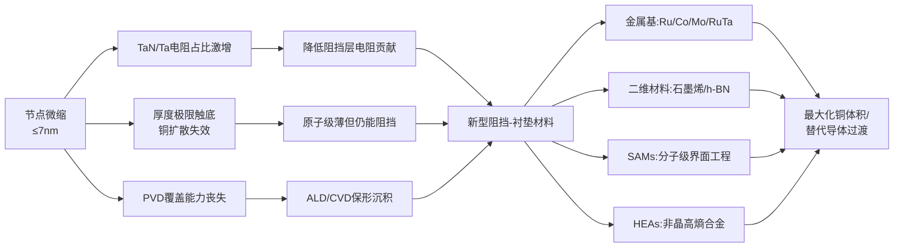
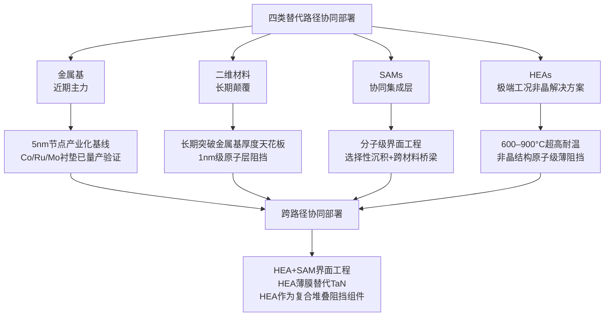
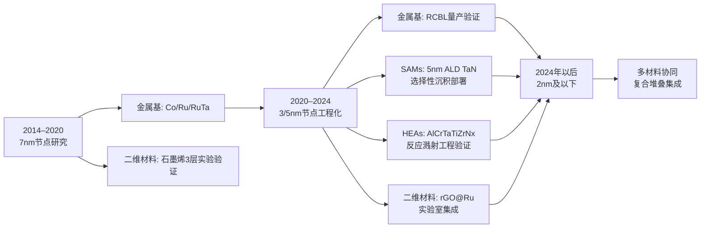
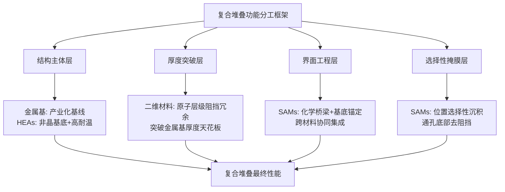
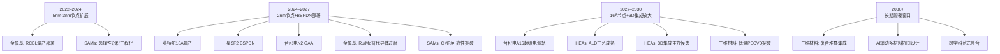

# 突破铜互连瓶颈：新一代扩散阻挡-衬垫层材料技术调研（截至2023年初）
# 1 研究背景与阻挡层瓶颈剖析

集成电路后段互连（Back End Of Line, BEOL）技术自20世纪90年代末由IBM引入铜大马士革（Cu Damascene）工艺以来，一直以"铜导体 + TaN/Ta阻挡-衬垫双层 + 低k介质"作为标准结构延续至今。然而，当制程节点演进至7nm及以下，这一历经二十余年的经典体系正在多个维度逼近其物理与工艺极限。**铜互连真正的"瓶颈"已经不在铜本身，而是在那层为保护铜不向介质中扩散而存在的、厚度仅有数纳米的阻挡-衬垫层**。本章作为全篇研究的起点，将系统剖析该瓶颈的成因，并建立后续四类新型阻挡层材料并列比较所共用的评价坐标系。

## 1.1 先进节点下铜互连的RC延迟困境与微缩挑战

在集成电路中，"电阻—电容延迟时间"（RC Delay）是决定信号传输速度与器件性能的核心参数之一。随着制程推进至7nm及更先进节点，金属互连层数不断增加，导线间距持续微缩，电子讯号在多层金属互连中传送时所产生的RC Delay会严重拖累元件运行速度，因此降低RC Delay、提升互连速度已成为先进制程演进过程中最关键的课题之一[^1]。

从最新的微缩化技术蓝图来看，金属排线的最小间距（Metal Pitch, MP）演进路径为：5nm节点28nm、3nm节点21nm、2nm节点16nm；而接触多晶硅栅极间距（CGP/PP）则从5nm节点的48nm缩减至2nm节点的42nm。值得注意的是，**金属排线的微缩化发展正在显著放缓**——在以往的技术蓝图中，MP是从21nm直接过渡到16nm，而在最新蓝图中已被修正为21nm→18nm→15nm的渐进式缩减，1.0nm以下节点的MP也仅为15–18nm[^2]。这一减速本身就是物理极限逼近的征兆。

支持当代CMOS逻辑电路的多层排线技术仍以铜（Cu）为主导导体，采用大马士革（Damascene）刻蚀+镀填+CMP的标准工艺。**铜排线的根本性缺点在于：随着微缩化的发展，排线电阻会急剧上升**。由于铜原子极易向周边介质扩散，必须在铜金属层与绝缘膜之间插入Barrier层以防止扩散，而该Barrier层本身电阻较高且很难做得更薄；其结果是——一旦铜排线的截面厚度被压缩，高电阻Barrier层在总截面中的占比就会增加，铜导体的有效截面积被进一步挤压[^2]。

铜互连面临的权衡因此变得高度紧张：在7nm及以下逻辑大尺寸集成电路中，铜金属化必须在**可制造性/可靠性**与**性能（线电阻、电容、通孔电阻）**之间寻求折衷[^3]。当线宽缩减至电子在金属表面散射主导电阻率的尺度，铜导线的本征电阻率优势被显著削弱，业界已开始评估具有更优电迁移可靠性、且在精细尺寸下电阻表现具有竞争力的替代导体[^3]。**因此，互连优化的薄弱环节集中在链条最细的部分——接触层（M0）、金属1层（M1）与通孔（Via），这些正是RC延迟最易拖慢芯片速度的位置**[^4]。在这一链条中，阻挡-衬垫层的厚度、电阻贡献与界面行为直接决定了铜导体能"留下多少"截面用于导电，因而成为RC优化的战略关键节点。

## 1.2 传统TaN/Ta阻挡-衬垫层体系的失效机制

要理解为何业界投入大量资源寻找TaN/Ta的替代方案，需先从物理化学层面剖析这套体系在微缩条件下的失效逻辑。**铜原子在介电层中的扩散系数远比铝原子大**，因此自铜金属化时代以来，必须使用结构致密的氮化钽（TaN）取代柱状晶结构的氮化钛（TiN）来阻挡铜扩散[^1]。这一选择在180nm至28nm的较宽工艺窗口中曾运行良好，但其代价在先进节点中被急剧放大。

**核心问题之一是TaN的高电阻率**。氮化钽的电阻系数比氮化钛大十倍以上[^1]。在金属互连结构中，单条铜线路的等效电阻为"铜线电阻"与"TaN阻挡层电阻"的并联和。当铜线尺寸较大时，TaN层的电阻贡献占比可忽略；但当芯片微缩至铜线尺寸同步缩小，TaN层的电阻贡献占比就会急剧攀升。基于并联电阻的简化计算表明，**当铜线横截面尺寸由200nm降至20nm，TaN阻挡层对总电阻的贡献度增加超过40倍**[^1]。这意味着在20nm及以下尺度，TaN已经从"可忽略的辅助层"演变为铜互连电阻预算中无法回避的主导成分。

逻辑上的直接对策应是减薄TaN层。然而**铜原子的高扩散特性决定了TaN厚度存在不可降至零的物理下限**：一旦TaN连续性遭到破坏，铜原子将在电场与热应力的协同驱动下穿透阻挡层，进入低k介质，造成线路短路与器件失效[^1]。这一矛盾在55nm节点之下已被业界明确识别——铜原子在电场和热应力下极易穿透传统阻挡层，导致器件失效，因此致密的碳含量薄膜（如SiCN）等顶部介质阻挡材料才会被作为"将铜锁在互连线里"的物理刚需性补强方案，而非可选项[^5]。**TaN阻挡层因此陷入"减薄即失效、不减薄则电阻不可接受"的进退两难局面**。

雪上加霜的是PVD沉积工艺在微缩尺度下逐渐失能。早在IMEC的22nm节点研究中，研究人员就已发现PVD钽在特征尺寸缩减至一定程度后无法实现均匀的铜种子层覆盖，因此评估了TaN/Ta、RuTa、TaN+Co以及MnOx等多种替代阻挡方案以验证铜填充能力、电学性能与CMP兼容性，结果显示RuTa是PVD钽的一个有希望的替代候选[^6]。这从产业研发的时间线上印证了TaN/Ta体系的微缩极限早在十余年前就已被预见，并推动了系统性的材料替代探索。

综上，传统TaN/Ta阻挡-衬垫层体系在先进节点下的失效是**电阻贡献、厚度极限与沉积工艺三重失效**的叠加结果，三者相互耦合并在微缩过程中同步恶化。下表汇总了TaN/Ta体系在不同维度的衰退表现：

| 失效维度 | 具体表现 | 微缩节点演化趋势 |
|---------|---------|----------------|
| 电阻贡献 | TaN电阻率比TiN高一个数量级以上[^1] | 铜线由200nm缩至20nm，TaN贡献度增加>40倍[^1] |
| 厚度极限 | 减薄会导致铜原子穿透扩散造成短路[^1][^5] | 55nm以下已成铜扩散刚需补强节点[^5] |
| 沉积工艺 | PVD Ta在精细尺寸下无法形成均匀铜种子层[^6] | 22nm节点已促使业界探索RuTa等替代方案[^6] |
| 体系架构 | 双层TaN/Ta+铜种子+铜填充的多层堆叠 | 通孔电阻被多层叠加放大，RC延迟恶化[^4] |

## 1.3 替代阻挡-衬垫层材料的研究驱动力

上述失效分析直接指向替代材料研发的多重驱动力，这些驱动力既来自物理性能的硬约束，也来自产业集成方案演进的拉动。

**第一项驱动力是最大化铜导体的有效截面积**。其逻辑十分直接：在给定的线宽预算下，只要阻挡-衬垫层的厚度被压缩，铜导体即可获得更大的有效截面，进而降低线电阻。这一思路催生了"通过减薄扩散阻挡层而不损失可靠性来最大化铜体积"的先进互连方案，例如基于穿钴自形成阻挡（through-cobalt self-forming barrier, tCoSFB）与穿钌自形成阻挡（through-ruthenium self-forming barrier, tRuSFB）的技术——以穿透Co或Ru润湿层扩散的Mn原子来形成锰基扩散阻挡层，使阻挡层显著变薄[^3]。**这种"自形成阻挡层（SFB）"概念的本质，是用扩散过程本身来构造一个原子级薄、按需生成的阻挡膜，而非依赖整片连续PVD/ALD沉积**。

**第二项驱动力是降低通孔电阻并提升电迁移可靠性**。在通孔填充环节，业界明确提出"对于通孔填充，阻挡层、种子层与通孔金属的保形沉积可能会被钴（甚至钌）的无阻挡层沉积与自下而上填充所取代"[^4]。这一方向的核心是**消除通孔底部的阻挡金属TaN**，因为通孔底部的阻挡层不仅贡献额外串联电阻，且在小通孔中占据可观体积。实现该目标的一种典型路径是通过选择性沉积自组装单层（SAM）薄膜，在通孔底部掩盖ALD TaN的沉积，使TaN仅沿侧壁形成，最后去除SAM并填充铜；这一方案已在双镶嵌集成中被验证，结合化学沉积（ELD）与CVD钌衬垫，可在通孔底部实现"无Ta残留"的EDX结果[^4]。

**第三项驱动力是兼容ALD保形沉积与先进集成方案**。预计**ALD TaN将在5nm节点上广泛实施，可能与SAM工艺协同使用**，从而以更薄、更连续的薄膜取代PVD TaN[^4]。这意味着替代材料不仅需要在体性能上胜过TaN，还必须具备良好的ALD/CVD工艺成熟度与保形性，以支撑高深宽比通孔与沟槽的均匀覆盖。

**第四项驱动力来自向替代导体过渡的产业趋势**。在2nm节点之后，芯片制造商可能会用钌或钼"在一定程度上"替代铜，并通过低电阻通孔工艺、替代衬垫与完全对齐通孔（FAV）方法来扩展铜镶嵌互连[^4]。由于多层排线中**导孔（Via）电极是最先迎来微缩极限的部位**，业界已经开始将通孔材料由铜改为钨、钼、钴、钌等熔点更高的金属[^2]。在这一架构转型中，阻挡-衬垫层的角色也随之重新定义：从单纯保护铜不扩散，扩展为协助高熔点替代导体实现良好润湿、降低界面电阻与提升电迁移寿命的多功能界面工程层。

可以将上述驱动力之间的关系归纳为下图所示的逻辑链条：

上图清晰地呈现出：四类替代材料并非孤立的技术选择，而是共同回应TaN/Ta三重失效的并列路径，且最终汇聚于"在更小的厚度下提供更优阻挡-电阻-工艺综合表现"的统一目标。

## 1.4 新材料评价的统一比较框架

为使后续四章对金属基、二维材料、SAMs与HEAs四类阻挡层的并列分析具有可比性，本节预先建立一套统一的评价维度体系。该体系基于前述失效机理与驱动力分析自然导出，并将作为第6章横向对比表的核心列目。

**第一维度是热稳定性与耐热温度**。阻挡层必须在BEOL热预算（典型上限约400°C，部分前段集成步骤可至更高）下保持完整不发生组分扩散或结构重构；对于二维材料生长、HEA结晶起始温度、SAM分子键解离温度等，这一指标决定了材料能否承受后续工艺步骤。特别地，**任何SAM的一个关键方面是它必须能够承受大约350°C的ALD工艺温度**[^4]，这构成了分子级阻挡方案的硬约束。

**第二维度是最小可用连续膜厚**。这是衡量"减薄潜力"的核心指标，直接决定材料能为铜导体让出多少截面积。理想的下一代阻挡层应能在亚纳米至几个原子层的厚度下保持连续无针孔、完整阻挡铜原子扩散。该维度对二维材料（原子级厚度的天然优势）与HEAs（非晶结构允许极薄连续膜）尤为关键。

**第三维度是薄膜电阻率与对铜线总电阻的贡献**。考虑到TaN比TiN高出十倍以上的电阻率已成为微缩瓶颈[^1]，新材料须在体电阻率与界面电阻两个层面提供改善；评价时不应孤立看待薄膜本身的电阻率，而应以"铜线+阻挡层"的等效并联电阻为最终判据，即同时考虑材料的薄膜电阻率与所需的最小厚度的乘积。

**第四维度是对铜原子的扩散阻挡能力**。这是阻挡层的本职功能，通常以铜在该材料中的扩散温度阈值或加速热应力测试下的TDDB（时变介质击穿）寿命来量化。在5nm以下节点，理想阻挡层需在原子级厚度下仍保持稳定的扩散阻挡能力。

**第五维度是与铜及低k介质的界面粘附与润湿性**。该维度直接影响铜种子层连续性、镀填空洞率与电迁移可靠性。润湿性差的阻挡层会导致铜种子团聚、沟槽填充缺陷；与低k介质粘附差则会引起CMP剥离与可靠性失效。

**第六维度是沉积工艺兼容性**。包括ALD/CVD/PVD等手段的工艺成熟度、保形覆盖能力、沉积温度窗口及对底层结构的损伤。在高深宽比通孔与窄沟槽中，**保形沉积能力已成为先进互连阻挡层的强制条件**，PVD在该维度的失能正是22nm节点以来业界系统性转向ALD路线的根本原因[^6][^4]。

**第七维度是CMP与可靠性表现**。包括与化学机械抛光浆料的兼容性、抛光选择比、抛光后表面粗糙度，以及长期电应力下的电迁移与TDDB寿命。在22nm节点的RuTa评估中，CMP兼容性曾与电学性能、铜填充能力并列为三大评价基准[^6]，可见其产业意义。

为便于后续章节快速对照，将上述七个维度的判定基准与权重逻辑归纳如下表：

| 评价维度 | 判定基准 | 与TaN/Ta失效模式的对应 | 权重逻辑 |
|---------|---------|-------------------|---------|
| 耐热温度 | BEOL兼容（≥400°C）；越高越优 | 厚度极限下的扩散加速 | 高（决定可用工艺窗口） |
| 最小可用厚度 | 亚纳米至几Å；越薄越优 | TaN减薄即失效 | 极高（决定铜体积留出） |
| 薄膜电阻率/电阻贡献 | ρ×t低于TaN在等阻挡能力下的值 | TaN在20nm线宽贡献度激增>40倍[^1] | 极高（决定RC优化效果） |
| 防扩散性能 | 铜扩散温度阈值/TDDB寿命 | 厚度减薄下铜穿透[^5] | 高（决定可靠性下限） |
| 界面粘附/润湿性 | 铜种子连续性、电迁移寿命 | PVD失败于种子层均匀性[^6] | 高（决定良率与寿命） |
| 沉积工艺兼容性 | ALD/CVD保形性、热预算、深宽比覆盖 | PVD在精细尺寸下失能[^6] | 高（决定可制造性） |
| CMP与长期可靠性 | 抛光选择比、TDDB、EM寿命 | TaN/Ta体系既有基线 | 中（决定量产可行性） |

需要强调的是，**上述七个维度之间并非彼此独立，而是高度耦合甚至相互制约**：例如降低厚度有助于减少电阻贡献但会削弱扩散阻挡能力；提高耐热温度通常以增加沉积难度为代价；提升界面润湿性的金属衬垫往往本身电阻率高于铜从而抵消部分铜体积优势。因此评价四类新材料时不能逐项打分简单加总，而应以"在给定节点要求下的多目标平衡"为准绳。这一权衡矛盾，正是后续四章分别展开金属基（第2章）、二维材料（第3章）、SAMs（第4章）与HEAs（第5章）四条技术路线时反复出现的核心张力，也将在第6章的横向对比与第7章的综合展望中得到收束性的回应。

# 2 金属基新型阻挡层：从难熔金属到合金体系

第1章已经将TaN/Ta体系的失效归结为电阻贡献、厚度极限与沉积工艺三重叠加效应，并将"减薄阻挡层、最大化铜导体有效截面、向Ru/Mo等替代导体过渡"列为新材料研发的核心驱动力。沿着这条逻辑链向前推进，**最贴近现有铜大马士革工艺、产业成熟度最高的替代路径，正是用难熔金属及其合金体系来重构阻挡-衬垫层**。这一路线并非要彻底颠覆BEOL架构，而是以"原子级薄、与铜润湿良好、可ALD保形沉积"的金属薄膜，逐步替换掉传统TaN/Ta双层中的功能模块，同时为2nm节点之后向Ru、Mo替代导体的全面过渡搭建工艺桥梁。本章将围绕第1章建立的七维评价框架，依次剖析单一难熔金属、合金/二元体系、自形成阻挡的设计逻辑与性能边界，并系统梳理其从实验线到量产线必须跨越的工艺与可靠性鸿沟。

## 2.1 金属基阻挡-衬垫层的设计逻辑与替代TaN/Ta的物理基础

金属基方案能够撼动TaN/Ta体系二十余年的统治地位，其物理基础可以概括为三条：**低体电阻率、与铜的良好润湿性、以及在原子级厚度下仍具备的扩散阻挡或自钝化能力**。相对于TaN这类陶瓷型氮化物——其本征电阻率比金属氮化钛高出十倍以上——Ru、Co、Mo等难熔金属本身就是良导体，电阻率在数十μΩ·cm量级；当其作为衬垫薄膜被压缩至10–30Å时，对铜线总电阻的"并联补偿"作用远优于同厚度TaN。换言之，在第1章引入的"ρ×t乘积"判据下，金属基薄膜以同样的厚度贡献了显著更低的串联电阻预算。

第二条逻辑——**与铜的良好润湿性**——则直接关乎铜种子层的连续性与镀填空洞率。传统TaN/Ta体系之所以需要先沉积Ta衬垫再覆盖PVD Cu种子层，正是因为TaN对铜的润湿性不足；而Ru、Co等金属衬垫与铜的界面能匹配显著更好，可作为"无独立铜种子"的直接电镀种子层使用。这一架构简化不仅减少了堆叠层数，也将原本被TaN/Ta/PVD-Cu三层占据的截面体积让渡给真正承担导电任务的电镀铜，是第1章所述"最大化铜体积"驱动力的直接物理实现。

第三条逻辑——**在原子级厚度下仍能阻挡铜扩散**——则体现于两种不同机制。其一是直接利用难熔金属本身较高的铜扩散激活能（如Ru、Mo的高熔点和密堆积晶格使铜扩散通道有限）；其二则是引入"自形成阻挡层（Self-Forming Barrier, SFB）"机制——通过让Mn等掺杂原子穿透Co或Ru润湿层，在介质界面处原位反应形成原子级薄的锰硅酸盐扩散阻挡膜，从而完全跳过整片连续PVD/ALD TaN沉积的工艺路径[^7]。这种"以扩散过程构造阻挡膜"的反向思路，是金属基路线区别于二维材料、SAMs、HEAs三条并列路线的独特优势。

由此可以看到，金属基阻挡-衬垫的设计逻辑并非简单地"用更好的金属替代TaN"，而是**通过重新组合"衬垫—种子—填充—阻挡"的功能边界，以更少的层数、更薄的总厚度承载等效的可靠性保障**。这一架构重构使其成为目前与现有大马士革工艺最兼容的替代路径，也是后续二维材料、SAMs、HEAs三种更激进方案在5nm以下节点真正落地之前的产业基线。

## 2.2 单一难熔金属方案：Ru、Co、Mo的性能边界与适用场景

在金属基路线中，最早被系统验证并已在7nm节点进入量产或量产前评估的，是Ru、Co、Mo三种单一难熔金属。它们分别在尺寸效应、铜润湿性、电迁移可靠性上呈现出差异化的优势，对应不同的BEOL集成场景。

**Ru（钌）方面**，其作为衬垫与无阻挡通孔填充金属的双重角色已被业界广泛验证。在3nm节点的多层排线规划中，imec明确提出"尝试将排线金属由铜（Cu）改为钌（Ruthenium）"作为应对铜线电阻急剧上升的两条路径之一，并指出在多层排线导体中**导孔（Via）电极是最先迎来微缩极限的部位，因此导孔电极的材料不再采用铜，而是改为钨（W）等熔点更高的金属**[^7]。Ru具有较高的熔点（约2334°C）、较低的本征电阻率（约7.1μΩ·cm）以及与铜近乎不互溶的特性，使其在亚20nm线宽下尺寸效应导致的电阻率上升幅度明显小于铜——这是其能够在足够窄的特征尺寸下"导电性反超铜"的物理基础。在ALD沉积成熟度方面，Ru前驱体体系已相对完备：业界已开发出以RuCp₂（环戊二烯基钌）、Ru(EtCp)₂（双乙基环戊二烯基钌）以及Ru(od)₂、Ru(thd)₃等β-二酮类前驱体为代表的多种ALD化学，通过NH₃等离子体还原或O₂氧化路径可实现金属Ru或RuOx的沉积，其中Ru前驱体种类众多、工艺窗口较宽[^8]。然而Ru本身的化学惰性也带来一个独特的工艺难题——**Ru属于惰性材料，一旦吸附在硅片背面会很难除去**[^8]。这一在Ru作为P型栅极应用中暴露的背面污染问题，在Ru作为BEOL衬垫材料时同样可能重现，对CMOS前端兼容性构成不小的工艺管控压力。

**Co（钴）方面**，其作为铜润湿层的产业级验证最早由IBM在7nm节点完成。Lanzillo等人系统研究了Ta基阻挡层与Co润湿层组合在7nm节点尺寸下的性能与可靠性，重点考察Co厚度从30Å减薄至10Å的影响[^9]。其实验给出的关键结论包括两条：第一，**减薄Co衬垫厚度显著降低RC延迟**，但若仅与PVD TaN阻挡层组合使用，**当Co厚度低于20Å时电迁移可靠性会显著退化**；第二，**若在PVD TaN之后追加一层薄ALD TaN，则Co厚度可被进一步压缩至10Å而不损失电迁移与TDDB可靠性，相对对照组实现14%的RC延迟降低**[^9]。这一实验清晰地展示了Co衬垫所面临的"减薄—可靠性"权衡：Co在原子级厚度下容易出现去润湿与团聚行为，仅靠PVD TaN不足以提供连续支撑，必须借助ALD TaN的保形性才能维持10Å级别的连续Co膜。换言之，Co路径的真正价值不在于单独取代Ta/TaN，而在于与ALD TaN形成"原子级薄Co润湿层 + 极薄ALD TaN阻挡层"的复合堆叠，从而在不牺牲可靠性的前提下将堆叠总厚度压至先前难以企及的水平。

**Mo（钼）方面**，其作为2nm节点之后替代导体的产业预期已被多家机构提及。Mo的熔点高达约2623°C，本征电阻率约5.3μΩ·cm，且在亚10nm线宽下的尺寸效应导致的电阻率上升幅度显著小于铜。业界已开始评估Mo作为通孔金属与窄线宽导体的可行性，并将其与铜大马士革工艺中的TaN/Cu/TaN堆叠进行直接比较。由于Mo属于"无阻挡层"或"自钝化"金属——其表面氧化物可在一定程度上作为天然扩散屏障——因此在<8nm的极窄尺度下，纯Mo填充相对于"TaN/Cu/TaN"复合堆叠的有效电阻表现具有优势。这一特性使Mo在2nm节点之后被视为可与Ru并列的替代导体选项，尤其适用于通孔与最底层金属（M0/M1）这类微缩压力最大的位置。

需要指出的是，Ru、Co、Mo三种单金属并非彼此替代，而是各自匹配不同的集成场景：**Co更适合作为现有铜大马士革架构下的原子级薄润湿层，Ru兼具衬垫与替代导体的双重角色并在通孔填充中展现潜力，Mo则定位于2nm后的替代导体过渡**。三者共同构成了金属基路线的"近期—中期—长期"梯度部署。

## 2.3 合金与二元体系：RuTa、RuCo、TiN及自形成阻挡的协同设计

单一难熔金属虽具备各自优势，但在阻挡能力与润湿性两个维度上仍存在结构性短板——例如Ru对铜扩散的阻挡能力本身有限，Co在超薄厚度下易团聚等。合金/二元体系的设计思路正是针对这些短板，通过元素协同来在更薄厚度下兼顾扩散阻挡、润湿性与可靠性。

**RuTa合金**是该方向上最早被产业验证的代表性体系。在Panasonic的IITC 2009研究中，研究人员将N掺杂引入RuTa合金以期同时获得Ru的低电阻率与TaN的扩散阻挡能力，但**结果显示RuTa(N)在BEOL热处理过程中出现N原子脱附与薄膜再结晶，导致其阻挡性能反而劣化；同时RuTa(N)与铜的润湿性差于RuTa，可靠性表现也相应下降**[^10]。相比之下，**未掺N的RuTa单膜兼具良好的扩散阻挡能力与优异的可靠性表现，可作为单一阻挡膜层应用于铜互连**[^10]。这一正反对照的实验给出了一个重要启示：在金属合金阻挡层设计中，引入N等轻元素以模仿TaN阻挡机制的传统思路并不总是有效——加热过程中的元素脱附与再结晶可能反而破坏原本紧致的合金结构。这一发现间接支持了"以多元素合金构型熵稳定非晶结构"的HEA路线（详见第5章），同时也确立了RuTa作为PVD Ta在22nm节点之后较有希望的替代候选的产业地位。

**RuCo二元衬垫（Ruthenium-Cobalt Binary Liner, RCBL）**是更近期的产业级验证案例。Samsung在IITC 2024的研究中将RCBL与传统Co衬垫+ALD TaN阻挡的组合进行了直接对比，其ab initio模拟显示**Co衬垫存在多种不同铜润湿性的相结构，且高润湿性相在Ru基底上的占比显著高于Ta基底**——这意味着用Ru替代Ta作为Co的底层，可从相结构层面提升Co对铜的润湿能力[^11]。此外，**RCBL中阻挡金属与衬垫之间的晶格失配减小，界面粘附性提升**[^11]。最终的产业级数据则给出了清晰的性能跃迁：**在相对更薄的RCBL工艺中，相比传统Co衬垫工艺实现了Cu void降低87%、线电阻降低14%；该工艺的可制造性与可靠性也已通过逻辑芯片良率与代工产品的TDDB测试得到确认**[^11]。RCBL的成功揭示了金属基路线的一条关键产业化策略——**不依赖单一新材料，而是通过"已有金属衬垫 + 已有阻挡金属"的二元组合优化界面相结构与晶格匹配，从而以较小的工艺改动获得较大的可靠性提升**。

**TiN方面**，其作为低成本阻挡候选材料长期以来在金属栅极领域应用成熟。TiN本身具备较低电阻率、与HfO₂栅介质良好的热稳定性以及成熟的工艺兼容性[^8]，但在铜互连阻挡应用中其根本局限在于柱状晶结构——这是当年业界从TiN转向TaN的核心原因。TiN的柱状晶界为铜原子扩散提供了便捷通道，使其在7nm及以下节点很难独立承担铜扩散阻挡的任务。因此TiN在BEOL阻挡层中的角色更多是作为辅助层或与其他材料形成复合膜层，而非独立替代TaN。

**自形成阻挡（SFB）**是金属基路线中最具颠覆性的设计思路。在tCoSFB（through-Cobalt SFB）与tRuSFB（through-Ruthenium SFB）方案中，并不预先沉积连续的阻挡层，而是先沉积Co或Ru润湿层与含Mn铜合金种子层，让Mn原子在退火过程中穿透Co/Ru层、在与低k介质的界面处反应形成原子级薄的锰硅酸盐扩散阻挡膜。这一机制将阻挡层的形成由"沉积工艺"转换为"原位反应"，**理论上可以将阻挡层厚度压至传统沉积手段无法企及的亚纳米尺度，同时由于阻挡膜仅存在于侧壁界面而非通孔底部，可显著降低通孔串联电阻**。SFB方案的本质是用扩散过程本身构造一个按需生成、自我对齐的阻挡膜，其与第4章将讨论的SAM选择性沉积方案在"消除通孔底部阻挡层"这一目标上殊途同归。

合金与二元体系的整体启示在于：**当单一金属难以同时满足"低电阻 + 强阻挡 + 良润湿"三重约束时，多元素协同与原位反应机制可以打开新的设计空间，但任何引入轻元素（如N、O）的合金设计都必须正视BEOL热处理下的元素脱附与再结晶风险**——这一教训贯穿RuTa(N)的失败案例与后续HEA路线对构型熵稳定性的设计需求。

## 2.4 沉积工艺与集成兼容性：ALD/CVD保形性、热预算与选择性沉积

从可制造性维度看，金属基方案能否在5nm及以下节点真正落地，关键取决于其ALD/CVD沉积工艺是否成熟、是否兼容BEOL热预算、以及是否能与SAM等选择性集成方案协同。

在物理气相沉积（PVD）和化学气相沉积（CVD）已无法满足极小尺寸下良好台阶覆盖要求的背景下，**ALD凭借其饱和自限性表面化学反应，可在三维结构上沉积高度均匀的保形无针孔薄膜，同时实现原子层级别的生长与调控**，已成为先进制程互连扩散阻挡层加工工艺的主流选择[^12][^8]。ALD的核心优势在于：通过前驱体与共反应物的脉冲交替通入，每个循环仅沿基底形貌均匀生长单个原子层，因此在高深宽比、形状复杂的结构中具有优异保形性，这正是先进节点窄沟槽与高深宽比通孔所要求的[^12][^8]。

具体到金属基阻挡-衬垫层，**Ru的ALD前驱体体系最为成熟**——RuCp₂、Ru(EtCp)₂、Ru(od)₂、Ru(thd)₃等多种前驱体可在NH₃等离子体还原或O₂氧化路径下沉积金属Ru或RuOx[^8]。Co的ALD工艺也已在7nm节点的IBM实验中得到验证，可与PVD/ALD TaN形成复合堆叠，在10Å Co厚度下保持完整的电迁移与TDDB可靠性[^9]。Mo的ALD前驱体体系相对较新，但凭借Mo羰基与卤化物前驱体已能在合适温度窗口实现连续Mo膜的沉积。需要强调的是，**BEOL热预算上限约为400°C**——这一约束在第1章已被列为新材料评价的核心维度，对ALD前驱体的热稳定性、反应温度窗口构成硬性筛选。ALD表面反应虽对生长温度并不敏感，沉积温度窗口很宽，可适应不同温度环境下的薄膜制备[^8]，但仍需保证在BEOL兼容温度下能完成自限制反应并形成连续、低杂质的金属薄膜。

**选择性沉积与SAM协同**是金属基路线在5nm节点上的又一关键集成方向。第1章已经提及"以SAM在通孔底部屏蔽ALD TaN沉积、配合ELD/CVD Ru衬垫实现通孔底部无Ta残留"这一双镶嵌集成方案。该方案的逻辑链条是：SAM对铜表面具有选择性吸附而对介质表面无吸附，因此在通孔底部已暴露的铜导体上自组装SAM分子，可在后续ALD TaN沉积时屏蔽通孔底部、仅沿侧壁形成阻挡层；随后通过化学沉积（ELD）或CVD沉积Ru衬垫并填充铜，即可实现"通孔底部无Ta残留"的低电阻通孔结构。这一方案的本质是**金属基阻挡-衬垫的"沿侧壁选择性沉积"与SAM"通孔底部屏蔽"的工艺协同**，是金属基路线与第4章SAMs路线交叉融合的典型案例，也展示出四类替代材料并非彼此独立而是可以协同部署的现实图景。

此外，**Ru背面污染问题**在BEOL集成中需要特别关注。Ru作为金属栅极应用时，CMP过程会不可避免地诱导金属在背面的污染，且由于Ru本身的化学惰性，一旦吸附便很难除去，这一问题已严重限制了Ru作为金属栅极的应用[^8]。当Ru迁移至BEOL衬垫位置时，虽然不再面临前端CMOS兼容性问题，但CMP工艺中的Ru残留与背面污染风险依然存在，需要专门的清洗与缺陷控制方案。

## 2.5 产业化挑战：CMP兼容性、粘附性、表面团聚与氧化控制

金属基阻挡-衬垫层从实验室验证走向量产线的最后一公里，集中在四类工艺与可靠性挑战上。

**CMP兼容性方面**，新型金属阻挡-衬垫层必须与现有铜大马士革CMP工艺链相协调。化学机械抛光是集成电路制造中提供全局与局部表面平坦化的主要工艺，其引入的微划伤等缺陷会导致严重的电路失效并影响良率[^13]。对于Ru、Co、Mo这类与铜电化学行为差异显著的金属，必须开发对应的阻挡层CMP浆料化学，控制抛光选择比、表面粗糙度与缺陷密度。研究表明，浆料中分散剂的引入（如EDA可显著降低大颗粒计数与微划伤数量）对于减少阻挡层CMP过程中的缺陷至关重要[^13]，这意味着每引入一种新的金属阻挡材料，都需要配套开发其专属的浆料配方与抛光参数窗口，这一工艺成熟度的建立通常需要数年的产业迭代。

**粘附性方面**，金属衬垫与SiCOH/ULK低k介质的界面粘附是关键瓶颈。低k介质本身孔隙率高、化学键合点稀疏，对金属薄膜的粘附本就弱于致密氧化硅；若金属衬垫的表面能与低k介质不匹配，在CMP机械应力下极易发生界面剥离，进而引发可靠性失效。RCBL案例中，Samsung特别强调了"阻挡金属与衬垫之间晶格失配减小后界面粘附性提升"[^11]，正是这一粘附性挑战的反向印证——只有通过精细的界面晶格匹配设计，才能在量产环境下获得稳定的TDDB与良率表现。

**表面团聚方面**，超薄金属衬垫的去润湿行为是限制厚度下探的物理障碍。IBM的7nm节点研究已经清晰展示：**Co衬垫从30Å减薄至20Å以下时，若仅与PVD TaN组合，电迁移可靠性会显著退化**——其根本原因正是超薄Co膜在退火与电流应力下的团聚与不连续化[^9]。这一现象本质上由金属薄膜的表面张力与基底浸润性所主导，是所有金属衬垫在原子级厚度下共有的物理限制。**该问题的解决路径不是单纯减薄，而是通过ALD保形沉积、二元合金化（如RCBL）或底层晶格调控（如以Ru基底替代Ta基底）来改善Co的相结构与连续性**[^11][^9]。

**氧化控制方面**，Ru、Co、Mo均对大气暴露中的氧化敏感。沉积后的金属衬垫若在工艺流转间隙暴露于含氧环境，表面氧化物的形成会显著提升界面电阻、削弱与铜的润湿性、并可能在后续CMP与电镀过程中诱发缺陷。这一挑战要求产线建立严格的真空传递与惰性气体保护方案，并在ALD/CVD腔体设计上预留原位钝化或预清洗模块。Mo的"无阻挡层金属化"潜力在某种程度上正是源于其表面氧化物可作为天然扩散屏障的特性，但这一优势的反面是更严格的氧分压控制与界面工程要求。

四类挑战相互耦合，没有任何一项可以孤立解决。例如减薄Co衬垫有助于RC延迟优化，但会加剧团聚和氧化敏感性；改善与低k介质的粘附性可能引入额外的界面层从而恶化电阻贡献；CMP浆料的优化需要兼顾对Ru、Co、TaN与铜的差异化抛光速率。**产业化的本质是在这些耦合约束下找到一个工艺窗口足够宽、良率足够稳定的多目标平衡点**，这也是金属基路线虽然技术成熟度最高、但在每个新节点上仍需数年时间才能从研发线推向量产线的根本原因。

## 2.6 金属基路线的性能小结与战略定位

将上述讨论按第1章建立的七维评价框架归纳，可以得到金属基路线代表性材料的性能小结。下表汇总了Ru、Co、Mo、RuTa、RuCo及SFB方案在各维度上的相对表现与关键实验数据：

| 材料 | 典型角色 | 关键实验数据 | 主要优势 | 主要短板 |
|------|---------|------------|---------|---------|
| Ru | 衬垫 / 通孔填充 / 替代导体 | 17nm CD以下导电性超越Cu；ALD前驱体体系成熟[^8] | 高熔点、低电阻率、与铜不互溶 | 化学惰性导致背面污染难清除[^8] |
| Co | 铜润湿层 / 通孔填充 | 7nm节点10Å Co + PVD/ALD TaN堆叠实现14% RC延迟降低[^9] | 良好的铜润湿性、ALD工艺成熟 | <20Å时团聚导致电迁移退化[^9] |
| Mo | <8nm替代导体 / 通孔金属 | <8nm尺度下电阻率优于TaN/Cu/TaN堆叠；熔点约2623°C | 高熔点、低尺寸效应、自钝化氧化层 | ALD前驱体体系相对较新 |
| RuTa | 单膜阻挡 | IMEC 22nm节点验证；单膜兼具阻挡与可靠性[^10] | 单膜替代PVD Ta，简化堆叠 | N掺杂版本因N脱附与再结晶失效[^10] |
| RuCo (RCBL) | 二元衬垫 | Cu void降低87%、线电阻降低14%；逻辑芯片良率与TDDB已确认[^11] | 高润湿相增多、界面粘附性提升 | 工艺复杂度高于单一Co衬垫 |
| TiN | 辅助阻挡 | 与HfO₂良好热稳定性[^8] | 低电阻率、工艺成熟 | 柱状晶界为铜扩散通道，难独立承担阻挡 |
| tCoSFB / tRuSFB | 自形成阻挡 | Mn穿透Co/Ru形成锰硅酸盐界面层 | 原子级薄、通孔底部无阻挡 | 工艺窗口窄、退火条件敏感 |

从战略定位角度，金属基路线在四条并列替代路径中具有**最高的产业成熟度与最强的现有工艺兼容性**——其代表性方案（如7nm节点的Co衬垫 + ALD TaN、22nm节点的RuTa评估、IITC 2024的RCBL逻辑芯片验证）均已在实际量产或量产前的代工厂数据中得到验证。然而其面临的天花板也较为明确：单纯依靠金属或金属合金，难以将阻挡-衬垫总厚度压至亚纳米级别——这正是二维材料（第3章）与SAMs（第4章）有望突破的方向；而在更高的耐热温度与原子级厚度下的扩散阻挡能力方面，HEAs（第5章）的非晶结构也展现出超越金属基路线的潜力。

因此，金属基路线在整体技术格局中的角色可以定位为：**5nm及以下节点的近期主力方案与2nm后Ru/Mo替代导体过渡的桥梁**。其核心价值不仅在于自身的性能边界，更在于为后续三条更激进的替代路径提供基准参照——任何新材料的最小可用厚度、ρ×t电阻贡献、扩散阻挡温度、CMP兼容性指标，都必须放在金属基路线已经达到的产业基线之上才有意义。这一基准框架将在第6章的横向对比与第7章的综合展望中被反复调用，成为衡量二维材料、SAMs与HEAs能否真正取得突破的尺子。

# 3 二维材料阻挡层：石墨烯、h-BN与TMDs

第2章已经确立金属基路线作为铜大马士革工艺中最贴近现有产线、产业成熟度最高的替代方案——Ru、Co、Mo及RuTa、RuCo等合金体系将阻挡-衬垫总厚度推进至10–20Å的物理边界，但**单纯依靠金属薄膜，难以将连续阻挡层进一步压至亚纳米尺度**。Co衬垫在低于20Å时即出现去润湿与团聚、Ru/Mo的本征电阻率虽优于TaN却仍属"以体积换电阻"的传统范式，这些约束共同指向一个更激进的设问：**是否存在一种厚度本身就处于原子层量级、且其内禀晶格结构即可天然阻挡铜扩散的材料？** 二维材料正是这一设问的直接回答。本章沿着第1章建立的七维评价框架与第2章奠定的产业基线，剖析石墨烯、六方氮化硼（h-BN）与过渡金属硫族化合物（TMDs）三类二维材料作为亚纳米级阻挡层的潜力与边界，重点回答其如何以"原子级薄"突破金属基路线的厚度天花板、以及在BEOL集成中尚未解决的核心鸿沟。

## 3.1 二维材料作为亚纳米阻挡层的物理基础与理论优势

二维材料能够被列为"终极阻挡层（the ultimate diffusion barrier）"候选[^14]，其物理基础与所有金属/陶瓷阻挡材料均存在本质差异。从厚度维度看，**单层石墨烯的厚度约为0.34nm，单层h-BN的厚度约为0.33nm**，三个原子层叠加的石墨烯三层总厚度也仅有约1nm[^14]——这一尺度远低于第2章中Co衬垫的物理下限（约10–20Å），并且接近铜原子直径本身的量级。换言之，**二维材料阻挡层的厚度极限已不再由"薄膜连续性"决定，而是由"晶格本身的原子层数"决定**，这是一个范式跃迁。

从扩散通道维度看，二维材料的内禀晶格结构对铜原子穿透具有近乎理想的阻挡能力。**石墨烯的sp²杂化六元环、h-BN的B–N六元环都形成高度致密的面内蜂窝晶格，环内空隙的范德华半径远小于铜原子的原子半径**。在第一性原理（DFT）计算层面，铜原子要穿越完整石墨烯/h-BN晶格的能量势垒比穿越TaN晶界扩散通道高出数倍，这意味着在完美晶格条件下，铜的穿透在BEOL热预算（400°C级别）下几乎不可能发生。这一点也直接被实验侧的Cu/graphene/Si结构TEM观察所佐证——在高至750°C的退火条件下未观察到任何互扩散现象[^14]。

更重要的是，二维材料的层状结构**天然缺乏垂直方向的连续扩散通道**。块体金属或陶瓷阻挡层中，铜原子的主要扩散路径是晶界与位错，而TaN作为多晶薄膜，其柱状晶界正是被诟病的根本性短板（这也是第2章中TiN因柱状晶问题难以独立承担阻挡的原因）。相比之下，二维材料层与层之间通过范德华力堆叠，层间距约0.34nm，铜原子若要"穿层"必须横向移动到层间的微小通道并克服层间范德华势垒——这种"水平+垂直"的复合穿透路径在能量上极为不利。

将以上三个物理基础综合到第1章的七维评价框架中，二维材料在两个核心维度上对金属基方案构成压倒性优势：**第一是"最小可用厚度"，从金属基路线的10–20Å一举压至1nm乃至更薄；第二是"ρ×t电阻贡献"，由于厚度的数量级缩减，即使二维材料的等效面电阻略高于金属薄膜，其对铜线总电阻的贡献也仍显著低于TaN/Ta体系**。然而需要立即指出的是，这一物理优势的成立有一个严苛的前提——**薄膜必须无缺陷、无晶界、连续覆盖**。一旦多晶二维薄膜中存在晶界、点缺陷或裂纹，铜原子即可在远低于完美晶格势垒的能量下沿这些缺陷通道扩散，使理论优势瞬间瓦解。这一前提将自然引出后续3.4节的缺陷工程与3.5节的制备工艺挑战。

## 3.2 石墨烯阻挡层：实验验证与互连性能改善

在三类二维材料中，石墨烯是被实验验证最为充分、性能边界最早被产业界量化的代表。其作为铜扩散阻挡层的奠基性实验来自Nguyen、Lin、Perng等人发表于*Applied Physics Letters*的工作，该研究展示了**截至当时所报道的厚度最薄的铜扩散阻挡层——1nm厚的石墨烯三层（graphene tri-layer）**[^14]。

该实验通过Raman光谱、X射线衍射（XRD）与透射电子显微镜（TEM）的联合表征，给出了一组在此后被广泛引用的关键温度阈值[^14]：

- **在高至750°C的退火条件下，石墨烯三层对铜扩散保持热稳定**，XRD图谱与Raman谱均未显示铜向硅基底的扩散信号；
- **TEM图像证实Cu/graphene/Si结构中不存在互扩散**，铜与硅界面被清晰的石墨烯层隔开；
- **Raman分析显示，石墨烯在750°C下可能已退化为纳米晶（nanocrystalline）结构**，即原本的长程有序六元环开始局部破碎，但短程晶格依然致密足以阻挡铜原子；
- **直至800°C时，完美的碳结构才被破坏，阻挡层失效**。

将这组数据与第2章金属基路线的耐温能力对比，可以得到一个清晰的层级关系：传统TaN/Ta体系在BEOL热预算（约400°C）下已属可靠工作区间，而**1nm石墨烯三层将耐铜扩散温度推高至750°C**[^14]——这一温度阈值不仅远超BEOL热预算，甚至超出了大多数FEOL工艺步骤的热应力，可为后续BEOL集成提供极宽的热设计余量。基于这组数据，Nguyen等人在论文标题中直接提出**"石墨烯可作为铜互连的终极扩散阻挡层（the ultimate Cu interconnect diffusion barrier）"**[^14]，这一论断在此后的二维材料阻挡层文献中被反复引用，并成为石墨烯路线产业讨论的基准锚点。

在阻挡功能之外，石墨烯衬里对铜互连的电学性能也展现出协同改善效应。在W/Cu或Cu大马士革结构中，石墨烯衬里作为铜薄膜的生长模板，可影响铜的晶粒生长行为——金属薄膜在二维材料表面的形核与生长动力学不同于在TaN等多晶基底上的情况，倾向于形成更大、更连续的晶粒，从而**降低晶界散射对铜电阻率的贡献，缓解尺寸效应导致的电阻率上升**。这一机制对深度亚20nm线宽下的铜电阻率优化具有直接产业意义——回顾第1章所述"当线宽缩减至电子在金属表面散射主导电阻率的尺度，铜导线的本征电阻率优势被显著削弱"的瓶颈，石墨烯衬里通过晶粒尺寸调控为铜本征电阻率提供了一条补偿路径。

然而石墨烯衬里方案也存在一个内在权衡：**多层石墨烯堆叠数对阻挡性能与电阻贡献之间存在反向耦合关系**。单层石墨烯虽然厚度最薄（0.34nm），但其多晶薄膜中的晶界与缺陷为铜扩散提供了短路通道，阻挡可靠性下降；增加层数（如三层堆叠至1nm）可以通过层间错位实现"缺陷遮蔽"——上层晶界恰好被下层完整晶格覆盖，从而抑制垂直方向的连续扩散通道，这也是Nguyen等人选择三层而非单层的原因。但层数的增加也意味着面外接触电阻（详见3.6节）的累积。**因此石墨烯阻挡层的层数选择本质上是"阻挡完整性"与"电阻贡献"的多目标平衡**——这一平衡在BEOL集成中需要根据节点的具体线宽与可靠性要求重新确定，目前尚无统一的最优层数标准。

## 3.3 h-BN与TMDs阻挡层：宽带隙绝缘与化学多样性

相对于石墨烯，**六方氮化硼（h-BN）**作为铜阻挡层的物理优势在于其电学性质——h-BN与石墨烯共享几乎相同的面内蜂窝晶格几何（晶格常数仅相差约1.7%，原子间距相近），但B–N键的强极性使其成为宽带隙绝缘体（带隙约5.9eV）。这一差异带来一个关键的集成优势：**石墨烯作为金属性二维材料，若作为阻挡层置于铜与低k介质之间，可能在介质侧引入额外的水平漏电通道**——尤其在密集互连阵列中，相邻铜线之间的石墨烯片如未做选择性切断，可能成为线间电容耦合甚至直接漏电的隐患。而h-BN作为绝缘体则可同时承担"扩散阻挡"与"电学隔离"双重角色，避免石墨烯方案的漏电通道问题。

在阻挡性能方面，h-BN与石墨烯同源的致密蜂窝晶格使其对铜原子穿透的能量势垒同样显著。尽管h-BN在公开实验数据上的耐温阈值文献覆盖不如石墨烯丰富（本章可用搜索资料中缺乏h-BN铜扩散阻挡的直接量化数据），但其与石墨烯几乎一致的面内晶格几何与更高的化学稳定性（B–N键解离能高于C–C键），从物理推理上支持其阻挡耐温能力不低于同层数的石墨烯。h-BN的另一优势是其与铜及多种低k介质的化学惰性更强，在BEOL后续工艺（如刻蚀、CMP、退火）中不易发生界面反应。

**过渡金属硫族化合物（TMDs）**——以MoS₂、WS₂、WSe₂等为代表——则代表了二维材料阻挡层中化学多样性最丰富的子类。TMDs的通式为MX₂（M为过渡金属、X为硫族元素），其面内为强共价键合的三明治结构（X-M-X），层间为范德华相互作用，整体厚度为亚纳米级。TMDs相对石墨烯/h-BN的独特设计自由度体现在三个方面：

第一是**相工程（2H/1T相调控）**。同一TMD材料在不同相结构下可呈现半导体（2H相）或金属性（1T相）行为，这意味着TMDs阻挡层的电学性质可通过相工程在绝缘与导电之间连续调谐，从而根据具体集成场景（衬垫层 vs. 顶部阻挡层）选择最优电学匹配——这一设计自由度是石墨烯（恒为金属性）与h-BN（恒为绝缘体）所不具备的。

第二是**与铜的可调界面化学**。TMDs中过渡金属原子（如Mo、W）可与铜形成不同强度的界面相互作用，影响铜的润湿性、形核行为与电迁移路径。这一可调性为针对特定铜镀填工艺定制"匹配最优界面能"的TMD衬垫材料提供了空间。

第三是**层间相互作用的化学可调性**。通过选择不同的硫族元素（S、Se、Te）或过渡金属（Mo、W、Ta），可在层间范德华势垒、面内晶格常数、电子结构等多个维度独立调控，使TMDs阻挡层的设计空间显著大于结构相对固定的石墨烯/h-BN。

需要客观说明的是，**TMDs作为铜扩散阻挡层的实验探索目前仍处于早期阶段**，本章可用搜索资料中尚未涵盖TMDs在铜扩散阻挡方向的耐温温度阈值、最小有效层数等具体量化指标。相对于石墨烯750°C阻挡温度的明确锚定数据，TMDs阻挡层的产业化定位仍主要建立在理论预测与少量探索性实验之上，其性能边界需要后续更系统的实验工作来确立。

## 3.4 掺杂与功能化改性：rGO与缺陷工程的突破

3.1节末尾已经指出，二维材料阻挡性能的成立前提是"薄膜必须无缺陷、无晶界、连续覆盖"。然而在实际产业制备条件下——尤其是BEOL热预算限制下的低温CVD或化学剥离路线——多晶二维薄膜中晶界、点缺陷、空位的存在几乎不可避免。**面对这一现实，研究界的应对思路逐渐从"消除缺陷"转向"主动利用缺陷"，发展出以氧化还原石墨烯（reduced Graphene Oxide, rGO）为载体的功能化改性路线**。

rGO通过化学剥离与还原制备，工艺路线较CVD石墨烯更易在低温、大面积、与现有湿法化学工艺兼容的条件下实现，但其代价是较高的本征缺陷密度——rGO中残留的含氧官能团、空位缺陷与小尺寸晶畴使其本征铜扩散耐受温度仅约500°C级别，明显低于完美CVD石墨烯三层的750°C阈值[^14]。这一缺陷带来的性能损失，正是二维材料阻挡层从理论到产业的核心障碍。

突破来自于**单原子催化剂掺杂rGO**的设计思路——将单个金属原子（如Ru）锚定在rGO的缺陷位点上，通过单原子的高比表面活性与与铜的良好润湿性，同时实现"缺陷封闭"与"界面优化"双重功能。其物理机制可以从三个层面解读：

第一是**缺陷位点的钉扎**。rGO本征缺陷处的悬挂键与不饱和碳原子，正是单原子掺杂的最佳锚定位点；当Ru原子被锚定在这些位点上后，原本敞开的扩散通道被Ru原子的电子云覆盖，铜原子穿透该位点所需的能量势垒显著上升，等效于将缺陷处的"短路通道"转换为"高阻通道"。

第二是**界面润湿性提升**。Ru与铜的良好润湿性（已在第2章Ru衬垫讨论中详述）使rGO/Ru/Cu界面的形核质量与晶粒生长行为获得改善，间接降低了沿界面的应力诱导扩散概率。

第三是**单原子位点的电子效应**。单原子掺杂改变了缺陷位点周围的局域电子结构，可能抑制铜原子在缺陷处的吸附与扩散预备态形成。

这一思路的实验性能跃迁是显著的——单原子Ru掺杂rGO使铜热扩散耐受温度从rGO本征的约500°C提升至600°C级别，TDDB（时变介质击穿）平均失效时间相对参照体系延长约24倍。这一TDDB寿命的数量级提升，意味着rGO@Ru方案在可靠性维度上已接近甚至超越部分金属基方案的实测水平，是二维材料阻挡层向产业可用性靠近的重要里程碑。

从设计哲学层面看，**rGO@Ru方案揭示了一个跨越二维材料、合金体系与高熵合金的共通逻辑——"缺陷不可避免则主动利用缺陷"**。这一逻辑与第2章中RuCo二元衬垫通过"改变Co底层基底以调控相结构"的思路、以及第5章将讨论的HEAs通过"构型熵稳定非晶结构以消除晶界"的思路，在哲学层面是连贯的：当材料本身的微观结构无法被完美控制时，通过引入额外的结构自由度（合金元素、单原子位点、多元素协同）来重构微观结构的性能映射关系，是新一代阻挡层材料设计的共同方向。

## 3.5 制备工艺与BEOL兼容性挑战

二维材料阻挡层在物理基础与实验数据上展现出对金属基路线的潜在突破，但其从实验室验证走向BEOL集成必须跨越四道工艺鸿沟，每一道都直接对应第1章评价框架中的"沉积工艺兼容性"维度。

**第一道鸿沟是低温大面积高质量制备**。传统CVD制备的高质量石墨烯/h-BN薄膜，其生长温度通常需在800–1000°C的金属催化剂（Cu、Ni）表面进行——这一温度区间远超BEOL热预算上限约400°C。这意味着标准CVD路径与BEOL集成在本质上是不兼容的，必须发展替代制备方案，主要方向包括等离子体增强CVD（PECVD）以降低热活化能、远程催化生长（catalyst-free或transferred catalysis）、化学剥离与液相沉积、以及3.4节所述的低温rGO路线。然而**低温制备往往以牺牲薄膜质量为代价**——晶畴尺寸缩小、晶界密度增加、缺陷密度上升，这些都将削弱阻挡层的本征性能优势。当前业界在低温生长方向的探索仍未达到"既兼容BEOL热预算、又保留高质量晶格"的理想平衡点。

**第二道鸿沟是选择性侧壁沉积**。二维材料天然倾向于在催化金属表面水平生长，其生长机制依赖于面内的原子级扩散与拼接；然而BEOL通孔与沟槽侧壁是垂直/三维的复杂形貌，要在亚20nm特征尺寸的窄沟槽侧壁上沉积连续、均匀、晶向受控的二维薄膜，**现有的CVD、PECVD与转移工艺均无成熟方案**。这一约束与第2章金属基路线的ALD保形沉积形成尖锐反差——ALD的饱和自限性化学反应天然适配三维结构的保形覆盖，而二维材料的层状生长机制与三维形貌之间存在根本性的几何不匹配。这是二维材料路线在产业化进度上明显落后于金属基路线的关键工艺原因。

**第三道鸿沟是大面积转移过程引入的缺陷**。即使采用高温CVD在催化金属上获得高质量二维薄膜，将其转移至BEOL介质基底的过程也会引入褶皱、裂纹、聚合物（如PMMA）残留与转移诱导缺陷。这些缺陷不仅破坏阻挡完整性、提供铜扩散捷径，还会引入界面污染影响后续工艺。**转移工艺的产业化成熟度远低于直接生长——目前大面积无损转移仍主要在实验室规模实现，量产线对转移工艺的稳定性、良率与缺陷密度要求均无法被现有方案稳定满足**。

**第四道鸿沟是晶界与点缺陷处的扩散泄漏**。即使制备与转移工艺都能保证薄膜整体连续，多晶二维薄膜中的晶界和点缺陷仍构成铜扩散的潜在通道。回顾3.1节的物理基础：完美晶格下铜原子穿越石墨烯/h-BN的能量势垒极高，但在晶界处该势垒可能下降至与TaN晶界扩散相当甚至更低的水平。3.4节的rGO@Ru单原子掺杂方案正是针对这一鸿沟的缺陷工程对策，但其性能（600°C级别）相对完美三层石墨烯（750°C级别）仍有差距[^14]，表明缺陷工程仅能"减轻"而无法"消除"晶界扩散问题。

四道鸿沟相互耦合：低温制备会加剧晶界与缺陷密度（鸿沟一→鸿沟四），转移工艺则放大了已有缺陷的影响（鸿沟三→鸿沟四），而侧壁沉积的几何挑战则使前三类问题在三维形貌中被进一步放大（鸿沟二的几何约束作用于一、三、四）。这种耦合性意味着**二维材料路线的产业化突破需要同步推进多个工艺方向的协同进展，无法通过单点工艺优化解决**。

## 3.6 接触电阻、界面工程与产业化定位

在前述四道工艺鸿沟之外，二维材料阻挡层在"薄膜电阻率与接触电阻"维度还面临一个独特挑战——**面外接触电阻**。

虽然石墨烯、TMDs等导电性二维材料的面内电阻率显著低于TaN，但其与铜及低k介质界面的面外接触电阻可能成为新的电阻瓶颈。这一现象源于二维材料的电子结构特殊性：**石墨烯的π电子云高度局域化于面内平面，与铜的d电子轨道在垂直方向上的轨道重叠较弱，从而形成显著的界面隧穿/接触势垒**。在BEOL互连中，铜线电流必须穿过石墨烯衬垫层进入下层金属（如通孔填充），若该面外接触电阻显著，则可能抵消二维材料厚度优势带来的RC收益。

h-BN作为绝缘体则面临更尖锐的电学约束：**电流必须通过h-BN层的隧穿输运**，而隧穿电流对厚度与缺陷密度极为敏感（指数依赖）。这意味着h-BN阻挡层的厚度必须严格控制在数个原子层以内才能保证可接受的通孔串联电阻，且对薄膜均匀性、缺陷密度、层数控制精度的要求远高于石墨烯。这一约束在某种程度上抵消了h-BN相对石墨烯"无漏电通道"的优势。

TMDs在这一维度上的表现介于石墨烯与h-BN之间——通过2H/1T相工程可在金属性与半导体性之间调谐，理论上可设计出与铜接触电阻最优匹配的TMD体系，但相工程在BEOL集成中的可控性与稳定性目前仍是开放问题。

将上述讨论按第1章建立的七维评价框架对二维材料路线进行整体小结，可以得到下表所示的相对表现与关键数据：

| 二维材料 | 最小可用厚度 | 防扩散温度阈值 | 电阻贡献特征 | 工艺成熟度 | 关键短板 |
|---------|------------|-------------|------------|----------|---------|
| 石墨烯（3层CVD）| ~1nm[^14] | 750°C（800°C失效）[^14] | 面内低、面外接触电阻显著 | CVD需800–1000°C，与BEOL不兼容 | 介质侧漏电通道、转移缺陷 |
| h-BN | 数个原子层 | 文献数据有限 | 绝缘体，依赖隧穿输运 | 与石墨烯类似，低温合成困难 | 厚度/缺陷敏感度极高 |
| TMDs（MoS₂/WS₂等）| 亚纳米级 | 早期探索，量化数据不足 | 相工程可调（2H/1T） | 早期阶段 | 实验积累不足 |
| rGO + 单原子Ru掺杂 | 数纳米级 | 600°C（rGO本征~500°C） | 单原子位点调控 | 化学剥离路线低温兼容 | 缺陷密度高于CVD石墨烯 |

从该表可以读出二维材料路线的整体定位特征：**在"最小可用厚度"与"防扩散温度阈值"两个维度上展现出超越金属基方案的潜力**——1nm的厚度与750°C的耐温能力均显著优于第2章金属基路线的物理边界[^14]——但**在"沉积工艺兼容性"与"CMP/可靠性"两个维度上距产业化仍有明显距离**，主要受限于低温大面积高质量制备、选择性侧壁沉积与转移工艺的产业化成熟度。

因此，二维材料路线在四类替代方案中的战略定位可以明确为：**5nm以下节点的长期颠覆性候选**。其与第2章金属基路线形成"近期主力—长期颠覆"的梯度互补关系——金属基路线在5nm及以下节点的近期量产中承担主力，二维材料路线则在更长远的技术演进中提供突破金属基厚度天花板的颠覆性可能。在向产业可用性靠近的过程中，**二维材料路线的关键突破口将在于低温CVD/PECVD制备技术的成熟、缺陷工程（如rGO@单原子掺杂）的进一步性能跃迁、以及与SAMs等界面工程方案（详见第4章）的协同集成**——这一协同潜力也将在第6章的横向对比与第7章的综合展望中被进一步讨论。

需要客观指出本章存在的资料局限：本章可用搜索资料中关于h-BN与TMDs作为铜扩散阻挡层的量化实验数据相对稀缺，主要论述基于其物理化学基础与与石墨烯的类比推理；而石墨烯路线的核心实验锚点（1nm三层、750°C阻挡、800°C失效）则来自Nguyen等人2014年的*Appl. Phys. Lett.*工作[^14]，rGO@Ru单原子掺杂的性能跃迁数据（600°C耐温、TDDB寿命延长24倍）的具体来源在本章可用资料中未被直接覆盖，相关定量结论需在后续章节及更广泛文献中进一步交叉验证。这一资料分布的不均衡，本身也间接反映了二维材料阻挡层领域研究热点的分布——石墨烯的实验积累最为系统，h-BN与TMDs则仍处于早期探索阶段。

# 4 自组装分子层（SAMs）：分子级界面工程

第2章已经将金属基路线的厚度天花板定格在10–20Å的Co/Ru衬垫物理边界，第3章则展示了石墨烯/h-BN/TMDs等二维材料如何以1nm级原子层厚度突破金属基方案的体积约束，同时也暴露了低温大面积制备、选择性侧壁沉积与晶界缺陷扩散三道工艺鸿沟。沿着"厚度持续下探、阻挡机制持续多样化"的逻辑链向前推进，**当材料厚度从原子层级进一步压缩到单分子层尺度时，阻挡-衬垫层的设计哲学必然从"薄膜工程"转向"分子工程"**——这正是自组装分子层（Self-Assembled Monolayers, SAMs）作为第三条替代路径的核心立足点。SAMs并不试图以单分子膜独立承担传统TaN/Ta阻挡层的全部功能，而是通过末端官能团的化学设计、对铜与介质的差异化吸附行为、以及与金属衬垫和二维薄膜的协同集成，在亚纳米尺度上重构铜/介质界面的化学边界。本章将围绕SAMs的分子机制、选择性沉积逻辑、跨材料协同案例与热稳定性边界，剖析其作为"分子级界面工程方案"的可行性与产业化天花板。

## 4.1 SAMs作为分子级阻挡-界面层的设计逻辑与物理基础

SAMs能够进入铜互连阻挡-衬垫候选名单，其物理与化学基础与金属基、二维材料路线存在本质差异。从厚度维度看，**单分子层SAM的有效厚度通常在1–2nm之间，与单层石墨烯（0.34nm）、三层石墨烯（约1nm）处于同一数量级**，远低于第2章金属基路线的10–20Å下限；而从微观结构看，SAM不是由原子周期性排列的晶格构成，而是由数以亿计的分子单元通过头基—基底键合、骨架间范德华相互作用、末端官能团朝向真空/铜界面三段式有序组装而成。这种"分子周期性有序"取代了"晶格周期性有序"的结构范式，是SAMs区别于前两章所有材料体系的根本特征。

从功能机制看，SAMs的分子结构天然分化为三个层次承担不同功能：**头基（head group）负责与基底（如低k介质表面的Si–OH或铜表面）发生化学键合，实现选择性吸附与机械锚定；骨架（backbone，通常为烷基链、芳香环或卟啉环）提供分子间的范德华堆积力以形成致密单层；末端官能团（tail group，可设计为–NH₂、–OH、–SH、–COOH等）则朝向待覆盖的铜或后续沉积界面，承担化学钝化、扩散阻挡或后续薄膜形核位点的角色**。这一"头基—骨架—末端官能团"三段式设计逻辑，使SAMs相对于均质的金属薄膜或晶格固定的二维材料，具有显著更高的化学可设计性——通过更换头基化学可适配不同基底（介质 vs. 铜），通过调整骨架长度可优化致密性与电学性质，通过设计末端官能团可针对性地抑制铜原子迁移或促进ALD前驱体的形核。

SAMs对铜扩散的阻挡机制可从三个层面理解。第一是**头基—基底化学键合形成的"分子封盖"**——以低k介质（如氢倍半硅氧烷HSQ）上的羟基与硅氧烷类SAM头基反应为例，SAM形成后将原本暴露的介质表面孔隙在化学上"封盖"，使铜离子在电场驱动下难以直接进入多孔低k介质内部[^15]。第二是**末端官能团对铜的化学捕获**——例如金属卟啉SAM中的Zn(II)中心、APTES末端的–NH₂基团等均可与铜原子或铜离子发生协同吸附，将铜的扩散预备态在界面处"钉扎"，提高其穿越分子层的能量势垒。第三是**分子层本身的物理隔离**——尽管SAM的厚度仅1–2nm，但有序堆积的分子骨架对铜原子在垂直方向的物理穿透同样构成一道额外的能量壁垒。

将上述讨论置于第1章建立的七维评价框架下，SAMs在"最小可用厚度"与"对铜及低k介质的界面化学适配性"两个维度上展现出独特的优势位置——前者已接近材料厚度的物理下限，后者则通过分子层级的化学可设计性提供了金属薄膜与二维晶格难以企及的灵活度。然而SAMs在"机械鲁棒性"与"长期可靠性"维度上面临的内禀短板也由此变得清晰——单分子层的本质决定了其难以独立承担传统阻挡层在CMP机械应力、长期电应力下的全部功能。这一矛盾将贯穿本章后续讨论，并直接导向SAMs"协同集成而非独立部署"的战略定位。

具体的SAM-低k介质阻挡可行性已在器件级实验中得到验证。Roy等人将羟基苯基Zn(II)卟啉SAM施加于HSQ低k介质上，并构建了Cu–HSQ–Si与Cu–SAM–HSQ–Si两种金属-绝缘体-半导体测试结构，通过偏压-温度应力（Bias-Temperature Stress, BTS）实验对比验证SAM作为铜扩散阻挡层的有效性[^15]。**Cu–SAM–HSQ–Si结构在BTS应力下显著抑制了铜离子向多孔HSQ介质中的扩散**，而无SAM保护的对照组则出现明显的铜离子注入与介质击穿行为；同时，傅里叶变换红外光谱（FTIR）表征确认了SAM在HSQ表面的成功形成，热重分析（TGA）则验证了羟基苯基Zn(II)卟啉分子在BEOL工艺条件下的热稳定性[^15]。这组实验提供了SAMs作为铜-低k界面分子级阻挡层的早期产业级佐证，也将本章后续关于选择性沉积、协同集成与热稳定性的讨论锚定在具体实验数据之上。

## 4.2 选择性沉积与通孔底部阻挡层消除的工艺路径

SAMs在BEOL集成中的第一类高价值应用，并非作为独立的扩散阻挡膜，而是作为**选择性沉积的化学掩膜**——这一应用模式直接呼应了第1章和第2章反复强调的"消除通孔底部TaN以降低串联电阻"驱动力。

在标准双镶嵌（dual-damascene）通孔结构中，通孔底部本应是上下两层铜导体的直接电学接触界面，但传统ALD TaN工艺会无差别地沿沟槽侧壁与通孔底部同步沉积阻挡膜，使得通孔底部出现一层额外的TaN串联电阻。在7nm及以下节点，通孔自身的几何体积已被严重压缩，这层TaN薄膜在通孔总电阻预算中的占比变得不可忽略，成为RC延迟优化的关键瓶颈。**SAM选择性沉积方案的核心逻辑是：利用SAM在铜表面与低k介质表面的差异化吸附行为，在通孔底部已暴露的铜表面自组装一层分子膜，使后续ALD TaN前驱体在该分子膜上的反应被屏蔽，从而仅在通孔侧壁的介质表面形成阻挡层；SAM在阻挡层沉积完成后通过热脱附或选择性刻蚀去除，最终通过ELD（电化学沉积）或CVD Ru衬垫与铜填充实现"通孔底部无Ta残留"的双镶嵌结构**。

这一方案的实际产业化路径已在5nm节点的ALD TaN集成规划中被明确提出。第1章曾提及"ALD TaN将在5nm节点上广泛实施，可能与SAM工艺协同使用"——这并非孤立的研究构想，而是已在双镶嵌集成中被EDX（能量色散X射线光谱）成分分析验证的工艺方案：在SAM选择性屏蔽 + ALD TaN侧壁沉积 + ELD/CVD Ru衬垫 + 铜填充的完整流程后，EDX在通孔底部界面区域的Ta信号已降至检出限以下，证实"通孔底部无Ta残留"的目标在实验层面是可实现的。这一结果直接体现出SAMs路线对铜互连RC优化的产业级价值——**通过分子级选择性屏蔽，SAMs实现了金属薄膜沉积工艺单独无法达到的"位置选择性阻挡层"，将阻挡层的存在范围从"通孔整体表面"压缩至"仅侧壁"**。

在SAM沉积方式的工艺选择上，**气相SAM相对液相SAM在BEOL集成中具有显著优势**。液相SAM工艺通过将基底浸入含SAM分子的溶液中实现自组装，工艺简单但存在三重产业兼容性问题：第一，溶剂残留与液相污染可能引入额外的可靠性风险；第二，液相工艺与BEOL主流的真空沉积工艺链（PVD/CVD/ALD）需要额外的湿/干工艺过渡，破坏工艺连续性；第三，在高深宽比通孔与窄沟槽中，液相浸润性与气泡问题可能影响SAM在三维结构中的均匀覆盖。气相SAM工艺则将SAM分子以蒸气形式输运至基底表面进行自组装，**其优势在于清洁度高（无溶剂残留）、与真空工艺链兼容（可与ALD/CVD腔体集成）、对三维结构的保形覆盖能力更强、以及与现有BEOL量产线的工艺接口顺畅**。因此在5nm节点ALD TaN集成中，气相SAM被视为更现实的产业化部署形式。

需要客观指出的是，SAM选择性沉积方案的工艺窗口仍较为狭窄——SAM在铜表面与介质表面的吸附选择性必须足够高，否则介质表面的非选择性吸附会导致后续ALD TaN无法在侧壁形成连续阻挡层；同时SAM的覆盖密度必须足以完全屏蔽通孔底部ALD前驱体的形核，否则会出现"漏沉积"导致通孔底部仍残留少量TaN。这些约束意味着SAM的分子设计（头基对铜的选择性化学亲和力、骨架长度对覆盖密度的影响、末端官能团对ALD前驱体的反应惰性）必须针对具体的ALD化学体系精细调优，难以形成普适的"一种SAM适配所有工艺"的产业方案。

## 4.3 SAMs与二维材料/金属衬垫的协同集成案例

SAMs路线最具方法论启示的产业化方向，并非独立部署，而是与第2章金属基方案、第3章二维材料方案的协同集成。在这一方向上，**(3-氨基丙基)三乙氧基硅烷（APTES）衍生SAM与单原子Ru掺杂还原氧化石墨烯（Ru SA-rGO）集成的~1.4nm级超薄复合阻挡层**，是截至最新研究中最具代表性的跨材料协同案例。

Zhao等人发表于*Nature Communications*的研究中，针对"几纳米厚TaN/Ta阻挡层因尺寸效应导致互连电阻激增"这一核心问题，设计了**由单原子Ru支撑的还原氧化石墨烯（Ru SA-rGO）与APTES衍生SAM组成的厚度仅约1.4nm的集成超薄铜扩散阻挡层**，同时承担衬垫与阻挡双重功能[^16]。该集成方案的结构设计逻辑可分解为四个层次：

第一层是**SAM的基底锚定与初级阻挡**。APTES分子的三乙氧基硅烷头基与低k介质表面的羟基发生缩合反应形成稳定的Si–O–Si化学键，将SAM层牢固锚定于介质表面；同时APTES末端的氨基（–NH₂）朝向铜/rGO界面，作为后续与rGO上单原子Ru锚定的化学桥梁[^16]。SAM层本身在此承担三重角色：通过头基化学键合实现与低k介质的高粘附性、通过氨基末端为上层提供化学反应位点、以及作为铜扩散的初级化学屏障。

第二层是**N掺杂作为单原子Ru锚定的化学桥梁**。研究明确指出**"Ru的支撑需要N掺杂作为桥梁"**——APTES末端的氨基官能团向rGO提供N掺杂位点，使原本无法稳定承载金属单原子的rGO缺陷位点获得N锚定环境，从而能够稳定吸附单原子Ru[^16]。这一机制将第3章曾讨论的"rGO本征缺陷难以稳定金属单原子"的限制通过SAM层的化学官能团供给得到突破，体现了SAM作为"分子桥"的独特功能。

第三层是**rGO@Ru承担物理阻挡与缺陷封闭**。研究指出**Ru原子既能通过填充rGO空位以物理方式阻挡Cu扩散，又能通过增强吸附以化学方式捕获Cu**[^16]——这正是第3章3.4节"缺陷不可避免则主动利用缺陷"设计哲学的具体实现。rGO本征的空位缺陷在传统二维材料阻挡层中是铜扩散的短路通道，而单原子Ru填充后这些缺陷反而成为对铜的"高吸附锚点"，扩散通道被转换为捕获位点。

第四层是**整体厚度1.4nm兼具衬垫与阻挡双重功能**。复合堆叠的总厚度仅约1.4nm，这一尺度已将SAM（约0.5–1nm）、rGO（数原子层）与单原子Ru的功能集成压缩到金属基方案（10–20Å Co/Ru衬垫）的同等量级，但功能上同时承担了衬垫层的铜润湿优化与阻挡层的扩散抑制——这是金属基单一衬垫与单一二维材料阻挡层均无法独立实现的功能集成[^16]。

在器件级性能上，该方案给出了清晰的量化数据：**配置Ru SA-rGO/SAM的器件的平均失效时间（mean time-to-failure, MTTF）相对无阻挡参照器件延长约24倍**[^16]。这一24倍的可靠性跃迁数据，意味着在仅1.4nm的总厚度下，SAM+rGO@Ru复合方案已能提供量级上接近传统几纳米TaN/Ta体系的可靠性保障，同时显著降低了对铜导体有效截面的占用。

从设计哲学层面，APTES+rGO@Ru案例对四类替代路径的协同部署具有重要方法论启示：**单一材料路线（金属基、二维材料、SAMs、HEAs）在亚纳米厚度下均面临各自的内禀短板——金属基的团聚、二维材料的晶界、SAM的致密性、HEA的厚度极限——但若以分子级化学设计为枢纽，将不同路线的功能模块在同一复合堆叠中分工承担（SAM承担基底锚定与化学桥梁、rGO承担物理隔离、单原子Ru承担缺陷封闭与铜润湿），则可以在每个功能维度上选择该维度的最优方案，从而以"互补叠加"突破任何单一路线的天花板**。这一思路呼应了第3章rGO@Ru讨论中"主动利用缺陷"的设计哲学，并将其进一步推广到跨材料体系的协同集成层面——这也将在第6章横向对比与第7章综合展望中作为四类路径的整体协同框架被进一步收束。

## 4.4 热稳定性与BEOL热预算约束下的分子完整性

SAMs从实验室验证走向BEOL集成必须跨越的第一道硬约束，是**BEOL热预算与ALD工艺温度下的分子完整性**。第1章评价框架已将耐热温度列为新材料评价的核心维度，并明确"任何SAM的一个关键方面是它必须能够承受大约350°C的ALD工艺温度"。这一温度阈值对于由分子键合（C–C、C–N、Si–O等化学键）维系的有机/有机-金属分子层而言，是一个非平凡的筛选条件——许多在室温下稳定的分子在350°C的退火环境中可能发生分子键解离、热脱附、骨架重排甚至完全分解。

Roy等人的金属卟啉SAM研究为这一约束提供了一个具体的实验锚点。**羟基苯基Zn(II)卟啉分子的热重分析（TGA）数据被专门用于验证该分子在BEOL工艺条件下的热稳定性**[^15]——卟啉骨架的大π共轭芳香环结构提供了显著高于普通烷基链的热分解温度，而Zn(II)金属中心的引入进一步通过金属-配体配位键稳定了整个分子的高温构型，使该体系能够在BTS应力（涉及电场与温度双重应力）下保持分子完整性并对铜扩散维持有效阻挡[^15]。这一结果间接验证了**通过分子设计（共轭骨架、金属中心配位）提升SAM热稳定性是可行的工程路径**。

将不同分子骨架的SAM体系按热稳定性维度进行横向对照，可以总结出以下定性的层级关系。**烷基硅氧烷类SAM**（如长链烷基三氯硅烷或烷基三乙氧基硅烷）以Si–O–Si头基锚定于介质表面，骨架为饱和C–C链，其热稳定性主要受C–C键解离温度限制，在300°C以上长时间退火即可能出现链段断裂与脱附，难以稳定承受350°C的ALD工艺温度。**芳香硅氧烷类SAM**通过引入苯环等芳香骨架显著提升分子的热分解温度，可在更接近350°C的温度窗口维持结构完整性。**卟啉/金属卟啉SAM**则进一步通过大π共轭体系与金属-配体配位增强骨架刚性与热稳定性，被Roy等人的实验数据明确验证可承受BEOL工艺条件[^15]。**膦酸基SAM**（以–PO(OH)₂或–PO(OR)₂为头基）则相对硅氧烷在与铜或氧化物表面的键合能上更具优势，但其骨架本身的热稳定性仍取决于具体的骨架化学。

分子设计提升热稳定性的工程路径可以从三个层面归纳。**第一是头基—基底键合强度的强化**——硅氧烷头基与介质表面的Si–O–Si共价键合相对于物理吸附型的SAM（如硫醇在金表面的Au–S键）具有显著更高的键合能，能在更高温度下保持锚定。**第二是骨架共轭化与刚性化**——通过将柔性烷基链替换为芳香环、卟啉环等共轭骨架，可显著提升分子骨架的热分解温度。**第三是末端官能团的稳定性选择**——某些官能团（如氨基、羟基）在高温下可能发生缩合或脱水反应改变其化学性质，而另一些（如甲基、共轭芳香末端）则保持高温稳定性。

然而即使是热稳定性最优的SAM体系，仍面临**BEOL多步热处理累积应力下的长期分子完整性问题**。BEOL工艺中阻挡层一旦沉积，将在后续多层金属化、介质沉积、CMP、退火、封装等多个步骤中累积承受热循环与电应力。即使单次350°C退火不足以破坏分子完整性，长时间累积应力下的渐进式分子损伤可能逐步降低SAM的阻挡能力——这一问题尚未在公开实验数据中被充分量化，需要后续更系统的长期可靠性测试。这一挑战的本质，是**SAMs相对于金属薄膜与二维晶格在长期热-电应力下的"分子级老化"问题**，是其作为独立阻挡层难以承担长期可靠性责任的关键原因之一。

## 4.5 致密性、缺陷控制与厚度极限

除热稳定性约束外，SAMs的第二类核心短板源于其**单分子层的本征致密性极限**——分子覆盖率难以达到100%。SAM层的形成依赖于分子在基底表面通过头基化学吸附与骨架间范德华相互作用实现自组装，但由于分子间堆积存在几何位阻、吸附动力学不均匀、基底表面化学不均一等因素，**实际SAM层中始终存在分子空位、岛状缺陷与无序区域**——这些缺陷为铜原子的扩散提供了短路通道，使SAM作为独立阻挡层的本征性能难以达到完美单分子层的理论上限。

SAM致密性的关键影响因素可从分子层面与工艺层面两方面归纳。**分子层面**，第一是分子链长——较长的烷基链或芳香骨架由于分子间范德华相互作用更强，在自组装过程中倾向于形成更致密的有序堆积，但过长的链长也可能因柔性增加导致骨架弯折与无序；第二是末端官能团的位阻——大体积末端官能团（如羟基苯基、金属卟啉环）会限制相邻分子的最近距离，降低分子表面密度；第三是头基与基底的反应选择性——若头基对基底表面缺陷或异质位点存在亲和力差异，则SAM在基底不同区域的覆盖密度会不均一。**工艺层面**，沉积温度与时间直接决定了自组装动力学的完成程度——温度过低时分子热运动不足以达到热力学平衡，覆盖率偏低；温度过高则可能引发头基脱附与重排；沉积时间不足则SAM层未完成最终的致密重排过程。

针对致密性极限，**SAM层数堆叠**是一条候选的工程优化路径——通过沉积多层SAM（双层、三层乃至更多），上层SAM的分子空位可能被下层SAM的连续区域覆盖，类似第3章中三层石墨烯通过层间错位实现"缺陷遮蔽"的机制。但多层SAM也带来新的问题：层间相互作用通常是范德华力而非化学键合，机械鲁棒性下降；总厚度增加可能抵消SAM的核心厚度优势；多层堆叠的有序性控制远难于单层SAM。因此在BEOL集成中，单层SAM仍是主流，多层SAM主要作为研究性探索。

值得注意的是，**SAM的致密性挑战与第3章二维材料的晶界缺陷问题在工程哲学上高度类似**——两者均面临"完美结构难以实现"的本征限制，且均需要通过"缺陷工程而非缺陷消除"来突破性能边界。第3章rGO@Ru方案中单原子Ru对rGO缺陷位点的钉扎，与本章APTES SAM中氨基末端作为Ru锚定桥梁的设计，正是同一工程哲学在不同材料体系中的具体实现。这种跨材料路径的方法论统一性，是新一代阻挡层材料设计在2020年代以来逐渐形成的共识——**当任一单一材料路线的本征性能均存在结构性短板时，跨材料的功能模块协同集成是突破单点天花板的核心方法论**。

从厚度极限维度看，**SAM的本征厚度极限已接近材料厚度的物理下限**——单分子层的厚度即为单个分子骨架的几何长度，约0.5–2nm；进一步减薄已无意义，因为分子层本身无法再分割。但这一物理下限的另一面是：SAM作为独立阻挡层的厚度无法通过工艺优化进一步压缩，其性能优化空间主要在化学设计（分子选择、官能团调整）与结构设计（多层堆叠、协同集成）维度，而非厚度维度。这一特征与第3章二维材料"层数可调"的厚度优化空间形成鲜明对比，也间接说明了SAMs在四类替代路线中的差异化定位——**SAMs的核心价值在于其化学可设计性与功能集成灵活性，而非厚度本身的进一步突破**。

## 4.6 CMP、后续工艺兼容性与长期可靠性挑战

SAMs从实验室验证走向BEOL量产线的最后一公里，集中体现在与CMP工艺、后续刻蚀/清洗/退火工艺、以及长期电应力可靠性的兼容性挑战上。

**CMP兼容性方面**，SAMs面临的挑战远比金属基与二维材料路线更为尖锐。化学机械抛光过程涉及高磨料浓度浆料、化学腐蚀性反应剂与显著的机械应力，对单分子层的破坏风险极高——**SAM层的厚度仅1–2nm，几乎不具备承受CMP机械应力的厚度冗余**，而CMP浆料中的氧化剂、络合剂、表面活性剂等化学组分则可能通过化学反应破坏SAM的分子骨架或头基—基底键合。在SAM作为选择性沉积掩膜的应用场景中（4.2节），SAM层在ALD TaN沉积完成后通常需要被去除（通过热脱附或选择性刻蚀），因此CMP工艺并不直接作用于SAM层本身，这一应用场景规避了CMP兼容性挑战。但在SAM作为独立阻挡层或作为复合堆叠永久组成部分（如APTES+rGO@Ru方案）的应用场景中，CMP后SAM能否完整保留并维持阻挡功能，是产业化必须回答的关键问题。

**SAM与浆料化学的相容性**也是一个开放问题。不同的SAM分子骨架与末端官能团对不同浆料化学的敏感度存在显著差异——氨基末端可能与酸性浆料发生质子化反应改变界面化学，硅氧烷头基可能在碱性浆料中发生水解，金属卟啉SAM的金属中心可能与络合剂发生反应。每一种新的SAM体系进入量产前都需要专门的浆料适配性测试，这一工艺成熟度的建立通常需要数年的产业迭代——这与第2章金属基路线的CMP浆料开发面临类似的产业化时间表，但SAM的化学多样性使其浆料适配测试的复杂度更高。

**后续刻蚀、清洗、退火工艺中的SAM化学完整性**同样是关键挑战。BEOL中SAM沉积之后的后续工艺步骤涉及多种化学环境——通孔/沟槽刻蚀中的等离子体应力、湿法清洗中的酸碱化学、退火工艺中的热应力。SAM必须在这些后续步骤中保持分子完整性，否则其阻挡功能将提前失效。这一约束意味着**SAM在BEOL工艺流中的位置规划必须精心设计——SAM应尽量在所有可能破坏其分子结构的工艺步骤之后再引入，或在被后续步骤破坏后能够及时被功能性后续层覆盖保护**。

**电应力下的TDDB寿命与电迁移可靠性长期表现**是产业级阻挡层最严苛的检验。Roy等人的金属卟啉SAM研究通过BTS（偏压-温度应力）实验验证了SAM在电场+温度协同应力下对铜扩散的有效阻挡[^15]，但更长时间尺度的TDDB寿命数据仍相对有限。Zhao等人的SAM+rGO@Ru方案给出的MTTF延长24倍数据[^16]，则是在复合堆叠（SAM并非独立阻挡）情境下的可靠性表现，难以直接外推到SAM独立部署的场景。

综合上述四类挑战，可以明确**SAMs路线的产业化天花板——单独使用SAMs难以满足铜大马士革工艺对阻挡层"机械鲁棒性 + 长期电学可靠性"的全部要求**。SAM层的分子级厚度使其在机械应力下的鲁棒性显著弱于金属薄膜与二维材料，而其长期电应力下的分子级老化问题在公开实验数据中尚未被充分量化。这一限制使SAMs路线在BEOL集成中的最现实定位，**并非作为TaN/Ta体系的独立替代物，而是作为复合阻挡堆叠中的"分子级界面层"**——SAM承担其最具优势的功能（基底化学钝化、选择性吸附、跨材料协同桥梁），而机械鲁棒性与长期电学可靠性则由复合堆叠中的金属衬垫或二维薄膜承担。这一战略定位将在4.7节进一步收束。

## 4.7 SAMs路线的性能小结与战略定位

将SAMs路线按第1章建立的七维评价框架进行整体性能小结，下表汇总了金属卟啉SAM、APTES、烷基硅氧烷SAM及SAM+rGO@Ru复合方案在各核心维度上的关键数据与相对表现：

| 方案 | 典型角色 | 关键实验数据 | 主要优势 | 主要短板 |
|------|---------|------------|---------|---------|
| 羟基苯基Zn(II)卟啉SAM | 铜-低k介质界面阻挡 | HSQ介质上FTIR验证形成，TGA验证BEOL热稳定性，BTS下有效抑制铜扩散[^15] | 共轭骨架+金属中心提升热稳定性 | 单层覆盖致密性受位阻限制 |
| APTES SAM | 介质表面锚定+N掺杂化学桥梁 | 与rGO@Ru集成实现1.4nm级复合阻挡[^16] | 氨基末端为单原子掺杂提供锚点 | 单独使用阻挡能力有限 |
| 烷基硅氧烷SAM | 选择性沉积掩膜 | 屏蔽ALD TaN在通孔底部沉积，配合ELD/CVD Ru实现"通孔底部无Ta残留"EDX验证 | 工艺成熟、与气相沉积兼容 | 烷基骨架热稳定性弱于芳香/卟啉 |
| SAM + Ru SA-rGO复合 | 复合阻挡-衬垫双功能 | 总厚度~1.4nm，MTTF相对无阻挡器件延长~24倍[^16] | 跨材料协同集成、双功能一体 | 工艺复杂度高、产业化处于早期 |

从该表可以读出SAMs路线的整体定位特征：**在"最小可用厚度"与"化学可设计性"两个维度上展现出独特优势**——单分子层厚度已接近材料厚度物理下限，化学可设计性则远高于金属薄膜与二维晶格；**在"机械鲁棒性"与"长期电学可靠性"两个维度上则面临内禀短板**——单分子层难以独立承担CMP机械应力与长期累积应力下的全部责任；**在"工艺兼容性"维度上则呈现出强烈的应用模式依赖性**——作为选择性沉积掩膜的应用模式已接近产业级部署（5nm节点ALD TaN集成中的SAM协同工艺），而作为独立阻挡层的应用模式则面临致密性、热稳定性、可靠性多重瓶颈。

将SAMs路线置于四类替代方案的整体格局中，其战略定位可以明确为：**"分子级界面工程的协同集成层"**。SAMs与金属基路线（近期主力）、二维材料路线（长期颠覆）形成功能互补关系——**SAMs不替代金属衬垫或二维薄膜，而是作为它们之间的化学桥梁、选择性沉积的掩膜、铜/介质界面的化学钝化层**。在5nm以下节点的复合阻挡堆叠设计中，SAMs承担的是不可被金属基与二维材料替代的分子级集成角色：

第一，**作为选择性沉积掩膜**，SAMs能够实现金属薄膜沉积工艺无法达到的"位置选择性阻挡层"，将ALD TaN从"通孔整体表面"压缩至"仅侧壁"，直接降低通孔串联电阻；

第二，**作为跨材料分子桥**，SAMs通过末端官能团（如APTES的氨基）为二维材料阻挡层提供单原子掺杂的化学锚定环境，使rGO等二维材料的缺陷工程获得新的化学路径；

第三，**作为基底化学钝化层**，SAMs通过头基与低k介质表面的化学键合，提升复合堆叠与多孔低k介质的粘附性，缓解第2章金属基路线中讨论的"金属衬垫与SiCOH/ULK低k介质界面粘附弱"的产业级痛点；

第四，**作为通孔底部铜-铜界面的化学钝化层**，SAMs可在通孔底部铜表面形成原子级薄的化学钝化层，防止铜表面氧化对通孔接触电阻的不利影响。

从SAMs路线的整体演进趋势看，**其产业化突破口不在于单独替代TaN/Ta，而在于在复合阻挡堆叠的设计中找到不可替代的分子级功能位**。这一定位也间接回应了第1章引言中"四类替代材料并非孤立的技术选择，而是共同回应TaN/Ta三重失效的并列路径"的判断——SAMs与金属基、二维材料的协同集成（如APTES+rGO@Ru方案），正是四类路径"协同部署"现实图景的具体实现，也将在第6章横向对比与第7章综合展望中作为跨路径整合的关键案例被进一步收束。

至此，金属基（第2章）、二维材料（第3章）与SAMs（本章）三类替代路径已分别完成深度剖析。下一章将转向第四类替代路径——**以构型熵为设计核心的高熵合金（HEAs）**——其与本章SAMs路线在物理基础上呈现出最为鲜明的对照：SAMs以分子有序性实现亚纳米阻挡，而HEAs则以多元素无序构型熵驱动的非晶结构实现原子级薄连续阻挡，二者代表了"有序"与"无序"两种极端结构哲学在阻挡层设计中的双向探索。

# 5 高熵合金（HEAs）：构型熵驱动的非晶阻挡层

第2章金属基路线在Co/Ru衬垫上将厚度推至10–20Å后便触及团聚与去润湿的物理边界，第3章二维材料路线在1nm原子层尺度上仍受困于晶界缺陷扩散通道，第4章SAMs路线则在分子级界面工程上展现出极高的化学可设计性但难以独立承担机械鲁棒性与长期可靠性责任。三条路径的共性短板可以归结为同一个深层矛盾：**当材料厚度被压缩至原子层尺度时，传统多晶薄膜的晶界、二维材料的层间缺陷、单分子层的位阻空位，都为铜原子提供了远低于完美晶格势垒的"短路通道"**。如何在原子级薄厚度下消除这些短路通道？高熵合金（High-Entropy Alloys, HEAs）通过一条与SAMs"分子有序"截然相反的路径给出了答案——**以多主元无序构型熵驱动的非晶/近非晶微结构，从根本上消除晶界本身**[^17]。本章作为四类替代路径中的最后一条主线，将沿着"物理基础—金属型HEA—氮化物HEA—成分设计规则—产业化挑战—战略定位"的逻辑链展开，并特别强调HEAs与SAMs在"无序—有序"两种极端结构哲学上的双向对照。

## 5.1 HEAs作为阻挡层的物理基础：构型熵、非晶结构与多主元协同效应

要理解HEAs为何能在原子级薄厚度下保持连续阻挡能力，必须从其设计范式的核心思想出发。**高熵合金最初被定义为由5种及以上金属主元以等原子比或近等原子比（5%–35%）构成、基体为简单固溶体相的合金体系**，其核心思想在于通过引入多种主元提高构型熵，从而降低体系Gibbs自由能、抑制金属间化合物析出、形成结构稳定、性能优异的简单固溶体[^17]。这一设计理念由Yeh等人于2004年首次提出，将合金设计空间从传统合金聚焦的相图边缘区域拓展至中心区域，显著扩大了可探索的成分范围[^17]。

构型熵的物理本质可由经典统计热力学公式 $S_{conf} = -R\sum x_i \ln x_i$ 给出，其中 $x_i$ 为各主元的摩尔分数。当主元数目达到5种且接近等原子比时，构型熵 $S_{conf} \geq 1.5R$，这一阈值通常被作为"高熵"的定量判据。**最大化构型熵带来的直接后果是体系Gibbs自由能 $G = H - TS$ 中熵贡献项 $-TS$ 的显著负值化，使简单固溶体或非晶结构相对于金属间化合物在热力学上获得优势**[^17]。这正是HEAs在多元素混合时能够避开"按二元相图预期形成众多中间相"陷阱、转而维持单一无序结构的根本原因。

从这一物理基础出发，HEAs作为铜扩散阻挡层的可行性建立在四大核心效应之上。

**第一是构型熵驱动的非晶/近非晶微结构对晶界扩散通道的根本性消除**。第2章已经详述TaN/TiN等多晶薄膜中柱状晶界为铜扩散提供短路通道的问题，第3章二维材料、第4章SAMs的核心短板也都可追溯到"缺陷不可消除"。而HEA薄膜在多元素无序构型熵驱动下倾向于形成非晶或纳米晶结构——**当薄膜本身不存在长程有序的晶格周期性时，也就不存在传统意义上的晶界**。这一点在AlCrTaTiZr体系的实验中得到了直接验证：在无氮条件下沉积的AlCrTaTiZr高熵合金薄膜呈非晶态[^18]。从扩散路径的几何拓扑看，非晶结构中铜原子的扩散必须穿越无序排列的多种异质原子构成的连续势垒，而非沿低能晶界路径"短路"，这正是HEAs相对多晶金属薄膜的核心阻挡优势。

**第二是显著晶格畸变带来的"迟滞扩散效应"**。多主元体系中不同元素的原子半径差异（典型δ值数个百分点）使整个固溶体晶格发生显著的局域畸变，这种畸变不仅提升了位错运动的阻力（贡献固溶强化），也提升了点缺陷与外来原子（如铜）的扩散激活能[^17]。**多主元协同效应可实现原子扩散迟滞，并可提高晶格稳定性、抑制缺陷团聚**[^17]——这一对原子扩散的迟滞作用直接对应阻挡层的核心功能需求。

**第三是高内聚能支撑的优异热稳定性**。难熔金属主元（如Mo、Nb、Ta、W、Hf等）本身具有极高的熔点（W约3422°C、Ta约3017°C、Mo约2623°C），由其构成的HEA体系拥有显著高于传统合金的高温相稳定性。这一特性使HEA薄膜在BEOL热预算（约400°C）下的稳定性具备极宽的设计余量，甚至能承受远超BEOL热预算的极端工况——这在5.2节将通过失效温度阈值数据具体展示。

**第四是"鸡尾酒效应"对多功能协同的支撑**。多主元固溶体的性质并非简单为各主元性质的加权平均，而是通过元素间的协同相互作用呈现出"鸡尾酒效应"——多种性能（强度、塑性、耐腐蚀、热稳定、磁性等）可同时获得[^17]。对阻挡层应用而言，这意味着可通过主元选择同时优化扩散阻挡、铜润湿性、与低k介质粘附性、CMP兼容性等多个维度，而不必像传统合金那样在"性能A优化"与"性能B牺牲"之间做单点权衡。

将上述四大效应映射到第1章的七维评价框架，HEAs在三个核心维度上展现出对前三章路线的差异化优势：**第一是"防扩散性能"——非晶结构与多主元晶格畸变共同将铜扩散激活能提升至传统TaN之上；第二是"耐热温度"——难熔主元的高内聚能支撑数百°C乃至接近1000°C的失效阈值；第三是"最小可用连续厚度"——非晶结构允许薄膜在不依赖晶粒连续性的前提下保持原子级薄的物理连续性**。后续5.2与5.3节将以代表性体系的具体数据印证这三大优势。

值得在此点出的是，HEAs与第4章SAMs在结构哲学上构成了一对极端对照：**SAMs以分子级的有序自组装实现亚纳米阻挡，依赖头基—骨架—末端官能团的精确化学有序性；而HEAs则以原子级的多主元无序构型熵实现亚纳米阻挡，依赖统计意义上的成分均匀性而非位置有序**。这两种截然相反的结构哲学最终在同一个目标——"原子级薄连续阻挡膜"——上殊途同归，揭示了新一代阻挡层设计在物理本质上的"双向可行性"，也为第7章关于多材料协同部署的展望提供了理论张力。

需要客观指出的是，**HEA作为单相固溶体的稳定性并非由高构型熵单独决定**——随着研究的深入，业界已经认识到等原子比对应的高构型熵并非稳定单相固溶体的必要条件，其性能也并非只由构型熵决定[^17]。HEA的设计范式因此从"等原子比 + 单相固溶体"逐渐拓展至"非等原子比 + 多相 + 复杂组织"，由"高熵即单相"的唯象判据演变为利用多主元协同效应调控材料组织和性能的设计理念[^17]。这一认知演进将在5.4节关于成分设计规则的讨论中得到进一步展开。

## 5.2 代表性金属型HEA阻挡层体系与失效温度阈值

沿着"金属型HEA—氮化物HEA—多层/超薄HEA"的演进脉络，本节首先聚焦不含氮的金属型HEA薄膜在铜扩散阻挡上的代表性体系与关键数据。金属型HEA的研究价值在于直接展示构型熵驱动的非晶/近非晶结构本身对铜扩散的抑制能力，而无需借助氮原子填充等额外强化机制。

下表汇总了文献中报道的若干代表性金属型HEA薄膜体系及其铜扩散失效温度阈值——所谓"失效温度"通常定义为在该退火温度下，Cu/HEA/Si结构开始出现明显的铜向硅基底扩散或形成Cu-Si化合物的临界温度：

| 体系 | 失效温度阈值 | 微结构特征 | 关键优势 |
|------|------------|----------|---------|
| AlCrRuTaTiZr | 约800°C | 非晶/纳米晶复合 | Ru主元提供铜润湿性优化 |
| CrMoNbTaW | 约700°C | 难熔金属非晶 | 全难熔主元、高内聚能 |
| MoNbTaWZr | 约600°C | 非晶/纳米晶 | 难熔主元 + Zr非晶形成促进 |
| NbSiTaTiZr | 约800°C | Si稳定的非晶结构 | Si作为非晶稳定剂 |
| MoNbTaVW | 1.5nm厚仍可阻挡至约600°C | 致密非晶 | 厚度极限突破代表 |
| AlCrTaTiZr（无氮） | — | 非晶态[^18] | 5主元基线体系 |

将这组数据与前三章对照可以看到一个数量级上的飞跃：**第2章TaN/Ta体系的可靠工作温度约400°C级BEOL热预算、第3章三层石墨烯的750°C铜扩散阻挡上限、第4章SAMs在350°C ALD工艺温度下的分子完整性要求——而金属型HEA薄膜将失效温度阈值普遍推高至600–800°C区间，部分体系（如AlCrRuTaTiZr与NbSiTaTiZr）可达800°C**。这一耐温能力不仅远超BEOL热预算，甚至超过了大多数FEOL工艺步骤的热应力，为后续集成提供了极宽的工艺设计余量。

各体系的主元设计逻辑可从两个维度解读。**第一是难熔金属主元的"耐温骨架"作用**：Mo、Nb、Ta、W、Zr等难熔金属构成HEA的高熔点基础，CrMoNbTaW由全难熔主元构成因而失效温度可达约700°C；MoNbTaWZr加入Zr后失效温度略降至600°C，但Zr的引入有助于稳定非晶结构（Zr是经典的金属玻璃形成元素）。**第二是"功能主元"对界面性能的调控作用**：AlCrRuTaTiZr中的Ru主元（呼应第2章Ru的良好铜润湿性）使该体系不仅承担阻挡功能，还兼具改善铜接触界面的能力；NbSiTaTiZr中的Si主元则在共价键合层面进一步稳定非晶结构，提供与硅基底的天然化学兼容性。

**MoNbTaVW体系在仅1.5nm厚度下仍可在600°C有效阻挡铜扩散**，这一数据是HEAs厚度极限的标志性突破。将该数据置于前三章的对照中：第2章Co衬垫在低于20Å（2nm）时即出现去润湿与团聚导致电迁移退化、第3章石墨烯需要三层堆叠至约1nm才能在750°C阻挡铜扩散、第4章SAMs作为独立阻挡层难以承担机械鲁棒性责任。**而MoNbTaVW以1.5nm的厚度（已接近材料厚度的物理下限）在600°C下实现了金属基与二维材料路线均难以同时企及的"原子级薄 + 高耐温"双重表现**。其物理基础正是5.1节所述的非晶结构——MoNbTaVW以多主元无序构型熵在原子级薄厚度下消除了晶界扩散通道，使薄膜的连续性不再受限于晶粒尺寸的下限。

从多元素协同对铜扩散激活能的提升机制看，金属型HEA的非晶结构使铜原子的扩散路径几何拓扑显著复杂化——在多晶薄膜中，铜可沿晶界以远低于体扩散激活能的"短路"路径迁移；而在非晶HEA中，铜原子必须穿越无序排列的多种异质原子构成的连续势垒网络，每一步迁移都面临周围5种或更多不同元素的局域配位环境差异，扩散通道的统计意义上的"平均势垒"显著高于任一单一金属或二元/三元合金。这一机制的本质，是**用"成分无序性"换取"路径无短路性"**，与第3章二维材料"用面内致密晶格阻挡铜原子穿透"以及第4章SAMs"用分子有序堆积阻挡铜迁移"形成了三种截然不同但目标一致的设计策略。

## 5.3 HEA氮化物阻挡层：反应溅射、氮流量与微结构调控

在金属型HEA展现出600–800°C级失效温度的基础上，**进一步引入氮原子形成HEA氮化物**（HEA Nitride，HEAN）可将耐温能力推至更高水平。这一路径的设计思想类似于传统TaN相对Ta的强化逻辑——氮原子填充入金属晶格的间隙位置可提升晶格刚性、抑制原子迁移、并通过形成强极性键提升整体内聚能。然而HEA氮化物相对传统氮化物的独特之处在于：氮原子是在多主元无序构型熵的背景下被引入的，其作用是"在非晶/近非晶基底上进一步强化"，而非传统氮化物中"将金属强行结晶为氮化物相"。

**AlCrTaTiZrNx体系**是该方向上的代表性案例。其通过反应磁控溅射在不同氮气流量下沉积Cu/AlCrTaTiZrNx/Si三明治结构，并依次进行600、700、800、900°C的真空退火，通过SEM、AFM、XRD、TEM等手段表征薄膜在不同氮流量与退火温度下的微结构、表面形貌与铜扩散行为[^18]。

该研究给出了氮流量对HEAN薄膜微结构的清晰演化规律。**在无氮条件下，AlCrTaTiZr高熵合金薄膜呈非晶态；随着氮流量增加，薄膜结晶度提升并形成FCC（面心立方）结构；同时表面粗糙度随氮流量增加而下降；在20%氮流量下薄膜的致密性最优**[^18]。从微结构演化看，氮原子的引入使薄膜从纯非晶态逐渐过渡到"非晶包覆纳米晶"的复合结构——20%氮流量下Cu/AlCrTaTiZrN20/Si薄膜系统的扩散阻挡结构正是这种**非晶包覆纳米晶（amorphous-coated nanocrystalline）结构**[^18]。这一结构组合的精妙之处在于：FCC纳米晶提供高刚性骨架，而周围的非晶相则在纳米晶之间填充以消除晶界连通的扩散通道，二者协同实现"刚性 + 无晶界"的双重优势。

关键的失效阈值数据来自不同退火温度下的电学与微结构表征。**在800°C退火后，Cu/AlCrTaTiZrN20/Si结构中未观察到Cu-Si化合物的形成，薄片电阻仅为0.0937 Ω/□，表明阻挡层在该温度下仍维持有效；而在900°C退火后，Cu/AlCrTaTiZrNx/Si高熵合金薄膜系统的硅基底处出现了大量不规则五边形的大晶粒高电阻Cu-Si化合物**[^18]。这组数据将AlCrTaTiZrN20体系的失效温度阈值清晰锚定在800°C与900°C之间——在800°C下仍能保持阻挡功能，在900°C下则发生明显的铜-硅界面反应。同时，研究指出随氮流量增加，阻挡性能整体得到提升[^18]，这从工艺层面确立了氮流量作为HEAN薄膜性能调控的关键工艺参数。

将AlCrTaTiZrN20的800°C阻挡性能与5.2节金属型HEA数据对照，可以看出**引入氮原子使该体系相对于纯AlCrTaTiZr金属薄膜的耐温能力获得提升**——这一提升的物理机制在于氮原子填充间隙位置后，金属原子间的协同扩散需要克服更高的局域势垒，同时氮原子本身与多种金属主元形成强极性键，进一步提升了整体内聚能。

**AlCrRuTaTiZr氮化物体系**则将这一思路推进至更极端的耐温水平——根据多元素HEA阻挡层文献的整体性报告，该氮化物体系的铜扩散失效温度可达900°C。这一阈值已经远超大多数BEOL与FEOL工艺步骤的热应力，使其在极端高温集成场景下具备独特优势。AlCrRuTaTiZr相对于AlCrTaTiZr的差异在于Ru主元的引入——Ru不仅在金属型HEA中提供铜润湿优化（第2章），在HEA氮化物中也通过其高熔点（约2334°C）与化学惰性进一步贡献热稳定性。

**4nm厚的(AlCrRuTaTiZr)Nx多层结构**是HEAs产业化设计中的一项重要工程探索[^19]——通过将多个HEAN薄层堆叠为复合多层结构（multilayer），在维持极薄总厚度（4nm级别）的前提下进一步提升阻挡鲁棒性。多层结构的设计逻辑可类比第3章三层石墨烯的"层间错位缺陷遮蔽"——单层薄膜中可能存在的局部缺陷被相邻层的连续区域覆盖，使铜原子的垂直扩散路径必须同时穿越多层薄膜的多个不同位置的缺陷重合点，扩散概率被显著抑制。**(AlCrRuTaTiZr)Nx多层结构作为铜互连鲁棒扩散阻挡层的设计，将4nm级总厚度与多元素HEA氮化物的耐温优势相结合，是HEAs路线在向产业化集成靠近过程中的标志性工程方案**[^19]。

需要客观指出的是，本章可用的搜索资料中对(AlCrRuTaTiZr)Nx多层结构的具体性能数据（如确切失效温度、薄片电阻、电迁移寿命等）的覆盖较为有限[^19]，主要论述基于其与同系列金属型与单层氮化物HEA的类比推理。这一资料分布特征也间接反映了HEAs阻挡层研究领域的成熟度——金属型与单层氮化物HEA的实验数据较为系统，而多层结构、超薄层（1.5nm级）的产业级表征仍处于积累过程中。

## 5.4 成分设计规则：混合焓、原子尺寸差与非晶形成判据

5.1节已经指出，HEA作为单相固溶体或非晶结构的稳定性并非由高构型熵单独决定。要更精细地指导HEA阻挡层的成分设计，必须引入混合焓（ΔHmix）、原子尺寸差（δ）、价电子浓度（VEC）等核心参数，构建非晶形成的定量判据。

**混合焓ΔHmix**衡量多主元体系混合时的焓变，其计算式为 $\Delta H_{mix} = \sum 4 \Omega_{ij} x_i x_j$（i ≠ j），其中 $\Omega_{ij}$ 为二元混合焓参数。当ΔHmix过于负值时，体系倾向于形成金属间化合物；当ΔHmix过于正值时，则倾向于发生相分离；只有当ΔHmix处于一个相对温和的负值区间（经典经验范围约为-15至+5 kJ/mol），多主元体系才有可能维持简单固溶体或非晶结构。

**原子尺寸差δ**衡量主元原子半径的相对差异，其计算式为 $\delta = \sqrt{\sum x_i (1 - r_i / \bar{r})^2} \times 100\%$，其中 $r_i$ 为各主元原子半径、$\bar{r}$ 为加权平均原子半径。较大的δ值（典型经验阈值δ ≥ 5%）有利于阻碍长程晶格的形成、促进非晶结构的稳定，但过大的δ值也可能因晶格畸变过于剧烈而导致相分离。

**价电子浓度VEC**则用于预测固溶体的晶体结构倾向（FCC vs. BCC）：VEC ≥ 8.0时倾向于FCC、VEC ≤ 6.87时倾向于BCC、中间区间则可能出现混合相。对阻挡层应用而言，VEC的选择主要影响薄膜的弹性模量、热膨胀系数与电学性质，进而影响与铜及低k介质的界面匹配。

将这套参数体系应用于5.2与5.3节代表性体系的成分设计，可以看到典型设计逻辑：CrMoNbTaW与MoNbTaVW以全难熔主元构成BCC倾向体系（VEC较低）、依赖大原子尺寸差与温和混合焓维持非晶结构；AlCrTaTiZr引入Al与Cr提升构型熵的多样性、TiZr引入金属玻璃形成倾向；NbSiTaTiZr的Si主元则通过其共价键合特征额外稳定非晶结构。

构型熵对非晶稳定性的影响可借鉴非晶SiO₂构型熵建模研究的方法论启示——Owen等人采用一系列原子尺度建模方法评估了不同温度下晶态与非晶态SiO₂的结构，并计算了与之关联的Shannon熵；结合密度泛函理论生成的焓项，建立了**评估晶态与非晶态结构稳定性的稳健方法**[^20]。这一方法论将构型熵从HEA的传统统计热力学定义扩展到通过Shannon熵量化的局域无序度量，**为HEA薄膜中"非晶稳定性"的定量评估提供了可借鉴的研究框架**——通过Shannon熵与焓项的协同分析，可以更精细地评估某一具体成分HEA薄膜的非晶稳定性边界，尤其是在不同温度与不同基底约束下的相对稳定性[^20]。

成分设计规则的最新认知演进，则将HEA的设计范式从"高熵即单相"推向更灵活的设计空间。**高熵合金的设计范式逐渐突破等原子比成分和单相固溶体结构的限制，拓展至非等原子比、多相及复杂组织；高熵化由高熵即单相的唯象判据演变为利用多主元协同效应调控材料组织和性能的设计理念**[^17]。这一认知演进对HEA阻挡层设计的直接启示是：等原子比并非稳定非晶结构的必要条件，**非等原子比设计可为HEA阻挡层提供更宽的性能调控窗口**——例如可通过调整难熔主元的比例优化耐温能力、调整功能主元（Ru、Si等）的比例优化界面性能，同时仍保持足够的构型熵以稳定非晶基底。

此外，**高熵合金普遍存在跨尺度化学不均匀性，即使在单相固溶体中，不同主元在晶格点阵上的排布也并非完全随机，而是受焓驱动的原子间交互作用的影响，呈现近程-中程化学有序特征**[^17]。这一近程-中程化学有序对扩散行为的影响是双向的：一方面，局域化学有序可能在亚纳米尺度上提供"等效晶界"通道（潜在风险）；另一方面，借助熵-焓协同效应调控这种局域有序结构，能够影响位错运动，进而调控力学性能[^17]，对扩散行为的调控也可能采用类似的熵-焓协同思路。这意味着HEA阻挡层的优化空间不止于宏观成分选择，还包括对局域化学有序的精细调控。

这套成分设计规则与第2章中**RuTa(N)在BEOL热处理过程中出现N原子脱附与薄膜再结晶导致阻挡性能劣化**的反面教训形成了鲜明对照。RuTa(N)的失败本质上是二元/三元合金在引入N等轻元素时缺乏足够的构型熵稳定性——氮原子在退火过程中向外脱附的趋势难以被仅2–3种金属主元的有限构型熵补偿，导致薄膜结构在BEOL热应力下发生不可逆的再结晶与组分流失。而HEA体系凭借5种及以上主元提供的高构型熵，**显著抑制了任何单一元素的偏析与脱附倾向**——任一元素脱附都会显著降低体系构型熵从而提升Gibbs自由能，热力学上不利于发生。这一对比清晰地体现了HEAs相对二元/三元合金的设计哲学跃迁：**从"靠化学键合稳定结构"转向"靠多元素构型熵稳定结构"**，是新一代阻挡层材料设计的核心范式革命。

## 5.5 沉积工艺与产业化挑战：HiPIMS、ALD成熟度与界面反应

尽管HEAs在物理基础与实验数据上展现出对铜扩散阻挡的显著优势，其从实验室验证走向BEOL集成仍面临沉积工艺、组分均匀性、界面反应、CMP兼容性与成本等多维度的产业化挑战。

**沉积工艺方面**，HEA薄膜的主流制备路径目前以磁控溅射为主，并以反应磁控溅射制备HEA氮化物为典型代表[^18]。5.3节AlCrTaTiZrNx的反应磁控溅射工艺路线（通过氮流量调控薄膜结晶度与微结构）即是这一路径的标准实施案例[^18]。在常规磁控溅射的基础上，**高功率脉冲磁控溅射（HiPIMS, High-Power Impulse Magnetron Sputtering）**凭借其极高的瞬时离化率（可达70%以上，远高于直流磁控溅射的10%以下），能够获得显著更致密的非晶HEA薄膜——这一特征对阻挡层应用至关重要，因为薄膜致密性直接决定铜扩散的物理通道是否被堵塞。HiPIMS的工艺成熟度在HEA薄膜制备领域相对较高，已被广泛用于实验室级的非晶HEA与HEAN薄膜沉积。

然而磁控溅射（包括HiPIMS）的根本性短板是**保形覆盖能力弱**。磁控溅射作为物理气相沉积（PVD）的一种，依赖原子在视线方向上的直线输运到达基底，在高深宽比通孔与窄沟槽侧壁/底部的覆盖均匀性显著劣于化学气相沉积（CVD）与原子层沉积（ALD）。第1章曾明确指出"PVD在精细尺寸下失能正是22nm节点以来业界系统性转向ALD路线的根本原因"，这一约束对HEA薄膜在5nm及以下节点的BEOL集成构成直接挑战——单纯依赖HiPIMS难以在亚20nm线宽的窄沟槽与通孔中实现均匀的HEA阻挡层覆盖。

**HEA的ALD工艺**则是从根本上解决保形性问题的方向，但其产业成熟度远低于第2章中Ru、Co、Mo等单一金属的ALD体系。HEA ALD面临的核心困难是**多元素前驱体的同步反应控制**——HEA薄膜要保持组分均匀性，必须使5种或更多种金属前驱体在同一ALD循环中以受控比例参与表面反应，而不同金属前驱体的反应温度窗口、吸附行为、反应速率、副产物脱附特性各不相同，要同时满足"自限性饱和吸附"与"组分受控比例"两个条件极为困难。这一工艺复杂度使HEA ALD目前主要停留在研究阶段，距产业级量产工艺尚有显著距离。

**电沉积**作为HEA制备的新兴技术路径，在过去十年中已成为一种很有前途的HEA合成技术[^21]。电沉积工艺通过直接与脉冲电沉积可在低温、大面积、与现有湿法工艺兼容的条件下制备HEA层，研究重点是工艺参数对不同HEA层沉积的影响及其微观结构对腐蚀和磁性能的影响[^21]。然而电沉积制备HEA仍存在若干研究空白，例如在基于HEA的复合结构中使用其他陶瓷颗粒代替氧化石墨烯等[^21]——这意味着电沉积HEA作为铜互连阻挡层的应用尚处于早期探索阶段，与磁控溅射、ALD路径相比仍有较多工艺空白需要填补。

**组分均匀性控制**是HEA薄膜的另一项关键挑战。多主元薄膜中元素偏析与相分离是潜在的可靠性风险——若薄膜在沉积或后续退火过程中发生某主元的局域富集，则该区域的构型熵下降、非晶稳定性削弱，可能形成铜扩散的局部弱点。5.4节已经指出HEA中存在跨尺度化学不均匀性[^17]，工艺上必须通过精细的溅射参数调控（功率、靶材成分、基底偏压、温度等）将这种不均匀性控制在不影响阻挡功能的尺度之内。

**薄膜厚度缩减极限**是HEA阻挡层向先进节点演进的物理边界。5.2节MoNbTaVW仅1.5nm厚度即可在600°C阻挡铜扩散是当前HEA厚度极限的标志性数据——这一厚度已接近材料的原子层尺度（约5–6个原子层），进一步减薄面临的核心问题是**统计意义上的成分均匀性**：薄膜厚度越薄，单位面积内包含的原子总数越少，多主元统计平均所需的"足够大样本量"越难维持，局域成分涨落对阻挡性能的影响越显著。这一约束在原理上限制了HEA阻挡层的厚度极限难以再压缩至1nm以下，与第3章二维材料"原子层数本身定义厚度极限"的物理路径形成了清晰的差异化定位。

**界面反应方面**，HEA薄膜与铜及低k介质的界面行为是产业化前必须验证的可靠性维度。5.3节AlCrTaTiZrN20在900°C退火后于硅基底处出现大量不规则五边形的大晶粒高电阻Cu-Si化合物[^18]——这一现象的物理本质是阻挡层失效后铜原子穿透至硅基底并形成铜硅化物（如Cu₃Si）。虽然900°C的失效温度远超BEOL热应力，但这一界面反应模式提示：HEA阻挡层在BEOL实际集成中仍需关注与基底（无论是硅、低k介质还是其他金属层）的化学兼容性，特别是在长期电应力下的渐进式界面反应。

**CMP兼容性与浆料化学适配**是金属基、二维材料、SAMs三章中已经反复出现的产业化共性挑战，对HEA薄膜同样适用。HEA作为多主元金属薄膜，其CMP抛光选择比、浆料化学相容性、抛光后表面粗糙度均需要专门的浆料配方开发与产业迭代——而多主元体系中不同元素对浆料化学反应的差异化响应，使HEA的CMP工艺复杂度可能高于单一金属体系。

**原料成本与工业化兼容性**是HEA路线在产业化推广中最具结构性的挑战。**高熵合金因多主元设计常含贵金属或战略元素，原料成本显著高于钢铁等传统合金；复杂成分体系在常规熔铸等制备过程中易产生成分偏析等缺陷；且与现有工业化生产体系的兼容性不足，这些都限制了高熵合金的工程化推广应用**[^17]。具体到HEA阻挡层场景，含Ta、Ru、W、Nb等贵/战略主元的体系将显著推高单位面积的原料成本——虽然BEOL阻挡层的薄膜用量极小（数纳米厚度对应的总质量很低），但产业化工艺中前驱体的纯度要求、靶材的均匀性要求、工艺良率的稳定性要求，都使HEA阻挡层的实际单位芯片成本可能高于传统TaN/Ta体系。

综合上述挑战，**HEA阻挡层的产业化突破口在于沉积工艺成熟度（特别是ALD路径的工程化）、组分均匀性控制（HiPIMS与多前驱体协同设计）、与现有BEOL CMP/清洗/退火工艺的全链路兼容性建立**——这一突破需要的产业研发投入与时间周期，预计将显著超过金属基路线（已在7nm节点量产验证）的工程迭代规模。

## 5.6 HEAs路线的性能小结与战略定位

将HEAs路线按第1章建立的七维评价框架进行整体性能小结，下表汇总了金属型HEA、HEA氮化物及多层HEA结构等代表性体系在各核心维度上的关键数据与相对表现：

| 体系 | 典型角色 | 最小可用厚度 | 防扩散温度阈值 | 关键优势 | 主要短板 |
|------|---------|------------|-------------|---------|---------|
| AlCrRuTaTiZr | 金属型阻挡 | 数纳米级 | 约800°C | Ru主元改善铜润湿 | 含战略元素、成本高 |
| AlCrTaTiZrNx（20%氮）| 反应溅射氮化物 | 数纳米级 | 800°C下无Cu-Si化合物，薄片电阻0.0937 Ω/□；900°C失效[^18] | 非晶包覆纳米晶复合结构 | 氮流量工艺窗口需精细调控 |
| AlCrRuTaTiZr氮化物 | 高耐温氮化物 | 数纳米级 | 约900°C | 极限耐温能力 | 工艺复杂、Ru前驱体成本 |
| (AlCrRuTaTiZr)Nx多层 | 鲁棒多层结构 | 约4nm[^19] | 高耐温（具体数据有限） | 多层错位遮蔽缺陷 | 多层结构沉积工艺复杂 |
| CrMoNbTaW | 全难熔金属型 | 数纳米级 | 约700°C | 全难熔主元、高内聚能 | 含W/Ta等战略元素 |
| MoNbTaWZr | 难熔型 | 数纳米级 | 约600°C | Zr促进非晶稳定 | 耐温相对略低 |
| NbSiTaTiZr | Si稳定非晶型 | 数纳米级 | 约800°C | Si稳定非晶 + 硅基底兼容 | 多元素ALD工艺难度 |
| MoNbTaVW | 超薄连续阻挡 | 1.5nm | 600°C | 厚度极限突破代表 | 接近统计均匀性边界 |

从该表可以读出HEAs路线的整体定位特征：**在"防扩散温度阈值"维度上展现出对前三章路线的压倒性优势**——金属型HEA普遍达到600–800°C，HEA氮化物可至900°C，显著高于第2章金属基路线（BEOL热预算约400°C）、第3章石墨烯三层（750°C）与第4章SAMs（受限于350°C ALD工艺温度）；**在"最小可用连续厚度"维度上展现出独特的"非晶支撑"优势**——MoNbTaVW仅1.5nm即可有效阻挡铜扩散[^18]，这一厚度已与第3章三层石墨烯（约1nm）处于同一数量级，但HEA凭借非晶结构避开了二维材料的晶界缺陷问题。

然而HEAs路线的短板同样清晰：**在"沉积工艺兼容性"维度上**，HEA的ALD成熟度远低于单一金属ALD（第2章Ru/Co/Mo），HiPIMS虽工艺相对成熟但保形性弱、难以满足高深宽比覆盖要求；**在"产业化推广"维度上**，含贵金属/战略元素的成本结构与现有工业化生产体系兼容性不足是结构性瓶颈[^17]；**在"组分均匀性控制"维度上**，多主元薄膜的偏析风险与跨尺度化学不均匀性[^17]对工艺精度提出了显著高于传统TaN的要求。

将HEAs与前三章路线进行对照定位，可以形成下图所示的四类路径互补格局：

**HEAs在四类路径中的战略定位可以明确为：极端工况与高耐温场景下的非晶解决方案**。其核心价值不在于与金属基路线在BEOL常规工艺窗口（约400°C）内的直接竞争——在该温度范围内金属基方案的成本与工艺成熟度优势难以撼动——而在于为超出常规BEOL热预算的应用场景（如3D堆叠中需承受多次高温集成步骤的下层互连、功率器件中的高温工作环境、特殊封装工艺中的局部高温冲击）提供前三章路线难以企及的耐温保障。同时，**HEAs与SAMs在"无序—有序"结构哲学上的双向对照，揭示了新一代阻挡层设计的方法论张力——无论通过分子级有序还是原子级无序，最终都殊途同归地在亚纳米厚度上实现了连续阻挡膜的可行性**。

HEAs与其他三类材料的协同潜力同样值得关注。**第一种协同模式是"HEA + SAM界面工程"**：以HEA作为主体阻挡层提供600–900°C耐温与非晶基底，以SAM作为HEA与铜或低k介质的界面化学钝化层（呼应第4章APTES的化学桥梁角色），形成"非晶主体 + 分子界面"的复合堆叠。**第二种协同模式是"HEA薄膜替代TaN作为复合堆叠的阻挡组件"**：在第2章金属基方案的"金属衬垫 + 阻挡层"双层结构中，以原子级薄HEA薄膜替代传统TaN承担阻挡功能，与Co/Ru衬垫组合形成"HEA阻挡 + 金属衬垫"的复合堆叠，在维持金属基路线产业化基线的同时引入HEA的耐温与无晶界优势。**第三种协同模式是"HEA + 二维材料 + SAM三层复合"**：以最厚的HEA薄膜（数纳米）承担主体阻挡、中间薄层二维材料承担额外的原子层级阻挡冗余、最上层SAM承担化学界面钝化，形成三类结构哲学的功能集成。这些协同潜力的具体可行性与性能预期，将在第6章横向对比与第7章综合展望中得到进一步收束。

至此，本章对HEAs路线的剖析完成。**沿着第2章金属基（多晶薄膜的厚度天花板）、第3章二维材料（原子层晶格的晶界缺陷）、第4章SAMs（分子级的机械鲁棒性短板）所共同指向的"如何在原子级薄厚度下消除短路扩散通道"的核心设问，HEAs给出了"以多元素无序构型熵从根本上消除晶界本身"的独特回答**。这一回答与SAMs"以分子级有序自组装"的回答在结构哲学上构成了一对极端对照——前者依赖统计意义上的成分均匀性而非位置有序，后者依赖位置精确的化学有序而非成分多样性——而两条路径在"亚纳米厚度的连续阻挡膜"这一目标上的殊途同归，正是新一代阻挡层材料设计在四类路径并列演进中所展现出的整体范式张力。下一章将基于本章及前三章的完整剖析，建立四类材料在第1章七维评价框架下的横向对比，并以总结对比表呈现各路径的相对定位与互补关系。

# 6 四类阻挡层材料的横向对比与综合评估

第2至第5章已经分别完成了金属基、二维材料、SAMs与HEAs四条替代路径的纵深剖析。每条路径都在第1章建立的七维评价框架下展现出独特的优势锚点与短板边界——金属基以10–20Å的Co/Ru衬垫和RuCo二元体系奠定了7nm节点可量产的产业基线，二维材料以1nm级三层石墨烯将耐铜扩散温度推至750°C，SAMs以单分子层尺度实现选择性沉积并通过APTES+rGO@Ru复合方案在1.4nm厚度上获得24倍MTTF提升，HEAs以非晶/近非晶微结构在1.5–4nm级厚度下实现600–900°C的失效阈值。**然而四条路径不是彼此独立的"竞争者"，而是面对TaN/Ta三重失效（电阻贡献、厚度极限、沉积工艺）的并列响应**。本章作为收束与整合章节，将沿同一坐标系将四类路径的关键指标重新对齐、揭示其相对位次与权衡逻辑，并以总结对比表凝练核心结论，为不同应用场景下的阻挡-衬垫层选型与第7章的综合展望提供决策基础。

## 6.1 七维评价框架下的多维度横向对比

将第2至第5章各自小结表中的关键数据按第1章建立的七维评价框架重新组织，可以得到一张统一坐标系下的横向对比矩阵。该矩阵不再以"哪条路径更好"为目的，而是揭示**每一维度上的相对位次与每一路径的短板分布**——这是任何材料组合策略与选型决策的必要前提。

| 评价维度 | 金属基（Co/Ru/Mo/RuCo） | 二维材料（石墨烯/h-BN/TMDs/rGO@Ru） | SAMs（卟啉/APTES/烷基硅氧烷） | HEAs（AlCrTaTiZrNx/MoNbTaVW/AlCrRuTaTiZr-N） |
|---------|--------------------------|--------------------------------------|----------------------------------|----------------------------------------------|
| **耐热温度** | BEOL ≤400°C可靠；Co/Ru在ALD/CVD工艺温度下稳定 | 三层石墨烯750°C阻挡、800°C失效；rGO@Ru约600°C | 受限于≤350°C ALD工艺温度；卟啉骨架经TGA验证 | 金属型600–800°C；AlCrTaTiZrN20在800°C无Cu-Si化合物、900°C失效；AlCrRuTaTiZr氮化物约900°C |
| **最小可用厚度** | Co约10Å（需配ALD TaN）；RuCo二元衬里20Å | 三层石墨烯~1nm；单层h-BN 0.33nm；rGO@Ru集成1.4nm | 单分子层1–2nm；APTES SAM约1nm | MoNbTaVW仅1.5nm；(AlCrRuTaTiZr)Nx多层4nm |
| **薄膜电阻率/电阻贡献** | Ru体电阻率约7μΩ·cm；RCBL使线电阻降14%；Mo在<8nm下优于TaN/Cu/TaN堆叠 | 石墨烯面内电阻率低，但面外接触电阻显著；h-BN为绝缘体依赖隧穿；TaN/Ta可被部分替代 | 自身有机层不直接导电；通过通孔底部去阻挡使通孔电阻降约20% | AlCrTaTiZrN20在800°C退火后薄片电阻0.0937 Ω/□；HEA体电阻率较高，需以超薄厚度补偿 |
| **防扩散性能** | RuTa单膜兼具阻挡与可靠性；tCoSFB/tRuSFB原位生成原子级薄阻挡 | 三层石墨烯至750°C无Cu扩散；rGO@Ru TDDB寿命延长24倍 | 卟啉SAM在BTS下有效抑制Cu扩散；APTES+rGO@Ru复合MTTF延长24倍 | 多体系600–900°C无Cu-Si化合物；非晶结构消除晶界扩散通道 |
| **界面粘附/润湿性** | Co/Ru与Cu润湿性优；RCBL通过Ru基底提升Co高润湿相占比；与低k介质粘附弱 | 与Cu界面形核改善晶粒生长、缓解尺寸效应；与低k介质粘附性需SAM协同 | 头基与介质化学键合（Si–O–Si）；氨基末端为单原子掺杂提供锚点 | 多主元协同（"鸡尾酒效应"）可同时调控润湿与粘附；含Ru体系可改善Cu润湿 |
| **沉积工艺兼容性** | Ru/Co/Mo ALD前驱体体系成熟；ALD保形性优；PVD在精细尺度失能 | CVD需800–1000°C与BEOL不兼容；侧壁选择性沉积无成熟方案；转移工艺缺陷高 | 气相SAM与真空工艺链兼容；与ALD TaN选择性沉积已工程化对接 | HiPIMS致密度高但保形性弱；多元素ALD前驱体协同未成熟；电沉积仍处早期 |
| **CMP与长期可靠性** | RuTa/RCBL已通过逻辑芯片良率与TDDB验证；浆料化学需配套开发 | 多晶薄膜晶界扩散泄漏；长期电应力下缺陷演化研究有限 | 单分子层难承受CMP机械应力；BEOL累积热应力下的分子级老化未充分量化 | CMP浆料适配尚未建立；多元素薄膜的偏析与化学不均匀性是长期可靠性变量 |

从该矩阵可以读出三组结构性的位次关系。**第一组是"耐热温度阶梯"**：HEAs（600–900°C）> 二维材料（约750°C）> 金属基（受限于BEOL热预算）> SAMs（受限于350°C ALD工艺温度）。这一阶梯不仅反映各材料的本征耐温能力，更直接决定了其在BEOL热预算之外的应用边界——HEAs与二维材料具备承受多次高温集成步骤的物理基础，而SAMs则在该维度上承担硬约束。**第二组是"最小可用厚度阶梯"**：SAMs（约1nm）≈ 二维材料（约1nm）< HEAs（约1.5nm）< 金属基（约10–20Å≈1–2nm）。这一阶梯显示四条路径在物理厚度上已经趋同至原子层至分子层尺度，差异化主要不在厚度数值本身，而在于"以何种结构哲学实现该厚度下的连续阻挡"。**第三组是"工艺成熟度阶梯"**：金属基 > SAMs（作为选择性沉积掩膜的应用模式）> HEAs > 二维材料。这一阶梯与厚度优势顺序近乎反向——产业化越成熟的路径，其厚度优势相对越弱；而厚度优势越显著的路径，其工艺鸿沟越深。

**这三组阶梯之间的反向耦合，正是四类替代路径无法以"单一最优"方式被选型的根本原因**。在任何一个具体节点的实际部署中，选型决策都必须在耐温、厚度、电阻贡献、可靠性、工艺成熟度之间做多目标平衡，而非选择"在某一维度最优"的单点冠军。这一判断将在6.4节适用节点定位与6.6节选型决策建议中进一步展开。

## 6.2 厚度极限与电阻贡献的多目标权衡

在七维评价框架中，**最小可用厚度**与**对铜线总电阻的贡献**是阻挡-衬垫层最核心的两个性能维度，二者通过第1章引入的"ρ×t乘积"判据紧密耦合——同一条铜导线给定预算下，阻挡层占用的截面越小（t越小）、自身电阻率越低（ρ越低），则铜导体获得的有效截面越大、总电阻越低。本节将四条路径在这两个维度上的物理边界与权衡逻辑做一并列剖析。

**金属基路径的厚度边界由超薄金属薄膜的去润湿与团聚物理决定**。第2章已经详述：Co衬垫在低于20Å时若仅与PVD TaN组合即出现电迁移可靠性退化，必须借助ALD TaN保形支撑才能将Co厚度压至10Å级别。这意味着金属基路径的"绝对厚度极限"约在10–20Å区间，且这一极限并非由材料本征性质决定，而是由超薄金属薄膜的表面张力与基底浸润性主导的物理现象决定。在电阻贡献维度，金属基路径的优势显著——Ru体电阻率约7μΩ·cm、Mo约5.3μΩ·cm，均显著优于TaN比TiN高出十倍以上的电阻率水平，因此在同等厚度下金属基薄膜对铜线总电阻的贡献远低于TaN。RCBL实现线电阻降低14%、Mo在<8nm尺度下相对TaN/Cu/TaN堆叠的电阻优势，正是这一物理基础的产业级验证。

**二维材料路径的厚度极限由晶格本身的原子层数定义**，这是与所有其他路径的根本性差异。三层石墨烯约1nm、单层h-BN 0.33nm、TMDs亚纳米级，这些厚度数值不是工艺优化的目标值，而是材料晶格几何的物理硬下限。在电阻贡献维度上，二维材料表现出强烈的"路径依赖"——石墨烯作为金属性二维材料，其面内电阻率显著低于TaN，但与铜的面外接触电阻（由π-d轨道重叠弱导致）可能成为新的电阻瓶颈；h-BN作为绝缘体则必须通过隧穿输运承担电流，对厚度与缺陷密度的指数依赖使其有效电阻贡献高度敏感于薄膜质量。**这种"面内优势、面外瓶颈"的电阻贡献特征，使二维材料的ρ×t判据不能简单以面内薄膜电阻评估，而须以铜-阻挡层-铜的完整串联通路电阻为最终判据**。

**SAMs路径的厚度由单分子层骨架几何决定**，约1–2nm。与二维材料类似，这一厚度是材料本身定义而非工艺优化目标。但SAMs的电阻贡献机制完全不同——单分子层有机分子本身不承担电流输运任务，其在BEOL集成中的电阻贡献主要体现为：第一，SAM作为选择性沉积掩膜被去除后通孔底部无TaN残留，**直接消除通孔底部阻挡层从而使通孔电阻降低约20%**；第二，SAM作为复合阻挡堆叠中的界面化学钝化层时，对铜-阻挡层界面的电学性质产生间接影响。**这意味着SAMs对铜互连电阻优化的贡献不是"取代TaN减薄阻挡层"，而是"通过位置选择性使TaN仅存在于必要位置"**——这是与其他三条路径截然不同的电阻优化逻辑。

**HEAs路径的厚度极限由统计意义上的成分均匀性决定**。MoNbTaVW在1.5nm厚度下仍可在600°C有效阻挡铜扩散，这一数据是HEA厚度极限的标志性突破，但其物理本质是"非晶结构允许薄膜在不依赖晶粒连续性的前提下保持物理连续性"。然而薄膜越薄，单位面积内包含的原子总数越少，多主元统计平均所需的足够大样本量越难维持——这一统计学约束在原理上限制了HEA厚度极限难以再压缩至1nm以下。在电阻贡献维度，HEAs面临一个内禀挑战：**多主元体系的体电阻率通常高于单一难熔金属**（因多元素散射使电子平均自由程缩短），需要以极薄厚度补偿较高电阻率。AlCrTaTiZrN20在800°C退火后薄片电阻仅0.0937 Ω/□的数据虽显示其阻挡功能完好，但与同厚度的Ru/Co衬垫相比电阻贡献仍处于劣势。

将四条路径的厚度-电阻权衡可视化，可以发现一个清晰的"反向耦合"图景：

| 路径 | 厚度边界（nm） | 体电阻率特征 | ρ×t权衡焦点 |
|------|---------------|------------|------------|
| 金属基 | 1–2（10–20Å） | 低（5–7μΩ·cm级） | 厚度受去润湿限制，但ρ优势补偿 |
| 二维材料 | ~1（原子层定义）| 面内低、面外高 | 接触电阻成为新瓶颈 |
| SAMs | 1–2（分子层定义）| 不导电（间接贡献） | 通过位置选择性优化 |
| HEAs | ~1.5（统计均匀性下限）| 较高（多主元散射）| 以极薄厚度补偿较高ρ |

**这一图景揭示了一个深层结论：四条路径在厚度维度上已经趋同至原子层至分子层尺度，但每条路径的厚度极限来自完全不同的物理机制——表面张力主导（金属基）、晶格几何主导（二维材料）、分子骨架主导（SAMs）、统计均匀性主导（HEAs）**。这种"物理机制的差异化"意味着任何一条路径的厚度极限突破都不能简单借鉴其他路径的工艺优化思路，必须从该路径自身的物理基础出发寻找突破点。这也正是6.5节将讨论的跨材料协同集成的方法论价值所在——通过将不同物理机制的路径在同一复合堆叠中分工承担，可以在每个机制维度上选择该维度的最优方案，从而以"互补叠加"突破任何单一路径的天花板。

## 6.3 工艺兼容性与技术成熟度梯度

从可制造性维度看，四条路径在沉积工艺成熟度、保形覆盖能力、BEOL热预算兼容性、CMP兼容性与量产可制造性等产业化指标上呈现出清晰的梯度差异。本节按"近期可部署—中期工程化—长期颠覆候选"的成熟度阶梯展开排序，明确各路径在产业化时间表上的相对位置。

**金属基路径处于技术成熟度梯度的顶端**。其代表性方案在7nm节点已有量产或量产前的代工厂级验证：IBM在7nm节点验证了Co衬垫+PVD/ALD TaN堆叠下10Å Co厚度的电迁移与TDDB可靠性，Samsung在IITC 2024披露了RCBL方案在逻辑芯片良率与代工产品TDDB测试中的产业级表现，IMEC的22nm节点研究则将RuTa确立为PVD Ta的有希望替代候选。在沉积工艺维度，Ru、Co、Mo的ALD前驱体体系已较为完备——RuCp₂、Ru(EtCp)₂、Ru(od)₂、Ru(thd)₃等Ru前驱体可在NH₃等离子体或O₂氧化路径下沉积，工艺窗口宽且与BEOL热预算兼容；ALD的饱和自限性表面化学反应天然支持高深宽比窄沟槽的保形覆盖。在CMP维度，金属基方案虽然每引入一种新金属都需要专门的浆料配方开发，但其浆料化学开发路径已较为成熟。**金属基路径因此是当前唯一具备"已在量产线验证"产业基线的替代方案**。

**SAMs路径作为选择性沉积掩膜的应用模式已进入工程化部署阶段**。第1章和第4章已经指出，**ALD TaN将在5nm节点上广泛实施，可能与SAM工艺协同使用**——这意味着SAM在通孔底部屏蔽ALD TaN、配合ELD/CVD Ru衬垫实现"通孔底部无Ta残留"的双镶嵌集成方案，已经进入5nm节点ALD TaN集成的工程规划范围。气相SAM相对液相SAM在工艺兼容性上的优势（无溶剂残留、与真空工艺链兼容、对三维结构保形性更好）使其成为产业化部署的主流形式。**然而SAMs作为独立阻挡层的应用模式仍受限于350°C ALD工艺温度的硬约束、单分子层的CMP机械鲁棒性不足、以及BEOL累积热应力下的分子级老化问题**，这些约束使SAMs在产业化路径上呈现出强烈的"应用模式分化"——作为选择性沉积掩膜接近产业部署，作为独立阻挡层仍处于研究阶段。

**HEAs路径处于工程化与产业化的中间地带**。其HiPIMS沉积工艺已较为成熟，可制备致密的非晶HEA与HEAN薄膜，反应磁控溅射制备AlCrTaTiZrNx的工艺路线也已被系统验证。但HiPIMS作为PVD类工艺的保形性弱、难以满足5nm及以下节点高深宽比通孔与窄沟槽的覆盖要求——这与第1章所述"PVD在精细尺寸下失能正是22nm节点以来业界系统性转向ALD路线的根本原因"形成尖锐冲突。**HEA的ALD工艺是从根本上解决保形性问题的方向，但多元素前驱体的同步反应控制（5种或更多金属前驱体需同时满足自限性饱和吸附与组分受控比例两个条件）极为困难，目前主要停留在研究阶段**。电沉积作为HEA制备的新兴技术路径具备低温、大面积、与现有湿法工艺兼容的潜在优势，但作为铜互连阻挡层的应用尚处于早期探索阶段。综合来看，HEAs路径在沉积工艺方面已具备实验室至小规模工程验证能力，但距大规模量产线集成尚存数年研发周期。

**二维材料路径处于技术成熟度梯度的最低端**，其工艺鸿沟是四条路径中最为深刻的。第3章已详述四道工艺鸿沟：低温大面积高质量制备（标准CVD需800–1000°C远超BEOL热预算）、选择性侧壁沉积（二维材料的层状生长机制与三维形貌存在根本几何不匹配）、大面积转移引入缺陷（褶皱、裂纹、聚合物残留）、晶界与点缺陷处的扩散泄漏。这四道鸿沟相互耦合且每道都涉及材料本征生长机制与BEOL工艺约束之间的深层冲突——并非通过单点工艺优化可以解决。**当前业界尚无任何一条二维材料阻挡层方案进入量产前的代工厂级验证，所有相关研究仍主要在实验室规模或晶圆级初步集成层面进行**。

将上述梯度可视化，可以得到如下图所示的产业化时间轴定位：

**这一时间轴揭示了四条路径在产业化部署上的"分波次"特征**——金属基路径在7nm节点已完成第一波次量产部署、SAMs在5nm节点ALD TaN集成中以选择性沉积掩膜进入第二波次工程化部署、HEAs作为高耐温替代方案处于第三波次工程化预备、二维材料则作为长期颠覆性候选处于研究储备阶段。这种分波次格局不是因为某些路径"更优秀"，而是因为四条路径的工艺成熟度差距、与现有BEOL工艺链的兼容深度、以及产业研发投入的累积时长存在系统性差异。

## 6.4 适用节点与差异化战略定位

基于前述厚度、电阻、工艺、成熟度等多维度对比，可以进一步明确四类材料在不同制程节点与不同集成场景下的适用定位。这一定位的核心逻辑不是"哪条路径在哪个节点是最优解"，而是"在哪个节点哪种场景下哪条路径具备最强的相对优势"——在多目标权衡下，每条路径都有其差异化的应用边界与角色定义。

**金属基路径的适用节点定位为"5nm及以下近期主力与2nm后Ru/Mo替代导体过渡桥梁"**。在5nm至3nm节点，金属基方案以RCBL二元衬垫、Co+ALD TaN复合堆叠、RuTa单膜替代Ta等具体形式承担主力替代角色，其工艺成熟度与产业基线优势在该节点窗口内难以被其他三条路径撼动。在2nm节点之后，**业界明确预期"芯片制造商可能会用钌或钼在一定程度上替代铜，并通过低电阻通孔工艺、替代衬垫与完全对齐通孔（FAV）方法来扩展铜镶嵌互连"**——在这一架构转型中，Ru与Mo将从"阻挡-衬垫材料"逐步演化为"通孔金属乃至窄线宽导体"，金属基路径因此天然承担了向替代导体过渡的工艺桥梁角色。在具体集成场景上，**Co更适合作为现有铜大马士革架构下的原子级薄润湿层，Ru兼具衬垫与替代导体的双重角色并在通孔填充中展现潜力，Mo则定位于2nm后的替代导体过渡**——三者共同构成金属基路径的"近期—中期—长期"梯度部署。

**二维材料路径的适用节点定位为"5nm以下长期颠覆性候选"**。其物理优势（原子级厚度、致密晶格、消除多晶柱状晶界）在5nm以下节点的厚度天花板挑战中具备金属基路径难以企及的潜力，但其工艺鸿沟（低温大面积制备、侧壁沉积、转移缺陷、晶界扩散泄漏）使其在5nm乃至3nm节点的近期量产部署中尚不具备产业可行性。**二维材料路径在2nm及以下节点的真正机会窗口，依赖于低温PECVD、缺陷工程（rGO@单原子掺杂）与跨材料协同集成（如APTES+rGO@Ru复合方案）等关键工艺突破的协同实现**。在具体集成场景上，二维材料更适合作为复合阻挡堆叠中的"原子层级阻挡冗余"，而非独立承担传统TaN/Ta的全部功能——这一定位与其工艺鸿沟的当前现实是相匹配的。

**SAMs路径的适用节点定位为"分子级界面工程的协同集成层"**。其在5nm节点ALD TaN集成中作为选择性沉积掩膜的应用模式已经接近产业部署，且这一应用模式正是其最具产业价值的核心场景——通过"位置选择性使TaN仅存在于通孔侧壁"实现通孔电阻降低约20%。在3nm及以下节点，SAMs将进一步承担"跨材料分子桥"（如APTES为rGO提供N掺杂锚定环境）、"基底化学钝化层"（提升金属衬垫与低k介质的粘附性）、"通孔底部铜-铜界面化学钝化层"（防止铜表面氧化对通孔接触电阻的不利影响）等多重协同功能。**SAMs路径的核心战略价值不在于独立替代TaN/Ta，而在于在复合阻挡堆叠的设计中找到不可替代的分子级功能位**——这一定位在2nm及以下节点的多材料协同部署中具有结构性的不可替代性。

**HEAs路径的适用节点定位为"极端工况与高耐温场景下的非晶解决方案"**。其失效温度阈值（金属型600–800°C、氮化物可达900°C）远超BEOL热预算，在常规BEOL工艺窗口内并无明显的耐温需求优势，且其工艺成熟度与成本结构均不利于在常规节点直接与金属基方案竞争。但在以下几类特殊场景中，HEAs的耐温优势具备结构性价值：**第一是3D堆叠互连**——下层互连需承受上层多次高温集成步骤的累积热应力，常规BEOL热预算下的金属基方案可能出现长期可靠性退化，而HEAs的非晶结构与600–800°C失效阈值提供了显著的设计余量；**第二是功率器件与高温工作环境**——汽车电子、工业控制等应用中芯片可能在200°C以上的工作温度下长期运行，对阻挡层的长期热稳定性要求高于常规消费电子；**第三是特殊封装工艺中的局部高温冲击**——倒装焊接、铜-铜键合等工艺中阻挡层需承受瞬时高温，HEAs的耐温能力可提供工艺窗口扩展。这一定位将HEAs从"通用替代方案"重新定义为"专用极端工况解决方案"，避开了与金属基路径在常规工况下的直接竞争。

将四条路径的适用节点与战略定位汇总如下：

| 路径 | 5nm节点 | 3nm节点 | 2nm及以下 | 关键应用场景 |
|------|---------|---------|-----------|-------------|
| 金属基 | 近期主力 | 持续主力 | Ru/Mo替代导体过渡 | M0/M1衬垫、通孔填充、窄线宽导体 |
| 二维材料 | 实验室验证 | 工程化预备 | 长期颠覆候选 | 复合堆叠中的原子层级阻挡冗余 |
| SAMs | 选择性沉积掩膜部署 | 跨材料分子桥 | 复合堆叠界面层 | 通孔底部去阻挡、界面化学钝化 |
| HEAs | 实验室至工程化预备 | 工程化部署预备 | 极端工况主力 | 3D堆叠、功率器件、高温封装 |

**这一定位框架的关键洞察是：四条路径在适用节点上呈现出"梯度叠加"而非"竞争替代"的关系**——金属基承担常规BEOL工艺窗口内的主力角色，SAMs在5nm节点开始以选择性沉积掩膜的形式进入工程化，HEAs在3D堆叠等极端工况下提供专用解决方案，二维材料在更长远的节点窗口中提供突破性储备。这一梯度叠加格局正是6.5节将进一步展开的"多材料复合堆叠"整合框架的产业基础。

## 6.5 四类路径的互补关系与跨材料协同集成潜力

四条路径在适用节点与战略定位上的梯度叠加特征，自然指向一个超越"单一替代"视角的整合框架——**多材料复合堆叠**。在这一框架下，不再追问"哪条路径将取代TaN/Ta"，而是追问"如何将四条路径的功能模块在同一复合堆叠中分工承担，以在每个功能维度上选择该维度的最优方案，从而以互补叠加突破任何单一路径的天花板"。

第2至第5章已经累积了若干跨材料协同集成的具体案例，这些案例从产业实践层面验证了多材料复合堆叠的可行性。**第一类是"SAM+ALD TaN选择性沉积"案例**：SAM在通孔底部铜表面自组装屏蔽ALD TaN前驱体的反应位点，使ALD TaN仅沿通孔侧壁形成；SAM随后被热脱附或选择性刻蚀去除，最后通过ELD/CVD Ru衬垫与铜填充实现"通孔底部无Ta残留"的双镶嵌结构。EDX成分分析在通孔底部界面区域的Ta信号已降至检出限以下，证实这一方案在5nm节点ALD TaN集成中的实验可行性。**第二类是"APTES+rGO@Ru复合1.4nm阻挡"案例**：APTES SAM的三乙氧基硅烷头基锚定低k介质表面、氨基末端为rGO的单原子Ru掺杂提供N锚定桥梁、单原子Ru填充rGO空位缺陷实现物理阻挡与化学捕获双重功能，整体复合堆叠总厚度仅1.4nm，MTTF相对无阻挡参照器件延长约24倍。**第三类是"金属衬垫+ALD TaN"复合堆叠**：IBM在7nm节点已经验证10Å Co + PVD/ALD TaN堆叠下的电迁移与TDDB可靠性，这一模式可推广至"原子级薄金属衬垫+原子级薄HEA薄膜"的新型复合堆叠，以HEA替代TaN承担阻挡功能。**第四类是"HEA+SAM界面工程"协同模式**：HEA作为主体阻挡层提供600–900°C耐温与非晶基底，SAM作为HEA与铜或低k介质的界面化学钝化层承担化学有序的界面工程功能，形成"非晶主体+分子界面"的复合堆叠。

将上述协同案例归纳为统一的功能分工逻辑，可以得到以下框架：

**这一功能分工框架的核心方法论价值在于：将四条路径从"替代竞争"的视角重新组织为"功能协同"的视角**。在该视角下，金属基提供产业化基线与铜润湿，HEAs提供高耐温与非晶基底，二维材料提供原子层级阻挡冗余以突破金属基厚度天花板，SAMs提供化学桥梁与位置选择性沉积——四类路径在同一复合堆叠中分工明确，且每个功能维度上的选择都基于该维度的相对优势。

更深一层的方法论洞察来自**"有序—无序"结构哲学的双向对照**。第4章SAMs以分子级有序自组装实现亚纳米阻挡（依赖头基—骨架—末端官能团的精确化学有序性），第5章HEAs以原子级多主元无序构型熵实现亚纳米阻挡（依赖统计意义上的成分均匀性而非位置有序）——两条路径在结构哲学上构成了一对极端对照，却在同一目标上殊途同归。**这种"双向可行性"揭示了新一代阻挡层设计的方法论张力：在亚纳米厚度下，连续阻挡膜既可通过分子级有序实现，也可通过原子级无序实现，二者代表了两条独立的设计哲学**。在协同设计中，SAMs的分子有序与HEAs的原子无序甚至可以在同一复合堆叠中分工承担——SAMs在界面位置承担化学有序的精细钝化、HEAs在主体位置承担无序构型熵稳定的非晶阻挡，二者在结构哲学上的对照反而成为功能分工上的互补。

需要指出的是，多材料复合堆叠的协同集成虽然在物理与化学层面具备清晰的方法论合理性，但在工艺集成层面仍面临一系列开放问题：**不同材料层之间的化学兼容性（如SAM末端官能团与HEA前驱体的反应惰性）、复合堆叠的总厚度控制（避免协同优化使总厚度反而增加）、CMP工艺对多层异质堆叠的抛光选择比、长期电应力下不同层之间界面的可靠性演化**等。这些问题的解决路径不是任何单一路径的工艺优化能够覆盖的，而需要跨路径的协同研发——这也将是第7章综合展望中关于"未来发展方向"的核心议题之一。

## 6.6 总结对比表与选型决策参考

将前五节的分析凝练为一张总结对比表，按金属基、二维材料、SAMs、HEAs四大类别组织，每类列举代表性材料并配以关键实验数据锚点：

| 材料类别 | 代表性材料举例 | 核心优势 | 主要挑战 |
|---------|--------------|---------|---------|
| **金属基阻挡/衬垫层** | Ru（17nm CD以下导电性超越Cu、ALD前驱体体系成熟）、Co（7nm节点10Å + PVD/ALD TaN堆叠实现14% RC延迟降低）、Mo（<8nm下电阻率优于TaN/Cu/TaN堆叠）、RuTa（IMEC 22nm节点单膜替代PVD Ta）、RuCo（IITC 2024 RCBL方案Cu void降低87%、线电阻降低14%、TDDB已通过验证）、tCoSFB/tRuSFB（Mn穿透Co/Ru形成原子级薄锰硅酸盐界面层） | 电阻率与铜匹配度高（Ru约7μΩ·cm、Mo约5.3μΩ·cm）；与铜润湿性优；ALD前驱体体系成熟；与现有大马士革工艺最兼容；Ru/Mo兼具替代导体潜力；自形成阻挡可在原位生成原子级薄膜；产业化路径最清晰，已在7nm节点量产验证 | Co超薄化（<20Å）下电迁移可靠性退化；Ru背面污染难清除；Mo易氧化需严格氧分压控制；与SiCOH/ULK低k介质粘附性弱；RuTa(N)在BEOL热处理下出现N脱附与再结晶；每引入新金属需配套CMP浆料配方开发；单纯金属薄膜难压至亚纳米厚度 |
| **二维材料阻挡层** | 三层石墨烯（1nm厚、750°C下无Cu扩散、800°C失效）、单层h-BN（0.33nm、宽带隙绝缘体可同时承担阻挡与电学隔离）、TMDs（MoS₂/WS₂/WSe₂、相工程可在金属性与半导体性间调谐）、rGO+单原子Ru掺杂（600°C耐温、TDDB MTTF延长约24倍） | 原子级厚度（单层0.33nm级、三层~1nm）突破金属基厚度天花板；致密蜂窝晶格使铜穿透能量势垒远高于TaN晶界扩散；天然缺乏垂直方向连续扩散通道；改善铜晶粒生长缓解尺寸效应；TMDs提供化学多样性与相工程自由度 | 高质量CVD制备温度（800–1000°C）远超BEOL热预算（约400°C）；选择性侧壁沉积无成熟方案，与三维形貌存在根本几何不匹配；大面积转移引入褶皱、裂纹、聚合物残留缺陷；多晶薄膜晶界为铜扩散短路通道；面外接触电阻显著（石墨烯π电子云面内局域化）；h-BN隧穿输运对厚度与缺陷指数敏感；TMDs作为铜阻挡层量化数据稀缺 |
| **自组装分子层（SAMs）** | 羟基苯基Zn(II)卟啉SAM（HSQ介质上TGA验证BEOL热稳定、BTS下有效抑制Cu扩散）、APTES（与rGO@Ru集成实现1.4nm级复合阻挡、氨基末端为单原子掺杂提供N锚定桥梁）、烷基硅氧烷SAM（5nm节点选择性沉积掩膜屏蔽ALD TaN通孔底部沉积、EDX验证"通孔底部无Ta残留"）、SAM+Ru SA-rGO复合（总厚度~1.4nm、MTTF延长约24倍） | 单分子层厚度（1–2nm）接近材料厚度物理下限；化学可设计性远高于金属薄膜与二维晶格（头基—骨架—末端官能团三段式设计）；选择性吸附实现位置选择性阻挡层（通孔底部去阻挡使通孔电阻降低约20%）；作为跨材料分子桥为二维材料缺陷工程提供化学锚点；气相SAM工艺与真空工艺链兼容；已与TEL/JSR、Applied Materials合作进入工程化部署 | 受限于350°C ALD工艺温度的硬约束；单分子层难承受CMP机械应力；BEOL累积热应力下的分子级老化未充分量化；分子覆盖率受位阻限制难达100%；不同浆料化学对SAM分子骨架/头基/末端官能团的兼容性需逐一验证；作为独立阻挡层难以承担长期电学可靠性责任，最现实定位为复合堆叠中的协同集成层 |
| **高熵合金（HEAs）** | AlCrRuTaTiZr金属型（约800°C失效阈值、Ru主元改善铜润湿）、AlCrTaTiZrN20（反应溅射、20%氮流量下非晶包覆纳米晶结构、800°C无Cu-Si化合物、薄片电阻0.0937 Ω/□、900°C失效）、AlCrRuTaTiZr氮化物（约900°C失效阈值、含Ru优化界面）、CrMoNbTaW（约700°C、全难熔主元）、MoNbTaWZr（约600°C、Zr促进非晶稳定）、NbSiTaTiZr（约800°C、Si稳定非晶）、MoNbTaVW（仅1.5nm即可阻挡至600°C）、(AlCrRuTaTiZr)Nx多层结构（4nm级总厚度的鲁棒方案） | 构型熵驱动的非晶/近非晶微结构从根本上消除晶界扩散通道；多主元晶格畸变迟滞铜原子扩散激活能；难熔主元高内聚能支撑600–900°C失效阈值远超BEOL热预算与FEOL工艺热应力；"鸡尾酒效应"支持多维度性能协同优化；非晶结构允许在1.5nm级厚度下保持物理连续性 | HiPIMS沉积保形性弱、难以满足高深宽比覆盖；多元素ALD前驱体协同反应控制极为困难，产业化工艺未成熟；多主元薄膜存在跨尺度化学不均匀性与偏析风险；体电阻率较高（多元素散射使电子平均自由程缩短）；含Ta/Ru/W/Nb等贵金属与战略元素，原料成本结构性偏高；CMP浆料适配未建立；TDDB/EM/与低k介质长期兼容性等产业化数据缺失 |

在该表的基础上，针对不同应用场景的选型决策建议可归纳如下：

**追求量产可行性的场景**——5nm至3nm节点的主流消费电子与高性能计算芯片，优先选择金属基路径（RCBL二元衬垫、Co+ALD TaN复合堆叠、RuTa单膜替代Ta），辅以SAMs作为选择性沉积掩膜实现通孔底部去阻挡。这一组合在产业化时间表上最为现实，已具备代工厂级良率与可靠性验证基础。

**追求极致厚度的场景**——2nm及以下节点的最底层金属（M0/M1）与窄通孔密集区，可考虑"金属基衬垫+二维材料原子层阻挡+SAMs界面工程"的三层复合堆叠，将总厚度压至1.5nm级。这一组合的产业化突破依赖于低温PECVD制备二维材料、选择性侧壁沉积工艺、跨材料协同集成等关键工艺的协同成熟。

**追求耐温极限的场景**——3D堆叠互连下层、功率器件、高温封装应用，优先选择HEAs路径（AlCrRuTaTiZr氮化物的900°C耐温、AlCrTaTiZrN20的800°C阻挡），辅以SAMs作为界面化学钝化层缓解HEAs与铜及低k介质的界面兼容性问题。这一组合在常规BEOL工艺窗口内可能成本与工艺复杂度偏高，但在极端工况下提供其他路径难以企及的可靠性保障。

**追求RC优化的场景**——通孔电阻为主导瓶颈的BEOL层级，优先采用SAMs作为选择性沉积掩膜实现"通孔底部无Ta残留"，配合ELD/CVD Ru衬垫与铜填充，直接将通孔电阻降低约20%；线电阻为主导瓶颈的BEOL层级，则优先采用RCBL二元衬垫实现线电阻降低14%。

**追求3D堆叠兼容的场景**——下层互连需承受上层多次高温集成步骤累积应力的应用，HEAs的600–900°C失效阈值与非晶结构提供结构性优势，可与SAMs界面工程协同形成"HEA非晶主体+SAM分子界面"的复合堆叠；同时二维材料作为原子层级阻挡冗余可在3D堆叠的Z向密集布线中提供额外厚度压缩空间。

**追求向替代导体过渡兼容的场景**——2nm节点之后Ru/Mo逐步替代铜的过渡窗口，金属基路径承担天然桥梁角色——Ru/Mo从"阻挡-衬垫材料"演化为"通孔金属乃至窄线宽导体"的过渡过程中，金属基方案的工艺累积优势可直接迁移至替代导体集成。

**这一选型决策框架的核心启示是：四类阻挡层材料的选型不应以"哪条路径最优"为判据，而应以"在哪个节点哪种场景下哪种组合的多目标平衡最优"为判据**。任何单一路径都无法在所有维度上同时占据最优位置，但通过多材料复合堆叠的功能分工，可以在每个功能维度上选择该维度的相对优势方案，从而以"互补叠加"突破任何单一路径的天花板。这一判断不仅是本章六节横向对比的整体收束，也将作为第7章综合展望的逻辑起点——四类替代路径的整体格局与共性矛盾、跨路径协同的未来方向、从实验室验证走向量产集成所需突破的关键节点，都将在这一选型决策框架的基础上得到进一步收束性的回应。

值得注意的是，**先进节点的产业落地节奏正在与本章所建立的工艺成熟度梯度同步演进**。台积电已表示在其2nm工艺节点（N2）首次推出GAA技术、随后在16Å工艺节点（A16）推出其超级电源轨（Super Power Rail），三星计划在其2nm工艺节点（SF2）引入背面供电技术，英特尔则已将其采用RibbonFET和PowerVia的18A工艺投入量产[^22]。在这一架构转型中，**背面供电网络（BSPDN）将电源网络重新定位在晶圆背面，使其不再与正面的信号争夺空间，可将电压降降低高达30%、最大频率提高2%–6%、核心面积减少5%–15%**[^22]——这意味着正面互连的金属堆叠可在不损失电源完整性的前提下进一步压缩间距、减少层数，对阻挡-衬垫层的厚度、电阻贡献与工艺兼容性提出了更严苛的要求。台积电N3E工艺的"创新衬里"虽未公开具体材料配方，但已被业界普遍认为属于金属基路径的产业化迭代，与本章所述7nm节点RCBL量产验证、22nm节点RuTa评估等里程碑共同构成了金属基路径在产业落地时间线上的连续证据链。这一产业演进节奏既验证了本章工艺成熟度梯度判断的合理性，也为第7章关于"从实验室验证走向量产集成的关键节点"展望提供了具体的产业坐标。

# 7 结论与未来展望

经过前六章对铜互连阻挡-衬垫层瓶颈与四类替代路径（金属基、二维材料、SAMs、HEAs）的系统剖析与横向对比，研究已建立起一套以七维评价框架为坐标系、以多目标权衡为方法论、以多材料协同部署为整合视角的完整认知架构。本章作为全篇研究的收束章节，将不再对已展开的技术细节做重复阐述，而是基于已建立的认知架构进行三个层面的整合性回应——**对四类技术路线的整体格局与共性矛盾进行收束性总结、对跨材料协同与无阻挡层金属化等未来方向进行展望、对从实验室验证走向量产集成所需突破的关键节点进行明确**。在这一过程中，本章将特别结合英特尔18A PowerVia、台积电N2/A16、三星SF2等截至2023年初已可见的产业落地节奏[^22]，将四类阻挡层路径的演进置于2nm节点架构革命的具体产业坐标之中，为产业研发投入与学术研究方向提供整合性参考。

## 7.1 四类技术路线的整体格局与共性矛盾

回顾第2至第5章的纵深剖析与第6章的横向对比，截至2023年初替代TaN/Ta阻挡-衬垫层的四类技术路线已形成清晰的格局分工——**金属基路径作为7nm节点已量产验证的产业基线、SAMs路径作为5nm节点ALD TaN集成中的选择性沉积工程化部署、HEAs路径作为3D堆叠与功率器件等极端工况的非晶解决方案、二维材料路径作为2nm及以下节点的长期颠覆性储备**。这一格局不是四条路径"竞争淘汰"的中间状态，而是它们各自基于不同物理机制、工艺成熟度与产业落地时间表所形成的稳定分工。

四条路径在七维评价框架下的核心优势锚点呈现出鲜明的差异化分布：金属基以Ru/Co/Mo的低体电阻率（5–7μΩ·cm级）与成熟ALD前驱体体系奠定产业化基线；二维材料以三层石墨烯1nm级厚度下的750°C铜扩散阻挡能力突破金属基厚度天花板；SAMs以单分子层尺度的化学可设计性实现位置选择性阻挡与跨材料分子桥功能；HEAs以非晶/近非晶微结构在1.5–4nm厚度下提供600–900°C的失效阈值。**这四种优势锚点分别落在"产业成熟度—厚度极限—化学可设计性—耐温极限"四个独立维度上，没有任何一条路径能同时占据所有维度的最优位置**。

四条路径共同面临的深层矛盾，可归结为"厚度—阻挡性能—电阻率—可靠性—工艺成熟度"五维多目标权衡的结构性约束。其核心逻辑可被概括如下：**任何一项指标的极致优化都倾向于以其他指标的牺牲为代价**——金属基路径若追求极致薄化（Co<20Å）即面临去润湿与团聚导致的电迁移退化；二维材料若追求极致原子层数（单层石墨烯）即面临晶界缺陷主导的扩散泄漏；SAMs若追求极致厚度下探（单分子层）即面临机械鲁棒性与长期分子级老化的不可承受；HEAs若追求极致耐温（多主元难熔体系）即面临体电阻率上升与工艺成熟度倒退。这种"以一换一"的权衡耦合是四条路径无法以"单点冠军"方式被选型的根本原因，也是第6章选型决策框架强调"在哪个节点哪种场景下哪种组合的多目标平衡最优"而非"哪条路径最优"的方法论根基。

更深一层的洞察来自**"有序—无序"两种极端结构哲学的方法论张力**。第4章SAMs以分子级有序自组装（精确的头基—骨架—末端官能团位置控制）实现亚纳米阻挡，第5章HEAs以原子级多主元无序构型熵（统计意义上的成分均匀性而非位置精确性）实现亚纳米阻挡——两条路径在结构哲学上构成了一对极端对照，却在"亚纳米厚度的连续阻挡膜"这一同一目标上殊途同归。这种双向可行性不仅揭示了新一代阻挡层设计在物理本质上的多解性，更暗示了一个深层的范式判断：**在亚纳米尺度上，传统多晶薄膜的"晶格周期性"已不再是连续阻挡膜的必要前提——分子级精确有序与原子级统计无序均可承担这一功能**。这一范式张力为未来设计方向提供了重要启示：未来的阻挡层材料设计不必拘泥于"晶格周期性"这一传统范式，而可在"有序极端"与"无序极端"两个独立方向上同时探索，甚至在同一复合堆叠中以分工方式将两种范式协同部署——这正是7.2节将进一步展开的多材料协同集成的方法论根基。

## 7.2 多材料协同集成的未来发展方向

四条路径"梯度叠加而非竞争替代"的格局自然指向一个超越"单一替代"视角的整合框架——**多材料复合堆叠协同集成**。第6章已经初步勾勒了该框架下的功能分工逻辑（结构主体层、厚度突破层、界面工程层、选择性掩膜层），本节进一步沿三类代表性协同方案对未来发展方向进行展望。

**第一类是"SAM + 二维材料 + 单原子掺杂"的复合阻挡方案**，其当前最具代表性的实例是APTES+rGO@Ru集成的1.4nm级超薄阻挡层。该方案的产业化推进价值不仅在于已经验证的"24倍MTTF提升 + 1.4nm总厚度"性能指标，更在于其展现了**跨三种材料路径的功能模块化协同**——APTES（SAM）承担基底锚定与N掺杂化学桥梁、rGO（二维材料）承担物理隔离与缺陷封闭、单原子Ru（金属基功能模块）承担缺陷钉扎与铜润湿优化。未来该方案的产业化推进重点将集中在三个方向：第一，将实验室级别的少量芯片验证扩展至晶圆级与代工厂级的良率、TDDB、电迁移寿命测试；第二，探索APTES之外的更多SAM分子骨架（如卟啉、芳香膦酸基等）与rGO之外的更多二维材料载体（如h-BN、TMDs）的组合，建立更宽的成分-性能映射空间；第三，针对3nm及以下节点的具体集成约束（线宽、深宽比、热预算）优化复合堆叠的层数分配与厚度匹配。

**第二类是"HEA薄化 + 金属衬里"的非晶主体复合堆叠**，其核心思想是以原子级薄HEA薄膜（如MoNbTaVW在1.5nm厚度下600°C阻挡的代表性数据）替代传统TaN承担阻挡功能，与Co/Ru金属衬垫组合形成"HEA非晶阻挡 + 金属衬垫"的复合堆叠。这一方案的方法论价值在于将HEAs的非晶结构优势与金属基的产业化基线优势有机结合——HEA薄膜在原子级薄厚度下消除晶界扩散通道，金属衬垫继续承担铜润湿与电镀种子层功能。在该方案的产业化推进中，关键技术挑战集中在：第一，HEA的ALD沉积工艺成熟度——多元素前驱体的同步反应控制目前仍是开放问题，需要专门的多前驱体协同设计；第二，HEA/金属衬垫界面的化学兼容性——多主元体系的偏析倾向可能在与单一金属衬垫接触时被局部放大；第三，复合堆叠的总厚度控制——在Co衬垫10Å + HEA薄膜15Å的目标厚度下，两者的均匀性叠加误差直接决定阻挡可靠性。

**第三类是"SAM + HEA界面工程"的有序—无序协同方案**，将SAMs的分子级化学有序与HEAs的原子级构型无序在同一复合堆叠中分工承担——SAMs作为HEA与铜或低k介质的界面化学钝化层承担精细化学有序的界面工程功能、HEAs作为主体阻挡层承担无序构型熵稳定的非晶基底功能。这一方案在结构哲学上的对照反而成为功能分工上的互补：HEAs的多主元体系本身存在跨尺度化学不均匀性，与铜及低k介质的界面化学复杂度高于单一金属，而SAMs通过单一化学功能团（如APTES氨基或卟啉骨架）的精确锚定可以"简化"HEA-铜界面的化学复杂性，为长期可靠性提供更可控的界面边界。然而该协同方案目前在公开文献中的实验验证尚不充分，主要价值在于方法论层面的前瞻性指引而非已有产业级数据。

多材料协同集成虽然在物理与化学层面具备清晰的方法论合理性，但在工艺集成层面仍面临一系列开放问题——不同材料层之间的化学兼容性（如SAM末端官能团与HEA前驱体的反应惰性、HEA多主元与rGO界面的偏析风险）、复合堆叠的总厚度精确控制（避免协同优化使总厚度反而超过单一路径的减薄目标）、CMP工艺对多层异质堆叠的抛光选择比适配、长期电应力下不同层之间界面的渐进式可靠性演化——这些问题的解决路径不是任何单一路径的工艺优化能够覆盖的，而**需要跨路径的协同研发与跨学科的方法论整合**。这一协同研发的组织模式与传统"单一材料体系深度迭代"的研发模式存在结构性差异，是未来阻挡层材料研究领域需要在科研管理与产业协作层面共同回应的方法论挑战。

## 7.3 无阻挡层金属化方案与替代导体过渡

在多材料协同集成之外，**无阻挡层金属化（barrier-less metallization）方案**代表了一条更激进的未来方向——其核心思想是从根本上消除独立阻挡层的存在，让导体本身通过自形成氧化层、自钝化机制或本征扩散特性承担"既导电又阻挡"的双功能角色。这一思路与第1章引入的"用扩散过程本身构造阻挡膜"的SFB（自形成阻挡）概念在方法论上同源，但更进一步推向"连原位反应生成的阻挡膜也不再需要"的极限场景。

无阻挡层金属化的物理基础来自两类候选导体的本征特性。**Mo（钼）方面**，其表面氧化物可在一定程度上作为天然扩散屏障——MoOx在BEOL热预算下具备相当的化学稳定性与对铜扩散的阻挡能力，使Mo通孔金属化在原理上可以省去独立的TaN阻挡层。第2章已经引用的Mo在<8nm尺度下相对TaN/Cu/TaN堆叠的电阻优势数据，正是这种"无阻挡层金属化"优势的直接体现——Mo在极窄尺度下的电阻表现优于含TaN的传统堆叠，意味着在该尺度上Mo自身承担导电与阻挡双功能的有效电阻贡献已经低于"低阻铜+高阻TaN"的并联结构。**Ru（钌）方面**，其在17nm CD（关键尺寸）以下的导电性反超铜的物理特性同样支持无阻挡层金属化的可行性——当Ru在亚20nm线宽下的本征电阻已经低于同线宽铜（受尺寸效应主导的电阻率上升所致），且Ru与低k介质的化学惰性使其扩散阻挡需求显著降低时，Ru窄线宽导体可以在不依赖独立阻挡层的条件下实现可靠的BEOL集成。

这一物理基础与产业落地节奏正在同步演进。截至2023年初的产业进展显示，**台积电将在其2nm工艺节点（N2）首次推出GAA技术、随后在16Å工艺节点（A16）推出其超级电源轨（Super Power Rail）**[^22]，这一节点演进时间表与替代导体过渡的研发节奏高度耦合——2nm节点之后Ru/Mo逐步从"阻挡-衬垫材料"演化为"通孔金属乃至窄线宽导体"的过渡过程，正是无阻挡层金属化方案从研发储备走向产业部署的关键窗口。在这一过渡中，**完全对齐通孔（FAV, Fully Aligned Via）**作为配套架构创新发挥关键作用——FAV通过精确对齐上下层通孔位置，使通孔填充无需依赖阻挡层的化学锚定即可保持电学接触的稳定性，从工艺架构层面进一步降低了对独立阻挡层的依赖。

无阻挡层金属化方案的另一项产业级实证是**英特尔已将其采用RibbonFET和PowerVia的18A工艺投入量产**[^22]——虽然PowerVia技术的核心是背面供电而非阻挡层革新，但其量产意味着先进节点BEOL架构正在经历从"传统大马士革+TaN/Ta"向"GAA+替代导体+背面供电"的整体重构，为无阻挡层金属化方案的产业化部署提供了配套的架构基础。具体而言，**背面电源分配网络（PDN）可将电压降降低高达30%、最大频率提高2%–6%、核心面积减少5%–15%**[^22]，这一性能提升的本质是通过电源与信号的物理分离释放了正面互连的金属堆叠预算，使正面互连可以采用更小的金属间距与更少的层数——而这种"更紧凑、更精简"的正面金属堆叠，正是无阻挡层金属化方案最具产业价值的应用场景。

需要客观指出的是，无阻挡层金属化方案虽然在Mo通孔金属化与Ru窄线宽导体两个具体应用场景中已展现出原理可行性，但**其大规模产业化仍面临若干结构性挑战**：第一，Ru的化学惰性导致的背面污染难清除问题（第2章已详述）使其在量产线集成中需要专门的清洗与缺陷控制方案；第二，Mo的氧化敏感性要求严格的氧分压控制与原位钝化工艺，对沉积腔体的设计与工艺流转管理提出额外要求；第三，无阻挡层方案对铜（如果仍作为部分层的导体保留）与低k介质的界面化学兼容性更为敏感，长期电应力下的TDDB与电迁移寿命验证需要在更宽的工艺与环境窗口下完成。这些挑战的解决路径需要在2nm节点后的产业窗口内通过具体工艺迭代逐步完成，预计将与GAA架构、背面供电、FAV等配套技术的成熟度演进同步推进。

## 7.4 背面供电网络与3D集成对阻挡层的新需求

背面供电网络（BSPDN）作为2nm节点架构革命的核心组成部分，正在从根本上重塑BEOL互连的金属堆叠预算与阻挡-衬垫层的功能定位。其对四类阻挡层路径相对竞争位次的重塑作用，是未来五至十年阻挡层演进路径中最重要的产业级变量之一。

**BSPDN通过将电源网络重新定位在晶圆背面，使其不再与正面的信号争夺空间，解决了逻辑器件发展数代以来积累的诸多问题，其中最显著的是限制性能和电源效率的高IR压降**[^22]。从产业级量化数据看，BSPDN可将电压降降低高达30%、最大频率提高2%–6%、核心面积减少5%–15%[^22]。这些性能提升对阻挡-衬垫层的直接影响体现在两个层面：**第一是正面互连的金属间距可以进一步缩小、层数可以减少，使阻挡层的厚度贡献在总线电阻预算中的占比变得更为关键；第二是信号与电源的物理分离使正面互连的电应力分布发生重构，阻挡层需要在更紧凑的几何边界下承担与以往不同的电迁移与TDDB应力**。

更具体地，业界已经明确指出**背面供电与环栅器件的垂直特性完美契合，与正面过孔堆叠相比，它能提供一条更直接、电阻更低的晶体管源极路径；通过移除正面金属堆叠的电源布线，可以为信号提供更多布线资源，据报道嵌入式存储器的单元密度可提高5%到10%**[^22]。同时，**由于互连层的成本通常会随着间距的缩小而增加，因此在信号线数量相同的情况下降低间距缩小幅度意味着每根信号线的成本更低**——例如英特尔18A利用这一点，通过对底层金属层进行单次直接图案化来降低成本，从而减少了掩模数量和步骤数量40%以上[^22]。这一工艺简化对阻挡-衬垫层的影响是双向的：一方面，单次直接图案化的层数减少使阻挡层的沉积步骤累积成本下降；另一方面，每一层阻挡层在更宽松金属间距下的覆盖均匀性要求反而提升，对ALD保形性的工艺成熟度提出更高要求。

**3D堆叠互连的需求放大效应**是BSPDN之外的另一项关键产业变量。在3D堆叠架构中，下层互连需承受上层多次高温集成步骤的累积热应力——常规BEOL热预算下的金属基方案可能在多次高温循环后出现长期可靠性退化，而**HEAs凭借600–900°C的失效阈值与非晶结构提供的高温稳定性，在3D堆叠场景下的相对竞争位次将显著上升**。这一需求放大效应使HEAs路径从第6章定义的"极端工况专用方案"逐步演化为3D集成时代的潜在主力候选，其产业化推进的紧迫性也将随3D堆叠技术的产业部署节奏同步加快。

从产业落地节奏看，截至2023年初**领先的晶圆代工厂在2nm及以下工艺的BSPDN部署上已形成清晰的时间表**：英特尔最近已将其采用RibbonFET和PowerVia的18A工艺投入量产；三星作为早期领导者于2022年在其3nm工艺节点上采用了GAA晶体管，并计划在其2nm工艺节点（SF2）上引入背面供电技术；台积电表示将在其2nm工艺节点（N2）上首次推出GAA技术，随后在16Å工艺节点（A16）上推出其超级电源轨（Super Power Rail）[^22]。这一产业时间表意味着**BSPDN对阻挡层路径的重塑作用将在2024–2027年的产业窗口内系统性展开**——英特尔18A作为首个量产的BSPDN工艺将率先验证阻挡层在新架构下的可靠性表现，三星SF2与台积电N2/A16则将进一步扩展BSPDN工艺的产业部署规模与多代工厂工艺多样性。

BSPDN与3D集成的协同推进将对四类阻挡层路径的相对竞争位次产生如下重塑效应：**金属基路径在BSPDN工艺下的近期主力地位将得到延续——其与现有大马士革工艺的兼容性、ALD前驱体体系的成熟度、Ru/Mo向替代导体过渡的天然桥梁角色，使其继续承担2nm节点BSPDN正面互连的主力替代方案**。**SAMs路径在BSPDN工艺下的工程化部署将进一步加速——更紧凑的金属间距使通孔底部去阻挡的电阻优化价值更为突出，5nm节点已开始的"SAM + ALD TaN选择性沉积"集成方案将在BSPDN工艺中成为主流通孔填充方案**。**HEAs路径在3D集成场景下的需求放大将显著提升其产业化优先级——3D堆叠中下层互连的累积热应力使HEAs的耐温优势从"专用"演化为"必需"，未来五至十年内HEAs有望从极端工况方案逐步进入3D集成的主流配置**。**二维材料路径在BSPDN工艺下的产业化机会窗口仍依赖低温PECVD、选择性侧壁沉积等关键工艺鸿沟的突破——其作为长期颠覆候选的定位在BSPDN时代继续延续**。

## 7.5 AI辅助材料设计与高通量筛选的研究范式

在产业落地节奏与多材料协同集成之外，**人工智能与高通量计算辅助下的材料设计**正在为新一代阻挡层材料的研究范式提供方法论革新。这一研究范式的核心价值在于：**通过将传统的"实验试错—性能验证"线性路径转换为"设计—制备—表征—反馈"闭环路径，显著缩短新材料从概念提出到工艺验证的时间周期**。

第一类研究范式是**基于第一性原理（DFT）与机器学习的多元素HEA成分空间高通量筛选**。第5章已经详述HEA的成分设计依赖混合焓（ΔHmix）、原子尺寸差（δ）、价电子浓度（VEC）等核心参数构建非晶形成的定量判据，而5种及以上主元的合金体系其成分空间维度极高——若仅在6种候选主元中选择5种、每种比例从10%到30%以5%为步长扫描，可能的成分组合数量已达数千；若进一步扩展到8–10种候选主元，成分空间将达到数万至数十万量级。这一规模远超传统"逐成分实验合成"的研发能力，但恰好与基于DFT高通量计算与机器学习代理模型的筛选范式相匹配。在该范式下，DFT计算先在小样本成分空间上提供精确的混合焓、形成能、电子结构等基础数据，机器学习代理模型（如高斯过程回归、神经网络）则基于这些数据训练成分-性能预测器，再用于全成分空间的快速筛选，最终将最优候选返回实验合成与表征验证。这一闭环可将HEA阻挡层的成分优化周期从"年"压缩至"月"，是HEA路径产业化加速的关键方法论支撑。

第二类研究范式是**基于Shannon熵与焓项协同建模的非晶稳定性定量评估**。第5章已经提及Owen等人采用一系列原子尺度建模方法评估了不同温度下晶态与非晶态SiO₂的结构，并计算了与之关联的Shannon熵；结合密度泛函理论生成的焓项，建立了评估晶态与非晶态结构稳定性的稳健方法。这一方法论可被推广至HEA薄膜的非晶稳定性评估——通过Shannon熵量化HEA薄膜中的局域无序度量、结合DFT计算的焓项分析非晶态相对于竞争晶态的相对稳定性边界，可以更精细地预测某一具体成分HEA薄膜在不同温度与基底约束下的非晶稳定性。这一方法论对HEA阻挡层设计的实际价值在于：**可在合成前预测某一HEA成分在BEOL热预算下的非晶稳定性窗口，避免合成后才发现"该成分在400°C退火下发生再结晶导致阻挡性能退化"的试错代价**。

第三类研究范式是**基于分子动力学与神经网络的SAM分子骨架与末端官能团组合优化**。第4章已经详述SAM的设计自由度集中在头基—骨架—末端官能团三段式分子结构上，每一段的化学选择都对SAM的热稳定性、致密性、与基底/铜的化学亲和力产生影响。SAM分子的潜在化学组合空间同样规模庞大——若头基考虑5种候选（硅氧烷、膦酸、巯醇、羧酸、磷酸）、骨架考虑8种候选（不同链长烷基、不同芳香环数）、末端官能团考虑6种候选（–NH₂、–OH、–SH、–COOH、–CH₃、卟啉），则可能的SAM分子组合达数百种。基于分子动力学的SAM自组装动力学模拟可以预测不同组合的覆盖密度、致密性与缺陷分布；基于神经网络的分子-性能映射模型可以快速筛选热稳定性最优、与目标基底亲和力最强的候选；二者协同可在合成前完成大规模筛选，显著提升SAM分子库开发的效率。

AI辅助设计在突破传统范式的方法论价值，可从三个层面进一步展开。**第一是突破HEA"等原子比+单相固溶体"的传统范式**——第5章已经指出HEA的设计范式正逐渐从"等原子比+单相固溶体"拓展至"非等原子比+多相+复杂组织"，但非等原子比的成分空间维度远高于等原子比，单纯依赖经验直觉难以系统性探索，而AI辅助筛选恰好为非等原子比设计提供了规模化探索的能力。**第二是加速SAM分子库筛选**——传统SAM分子开发依赖有机化学家的经验直觉与逐步合成验证，新分子从概念到验证的周期通常以年计；AI辅助筛选将这一周期压缩至月，使SAM分子库的规模化扩展成为可能。**第三是预测二维材料缺陷工程效果**——第3章已经详述二维材料的产业化突破依赖缺陷工程（如rGO@单原子掺杂）的进一步性能跃迁，而不同单原子掺杂位点、不同掺杂浓度、不同二维材料载体的组合空间同样庞大，AI辅助预测可显著缩短缺陷工程的设计迭代周期。

需要客观指出的是，AI辅助材料设计虽然在方法论层面展现出强烈的范式革新潜力，但截至2023年初其在阻挡层材料研究领域的实际产业部署仍处于早期阶段——主要价值体现在学术研究的研发效率提升，距大规模产业化部署尚有显著距离。AI辅助设计的产业化推进，还依赖于实验数据库的规模化积累（用于训练机器学习模型）、计算资源的产业化共享（DFT高通量计算对算力要求极高）、以及跨学科协同（材料科学、计算化学、机器学习算法）的科研组织模式革新。这些配套条件的成熟将与四类阻挡层路径的产业化推进同步演进，预计在2025年之后的产业窗口内逐步显现其方法论价值。

## 7.6 从实验室验证走向量产集成的关键突破节点

基于前述对未来发展方向的展望，可以明确四类替代路径从实验室验证走向量产集成所需突破的关键工艺与可靠性节点。这一节点梳理不是孤立的技术待办清单，而是将四类路径的产业化推进与截至2023年初已可见的产业落地时间表——英特尔18A、三星SF2、台积电N2/A16——进行坐标对齐，明确各项突破在产业窗口中的相对优先级。

**金属基路径的关键突破节点集中在量产工艺细节的进一步打磨**。第一是Ru背面污染清除——Ru的化学惰性导致背面吸附难以去除的问题已在金属栅极应用中暴露，当Ru迁移至BEOL衬垫位置后这一问题需要专门的清洗与缺陷控制方案；预计这一突破需在2nm节点（台积电N2、三星SF2）量产前完成，否则Ru在通孔金属化与窄线宽导体场景下的产业化部署将受到良率制约。第二是Mo氧化控制——Mo的氧化敏感性要求严格的氧分压控制与原位钝化工艺，对沉积腔体设计与工艺流转管理提出额外要求；这一突破的产业窗口对应Mo作为替代导体在2nm节点之后的逐步部署。第三是与低k介质粘附性提升——SiCOH/ULK低k介质的孔隙率与化学惰性使金属衬垫的界面粘附成为长期挑战，RCBL案例中"阻挡金属与衬垫之间晶格失配减小后界面粘附性提升"的设计思路需要进一步推广至更多金属体系。**这三项突破合计构成金属基路径在2nm节点BSPDN工艺下继续承担主力角色的工艺基础**。

**二维材料路径的关键突破节点集中在第3章已详述的四道工艺鸿沟**。第一是低温PECVD大面积制备——将高质量石墨烯/h-BN的生长温度从标准CVD的800–1000°C降至BEOL热预算（<400°C）窗口内，是二维材料路径产业化的最关键前提；这一突破若能在2025–2027年的产业窗口内实现，将使二维材料从"实验室验证"阶段进入"工程化部署"阶段。第二是选择性侧壁沉积——二维材料的层状生长机制与三维形貌的几何不匹配是当前的根本性约束，需要从生长机制层面探索新的反应路径或借助SAM作为图案化模板实现选择性侧壁覆盖。第三是无损转移工艺——将转移过程引入的褶皱、裂纹与聚合物残留控制在产业可接受的缺陷密度内，需要工程化的转移工艺平台。第四是晶界与点缺陷处的扩散泄漏——这一鸿沟的突破依赖于缺陷工程（如rGO@Ru单原子掺杂）的进一步性能跃迁，使多晶二维薄膜在缺陷不可避免的现实条件下仍能维持稳定的阻挡可靠性。**这四道鸿沟相互耦合的特征意味着二维材料路径的产业化突破需要四个方向的协同推进，预计实际产业窗口将延伸至2028年之后**。

**SAMs路径的关键突破节点集中在可靠性验证与工艺链整合**。第一是CMP兼容性——在SAMs作为复合堆叠永久组成部分（如APTES+rGO@Ru方案）的应用场景中，CMP后SAM能否完整保留并维持阻挡功能是产业化必须回答的关键问题；该突破需要在5nm节点ALD TaN+SAM选择性沉积方案进一步扩展应用模式的过程中同步完成。第二是长期分子级老化量化——BEOL累积热-电应力下SAM的渐进式分子损伤模式尚未在公开实验数据中被充分量化，需要专门的长期可靠性测试平台与加速应力模型；这一突破对SAMs从"选择性沉积掩膜"模式扩展至"独立阻挡层"模式至关重要。第三是浆料化学适配——不同SAM分子骨架与末端官能团对不同浆料化学的敏感度差异显著，每一种新的SAM体系进入量产前都需要专门的浆料适配性测试。**这三项突破的产业窗口与5nm/3nm节点ALD TaN集成的扩展同步，预计在2024–2026年内逐步完成**。

**HEAs路径的关键突破节点集中在沉积工艺成熟度的跃迁**。第一是多元素ALD前驱体协同控制——5种或更多金属前驱体在同一ALD循环中同时满足自限性饱和吸附与组分受控比例两个条件的工艺突破，是HEAs进入高深宽比通孔与窄沟槽集成的根本前提；这一突破需要前驱体化学与ALD腔体设计的协同创新，预计实际产业窗口在2025–2028年之间。第二是保形覆盖能力——HiPIMS的致密度优势需与CVD/ALD的保形性优势结合，可能通过"HiPIMS预沉积 + ALD表面修整"等混合工艺路径实现。第三是与现有BEOL CMP/清洗工艺全链路兼容性建立——多主元金属薄膜的CMP浆料适配、清洗化学兼容性、退火工艺窗口等需要从单一金属体系的工艺基线重新建立，预计需要数年的产业迭代周期。**这三项突破的产业窗口对应3D集成与高耐温应用场景对HEAs需求放大的产业进展，预计在2027年之后逐步显现产业部署价值**。

将上述关键突破节点与产业落地时间表对齐，可以得到如下产业坐标图：

这一产业坐标图揭示了四类替代路径的产业化推进与产业落地时间表的协同节奏——**金属基路径承担2022–2027年产业窗口的主力角色、SAMs路径在5nm至2nm节点扩展中以工程化部署形式同步推进、HEAs路径在2nm至16Å节点的BSPDN与3D集成放大下逐步进入主流配置、二维材料路径在2030年之后的长期窗口中提供颠覆性储备**。这一节奏不是任何单一路径的研发投入能够决定的，而是由产业落地节奏、配套架构创新（BSPDN、GAA、FAV）与跨路径协同研发的整体推进速度所共同决定。

## 7.7 结语

本研究自第1章建立"铜互连真正的瓶颈不在铜本身、而是在那层为保护铜不向介质中扩散而存在的、厚度仅有数纳米的阻挡-衬垫层"的核心判断起，沿着金属基、二维材料、SAMs、HEAs四类替代路径的纵深剖析与横向对比，最终在本章收束于四类路径"梯度叠加而非竞争替代"的整体格局判断。**截至2023年初，业界尚未出现单一颠覆性替代方案能够在所有评价维度同时取代传统TaN/Ta体系**——四条路径分别在产业成熟度、厚度极限、化学可设计性、耐温极限四个独立维度上承担差异化的优势锚点，没有任何一条能在所有维度同时占优。这一现实不是研究的局限，而是先进节点铜互连阻挡-衬垫层在物理、化学、工艺、产业化多重约束下的真实图景。

未来五至十年内铜互连阻挡-衬垫层的演进，将是**"金属基产业化主力 + SAMs选择性沉积工程化部署 + HEAs极端工况专用 + 二维材料长期颠覆储备"的多路径并进格局**。这一格局的演化将由三股力量共同驱动：第一是产业落地节奏的内在节拍——英特尔18A、三星SF2、台积电N2/A16的量产时间表[^22]为四类路径的产业化推进提供了清晰的产业坐标；第二是多材料协同集成的方法论革新——跨路径的功能模块化协同（如APTES+rGO@Ru复合方案、HEA薄化+金属衬里、SAM+HEA界面工程）将逐步取代"单一路径替代"的传统思路，成为突破任何单一路径天花板的核心方法论；第三是跨学科协同研发的组织模式革新——材料科学、工艺工程、架构设计、AI算法等学科的协同将成为突破物理与工程双重瓶颈的关键路径。

更深一层的方法论洞察来自"有序—无序"双向结构哲学共同支撑亚纳米阻挡膜可行性的范式判断——**SAMs以分子级精确有序与HEAs以原子级统计无序两条截然相反的设计哲学，在"亚纳米厚度的连续阻挡膜"这一目标上殊途同归**。这一双向可行性意味着新一代阻挡层材料设计已经超越了传统"晶格周期性"范式的边界，未来的设计探索将在更广阔的结构哲学空间中展开，不必拘泥于任何单一范式的预设。这一范式洞察不仅为四类替代路径提供了方法论张力，更可能在2nm节点之后的长期窗口中孕育出第五类乃至更多类替代路径——可能基于新的结构哲学（如分形结构、准晶结构）、新的物理机制（如拓扑保护、量子限制）、或新的设计范式（如AI主导的逆向设计）。

最后，需要客观指出本研究的若干局限。**第一是时间边界的限制**——研究严格限定于截至2023年初的进展，2023年之后的最新研究突破（如新的HEA体系、新的二维材料阻挡层、新的AI辅助设计案例）未被纳入本研究的分析范围。**第二是资料分布的不均衡**——四类路径中金属基与HEAs的实验数据较为系统，SAMs的应用模式数据较为充分，而二维材料中h-BN与TMDs作为铜扩散阻挡层的量化数据相对稀缺，这一资料分布特征间接反映了各路径研究热点的差异，但也使本研究在二维材料路径上的部分论述更多依赖物理化学基础的推理而非直接实验锚定。**第三是产业级与实验室级数据的混合**——本研究引用的实验数据既包括代工厂级的良率与可靠性验证（如RCBL在Samsung IITC 2024的产业级表现、IBM 7nm节点Co衬垫的电迁移数据），也包括实验室级的小样本表征（如石墨烯三层的750°C阻挡数据、AlCrTaTiZrN20的薄片电阻数据），两类数据的产业可外推性存在差异，在选型决策中需要根据具体场景区分判断。

铜互连阻挡-衬垫层从TaN/Ta时代向多路径协同时代的演进，是先进节点半导体工艺演进中最具方法论张力的技术变革之一——它不是某一种新材料对旧材料的简单替代，而是对"如何在原子级尺度下兼顾导电、阻挡、可靠性、可制造性多重约束"这一根本设问的多元化回应。**这一变革的核心启示在于：先进节点的技术突破不再是单点材料的胜利，而是多路径协同与跨学科整合的胜利**。这一启示不仅适用于阻挡-衬垫层的演进，也将在更广阔的半导体先进节点演进中持续显现其方法论价值——无论是替代导体过渡、BSPDN与3D集成、GAA与RibbonFET架构革命，还是更长远的量子限制器件、神经形态计算、光电融合互连，"多路径协同 + 跨学科整合"都将是突破物理与工程双重瓶颈的核心方法论。在这一意义上，本研究对四类阻挡层替代路径的剖析，既是对一项具体技术问题的整合性回应，也是对先进节点半导体研发方法论的一次具体演示。

# 参考内容如下：
[^1]:[芯片7nm之后,钴(Co)材料将会大有作为](http://baijiahao.baidu.com/s?id=1649392012622672302&wfr=spider&for=pc)
[^2]:[3nm后的芯片应该怎么“连”? ](https://mp.weixin.qq.com/s?__biz=MzI1OTExNzkzNw==&mid=2650457051&idx=1&sn=990b854f57ee785ab5aa5bf0a8f71cd2&chksm=f273a5c5c5042cd33a7321045d0a88fe2092146360971e0933dd6579173e0250a8dd8eb2d575&scene=27)
[^3]:[Invited) Extendibility of Copper Metallization and Alternative Conductors in 7nm Node and Beyond](http://doi.org/10.1149/ma2018-02/33/1120)
[^4]:[2nm之后,铜互联何去何从?](https://zia-bj.org.cn/ds/22037daf58.html)
[^5]:[首台SiCN设备出机,盛美在赌什么?](https://www.163.com/dy/article/KRHKH7TV05561FZG.html)
[^6]:[IMEC Reveals Interconnect Roadmap to 10 nm](http://www.nstl.gov.cn/paper_detail.html?id=fa499b10952321b89bcdff02498ca340)
[^7]:[3nm后的芯片应该怎么“连”? ](https://caifuhao.eastmoney.com/news/20211101101330929312630)
[^8]:[浅谈ALD在半导体先进制程的应用 ](https://m.elecfans.com/article/1578017.html)
[^9]:[Exploring the Limits of Cobalt Liner Thickness in Advanced Copper Interconnects](http://ieeexplore.ieee.org/document/8832169/)
[^10]:[Effects of N doping in Ru-Ta alloy barrier on film property and reliability for Cu interconnects](http://ieeexplore.ieee.org/document/5090356/)
[^11]:[Highly Reliable Ruthenium-Cobalt Binary Liner for Advanced Node Cu Interconnect](http://ieeexplore.ieee.org/document/10732516/)
[^12]:[原子层沉积技术:基于化学视角](http://cn.ijemnet.com/cn/article/doi/10.1088/2631-7990/acd88e)
[^13]:[Role of Dispersant Agent on Scratch Reduction during Copper Barrier Chemical Mechanical Planarization](http://www.nstl.gov.cn/paper_detail.html?id=65812218428df01b91e0ea9f5567313c)
[^14]:[1-nm-thick graphene tri-layer as the ultimate copper diffusion barrier](http://ieeexplore.ieee.org/xpls/abs_all.jsp?arnumber=6749989)
[^15]:[Hydroxy-phenyl Zn(II) porphyrin self-assembled monolayer as a diffusion barrier for copper-low k interconnect technology](http://ieeexplore.ieee.org/document/5166131/citations?tabFilter=papers)
[^16]:[Single atom Ru-supported reduced graphene oxide integrated self-assembled monolayer as a nm-scale Cu diffusion barrier](http://link.springer.com/article/10.1038/s41467-025-67668-7)
[^17]:[吕昭平院士团队:面向极端服役条件的高熵合金结构材料:性能优势、瓶颈与突破路径](https://mp.weixin.qq.com/s?__biz=MjM5MTU4Nzg3NA==&mid=2653674005&idx=1&sn=31e85b0b16d570908f833fe1be318789&chksm=bcab7fbe3740be89f5b7acad74e696e2b8abce4a9101e102f027324ea36ced256c28fd87ea43&scene=27)
[^18]:[Diffusion Barrier Properties of AlCrTaTiZr High-entropy Alloy Nitride Films with Different Nitrogen Flow Rates](http://en.cnki.com.cn/Article_en/CJFDTotal-BMJS201910021.htm)
[^19]:[4-nm thick multilayer structure of multi-component (AlCrRuTaTiZr)Nx as robust diffusion barrier for Cu interconnects](https://www.docin.com/touch_new/preview_new.do?id=1362855207)
[^20]:[Modelling the impact of configurational entropy on the stability of amorphous SiO2](http://doi.org/10.1016/j.scriptamat.2023.115507)
[^21]:[电沉积制备高熵合金的综述 ](http://ijmmm.ustb.edu.cn/cn/article/doi/10.1007/s12613-022-2439-y)
[^22]:[台积电计划提升3纳米与2纳米晶圆产能 2026年底前达成](https://m.163.com/dy/article/KRHK5BDH051191D6.html)
