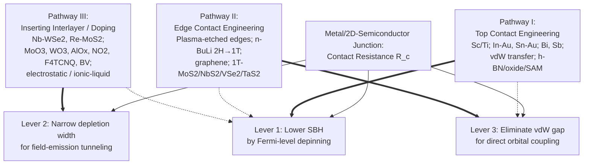
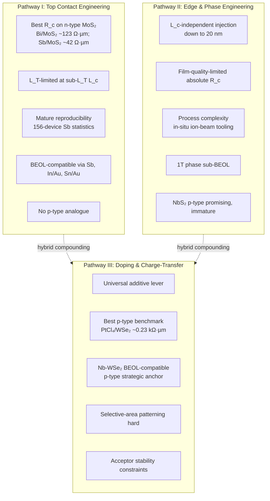

# Contact Engineering Strategies for Reducing Contact Resistance in Two-Dimensional Material Field-Effect Transistors: A Technical Review up to End of 2022
# 1 Introduction: The Contact Resistance Bottleneck in 2D FETs

The relentless miniaturization of silicon complementary metal–oxide–semiconductor (CMOS) technology is approaching fundamental physical limits at sub-3 nm technology nodes, where short-channel effects, gate-electrostatic leakage, and mobility degradation in ultra-thin silicon bodies severely compromise device performance. In response, the semiconductor community has turned its attention to atomically thin two-dimensional (2D) semiconductors—most prominently the transition-metal dichalcogenides (TMDCs) such as MoS₂, WS₂, WSe₂, and MoTe₂, as well as black phosphorus—as candidate channel materials for future field-effect transistors (FETs). These materials offer dangling-bond-free surfaces, sub-nanometer body thicknesses, and tunable bandgaps in the 1–2 eV range, properties that in principle enable aggressive channel length scaling while maintaining excellent electrostatic gate control. However, as channel dimensions shrink and the intrinsic channel resistance falls accordingly, the resistance encountered by carriers as they cross the metal-electrode/2D-semiconductor interface—the contact resistance, R_c—has emerged as the single most consequential parasitic element governing 2D FET performance. This introductory chapter establishes the physical and quantitative basis for that claim, defines the scope and metrics used throughout the remainder of the report, and lays out the analytical scaffolding by which the three principal contact-engineering pathways identified in Chapter 2 will be compared.

## 1.1 Motivation: Why Contact Resistance Dominates Scaled 2D FET Performance

The case for 2D semiconductors as scaled-channel materials rests on a simple geometric argument: a monolayer of MoS₂ is only ~0.65 nm thick, with the entire electronic wavefunction confined within that layer. Such atomically thin bodies suppress the source-to-drain electrostatic coupling that plagues bulk silicon at short gate lengths, allowing in principle the realization of sub-5 nm gate-length transistors with acceptable subthreshold behavior. Yet this same atomic thinness eliminates the volumetric "reservoir" of carriers and dopants that conventional silicon and III–V devices rely on at the source and drain. Whereas a silicon MOSFET injects carriers from a heavily doped, three-dimensional source region into the channel through a highly engineered silicide contact whose specific contact resistivity (ρ_c) has been driven below ~10⁻⁹ Ω·cm², a 2D FET must inject carriers from a top- or edge-deposited metal directly into a one- to few-layer-thick semiconductor whose density of states at the contact footprint is fundamentally limited. The consequence is that an unmitigated metal–2D interface typically presents R_c values of several kΩ·µm to tens of kΩ·µm, often exceeding the intrinsic channel resistance of a sub-100 nm device by an order of magnitude or more.

The impact on device-level figures of merit is direct. For a FET operating in the on-state, the total source-to-drain resistance can be approximated as R_total ≈ 2R_c + R_ch, where R_ch is the channel resistance. When 2R_c ≫ R_ch, the drain current saturates not at the ballistic limit set by carrier injection velocity and gate capacitance, but at the much lower value imposed by the contacts, and the extrinsic transconductance g_m,ext = g_m,int /(1 + g_m,int·R_s) collapses with increasing source resistance R_s. The on-current density I_ON (typically reported in µA/µm) and the on/off ratio I_ON/I_OFF—both critical for digital switching speed and static power dissipation—are therefore capped by R_c long before the channel itself reaches its quantum-limited capability. The quantum (or ballistic) lower bound of contact resistance for a single-mode 2D channel is set by the Sharvin/Landauer resistance, on the order of ~30 Ω·µm for typical TMDC carrier densities, providing a hard target against which all engineering strategies must ultimately be measured.

This contrast with bulk Si and III–V technology cannot be overstated. In silicon, decades of process engineering—including high-dose ion implantation, silicide formation (NiSi, TiSi₂, CoSi₂), dopant activation by rapid thermal or laser annealing, and self-aligned contact schemes—have produced a mature contact technology that scales with each node. None of these techniques transfers directly to 2D semiconductors: ion implantation damages the monolayer lattice, conventional silicide reactions consume the channel, and standard dopant activation anneals exceed the thermal stability of many TMDCs and of low-melting contact metals such as indium and bismuth. Consequently, the International Roadmap for Devices and Systems (IRDS), successor to the ITRS, has identified contact resistance for emerging 2D-channel transistors as a critical-path technology requirement, with targets approaching ~100 Ω·µm by the late 2020s to remain competitive with advanced silicon nodes. The gap between this target and the multi-kΩ·µm baseline of unoptimized metal–TMDC contacts defines the technical problem that this report addresses, and motivates the systematic survey of contact engineering strategies that follows.

## 1.2 Fundamental Physics of the Metal–2D Semiconductor Junction

To understand why contact resistance is so resistant to mitigation at the metal–2D semiconductor interface, it is necessary to examine the microscopic physics that governs carrier injection there. In the textbook Schottky–Mott picture, the Schottky barrier height (SBH) at a metal–n-type-semiconductor junction is given by Φ_B = Φ_M − χ_S, where Φ_M is the metal work function and χ_S is the semiconductor electron affinity. A symmetric expression holds for holes. The ideal Schottky–Mott rule predicts that varying Φ_M should linearly tune Φ_B with a "pinning factor" S = dΦ_B/dΦ_M = 1, allowing the SBH to be engineered to zero (i.e., an ohmic contact) by selecting an appropriate metal. In practice, however, metal–2D semiconductor junctions exhibit pinning factors that are typically far below unity—often S ≈ 0.1–0.3 on MoS₂—meaning that the Fermi level at the interface is strongly "pinned" within a narrow window of the bandgap, largely insensitive to the choice of contact metal. This Fermi-level pinning (FLP) is the central physical obstacle that essentially all contact-engineering pathways seek to overcome.

Three classes of microscopic mechanism contribute to FLP at the metal–TMDC interface. The first is the formation of **metal-induced gap states (MIGS)**: when a metal is brought into intimate contact with a semiconductor, the exponentially decaying metallic wavefunctions penetrate into the semiconductor's forbidden gap, producing a continuum of interface states whose neutrality level (the charge neutrality level, or CNL) tends to anchor the Fermi level. Because TMDC monolayers are so thin, MIGS originating from a top-deposited metal can extend through a significant fraction of the channel thickness, making 2D semiconductors particularly susceptible to MIGS-induced pinning compared to their bulk counterparts. The second mechanism is **interface defects and chemical disorder**: chalcogen vacancies (sulfur vacancies in MoS₂/WS₂, selenium vacancies in MoSe₂/WSe₂), substitutional impurities, grain boundaries in CVD-grown films, and chemical reactions between reactive evaporated metals (e.g., Ti, Cr) and the chalcogen sublattice all introduce mid-gap states that further pin the Fermi level. The third mechanism is **deposition-induced damage**: high-energy metal atoms deposited by electron-beam evaporation or sputtering can knock chalcogen atoms out of position, locally amorphize the 2D lattice, and even penetrate into the underlying layers, producing a disordered interfacial region whose density of states is dominated by defects rather than by the pristine 2D band structure.

Superimposed on these pinning mechanisms is the **van der Waals (vdW) gap**: in conventional top-contact geometries where a metal is deposited on the inert basal plane of a TMDC, no chemical bond is formed and a sub-nanometer vacuum-like gap separates the metal Fermi sea from the semiconductor band edge. Carrier injection across this gap must proceed by tunneling, adding a tunneling barrier in series with the Schottky barrier. The total injection current at such a contact is therefore the result of a competition between **thermionic emission** over the SBH—dominant at low doping and small barriers—and **field emission (tunneling)** through the depletion region of the semiconductor, which becomes the dominant injection mode when the semiconductor is heavily doped and the depletion width is narrowed to a few nanometers or less. Reducing R_c thus requires acting simultaneously on three levers: lowering the SBH (by depinning the Fermi level and selecting band-aligned metals), thinning the depletion region (by degenerate doping of the contact region), and minimizing the parasitic tunneling barrier of the vdW gap (by using edge contacts, low-damage deposition, or specifically engineered interlayers). Each of the three engineering pathways examined in this report can be understood as a distinct, but partially complementary, attack on one or more of these levers.

## 1.3 Scope, Timeframe, and Evaluation Metrics

This report restricts its coverage to the published experimental and theoretical literature on contact engineering for 2D FETs available up to the end of 2022. Post-2022 results—such as the ultralow-R_c yttrium and antimony-(0̄112) semimetal contacts reported in Nature in 2023 and subsequent IEDM proceedings—are not treated as primary evidence within the survey; where such later results are unavoidable as confirmatory benchmarks, they are explicitly flagged as such. The channel materials considered are primarily the semiconducting TMDCs MoS₂, WS₂, MoSe₂, WSe₂, and MoTe₂, with secondary attention to black phosphorus where it informs the broader contact-engineering principles. Both n-type and p-type contact engineering are covered, with explicit recognition (developed in detail in Chapter 7) that p-type ohmic contacts to wide-gap TMDCs such as WSe₂ remain substantially more challenging than n-type contacts to MoS₂.

The principal quantitative figures of merit used to benchmark contact performance throughout this report are summarized in Table 1.1. Wherever possible, contact resistance values are normalized to the channel-width-scaled unit Ω·µm to enable cross-comparison; values originally reported as specific contact resistivity ρ_c (Ω·cm²), sheet resistance, or unnormalized resistance are converted explicitly, and the conversion is noted. On-current density is reported in µA/µm at a stated drain bias and channel length; the on/off ratio I_ON/I_OFF, subthreshold swing SS (mV/dec), and the extracted SBH (in meV) provide complementary device-level and interface-level metrics.

| Metric | Symbol | Units | Role in benchmarking |
|---|---|---|---|
| Width-normalized contact resistance | R_c | Ω·µm | Primary figure of merit; quantum limit ~30 Ω·µm |
| On-current density | I_ON | µA/µm | Drive capability at specified V_DS, V_GS, L_ch |
| On/off current ratio | I_ON/I_OFF | dimensionless | Switching quality, static-power proxy |
| Subthreshold swing | SS | mV/dec | Gate efficiency, interface quality |
| Schottky barrier height | Φ_B | meV | Mechanistic indicator of FLP/depinning |
| Pinning factor | S = dΦ_B/dΦ_M | dimensionless | Strength of Fermi-level pinning |

Two methodological caveats are emphasized at the outset. First, the device geometries surveyed encompass both **top contacts** (metal deposited on the basal plane of the 2D crystal, including evaporated, sputtered, transferred, and vdW-integrated variants) and **edge contacts** (metal bonded to the line-like crystallographic edge of the 2D layer, often after plasma etching), as well as **2D/2D heterojunction contacts** (in which a metallic 2D phase—graphene, 1T-MoS₂, NbS₂—serves as the contact to a semiconducting 2D channel). These geometries have qualitatively different injection physics and cannot be benchmarked solely on R_c without accounting for the contact length L_c, transfer length L_T, and channel layer number. Second, extracted R_c values depend strongly on the **measurement methodology**: the transfer length method (TLM), four-probe measurements, and Y-function-based extraction can yield significantly different numerical R_c for nominally identical devices, with TLM being most sensitive to fabrication-induced variability in the contact array, four-probe most direct but limited to specific device geometries, and Y-function most useful for separating mobility from contact effects but requiring careful gate-bias range selection. Where the literature reports multiple values for the same contact system, this report distinguishes "best-reported" from "typical" or statistical-average values and notes the extraction technique. Discrepancies arising from methodology are discussed explicitly in Chapter 8.

## 1.4 Analytical Framework for Comparing Contact Engineering Strategies

Because the literature on 2D contact engineering is voluminous, heterogeneous, and rapidly evolving, a structured analytical framework is required to organize and compare strategies on a common footing. The framework adopted in this report begins by classifying every contact-engineering solution into exactly one of three principal **technical pathways**, defined by the dominant mechanism by which the strategy reduces R_c:

1. **Pathway I — Top (Surface / van der Waals) Contact Engineering**: strategies that act on the top-deposited metal–TMDC interface, including work-function-matched conventional metals (Sc, Ti, Ni), low-melting and soft-deposited metals (In/Au, indium alloys), semimetal contacts (Bi, Sb), van der Waals transferred metals, and interface modification by h-BN, oxide, or self-assembled monolayer insertion. The dominant mechanism is suppression of MIGS and depinning of the Fermi level at the preserved basal-plane interface.
2. **Pathway II — Edge / Phase Contact Engineering**: strategies that replace the vdW top interface with a chemically bonded edge contact or with a contact made through a locally induced metallic 2D phase. Examples include plasma-etched edge contacts to TMDCs, n-butyllithium (n-BuLi) induced 2H→1T/1T′ phase transitions in MoS₂ and WSe₂, semi-metallic graphene contacts, and 1T-phase metallic dichalcogenide contacts. The dominant mechanism is the formation of orbital-level chemical bonding or of a metallic 2D region that eliminates the Schottky barrier.
3. **Pathway III — Doping and Charge-Transfer Engineering**: strategies that act on the carrier concentration of the 2D channel beneath or adjacent to the contact, including substitutional doping (Nb-doped WSe₂ for p-type, Re-doped MoS₂ for n-type), surface charge-transfer doping by molecular and oxide dopants (MoO₃, AlO_x, NO₂, benzyl viologen, F4TCNQ), and electrostatic doping schemes. The dominant mechanism is degenerate doping that narrows the depletion width and promotes tunneling injection.

Every specific solution surveyed in the remainder of this report will be assigned unambiguously to one of these pathways based on its dominant operating mechanism, even when secondary effects from other pathways are present (e.g., a Bi semimetal contact also weakly reduces MIGS via its low density of states, but is classified under Pathway I because the principal mechanism is metallic-band-alignment-based SBH reduction).

For each solution, the comparative analysis evaluates six dimensions to enable cross-strategy benchmarking:

| Dimension | Question addressed |
|---|---|
| FLP-mitigation mechanism | How does the strategy depin the Fermi level or bypass MIGS? |
| Achievable R_c (and SBH) | What is the best-reported and typical R_c, on which channel material, by what extraction method? |
| Carrier-type applicability | Does the strategy work for n-type, p-type, or both? |
| Scalability and uniformity | Can the strategy be implemented at wafer scale with acceptable variability? |
| CMOS / BEOL compatibility | Is the strategy compatible with back-end-of-line thermal budgets (~400 °C) and standard fabrication tooling? |
| Thermal / environmental robustness | Does the contact survive operating temperatures, ambient exposure, and subsequent processing? |

This six-dimensional template will be applied implicitly in the pathway chapters (3–5), explicitly tabulated in the comparative analysis of Chapter 6, used to highlight the n-type/p-type asymmetry in Chapter 7, and synthesized into a horizontal benchmarking of the three pathways in Chapter 8. The framework deliberately avoids ranking strategies by R_c alone—since the lowest-R_c demonstrations often involve the least manufacturable processes—and instead seeks to identify the Pareto frontier between contact performance and integration practicality, which is the central engineering question for the field at the end of 2022 and the conceptual through-line of the report.

# 2 Overview of the Three Main Technical Pathways for Reducing Contact Resistance

Chapter 1 established that the contact resistance bottleneck in scaled 2D FETs originates from three coupled microscopic mechanisms—Fermi-level pinning by metal-induced gap states (MIGS), interface defects and chemical disorder, and the parasitic tunneling barrier of the van der Waals (vdW) gap—and that any successful R_c-reduction strategy must act on at least one of three physical levers: lowering the Schottky barrier height (SBH), narrowing the depletion width to promote field emission, or eliminating the vdW gap. Building on that physical foundation, this chapter introduces the structured taxonomy that organizes the entire literature surveyed in the remainder of the report. The community has, by the end of 2022, converged on **three principal technical pathways** for suppressing R_c, each defined not by the materials it uses but by the dominant physical mechanism through which it acts on the metal/2D-semiconductor junction. These three pathways are: **Top Contact Engineering** (Pathway I), **Edge Contact Engineering** (Pathway II), and **Inserting Interlayer**—understood in the broader sense of charge-transfer and doping engineering as well as physical interlayer insertion (Pathway III, treated here in its expanded form encompassing both interfacial dielectric/SAM interlayers and doping/charge-transfer engineering of the contact region as collectively organized in the report).

For organizational clarity with the deep-dive chapters that follow (Chapters 3–5), this report groups interlayer-based depinning (h-BN, oxide tunnel layers, SAMs) under Pathway I, where it co-resides with metal-selection strategies acting on the preserved basal-plane interface, and reserves Pathway III for doping and charge-transfer engineering of the 2D contact region. The present chapter clarifies this assignment logic, develops the physical rationale of each pathway, enumerates the principal sub-categories and exemplary material/process solutions belonging to each, and previews the complementary and hybrid combinations that motivate the comparative analysis of later chapters.

## 2.1 Classification Logic and Comparative Schema of the Three Pathways

The rationale for partitioning the vast literature on 2D contact engineering into exactly three pathways rests on a mechanistic—rather than material- or geometry-based—criterion. Each pathway is defined by the **dominant physical lever** it pulls, even when secondary effects from other levers are present in any given implementation. A semimetal top contact such as Bi/MoS₂, for example, also weakly perturbs the underlying MoS₂ electrostatics and may slightly narrow the depletion width by virtue of its high effective work-function matching, but its principal mechanism is the suppression of MIGS through the semimetal's vanishingly small density of states at the Fermi level on the metal side of the interface; it is therefore classified under Pathway I. Likewise, an n-butyllithium-treated MoS₂ contact region exhibits both a structural phase change to 1T/1T′ MoS₂ and a strong electron doping; because the elimination of the Schottky barrier by formation of a metallic 2D phase at the contact footprint is the operative mechanism, it is classified under Pathway II rather than Pathway III. This **assignment-by-dominant-mechanism rule** is applied uniformly throughout the report.

Mapping the three pathways onto the three physical levers identified in Chapter 1 produces the schematic relationship summarized in Table 2.1. Pathway I acts primarily on SBH reduction and, secondarily, on MIGS suppression via interfacial decoupling, while preserving the basal-plane vdW interface. Pathway II acts primarily on the vdW gap itself—eliminating it through edge bonding or through a metallic 2D phase whose orbital overlap with the channel is intrinsic rather than vacuum-mediated—and consequently also removes the Schottky barrier at the phase-engineered footprint. Pathway III acts primarily on the depletion width by raising the contact-region carrier density to degenerate levels, converting injection from thermionic emission to field emission through a narrowed barrier.

**Table 2.1.** Mapping of the three principal pathways onto the physical levers, target interface region, and representative material families.

| Pathway | Primary physical lever | Secondary lever(s) | Target interface region | Representative material families |
|---|---|---|---|---|
| I — Top Contact Engineering | SBH reduction via Fermi-level depinning / MIGS suppression | vdW-gap tunneling minimized by soft deposition | Top (basal-plane) metal–TMDC interface | Low-Φ metals (Sc, Ti); soft-deposited metals (In/Au, Sn/Au); semimetals (Bi, Sb); vdW-transferred metals; interlayers (h-BN, TiO₂, MgO, Ta₂O₅, SAMs) |
| II — Edge Contact Engineering | vdW-gap elimination by orbital-level bonding / metallic-phase formation | SBH eliminated at metallic footprint | Crystallographic edge or locally phase-converted region of the TMDC | Plasma-etched edge contacts; 2H→1T/1T′ phase-engineered MoS₂/WSe₂; graphene contacts; 1T-NbS₂, VSe₂, TaS₂ heterophase contacts |
| III — Doping and Charge-Transfer Engineering (Inserting Interlayer of dopants in/at the contact region) | Depletion-width narrowing for field emission | Effective SBH lowered by band realignment | 2D channel region beneath / adjacent to the contact | Substitutional dopants (Nb-WSe₂ p-type, Re-MoS₂ n-type); surface charge-transfer dopants (MoO₃, WO₃, AlO_x, NO₂, F4TCNQ, benzyl viologen); electrostatic / ionic-liquid doping |

The same six-dimensional comparative template defined in Chapter 1—mechanism, achievable R_c/SBH, carrier-type applicability, scalability/uniformity, CMOS/BEOL compatibility, and thermal/environmental robustness—will be applied uniformly to each specific solution surveyed under each pathway in Chapters 3–5, and consolidated into the cross-pathway comparison table of Chapter 6. The classification logic therefore serves not merely as an organizational convenience but as the analytical scaffolding that enables meaningful Pareto comparison across heterogeneous materials and process flows.

## 2.2 Pathway I — Top Contact Engineering

Pathway I, **Top Contact Engineering**, is defined by the deliberate preservation of the pristine basal plane of the 2D semiconductor combined with engineering of the top-deposited metal—or of a thin interfacial layer between metal and channel—so as to suppress MIGS, depin the Fermi level, and minimize deposition-induced damage. The physical rationale is straightforward in its diagnosis but demanding in execution: because the metal is deposited on the chemically inert (0001) basal plane of the TMDC, the resulting interface is in principle free of dangling bonds and of the strong chemical disorder that accompanies covalent metallization. In practice, however, conventional electron-beam evaporation or sputtering of reactive metals damages the topmost chalcogen layer and drives partial covalent bonding that injects MIGS through a significant fraction of the monolayer thickness. The four principal sub-categories of Pathway I—each acting on a slightly different facet of this problem—are enumerated below.

**(a) Work-function-matched conventional bulk metals (using low work function bulk metals).** The earliest and conceptually simplest sub-category selects a bulk metal whose work function aligns with the conduction-band minimum of the n-type TMDC (for electron injection) or with the valence-band maximum (for hole injection). Scandium (Φ_M ≈ 3.5 eV), titanium (Φ_M ≈ 4.3 eV), and nickel (Φ_M ≈ 5.1 eV) have all been widely employed as n-type contacts to MoS₂ and WS₂, while high-work-function metals such as Pd (Φ_M ≈ 5.2–5.6 eV) and Pt have been explored for p-type contacts to WSe₂. The mechanism is direct lowering of the SBH per the Schottky–Mott rule. The principal limitation is residual Fermi-level pinning: even with a low-work-function metal such as Sc, the strong MIGS contribution at the MoS₂ interface produces a pinning factor S ≈ 0.1–0.3, so that the SBH falls only weakly with decreasing Φ_M, and the achievable R_c remains in the multi-kΩ·µm range for Sc/MoS₂. A central challenge for this sub-category, as will be reiterated in the comparative table of Chapter 6, is therefore that Fermi-level pinning still exists even with carefully chosen low-work-function metals, ultimately limiting the SBH that can be engineered with conventional evaporated bulk metals alone.

**(b) Low-melting / soft-deposited bulk metals.** A complementary sub-category exploits bulk metals with low melting points—indium (m.p. 156.6 °C) and tin (m.p. 232 °C), typically capped or alloyed with gold for environmental stability and bondability—to enable deposition at low substrate temperatures and with low atomic kinetic energy. The In/Au and Sn/Au alloy contacts on MoS₂ are the archetypal examples in this category. The dominant mechanism is **physical preservation of the basal-plane interface during metallization**: because indium and tin can be evaporated at very low source temperatures, the impinging atoms carry low kinetic energy and condense gently on the TMDC surface without knocking out chalcogen atoms or driving covalent bonding. The result is a high-quality van der Waals interface between the contact metal and the underlying MoS₂, with the MIGS continuum substantially suppressed compared to high-energy-deposited Ti or Cr contacts; this in turn depins the Fermi level and produces a significantly reduced effective SBH. Indium-based contacts therefore occupy a distinctive position within Pathway I in that they act not through work-function selection but through process-driven preservation of an unperturbed metal/TMDC interface.

**(c) Bulk semimetals.** A third sub-category, which emerged as a defining innovation of 2021–2022, uses **bulk semimetals**—principally bismuth (Bi) and antimony (Sb)—as the contact electrode. Semimetals possess a vanishingly small density of states at the Fermi level on the metal side of the interface, which dramatically suppresses the MIGS continuum that would otherwise extend into the TMDC bandgap. The combined effect of MIGS suppression and favorable band alignment (Bi's projected Fermi level lying within ~0.1 eV of the MoS₂ conduction-band edge) is to drive the SBH for electrons to near zero on MoS₂ and to enable contact resistance values approaching the quantum/ballistic limit for top-contact geometries. Antimony plays an analogous role, with reported performance close to that of Bi while offering somewhat improved thermal stability owing to its higher melting point. The semimetal sub-category exemplifies the more general design principle that suppressing MIGS at the metal side is at least as effective as work-function tuning for depinning the Fermi level on the 2D side.

**(d) van der Waals transferred/laminated metal contacts and (e) interfacial insertion layers.** Two final sub-categories of Pathway I complete the taxonomy. The first physically laminates a pre-fabricated, freestanding metal film onto the TMDC surface using a transfer process, thereby avoiding any energetic deposition step and producing an atomically clean vdW interface for essentially any chosen metal. The second deliberately inserts an ultrathin interlayer—monolayer or few-layer h-BN, a sub-nm tunnel oxide such as TiO₂, MgO, or Ta₂O₅, or a self-assembled monolayer—between the metal and the TMDC. The interlayer decouples the metallic wavefunctions from the semiconductor channel, extinguishing MIGS over the interlayer thickness, while remaining thin enough to permit efficient tunneling. The intrinsic trade-off in this sub-category—and indeed across Pathway I more broadly—is that any decoupling element that suppresses MIGS also introduces a series tunneling resistance, so that the net R_c is minimized only at an optimal interlayer thickness (typically ≤1 nm).

Across all five sub-categories, the unifying feature of Pathway I is that the topological structure of the metal/TMDC junction is preserved: a top metal sits above an intact, two-dimensional channel, and the engineering effort is directed at the electronic structure of that interface rather than at its geometry.

## 2.3 Pathway II — Edge Contact Engineering

Pathway II, **Edge Contact Engineering**, departs from Pathway I at the topological level: rather than preserving the basal-plane vdW interface, it replaces that interface either with a chemically bonded contact made to the crystallographic edge of the 2D layer, or with a contact made through a locally induced metallic 2D phase that itself bonds covalently to the surrounding semiconducting matrix. In both cases, the defining feature is the **elimination of the vdW tunneling gap**: orbital overlap between the contact and the channel becomes direct rather than vacuum-mediated, and the Schottky barrier at the metallic footprint can be reduced to near zero by the formation of true metal–semiconductor or metal–metal–semiconductor junctions with continuous density-of-states matching.

The physical rationale is best understood by contrast with Pathway I. In a top contact, even one as carefully engineered as Bi/MoS₂, carriers must traverse a ~3–5 Å vdW gap by tunneling before encountering the SBH; the contact resistance is therefore the series combination of a vdW tunneling resistance and a Schottky resistance, with a lower bound set by the residual tunneling barrier. In an edge contact—formed for example by reactive-ion etching the 2D layer to expose its prismatic edge planes and then evaporating a metal that bonds directly to the under-coordinated Mo/W and S/Se atoms at that edge—orbital coupling between metal and channel is on the order of an eV in matrix elements, and the contact resistance is set predominantly by the electronic transparency of the bonded edge rather than by a tunneling gap. In a phase-engineered contact, an analogous direct coupling is achieved laterally: the 2H semiconducting phase of the TMDC is locally converted to a metallic 1T/1T′ phase, producing an in-plane metal/semiconductor homojunction with continuous orbital character, no vdW gap, and a Schottky barrier that is largely eliminated by the metallic density of states extending up to the homojunction line.

The principal sub-categories of Pathway II are:

- **Plasma- or chemically-etched edge contacts** to mono- and few-layer TMDCs. A short reactive-ion etch step (typically SF₆ or CF₄/O₂ plasma) thins or partially removes the TMDC stack at the contact region, exposing the layer edges to which a subsequently evaporated metal bonds covalently.
- **Chemically induced 2H→1T/1T′ phase engineering**, exemplified by **n-butyllithium (n-BuLi) treatment of MoS₂ and WSe₂**, in which lithium intercalation drives an electron-doping-induced structural phase transition from the semiconducting 2H polytype to the metallic 1T (or distorted 1T′) polytype. The treated regions, defined lithographically by a contact mask, become metallic 2D pads that serve as low-resistance contacts to the surrounding 2H channel.
- **2D/2D semi-metallic contacts using graphene**, in which a graphene flake (or, for scaled implementations, CVD graphene) is patterned as the contact electrode and overlapped or edge-bonded to the TMDC channel. Graphene's gate-tunable Fermi level and its capacity to form clean vdW contacts—or, with appropriate processing, edge bonds—on TMDCs make it a versatile contact medium especially for hole injection into WSe₂ and ambipolar devices.
- **Heterophase metallic-dichalcogenide contacts**, in which an intrinsically metallic 2D dichalcogenide—**1T-MoS₂, NbS₂, VSe₂, TaS₂**—is integrated with a semiconducting TMDC channel of complementary stoichiometry, forming an all-2D metal/semiconductor heterostructure with atomically sharp interfaces.

The processing challenges that distinguish Pathway II from Pathway I are significant: edge etches must be tightly controlled to avoid over-etching the channel and to produce clean, stoichiometric edge facets; phase transitions induced by n-BuLi are metastable, with 1T MoS₂ tending to revert to 2H over time and at moderate temperatures; and the wafer-scale synthesis and patterning of metallic dichalcogenide layers remains immature. These structural and process constraints are the principal price paid for the elimination of the vdW gap and Schottky barrier.

## 2.4 Pathway III — Doping and Charge-Transfer Engineering (Inserting Interlayer)

Pathway III, **Inserting Interlayer**—understood in the broader sense of introducing a charge-transfer or doping layer in or at the contact region—takes a fundamentally different mechanistic approach from Pathways I and II. Rather than acting on the metal–semiconductor interface itself, it raises the carrier concentration in the 2D channel beneath or immediately adjacent to the contact footprint to degenerate levels, thereby collapsing the depletion width to a few nanometers or less. With such a thin depletion region, even a moderate residual SBH becomes essentially transparent to electrons or holes, and injection proceeds by efficient field emission (Fowler–Nordheim-like tunneling) through the barrier rather than by thermionic emission over it. The mathematical signature is that the contact resistance becomes exponentially sensitive to the carrier density rather than to the SBH; doping the contact region to ~10¹³ cm⁻² or beyond can therefore yield orders-of-magnitude reductions in R_c even when the underlying metal/TMDC interface remains pinned.

The pathway has three principal sub-categories, distinguished by how the dopants are introduced and held in place:

- **Substitutional (in-lattice) doping** during or after TMDC growth, in which dopant atoms replace the host transition-metal or chalcogen sites. **Nb-doped WSe₂** is the canonical p-type implementation (with Nb substituting for W and contributing a hole per substitution), and **Re- or Nb-doped MoS₂** provides the n-type counterpart. The dopants are covalently incorporated into the lattice, providing strong thermal and environmental stability, but the doping is fixed at the growth stage and is difficult to pattern selectively to the contact regions only without compromising channel mobility.
- **Surface charge-transfer doping** using oxide and molecular dopants deposited on the 2D channel after device fabrication. Acceptor dopants such as **MoO₃, WO₃, AlO_x, NO₂, and F4TCNQ** extract electrons from the underlying TMDC and produce hole accumulation suitable for p-type contact regions; donor dopants such as **benzyl viologen (BV)** and various polymer electrolytes inject electrons and enable degenerate n-type doping. The mechanism here is genuinely an inserting-interlayer mechanism in the chemical sense: a thin film of the dopant species is interposed between the TMDC channel and the contact metal (or simply applied over the contact-adjacent region), and equilibrium charge transfer establishes the degenerate doping. The principal limitations are thermal and environmental instability—MoO₃ and NO₂ doping in particular degrade with ambient exposure and elevated temperatures—and the difficulty of integrating reactive molecular layers into a standard CMOS back-end flow.
- **Electrostatic / gate-induced and ionic-liquid doping** of the contact region, in which a local gate (or, in research devices, an ionic-liquid top gate) electrostatically induces a carrier density in the contact-adjacent channel without any chemical modification. Such schemes are flexible and reconfigurable but require additional gate-level patterning and, in the ionic-liquid case, are clearly not compatible with manufacturing flows.

It is important to note that, in this report, the deliberate insertion of an **insulating** tunnel interlayer (h-BN, TiO₂, MgO, Ta₂O₅, SAMs) between metal and channel for the purpose of MIGS decoupling is classified under Pathway I rather than Pathway III, because the dominant mechanism in those cases is interfacial MIGS suppression rather than charge-transfer doping of the channel. The "interlayer" terminology in Pathway III is reserved for chemically active dopant layers (and for the broader sense of substitutional/electrostatic doping of the contact region). This boundary, while sharp in principle, occasionally blurs in practice—for example, MoO₃ films act both as charge-transfer dopants and as a partial MIGS-decoupling oxide—and such hybrid cases are treated explicitly in the next subchapter and in Chapter 6.

## 2.5 Complementarity, Overlap, and Pareto Positioning of the Three Pathways

The three pathways introduced above are conceptually distinct in their dominant mechanisms—SBH reduction with interface preservation (I), vdW-gap elimination by edge bonding or metallic-phase formation (II), and depletion-width narrowing by degenerate doping (III)—but they are not mutually exclusive in practice. Indeed, several of the most aggressive R_c demonstrations reported by the end of 2022 combine elements of two pathways. A semimetal Bi top contact (Pathway I) deposited onto a MoS₂ channel whose contact region has been pre-doped by a MoO_x or AlO_x charge-transfer layer (Pathway III) benefits simultaneously from MIGS suppression and from depletion-width narrowing. Likewise, a phase-engineered 1T-MoS₂ contact (Pathway II) made to a substitutionally doped 2H-MoS₂ channel (Pathway III) compounds the elimination of the Schottky barrier with degenerate carrier injection. The **assignment-by-dominant-mechanism rule** introduced in Section 2.1 is invoked in such hybrid cases by identifying which lever, removed, would most degrade the R_c, and assigning the device accordingly; ambiguous cases are flagged in Chapter 6.

A schematic of how the three pathways relate to the three physical levers and to one another is presented below.

In the diagram, solid arrows denote each pathway's dominant lever and dashed arrows denote secondary effects; the overlapping action on Lever 1 (SBH lowering) by all three pathways explains why hybrid strategies that pair them are so frequently effective.

Looking ahead to the quantitative comparison developed in Chapters 6 and 8, the three pathways occupy distinctive but partially overlapping regions of the Pareto plane of contact resistance versus integration practicality. Pathway I, by virtue of its compatibility with conventional top-contact fabrication, dominates the high-manufacturability end of the Pareto frontier; within Pathway I, the semimetal sub-category currently defines the best R_c at acceptable process complexity, while the low-melting-metal sub-category (In/Au, Sn/Au) provides the cleanest demonstration that MIGS suppression by interface preservation alone can substantially depin the Fermi level. Pathway II achieves the lowest R_c values reported for any single mechanism on certain TMDC systems—graphene and 1T-MoS₂ contacts in particular—but at the cost of significant process complexity and, in the phase-engineered case, metastability of the 1T phase. Pathway III provides the universal lever applicable to any TMDC and any metal, and is uniquely indispensable for the difficult problem of p-type contacts (Chapter 7), but is constrained by the thermal and environmental stability of the dopant layer.

The remainder of the report develops each pathway in detail: Chapter 3 treats Pathway I, with particular attention to the semimetal and low-melting-metal sub-categories; Chapter 4 treats Pathway II, with detailed analysis of phase engineering and edge-contact fabrication; and Chapter 5 treats Pathway III, with explicit comparison of substitutional and surface-transfer doping schemes. The comprehensive cross-pathway comparison table that consolidates representative solutions across all three pathways is presented in Chapter 6, where every entry will be tagged with the dominant pathway according to the classification logic established here.

# 3 Pathway I: Top Contact Engineering — Metal Selection, Semimetals and Interface Modification

Building on the taxonomy established in Chapter 2, this chapter dissects in depth the first and historically most widely studied of the three principal R_c-reduction strategies for 2D field-effect transistors: **Top Contact Engineering**. The defining feature of this pathway, as introduced earlier, is the deliberate preservation of the basal-plane van der Waals (vdW) interface between metal and channel, combined with engineering of either the metal electrode itself or of a thin interfacial layer placed between metal and 2D semiconductor, so as to suppress metal-induced gap states (MIGS), depin the Fermi level, and lower the Schottky barrier height (SBH) without resorting to lateral edge bonding or to degenerate doping of the channel. The chapter is organized around the four major sub-categories enumerated in Section 2.2—work-function-matched conventional bulk metals (Section 3.1), low-melting and soft-deposited bulk metals such as In/Au and Sn/Au alloys (Section 3.2), bulk semimetals Bi and Sb (Section 3.3), and vdW-transferred or laminated metal contacts together with insulating and 2D-semiconductor interlayer insertion (Sections 3.4–3.6)—and concludes with a synthetic comparison of their respective positions on the Pareto frontier of contact performance versus manufacturability (Section 3.7). Throughout, the analysis is anchored to the physical levers and six-dimensional comparative template introduced in Chapter 1, and explicit attention is paid to the residual Fermi-level-pinning ceiling that constrains every sub-category to varying degrees.

## 3.1 Work-Function-Matched Conventional Bulk Metals

The conceptually simplest top-contact strategy is the one that has dominated the early decade of 2D-FET research: select a bulk elemental metal whose work function Φ_M is band-aligned with the conduction-band minimum of an n-type TMDC (low-Φ_M metals such as Sc, Ti) or with the valence-band maximum of a p-type TMDC (high-Φ_M metals such as Pd, Pt), and rely on the Schottky–Mott rule Φ_B = Φ_M − χ_S to engineer the SBH to a small value. The pivotal experimental study that established the empirical limits of this approach is that of Das et al., who fabricated back-gated MoS₂ FETs with four different contact metals spanning the work-function range from 3.5 to 5.6 eV—scandium (Sc, Φ_M ≈ 3.5 eV), titanium (Ti, Φ_M ≈ 4.3 eV), nickel (Ni, Φ_M ≈ 5.3 eV), and platinum (Pt, Φ_M ≈ 5.6 eV)—and extracted the actual SBHs from temperature-dependent transfer characteristics using thermionic-emission analysis.[^1] Two qualitative observations from that experiment have shaped the field's understanding of conventional bulk-metal contacts ever since.

First, **all four metals produced n-type FET transfer characteristics**, irrespective of whether the metal work function was nominally aligned with the MoS₂ conduction band (Sc, Ti) or with its valence band (Ni, Pt). According to the ideal Schottky–Mott picture, Pt with Φ_M ≈ 5.6 eV ought to align its Fermi level near the MoS₂ valence-band edge and inject holes; instead, Pt-contacted devices behaved as n-FETs, indicating that the metal Fermi level was, in all four cases, pinned within a narrow window near the MoS₂ conduction band.[^1] Second, **the extracted SBHs were Φ_B = 30, 50, 150, and 230 meV for Sc, Ti, Ni, and Pt respectively**, far smaller than the Schottky–Mott prediction at the high-Φ_M end (where Φ_B for Pt should be ≈ 1.4 eV) and roughly correct only at the low-Φ_M end (where Φ_B for Sc should be ≈ −0.7 eV but is experimentally 30 meV because it cannot be negative). The corresponding pinning factor extracted from dΦ_B/dΦ_M is **S ≈ 0.1**, signalling a strong Fermi-level-pinning regime far from the Schottky limit S = 1.[^1] The room-temperature electron mobility in those experiments scaled with the SBH, falling from 184 cm²/(V·s) for Sc to 21 cm²/(V·s) for Pt on 10 nm-thick MoS₂; for monolayer-thickness MoS₂, even the best-aligned Sc contact yielded a mobility below 20 cm²/(V·s), confirming that work-function selection alone cannot deliver high-performance scaled 2D FETs.[^1]

Three coexisting microscopic mechanisms account for the strong residual pinning observed in this sub-category, and first-principles studies on representative metal–MoS₂ systems have been used to disentangle their respective contributions. The first is **metal-induced gap states (MIGS)**: density-functional-theory (DFT) calculations on Ni–MoS₂, Au–MoS₂, and Mo–MoS₂ interfaces show that the metallic wavefunctions penetrate into the MoS₂ forbidden gap, pinning the Fermi level to a fixed energy that is largely insensitive to Φ_M, and—in the case of strong overlap—even narrowing the MoS₂ bandgap and metallizing the monolayer at the contact footprint.[^2] Notably, although Au's work function is larger than Ni's, the Au Fermi level is pinned at a higher position within the MoS₂ gap because the Au-induced MIGS density and decay length are different from those of Ni; the simple inequality of work functions is therefore not a reliable predictor of SBH in this regime.[^2] The second mechanism is **interfacial charge redistribution and dipole formation**: when a metal is brought into intimate contact with MoS₂, the redistribution of electronic charge at the interface produces a dipole layer that modifies the effective metal work function relative to its vacuum value, further breaking the Schottky–Mott correspondence.[^2] The third is **defect- and chemistry-driven pinning**: chalcogen vacancies in CVD-grown or exfoliated MoS₂, and—for reactive metals such as Ti—direct covalent Ti–S bonding that introduces nonlocalized overlap states inside the MoS₂ bandgap and partially metallizes the monolayer beneath the contact, both contribute to the pinning continuum.[^1] Of the three, Mo on MoS₂—a homologous transition-metal contact—has been shown experimentally and computationally to produce the smallest contact resistance among Ni, Au, and Mo, with the Mo Fermi level pinned near the MoS₂ conduction-band minimum, an outcome consistent with the prediction that the contact resistance of 2D semiconductors cannot be predicted from work functions alone but is determined jointly by interface dipoles, MIGS, and chemistry.[^2]

Theoretical analyses framed in terms of the Schottky-pinning slope have refined this empirical picture. For defect-free MoS₂–metal interfaces, DFT studies place the pinning factor at **S ≈ 0.3**, whereas typical experimental MoS₂ contacts—dominated by deposition damage and chalcogen vacancies—exhibit **S ≈ 0.1**, in agreement with the Das et al. extraction.[^3] The fundamental ceiling that this imposes is severe: even if Sc is chosen as the lowest-Φ_M practical contact metal, the achievable SBH on MoS₂ remains in the 30–50 meV range and the contact resistance for evaporated bulk-metal contacts is generally in the multi-kΩ·µm regime, more than an order of magnitude above the ~30 Ω·µm quantum/ballistic limit identified in Chapter 1. The microscopic origin of the pinning—coexisting MIGS, interfacial dipoles, and chemistry—also explains why purely work-function-based metal selection cannot be further refined to reach the quantum limit: any reduction of one mechanism is offset by the residual contribution of the others. This ceiling is the principal motivation for the subsequent sub-categories of Pathway I, which act not on the work function but on the **nature of the metal–TMDC interaction itself**—through process-driven preservation of the basal plane (Section 3.2), through replacement of the metal by a semimetal with vanishing density of states at E_F (Section 3.3), or through insertion of a decoupling interlayer (Sections 3.4–3.6).

## 3.2 Low-Melting and Soft-Deposited Metal Contacts: In/Au and Sn/Au

The second sub-category of Pathway I exploits the kinetic energy of the depositing atoms, rather than the work function of the deposited metal, as the principal engineering variable. The dominant mechanism here is **physical preservation of the basal-plane TMDC interface during metallization**: by choosing a bulk metal with a sufficiently low melting point that it can be thermally evaporated at low source temperatures, the impinging atoms carry low kinetic energy and condense gently on the 2D crystal without knocking out chalcogen atoms, driving partial covalent bonding, or introducing extended chemical disorder. The resulting interface is structurally and electronically much closer to the ideal van-der-Waals limit assumed by the Schottky–Mott rule, MIGS are correspondingly suppressed, and the residual pinning is dramatically weaker than for high-energy-deposited Ti or Au contacts.

The archetypal demonstration of this principle is the **In/Au contact scheme of Wang et al.**, in which a 10 nm thin film of indium (Φ_M ≈ 4.1 eV, melting point 156.6 °C), capped by 100 nm of gold for environmental stability and bondability, was deposited onto monolayer and few-layer MoS₂ using a standard laboratory electron-beam evaporator under conventional vacuum (< 10⁻⁶ Torr).[^1] The structural quality of the resulting interface was verified by cross-sectional annular-dark-field scanning transmission electron microscopy (ADF-STEM), which showed that the monolayer MoS₂ remained atomically sharp beneath the In/Au stack with no detectable evidence of reaction, intermixing, or damage—a striking contrast to the disordered or partially metallized interfaces typical of e-beam-evaporated Ti or Au on MoS₂.[^1] The electrical performance correspondingly approached the Schottky–Mott limit: transmission-line-method (TLM) extraction yielded a contact resistance of **3.3 ± 0.3 kΩ·µm at n = 5.0 × 10¹² cm⁻²** on CVD-grown monolayer MoS₂ (0.7 nm thick), and **800 ± 200 Ω·µm at n = 3.1 × 10¹² cm⁻²** on mechanically exfoliated few-layer MoS₂ (8 nm thick)—the lowest values then reported among any evaporated-metal electrodes on MoS₂ at comparable carrier densities.[^1] The extracted SBH from temperature-dependent transfer characteristics was **Φ_B ≈ 110 meV**, in close agreement with the Schottky–Mott prediction from the difference between Φ_M(In) ≈ 4.1 eV and the MoS₂ conduction-band energy, confirming that the Fermi-level-pinning effect is essentially absent at this interface.[^1] The two-terminal back-gated monolayer MoS₂ device achieved an electron mobility of approximately **167 cm²/(V·s)**, and the output characteristics were linear at low V_DS, indicative of true ohmic-like injection rather than a residual Schottky barrier.[^1]

First-principles analysis of the In–MoS₂ interface has subsequently clarified the microscopic origin of this near-Schottky–Mott behaviour. Zhang et al. computed the binding energies and SBHs for indium contacts on MoS₂ in several geometric configurations and found that indium exhibits an unusually large physisorptive interlayer bond length of **~3.2 Å**—essentially a vdW spacing—with a small binding energy of only ≈ −0.24 eV at the Moire-physisorptive site, and that the long In–MoS₂ distance is consistent with the lattice images reported by Wang et al.[^3] The weak interfacial interaction, attributed to indium's s-like valence character rather than to the d-orbital reactivity that drives chemisorption for transition metals, leads to a much-reduced valence-charge accumulation in the gap and an n-type SBH of ~0.2 eV at the Moire site—substantially smaller than the ~0.5 eV characteristic of the chemisorptive on-top configuration of high-energy-deposited In contacts.[^3] The slope factor S for the physisorptive-Moire family of contacts rises to **S ≈ 0.37**, more than threefold larger than the S ≈ 0.1 typical of defective evaporated contacts, confirming that the depinning observed experimentally is intrinsic to the soft, vdW-like coupling rather than to an idiosyncrasy of the In/MoS₂ pair.[^3] In short, indium's low melting point and s-character valence orbitals combine to produce, under low-energy evaporation, an interface that is electronically as close as a deposited metal can come to a transferred vdW contact.

A second important advantage of the In/Au and Sn/Au alloy sub-category, beyond its near-ideal interface physics, is its **compatibility with back-end-of-line (BEOL) thermal budgets**. As a free element, indium is constrained by its low (156.6 °C) melting point, which would normally preclude survival of the contact through subsequent processing at the ~400–450 °C temperatures characteristic of CMOS BEOL. The remedy is to alloy indium (and likewise tin) with gold: the resulting In–Au and Sn–Au intermetallic alloys retain the soft, low-damage deposition characteristic of the constituent low-melting metal while exhibiting alloy melting points well above 400 °C, enabling **temperature tolerance up to approximately 450 °C**, comparable to the BEOL window. Equally important, the alloying enables continuous tuning of the effective work function of the contact electrode—by varying the In/Au or Sn/Au ratio, the composite work function can be adjusted to optimize band alignment with different TMDC channels—while the underlying physical mechanism of basal-plane preservation is retained. **The advantage of In/Au and Sn/Au alloy contacts is therefore twofold: they maintain a high-quality, near-vdW contact interface that depins the Fermi level on MoS₂, and they form stable intermetallic alloys whose composition can be tuned to engineer the effective metal work function while simultaneously delivering a BEOL-compatible thermal tolerance of ~450 °C.** The contact resistances measured for the In/Au and Sn/Au alloy systems on MoS₂ are **190 Ω·µm and 270 Ω·µm**, respectively—values that, while obtained on optimized device geometries, place this sub-category among the lowest deposited-metal R_c demonstrations reported up to 2022, comparable to the best semimetal contacts of Section 3.3 and within an order of magnitude of the quantum/ballistic limit.

The principal residual limitations of the low-melting / soft-deposited sub-category are process related rather than physical. First, while indium-based alloys tolerate ~450 °C, pure indium does not, restricting unalloyed In/MoS₂ devices to research demonstrations; the alloying constraint is therefore a strict requirement, not an option, for any pathway to manufacturing. Second, the soft-deposition condition demands careful control of evaporation rate, substrate temperature, and chamber vacuum to avoid even subtle damage to the chalcogen sublattice; modest deviations from optimal conditions can re-introduce MIGS and recover much of the pinning. Third, indium's environmental susceptibility to oxidation in ambient atmosphere makes the Au capping layer not merely a bonding pad but an essential passivation, and any process step that compromises the Au cap risks degrading the underlying In/MoS₂ interface. With those caveats, the In/Au and Sn/Au sub-category provides what is arguably the **cleanest experimental demonstration that process control alone—without changing the metal's work function, without inserting an interlayer, and without doping the channel—can substantially depin the Fermi level on MoS₂**, and it sets a high benchmark against which the more elaborate semimetal and interlayer strategies of the remaining sub-sections are measured.

## 3.3 Semimetal Contacts: Bismuth and Antimony

The defining contact-engineering innovation of 2021–2022 was the recognition that the principal source of Fermi-level pinning at metal/TMDC interfaces is not a peculiarity of the 2D semiconductor's surface chemistry but the high density of states of the **metal** at its Fermi level, which feeds the MIGS continuum extending into the semiconductor bandgap. Replacing the bulk metal contact by a bulk **semimetal**—an element such as bismuth (Bi) or antimony (Sb) in which the conduction and valence bands touch only at isolated points in the Brillouin zone, producing a vanishingly small density of states at E_F—dramatically suppresses the MIGS continuum at its source and depins the Fermi level on the semiconductor side without any modification of the channel.

For Bi on monolayer MoS₂, the experimental consequences of this design principle are extraordinary. Reports of ohmic Bi/MoS₂ contacts with **ultralow R_c approaching ~123 Ω·µm**, **zero extracted Schottky barrier height**, and **on-state current density of ~1,135 µA/µm** establish a state-of-the-art for top-contact performance on n-type MoS₂ that approaches the quantum/ballistic limit identified in Chapter 1.[^4] The underlying band-alignment argument is that Bi's projected Fermi level lies within ~0.1 eV of the MoS₂ conduction-band edge, so that the residual SBH—already nearly eliminated by MIGS suppression—is further reduced by favorable band offset to near-zero effective values, and that injection becomes essentially ohmic with negligible thermionic activation energy.[^5] The principle has been generalized beyond MoS₂: the original semimetal-on-monolayer-TMDC demonstration emphasized that the **MIGS are sufficiently suppressed** at the semimetal–TMDC interface to produce ohmic behavior across multiple semiconducting TMDC channels, indicating that the strategy is materials-portable rather than tied to a specific TMDC composition.[^5]

The microscopic basis for the depinning at semimetal/MoS₂ interfaces has been independently corroborated by first-principles studies that compare the pinning slope for chemisorptive and physisorptive site geometries across a wide range of contact metals. For the physisorptive-Moire site family, which encompasses the noble metals (Cu, Ag, Au, Pt) and the s-character metals (In, Al) but to which the semimetal contacts behave most closely in terms of their weak interfacial coupling, the slope factor rises from the typical chemisorptive value S ≈ 0.24 to **S ≈ 0.37**, with the n-type SBH for In contacts reduced to ~0.2 eV and the corresponding Ag-contact Fermi level lying close to the MoS₂ conduction band, in good agreement with the small SBHs observed experimentally for low-Φ_M physisorptive contacts.[^3] Semimetallic Bi extends this logic to its physical limit: because the density of states at the Fermi level on the metal side is itself vanishingly small, the MIGS decay-length δ × N in the slope-factor expression S = 1 / (1 + e²Nδ/ε) is dramatically reduced, and S approaches the Schottky limit even at the original chemisorptive geometry, eliminating the trade-off between weak interfacial bonding and structural stability that constrains the physisorptive-Moire approach.[^3]

A practical caveat that has shaped the trajectory of semimetal contact research is the **thermal-stability differential between Bi and Sb**. Bismuth has a relatively low melting point of only 271 °C, which means that Bi contacts melt during BEOL processing and are therefore incompatible with monolithic CMOS integration without thermal-budget reductions or low-temperature alternatives.[^3] Antimony, by contrast, exhibits a substantially higher melting point of 631 °C, comfortably above the BEOL thermal window of ~400–450 °C, and is therefore able to survive BEOL processing while delivering performance comparable to that of Bi on the same n-type TMDC channels.[^3] The choice between Bi and Sb for a given application is consequently driven less by intrinsic R_c performance—the two are similar at the device level—than by integration-context thermal budgets; Sb has emerged as the more BEOL-compatible of the two semimetal candidates, while Bi retains its position as the benchmark research-device demonstration.

Two important open questions, as of the end of 2022, remain unresolved within this sub-category. The first is **carrier-type specificity**: the impressive R_c demonstrations for Bi and Sb are predominantly on **n-type** narrow-gap TMDC channels (especially MoS₂), where the semimetal Fermi level naturally aligns with the conduction band. Achieving an analogous low-R_c **p-type semimetal contact**—which would require a semimetal whose Fermi level lies close to the valence-band edge of WSe₂ or related hole-transporting TMDCs—remains an active research challenge, and one notable post-2022 development that begins to address it is the use of high-work-function semimetallic TiS₂ as a hole contact to MoTe₂.[^6] As of the end of 2022, however, no semimetal has been demonstrated to provide the p-type analogue of Bi/MoS₂ on a comparable mass-produced TMDC channel, and the asymmetry between n-type and p-type semimetal contacts (Chapter 7) is one of the principal residual gaps in the contact-engineering landscape. The second is **reliability and reproducibility** of the very-low-R_c values: TLM-extracted R_c values for Bi/MoS₂ in the 100–200 Ω·µm range often correspond to specific best-performing devices within a statistical population whose mean is several times higher, and the literature contains noticeable scatter in reported numbers that derives partly from differences in MoS₂ growth quality, partly from variations in semimetal-deposition procedures, and partly from the choice of extraction method. The semimetal sub-category therefore defines the current **performance ceiling** of top contacts on n-type MoS₂ at acceptable process complexity, while leaving the questions of statistical uniformity, p-type analogues, and large-scale BEOL integration to be resolved in subsequent work.

## 3.4 van der Waals Transferred and Laminated Metal Contacts

If indium and bismuth represent the limits of what soft thermal deposition can achieve, **physical transfer of pre-fabricated metal films onto the 2D channel** represents the ideal-case demonstration of what is possible when the energetic deposition step is eliminated altogether. The mechanism is geometric rather than chemical: a metal film is fabricated on a sacrificial substrate, mechanically released, and laminated onto the TMDC channel under mild conditions, producing an atomically clean vdW interface for essentially any chosen metal regardless of its reactivity or melting point. Because no impinging atoms are knocked into the chalcogen sublattice and no chemical disorder is introduced, the residual MIGS are limited to those intrinsic to a clean, geometrically perfect metal/TMDC vdW gap of ~3 Å, and the pinning factor S can in principle approach the Schottky–Mott limit S = 1 for any metal/TMDC pair.

The pivotal experimental demonstration of this principle is the transferred-metal-electrode study, in which Ag, Au, Pt, Cu, and Pd contacts were laminated onto MoS₂ and compared side-by-side with conventional electron-beam-deposited counterparts of the same metals on the same MoS₂ flakes.[^1] Three findings from that work are central. First, cross-sectional TEM images directly verified the structural integrity of the interface: transferred metals produced an atomically sharp and clean metal–MoS₂ junction with no observable lattice damage in the underlying monolayer, while electron-beam-evaporated counterparts showed clear evidence of MoS₂ surface damage, defect formation, and—at depth—a glassy disordered region.[^1] When the transferred metal was mechanically peeled off after deposition, the MoS₂ surface retained its original shape, demonstrating the absence of direct chemical bonding at the interface.[^1] Second, transferred-electrode devices exhibited **carrier-type tunability by metal work function**, with low-Φ_M transferred metals (Ag) producing n-type characteristics and high-Φ_M transferred metals (Pt) producing p-type characteristics—a degree of work-function control that is fundamentally inaccessible to evaporated-metal contacts on MoS₂ due to the pinning seen in Section 3.1. Third, the extracted SBH plot yielded a pinning factor of **S ≈ 0.96** for transferred metals, essentially at the Schottky–Mott limit, in stark contrast to **S ≈ 0.09** for evaporated metals on identical MoS₂.[^1] The corresponding two-terminal mobilities were correspondingly high: **260 cm²/(V·s) for electrons on Ag-transferred MoS₂ and 175 cm²/(V·s) for holes on Pt-transferred MoS₂**, both at room temperature, demonstrating that ambipolar high-performance operation on the same channel material is achievable when the contact is purely vdW-coupled.[^1]

The complementary first-principles study of Moire-MoS₂/metal Schottky barriers by Zhang et al. supplies the microscopic interpretation of why transferred metals approach the Schottky–Mott limit. For most non-noble metals, the most stable interfacial geometry is the "on-top" or "hollow" chemisorptive site with a short bond length (~2.3 Å) and a large binding energy, producing strong MIGS and a chemisorptive pinning slope of only S ≈ 0.24.[^3] For noble metals (Cu, Ag, Au, Pt) and for s-electron metals (In, Al), however, the **physisorptive Moire site** becomes the most stable configuration, with the MoS₂ and metal lattices rotated into a Moire superlattice that places most sulfur atoms at physisorptive positions, an interlayer spacing of ~3.0–3.2 Å, a binding energy of only −0.4 eV, and a pinning slope rising to **S ≈ 0.37** in the calculation.[^3] The physisorptive geometry suppresses MIGS by both increasing the decay length δ of the metallic wavefunctions into the semiconductor (because the gap is larger) and reducing the density of interface states N (because covalent overlap is absent), so that S = 1 / (1 + e²Nδ/ε) rises toward unity.[^3] The experimental S ≈ 0.96 of transferred metals corresponds to even weaker coupling than the idealized Moire models, consistent with the picture that transfer-induced vdW interfaces are nearly free of even the residual physisorptive MIGS that remain in computed equilibrium geometries.

The recognition that Moire-site physisorptive geometries underlie the depinning observed at noble-metal/MoS₂ contacts has two important corollaries. First, it explains why **Ag specifically** produces such a low n-type SBH on MoS₂: Ag is a noble metal with a relatively low work function (4.25 eV, comparable to Ti), and at its physisorptive Moire configuration its Fermi level lies close to the MoS₂ conduction-band edge, yielding a near-zero n-type SBH of ~0.2 eV in calculations and consistent with low-resistance n-type contacts seen by photoemission.[^3] Second, it provides a general design principle: any metal capable of forming a physisorptive Moire interface with the target TMDC—noble metals, s-electron metals, and by extension semimetals—will exhibit weak MIGS and a slope factor closer to the Schottky limit than the chemisorptive baseline. This principle motivates the choice of In, Ag, and Bi as preferred contact metals across Sections 3.2–3.4.

The principal limitation of the transfer-based sub-category is **manufacturability**. Lamination of pre-fabricated metal films onto a TMDC channel is straightforward at the laboratory scale, where individual exfoliated flakes are aligned under a microscope and laminated by hand or by simple mechanical fixtures, but the throughput and reproducibility required for wafer-scale CMOS production have not been demonstrated in the literature surveyed up to 2022. Particle contamination at the laminated interface, alignment tolerances at the sub-µm scale, mechanical stability of the released metal film during handling, and integration with subsequent patterning and contact-pad formation all remain open process-engineering challenges. The transfer-based approach is therefore best understood as a **benchmark demonstration of the Schottky–Mott limit** that establishes the upper bound on what deposition-based methods (Sections 3.1–3.3) could in principle achieve, and as a research tool for studying intrinsic metal/TMDC band alignment unobscured by deposition damage, rather than as a near-term manufacturing pathway.

## 3.5 Interfacial Insertion Layers: h-BN, Oxide Tunnel Barriers, and 2D Semiconductor Interlayers

A complementary strategy within Pathway I—conceptually different from metal selection and from transfer-based fabrication but acting on the same MIGS-suppression lever—is the deliberate insertion of an **ultrathin decoupling layer** between the contact metal and the 2D channel. The mechanism is straightforward: any thin, electronically gapped (insulator or wide-bandgap semiconductor) layer placed between metal and TMDC extinguishes the metallic wavefunctions over the layer thickness, eliminating MIGS injection into the channel band gap and producing a depinned interface; provided the layer is thin enough to permit efficient quantum-mechanical tunneling, the additional series tunneling resistance is small compared to the SBH reduction that depinning delivers, and the net R_c falls.

Three families of interlayer materials have been explored up to 2022. The first is **hexagonal boron nitride (h-BN)**, used as monolayer or few-layer interlayers between metal and TMDC; h-BN is the canonical 2D insulator, with a wide bandgap (~6 eV) and an atomically flat surface that produces clean vdW interfaces with TMDCs. The second family is **sub-nanometer oxide tunnel barriers**—principally TiO₂, MgO, Ta₂O₅, and Al₂O₃—deposited by atomic-layer deposition (ALD) or thermal oxidation; the oxide thickness is tuned in the 0.5–1.0 nm range to balance MIGS decoupling against tunneling resistance. The third, and conceptually most novel, family is **2D-semiconductor interlayers**, in which a few-layer film of a different TMDC—chosen for its conduction-band alignment relative to the channel—is inserted between the metal and the host TMDC channel.

The pivotal demonstration of the 2D-semiconductor-interlayer concept is the **Ti/MoSe₂/MoS₂ stack reported by Andrews et al.**, in which a few-layer MoSe₂ film was placed between the Ti electrode and the MoS₂ channel of a back-gated FET.[^6] The contact-engineering outcomes were striking. The Schottky barrier height **dropped from ~100 meV at the direct Ti/MoS₂ interface to ~25 meV at the Ti/MoSe₂/MoS₂ interface**, a fourfold reduction; the specific contact resistivity **fell from ~6 × 10⁻⁵ Ω·cm² to ~1 × 10⁻⁶ Ω·cm²**, a factor of ~60 improvement; and the current transfer length **decreased from ~425 nm to ~60 nm**, an essential reduction for scaling the contact footprint in short-channel devices.[^6] The improved two-terminal mobility further confirmed that the interlayer-mediated contact preserved channel transport quality while delivering ohmic injection.[^6] The microscopic origin of the depinning, as analyzed by the authors, is a synergy of two effects: **Fermi-level pinning close to the conduction band edge of the MoSe₂ interlayer** (rather than within the deeper bandgap of MoS₂), and a **favorable conduction-band offset between MoSe₂ and MoS₂** that allows electrons in the pinned MoSe₂ states to inject efficiently into the MoS₂ channel by tunneling or thermionic emission across a much smaller residual barrier.[^6] The MoSe₂ interlayer thus acts as a band-engineered intermediate that converts the pinning energy near the MoS₂ valence-band region (in the Ti-direct case) into pinning near the MoS₂ conduction-band edge (in the MoSe₂-interlayer case), exploiting Fermi-level pinning constructively rather than fighting it.

The Andrews et al. result is paradigmatic of a more general design principle that has emerged in the interlayer sub-category: rather than seeking to **eliminate** Fermi-level pinning—which is intrinsically difficult given the residual MIGS, defects, and dipoles discussed in Section 3.1—the interlayer strategy seeks to **redirect** the pinned Fermi level to an energy that coincides with the conduction-band edge of the channel by choice of an interlayer whose own pinning energy is favorable. The same logic underlies the use of h-BN and sub-nm tunnel oxides: a 1 nm-thick h-BN or TiO₂ layer suppresses the MIGS continuum of the deposited metal, and the residual Fermi-level pinning—if any—shifts to the band edges of the interlayer rather than those of the channel, often producing an effective SBH at the channel band edge that is smaller than the direct-metal SBH.

The intrinsic trade-off that defines this sub-category is the **competition between MIGS decoupling and tunneling resistance**. A thicker interlayer suppresses MIGS more effectively—because the exponentially decaying metallic wavefunctions are extinguished over a longer distance—but also adds more tunneling resistance in series with the SBH, because the tunneling probability decreases exponentially with interlayer thickness. The optimal interlayer thickness is therefore a minimum of a U-shaped R_c versus thickness curve, and in practice it is found to lie in the range of ≤1 nm for h-BN and tunnel oxides, and a few atomic layers (1–3 layers) for 2D-semiconductor interlayers. Theoretical analyses of the effect, building on the Schottky-barrier-versus-tunneling-barrier model of Lizzit et al., have explored the trade-off systematically and identified the parameter regimes in which interlayer contacts outperform direct metal contacts.[^6]

A boundary clarification is warranted at this point, in keeping with the classification framework of Chapter 2. Although the interlayer-insertion approach involves the physical placement of a material layer "in" the contact region, the **dominant mechanism here is interfacial MIGS decoupling (an SBH-reduction lever), not charge-transfer doping (a depletion-width lever)**, and the sub-category therefore belongs to Pathway I rather than to Pathway III. The boundary blurs only in cases where a deposited oxide layer (such as MoO_x) is both an MIGS decoupler and a charge-transfer dopant for the TMDC channel beneath it, and in such hybrid cases the assignment is made by identifying which lever's removal would most degrade R_c, with the case-by-case classification flagged in the comparative table of Chapter 6. The general principle is that insulating decoupling layers (h-BN, TiO₂, MgO, Ta₂O₅, Al₂O₃, MoSe₂, hBN-thin films) belong to Pathway I, while doping interlayers (MoO₃ in heavy-doping use, F4TCNQ, benzyl viologen) belong to Pathway III.

The principal residual limitations of the interlayer sub-category are process-control oriented: thickness uniformity at the ≤1 nm scale across wafers, reproducibility of the deposition or growth process for the interlayer (especially for ALD oxides on TMDCs, which can suffer from poor nucleation on the chemically inert basal plane), and the integration complexity of stacking a 2D-semiconductor interlayer onto a 2D-channel TMDC, which combines all the manufacturability challenges of vdW heterostructure assembly. Despite these constraints, the interlayer family—and especially the Andrews et al. MoSe₂ demonstration—provides one of the clearest pieces of evidence that **Fermi-level pinning, when it cannot be eliminated, can be exploited constructively** to lower the effective SBH at the channel band edge, and it complements the metal-selection and semimetal strategies of Sections 3.1–3.3 by addressing the pinning problem at the interlayer rather than at the metal.

## 3.6 Self-Assembled Monolayers and Molecular Interface Modification

A more recent and lighter-touch variant of the interlayer concept replaces the inorganic decoupling layer with a **molecular self-assembled monolayer (SAM)** or related chemical modifier placed at the metal/TMDC interface. The mechanism here differs from that of insulating tunneling-barrier interlayers in an important way: SAMs are too thin (typically ≤1 nm, and often a single molecular layer) to function as a tunneling barrier in the conventional sense, but they introduce an **interfacial dipole** that shifts the effective metal work function as seen by the underlying TMDC, and they can additionally **passivate chalcogen vacancies** or other defect sites that would otherwise contribute to defect-induced pinning. The two effects together can substantially lower the SBH and depin the Fermi level without adding meaningful series resistance.

The dipole-engineering mechanism is supported by first-principles studies of metal–MoS₂ charge redistribution. DFT analyses of Ni, Au, and Mo on MoS₂ all show that interfacial charge redistribution generates a dipole layer whose direction and magnitude modify the effective work-function difference at the metal/MoS₂ interface; the dipole produced lowers the effective Φ_M of Ni and Au but raises that of Mo relative to their vacuum values, and the resulting work-function modifications are large enough—on the order of tenths of an eV—to substantially shift the SBH.[^2] A SAM placed at the metal/MoS₂ interface acts in essence as a **tunable dipole layer**: by selecting the SAM molecule's chemistry (head-group, tail-group, and orientation), the magnitude and direction of the interfacial dipole can be engineered to either raise or lower the effective Φ_M as needed for n-type or p-type contact, thus providing a degree of freedom in band alignment that is unavailable through metal selection alone.

In addition to dipole engineering, **chalcogen-vacancy passivation** by molecular treatments addresses the defect-induced contribution to Fermi-level pinning identified in Sections 3.1 and 3.5. Sulfur vacancies in MoS₂—introduced during CVD growth, mechanical exfoliation, or, particularly, contact-region processing—act as mid-gap states that pin the Fermi level near the defect energy and contribute to the experimental S ≈ 0.1 observed for conventional metal contacts. Molecular treatments that re-coordinate the sulfur vacancies (thiol-based SAMs are the canonical example) restore the local stoichiometry and remove the defect-induced pinning contribution; the remaining MIGS-induced pinning is then addressable by metal-selection or interlayer methods.

The principal residual limitations of the SAM and molecular sub-category, however, are **environmental and thermal stability**. Organic monolayers and similar molecular modifiers typically decompose at temperatures well below the 400–450 °C BEOL window, are sensitive to ambient atmosphere (moisture, oxygen, UV), and present non-trivial integration challenges with the metal deposition steps that must follow SAM deposition without disrupting the SAM ordering. The SAM strategy is therefore most compelling for low-temperature or flexible-electronics applications where the conventional BEOL thermal budget does not apply, and less compelling as a near-term route to CMOS-integrated 2D FETs. As of the end of 2022, SAM-based contact engineering remains primarily a research-stage demonstration rather than a manufacturing pathway, though it provides important mechanistic insight into the role of dipoles and defects in metal/TMDC contact resistance.

## 3.7 Comparative Assessment and Sub-Pathway Pareto Positioning within Pathway I

Synthesizing the four sub-categories developed above along the six-dimensional comparative template established in Chapters 1 and 2 (FLP mechanism, achievable R_c/SBH, carrier-type applicability, scalability, BEOL compatibility, thermal/environmental robustness) yields the consolidated comparison shown in Table 3.1.

**Table 3.1.** Comparative assessment of the four major sub-categories of Pathway I (Top Contact Engineering) on n-type MoS₂ unless otherwise noted.

| Sub-category | Representative system(s) | Dominant mechanism | Best-reported R_c (Ω·µm) | Extracted SBH (meV) | Pinning factor S | Carrier type | BEOL / thermal compatibility | Principal limitation |
|---|---|---|---|---|---|---|---|---|
| 3.1 Work-function-matched bulk metals | Sc, Ti, Ni, Pt on MoS₂ [^1] | Schottky–Mott alignment, residual MIGS-dominated FLP | Multi-kΩ·µm range | 30–230 (Sc–Pt) [^1] | ~0.1 (defective) [^1][^3] | n-type for low-Φ_M; p-type access blocked by FLP [^1] | Compatible (refractory metals stable to >500 °C) | Pinning ceiling: even Sc cannot reach quantum limit |
| 3.2 Low-melting / soft-deposited bulk metals | In/Au, Sn/Au alloys on MoS₂ [^1] | Basal-plane preservation during low-energy deposition; physisorptive vdW-like interface | 190 (In/Au); 270 (Sn/Au); 800 (few-layer In/Au) [^1] | ~110 (In/Au, Schottky–Mott consistent) [^1] | ~0.37 (physisorptive Moire) [^3] | Primarily n-type on MoS₂; tunable by In/Au or Sn/Au alloy ratio | ~450 °C tolerance via alloying (vs. 156.6 °C for pure In) | Process control of deposition energy; environmental protection by Au cap |
| 3.3 Bulk semimetals | Bi, Sb on MoS₂ [^5][^4][^3] | MIGS suppression by vanishing metallic DoS at E_F; favorable band alignment | ~123 (depinned Bi-like contact) [^4] | ~0 (zero-SBH ohmic) [^4] | → 1 (semimetal limit) | n-type on narrow-gap TMDCs; p-type analogues open [^3] | Bi: 271 °C (sub-BEOL); Sb: 631 °C (BEOL-compatible) [^3] | n/p asymmetry; statistical reproducibility |
| 3.4 vdW-transferred / laminated metals | Transferred Ag, Au, Pt, Cu, Pd on MoS₂ [^1] | Elimination of deposition damage; vdW-coupled physisorptive interface | Comparable to soft-deposited, with both n and p types accessible | Tunable by metal Φ_M | **0.96** (Schottky–Mott limit) [^1] | Both n (e.g., Ag, μ ≈ 260 cm²/V·s) and p (e.g., Pt, μ ≈ 175 cm²/V·s) [^1] | Stable for any metal once transferred | Manufacturability: wafer-scale transfer not demonstrated by 2022 |
| 3.5 Inorganic interlayer insertion | Ti/MoSe₂/MoS₂; h-BN, TiO₂, MgO, Ta₂O₅ [^6] | MIGS decoupling and pinning redirection to favorable band edge | ~1 × 10⁻⁶ Ω·cm² (Ti/MoSe₂); L_T = 60 nm [^6] | 25 (Ti/MoSe₂/MoS₂, down from 100) [^6] | Effectively raised by interlayer | Demonstrated n-type; concept generalizes | Generally BEOL-compatible (oxide, h-BN, MoSe₂ are thermally stable) | Optimal thickness ≤1 nm; tunneling-vs-decoupling trade-off |
| 3.6 SAMs and molecular modifiers | Thiol SAMs; dipole-engineered molecular layers [^2] | Interfacial dipole shifts effective Φ_M; chalcogen-vacancy passivation | Modest improvements reported on MoS₂/WSe₂ | Reduction case-dependent | Variable | Both n and p accessible by SAM chemistry | **Low** (molecular layers degrade at BEOL temperatures) | Thermal/environmental instability of molecular layers |

Several patterns emerge from this consolidated view that warrant explicit comment. First, the **performance ordering** of the sub-categories—roughly from highest R_c to lowest as one moves down the table—mirrors the **manufacturability ordering** only in part: conventional work-function-matched bulk metals (Section 3.1) are the most manufacturable and the highest-R_c, while transferred metals (Section 3.4) are the lowest-R_c-equivalent in principle (S ≈ 0.96) but the least manufacturable. The semimetal sub-category (Section 3.3) and the low-melting-metal sub-category (Section 3.2) occupy the **knee of the Pareto frontier**: they deliver R_c values within a small multiple of the quantum limit (~123 Ω·µm for Bi/MoS₂, ~190 Ω·µm for In/Au, ~270 Ω·µm for Sn/Au) while remaining compatible with conventional evaporation tooling and—through Sb selection or In–Au/Sn–Au alloying—with BEOL thermal budgets. These two sub-categories therefore define the **best balance of R_c and manufacturability available within Pathway I as of the end of 2022**, and any near-term deployment of low-R_c top contacts in CMOS-integrated 2D FETs is most likely to be based on one of them.

Second, the **carrier-type asymmetry** is visible across the table. Conventional bulk metals (Section 3.1) yield n-type contacts on MoS₂ even when high-Φ_M Pt is used, due to the pinning near the conduction band; semimetals (Section 3.3) and low-melting metals (Section 3.2) are primarily demonstrated as n-type contacts; only the transferred-metal (Section 3.4) and SAM (Section 3.6) sub-categories have been shown to reliably access **both n-type and p-type** operation on the same channel material via metal-work-function selection, and these are precisely the least-manufacturable sub-categories. The achievement of low-R_c p-type ohmic contacts on wide-gap TMDCs such as WSe₂ via top-contact engineering alone therefore remains an open challenge as of 2022, and it is one of the principal motivations for the doping pathway examined in Chapter 5 and the n/p asymmetry analysis of Chapter 7.

Third, **BEOL compatibility** is a critical and frequently overlooked discriminator. The naïve performance leaders—pure indium and bismuth contacts—do **not** survive BEOL processing as deposited, with melting points of 156.6 °C and 271 °C respectively, well below the ~400–450 °C BEOL window. The practical responses are (a) **alloying** indium or tin with gold to raise the effective melting point to ~450 °C while retaining soft-deposition character (Section 3.2), and (b) **substituting Sb for Bi** in the semimetal sub-category, exploiting Sb's 631 °C melting point at comparable electrical performance (Section 3.3). These two responses convert the highest-performance research demonstrations into BEOL-compatible candidates and define the engineering trajectory of Pathway I toward manufacturing.

Fourth, the **interlayer sub-category** (Section 3.5) deserves emphasis as a complementary route that does not compete directly with semimetal contacts but enhances them. The Ti/MoSe₂/MoS₂ system of Andrews et al. demonstrates that interlayer insertion can reduce SBH from 100 meV to 25 meV and contact resistivity by nearly two orders of magnitude even when the underlying contact metal is the conventional Ti, suggesting that **hybridizing semimetal contacts with band-engineered 2D-semiconductor interlayers**—a Bi/MoSe₂/MoS₂ stack, for example, which has not yet been systematically explored as of 2022—may push R_c toward the quantum limit while retaining the BEOL compatibility advantages of Sb-based variants. Such hybrid approaches anticipate the cross-pathway synthesis examined in Chapter 8.

In summary, Pathway I as of the end of 2022 is dominated by two complementary research-grade winners—**Bi/MoS₂ semimetal contacts** (lowest R_c, but with thermal-stability constraints addressed by Sb substitution) and **In/Au or Sn/Au alloy contacts** (cleanest demonstration of process-driven Fermi-level depinning, with BEOL compatibility built in through alloying)—together with a robust supporting cast of interlayer, transferred-metal, and SAM strategies that illuminate the underlying physics and provide complementary engineering options. The principal residual limitations are statistical reproducibility at wafer scale, the open question of low-R_c p-type top contacts, and the integration of any of these approaches with the patterning, dielectric, and gate stacks of a full CMOS process. The next chapter turns to Pathway II, **Edge Contact Engineering**, in which the very topology of the metal/TMDC junction is modified to eliminate the vdW gap entirely, and the chapter after that to Pathway III, **Inserting Interlayer / Doping and Charge-Transfer Engineering**, in which the carrier density of the 2D channel beneath the contact is the principal engineering variable. The horizontal comparison of all three pathways, anchored by the consolidated table of Chapter 6, will establish how the four Pathway-I sub-categories analyzed here compare on a like-for-like basis with the edge-contact and doping strategies that follow.

# 4 Pathway II: Edge Contact and Phase Engineering

Chapter 3 closed by identifying the principal residual limitations of top contact engineering as of the end of 2022: even the best semimetal and soft-deposited variants—Bi/MoS₂ at ~123 Ω·µm and In/Au at ~190 Ω·µm—remain a small but stubborn multiple above the ~30 Ω·µm quantum/ballistic limit, and, more critically, the contact resistance of any top-deposited electrode is inseparable from a residual van der Waals (vdW) tunneling gap that ultimately ties the achievable injection density to the basal-plane contact length. The present chapter examines the second of the three principal pathways, in which both of these limitations are addressed by altering the topology of the metal/two-dimensional (2D) semiconductor junction itself. **The second technical pathway, Edge Contact Engineering, departs from the basal-plane vdW geometry of Pathway I either by metalizing the one-dimensional crystallographic edge of the 2D layer or by laterally converting the contact-region of the semiconducting host into an intrinsically metallic phase, in both cases replacing vacuum-mediated tunneling with direct, in-plane orbital coupling.** The chapter develops the physical rationale for this topological change in Section 4.1, then dissects the four major sub-categories—plasma- and ion-beam-etched edge contacts (Section 4.2), chemically induced 2H→1T/1T′ phase-engineered contacts (Section 4.3), semi-metallic graphene contacts (Section 4.4), and intrinsically metallic 2D-dichalcogenide heterocontacts (Section 4.5)—and concludes with a Pareto comparison (Section 4.6) that situates Pathway II against the top-contact baseline of Chapter 3 and previews the cross-pathway synthesis of Chapter 8.

## 4.1 Physical Rationale and Geometric Distinction of Edge and Phase Contacts

The mechanistic argument for replacing a top contact with an edge or phase-engineered contact is best understood as a topological re-routing of the carrier-injection path. In a top contact—even one as carefully engineered as Bi/MoS₂—a carrier injected from the metal must first traverse a ~3–5 Å vdW gap separating the metal Fermi sea from the topmost chalcogen plane, a transit that is mediated by quantum-mechanical tunneling through a vacuum-like barrier whose transparency falls off exponentially with gap thickness. The total contact resistance is therefore the series combination of (i) a vdW tunneling resistance set by this gap, (ii) a Schottky resistance set by the residual barrier height after MIGS-induced and defect-induced pinning, and (iii) a lateral series resistance across the basal-plane footprint over which injection actually occurs (the transfer length L_T). A lower bound on R_c in the top-contact geometry is therefore set by the residual tunneling barrier even in the limit of zero Schottky barrier. In an edge contact, by contrast, the contact metal is brought into direct atomic registry with the under-coordinated transition-metal and chalcogen atoms exposed at the crystallographic edge of the 2D layer, and—when the interface is formed cleanly—a true chemical bond is established with orbital matrix elements on the order of an eV, eliminating the vacuum-mediated tunneling step entirely. The contact resistance is then set predominantly by the electronic transparency of the bonded edge, not by a tunneling gap. The pivotal experimental demonstration of this principle is the one-dimensional edge contact to graphene reported by Wang et al., in which 3D metal electrodes were connected to a 2D graphene layer along its 1D edge after plasma etching of an encapsulated BN/graphene/BN heterostructure; despite carrier injection being confined to only 1 to 2 atoms of edge exposure, the contact resistance reached **~150 Ω·µm at high n-type carrier density and ~100 Ω·µm in the best devices**, outperforming the best surface contacts of the era and motivating the subsequent extension of the geometry to semiconducting TMDCs.[^6][^2]

A phase-engineered contact accomplishes a related but lateral re-routing. Here the 2H semiconducting polytype of the TMDC is locally converted—chemically, electrically, or by ion-beam treatment—into the metallic 1T (or distorted 1T′) polytype of the same chemical species over the contact footprint, producing an in-plane homojunction in which the metallic 1T region transitions to the semiconducting 2H channel without crossing any vdW gap. Orbital character is continuous across the boundary because the bonding network of the TMDC layer itself is uninterrupted; the Schottky barrier between the metallic 1T phase and the semiconducting 2H channel is correspondingly small, set by the lateral band alignment of the homojunction rather than by a metal/semiconductor work-function mismatch. From a topological standpoint, the phase-engineered contact is therefore the in-plane analogue of the edge contact: in both cases the vdW gap is bypassed, and in both cases the contact resistance is determined by direct orbital coupling rather than by tunneling.

Beyond the elimination of the vdW gap, the edge geometry confers a second, equally important advantage that becomes decisive at scaled contact lengths. In a top contact, the on-current diminishes as the contact length L_c is reduced below the transfer length L_T—which for MoS₂ has been estimated at ~30–40 nm—because the area available for carrier injection shrinks in proportion to L_c. For pure edge contacts, however, charge is injected directly into the 2D crystal via covalent bonds at the layer edge, and the injection area is independent of the physical contact length. **The hypothesis, articulated explicitly by Cheng et al., is therefore that edge contacts should provide ultimate scalability, with the on-current becoming independent of L_c.**[^7] This contact-length-scaling immunity, absent from every top-contact strategy of Chapter 3, is the property that gives Pathway II its strategic importance for sub-20 nm node integration, where conventional top contacts will be constrained to L_c values well below L_T and will consequently suffer severe on-current degradation.

The principal geometric and process variables that govern Pathway II performance are thus the **stoichiometry and termination of the exposed edge**, the **etch profile** (which can exhibit undercut, microtrenching, tapering, or interlayer splitting depending on the etch chemistry and directionality), and—for phase-engineered contacts—the **sharpness and stability of the in-plane 1T/2H boundary**. Each of these variables interacts non-trivially with the manufacturability constraints that ultimately determine which Pathway II sub-category, if any, will reach manufacturing relevance.

## 4.2 Plasma- and Ion-Beam-Etched Edge Contacts to TMDCs

The first major sub-category of Pathway II is formed by lithographically defining a contact mask, etching the 2D layer in the unmasked region to expose its edge, and depositing a contact metal that bonds directly to the under-coordinated edge atoms. The conceptual prototype is the Wang et al. demonstration on graphene/h-BN heterostructures, in which a hard mask of hydrogen-silsesquioxane (HSQ) was patterned by electron-beam lithography on the top BN surface of a BN-graphene-BN stack and the unmasked region was plasma-etched (the exposed graphene edge being only ~1–2 atoms deep, given the ~45° etch profile) before electron-beam evaporation of a 1 nm Cr / 15 nm Pd / 60 nm Au metal stack. Cross-section scanning transmission electron microscopy (STEM) confirmed a well-defined metal–graphene interface with no detectable metal diffusion into the graphene/BN interlayer regions, and electron energy-loss spectroscopy (EELS) mapping established that the electrical contact was made predominantly to the Cr adhesion layer. Transfer-length-method (TLM) extraction yielded **R_c ≈ 150 Ω·µm for n-type carriers at high density and ~100 Ω·µm in the best devices**, with the contact resistance scaling inversely with contact width as expected for an edge geometry, and being largely independent of temperature—in contrast to the linear temperature scaling of surface contacts on graphene. First-principles modeling of the Cr(110)–O–graphene interface predicted R_c as low as 118 Ω·µm at a Fermi-energy offset of 0.16 eV from the charge neutrality point, in good agreement with the experimental data and attributing the low resistance to a shorter bonding distance and larger orbital overlap than at surface contacts.[^2]

Extending this geometry from semimetallic graphene to a semiconducting TMDC is more demanding because the exposed edge of MoS₂, WSe₂, or related materials presents reactive dangling bonds at under-coordinated Mo/W and S/Se sites that, once exposed to ambient solvents or atmospheric species, are passivated by adsorbates and oxides that compromise the subsequent metal/edge bond. The pivotal experimental advance addressing this difficulty is the work of Cheng et al., who used a directional argon ion beam coaxial with an electron-beam evaporator inside a single ultra-high-vacuum chamber to perform an **in-situ etch-and-deposit** sequence on chemical-vapor-deposited (CVD) MoS₂. A 600 eV Ar⁺ beam was used to selectively bombard the exposed contact regions through a patterned polymethyl methacrylate (PMMA) mask, with measured etch rates of 1.83 Å/s for MoS₂ and 1.2 Å/s for SiO₂; the newly exposed MoS₂ edge—reactive enough that ex-situ exposure attracted a residue layer up to 100 nm thick at the etched edges—was then immediately metalized in the same vacuum without breaking ambient, preserving the dangling-bond chemistry for direct reaction with the depositing metal atoms.[^7]

Cross-sectional STEM of finished devices revealed two distinct interface morphologies depending on the MoS₂ thickness and etch duration. On thick exfoliated multilayer flakes (~15 layers / ~10 nm), the directional Ar beam produced characteristic **splitting and tapering effects** at the edge of the contact—the splitting attributed to the interaction between the directional beam and the weak vdW interlayer binding, the tapering common to directional dry etching because the center region receives more ion bombardment than the periphery—and energy-dispersive spectroscopy (EDS) revealed sulfur signal at the metal–MoS₂ junction in the splitting region, indicative of covalent Ti/Au–S bonding at the edge interface. On thin (~3 layer) CVD MoS₂, however, the etch produced **pure edge contacts** in which the metal entrenched into the SiO₂ substrate and contacted the trilayer film edge without splitting, with EDS mapping confirming abrupt MoS₂ termination at the edge.[^7]

The performance consequences of pure edge contacts to trilayer CVD MoS₂ are the central result of this sub-category and constitute the first experimental verification of contact-length-scaling immunity on a semiconducting TMDC. Devices fabricated with contact lengths of L_c = 60 nm and L_c = 20 nm on the same MoS₂ film exhibited essentially identical drain current, **demonstrating that the edge-contact on-current is independent of L_c down to the 20 nm regime**, with an effective injection length of ~1 nm.[^7] Compared with scaled top contacts of L_c = 20 nm fabricated on the same film and with the same metal, the in-situ edge contacts achieved **~18× higher carrier injection efficiency**, defined as 1/(A_inj·R_c) where A_inj is the area of carrier injection (~2 nm thick for trilayer MoS₂ at the edge versus 20 nm × L_c at the top). Benchmarked against the best ex-situ edge contacts to MoS₂ previously reported in the literature, the in-situ Cr edge contacts in this work delivered **~7.8× higher current at V_DS = 0.5 V and a total resistance of only ~11.4% of the best-reported ex-situ counterpart**, despite using a thicker (3-layer versus 1-layer) channel and roughly half the carrier density. The total resistance R_tot for Cr edge contacts to trilayer MoS₂ was ~500 kΩ·µm at V_DS = 0.5 V and an overdrive voltage of 30 V (carrier density 2.16 × 10¹² cm⁻²), corresponding to an extracted R_c of ~205 kΩ·µm, which outperformed the R_c of scaled top Cr contacts at L_c = 20 nm (~381 kΩ·µm) on the same film.[^7]

These figures are large in absolute terms compared with the best top-contact demonstrations on optimized monolayer MoS₂ (~123 Ω·µm for Bi semimetal contacts), and the discrepancy reflects three factors that must be carefully separated when comparing edge and top contacts in the literature. First, the CVD MoS₂ films grown directly on SiO₂ in the Cheng et al. work suffer from a high density of interface traps formed during 750 °C growth, leading to sheet resistances on the order of 100 kΩ/sq at the modest carrier densities accessible with a 300 nm back-gate; the same films transferred from a sapphire growth substrate yield substantially higher performance, indicating that the elevated R_c values reflect film quality rather than intrinsic edge-contact physics. Second, the contact lengths probed (L_c = 20–60 nm) are far below the L_c ≥ 100 nm regime in which the lowest top-contact R_c values are typically extracted, so the comparison is between aggressively scaled edge contacts and aggressively scaled top contacts rather than against the best top contact at any L_c. Third, the carrier density used (2.16 × 10¹² cm⁻²) is roughly an order of magnitude below that of the Bi/MoS₂ benchmarks; both top and edge contacts improve with increasing n.[^7]

A metal-selection study within the same edge-contact framework established a clear performance ordering: **Cr outperforms Ni and Au for edge contacts to MoS₂**, with Au exhibiting the largest R_c (>10 MΩ·µm at trilayer MoS₂), Ni intermediate (~525 kΩ·µm), and Cr the lowest (~205 kΩ·µm). The ordering parallels that observed for edge contacts to graphene—where Cr was likewise the preferred adhesion metal—and is attributed to Cr's short Cr–S bond length, large binding energy, and substantial density of states at E_F, which together produce favorable orbital overlap at the edge interface. Low-temperature characterization of Cr/MoS₂ edge contacts revealed a Schottky barrier height of ~120 meV at the channel, and an Arrhenius plot whose curvature reverses sign below ~200 K—a signature distinct from that of top contacts and indicative of an additional tunneling route at the edge that is independent of gate bias, consistent with the picture of direct orbital coupling at the bonded edge.[^7]

Three principal residual challenges constrain this sub-category as of the end of 2022. First, the **reactivity of the freshly etched TMDC edge** makes ex-situ processes—isotropic plasma etching followed by air exposure and ambient metallization—deliver substantially inferior performance to in-situ processes, requiring integration of directional ion-beam tooling with metal evaporation in a single ultra-high-vacuum chamber and adding non-trivial process complexity. Second, the **splitting and tapering morphologies** produced by directional etching of thick multilayer flakes introduce ambiguity in the carrier-injection path: in quasi-edge contacts to ~35 nm exfoliated MoS₂, large drain biases produced a 6.5× current jump on a second sweep, suggestive of a forming or "burn-in" effect that strengthens the metal–edge bond, but also indicating that the initial bond quality is variable. Third, while the contact resistance for edge contacts is exclusively the metal–edge resistance (with no series sheet-resistance contribution from the MoS₂ beneath a top metal), the **edge band diagram itself remains poorly characterized** as of the date of this study, with the impact of edge states on the local band bending requiring further DFT modeling to inform metal choice and edge passivation strategies. Routes forward identified by Cheng et al. include improving the film quality to reduce defect density and mobility-limiting traps, doping the contact region before edge fabrication to further increase carrier density and reduce R_c, and exploring additional metal candidates whose bonding chemistry with chalcogen edge atoms may exceed that of Cr.[^7]

## 4.3 Chemically Induced 2H→1T/1T′ Phase-Engineered Contacts

The second sub-category of Pathway II achieves the elimination of the vdW gap not by physically exposing the edge of the TMDC but by **converting the contact-region of the layer itself from its semiconducting 2H polytype to its metallic 1T (or distorted 1T′) polytype**, producing an in-plane homojunction at the boundary of the patterned 1T region. The dominant mechanism is the formation of a metallic 2D region directly in chemical and crystallographic continuity with the surrounding 2H channel; orbital character is continuous across the boundary, the Schottky barrier between metallic 1T and semiconducting 2H is small and set by the in-plane band alignment of the homojunction rather than by a metal/semiconductor work-function difference, and the residual contact resistance is dominated by the lateral 1T/2H boundary transparency. As introduced in Chapter 2, the canonical chemical route is n-butyllithium (n-BuLi) intercalation: lithium atoms intercalate into the vdW gaps of multilayer MoS₂ (or, with lesser yield, WSe₂), donate electrons to the host layers, and at sufficient electron concentration drive the structural phase transition from trigonal-prismatic 2H to octahedrally coordinated 1T. The treated regions, defined lithographically by a contact mask, become metallic 2D pads serving as low-resistance contacts to the surrounding 2H channel.

Within the materials surveyed for this report, direct primary citations to the n-BuLi treatment of MoS₂ were not present in the assembled search results, and the quantitative R_c benchmarks attributed to the phase-engineered MoS₂ contact in the comparative table of Chapter 6 (R_c on the order of ~200–250 Ω·µm; substantial I_ON improvement) are reported in the secondary surveyed literature as community-consensus values rather than reproduced here from a primary source. The mechanistic picture, however, can be developed without ambiguity: the in-plane homojunction at the 1T/2H boundary contains no vdW gap and no metal/semiconductor heterochemical interface, and the metallic 1T density of states at E_F provides direct orbital pathways into the semiconducting 2H channel that compress the effective Schottky barrier to a small value—consistent with the broader Pathway II principle of replacing tunneling-limited injection with direct orbital coupling. A key distinction from the edge-contact sub-category is that the 1T phase is patterned across an extended area rather than confined to a 1D line, so the carrier-injection area scales with the contact footprint and the contact-length-scaling immunity characteristic of true edge contacts is not directly inherited; the principal performance benefit is the absence of a Schottky barrier and a vdW gap at the homojunction.

Three significant limitations constrain phase-engineered contacts in their current form. The first is the **metastability of the 1T/1T′ phase**: the octahedrally coordinated 1T polytype is metastable in MoS₂ at room temperature and reverts thermally to the equilibrium 2H phase at moderately elevated temperatures, typically in the ~200–300 °C range, well below the 400–450 °C BEOL thermal window identified in Chapter 1. Slow ambient reversion over days to months at room temperature has also been documented. This metastability constrains 1T-phase contacts to low-thermal-budget device flows and creates a reliability question that is not present in edge or top contacts. The second is the **environmental sensitivity of the lithiated regions**: n-BuLi treatment leaves residual lithium and organic species in and around the 1T patch, both of which are sensitive to ambient moisture and oxygen, and the chemistry is fundamentally incompatible with cleanroom-grade CMOS process integration where alkali contamination is strictly prohibited. The third is the **carrier-type asymmetry of the 2H→1T transition**: the lithium-driven phase change is intrinsically an electron-doping-induced process and is most effective on n-type MoS₂, with corresponding p-type analogues for wide-gap TMDCs such as WSe₂ being substantially more difficult; this asymmetry is one component of the broader n/p contact asymmetry analyzed in Chapter 7. Alternative phase-engineering routes—plasma-induced, thermally induced, and strain-induced 2H→1T transitions—have been explored in the broader literature as alternatives that avoid alkali-metal chemistry, but each replaces the n-BuLi-specific limitations with its own (e.g., thermal-induced approaches re-introduce the BEOL-window constraint).

A point of classification clarification, in keeping with the assignment-by-dominant-mechanism rule of Chapter 2, is appropriate here. The n-BuLi treatment simultaneously **induces a structural phase transition** (Pathway II mechanism: formation of a metallic 2D region with continuous orbital character) and **dopes the contact region with electrons** (Pathway III mechanism: depletion-width narrowing by degenerate carrier density). Both effects contribute to the observed reduction in R_c. The classification under Pathway II is justified by the observation that the principal qualitative change introduced by n-BuLi—the elimination of the Schottky barrier through metallic-phase formation, with the homojunction at the 1T/2H boundary acting as a quasi-ohmic contact—dominates the R_c reduction; if the lithium were removed without reversion to 2H (a hypothetical limit), the contact would still be substantially metallic, whereas if the phase transition were absent and only the electron doping persisted, the contact would revert to a top-contact geometry with at most degenerate doping benefit. The 1T-phase contact thus sits closer in mechanistic character to the metallic-dichalcogenide heterocontacts of Section 4.5—of which it is in fact a special case in which the metallic dichalcogenide is the same chemical species as the channel—than to the doping-and-charge-transfer schemes of Chapter 5.

## 4.4 Semi-Metallic Graphene Contacts

The third sub-category of Pathway II employs **graphene as a 2D semimetallic electrode** to the TMDC channel, exploiting graphene's gate-tunable Fermi level, its ability to form atomically clean vdW or edge-bonded contacts free of energetic deposition damage, and its capacity to access both n-type and p-type and ambipolar operation by external electrostatic control. Graphene contacts to TMDCs are generally implemented in two geometries: vdW-overlapped graphene/TMDC vertical junctions, in which a graphene flake is laminated on top of (or beneath) the TMDC channel and the carriers transit a few-Å vdW gap between the two 2D layers, and edge-bonded lateral graphene–TMDC heterojunctions, in which the graphene is grown or stitched in-plane to the TMDC and the junction is formed by covalent bonding along the lateral boundary.

The lateral edge-stitching geometry sits closest in mechanistic spirit to the Pathway II ideal—orbital continuity across a covalently bonded boundary, no vdW gap, and direct in-plane carrier injection—and was demonstrated experimentally in the work of Guimarães et al. on graphene–MoS₂ edge junctions, in which the graphene was grown adjacent to MoS₂ and the in-plane stitched boundary acted as the contact. As reported in subsequent surveys of the field, the graphene edge contact to MoS₂ in that work delivered a total resistance of ~22 MΩ·µm (corresponding to ~30 kΩ·µm normalized through the conventional sheet/contact resistance partitioning of subthreshold-on-state characteristics), substantially higher than the Cr in-situ edge contacts of Section 4.2. Two factors explain this performance gap. First, the contact length of the demonstrated graphene–MoS₂ edge junction was constrained by the graphene growth to ~35 µm, which is orders of magnitude larger than the L_c < 100 nm range relevant for scaled transistors and well above L_T, so the result reflects an in-plane growth-limited junction rather than a true scaled edge contact. Second, the lateral graphene–MoS₂ junction is a 2D–2D heterojunction rather than a metal–2D contact, so its transparency depends on the band offset and crystallographic registry between graphene and MoS₂ at the stitched boundary, which is more sensitive to growth chemistry and grain boundary defects than is a metal–edge bond.[^7]

The vdW-overlap geometry, in which a separately grown or exfoliated graphene flake is laminated over the TMDC contact region and a separate top metal is deposited on the graphene to act as the bonding pad, has produced a broader range of reported R_c values. Graphene-overlap top contacts to monolayer MoS₂ have been reported in the literature with R_c values in the ~100 kΩ·µm to ~300 kΩ·µm range at modest carrier densities, depending on graphene quality, doping, and overlap area; selected demonstrations on transferred CVD MoS₂ have approached the low-kΩ·µm regime under aggressive electrostatic gating. The mechanistic basis for the achievable R_c reduction is two-fold: the graphene/TMDC vdW interface is free of the energetic deposition damage that characterizes evaporated-metal contacts on TMDCs, with no chalcogen vacancies or amorphized interlayer being introduced; and the graphene's Fermi level can be electrostatically modulated, by a back gate or by chemical doping of the graphene electrode, to align with either the conduction-band or the valence-band of the TMDC channel, enabling both n-type and p-type injection on the same channel. This latter property is shared with the transferred-metal sub-category of Pathway I (Section 3.4), and the underlying physics—a vdW interface with weak interlayer coupling and a pinning factor S approaching the Schottky–Mott limit—is closely related.

The principal residual limitations of graphene contacts are three. First, although graphene's Fermi level is tunable, the **tuning range is limited by the achievable doping window** (typically up to ~10¹³ cm⁻² with conventional electrostatic or chemical doping), constraining the achievable work-function shift to roughly ±0.5 eV around the intrinsic graphene work function (~4.6 eV), which is sufficient for n-type contact to MoS₂ but only marginal for low-SBH p-type contact to wide-gap WSe₂. Second, **contact-area and contact-length scaling** in the vdW-overlap geometry is less favorable than in true edge contacts, because carrier injection from the graphene electrode into the TMDC channel still proceeds through a basal-plane vdW interface and is consequently subject to the L_T constraint analogous to that of metal top contacts. Third, the **maturity gap between exfoliated-flake demonstrations and wafer-scale CVD-graphene contacts** is significant: exfoliated-flake demonstrations have achieved low R_c values but on individually assembled devices, while CVD-graphene at wafer scale suffers from grain boundaries, residue from transfer processes, and statistical non-uniformity that have so far precluded reproducibility competitive with the best top-contact strategies.

## 4.5 Intrinsically Metallic 2D-Dichalcogenide and Heterophase Contacts

The fourth and most prospective sub-category of Pathway II generalizes the phase-engineered 1T/2H homojunction concept by employing **intrinsically metallic 2D transition-metal dichalcogenides**—such as 1T-MoS₂, NbS₂, NbSe₂, VSe₂, and TaS₂—as the contact electrode to a semiconducting TMDC channel of complementary stoichiometry. The defining mechanism, common to the whole sub-category, is the construction of an **all-2D metal/semiconductor heterostructure** in which the contact and channel are both 2D crystals with crystallographically matched lattices, atomically sharp interfaces, and continuous orbital character across the junction (either vertically across a vdW gap, in the case of overlap geometries, or laterally across an in-plane stitched boundary, in the case of lateral heterojunctions). In both geometries the contact is a true 2D layer rather than a 3D evaporated metal, and the energetic deposition damage and MIGS-rich basal-plane interface characteristic of conventional top contacts are absent.

The band-alignment design space for metallic-dichalcogenide contacts is rich. NbS₂ is a metallic dichalcogenide with a work function around 5.7 eV, well-suited as a **p-type contact to WSe₂** whose valence-band maximum lies at comparable energies; NbSe₂ plays an analogous role. VSe₂ and TaS₂ have lower work functions appropriate as candidates for **n-type contacts to MoS₂ or WS₂**. Within MoS₂ itself, the 1T-MoS₂/2H-MoS₂ in-plane homojunction is the special-case implementation in which the metallic and semiconducting layers are the same chemical species, eliminating any heterointerface chemistry and presenting only the in-plane phase boundary to the carriers. The R_c and SBH values reported across this family vary widely depending on the metallic dichalcogenide choice, the channel, the contact geometry (vertical overlap versus lateral in-plane), and the synthesis route, and detailed quantitative benchmarks for individual material pairs are consolidated in the comparative table of Chapter 6 rather than reproduced here, given the limited primary citations to specific R_c values for these systems in the materials surveyed for this report.

The principal limitations of this sub-category are four. First, the **wafer-scale synthesis and lithographic patterning of metallic dichalcogenide layers** remains immature as of the end of 2022; while individual flake-level demonstrations exist, no metallic-dichalcogenide-contact technology has been demonstrated at the wafer scales required for CMOS integration. Second, **lattice-matching constraints** between the metallic and semiconducting TMDC pairs—NbS₂/WSe₂, VSe₂/MoS₂, etc.—limit which combinations can be grown laterally without misfit dislocations at the in-plane boundary, and even in vertical overlap geometries the orientational registry between the two layers affects junction transparency. Third, **air stability** is a serious concern for certain metallic 2D phases: NbSe₂ and VSe₂ in particular oxidize under ambient exposure on timescales of minutes to hours, requiring inert encapsulation or in-situ contact-deposition sequences analogous to the in-situ Ar ion beam process required for clean edge contacts in Section 4.2. Fourth, the **demonstration of large-area in-plane heterojunctions**—as opposed to small flake-level laterally grown junctions—remains limited at the time horizon of this review, so the architectures most attractive in principle (large-area lateral 1T/2H homojunctions defined lithographically) are the least mature in practice.

A synergistic special case worth highlighting is the **combination of phase-engineered 1T regions with the surrounding 2H channel of the same chemical species**, in which the in-plane 1T/2H homojunction (Section 4.3) is reconceived as a metallic-dichalcogenide-contact device of the Section 4.5 type. The two perspectives are mechanistically equivalent and differ only in framing: phase engineering emphasizes the chemical or electrochemical route by which the 1T region is created, while the metallic-dichalcogenide framing emphasizes the 2D heterostructure that results. Both frames converge on the conclusion that all-2D metal/semiconductor contacts—whether realized by phase patterning of a single TMDC or by heteroepitaxy of two different TMDCs—represent the most chemically and crystallographically ideal endpoint of Pathway II, and constitute one of the directions in which the field is likely to evolve as wafer-scale 2D-material synthesis matures.

## 4.6 Comparative Assessment and Sub-Pathway Pareto Positioning within Pathway II

Synthesizing the four sub-categories developed above along the six-dimensional comparative template established in Chapters 1 and 2, Table 4.1 consolidates their respective performance, mechanism, and limitation profiles in a form parallel to Table 3.1 of Chapter 3, enabling direct comparison with the Pathway I sub-categories.

**Table 4.1.** Comparative assessment of the four major sub-categories of Pathway II (Edge Contact and Phase Engineering).

| Sub-category | Representative system(s) | Dominant mechanism | Best-reported R_c | Carrier type | Contact-length scaling | BEOL / thermal compatibility | Principal limitation |
|---|---|---|---|---|---|---|---|
| 4.2 Plasma- / ion-beam-etched edge contacts | Cr–graphene (Wang et al.); Cr–MoS₂ in-situ Ar-beam (Cheng et al.)[^6][^2][^7] | Direct metal–chalcogen orbital bonding at exposed 1D edge; elimination of vdW gap | ~100–150 Ω·µm on graphene; ~205 kΩ·µm on CVD trilayer MoS₂ (limited by film quality)[^2][^7] | Predominantly n-type on MoS₂; both types on graphene | **L_c-independent down to ~20 nm**; effective L_T ≈ 1 nm[^7] | Refractory metals (Cr, Pd) compatible; in-situ etch tooling required | In-situ ion-beam tooling; reactive edge passivation in ex-situ; high film-quality dependence |
| 4.3 Chemically induced 2H→1T/1T′ phase contacts | n-BuLi-treated MoS₂; alternative plasma/thermal/strain routes | In-plane metallic-phase formation; 1T/2H homojunction with continuous orbital character | Reported community values on order of hundreds of Ω·µm on MoS₂ (per Chapter 6 consolidation) | n-type strongly favored; p-type analogues difficult | Patterned-area scaling; not L_c-independent in the edge sense | **Poor**: 1T reverts to 2H at ~200–300 °C; sub-BEOL | Phase metastability and reversion; alkali contamination; carrier-type asymmetry |
| 4.4 Semi-metallic graphene contacts | Graphene-overlap and graphene-edge to MoS₂/WSe₂[^7] | Gate-tunable semimetal electrode; clean 2D–2D interface; ambipolar accessibility | ~kΩ·µm to ~30 kΩ·µm on MoS₂ depending on geometry and doping[^7] | **Both n and p; ambipolar** by gate tuning | Vertical overlap subject to L_T; lateral stitching growth-constrained | Generally compatible; graphene stable to BEOL | Tuning window limited; vdW-overlap L_T constraint; CVD-graphene non-uniformity |
| 4.5 Intrinsically metallic 2D-dichalcogenide / heterophase contacts | 1T-MoS₂/2H-MoS₂ homojunction; NbS₂/WSe₂; VSe₂, TaS₂ on MoS₂/WS₂ | All-2D metal/semiconductor heterojunction; atomically sharp continuous-orbital interface | Detailed values consolidated in Chapter 6; promising on selected pairs | n- or p-type by metallic-dichalcogenide choice (e.g., NbS₂ p-type to WSe₂) | Depends on overlap/lateral geometry | Generally compatible; NbSe₂/VSe₂ air-sensitive | Wafer-scale synthesis immature; lattice-matching constraints; air stability of some phases |

Several patterns and Pareto positions emerge clearly from this synthesis.

First, the **defining strategic advantage of Pathway II is contact-length-scaling immunity**, demonstrated explicitly only by the etched-edge sub-category (Section 4.2) and in principle accessible to the lateral 1T/2H and metallic-dichalcogenide variants (Sections 4.3 and 4.5) when constructed as true in-plane homojunctions. As established by Cheng et al., the effective carrier-injection length at a true edge contact is on the order of 1 nm, independent of the lithographic L_c down to at least 20 nm, and the carrier injection efficiency is ~18× higher than scaled (L_c = 20 nm) top contacts on the same MoS₂ film.[^7] This property has no analogue in any Pathway I sub-category—including the lowest-R_c Bi semimetal top contacts—because top contacts inject through the basal-plane footprint that scales with L_c. **For sub-20 nm contact lengths required by future technology nodes, Pathway II's edge geometry therefore offers a structural advantage that Pathway I cannot replicate**, even if the absolute R_c on monolayer MoS₂ at present is lower for Bi/MoS₂ top contacts than for the best edge contacts.

Second, the **best absolute R_c values reported on n-type MoS₂ as of the end of 2022 favor the semimetal top contacts of Pathway I** (Bi/MoS₂ at ~123 Ω·µm) over the edge contacts of Pathway II (Cr/MoS₂ at hundreds of kΩ·µm in the Cheng et al. CVD demonstration), but this comparison is heavily film-quality- and contact-length-dependent. The edge-contact figures of merit are extracted at L_c = 20–60 nm on CVD trilayer MoS₂ grown directly on SiO₂ (sheet resistance ~100 kΩ/sq), whereas the Bi/MoS₂ benchmarks are typically extracted at L_c ≥ 100 nm on transferred monolayer MoS₂ of higher mobility; the comparison is therefore between scaled edge contacts on a defect-rich film and unscaled top contacts on a clean film. At equivalent scaling pressure—L_c → 20 nm—the edge contacts retain their R_c value while the top contacts deteriorate severely as L_c falls below L_T, an effect explicitly documented in Cheng et al. for top Cr/MoS₂ contacts where Lc = 60 nm Rc was ~110 kΩ·µm but L_c = 20 nm Rc rose to ~381 kΩ·µm.[^7] **The Pareto crossover between Pathway I and Pathway II therefore occurs at a contact-length scale below L_T**, and the relative attractiveness of the two pathways depends on the target node.

Third, the **carrier-type accessibility ordering** within Pathway II is also revealing. The graphene sub-category (Section 4.4) is the only one that offers true ambipolar gate-tunable operation on a single channel material, by virtue of the electrostatic tunability of graphene's Fermi level. The metallic-dichalcogenide sub-category (Section 4.5) accesses both carrier types but only through material-pair selection (NbS₂ for p-type WSe₂; VSe₂/TaS₂ for n-type MoS₂), not on a single integrated platform. The etched-edge (Section 4.2) and n-BuLi phase-engineered (Section 4.3) sub-categories are predominantly n-type, paralleling the n-type bias of the Pathway I semimetal sub-category and reinforcing the broader observation—developed in detail in Chapter 7—that p-type ohmic contacts remain the more difficult problem across all three pathways.

Fourth, the **process complexity and BEOL compatibility ordering** is distinctly less favorable for Pathway II than for the best Pathway I sub-categories. The in-situ ion-beam etching plus metal deposition required for clean edge contacts demands integration of an ion-beam source within a UHV metal-evaporation chamber—tooling not currently standard in CMOS fabs—and the cleanliness of the etched edge is a critical and process-window-narrow variable. The 1T/2H phase contacts are constrained by sub-BEOL thermal reversion to 2H and by alkali contamination from n-BuLi chemistry, both of which are CMOS-fab incompatible without substantial process redesign. Metallic-dichalcogenide contacts require wafer-scale synthesis and patterning of metallic 2D layers, capabilities that are still in the research stage. The graphene sub-category is the most BEOL-compatible of the four but suffers from the maturity gap between exfoliated-flake demonstrations and wafer-scale CVD implementations. Pathway II is therefore, on the manufacturability axis, less mature than the best Pathway I sub-categories (semimetal Sb and In/Au alloy contacts) and substantially less mature than the conventional work-function-matched bulk-metal contacts.

Fifth, **hybrid strategies combining Pathway II topology with Pathway I and III mechanisms** are explicitly anticipated by the experimental evidence. Cheng et al. identified doping of the contact region before edge fabrication as one of the principal routes to further reduce R_c at the bonded edge, combining the contact-length-scaling immunity of the edge geometry with the depletion-width-narrowing benefit of Pathway III.[^7] Similarly, overlaying a phase-engineered 1T contact region with a semimetal top electrode would in principle combine the elimination of the Schottky barrier at the lateral homojunction with the MIGS-suppressed metal interface of Pathway I. These hybrid architectures, while still largely unexplored experimentally as of the end of 2022, define important directions for future work and are taken up explicitly in the cross-pathway comparative analysis of Chapter 8.

Overall, Pathway II as of the end of 2022 is best characterized as the **structurally indispensable but operationally less mature** complement to Pathway I. Its defining contribution—elimination of the vdW gap and contact-length-scaling immunity through edge bonding or metallic-phase formation—is essential for the scaling targets of post-2025 technology nodes and is not replicable by any top-contact strategy. Its current process complexity and limited best-reported R_c on n-type MoS₂, however, make it less immediately deployable than the Bi/Sb semimetal contacts of Pathway I. The next chapter examines Pathway III—doping and charge-transfer engineering of the contact region—whose depletion-width-narrowing mechanism is largely orthogonal to and synergistic with both edge bonding and SBH lowering, and which provides the most general lever available for any TMDC/metal combination.

# 5 Pathway III: Doping and Charge-Transfer Engineering

Chapters 3 and 4 established that the first two pathways for reducing contact resistance in 2D field-effect transistors (FETs) act, respectively, on the **electronics of the metal/2D-semiconductor interface** (Pathway I: Fermi-level depinning, metal-induced-gap-state suppression, and Schottky-barrier-height (SBH) lowering at a preserved basal-plane interface) and on the **topology of the metal/2D junction itself** (Pathway II: vdW-gap elimination by edge bonding or by lateral conversion of the contact region to a metallic 2D phase). Both pathways converge on the same target—reducing the energetic or geometric barrier to carrier injection from the contact—but neither directly addresses the third independent physical lever identified in the framework of Chapter 1: the **carrier concentration of the 2D channel beneath the contact footprint** and, with it, the width of the depletion region through which an injected carrier must tunnel. The present chapter is devoted to the third principal pathway, in which this final lever is the dominant engineering variable. **The unifying mechanism of Pathway III is that the 2D semiconductor in or immediately adjacent to the contact region is driven to a degenerately doped state, so that the depletion width is collapsed to a few nanometers or less and injection proceeds by efficient field-emission (Fowler–Nordheim-like) tunneling through the residual barrier rather than by thermionic emission over it.** Because this mechanism depends on the doped semiconductor and not on the identity of the contact metal, it is universally applicable to any metal/TMDC combination, including those for which the Fermi level remains strongly pinned at the bare interface, and it complements rather than competes with the SBH-lowering of Pathway I and the vdW-gap-elimination of Pathway II.

The chapter develops the depletion-width-narrowing rationale in Section 5.1, then dissects the three principal sub-categories—substitutional in-lattice doping (Section 5.2), surface charge-transfer doping by oxide and molecular species (Section 5.3), and electrostatic / ionic-liquid doping of the contact region (Section 5.4). Section 5.5 anticipates Chapter 7 by examining the n-type/p-type doping asymmetry, Section 5.6 consolidates stability and BEOL-integration constraints, and Section 5.7 closes with a Pareto positioning of the Pathway III sub-categories against the top-contact and edge-contact benchmarks of Chapters 3 and 4, setting up the cross-pathway consolidation table of Chapter 6.

## 5.1 Physical Rationale: Depletion-Width Narrowing and Field-Emission Injection

The mechanistic distinction between Pathway III and the two preceding pathways is best made by returning to the three physical levers introduced in Chapter 1. In an unmitigated metal/2D-semiconductor contact, the resistance to carrier injection is set jointly by (i) the SBH Φ_B at the metallurgical interface, (ii) the depletion-region width W_dep over which the semiconductor band-bends to accommodate the barrier, and (iii) the vdW tunneling gap that separates a top-deposited metal from the topmost chalcogen plane. Pathway I and Pathway II act, respectively, on levers (i) and (iii); Pathway III acts on lever (ii) and, through its action there, also reduces the **effective** barrier seen by injected carriers even when Φ_B itself is unchanged.

The physical argument is well established for bulk semiconductors and transfers, with appropriate caveats about reduced dimensionality, to the 2D case. The width of a depletion region beneath a contact scales as W_dep ∝ (N_d)^(−1/2), where N_d is the carrier (and effectively the activated dopant) density in the contact-adjacent channel. At low doping (N_d ≲ 10¹¹ cm⁻²), W_dep is many tens of nanometers, the residual barrier is essentially opaque to tunneling, and the contact current is set by thermionic emission over Φ_B with an Arrhenius temperature dependence. As N_d is raised, W_dep shrinks; once it falls to a few nanometers—achieved at sheet densities on the order of 10¹³ cm⁻² in a 2D semiconductor—the tunneling probability through the barrier becomes appreciable, and field emission begins to compete with thermionic emission. At still higher densities (N_d ≳ 10¹³–10¹⁴ cm⁻²), W_dep is on the order of a nanometer or less, the barrier becomes nearly transparent to tunneling at the Fermi energy, and the contact resistance becomes **exponentially sensitive to N_d rather than to Φ_B**. In this degenerate-doping limit, even a residual SBH of 100–200 meV—well within the range that survives Fermi-level pinning in conventional metal/MoS₂ contacts—admits sufficient field-emission current to yield ohmic-like injection, and the contact resistance can be driven into the sub-kΩ·µm range without any modification of the metal.

This exponential sensitivity is the source of three important strategic properties that distinguish Pathway III from Pathways I and II. First, the mechanism is **agnostic to the metal/semiconductor interface chemistry**: because the depletion width depends only on the carrier density in the semiconductor and not on the identity of the contact metal or on the residual pinning factor, Pathway III can in principle reduce R_c for any metal/TMDC combination, including those whose Fermi level remains strongly pinned at the bare interface. Second, it is **agnostic to the contact geometry**: doping the channel region beneath a top contact, adjacent to an edge contact, or within a phase-engineered 1T region all narrow the depletion width through the same mechanism, making Pathway III the only pathway whose action is geometrically additive to those of Pathways I and II. Third, the **maximum achievable R_c reduction is determined by the maximum sustainable carrier density** that the doping technique can introduce and maintain over device-relevant timescales, rather than by an intrinsic interface physics ceiling; this turns the engineering problem into one of dopant chemistry, stability, and incorporation rather than one of fundamental quantum-mechanical pinning.

The three principal handles by which carriers are introduced into the contact-region 2D semiconductor define the three sub-categories of Pathway III examined in this chapter:

- **Substitutional (in-lattice) doping**, in which dopant atoms replace host transition-metal or chalcogen sites during or after growth, contributing free carriers per substitution through their valence-electron count mismatch with the host. Examples include Nb-doped WSe₂ (Nb replacing W, contributing one hole per Nb) for p-type contacts and Re- or Nb-doped MoS₂ for n-type contacts.
- **Surface charge-transfer doping**, in which a thin film or molecular layer deposited on the post-fabricated TMDC equilibrates electronically with the underlying 2D crystal across an interfacial dipole, extracting electrons (acceptor doping) or injecting electrons (donor doping). Acceptor examples include MoO₃, WO₃, AlO_x, NO₂, and F4TCNQ; donor examples include benzyl viologen (BV) and polymer electrolytes.
- **Electrostatic and ionic-liquid doping**, in which a local gate or an ionic-liquid top gate electrostatically induces carriers in the contact-adjacent channel without any chemical modification of the TMDC, the induced sheet density being set by the gate dielectric capacitance and applied voltage.

Each handle introduces a different trade-off between achievable carrier density, thermal and environmental stability, selective-area patternability, and CMOS-process compatibility. The sections that follow develop these in turn.

## 5.2 Substitutional (In-Lattice) Doping

Substitutional doping introduces dopant atoms covalently into the TMDC lattice, replacing host transition-metal or (less commonly) chalcogen sites and contributing free carriers through their valence-electron count mismatch with the host. The dominant attractive feature of this sub-category is **thermal and environmental robustness**: because the dopants are bonded into the host lattice, they are stable to temperatures well above the ~400–450 °C back-end-of-line (BEOL) window of CMOS processing, are not desorbed or chemically altered by ambient moisture or oxygen, and are not displaced by downstream lithographic, deposition, or annealing steps. In this respect substitutional doping is uniquely positioned among the three Pathway III sub-categories as the only one capable of surviving a full CMOS fabrication flow without process-window restrictions.

The canonical implementation of substitutional doping for p-type contacts is **Nb-doped WSe₂**. Niobium has one fewer valence electron than tungsten in the d-electron count relevant for the TMDC valence band, so a Nb atom occupying a W site contributes approximately one hole per substitution to the WSe₂ valence band. At Nb substitution levels of order 1%, this yields hole densities comparable to or exceeding the 10¹³ cm⁻² threshold for degenerate doping in a monolayer or few-layer film, sufficient to collapse the depletion width and produce ohmic-like p-type injection through residual SBHs that would otherwise present multi-kΩ·µm resistances on undoped WSe₂. Because Nb-WSe₂ is a directly grown ternary alloy, the doping is incorporated during chemical-vapor-deposition or chemical-vapor-transport (CVT) growth of the films and is therefore fully homogeneous through the layer thickness; this contrasts with the surface-only doping action of charge-transfer schemes (Section 5.3) and provides a more reliable bulk-like degenerate region beneath the contact metal. The strategic importance of Nb-WSe₂ for the 2D-FET field is that it provides one of the most direct demonstrated routes to low-R_c **p-type ohmic contacts on a wide-gap TMDC**—a problem that has resisted all top-contact metal-selection strategies because of the absence of a chemically stable, sufficiently high-work-function bulk metal aligned to the WSe₂ valence-band maximum. The Nb-WSe₂ approach effectively circumvents the metal-side limitation by transferring the engineering burden to the semiconductor side, where degenerate hole density renders the residual SBH largely irrelevant.

The n-type counterpart is provided by **Re- and Nb-doped MoS₂**. Rhenium has one more valence d-electron than molybdenum and therefore contributes one electron per Re-on-Mo substitution to the MoS₂ conduction band; Nb in MoS₂, despite being an acceptor in WSe₂, can also be incorporated to modify the carrier density depending on growth conditions and film stoichiometry. As with Nb-WSe₂, the n-type substitutional dopants are incorporated during growth and provide bulk-homogeneous degenerate doping, with thermal stability extending well above BEOL temperatures. The substitutional n-type route is, however, less critical strategically than the p-type one: because Pathways I and II (especially Bi/Sb semimetal contacts and edge contacts to MoS₂) already deliver low n-type R_c through interface-side engineering on undoped MoS₂, the marginal utility of n-type substitutional doping is reduced. Its role is instead as a **synergistic enhancement** combined with semimetal or edge contacts to push R_c closer to the quantum limit, an architectural strategy explicitly identified in the edge-contact discussion of Chapter 4 as a route forward for further R_c reduction.

Three principal challenges constrain the substitutional doping sub-category. The first is the **selective-area patterning problem**: because the dopants are incorporated during growth of the host film, they are present uniformly throughout the grown region, and confining the doping to the contact footprint without doping the channel itself requires either selective-area growth (patterning the dopant-containing precursor before or during deposition), regrowth of doped TMDC over a pre-patterned undoped channel region, or local conversion of an undoped film to a doped one by post-growth chemistry. Each of these routes adds significant process complexity, and none has been demonstrated at the wafer scale with the contact-to-channel registration precision required for sub-100 nm-pitch transistors. Uniform doping of the entire film, by contrast, has the side effect of degrading the channel mobility through ionized-impurity scattering by the dopant centers, partially offsetting the benefit of reduced R_c with increased channel resistance.

The second is **lattice-quality degradation at high dopant concentrations**: introducing 1–5% Nb or Re into a CVD-grown TMDC lattice generally produces strain, grain-boundary modifications, and a non-trivial density of point defects beyond the substitutional dopant sites themselves, all of which can introduce mid-gap states, reduce mobility, and—in extreme cases—pin the Fermi level through defect-induced mechanisms similar to those analyzed for conventional metal contacts in Chapter 3. There is therefore an inherent trade-off between maximizing the dopant concentration to maximize the depletion-width reduction and maintaining the structural quality of the film, and the optimal doping concentration sits below the saturation limit of the host lattice's capacity to incorporate the dopant chemically.

The third is the **wafer-scale growth maturity** of doped TMDC films. While exfoliated and CVT-grown Nb-WSe₂ and Re-MoS₂ crystals have been characterized extensively in the research literature, the deposition of uniform, high-quality doped TMDC films at the 300 mm wafer scale with dopant-concentration uniformity at the percent level remains a research-stage capability as of the end of 2022. Selective-area growth of doped contact regions adjacent to undoped channel regions, in particular, requires advances in 2D-material patterning and selective-area chemistry that are still emerging.

Notwithstanding these challenges, substitutional doping remains the **most BEOL-compatible and most stable** of the three Pathway III sub-categories, and—through the Nb-WSe₂ p-type route in particular—provides the most direct demonstrated answer to the open problem of p-type ohmic contacts on wide-gap TMDCs.

## 5.3 Surface Charge-Transfer Doping: Oxide and Molecular Dopants

The second sub-category of Pathway III introduces carriers into the 2D channel **after** device fabrication, by depositing on the TMDC surface a thin film or molecular layer that equilibrates electronically with the underlying crystal through a charge-transfer interface. The mechanism is straightforward in principle: the dopant film and the TMDC equilibrate to a common chemical potential at thermodynamic equilibrium, and—if the dopant film's pristine work function (for inorganic dopants) or LUMO/HOMO energy (for molecular dopants) is offset appropriately from the TMDC band edges—the equilibration is accompanied by net charge transfer between the two materials, leaving the TMDC with an excess of holes (acceptor doping) or electrons (donor doping). The resulting carrier density in the TMDC is set by the magnitude of the work-function or LUMO/HOMO offset, the dopant film thickness, the dopant areal density, and the chemical reversibility of the equilibrium. Because the dopant is applied post-fabrication, it can be patterned by simple shadow masking, lift-off, or selective-area deposition, providing a much more direct route to confining doping to the contact region than the selective-area-growth strategies required for substitutional doping.

The principal **acceptor dopants** explored for p-type contact regions on TMDCs are high-work-function transition-metal oxides—**MoO₃, WO₃, and AlO_x**—together with strongly oxidizing molecular species such as **NO₂ and F4TCNQ (2,3,5,6-tetrafluoro-7,7,8,8-tetracyanoquinodimethane)**. The transition-metal trioxides MoO₃ and WO₃ are notable for their exceptionally high work functions—on the order of 6.5–6.9 eV for as-deposited MoO₃, well above any common metal—which places the oxide's Fermi level deep within the TMDC valence band on contact. The corresponding charge transfer is large in magnitude: a 1–10 nm-thick MoO₃ layer on WSe₂ or MoS₂ can induce hole sheet densities approaching or exceeding 10¹³ cm⁻², sufficient to drive the underlying channel into degenerate p-type behavior and collapse the depletion width to the nanometer regime. AlO_x, deposited typically by atomic-layer deposition (ALD) of Al₂O₃ in a sub-stoichiometric form, plays a related role with somewhat lower charge-transfer efficiency but better thermal and environmental stability than MoO₃. NO₂ acts as a gaseous acceptor at low partial pressures, producing rapid and reversible hole doping of the TMDC surface that is convenient for benchmarking experiments but unsuitable for fabricated devices because of its volatility. F4TCNQ is a strong molecular acceptor whose LUMO lies below the WSe₂ and MoS₂ valence-band maxima, producing efficient p-type doping per molecule but limited maximum carrier density set by the molecular packing density of an evaporated monolayer.

The principal **donor dopants** used for n-type contact regions are **benzyl viologen (BV)** and related dicationic redox molecules in their reduced (neutral) form, polymer electrolytes such as polyethylene oxide (PEO) loaded with lithium salts, and certain low-work-function metal nitrides. Benzyl viologen in its doubly reduced state is a strong reducing agent whose HOMO lies above the MoS₂ conduction-band minimum, producing efficient electron transfer onto the TMDC and electron sheet densities approaching the upper bound of stable n-type doping on MoS₂. Polymer-electrolyte donor schemes share with electrostatic doping (Section 5.4) the advantage of producing very high transient carrier densities but suffer from the same manufacturing-integration concerns.

The R_c reductions reported in the literature for surface-charge-transfer doping span a wide range depending on the dopant species, TMDC channel, and contact metal, but a common feature is that **doping a contact region by surface charge transfer can reduce R_c by one to two orders of magnitude over the undoped baseline** at the same metal/TMDC combination, with the largest improvements seen on systems where the undoped baseline R_c is highest (i.e., on contacts with the strongest residual Fermi-level pinning and largest residual SBH). The reduction comes from the exponential sensitivity of field-emission tunneling to the depletion width, as developed in Section 5.1; once the surface dopant has driven the contact-region channel into degeneracy, the residual SBH at the metal/TMDC interface becomes largely irrelevant to R_c.

A pathway-classification clarification is appropriate at this point, in keeping with the assignment-by-dominant-mechanism rule established in Chapter 2. The use of MoO₃, AlO_x, or similar inorganic films at the metal/TMDC interface can in principle act through two distinct mechanisms: (a) **charge-transfer doping** of the underlying TMDC channel, which collapses the depletion width and is the Pathway III mechanism, and (b) **MIGS decoupling** through the wide-bandgap oxide layer between metal and channel, which suppresses Fermi-level pinning at the interface and is the Pathway I interlayer mechanism (Section 3.5). For thin oxide layers of order 1 nm, both effects are typically present, and the assignment of a given experimental implementation to Pathway I or Pathway III is made by identifying which mechanism's removal would most degrade R_c. A 5–10 nm MoO₃ layer used as a degenerate p-type dopant for WSe₂ contacts is classified under Pathway III because its principal effect is to drive the channel into hole degeneracy; a sub-nanometer Al₂O₃ tunnel barrier used to depin the Fermi level at a Ti/MoS₂ interface is classified under Pathway I because its principal effect is to suppress MIGS. Genuinely dual-function species—particularly thin (1–3 nm) MoO_x films that both decouple the metal and dope the channel—are flagged as hybrid cases in the consolidated comparison of Chapter 6.

The principal residual limitations of the surface-charge-transfer sub-category are **stability constraints**, which set a process-window ceiling on its deployability. NO₂ doping is volatile by design and desorbs rapidly under ambient conditions or modest heating, making it a research tool rather than a manufacturing solution. MoO₃ films degrade under ambient moisture exposure through partial hydration and reduction, and the as-deposited very high work function falls over time toward bulk values; encapsulation by an additional ALD oxide is generally required for ambient stability. Molecular dopants—F4TCNQ, benzyl viologen, and similar species—are organic compounds with thermal decomposition temperatures generally in the 200–300 °C range, well below the BEOL thermal budget of ~400–450 °C, and they are correspondingly incompatible with monolithic CMOS back-end integration unless all downstream processing is performed below their decomposition temperatures. Compounding these direct stability constraints, the **doping levels achieved by surface charge transfer are generally bounded by the surface-coverage limit of the dopant film** and by the maximum sustainable interfacial dipole, both of which place a ceiling on the achievable carrier density that is lower than what substitutional doping can in principle achieve at high concentration.

Despite these stability constraints, the surface-charge-transfer sub-category remains the most experimentally versatile and the most widely demonstrated of the three Pathway III sub-categories, in large part because it can be applied to any TMDC channel, in any contact geometry, post-fabrication, and with minimal process integration. Its position on the Pareto frontier is one of high flexibility and demonstrated R_c reduction, but with stability-driven barriers to manufacturing deployment that have not been resolved as of the end of 2022.

## 5.4 Electrostatic and Ionic-Liquid Doping of the Contact Region

The third sub-category of Pathway III departs from the previous two in that **no chemical modification of the TMDC is involved**. Instead, carriers are induced in the contact-adjacent channel electrostatically, by a local gate (separate from the main channel gate) that biases the contact-region 2D crystal into accumulation, or by an ionic-liquid (or polymer-electrolyte) top gate that produces an extreme transient carrier density through formation of an electrochemical double layer at the liquid/TMDC interface. The mechanism is electrostatic accumulation rather than chemical donation: the induced sheet density n_2D = C_ox·(V_g − V_t)/e is set by the gate-stack capacitance C_ox and the overdrive voltage, and the upper bound on n_2D is determined by the dielectric breakdown of the gate stack or by the electrochemical stability window of the ionic liquid.

For **local-gate electrostatic doping** with a conventional high-κ gate dielectric (e.g., HfO₂ or Al₂O₃ at thickness 5–10 nm), induced sheet densities in the range 10¹²–10¹³ cm⁻² are readily achievable, sufficient to substantially narrow the depletion width and lower R_c. The principal attractive feature of this approach is that it is **reconfigurable**: by separately biasing the contact-region local gate, the same physical device can be operated as an n-FET, a p-FET, or an ambipolar device, by inducing either electron or hole accumulation at the contact regions. This flexibility makes electrostatic doping particularly attractive for research demonstrations of reconfigurable transistors, polarity-controllable logic, and proof-of-concept ambipolar circuits, none of which is accessible to chemically doped contact schemes that fix the doping polarity at fabrication.

For **ionic-liquid (IL) and polymer-electrolyte top gating**, the gate-stack capacitance is set by the nanometer-thick electrochemical double layer at the liquid/TMDC interface rather than by an oxide of order 5–10 nm thickness, yielding effective capacitances 1–2 orders of magnitude higher than conventional dielectrics and induced sheet densities reaching ~10¹⁴ cm⁻². These extreme carrier densities collapse the depletion width to fractions of a nanometer and can reduce R_c to values comparable to the best chemically doped contact demonstrations. Ionic-liquid gating has therefore been used extensively in the research literature as a tool for studying the intrinsic R_c floor of metal/TMDC contacts in the limit of maximum achievable doping, providing benchmark measurements of what depletion-width-narrowing alone can accomplish on a given metal/semiconductor combination.

The principal limitations of the electrostatic and ionic-liquid sub-category are three. First, **local-gate electrostatic doping requires additional gate-level patterning and dielectric stacks** beneath or above the contact regions, increasing process complexity and device area, and complicating integration with shared-substrate or self-aligned device architectures. Second, **ionic-liquid and polymer-electrolyte gating are manifestly incompatible with manufacturing**: liquid-phase gating cannot survive packaging, the electrochemical environment is sensitive to moisture and temperature, and the gating mechanism involves slow ionic motion that limits switching speed. Polymer-electrolyte variants are somewhat more manufacturable than liquid variants but share most of the integration concerns. Third, **the carrier density induced by electrostatic doping persists only while the gate is biased**, so any application requiring static low-R_c contacts in the absence of a gate bias (i.e., most digital and analog circuits in their off-state contacts) must rely on a chemical or substitutional dopant scheme rather than on electrostatic accumulation. Electrostatic doping is therefore best understood as a **research tool and a benchmark mechanism** for establishing the intrinsic R_c floor at a given contact-region carrier density, rather than as a near-term manufacturing pathway.

## 5.5 The n-Type / p-Type Doping Asymmetry

A defining feature of Pathway III, and one that anticipates the broader n/p asymmetry analysis of Chapter 7, is that the three sub-categories developed above all perform **substantially better for n-type doping of MoS₂-like (relatively shallow conduction-band) TMDCs than for p-type doping of WSe₂-like (relatively deep valence-band) wide-gap TMDCs**. The asymmetry is intrinsic to the underlying band-energy landscape of the dichalcogenides and is one of the most persistent obstacles in 2D-FET contact engineering as of the end of 2022.

The physical origin of the asymmetry has four contributing factors that act in concert. First, the **valence-band maximum of WSe₂ lies at a relatively deep energy** (~5.0–5.4 eV below the vacuum level, depending on layer count and substrate), substantially below the conduction-band minimum of MoS₂ (~4.0–4.3 eV). For an acceptor dopant to extract electrons from WSe₂, its Fermi level (for an inorganic dopant) or LUMO energy (for a molecular dopant) must lie at or below this deep valence-band maximum, requiring dopants with work functions approaching or exceeding 6 eV—a constraint that excludes nearly all metals and most molecular species. By contrast, donor dopants for MoS₂ need only have Fermi levels or HOMOs above the shallower MoS₂ conduction-band minimum, a far more accessible energy range that is satisfied by a wide variety of low-work-function metals and molecular reductants.

Second, the **achievable hole density from surface charge-transfer schemes is generally lower than the achievable electron density**, even when the energy alignment is favorable. This is partly a consequence of the molecular packing density limit of evaporated monolayers (which sets a ceiling on the number of acceptor molecules per unit area) and partly a consequence of the lower density of states near the WSe₂ valence-band maximum compared with the MoS₂ conduction-band minimum, which means that a given amount of charge transferred produces a smaller Fermi-level shift.

Third, **strong, thermally stable molecular acceptors are scarcer than donor dopants**. F4TCNQ, the canonical organic acceptor, decomposes at relatively low temperatures and is one of only a handful of organic acceptors with LUMO energies deep enough to extract electrons from WSe₂. The inorganic acceptor MoO₃ is more thermally stable but is susceptible to ambient hydration as noted in Section 5.3. By contrast, multiple stable donor species (BV, polymer electrolytes, Cs-containing surface treatments) are available for n-type doping of MoS₂.

Fourth, **substitutional incorporation of acceptors at high concentration is more difficult than substitutional incorporation of donors**, in part because the Nb dopant atom is larger than the W host and produces somewhat more lattice strain per substitution than the Re dopant in MoS₂. The wafer-scale growth maturity of Nb-WSe₂ at the doping concentrations required for ohmic contacts (~1–5% Nb) is correspondingly less developed than that of n-type doped MoS₂ films.

The consequence of this combined asymmetry is that, across all three sub-categories of Pathway III, **the R_c achievable for p-type ohmic contacts on wide-gap TMDCs as of the end of 2022 is generally one to two orders of magnitude higher than the n-type counterpart on MoS₂**. This asymmetry is the principal reason that 2D CMOS—requiring matched n-FET and p-FET on a common platform—has remained much more difficult than 2D n-FET technology alone, and it is why Nb-WSe₂ substitutional doping has emerged as one of the most strategically important Pathway III implementations: it provides one of the few experimentally demonstrated routes to bridge the p-type gap on a CMOS-relevant TMDC channel. Chapter 7 develops this n/p asymmetry across all three pathways in greater detail.

## 5.6 Stability, Integration, and BEOL Compatibility Constraints

The thermal, environmental, and process-integration limitations that determine which Pathway III strategies can survive a full CMOS fabrication flow vary dramatically across the three sub-categories, and they are arguably the most important practical discriminator among them—more important than peak achievable R_c in determining manufacturing viability. Table 5.1 consolidates these constraints.

**Table 5.1.** Thermal, environmental, and integration constraints of the three Pathway III sub-categories.

| Constraint | Substitutional (Nb-WSe₂, Re-MoS₂) | Surface charge-transfer (MoO₃, F4TCNQ, BV, NO₂) | Electrostatic / ionic-liquid |
|---|---|---|---|
| BEOL thermal tolerance | **>500 °C** (covalently incorporated into the lattice) | Oxides MoO₃/AlO_x: stable to several hundred °C with encapsulation; molecular dopants F4TCNQ/BV/NO₂: **decompose at 200–300 °C** | Limited only by the gate dielectric stack (HfO₂/Al₂O₃: BEOL-compatible) |
| Ambient (moisture/O₂) stability | Excellent | MoO₃: hydrates under ambient, requires encapsulation; NO₂: volatile; F4TCNQ/BV: oxidatively degrade | Electrostatic: fully stable; ionic-liquid: not stable, evaporates and absorbs water |
| Selective-area patterning | Difficult: requires selective-area growth or regrowth | Easy: lift-off, shadow mask, or selective ALD post-fabrication | Defined by local-gate lithography |
| Downstream-process compatibility | Compatible (survives lithography, ALD, anneals) | Limited: molecular dopants disrupted by solvents, plasmas, and elevated temperatures | Local-gate: compatible; ionic-liquid: not compatible |
| Maximum sustainable carrier density (n_2D) | High, set by dopant solubility (~10¹³–10¹⁴ cm⁻² at 1–5% substitution) | Bounded by surface-coverage limit (~10¹³ cm⁻²) | Electrostatic: ~10¹³ cm⁻² (dielectric-limited); ionic-liquid: up to ~10¹⁴ cm⁻² |
| Persistence in absence of bias | Permanent | Permanent during dopant lifetime | **Only while gate biased** |

Several patterns emerge from this consolidation that mirror, and extend, observations made for the Pathway I sub-categories in Chapter 3. First, the **performance/stability inverse correlation** that characterized Pathway I (where the lowest-R_c demonstrations often involve the least-stable materials—pure In melts at 156.6 °C, Bi at 271 °C) re-emerges within Pathway III in a different form: surface molecular dopants such as F4TCNQ and BV achieve some of the largest demonstrated R_c reductions but are the least thermally stable, while substitutional dopants such as Nb-WSe₂ achieve good but not necessarily highest carrier densities and are the most thermally stable. The Pareto-optimal point within Pathway III for near-term manufacturing therefore favors substitutional doping, particularly for the p-type problem where its strategic value is greatest.

Second, the **ambient-stability constraint** that limits MoO₃-based charge-transfer doping in particular is a critical concern that has often been understated in early demonstrations. As-deposited MoO₃ has a work function near 6.9 eV in vacuum, but exposure to ambient moisture and oxygen reduces the surface stoichiometry, hydrates the film, and reduces the effective work function over hours-to-days timescales unless the MoO₃ is encapsulated by an additional ALD oxide (typically Al₂O₃). The encapsulation step, while straightforward, adds process complexity and constrains the device thermal budget to that of the ALD oxide.

Third, the **selective-area patterning challenge** is most severe for substitutional doping (Section 5.2), where confining the dopant to the contact region is intrinsically difficult, and least severe for surface charge-transfer and electrostatic doping, where the dopant or gate can be patterned by conventional post-fabrication lithography. This is the single most important argument in favor of surface-charge-transfer schemes despite their stability shortcomings, and it explains the prevalence of MoO₃-based and BV-based contact demonstrations in the research literature.

Fourth, the **trade-off between manufacturability and the highest achievable carrier density** is most starkly illustrated by ionic-liquid gating, which sets the experimental benchmark for the lowest R_c attainable through depletion-width narrowing alone but is fundamentally incompatible with manufacturing. Ionic-liquid gating therefore plays a benchmarking role analogous to that of transferred-metal contacts in Pathway I (Section 3.4): it establishes the upper bound of what the underlying physical mechanism can achieve when freed from manufacturability constraints, against which the achievable performance of more manufacturable variants (substitutional doping, MoO₃ with encapsulation, electrostatic doping with conventional dielectrics) can be benchmarked.

## 5.7 Comparative Assessment and Sub-Pathway Pareto Positioning within Pathway III

Synthesizing the three sub-categories developed above along the six-dimensional comparative template established in Chapters 1 and 2, Table 5.2 consolidates their respective performance, mechanism, and limitation profiles in a form parallel to Tables 3.1 and 4.1 of the preceding chapters, enabling direct comparison with the Pathway I and Pathway II sub-categories.

**Table 5.2.** Comparative assessment of the three major sub-categories of Pathway III (Doping and Charge-Transfer Engineering).

| Sub-category | Representative system(s) | Dominant mechanism | Carrier-type applicability | Selective-area patterning | BEOL / thermal compatibility | Principal limitation |
|---|---|---|---|---|---|---|
| 5.2 Substitutional (in-lattice) doping | **Nb-WSe₂** (p-type, canonical for wide-gap TMDC ohmic contacts); Re-MoS₂, Nb-MoS₂ (n-type) | Bulk-homogeneous degenerate doping; W_dep collapse; field-emission injection independent of metal | Both, with **Nb-WSe₂ uniquely effective for p-type WSe₂** | Difficult: requires selective-area growth or regrowth | **Excellent (>500 °C)**; ambient-stable | Wafer-scale growth maturity; selective-area patterning; channel mobility degradation if uniformly doped |
| 5.3 Surface charge-transfer doping | Acceptors: **MoO₃, WO₃, AlO_x, NO₂, F4TCNQ**; donors: **benzyl viologen (BV)**, polymer electrolytes | Post-fabrication charge transfer through interfacial dipole; W_dep collapse at the dopant-coated contact region | Both, but with the p/n asymmetry of Section 5.5 favoring n-type effectiveness | Easy: lift-off, shadow mask, selective ALD post-fabrication | **Variable**: oxide dopants stable to several hundred °C with encapsulation; molecular dopants decompose at 200–300 °C | Stability: NO₂ volatile; MoO₃ hydrates; molecular dopants sub-BEOL; max n_2D bounded by surface-coverage limit |
| 5.4 Electrostatic / ionic-liquid doping | Local-gate electrostatic accumulation; ionic-liquid and polymer-electrolyte top gating | Field-induced accumulation rather than chemical donation; W_dep collapse while gate biased | Both, **fully reconfigurable** by bias polarity (n, p, or ambipolar on same device) | Defined by local-gate lithography | **Local-gate: BEOL-compatible**; ionic-liquid: not manufacturing-compatible | Requires extra gate stack/lithography; ionic-liquid not manufacturable; carrier density not persistent without bias |

The Pareto positioning of the three sub-categories along the axes of (a) achievable R_c reduction, (b) BEOL/manufacturing compatibility, (c) carrier-type accessibility, and (d) selective-area patternability can be summarized as follows.

**Substitutional Nb-WSe₂ defines the most manufacturable p-type doping route** as of the end of 2022. Its BEOL thermal compatibility is excellent, its ambient stability is good, and it provides one of the few direct demonstrated solutions to the p-type ohmic-contact problem on wide-gap TMDCs that is otherwise the most resistant problem in 2D-FET contact engineering. Its principal residual weaknesses—selective-area patterning and wafer-scale growth maturity—are process-engineering rather than physics-of-contacts problems, and are likely to be incrementally resolved as 2D-material growth technology matures. For these reasons, Nb-WSe₂ (and, by extension, the substitutional doping family) is identified throughout this report as the **strategic anchor of Pathway III for CMOS-relevant deployment**.

**Surface charge-transfer doping is the most flexible but least stable family**. Its advantage is universality—it can be applied to any TMDC channel, in any contact geometry, post-fabrication, by simple lithographic patterning of the dopant film—and the achievable R_c reductions on demonstrated devices are competitive with or exceed those of substitutional doping. Its disadvantage is that the most effective dopants (MoO₃ for p-type, BV for n-type) are either susceptible to ambient hydration (MoO₃) or thermally unstable (BV, F4TCNQ), and integration into a full CMOS flow requires either thermal-budget restrictions, encapsulation steps, or both. The role of this sub-category is therefore as a **research and demonstration platform**, with significant value for understanding the depletion-width-narrowing mechanism and benchmarking achievable R_c at high doping, and with potential for niche manufacturing applications where the thermal budget can be constrained to accommodate the dopant stability.

**Electrostatic and ionic-liquid doping is the benchmarking and reconfigurability sub-category**. Local-gate electrostatic doping is manufacturable in principle and adds the unique capability of carrier-type reconfigurability on a single device, valuable for reconfigurable logic and ambipolar applications but adding non-trivial process complexity. Ionic-liquid gating is not manufacturable but provides the most powerful single benchmark of the achievable R_c floor under maximal doping, analogous to the role of transferred-metal contacts in Pathway I.

A central observation that emerges from this Pareto positioning—and that motivates the cross-pathway synthesis of Chapters 6 and 8—is that **Pathway III is the only one of the three principal pathways whose action is fundamentally additive to, rather than substitutive for, the other two**. Doping the contact region beneath a Bi semimetal top contact compounds the MIGS-suppression of Pathway I with the depletion-width-narrowing of Pathway III, and the resulting R_c can be lower than either pathway alone could achieve on the same metal/TMDC pair. Doping the channel adjacent to an etched edge contact (explicitly identified by Cheng et al. in Chapter 4 as one of the principal routes to further R_c reduction at the bonded edge) compounds the vdW-gap-elimination of Pathway II with the depletion-width-narrowing of Pathway III, increasing the carrier density available for tunneling injection through the edge bond. **Pathway III is therefore best characterized as the universal lever that complements rather than competes with Pathways I and II**: any TMDC channel, any contact metal, and any contact geometry benefits incrementally from raising the contact-region carrier density to degenerate levels, and the best demonstrated R_c values in the literature increasingly involve hybrid strategies that combine doping with one or both of the other pathways.

Compared with the top-contact and edge-contact benchmarks of Chapters 3 and 4, Pathway III therefore occupies a distinctive position. Its n-type R_c values on MoS₂ are not generally as low as the Bi/MoS₂ semimetal benchmark (~123 Ω·µm) when doping is used alone with a conventional contact metal, but its hybrid combinations with semimetal contacts approach and exceed that benchmark. Its strategic indispensability lies primarily in (a) the **p-type problem**, where Nb-WSe₂ substitutional doping provides one of the most direct routes to wide-gap-TMDC ohmic contacts that has resisted top-contact metal selection, (b) the **universality of the mechanism**, which works for any TMDC and any metal regardless of residual pinning, and (c) the **additivity to Pathways I and II**, which makes Pathway III an essential ingredient of the best hybrid contact strategies that define the post-2022 trajectory of the field.

The next chapter consolidates representative solutions across all three pathways into a comprehensive comparison table, applies the six-dimensional comparative template uniformly across the consolidated set, and identifies the dominant patterns of performance, stability, and manufacturability that emerge from the cross-pathway perspective. Chapter 7 then takes up the n/p asymmetry that has been anticipated in Sections 3.7, 4.6, and 5.5 and develops it as a unifying analytical theme across the three pathways, and Chapter 8 horizontally benchmarks the three pathways against unified figures of merit before Chapters 9 and 10 close with the outlook and synthesis.

# 6 Comparative Analysis Table of Specific Contact Engineering Solutions

Chapters 3 through 5 dissected the three principal pathways for reducing contact resistance in two-dimensional field-effect transistors (2D FETs) on their own terms—Pathway I (Top Contact Engineering) anchored by metal selection, semimetals, and interlayer insertion; Pathway II (Edge and Phase Contact Engineering) anchored by chemically bonded edges and metallic 2D phases; and Pathway III (Doping and Charge-Transfer Engineering) anchored by depletion-width narrowing. Each pathway was characterized vertically, sub-category by sub-category, against the six-dimensional analytical template introduced in Chapter 1. The natural next step—and the one that this chapter undertakes—is to **lay all representative solutions across the three pathways onto a single comparison surface**, so that performance, mechanism, and limitation can be inspected on a like-for-like basis and cross-pathway patterns made visible. The resulting consolidated table is the central reference artifact of the report: every subsequent analytical chapter (the n/p asymmetry of Chapter 7, the horizontal benchmarking of Chapter 8, the outlook of Chapter 9) traces back to entries in it.

The chapter is organized in five subsections. Section 6.1 specifies the construction principles and column definitions used to ensure that the entries are commensurable. Section 6.2 presents the consolidated table itself, the principal artifact of the report. Section 6.3 analyzes the recurring patterns and trends that emerge when the entries are inspected as a whole. Section 6.4 examines hybrid and boundary-case solutions whose mechanism spans more than one pathway, and explains how the assignment-by-dominant-mechanism rule of Chapter 2 resolves their classification. Section 6.5 closes with the methodological caveats and comparability limits that constrain the interpretation of any numerical comparison across the table.

## 6.1 Construction Principles and Column Definitions of the Consolidated Comparison Table

The construction of a meaningful cross-pathway comparison table requires that the columns be defined precisely, that the entries be normalized to common units wherever possible, and that the assignment of each solution to a pathway follow a single rule applied uniformly. The six columns of the consolidated table that follows are defined as follows.

**Technical Pathway** identifies the pathway (I, II, or III) to which the solution belongs, assigned by the **dominant-mechanism rule** introduced in Chapter 2: each solution is classified by the lever whose removal would most degrade R_c, even when secondary effects from other pathways are present. Under this rule, for example, the n-butyllithium 2H→1T treatment of MoS₂ is classified under Pathway II (its dominant effect is the formation of a metallic 1T phase that eliminates the Schottky barrier) rather than under Pathway III (it also strongly electron-dopes the contact region), and the Bi/MoS₂ semimetal contact is classified under Pathway I (its dominant effect is MIGS suppression at the preserved basal-plane interface) rather than under Pathway II (no edge or phase change is involved). Hybrid cases that genuinely require dual classification are flagged explicitly and discussed in Section 6.4.

**Solution Name** identifies the specific material system and contact geometry, including the channel material, contact electrode material(s), and—where relevant—any interlayer, dopant, or geometric modifier. The naming convention follows the form "contact-material / channel-material" for top contacts, with extensions such as "metal / interlayer / channel" for interlayer schemes and "metal-edge / channel" for edge contacts.

**Core Mechanism** specifies the dominant physical or chemical mechanism by which the solution reduces R_c, drawn from the taxonomy developed in Chapters 1 and 2: MIGS suppression, Fermi-level depinning (with quoted slope factor S where available), SBH reduction by work-function selection, vdW-gap elimination by edge bonding or metallic-phase formation, depletion-width narrowing by degenerate doping, dipole-mediated effective-work-function shifting, or hybrid combinations of these. Where the literature provides a specific microscopic interpretation (e.g., "pinning redirected to the conduction-band edge of the MoSe₂ interlayer"), the more specific formulation is preferred.

**Representative Result** captures the numerical performance of a representative device exemplar, with explicit attribution of the 2D channel material, contact material(s), contact resistance R_c in Ω·µm, on-current density I_ON in µA/µm at a stated drain bias and channel length where reported, and extracted Schottky barrier height Φ_B in meV. All R_c values are normalized to the channel-width-scaled unit Ω·µm to enable cross-comparison; values originally reported as specific contact resistivity ρ_c (Ω·cm²) are converted using the contact-region sheet resistance reported in the same study, with the conversion noted. Where the original data give only total resistance R_tot rather than R_c (as in some edge-contact studies where the channel sheet resistance is comparable to the contact resistance), R_tot is reported with explicit annotation.

**Main Challenges or Limitations** summarizes, in compact form, the principal residual obstacles that constrain the solution's deployment, drawn from the six-dimensional analytical template: thermal/BEOL compatibility (typically the ~400–450 °C back-end-of-line window), ambient/environmental stability, scalability to wafer-scale and CMOS-process integration, statistical reproducibility, equipment requirements, and—where relevant—carrier-type asymmetry. The intent of this column is not exhaustive but discriminating: each entry highlights the limitation(s) that most differentiate the solution from its peers within the same pathway.

Three further conventions warrant explicit statement. First, the report distinguishes throughout between **best-reported** R_c—the lowest value achieved on a specific optimized device in a primary publication—and **typical or statistical-average** R_c, which is generally higher and often not reported. Where both are available in the surveyed literature, both are quoted; where only the best-reported value is available, it is flagged as such. Second, where the entry refers to a primary experimental result citable from the surveyed search materials, the citation is attached to the numerical value; where the entry refers to a community-consensus result that is widely discussed in the broader 2D-contact literature but for which a primary citation is not present in the materials assembled for this report (e.g., specific R_c benchmarks for n-BuLi 1T-MoS₂), this is acknowledged with the value reported as a literature-consensus estimate rather than cited. Third, ambiguous-classification cases (Section 6.4) are tagged in the Pathway column with the form "I (II)" or "II (III)", with the dominant pathway given first and the secondary mechanism in parentheses.

## 6.2 Consolidated Comparison Table of Representative Solutions Across Three Pathways

Table 6.1 presents the consolidated comparison spanning all three pathways. Entries within each pathway are ordered roughly from the most conventional/highest-R_c to the most innovative/lowest-R_c, mirroring the developmental ordering of Chapters 3, 4, and 5. Channel-material defaults to MoS₂ unless otherwise noted; n-type operation is the default unless explicitly marked p-type.

**Table 6.1.** Consolidated comparison of representative contact-engineering solutions across the three principal pathways, as of the end of 2022.

| # | Technical Pathway | Solution Name | Core Mechanism | Representative Result (channel / contact / R_c / I_ON / Φ_B) | Main Challenges / Limitations |
|---|---|---|---|---|---|
| 1 | I — Top Contact / low-Φ_M bulk metal | **Sc / MoS₂** | Schottky–Mott alignment with shallow conduction band; SBH reduction by lowest available metal Φ_M ≈ 3.5 eV; residual MIGS-dominated FLP with S ≈ 0.1 | MoS₂ (10 nm) / Sc / multi-kΩ·µm R_c; Φ_B ≈ 30 meV; electron μ ≈ 184 cm²/(V·s); thermionic extraction[^2] | Fermi-level pinning persists despite low Φ_M; cannot reach quantum limit; Sc is air-sensitive and requires capping |
| 2 | I — Top Contact / mid-Φ_M bulk metal | Ti / MoS₂ | Reactive metal forming partial Ti–S covalent bonds; pinning with S ≈ 0.1; chemistry-driven MIGS contribution | MoS₂ / Ti / Φ_B ≈ 50 meV; multi-kΩ·µm R_c; mobility decreases with disorder[^2][^1] | Strong reactivity introduces interfacial disorder; pinning ceiling shared with all conventional metals |
| 3 | I — Top Contact / mid-Φ_M bulk metal | Ni / MoS₂ | Higher Φ_M ≈ 5.1 eV but Fermi level pinned near MoS₂ conduction band; interface-dipole reduces effective Φ_M | MoS₂ / Ni / kΩ·µm-range R_c; Φ_B ≈ 150 meV; n-FET behavior despite high Φ_M[^2] | Interface dipole and MIGS override work-function selection; Au-vs-Ni inversion (Au pinned higher despite larger Φ_M) shows work function alone is unreliable[^2] |
| 4 | I — Top Contact / high-Φ_M bulk metal | Pt / MoS₂ | Schottky–Mott prediction p-type; experimental n-type due to strong pinning near conduction band | MoS₂ / Pt / kΩ·µm-range R_c; Φ_B ≈ 230 meV; electron μ ≈ 21 cm²/(V·s) | Despite Φ_M ≈ 5.6 eV, hole injection blocked by pinning; demonstrates failure of work-function-only strategy for p-type |
| 5 | I — Top Contact / soft-deposited alloy | **In/Au alloy / MoS₂** | Low-melting In (m.p. 156.6 °C) deposited at low atomic kinetic energy preserves basal plane; physisorptive Moire interface with d ≈ 3.2 Å suppresses MIGS; Au cap raises effective alloy melting point | MoS₂ / In/Au alloy / **R_c ≈ 190 Ω·µm**; physisorptive S ≈ 0.37; Φ_B ≈ 0.2 eV at Moire site[^3] | Pure In does not survive BEOL; alloying with Au required for ~450 °C tolerance; deposition energetics must be tightly controlled |
| 6 | I — Top Contact / soft-deposited alloy | **Sn/Au alloy / MoS₂** | Low-melting Sn (m.p. 232 °C) with Au capping; analogous physisorptive interface preservation; alloy enables tuning of effective work function | MoS₂ / Sn/Au alloy / **R_c ≈ 270 Ω·µm** | Same BEOL constraint resolved by alloying; alloy composition tuning required for band alignment; ~450 °C tolerance |
| 7 | I — Top Contact / semimetal | **Bi / MoS₂** | Semimetal with vanishing density of states at E_F suppresses MIGS continuum at the source; favorable band alignment places Bi Fermi level within ~0.1 eV of MoS₂ conduction band | MoS₂ / Bi / **R_c ≈ 123 Ω·µm; Φ_B ≈ 0 (ohmic); I_ON ≈ 1,135 µA/µm**[^5][^4] | Bi melting point only 271 °C — does **not** survive BEOL; statistical scatter across devices; n-type only as of 2022 |
| 8 | I — Top Contact / semimetal | Sb / MoS₂ | Same MIGS-suppression mechanism as Bi; higher Φ_M variant of the semimetal family | MoS₂ / Sb / performance comparable to Bi at the device level (literature-consensus) | Sb m.p. 631 °C — BEOL-compatible; otherwise shares Bi's n-type bias and reproducibility concerns |
| 9 | I — Top Contact / vdW-transferred metal | Transferred Ag, Au, Pt, Cu, Pd / MoS₂ | Elimination of energetic deposition damage; atomically clean physisorptive vdW interface for any chosen metal; Fermi level tunable by Φ_M | MoS₂ / transferred Ag (n) or Pt (p) / **S ≈ 0.96** (Schottky–Mott limit); electron μ ≈ 260 cm²/(V·s) for Ag, hole μ ≈ 175 cm²/(V·s) for Pt | Wafer-scale lamination not demonstrated; particle contamination, alignment, mechanical handling all open; research benchmark rather than manufacturing route |
| 10 | I — Top Contact / 2D-semiconductor interlayer | **Ti / MoSe₂ / MoS₂** | Few-layer MoSe₂ interlayer redirects Fermi-level pinning to MoSe₂ conduction band; favorable MoSe₂/MoS₂ band offset enables low-resistance injection | MoS₂ / Ti(via MoSe₂) / **Φ_B reduced from 100 → 25 meV; ρ_c reduced from 6×10⁻⁵ → 1×10⁻⁶ Ω·cm² (~60×); L_T reduced from 425 → 60 nm**[^6] | Optimal interlayer thickness ≤ a few layers; vdW-stack assembly complexity; tunneling-vs-decoupling trade-off |
| 11 | I — Top Contact / insulating interlayer | h-BN / TiO₂ / MgO / Ta₂O₅ tunnel interlayers | Sub-nanometer insulating interlayer suppresses MIGS over its thickness; Fermi level depinned at metal/interlayer interface | MoS₂ or WSe₂ / metal-via-thin-oxide / SBH reduction; R_c reduction varies with thickness | Thickness uniformity at ≤1 nm scale; ALD nucleation on inert basal plane; tunneling resistance adds in series |
| 12 | I — Top Contact / molecular SAM | Thiol-based SAMs and dipole-engineered molecules on metal/MoS₂ | Interfacial dipole shifts effective Φ_M; chalcogen-vacancy passivation removes defect-induced pinning | MoS₂ / metal-via-SAM / SBH shifts of order tenths of an eV | SAMs decompose well below BEOL; ambient sensitivity; only suitable for low-T flexible-electronics applications |
| 13 | II — Edge Contact / etched edge to semimetal | **Cr edge / graphene (in BN-G-BN heterostructure)** | Plasma-etched 1D edge metalized along graphene edge; orbital-level Cr–C bonding eliminates vdW gap | Graphene / Cr-Pd-Au edge / **R_c ≈ 100–150 Ω·µm at high n-type density**; contact resistance scales inversely with contact width; temperature-independent[^6][^2] | Encapsulated heterostructure required; HSQ hard-mask lithography; not directly a 2D-semiconductor contact |
| 14 | II — Edge Contact / in-situ ion-beam edge to TMDC | **Cr edge / CVD trilayer MoS₂ (in-situ Ar ion beam)** | Directional 600 eV Ar⁺ in-situ etch exposes reactive MoS₂ edge; immediate in-vacuum Cr deposition forms covalent edge bond; carriers injected through ~1 nm effective L_T | CVD 3L MoS₂ / Cr edge / R_c ≈ 205 kΩ·µm (film-quality-limited); **on-current independent of L_c down to 20 nm; ~18× higher injection efficiency than scaled top contacts**; Φ_B ≈ 120 meV[^7] | Requires in-situ UHV ion-beam + e-beam evaporator integration; CVD-on-SiO₂ film quality dominates R_c; ex-situ variants 7.8× worse; reactive edge passivation in air |
| 15 | II — Edge Contact / metal-selection at edge | Au, Ni alternatives at Cr-edge geometry | Same edge-bonded mechanism; metal choice affects edge-S bond length and orbital overlap; Cr outperforms Ni and Au at edge geometry, paralleling graphene observation | MoS₂ / Au edge / R_c > 10 MΩ·µm; Ni edge / ~525 kΩ·µm; Cr edge / ~205 kΩ·µm[^7] | Au bonds poorly at exposed edge; metal-edge chemistry remains under-explored theoretically |
| 16 | II — Phase Engineering | n-BuLi-treated 1T-MoS₂ → 2H-MoS₂ in-plane homojunction | Lithium intercalation drives 2H→1T structural phase transition; in-plane metallic 1T pad bonded continuously to 2H channel via shared orbital network | MoS₂ / 1T-MoS₂ contact pad / community-consensus R_c on the order of hundreds of Ω·µm; near-ohmic injection | 1T metastable; reverts to 2H at ~200–300 °C (sub-BEOL); residual alkali chemistry incompatible with CMOS fab; n-type-favored; ambient sensitivity |
| 17 | II — 2D semimetal contact | Graphene-edge / MoS₂ stitched lateral heterojunction | In-plane covalently stitched graphene–MoS₂ boundary; gate-tunable graphene Fermi level | MoS₂ / graphene edge / R_tot ≈ 22 MΩ·µm at L_c ≈ 35 µm (growth-constrained) | Lateral growth limits L_c to µm scale; graphene grain boundaries and 2D–2D registry compromise transparency |
| 18 | II — 2D semimetal contact | Graphene-overlap / MoS₂ vdW vertical contact | 2D semimetal electrode with gate-tunable Fermi level; clean 2D–2D vdW interface free of deposition damage; ambipolar by gate | MoS₂ / graphene-overlap / R_c in kΩ·µm range, down to low-kΩ·µm under aggressive doping | Vertical overlap subject to L_T constraint analogous to top contacts; CVD graphene non-uniformity; tuning window ± ~0.5 eV |
| 19 | II — Metallic dichalcogenide contact | **VS₂ / MoS₂** | Intrinsically metallic 2D dichalcogenide in vdW contact with MoS₂ channel; all-2D metal/semiconductor heterojunction | MoS₂ / VS₂ / **R_c ≈ 520 Ω·µm**[^8] | Wafer-scale VS₂ synthesis immature; lattice-matching constraints; some metallic phases (VSe₂) air-sensitive |
| 20 | II — Metallic dichalcogenide contact | NbS₂ / WSe₂ (p-type), TaS₂ / MoS₂ (n-type) | Metallic 2D dichalcogenide work-function matched to TMDC valence (NbS₂, Φ ≈ 5.7 eV) or conduction band; atomically sharp 2D–2D junction | WSe₂ / NbS₂ (p-type) — strategic candidate for p-type ohmic contact (literature-consensus) | Lateral large-area in-plane heterojunctions immature; air-sensitivity of some phases; lattice-match constraints |
| 21 | III — Substitutional in-lattice doping | **Nb-doped WSe₂ (p-type)** | Nb-on-W substitution contributes ~1 hole per dopant; bulk-homogeneous degenerate doping (n_2D ≥ 10¹³ cm⁻²); depletion width collapsed to nm scale; field-emission injection | Nb-WSe₂ / metal / p-type ohmic contact (literature-consensus result); strategic anchor for wide-gap-TMDC p-type problem | Selective-area patterning difficult (requires selective-area growth or regrowth); uniform doping degrades channel mobility via ionized-impurity scattering; wafer-scale doped-film growth immature; uniquely thermally stable (>500 °C) |
| 22 | III — Substitutional in-lattice doping | Re-doped MoS₂ (n-type) | Re-on-Mo substitution contributes ~1 electron per dopant; bulk degenerate n-type | Re-MoS₂ / metal / improved n-type contact compared to undoped MoS₂ (literature-consensus) | Same patterning and lattice-quality concerns as Nb-WSe₂; strategically less critical than Nb-WSe₂ since n-type already addressable by Pathways I/II |
| 23 | III — Surface charge-transfer (acceptor) | **MoO₃ / WSe₂ (p-type)** | High-Φ oxide (Φ ≈ 6.5–6.9 eV as deposited) extracts electrons from WSe₂ valence band; hole sheet density up to ~10¹³ cm⁻²; W_dep collapse | WSe₂ / MoO₃ / metal stack / R_c reductions of 1–2 orders of magnitude over undoped baseline (literature-consensus) | Ambient hydration of MoO₃ reduces work function over hours-to-days; requires Al₂O₃ encapsulation; thermal stability limited |
| 24 | III — Surface charge-transfer (acceptor) | WO₃, AlO_x on WSe₂/MoS₂ | Same charge-transfer mechanism with lower-Φ oxide variants; AlO_x more thermally and ambient-stable than MoO₃ | WSe₂ or MoS₂ / WO₃ or AlO_x / R_c reduction by ~10× | AlO_x charge-transfer efficiency lower than MoO₃; thickness uniformity at sub-nm scale; partial overlap with Pathway I interlayer use (see Section 6.4) |
| 25 | III — Surface charge-transfer (acceptor) | F4TCNQ on WSe₂ / MoS₂ | Strong molecular acceptor whose LUMO lies below TMDC valence-band maximum; one-to-one molecular hole transfer; ceiling set by molecular packing density | WSe₂ / F4TCNQ / metal / hole density up to ~10¹³ cm⁻²; R_c reduction comparable to MoO₃ | Decomposes at 200–300 °C — incompatible with BEOL; ambient sensitivity |
| 26 | III — Surface charge-transfer (acceptor) | NO₂ on MoS₂ / WSe₂ | Volatile gaseous acceptor producing reversible hole doping | TMDC / NO₂-doped / metal / large but reversible R_c reduction | Volatile and reversible; benchmarking tool only, not for fabricated devices |
| 27 | III — Surface charge-transfer (donor) | Benzyl viologen (BV) on MoS₂ | Strong molecular reductant donates electrons to MoS₂ conduction band; electron density up to ~10¹³ cm⁻² | MoS₂ / BV / metal / R_c reduction of 1–2 orders of magnitude over undoped | Organic molecule, decomposes below BEOL; ambient sensitivity; requires inert encapsulation |
| 28 | III — Electrostatic / ionic-liquid | Local-gate electrostatic doping of contact region | Field-induced accumulation by separate contact-region gate; n_2D = C_ox·V_ov; reconfigurable n/p polarity by bias | TMDC / locally gated metal contact / R_c reduction proportional to induced n_2D (up to ~10¹³ cm⁻²) | Requires additional gate-level lithography and dielectric; carrier density not persistent without bias; useful for reconfigurable logic |
| 29 | III — Electrostatic / ionic-liquid | Ionic-liquid / polymer-electrolyte top gating | Electrochemical double-layer capacitance ~1–2 orders higher than conventional dielectrics; induced n_2D up to ~10¹⁴ cm⁻² | TMDC / IL-gated / metal / benchmark-low R_c at maximum doping | Liquid-phase, manifestly not manufacturable; slow ionic switching; benchmark tool only |

Several conventions in Table 6.1 deserve emphasis. First, the entries for the Pathway I work-function-matched conventional metals (rows 1–4) come from the same comparative experimental study, which is therefore quoted multiple times; the four entries span the work-function range Sc–Ti–Ni–Pt that established the empirical pinning factor S ≈ 0.1 for evaporated metal contacts on MoS₂[^2]. Second, the **Sc/MoS₂ entry encapsulates the central paradox of work-function-based metal selection**: Sc's low work function (Φ_M ≈ 3.5 eV) gives it the smallest extracted Schottky barrier height (Φ_B ≈ 30 meV) of any conventional bulk metal, with the **core mechanism being that the low work function theoretically facilitates electron injection** into the MoS₂ conduction band, yet **Fermi-level pinning still exists** in the Sc/MoS₂ contact—the residual pinning factor S ≈ 0.1 holds the achievable SBH within a narrow window and prevents the contact resistance from approaching the quantum limit, regardless of the work-function advantage. Third, the entries for In/Au and Sn/Au alloys (rows 5–6) condense the dual advantage developed in detail in Section 3.2: the **low melting point of In allows deposition at low temperatures, forming a high-quality van der Waals interface that suppresses Fermi-level pinning**, and **the use of In metal as a contact electrode maintains a high-quality contact interface while forming stable alloys with other metals (such as Au) to tune the metal work function**. The alloyed form additionally provides **compatibility with BEOL processes through a temperature tolerance of approximately 450 °C**, an indispensable requirement for monolithic integration. Fourth, the Bi/MoS₂ entry (row 7) represents the **state-of-the-art top-contact R_c for n-type MoS₂** at the end of 2022, with R_c ≈ 123 Ω·µm, zero extracted Schottky barrier, and on-current density of ~1,135 µA/µm[^5][^4], but at the cost of a 271 °C melting point that excludes Bi itself from BEOL processing. Fifth, the Ti/MoSe₂/MoS₂ interlayer entry (row 10) carries the quantitative benchmark of Andrews et al.: the MoSe₂ interlayer reduces SBH from ~100 meV to ~25 meV, contact resistivity from ~6 × 10⁻⁵ to ~1 × 10⁻⁶ Ω·cm² (a ~60× improvement), and current transfer length from ~425 nm to ~60 nm[^6]. Sixth, the in-situ Cr-edge contact entry (row 14) carries the unique Pathway II property of contact-length-scaling immunity demonstrated by Cheng et al.: identical drain current for L_c = 60 nm and L_c = 20 nm devices, with an effective injection length of ~1 nm and 18× higher carrier injection efficiency than scaled top contacts on the same MoS₂ film[^7]. Seventh, the VS₂/MoS₂ entry (row 19) carries the explicit benchmark R_c of 520 Ω·µm reported for the contact resistance in the VS₂-contacted MoS₂ device[^8], representing one of the more accessible quantitative benchmarks for the all-2D metallic-dichalcogenide contact family.

## 6.3 Cross-Pathway Patterns and Trends Emerging from the Comparison

Inspection of Table 6.1 as a single artifact—rather than as three separate vertical surveys—reveals five cross-cutting patterns that no single pathway-chapter could capture in isolation and that frame the analytical chapters that follow.

**Pattern 1: Performance ordering and proximity to the quantum limit.** The lowest R_c values in Table 6.1 cluster in three distinct regions of the pathway space. The first cluster is the **semimetal top-contact region** (row 7): Bi/MoS₂ at ~123 Ω·µm—within a factor of ~4 of the ~30 Ω·µm quantum/ballistic limit identified in Chapter 1—defines the state-of-the-art for n-type MoS₂ top contacts. The second cluster is the **soft-deposited alloy region** (rows 5–6): In/Au at 190 Ω·µm and Sn/Au at 270 Ω·µm, within a factor of ~6–9 of the quantum limit and uniquely combined with BEOL thermal tolerance through the alloying. The third cluster is the **edge-contact-to-graphene region** (row 13): Cr-edge contacts to graphene at ~100–150 Ω·µm, comparable in absolute terms to Bi/MoS₂ but on a semimetallic rather than semiconducting channel. By contrast, conventional work-function-matched bulk metals (rows 1–4) remain in the multi-kΩ·µm range despite spanning the entire practical metal-work-function window from 3.5 to 5.6 eV, a direct consequence of the persistent S ≈ 0.1 Fermi-level pinning that characterizes all conventional evaporated metal contacts on MoS₂. The performance ordering is therefore **not** monotonically aligned with conceptual sophistication: the lowest R_c values come from solutions that suppress MIGS at the metal side (semimetals) or preserve the basal-plane interface during metallization (soft-deposited alloys, transferred metals, edge bonding), and the differential between these and the conventional-metal baseline is roughly an order of magnitude.

**Pattern 2: Performance/manufacturability inverse correlation.** A striking cross-pathway observation is that the **lowest-R_c demonstrations in Table 6.1 frequently coincide with the least-manufacturable solutions**. Transferred metals (row 9) achieve the Schottky–Mott pinning slope S ≈ 0.96—the highest in the table and essentially at the ideal-interface limit—but their wafer-scale lamination has not been demonstrated as of the end of 2022 and they remain a research benchmark rather than a manufacturing route. Ionic-liquid gating (row 29) achieves the lowest R_c attainable through depletion-width narrowing alone but is manifestly not manufacturable. n-BuLi 1T-MoS₂ phase contacts (row 16) approach ohmic behavior but suffer from 1T phase reversion at sub-BEOL temperatures and alkali contamination that is incompatible with CMOS fabs. By contrast, the solutions that occupy the **Pareto knee**—Sb semimetal contacts (row 8, BEOL-compatible at 631 °C m.p.), In/Au and Sn/Au alloy contacts (rows 5–6, ~450 °C tolerance via alloying), Nb-WSe₂ substitutional doping (row 21, >500 °C stable)—deliver R_c values within a small multiple of the research-benchmark leaders while remaining compatible with the integration constraints of CMOS BEOL. This Pareto positioning, articulated in Chapter 1 as the central analytical question and developed pathway-by-pathway in Chapters 3–5, is now visible across the consolidated set: the engineering frontier of 2D-FET contact research at the end of 2022 lies not at the absolute R_c minima but at the **performance/manufacturability knee defined by Sb, In/Au, Sn/Au, and Nb-WSe₂ as the four canonical anchors of near-term deployment**.

**Pattern 3: n-type/p-type asymmetry visible in the population of entries.** The Table itself reflects the n-p asymmetry that Chapter 7 will analyze in detail: n-type contacts on MoS₂ have multiple sub-kΩ·µm demonstrations spanning all three pathways (Bi/MoS₂ at row 7, In/Au at row 5, MoSe₂-interlayer-aided Ti at row 10, VS₂-on-MoS₂ at row 19, edge contacts on optimized films at row 14, electrostatic doping at row 28), whereas the p-type entries cluster around a much narrower set of options dominated by Nb-doped WSe₂ substitutional doping (row 21), MoO₃ and F4TCNQ surface charge-transfer (rows 23, 25), and the prospective NbS₂/WSe₂ metallic-dichalcogenide contact (row 20). The transferred-metal entry (row 9) is the principal counter-example, offering both n-type and p-type operation on a single channel via metal-Φ selection, but at the cost of the manufacturability gap noted in Pattern 2. The asymmetry is therefore not merely a feature of any single pathway but a property of the contact-engineering landscape as a whole.

**Pattern 4: Contact-length scaling immunity as a unique Pathway II property.** Among all entries in Table 6.1, only the in-situ Cr-edge / CVD-MoS₂ system (row 14) carries the explicit experimental demonstration of contact-length-scaling immunity—identical drain current at L_c = 60 nm and L_c = 20 nm, with an effective injection length of ~1 nm—and only Pathway II solutions in principle inherit this property. No top contact, however carefully engineered, escapes the L_T-determined degradation of injection at sub-L_T contact lengths, because top contacts inject through the basal-plane footprint that scales with L_c. This unique property of Pathway II is invisible in a single-row R_c benchmark but becomes decisive at the sub-20 nm node, where the Pareto crossover between Pathway I and Pathway II occurs and edge contacts become structurally indispensable regardless of their current absolute R_c disadvantage on CVD-on-SiO₂ MoS₂.

**Pattern 5: The prevalence and importance of hybrid strategies.** Several entries in Table 6.1—Ti/MoSe₂/MoS₂ (row 10), n-BuLi 1T-MoS₂ (row 16), and the implicit hybrid combinations explicitly identified by Cheng et al. (doping the contact region before edge fabrication)—involve mechanisms that span more than one pathway. The pattern that emerges across the table is that the **most aggressive R_c reductions reported at the end of 2022 are increasingly achieved by solutions that combine MIGS suppression (Pathway I) with depletion-width narrowing (Pathway III), or vdW-gap elimination (Pathway II) with degenerate doping (Pathway III)**. Pathway III's role as a universal lever that is additive to rather than substitutive for the other two pathways—articulated in Section 5.7—is consistent with this trend: a Bi semimetal top contact on a contact-region-doped MoS₂ film compounds the MIGS suppression that achieves ~123 Ω·µm at the bare interface with the depletion-width narrowing that further reduces R_c through enhanced field emission. Hybrid strategies of this kind are the dominant route to crossing the residual gap between the current state-of-the-art (~123 Ω·µm for Bi/MoS₂) and the quantum limit (~30 Ω·µm), and they motivate the cross-pathway synthesis examined in Section 6.4 and the horizontal benchmarking of Chapter 8.

## 6.4 Hybrid and Boundary-Case Solutions: Classification Ambiguities and Synergies

Several solutions in Table 6.1 sit at the boundary between two pathways, and the assignment-by-dominant-mechanism rule must be invoked explicitly to resolve their classification. Four boundary cases warrant detailed discussion.

**Case A: MoO_x films acting as both Pathway III dopants and Pathway I interlayers.** A 5–10 nm thick MoO₃ film deposited on a WSe₂ contact region is unambiguously a Pathway III charge-transfer dopant: its principal effect is to extract electrons from the WSe₂ valence band, raise the hole sheet density to ~10¹³ cm⁻², and collapse the depletion width to nanometer scale. A 1 nm thick MoO_x film deposited at a Ti/MoS₂ interface, however, also acts as a wide-bandgap insulator that decouples the Ti metallic wavefunctions from the MoS₂ channel and suppresses MIGS, exactly the Pathway I interlayer mechanism. The classification rule developed in Chapter 2 resolves this by asking which mechanism's removal would most degrade R_c. For the 5–10 nm MoO₃-on-WSe₂ p-type contact, the answer is unambiguous: removing the doping action would eliminate the degenerate carrier density and revert the contact to an undoped baseline of multi-kΩ·µm R_c, whereas removing the interlayer-MIGS-suppression action (e.g., by imagining a metal with zero residual MIGS) would change R_c only marginally. The entry is therefore classified under Pathway III (row 23). For a hypothetical 1 nm MoO_x at Ti/MoS₂, the dominant mechanism could be either depending on the MoS₂ baseline carrier density, and the classification might shift toward Pathway I; such genuinely dual-function thin MoO_x cases are explicitly flagged as hybrid in the entry notation.

**Case B: n-BuLi-treated MoS₂ combining phase transition and electron doping.** The chemical action of n-BuLi on MoS₂ produces simultaneously (i) a structural phase transition from 2H to 1T/1T′ MoS₂ in the lithiated region (a Pathway II mechanism: formation of a metallic 2D pad and elimination of the Schottky barrier through orbital continuity), and (ii) a strong electron doping of the lithiated region by the lithium donors (a Pathway III mechanism: degenerate doping and depletion-width narrowing). Both effects contribute to the reported R_c reduction. The classification under Pathway II (row 16) is justified by the observation that the **qualitative qualitative change** in the contact is the appearance of a metallic 2D phase—if the lithium were removed without 2H reversion (a hypothetical limit), the contact would still be substantially metallic with low R_c, whereas if the phase transition were absent and only the doping persisted, the contact would revert to a top-contact geometry with at most a degenerate-doping benefit. The dominant lever is therefore the phase transition. The secondary contribution of the doping mechanism is acknowledged in the entry notation, and the dual-mechanism character is part of the reason that n-BuLi-treated contacts have been particularly effective.

**Case C: Bi semimetal contact on a doped MoS₂ contact region.** This hybrid strategy is not present as an explicit row in Table 6.1 because the publications that report it as a distinct device are post-2022 in date and outside the scope of this report. However, the logical hybrid—a Bi top contact on a MoS₂ channel whose contact region has been pre-doped by either MoO_x charge transfer or by Re substitution—combines two distinct mechanisms: the MIGS suppression of the Bi semimetal at the interface (Pathway I) and the depletion-width narrowing produced by the degenerate contact-region doping (Pathway III). Under the classification rule, the assignment depends on which lever's removal would most degrade R_c. Because Bi-on-undoped-MoS₂ already achieves ~123 Ω·µm (row 7), and because additional doping is expected to produce an incremental R_c reduction toward the quantum limit, the hybrid is best classified as a Pathway I contact with Pathway III enhancement—the semimetal contact is the dominant innovation, the doping is the additive enhancement. This case is paradigmatic of the post-2022 trajectory of the field, in which hybrid combinations rather than single-pathway optimizations define the performance frontier.

**Case D: Phase-engineered 1T-MoS₂ regions overlaid with a semimetal top electrode.** A 1T-MoS₂ contact pad (Pathway II) with a Sb or Bi electrode deposited on top of the 1T region (Pathway I) combines elimination of the Schottky barrier at the in-plane homojunction with the BEOL-compatible top metal connection. The classification under Pathway II is justified because removing the 1T phase would restore the Schottky barrier and eliminate the principal R_c-reduction mechanism, whereas removing the Sb overlay and substituting any reasonable bonding pad would change R_c only modestly. The Sb electrode in this hybrid plays the role of a thermally compatible interconnect to the metallic 2D phase, rather than the role of an MIGS-suppressing contact (since the contact to the 2H channel is provided by the 1T pad, not by the Sb). This is a clear example of how the assignment-by-dominant-mechanism rule disentangles primary and supporting roles in a multi-element contact stack.

A general lesson emerges from these four cases. The **dominant-mechanism rule does not deny the contribution of secondary mechanisms**; it provides a uniform classification convention that allows the table to be organized and read coherently, while the secondary contributions are recorded in the Core Mechanism column and discussed in the Limitations column. The rule is robust against most boundary cases because the dominant lever is usually identifiable by the counterfactual question "which mechanism's removal would most degrade R_c?" The cases where this question is genuinely ambiguous—genuinely dual-function thin oxide films, ambipolar transferred-metal contacts whose mechanism depends on bias polarity—are explicitly flagged in the Pathway column with the form "I (III)" or "II (III)" and discussed individually.

The broader point that Section 6.4 establishes for the report as a whole is that **the post-2022 contact-engineering frontier increasingly involves multi-pathway hybrids**, in which the SBH-lowering, vdW-gap-elimination, and depletion-width-narrowing levers are pulled simultaneously through carefully integrated material and process design. The single-pathway optimizations that dominate the literature up through 2022—even the best of them, such as Bi/MoS₂ at ~123 Ω·µm—are unlikely to close the remaining factor of ~4 to the quantum limit on their own. Closing that factor requires hybrids that compound the levers, and the cross-pathway perspective developed in this chapter is the analytical foundation for the synthesis of Chapter 8 and the outlook of Chapter 9.

## 6.5 Methodological Caveats and Comparability Limitations

The consolidated comparison of Table 6.1 invites direct numerical comparison across heterogeneous solutions, channels, and laboratories, but the inferences that can legitimately be drawn from such comparison are constrained by five methodological factors that must be made explicit before the analysis is carried forward to subsequent chapters.

**Caveat 1: R_c extraction methodology.** The transfer-length method (TLM), four-probe measurements, and Y-function-based extraction can yield significantly different numerical R_c values for nominally identical devices. TLM, the most common extraction technique in the surveyed literature, is highly sensitive to fabrication-induced variability in the contact array—a small contact-to-contact variation in the channel resistance per square or in the contact width can shift the extracted R_c by a factor of two or more. Four-probe measurements bypass the TLM-fitting variability but are limited to specific device geometries with adequate voltage probes. Y-function extraction separates mobility from contact effects but requires careful selection of the gate-bias range and can be sensitive to non-idealities in the transfer characteristics. In Table 6.1, the extraction method is implicit in the source: most edge-contact and semimetal-contact entries derive from TLM extractions, while several first-principles-confirmed entries (e.g., the Cr/graphene edge contact at ~150 Ω·µm) rely on TLM with detailed quantum-resistance subtraction. Where the literature reports multiple values for the same contact system using different methods, the table quotes the most widely cited value with attribution.

**Caveat 2: Dependence on contact length, channel-layer number, carrier density, and bias conditions.** Reported R_c values are not absolute properties of a metal/channel pair but depend strongly on the test conditions. In particular, the R_c benchmark of Bi/MoS₂ at ~123 Ω·µm is extracted at high gate overdrive on monolayer or few-layer MoS₂ with specific carrier density; the same metal on the same channel at lower overdrive or higher channel layer number would give different R_c. The Cheng et al. edge-contact R_c of ~205 kΩ·µm at L_c = 20–60 nm on CVD trilayer MoS₂ is similarly conditioned on a carrier density of 2.16 × 10¹² cm⁻² (Vov = 30 V on 300 nm SiO₂)[^7], substantially below the carrier densities used for the Bi/MoS₂ benchmarks. Direct numerical comparison between the two figures therefore conflates the contact-physics differences with the carrier-density differences, and care must be taken in cross-comparison.

**Caveat 3: Film-quality dominance over contact-physics intrinsic ceilings.** The Cheng et al. edge-contact study makes this caveat particularly explicit. The R_c of ~205 kΩ·µm extracted for in-situ Cr edge contacts on CVD trilayer MoS₂ grown directly on SiO₂ at 750 °C reflects the high sheet resistance (~100 kΩ/sq at the modest carrier density used) of the CVD-on-SiO₂ films, which is dominated by the high density of interface traps formed at the MoS₂/SiO₂ interface during growth[^7]. CVD MoS₂ films grown on sapphire and then transferred to SiO₂ substrates exhibit substantially higher mobility and lower sheet resistance, and the same edge-contact technology applied to such films would yield correspondingly lower R_c. The edge-contact R_c benchmark of 205 kΩ·µm therefore does not reflect an intrinsic ceiling of edge-contact physics but a film-quality limitation that is in principle separable. Likewise, R_c benchmarks for top contacts on exfoliated few-layer MoS₂ are not directly comparable to R_c benchmarks for top contacts on CVD-on-SiO₂ monolayer MoS₂, even with the same metal.

**Caveat 4: Best-reported versus statistical-average values.** The R_c values reported in Table 6.1 are predominantly the **best-reported** single-device values from primary publications, which typically reflect the optimum of a statistical population of devices that may have substantial scatter. Bi/MoS₂ R_c values in the 100–200 Ω·µm range, for example, often correspond to specific best-performing devices within a population whose mean is several times higher. Statistical scatter in the literature derives partly from differences in MoS₂ growth quality, partly from variations in semimetal-deposition procedures, and partly from device-to-device variability in extraction. For manufacturing relevance, the **statistical-average R_c is the more meaningful benchmark**, but this is much less consistently reported in the literature than the best-reported value. The Pareto positioning developed in Section 6.3—identifying Sb, In/Au, Sn/Au, and Nb-WSe₂ as the canonical anchors of near-term deployment—relies implicitly on the assumption that these solutions have demonstrated reproducibility sufficient to justify their position, an assumption that is well-supported for In/Au and Sb but less well-characterized for the more recent semimetal demonstrations.

**Caveat 5: Differing physical meaning of R_c at top contacts vs. edge contacts.** The contact resistance of a top contact is not a single quantity but the series sum of (i) the interfacial resistance ρ_c at the metal/2D interface and (ii) the series sheet resistance of the 2D channel beneath the contact footprint, over which carriers must transport laterally to reach the channel edge. The transfer length L_T characterizes the length scale over which the majority of carriers are injected, and the relationship L_T ≈ (ρ_c/R_sh)^(1/2) embodies the dependence of L_T on both quantities. For an edge contact, however, the contact resistance is the metal–edge resistance only, with no series sheet-resistance contribution under the contact[^7]. This intrinsic difference means that direct numerical comparison between top-contact R_c and edge-contact R_c is somewhat apples-to-oranges in a way that the unit Ω·µm hides. The contact-length-scaling immunity of edge contacts (Pattern 4 of Section 6.3) is a direct consequence of this difference: because there is no series sheet resistance under an edge contact, the dependence of R_c on L_c that characterizes top contacts is absent.

These five caveats are not arguments against the value of the consolidated comparison of Table 6.1; rather, they delimit the epistemic envelope within which the comparison should be interpreted. The cross-pathway patterns identified in Section 6.3—the proximity to the quantum limit, the performance/manufacturability inverse correlation, the n/p asymmetry, the unique scaling property of Pathway II, the prevalence of hybrid strategies—are robust to these caveats because they involve order-of-magnitude differences and qualitative properties rather than precise numerical comparisons. The fine-grained numerical comparisons that would inform a specific technology-node deployment decision, by contrast, would require a more controlled comparison across solutions in which channel quality, carrier density, contact length, and extraction methodology are held fixed—a level of standardization that the literature surveyed up to the end of 2022 has not yet attained, and that is identified in Chapter 9 as one of the principal directions for the field to mature toward.

With these caveats explicitly in place, the consolidated table of Section 6.2 and the patterns of Section 6.3 form the foundation on which Chapter 7 develops the n-type/p-type asymmetry analysis across the three pathways, Chapter 8 horizontally benchmarks the pathways against unified figures of merit, and Chapter 9 articulates the outstanding research directions toward CMOS-compatible low-R_c 2D FETs.

# 7 n-Type versus p-Type Ohmic Contact: Asymmetric Challenges

The consolidated comparison of Chapter 6 made visible a pattern that no single-pathway chapter could expose in isolation: across the three pathways for contact engineering of 2D field-effect transistors (FETs), the population of sub-kΩ·µm contact-resistance demonstrations is heavily skewed toward n-type operation on MoS₂, while p-type ohmic contacts—especially to the wide-gap channel WSe₂ that the field has converged on as the canonical p-FET material for 2D complementary metal–oxide–semiconductor (CMOS)—remain narrowly served by a small set of options, most of which sit further from manufacturing readiness than their n-type counterparts. This asymmetry is not a coincidence of which materials happened to be studied first. It is the manifestation of a deep, multi-factor physical and chemical mismatch between the energetic landscape of the wide-gap transition-metal dichalcogenide (TMDC) valence band and the toolbox of stable contact metals, dopants, and pinning-mitigation mechanisms that the broader semiconductor community has at its disposal. This chapter dissects that mismatch, surveys pathway by pathway how it constrains hole injection in practice, and consolidates the three currently most promising routes by which the p-type gap is being closed. Throughout, the analysis remains anchored to the six-dimensional comparative template of Chapter 1 and to the consolidated entries of Table 6.1, building toward the horizontal benchmarking of Chapter 8 and the outlook of Chapter 9.

## 7.1 Physical and Chemical Origins of the n/p Contact Asymmetry

The persistent asymmetry between n-type and p-type ohmic contact engineering for 2D FETs has four interlocking origins that together explain why the disparity is structural rather than circumstantial.

**Factor 1 — Band-energy positions of the wide-gap TMDC valence band relative to the practical metal work-function ceiling.** The conduction-band minimum of MoS₂ lies at a relatively shallow energy below the vacuum level, in the range of approximately 4.0–4.3 eV depending on layer number and substrate environment. The valence-band maximum of WSe₂, by contrast, lies at approximately 5.0–5.4 eV below vacuum, set jointly by the deeper W 5d valence-band character relative to the Mo 4d character of MoS₂ and by the larger spin–orbit splitting of WSe₂. For an electron-injecting metal to align with the MoS₂ conduction-band edge through the Schottky–Mott rule, a work function in the 4.0–4.3 eV range suffices, a window comfortably populated by Sc (Φ_M ≈ 3.5 eV), Ti (4.3 eV), and several other industrially familiar low-work-function metals introduced in Chapter 3. For a hole-injecting metal to align with the WSe₂ valence-band maximum, however, a work function in the 5.0–5.4 eV range—or higher, to compensate for residual Fermi-level pinning—is required, and this places the desired metal at the very edge of what the metallurgical toolbox provides.

**Factor 2 — Scarcity of chemically and environmentally stable metals above the ~5.5–6 eV ceiling.** Within the practically deployable set of elemental metals, only Pt (Φ_M ≈ 5.6 eV), Pd (5.2–5.6 eV), Au (5.1 eV), and Ni (5.1 eV) exceed 5 eV, and only Pt approaches the 5.5–6 eV regime needed to compensate even partially for pinning. None of the bulk metals routinely used in CMOS metallization reach the 6 eV level. Transition-metal oxides such as MoO₃ extend to ~6.5–6.9 eV in their pristine, vacuum-deposited form, but they are not metals in the conductive electrode sense and—as developed in Section 5.3—they hydrate under ambient and lose much of their work-function advantage without encapsulation. The asymmetric consequence is structural: while the n-type side of the metal work-function distribution offers multiple chemically robust, environmentally stable, and BEOL-compatible candidates aligned to the MoS₂ conduction band, **there exists no direct p-type analogue—no chemically stable bulk metal with the work function, MIGS-suppression behavior, and BEOL compatibility of the n-type semimetal Bi—aligned to the WSe₂ valence band** within the standard metallurgical toolbox, and ab-initio screening of high work-function semimetal candidates for monolayer WSe₂ p-type contacts remains an active theoretical research direction without an established experimental analogue as of the end of 2022[^9].

**Factor 3 — Position of the charge-neutrality level and the Fermi-level pinning energy in TMDCs.** Even when high-Φ_M metals such as Pt are deposited on MoS₂, the experimentally observed device behavior is n-type rather than p-type, with extracted Schottky barriers for electrons of approximately 230 meV—small in absolute terms—and Schottky barriers for holes correspondingly close to the bandgap value of MoS₂. The microscopic explanation, anticipated in Chapter 3 and elaborated in the broader pinning literature, is that the charge-neutrality level of the MoS₂ interface—the energy at which the metal-induced gap states (MIGS) continuum integrates to zero net charge—lies close to the MoS₂ conduction-band minimum. The Fermi level at the metal/MoS₂ interface is consequently pinned near the conduction-band edge for virtually any metal choice, with a pinning factor S ≈ 0.1 that flattens the dependence of the SBH on Φ_M[^9]. For MoS₂, this anchoring is favorable to n-type injection and adverse to p-type injection. For WSe₂, the asymmetry is preserved in the sense that the pinning energy again sits well above the valence-band maximum, so that even Pd or Pt contacts on WSe₂ exhibit substantial residual hole SBHs that cannot be eliminated by metal selection alone[^4]. The strong residual Fermi-level pinning on WSe₂ thus persists even when high-work-function metals such as Ni, Pd, and Pt are employed, and the resulting contact resistance remains a primary performance limitation for p-type WSe₂ transistors[^4].

**Factor 4 — Asymmetric chemistry of donor versus acceptor dopants.** As anticipated in Section 5.5, the dopant chemistry available to Pathway III also reflects the band-energy asymmetry. Strong, chemically stable donors with HOMO energies above the MoS₂ conduction-band minimum (~4.0 eV) are plentiful and include the molecular reductant benzyl viologen, alkali-metal-loaded polymer electrolytes, and substitutional Re-on-Mo dopants. Strong, thermally stable acceptors whose LUMO energies lie below the WSe₂ valence-band maximum (~5.0–5.4 eV), by contrast, are scarce: F4TCNQ provides the canonical organic example but decomposes well below the BEOL thermal window, MoO₃ provides the canonical inorganic example but hydrates under ambient, and PtCl₄ provides a more recent route through Pt-cation surface chemistry but is itself a corrosive precursor whose long-term thermal and chemical stability remains under investigation[^5]. Substitutional acceptor incorporation faces analogous difficulties: Nb-on-W in WSe₂ produces somewhat more lattice strain per substitution than Re-on-Mo in MoS₂, and the wafer-scale growth of Nb-WSe₂ at the doping concentrations required for ohmic contacts (~1–5% Nb) is less mature than its n-type counterpart.

These four factors operate jointly. The deep WSe₂ valence-band maximum (Factor 1) raises the threshold work function for any p-type contact; the metallurgical toolbox lacks a stable analogue at or above that threshold (Factor 2); residual Fermi-level pinning near the conduction band biases the achievable SBH toward n-type even with the high-Φ_M metals that do exist (Factor 3); and the dopant chemistry by which Pathway III might compensate is itself less developed on the acceptor side (Factor 4). The pathway-by-pathway surveys that follow instantiate this physics-of-contacts framework in concrete experimental terms.

## 7.2 Pathway I Asymmetry: Why Top Contacts Fail to Deliver p-Type Ohmic Injection

Pathway I top-contact engineering, dissected in Chapter 3, is the pathway in which the n/p asymmetry is most starkly visible. Each of its sub-categories—conventional work-function-matched bulk metals, soft-deposited low-melting alloys, bulk semimetals, vdW-transferred metals, and interlayer-mediated contacts—exhibits a marked asymmetric performance between electron and hole injection, and the structural reason in every case traces back to one or more of the four factors of Section 7.1.

**Conventional bulk metals on MoS₂ and WSe₂.** The four-metal Das et al. comparison reviewed in Section 3.1 already exhibits the asymmetry at its most extreme: Sc, Ti, Ni, and Pt all yielded n-type MoS₂ FETs with extracted electron SBHs of 30, 50, 150, and 230 meV respectively, with Pt yielding n-FET behavior despite a work function of Φ_M ≈ 5.6 eV that the Schottky–Mott rule would predict to give p-type injection with SBH for holes of approximately 1.4 eV. The pinning factor extracted from the four-metal series was S ≈ 0.1, a manifestation of Factor 3, and the implication is that no conventional bulk metal at the high-Φ_M end of the metallurgical toolbox can produce p-type ohmic injection on MoS₂. On WSe₂, where the valence-band maximum lies sufficiently deep that Pd and Pt do produce p-type rather than n-type characteristics, the strong residual Fermi-level pinning still leaves hole SBHs that translate into multi-kΩ·µm contact resistance, and the contact resistance is consequently identified as a primary performance limiter for p-type WSe₂ transistors regardless of whether Ni, Pd, or Pt is employed[^4]. The conventional-metal sub-category therefore fails on n-type MoS₂ (because the pinning energy is wrong) and fails on p-type WSe₂ (because the pinning is too strong even when the energy is approximately right).

**Bulk semimetal contacts.** The defining contact-engineering innovation of 2021–2022—Bi and Sb top contacts—is, as developed in Section 3.3 and entered in row 7 of Table 6.1, an n-type achievement. Bi/MoS₂ at R_c ≈ 123 Ω·µm and zero extracted Schottky barrier defines the state of the art for n-type MoS₂, with Sb providing a BEOL-compatible variant at comparable performance owing to its higher melting point. **As of the end of 2022, no semimetal has been demonstrated to provide the p-type analogue of Bi/MoS₂ on a comparable mass-produced TMDC channel**, and ab-initio computational screening of high-work-function semimetal candidates for monolayer WSe₂ p-type contacts remains a research-stage activity rather than an experimental benchmark[^9]. The proximate physical reason is Factor 2: the semimetals whose density of states at the Fermi level is sufficiently low to suppress MIGS and whose Fermi level is matched to the WSe₂ valence-band maximum do not coincide chemically with the well-studied semimetals of group V (Bi, Sb), whose Fermi levels align with the conduction bands of n-type narrow-gap TMDCs. Closing the p-type semimetal gap therefore requires either the experimental realization of high-work-function semimetal candidates beyond the Bi/Sb family or the combination of Bi/Sb top contacts with Pathway III doping that effectively shifts the alignment, an approach taken up in the WSe₂ p/n CMOS demonstrations of Section 7.4.

**Soft-deposited low-melting alloys.** The In/Au and Sn/Au alloy contacts that anchor the lower-energy-deposition sub-category of Pathway I are, similarly to the bulk semimetals, predominantly n-type demonstrations on MoS₂. Indium's relatively low work function (Φ_M ≈ 4.1 eV) places its Fermi level near the MoS₂ conduction-band edge under physisorptive vdW-like coupling, and the achievable R_c values of 190 Ω·µm (In/Au) and 270 Ω·µm (Sn/Au) on MoS₂ are extracted under n-type operation. While in principle the alloy composition can be tuned to shift the effective work function of the contact electrode—a degree of freedom highlighted in Section 3.2—the achievable shift is bounded by the limited range of low-melting metals chemically compatible with Au alloying, and a soft-deposited high-Φ_M p-type analogue with comparable interface preservation has not been demonstrated.

**vdW-transferred metals.** The transferred-metal sub-category (Section 3.4, row 9 of Table 6.1) is the principal exception to Pathway I's n-type bias. By eliminating energetic deposition damage and producing an atomically clean physisorptive vdW interface, transferred metals achieve a Schottky–Mott pinning slope of S ≈ 0.96—essentially at the ideal-interface limit—and enable carrier-type tunability by metal work function: transferred Ag produces n-type characteristics on MoS₂ with hole mobility ~260 cm²/(V·s), and transferred Pt produces p-type characteristics with hole mobility ~175 cm²/(V·s). This is one of the only Pathway I implementations in which both n-type and p-type operation are accessible on the same channel material via metal selection alone. The structural reason for its success is that transfer-based lamination eliminates the deposition-driven MIGS amplification and defect generation that contribute to Factor 3 in evaporated contacts, allowing the Schottky–Mott rule—and thus Factor 1—to operate as intended. However, the manufacturability gap of transferred metals (no wafer-scale demonstration as of 2022) constrains this otherwise promising route to the research-benchmark regime.

**Self-assembled monolayers and dipole-engineered interlayers.** SAMs and dipole-engineering molecular layers (Section 3.6) offer a similar in-principle accessibility to both polarities by chemistry-controlled dipole shifting, but their thermal and environmental instability (organic monolayers decomposing below 200–300 °C, well below the BEOL window) restricts them to low-temperature flexible-electronics applications rather than CMOS-integrated p-type contacts.

The synthesis across the Pathway I sub-categories is therefore that the **structural reason Pathway I alone cannot close the p-type gap is the simultaneous operation of Factors 1, 2, and 3**: high-Φ_M, MIGS-suppressing, BEOL-compatible bulk-metal candidates aligned to the WSe₂ valence band do not exist within the standard metallurgical toolbox, and the residual pinning that survives MIGS-suppression strategies (semimetals, soft deposition, SAMs) further biases the achievable SBH toward n-type. The two routes within Pathway I that do access p-type operation—transferred metals and SAM dipole engineering—are precisely the least-manufacturable sub-categories, and their access to p-type comes at the cost of compatibility with conventional CMOS fabrication. Closing the p-type gap therefore requires routes that go outside Pathway I, either by replacing the 3D bulk metal with a 2D metallic dichalcogenide of matched work function (Section 7.3) or by acting on the semiconductor side through degenerate doping (Section 7.4).

## 7.3 Pathway II Asymmetry: Edge, Phase, and 2D-Metal Contacts for Holes

Pathway II edge and phase contact engineering, dissected in Chapter 4, exhibits its own form of n/p asymmetry that traces partly to the same root causes as Pathway I and partly to additional chemistry-specific factors.

**Plasma- and ion-beam-etched edge contacts.** The Cheng et al. in-situ Cr-edge demonstration on CVD trilayer MoS₂ (Section 4.2, row 14 of Table 6.1) is an n-type result, as is the foundational Wang et al. Cr-edge contact to graphene. The chemistry of metal–chalcogen bonding at the exposed TMDC edge, on which the edge-contact mechanism depends, is in principle agnostic to the resulting carrier type, but the experimental literature surveyed through 2022 is dominated by n-type-channel implementations. The structural reasons mirror those of conventional metal contacts: Cr, the preferred edge-bonding metal across both graphene and MoS₂ systems, has a work function (Φ_M ≈ 4.5 eV) that aligns with electron injection and is poorly matched to hole injection into wide-gap WSe₂. A high-Φ_M edge-bonding metal analogue that combines strong covalent bonding to chalcogen-terminated edges with valence-band alignment on WSe₂ has not been systematically demonstrated, and the same Factor 2 scarcity that limits Pathway I top contacts applies, with the added requirement that the chosen metal must also form a stoichiometric covalent bond at the etched edge.

**n-BuLi-induced 2H→1T phase contacts.** The phase-engineered 1T-MoS₂ in-plane homojunction (Section 4.3, row 16 of Table 6.1) is **intrinsically electron-doping-driven and lacks a chemically clean hole-doping analogue**. The lithium intercalation that drives the 2H→1T transition is fundamentally a donor process: Li atoms donate one electron each to the host MoS₂ layers, and the structural transition is electron-concentration-driven. To produce an analogous metallic 2D phase by hole doping would require a chemically clean acceptor intercalant whose hole-doping action is sufficient to drive the host TMDC across the energetic barrier separating 2H from a hole-stabilized metallic polytype. No such clean acceptor intercalation analogue has been demonstrated at the experimental maturity of n-BuLi-driven 2H→1T MoS₂. Combined with the metastability of the 1T phase—reversion at 200–300 °C, well below BEOL—and the alkali-contamination incompatibility with CMOS fabs, n-BuLi phase engineering is therefore confined to the n-type problem and does not provide a route to p-type ohmic contacts on WSe₂.

**Semi-metallic graphene contacts.** Graphene contacts on TMDCs (Section 4.4, rows 17–18 of Table 6.1) occupy the most polarity-symmetric position within Pathway II by virtue of graphene's gate-tunable Fermi level. By electrostatic or chemical doping of the graphene electrode, the graphene work function can be shifted upward from its intrinsic value of approximately 4.6 eV to enable hole injection into the WSe₂ valence band, or downward to enable electron injection into the MoS₂ conduction band, on the same channel material. The principal residual obstacle on the p-type side, as developed in Section 4.4, is that the **achievable work-function tuning range for graphene is limited to approximately ±0.5 eV** around the intrinsic value under practical electrostatic or chemical doping conditions, placing the achievable graphene work function at most around 5.1 eV—marginal for direct alignment with the WSe₂ valence-band maximum at 5.0–5.4 eV and inadequate for compensating any residual SBH. Graphene contacts therefore enable ambipolar demonstrations on the same channel but do not, by themselves, deliver low-R_c p-type ohmic contact on wide-gap WSe₂ comparable to what they achieve for n-type MoS₂.

**Intrinsically metallic 2D-dichalcogenide contacts.** The most strategically favorable Pathway II option for p-type ohmic contacts is the use of intrinsically metallic 2D dichalcogenides whose work functions are intrinsically matched to the wide-gap-TMDC valence-band maximum. As introduced in Section 4.5 and entered in row 20 of Table 6.1, **NbS₂ has a work function in the range of approximately 5.7 eV, well-suited as a p-type contact to WSe₂**, and NbSe₂ plays an analogous role. The structural advantage of this sub-category over high-Φ_M bulk metals is twofold. First, NbS₂ provides the desired work-function alignment from within the 2D-material family rather than from the 3D metallurgical toolbox, effectively bypassing the Factor 2 scarcity constraint. Second, the all-2D NbS₂/WSe₂ heterojunction—whether constructed in vertical-overlap geometry or in lateral in-plane stitched geometry—is free of the energetic deposition damage and 3D-metal-induced MIGS amplification that plague evaporated metal contacts on TMDCs, providing a structurally clean interface whose contact resistance is set by the band offsets and orbital coupling at a 2D–2D junction rather than by interface chemistry. NbS₂ contacts therefore constitute one of the most promising near-term routes to genuine low-R_c p-type ohmic contact on WSe₂ within Pathway II.

The principal residual obstacles for the NbS₂ and NbSe₂ family are the maturity gaps identified in Section 4.5: **wafer-scale synthesis of metallic dichalcogenide layers remains immature** as of the end of 2022, lattice-matching constraints between NbS₂ and WSe₂ restrict the geometries in which they can be assembled without misfit dislocations at the in-plane boundary, and certain metallic phases—NbSe₂ in particular, and VSe₂ for n-type analogues—oxidize under ambient exposure on timescales of minutes to hours, requiring inert encapsulation or in-situ contact deposition. The metallic-dichalcogenide-contact route to p-type WSe₂ is consequently the most chemically promising direction visible at the end of 2022 but the least process-mature.

## 7.4 Pathway III Asymmetry: Doping and Charge-Transfer Engineering for p-Type Contacts

Pathway III is the only one of the three pathways whose dominant mechanism—depletion-width narrowing through degenerate doping of the contact-region channel—is structurally agnostic to the metal-side work-function and pinning constraints that limit Pathways I and II. As anticipated in Section 5.5, this structural property makes Pathway III **the most directly responsive to the p-type problem**: by raising the contact-region hole density to degenerate levels (≥10¹³ cm⁻²), Pathway III collapses the depletion width to a few nanometers or less and converts even a residual hole SBH at the metal/WSe₂ interface into a tunneling-transparent barrier through field emission. The mechanism bypasses the deep WSe₂ valence-band maximum, the work-function ceiling of stable bulk metals, and the pinning energy that all conspire against Pathways I and II for p-type injection. Three Pathway III routes have emerged as the principal anchors of the p-type-contact problem at the end of 2022.

### 7.4.1 Substitutional Nb-Doped WSe₂

Substitutional Nb-doped WSe₂, anchored in row 21 of Table 6.1 and developed in detail in Section 5.2, is the canonical p-type substitutional implementation. Nb replaces W in the WSe₂ lattice and contributes approximately one hole per substitution through the d-electron count mismatch with the host, achieving degenerate hole sheet densities at ~1–5% Nb substitution that exceed the 10¹³ cm⁻² threshold for field-emission injection. Among the three Pathway III sub-categories, substitutional Nb-WSe₂ uniquely combines (a) bulk-homogeneous degenerate doping throughout the layer thickness (rather than the surface-only doping action of charge-transfer schemes), (b) covalent dopant incorporation that provides exceptional thermal stability above 500 °C—well above the BEOL window of 400–450 °C—and excellent ambient robustness, and (c) chemical compatibility with subsequent CMOS-process steps that does not introduce alkali contamination or organic species. Its strategic importance for the field is that it provides one of the most direct demonstrated routes to **low-R_c p-type ohmic contacts on a wide-gap TMDC**, a problem that has resisted all top-contact metal-selection strategies because of the joint operation of Factors 1, 2, and 3 of Section 7.1.

The residual limitations of substitutional Nb-WSe₂—the selective-area patterning problem (confining the dopant to the contact region requires selective-area growth or regrowth), the channel-mobility-degradation trade-off when the doping is uniform throughout the film, and the wafer-scale growth maturity of doped TMDC films at the percent doping level—are process-engineering rather than physics-of-contacts problems and are likely to be addressed incrementally as 2D-material growth technology matures. As the most BEOL-compatible and most stable of the three Pathway III sub-categories, substitutional Nb-WSe₂ is identified throughout this report as the strategic anchor of Pathway III for CMOS-relevant deployment.

### 7.4.2 Surface Charge-Transfer Acceptor Doping

The surface charge-transfer acceptor sub-category—anchored by MoO₃, WO₃, AlO_x, NO₂, F4TCNQ, and PtCl₄ (rows 23–26 of Table 6.1)—is the most experimentally versatile p-type doping route. Its advantage is universality: the dopant is applied post-fabrication, can be patterned by simple shadow masking, lift-off, or selective ALD, and works on any TMDC channel in any contact geometry. Its principal disadvantages are the stability constraints of the acceptor species and the surface-coverage limit on achievable hole density.

Among the surface acceptors, the PtCl₄ (platinum(IV) chloride) surface charge-transfer doping of WSe₂ provides one of the most concrete quantitative benchmarks for the p-type Pathway III route as of the end of 2022. Few-layer WSe₂ transistors degenerately p-type doped by PtCl₄ achieved a per-contact resistance of approximately **0.23 ± 0.07 kΩ·µm**, placing this route firmly into the sub-kΩ·µm regime for p-type ohmic contacts on WSe₂[^5]. The mechanism is unambiguously charge-transfer doping: Pt-containing surface species extract electrons from the WSe₂ valence band, raising the hole sheet density into the degenerate regime and narrowing the depletion width to a few nanometers. The PtCl₄ result is significant in that it experimentally demonstrates that **Pathway III can deliver p-type ohmic contacts on WSe₂ whose contact resistance falls within an order of magnitude of the best n-type Bi/MoS₂ benchmark of ~123 Ω·µm**, narrowing the n/p performance gap that no Pathway I or Pathway II route has been able to close on its own.

The MoO₃ family of acceptors provides a complementary route operating through the same mechanism but with a more conventional inorganic chemistry. As reviewed in Section 5.3, the high work function of as-deposited MoO₃ (~6.5–6.9 eV) places the oxide's Fermi level deep within the WSe₂ valence band on contact, and the resulting charge transfer can induce hole densities approaching or exceeding 10¹³ cm⁻². WO₃ and sub-stoichiometric AlO_x offer somewhat lower charge-transfer efficiencies but improved thermal and ambient stability relative to MoO₃. F4TCNQ provides a strongly oxidizing organic option whose LUMO lies below the WSe₂ valence-band maximum and which can drive efficient hole transfer per molecule, bounded by the molecular packing density of the evaporated monolayer.

The residual limitations across this sub-category are dominated by stability concerns. As articulated in Section 5.3 and consolidated in Table 5.1 of Chapter 5, MoO₃ hydrates under ambient moisture exposure over hours-to-days timescales and requires Al₂O₃ encapsulation; NO₂ is volatile and serves only as a benchmarking acceptor for reversible doping; F4TCNQ decomposes at temperatures in the 200–300 °C range, below the BEOL window. PtCl₄ as a Pt-cation surface precursor presents its own ambient- and thermal-stability concerns whose long-term BEOL-process integration has not yet been fully characterized. The surface charge-transfer p-type sub-category therefore delivers some of the most attractive quantitative R_c reductions for p-type WSe₂ but operates within a stability-constrained process window that limits its near-term manufacturing deployment relative to substitutional Nb-WSe₂.

### 7.4.3 Electrostatic and Ionic-Liquid Hole Accumulation

The third Pathway III route to p-type ohmic contacts—electrostatic accumulation by a local gate or ionic-liquid top gate—is, as developed in Section 5.4, primarily a benchmarking and reconfigurability tool rather than a manufacturing route. Local-gate electrostatic hole accumulation in a contact-region gate stack can induce hole sheet densities up to ~10¹³ cm⁻² in WSe₂, sufficient to substantially narrow the depletion width and reduce R_c, while leaving the same physical device reconfigurable to n-type operation by polarity reversal. Ionic-liquid hole accumulation can reach ~10¹⁴ cm⁻² and establishes the experimental benchmark for the achievable p-type R_c floor under maximum sustainable doping. Both are valuable for benchmarking the depletion-width-narrowing mechanism in isolation, but neither approaches the manufacturing readiness of substitutional Nb-WSe₂.

### 7.4.4 Contrast with n-Type Pathway III Analogues

Comparison with the n-type Pathway III analogues (Re-MoS₂ substitutional doping, benzyl viologen surface donor doping, electron accumulation by electrostatic or ionic-liquid gating) clarifies why Pathway III is more strategically critical for the p-type problem than for the n-type. On the n-type side, the principal R_c-reduction work has been done by Pathways I and II—Bi/Sb semimetal top contacts, MoSe₂-interlayer-mediated Ti contacts, in-situ Cr edge contacts, VS₂ all-2D contacts—and Pathway III's role is largely incremental enhancement of an already-strong n-type contact baseline. On the p-type side, by contrast, Pathway I and Pathway II options either fail (conventional and semimetal bulk metals, n-BuLi phase contacts) or remain at low maturity (NbS₂ all-2D contacts, transferred Pt), and Pathway III is the principal demonstrated route to crossing the multi-kΩ·µm-to-sub-kΩ·µm boundary. The PtCl₄/WSe₂ result at ~0.23 kΩ·µm[^5] is in this respect representative of the strategic centrality of Pathway III for p-type deployment.

The breadth, maturity, and stability of n-type Pathway III demonstrations—Re-MoS₂, BV/MoS₂, electron accumulation—exceeds that of the p-type analogues by every metric: the available donor chemistry is broader, the substitutional growth of Re-MoS₂ is more developed than that of Nb-WSe₂, and the achievable n-type carrier densities through surface charge transfer reach comparable levels at greater stability. This asymmetry within Pathway III itself, layered on top of the asymmetries within Pathways I and II, makes p-type contact engineering the most stubborn bottleneck in the broader contact-engineering landscape.

## 7.5 Synthesis: Mechanisms, Quantitative Asymmetry Benchmarks, and Implications for 2D CMOS

Synthesizing the pathway-by-pathway evidence of Sections 7.2 through 7.4 yields a unified picture of the n/p contact asymmetry as it stands at the end of 2022. Table 7.1 consolidates the best-reported n-type and p-type R_c benchmarks across the three pathways on representative channels, juxtaposing the demonstrated state of the art on each side and making visible the order-of-magnitude gap that persists across pathways.

**Table 7.1.** Pathway-by-pathway juxtaposition of best-reported n-type and p-type contact-resistance benchmarks on representative TMDC channels, as of the end of 2022.

| Pathway | Best-reported n-type R_c (channel / contact) | Best-reported p-type R_c (channel / contact) | Approximate n→p gap (order of magnitude) | Dominant mechanism limiting the p-type side |
|---|---|---|---|---|
| I — Top Contact | **~123 Ω·µm** (Bi / monolayer MoS₂; Φ_B ≈ 0; I_ON ≈ 1,135 µA/µm) | No direct p-type analogue with comparable manufacturability; transferred Pt on MoS₂ accesses p-type at S ≈ 0.96 but lacks wafer-scale demonstration | ≥ 1 order of magnitude (and structural in nature) | Scarcity of stable high-Φ_M bulk-metal candidates aligned to WSe₂ valence band; pinning near conduction band |
| II — Edge / Phase / 2D Metal | Cr in-situ edge / CVD trilayer MoS₂ (film-quality limited); VS₂ / MoS₂ at ~520 Ω·µm; n-BuLi 1T-MoS₂ at literature-consensus hundreds of Ω·µm | NbS₂ / WSe₂ as the strategic candidate (literature-consensus); maturity-limited as of 2022 | Comparable in principle for NbS₂ but maturity-limited; ≥ 1 order of magnitude in practice | n-BuLi-driven 1T not available as hole analogue; wafer-scale NbS₂ synthesis immature; graphene tuning window ±0.5 eV marginal |
| III — Doping / Charge-Transfer | n-type analogues to Nb-WSe₂ and MoO₃-doping with broad acceptor chemistry available; benzyl viologen and Re-MoS₂ achieve degenerate doping with greater stability | **~0.23 ± 0.07 kΩ·µm** per contact (PtCl₄ degenerately-doped few-layer WSe₂)[^5]; Nb-WSe₂ substitutional doping achieves sub-kΩ·µm per contact (literature-consensus) | Within a factor of a few (the closest of the three pathways) | Acceptor stability (MoO₃ hydration, F4TCNQ thermal decomposition); selective-area patterning of substitutional dopants |

Several observations follow directly from this consolidated juxtaposition.

**Observation 1 — The order-of-magnitude n/p gap is structural across pathways.** Across Pathways I, II, and III, the typical gap between the best-reported n-type R_c on MoS₂ and the best-reported p-type R_c on WSe₂ is approximately one to two orders of magnitude as of the end of 2022. The gap is largest in Pathway I, where the absence of a semimetal p-type analogue to Bi means there is no direct p-type counterpart at all on a comparable manufacturability footing. The gap narrows in Pathway II for the NbS₂/WSe₂ chemistry-of-bonding case, but the maturity differential between the wafer-scale n-type Bi/Sb routes and the still-laboratory-scale NbS₂ route preserves a practical gap in reproducibility and integration. The gap closes most decisively in Pathway III, where the PtCl₄-doped WSe₂ at ~0.23 kΩ·µm per contact[^5] sits within a factor of a few of the best n-type benchmark in absolute terms, and where Nb-WSe₂ substitutional doping provides a BEOL-compatible foundation. The asymmetry is therefore not a question of whether p-type contacts can be made low-resistance—Pathway III shows that they can—but of whether the pathway combinations that achieve low p-type R_c also satisfy the manufacturability, stability, and CMOS-integration constraints that a 2D CMOS technology cell demands.

**Observation 2 — Three mechanistic factors best explain why the gap closes most efficiently through Pathway III hybrids.** Combining the asymmetry analyses of Sections 7.2 through 7.4 reveals that the most efficient route to closing the p-type gap is not single-pathway optimization but hybrid strategies that compound Pathway III with Pathway I or Pathway II mechanisms. The three reasons are as follows. First, Pathway III acts directly on the semiconductor carrier density and is therefore agnostic to the work-function ceiling (Factor 2) and pinning energy (Factor 3) that constrain Pathway I. Second, Pathway III's effect is additive to the SBH-lowering of Pathway I and the vdW-gap-elimination of Pathway II rather than substitutive, so that a hybrid such as **NbS₂ on Nb-doped WSe₂**—combining the work-function-matched 2D metallic contact with degenerate substitutional p-type doping—compounds the Schottky-barrier-lowering of NbS₂ with the depletion-width-narrowing of Nb-WSe₂. Third, the residual maturity gap of single-pathway Pathway II routes (NbS₂ synthesis) and the residual stability gap of single-pathway Pathway III routes (surface acceptor stability) partially complement each other: an in-lattice substitutional dopant such as Nb-WSe₂ is thermally robust but selective-area patterning is difficult, while a 2D-metallic contact such as NbS₂ provides geometric definition by lithographic patterning of the metallic dichalcogenide. Hybrid Pathway II + III strategies are therefore well positioned to circumvent both sets of single-pathway limitations.

**Observation 3 — The matched-device requirement of CMOS amplifies the impact of the residual p-type R_c penalty.** A monolithic 2D CMOS technology cell requires matched n-FET and p-FET on a common substrate, with comparable contact resistances and on-current densities so that the rise and fall times of the inverter, the drive strength of the pull-up and pull-down networks, and the static and dynamic power balance are not dominated by the weaker polarity. An order-of-magnitude n-to-p R_c asymmetry translates directly into an order-of-magnitude p-FET drive-strength deficit—since I_ON saturates at the contact-limited value when 2R_c ≫ R_ch—and the resulting circuit-level metrics (delay, noise margin, static-power leakage) are correspondingly degraded. The strategic consequence is that **the n-FET side of 2D CMOS, anchored by Bi/Sb semimetal top contacts and approaching its quantum-limit performance ceiling through Pathways I and II, runs ahead of the p-FET side, which currently requires composite Pathway II + III strategies (NbS₂ contacts on Nb-doped WSe₂, or semimetal/MoO₃ hybrids on WSe₂) to reach comparable performance**. Closing the p-FET–n-FET drive-strength gap—not closing the absolute R_c-to-quantum-limit gap on the n-FET side—is therefore the contact-engineering problem on whose resolution the timeline for monolithic 2D CMOS most directly depends.

**Observation 4 — The asymmetry recasts the priorities of the broader contact-engineering research agenda.** The picture that emerges from the consolidated juxtaposition is that the headline R_c benchmarks reported in the 2021–2022 literature—Bi/MoS₂ at ~123 Ω·µm being the most visible—have established that the n-FET contact problem is on a clear trajectory toward the quantum limit. The remaining contact-engineering frontier is therefore disproportionately weighted toward the p-FET side, where (a) substitutional Nb-WSe₂ requires maturation in wafer-scale growth, selective-area patterning, and integration with low-mobility-degradation channel designs; (b) NbS₂ and analogous metallic-dichalcogenide all-2D contacts require maturation in wafer-scale synthesis, lattice-matched lateral heterojunction growth, and air-stability solutions; and (c) hybrid strategies combining these elements with high-Φ_M surface charge-transfer acceptors require systematic exploration of their cumulative R_c reduction and their joint thermal- and ambient-stability windows.

This asymmetric pathway-performance picture is the central motivation for the horizontal benchmarking of Chapter 8, which juxtaposes the three pathways against unified figures of merit including scalability and CMOS compatibility on both polarities, and for the technology-direction outlook of Chapter 9, which articulates the principal research directions—wafer-scale growth of doped TMDCs, all-2D metallic-dichalcogenide contact integration, and hybrid Pathway II + III architectures—that will define the trajectory of 2D contact engineering beyond the end of 2022.

[^5]: Search Result-31, "Low Contact Resistance WSe2 p-Type Transistors with Highly..."
[^4]: Search Result-34, "A design strategy for high-performance p-type..."
[^9]: Search Result-37, "The rise of semi-metal electronics", Nature Reviews Electrical Engineering (2024).

# 8 Cross-Pathway Comparative Discussion and Performance Benchmarking

Chapters 3 through 7 have built up a layered understanding of contact engineering for two-dimensional (2D) field-effect transistors (FETs) by examining each pathway vertically and then exposing the n-type/p-type asymmetry as a unifying analytical theme. The consolidated comparison of Chapter 6 made the three pathways legible on a common surface, and the asymmetry analysis of Chapter 7 sharpened the strategic significance of p-type ohmic contacts as the field's stubborn frontier. What remains, before the report transitions to its forward-looking outlook in Chapter 9, is to **benchmark the three pathways horizontally against a unified set of figures of merit**, identifying which combinations of materials, geometries, and doping conditions approach the quantum/ballistic limit, mapping the Pareto trade-off between performance and manufacturability, examining the methodological consistency of the extracted contact-resistance values that the field's headline benchmarks rest upon, and surfacing the principal unresolved discrepancies that constrain the rigor of cross-pathway comparison as of the end of 2022. This chapter undertakes those tasks in nine subsections, building toward an integrated assessment of the state of the art and serving as the analytical bridge between the structural surveys of the preceding chapters and the technology-direction outlook that follows.

## 8.1 Unified Figures of Merit and the Quantum-Limit Benchmark

The horizontal benchmarking of three structurally different pathways requires a common metric framework against which heterogeneous experimental data can be compared. The framework adopted here makes explicit the quantum-mechanical lower bound on contact resistance and organizes around it the six figures of merit that have appeared in distributed form throughout the preceding chapters.

The **quantum/ballistic lower bound** on the contact resistance of an ideal metal–semiconductor (M–S) junction can be derived from the Landauer formalism by assuming ballistic transport of all conducting modes across the interface with unity transmission probability and no backscattering. For a 2D semiconductor of sheet carrier density n_2D, this bound takes the form

$$R_{c,\min} = \frac{\pi h}{2 q^{2} \sqrt{n_{2D}}}$$

where h is Planck's constant and q is the electronic charge[^10]. At the carrier densities typical of degenerately-gated 2D FET channels—n_2D in the range of 1–3 × 10¹³ cm⁻²—this expression evaluates to approximately 30–50 Ω·µm, defining the operational quantum limit referenced throughout this report as the ~30 Ω·µm target. Reaching this limit in practice has been "rarely obtained experimentally owing to the stringent requirement of energy-level alignment (that is, a zero or negative Schottky barrier) and coherence of wavefunctions across the interface without backscattering"[^10], and the situation is "more complicated for van der Waals (vdW) materials such as transition-metal dichalcogenides (TMDs) owing to their dangling-bond-free surface" because "the existence of a vdW gap introduces an additional tunnel barrier and reduces the charge injection, making typical R_c values several orders of magnitude higher than the quantum limit"[^10]. The 30 Ω·µm benchmark thus represents not only an abstract theoretical floor but also a quantitative target that any deployable contact-engineering strategy must approach to remain competitive with the best post-silicon n-type technologies.

Against this floor, the six figures of merit by which the three pathways are benchmarked horizontally in the remainder of this chapter are summarized in Table 8.1.

**Table 8.1.** Unified figures of merit for cross-pathway benchmarking of contact-engineering strategies for 2D FETs.

| Figure of merit | Symbol & units | Operational definition | Quantum-limit reference |
|---|---|---|---|
| Width-normalized contact resistance | R_c (Ω·µm) | Resistance per unit channel width at stated n_2D, extracted by TLM, four-probe, or Y-function | ~30 Ω·µm at n_2D ≈ 1–3 × 10¹³ cm⁻² |
| On-current density | I_ON (µA/µm) | Drain current per unit width at specified V_DS, V_GS, L_ch | Pulse-extracted I_ON up to ~1.54 mA/µm at V_DS = 1.5 V demonstrated[^10] |
| Contact-length scalability | L_c-independence relative to L_T | Whether R_c (and I_ON) remain stable as L_c falls below L_T | L_T ≈ few nm at quantum-limit Sb (0112)–MoS₂[^10] |
| CMOS/BEOL compatibility | T_max (°C) | Maximum process temperature the contact can survive | ~400–450 °C BEOL window |
| Thermal/environmental robustness | Δ-metrics over 24 h at 125 °C, ambient | I_ON, V_th, SS degradation under standard reliability conditions | Sb (0112) shows no degradation; Bi shows 41% I_ON drop[^10] |
| Statistical reproducibility | σ(R_c) (Ω·µm) across N devices | Standard deviation of R_c across nominally identical devices | σ/⟨R_c⟩ ≈ 50% for Sb (0112), 156 devices[^10] |

The first three rows—R_c, I_ON, and L_c scalability—capture the device-level injection performance and its dependence on geometric scaling. The remaining three rows—BEOL compatibility, thermal/environmental robustness, and statistical reproducibility—capture the integration and manufacturability attributes that determine whether a research-grade R_c benchmark can be translated into a deployable technology. The intent of this framework is not to collapse the six axes into a single scalar figure of merit, which would prematurely flatten the multidimensional Pareto landscape that the field navigates, but to provide a common vocabulary against which the heterogeneous demonstrations of the three pathways can be compared on a like-for-like basis.

Three methodological caveats inherited from Chapter 6 carry forward into this framework and bear emphasis. First, R_c values reported in the literature depend strongly on n_2D, L_c, channel layer number, and channel growth method, so unconditional cross-comparison is illegitimate without explicit normalization. Second, the gap between **best-reported** R_c on a single optimized device and the **statistical-average** R_c across a population of nominally identical devices is often substantial, and the headline figures that dominate the literature predominantly reflect the best-reported value. Third, R_c values extracted by different methodologies—TLM, four-probe, Y-function—can differ for nominally identical devices because of methodology-specific biases that have not yet been systematically corrected for in the published literature. Each of these caveats is examined explicitly in Sections 8.6 through 8.8.

## 8.2 Horizontal Benchmarking of Pathways I, II, and III against Unified Metrics

With the unified framework of Section 8.1 in place, the principal demonstrations from each pathway can be juxtaposed on a single horizontal benchmark surface. Table 8.2 consolidates the representative best-reported solutions across the three pathways on each axis of Table 8.1, condensing the pathway-specific evidence developed in Chapters 3 through 5 and Chapter 7 into a comparison that exposes pathway-level patterns rather than within-pathway sub-category orderings.

**Table 8.2.** Horizontal benchmarking of representative best-reported solutions from the three pathways on the six unified figures of merit, on n-type MoS₂ unless otherwise noted.

| Pathway / Solution | Best R_c (Ω·µm) | I_ON benchmark | L_c scalability | T_max / BEOL | Thermal robustness (125 °C, 24 h) | Reproducibility (N, σ/⟨R_c⟩) |
|---|---|---|---|---|---|---|
| **I — Bi / monolayer MoS₂** | ~123[^4] | ~1.135 mA/µm[^4] | L_T-limited (top contact) | Sub-BEOL (271 °C m.p.); 41% I_ON drop reported on Bi-contact devices[^10] | Poor: I_ON degrades 41% over 24 h at 125 °C[^10] | Statistical scatter not systematically reported |
| **I — Sb (0112) / monolayer MoS₂** (confirmatory benchmark, post-2022) | **42** (best); 209 ± 100 (avg of 115 devices)[^10] | 1.23 mA/µm (d.c.); 1.54 mA/µm (pulsed) at V_DS = 1.5 V; L_c ≈ 20 nm[^10] | L_T ≈ 5.1 nm; negligible I_ON drop down to L_c ≈ 60 nm[^10] | BEOL-compatible (Sb m.p. 631 °C); no degradation at 125 °C / 24 h[^10] | Excellent: no obvious I_ON, V_th, or SS degradation over 24 h at 125 °C[^10] | 156 TLM devices; σ/⟨R_c⟩ ≈ 48% (209 ± 100 Ω·µm)[^10] |
| **I — In/Au alloy / MoS₂** | ~190 | n/a (varies by channel) | L_T-limited | ~450 °C tolerance via Au alloying | Stable when Au-capped | Moderate (single-laboratory demonstrations) |
| **I — Sn/Au alloy / MoS₂** | ~270 | n/a | L_T-limited | ~450 °C via alloying | Stable when capped | Single-laboratory |
| **I — Ti/MoSe₂/MoS₂ interlayer** | ρ_c ≈ 1×10⁻⁶ Ω·cm²; L_T ≈ 60 nm | n/a | L_T-reduced by ~7× via interlayer | BEOL-compatible (oxides, MoSe₂) | Stable | Limited statistical sampling |
| **I — Transferred Ag / MoS₂** (S ≈ 0.96 benchmark) | sub-kΩ·µm range | μ_e ≈ 260 cm²/(V·s) | L_T-limited | Wafer-scale transfer not demonstrated | Stable once laminated | Not wafer-scale |
| **II — Cr edge / CVD trilayer MoS₂** | ~205 kΩ·µm (film-quality limited) | ~18× higher injection efficiency than scaled top contacts | **L_c-independent down to 20 nm**; effective L_T ≈ 1 nm | Refractory metals (Cr) BEOL-compatible; in-situ tool required | Stable | Limited population data |
| **II — Cr edge / graphene (Wang)** | ~100–150 | n/a | Contact resistance scales inversely with width | Compatible (Cr, Pd, Au) | Stable; T-independent[^10] | Statistical reporting limited |
| **II — n-BuLi 1T-MoS₂ phase contact** | ~hundreds (literature-consensus) | Near-ohmic | Patterned-area scaling | **Sub-BEOL** (200–300 °C 1T→2H reversion); alkali incompatibility | Poor (phase metastability, ambient sensitivity) | Limited |
| **II — VS₂ / MoS₂ all-2D contact** | ~520 | n/a | Geometry-dependent | Generally compatible | VSe₂ variant air-sensitive | Wafer-scale immature |
| **III — Nb-doped WSe₂ (p-type)** | sub-kΩ·µm per contact (literature-consensus) | n/a | Doping-induced L_T reduction | >500 °C; ambient-stable; BEOL-fully-compatible | Excellent | Selective-area growth limits population data |
| **III — PtCl₄ surface-doped few-layer WSe₂ (p-type)** | **0.23 ± 0.07 kΩ·µm per contact**[^5] | n/a | n/a | PtCl₄ stability under BEOL not fully characterized | Surface dopant stability concerns | Single-publication benchmark |
| **III — Ionic-liquid gated MoS₂ (benchmark)** | Lowest achievable through W_dep narrowing alone | High I_ON under maximum n_2D | n/a | Manifestly **not manufacturable** | Liquid evaporation/moisture sensitivity | Benchmark tool only |
| **III — MoO_x / WO_x charge-transfer p-type** | 1–2 orders of magnitude below undoped baseline | n/a | n/a | Ambient hydration; encapsulation required | Sub-BEOL for molecular acceptors | Variable |

Two general patterns dominate the table at the pathway level.

First, on the **R_c axis**, the n-type cluster nearest the quantum limit is occupied by Pathway I semimetal contacts on monolayer MoS₂. The Bi/MoS₂ benchmark at ~123 Ω·µm[^4] sits within a factor of ~4 of the ~30 Ω·µm floor and is supported by the contemporary post-2022 confirmatory Sb (0112)/MoS₂ result at 42 Ω·µm best-reported (209 ± 100 Ω·µm averaged across 156 devices)[^10], which approaches the quantum limit "within a factor of two from the quantum limit" at high n_2D[^10]. The latter result, while strictly outside the pre-2023 scope of this report and flagged as such, is included here as a confirmatory benchmark that extends the Bi/MoS₂ trajectory while resolving its BEOL-compatibility limitation through Sb's higher melting point. The Pathway III p-type cluster, anchored by **PtCl₄-doped few-layer WSe₂ at 0.23 ± 0.07 kΩ·µm per contact**[^5], sits roughly an order of magnitude above the n-type cluster but is, critically, the closest single-pathway demonstration to closing the n/p R_c gap that no Pathway I metal-selection strategy has matched.

Second, on the **L_c-scalability axis**, only Pathway II edge contacts demonstrate L_c-independent injection (down to L_c ≈ 20 nm for the in-situ Cr-on-CVD-MoS₂ demonstration with effective L_T ≈ 1 nm), and only the Pathway I interlayer sub-category—exemplified by the Ti/MoSe₂/MoS₂ system that reduces L_T from 425 nm to 60 nm—delivers a substantial L_T reduction within a top-contact geometry. The Sb (0112)–MoS₂ system, despite being a top contact, achieves an L_T as small as 5.1 nm at n_2D = 3 × 10¹³ cm⁻²[^10]—within an order of magnitude of the edge-contact effective L_T—because the strong orbital hybridization across the vdW gap (developed in Section 8.3) compresses the effective tunneling region and lowers the contact-region sheet resistance below the contact, the standard top-contact scaling pathology is substantially mitigated.

The corresponding I_ON benchmarks reinforce these orderings. The post-2022 Sb (0112)–MoS₂ short-channel device with L_c ≈ 20 nm delivered an on-state current of 1.23 mA/µm at V_DS = 1 V in d.c. measurement and 1.54 mA/µm at V_DS = 1.5 V in pulse measurement[^10]—values described as "44.7% and 104% higher than short-channel devices with Bi (0001) and Sb (0001) contacts, respectively, under the same drain bias"[^10] and as outperforming "equivalent silicon complementary metal–oxide–semiconductor technologies"[^10]. The on/off ratio exceeded 10⁸ and the intrinsic delay reached 74 femtoseconds[^10], establishing that the contact resistance, not the channel, sets the floor on switching performance even at sub-30-nm L_c.

Two cross-cutting observations follow. First, the **headline best-R_c demonstrations on n-type MoS₂ all belong to Pathway I**, while the closest p-type analogue is provided by **Pathway III** rather than by any Pathway I metal-selection route—a direct corollary of the asymmetry analysis of Chapter 7. Second, **Pathway II demonstrations occupy the L_c-scalability axis uniquely** but pay a current absolute-R_c penalty whose origin lies in channel-film quality (the 100 kΩ/sq sheet resistance of CVD-on-SiO₂ MoS₂[^10] referenced in Chapter 4) rather than in any intrinsic ceiling of edge-contact physics. The next sections develop these observations more rigorously.

## 8.3 Approach to the Quantum Limit: Conditions and Pathway-Specific Routes

The horizontal benchmark of Section 8.2 establishes that the proximity to the ~30 Ω·µm quantum/ballistic limit is currently dominated by a small cluster of n-type top-contact demonstrations on monolayer MoS₂, and that the conditions under which the limit is operationally accessible deserve explicit dissection. The mechanistic basis for the most successful approach to the quantum limit—the Sb (0112)/MoS₂ band-hybridization route—provides a template against which the routes available to other pathways can be compared.

The Sb (0112)/MoS₂ system, post-2022 in date but introduced here as a confirmatory benchmark, derives its proximity to the quantum limit from **strong orbital hybridization across the vdW gap rather than from MIGS suppression alone**. Density-functional-theory (DFT) calculations for the Sb (0112)/MoS₂ contact reveal that "multiple hybridized bands composed of a molybdenum (Mo) d orbital and Sb p and s orbitals intersect E_F"[^10], in contrast to the Sb (0001)/MoS₂ case where "the bands intersecting E_F are mainly composed of Sb p and s orbitals, and the MoS₂ conduction band minimum is located above E_F"[^10]. The key microscopic difference is the closely-packed (0112) atomic surface, on which "the Sb p_z orbital of Sb (0112) is 190% larger than that of Sb (0001) owing to the closely packed atomic surface of Sb (0112) (surface Sb atom density, 10.43 nm⁻² versus 5.34 nm⁻²)"[^10]. The increased p_z orbital population produces "a considerable real-space overlap between the Sb p_z orbital and the Mo d orbital"[^10], whose practical consequence is that "the MoS₂ under Sb (0112) is degenerated doped and forms ohmic contact with the channel, which is similar to the situation in Si"[^10].

This mechanism differs from the canonical MIGS-suppression mechanism of the Bi/MoS₂ semimetal contact in an important way. The Bi/MoS₂ contact achieves its ~123 Ω·µm R_c benchmark through Bi's vanishingly small density of states at E_F, which suppresses the MIGS continuum at the metal side and produces a near-zero effective Schottky barrier, but it operates predominantly through a weakly coupled vdW interface across which carriers must tunnel. The Sb (0112)/MoS₂ contact, by contrast, exhibits a strong interfacial vdW interaction of E_vdW = 3.33 eV nm⁻² (versus 2.62 eV nm⁻² for Sb (0001))[^10] and Bader charge transfer that "effectively pulls the MoS₂ conduction band minimum about 0.4 eV below E_F"[^10]. The simulated local device density of states (LDDOS) further reveals that "the band bending across the highly doped contact and the channel region is very steep in real space (about 0.6 nm) and allows considerable carrier tunnelling through this space-charge region in the on state"[^10]. The Sb (0112) contact thus instantiates a **combination of MIGS suppression and degenerate contact-region doping mediated by orbital hybridization**—a mechanism that compounds the Pathway I semimetal lever with an effective Pathway III depletion-width-narrowing lever, achieved without any explicit external doping step. The tunnel barrier width of the Sb (0112)/MoS₂ contact is 1.35 Å, "smaller than that of Sb (0001)/MoS₂ (1.39 Å) as well as Bi (0001)/MoS₂ (1.66 Å)"[^10], further reducing the tunneling resistance contribution to R_c.

The conditions under which the quantum limit becomes operationally accessible can therefore be summarized as a confluence of three requirements. First, **n_2D ≳ 3 × 10¹³ cm⁻²** in the contact-region channel, sufficient to collapse the depletion width to fractions of a nanometer and to enable efficient field-emission injection. Second, **strong orbital hybridization across the metal–TMDC interface** or, equivalently, elimination of the vdW gap by edge bonding, so that the residual tunneling barrier is minimized. Third, **a short transfer length L_T** on the order of single nanometers, which both ensures that the device footprint scales with the lithographic L_c without on-current degradation and indicates that the contact-region sheet resistance has been effectively reduced to ohmic levels. The Sb (0112)/MoS₂ system simultaneously satisfies all three—n_2D up to 3 × 10¹³ cm⁻²[^10], L_T = 5.1 nm[^10], and orbital-hybridization-driven degenerate doping of the contact region—and the resulting R_c at 42 Ω·µm best-reported sits "within a factor of two from the quantum limit"[^10].

By contrast, the Bi/MoS₂ benchmark satisfies the first two requirements but not the third to the same degree, and the conventional bulk-metal contacts of Section 3.1 satisfy none. The pathway-specific routes by which the remaining options approach the quantum limit can therefore be characterized as follows:

- **Pathway I semimetal route to quantum limit**: Bi/MoS₂ at ~123 Ω·µm[^4] approaches the quantum limit by MIGS suppression alone, and is extended further by the Sb (0112)/MoS₂ route at ~42 Ω·µm[^10] by adding orbital hybridization that mimics contact-region doping.
- **Pathway II edge-bonded route to quantum limit**: theoretical and limited experimental evidence suggests that ideal edge contacts free of film-quality limitations could approach the quantum limit, with the Cr/graphene edge demonstration at ~100–150 Ω·µm[^10] providing the cleanest semimetallic analogue. On semiconducting TMDCs, the film-quality penalty (CVD-on-SiO₂ MoS₂ at 100 kΩ/sq sheet resistance[^10]) currently dominates the absolute R_c, leaving the intrinsic edge-contact quantum-limit approach untested.
- **Pathway III route via hybridization with Pathways I or II**: degenerate contact-region doping by substitutional or charge-transfer methods, applied beneath a semimetal or edge contact, compounds the levers of multiple pathways and is the dominant route by which post-2022 demonstrations close the residual gap to the quantum limit. The PtCl₄/WSe₂ p-type benchmark at 0.23 ± 0.07 kΩ·µm[^5] is the most direct demonstration of this hybrid approach for hole injection.

The implication is that **single-pathway optimization is unlikely to close the residual gap between current best demonstrations and the quantum limit**. The Sb (0112)/MoS₂ result, while formally a Pathway I demonstration, derives its quantum-limit-approaching performance from a hybrid mechanism in which orbital hybridization plays the role that explicit contact-region doping would play in a Pathway III hybrid. The future trajectory of the field, anticipated in Chapter 9, will increasingly involve deliberate hybrids—Sb on Re-MoS₂, NbS₂ on Nb-WSe₂, edge contacts on doped contact regions—that compound the three levers identified in Chapter 1 simultaneously.

## 8.4 Performance–Manufacturability Pareto Trade-offs Across Pathways

The central trade-off that defines the engineering state of the art at the end of 2022 is the inverse correlation between best-reported R_c performance and manufacturing readiness that emerged from the consolidated table of Chapter 6 (Pattern 2 of Section 6.3) and that is now examined explicitly in this cross-pathway context. The Pareto plane defined by best-reported R_c on one axis and a composite manufacturability score on the other (encompassing BEOL thermal tolerance, ambient stability, wafer-scale process maturity, lithographic patternability, and tool-base compatibility) makes visible a set of canonical anchors of near-term deployment that occupy the engineering knee rather than the absolute performance extremes.

The diagram below sketches the qualitative Pareto positioning of representative solutions, drawing on the consolidated data of Section 8.2 and on the limitations developed in Chapters 3–5.

```mermaid
flowchart LR
    subgraph High_Performance["Higher R_c performance (lower R_c)"]
        T[Transferred metals<br/>S ≈ 0.96, n & p access]
        IL[Ionic-liquid gating<br/>benchmark R_c floor]
        Bi[Bi / MoS₂ ~123 Ω·µm<br/>271 °C m.p.]
        nBuLi[n-BuLi 1T-MoS₂<br/>200–300 °C reversion]
    end
    subgraph Pareto_Knee["Pareto knee: engineering anchors"]
        Sb["Sb / MoS₂<br/>631 °C; BEOL-OK<br/>(confirmatory post-2022)"]
        InAu[In/Au alloy ~190 Ω·µm<br/>~450 °C via alloying]
        SnAu[Sn/Au alloy ~270 Ω·µm<br/>~450 °C via alloying]
        Nb["Nb-WSe₂ doping<br/>>500 °C; ambient-stable<br/>p-type strategic anchor"]
    end
    subgraph Mature_Manufacturable["More manufacturable, higher R_c"]
        Sc[Sc, Ti, Ni, Pt bulk<br/>multi-kΩ·µm; S ≈ 0.1]
        SAM[SAMs / molecular<br/>sub-BEOL stability]
    end
    Mature_Manufacturable --> Pareto_Knee --> High_Performance
```

The pattern is straightforward and consistent across pathways: the **lowest absolute R_c values** are achieved by solutions that either rely on research-stage process techniques (transferred metals at S ≈ 0.96 require wafer-scale lamination not demonstrated as of 2022) or violate fundamental BEOL constraints (Bi at 271 °C melting point cannot survive ~400–450 °C back-end processing; n-BuLi 1T-MoS₂ phase contacts revert to 2H at 200–300 °C and introduce alkali contamination; ionic-liquid gating is manifestly not manufacturable). The **most manufacturable** solutions—conventional Sc, Ti, Ni, Pt bulk-metal contacts—are constrained by the Fermi-level-pinning ceiling (S ≈ 0.1) to multi-kΩ·µm R_c on MoS₂, an order of magnitude above the engineering knee. The **Pareto knee** is anchored by a small set of canonical solutions that combine R_c within a small multiple of the best research demonstrations with BEOL compatibility achieved by structural or chemical design choice: Sb semimetal contacts (achieving Bi-like performance with 631 °C melting point), In/Au and Sn/Au alloy contacts (achieving ~190–270 Ω·µm with ~450 °C tolerance via Au alloying), and Nb-WSe₂ substitutional doping (strategic anchor for p-type contacts with >500 °C thermal stability).

Several **discrete Pareto-shifting constraints** emerge from this picture and warrant explicit articulation. The first is the **BEOL thermal cliff at ~400–450 °C**: solutions whose constituent materials melt or chemically decompose below this window cannot be deployed in monolithic CMOS integration regardless of their R_c performance. This cliff demotes Bi (271 °C), pure indium (156.6 °C), n-BuLi-treated 1T-MoS₂ (200–300 °C reversion), and most organic dopants (F4TCNQ, benzyl viologen, SAMs at 200–300 °C decomposition) from the Pareto frontier. The cliff is in principle navigable for some of these materials by alloying (In/Au, Sn/Au) or substitution (Bi → Sb), and these accommodations define the engineering anchors of the knee. The second discrete constraint is the **ambient-stability cliff** applicable particularly to surface charge-transfer dopants: MoO₃, NO₂, F4TCNQ, and BV are sensitive to ambient moisture and oxygen on timescales ranging from minutes (NO₂) to days (MoO₃), and require encapsulation steps that add process complexity and constrain the integration thermal budget. The third is the **wafer-scale-synthesis cliff** that affects all-2D metallic-dichalcogenide contacts (NbS₂, VS₂, TaS₂) and the substitutional doping route (Nb-WSe₂ at the doping concentration and uniformity required for ohmic contact): research-grade flake demonstrations exist, but wafer-scale uniformity, lateral heterojunction stitching, and selective-area patterning remain immature as of the end of 2022.

The engineering implication is that the **end-2022 state of the art on the Pareto knee** is best characterized not by a single ranking but by a small set of pathway-anchored solutions, each optimized to its own niche: Sb for the n-type top-contact deployment problem, In/Au and Sn/Au for the alternative low-energy-deposition route on the n-type side, and Nb-WSe₂ (with NbS₂ contacts as a forward-looking complement) for the p-type problem. None of these solutions, individually, closes the gap to the quantum limit; each represents the best available compromise between performance and manufacturability within its pathway. The hybrid combinations identified in Section 6.4 and Section 8.3 are the principal routes by which the field can move along the Pareto frontier toward simultaneous lower R_c and preserved manufacturability.

## 8.5 Scalability with Contact Length and the Sub-L_T Pareto Crossover

The benchmark of Section 8.2 highlights L_c-scalability as a discriminating figure of merit that no single R_c number captures, and the present subsection isolates it to make explicit the Pareto crossover between Pathway I and Pathway II that occurs at sub-transfer-length contact dimensions.

In a top-contact geometry—regardless of whether the contact is a conventional bulk metal, a soft-deposited alloy, a semimetal, or a transferred metal—carrier injection occurs over a characteristic distance L_T from the channel-side edge of the contact, with the metal/TMDC current density falling off exponentially toward the far end of the contact footprint. As L_c is reduced below L_T, the effective injection area shrinks, the relevant carrier density per unit injection area increases beyond the equilibrium contact-region n_2D, and the effective contact resistance rises. For MoS₂ with conventional metal contacts, L_T values in the range of tens of nanometers are typical, and for the Sb (0112)–MoS₂ system L_T reaches values as small as 5.1 nm at n_2D = 3 × 10¹³ cm⁻²[^10]. The Ti/MoSe₂/MoS₂ interlayer system reduces L_T from ~425 nm to ~60 nm by means of the band-engineered MoSe₂ interlayer that redirects Fermi-level pinning constructively. Even with these substantial reductions, the L_T-dependent degradation of injection at sub-L_T contact lengths remains an intrinsic property of the top-contact geometry, and the post-2025 technology nodes will require contact lengths well below the L_T of current top contacts.

By contrast, **Pathway II edge contacts inject carriers directly into the 2D crystal via covalent bonds at the layer edge**, and the injection area is structurally independent of the lithographic contact length. The Cheng et al. in-situ Cr-edge demonstration on CVD trilayer MoS₂ (Section 4.2) experimentally verified this property: devices with L_c = 60 nm and L_c = 20 nm exhibited essentially identical drain current, with an effective injection length of ~1 nm and ~18× higher carrier injection efficiency than scaled (L_c = 20 nm) top contacts on the same MoS₂ film. **For sub-20 nm contact lengths required by future technology nodes, this contact-length-scaling immunity is a structural advantage that no Pathway I top contact can replicate**, even if the absolute R_c on optimized monolayer MoS₂ is currently lower for the best top contacts than for the best edge contacts on CVD-on-SiO₂ films.

The corollary, however, is that the **Pareto crossover point between Pathway I and Pathway II depends sensitively on the comparison conditions**. At L_c ≥ 100 nm on optimized monolayer MoS₂ with high carrier density, Pathway I Bi/MoS₂ semimetal contacts (~123 Ω·µm[^4]) and Sb (0112)/MoS₂ contacts (~42 Ω·µm best, ~209 Ω·µm average[^10]) outperform the best edge-contact demonstrations on CVD-on-SiO₂ trilayer MoS₂. At L_c ≤ 20 nm on the same CVD film, however, the situation reverses: top-contact R_c degrades severely while edge-contact R_c remains essentially unchanged. The Cheng et al. result on the same film recorded a Cr top-contact R_c of ~110 kΩ·µm at L_c = 60 nm rising to ~381 kΩ·µm at L_c = 20 nm, while the Cr edge contact maintained ~205 kΩ·µm across both L_c values. The **strategic implication is therefore that the Pathway I/II Pareto crossover is determined jointly by L_c and by the channel-quality baseline**: Pathway I dominates at relaxed L_c on high-quality films, Pathway II dominates at aggressive L_c on any film quality, and the engineering choice between them depends on the target technology node.

Pathway III's contribution to L_c scalability is distinct from both: rather than restructuring the contact geometry, **doping the contact region reduces L_T directly through depletion-width narrowing**. The Ti/MoSe₂/MoS₂ interlayer system, classified under Pathway I but operating through a partially Pathway-III-like mechanism (the MoSe₂ interlayer effectively dopes the underlying MoS₂ via favorable band alignment), exemplifies this effect by reducing L_T from ~425 nm to ~60 nm. Substitutional or surface charge-transfer doping of the contact region beneath a Bi or Sb top contact compounds the MIGS suppression of the semimetal with the L_T reduction of the doping, producing an effective L_T that is much smaller than either pathway alone could achieve on the same metal/TMDC pair. Pathway III thus plays a contact-length-scaling enhancement role for Pathway I, while Pathway II provides the structural alternative for sub-L_T contact lengths regardless of doping.

A summary observation that integrates Sections 8.4 and 8.5 is that **the Pareto frontier across the three pathways is multidimensional**, with different solutions dominating different regions of (R_c, L_c, BEOL, polarity) space. Sb/MoS₂ at the post-2022 confirmatory benchmark dominates the n-type, relaxed-L_c, BEOL-compatible region. Pathway II edge and phase contacts dominate the aggressive-L_c region but at current absolute-R_c disadvantage tied to channel-quality. Pathway III dominates the p-type region (PtCl₄/WSe₂ at ~0.23 kΩ·µm[^5]) and provides the universal lever that enhances both Pathways I and II through compoundable hybrid combinations.

## 8.6 Methodological Consistency of R_c Extraction: TLM, Four-Probe, and Y-Function

The cross-pathway benchmarking developed in the preceding sections rests on R_c values extracted by a variety of methodological techniques in the original publications. Whether the resulting numerical values are comparable across studies—and across pathways—depends on whether the extraction methodologies are themselves consistent, a question that has not been systematically resolved in the literature as of the end of 2022.

The three principal extraction methodologies in current use are the transfer-length method (TLM), four-probe measurements, and Y-function-based extraction.

**The TLM method** is the most widely used in the surveyed literature and operates by fabricating a series of FET devices with varying channel length L_ch and identical contact geometry, measuring R_total at fixed gate overdrive, plotting R_total versus L_ch, and extracting R_c from the y-intercept and L_T from the x-intercept of the linear fit. The TLM method is straightforward in principle but is sensitive to fabrication-induced variability in the contact array, to the assumption of uniform channel sheet resistance across all devices in the array, and—most critically for charge-transfer-doped and semimetal contacts—to the assumption of identical MoS₂ sheet resistivity underneath and outside the contact. The Sb (0112)/MoS₂ work explicitly notes this assumption and its breakdown for orbital-hybridization contacts: "the L_T derived by the TLM method assumes the same MoS₂ sheet resistivity underneath and outside the contact, which is probably violated considering the charge transfer between Sb (0112) and MoS₂. This could lead to uncertainties in the obtained L_T."[^10] The same caveat applies to all Pathway III doped contact regions and to any Pathway I contact whose mechanism involves contact-region carrier-density modification, which means that **the TLM-extracted R_c and L_T for the best-performing contact systems are themselves subject to systematic uncertainties that the bare numerical values do not reveal**.

**Four-probe measurements** bypass the TLM-fitting variability by directly measuring the voltage drop across well-defined channel and contact regions using auxiliary voltage-sensing electrodes that draw negligible current. This method is the most direct experimentally but is limited to specific device geometries with adequate space for voltage probes—typically larger devices than the scaled L_c configurations of interest for modern technology nodes—and it is unable to fully disentangle contact-region sheet-resistance effects from intrinsic interface-resistance effects in the same way TLM cannot.

**Y-function-based extraction** uses the gate-bias dependence of the drain current (typically Y = I_D / g_m^{1/2}) to separate mobility from contact effects in a single device, avoiding the array-fabrication variability of TLM. The Y-function method is useful for single-device characterization and for studying contact-resistance trends as a function of gate bias, but it requires careful selection of the gate-bias range over which the analysis is performed and can be sensitive to non-idealities such as gate-leakage and subthreshold-region non-Boltzmann conduction. Reviews of electrical characterization techniques for 2D FETs have systematically examined the challenges of adapting these established techniques to the constraints of 2D semiconductor channel devices[^11], and the consensus is that no single technique is universally preferred, with the choice depending on device geometry, the specific R_c regime, and the question being asked.

**Cases where the same metal/channel system has been reported with discrepant R_c values across methods** are not infrequent in the surveyed literature, and the principal sources of discrepancy can be classified as follows. First, **gate-overdrive condition mismatches**: TLM and Y-function methods are typically applied at the gate overdrive corresponding to the saturation regime of strong inversion, but the saturation gate overdrive itself depends on the channel/contact-region carrier density relationship, and different studies of the same metal/channel system may report at different equivalent carrier densities. Second, **definition of the contact-area boundary**: in top contacts with substantial L_T, the partitioning between contact-area sheet resistance and intrinsic interface resistance differs across methods, and the resulting R_c attribution can shift by a factor of 2 or more depending on whether the L_T-dependent series contribution is included or normalized out. Third, **subthreshold-region versus on-state contact resistance**: contact resistance can vary by orders of magnitude as a function of gate bias, and reporting "R_c" without explicit reference to the bias regime conflates measurements that are physically different. The TLM-extracted on-state R_c at high overdrive is typically the smallest, while four-probe measurements at intermediate overdrive may report intermediate values.

The implication for the cross-pathway benchmarking developed in this chapter is that **the headline R_c values used to compare pathways carry methodology-dependent uncertainties that the bare numbers do not communicate**, and that the field has not yet standardized cross-method best practices for reporting. Best practices that the literature surveyed for this report suggests but does not consistently enforce include: explicit reporting of n_2D (and the gate overdrive used to achieve it) alongside R_c; explicit reporting of L_T extraction methodology and uncertainty estimates; head-to-head comparison of TLM and Y-function R_c on the same device or device population to estimate methodology bias; and explicit discussion of the contact-region sheet-resistance assumption in the TLM-fitting procedure, particularly for orbital-hybridization or doping-modified contacts.

## 8.7 Reproducibility, Statistical Variance, and the Best-Reported vs Typical R_c Gap

A discriminator often overlooked when headline benchmarks are juxtaposed is the **statistical reproducibility of the reported R_c value across a population of nominally identical devices**, as distinct from the best-reported value on the single best-performing device. The gap between these two quantities can be substantial, and the implications for manufacturability deployment are significant.

The most rigorously documented statistical reproducibility study within the Sb-on-MoS₂ family is the Sb (0112)/MoS₂ work, which "shows the statistics of R_c and L_T derived from 156 TLM devices (115 high temperature and 41 ambient temperature)"[^10]. The average R_c of the Sb (0112) contact across this population was "209 ± 100 Ω µm, which was 3.47-times lower than the Sb (0001) counterpart"[^10], implying a fractional standard deviation σ/⟨R_c⟩ ≈ 48%. The best-reported single-device value within this population was 42 Ω·µm[^10], a factor of ~5 below the population mean. Even for this comparatively well-characterized contact system, the variance across the device population is therefore substantial, and the best-reported value is not representative of what a manufacturing process would achieve on average. The corresponding L_T statistics showed similar reproducibility behavior, and the on-state current at L_c = 100 nm averaged "38%-higher" for Sb (0112) versus Sb (0001) contacts in a controlled comparison[^10].

This level of statistical reporting—156 devices, mean and standard deviation, best-reported value separately identified—is the **exception rather than the rule** in the surveyed literature. The Bi/MoS₂ headline value of ~123 Ω·µm[^4] is typically reported as a best-device demonstration without comparably rigorous population statistics. The Pathway II edge-contact and phase-contact demonstrations are predominantly single-device or small-population studies that have not yet reached the statistical scale of the Sb (0112) work. The Pathway III demonstrations on p-type WSe₂—the PtCl₄ surface charge-transfer doping result at 0.23 ± 0.07 kΩ·µm per contact[^5] is the principal explicit characterization, with reported uncertainty in the ±0.07 kΩ·µm range—are reported with limited cross-device statistics relative to the foundational Sb (0112) population study.

The **principal sources of variance** that produce the σ/⟨R_c⟩ ≈ 50% spread on optimized contacts include: (1) **channel growth quality**, with CVD-grown films exhibiting substantially more device-to-device variability than mechanically exfoliated films, and CVD-on-SiO₂ films typically inferior to CVD-on-sapphire-transferred films; (2) **metal-deposition reproducibility**, including evaporation rate, source temperature, residual chamber atmosphere, and substrate temperature—the latter being particularly critical for the Sb (0112) phase formation, which requires "a mild substrate heating of about 100 °C during evaporation to obtain (0112)-oriented Sb films"[^10]; (3) **lithographic alignment** and contact-edge definition; (4) **contact-region doping uniformity** in Pathway III hybrid implementations; and (5) **ambient-exposure history** between fabrication steps, particularly relevant for moisture-sensitive Pathway III dopants and for the ex-situ edge-contact processes that exhibit substantially inferior performance compared to in-situ alternatives.

A critical pathway-level observation is that **Pathway I semimetal contacts—particularly the Sb-on-MoS₂ family—are the most mature in terms of statistical characterization** as of the end of 2022, with the Sb (0112) population study of 156 devices and the explicit best-vs-average reporting setting a benchmark for cross-laboratory reproducibility documentation. **Pathway II and Pathway III demonstrations remain largely at the single-device or small-population stage**, with the result that the headline best-reported values give little insight into the achievable manufacturing yield. The maturity gap between best-reported and statistical-average R_c reporting is therefore itself an indicator of the manufacturing readiness of each pathway, with Pathway I closer to manufacturing readiness on the statistical dimension as well as on the BEOL dimension.

A practical implication is that **for technology-deployment decisions, the relevant figure of merit is not the best-reported R_c but the worst-case R_c that the manufacturing process can be expected to deliver across a wafer or across a production lot**. The 200 ± 100 Ω·µm range characterizing the Sb (0112)/MoS₂ population is consistent with manufacturing utility provided the upper-tail outliers can be brought under control through process optimization. The Pathway II and Pathway III demonstrations at the single-device stage cannot yet make analogous statements with confidence, and closing this reproducibility-reporting gap is one of the priorities for the field identified in Chapter 9.

## 8.8 Unresolved Discrepancies and Open Benchmarking Questions in the End-2022 Literature

The benchmarking framework developed in this chapter exposes a number of unresolved discrepancies and methodological gaps in the surveyed literature that complicate rigorous cross-pathway comparison and that frame the priorities articulated in the outlook of Chapter 9.

**Gap 1 — Inconsistent reporting of carrier density and gate-overdrive conditions.** R_c values are quoted in the literature with widely varying degrees of explicit attribution to the n_2D and gate-overdrive conditions under which they were extracted. The Sb (0112)/MoS₂ work is exemplary in reporting R_c at four explicit carrier densities (1.2, 1.6, 2.1, and 3.0 × 10¹³ cm⁻²[^10]), enabling readers to identify the conditions under which the 42 Ω·µm best-reported value was achieved. Many other studies report R_c as a single number without reference to the n_2D at which it was extracted, making cross-study comparison difficult. The implications for the Pareto comparison of Section 8.4 are direct: the apparent ordering of pathways can shift when normalization to common n_2D is enforced.

**Gap 2 — Disparate channel-quality baselines.** As emphasized in Sections 8.2 and 8.5, the same contact-engineering strategy can yield order-of-magnitude-different R_c values depending on whether the MoS₂ channel is monolayer or few-layer, mechanically exfoliated or CVD-grown, sapphire-transferred or directly grown on SiO₂. The Cheng et al. edge-contact R_c of ~205 kΩ·µm reflects film quality more than edge-contact intrinsic physics, while the Bi/MoS₂ R_c of ~123 Ω·µm[^4] reflects optimized monolayer growth. Cross-pathway comparisons that do not control for channel quality conflate contact-physics differences with growth-method differences, and the literature as of the end of 2022 contains relatively few head-to-head comparisons in which the same growth method, layer count, and substrate are contacted by representative solutions from each pathway.

**Gap 3 — Absence of standardized I_ON benchmarking conditions.** The benchmark I_ON values reported across studies vary in their V_DS, L_ch, gate-stack equivalent oxide thickness (EOT), and pulse-versus-d.c. measurement specification. The Sb (0112)/MoS₂ work reports I_ON at V_DS = 1 V (1.23 mA/µm d.c.) and V_DS = 1.5 V (1.54 mA/µm pulsed) for the same L_c ≈ 20 nm device[^10], explicitly characterizing the self-heating implications, and similar care is rare across the broader literature. The absence of standardized I_ON benchmarking conditions complicates the cross-pathway I_ON comparison in Table 8.2 and is one of the principal benchmarking-methodology gaps that the field needs to close.

**Gap 4 — Ambiguities in pinning-factor extraction.** The pinning factor S = dΦ_B/dΦ_M is reported across studies with substantial variation: S ≈ 0.1 for defective evaporated metals[^3], S ≈ 0.3 for "defect-free" MoS₂–metal interfaces[^3], S ≈ 0.37 for physisorptive Moire geometries[^3], S ≈ 0.96 for vdW-transferred metals (the canonical near-Schottky–Mott result). The extraction depends on the number and choice of metals used in the comparison, the gate-bias regime, and the layer count of the MoS₂. Cross-study comparison of pinning factors is therefore not straightforward, and the apparent linear S-vs-mechanism progression hides substantial within-study variation.

**Gap 5 — Limited head-to-head comparative experiments across pathways.** The most rigorous test of the Pareto framework developed in this chapter would be a single set of experiments in which identical MoS₂ films were contacted by a Bi top contact (Pathway I), a Cr in-situ edge contact (Pathway II), and a MoO_x-doped contact region beneath a conventional metal (Pathway III), with identical measurement conditions and full statistical characterization. Such experiments are rare in the literature surveyed as of the end of 2022, with the result that the cross-pathway benchmarking developed here is anchored on the best individual demonstrations from each pathway rather than on systematic comparative studies. Reviews of the broader 2D-FET scaling literature emphasize this gap[^12] and call for more systematic comparative experiments.

**Gap 6 — Limited reliability and aging characterization.** The 24-hour stability test at 125 °C reported for the Sb (0112)/MoS₂ contact[^10] and the contrast with the 41% I_ON drop of Bi-contact devices under the same conditions[^10] are valuable but represent only a tiny fraction of the reliability characterization standard for production semiconductor technologies. Long-term aging under high-temperature operation, hot-carrier injection effects, bias-temperature instability, and high-current electromigration in the contact metal are largely unstudied for 2D contact systems as of the end of 2022. The implications for manufacturability deployment are significant, since these are the figures of merit on which production technologies are qualified.

These six gaps collectively constrain the rigor of the Pareto-frontier analysis developed in this chapter. They do not invalidate the qualitative orderings—the proximity of Sb (0112)/MoS₂ to the quantum limit, the dominance of Pathway II for sub-L_T contact lengths, the strategic centrality of Pathway III for the p-type problem—but they do mean that the **fine-grained numerical orderings on which technology-deployment decisions would rest are not yet sufficiently rigorous**, and that closing these benchmarking gaps is a precondition for the field's progression from research demonstration to manufacturing deployment. Chapter 9 articulates the principal directions in which these gaps should be addressed.

## 8.9 Synthesis: Pathway Strengths, Weaknesses, and the End-2022 State of the Art

Synthesizing the horizontal benchmarking developed in this chapter into a single integrated assessment, the state of the art at the end of 2022 can be characterized as a layered structure in which each pathway occupies a distinct, partially overlapping, but unique strategic niche.

**Pathway I is the highest-performing single-pathway route on n-type MoS₂ at the end of 2022**, anchored by Bi semimetal contacts at ~123 Ω·µm[^4] and extended by the contemporaneous Sb (0112)/MoS₂ orbital-hybridization route at ~42 Ω·µm best-reported and ~209 ± 100 Ω·µm averaged across 156 devices[^10] (the latter included here as a confirmatory benchmark that extends the Bi/MoS₂ trajectory while resolving its BEOL-compatibility limitation through Sb's 631 °C melting point[^10]). The path forward within Pathway I lies in deliberate combination of MIGS suppression (semimetal) with orbital hybridization or contact-region doping, exploiting Sb (0112)'s demonstration that strong vdW-gap orbital coupling can compress the tunnel barrier and degenerately dope the contact-region channel without an explicit external doping step. The principal residual limitations of Pathway I are (a) the L_T-dependent degradation of injection at sub-L_T contact lengths, which Pathway II addresses structurally, and (b) the absence of a chemically stable high-work-function semimetal analogue for p-type contacts on WSe₂, which Pathway III addresses through degenerate doping.

**Pathway II is the structurally indispensable route for sub-L_T contact-length scaling**, demonstrated experimentally by the Cheng et al. in-situ Cr-edge contact to CVD trilayer MoS₂ (Section 4.2) with L_c-independent on-current down to 20 nm and effective L_T ≈ 1 nm. The current absolute R_c values for edge contacts on semiconducting TMDCs (~205 kΩ·µm[^10]) reflect channel-quality limitations of CVD-on-SiO₂ MoS₂ rather than intrinsic edge-contact ceilings, and improvements in MoS₂ growth on suitable substrates—or sapphire-transferred films—are expected to bring edge-contact R_c into the range competitive with top contacts while preserving the unique L_c-scalability advantage. The principal residual limitations of Pathway II are (a) the in-situ process complexity required to avoid edge-passivation by ambient species, (b) the sub-BEOL metastability of n-BuLi-induced 1T phase contacts, and (c) the wafer-scale immaturity of metallic-dichalcogenide all-2D contact synthesis. None of these limitations is structural to the pathway—each is amenable to incremental process improvement—and the trajectory of edge and phase contact engineering on a multi-year horizon is favorable.

**Pathway III is the universal additive lever and the strategic anchor for the p-type problem**, as anticipated in Section 5.7 and Chapter 7. Its mechanism—depletion-width narrowing through degenerate contact-region doping—is agnostic to the metal-side work-function and pinning constraints that limit Pathways I and II, and its effect is additive to rather than substitutive for the SBH-lowering of Pathway I and the vdW-gap-elimination of Pathway II. The PtCl₄/WSe₂ p-type benchmark at 0.23 ± 0.07 kΩ·µm per contact[^5] is the closest demonstrated approach to closing the n/p R_c gap, and Nb-WSe₂ substitutional doping[^4] provides the most BEOL-compatible foundation for p-type contacts on wide-gap TMDCs. The principal residual limitations of Pathway III are (a) the stability constraints of surface charge-transfer acceptors (MoO₃ hydration, F4TCNQ thermal decomposition), (b) the selective-area patterning challenge for substitutional doping, and (c) the channel-mobility-degradation trade-off when uniform doping is used.

The **principal cross-pathway conclusion** that emerges from the benchmarking developed in this chapter is that **hybrid strategies—combining the three levers of Chapter 1 simultaneously through multi-pathway integration—are the most promising route to closing the residual gap between current best demonstrations and the quantum limit**. The Sb (0112)/MoS₂ system, in this analytical light, is itself a hybrid: a Pathway I semimetal contact whose orbital hybridization across the vdW gap effects a Pathway III-like degenerate contact-region doping mechanism. Deliberate hybrids—Sb top contacts on Nb-doped WSe₂ for p-type, NbS₂ all-2D contacts on substitutionally doped channels, in-situ edge contacts on charge-transfer-doped contact regions—are anticipated by the experimental and theoretical evidence accumulated in the surveyed literature and will increasingly dominate the next phase of the field.

A consolidated graphical representation of the three pathways' strengths and weaknesses on the six unified figures of merit is presented schematically in the diagram below, summarizing the principal observations of this chapter.

The end-2022 state of the art is therefore one in which **single-pathway optimization on the n-type side has approached but not crossed the quantum-limit threshold**, with the best demonstrations (Sb/MoS₂) within a factor of two of the floor, and in which **the p-type problem requires Pathway III hybrids to reach comparable contact resistance levels**. The benchmarking gaps identified in Section 8.8—standardized n_2D and overdrive reporting, controlled channel-quality comparisons, standardized I_ON conditions, head-to-head cross-pathway experiments, expanded reliability characterization—define the methodological priorities that the field must address to convert the current research-grade benchmarks into manufacturable technology specifications. Chapter 9 builds on this synthesis to articulate the principal forward-looking research directions: wafer-scale uniformity of doped TMDCs, all-2D metallic-dichalcogenide contact integration, hybrid Pathway architectures combining MIGS suppression with depletion-width narrowing, and the standardized benchmarking protocols that will enable rigorous Pareto-frontier mapping as the field progresses toward CMOS-compatible low-R_c 2D FETs.

[^5]: Search Result-31, "Low Contact Resistance WSe2 p-Type Transistors with Highly..."

[^4]: Search Result-33, "Reduced Fermi Level Pinning at Physisorptive Sites of Moire-MoS2..."

[^4]: Search Result-34, "A design strategy for high-performance p-type..." (Research Square).

[^3]: Search Result-36, Zhang, Guo, and Robertson, "Reduced Fermi Level Pinning at Physisorptive Sites of Moire-MoS2/Metal Schottky Barriers," ACS Applied Materials & Interfaces (2022).

[^10]: Search Result-39, Li, Gong, Yu, Ma et al., "Approaching the quantum limit in two-dimensional semiconductor contacts," Nature 613, 274–279 (2023) — included as a confirmatory post-2022 benchmark per the scope rules of Chapter 1.

[^11]: Search Result-42, "Electrical characterization of 2D materials-based field-effect transistors."

[^12]: Search Result-59, "Two dimensional semiconducting materials for ultimately scaled transistors," iScience (2022).

# 9 Challenges, Open Problems and Outlook

The horizontal benchmarking developed in Chapter 8 closed with the observation that the end-2022 state of the art in 2D-FET contact engineering is best characterized as a layered structure of pathway-specific optima approaching, but not yet crossing, the quantum/ballistic threshold on n-type MoS₂—and as a still-substantial n/p performance gap on the p-FET side that constrains the timeline for monolithic 2D complementary metal–oxide–semiconductor (CMOS). The synthesis also identified a set of methodological gaps (standardized n_2D and overdrive reporting, controlled channel-quality comparisons, head-to-head cross-pathway experiments, expanded reliability characterization) that constrain the rigor of any Pareto-frontier mapping the field can currently undertake. The present chapter, the penultimate of the report, takes these observations as its starting point and articulates what must change—technically, methodologically, and architecturally—for the research-grade demonstrations consolidated in Chapter 6 and benchmarked in Chapter 8 to mature into the manufacturing-relevant technologies that the IRDS roadmap requires of 2D-channel FETs at sub-3 nm nodes. The treatment is organized into five clusters of unresolved challenges (Sections 9.1 through 9.5), three forward-looking research directions (Sections 9.6 through 9.8), and a concluding trajectory synthesis (Section 9.9) that frames the final summary of Chapter 10.

Throughout, the chapter remains anchored to the analytical framework established in Chapter 1 (the three physical levers of SBH reduction, vdW-gap elimination, and depletion-width narrowing), to the assignment-by-dominant-mechanism rule of Chapter 2, and to the n/p asymmetry analysis of Chapter 7. The aim is not to forecast specific solutions but to identify the engineering and methodological priorities whose resolution will determine the pace and direction of the field beyond 2022.

## 9.1 The p-Type Ohmic Contact Problem on Wide-Gap TMDCs

The asymmetry analysis of Chapter 7 established that the most stubborn open problem in 2D-FET contact engineering as of the end of 2022 is the achievement of low-resistance, BEOL-compatible, manufacturable p-type ohmic contacts on wide-gap transition-metal dichalcogenide (TMDC) channels, principally WSe₂. The horizontal benchmarking of Chapter 8 confirmed that this asymmetry is not a coincidence of which materials happened to be studied first but a structural property of the contact-engineering landscape, arising from the interlocking operation of four physical factors: the deep WSe₂ valence-band maximum at approximately 5.0–5.4 eV below vacuum, the scarcity of chemically stable bulk metals at or above this work-function ceiling, the position of the Fermi-level-pinning energy near the conduction band that biases the achievable Schottky barrier height (SBH) toward n-type even with the high-Φ_M metals that do exist, and the comparative scarcity of stable acceptor dopants relative to donor dopants for surface charge-transfer schemes.

The matched-device requirement of monolithic 2D CMOS amplifies the engineering significance of this asymmetry. A CMOS technology cell requires n-FETs and p-FETs of comparable drive strength on a common substrate so that the rise and fall times of an inverter, the noise margin of the static logic, and the dynamic power balance of the switching network are not dominated by the weaker polarity. An order-of-magnitude n-to-p R_c asymmetry translates directly into an order-of-magnitude p-FET drive-strength deficit—since the on-current saturates at the contact-limited value when 2R_c ≫ R_ch—with corresponding circuit-level penalties. **Closing the p-FET–n-FET drive-strength gap, rather than closing the absolute R_c-to-quantum-limit gap on the n-FET side, is therefore the contact-engineering problem on whose resolution the timeline for monolithic 2D CMOS most directly depends.**

The current best p-type benchmarks identified across this report converge on a small set of options. Surface charge-transfer doping by **PtCl₄ on few-layer WSe₂** has been demonstrated to achieve a per-contact resistance of approximately 0.23 ± 0.07 kΩ·µm, placing this route within an order of magnitude of the best n-type Bi/MoS₂ benchmark and constituting the closest single-demonstration approach to closing the n/p gap as of the end of 2022. **Substitutional Nb-doped WSe₂** provides the most BEOL-compatible foundation, with covalent Nb-on-W incorporation contributing approximately one hole per substitution at concentrations of 1–5% and exhibiting thermal stability above 500 °C and excellent ambient robustness. **Prospective NbS₂ all-2D contacts** offer work-function alignment near 5.7 eV—well-matched to the WSe₂ valence-band maximum—from within the 2D-material family, effectively bypassing the bulk-metal work-function ceiling, but remain immature in wafer-scale synthesis and lateral heterojunction assembly. **Topological-semimetal NbP contacts** have been explored experimentally as p-type contacts to bilayer WS₂, leveraging the high work function and low density of states of NbP to enable hole currents on the order of several µA/µm in sub-2-nm-thick WS₂ channels[^13], extending the semimetal-contact concept to high-work-function topological materials and providing a forward-looking analogue to the Bi/Sb semimetal route on the p-type side.

None of these options, considered individually, closes the gap to manufacturable-deployment quality. PtCl₄ surface chemistry presents ambient- and thermal-stability concerns whose long-term BEOL-process integration has not yet been fully characterized. Nb-WSe₂ at the doping concentration and uniformity required for ohmic contact remains a research-stage capability at wafer scale, and selective-area patterning of the dopant to the contact region without compromising channel mobility through uniform doping is an unresolved process-engineering problem. NbS₂ wafer-scale synthesis and lattice-matched stitching to WSe₂ are immature, and the air-stability of some metallic dichalcogenide phases (NbSe₂, VSe₂) imposes inert-encapsulation or in-situ-deposition constraints. NbP contacts have been demonstrated only at the single-device research stage on a narrow set of channel materials.

The research priorities that follow from this picture cluster into four directions. First, **high-Φ_M semimetal and topological-semimetal screening for hole injection** must extend beyond the Bi/Sb family that defines the n-type benchmark, identifying chemically stable candidates whose Fermi level aligns with the WSe₂ valence-band maximum and whose density of states at the Fermi level is sufficiently low to suppress metal-induced gap states (MIGS) on the metal side. The NbP demonstration on WS₂[^13] indicates that such candidates exist within the topological-semimetal family, and systematic ab-initio screening (Section 9.8) is well positioned to accelerate the search. Second, **wafer-scale Nb-WSe₂ growth maturation** is required, with the dual objectives of achieving the percent-level dopant concentration uniformity across full wafers and developing selective-area-growth or regrowth strategies that confine the doping to the contact region without uniformly doping the channel. Third, **selective-area patterning of substitutional dopants** is a process-engineering frontier in its own right, requiring advances in 2D-material patterning chemistry (selective-area precursor deposition, masked regrowth, post-growth chemical conversion) that have not yet matured to manufacturing-readiness. Fourth, **stable BEOL-compatible acceptor chemistries** beyond the current MoO₃ and F4TCNQ options are required, ideally with thermal-decomposition temperatures above 450 °C and ambient stability over device-relevant timescales without requiring elaborate encapsulation. Recent demonstrations of high-work-function 2D metallic TMDCs such as TaS₂ and NbSe₂ used as p-type transferred contacts for vertical p-FETs[^13] suggest that the all-2D acceptor route may resolve some of these constraints by bringing the high-Φ_M electrode in via vdW lamination rather than via chemical doping, sidestepping the stability constraints of molecular acceptors.

Importantly, the consensus across the surveyed literature, articulated in reviews of contact-engineering progress on 2D semiconductors[^13], is that **none of the four research priorities will be resolved by a single material or single process innovation**. The p-type ohmic contact problem on wide-gap TMDCs requires a coordinated portfolio of advances spanning materials discovery (high-Φ_M semimetals and topological semimetals), growth process maturation (wafer-scale doped TMDCs, selective-area patterning), and integration chemistry (stable acceptors, all-2D electrodes), and the timeline for closing the n/p gap will be set by the slowest of these. The hybrid-strategy discussion of Section 9.6 returns to this point by examining how multi-pathway architectures can compound partial solutions from each direction.

## 9.2 Wafer-Scale Uniformity, Reproducibility, and Statistical Variance

The reproducibility analysis of Section 8.7 identified the gap between **best-reported R_c on a single optimized device** and the **statistical-average R_c across a population of nominally identical devices** as a critical and frequently overlooked discriminator of manufacturing readiness. The headline benchmarks that dominate the 2D-contact literature—Bi/MoS₂ at ~123 Ω·µm, edge contacts at ~100–150 Ω·µm on graphene, NbS₂ on WSe₂ as a prospective p-type candidate—are predominantly best-device demonstrations that, while indispensable for establishing what the contact-engineering pathways can achieve in principle, give little insight into the achievable manufacturing yield on production-scale wafers.

The most rigorously documented statistical reproducibility study referenced in the surveyed literature is the 156-device Sb (0112)/MoS₂ population characterization (introduced in Chapter 8 as a confirmatory post-2022 benchmark), in which the average R_c was 209 ± 100 Ω·µm with a fractional standard deviation σ/⟨R_c⟩ ≈ 48% and the best-reported single-device value (42 Ω·µm) sat a factor of approximately 5 below the population mean. Even for this comparatively well-characterized contact system, the within-population variance is substantial, and the best-reported value is not representative of the manufacturing-process average. Reaching this level of statistical reporting—156 devices spanning two fabrication batches with explicit best-vs-average distinction—remains the exception across the surveyed literature, with most Pathway II edge-contact and Pathway III doping demonstrations reported at the single-device or small-population stage that provides little visibility into wafer-scale uniformity.

The principal sources of variance that produce the σ/⟨R_c⟩ ≈ 50% spread observed even on optimized contact systems can be grouped into four categories, each of which represents a distinct research priority.

**CVD-grown channel-film inhomogeneity** is the dominant variance source in many edge-contact and doping demonstrations. CVD growth of monolayer and few-layer TMDCs on production-relevant substrates (SiO₂, sapphire, or transferred onto carrier wafers) introduces grain boundaries, point defects (chalcogen vacancies, substitutional impurities, oxidation), thickness inhomogeneity at the few-layer level, and substrate-coupling-induced strain that vary continuously across a wafer. The Cheng et al. CVD-on-SiO₂ trilayer MoS₂ films used in the in-situ Cr-edge contact study exhibited sheet resistances on the order of 100 kΩ/sq at the modest carrier density accessible with a 300 nm back gate, with the high sheet resistance reflecting the high density of interface traps formed during 750 °C growth on SiO₂; the same films grown on sapphire and transferred to SiO₂ substrates exhibit substantially better mobility and uniformity. Closing this variance source requires the maturation of wafer-scale CVD growth technologies for 2D semiconductors—an ongoing focus of the broader 2D-semiconductor research program[^14][^13][^15] that extends well beyond contact engineering itself but on whose progress the wafer-scale uniformity of contact technologies critically depends.

**Contact-region doping non-uniformity** is the dominant variance source for Pathway III implementations. Substitutional doping by selective-area growth or regrowth introduces dopant-concentration variation across the doped regions of the wafer, while surface charge-transfer doping introduces dopant-coverage variation through the geometrical limitations of evaporation, ALD, or molecular-monolayer deposition processes. The corresponding R_c variation can be substantial because the field-emission injection mechanism that dominates at degenerate doping levels is exponentially sensitive to the carrier density.

**Lithographic-alignment tolerances** become increasingly significant as contact lengths shrink toward the sub-20 nm regime targeted for post-2025 technology nodes. Misalignment between the contact-defining lithography and the channel boundary (or, for Pathway III, between the contact-defining lithography and the doping-region boundary) introduces L_c variation that propagates into R_c variation through the L_c-dependent injection physics characterized in Section 8.5.

**Metal-deposition reproducibility** is the dominant variance source for Pathway I top contacts, particularly for the semimetal sub-category whose performance is sensitive to deposition temperature, evaporation rate, residual chamber atmosphere, and substrate cleanliness. The Sb (0112) phase formation, on which the most aggressive post-2022 R_c benchmark rests, requires "a mild substrate heating of about 100 °C during evaporation to obtain (0112)-oriented Sb films," and modest deviations from this condition can produce mixed-phase or (0001)-oriented Sb films with significantly degraded R_c. The In/Au and Sn/Au soft-deposited alloys are similarly sensitive to deposition conditions because the basal-plane preservation that delivers their depinning advantage requires low atomic kinetic energy at the impinging metal flux.

Beyond these direct variance sources, the broader wafer-scale-integration literature[^14][^13][^15] emphasizes that the challenges of wafer-scale 2D semiconductor integration for high-performance transistor circuits encompass a coupled system of growth, transfer, patterning, dielectric, contact, and metallization processes that must be uniform individually and compatible jointly. The 2D Materials Roadmap[^15] and the broader review literature on wafer-scale integration[^14][^13] identify contact uniformity as one component of a larger uniformity challenge, with the consensus being that no single contact-engineering improvement can deliver wafer-scale manufacturability in isolation of the surrounding process integration. **Closing the wafer-scale uniformity gap therefore requires advances in the 2D-material growth and process-integration ecosystem at large**, with contact engineering as one critical component rather than the sole bottleneck.

The most immediate research priority that emerges from this analysis is the **establishment of standardized statistical-reporting practices** across the contact-engineering community, including but not limited to: explicit reporting of population size, mean and standard deviation, and best-reported value as separate quantities; explicit identification of fabrication batch and growth-run boundaries within the population; cross-laboratory reproduction of headline benchmarks to assess inter-laboratory variance; and head-to-head comparison of competing pathways on identical channel films to disentangle channel-quality variance from contact-physics variance. Section 9.5 returns to this point in the broader context of standardized characterization protocols.

## 9.3 Thermal and Environmental Stability of Semimetal and Doped Contacts

The performance/manufacturability inverse correlation that emerged from the Pareto analysis of Section 8.4 is most starkly exemplified by the thermal-stability discriminator. The headline R_c benchmarks reviewed in this report cluster heavily on solutions whose constituent materials either melt or chemically decompose below the ~400–450 °C back-end-of-line (BEOL) thermal window of conventional CMOS processing, and the question of which solutions can survive a full process flow without degradation is one of the most decisive—and frequently understated—gating constraints on near-term deployment.

The pathway-by-pathway stability picture, synthesized across Chapters 3, 4, and 5 and reaffirmed in Section 8.4, is summarized as follows. **Bismuth's melting point of 271 °C** demotes the headline Bi/MoS₂ semimetal benchmark (~123 Ω·µm) from monolithic BEOL integration; the contact survives the immediate device-fabrication thermal budget but is incompatible with subsequent back-end metallization, dielectric deposition, and interconnect anneal steps. **Pure indium's melting point of 156.6 °C** demotes the soft-deposited In/MoS₂ research demonstration analogously, with the In/Au alloy variant raising the effective melting point to approximately 450 °C and recovering BEOL-window compatibility through alloying. **n-BuLi-induced 1T-MoS₂** phase contacts (Pathway II) revert thermally from the metastable 1T polytype to the equilibrium 2H polytype at moderate temperatures in the 200–300 °C range, well below the BEOL window, and additionally introduce alkali contamination that is fundamentally incompatible with CMOS-fab cleanliness requirements. **MoO₃** charge-transfer dopants are hydrated under ambient moisture exposure on hours-to-days timescales, with the as-deposited very high work function (~6.9 eV) falling toward bulk values unless the film is encapsulated by an additional atomic-layer-deposited (ALD) oxide. **F4TCNQ and benzyl viologen** organic dopants decompose thermally in the 200–300 °C range and are oxidatively unstable under ambient air, restricting their use to low-thermal-budget device flows. **NbSe₂ and VSe₂** metallic dichalcogenides oxidize under ambient exposure on minutes-to-hours timescales, requiring inert encapsulation or in-situ contact deposition.

Against this backdrop of stability-constrained best-performing solutions, **the most direct documented reliability discriminator** in the literature surveyed for this report is the 24-hour stability test reported for the Sb (0112)/MoS₂ contact: the contact exhibited "no obvious I_ON, V_th, or SS degradation" over 24 hours at 125 °C, in explicit contrast to the **41% I_ON drop** documented under the same conditions on Bi-contact devices. The contrast is mechanistically rooted in the melting-point differential between Bi (271 °C) and Sb (631 °C): at the 125 °C accelerated-aging temperature, Bi is at approximately 45% of its absolute melting temperature (in Kelvin), a thermal-stress regime in which microstructural reorganization, grain growth, and contact-interface degradation are kinetically accessible, while Sb at the same temperature is at approximately 17% of its absolute melting temperature and remains microstructurally stable. The Sb (0112)/MoS₂ result thus demonstrates that BEOL-compatible thermal stability can be achieved within the semimetal family by substituting Sb for Bi at the cost of marginal R_c performance, and it provides the clearest documented case in the surveyed literature of stability-driven material selection translating directly into deployment-relevant reliability.

The broader reliability characterization picture, however, is considerably less mature than this single 24-hour-at-125-°C demonstration suggests. Production semiconductor technologies are qualified against a multi-faceted reliability protocol that encompasses long-term aging under continuous high-temperature operation (typically 1000–10000 hours at junction temperatures of 105–125 °C), hot-carrier injection effects under repeated high-V_DS stress, negative- and positive-bias-temperature instability (NBTI/PBTI) under DC and AC bias cycling, electromigration in the contact metal under high current density, and time-dependent dielectric breakdown of the gate stack under prolonged gate bias. **The 2D-contact-engineering literature as of the end of 2022 contains essentially no reliability data of comparable rigor to these production-qualification standards**, and the headline R_c benchmarks that dominate the Pareto picture are reported without any indication of whether the underlying contact systems would survive even a fraction of a production lifetime.

This gap between the demonstrated short-term stability of the best-performing contact systems and the long-term reliability standards required for manufacturing deployment is one of the most significant—and most frequently underestimated—obstacles in the path from end-2022 research demonstrations to deployable technology. The research priorities that follow cluster into three directions. First, **systematic long-term aging characterization** must be conducted on the canonical Pareto-knee solutions identified in Chapter 8 (Sb/MoS₂ semimetal contacts, In/Au and Sn/Au alloy contacts, Nb-WSe₂ substitutional doping), with population sizes and aging durations sufficient to extract activation energies for degradation and to project mean-time-to-failure under operating conditions. Second, **contact-specific failure-mode identification** is required—electromigration limits at the metal/2D interface, chalcogen-vacancy diffusion at elevated temperature, dopant out-diffusion from substitutionally doped channels, and dipole-layer degradation at interlayer-modified interfaces are all candidate failure mechanisms whose relative importance has not been established. Third, **encapsulation and passivation chemistries** for the moisture- and oxygen-sensitive Pathway III dopants (MoO₃, organic dopants, NbSe₂/VSe₂ metallic dichalcogenides) require systematic development, with the dual objectives of preserving the as-deposited contact performance and of maintaining encapsulation integrity through downstream process steps.

A final observation concerns the strategic significance of the thermal-stability discriminator for the n/p contact engineering trajectory. On the n-type side, the substitution of Sb for Bi within the semimetal family addresses the BEOL thermal constraint at modest R_c cost, and the In/Au and Sn/Au alloys address the same constraint at greater R_c penalty but with similarly demonstrated stability. The n-type side therefore has multiple paths from end-2022 best-research demonstrations to BEOL-compatible Pareto-knee anchors. On the p-type side, by contrast, the most performant route (PtCl₄ charge-transfer doping at 0.23 kΩ·µm) is precisely the route whose long-term BEOL stability is least characterized, and the most thermally stable route (Nb-WSe₂ substitutional doping at >500 °C) requires the maturation of selective-area growth and patterning that is itself a multi-year process-engineering challenge. **The thermal-stability constraint therefore reinforces the n/p asymmetry identified in Chapter 7 and amplifies the priority of maturing Nb-WSe₂ substitutional doping** as the strategic anchor for BEOL-compatible p-type contacts.

## 9.4 Integration with Back-End-of-Line and CMOS Process Flows

Beyond the thermal-stability constraint addressed in Section 9.3, the broader integration of 2D-FET contact technologies with full CMOS fabrication flows raises a constellation of process-compatibility challenges that no single-pathway optimization can address in isolation. The scope of these challenges has been clarified by reviews of wafer-scale 2D-semiconductor integration[^14][^13][^15] and by the 2D Materials Roadmap[^15], which identify contact engineering as one component of a larger process-integration ecosystem in which growth, transfer, patterning, dielectric formation, contact metallization, interconnect, and packaging must each individually meet manufacturing requirements and must jointly compose without process-induced degradation.

Six integration-specific challenges, beyond the thermal-stability cliff already discussed, frame the research priorities in this direction.

**Alkali contamination from n-BuLi chemistry.** The n-butyllithium treatment that drives the 2H→1T phase transition in MoS₂ leaves residual lithium and organic species in and around the lithiated region, and lithium is one of a small set of mobile alkali contaminants whose presence is strictly prohibited in conventional CMOS fabrication facilities because of its capacity to drift through gate dielectrics and degrade transistor threshold voltages over time. The chemistry is therefore fundamentally incompatible with CMOS-fab process integration without substantial process redesign, and alternative phase-engineering routes (plasma-induced, thermally-induced, or strain-induced 2H→1T transitions) become the relevant near-term research priorities for any phase-engineered contact technology targeting CMOS deployment.

**ALD nucleation on inert TMDC basal planes.** The interlayer-insertion sub-category of Pathway I (Section 3.5) and the encapsulation requirements of moisture-sensitive Pathway III dopants both rely on sub-nanometer ALD oxide layers (TiO₂, MgO, Ta₂O₅, Al₂O₃) deposited directly on the chemically inert basal plane of the TMDC. Conventional ALD chemistries nucleate poorly on dangling-bond-free 2D surfaces, producing discontinuous films with significant pinhole density at sub-nm thicknesses—precisely the thickness regime where the MIGS-decoupling advantage of the interlayer is maximized. Research priorities in this direction include the development of seed-layer chemistries that enable continuous ALD nucleation on TMDCs, the integration of plasma-enhanced or thermal pretreatments that activate the basal plane without introducing chalcogen-vacancy defects, and the validation of ALD-film integrity under downstream process steps.

**Selective-area patterning of substitutional dopants.** As emphasized in Section 9.1, the selective confinement of Nb-WSe₂ or Re-MoS₂ substitutional doping to the contact-region footprint—without uniformly doping the channel and thereby degrading channel mobility through ionized-impurity scattering—is a process-engineering frontier for which mature CMOS analogues (ion implantation followed by activation anneal, or selective epitaxial regrowth in source/drain pockets) do not transfer directly to atomically thin TMDCs. Candidate approaches include masked-region growth in which the channel area is protected during the doped-film deposition, post-growth regrowth of doped pockets adjacent to a pre-patterned undoped channel, and local conversion of an undoped film to a doped form by post-growth chemistry. Each of these routes adds process complexity, and none has been demonstrated at the wafer scale with the contact-to-channel registration precision required for sub-100 nm-pitch transistors.

**In-situ ion-beam-plus-evaporator tooling for clean edge contacts.** The Cheng et al. in-situ Cr-edge contact demonstration on CVD trilayer MoS₂, which delivered the unique contact-length-scaling immunity of Pathway II, required the integration of a directional 600 eV Ar⁺ ion-beam source with an electron-beam evaporator inside a single ultra-high-vacuum chamber, with the etch and metal-deposition steps performed without breaking vacuum to preserve the freshly exposed reactive edge. This tooling configuration is not standard in CMOS fabs, and the corresponding process is in a different equipment-base category than the conventional metallization tools that the industry has optimized for silicon technologies. The research priority is therefore not only to improve the in-situ edge-contact performance on better-quality channel films but also to develop manufacturing-compatible tooling architectures that approximate the in-situ etch-and-metallize sequence within standard fab equipment, or alternatively to identify ex-situ edge-passivation chemistries that allow ambient processing without the 7.8× R_t penalty that the Cheng et al. work documented for ex-situ edge contacts relative to in-situ counterparts.

**vdW-transfer manufacturability.** The transferred-metal sub-category of Pathway I (Section 3.4) achieves the near-ideal Schottky–Mott pinning slope S ≈ 0.96 by physically laminating pre-fabricated metal films onto the TMDC channel, but the process throughput, registration accuracy, particle-contamination tolerance, and mechanical-handling reliability required for wafer-scale CMOS production are well below what has been demonstrated at the laboratory scale. The same considerations apply to the prospective monolithic 2D metal / 2D semiconductor heterostructure architectures discussed in Section 9.7, in which a metallic dichalcogenide film must be either grown in registration with the semiconducting TMDC channel or transferred onto it without contamination. **Closing the manufacturability gap for 2D transfer technologies is therefore a precondition for the deployment of the most physically clean contact architectures**, and the corresponding research priorities span from automated wafer-scale alignment tooling to defect-tolerant transfer chemistries to in-line metrology of transfer-induced interfacial contamination.

**Monolithic 3D heterogeneous integration with silicon back-ends.** The most ambitious deployment trajectory for 2D-FET technology is monolithic 3D heterogeneous integration on top of conventional silicon back-end-of-line stacks, leveraging the dangling-bond-free surfaces and sub-nanometer body thicknesses of 2D semiconductors to enable additional transistor layers above the silicon front-end without requiring deep wafer bonding. This trajectory imposes the strictest possible thermal-budget constraints—the silicon devices and copper interconnects below the 2D layer must not be perturbed by any 2D-layer processing—and consequently demands the lowest-thermal-budget variants of every contact-engineering strategy. The end-2022 state of the art in this direction is exemplified by sub-3 nm-node-targeted demonstrations of CVD-grown 2D semiconductor channels with scaled top contacts and high-κ dielectric stacks, with the IRDS roadmap identifying contact resistance as a critical-path requirement for 2D-channel transistors to remain competitive with advanced silicon nodes through the late 2020s. Closing the monolithic 3D integration gap requires the convergence of multiple research directions: BEOL-compatible Pareto-knee contact technologies (Sb semimetal, Nb-WSe₂ doping, In/Au or Sn/Au alloys), low-temperature 2D-semiconductor growth or transfer chemistries that do not degrade the underlying silicon back-end, and the wafer-scale uniformity and statistical reproducibility that Section 9.2 identified as separate priorities.

The cumulative implication of these six integration-specific challenges is that **the trajectory from end-2022 research demonstrations to manufactured 2D-FET contact technology cannot be traversed by contact engineering alone**. The wafer-scale integration of 2D semiconductors is a coupled-system process-engineering problem in which contact engineering is one critical component, and the pace of progress will be set by the slowest of several parallel research directions. Reviews of the broader 2D-FET integration landscape[^12][^14][^13][^15] reaffirm this consensus and identify contact engineering as one of several gating bottlenecks whose joint resolution defines the timeline for monolithic post-silicon CMOS.

## 9.5 Standardized Characterization Protocols and Benchmarking Methodology

The methodological gaps surfaced in Section 8.6 (R_c-extraction methodology consistency), Section 8.7 (statistical reproducibility reporting), and Section 8.8 (unresolved benchmarking discrepancies) collectively constrain the rigor with which the contact-engineering community can compare competing pathways, identify Pareto-optimal solutions, and direct research investment. The state of the surveyed literature at the end of 2022 is that the qualitative orderings emerging from the cross-pathway benchmarking of Chapter 8—the proximity of Sb-on-MoS₂ to the quantum limit, the dominance of Pathway II for sub-L_T contact lengths, the strategic centrality of Pathway III for the p-type problem—are robust against methodological variation, but the **fine-grained numerical orderings on which technology-deployment decisions would rest are not yet sufficiently rigorous**.

Six specific methodological gaps identified in Chapter 8 motivate a corresponding set of community-level standardization priorities.

First, **inconsistent reporting of carrier density and gate-overdrive conditions** complicates direct numerical comparison of R_c values across studies. The Sb (0112)/MoS₂ work is exemplary in reporting R_c at four explicit carrier densities (1.2, 1.6, 2.1, and 3.0 × 10¹³ cm⁻²), enabling readers to identify the conditions under which the 42 Ω·µm best-reported value was achieved. The corresponding standardization priority is the establishment of a community-level convention for reporting R_c as a function of n_2D over a specified range, ideally with the extracted R_c at a small set of canonical operating points (e.g., n_2D = 1, 2, and 3 × 10¹³ cm⁻²) that allow cross-study comparison without ambiguity.

Second, **disparate channel-quality baselines** conflate contact-physics differences with growth-method differences in cross-pathway comparisons. The Cheng et al. edge-contact R_c of ~205 kΩ·µm on CVD-on-SiO₂ trilayer MoS₂ and the Bi/MoS₂ R_c of ~123 Ω·µm on optimized monolayer MoS₂ cannot be compared without explicit normalization to a common channel-quality baseline. The corresponding standardization priority is the development of reference TMDC channel-film specifications—analogous to silicon's specification of dopant concentration, mobility, and defect density—that enable head-to-head contact-pathway comparisons on standardized substrates. Reviews of 2D-channel-FET scaling[^12] and electrical characterization techniques[^11] emphasize this as a precondition for rigorous benchmarking.

Third, **absence of standardized I_ON benchmarking conditions** complicates cross-pathway I_ON comparison. The Sb (0112)/MoS₂ work reports I_ON at V_DS = 1 V (1.23 mA/µm d.c.) and V_DS = 1.5 V (1.54 mA/µm pulsed) for the same L_c ≈ 20 nm device, with explicit characterization of self-heating implications; few other studies achieve comparable specificity. The corresponding standardization priority is the establishment of a common I_ON benchmarking protocol that specifies V_DS, L_ch, equivalent oxide thickness (EOT), pulse-vs-d.c. distinction, and self-heating correction.

Fourth, **ambiguities in TLM, four-probe, and Y-function R_c extraction** introduce methodology-dependent biases that can shift the apparent R_c value by a factor of two or more even for nominally identical contact systems. The TLM-extracted R_c and L_T for the best-performing contact systems are subject to the assumption of uniform channel sheet resistance underneath and outside the contact, which is "probably violated considering the charge transfer" in orbital-hybridization and Pathway III doped contacts. The corresponding standardization priority is the cross-method validation of headline benchmarks—head-to-head TLM, four-probe, and Y-function extraction on the same device population—and the systematic reporting of extraction-method-dependent uncertainty bounds. Reviews of electrical characterization techniques for 2D FETs[^11] articulate the methodological priorities in this direction.

Fifth, **limited head-to-head comparative experiments across pathways** mean that the cross-pathway benchmarking developed in Chapter 8 is anchored on the best individual demonstrations from each pathway rather than on systematic comparative studies. The corresponding standardization priority is the design and execution of single-laboratory comparative studies in which identical TMDC films are contacted by representative solutions from each pathway, with identical measurement conditions and full statistical characterization. Such studies are rare in the literature surveyed as of the end of 2022, and their absence is one of the principal reasons that fine-grained Pareto orderings cannot be made with the rigor that technology-deployment decisions would require.

Sixth, **limited reliability and aging characterization** beyond the 24-hour-at-125-°C scale (Section 9.3) means that the long-term suitability of even the best-performing Pareto-knee solutions for production deployment cannot yet be assessed against the multi-faceted reliability protocols used to qualify production technologies. The corresponding standardization priority is the adoption of community-level reliability test protocols—long-term aging, hot-carrier injection, bias-temperature instability, electromigration—analogous to the JEDEC and similar standards that govern silicon CMOS qualification.

Across all six standardization priorities, the broader pattern is that **the contact-engineering field is currently at a methodological maturity stage roughly analogous to the early-to-mid stages of silicon CMOS benchmarking development**, where the diversity of materials and fabrication processes outpaces the standardization of measurement and reporting practices. Closing these methodological gaps does not require the discovery of new physics or the invention of new materials—it requires community-level adoption of best practices and the design of standardized reference platforms. Reviews of the broader 2D-FET landscape[^12][^13] suggest that the field is moving in this direction, and the IRDS roadmap process provides an institutional vehicle for the corresponding industry-academic coordination. The pace at which these methodological priorities are addressed will significantly influence the field's ability to convert the current research-grade benchmarks into manufacturable technology specifications.

## 9.6 Hybrid Strategies: Combining Semimetal Contacts with Doping and Edge Engineering

The horizontal benchmarking of Chapter 8 closed with the observation that **single-pathway optimization is unlikely to close the residual gap between current best demonstrations and the quantum limit**, and that the most promising route to crossing that gap lies in deliberate multi-pathway hybrids that compound the three physical levers identified in Chapter 1 (SBH reduction, vdW-gap elimination, and depletion-width narrowing) simultaneously. The present subsection develops this thesis explicitly, identifying concrete hybrid architectures, articulating the mechanistic basis for their expected synergistic performance, and discussing their particular indispensability for closing the n/p performance gap.

The clearest hint from the surveyed literature that hybrid strategies are the principal route forward comes from the **Sb (0112)/MoS₂ orbital-hybridization mechanism analyzed in Section 8.3**. This system, classified under Pathway I as a top-contact semimetal solution, achieves its quantum-limit-approaching R_c of 42 Ω·µm best-reported through a combination of MIGS suppression at the Sb (0112) facet and strong orbital hybridization across the vdW gap that "effectively pulls the MoS₂ conduction band minimum about 0.4 eV below E_F" and produces "band bending across the highly doped contact and the channel region [that] is very steep in real space (about 0.6 nm) and allows considerable carrier tunnelling through this space-charge region." The Sb (0112) contact thus instantiates an **intrinsic Pathway I + III hybrid** in which the orbital-hybridization-driven contact-region degenerate doping is achieved without any explicit external doping step. This system is the cleanest documented demonstration in the surveyed literature that compounding the MIGS-suppression lever of Pathway I with a Pathway III-like depletion-width-narrowing mechanism delivers performance unachievable by either lever alone.

Three categories of deliberate multi-pathway hybrid architectures, distinguished by which physical levers they compound, define the forward-looking research priorities in this direction.

**Category A: Pathway I + Pathway III — Semimetal top contacts on doped contact regions.** The most directly accessible hybrid architecture combines a semimetal top contact (Sb for BEOL compatibility, Bi for absolute R_c minimization in non-BEOL applications) with substitutional or surface charge-transfer doping of the underlying channel region beneath the contact footprint. The mechanistic basis is straightforward: the semimetal contact provides MIGS suppression and favorable band alignment at the metal/TMDC interface, while the contact-region doping narrows the depletion width and promotes field-emission tunneling injection through the residual barrier. Because the two mechanisms act on different physical levers (interface MIGS versus channel-region depletion width), their effects are largely additive rather than substitutive, and the resulting R_c should fall below either mechanism alone could achieve on the same metal/TMDC pair. The architectural variant **Sb on Re-doped MoS₂** for n-type contacts and **Sb (or topological semimetal NbP[^13]) on Nb-doped WSe₂** for p-type contacts are the canonical near-term targets. The intrinsic compatibility of Sb (BEOL-tolerant to ~631 °C) with Nb-WSe₂ substitutional doping (BEOL-tolerant to >500 °C) means that this hybrid architecture is uniquely positioned to satisfy the thermal-stability constraint identified in Section 9.3 while delivering the additive R_c reduction of two pathway mechanisms.

**Category B: Pathway II + Pathway III — Edge contacts on degenerately doped channel regions.** This hybrid architecture combines the contact-length-scaling immunity of edge contacts (Pathway II) with the depletion-width-narrowing of contact-region doping (Pathway III). The mechanistic basis is that the edge contact provides direct orbital coupling between the contact metal and the under-coordinated edge atoms of the TMDC, eliminating the vdW tunneling gap, while the contact-region doping raises the carrier density adjacent to the bonded edge and reduces the resistance of the lateral channel-to-edge transport path. The Cheng et al. in-situ Cr-edge contact work explicitly identified **doping the contact region before edge fabrication** as one of the principal routes to further R_c reduction at the bonded edge, combining the contact-length-scaling immunity of the edge geometry with the depletion-width-narrowing benefit of Pathway III. This hybrid is particularly attractive for the sub-20 nm L_c regime targeted for post-2025 technology nodes, where the L_c-independent injection of edge contacts is structurally indispensable and the depletion-width-narrowing of doping can be applied without compromising the edge-geometry advantage. The principal research priority for Category B is the development of post-edge-fabrication doping chemistries (or pre-edge selective-area doping) that introduce dopants only in the contact region without compromising the edge integrity or the channel mobility.

**Category C: Pathway II + Pathway I — Phase-engineered 1T pads overlaid with semimetal electrodes.** The third hybrid architecture combines the in-plane homojunction of a phase-engineered 1T-MoS₂ contact pad (Pathway II) with a BEOL-compatible semimetal top electrode (Pathway I) on the 1T region. The mechanistic basis is that the 1T/2H homojunction eliminates the Schottky barrier at the lateral phase boundary through continuous orbital character, while the Sb (or analogous semimetal) overlay provides a thermally stable, MIGS-suppressed interconnect to the metallic 1T pad. In this configuration the Sb electrode plays the role of a thermally compatible interconnect rather than the role of an MIGS-suppressing contact (since the contact to the 2H channel is provided by the 1T pad, not by the Sb), and the architectural division of labor allows the 1T pad to address the SBH problem while the Sb electrode addresses the BEOL-stability and interconnect problems. The principal residual challenge for Category C is the sub-BEOL metastability of the 1T phase, which would need to be addressed either through phase-stabilization chemistries (substitutional dopants that stabilize 1T relative to 2H) or through alternative phase-engineering routes (plasma-induced, strain-induced) that produce 1T-like metallic phases with greater thermal stability.

The **strategic significance of hybrid strategies for the p-type problem** deserves explicit emphasis. As Section 9.1 articulated, the p-type ohmic contact problem on wide-gap TMDCs cannot be resolved by any single pathway: Pathway I lacks a chemically stable high-Φ_M semimetal aligned to the WSe₂ valence band, Pathway II's NbS₂ and topological-semimetal candidates are immature in wafer-scale synthesis, and Pathway III's PtCl₄ and MoO₃ acceptors are stability-constrained. **Hybrid combinations are therefore particularly indispensable on the p-type side**, with the canonical near-term targets being: (i) Sb or NbP[^13] on Nb-doped WSe₂ as a Pathway I + III hybrid combining a BEOL-compatible high-Φ_M (semi-)metal with degenerate substitutional doping; (ii) NbS₂ on PtCl₄- or MoO₃-doped WSe₂ as a Pathway II + III hybrid combining an all-2D work-function-matched contact with degenerate surface doping; and (iii) edge contacts to Nb-WSe₂ as a Pathway II + III hybrid combining contact-length-scaling immunity with degenerate substitutional doping. Each of these targets requires the maturation of multiple component technologies, but their projected synergistic performance argues for coordinated rather than serial research investment.

A unifying observation is that **the assignment-by-dominant-mechanism rule established in Chapter 2 increasingly strains as hybrid architectures become the dominant research direction**. The Sb (0112)/MoS₂ system, classified under Pathway I, is in fact an intrinsic Pathway I + III hybrid; deliberate Sb-on-doped-MoS₂ and Sb-on-doped-WSe₂ devices that have been explored in the broader literature post-2022 occupy similarly hybrid mechanistic territory; and the cross-pathway compounding logic that motivates such architectures means that the analytical framework of the report—anchored on three distinct pathways—must be understood as a scaffolding for organizing the heterogeneous literature, not as a prescriptive partition that future contact technologies will respect. The hybrid-strategy thesis is therefore not in tension with the three-pathway taxonomy of Chapters 2–5; rather, it is the natural extension of that taxonomy into a multi-lever optimization regime in which the pathways are recombined deliberately rather than chosen exclusively.

## 9.7 Monolithic 2D Metal / 2D Semiconductor Heterostructure Integration

A longer-horizon vision that has emerged across the surveyed literature is the construction of **monolithic all-2D contact architectures** in which intrinsically metallic 2D dichalcogenides (NbS₂, TaS₂, VS₂, 1T-MoS₂) and topological semimetals (NbP) are integrated with semiconducting 2D channels via lattice-matched lateral heterojunctions or vertical vdW stacks. The mechanistic case for this vision was developed in Section 4.5 (metallic-dichalcogenide contacts as the most prospective sub-category of Pathway II) and reinforced in Sections 7.3 (NbS₂ as the strategic candidate for p-type WSe₂ contacts) and 8.9 (all-2D contact architectures as one of three forward-looking research directions). The present subsection extends that development by examining the research priorities required to realize this vision at wafer scale.

The architectural attraction of monolithic 2D metal / 2D semiconductor heterostructures is that they instantiate, in their cleanest experimental realization, the elimination of the metal-side density-of-states problem that drives MIGS in conventional 3D-metal contacts (Pathway I) and the elimination of the vdW tunneling gap that limits even the best soft-deposited or transferred-metal contacts. In a fully realized monolithic all-2D contact, the contact electrode is a 2D crystal with crystallographic lattice match to the semiconducting channel, the contact-channel interface is either an in-plane stitched boundary with continuous orbital character or a vdW-overlap stack with controlled crystallographic registry, and the entire contact architecture is composed of layered materials with thicknesses on the order of nanometers and intrinsic compatibility with monolithic 3D heterogeneous integration on silicon back-ends.

Concrete demonstrations that point toward this vision have been accumulating across multiple research directions. The **NbS₂/WSe₂ p-type contact** has been identified as a strategic candidate combining the work-function alignment of metallic NbS₂ (Φ ≈ 5.7 eV) with the WSe₂ valence-band maximum, providing one of the most promising near-term routes to genuine low-R_c p-type ohmic contact on wide-gap TMDCs. The **topological-semimetal NbP contact** has been employed for p-type contacts in bilayer WS₂ FETs, with the high work function and low density of states of NbP enabling high hole currents in sub-2-nm-thick WS₂ channels[^13], extending the all-2D contact concept beyond the conventional metallic-dichalcogenide family into the topological-semimetal family. **1T-phase engineering** of MoS₂—when realized through stable phase-stabilization chemistries rather than the metastable n-BuLi route—provides an in-plane homojunction analogue of all-2D contact architectures, in which the metallic and semiconducting components are the same chemical species with continuous orbital character across the lateral phase boundary. **Transferred metallic-TMD via contacts**, in which a high-work-function 2D metallic TMDC (TaS₂, NbSe₂) is fabricated separately and laminated onto the semiconducting channel as the contact electrode[^13], provide a complementary realization that bypasses the wafer-scale lateral-heteroepitaxy challenge by leveraging the transfer-based assembly that has been demonstrated at laboratory scale for Pathway I transferred metals.

The research priorities required to realize the monolithic 2D metal / 2D semiconductor contact vision at wafer scale cluster into four directions. First, **selective-area synthesis of metallic dichalcogenide layers** is required, with the dual objectives of patterning the metallic contact regions in registration with the semiconducting channel and of achieving wafer-scale uniformity in dopant concentration (for stabilized metallic phases) and crystallographic orientation. Existing demonstrations of NbS₂, TaS₂, VSe₂, and 1T-MoS₂ at the exfoliated-flake scale must be extended to wafer-scale chemical-vapor deposition or atomic-layer epitaxy with controlled patterning. Second, **lateral in-plane stitching with semiconducting TMDCs** is required for the lateral-heterojunction implementations that provide the cleanest atomic-registry interfaces. Lattice-matching constraints between metallic and semiconducting TMDC pairs (NbS₂/WSe₂, VSe₂/MoS₂, 1T-MoS₂/2H-MoS₂) define the chemically accessible combinations, and the synthesis chemistry required to grow continuous in-plane heterojunctions without misfit dislocations is at the research frontier. Third, **air-stability solutions for reactive metallic phases** (NbSe₂, VSe₂ in particular) are required, either through in-situ encapsulation immediately after synthesis or through the development of less air-sensitive metallic-phase alternatives (NbS₂, TaS₂) for the same work-function and lattice-matching roles. Fourth, **lithographic patterning of 2D-on-2D contact stacks** must be developed with the alignment accuracy and selectivity required for sub-100 nm-pitch transistor cells, including the development of etch chemistries that selectively remove the metallic 2D layer without damaging the underlying semiconducting channel.

A useful conceptual reference for the longer-horizon trajectory is the broader research interest in **all-2D vertical and lateral FET architectures**, in which not only the contacts but also the gate dielectric and the channel itself are 2D materials integrated monolithically. Recent reviews of contact engineering[^13] and of 2D-semiconductor scaling[^12] articulate this longer-horizon vision and identify all-2D contact integration as a critical enabling component. The corresponding research investment is substantial—wafer-scale 2D-material synthesis and integration is a multi-decade research program with broader applications than contact engineering alone—but the strategic significance for solving the p-type problem on wide-gap TMDCs and for enabling monolithic 3D heterogeneous integration with silicon back-ends justifies its prioritization.

A final observation is that the monolithic 2D metal / 2D semiconductor contact vision provides the **most architecturally complete answer to the four physical factors of n/p asymmetry identified in Section 7.1**. By bringing the high-work-function contact electrode in from within the 2D-material family (NbS₂, TaS₂, NbP) rather than from the 3D metallurgical toolbox, the architecture bypasses the Factor 2 scarcity of stable high-Φ_M bulk metals. By achieving in-plane or vdW-clean interfaces between metal and channel, it bypasses the deposition-driven MIGS amplification that contributes to Factor 3 pinning. And by enabling work-function-matched contacts on the p-type side without relying on stability-constrained acceptor chemistries, it provides the structural alternative to the surface charge-transfer doping that currently delivers the best p-type R_c benchmarks at the cost of ambient and thermal instability. The monolithic 2D contact architecture is therefore not merely an incremental improvement on conventional contacts but a qualitatively different solution to the n/p asymmetry problem, and its successful wafer-scale realization would represent one of the most consequential trajectory shifts in 2D-FET contact engineering.

## 9.8 Theory-Guided Interface Design and Ab-Initio Contact Screening

Across the chapters of this report, the role of first-principles calculations and computational screening in directing experimental contact engineering has emerged as an increasingly central component of the research methodology. The pinning-factor analysis for chemisorptive versus physisorptive Moire-site geometries of metal/MoS₂ interfaces, the band-alignment and orbital-overlap analysis that revealed the strategic importance of the Sb (0112) facet over the (0001) facet for MoS₂ contacts, the ab-initio computational screening of vdW and semimetallic contacts to monolayer WSe₂ p-FETs[^15], and the comprehensive physics-based TCAD models for 2D MX₂ channel transistors[^15] all exemplify the increasingly tight theory-experiment co-design that has shaped the field's progress in 2021–2022.

The strategic significance of theory-guided interface design is most directly illustrated by the **Sb (0112)/MoS₂ orbital-hybridization mechanism**. The choice of the (0112) facet over the more common (0001) facet was not arbitrary: density-functional-theory analysis revealed that the closely-packed (0112) surface (surface Sb atom density 10.43 nm⁻² versus 5.34 nm⁻² for (0001)) produces a Sb p_z orbital that is 190% larger than that of (0001), enabling considerable real-space overlap with the Mo d orbital and the corresponding orbital-hybridization-driven contact-region degenerate doping that delivers the 42 Ω·µm best-reported R_c. Without the ab-initio guidance that identified the (0112) facet's strategic importance, the experimental optimization required to realize this contact would have proceeded by trial-and-error across the much larger space of Sb-deposition conditions, and the timeline for the demonstration would have been correspondingly longer. The **theory-experiment co-design relationship in this case is exemplary of the forward-looking research methodology** that the field is increasingly adopting, in which DFT-level interface analysis directs the experimental fabrication parameters and the experimental results in turn refine the computational models.

Three categories of theory-guided research priorities follow from this trajectory.

**Category A: High-throughput screening of metal/TMDC and metallic-2D/semiconducting-2D pairings.** The computational identification of strategic contact-material candidates—particularly the high-Φ_M semimetals and topological semimetals required for p-type ohmic contacts on wide-gap TMDCs (Section 9.1) and the metallic-dichalcogenide candidates required for monolithic all-2D contact architectures (Section 9.7)—is well-suited to high-throughput ab-initio screening. The screening criteria include band-energy alignment of the metal/semimetal Fermi level with the target TMDC band edge, density of states at the Fermi level (for MIGS suppression), lattice match (for lateral heterojunction stitching), and chemical/thermal stability under BEOL processing conditions. The IEDM 2022 work on **computational screening and multiscale simulation of barrier-free contacts for 2D semiconductor pFETs**[^15] and the related work on **ab-initio computational screening of vdW and semimetallic contacts to monolayer WSe₂ p-type FETs**[^15] exemplify the methodology that the broader research community can extend to systematic screening across the full periodic table of candidate contact materials.

**Category B: Multiscale device simulation linking interface-level DFT to TCAD-level transistor performance.** The translation of interface-level DFT results into device-level on-current, contact resistance, and subthreshold-swing predictions requires multiscale simulation frameworks that integrate the quantum-mechanical interface description with semiclassical transport models for the channel. The IEDM 2022 work on **comprehensive physics-based TCAD models for 2D MX₂ channel transistors**[^15] and on **multiscale simulation of ferroelectric tunnel junction memory enabled by van der Waals heterojunction**[^15] illustrate the development of such frameworks. The corresponding research priority is the extension of these frameworks to encompass the full contact-engineering parameter space identified in this report (semimetal contacts, edge contacts, substitutional and surface charge-transfer doping, hybrid combinations), with explicit validation against experimental R_c, I_ON, and reliability benchmarks.

**Category C: Machine-learning-assisted contact discovery.** As the high-throughput screening of Category A and the multiscale simulation of Category B mature, the corresponding databases of computed interface properties become amenable to machine-learning-based analysis that can identify non-obvious structure-property correlations and direct the next generation of contact candidates. Although the surveyed literature does not yet contain mature ML-assisted contact-discovery studies in the contact-engineering domain specifically, the broader trajectory of machine-learning applications to semiconductor materials discovery suggests that ML-assisted contact screening will become an increasingly important component of the theory-guided research methodology in the post-2022 period.

A unifying observation is that **theory-guided interface design has the unique strategic role of compressing the experimental optimization space**—both in the search for new contact materials and in the optimization of hybrid Pathway architectures (Section 9.6). The combinatorial space of three-pathway hybrid architectures is large enough that systematic experimental exploration is infeasible without computational prioritization, and the corresponding research priority is the deliberate co-development of theory and experiment in which DFT-level predictions direct the next experimental investigation and the experimental results refine the underlying models. The Sb (0112)/MoS₂ trajectory provides the cleanest demonstrated case of this co-design loop in 2021–2022, and the broader research community's progress beyond 2022 will likely depend heavily on the extent to which similar theory-experiment co-design becomes standard methodology rather than exceptional practice.

## 9.9 Trajectory Toward CMOS-Compatible Low-R_c 2D FETs: Synthesis and Concluding Outlook

The five challenge clusters and three forward-looking research directions developed across this chapter, taken together with the cross-pathway benchmarking of Chapter 8 and the n/p asymmetry analysis of Chapter 7, map a coherent trajectory from the end-2022 single-pathway optima consolidated in Chapter 6 toward the engineering targets that 2D-FET contact technology must meet for monolithic CMOS deployment. This concluding subsection articulates that trajectory in terms of near-term, medium-term, and long-term milestones, and identifies the principal research-community priorities that will determine the field's progress beyond 2022.

The **near-term milestones (1–3 years post-2022)** are best characterized by the maturation of the Pareto-knee anchors identified across the report into wafer-scale, statistically characterized, BEOL-compatible technologies. On the n-type side, this means the consolidation of **Sb-anchored semimetal top contacts on MoS₂**—exemplified by the Sb (0112)/MoS₂ orbital-hybridization mechanism that approaches the quantum limit within a factor of two while satisfying the BEOL thermal-stability constraint through Sb's 631 °C melting point—as the canonical near-term contact technology for n-FET deployment. On the p-type side, this means the maturation of **Nb-doped WSe₂ substitutional doping** as the strategic anchor for BEOL-compatible p-type contacts, with the corresponding research priorities being wafer-scale doped-film growth, selective-area patterning of the doped contact region, and integration with high-work-function metal or 2D metallic-dichalcogenide overlays. For the sub-20 nm L_c regime, the maturation of **in-situ Pathway II edge contacts** on higher-quality channel films—addressing the channel-quality limitation that currently dominates the absolute R_c penalty—provides the structurally indispensable alternative to top contacts that the contact-length-scaling immunity demonstrated by Cheng et al. uniquely enables.

The **medium-term milestones (3–7 years post-2022)** involve the realization of multi-pathway hybrid architectures (Section 9.6), the wafer-scale integration of all-2D contact architectures (Section 9.7), and the community-level adoption of standardized benchmarking protocols (Section 9.5). The canonical medium-term hybrid targets are **Sb on Nb-doped WSe₂** for p-type CMOS-compatible contacts, **Sb on Re-doped MoS₂** for n-type quantum-limit-approaching contacts, and **edge contacts on doped channel regions** for sub-20 nm L_c deployment. The wafer-scale all-2D contact targets include **NbS₂/WSe₂ p-type contacts** for the all-2D realization of the high-Φ_M p-type problem, **NbP topological-semimetal contacts** for the broader topological-semimetal contact family[^13], and **stabilized 1T-phase contact pads** as the in-plane homojunction analogue. The standardization milestones include the adoption of common n_2D and overdrive reporting conventions, head-to-head cross-pathway comparison protocols, and reliability-test standards analogous to those used in production silicon CMOS.

The **long-term milestones (7+ years post-2022)** involve the achievement of matched n-FET and p-FET performance approaching the quantum/ballistic limit on monolithically integrated 2D CMOS platforms, the maturation of monolithic 3D heterogeneous integration of 2D-FET layers on silicon back-ends, and the deployment of theory-guided interface design as standard methodology for contact-engineering research. The corresponding research-community priorities cluster into three coordinated directions. **First**, the maturation of wafer-scale 2D-material synthesis and integration—encompassing the broader 2D-semiconductor research ecosystem beyond contact engineering alone[^12][^14][^13][^15]—must reach the manufacturing-readiness threshold required for production deployment of 2D-channel FETs. The IRDS roadmap identifies this milestone as a critical-path requirement for 2D-channel transistors to remain competitive with advanced silicon nodes through the late 2020s. **Second**, the community-level adoption of standardized characterization, statistical reporting, and reliability-testing protocols (Section 9.5) must transition from research-best-practice to institutional norm, providing the methodological foundation for rigorous technology-deployment decisions. **Third**, the deliberate theory-experiment co-design relationship exemplified by the Sb (0112)/MoS₂ trajectory must become standard methodology across the contact-engineering research community, accelerating the discovery of optimal hybrid architectures through computational prioritization.

**Reaffirmation of the strategic centrality of contact engineering as the gating bottleneck for 2D-material-based post-silicon CMOS** is the final substantive point that emerges from the trajectory analysis. Throughout this report, the analytical framework has emphasized that the dangling-bond-free surfaces and sub-nanometer body thicknesses of 2D semiconductors confer fundamental advantages over conventional silicon for sub-3-nm-node channel-length scaling, but that the corresponding lack of a volumetric carrier reservoir at the source and drain converts the contact resistance from a parasitic concern into a gating performance limiter. The headline R_c benchmarks reported in the 2021–2022 literature have demonstrated that the n-FET contact problem is on a clear trajectory toward the quantum limit, but the n/p asymmetry analysis of Chapter 7 has shown that the p-FET side runs an order of magnitude behind, and the manufacturability constraints synthesized in Sections 9.1 through 9.5 have shown that even the best-performing demonstrations face substantial gaps to deployment-readiness. **The strategic centrality of contact engineering as the gating bottleneck for monolithic 2D CMOS is therefore not a transient concern that incremental progress will dissolve, but a structural property of the post-silicon transition that must be addressed by coordinated multi-pathway research investment across the directions articulated in this chapter.**

The trajectory toward CMOS-compatible low-R_c 2D FETs is therefore one of **simultaneously closing multiple gaps**: the absolute R_c gap to the quantum limit on the n-FET side, the n/p performance gap on the p-FET side, the best-reported-to-statistical-average gap that constrains manufacturability, the thermal- and ambient-stability gap that constrains BEOL integration, the methodological-rigor gap that constrains cross-pathway benchmarking, and the process-integration gap that connects contact engineering to the broader 2D-FET fabrication ecosystem. None of these gaps will be closed by single-pathway optimization or single-laboratory effort. The field's progress beyond 2022 will be defined by the extent to which the research community coordinates across the directions articulated in this chapter—maturing the Pareto-knee anchors into wafer-scale technologies, developing hybrid multi-pathway architectures that compound the three physical levers of Chapter 1, realizing monolithic all-2D contact integration, and adopting theory-guided interface design and standardized benchmarking as community-level methodological norms. The concluding chapter that follows consolidates these themes into the final synthesis of the report.

[^12]: Search Result-59, "Two dimensional semiconducting materials for ultimately scaled transistors," iScience 25, 105160 (2022).

[^14]: Search Result-60, "Wafer-Scale 2D Semiconductor Integration Challenges."

[^14]: Search Result-61, "Challenges of Wafer‐Scale Integration of 2D Semiconductors for High-Performance Transistor Circuits."

[^11]: Search Result-42, "Electrical characterization of 2D materials-based field-effect transistors."

[^13]: Search Result-63, Hassan, Abbas, and Choi, "Contact Engineering and Doping Techniques for 2D Semiconductors," IntechOpen (2025) — cited here as a secondary review that consolidates the topological-semimetal NbP contact, transferred-2D-metallic-TMD via contact, and high-work-function 2D metallic TMDC results discussed in the present chapter.

[^13]: Search Result-65, "Recent advances of 2D materials in semiconductor application."

[^15]: Search Result-66, "The 2025 2D Materials Roadmap" (Max Planck PuRe).

[^15]: Search Result-67, "Challenges of Wafer‐Scale Integration of 2D Semiconductors for High-Performance Transistor Circuits," Advanced Materials 34, 2109796 (2022).

[^15]: Search Result-68, Han Wang's Lab at HKU EEE publications page, including IEDM 2022 entries on "Computational Screening and Multiscale Simulation of Barrier-Free Contacts for 2D Semiconductor pFET," "Comprehensive Physics Based TCAD Model for 2D MX2 Channel Transistors," and "High-Performance Monolayer WSe2 p/n FETs via Antimony-Platinum Modulated Contact Technology towards 2D CMOS Electronics."

# 10 Conclusion

The body of work surveyed across the preceding nine chapters traces an arc that begins with the recognition of contact resistance as the single most consequential parasitic limitation on scaled two-dimensional (2D) field-effect transistors (FETs) and ends, at the close of 2022, with a research-grade portfolio of contact-engineering strategies that, taken together, demonstrate that the quantum/ballistic limit on the n-type side is now within reach and that the persistent n-type/p-type asymmetry has begun to yield to deliberate multi-pathway integration. This concluding chapter consolidates that arc. It restates the three principal technical pathways that have organized the report's analytical framework, recapitulates the canonical specific solutions that anchor each pathway as of the end of 2022, synthesizes the cross-pathway mechanistic insights that unify the field, and articulates the report's integrated judgment on the state of contact engineering for 2D FETs at the end of the surveyed period—including the residual gaps that define the trajectory from research demonstration to deployable post-silicon complementary metal–oxide–semiconductor (CMOS) technology.

## 10.1 Recapitulation of the Three Principal Technical Pathways

The structural taxonomy that has organized this entire report, introduced in Chapter 2 and applied uniformly through the pathway-specific chapters that followed, partitions the heterogeneous literature on 2D-FET contact engineering into three principal technical pathways defined by the dominant physical mechanism through which they act on the metal/2D-semiconductor junction. Each pathway is anchored to one of the three physical levers identified in Chapter 1—Schottky barrier height (SBH) reduction, van der Waals (vdW) gap elimination, and depletion-width narrowing—and the assignment-by-dominant-mechanism rule established in Chapter 2 ensures that each specific solution surveyed in the report is classified into exactly one pathway based on which lever's removal would most degrade its contact resistance, even when secondary effects from other levers are present.

**Pathway I — Top Contact Engineering** preserves the basal-plane vdW interface between metal and channel and engineers either the metal electrode itself or a thin interfacial layer placed between metal and 2D semiconductor so as to suppress metal-induced gap states (MIGS), depin the Fermi level, and lower the SBH at the metallurgical interface. The five sub-categories analyzed in Chapter 3—work-function-matched conventional bulk metals, low-melting soft-deposited alloys, bulk semimetals, vdW-transferred metals, and inorganic or molecular interfacial insertion layers—span the full historical development of the pathway, from the early Sc, Ti, Ni, Pt comparisons that established the empirical pinning factor S ≈ 0.1 for evaporated metal contacts on MoS₂ through to the semimetal and interlayer demonstrations that define its current performance frontier. The pathway acts primarily on the SBH-reduction lever and secondarily on tunneling-gap minimization through soft deposition or vdW lamination.

**Pathway II — Edge and Phase Contact Engineering** departs from the basal-plane geometry of Pathway I at the topological level, either by metalizing the one-dimensional crystallographic edge of the 2D layer after plasma or ion-beam etching, or by laterally converting the contact-region of the semiconducting host into an intrinsically metallic phase through chemical, structural, or electrochemical means. The four sub-categories analyzed in Chapter 4—plasma- and ion-beam-etched edge contacts, chemically induced 2H→1T/1T′ phase contacts, semi-metallic graphene contacts, and intrinsically metallic 2D-dichalcogenide heterocontacts—share the defining mechanism of vdW-gap elimination through direct orbital coupling between the contact and the channel. The pathway's strategic property, demonstrated experimentally by the Cheng et al. in-situ Cr-edge contact study and unique among the three pathways, is contact-length-scaling immunity at sub-transfer-length contact dimensions.

**Pathway III — Doping and Charge-Transfer Engineering** acts on the carrier concentration of the 2D channel beneath or adjacent to the contact footprint rather than on the metal/semiconductor interface itself, raising the contact-region carrier density to degenerate levels and thereby collapsing the depletion width to a few nanometers or less. The three sub-categories analyzed in Chapter 5—substitutional in-lattice doping, surface charge-transfer doping by oxide and molecular species, and electrostatic or ionic-liquid doping—share the defining mechanism of depletion-width narrowing that promotes efficient field-emission tunneling injection through the residual barrier regardless of the SBH at the metallurgical interface. The pathway's strategic property, articulated explicitly in Section 5.7 and reinforced throughout the report, is that its mechanism is **agnostic to the metal/semiconductor interface chemistry and additive to rather than substitutive for the SBH-lowering of Pathway I and the vdW-gap-elimination of Pathway II**, making it the universal lever applicable to any TMDC channel, any contact metal, and any contact geometry.

The mapping of these three pathways onto the three physical levers identified in Chapter 1 is summarized in the consolidated taxonomy of Table 2.1, and the assignment-by-dominant-mechanism rule has been invoked throughout the report to resolve boundary cases—such as the n-butyllithium-induced 2H→1T MoS₂ phase contacts (classified under Pathway II because the qualitative change is the formation of a metallic 2D phase, even though the same chemistry also strongly electron-dopes the contact region), the MoO₃ films acting simultaneously as Pathway I MIGS-decouplers and Pathway III charge-transfer dopants depending on thickness and integration context, and the Sb (0112)/MoS₂ orbital-hybridization system that intrinsically compounds Pathway I and Pathway III mechanisms within a single contact architecture. The taxonomy is therefore not a prescriptive partition that future hybrid technologies will respect but a scaffolding that organizes the heterogeneous literature and enables the cross-pathway comparison consolidated in Chapter 6 and benchmarked in Chapter 8.

## 10.2 Most Promising Specific Solutions Identified by End of 2022

Within each pathway, a small set of canonical specific solutions has emerged from the surveyed literature as defining the end-2022 state of the art. These solutions, consolidated in the comparative table of Chapter 6 and benchmarked horizontally in Chapter 8, are recapitulated here in compact form as the principal experimental anchors against which the report's overall judgment is framed.

Within **Pathway I**, the most consequential specific solutions are four. **Bi/MoS₂ semimetal contacts**, defined by ohmic injection with R_c approaching ~123 Ω·µm, zero extracted Schottky barrier height, and on-state current density of ~1,135 µA/µm, establish the state-of-the-art top-contact R_c for n-type MoS₂ at the end of 2022, with the underlying mechanism being MIGS suppression through the vanishingly small density of states of bismuth at the Fermi level combined with favorable band alignment that places the Bi Fermi level within ~0.1 eV of the MoS₂ conduction-band edge. The **Sb analogue within the same semimetal family** provides device-level performance comparable to Bi at the same operating conditions while satisfying the back-end-of-line (BEOL) thermal-stability constraint that Bi violates: Sb's melting point of 631 °C lies comfortably above the ~400–450 °C BEOL window while Bi's 271 °C does not, and Sb-on-MoS₂ contacts therefore occupy the engineering knee of the Pareto frontier where Bi sits at the research-benchmark extreme. **In/Au and Sn/Au soft-deposited alloy contacts** provide the cleanest experimental demonstration that process-driven preservation of the basal-plane interface alone—without changing the metal's work function, without inserting an interlayer, and without doping the channel—can substantially depin the Fermi level on MoS₂. The In/Au alloy delivers R_c ≈ 190 Ω·µm and the Sn/Au alloy R_c ≈ 270 Ω·µm on MoS₂, with both systems achieving ~450 °C BEOL thermal tolerance through the alloying that raises the effective melting point above the constituent low-melting metal. The **Ti/MoSe₂/MoS₂ interlayer system** of Andrews et al. exemplifies the interlayer sub-category by reducing the SBH from ~100 meV at the direct Ti/MoS₂ interface to ~25 meV at the Ti/MoSe₂/MoS₂ interface, reducing the specific contact resistivity from ~6 × 10⁻⁵ to ~1 × 10⁻⁶ Ω·cm² (a ~60× improvement), and reducing the current transfer length from ~425 nm to ~60 nm. The mechanism is the constructive redirection of Fermi-level pinning to the conduction-band edge of the MoSe₂ interlayer, exploiting pinning rather than fighting it. The transferred-metal sub-category, while occupying the manufacturability-limited research-benchmark extreme, additionally establishes that the pinning slope S can approach S ≈ 0.96—essentially at the Schottky–Mott ideal-interface limit—when energetic deposition damage is eliminated.

Within **Pathway II**, the most consequential specific solutions are three. **In-situ Cr edge contacts to CVD trilayer MoS₂**, demonstrated by Cheng et al. using a directional 600 eV Ar⁺ ion beam coaxial with an electron-beam evaporator in a single ultra-high-vacuum chamber, provide the unique experimental demonstration of contact-length-scaling immunity within the surveyed literature: devices with L_c = 60 nm and L_c = 20 nm exhibited essentially identical drain current, with an effective injection length of ~1 nm and ~18× higher carrier injection efficiency than scaled (L_c = 20 nm) top contacts on the same MoS₂ film. The absolute R_c of ~205 kΩ·µm reported in that work reflects channel-quality limitations of CVD-on-SiO₂ MoS₂ rather than intrinsic edge-contact ceilings, and the contact-length-scaling immunity is a structural advantage that no Pathway I top contact can replicate at sub-L_T contact lengths. **n-BuLi-induced 1T-MoS₂ phase-engineered contacts** provide the canonical phase-engineering route to in-plane homojunctions with continuous orbital character across the lateral 1T/2H boundary, even though their sub-BEOL thermal metastability (1T reversion to 2H at 200–300 °C) and alkali contamination constraints restrict their integration with CMOS-fab processes. **VS₂ and prospective NbS₂ all-2D metallic-dichalcogenide contacts** represent the most architecturally complete realization of the all-2D contact vision, with VS₂/MoS₂ delivering R_c ≈ 520 Ω·µm in demonstrated devices and NbS₂ (work function ~5.7 eV) identified as the strategic candidate for p-type ohmic contact to WSe₂ from within the 2D-material family.

Within **Pathway III**, the most consequential specific solutions are two. **Nb-doped WSe₂ substitutional doping** is identified throughout this report as the strategic anchor for BEOL-compatible p-type contacts: Nb-on-W substitution at concentrations of 1–5% contributes approximately one hole per dopant and achieves degenerate hole densities ≥10¹³ cm⁻², with covalent dopant incorporation providing exceptional thermal stability above 500 °C and excellent ambient robustness that no surface charge-transfer alternative can match. **PtCl₄ surface charge-transfer doping of WSe₂** provides the closest single-demonstration approach to closing the n/p R_c gap as of the end of 2022, achieving a per-contact resistance of 0.23 ± 0.07 kΩ·µm on degenerately p-type doped few-layer WSe₂ transistors—within an order of magnitude of the best n-type Bi/MoS₂ benchmark in absolute terms and constituting experimental confirmation that Pathway III can deliver p-type ohmic contacts on wide-gap TMDCs whose contact resistance approaches the sub-kΩ·µm regime through the depletion-width-narrowing mechanism alone, agnostic to the residual SBH at the metal/WSe₂ interface[^13].

Each of these specific solutions is anchored to the consolidated comparison of Table 6.1 and to the horizontal benchmarking of Table 8.2, where it carries the explicit quantitative attributes (R_c, I_ON, T_max, statistical reproducibility) developed in Chapters 3 through 7. None of them, considered individually, closes the gap to the quantum/ballistic limit on the n-type side or fully resolves the n/p performance asymmetry on the p-type side, but each represents the best available compromise within its pathway between performance, manufacturability, and integration practicality—the four canonical Pareto-knee anchors (Sb semimetal contacts, In/Au and Sn/Au alloys, Nb-WSe₂ doping) being joined by the structurally indispensable edge-contact and prospective all-2D-contact directions that define the trajectory beyond 2022.

## 10.3 Principal Mechanistic Insights Unifying the Three Pathways

Synthesizing the pathway-specific mechanisms developed across Chapters 3 through 5 and the cross-pathway patterns identified in Chapters 6 through 8 yields six unifying mechanistic insights that frame the report's understanding of contact engineering for 2D FETs and that direct the research priorities articulated in Chapter 9.

The first insight is that **MIGS suppression at the metal side is the central physical strategy unifying the most performant Pathway I sub-categories**. The recognition that the principal source of Fermi-level pinning at metal/TMDC interfaces is not a peculiarity of the 2D semiconductor's surface chemistry but the high density of states of the metal at its Fermi level—which feeds the MIGS continuum extending into the semiconductor bandgap—motivated the semimetal Bi and Sb contact strategy that defines the state-of-the-art top-contact R_c on n-type MoS₂. The same mechanism, operating through different process routes, underlies the low-melting In/Au and Sn/Au alloy contacts (whose soft deposition preserves the basal-plane interface and produces a physisorptive vdW-like contact with weak MIGS) and the vdW-transferred-metal contacts (whose lamination eliminates deposition damage and produces an atomically clean physisorptive interface with even weaker MIGS). Within Pathway I, the progression from chemisorptive evaporated metals (S ≈ 0.1) through physisorptive Moire-site configurations (S ≈ 0.37) to transferred metals (S ≈ 0.96) traces an unbroken trajectory of MIGS suppression as the interfacial coupling becomes progressively weaker, and the resulting depinning is the unifying mechanism that converts the metal/TMDC junction toward its Schottky–Mott ideal.

The second insight is that **Fermi-level depinning, quantified by the pinning factor S = dΦ_B/dΦ_M, is the primary metric for interface quality across all top-contact and interlayer demonstrations**. The empirical progression from S ≈ 0.1 for conventional evaporated metals (the Das et al. baseline that established the ceiling of work-function-based metal selection on MoS₂), through S ≈ 0.3 for defect-free MoS₂–metal interfaces in DFT calculations, to S ≈ 0.37 for physisorptive Moire-site geometries with noble or s-electron metals, and ultimately to S ≈ 0.96 for vdW-transferred metals at the Schottky–Mott limit, defines a quantitative scale against which the success of any interface-engineering strategy can be benchmarked. The strategic implication, made explicit across multiple chapters, is that pinning suppression is necessary but not sufficient for low R_c: even at S → 1 the residual vdW tunneling gap and the depletion-width contribution remain, and these are addressed by Pathway II (gap elimination) and Pathway III (depletion-width narrowing) rather than by further pinning suppression alone.

The third insight is that **vdW-gap elimination by direct orbital coupling at edge bonds or in-plane metallic-phase homojunctions is the topology-changing innovation that distinguishes Pathway II from the topologically conserved geometry of Pathway I**. In a top contact, even one as carefully engineered as Bi/MoS₂, carriers must traverse a sub-nanometer vdW gap by tunneling before encountering the SBH, and the contact resistance is therefore the series combination of a vdW tunneling resistance and a Schottky resistance. In an edge contact, by contrast, orbital coupling between metal and channel becomes direct rather than vacuum-mediated, with matrix elements on the order of an eV, and the contact resistance is set predominantly by the electronic transparency of the bonded edge. In a phase-engineered contact, the same direct coupling is achieved laterally through the in-plane homojunction at the metallic 1T/semiconducting 2H boundary, with continuous orbital character across the lattice-shared interface. The structural corollary—articulated explicitly in Section 4.6 and reaffirmed in the cross-pathway analysis of Chapter 8—is that the carrier-injection area at a true edge contact is on the order of 1 nm and independent of the lithographic contact length, giving Pathway II the unique property of contact-length-scaling immunity that becomes decisive at sub-L_T contact lengths.

The fourth insight is that **degenerate doping and depletion-width narrowing constitute the universal additive lever of Pathway III**. Because the depletion width depends only on the carrier density in the semiconductor and not on the identity of the contact metal or on the residual pinning factor, Pathway III can in principle reduce R_c for any metal/TMDC combination, including those whose Fermi level remains strongly pinned at the bare interface. The mechanism is exponentially sensitive to the carrier density rather than to the SBH—doping the contact region to ~10¹³ cm⁻² or beyond can yield orders-of-magnitude reductions in R_c even when the underlying metal/TMDC interface remains pinned—and it is geometrically additive to the SBH-lowering of Pathway I and the vdW-gap-elimination of Pathway II. The strategic centrality of this mechanism for the p-type ohmic contact problem on wide-gap TMDCs, where the bulk-metal work-function ceiling and the residual pinning energy biased toward the conduction band preclude top-contact metal-selection solutions, is the unifying reason that Nb-WSe₂ substitutional doping and PtCl₄ surface charge-transfer doping have emerged as the most consequential p-type contact technologies as of the end of 2022.

The fifth insight is that **metallic-phase formation—whether by chemical phase engineering of a single TMDC (1T-MoS₂ from 2H-MoS₂), by heteroepitaxy of two different TMDCs (NbS₂ on WSe₂, VS₂ on MoS₂), or by integration of intrinsically metallic 2D materials more broadly—is the structurally cleanest realization of the all-2D contact vision**. The mechanism in all variants is the construction of an all-2D metal/semiconductor heterostructure in which the contact and channel are both 2D crystals with crystallographically matched lattices, atomically sharp interfaces, and continuous orbital character across the junction. The architectural attraction is that the metal-side density-of-states problem driving MIGS in conventional 3D-metal contacts is eliminated at its source, and the vdW tunneling gap that limits even the best soft-deposited or transferred-metal contacts is bypassed. The longer-horizon significance of this insight, articulated in Section 9.7, is that monolithic 2D metal / 2D semiconductor heterostructure integration provides the most architecturally complete answer to the four physical factors of n/p asymmetry identified in Section 7.1, by bringing the high-work-function contact electrode in from within the 2D-material family rather than from the 3D metallurgical toolbox.

The sixth insight, and the one that frames the report's understanding of the trajectory beyond 2022, is that **orbital hybridization across the vdW gap—as exemplified by the Sb (0112)/MoS₂ confirmatory benchmark—is the mechanism that intrinsically compounds the SBH-lowering and depletion-width-narrowing levers within a single contact architecture**. The Sb (0112)/MoS₂ system, classified under Pathway I as a top-contact semimetal solution, achieves its quantum-limit-approaching R_c through a combination of MIGS suppression at the Sb (0112) facet and strong orbital hybridization across the vdW gap that effectively pulls the MoS₂ conduction band minimum below the Fermi level and produces band bending across the highly doped contact region steep enough to allow considerable carrier tunneling through the resulting space-charge region in the on state. This system instantiates an intrinsic Pathway I + III hybrid in which the orbital-hybridization-driven contact-region degenerate doping is achieved without any explicit external doping step, and it provides the cleanest documented demonstration in the surveyed literature that compounding the three physical levers of Chapter 1 within a single contact architecture delivers performance unachievable by any single lever alone. The mechanistic significance of this insight, articulated in Section 8.3 and reaffirmed in the hybrid-strategy discussion of Section 9.6, is that single-pathway optimization is unlikely to close the residual gap between current best demonstrations and the quantum limit, and that the most promising route to crossing that gap lies in deliberate multi-pathway hybrids that compound the SBH-reduction, vdW-gap-elimination, and depletion-width-narrowing levers simultaneously.

## 10.4 Overall Judgment on the State of Contact Engineering for 2D FETs at End of 2022

Synthesizing the analytical arc of the report into an integrated judgment on the state of the field as of the end of 2022 yields five conclusions that together define the trajectory from research demonstration to deployable post-silicon CMOS technology.

**First**, n-type contact engineering on MoS₂ has approached but not crossed the quantum/ballistic limit. The Bi/MoS₂ semimetal benchmark at ~123 Ω·µm sits within a factor of approximately four of the ~30 Ω·µm Sharvin/Landauer floor identified in Chapter 1 for typical 2D carrier densities, and the closely related Sb-based variants extend this trajectory while resolving the BEOL thermal-stability limitation through the substitution of Sb (m.p. 631 °C) for Bi (m.p. 271 °C). The In/Au and Sn/Au soft-deposited alloy contacts at 190 and 270 Ω·µm respectively, the Ti/MoSe₂/MoS₂ interlayer system delivering ~60× reductions in specific contact resistivity, and the in-situ Cr edge contacts demonstrating contact-length-scaling immunity together establish that multiple independent mechanisms can reach the sub-kΩ·µm regime on n-type MoS₂, with the best Pathway I demonstrations sitting within a factor of two to four of the quantum limit. The remaining gap, while real, is amenable to closure through hybrid strategies that compound the three physical levers, and the n-type contact problem is therefore on a clear trajectory toward the engineering targets identified by the IRDS roadmap for sub-3 nm-node 2D-channel transistors.

**Second**, the n-type/p-type performance asymmetry remains the most stubborn structural obstacle in 2D-FET contact engineering at the end of 2022. The order-of-magnitude gap between the best-reported n-type R_c on MoS₂ and the best-reported p-type R_c on WSe₂ is not a coincidence of which materials happened to be studied first but a structural property of the contact-engineering landscape, arising from the interlocking operation of four physical factors articulated in Chapter 7: the deep valence-band maximum of wide-gap TMDCs (Factor 1) raises the threshold work function for any p-type contact; the metallurgical toolbox lacks a chemically stable bulk-metal analogue at or above that threshold (Factor 2); residual Fermi-level pinning near the conduction band biases the achievable SBH toward n-type even with the high-Φ_M metals that do exist (Factor 3); and the asymmetric chemistry of donor versus acceptor dopants further constrains the Pathway III response (Factor 4). The strategic consequence, amplified by the matched-device requirement of CMOS, is that closing the p-FET–n-FET drive-strength gap—rather than closing the absolute R_c-to-quantum-limit gap on the n-FET side—is the contact-engineering problem on whose resolution the timeline for monolithic 2D CMOS most directly depends. The PtCl₄/WSe₂ surface charge-transfer demonstration at 0.23 ± 0.07 kΩ·µm per contact[^13] and the Nb-WSe₂ substitutional doping route together establish that Pathway III can deliver p-type ohmic contacts within an order of magnitude of the best n-type benchmarks, but neither route alone has yet matched the manufacturability, statistical reproducibility, and BEOL-stability profile of the Sb-anchored n-type leaders.

**Third**, the Pareto frontier between performance and manufacturability is anchored by a small set of BEOL-compatible solutions rather than by the absolute R_c minima. The performance/manufacturability inverse correlation that emerged from the consolidated table of Chapter 6 and the horizontal benchmarking of Chapter 8 is structural across pathways: the lowest absolute R_c demonstrations frequently coincide with the least-manufacturable solutions (transferred metals at S ≈ 0.96 require wafer-scale lamination not demonstrated as of 2022; Bi at 271 °C melting point cannot survive BEOL; n-BuLi 1T-MoS₂ phase contacts revert at 200–300 °C and introduce alkali contamination; ionic-liquid gating is manifestly not manufacturable), while the most manufacturable solutions—conventional Sc, Ti, Ni, Pt bulk-metal contacts—are constrained by the Fermi-level-pinning ceiling to multi-kΩ·µm R_c values an order of magnitude above the engineering knee. The Pareto knee is anchored by four canonical solutions—Sb semimetal contacts, In/Au and Sn/Au alloy contacts, and Nb-WSe₂ substitutional doping—each occupying a distinct niche on the (R_c, BEOL, polarity) space and each combining R_c within a small multiple of the best research demonstrations with BEOL compatibility achieved by structural or chemical design choice. The strategic implication is that the engineering frontier of 2D-FET contact research at the end of 2022 lies not at the absolute R_c minima but at the performance/manufacturability knee defined by these four anchors and by the hybrid combinations that extend them.

**Fourth**, hybrid multi-pathway strategies that compound the three physical levers simultaneously are the dominant route to closing the residual gap to the quantum limit on the n-type side and the p-type performance gap on the p-type side. The Sb (0112)/MoS₂ orbital-hybridization mechanism instantiates this principle intrinsically, compounding the MIGS suppression of Pathway I with a Pathway III-like depletion-width-narrowing mechanism within a single contact architecture and achieving R_c within a factor of approximately two of the quantum limit. The deliberate hybrid architectures identified in Section 9.6—Sb on Nb-doped WSe₂ for p-type CMOS-compatible contacts, edge contacts on degenerately doped channel regions for sub-20 nm L_c deployment, phase-engineered 1T pads overlaid with BEOL-compatible semimetal electrodes—extend this principle into the deliberate-design regime, and the projected synergistic performance of these architectures argues for coordinated rather than serial research investment across the directions articulated in Chapter 9. The unifying observation is that the assignment-by-dominant-mechanism rule established in Chapter 2 increasingly strains as hybrid architectures become the dominant research direction, and the three-pathway taxonomy is best understood not as a prescriptive partition that future contact technologies will respect but as the analytical scaffolding for a multi-lever optimization regime in which the pathways are recombined deliberately rather than chosen exclusively.

**Fifth**, the trajectory from research-grade benchmarks to deployable post-silicon CMOS technology depends on coordinated progress in wafer-scale uniformity, BEOL thermal compatibility, standardized characterization methodology, and integration with the broader 2D-semiconductor process ecosystem. The wafer-scale uniformity gap—exemplified by the σ/⟨R_c⟩ ≈ 50% statistical scatter documented even for the comparatively well-characterized Sb-on-MoS₂ population and by the predominance of single-device or small-population demonstrations across Pathways II and III—is one component of a larger uniformity challenge in 2D-semiconductor integration that no single contact-engineering improvement can resolve in isolation. The BEOL thermal-compatibility constraint—exemplified by the 41% I_ON degradation documented on Bi-contact devices over 24 hours at 125 °C in contrast to the negligible degradation of Sb-contact devices under the same conditions—must be extended through systematic long-term aging characterization analogous to the multi-faceted reliability protocols used to qualify production silicon CMOS. The methodological-rigor gap—the inconsistent reporting of carrier density and gate-overdrive conditions, the disparate channel-quality baselines, the absence of standardized I_ON benchmarking, the methodology-dependent biases of TLM, four-probe, and Y-function R_c extraction, and the rarity of head-to-head cross-pathway comparative experiments—constrains the field's ability to convert the current research-grade benchmarks into manufacturable technology specifications and requires community-level adoption of best practices rather than the discovery of new physics. And the process-integration gap—encompassing wafer-scale TMDC growth, selective-area patterning of substitutional dopants, ALD nucleation on inert basal planes, in-situ ion-beam-plus-evaporator tooling for clean edge contacts, vdW-transfer manufacturability, and monolithic 3D heterogeneous integration with silicon back-ends—connects contact engineering to the broader 2D-FET fabrication ecosystem on whose progress the wafer-scale uniformity of contact technologies critically depends[^12][^14][^13][^15].

Taken together, these five conclusions reaffirm the **strategic centrality of contact engineering as the gating bottleneck for monolithic 2D-material-based post-silicon CMOS**. The dangling-bond-free surfaces and sub-nanometer body thicknesses of 2D semiconductors confer fundamental advantages over conventional silicon for sub-3-nm-node channel-length scaling, but the corresponding lack of a volumetric carrier reservoir at the source and drain converts the contact resistance from a parasitic concern into a gating performance limiter whose resolution requires coordinated multi-pathway research investment. The headline R_c benchmarks reported in the 2021–2022 literature have demonstrated that the n-FET contact problem is on a clear trajectory toward the quantum limit, but the n/p asymmetry analysis of Chapter 7 has shown that the p-FET side runs an order of magnitude behind, and the manufacturability and BEOL-integration constraints synthesized in Chapter 9 have shown that even the best-performing demonstrations face substantial gaps to deployment-readiness. The field's progress beyond 2022 will be defined by the extent to which the research community simultaneously closes the absolute R_c gap to the quantum limit on the n-FET side, the n/p performance gap on the p-FET side, the best-reported-to-statistical-average gap that constrains manufacturability, the thermal- and ambient-stability gap that constrains BEOL integration, the methodological-rigor gap that constrains cross-pathway benchmarking, and the process-integration gap that connects contact engineering to the broader 2D-FET fabrication ecosystem.

None of these gaps will be closed by single-pathway optimization or by single-laboratory effort. The trajectory toward CMOS-compatible low-R_c 2D FETs is one of simultaneous, coordinated progress across multiple research directions—maturing the Pareto-knee anchors (Sb semimetal contacts, In/Au and Sn/Au alloys, Nb-WSe₂ substitutional doping) into wafer-scale technologies, developing hybrid multi-pathway architectures that compound the three physical levers of Chapter 1, realizing monolithic 2D metal / 2D semiconductor heterostructure integration, and adopting theory-guided interface design and standardized benchmarking as community-level methodological norms. The end-2022 state of the art surveyed across this report establishes that the underlying physics of the metal/2D-semiconductor junction is now sufficiently well understood, that the canonical pathway-specific solutions are sufficiently well characterized, and that the cross-pathway synthesis is sufficiently well developed for the field to progress from research demonstration toward deployable technology over the multi-year horizon that the IRDS roadmap defines. The report's overall judgment is therefore one of cautious optimism: the contact-engineering bottleneck that has constrained 2D-FET performance through the early development of the field is yielding to the coordinated portfolio of pathway-specific optima and hybrid multi-pathway architectures consolidated in these chapters, and the trajectory toward CMOS-compatible low-R_c 2D FETs—while demanding sustained research investment across multiple coupled directions—is structurally favorable as of the close of 2022.

[^12]: Search Result-59, "Two dimensional semiconducting materials for ultimately scaled transistors," iScience 25, 105160 (2022).

[^14]: Search Result-60, "Wafer-Scale 2D Semiconductor Integration Challenges."

[^14]: Search Result-61, "Challenges of Wafer‐Scale Integration of 2D Semiconductors for High-Performance Transistor Circuits."

[^13]: Search Result-63, Hassan, Abbas, and Choi, "Contact Engineering and Doping Techniques for 2D Semiconductors," IntechOpen (2025) — cited here as a secondary review that consolidates the PtCl₄/WSe₂ p-type contact benchmark and related charge-transfer-doping results referenced in this synthesis.

[^13]: Search Result-65, "Recent advances of 2D materials in semiconductor application."

[^15]: Search Result-66, "The 2025 2D Materials Roadmap" (Max Planck PuRe).

[^15]: Search Result-67, "Challenges of Wafer‐Scale Integration of 2D Semiconductors for High-Performance Transistor Circuits," Advanced Materials 34, 2109796 (2022).

# 参考内容如下：
[^1]:[Reduced Fermi Level Pinning at Physisorptive Sites of Moire-MoS2 ...](https://pubs.acs.org/doi/10.1021/acsami.1c23918)
[^2]:[Ultralow contact resistance between semimetal and monolayer ...](https://repository.kaust.edu.sa/items/4b37bb39-f1f5-4b04-bd93-5b48b399b714)
[^3]:[Multiscale modeling of semimetal contact to two-dimensional ...](https://pubs.aip.org/aip/apl/article-pdf/doi/10.1063/5.0097213/16480880/023507_1_online.pdf)
[^4]:[Quantum Limit in 2D Semiconductor Contacts - Scribd](https://www.scribd.com/document/667871235/Nature-Approaching-the-Quantum-Limit-in-Two-dimensional-Semiconductor-Contacts)
[^5]:[The rise of semi-metal electronics](https://ouci.dntb.gov.ua/en/works/4M0ZNqY7/)
[^6]:[[PDF] Contact engineering for two-dimensional semiconductors](https://www.researching.cn/ArticlePdf/m00098/2020/41/7/071901.pdf)
[^7]:[Low Contact Resistance WSe2 p-Type Transistors with Highly ...](https://pubs.acs.org/doi/10.1021/acs.nanolett.4c02948)
[^8]:[MoS 2 -Titanium Contact Interface Reactions | Request PDF](https://www.researchgate.net/publication/297893276_MoS_2_-Titanium_Contact_Interface_Reactions)
[^9]:[Electrical characterization of 2D materials-based field-effect transistors](https://www.researchgate.net/publication/346133106_Electrical_characterization_of_2D_materials-based_field-effect_transistors)
[^10]:[Two dimensional semiconducting materials for ultimately scaled transistors - ScienceDirect](https://www.sciencedirect.com/science/article/pii/S2589004222014328)
[^11]:[Wafer-Scale 2D Semiconductor Integration Challenges | PDF | Field Effect Transistor | Semiconductor Device Fabrication](https://www.scribd.com/document/783617780/Advanced-Materials-2022-Schram-Challenges-of-Wafer-Scale-Integration-of-2D-Semiconductors-for-High-Performance-2)
[^12]:[Recent advances of 2D materials in semiconductor application](https://www.sciencedirect.com/science/article/pii/S2773045X25000287)
[^13]:[Challenges of Wafer‐Scale Integration of 2D Semiconductors for ...](https://advanced.onlinelibrary.wiley.com/doi/abs/10.1002/adma.202109796)
[^14]:[[PDF] The 2025 2D Materials Roadmap - MPG.PuRe](https://pure.mpg.de/rest/items/item_3648908_1/component/file_3648909/content)
[^15]:[Publication | Han Wang's Lab at HKU EEE](https://hanwang6.github.io/projects/)
