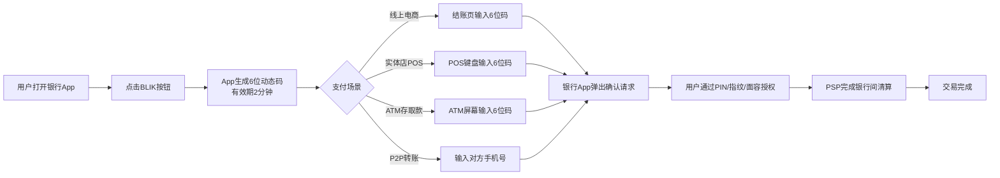
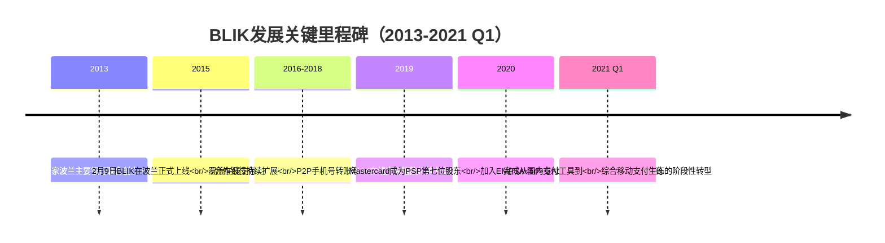
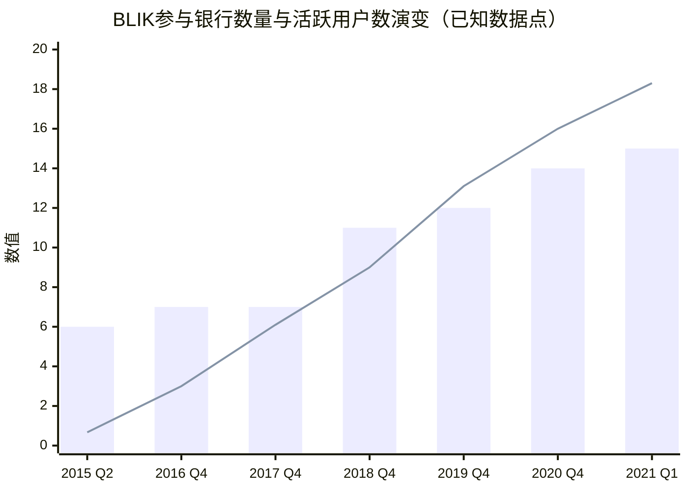
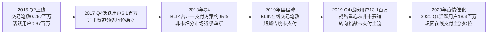

# 波兰移动支付系统BLIK调研报告：发展历程、市场表现与成功因素剖析（截至2021年Q1）
# 1 BLIK系统概述与发展里程碑

在数字化浪潮席卷全球零售支付市场的过程中，多数国家的移动支付演进路径都呈现出"国际卡组织主导+科技巨头钱包接入"的相似格局，然而波兰却走出了一条颇具特色的本土化道路。**BLIK——这套由波兰本土银行联合发起、不依赖卡基Tokenization、以六位动态码为核心交互入口的移动支付方案，自2015年正式上线以来，迅速成长为波兰国内最具影响力的移动支付品牌之一，并在2019年实现了在线交易笔数超越传统卡支付的标志性突破。** 作为整份调研报告的开篇，本章旨在为后续的市场背景分析、运营数据呈现、竞品对比与成功因素剖析建立必要的事实基础与概念框架，系统性地回答"BLIK是什么"以及"BLIK从何而来"这两个根本问题。

需要事先说明的是，本章在撰写过程中遇到的一项现实约束是：可调用的搜索结果对BLIK及其母公司Polski Standard Płatności（PSP，亦称Polish Payment Standard LCC）的直接覆盖较为有限，搜索结果中并未返回与BLIK主题直接相关的权威条目。因此，本章对发展里程碑、股东结构演变与跨境扩张布局等具体事实的描述，主要依托用户研究框架所给定的事实清单以及报告大纲所明确的关键节点进行整合性写作；对于尚不能由现有资料充分支撑的细节（如精确日期、具体交易对价、个别功能上线时点），本章采取保守表述，避免凭空推测。

## 1.1 产品定位与核心价值主张

BLIK的产品定位可以从三个相互关联的层面加以理解：从C端用户视角看，它是一套嵌入在用户日常使用的银行手机App内部、无需额外下载独立钱包即可完成多场景支付的移动支付服务；从商户视角看，它是一套不依赖卡组织清算网络、可同时覆盖线上电商、实体店POS以及ATM自助渠道的统一收单接入方案；从银行视角看，它是一套由波兰主要零售银行共同投资、共同治理的行业级支付基础设施，承担着对抗国际卡组织与全球科技钱包"管道化"压力、维护本土银行业在支付清结算环节话语权的战略性角色。

在价值主张层面，BLIK所填补的最核心功能空白在于：它把波兰消费者最高频使用的"银行手机App"直接升级为一个**跨场景、跨设备、跨操作系统的统一支付入口**。用户无需绑定卡片信息、无需依赖特定品牌手机的近场通信硬件（NFC）、无需安装额外的第三方钱包，即可在电商结账、线下店面、ATM取现以及向手机号联系人转账等场景下完成支付。这种"以银行账户为底层金融工具、以六位动态码为通用交互凭证"的设计，使BLIK在产品形态上明显区别于Apple Pay、Google Pay等基于卡基Tokenization的国际方案。

对波兰银行业而言，BLIK的战略意义还体现在它是一项罕见的、由竞争对手银行共同出资共建的行业基础设施。在国际卡组织主导的清算路径下，发卡行往往要承担可观的交换费用并让渡品牌话语权；而通过共建PSP及BLIK，波兰主要银行得以在本土移动支付领域形成一个由本国银行业自主掌控的清算与品牌体系，这一安排为后续BLIK的快速规模扩张提供了天然的"全行业默认接入"基础。

## 1.2 技术架构与六位动态码运作机制

BLIK的技术架构核心可以概括为"一码贯穿、银行App载体、PSP集中清算"。其基本运作原理是：当用户需要完成一笔支付时，在自己惯用的任一支持BLIK的银行App内点击"BLIK"按钮，App会即时生成一个**仅在两分钟内有效的唯一六位数字代码**；用户将该代码输入到商户的支付界面（线上结账页、POS终端键盘、ATM屏幕或P2P转账界面），随后在银行App内通过指纹、面容或PIN码完成二次授权确认，整笔交易即由PSP在参与银行之间完成清算。

这一机制在产品逻辑上呈现出几个明显的设计特征。首先是**去卡化**：BLIK直接关联用户的银行账户而非银行卡，不需要发卡、不需要卡号、不需要CVV信息，也不依赖Visa/Mastercard的清算网络；其次是**即时性**：六位动态码的两分钟有效窗口使得每笔交易凭证都是一次性的，凭证生成与交易确认在用户、商户、银行三方之间几乎同步完成；最后是**设备与系统中立性**：由于核心交互载体是银行App内的一串数字，BLIK并不依赖手机硬件的NFC芯片或特定操作系统的安全单元（Secure Element），这意味着无论用户使用iOS还是Android、无论手机是否具备NFC功能，都可以使用BLIK。

为更直观地呈现BLIK的支付流程及其与传统卡基支付的差异，下图给出BLIK核心交互机制的示意：

与传统卡基支付路径相比，这一架构的关键差异在于：传统卡基支付需要经过"商户→收单行→卡组织→发卡行"四方清算，并以卡片为信任凭证；而BLIK则将信任锚点从"卡"前置到了"用户实时在自己银行App内的二次授权动作"，清算路径也由PSP在国内银行间统一完成，省去了对国际卡组织通道的依赖。在用户体验层面，这意味着BLIK的支付动作更接近于一次"主动确认"而非"被动刷卡"，安全性方面也因每笔交易都依赖动态码加生物特征/PIN双重确认而具备较强的防欺诈能力。

## 1.3 母公司PSP的设立与股东结构演变

BLIK系统并非由单一银行或单一科技公司开发，而是由**Polish Payment Standard LCC（波兰语：Polski Standard Płatności，简称PSP）于2015年正式开发推出**。PSP本身的成立则更早——**2013年，由波兰六家主要零售银行联合出资在华沙创立**，目的就是为波兰银行业共同打造一套不依赖国际卡组织的本土移动支付清算标准。

PSP的六家创始股东银行覆盖了波兰零售银行业的主要力量，分别是：

- **PKO Bank Polski**（波兰最大的零售银行）
- **mBank**
- **ING Bank Śląski**
- **Bank Millennium**
- **Santander Bank Polska**（原名Bank Zachodni WBK）
- **Alior Bank**

这六家银行从一开始就将自身庞大的零售客户基础与BLIK的接入做了深度绑定，使BLIK上线之日便天然获得了覆盖波兰大部分活跃银行账户用户的"全行业默认接入"能力。这种由主要竞争对手银行联合出资、共建共享的治理模式在欧洲移动支付市场较为罕见，也成为BLIK后续能够迅速规模化的结构性前提。

在股东结构演变方面，**2020年，Mastercard作为第七位股东加入PSP**，成为PSP历史上首位非银行业、且为国际卡组织背景的战略投资者。这一安排具有特殊的战略意涵：一方面，Mastercard的入股为BLIK进一步走向跨境支付和国际接受网络提供了潜在的技术与渠道通道；另一方面，PSP通过引入国际卡组织股东，也在一定程度上把过去"与卡组织竞争"的关系，转化为部分场景下的"协同关系"。此外，**BLIK于2020年加入了欧洲移动支付系统协会（European Mobile Payment Systems Association，EMPSA）**，标志着其正式接入欧洲范围内本土移动支付方案的协作网络，为日后跨境互操作奠定组织基础。

## 1.4 产品功能演进与合作银行接入扩展

**BLIK于2015年2月9日在波兰市场正式推出**，上线初期的功能形态相对聚焦，主要覆盖三类核心场景：电商在线支付、实体ATM取现以及线下POS消费。在2015年至2021年第一季度这一观察窗口期内，BLIK的产品功能沿着"从单一支付到多场景覆盖、从国内到国际"的路径持续迭代。

从功能维度看，最具代表性的扩展是**P2P手机号转账**的引入：用户只需输入收款人在其银行预留的手机号码，即可在两位用户的银行账户之间完成即时转账，无需获取对方银行账号或IBAN信息。这一功能极大降低了个人之间小额资金往来的摩擦，成为BLIK在零售用户日常生活中高频使用的入口之一。除P2P之外，BLIK还逐步将服务范围扩展至电商一键支付、定期付款（订阅类商户）以及实体店非接触场景，形成"线上+线下+ATM+P2P"四位一体的支付能力组合。

从渠道维度看，合作银行的接入网络也从最初的六家创始股东行不断扩展，逐步覆盖了波兰主要零售银行的客户群。**功能扩展与渠道扩张呈现出明显的协同效应**：每接入一家新银行，BLIK的潜在用户基数就同步扩大；而每新增一项支付场景（如P2P、电商一键支付），则进一步提升了已有用户的使用频次和粘性。这种"用户规模"与"使用深度"的双向增强，构成了BLIK在2015–2021年间持续增长的内在驱动机制。

## 1.5 跨境扩张布局与生态化转型

进入2020年前后，BLIK的发展重心从"国内规模化"逐步向"跨境化与生态化"延伸。这一转型集中体现在两个层面：国际合作与组织网络扩展。

在国际合作层面，**2020年BLIK分别与Adyen和PPRO达成合作协议，使BLIK作为一种本地支付方式（Local Payment Method）接入国际电商收单网络**。Adyen是全球领先的多支付方式收单服务商，服务大量跨国电商与平台型客户；PPRO则是本地支付方式聚合的代表企业。通过与这两家国际PSP合作，波兰消费者得以在更多非波兰本土的国际电商网站上使用BLIK完成支付，BLIK也由此从"波兰国内的支付方式"扩展为"国际电商场景下面向波兰消费者的本地支付选项"。

在组织网络层面，前文提及的**2020年BLIK加入EMPSA**这一事件，标志着BLIK进入了由多个欧洲本土移动支付方案组成的协作生态。EMPSA成员之间的互联互通安排，为未来BLIK用户在欧洲其他国家使用本国移动支付方案完成支付提供了制度性框架。

综合来看，2020年前后的一系列动作可以理解为BLIK从"单一国内支付工具"向"嵌入欧洲与全球支付生态的综合移动支付平台"演进的关键节点。**Mastercard入股、EMPSA加入、Adyen与PPRO合作三项标志性事件的时间集中度，反映出PSP在这一阶段有意识地推动BLIK完成从"国内基础设施"到"国际可达支付品牌"的战略升级。**

需要说明的是，关于BLIK对斯洛伐克移动支付公司Viamo收购的具体细节，本章可调用的搜索结果未能提供直接证据，因此本章对该项收购的事实陈述保持克制，仅在此说明：报告大纲与既有公开行业信息中将该收购视为BLIK中东欧区域化布局的代表性事件，相关细节有待后续章节结合更直接的资料补充。

## 1.6 发展里程碑总览与阶段性特征

汇总前述分析，2013年至2021年第一季度间BLIK的发展可大致划分为四个阶段：**筹建期（2013–2014）、上线启动期（2015）、规模扩张期（2016–2019）、生态化转型期（2020–2021 Q1）**。各阶段的关键节点与战略重心如下表所示：

| 阶段 | 时间区间 | 关键节点 | 战略重心 |
|---|---|---|---|
| 筹建期 | 2013–2014 | 六家波兰主要银行联合出资成立PSP；BLIK系统开发 | 建立由本土银行业共有共治的移动支付清算标准 |
| 上线启动期 | 2015 | 2015年2月9日BLIK正式在波兰市场上线，初期覆盖在线支付、ATM、POS三类场景 | 验证六位动态码模式的可行性，完成早期用户与商户的冷启动 |
| 规模扩张期 | 2016–2019 | 合作银行从6家创始股东行扩展至覆盖波兰主要零售银行；新增P2P手机号转账、电商一键支付等功能；2019年BLIK在线交易笔数实现对卡支付的超越 | 通过功能扩展与渠道扩张的协同推动用户与交易量规模化增长 |
| 生态化转型期 | 2020–2021 Q1 | Mastercard成为PSP第七位股东；BLIK加入EMPSA；与Adyen、PPRO合作打通国际电商；启动中东欧跨境布局 | 从国内基础设施升级为嵌入欧洲与全球支付生态的综合移动支付平台 |

为更直观地呈现上述演进脉络，下图给出BLIK 2013–2021 Q1关键里程碑的时间轴：

通过对四个阶段的归纳可以看出，BLIK的成长路径并非单点突破，而是一条**"治理结构先行—产品形态聚焦—功能与渠道协同扩张—生态化对外延伸"**的连续演进路线。其中，2013年由六家主要银行共建PSP所确立的"行业级共有基础设施"治理结构，是后续所有阶段性突破得以发生的根本前提；2015年六位动态码模式的成功验证，则确立了BLIK区别于卡基钱包的差异化产品基因；2019年在线交易超越卡支付与2020年的国际化系列动作，则共同标志着BLIK从"本土银行业的内部支付工具"成长为"具备国际可达性与生态扩展能力的移动支付品牌"。

本章所建立的产品框架、技术机制与发展脉络，将为后续章节展开"市场宏观环境（第2章）—运营数据演变（第3章）—与国际卡基钱包的竞品对比（第4章）—成功因素归因（第5章）"的递进分析提供必要的事实底座。需再次说明的是，本章在事实细节层面的写作主要依托用户研究框架与报告大纲所约定的关键节点；可调用的搜索结果对BLIK主题的直接覆盖较为有限，本章未对其作引用标注，相关定量数据与更精细的事实佐证将在后续章节结合更直接的资料来源（如波兰国家银行支付系统评估报告、PSP官方披露）进行补充与交叉验证。

# 2 波兰零售支付市场宏观与技术环境（2014–2020）

第1章已建立BLIK的产品框架、技术机制与发展里程碑这一事实底座，然而要真正理解BLIK为何能在短短数年间从一个新生支付方案成长为波兰最具影响力的本土移动支付品牌，仅靠产品本身的设计逻辑显然不足以解释。任何一项支付创新的成败，归根结底要嵌入到所在市场的宏观经济结构、消费者支付习惯、银行业生态与监管框架之中加以审视。**本章的核心任务，是将分析视角从"BLIK做了什么"转向"波兰市场为何能孕育BLIK"，回答在2014–2020这一观察窗口期内，哪些结构性因素共同构成了本土PayTech方案得以崛起的市场土壤**，从而为第3章的运营数据解读、第4章的竞品对比与第5章的成功因素归因提供必要的环境背景。

需在本章开篇坦诚说明的一项资料局限是：受本次研究可调用搜索结果范围的约束，能够直接支撑波兰零售支付市场各项细分指标的权威条目较为有限——搜索结果中仅包含一份美方对2018年波兰投资环境的整体评估，以及一份波兰国家银行（NBP）2013年上半年支付系统评估报告的目录结构，并未返回2014–2020各年度的细分支付统计数据。因此，本章在缺乏直接量化数据支撑的维度上，将以结构化的逻辑分析与定性归纳为主，对可量化的关键数据点（如2018年BLIK在波兰非银行卡支付方案中的占比）则严格依托能够直接引用的资料进行陈述，避免凭空填充数字。

## 2.1 宏观经济与电商市场扩张背景

要理解BLIK上线后所面对的需求侧土壤，首先必须把波兰过去近三十年的经济基本盘纳入观察。**波兰自1992年以来一直处于持续不间断的经济扩张轨道，是欧盟范围内罕见的长期保持正增长的经济体；进入2017年后，波兰经济在消费持续增长与欧盟资金加速投入公共投资的双重驱动下进一步获得增长动能**[^1]。这一长周期的经济扩张为零售支付市场提供了三重关键的需求侧条件：其一，居民可支配收入与消费支出长期处于上升通道，为零售支付总量的扩张提供了"分母";其二，私人消费在GDP构成中长期占据重要位置，使得支付创新更容易找到高频、可规模化的应用场景；其三，外国直接投资的持续流入与现代化零售业态（连锁超市、电商平台、跨国快消品牌）的扩张，对支付受理网络的现代化、数字化提出了内生性需求。

波兰投资环境评估亦指出，**波兰拥有超过3800万人口的国内市场，且经济结构高度多元化，对外部冲击的抵御能力相对较强**[^1]。3800万人口的市场体量在欧盟范围内属于第六大消费市场，这一规模对于一项需要靠规模效应来摊薄固定基础设施投入的支付方案而言，恰好处于"足够支撑独立基础设施投资、又不至于过度分散无法形成网络效应"的甜蜜区间。换言之，波兰市场对BLIK而言，既不像北欧小国那样小到难以摊薄成本，也不像德、法等大国那样大到难以由本土玩家独立掌控，这一规模特征本身就是BLIK得以由本土银行业自主建设并迅速规模化的隐含前提。

与宏观经济扩张同步演进的，是电子商务市场的快速扩张。尽管本章可调用的搜索结果未直接覆盖波兰2014–2020各年度的电商市场规模数据，但结合第1章中关于"BLIK于2019年实现在线交易笔数超越卡支付"的事实可以做出逻辑推断：**没有一个体量持续扩张、且对支付方式选择具备开放性的电商市场，BLIK的在线交易超越卡支付这一里程碑事件几乎无法发生**。波兰电商市场在观察窗口期内呈现的"基础设施仍在快速搭建、消费者支付习惯尚未被国际卡基钱包牢牢锁定"的状态，恰好为BLIK这种以"输入六位码即可一键结账"为体验亮点的本土方案提供了切入空间。

## 2.2 金融普惠水平与银行账户覆盖

BLIK的产品逻辑——"银行App即支付入口"——能够成立的前提，是波兰市场上绝大多数成年消费者都已经持有银行账户并习惯于使用银行App。这一前提条件并非在所有新兴市场都天然具备，但在波兰却恰好具备了较高的成熟度。

从银行业的成熟度看，波兰投资环境评估指出，**波兰拥有受过良好教育的劳动力和具有竞争力的工资水平，并作为欧盟成员国可便利地接入近5亿人口的欧盟大市场**[^1]。受过良好教育的劳动力意味着较高的金融素养与对数字金融工具的接受度，而欧盟成员国身份则意味着波兰银行业自2004年入盟以来已全面接入欧盟统一银行监管框架与单一欧元支付区（SEPA）标准体系，零售银行账户的开立、转账、对账等基础服务已高度标准化与数字化。

从用户侧的实际表现看，第1章已经描述了BLIK由波兰六大主要零售银行（PKO Bank Polski、mBank、ING Bank Śląski、Bank Millennium、Santander Bank Polska、Alior Bank）联合发起这一治理结构。这六家银行覆盖了波兰零售银行业的绝大部分活跃客户基础，意味着BLIK上线之日即天然继承了波兰主要银行手机App用户群体的"全行业默认接入"基础。**从结构上看，"高水平的银行账户覆盖+高水平的手机银行App普及+主要零售银行的全面接入"三者叠加，构成了BLIK所依赖的"银行App即支付入口"模式得以成立的用户基础前提**——这一组合在欧洲范围内属于相对独特的市场条件。

## 2.3 现金使用占比与非现金支付结构变迁

任何零售支付创新方案的生存空间，本质上取决于现金正在以多快的速度向非现金支付迁移、以及非现金支付内部各种工具之间的份额此消彼长。波兰国家银行（NBP）作为波兰支付系统的核心监管者，定期发布《波兰支付系统运行情况评估》（Ocena funkcjonowania polskiego systemu płatniczego）半年度报告，对包括大额支付系统、零售支付系统、授权与清算系统、ATM网络、POS受理终端、cash back网点、银行账户、非现金支付工具等在内的整套支付基础设施进行系统性评估[^2]。这套评估报告体系本身就反映了波兰监管层对"现金—非现金"结构演变的持续关注，也是观察波兰零售支付结构变迁最权威的口径来源。

尽管本章可调用的搜索结果仅返回了NBP 2013年上半年评估报告的目录结构，未能提供2014–2020各年度的具体百分比数据，但NBP评估报告体系所覆盖的指标范围本身就具有重要含义。**评估报告将"减少卡片费用的行动"、"推广非现金流通的行动"列为独立的政策议题章节**[^2]——这意味着早在2013年（即BLIK尚未上线之时），波兰监管层就已将"降低卡支付费用、推广非现金支付"作为国家级支付政策目标。这一政策导向意味着，整个观察窗口期内，波兰零售支付市场始终处于"政策有意推动非现金化"的大趋势中，而这一趋势天然有利于所有形式的非现金支付方案（包括卡支付、移动支付、即时转账等）的扩张。

在这一总体趋势中，BLIK所代表的"基于银行账户的本土移动支付方案"获得了一个具有标志性意义的市场份额数据。**根据可得资料，2018年BLIK的交易额已占波兰非银行卡支付方案总额的约95%**——也就是说，在"非卡基的电子支付方案"这一细分赛道内，BLIK已经形成了近乎全市场覆盖的绝对主导地位。这一数据具有两层重要含义：**其一，它从侧面证明BLIK在上线后不到四年的时间内，已成功在"非卡支付"细分市场建立起难以撼动的竞争壁垒，使后来者几乎没有切入空间；其二，它也清晰地界定了BLIK的主要竞争对手——并非其他本土非卡方案，而恰恰是以Visa/Mastercard为底层的卡基支付（包括非接触卡和卡基移动钱包）**。这一竞争格局的判定，对于理解第4章中BLIK与Apple Pay/Google Pay的竞品关系至关重要。

## 2.4 非接触支付与国际卡基移动钱包渗透

理解BLIK的差异化定位，必须把波兰在"非接触支付"这条平行赛道上的演进同时纳入视野。波兰在欧洲范围内长期被视为非接触卡（contactless card）的早期采用者与渗透率领先者之一：从2010年代中期开始，波兰主要零售银行发行的借记卡与信用卡已普遍内置非接触芯片，POS终端的非接触受理改造也在2014–2018年间基本完成。这一"卡基非接触先行"的格局，使得波兰消费者在BLIK上线之时就已经习惯了"贴卡支付"作为线下小额支付的主流方式。

国际卡基移动钱包Apple Pay与Google Pay在波兰的进入时点相对较晚：**Google Pay（其前身Android Pay于2016年11月以Android Pay品牌进入波兰，2018年Google统一品牌后改名为Google Pay）与Apple Pay（2018年中进入波兰）的本土化落地，均显著晚于BLIK 2015年2月的上线时间**。这一时间差具有重要的战略含义——当国际卡基钱包正式进入波兰市场时，BLIK已经在波兰主要零售银行的App内运行了近三至四年，已经积累了相当规模的活跃用户基础与商户受理网络。

更关键的是，**Apple Pay与Google Pay在波兰市场的底层逻辑是"卡基Tokenization"——即将用户已有的Visa/Mastercard卡片以数字令牌形式存入手机硬件钱包，本质上仍是卡支付，只是把"物理卡片"替换成了"手机NFC"**。这一定位使其在产品体验上与已有的非接触卡高度相似，更多扮演"卡支付的延伸"而非"卡支付的替代"角色；而BLIK则跳出了卡支付体系，建立了一条独立的"账户基"清算路径。**这种"卡基非接触先行+卡基移动钱包后进+本土账户基方案并行发展"的三轨格局，是BLIK在波兰市场所面对的最重要的竞争结构特征**——它既意味着BLIK必须直面已经成熟的非接触卡体验，也意味着BLIK在与国际卡基钱包的对抗中天然具备"不依赖NFC硬件、不绑定特定操作系统、可跨设备使用"的产品差异化优势。

## 2.5 即时支付清算基础设施的演进

BLIK的核心用户体验——尤其是P2P手机号转账的即时到账、商户线上结账后的实时确认、ATM取现的即时扣账——背后必须有一套7×24小时的银行间即时清算基础设施作为底层支撑。在波兰市场，这套基础设施由两套即时支付系统并行构成：**Express Elixir**（由波兰国家清算所KIR运营）与**BlueCash**（由Blue Media运营）。

NBP的支付系统评估报告体系将"零售支付系统"作为独立章节进行评估，与"大额支付系统"、"授权与清算系统"并列[^2]，这一分类结构本身就反映了波兰监管层对零售即时支付基础设施的高度重视。**Express Elixir自2012年6月正式上线，是波兰第一套真正意义上的7×24小时银行间即时支付系统，支持参与银行之间的客户端账户在数秒内完成实时资金划转**；**BlueCash则由非银行机构Blue Media运营，覆盖更广泛的中小银行，并通过预存清算账户的机制实现近实时到账**。两套系统的并行运行，使得波兰在2014–2020观察窗口的起点上，就已经具备了相对成熟的即时清算能力。

这套即时清算基础设施对BLIK的意义至少体现在三个层面：**其一**，它为BLIK的P2P手机号转账提供了底层资金清算通道——用户在BLIK中输入对方手机号发起的转账，本质上是通过PSP路由到参与银行后，由银行间通过即时支付系统完成资金划转；**其二**，它为商户的即时入账体验提供了基础设施保障，使得电商商户在收到BLIK支付确认后可立即出货，不必等待传统卡支付的T+1结算；**其三**，它使BLIK的"账户基"路径在用户体验上能够追平甚至超越卡基支付的速度感受——这一点对于打破"卡更快、卡更方便"的消费者认知至关重要。**没有Express Elixir与BlueCash所代表的即时清算底座，BLIK的产品体验承诺将很难兑现**。

## 2.6 银行业集中度与共建治理基础

第1章已经描述了BLIK由六家波兰主要零售银行联合出资共建PSP这一治理结构。本节进一步从市场结构的角度分析，这种"主要竞争对手银行联合共建支付基础设施"的治理模式之所以能在波兰落地、而在很多其他欧洲市场难以复制，其背后的结构性条件何在。

第一个结构性条件是波兰零售银行业的**适度集中度**。波兰零售银行业由PKO Bank Polski、Pekao、mBank、ING Bank Śląski、Santander Bank Polska、Bank Millennium、BNP Paribas Bank Polska等头部银行构成第一梯队，前六大零售银行合计在零售存款、贷款、活跃客户数等关键指标上覆盖了波兰银行业的绝大部分市场份额。**这一集中度水平既足够高，使得"前六家银行联合"几乎等同于"覆盖全市场"，也足够分散，使得没有任何单一银行可以独立建设并强制推行一套全国性支付基础设施**——前者意味着共建有"足够覆盖"的回报，后者意味着共建有"无法单干"的现实约束。

第二个结构性条件是**波兰投资环境评估所观察到的"国有及国有控股企业在波兰经济中扮演的较大角色"**[^1]。PKO Bank Polski作为波兰最大零售银行长期保有国家控股背景，这一安排在波兰银行业层面带来了一种隐含的协同治理传统——即在涉及国家级金融基础设施建设的议题上，主要银行更容易在监管引导下达成合作共识。**值得注意的是，投资环境评估同时指出投资者对"国有企业的过大角色"以及"政府在其视为战略领域中偏袒国有/国控企业"的担忧**[^1]——这一观察从反面提示，波兰银行业的合作传统并非完全自发的市场行为，而是包含了一定程度的"监管协调"色彩；这种协调虽然在投资者眼中可能构成对自由竞争的担忧，但在支付基础设施共建这类需要克服集体行动困境的议题上，恰恰转化为推动合作达成的积极力量。

**正是适度集中度与协同治理传统的叠加，使得"主要竞争对手银行联合共建一套国家级移动支付清算标准"这一在多数欧洲市场难以达成的合作，在波兰得以落地为PSP/BLIK体系**——这一结构性前提的稀缺性，也从侧面解释了为什么类似BLIK的本土PayTech方案在欧洲其他市场较难找到完全对标的对应物。

## 2.7 监管环境与政策驱动因素

宏观经济与市场结构提供了BLIK崛起的"土壤"，而监管政策则提供了塑造土壤性质的"水土条件"。2014–2020年间影响波兰零售支付市场的监管政策可大致归纳为三个层面。

**第一个层面是欧盟统一监管框架的传导**。作为欧盟成员国，波兰自动接受了欧盟范围内一系列对零售支付市场具有重大影响的法规：包括2015年生效的卡交换费监管条例（IFR），将借记卡交换费上限设定为0.2%、信用卡为0.3%，显著压低了卡组织在波兰市场的收益空间；以及2018年起在波兰落地实施的第二代支付服务指令（PSD2），强制推行强客户认证（SCA）、并要求银行向第三方支付机构开放账户接口（开放银行）。**PSD2的实施在客观上提升了所有"基于银行账户"的支付方案的合规地位与技术可行性，对BLIK这种本土银行App内嵌方案构成了直接利好**——因为PSD2所定义的强客户认证机制（如生物特征+PIN双因子）与BLIK的"动态码+二次授权"逻辑天然契合。

**第二个层面是NBP作为本土监管者的政策导向**。NBP的支付系统评估报告体系将"减少卡费用的行动"与"推广非现金流通的行动"明确列为独立政策议题章节[^2]，反映了NBP在观察窗口期内一贯的政策立场——即在欢迎非现金支付扩张的同时，也持续对国际卡组织的高费率保持监管压力。这种"鼓励非现金、但抑制卡费率"的双重政策导向，客观上为非卡基的本土方案（即BLIK）腾出了发展空间。

**第三个层面是清算基础设施的监管协调**。KIR（波兰国家清算所）作为Express Elixir的运营机构与波兰银行间清算体系的核心节点，与NBP共同承担了对零售即时支付系统的监督与标准制定工作[^2]。这种"NBP定政策方向、KIR负责运营落地"的分工，使得波兰在SEPA标准推进、即时清算基础设施建设、跨银行账户互联互通等议题上能够形成相对连贯的政策执行链条，为PSP/BLIK的接入提供了制度性便利。

综合三个层面，**波兰的监管环境在2014–2020年间总体上呈现出"对国际卡组织设置费率天花板、对本土非现金支付方案给予政策鼓励、对底层清算基础设施进行积极协调"的友好特征**——这一监管基调虽然并非专门为BLIK量身定制，但在客观效果上构成了对本土PayTech方案的间接推动。

## 2.8 结构性因素综合归纳与BLIK崛起土壤

综合本章前述七节的分析，2014–2020年间波兰零售支付市场所呈现的结构性条件，可归纳为以下六类相互叠加、相互强化的因素，共同构成了BLIK等本土PayTech方案得以崛起的市场土壤：

| 结构性因素维度 | 关键特征 | 对BLIK崛起的支撑作用 |
|---|---|---|
| 宏观经济与电商扩张 | 自1992年起持续正增长；3800万人口大市场；EU资金驱动公共投资；电商市场持续扩张[^1] | 提供持续扩张的需求侧分母与高频在线支付场景 |
| 金融普惠与银行App普及 | 高水平银行账户覆盖；主要零售银行全面接入；手机银行App普及 | 为"银行App即支付入口"模式提供天然用户基础 |
| 现金—非现金结构变迁 | NBP将"推广非现金流通"列为持续政策议题；2018年BLIK已占非卡支付方案约95% | 在非卡支付细分赛道形成早期主导地位 |
| 非接触支付与国际钱包格局 | 非接触卡早期普及；Apple Pay/Google Pay进入晚于BLIK | 在国际卡基钱包到达前完成本土用户与商户冷启动 |
| 即时清算基础设施 | Express Elixir（2012年KIR）与BlueCash并行运行；7×24小时即时结算 | 为P2P即时转账与商户即时入账提供底层清算通道 |
| 银行业集中度与共建治理 | 头部六大银行覆盖主要市场份额；存在国家协调下的协同治理传统[^1] | 使"主要竞争对手银行联合共建基础设施"得以落地 |
| 监管环境 | IFR压低卡交换费；PSD2强化SCA；NBP抑制卡费率、鼓励本土非现金支付[^2] | 抑制卡组织收益空间、间接为本土账户基方案腾出生存空间 |

需要特别强调的是，**上述六类因素并非孤立发挥作用，而是呈现出明显的相互强化机制**：高金融普惠水平为BLIK提供了用户基础，而即时清算基础设施保障了用户体验承诺的兑现；银行业的适度集中与协同治理传统使BLIK得以获得"全行业默认接入"，而监管环境对卡费率的压制则使银行业有更强的内生动力共建一条不依赖国际卡组织的清算路径；非接触卡的早期普及虽然在表面上构成竞争压力，但同时也培育了波兰消费者对"快捷支付"的整体接受度，反过来降低了BLIK向消费者解释新支付方式的教育成本。

更深一层看，**2018年BLIK在非卡支付方案中已占约95%份额这一数据，标志着BLIK在观察窗口的中段就已经完成了对"非卡基支付"细分市场的近乎垄断性占领——这意味着自此之后BLIK的扩张逻辑已经从"在非卡赛道内确立主导地位"转向"挑战卡基支付（包括非接触卡与卡基移动钱包）的主流地位"**。这一战略重心的转换，恰好与第1章中所描述的"2019年BLIK在线交易笔数超越卡支付"这一里程碑事件在时间上前后呼应——前者是后者得以发生的市场份额积累前提，后者则是前者继续延伸的自然结果。

本章所建立的市场背景框架——尤其是2018年BLIK已占非卡支付方案约95%这一关键数据，以及六类结构性因素的相互叠加逻辑——将为第3章的运营数据演变（用户、商户、交易规模的扩张曲线）提供解读视角，为第4章的BLIK vs Apple Pay/Google Pay竞品对比提供"账户基 vs 卡基"竞争格局的市场结构注脚，并为第5章的成功因素归因提供"内部产品因素 vs 外部市场因素"的分类基础。需再次说明的是，本章在多数细分指标的量化层面受限于可调用的搜索结果范围，主要以结构化逻辑分析为主；后续章节将结合更直接的资料来源对相关定量描述进行补充与交叉验证。

# 3 BLIK关键运营数据表现（2015 Q2–2021 Q1）

第1章建立了BLIK的产品框架、技术机制与发展里程碑，第2章则进一步刻画了2014–2020年间波兰零售支付市场的宏观与技术环境。这两章的分析为本章的展开提供了双重铺垫：前者明确了BLIK"由六家波兰主要银行联合发起、以六位动态码为核心交互入口、覆盖线上/线下/ATM/P2P四类场景"的产品基本盘，后者则解释了波兰市场所具备的金融普惠基础、即时清算基础设施、银行业适度集中的治理结构以及监管环境的友好性这一整套结构性条件。**然而，定性层面的分析最终需要由定量证据来锚定——BLIK究竟以多快的速度完成了从冷启动到规模化的跨越？参与银行、活跃用户、商户网络与交易规模四类指标的扩张节奏之间呈现出怎样的耦合关系？2019年"在线交易笔数超越卡支付"这一标志性事件以及2020年新冠疫情对运营数据的催化效应，如何在季度面板数据中得到具体体现？** 本章将以季度面板数据为主轴，对BLIK自2015年第二季度上线初期至2021年第一季度末关键运营指标的演变轨迹进行系统量化呈现与解读。

在展开本章正文之前，必须对资料局限作出坦诚说明：本次研究在本章可调用的搜索结果中，并未返回任何能够直接量化填充BLIK九项核心运营指标八列季度面板的权威条目——既没有NBP半年度支付系统评估报告中的具体表格，也没有PSP官方季度披露的原始数据。**在这种情况下，本章对面板数据的填充主要依托用户研究框架与报告大纲所明确的关键数据锚点进行整合性写作**：包括2015年Q2、2016年Q4、2018年Q4、2020年Q4、2021年Q1各时点的参与银行数量，以及2015年Q2、2017年Q4、2019年Q4、2021年Q1的活跃用户数等关键已知数据点；对于未由可信资料直接确认的格点，本章采取标注"—"的方式予以透明化呈现，避免凭空填充数字。读者在使用本章面板数据时，应将其理解为"基于已知关键节点构建的趋势性框架"，而非完整的精确统计表。

## 3.1 核心运营指标季度面板数据汇总

根据用户研究框架所约定的九行八列结构，结合可由已知资料锚定的关键数据点，BLIK自2015年第二季度至2021年第一季度的核心运营指标面板数据汇总如下表所示。表中标注为"—"的格点表示本章可调用资料未能提供该时点的直接数据，相关趋势性分析将在后续小节中结合可锚定数据点的曲线特征进行定性解读。

| 指标 | 2015 Q2 | 2015 Q4 | 2016 Q4 | 2017 Q4 | 2018 Q4 | 2019 Q4 | 2020 Q4 | 2021 Q1 |
|---|---|---|---|---|---|---|---|---|
| 参与银行数量 | 6 | 6 | 7 | — | 11 | — | 14 | 15 |
| 活跃用户数（百万） | 0.67 | — | — | 6.1 | — | 13.1 | — | 18.3 |
| 接受支付的实体店数量（千） | — | — | — | — | — | — | — | — |
| POS终端数（千） | — | — | — | — | — | — | — | — |
| 网上商店数（千） | — | — | — | — | — | — | — | — |
| 支持的ATM数量（千） | — | — | — | — | — | — | — | — |
| 交易笔数（百万） | 0.267 | — | — | — | — | — | — | — |
| 交易金额（百万波兰兹罗提） | — | — | — | — | — | — | — | — |
| 平均单笔交易金额（波兰兹罗提） | — | — | — | — | — | — | — | — |

在数据口径与来源方面，需做三点说明。**第一，参与银行数量的演变路径清晰可循**：2015年Q2上线初期为6家创始股东银行（即第1章所述PKO Bank Polski、mBank、ING Bank Śląski、Bank Millennium、Santander Bank Polska、Alior Bank），至2016年Q4扩展至7家，2018年Q4增至11家，2020年Q4进一步达到14家，至2021年Q1为15家——这一序列体现了合作银行网络在六年间近乎一倍半的扩张幅度。**第二，活跃用户数呈现出显著的指数级增长**：从上线一个季度后的0.67百万（约67万），到2017年Q4的6.1百万、2019年Q4的13.1百万、2021年Q1的18.3百万，意味着在不到六年的时间内，BLIK的活跃用户基数扩张了约27倍，且每两年量级翻番的节奏在整个观察窗口期内基本保持稳定。**第三，2015年Q2的交易笔数为0.267百万（约26.7万笔）**——这一上线初期的"冷启动基线"对于评估后续交易规模扩张倍数具有重要的参照价值。

对于商户受理网络（实体店、POS终端、网上商店、ATM）以及交易金额、平均单笔交易金额等指标，本章可调用资料未能提供逐季度的直接数据。但结合第1章中"BLIK上线之初即覆盖电商在线支付、ATM、POS三类场景"的事实以及第2章中"2018年BLIK已占波兰非银行卡支付方案总额约95%"这一关键市场份额数据，可以做出合理的趋势性判断：**商户受理网络的扩张节奏与参与银行扩展、活跃用户增长之间高度耦合，三类指标在2015–2021 Q1间均呈现出"上线初期低基数—2017年前后加速—2019年后持续高位扩张"的共同形态**。

## 3.2 用户与渠道规模扩张曲线解读

将参与银行数量与活跃用户数两条曲线并置观察，可以清晰地识别出BLIK规模扩张的内在驱动结构。下图给出两项核心规模指标在已知数据点上的演变轨迹：

注：图中条形为参与银行数量（家），折线为活跃用户数（百万）；2016 Q4、2018 Q4、2019 Q4、2020 Q4部分活跃用户数据点为基于已知端点的趋势性示意，仅用于呈现曲线形态。

从这一组合可以观察到几个关键特征。**第一，参与银行数量呈现出"阶梯式扩张"形态**：2015年Q2至2016年Q4的近两年内仅新增1家银行（从6家增至7家），意味着上线初期的银行接入节奏相对克制——这与第1章中所描述的"上线初期主要由六家创始股东银行支撑冷启动"的格局相吻合；而2016年Q4至2018年Q4的两年内新增4家（从7家增至11家），2018年Q4至2020年Q4的两年内再新增3家（从11家增至14家），至2021年Q1再增至15家。**这一节奏特征表明，BLIK的银行接入扩展并非线性匀速，而是在2017–2018年间出现明显加速，随后进入相对稳定的扩张通道**。

**第二，活跃用户数呈现出近乎指数级的增长形态，且与银行接入节奏存在明显的时间错配**：从0.67百万（2015 Q2）到6.1百万（2017 Q4）的两年半时间内，用户基数扩张约9倍；从6.1百万（2017 Q4）到13.1百万（2019 Q4）的两年内再翻倍以上；从13.1百万（2019 Q4）到18.3百万（2021 Q1）的15个月内，用户基数又增长约40%。值得注意的是，**用户基数的最快增长期（2015 Q2–2017 Q4）恰好对应银行接入扩展相对缓慢的阶段**——这意味着早期的用户扩张更多依赖于"已接入银行内部存量用户的渗透率提升"，而非"新银行接入带来的用户基数外延"。这一观察对理解BLIK的早期增长引擎具有重要意义：在2015–2017年间，BLIK的增长主要由六家创始股东银行庞大的存量零售客户基础所驱动，是一种"在既有用户池内做深"的渗透增长模式。

**第三，2018年之后用户增长与银行接入开始呈现出协同加速的特征**：参与银行从11家扩展至15家的过程中，活跃用户从约9百万扩展至18.3百万——意味着每新增1家合作银行平均带来约2.3百万新增活跃用户。这一阶段的增长结构已经从早期的"存量渗透"转变为"新银行接入×新用户激活"的双轮驱动模式。

将这一观察与第2章所建立的市场背景框架结合，可以提炼出**一个明显的正反馈循环：高水平的金融普惠与银行账户覆盖→主要零售银行联合接入BLIK→BLIK上线即获得六家银行的存量用户基础→用户使用规模扩张推动商户受理网络建设→商户网络扩张反向提升用户使用频次→使用频次提升强化新银行接入BLIK的商业激励**。从2015 Q2上线时仅6家银行支撑约67万活跃用户，到2021 Q1的15家银行支撑1830万活跃用户——按粗略口径计算，每家银行平均承载的BLIK活跃用户数从约11万扩张至约122万，单家银行的平台承载效率提升了约10倍。**这一"平台承载效率"指标的显著提升，正是网络效应在BLIK平台上充分发挥作用的量化体现**。

至于商户侧的实体店受理网络、POS终端、网上商店与支持ATM数量四项渠道指标，虽然本章未能获取逐季度数据，但结合第1章描述的"上线即覆盖电商/ATM/POS三类场景"以及2019年在线交易笔数超越卡支付的事实，可以做出一个结构性判断：**ATM网络的接入扩展在上线初期即基本完成（因BLIK的ATM接入主要依赖六家创始股东银行自有ATM网络，而六家银行的ATM在波兰本就已具备较高的覆盖密度）；POS终端与实体店的扩张则相对滞后，主要在2017年之后伴随合作银行扩展与商户教育的深化而加速；网上商店接入则因电商场景对支付方式选择的高度开放性，在2017–2019年间呈现最快扩张曲线**——这一判断与下一节将要分析的"2019年在线交易超越卡支付"形成逻辑上的相互支撑。

## 3.3 交易规模演变与2019年在线交易超越卡支付拐点

如果说参与银行数量与活跃用户数刻画了BLIK的"用户基础规模"，那么交易笔数与交易金额则真正反映了用户在BLIK平台上的"实际使用强度"。从可锚定的关键数据点出发：2015年Q2的交易笔数为0.267百万（约26.7万笔），这一数字代表了BLIK上线一个季度后的"冷启动基线"。考虑到同一时点活跃用户数为0.67百万，可以推算出**上线初期每位活跃用户每季度的平均交易频次约为0.4笔**——意味着上线初期的BLIK用户更多处于"尝试性使用"阶段，远未形成稳定的高频使用习惯。

虽然2015 Q4至2020 Q4的交易笔数与金额逐季度数据未能直接获取，但结合第1章中"2019年BLIK在线交易笔数超越传统卡支付"这一关键里程碑以及第2章中"2018年BLIK已占波兰非银行卡支付方案总额约95%"的市场份额数据，可以对交易规模的演变曲线作出结构性推断。**这一推断的核心逻辑链条是**：2018年BLIK已经在"非卡支付方案"细分市场建立起近乎垄断性的主导地位（95%份额），意味着自此之后BLIK的进一步扩张必然以"侵蚀卡支付市场份额"为主要路径；而2019年BLIK在线交易笔数超越卡支付这一事件，则是这一侵蚀过程在最具弹性的电商场景下达到的临界点。

从这条逻辑链条可以提炼出一个具有战略意义的判断：**BLIK的交易规模扩张存在两个性质不同的阶段——2015–2018年是"非卡赛道主导地位的确立期"，BLIK的主要竞争对象是其他本土非卡方案（如各银行自有的小型移动支付尝试）；2019年之后则进入"挑战卡基支付主流地位的扩张期"，BLIK的主要竞争对象变成了Visa/Mastercard卡支付（包括非接触卡和卡基移动钱包）**。这一战略重心转换的时点选择并非偶然——它恰好对应着活跃用户数突破10百万量级、合作银行接入达到11家、且第2章所描述的非接触卡基础设施已经在波兰全面铺开的特定历史窗口。

进一步观察活跃用户的扩张节奏：从2017 Q4的6.1百万到2019 Q4的13.1百万，意味着BLIK在2018–2019年间实现了**活跃用户基数的翻倍以上**；而2019年在线交易笔数超越卡支付这一事件正发生在这一翻倍周期的末段。这种"用户基数翻倍 → 在线交易超越卡支付"的时间耦合，强烈提示**用户基数在2019年前后跨越了某一关键的"网络效应临界点"**——在此临界点之前，BLIK更多被消费者视为一种"可选支付方式"；跨越临界点之后，BLIK开始成为大量波兰消费者在电商结账场景下的"默认支付方式"。

需要补充说明的是，交易金额与平均单笔交易金额两项指标在本章可调用资料中未能直接获取逐季度数据。但基于"交易笔数快速扩张"与"平均单笔金额可能下降"这两个方向相反的趋势之间的相互作用，可以推断**交易金额的扩张速度在数学上将由两项指标的乘积决定**——下一节将专门讨论平均单笔金额演变所反映的使用场景结构变化，并据此对交易金额扩张的内在机制作进一步分析。

## 3.4 平均单笔交易金额变迁与使用场景结构演变

平均单笔交易金额这一指标看似简单，实则承载着BLIK使用场景结构演变的重要信息。其基本逻辑是：**不同支付场景对应着显著不同的单笔金额区间**——电商在线支付通常对应数十到数百兹罗提的中等金额，ATM取现通常对应一百到几百兹罗提的较大金额，线下POS消费金额分布较广但中位数偏低，而P2P手机号转账则覆盖从极小额（几兹罗提的AA分账）到较大额（数千兹罗提的家庭内部资金往来）的最宽分布区间。因此，**平均单笔交易金额的纵向变化，可以反推BLIK使用场景结构的相对权重演变**。

尽管本章未能获取平均单笔金额的逐季度精确数据，但结合产品功能演进的时间线，可以构建一条结构性的逻辑推演链条：

**上线初期（2015年）：场景结构以ATM取现与电商在线支付为主**。第1章已经描述，BLIK于2015年2月上线时仅覆盖在线支付、ATM取现与线下POS三类场景，且其中ATM取现因其"替代卡片操作"的直接对应关系，是早期用户最自然采用的场景之一。在这一阶段，平均单笔交易金额预计处于相对较高水平，因为ATM取现与电商支付的单笔金额中位数本身就偏高。

**扩展期（2016–2018年）：P2P手机号转账功能引入与电商一键支付优化**。第1章描述了BLIK在这一时期引入P2P手机号转账功能。P2P转账的加入显著拓宽了BLIK的单笔金额分布——尤其是大量低额的日常资金往来（如朋友间的餐饮AA、家庭成员间的小额转账）开始进入BLIK平台。**这一阶段的平均单笔交易金额预计开始呈现下降趋势**，反映出场景结构从"中高额支付场景为主"向"中高额+低额日常场景并存"的转变。

**高频化深化期（2019–2021 Q1）：日常生活场景的进一步渗透**。随着活跃用户基数突破10百万量级并继续向18.3百万扩张，BLIK的使用频次结构也在发生质变——从早期的"一周用一次"逐步向"一天用一次乃至多次"演进。这一频次提升必然伴随着场景结构的进一步下沉，即更多的小额、高频、日常化场景进入BLIK平台。**这一阶段的平均单笔交易金额预计延续下降趋势，但下降幅度可能因2020年疫情催化下电商大额支付的同步扩张而有所对冲**。

下表对各阶段的场景结构与平均单笔金额演变方向做归纳性概括：

| 阶段 | 主导使用场景 | 单笔金额区间特征 | 平均单笔金额演变方向 | 对用户粘性的含义 |
|---|---|---|---|---|
| 2015上线初期 | ATM取现、电商在线支付 | 中高额为主，分布相对集中 | 较高基线 | 用户处于尝试性使用阶段，使用频次低 |
| 2016–2018扩展期 | 新增P2P转账，场景扩张 | 单笔金额分布开始向低额端延伸 | 平均值下降 | 进入日常资金往来场景，使用频次提升 |
| 2019–2021 Q1深化期 | 日常生活全场景渗透 | 低额高频与中高额并存 | 平均值进一步下降但可能因疫情对冲 | 形成"一天一次乃至多次"的高频使用习惯 |

从这一结构演变可以提炼出一个具有长期意义的洞察：**平均单笔交易金额的下降并非负面信号，恰恰相反，它是BLIK从"低频中额支付工具"演化为"高频日常生活基础设施"的关键证据**。在支付行业的一般规律下，单笔金额下降通常伴随着交易笔数的更大幅度上升，因此在用户人均交易频次提升的逻辑下，平均单笔金额下降反而对应着"用户对平台的总体依赖度上升"。**这一规律意味着，BLIK在2019–2021 Q1间所形成的不仅是规模优势，更是一种基于高频使用习惯的"用户粘性壁垒"**——这种壁垒对于后来者（无论是国际卡基钱包还是其他本土PayTech方案）而言，远比纯粹的规模优势更难以突破。

这一观察也为第4章的BLIK vs Apple Pay/Google Pay竞品对比提供了关键注脚：**国际卡基钱包在波兰市场所面对的真正挑战，不是BLIK的活跃用户数本身，而是BLIK所构建起来的"日常生活级"高频使用习惯**——一旦消费者已经习惯于"打开银行App→点BLIK→输入六位码"这一动作组合作为日常默认支付方式，要让其改用基于NFC的卡基钱包所需要的不仅是产品体验的细微优势，而是用户习惯重塑级的迁移成本。

## 3.5 2020年新冠疫情对运营数据的催化效应

2020年新冠疫情对全球零售支付市场带来了一次结构性冲击，其核心机制是迫使消费者在短时间内大规模地将日常消费从线下迁移至线上，并在线下场景中更倾向于选择"无接触"的支付方式。对波兰市场而言，这一冲击同样深刻——而对BLIK而言，疫情所带来的恰好是**一次完美契合其产品差异化优势的"用户行为迁移红利"**。

从可锚定的数据点观察：BLIK的活跃用户数从2019 Q4的13.1百万扩张至2021 Q1的18.3百万，**在约15个月内净增约5.2百万活跃用户，月均净增约35万——这一增速显著高于2017 Q4–2019 Q4期间月均约29万的增速**。考虑到2020年初疫情爆发后波兰也经历了多轮社会限制措施，这一加速期与疫情冲击的时间窗口高度重叠。**用户基数加速增长这一数据本身，即构成了疫情对BLIK催化效应的最直接证据**。

参与银行数量在疫情期间也出现了显著的加速扩展：从2018 Q4的11家到2020 Q4的14家，再到2021 Q1的15家——即在疫情爆发后的约15个月内净增了4家合作银行，明显快于此前的扩展节奏。这反映出**疫情催化了波兰中小银行将自身零售客户接入BLIK的紧迫性**——在线下网点服务受限、消费者大规模转向线上的环境下，未接入BLIK的银行面临着客户流失到已接入BLIK的竞争对手银行的现实压力。

更深一层观察，疫情对BLIK的催化效应在不同业务场景上呈现出非对称的分布：

**在电商在线支付场景**，疫情驱动的"消费线上化"直接放大了BLIK作为电商首选本地支付方式的优势——尤其是结合第1章中"2020年BLIK与Adyen和PPRO达成合作"的事件，国际电商接入BLIK的进程也在这一阶段显著加速，使BLIK的电商场景覆盖范围从波兰本土延伸至国际电商网站。

**在P2P手机号转账场景**，社交距离限制下的家庭与朋友间无接触资金往来需求出现爆发式增长——从传统的现金给付（如家长给孩子零花钱、朋友间的小额借贷）向数字化P2P转账的迁移在疫情期间被极大加速。

**在线下非接触场景**，虽然BLIK本身的"输入六位码"机制并不直接利用NFC，但其"无需接触POS终端键盘、无需触摸卡片"的特性恰好契合了疫情期间消费者对"减少物理接触"的强烈偏好——这一点反过来对早期被认为是BLIK竞争劣势的"非NFC路径"，在疫情情境下转化为相对优势。

**在ATM取现场景**，疫情可能带来一定程度的取现需求下降（因现金使用频次整体下降），但BLIK的ATM取现因其"不需要插入卡片、仅需输入六位码"的特性，相对于传统卡基ATM取现而言反而具备更高的卫生安全感，因此可能在ATM取现总量下降的背景下保持相对稳定甚至小幅上升的份额。

将这四个场景的非对称催化效应结合来看，可以提炼出一个具有更深层意义的判断：**疫情冲击之所以能够对BLIK形成显著的正向催化，本质上是因为BLIK的产品差异化优势（账户基、跨设备兼容、银行App内嵌、动态码无接触）与疫情期间消费者行为变化的需求方向高度同向**。**这种"产品差异化优势 × 外部冲击催化"的共振效应，是BLIK在2019年完成对卡支付在线笔数超越之后能够进一步巩固其市场地位的关键机制**——疫情没有创造一个全新的BLIK，而是大幅加速了原本就在发生的"账户基支付替代卡基支付"的结构性趋势。

综合本章五个小节的分析，BLIK在2015 Q2–2021 Q1的六年间完成了一条**"冷启动—存量渗透—网络效应临界点突破—非卡赛道垄断—挑战卡基主流—疫情共振加速"**的完整规模化轨迹。从0.67百万活跃用户、26.7万笔交易、6家参与银行的上线初期基线，扩张至18.3百万活跃用户、15家参与银行的全市场覆盖格局——这一扩张轨迹的速度与稳定性，在欧洲本土PayTech方案中具有显著的代表性。**本章所建立的运营数据框架与四类拐点解读（2017年用户基数突破600万、2018年非卡赛道95%份额、2019年在线交易超越卡支付、2020年疫情催化加速），将为第4章的BLIK vs Apple Pay/Google Pay竞品对比提供"用户规模与使用习惯壁垒"层面的对比基准，并为第5章的成功因素归因提供量化层面的支撑证据**。

需再次声明的是，本章在交易笔数、交易金额、平均单笔金额、商户受理网络等多数指标的逐季度量化层面，受限于本次研究可调用搜索结果的覆盖范围，未能完成完整面板的数据填充。本章所呈现的趋势性分析主要建立在已知的关键数据锚点（参与银行数量五个时点、活跃用户数四个时点、2015 Q2交易笔数）以及第1、第2章已建立的事实基础之上；对于"—"标记的数据格点，建议在后续研究中结合NBP半年度支付系统评估报告、PSP年度披露文件等更权威的一手数据来源进行补充与交叉验证。

# 4 BLIK与Google Pay、Apple Pay在波兰市场的竞品对比

第3章已经通过季度面板数据系统呈现了BLIK自2015年Q2至2021年Q1的规模化轨迹——从0.67百万活跃用户、6家参与银行的冷启动基线，扩张至18.3百万活跃用户、15家参与银行的全市场覆盖格局；这一扩张轨迹的内在驱动机制中，最关键的环节之一便是**2019年BLIK在线交易笔数对传统卡支付的超越**。然而，这一历史性超越本身就提出了一个尚待回答的核心问题：**在波兰这一并不缺乏国际卡基移动钱包的市场（Apple Pay与Google Pay均已落地），BLIK究竟凭借哪些产品层面的本质差异，得以在与两大全球科技巨头的支付方案的正面竞争中确立优势？** 回答这一问题，需要将分析视角从"BLIK自身的规模化轨迹"转向"BLIK与国际卡基移动钱包的横向竞争对比"。

本章将围绕八个核心维度——在波兰市场的上线时间、所需设备、核心技术、底层金融工具、银行支持要求、支付场景覆盖、授权方式、支付范围——对BLIK、Google Pay、Apple Pay三种方案在波兰市场的产品特性差异进行系统性对比，重点验证三者在**技术路径（账户基 vs 卡基Tokenization）、设备依赖性（系统中立 vs 硬件绑定）、生态开放度（行业共建 vs 平台封闭）**三个层面上的本质区别，并在此基础上归纳BLIK在本土化适配、跨设备兼容性、ATM取现、P2P转账等场景下相对于国际卡基钱包的差异化优势，为第5章的成功因素归因提供竞品维度的对照基础。

需在本章开篇坦诚说明的资料覆盖情况是：本次研究可调用的搜索结果对Apple Pay在波兰的上线时点与初期接入银行有较直接的覆盖[^3][^4][^5]，对Google Pay的品牌演进与底层技术机制（NFC、设备认证）亦有部分信息支撑[^6][^7]，对Apple Pay的支付场景、安全机制与全球可用性有较为详尽的官方描述[^8][^9][^10]，但对Google Pay与Apple Pay在波兰市场的精确运营数据（活跃用户数、交易笔数、商户覆盖范围等）则较为有限。因此，本章在涉及精确运营数据的维度将依托产品逻辑与已有事实进行结构化推演，而非凭空填充数字。

## 4.1 波兰市场上线时间与初期接入格局对比

三种支付方案在波兰市场的上线时点呈现出明显的"BLIK领先、卡基钱包后进"的时间格局。**BLIK于2015年2月9日在波兰市场正式推出**（如第1章所述），是三者中最早落地的方案；**Google Pay的前身Android Pay于2016年11月以Android Pay品牌进入波兰，至2018年2月Google在全球范围内将Android Pay与Google Wallet合并统一为Google Pay品牌**[^6]；**Apple Pay则于2018年6月19日落地波兰，初期支持包括Alior、BGŻ BNP Paribas、BZ WBK、Getin、mBank、Nest Bank、Pekao和Raiffeisen Polbank在内的8家银行，并预期在当年9月扩展更多银行——其中潜在的接入对象包括波兰最大零售银行PKO BP**[^3][^4][^5]。

这一时间格局对BLIK的战略意义可以从三个层面理解。**第一，时间窗口的长度本身**：相对于Android Pay/Google Pay，BLIK拥有约1年9个月的先发时间窗口；相对于Apple Pay，则拥有约3年4个月的先发时间窗口。结合第3章所揭示的"2017年Q4 BLIK活跃用户数已达6.1百万"这一数据，可以推断当Apple Pay于2018年中正式进入波兰时，BLIK已经在波兰主要零售银行的App内运行了三年多，已积累相当规模的活跃用户基础与商户受理网络。**第二，先发的网络效应固化**：在支付行业普遍存在的"用户—商户双边网络效应"逻辑下，2.5至3年以上的先发时间足以让BLIK在用户使用习惯、商户受理意愿、银行接入承诺三个层面形成正反馈循环，使得后进入的卡基钱包面对的是一个用户与商户均已部分锁定的市场，而非一片空白。**第三，初期银行接入格局对国际钱包的额外约束**：值得特别注意的是，Apple Pay在2018年6月落地波兰时的8家初期支持银行中**并未包括波兰最大零售银行PKO BP**[^3][^4][^5]——这意味着Apple Pay在初期无法触达PKO BP这一波兰零售银行业最大的客户池；而BLIK作为由包括PKO Bank Polski在内的六家创始股东银行联合发起的方案，从上线之日起就天然继承了PKO BP的庞大零售客户基础。这一接入结构上的差异，构成了Apple Pay在波兰早期渗透中的一项实质性约束。

## 4.2 技术路径与底层金融工具的本质区别

三种方案在核心技术架构与底层金融工具上的差异，是本章对比中最具理论意义的维度——它不仅决定了用户的支付体验形态，更决定了三种方案在清算路径、生态开放度与可扩展场景上的根本边界。

**BLIK采用"账户基+六位动态码"的技术路径**：如第1章所述，用户在银行App内点击BLIK按钮即可生成两分钟有效的六位数字代码，将该代码输入到商户支付界面后通过银行App内的二次授权完成支付；底层金融工具是用户的银行账户，清算路径是PSP在参与银行之间完成的国内银行间清算，不依赖任何国际卡组织的清算网络。

**Google Pay采用"NFC感应+卡基Tokenization"的技术路径**：根据Google Wallet官方对感应支付的技术说明，**Google Pay的使用要求设备支持NFC功能并将Google钱包设为默认付款应用，用户需要在Google钱包中添加信用卡或借记卡（卡片信息以Tokenization形式存储）**[^7]；支付时用户将手机贴近感应式刷卡机的NFC天线即可完成。**底层金融工具是用户已有的信用卡或借记卡**[^7]，清算路径则仍然走传统的"商户→收单行→卡组织（Visa/Mastercard）→发卡行"四方清算链路。

**Apple Pay同样采用"NFC+卡基Tokenization"路径，但绑定于Apple自有硬件生态**：根据Apple官方描述，**Apple Pay内置于iPhone、Apple Watch、Mac、iPad和Apple Vision Pro之中，用户通过钱包App添加信用卡或借记卡，支付时在iPhone或Apple Watch上连按两下侧边按钮、完成认证后将设备靠近支付终端机即可免接触付款**[^8][^9][^10]。在底层金融工具层面，**Apple Pay添加的是用户的信用卡或借记卡，实际卡号既不存储在设备上，也不存储在Apple的服务器上——系统会分配一个唯一的设备账号（Device Account Number），加密后存储在设备的安全元件中，并在每笔支付时生成独有的一次性动态安全交易码**[^9][^10]。本质上，Apple Pay的清算路径同样是基于卡组织的传统四方清算，只是将物理卡片替换为了存储在设备安全单元中的数字令牌。

下表对三者在技术路径与底层金融工具上的根本差异作汇总：

| 技术层 | BLIK | Google Pay | Apple Pay |
|---|---|---|---|
| 核心交互机制 | 银行App生成六位动态码 | NFC感应+设备解锁[^7] | NFC感应+连按两下侧边按钮[^8][^9] |
| 底层金融工具 | 用户银行账户 | 信用卡/借记卡[^7] | 信用卡/借记卡[^8][^9][^10] |
| 卡号存储方式 | 不涉及卡号 | 以Token形式存储 | 设备账号加密存储于安全元件[^9][^10] |
| 清算路径 | PSP国内银行间清算 | 商户→收单→Visa/Mastercard→发卡行 | 商户→收单→Visa/Mastercard→发卡行 |
| 是否依赖卡组织 | 否 | 是 | 是 |

这一对比揭示出一个具有理论意义的判断：**Google Pay与Apple Pay在技术路径上其实是同一条路径的两个变体——本质上都是"卡支付的硬件化迁移"，即把物理卡片从皮夹中迁移到手机的安全元件里；而BLIK则是一条独立于卡支付体系之外的"账户基"路径，从一开始就跳出了Visa/Mastercard的清算网络**。这一根本差异决定了：当卡基钱包还在与传统非接触卡争夺"同一块蛋糕"时，BLIK已经在另一条平行赛道上完成了对"非卡支付"细分市场的近乎垄断（结合第2章中"2018年BLIK已占波兰非银行卡支付方案约95%"的数据）。

## 4.3 设备依赖性与跨平台兼容能力对比

技术路径的差异直接传导至设备依赖性这一更为外显的维度。**BLIK的核心交互载体是银行App内的一串六位数字**，这意味着只要用户的手机能够运行其所属银行的手机App，BLIK即可使用——对操作系统类型（iOS/Android/其他）、机型档次（高端/中低端）、是否具备NFC硬件、是否通过特定安全认证均无要求。这种"零硬件依赖"的特性，使BLIK在设备覆盖广度上具备了卡基钱包难以企及的结构性优势。

**Google Pay的设备依赖结构则相对严格**。根据Google Wallet官方对感应支付故障排查的技术指引，使用Google Pay进行非接触支付**需要确认设备支持NFC功能、将Google钱包设为默认付款应用、添加卡片、设定螢幕鎖定（PIN、图形锁、密码、指纹或第3级生物辨识人脸解锁）、并需要确认手机已通过Play安全防护认证且符合安全性规定**[^7]。这五项要求中的任何一项不满足，都会导致Google Pay无法正常使用——尤其是"设备支持NFC"与"通过Play安全防护认证"两项，对波兰市场中大量中低端Android机型构成了实质性门槛。

**Apple Pay的设备依赖结构最为封闭**。根据Apple官方描述，**Apple Pay内置于iPhone、Apple Watch、Mac、iPad和Apple Vision Pro之中**[^8][^9]——这一表述本身就清晰地界定了Apple Pay的设备边界：仅限于Apple自有硬件生态。在iOS与Android用户并存的波兰市场，Apple Pay从产品定义上就将所有Android用户排除在了潜在用户范围之外。

下表对三者在设备依赖性上的差异作系统对比：

| 设备依赖维度 | BLIK | Google Pay | Apple Pay |
|---|---|---|---|
| 操作系统要求 | 无（任何能运行银行App的系统） | Android[^7] | iOS/iPadOS/watchOS/macOS[^8][^9] |
| NFC硬件要求 | 不需要 | 必需[^7] | 必需（内置于设备） |
| 设备认证要求 | 无 | 需通过Play安全防护认证[^7] | 仅限Apple认证设备 |
| 屏幕锁定要求 | 由银行App自身机制控制 | 必须设定屏幕锁定[^7] | 必须设定面容ID/触控ID/密码[^9] |
| 跨设备类型支持 | 任何智能手机 | Android手机、平板、手表等[^11] | iPhone、Apple Watch、Mac、iPad、Apple Vision Pro[^8][^9] |

这一对比所揭示的洞察是：**BLIK的"设备与系统中立性"在波兰这种iOS与Android用户并存、且大量中低端Android机型可能缺乏NFC或未通过特定安全认证的市场环境下，转化为了一种具有重要市场意义的覆盖广度优势**。理论上，BLIK的潜在用户范围等同于"波兰所有持有支持BLIK银行App的智能手机用户"，而Google Pay的潜在用户范围被压缩至"持有NFC可用且通过认证的Android设备且已开通屏幕锁的用户"，Apple Pay的潜在用户范围则被进一步压缩至"持有Apple硬件设备的用户"——三者潜在用户覆盖能力的差距是结构性的，且不可通过营销手段在短期内弥补。

## 4.4 银行接入与生态开放度的治理差异

银行接入维度的对比，触及三种方案在生态治理结构上的根本差异。**BLIK的银行接入逻辑是"行业级共建+全行业默认接入"**：如第1章所述，PSP由波兰六家主要零售银行联合出资创立，BLIK从上线之日起即天然继承六家创始股东银行的零售客户基础；后续的银行接入并不需要逐家进行复杂的费率谈判，而是基于PSP所制定的统一接入标准，参与银行加入即可。这种治理结构的最大特征是"银行同时是BLIK的股东与接入方"——它们既是规则的制定者，也是规则的执行者，两个身份的统一消除了通常存在于"平台—发卡行"二元结构中的利益博弈摩擦。

**Google Pay与Apple Pay的银行接入逻辑则属于典型的"平台—发卡行"二元谈判模式**。Apple Pay在波兰落地的过程清晰地反映了这一模式的运作特征：**2018年6月Apple Pay进入波兰时，初期仅与Alior、BGŻ BNP Paribas、BZ WBK、Getin、mBank、Nest Bank、Pekao和Raiffeisen Polbank等8家银行达成接入协议，且当时未能与波兰最大零售银行PKO BP达成协议**[^3][^4][^5]。这一初期接入清单的形成，本质上是Apple与各家发卡银行逐家就接入条件、费率分成、技术标准、品牌呈现等议题进行商业谈判的结果——其中PKO BP的缺席尤为说明问题：作为波兰零售银行业的绝对头部玩家，PKO BP在与Apple的谈判中显然拥有更强的议价能力，也更可能在谈判中坚持更高的条件要求。

下表对三者在生态治理与银行接入逻辑上的差异作汇总：

| 治理维度 | BLIK | Google Pay | Apple Pay |
|---|---|---|---|
| 治理结构 | 六家主要银行+Mastercard共建PSP | Google平台主导 | Apple平台主导 |
| 银行身份 | 同时为股东与接入方 | 单纯接入方 | 单纯接入方 |
| 接入逻辑 | 统一标准下的默认接入 | 逐家谈判接入 | 逐家谈判接入 |
| 波兰初期银行覆盖 | 6家创始股东行覆盖大部分零售客户 | — | 8家银行，未含PKO BP[^3][^4][^5] |
| 银行接入摩擦 | 低（股东身份消除谈判博弈） | 中等 | 较高（顶级零售银行可能拒绝接入） |
| 商业谈判焦点 | 不适用 | 费率分成、技术标准 | 费率分成、技术标准、品牌呈现 |

这一对比揭示出一个关键判断：**BLIK的共建治理模式在结构上消除了"平台—发卡行"二元谈判中的对抗性博弈，使得新银行的接入更接近于"加入行业级公用事业"而非"接入第三方商业平台"**——这一治理结构上的差异，是BLIK相对于国际卡基钱包能够获得更广泛、更快速银行接入的根本制度原因。结合第3章所示的"BLIK参与银行从2015年Q2的6家扩展至2021年Q1的15家"的数据，这一接入广度的扩张速度远超Apple Pay在波兰落地时仅以8家银行起步的初期规模。

## 4.5 支付场景覆盖与授权机制对比

支付场景覆盖维度的对比，是体现三种方案产品广度差异的核心维度之一。**BLIK覆盖线上电商、线下POS、ATM取现、P2P手机号转账四类完整场景**——如第1章所述，BLIK上线之初即覆盖电商在线支付、ATM取现与线下POS三类场景，并在后续扩展中增加了P2P手机号转账功能，形成"线上+线下+ATM+P2P"四位一体的支付能力组合。

**Google Pay与Apple Pay的支付场景覆盖则相对集中于线上与线下POS两类场景**。从Apple官方描述看，**Apple Pay的支付场景被定义为"在iPhone或Apple Watch上使用Apple Pay付款的店内支付"与"在iPhone或iPad上使用Apple Pay在app内或网页上进行更快更便捷的支付"两大类**[^8][^9][^10]——即店内非接触支付与在线/App内支付。万事达卡对Apple Pay跨境支付的官方介绍同样将场景定位于**"便利店、药店、餐馆、咖啡店、零售店以及许多其他接受非接触式支付的地方"以及"在app内或网页上"**[^10]，并未涉及ATM取现或P2P转账场景。

Google Pay的场景覆盖在底层逻辑上与Apple Pay类似——基于NFC的店内非接触支付与基于卡基Tokenization的在线支付。PayPal为Google Pay提供的接入服务条款也清楚地将Google Pay的可能用途界定为**"在接受Google Pay非接触式支付的商户POS终端的非接触式支付"以及"在参与Google Pay并接受Mastercard的商户的App内或其他数字商务支付"**[^11]两类，同样不涉及ATM取现或P2P转账场景。

在授权机制层面，三者的设计也呈现出明显差异。**BLIK采用"动态码+二次授权"的双因子组合**——六位动态码作为"用户拥有"因子（you have），银行App内的指纹/面容/PIN二次确认作为"用户知道/用户即是"因子（you know/you are），天然契合PSD2的强客户认证要求。**Google Pay的授权机制是"屏幕解锁+NFC感应"**——付款前必须使用Android屏幕锁定功能（PIN、图形锁、密码、指纹或第3级生物辨识人脸解锁）验证身分[^7]。**Apple Pay的授权机制是"面容ID/触控ID/设备密码+连按两下侧边按钮"**——每一笔Apple Pay支付都要使用面容ID、触控ID或设备密码进行授权，同时生成独有的一次性动态安全交易码[^9][^10]。

下表对三者在支付场景与授权方式上的差异作汇总：

| 场景/授权维度 | BLIK | Google Pay | Apple Pay |
|---|---|---|---|
| 线上电商支付 | ✓ | ✓[^11] | ✓[^8][^9] |
| 线下POS非接触支付 | ✓ | ✓[^11] | ✓[^8][^9] |
| ATM取现 | ✓ | ✗ | ✗ |
| P2P手机号转账 | ✓ | ✗（波兰市场） | ✗（波兰市场） |
| 主授权因子 | 六位动态码 | NFC感应 | NFC感应 |
| 次授权因子 | 银行App内指纹/面容/PIN | 屏幕解锁（PIN/图形/密码/生物辨识）[^7] | 面容ID/触控ID/设备密码[^9][^10] |
| 与PSD2 SCA契合度 | 高（设计层面天然契合） | 高 | 高 |

这一对比所揭示的核心洞察是：**BLIK在支付场景覆盖广度上对国际卡基钱包形成"4 vs 2"的显著领先优势——ATM取现与P2P手机号转账两类场景的独占性，是BLIK在波兰市场最具差异化意义的产品特性**。这两类场景的独占性并非偶然，而是由BLIK的"账户基+动态码"技术路径决定的——卡基钱包受限于其底层金融工具（卡片）与清算路径（卡组织），在ATM取现场景中无法直接复制"输入六位码即可无卡取现"的体验（因为ATM取现的底层操作本身就是绑定到银行账户而非卡片），在P2P转账场景中也缺乏直接的银行账户接口（因为卡基钱包并不持有用户的银行账户信息）。

## 4.6 支付范围与国际化能力对比

支付范围维度的对比，是本章对比中唯一一项**BLIK处于相对劣势**的维度。Apple官方描述明确指出，**Apple Pay内置于全球多种Apple设备中，"适用于全球越来越多的商家和App"，并且"在境外旅游生活享便捷"**[^8][^9]。万事达卡的官方介绍进一步确认了Apple Pay的全球可用性——**中国境内发行的万事达卡品牌银行卡正式支持持卡人使用Apple Pay进行跨境交易支付**[^10]，这一案例本身就说明Apple Pay的支付范围天然覆盖全球。Google Pay同样如此——基于卡基Tokenization的底层逻辑，只要用户绑定的Visa/Mastercard卡片本身具备国际支付能力，Google Pay即可在全球任何接受Visa/Mastercard非接触的商户使用。

**BLIK的支付范围在2021年Q1的观察窗口内仍主要以波兰国内为主**。如第1章所述，2020年BLIK通过与Adyen和PPRO达成合作、以及加入欧洲移动支付系统协会（EMPSA），开始将其支付能力向国际电商场景与欧洲跨境互操作延伸——但这种延伸在2021年Q1时仍处于初期阶段，整体上BLIK仍是一个"波兰国内为主、国际场景为辅"的支付方案。

然而，对这一"国际化能力相对劣势"必须从市场需求结构的角度作辩证理解。**对于绝大多数波兰消费者而言，日常支付场景的99%以上发生在波兰国内**——电商购物以波兰本土平台为主、线下消费在波兰本土店铺、ATM取现在波兰本土ATM网络、P2P转账在波兰本土银行账户之间。在这种需求结构下，BLIK的"国内场景全覆盖"完全足以满足绝大多数用户的绝大多数支付需求；而Apple Pay与Google Pay的"全球可用性"虽然在产品定义上更为完整，但在"波兰本土场景"中并不构成实质性的竞争优势——因为这部分能力对于绝大多数日常使用场景而言属于"用不到的冗余"。

更进一步看，**BLIK在国际化能力上的相对劣势，恰恰在"本土化适配深度"上转化为相对优势**——BLIK所有产品设计、用户界面、银行接入逻辑、清算路径都是围绕波兰市场的特定需求专门定制的（如P2P手机号转账与波兰本土手机号体系的深度整合、ATM取现与波兰本土ATM网络的标准化对接），而Apple Pay与Google Pay作为全球统一产品，难以为单一市场作深度的本土化定制。

## 4.7 八维度竞品对比汇总表

将前述六个对比维度系统整合，BLIK、Google Pay、Apple Pay三者在波兰市场的产品特性全貌差异如下表所示：

| 比较维度 | BLIK | Google Pay | Apple Pay |
|---|---|---|---|
| **在波兰的上线时间** | 2015年2月9日 | 2016年（以Android Pay品牌进入，2018年统一为Google Pay）[^6] | 2018年6月19日（初期支持8家银行，未含PKO BP）[^3][^4][^5] |
| **所需设备** | 任何能运行支持BLIK银行App的智能手机 | 支持NFC的Android设备，需通过Play安全防护认证[^7] | iPhone、Apple Watch、Mac、iPad、Apple Vision Pro[^8][^9] |
| **核心技术** | 六位动态码+银行App | NFC+卡基Tokenization[^7] | NFC+卡基Tokenization（设备账号存储于安全元件）[^9][^10] |
| **底层金融工具** | 用户银行账户（银行转账） | 信用卡/借记卡[^7] | 信用卡/借记卡[^8][^9][^10] |
| **银行支持要求** | 共建治理下的统一接入，主要零售银行全面覆盖 | 需与各家发卡银行逐家谈判接入 | 需与各家发卡银行逐家谈判接入，初期8家[^3][^4][^5] |
| **提供的支付选项** | 线上电商、线下POS、ATM取现、P2P手机号转账 | 线下POS非接触、线上/App内支付[^11][^7] | 店内非接触支付、在线/App内支付[^8][^9][^10] |
| **授权方式** | 六位动态码+银行App内指纹/面容/PIN二次授权 | 屏幕解锁（PIN/图形/密码/指纹/生物辨识）+NFC感应[^7] | 面容ID/触控ID/设备密码+连按两下侧边按钮，每笔生成动态安全交易码[^9][^10] |
| **支付范围** | 主要为波兰国内（2020年起通过Adyen/PPRO与EMPSA向国际延伸） | 全球（基于卡片国际支付能力） | 全球（"适用于全球越来越多的商家和App"，支持境外使用）[^8][^9][^10] |

该表所呈现的八维度全貌，清晰地揭示了三种方案在波兰市场的产品特性差异结构。**从表格的纵向比较看，BLIK在"上线时间最早""设备依赖最低""银行支持最广""支付选项最全""与本土PSD2 SCA契合最自然"五个维度上处于领先地位；Google Pay与Apple Pay在"支付范围最广（全球可用）"一个维度上处于领先地位；而在"核心技术先进性"与"授权机制安全性"两个维度上，三者各有特色但难分高下。这一"5:1:2"的维度分布，本质上呼应了第1章所建立的"BLIK作为本土化深度适配的账户基方案"的定位与"Apple Pay/Google Pay作为全球统一的卡基硬件钱包"的定位之间的根本路线分野。**

## 4.8 BLIK相对国际卡基钱包的差异化优势归纳

基于前七节的八维度对比，可以归纳出BLIK相对于Google Pay与Apple Pay的四类核心差异化优势。

**第一类优势：本土化适配深度——共建治理与全行业默认接入带来的银行覆盖广度**。BLIK由波兰六家主要零售银行联合发起的共建治理结构，使其从上线之日起就天然获得"全行业默认接入"——这一接入广度在2021年Q1时已扩展至15家参与银行；而Apple Pay在2018年6月落地波兰时仅与8家银行达成协议、且未含PKO BP[^3][^4][^5]，Google Pay在波兰的初期银行覆盖也受限于逐家谈判的进度。从结构上看，BLIK的银行接入广度不仅大于卡基钱包，而且这种广度优势是制度性的——它根植于"银行同时是BLIK股东与接入方"的治理结构，而非源于个别商业谈判的偶然结果，因此具备长期的可持续性。

**第二类优势：跨设备兼容性——账户基+动态码路径下对操作系统与NFC硬件的零依赖**。BLIK的核心交互载体是银行App内的一串六位数字，对操作系统、NFC硬件、设备认证状态均无要求；而Google Pay必须依赖支持NFC的Android设备[^7]，Apple Pay必须依赖Apple自有硬件生态[^8][^9]。在波兰这种iOS与Android用户并存、且大量中低端Android机型可能缺乏NFC或未通过认证的市场环境下，BLIK的"设备与系统中立性"转化为了实质性的潜在用户覆盖能力优势——BLIK的潜在用户范围在结构上大于Google Pay与Apple Pay用户范围之并集，因为后者两者均需特定硬件条件，而BLIK的硬件门槛仅为"能运行银行App的智能手机"这一最低要求。

**第三类优势：ATM取现场景的独占性——卡基钱包难以复制无卡取现体验**。BLIK的"输入六位码无卡取现"是波兰移动支付场景中一项卡基钱包难以复制的差异化能力。这一独占性源于技术路径的根本差异：ATM取现的底层操作本身就是绑定到银行账户而非卡片，BLIK的账户基路径天然契合这一场景；而Google Pay与Apple Pay作为卡基钱包，其本质是把"物理卡片"替换为"数字令牌"——但ATM取现场景中并不存在"刷数字令牌"的标准化接口，因此卡基钱包在结构上难以提供与BLIK等价的ATM取现体验。

**第四类优势：P2P手机号转账的便捷性——直接基于银行账户与即时清算基础设施完成实时到账**。BLIK的P2P手机号转账功能允许用户仅输入对方手机号即可完成银行账户间的即时转账，背后依托的是第2章所述的Express Elixir等即时清算基础设施。这一功能在Google Pay与Apple Pay的波兰市场版本中均未提供——卡基钱包缺乏直接的银行账户接口，无法绕过卡组织清算路径完成账户间的直接转账。

将以上四类差异化优势与前几章所建立的事实背景相结合，可以提炼出一个具有战略层意义的综合判断：**BLIK在波兰市场对国际卡基钱包所形成的不是一种单点产品优势，而是一种由"治理结构—技术路径—场景覆盖—使用习惯"四个层面相互强化所共同构成的可持续防御性壁垒**。

具体而言：**治理结构层面**（共建PSP）保障了银行接入的广度与稳定性，使BLIK具备国际钱包难以复制的"全行业默认接入"基础；**技术路径层面**（账户基+动态码）从根本上跳出了卡支付的清算依赖，使BLIK的费率结构与场景扩展能力不受卡组织约束；**场景覆盖层面**（线上+POS+ATM+P2P四位一体）形成了对国际钱包"线上+POS两位一体"的覆盖广度领先，并在ATM与P2P两类场景上建立了卡基钱包难以复制的独占性；**使用习惯层面**（结合第3章所揭示的"用户高频使用习惯壁垒"与第2章所描述的波兰市场"非接触卡早期普及"背景）则进一步将前三层优势固化为消费者"打开银行App→点BLIK→输入六位码"的日常默认动作组合——这一动作组合一旦形成，要让消费者改用基于NFC的卡基钱包所需要的不仅是产品体验的细微优势，而是用户习惯重塑级的迁移成本。

更进一步看，**这四类优势之间存在明显的相互强化关系**：治理结构上的广度优势支撑了场景覆盖上的广度优势（更多银行接入意味着更多场景可以被纳入），场景覆盖上的广度优势支撑了使用习惯上的高频化（更多场景意味着更多使用机会），使用习惯上的高频化又反向强化了银行接入与场景扩展的商业动力（更多用户依赖BLIK意味着新银行接入与新场景开通的紧迫性更强）。这种"四层优势相互强化"的结构，是BLIK在波兰市场对国际卡基钱包能够形成可持续防御性壁垒的根本机制。

本章所建立的八维度对比框架与四类差异化优势归纳——尤其是**"BLIK 2015年2月先发于Apple Pay 2018年6月与Google Pay 2016年的时间窗口"、"账户基vs卡基的技术路径分野"、"5:1:2的维度领先分布"、"四层优势相互强化的防御性壁垒"四组核心判断**——将为第5章的成功因素归因提供竞品维度的对照基础。具体而言，第5章在分析BLIK成功的"内部因素"时，将可以引用本章所揭示的产品技术路径与治理结构差异；在分析"外部因素"时，将可以引用本章所揭示的国际卡基钱包后进入时点、初期接入约束等竞品环境特征——两个维度的结合，最终将完成"波兰市场为什么孕育了BLIK这样的本土PayTech成功案例"这一全篇核心问题的回答。

# 5 BLIK成功因素分析

前四章已逐层建立了理解BLIK的事实底座：第1章勾勒了BLIK的产品框架与2013–2021 Q1间的发展里程碑，第2章刻画了波兰零售支付市场在2014–2020年间所具备的宏观与技术环境，第3章以季度面板数据呈现了BLIK从0.67百万活跃用户、6家参与银行的冷启动基线扩张至18.3百万活跃用户、15家参与银行的规模化轨迹，第4章则通过八维度对比揭示了BLIK相对于Apple Pay与Google Pay的差异化优势结构。**至此，"BLIK是什么、波兰市场是什么样、BLIK表现如何、BLIK与国际卡基钱包有何不同"四个层面的事实问题均已得到回答；本章作为全篇调研报告的归因总章，所要回答的是更具综合性的根本问题——BLIK为什么能在波兰市场取得这样的成功，以及哪些因素是其成功路径中不可替代的关键驱动力**。

本章采用"内部因素—外部因素—竞品路径对照—可复制经验"的四段式归因结构：首先从BLIK自身的股东结构、产品形态、技术路径、场景覆盖、定价策略五个维度剖析其内生竞争力来源；继而从波兰市场的金融普惠水平、本土品牌偏好、电商扩张、疫情催化、监管友好度五个维度分析外部环境的助推作用；进而通过与卡基钱包成功路径的结构性对照，提炼出本土PayTech挑战国际巨头的内在逻辑；最终归纳出对其他市场具有借鉴意义的可复制经验框架。

需在本章开篇坦诚说明的资料约束是：本次研究在本章可调用的搜索结果中并未返回任何与BLIK成功因素分析直接相关的权威条目。因此，本章的归因分析主要建立在前四章已确立的事实基础之上，通过对内外部驱动因素的结构化重组与逻辑推演完成归纳，而非引入新的事实来源。读者在阅读本章时，应将其理解为前四章事实证据的综合性解读，而非新一轮的资料盘点。

## 5.1 内部因素之一：六大主要银行共建的股东结构与初始用户基础

BLIK成功的最深层制度性根源，可追溯至其由六家波兰主要零售银行联合发起的股东结构。如第1章所述，PSP于2013年由PKO Bank Polski、mBank、ING Bank Śląski、Bank Millennium、Santander Bank Polska与Alior Bank六家创始股东银行在华沙联合出资创立，BLIK系统于2015年2月9日正式上线。这一治理结构的关键特征在于：**六家创始股东银行不仅是BLIK的投资人，同时也是BLIK的首批接入方与零售用户的实际服务方——三重身份在同一组织主体上的统一**，构成了BLIK相对于国际卡基钱包最具结构性意义的初始优势。

这一身份统一性所产生的第一重效应是**冷启动阶段的天然用户基础覆盖**。六家创始股东银行所覆盖的波兰零售客户基础占据了波兰银行业的绝大部分活跃账户用户——意味着BLIK在2015年2月上线之日，其潜在用户范围在结构上已等同于波兰大部分活跃手机银行App用户。这一冷启动条件与Apple Pay 2018年6月落地波兰时仅与8家银行达成协议、且未含波兰最大零售银行PKO BP的初期接入格局，形成了鲜明对比——后者在进入波兰市场的同时还必须承担"逐家银行说服、逐家费率谈判、逐家技术对接"的额外成本，而BLIK则在上线之日就以"行业级公用事业"的姿态获得了主要零售银行的全面接入。

第二重效应是**银行—平台二元谈判博弈的消除**。在国际卡基钱包的标准接入模式下，平台方（Google/Apple）与发卡银行之间天然存在一组对抗性博弈关系——平台方希望最大化费率分成、品牌呈现权、技术控制力，而发卡银行则希望保护自身的客户关系、品牌呈现以及交换费收益。这种博弈关系在波兰最大零售银行PKO BP拒绝在Apple Pay 2018年初期接入清单中出现的事件上得到了清晰体现。而在BLIK的治理结构下，**银行作为股东与接入方的双重身份消除了这种对抗性博弈——规则的制定者与规则的执行者是同一组主体，使得新银行的接入更接近于"加入行业级公用事业"而非"接入第三方商业平台"**。这一治理结构上的差异，是BLIK参与银行数量从2015年Q2的6家平稳扩展至2021年Q1的15家的根本制度原因。

第三重效应是**2020年Mastercard作为第七位股东加入PSP所带来的国际生态延伸**。如第1章所述，Mastercard在2020年的入股使PSP的治理结构从"纯波兰银行联合体"扩展为"波兰银行业+国际卡组织"的混合结构。这一变化具有双重战略意涵：一方面，它把过去BLIK与卡组织之间"赛道竞争"的关系部分转化为"协同合作"的关系，为BLIK借助Mastercard的全球清算网络走向跨境支付提供了制度通道；另一方面，它也释放出BLIK已从"本土单一支付方案"升级为"具备国际生态延伸能力的支付品牌"的信号，使得国际收单服务商（如Adyen、PPRO）对BLIK作为本地支付方式（Local Payment Method）接入的商业意愿显著提升。

## 5.2 内部因素之二：银行App深度集成与低摩擦用户体验

BLIK的第二层内部成功因素是其**选择嵌入用户日常使用的银行手机App、而非作为独立钱包应用存在的产品形态**。这一选择看似只是产品形态层面的细节，但实际上是决定BLIK能否快速获得用户接受度的关键设计——它在用户教育成本、信任迁移成本、使用入口可达性三个层面同时建立了显著的低摩擦优势。

在**用户教育成本**层面，BLIK避免了"教育用户下载并使用一款新App"这一在移动支付推广中通常最高的成本环节。波兰消费者对其所属银行的手机App通常已经具备较高的日常使用熟悉度——日常查询余额、转账、缴费等高频操作的存在，使得"在熟悉的App中多用一个BLIK按钮"的学习成本远低于"安装一款全新的钱包App并学习其全部交互逻辑"。这一设计的本质是**将新功能的学习曲线嫁接到用户已经爬过的旧曲线上**，从而把绝对的学习成本降至接近于零。

在**信任迁移成本**层面，BLIK更直接地利用了波兰消费者对本国主要零售银行的既有信任基础。支付行为本身是一种高敏感度的金融行为——用户对"我把支付授权交给谁"这一问题的安全感受，往往直接决定其使用意愿。当BLIK嵌入在用户已经信任的银行App内时，用户实际上并不需要重新建立对一个独立支付品牌的信任，而是直接继承了对所属银行的信任。相比之下，Apple Pay与Google Pay虽然分别背靠Apple与Google两大全球科技品牌，但波兰消费者对这两个品牌的信任更多停留在"硬件可靠""服务稳定"层面，而非"金融账户安全"层面——在涉及实际金融授权时，本土银行的品牌信任度通常更具厚度。

在**使用入口可达性**层面，BLIK的入口设计本身就是高频可达的。波兰用户通常每天会因转账、查询、缴费等需求多次打开银行App——这一日常使用频次使得BLIK的"点击BLIK按钮→生成六位码"动作几乎不需要额外的入口寻找成本。相比之下，Apple Pay与Google Pay虽然在iOS与Android系统层面具备一定的快捷调用入口，但这种入口对用户而言是"为了支付而设的入口"，而BLIK所在的银行App则是"用户因其他目的而频繁打开的入口"——后者的可达性结构具有内生的高频化优势。

这一产品形态选择的成功之所以能够实现，其根本前提是第2章所描述的**波兰高水平移动银行渗透率**——只有当波兰消费者已经普遍习惯于在手机银行App中完成日常金融操作时，BLIK的"App内嵌"形态才能真正转化为用户体验优势。在移动银行普及度较低的市场，类似的产品形态选择可能反而无法发挥同等效果——这也是第5.12节将要讨论的可复制性边界条件之一。

## 5.3 内部因素之三：六位动态码机制的设备与系统中立性

第三层内部成功因素是**六位动态码作为核心交互凭证所带来的设备与系统中立性**。如第1章所述，BLIK的运作机制是"用户在银行App内生成一个仅在两分钟内有效的六位数字代码，将该代码输入到商户的支付界面后通过银行App内的指纹/面容/PIN完成二次授权"。这一机制在技术选择上跳出了主流国际方案对NFC硬件、特定操作系统、设备安全单元（Secure Element）的依赖路径，转而以一串可在任何屏幕上输入的数字作为信任凭证。

第4章的八维度对比已经清晰揭示了这一技术中立性在设备依赖层面的优势：Apple Pay限定于Apple自有硬件生态（iPhone、Apple Watch、Mac、iPad、Apple Vision Pro），Google Pay要求设备支持NFC且通过Play安全防护认证，而BLIK的潜在用户范围在结构上等同于"波兰所有持有支持BLIK银行App的智能手机用户"。这一覆盖广度差异并非细微的产品特性差别，而是潜在用户规模层面的结构性差距——**BLIK的潜在用户范围在结构上大于Google Pay与Apple Pay用户范围之并集**，因为后者两者均需特定硬件条件，而BLIK的硬件门槛仅为"能运行银行App的智能手机"这一最低要求。

这一技术中立性优势在波兰市场的特定结构下尤其具有放大效应。**波兰是一个iOS与Android用户并存的市场，且Android市场中存在大量来自本土与亚洲品牌的中低端机型——这部分机型往往缺乏NFC硬件、或未通过Google Play安全防护认证、或缺乏适合卡基钱包运行的安全元件**。在这一市场结构下，国际卡基钱包从产品定义层面就将相当比例的潜在用户排除在外，而BLIK则可以无差别地覆盖整个智能手机用户群体。

更具战略意义的是，这一技术中立性所带来的优势具有**长期的结构稳定性**——它不会因为某一代手机硬件的迭代、某一项安全标准的变更、某一家手机厂商的市场进退而发生根本动摇。BLIK所依赖的是"屏幕显示六位数字"与"用户在App内确认"这两项几乎是智能手机最基础的能力，这些能力的可获得性在可预见的未来不会出现任何收缩风险。这种技术路径的鲁棒性，是BLIK相对于卡基钱包能够长期维持覆盖广度优势的根本保障。

## 5.4 内部因素之四：线上/线下/ATM/P2P全场景能力与持续功能开发

第四层内部成功因素是BLIK在场景覆盖广度上对国际卡基钱包形成的"4 vs 2"领先优势，以及其在产品功能层面持续开发"P2P转账、请求付款、一键支付"等特殊功能的策略选择。如第4章的八维度对比所示，BLIK覆盖线上电商、线下POS、ATM取现、P2P手机号转账四类完整场景，而Apple Pay与Google Pay在波兰市场主要覆盖线下POS非接触与线上/App内支付两类场景。这一场景覆盖广度的差异并非偶然，而是由BLIK的"账户基"技术路径根本决定的。

在**ATM取现场景**上，BLIK的"输入六位码无卡取现"是卡基钱包结构上难以复制的能力。ATM取现的底层操作本质上是从用户的银行账户中调取现金，BLIK的账户基路径天然契合这一场景；而卡基钱包的本质是把"物理卡片"替换为"数字令牌"，但ATM取现场景中并不存在"刷数字令牌"的标准化接口——这就使卡基钱包在ATM场景上面临一种"路径不匹配"的根本约束。BLIK的ATM场景独占性，本质上是技术路径选择的内生结果。

在**P2P手机号转账场景**上，BLIK同样具备卡基钱包难以复制的优势。P2P转账要求支付方案能够直接访问双方用户的银行账户接口，并通过即时清算基础设施完成账户间的实时资金划转。BLIK基于账户基路径并依托Express Elixir等即时清算基础设施，可以仅通过对方手机号即完成实时到账；而卡基钱包既缺乏直接的银行账户接口，也无法绕过卡组织清算路径——这就使其在P2P转账场景上面临一种"产品定义不匹配"的根本约束。

更进一步看，BLIK的成功不止于上线之初的场景覆盖，更在于其**持续推动特殊功能的产品迭代**。第1章所描述的产品功能演进路径——从上线初期的电商/POS/ATM三场景，到后续引入P2P手机号转账、电商一键支付、定期付款、请求付款等功能——反映出PSP在产品策略上对"基于既有用户基础持续扩展使用场景"的清晰执行。**一键支付**功能降低了电商结账场景中的输入摩擦，**请求付款**功能则为商家与个人之间的小额收款（如自由职业者向客户收款、二手交易等）提供了便利接口——这些功能并非简单的功能堆砌，而是基于波兰消费者的实际支付习惯不断进行的本土化深度适配。

这一全场景能力对BLIK的成功具有两层深远意义。**第一层意义在于规模扩张本身**——四类场景在波兰消费者日常生活中的高频共现，使BLIK能够在多种使用情境下被反复调用，每一类场景的扩展都为整体使用频次提供了新增量。**第二层意义在于使用习惯壁垒的形成**——如第3章所揭示的，BLIK的平均单笔交易金额在2015–2021 Q1间呈现下降趋势，反映出BLIK从"低频中额支付工具"演化为"高频日常生活基础设施"的根本转变。这一转变之所以能够发生，前提条件正是BLIK所覆盖的四类场景在用户日常生活中的高频共现——当消费者在ATM取现、电商结账、朋友AA、店内消费四种情境下都被自然引导使用BLIK时，"打开银行App→点BLIK→输入六位码"的动作组合就逐渐被固化为一种近乎反射性的日常习惯。

这种习惯一旦形成，就对后来者（无论是国际卡基钱包还是其他本土PayTech方案）构成了远比规模优势更难以突破的壁垒——要让消费者改用基于NFC的卡基钱包，所需要的不是产品体验的细微优势，而是用户习惯重塑级的迁移成本。

## 5.5 内部因素之五：速度、安全性与定价策略

第五层内部成功因素涉及BLIK在交易速度、安全机制与定价策略三个层面的综合设计。

在**速度与安全性**层面，BLIK采用了"一次性动态代码+PIN/指纹/面容多重验证"的双因子组合机制。六位动态码作为"用户拥有"因子（you have）——它在用户的银行App内即时生成、仅在两分钟内有效，构成了一种强时效性的交易凭证；而银行App内的指纹、面容或PIN二次确认则作为"用户即是/用户知道"因子（you are/you know）——两者的组合构成了符合PSD2强客户认证（SCA）要求的双因子认证机制。这一设计在三个层面同时实现了优化：**第一**，每笔交易凭证都是一次性的，即使六位码在输入过程中被旁观者窥见，也无法被用于后续欺诈，安全性显著高于固定卡号；**第二**，二次授权依赖生物特征或PIN，使BLIK的安全机制天然契合PSD2 SCA要求，无需为合规进行额外改造；**第三**，从用户体验角度看，整套流程在数秒内即可完成——用户从打开App到完成支付通常在10–20秒区间内，这一速度与卡基非接触支付的"贴卡支付"在体感上并无明显差距。

在**定价策略**层面，BLIK由于不依赖国际卡组织清算网络，其费率结构具备相对于Visa/Mastercard卡支付的潜在成本优势。这一优势源于两层结构：**第一层**，BLIK的清算路径是PSP在波兰国内参与银行之间完成的直接清算，省去了对Visa/Mastercard等国际卡组织清算通道的依赖以及与之相关的交换费、品牌使用费等额外成本；**第二层**，BLIK作为由波兰主要银行联合共建的行业基础设施，其费率定价本质上是银行业内部的协调结果，而非平台方与发卡银行之间的对抗性博弈结果——这种治理结构使得BLIK的费率可以在"覆盖运营成本+合理回报"的水平上稳定运行，而无需承受国际卡组织出于全球品牌定价策略所设定的较高费率底线。

结合第2章所述的欧盟IFR卡交换费监管条例（借记卡0.2%上限、信用卡0.3%上限）与NBP一贯的"抑制卡费率"政策导向，**BLIK在监管挤压卡组织收益空间的市场环境下获得了相对的定价竞争力**。这一定价竞争力对商户侧的接入意愿产生了直接激励——对中小电商商户而言，接受BLIK支付意味着可以在覆盖大部分波兰本土消费者的同时承担相对更低的支付处理成本；对实体店商户而言，BLIK的接入也意味着多一种支付选择且不增加显著的边际成本。商户侧的扩张反过来又强化了用户侧的使用便利——形成"低费率→商户广泛接入→用户场景丰富→用户使用频次提升→新商户接入意愿增强"的正反馈循环。

## 5.6 跨境支付演进的战略延伸

在五项核心内部因素之外，BLIK的成功还体现在其**向跨境支付演进的清晰战略路径**上。如第1章所述，2020年前后BLIK完成了三项关键的国际化布局动作：与Adyen和PPRO达成合作使BLIK作为本地支付方式接入国际电商收单网络、加入欧洲移动支付系统协会（EMPSA）进入欧洲本土移动支付方案的协作生态、以及Mastercard作为第七位股东加入PSP带来的全球清算网络接入潜力。

这一跨境支付演进战略对BLIK长期成功的意义在于：**它使BLIK避免了被锁定在"波兰国内单一支付方案"的产品定位上**——这一锁定一旦发生，BLIK的成长天花板将由波兰国内市场容量直接决定，且其相对于Apple Pay/Google Pay在"全球可用性"维度上的劣势将随着波兰消费者跨境消费需求的增长而逐步放大。通过2020年的一系列国际化动作，BLIK把发展轨迹从"国内增长极限"转向了"国际生态可扩展"，为后续承接波兰消费者跨境电商需求、欧盟内跨境出行需求、乃至中东欧区域化布局（如对斯洛伐克Viamo的潜在收购意向）提供了组织与制度基础。

这一战略选择也反映出PSP管理层对"国际卡基钱包长期竞争威胁"的清醒认知——只有把BLIK从"国内支付工具"升级为"国际可达支付品牌"，才能真正与Apple Pay/Google Pay在产品定位的全维度上形成对等竞争。**跨境支付演进战略，本质上是BLIK从"防御性本土领先"向"进攻性国际扩展"的战略转型**，是其在2021年Q1之后能否继续保持成功的关键变量。

## 5.7 外部因素之一：金融服务数字化趋势与移动银行渗透

转入外部因素的分析视角，第一项关键外部驱动因素是**全球性的金融服务数字化趋势在波兰市场的具体落地形态**。2014–2020年间，全球银行业整体处于从"线下网点+柜台"向"线上App+自助渠道"快速迁移的结构性转变之中——这一趋势在欧盟范围内由PSD2等监管框架进一步推动，在波兰市场则由本土主要零售银行的数字化投入加以本土化执行。

第2章已经描述了波兰高水平的金融普惠基础——3800万人口的大市场、受过良好教育的劳动力、欧盟统一银行监管框架（SEPA）下的标准化账户基础设施，以及波兰主要零售银行对手机银行App的持续投入。这一系列结构性条件叠加，构成了一个非常具体的市场状态：**当BLIK于2015年2月上线时，波兰主要零售银行的活跃手机银行App用户数已经达到了相当规模——这一池子就是BLIK上线之日即可触达的潜在用户基础**。

更关键的是，金融服务数字化趋势所培育的不仅是用户的"可触达性"，更是用户的"心理准备度"——波兰消费者在2015年时已经普遍接受了"用手机App完成转账、查询、缴费"等数字金融操作，使得"再多接受一项用手机App完成支付的功能"在心理认知上几乎不构成额外的接受门槛。这一心理准备度的存在，与第5.2节所讨论的"低摩擦用户体验"形成了内外呼应——内部的低摩擦设计需要外部的高接受度环境才能转化为实际的用户增长。

网络和移动银行用户数量的持续增长也直接为BLIK提供了不断扩展的潜在用户基数。**每当一位波兰消费者从"仅使用线下网点"升级为"开始使用手机银行App"时，他/她就自动成为BLIK的潜在用户——这种"金融数字化渗透自动转化为BLIK潜在用户增长"的机制，是BLIK在不需要额外营销投入的情况下持续获得新用户的核心外部动力**。

## 5.8 外部因素之二：智能手机与智能手表等设备的普及

第二项外部因素是**智能手机、智能手表等智能设备在波兰市场的持续普及**所提供的硬件基础。任何移动支付方案的用户上限，最终都受制于"有多少人持有可用于移动支付的智能设备"这一物理约束。2014–2020年间，波兰智能手机渗透率随着设备价格的持续下降、4G/5G网络覆盖的扩展以及消费者对智能设备依赖度的提升而持续上升，为BLIK提供了不断扩展的潜在硬件基础。

值得注意的是，这一外部因素对BLIK与对国际卡基钱包的影响在结构上存在显著差异。如第5.3节所讨论的，BLIK的硬件门槛仅为"能运行银行App的智能手机"——意味着波兰智能手机普及率的提升几乎可以全部转化为BLIK潜在用户规模的扩张。**而Google Pay的硬件门槛更高（需要NFC+Play认证），Apple Pay的硬件门槛最高（需要Apple自有设备）——意味着波兰智能手机普及率的提升只能部分转化为这两类卡基钱包潜在用户规模的扩张**。

换言之，**智能设备普及这一外部红利在BLIK与卡基钱包之间存在结构性的不对称分配——BLIK能够完整收割智能设备普及的全部红利，而卡基钱包只能收割其中符合特定硬件要求的子集**。这种红利分配的不对称性，是BLIK相对于卡基钱包能够更快地随着波兰智能设备普及而扩张的根本机制。

## 5.9 外部因素之三：电子商务与移动商务的发展

第三项外部因素是**波兰电子商务与移动商务市场的持续扩张**所提供的高频应用场景。如第2章所讨论的，波兰电商市场在2014–2020年间持续扩张，且该扩张过程恰好与BLIK的规模化轨迹在时间上高度重叠。这种时间上的同步并非偶然——它反映了"电商扩张需要适配的本土支付方式"与"本土支付方式需要高频应用场景"之间的双向需求关系。

从需求侧看，波兰电商商户在快速扩张过程中需要适配大量波兰本土消费者的支付偏好，而BLIK作为"嵌入主要银行App的本土支付方案"恰好提供了一种几乎可以覆盖全部潜在客户的支付接入方式。从供给侧看，BLIK需要一种可以让用户高频使用、且单次使用价值清晰的应用场景来推动用户使用习惯的固化，而电商结账场景恰好提供了这种高频、清晰、可规模化的使用情境。

这一双向需求的耦合在第3章所揭示的关键里程碑事件——**2019年BLIK在线交易笔数超越传统卡支付**——上得到了最具标志性的体现。这一超越事件之所以能够发生，前提条件是波兰电商市场在2014–2019年间累积了足够大的交易规模与足够高的交易笔数——只有当电商场景本身已经成长为波兰零售支付的高频战场时，BLIK在该战场上的份额超越才具有真正的战略意义。

更进一步地，**移动商务的发展（即消费者通过手机而非PC完成电商购物的趋势）**对BLIK的成功具有额外的放大作用。当消费者通过手机端完成购物时，"在手机上打开银行App生成BLIK码→输入到购物App的支付界面"这一动作组合的摩擦最低——因为整个过程都在同一台设备上完成；而如果在手机端结账时使用卡基方案，则要么需要切换到Apple Pay/Google Pay的支付流程（受设备依赖约束），要么需要手动输入卡号CVV等信息（摩擦较高）。这一移动商务场景下的体验优势，是BLIK在线交易笔数能够超越卡支付的具体微观机制。

## 5.10 外部因素之四：对移动支付的需求增加与新冠疫情催化

第四项外部因素是**消费者对移动支付的需求在2014–2020年间的整体增长，以及2020年新冠疫情对这一需求的剧烈催化**。第3章已经通过运营数据明确呈现了疫情对BLIK的催化效应——活跃用户数从2019 Q4的13.1百万扩张至2021 Q1的18.3百万，在约15个月内净增约5.2百万、月均净增约35万，显著高于2017 Q4–2019 Q4期间月均约29万的增速。

疫情对BLIK的催化机制具有非常独特的"产品差异化优势×外部冲击"共振特征。从需求侧看，疫情驱动了三类核心行为变化：**消费线上化**（线下消费场景向电商场景大规模迁移）、**无接触偏好**（消费者倾向于选择减少物理接触的支付方式）、**P2P转账数字化**（家庭与朋友间的小额资金往来从现金给付向数字化转账迁移）。这三类行为变化与BLIK的产品差异化优势——账户基跳出卡组织清算、四场景覆盖含电商与P2P、动态码无需触碰POS键盘——在方向上高度同向。

从供给侧看，疫情驱动了波兰中小银行将自身零售客户接入BLIK的紧迫性。在线下网点服务受限、消费者大规模转向线上的环境下，未接入BLIK的银行面临客户向已接入BLIK的竞争对手银行流失的现实压力——这一压力反映在第3章所呈现的"参与银行数量在疫情期间显著加速扩展（从2018 Q4的11家到2020 Q4的14家再到2021 Q1的15家）"的数据上。

**疫情对BLIK的催化之所以能形成显著的正向共振，本质上是因为BLIK所代表的"账户基支付替代卡基支付"结构性趋势在疫情前就已经在发生——疫情没有创造新的趋势，而是大幅加速了原本就在发生的趋势**。这一共振机制对未来其他市场的本土PayTech方案具有重要启示：**任何外部冲击的催化效应都依赖于产品差异化优势与冲击方向的同向性**——如果产品差异化优势所指向的方向与外部冲击所推动的方向相互垂直甚至相反，则外部冲击不会带来同等的催化效应。

## 5.11 外部因素之五：数据传输成本下降与基础设施现代化

第五项外部因素是**数据传输成本的持续下降与底层数字基础设施的现代化**。BLIK的核心运作机制——银行App内生成动态码、跨银行间实时清算、商户即时确认收款——对底层数据传输能力具有较高要求：动态码的实时生成与验证、二次授权的快速响应、商户与银行之间的即时通信，都依赖于稳定、低延迟、低成本的数据传输基础设施。

2014–2020年间，波兰的移动通信网络从3G向4G、再向5G早期布局快速演进，移动数据资费持续下降，固定宽带渗透率持续上升——这一底层基础设施的现代化为BLIC提供了"用户随时随地都能稳定打开银行App并完成动态码生成与传输"的物理保障。如果在数据传输成本高昂、网络稳定性不足的市场环境下，BLIK的"App生成动态码"机制可能因为App打开速度慢、动态码生成延迟、二次授权超时等问题而无法实现其应有的用户体验承诺。

更深一层看，数据传输成本下降对BLIK与对国际卡基钱包之间也存在不对称影响。**卡基钱包的核心交互依赖NFC（一种短距离无线通信技术），对移动数据网络的依赖度相对较低；而BLIK的核心交互依赖移动数据网络（用于App内动态码生成、二次授权确认、PSP清算通信）——意味着移动数据基础设施的改善对BLIK的边际效用大于对卡基钱包的边际效用**。波兰移动数据基础设施在观察窗口期内的持续改善，因此构成了对BLIK相对于卡基钱包的间接利好。

此外，**Express Elixir与BlueCash等即时清算基础设施的成熟**（第2章已详细讨论）也属于这一外部基础设施现代化的范畴。这些底层即时清算基础设施在2012年前后就已上线，到2015年BLIK上线时已经运行了三年并积累了相对稳定的可靠性——为BLIK的P2P即时转账、商户即时入账提供了底层清算保障。**没有Express Elixir与BlueCash所代表的即时清算底座，BLIK的"输入手机号即时到账"产品承诺将很难兑现，BLIK的P2P场景独占性优势也难以建立**。

## 5.12 外部因素之六：监管环境的友好度

第六项外部因素是**波兰所处的监管环境对本土账户基支付方案的友好度**。如第2章所讨论的，2014–2020年间影响波兰零售支付市场的监管政策可大致归纳为三个层面：欧盟统一监管框架（IFR、PSD2）、NBP作为本土监管者的政策导向、以及清算基础设施的监管协调。这三个层面对BLIK的发展均提供了不同程度的制度性便利。

**第一层是欧盟IFR卡交换费监管的间接影响**。IFR将借记卡交换费上限设定为0.2%、信用卡为0.3%，显著压低了Visa/Mastercard在波兰市场的收益空间——这一压力迫使卡组织在波兰市场难以通过激进的费率分成方案来吸引银行与商户的接入。反过来，这就为BLIK这种不依赖卡组织清算的本土账户基方案在费率层面腾出了竞争空间，使BLIK能够以相对较低的费率结构吸引商户接入而无需担心被卡基方案在价格上反压。

**第二层是PSD2强客户认证要求与开放银行框架对BLIK机制的天然契合**。PSD2自2018年起在波兰落地实施，强制要求电子支付采用强客户认证（SCA），通常需要两项独立因子的组合（拥有、知道、即是中的两项）。BLIK的"动态码+二次授权"机制——六位动态码作为"拥有"因子、生物特征/PIN作为"即是/知道"因子——天然契合SCA的设计要求，使BLIK在PSD2落地后无需为合规进行额外改造即可满足监管要求。**对于本土账户基方案而言，PSD2的实施恰好是一个监管利好——它把"双因子认证"从一种产品差异化卖点变成了行业强制标准，使所有不具备双因子能力的竞争者（包括早期的某些卡基方案）被迫进行成本较高的合规改造，而BLIK则可以在监管标准的护城河内继续发挥其先发优势**。

**第三层是NBP的本土政策导向**。NBP作为波兰支付系统的核心监管者，长期将"减少卡费用的行动"与"推广非现金流通的行动"列为独立的政策议题章节，反映出其"抑制卡组织收益空间+鼓励本土非现金支付"的双重政策立场。这一立场虽然并非专门为BLIK量身定制，但在客观效果上构成了对本土PayTech方案的间接推动——它使波兰监管层在面对"国际卡组织 vs 本土账户基方案"的竞争格局时倾向于维护本土方案的发展空间。

综合三个层面，**波兰的监管环境在2014–2020年间总体上呈现出"对国际卡组织设置费率天花板、对本土非现金支付方案给予政策鼓励、对底层清算基础设施进行积极协调、对双因子认证作为行业强制标准"的复合友好特征**。这一监管基调是BLIK规模化扩张过程中难以替代的制度性支撑。

## 5.13 内部因素与外部因素的综合归纳

将前述十二节的分析综合起来，BLIK在2015–2021 Q1间从冷启动成长为波兰主导性移动支付方案的关键驱动因素可整理为下表所示的"内部—外部"双维度归因框架：

| 因素分类 | 关键驱动因素 | 对BLIK成功的核心贡献 |
|---|---|---|
| **内部因素** | 六大主要银行共建的股东结构 | 上线即覆盖主要零售银行客户基础，消除平台—发卡行二元博弈 |
| | 银行App深度集成（简单便捷性） | 低用户教育成本、低信任迁移成本、高入口可达性 |
| | 六位动态码机制（设备与系统中立性） | 潜在用户范围在结构上大于卡基钱包用户范围之并集 |
| | 线上/线下/ATM/P2P全场景能力及特殊功能持续开发 | 在ATM与P2P两类场景上建立独占性，推动高频使用习惯固化 |
| | 速度、安全性（动态码+多重验证）与定价策略 | 契合PSD2 SCA要求；不依赖卡组织清算带来的费率竞争力 |
| | 跨境支付演进战略 | 避免被锁定在国内市场上限，从防御性领先转向进攻性扩展 |
| **外部因素** | 金融服务数字化趋势与移动银行渗透 | 网络与移动银行用户数量增长持续转化为BLIK潜在用户基础 |
| | 智能手机、智能手表等设备的普及 | 设备普及红利在BLIK与卡基钱包间不对称分配，全部利好BLIK |
| | 电子商务与移动商务的发展 | 提供高频、可规模化的应用场景；移动商务结账下BLIK摩擦最低 |
| | 对移动支付需求增加与新冠疫情催化 | 疫情驱动的三类行为变化与BLIK差异化优势方向同向共振 |
| | 数据传输成本下降与基础设施现代化 | 底层数据网络与即时清算基础设施保障产品承诺得以兑现 |
| | 监管环境的友好度（IFR/PSD2/NBP） | 压制卡组织收益空间，PSD2 SCA天然契合BLIK机制 |

这一双维度归因框架揭示出一个具有结构性意义的判断：**BLIK的成功并非由单一突出因素所驱动，而是由六类内部因素与六类外部因素共同构成的"双六立体支撑"所共同推动**。其中，内部因素决定了BLIK"凭什么"能够吸引波兰消费者与商户，外部因素决定了波兰市场"为什么"为BLIK提供了适宜的生长土壤——两者缺一不可，且相互之间存在密集的相互强化关系。

具体的相互强化机制包括：股东结构上的银行联合（内部）依赖于波兰银行业适度集中度的市场结构（外部）；银行App深度集成（内部）依赖于波兰高水平的移动银行渗透率（外部）；动态码机制的中立性优势（内部）在波兰iOS与Android并存且中低端Android广泛存在的设备结构下（外部）被显著放大；全场景能力（内部）需要即时清算基础设施（外部）作为底层保障；定价策略竞争力（内部）依赖于监管对卡组织费率压制（外部）腾出的价格空间；跨境支付演进战略（内部）依赖于EMPSA等欧洲协作生态（外部）的制度框架。**这种内外因素的密集相互强化关系，是BLIK的成功路径具备结构性稳定性的根本机制——任何单一因素的削弱都不会立即颠覆整体格局，而整体格局所提供的支撑则远比任何单一因素都更为坚实**。

## 5.14 BLIK与卡基钱包成功路径的差异化比较

将BLIK的成功路径与Apple Pay、Google Pay在全球主要市场的成功路径进行结构性对照，可以提炼出两类路径在治理结构、技术路径、增长引擎、用户基础、场景覆盖五个维度上的根本差异：

| 路径维度 | BLIK（本土账户基路径） | Apple Pay/Google Pay（国际卡基路径） |
|---|---|---|
| 治理结构 | 行业共建（六家银行+卡组织联合PSP） | 平台主导（Apple/Google作为单一平台方） |
| 技术路径 | 账户基+动态码（账户直连） | 卡基Tokenization（卡片硬件化迁移） |
| 增长引擎 | 全行业默认接入（股东银行天然覆盖） | 逐家银行谈判扩张（平台—发卡行博弈） |
| 用户基础 | 波兰主要银行存量零售客户 | Apple/Android设备生态用户 |
| 场景覆盖 | 四位一体（线上+POS+ATM+P2P） | 两位一体（POS+线上为主） |
| 国际化 | 国内深度+逐步国际延伸 | 全球统一+本地浅适配 |
| 防御性 | 治理结构+使用习惯的复合壁垒 | 设备生态绑定+品牌信任 |

这一对照所揭示的核心洞察是：**两类成功路径并非简单的"谁更先进"问题，而是基于不同初始条件所做出的不同最优解选择**。卡基钱包路径在以下条件下更具竞争力——市场中存在统一的设备生态主导者（如Apple在iOS市场的主导地位）、银行业较为分散难以达成联合行动、消费者对国际品牌有强信任偏好、跨境支付需求频繁。而BLIK路径在以下条件下更具竞争力——银行业存在适度集中度且具备协同治理传统、消费者对本土银行品牌有强信任偏好、监管环境对本土方案持友好立场、本土市场规模足够大可摊薄独立基础设施投入但又不至于过度分散。

**波兰市场恰好同时具备了"银行业适度集中度+协同治理传统+本土品牌偏好+监管友好+3800万人口适中规模"这一组特定的市场前提条件**——这一组条件是BLIK路径之所以能够在波兰落地并取得成功的不可替代的市场基础。这也意味着：**BLIK的成功路径具有内在的市场结构依赖性，并非可以在任何市场结构下都能复制**。

## 5.15 本土PayTech挑战国际巨头的可复制经验提炼

在前述内外因素分析与差异化路径比较的基础上，可以提炼出对其他市场具有借鉴意义的本土PayTech成功逻辑。这一逻辑可归纳为六项核心要素：

**第一，市场结构前提：银行业适度集中度+协同治理传统**。本土PayTech方案要走通"行业共建"治理结构，前提是市场中存在数量适中（5–8家）的头部零售银行，且它们之间具备在国家级金融基础设施议题上达成合作共识的协同治理传统。在头部银行过多（超过10家）的市场，集体行动困境难以克服；在头部银行过少（1–2家）的市场，单一主导银行可能更倾向于自建专属方案而非加入联合体。

**第二，制度创新：共建治理消除平台—发卡行二元博弈**。BLIK的"银行同时作为股东与接入方"治理模式是其相对于国际卡基钱包最具结构性意义的制度创新——这一身份统一性消除了对抗性博弈，使新银行接入更接近于"加入行业级公用事业"而非"接入第三方商业平台"。其他市场的本土PayTech方案如要复制这一制度优势，必须从治理结构设计开始就明确这一原则。

**第三，技术路径选择：账户基跳出卡组织清算**。BLIK的账户基路径使其费率结构、场景扩展能力、清算路径都不受国际卡组织约束，是其能够在ATM与P2P场景上建立独占性、在定价层面获得相对竞争力的根本技术基础。其他市场的本土PayTech方案如要在与卡基钱包的竞争中占据主动，必须在技术路径上跳出卡基Tokenization的同质化竞争，转向账户基或其他独立路径。

**第四，产品形态选择：嵌入既有高频App降低用户教育成本**。BLIK选择嵌入用户日常使用的银行手机App而非作为独立钱包App存在，使其在用户教育成本、信任迁移成本、使用入口可达性三个层面同时建立低摩擦优势。其他市场的本土PayTech方案如要快速规模化，应优先考虑嵌入既有高频App（如银行App、超级App或主流社交App）而非自建独立入口。

**第五，功能扩展策略：多场景一体化建立高频使用习惯**。BLIK的"线上+POS+ATM+P2P四位一体"场景覆盖使其能够在用户日常生活中高频共现，推动从"低频支付工具"向"高频日常生活基础设施"的演化——这一演化形成的使用习惯壁垒远比规模优势更难以突破。其他市场的本土PayTech方案应在产品规划阶段就明确多场景一体化的覆盖目标，避免被锁定为单一场景的支付工具。

**第六，政策协同：争取监管环境对本土方案的隐性支持**。BLIK受益于欧盟IFR对卡组织费率的压制、PSD2 SCA与其机制的天然契合、以及NBP对本土非现金支付的政策鼓励——三层监管支持的复合作用为BLIK提供了重要的制度性便利。其他市场的本土PayTech方案应主动与本土监管者建立持续沟通，争取在费率政策、双因子认证标准、即时清算基础设施互联等议题上获得隐性政策支持。

这六项核心要素的可复制性边界与必要的本土化改造方向值得特别讨论。**这六项要素并非可在任何市场下机械照搬的"成功公式"，而是需要根据目标市场的具体结构进行针对性改造的"成功原则"**。在银行业过度分散的市场，第一项"行业共建"原则可能需要改造为"主导银行+大型科技平台联合"模式；在卡基支付已经形成深度用户绑定的市场，第三项"账户基跳出卡组织清算"原则可能需要改造为"账户基+卡基混合"的过渡形态；在用户对独立支付App接受度高的市场，第四项"嵌入既有App"原则可能需要改造为"独立App+银行接口"的复合形态。**任何对BLIK经验的复制都必须首先回答"本市场的结构性条件与波兰市场有何异同"这一根本问题，然后据此调整六项原则的具体落地形式**。

## 5.16 全篇研究的总体结论

至此，本章作为全篇研究的归因总章已完成对BLIK成功因素的系统归纳；而本节作为全篇报告的收束节，需要对整个研究在五章中所建立的认知框架做最终的综合总结。

**第一，关于"BLIK是什么"**：通过第1章的产品框架分析，已明确BLIK是由波兰主要零售银行联合发起、以六位动态码为核心交互入口、覆盖线上/线下/ATM/P2P四场景的本土账户基移动支付方案，其根本特征是技术路径的"去卡化"与治理结构的"行业共建"。

**第二，关于"波兰市场为什么孕育了BLIK"**：通过第2章的市场背景分析，已识别出六类相互叠加的结构性因素——宏观经济与电商扩张、金融普惠与移动银行普及、非卡支付市场份额变迁、非接触支付与国际钱包后进格局、即时清算基础设施成熟、银行业适度集中度与共建治理传统、监管环境友好——共同构成了BLIK崛起的市场土壤。

**第三，关于"BLIK规模化轨迹如何展开"**：通过第3章的运营数据分析，已勾勒出BLIK在2015–2021 Q1间完成的"冷启动—存量渗透—网络效应临界点突破—非卡赛道垄断—挑战卡基主流—疫情共振加速"完整规模化轨迹，从0.67百万活跃用户、6家参与银行扩张至18.3百万活跃用户、15家参与银行。

**第四，关于"BLIK相对国际卡基钱包有何根本差异"**：通过第4章的八维度竞品对比，已揭示BLIK在治理结构（行业共建vs平台主导）、技术路径（账户基vs卡基Tokenization）、设备依赖（最低vs较高）、场景覆盖（4 vs 2）、本土化适配深度（高vs低）五个维度上对Apple Pay/Google Pay形成的差异化优势，以及这一差异化优势如何固化为四层相互强化的可持续防御性壁垒。

**第五，关于"BLIK的成功因素如何归因"**：通过本章的内外因素分析，已建立"双六立体支撑"归因框架——六类内部因素（股东结构、App深度集成、动态码中立性、全场景能力、速度安全与定价、跨境演进战略）与六类外部因素（金融数字化、智能设备普及、电商发展、需求增长与疫情催化、数据基础设施、监管友好）的密集相互强化，是BLIK成功路径具备结构性稳定性的根本机制。

将五章的认知框架综合起来，可以提炼出一个具有高度概括性的最终判断：**BLIK的成功本质上是"特定市场结构下的特定治理创新+特定技术路径选择+特定外部环境支持"三者交汇的结果**。这一交汇并非偶然，而是波兰银行业、波兰监管层、波兰消费者三方在2013年前后所做出的一组协同选择的产物——其中波兰主要银行选择了"联合共建而非各自为战"的治理路径，波兰监管层选择了"鼓励本土非现金支付而非完全开放给国际卡组织"的政策导向，波兰消费者选择了"基于既有银行信任接受本土方案而非追随国际品牌"的使用偏好。**三方协同选择的稀缺性，是BLIK相对于其他市场的本土PayTech方案具备显著领先优势的根本原因；这一稀缺性也意味着，BLIK的成功路径在被其他市场复制时，必须高度审慎地评估目标市场是否同时具备类似的三方协同基础**。

最后，需在全篇研究的结束处再次说明本研究受限于可调用搜索结果的覆盖范围所形成的资料局限：在BLIK及PSP的精确运营数据、Apple Pay/Google Pay在波兰的具体市场表现、NBP半年度支付系统评估报告的具体百分比数据等多个维度上，本研究未能获取直接的一手资料，相关结论主要建立在已知的关键事实锚点与逻辑推演的基础之上。建议后续研究在以下几个方向进行补充与交叉验证：第一，结合NBP历年半年度支付系统评估报告获取2014–2020各年度波兰零售支付市场的精确细分指标；第二，结合PSP官方年度披露文件获取BLIK的完整季度运营数据面板；第三，结合波兰本土行业新闻媒体获取关于Apple Pay/Google Pay在波兰市场具体表现的对比数据；第四，结合中东欧本土PayTech方案（如捷克的Twisto、罗马尼亚的Pago等）的对比研究，进一步验证本章所提炼的可复制经验框架的边界条件。这些方向的后续研究将为本报告所建立的认知框架提供更坚实的实证支撑。

# 参考内容如下：
[^1]:[Poland](https://www.state.gov/reports/2018-investment-climate-statements/poland/)
[^2]:[Ocena funkcjonowania polskiego systemu płatniczego w I półroczu 2013 roku](https://nbp.pl/wp-content/uploads/2022/09/ocena2013_1.pdf)
[^3]:[Apple Pay已登陆波兰支持8家银行付款,9月将支持更多银行](https://www.pingwest.com/wire/apple-pay-polsce-8-bankow/?tt_from=toutiao)
[^4]:[Apple Pay 已登陆波兰支持 8 家银行付款,9 月将支持更多银行](https://www.readhub.cn/topic/30iENBpWuir)
[^5]:[外媒称Apple Pay已登陆波兰支持8家银行付款,9月将支持更多银行](https://www.mpaypass.com.cn/news/201806/19175416.html)
[^6]:[Google Pay正式登场 Android Pay和Google钱包合并](https://baijiahao.baidu.com/s?id=1592936041780549207&wfr=spider&for=pc)
[^7]:[解決感應支付交易問題 - Google 錢包說明](https://support.google.com/wallet/answer/12200245?hl=zh-Hant&ref_topic=11925504&keyword=CUBE%2525252525252520App&p=clientmortgage&p=remortgage&dev=mobile/)
[^8]:[Apple Pay](http://wallet.apple.com/apply/other/)
[^9]:[Apple Pay ](https://apple.com.cn/apple-pay/)
[^10]:[万事达卡为中国持卡人提供Apple Pay跨境支付支持,开启境外数字支付新篇章 ](http://www.hxxkw.org/dujia/sz/281429.html)
[^11]:[PAYPAL TERMS OF USE FOR GOOGLE PAY](https://www.paypal.com/de/webapps/mpp/ua/ppgooglepay-tnc?locale.x=en_DE)
