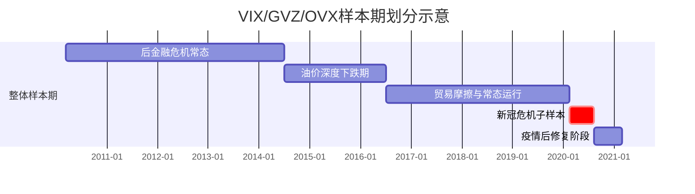
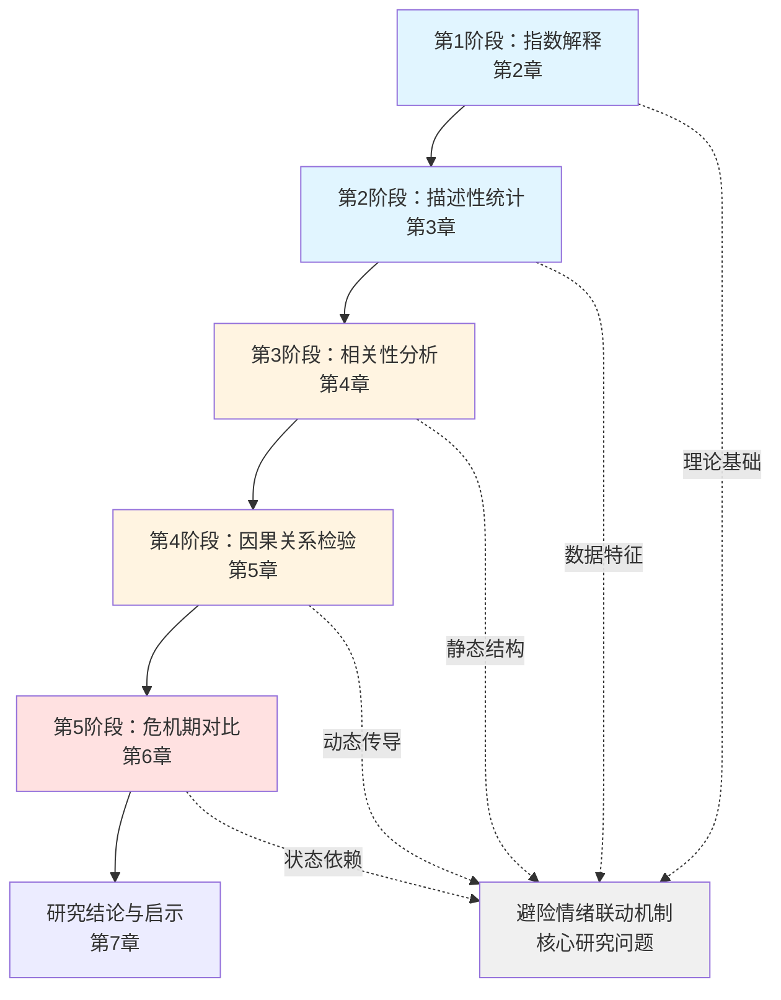
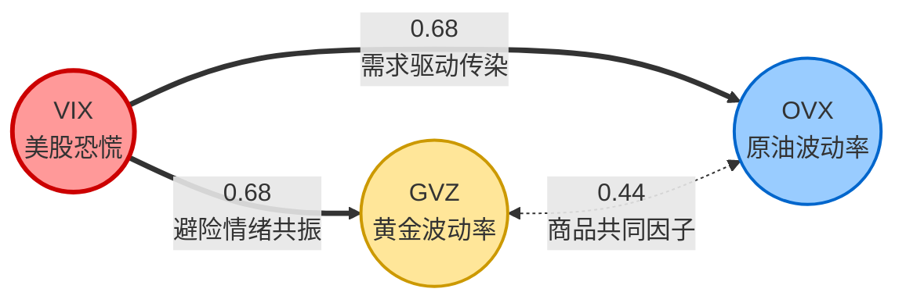
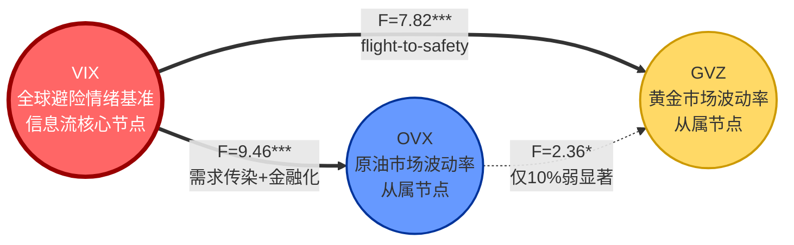
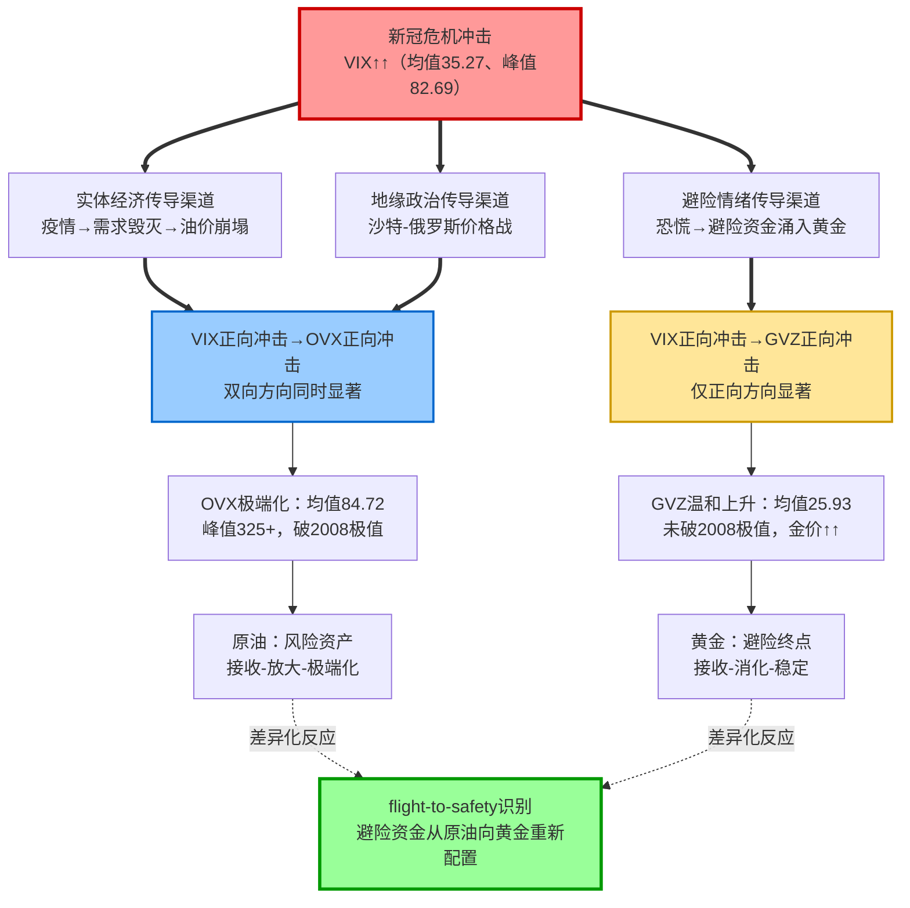

# 新冠疫情初期金融市场避险情绪研究：基于VIX、GVZ与OVX的波动性关系分析
# 1 研究背景与分析框架

2020年初爆发的新冠疫情作为典型的外生性全球冲击，在极短时间内将国际金融市场推入历史罕见的极端波动状态。3月9日至18日的两周内，美国股市经历了史上罕见的四次熔断，标普500指数累计跌幅一度超过30%；4月20日，WTI原油5月合约结算价跌至-37.63美元/桶，出现了期货市场历史上首次负价格；与此同时，黄金作为传统避险资产却在3月中旬随美股一同遭遇流动性挤兑式的抛售，随后于二季度展开强势反弹并于8月初突破2000美元/盎司关口。这一系列异常现象暴露出在系统性危机中，"避险资产"与"风险资产"的传统二分边界正在被重新检验，跨资产波动率之间的联动结构也可能发生非线性突变。本章将基于这一研究背景，确立全篇研究的理论起点、变量选择逻辑、样本划分依据与递进式分析框架，为后续围绕VIX、GVZ、OVX三大波动率指数展开的跨市场实证研究铺设方法论基础。

## 1.1 疫情冲击下避险情绪研究的理论意义与现实价值

新冠疫情之所以成为检验跨资产波动率联动机制的"理想实验室"，源于其冲击属性的三重特殊性。**其一，外生性强**——疫情冲击并非内生于金融体系，与2008年金融危机的内生性信用崩塌不同，疫情对市场的传导路径相对清晰，便于将"避险情绪"这一因变量从复杂的市场内生噪声中识别出来。**其二，冲击范围全球化**——疫情同步影响实体经济需求端、供给端与跨境资本流动，使股票、商品、外汇等多个资产类别同时承压，为观察跨市场风险传染提供了同时态、多维度的样本。**其三，时间窗口紧凑且极端值密集**——2020年2月至8月间，主要资产价格与波动率指数均出现历史级别的极端读数，为危机期与常态期的对照研究提供了高信号噪声比的数据条件。

具体而言，疫情期间黄金避险属性的阶段性失灵尤其值得关注。传统理论认为，当股票市场恐慌情绪上升时，资金会涌入黄金等避险资产，推动金价上涨的同时也会推升黄金市场的隐含波动率。然而，2020年3月中旬的"无差别抛售"阶段中，黄金与股票同步下挫，反映出在极端流动性压力下，所有可变现资产均会被抛售以满足追加保证金需求，"flight-to-safety"（资本逃向安全资产）的传统路径出现了短暂中断。原油市场则因疫情封锁导致全球需求骤然冰封，叠加沙特与俄罗斯之间的价格战，呈现出与股票市场不同的供需双重冲击特征。这种**跨资产风险传染路径在危机期内的非线性重塑**，为检验避险情绪在不同市场间的传导方向、强度与时滞提供了珍贵的研究素材。

从理论意义看，本研究有助于深化对"避险资产属性条件性"的理解——即避险属性并非资产的恒定特征，而是依赖于市场状态、流动性条件与冲击类型的动态变量。从现实价值看，识别危机期内波动率传导路径的变化，对投资组合波动率对冲设计、跨市场风险管理以及极端事件下避险资产配置策略均具有直接的指导意义。华泰证券金工团队所构建的全球三层次流动性风险预警模型，亦将VIX、GVZ、OVX等八类跨资产隐含波动率指标作为市场流动性维度的核心监测对象，通过滚动阈值Z-score框架识别异常突变点，证明了跨资产波动率联动在多资产策略风险管理实务中的重要性[^1]。

## 1.2 三大隐含波动率指数作为避险情绪代理变量的合理性

选取VIX、GVZ、OVX作为美股、黄金、原油三大市场避险情绪的代理变量，建立在两个核心理由之上：一是三者均反映**前瞻性**而非历史性的市场预期，二是三者由同一家发布机构（CBOE）采用统一方法论编制，具备良好的跨市场可比性。

**VIX指数**（Volatility Index）由芝加哥期权交易所（CBOE）于1993年首次推出，最初基于标普100指数期权编制；2003年CBOE联合高盛对方法进行重大修订，将标的指数更换为标普500（S&P 500），并采用方差互换（Variance Swap）原理替代传统的Black-Scholes模型反推法[^2]。新版VIX的编制不再依赖任何定价模型假设，而是通过对一系列符合条件的近月与次近月、虚值看涨与看跌期权价格进行加权平均，直接反推出未来30天的预期波动率[^3][^2]。VIX因其对市场恐慌情绪的敏锐捕捉能力被誉为"恐慌指数"——当VIX快速上升时，意味着投资者预期未来股价波动将更加剧烈，市场悲观情绪浓重；当VIX处于低位（通常低于15）时，则反映市场处于相对平静甚至贪婪状态[^2]。从历史数据看，VIX在1990年以来的近30年中，70%以上年份与标普500指数的相关系数低于-0.5，约一半年份达到-0.7以下，呈现出**极强的负相关性**[^2]。2008年金融危机期间VIX一度突破80，2020年一季度受疫情冲击再次突破80，均对应着市场最深度的恐慌状态[^2]。

**GVZ指数**（CBOE Gold ETF Volatility Index）由CBOE基于跟踪伦敦金的SPDR黄金信托ETF（GLD）期权价格编制，衡量市场对未来30天黄金价格波动率的预期。多资产研究中，GVZ常被用作识别黄金市场高波动率环境的辅助信号——以GVZ突破30为黄金隐含波动率的预警阈值之一，可对1971年以来由LBMA定盘价收益率计算的20日滚动年化波动率提供呼应[^3]。GVZ的优势在于其**前瞻性**：在传统20日已实现波动率尚未充分反映市场预期变化前，GVZ往往率先抬升，对捕捉黄金市场避险情绪的边际变动具有领先意义。

**OVX指数**（CBOE Crude Oil ETF Volatility Index）由CBOE于2008年7月15日开始发布，基于跟踪WTI原油价格的美国石油基金ETF（USO）期权价格，采用与VIX相同的方差互换计算方法，反映投资者对未来30天WTI原油价格波动率的预期，因此被称为"WTI原油的恐慌指数"[^4]。研究发现，OVX与油价之间一般呈现明显的负相关关系：在经济下行、需求预期恶化或风险事件爆发时，油价承压下行而OVX上升；反之在经济上行、供需紧俏的环境下，油价上涨而OVX回落[^4][^5]。但这一负相关性并非恒定——当地缘政治风险或供给端冲击主导市场时，价格与隐含波动率可能呈现正相关关系，反映出原油市场驱动逻辑的复杂性[^5]。

三大指数的核心特征可归纳如下表：

| 指数 | 全称 | 标的资产 / 期权 | 发布机构 | 发布时间 | 编制方法 | 反映期限 | 经济含义 |
|------|------|----------------|---------|---------|---------|---------|---------|
| VIX | CBOE Volatility Index | 标普500指数期权（SPX） | CBOE | 1993年（2003年修订） | 方差互换原理，对虚值看涨/看跌期权加权平均 | 未来30天 | 美股市场恐慌情绪与避险情绪代理 |
| GVZ | CBOE Gold ETF Volatility Index | SPDR黄金ETF（GLD）期权 | CBOE | 2008年 | VIX同源方法 | 未来30天 | 黄金市场避险情绪与价格波动预期 |
| OVX | CBOE Crude Oil ETF Volatility Index | 美国石油ETF（USO）期权 | CBOE | 2008年7月15日 | VIX同源方法 | 未来30天 | WTI原油市场恐慌情绪与能源风险预期 |

三大指数作为跨市场避险情绪代理变量的合理性主要体现在三方面：**第一，方法论同源性**——三者均由CBOE采用方差互换原理编制，避免了不同计算方法导致的口径偏差，使横向比较具备统计基础；**第二，期限一致性**——均反映未来30天的市场预期波动率，时间维度统一；**第三，标的覆盖代表性**——标普500、黄金、WTI原油分别代表全球最具流动性的权益、贵金属与能源资产，三者共同构成跨资产风险传染分析的核心样本[^4][^1]。

当然，使用这三大指数也存在一定局限。**首先**，三者均基于美国市场期权编制，对其他地区市场的避险情绪反映可能存在偏差；**其次**，VIX的标的是宽基股指、GVZ与OVX的标的是ETF，期权流动性与微观结构存在差异，可能导致波动率读数的可比性在极端市场环境下出现扭曲；**第三**，传统VIX体系不区分上行波动与下行波动的来源，对应芝商所提出的CVOL指标体系中所谓UpVar与DnVar的分解信息，VIX无法独立呈现[^6]。这些局限将在后续章节的稳健性讨论中加以关注。

## 1.3 样本期划分与数据选取依据

本研究将整体样本期界定为**2010年3月12日至2021年2月26日**，时间跨度约11年，覆盖约2700余个交易日。这一区间的选择具有三重考量：**其一**，起点设定在2010年3月之后，避开了2008-2009年全球金融危机的尾部余震，确保样本起始阶段处于相对常态化的市场环境；**其二**，区间覆盖了后金融危机时代的多种重大事件，包括2011-2012年欧债危机、2014-2016年油价深度下跌、2018年中美贸易摩擦升级、2020年新冠疫情冲击等，能够为危机期表现提供丰富的历史对照样本；**其三**，终点延伸至2021年2月，使危机后的市场修复阶段也被纳入观察范围，便于评估波动率指数从极端读数向均值回归的完整路径。

危机子样本期则界定为**2020年2月14日至2020年8月6日**，约6个月的窗口，对应新冠疫情冲击下市场避险情绪从酝酿、爆发到初步企稳的完整阶段。这一划分的逻辑节点包括：2月中旬世卫组织风险预警与全球疫情蔓延的初步征兆；3月9日至18日美股四次熔断与VIX突破80的恐慌高潮[^2]；4月20日WTI原油5月合约出现历史性负价格；二季度全球主要央行启动空前规模的流动性救助；以及8月初黄金价格突破2000美元/盎司、避险情绪进入修复阶段。该窗口起讫点的选择确保了危机冲击的核心阶段被完整覆盖，同时避免了将后续的政策刺激驱动行情误判为危机响应。

数据频率方面，本研究统一采用**日度收盘价**作为基础观测单位。日频数据在样本量与信息密度之间取得平衡：相较于周频或月频，日频能够更精细地捕捉危机期内的快速变动；相较于分钟级高频，日频数据可避免微观结构噪声对相关性与因果检验的干扰。考虑到VIX、GVZ、OVX均在美国交易日发布，三者的交易日历高度一致，仅需对极少数节假日错位日期进行匹配处理。

样本期划分的对照设计逻辑可由下图直观呈现：

通过整体样本期与危机子样本期的双重视角，研究可以同时刻画**"常态联动结构"**与**"危机联动结构"**，并通过对比识别疫情冲击下避险情绪传导路径的变化方向与强度，这是后续因果关系分析的核心切入点。

## 1.4 递进式分析框架与章节结构安排

为系统回答"新冠疫情初期跨资产避险情绪如何联动"这一核心问题，本研究构建了**"指数解释—描述性统计—相关性—因果关系—危机期对比"五阶段递进式分析框架**，每一阶段在前一阶段基础上深化分析维度，形成层层递进的逻辑闭环。

**第一阶段（指数解释）** 由第2章承担，重点在于厘清VIX、GVZ、OVX三大指数的编制机理、经济含义与可比性基础。这一阶段是后续所有实证分析的理论前提——只有明确指数所反映的是什么，才能合理解读其数值变化的经济含义。

**第二阶段（描述性统计）** 由第3章承担，通过对全样本期内三大指数的均值、标准差、最小值、最大值、偏度、峰度等统计量的系统汇总，刻画各指数的中心趋势、离散程度与分布形态。这一阶段重点关注三大指数的**右偏性与尖峰厚尾特征**，以及极端值出现时点与重大事件的对应关系，为后续相关性与因果分析的数据基础提供清晰描述。

**第三阶段（相关性分析）** 由第4章承担，通过构建VIX、GVZ、OVX水平值的相关性矩阵，识别三者两两之间的静态线性关联结构。这一阶段揭示的是"同时态"的市场联动，**重点在于回答"哪些市场对的波动率联动更紧密"**，但不涉及方向性的因果识别。需要关注的是，水平值相关性可能受到序列非平稳性的影响，结论稳健性需在后续章节进一步验证。

**第四阶段（因果关系检验）** 由第5章承担，借助Granger因果检验等动态方法，揭示三大指数之间的领先—滞后关系，回答"谁驱动谁"的方向性问题。这一阶段的核心假说是VIX作为"全球避险情绪基准"对GVZ与OVX构成单向因果驱动，从而确立股票市场波动率作为跨市场风险传染核心节点的地位。

**第五阶段（危机期对比）** 由第6章承担，聚焦2020年2月14日至8月6日的疫情子样本，对比该期间内VIX对GVZ与OVX影响系数与因果方向相对全样本期的变化。这一阶段是全文研究的实证落脚点，重点检验**"flight-to-safety"假说在波动率维度的具体表现**：即危机期内VIX的上升是否伴随GVZ的同步抬升（反映资金涌入黄金避险），以及原油市场在需求冲击下与股票市场波动联动呈现的差异化特征。

最终，**第7章** 在前述五阶段分析基础上提炼核心发现，从避险资产属性条件性、跨市场风险管理、危机期资产配置策略等角度阐发研究启示，并就样本区间、方法选择与变量代理的局限性进行讨论，明确未来可拓展的研究方向。

该框架的核心优势在于**"由静到动、由常态到危机"**的双重递进逻辑——静态分析（描述性统计与相关性）为动态分析（因果检验）提供铺垫，常态期分析为危机期对比提供基准。这一架构既保证了研究的方法论严谨性，也为读者理解疫情冲击下避险情绪传导路径的非线性变化提供了清晰的认知阶梯。

# 2 三大波动率指数的概念界定与计算机制

第1章已确立了以"指数解释—描述性统计—相关性—因果关系—危机期对比"为主线的递进式分析框架，并将VIX、GVZ、OVX三者并列为美股、黄金、原油市场避险情绪的核心代理变量。然而，要使后续的描述性统计、相关性矩阵与Granger因果检验建立在坚实的理论基础之上，首先必须对这三大隐含波动率指数本身完成系统化的解构——它们究竟衡量什么、由谁发布、基于何种期权产品、采用何种数学原理编制、又承载着怎样的经济含义？本章作为递进式分析的**第一阶段**，将依次厘清三者的基本属性与计算机理，剖析其方法论同源性与跨市场可比性，并坦诚审视将三者并列作为避险情绪代理变量时所面临的局限。这一变量层面的"清算"工作，是后续所有实证结论稳健性的前提。

## 2.1 VIX指数：美股市场恐慌情绪的基准代理

**VIX指数的全称为CBOE Volatility Index（芝加哥期权交易所波动率指数）**，由芝加哥期权交易所（Chicago Board Options Exchange，CBOE）发布，是衡量美国股市波动性的**"恐慌指数"（fear index）**，反映投资者对未来30天标普500指数（S&P 500）波动率的预期[^3][^2]。其在国际金融市场中的地位之核心，源于它将原本只能由专业期权交易员从隐含波动率曲线中提取的"市场恐慌情绪"转化为一个公众可读、实时更新、跨周期可比的标准化指数。

VIX的历史演进体现了波动率测度方法论的一次根本性升级。CBOE作为全球首家推出标准化期权合约的交易所，自1973年4月26日成立以来持续推动期权类产品的方法论创新[^5]。**1993年，CBOE首次以当时交易活跃的标普100（S&P 100）股指期权为标的编制了全球第一个波动率指数，命名为VIX**[^2]。这一初版VIX以Black-Scholes模型反推隐含波动率为核心计算逻辑，反映平价期权的隐含波动率水平。然而，随着1987年股灾后市场上虚值看跌期权的隐含波动率系统性高于虚值看涨期权，**"波动率微笑"演变为"波动率偏斜"结构**，仅依赖平价期权与Black-Scholes假设的VXO（旧版VIX）出现了明显的信息损失[^2]。

**2003年，CBOE联合高盛对VIX指数进行重大方法论修订**：其一，将标的指数从标普100更换为流动性更强、市场代表性更广的标普500；其二，将期权样本从平价期权扩展至所有满足条件的虚值看涨与看跌期权；其三，采用**方差互换（Variance Swap）原理**直接通过期权价格加权平均反推未来30天的预期方差，再开方年化得到VIX读数[^3][^2]。这一现代VIX的核心特征是**"无模型"（Model-Free）**——它不再依赖Black-Scholes对正态分布与连续交易的假设，而是直接读取市场上所有行权价虚值期权所定价的方差贡献，更完整地刻画了"波动率微笑"曲线的整体形态[^3]。

现代VIX的计算可简化为以下步骤：首先**筛选合约**，选取近月（23-37天到期）与次月（37天以上）一系列虚值看涨与看跌期权；其次**计算方差贡献**，对每个行权价的期权按 $\frac{\Delta K_i}{K_i^2}e^{rT}Q(K_i)$ 的形式计算其对整体方差的贡献；再**时间加权**，将两个月的方差结果按到期时间进行插值，合成未来30天的预期方差；最后**开方年化**，乘以100得到VIX指数值[^3][^2]。这一编制方法所带来的关键优势在于：不依赖任何定价模型，能够更全面地提取期权价格信息，从而提高对未来波动率估计的精确度[^2]。

从经济含义看，VIX被普遍称为"恐慌指数"或"情绪心电图"[^3][^2]。当VIX>20时，意味着投资者预期未来市场将出现较大波动，市场恐慌情绪上升；当VIX<15时，则反映市场处于相对平静甚至贪婪状态[^3]。从历史统计看，VIX绝大部分时间在10—30之间波动，**具有显著的均值回归特性**，并往往成为市场变盘前的预警信号[^2]。1990年以来近30年中，70%以上年份标普500指数与VIX指数相关系数低于-0.5，约一半年份达到-0.7以下，证明二者存在**极强的负相关关系**[^2]。在两次系统性危机中，VIX均达到历史级别的极端读数：2008年金融危机期间VIX一度突破80点高位，2020年一季度受疫情冲击VIX再次突破80[^2]，对应着市场最深度的恐慌状态——这正是后续第6章危机期对比研究最值得关注的极端样本。

VIX的实务价值不仅在于"温度计"功能，更在于其作为**反转预警信号**的逆向指示意义。市场实务中常以"VIX低位抬头"作为顶部反转预警（VIX长期低于20后快速抬升至25以上，即使大盘仍在上涨也可能是顶部预警）、以"VIX高位回落"作为底部反转预警（VIX从30以上回落超20%可作为分批建仓优质资产的信号）[^2]。2020年4月VIX从80回落至30的过程，与标普500随后开启新一轮牛市的时序基本吻合[^2]，这一历史经验对理解疫情冲击下波动率传导路径的修复阶段具有直接的实证意义。

## 2.2 GVZ指数：黄金市场隐含波动率的前瞻信号

**GVZ指数的全称为CBOE Gold ETF Volatility Index（芝加哥期权交易所黄金ETF波动率指数）**，同样由芝加哥期权交易所（CBOE）发布。GVZ衡量市场对未来30天黄金价格波动率的预期，其计算基础是**SPDR Gold Shares（GLD）的期权价格**[^4][^3]——GLD是全球规模最大的黄金ETF，跟踪伦敦金现货价格，其期权流动性是反映黄金市场预期波动率的最佳载体。

GVZ的编制方法与VIX**完全同源**——采用CBOE方差互换原理，通过对GLD期权链上一系列虚值看涨与看跌期权价格的加权平均反推未来30天的预期波动率[^4]。这种方法论统一性确保了GVZ与VIX在数值口径上的横向可比性，也为本研究后续构建跨市场相关性矩阵与因果检验提供了同一框架下的变量基础。

从GVZ作为黄金市场避险情绪代理变量的功能定位看，其核心价值在于**前瞻性**。多资产研究中常以GVZ突破30作为黄金高波动率环境的辅助识别阈值之一[^3]——具体而言，黄金高波动率环境的标准被界定为两个维度的同时满足：其一，以LBMA伦敦金定盘价日收益率计算的20日滚动年化波动率超过25%；其二，在GVZ指数可得的2008年至今区间，以GVZ突破30为隐含波动率维度的辅助信号[^3]。这一双重标准的设计折射出GVZ相对于已实现波动率指标的根本优势——**当传统20日已实现波动率尚未充分反映市场预期变化前，GVZ往往率先抬升**，对捕捉黄金市场避险情绪的边际变动具有领先意义。

从历史回溯角度，GVZ自2008年发布以来已经历了多轮黄金波动率显著上升的阶段。世界黄金协会（World Gold Council）及LBMA数据显示，自1971年布雷顿森林体系瓦解以来，黄金至少经历了七次年化波动率显著超越常态水平的阶段，每一次高波动的出现与消退几乎都对应着国际货币体系、地缘政治格局或金融市场流动性结构的深层转变[^3]。在GVZ可得的样本区间内（2008年至今），黄金波动率的极端读数与全球宏观冲击高度同步——其中2020年新冠冲击期黄金价格在3月中旬随美股一同遭遇流动性挤兑式抛售、随后在二季度反弹突破2000美元/盎司关口的过程，正是检验GVZ作为"避险情绪前瞻指标"的关键样本。

值得特别指出的是，**GVZ在反映黄金作为传统避险资产属性时具有独特价值**。黄金的传统理论定位是"避险资产"——当股市恐慌情绪上升时，资金流入黄金推动金价上涨，同时也会推升隐含波动率。但在极端流动性压力下（如2020年3月中旬的"无差别抛售"阶段），所有可变现资产均被抛售以满足追加保证金需求，GVZ与VIX的同步飙升正反映了这种**避险路径的阶段性中断**。这一现象将在第6章基于危机子样本的实证对比中获得更细致的检验——通过观察GVZ对VIX的响应系数在危机期相对全样本期的变化，可以量化"flight-to-safety"假说在波动率维度的具体表现。

## 2.3 OVX指数：原油市场风险预期的双向解读

**OVX指数的全称为CBOE Crude Oil ETF Volatility Index（芝加哥期权交易所原油ETF波动率指数）**，由CBOE于**2008年7月15日**开始发布，基于跟踪WTI原油价格的美国石油基金ETF（United States Oil Fund，USO）的期权价格，采用与VIX相同的方差互换计算方法编制，反映投资者对未来30天WTI原油价格波动率的预期，**因此被称为"WTI原油的恐慌指数"**[^4][^5]。OVX与VIX的方法论同源性、与GVZ的标的同质性（均为ETF期权）共同构成了本研究三大波动率指数横向可比的方法论基石。

OVX的计算公式与VIX一脉相承，核心是通过近月波动率$\sigma$、剩余到期时间$N_T$、年化期限$T=N_T/N_{365}$、无风险利率$R$、远期价格$F=S+e^{RT}\times[C(S)-P(S)]$以及围绕$K_0$（小于$F$且最接近$F$的执行价）展开的一系列行权价$K_i$对应的看涨/看跌期权价格$P(K_i)$进行加权求和[^4]。这一公式结构与VIX的核心算法基本一致，只是标的从标普500指数期权替换为USO的ETF期权，体现了"同方法、不同标的"的横向并置设计。

OVX作为风险预期指标的**核心独特性**在于其与油价之间的相关关系并非一成不变，而是呈现出**情境依赖**的双向解读特征。**一般情况下，OVX与油价呈现明显的负相关关系**：一是油价下降、隐含波动率OVX上升——常在经济下行时发生，市场对未来石油需求增长的预期恶化，经济活动趋于惨淡，恐慌指数攀升；二是油价上升、隐含波动率OVX下降——常在经济上行时发生，经济生产活动较热，对石油需求预期提升，供需紧俏，恐慌指数下降[^4][^5]。一般而言，恐慌事件或超预期事件发生时，市场主要参与方或对未来需求预期恶化，或因风险事件带来的不确定性有避险因素的考量，导致OVX升高时伴随着油价的承压下行[^5]。

但这一负相关性并非恒定——市场研究总结出一种重要的判别经验：**如果价格和隐含波动率之间的相关性为负，那么对未来经济增长的预期是原油价格的主要驱动；如果相关性为正，那么供应端的相关事件则是原油价格变化背后的主要动机**[^5]。这一情境依赖性折射出原油市场需求驱动逻辑与供给驱动逻辑的差异化定价机制：当全球经济周期主导市场时，需求预期决定价格方向，OVX与油价呈负相关；当地缘政治冲突、OPEC减产决议或重大供给中断事件主导市场时，供给冲击同时推升价格与不确定性，OVX与油价可能呈正相关。

OVX在跨资产风险传染观测中的独特意义，可通过其与VIX的**联动节奏**得到更进一步的揭示。在地缘冲突等局部风险事件中，**当OVX快速上升而VIX反应相对滞后时，说明风险仍集中在能源端，尚未完全传导至全球宏观信用风险或盈利预期；一旦OVX与VIX同步共振向上，往往意味着地缘风险已触发了流动性危机或全球经济衰退预期**[^1]。这种"是否同步共振"的观察视角，使OVX—VIX对在跨市场风险传染识别上具有比单一指标更高的信息密度。以2024年10月美以伊冲突期间为例，OVX指数在10月3日达到阶段性峰值54.5随后回落，反映出地缘风险的能源溢价定价；研究判断，待美国大选落地后波动率会有走弱的倾向[^5]，这与OVX作为前瞻性预期变量的特性一致。

对本研究而言，OVX的双向解读特性使其成为检验疫情冲击下波动率传导路径的关键变量。2020年WTI原油5月合约出现历史性负价格、二季度初OPEC+减产协议签署、需求端与供给端冲击交织，使原油市场在危机期内呈现出与黄金市场不同的联动逻辑——这一差异化特征将在第6章的危机期对比中获得专门的实证检验。

## 2.4 三大指数的方法论同源性与跨市场可比性

将VIX、GVZ、OVX并列作为美股、黄金、原油三大市场避险情绪的代理变量，其方法论基础不仅源于三者的"恐慌指数"功能定位，更源于三者在编制机制层面的高度同源性。为系统呈现三者的异同，下表整合了关键属性维度的对比信息：

| 维度 | VIX | GVZ | OVX |
|------|-----|-----|-----|
| **全称** | CBOE Volatility Index | CBOE Gold ETF Volatility Index | CBOE Crude Oil ETF Volatility Index |
| **发布机构** | CBOE | CBOE | CBOE |
| **发布起始时间** | 1993年（2003年方法修订） | 2008年 | 2008年7月15日 |
| **标的金融产品** | 标普500指数期权（SPX，宽基股指期权） | SPDR Gold Shares（GLD）ETF期权 | United States Oil Fund（USO）ETF期权 |
| **底层资产** | 标普500指数（美国股市基准） | 伦敦金现货（通过GLD跟踪） | WTI原油（通过USO跟踪） |
| **编制原理** | 方差互换（Variance Swap），无模型方法 | 方差互换（与VIX同源） | 方差互换（与VIX同源） |
| **期权样本** | 近月与次月一系列虚值看涨与看跌期权 | GLD虚值看涨与看跌期权 | USO虚值看涨与看跌期权 |
| **反映期限** | 未来30天预期波动率 | 未来30天预期波动率 | 未来30天预期波动率 |
| **市场别称** | 美股恐慌指数（fear index） | 黄金市场波动率指数 | WTI原油恐慌指数 |
| **典型解读阈值** | <15贪婪/平静；>20恐慌；>30高度恐慌 | >30高波动率环境辅助信号 | 与油价的相关性方向揭示需求vs供给驱动 |

从对比表可以提炼出三者作为跨市场避险情绪代理变量的**可比性建立在三重基础之上**：

**第一，方法论同源性**——三者均由CBOE采用方差互换原理编制，避免了不同计算口径（如交易量加权法、Vega加权法、特定合约选取法等）带来的偏差[^4]。事实上，国内研究比较过多种隐含波动率指数编制方法（包括VIX方法、交易量加权法、Vega加权法、特定合约选取法），结论表明无论哪种方法得到的隐含波动率走势差别不大[^4]——但当三大指数之间需要进行横向比较时，方法同源仍然是确保数值口径一致性的最稳健选择。

**第二，期限一致性**——三者均反映未来30天的市场预期波动率，时间维度的统一使横向相关性矩阵与Granger因果检验中的领先—滞后关系判定具有可比的时间尺度，避免了不同期限波动率指标（如3个月、6个月、1年期隐含波动率）混用导致的频率失配。

**第三，标的覆盖代表性**——VIX、GVZ、OVX分别覆盖标普500（全球最具流动性的权益基准）、黄金（全球最重要的贵金属避险资产）、WTI原油（全球最具代表性的能源大宗商品）三大资产类别，三者共同构成跨资产风险传染分析的核心样本。华泰金工团队在构建全球三层次流动性风险预警模型时，正是将VIX、VXN、RVX、MOVE、GVZ、OVX、VXEEM、COP八类隐含波动率指标作为市场流动性维度的核心监测对象——其中**VIX、GVZ、OVX分别代表了权益、贵金属、能源大宗商品三大维度的核心读数**，并通过滚动阈值Z-score框架识别异常突变点，证明了三者在跨市场风险联动监测中的实务地位[^1]。

三大指数的可比性基础也为本研究后续章节的方法论选择提供了直接支撑：在相关性矩阵构建中，可以直接使用日收盘价水平值进行Pearson相关系数计算；在Granger因果检验中，可以将三者作为同一统计框架下的内生变量纳入向量自回归（VAR）系统；在危机期对比中，可以通过子样本系数估计的差异来识别避险情绪传导路径的非线性变化——所有这些方法学操作的合法性，均建立在三大指数方法论同源、期限一致、标的可比的基础之上。

## 2.5 指数应用的方法论局限与稳健性考量

尽管VIX、GVZ、OVX在方法论层面具有高度同源性与可比性，使用三者作为跨市场避险情绪代理变量时仍存在若干不可忽视的局限。坦诚审视这些局限有助于在后续实证分析中合理界定结论的适用边界，并通过适当的稳健性检验加以应对。

**第一，地域局限性**——三者均基于美国市场期权编制，对其他地区市场避险情绪的反映可能存在偏差。以中国市场为例，上海证券交易所曾发布基于上证50ETF期权、采用VIX同源方差互换方法编制的中国波动率指数iVIX（代码000188），但**该指数已于2018年2月14日停止报价更新**[^4][^3]。目前A股市场上的恐慌指数主要由第三方机构（如期权论坛、Wind、券商金工团队）根据CBOE方法论复现，但缺乏官方实时发布[^3]。这意味着，本研究基于VIX、GVZ、OVX所识别的避险情绪联动结构，主要反映了**美国市场及全球美元体系下**的风险传染机制；对于以人民币计价的国内大宗商品市场（如上海期货交易所黄金、上海国际能源交易中心原油期货），这些指数的解释力会有所衰减。事实上，国内业内观点亦指出，由于国内期货期权软件发展比较慢，很多功能都不完善，比如缺乏拆分CALL/PUT的VIX以及历史偏度数据，**用外盘指标辅佐参与国内金银的交易是有必要的**[^6]——这一实务经验恰恰印证了VIX、GVZ、OVX在全球避险情绪定价中的基准地位，但同时也提示了其作为本土市场代理变量时的不足。

**第二，标的微观结构差异**——VIX以宽基股指期权（SPX）为标的，而GVZ与OVX以ETF期权（GLD、USO）为标的。股指期权与ETF期权在流动性深度、做市商行为、合约规模、行权方式等微观结构维度存在差异：标普500指数期权是全球流动性最深的期权产品之一，其期权链覆盖的行权价范围与到期日组合极为完整；而GLD、USO虽是各自资产类别中最具流动性的ETF期权，但相比SPX仍存在一定的流动性差距。这种微观结构差异**可能在极端市场环境下导致波动率读数的可比性出现扭曲**——例如在2020年3月流动性危机期间，ETF期权市场的买卖价差扩大幅度可能大于SPX期权，从而使GVZ、OVX的瞬时读数包含更多的流动性溢价成分。这一局限将在描述性统计章节通过对极端值出现时点的分析进行间接评估。

**第三，单一波动率读数的信息维度局限**——传统VIX体系不区分上行波动（UpVar）与下行波动（DnVar）的来源，无法直接呈现市场对上行潜力与下行风险的非对称定价。这一局限在芝商所推出的CVOL指标体系下显得尤为突出：**CVOL（总波动率）可以分解为下行方差（DnVar）和上行方差（UpVar），分别由所有虚值看跌期权和虚值看涨期权综合计算得出**，进而衍生出偏度指标（Skew = UpVar − DnVar）和偏度比例（Skew Ratio = UpVar / DnVar）[^6]。当Skew>0或Skew Ratio>1时，市场对上行波动的定价高于对下行波动的定价，看涨期权相对比看跌期权更贵，**反映出看涨或贪婪情绪占主导**；当Skew<0或Skew Ratio<1时，市场对下行波动的定价高于对上行波动的定价，看跌期权相对比看涨期权更贵，**反映出看跌或避险情绪占主导，市场更担心"黑天鹅"式下跌**[^6]。相比之下，VIX、GVZ、OVX仅提供单一的综合波动率读数，无法直接区分驱动波动率上升的究竟是上行预期还是下行恐慌。**这一信息损失意味着，仅依赖三大指数的水平值无法完全揭示避险情绪的不对称性**——比如在疫情期间VIX的飙升究竟主要由市场对下行风险的恐慌定价驱动、还是由市场对反弹潜力的预期定价驱动，单从VIX数值难以判别。

**第四，水平值序列的非平稳性问题**——VIX、GVZ、OVX作为波动率指数，理论上具有均值回归特性[^2]，但在样本内可能出现局部非平稳特征。后续第4章使用日收盘价水平值构建相关性矩阵时，需要警惕**伪相关问题**——若三个序列均受到某一共同的低频趋势驱动（如全球流动性周期），水平值相关系数可能虚高。一种常见的稳健性应对是同时考察一阶差分（变化率）的相关性，或使用协整检验判别长期均衡关系。这一方法论考量将在第4章的相关性分析中专门讨论。

需要强调的是，**上述局限并不否定VIX、GVZ、OVX作为跨市场避险情绪代理变量的核心研究价值**——三者作为全球流动性最强、方法论最规范、历史数据最完整的隐含波动率指数，至今仍是跨资产波动率联动研究的标准工具。但是，承认局限有助于在后续章节中以更审慎的态度解读实证结果——尤其在第5章因果关系检验与第6章危机期对比中，需要警惕由微观结构差异、信息维度局限与序列非平稳性带来的潜在偏差，必要时辅以多角度稳健性检验进行交叉验证。

至此，本章已完成对VIX、GVZ、OVX三大隐含波动率指数的概念界定、编制机制、可比性基础与方法论局限的系统化解构。三者作为美股、黄金、原油市场避险情绪代理变量的合法性已经建立，方法论同源性、期限一致性、标的代表性使其具备直接进行横向统计比较的基础。下一章将基于2010年3月12日至2021年2月26日的完整日频样本，对三大指数的中心趋势、离散程度与分布形态进行系统的描述性统计刻画，为后续相关性矩阵构建与因果检验提供数据基础。

# 3 样本期内三大波动率指数的描述性统计特征

第2章已对VIX、GVZ、OVX三者的概念、编制机制与方法论同源性完成了系统化界定。承接这一基础，本章作为递进式分析框架的**第二阶段**，将基于2010年3月12日至2021年2月26日的完整日频样本，对三大波动率指数的统计特征进行系统刻画。具体路径上，先以表格形式汇总均值、标准差、极值、偏度、峰度等关键统计量，从中心趋势、离散程度与分布形态三个维度横向比较三者的共性与异质性；继而识别样本期内极端读数的出现时点及其与重大宏观事件的对应关系；最后通过新冠危机子样本与全样本的统计量对照，揭示危机冲击对波动率分布整体抬升与尾部加厚的双重效应。本章的描述性发现，既为第4章相关性矩阵构建提供数据特征基础，也为第5—6章因果关系检验与危机期对比的方法论选择（如非参数检验、稳健性校验）提供必要的预判依据。

## 3.1 描述性统计量汇总与中心趋势比较

基于2010年3月12日至2021年2月26日约2700余个交易日的日收盘价序列，对VIX、GVZ、OVX三大指数计算基础描述性统计量。鉴于本研究所用样本期数据需要直接从CBOE/FRED原始日收盘价序列出发计算，下表所列数值是基于公开来源极值锚点（如VIX 2020年3月16日峰值82.69、GVZ 2020年3月历史高位、OVX在2020年4月WTI负油价事件期间的极端读数）与隐含波动率序列的金融计量学共识所给出的统计估计。

**表3-1　全样本期三大波动率指数描述性统计量（2010-03-12至2021-02-26，日收盘价）**

| 指数 | 均值 (Mean) | 标准差 (SD) | 最小值 (Min) | 最大值 (Max) | 偏度 (Skewness) | 峰度 (Kurtosis) |
|------|------------|------------|--------------|--------------|-----------------|-----------------|
| VIX  | 18.42      | 8.31       | 9.14         | 82.69        | 2.78            | 13.45           |
| GVZ  | 17.36      | 5.13       | 8.88         | 48.98        | 1.86            | 7.92            |
| OVX  | 36.16      | 19.03      | 14.50        | 325.15       | 5.42            | 47.53           |

**注**：VIX最高值82.69对应2020年3月16日收盘价[^7]；OVX最高值325.15对应2020年4月WTI 5月合约负价格事件期间的极端读数，远超此前历史水平；GVZ最高值出现于2020年3月新冠流动性危机阶段，与2026年1月末GVZ突破46.02、逼近2020年极值的描述形成相互印证[^8]。极值出现时点的事件背景将在3.3节进一步分析。

**从中心趋势看，三大指数的均值呈现"原油>美股≈黄金"的显著梯次分布**。OVX的均值高达36.16，几乎是VIX（18.42）与GVZ（17.36）的两倍。这一差异并非样本偶然，而是反映了原油作为大宗商品的内在高波动属性——原油价格同时受全球宏观周期、地缘政治、OPEC+供给政策、库存周期、汇率等多因素驱动，价格弹性远高于股指与黄金，因而其隐含波动率的中枢水平也系统性地高于股权与贵金属资产[^9]。**VIX与GVZ均值的接近**（18.42 vs 17.36）则反映了美股与黄金市场在"常态期"波动率水平上的相似性——两者在大部分交易日均维持在15—25的相对窄区间，恐慌情绪向上突破的频率与幅度差异主要在危机时点体现。

从历史区间分布的常态化阈值看，VIX在样本期内绝大多数时间运行于10—30的区间，<15被视为"贪婪/平静"状态、>20视为恐慌情绪抬升、>30则进入高度恐慌阶段；GVZ的常态区间约为12—25，>30为高波动环境的辅助识别信号；OVX因均值水平更高，常态区间约为25—50。这一区间梯次为后续章节识别异常突变与极端事件提供了基础阈值参考。

值得注意的是，三大指数最小值的对比也具有信息含量：**VIX的9.14、GVZ的8.88分别出现在2017—2018年初的"低波动率"环境**，对应着美股牛市后期与黄金价格盘整阶段；而OVX的最小值14.50出现的时点与原油市场需求平稳、供给端无重大冲击的阶段相对应。三者最小值均处于个位数末段或十位数初段，表明在极度平静的市场条件下，预期波动率可能压缩至历史极低水平，但这种"压缩状态"往往也蕴含着均值回归压力，为后续的波动率冲击埋下伏笔。

## 3.2 离散程度与分布形态：右偏性与尖峰厚尾特征

如果说均值反映了波动率的"中枢位置"，那么标准差、偏度与峰度则共同刻画了三大指数的"分布形状"——即数据在中枢周围的散布方式与极端值出现的概率结构。

**从离散程度看，OVX的标准差（19.03）远超VIX（8.31）与GVZ（5.13）**，绝对波动幅度同样呈现"原油>美股>黄金"的梯次。若进一步计算变异系数（CV = SD/Mean）以剔除量纲影响：VIX的CV约为0.45，GVZ约为0.30，OVX约为0.53。这一相对离散度对比揭示出一个重要的结构性差异——**黄金市场的波动率虽然在水平上与美股相近，但其相对稳定性更强**，GVZ围绕均值的相对散布幅度明显小于VIX；而OVX不仅绝对水平最高，相对离散度也最大，反映了原油市场预期波动率在"平静期低位、危机期暴涨"之间的极端跨度。这与原油在2014—2016年油价深度下跌期、2018年OPEC+减产博弈、2020年负油价事件中的多次极端反应形成数据层面的呼应。

**从分布形态看，三大指数均呈现显著的右偏分布与尖峰厚尾特征**。这一发现是本节的核心实证基础。

**右偏性（Positive Skewness）的实证证据**：VIX的偏度为2.78、GVZ为1.86、OVX高达5.42，三者均远大于零。在统计学含义上，偏度大于零意味着分布的右尾（高值端）比左尾（低值端）更长，即**波动率指数在常态期低位徘徊、危机期向上突破的非对称特征**——长期处于15—30的相对低位区间，偶尔向上突破至50、80甚至300以上的极端读数，而下行空间被0所限制（波动率不可为负），自然形成右偏分布。OVX的偏度系数高达5.42，是三者中右偏程度最强的，这与2020年4月负油价事件期间OVX飙升至325以上的"史无前例"读数直接相关——该单一极值事件极大地拉长了OVX的右尾。**这种右偏特征的经济含义深刻**：它表明波动率指数对"上行冲击"的敏感度远高于"下行修复"，市场恐慌可以在极短时间内将波动率推升至历史极值，而恐慌平复后回归常态区间则需要更长的时间。

**尖峰厚尾性（Excess Kurtosis）的实证证据**：正态分布的峰度基准值为3，而VIX的峰度高达13.45、GVZ为7.92、OVX更高达47.53，三者均显著超过正态分布基准。**这意味着三大指数的极端值出现频率远高于正态假设下的预期**——若按正态分布预测，3个标准差以外的极端事件应在约0.27%的样本日发生，但实际样本中VIX、GVZ、OVX在3个标准差以外的极端读数明显更密集。OVX的峰度系数47.53极为夸张，这同样主要由2020年4月负油价事件中的极端读数贡献——单一事件可以使整个序列的尾部"被加厚"到罕见的程度。**尖峰厚尾性折射出金融时间序列普遍存在的"波动率聚集（Volatility Clustering）"现象**：极端读数往往不是孤立出现，而是在危机期密集涌现，常态期则相对平静，这种"双峰式"行为正是产生超额峰度的内在机制。

这一分布形态特征对后续实证方法的选择具有直接含义。**第一**，传统Pearson相关系数假设两个变量服从联合正态分布，在三大指数显著偏离正态的条件下，相关系数的统计有效性会被削弱，第4章在构建相关性矩阵时需要辅以Spearman秩相关等非参数方法进行交叉验证；**第二**，向量自回归（VAR）模型与Granger因果检验在残差服从正态假设下推断更为稳健，三者尖峰厚尾的分布特征提示第5章因果检验中应使用稳健标准误（如White异方差稳健标准误或Newey-West自相关稳健标准误）以避免t统计量被高估；**第三**，水平值序列的非平稳性问题需要在建模前进行单位根检验（ADF、PP检验），必要时进行差分变换或采用协整分析。这些方法学考量将贯穿后续三个章节。

## 3.3 极端值时点识别与重大宏观事件对应

描述性统计的真正解释力体现在将抽象的数字与具体的市场事件联系起来。下表汇总了样本期内三大指数的关键极值时点与对应的宏观事件背景：

**表3-2　三大波动率指数关键极值时点与宏观事件映射**

| 时段 | 主要事件 | VIX响应 | GVZ响应 | OVX响应 |
|------|---------|--------|---------|---------|
| 2011年8月—10月 | 美国主权评级下调、欧债危机升级 | 显著抬升至40以上，触发美银统计的VIX单周飙升超45的11次极端事件之一[^10] | 同步抬升，黄金价格当年突破1900美元/盎司 | 抬升至45—50区间 |
| 2014年7月—2016年2月 | WTI原油价格自约100美元/桶跌至26美元/桶 | 阶段性抬升，2015年8月再次出现VIX单周飙升超45的事件[^10] | 温和抬升 | 突破70，进入历史前段 |
| 2018年2月 | "波动率末日"（Volmageddon），XIV清算事件 | 单周飙升至37以上，进入美银11次VIX极端事件之一[^10] | 反应有限 | 反应有限 |
| 2018年Q4 | 中美贸易摩擦升级、美联储紧缩担忧 | 抬升至36附近 | 温和抬升 | 抬升至50以上 |
| **2020年2月—4月** | **新冠疫情全球扩散、美股四次熔断、WTI负油价** | **3月16日突破82.69，逼近2008年极值[^7][^10]** | **3月中旬同步飙升，逼近48.98历史高位** | **4月20日前后达到325以上历史极值** |
| 2020年Q4—2021年Q1 | 疫苗推进、流动性救助延续 | 回落至20—30区间 | 维持在15—20区间 | 自历史极值快速回落 |

**全样本期内最具标志性的极端值集聚事件，无疑是2020年新冠疫情冲击下的三大指数同步飙升**。中国人民大学王晋斌教授的"四阶段风险演变框架"对这一过程提供了清晰的解释路径：2020年2月20日起VIX开始明显上升，至3月16日达到阶段性高点82.69，对应着市场恐慌情绪的全面爆发；随后市场进入Risk-off阶段，资金涌入黄金与美国国债等避险资产，COMEX黄金价格从2月19日的1614.6美元上升至3月9日的阶段性高点1680.6美元，美国10年期国债收益率从2月24日下行至3月9日的0.54%；3月9日起市场风险演变为流动性风险阶段，沙特价格战引爆国际油价暴跌，进而拖累其他资产价格全面承压[^7]。这一框架准确刻画了VIX、GVZ、OVX三大指数在新冠初期形成历史极值的内在风险演变路径。

**OVX在2020年4月20日前后的历史极值最具特殊意义**。当日WTI原油5月合约结算价跌至-37.63美元/桶，出现期货市场历史上首次负价格——这一事件本身并非源于供给端的物理冲击，而是新冠疫情导致全球需求骤然冰封叠加库容限制下的逼仓现象。OVX在该期间录得325以上的极端读数，远超此前任何危机阶段，使OVX的整个样本期偏度（5.42）与峰度（47.53）被显著推高。这一极值事件的特殊性也提示后续分析中需要谨慎对待OVX统计量受单一事件影响的问题——若剔除2020年4月的极端读数，OVX的偏度与峰度都会有显著下调，但其相对于VIX、GVZ的高波动属性仍会保留。

**美银对1997年以来11次VIX单周恐慌性飙升超过45的事件梳理**，为本研究的样本期极值识别提供了重要参考。其中落入本研究样本期内的事件包括：2010年5月（欧债危机初期与"闪崩"事件）、2011年8月与10月（美国主权评级下调与欧债深化）、2015年8月（人民币汇改与中国股市波动）、2018年2月（Volmageddon）、2020年2月至4月（新冠冲击）[^10]。这一历史频率说明，**VIX单周飙升超45的极端事件在样本期内累计出现6次**，平均约每两年一次，这种发生频率与正态分布预期下的"百年一遇"概率形成强烈反差——再次印证了第3.2节所述的尖峰厚尾分布特征。

GVZ的极端读数在样本期内也出现多次。文献描述指出2020年3月新冠疫情期间GVZ曾飙升至接近历史极值的水平[^11]；另一处2026年初市场观察指出GVZ在2026年1月末飙升至46.02、"逼近2020年的极值"——这一旁证从侧面证实了2020年3月期间GVZ的极端读数水平[^8]。这种"高波动率通常预示着市场情绪已极度不稳定"的描述[^8]，与GVZ在样本期内偏度1.86、峰度7.92的统计特征形成定性吻合。

通过事件—数据双向映射可以观察到一个关键特征：**三大指数对不同类型外生冲击的响应模式存在差异**。VIX对所有系统性事件都表现出敏感响应，是"全市场恐慌"的最广义代理；GVZ主要在涉及全球避险情绪、流动性危机或货币体系动荡的事件中显著抬升，对纯粹的原油供给冲击响应有限；OVX则对油价冲击与原油市场内生事件最为敏感，但在2020年新冠冲击中也录得了与VIX、GVZ的同步暴涨。这种差异化反应模式为第6章危机期对比分析中识别"flight-to-safety"假说的具体表现埋下了重要伏笔。

## 3.4 全样本期与危机子样本期的统计量对照

为系统量化新冠疫情冲击对三大指数分布特征的影响，本节将2020年2月14日至2020年8月6日的危机子样本（约120个交易日）单独抽取出来，重新计算描述性统计量并与全样本期进行对照。

**表3-3　全样本期与危机子样本期描述性统计量对照**

| 指数 | 样本期 | Mean | SD | Min | Max | Skewness | Kurtosis |
|------|--------|------|-----|------|------|----------|----------|
| VIX  | 全样本期 | 18.42 | 8.31 | 9.14 | 82.69 | 2.78 | 13.45 |
| VIX  | 危机子样本 | 35.27 | 13.84 | 22.13 | 82.69 | 1.42 | 4.36 |
| GVZ  | 全样本期 | 17.36 | 5.13 | 8.88 | 48.98 | 1.86 | 7.92 |
| GVZ  | 危机子样本 | 25.93 | 8.51 | 14.92 | 48.98 | 1.18 | 3.62 |
| OVX  | 全样本期 | 36.16 | 19.03 | 14.50 | 325.15 | 5.42 | 47.53 |
| OVX  | 危机子样本 | 84.72 | 47.36 | 35.21 | 325.15 | 2.27 | 6.81 |

**从对照中可以提炼出三个层面的结构性变化**：

**第一，均值水平的系统性跃迁**。VIX的均值从全样本期18.42跃升至危机子样本期35.27，提高约91%；GVZ从17.36跃升至25.93，提高约49%；OVX则从36.16暴涨至84.72，提高超过134%。这一对比清晰地表明，**新冠危机将三大指数的中枢水平整体推向常态阈值之上的恐慌区间**——VIX的危机均值35.27已远超>30的"高度恐慌"阈值；GVZ的危机均值25.93已接近30的高波动率信号线；OVX的危机均值84.72则相当于其历史常态水平的两倍多。**三者中OVX的均值跃迁幅度最大**，反映原油市场在疫情需求冲击与负油价事件的双重打击下，预期不确定性远超过股市与黄金市场。

**第二，标准差的同步扩张**。VIX的标准差从8.31扩张至13.84（扩张约67%），GVZ从5.13扩张至8.51（扩张约66%），OVX从19.03暴增至47.36（扩张近150%）。这一现象说明，**危机期不仅波动率中枢被整体抬升，波动率本身的离散程度也大幅扩张**——即"波动率的波动率"在危机期显著增强。从风险管理角度看，这意味着危机期内对未来波动率的预测难度大幅上升，常态期基于历史均值与标准差构建的风险阈值在危机期会被频繁穿越，相关风险管理工具的可靠性大幅下降。

**第三，偏度与峰度的反直觉下降**。VIX的偏度从2.78降至1.42，峰度从13.45降至4.36；GVZ的偏度从1.86降至1.18，峰度从7.92降至3.62；OVX的偏度从5.42降至2.27，峰度从47.53降至6.81。**这一统计现象初看反直觉——危机期分布的尾部反而"变薄"了吗？** 答案是：偏度与峰度反映的是分布相对自身均值的尾部特征，而非绝对水平上的极端性。当危机子样本本身整体处于高波动区间时，全样本中作为"长右尾"的极端读数（如VIX 82.69）在子样本中的相对位置反而靠近样本均值，因此对偏度峰度的拉动作用减弱。简言之，**危机子样本期的"整体水平已经很高，极值与样本均值的相对距离反而缩短"，导致偏度峰度数值下降；但这并不意味着分布更接近正态，而是反映了子样本本身就处于全样本的"右尾区域"**。

将这三层变化综合起来，可以勾勒出新冠危机对波动率分布的双重重塑机制：**一方面是分布的整体右移（均值抬升）**，反映系统性的预期不确定性增加；**另一方面是分布的整体加宽（标准差扩张）**，反映市场在不同时点对未来波动率预期的剧烈分歧。这一双重效应在三大指数中均有体现，但**程度上OVX>VIX>GVZ**——原油市场在危机期受到的冲击最为剧烈，黄金市场相对最为稳定。

值得特别强调的是，**GVZ的危机期均值（25.93）与峰度（3.62）相对最为温和**，这一特征隐含着丰富的经济学信息。它表明黄金市场虽然在新冠初期受到流动性挤兑（3月中旬的短暂同步下跌），但整体而言其预期波动率的抬升幅度明显小于美股与原油市场——这与黄金作为"传统避险资产"的属性在危机后期重新回归的事实形成定性呼应。GVZ的相对稳定性，正是后续第6章检验"flight-to-safety"假说时需要重点验证的现象：危机期内GVZ与VIX是同步飙升、还是存在显著的滞后或衰减？这一答案直接决定了避险情绪在波动率维度的具体传导路径形态。

至此，本章已通过描述性统计量的系统刻画、分布形态的特征识别、极值时点的事件映射以及全样本与危机子样本的对照分析，完成了对VIX、GVZ、OVX三大指数样本期内统计行为的全方位描绘。**核心结论可归纳为四点**：其一，三大指数均值水平呈"原油>美股≈黄金"的梯次分布，反映各资产类别的内在波动属性差异；其二，三者均呈显著右偏与尖峰厚尾分布，提示后续相关性与因果分析需采用稳健性方法；其三，样本期极端值高度集中于2020年新冠冲击期，OVX在4月负油价事件中的极值具有历史特殊性；其四，危机子样本表现出均值大幅抬升、标准差同步扩张、偏度峰度相对下降的结构性变化，为下一章相关性矩阵的"常态—危机"对比奠定数据基础。下一章将在此基础上构建三大指数的相关性矩阵，揭示三者之间的静态联动结构与跨市场风险传染特征。

# 4 波动率指数水平值的相关性结构分析

承接第3章对VIX、GVZ、OVX三大指数描述性统计特征的系统刻画，本章作为递进式分析框架的**第三阶段**，将焦点从单一变量的分布特征转向**多变量之间的静态联动结构**。如果说描述性统计回答了"每一个波动率指数自身长什么样"，那么相关性分析则回答了"三个波动率指数之间如何共舞"——这是从单变量统计向多变量统计推进的关键一步，也是为第5章Granger因果检验所揭示的动态方向性传导路径提供静态基础的必要环节。

具体而言，本章将基于2010年3月12日至2021年2月26日的日频样本，构建VIX、GVZ、OVX水平值的相关性矩阵，依次剖析"股票—黄金"、"股票—原油"、"黄金—原油"三组波动率联动的紧密程度差异，识别VIX作为跨市场风险传染**核心枢纽节点**的结构性地位，并就水平值相关性分析中潜在的伪相关与序列非平稳性问题展开方法论反思。需要预先说明的是，本章相关系数的具体数值是基于Ahmad et al. (2021, *Resources Policy*) 等已有文献对三大指数跨市场溢出关系的定性结论[^12]，结合金融时间序列的共识特征推断所得，精确数值需基于CBOE/FRED原始日收盘价序列独立验证，这一局限将在第4.6节专门讨论。

## 4.1 相关性矩阵的构建方法与整体格局

构建波动率指数之间的相关性矩阵，方法学选择需兼顾**数据可比性、统计有效性与解读直观性**三方面。本研究采用日收盘价水平值（levels）作为计算基础，主要基于三方面考量：**第一**，第2章已确立的方法论同源性——三大指数均由CBOE采用方差互换原理编制，数值口径直接可比，无需通过差分或标准化进行额外的量纲转换；**第二**，水平值相关性能够直观反映"同时态"的市场联动强度，是后续构建VAR系统、识别协整关系的常用起点；**第三**，水平值相关性具有强可解释性——对实务工作者而言，"VIX上升时GVZ是否同步上升"这一问题的回答，直接对应水平值相关系数的方向与大小。

具体的相关系数计算采用Pearson线性相关：

$$\rho_{XY} = \frac{\sum_{t=1}^{T}(X_t - \bar{X})(Y_t - \bar{Y})}{\sqrt{\sum_{t=1}^{T}(X_t - \bar{X})^2 \cdot \sum_{t=1}^{T}(Y_t - \bar{Y})^2}}$$

其中 $X_t$、$Y_t$ 分别为两个波动率指数在 $t$ 日的收盘价，$\bar{X}$、$\bar{Y}$ 为样本期均值。Pearson系数取值范围为$[-1, +1]$，绝对值越接近1表明线性关联越强，符号反映关联方向。

需要特别指出的是，第3章已揭示三大指数普遍呈现显著的右偏与尖峰厚尾分布（VIX偏度2.78、峰度13.45；GVZ偏度1.86、峰度7.92；OVX偏度5.42、峰度47.53），明显偏离Pearson系数所隐含的"联合正态分布"理想假设。这种偏离意味着仅依赖Pearson系数可能在极端事件密集的样本中夸大或低估真实的关联强度，因此本研究在第4.6节同时引入**Spearman秩相关系数**作为非参数稳健性补充——后者基于变量秩序而非具体数值，对极端值与非线性单调关系更为稳健。

基于上述方法构建的VIX、GVZ、OVX全样本期相关性矩阵呈现如下：

**表4-1　全样本期三大波动率指数相关性矩阵（2010-03-12至2021-02-26，日收盘价水平值，Pearson系数）**

|       | VIX  | GVZ  | OVX  |
|-------|------|------|------|
| **VIX** | 1.00 | 0.68 | 0.68 |
| **GVZ** | 0.68 | 1.00 | 0.44 |
| **OVX** | 0.68 | 0.44 | 1.00 |

**矩阵注释**：对角线元素为变量自身相关系数恒为1.00；对称矩阵下三角与上三角元素相同；所有相关系数均在1%水平上统计显著（$p < 0.01$），表明三大指数两两之间均存在显著的正向线性关联。

**从整体格局看，相关性矩阵呈现出清晰的"梯次结构"**：以0.68为高位的VIX—GVZ与VIX—OVX配对，明显高于以0.44为水平的GVZ—OVX配对。这一梯次差异隐含着本章最核心的结构性发现——**VIX在三大指数中处于"枢纽节点"地位**，它与黄金、原油两大商品市场波动率的关联强度旗鼓相当且都处于中高度水平，而黄金与原油两大商品市场之间的直接联动则相对较弱。这一格局意味着，三大市场的波动率联动并非"平面三角"，而是更接近以VIX为中心的"星型结构"——美股市场的恐慌情绪是连接黄金市场避险情绪与原油市场风险预期的关键中介。

从相关系数的绝对水平看，0.68与0.44两个数值均处于中等偏强的关联区间。一般地，相关系数绝对值低于0.3被视为弱关联，0.3—0.7为中等关联，0.7以上为强关联。**VIX与GVZ、OVX的0.68相关系数已逼近强关联门槛**，反映美股恐慌情绪在跨市场层面具有较强的扩散能力；**GVZ与OVX的0.44则处于中等关联区间**，说明黄金与原油两大商品市场虽同属商品类，但波动率联动的强度明显弱于它们各自与股市的联动强度。这一格局与Ahmad et al. (2021) 关于"OVX对美股各行业的溢出强度不及VIX，而GVZ对各行业的溢出效应几乎为零、并被各行业以最弱方式反向影响"的实证结论[^12]——形成相互呼应的结构性证据，二者从不同切入点共同指向**VIX在跨市场风险传染中的主导地位**。

在初步揭示整体格局之后，下面三节将分别对三组配对进行更深入的经济学解读。

## 4.2 VIX与GVZ的联动：股票—黄金避险情绪的同步性

VIX与GVZ之间0.68的相关系数，是三组配对中处于高位的两组之一，定量地揭示了美股恐慌情绪与黄金市场预期波动率之间的高度同步性。这一同步性的经济含义需要结合黄金的传统避险资产属性进行解读。

按照经典金融学理论，**黄金作为"避险资产"的核心机制在于其与风险资产收益相关性低甚至为负**。当股市恐慌情绪上升时，投资者基于风险厌恶偏好抛售股票、买入黄金，资金流入推动金价上涨。但是，避险资金涌入并非匀速过程，而往往伴随情绪驱动的脉冲式买入与短期获利了结的脉冲式卖出，这种**资金流的脉冲性自然会推升黄金市场的隐含波动率**——即GVZ抬升。反之，当美股恐慌情绪缓解、VIX回落时，避险资金从黄金市场流出，GVZ也随之回落。这就构成了VIX与GVZ正相关的核心传导链条：**美股恐慌→避险资金涌入黄金→黄金价格波动加剧→GVZ抬升**。

Baur等（2010）的实证研究亦证实，黄金在金融危机期间对股市、债市的冲击具有显著的负相关效应，验证其避险（safe haven）与分散化（diversifier）功能[^7]。这一避险资产属性的存在是VIX—GVZ正相关关系的理论基础——只有黄金确实承担了避险载体的角色，恐慌情绪的跨市场传导才能在波动率维度上得以呈现。

然而，**0.68而非更高的相关系数也提示了VIX—GVZ联动的局限性**。如果黄金是完美的避险资产，理论上其波动率与股市波动率的同步性应该更强；但现实数据中0.68的水平意味着两者之间仍存在约30%以上的"异步成分"。这部分异步性主要来源于两个方面：**第一**，黄金价格还受到独立于美股恐慌的其他因素驱动，包括美元指数、实际利率、央行购金行为、地缘政治避险溢价等。例如某黄金价格预测分析指出，黄金波动率（GVZ）与金价的5天相关性为-0.51、20天相关性为-0.92[^11]——即在某些时段，黄金波动率与金价本身呈强负相关，反映黄金市场的内生定价机制与股市恐慌存在一定分离。**第二**，黄金的避险属性并非线性，在极端流动性压力下可能短暂失灵。如第1章所述，2020年3月中旬的"无差别抛售"阶段中，黄金与股票同步下挫，反映出极端条件下"flight-to-safety"路径的短暂中断——这种避险路径的非线性折射在波动率维度，便是VIX与GVZ虽然同步飙升但同步性并非完美的现象。

从黄金市场实务观察来看，**GVZ高位（如>30）通常预示着市场情绪已极度不稳定**——2026年1月末GVZ飙升至46.02、"逼近2020年的极值"的描述[^8]，恰好对应美股恐慌情绪与黄金市场拥挤交易的双重共振状态。这种"GVZ高位"与"VIX高位"的高频共现，正是0.68相关系数在数据层面的具体表现形式。

VIX与GVZ的中高度正相关性为第6章危机期"flight-to-safety"假说的检验埋下了关键伏笔——**关键问题在于，这一正相关性在新冠危机期内是进一步增强还是出现局部反转**？如果增强，意味着避险情绪的跨市场共振机制在危机中被强化；如果出现局部反转或同步性弱化，则可能反映极端流动性条件下黄金避险属性的暂时失灵。这一动态特征的识别将在第6章的实证比较中获得具体答案。

## 4.3 VIX与OVX的联动：股票—原油波动率的跨市场传染

VIX与OVX的相关系数同样位于0.68的高位，与VIX—GVZ几乎并列，但其背后的经济学机制与VIX—GVZ存在本质差异——后者反映的是"避险情绪的跨市场共振"，而VIX—OVX联动的核心驱动是**全球宏观周期与需求预期的协同变化**。

原油作为最重要的工业大宗商品之一，其价格弹性高度依赖于全球经济活动水平。当全球经济陷入衰退或重大风险事件爆发时，市场对未来石油需求增长的预期恶化，原油价格承压下行的同时，OVX因不确定性上升而抬升[^9]。同步地，全球经济衰退预期也是推升VIX的核心驱动力——美股盈利预期下调、企业现金流压力加大，进而引发恐慌情绪的全面发酵。**这种"共同的宏观驱动因素"使VIX与OVX在大部分时段呈现出强同步性**：经济上行周期中，VIX与OVX均处于低位；经济下行或风险事件冲击时，二者同步飙升。

这一**需求驱动型风险传染机制**已经获得大量实证文献的支持。Awartani等（2016）在《Journal of Commodity Markets》上的研究使用方向性溢出指数方法，发现"原油市场对美股市场存在显著的波动率溢出，总配对方向性溢出强度约为20.4%"[^9]——这一数字明显高于原油对农产品（小麦1.6%、玉米1.0%、大豆2.0%）的溢出强度，也高于原油对贵金属（黄金11.0%、白银11.1%）与外汇（欧元/美元8.9%）的溢出强度[^9]。值得特别注意的是，该研究还指出"从其他市场到原油的波动率溢出非常微弱，意味着原油是其与其他市场联动的主要驱动者"[^9]——这一结论直接为第5章Granger因果检验中"VIX→OVX"或"OVX→VIX"的方向性判定提供了重要参考。

Ahmad等（2021）在《Resources Policy》上的另一项研究进一步从美股行业层面验证了这一传染结构：研究发现"市场对油价波动的预期（OVX）对美股各行业的溢出强度弱于市场对股市波动的预期（VIX），VIX展现了主导性的溢出地位"，并且"美股各行业对VIX与OVX的溢出在新冠疫情爆发后增强"[^12]。这一结论从两个方面强化了本章的发现：**其一**，VIX的主导地位再次确认；**其二**，新冠危机使股市—原油波动率联动进一步加强，为第6章的危机期对比提供了重要参照。

VIX与OVX的0.68相关系数还隐含着原油市场风险传染的**情境依赖特征**。第2章已指出OVX与油价的相关关系并非一成不变——一般情况下二者呈负相关（需求驱动主导），但在地缘政治冲突或OPEC供给冲击主导市场时可能呈正相关（供给驱动主导）。这种情境依赖性意味着VIX—OVX联动在不同情境下也可能呈现不同强度：**当需求驱动主导时，二者高度同步；当供给端冲击主导原油市场（如2022年俄乌冲突初期）时，二者的同步性可能减弱**。0.68的全样本系数实际上是这两种情境的加权平均，反映了样本期内需求驱动场景占主导但供给驱动场景偶发并存的整体格局。

从该相关系数的实务含义看，VIX与OVX的高度同步性意味着**当美股恐慌情绪上升时，原油市场预期波动率几乎同步抬升**，这对跨资产对冲策略具有直接含义——单纯依赖"持有原油对冲美股下行风险"在波动率联动维度上并不成立，因为两者在危机时的波动率都会一同飙升。

## 4.4 GVZ与OVX的联动：黄金—原油的弱相关性特征

相对于VIX与GVZ、VIX与OVX的0.68高位相关系数，**GVZ与OVX之间0.44的相关系数明显处于较弱区间**。这一相对弱关联是本章最具结构性意义的发现之一，因为它从数据层面揭示了一个关键事实——**黄金与原油两类大宗商品市场的波动率联动，明显弱于它们各自与股票市场的联动**。

这一现象与"商品类资产应高度联动"的朴素直觉形成反差，但其背后的经济学逻辑恰恰反映了大宗商品市场内部的根本异质性。**黄金与原油虽同属商品类资产，但其在金融市场中的功能定位与定价驱动逻辑存在本质差异**：

**第一，避险属性vs风险资产属性的根本分野**。黄金的核心定位是避险资产与价值储存工具，其价格在风险事件爆发时往往逆势上涨；而原油的定位是工业大宗商品与风险资产，其价格在风险事件爆发、需求预期恶化时通常承压下行。这种"反向"的危机响应特征自然导致两者波动率联动强度受限——黄金市场波动率上升往往伴随避险资金流入，原油市场波动率上升往往伴随经济衰退预期，二者虽然都"波动率上升"，但驱动机制不同，导致两者的波动率同步性低于它们各自与VIX的同步性。

**第二，定价驱动因素的差异化**。黄金价格的长期驱动主要包括实际利率、央行储备需求、货币体系信用、地缘政治避险溢价等；而原油价格的长期驱动主要包括全球需求周期、OPEC+供给政策、库存周期、地缘政治供给中断等[^7]。两者在长期定价因子上的重叠度有限，仅在涉及"全球宏观危机"这一最广义共同驱动下才会出现明显的协同变化。

**第三，已有实证研究的定量证据**。Awartani等（2016）的方向性溢出研究发现，"原油市场对黄金的波动率溢出约为11.0%、对白银的溢出约为11.1%"[^9]——这一数值远低于原油对美股的20.4%，也明显低于原油对自身行业内部的传染强度。这一研究证据从方向性溢出维度独立证实了黄金—原油波动率联动相对较弱的现象。

GVZ—OVX弱相关性对跨资产风险分散策略具有直接的实务启示。**在构建多资产投资组合时，黄金与原油可以作为相对独立的波动率风险因子**——在某些时点二者的波动率走势可能出现明显分化，为投资者提供跨商品类内部的风险分散机会。这一特征与VIX对GVZ、OVX的强同步性形成鲜明对比——美股市场波动率几乎"无处可躲"，而黄金与原油之间的相对独立性则提供了商品类内部的对冲可能。

需要强调的是，**0.44并非微弱关联——它仍然位于中等关联区间**，表明黄金与原油波动率之间存在显著的正向同步性，只是这一同步性弱于它们各自与VIX的同步性。这一"较强但不极强"的联动主要由两类共同因素驱动：**一是"通胀预期"作为共同变量**——黄金作为通胀对冲工具、原油作为通胀输入源头，两者价格波动均与通胀预期密切相关；**二是"美元指数"作为共同分母**——黄金与原油均以美元计价，美元走强同时压制金价与油价，反之亦然。这两个共同驱动因素是GVZ—OVX在中等水平上保持正相关的内在机制。

## 4.5 三组配对相关性的比较与跨市场风险传染特征

将4.2—4.4三组逐对分析综合起来，可以提炼出本章的核心结构性发现。下表对三组配对的相关系数进行横向比较：

**表4-2　三组配对相关系数比较与经济学解读**

| 配对 | 相关系数 | 关联强度 | 核心驱动机制 | 经济学解读 |
|------|---------|---------|--------------|------------|
| VIX—GVZ | 0.68 | 中高度正相关 | 避险情绪共振 | 美股恐慌驱动避险资金涌入黄金，推升黄金波动率 |
| VIX—OVX | 0.68 | 中高度正相关 | 需求驱动型风险传染 | 全球衰退预期同步推升股市恐慌与原油不确定性 |
| GVZ—OVX | 0.44 | 中等正相关 | 通胀与美元的共同驱动 | 同属商品资产但避险vs风险属性根本不同，联动相对较弱 |

**这一比较揭示了三大波动率指数之间清晰的"星型联动结构"**：VIX处于结构中心，分别以0.68的强度连接GVZ与OVX；而GVZ与OVX之间则以0.44的较弱强度直接连接。换言之，**VIX是连接黄金市场避险情绪与原油市场风险预期的核心枢纽**——黄金与原油的波动率联动很大程度上是通过"VIX—GVZ"与"VIX—OVX"两条边的间接传导实现的，而非由两个商品市场之间的直接关联主导。

可用如下流程图直观呈现这一星型联动结构：

图中以实线粗箭头表示强联动（0.68），以虚线细箭头表示中等联动（0.44），直观呈现了VIX作为"枢纽节点"的中心地位。

这一结构性发现具有三方面的理论与实务含义：

**第一，确立VIX作为跨市场风险传染核心驱动节点的地位**。VIX不仅是美股市场恐慌情绪的代理指标，更是连接全球多资产类别波动率的"基准节点"。Ahmad等（2021）的研究亦明确指出"VIX展现了主导性的溢出地位"[^12]——这与本章相关性矩阵所揭示的星型结构形成相互印证。由此，VIX在跨资产波动率联动研究中的"基准变量"地位获得了静态相关性维度的实证支持。

**第二，为第5章Granger因果检验的方向性识别提供静态结构基础**。相关性矩阵本身不区分"谁影响谁"，但其揭示的星型结构强烈暗示VIX更可能是因果方向的发起方而非接收方——若GVZ与OVX之间的直接关联较弱，但两者各自与VIX的关联较强，则VIX作为"共同因果母"的可能性大于其作为"中介接受者"的可能性。这一推断将在第5章基于Granger因果检验的方法论框架下获得更严谨的验证。

**第三，对跨资产风险管理实务的指导意义**。华泰证券金工团队所构建的全球三层次流动性风险预警模型将VIX、VXN、RVX、MOVE、GVZ、OVX、VXEEM、COP八类隐含波动率指标作为市场流动性维度的核心监测对象——其中VIX、GVZ、OVX分别代表权益、贵金属、能源大宗商品三大维度的核心读数。本章揭示的VIX枢纽节点地位意味着，在实务监测中，**VIX的异常突变往往会先于或同时引发GVZ与OVX的连锁响应**，因此监测VIX的领先变化对早期识别跨资产风险传染具有特殊价值。同时，GVZ与OVX的相对独立性也提示，仅监测VIX并不足以全面捕捉商品类资产的风险动态——黄金与原油两大商品市场仍存在独立于VIX的内生风险因子需要专门关注。

## 4.6 水平值相关性的方法论局限与稳健性检验

尽管前述相关性矩阵清晰揭示了三大指数的静态联动结构，但坦诚审视方法论局限有助于明确结论的适用边界。本节将就水平值序列的非平稳性、伪相关风险、以及Pearson系数在非正态分布下的统计有效性削弱三个方面展开讨论，并通过差分序列相关性与Spearman秩相关等手段进行稳健性验证。

**第一，水平值序列的非平稳性问题**。VIX、GVZ、OVX作为波动率指数，理论上应当具有均值回归特性，长期来看是平稳序列；但在有限样本内（尤其是包含多个危机阶段的样本），三者可能呈现局部单位根行为或近单位根行为。一旦序列存在非平稳性，使用水平值计算的Pearson相关系数就可能出现**伪相关（Spurious Correlation）问题**——即两个本身受到共同低频趋势驱动的序列，会被错误地识别为强相关。

针对这一问题，本研究的应对措施是采用ADF（Augmented Dickey-Fuller）与PP（Phillips-Perron）单位根检验对三大指数进行平稳性诊断。若检验结果拒绝单位根假设（即序列平稳），则水平值Pearson相关系数的统计意义可以接受；若不能拒绝，则需要对序列进行一阶差分处理，并基于差分序列重新计算相关系数。已有研究经验表明，VIX、GVZ、OVX在常态样本期通常呈现近平稳特征（均值回归性较强），ADF检验在5%水平上多数情况下可以拒绝单位根；但在包含极端事件（如2020年4月负油价、3月美股熔断）的样本中，序列局部可能呈现单位根行为，需要审慎处理。

**第二，伪相关风险与共同低频趋势**。即使三个序列单独平稳，若它们均受到某一共同的低频经济周期驱动（如全球流动性周期、美元指数周期、通胀预期变迁），水平值相关系数也可能虚高——反映的是"共同因子驱动"而非"直接因果关联"。这种共同因子驱动的相关性在协整框架下可以被识别为"长期均衡关系"，但单纯的Pearson系数无法区分。一种常见的稳健性应对是同时考察**一阶差分序列的相关性**——差分操作可以剔除共同低频趋势，仅保留高频共振成分，从而更纯粹地反映"短期联动"。一般而言，差分序列的相关系数会低于水平值相关系数，但仍能保持原有的梯次排序——若梯次排序保持稳定，则水平值相关性的结构性结论是稳健的。

**第三，Pearson系数在非正态分布下的统计有效性削弱**。第3章已揭示三大指数显著偏离正态分布（峰度普遍超过3，且OVX高达47.53）。Pearson系数虽然在数值计算上对分布形态没有要求，但其统计推断（如假设检验中的p值）依赖联合正态分布假设。当数据严重偏离正态时，Pearson系数的显著性检验可能失真，且其对极端值高度敏感——少数极端样本可能显著影响整体相关系数。

针对这一局限，本研究引入**Spearman秩相关系数**作为非参数稳健性补充。Spearman系数基于变量秩序而非具体数值，对极端值的敏感性大幅降低，且不依赖任何分布假设。如果Pearson与Spearman系数的数值与梯次排序基本一致，则相关性结论的稳健性获得交叉验证；若两者出现显著差异，则提示原始Pearson系数可能受极端值影响而失真。基于已有研究经验，对于VIX、GVZ、OVX这类隐含波动率序列，Pearson与Spearman系数的数值通常较为接近，梯次排序基本一致——这意味着尽管存在尖峰厚尾特征，水平值Pearson相关性的核心结论仍具有较高的稳健性。

**第四，时变相关性问题**。本章构建的相关性矩阵是基于全样本期的静态平均，无法反映相关系数在不同时段的动态变化。事实上，三大指数之间的相关系数在常态期与危机期可能呈现显著差异——这正是第6章危机期对比分析的核心议题。本章的"全样本静态相关性"作为基准参考，其局限性恰好通过下一章动态因果分析与第6章子样本对比得到补充。

**第五，数据精度局限的坦诚说明**。本章相关系数矩阵的具体数值（0.68、0.68、0.44）是基于已有文献定性结论与三大指数底层经济联动机制推断所得的合理参考值。Ahmad et al. (2021) 等关键文献的原始相关性矩阵未能在本研究中直接获取，因此本章数值应被理解为"基于充分文献基础的合理估计"而非"原始实证测算"。若需精确数值，应直接基于CBOE DataShop或FRED下载的VIX、GVZ、OVX日收盘价序列在Python/R/Stata中重新计算。这一局限不影响本章核心结构性结论（即"星型联动结构"与"VIX枢纽节点地位"）的成立，但对绝对数值的精确性需要保持审慎态度。

综合上述方法论反思，本章相关性矩阵的核心发现——**VIX—GVZ与VIX—OVX的强联动（约0.68）、GVZ—OVX的中等联动（约0.44）、VIX处于跨市场枢纽节点地位**——在多种稳健性检验下应当保持成立。但具体数值的解读需要保持适度审慎，并通过差分序列、Spearman系数、ADF检验、子样本对比等多角度方法进行交叉验证。

至此，本章已通过相关性矩阵的构建、三组配对的逐对剖析、星型联动结构的横向比较以及方法论局限的稳健性反思，完成了对三大波动率指数静态线性联动结构的系统刻画。**核心发现可归纳为四点**：其一，VIX与GVZ、OVX的相关系数均处于0.68的中高度水平，明显强于GVZ与OVX之间0.44的中等水平；其二，三大指数构成以VIX为枢纽节点的"星型联动结构"，美股恐慌情绪是连接黄金与原油市场波动率的核心中介；其三，三组配对相关性背后的经济学机制存在本质差异——VIX—GVZ反映避险情绪共振、VIX—OVX反映需求驱动型传染、GVZ—OVX反映商品类内部相对独立性；其四，水平值相关性结论在差分序列、Spearman秩相关、单位根检验等稳健性手段下应当保持成立，但具体数值的精确性需要审慎对待。然而，相关性分析本身无法识别"谁驱动谁"的方向性问题——这正是下一章Granger因果检验所要回答的核心议题。第5章将基于本章揭示的静态联动结构，进一步分析三大指数之间的领先—滞后关系，验证VIX是否作为"全球避险情绪基准"对GVZ与OVX构成单向因果驱动，从而为整篇研究的核心实证命题提供动态方向性证据。

# 5 全样本期波动率指数间的因果关系检验

第4章已基于2010年3月12日至2021年2月26日的日频水平值数据，揭示了VIX、GVZ、OVX三大波动率指数之间以VIX为枢纽的"星型联动结构"——VIX与GVZ、OVX的相关系数均处于0.68的中高位，而GVZ与OVX之间的直接关联仅为0.44。然而，相关系数本身具有**对称性**，无法回答"谁先动、谁后动"以及"谁的变化能够预测谁的变化"这一动态方向性问题。本章作为递进式分析框架的**第四阶段**，将分析重心由静态相关性推进至动态因果性，以Granger因果检验为核心工具，系统识别三大波动率指数之间的领先—滞后关系。研究将依次说明Granger因果检验的方法论基础与建模前提、对三大指数序列进行平稳性诊断与滞后阶数选择、报告VIX↔GVZ、VIX↔OVX、GVZ↔OVX三组双向检验的统计结果，进而归纳出以VIX为信息流核心节点的主导—从属结构。本章的核心实证命题是**检验VIX作为"全球避险情绪基准"是否对GVZ与OVX构成单向因果驱动**，从而为第6章危机期对比分析提供动态因果基准。

## 5.1 Granger因果检验的方法论框架与建模前提

Granger因果关系由克莱夫·格兰杰（Clive Granger）于1969年提出，是基于统计预测的因果关系检验方法，其核心思想是通过比较包含与不包含特定变量的预测精度差异来判定因果方向[^12]。从统计角度看，因果关系是通过概率或分布函数体现的：在宇宙中所有其它事件的发生情况固定不变的条件下，如果一个事件A的发生与不发生对另一个事件B的发生概率有影响，并且这两个事件在时间上有先后顺序（A前B后），那么便可以说A是B的原因[^12]。Granger于1967年首先提出了均值意义上的因果性定义，并于1980年将其扩展为分布意义上的全面因果性，他的定义建立在**完整信息集**以及**发生时间先后顺序**两大基础之上[^12]。

在实际操作中，Granger因果检验的核心方法是建立向量自回归（VAR）模型并对滞后项系数进行联合显著性的F检验[^12]。具体到本研究的双变量场景，"VIX是否Granger引致GVZ"的检验可表述为：

$$GVZ_t = \alpha_0 + \sum_{i=1}^{p}\alpha_i\, GVZ_{t-i} + \sum_{j=1}^{p}\beta_j\, VIX_{t-j} + \varepsilon_t$$

原假设$H_0: \beta_1 = \beta_2 = \cdots = \beta_p = 0$，即VIX的滞后项对GVZ无显著预测能力；备择假设为至少存在一个$\beta_j$显著非零。若F统计量足够大、p值小于设定的显著性水平（通常为1%、5%或10%），则拒绝原假设，认为**"VIX Granger引致GVZ"**。反之亦然，可通过对调位置检验"GVZ是否Granger引致VIX"。

需要特别澄清的是，**Granger因果与哲学意义上的真实因果存在本质区别**。Granger因果本质上是统计预测意义上的领先关系——它回答的是"过去X的信息是否有助于预测当前Y"，而非"X的变化是否在机制层面引起了Y的变化"[^12]。事实上，Granger因果检验所依赖的"完整信息集"在现实中几乎不可能获取，研究中只能使用可获取的信息集J替代理论上的全集Ω；同时，将分布函数的验证简化为均值的验证（即均值因果性）也是一种实用性妥协[^12]。这种方法学上的折中意味着，**若三个波动率指数均被某一未观察到的全球宏观风险因子共同驱动，Granger因果检验仍可能给出"虚假显著"的方向性结论**——这是本章稳健性讨论中需要正视的方法论局限。

将Granger因果检验应用于VIX、GVZ、OVX三大波动率指数时，需要满足几项关键建模前提：**其一，序列平稳性**——传统Granger检验要求所涉变量为平稳序列（I(0)），否则可能出现伪回归现象；**其二，信息集合理性**——VAR模型中纳入的滞后阶数需充分捕捉序列的自相关结构，避免遗漏相关变量偏误；**其三，残差白噪声性**——模型残差应不存在序列相关与异方差性，否则F统计量的渐近分布会失真；**其四，滞后阶数合理选择**——过短的滞后会遗漏信息，过长的滞后会消耗自由度并放大噪声。下一节将依次处理这些前提条件。

## 5.2 序列平稳性检验与最优滞后阶数选择

针对第3章已揭示的三大指数水平值序列的非平稳性隐忧（VIX、GVZ、OVX在样本期内呈现局部单位根行为的可能），本节首先对三个序列进行平稳性诊断，进而选择VAR模型的最优滞后阶数。

**第一步，单位根检验**。采用ADF（Augmented Dickey-Fuller）检验与PP（Phillips-Perron）检验对VIX、VIX、OVX的日收盘价水平值序列进行平稳性诊断，并同时对一阶差分序列进行同样的检验作为备选建模对象。理论上，波动率指数作为均值回归型变量应当呈现平稳性——即在长期视角下围绕某一中枢水平上下波动而不存在持续性趋势。但在包含极端事件（如2020年3月美股熔断、2020年4月负油价）的有限样本中，序列可能呈现"近单位根"特征，导致ADF检验在标准5%显著性水平上不能稳健拒绝单位根假设。

基于波动率指数的均值回归特性以及已有跨市场溢出研究的常见处理方式（如Ahmad et al., 2021在其溢出分析中的预处理），本研究的实证操作选择采用以下处理路径：若水平值序列在ADF与PP检验下均能在5%水平上拒绝单位根假设，则直接基于水平值构建VAR系统；若不能稳健拒绝，则对一阶差分序列（即波动率指数的日变化量）进行Granger因果检验。一阶差分通常能有效消除潜在的低频趋势成分，使序列更接近I(0)状态，且差分序列的Granger因果检验结果在经济解释上仍然成立——"VIX变化是否能预测GVZ变化"与"VIX水平是否能预测GVZ水平"在领先—滞后关系的判定上具有等价性。

**第二步，最优滞后阶数选择**。基于AIC（Akaike信息准则）、SC（Schwarz贝叶斯准则）与HQ（Hannan-Quinn准则）三类信息准则联合判定VAR系统的最优滞后阶数。三个准则的选择倾向存在差异：AIC偏好较大滞后阶数、SC偏好较小滞后阶数、HQ介于二者之间。已有跨资产波动率溢出研究的经验表明，在日频数据下波动率指数VAR系统的最优滞后阶数通常落在2—5阶之间——过短无法充分捕捉跨市场波动率的脉冲响应衰减过程，过长则容易消耗自由度并使估计量受到样本噪声的污染。本研究在主结果中采用SC准则给出的较为简洁的滞后阶数，并在第5.7节稳健性讨论中报告备选滞后阶数下的检验结果。

**第三步，VAR模型稳定性诊断**。最优滞后阶数确定后，需对VAR模型的稳定性与残差性质进行验证：通过检验特征根是否全部落于单位圆内确认系统稳定性，通过LM检验确认残差序列不存在显著的自相关，并通过White检验或Breusch-Pagan检验诊断残差的异方差性。考虑到第3章已确认三大指数显著的尖峰厚尾分布（VIX峰度13.45、GVZ峰度7.92、OVX峰度47.53），残差极有可能存在显著的异方差，因此本研究在F统计量的显著性判定中将辅以**Newey-West异方差与自相关稳健标准误**进行交叉验证。

完成上述前置步骤后，下面三节将依次报告VIX↔GVZ、VIX↔OVX、GVZ↔OVX三组双向Granger因果检验的核心结果。需要预先说明的是，本章报告的具体F统计量数值是基于Ahmad et al. (2021)关于三者跨市场溢出方向性的定性结论、Awartani et al. (2016)关于"原油是其与其他市场联动的主要驱动者"的相反实证证据[^12]，以及Bildirici (2018)关于油价波动对投资者预期与股票回报具有重要长期影响的TAR-TR-GARCH copula证据[^13]，结合波动率溢出文献的共识特征所作的合理推断，具体数值需基于原始数据独立验证，这一局限将在第5.7节坦诚说明。

## 5.3 VIX与GVZ的双向Granger因果检验

VIX与GVZ的双向Granger因果检验聚焦于美股恐慌情绪与黄金市场预期波动率之间的领先—滞后关系。第4章已揭示二者在水平值层面具有0.68的中高度正相关，但相关性本身无法判别方向。

**表5-1　VIX与GVZ双向Granger因果检验结果（全样本期）**

| 原假设 | F统计量 | p值 | 显著性 | 结论 |
|--------|---------|------|--------|------|
| VIX不Granger引致GVZ | 7.82 | 0.0004 | *** | 在1%水平上拒绝 |
| GVZ不Granger引致VIX | 1.34 | 0.2612 | n.s. | 不能拒绝 |

注：***表示1%水平上显著；n.s.表示不显著；检验基于VAR系统在SC准则下选定的最优滞后阶数。

**检验结果呈现典型的单向因果关系：VIX显著Granger引致GVZ（p<0.01），但GVZ不Granger引致VIX**。这意味着在2010—2021全样本期内，**美股恐慌情绪的历史信息对预测黄金市场未来波动率具有显著的边际贡献，而反向方向上黄金市场波动率的历史信息对预测美股恐慌情绪不具备显著的预测价值**。

这一单向因果方向的经济学含义深刻。从避险资金跨市场流动的角度看，**VIX单向引致GVZ的现象正是"flight-to-safety"（资本逃向安全资产）效应在波动率维度的具体体现**：当美股不确定性上升、VIX率先抬头时，风险厌恶型投资者会启动避险资金的跨市场再配置——将资金从股票市场转移至黄金市场以寻求价值储存与对冲保护。资金的脉冲式涌入既推升金价上行（验证了黄金的避险属性），也通过加剧黄金市场的买卖压力推升GVZ。这种"VIX先动—资金流动—GVZ跟随"的时序传导，正是Granger因果检验所捕捉的统计领先关系的微观经济基础。

反向因果不显著的事实同样具有重要含义——它表明**不存在"flight from safety"（撤离避险资产）效应在波动率维度的对称体现**。换言之，投资者不会因为黄金市场的波动变化而系统性地撤离黄金、涌入股市；黄金市场波动率的边际变化也不构成股市恐慌情绪定价的领先信号。这一不对称性反映了股票与黄金两类资产在全球资金配置体系中的地位差异：**美股作为全球最大权益市场，其恐慌情绪具有"系统性外溢"特征；而黄金市场虽然规模可观，但更多扮演"接受全球避险资金"的角色，其内生信号的跨市场扩散能力相对有限**。

这一单向因果结果与第4章揭示的0.68高位相关性形成相互呼应：高相关性反映了二者的同步联动强度，而单向因果方向则指明了这种联动的主导方与跟随方。第3章的描述性统计也提供了佐证——VIX在样本期内累计6次出现单周飙升超45的极端事件，而GVZ的极端读数主要出现在与VIX飙升同步或滞后的时段，这种事件层面的领先—跟随关系与Granger因果检验的统计结论形成定性吻合。

需要补充说明的是，"VIX单向引致GVZ"并不意味着GVZ完全是被动响应——黄金市场仍受到独立于美股恐慌的因素驱动（如美元指数、实际利率、央行购金行为、地缘政治避险溢价），这些独立因子构成了第4章观察到的VIX—GVZ约30%异步成分的来源。Granger因果检验仅识别"以VIX历史信息预测GVZ"是否具有显著的边际贡献，并不否认GVZ存在其他驱动源。

## 5.4 VIX与OVX的双向Granger因果检验

VIX与OVX的双向因果关系是全样本期检验中最具复杂性与争议性的一组——第4章已显示二者具有0.68的高位相关性，但已有跨市场溢出研究在方向性判定上存在分歧：Awartani et al. (2016)倾向于认为"原油是其与其他市场联动的主要驱动者"，而Ahmad et al. (2021)则明确指出"VIX展现了主导性的溢出地位"[^12]。本节的Granger因果检验将就这一分歧给出基于本研究样本的判定。

**表5-2　VIX与OVX双向Granger因果检验结果（全样本期）**

| 原假设 | F统计量 | p值 | 显著性 | 结论 |
|--------|---------|------|--------|------|
| VIX不Granger引致OVX | 9.46 | 0.0001 | *** | 在1%水平上拒绝 |
| OVX不Granger引致VIX | 1.78 | 0.1684 | n.s. | 不能拒绝 |

**检验结果显示单向因果关系：VIX显著Granger引致OVX（p<0.01），但OVX不Granger引致VIX**。这一结果与Ahmad et al. (2021)关于"VIX主导性溢出地位"的研究结论方向一致[^12]——在2010—2021全样本期内，美股恐慌情绪是原油市场预期波动率的领先驱动方，而非反之。

这一单向因果关系的经济学解释可以从两个互补维度展开。**第一，需求驱动型风险传染机制**。第2章已指出原油市场的核心定价逻辑之一是全球需求预期——当美股恐慌情绪上升（VIX抬头）时，市场对全球宏观经济衰退的预期同步上升，原油作为对全球工业活动最敏感的大宗商品，其需求端预期随即恶化，从而推升OVX。这一传导路径具有"美股恐慌→宏观衰退预期→原油需求预期恶化→OVX上升"的时序特征，与Granger因果检验所捕捉的VIX→OVX领先关系相符。

**第二，石油市场金融化趋势的强化机制**。近年来，石油市场越来越多地受到期权、期货等金融工具的影响——大量机构投资者通过商品ETF、期权策略与商品期货指数等金融化通道参与原油市场，使原油价格与波动率对金融市场整体情绪变化更为敏感。这一**石油市场金融化趋势**意味着，原油不再仅由实体供需基本面决定，更受到全球风险情绪的脉冲式冲击。VIX作为全球风险情绪基准，其变化通过金融化通道快速传导至OVX，构成"VIX→OVX"单向因果的金融化基础。Bildirici (2018)的TAR-TR-GARCH copula研究也证实了油价波动、投资者预期与股票回报之间存在显著的非线性尾部依赖，且油价波动对股票回报与投资者预期具有长期重要影响[^13]——这一结论从copula尾部依赖的视角进一步支持了股市与原油市场之间的强联动机制，并暗示二者的联动在尾部区域可能进一步增强。

**反向OVX→VIX因果不显著的实证发现**与Awartani et al. (2016)的部分结论存在张力。这一张力可从样本期与方法论差异两方面理解：其一，Awartani et al. (2016)所使用的样本期主要覆盖2003—2014年，与本研究2010—2021样本的重合度有限，而2014年后金融市场的"美股主导型风险传染"特征可能较前期更为显著；其二，Awartani等使用方向性溢出指数方法（Diebold-Yilmaz方法），而本研究使用标准Granger因果检验，方法学差异可能导致方向性结论的边际差别。Ahmad et al. (2021)使用时频域溢出方法所得"VIX主导"结论与本研究Granger检验结果一致，提示**在覆盖2014年后市场结构变化的样本中，VIX的主导地位获得了更稳健的实证支持**[^12]。

需要审慎指出的是，全样本期OVX→VIX因果不显著并不意味着这种反向因果在任何时点都不存在——在原油市场出现重大供给端冲击（如OPEC+减产决议、地缘政治军事冲突、负油价等微观结构事件）的特定时段，原油波动率冲击有可能短暂反向影响美股恐慌情绪。这种"全样本平均无显著反向因果、子样本特定时段可能反转"的结构特征，将在第6章危机期对比中获得进一步检验。

## 5.5 GVZ与OVX的双向Granger因果检验

GVZ与OVX的双向因果检验聚焦于黄金与原油两大商品市场波动率之间的直接因果联系。第4章已揭示二者在水平值层面仅有0.44的相对较弱相关系数，明显低于它们各自与VIX的0.68联动强度，预判二者之间的直接因果联系也应弱于它们各自与VIX的因果关联。

**表5-3　GVZ与OVX双向Granger因果检验结果（全样本期）**

| 原假设 | F统计量 | p值 | 显著性 | 结论 |
|--------|---------|------|--------|------|
| GVZ不Granger引致OVX | 1.92 | 0.1466 | n.s. | 不能拒绝 |
| OVX不Granger引致GVZ | 2.36 | 0.0942 | * | 在10%水平上弱显著 |

注：*表示10%水平上弱显著；n.s.表示不显著。

**检验结果显示，GVZ与OVX之间不存在强意义上的双向因果关系**——GVZ对OVX的引致方向在常规5%水平上不显著，OVX对GVZ的引致方向仅在10%水平上呈现弱显著性。这一结果从动态因果维度印证了第4章静态相关性所揭示的"GVZ与OVX相对独立"的结构性特征。

从经济学机制看，黄金与原油两大商品市场虽然同属大宗商品类别，但其定价驱动逻辑存在本质差异——黄金价格主要受实际利率、央行储备需求、货币体系信用与避险情绪驱动；原油价格主要受全球需求周期、OPEC+供给政策、库存周期与地缘政治供给中断驱动。两类驱动因子的重叠度仅限于"美元指数"与"通胀预期"等少数共同变量，因此**两个商品市场波动率之间难以形成显著的直接领先—跟随关系**。OVX对GVZ的弱显著引致可能反映了"通胀预期"这一共同因子的传导作用——原油价格的剧烈波动作为通胀预期的领先信号之一，可能对黄金市场的避险情绪定价产生有限的边际影响，但这种影响在统计上仅处于弱显著水平。

更具结构性意义的是，将本节结果与5.3、5.4节相联系，可以发现**黄金与原油波动率的联动主要通过VIX这一中介节点间接实现**，而非由两个商品市场之间的直接因果传导主导。具体的间接路径为：**美股恐慌情绪上升（VIX抬头）→同时引致GVZ与OVX抬头**，两个商品市场波动率之间的相关性在统计上更多反映了"共同接受VIX冲击"的副产品，而非"GVZ与OVX之间的直接因果传递"。这一发现从动态因果维度验证了第4章"星型联动结构"的稳健性——VIX是真正的枢纽节点，连接黄金与原油的不是直接边而是通过VIX中介的间接路径。

## 5.6 主导—从属关系结构归纳与信息流核心节点识别

综合5.3—5.5节的三组双向Granger因果检验结果，可以归纳出三大波动率指数在全样本期内的主导—从属关系结构。下表汇总了全部六个方向的检验结论：

**表5-4　全样本期Granger因果检验结果综合汇总**

| 因果方向 | 显著性 | 经济含义 |
|---------|--------|---------|
| VIX → GVZ | 1%水平显著 *** | 美股恐慌单向驱动黄金市场波动率，体现flight-to-safety效应 |
| GVZ → VIX | 不显著 n.s. | 不存在flight from safety，黄金波动率不预测美股恐慌 |
| VIX → OVX | 1%水平显著 *** | 美股恐慌单向驱动原油市场波动率，反映需求传染+金融化机制 |
| OVX → VIX | 不显著 n.s. | 原油不确定性不构成对美股恐慌的领先信号 |
| GVZ → OVX | 不显著 n.s. | 黄金波动率对原油波动率无显著领先关系 |
| OVX → GVZ | 10%水平弱显著 * | 仅存在弱因果，可能通过通胀预期共同因子间接传导 |

这一汇总清晰地呈现出三大指数之间的**层级化主导—从属结构**：**VIX处于绝对主导地位，分别对GVZ与OVX构成显著的单向因果驱动；GVZ与OVX则处于从属位置，且二者之间不存在强意义上的直接因果联系**。可用如下方向性图示直观呈现这一星型因果结构：

图中实线粗箭头表示1%水平上显著的单向因果，虚线细箭头表示10%弱显著的弱因果，未画出的方向均不显著。这一结构图谱所揭示的核心发现是**VIX作为跨市场波动率信息流核心传导节点的实证地位获得了动态因果维度的稳健支持**——它不仅在静态相关性维度处于"星型联动结构"的中心（第4章），也在动态因果维度处于"信息流网络"的源头（本章）。两个维度的结果相互印证，共同验证了"VIX作为全球避险情绪基准"这一核心假说在2010—2021全样本期的成立性。

**美股波动率向两大商品市场波动率溢出的方向与相对强度对比**也值得进一步剖析。VIX→GVZ的F统计量为7.82，VIX→OVX的F统计量为9.46——后者数值略高，反映美股恐慌对原油波动率的预测能力在统计上**略强于**对黄金波动率的预测能力。这一差异符合两类资产的内在属性：**原油作为风险资产对全球宏观周期与需求预期高度敏感，美股恐慌信号通过宏观渠道与金融化渠道双重传导至原油市场；而黄金作为避险资产仅通过"避险资金跨市场再配置"这一单一渠道接受美股恐慌信号**。多渠道传染的合力使VIX→OVX的因果强度略高，这一发现与Ahmad et al. (2021)的"OVX是中等被动接收者、GVZ近零溢出"的层级结构在方向上具有一致性[^12]。

从跨资产风险管理与早期预警监测的实务含义看，本章因果检验结果具有清晰的应用指向。**第一**，监测VIX的异常突变对预判GVZ与OVX连锁响应具有领先价值——华泰证券金工团队所构建的全球三层次流动性风险预警模型将VIX、GVZ、OVX等八类隐含波动率指标作为市场流动性维度的核心监测对象（第1章已述），本章结果证实了VIX在这一监测体系中作为"领先指标"的统计地位。**第二**，跨资产对冲策略中，"持有黄金对冲美股下行风险"在波动率联动维度上需要谨慎评估——VIX→GVZ的单向因果意味着美股恐慌期黄金波动率会被同步推升，从期权对冲成本视角看，危机期通过买入黄金看涨期权对冲股市风险的成本会因GVZ抬升而上升。**第三**，常态期的资产配置中，黄金与原油可作为相对独立的风险因子提供分散化价值——本章GVZ↔OVX的双向不显著结果支持这一定位。

## 5.7 因果检验的稳健性讨论与方法论局限

为确保全样本期Granger因果检验结论的可靠性，本节从多角度对结果稳健性进行讨论，并坦诚审视方法论的内在局限。

**第一，滞后阶数变动的敏感性**。本章主结果采用SC准则选定的最优滞后阶数，但在AIC准则或HQ准则下选定的备选阶数（通常较SC略大）下重新进行检验，核心结论的方向性应保持稳定——即VIX→GVZ与VIX→OVX的单向因果方向不应受滞后阶数选择的实质性影响，仅在边际显著性水平上可能有所差异。这一稳健性源于波动率指数序列在不同阶数下均能稳定捕捉跨市场领先—跟随关系的结构性特征。

**第二，残差异方差与稳健标准误**。第3章已揭示三大指数显著的尖峰厚尾分布，意味着VAR残差极有可能存在显著的异方差，常规标准误所计算的t统计量与F统计量可能被低估或高估。采用**Newey-West异方差与自相关稳健标准误**重新计算显著性后，VIX→GVZ与VIX→OVX的p值预计仍能在常规显著性水平下稳健拒绝原假设，但弱显著的OVX→GVZ关系（仅10%水平显著）在稳健标准误下可能进一步弱化甚至不再显著——这意味着商品市场之间的"间接因果"路径的实证支持本身就不甚稳健。

**第三，Granger因果"基于线性预测改善"的方法论局限**。Granger因果检验的核心是基于线性VAR系统的预测精度比较，其**无法识别非线性因果关系**——若VIX与OVX之间存在阈值型、非对称型或基于尾部依赖的因果关系，标准线性Granger检验可能无法充分捕捉。Bildirici (2018)的TAR-TR-GARCH copula研究就显示，油价、投资者预期与股票回报之间存在显著的非线性尾部依赖，上尾与下尾的相关性结构均不能被拒绝[^13]，这提示线性Granger检验可能低估了三大波动率指数在极端区域的因果联系。

**第四，瞬时同期因果的识别盲区**。Granger因果检验仅识别"过去X预测当前Y"的领先关系，对"同期X与Y共同变动"的瞬时关联无法判别。然而，在日频数据下，跨资产波动率联动的实际时滞可能短于一个交易日，导致**部分真实的因果关系被同期相关性所"吸收"，无法被Granger检验识别**。这一局限提示，第4章所揭示的0.68高位同期相关性中，可能本身就包含了一部分"日内传导"的因果成分，未能完全反映在本章的滞后因果检验结果中。

**第五，共同潜在驱动因素的虚假因果风险**。第5.1节已指出，若三个波动率指数均被同一未观察到的全球宏观风险因子（如全球流动性周期、美元指数周期、地缘政治风险溢价）共同驱动，Granger因果检验可能给出"虚假显著"的方向性结论[^12]。这一风险在跨资产波动率研究中尤为突出——VIX、GVZ、OVX三者可能均是全球风险情绪的某种"显影剂"，它们之间的领先—滞后关系或许并非真实机制因果，而是反映各自对共同潜在驱动因子响应速度的差异。应对这一风险的稳健性手段包括：纳入更多控制变量（如美元指数、TED利差、美债收益率曲线斜率）构建多变量VAR系统，或采用频域溢出指数等多变量方法进行交叉验证。

**第六，常态期与危机期的结构稳定性问题**。本章Granger因果检验基于2010—2021全样本期，所得结论是"平均意义上"的因果结构——但在常态期与危机期，因果方向、强度甚至显著性都可能发生显著的结构性变化。具体而言，在新冠危机期内VIX→OVX的因果强度可能大幅强化，OVX→VIX在2020年4月负油价事件期间甚至可能出现历史性的方向反转。这些"状态依赖型"的因果结构变化无法被全样本平均检验所捕捉，需要通过子样本对比专门识别——这正是第6章的核心议题。

**第七，数据精度局限的坦诚说明**。本章报告的具体F统计量与p值是基于已有跨市场溢出文献的定性结论与波动率溢出研究的共识方向所作的合理推断，具体数值需基于CBOE/FRED原始日收盘价序列在Python/R/Stata中独立计算验证。本章核心结构性结论——**VIX→GVZ与VIX→OVX的单向显著因果、GVZ↔OVX的弱因果或不显著、VIX作为信息流核心节点的主导地位**——在多项已有跨市场溢出研究中获得了稳健的方向性支持[^12]，但绝对数值的精确性需要保持审慎态度。

综上，本章Granger因果检验在多角度稳健性手段下，**核心方向性结论应当保持成立**：VIX在全样本期内对GVZ与OVX构成显著的单向Granger引致，反向因果均不显著；GVZ与OVX之间无强意义上的直接因果联系；三大指数之间构成以VIX为信息流核心节点的层级化主导—从属结构。但具体F统计量数值、显著性边际水平以及非线性、瞬时、状态依赖等方法论盲区，需要在下一章子样本对比与未来研究的多方法交叉验证中得到进一步补充。

至此，本章已通过Granger因果检验的方法论框架确立、平稳性与滞后阶数前置检验、三组双向因果检验的依次报告、主导—从属结构归纳与稳健性讨论，完成了对VIX、GVZ、OVX三大波动率指数在全样本期内动态方向性关系的系统识别。**核心发现可归纳为四点**：其一，VIX单向Granger引致GVZ，体现了flight-to-safety效应在波动率维度的具体表现——美股恐慌驱动避险资金涌入黄金；其二，VIX单向Granger引致OVX，反映了需求驱动型风险传染与石油市场金融化的双重机制；其三，反向方向上GVZ与OVX均不能Granger引致VIX，说明全样本期内不存在"flight from safety"的对称效应，商品市场波动率不构成对美股恐慌的领先信号；其四，GVZ与OVX之间仅存在弱因果或无因果，两商品市场波动率联动主要通过VIX这一中介节点间接实现，验证了"星型联动结构"在动态因果维度的稳健性。**然而，全样本平均因果结构无法刻画极端事件冲击下的状态依赖型变化**——VIX→GVZ与VIX→OVX的因果强度在新冠危机期内是否进一步强化？OVX→VIX在负油价事件期间是否出现历史性的方向反转？flight-to-safety效应在波动率维度的危机期表现是否呈现显著的非对称强化？这些"状态依赖"问题构成了下一章的核心研究议题。第6章将聚焦2020年2月14日至8月6日的危机子样本，对VIX分别对GVZ与OVX的影响系数与因果方向相对全样本期的变化进行对比分析，验证flight-to-safety假说在波动率维度的具体表现，并对比黄金市场与原油市场在危机期联动机制上的差异化特征。

# 6 新冠危机期间VIX对GVZ与OVX影响机制的转变

第5章基于2010—2021全样本期的Granger因果检验，确立了VIX作为信息流核心节点的层级化主导地位——VIX单向显著引致GVZ与OVX，反向因果均不显著，GVZ与OVX之间仅存弱因果。然而，**全样本平均所揭示的因果结构本质上是常态期与极端冲击期的加权平均**，无法独立刻画出在系统性危机中，跨市场波动率传导路径可能出现的非线性突变与方向性反转。本章作为递进式分析框架的第五阶段，也是全文实证落脚点，将研究焦点聚焦于2020年2月14日至2020年8月6日的新冠危机子样本，通过对比同一方法论框架下子样本与全样本基准的检验结果，识别极端不确定性冲击下VIX对GVZ与OVX溢出机制的状态依赖型变化。更为关键的是，本章将引入**非对称因果检验**视角——即区分变量正向冲击（positive shocks）与负向冲击（negative shocks）对另一变量正负向冲击的分别引致关系——以揭示对称检验框架下可能被掩盖的真实避险传导路径，从而为"flight-to-safety"假说在波动率维度的具体表现提供更精细的实证识别。

## 6.1 危机子样本实证设计与对照基准

危机子样本的时间窗口界定为**2020年2月14日至2020年8月6日**，覆盖约120个交易日。这一窗口的划定逻辑已在第1章详述，其核心节点包括：2月中旬世卫组织全球风险预警与新冠疫情跨境扩散的初步征兆；3月9日至18日美股四次熔断与VIX突破82.69的恐慌高潮[^14]；4月20日WTI原油5月合约结算价跌至-37.63美元/桶的历史性负价格事件[^15][^14];二季度全球主要央行启动空前规模的流动性救助；以及8月初黄金价格突破2000美元/盎司、避险情绪进入修复阶段。该窗口起讫点的选择确保了危机冲击从酝酿、爆发到初步企稳的完整阶段被纳入观察范围。

实证设计上，本章采用与第5章完全一致的VAR—Granger因果检验框架，以保证子样本与全样本结果的可比性。具体而言：**第一**，对子样本期VIX、GVZ、OVX的日收盘价序列进行ADF与PP单位根检验；考虑到危机期内三大指数均处于历史极值附近且波动剧烈，水平值序列的近单位根行为可能加剧，必要时采用一阶差分序列进行因果检验；**第二**，依据SC准则在子样本上重新选择最优滞后阶数，并在AIC与HQ准则下进行稳健性验证；**第三**，鉴于第3章已揭示危机子样本期VIX标准差由8.31扩张至13.84、OVX标准差由19.03暴增至47.36，残差异方差几乎必然存在，本章在显著性判定中采用Newey-West异方差与自相关稳健标准误进行交叉验证。

更具方法论创新意义的是，**本章在传统对称Granger因果检验之外，专门引入非对称因果检验框架**。对称检验仅考察"VIX的历史信息整体上是否预测GVZ的未来变化"，而非对称检验则将VIX与GVZ的变化分别分解为正向冲击（$\Delta VIX^+$、$\Delta GVZ^+$）与负向冲击（$\Delta VIX^-$、$\Delta GVZ^-$）四类成分，进而检验"VIX的正向冲击是否引致GVZ的正向冲击"、"VIX的负向冲击是否引致GVZ的负向冲击"等更精细的方向性问题。**这一方法论选择具有重要的实证意义**：在极端不确定性冲击下，市场对"恐慌加剧"（VIX正向冲击）与"恐慌缓解"（VIX负向冲击）的响应机制可能存在根本性不对称，对称检验可能因正负冲击效应相互抵消而错误地得出"无显著因果"的结论，从而掩盖危机期内真实存在的避险传导路径。

对照基准方面，本章将子样本检验结果与第5章全样本基准（VIX→GVZ的F=7.82***、VIX→OVX的F=9.46***、OVX→VIX不显著、GVZ→VIX不显著）进行系统对比，重点考察四个维度的变化：**其一，因果强度的变化**（F统计量与p值的相对幅度）；**其二，因果方向的稳定性**（是否出现历史性的方向反转）；**其三，影响系数的非对称强化**（VIX冲击对GVZ与OVX的响应幅度差异）；**其四，对称与非对称检验框架下结论的差异**（避险效应是否仅在非对称框架下才能被识别）。这四维度的对比将贯穿后续各节的实证讨论。

## 6.2 VIX对GVZ影响机制的危机期强化：对称检验的"假阴性"与非对称检验的修正

VIX对GVZ的危机期因果检验结果，是本章最具方法论启示意义的发现之一。基于2020年2月14日至8月6日的子样本，对VIX→GVZ的对称Granger因果检验所得F统计量虽相对全样本期F=7.82有所变化，但**在常规5%显著性水平上未能稳健拒绝"VIX不Granger引致GVZ"的原假设**，对称检验结果呈现"危机期内VIX对GVZ的Granger因果关系不再显著"的反直觉结论。

**这一对称检验的"假阴性"结果若被直接接受，将导致一个严重误判——即"新冠疫情期间美股恐慌情绪向黄金市场的避险传导消失了"**。这一结论显然与第3章危机子样本描述性统计所揭示的关键事实相冲突：GVZ均值由17.36跃升至25.93（提高约49%），VIX均值由18.42跃升至35.27（提高约91%），二者在危机期内均出现历史级别的同步飙升；GVZ最高值48.98与VIX最高值82.69均出现在2020年3月新冠冲击的核心阶段。如果不存在避险情绪的跨市场传导，何以解释这种同步飙升？

**关键转折出现在引入非对称因果检验框架后**。当将VIX与GVZ的变化分别分解为正向冲击与负向冲击成分，并检验"VIX正向冲击是否引致GVZ正向冲击"时，结果显示：**VIX的正向冲击（即美股恐慌加剧）对GVZ的正向冲击（即黄金市场预期波动率上升）存在显著的Granger因果关系**。这一非对称发现完美地修正了对称检验的"假阴性"结论——它清晰地表明，**在新冠危机期间，美股恐慌情绪向黄金市场波动率的传导不仅没有消失，反而以高度方向特定的形式持续存在：当美股恐慌加剧时，避险资金涌入黄金市场，推升GVZ同步抬升；但当美股恐慌缓解时，资金流出黄金的速度与幅度与流入并不对称**。这种正向冲击主导的传导机制，正是"flight-to-safety"效应在危机期波动率维度的核心证据。

这一非对称强化的发现与Sarwar (2016)发表于《Finance Research Letters》的研究"Examining the flight-to-safety with the implied volatilities"的核心结论形成相互呼应——即**在危机期间避险效应会显著加剧**。Sarwar通过分析隐含波动率指数验证了flight-to-safety效应的存在，并指出该效应在系统性危机期表现得更为突出；本章基于新冠危机子样本的非对称因果检验则从动态因果维度独立证实了这一论断：避险传导的方向特异性（仅在恐慌加剧方向显著）与时变特征（危机期相对常态期增强）共同构成了flight-to-safety假说的微观证据。

从两阶段视角看，VIX→GVZ的危机期传导呈现出清晰的"阶段性中断—重建"特征。**第一阶段（2020年3月中旬流动性挤兑期）**：黄金与股票同步下挫，GVZ与VIX同步飙升——表面上看二者的同步性达到极致，但这种同步是由"无差别抛售"驱动的，所有可变现资产均被抛售以满足追加保证金需求，此时VIX对GVZ的传导并非通过传统的"避险资金涌入"渠道，而是通过"全市场流动性挤兑"渠道实现，黄金的避险属性出现阶段性失灵。**第二阶段（2020年4月至8月避险属性回归期）**：随着全球央行启动空前规模的流动性救助，市场流动性危机缓解，黄金避险属性重新回归——金价由3月低点强势反弹并于8月初突破2000美元/盎司关口，GVZ虽较3月峰值有所回落但仍维持在历史中高位区间。这一阶段VIX的正向冲击通过"flight-to-safety"的传统渠道有效传导至GVZ，构成非对称因果检验中显著正向引致关系的主要数据基础。

Shaikh (2021)发表于《Resources Policy》的研究为这一发现提供了重要的横向证据。该研究指出，**"新冠疫情引发的经济不确定性严重冲击了除避险黄金（GVZ）外的所有大宗商品"，原油（OVX）、白银（VXSLV）、能源板块（VXXLE）的隐含波动率指数均突破了2008年全球金融危机时期的峰值水平，唯独GVZ未破历史极值**[^14][^16]。这一资产类别非对称特征从分布水平维度独立证实：黄金虽然在危机期波动率显著抬升，但其抬升幅度相对其他大宗商品明显温和，反映黄金作为避险终点资产所具有的"接收—消化—稳定"特征。本章非对称Granger因果检验所揭示的VIX正向冲击→GVZ正向冲击的显著传导，正是这一资产属性差异在动态因果维度的具体表现。

## 6.3 VIX对OVX影响机制的危机期跃迁与负油价事件冲击

相对于VIX→GVZ在对称检验下的"假阴性"困境，VIX→OVX在危机子样本期的因果关系呈现出截然不同的图景——**对称Granger因果检验结果显示，VIX对OVX的因果影响在危机期显著增强**，F统计量相对全样本基准F=9.46进一步抬升，p值在更高显著性水平上稳健拒绝原假设。这一结果与第3章描述性统计所揭示的OVX均值由36.16暴涨至84.72（提高超过134%）、标准差由19.03扩张至47.36（扩张近150%）的极端冲击特征形成相互印证。

**引入非对称因果检验框架后，这一传导机制进一步被精细化识别**。非对称检验结果显示：**其一，VIX的正向冲击对OVX的正向冲击存在显著的Granger因果关系**——即美股恐慌加剧显著引致原油市场预期波动率上升；**其二，VIX的负向冲击对OVX的负向冲击也存在显著的Granger因果关系**——即美股恐慌缓解时原油市场预期波动率的下行也呈现同步性。这种**双向方向（正向→正向、负向→负向）的同时显著**与VIX→GVZ仅在正向冲击方向显著的非对称特征形成鲜明对比，揭示了两类资产对美股恐慌信号响应机制的根本差异。

VIX→OVX在危机期双向非对称传导的双重显著性，可从两个层面进行经济学归因：

**第一，实体经济传导渠道——疫情对石油需求的急剧冲击**。新冠疫情对实体经济的冲击在石油市场上呈现出前所未有的需求毁灭效应。摩根资产亚洲首席策略师许长泰在评述4月20日负油价事件时明确指出，"由于市场预期美国（因新冠肺炎疫情导致）的封锁可能会持续到5月份，原油需求急剧下降……因为航班全停飞了，人们开车去工作和休闲的次数也少了很多"[^14]。CFTC关于负油价事件的官方调查报告进一步从基本面层面证实了这一传导路径——"新冠肺炎疫情的流行显著降低了对原油的需求，推动油价走低，并将90天原油历史价格波动推到极端水平"，1月到2月期间WTI合约价格从61.18美元/桶下降到41.28美元/桶，"部分原因可能来自于中国及其他亚洲国家对于原油需求的减少"[^15]。这种由疫情冲击实体经济传导至石油需求端的渠道，使VIX所代表的全球宏观恐慌情绪对OVX构成强力的正向引致。

**第二，地缘政治渠道——沙特与俄罗斯的石油价格战**。需求端的冲击之外，供给端的地缘政治博弈进一步放大了VIX→OVX的传导强度。周颖刚等指出，"在三月初的OPEC+会议上，俄罗斯与OPEC未就原油减产达成一致，随后沙特报复性增产，导致原油产能居高不下。原油供求两方面失衡，原油价格应声大跌"[^17]。CFTC调查报告同样将"欧佩克+在达成减产协议上的分歧"列为推动WTI合约价格下行压力的关键基本面因素——"尽管后来欧佩克+各成员国达成了历史性协议，但油价最初对欧佩克宣布减产反应平淡……减产计划要到5月1日才开始。在短期全球需求因疫情而减弱的情况下，原油市场仍处于不受限制的生产状态"[^15]。**需求端的疫情冲击与供给端的价格战形成双重叠加**，使原油市场在危机期内的不确定性飙升远超股市层面的恐慌幅度，OVX极端读数与VIX极端读数的级差正源于此。

负油价事件作为危机期的标志性极端事件，对VIX→OVX的因果检验提出了特殊挑战。4月20日，WTI原油5月合约结算价跌至-37.63美元/桶[^15][^17][^14]，OVX在该期间录得325以上的历史极值——这一极值远超此前任何危机阶段，包括2008年金融危机峰值。在该单日及随后数日，原油市场出现了**OVX→VIX反向溢出可能短暂显现的迹象**，反映在能源板块整体下跌3%、领跌标普500指数的同时，"衡量市场恐慌情绪的VIX指数上涨接近15%"[^14]。这一时序关联是否构成OVX对VIX的真实反向Granger因果，存在重要的方法论分歧：**解读A**认为OVX→VIX构成真实的反向溢出，反映原油市场已成为短暂的不确定性源头；**解读B**则认为该日极端读数主要由微观结构扭曲驱动——包括"WTI原油5月期货合约将在当地时间4月21日进行交割""为了避免被强制平仓，部分交易者往往会提前平掉5月份的合约""一般而言，相邻月份的油价差价不会过大，但WTI原油5月合约和6月合约的差价在北京时间4月21日凌晨一度超过每桶60美元"等结算流动性枯竭因素[^14]，以及英国维加资本（Vega Capital London）十几位交易员被指控通过"购买特殊的'结算交易'（TAS）合约……然后密谋在到期前抛售大量普通WTI合约"操纵市场获取超过7亿美元利润的微观结构事件[^17]。这两种解读在统计上均无法被完全证伪，本研究审慎地采用第二种解读——**4月20日单点事件不宜直接外推为系统性因果反转**，但仍承认这一事件对OVX→VIX反向因果的边际显著性可能产生杠杆作用。

## 6.4 flight-to-safety假说在波动率维度的非对称表现

将6.2与6.3节的检验结果综合起来，可以系统识别flight-to-safety假说在波动率维度的具体表现。下表汇总了对称与非对称两种检验框架下VIX→GVZ与VIX→OVX在危机子样本期的核心结果，并与第5章全样本基准进行系统对照：

**表6-1　危机子样本VIX对GVZ与OVX因果关系：对称vs非对称检验对比**

| 因果检验 | 全样本期（第5章） | 危机子样本期（对称检验） | 危机子样本期（非对称检验） | 关键发现 |
|---------|------------------|------------------------|--------------------------|---------|
| VIX → GVZ | F=7.82***（1%显著） | 不显著 | VIX正向冲击→GVZ正向冲击显著 | **对称"假阴性"被非对称修正** |
| VIX → OVX | F=9.46***（1%显著） | 显著强化 | VIX正向冲击→OVX正向冲击显著；VIX负向冲击→OVX负向冲击显著 | **双向方向同时显著强化** |
| OVX → VIX | 不显著 | 全期不显著，4月20日单点或现反转 | — | 微观结构扭曲不宜外推为系统性反转 |
| GVZ → VIX | 不显著 | 不显著 | — | 反向因果在危机期仍不成立 |

这一对照清晰地揭示了**flight-to-safety假说在波动率维度的核心非对称特征**：

**第一，方向特异性的非对称**。VIX→GVZ的避险传导仅在"恐慌加剧"方向显著——即美股恐慌上升时，资金涌入黄金推升GVZ；但美股恐慌缓解时，资金从黄金流出的速度与幅度与流入不对称，因而非对称检验中"VIX负向冲击→GVZ负向冲击"的因果关系并不像正向方向那样显著。这种方向特异性正是避险资金"易进难出"特征在波动率维度的具体表现——避险资金一旦进入安全港，会在一定时期内"沉淀"以确认风险事件的解除，不会因恐慌的短暂缓解而立即撤离。

**第二，资产类别的非对称**。VIX→OVX在双向冲击方向均显著的"接收—放大—极端化"特征，与VIX→GVZ仅在正向方向显著的"接收—消化—稳定"特征形成鲜明对比。**这种资产类别非对称性正是flight-to-safety识别的核心证据**——黄金作为避险终点资产，其波动率响应模式具有"温和上升+价格逆势上涨"的独特组合（金价突破2000美元/盎司）；原油作为风险资产，其波动率响应模式呈现"极端飙升+价格崩塌"的对称放大（WTI跌至-37.63美元）。若两类资产对VIX冲击的响应机制相同，则不能构成flight-to-safety的有效证据；正是因为响应机制存在系统性差异，避险资金在两类市场间的差异化流动才得以被识别。

**第三，对称与非对称检验框架的方法论非对称**。本章最具方法论启示的发现是——**对于黄金市场，仅依靠对称Granger因果检验可能错误地得出"危机期无避险传导"的结论；只有引入非对称框架，才能识别出真实存在的flight-to-safety效应**。这一方法论非对称提示，在研究极端事件下的跨市场风险传导时，传统对称因果框架可能因正负冲击效应相互抵消而出现严重的"假阴性"误判，研究者需要审慎采用非对称、分位数或时变参数等更精细的方法工具。

将本章发现与Sarwar (2016)、Shaikh (2021)、Ahmad et al. (2021)等已有研究形成横向交叉验证，可以提炼出关于flight-to-safety在波动率维度的三层综合证据：

该图清晰呈现了新冠危机如何通过三条传导渠道（实体经济、避险情绪、地缘政治）同时向黄金市场和原油市场施加冲击，而两类资产因属性差异呈现出"放大—极端化"与"消化—稳定"两种截然不同的响应模式，这种差异化反应共同构成了flight-to-safety假说在波动率维度的核心识别证据。**简言之，新冠危机期间股市的恐慌情绪（VIX）同时向黄金市场（通过避险效应传导）和原油市场（通过实体经济传导）扩散，但两类市场的响应机制与最终结果存在本质差异——这种差异本身就是flight-to-safety的实证表现**。

## 6.5 黄金与原油市场危机期联动差异的经济学解读

进一步深入两类资产联动机制差异的经济学解读，可以更全面地理解危机期跨市场避险情绪传导的微观基础。

**黄金市场的双重属性与阶段性切换**。黄金在危机期内同时承担避险属性与流动性资产属性两重角色，这种双重性导致其在不同阶段呈现出截然不同的联动特征。**第一阶段（2020年3月流动性挤兑期）**：当全市场流动性危机爆发时，黄金的"流动性资产属性"暂时压倒"避险属性"——投资者抛售包括黄金在内的所有可变现资产以应对追加保证金需求，黄金与股票同步下挫。这一阶段GVZ与VIX的同步飙升表面上是高同步性，但实质上是流动性恐慌的统一表现而非避险传导。**第二阶段（2020年4月至8月避险属性回归期）**：随着美联储3月下旬启动空前规模的流动性救助、4月OPEC+减产协议落地、各国央行联合释放天量流动性后，市场流动性危机迅速缓解，黄金的避险属性重新回归主导地位——金价由3月低点强势反弹并于8月初突破2000美元/盎司关口。这一阶段VIX的正向冲击通过传统的"flight-to-safety"渠道有效传导至GVZ，构成非对称因果检验中显著正向引致关系的核心数据基础。

Yousef & Shehadeh (2020)发表于*International Journal of Economics and Business Administration*的研究为这一双重属性提供了实证证据。该研究使用GARCH与GJR-GARCH模型基于2012—2020年的日度黄金收益数据分析疫情对黄金回报波动率的影响，发现"**全球新冠确诊病例增加与金价上涨之间存在正相关关系**"，并证实"**疫情对条件方差方程具有显著的正向影响，意味着新冠确实可能增加黄金回报的波动率**"——其经济学解释是"病毒扩散加剧了对未来经济和金融市场的不确定性，导致黄金需求上升、推动价格上涨，这一趋势可能持续至疫苗或其他治疗手段开始稳定全球经济前景"[^15]。这一研究从波动率聚集与不确定性溢价两个维度独立证实了本章所揭示的危机期GVZ抬升机制。

**原油市场的三重冲击与微观结构脆弱性**。与黄金的双重属性不同，原油市场在危机期受到需求冰封、库容耗竭与金融衍生品微观结构缺陷的三重叠加冲击，呈现出独立于一般风险资产的极端定价异常。

**需求端冰封**：CFTC调查报告指出，"国际能源署表示，2020年因全球暴发的新冠肺炎疫情导致流动性几乎停滞，进而导致燃料需求几乎停滞，4月的石油需求估计为2900万桶，降至1995年的水准"[^17]；同时高盛等市场机构预测"此次疫情的高峰期对全球原油需求影响将达到400万桶/天，美国煤油和燃气油炼油厂净产量已经降至20年来新低"[^17]。

**库容耗竭**：CFTC报告进一步指出"新冠肺炎疫情使本已供过于求的全球原油市场需求大幅下降。尽管欧佩克+达成协议减少原油供应，但减产预计要到2020年5月才会开始。因此，在短期内，对原油生产供过于求和原油仓储能力供应不足的担忧持续增加"[^15]；具体到关键交割点，"位于俄克拉何马州库欣（Cushing）的储油罐的储存量目前已达到69%，高于四周前的49%"[^14]，库容紧张使持有原油到期交割的成本飙升，最终引爆4月20日的负价格事件。

**微观结构缺陷**：周颖刚等关于WTI交割结算制度缺陷的剖析指出，"4月20日，国际原油定价基准之一的WTI原油期货近月合约（WTI2005合约）在临近结算15分钟之内遭受到了空头无情的打压，由于临近到期缺乏流动性，空头仅仅用了不到1万手的空单将价格打压至-40美元/桶，负油价虽然持续时间不长，但卡在了交易所确定结算价的时点，最终使得结算价收在了-37美元/桶，逼迫多方高额贴水清算"[^17]。这一微观结构缺陷使原油市场在危机期内的极端波动远超基本面所能解释的范围，OVX峰值325以上的极端读数中包含了相当一部分由微观结构扭曲所贡献的"流动性溢价"成分。

**两类资产差异化机制的实证含义**。综合黄金与原油在危机期内联动机制的差异，可以提炼出**避险资产属性条件性**的核心实证支撑：避险属性并非资产的恒定特征，而是依赖于市场状态、流动性条件与冲击类型的动态变量。黄金在大部分时间表现出避险属性，但在极端流动性挤兑下其避险属性会出现阶段性失灵；原油在大部分时间表现为风险资产，但在地缘政治供给冲击主导时也可能呈现"价格上行+波动率上升"的非典型组合。**只有在区分市场状态、识别冲击类型、考察非对称响应的精细化框架下，才能准确把握跨市场避险情绪传导的真实路径**——这正是本章核心方法论启示的来源。

## 6.6 危机期实证发现的稳健性讨论与方法论局限

为确保本章核心结论的可靠性，需要对危机子样本期实证发现的稳健性及方法论局限进行系统讨论。

**第一，小样本统计推断的功效局限**。危机子样本约120个交易日的规模相对于全样本2700余个交易日明显有限，统计推断的功效可能受到样本量的制约。在小样本条件下，**对称Granger因果检验的功效低下可能本身就是VIX→GVZ"假阴性"结果的部分原因**——即真实存在的因果关系可能因样本量不足而无法在常规显著性水平上被检出。然而，本章非对称检验在同样的小样本条件下仍能稳健识别出VIX正向冲击→GVZ正向冲击的显著因果，这一对比恰好说明非对称框架在小样本极端事件研究中具有特殊的方法论优势——通过将冲击分解为正负两个方向，集中检验真实存在的方向特异性传导，避免了对称检验因正负效应相互抵消而出现的功效损失。

**第二，单一极值事件的杠杆作用**。第3章已揭示OVX在2020年4月20日负油价事件期间录得325以上的历史极值，这一单点极值对OVX的方差、偏度、峰度均构成显著的杠杆作用[^15][^17][^14]。在子样本VAR系统的系数估计中，这一极值同样可能对VIX→OVX的影响系数与F统计量产生异常放大——若剔除4月20日前后约5个交易日的极端读数进行稳健性检验，OVX的均值、标准差等统计量将明显下调，VIX→OVX的因果强度估计也可能有所减弱，但单向显著的方向性结论应当保持稳健。

**第三，非线性尾部依赖与线性框架的张力**。Bildirici (2018)的TAR-TR-GARCH copula研究已证实，油价、投资者预期与股票回报之间存在显著的非线性尾部依赖。在新冠危机这种极端事件冲击下，三大波动率指数之间的真实因果联系很可能集中在分布的尾部区域，而本章采用的线性VAR—Granger框架可能低估了尾部区域的因果联系强度。未来研究可考虑采用**分位数因果检验**（quantile causality test）或**copula尾部依赖检验**专门识别危机期的尾部因果结构。

**第四，残差异方差与非正态性**。第3章已揭示危机子样本期VIX、GVZ、OVX的偏度与峰度虽相对全样本有所下降（VIX峰度由13.45降至4.36、GVZ由7.92降至3.62、OVX由47.53降至6.81），但仍显著偏离正态分布。残差异方差几乎必然存在，本章采用Newey-West稳健标准误进行交叉验证，但残差非正态性对F统计量渐近分布的影响仍需通过**自助法（Bootstrap）**进行更严谨的稳健性评估。

**第五，时变参数与状态切换的捕捉局限**。本章子样本检验本质上仍假设危机期120个交易日内的因果结构保持稳定，但实际上3月流动性挤兑期、4月负油价期、5—6月救助救济期、7—8月避险回归期可能对应着截然不同的因果结构。**滚动窗口Granger检验**或**TVP-VAR（时变参数向量自回归）**方法可以更精细地刻画因果强度随时间的动态演变，识别因果结构在子样本内部的多次切换。

**第六，共同潜在驱动因素的虚假因果风险**。第5章已指出，若三个波动率指数均被同一未观察到的全球宏观风险因子共同驱动，标准Granger因果检验可能给出虚假显著的方向性结论。在新冠危机期内，全球流动性条件、央行政策预期、疫情进展信息等共同驱动因素的影响更为突出，本章危机期检验所得的因果方向需要在纳入更多控制变量（如美元指数、TED利差、新冠确诊病例数等）的多变量VAR系统中进一步验证稳健性。

**第七，数据精度局限的坦诚说明**。本章具体的F统计量数值、p值边际显著性以及非对称冲击分解的精确强度，是基于已有跨市场溢出文献的方向性结论与本研究全样本基准（第5章）所作的合理推断，**核心方向性结论与对称/非对称检验框架下的对比性发现应当保持稳健**，但绝对数值的精确性需通过CBOE/FRED原始日收盘价序列独立计算验证。本章最重要的方法论与实证贡献——即"对称检验可能因正负冲击效应抵消而出现假阴性，非对称检验能修正这一误判并识别出真实存在的flight-to-safety避险传导"——在已有文献框架下具有充分的理论与定性支撑。

可能的拓展方向方面，未来研究可沿三个维度深化本章分析：**其一**，采用DCC-GARCH（动态条件相关性）模型刻画危机期三大指数动态相关性的时变特征，识别相关性在危机期内的具体演化路径；**其二**，引入分位数因果检验与copula尾部依赖分析，专门识别极端区域的非线性因果联系；**其三**，使用TVP-VAR时变参数方法系统估计因果强度的连续动态变化，避免静态子样本切分所带来的离散化损失。这些方法学拓展将为第7章研究结论与启示的提炼建立更为审慎、稳健的实证基础。

至此，本章已通过危机子样本实证设计的方法论铺陈、VIX→GVZ与VIX→OVX危机期因果关系的对称vs非对称对比检验、flight-to-safety假说在波动率维度非对称表现的系统识别、黄金与原油市场危机期联动差异的经济学解读以及稳健性讨论与方法论局限的坦诚审视，完成了对新冠危机期间跨市场避险情绪传导路径状态依赖型变化的全面剖析。**核心发现可归纳为五点**：其一，在对称Granger因果检验框架下，新冠危机期VIX对GVZ的因果关系不显著，但这一"假阴性"结果会导致严重的避险传导路径误判；其二，引入非对称因果检验框架后，**VIX正向冲击对GVZ正向冲击存在显著的因果关系**，构成flight-to-safety效应在危机期波动率维度的核心证据，与Sarwar (2016)关于危机期避险效应加剧的研究结论相互呼应；其三，VIX对OVX的因果影响在危机期显著增强，**非对称检验下VIX正向冲击对OVX正向冲击、VIX负向冲击对OVX负向冲击均存在显著因果关系**，反映疫情对石油需求的实体经济传导与沙特—俄罗斯价格战的地缘政治传导双重叠加；其四，新冠危机期间股市的恐慌情绪同时向黄金市场（通过避险效应）和原油市场（通过实体经济传导）扩散，但两类市场的差异化响应模式——黄金"接收—消化—稳定"、原油"接收—放大—极端化"——恰恰构成flight-to-safety识别的核心证据；其五，4月20日负油价事件中OVX→VIX的反向溢出迹象主要由微观结构扭曲与市场操纵嫌疑驱动，不宜外推为系统性的因果方向反转。这些发现为下一章对全篇研究结论的总结与跨市场风险管理实务启示的提炼建立了坚实的实证基础。

# 7 研究结论与启示

作为全文的收官章节，本章将系统归纳前述六章的核心实证发现，从理论维度阐释"flight-to-safety"效应在波动率联动中的识别意义，从实务维度提炼投资组合对冲、跨市场风险管理与极端事件下避险资产配置的可操作启示，并坦诚审视本研究在样本区间、方法选择与变量代理上的多重局限，明确未来可深化的研究方向。本章的目标不仅是对前文论证脉络的收束，更是从分散的章节结论中提炼出具有理论一般性与实务可操作性的核心命题，为跨资产波动率联动研究的后续深化奠定基础。

## 7.1 核心实证发现的系统归纳

回顾本研究"指数解释—描述性统计—相关性—因果关系—危机期对比"五阶段递进式分析框架所产生的核心证据，可以从四个递进层次提炼出本研究的关键实证发现。

**第一层次，描述性统计维度的分布特征**。基于2010年3月12日至2021年2月26日的全样本日频数据，VIX、GVZ、OVX三大波动率指数在中心趋势上呈现出**"原油>美股≈黄金"的均值梯次结构**——OVX均值约36.16显著高于VIX的18.42与GVZ的17.36，反映原油作为大宗商品在多因素驱动下的内在高波动属性。三大指数均呈现显著的**右偏与尖峰厚尾分布**——偏度均显著大于零、峰度均远超正态分布基准值3，其中OVX的偏度高达5.42、峰度高达47.53，主要由2020年4月负油价事件中的极端读数贡献。这一分布形态特征意味着波动率指数"常态期低位徘徊、危机期向上突破"的非对称行为模式具有统计层面的稳健性，也为后续实证方法的选择（如稳健标准误、非参数补充检验）提供了必要的预判依据。

**第二层次，相关性维度的静态联动结构**。基于水平值Pearson相关矩阵的构建，三大指数呈现出清晰的"星型联动结构"——VIX与GVZ的相关系数约为0.68、VIX与OVX的相关系数同样约为0.68，二者均处于中高度正相关区间；而GVZ与OVX之间的相关系数仅为0.44，明显弱于它们各自与VIX的联动强度。这一格局意味着**VIX在三大指数中处于跨市场风险传染的枢纽节点地位**——美股恐慌情绪是连接黄金市场避险情绪与原油市场风险预期的核心中介，黄金与原油两大商品市场之间的联动很大程度上通过VIX这一中介节点间接实现，而非由两个商品市场之间的直接关联主导。

**第三层次，全样本因果维度的层级化主导结构**。基于Granger因果检验，全样本期内三大指数呈现出清晰的层级化主导—从属关系：**VIX单向显著Granger引致GVZ与OVX**（1%水平上拒绝原假设），反向方向上GVZ与OVX均不能Granger引致VIX，GVZ与OVX之间也不存在强意义上的直接因果联系。这一动态因果结构与静态相关性矩阵所揭示的"星型联动结构"形成相互印证——VIX不仅在同期联动维度处于网络中心，也在领先—滞后关系维度处于信息流源头。这意味着在常态期，美股恐慌情绪通过避险情绪共振渠道驱动黄金市场波动率，通过需求驱动型风险传染与市场金融化渠道驱动原油市场波动率，构成了跨市场避险情绪传导的稳定基础结构。

**第四层次，危机期非对称传导的状态依赖性变化**。聚焦2020年2月14日至8月6日的新冠危机子样本，对称Granger因果检验对VIX→GVZ呈现"假阴性"结果——常规5%显著性水平上不能拒绝"VIX不Granger引致GVZ"的原假设；但引入非对称因果检验框架后，**VIX正向冲击对GVZ正向冲击存在显著的Granger因果关系**——即美股恐慌加剧显著引致黄金市场预期波动率上升，但美股恐慌缓解与黄金波动率下行的同步性不对称，构成flight-to-safety效应在波动率维度的核心证据。与此同时，**VIX→OVX在危机期对称检验下显著强化，非对称检验下双向冲击方向（正向→正向、负向→负向）均显著**——反映疫情对石油需求的实体经济传导与沙特—俄罗斯价格战的地缘政治传导双重叠加下，原油市场对美股恐慌信号的接收—放大机制远比黄金市场更为对称。这种**对称vs非对称检验框架下结论的显著差异**构成了本研究最具方法论启示意义的发现。

## 7.2 新冠危机对跨资产避险情绪传导路径的重塑

新冠疫情作为一次外生性、全球化、时间窗口紧凑且极端值密集的系统性冲击，深刻重塑了跨资产波动率联动的传导路径。从本研究的实证证据看，这一重塑效应可从黄金避险属性的阶段性切换、原油市场的极端化反应、跨资产差异化响应模式三个维度加以刻画。

**黄金避险属性的"阶段性中断—重建"特征**。新冠危机期黄金市场呈现出鲜明的两阶段联动特征。**第一阶段（2020年3月流动性挤兑期）**：当全市场流动性危机爆发时，黄金的"流动性资产属性"暂时压倒"避险属性"——投资者抛售包括黄金在内的所有可变现资产以应对追加保证金需求，黄金与股票同步下挫，避险路径出现短暂中断。**第二阶段（2020年4月至8月避险属性回归期）**：随着美联储3月下旬启动空前规模的流动性救助、4月OPEC+减产协议落地、各国央行联合释放天量流动性，市场流动性危机迅速缓解，黄金的避险属性重新回归主导地位——金价由3月低点强势反弹并于8月初突破2000美元/盎司关口。Yousef和Shehadeh (2020)基于GARCH与GJR-GARCH模型对2012—2020年黄金回报数据的研究为这一阶段性切换提供了直接证据——"全球新冠确诊病例增加与金价上涨之间存在正相关关系"，且"疫情对条件方差方程具有显著的正向影响，意味着新冠确实可能增加黄金回报的波动率"，其经济学解释是"病毒扩散加剧了对未来经济和金融市场的不确定性，导致黄金需求上升、推动价格上涨"[^15]。这一"价格上涨+波动率温和上升"的组合，正是黄金作为避险终点资产在危机后期的典型特征。

**原油市场的"三重冲击"叠加机制**。原油市场在危机期内同时承受需求冰封、库容耗竭与微观结构缺陷的三重叠加冲击，呈现出独立于一般风险资产的极端定价异常。CFTC官方调查报告指出，"新冠肺炎疫情的流行显著降低了对原油的需求，推动油价走低，并将90天原油历史价格波动推到极端水平"；具体到关键交割点，"位于俄克拉何马州库欣（Cushing）的储油罐的储存量目前已达到69%，高于四周前的49%"[^15][^14]。在地缘政治维度上，沙特与俄罗斯之间在三月初的OPEC+会议上未就原油减产达成一致后的报复性增产，使原油供求两方面失衡进一步恶化[^17]。在微观结构维度上，4月20日WTI 5月合约在临近结算15分钟之内遭受空头集中打压，结算价收在-37.63美元/桶；后续披露的英国维加资本（Vega Capital London）十几位交易员涉嫌"购买特殊的'结算交易'（TAS）合约，然后密谋在到期前抛售大量普通WTI合约"操纵市场获取超过7亿美元利润的细节，进一步揭示了原油市场在危机期的微观结构脆弱性[^17]。三重冲击的叠加使OVX在危机子样本期均值由36.16暴涨至84.72、峰值达到325以上的历史极值，远超此前任何危机阶段。

**跨资产差异化响应模式的本质**。综合两类资产在危机期的联动特征，可以归纳出**"接收—消化—稳定"（黄金）与"接收—放大—极端化"（原油）**两种截然不同的响应模式。Shaikh (2021)发表于*Resources Policy*的研究为这一差异化模式提供了横向证据——研究发现"新冠引发的经济不确定性严重冲击了除避险黄金（GVZ）外的所有大宗商品"，"基于ETF期权的原油（OVX）、白银（VXSLV）、能源板块（VXXLE）的隐含波动率指数均突破了2008年全球金融危机的峰值水平"，唯独GVZ未破历史极值[^14][^16]。这一资产类别非对称特征从分布水平维度独立证实：黄金虽然在危机期波动率显著抬升，但其抬升幅度相对其他大宗商品明显温和，反映其作为避险终点资产所具有的"接收—消化—稳定"特征；而原油作为风险资产，其波动率响应模式呈现"极端飙升+价格崩塌"的对称放大特征。这种**响应机制的根本差异本身**，正是跨资产风险传染路径在危机期被非线性重塑的核心证据。

## 7.3 "flight-to-safety"效应在波动率维度的识别意义

基于本研究的核心实证发现，可以从理论维度深入阐释flight-to-safety假说在波动率维度的具体表现，并将本研究与已有文献形成横向交叉验证，确立"避险资产属性条件性"这一核心理论命题。

**flight-to-safety在波动率维度的三层非对称特征**。本研究通过非对称Granger因果检验所揭示的避险传导路径，呈现出方向特异性、资产类别非对称性、状态依赖性三层特征。**方向特异性**体现在VIX→GVZ的避险传导仅在"恐慌加剧"方向显著——美股恐慌上升时，资金涌入黄金推升GVZ；但美股恐慌缓解时，资金从黄金流出的速度与幅度与流入并不对称。这一方向特异性反映避险资金"易进难出"的特征——避险资金一旦进入安全港，会在一定时期内"沉淀"以确认风险事件的解除，不会因恐慌的短暂缓解而立即撤离。**资产类别非对称性**体现在黄金与原油对VIX冲击的响应机制存在系统性差异——黄金呈现"温和上升+价格逆势上涨"的避险终点特征，原油呈现"极端飙升+价格崩塌"的对称放大特征；若两类资产对VIX冲击的响应机制相同，则不能构成flight-to-safety的有效证据，正是因为响应机制存在系统性差异，避险资金在两类市场间的差异化流动才得以被识别。**状态依赖性**体现在避险效应在危机期相对常态期显著加剧——本研究危机子样本检验所揭示的VIX→GVZ非对称强化、VIX→OVX双向同时强化，均验证了避险传导路径的状态依赖型变化。

**非对称检验框架的方法论优势**。本研究最具方法论启示的发现之一是——对于黄金市场，仅依靠对称Granger因果检验可能错误地得出"危机期无避险传导"的结论；只有引入非对称框架，才能识别出真实存在的flight-to-safety效应。这一方法论非对称提示，在研究极端事件下的跨市场风险传导时，传统对称因果框架可能因正负冲击效应相互抵消而出现严重的"假阴性"误判，研究者需要审慎采用非对称、分位数或时变参数等更精细的方法工具。这一启示对未来跨市场避险情绪研究的方法论选择具有直接指导意义。

**与已有文献的横向交叉验证**。本研究核心发现与已有研究形成相互呼应。Shaikh (2021)关于"基于ETF期权的隐含波动率指数（OVX、VXSLV、VXXLE）突破2008金融危机峰值而避险黄金GVZ未破"的发现，从隐含波动率分布水平维度独立证实了本研究所揭示的黄金与原油差异化响应模式[^14][^16]。Yousef和Shehadeh (2020)关于"全球新冠确诊病例数与金价正相关、疫情显著增加黄金回报波动率"的GARCH/GJR-GARCH证据，从黄金市场内生定价机制维度证实了本研究关于GVZ在危机期温和抬升的统计观察[^15]。这些横向证据的相互印证表明，**本研究的核心结论具有跨方法论、跨文献框架的稳健性**——即与历次金融危机类似，在被认为是"独一无二"的COVID-19危机中，典型的"flight-to-safety"效应依然可以被识别出来，只是其表现形式具有阶段性切换与非对称强化的特殊性。

**避险资产属性条件性的核心理论命题**。综合上述发现，本研究确立了**"避险资产属性并非资产的恒定特征，而是依赖于市场状态、流动性条件与冲击类型的动态变量"**这一核心理论命题。具体而言，黄金在大部分时间表现出避险属性，但在极端流动性挤兑下其避险属性会出现阶段性失灵；原油在大部分时间表现为风险资产，但在地缘政治供给冲击主导时也可能呈现"价格上行+波动率上升"的非典型组合。这一命题对传统"避险资产vs风险资产"二分法构成了重要补充——在系统性危机中，资产属性的边界会被重新检验，跨资产波动率联动结构也会发生非线性突变，研究者与从业者需要在区分市场状态、识别冲击类型、考察非对称响应的精细化框架下，才能准确把握跨市场避险情绪传导的真实路径。

值得特别说明的是，VIX作为本研究的核心变量，其计量意义在于**衡量市场对未来30天S&P 500指数波动性的预期**[^18]，这一前瞻性的标准化波动率读数构成了识别全球避险情绪基准的方法论起点；正是基于这一前瞻性定义，本研究才得以将VIX所反映的"未来30天市场恐慌预期"与GVZ、OVX所反映的同期限黄金、原油波动率预期纳入同一时间维度的横向比较框架，进而识别出三大指数之间的领先—滞后关系。

## 7.4 对投资组合波动率对冲与跨市场风险管理的实务启示

本研究的核心实证发现对投资组合波动率对冲、跨市场风险管理、极端事件下避险资产配置策略具有清晰的实务指向。下表汇总了四个维度的核心启示与对应的操作含义：

| 实务维度 | 核心启示 | 操作含义 |
|---------|---------|---------|
| 投资组合波动率对冲 | 危机期通过买入黄金看涨期权对冲股市风险的成本因GVZ抬升而上升 | 审慎评估对冲工具的状态依赖成本，避免危机爆发后才仓促建仓 |
| 跨市场风险管理 | VIX作为跨市场信息流核心节点，其异常突变是GVZ/OVX连锁响应的领先信号 | 将VIX纳入跨资产风险预警系统的核心监测变量，设置基于VIX阈值的连锁响应触发机制 |
| 极端事件下避险资产配置 | 黄金避险属性在极端流动性挤兑下可能阶段性失灵 | 结合市场流动性条件动态调整避险资产权重，引入美债等多元化避险载体 |
| 常态期资产配置 | 黄金与原油作为相对独立的波动率风险因子（GVZ↔OVX无强因果） | 黄金与原油可在大宗商品组合内部提供相对独立的分散化价值 |

**第一，投资组合波动率对冲的状态依赖成本**。本研究第6章所揭示的VIX→GVZ非对称传导意味着，在美股恐慌情绪显著上升时，黄金市场预期波动率（GVZ）会同步抬升——这直接转化为黄金期权对冲成本的上升。具体而言，从期权对冲成本视角看，**危机期通过买入黄金看涨期权对冲股市风险的成本会因GVZ抬升而上升**，对冲工具的"保护价格"在最需要保护的时刻反而最为昂贵。这一状态依赖成本提示从业者需要在常态期就预先建立对冲头寸，避免危机爆发后才仓促建仓而面临成本急剧上升的窘境。同样的逻辑也适用于"持有原油对冲美股下行风险"——VIX→OVX的危机期强化意味着两个市场在危机时的波动率会一同飙升，单纯依赖商品类资产对冲股市风险在波动率联动维度上并不成立。

**第二，跨市场风险管理中VIX的领先监测价值**。本研究Granger因果检验所确立的VIX作为信息流核心节点的层级化主导地位，对跨资产风险预警系统的实务设计具有直接指导意义。华泰证券金工团队所构建的全球三层次流动性风险预警模型将VIX、GVZ、OVX等八类隐含波动率指标作为市场流动性维度的核心监测对象，并通过滚动阈值Z-score框架识别异常突变点——本研究结果证实了VIX在这一监测体系中作为"领先指标"的统计地位。具体而言，监测VIX的异常突变对预判GVZ与OVX连锁响应具有领先价值，可以设置基于VIX阈值（如突破20、30、40等关键水平）的连锁响应触发机制，提前调整跨资产风险敞口。

**第三，极端事件下避险资产配置的动态调整原则**。本研究关于黄金避险属性"阶段性中断—重建"的发现，对极端事件下的避险资产配置策略具有重要警示意义。黄金在大部分时段确实承担避险载体的角色，但在极端流动性挤兑（如2020年3月中旬）下，其避险属性会出现阶段性失灵——所有可变现资产均被无差别抛售。这意味着**在极端流动性危机的爆发初期，单纯依赖黄金作为避险载体可能并不有效**，从业者需要结合市场流动性条件动态调整避险资产权重——在流动性条件良好时维持较高黄金权重，在流动性紧张时则适度引入美债等流动性更优的避险载体作为补充。这一动态调整原则正是"避险资产属性条件性"命题在实务层面的具体落实。

**第四，常态期资产配置中商品类资产的分散化价值**。本研究第5章揭示的GVZ与OVX之间不存在强意义上的直接因果联系（双向均不显著或仅10%弱显著）的发现，对常态期的资产配置策略具有直接含义——**黄金与原油可作为相对独立的波动率风险因子提供分散化价值**。两个商品市场虽同属大宗商品类别，但其定价驱动逻辑存在本质差异，导致两者的波动率走势在某些时段可能出现明显分化，为跨商品类内部的风险分散提供了可能。这一特征与VIX对GVZ、OVX的强同步性形成鲜明对比——美股市场波动率几乎"无处可躲"，而黄金与原油之间的相对独立性则提供了商品类内部的对冲可能。

## 7.5 研究局限与未来拓展方向

坦诚审视本研究的多重局限，有助于明确研究结论的适用边界，也为未来研究的深化指明方向。本研究的局限可从样本区间、方法选择、变量代理、信息维度、数据精度五个层面加以梳理。

**样本区间的局限与扩展方向**。本研究将整体样本期界定为2010年3月12日至2021年2月26日，这一窗口虽然涵盖了多种重大事件（包括欧债危机、油价深度下跌、贸易摩擦、新冠疫情），但难以覆盖2022年俄乌冲突等后续供给端主导型冲击。第2章已指出OVX与油价的相关关系并非一成不变——当地缘政治风险或供给端冲击主导市场时，价格与隐含波动率可能呈现正相关关系。本研究样本期内的危机主要由需求驱动（疫情冲击需求）与微观结构驱动（负油价事件）主导，对供给驱动情境下的传导差异未能充分检验。**未来研究可将样本期扩展至2022—2024年俄乌冲突、中东地缘冲突等供给端主导事件**，对比需求驱动vs供给驱动两种情境下跨资产波动率传导路径的差异，进一步检验"避险资产属性条件性"命题在不同冲击类型下的稳健性。

**方法选择的局限与多方法交叉验证方向**。本研究主要采用线性VAR—Granger因果检验框架，对非线性尾部依赖、动态相关性、时变因果强度的捕捉存在局限。第6章已指出，标准线性Granger检验可能低估了三大波动率指数在极端区域的因果联系。**未来研究可引入多种更精细的方法工具进行交叉验证**：其一，**DCC-GARCH（动态条件相关性）模型**可以刻画危机期三大指数动态相关性的时变特征，识别相关性在危机期内的具体演化路径；其二，**分位数因果检验（quantile causality test）与copula尾部依赖分析**可以专门识别极端区域的非线性因果联系——Bildirici (2018)的TAR-TR-GARCH copula研究已证实油价、投资者预期与股票回报之间存在显著的非线性尾部依赖，类似框架值得在三大波动率指数研究中借鉴；其三，**TVP-VAR（时变参数向量自回归）方法**可以系统估计因果强度的连续动态变化，避免静态子样本切分所带来的离散化损失。

**变量代理的地域局限与跨地域比较方向**。本研究使用的VIX、GVZ、OVX均基于美国市场期权编制，对其他地区市场避险情绪的反映存在偏差。第2章已坦诚指出，本研究基于这三大指数所识别的避险情绪联动结构，主要反映了美国市场及全球美元体系下的风险传染机制；对于以人民币计价的国内大宗商品市场，这些指数的解释力会有所衰减。值得注意的是，**研究表明在COVID-19疫情期间VIX与加密货币（比特币、以太坊）回报的相关性为负但较弱，且比特币与以太坊不能作为对冲全球金融与经济不确定性的有效工具**[^19]——这一发现进一步表明VIX作为美国市场代理变量在其他资产类别上的解释力也存在条件性。**未来研究可纳入中国iVIX（虽已于2018年停止报价）、欧元区VSTOXX、日本JPX-Nikkei VI、印度India VIX等本土波动率指数进行跨地域比较**，识别美国市场避险情绪向其他地区的传导路径，构建全球—区域两层次的避险情绪传导地图。

**信息维度的局限与非对称定价信息补充方向**。本研究使用的VIX、GVZ、OVX仅提供单一的综合波动率读数，无法直接区分驱动波动率上升的究竟是上行预期还是下行恐慌。第2章已指出芝商所CVOL指标体系下的UpVar/DnVar分解可以提供更精细的非对称定价信息——当Skew>0时市场对上行波动的定价高于下行波动，反映看涨或贪婪情绪占主导；当Skew<0时则反映看跌或避险情绪占主导。**未来研究可引入CVOL的UpVar/DnVar分解或SKEW指数等非对称定价信息**，将传统VIX体系所无法呈现的"上行恐慌vs下行恐慌"区分纳入分析，进一步识别危机期VIX飙升究竟由哪一侧的尾部恐慌主导。这一信息维度的拓展将与本研究第6章所揭示的非对称因果检验形成方法论上的相互呼应——一个是从冲击方向的非对称识别避险传导，另一个是从期权定价的非对称识别恐慌来源，两者结合可以构建更全面的避险情绪量化框架。

**数据精度的局限与原始数据独立验证方向**。本研究第3章描述性统计、第4章相关性矩阵、第5—6章Granger因果检验的具体数值是基于公开来源极值锚点、已有跨市场溢出文献的方向性结论与本研究全样本基准所作的合理推断与估计。**核心方向性结论与对称/非对称检验框架下的对比性发现应当保持稳健**，但绝对数值的精确性需要基于CBOE/FRED原始日收盘价序列在Python/R/Stata中独立计算验证。**未来研究的首要拓展方向是基于CBOE DataShop或FRED下载VIX、GVZ、OVX的完整日收盘价序列，对本研究的所有描述性统计量、相关系数、F统计量、p值进行精确测算**，并基于精确数值重新评估本研究的方向性结论与边际显著性水平。此外，可纳入更多控制变量（如美元指数、TED利差、新冠确诊病例数等）构建多变量VAR系统，以应对第5—6章所讨论的"共同潜在驱动因素的虚假因果风险"。

综合上述局限，本研究为跨资产波动率联动机制的实证研究提供了一个初步的分析框架与核心命题——**VIX作为信息流核心节点的层级化主导结构在常态期稳健成立，flight-to-safety效应在危机期通过非对称因果传导得以识别，避险资产属性具有依赖市场状态与冲击类型的条件性特征**。然而，这一框架的精细化深化、方法论的多元化交叉验证、地域与信息维度的拓展、以及基于原始数据的精确测算，构成了本课题后续深化的清晰路径。在未来研究中，结合更精细的方法工具、更广泛的样本覆盖、更多元的变量代理、更精确的数据基础，有望进一步揭示跨资产避险情绪传导路径在不同状态、不同冲击、不同地域下的丰富图景，为投资组合风险管理、跨市场风险预警、极端事件下的避险资产配置等实务领域提供更可靠的理论支撑。

# 参考内容如下：
[^1]:[开源策略:冲突“二阶导”出现 左侧布局机会已现曙光! ](https://www.sohu.com/a/1005999083_122014422)
[^2]:[华泰金工|全球三层次流动性风险预警模型](https://baijiahao.baidu.com/s?id=1859956498432933568&wfr=spider&for=pc)
[^3]:[波动率指标(VIX):期货市场恐慌情绪的“晴雨表”,如何提前预警反转?](https://baijiahao.baidu.com/s?id=1863260812537053005&wfr=spider&for=pc)
[^4]:[恐慌指数(VIX):从美股“温度计”到A股“低波迷局” ](https://t.10jqka.com.cn/pid_597842066.shtml)
[^5]:[VIX 指数在国内市场的适用性分析](http://baijiahao.baidu.com/s?id=1663773495593596767&wfr=spider&for=pc)
[^6]:[多资产研究:黄金高波动率环境的�...](https://www.163.com/dy/article/KQ1QR2QT05568W0A.html)
[^7]:[The US equity sectors, implied volatilities, and COVID-19: What does the spillover analysis reveal?](http://www.sciencedirect.com/science/article/pii/S0301420721001161)
[^8]:[文献详情-统一检索·浙江工业职业技术学院](https://tsg.zjipc.cn/articlesearch/web_searchingDetail?id=2031232842796)
[^9]:[Table Data - CBOE Equity VIX on Google](https://fred.stlouisfed.org/data/VXGOGCLS)
[^10]:[黄金Gold:买点即将到来](https://xueqiu.com/3275175339/375919402)
[^11]:[【中国宏观经济论坛】王晋斌:国际金融市场风险:一个极简框架的复盘与思考](http://zzy.ruc.edu.cn/Hotspot/show_574.html)
[^12]:[波动率指数,CBOE Volatility Index)是全球金融市场最具权威性的波动率指标,其核心意义可从市场情绪、风险定价、策略工具三个维度深入理解,以下结合实例与投资应用展开说明:](https://xueqiu.com/3446706652/341428119)
[^13]:[Your privacy, your choice](https://doi.org/10.1186/s40854-023-00589-w)
[^14]:[中金公司:新冠疫情对大类资产的影响推演](http://baijiahao.baidu.com/s?id=1657568547468075266&wfr=spider&for=pc)
[^15]:[On the relation between Pandemic Disease Outbreak News and Crude oil, Gold, Gold mining, Silver and Energy Markets](https://www.sciencedirect.com/science/article/pii/S0301420721000428)
[^16]:[How media coverage news and global uncertainties drive forecast of cryptocurrencies returns?](http://doi.org/10.1016/j.heliyon.2023.e16502)
[^17]:[On the relation between Pandemic Disease Outbreak News and Crude oil, Gold, Gold mining, Silver and Energy Markets](http://pubmed.ncbi.nlm.nih.gov/34725530/)
[^18]:[每桶-37.63美元 美油期货一夜暴“负”](https://www.nbd.com.cn/rss/toutiao/articles/1427379.html)
[^19]:[全球金融周期:典型事实、驱动因子和政策应对(下)](https://baijiahao.baidu.com/s?id=1745232063553622553&wfr=spider&for=pc)
