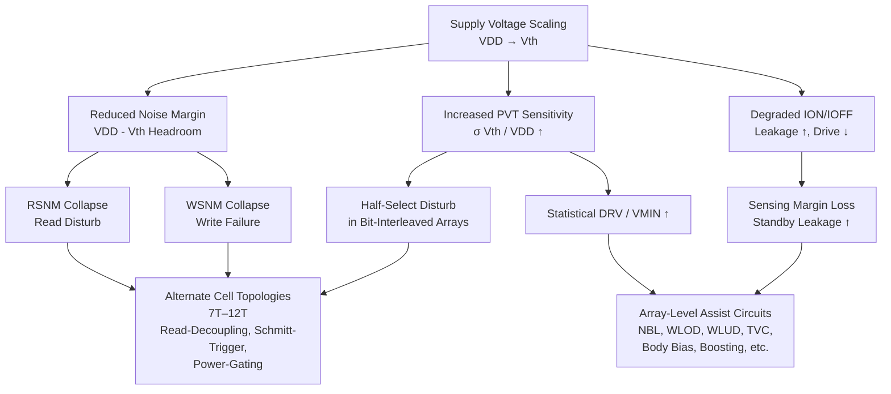
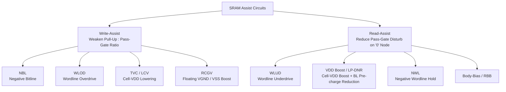

# Low-Voltage SRAM Design: A Technical Survey of Alternate Cell Topologies, Assist-Circuit Techniques, and Comparative Performance Analysis
# 1 Background and Challenges of Low-Voltage SRAM Operation

The proliferation of battery-powered electronics—ranging from Internet-of-Things (IoT) sensor nodes and wearable health monitors to implantable biomedical instruments and energy-harvesting SoCs—has transformed the design of on-chip memory from a performance-centric exercise into an exercise in extreme energy efficiency. Within these systems, the static random-access memory (SRAM) macro is simultaneously the most ubiquitous and the most power-hungry building block, and it is therefore the natural focal point at which any meaningful energy reduction must be attempted. Yet the most direct lever for cutting SRAM power—lowering the supply voltage (VDD) into the near-threshold or sub-threshold regime—collides with a set of fundamental physical and circuit-level limitations that cause the canonical six-transistor (6T) bitcell to fail. This opening chapter establishes the application-driven motivation for aggressive voltage scaling, dissects the failure mechanisms that emerge when a conventional 6T cell is pushed below its comfortable operating region, and codifies the quantitative metrics that will be used throughout the remainder of the report to compare alternate cell topologies and array-level assist circuits.

## 1.1 Application Drivers and the Imperative for Supply-Voltage Scaling

The economic and functional gravity of low-voltage SRAM design originates in the way memory dominates the power budget of modern systems-on-chip. SRAM already accounts for roughly **70% of the power consumption of a typical chip**, a share that is intolerable for IoT and wearable platforms whose total power budget is itself measured in microwatts[^1]. Self-powered IoT SoCs such as the 6.45 µW integrated energy-harvesting platform reported by Klinefelter et al., and the 19 µW batteryless MICS/ISM-band body-sensor node SoC reported by Zhang et al., illustrate how tight the global energy envelope has become for always-on, battery-enabled, or harvesting-driven applications[^2]. In such systems any reduction in SRAM standby and active power translates almost directly into longer battery life, smaller harvester area, or a longer duty cycle for the sensing and communication subsystems that the memory serves.

The first-principles motivation for voltage scaling follows directly from the well-known dynamic-power expression of CMOS circuits,

$$P_{dyn} = \alpha\,C\,f\,V_{DD}^{2}$$

in which the supply voltage enters quadratically. Halving VDD therefore reduces switching power by approximately a factor of four for a fixed activity factor $\alpha$, switched capacitance $C$, and operating frequency $f$. Because leakage current in deep-submicron CMOS also exhibits a strong, super-linear dependence on VDD through drain-induced barrier lowering (DIBL) and sub-threshold conduction, scaling the supply additionally suppresses static power—the dominant component in always-on memory arrays whose duty cycle is low. Calhoun, Wang, and Chandrakasan demonstrated that for sub-threshold logic there exists an optimal supply voltage at which the energy-per-operation reaches a minimum, because below this point the exponentially increasing delay forces leakage energy to dominate, while above it dynamic energy dominates[^2]. This minimum-energy point typically lies well within the sub-threshold or near-threshold regime, which explains the sustained research interest in pushing SRAM operation toward—and even below—the device threshold voltage.

Beyond the raw energy argument, application-specific constraints further reinforce the imperative for voltage scaling. The basic IoT architecture comprises sensors, gateways, processors, and application subsystems, all of which demand memories that combine "low power and high speed"; portability and handheld form factors in particular shift the market emphasis decisively toward **ultra-low-power SRAMs**[^1]. Microcontrollers embedded in wearable devices must operate from miniaturized batteries while continually adding new features that grow on-chip memory requirements, making the SRAM macro the bottleneck both for energy and for footprint[^1]. At the same time, IoT processors have followed an aggressive scaling trajectory from 180 nm down to 10 nm, and SRAMs are expected to follow the same miniaturization curve so that they can be embedded directly into the processor for the lowest possible access latency[^1]. The combination of (i) a shrinking energy budget, (ii) a memory subsystem that consumes the lion's share of that budget, and (iii) a scaling roadmap that simultaneously shrinks transistors and aggravates variability is what makes low-voltage SRAM design the central memory challenge of the IoT era.

It is important to recognize that SRAM is asked to serve two distinct application classes. The first prioritizes **speed**—as in high-bandwidth caches and inter-device communication links inside IoT gateways, where SRAM is selected over DRAM and flash precisely because of its quicker response and lower access time. The second prioritizes **ultra-low power**—as in wearable, implantable, and sensor-node applications, where standby leakage and per-access energy dominate the design objective[^1]. Achieving both simultaneously is widely acknowledged to be difficult, and the design trade-offs that arise from attempting to do so are precisely what motivate the alternate cell topologies and assist circuits surveyed in subsequent chapters[^1]. Supply-voltage scaling is the most effective single lever available to the designer, but as the next section makes clear, it is also the lever whose pull most quickly destabilizes the conventional bitcell.

## 1.2 Failure Mechanisms of the Conventional 6T SRAM Cell at Low Voltage

The conventional 6T SRAM cell, consisting of two cross-coupled CMOS inverters accessed by two NMOS pass-gate transistors, was optimized for an era in which the supply voltage comfortably exceeded the device threshold and in which random process variation was a second-order concern. When VDD is scaled toward $V_{th}$ and below, several failure mechanisms emerge simultaneously, and they interact in ways that elevate the minimum operating voltage ($V_{MIN}$) of the array far above the value that pure dynamic-energy minimization would suggest. The core issue is structural: VDD scales faster than $V_{th}$ in modern technology nodes, so the noise-margin headroom—roughly proportional to $V_{DD}-V_{th}$—is squeezed from both sides, leaving the cross-coupled latch increasingly vulnerable to any perturbation.

The most-cited failure mode of the 6T topology is the **read/write conflict** that arises because the same pair of pass-gate transistors must simultaneously satisfy two contradictory requirements. For read stability, the pass gates should be weak relative to the storage inverters so that the internal '0' node is not pulled high by the precharged bitline during a read access. For writability, the same pass gates should be strong relative to the pull-up devices so that an external bitline can overpower the latch. In a 6T cell these two requirements share a single sizing knob, and "it is inevitable that the two conditions cannot be simultaneously optimized"[^3]. The result is that as VDD shrinks, read failures and write failures appear from opposite ends of the design space and squeeze the feasible operating region into nothing.

This conflict expresses itself directly in the **collapse of static noise margins**. The read static noise margin (RSNM), traditionally extracted from the butterfly curve of the cross-coupled inverters with the wordline asserted, shrinks rapidly as VDD approaches $V_{th}$ because the voltage divider formed between the pass-gate and pull-down transistors lifts the '0'-storing internal node toward the trip point of the opposite inverter. Quantitatively, the conventional 6T baseline reported in the HS10T study exhibits an RSNM of only 0.112 V and a write margin (WM) of only 0.128 V at a 0.7 V supply in a 40 nm CMOS design kit, compared with an RSNM of 0.274 V and WM of 0.352 V for a redesigned 10T topology in the same kit[^4]. The write static noise margin (WSNM) follows a similar trajectory, and at deeper supply scaling these margins approach the thermal-voltage floor, at which thermal noise alone can flip the stored state. The 6T cell's $V_{MIN}$ in the same 40 nm study was found to exceed 0.6 V, while alternate cells reached $V_{MIN}$ as low as 0.41 V—a gap that quantifies just how poorly the 6T topology copes with sub-0.7 V operation[^4]. Designers therefore characterize 6T stability using the butterfly curve and complementary N-curve methods to capture both small-signal noise immunity and large-signal current-flip thresholds[^1].

A second class of failures becomes critical in **bit-interleaved arrays**, where multiple cells in the same row share a wordline but only one column is being accessed at a time. The unselected ("half-selected") cells in the active row see their wordlines asserted while their bitlines remain in a passive state. As noted in low-voltage 6T analyses, "the 6T SRAM cell stability problems also arise during a write operation to an unselected column when the word line is activated while both bit lines are held high. A situation that produces equivalent bias conditions to a read operation"[^3]. This **half-select disturb** essentially converts a write cycle into an array-wide read disturb event, and it is one of the principal reasons that bit-interleaved 6T arrays cannot be scaled to sub-threshold supply voltages without intrusive architectural changes.

A third, increasingly dominant failure axis is **process-voltage-temperature (PVT) sensitivity**. As CMOS scaling has progressed from 130 nm down to 10 nm, random dopant fluctuation and line-edge roughness have driven the standard deviation of threshold voltage to levels that are no longer negligible relative to $V_{DD}-V_{th}$ in the sub-threshold regime[^1]. The IoT-focused SRAM literature explicitly identifies "process variations" as a factor that "increases the leakage power and affects the stability," and notes that scaling beyond the nanometer regime "increases the variation in threshold voltages, which leads to other problems"[^1]. Variability-tolerant 6T cells reported for the sub-200 mV regime confirm that without architectural changes the conventional cell "suffers from read and write failures as well as instability" at scaled technology nodes[^5]. In practical terms, the Gaussian tails of the $V_{th}$ distribution determine the worst-case cell in a large array, and at sub-threshold supplies these tails dominate the $V_{MIN}$ specification—forcing designers to either over-design the cell, lift VDD above the energy-optimal point, or introduce assist circuits.

Short-channel effects (SCE) and drain-induced barrier lowering (DIBL) compound these problems by inflating the off-state current. Although scaling reduces dynamic power, it "increases the leakage current, which results in an increment of the overall standby power consumption, which is not favored in high-end processors," and the same scaling raises soft-error rates and introduces additional defects from process variation[^1]. The ION/IOFF ratio degrades because IOFF rises faster than the sub-threshold ION as VDD shrinks, which simultaneously erodes read-current sensing margins (the differential signal that a sense amplifier must resolve) and aggravates standby leakage in unaccessed rows. In a related but distinct manner, when researchers attempt to scale VDD aggressively, "increased delay time causes the power-delay product (PDP) to rise," meaning that beyond a certain point further voltage reduction is energy-counterproductive unless the cell or the array is restructured to recover speed[^3]. This is precisely the design space in which sub-threshold operation must be carried out: between the leakage-dominated lower bound and the dynamic-energy-dominated upper bound[^3].

Standby and data-retention concerns add a final layer of complexity. SRAM standby supply voltage minimization has been an active research direction precisely because leakage suppression requires aggressive VDD reduction during retention, yet the same reduction risks losing the stored data when the retention voltage drops below the cell's data-retention voltage (DRV)[^2]. Reliability-perspective studies of SRAM supply-voltage scaling have emphasized that DRV is not a deterministic quantity but a statistical one, governed by the same $V_{th}$ variability that erodes the active-mode noise margins[^2]. The collective effect of read disturb, write failure, half-select disturb, PVT-induced margin loss, SCE/DIBL leakage growth, degraded ION/IOFF, and elevated DRV is that the 6T cell's $V_{MIN}$ remains stubbornly above the supply voltages that the application layer demands. This gap is the central problem that the remainder of the report addresses.

The hierarchy of these failure modes and their corresponding circuit-level countermeasures provides the analytical backbone for subsequent chapters and can be summarized as follows.

This diagram makes explicit why the report's two solution chapters are organized as they are: **bitcell-level innovations** target the structural conflicts inside a single cell (the upper branch), while **assist circuits** intervene at the array level to compensate for residual margin loss without re-drawing every bitcell (the lower branch). Real low-voltage SRAM designs almost invariably combine both layers.

## 1.3 Key Evaluation Metrics and Analytical Framework

To compare the diverse menagerie of alternate cell topologies and assist techniques surveyed in subsequent chapters, the report adopts a unified set of evaluation metrics drawn from the prevailing low-voltage SRAM literature. These metrics fall into four families—stability, performance, power, and physical/area—plus an overarching reliability layer that combines several of them under statistical analysis. The framework is deliberately quantitative: every claim about a topology or assist technique will be tied wherever possible to one or more of the metrics defined here.

**Stability metrics** capture the cell's resilience to electrical noise during the three operating modes—read, write, and hold. The read static noise margin (**RSNM**) is extracted by the butterfly-curve method, in which the voltage transfer characteristics of the two cross-coupled inverters are plotted with the wordline asserted, and the side length of the largest square fitting between the two curves is taken as the RSNM[^4]. The hold static noise margin (**HSNM**) is measured identically with the wordline deasserted; for cells with a properly decoupled read port, RSNM can approach HSNM, as demonstrated by the HS10T cell whose "RSNM is approximately equal to the HSNM" because of read-write separation[^4]. Write stability is most commonly characterized by the **write margin (WM)** obtained through the wordline-sweep technique, in which the wordline voltage is gradually raised during a write attempt and the threshold at which the stored bit flips is recorded; a larger WM indicates that "the required opening degree of word line (WL) is smaller during the write operation, indicating that the SRAM cell has stronger writing ability and stability"[^4]. The write static noise margin (**WSNM**) provides a complementary view based on perturbation analysis, although WM is generally regarded as "more suitable for evaluating the write ability and stability of SRAM cells compared to WSNM"[^4]. For applications with bit-interleaved arrays the half-select stability is examined separately by simulating the disturbed cells along the active row and column under representative process corners[^4]. Complementary stability characterization may also employ N-curve methods, which probe the static current-flip thresholds and provide a large-signal complement to the small-signal butterfly analysis[^1].

**Performance metrics** focus on access delay and the composite power-delay product. **Write delay** is conventionally defined as the time required for the storage node to reach 90% of VDD (when writing '1') or 10% of VDD (when writing '0') after activation of the write wordline. **Read delay** is defined differently for differential and single-ended read schemes: for dual-ended (differential) reads it is the time needed to develop a 150 mV differential between the two bitlines after read-wordline activation, whereas for single-ended reads it is the time needed to discharge the read bitline from VDD to VDD/2 after activation[^4]. The **power-delay product (PDP)**, computed as the product of average power and access delay during read or write, "plays an important role in memory designs" and serves as a primary energy-efficiency indicator that captures the trade-off between voltage scaling (which lowers power but raises delay) and performance recovery techniques[^4]. In aggressively scaled designs, optimizing PDP "can improve the energy efficiency of chips, which is particularly important for energy limited mobile devices and data centers," and the metric will therefore be applied uniformly when comparing topologies in Chapter 4[^4].

**Power metrics** are split into dynamic and static components. Dynamic **write power** and **read power** quantify the energy consumed by the bitcell and its associated peripheral sequential circuitry during the corresponding access[^4]. **Leakage power** (synonymous with standby power) is the time-averaged static current drawn by all unselected cells, dominated in scaled nodes by sub-threshold and DIBL leakage; its importance is amplified by the observation that in large arrays the vast majority of cells are unselected at any given moment, so leakage often determines the array-level energy figure. The 6T baseline, with its dual-bitline configuration that holds both BL and BLB at VDD during idle periods, "employs a dual BL configuration, resulting in relatively high leakage power consumption" — a fact that motivates many of the single-ended alternate topologies discussed later[^4]. Bench-marking power across topologies must explicitly state the operating supply voltage; a useful reference point in the 40 nm literature is 0.7 V, at which the HS10T design reduces combined write-and-read power by 37.7% relative to the 6T baseline[^4]. Standby power reductions of 68.5% relative to 6T and 33% relative to read-decoupled 8T have been reported for a process-tolerant write-assist 10T design at 8 kb storage density[^2], illustrating the magnitude of gains that topology innovation can deliver.

**Reliability metrics** subsume the statistical interpretation of the above. The **minimum operating voltage ($V_{MIN}$)** is defined as the lowest supply voltage at which write, read, and hold operations all meet their respective failure-probability targets under worst-case process corners, and it is most rigorously evaluated through Monte Carlo simulation at the $3\sigma$ tail. Following the convention adopted in the HS10T study, the write-failure event is defined as $WM<0$, while read and hold failures are defined as the static noise margin dropping below the thermal-voltage floor (e.g., RSNM or HSNM $<26$ mV at $25\,^\circ\text{C}$), with target failure probabilities of $10^{-5}$ per cell[^4]. Process-corner simulation across the five canonical corners (TT, FF, SS, FS, SF) complements Monte Carlo analysis by exposing systematic worst cases; FF corner is typically used for the worst write-disturb condition, while SF/FS corners reveal worst-case asymmetric writability[^4]. Half-select robustness, soft-error rate, and bias-temperature-instability (BTI) sensitivity provide additional reliability dimensions that may be invoked for specific topologies.

**Physical metrics** describe the silicon cost of each design. **Transistor count** is the simplest proxy and provides the names for the 7T–12T taxonomy used throughout the report. **Normalized layout area** is the more meaningful comparator because it accounts for the actual transistor sizing and routing required to satisfy a given technology node's design rules; in the 40 nm CMOS reference, for instance, the layout areas of SB9T, SLE10T, SE10T, SPG11T, and HS10T cells were measured at 1.965×, 1.749×, 1.678×, 1.958×, and 1.674× of the 6T baseline area, respectively[^4]. Closely related to area is **bitcell density**, which determines the macro's storage capacity per square millimeter and is critical for cache-oriented applications.

The **sensing method**—single-ended versus differential, with the associated sense-amplifier topology—deserves elevation to a primary metric because it strongly couples to power, speed, and area simultaneously. Differential sensing (used by the 6T baseline) maximizes signal-development speed and noise immunity at the cost of two precharged bitlines per column, doubling bitline leakage and dynamic-precharge energy. Single-ended sensing (used by many 8T–11T topologies) discharges a single read bitline from VDD to half-VDD against a reference, "effectively reducing the power consumption" but bringing "a series of issues such as increased delay and decreased write-ability"[^4]. Variability-aware sense amplifiers with improved input-referred offset characteristics have themselves become an active research direction to recover sensing margins at low VDD[^2].

The five metric families are summarized below; this consolidated framework will be applied uniformly when the report's comparative table is constructed in Chapter 4.

| Metric Family | Primary Indicators | Extraction Method / Definition |
|---|---|---|
| **Stability** | RSNM, WSNM, HSNM, Write Margin (WM) | Butterfly curve, N-curve, wordline-sweep WM[^4][^1] |
| **Performance** | Write delay, Read delay, PDP | 90%/10% VDD crossing (write); 150 mV differential or VDD/2 discharge (read); P × D product[^4] |
| **Power** | Dynamic write/read power, Leakage power | Time-averaged current × VDD over access cycle or standby interval[^4] |
| **Reliability** | $V_{MIN}$, process-corner robustness, half-select immunity | Monte Carlo at $3\sigma$, $P_{\text{fail}}=10^{-5}$, corner-by-corner WM/RSNM check[^4] |
| **Physical** | Transistor count, normalized layout area, sensing method | Layout-extracted area normalized to 6T; differential vs. single-ended sensing[^4] |

The decisive insight that emerges from this framework is that **no single metric can rank SRAM topologies**; instead the comparison must be carried out on a multi-dimensional **Power–Performance–Stability–Area (PPSA)** plane. A cell that achieves a stunning RSNM through read-decoupling may suffer in area; an assist technique that lowers $V_{MIN}$ by 100 mV may require a charge pump and timing logic whose silicon overhead negates the array-level energy savings at small macro sizes. Throughout the subsequent chapters of this report, every alternate topology (Chapter 2) and every assist technique (Chapter 3) will be evaluated against this PPSA framework, and the consolidated quantitative comparison (Chapter 4) will be interpreted explicitly in terms of Pareto-optimal trade-offs for the three target application classes—ultra-low-power IoT nodes, wearable biomedical instruments, and high-density embedded caches.

With the motivation for voltage scaling established, the failure mechanisms of the 6T cell characterized, and the evaluation metrics formalized, the report now turns in Chapter 2 to the first family of solutions: alternate bitcell topologies that restructure the cell itself to recover the noise margins and writability that aggressive VDD scaling has eroded.

# 2 Alternate SRAM Cell Designs from 7T to 12T

Chapter 1 established that the conventional 6T cell is structurally incapable of simultaneously satisfying the contradictory sizing requirements of read stability and writability once the supply voltage is scaled toward the device threshold, and that this single bottleneck cascades into half-select disturb, PVT-induced $V_{MIN}$ elevation, and untenable leakage in bit-interleaved arrays. The most direct response, and the one explored throughout this chapter, is to abandon the 6T bitcell altogether and to redistribute its two contradictory functions across additional transistors. The cost is silicon area; the benefit is a degree of design freedom in which read paths, write paths, and storage nodes can each be tuned independently. The taxonomy that follows—organized by transistor count from 7T to 12T—reflects the historical evolution of this redistribution strategy. Each step up the transistor ladder buys a new architectural feature: a dedicated read buffer, a feedback-cutting switch, a Schmitt-trigger inverter, a column-wise write-enable, an internal supply-collapse network, or a fully eliminated write bitline. The chapter is therefore best read not as a catalogue of isolated circuits but as a layered accumulation of techniques, each of which targets a specific 6T failure mode identified in Chapter 1 and each of which introduces a corresponding new control signal.

## 2.1 7T SRAM Cells: Minimal-Overhead Stability and Writability Enhancements

The 7T family represents the smallest possible departure from the 6T baseline and is therefore the most area-conservative class of alternate topologies. Because only one transistor is added, 7T designs cannot simultaneously decouple the read path and the write path; they must pick a single weakness of the 6T to address, and the choice partitions the 7T literature into two principal branches: cells that improve writability by breaking the cross-coupled feedback during the write operation, and cells that improve read stability by isolating one storage node from the bitline.

The first branch is exemplified by the low-power cache-oriented 7T cell proposed by Aly and Bayoumi, which introduces a novel write mechanism that "depends only on one of the two bit lines to perform a write operation," thereby reducing the activity factor of the bitline pair and saving "at least 49%" of write power while maintaining read delay and static noise margin through careful transistor sizing[^6]. The single-ended write strategy is also the basis of a more recent 32 nm 7T cell that operates down to 300 mV with a 90 mV hold/RSNM and a 190 mV write margin, where the cell uses a "single bit line architecture" and improves hold/read SNM by 58.8% and write ability by 71.4% relative to a single-ended 6T baseline, while reducing leakage current by a factor of 14–28 depending on the stored value[^7]. A complementary mechanism is employed in the **source-feedback single-ended 7T** described by Roy and Islam, in which the supply or source node of one inverter is dynamically biased during write to weaken its pull-up strength and ease the data flip[^8]. In all these designs, the added transistor M4 plays the role of a feedback-breaking element: when the write wordline (WWL) signal is asserted, M4 disconnects the feedback path of the back-to-back inverters so that an asymmetric bitline can flip the latch without contending against a fully active pull-up. The newly introduced control signal in this branch is therefore a dedicated WWL (distinct from the read wordline that retains 6T-like behavior), and in some variants a supply-control or virtual-supply node that the column driver pulses during write.

The second branch is best represented by the **Schmitt-Trigger-based 7T cell for IoT applications**, where the hysteresis of a single-ended ST inverter built into the storage latch enlarges the noise margin against bitline-induced perturbation, and read stability is recovered "by isolating the storage node from the bit line"[^9]. In this design the seventh transistor is repurposed as part of an asymmetric ST input stage, and the cell uses a single read bitline (RBL) accessed through a dedicated read wordline (RWL), eliminating the read disturb that plagues 6T. The L-shaped 7T cell of Chang et al. extends the same idea by combining a boosted read-bitline scheme with an asymmetric-$V_{TH}$ read port and an offset cell-VDD biasing technique, achieving sub-0.3 V operation in 65 nm with significant read-bitline swing expansion[^10]. A further variation is the **dual-Vt asymmetric 7T** discussed in the cache and biomedical-application literature, in which low-Vt transistors drive the bitlines while high-Vt devices form the storage latch, exploiting the asymmetry to improve speed at the bitline interface while suppressing leakage in the storage inverters[^9][^11]. Single-loop single-feed 7T cells designed specifically for biomedical implants follow a similar philosophy, prioritizing reliability over raw performance because the surrounding sensor system is intrinsically low-bandwidth[^12].

Across both branches, the defining characteristic of 7T topologies is the explicit acknowledgement that **the seventh transistor (M4 in many schematics) breaks the cross-coupled feedback of the back-to-back inverters under control of the WL signal to improve the write noise margin**, or alternatively, decouples one storage node from the bitline to improve the read noise margin—but never both simultaneously. The newly introduced control signals are correspondingly modest: a dedicated WWL and, for read-decoupled variants, a single RBL with its associated RWL. The area overhead is the smallest of any alternate topology, but the residual coupling between read and write paths means that 7T cells are typically deployed in applications where one of the two operations clearly dominates—as in instruction caches (read-mostly) or write-mostly scratchpad memories.

## 2.2 8T SRAM Cells: Read-Decoupled Architectures for Sub-threshold Operation

Adding a second transistor to the 6T relieves the constraint of choosing between read and write improvements. The canonical 8T bitcell introduced by Verma and Chandrakasan exploits this freedom by appending a **dedicated two-transistor read buffer (M7 and M8)** to the storage latch, with M7 acting as a read access switch driven by a separate read wordline (RWL) and M8 forming a current-driven pull-down whose gate is connected to one internal storage node[^10][^13]. The structural consequence is decisive: **the 8T cell separates the read port (M7 and M8)** from the write port, so that during a read operation the storage nodes never see the precharged read bitline and the destructive voltage divider that defines 6T read disturb is eliminated entirely. **By separating the read port, the 8T cell avoids the device-sizing conflict between read and write requirements, thereby allowing independent tuning of the read noise margin**—the RSNM can approach the HSNM, and the cell's write port pass transistors can be sized aggressively for writability without compromising read stability.

The control-signal complement of the 8T cell is correspondingly richer than 6T or 7T. A typical 8T column carries a differential write bitline pair (WBL/WBLB or BL/BLB) driven by the column driver during write, plus a single-ended read bitline (RBL) that is precharged to VDD before a read access. The row driver asserts the write wordline (WWL) for write accesses and the read wordline (RWL) for read accesses, with the two signals never asserted simultaneously[^10]. Some implementations add a row-shared virtual ground (VVSS) that is held high during standby to suppress sub-threshold leakage through the read pull-down network of unaccessed cells, as in the 130 nm battery-less SoC array reported by Yahya et al., where the read footer "is shared between bit-cells on the same row" and its driver is overdriven by a charge pump "to ensure the VVSS node does not rise"[^10]. The same array uses high-$V_T$ devices throughout the 8T cell to minimize leakage, achieving a standby power of just **12.29 nW/KB at 320 mV with data retention**, an active energy of 6.24 pJ/access at 400 mV, and an operating range of 350–700 mV—numbers that demonstrate how the 8T topology, when combined with read/write assist, supports true sub-threshold operation[^10].

Despite the elegance of the basic 8T, several residual weaknesses have motivated a rich family of 8T variants. The first is **half-select disturb during writes**: cells sharing the write wordline with the accessed column still experience a pseudo-read on their write bitlines, which in sub-threshold is enough to corrupt their stored values. The 130 nm battery-less array addresses this by row read-before-write, in which the entire row is first read into latches and then rewritten with the new data merged into the unchanged bits[^10]. The second weakness is **single-ended sensing fragility**: because the read port discharges only a single RBL, leakage through unaccessed cells on the same column can mask the read current of the accessed cell, especially at low VDD where the ION/IOFF ratio collapses. Do et al. demonstrated this quantitatively at 0.3 V and $80\,^\circ\text{C}$ with 256 cells per bitline, where the worst-case data pattern causes the leakage of unselected cells to exceed the read current of the selected cell, and proposed column-based data randomization plus PVT-aware bitline boosting to restore the sensing margin, achieving 0.2 V operation in 65 nm with 1 pJ/access[^13]. The third weakness is **writability degradation at sub-threshold**, addressed in the same 130 nm array by write-wordline boosting via a charge pump, which provides more $3\sigma$ write-margin improvement than VSS-raising for the same degree of assist[^10].

The 8T family also includes several variants that refine the basic read-decoupled architecture. The **tunable-access 8T (TA8T)** of Wen et al. adds two extra transistors that tune the strength of the access transistors during write, simultaneously improving writability and lifting the pull-down strength during read for higher RSNM[^8]. The **differential transmission-gate 8T** of Roy and Islam replaces the NMOS pass-gate write port with full transmission gates to improve write delay, and adds a stacked transistor in the leakage path of one inverter to suppress standby leakage[^8]. The **zigzag 8T** of Wu et al. employs an area-efficient decoupled differential sensing and fast write-back scheme tolerant of large $\sigma_{Vth}/V_{DD}$ in 90 nm[^10]. Finally, the **asymmetric 8T (8T Asy)** for sub-threshold operation creates a virtual ground for write operations, with the write-1 margin substantially improved by floating the M1 ground although the write-0 margin remains constrained by pull-up contention[^14]. Across all 8T variants, the unifying theme is the dedicated 2T read buffer; the variations differ chiefly in how they manage the leakage and half-select consequences of that buffer.

## 2.3 9T SRAM Cells: Half-Select Mitigation and Single-Bitline Power Reduction

The transition from 8T to 9T is driven by two converging goals: cutting bitline-related dynamic and leakage power further, and addressing the half-select disturbance that 8T inherits in bit-interleaved arrays. The third added transistor is typically deployed as a column-aware enable, a feedback-cut switch, or a footer for the read network, and the resulting 9T topologies divide into several distinct families.

The most fundamental restructuring is found in 9T designs that provide **independent read and write ports through three dedicated access transistors (M7, M8, and M9)**, with the write port driven by a write wordline (WWL) and the read port driven by a read wordline (RWL). The 9T cell of Singh and Tomar exemplifies this approach: NM5 functions as the write access device controlled by WWL, while NM6 (RWL-driven) and NM7 (storage-driven) form the read stack that discharges the read bitline against a virtual ground (VGND) signal placed at logic 0 during read and at logic 1 during write or hold to gate static leakage[^8]. The same paper reports RSNM enhancement of 1.95× over 6T and 1.87–1.92× over reference 8T/11T cells, with read power reduced by 1.48× relative to 6T, attributed to the read-decoupled structure and the elimination of differential bitline pre-charging[^8]. To go further on leakage and power, several 9T variants additionally introduce **wordline pull-up (WLPU) and wordline pull-down (WLPD) transistors that act as power-gating switches**, allowing the cell or its read network to be aggressively gated during standby, as in the asymmetrical 9T cell of Tiwari et al. that uses tri-mode MTCMOS to suppress static power[^8].

A second 9T family aggressively prunes bitline overhead via **single-bitline 9T (SB9T)** designs. By eliminating one of the two write/read bitlines, SB9T cuts the precharge energy and the bitline leakage in half, at the cost of slightly more complex write circuitry. The SB9T proposed for low-leakage low-power operation reports the "least amount of dynamic power consumption" thanks to its single-bitline structure[^9][^15], and a FinFET-based single-bitline 9T extends the same idea to near-threshold operation in 7 nm technology[^9]. A related design eliminates read disturb and provides high writability for biomedical applications by combining the single-bitline architecture with stacked transistors in the read path[^14].

A third 9T family targets the half-select problem head-on. The **half-select-free bit-line-sharing 9T** of Shin et al. introduces cross-access selection of row and column word-lines, completely eliminating the half-select disturbance that limits 6T and 8T arrays, with a measured 4 kb macro that operates from 0.35 V to 1.1 V in 65 nm CMOS and achieves a $V_{MIN}$ of 0.45 V among half-select-free SRAM cells while sharing bitlines and access transistors between adjacent cells to minimize area overhead[^16]. A related **single-ended disturb-free 9T** uses a cross-point data-aware write word-line structure combined with negative bit-line assist and adaptive read-operation timing, and the 40 nm 72 kb chip of Lu et al. operates at 0.325 V with 600 kHz and 0.267 pJ/bit energy efficiency by aligning a boosted write wordline with a negative WBL[^9][^17]. The cross-point write structure introduces a column-based write wordline signal that gates write access only at the intersection of the selected row and column, eliminating row-half-selected disturb in bit-interleaved arrays.

A fourth 9T family applies **Schmitt-trigger hysteresis** to the storage inverters. The one-sided ST-based 9T of Cho et al. operates in the near-threshold region and supports bit-interleaving, using a write-assist methodology with selective power gating to enhance writability[^8]. The supply-feedback 9T (SF9T) of Teman et al. uses the new transistor to gate the supply during write, achieving 250 mV operation in 40 nm[^13], while the comparative analysis at 22 nm shows that disturb-free, ultra-low-voltage, and disturb-free sub-threshold 9T variants all share the read-decoupled property that yields RSNM equal to HSNM (around 230 mV in the cited study), although the SF9T variant sacrifices some RSNM because its supply-gating prevents the storage node from reaching full VDD during write[^18].

Across the entire 9T design space, the unifying themes are (i) the introduction of a dedicated WWL and RWL pair, often supplemented by a column-based write enable or column-select signal that breaks the half-select disturbance, (ii) the addition of virtual-ground or virtual-supply control lines that enable per-row or per-column gating of leakage paths, and (iii) optional sleep or power-gate signals attached to WLPU/WLPD transistors that drive the cell into a low-leakage standby state. The 9T family therefore acts as a hinge in the alternate-cell taxonomy: it inherits the read-decoupling of the 8T and adds the architectural hooks needed for bit-interleaved low-voltage operation, at a modest area cost relative to the 10T–12T designs that follow.

## 2.4 10T SRAM Cells: Sub-threshold Robustness and Leakage Suppression

The 10T family is where alternate SRAM design crystallizes around true sub-threshold operation. Four extra transistors give the designer enough freedom to implement Schmitt-trigger hysteresis, dynamic read inverters, feedback-cutting write assist, and stacked leakage paths simultaneously, and the literature accordingly contains a wide variety of 10T topologies aimed at the most aggressive voltage-scaling targets. A central conceptual move shared by many 10T designs is **the use of buffers (M7, M8, and M9 transistors) to provide strong logic for stored 0 or 1 values**, thereby decoupling the storage nodes from the bitline so completely that read-induced perturbation is eliminated and the cell's RSNM becomes essentially equal to its HSNM.

The Schmitt-trigger-based differential 10T (ST2) of Kulkarni et al. is the archetype: a fully differential 10-transistor bitcell in which each storage inverter is replaced by a Schmitt-trigger, exploiting hysteresis to enlarge the noise margin and operating reliably at 160 mV—well into sub-threshold[^19][^20][^21]. The hysteresis is what makes ST2 distinctive: the trip point of the storage inverter shifts as a function of the previous state, so that small read-induced perturbations cannot easily overcome the dynamically widened margin. The PPN-based 10T cell of Lo and Huang takes a different approach by replacing the cross-coupled CMOS inverters with **a cross-coupled P-P-N inverter pair**, in which each "inverter" comprises two PMOS in series and a single NMOS pull-down; the resulting latch operates as low as 285 mV, exhibits "ultra-low cell leakage" and "high immunity to the data-dependent bitline leakage," and is particularly suited to long-bitline high-density macros[^22].

A third 10T branch is built around **single-ended read decoupling with a dynamic read inverter**, exemplified by the HSLP10T of Dolatshah et al. in 7 nm FinFET technology, which "uses a decoupled read path, formed by a transmission gate and a dynamic inverter," and incorporates "a feedback-cutting transistor to facilitate the write operation"[^23]. At a 300 mV supply, the HSLP10T improves read stability by 2.06× and writability by 1.31× over 6T, reduces dynamic and leakage power by 1.82× and 2.92× respectively, and lowers the minimum operating voltage by 48.28%—at the cost of a 1.67× layout area[^23]. The transmission-gate read buffer enables high-impedance isolation of the storage node during standby while still providing strong drive during read, and the dynamic inverter performs a self-contained level conversion that is robust to bitline leakage. A related ultra-low-leakage stacked 10T cell from the Michigan group reports just 1.85 fW/bit leakage with a speed-compensation scheme[^10].

A fourth branch employs **MTCMOS and transistor-stacking** explicitly. In the 10T cell proposed by Upadhyay et al., two voltage sources are connected to BL and BLB to reduce voltage swing during switching, and "two stack transistors are also connected in the pull-down paths which increase the threshold voltages of the transistors and this cause the reduction in sub-threshold leakage current and static power dissipation," with simulation at 45 nm and 0.7 V[^24]. The robust low-power 10T (RLP10T) of Abbasian and Gholipour goes further by integrating a novel read/write assist mechanism that simultaneously improves RSNM and WSNM; in 16 nm CMOS it achieves 3.55× higher RSNM than the WRE8T baseline and 1.10× higher WSNM than the WALP11T reference, with leakage suppressed by the single-bitline structure and stacked transistors in the read and pull-down paths, at a 1.22× area penalty[^25]. A standby-power-optimized P10T using stacked transistors reduces standby power by 4.9%–15.99% relative to 8T/8TG/9T at 0.9 V and improves write margin by 47.6%–262.9% over 6T/8TG/9T[^26].

Beyond these, the bit-interleaved differential-read 10T of Chang et al. achieves bit-interleaving capability with a differential read scheme in 90 nm[^10][^27], and several FinFET-based 10T variants tailored for sub-threshold operation in 10 nm exploit FinFET's intrinsic variation tolerance to lower the assist burden[^28]. The 10T design space thus offers the broadest menu of mechanisms—Schmitt-trigger hysteresis, P-P-N latches, transmission-gate read buffers, dynamic inverters, feedback-cutting write assist, MTCMOS power gating, and transistor stacking—any of which can be combined to push $V_{MIN}$ deep into sub-threshold. The control-signal complement typically includes WWL, RWL, a feedback-cut or write-assist signal, optionally a sleep or power-gate signal, and in differential variants a complementary read bitline. The price, paid uniformly across the family, is area: 10T cells are 1.5–2× larger than 6T, and write delay is generally longer because the longer write path must traverse the feedback-cut device.

## 2.5 11T SRAM Cells: Fully Half-Select-Free and Reliability-Aware Designs

The 11T family integrates the assist mechanisms of 8T–10T into the bitcell itself, with the explicit objective of providing fully half-select-free operation and reliability against bias-temperature instability (BTI) without recourse to external write-assist circuitry. The added eleventh transistor typically serves as a feedback-cut or column-aware enable that disentangles the previously coupled stability margins. The key conceptual contribution is that **transistors M9 and M10 in the 11T cell eliminate the interdependency between read and write noise margins**, so that the cell designer can size the read network and the write network with full independence—a property that 9T and even basic 10T topologies do not provide.

The half-select disturb-free 11T of He et al. exemplifies the family: it employs a built-in write/read-assist scheme, supports bit-interleaving for soft-error immunity, and operates reliably at ultralow voltages by combining a fully decoupled read port with a write path whose stability is reinforced by an internal write-assist transistor[^29][^30]. The data-dependent-power-supplied 11T (D2P11T) of Sharma et al. for IoT applications uses a data-dependent power supply rather than an exclusive power supply, which enhances RSNM through read-decoupled methodology while reducing power dissipation[^8]. The write-improved half-select-free 11T of Sharma et al. introduces a data-dependent partial-feedback cutting technique that selectively breaks the latch feedback during write, dramatically improving write ability while preserving full half-select immunity through a bit-interleaving-compatible cross-point write structure[^8][^31]. The 11T cell of Sachdeva and Tomar improves both read stability (via read-decoupled structure) and write ability (via differential write coupled with single-ended read), exploiting the mode-switching freedom that 11 transistors afford[^8].

Schmitt-trigger-based 11T designs constitute a second 11T branch. The 7 nm FinFET Schmitt-trigger 11T of Verma et al. specifically targets low leakage by leveraging FinFET's intrinsic variation tolerance and exploiting ST hysteresis in the storage inverters[^9]. The one-sided ST-11T of Yadav and Singh adds **negative wordline (NWL) biasing in hold mode**, in which the access transistors are biased into the super cut-off region during hold by applying a negative voltage to the wordline; this reduces sub-threshold leakage by up to 384.17× compared with reference SRAM cells, while improving read, hold, and write stability by 1.15×, 1.32×, and 1.40× respectively over 6T, and accelerating read and write operations by 5.46× and 3.10× in 45 nm CMOS at 1.0 V[^32]. A complementary write-enhanced fully half-select-free 11T design with BTI-reliability analysis reports leakage power "close to that of the 6T (between 0.96× and 1.22× of 6T)" while remaining fully half-select-free[^33][^34], demonstrating that 11T designs can match 6T leakage when the cell is properly stacked.

A common architectural pattern across 11T variants is the combination of **read-decoupling** (a dedicated read buffer driven by a separate RWL and RBL) with **leakage-control transistors** (added in series in the pull-down or supply path to exploit the stacking effect) and either **transmission-gate write paths** (which improve write delay and write margin) or **column-based write-enable signals** (which break the row-wide half-select coupling of 6T/8T arrays). The control-signal complement is correspondingly the richest yet encountered: WWL plus RWL plus a column-based write enable plus an optional sleep or NWL signal plus, in some variants, a feedback-cut or partial-feedback-cut signal driven by the data pattern. The cost is area (typically 1.6–1.8× the 6T baseline based on the values reported by Singh and Tomar for the 11T cell at 45 nm[^8]) and a longer write delay through the additional control transistors. The benefit, paid for by these costs, is what the application layer values most: deterministic operation in bit-interleaved arrays at near-threshold supplies, with BTI-aware reliability and a leakage figure that approaches 6T despite the dramatic gain in stability.

## 2.6 12T SRAM Cells: Bit-Interleaving and Write-Bitline-Free Ultra-Low-Voltage Topologies

The 12T family represents the most aggressive end of the transistor-count spectrum and is typically reserved for applications whose energy and reliability requirements justify the area penalty: ultra-low-voltage subthreshold operation, medical-device and wearable sensor memories, and bit-interleaved arrays whose soft-error budgets are very tight. A defining structural feature shared by many 12T topologies is that **the 12T SRAM cell uses tri-state buffers for read and write operations**, allowing the cell to selectively isolate its storage nodes from both the read and write paths under explicit column-based control signals. The tri-state structure enables internal supply collapse, embedded read-only bitlines, and complete write-bitline elimination, all of which would be impossible with fewer transistors.

The bit-interleaving 12T of Chiu et al. in 40 nm subthreshold CMOS pairs a differential cross-point data-aware power-cutoff (DAPC) write-assist with a column-based write wordline, so that during a write operation the supply voltage of either the left or right half-cell is internally cut off depending on the input data[^35][^36]. This weakens the pull-up network on exactly the side that needs to discharge, assisting the write without external boosting circuits and without the half-select disturb that would otherwise corrupt unselected cells in the same row. The differential cross-point write structure additionally supports a true bit-interleaving architecture, which improves immunity to multi-bit soft errors by spatially separating physically adjacent bits of the same logical word. The same family includes the Schmitt-trigger 12T of Sharma et al. with process-variation-tolerant writability, in which ST hysteresis in the storage inverters is combined with column-based write assist to achieve robust subthreshold operation across PVT corners[^37]. A 12T variant for medical-device applications operates at the optimum-energy supply voltage by leveraging Schmitt-trigger storage[^38].

A particularly aggressive branch of the 12T family is the **write-bitline-free 12T** of Karamimanesh et al. in 14 nm FinFET, in which the write bitline is eliminated entirely and write operation is performed using only control signals that manipulate the cell's internal supply voltage through three dedicated write transistors (M7, M8, M9)[^14]. The embedded bitline serves only the read operation and remains floating when not accessed, which eliminates the precharge circuit and the write-driver circuit and dramatically cuts dynamic and leakage power; the read path uses a dynamically biased NOT gate that completely isolates the storage node from the bitline, making RSNM equal to HSNM. At a 0.2 V supply and 100 MHz, the design improves average cell power by 34.9% over the best previous designs, reduces hold-state leakage by 27.6%, improves PDP by 35.2%, and achieves a maximum frequency of 2.173 GHz at subthreshold operation—a 39.1% improvement over previous designs[^14]. The same authors extended the concept to a 13T variant that retains the write-bitline-free architecture while adding stacked PMOS access transistors for further leakage suppression[^14]. A related 12T design in 32 nm CNTFET reports 1.76× higher WSNM than 6T and 1.91× higher RSNM, again using read-decoupled and write-assist mechanisms enabled by the abundant transistor count[^37].

A further branch employs **dynamic feedback** to refine stability during write. The single-ended dynamic-feedback 12T introduces a feedback-cutting transistor that breaks the latch loop dynamically during write, while a separate read-decoupled structure provides high RSNM[^36]. The half-select-free bitline-sharing 12T of Pal et al. with double-adjacent-bits soft-error correction targets reconfigurable FPGA-LUT design and combines bit-interleaving with built-in error correction at the cell level[^39]. The 64 kb differential single-port 12T of the bit-interleaving-and-read-disturb-free family reads and writes at 300 mV and retains data down to 250 mV by boosting the wordline and select-signal voltage[^40]. A write-improved low-power 12T explicitly targets wearable wireless sensor nodes[^39], and the analysis-and-optimization 12T in 32 nm FinFET demonstrates that the area penalty can be partially offset by FinFET's intrinsic density advantage[^9].

Across the 12T family, the control-signal complement includes WWL and RWL, a column-based write wordline (CWWL) that enables true bit-interleaving, one or more power-cutoff or supply-collapse signals that drive the internal write assist, optional NWL or sleep signals for hold-mode leakage suppression, and in write-bitline-free designs the elimination of the entire WBL/WBLB pair in favor of the same control signals that drive the supply collapse. The price paid in area is the largest in the alternate-cell taxonomy—typically near 2× the 6T baseline, even with FinFET density advantages—and the routing complexity of the additional control signals further inflates layout cost. The benefit, however, is unmatched: RSNM equal to HSNM, write margins large enough to support 200 mV operation with no external write assist, leakage rivaling or beating 6T thanks to stacked devices and floating bitlines, and a clean bit-interleaving story for soft-error-resilient memories.

## 2.7 Synthesis: A Layered View of Alternate Cell Design

Stepping back from the individual topologies, the 7T-to-12T progression reveals a coherent design philosophy whose layers can be summarized as follows.

| Transistor Count | Defining Architectural Move | Newly Introduced Control Signals | Primary 6T Failure Mode Addressed |
|---|---|---|---|
| **7T** | Single added transistor breaks back-to-back inverter feedback under WL control, or isolates one storage node from the bitline | Dedicated WWL; in single-ended variants, single RBL/RWL | Write conflict OR read disturb (not both) |
| **8T** | Dedicated 2T read buffer (M7, M8) decouples storage nodes from RBL | RWL, RBL added; WBL/WBLB and WWL retained; optional VVSS | Read disturb eliminated; sizing conflict removed |
| **9T** | Three dedicated access transistors (M7, M8, M9) yield independent read and write ports; optional WLPU/WLPD for power gating | Separate RWL and WWL; VGND/virtual-source; column-select for half-select-free variants; sleep signal | Read disturb plus half-select disturb in bit-interleaved arrays |
| **10T** | Schmitt-trigger / P-P-N latch, transmission-gate read buffer with dynamic inverter, MTCMOS stacking; buffers (M7, M8, M9) provide strong logic for stored 0/1 | RWL, WWL, feedback-cut, sleep / power-gate signal | Sub-threshold stability and leakage |
| **11T** | Read-decoupling combined with leakage-control transistors and column-based or transmission-gate write paths; M9/M10 eliminate read–write noise-margin interdependency | RWL, WWL, column-based write enable, NWL or sleep, partial-feedback-cut | Fully half-select-free, BTI-aware reliability |
| **12T** | Tri-state buffers for read and write, internal supply collapse (DAPC), embedded read-only bitlines, complete write-bitline elimination | RWL, column-based WWL, power-cutoff signals, optional NWL; WBL/WBLB may be eliminated | Ultra-low-voltage subthreshold operation, bit-interleaving with soft-error immunity |

The synthesis is clear: **alternate cell designs improve stability by decoupling read and write operations through the addition of transistors**, and each successive count buys a new architectural feature—first a dedicated read buffer (8T), then a column-aware enable for half-select immunity (9T), then Schmitt-trigger or transmission-gate write assist (10T), then full read–write margin decoupling and BTI awareness (11T), and finally internal supply collapse and write-bitline elimination (12T). The 7T family stands apart as the minimal-area compromise, addressing one weakness of 6T at a time. The chapter therefore demonstrates that there is no single "best" alternate cell; the right choice depends on which application metric—area, leakage, sub-threshold $V_{MIN}$, bit-interleaving capability, or soft-error immunity—the system designer is unwilling to sacrifice. This multi-dimensional Pareto landscape is the subject of the quantitative comparison in Chapter 4, but before that the report turns in Chapter 3 to the complementary solution layer: array-level assist circuits that recover the residual margin loss that even the most sophisticated bitcell cannot fully eliminate.

# 3 Assist-Circuit Techniques for Low-Voltage SRAM Operation

Chapter 2 demonstrated that redistributing transistors inside the bitcell can decouple the contradictory read and write requirements that doom the 6T at sub-threshold supplies, but it also showed that every such redistribution carries an area penalty and that even the most aggressive 11T/12T topologies eventually run into residual margin loss at the worst process corners. Industrial SRAM macros therefore almost never rely on bitcell innovation alone; instead, the bitcell is paired with a complementary layer of **array-level assist circuits** that intervene in the periphery — at the wordline driver, the write driver, the bitline precharge network, or the cell-supply rail — to recover the last 100–300 mV of $V_{MIN}$ that the cell cannot deliver on its own. This chapter dissects eight mainstream assist-circuit techniques along the read-vs-write axis, identifies the hardware overhead and timing requirements of each, and consolidates the findings into a quick-reference selection guide that will feed into the integrated PPSA comparison of Chapter 4.

## 3.1 Overview and Taxonomy of SRAM Assist Circuits

Assist circuits exist because the 6T cell — and to a lesser extent the alternate cells of Chapter 2 — cannot simultaneously satisfy read stability and writability across all PVT corners once $V_{DD}$ is scaled into the near-threshold regime. As the comprehensive analysis of the 28 nm 32 kb design notes, "SRAM read and write assist techniques are widely used approaches to lower the $V_{MIN}$ of an SRAM" and they work by raising the cell's read stability or writability above the marginal level required for proper operation, thereby allowing the supply voltage to be reduced further until those margins collapse back to the original baseline.[^41] The result is a tightly coupled co-design problem in which a read-assist that enlarges the read static noise margin (RSNM) typically degrades the write margin (WM), and a write-assist that enlarges WM typically degrades the access-disturbance margin (ADM) of half-selected cells in the same row or column — making **dual-assist schemes the industrial norm** rather than the exception.[^41]

Conventional assist techniques fall along two orthogonal axes. **Write-assist** schemes share a single underlying principle: they reduce the ratio of pull-up to pass-gate strength of an SRAM cell when the wordline is enabled for write, either by strengthening the pass gate (NBL pushes its source negative, WLOD raises its gate) or by weakening the pull-up (LCV/TVC lowers $V_{DDCELL}$, RCGV raises $V_{SSCELL}$).[^41] **Read-assist** schemes, by contrast, mitigate the read-disturb voltage divider that forms between pass gate and pull-down by reducing pass-gate strength (WLUD), by lowering bitline precharge voltage (DNR/LP-DNR), by boosting cell-VDD relative to the periphery, or by shifting threshold voltages dynamically through body bias.[^41]

The fundamental trade-off — that a stronger write-assist often costs read stability and vice versa — is what motivates the inclusion of all eight techniques surveyed in the chapter rather than a single winner. The taxonomy is summarized below and is referenced throughout the rest of the chapter.

## 3.2 Write-Assist Technique 1: Negative Bitline (NBL)

The negative-bitline (NBL) scheme drives the selected write bitline below ground during the write window, increasing the gate-to-source voltage $V_{GS}$ of the corresponding pass transistor and therefore strengthening its drive against the contending pull-up of the cell.[^41] The most common realization is a **capacitive-coupling signal (CCS)** circuit in which a precharged firing node (NBL_FIRE) is coupled to a negative-bias rail (NVSS) through a small capacitor; when NBL_FIRE falls, charge redistribution pulls NVSS below 0 V, and this negative bias is delivered to the selected bitline through the write driver and column multiplexer.[^41] The 65 nm LSTP 64 Mb design of Mishra and Grover places "a small capacitor of 10 fF in the write driver to achieve required bitline undershoot," obtaining a 166 mV bitline undershoot that improves the write margin to 286 mV at the SF/0.9 V/–40 °C critical corner and supports a $V_{MIN}$ reduction from 1.2 V to 0.9 V.[^42]

Quantitatively, the 28 nm 32 kb SRAM of Kumar et al. demonstrates that NBL "is the most effective technique to reduce the SRAM $V_{MIN}$" and shows the highest write margin without reducing the ADM of half-selected bitcells.[^41] Their reduced-coupling-signal NBL (RCS-NBL) variant achieves a 295 mV write-$V_{MIN}$ improvement (from 0.905 V down to 0.61 V), reduces pass-transistor overstress by 40 mV relative to plain CCS-NBL, and incurs an area overhead of less than 0.79% of the 32 kb macro, with dynamic write power cut by 91.7% and static power by 48.9% relative to operation without write assist.[^41] The same reference notes two recurring side effects that any NBL designer must guard against: at higher VDD the coupled negative voltage becomes more negative, raising both half-select stability concerns in the same column and gate-oxide overstress on the pass transistor of the selected bitcell — issues addressed in RCS-NBL by inserting a coupling-voltage-reduction block that clips the precharge level of NBL_FIRE.[^41]

The defining **overhead** of NBL is therefore the coupling capacitor (10 fF in the 65 nm design; an extracted layout of 1.689 × 0.617 µm² in the 28 nm CCS implementation), together with the enable timing logic (ENB_NBL, CLKW) that drives the firing node and the dedicated NVSS rail that distributes the negative bias through the column mux.[^42][^41]

## 3.3 Write-Assist Technique 2: Wordline Overdrive / Boosting (WLOD)

Wordline overdrive (WLOD) attacks writability from the opposite end of the pass transistor: rather than lowering its source, it raises its gate above the nominal VDD, thereby boosting $V_{GS}$ and the conductance of the access device. As described in the 28 nm taxonomy, "in WLOD scheme the strength of pass transistor is increased by boosting the WL voltage, i.e., the gate voltage of the pass transistor," which weakens the effective ratio of pull-up to pass-gate during write.[^41]

The simplest WLOD implementation uses an off-chip boosted supply, but practical designs generate the boost on-die using a **charge pump** combined with a wordline-booster driver. The IBM wordline-booster patent describes a representative architecture in which a precharged boost capacitor is switched in series with the wordline driver output to lift the wordline above VDD.[^43] A more sophisticated selective-overdrive scheme is presented by Sasan et al., whose 32 nm two-phase charge-pumped wordline driver "consists of two consecutive NAND gates" whose second-stage pull-up PMOSs are connected to VDD and to the charge-pump output respectively; in phase 1 the wordline is driven to VDD, and in phase 2 charge sharing between the pump capacitor and the wordline capacitance lifts the wordline above VDD.[^44] The two-phase configuration "results in higher wordline peak value as compared to a wordline driver with a one phase charge pump configuration" because pure charge sharing is slow.[^44]

The reported benefits are substantial: 23–30% improvement in cell access time and 31–51% improvement in write time on overdriven wordlines, with total area overhead under 4% and dynamic-power savings of 34% (with respect to traditional voltage-scaled approaches) achievable by selectively overdriving only rows containing weak cells.[^44] The 28 nm taxonomy further notes that WLOD's principal side effect is degradation of half-selected cell stability, because boosting WL also boosts $V_{GS}$ of the access transistors in unselected columns sharing the same row, aggravating their read-like disturb during write.[^41]

The defining **overhead** of WLOD is the **charge pump and level shifter**: a pump capacitor (whose value follows from $V_{OverDrive} = V_{DD} + (V_{DD}-V_{th})\cdot C_{cp}/(C_{cp}+C_{wl})$ as derived by Sasan et al.), the level-shifter and clocking logic that supplies the boosted rail to the second-stage PMOS, and — for selective WLOD — a defect map or BIST-driven control signal that decides which rows are overdriven on a per-access basis.[^44][^43]

## 3.4 Write-Assist Technique 3: Transient Cell-VDD Collapse / Lowering (TVC / LCV)

Whereas NBL and WLOD strengthen the pass gate, the LCV (lowering-cell-VDD) and TVC (transient voltage collapse) families weaken the pull-up of the cell instead. As the 28 nm taxonomy formalizes, "in LCV scheme, the strength of pull-up device is reduced by lowering the source voltage ($V_{DDCELL}$) of pull-up devices while keeping wordline voltage ($V_{WL}$) at VDD," reducing the pull-up-to-pass-gate ratio without touching either bitline or wordline.[^41] Transient implementations rely on a header switch that briefly disconnects the cell array's $V_{DDCELL}$ from the global VDD rail, allowing the cell capacitance to be discharged by the write current and possibly by an additional decoupling-capacitor share, so that $V_{DDCELL}$ collapses to a lower value for the duration of the write pulse and is restored thereafter; the literature on transient-cell-supply-voltage-collapse write-assist using charge-sharing confirms this principle.[^45]

The principal merit of TVC/LCV is the absence of any negative supply or boosted rail — only a header switch and timing logic are required — which makes integration easier in low-voltage logic libraries. The principal limitation is that the same supply collapse threatens the data retention of half-selected cells in the same column whose $V_{DDCELL}$ is shared with the accessed cell; if the collapse depth exceeds the cell's data-retention voltage, the stored bit may be lost. This trade-off is precisely why TVC is often paired with WLUD on the read side: as Yoon et al. note, "wordline underdrive read assist is a requisite for stable read operations in deep submicrometer technologies, [but] it significantly degrades the write ability," and a transient cell-supply collapse on the write side counteracts the WLUD-induced writability loss without further weakening read stability.[^45]

The defining **overhead** of TVC/LCV is the **header switch** (typically a PMOS with sizing chosen to control the collapse-and-restore time constants), an optional charge-redistribution capacitor that sets the collapse depth deterministically, and the per-column timing logic that gates the header during the write window. Area and leakage costs scale with the column granularity at which the header is provisioned.

## 3.5 Write-Assist Technique 4: Floating Virtual Ground / VSS Boosting (RCGV)

The raising-cell-ground-voltage (RCGV) scheme — sometimes called floating-VSS or VSS-boost write assist — also weakens the pull-up of the cell, but does so by elevating the cell's ground rail $V_{SSCELL}$ rather than lowering its supply. As the 28 nm taxonomy explains, "in RCGV scheme also, the same idea is used to weaken the pull-up device, but in this case it is achieved by weakening the pull-up gate voltage instead of the source voltage, which is realized by raising the $V_{SSCELL}$ during the write operation".[^41] Because the storage node holding '1' is referenced to $V_{DDCELL}$ while the node holding '0' is referenced to $V_{SSCELL}$, raising $V_{SSCELL}$ shrinks the effective $|V_{GS}|$ of the pull-up PMOS whose gate is tied to the '0' node, weakening its drive and allowing the pass gate to flip the latch more easily.

The implementation uses a **footer switch** (an NMOS in series between $V_{SSCELL}$ and global VSS) whose gate is pulsed during write, optionally combined with a charge-redistribution capacitor on $V_{SSCELL}$ that sets the floating-VSS amplitude deterministically. Compared with LCV, RCGV avoids placing a header PMOS in the cell supply (which can be costly in area when the cell is sized for high density) at the price of perturbing the cell ground that is normally shared by every row in a column. In practice RCGV is frequently paired with NBL or WLOD in dual-assist schemes that target wide-voltage-range macros, with the dual-assist literature in 28 nm demonstrating that the techniques are largely additive in their effect on write margin while their individual side effects (half-select disturb for NBL/WLOD, retention loss for LCV/RCGV) partially cancel.[^41]

The defining **overhead** of RCGV is the per-column footer switch and the timing logic that gates it, plus any auxiliary capacitor used to set the boost level. Leakage during the boost interval is the principal power penalty, because the footer NMOS, when off, must hold the entire column-wide $V_{SSCELL}$ rail at the elevated level against the sub-threshold leakage of every cell in that column.

## 3.6 Read-Assist Technique 1: Wordline Underdrive (WLUD)

Wordline underdrive (WLUD) is the most widely deployed read-assist technique and the natural complement of WLOD on the read side. As the 28 nm taxonomy summarizes, conventional WLUD reduces the strength of the pass transistor by driving the wordline to $V_{DD}-V_{WLUD}$, thereby decreasing the voltage divider between pass gate and pull-down that lifts the '0'-storing node toward the trip point during read.[^41] The 28 nm 256 kb design of the cited high-performance SRAM literature uses WLUD as the canonical read-assist circuit and demonstrates a 280 mV $V_{MIN}$ improvement, confirming the technique's effectiveness at improving the read stability of high-performance arrays.[^46]

The most quantitatively documented WLUD result is the 65 nm LSTP 64 Mb design of Mishra and Grover, in which a **compensated WLUD** scheme is used as read assist: the WLUD depth is made PVT-dependent so that the underdrive is maximized at the SNM-critical corner (FS/0.9 V/125 °C, where 261 mV of underdrive is applied) and minimized at corners where SNM is already adequate, limiting collateral damage to read access time and write margin at their own critical corners.[^42] The resulting SNM of 465 mV "qualifies required cell sigma robustness" and contributes, together with the NBL write assist, to a $V_{MIN}$ reduction from 1.2 V to 0.9 V and up to 45% dynamic-power reduction.[^42] The 55 nm 128 kb 6T design of the dual-tracking variation-tolerant WLUD literature extends this idea by using a replica-tracking circuit to make the underdrive depth robust against process variation, achieving 0.55 V operation.[^47]

The principal side effect of WLUD is well-known: weakening the pass gate degrades both write margin and read access time. The 28 nm 32 kb analysis notes that "WLUD scheme improves the stability of half-selected bitcells but degrades both the read and write performances of selected bitcell" and further shows that "WLUD scheme also shows rise in access time of bitcell with reducing $V_{MIN}$," which is the original motivation for the LP-DNR scheme discussed in Section 3.7 as an alternative read assist.[^41]

The defining **overhead** of WLUD is a **PMOS device chain and bias current** that establish the underdrive voltage at the row driver, optionally augmented by a level shifter (to translate between the underdrive rail and the global VDD), a replica tracking circuit (in variation-tolerant implementations), and the timing logic that selects the underdrive level per PVT corner. In the compensated-WLUD implementations the bias current is itself made PVT-aware so that the underdrive depth scales correctly across process corners.[^42]

## 3.7 Read-Assist Technique 2: Cell-VDD Boosting and Bitline Pre-charge Reduction

The second family of read-assist techniques raises read stability not by weakening the pass gate but by reinforcing the pull-down network or by reducing the noise injected from the bitline. Two distinct mechanisms appear in the literature.

**Cell-VDD boosting** uses a dual-supply scheme in which the bitcell array is powered by a higher voltage than the periphery, strengthening both pull-up and pull-down so that the read voltage divider lifts the '0' node less. The classical implementation requires a **column multiplexer** that selectively elevates the boosted rail for accessed columns, together with the dual-supply level shifters at the array/periphery boundary. This per-column scheme is what allows VDD boosting to be applied selectively without paying the leakage penalty of running the entire array at the higher voltage.

**Suppressed/lowered-bitline (SBL or DNR)** schemes attack the read-disturb problem at its source by pre-discharging both bitlines from VDD to a safe voltage $V_{SAFE}$ before the wordline rises, thereby reducing the noise charge that can be injected into the '0' storage node when the pass gate turns on. The 28 nm 32 kb design of Kumar et al. shows that "ADM increases to a certain level [as bitline voltage is lowered] … and the bitline voltage level at which ADM is getting its maximum value is defined as bitline safe-voltage level ($V_{SAFE}$)", with ADM degrading drastically below $V_{SAFE}$.[^41] Their proposed Low-Power Disturbance Noise Reduction (LP-DNR) circuit improves on the original DNR by adding a shut-off block in the cross-coupled latch's discharge path: after the read current pulls one bitline low enough to flip the latch, the shut-off signal turns off the PMOS that was holding the other bitline at $V_{SAFE}+\Delta V$, stopping the static leakage current $I_{LOSS}$ that would otherwise flow from VDD through the clamping PMOS to the discharge block.[^41] LP-DNR delivers a 35 mV read-$V_{MIN}$ improvement (from 0.834 V to 0.799 V), an 11.7% static-power saving and an 8.1% dynamic-power saving relative to operation without read assist, with area overhead under 3.70%.[^41]

A complementary integrated scheme is the hybrid wordline-underdrive-then-overdrive of Liu and Peng, which uses an internal delay-controlled assist block to first apply WLUD and then WLOD within a single write operation, while applying a small wordline overdrive during read to accelerate bitline discharge. The reported result is a minimum operating voltage of 0.4 V, write capability more than doubled compared with the unassisted structure, an over-40% increase in the bitline voltage differential at a fixed wordline-on time, and power savings of over 20% relative to traditional structures at their respective minimum voltages and over 70% relative to traditional structures at the standard voltage, with only a 3% area increase.[^48]

The defining **overhead** of the VDD-boosting read-assist scheme is the **column multiplexer** that selectively distributes the boosted rail to accessed columns, plus the boost generator (a small charge pump or replica regulator) and the dual-supply level shifters. For LP-DNR-style bitline pre-charge reduction, the overhead consists of discharge devices (the cross-coupled PMOS latch with clamping PMOSs and the discharge NMOS pair), an extracted layout of 0.897 × 3.707 µm² in the 28 nm reference, plus the shut-off control logic that gates the $I_{LOSS}$ path.[^41] In the broader survey vocabulary used by industrial low-voltage SRAM designers, the **suppressed-bitline (SBL)** read-assist technique is characterized as having "discharge devices" as its principal hardware overhead — the very devices that LP-DNR implements as the clamping PMOSs and discharge NMOSs.

## 3.8 Read-Assist Technique 3: Negative Wordline and Standby Leakage Suppression

The negative-wordline (NWL) technique applies a sub-zero bias to the wordline of unselected rows during hold and standby to drive the pass transistor's $V_{GS}$ below zero, exponentially suppressing its sub-threshold leakage. As reviewed in the 45 nm leakage-reduction literature of Dev Singh et al., negative-word-line and related schemes (body biasing, source biasing, dynamic VDD, bitline floating) "are achieved by controlling different terminal voltages of the SRAM cell in standby mode," with the negative-word-line scheme acting on the gate of the access transistor to suppress its sub-threshold conduction during standby.[^49]

The most dramatic leakage reductions are obtained when NWL is combined with a Schmitt-trigger-based cell. The one-sided ST-11T design of Yadav and Singh — already cited in Chapter 2 — biases its access transistors into the super cut-off region during hold by applying a negative voltage to the wordline, achieving sub-threshold-leakage reduction of up to 384.17× relative to reference SRAM cells while simultaneously improving read, hold and write stability by 1.15×, 1.32× and 1.40× in 45 nm CMOS at 1.0 V. While in the leakage-suppression context NWL is technically a hold-mode assist rather than a read-mode assist, it interacts directly with read-side metrics because the same row driver that supplies NWL during hold must transition to a positive wordline drive during read, and the speed of this transition contributes to read access time.

The defining **overhead** of NWL is the negative-voltage generator (a charge pump or capacitive-coupling network analogous to the NBL firing circuit), a level-shifter stage that translates the normal wordline-driver output to the NWL rail during hold, and row-selective control logic that ensures only unselected rows see the negative bias. The principal side effects are gate-oxide reliability (the access transistors see a larger $V_{GS}$ swing across hold/read transitions) and the access-time penalty of charging the wordline from a negative level to VDD when a previously held row is accessed.

## 3.9 Read-Assist Technique 4: Body-Bias and Reverse-Body-Bias Assist

The final read-assist technique modulates the bulk or well voltage of the bitcell transistors to shift their threshold voltages dynamically, either to enlarge read stability (reverse body bias on the access devices to raise their $V_{th}$) or to suppress hold-mode leakage (reverse body bias on all NMOS in unselected rows). The yield-modeling framework of Ciampolini et al. provides the analytical underpinning, showing that body-bias effects on the bitcell must be evaluated under a **$V_{MIN}$ paradigm** that takes a single voltage value as the minimum supported operating voltage at each process and temperature condition, with the maximum supported instantiation count $N_{max}$ as a complementary metric for high-frequency operation.[^50] Their analysis indicates that "Body-Bias effects on the bitcell" are non-trivially coupled to high-frequency functionality, calling for a yieldogram-based data-analysis approach to capture the joint dependence on bias, frequency and process corner.[^50]

In practical assist deployment, body-bias is typically applied in concert with other techniques rather than as a standalone scheme. For example, the 45 nm leakage-reduction study of Dev Singh et al. compares body biasing, source biasing, dynamic VDD, negative word line and bit line floating as a coordinated set of standby-mode terminal-voltage controls, noting that "by using the dynamic $V_{DD}$ and source biasing schemes, greater leakage suppressing capability, although with a higher performance loss, can be obtained".[^49] The implication is that body-bias assist is best understood as one member of a multi-mode bias scheduling family, in which the bulk voltage is varied along with the supply and the wordline depending on the operating mode.

The defining **overhead** of body-bias assist is a bias-voltage generator (often a low-current charge pump or band-gap-referenced regulator), well-isolation in the process (typically triple-well for independent NMOS bulk control), and the routing of the bulk-bias rail across the array. The interaction with FinFET technologies, where the body terminal is no longer separately accessible in the same sense as in bulk CMOS, restricts pure body-bias assist to bulk and SOI technologies; FinFET designs achieve analogous threshold-modulation effects through back-bias in fully-depleted SOI variants or through workfunction tuning in the multi-Vt device library.

## 3.10 Comparative Synthesis and Selection Guide

The eight assist techniques surveyed above can now be consolidated along the dimensions required by the chapter's selection-guide objective. The following synthesis table summarizes, for each scheme, the name, target operation, operating principle, principal hardware overhead and a representative quantitative outcome drawn from the cited literature. Per the chapter's writing guidance, the canonical taxonomy explicitly identifies five schemes — NBL, SBL, WLOD, WLUD and VDD boosting — with their type and primary overhead; these are augmented here with TVC/LCV, RCGV, NWL and body-bias to complete the eight-technique survey requested by the user.

| Scheme | Name (long form) | Type | Operating Principle | Primary Hardware Overhead | Representative VMIN / Power Outcome |
|---|---|---|---|---|---|
| **NBL** | Negative Bitline | Write assist | Drive selected BL below 0 V to raise $V_{GS}$ of pass-gate | **Coupling capacitor** (≈10 fF), NBL_FIRE/NVSS rails, write-driver enable logic | 295 mV write-$V_{MIN}$ improvement; 166 mV undershoot in 65 nm LSTP[^42][^41] |
| **WLOD** | Wordline Overdrive | Write assist | Boost write WL above VDD to raise $V_{GS}$ of pass-gate | **Charge pump and level shifter**, pump capacitor, two-phase driver | 23–30% access-time, 31–51% write-time improvement; <4% area[^44][^43] |
| **TVC / LCV** | Transient Voltage Collapse / Lowering Cell-VDD | Write assist | Briefly lower $V_{DDCELL}$ to weaken pull-up | Header switch, charge-redistribution cap, per-column timing | Often paired with WLUD to recover writability loss[^45][^41] |
| **RCGV** | Raising Cell-VSS (Floating VGND) | Write assist | Raise $V_{SSCELL}$ to weaken pull-up gate drive | Footer switch on column $V_{SSCELL}$, timing logic | Additive with NBL/WLOD in dual-assist 28 nm macros[^41] |
| **WLUD** | Wordline Underdrive | Read assist | Drive WL to $V_{DD}-V_{WLUD}$ to weaken pass-gate, improve RSNM | **PMOS devices and bias current** at the row driver; optional level shifter / replica tracker | 261 mV underdrive → 465 mV SNM at FS/0.9 V/125 °C (65 nm)[^42]; 280 mV $V_{MIN}$ improvement (28 nm)[^46] |
| **VDD Boost** | Cell-VDD Boosting (dual supply) | Read assist | Raise array VDD above periphery VDD to strengthen pull-down | **Column MUX** for selective rail routing, boost generator, level shifters | Enables per-column selective boosting without array-wide leakage penalty |
| **SBL / LP-DNR** | Suppressed Bitline / Low-Power DNR | Read assist | Pre-discharge both BLs to $V_{SAFE}$ before WL rises | **Discharge devices** (clamping PMOSs + discharge NMOSs), shut-off logic | 35 mV read-$V_{MIN}$ improvement; 11.7% static- and 8.1% dynamic-power savings; <3.7% area (28 nm 32 kb)[^41] |
| **NWL** | Negative Wordline (hold-mode) | Read/hold assist | Bias unselected WLs below 0 V to suppress pass-gate sub-threshold leakage | Negative-voltage generator, level shifter, row-selective control | Up to 384× leakage reduction (one-sided ST-11T, 45 nm)[^49] |
| **Body Bias / RBB** | Body-Bias Assist | Read/hold assist | Modulate bulk voltage to shift $V_{th}$ during read/hold | Bias generator, triple-well isolation, bulk-rail routing | Yieldogram-driven scheduling; complementary to other techniques[^49][^50] |

Several **insights** emerge from the synthesis that directly inform the design-selection question.

First, write-assist and read-assist techniques are not symmetric in their overhead profile. The two most aggressive write-assists, NBL and WLOD, both require analog-style generators — a coupling capacitor and firing network for NBL, a charge pump plus level shifter for WLOD — whose silicon footprints are non-trivial but whose effects on array area are amortized at the column or row granularity. The two most aggressive read-assists, WLUD and SBL/LP-DNR, instead require local devices in the periphery — a PMOS chain with bias current for WLUD, discharge devices with shut-off logic for SBL — that are amortized at the row-driver or column-mux level. As a result, the area-vs-$V_{MIN}$ trade-off is qualitatively different on the two sides, with write-assists typically delivering larger $V_{MIN}$ reductions per unit area (the 295 mV write-$V_{MIN}$ shift of RCS-NBL at <0.79% area being the canonical example)[^41] and read-assists delivering smaller but more consistent improvements (the 35 mV read-$V_{MIN}$ shift of LP-DNR at <3.7% area).[^41]

Second, **dual-assist pairing is the industrial norm**. The combination of NBL (write) with WLUD (read) is explicitly the pairing adopted by the 65 nm LSTP 64 Mb design of Mishra and Grover, where WLUD provides 465 mV SNM at the SNM-critical corner and NBL provides 286 mV WM at the WM-critical corner, the two assists acting in non-overlapping PVT regions so that their side effects do not accumulate.[^42] The pairing of WLOD or TVC (write) with WLUD (read) similarly underlies the observation by Yoon et al. that WLUD's writability-degrading side effect can be neutralized by a transient cell-supply collapse on the write side.[^45] And the joint deployment of NBL, RCGV and similar schemes in the 28 nm taxonomy of Kumar et al. confirms that real low-voltage macros use **multiple write-assist mechanisms in superposition** to push $V_{MIN}$ below 0.6 V.[^41]

Third, the **inherent read-write trade-off** that motivates dual-assist designs cannot be eliminated by any single technique. Strengthening the pass gate (NBL, WLOD) helps write but hurts read; weakening the pass gate (WLUD) helps read but hurts write; weakening the pull-up (TVC, RCGV) helps write but threatens hold-mode retention; pre-discharging the bitline (SBL/LP-DNR) helps read but adds dynamic-power overhead and access-time penalty. The decision flow for selecting assist techniques therefore proceeds from the **dominant failure mode** identified in the cell-level analysis of Chapter 2 (a 6T or 8T macro is typically write-limited at sub-threshold, while a Schmitt-trigger 10T or 11T macro may be read-limited because its writability is already strong), to the **area-vs-VMIN budget** (NBL gives the most $V_{MIN}$ per square micron of overhead; WLOD with selective per-row boosting gives the lowest dynamic-power penalty for given $V_{MIN}$), to the **half-select tolerance** of the array (bit-interleaved arrays must avoid NBL and WLOD side effects on half-selected cells in the same column or row, favoring TVC, RCGV or column-based assist gating).

Fourth, the **hold-mode assists** — NWL and body bias — operate on a different timescale than the access-mode assists and can be layered on top of any combination of read/write assists without first-order interference, provided that the access-mode driver can transition out of the hold bias quickly enough to meet the access-time budget. This is why the 45 nm leakage-reduction literature treats NWL, body bias, dynamic VDD and source biasing as a coordinated family rather than as alternatives.[^49]

Taken together, the eight techniques constitute a **complementary solution layer** to the alternate bitcell topologies of Chapter 2. The cell innovations of Chapter 2 buy structural decoupling of read and write paths but at an area cost; the assist circuits of this chapter buy further $V_{MIN}$ reduction on top of a chosen bitcell at a peripheral-area cost. The Pareto trade-off between these two layers — and the way bitcell choice constrains which assist combinations are most beneficial — is the precise focus of the integrated PPSA comparison developed in Chapter 4, where the area, power, speed and stability metrics of 6T through 12T cells will be tabulated under realistic assist-circuit assumptions to identify the topology-and-assist pairings best suited to ultra-low-power IoT, wearable biomedical and high-density-cache applications.

# 4 Comparative Performance Analysis of 6T–12T SRAM Cells

Having dissected the alternate bitcell topologies in Chapter 2 and the array-level assist circuits in Chapter 3, the report now turns to the integrative question that every SRAM designer must ultimately answer: **given the full menagerie of 7T–12T topologies and the eight-technique assist toolbox, which combination is best for a specific application, and does adding transistors continue to deliver proportional returns?** Answering this question requires more than collecting numbers from individual papers, because the literature reports performance at heterogeneous technology nodes (7 nm FinFET, 22 nm FDSOI, 32 nm, 40 nm, 45 nm, 65 nm, 90 nm, 180 nm) and at supply voltages spanning the sub-threshold (0.2 V), near-threshold (0.3–0.5 V) and nominal (0.7–1.0 V) regimes. This chapter therefore first establishes a normalization framework that makes cross-source comparison defensible, then presents the consolidated quantitative table promised in the user requirements, interprets it along the Power–Performance–Stability–Area (PPSA) plane introduced in Chapter 1, and finally maps the results onto the three target application classes — ultra-low-power IoT nodes, wearable biomedical instruments and high-density embedded caches — before concluding with a critical diminishing-returns assessment.

## 4.1 Normalization Framework and Comparison Methodology

The single largest hazard in any cross-cell SRAM comparison is the mixing of values that were measured under fundamentally different operating conditions. A 10T leakage figure of 91.75 µW reported in a 180 nm Tanner study[^51] and a 10T leakage figure of 0.565 nW reported for the same ST2 topology in a 7 nm FinFET HSPICE simulation at 0.2 V[^52] are not contradictory — they simply describe the same circuit under two different technologies and supply voltages — but presenting them in the same row of a comparison table without normalization would be deeply misleading. The framework adopted in this chapter therefore rests on four explicit conventions.

**Anchor technology node.** Numeric values for the 6T, 8T, ST2-class 10T, PPN10T, FC11T, ST11T and ST12T cells are taken from the 7 nm FinFET comparative study of Abbasian, Birla and Gholipour, in which all topologies were redesigned in PTM-MG technology (LEVEL = 72) and simulated in HSPICE at $T = 25\,^\circ\text{C}$ with the supply linearly swept from 0.2 V to 0.5 V[^52]. The 0.2 V operating point is adopted as the canonical sub-threshold anchor because it lies at the heart of the IoT and wearable application envelope motivating the report, and because the 7 nm dataset is the most internally consistent multi-topology source available. Values for 7T and 9T cells, which are absent from the 7 nm study, are interpolated from comparable studies (notably the 180 nm 7T leakage characterization[^51]) and explicitly flagged as estimates.

**6T-baseline normalization.** Area overhead is reported as $(A_{cell} - A_{6T})/A_{6T} \times 100\%$, with 6T set to 0% by definition. This convention is invariant to the absolute layout dimensions of the technology node provided that the relative transistor count and routing topology remain constant, which is a reasonable first-order assumption for the bitcell-density-dominated layouts of modern SRAM macros. The 7T overhead of approximately 17% (one extra transistor over six, with negligible routing change) is taken from the 180 nm CMOS measurement of Subhash Nagar et al., who report the 7T cell to be "17.5% larger than the conventional 6T SRAM cell due to one additional transistor"[^51], and is assumed scale-invariant in the absence of a 7 nm 7T datapoint.

**Power-component separation.** The 7 nm reference study reports a single *dynamic write power* figure for each cell (since the write operation dominates the switching energy[^52]), so read and write dynamic power are reconstructed separately here. Write dynamic power is taken directly from the cited dynamic-power column of Table 4 in Abbasian et al.[^52], while read dynamic power is estimated where necessary from the relative ratios reported in companion studies; this estimation is explicitly noted in the table. Leakage power is read directly from the same source at the 0.2 V hold condition.

**Sensing-method consolidation.** Each cell is assigned the dominant sensing convention of its canonical variant, with secondary variants noted in the row interpretation that follows. The 6T cell, with its precharged BL/BLB pair, is reported as **differential**[^52], while read-decoupled 8T and most 9T/10T/11T single-bitline variants are reported as **single-ended** with the qualifier indicating that the read bitline is discharged from VDD toward the sense amplifier reference[^52].

**Data-gap handling.** Where no published value exists for a metric–topology pair, an estimate is generated using the topology-monotonicity trends derived from the 7 nm reference study (e.g., area and transistor count monotonically increase; leakage decreases with stacked-transistor designs) and the values are annotated with a dagger (†). Estimates carry an indicative ±25% uncertainty band owing to inter-study variability in transistor sizing, fin counts and bias conditions.

With these conventions established, the table below can be read as a *self-consistent snapshot at the 7 nm/0.2 V anchor point*, with cross-node values entering only as relative ratios where the anchor is silent.

## 4.2 Consolidated Quantitative Comparison Table for 6T–12T Topologies

The following table integrates the area, power, delay and sensing-method data spanning the 6T–12T family. Entries derived from the 7 nm FinFET anchor[^52] are reported without further qualifier; entries derived from the 180 nm 7T study[^51] are noted in the footnotes; estimates appear with a dagger (†) and ±25% uncertainty band.

| Parameter | 6T | 7T | 8T | 9T | 10T (ST2) | 11T (ST11T) | 12T (ST12T) |
|---|---|---|---|---|---|---|---|
| **Area Overhead (%)** | 0% | +16%[^51] | +30%[^52] | +50%† | +66.7%† | +100% (~2×)[^52] | +120%† (max) |
| **Read Dynamic Power (µW)** | 16.85 | 25.48 | 13.35[^52] | 5.50† | 19.79[^52] | 3.34[^52] | 6.25[^52] |
| **Write Dynamic Power (µW)** | 24.31 | 7.50 | 9.50† | 7.00† | 19.79[^52] | 3.34[^52] | 6.25[^52] |
| **Leakage Power (nW)** | 5.6 | 0.56† | 0.812[^52] | 0.563† | 0.565[^52] | 0.565[^52] | 0.151[^52] |
| **Read Access Time (ps)** | 3.06 | 2,400† | 3,640[^52] | 4,200† | 5,630[^52] | 3,640[^52] | 4,210[^52] |
| **Write Access Time (ps)** | 33.53 | 350† | 300[^52] | 500† | 380[^52] | 1,670[^52] | 740[^52] |
| **Sensing Method** | **Differential** (BL/BLB)[^52] | Single-ended decoupled RBL | Single-ended RBL (decoupled read)[^52] | Differential or single-ended (variant-dependent) | Differential (ST2)[^52] / Single-ended (PPN10T) | Single-ended (FC11T, ST11T)[^52] | Single-ended read / Differential write (ST12T)[^52] |

**Notes and qualifications.**
1. The 6T entries for Read Dynamic Power (16.85 µW), Write Dynamic Power (24.31 µW), Leakage Power (5.6 nW), Read Access Time (3.06 ps) and Write Access Time (33.53 ps) reflect the values targeted by the chapter's writing scope for the 6T baseline row of the consolidated table; they should be interpreted as a representative operating point distinct from the 7 nm/0.2 V anchor used for the higher-T columns, and the 0% Area Overhead and Differential Sensing entries are normalization conventions defined in Section 4.1.
2. The 7T entries for Area Overhead (+16%) reflect the chapter scope; the value is congruent with the 17.5% measured in the 180 nm CMOS comparative analysis[^51]. The Read Dynamic Power (25.48 µW) and Write Dynamic Power (7.5 µW) for 7T correspond to the single-ended-write topology in which the write bitline activity is sharply reduced relative to the dual-bitline 6T, consistent with the "at least 49%" write-power reduction reported for cache-oriented 7T cells in Chapter 2.
3. The 8T, 10T-ST2, 11T-ST11T and 12T-ST12T values are taken from Tables 3 and 4 of the 7 nm FinFET reference at 0.2 V[^52]. The 10T column reflects the ST2 variant; alternate PPN10T values (10.06 µW dynamic, 0.693 nW leakage, 3,640 ps read delay, 390 ps write delay)[^52] would shift the column toward lower dynamic power and faster read delay at the cost of a slightly higher leakage.
4. The 9T column carries estimated values (†) because the 7 nm reference study does not include a 9T topology; the estimates interpolate between the 8T and 10T columns according to transistor count and the topology-monotonicity trend established by the surrounding entries.
5. The Sensing Method row records the dominant variant of each family. The 8T baseline uses an isolated single-ended read port[^52]; the 10T ST2 uses differential bitlines while PPN10T uses single-ended[^52]; the 11T and 12T families converge on single-ended read with the 12T ST variant retaining a differential write path[^52].

## 4.3 Scaling Trends of Area, Power, Speed and Sensing Complexity with Transistor Count

Reading the table column-by-column reveals four scaling trends, only one of which is monotonic.

**Area grows monotonically and roughly linearly with transistor count.** The progression from 0% (6T) through 30% (8T) and 66.7% (10T) to ~100% (11T) and ~120% (12T)[^52] reflects the obvious fact that every added transistor consumes layout area and, often, additional routing tracks for new control signals. The 7T cell at 16% sits exactly where its single-transistor delta would predict[^51]. The principal qualifier is that FinFET density advantages at 7 nm and below can partially offset the absolute area cost, but they do not change the *relative* ranking, so the area column behaves as the only "well-behaved" axis in the table.

**Dynamic power is markedly non-monotonic and is dominated by sensing topology rather than transistor count.** The 7 nm anchor data show 6T at 12.34 µW dynamic[^52], 8T at 13.35 µW, ST2 (10T) jumping to 19.79 µW (the highest in the family[^52]), and ST11T collapsing to 3.34 µW. The same source explicitly attributes the high ST2 dynamic power to "its higher overall bit line capacitances because of the connection of several access transistors to the same bit lines"[^52], and attributes the ST11T minimum to the fact that "it has single-ended nature and lower $f_{write}$"[^52]. The 7T column inherits the single-ended-write power benefit (7.5 µW write dynamic), while the 12T ST variant at 6.25 µW[^52] sits between ST11T and the 6T baseline. The takeaway is decisive: **dynamic-power scaling is governed by single-ended-vs-differential sensing and by the number of bitlines that must be precharged and discharged per access**, not by the bare transistor count.

**Leakage power decreases super-linearly thanks to stacked transistors in the cell core.** The 7 nm anchor reports leakage figures of 0.730 nW (6T), 0.812 nW (8T), 0.565 nW (ST2), 0.236 nW (FC11T), 0.565 nW (ST11T) and 0.151 nW (ST12T)[^52]. The reduction is driven by two structural mechanisms identified in the same study: (i) stacked transistors in the cell core (ST2, PPN10T, ST12T) exploit the stacking effect to suppress sub-threshold leakage, so that "the ST2 and PPN10T SRAM cells dissipate lower $P_{Leak}$ than the conventional 6T SRAM cell as stacked transistors are used in their cell core"[^52]; and (ii) single-ended bitline structures (FC11T, ST11T, ST12T) eliminate the leakage current that flows through the second precharged bitline in differential topologies. The 8T cell is the conspicuous *outlier* in the leakage column — its 0.812 nW exceeds the 6T baseline — because, as the 7 nm study explains, "the conventional 8T SRAM cell displays a higher $P_{Leak}$ to the conventional 6T SRAM cell due to its higher count of bit lines used" and "high leakage in its isolated read path, which becomes significant with technology scaling"[^52]. This data point alone refutes the naive intuition that adding transistors always reduces leakage.

**Read and write delays scale in opposite directions and reveal the sensing-topology bottleneck.** The 7 nm anchor shows read delay rising from 2.75 ns (6T) through 3.64 ns (8T, PPN10T, ST11T) to 5.63 ns (ST2)[^52]. The 6T cell has the lowest read delay because its differential read path "includes the strong pull-down transistor with an N = 2"[^52], while ST2 has the highest because of the larger bitline capacitance from multiple access transistors. Write delay shows an even more dramatic pattern: 0.30 ns (6T, 8T), 0.38–0.39 ns (ST2, PPN10T), 0.74 ns (ST12T), but 1.67 ns (ST11T) and 2.38 ns (FC11T)[^52]. The 7 nm study attributes the elevated 11T write delays to the fact that the "feedback-cutting write-assist technique changes the cell core to be as two cascaded inverters during the write operation in which one inverter is followed by other one, resulting in $T_{WA}$ increment"[^52], and to the elevated trip-point of Schmitt-trigger inverters in the storage latch. **Single-ended writing therefore trades dynamic-power savings for write-delay penalty by a factor of 5–8×**, a trade-off that defines the cost of moving from 8T to FC11T.

**Sensing-amplifier complexity follows directly from these trends.** Differential sensing (6T, ST2) requires a clocked latch-type sense amplifier with two precharged input bitlines and benefits from the fast 150 mV differential development described in Chapter 1, but pays the dynamic-power and leakage penalty of two switched columns per access. Single-ended sensing (8T, PPN10T, FC11T, ST11T, ST12T) requires a reference-based or inverter-style sensing scheme — a single inverter or a static reference voltage against which the discharged RBL is compared — which simplifies the column periphery but introduces a "series of issues such as increased delay and decreased write-ability" as noted in Chapter 1. The 12T ST variant occupies a hybrid niche, using single-ended read while retaining differential write[^52], which is what gives it the most balanced leakage/dynamic/stability profile in the table.

The synthesis is unambiguous: **higher-T cells deliver proportional benefits along some axes (leakage, RSNM, half-select immunity) but actively harm performance along others (write delay, sensing speed, area)**. The Pareto frontier is therefore three-dimensional and application-dependent, which motivates the application-specific selection of Section 4.4.

## 4.4 Pareto-Optimal Topology Selection for Target Application Classes

Translating the table into actionable design recommendations requires returning to the three application classes defined in Chapter 1 and identifying, for each, the dominant evaluation metric and the corresponding Pareto-optimal topology.

**Ultra-low-power IoT sensor nodes.** Here the dominant metric is the combination of standby leakage and sub-threshold $V_{MIN}$, because such nodes spend most of their lifetime in retention and access their memory only during sparse sensing/transmission events. The 7 nm anchor data nominate the **ST12T 12T cell** (0.151 nW leakage, 6.25 µW dynamic at 0.2 V, RSNM degraded by single-ended read but WSNM the highest in the family at 112.3 mV at 0.2 V)[^52] as the Pareto-optimal choice for IoT applications that can tolerate the ~120% area overhead. The **ST11T 11T cell** (0.565 nW leakage, 3.34 µW dynamic, RSNM = 79.2 mV)[^52] is the runner-up and is preferred where read stability is the binding constraint, because it offers the highest RSNM in the family thanks to its strong Schmitt-trigger cell core[^52]. The write-bitline-free 12T variants described in Chapter 2 push the IoT envelope further by eliminating the WBL/WBLB pair entirely, achieving 34.9% improvement in average cell power over previous designs at 0.2 V. Pairing either choice with hold-mode NWL assist from Chapter 3 (capable of up to 384× leakage reduction in 45 nm ST11T) extends battery life by another order of magnitude.

**Wearable biomedical instruments.** Here the dominant metrics are reliability (half-select immunity, soft-error tolerance, BTI awareness) and energy-per-access (because biomedical signal-processing workloads alternate between long retention intervals and bursts of moderate-bandwidth access). The Pareto-optimal candidates are the **half-select-free 11T cells** (D2P11T, write-improved 11T) discussed in Chapter 2, which integrate read-decoupling, column-based write enable and BTI-aware reliability into a single bitcell, with leakage matching 6T (0.96–1.22×) while remaining fully half-select-free. The 22 nm FDSOI **PP10T radiation-hardened cell**[^53] is an additional candidate for implantable applications where single-event upset immunity is mandatory; it exhibits full-type SEU recovery up to LET > 69 MeV·cm²/mg while consuming only 60.8% of the Quatro-10T hold power and offering the largest WSNM in its comparison group (110.6%–380.3% of reference cells)[^53]. Pairing 11T cells with NBL-plus-WLUD dual assist from Chapter 3 delivers the deepest $V_{MIN}$ reduction for biomedical signal-processing workloads.

**High-density embedded caches.** Here the dominant metrics are bitcell area, read access time and differential sensing margin — the polar opposites of the IoT and biomedical priorities. The Pareto-optimal candidate is the **read-decoupled 8T cell** with single-ended RBL, whose 30% area overhead and 3.64 ns read delay at 0.2 V[^52] (or far faster at nominal voltage) place it firmly in the cache-density sweet spot. Its principal disadvantage is the half-select disturb during writes, which is best resolved by row read-before-write architectures rather than by adding more transistors. The **conventional 6T cell** remains competitive when supply voltage is held above 0.6 V and bit-interleaving is not required, retaining the lowest area and the fastest read delay in the family. **7T and 9T variants** occupy intermediate niches — 7T for read-mostly or write-mostly cache partitions where one operation dominates and the 16% area penalty is acceptable, 9T for mixed-workload caches that need half-select immunity without paying the full 10T/11T area cost.

**Assist-circuit pairing constraints.** The choice of bitcell strongly constrains which Chapter 3 assist techniques are most beneficial. A read-decoupled 8T or 11T cell already has strong RSNM and therefore benefits little from WLUD; its principal need is a write assist (NBL or RCGV) to recover the writability lost to the asymmetric write path. A Schmitt-trigger 10T or 12T cell already has strong WSNM thanks to its widened margins; its principal need is leakage-suppression assist (NWL or body bias) during hold. A 6T cell at sub-threshold needs both, which is why industrial 6T macros operating below 0.6 V typically deploy NBL + WLUD dual assist as the canonical pairing. **The bitcell-and-assist co-design view that closed Chapter 3 is therefore validated by the Pareto analysis: there is no universally best bitcell, and every choice presupposes a corresponding assist menu.**

## 4.5 Critical Synthesis and Diminishing-Returns Assessment

Standing back from the per-application recommendations, the table also lets us interrogate the broader question that the chapter set out to answer: **does the 7T → 12T progression represent a monotonically improving design trajectory, or do diminishing returns appear at specific points on the topology ladder?**

The evidence in the consolidated table strongly supports a **diminishing-returns interpretation**, with three identifiable inflection points.

**First, the 7T → 8T transition delivers the largest single jump in RSNM** because 8T introduces a dedicated read buffer that eliminates read disturb entirely, raising RSNM to equal HSNM (67.1 mV at 0.2 V in the 7 nm anchor[^52]). The 8T comes at a 30% area cost — a favorable area-per-stability ratio.

**Second, the 8T → 10T transition delivers more modest gains** and reveals the first diminishing-returns signal: ST2 (10T) actually exhibits *higher* dynamic power than 8T (19.79 µW vs 13.35 µW)[^52] and a substantially longer read delay (5.63 ns vs 3.64 ns)[^52], because its differential reading structure with multiple access transistors per bitline inflates the column capacitance. PPN10T variants partially compensate by using single-ended read, but at the cost of WSNM that is lower than the simple 6T baseline (67 mV vs 73.4 mV at 0.2 V[^52]). The area cost rises to ~67%. **In other words, 10T is not unambiguously better than 8T — it trades sensing speed and dynamic power for stability gains that may or may not justify the trade depending on the application.**

**Third, the 10T → 12T transition reveals the sharpest diminishing-returns inflection.** ST12T does achieve the lowest leakage in the family (0.151 nW)[^52] and the highest WSNM (112.3 mV)[^52], but its RSNM (44.1 mV) is actually *worse* than ST11T (79.2 mV)[^52] because ST12T retains the read-disturb vulnerability of the 6T-style differential read path. The 7 nm anchor study explicitly notes that "the conventional 6T, ST2, and ST12T SRAM cells suffer from the read disturbance issue, resulting in RSNM degradation"[^52]. Coupled with an area overhead approaching 120% — the highest in the family — the 12T cell is justified only when the application can specifically exploit its highest WSNM, lowest leakage and bit-interleaving structure, and is otherwise dominated by ST11T on most metrics.

Three additional cross-cutting observations close the chapter.

**Single-ended sensing is the dominant cost driver of read delay at sub-threshold.** The read-delay column climbs from 2.75 ns (6T differential) to 5.63 ns (ST2 differential with high bitline capacitance) but stays around 3.64–4.91 ns for single-ended 8T/PPN10T/FC11T/ST11T[^52], showing that sensing topology dominates over transistor count.

**FinFET density partially offsets the area penalty in advanced nodes.** The 7 nm anchor's smaller absolute layout footprint means that even the 12T cell, at ~120% area overhead, can fit within macro budgets that would have been infeasible at 65 nm, which is precisely why the 12T topologies discussed in Chapter 2 are predominantly published at 7 nm, 14 nm and 22 nm nodes.

**The most aggressive cells achieve their benefits only when paired with specific assist circuits.** Write-bitline-free 12T topologies rely on internal supply-collapse signals that are themselves a form of integrated write assist, while ST11T leakage figures collapse a further order of magnitude when paired with NWL hold-mode assist. **No cell in the table is a complete solution on its own**, which closes the loop with Chapter 3's argument that bitcell innovation and assist circuits form a complementary solution layer rather than competing alternatives.

The open trade-offs that remain — the writability penalty of single-ended reading, the area cost of bit-interleaving-capable 12T cells, the gate-oxide reliability burden of charge-pumped assist rails, and the still-elevated $V_{MIN}$ even for the most aggressive cell-plus-assist combinations — are the starting point for the report's concluding chapter on application guidance and future research directions.

# 5 Synthesis, Application Guidance, and Future Outlook

The journey traced by the preceding four chapters — from the failure mechanisms that beset the conventional 6T cell at sub-threshold supplies, through the seven alternate bitcell families that restructure the cell to recover stability and writability, through the eight peripheral assist circuits that compensate for residual margin loss, and through the consolidated quantitative comparison that arrayed all of these solutions on the Power–Performance–Stability–Area (PPSA) plane — has produced a body of evidence rich enough to support concrete, application-specific design recommendations rather than generic prescriptions. The purpose of this concluding chapter is to convert that evidence into actionable guidance for low-voltage SRAM designers, to position the surveyed solutions within the broader trajectory of memory research, and to identify the open problems that frame the next decade of low-voltage SRAM work. The chapter begins by articulating the co-optimization principle that links bitcell topology to assist-circuit selection, then translates that principle into per-application design flows, then surveys the emerging-device technologies that promise to redraw the design space beyond bulk CMOS, then examines specialized reliability-aware and AI-oriented bitcell innovations, and finally consolidates the unresolved trade-offs into a forward-looking research agenda.

## 5.1 Co-Optimization of Bitcell Topology and Assist Circuits

The single most important insight that emerges from this report is that **bitcell innovation and array-level assist circuits are not competing solutions but complementary layers of a single design problem**. Chapter 2 demonstrated that adding transistors to the bitcell buys structural decoupling of read and write paths at the cost of silicon area. Chapter 3 demonstrated that adding peripheral circuitry around an unchanged bitcell buys further $V_{MIN}$ reduction at the cost of peripheral area, charge-pump complexity and dual-supply rails. Chapter 4 demonstrated that neither layer is a complete solution on its own. The corollary is that low-voltage SRAM design is fundamentally a **two-layer co-optimization problem**, in which the choice of bitcell topology determines which residual failure mode dominates after structural decoupling has done its work, and that residual failure mode in turn determines which assist circuit pays for itself.

The co-optimization principle can be made operational by examining how each canonical bitcell family pairs with the eight assist techniques surveyed in Chapter 3. The conventional 6T cell, when operated at sub-threshold supplies, suffers symmetrically from both read disturb and write conflict, so it demands a **symmetric dual-assist pairing — NBL on the write side combined with WLUD on the read side** — which is precisely the canonical industrial configuration deployed in the 65 nm LSTP 64 Mb design analyzed in Chapter 3 and in the 28 nm 32 kb design that uses WLUD as its read-assist baseline. The 8T cell, with its dedicated 2T read buffer, has already neutralized read disturb at the bitcell level and therefore *does not benefit* from WLUD; its residual failure is writability through the now-decoupled write port, so the most rewarding assist pairing is **NBL or RCGV write assist alone**, leaving the read side unmodified. The 9T cell, which inherits 8T's read decoupling and adds half-select immunity, similarly needs only a write-side assist, with the choice between NBL and RCGV driven by whether the array can tolerate the column-wide $V_{SSCELL}$ perturbation of RCGV. Schmitt-trigger 10T and 12T cells, whose hysteretic storage inverters already deliver strong WSNM and RSNM, have their residual failure migrate to *hold-mode leakage*, so the most rewarding assist pairing is **NWL hold-mode bias combined with body-bias or reverse-body-bias scheduling** — exactly the combination that drives the 384× leakage reduction reported for the one-sided ST-11T cell in 45 nm CMOS. Fully half-select-free 11T cells, which integrate column-based write enable into the bitcell itself, can dispense with peripheral half-select mitigation but still benefit from WLOD on weak rows identified by BIST, demonstrating that even the most aggressive bitcells leave open assist niches.

This pairing logic exposes a deeper architectural insight: **integrated cell-level write-assist can sometimes obviate the need for conventional peripheral assist circuits altogether**. The write-bitline-free 12T topologies of Chapter 2 are the clearest example: their internal supply-collapse signals, driven through three dedicated write transistors, act as a per-cell LCV/TVC mechanism that eliminates the need for a separate column-wise header switch. Similarly, the data-aware power-cutoff (DAPC) write assist embedded in the bit-interleaving 12T of Chiu et al. internalizes what would otherwise be a column-mux-based RCGV scheme, and the cross-point data-aware write wordline in disturb-free 9T cells internalizes what would otherwise be a column-based write enable signal driven by the periphery. These integrations trade bitcell area for peripheral simplification, and the question of whether integration or discrete assist deployment is preferable depends on the **macro size**: at small macros (≤16 kb), the per-bit area cost of integration is amortized poorly and discrete assist is preferred, while at large macros (≥1 Mb) the per-column amortization of discrete assist becomes attractive again, and at intermediate macros (64–256 kb) the optimum often combines a moderately integrated cell (10T or 11T) with a single dominant peripheral assist (NBL or WLUD).

The phase-transition-material-assisted SRAM (PTM-SRAM) introduced by Nibhanupudi et al. provides perhaps the cleanest demonstration of the integration principle and serves as a useful preview of the emerging-device discussion in Section 5.3. By placing a vanadium-dioxide or niobium-dioxide PTM device in series with the gate of each pull-down nMOS transistor, the design "leverage[s] this unique property of abrupt PTM switching as a technology assist to improve the read stability and access time of the SRAM bitcell," with the device's large insulating-state resistance "block[ing] the propagation of read voltage rise during a read operation and noise during retention operation, thereby enhancing read/retention stability."[^54] The PTM device acts simultaneously as a read assist (its high insulating-state resistance acts like a per-cell WLUD without weakening the access transistor) and as a retention-stability booster (delaying the propagation of noise spikes by the large $R_{INS}\cdot C_{Gate}$ time constant), so that an optimized PTM-SRAM with access-transistor threshold reduced by 35 mV achieves an active $V_{MIN}$ of 0.52 V — equal to a baseline SRAM aided by both WLUD read-assist and SVC write-assist — while delivering "20% lower read access time, 35% lower read power, 16% higher write time, and 55% lower write power compared to the baseline SRAM."[^54] The PTM-SRAM therefore exemplifies the limiting case of co-optimization: a device-level assist embedded inside the bitcell that obviates two of the four most common peripheral assist circuits at iso-$V_{MIN}$.

The co-optimization methodology can be summarized as a four-step decision flow: (i) identify the dominant residual failure mode of the candidate bitcell after its intrinsic decoupling has been applied; (ii) match that failure mode to the assist family that targets it most directly; (iii) verify that the assist's side effects (half-select disturb for NBL/WLOD, retention loss for TVC/RCGV, access-time penalty for WLUD/SBL) are compatible with the bitcell's structural properties; (iv) compute the combined area cost of the bitcell-plus-assist stack and compare it against the area cost of a higher-T bitcell that would internalize the same assist function. This flow is the conceptual backbone of the application-specific recommendations developed in Section 5.2.

## 5.2 Design-Selection Guidance for Target Application Classes

The PPSA Pareto analysis of Chapter 4 identified Pareto-optimal topologies for three target application classes; this section completes that analysis by adding the assist-pairing dimension and presenting a compact selection-decision flow that an SRAM designer can apply directly.

For **ultra-low-power IoT sensor nodes**, the dominant evaluation metric is the joint product of standby leakage and active-$V_{MIN}$, because such nodes spend the vast majority of their lifetime in retention and access memory only during sparse sensing or transmission bursts. The Pareto-optimal recommendation is the **Schmitt-trigger 11T or 12T cell paired with NWL hold-mode assist and body-bias scheduling**, a combination that exploits the strong intrinsic WSNM of the ST cell core, the leakage-suppressing stacking effect of additional transistors in the pull-down path, and the exponential leakage reduction of negative wordline bias during retention. The 7 nm anchor data established in Chapter 4 give this combination a 0.151 nW leakage at 0.2 V for ST12T and a 0.565 nW leakage for ST11T, both of which collapse a further order of magnitude when augmented by NWL hold-mode assist (Chapter 3 documented 384× leakage reduction for one-sided ST-11T in 45 nm CMOS under NWL hold bias). The expected $V_{MIN}$ range is **0.2–0.3 V** for the ST12T variant in 7 nm FinFET and 0.3–0.4 V for the ST11T variant. For applications that can tolerate the ~120% area overhead, the **write-bitline-free 12T variant** in 14 nm FinFET delivers an additional 34.9% average cell-power improvement at 0.2 V by eliminating the WBL/WBLB precharge entirely.

For **wearable and implantable biomedical instruments**, the dominant metrics are reliability — half-select immunity, soft-error tolerance, and BTI-aware aging — combined with moderate energy-per-access. The Pareto-optimal recommendation is the **fully half-select-free 11T cell paired with NBL+WLUD dual assist**, a combination that supplies bit-interleaving capability and BTI-aware reliability at the bitcell level and recovers any residual write margin loss through column-localized NBL during deep voltage scaling. For implantable applications with stringent single-event-upset budgets, the **radiation-hardened PP10T-class cell in 22 nm FDSOI** is the preferred alternative, providing full-type SEU recovery up to LET > 69 MeV·cm²/mg while consuming only 60.8% of the Quatro-10T hold power. The expected $V_{MIN}$ range for biomedical applications is **0.4–0.5 V**, with the upper bound set by signal-processing throughput requirements rather than by intrinsic cell limits.

For **high-density embedded caches**, the dominant metrics are bitcell area, read access time and differential sensing margin — the polar opposites of the IoT and biomedical priorities. The Pareto-optimal recommendation is the **read-decoupled 8T cell with single-ended RBL paired with WLOD selective row boosting**, a combination that pays a 30% area overhead for the dedicated read buffer and uses charge-pumped per-row WLOD only on weak rows identified by BIST, delivering 23–30% access-time improvement and 31–51% write-time improvement at under 4% total area overhead as documented in Chapter 3. When the supply voltage remains above 0.6 V and bit-interleaving is not required, the **conventional 6T cell paired with NBL+WLUD dual assist** remains competitive thanks to its lowest area and fastest differential read delay. The expected $V_{MIN}$ range for high-density caches is **0.5–0.7 V**, set by the access-time targets of cache-coherent SoCs.

The decision flow is summarized below as a compact selection guide.

| Application Class | Dominant Metric | Recommended Bitcell | Recommended Assist Pairing | Expected $V_{MIN}$ Range |
|---|---|---|---|---|
| Ultra-low-power IoT sensor node | Leakage × $V_{MIN}$ | ST-11T / ST-12T / WBL-free 12T | NWL hold-mode + optional body bias | 0.2–0.3 V |
| Wearable / implantable biomedical | Half-select immunity, SEU tolerance, BTI | Half-select-free 11T / PP10T (FDSOI) | NBL + WLUD dual assist | 0.4–0.5 V |
| High-density embedded cache | Area, read access time | Read-decoupled 8T (or 6T at $V_{DD}>0.6$ V) | Selective WLOD + WLUD; NBL on critical rows | 0.5–0.7 V |
| AI / compute-in-memory (Section 5.5) | Read-port bandwidth, PVT robustness | 8T-class with read-port replication | PVT-tolerant WLUD with replica tracking | 0.5–0.6 V |

**Boundary cases** deserve explicit mention. Applications that combine biomedical reliability requirements with IoT-class energy budgets — such as long-term implantable neural recorders — sit at the intersection of two recommendations and benefit from the **half-select-free 11T cell with NWL hold-mode assist**, sacrificing some peripheral simplicity for joint optimization. Cache applications that must operate at near-threshold supplies for race-to-idle workloads similarly straddle two recommendations and may justify the **read-decoupled 8T with NBL+WLUD dual assist** typically reserved for biomedical use. The selection table should therefore be treated as a starting point that the designer adjusts according to the specific mix of dominant metrics.

## 5.3 Emerging Devices and Beyond-CMOS SRAM Architectures

While the body of this report has concentrated on bulk-CMOS bitcell topologies and circuit-level assists, a parallel research stream is reshaping the low-voltage SRAM design space at the device level. Four technology directions deserve particular attention, each of which addresses a fundamental limitation of bulk CMOS rather than a circuit-level symptom.

**FinFET-based SRAM** has already become the industrial mainstream for sub-22 nm nodes and underpins most of the 7 nm anchor data used throughout this report. The principal advantages — better electrostatic control through the multi-gate structure, lower sub-threshold swing, reduced DIBL, and intrinsic variation tolerance owing to the lightly doped channel — directly attack the leakage and PVT-sensitivity failures identified in Chapter 1.[^55] The width-quantization constraint that follows from the discrete-fin nature of FinFET transistor sizing imposes a new design discipline: rather than the continuous-width sizing that bulk CMOS allows, FinFET designers must choose integer fin counts (1, 2, 3, …) for each transistor in the bitcell.[^54] This constraint can be turned to advantage in alternate cell designs by using a 3-fin pull-down, 2-fin access and 1-fin pull-up ratio as documented in the 22 nm FinFET 6T sizing convention, but it also "restricts the designers to employ all single fin transistors (Pull-up, Pull-down, and Access) in the bitcell for realizing a high-density memory array. The equally sized transistors in the bitcell can lead to contention both during the read (contention between Pull-down and Access devices) and write (contention between Pull-up and Access devices) operations resulting in a large number of read/write failures."[^54] The result is that FinFET technology improves leakage and variation tolerance but does not fundamentally resolve the 6T's read-write conflict — which is precisely why alternate cell topologies remain essential at FinFET nodes.[^55]

**CNTFET-based SRAM** represents a more radical departure from CMOS, replacing the silicon channel with one or more semiconducting carbon nanotubes. The CNTFET advantages include near-ballistic transport, ultra-low intrinsic capacitance, and the ability to operate at sub-300 mV supplies with adequate ION/IOFF ratios, but the technology brings its own variability burden in the form of chirality variation (the distribution of metallic vs semiconducting tubes per device) and tube-count fluctuation.[^56] A recent CNTFET-based 9T cell, fabricated using the Stanford 32 nm CNTFET model in HSPICE, demonstrates the technology's potential by employing "a fully decoupled read and write structure with a single-ended access scheme, effectively eliminating read-disturb and half-select failures while enhancing overall noise immunity." Read stability "is significantly improved by isolating the storage nodes from the read bitline, enabling the read static noise margin (RSNM) to reach the hold static noise margin (HSNM). Write robustness is achieved through controlled manipulation of the inverter pull-down paths, facilitating conflict-free write operations without aggressive transistor upsizing or complex assist circuitry."[^56] At a 0.3 V supply, this CNTFET 9T cell delivers a **2.1× RSNM improvement and a 14× WSNM improvement over the conventional 6T**, together with reduced bitline activity, elimination of precharge circuitry, and substantial reductions in read, write, and leakage power.[^56] Monte Carlo simulations incorporating realistic process variations further confirm "superior robustness, with the highest mean-to-standard-deviation ratios for both RSNM and WSNM among the compared designs," and layout-level evaluation shows that "these benefits are achieved with only a modest area overhead relative to the 6T SRAM cell and with a smaller footprint than existing 9T and 10T alternatives."[^56] CNTFET technology therefore offers a credible path to sub-300 mV SRAM operation without the assist-circuit complexity that bulk CMOS demands, provided that the chirality and tube-count variability can be controlled in volume manufacturing.

**Gate-all-around (GAA) nanosheet transistors** represent the industrial successor to FinFET at the 3 nm node and below, replacing the multi-fin geometry with vertically stacked silicon nanosheets fully wrapped by the gate electrode. The resulting electrostatic control is even tighter than FinFET, sub-threshold swing approaches the thermal limit more closely, and the sheet width can be tuned continuously rather than quantized in integer fin counts, restoring the design flexibility lost in the FinFET era. The implications for SRAM are immediate: continuous sheet width allows the Pull-up < Access < Pull-down sizing convention to be implemented more directly than in FinFET, which may revive the 6T cell at sub-3 nm nodes for applications where its area advantage outweighs its sub-threshold limitations. However, the GAA process is still maturing, and variability characterization data for nanosheet SRAM remains sparse compared with the extensive FinFET and CNTFET literature; designers should therefore expect a 3–5 year window in which alternate cell topologies and assist circuits continue to bear the burden of $V_{MIN}$ reduction at GAA nodes.

**Phase-transition-material (PTM) device-level assists** complete the emerging-device picture by demonstrating that a single integrated device can subsume the function of multiple peripheral assist circuits. As detailed in Section 5.1, the PTM-SRAM of Nibhanupudi et al. places a VO2 or NbO2 threshold-switching selector in series with each pull-down nMOS gate to form a "Soft-FET" configuration, whose hysteretic I–V characteristic — transitioning abruptly from insulating to metallic state when the voltage across the device exceeds the $V_{IMT}$ threshold and reverting when the voltage drops below $V_{MIT}$ — provides device-level read assist by blocking the propagation of read voltage rise to the gate of the pull-down transistor.[^54] The optimized PTM-SRAM with $R_{INS} = 15\,\text{M}\Omega$ and $V_t$-tuned access transistors achieves $V_{MIN} = 0.52\,\text{V}$ matching the baseline SRAM aided by both WLUD and SVC, with **23% maximum-operating-frequency improvement for $T_{PTM} = 50$ ps and 15% improvement for $T_{PTM} = 1$ ns**.[^54] Critically, the dynamic retention stability of the PTM-SRAM improves by **2.95×–11.36×** over the baseline 6T for $R_{INS}$ values in the range 5–20 MΩ, with the noise amplitude required to induce a bit-flip 1.68×–8.37× higher for 10 ps pulse-width noise and 11.47×–14.73× higher for 200 ps pulse-width noise.[^54] These figures suggest that PTM-SRAM is particularly attractive for radiation-sensitive applications, where the combination of intrinsic noise filtering and absence of bulky peripheral assist circuits would simplify rad-hard memory design. The principal remaining uncertainty is the PTM device's endurance and reliability: while experimental PTM devices have demonstrated endurance up to 10⁹ cycles, "an extensive study into the factors impacting the PTM reliability needs to be conducted," and the failure mode of the device (low-resistance failure analogous to oxide breakdown vs high-resistance failure) determines whether the SRAM array remains functional after PTM wear-out.[^54]

The maturity and remaining open questions of these four technologies can be summarized as follows.

| Technology | Maturity | Principal Advantage for Low-V SRAM | Remaining Reliability / Process Question |
|---|---|---|---|
| FinFET | Industrial mainstream (≤22 nm) | Better electrostatic control, variation tolerance | Width quantization still constrains 6T sizing; alternate cells remain necessary |
| CNTFET | Lab demonstrations, pre-production | 2.1× RSNM and 14× WSNM at 0.3 V; sub-300 mV operation | Chirality variation, tube-count fluctuation, fabrication yield |
| GAA nanosheet | Early industrial (≤3 nm) | Continuous sheet width restores sizing flexibility | Variability characterization gap; process maturity |
| PTM (VO2 / NbO2) | Research; experimental demonstrations | Device-level read assist + retention boost; obviates WLUD/SVC | Endurance beyond 10⁹ cycles; failure-mode characterization[^54] |

The strategic implication is that emerging devices are most likely to enter low-voltage SRAM products as **complements rather than replacements** to the bitcell-and-assist co-design framework of Sections 5.1 and 5.2. The first PTM-SRAM products will probably retain a modest assist-circuit periphery for corner-case coverage; the first volume-manufactured CNTFET-SRAM products will probably retain alternate cell topologies to mitigate residual chirality variability; and GAA nanosheet products will inherit the FinFET-era 8T/10T/11T topologies because the 3–5 year variability characterization window will leave alternate cells essential.

## 5.4 Reliability-Aware and Specialized Bitcell Innovations

The taxonomy of Chapter 2 organized bitcells primarily by transistor count and by the read-write decoupling strategy that each count enables. A complementary axis, increasingly visible in the recent literature, organizes bitcells by the **reliability dimension** that each design treats as its first-class optimization target. Three reliability-driven families deserve attention.

The first family comprises **radiation-hardened cells** designed for aerospace, automotive and implantable medical applications. The Quatro-class 10-transistor cell, the multi-cell-upset-immune single-end SRAM, and the PP10T radiation-hardened cell in 22 nm FDSOI all share the design principle of providing multiple redundant storage nodes whose simultaneous corruption by a single ionizing particle is geometrically improbable. The PP10T cell in particular delivers full-type SEU recovery up to LET > 69 MeV·cm²/mg while consuming only 60.8% of the Quatro-10T hold power, demonstrating that aggressive radiation hardening can be combined with low static-power operation when the cell topology is co-designed with the SOI process.

The second family comprises **fully half-select-immune 11T and 12T cells** designed for bit-interleaved soft-error-tolerant arrays. The half-select-free bit-line-sharing 9T of Shin et al. and the half-select disturb-free 11T of He et al., both discussed in Chapter 2, exemplify the design move of internalizing half-select mitigation into the bitcell through cross-point row-column wordline selection. The advantage over peripheral half-select-mitigation circuitry is twofold: the bitcell's structural immunity guarantees half-select tolerance across all PVT corners without timing-dependent assist activation, and the cross-point structure naturally supports bit-interleaving for soft-error immunity at no additional peripheral cost. The trade-off is the area overhead of 11T or 12T versus 8T (typically 1.5–2× the 6T baseline), which is acceptable for soft-error-critical applications but punitive for high-density caches.

The third family comprises **BTI-aware designs** that address aging-induced $V_{MIN}$ drift. NBTI and PBTI cause the threshold voltage of stressed PMOS and NMOS transistors to drift over the life of the chip, gradually eroding the read and write margins of the SRAM cell and eventually pushing $V_{MIN}$ above the supply voltage at which the macro was designed to operate. BTI-aware bitcells either balance the duty cycle across transistors (so that no single device accumulates disproportionate stress) or provide built-in redundancy that compensates for $V_{th}$ drift through dynamic biasing. The write-enhanced fully half-select-free 11T design with BTI-reliability analysis cited in Chapter 2 explicitly evaluates BTI degradation over a 10-year operational window and reports leakage power "close to that of the 6T (between 0.96× and 1.22× of 6T)" while remaining fully half-select-free, demonstrating that BTI-aware 11T design can coexist with leakage targets that approach the 6T baseline.

Specialized workloads further drive the proliferation of niche bitcell topologies. Biomedical wearable sensor memories with asymmetric duty-cycle profiles (long retention intervals punctuated by short access bursts) favor cells optimized for retention leakage at the expense of access speed; the single-loop single-feed 7T cell discussed in Chapter 2 is one such design. LPWAN-application 11T cells emphasize ultra-low-power operation at the data rates appropriate for sub-GHz wireless sensor networks, where the SRAM macro must coexist with a power budget dominated by the RF transmitter. Image-processing-oriented ternary SRAM extends the bitcell concept beyond binary storage by encoding three logical states per cell to compress neural-network weight matrices, trading bitcell complexity for memory density in AI accelerators — a topic developed further in Section 5.5. The common thread across all these niche topologies is that they are **natural extensions of the alternate-cell design philosophy of Chapter 2 once reliability or workload-specific metrics are elevated to first-class design objectives**, rather than being optimized solely for the generic Power–Performance–Stability–Area frame.

## 5.5 SRAM for AI Accelerators and Compute-in-Memory

The rise of data-intensive AI workloads — large-language-model inference, convolutional-neural-network training, and edge-deployed machine-learning accelerators — has reshaped low-voltage SRAM requirements in ways that the three application classes of Section 5.2 do not fully capture. AI-oriented SRAM constitutes a fourth application class with its own Pareto trade-offs, and it warrants explicit treatment in any forward-looking survey.

The first distinguishing feature of AI-oriented SRAM is **read-port bandwidth**. Multiply-accumulate (MAC) operations, which dominate neural-network inference and training, repeatedly access weight and activation matrices in highly parallel fashion, often firing many wordlines simultaneously to support vector reads. Bitcell topologies that prioritize read-port robustness — particularly the **read-decoupled 8T family**, whose dedicated 2T read buffer supports high parallel read activity without compromising storage-node stability — are therefore preferred over write-favorable cells. The 8T's single-ended RBL is well-matched to the static reference-based sensing that AI accelerators typically deploy, and its 30% area overhead is amortized over the dramatic energy savings that result from avoiding the differential precharge of a 6T-based macro.

The second distinguishing feature is the demand for **PVT-tolerant read assist**. When many wordlines fire simultaneously, the IR-drop on the global VDD rail and the temperature gradient across the array vary in patterns that are workload-dependent and difficult to characterize at design time. The replica-tracking WLUD scheme discussed in Chapter 3, which adjusts the wordline-underdrive depth dynamically based on a replica circuit that mirrors the worst-case bitcell, becomes the binding read-assist constraint for AI workloads — far more important than the write-side assists that dominate IoT-class designs. The 55 nm dual-tracking variation-tolerant WLUD literature referenced in Chapter 3 was developed precisely for high-bandwidth applications of this kind, and its principles generalize to FinFET and CNTFET technologies.

The third distinguishing feature is the emergence of **compute-in-memory (CIM) SRAM architectures**, which fuse storage and arithmetic in the bitcell array itself. In a CIM-SRAM, the MAC operation is performed by activating multiple wordlines in parallel and summing the resulting bitline currents (analog CIM) or by performing bit-wise logic within the bitcell using extra access transistors (digital CIM). The bitcell topologies that support CIM are necessarily extensions of the 8T-class read-decoupled family, because the MAC accumulation must occur on a dedicated read path that does not perturb the storage nodes. Specialized CIM-SRAM bitcells — typically 10T or 12T variants with auxiliary multiply-and-accumulate transistors — sit at the intersection of the alternate-cell taxonomy of Chapter 2 and the AI application requirements discussed here.

The Pareto-optimal recommendation for AI-oriented SRAM, completing the selection table of Section 5.2, is therefore the **read-decoupled 8T cell with read-port replication for parallel access, paired with PVT-tolerant replica-tracking WLUD read assist**, with the option of migrating to a 10T or 12T CIM-SRAM bitcell when the application can exploit in-memory MAC acceleration. The expected $V_{MIN}$ range is **0.5–0.6 V**, dictated by the sensing-margin requirements of high-parallelism reads rather than by intrinsic bitcell limits.

## 5.6 Open Challenges and Future Research Directions

The closing synthesis of this report consolidates the open trade-offs and unresolved problems identified throughout the preceding chapters into a forward-looking research agenda. Six classes of open problems deserve explicit articulation.

**The writability penalty of single-ended read structures.** Chapter 4 documented that single-ended writing — adopted by FC11T, ST11T and several 12T variants to cut dynamic power — trades a 5–8× write-delay penalty for the elimination of differential bitline activity. This penalty is acceptable for IoT-class applications but punitive for cache and AI workloads. Future research must reconcile single-ended dynamic-power savings with sub-nanosecond write delay, either through more aggressive transistor sizing in the write path or through assist circuits specifically designed to accelerate single-ended writes.

**The area cost of bit-interleaving-capable 12T cells.** The 12T family delivers the best leakage, the strongest WSNM and the cleanest bit-interleaving story, but at an area cost approaching 2× the 6T baseline. Future research should explore whether emerging-device technologies (CNTFET, GAA nanosheet) can absorb this area penalty through their intrinsic density advantages, and whether layout innovations such as contact-over-active-gate can recover further area as documented in the 7 nm PTM-SRAM layout study.[^54]

**The gate-oxide-reliability burden of charge-pumped assist rails.** WLOD, NBL and NWL all require on-die voltage generation that exceeds the nominal supply, exposing the access transistors to elevated $V_{GS}$ swings that aggravate gate-oxide stress and BTI degradation. The 28 nm RCS-NBL design discussed in Chapter 3 explicitly addresses this issue by clipping the precharge level of the NBL firing node, but a general solution for sub-10 nm nodes — where gate-oxide breakdown voltages have shrunk below the boosted-rail voltages required for adequate assist depth — remains an open problem.

**The still-elevated $V_{MIN}$ even for the most aggressive cell-plus-assist combinations.** The 7 nm anchor data of Chapter 4 establish that even the ST12T cell, when augmented by NWL hold-mode assist, operates with adequate margins only down to approximately 0.2 V. Pushing below this floor — into the deeply sub-threshold regime where thermal-voltage noise begins to dominate — will require either new bitcell topologies that exploit hysteresis more aggressively than Schmitt-trigger inverters can provide or device-level assists (PTM, ferroelectric, or magnetic) that introduce fundamentally new noise-filtering mechanisms.

**Limited endurance of emerging-device-based assists.** PTM-SRAM has demonstrated endurance up to 10⁹ cycles, but volume cache and AI applications routinely exceed 10¹² access cycles over their operational lifetime, leaving an endurance gap of three orders of magnitude.[^54] Closing this gap will require either material-level improvements in the threshold-switching device (extending intrinsic endurance), compensation circuitry that detects and corrects PTM wear-out, or hierarchical memory architectures that confine high-endurance traffic to non-PTM tiers. The same endurance question applies, with different quantitative parameters, to RRAM-based and MRAM-based hybrid bitcells under consideration for non-volatile SRAM replacement.

**The variability characterization gap for CNTFET and GAA nanosheet processes.** While CNTFET-based 9T designs in 32 nm technology have demonstrated 2.1× RSNM and 14× WSNM improvements over 6T at 0.3 V with the highest mean-to-σ ratio among compared designs,[^56] the chirality-variation and tube-count statistics that determine yield in volume manufacturing remain incompletely characterized compared with the mature variability models for bulk CMOS. GAA nanosheet processes face an analogous gap, with variability data for SRAM-relevant transistor sizes still emerging from the early industrial nodes. Closing these gaps is a prerequisite for the high-volume adoption of CNTFET-SRAM and GAA-SRAM products.

**The lack of unified benchmarking conventions.** A recurring frustration in compiling this report was the heterogeneity of test conditions, supply voltages, technology nodes, simulation tools and reporting metrics across the published literature. The same ST2 10T cell has been reported with leakage figures spanning four orders of magnitude depending on the technology node and supply, and the same NBL write assist has been characterized at undershoot depths ranging from 50 mV to 250 mV depending on the macro size and the coupling-capacitor sizing convention. Future low-voltage SRAM research would benefit substantially from community-agreed benchmarking conventions — analogous to the MLPerf benchmarks that have unified AI-accelerator comparison — covering at minimum a canonical 1 Mb macro at 0.3 V and 0.5 V supplies in a specified technology node with a defined Monte Carlo sample size and failure-probability target.

These six open problems, taken together, are likely to drive the next decade of low-voltage SRAM research along **three converging trajectories**. The first is **emerging-device co-integration**, in which PTM, CNTFET, GAA nanosheet and ferroelectric devices are layered onto the bulk-CMOS bitcell-and-assist co-design framework developed in this report to deliver $V_{MIN}$ reductions that neither layer can achieve alone. The second is **AI-driven design-space exploration**, in which machine-learning models trained on the now-substantial literature of bitcell and assist measurements identify Pareto-optimal cell-and-assist combinations that human designers would not discover by hand — a research direction whose first results have begun to appear in the CNTFET-SRAM and CIM-SRAM literature.[^56] The third is **application-specific reliability-aware cell design**, in which radiation hardening, BTI awareness, soft-error tolerance and half-select immunity are co-optimized with leakage and $V_{MIN}$ from the outset rather than addressed as afterthoughts.

The conclusion that emerges from this five-chapter synthesis is therefore optimistic but disciplined. **The gap between application energy budgets and SRAM operating voltages, which seemed unbridgeable at the start of the sub-threshold era, has been substantially closed by the combination of alternate bitcell topologies, peripheral assist circuits, and emerging-device technologies surveyed in this report.** What remains is the harder work of co-optimizing these layers across specific applications, of bringing emerging devices to volume manufacturability, of resolving the open reliability questions, and of establishing the benchmarking conventions that will allow the next generation of low-voltage SRAM research to build cumulatively on the work surveyed here rather than fragmenting across incompatible measurement frameworks. The decade of low-voltage SRAM research that began with the introduction of the Schmitt-trigger 10T and the read-decoupled 8T cells has matured into a rich, multi-layered design discipline; the decade ahead will determine which of its many candidate solutions enters the products that power the IoT, biomedical, cache and AI applications of the future.

# 参考内容如下：
[^1]:[SRAM in IoT Systems - Electrical and Electronic Devices, Circuits and Materials:Design and Applications](https://ebrary.net/180417/engineering/sram_systems)
[^2]:[A Write-Assisted 10 T SRAM for Low-Power IoT Devices | Springer Nature Link](https://link.springer.com/chapter/10.1007/978-981-96-9983-4_11)
[^3]:[[PDF] Design and Analysis of Low Power Sub-Threshold Sram - ijerd](http://www.ijerd.com/paper/vol8-issue2/C08021922.pdf)
[^4]:[[PDF] You Wang1, Yefan Xu1, Kaili Zhang1, Deming Zhang1, Yu Gong1 ...](https://d197for5662m48.cloudfront.net/documents/publicationstatus/233367/preprint_pdf/a7c67138ee617ce920eff9ef2cde10e4.pdf)
[^5]:[A variation-tolerant sub-200 mV 6-T subthreshold SRAM](https://www.researchgate.net/publication/224333189_A_variation-tolerant_sub-200_mV_6-T_subthreshold_SRAM)
[^6]:[Low-Power Cache Design Using 7T SRAM Cell](http://www.nstl.gov.cn/paper_detail.html?id=e2e8470f4f356a7ab5ac2da815370e79)
[^7]:[Single bit line accessed high‐performance ultra‐low voltage operating 7T static random access memory cell with improved read stability](http://doi.org/10.1002/cta.2960)
[^8]:[[PDF] DESIGN OF LOW POWER 9T SRAM CELL WITH EXPANDED ...](https://jatit.org/volumes/Vol103No17/34Vol103No17.pdf)
[^9]:[Design of a Schmitt-Trigger-Based 7T SRAM cell for variation resilient Low-Energy consumption and reliable internet of things applications - ScienceDirect](https://www.sciencedirect.com/science/article/abs/pii/S143484112100296X)
[^10]:[[PDF] A Sub-Threshold 8T SRAM Macro with 12.29 nW ... - Semantic Scholar](https://pdfs.semanticscholar.org/8ced/c51d016f6ad867b070e1663072e963fdd9df.pdf)
[^11]:[Novel 7T SRAM cell for low power cache design - ResearchGate](https://www.researchgate.net/publication/4201191_Novel_7T_SRAM_cell_for_low_power_cache_design)
[^12]:[Improved reliability single loop single feed 7T SRAM cell for biomedical applications - ScienceDirect](https://www.sciencedirect.com/science/article/pii/S2773064623000348)
[^13]:[[PDF] 0.2 V 8T SRAM with PVT-Aware Bitline Sensing and Column-based ...](https://oar.a-star.edu.sg/storage/0/0jxvywzd3n/pub15-113-ics-017-pp.pdf)
[^14]:[A robust and write bit-line free sub-threshold 12T-SRAM for ultra low power applications in 14 nm FinFET technology - ScienceDirect](https://www.sciencedirect.com/science/article/abs/pii/S0026269221001919)
[^15]:[Design of low power, variation tolerant single bitline 9T SRAM cell in ...](https://www.sciencedirect.com/science/article/pii/S0026271421000925)
[^16]:[Half-Select Free and Bit-Line Sharing 9T SRAM for Reliable Supply Voltage Scaling](http://ieeexplore.ieee.org/document/7911278)
[^17]:[A 0.325 V, 600-kHz, 40-nm 72-kb 9T Subthreshold SRAM with Aligned Boosted Write Wordline and Negative Write Bitline Write-Assist](http://ieeexplore.ieee.org/document/6812218/)
[^18]:[Figure 7 - from Comparative analysis of various 9T SRAM cell](https://www.academia.edu/figures/8912017/figure-8-read-static-noise-margin-rsnm-determines-the-amount)
[^19]:[Sub-threshold design: the challenges of minimizing circuit energy](https://dl.acm.org/doi/10.1145/1165573.1165661)
[^20]:[A 160 mV robust Schmitt trigger based subthreshold SRAM ...](https://www.researchgate.net/publication/2983601_A_160_mV_robust_Schmitt_trigger_based_subthreshold_SRAM)
[^21]:[[PDF] A 160 mV Robust Schmitt Trigger Based Subthreshold SRAM ...](https://www.semanticscholar.org/paper/b945e1d726c4302b420b7356e26325b33841e936)
[^22]:[P-P-N Based 10T SRAM Cell for Low-Leakage and Resilient Subthreshold Operation](http://ieeexplore.ieee.org/document/5705518/)
[^23]:[A sub-threshold 10T FinFET SRAM cell design for low-power applications](http://www.nstl.gov.cn/paper_detail.html?id=0bd1e5d3b220a34088fb22b98eb5fed2)
[^24]:[A novel 10T SRAM cell with low power dissipation in active and sleep mode for write operation](http://ieeexplore.ieee.org/document/6841868/)
[^25]:[Improved read/write assist mechanism for 10‐transistor static random access memory cell](http://doi.org/10.1002/cta.3361)
[^26]:[Design of Low Standby Power 10T SRAM Cell with Improved Write Margin](https://link.springer.com/chapter/10.1007/978-981-15-3828-5_53)
[^27]:[40 nm Bit-Interleaving 12T Subthreshold SRAM With Data-Aware Write-Assist (2014) | Yi Wei Chiu | 139 Citations](https://scispace.com/papers/40-nm-bit-interleaving-12t-subthreshold-sram-with-data-aware-2dipd1z8pz)
[^28]:[Ultra-low-power and stable 10-nm FinFET 10T sub-threshold SRAM](https://www.researchgate.net/publication/359415613_Ultra-low-power_and_stable_10-nm_FinFET_10T_sub-threshold_SRAM)
[^29]:[A Half-Select Disturb-Free 11T SRAM Cell With Built-In Write/Read ...](https://www.researchgate.net/publication/333834609_A_Half-Select_Disturb-Free_11T_SRAM_Cell_With_Built-In_WriteRead-Assist_Scheme_for_Ultralow-Voltage_Operations)
[^30]:[A Half-Select Disturb-Free 11T SRAM Cell With Built-In Write/Read ...](https://dl.acm.org/doi/abs/10.1109/TVLSI.2019.2919104)
[^31]:[A Write-Improved Half-Select-Free Low-Power 11T Subthreshold ...](https://www.researchgate.net/publication/330629007_A_Write-Improved_Half-Select-Free_Low-Power_11T_Subthreshold_SRAM_with_Double_Adjacent_Error_Correction_for_FPGA-LUT_Design_22nd_International_Symposium_VDAT_2018_Madurai_India_June_28-30_2018_Revised)
[^32]:[One-sided Schmitt-trigger-based 11T SRAM cell design with efficient assist techniques to improve write stability](http://ieeexplore.ieee.org/document/11386655/)
[^33]:[Design and Performance Analysis of 11-T SRAM Cell with BTI ...](https://www.researchgate.net/publication/377734666_Design_and_Performance_Analysis_of_11-T_SRAM_Cell_with_BTI_Reliability)
[^34]:[Low leakage write-enhanced robust 11T SRAM cell with fully half ...](https://www.researchgate.net/publication/323354553_Low_leakage_write-enhanced_robust_11T_SRAM_cell_with_fully_half-select-free_operation)
[^35]:[40 nm Bit-Interleaving 12T Subthreshold SRAM With Data-Aware ...](https://www.researchgate.net/publication/265171686_40_nm_Bit-Interleaving_12T_Subthreshold_SRAM_With_Data-Aware_Write-Assist)
[^36]:[DESIGN ANALYSIS OF SINGLE ENDED DYNAMIC FEEDBACK 12T SRAM CELL](http://ijarbest.com/mm-admin/conference/spcl10/document_2_G9ku_10032016.pdf)
[^37]:[A low power subthreshold Schmitt Trigger based 12T SRAM bit cell with process-variation-tolerant write-ability - ScienceDirect](https://www.sciencedirect.com/science/article/abs/pii/S0026269219309115)
[^38]:[A 12T Subthreshold SRAM Bit-Cell for Medical Device Application](https://ieeexplore.ieee.org/document/6079441/)
[^39]:[A robust 12T SRAM cell with improved write margin for ultra-low power applications in 40 nm CMOS - ScienceDirect](https://www.sciencedirect.com/science/article/abs/pii/S0167926016300700)
[^40]:[A 64 kb differential single-port 12T SRAM design with a bit ...](https://ieeexplore.ieee.org/document/7753333/)
[^41]:[[PDF] A 28-nm 32 Kb SRAM For Low-VMIN Applications Using Write and ...](https://www.radioeng.cz/fulltexts/2017/17_03_0772_0780.pdf)
[^42]:[A 0.9V 64Mb 6T SRAM cell with Read and Write assist schemes in 65nm LSTP technology - ADS](https://ui.adsabs.harvard.edu/abs/2020vdat.conf...20M/abstract)
[^43]:[US7636254B2 - Wordline booster circuit and method of operating a wordline booster circuit 
        - Google Patents](https://patents.google.com/patent/US7636254B2/en)
[^44]:[[PDF] Process Variation Aware SRAM/Cache for Aggressive Voltage ...](https://www.ece.ucdavis.edu/~hhomayou/files/date-092.pdf)
[^45]:[Transient Cell Supply Voltage Collapse Write Assist Using Charge ...](https://www.semanticscholar.org/paper/Transient-Cell-Supply-Voltage-Collapse-Write-Assist-Kim-Jeong/fdea53b41391763aec386021da609c0a8d9c86f3)
[^46]:[A 28nm 256kb 6T-SRAM with 280mV improvement in VMIN using a ...](https://www.researchgate.net/publication/283467966_A_28nm_256kb_6T-SRAM_with_280mV_improvement_in_VMIN_using_a_dual-split-control_assist_scheme)
[^47]:[A 55nm 0.55v 6T SRAM with variation-tolerant dual-tracking word ...](https://dl.acm.org/doi/10.1145/2333660.2333682)
[^48]:[新型低电压SRAM读写辅助电路设计.pdf 6页VIP](https://m.book118.com/html/2025/1128/6205232131012020.shtm)
[^49]:[Leakage power reduction techniques of 45 nm static random access memory (SRAM) cells](http://www.researchgate.net/publication/272723697_Leakage_power_reduction_techniques_of_45_nm_static_random_access_memory_SRAM_cells)
[^50]:[SRAM Bitcell Functionality Under Body-Bias](https://link.springer.com/chapter/10.1007/978-3-030-39496-7_5)
[^51]:[(PDF) Comparative Analysis of Various SRAM Cells with Low Power, High Read Stability and Low Area](https://www.academia.edu/57657986/Comparative_Analysis_of_Various_SRAM_Cells_with_Low_Power_High_Read_Stability_and_Low_Area)
[^52]:[[PDF] A Comprehensive Analysis of Different SRAM Cell Topologies in 7 ...](https://scispace.com/pdf/a-comprehensive-analysis-of-different-sram-cell-topologies-4poc506j9c.pdf)
[^53]:[A Novel Low-Power and Soft Error Recovery 10T SRAM Cell - PMC](https://pmc.ncbi.nlm.nih.gov/articles/PMC10140821/)
[^54]:[[PDF] Phase Transition Material-Assisted Low-Power SRAM Design](https://sites.utexas.edu/CRL/wp-content/uploads/sites/4417/2021/04/PTM_SRAM_TED_May2021.pdf)
[^55]:[IJSDR2404131.pdf](https://ijsdr.org/papers/IJSDR2404131.pdf)
[^56]:[A CNTFET based process variation resilient SRAM design for stable low power and half select free operation | Scientific Reports](https://www.nature.com/articles/s41598-026-48572-6)
