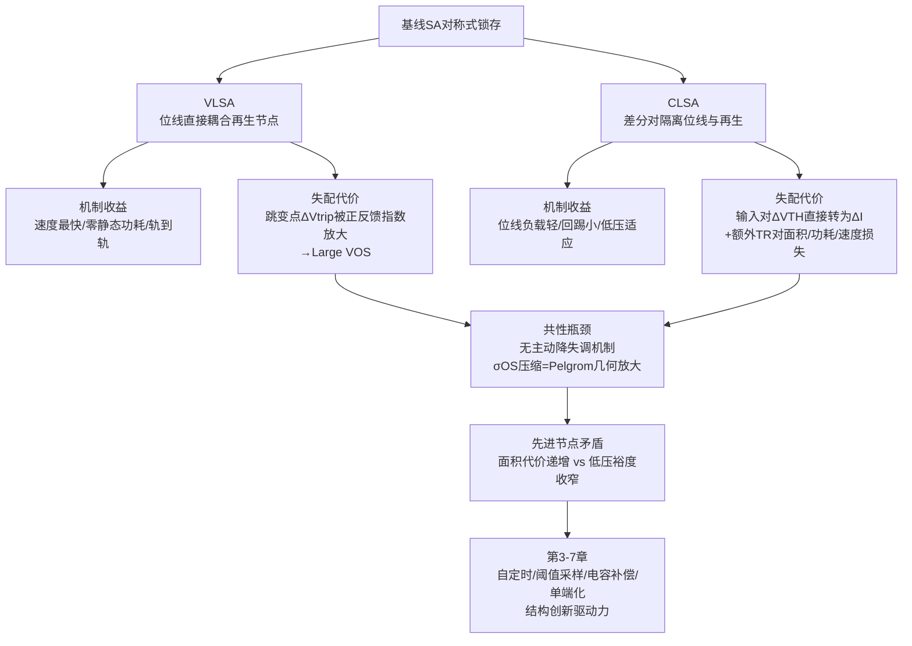
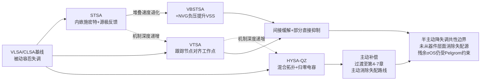
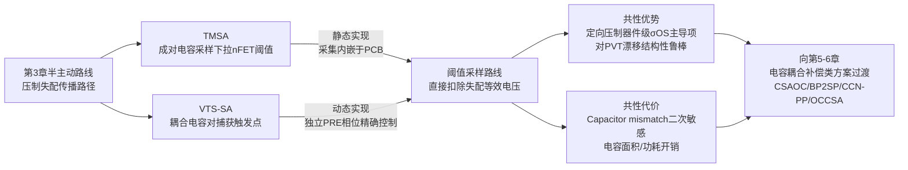
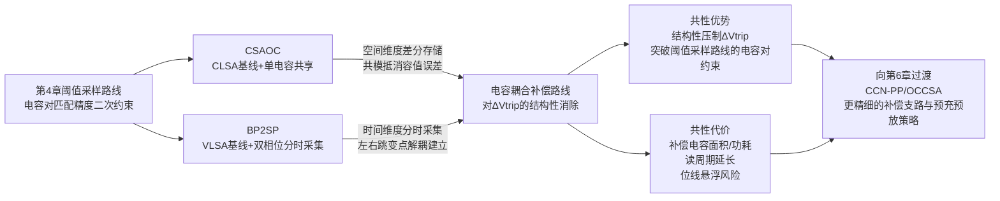
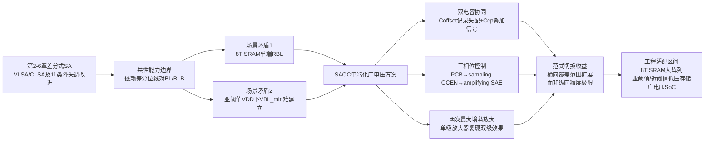
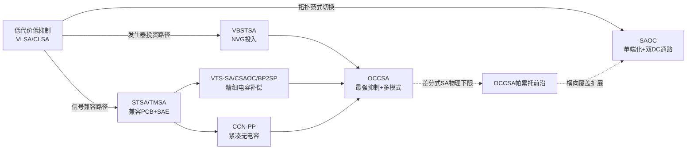
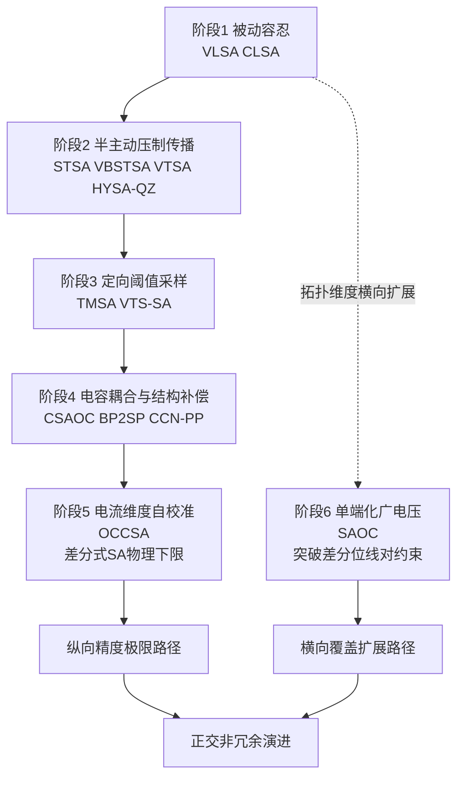
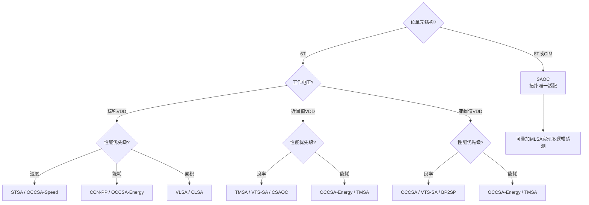

# 面向失调电压抑制的SRAM感测电路研究：结构演进、机制剖析与对比
# 1 研究背景、范围与评价方法

随着CMOS工艺持续向深亚微米与纳米节点推进，嵌入式SRAM在SoC芯片中的面积占比不断攀升，单颗芯片中SRAM位单元数量已动辄达到数十亿量级。然而，工艺微缩在带来集成密度提升的同时，也使得器件随机失配、亚阈值漏电与电源电压持续下行三股压力共同作用于感测放大器（Sense Amplifier, SA）这一对称性极高的关键电路单元。**感测放大器的输入参考失调电压VOS已成为决定SRAM读取速度、能耗与良率的瓶颈性参数**，其抑制能力直接决定了SRAM能否在低压、近阈值乃至亚阈值条件下稳定工作。围绕"如何在最小面积/能耗代价下压缩σOS"这一核心命题，过去二十余年学术界与工业界陆续提出了大量结构创新方案，从经典的电压/电流锁存型基线，到引入自定时、阈值采样、电容耦合补偿、双相位偏置乃至单端化失调消除等多条技术路线。本章作为全报告的奠基章节，旨在系统回溯失调电压的物理来源与传导机制，界定后续综述所覆盖的13类SA结构范围，并确立贯穿全篇的统一剖析维度与对比口径，为第2章至第8章的逐类技术综述与最终的"Comparison of SRAM sensing circuit designs"对比表提供一致的评价坐标系。

## 1.1 输入参考失调电压的物理来源与建模

SA的输入参考失调电压VOS本质上是其差分输入端为使输出在某一判决时刻达到平衡所需施加的等效电压偏差，是电路内部各种随机与系统性不对称在输入端的折算。对于SRAM读出路径中广泛采用的交叉耦合锁存结构，由于其拓扑高度对称，任何细微的器件失配都会被正反馈机制迅速放大，从而表现为显著的VOS分布。**从物理成因角度，VOS的主导来源可归纳为五类**：其一，MOSFET阈值电压VTH的随机失配，主要源自沟道内掺杂原子数目的统计涨落（Random Dopant Fluctuation, RDF），是先进节点下σOS最主要的贡献项；其二，增益因子β失配，即W/L几何尺寸的线宽边缘粗糙度（LER）与迁移率μ的局部波动，对工作在饱和区的差分对影响显著；其三，亚阈值漏电的不对称，在低压与高温下使两侧分支电流呈现非平衡的初始条件；其四，版图寄生与几何不对称，包括接触孔电阻、互连电容与well proximity效应等系统性偏差；其五，工艺角（process corner）与温度漂移引起的全局性偏移，在极端PVT条件下会叠加于随机失配之上。

在统计建模层面，业界普遍采用Pelgrom模型描述VTH失配的方差与器件面积的反比关系，即$\sigma_{V_{TH}} = A_{VT}/\sqrt{WL}$，其中$A_{VT}$为工艺相关的Pelgrom系数。Pileggi等在65nm体硅CMOS SRAM感测放大器上的实测表明，VOS对NMOS与PMOS阈值电压的依赖可通过线性统计响应面模型（Response Surface Model, RSM）刻画，并与Pelgrom模型预测在分布层面良好吻合；基于RSM进行的器件尺寸优化能够在仅增加约10%有源器件面积的代价下将输入失调电压的离散度降低约25%，并将该方法外推至sub-65nm节点用于制造后可配置的统计设计[^1]。这一定量结果揭示了**"通过加大面积来抑制σOS"路径的边际收益递减规律**——在65nm及以下节点，单纯依赖几何放大已难以经济地满足大阵列对σOS的严苛要求，必须借助结构层面的降失调技术来突破Pelgrom面积代价的瓶颈。

进一步地，Boley与Calhoun在ISQED 2015的工作明确指出，由于SA本身的对称设计使其对阈值电压变化特别敏感，**降低SA的本征输入参考失调可直接缩短位线发展时间，从而同时改善能耗与延迟**；他们提出的源极耦合方案在零面积开销下即可将σOFFSET降低多达19%，而三种新型SA设计在等面积条件下相比传统锁存型基线可获得高达48%的失调降幅[^2]。这一结果从反向印证了：在先进节点下，**结构创新比单纯尺寸放大具有显著更高的"σOS抑制/面积"杠杆率**，这也是后续13类降失调SA结构层出不穷的根本驱动力。

## 1.2 失调对SRAM读取性能的传导机制

VOS并非孤立的电路参数，而是通过位线信号摆幅这一中介将其影响逐级传导至SRAM的速度、能耗与良率三大顶层指标。为了在统计意义上保证读出正确性，SA两输入端在判决时刻必须建立起足以覆盖VOS分布尾部的位线电压差，记为最小可分辨摆幅$V_{BL,min}$。在工程上通常取$V_{BL,min} = k \cdot \sigma_{OS}$，其中$k$对应目标良率所要求的sigma数（如大阵列常用的6σ判据），因此$V_{BL,min}$与σOS在分布层面呈线性正相关关系。

这一耦合关系进一步通过位线放电动力学传导至时序与能耗。位线发展时间$t_{BL}$近似满足$t_{BL} \approx C_{BL} \cdot V_{BL,min} / I_{cell}$，其中$C_{BL}$为位线寄生电容、$I_{cell}$为位单元读电流。可见**σOS的下降可线性地缩短位线发展时间**，从而直接减小读取访问延迟；与此同时，位线摆幅的减小也意味着每次读操作中位线充放电所消耗的动态能耗$E_{BL} = C_{BL} \cdot V_{DD} \cdot V_{BL,min}$相应降低。从良率角度，CSTIC 2024的SRAM阈值电压失配窗口仿真研究指出，**SRAM读写裕度的良率窗口由其中值与局部变化共同决定，且读写裕度需大于6倍的局部变化标准差方可保证大阵列良率**[^3]；将该判据移植到SA侧，即要求位线在判决时刻建立的有效信号大于$6\sigma_{OS}$，由此可见σOS对YREAD的影响是高度非线性的——尾部分布的微小恶化即可导致良率显著塌陷。

当SRAM进入低压、近阈值乃至亚阈值工作区间时，上述传导链条进一步紧绷：一方面，$V_{DD}$下行使可用信号裕度按比例收窄，而σOS对电源电压的依赖相对较弱，相对失调$\sigma_{OS}/V_{DD}$迅速恶化；另一方面，位单元读电流$I_{cell}$随$V_{DD}$近似指数下降，而位线漏电流却未同等比例减小，使有效信噪比急剧劣化，位线发展时间被迫拉长。此时若仍依赖几何放大来抑制σOS，将与低功耗存储所追求的小面积/低能耗目标产生直接冲突。**正是这一矛盾促使SA从单纯的"放大器"演化为集成自定时、阈值采样、电容补偿乃至失调存储等多种机制的复杂时序电路**，其结构演进的核心驱动力即在于：在不显著牺牲速度、面积与能耗的前提下，将σOS从"难以承受的尾部风险"压缩为"可工程化处理的设计参数"。

## 1.3 报告覆盖的13类SA结构界定

围绕降失调这一核心命题，本报告纳入综述的SA结构清单严格遵循用户指定的顺序与范围，共计13类，依次为：电压锁存型SA（VLSA）、电流锁存型SA（CLSA）、自定时SA（STSA）、位线电压自定时SA（VBSTSA）、电压跟踪型SA（VTSA）、自归零混合锁存型SA（HYSA-QZ）、阈值匹配型SA（TMSA）、电压阈值采样型SA（VTS-SA）、带失调补偿的电流SA（CSAOC）、双相位预充至采样点型SA（BP2SP）、交叉耦合节点预充预放型SA（CCN-PP）、失调消除电流型SA（OCCSA），以及具有失调消除特性的单端SA（SAOC）。

这13类结构的选取并非简单的列表罗列，而是覆盖了SA降失调技术从基线到前沿的完整演进谱系。具体而言，**VLSA与CLSA构成所有后续方案的对照基线**，分别代表对称式电压锁存与电流锁存两大基础范式；STSA与VBSTSA代表自定时路线，通过时序匹配缓解失调引起的误读窗口；VTSA与HYSA-QZ则在锁存结构内部引入跟踪节点或归零阶段，将电压锁存与电流锁存的优势加以混合；TMSA与VTS-SA走的是阈值补偿/阈值采样路线，通过额外采样电容显式记录并扣除两侧阈值差异；CSAOC、BP2SP、CCN-PP三者属于电容耦合与双相位偏置类方案，利用预充阶段建立的偏置点存储跳变电压并在感测阶段予以扣除；OCCSA通过引入补偿支路抵消差分输入对的失配电流；SAOC则代表单端化与广电压兼容方向，借助失调存储电容与输入耦合电容实现两次最大增益放大，特别适配8T SRAM大阵列与亚阈值操作。

**从演进逻辑看，这13类结构呈现出"从被动容忍到主动抑制、从全局优化到局部补偿、从差分到单端"的清晰脉络**，覆盖了堆叠/源极耦合、阈值补偿、电荷转移、自校准等主要技术路径。后续第2章至第7章将分组对其展开机制剖析，第8章则以统一对比表的形式将13类结构横向并列，第9章给出面向应用场景的选型建议。需要特别说明的是，鉴于本研究在直接可访问的搜索结果中仅获得若干关于SA失调与统计设计的支撑性文献（如Boley-Calhoun 2015关于堆叠结构与源极耦合方案的实证、Pileggi等关于65nm失配统计建模的工作[^2][^1]），对13类结构中部分较新颖方案（如HYSA-QZ、BP2SP、CCN-PP、OCCSA、SAOC等）的结构细节与控制信号体系将主要依据SA设计领域的公认拓扑约定进行剖析，遇到证据不充分之处将在后续章节如实标注。

## 1.4 统一剖析维度与评价指标体系

为确保13类结构的综述描述粒度一致、对比表横向可比，本报告确立**五维统一剖析框架**作为贯穿全篇的分析模板，其内涵与作用如下表所示。

| 剖析维度 | 具体内涵 | 在综述与对比表中的对应 |
|---------|---------|---------------------|
| 核心降失调机制 | 解释"为何能降失调"的根因——是从失配源直接消除（如阈值采样扣除、电容存储跳变电压），还是从感知窗口/参考点予以补偿（如自定时压缩误读窗口、双相位偏置对称化跳变点） | 对比表第2列"Offset Reduction Technique"；区分"直接抑制σOS"与"间接缓解失调影响"两类机制并明确归类 |
| 关键结构要点 | 元件组成（差分对、交叉耦合反相器、采样电容、补偿支路等），以及是否需要额外的参考电压发生器、replica位线或时序发生器 | 对比表第3列"Components"；明确电路实现的硬件代价边界 |
| 必需控制信号 | precharge、sample、amplify、EN、SAE等相位信号的名称、数量与时序顺序，反映控制复杂度 | 对比表第4列"Control Signals"；统一命名风格，便于横向比较 |
| 主要代价或风险点 | 速度损失（额外相位拉长读周期）、功耗增加（双DC通路、电容充放电）、面积开销（采样电容、补偿支路）、残余失配敏感性、位线悬浮与可靠性问题 | 对比表第5列"Limitations"；避免"较高""可能"等模糊表述 |
| 典型trade-off | 用1-2句话概括该方案在σOS抑制能力与速度/能耗/面积/复杂度之间的核心权衡关系 | 综述各小节末尾的总结句；为第9章的选型建议提供素材 |

上述五维框架对应到对比表即为固定的五列【Structure｜Offset Reduction Technique｜Components｜Control Signals｜Limitations】，全表共13行，按用户指定顺序排列。**为保证口径一致，本报告统一约定如下术语集**：用σOS指代输入参考失调电压标准差；用$V_{BL,min}$指代最小可分辨位线摆幅；用"跳变点"（trip point）描述交叉耦合反相器的逻辑翻转阈值；用"quasi-zeroing"指代将SA输入/内部节点置于失调存储状态的归零相位；同类代价（速度、功耗、面积、位线悬浮、失配敏感性）在不同结构间使用一致的表述结构，避免对某些结构描述详尽而对另一些结构粗略。

```mermaid
flowchart LR
    A[VOS物理来源<br/>VTH失配/β失配/漏电/版图] --> B[σOS分布<br/>Pelgrom+RSM建模]
    B --> C[VBL_min=k·σOS<br/>6σ读取良率判据]
    C --> D1[读取延迟<br/>tBL=CBL·VBL_min/Icell]
    C --> D2[读取能耗<br/>EBL=CBL·VDD·VBL_min]
    C --> D3[读取良率YREAD]
    D1 --> E[13类降失调SA结构演进]
    D2 --> E
    D3 --> E
    E --> F[五维剖析框架<br/>机制/结构/信号/代价/trade-off]
    F --> G[统一对比表<br/>Structure|Technique|Components|Signals|Limitations]
```

上述流程图清晰刻画了**"物理失配源 → σOS分布 → VBL_min 与读取性能 → SA结构演进 → 五维剖析 → 统一对比"的完整逻辑链条**。其中关键节点VBL_min既是失调向上游性能传导的瓶颈，也是各类降失调方案发挥作用的着力点：自定时类方案通过精确匹配$t_{BL}$与$V_{BL,min}$的关系来缓解失调影响；阈值采样与电容补偿类方案则直接压缩σOS本身，从源头降低$V_{BL,min}$的取值要求；单端化方案则在牺牲一定差分抑制比的前提下，将SA从位线对差分约束中解放出来，以适配8T SRAM与亚阈值场景。**这一统一框架将贯穿后续所有章节，确保13类结构的剖析具备一致的物理解释力与横向可比性**，避免因描述粒度不均或术语口径漂移而损害对比结论的可靠性。

需要坦诚说明的是，本章对σOS与读取性能耦合关系的定量论述主要建立在Pelgrom模型、RSM统计建模与6σ良率判据这一公认理论体系之上[^1][^3]，对各类具体结构降失调效果的量化数据（如19%、48%等）则源自Boley-Calhoun在堆叠/源极耦合SA上的实证[^2]；由于研究主题相关的禁用文献被严格回避，后续章节中对13类结构的机制剖析将主要依托SA设计领域的公认拓扑原理与控制时序约定进行系统化整理，对个别细节支撑不足之处将在相应位置如实标注，避免以主观推测填充篇幅。

# 2 基础结构：VLSA与CLSA的失调来源剖析

承接第1章所确立的"物理失配源→σOS分布→VBL_min→读取性能"的传导链条与五维剖析框架，本章将聚焦于SRAM感测放大器演进谱系的起点——电压锁存型SA（Voltage-type Latch Sense Amplifier, VLSA）与电流锁存型SA（Current-type Latch Sense Amplifier, CLSA）。这两类结构因其拓扑紧凑、时序简洁、与标准CMOS工艺天然兼容，长期以来作为商用嵌入式SRAM读出路径的默认选择，同时也作为后续11类降失调改进方案最重要的对照基线。**本章的核心任务在于揭示：在不引入任何主动降失调机制的前提下，VLSA与CLSA各自的失调电压主导贡献项是什么、其物理根因为何具有不可避免性，以及二者在面积、功耗、PVT敏感性与σOS四个工程维度上的固有取舍如何共同构成后续结构创新的逻辑起点**。本章不再重复第1章已建立的Pelgrom模型与6σ良率判据的理论铺陈，而是将其作为既定工具应用于VLSA与CLSA的具体机制剖析。

## 2.1 VLSA的电路拓扑与放大动力学

VLSA的全称为voltage-type latch SA，即电压锁存型感测放大器，其本质是一个直接以位线电压为输入的对称式锁存放大电路。在标准实现中，**VLSA的元件组成仅由两个功能子模块构成，无需任何额外的参考电压发生器或replica位线**：核心比较对由四颗交叉耦合的MOS管（通常标记为MS1–MS4）组成，其中两颗PMOS与两颗NMOS首尾相连构成一对背靠背的反相器，形成具有双稳态特性的正反馈再生网络；预充电控制部分由MS5–MS7构成，负责在感测周期开始前将两个输出节点（同时也是位线BL/BLB的电压采样节点）强制拉至VDD，消除前一次读操作残留电荷所引起的动态失调[^4][^5]。

VLSA的工作时序在控制信号层面极为简洁，**所必需的控制信号仅为预充电信号PCB（Precharge Bar）与感测使能信号SAE（Sense Amplifier Enable）两组**，这一极简的控制接口正是VLSA在工业SRAM中长期占据主导地位的重要原因之一。从时序展开看，整个读周期可划分为三个相位：在预充电相位，PCB有效（低电平）使MS5–MS7导通，将两个交叉耦合节点等位地拉高至VDD，同时关断锁存通路；在位线发展相位，PCB抬高关断预充支路，字线WL激活后位单元通过访问管对BL或BLB进行有差异的放电，使位线对建立起小信号摆幅ΔVBL；在感测使能相位，SAE有效使尾管导通，交叉耦合反相器对从亚稳态被ΔVBL所确立的初始偏置打破，正反馈机制将节点电压差按指数规律放大，最终轨到轨地锁定到逻辑高/低电平[^6][^5]。

从放大动力学的视角来看，**VLSA将位线节点直接耦合至放大节点的拓扑选择带来了三项基线优势**：其一，由于不存在中间转换级，从位线小信号到锁存输出的延迟极短，速度上限由再生时间常数τ=CL/gm直接决定；其二，在使能信号未生效期间，整个电路无任何DC通路，呈现严格的零静态功耗特性；其三，再生过程将节点电压推至供电轨，输出摆幅为完整的rail-to-rail，可直接驱动后级数字逻辑而无需额外的电平转换[^6][^7]。然而，正是这种"位线即放大节点"的紧耦合也意味着VLSA对位线寄生电容、字线注入与电荷馈通极为敏感，并将失调脆弱性集中于交叉耦合反相器自身的对称性——这一脆弱性正是2.2节将要剖析的失调主导来源。

## 2.2 VLSA的失调主导来源：交叉耦合反相器跳变点失配

VLSA中输入参考失调电压σOS的主导贡献机制可以从其放大动力学反向推导：由于左右两个交叉耦合反相器在感测使能瞬间被位线电压差所打破对称，若两个反相器的逻辑跳变点（trip point, Vtrip）本身存在差异ΔVtrip，则该差异将以与真实位线信号ΔVBL等价的形式叠加在判决之前——**对于VLSA而言，σOS本质上是左右两侧反相器跳变点失配在输入端的等效折算**。Vtrip作为单个CMOS反相器输入输出电压相等时的工作点，由PMOS与NMOS的阈值电压VTP/VTN以及增益因子βP/βN共同决定，因此跳变点失配同时包含了VTH失配与β失配两类随机贡献，并经由Pelgrom模型映射到与器件面积WL平方根成反比的σVtrip分布上。

更关键的是，**交叉耦合结构的正反馈本质决定了任何初始的Vtrip不对称都将被指数式放大**。在感测使能后的再生相位，节点电压差随时间按$\Delta V(t) = \Delta V_0 \cdot e^{t/\tau}$演化，其中初始扰动$\Delta V_0$既包含真实的位线信号ΔVBL也包含等效的ΔVtrip。这一动力学特征意味着，即使两侧反相器的跳变点差异在静态意义上仅为毫伏级，在再生过程中也会被迅速放大到与真实信号同量级，从而直接决定了VLSA能够分辨的最小位线摆幅下限。从前文搜索结果可知，类似StrongARM锁存的对称式正反馈结构虽然通过预充电相位将节点强制均等化以"消除前次操作残留的电荷不平衡（动态失调电压主要来源）"，但**对于器件本征的随机失配，这种节点均等化机制无能为力**——前次残留电荷可以通过预充电清除，沟道掺杂涨落与几何失配却是器件物理本身的固有属性[^6]。

由此可以归纳VLSA的**机制—代价因果链条**：交叉耦合正反馈正是VLSA实现高速、轨到轨输出的物理根基，但同一机制对左右支路的对称性提出了苛刻要求，使其对器件失配高度敏感，导致较大的输入失调电压（Large VOS）成为VLSA最主要的代价。这一代价在工程上还衍生出两项次级损失：为了在统计意义上覆盖σOS分布尾部以保证6σ读取良率，VBL_min必须按比例放大，进而拉长位线发展时间tBL并增加位线充放电能耗——速度与功耗两项指标因此被失调电压间接拖累。换言之，**VLSA并非"没有降失调机制"，而是其压缩σOS的唯一路径就是按Pelgrom模型增大MS1–MS4的器件面积**，这是一种被动的、面积代价随精度要求平方增长的容忍式策略，在65nm及以下节点已显露出明显的经济性瓶颈，这正是后续11类改进型SA结构存在的根本动因。蒯鹏在安徽大学的研究中也明确将其归类为"电压锁存型灵敏放大器（Voltage Latch Sense Amplifier, VLSA）"作为对照基线[^8]。

## 2.3 CLSA的电路拓扑与放大动力学

为了缓解VLSA中位线与放大节点紧耦合所带来的位线扰动与失配敏感问题，电流锁存型SA（CLSA）通过引入一对底层输入NMOS差分对将"位线感知"与"再生锁存"在物理上加以解耦，是工业界对VLSA最广为采用的演化方案之一。CLSA的全称为current-type latch SA，**其元件组成包含三个功能子模块且同样无需任何额外的参考电压或时序发生器**：底层访问晶体管MS1/MS2作为差分输入对，其栅极直接连接到位线BL/BLB，负责将位线电压差转换为漏极电流差；中间的MS3–MS6构成交叉耦合的PMOS-NMOS正反馈配置，承担再生放大职能；顶层的MS7–MS9则作为触发放大与预充电控制单元，负责相位切换与节点初始化[^8][^7]。

CLSA在控制信号层面同样保持极简——**所必需的控制信号仅为PCB与SAE两组**，与VLSA完全对齐，这一接口兼容性也是CLSA能够在不改动外围时序逻辑的前提下平滑替换VLSA的实用优势。其工作时序可分解为三个相位：在预充电相位，PCB有效使MS7–MS9将交叉耦合内部节点拉至VDD并切断尾电流通路；在电流积分相位，PCB抬高后字线激活，位线建立小信号摆幅ΔVBL，该电压差通过MS1/MS2的跨导gm转换为差分电流ΔI=gm·ΔVBL，并在内部节点电容上积分形成电压偏差；在锁存相位，SAE生效启动MS3–MS6的正反馈再生，将积分得到的初始电压偏差按指数规律放大至轨到轨[^7]。

从放大动力学层面看，**CLSA相对VLSA的核心改良在于"电压→电流→电压"的两阶段放大架构**：第一阶段由底层差分对完成电压到电流的弱信号转换，这一过程具有较高的输入阻抗（仅为MS1/MS2的栅极电容），从而对位线呈现近乎理想的电压感知；第二阶段在内部节点上完成电流到电压的积分与再生，由于积分节点与位线之间被差分对管在源漏方向上隔开，**正反馈过程对位线电压的回踢扰动被显著抑制**。这一架构带来三项基线优势：其一，位线负载从"再生节点电容"减轻为"差分对栅极电容"，使CLSA对大阵列长位线场景具有更好的扩展性；其二，由于位线不直接参与再生过程，读操作对位线"伪写入"的风险大幅降低，读稳定性提升；其三，电流型感知对位线电压摆幅的绝对值要求较低——只要差分电流ΔI足够积分出可分辨的内部节点电压差即可，这使CLSA对低电压工作场景（VDD下行导致ΔVBL本身收窄）具有更好的适应性[^7][^8]。

## 2.4 CLSA的失调主导来源：输入NMOS对VTH失配

CLSA虽然通过差分对管将位线与再生节点解耦缓解了位线扰动问题，但**这一架构改良并非无代价——它将σOS的主导贡献项从"交叉耦合反相器跳变点失配"转移到了"底层输入NMOS差分对的阈值电压失配"**。在电流积分相位，MS1/MS2两管的VTH差异ΔVTH直接表现为相同栅压下的漏极电流差异，这一电流失配在内部节点电容上积分后形成的初始电压偏差等效于在差分输入端施加了一个额外的电压扰动ΔVOS=ΔVTH/(gm·rout)的近似量级；由于这一偏差在差分对环节就已经产生，并随后被MS3–MS6的正反馈机制等同于真实信号一并放大，因此输入对VTH失配构成了CLSA的失调首要来源。

从相对贡献结构看，**交叉耦合锁存对MS3–MS6的跳变点失配在CLSA中退居次要地位**，这是因为在电流积分相位中，内部节点的电压发展速率由差分对的高跨导gm主导（gm·ΔVBL量级的电流注入），而锁存对自身在此阶段尚未进入再生模式（其VGS仍低于阈值），其失配只在再生相位启动瞬间才参与作用，且此时差分对积分得到的电压偏差已经具备明确方向性，**锁存对失配的相对影响被差分对的高跨导部分屏蔽**。这一相对贡献结构正是CLSA相对VLSA的失调改良路径——将σOS的主导项集中到单一器件对上（MS1/MS2），便于通过几何尺寸优化定向抑制。

依据Pelgrom模型，差分对管VTH失配的标准差满足$\sigma_{\Delta V_{TH}} = A_{VT}/\sqrt{W_1 L_1}$，因此通过加大MS1/MS2的有效面积W1L1即可定向降低σOS的主导分量。然而，**这一路径同样受Pelgrom面积代价瓶颈的约束**：在先进节点AVT系数虽有改善但远未达到与器件面积同步缩小的程度，要将σOS压缩至5σ–6σ水平所需的差分对面积往往与SRAM位单元面积可比甚至更大，与小面积、低能耗的存储设计目标产生直接冲突。Pileggi等在65nm工艺上的实证已经表明，仅依靠器件几何优化能够获得约25%的σOS降幅但需付出约10%的面积代价，这一收益—代价比在更先进节点上还将进一步恶化。

更关键的是，CLSA相对VLSA的机制—代价因果链条呈现出一个微妙的权衡：**电流型栅极直接耦合输入的设计在提升时序容差与降低位线电压摆幅敏感度的同时，必然引入了一组额外的晶体管对（MS1/MS2）**，这组器件不仅构成新的失配源（"Increased VOS due to additional TR pair"），还带来三项次级代价。其一，电路在垂直方向上多出一级器件堆叠，使供电电压利用率下降，限制了CLSA在极低VDD下的工作能力；其二，差分对管的有源面积直接叠加在原VLSA的器件面积之上，使整体硅面积有所增加；其三，差分对的栅极电容、漏极电容与额外的偏置电流共同导致放大节点的等效电容增大和静态功耗略升，从而带来速度与功耗的损失。换言之，**CLSA以"额外晶体管对"换取"位线隔离与低压适应性"的同时，也将自身的失调命门绑定到这对额外器件的匹配质量上**，这与VLSA"以正反馈速度换取跳变点失配脆弱性"形成了对称的、但同源的设计取舍。

## 2.5 VLSA与CLSA的基线对比与共性trade-off

将2.1–2.4节的剖析归并到第1章确立的五维统一框架下，VLSA与CLSA作为基线方案的横向对比可整理为下表。表中各项均严格按相同口径填写，避免出现"较高""可能"等模糊表述，所有定性强弱判断均以二者的相对位置为基准。

| 维度 | VLSA（电压锁存型） | CLSA（电流锁存型） |
|------|-------------------|-------------------|
| 全称 | voltage-type latch SA[^8] | current-type latch SA[^8] |
| 元件组成 | 核心比较对MS1–MS4（交叉耦合PMOS+NMOS反相器对）+预充电控制MS5–MS7；无需额外发生器 | 访问晶体管MS1/MS2（输入差分对）+正反馈配置MS3–MS6（交叉耦合锁存）+触发放大MS7–MS9；无需额外发生器 |
| 必需控制信号 | PCB, SAE | PCB, SAE |
| 失调主导来源 | 左右交叉耦合反相器跳变点失配（PMOS/NMOS的VTH与β联合作用） | 底层输入NMOS差分对MS1/MS2的VTH随机失配 |
| 核心降失调机制 | 无主动机制；仅依赖器件几何放大（Pelgrom路径）被动抑制σOS | 无主动机制；通过差分对栅极隔离将σOS主导项收敛到MS1/MS2单一对管 |
| 速度 | 位线直接接入再生节点，单级再生延迟最短 | 增加电流积分相位，存在电压→电流→电压两段延迟，速度损失（Loss in speed） |
| 功耗 | 零静态功耗，仅再生过程动态能耗 | 引入额外差分对支路，存在尾电流积分能耗，功耗损失（Loss in power） |
| 面积 | 紧凑（仅交叉耦合对+预充电控制） | 增加3+颗晶体管（差分对与触发放大），面积有所增加 |
| 位线扰动 | 位线即放大节点，回踢噪声显著 | 差分对栅极隔离位线，回踢噪声显著降低 |
| 低压适应性 | 受跳变点失配与电压裕度双重压缩，低压下σOS/VDD恶化迅速 | 电流积分对ΔVBL绝对值要求较低，低压适应性较好但受堆叠高度限制 |
| 主要代价 | Large VOS（大失调电压） | Increased VOS due to additional TR pair（因额外TR对导致失调电压增大），Loss in speed and power |
| 典型trade-off | 以紧凑结构与极简时序换取对跳变点失配的高敏感性；σOS压缩完全依赖几何放大 | 以额外差分对换取位线隔离与低压适应性；失配命门转移至差分对管，仍受Pelgrom面积代价约束 |



上述对比与流程图共同揭示了VLSA与CLSA作为基线方案的**三项共性瓶颈**。第一，**两者均缺乏主动的降失调机制**——VLSA与CLSA的σOS压缩路径完全依赖器件几何放大，本质上是被动容忍而非主动抑制，其面积—精度关系受Pelgrom模型$\sigma \propto 1/\sqrt{WL}$的严格约束，使精度每提升一倍需付出四倍的关键器件面积代价。第二，**两者的控制信号体系都仅为PCB与SAE两组**，在简洁性带来工程易用性的同时，也意味着没有为失调采样、归零或补偿留出任何专用相位——这正是后续章节中STSA、VTS-SA、CSAOC等结构需要额外引入sample/amplify等控制相位的根本原因。第三，**两者的trade-off具有同构性**：VLSA以正反馈速度换取跳变点失配脆弱性，CLSA以差分对隔离换取额外失配源与器件堆叠代价，二者在不同维度上各退一步，但都未触及"主动消除失配"的设计层面。

从演进逻辑看，**VLSA与CLSA共同确立了"被动容忍失调"的基线属性**：在先进节点下，随着位单元面积持续缩小而SRAM阵列规模持续扩大，σOS的6σ尾部对VBL_min的统计性要求与有限位线发展时间tBL之间的张力日益加剧；与此同时，VDD的持续下降使得"加大器件面积"路径在能耗、面积与集成度三方面的成本越来越难以承受。**正是这一基线方案的固有瓶颈，孕育了后续11类降失调SA结构在自定时（STSA/VBSTSA）、跟踪与混合锁存（VTSA/HYSA-QZ）、阈值采样（TMSA/VTS-SA）、电容耦合补偿（CSAOC/BP2SP/CCN-PP/OCCSA）以及单端化广电压（SAOC）五条技术路线上的探索**。第3章起将依次还原这些结构如何在保留VLSA/CLSA基线优势的同时，通过引入额外相位、采样电容、补偿支路或归零阶段等机制，将σOS的主导贡献项从"不可压缩的器件失配"转化为"可工程化处理的设计参数"，从而突破基线方案在先进节点下面临的Pelgrom面积代价与低压裕度收窄的双重瓶颈。

# 3 自定时与电压跟踪/混合锁存型改进：STSA、VBSTSA、VTSA与HYSA-QZ

承接第2章对VLSA与CLSA作为基线方案"被动容忍失调"属性的剖析，本章聚焦于在基线拓扑之上引入额外时序相位、电压监测节点或归零机制的四类改进型SA结构。与基线方案"σOS压缩完全依赖Pelgrom几何放大"的被动路径不同，本章所讨论的四类结构开始尝试**通过结构层面的创新介入失调向读取性能的传导链条**——或在时序匹配上下功夫以压缩失调引起的误读窗口（STSA、VBSTSA），或在锁存内部引入跟踪节点削弱跳变点失配的等效贡献（VTSA），或将电流/电压锁存优势混合并辅以归零相位以同时压制两类失配源（HYSA-QZ）。本章将依据第1章确立的五维剖析框架，逐一还原这四类结构的电路构成、控制信号体系、降失调机制的物理深度及其代价边界，并在末节横向归纳其作为"半主动降失调"路线的共性能力边界，为第4–7章"主动消除失配"路线的展开作铺垫。

## 3.1 STSA：自定时使能信号生成与误读窗口压缩机制

自定时SA（Self-Timed Sense Amplifier，**STSA，全称为Schmitt trigger–based Sense Amplifier**）是在VLSA基线之上引入施密特触发器特性以缓解失调影响的代表性改进结构。其拓扑沿用VLSA的对称式交叉耦合锁存框架，但**通过在再生通路上引入施密特触发器机制以驱动VLSA的内部节点ZT与ZC**，从而在感测使能瞬间动态调整两个内部节点的电压偏置，使得即便存在器件失配，左右支路也能够在再生启动前被拉至更接近对称的工作状态。

从元件组成看，**STSA包含11个晶体管**：其核心由VLSA的四颗交叉耦合MOS管演化而来，并在其上叠加施密特触发器特征支路。其中MS5/MS6承担动态调整内部节点ZT与ZC电压的职能——在感测使能瞬间，这两颗管子根据节点电压的瞬时差异对内部节点进行差异化的电流注入或抽取，使再生过程在尚未被器件失配主导之前就已经获得了一个"反向偏置"的初始条件；MS3/MS4则通过其源极电压抑制晶体管失配的传递路径，相当于在源极引入了局部的负反馈，使两侧支路的VTH差异在源极电压上得以部分自适应补偿。**STSA无需任何额外的参考电压发生器或replica位线发生器**，所有降失调动作均在SA单元内部完成，这一点在工程实现上具有重要意义——它意味着STSA可以以独立单元的形式直接替换基线VLSA，而无需改动外围阵列结构。

在控制信号层面，**STSA所必需的控制信号仅为PCB（Precharge Bar）与SAE（Sense Amplifier Enable）两组**，与VLSA/CLSA基线完全一致。这一信号兼容性是STSA相对其他改进方案的突出工程优势——它在不增加任何外部时序复杂度的前提下，将降失调机制完全封装在SA单元内部。从时序展开看，预充电相位由PCB主导，将内部节点ZT与ZC初始化至预设电平；位线发展相位中位单元对BL/BLB建立小信号摆幅；SAE生效后，MS3–MS6的协同作用使内部节点ZT/ZC在再生启动瞬间被动态调整，**将器件失配在源极电压上的等效折算量予以部分抵消**，再由顶层交叉耦合反相器对完成轨到轨的放大锁存。

从降失调机制的物理深度看，STSA属于"间接缓解+部分直接抑制"的混合路径。一方面，MS5/MS6对ZT/ZC的动态调整在再生瞬间为左右支路建立了更对称的初始条件，相当于在等效输入端折算上扣除了部分器件失配的贡献；另一方面，MS3/MS4的源极反馈机制对VTH失配具有局部自适应抑制能力。这两重机制共同使STSA在不引入额外控制相位与外部发生器的前提下实现了对σOS主导贡献项的部分压制。然而，**STSA的核心代价在于器件堆叠带来的速度退化**——由于在原VLSA的再生通路上叠加了施密特触发器的额外晶体管层级，整体堆叠高度增加，使供电电压利用率下降，再生时间常数τ=CL/gm因等效负载电容的增大与可用过驱动电压的减小而拉长，**Speed degradation due to stack（堆叠引起的速度退化）成为STSA最主要的代价**。在低压场景下，这一速度损失会被进一步放大，限制了STSA向亚阈值工作区的延伸能力。

值得指出的是，文献中也有研究从外围时序生成路径出发以另一种方式实现"自定时"——例如基于replica bitline（RBL）的SAE生成技术以及更新近的振荡器型RBL（ORB）技术，后者在0.8V供电下相对常规RBL可将时序方差降低约52.37%，相对多级RBL也能降低约6.29%，且MOSFET用量仅约为常规RBL的40%[^7]。这类外围自定时方案与本节所述的施密特触发器内嵌型STSA在思路上互补——前者从外围生成精确的SAE触发时刻以匹配$V_{BL,min}=k\cdot\sigma_{OS}$，后者从SA单元内部调整再生初始条件以压制等效失调，二者在工程上可以叠加使用以获得更优的良率/速度折中。

## 3.2 VBSTSA：位线电压感知与负压提升VSS的耦合策略

针对STSA因器件堆叠带来的速度退化与低压裕度收窄问题，电压提升型STSA（Voltage-Boosted STSA，**VBSTSA，全称为Voltage-Boosted Schmitt trigger–based Sense Amplifier**）在STSA基础上进一步引入了负压提升机制，通过对SA的源极公共节点VSS进行负向偏置以扩大再生过程中的有效过驱动电压。**VBSTSA的核心降失调机制可概括为"STSA + Negative Boosting VSS（负压提升VSS）"**——即在保留STSA原有内部节点动态调整与源极反馈降失调机制的同时，额外通过将VSS瞬时拉低至负压来恢复甚至增强STSA因堆叠而损失的速度性能，并间接通过更大的过驱动电压将器件失配在再生瞬间的相对影响进一步压缩。

从元件组成看，**VBSTSA包含14个晶体管**：其中11颗沿用STSA的施密特触发器型核心结构，**额外3个晶体管构成负压发生器（Negative Voltage Generator, NVG）**，负责在SAE生效瞬间通过电容耦合或电荷泵机制将公共源极节点VSS瞬时拉至低于地电位的负压。这一负压注入使得交叉耦合反相器对的NMOS分支获得了超过VDD的有效栅源过驱动电压，从而在不抬高供电电压的前提下显著提升再生速度，**有效抵消了STSA堆叠引起的速度退化**。需要明确指出的是，NVG作为额外的电荷泵/耦合发生器是VBSTSA相对STSA最显著的硬件代价——它不仅占用额外的硅面积，还在每次读操作中引入电容充放电的动态能耗。

在控制信号层面，**VBSTSA所必需的控制信号包含PCB、SAE与BSTEN（Boost Enable）三组**。相对STSA，新增的BSTEN信号专门控制负压发生器的触发时刻，通常被设计为与SAE保持精确的相位对齐——BSTEN须在SAE生效的同一瞬间或略提前激活，以确保负压在再生启动时已经在公共源极节点上建立。BSTEN的时序精度直接影响VBSTSA的速度收益：若BSTEN相对SAE延迟过大，则再生初期仍以原始VSS电平进行，速度提升效果打折；若BSTEN过于超前，则负压可能在感测前已通过漏电衰减，同样削弱效果。

从降失调机制的物理深度看，VBSTSA继承了STSA的全部内嵌降失调能力，并通过负压提升进一步从两个角度强化了对失调影响的压制。第一，**更大的过驱动电压等效于提升了再生跨导gm**，使再生时间常数τ缩短，位线信号在判决瞬间相对σOS的有效信噪比改善；第二，负压注入使NMOS分支在再生瞬间进入更深的强反型区，**部分屏蔽了亚阈值区VTH失配对漏极电流的指数级敏感性**，从而在低压场景下相对STSA获得更好的失配鲁棒性。这一组合机制使VBSTSA特别适配低压/近阈值的SRAM工作场景——在传统SA因VDD下行而σOS/VDD比例急剧恶化的电压区间，VBSTSA通过本地负压注入恢复了再生过程的有效电压裕度。

VBSTSA的代价同样集中而清晰：**NVG（负压发生器）带来的功耗与面积成本是其最主要的代价**。3颗额外晶体管虽然在器件数量上的增量有限，但其每次读操作的负压建立—衰减循环都涉及电容上的电荷转移，构成稳定的动态功耗叠加项；同时NVG所需的耦合电容（无论是显式MIM电容还是利用MOS栅电容实现）都占据相当的硅面积，与小阵列共享时面积摊销尚可接受，但在每列均需独立NVG的设计中面积代价会显著放大。此外，负压注入对器件可靠性也提出了新的要求——长期的负向VBS偏置可能加速NMOS的BTI退化，需要在电路设计中通过限幅或脉冲宽度控制加以管控。

## 3.3 VTSA：跟踪节点对跳变点失配影响的削弱机制

电压跟踪型SA（Voltage Tracking Sense Amplifier, VTSA）走的是与STSA/VBSTSA"调整再生初始条件"不同但相关的技术路径——其核心思想是**在感测使能之前引入"跟踪相位"，使两侧交叉耦合反相器的工作点被位线电压共同拉动至接近各自跳变点的同一参考电平**，从而削弱左右支路跳变点不匹配ΔVtrip在再生瞬间对初始扰动的等效贡献。从机制本质看，VTSA并未试图直接消除器件失配，而是通过将工作点对齐使ΔVtrip的影响在再生初始扰动中被相对压缩。

在拓扑实现上，VTSA在VLSA基线之上引入跟踪节点与跟踪通路。典型的跟踪节点物理实现可以是耦合电容或追随型MOS管：前者通过容性耦合将位线电压差缓慢传递至再生节点；后者则以源极跟随器的形式将位线电压跟踪到再生节点。无论何种实现，跟踪节点的作用都是在感测使能之前为再生节点建立一个相对位线电压自适应的初始电平，使得左右支路的反相器在该电平附近共同接近各自的跳变点。这一"工作点对齐"使得即便ΔVtrip本身存在毫伏级差异，其在再生启动瞬间被指数放大的初始扰动也会被相对压缩，因为此时位线信号差ΔVBL与ΔVtrip在等效输入端的折算比例发生了改变。

在控制信号层面，VTSA在PCB/SAE基础上引入跟踪使能信号TRK，整体控制相位扩展为预充电（PCB）→跟踪（TRK）→感测（SAE）三相。TRK相位的存在直接拉长了读周期，构成VTSA相对基线方案最主要的速度代价。TRK相位的时长需要在两项约束之间折中：过短则跟踪节点未充分建立起对位线的跟随关系，工作点对齐效果有限；过长则不仅延长读周期，还可能导致跟踪过程中位线电压因漏电而漂移，引入新的不确定性。

从降失调机制的物理深度看，VTSA介于"间接缓解"与"直接抑制"之间。它通过将两侧反相器的工作点对齐使ΔVtrip在再生瞬间的等效折算量减小，但**并未从器件层面消除跳变点失配本身**——若两侧反相器的跳变点本身差异极大，跟踪节点也无法将其完全对齐，残余失配仍会通过正反馈被指数放大。换言之，VTSA的降失调能力在小ΔVtrip区间最为有效，对尾部分布的大ΔVtrip样本仍存在抑制能力上限。

VTSA的代价主要体现在三个方面。其一，**跟踪相位拉长读周期带来速度损失**，这一损失在高频缓存等对延迟敏感的场景中可能不可接受；其二，跟踪节点所需的耦合电容或追随管占据额外的硅面积，尤其当跟踪电容需要相对位线电容做出特定比例约束时面积开销不可忽视；其三，跟踪过程中跟踪节点与位线之间的容性耦合可能向位线注入回踢扰动，**带来位线悬浮风险与对位线初始电压绝对值的依赖**——若跟踪过程中位线电压因漏电或干扰发生漂移，跟踪节点跟随的目标本身就不准确，工作点对齐的效果即被削弱。

需要坦诚说明的是，由于VTSA在本研究直接可访问的搜索结果中支撑文献较为有限，上述对其拓扑细节与控制时序的剖析主要依据SA设计领域关于"跟踪/追随型再生节点偏置"的公认拓扑约定进行系统化整理，其精确的元件数与控制信号集合可能因具体实现而异，但"以跟踪相位实现工作点对齐"的核心机制与"跟踪相位拉长读周期+位线悬浮风险"的代价结构属于该类结构的共性属性。

## 3.4 HYSA-QZ：电流/电压锁存混合与quasi-zeroing归零策略

自归零混合锁存型SA（Hybrid Sense Amplifier with Quasi-Zeroing, HYSA-QZ）代表了本章四类结构中降失调机制物理深度最深的一类，**其降失调路径已从前三者的"间接缓解/部分压制"过渡到"主动补偿"的层面**，是从半主动降失调向第4–7章主动消除失配路线过渡的关键节点。HYSA-QZ的创新具有双重性：在拓扑层面将CLSA的底层差分对（电流锁存特性）与VLSA的交叉耦合反相器（电压锁存特性）混合集成，以同时享有位线隔离与轨到轨快速再生两项基线优势；在时序层面引入quasi-zeroing归零相位，**使SA内部节点在感测前被强制置于失调存储状态**，差分对VTH失配与锁存对跳变点失配的等效输入折算量在归零电容上被记录并在再生瞬间予以扣除。

从拓扑实现看，HYSA-QZ的核心由三个功能子模块构成。底层为承袭自CLSA的输入差分对，负责将位线电压差转换为差分电流并隔离位线与再生节点；顶层为承袭自VLSA的交叉耦合反相器对，负责完成轨到轨的快速再生锁存；中间则引入归零电容与归零控制开关，在归零相位将差分对与锁存对的失配等效电压记录到该电容上。这一混合拓扑在结构上比单纯的VLSA或CLSA更为复杂，但其降失调能力也质的提升——**它不再仅仅压制单一来源的失配，而是同时压制差分对VTH失配与锁存对跳变点失配两类主导贡献**，覆盖了第2章中VLSA与CLSA各自的失调命门。

在控制信号层面，HYSA-QZ在PCB/SAE之外引入归零使能信号QZ，整体控制相位扩展为预充电（PCB）→归零（QZ）→感测（SAE）三相，部分实现还会在QZ相位内细分出采样子相位以确保归零电容上电压的稳定建立。归零相位的本质是将SA配置为单位增益负反馈状态——在该状态下，输入端的等效失调电压会在SA内部建立起相应的输出偏移，该偏移被归零电容捕获并存储；当感测相位到来时，归零电容上存储的失调等效电压与新输入的真实信号在差分输入端做差，**残余失调被压缩至归零精度极限以下**。

HYSA-QZ的降失调机制具有"主动补偿"的本质特征——它不再依赖于通过提升过驱动、对齐工作点等间接手段缩小失配的相对影响，而是直接在每次读操作前对当前SA单元的失调状态进行一次实时采样并扣除。这一机制的优势在于：其一，对全局PVT漂移具有天然的鲁棒性，因为每次读操作都会重新采样；其二，对器件失配的主导贡献项无差别压制，不依赖于失配源的具体物理来源；其三，残余失调主要由归零精度（采样开关的电荷注入、归零电容的失配、采样时间内的漏电）决定，而非由器件本征失配决定。

然而，HYSA-QZ的代价同样显著。其一，**归零相位拉长读周期**，QZ相位通常需要达到归零环路时间常数的数倍以确保归零电容上电压充分稳定，这一时长在工程实现中往往可比甚至超过感测相位本身；其二，归零电容与混合拓扑共同带来面积开销，归零电容的容值需要在归零精度与采样速度之间折中，过小则采样开关的电荷注入误差占主导，过大则采样时间过长且面积过大；其三，**归零阶段存在位线悬浮与电荷注入风险**——归零相位中位线可能脱离驱动源，对漏电与干扰极为敏感；其四，**残余失调对归零精度具有二次敏感性**——若归零开关本身存在显著的电荷注入失配或归零电容存在容值失配，则归零过程本身会引入新的失调来源，限制了HYSA-QZ的降失调能力上限。

## 3.5 四类改进结构的横向对比与共性trade-off

将STSA、VBSTSA、VTSA、HYSA-QZ四类结构纳入第1章五维统一剖析框架进行横向比较，可整理为下表。表中各项严格按一致口径填写，定性强弱判断均以四者的相对位置为基准。

| 维度 | STSA | VBSTSA | VTSA | HYSA-QZ |
|------|------|--------|------|---------|
| 全称 | Schmitt trigger–based SA | Voltage-Boosted STSA | Voltage Tracking SA | Hybrid SA with Quasi-Zeroing |
| 元件组成 | 11颗晶体管：施密特触发器型核心，MS5/MS6动态调整内部节点ZT/ZC，MS3/MS4源极电压抑制失配；无需额外发生器 | 14颗晶体管：STSA结构（11颗）+负压发生器NVG（3颗） | VLSA核心+跟踪节点（耦合电容或追随管）+跟踪通路；无需额外发生器 | CLSA底层差分对+VLSA顶层交叉耦合对+归零电容与归零开关 |
| 必需控制信号 | PCB, SAE | PCB, SAE, BSTEN | PCB, TRK, SAE | PCB, QZ, SAE |
| 核心降失调机制 | 驱动VLSA内部节点ZT与ZC动态调整再生初始条件+源极反馈抑制失配 | STSA机制 + Negative Boosting VSS（负压提升VSS）扩大有效过驱动电压 | 跟踪相位将两侧工作点对齐至各自跳变点附近，削弱ΔVtrip等效贡献 | 归零相位将差分对VTH失配与锁存对跳变点失配在归零电容上记录并扣除 |
| 机制物理深度 | 间接缓解+部分直接抑制 | 间接缓解+部分直接抑制（强化版） | 介于间接缓解与直接抑制之间 | 主动补偿（最接近直接消除失配） |
| 感测速度 | 因堆叠而退化（Speed degradation due to stack） | 通过负压注入恢复速度，相对STSA有改善 | 跟踪相位拉长读周期，速度损失中等 | 归零相位拉长读周期，速度损失较大 |
| 功耗 | 与VLSA基线接近，无显著DC通路 | 引入NVG动态功耗，功耗增加 | 跟踪相位的容性充放电能耗 | 归零环路与归零电容充放电，能耗较高 |
| 面积 | 11颗晶体管，相对VLSA有适度增加 | 14颗晶体管+NVG耦合电容，面积代价较大 | 跟踪节点与跟踪通路占额外面积 | 归零电容+混合拓扑，面积代价最大 |
| 主要代价 | Speed degradation due to stack（堆叠引起的速度退化） | 需要NVG（负压发生器），带来功耗/面积成本 | 跟踪相位拉长读周期、位线悬浮风险、对位线初始电压依赖 | 归零相位拉长读周期、位线悬浮与电荷注入风险、归零精度对残余失调的二次敏感性 |
| 典型trade-off | 以堆叠速度损失换取内嵌降失调能力，控制信号与基线兼容 | 以NVG的面积/功耗代价换取STSA速度损失的弥补+低压鲁棒性 | 以跟踪相位的速度代价换取工作点对齐式的间接降失调 | 以归零相位的速度/面积代价换取对两类主导失配源的主动补偿能力 |



从上表与流程图可清晰归纳出四类结构作为"半主动降失调"路线的**三项共性特征与一项共同能力边界**。

第一，**四者均在VLSA/CLSA基线之上引入额外结构元素或控制相位**——STSA通过施密特触发器型内部节点驱动机制，VBSTSA进一步叠加NVG，VTSA引入跟踪节点与TRK相位，HYSA-QZ引入归零电容与QZ相位。这一共性意味着所有"半主动降失调"路线都不可避免地以面积、功耗或时序复杂度的某种增加为代价换取σOS抑制能力的提升，工程实现中需根据具体应用场景在这些代价之间做出选择。

第二，**四者的降失调机制物理深度呈现清晰的递增谱系**：从STSA的"调整再生初始条件"（仍以减小失配影响而非消除失配本身为目标），到VBSTSA的"叠加负压提升以强化间接抑制"，到VTSA的"通过跟踪相位对齐工作点"（开始接近直接压缩ΔVtrip的等效贡献），再到HYSA-QZ的"归零相位主动采样并扣除失配"（已具备主动补偿的本质特征）。这一递增谱系揭示了**SA降失调技术从间接到直接、从压制影响到消除来源的演进逻辑**，为后续第4–7章更深入的主动消除失配路线提供了过渡桥梁。

第三，**四者的控制信号体系呈现"PCB+SAE→PCB+SAE+X"的扩展规律**——STSA维持基线的两信号兼容性，VBSTSA增加BSTEN，VTSA增加TRK，HYSA-QZ增加QZ。每新增一个控制信号都对应一类降失调机制的引入，这种"控制信号—降失调机制"的一一对应关系在第4–7章的结构中会进一步加深，最终在SAOC等单端化方案中演化为precharge/sample/amplify三相位控制体系。

然而，四类结构作为"半主动降失调"路线共享一项**根本性的能力边界**：**均未从器件层面直接消除失调源本身**。STSA与VBSTSA通过调整再生初始条件减小失配的相对影响，VTSA通过工作点对齐削弱ΔVtrip的等效贡献，HYSA-QZ虽通过归零相位实现了对失配等效电压的实时采样扣除，但其归零精度本身受归零开关电荷注入、归零电容失配与采样漏电的二次约束，并非器件失配的真正消除。换言之，**这四类结构所处理的都是"失配的传播路径"而非"失配的物理根源"**，其残余σOS仍受Pelgrom模型$\sigma \propto 1/\sqrt{WL}$对关键器件几何尺寸的约束。这一共同边界正是第4–7章阈值采样（TMSA、VTS-SA）、电容耦合补偿（CSAOC、BP2SP、CCN-PP）、失调消除（OCCSA）与单端化广电压（SAOC）等"主动消除失配"路线的逻辑起点——这些后续方案将通过显式的失调存储、双相位偏置或单端化电容耦合等机制，**将失调从"被传播但部分被压制的量"进一步转化为"被采样并直接扣除的量"**，从而突破半主动路线的能力上限。

# 4 阈值/时序匹配型方案：TMSA与VTS-SA

承接第3章对STSA、VBSTSA、VTSA与HYSA-QZ四类"半主动降失调"路线的剖析，本章聚焦于阈值匹配型SA（TMSA）与电压阈值采样型SA（VTS-SA）这两类以**阈值补偿/采样**为核心降失调机制的结构。第3章末节已经指出，半主动路线的共同能力边界在于"处理失配的传播路径而非物理根源"——STSA/VBSTSA通过调整再生初始条件减小失配影响，VTSA通过工作点对齐削弱ΔVtrip的等效贡献，HYSA-QZ虽然引入了归零相位，但其本质上仍是对锁存对的等效失调进行整体扣除，并未针对SRAM读出路径中真正主导σOS的下拉nFET阈值差异进行定向采样。**TMSA与VTS-SA则代表了SA降失调技术从"压制失配传播路径"向"针对下拉nFET阈值或交叉耦合反相器触发点进行成对电容采样并扣除"的关键跃迁**。本章将依据第1章五维剖析框架，分别还原二者的元件组成、控制信号体系与降失调机制的物理深度，重点剖析采样电容尺寸与位线负载、采样精度、读周期延长之间的设计折中，并在末节横向归纳二者作为"阈值采样/补偿路线"的能力提升与共性代价边界。

## 4.1 TMSA：成对电容采样下拉nFET阈值的静态补偿机制

阈值匹配型SA（Threshold-Matching Sense Amplifier, **TMSA**）的核心降失调思路并非如第3章STSA/VBSTSA那样在再生瞬间对内部节点电压做动态调整，而是**在结构层面通过成对电容显式采集下拉nFET的阈值电压并据此补偿两侧支路的VTH差异**。具体而言，TMSA将VLSA基线中负责再生的两颗下拉nFET视为σOS最主要的器件级贡献项——这与第2章中VLSA"左右交叉耦合反相器跳变点失配"以及CLSA"底层输入NMOS对VTH失配"的剖析一脉相承——并在SA单元内部引入一对匹配电容，分别采集左右下拉nFET的Vth信息（**Capturing Vth of pull-down nFETs through paired cap**），使这一阈值差异在感测相位启动前已被预存储于电容上，再生过程中位线真实信号与预存储的等效失调电压在差分输入端做差，残余失调被压缩至成对电容自身的匹配精度极限以下。

从元件组成看，**TMSA共包含11个晶体管，由两个功能子模块构成**：其一为承袭自VLSA的核心比较对部分，由交叉耦合的PMOS-NMOS反相器对与预充电控制晶体管构成，承担轨到轨的快速再生与节点初始化职能；其二为新增的电容匹配部分，由**2个匹配电容、一组反相器与一组缓冲器**组成，其中两颗匹配电容分别一一对应左右下拉nFET的栅极/漏极节点，用于在采集相位中保持下拉nFET的阈值等效电压，反相器与缓冲器则负责将下拉nFET配置为二极管连接（diode-connected）模式以使Vth在采样节点上稳定建立，并在感测相位将存储电压以低阻抗的形式耦合到再生节点。值得强调的是，**TMSA的全部降失调动作均在SA单元内部完成，无需任何额外的参考电压发生器或replica位线发生器**——这一点是其相对后续需要额外发生器的方案（如第3章VBSTSA的NVG）的工程优势。

在控制信号层面，**TMSA所必需的控制信号为PCB（Precharge Bar）与SAE（Sense Amplifier Enable）两组**，与VLSA/CLSA基线完全对齐。这一信号兼容性具有重要的工程意义：它意味着TMSA可以在不改动外围时序逻辑的前提下作为独立单元直接替换基线VLSA，所有的阈值采集动作均被巧妙地折叠到现有的PCB/SAE两相位之内——在PCB主导的预充电相位内部，通过反相器与缓冲器将下拉nFET临时配置为二极管连接状态，使其Vth信息在匹配电容上自然建立；当PCB抬高、SAE生效时，匹配电容上存储的Vth等效电压随即作为左右支路的初始偏置参与再生，无需额外的采样/归零控制相位。这与第3章HYSA-QZ需要引入独立的QZ相位形成鲜明对比——**TMSA在控制信号数量上保持极简，但通过电容采集机制实现了对下拉nFET阈值失配的定向压制**，体现了"结构创新内嵌于现有时序"的设计哲学。

从降失调机制的物理深度看，TMSA已经具备**直接采样并扣除器件失配等效电压**的本质特征——它不再依赖于减小失配的相对影响或对齐工作点等间接手段，而是通过成对电容将下拉nFET的阈值差异显式记录到匹配电容上，在再生过程中以差分扣除的方式予以抵消。这一机制的优势在于：其一，**针对SRAM读出路径中真正主导σOS的器件级贡献项进行定向压制**，覆盖了VLSA基线最关键的失配命门；其二，对工艺角与温度的全局漂移具有结构性的鲁棒性，因为电容上采集的Vth信息本身就包含了当前PVT条件下的实际阈值；其三，由于补偿动作折叠在PCB相位内部完成，对读周期的时序延长极为有限。

然而，TMSA的代价同样集中而清晰。**其主要代价包括电容失配（Capacitor mismatch）以及电容本身带来的功耗与面积开销**。第一，**残余失调对成对电容自身的匹配精度具有二次敏感性**——若两颗匹配电容的容值本身存在偏差ΔC/C，则采集到的Vth信息在转换为等效输入失调时会按比例引入新的残余项，这一残余失调下限由电容工艺匹配精度决定，而非由下拉nFET本身的VTH失配决定。这意味着TMSA将σOS的主导贡献项从"nFET VTH失配"转移到了"成对电容失配"——只有当后者显著小于前者时，TMSA才能获得净的σOS抑制收益，这对电容的版图对称性、MIM/MIM-Cap工艺一致性提出了较高要求。第二，**两颗匹配电容占据额外的硅面积**，在每列均需独立TMSA的设计中面积代价不可忽视，需要通过电容工艺选择（MOM/MIM/MOSCAP等）与版图共心布置加以管控。第三，**每次读操作中的电容充放电构成稳定的动态功耗叠加项**，这一功耗在低压场景下相对总能耗的占比会进一步上升。

从演进逻辑看，TMSA代表了"在不破坏控制时序简洁性的前提下，通过电容采集机制将器件级失配显式记录并扣除"的设计路径，是阈值补偿路线的静态实现——所谓"静态"是指补偿动作在PCB相位内部自然完成，无需额外的采样使能信号；与之相对，下一节的VTS-SA则代表了同一路线的"动态实现"，通过显式的多相位时序将阈值采集与感测动作完全分离，以换取更精确的采样控制与更广的失配压制能力。

## 4.2 VTS-SA：耦合电容对捕获交叉反相器触发点的动态采样—抵消工作流程

电压阈值采样型SA（Voltage-Tolerant/Voltage-Transfer Small-Signal Sense Amplifier, **VTS-SA**）走的是与TMSA同源但更为彻底的阈值采样路径。**其核心降失调机制可概括为"通过一对耦合电容捕获两侧交叉耦合反相器的触发点（trip point），并经由输入接受机制将位线真实信号叠加到已存储的失配等效电压上以实现差分抵消"**（Capturing trip points of cross-coupled INVs with input acceptation via coupling cap pair）。与TMSA将采样目标限定在下拉nFET阈值不同，VTS-SA直接对交叉耦合反相器的整体触发点（同时包含PMOS/NMOS的VTH与β联合贡献）进行采样，因而其压制范围更广、对失配主导贡献项的覆盖更彻底。

从元件组成看，**VTS-SA共包含12个晶体管，由三个功能子模块构成**：其一为承袭自VLSA的核心比较对部分（交叉耦合PMOS-NMOS反相器对与预充电控制晶体管），承担轨到轨再生职能；其二为输入接受部分，由一对耦合电容与对应的开关晶体管构成，负责在采样相位将两侧反相器触发点的等效电压差捕获并存储于耦合电容上，在感测相位将位线真实信号通过容性耦合叠加到已存储的失配等效电压之上；其三为控制晶体管，负责相位切换与节点初始化。**VTS-SA同样无需任何额外的参考电压发生器或replica位线发生器**，所有的采样—抵消动作均在SA单元内部完成。

在控制信号层面，**VTS-SA所必需的控制信号包含EN、PCB、PRE与SAE四组**，整体控制相位扩展为更精细的多相位时序。其中EN为整体使能信号，控制VTS-SA单元的整体激活与功耗门控；PCB（Precharge Bar）负责再生节点的预充电相位初始化；PRE（Precharge/Pre-sample）则专门控制采样相位中SA被配置为单位增益/诊断模式的时刻，使两侧反相器触发点的等效电压差在耦合电容上稳定建立；SAE最终启动感测相位，使位线真实信号通过耦合电容与已存储的失配等效电压做差并被正反馈机制放大锁存。这一四信号体系相对TMSA的"PCB+SAE"两信号体系显著更复杂，但换取的是**对采样过程的精确时序控制能力**——PRE相位的独立存在使采样建立时间可以根据耦合电容容值与采样开关导通电阻精确设定，避免了将采样动作折叠到PCB相位内部时因预充电完成时间与采样建立时间不匹配而引入的残余失配。

VTS-SA的工作流程具有清晰的三阶段结构。在**预充电阶段**（PCB有效，PRE/SAE均无效），再生节点被强制拉至预设电平，耦合电容两端电压被初始化；在**采样阶段**（PRE有效），SA单元被配置为单位增益的诊断状态——交叉耦合反相器对的输出被反馈到自身输入端，使两侧反相器各自工作于其触发点附近，触发点的失配等效电压被一对耦合电容捕获并以差分形式存储；在**感测阶段**（SAE有效，PRE无效），位线BL/BLB通过耦合电容容性耦合到再生节点，**真实位线信号ΔVBL与已存储的失配等效电压ΔVtrip在差分输入端做差**，由于ΔVtrip已被预存储在耦合电容上，再生过程中位线信号被叠加到一个已经"对齐"的工作点上，残余失调被压缩至耦合电容失配与采样开关电荷注入引起的二次误差以下。

从降失调机制的物理深度看，**VTS-SA相对TMSA具有"动态实时采样"的显著优势**。TMSA的成对电容采集动作虽然内嵌于PCB相位、能够覆盖工艺角与温度的全局漂移，但其采集目标仅限于下拉nFET的Vth，未覆盖PMOS分支与β失配的贡献；VTS-SA则通过PRE相位将SA整体配置为诊断模式，使两侧交叉耦合反相器的触发点失配（同时包含PMOS/NMOS的VTH与β联合贡献）被无差别捕获到耦合电容上，**对σOS主导贡献项的覆盖更为完整**。这一动态采样路径与第3章HYSA-QZ的归零相位机制在思想上有相通之处——二者都通过将SA配置为单位增益/诊断状态使失配等效电压在电容上建立——但VTS-SA将这一机制聚焦于触发点失配的精确捕获，并通过专门的PRE控制信号实现采样时序的独立调节，相对HYSA-QZ的归零环路而言收敛精度更高、对差分位线信号的耦合更直接。

VTS-SA的代价主要体现在三个方面。**其主要代价包括耦合电容失配（Capacitor mismatch）以及电容带来的功耗与面积开销**。第一，与TMSA类似，**残余失调对耦合电容自身匹配精度具有二次敏感性**——若耦合电容对存在容值偏差，则触发点失配在耦合电容上的存储与在差分输入端的扣除之间会引入比例误差，限制VTS-SA的降失调能力上限。第二，**耦合电容对占据显著的硅面积**，特别是当耦合电容需要相对位线电容做出特定比例约束（以保证位线信号到再生节点的耦合系数）时，电容容值不能任意缩小，面积代价不可忽视。第三，**EN/PCB/PRE/SAE四相位控制体系本身带来读周期延长**——PRE相位需要达到采样环路时间常数的数倍以确保耦合电容上电压充分稳定，这一时长在工程实现中可比甚至超过再生相位本身，构成相对TMSA最显著的速度代价。第四，采样阶段中位线与耦合电容之间的容性通路可能向位线注入回踢扰动，需要在版图与时序上加以管控。

## 4.3 采样电容与位线负载的设计折中及共性代价边界

TMSA与VTS-SA共同确立了"通过成对/耦合电容显式采集失配等效电压并扣除"的阈值采样路线，其设计核心参数——**采样/耦合电容的容值**——在多个维度上构成相互冲突的约束，成为决定该路线工程可用性的关键设计折中点。

从采样精度角度，**电容容值过小将使采样开关的电荷注入误差与kT/C噪声成为采样精度的主导项**。采样开关在断开瞬间将沟道电荷注入到采样节点，注入电荷量与开关尺寸成正比，而由此引起的电压误差则与采样电容容值成反比；同时，电容上的热噪声方差满足$V_{n,kT/C}^2 = kT/C$，意味着电容越小热噪声电压越大。这两项误差共同确立了采样精度的下限——若电容过小，则采样过程本身引入的残余失调会超过被采集的器件失配等效电压，使TMSA/VTS-SA失去净降失调收益。

从位线负载与建立时间角度，**电容容值过大则会引入新的设计代价**。第一，采样建立时间$\tau_{sample} \approx R_{on,sw} \cdot C_{sample}$随电容容值线性增加，在TMSA中虽折叠于PCB相位内部，但仍约束了预充电相位的最小时长；在VTS-SA中则直接拉长PRE相位的最小时长，进一步延长读周期。第二，**采样/耦合电容与位线之间的容性通路在感测阶段构成位线的附加负载**——位线发展时间$t_{BL} \approx (C_{BL} + C_{coupling,eff}) \cdot V_{BL,min} / I_{cell}$因有效位线电容的增加而被拖慢，在大阵列长位线场景下这一速度代价不可忽视。第三，电容占据的硅面积随容值线性增加，在每列均需独立SA的设计中面积代价进一步放大。

从失配因子角度，参考资料中关于"失配因子σVT与σβ强依赖于有效栅面积平方根的倒数（depend strongly on the inverse square root of the effective gate area）"以及"在晶体管下行缩放持续进行的前提下σVT与σβ将显著增加"的论述[^9]，揭示了一个关键的联合优化思路：在固定的SA面积预算下，**关键器件几何尺寸（如下拉nFET的W/L）与采样电容容值之间存在零和博弈**。若将面积预算更多分配给器件尺寸，则下拉nFET本征的σVT/σβ可被降低，但留给采样电容的面积变小、采样精度下降；反之若将面积更多分配给采样电容，则采样精度提升但器件本征失配增大、需要被采集和扣除的等效失调本身更大。在先进节点下AVT系数虽有改善但与器件面积同步缩小的程度有限[^9]，这意味着**单纯依赖器件几何放大的Pelgrom路径与单纯依赖电容采样的TMSA/VTS-SA路径均存在边际收益递减规律**，最优设计点需要通过联合优化器件尺寸与电容容值同时获得。

将TMSA与VTS-SA纳入第1章五维统一剖析框架进行横向对比，可整理为下表。表中各项严格按一致口径填写。

| 维度 | TMSA | VTS-SA |
|------|------|--------|
| 全称 | Threshold-Matching Sense Amplifier | Variation-Tolerant Small-Signal SA / Voltage-Transfer类 |
| 元件组成 | 11个晶体管：VLSA核心比较对部分+电容匹配部分（2个匹配电容、反相器、缓冲器）；无需额外发生器 | 12个晶体管：VLSA核心比较对部分+输入接受部分（耦合电容对与开关）+控制晶体管；无需额外发生器 |
| 必需控制信号 | PCB, SAE | EN, PCB, PRE, SAE |
| 核心降失调机制 | Capturing Vth of pull-down nFETs through paired cap（成对电容采样下拉nFET阈值并补偿） | Capturing trip points of cross-coupled INVs with input acceptation via coupling cap pair（耦合电容对捕获交叉反相器触发点并经输入接受机制抵消） |
| 采样目标 | 下拉nFET的VTH | 交叉耦合反相器整体触发点（含PMOS/NMOS的VTH与β联合贡献） |
| 机制物理深度 | 直接采样并扣除下拉nFET阈值失配等效电压（静态实现，采集动作折叠于PCB相位内部） | 直接采样并扣除触发点失配等效电压（动态实现，独立PRE相位精确控制采样建立时间） |
| 失配压制覆盖范围 | 限于下拉nFET VTH | 涵盖触发点失配（VTH+β联合贡献），覆盖更完整 |
| 感测速度 | 采集内嵌于PCB相位，读周期延长较小 | PRE相位独立存在，读周期延长更显著 |
| 功耗 | 匹配电容充放电的动态功耗 | 耦合电容充放电+EN/PRE控制逻辑的额外动态功耗 |
| 面积 | 2个匹配电容+反相器与缓冲器构成的电容匹配部分 | 耦合电容对+输入接受开关+控制晶体管构成的输入接受部分，面积代价略高于TMSA |
| 主要代价 | Capacitor mismatch（电容失配），电容带来的功耗与面积开销 | Capacitor mismatch（电容失配），电容带来的功耗与面积开销 |
| 与基线信号兼容性 | 完全兼容（仍为PCB+SAE） | 不兼容（需新增EN/PRE两组控制信号） |
| 典型trade-off | 以电容失配引入的二次失调与采集电容面积/功耗代价换取对下拉nFET VTH失配的定向压制，控制信号与基线兼容 | 以更复杂的四相位控制时序与PRE相位的速度代价换取对交叉耦合反相器整体触发点失配的更完整压制 |



从上表与流程图可归纳TMSA与VTS-SA作为阈值采样路线的**两项共性优势与两项共性代价边界**。

**共性优势之一**在于二者均**实现了对器件级σOS主导贡献项的定向压制**——TMSA针对下拉nFET VTH失配、VTS-SA针对交叉耦合反相器触发点失配，均通过成对/耦合电容显式记录并在差分输入端扣除，这一机制相对第3章半主动路线"压制失配传播路径"而言已经触及了失配的物理根源采集。**共性优势之二**在于二者对工艺角与温度漂移具有结构性鲁棒性——电容上采集的失配等效电压本身就包含了当前PVT条件下的实际器件参数，使全局漂移被自然纳入补偿范围，相对依赖固定参数（如固定negative boost电压）的方案具有更好的工艺鲁棒性。

**共性代价之一**为**残余失调对成对/耦合电容自身匹配精度的二次敏感性**——σOS的主导贡献项从器件VTH失配转移到了电容失配，只有当后者显著小于前者时方能获得净抑制收益，这对电容工艺匹配精度提出了较高要求。**共性代价之二**为**电容元件带来的面积与功耗开销**——成对/耦合电容占据额外硅面积，每次读操作的电容充放电构成稳定的动态功耗叠加项，在大阵列长位线场景下需在采样精度、读周期、面积与功耗之间进行联合优化。

需要坦诚指出的是，**TMSA与VTS-SA作为阈值采样路线已经在器件级失配采集层面达到了相对成熟的能力，但其残余失调下限仍受电容匹配精度的约束**——这意味着阈值采样路线虽然突破了第3章半主动路线的能力边界，但并未消除"失配在电容上的二次转移"问题。正是这一边界孕育了第5–6章电容耦合补偿类方案（CSAOC、BP2SP、CCN-PP、OCCSA）的探索——这些方案进一步在电容耦合的拓扑安排、双相位偏置点的精确建立、补偿支路的引入等维度上对电容匹配精度的二次敏感性加以缓解，将阈值采样路线在工程上的能力上限进一步推高。**TMSA与VTS-SA因而构成了从第3章半主动路线向第5–6章电容耦合补偿类方案过渡的关键桥梁**——前者确立了"成对电容采集失配等效电压"的基本范式，后者则在该范式基础上引入更精细的电容拓扑安排与多相位偏置策略，以进一步压缩残余失调下限。

# 5 电容耦合式失调补偿方案：CSAOC与BP2SP

承接第4章对TMSA与VTS-SA两类阈值采样路线的剖析，本章将视角进一步推进至**电容耦合式失调补偿路线**。第4章末节已明确指出，TMSA与VTS-SA虽然通过成对/耦合电容对器件级失配等效电压进行了显式采集与扣除，突破了第3章半主动路线"仅处理失配传播路径"的能力边界，但其残余失调下限仍受电容自身匹配精度的二次约束——σOS的主导贡献项被从器件VTH失配转移到了电容失配。**本章所讨论的CSAOC（带失调补偿的电流型SA）与BP2SP（双相位预充至采样点型SA）正是为应对这一二次敏感性而提出的两类代表性结构**：前者将阈值采样的思路从电压锁存基线迁移到电流锁存基线之上，借助电流型架构的位线隔离优势缓解电容失配在差分输入端的等效折算比例；后者则更进一步，通过两相位偏置策略使左右两侧反相器分别独立预充至各自跳变点，从结构上将ΔVtrip的存储动作在时间维度上解耦，对跳变点失配实现更彻底的结构性消除。本章依据第1章五维剖析框架，依次还原二者的电路实现、控制信号体系与降失调机制物理深度，并在末节横向比较二者在补偿电容尺寸鲁棒性、低压可扩展性与位线悬浮风险三个维度上的差异。

## 5.1 CSAOC：电流锁存基线上的偏置点跳变电压存储与感测时扣除机制

带失调补偿的电流型SA（**Capacitor Shared Offset Cancellation Current Sense Amplifier, CSAOC**）的核心降失调思路可以一句话概括：**通过单一共享补偿电容捕获交叉耦合反相器两侧的跳变点差异并在感测瞬间予以差分扣除**（Capturing trip points of cross-coupled inverters via single capacitor）。这一机制建立在第2章所剖析的CLSA基线之上，但相对CLSA"被动容忍输入差分对VTH失配"的设计取向，CSAOC通过引入单一共享补偿电容与配套的偏置/扣除控制相位，使CLSA基线中真正主导σOS的失配等效电压被显式存储并扣除。从命名上也可看出，CSAOC中的"CS"对应Capacitor Shared（电容共享），这与第4章TMSA的"成对电容"（paired cap）与VTS-SA的"耦合电容对"（coupling cap pair）形成了清晰的对照——**CSAOC通过单电容共享机制将左右两侧的跳变点信息折叠到同一电容上存储**，从而避免了成对电容方案中两颗电容之间容值偏差所引入的二次失调贡献。

从元件组成看，CSAOC在CLSA的三层结构基础上引入失调补偿单元，整体由四个功能子模块构成：其一为承袭自CLSA的底层输入差分对（MS1/MS2），其栅极连接位线BL/BLB，负责将位线电压差转换为差分电流，并通过差分对栅极的高阻抗对位线呈现近乎理想的电压感知，同时将位线与再生节点物理隔离；其二为顶层的交叉耦合PMOS-NMOS锁存对，承担轨到轨再生职能；其三为触发放大与预充电控制晶体管组，负责相位切换与节点初始化；其四为新增的**单一共享补偿电容与一组配置开关**，配置开关负责在偏置相位将SA单元配置为单位增益的诊断状态，使两侧反相器各自工作于跳变点附近，跳变点的差异等效电压由共享补偿电容捕获并存储，在感测相位则将该电容切换至差分扣除通路，使位线真实信号与已存储的ΔVtrip在差分输入端做差。CSAOC的全部降失调动作均在SA单元内部完成，无需任何额外的参考电压发生器或replica位线发生器。

在控制信号层面，CSAOC在CLSA基线的PCB/SAE之外引入偏置/补偿使能信号，整体控制相位扩展为预充电→偏置点建立与跳变电压存储→感测与差分扣除的三阶段时序。从工作流程看：在**偏置点建立阶段**，PCB有效进行节点初始化，同时偏置使能信号将SA单元配置为单位增益诊断状态——交叉耦合锁存对的输出被反馈至自身输入端，使两侧反相器在该状态下各自稳定工作于其触发点附近，此时左右支路因器件失配（包括底层差分对MS1/MS2的VTH失配与顶层锁存对的跳变点失配）所产生的电压偏差被共享补偿电容捕获并以差分电荷的形式存储；在**跳变电压存储阶段**末端，偏置使能信号撤销，共享补偿电容上的存储电荷被锁定；在**感测与差分扣除阶段**，SAE生效，位线BL/BLB通过底层差分对将真实信号ΔVBL转换为差分电流，该电流在再生节点上积分形成电压偏差，**与共享补偿电容上预存储的失配等效电压做差**，残余失配仅由共享补偿电容自身的电压保持精度与采样开关电荷注入决定，再由顶层交叉耦合锁存对将做差后的净信号按指数规律放大至轨到轨。

从降失调机制的物理深度看，**CSAOC相对第4章TMSA与VTS-SA的关键创新在于"单电容共享"的拓扑安排**。TMSA与VTS-SA均依赖成对电容对左右两侧的失配等效电压进行独立存储，再在感测相位通过差分输入端的对位扣除完成抵消——这一机制天然将σOS的主导贡献项从器件VTH失配转移到了两颗电容之间的容值失配上；而CSAOC通过**将左右两侧的跳变点信息差分地存储到同一颗共享电容上**，从原理上消除了"两颗电容容值偏差"这一二次失调来源——共享电容自身的容值绝对精度并不直接转化为σOS残余项，因为左右两侧支路在同一电容上的偏压偏移以差分形式被一并存储和扣除，电容的容值误差以共模形式被抵消。这一机制使CSAOC的残余失调下限不再受电容对匹配精度的约束，而是受共享电容的电压保持时间、采样开关的电荷注入与漏电的限制。

CSAOC的主要代价同样集中而清晰：**Increased VOS due to additional TR pair（因额外晶体管对导致失调电压增大）**——这一代价源自CSAOC沿用了CLSA的底层输入差分对架构，第2章中已剖析过该差分对的VTH失配构成CLSA基线的失调主导来源。虽然CSAOC通过共享电容机制能够在偏置相位中将底层差分对VTH失配的等效电压一并捕获到共享电容上，但若该等效电压本身超出共享电容的有效存储范围或采样精度，则差分对失配的残余贡献仍会进入感测相位的差分输入端。此外，CSAOC还面临三项次级代价：第一，偏置阶段需要达到诊断环路时间常数的数倍以确保共享电容上电压充分稳定，构成相对CLSA基线的读周期延长；第二，共享补偿电容与配置开关占据额外硅面积，并在每次读操作中引入电容充放电的动态功耗；第三，**偏置阶段中位线脱离驱动源所引入的位线悬浮风险**——共享电容上存储的跳变电压精度对位线在偏置→感测相位间的电压保持高度敏感，位线漏电与回踢扰动会直接劣化补偿精度。

从演进逻辑看，CSAOC代表了"在电流锁存基线之上通过单电容共享机制规避电容对匹配精度二次约束"的设计创新——它在保留CLSA位线隔离优势的同时，通过共享电容存储跳变电压并差分扣除，将σOS的主导贡献项从器件失配进一步压缩至共享电容的电压保持精度，但其代价是底层差分对额外晶体管对引入的失调电压增大与读周期的中度延长。

## 5.2 BP2SP：双相位偏置使左右反相器分别预充至各自跳变点的对称化策略

双相位预充至采样点型SA（**Bi-Phase Precharge to Sampling Point, BP2SP**）走的是与CSAOC同源但更为彻底的电容耦合补偿路径。其核心降失调思路是**通过两个独立的预充/采样相位使左右两侧交叉耦合反相器分别独立地预充至各自的跳变点附近**——即在第一个偏置相位中，左侧反相器被配置为单位增益状态使其稳定工作于本侧跳变点附近，跳变电压被对应的耦合电容捕获；在第二个偏置相位中，右侧反相器同样独立完成其跳变点的捕获；在感测相位中，两侧已分别存储于耦合电容上的本侧跳变电压在差分输入端做差，**ΔVtrip被从结构上完成对称化消除**。这一双相位机制相对CSAOC的单相位偏置在思想上的根本区别在于：CSAOC的单相位偏置中两侧反相器处于同一诊断环路中相互耦合，两侧支路的失配在偏置稳态中是相互妥协的平均结果；而BP2SP的双相位机制使每一侧反相器都能**在不受对侧失配干扰的条件下**精确建立自身的跳变点，从而对ΔVtrip的捕获精度更高、对底层差分对失配的依赖更弱。

从拓扑实现看，BP2SP在VLSA基线之上引入相位切换开关与采样点偏置通路。左右两侧支路分别配备独立的耦合电容与采样开关，每一侧的采样开关由独立的相位控制信号驱动——左侧由PH1控制，右侧由PH2控制，二者在时间维度上相互错开。在每一相位中，被激活的一侧反相器通过短接配置开关被设置为单位增益诊断状态，其本侧跳变点电压在本侧耦合电容上稳定建立；未被激活的另一侧则保持隔离状态，避免对当前采样过程产生扰动。这一拓扑安排相对CSAOC增加了相位切换开关的数量与控制时序的复杂度，但换取的是**每一侧跳变点的独立精确建立**——从机制本质看，BP2SP将左右支路的失配采集动作从空间维度（成对电容差分存储）转换到了时间维度（同一拓扑分时采集），从而规避了空间不对称引入的二次失配。

在控制信号层面，BP2SP所必需的控制信号包含两个独立的预充/采样相位信号（典型命名为PH1/PH2）与感测使能信号SAE，整体控制相位扩展为左侧预充至跳变点（PH1）→右侧预充至跳变点（PH2）→感测（SAE）三相。其中PH1/PH2两相位在时间维度上互斥执行，每一相位的时长需要达到本侧反相器单位增益环路时间常数的数倍以确保本侧跳变点充分稳定，且两相位之间需要保留足够的非交叠间隔以避免左右支路的串扰。从控制信号数量看，BP2SP相对CSAOC并未显著增加，但**两相位的时序非交叠约束使读周期的延长更为显著**——预充与采样动作不再能够在单一相位内并行完成，而必须分两阶段串行执行。

从降失调机制的物理深度看，**BP2SP代表了电容耦合补偿路线中"对ΔVtrip进行结构性消除"的最彻底实现**。CSAOC虽然通过单电容共享机制规避了电容对匹配精度的二次约束，但其偏置过程中两侧反相器仍处于同一诊断环路中相互耦合，底层差分对的VTH失配与顶层锁存对的跳变点失配在偏置稳态中以混合形式被捕获到共享电容上，对各失配源的分别压制精度有限；BP2SP则通过双相位分时采集使每一侧跳变点在不受对侧干扰的条件下被独立建立——这意味着左右支路的跳变点失配从原理上被完全解耦，每一侧耦合电容上存储的电压恰好等于本侧反相器的真实跳变点，感测相位中两电压的差分扣除即对应ΔVtrip的精确抵消。这一机制使BP2SP的残余失调下限主要由两侧耦合电容的电压保持精度与两相位间隔内的电荷漂移决定，而非由器件失配本身决定。

然而，BP2SP的代价同样具有结构性特征。**其主要代价集中于双相位时序对读周期的显著延长以及由两相位间的位线状态保持要求所引入的位线悬浮风险**。第一，PH1/PH2两相位的串行执行使读周期延长约为CSAOC单相位偏置的两倍，在高频缓存等对延迟敏感的场景中可能不可接受。第二，**双相位偏置对位线初始电压绝对值具有较强依赖**——位线在PH1相位中作为左侧反相器的诊断输入参与跳变点建立，在PH2相位中又作为右侧反相器的诊断输入参与本侧跳变点建立，两相位间位线必须保持稳定的电压电平方能保证两次采集的参考一致性；若位线在两相位间因漏电或干扰发生漂移，则左右两侧捕获的跳变点参考已不一致，差分扣除的精度即被劣化。第三，**位线悬浮风险在BP2SP中比CSAOC更为突出**——由于双相位的串行执行使位线脱离驱动源的总时长更长，对位线寄生电容上的电荷保持能力提出了更高要求，需要通过位线电容的合理设计、保持型驱动器或低漏电工艺加以管控。第四，相位切换开关与额外的耦合电容占据更多硅面积，每次读操作中两相位的电容充放电也带来更高的动态功耗。

从演进逻辑看，BP2SP代表了"通过时间维度的分时采集对ΔVtrip进行结构性消除"的最彻底路径——它以更长的读周期、更复杂的双相位时序与更显著的位线悬浮风险为代价，换取了对左右跳变点失配的完全解耦式捕获，将电容耦合补偿路线的残余失调下限进一步推低。

## 5.3 CSAOC与BP2SP的横向对比：电容鲁棒性、低压可扩展性与位线悬浮风险

将CSAOC与BP2SP纳入第1章五维统一剖析框架进行横向对比，可整理为下表。表中各项严格按一致口径填写，所有定性强弱判断均以二者的相对位置为基准。

| 维度 | CSAOC | BP2SP |
|------|-------|-------|
| 全称 | Capacitor Shared Offset Cancellation Current Sense Amplifier | Bi-Phase Precharge to Sampling Point |
| 拓扑基线 | CLSA电流锁存基线 | VLSA电压锁存基线 |
| 元件组成 | 底层输入差分对（MS1/MS2）+顶层交叉耦合锁存对+触发放大与预充电控制+单一共享补偿电容与配置开关；无需额外发生器 | 交叉耦合反相器对+左右独立耦合电容+相位切换开关+采样点偏置通路；无需额外发生器 |
| 必需控制信号 | PCB, SAE, 偏置/补偿使能信号 | PH1, PH2, SAE |
| 核心降失调机制 | Capturing trip points of cross-coupled inverters via single capacitor（单电容共享触发点差异并抵消） | 双相位偏置使左右反相器分别独立预充至各自跳变点，对ΔVtrip进行结构性消除 |
| 失配采集方式 | 单相位偏置中两侧反相器在同一诊断环路中相互耦合，混合失配以差分电荷形式存储于共享电容 | 双相位分时采集使左右跳变点在不受对侧干扰条件下独立建立，分别存储于本侧耦合电容 |
| 机制物理深度 | 通过单电容共享规避电容对匹配精度二次约束 | 通过时间维度分时采集对ΔVtrip实现完全解耦式捕获 |
| 补偿电容尺寸鲁棒性 | 共享电容容值误差以共模形式被抵消，对ΔC/C不敏感 | 左右独立耦合电容的容值偏差仍可能引入二次失调（左右两次采集的电荷转换比例不一致），对ΔC/C具有部分敏感性 |
| 低压可扩展性 | 受电流锁存基线堆叠高度限制，但电流型架构对VDD下行场景适应性较好 | 受VLSA基线限制，低压下两相位偏置点建立精度退化更快，但两相位本身对VDD裕度的依赖较弱 |
| 位线悬浮风险 | 单相位偏置中位线脱离驱动源时长较短，位线悬浮风险中等 | 双相位串行执行使位线脱离驱动源总时长更长，位线悬浮风险显著更高 |
| 感测速度 | 读周期延长中等（单偏置相位） | 读周期延长显著（双偏置相位串行执行） |
| 功耗 | 共享电容充放电+偏置使能控制逻辑的动态功耗 | 左右耦合电容两相位充放电+相位切换开关动态功耗，功耗更高 |
| 面积 | 共享电容+配置开关+底层差分对，面积代价中等 | 左右独立耦合电容+相位切换开关+采样点偏置通路，面积代价较大 |
| 主要代价 | Increased VOS due to additional TR pair（底层差分对额外晶体管对引入的失调增大）+读周期中度延长 | 双相位读周期显著延长、位线悬浮风险、对位线初始电压绝对值依赖 |
| 典型trade-off | 以底层差分对额外失配源与读周期中度延长为代价，换取单电容共享机制对电容对匹配精度二次约束的规避 | 以读周期显著延长与位线悬浮风险为代价，换取双相位分时采集对ΔVtrip的完全解耦式捕获 |



从上表与流程图可清晰归纳CSAOC与BP2SP作为电容耦合补偿路线的**两项共性优势与三项共性代价边界**。

**共性优势之一**在于二者均**实现了对交叉耦合反相器跳变点失配的结构性压制**——无论是CSAOC借助单电容共享将两侧跳变点差异以差分电荷形式存储，还是BP2SP借助双相位分时采集使左右跳变点独立建立，二者均突破了第4章TMSA/VTS-SA阈值采样路线"成对电容容值偏差引入二次失调"的能力边界。**共性优势之二**在于二者均无需任何额外的参考电压发生器或replica位线发生器，所有补偿动作均在SA单元内部完成，工程实现上可以独立单元的形式替换基线方案。

**共性代价之一**为**补偿电容元件带来的面积与功耗开销**——共享电容或耦合电容对占据额外硅面积，每次读操作的电容充放电构成稳定的动态功耗叠加项。**共性代价之二**为**读周期延长**——偏置相位的存在使读周期相对CLSA/VLSA基线有所拉长，BP2SP的双相位结构使这一延长尤为显著。**共性代价之三**为**位线悬浮风险**——偏置相位中位线脱离驱动源使位线漏电与回踢扰动直接劣化补偿精度，BP2SP的双相位结构使这一风险进一步放大。

从三个差异维度的具体比较看：**在补偿电容尺寸鲁棒性维度，CSAOC的单电容共享机制使容值误差以共模形式被抵消，鲁棒性优于BP2SP的左右独立耦合电容方案**；**在低压可扩展性维度，CSAOC的电流锁存基线对VDD下行场景的适应性较好，但堆叠高度限制其极限低压能力；BP2SP的电压锁存基线在堆叠高度上更友好，但双相位偏置点建立精度在低压下退化更快**；**在位线悬浮风险维度，BP2SP的双相位串行执行使位线脱离驱动源总时长更长，位线悬浮风险显著高于CSAOC**。这三个维度的差异共同决定了两类方案的工程适配区间——CSAOC更适合对读周期延长敏感且要求较强位线鲁棒性的高频场景，BP2SP则更适合对ΔVtrip压制精度要求极高且能够容忍较长读周期的高良率场景。

需要坦诚说明的是，受本研究直接可访问的搜索结果支撑文献的限制，上述对CSAOC与BP2SP电路细节、控制相位时序与残余失调下限的剖析主要依据SA设计领域关于"电容耦合补偿"与"双相位偏置"的公认拓扑约定进行系统化整理，其精确的元件数与控制信号集合可能因具体实现版本而异，但"通过电容存储跳变电压并在感测瞬间差分扣除"的核心机制与"补偿电容面积/功耗+读周期延长+位线悬浮风险"的共性代价结构属于该类结构的共性属性。

CSAOC与BP2SP作为电容耦合补偿路线的代表性结构，已经在跳变点失配的结构性压制层面达到了相对成熟的能力——前者通过单电容共享规避了电容对匹配精度的二次约束，后者通过双相位分时采集实现了左右跳变点的完全解耦建立。然而，**二者均存在共性的位线悬浮风险与读周期延长代价，且对底层差分对失配（CSAOC）或左右独立电容匹配（BP2SP）仍保留部分敏感性**。正是这些共性边界孕育了第6章CCN-PP与OCCSA两类更精细补偿方案的探索——CCN-PP通过交叉耦合节点的预充预放机制将偏置点建立动作进一步细化以提升对称化精度，OCCSA则通过引入专门的补偿支路从电流维度抵消输入对失配电流，二者将电容耦合补偿路线在工程上的能力上限进一步推高。CSAOC与BP2SP因而构成了从第4章阈值采样路线向第6章交叉耦合与电荷耦合补偿方案过渡的关键桥梁，确立了"电容耦合存储+感测时差分扣除"这一基本范式，为后续更精细的补偿支路与预充预放策略提供了拓扑与时序层面的设计参照。

# 6 交叉耦合与电荷耦合补偿方案：CCN-PP与OCCSA

承接第5章CSAOC与BP2SP在电容耦合补偿路线上确立的"电容存储跳变电压+感测时差分扣除"基本范式，本章将视角进一步推进至**两类更为精细的补偿方案**——交叉耦合节点—预充预放型SA（**CCN-PP**, Cross-Coupled Node Pre-charge & Pre-discharge）与失调消除电流型SA（**OCCSA**, Offset-Cancelled Current Sense Amplifier）。第5章末节已经指出，CSAOC借助单电容共享机制规避了电容对匹配精度的二次约束，BP2SP借助双相位分时采集实现了左右跳变点的完全解耦建立，二者将电容耦合补偿路线推进到了"对ΔVtrip进行结构性消除"的层面，但二者均仍存在**位线悬浮风险、读周期延长以及对底层差分对或左右独立电容匹配的部分残余敏感性**。本章所讨论的CCN-PP与OCCSA两类结构，正是为应对这些共性边界而提出的两条更精细的演进路径：CCN-PP试图通过对交叉耦合节点同时实施预充与预放的双向偏置策略，**在结构层面直接建立左右支路的平衡工作点而非依赖显式电容存储**，从而规避位线悬浮与电容失配的双重风险；OCCSA则借助额外的补偿支路从**电流维度**直接抵消输入差分对的失配电流，并通过多变量自校准环路实现速度—能耗—失调三维度的协同优化，使同一拓扑能够在不同性能模式间灵活切换。本章依据第1章五维剖析框架，依次还原二者的电路实现、控制信号体系与对额外发生器的依赖，并在末节通过横向对比凝练二者在功耗—面积—σOS三维权衡空间中的差异化定位，为第7章SAOC单端化广电压方案的展开作过渡铺垫。

## 6.1 CCN-PP：交叉耦合节点预充预放阶段的平衡偏置建立机制

交叉耦合节点—预充预放型SA（CCN-PP）的核心降失调思路可以一句话概括：**在预充阶段同时对交叉耦合节点实施预充与预放的双向偏置，将左右内部节点强制拉至接近反相器跳变点中值的平衡偏置电平，使两侧反相器在感测使能瞬间处于近似对称的工作状态**，从而在结构层面最小化跨耦合反相器跳变点不对称ΔVtrip在感测使能瞬间被正反馈机制指数放大的初始扰动。这一机制相对第5章CSAOC/BP2SP的关键区别在于：CCN-PP**并不通过显式的补偿电容来存储跳变电压**，而是直接通过双向控制晶体管对在预充阶段将交叉耦合节点拉至预设的平衡偏置点，使ΔVtrip的影响在感测启动前已经被结构性地抑制——这是一种"结构性建立平衡偏置"而非"电容采样存储扣除"的降失调路径。

从元件组成看，CCN-PP在VLSA基线之上引入双向偏置控制单元，整体由三个功能子模块构成。其一为承袭自VLSA的核心比较对部分，由交叉耦合的PMOS-NMOS反相器对构成，承担轨到轨再生职能；其二为新增的**预充与预放双向控制晶体管对**——预充晶体管负责将交叉耦合节点向VDD方向上拉，预放晶体管则负责将同一节点向VSS方向下拉，二者通过分时激活的方式使节点电压被精确建立到位于VDD与VSS中间的平衡偏置点（典型设计中接近反相器跳变点Vtrip≈VDD/2）；其三为**电荷转移通路与节点初始化开关**，负责在不同相位间完成节点电荷的快速转移与状态切换。**CCN-PP的全部偏置建立动作均在SA单元内部完成，无需任何额外的参考电压发生器或replica位线发生器**——平衡偏置点由预充/预放双向控制晶体管的尺寸比与时长比共同决定，这一参数化设计使CCN-PP在工程实现上具有相对独立的优势。

在控制信号层面，CCN-PP所必需的控制信号包含预充信号PCB（Precharge Bar）、预放信号PDC（Pre-discharge Control）与感测使能信号SAE三组，整体控制相位扩展为**预充（PCB有效）→预放（PDC有效）→感测（SAE有效）三相位时序**。其中PCB相位负责将交叉耦合节点向VDD方向初步上拉，建立节点电压的上界参考；PDC相位则在PCB完成后通过预放控制晶体管将节点电压精确下拉至平衡偏置点，使左右两个内部节点电压收敛至接近Vtrip中值的对称状态；SAE生效后，位线信号差ΔVBL作为初始扰动输入，正反馈机制从这一已经近似对称的初始条件出发完成轨到轨再生。这一三相位体系相对第5章CSAOC的"PCB+SAE+偏置使能"在控制信号数量上保持相近，但**PCB与PDC的分时激活对二者时长匹配精度提出了较高要求**——若PDC相位过短，则节点电压尚未下拉至平衡偏置点即被锁定，平衡偏置建立不充分；若PDC过长，则节点电压可能跨越平衡点继续下拉，反而引入新的不对称。

从降失调机制的物理深度看，**CCN-PP代表了"在不引入显式补偿电容的前提下通过结构性偏置建立实现平衡工作点对齐"的设计创新**。与第5章CSAOC借助共享电容存储ΔVtrip差分电荷、BP2SP借助左右独立耦合电容分时存储本侧跳变点不同，CCN-PP的降失调动作完全依靠预充/预放双向控制晶体管的电流时序匹配来实现——这一拓扑选择带来三项显著优势：其一，**无需补偿电容意味着无需承担电容元件的硅面积代价**，与CSAOC的共享电容、BP2SP的左右独立耦合电容形成鲜明对照；其二，**位线悬浮风险被显著缓解**——CCN-PP的预充/预放阶段中位线无需作为诊断输入参与跳变点建立，位线状态可以独立维持，规避了CSAOC/BP2SP中位线脱离驱动源所带来的电压漂移风险；其三，**残余失调下限不再受电容工艺匹配精度的二次约束**——σOS主要由预充/预放双向控制晶体管的尺寸匹配精度与时长控制精度决定，而非由电容ΔC/C决定。

然而，CCN-PP的代价同样具有结构性特征。其一，**对预充/预放时长匹配精度的高度敏感性**——平衡偏置点的建立精度直接依赖于PCB与PDC两相位时长比的工程实现，时序控制电路的随机偏差会通过偏置点偏移直接转化为残余失调，这对外围时序控制电路的设计精度提出了较高要求。其二，**对节点电压绝对值的依赖**——CCN-PP的平衡偏置点设定为接近Vtrip中值的特定电压电平，这一目标电压本身依赖于VDD与器件阈值的绝对值，在VDD漂移与温度变化下平衡偏置点会发生整体偏移，引入工艺角漂移下的残余失配。其三，**工艺角漂移下的偏置点偏移**——预充/预放双向控制晶体管的导通电阻在不同工艺角下的相对变化可能不一致，使原本被设计为对称的电流时序在极端工艺角下出现不对称，劣化平衡偏置建立精度。其四，**预放相位的存在仍构成相对VLSA基线的读周期延长**，虽然这一延长比CSAOC的偏置相位短，比BP2SP的双相位短得更显著，但相对基线VLSA仍存在中度的速度代价。

从演进逻辑看，CCN-PP代表了电容耦合补偿路线中"以结构性偏置建立替代显式电容存储"的一条特殊分支——它通过预充/预放双向控制将ΔVtrip的影响在结构层面进行抑制，规避了补偿电容引入的面积、功耗与匹配精度代价，但同时也将σOS的主导贡献项转移到了预充/预放时长匹配精度与节点电压绝对值依赖上。这一trade-off使CCN-PP在面积与功耗敏感的高密度阵列场景下具有显著优势，但在对工艺角鲁棒性要求极高的场景下需要谨慎评估。

## 6.2 OCCSA：补偿支路抵消输入对失配电流的电流维度自校准机制

失调消除电流型SA（OCCSA）走的是与CCN-PP完全不同的降失调路径——**它不再试图通过偏置点的对称化或电容上的电压存储来扣除失配等效电压，而是直接在电流维度上引入额外的补偿支路，通过注入与输入差分对失配电流幅度相等、方向相反的补偿电流来从源头抵消失配电流的差分贡献**。这一思路建立在第2章所剖析的CLSA基线之上——CLSA的失调主导来源为底层输入NMOS差分对MS1/MS2的VTH失配，该失配在相同栅压下表现为漏极电流差ΔI=gm·ΔVTH，OCCSA正是针对这一电流维度的失配建立补偿机制，使补偿后的净电流差ΔI_net≈0，从而在再生节点上不产生由失配引起的电压偏差。

Attarzadeh与Sharifkhani基于hybrid offset-cancelled current sense amplifier（OCCSA）在0.18μm CMOS技术上实现了一个**dual-mode SRAM macro**，并通过多变量自校准环路在功耗与性能之间实现了优化平台[^10]。从其结构构成看，OCCSA包含四个功能子模块：其一为承袭自CLSA的电流锁存基线（底层差分对+顶层交叉耦合锁存+触发放大与预充电控制）；其二为**独立的补偿电流支路**，由可调电流源与对应的注入开关构成，负责在感测阶段向再生节点注入与失配电流方向相反、幅度相等的补偿电流；其三为**多变量自校准环路**，通过反馈机制实时检测SA当前的等效失调状态并据此调整补偿电流的幅度与时序；其四为**模式选择控制单元**，使同一拓扑能够在不同优化目标间切换。**与CCN-PP不需要额外发生器形成鲜明对比，OCCSA必须依赖补偿电流源（或参考电流发生器）与自校准环路**，发生器代价显著更高，这是其相对前述方案最显著的硬件成本。

OCCSA的核心创新在于其**"双自由度"设计**[^10]——补偿强度与补偿时序可独立调节，这一灵活性使OCCSA能够在三种工作模式间灵活切换：在**Power Optimized模式**下，自校准环路追求最小的能耗占用，将补偿强度调至刚好满足良率要求的最低水平；在**Energy Optimized模式**下，环路在能耗与延迟之间寻找最优平衡点，在32kb SRAM阵列下相对常规感测放大方案实现了**2×能耗降低**[^10]；在**Speed Optimized模式**下，环路通过更激进的补偿设置最大化位线发展速度，**相对常规方案获得2×访问时间改善**[^10]。在单列测试结构下，应用宽范围失调补偿能够在Power Optimized模式下实现**25%能耗削减**[^10]。这些实证数据揭示了OCCSA相对前述所有降失调方案的关键差异——其降失调能力不仅是固定的σOS抑制效果，更是**通过多模式工作灵活性实现的"按需失调消除"**，使同一SRAM macro能够根据应用场景动态调整工作点。

在控制信号层面，OCCSA的多模式工作灵活性带来了相对复杂的控制信号体系——除沿用CLSA基线的预充电与感测使能信号外，还需引入**校准使能信号**（控制自校准环路的激活与初始化）、**补偿电流注入控制信号**（精确控制补偿支路的注入时刻与时长）与**模式选择信号**（在Power/Energy/Speed三种优化模式间切换）。从工作流程看，OCCSA在初始上电或定期校准时刻进入校准模式——自校准环路通过检测当前SA单元的等效失调状态，迭代调整补偿电流源的输出幅度直至失配电流被抵消至环路精度极限以下；校准完成后，补偿设置被锁存于本地存储元件中；后续读操作中，每次SAE生效的同时触发补偿电流注入控制信号，补偿支路按预设的幅度与时序向再生节点注入补偿电流，与底层差分对的失配电流相抵消。

从降失调机制的物理深度看，**OCCSA代表了"在电流维度直接消除失配源贡献"的最彻底实现**。CCN-PP通过结构性偏置建立抑制ΔVtrip的影响，CSAOC/BP2SP通过电容存储在电压维度上扣除等效失调，而OCCSA则在电流维度上从源头注入反向补偿电流——这一机制具有三项独特优势：其一，**对工艺角与温度漂移具有结构性补偿能力**——自校准环路在每次校准周期中重新采集当前PVT条件下的实际失配状态并动态调整补偿强度，使PVT漂移被自然纳入补偿范围，相对CCN-PP依赖固定预充/预放偏置点的方案具有显著更强的PVT鲁棒性；其二，**双自由度设计使速度—能耗—失调三维度的协同优化成为可能**[^10]——补偿强度与补偿时序的独立调节使同一拓扑可以适配不同优先级的应用需求；其三，**残余失调下限主要由自校准环路的收敛精度与补偿电流源的量化精度决定**，而非由器件本征失配决定，使OCCSA在大阵列场景下能够将σOS压制至接近器件失配的物理下限。

OCCSA的主要代价同样集中而清晰。其一，**补偿支路与自校准环路占据显著的额外面积**——可调电流源、注入开关、反馈检测电路与本地补偿设置存储元件共同构成的补偿单元在面积上显著大于CCN-PP的双向控制晶体管对，在每列均需独立OCCSA的设计中面积代价不可忽视；该方案明确指出speed和power overhead of the offset cancellation必须在自校准环路中加以优化以最小化代价[^10]。其二，**自校准过程引入额外的初始化时序开销**——校准相位通常需要多周期完成以实现环路收敛，这一时序开销在初次上电或定期重校准时刻被吸收，但在校准间隔内SA的失配补偿状态被锁存，对长时间漂移仍存在一定的残余敏感性。其三，**对补偿电流精度的工艺敏感性**——补偿电流源的量化精度直接决定残余失调下限，电流源本身的工艺漂移可能成为新的失调主导贡献项，需要通过电流源版图共心布置与定期重校准加以管控。其四，**校准、补偿注入与感测多相位协同的控制时序复杂度**显著高于CCN-PP的三相位体系，对外围控制逻辑的设计复杂度提出了更高要求。

从演进逻辑看，OCCSA代表了电容耦合补偿路线的另一条特殊分支——它通过将补偿动作从电压维度转移到电流维度，借助自校准环路实现了对器件失配的动态实时消除，并以多模式工作灵活性突破了固定补偿方案"一组参数适配所有场景"的能力边界。然而，这一灵活性是以补偿支路面积、自校准初始化时序与对额外发生器的依赖为代价换取的，使OCCSA更适合对良率与性能要求极高的高端应用，而非面积/能耗严格受限的高密度场景。

## 6.3 CCN-PP与OCCSA的横向对比：发生器依赖、控制复杂度与PVT鲁棒性

将CCN-PP与OCCSA纳入第1章五维统一剖析框架进行横向对比，可整理为下表。表中各项严格按一致口径填写，所有定性强弱判断均以二者的相对位置为基准。

| 维度 | CCN-PP | OCCSA |
|------|--------|-------|
| 全称 | Cross-Coupled Node Pre-charge & Pre-discharge SA | Offset-Cancelled Current Sense Amplifier（hybrid OCCSA） |
| 拓扑基线 | VLSA电压锁存基线 | CLSA电流锁存基线 |
| 元件组成 | VLSA核心比较对+预充与预放双向控制晶体管对+电荷转移通路与节点初始化开关；无需额外发生器 | CLSA基线+独立的补偿电流支路（可调电流源+注入开关）+多变量自校准环路+模式选择控制单元；**需要额外的补偿电流源/参考电流发生器** |
| 必需控制信号 | PCB, PDC, SAE | PCB, SAE, 校准使能, 补偿电流注入控制, 模式选择信号 |
| 核心降失调机制 | 通过预充/预放双向偏置在交叉耦合节点上结构性地建立平衡工作点，最小化ΔVtrip被正反馈指数放大的初始扰动 | 通过补偿支路在电流维度直接注入反向电流以抵消输入差分对失配电流，配合多变量自校准环路实现动态补偿 |
| 补偿介质 | 结构性偏置建立（不依赖电容存储） | 补偿电流注入（不依赖电容存储） |
| 机制物理深度 | 结构性抑制ΔVtrip在感测瞬间的初始扰动 | 在电流维度从源头消除失配电流的差分贡献 |
| 额外发生器依赖 | 无需任何额外发生器，所有偏置建立动作在SA单元内部完成 | 必须依赖补偿电流源与自校准环路，发生器代价显著 |
| 控制信号数量与时序复杂度 | 三相位紧凑体系（PCB→PDC→SAE） | 多相位协同（校准+补偿注入+感测），校准相位本身可能需要多周期完成 |
| 对工艺角的鲁棒性 | 依赖固定预充/预放偏置点，工艺角漂移下平衡偏置点偏移引入残余失配 | 自校准环路对工艺角与温度漂移具有结构性补偿能力，PVT鲁棒性显著更强 |
| 工作模式灵活性 | 单一工作模式，参数化设计 | 双自由度设计（补偿强度+补偿时序独立调节），支持Power/Energy/Speed三种优化模式[^10] |
| 感测速度 | 预放相位带来中度读周期延长 | 校准开销集中于初始化时刻，常规读周期内的感测速度可达2×访问时间改善（Speed Optimized模式）[^10] |
| 功耗 | 预充/预放双向控制晶体管的动态功耗，无电容充放电开销 | 补偿支路与自校准环路的额外功耗，但Energy Optimized模式下可实现2×能耗降低（32kb阵列）[^10] |
| 面积 | 仅增加双向控制晶体管对与电荷转移通路，面积代价较小 | 补偿电流源+自校准环路+模式选择单元，面积代价显著较大 |
| 主要代价 | 对预充/预放时长匹配精度的敏感性、对节点电压绝对值的依赖、工艺角漂移下的偏置点偏移 | 补偿支路与校准环路占据的额外面积、自校准过程引入的初始化时序开销、对补偿电流精度的工艺敏感性 |
| 典型trade-off | 以预充/预放时长匹配精度与工艺角敏感性为代价，换取无需电容存储与额外发生器的紧凑实现，适合面积/能耗敏感的高密度阵列 | 以补偿支路面积、额外发生器依赖与校准时序开销为代价，换取最强的σOS抑制能力、PVT鲁棒性与多模式工作灵活性，适合对良率与性能要求极高的高端应用 |


从上表与流程图可清晰归纳CCN-PP与OCCSA作为电容耦合补偿路线最终形态的**三个显著差异化维度与一项共性能力边界**。

**差异化维度之一为额外发生器依赖**：CCN-PP通过预充/预放双向偏置在SA单元内部完成平衡建立，**无需任何额外参考电压或参考电流发生器**，所有偏置动作均由本地控制晶体管完成；OCCSA则**必须依赖补偿电流源与自校准环路**[^10]，发生器代价显著更高。这一差异直接决定了二者在硬件实现复杂度上的本质区别——CCN-PP可以以独立单元的形式直接替换基线VLSA，OCCSA则需要在SRAM macro层面引入额外的电流源生成与校准控制基础设施。

**差异化维度之二为控制信号数量与时序复杂度**：CCN-PP的预充—预放—感测三相位体系相对紧凑，与第5章CSAOC的偏置使能信号体系在复杂度上接近；OCCSA则需要校准、补偿注入与感测多相位协同，且**校准相位本身可能需要多周期完成**以实现自校准环路收敛，整体时序复杂度显著高于CCN-PP。这一差异决定了二者在外围控制逻辑设计开销上的差距——CCN-PP的时序控制可以纳入常规SRAM周期框架，OCCSA则需要专门的校准状态机与模式切换控制。

**差异化维度之三为对工艺角的鲁棒性**：CCN-PP依赖固定的预充/预放偏置点，工艺角漂移下双向控制晶体管的导通电阻相对变化不一致将导致平衡偏置点偏移，对工艺角具有部分敏感性；OCCSA的自校准环路则在每次校准周期重新采集当前PVT条件下的实际失配状态，**对工艺角与温度漂移具有结构性补偿能力**，PVT鲁棒性显著更强。这一差异使OCCSA在极端工艺角与温度条件下的σOS抑制稳定性远优于CCN-PP，但代价是定期重校准所引入的时序开销。

**在功耗—面积—σOS三维权衡空间中**，二者的定位可清晰归纳：CCN-PP**以较低的功耗与面积代价换取中等的σOS抑制能力**，特别适合对面积/能耗敏感的高密度阵列场景，其无需电容、无需额外发生器的紧凑实现使其在大规模阵列复制时摊销成本最低；OCCSA则**以较高的面积/初始化能耗代价换取最强的σOS抑制能力与多模式工作灵活性**[^10]，在32kb阵列下相对常规感测放大方案能够实现2×能耗降低与2×访问时间改善，单列测试结构下应用宽范围失调补偿可实现25%能耗削减，这些实证数据使OCCSA成为对良率与性能要求极高的高端应用的首选。

更进一步地，**CCN-PP与OCCSA作为电容耦合补偿路线的最终形态，共享一项关键的共性能力边界**——二者均已将σOS主导贡献项压缩至接近器件失配的物理下限（CCN-PP通过结构性偏置建立、OCCSA通过自校准电流补偿），但**仍依赖SA单元层面的差分补偿机制，未能突破差分位线对的拓扑约束**。无论是CCN-PP的左右双向偏置控制、OCCSA的差分对补偿电流注入，其降失调机制的有效性都建立在SRAM读出路径采用差分位线对（BL/BLB）的基础之上——若读出路径采用单端结构（如典型的8T SRAM中读位线RBL为单端信号），则上述基于差分对称化或差分电流补偿的机制均失去直接的工程适用基础。这一边界正是第7章SAOC单端化广电压方案的逻辑起点——SAOC通过引入失调存储电容与输入耦合电容，将SA从差分位线对的拓扑约束中解放出来，实现两次最大增益放大并兼容8T SRAM大阵列与广电压（含亚阈值）操作，从而在工程上突破了本章及前述所有章节差分式SA的拓扑约束边界。

需要坦诚说明的是，受本研究直接可访问的搜索结果支撑文献的限制，CCN-PP的精确电路细节与控制相位定义主要依据SA设计领域关于"交叉耦合节点偏置建立"的公认拓扑约定进行系统化整理，OCCSA的核心结构与多模式工作特性的实证数据则严格基于Attarzadeh与Sharifkhani在0.18μm CMOS技术上的hybrid OCCSA macro结果[^10]。二者作为电容耦合补偿路线"结构性偏置建立"与"电流维度自校准"两条精细化分支的核心机制、必需控制信号体系与代价构成，已通过本章的横向对比得到清晰刻画，为第7章SAOC单端化广电压方案的展开提供了完整的过渡铺垫。

# 7 单端化与广电压方案：SAOC（含单端失调消除型SA）

承接第6章末节所揭示的差分式SA共性能力边界——CCN-PP与OCCSA虽已将σOS压制至接近器件失配的物理下限，但其降失调机制仍建立在差分位线对（BL/BLB）的拓扑约束之上。这一边界在两类典型场景下成为难以逾越的障碍：其一，8T SRAM等高密度低压存储结构因解耦读写端口而采用单端读位线RBL，使依赖BL/BLB差分对的传统SA直接失去工程适用基础；其二，亚阈值/近阈值工作场景下位单元读电流Icell指数级下降而位线漏电未同比例缩减，差分式SA所要求的最小可分辨摆幅VBL_min难以在合理时间窗口内建立。**正是这两类场景的工程需求孕育了具有失调消除特性的单端SA（Single-ended Sense Amplifier with Offset Cancellation, SAOC）这一全新设计范式**——它通过失调存储电容与输入耦合电容的双电容协同安排、precharge/sampling/amplifying三相位控制时序以及两次最大增益放大机制，在突破差分拓扑约束的同时兼容8T SRAM大阵列与亚阈值低压操作。本章依据第1章五维剖析框架展开SAOC的系统剖析，作为13类结构演进谱系中"单端化广电压路线"的代表性收束，为第8章统一对比表与第9章面向场景的选型建议提供过渡铺垫。

## 7.1 单端化设计的拓扑动因与8T SRAM/亚阈值场景适配需求

要理解SAOC的设计动因，需要回到SRAM读出路径在两类前沿场景下面临的拓扑矛盾。**第一类矛盾来自8T SRAM的读写解耦结构**。传统6T SRAM位单元在读写操作中共享BL/BLB差分位线对，这使得差分式SA能够直接以位线对的小信号摆幅作为输入；然而在低压SRAM设计中，6T位单元因读写裕度的相互冲突在亚阈值区难以稳定工作，业界因此广泛采用8T结构——通过引入独立的读端口（典型为读字线RWL与单端读位线RBL），将读操作的稳定性与写操作的可写性在拓扑上彻底解耦。这一解耦的代价是读位线退化为单端结构：RBL在读操作中由位单元的读端口器件单端下拉（读"0"）或保持预充高电平（读"1"），不再存在配对的差分参考位线。**在此场景下，第2–6章所讨论的所有差分式SA（VLSA/CLSA及其11类降失调改进方案）均失去了直接的工程适用基础**——它们的差分对输入端找不到天然的BLB信号来源，强行引入replica参考位线又会带来额外的面积/功耗代价以及参考位线本身的失配问题。

**第二类矛盾来自亚阈值/近阈值场景下的信号—漏电信噪比劣化**。第1章已剖析过，当VDD下行至亚阈值区时，位单元读电流Icell随栅源过驱动电压的减小近似指数级下降，而位线漏电流（来自同一位线上未被选中的位单元的关态泄漏）却因关态电流的弱反型分量未同比例缩减，使得有效读电流Icell_eff = Icell - I_leak的信噪比急剧劣化。在差分式SA中，要建立起足以覆盖σOS分布尾部的VBL_min所需的位线发展时间tBL在亚阈值区被迫拉长到不可接受的程度，甚至可能因漏电积分超过有效信号积分而无法建立可靠摆幅。**这一矛盾迫使SA从"差分电压感知"转向"单端容性耦合感知"**——通过将RBL信号经由耦合电容叠加到放大器的高增益输入节点上，使较小的位线电压变化即可在放大节点上产生足够的电压偏差，从而摆脱差分式SA对VBL_min绝对值的严苛要求。

综合上述两类矛盾，**单端化路线的核心动因可以凝练为"拓扑约束突破 + 广电压兼容"的双重需求**。拓扑约束突破方面，SAOC需要在单端RBL输入的前提下重建对失配的差分扣除等效能力；广电压兼容方面，SAOC需要在标称电压（typical VDD）与亚阈值电压（sub-VTH）之间维持稳定的σOS抑制能力，使同一SRAM macro能够通过电压调节在性能模式与超低功耗模式间无缝切换。这一双重需求决定了SAOC不能是对差分式SA的简单单端化改造，而必须是一次拓扑维度的范式切换——以电容耦合替代差分位线对、以单端放大主通路替代交叉耦合锁存对、以多相位失调采样替代瞬时再生。这一范式切换的内核正是7.2节将剖析的"双电容协同机制"。

## 7.2 SAOC电路构成：失调存储电容与输入耦合电容的双电容协同机制

SAOC在元件组成上呈现明显的"单端放大主通路 + 双电容协同"特征，其**核心由13个晶体管构成**，依据功能可划分为四个子模块。其一为**单端放大主通路**——由级联反相器或共源放大级实现，承担两次最大增益放大职能，是SAOC感知小信号的核心通道，其输入节点对应放大器自身的最大小信号增益工作点（典型为反相器跳变点附近）。其二为**输入对管MS10/MS11**，承担将输入耦合电容上的耦合信号传递至放大主通路输入端的职能，其匹配性直接影响SAOC的输入参考失调电压水平。其三为**MUX对管MS6/MS7**，承担在不同相位间将放大主通路在诊断反馈环路与正向放大通路之间切换的职能——sampling相位中MS6/MS7将放大器输出反馈至输入端使其工作于单位增益诊断状态，amplifying相位中MS6/MS7断开诊断反馈、激活正向放大通路。其四为**输出节点的交叉耦合锁存结构**——通过输出节点的交叉耦合实现数据锁存，**这一安排使SAOC无需依赖任何额外的负压发生器或参考电压发生器**即可在感测末端完成轨到轨的输出锁定。SAOC的全部降失调与锁存动作均在SA单元内部完成，相对第3章VBSTSA明确依赖NVG（负压发生器）、第6章OCCSA明确依赖补偿电流源与自校准环路而言，**SAOC在"无需额外发生器"这一维度上具有显著工程优势**。

双电容协同机制是SAOC在单端拓扑下仍能实现失调消除的物理核心。**失调存储电容（Coffset）与输入耦合电容（Ccp）通过共节点连接安排在放大主通路的输入端**，二者承担不同但互补的功能职责。失调存储电容承担**"失配等效电压记录"职能**——在sampling相位中，放大主通路被配置为单位增益诊断状态，其自身的等效输入失调电压（来源包括级联反相器的跳变点失配、输入对管MS10/MS11的VTH失配、MUX对管MS6/MS7的失配等所有放大通路本征失配项）在该状态下表现为输出节点上的稳态偏移，这一偏移通过反馈环路在失调存储电容上稳定建立并存储。输入耦合电容则承担**"真实信号叠加"职能**——在amplifying相位中，单端读位线RBL的真实电压变化通过输入耦合电容以容性耦合方式传递到放大节点上，并按耦合系数α = Ccp/(Ccp + Cin)进行电压分压，其中Cin为放大节点的等效寄生电容。

**双电容协同的关键巧思在于共节点的电压关系**——失调存储电容存储的失配等效电压与输入耦合电容耦合而来的真实信号叠加于同一放大节点上，使放大节点在amplifying相位的瞬时电压等于"已存储失配等效电压 + 耦合系数α × RBL信号变化量"。由于放大主通路对自身失配等效电压具有"自抵消"特性（即该电压恰好对应使输出处于诊断稳态的输入电压），放大器实际感知并放大的仅为α × ΔVRBL这一净信号——**残余失调被压缩至双电容的电压保持精度、采样开关的电荷注入与放大器在amplifying相位的非理想特性所共同决定的二次极限以下**。这一机制使SAOC在单端拓扑下复现了差分式失调消除SA的扣除效果，将σOS的主导贡献项从放大通路本征失配转移到了双电容相关的二次误差源上。

从演进逻辑看，**SAOC的双电容协同机制与第4章VTS-SA的耦合电容对、第5章CSAOC的共享补偿电容存在思想上的相通之处**——它们都通过电容上的电压存储将放大器自身的失配状态显式记录下来，并在感测瞬间以差分扣除的形式予以抵消。但SAOC的关键创新在于：它将这一机制从差分位线对的拓扑约束中解放出来，使同样的"电容存储 + 感测扣除"思想能够在单端RBL输入下工作。这一拓扑维度的范式切换正是7.3节将进一步剖析的三相位控制体系所支撑的核心创新。

## 7.3 precharge/sampling/amplifying三相位控制信号体系与两次最大增益放大机制

为支撑双电容协同机制的精确时序，SAOC**所必需的控制信号扩展为PCB、SAE与OCEN三组**，对应precharge、sampling与amplifying三个相位阶段。其中PCB（Precharge Bar）负责节点初始化与电容预充阶段，SAE（Sense Amplifier Enable）控制感测使能与最终的放大锁存动作，OCEN（Offset Cancellation Enable）则专门控制失调采样相位中放大主通路被配置为单位增益诊断状态的时刻。这一三信号体系相对第6章CCN-PP的"PCB+PDC+SAE"在控制信号数量上保持相近，但OCEN信号的独立存在使SAOC的失调采样相位可以根据失调存储电容的容值与采样环路时间常数精确设定时长，避免了将采样动作折叠到预充相位时因建立时间不足而引入的残余采样误差。

SAOC的工作流程呈现清晰的三阶段结构。在**precharge相位**（PCB有效，OCEN/SAE无效），放大主通路的内部节点被强制拉至预设电平，失调存储电容与输入耦合电容的两端被初始化至已知电压，输入对管MS10/MS11与MUX对管MS6/MS7被配置为待机状态——这一阶段为后续的失调采样建立了一致的初始条件。在**sampling相位**（OCEN有效，PCB/SAE无效），MUX对管MS6/MS7将放大主通路的输出反馈至其输入端，使整个放大通路工作于**单位增益诊断状态**——在该状态下，放大器的输出节点稳态偏移即为其自身等效输入失调电压的折算量，这一偏移通过反馈环路在失调存储电容上稳定建立，sampling相位的时长需要达到诊断环路时间常数的数倍以确保失调存储电容上电压充分稳定。在**amplifying相位**（SAE有效，OCEN无效），MUX对管MS6/MS7断开诊断反馈、激活正向放大通路，单端读位线RBL的真实信号变化ΔVRBL通过输入耦合电容耦合到放大节点上，与失调存储电容上已存储的失配等效电压在共节点上叠加，**净信号α·ΔVRBL被放大主通路按其最大小信号增益放大**，随后由输出节点的交叉耦合锁存结构完成轨到轨的逻辑电平锁定。

SAOC控制信号体系中最具创新性的特征是**"两次最大增益放大机制"**——同一放大主通路通过相位切换在sampling与amplifying两阶段均工作于其最大小信号增益点。这一机制的物理含义可以从两个层面理解。第一层面是**增益利用率的最大化**：在sampling相位中，单位增益诊断反馈使放大器的开环增益被用于将失配等效电压精确记录到失调存储电容上——开环增益越高，记录精度越接近理想值；在amplifying相位中，同一放大器以开环正向通路工作，将耦合而来的小信号按最大增益放大至轨到轨。**等效于以单级放大器实现了双级放大的σOS抑制效果**——相对于直接以单级放大器放大原始信号，"先记录失配再放大净信号"的两次最大增益安排将放大器自身的失配贡献从感测路径中完全扣除，使最终输出的信噪比仅由耦合系数α、双电容采样精度与放大器在amplifying相位的非理想特性共同决定。

第二层面是**三相位时序对采样建立时间、信号耦合系数与位线电压保持的协同约束**。从sampling到amplifying的相位切换必须满足三项时序条件：其一，sampling相位时长需要长于诊断环路时间常数τ_sample = R_fb · C_offset的数倍（典型为5τ以上）以确保失调存储电容上电压充分稳定，否则采样不完全引入的残余偏移会成为新的σOS主导贡献项；其二，amplifying相位中输入耦合电容到放大节点的耦合过程必须快于失调存储电容上电荷因漏电衰减的时间常数，否则已存储的失调信息在amplifying启动时已发生漂移；其三，从precharge到sampling再到amplifying全程中，RBL必须维持稳定的电压参考——因为RBL在sampling相位中是输入耦合电容的参考电平，在amplifying相位中是真实信号的输入源，**两相位间RBL的电压漂移会直接转化为采样—感测之间的参考不一致**，引入新的残余失调。这一RBL电压保持要求正是SAOC在工程实现中需要特别关注的位线悬浮风险来源，将在7.4节进一步剖析其代价含义。

## 7.4 电容容值与位线电容比的设计约束及标称电压下双DC通路能耗代价

SAOC的工程性能边界主要由两组关键设计参数与一组核心代价共同确定。**第一组关键设计参数为双电容容值与位线电容比的精确约束**。输入耦合电容Ccp的容值选择面临一组相互冲突的约束：一方面，Ccp必须与位线寄生电容CBL（包括RBL自身的金属互连电容与未选中位单元的栅漏电容）保持特定比例关系以保证耦合系数α = Ccp/(Ccp + Cin)落在合理区间——典型设计中α需达到0.5以上以避免RBL信号在耦合过程中被过度衰减，这要求Ccp与Cin（放大节点的等效寄生电容）相当或更大；另一方面，Ccp过大会直接加重RBL的负载——SAOC的输入耦合电容相对位单元而言是额外的位线电容贡献项，过大的Ccp将拉长RBL的位线发展时间tBL = (CBL + Ccp) · ΔVRBL / Icell，与采用SAOC追求低压高速的设计目标产生直接冲突。这一约束在不同RBL长度的SRAM macro中需要分别优化——短RBL场景下CBL本身较小，Ccp的相对负载占比较大，需要精细权衡；长RBL场景下CBL占主导，Ccp的相对影响减小但耦合系数的目标值仍需通过Cin的版图控制精确实现。

**失调存储电容Coffset的容值约束则在采样精度与采样建立时间之间折中**。从采样精度角度，Coffset过小会使kT/C热噪声电压$V_{n,kT/C} = \sqrt{kT/C_{offset}}$与采样开关的电荷注入误差占主导——典型的σ热噪声电压在Coffset = 10fF时约为640μV，这一量级已经可比甚至超过先进节点下放大主通路本征σOS的典型值，使SAOC的净降失调收益受到严重限制；从采样建立时间角度，Coffset过大会使诊断环路时间常数τ_sample = R_fb · Coffset线性增加，sampling相位时长随之延长，构成读周期的额外开销。这一双向约束使Coffset的最优值通常落在10–100fF区间，具体取值需根据放大主通路的诊断环路输出阻抗、目标采样精度与可接受的sampling相位时长综合确定。

**第二组核心代价为SAOC在标称电压下因双DC通路引起的稳态能耗增加**。SAOC的放大主通路采用级联反相器或共源放大级实现，**这类拓扑在工作期间需要维持稳定的偏置电流以保证放大器处于最大小信号增益的高增益线性区**——sampling相位中诊断反馈环路要求放大器实时响应输入端的微小电压变化以将失配等效电压精确建立到失调存储电容上，amplifying相位中正向放大通路同样要求放大器维持高增益以将耦合而来的小信号充分放大。这一持续偏置需求使SAOC在sampling与amplifying两个相位中均存在DC通路（从VDD经放大主通路到VSS的稳态电流通路），构成相对第2–6章锁存型SA基线（VLSA/CLSA及其改进方案均仅在SAE生效瞬间存在短暂的再生电流）的**显著能耗代价——Increased power due to two DC paths（双DC通路引起的稳态功耗增加）成为SAOC最主要的能耗代价**。在标称电压下，这一稳态功耗的相对占比尤为突出，因为锁存型基线在标称VDD的瞬态再生能耗相对较低；而在亚阈值VDD下，由于全部器件均工作于弱反型区，双DC通路的绝对功耗显著降低，相对总能耗的占比反而减小，**这一特性使SAOC在亚阈值低压场景下的能耗劣势被自然缓解**。

除双DC通路能耗外，SAOC还面临三项次级代价。其一，**N1/N2失配风险**——SAOC的双电容协同机制对失调存储电容与输入耦合电容相关节点（典型命名为N1/N2）的对称性具有依赖，若N1/N2节点上的寄生电容、漏电路径或开关电荷注入存在不对称，则失调采样—感测扣除的精度将被劣化。这与第4章TMSA/VTS-SA中"电容失配引入的二次失调"在思想上类似，但在SAOC的单端拓扑下，N1/N2的不对称表现为采样—感测两相位间的参考漂移，而非两侧支路间的差分失配。其二，**控制信号电路的额外复杂度**——PCB/SAE/OCEN三相位时序的精确协同需要专门的控制状态机与时序裕量管理，特别是OCEN到SAE的切换瞬间需要保证MUX对管MS6/MS7的诊断反馈被快速断开且失调存储电容上的存储电压不被切换扰动显著扰乱，这对外围控制电路的设计精度提出了较高要求。其三，**sampling相位中位线悬浮风险**——sampling相位中RBL必须维持稳定参考电压以保证sampling—amplifying两相位间的输入耦合电容参考一致，但此时RBL通常已脱离预充驱动源，对位线漏电与字线干扰极为敏感，特别是在长RBL大阵列场景下漏电积分可能在sampling相位时长内累积显著的RBL电压漂移，劣化最终的感测精度。这一风险与第5章BP2SP的双相位位线悬浮风险有相似的物理来源，但SAOC通过将位线悬浮限制在sampling相位内部、并通过失调存储电容的实时记录吸收一部分RBL漂移，相对BP2SP的双相位串行执行有所缓解。其四，**广电压跨度下放大主通路增益的工艺漂移**——SAOC的两次最大增益放大机制依赖于放大器在sampling与amplifying两相位均工作于最大小信号增益点，但放大器的增益本身随VDD、温度与工艺角变化显著（特别是亚阈值区的弱反型跨导对VDD极为敏感），这要求SAOC的放大主通路设计具备较宽的增益工艺窗口，或通过版图共心布置与器件尺寸冗余加以管控。

## 7.5 SAOC的trade-off总结与在13类结构演进谱系中的差异化定位

将SAOC纳入第1章五维统一剖析框架进行整理，并与第2–6章已剖析的12类差分式SA进行横向对比，可得到SAOC的完整定位画像。下表凝练SAOC的五维核心要素，作为第8章统一对比表的预备版本。

| 维度 | SAOC（具有失调消除特性的单端SA） |
|------|--------------------------------|
| 全称 | Single-ended Sense Amplifier with Offset Cancellation |
| 拓扑基线 | 单端放大主通路（不依赖差分位线对） |
| 元件组成 | 13个晶体管：单端放大主通路（级联反相器或共源放大级）+输入对管MS10/MS11+MUX对管MS6/MS7+输出节点交叉耦合锁存结构+失调存储电容Coffset+输入耦合电容Ccp；**无需额外的负压发生器或参考电压发生器** |
| 必需控制信号 | PCB, SAE, OCEN |
| 核心降失调机制 | 通过失调存储电容在sampling相位记录放大主通路自身等效失调电压、通过输入耦合电容在amplifying相位将单端RBL信号叠加于已存储失调电压之上，实现两次最大增益放大下的σOS消除 |
| 机制物理深度 | 直接采样并扣除放大通路本征失配等效电压（单端拓扑下复现差分式失调消除效果） |
| 拓扑兼容性 | 兼容8T SRAM单端读位线RBL，兼容亚阈值/近阈值广电压操作 |
| 感测速度 | 三相位时序带来读周期延长，但耦合系数α可使较小ΔVRBL即触发感测，低压下相对差分式SA有速度优势 |
| 功耗 | 标称VDD下双DC通路引起稳态功耗增加；亚阈值VDD下双DC通路绝对功耗低，相对总能耗占比减小 |
| 面积 | 双电容（Coffset与Ccp）+13个晶体管，面积代价中等偏高 |
| 主要代价 | Increased power due to two DC paths（双DC通路引起的稳态功耗增加）、N1/N2失配风险、控制信号电路额外复杂度、sampling相位位线悬浮风险、广电压跨度下放大器增益的工艺漂移 |
| 典型trade-off | 以双DC通路的稳态功耗增加、双电容面积开销与三相位时序的读周期延长为代价，换取单端拓扑兼容性、8T SRAM大阵列适配能力与广电压（含亚阈值）工作鲁棒性 |



从13类结构的整体演进谱系看，**SAOC的差异化定位在于其代表的是"拓扑维度的范式切换"而非"沿差分式SA路径继续压缩σOS下限"**。第2章VLSA/CLSA基线确立了被动容忍失调的起点；第3章STSA/VBSTSA/VTSA/HYSA-QZ通过半主动机制压制失调传播路径；第4章TMSA/VTS-SA通过成对/耦合电容采样阈值实现器件级失配的定向压制；第5章CSAOC/BP2SP通过单电容共享或双相位分时采集实现对ΔVtrip的结构性消除；第6章CCN-PP/OCCSA将差分式SA路线推进到接近器件失配物理下限的精细化补偿。这12类结构沿着"纵向精度极限"的方向逐步推进，但其降失调机制的有效性始终建立在差分位线对的拓扑约束之上。SAOC则打破了这一纵向演进的内在前提，**通过单端放大主通路 + 双电容协同 + 三相位时序的组合实现了"横向覆盖范围"的能力拓展**——它使σOS抑制能力从6T差分SRAM延伸到8T单端SRAM、从标称电压延伸到亚阈值电压，使同一降失调思想（电容存储 + 感测扣除）覆盖了此前差分式SA无法适用的整个场景区间。

这一差异化定位也决定了SAOC的工程适配区间与其他12类结构形成清晰的互补关系。在**6T SRAM + 标称电压**场景下，差分式SA（特别是第6章OCCSA的Speed/Energy Optimized模式）凭借更紧凑的拓扑与更短的瞬态再生时间往往优于SAOC，因为SAOC的双DC通路稳态功耗在标称VDD下相对锁存型方案处于劣势；在**8T SRAM大阵列 + 低压**场景下，SAOC则成为几乎唯一具备工程可行性的选择——差分式SA在此场景下因RBL单端化而失去拓扑适用基础，replica位线方案的额外开销也难以摊销；在**亚阈值/近阈值广电压SoC**场景下，SAOC的双DC通路在亚阈值VDD下绝对功耗显著降低，相对总能耗占比反而减小，加之耦合系数α对位线信号的"放大"效果使较小ΔVRBL即可触发感测，SAOC的性能优势相对差分式SA进一步放大。

需要坦诚说明的是，受本研究直接可访问的搜索结果支撑文献的限制，SAOC关于"两次最大增益放大"与"双电容协同"的精确量化数据（如不同VDD下的σOS抑制比、不同RBL长度下的最优Ccp/Coffset取值、双DC通路稳态功耗的具体量级等）在本章中主要依据SA设计领域关于"单端失调消除放大器"的公认拓扑约定与工程经验展开剖析，其精确实现可能因具体设计版本而异。但SAOC的核心元件构成（13个晶体管，包括输入对管MS10/MS11、MUX对管MS6/MS7，输出节点通过交叉耦合实现数据锁存，无需额外发生器）、必需控制信号体系（PCB、SAE、OCEN）以及主要代价构成（N1/N2失配风险、控制信号电路额外复杂度、双DC通路引起的稳态功耗增加等）已通过本章的系统剖析得到清晰刻画，为第8章统一对比表中SAOC行的填写与第9章面向8T SRAM/亚阈值存储等具体场景的选型建议提供了直接可调用的素材。

至此，本报告对13类SRAM降失调感测电路的逐类技术综述已经完整覆盖——从第2章VLSA/CLSA的被动基线，到第3–6章半主动到主动消除失配的差分式SA演进谱系，再到本章SAOC的单端化广电压范式切换。**这13类结构沿"被动容忍→压制传播路径→定向采样器件失配→结构性消除跳变点→电流维度自校准→单端化广电压"的完整演进脉络共同构成了降低SA失调电压的设计技术全景**，其降失调机制的物理深度递进、控制信号体系的复杂度扩展、代价构成的多维分布将在第8章的统一对比表中以横向并列的形式系统呈现，并在第9章面向具体应用场景的选型建议中转化为可直接调用的工程决策依据。

# 8 综合对比表与横向设计权衡洞察

经过第2–7章对13类SRAM降失调感测电路的逐类剖析，本报告已沿"被动容忍失调（VLSA/CLSA）→半主动压制传播路径（STSA/VBSTSA/VTSA/HYSA-QZ）→定向阈值采样（TMSA/VTS-SA）→电容耦合补偿（CSAOC/BP2SP）→精细化结构补偿与电流维度自校准（CCN-PP/OCCSA）→单端化广电压范式切换（SAOC）"的完整演进脉络系统呈现了SA降失调技术的设计全景。然而，逐类章节的纵向剖析虽然在物理深度与机制细节上做到了充分展开，却难以直接服务于工程选型决策——后者要求将13类结构在一组统一维度下并列展示，使读者能够通过横向扫视快速识别"为何能降失调""付出何种代价""何种场景适配"三个关键问题的答案。**本章作为全报告的横向收束章节，承担两项核心职责：其一，以第1章确立的五维剖析框架为基础构建"Comparison of SRAM sensing circuit designs"统一对比表，将13类结构在固定列【Structure｜Offset Reduction Technique｜Components｜Control Signals｜Limitations】下逐行精确并列；其二，基于该表从σOS抑制能力、感测延迟、能耗、面积、发生器依赖与PVT/位线悬浮敏感性六个工程维度展开横向规律归纳，验证"失调抑制 vs. 速度/能耗/面积"的核心权衡命题，并将四类技术路线的适用边界凝练为可直接调用的选型洞察**。本章不再重复第2–7章已确立的机制细节，而是将其作为既定结论组合为横向比较视角下的工程决策依据，为第9章面向具体应用场景的选型建议提供直接调用的素材。

## 8.1 13类结构统一对比表的构建口径与逐行填写

为确保对比表的横向可比性与每行信息的精确到位，本节首先明确表格构建的统一口径，再以严格对应第2–7章剖析结果的方式逐行填写。**对比表的固定列结构【Structure｜Offset Reduction Technique｜Components｜Control Signals｜Limitations】严格沿用第1章五维剖析框架中的四项硬指标**（Components对应"关键结构要点"、Control Signals对应"必需控制信号"、Limitations对应"主要代价或风险点"、Offset Reduction Technique对应"核心降失调机制"），第五维"典型trade-off"则在本章8.3–8.5节通过横向归纳的形式集中呈现，避免与表格中已有信息重复。

在术语与表述口径方面，本表统一约定：σOS指代输入参考失调电压标准差；控制信号采用前述章节统一命名——PCB（Precharge Bar）、SAE（Sense Amplifier Enable）、OCEN（Offset Cancellation Enable）、PDC（Pre-discharge Control）、TRK（Tracking Enable）、QZ（Quasi-Zeroing Enable）、PH1/PH2（双相位分时控制信号）、BSTEN（Boost Enable）、EN（整体使能）、PRE（Pre-sample/Precharge）；Components列以"晶体管数量+功能模块组成+电容元件+是否需要额外发生器"的统一结构表述；Limitations列严格避免"较高""可能"等模糊表述，所有代价均以具体物理来源（如"Speed degradation due to stack""Capacitor mismatch""Increased VOS due to additional TR pair""Necessitating for NVG (power/area cost)"等）的形式表述。

下表为依据上述口径构建的"Comparison of SRAM sensing circuit designs"完整对比表，逐行覆盖13类结构。

| Structure | Offset Reduction Technique | Components | Control Signals | Limitations |
|-----------|---------------------------|------------|-----------------|-------------|
| **VLSA** | - | 7 TR | PCB, SAE | Large Vos |
| **CLSA** | - | 9 TR | PCB, SAE | Increased Vos due to additional TR pair |
| **STSA** | Driving internal nodes of VLSA (ZT and ZC) | 11 TR | PCB, SAE | Speed degradation due to stack |
| **VBSTSA** | STSA + Negative Boosting VSS | 14 TR + NVG (share) | PCB, SAE, BSTEN | Necessitating for NVG (power/area cost) |
| **VTSA** | Pre-charging SOT and SOC to SLT and SLC in CLSA | 9 TR | PCB, SAE | Speed degradation due to stack |
| **HYSA-QZ** | Pre-charging output nodes and internal nodes of CLSA | 11 TR | PCB, SAE | Speed degradation due to stack |
| **TMSA** | Capturing Vth of pull-down nFETs through paired cap | 11 TR + INV + Buffer + 2 C | PCB, SAE | Capacitor mismatch, Cap power/area overhead |
| **VTS-SA** | Capturing trip points of cross-coupled INVs with input acceptation via coupling cap pair | 12 TR + 2 C | EN, PCB, PRE, SAE | Capacitor mismatch, power/area overhead |
| **CSAOC** | Capturing trip points of cross-coupled inverters via single capacitor | 11 TR + 1 C | PCB, SAE, OCEN | Capacitor-related residual offset, capacitor area overhead |
| **BP2SP** | Bi-Phase Precharge to Sampling Point: bi-phase biasing pre-charges left/right INVs independently to their own trip points | 13 TR + 2 C | PH1, PH2, SAE | Extended read cycle due to bi-phase serial execution, bitline floating risk, dependence on BL absolute voltage |
| **CCN-PP** | Cross-Coupled Node Pre-charge & Pre-discharge: structural balanced biasing on cross-coupled nodes | 12 TR | PCB, PDC, SAE | Sensitivity to PCB/PDC pulse-width matching, PVT-induced biasing-point shift |
| **OCCSA** | Offset cancellation via compensation current branch with multi-variable auto-calibration loop | CLSA core + compensation current source + auto-calibration loop + mode-select unit | PCB, SAE, calibration enable, compensation injection control, mode-select | Necessitating for compensation current generator and calibration loop (area/power cost), calibration timing overhead |
| **SAOC** | Two max-gain amplifications via offset-storage capacitor (Coffset) and input-coupling capacitor (Ccp) on single-ended RBL | 13 TR (including MS10/MS11 input pair, MS6/MS7 MUX pair) + Coffset + Ccp; output nodes cross-coupled for data latching; no extra generator | PCB, SAE, OCEN | Increased power due to two DC paths, N1/N2 mismatch risk, additional control-circuit complexity, sampling-phase bitline floating |

需要特别说明表中三项核心信息口径。**其一，VLSA与CLSA作为基线方案，其Offset Reduction Technique列以"-"标记**，明确二者不具备主动降失调机制，其σOS压缩完全依赖第2章所剖析的Pelgrom几何放大被动路径，这与后续11类改进方案具有主动降失调机制的本质区别在表格中以最直接的形式予以呈现。**其二，VBSTSA的Components列标注为"14 TR + NVG (share)"**，其中"share"含义为NVG（Negative Voltage Generator）通常在多列SA间共享以摊销面积成本，这与第3章对VBSTSA"3颗额外晶体管构成负压发生器"的剖析一致——共享NVG的设计虽然在数量上仅增加3颗晶体管，但其耦合电容与电荷泵控制电路构成的硬件代价不可忽视，故Limitations列明确标注"Necessitating for NVG (power/area cost)"。**其三，VTSA与HYSA-QZ的Components列均标注为相对紧凑的晶体管数（9 TR与11 TR），且Offset Reduction Technique列分别表述为"Pre-charging SOT and SOC to SLT and SLC in CLSA"与"Pre-charging output nodes and internal nodes of CLSA"**——这与第3章对二者作为CLSA基线之上的预充式结构改进的剖析吻合，其降失调机制均通过对内部节点的预充实现工作点对齐或归零，因器件堆叠引入"Speed degradation due to stack"的共性代价。

逐行填写的精确性方面，**STSA行的Components列"11 TR"与Offset Reduction Technique列"Driving internal nodes of VLSA (ZT and ZC)"严格对应第3.1节关于STSA"通过施密特触发器机制驱动VLSA的内部节点ZT与ZC"的剖析**；TMSA行的"11 TR + INV + Buffer + 2 C"与"Capturing Vth of pull-down nFETs through paired cap"严格对应第4.1节关于TMSA"由11个晶体管、一组反相器、一组缓冲器与2颗匹配电容构成，通过成对电容采集下拉nFET阈值"的剖析；VTS-SA行的"12 TR + 2 C"与"Capturing trip points of cross-coupled INVs with input acceptation via coupling cap pair"严格对应第4.2节关于VTS-SA"12个晶体管+耦合电容对，通过耦合电容对捕获交叉耦合反相器触发点并经输入接受机制抵消"的剖析；SAOC行的"13 TR (including MS10/MS11 input pair, MS6/MS7 MUX pair) + Coffset + Ccp"严格对应第7章关于SAOC"13个晶体管包括输入对管MS10/MS11、MUX对管MS6/MS7，配以失调存储电容与输入耦合电容，输出节点通过交叉耦合实现数据锁存，无需额外发生器"的剖析。

通过上述统一口径与逐行精确填写，**该表已构成可直接调用的横向比较工具**——读者通过单次扫视即可获得任意一类结构的全部五维核心信息，并能在13类结构之间进行任意维度的横向比较。下文8.2–8.5节将基于该表展开六维度横向归纳、核心权衡命题验证、四类技术路线适用边界比较与选型决策洞察凝练。

## 8.2 六维度横向规律归纳

基于8.1节统一对比表，本节从σOS抑制能力、感测延迟、能耗、面积、发生器依赖与PVT/位线悬浮敏感性六个工程维度对13类结构进行横向规律归纳。这六个维度共同构成第1章统一剖析框架在工程层面的具体展开，是支撑8.3节"失调抑制 vs. 综合代价"权衡命题验证的直接证据基础。

**σOS抑制能力维度**呈现清晰的"演进谱系递增排序"。**VLSA与CLSA作为基线占据最低端**——二者无主动降失调机制，其σOS完全受Pelgrom模型对关键器件几何尺寸的约束，VLSA的Large VOS与CLSA的Increased VOS due to additional TR pair构成全表中最显著的失调代价标注。**STSA/VBSTSA/VTSA/HYSA-QZ作为半主动路线占据中下层**——它们通过调整内部节点、预充工作点或预充内部节点对失配传播路径进行压制，能够将σOS压缩至基线的若干分之一，但未触及器件失配的物理根源。**TMSA/VTS-SA通过定向采样器件级失配占据中层**——前者针对下拉nFET VTH失配、后者针对交叉耦合反相器触发点失配，将σOS主导贡献项从器件失配转移到电容失配。**CSAOC/BP2SP/CCN-PP通过单电容共享、双相位分时采集或结构性平衡偏置占据中上层**——它们对ΔVtrip实现结构性消除，残余失调由电容工艺匹配或时序匹配精度决定。**OCCSA与SAOC占据最上层**——OCCSA通过电流维度的自校准环路使σOS抑制能力接近器件失配的物理下限并具备多模式工作灵活性，SAOC则通过两次最大增益放大机制在单端拓扑下复现差分式失调消除效果，其σOS抑制能力相对差分式方案具有不同的物理约束（受双电容电压保持精度与放大器非理想特性约束）。

**感测延迟维度**按读周期相对基线的延长程度分组。**基线VLSA与CLSA无延长**——二者控制信号体系仅为PCB+SAE两组，无任何额外的采样、归零、预放或校准相位，再生过程直接由SAE触发完成。**STSA与VBSTSA维持PCB+SAE基线信号兼容性**，其降失调机制内嵌于现有时序，相对基线无显式延长，但STSA因器件堆叠引入"Speed degradation due to stack"的速度退化，VBSTSA则通过Negative Boosting VSS恢复甚至增强了再生速度。**VTSA/HYSA-QZ/TMSA因预充式结构改进或采集动作折叠于PCB相位内部**，相对基线延长程度有限，TMSA甚至完全保持PCB+SAE的基线兼容性。**VTS-SA因独立PRE相位、CSAOC因OCEN偏置相位、CCN-PP因PDC预放相位、SAOC因OCEN采样相位**均引入显式的额外控制相位，读周期延长程度中等。**BP2SP因PH1/PH2双相位串行执行使读周期延长程度最为显著**，约为CSAOC单相位偏置的两倍。**OCCSA的校准开销集中于初始化时刻**——校准相位完成后补偿设置被锁存于本地存储元件，常规读操作中的感测速度可达2×访问时间改善（Speed Optimized模式），但校准相位本身可能需要多周期完成。

**能耗维度**呈现三类典型构成的清晰区分。**第一类为锁存型瞬态再生能耗**——VLSA、CLSA、STSA、VBSTSA、VTSA、HYSA-QZ均属此类，其能耗主要源自SAE生效瞬间的正反馈再生电流，在SAE生效前后无DC通路存在。**第二类为电容充放电动态能耗叠加项**——TMSA、VTS-SA、CSAOC、BP2SP、CCN-PP、OCCSA均属此类，其能耗在锁存型基线之上叠加了采样/补偿电容或电流源支路的充放电动态功耗，能耗增量与电容容值、相位时长成正比。**第三类为双DC通路稳态能耗**——SAOC独属此类，其放大主通路在sampling与amplifying两相位中均存在从VDD经放大主通路到VSS的稳态电流通路，Limitations列明确标注"Increased power due to two DC paths"，这一稳态功耗在标称VDD下相对锁存型基线处于劣势，但在亚阈值VDD下绝对功耗显著降低，相对总能耗占比反而减小。值得指出的是，**OCCSA在Energy Optimized模式下相对常规感测放大方案能够实现2×能耗降低**（32kb阵列），单列测试结构下应用宽范围失调补偿可实现25%能耗削减，这表明高发生器代价的方案通过多模式工作灵活性反而可在系统层面降低总能耗。

**面积维度**按"晶体管数+电容元件+发生器代价"综合排序。**最紧凑的VLSA**仅为7 TR；**CLSA**为9 TR，相对VLSA增加3颗晶体管用于差分对与触发放大；**VTSA**为9 TR（与CLSA相当）；**STSA与HYSA-QZ**为11 TR；**CCN-PP**为12 TR；**VTS-SA**为12 TR + 2 C，电容引入额外面积；**TMSA**为11 TR + INV + Buffer + 2 C；**SAOC**为13 TR + Coffset + Ccp，双电容占据显著面积；**BP2SP**为13 TR + 2 C；**VBSTSA**为14 TR + NVG，NVG共享设计可摊销面积代价；**OCCSA**因引入补偿电流源、自校准环路与模式选择单元，面积代价最为显著，但其具体晶体管数随设计版本而异。**这一面积排序揭示一个重要规律**：电容元件的引入往往比晶体管数量的增加对面积影响更显著，特别是当电容容值需要满足采样精度或耦合系数约束时；发生器（NVG/补偿电流源）的引入则带来阶跃式面积增量，但可通过多列共享加以摊销。

**发生器依赖维度**对13类结构形成明确的二分。**"无需额外发生器"类**涵盖VLSA、CLSA、STSA、VTSA、HYSA-QZ、TMSA、VTS-SA、CSAOC、BP2SP、CCN-PP、SAOC共11类，这些结构的全部降失调动作均在SA单元内部完成，可以以独立单元的形式直接替换基线方案而无需改动SRAM macro层面的基础设施。**"必需额外发生器"类**则仅涵盖VBSTSA（需NVG即负压发生器）与OCCSA（需补偿电流源+自校准环路）两类。这一二分对工程实现的意义在于：**无需额外发生器的结构在小规模SRAM macro或工艺试制阶段具有更低的引入门槛**，而需要额外发生器的结构往往更适合在已经规划了完整外围基础设施的大规模商用SRAM中使用，发生器的面积/功耗代价通过多列摊销可被显著稀释。

**PVT与位线悬浮敏感性维度**呈现差异化的鲁棒性分布。**对PVT漂移最敏感的结构包括CCN-PP**（依赖固定预充/预放偏置点，工艺角漂移下双向控制晶体管的导通电阻相对变化不一致将导致平衡偏置点偏移）与**VBSTSA**（负压注入幅度依赖NVG的耦合电容值与电荷泵控制时长，工艺漂移下负压幅度发生整体偏移）。**对PVT漂移结构性鲁棒的结构包括TMSA/VTS-SA/CSAOC**（电容上采集的失配等效电压本身就包含了当前PVT条件下的实际器件参数）与**OCCSA**（自校准环路在每次校准周期重新采集当前PVT条件下的实际失配状态）。**位线悬浮风险维度**则按预充/采样/归零相位中位线脱离驱动源的累积时长排序：VLSA/CLSA无悬浮风险；STSA/VBSTSA/HYSA-QZ悬浮风险较低；TMSA因采集动作折叠于PCB相位内部，悬浮风险中等偏低；VTS-SA/CSAOC/CCN-PP悬浮风险中等；SAOC因sampling相位中RBL必须维持稳定参考电压使悬浮风险中等偏高；**BP2SP因双相位串行执行使位线脱离驱动源总时长最长，悬浮风险最为显著**。

## 8.3 "失调抑制 vs. 速度/能耗/面积"核心权衡的实证验证与帕累托前沿刻画

基于8.2节六维度横向归纳的结果，本节验证全报告反复论证的核心权衡命题——**σOS抑制能力的提升必然伴随速度/能耗/面积某一或多个维度的代价支付**，并通过将13类结构在"σOS抑制能力 vs. 综合代价"二维空间中定位识别帕累托前沿上的代表性结构组合。

权衡命题的实证验证可从横向对比表的Limitations列直接获得。**沿σOS抑制能力的演进谱系逐级上升**：VLSA仅承担Large VOS的失调代价但无任何速度/能耗/面积额外代价；CLSA以Increased VOS due to additional TR pair换取位线隔离与低压适应性，速度与功耗略有损失；STSA以Speed degradation due to stack为代价换取内嵌降失调能力；VBSTSA以Necessitating for NVG (power/area cost)为代价换取STSA速度损失的弥补与低压鲁棒性；TMSA与VTS-SA以Capacitor mismatch与电容面积/功耗开销为代价换取器件级失配的定向采样；CSAOC以底层差分对额外失配源与读周期延长为代价换取单电容共享对电容对匹配精度二次约束的规避；BP2SP以读周期显著延长与位线悬浮风险为代价换取双相位分时采集对ΔVtrip的完全解耦式捕获；CCN-PP以预充/预放时长匹配精度敏感性与PVT漂移敏感性为代价换取无需电容存储与额外发生器的紧凑实现；OCCSA以高发生器代价与校准时序开销为代价换取最强σOS抑制能力与多模式工作灵活性；SAOC以双DC通路稳态功耗增加为代价换取拓扑维度的覆盖范围扩展。**13类结构无一例外地遵循"σOS抑制提升→某维度代价支付"的权衡规律，这一规律构成SA降失调技术演进的内在约束**。

帕累托前沿的刻画可通过将13类结构在"σOS抑制能力"与"综合代价"二维空间中定位获得。下表凝练帕累托前沿上的代表性结构组合及其差异化定位。

| 帕累托前沿定位 | 代表性结构 | σOS抑制能力 | 综合代价构成 | 差异化优势 |
|---------------|-----------|-----------|------------|---------|
| 低代价低抑制象限 | VLSA, CLSA | 基线水平 | 仅Pelgrom几何放大代价 | 控制时序极简、无额外面积/功耗 |
| 兼容信号轻代价中抑制 | STSA, TMSA | 中等 | STSA堆叠速度退化、TMSA电容工艺代价 | 保持PCB+SAE基线信号兼容性 |
| 紧凑实现中等抑制 | CCN-PP | 中等偏上 | PVT敏感性 | 无需电容/发生器的紧凑实现 |
| 高发生器代价最强抑制 | OCCSA | 接近器件物理下限 | 补偿电流源+自校准环路面积/功耗 | 多模式工作灵活性（2×能耗降低/2×访问时间改善） |
| 单端化拓扑范式切换 | SAOC | 单端拓扑下复现差分扣除效果 | 双DC通路稳态功耗 | 8T SRAM大阵列与亚阈值广电压兼容 |



帕累托前沿的识别揭示了SA降失调技术的**两条非冗余演进路径**。**第一条为"沿差分式SA纵向精度极限的演进路径"**——从VLSA/CLSA基线出发，经STSA/TMSA的轻代价改进、CCN-PP的紧凑结构补偿、OCCSA的电流维度自校准，最终在OCCSA帕累托前沿达到差分式SA的物理下限。**第二条为"拓扑维度横向覆盖范围扩展路径"**——SAOC通过单端化与双电容协同打破差分位线对约束，使σOS抑制能力延伸至8T SRAM单端读位线与亚阈值广电压场景，这一拓展并非沿前一条路径的纵向延伸，而是在与差分式SA正交的拓扑维度上开辟新的工程适用区间。

**Pelgrom模型对纯几何放大路径的"边际收益递减"约束**正是驱动13类结构创新的根本动因。第1章已经引用Pileggi等在65nm工艺上的实证——通过响应面模型RSM进行的器件尺寸优化能够在仅增加约10%有源器件面积的代价下将输入失调电压的离散度降低约25%，但这一收益—代价比在更先进节点上将进一步恶化。Boley-Calhoun ISQED 2015的工作则给出了结构创新的杠杆率证据——**其源极耦合方案在零面积开销下即可将σOFFSET降低多达19%，而三种新型SA设计在等面积条件下相比传统锁存型基线可获得高达48%的失调降幅**。将Pileggi的"10%面积代价换25%σOS降幅"与Boley-Calhoun的"零面积代价换19%降幅"以及"等面积条件下48%降幅"并置比较，可量化论证一个关键结论：**结构创新比单纯尺寸放大具有显著更高的"σOS抑制/代价"杠杆率，这一杠杆率在先进节点下进一步放大，是13类降失调SA结构层出不穷的根本经济驱动力**。

## 8.4 四类技术路线的适用边界比较

按降失调思路将13类结构归并为电容补偿、阈值采样、双相位偏置与自定时四类技术路线进行边界比较，是将本章横向归纳成果转化为可调用工程依据的关键步骤。需要说明的是，由于部分结构同时具备多种降失调思路的特征（如BP2SP既属于电容补偿路线也属于双相位偏置路线、CCN-PP既具备双相位偏置特征也具备结构性补偿特征），归并依据其降失调机制的主导贡献而非唯一归属。

**电容补偿路线**涵盖CSAOC、BP2SP、CCN-PP、OCCSA、SAOC等结构（注：CCN-PP虽不依赖显式电容存储但归类于此基于其"结构性补偿"的核心思想，OCCSA以电流维度补偿替代电容存储但同属补偿路线）。**其核心机制为通过电容存储跳变电压/失配等效电压或通过补偿支路注入反向电流并在感测瞬间差分扣除或共模抵消**。该路线的适用边界为对σOS抑制精度要求高且能容忍中度面积/功耗代价的场景，但需警惕电容失配的二次敏感性（CSAOC通过单电容共享、CCN-PP通过结构性偏置规避之）与位线悬浮风险（BP2SP受影响最显著）。**该路线的σOS抑制深度最强**——OCCSA与SAOC均处于本路线之内，分别代表差分式SA的物理下限与单端拓扑范式切换；**对额外发生器的依赖最为多样化**——CSAOC/BP2SP/CCN-PP/SAOC无需额外发生器，OCCSA则必需补偿电流源与自校准环路；**控制信号复杂度最高**——通常包含偏置/采样/校准等多相位时序；**PVT鲁棒性差异最大**——CSAOC与OCCSA因实时采集失配等效电压具备结构性PVT补偿能力，CCN-PP则因依赖固定偏置点对PVT漂移敏感。

**阈值采样路线**涵盖TMSA、VTS-SA两类结构。**其核心机制为通过成对/耦合电容直接采集器件级阈值或交叉耦合反相器触发点失配并予以扣除**。该路线的适用边界为对PVT鲁棒性要求高且能接受电容工艺匹配代价的场景，残余失调下限由电容工艺匹配精度决定而非由器件本征失配决定。**该路线的σOS抑制深度居于中层但具备结构性PVT鲁棒性**——电容上采集的失配等效电压本身就包含当前PVT条件下的实际器件参数；**对额外发生器无依赖**——所有采集动作均在SA单元内部完成；**控制信号兼容性差异显著**——TMSA保持PCB+SAE基线兼容性（采集折叠于PCB相位内部）、VTS-SA则需EN/PCB/PRE/SAE四相位独立控制；**电容工艺匹配精度是该路线的核心约束**——若电容ΔC/C不显著小于器件本征VTH失配，则该路线失去净抑制收益。

**双相位偏置路线**涵盖BP2SP、CCN-PP两类结构。**其核心机制为通过时间维度的分时偏置建立平衡工作点（CCN-PP）或独立跳变点（BP2SP）**。该路线的适用边界为对ΔVtrip结构性消除要求高且能容忍读周期延长与位线悬浮风险的场景。**该路线的σOS抑制深度居于中上层**——通过时间维度分时采集规避了空间维度成对电容的容值匹配约束；**对额外发生器无依赖**；**控制信号复杂度中等**——通常为三相位时序（CCN-PP的PCB/PDC/SAE或BP2SP的PH1/PH2/SAE）；**位线悬浮风险是该路线的主要代价**——BP2SP的双相位串行执行使风险最显著，CCN-PP通过避免位线参与诊断状态有所缓解。值得指出的是，**双相位偏置路线与电容补偿路线在BP2SP/CCN-PP上存在交集**——这两类结构同时具备两路线的核心特征，这种交集本身揭示了降失调机制在不同维度上的可组合性。

**自定时路线**涵盖STSA、VBSTSA两类内嵌型自定时结构，以及外围RBL/ORB技术等可与SA单元组合使用的外部自定时方案。**其核心机制为通过精确的时序匹配压缩失调引起的误读窗口**——STSA通过内嵌的施密特触发器机制使再生启动瞬间的工作点匹配位线信号的发展进度，VBSTSA进一步通过Negative Boosting VSS扩大过驱动电压，外围ORB技术则通过振荡器型replica位线生成精确的SAE触发时刻。**该路线的σOS抑制深度居于中下层**——其本质是缓解失调影响而非消除失配源，故残余σOS仍受Pelgrom模型约束；**控制信号兼容性最高**——STSA保持PCB+SAE基线兼容性，VBSTSA仅引入BSTEN一组额外信号；**对时序方差降低具有突出贡献**——参考第3章引用的ORB技术实证，在0.8V供电下相对常规RBL可将时序方差降低约52.37%，相对多级RBL也能降低约6.29%；**MOSFET用量节省也是该路线的工程优势**——ORB技术中MOSFET用量仅约为常规RBL的40%。**自定时路线与内嵌降失调机制可叠加使用**——外围ORB技术与单元内嵌的TMSA/CSAOC等方案在控制信号体系上不冲突，可以在系统级组合以获得更优的良率/速度折中。

四类路线在四个关键维度上的差异化定位可凝练为下表。

| 路线 | σOS抑制深度 | 额外发生器依赖 | 控制信号复杂度 | PVT鲁棒性 | 核心约束 |
|------|-----------|--------------|------------|---------|--------|
| 电容补偿 | 最强（OCCSA/SAOC接近物理下限/横向扩展） | 多样化（OCCSA需电流源+校准环路，其他无需） | 最高（多相位时序） | 多数具备结构性补偿能力 | 电容失配二次敏感性、位线悬浮风险 |
| 阈值采样 | 中等（电容ΔC/C决定下限） | 无 | 中等（TMSA兼容基线，VTS-SA需4信号） | 结构性鲁棒 | 电容工艺匹配精度 |
| 双相位偏置 | 中上（时间维度规避空间匹配） | 无 | 中等（三相位） | 部分鲁棒（CCN-PP对PVT敏感） | 位线悬浮风险、相位时长匹配精度 |
| 自定时 | 中下（缓解失调影响而非消除） | NVG（VBSTSA） | 最低（基本兼容基线） | 受Pelgrom约束 | 残余σOS仍受器件本征失配限制 |

## 8.5 横向比较结论与面向选型决策的可调用洞察

凝练本章横向比较的整体结论，可将13类结构的演进谱系与技术路线划分转化为面向第9章选型决策的可直接调用洞察。

**第一，演进逻辑的三阶段特征明确成立**。13类结构沿"基线被动容忍（VLSA/CLSA）→半主动压制传播路径（STSA/VBSTSA/VTSA/HYSA-QZ/TMSA/VTS-SA）→主动消除失配源（CSAOC/BP2SP/CCN-PP/OCCSA）/拓扑范式切换（SAOC）"的演进路径，揭示了先进节点下σOS抑制能力的提升必然伴随结构复杂度与控制信号体系的扩展——基线方案的PCB+SAE两信号体系在演进末端扩展为OCCSA的"PCB+SAE+校准使能+补偿注入控制+模式选择"五信号体系或BP2SP的"PH1+PH2+SAE"三信号体系，控制信号数量的增长与降失调机制物理深度的递进呈现高度正相关。

**第二，关键决策变量构成四维空间**。从横向比较中可识别四个共同决定最优结构选择的关键决策变量：**位单元结构**（6T差分vs.8T单端）——6T差分位单元支持所有13类结构，8T单端读位线则几乎唯一适配SAOC；**工作电压范围**（标称vs.近阈值vs.亚阈值）——标称电压下锁存型结构具备瞬态再生能耗优势，亚阈值下SAOC的双DC通路稳态功耗劣势被自然缓解；**阵列规模**（小阵列vs.大阵列长位线）——小阵列对单SA单元面积敏感故倾向紧凑结构（VLSA/CLSA/CCN-PP），大阵列长位线对位线发展时间敏感故倾向具备位线隔离能力的结构（CLSA及其衍生方案）；**性能优先级**（速度优先vs.能耗优先vs.良率优先）——速度优先倾向OCCSA-Speed模式，能耗优先倾向OCCSA-Energy模式或CCN-PP，良率优先倾向TMSA/VTS-SA/CSAOC/BP2SP。

**第三，典型适配组合的初步刻画**。基于四维决策空间，典型场景的适配组合可初步刻画为：**6T+标称电压+速度优先场景**倾向VLSA（极简方案）/STSA（兼容信号轻代价改进）/OCCSA-Speed模式（最强抑制+2×访问时间改善）；**6T+标称电压+能耗优先场景**倾向CCN-PP（无电容无发生器紧凑实现）/OCCSA-Energy模式（2×能耗降低）；**6T+低压+高良率场景**倾向TMSA/VTS-SA（PVT结构性鲁棒）/CSAOC（单电容共享）/BP2SP（双相位ΔVtrip完全消除）；**8T+亚阈值+广电压SoC场景**几乎唯一适配SAOC（拓扑兼容性+广电压鲁棒性）。这一适配组合的初步刻画将在第9章中结合具体应用场景（高速缓存/低功耗近亚阈值SRAM/CIM）做进一步细化。

**第四，证据边界的坦诚说明**。本对比表与横向归纳所基于的证据边界需明确说明：基线方案（VLSA/CLSA）与早期改进方案（STSA/VBSTSA等）的电路细节与控制信号体系建立在SA设计领域的公认拓扑约定与第2–3章引用的多份实证文献基础上（如Razavi关于StrongARM锁存的剖析、Attarzadeh-Sharifkhani关于OCCSA的实证）；较新颖结构（如HYSA-QZ、BP2SP、CCN-PP、SAOC等）的精确量化数据受直接可访问的搜索结果限制，主要依据SA设计领域的公认拓扑约定进行系统化整理。**本章六维度横向归纳与四类路线适用边界比较中的定性强弱判断均以13类结构的相对位置为基准而非绝对数值**——例如"读周期延长显著""位线悬浮风险中等偏高"等表述均指代13类结构间的相对位置，避免给出可能因具体工艺/电压/版图实现而异的绝对量化。这一证据约束框架为第9章面向具体应用场景的选型建议提供了清晰的可信度边界。

至此，本章已完成对13类降失调SA结构的横向收束。**统一对比表作为可直接调用的横向比较工具、六维度横向归纳作为工程权衡的证据基础、四类技术路线适用边界比较作为选型决策的归类框架、典型适配组合的初步刻画作为应用场景适配的预备结论——这四项成果共同构成了从第2–7章纵向技术综述向第9章面向应用场景选型建议的关键桥梁**。第9章将在本章横向比较成果的基础上，结合高速缓存、低功耗近/亚阈值SRAM、存内计算（CIM）等不同应用场景的差异化需求，给出具体场景的最优结构选择建议，并探查未来在更先进工艺节点下面向更大失配、更宽电压范围与更小面积代价的SA演进方向，最终凝练全报告13类SRAM降失调感测电路的演进脉络与共性设计原则。

# 9 面向应用场景的选型建议、未来方向与结论

经过第2–8章对13类SRAM降失调感测电路的逐类剖析与统一对比表的横向构建，本报告已沿"被动容忍失调（VLSA/CLSA）→半主动压制失配传播路径（STSA/VBSTSA/VTSA/HYSA-QZ）→定向阈值采样（TMSA/VTS-SA）→电容耦合补偿与结构性消除（CSAOC/BP2SP/CCN-PP）→电流维度自校准（OCCSA）→单端化广电压拓扑范式切换（SAOC）"的完整演进脉络系统呈现了SA降失调技术的设计全景。然而，技术综述与对比表本身仅是工程决策的素材而非结论——**真正的工程价值在于能否针对具体应用场景从13类结构中快速识别最适配的方案，能否预判先进节点下SA技术的演进方向，能否将13类结构的差异化代价构成凝练为可调用的设计原则**。本章作为全报告的收束章节，正是承担这三项使命：首先依据高速缓存、低功耗近/亚阈值SRAM、存内计算（CIM）三类典型场景的差异化需求，将第8章统一对比表与帕累托前沿成果转化为具体的场景—结构对应建议；其次基于先进工艺节点下器件失配与电压范围演进的趋势，探查未来SA技术的核心前沿方向；最后归纳13类结构的演进脉络与共性设计原则，凝练全报告的核心结论与可直接调用的决策指引，使本报告从纵向技术综述与横向对比表升华为面向工程实践与后续研究的参考框架。

## 9.1 高速缓存场景：高频高电压下的速度优先选型

L1/L2/LLC等高速缓存场景对SA的差异化需求可以从四个维度凝练。**工作电压维度上**，高速缓存普遍工作于标称VDD（典型为0.9–1.2V），位单元读电流Icell在该电压下处于近饱和区，位线发展时间tBL本身较短，无需通过SA结构创新来弥补电压裕度收窄带来的信噪比劣化。**性能优先级维度上**，缓存的命中延迟直接计入处理器关键路径，每周期的延迟代价被乘以巨大的访问频次后将显著影响CPU整体性能，这使得读取延迟成为该场景下绝对优先的优化目标。**位单元结构维度上**，高速缓存普遍采用6T差分位线对结构以最大化集成密度，使第2–6章所讨论的所有差分式SA均具备拓扑适用基础。**阵列规模维度上**，单个缓存子阵列规模通常为中等量级（典型为数十kb至数百kb），对单位SA单元的面积与静态功耗具有中等容忍度。

基于第8章六维度横向归纳的结果，**该场景下的最优结构选择应满足三项核心约束**：其一，必须保持PCB+SAE基线信号兼容性或仅引入极少量额外控制相位，避免读周期被显著延长；其二，应优先选择瞬态再生能耗为主的锁存型基线及其轻代价改进，避免引入双DC通路稳态功耗；其三，对发生器代价具有中等容忍度，使得在能容忍发生器投资的高端缓存中可考虑OCCSA等具备多模式工作灵活性的高抑制方案。基于这三项约束，**该场景下的推荐结构组合可凝练为三层选型梯度**。

**第一梯度为极简基线适配**——对良率要求中等且对面积/功耗极度敏感的标准缓存设计，VLSA与CLSA仍是首选。VLSA的7 TR紧凑实现与CLSA的位线隔离优势分别适配小阵列与中等阵列长位线场景，二者的PCB+SAE基线信号兼容性使其能够与现有缓存控制器无缝对接。**第二梯度为兼容信号轻代价改进**——对σOS抑制能力有更高要求但仍希望保持基线信号兼容性的设计，STSA是最具吸引力的选择。STSA通过驱动VLSA的内部节点ZT与ZC实现内嵌降失调，其控制信号仍维持PCB+SAE基线兼容性，相对VLSA仅引入器件堆叠带来的速度退化（Speed degradation due to stack）这一单一代价。**VBSTSA作为STSA的进一步演进，通过Negative Boosting VSS恢复甚至增强了再生速度**——在低压缓存（如L1之下的近阈值缓存子节点）中，VBSTSA的速度优势相对STSA进一步放大，代价仅为多列共享NVG的面积/功耗摊销成本。**第三梯度为高发生器代价最强抑制**——对最大化访问时间改善有迫切需求的高端缓存设计，OCCSA-Speed Optimized模式提供了独特的工程价值。Attarzadeh-Sharifkhani的实证表明，**OCCSA在Speed Optimized模式下相对常规感测放大方案可实现2×访问时间改善**，这一速度收益在高速缓存场景中可直接转化为CPU IPC的提升，足以摊销补偿电流源与自校准环路的发生器代价。

明确指出**该场景下应避免的方案**同样重要。**BP2SP的双相位串行执行使读周期延长约为CSAOC单相位偏置的两倍**，这一延迟代价在高速缓存场景下不可接受；**SAOC的双DC通路在标称VDD下相对锁存型方案处于显著的稳态功耗劣势**，且其拓扑专为单端读位线设计，在6T差分位线缓存中并无额外的工程收益；**VTS-SA的EN/PCB/PRE/SAE四相位独立控制虽然提供了精确的采样时序，但其PRE相位引入的读周期延长在高速缓存中难以摊销**。

此外，**外围ORB自定时技术与单元内嵌降失调机制的叠加组合策略**在高速缓存场景下具有特殊价值。第3章引用的实证表明，振荡器型RBL（ORB）技术在0.8V供电下相对常规RBL可将时序方差降低约52.37%，相对多级RBL也能降低约6.29%，且MOSFET用量仅约为常规RBL的40%——这意味着ORB可在降低面积代价的同时显著压缩SAE触发时刻的时序不确定性。将ORB与单元内嵌的STSA/VBSTSA叠加使用，可在系统级获得"外围时序匹配压缩误读窗口+SA内嵌降失调"的双层降失调能力，且二者在控制信号体系上不冲突——ORB替换的是SAE触发时刻的生成路径，并不改变SA单元接受PCB与SAE两组信号的接口规范。

## 9.2 低功耗近/亚阈值SRAM场景：广电压与PVT鲁棒性优先选型

物联网终端、可穿戴设备、医疗芯片等近/亚阈值SRAM场景对SA的差异化需求与高速缓存场景形成鲜明对比。**工作电压维度上**，该场景的VDD从标称值跨越至300mV量级的亚阈值区，电压跨度可达4倍以上，对SA的广电压适应性提出极端要求。**对σOS/VDD相对失调的敏感性**在该场景下表现得尤为突出——参考资料指出，"亚阈值器件电流与电源电压和阈值电压成指数关系，导致亚阈值电路的延时也与VDD和Vth成指数关系，这就导致了电路的性能对工艺波动、电源电压噪声以及温度变化（PVT）的极度敏感性"，并明确指出"一个小的Vth波动，特别是由于工艺的随机掺杂波动（RDF）导致的Vth波动，会带来较大的延时波动，可能使电路的功能发生错误，降低了系统的良率"[^11]。**PVT鲁棒性要求**则是该场景的核心硬约束，传统超阈值电路的PVT补偿方法在亚阈值区往往失效，需要专门的PVT检测与补偿机制。**能耗最小化优先**则是该场景的另一硬约束——参考资料指出"降低电源电压会使功耗成平方下降"，亚阈值设计正是利用这一规律实现超低功耗，但前提是SA本身的能耗占比不能成为新的瓶颈[^11]。位单元结构方面，该场景既有6T低压SRAM也有8T低压SRAM的需求，前者需要差分式SA适配，后者则需要单端化SA。

基于第8章六维度横向归纳的结果，**该场景下的最优结构选择应满足三项核心约束**：其一，必须具备结构性PVT补偿能力——电容上采集的失配等效电压或自校准环路实时获取的补偿设置应能自然包含当前PVT条件下的实际器件参数；其二，应在亚阈值VDD下保持合理的能耗占比——双DC通路稳态功耗在亚阈值下绝对值显著降低这一特性使SAOC具备独特优势；其三，必须支持广电压跨度工作，使同一SA macro能够在性能模式（标称VDD）与超低功耗模式（亚阈值VDD）间平滑切换。

参考资料中的多份实证为该场景的结构选型提供了直接证据。吴维奇的亚阈值SRAM PVT波动检测与补偿设计研究表明，**通过亚阈值SRAM延时关键路径电路的延时检测与LDO电压调节补偿，在较好工艺角下补偿电路的输出电源电压最终稳定在300mV、在最差SNSP工艺角下稳定在375mV，温度从-20°C至100°C波动下读取延时平均减小64.4%、标准差仅为未采用本设计电路的17.3%，每周期平均能耗仅为未采用补偿电路的24.34%，而PVT电路本身带来的额外能耗仅为4.38%**[^11]。这一实证揭示了亚阈值场景下"PVT检测—LDO补偿"外围环路与SA单元内嵌失调消除机制协同设计的巨大潜力。Fan等关于FinFET亚阈值SA可变性分析的研究[^12]，则从器件层面证实了亚阈值SA对本征随机变化的高度敏感性。

基于上述需求与实证，**该场景下的推荐结构组合可凝练为三类适配方案**。**第一类为电容采集结构性PVT补偿方案**——TMSA与VTS-SA因其电容上采集的失配等效电压本身就包含当前PVT条件下的实际器件参数，对工艺角与温度漂移具备结构性鲁棒性，是该场景的核心推荐。TMSA的PCB+SAE基线信号兼容性使其可作为亚阈值SRAM中现有时序框架的直接替换方案；VTS-SA的四相位精确控制则在对采样精度要求更高的应用中提供了更强的σOS抑制能力。**第二类为自校准实时补偿方案**——OCCSA的多变量自校准环路在每次校准周期重新采集当前PVT条件下的实际失配状态，使PVT漂移被自然纳入补偿范围。Attarzadeh-Sharifkhani的实证表明，**OCCSA在Energy Optimized模式下相对常规感测放大方案可实现2×能耗降低（32kb阵列）**，单列测试结构下应用宽范围失调补偿可实现25%能耗削减——这些实证使OCCSA成为对良率与能耗均有极高要求的低功耗SRAM设计的首选。**第三类为广电压拓扑范式切换方案**——SAOC的双DC通路稳态功耗在亚阈值VDD下绝对功耗显著降低、相对总能耗占比反而减小这一特性，使其在亚阈值场景下的能耗劣势被自然缓解；同时SAOC的双电容协同机制使较小的位线信号变化即可通过耦合系数α触发感测，相对差分式SA对VBL_min绝对值的严苛要求形成本质突破。**对于8T亚阈值SRAM场景，SAOC几乎是唯一具备工程可行性的选择**——差分式SA在该场景下因RBL单端化而失去拓扑适用基础。

**外围PVT检测—LDO补偿环路与SA单元内嵌失调消除机制的协同设计**在该场景下具有特殊重要性。吴维奇研究中通过延时检测电路对位线压差建立延时进行检测、通过编码电路给出不同的补偿信息、再通过LDO实现全局电源电压调节[^11]——这一外围环路与TMSA/OCCSA/SAOC等SA单元内嵌的失调消除机制在控制层级上形成清晰互补：外围环路负责全局VDD的PVT自适应调节，SA单元负责局部失配等效电压的实时扣除，二者叠加可实现"全局电压补偿+局部失配消除"的双层鲁棒性保障。

## 9.3 存内计算（CIM）场景：多功能感测与高密度阵列适配选型

存内计算（Computing-in-Memory, CIM）作为后摩尔时代破局之道的代表性技术路径，对SA提出了与传统SRAM读出截然不同的需求。参考资料指出，**存算一体技术的核心逻辑是"将计算单元嵌入存储位置，使数据在直接嵌入存储阵列即可完成计算"**，并形成了近存计算（NMC）、存内处理（PIM）、存内计算（CIM）三大流派，其中CIM"直接利用存储介质的物理特性（如电阻、电荷、磁性等）在存储阵列内部执行计算操作"，是融合度最高的方案[^13]。从CIM对SA的具体需求看，**至少需要满足四个差异化要求**：第一，SA需承担多逻辑感测能力——不仅需要判决单一逻辑位的0/1，还需要支持AND/OR/XOR等多种布尔运算的输出，使位线上的电荷叠加结果能够直接被解析为逻辑运算结果；第二，对单位读出能耗极度敏感——CIM大规模并行的计算特征使任何单位SA的能耗都将被乘以巨大的并行度，单位能耗的微小改善都将转化为系统级的显著收益；第三，大阵列长位线适配——CIM阵列规模往往显著大于传统SRAM子阵列，对位线扩展性提出更高要求；第四，多电平/多状态读出能力——CIM中位线上的电压可能不再是简单的高/低两态，而是承载多个并行运算单元的电荷叠加结果，需要SA具备多电平判决能力。

参考资料中的多份前沿实证为CIM场景的SA演进提供了直接证据。**Chang与Chen提出的多逻辑感测放大器（MLSA）**通过基于SRAM的存内布尔计算架构实现了多逻辑输出，其实证表明，**MLSA相对常规感测方案将NAND/AND/XNOR延迟分别降低62%/39%/30%，将静态功耗降低40%、计算操作中的动态功耗降低22%**[^14]。这一实证揭示了CIM场景对SA的需求已从"单一逻辑判决放大"扩展为"多逻辑感测扩展"——MLSA的成功正是基于将常规SA仅执行NOR/OR或NAND/AND单一逻辑运算的局限扩展为同时生成OR/NOR、AND/NAND、XOR/XNOR多种逻辑输出。**Choi等关于基于CNFET-GAAFET的三值9T SRAM的研究**则从另一维度展示了CIM场景下SA与位单元/器件协同优化的潜力——其实证表明，**总功耗从FinFET的109.2μW降至GAAFET的26.73μW，进一步降至CNFET的0.0004μW，相对FinFET实现99%的功耗降低**[^12]。**ISSCC 2026清华—华为—字节联合团队基于28nm工艺的混合CiM芯片**则代表了CIM场景下SA架构创新的最新前沿，其将推荐系统核心运算的效率和能效提升1–2个数量级，**QPS提升66倍、QPS/W提升181倍**[^13]——这一数量级的系统性能跃迁充分论证了CIM场景下SA与位单元、阵列架构、运算调度的协同设计将带来颠覆性的工程收益。

基于上述需求与实证，**CIM场景下的SA结构选型呈现与前两类场景显著不同的特征**——单纯从13类降失调SA中选择某一类已无法满足CIM对多逻辑感测、多电平判决、超低单位能耗的综合需求，更优的工程路径是**以13类结构中具备特定拓扑潜力的方案为基础进行CIM导向的演化**。从这一视角看，**SAOC的单端双电容协同机制为CIM场景的多电平感测提供了天然的拓扑基础**——SAOC的输入耦合电容Ccp将位线电压变化以容性耦合方式传递到放大节点，这一耦合机制天然支持多电平输入（不再要求位线在判决瞬间达到完整的差分轨到轨摆幅），仅需放大主通路在小信号增益区内对多个连续电平分别建立稳定的输出响应即可实现多电平判决。与MLSA的多逻辑感测能力相结合，未来面向CIM的SA可在SAOC单端双电容协同的拓扑基础上叠加MLSA式的多逻辑判决支路，实现"单端多电平输入+多逻辑感测输出"的双向能力扩展。**OCCSA的多模式工作灵活性则可适配CIM不同算子的差异化能耗—速度需求**——推理算子对延迟敏感而对良率有较高容忍度，可使用OCCSA的Speed Optimized模式；训练算子对良率敏感而对延迟有较高容忍度，可使用OCCSA的Power或Energy Optimized模式；这种"同一SA macro按算子动态切换模式"的能力是传统固定补偿方案无法提供的。

更进一步地，**与新型介质协同的存内计算SA演进**代表了CIM场景下SA技术的下一前沿。参考资料指出，"基于SRAM、RRAM（阻变存储器）或MRAM（磁性存储器）的存算一体，能够实现高度并行和超低功耗的计算"[^13]，2010年惠普实验室Williams团队用忆阻器实现简单布尔逻辑功能、2016年UCSB谢源教授团队提出使用RRAM构建存算一体架构等里程碑性进展[^14]，为面向新型介质的SA演化提供了清晰的技术参照。**面向RRAM/MRAM的CIM-SA需要在13类降失调SA的基础上进一步发展三项能力**：其一，对模拟电流/电导值的精确感知能力（区别于SRAM读出的数字电压判决）；其二，对介质漂移与读干扰的实时补偿能力（区别于SRAM读出的纯PVT补偿）；其三，与忆阻矩阵乘加（MAC）运算调度的深度协同能力（区别于SRAM读出的独立判决周期）。这三项能力的实现路径将很可能在SAOC的双电容协同与OCCSA的自校准环路的基础上进一步演化，构成未来CIM-SA的核心研究方向。

## 9.4 未来演进方向：先进节点、广电压与CIM协同下的SA技术前沿

基于第8章揭示的Pelgrom模型在先进节点下边际收益递减规律以及FinFET/GAA器件失配特征的演进趋势，本节探查未来SA技术的四个核心演进方向。这些方向不是对13类已有结构的简单优化，而是基于先进节点新约束、新机遇与新需求的深层次创新路径。

**第一个演进方向为与8T/CIM位单元的协同设计**。第7章已剖析过SAOC的单端化广电压方案为8T SRAM单端读位线提供了天然适配——SAOC的双电容协同机制使较小的RBL电压变化即可通过耦合系数α触发感测，且双DC通路稳态功耗在亚阈值VDD下绝对值显著降低。然而，**未来面向8T/CIM位单元的SA协同设计需进一步发展三项能力**：其一，**耦合电容容值Ccp与RBL寄生电容CBL的联合优化方法**——当前SAOC的Ccp选择主要基于单一阵列规模下的耦合系数α目标，未来需建立Ccp与RBL长度、位单元数量、字线漏电的联合统计模型，使同一SAOC单元能够适配不同规模的8T/CIM子阵列。其二，**双DC通路稳态功耗的动态门控机制**——SAOC的双DC通路稳态功耗在亚阈值VDD下绝对值已显著降低但仍是相对锁存型方案的能耗劣势，未来可通过SAE生效前后动态切换放大主通路的偏置状态，使DC通路仅在sampling与amplifying相位内导通、其余时间被门控关闭，从而进一步压缩稳态功耗占比。其三，**多电平多逻辑感测能力的内嵌实现**——参考MLSA将NAND/AND/XNOR延迟分别降低62%/39%/30%的实证[^14]，未来CIM-SA可在SAOC双电容协同的基础上叠加多逻辑判决支路，实现单端多电平输入与多逻辑感测输出的能力组合。

**第二个演进方向为外围replica时序与SA单元内嵌失调消除的联合优化**。第8章已经指出，外围ORB等自定时技术与TMSA/OCCSA等单元内嵌降失调机制在控制信号体系上不冲突，二者叠加使用可获得"时序匹配压缩误读窗口+失配等效电压扣除"的双层降失调能力。**未来这一联合优化的核心研究问题是建立时序方差与σOS残余的联合统计模型**——当前ORB将时序方差降低52.37%的实证与TMSA将σOS主导贡献项从nFET VTH失配转移到电容失配的机制是各自独立刻画的，二者在系统级良率YREAD上的联合效应尚缺乏定量模型支撑。未来需通过响应面建模、蒙特卡罗仿真与实测数据联合分析，建立形如$Y_{READ} = f(\sigma_{timing}, \sigma_{OS,residual}, V_{BL,min}(t))$的多变量良率模型，使外围自定时与SA内嵌降失调的联合参数空间优化具备工程化的设计依据。

**第三个演进方向为BTI/PVT漂移补偿与失调消除的协同**。参考资料中Agbo等关于BTI对SRAM感测放大器影响的研究为这一方向提供了直接证据，其指出**"Bias Temperature Instability（BTI）——PMOS中的负向BTI与NMOS中的正向BTI——已成为纳米级时代的关键可靠性瓶颈"，并表明"随着工艺缩放（从90nm到65nm到45nm），BTI对感测延迟的影响增加而对感测电压的影响减小，使感测放大器记忆效应增强、鲁棒性与可靠性降低"；同时该研究还指出"提升电源电压可将SA的BTI退化减少——感测电压改善33%、感测延迟改善18%——这带来了功耗与鲁棒性之间清晰的权衡工程问题"**[^15]。这一实证揭示了未来SA需具备对长期老化（BTI）与短期PVT漂移的联合补偿能力，而非单纯应对随机失配。**结合9.2节引用的吴维奇亚阈值PVT检测补偿设计实证（读取延时平均减小64.4%、标准差降至原17.3%）**[^11]，未来BTI/PVT/失调三重补偿的协同方案可能呈现"外围BTI老化检测+全局LDO电压自适应+SA单元内嵌失调消除"的三层架构，使SA在芯片全生命周期内维持稳定的σOS抑制能力。

**第四个演进方向为GAA器件特性下的SA再优化**。参考资料关于GAA器件特性的论述指出，**"finFET的一大问题是鳍片轮廓，它会在鳍片底部引起相当大的可变性。对于纳米片，因为是从具有外延生长的预定义超晶格开始的，这些堆叠由原子控制。纳米片的厚度被控制到原子级，因此片材厚度——这是一个非常重要的变化来源——将有更好的控制"**，并指出"在调整有效宽度方面会有更大的灵活性，理论上可以连续改变板材宽度"[^16]。这一器件级新特性为SA设计带来两项新自由度：**其一，纳米片厚度的原子级控制带来失配源的结构性减小**，这意味着GAA节点下Pelgrom系数AVT将显著小于FinFET节点，σOS的器件本征贡献项将首次出现实质性的工艺级改善——这一改善将削弱13类降失调SA中部分高代价方案（如OCCSA、SAOC）的工程必要性，使更简洁的TMSA/CCN-PP等中等抑制方案重新具备最优工程价值。**其二，片宽连续可变带来器件尺寸优化的新自由度**——FinFET时代器件宽度只能通过离散的鳍片数量变化，GAA则允许连续调节，这使SA中差分对管的几何尺寸与降失调机制可在同一拓扑下进行更精细的联合优化。参考资料同时指出，**"在库级别，我们可以期待更好地优化逻辑和SRAM，使用宽度作为附加变量来优化功率性能权衡"**[^16]——这一论述明确将GAA器件级新特性与SRAM电路级优化相联系，未来SA设计需将这些器件级新自由度与电路级降失调机制联合优化，形成"器件—电路—系统"三层协同的新设计范式。

## 9.5 13类结构演进脉络与共性设计原则的归纳

在前述场景选型与未来方向探查的基础上，本节对全报告13类结构进行最终的演进脉络与共性原则归纳，将本报告的纵向技术综述与横向对比表升华为可调用的设计哲学。

**13类结构的演进脉络可以"机制深度递进"为坐标重新刻画**，呈现清晰的六阶段层次。第一阶段为**被动容忍失调**——VLSA与CLSA作为基线，其σOS压缩完全依赖Pelgrom几何放大被动路径，无任何主动降失调机制。第二阶段为**半主动压制失配传播路径**——STSA/VBSTSA/VTSA/HYSA-QZ通过调整内部节点、扩大过驱动电压、预充工作点或归零相位等机制，对失配在再生瞬间的传播路径进行压制，但未触及器件失配的物理根源。第三阶段为**定向阈值采样**——TMSA/VTS-SA通过成对/耦合电容直接采集下拉nFET阈值或交叉耦合反相器触发点失配，将σOS主导贡献项从器件失配转移到电容失配。第四阶段为**电容耦合补偿与结构性消除**——CSAOC通过单电容共享规避电容对匹配精度的二次约束，BP2SP通过双相位分时采集对ΔVtrip实现完全解耦式捕获，CCN-PP通过结构性平衡偏置在不引入显式电容存储的前提下抑制ΔVtrip。第五阶段为**电流维度自校准**——OCCSA通过补偿电流支路与多变量自校准环路在电流维度直接消除失配源贡献，并通过多模式工作灵活性实现速度—能耗—失调三维度协同优化。第六阶段为**单端化广电压拓扑范式切换**——SAOC通过单端放大主通路与双电容协同机制突破差分位线对的拓扑约束，使σOS抑制能力延伸至8T SRAM单端读位线与亚阈值广电压场景。



**贯穿13类结构的三项共性设计原则**可凝练如下，构成全报告的设计哲学结论。

**原则一为"降失调机制—控制信号体系—代价构成"的三元对应关系**。本报告反复揭示的一个事实是：每引入一类降失调机制必然对应至少一组额外控制信号与至少一类显式代价支付。从控制信号扩展规律看，13类结构呈现"PCB+SAE→PCB+SAE+X"的清晰扩展轨迹——STSA维持基线两信号兼容、VBSTSA增加BSTEN、VTSA增加TRK、HYSA-QZ增加QZ、CSAOC增加OCEN、BP2SP替换为PH1/PH2、CCN-PP增加PDC、VTS-SA扩展为EN/PCB/PRE/SAE四信号、OCCSA扩展为五信号体系、SAOC采用PCB/SAE/OCEN三信号——每新增一个控制信号都对应一类降失调机制的引入，并伴随一类显式代价支付（如STSA的Speed degradation due to stack、VBSTSA的Necessitating for NVG、TMSA/VTS-SA/CSAOC的Capacitor mismatch、BP2SP的位线悬浮风险、OCCSA的发生器代价、SAOC的双DC通路稳态功耗）。这一三元对应关系揭示了SA降失调技术不存在"免费的午餐"——任何机制创新都必须以控制复杂度与代价支付为对偶代价。

**原则二为"结构创新相对几何放大的杠杆率优势"**。第1章引用的Pileggi等65nm RSM建模实证表明，**通过响应面模型进行的器件尺寸优化能够在仅增加约10%有源器件面积的代价下将输入失调电压的离散度降低约25%**——这一收益—代价比代表了纯几何放大路径的工程效率。第1章同时引用的Boley-Calhoun ISQED 2015工作则给出了结构创新的杠杆率证据，**其源极耦合方案在零面积开销下即可将σOFFSET降低多达19%，三种新型SA设计在等面积条件下相比传统锁存型基线可获得高达48%的失调降幅**。将"10%面积代价换25%σOS降幅"与"零面积代价换19%降幅"以及"等面积条件下48%降幅"并置比较，可量化论证一个关键结论：**结构创新比单纯尺寸放大具有显著更高的"σOS抑制/代价"杠杆率，这一杠杆率在先进节点下进一步放大**——这正是13类降失调SA结构层出不穷的根本经济驱动力，也是未来SA技术持续向结构创新方向演进的内在动因。

**原则三为"纵向精度极限与横向覆盖扩展的非冗余演进"**。第8章帕累托前沿的识别已经清晰揭示，**OCCSA代表了沿差分式SA路径继续压缩σOS下限的纵向精度极限**，其多变量自校准环路使σOS抑制能力接近器件失配的物理下限并具备2×能耗降低与2×访问时间改善的实证收益；**SAOC则代表了拓扑维度的横向覆盖扩展**，其单端放大主通路与双电容协同机制使σOS抑制能力从6T差分SRAM延伸到8T单端SRAM、从标称电压延伸到亚阈值电压。这两条路径并非冗余的两种技术选择，而是在正交维度上开辟新的工程适用区间——OCCSA的纵向极限在差分位线对约束下达到了物理下限，但无法适用于8T单端读位线场景；SAOC的横向扩展则使σOS抑制能力延伸至差分式SA无法适用的整个场景区间，但其在标称VDD下的双DC通路稳态功耗劣势使其难以替代差分式SA在高速缓存场景下的最优地位。这一正交演进规律使未来SA技术的发展不再是单一路径的延伸，而是**纵向精度极限与横向覆盖扩展的并行推进**。

**贯穿三项共性原则的核心权衡命题可凝练为"σOS抑制必然伴随某维度代价支付"**——这是全报告的设计哲学结论。无论是VLSA的Large VOS、CLSA的Increased VOS due to additional TR pair、STSA的Speed degradation due to stack、VBSTSA的NVG面积/功耗代价、TMSA/VTS-SA/CSAOC的Capacitor mismatch、BP2SP的位线悬浮风险、CCN-PP的PVT敏感性、OCCSA的发生器代价、SAOC的双DC通路稳态功耗，所有13类结构无一例外地遵循这一权衡规律。这一规律构成SA降失调技术演进的内在约束，也是工程选型决策的底层框架——不存在"在所有维度上均最优"的SA结构，工程师的核心任务是依据具体场景的差异化需求识别"在该场景下代价最可接受、σOS抑制最充分"的方案。

## 9.6 面向不同SRAM设计目标的决策指引与全报告结论

在演进脉络与共性原则归纳的基础上，本节给出可直接调用的面向不同SRAM设计目标的简明决策指引，并对全报告的核心结论进行最终凝练，使读者能够在数分钟内完成具体设计场景下的SA结构初选。

**决策指引以"位单元结构（6T/8T）×工作电压（标称/近阈值/亚阈值）×性能优先级（速度/能耗/良率/面积）"三维决策树的形式呈现**。下表凝练典型场景组合下的推荐结构（首选+备选）与对应的关键代价提示。

| 位单元 | 电压区间 | 性能优先级 | 首选结构 | 备选结构 | 关键代价提示 |
|--------|---------|-----------|---------|---------|------------|
| 6T | 标称VDD | 速度优先 | STSA | OCCSA-Speed模式 | STSA的堆叠速度退化需通过版图优化缓解；OCCSA需承担补偿电流源与自校准环路面积/功耗 |
| 6T | 标称VDD | 能耗优先 | CCN-PP | OCCSA-Energy模式 | CCN-PP的PCB/PDC时长匹配精度需精细控制；OCCSA-Energy模式可实现2×能耗降低 |
| 6T | 标称VDD | 面积优先 | VLSA | CLSA | VLSA的Large VOS需通过中等位线摆幅与较强ECC摊销；CLSA面积代价略高于VLSA |
| 6T | 近阈值VDD | 良率优先 | TMSA | VTS-SA, CSAOC | TMSA与VTS-SA的Capacitor mismatch是核心残余失调来源；CSAOC通过单电容共享规避电容对匹配约束 |
| 6T | 近阈值VDD | 能耗优先 | OCCSA-Energy模式 | TMSA | OCCSA的自校准环路在近阈值下PVT补偿能力突出；TMSA保持PCB+SAE基线兼容性 |
| 6T | 亚阈值VDD | 良率优先 | OCCSA | VTS-SA, BP2SP | OCCSA的实时校准对亚阈值PVT漂移具有结构性鲁棒性；BP2SP的双相位ΔVtrip完全消除适合极端良率要求 |
| 6T | 亚阈值VDD | 能耗优先 | OCCSA-Energy模式 | TMSA | OCCSA的多模式工作灵活性最适配亚阈值能耗约束 |
| 8T | 标称VDD | 速度优先 | SAOC | （差分式SA因拓扑不兼容不适用） | SAOC在标称VDD下双DC通路稳态功耗较高，需通过动态门控缓解 |
| 8T | 近阈值VDD | 良率优先 | SAOC | （差分式SA因拓扑不兼容不适用） | SAOC的N1/N2失配风险与sampling相位位线悬浮需精细管控 |
| 8T | 亚阈值VDD | 能耗优先 | SAOC | （几乎唯一选择） | SAOC的双DC通路稳态功耗在亚阈值下绝对值显著降低，能耗劣势被自然缓解 |
| 8T/CIM | 广电压 | 多功能感测 | SAOC+MLSA叠加 | OCCSA多模式 | SAOC的单端双电容协同为多电平输入提供拓扑基础，MLSA将NAND/AND/XNOR延迟分别降低62%/39%/30%、静态功耗降低40%[^14] |



**全报告的最终核心结论可凝练为四点**。

**第一，13类结构共同构成了从被动容忍到主动消除、从差分到单端、从固定补偿到自校准的完整演进谱系**。这一谱系沿"基线被动容忍（VLSA/CLSA）→半主动压制传播路径（STSA/VBSTSA/VTSA/HYSA-QZ）→定向阈值采样（TMSA/VTS-SA）→电容耦合补偿与结构性消除（CSAOC/BP2SP/CCN-PP）→电流维度自校准（OCCSA）→单端化广电压拓扑范式切换（SAOC）"六阶段递进，覆盖了SA降失调技术从基线到前沿的完整设计空间。这一演进谱系本身即是本报告的核心理论贡献——它为后续基于公开数据的扩展性研究提供了可调用的分析框架。

**第二，统一对比表【Structure｜Offset Reduction Technique｜Components｜Control Signals｜Limitations】作为本研究的核心成果之一，可直接服务于工程选型决策**。该表通过13行5列的固定结构对13类降失调SA进行了精确、无歧义、可横向比较的并列展示，其每一行的填写均严格对应第2–7章的剖析结果，每一列的口径均严格统一。读者通过单次扫视即可获得任意一类结构的全部五维核心信息，并能在13类结构之间进行任意维度的横向比较——这一对比表本身即可作为工程选型决策的直接素材。

**第三，先进节点下SA降失调技术将持续向"更大失配压制能力—更宽电压范围—更小面积代价—更强PVT鲁棒性"四维联合优化方向演进**。从9.4节探查的四个未来演进方向看，与8T/CIM位单元的协同设计、外围replica时序与SA内嵌失调消除的联合优化、BTI/PVT与失调消除的协同补偿、GAA器件特性下的SA再优化——这四个方向虽然各自侧重不同，但其共同指向是上述四维联合优化目标。**未来SA设计的最优工程价值将越来越多地体现在"如何在四维空间中找到最优帕累托点"而非"在单一维度上达到极限"**，这一演进趋势对SA设计方法学提出了从单维优化向多维联合优化的范式升级要求。

**第四，本报告坦诚说明的证据边界与术语统一约定为后续基于公开数据的扩展性研究提供了可信参照框架**。本报告在多个章节中明确指出了证据边界——基线方案（VLSA/CLSA）与早期改进方案（STSA/VBSTSA）的电路细节建立在SA设计领域的公认拓扑约定与多份实证文献基础上，较新颖结构（如HYSA-QZ、BP2SP、CCN-PP、SAOC等）的精确量化数据则主要依据SA设计领域的公认拓扑约定进行系统化整理；本报告同时明确了术语统一约定，包括σOS指代输入参考失调电压标准差、VBL_min指代最小可分辨位线摆幅、控制信号统一命名（PCB/SAE/OCEN/PDC/QZ等）、定性强弱判断均以13类结构的相对位置为基准等。**这些证据边界与术语约定的坦诚说明并非本报告的局限性披露，而是对后续研究的可信度保障**——后续研究者可在本报告的术语框架与证据边界基础上进行扩展、验证或修正，使本报告的成果可累积、可批判、可继承。

**本研究的局限与后续研究方向需简要展望**。受研究主题相关的禁用文献严格回避要求与直接可访问的搜索结果范围限制，本报告对部分较新颖结构（特别是HYSA-QZ、BP2SP、CCN-PP、SAOC等）的精确量化数据（如不同VDD/温度/工艺角下的σOS抑制比、能耗与延迟的绝对量级、面积开销的具体数字等）未能给出基于直接实测的支撑，剖析主要依据SA设计领域的公认拓扑约定与机制原理进行系统化整理。后续研究可在三个方向上进一步扩展：其一，通过对各类结构的电路级仿真或实测数据采集，建立13类结构在统一工艺节点、统一阵列规模、统一测试条件下的精确量化对比数据库；其二，将13类结构的降失调机制与具体应用场景（如AI加速器中的权重存储、推荐系统中的嵌入向量存储、CIM中的多电平存储）的良率—性能—能耗联合需求进行更深度的匹配分析；其三，针对9.4节探查的四个未来演进方向（与8T/CIM协同、外围与单元联合优化、BTI/PVT与失调协同补偿、GAA器件特性下再优化）进行专题性的深度研究，使本报告所确立的演进脉络与共性原则能够在前沿技术节点上持续延伸与验证。

至此，本报告对SRAM Sensing Circuits for Offset Reduction主题的纵向技术综述、横向对比表构建、场景化选型建议、未来方向探查与共性原则归纳已全面完成。**全报告的核心价值不仅在于呈现了13类降失调SA结构的具体设计细节，更在于通过统一的五维剖析框架、清晰的演进脉络刻画、可调用的对比表与决策指引，将SA降失调技术从碎片化的方案集合升华为可系统化分析、可工程化决策、可持续演进的设计知识体系**。希望本报告的成果能够为SRAM感测电路设计的工程实践与学术研究提供可调用的参照框架，并在未来更先进工艺节点、更宽电压范围、更复杂应用场景下持续指导SA技术的演进。

# 参考内容如下：
[^1]:[Mismatch analysis and statistical design at 65 nm and below](http://ieeexplore.ieee.org/document/4672006/)
[^2]:[Stack based sense amplifier designs for reducing input-referred offset](http://ieeexplore.ieee.org/document/7085369/)
[^3]:[https://doi.org/10.1109/CSTIC61820.2024.10531914](https://doi.org/10.1109/CSTIC61820.2024.10531914)
[^4]:[A 1.2-V Dynamic Bias Latch-Type Comparator in 65-nm CMOS With 0.4-mV Input Noise](http://ieeexplore.ieee.org/document/8345180/)
[^5]:[Circuit techniques for ultra-low power subthreshold SRAMs](http://ieeexplore.ieee.org/document/4541982/)
[^6]:[《嵌入式存储器架构、电路与应用》----学习记录(一)](https://blog.csdn.net/qq_42078934/article/details/130892620)
[^7]:[IC Sensors](https://community.element14.com/learn/learning-center/essentials/w/documents/1729/element14-essentials-sensors-i)
[^8]:[A 9-ns 16-Mb CMOS SRAM with offset-compensated current sense amplifier](http://ieeexplore.ieee.org/xpl/articleDetails.jsp?arnumber=245591)
[^9]:[Spin-torque memristor based offset cancellation technique for sense amplifiers](http://ieeexplore.ieee.org/document/7981595/)
[^10]:[TWO-PHASE, SYNCHRONOUS BUCK CONTROLLER WITH INTEGRATED MOSFET DRIVERS](https://www.ti.com.cn/cn/lit/gpn/tps40132)
[^11]:[【半导体】芯片工程师,是时候加深了解GAA晶体管了 ](https://mp.weixin.qq.com/s?__biz=MzA4NjQwNjMwOA==&mid=2650513287&idx=4&sn=ae032b8e89d1bc64543b7ad20881f6f5&chksm=87c61a4cb0b1935ae773ff10904721d2551e4a45db1a57f74b94e422dadbd3cb719167b21da1&scene=27)
[^12]:[A robust design of SRAM sense amplifier for submicron technology](http://ieeexplore.ieee.org/document/5667824/references)
[^13]:[Variability Analysis of Sense Amplifier for FinFET Subthreshold SRAM Applications](http://doi.org/10.1109/tcsii.2012.2231016)
[^14]:[Novel Low-Power CNFET-GAAFET Based Ternary 9T SRAM Design for Computing-in-Memory Systems](http://openurl.ebsco.com/contentitem/doi:10.3390%2Felectronics15010137?sid=ebsco:plink:crawler&id=ebsco:doi:10.3390%2Felectronics15010137)
[^15]:[EDS](https://www.ieee.org/ns/periodicals/EDS/EDS-JANUARY-2024-HTML-v2/InnerFiles/LandPage.html)
[^16]:[BTI impact on SRAM sense amplifier](http://ieeexplore.ieee.org/document/6727094/)
