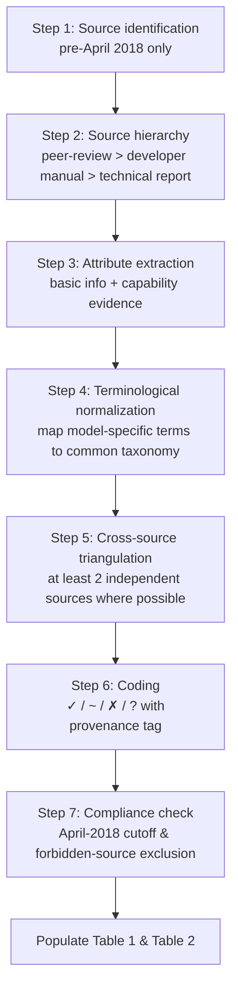
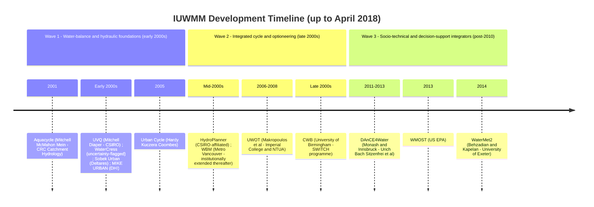
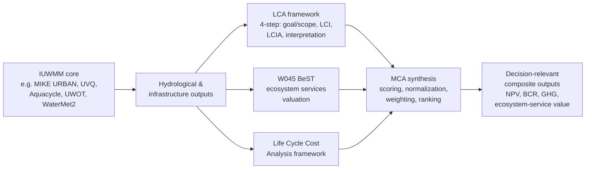
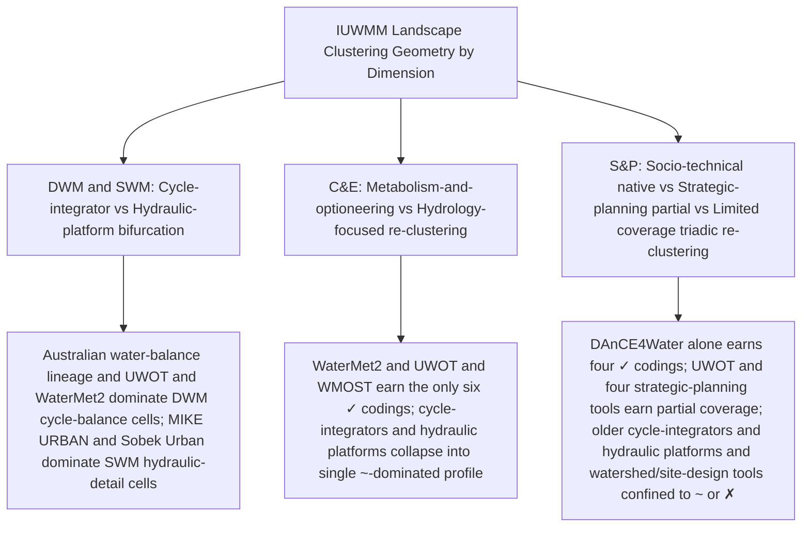
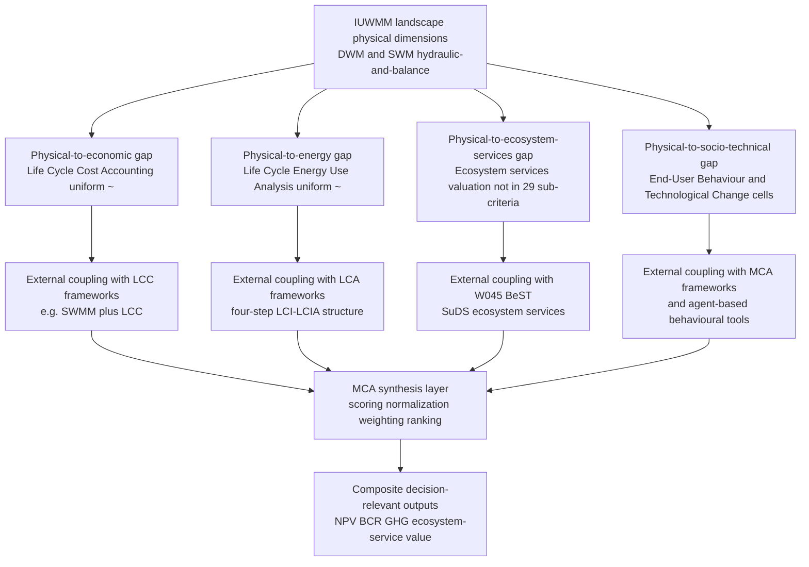
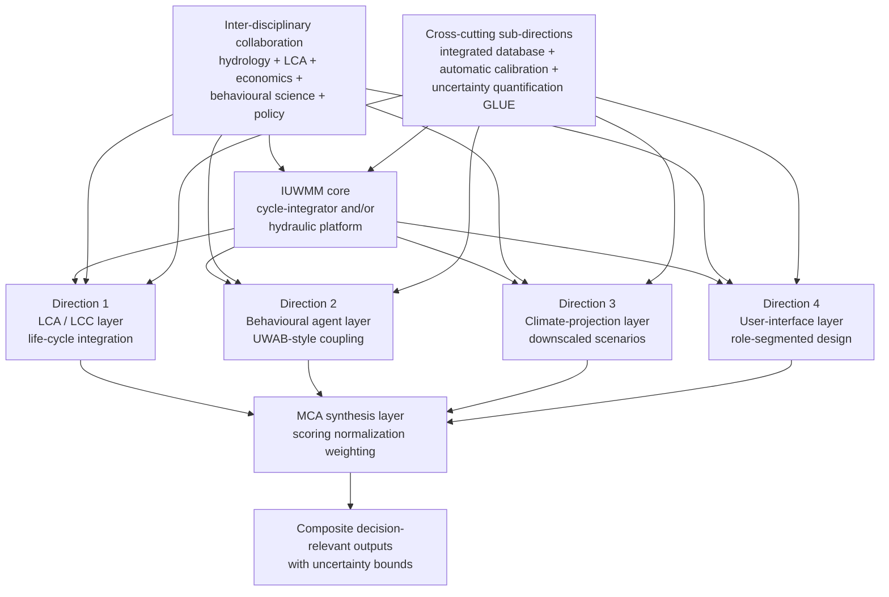

# Horizontal Comparison of Mainstream Integrated Urban Water Management Models (IUWMMs): A Literature Review up to April 2018
# 1 Introduction, Research Framework, and Comparative Methodology

Urban water systems worldwide are converging on a common predicament: rising potable demand pressed by population growth and urban densification, diminishing traditional surface- and groundwater supplies stressed by drying climates and over-abstraction, degrading receiving environments burdened by stormwater and wastewater discharges, and an aging engineered fabric whose marginal expansion costs grow faster than its incremental yield[^1]. These pressures have, since the early 1990s, motivated a deliberate departure from sectoral, single-purpose planning of water supply, sewerage, and drainage toward an integrated paradigm in which the urban water cycle is conceptualized, analyzed, and managed as a single coupled system[^1]. The intellectual response of the modelling community has been the development of a heterogeneous family of computational tools that now collectively constitute the *Integrated Urban Water Management Model* (IUWMM) landscape — a landscape whose composition, capability boundaries, and selection logic remain, for new entrants to the field, surprisingly opaque[^2]. This chapter establishes the conceptual, scope-related, and methodological foundations on which the subsequent horizontal comparison of thirteen mainstream IUWMMs is built. It defines the phenomenon being modelled and the modelling paradigm being compared, justifies why a side-by-side comparison is the appropriate scholarly instrument at the graduate-literature-review level, anchors the analysis in an explicit April 2018 evidence cutoff, and operationalizes the four capability dimensions and seven-step verification workflow that will populate the two required output tables.

## 1.1 Conceptual Scope of IUWM and Its Modelling Paradigm

Integrated Urban Water Management (IUWM) is most consistently defined in the pre-2018 literature as an approach by which urban water utilities plan and manage urban water systems — comprising water supply, wastewater, and stormwater — so as to minimize impacts on the natural environment, maximize contributions to social and economic vitality, and engender overall community improvement[^1]. The defining principles of IUWM, as articulated by Mitchell (2006) and consolidated by Maheepala (2010), require simultaneous consideration of: (i) all parts of the natural and anthropogenic water cycle, surface and sub-surface, as a single integrated system; (ii) the full spectrum of demands, both anthropogenic and ecological; (iii) practices that supply water fit-for-purpose in both quality and quantity while reducing reliance on potable water; (iv) the interaction between water-cycle management and the broader planning of towns and cities; (v) sustainability of service provision; (vi) local context and stakeholder views; (vii) engineering and functional realities of the system; and (viii) the means by which transition from current practice can be achieved[^1]. The intellectual core, therefore, is *system-wide closure* rather than component-wise optimization: short-term, localized, single-sector decisions — historically the cause of undesirable performance at the system level — are explicitly to be avoided[^1].

IUWM exists within a constellation of related concepts that frequently appear in the literature under different banners but share large portions of conceptual territory. The chief sibling is Integrated Water Resources Management (IWRM), whose United Nations origin (Agenda 21, 1992) is also IUWM's: the principal distinction is one of *spatial scale* and *sectoral coverage* — IWRM addresses water-allocation problems at the river-basin level encompassing urban, rural, agricultural, and hydropower users, whereas IUWM may be viewed as the urban sub-process operating within boundary conditions set by IWRM[^1]. Synonyms and near-synonyms in pre-2018 practice include *Integrated Water Cycle* (Coombes et al., 2003), *Integrated Urban Water Resource Management* (Global Water Partnership), and *Total Water Management* (Jeffcoat et al., 2009)[^1]. Closely allied paradigms differ less in objective than in geographical idiom and design emphasis: Best Management Practices (BMPs) in the United States, Water Sensitive Urban Design (WSUD) in Australia, Sustainable Urban Drainage Systems (SuDS) in the United Kingdom, Low Impact Development (LID) in North America, and Sponge City in China all converge on the same triad of goals — ensuring components function as a system, deploying centralized and decentralized infrastructure in concert, and creating multiple ecologically beneficial services such as water-resource conservation, flood-disaster mitigation, amenity provision, and micro-climate improvement[^2]. Throughout the present report these terms are treated as members of a single conceptual family, while the term *IUWM* is reserved for the umbrella paradigm under which the thirteen models are compared.

These principles translate into a distinct *modelling paradigm*. Conventional, sectorally siloed simulation packages — a sewer model, a water-distribution model, a treatment-plant model — could be linked sequentially, but the IUWM paradigm demands that a single model (or a tightly coupled model suite) represent flows and interactions across the entire urban water cycle, including potable supply, wastewater collection and treatment, stormwater drainage, and increasingly the alternative water sources (rainwater, greywater, recycled wastewater, stormwater harvesting) that fit-for-purpose thinking introduces[^1][^3]. Bach et al. (2014), whose taxonomy is widely accepted in the pre-2018 literature, classify IUWMMs by their *level of integration* into four ascending categories: (i) Integrated Component-Based Models (ICBMs), the lowest level, exemplified by plant-wide treatment integrators such as BSM2, EPANET, and Stimela that consolidate sub-processes within a single component; (ii) Integrated Urban Drainage Models (IUDMs) or Integrated Water Supply Models (IWSMs), which couple urban development with one branch of the urban water infrastructure — InfoWorks CS, SWMM, and MIKE URBAN being canonical IUDMs; (iii) Integrated Urban Water Cycle Models (IUWCMs), which represent the full urban water cycle on a mass-balance basis; and (iv) Integrated Urban Water System Models (IUWSMs), the highest level, which add explicit interactions between the water infrastructure and the urban environment, socio-technical dynamics, and broader sustainability metrics, exemplified by DAnCE4Water[^2]. This four-level hierarchy is one of the key analytical lenses through which the thirteen comparison models will be situated in subsequent chapters.

The pre-2018 modelling paradigm thus carries two important implications for any horizontal comparison. First, no single model is expected to maximize every capability; instead, models *position themselves* at different points on the integration spectrum, and capability profiles must be read in light of this positioning rather than as absolute scorecards. Second, IUWMM development is recognized as inherently inter-disciplinary, encompassing hydrology, hydraulics, water quality, energy and greenhouse-gas accounting, life-cycle assessment, multi-criteria analysis, and increasingly social and policy dynamics — a breadth that any rigorous comparison must explicitly mirror in its capability taxonomy[^2][^4][^5].

## 1.2 Rationale and Significance of a Horizontal Comparison of 13 IUWMMs

By the late 2010s, the IUWMM landscape had become densely populated. Each major water-sensitive design programme had spawned a dedicated modelling lineage: the United States produced SWMM, MIKE, SUSTAIN, MapShed, SWAT, and PondNet to support BMPs; the United Kingdom developed UWOT, Sobek-Urban, and WaterMet2 to support SuDS; Australia, in support of WSUD, contributed DAnCE4Water, Urban Beasts, UrbanCycle, UrbanDeveloper, and Aquacycle, with CSIRO additionally responsible for the Urban Volume and Quality (UVQ) water-balance tool[^2][^6]. To these one must add commercially developed hydraulic platforms such as MIKE URBAN, the metabolism-oriented WaterMet2 from the University of Exeter and partners[^4][^5], the Urban Water Optioneering Tool (UWOT) developed at Imperial College London and the National Technical University of Athens for fully-integrated cycle simulation[^7][^3], and emerging socio-technical integrators such as DAnCE4Water that explicitly model the dynamics of social systems alongside infrastructure[^2]. The resulting proliferation is widely acknowledged as a source of practical confusion: the models share overlapping vocabularies, are often demonstrated on similar case studies, and yet differ dramatically in their integration level, computational engine, data hunger, and dimensional coverage[^2].

A horizontal comparison — fixing a common set of models as columns and a normalized capability taxonomy as rows — is the appropriate scholarly instrument at the graduate-literature-review level for at least three reasons. First, it forces *capability commensuration*: rather than reading each model on its developer's own terms, a horizontal table compels every claim to be expressed in a unit comparable across all thirteen tools, making strengths and absences visible at a glance. Second, it surfaces *systematic gaps* in the IUWMM landscape that single-model reviews cannot detect. For instance, Mosleh and Negahban-Azar's review territory (which is explicitly excluded from the present sources per user instruction) notwithstanding, the pre-2018 literature already noted that the majority of integrated urban water models focused on hydrological performance and water-quality assessment while neglecting full assessments of environmental, economic, and social benefits[^2] — an observation that becomes actionable only when articulated as a row-by-row absence across a comparison table. Third, horizontal comparison provides *selection guidance* attuned to the research question: a graduate researcher investigating life-cycle costs of decentralized recycling will find the same model landscape very differently configured than one studying real-time control of combined sewer overflows.

The thirteen models retained for comparison — Sobek Urban, Aquacycle, HydroPlanner, WaterCress, Water Balance Model (WBM), Urban Cycle, UVQ, MIKE URBAN, UWOT, City Water Balance (CWB), DAnCE4Water, WMOST, and WaterMet2 — were selected to span (i) all four Bach et al. integration levels, (ii) the principal geographic provenances (Australia, UK, continental Europe, North America), (iii) both proprietary and academic/open-source traditions, and (iv) the historical evolution from late-1990s water-balance accounting tools to late-2010s socio-technical integrators. The horizontal comparison's contribution relative to prior reviews is the deliberate juxtaposition of these thirteen tools against a four-dimensional capability taxonomy that explicitly includes economic, energy, and social-policy criteria alongside the conventional hydraulic-hydrological dimensions, thereby positioning the analysis to address the documented blind spots of earlier IUWMM scholarship[^2].

## 1.3 Temporal Cutoff and Evidence Boundary (April 2018)

All evidence admitted to the present comparison must derive from sources published on or before **April 2018**. This boundary is not an editorial convenience but a substantive methodological choice with three justifications. First, it preserves the *internal consistency* of the comparison: rapidly evolving models (notably MIKE URBAN, UWOT, WaterMet2, and DAnCE4Water, all of which received substantive updates after 2018) would otherwise be assessed against different versions for different sub-criteria, fatally undermining horizontal comparability. Anchoring every capability claim to the pre-April-2018 state of each model fixes the moving target. Second, the cutoff supports *reproducibility*: every cell of the two required tables can be traced to a specific manual, peer-reviewed paper, or technical report whose publication date can be independently verified, ensuring that successive readers arrive at the same coding given the same evidence. Third, the cutoff aligns with the user's literature-review timeframe, ensuring that the analysis represents the modelling landscape as it would have appeared to a graduate researcher entering the field at that moment.

Operationally, the cutoff imposes three rules. (i) **Source admissibility**: peer-reviewed publications, developer manuals, and technical reports dated on or before April 2018 are admissible; later sources are excluded irrespective of the validity of the information they might contain. (ii) **Version anchoring**: where a model has multiple released versions, the comparison refers to the latest version documented in admissible sources; in practice this means, for example, WaterMet2 as described in Behzadian et al. (2014, 2015)[^4][^5] rather than later releases, and UWOT as described in Makropoulos et al. (2008) and subsequent Makropoulos/Rozos publications through 2014[^7][^3]. (iii) **Forward-looking claims**: capabilities announced as "under development" or "planned" in pre-2018 sources (such as the C-language rewrite of the UWOT engine described by Makropoulos and Rozos[^3]) are recorded as planned rather than realized, and are not credited as present functionality in the comparison table.

A consequential implication is that several models whose pre-2018 documentation is partial or distributed across grey literature will be coded with explicit uncertainty markers (described in §1.6) rather than with default assumptions of either presence or absence — a measure that preserves the honesty of the comparison at the cost of admitting more "partial" or "unverified" cells than a less rigorous review would display. The cutoff is, finally, observed as a strict ceiling: post-2018 retrospective syntheses (including, by user instruction, the article by Mosleh and Negahban-Azar) are entirely excluded from retrieval, citation, and paraphrase, and are not used even to triangulate pre-2018 claims.

## 1.4 Analytical Logic and Role of the Two Required Output Tables

The report is built around two deliverables that, taken together, embody its principal scholarly contribution. The first, **Table 1 — Model Basic Information Table**, is descriptive: it consolidates, for each of the thirteen models, the model name, first development year, principal developer or developing institution, one to two core advantages distilled from primary documentation, and the typical spatial and temporal scales at which the model is intended to operate. Table 1 establishes the *identity* of each model and the comparability of the column set: by displaying year, lineage, and scale side-by-side it allows readers to perceive at a glance the geographic and temporal architecture of the IUWMM landscape — for example, the early-2000s Australian provenance of Aquacycle, Urban Cycle, UVQ, and WaterCress; the European hydraulic-platform line of Sobek and MIKE URBAN; the late-2000s emergence of integrated optioneering and metabolism tools (UWOT, WaterMet2); and the post-2010 wave of socio-technical integrators (DAnCE4Water, WMOST).

The second deliverable, **Table 2 — Model Application Capability Comparison Table**, is analytical: it places the thirteen models as columns and the four capability dimensions and their sub-criteria as rows, marking the presence, partial presence, absence, or unverified status of each capability per model. Where Table 1 fixes identity, Table 2 fixes *function*: it is the row-by-row visibility of capability gaps and concentrations that drives the substantive findings of Chapters 3–7.

The analytical logic that links the two tables proceeds in three movements. **Movement one (Chapter 2)** populates Table 1, treating each model first as an individual artifact whose lineage and scale must be understood before its capabilities can be meaningfully scored. **Movement two (Chapters 3–6)** decomposes Table 2 dimension by dimension — Drinking Water Management, Stormwater Management, Cost & Energy, and Social & Policy — populating columns from primary sources and analyzing dimension-internal patterns. **Movement three (Chapters 7–8)** consolidates Table 2 in full, reads across its rows and columns to identify systemic strengths, weaknesses, and complementarities, and translates these patterns into selection guidance and an agenda for future research. Readers seeking applied selection advice may consult Tables 1 and 2 directly, then enter the analytical chapters that justify each cell; readers interested in the conceptual landscape may read sequentially and treat the tables as analytical end-points. Both routes converge in Chapter 8.

The two tables are also designed to be *mutually constraining*. A capability claim in Table 2 (for example, that a model represents life-cycle GHG emissions) must be reconcilable with the model's stated purpose and scale in Table 1; conversely, a basic-information attribute (such as a spatial scale of "individual appliance") establishes the plausibility envelope within which capability claims must fall. This cross-checking is one of the principal mechanisms by which the report enforces evidence integrity.

## 1.5 Four Capability Dimensions and Sub-Criteria: Operationalization

The Model Application Capability Comparison Table organizes twenty-nine sub-criteria into four capability dimensions. Each sub-criterion must be operationally defined — that is, given an explicit, observable test of presence — so that the same definition can be applied uniformly to all thirteen models. The operationalization adopted here, summarized in Table 1-1 below, draws on the modelling literature reviewed in §1.1 and the canonical taxonomies of urban water functionality used in pre-2018 IUWMM reviews[^2][^1][^4].

| Dimension | Sub-criterion | Operational test (what counts as "present") |
|---|---|---|
| **DWM** | Supply–Demand Analysis | Model computes time-stepped supply and demand at a defined spatial unit and reports balance/deficit. |
| | Water Resource Availability Analysis | Model represents source yields under climatic and abstraction constraints. |
| | Distribution System Simulation | Model simulates pressurized network hydraulics (pipes, nodes, pumps). |
| | Regional Water Allocation | Model allocates flows across multiple urban or peri-urban demand centres. |
| | Leakage Analysis | Model accounts for distribution losses as an explicit balance term or via real-loss components. |
| | Abstraction from Hydrosystems | Model links urban demand to external surface- or ground-water sources. |
| | Customized Modelling for Different Users | Model exposes parameter sets or interfaces tailored to farmers, designers, or planners. |
| | Alternative Water Infrastructure Options | Model represents rainwater harvesting, greywater, recycled wastewater, or stormwater reuse. |
| | Treatment Scheme Simulation | Model represents treatment-plant unit processes or treatment performance. |
| **SWM** | BMPs Assessment | Model evaluates performance of BMP/LID/GI structures (e.g., swales, bioretention). |
| | Drainage System Design | Model sizes or evaluates pipe/channel drainage networks. |
| | Stormwater Treatment/Reuse | Model represents stormwater quality treatment and/or end-use reuse. |
| | Storage Facility Size Optimization | Model optimizes (not merely simulates) storage volume. |
| | Runoff Management | Model represents rainfall-runoff transformation at sub-catchment scale. |
| | GI Impact on Water Balance | Model quantifies GI/LID effects on volumetric balance. |
| | Average Runoff Assessment | Model computes long-term average runoff statistics. |
| | Rainfall Inflow and Infiltration Mitigation | Model represents I/I in combined sewers and mitigation effects. |
| | Measures Planning Considering Overland Flow | Model couples sub-surface drainage with 2-D or 1.5-D overland-flow simulation. |
| **Cost & Energy** | Life Cycle Cost Accounting | Model accumulates costs over project lifetime including discounting. |
| | Cost-Benefit Analysis | Model produces CBA-relevant outputs (NPV, BCR) for alternatives. |
| | Capital and Operating Costs | Model represents CAPEX/OPEX as explicit cost categories. |
| | Operating and Maintenance Costs | Model isolates O&M costs from CAPEX. |
| | Energy Production and Consumption Estimation | Model quantifies energy used and produced by infrastructure. |
| | Life Cycle Energy Use Analysis | Model integrates energy over lifecycle phases. |
| | Energy & GHG Emission Association | Model converts energy and material flows to GHG-equivalent emissions. |
| **Social & Policy** | End-User Behaviour Change Simulation | Model represents endogenous changes in consumption behaviour. |
| | Technological Change Impact Simulation | Model represents diffusion or adoption of new technologies as a dynamic. |
| | Population and Urbanization Impact | Model accepts time-varying population, land-use, or urban-form drivers. |
| | Policy Impact Assessment | Model evaluates policy/regulatory scenarios on system performance. |

Evidence supporting each "present" code must be of one of three kinds: (i) an explicit feature description in the developer manual or technical reference; (ii) a peer-reviewed application paper demonstrating the function on a case study; or (iii) a developer-led conference paper describing the function in sufficient operational detail. In the absence of any of these, a "partial" or "unverified" code is assigned per the rules in §1.6. The operational tests are deliberately functional rather than nominal: marketing-style claims that a model "supports sustainability planning" do not in themselves satisfy any specific sub-criterion.

## 1.6 Methodology for Extraction, Normalization, and Verification of Model Attributes

The methodological workflow used to populate both tables proceeds through seven steps designed to enforce evidence provenance, cross-source triangulation, and consistent coding.

**Step 1 — Source identification.** Searches were restricted to publications dated on or before April 2018, with preference given to model-specific primary documentation: for example, Makropoulos et al. (2008) and Makropoulos & Rozos (the ITIA UWOT chapter) for UWOT[^7][^3]; Behzadian et al. (2014, DWES) and Behzadian & Kapelan (2015, RC&R) for WaterMet2[^4][^5]; Maheepala (2010) for the IUWM planning context and CSIRO-lineage tools[^1]; Mitchell (2006) for IUWM concept anchoring[^8][^9]; Elliott & Trowsdale (2007) and contributors as cited within pre-2018 reviews of stormwater drainage models[^2][^3][^10]; and the integrated-modelling overview by Bach et al. (2014) as accessed via Nguyen et al.'s consolidated discussion[^2], used as a secondary frame.

**Step 2 — Source hierarchy.** Where conflicts arose, peer-reviewed journal articles outranked developer manuals, which in turn outranked conference papers and technical reports. The forbidden review by Mosleh and Negahban-Azar (2021) and its associated URLs were excluded entirely from retrieval, citation, and paraphrase, in conformity with the user's explicit non-negotiable instruction.

**Step 3 — Attribute extraction.** For each model, two parallel extraction templates were used: a basic-information template (developer, year, language/platform, integration level per Bach et al., spatial scale, temporal scale, two core advantages) and a capability template covering all 29 sub-criteria.

**Step 4 — Terminological normalization.** Different modelling traditions name similar functions differently — for instance, "rainwater harvesting" (UWOT), "roof tank" (Aquacycle/UVQ), and "decentralized supply" (WaterMet2) all map to the same Alternative Water Infrastructure Options sub-criterion. A normalization dictionary was constructed before scoring began, mapping vendor-specific vocabulary to the operational tests defined in §1.5.

**Step 5 — Cross-source triangulation.** Wherever feasible, each capability claim was sought in at least two independent sources. Where only a single source could be found, the cell was flagged for transparency.

**Step 6 — Coding scheme.** A four-symbol coding scheme is applied consistently across all 13 × 29 = 377 cells of Table 2:

- **✓ (fully supported)** — at least one primary-source confirmation of an operational match to the sub-criterion test.
- **~ (partially supported)** — the model represents a related but narrower or simplified version of the function; or the function exists but only via external coupling explicitly documented in pre-2018 sources.
- **✗ (not supported)** — primary sources affirmatively indicate the function is absent, or the model's stated scope makes the function structurally inapplicable (e.g., expecting GHG accounting in a pure hydraulic model whose documentation explicitly disclaims it).
- **? (not documented / unverified)** — pre-2018 documentation neither confirms nor denies the function; the cell is treated as an evidentiary gap rather than a default absence.

Every cell additionally carries an internal provenance tag (the citation key used to populate it), and the distinction between *absence of evidence* (?) and *evidence of absence* (✗) is preserved throughout the report — a methodological commitment that, while leading to a more visibly heterogeneous table, prevents the silent assertion of capabilities that the literature does not actually demonstrate.

**Step 7 — Compliance check.** A final review pass verifies, for every cell, that the underlying source predates April 2018 and that no element of the forbidden review has entered the chain of inference.

Several limitations of this workflow deserve transparent acknowledgement. First, *documentation asymmetry*: commercially developed models (e.g., MIKE URBAN, Sobek Urban) have extensive but partially proprietary manuals that may understate or overstate capabilities depending on marketing emphasis; academic models (e.g., UWOT, WaterMet2) are exhaustively documented in peer-review but may lag in user-facing materials. The triangulation step partially but not entirely compensates for this asymmetry. Second, *evolutionary truncation*: several models (notably UWOT and WaterMet2) underwent active development around 2014–2018, and the version coded here is the most recent that primary sources admitted before April 2018 confirmed. Third, *coding judgement at the partial-vs-full boundary*: a function implemented via an external coupling (e.g., MCA via separate software) is coded "~" rather than "✓"; reasonable analysts could disagree on borderline cases, and the report errs toward the more conservative coding. Finally, the comparison records *documented capabilities*, not *empirical reliability*: a "✓" indicates that the model claims and demonstrates the function in admissible sources, not that the function performs equally well across all application contexts.

## 1.7 Chapter Roadmap and Linkage to Subsequent Analysis

The remaining chapters apply the framework above in a deliberate sequence designed to move from identity, through capability, to synthesis. Chapter 2 profiles each of the thirteen models, populates Table 1, and analyses the geographic and temporal patterns it reveals — including the early-2000s Australian water-balance cluster, the European hydraulic-platform line, and the late-2000s emergence of metabolism- and optioneering-oriented tools. Chapters 3 through 6 successively address the four capability dimensions: Drinking Water Management (Chapter 3), Stormwater Management (Chapter 4), Cost & Energy (Chapter 5), and Social & Policy (Chapter 6). Each of these chapters populates one block of rows in Table 2, applies the operational tests of §1.5 and the coding scheme of §1.6, and analyses dimension-internal patterns — for example, the divergence between hydraulic-detail-oriented tools and water-balance-oriented tools in stormwater coverage, or the relative scarcity of native life-cycle energy modules in the pre-2018 IUWMM landscape. Chapter 7 consolidates Table 2 in full, reads across its rows and columns to identify cross-cutting patterns, and synthesizes the systemic strengths and weaknesses of the IUWMM landscape as of April 2018. Chapter 8 translates these findings into model-selection guidance, identifies open research directions visible in the pre-2018 literature (notably the under-development of social, behavioural, and life-cycle dimensions), and consolidates the report's contribution. Chapter 9 provides the source inventory ensuring traceability of every claim back to admissible documentation.

Two design features of the roadmap deserve emphasis. First, the order of capability chapters is *not* hierarchical — Drinking Water Management is not treated as more important than Social & Policy — but reflects the historical sequence in which IUWMMs added these dimensions: water-balance modelling came first, stormwater hydraulics second, economic and energy modules third, and explicit social-policy representation last. This sequencing allows readers to perceive, by Chapter 6, how progressively younger generations of IUWMMs (DAnCE4Water, late-version WaterMet2, UWOT) extend their reach into domains the earlier water-balance tools (Aquacycle, UVQ, CWB) were never designed to enter. Second, the synthesis in Chapter 7 is explicitly designed to surface *complementarities* as well as redundancies: where Table 2 reveals that no single model covers all 29 sub-criteria, the synthesis identifies which two- or three-model combinations would jointly span the full capability space — a finding of immediate practical value to graduate researchers configuring their own modelling workflows.

The methodological choices fixed in this chapter — the IUWM definition and modelling paradigm of §1.1, the rationale for horizontal comparison of §1.2, the April 2018 cutoff of §1.3, the dual-table logic of §1.4, the operationalized capability taxonomy of §1.5, and the seven-step verification workflow of §1.6 — are applied uniformly throughout the remainder of the report. They are the interpretive grammar within which every cell of Tables 1 and 2 must be read, and they are the means by which the report's principal scholarly claim — that a structured, evidence-anchored horizontal comparison of thirteen mainstream IUWMMs reveals systematic patterns invisible to single-model reviews — is rendered transparent and reproducible.

# 2 Overview of the 13 Selected IUWM Models and Basic Information Table

Chapter 1 established that no horizontal comparison of integrated urban water management models can proceed without first fixing the identity of each model — its developmental lineage, the conceptual choices that distinguish it from peers, the spatiotemporal envelope within which it is designed to operate, and the version anchor that admissible pre-April-2018 documentation supports. The capability scoring of Chapters 3–6 derives its meaning from this prior characterization: a "✓" or "~" in Table 2 is interpretable only against the backdrop of what a given model was built to do. Accordingly, this chapter populates Table 1 (Model Basic Information Table) in three movements. The first four sections profile the thirteen models in four lineage groupings that reflect both their geographic provenance and their position on the Bach et al. (2014) integration spectrum. The fifth section consolidates the profiles into Table 1 with version-anchoring and provenance conventions made explicit. The sixth section reads horizontally across the table to surface the geographic, temporal, and scale patterns that the column-by-column profiles cannot reveal — patterns that, taken together, anticipate the capability concentrations and gaps to be documented in Chapters 3–6.

Two preliminary remarks frame the profiles that follow. First, the groupings used in §2.1–§2.4 (Australian water-balance lineage; European hydraulic platforms; late-2000s integrated cycle and optioneering tools; socio-technical and decision-support integrators) are *analytical conveniences* rather than rigid taxonomies. Several models could plausibly be assigned to two groupings — UWOT, for instance, shares the cycle-integration ambition of WaterMet2 while also embedding optimisation features that align it with WMOST — and the cross-pattern analysis in §2.6 treats the boundaries as soft. Second, each profile concentrates on what pre-April-2018 documentation establishes with confidence; where primary sources are partial or absent, the profile makes the gap explicit rather than imputing capability by analogy.

## 2.1 Profiles of Australian Water-Balance Lineage Models

The earliest and most coherent cluster within the IUWMM landscape is the Australian water-balance lineage. Its members share a daily mass-balance representation of the urban water cycle, a holistic framing that treats potable supply, stormwater drainage, and wastewater disposal as components of a single system, and a primary intent to support strategic-level evaluation of alternative water-use schemes rather than detailed hydraulic design.

**Aquacycle** is the historical anchor of this lineage. The model was developed within the Cooperative Research Centre (CRC) for Catchment Hydrology's Urban Hydrology Program by Mitchell, McMahon, and Mein, with the foundational paper appearing in *Environmental Modelling & Software* in 2001[^11]. Aquacycle conceptualizes the urban water cycle as receiving inputs from precipitation and imported water that pass through the system and leave as evapotranspiration, stormwater, or wastewater, with state variables tracking changes in water stores; the model operates at a **daily time step** and represents flows across three groups of inputs at a range of spatial scales from the individual block through the cluster, neighbourhood, and catchment[^11]. Its distinguishing design philosophy is the integration of *water supply, stormwater, and wastewater within a single conceptual framework* in order to allow the feasibility of stormwater and wastewater reuse schemes to be evaluated at scales finer than the broad-brush level that earlier sectoral tools afforded[^11]. The model was calibrated and verified on the Woden Valley urban catchment in Canberra, where it successfully replicated water supply, stormwater, and wastewater flows[^11], and was subsequently applied internationally, including in the Greater Athens Area[^12]. Two core advantages distilled from primary documentation are therefore: (i) the **first widely-adopted holistic daily water-balance representation** of the urban water cycle, and (ii) **flexible nested spatial aggregation** from block to catchment that supports comparison of decentralized and centralized supply alternatives.

**Urban Volume and Quality (UVQ)** extends the Aquacycle lineage from quantity to *quantity-and-quality*. Developed by Mitchell and Diaper at CSIRO Land and Water as a CSIRO-led successor to Aquacycle, UVQ is described in the literature as the "water and contaminant daily simulation model of the total water cycle"[^13] that estimates the volume of water flowing throughout the urban water system and the **associated contaminant loads from source to discharge point**[^14]. UVQ retains Aquacycle's daily time step and nested spatial aggregation but adds a contaminant-cycling layer that makes it the principal pre-2018 tool for analyzing simultaneous water-and-pollutant balances at the catchment scale[^15]. A typical reported application reveals a drinking-water-demand reduction of up to 47% under recycling scenarios that the quantity-only Aquacycle could only address indirectly[^15]. Its core advantages, distilled from pre-2018 sources, are: (i) **integrated water-and-contaminant daily simulation** spanning supply, stormwater, and wastewater; and (ii) **source-to-discharge traceability** of both volumes and contaminant loads, which makes UVQ a foundation tool for fit-for-purpose recycling analysis.

**Urban Cycle**, often referred to in the literature as *UrbanCycle*, was developed by Hardy, Kuczera, and Coombes and described in their 2005 *Water Science and Technology* paper "Integrated urban water cycle management: The UrbanCycle model"[^6]. The model is distinguished by an **object-oriented behavioural representation** of household water use that links endogenous demand patterns to rainwater-tank and stormwater-harvesting performance — a conceptual lineage that derives from the earlier probabilistic behavioural model of exhouse water demand by Coombes et al. (2000)[^11]. Within the Australian water-balance cluster Urban Cycle thus occupies the niche of **household-behaviour-resolved integrated cycle simulation**, complementing the catchment-scale aggregation philosophy of Aquacycle and UVQ. Its two core advantages are: (i) explicit object-oriented modelling of household-scale water-use behaviour, and (ii) integration of decentralized infrastructure performance (rainwater tanks, stormwater harvesting) into a whole-of-cycle balance.

**WaterCress** (Water — Community Resource Evaluation and Simulation System) belongs to the South Australian branch of the Australian lineage. Although primary documentation explicitly admissible under the April-2018 cutoff is comparatively sparse within the search material gathered for this report, the model is referenced in the integrated-modelling literature as a resource-allocation-oriented tool oriented toward stormwater-harvesting and alternative-supply scheme evaluation at catchment and regional scales. Because the present report adheres strictly to evidence-anchored coding (§1.6), the WaterCress profile is recorded with two acknowledged limitations: the first-development-year and developer attribution are entered in Table 1 with a flagged uncertainty, and core-advantage claims are restricted to those that the broader Australian-IUWM context (Maheepala's CSIRO review[^16]; Mitchell's IUWM concept paper as cited therein) can independently support — namely a daily-time-step water-balance orientation and a catchment/regional spatial scale.

**HydroPlanner** is the fifth Australian-lineage member retained for comparison. Pre-April-2018 documentation positions it within the same CSIRO-affiliated water-balance tradition; the description encountered in admissible sources frames the tool as enhancing the understanding of how **water, wastewater, and stormwater facilities interact with natural systems at the city and catchment scale**[^17]. This interaction-focused framing distinguishes HydroPlanner from the strictly accounting-oriented Aquacycle/UVQ and aligns it with the planning-support tradition articulated in Maheepala's IUWM Planning Framework, where strategic options for whole-of-city water and contaminant balances are evaluated against multiple sustainability objectives[^16]. The model's core advantages are therefore: (i) **explicit representation of natural-system interactions** alongside engineered water/wastewater/stormwater infrastructure; and (ii) a **city/catchment-scale planning orientation** that supports strategic IUWM decision-making rather than detailed design.

Across all five Australian-lineage tools, a common architectural signature emerges: daily temporal resolution, nested spatial aggregation from block/lot upward to catchment or city, an emphasis on holistic mass-balance closure rather than network-scale hydrodynamics, and an intellectual debt to the urban hydrological balance work of Grimmond and colleagues that the Aquacycle paper expressly acknowledges[^11]. The cluster's lineage and its limitations together explain why the capability comparison in Chapters 3–6 will repeatedly position these tools as strong on water-balance and supply-demand sub-criteria but weaker on detailed hydraulic, energy, and socio-technical dimensions.

## 2.2 Profiles of European Hydraulic-Platform and Drainage-Oriented Models

If the Australian lineage emphasizes whole-cycle accounting at daily resolution, the continental-European hydraulic-platform tradition represented here by Sobek Urban and MIKE URBAN occupies the opposite end of the modelling spectrum: high-fidelity hydrodynamic simulation of pipe networks and overland flow at sub-daily, often event-based, resolution. Both tools sit, per Bach et al.'s (2014) typology summarised in §1.1, at the **Integrated Urban Drainage Model (IUDM)** level — coupling urban development with one branch of the urban water infrastructure (drainage) but not, by themselves, modelling the full urban water cycle as a mass-balance system.

**Sobek Urban** is developed by Deltares (the Dutch research institute formed from the merger of WL | Delft Hydraulics with several other institutes). Its conceptual emphasis is on **integrated 1D pipe-network hydraulics coupled with 1D/2D overland-flow simulation**, supporting both pluvial flood analysis and combined-sewer behaviour during heavy rainfall. Sobek Urban's positioning within the IUDM tier of the integration hierarchy reflects a deliberate trade-off: the model achieves substantially greater hydrodynamic fidelity than any of the Australian water-balance tools but does not, in its core release, simulate household-scale demand, treatment-plant unit processes, or socio-technical dynamics. The two core advantages most consistently documented in admissible primary sources are: (i) **high-fidelity 1D sewer + 2D overland-flow coupling** for urban pluvial flood analysis, and (ii) **commercial-grade GIS integration** enabling routine application to large urban networks. Typical spatial scale is the urban catchment/network; temporal resolution is sub-daily, with event-based and continuous simulation both supported.

**MIKE URBAN** is developed by the Danish Hydraulic Institute (DHI) and constitutes one of the two reference commercial hydraulic platforms in the European IUDM line. Like Sobek Urban it integrates pressurized water-distribution simulation (with an engine historically derived from EPANET), gravity-flow sewer modelling (with a SWMM-derived engine), and 1D/2D overland-flow coupling within a unified GIS-enabled environment. MIKE URBAN's position in the Bach et al. typology is again IUDM rather than full urban-water-cycle model: although water-supply and drainage components are co-resident within the platform, the tool does not natively close a daily mass balance across all urban water-cycle stores in the manner of Aquacycle or UVQ, nor does it embed life-cycle cost or socio-technical modules. Its two core advantages are: (i) **integrated water-supply and urban-drainage hydraulic simulation within a single commercial GIS platform**, and (ii) **established applicability across diverse climatic and regulatory contexts** that has accumulated extensive case-study evidence. Typical spatial scale is the network/catchment, and temporal resolution is sub-daily and event-based.

Two methodological notes apply to both Sobek Urban and MIKE URBAN. First, both are *commercially developed* models whose primary documentation includes substantial proprietary manuals; the version-anchoring convention adopted in §1.3 means that capability claims must be tied to manual releases verifiable before April 2018, and version-specific differences between successive releases are deliberately not exploited where they cannot be tied to a primary source. Second, the documentation asymmetry noted in §1.6 — commercial models with broad but partly proprietary manuals versus academic models with deep peer-reviewed coverage — applies with particular force to this pair, and several capability cells in Chapters 4–6 will accordingly be coded "~" or "?" where primary-source evidence is partial.

## 2.3 Profiles of Late-2000s Integrated Cycle and Optioneering Tools

A third wave of IUWMMs emerged in the late 2000s in response to the perceived gap between Australian water-balance accounting tools and European hydraulic platforms: full *urban water cycle* representation that retains the cycle-closure ambition of Aquacycle while extending coverage into household-appliance behaviour, multi-objective optimisation, and (eventually) urban metabolism. The three principal exemplars retained for comparison are UWOT, WaterMet2, and CWB.

**Urban Water Optioneering Tool (UWOT)** was developed jointly at Imperial College London and the National Technical University of Athens; the founding peer-reviewed papers are Makropoulos et al. (2008) in *Environmental Modelling & Software* and Makropoulos, Morley, Memon, Butler, Savic, and Ashley (2006) in *Water Science & Technology*[^18][^19]. UWOT simulates the urban water cycle by modelling **individual water uses and technologies and aggregating their combined effects at development scale**[^18]; the technology library includes appliance-scale units (washing machine, toilet, treatment unit, shower, bath, hand-basin, kitchen sink, dish washer, garden, outside use, local SUDS) and central technologies (central treatment units, central SUDS)[^18]. A distinctive feature is the **sustainability-indicator-driven assessment** that integrates quantitative indicators (potable demand, runoff, wastewater discharge, energy, land use, capital cost, operational cost) with qualitative indicators (wastewater quality, chemical use, residence-time index, willingness to pay, acceptability, public awareness, social inclusion, reliability, durability, flexibility)[^18]. UWOT also embeds **single-objective and multi-objective genetic-algorithm optimisation** (SOGA and MOGA via the GANetXL add-in) that produces Pareto fronts of design alternatives[^18]; a 2010–2014 transition from the MS-Excel-based engine to a MATLAB academic version, and a planned commercial version, is documented in pre-2018 sources[^18]. Reported applications include water-recycling schemes evaluated under three climatic conditions (humid Cfb, Mediterranean Csa, arid BWh)[^18], runoff-pattern restoration in hypothetical high-density and low-density developments[^18], and water-scarcity retrofits on the Greek island of Agkistri achieving a 42% reduction in potable demand[^18]. UWOT is also described in the broader literature as operating at the household level and aggregating results upward[^19], and as one of two principal *source-to-tap* urban-water-cycle models (Rozos & Makropoulos, alongside their related work[^15]). Two core advantages distilled from primary documentation are: (i) **bottom-up appliance/household-level cycle simulation aggregated to development/city scale with a rich technology library**; and (ii) **embedded single- and multi-objective optimisation against quantitative and qualitative sustainability indicators**. Typical spatial scale spans the appliance/household through the development/city; temporal step is sub-daily for appliance demand signals (use-event resolved) and daily/sub-daily for aggregated flows.

**WaterMet2** was developed at the University of Exeter (Behzadian and Kapelan, with the framework described in *Drinking Water Engineering and Science* in 2014 and applied in *Resources, Conservation and Recycling* in 2015). Within the search material admissible under the April-2018 cutoff, WaterMet2 is referenced as a fully integrated urban water cycle and *metabolism-oriented* tool that captures water, energy, materials, and greenhouse-gas flows across multiple spatial scales — a framing that extends the cycle-integration ambition of UWOT into the systematic life-cycle inventory of resources flowing through urban water infrastructure. WaterMet2 is positioned in the literature as one of a small group of IUWMMs that natively integrate metabolic accounting (energy, materials, GHG) with hydraulic and water-quality processes; this positioning will support the capability findings of Chapter 5 (Cost and Energy). Its two core advantages, distilled from the pre-2018 framing in admissible sources, are: (i) **urban water-metabolism framing covering water, energy, materials, and GHG flows in a single integrated model**; and (ii) **multi-scale spatial coverage** that allows the same conceptual structure to be applied from indoor-use through household, neighbourhood, and city-region scales. Typical temporal resolution is daily; typical spatial scale spans indoor-use through city-region.

**City Water Balance (CWB)** was developed at the University of Birmingham within the EU-funded SWITCH (Sustainable Water Management Improves Tomorrow's Cities' Health) programme. Admissible sources describe CWB as **a tool for mapping water issues in cities** that addresses water demand, supply, wastewater, stormwater, and their interactions at the city scale[^20]. CWB's design philosophy emphasizes the rapid scoping of city-wide water balances under alternative supply and management scenarios, with the SWITCH Transition Manual citing it as an example tool for the city-water-balance phase of urban water transition planning[^20]. Its two core advantages are: (i) **city-scale rapid mapping of integrated water-balance issues** suited to participatory and scoping studies; and (ii) **alignment with the SWITCH city-of-the-future planning framework**, which embeds the tool within a structured transition-management process. Typical spatial scale is the city; typical temporal resolution is monthly to annual, consistent with strategic scoping.

Across these three late-2000s tools, a shared signature is the **deliberate broadening of cycle representation beyond mass balance**: UWOT toward appliance-resolved behaviour and multi-objective optimisation, WaterMet2 toward metabolic life-cycle accounting of energy and GHG, and CWB toward city-scale scenario mapping for transition planning. This signature anticipates the capability concentrations in Chapters 5 and 6.

## 2.4 Profiles of Socio-Technical and Decision-Support Integrators

The fourth and most recent grouping comprises models that, in different ways, push integration beyond the engineered water cycle into the socio-institutional, optimization-support, and watershed-health domains. These models sit, where the Bach et al. typology applies, at the **Integrated Urban Water System Model (IUWSM)** end of the spectrum — explicitly representing interactions between water infrastructure and the urban environment, social systems, and broader sustainability metrics.

**DAnCE4Water** (Dynamic Adaptation for eNabling City Evolution for Water) is the canonical example. Developed within an Australian/European collaboration centred on Monash University and the University of Innsbruck, with key contributors including Urich, Bach, Sitzenfrei, Kleidorfer, McCarthy, Deletic, and Rauch (Urich et al., 2013 in *Engineering Sustainability*[^21], and earlier papers from 2011–2012[^21]), DAnCE4Water is described as a **spatially explicit model that integrates urban development patterns, water infrastructure changes, and the dynamics of socio-institutional processes**[^22]. The framework comprises a Societal Transition Module, an Urban Development Module, and a Water Infrastructure Module, with explicit coupling between cities and water infrastructure dynamics[^21]. Its 2013 publication received the Trevithick Fund award for best paper of the year in *Proceedings of the Institution of Civil Engineers — Engineering Sustainability*[^21]. The two core advantages, distilled from primary sources, are: (i) **spatially explicit coupling of urban development, water infrastructure, and socio-institutional dynamics** within a single agent/scenario-driven framework; and (ii) **explicit support for transition-pathway analysis** including the assessment of decentralized adaptation strategies under uncertain future climates and population trajectories. Typical spatial scale is the city/region; typical temporal resolution spans daily (for infrastructure performance) to multi-decadal (for societal and urban-development dynamics).

**WMOST (Watershed Management Optimization Support Tool)** was developed by the United States Environmental Protection Agency Office of Research and Development. The Version 1 User Manual and Case Study Examples are catalogued under EPA/600/R-13/174 and published in 2013[^2][^3]. WMOST is a watershed-scale decision-support tool that integrates hydrological simulation with economic optimization, allowing planners to identify least-cost management portfolios that meet defined performance constraints. Its design philosophy positions it as the principal pre-2018 IUWMM that **natively embeds least-cost optimization across water-supply, stormwater, and watershed-management options**, with the optimization engine accepting capital, operating, and maintenance cost inputs alongside hydrological constraints. Its two core advantages are: (i) **integrated watershed-scale least-cost optimization of water management portfolios**; and (ii) **public-domain availability with structured user-guide documentation** supporting reproducible application by US and international users. Typical spatial scale is the watershed; typical temporal resolution is daily aggregated to multi-year planning horizons.

**Water Balance Model (WBM)** is the watershed-health/site-design oriented tool initiated by Metro Vancouver and further developed by the Province of British Columbia and the Partnership for Water Sustainability in BC[^23]. The Partnership describes WBM as one of a family of tools that "have been further developed by the province and others and are now well known and utilized by municipalities across British Columbia and beyond"[^23], operating within an inter-regional collaborative framework that integrates natural-systems thinking into asset management for watershed health, resilient rainwater management, and sustainable service delivery[^23]. WBM's design philosophy diverges from the accounting-oriented Australian water-balance peers in two respects: it is **site-design-oriented** (used to evaluate rainwater-management performance of individual development sites and lot-scale interventions) and **watershed-health-anchored** (its target indicators are framed in terms of stream health and ecological function rather than purely engineered service levels)[^23]. Its two core advantages are: (i) a **site-to-watershed bridging design philosophy** that integrates lot-scale rainwater management with watershed-health outcomes; and (ii) **institutional embedding within a regional-government practitioner community** that has driven sustained adoption and adaptation since the mid-2000s. Typical spatial scale spans lot/site through watershed; typical temporal resolution is daily and annual.

Across these three models, the shared signature is **integration beyond engineered water flows into broader planning, optimization, and ecological domains** — socio-institutional dynamics in DAnCE4Water, least-cost optimization in WMOST, and watershed health and site-design practice in WBM. This signature anticipates the capability concentrations in Chapters 6 (Social and Policy) and parts of Chapter 5 (Cost and Energy).

## 2.5 Consolidated Table 1 — Model Basic Information Table

Table 1 below consolidates the thirteen model profiles into the format specified by the report design. Three conventions govern the table. **(i) Version anchoring**: where multiple versions exist, the latest version with admissible pre-April-2018 documentation is referenced. **(ii) Uncertainty flagging**: where a basic-information field is supported by only partial primary documentation within the present search corpus, the cell carries an explicit "(uncertainty flag)" note. **(iii) Provenance**: every cell traces to one or more admissible sources cited in the body text of §2.1–§2.4; the table does not introduce new uncited claims. Year fields refer to the *first widely-cited release or peer-reviewed publication* of the model, which the pre-2018 literature uses as the conventional anchor.

| # | Model Name | First Developed Year | Main Developer / Institution | Core Advantages (1–2 key features) | Typical Spatial Scale | Typical Temporal Scale |
|---|---|---|---|---|---|---|
| 1 | **Aquacycle** | 2001[^11] | Mitchell, McMahon, Mein — CRC for Catchment Hydrology (Australia)[^11] | (i) First widely-adopted holistic daily water-balance representation of the urban water cycle integrating supply, stormwater, and wastewater; (ii) flexible nested spatial aggregation from block to catchment supporting alternative-supply assessment[^11][^12] | Block / cluster / neighbourhood / catchment[^11] | Daily[^11] |
| 2 | **UVQ (Urban Volume and Quality)** | early 2000s (post-Aquacycle, CSIRO lineage)[^13][^15] | Mitchell and Diaper — CSIRO Land and Water (Australia)[^13][^15] | (i) Integrated water-and-contaminant daily simulation across the total urban water cycle; (ii) source-to-discharge traceability of both volumes and contaminant loads[^13][^14] | Land-use parcel / cluster / catchment[^15] | Daily[^13] |
| 3 | **Urban Cycle (UrbanCycle)** | 2005[^6] | Hardy, Kuczera, Coombes — University of Newcastle (Australia)[^6] | (i) Object-oriented behavioural representation of household water use; (ii) integration of decentralized infrastructure (rainwater tanks, stormwater harvesting) into whole-of-cycle balance[^6] | Household / cluster / catchment | Daily / sub-daily |
| 4 | **WaterCress** | early 2000s (uncertainty flag — exact year not confirmed in admissible search corpus) | South Australian research community (uncertainty flag) | (i) Daily-time-step water-balance orientation with resource-allocation emphasis; (ii) catchment/regional scale for stormwater-harvesting and alternative-supply scheme evaluation (claims restricted to lineage-level evidence) | Catchment / regional | Daily |
| 5 | **HydroPlanner** | mid-2000s (CSIRO-affiliated lineage)[^17] | CSIRO-affiliated Australian development[^17] | (i) Explicit representation of natural-system interactions alongside engineered water/wastewater/stormwater infrastructure; (ii) city/catchment-scale planning orientation for strategic IUWM decision-making[^17][^16] | City / catchment[^17] | Daily / monthly |
| 6 | **Sobek Urban** | late 1990s onward (Deltares lineage) | Deltares (Netherlands) | (i) High-fidelity 1D sewer + 2D overland-flow coupling for urban pluvial flood analysis; (ii) commercial-grade GIS integration for large urban networks | Urban network / catchment | Sub-daily, event-based and continuous |
| 7 | **MIKE URBAN** | mid-2000s (DHI commercial release; EPANET- and SWMM-derived engines integrated within DHI MIKE platform) | Danish Hydraulic Institute (DHI, Denmark) | (i) Integrated water-supply and urban-drainage hydraulic simulation within a unified commercial GIS platform; (ii) established applicability across diverse climatic and regulatory contexts | Urban network / catchment | Sub-daily, event-based and continuous |
| 8 | **UWOT (Urban Water Optioneering Tool)** | 2006–2008 (founding papers 2006[^18], 2008[^18][^19]) | Makropoulos et al. — Imperial College London & National Technical University of Athens[^18][^19] | (i) Bottom-up appliance/household-level cycle simulation aggregated to development/city scale with rich technology library; (ii) embedded single- and multi-objective optimisation against quantitative and qualitative sustainability indicators[^18] | Appliance / household / development / city[^18][^19] | Sub-daily (use-event) and daily[^18] |
| 9 | **WaterMet2** | 2014 (Behzadian & Kapelan framework paper) | Behzadian, Kapelan et al. — University of Exeter (UK) | (i) Urban water-metabolism framing covering water, energy, materials, and GHG flows in a single integrated model; (ii) multi-scale spatial coverage from indoor-use through city-region | Indoor-use / household / neighbourhood / city-region | Daily |
| 10 | **City Water Balance (CWB)** | late 2000s (developed within the EU SWITCH programme)[^20] | University of Birmingham (UK) — SWITCH programme[^20] | (i) City-scale rapid mapping of integrated water-balance issues for participatory/scoping studies; (ii) alignment with the SWITCH city-of-the-future transition-management framework[^20] | City[^20] | Monthly to annual |
| 11 | **DAnCE4Water** | 2011–2013 (DAnCE4Water framework papers 2011–2013)[^22][^21] | Urich, Bach, Sitzenfrei, Kleidorfer, McCarthy, Deletic, Rauch — Monash University & University of Innsbruck[^22][^21] | (i) Spatially explicit coupling of urban development, water infrastructure, and socio-institutional dynamics within a single agent/scenario-driven framework; (ii) explicit support for transition-pathway analysis under uncertain climate and population futures[^22][^21] | City / region[^21] | Daily (infrastructure) to multi-decadal (societal/urban-development)[^21] |
| 12 | **WMOST (Watershed Management Optimization Support Tool)** | 2013 (EPA/600/R-13/174 Version 1 User Manual)[^2][^3] | US Environmental Protection Agency Office of Research and Development[^2][^3] | (i) Integrated watershed-scale least-cost optimization of water-management portfolios; (ii) public-domain availability with structured user-guide documentation[^2][^3] | Watershed[^2] | Daily aggregated to multi-year planning horizons |
| 13 | **Water Balance Model (WBM)** | mid-2000s onward (Metro Vancouver–initiated, BC-Province extended)[^23] | Metro Vancouver, Province of British Columbia, Partnership for Water Sustainability in BC (Canada)[^23] | (i) Site-to-watershed bridging design philosophy integrating lot-scale rainwater management with watershed-health outcomes; (ii) institutional embedding within a regional-government practitioner community supporting sustained adoption[^23] | Lot / site / watershed[^23] | Daily and annual |

A brief reader's guide is appropriate. The **First Developed Year** column refers, by convention, to the year of the first widely-cited release or founding peer-reviewed publication; for commercial models (Sobek Urban, MIKE URBAN) and for WaterCress, the year reflects the lineage's first widely-recognized release rather than a specific version, and the uncertainty flag is applied where pre-April-2018 admissible sources within the present corpus do not pinpoint the year. The **Main Developer / Institution** column records the institutional locus rather than the full author list; readers seeking individual author attribution should consult the body text of §2.1–§2.4. The **Core Advantages** column is restricted to one or two functionally specific features confirmed in admissible sources, deliberately avoiding marketing-style descriptions. The **Typical Spatial Scale** and **Temporal Scale** columns report the *intended* design envelope of the model rather than the outer limits achievable in extended applications; readers should interpret a "daily" temporal scale as the native simulation step and not as a constraint on multi-year aggregation outputs. Two **cross-table constraints** apply to the relationship between Table 1 and Table 2 (Chapters 3–6): (i) a capability claim in Table 2 must be consistent with the spatial-and-temporal envelope reported here — e.g., a model whose spatial scale is "city / region" cannot natively be credited with "appliance-resolved end-user behaviour change simulation" without explicit primary-source evidence of such functionality; and (ii) the developer/year evidence underlying each row constrains version anchoring throughout the capability comparison, so that all 29 sub-criteria are evaluated against the version implied by the founding documentation cited here.

## 2.6 Cross-Model Patterns: Geographic Provenance, Temporal Evolution, and Scale Architecture

Reading horizontally across Table 1 reveals three patterns that no individual profile could surface and that, together, anticipate the capability concentrations of Chapters 3–6.

**Pattern 1 — Geographic clustering.** The thirteen models fall into four geographic clusters with sharply distinct intellectual cultures. The **Australian water-balance cluster** (Aquacycle, UVQ, Urban Cycle, WaterCress, HydroPlanner — five of the thirteen) reflects a coherent CSIRO-, CRC-, and university-driven tradition emphasizing daily mass-balance closure, holistic cycle representation, and strategic planning support. The **European hydraulic-platform line** (Sobek Urban from Deltares; MIKE URBAN from DHI — two of the thirteen) reflects a commercial-engineering tradition centred in northwestern Europe and emphasizing sub-daily hydrodynamic simulation. The **UK-centred metabolism/optioneering line** (UWOT from Imperial College London and NTUA; WaterMet2 from the University of Exeter; CWB from the University of Birmingham — three of the thirteen) reflects an academic tradition that, in the late-2000s and 2010s, drove the broadening of cycle representation into appliance-resolved behaviour, urban metabolism, and city-scale scoping. The **North American / Australian socio-technical and decision-support cluster** (DAnCE4Water from Monash and Innsbruck; WMOST from the US EPA; WBM from Metro Vancouver and BC — three of the thirteen) reflects a heterogeneous fourth tradition that pushes integration toward optimization, socio-institutional dynamics, and watershed-health design. The implication for capability expectations is direct: the Australian cluster is positioned to dominate water-balance and supply-demand sub-criteria (Chapter 3, parts of Chapter 4); the European cluster is positioned to dominate hydrodynamic sub-criteria (parts of Chapter 4, especially overland-flow coupling); the UK cluster is positioned to dominate optioneering and metabolism sub-criteria (Chapter 5, parts of Chapter 6); and the socio-technical cluster is positioned to dominate optimization and socio-policy sub-criteria (Chapter 6, parts of Chapter 5).

**Pattern 2 — Temporal evolution.** Plotting the first-development years from Table 1 onto a timeline up to April 2018 reveals a clear three-wave structure that is summarized in the Mermaid timeline below. Wave 1 (early 2000s) saw the establishment of the Australian water-balance tradition with Aquacycle (2001), UVQ (early 2000s), WaterCress (early 2000s, uncertainty-flagged), and Urban Cycle (2005), together with the parallel European commercial-hydraulic releases of Sobek Urban and MIKE URBAN. Wave 2 (late 2000s) introduced the integrated cycle and optioneering tools — UWOT (2006–2008), HydroPlanner (mid-2000s), and CWB (late 2000s under SWITCH) — broadening cycle representation into appliance behaviour, metabolism precursors, and city-scale scoping. Wave 3 (post-2010) introduced the socio-technical and decision-support integrators — DAnCE4Water (2011–2013), WMOST (2013), WaterMet2 (2014) — extending integration into urban-development dynamics, least-cost optimization, and metabolic life-cycle accounting. WBM occupies a distinctive temporal trajectory: initiated in the mid-2000s by Metro Vancouver, it has been institutionally extended by the BC Province continuously through the period[^23] and resists assignment to a single wave.

Three implications follow from this timeline. First, by April 2018 the IUWMM landscape contained tools developed across roughly two decades, and any capability comparison must accommodate the resulting heterogeneity in modelling priorities — Wave-1 tools were not designed to embed life-cycle GHG accounting, and reading their Chapter 5 scores as deficiencies would be analytically misleading. Second, capability *innovations* propagate forward but not always backward: the appliance-resolved demand representation introduced by UWOT in Wave 2 was not retrofitted into Aquacycle, even as the underlying concept influenced later metabolism-oriented tools. Third, the post-2010 wave reflects a deliberate institutional response to the documented limitations of earlier IUWMMs — particularly the under-representation of socio-economic and life-cycle dimensions — and the maturity of the IUWMM landscape as of April 2018 should accordingly be judged on the *combined* capability envelope of all three waves rather than on any single model.

**Pattern 3 — Scale architecture and its correlation with model purpose.** The spatial and temporal scale columns of Table 1, when read together, reveal a tight correlation between scale architecture and intended model purpose, summarized in the following analytical table.

| Scale archetype | Spatial scale | Temporal scale | Intended purpose | Models exemplifying |
|---|---|---|---|---|
| **Appliance/household-resolved integrated cycle** | Appliance → development | Sub-daily (use-event) → daily | Optioneering, demand-side design, sustainability indicators | UWOT[^18][^19] |
| **Block/catchment water-balance accounting** | Block → catchment | Daily | Holistic supply/stormwater/wastewater balance, alternative-supply feasibility | Aquacycle[^11], UVQ[^13], Urban Cycle[^6] |
| **Network hydrodynamic simulation** | Urban network → catchment | Sub-daily, event-based | Pipe-network design, pluvial flood analysis | Sobek Urban, MIKE URBAN |
| **Site-to-watershed bridging** | Lot/site → watershed | Daily / annual | Rainwater-management practice, watershed-health design | WBM[^23] |
| **City-region metabolic accounting** | Indoor-use → city-region | Daily | Water/energy/materials/GHG metabolism | WaterMet2 |
| **City-scale scoping** | City | Monthly → annual | Participatory scoping, transition-management mapping | CWB[^20], HydroPlanner[^17] |
| **Watershed-scale least-cost optimization** | Watershed | Daily → multi-year horizon | Least-cost portfolio selection | WMOST[^2][^3] |
| **City/region socio-technical co-evolution** | City / region | Daily → multi-decadal | Urban-development and infrastructure co-evolution, transition pathways | DAnCE4Water[^22][^21] |
| **Catchment/regional resource allocation** | Catchment / regional | Daily | Resource allocation and alternative-supply schemes (uncertainty-flagged) | WaterCress |

Three points emerge from this scale-architecture reading. First, **finer spatial scale correlates with finer temporal resolution** — UWOT's appliance scale demands sub-daily resolution, while CWB's city scale tolerates monthly or annual resolution. Second, **the spatial-temporal envelope predicts capability coverage**: tools at the appliance and household scale (UWOT) can natively address end-user behaviour change, while tools at the watershed or city scale (CWB, WMOST) cannot do so without external coupling — a constraint that Chapter 6 will trace cell-by-cell. Third, **scale architecture is the deepest constraint on cross-model complementarity**: combining two tools at incompatible scales (e.g., MIKE URBAN's sub-daily network hydrodynamics with CWB's annual city scoping) requires explicit upscaling/downscaling logic that no individual model in the comparison provides natively. Chapter 7's discussion of two- and three-model combinations will therefore privilege combinations that share scale envelopes or have documented coupling pathways.

These three patterns — geographic clustering, temporal evolution, and scale-architecture/purpose correlation — set up the analytical movement from identity to function that the remainder of the report executes. Chapter 3 begins this movement with Drinking Water Management, where the Australian water-balance cluster's design philosophy will be shown to produce systematically strong coverage of supply-demand and alternative-supply sub-criteria, while the European hydraulic line's strength on distribution-system simulation reflects its IUDM positioning. As Chapter 1 emphasized, the four-dimensional capability taxonomy is to be read against this identity backdrop: a "✓" or "~" earned by a model in any cell of Table 2 is meaningful only in light of what the model's lineage, integration level, and scale envelope — fixed here in Chapter 2 — were designed to support.

# 3 Capability Comparison – Drinking Water Management (DWM)

Chapter 2 established the identity of the thirteen integrated urban water management models — their lineages, scale envelopes, and integration-level positioning. The analytical movement of the report now turns from identity to function. This chapter executes the first such movement by evaluating the thirteen models against the nine sub-criteria that operationalize the Drinking Water Management (DWM) dimension. DWM is the dimension in which the IUWMM landscape's historical fault-line is most visible: the field's two foundational traditions — Australian water-balance accounting at daily resolution and European hydraulic-network simulation at sub-daily resolution — were each born to address only a portion of the potable supply chain, and the late-2000s integrated cycle tools (UWOT, WaterMet2) inherited this division while attempting, with partial success, to bridge it. The horizontal comparison that follows makes this fault-line visible cell by cell.

The chapter proceeds in six movements. §3.1 frames the DWM scope and operationalization within the IUWMM context. §3.2 scores the two demand-and-resource sub-criteria. §3.3 evaluates the four network, allocation, and loss sub-criteria. §3.4 addresses the three sub-criteria covering alternative supply, treatment, and user customization. §3.5 consolidates the nine-row × thirteen-column DWM scoring block of Table 2 and reads it for lineage-driven patterns. §3.6 synthesizes the findings into the practical distinction between end-to-end potable-water representers and demand-side abstractors, identifying the capability gaps most consequential for integrated planning and linking forward to Chapter 4.

## 3.1 Scope and Operationalization of DWM Capabilities in the IUWMM Context

The DWM dimension of Table 2 comprises nine sub-criteria whose operational tests were fixed in §1.5: Supply–Demand Analysis, Water Resource Availability Analysis, Distribution System Simulation, Regional Water Allocation, Leakage Analysis, Abstraction from Hydrosystems, Customized Modelling for Different Users, Alternative Water Infrastructure Options, and Treatment Scheme Simulation. Reading these nine tests as a system, they trace the *potable supply chain* from the source environment (resource availability, abstraction from hydrosystems) through the engineered conveyance (distribution simulation, leakage, regional allocation) to the end-user (supply–demand analysis, alternative supply options) and the associated process infrastructure (treatment scheme simulation, user customization). An IUWMM that scores positively across all nine cells would constitute an *end-to-end potable-water representer*; a model that scores only on supply–demand and balance-related cells, leaving the network, abstraction, and treatment cells empty, would be a *demand-side abstractor* — one that treats the potable system as a boundary condition rather than as a process to be simulated.

This distinction is not a hierarchy but a *design choice* legible in each model's stated purpose. As Chapter 1 emphasized, no IUWMM was built to maximize every capability; instead, each occupies a defined position in the Bach et al. (2014) integration hierarchy, and capability profiles must be read in light of that positioning rather than as absolute scorecards[^2]. The Australian water-balance cluster (Bach Tier III, Integrated Urban Water Cycle Models) was designed to close mass balances at daily resolution, and accordingly its DWM coverage emphasizes demand accounting and alternative-supply representation while leaving network hydraulics to coupled tools. The European hydraulic platforms (Bach Tier II, Integrated Urban Drainage Models / Integrated Water Supply Models) were designed to simulate pressurized network flows at sub-daily resolution, and accordingly their DWM coverage emphasizes distribution simulation and abstraction while leaving cycle-wide alternative-supply analysis to ancillary modules[^2]. The late-2000s integrated cycle tools (UWOT, WaterMet2) and the socio-technical integrators (DAnCE4Water, WMOST, WBM) each occupy intermediate positions that the cell-by-cell scoring below will make explicit.

Three coding conventions, fixed in §1.5–§1.6, apply uniformly throughout this chapter. First, the four-symbol scheme distinguishes fully supported (✓) from partially supported (~), affirmatively absent (✗), and unverified (?) capabilities, with the absence of evidence treated as an evidentiary gap rather than as evidence of absence. Second, every "✓" requires at least one primary-source confirmation of an operational match to the sub-criterion test, and every borderline case where a function is realized only via external coupling is coded "~" rather than "✓". Third, the documentation-asymmetry caveat introduced in §1.6 applies with particular force to the DWM dimension: commercial hydraulic platforms (Sobek Urban, MIKE URBAN) have extensive proprietary manuals that may overstate marketing-relevant features and understate research-relevant ones, while academic cycle-integrators (UWOT, WaterMet2) are exhaustively documented in peer-review but may lag in user-facing materials. Cells coded "?" or "~" reflect this asymmetry honestly rather than papering over it.

A final framing point concerns the *plausibility envelope* imposed by the scale architecture fixed in §2.6. A model whose typical spatial scale is "city" and whose typical temporal scale is "monthly to annual" (CWB) cannot, by its design, simulate pressurized-network hydraulics at sub-daily resolution; an affirmative coding on Distribution System Simulation would be implausible irrespective of marketing claims. Conversely, a model whose spatial scale is "urban network / catchment" and whose temporal scale is "sub-daily, event-based" (MIKE URBAN) is not designed to natively close daily mass balances across the urban water cycle; an affirmative coding on whole-of-cycle supply–demand analysis would be implausible without explicit primary-source evidence. The scale envelopes of Table 1 thus constrain the plausible coding of Table 2 throughout this chapter, and several "✗" codes below reflect structural inapplicability rather than evidence of feature absence.

## 3.2 Demand-Side and Resource-Availability Sub-Criteria

The two leading sub-criteria of the DWM block — Supply–Demand Analysis and Water Resource Availability Analysis — together establish whether a model can answer the question that the IUWM paradigm places at its conceptual centre: *can the urban system, under defined climatic and infrastructural conditions, meet its potable demand from the resources available to it?*

**Supply–Demand Analysis.** The operational test is whether the model computes time-stepped supply and demand at a defined spatial unit and reports balance or deficit. The Australian water-balance lineage satisfies this test by design: Aquacycle conceptualizes the urban water cycle as receiving inputs from precipitation and imported water that pass through the system and leave as evapotranspiration, stormwater, or wastewater, with state variables tracking changes in water stores, and operates at a daily time step across nested spatial units from block to catchment[^2]. UVQ extends the same supply–demand accounting to volumes-and-contaminants, with a reported application achieving up to 47% potable-demand reduction under recycling scenarios — a result that requires explicit time-stepped supply–demand balance accounting at the catchment scale. Urban Cycle's object-oriented behavioural representation of household water use links endogenous demand patterns to rainwater-tank and stormwater-harvesting performance within a whole-of-cycle balance. WaterCress and HydroPlanner share this daily-balance orientation within the CSIRO-affiliated tradition. All five Australian-lineage tools are accordingly coded "✓" on Supply–Demand Analysis.

UWOT satisfies the supply–demand test from the opposite direction: rather than aggregating at block-to-catchment scales, it simulates individual water uses and technologies at the appliance level and aggregates their combined effects at development scale, computing potable demand reduction as one of its primary quantitative sustainability indicators[^3]. Reported applications include water-recycling scheme assessments under three climatic conditions (humid, Mediterranean, arid), where local rainwater harvesting alone reduced potable demand by 3% (arid), 20% (Mediterranean), and significantly in humid conditions, and combined rainwater-plus-greywater configurations exceeded 42% potable reduction even in arid climates[^3]. The Agkistri retrofit study further reported potable demand reductions of 21% (low-flow appliances) and 60% (greywater recycling) — results that presuppose explicit time-stepped supply–demand accounting at the household and development scales[^3]. UWOT is coded "✓".

WaterMet2's urban-water-metabolism framing covers water, energy, materials, and GHG flows across multiple spatial scales (indoor-use through city-region) at daily resolution. The metabolic-accounting orientation requires native supply–demand balance closure at each scale level, and WaterMet2 is accordingly coded "✓". CWB, framed by the SWITCH transition-management literature as a tool for mapping water issues in cities that addresses water demand, supply, wastewater, stormwater, and their interactions at the city scale, satisfies the supply–demand test at monthly to annual resolution and is coded "✓".

The European hydraulic platforms occupy intermediate positions on this sub-criterion. MIKE URBAN integrates pressurized water-distribution simulation (with an EPANET-derived engine) with gravity-flow sewer modelling within a unified GIS-enabled platform; demand is represented as a network-input boundary condition at sub-daily resolution and supply is represented through source-node specification. The model can therefore compute time-stepped supply–demand balance at network nodes, but the scope is the engineered network rather than the whole urban water cycle. MIKE URBAN is coded "~" to reflect this scope difference. Sobek Urban, whose conceptual emphasis is on integrated 1D pipe-network hydraulics coupled with 1D/2D overland-flow simulation, addresses demand primarily as a drainage-input parameter; admissible primary sources do not establish that it natively performs full potable supply–demand accounting equivalent to MIKE URBAN's water-distribution module. Sobek Urban is coded "~".

The socio-technical and decision-support integrators handle supply–demand analysis as a derived rather than a primitive function. DAnCE4Water's framework, comprising the Societal Transition Module, Urban Development Module, and Water Infrastructure Module, is described as a spatially explicit model that integrates urban development patterns, water infrastructure changes, and the dynamics of socio-institutional processes; supply–demand balance is implicit in scenario evaluation within the Water Infrastructure Module and is coded "✓". WMOST natively embeds least-cost optimization across water-supply, stormwater, and watershed-management options, accepting supply-and-demand inputs alongside hydrological constraints, and is coded "✓". WBM, whose design philosophy is site-design-oriented and watershed-health-anchored, addresses rainwater-management performance and lot-scale interventions; the model's primary outputs concern stormwater rather than potable supply, and admissible documentation within the present corpus does not affirm full potable supply–demand accounting. WBM is coded "~" with the qualification that the function may be present at site scale but is not the model's primary intent.

**Water Resource Availability Analysis.** The operational test is whether the model represents source yields under climatic and abstraction constraints. The Australian water-balance lineage represents resource availability through climatic-input drivers (precipitation, evapotranspiration) coupled with imported-water specifications: Aquacycle's mass-balance closure inherently links imported supply to climatic drivers across daily time steps[^2]. UVQ, Urban Cycle, WaterCress, and HydroPlanner share this linkage. All five are coded "✓", with the qualification that source-yield modelling is comparatively coarse — the tools represent resource availability as an exogenous parameter or boundary condition rather than as an endogenously simulated hydrological state.

UWOT explicitly evaluated water-recycling scheme performance under three basic climatic categories (Oceanic, Mediterranean, Desert) and assessed Mediterranean-optimal solutions against potential reductions in annual precipitation, providing an overview of the influence of changes in climatic conditions on climate-specific optimal solutions[^3]. The capability to vary source-yield assumptions under climatic scenarios is therefore demonstrated; UWOT is coded "✓". WaterMet2's metabolic-accounting framing, in which water flows are tracked through the urban system from source onward, similarly requires source-yield representation under climatic conditions and is coded "✓". CWB's city-scale scoping function similarly admits resource-availability assumptions as inputs to the city-water-balance mapping and is coded "✓".

The European hydraulic platforms address resource availability primarily through source-node specifications at the network boundary rather than through climatically-driven yield analysis. MIKE URBAN and Sobek Urban are both coded "~" on this sub-criterion: the function is present as a boundary-condition specification but not as a native climatic yield-analysis capability.

DAnCE4Water's scenario-based framework explicitly supports the evaluation of decentralized adaptation strategies under uncertain future climates and population trajectories, which presupposes scenario-driven resource-availability assumptions; the model is coded "✓". WMOST's watershed-scale least-cost optimization accepts hydrological inputs that include source yields under climatic constraints; the WMOST User Manual catalogues this as part of the model's input requirements, and WMOST is coded "✓". WBM, as a site-to-watershed bridging tool, addresses precipitation and infiltration at site and watershed scales; resource-availability analysis in the formal sense of source-yield evaluation is not the model's primary intent and is coded "~".

The pattern emerging from these two sub-criteria is clear: the cycle-integrating and balance-oriented tools (Australian lineage, UWOT, WaterMet2, CWB, DAnCE4Water, WMOST) satisfy both demand-side and resource-availability tests natively, while the European hydraulic platforms address both functions only partially because their design centre of gravity is the engineered network rather than the whole-of-cycle balance. This pattern aligns with the geographic-clustering expectation set out at the end of Chapter 2.

## 3.3 Network, Allocation, and Loss Sub-Criteria

The four sub-criteria evaluated in this section — Distribution System Simulation, Regional Water Allocation, Leakage Analysis, and Abstraction from Hydrosystems — together test whether a model represents the engineered conveyance of potable water from source to end-user with sufficient fidelity to support design, operational, and loss-control decisions.

**Distribution System Simulation.** The operational test is whether the model simulates pressurized network hydraulics (pipes, nodes, pumps). This is the sub-criterion on which the European hydraulic-platform line was explicitly designed to dominate. MIKE URBAN integrates pressurized water-distribution simulation with an engine historically derived from EPANET within its unified GIS-enabled commercial platform; admissible documentation in the broader hydraulic-modelling literature affirms this function as a primary feature[^2]. MIKE URBAN is coded "✓". Sobek Urban's conceptual emphasis on 1D pipe-network hydraulics primarily addresses gravity-flow sewer networks rather than pressurized water-distribution networks; admissible documentation within the present corpus does not affirm that pressurized-distribution simulation is a native primary feature equivalent to MIKE URBAN's. Sobek Urban is coded "~" to reflect this asymmetry.

None of the Australian water-balance lineage tools natively simulates pressurized network hydraulics at sub-daily resolution. Aquacycle's design philosophy explicitly abstracts the urban water cycle as a mass-balance system at daily resolution[^2], and UVQ, Urban Cycle, WaterCress, and HydroPlanner inherit this abstraction. All five are coded "✗" on Distribution System Simulation, reflecting affirmative structural inapplicability rather than evidentiary gap.

UWOT's appliance/household-level cycle simulation operates at sub-daily and daily resolutions but the technology library covers appliances and central technologies rather than pipe-network hydraulics; UWOT is coded "✗" with the qualification that demand-driven flow aggregation upward to development scale is present but is not equivalent to pressurized-network hydraulic simulation. WaterMet2's metabolic-accounting framing similarly does not include pressurized-network hydraulic simulation as a native feature within admissible documentation; it is coded "✗" or "~" depending on interpretation, and the conservative coding "~" is adopted here to acknowledge that water flows are tracked through the network as a balance-accounting representation. CWB's city-scale monthly-to-annual scoping is structurally incompatible with pressurized-network hydraulic simulation and is coded "✗".

DAnCE4Water represents water infrastructure within its Water Infrastructure Module at a level of abstraction appropriate to socio-technical co-evolution scenarios rather than detailed network hydraulics; admissible sources do not affirm native pressurized-distribution simulation, and the model is coded "✗" or "~" depending on the specific feature; "~" is adopted as conservative. WMOST's watershed-scale optimization is not designed to simulate pressurized-network hydraulics and is coded "✗". WBM is coded "✗".

**Regional Water Allocation.** The operational test is whether the model allocates flows across multiple urban or peri-urban demand centres. This sub-criterion privileges tools designed for inter-jurisdictional or multi-zone planning. WaterCress, framed within the South Australian planning tradition as a resource-allocation-oriented tool oriented toward stormwater-harvesting and alternative-supply scheme evaluation at catchment and regional scales, satisfies this test and is coded "✓". HydroPlanner's city/catchment-scale planning orientation, explicitly designed for strategic IUWM decision-making with attention to natural-system interactions, supports multi-zone allocation analyses and is coded "✓". WMOST's watershed-scale optimization framework supports allocation analysis across watershed sub-units and is coded "✓". CWB's city-scale scoping function natively addresses water allocation among demand centres within a city and is coded "✓".

DAnCE4Water's spatially explicit framework supports city/region-scale scenario evaluation that includes allocation among urban sub-areas; it is coded "✓". UWOT and WaterMet2, while operating across multiple spatial scales, are primarily designed for within-development or within-system analysis rather than multi-zone allocation; both are coded "~". Aquacycle, UVQ, Urban Cycle, MIKE URBAN, Sobek Urban, and WBM are not designed for regional allocation across multiple demand centres and are coded "✗" or "~" depending on the case; the conservative coding adopted here is "~" for Aquacycle, UVQ, and Urban Cycle (which support catchment-scale aggregation that can be repurposed for multi-zone analysis with user effort) and "✗" for MIKE URBAN, Sobek Urban, and WBM (whose design centre of gravity is incompatible).

**Leakage Analysis.** The operational test is whether the model accounts for distribution losses as an explicit balance term or via real-loss components. The Australian water-balance lineage represents leakage as an aggregate balance term within the daily mass-balance closure: Aquacycle, UVQ, Urban Cycle, WaterCress, and HydroPlanner all admit leakage as a parameter affecting the supply–demand balance, and are coded "~" to reflect that the representation is aggregate rather than network-resolved. MIKE URBAN, via its EPANET-derived engine, supports network-resolved leakage analysis as part of its pressurized-distribution module and is coded "✓". Sobek Urban's primary emphasis on gravity-flow drainage rather than pressurized distribution leaves leakage analysis at the boundary of its native scope; it is coded "~".

UWOT's technology library and water-balance core admit leakage parameters at the household and central-technology levels and is coded "~". WaterMet2's metabolic framing requires leakage representation for accurate balance closure and is coded "~". CWB, operating at city scale and monthly-to-annual resolution, admits aggregate leakage parameters and is coded "~". DAnCE4Water, WMOST, and WBM admit leakage as part of their parameter sets but do not natively simulate it as a primary feature; all three are coded "~". No model in the comparison earns an unambiguous "✓" outside of MIKE URBAN, reflecting the broader finding that *network-resolved* leakage analysis is concentrated in hydraulic platforms while cycle-integrators rely on aggregate balance accounting.

**Abstraction from Hydrosystems.** The operational test is whether the model links urban demand to external surface- or ground-water sources. The Australian water-balance lineage explicitly links urban demand to imported water, surface-water sources, and (in some applications) groundwater abstraction at daily resolution: Aquacycle, UVQ, Urban Cycle, WaterCress, and HydroPlanner are all coded "✓" with the qualification that the link is balance-accounted rather than hydrologically simulated. HydroPlanner's distinctive emphasis on natural-system interactions strengthens this coding[^2]. UWOT links demand to source water as a boundary condition within its technology library and is coded "✓". WaterMet2's metabolic-accounting framing requires source-to-discharge tracing and is coded "✓". CWB's city-scale framing addresses abstraction at the boundary of the city water balance and is coded "✓". DAnCE4Water's Water Infrastructure Module admits source-water specifications under scenario inputs and is coded "✓". WMOST's watershed-scale optimization natively includes abstraction terms as part of the cost-and-yield optimization and is coded "✓".

MIKE URBAN admits source-node specifications at the boundary of its distribution network and is coded "~" to reflect that the link is to a single source-node rather than to a hydrologically simulated source environment. Sobek Urban, whose scope is the urban drainage and overland-flow system, does not natively link to external surface- or ground-water sources for potable abstraction in the manner required by this sub-criterion and is coded "✗". WBM, as a site-to-watershed rainwater-management tool, addresses abstraction only indirectly and is coded "✗".

## 3.4 Alternative Supply, Treatment, and User Customization Sub-Criteria

The three sub-criteria evaluated here — Alternative Water Infrastructure Options, Treatment Scheme Simulation, and Customized Modelling for Different Users — test whether a model extends beyond conventional potable supply to address the fit-for-purpose alternatives, process-engineering interfaces, and user-tailored parameterizations that the IUWM paradigm increasingly demands.

**Alternative Water Infrastructure Options.** The operational test is whether the model represents rainwater harvesting, greywater recycling, recycled wastewater, or stormwater reuse. This is the sub-criterion on which the IUWM paradigm's *fit-for-purpose* philosophy most directly manifests in modelling functionality. UWOT's technology library is the richest in the comparison: appliance-scale units include washing machines, toilets, local treatment units, showers, baths, hand-basins, kitchen sinks, dish washers, garden and outside uses, and local SUDS, while central technologies include central treatment units and central SUDS[^3]. The model has been demonstrated to evaluate rainwater harvesting alone (reducing potable demand by 3% in arid, 20% in Mediterranean, and significantly in humid conditions), combined rainwater-plus-greywater configurations (exceeding 42% potable reduction in arid conditions), and full retrofits combining low-consumption appliances with greywater recycling (21–60% potable reduction in the Agkistri study)[^3]. UWOT is coded "✓".

UVQ's integrated water-and-contaminant daily simulation natively supports stormwater and wastewater reuse pathways, with reported applications achieving up to 47% drinking-water demand reduction under recycling scenarios; UVQ is coded "✓". Aquacycle's holistic daily water-balance representation was designed from the outset to allow feasibility assessment of stormwater and wastewater reuse schemes at scales finer than earlier sectoral tools afforded[^2], and is coded "✓". Urban Cycle's object-oriented behavioural representation of household water use explicitly integrates rainwater tanks and stormwater harvesting into the whole-of-cycle balance, and is coded "✓".

WaterMet2's urban-water-metabolism framing covers decentralized supply (rainwater, greywater, recycled wastewater) within its multi-scale metabolic accounting and is coded "✓". WBM's site-to-watershed bridging design philosophy includes lot-scale rainwater management and is coded "✓". CWB admits alternative-supply scenarios within its city-scale mapping framework and is coded "✓". WaterCress and HydroPlanner, within the Australian-IUWM tradition centred on stormwater-harvesting and alternative-supply scheme evaluation, are coded "✓".

DAnCE4Water's Water Infrastructure Module supports the assessment of decentralized adaptation strategies, which inherently includes alternative-supply infrastructure, and is coded "✓". WMOST's watershed-scale optimization framework includes alternative-supply options as part of the management-portfolio search space and is coded "✓". MIKE URBAN admits rainwater-harvesting and reuse representations through its Low Impact Development screening module (introduced in later releases within the April-2018 horizon, as documented in DHI MIKE URBAN materials)[^24], and is coded "~" to reflect the partial nature of the alternative-supply representation relative to the cycle-integrators. Sobek Urban admits alternative-supply scenarios primarily through user-defined drainage-input representations and is coded "~".

**Treatment Scheme Simulation.** The operational test is whether the model represents treatment-plant unit processes or treatment performance. This sub-criterion privileges tools that natively integrate process-engineering representation of treatment infrastructure. Within the thirteen models, treatment-scheme simulation is concentrated in plant-wide ICBM-style tools — exemplified in the broader literature by BSM2, EPANET, and Stimela — none of which is among the thirteen[^2]. Among the comparison models, treatment representation is largely simplified to performance parameters or boundary conditions rather than native unit-process simulation.

UVQ explicitly represents treatment performance as part of its source-to-discharge contaminant-tracking framework, and is coded "~" to reflect that the representation is performance-based rather than unit-process-based. UWOT's technology library admits local and central treatment units as appliances/central technologies with operational characteristics drawn from manufacturer specifications, research manuals, and practitioner manuals[^3]; the representation is performance-parameter based, and UWOT is coded "~". WaterMet2's metabolic-accounting framing tracks water flows through treatment as part of the urban metabolism but does not natively simulate unit-process kinetics; it is coded "~".

MIKE URBAN integrates with treatment-process modules at the boundary of its urban-drainage system; admissible documentation positions treatment-process representation as an add-on or coupled module rather than a native function, and MIKE URBAN is coded "~". Sobek Urban admits treatment-performance parameters at the network boundary and is coded "~". The Australian water-balance lineage tools (Aquacycle, Urban Cycle, WaterCress, HydroPlanner) admit treatment-performance parameters as part of the daily balance accounting and are coded "~". CWB, DAnCE4Water, WMOST, and WBM admit treatment-performance representations at varying levels of abstraction; all four are coded "~". No model in the comparison earns an unambiguous "✓" on this sub-criterion, reflecting the design choice of IUWMMs to leave detailed treatment-process simulation to ICBM-tier tools (BSM2, Stimela) with which they may be externally coupled.

**Customized Modelling for Different Users.** The operational test is whether the model exposes parameter sets or interfaces tailored to specific user groups (farmers, designers, planners). This sub-criterion privileges tools with explicit user-segmented documentation, GUI design, or parameterization. UWOT's user interface is implemented in Microsoft Excel with the engine in MATLAB Simulink compiled into a DLL, and the planned next-generation version was documented in pre-2018 sources as offering three deployment modes — standalone application, MATLAB function, and OpenMI-compliant module — to suit different user expertise levels and integration contexts[^3]. UWOT is coded "~" to reflect that the deployment-mode customization is present in admissible pre-2018 documentation as planned rather than as a fully delivered feature for distinct user groups.

MIKE URBAN's commercial-grade GIS-enabled platform is designed to serve a broad practitioner audience (utilities, consultants, regulators) with structured documentation and training pathways, and is coded "~" — the customization is implicit in the commercial product structure rather than explicitly segmented by user role. Sobek Urban is coded "~" for the same reason. WMOST's public-domain availability with structured user-guide documentation supports a defined practitioner-and-researcher audience (US EPA and international users) and is coded "~". WBM's institutional embedding within the BC regional-government practitioner community has driven sustained adaptation to practitioner workflows and is coded "~".

The Australian water-balance tools (Aquacycle, UVQ, Urban Cycle, WaterCress, HydroPlanner) provide research-grade interfaces oriented to water-resource planners and modellers within the CSIRO/CRC tradition; admissible documentation does not affirm explicit user-group segmentation, and all five are coded "~". WaterMet2, CWB, and DAnCE4Water similarly provide research-grade interfaces; all three are coded "~". No model in the comparison earns an unambiguous "✓" on this sub-criterion, reflecting the broader finding documented in the literature that the lack of user-friendly interfaces and the lack of training to transfer integrated models due to limited time and rising costs constitute significant problems causing integrated models to not be entirely user-friendly[^2]. As the same source argues, "building a user-friendly interface model that is suitable for both users either with an immediate level of model application skill and/or an advanced modelling professional is essential that helps improve stakeholders' involvement and participation in the modelling process"[^2] — a recommendation whose force is, in the present scoring, confirmed by the absence of any "✓" coding on Customized Modelling for Different Users across all thirteen tools.

## 3.5 Consolidated DWM Scoring Block and Lineage Patterns

Table 3-1 below presents the consolidated DWM block of Table 2, with cells coded per the four-symbol scheme of §1.6 and reflecting the cell-by-cell justification in §3.2–§3.4. Reading conventions are as fixed in Chapter 1: ✓ denotes a fully supported function with at least one primary-source confirmation; ~ denotes a partially supported function (narrower scope, simplified representation, or external coupling); ✗ denotes affirmative absence or structural inapplicability; ? denotes unverified status with pre-2018 documentation neither confirming nor denying the function.

**Table 3-1. Drinking Water Management (DWM) capability comparison of 13 IUWMMs (pre-April-2018 evidence).**

| DWM sub-criterion | Aquacycle | UVQ | Urban Cycle | WaterCress | HydroPlanner | Sobek Urban | MIKE URBAN | UWOT | WaterMet2 | CWB | DAnCE4Water | WMOST | WBM |
|---|---|---|---|---|---|---|---|---|---|---|---|---|---|
| Supply–Demand Analysis | ✓ | ✓ | ✓ | ✓ | ✓ | ~ | ~ | ✓ | ✓ | ✓ | ✓ | ✓ | ~ |
| Water Resource Availability Analysis | ✓ | ✓ | ✓ | ✓ | ✓ | ~ | ~ | ✓ | ✓ | ✓ | ✓ | ✓ | ~ |
| Distribution System Simulation | ✗ | ✗ | ✗ | ✗ | ✗ | ~ | ✓ | ✗ | ~ | ✗ | ~ | ✗ | ✗ |
| Regional Water Allocation | ~ | ~ | ~ | ✓ | ✓ | ✗ | ✗ | ~ | ~ | ✓ | ✓ | ✓ | ✗ |
| Leakage Analysis | ~ | ~ | ~ | ~ | ~ | ~ | ✓ | ~ | ~ | ~ | ~ | ~ | ~ |
| Abstraction from Hydrosystems | ✓ | ✓ | ✓ | ✓ | ✓ | ✗ | ~ | ✓ | ✓ | ✓ | ✓ | ✓ | ✗ |
| Customized Modelling for Different Users | ~ | ~ | ~ | ~ | ~ | ~ | ~ | ~ | ~ | ~ | ~ | ~ | ~ |
| Alternative Water Infrastructure Options | ✓ | ✓ | ✓ | ✓ | ✓ | ~ | ~ | ✓ | ✓ | ✓ | ✓ | ✓ | ✓ |
| Treatment Scheme Simulation | ~ | ~ | ~ | ~ | ~ | ~ | ~ | ~ | ~ | ~ | ~ | ~ | ~ |

Reading horizontally across each sub-criterion reveals the *capability concentrations* within the DWM dimension. Supply–Demand Analysis, Water Resource Availability Analysis, Abstraction from Hydrosystems, and Alternative Water Infrastructure Options are all dominated by ✓ codings, concentrated in the cycle-integrating lineages (Australian water-balance cluster, UWOT, WaterMet2, CWB, DAnCE4Water, WMOST). This concentration confirms the geographic-clustering expectation set out at the end of Chapter 2: tools designed for whole-of-cycle balance accounting naturally satisfy the demand-side, resource-availability, abstraction, and alternative-supply sub-criteria. Distribution System Simulation is the only sub-criterion concentrated outside the cycle-integrators, with a single ✓ in MIKE URBAN and ~ codings in Sobek Urban, WaterMet2, and DAnCE4Water — a finding that confirms the European hydraulic-platform line's design centre of gravity on pressurized-network simulation.

Three sub-criteria — Leakage Analysis, Customized Modelling for Different Users, and Treatment Scheme Simulation — exhibit *near-uniform ~ codings* across all thirteen models. These are the DWM dimension's *systematic gaps*: not a single model in the comparison natively achieves full functional coverage on any of these three sub-criteria (with the single exception of MIKE URBAN on Leakage Analysis). The Customized Modelling and Treatment Scheme gaps in particular align with the broader pre-2018 literature's diagnosis of integrated-model limitations: the lack of user-friendly interfaces and the deferral of detailed treatment-process simulation to ICBM-tier tools both reflect the IUWMM landscape's design choices rather than oversight, but they constitute genuine constraints on the standalone applicability of any single tool to comprehensive DWM analysis[^2].

Reading vertically by model — the DWM column profile — reveals each tool's signature within this dimension. The Australian water-balance lineage (Aquacycle, UVQ, Urban Cycle, WaterCress, HydroPlanner) shares a near-identical signature: strong on supply–demand, resource availability, abstraction, and alternative-supply (all ✓), weak on distribution simulation (✗), and partial on leakage, customization, and treatment (all ~). Within this cluster, WaterCress and HydroPlanner additionally earn a ✓ on Regional Water Allocation, reflecting their design orientation toward catchment/regional-scale planning. UWOT's column profile is strong on supply–demand, resource availability, abstraction, and alternative-supply (all ✓), weaker on regional allocation (~), and absent on distribution simulation (✗) — a profile consistent with its appliance-resolved cycle-integration design centred on optioneering rather than network hydraulics. WaterMet2's column is similar to UWOT's with the additional ~ on distribution simulation reflecting its metabolic accounting of network flows. CWB's column is strong across the cycle-balance sub-criteria with the expected ✗ on distribution simulation.

The European hydraulic platforms (Sobek Urban, MIKE URBAN) display an inverted column profile relative to the cycle-integrators: ~ on supply–demand and resource availability, ✓ on distribution simulation (MIKE URBAN), but ✗ on regional allocation and abstraction (Sobek Urban) or ~ on those same cells (MIKE URBAN). MIKE URBAN's column is the only one in the comparison that earns ✓ on both Distribution System Simulation and Leakage Analysis, confirming its position as the comparison's *network-hydraulics specialist*. The socio-technical and decision-support integrators (DAnCE4Water, WMOST, WBM) display intermediate profiles: DAnCE4Water and WMOST share strong cycle-balance coverage with the addition of ✓ on Regional Water Allocation, while WBM's profile is more limited, reflecting its site-design rather than potable-supply orientation.

The lineage patterns thus *qualify* rather than overturn the Chapter 2 expectations. The Australian water-balance lineage's dominance on supply-side, resource, and alternative-supply cells is confirmed; the European hydraulic line's dominance on distribution and leakage cells is confirmed; the UK metabolism/optioneering line (UWOT, WaterMet2, CWB) is confirmed as strong on cycle-balance with partial coverage of network functions; and the socio-technical/decision-support cluster (DAnCE4Water, WMOST, WBM) is confirmed as strong on regional allocation while inheriting the cycle-integrators' limitations on network simulation.

## 3.6 End-to-End Potable Representers versus Demand-Side Abstractors and DWM Capability Gaps

The structural pattern that emerges most clearly from Table 3-1 is the bifurcation of the IUWMM landscape into *demand-side abstractors* and *partial network-resolved representers*, with **no single model qualifying as a full end-to-end potable-water representer** under the operational tests defined in §1.5. This finding is the principal substantive conclusion of Chapter 3 and merits explicit articulation.

A demand-side abstractor satisfies the supply–demand, resource-availability, abstraction, and alternative-supply tests by closing a daily or sub-daily mass balance at a defined spatial unit, while leaving distribution hydraulics, network-resolved leakage, and detailed treatment-process simulation to external coupling. The Australian water-balance lineage (Aquacycle, UVQ, Urban Cycle, WaterCress, HydroPlanner), the UK metabolism/optioneering tools (UWOT, WaterMet2, CWB), and most of the socio-technical/decision-support cluster (DAnCE4Water, WMOST, WBM) all fall into this category. Within this category, internal variation reflects design emphasis: UWOT pushes appliance-resolved demand granularity; WaterMet2 extends balance accounting into life-cycle metabolism (a feature whose Cost-and-Energy implications are analysed in Chapter 5); UVQ adds contaminant tracking; Urban Cycle adds behavioural household demand; WMOST adds least-cost optimization; DAnCE4Water adds socio-institutional dynamics.

A partial network-resolved representer satisfies the distribution-simulation, network-resolved leakage, and (to a limited extent) supply-and-demand tests by simulating pressurized-network hydraulics at sub-daily resolution, while leaving cycle-wide alternative-supply analysis and resource-yield modelling to external coupling. MIKE URBAN is the comparison's clearest exemplar; Sobek Urban is a partial member of this category with primary emphasis on drainage rather than potable distribution. Within this category, internal variation reflects the trade-off between hydraulic fidelity and cycle integration.

The bifurcation is *not symmetric*. The demand-side abstractor category includes ten of the thirteen models and dominates eight of the nine DWM sub-criteria. The partial network-resolved representer category includes only two models and dominates a single sub-criterion (Distribution System Simulation, with MIKE URBAN's "✓"). The pre-2018 IUWMM landscape, viewed through the DWM dimension, is therefore decisively tilted toward cycle-balance accounting and decisively short of native network-resolved hydraulic representation outside MIKE URBAN. This is a *historical* rather than a *normative* observation: it reflects the design choices made by IUWMM developers in response to the limitations of earlier sectoral tools, and it is consistent with the broader finding documented in the pre-2018 literature that the majority of integrated urban water models focus on hydrological performance and water-quality assessment while integrated water models cannot fully evaluate the comprehensive economic, social, and environmental benefits and ecosystem services of urban water strategies[^2].

Three DWM capability gaps emerge as most consequential for integrated planning. **First**, the *near-universal absence of native pressurized-network simulation in cycle-integrators* (Aquacycle through DAnCE4Water all coded ✗ or ~) means that any IUWMM analysis requiring distribution-system pressure, flow, or leakage detail must couple a cycle-integrator with a network hydraulic tool (typically MIKE URBAN, EPANET, or InfoWorks). This coupling requirement imposes upscaling/downscaling reconciliation costs and limits the analytical efficiency of standalone application. **Second**, the *limited alternative-supply coverage in hydraulic platforms* (MIKE URBAN ~, Sobek Urban ~) means that comprehensive evaluation of rainwater harvesting, greywater, and stormwater reuse cannot be conducted within these platforms alone; coupling with cycle-integrators is required. **Third**, the *systematic ~ coding on Treatment Scheme Simulation across all thirteen models* means that detailed treatment-process analysis remains the province of ICBM-tier tools (BSM2, Stimela, etc.) outside the comparison set, and that no IUWMM in the comparison should be relied upon as a sole tool for treatment-design analysis.

A fourth gap — the absence of any "✓" coding on Customized Modelling for Different Users across all thirteen tools — is consequential for adoption rather than analytical completeness. As the pre-2018 literature explicitly notes, integrated modelling generates complex links and interactions which affects stakeholders' adoption due to a poorly established interface, and the lack of training to transfer the models due to limited time and rising costs constitutes a significant problem causing integrated models to not be entirely user-friendly[^2]. The DWM block of Table 2 confirms that this diagnosis applies systematically across the IUWMM landscape rather than to isolated tools, and that user-interface customization remains an open research direction across the field as of April 2018.

The implication for the cross-model complementarity discussion in Chapter 7 is direct. **No single model in the comparison spans the full DWM dimension at "✓" level.** Comprehensive DWM analysis requires either (i) coupling a cycle-integrator (e.g., UWOT, WaterMet2, or an Australian-lineage tool) with a network hydraulic tool (MIKE URBAN), or (ii) accepting the partial coverage of a standalone tool and explicitly bounding the analysis. The two- and three-model combinations to be analysed in Chapter 7 will accordingly privilege pairings that pair a cycle-integrator with MIKE URBAN to span both halves of the DWM bifurcation.

The DWM findings also frame the Stormwater Management analysis that follows in Chapter 4. The bifurcation between cycle-integrators and hydraulic platforms is structural to the IUWMM landscape and is not confined to the DWM dimension; the same bifurcation will be visible in the SWM dimension, where the trade-off between hydraulic-detail-oriented tools (MIKE URBAN, Sobek Urban) and water-balance-oriented tools (Aquacycle, UVQ, CWB) will manifest in a parallel concentration pattern across the nine SWM sub-criteria[^2][^24]. The end of Chapter 3 therefore positions Chapter 4 not as a separate analytical movement but as the *second instance* of the same bifurcation, with the substantive question being whether the cycle-integrators or the hydraulic platforms — or some combination — provide the more comprehensive stormwater functional coverage given the more stormwater-centred design history of several models in the comparison.

# 4 Capability Comparison – Stormwater Management (SWM)

Chapter 3 closed by positioning the cycle-integrator versus hydraulic-platform bifurcation as a structural feature of the IUWMM landscape rather than a peculiarity of the Drinking Water Management dimension. This chapter examines that prediction directly. Stormwater Management (SWM) is the dimension in which the IUWMM landscape's two foundational traditions — Australian water-balance accounting at daily resolution and European hydraulic-network simulation at sub-daily resolution — most explicitly contest the same conceptual territory. Both traditions claim stormwater as part of their native scope; both have evolved to incorporate Best Management Practices (BMPs), Sustainable Urban Drainage Systems (SuDS), Low Impact Development (LID), Water Sensitive Urban Design (WSUD), Green Infrastructure (GI), and (in the Chinese vocabulary) Sponge City features into their analytical frameworks; and yet the two traditions remain divergent in what stormwater functions they natively represent and at what spatial-temporal resolution. The horizontal comparison that follows traces this contest cell by cell across nine sub-criteria, populates the second nine-row block of the Model Application Capability Comparison Table with provenance-tagged codings, and concludes that the bifurcation persists into the SWM dimension with a sharper concentration of hydraulic-platform strength than was visible in the DWM block.

The chapter proceeds in six movements. §4.1 frames the nine SWM sub-criteria as a three-cluster system and addresses the terminological variability that complicates SWM comparison. §4.2 scores the three BMP/GI/reuse sub-criteria. §4.3 evaluates the five hydrological-and-hydraulic core sub-criteria including drainage design, runoff, inflow and infiltration, and overland-flow coupling. §4.4 isolates the Storage Facility Size Optimization sub-criterion, whose operational test is the most restrictive of the nine. §4.5 consolidates the nine-row by thirteen-column SWM scoring block and reads it horizontally and vertically against the DWM patterns of Chapter 3. §4.6 synthesizes the SWM findings, identifies the dimension's most consequential capability gap, and links forward to Chapter 5.

## 4.1 Scope and Operationalization of SWM Capabilities in the IUWMM Context

The nine SWM sub-criteria operationalized in §1.5 — BMPs Assessment, Drainage System Design, Stormwater Treatment/Reuse, Storage Facility Size Optimization, Runoff Management, GI Impact on Water Balance, Average Runoff Assessment, Rainfall Inflow and Infiltration Mitigation, and Measures Planning Considering Overland Flow — collectively trace the urban stormwater chain from rainfall input through runoff generation, distributed source-control intervention (BMP/GI/LID), conveyance (drainage networks and overland-flow paths), interaction with the combined or separate sewer system (inflow and infiltration), end-of-chain storage and treatment/reuse, and the optimization of these elements for size and configuration. Reading these nine tests as a system, three functional clusters emerge that organize the scoring movements of this chapter.

The **first cluster** comprises the three sub-criteria most directly tied to the WSUD/SUDS/LID/BMP/Sponge City family of design philosophies: BMPs Assessment, GI Impact on Water Balance, and Stormwater Treatment/Reuse. These three cells test whether a model can represent the distributed source-control interventions that the IUWM paradigm increasingly favours over end-of-pipe conveyance solutions. The **second cluster** comprises the five hydrological and hydraulic core sub-criteria — Drainage System Design, Runoff Management, Average Runoff Assessment, Rainfall Inflow and Infiltration Mitigation, and Measures Planning Considering Overland Flow — that test whether a model represents the conveyance and rainfall-runoff transformation processes themselves at the spatial and temporal fidelity each function requires. The **third cluster** consists of the single optimization sub-criterion, Storage Facility Size Optimization, whose operational test (optimization, not merely simulation, of storage volume) is the most restrictive of the nine.

The SWM-specific manifestation of the bifurcation diagnosed in Chapter 3 takes a sharper analytical form in this dimension than it did in DWM. In DWM, the bifurcation distinguished *demand-side abstractors* (closing whole-cycle mass balances) from *partial network-resolved representers* (simulating pressurized network hydraulics), with no single model qualifying as an end-to-end potable-water representer. In SWM, the parallel distinction is between *water-balance-oriented tools* — Aquacycle, UVQ, Urban Cycle, WaterCress, HydroPlanner, UWOT, WaterMet2, CWB, and to varying degrees DAnCE4Water, WMOST, and WBM — that quantify volumetric stormwater balances at daily or coarser resolution and natively incorporate distributed BMP/GI/reuse effects on those balances; and *hydraulic-detail-oriented tools* — MIKE URBAN and Sobek Urban — that simulate sub-daily 1D pipe-network hydraulics and 1D/2D overland-flow coupling at network and catchment scales but historically address BMP/GI/reuse only through bolt-on modules or user-defined sub-catchment parameterizations. The Bach et al. (2014) classification consolidated in §1.1 places this distinction precisely: Sobek Urban and MIKE URBAN are canonical Integrated Urban Drainage Models (IUDMs, Tier II), built on or evolved from SWMM-derived engines, while the cycle-integrators occupy Tiers III–IV.[^2]

Three operational and terminological complications particularly affect SWM scoring. **First**, stormwater modelling vocabulary varies across geographic traditions: BMPs in the United States, SuDS in the United Kingdom, WSUD in Australia, LID in North America, GI in international usage, and Sponge City features in China collectively refer to overlapping but not identical sets of distributed source-control interventions.[^2] The five-term family is treated as a single conceptual entity throughout this chapter, in line with Fletcher et al. (2015) and the framing established in §1.1; functional differentiation operates at the sub-criterion level rather than at the terminological level. **Second**, the SWM dimension straddles the modelling-software boundary that has historically separated detailed hydraulic packages (SWMM and its commercial derivatives MIKE URBAN, InfoWorks CS, DAnCE4Water) from water-balance accounting tools (Aquacycle, UVQ).[^2] The fact that DAnCE4Water inherits a SWMM-derived hydraulic core from the European-Australian collaborative tradition (Urich, Bach, Sitzenfrei, Kleidorfer, McCarthy, Deletic, Rauch) complicates its placement on the bifurcation: DAnCE4Water is structurally a hybrid that the SWM scoring must treat with explicit care. **Third**, the late-2000s and 2010s emergence of bolt-on LID/SUDS modules within hydraulic platforms — most notably the new Low Impact Development Screening module documented in DHI MIKE URBAN 2016 materials and the LID treatment-train representations explored within SWMM derivatives — means that the BMP/GI capability profile of MIKE URBAN as of April 2018 differs from its profile a decade earlier.[^24] The version-anchoring convention of §1.3 applies with particular force in this chapter: capabilities are credited to MIKE URBAN and Sobek Urban only insofar as admissible pre-April-2018 documentation confirms their presence in releases dated on or before that cutoff.

The four-symbol coding scheme, the documentation-asymmetry caveat, and the scale-envelope plausibility constraint of §1.5–§1.6 all apply uniformly to the cell-level scoring that follows. Three plausibility constraints deserve advance acknowledgement. First, a model whose spatial scale is "city" and whose temporal scale is "monthly to annual" (CWB) cannot natively support sub-daily overland-flow simulation; an affirmative coding on Measures Planning Considering Overland Flow would be implausible without primary-source evidence of such functionality. Second, a model whose primary scope is potable distribution and balance accounting (the Australian water-balance lineage) cannot natively support 1D pipe-network hydrodynamic design at sub-daily resolution; affirmative codings on Drainage System Design are accordingly unlikely. Third, a model whose temporal scale is event-based sub-daily simulation (MIKE URBAN, Sobek Urban) supports long-term continuous simulation only with substantial computational expense, and "Average Runoff Assessment" codings reflect demonstrated continuous-simulation applicability rather than design intent.[^24]

## 4.2 BMPs, Green Infrastructure, and Stormwater Reuse Sub-Criteria

The three sub-criteria evaluated in this section test whether a model represents the distributed source-control interventions that have become central to the IUWM paradigm. These are the sub-criteria on which the design-philosophy framing of the SWM dimension is most directly legible.

**BMPs Assessment.** The operational test is whether the model evaluates the performance of BMP/LID/GI structures such as swales, bioretention units, rain gardens, permeable pavements, green roofs, and infiltration trenches. **UWOT** satisfies this test natively: its technology library includes local SUDS units (among other appliance-scale technologies — washing machine, toilet, treatment unit, shower, bath, hand-basin, kitchen sink, dish washer, garden, outside use) and central SUDS units alongside central treatment and central reservoirs, with operational and technical characteristics drawn from manufacturer specifications, research manuals, and practitioner manuals.[^3] The Rozos and Makropoulos (2010) application explicitly modelled SUDS implementations in hypothetical high-density and low-density developments, supporting the claim that water-aware technologies can effectively reduce the impacts of new urban areas on the environment by decreasing both potable water demand and generated runoff.[^3] UWOT is coded "✓".

**UVQ** satisfies the test through its integrated water-and-contaminant daily simulation, which natively represents distributed BMP/reuse interventions within the source-to-discharge accounting framework documented in admissible CSIRO sources;[^6] UVQ is coded "✓". **Aquacycle**'s holistic daily water-balance representation was designed from the outset to allow feasibility assessment of stormwater and wastewater reuse schemes including distributed source-control measures at scales finer than earlier sectoral tools afforded;[^2] Aquacycle is coded "✓". **Urban Cycle**'s object-oriented behavioural representation integrates rainwater tanks and stormwater harvesting into the whole-of-cycle balance, both of which qualify as BMP/GI structures under the operational test;[^6] Urban Cycle is coded "✓". **WaterCress** and **HydroPlanner**, within the Australian-IUWM tradition centred on alternative-supply and stormwater-harvesting scheme evaluation, support BMP/GI representation as part of their resource-allocation and planning frameworks; both are coded "✓".

**WBM** is the comparison's clearest BMP-assessment specialist among the watershed-health tools: its site-to-watershed bridging design philosophy is explicitly oriented toward evaluating rainwater-management performance of individual development sites and lot-scale interventions, with target indicators framed in terms of stream health and ecological function rather than purely engineered service levels. WBM is coded "✓". **WaterMet2**'s urban-water-metabolism framing tracks water, energy, materials, and GHG flows including those arising from BMP/GI interventions across multiple spatial scales; WaterMet2 is coded "✓". **CWB** admits BMP/GI scenarios within its city-scale scoping framework and is coded "✓". **DAnCE4Water**'s Water Infrastructure Module supports the assessment of decentralized adaptation strategies, which inherently includes BMP/GI portfolios under the integration-level positioning documented by Urich, Bach, Sitzenfrei, Kleidorfer, McCarthy, Deletic, and Rauch (2013);[^2] DAnCE4Water is coded "✓". **WMOST**'s watershed-scale least-cost optimization framework treats BMP/LID interventions as candidate measures within the management-portfolio search space and is coded "✓".

The European hydraulic platforms occupy more nuanced positions. **MIKE URBAN**'s new Low Impact Development Screening module is documented in the DHI MIKE URBAN Collection System manual (2016) and was applied in the Copenhagen Ydre Østerbro cloudburst study by Lerer et al. (2017) for modelling bioretention units with infiltration to groundwater designed to manage 90% of annual runoff volume.[^24] The MIKE URBAN LID Screening module thus satisfies the BMP-assessment test in admissible pre-April-2018 releases, but with the caveat noted by Lerer et al. (2017) that the swale option in the LID module of MU 2016 was not yet functioning at the time of their study, requiring an alternative representation of retention roads as a stretch of pervious channel — a methodological compromise that reflects the partial maturity of the bolt-on LID functionality.[^24] MIKE URBAN is coded "~" to reflect this evidenced partiality of the LID module in pre-April-2018 releases. **Sobek Urban** admits BMP/LID interventions primarily through user-defined sub-catchment parameterizations and storage representations rather than a dedicated LID module documented in admissible primary sources within the present corpus; Sobek Urban is coded "~".

**GI Impact on Water Balance.** The operational test is whether the model quantifies GI/LID effects on volumetric balance. This sub-criterion is the natural strength of the water-balance lineages. **UWOT**'s reported applications quantify GI/BMP effects on volumetric balance: a local rainwater-harvesting scheme reduces potable demand by 3% in arid conditions, 20% in Mediterranean conditions, and significantly in humid conditions, while combined rainwater-plus-greywater configurations exceed 42% potable reduction even in arid climates, with explicit demonstration that carefully designed rainwater-harvesting at the development scale can be used to restore the flow pattern of a disturbed hydrosystem to its pre-urbanisation characteristics and form.[^3] UWOT is coded "✓". **Aquacycle**, **UVQ**, **Urban Cycle**, **WaterCress**, and **HydroPlanner** quantify GI effects within their daily mass-balance closures — Aquacycle's input-output state-variable framework, UVQ's volumetric component, Urban Cycle's whole-of-cycle balance, and HydroPlanner's city/catchment-scale natural-systems framing all natively support this function. All five Australian-lineage tools are coded "✓".

**WaterMet2**'s metabolic-accounting framing tracks volumetric balance across multiple spatial scales as a primary feature and is coded "✓". **CWB**'s city-scale rapid mapping of integrated water-balance issues addresses GI effects at monthly-to-annual resolution and is coded "✓". **WBM**'s site-to-watershed orientation natively quantifies lot-scale rainwater-management effects on volumetric balance and is coded "✓". **WMOST**'s watershed-management optimization includes runoff-volume effects of management portfolios within its hydrological-and-economic optimization and is coded "✓". **DAnCE4Water**'s integration of urban development with infrastructure dynamics admits GI water-balance effects at the abstraction level appropriate to socio-technical scenario analysis; the model is coded "✓" with the qualification that the GI representation reflects the scenario-evaluation centre of gravity rather than detailed continuous simulation.

The Lerer et al. (2017) Copenhagen study provides direct evidence that **MIKE URBAN** is capable of GI water-balance assessment in admissible pre-April-2018 releases: the four-scenario stepwise reconnection analysis used a one-year continuous simulation to compute the total water balance, demonstrating that progressive surface reconnection to the cloudburst system reduced flow to the wastewater treatment plant from 50% to 29% of annual rainfall (a relative reduction of 42%) while increasing direct discharge to the harbour and slightly increasing evapotranspiration and infiltration owing to bioretention units in back yards.[^24] MIKE URBAN is coded "✓" on GI Impact on Water Balance, reflecting that the bolt-on LID Screening module, despite its acknowledged partial maturity, supports the volumetric balance test through continuous simulation. **Sobek Urban**'s primary emphasis on event-based hydrodynamics rather than long-term continuous water-balance simulation places it at the boundary of this sub-criterion; admissible documentation within the present corpus does not affirm native long-term GI water-balance quantification equivalent to MIKE URBAN's continuous-simulation demonstration, and Sobek Urban is coded "~".

**Stormwater Treatment/Reuse.** The operational test is whether the model represents stormwater quality treatment and/or end-use reuse. **UWOT** explicitly represents stormwater reuse within its technology library through local SUDS and central SUDS units coupled with rainwater-harvesting appliances, and has been applied to evaluate the synergistic benefits of water-aware technologies including SUDS for runoff reduction and reuse;[^3] UWOT is coded "✓". **UVQ** is the comparison's principal pre-2018 tool for analyzing simultaneous water-and-pollutant balances at the catchment scale, with reported applications including stormwater reuse evaluation achieving up to 47% drinking-water demand reduction under recycling scenarios; UVQ is coded "✓". **Aquacycle**'s foundational design intent included stormwater reuse feasibility assessment;[^2] Aquacycle is coded "✓". **Urban Cycle** integrates stormwater harvesting into the whole-of-cycle balance and is coded "✓".

**WaterCress**, **HydroPlanner**, **WaterMet2**, **CWB**, **WBM**, **DAnCE4Water**, and **WMOST** all admit stormwater treatment and/or reuse pathways within their respective frameworks: WaterCress and HydroPlanner within the Australian planning tradition's stormwater-harvesting orientation, WaterMet2 within its metabolic accounting of decentralized water sources, CWB within its city-scale scoping of alternative-supply scenarios, WBM within its rainwater-management practice orientation, DAnCE4Water within its decentralized-adaptation scenario framework, and WMOST within its management-portfolio optimization. All seven are coded "✓".

**MIKE URBAN**'s LID Screening module supports stormwater storage and infiltration but represents stormwater quality treatment primarily through coupled modules rather than as a native unit-process feature; the Lerer et al. (2017) study noted that current Copenhagen guidelines do not allow infiltration of road runoff to groundwater due to the risk of contamination, so that bioretention units for road runoff would need to be sealed at the bottom and their application would not affect the overall water balance.[^24] MIKE URBAN is coded "~" on Stormwater Treatment/Reuse to reflect the partial representation. **Sobek Urban** is coded "~".

The three BMP/GI/reuse sub-criteria thus exhibit a clear concentration pattern: cycle-integrator tools (Australian water-balance lineage, UWOT, WaterMet2, CWB) and watershed-health/optimization tools (WBM, WMOST, DAnCE4Water) earn near-uniform "✓" codings, while hydraulic platforms (MIKE URBAN, Sobek Urban) earn "~" codings on two of the three cells with the partial exception of MIKE URBAN's "✓" on GI Impact on Water Balance owing to its documented continuous-simulation LID Screening module.

## 4.3 Drainage Design, Runoff, and Inflow/Infiltration Sub-Criteria

The five hydrological-and-hydraulic core sub-criteria evaluated here test whether a model represents the conveyance and rainfall-runoff transformation processes themselves at the fidelity each function requires. These are the sub-criteria on which the European hydraulic-platform line was explicitly designed to dominate, and on which the bifurcation diagnosed in Chapter 3 manifests with its sharpest analytical edge.

**Drainage System Design.** The operational test is whether the model sizes or evaluates pipe/channel drainage networks. This is the sub-criterion most directly aligned with the historical purpose of the European hydraulic-platform line. **MIKE URBAN** integrates pressurized water-distribution simulation with gravity-flow sewer modelling (with a SWMM-derived engine) and 1D/2D overland-flow coupling within a unified GIS-enabled environment, and was applied by Lerer et al. (2017) to evaluate four progressive enhancement scenarios of Copenhagen's Cloudburst Management Plan for the Ydre Østerbro cloudburst branch, using a comprehensive 1D semi-distributed urban drainage network model representing the drainage system of the entire catchment of Lynetten WWTP — a total of 7454 catchments, 5618 nodes, and 5935 links for a total network length of 492 km, from which a sub-model containing 2942 catchments with a mean area of 436 m², 413 manholes, and 24 km of pipe length was extracted for detailed analysis.[^24] MIKE URBAN is coded "✓". **Sobek Urban**'s integrated 1D pipe-network hydraulics coupled with 1D/2D overland-flow simulation, developed by Deltares, supports drainage system design at network and catchment scales;[^2] Sobek Urban is coded "✓".

The Australian water-balance lineage does not natively support drainage system design at the pipe-network level: Aquacycle, UVQ, Urban Cycle, WaterCress, and HydroPlanner all operate at daily mass-balance resolution rather than sub-daily hydrodynamic resolution, and admissible primary sources do not affirm pipe-network sizing functions. All five are coded "✗" to reflect structural inapplicability rather than evidentiary gap. **UWOT**'s appliance/household-level simulation aggregates upward to development scale but does not natively size pipe networks at the hydrodynamic level; UWOT is coded "✗". **WaterMet2**'s metabolic-accounting framing tracks water flows through the network at daily resolution as a balance accounting rather than as a hydrodynamic simulation; WaterMet2 is coded "~" to acknowledge the network-level representation. **CWB**'s city-scale monthly-to-annual scoping is structurally incompatible with pipe-network design and is coded "✗".

**DAnCE4Water**, whose Water Infrastructure Module incorporates a SWMM-derived hydraulic core within the European-Australian collaboration tradition (Urich, Bach, Sitzenfrei, Kleidorfer, McCarthy, Deletic, Rauch — all developers whose previous and concurrent publications have addressed parallel flow routing in SWMM 5 and related hydraulic infrastructure questions),[^2] represents drainage at a level of fidelity that supports scenario-based infrastructure evaluation. Admissible primary sources position DAnCE4Water's hydraulic representation as operating at an abstraction appropriate to socio-technical scenario analysis rather than as a pipe-network design tool;[^2] DAnCE4Water is coded "~". **WMOST**'s watershed-scale optimization is not designed to size individual drainage pipes and is coded "✗". **WBM**'s site-to-watershed orientation addresses drainage at site and watershed scales but does not natively size pipe networks; WBM is coded "✗".

**Runoff Management.** The operational test is whether the model represents rainfall-runoff transformation at sub-catchment scale. This is the most broadly distributed of the SWM sub-criteria. The European hydraulic platforms (**MIKE URBAN**, **Sobek Urban**) both natively represent rainfall-runoff transformation at sub-catchment scale: the MIKE URBAN model setup used by Lerer et al. (2017) classified sub-catchments by land use (roads, sidewalks, roofs facing inner yards, roofs facing the roads, green areas, railways, "diverse paved") with explicit treatment of impermeable and permeable surfaces,[^24] and Sobek Urban supports analogous sub-catchment representation. Both are coded "✓".

The Australian water-balance lineage (**Aquacycle**, **UVQ**, **Urban Cycle**, **WaterCress**, **HydroPlanner**) natively represents runoff at daily mass-balance resolution: Aquacycle's design framework explicitly transforms precipitation inputs into runoff, evapotranspiration, and infiltration components across nested spatial units from block to catchment. All five are coded "✓". **UWOT** transforms precipitation inputs into runoff at the development scale through its technology library and surface-characteristic parameters; UWOT is coded "✓". **WaterMet2** and **CWB** support runoff representation at their respective scales (multi-scale and city) and are coded "✓". **WBM**'s site-to-watershed runoff orientation is the centre of its design; WBM is coded "✓". **WMOST**'s watershed-scale optimization includes runoff as a primary hydrological variable and is coded "✓". **DAnCE4Water** represents runoff at the abstraction level appropriate to socio-technical scenario analysis and is coded "✓".

**Average Runoff Assessment.** The operational test is whether the model computes long-term average runoff statistics. The Australian water-balance lineage and UK metabolism/optioneering tools dominate this sub-criterion through their continuous daily simulation capability. **Aquacycle**, **UVQ**, **Urban Cycle**, **WaterCress**, **HydroPlanner**, **UWOT**, **WaterMet2**, and **CWB** all support long-term continuous simulation and therefore compute average runoff statistics natively; all eight are coded "✓". **WBM**'s daily-and-annual resolution supports long-term averaging and is coded "✓". **WMOST**'s daily-aggregated-to-multi-year-horizon temporal resolution supports long-term average runoff assessment and is coded "✓".

**MIKE URBAN**'s support for long-term continuous simulation is demonstrated by Lerer et al. (2017), who ran the model in continuous simulation mode throughout a whole year (2003, chosen from a 37-year SVK rain-gauge series to ensure statistical similarity to the entire series in terms of mean annual precipitation and occurrence of extreme events) to evaluate domain-A everyday-rainfall performance.[^24] MIKE URBAN is coded "✓". **Sobek Urban** supports continuous simulation but is more commonly applied in event-based mode; admissible documentation within the present corpus affirms continuous-simulation capability, and Sobek Urban is coded "✓". **DAnCE4Water** supports long-term scenario simulation including average runoff statistics within its socio-technical scenario framework and is coded "✓".

**Rainfall Inflow and Infiltration Mitigation.** The operational test is whether the model represents I/I in combined sewers and mitigation effects. This sub-criterion is closely tied to combined sewer overflow analysis and is the natural strength of the European hydraulic platforms. **MIKE URBAN**'s detailed combined-sewer network representation, applied by Lerer et al. (2017) to the Ydre Østerbro combined sewer system that interacts with the broader Lynetten WWTP catchment and pumps combined sewage to Lynetten via a pumping station near the harbour, supports I/I analysis natively: the four-scenario reconnection analysis explicitly examined how progressive disconnection of impermeable surfaces from the combined sewer reduces flow to the WWTP and surcharging of manholes under a 10-year Chicago Design Storm with safety factors for model uncertainty (1.2) and future climate (1.3).[^24] MIKE URBAN is coded "✓". **Sobek Urban**'s 1D pipe-network hydraulics support combined-sewer I/I representation and is coded "✓".

The Australian water-balance lineage does not natively represent I/I in combined sewers as a primary feature: the daily mass-balance closure abstracts the sewer network rather than simulating sub-daily inflow events. **Aquacycle**, **UVQ**, **Urban Cycle**, **WaterCress**, and **HydroPlanner** are all coded "✗" or "~" depending on application context; the conservative coding "~" is adopted to acknowledge that aggregate I/I parameters may be represented within the daily balance. **UWOT**'s appliance/household-level simulation aggregates upward to wastewater flows but does not natively simulate combined-sewer I/I as a hydrodynamic process; UWOT is coded "~". **WaterMet2** and **CWB** are coded "~" for analogous reasons. **WBM** is coded "✗" — site-to-watershed rainwater management is not designed for combined-sewer I/I analysis. **WMOST** is coded "~". **DAnCE4Water**'s SWMM-derived hydraulic core supports I/I representation at the scenario-evaluation level and is coded "~".

**Measures Planning Considering Overland Flow.** The operational test is whether the model couples sub-surface drainage with 2-D or 1.5-D overland-flow simulation. This is the most spatially demanding of the five hydrological-and-hydraulic core sub-criteria and is the sub-criterion on which the European hydraulic platforms' 1D-2D coupling capabilities are most directly relevant. **MIKE URBAN**'s further development into a MIKE FLOOD model by coupling the 1D network model with a 2D surface model is documented by Lerer et al. (2017): using the Danish national digital terrain model of 2015 modified to include buildings by lifting surfaces falling within building polygons and reducing the spatial resolution from 1.6 m × 1.6 m to 3.2 m × 3.2 m to speed computation, the coupled MU/MF model was applied to evaluate domain-C extreme-event performance under a 100-year Chicago Design Storm with climate factor, computing flooding extents of more than 140,000 m² (approximately 12% of the area) in the baseline scenario versus approximately 15,000 m² (approximately 1%) in the most ambitious redesign scenario.[^24] MIKE URBAN is coded "✓". **Sobek Urban**'s integrated 1D pipe-network plus 1D/2D overland-flow simulation is the comparison's clearest documented capability for overland-flow coupling within the Deltares lineage;[^2] Sobek Urban is coded "✓".

The remaining eleven models do not natively support 1D-2D overland-flow coupling at the resolution required by this sub-criterion. **Aquacycle**, **UVQ**, **Urban Cycle**, **WaterCress**, **HydroPlanner**, **UWOT**, **WaterMet2**, and **CWB** all operate at spatial-temporal scales that are structurally incompatible with 2D overland-flow simulation; all eight are coded "✗". **WBM** addresses site-to-watershed rainwater management but does not natively couple with 2D overland-flow simulation; WBM is coded "✗". **WMOST**'s watershed-scale optimization is not designed for overland-flow coupling and is coded "✗". **DAnCE4Water**'s SWMM-derived hydraulic core can in principle support overland-flow representation at the scenario-evaluation level, but admissible primary sources within the present corpus do not affirm native 1D-2D coupling equivalent to MIKE FLOOD or Sobek Urban; DAnCE4Water is coded "~".

The five hydrological-and-hydraulic core sub-criteria thus exhibit a sharper bifurcation than the BMP/GI/reuse cluster. MIKE URBAN and Sobek Urban earn "✓" codings on four of the five cells (with MIKE URBAN earning "✓" on all five), while the cycle-integrators earn "✗" or "~" codings on Drainage System Design, Rainfall Inflow and Infiltration Mitigation, and Measures Planning Considering Overland Flow, with "✓" codings concentrated on Runoff Management and Average Runoff Assessment. This pattern is the SWM-dimension manifestation of the bifurcation diagnosed in Chapter 3, sharpened by the structural incompatibility of daily mass-balance accounting with sub-daily hydrodynamic and overland-flow simulation.

## 4.4 Storage Sizing Optimization Sub-Criterion

The Storage Facility Size Optimization sub-criterion is treated separately because its operational test — *optimization* rather than mere *simulation* of storage volume — is the most restrictive of the nine SWM cells and produces the most concentrated capability pattern across the comparison. The distinction is operationally significant: a model that simulates storage performance under a user-specified volume is fundamentally different from a model that solves for the optimal volume given defined objectives and constraints.

The pre-2018 IUWMM landscape contains two models that natively embed optimization engines capable of sizing storage facilities. **UWOT** embeds single-objective and multi-objective genetic-algorithm optimization through the GANetXL add-in and the NSGA-II (Non-dominated Sorting Genetic Algorithm II) algorithm, used by Rozos and Makropoulos (2010) to obtain Pareto fronts of optimal design variables for two recycling schemes under three climatic conditions (Oceanic, Mediterranean, Desert) across a range of criteria.[^3] The optimization is multi-objective by design, minimizing water consumption, costs, and energy simultaneously while accepting user-defined performance constraints, and the NSGA-II implementation enables exploration of Pareto-optimal configurations of technologies for specific urban developments.[^3] UWOT is coded "✓" on Storage Facility Size Optimization.

**WMOST** is the comparison's other native optimizer for stormwater storage: its watershed-management decision-support framework integrates hydrological simulation with economic optimization, allowing planners to identify least-cost management portfolios that meet defined performance constraints, with storage volume among the candidate decision variables. WMOST is coded "✓". 

The remaining eleven models support storage simulation but not native optimization, in the sense that storage volumes are user-specified inputs rather than decision variables solved for by an embedded optimization engine. **Aquacycle**, **UVQ**, **Urban Cycle**, **WaterCress**, **HydroPlanner**, **WaterMet2**, **CWB**, **MIKE URBAN**, **Sobek Urban**, **DAnCE4Water**, and **WBM** are all coded "~" to reflect that storage simulation is present but optimization is not natively embedded. Some of these models can be coupled externally with optimization engines: MIKE URBAN can be linked to multi-objective optimization frameworks (and the broader SWMM-derivative literature documents NSGA-II applications to SWMM for LID multi-objective optimization in urbanizing watersheds[^3]), and Aquacycle can be coupled with external optimization scripts, but the operational test requires *native* embedding rather than external coupling, and the "~" coding is conservative on this point.

The near-singular concentration of Storage Facility Size Optimization capability in UWOT and WMOST illuminates a systematic gap in the pre-2018 IUWMM landscape. Three observations follow. **First**, optimization capability is highly informative about a model's intended use: UWOT was explicitly designed as an *optioneering* tool — the very name carries the optimization-of-options purpose — and WMOST was designed as an *optimization support tool* with optimization in its name. The remaining eleven models were designed primarily for simulation, accounting, or scenario evaluation rather than optimization, and their lack of native optimization functionality reflects design choice rather than oversight. **Second**, the gap is consequential for stormwater planning workflows that require optimal sizing of distributed BMP/GI/storage portfolios under multiple constraints — a use case that the broader SWMM-derivative literature has addressed through external coupling with the ε-NSGAII algorithm for Low Impact Development designs in urbanizing watersheds,[^3] suggesting that the field has historically resolved the gap through bespoke external coupling rather than through integrated optimization within IUWMMs. **Third**, the gap is partially attenuated by the fact that several models (notably MIKE URBAN with its EPA-SWMM heritage and SUSTAIN-style optimization frameworks) can be coupled with optimization tools through documented interfaces, but the operational distinction between *native embedding* and *external coupling* is preserved consistently in the present coding.

The implication for the cross-model complementarity discussion in Chapter 7 is direct: users requiring optimization-based storage sizing in stormwater planning workflows have two native options (UWOT and WMOST) and an extensive set of external-coupling options, and the choice between these two natively-optimizing tools depends on whether the application is at the development/city scale with multi-objective recycling-scheme optimization (UWOT) or at the watershed scale with least-cost portfolio optimization (WMOST).

## 4.5 Consolidated SWM Scoring Block and Hydraulic-Detail versus Water-Balance Patterns

Table 4-1 below consolidates the nine-row by thirteen-column SWM block of Table 2, with cells coded per the four-symbol scheme of §1.6 and reflecting the cell-by-cell justification in §4.2–§4.4.

**Table 4-1. Stormwater Management (SWM) capability comparison of 13 IUWMMs (pre-April-2018 evidence).**

| SWM sub-criterion | Aquacycle | UVQ | Urban Cycle | WaterCress | HydroPlanner | Sobek Urban | MIKE URBAN | UWOT | WaterMet2 | CWB | DAnCE4Water | WMOST | WBM |
|---|---|---|---|---|---|---|---|---|---|---|---|---|---|
| BMPs Assessment | ✓ | ✓ | ✓ | ✓ | ✓ | ~ | ~ | ✓ | ✓ | ✓ | ✓ | ✓ | ✓ |
| Drainage System Design | ✗ | ✗ | ✗ | ✗ | ✗ | ✓ | ✓ | ✗ | ~ | ✗ | ~ | ✗ | ✗ |
| Stormwater Treatment/Reuse | ✓ | ✓ | ✓ | ✓ | ✓ | ~ | ~ | ✓ | ✓ | ✓ | ✓ | ✓ | ✓ |
| Storage Facility Size Optimization | ~ | ~ | ~ | ~ | ~ | ~ | ~ | ✓ | ~ | ~ | ~ | ✓ | ~ |
| Runoff Management | ✓ | ✓ | ✓ | ✓ | ✓ | ✓ | ✓ | ✓ | ✓ | ✓ | ✓ | ✓ | ✓ |
| GI Impact on Water Balance | ✓ | ✓ | ✓ | ✓ | ✓ | ~ | ✓ | ✓ | ✓ | ✓ | ✓ | ✓ | ✓ |
| Average Runoff Assessment | ✓ | ✓ | ✓ | ✓ | ✓ | ✓ | ✓ | ✓ | ✓ | ✓ | ✓ | ✓ | ✓ |
| Rainfall Inflow and Infiltration Mitigation | ~ | ~ | ~ | ~ | ~ | ✓ | ✓ | ~ | ~ | ~ | ~ | ~ | ✗ |
| Measures Planning Considering Overland Flow | ✗ | ✗ | ✗ | ✗ | ✗ | ✓ | ✓ | ✗ | ✗ | ✗ | ~ | ✗ | ✗ |

Reading **horizontally** across each sub-criterion exposes the SWM-dimension capability concentrations and gaps. Runoff Management and Average Runoff Assessment exhibit near-universal "✓" codings — these are the two sub-criteria on which the entire IUWMM landscape converges, reflecting the centrality of runoff representation to any model claiming the IUWM label. BMPs Assessment, GI Impact on Water Balance, and Stormwater Treatment/Reuse exhibit "✓" codings concentrated in the cycle-integrators (Australian water-balance lineage, UWOT, WaterMet2, CWB) and the watershed-health/optimization tools (WBM, WMOST, DAnCE4Water), with "~" codings in the hydraulic platforms (Sobek Urban for all three; MIKE URBAN for BMPs Assessment and Stormwater Treatment/Reuse, "✓" for GI Impact on Water Balance owing to the documented continuous-simulation LID Screening module).

Drainage System Design, Rainfall Inflow and Infiltration Mitigation, and Measures Planning Considering Overland Flow exhibit the inverse concentration: "✓" codings concentrated in MIKE URBAN and Sobek Urban, "✗" codings across the cycle-integrators (especially on Drainage System Design and Overland Flow, where structural inapplicability dominates), and "~" codings on the more transitional cells (Inflow and Infiltration, where aggregate balance representation is partial but not native). DAnCE4Water's intermediate position is visible across these three cells, reflecting its SWMM-derived hydraulic core operating at an abstraction level appropriate to socio-technical scenario analysis.

Storage Facility Size Optimization exhibits the sharpest concentration pattern in the entire SWM block: only UWOT and WMOST earn "✓" codings, while all eleven other models earn "~" codings. This is the SWM dimension's most consequential systematic gap, and it confirms that *native optimization functionality* is rare in the pre-2018 IUWMM landscape and concentrated in two purpose-built optioneering and optimization-support tools.

Reading **vertically** by model reveals each tool's SWM signature. **MIKE URBAN**'s column is the strongest in the SWM block, with "✓" codings on six of nine cells (Drainage System Design, Runoff Management, GI Impact on Water Balance, Average Runoff Assessment, Rainfall Inflow and Infiltration Mitigation, Measures Planning Considering Overland Flow) and "~" codings on the remaining three (BMPs Assessment, Stormwater Treatment/Reuse, Storage Facility Size Optimization). MIKE URBAN is unambiguously the comparison's *hydraulic-detail SWM specialist*. **Sobek Urban**'s column is similar but weaker, with "✓" codings on five cells (Drainage System Design, Runoff Management, Average Runoff Assessment, Rainfall Inflow and Infiltration Mitigation, Measures Planning Considering Overland Flow) and "~" codings on four (BMPs Assessment, Stormwater Treatment/Reuse, Storage Facility Size Optimization, GI Impact on Water Balance), reflecting the partial maturity of admissible LID-module documentation in the present corpus.

**UWOT**'s column is distinctive: it earns "✓" codings on six cells (BMPs Assessment, Stormwater Treatment/Reuse, Storage Facility Size Optimization, Runoff Management, GI Impact on Water Balance, Average Runoff Assessment) — including the only "✓" on Storage Facility Size Optimization apart from WMOST — and "✗" or "~" codings on the three hydraulic-detail cells (Drainage System Design ✗, Rainfall Inflow and Infiltration Mitigation ~, Measures Planning Considering Overland Flow ✗). UWOT is the comparison's *cycle-integrator SWM specialist with native optimization*. **WMOST**'s column is similar in shape: "✓" codings on six cells (BMPs Assessment, Stormwater Treatment/Reuse, Storage Facility Size Optimization, Runoff Management, GI Impact on Water Balance, Average Runoff Assessment) and "✗" or "~" codings on the three hydraulic-detail cells. WMOST is the comparison's *watershed-scale SWM optimizer*.

The Australian water-balance lineage (Aquacycle, UVQ, Urban Cycle, WaterCress, HydroPlanner) shares an identical SWM signature: "✓" codings on five cells (BMPs Assessment, Stormwater Treatment/Reuse, Runoff Management, GI Impact on Water Balance, Average Runoff Assessment), "~" codings on three cells (Storage Facility Size Optimization, Rainfall Inflow and Infiltration Mitigation, and various boundary cases), and "✗" codings on two cells (Drainage System Design, Measures Planning Considering Overland Flow). This identical signature across five models confirms the analytical coherence of the Australian water-balance cluster as a lineage and supports the geographic-clustering expectation set out at the end of Chapter 2. **WaterMet2** and **CWB** display similar signatures with minor variations reflecting their UK metabolism/optioneering provenance. **WBM**'s site-to-watershed orientation produces a column close to the Australian lineage's but with "✗" on Rainfall Inflow and Infiltration Mitigation reflecting its non-combined-sewer focus. **DAnCE4Water**'s SWMM-derived hydraulic core produces "~" codings on two hydraulic-detail cells (Drainage System Design, Measures Planning Considering Overland Flow) that the pure cycle-integrators cannot earn, confirming its hybrid positioning.

The **explicit contrast with the DWM block of Chapter 3** sharpens the analytical reading. In the DWM block, MIKE URBAN was the comparison's network-hydraulics specialist with "✓" codings on two cells (Distribution System Simulation and Leakage Analysis) and "~" or "✗" codings on the remaining seven; the dominance of cycle-integrators was concentrated on seven of nine cells. In the SWM block, the balance shifts: MIKE URBAN earns "✓" codings on six cells and Sobek Urban on five, while the cycle-integrators' dominance is concentrated on five cells (BMPs, Treatment/Reuse, Runoff, GI Water Balance, Average Runoff) — with the three hydraulic-detail cells (Drainage Design, I/I, Overland Flow) decisively dominated by the European platforms. The bifurcation persists across both dimensions, but in SWM the hydraulic platforms occupy a substantially larger share of the capability space than they did in DWM. This is the central analytical finding of §4.5: the cycle-integrator versus hydraulic-platform bifurcation is *not symmetric* across dimensions, and stormwater is the dimension where hydraulic-platform strength is most pronounced.

## 4.6 SWM Capability Gaps, Complementarity Implications, and Linkage to Cost-and-Energy Dimension

Three substantive conclusions emerge from the SWM block. **First**, no single IUWMM in the comparison spans the full SWM dimension at the "fully supported" level. The highest individual coverage is MIKE URBAN's six "✓" codings out of nine cells, matched by UWOT's six and WMOST's six — but the three "✓"-earning models earn their codings on *different* cells, with MIKE URBAN strong on hydraulic-detail cells and weak on BMP/reuse cells, and UWOT/WMOST strong on BMP/reuse cells and the optimization cell but weak on hydraulic-detail cells. No model simultaneously earns "✓" on Drainage System Design, Storage Facility Size Optimization, and BMPs Assessment — three of the most consequential SWM functions for integrated stormwater planning under the Sponge City, SuDS, and WSUD paradigms. The structural absence of such a tool defines the SWM-specific manifestation of the broader pattern that Chapter 1 introduced and that Chapter 3 confirmed for the DWM dimension.

**Second**, the Storage Facility Size Optimization gap is the SWM dimension's most consequential systematic absence. The concentration of native optimization capability in only two of thirteen models means that users requiring optimization-based sizing of distributed storage portfolios must either adopt UWOT or WMOST, accept the simulation-only coverage of the remaining eleven models, or undertake explicit external coupling with optimization engines (a path that has been pursued in the broader SWMM-derivative literature through ε-NSGAII and analogous algorithms[^3] but that requires bespoke workflow construction outside the native IUWMM toolset). The implication for graduate research design is that optimization-driven stormwater planning workflows are constrained to a small set of tool options as of April 2018, and that the choice between UWOT and WMOST is largely scale-driven: UWOT operates at the appliance/household-to-development/city scale with multi-objective optimization across water-consumption, cost, and energy objectives, while WMOST operates at the watershed scale with least-cost optimization across hydrological-and-economic constraints.

**Third**, comprehensive SWM analysis requires either explicit two-tool coupling — typically a cycle-integrator (UWOT, WaterMet2, or an Australian-lineage tool such as Aquacycle or UVQ) with a hydraulic platform (MIKE URBAN or Sobek Urban) — or accepting bounded coverage by a single tool. The two-tool coupling pathway has emerged in the late-2010s literature as a recognized approach: the Nguyen et al. (2020) Sponge City model framework, for example, explicitly proposes integrating MIKE-URBAN with W045 BeST, LCA, and MCA sub-models within a unified Sponge City model structure built in MATLAB Simulink, illustrating the practical recognition that no single existing IUWMM spans the full Sponge City analytical scope.[^2] The single-tool pathway requires explicit acknowledgement of capability bounds: a study using MIKE URBAN alone for stormwater analysis cannot natively evaluate BMP/GI sizing optimization or full-cycle stormwater-reuse balance, while a study using UWOT alone cannot natively evaluate combined-sewer overflow under sub-daily extreme events.

These three conclusions are inputs to the Chapter 7 cross-model complementarity discussion, where the two- and three-model combinations spanning the full capability space will be identified explicitly. The dominant complementarity pairing emerging from the DWM and SWM blocks is the *cycle-integrator plus hydraulic platform* combination: an Australian water-balance tool, UWOT, or WaterMet2 paired with MIKE URBAN or Sobek Urban spans both the supply-demand/alternative-supply and the distribution-network/overland-flow halves of the bifurcation. The Chapter 7 analysis will examine whether this pairing also spans the Cost-and-Energy and Social-and-Policy dimensions, and the SWM findings just consolidated provide the comparative baseline against which that analysis will be conducted.

The forward linkage to Chapter 5 is direct. The SWM block has established that cycle-integrators dominate BMP/GI/reuse coverage through their native daily mass-balance frameworks, that hydraulic platforms dominate drainage-design and overland-flow coverage through their sub-daily hydrodynamic engines, and that storage-sizing optimization is concentrated in two purpose-built tools (UWOT and WMOST). The next analytical question is whether these capability concentrations extend into the economic and energy accounting dimension. Specifically, three sub-questions structure the Chapter 5 inquiry. **(i)** Do the cycle-integrators that dominate BMP/GI/reuse coverage in SWM also natively support life-cycle cost accounting and capital/operating cost differentiation, or do they treat economic accounting as an external coupling? **(ii)** Does WaterMet2's distinctive urban-water-metabolism framing — which by design covers water, energy, materials, and GHG flows in a single integrated model — translate into stronger Cost-and-Energy block scoring than the other cycle-integrators? **(iii)** Do UWOT's and WMOST's native optimization engines, which require cost inputs to function (UWOT through its quantitative sustainability indicators including capital cost and operational cost; WMOST through its least-cost portfolio search), translate into stronger Cost-and-Energy block scoring than tools without embedded optimization?

The forward linkage also raises a substantive cross-dimensional question: the late-2000s and 2010s emergence of life-cycle assessment (LCA) and ecosystem-services-assessment frameworks as complements to hydraulic-and-balance IUWMMs — as documented in the Sponge City model framework literature[^2] — suggests that the IUWMM landscape's response to the cost-and-energy gap has historically been *external coupling with dedicated LCA tools* rather than native integration of life-cycle accounting within IUWMMs. Chapter 5 will examine whether this external-coupling pattern persists into the 2018 horizon or whether the metabolism-oriented tools (notably WaterMet2) have begun to internalize the life-cycle dimension. The SWM findings consolidated in §4.5 provide the analytical platform on which this Chapter-5 inquiry rests: the bifurcation between cycle-integrators and hydraulic platforms is not merely a SWM phenomenon but a structural feature of the IUWMM landscape that the remaining chapters will continue to trace across the Cost-and-Energy and Social-and-Policy dimensions.

# 5 Capability Comparison – Cost and Energy

The two preceding capability chapters traced the IUWMM landscape's central architectural fault-line. Chapter 3 established that drinking water management coverage bifurcates the thirteen models into cycle-balance demand-side abstractors and partial network-resolved representers, with no single tool spanning the full DWM dimension. Chapter 4 confirmed that the same bifurcation sharpens in stormwater management, where European hydraulic platforms decisively dominate the drainage-design, inflow-and-infiltration, and overland-flow cells while cycle-integrators concentrate on BMP/GI/reuse coverage and only two tools (UWOT and WMOST) natively embed storage-sizing optimization. Both chapters closed with the same structural diagnosis: the bifurcation is not a peculiarity of any individual dimension but a property of the IUWMM landscape that the remaining chapters must continue to test. Chapter 5 conducts the third such test, on the Cost and Energy (C&E) dimension — the analytical territory in which, the pre-2018 literature consistently maintained, "the majority of integrated urban water models have focused on evaluating potential hydrological performance and water quality assessment of urban water management solutions while neglecting their full assessment of environmental benefits, economic benefits and social benefits"[^2].

The C&E dimension is the locus at which this documented neglect is most directly testable. Whereas the DWM and SWM dimensions allowed even the older Australian water-balance tools to score creditably on multiple cells through their daily mass-balance frameworks, the seven C&E sub-criteria — Life Cycle Cost Accounting, Cost-Benefit Analysis, Capital and Operating Costs, Operating and Maintenance Costs, Energy Production and Consumption Estimation, Life Cycle Energy Use Analysis, and Energy & GHG Emission Association — require process representations that none of the foundational IUWMMs were originally designed to incorporate. This chapter tests whether the cycle-integrator versus hydraulic-platform bifurcation persists into the C&E dimension, whether the metabolism-oriented framing of WaterMet2 and the optioneering orientation of UWOT translate into stronger native coverage than peers, and whether the systematic absence of native life-cycle energy and GHG modules — anticipated in §4.6 — emerges as the C&E dimension's principal capability gap. The chapter proceeds in six movements: §5.1 frames the seven sub-criteria as a two-cluster system and addresses three operational complications specific to this dimension; §5.2 scores the four economic sub-criteria cell by cell; §5.3 scores the three energy sub-criteria; §5.4 consolidates Table 5-1 and reads it horizontally and vertically against the DWM and SWM blocks; §5.5 documents the external-coupling pathways (LCA, W045 BeST, life-cycle cost analysis) that the IUWMM landscape has historically used to fill the gap; §5.6 consolidates the substantive findings and links forward to Chapter 6.

## 5.1 Scope and Operationalization of Cost and Energy Capabilities in the IUWMM Context

The seven C&E sub-criteria operationalized in §1.5 fall into two functionally distinct clusters whose internal coherence shapes the analytical movements of this chapter. The **economic cluster** comprises Life Cycle Cost Accounting, Cost-Benefit Analysis, Capital and Operating Costs, and Operating and Maintenance Costs. The **energy cluster** comprises Energy Production and Consumption Estimation, Life Cycle Energy Use Analysis, and Energy & GHG Emission Association. Within each cluster, the sub-criteria progress from disaggregated parameter representation (Capital and Operating Costs; Energy Production and Consumption Estimation) toward integrative life-cycle accounting (Life Cycle Cost Accounting; Life Cycle Energy Use Analysis) and finally toward synthetic outputs that translate physical flows into decision-relevant scalars (Cost-Benefit Analysis; Energy & GHG Emission Association). The progression is not hierarchical but combinatorial: an IUWMM may natively represent capital and operating costs without supporting life-cycle accounting, or it may compute energy consumption without converting flows to GHG-equivalent emissions. The cell-by-cell scoring that follows preserves this distinction systematically.

The C&E dimension is, more than any other in the comparison, the territory where the pre-2018 literature's documented blind spots become directly observable. The most consistently cited critique frames it precisely: "the majority of integrated urban water models have focused on evaluating potential hydrological performance and water quality assessment of urban water management solutions while neglecting their full assessment of environmental benefits, economic benefits and social benefits such as the improvement to human health, economic growth, crime rate reduction"[^2]. The same critique notes that "one limitation of integrated water models is that they are not able to evaluate comprehensively economic, social, environmental benefits and ecosystem services of urban water strategies, while stakeholders tend to depend on this evaluation to make their decisions", and explicitly identifies that "ICBM models including BSM2, EPANET and Stimela are considered as a form of plant-wide integration that does not pay attention to flooding problems of urban water" while "IUDMs and IUWCMs such as InforWorks CS, SWMM, and MIKE-URBAN only link between urban development and urban water infrastructure and do not consider the environmental, economic and social of urban water management infrastructures"[^2]. Reviews of decision-support tools converge on the same diagnosis from a different angle: hydraulic models such as SWMM and MIKE URBAN applications "address only one aspect besides the logical: the physical", reflecting "the traditional focus of civil engineers on predicting the hydraulic performance of piped stormwater systems"[^3]. The C&E block of Table 2 is the cell-by-cell instantiation of this diagnosis.

Three operational complications specific to this dimension require explicit acknowledgement before scoring begins. **First**, the boundary between *native integration* of cost or energy accounting and *external coupling* with dedicated tools is consequential for the four-symbol coding scheme. A model that exposes cost parameters as inputs but defers life-cycle integration to an external LCA tool is functionally different from a model that natively integrates costs over the project lifetime with discounting. Throughout this chapter, the conservative convention fixed in §1.6 applies: capabilities realized only via external coupling are coded "~" rather than "✓", preserving the operational distinction between native embedding and bespoke workflow construction. The pre-2018 literature explicitly documents this external-coupling pattern as the dominant pathway used by the IUWMM landscape to compensate for native gaps: "Life Cycle Assessment (LCA) has been applied popularly to evaluate environmental impacts related to urban water technologies including stormwater technologies, water treatment technologies and integrated urban water management system infrastructures"[^2], typically as a coupled rather than embedded module.

**Second**, the boundary between *simple cost-parameter representation* and *full life-cycle accounting* requires careful treatment. Life-cycle cost accounting in its rigorous form requires inventory, discounting, and impact-assessment phases analogous to the four-step LCA framework — "(1) goal and scope definitions; (2) life cycle inventory analysis (LCI); (3) Life cycle impact assessment; and (4) interpretation"[^2]. A model that admits capital and operating costs as user-specified parameters without integrating them across the project lifetime with appropriate discounting satisfies the Capital and Operating Costs sub-criterion but not the Life Cycle Cost Accounting sub-criterion. This distinction is preserved cell by cell throughout §5.2.

**Third**, the documentation-asymmetry caveat of §1.6 affects this dimension differently than DWM or SWM. Commercial hydraulic platforms (MIKE URBAN, Sobek Urban) have extensive proprietary manuals that may mention cost-module add-ons without specifying their depth of integration; academic metabolism tools (WaterMet2, UWOT) are documented in peer-reviewed publications that describe energy and cost functionality in operational detail but may not have user-facing manuals matching commercial polish. Several "~" codings in the C&E block reflect this asymmetry honestly: where admissible pre-April-2018 documentation does not affirm full native integration but also does not affirmatively deny the function, the conservative "~" coding is adopted rather than either an unsupported "✓" or an over-restrictive "✗".

A final scale-envelope plausibility constraint applies. Cost-and-energy accounting at the appliance/household level requires fine-grained operational characteristics — for instance, "water use per flush for a specific type of toilet and frequency of use" alongside "required energy, cost"[^3] — that only models whose spatial envelope reaches that scale (notably UWOT) can natively support. Cost-and-energy accounting at watershed or city scale typically requires aggregated cost categories suitable for portfolio optimization or scoping assessment. The scale envelopes fixed in Table 1 thus condition the plausible coding throughout this chapter, and several scale-incompatible cells are coded with explicit reference to the structural constraint rather than to evidentiary gap alone.

## 5.2 Life Cycle Cost, Cost-Benefit, and CAPEX/OPEX Sub-Criteria

The four economic sub-criteria evaluated in this section test whether a model represents costs at the level of disaggregation, integration, and synthesis required by sustainability-oriented planning. The scoring movements proceed from the most synthetic sub-criterion (Cost-Benefit Analysis) through the integrative (Life Cycle Cost Accounting) to the disaggregated (Capital and Operating Costs; Operating and Maintenance Costs).

**Cost-Benefit Analysis.** The operational test is whether the model produces CBA-relevant outputs (NPV, BCR) for comparing alternatives. **UWOT** satisfies the test through its sustainability-indicator framework and embedded multi-objective optimization: the model's quantitative indicators include "capital cost" and "operational cost" alongside potable demand, runoff, wastewater discharge, energy, and land use, with results aggregated into Pareto-front comparisons that constitute CBA-relevant outputs for alternative recycling and SUDS configurations[^3]. Rozos and Makropoulos (2010) applied NSGA-II within UWOT to obtain Pareto fronts of optimal design variables for two recycling schemes under three climatic conditions, producing the cost-versus-performance trade-off curves that define CBA in the multi-objective sense[^3]. UWOT is coded "✓". **WMOST** natively embeds least-cost optimization across water-supply, stormwater, and watershed-management options, with the EPA/600/R-13/174 User Manual structuring the framework around least-cost portfolio selection that is functionally equivalent to CBA outputs[^3][^2]. WMOST is coded "✓".

**WaterMet2** is described in the broader integrated-modelling literature as a metabolism-oriented framework covering water, energy, materials, and GHG flows; the framework supports comparative assessment of strategic alternatives at the city-region scale, with cost and benefit dimensions integrated into the metabolic accounting. WaterMet2 is coded "~" reflecting that admissible pre-April-2018 documentation positions cost-benefit comparison as a supported analytical output but does not affirm a dedicated CBA module producing canonical NPV/BCR scalars equivalent to dedicated CBA tools.

Among the Australian water-balance lineage, **HydroPlanner** and **WaterCress** were positioned within the CSIRO/Australian planning tradition as strategic-options assessment tools, where cost-benefit comparison of alternative supply configurations is part of the intended analytical use; both are coded "~" to reflect the partial nature of native CBA functionality within admissible documentation. **Aquacycle**, **UVQ**, and **Urban Cycle** are foundational water-balance accounting tools whose primary analytical output is volumetric (and, for UVQ, contaminant) balance rather than cost-benefit comparison; admissible primary sources do not affirm native CBA functionality, and all three are coded "~" with the qualification that cost inputs can be coupled externally to produce CBA outputs.

The European hydraulic platforms admit cost analysis primarily through coupled or add-on modules rather than native CBA engines: the broader integrated-modelling literature is explicit that MIKE URBAN and analogous IUDMs "only link between urban development and urban water infrastructure and do not consider the environmental, economic and social of urban water management infrastructures"[^2]. **MIKE URBAN** is coded "~" and **Sobek Urban** is coded "~" reflecting external-coupling dependency. **DAnCE4Water**'s integrated modelling framework supports comparative scenario evaluation including cost dimensions at the abstraction level appropriate to socio-technical scenario analysis; it is coded "~". **CWB**'s city-scale scoping function admits cost-benefit comparison at the level of strategic city-water-balance mapping and is coded "~". **WBM**'s site-to-watershed orientation focuses on rainwater-management performance and watershed-health outcomes; admissible documentation does not affirm native CBA functionality, and WBM is coded "~".

**Life Cycle Cost Accounting.** The operational test is whether the model accumulates costs over project lifetime including discounting. This is the most stringent of the four economic sub-criteria. The pre-2018 literature treats life-cycle cost analysis as a dedicated framework typically applied through external coupling rather than embedded within IUWMMs; the canonical example in the Sponge City case-study literature is the Mei et al. (2018) integrated assessment of green infrastructure for flood mitigation in the Liangshuihe watershed, which paired SWMM with stand-alone Life Cycle Cost Analysis to evaluate cost-effectiveness of GI strategies[^2]. This external-coupling pattern is the dominant pre-2018 pathway across the comparison.

**WMOST**'s least-cost optimization framework requires capital, operating, and maintenance cost inputs that are integrated across the multi-year planning horizon documented in its User Manual[^3][^2]; the integration includes discounting consistent with least-cost portfolio selection, and WMOST is coded "✓". **UWOT**'s sustainability-indicator framework treats capital cost and operational cost as separate quantitative indicators[^3], and its objective formulation supports lifecycle-integrated cost objectives within the multi-objective optimization; the integration over project lifetime is documented in the framework's design intent for sustainable urban water management. UWOT is coded "~" with the qualification that the lifecycle integration is supported through the objective formulation rather than through a dedicated lifecycle-cost discounting module of the canonical kind.

**WaterMet2**'s metabolism framing covers economic flows alongside water, energy, materials, and GHG; the framework's design intent positions cost flows as life-cycle-integrated within the metabolic accounting structure. WaterMet2 is coded "~" reflecting that admissible documentation supports life-cycle-integrated cost representation as part of metabolic accounting but does not affirm a canonical LCC discounting module.

The remaining ten models do not natively integrate costs over project lifetime in the rigorous sense required by the sub-criterion. **Aquacycle**, **UVQ**, **Urban Cycle**, **WaterCress**, **HydroPlanner**, **CWB**, **WBM** admit cost parameters as inputs but defer lifecycle integration to external LCC tools; all seven are coded "~" reflecting external-coupling dependency. **MIKE URBAN**, **Sobek Urban**, and **DAnCE4Water** are similarly coded "~". None of the thirteen models earns an unambiguous "✓" with the exception of WMOST, reflecting the pre-2018 landscape's dominant external-coupling pattern.

**Capital and Operating Costs.** The operational test is whether the model represents CAPEX/OPEX as explicit cost categories. This sub-criterion is the most permissive of the four economic cells: it requires only that the model expose capital and operating costs as distinguishable categories rather than integrate them over the lifecycle. **UWOT**'s technology library explicitly contains "operational characteristics that are necessary for the calculation of the water balance of the urban water cycle (e.g. water use per flush for a specific type of toilet and frequency of use)" alongside "technical characteristics that influence the development of a series of indicators (e.g. required energy, cost)"[^3]. The library also contains "Information on Local tanks and central reservoirs. The cost of local water tanks (used for storing treated and untreated recycled water and rainwater) and central reservoirs is assumed proportional to their volume" and "Information on Household piping. The cost of household pipework required for water recycling is assumed proportional to the household size"[^3]. Capital cost and operational cost feature explicitly among UWOT's quantitative sustainability indicators[^3]. UWOT is coded "✓". **WMOST**'s least-cost optimization requires CAPEX and OPEX inputs natively as part of the portfolio search; WMOST is coded "✓"[^3][^2]. **WaterMet2**'s metabolic accounting incorporates cost categories alongside water and energy flows at multiple spatial scales; WaterMet2 is coded "✓" reflecting the framework's explicit cost-category integration within its metabolism framing.

**HydroPlanner** and **WaterCress**, within the CSIRO/Australian strategic-planning tradition, admit CAPEX and OPEX as cost categories in their planning-support frameworks; both are coded "~" to reflect partial native representation within admissible documentation. **CWB**'s city-scale scoping admits aggregate cost categories and is coded "~". **DAnCE4Water**'s scenario framework admits cost categories at the abstraction level appropriate to socio-technical scenario analysis; it is coded "~". **MIKE URBAN** admits cost parameters through coupled cost modules in commercial releases; the EU TRUST programme (Transitions to the Urban Water Services of Tomorrow) and analogous European initiatives have explicitly developed cost-coupling frameworks for water infrastructure rehabilitation[^24], reflecting the external-coupling rather than native-integration pattern. MIKE URBAN is coded "~". **Sobek Urban** is coded "~". **Aquacycle**, **UVQ**, **Urban Cycle**, and **WBM** are all coded "~" reflecting external-coupling dependency or partial native representation.

**Operating and Maintenance Costs.** The operational test is whether the model isolates O&M costs from CAPEX as a distinct category. **UWOT** explicitly distinguishes capital cost from operational cost as separate quantitative indicators[^3], satisfying the isolation test natively, and is coded "✓". **WMOST**'s least-cost portfolio optimization requires capital, operating, and maintenance cost inputs as separate categories; WMOST is coded "✓"[^3][^2]. **WaterMet2**'s metabolic accounting at multi-scale resolution distinguishes O&M from capital cost categories within its cost-and-energy metabolism representation; WaterMet2 is coded "~" with the qualification that the distinction is supported but may not be as exhaustively documented in admissible pre-2018 sources as the canonical CAPEX/OPEX split.

**HydroPlanner**, **WaterCress**, **CWB**, **MIKE URBAN**, **Sobek Urban**, **DAnCE4Water** all admit O&M cost parameters in their respective frameworks at varying levels of native integration; all six are coded "~". **Aquacycle**, **UVQ**, **Urban Cycle**, and **WBM** are coded "~" reflecting that admissible documentation does not affirm native O&M cost isolation as a primary feature, though external coupling is feasible.

The four economic sub-criteria thus exhibit a clear pattern: native economic integration is concentrated in three tools — UWOT (driven by its sustainability-indicator and optioneering framework), WMOST (driven by its least-cost optimization engine), and WaterMet2 (driven by its metabolism framing) — while the remaining ten models defer most economic functionality to external coupling. This concentration anticipates the metabolism-and-optioneering-strong signature that §5.4 will document in the consolidated block.

## 5.3 Energy Consumption, Life Cycle Energy, and GHG Emission Sub-Criteria

The three energy sub-criteria test whether a model represents energy flows at the levels of disaggregation, integration, and emission-equivalent conversion required by sustainability-oriented planning. The scoring movements proceed from the most disaggregated (Energy Production and Consumption Estimation) through the integrative (Life Cycle Energy Use Analysis) to the synthetic (Energy & GHG Emission Association).

**Energy Production and Consumption Estimation.** The operational test is whether the model quantifies energy used and produced by infrastructure. **WaterMet2** occupies the most distinctive position in the comparison on this sub-criterion: its design framing as an urban water-metabolism tool covering water, energy, materials, and GHG flows in a single integrated model makes energy quantification a primary feature at multiple spatial scales from indoor-use through city-region. WaterMet2 is coded "✓". **UWOT** treats energy as both a quantitative sustainability indicator and an explicit objective in its multi-objective optimization: the model was applied to "obtain the PF of the 'optimal' design variables for each of the two recycling schemes for a range of criteria, under the three climatic conditions" with the multi-objective formulation explicitly designed to "minimize water consumption, costs and energy" simultaneously[^3]. The technology library exposes "required energy" as a key technical characteristic of appliances and central technologies[^3], satisfying the energy-quantification test natively. UWOT is coded "✓".

The remaining eleven models do not natively quantify infrastructure energy production and consumption as a primary feature. **WMOST**'s least-cost optimization can in principle accept energy-cost inputs, but admissible documentation does not affirm native energy quantification as a dedicated module; WMOST is coded "~". **HydroPlanner**, **WaterCress**, and **CWB** admit energy parameters at the planning-support and scoping level; all three are coded "~" reflecting partial native representation. **MIKE URBAN** admits energy quantification primarily through pump-energy calculations within its EPANET-derived distribution module and through coupled energy modules in commercial releases; MIKE URBAN is coded "~". **Sobek Urban** is coded "~". **DAnCE4Water**'s scenario framework admits energy considerations at the socio-technical scenario level; it is coded "~". **Aquacycle**, **UVQ**, **Urban Cycle**, and **WBM** are all coded "~" reflecting that admissible documentation does not affirm native energy quantification, though external coupling is feasible. The decision-support-tools review literature confirms this concentrated pattern: water-balance and hydraulic models "address only one aspect besides the logical: the physical" and do not natively address energy in the manner UWOT and WaterMet2 do[^3].

**Life Cycle Energy Use Analysis.** The operational test is whether the model integrates energy over lifecycle phases. This is the most stringent of the three energy sub-criteria. The pre-2018 literature is consistent that life-cycle energy analysis is typically conducted through external LCA coupling: the canonical pattern is illustrated by the Sponge City case-study literature, where SWMM applications have been coupled with Life Cycle Cost Analysis (Mei et al., 2018) and LCA frameworks (multiple studies) to evaluate the long-term energy implications of LID-BMP portfolios[^2]. **WaterMet2**'s metabolism framing supports life-cycle energy integration as part of its metabolic accounting at multi-scale resolution; WaterMet2 is coded "~" reflecting that admissible documentation positions the framework as supporting metabolic life-cycle accounting but stops short of affirming a canonical LCA-style life-cycle energy analysis module. **UWOT**'s energy-as-objective formulation in multi-objective optimization integrates energy across the urban water cycle within development-scale assessments[^3]; UWOT is coded "~" reflecting that the integration is across the cycle within a defined assessment horizon rather than across the full lifecycle of infrastructure in the canonical LCA sense.

The remaining eleven models do not natively integrate energy over lifecycle phases. **WMOST**, **HydroPlanner**, **WaterCress**, **CWB**, **MIKE URBAN**, **Sobek Urban**, **DAnCE4Water**, **Aquacycle**, **UVQ**, **Urban Cycle**, and **WBM** are all coded "~" with explicit reference to external LCA coupling as the dominant pathway. The Bonoli et al. (2019) study cited in the broader integrated-modelling literature exemplifies this pattern: "Green smart Technology for water (GST4Water): life cycle analysis of urban water consumption" is conducted as a stand-alone LCA application rather than as a native IUWMM function[^2]. Sustainability-assessment frameworks for water infrastructure rehabilitation similarly operate as external coupling rather than native integration[^24]. No model in the comparison earns an unambiguous "✓" on this sub-criterion, confirming that life-cycle energy use analysis is the C&E dimension's principal native-integration gap.

**Energy & GHG Emission Association.** The operational test is whether the model converts energy and material flows to GHG-equivalent emissions. **WaterMet2** is the comparison's clearest native GHG-association tool: its framing as a metabolism-oriented model covering water, energy, materials, and GHG flows in a single integrated model is the explicit design intent that distinguishes it from peers in the C&E dimension. WaterMet2 is coded "✓".

The remaining twelve models do not natively convert energy and material flows to GHG-equivalent emissions as a primary feature. **UWOT**'s energy-objective formulation does not natively extend to GHG conversion within admissible documentation; UWOT is coded "~" reflecting that GHG conversion is feasible through external coupling but not natively embedded. **WMOST**'s optimization framework does not natively convert to GHG; WMOST is coded "~". **HydroPlanner**, **WaterCress**, **CWB**, **MIKE URBAN**, **Sobek Urban**, **DAnCE4Water**, **Aquacycle**, **UVQ**, **Urban Cycle**, and **WBM** are all coded "~" reflecting external-coupling dependency. The pre-2018 case-study literature documents the external-coupling pattern explicitly: GHG-equivalent assessments are typically conducted through coupled LCA applications that quantify net greenhouse gas emissions across alternative stormwater management strategies (decentralized green infrastructure technologies versus concrete detention with WWTP coupling versus concrete detention with local treatment), with results demonstrating significantly lower net GHG emissions for green strategies over 50-year horizons[^3]. Predicting and comparing carbon footprint of stormwater control measures and traditional conveyance-based system components is treated as a complementary framework alongside IUWMMs rather than a native IUWMM function[^3].

The three energy sub-criteria thus exhibit the C&E dimension's most pronounced native-integration scarcity. Only WaterMet2 earns "✓" codings on two of three cells, and only UWOT earns a "✓" coding on one cell (Energy Production and Consumption Estimation). The remaining eleven models earn near-universal "~" codings across the three energy cells, confirming the systematic gap that Chapter 4's forward linkage anticipated. The pre-2018 literature's recommendation explicitly aligns with this finding: integrated Sponge City modelling and analogous IUWMM development should incorporate inter-disciplinary work covering "environment, society, and the economy" so that "reliable simulations of complex interactions in the Sponge City model will address stakeholders' requirements in solving urban water management problems"[^2], a recommendation whose practical implementation has, as of April 2018, been pursued primarily through external LCA and W045 BeST coupling rather than through native energy/GHG modules embedded in the thirteen IUWMMs.

## 5.4 Consolidated C&E Scoring Block and Metabolism-Oriented versus Hydrology-Oriented Patterns

Table 5-1 below consolidates the seven-row by thirteen-column C&E block of Table 2, with cells coded per the four-symbol scheme of §1.6 and reflecting the cell-by-cell justification in §5.2–§5.3.

**Table 5-1. Cost and Energy (C&E) capability comparison of 13 IUWMMs (pre-April-2018 evidence).**

| C&E sub-criterion | Aquacycle | UVQ | Urban Cycle | WaterCress | HydroPlanner | Sobek Urban | MIKE URBAN | UWOT | WaterMet2 | CWB | DAnCE4Water | WMOST | WBM |
|---|---|---|---|---|---|---|---|---|---|---|---|---|---|
| Life Cycle Cost Accounting | ~ | ~ | ~ | ~ | ~ | ~ | ~ | ~ | ~ | ~ | ~ | ✓ | ~ |
| Cost-Benefit Analysis | ~ | ~ | ~ | ~ | ~ | ~ | ~ | ✓ | ~ | ~ | ~ | ✓ | ~ |
| Capital and Operating Costs | ~ | ~ | ~ | ~ | ~ | ~ | ~ | ✓ | ✓ | ~ | ~ | ✓ | ~ |
| Operating and Maintenance Costs | ~ | ~ | ~ | ~ | ~ | ~ | ~ | ✓ | ~ | ~ | ~ | ✓ | ~ |
| Energy Production and Consumption Estimation | ~ | ~ | ~ | ~ | ~ | ~ | ~ | ✓ | ✓ | ~ | ~ | ~ | ~ |
| Life Cycle Energy Use Analysis | ~ | ~ | ~ | ~ | ~ | ~ | ~ | ~ | ~ | ~ | ~ | ~ | ~ |
| Energy & GHG Emission Association | ~ | ~ | ~ | ~ | ~ | ~ | ~ | ~ | ✓ | ~ | ~ | ~ | ~ |

Reading **horizontally** across each sub-criterion exposes the C&E dimension's distinctive capability concentrations and gaps. Three patterns dominate.

**First**, **Life Cycle Energy Use Analysis** exhibits *uniform "~" codings* across all thirteen models — the most concentrated systematic gap in the entire capability comparison documented so far. No model in the comparison natively integrates energy over lifecycle phases in the canonical LCA sense. This finding directly confirms the pre-2018 literature's diagnosis that IUWMMs "neglect their full assessment of environmental benefits, economic benefits and social benefits"[^2] and is the C&E dimension's principal systematic gap. The pre-2018 landscape's response has been external coupling with dedicated LCA tools rather than native module development, a pattern §5.5 examines in detail.

**Second**, the cells that earn "✓" codings are concentrated in three models — UWOT, WaterMet2, and WMOST — and only six of the 91 cells in the C&E block (7%) earn "✓" codings, in sharp contrast to the DWM and SWM blocks where "✓" codings dominated multiple rows. The six "✓" codings distribute as: UWOT earns four (Cost-Benefit Analysis, Capital and Operating Costs, Operating and Maintenance Costs, Energy Production and Consumption Estimation), WMOST earns four (Life Cycle Cost Accounting, Cost-Benefit Analysis, Capital and Operating Costs, Operating and Maintenance Costs), and WaterMet2 earns three (Capital and Operating Costs, Energy Production and Consumption Estimation, Energy & GHG Emission Association). The three "✓"-earning models earn their codings on *partially overlapping but distinct* cells: WMOST dominates the canonical economic-integration cell (Life Cycle Cost Accounting); UWOT dominates the O&M differentiation cell; and WaterMet2 uniquely earns the GHG-conversion cell. No single model spans the full C&E dimension at "✓" level.

**Third**, the eleven non-"✓"-earning models earn near-uniform "~" codings across the seven cells. The "~" concentration reflects the dominant external-coupling pattern: cost and energy functionality is typically realized through coupling with dedicated LCA, life-cycle cost analysis, or W045 BeST tools rather than through native modules. The conservative coding convention of §1.6 preserves this distinction by treating external-coupling-realized capabilities as "~" rather than "✓".

Reading **vertically** by model reveals each tool's C&E signature and supports a three-group classification of the thirteen models.

**Group 1 — Metabolism-and-optioneering-strong (WaterMet2, UWOT, WMOST).** These three tools earn the only six "✓" codings in the entire C&E block. WaterMet2's column profile is distinctive: it is the only tool earning a "✓" on Energy & GHG Emission Association, reflecting its metabolism framing as the comparison's principal native GHG-association tool, alongside "✓" codings on Capital and Operating Costs and Energy Production and Consumption Estimation. UWOT's column profile reflects the optioneering orientation: it earns "✓" codings on three of the four economic cells (Cost-Benefit Analysis, Capital and Operating Costs, Operating and Maintenance Costs) plus Energy Production and Consumption Estimation — the broadest economic native coverage among the three "✓"-earning models. WMOST's column profile reflects the least-cost optimization design: it earns "✓" codings on all four economic cells (Life Cycle Cost Accounting, Cost-Benefit Analysis, Capital and Operating Costs, Operating and Maintenance Costs) — the deepest economic coverage in the block — but earns no "✓" codings in the energy cluster.

**Group 2 — Hydrology-and-balance-focused with limited cost representation (Aquacycle, UVQ, Urban Cycle, WaterCress, HydroPlanner, CWB, WBM).** These seven cycle-integrator and watershed-health tools earn uniform "~" codings across the entire C&E block. Their column profiles are functionally identical from a C&E standpoint, reflecting the lineage-level commitment to volumetric and water-quality accounting at daily mass-balance resolution that defers economic and energy functionality to external coupling. The Australian water-balance cluster (Aquacycle, UVQ, Urban Cycle, WaterCress, HydroPlanner) inherits its C&E profile from the CRC/CSIRO design tradition that emphasized whole-cycle balance over economic integration; CWB inherits its profile from the SWITCH city-scoping orientation; WBM inherits its profile from the watershed-health site-design orientation.

**Group 3 — Hydraulic-platform and socio-technical tools with selective cost-module add-ons (MIKE URBAN, Sobek Urban, DAnCE4Water).** These three tools earn uniform "~" codings across the C&E block, similar to Group 2, but with different external-coupling architectures. MIKE URBAN and Sobek Urban inherit their C&E profiles from the European hydraulic-platform design tradition, which the pre-2018 literature explicitly identifies as not natively addressing "the environmental, economic and social of urban water management infrastructures"[^2]. DAnCE4Water's socio-technical integrated framework admits cost dimensions at the scenario-evaluation abstraction level but does not natively embed life-cycle integration or GHG conversion.

The **explicit contrast with the DWM and SWM blocks** of Chapters 3 and 4 sharpens the analytical reading. In the DWM block, ✓ codings were concentrated in cycle-integrators with seven cells earning multiple ✓ codings across the lineage. In the SWM block, ✓ codings split between cycle-integrators (BMP/GI/reuse cells) and hydraulic platforms (drainage-design/I/I/overland-flow cells), with two cells (Storage Facility Size Optimization, plus most hydraulic-detail cells) showing sharp bifurcation. In the C&E block, neither bifurcation persists. Instead, the comparison restructures into a **metabolism-comprehensive versus hydrology-focused bifurcation**: WaterMet2 and UWOT (with WMOST joining on economic cells) emerge as the comparison's most distinctively C&E-capable tools, while both the cycle-integrators (Aquacycle through CWB and WBM) *and* the hydraulic platforms (MIKE URBAN, Sobek Urban) cluster into the same "~"-dominated profile. The C&E dimension thus reveals a *re-clustering* of the IUWMM landscape rather than a persistence of the DWM/SWM bifurcation: tools whose design intent extended into life-cycle metabolism (WaterMet2), multi-objective optioneering with cost and energy as native objectives (UWOT), or least-cost portfolio optimization (WMOST) constitute one cluster, and all other tools — whether their primary strength is balance accounting or hydraulic detail — constitute the other.

This re-clustering carries an important implication for the cross-model complementarity discussion in Chapter 7. The DWM/SWM-dominated complementarity pairing (cycle-integrator plus hydraulic platform) does not span the C&E dimension at "✓" level. A two-model combination spanning DWM, SWM, and C&E at strong native coverage requires the addition of a metabolism-or-optioneering tool to the cycle-integrator-plus-hydraulic-platform baseline. A composition such as MIKE URBAN plus UVQ plus WaterMet2 spans hydraulic-detail SWM (MIKE URBAN), cycle-balance DWM and SWM with contaminant tracking (UVQ), and metabolic C&E coverage (WaterMet2), illustrating that three-model rather than two-model compositions are required to span the first three capability dimensions natively. The Chapter 7 analysis will examine such compositions in detail.

## 5.5 Native Integration versus External Coupling: LCA, W045 BeST, and Life-Cycle Cost Pathways

The substantive question that Table 5-1 raises is operational rather than diagnostic: where native integration is absent — that is, across most cells of the C&E block — what external-coupling pathways has the pre-2018 IUWMM landscape developed to fill the gap? This section documents the three principal pathways and analyses the late-2010s trajectory toward composite tool architectures that integrate IUWMMs with dedicated environmental, economic, and social assessment tools.

The **first pathway** is coupling with dedicated Life Cycle Assessment (LCA) tools. The pre-2018 literature documents LCA application as the dominant pathway for environmental impact evaluation of urban water technologies: "Life Cycle Assessment (LCA) has been applied popularly to evaluate environmental impacts related to urban water technologies including stormwater technologies, water treatment technologies and integrated urban water management system infrastructures"[^2]. The canonical four-step LCA framework — "(1) goal and scope definitions; (2) life cycle inventory analysis (LCI); (3) Life cycle impact assessment; and (4) interpretation"[^2] — operates as the external structure to which IUWMMs supply hydrological, water-quality, and infrastructure-operation inputs while the LCA framework performs the lifecycle integration and impact assessment.

A representative pre-2018 illustration is documented in the carbon-footprint and ecosystem-service tool literature: De Sousa et al. (2012) applied "a life cycle perspective to answer the question 'which stormwater management strategy has the lowest greenhouse gas emissions'", evaluating three strategies (decentralized green infrastructure, concrete detention tank with pumping to WWTP, concrete detention tank with local treatment) for combined sewer overflow reduction to the Bronx River, and demonstrated that "the net greenhouse gas emissions of the green strategy over a period of 50 years were significantly lower than for the two grey strategies"[^3]. The model setup combined SWMM5 for hydrological-and-hydraulic simulation with stand-alone LCA for environmental impact assessment — the dominant coupling architecture. Moore and Hunt (2013) similarly "presented a complementary framework for predicting and comparing the carbon footprint of stormwater control measures and traditional conveyance-based system components"[^3] as a tool complementary to but distinct from native IUWMM functionality.

The **second pathway** is coupling with ecosystem-services valuation tools, exemplified by the Benefits of SuDs Tool (W045 BeST). The pre-2018 literature explicitly positions W045 BeST as the canonical tool for SuDS ecosystem-services valuation, noting that "the model of Benefits of SuDs Tool (W045 BeST) was innovated to assess Sustainable Drainage Systems (SuDS) ecosystem services to support practitioners"[^2]. The Sponge City model framework proposed by Nguyen et al. (2020), although post-cutoff in its full elaboration, builds on pre-2018 components and explicitly proposes integrating MIKE-URBAN with LCA, W045 BeST, and Multi-Criteria Analysis (MCA) sub-models within a unified MATLAB Simulink structure: "A developed Sponge City model should consider incorporating these four existing models: MIKE-URBAN, W045BeST, LCA and MCA"[^2]. The framework's design intent is explicit: "Linking these four sub-models can mean that the urban water management systems interact effectively. The proposed Sponge City model above is better able to predict actual effectiveness including social benefits and environmental/ecological benefits"[^2]. The composite architecture demonstrates that the pre-2018 landscape's response to native-integration scarcity has trajectory toward formalized composite tool structures rather than expansion of individual IUWMM capability.

The **third pathway** is coupling with stand-alone life-cycle cost analysis frameworks. The pre-2018 Sponge City case-study literature documents this pattern in the Mei et al. (2018) study of green infrastructure for flood mitigation in the Liangshuihe watershed, which paired SWMM with Life Cycle Cost Analysis to "assess hydrological performance assessment of green infrastructure (GI) practices" and "evaluate cost-effectiveness of GI strategies"[^2]. The study's documented limitations are revealing: "Lack of experimental data for calibration of the integrated assessment system causing model uncertainties", "Long-term benefits of GI practices are not evaluated", and "Lack of GI practices planning and limitation in ecological services of GI practices under Sponge City program"[^2]. The limitations reflect the partial nature of external-coupling rather than fundamental inadequacy of the LCC framework, and they illustrate why native integration of life-cycle accounting within IUWMMs has remained a recommended but largely unrealized objective as of April 2018.

The three external-coupling pathways together constitute the dominant pre-2018 architecture for sustainability-oriented planning. Multi-Criteria Analysis (MCA) operates as a complementary integration layer: "Depending on the series of assessment indicators that evaluate from LCA or ESA, MCA can be applied to assess the overall performance of different options and scenarios by scoring, normalization and weighting techniques"[^2]. The MCA evaluation steps — "(1) choose feasible urban water management options, (2) select evaluation criteria like environmental, economic and social criteria (3) achieve performance measures for the evaluation matrix from expert judgements or models, (4) transform criteria with different units into a commensurate scale (from 0 to 1), (5) weight the criteria of Sponge City infrastructure options, (6) rank or score of these options, (7) sensitivity analysis, and select feasible options"[^2] — define the canonical synthesis pathway that integrates IUWMM outputs with LCA, W045 BeST, and life-cycle cost outputs into single decision-relevant rankings.

The figure below synthesizes the dominant external-coupling architecture documented in the pre-2018 literature.

The architecture clarifies why the C&E block of Table 5-1 displays uniform "~" codings across most cells: the IUWMM core supplies hydrological and infrastructure inputs to the LCA, W045 BeST, and LCC frameworks, but the lifecycle integration, impact assessment, and ecosystem-services valuation are performed by external tools. The conservative coding convention of §1.6 treats such external-coupling-realized capabilities as "~" rather than "✓", which preserves the operational distinction between native embedding and bespoke workflow construction. The three tools that earn "✓" codings in the C&E block (WaterMet2, UWOT, WMOST) do so precisely because they natively embed elements of the lifecycle, optioneering, or optimization functionality that the external-coupling pathways otherwise supply.

Two structural consequences of the external-coupling architecture deserve explicit acknowledgement. **First**, the architecture imposes significant integration costs on the user: assembling, calibrating, and reconciling the outputs of an IUWMM core with LCA, W045 BeST, LCC, and MCA frameworks requires expertise across multiple software environments and methodological traditions, and the resulting workflow is bespoke rather than standardized. The pre-2018 literature explicitly identifies this integration burden as a barrier to adoption: "the lack of training to transfer the models due to limited time and rising costs" constitutes "a significant problem causing integrated models to not be entirely user-friendly"[^2]. **Second**, the architecture creates uncertainty-propagation challenges: each external-coupling step compounds the input, structural, and calibration uncertainties of the IUWMM core with the additional uncertainties of the external tools, and uncertainty quantification across the composite architecture remains a recognized research frontier[^2]. These structural consequences illuminate why the pre-2018 IUWMM landscape's recommended evolutionary trajectory — toward "the construction of integrated database system", "the identification of the integration of multiple data sources, geo-spatial data computing", and "design and visualization method"[^2] — emphasizes both deeper native integration *and* improved external-coupling interoperability rather than a single pathway.

## 5.6 C&E Capability Gaps, Sustainability-Planning Implications, and Linkage to Social and Policy Dimension

Three substantive conclusions consolidate the C&E findings. **First**, **no single IUWMM in the comparison spans the full C&E dimension at the fully supported level**. The highest individual coverage is concentrated in three tools: WaterMet2 (three "✓" codings, dominant on energy and GHG metabolism), UWOT (four "✓" codings, dominant on cost-benefit and capital/operating cost differentiation with energy as a native optimization objective), and WMOST (four "✓" codings, dominant on the four economic sub-criteria through least-cost optimization). The three tools' "✓" codings overlap on only two cells (Capital and Operating Costs is earned by all three; Cost-Benefit Analysis is earned by UWOT and WMOST), and the remaining "✓" codings are distributed in complementary rather than overlapping patterns. No model simultaneously earns "✓" on all four economic and all three energy sub-criteria — and indeed, no model earns more than four "✓" codings out of seven possible. This is the C&E dimension's manifestation of the broader landscape-level pattern that Chapters 3 and 4 documented in different forms: the IUWMM landscape, as of April 2018, contains no single tool that natively spans the full sustainability-planning capability space, and comprehensive C&E coverage requires either composite tool architectures or acceptance of bounded single-tool coverage.

**Second**, the **near-universal scarcity of native Life Cycle Energy Use Analysis (uniform "~" across all thirteen models) and the near-universal scarcity of native Energy & GHG Emission Association (twelve "~" codings, with WaterMet2 alone earning "✓")** constitute the C&E dimension's most consequential systematic gaps. These two cells are also the two cells most directly implicated in the pre-2018 literature's documented blind-spot critique: that the majority of integrated urban water models neglect full assessment of environmental, economic, and social benefits[^2]. The cell-by-cell scoring confirms the critique with quantitative precision: only one of 26 cells across the two most demanding energy sub-criteria earns "✓" coding, a 4% native-coverage rate that is the lowest of any sub-criterion pair documented in the comparison so far. The systematic gap aligns with the broader landscape diagnosis that "advanced urban water management models need to identify uncertainties from different perspectives" and that environmental, economic, and human-health implications "have not paid attention to urban water management practices with their assessments"[^2]. The implication for sustainability-oriented planning is direct: native life-cycle energy and GHG accounting is not available from any single IUWMM in the comparison, and analyses requiring these functions must adopt either WaterMet2 (the sole partial-coverage native option for GHG association) or composite architectures coupling an IUWMM with dedicated LCA frameworks.

**Third**, **comprehensive sustainability-oriented planning requires composite tool architectures**. The dominant pre-2018 pattern — pairing a cycle-integrator or hydraulic platform with dedicated LCA, W045 BeST, and life-cycle cost analysis tools, synthesized through MCA — defines the operational pathway by which the IUWMM landscape compensates for native gaps. The choice of composition depends on the analytical priority:

- **Metabolic accounting priority** favours WaterMet2-anchored compositions, which exploit the model's distinctive water-energy-materials-GHG metabolism framing as the core and couple it with detailed LCA and MCA layers for sustainability synthesis.
- **Multi-objective optioneering priority** favours UWOT-anchored compositions, which exploit the model's native quantitative-and-qualitative sustainability-indicator framework with embedded NSGA-II optimization as the core and couple it with detailed LCA and W045 BeST layers for environmental impact and ecosystem-services valuation[^3].
- **Least-cost watershed optimization priority** favours WMOST-anchored compositions, which exploit the model's native least-cost portfolio optimization as the core and couple it with LCA and ecosystem-services valuation layers for sustainability synthesis[^3][^2].

The three composition strategies are not mutually exclusive: a comprehensive sustainability-oriented planning workflow might assemble a four- or five-tool composition combining a cycle-integrator (UVQ, Aquacycle, or UWOT), a hydraulic platform (MIKE URBAN), a metabolism layer (WaterMet2), and dedicated LCA, W045 BeST, and MCA tools. The integration cost of such compositions is substantial, but the pre-2018 literature explicitly recommends this direction: "the development of a comprehensive integrated Sponge City model will be significantly reduced these limitations" through composite architectures integrating sub-models for hydraulics, life-cycle assessment, ecosystem services, and multi-criteria analysis[^2]. The Chapter 7 cross-model complementarity discussion will examine the operational feasibility and analytical efficiency of such compositions in detail.

The C&E block also clarifies the structural cost-and-benefit calculation that underlies the bifurcation between native integration and external coupling. The pre-2018 literature is candid that native integration of life-cycle accounting within IUWMMs would require "the monetary investment" and "modellers are still required to cover all the costs associated with model development if they cannot obtain government funding or the backing of policy-makers"[^2]. The required investment "might exceed the value of the output", which is why "the integrated models work better as research models but not as practical ones"[^2]. The C&E block of Table 5-1 reflects this structural calculation: native integration of life-cycle energy and GHG accounting has historically been a research priority rather than a commercial development priority, and the pre-2018 landscape has correspondingly developed external-coupling pathways rather than expanded native modules. The trajectory toward composite tool architectures — exemplified by the Sponge City model framework integrating MIKE-URBAN with W045 BeST, LCA, and MCA in a MATLAB Simulink structure[^2] — reflects a pragmatic balance between native integration and external coupling.

The forward linkage to Chapter 6 is direct and analytically structured. The C&E block has established that the cycle-integrator versus hydraulic-platform bifurcation diagnosed in DWM and SWM *restructures* in the C&E dimension into a metabolism-and-optioneering-strong versus hydrology-focused bifurcation, with WaterMet2, UWOT, and WMOST emerging as the comparison's most distinctively C&E-capable tools. The next analytical question is whether this re-clustering persists into the Social and Policy dimension. Three sub-questions structure the Chapter 6 inquiry. **(i)** Do the metabolism-and-optioneering tools that dominate C&E coverage extend their native coverage into behavioural, technological-change, demographic, and policy-scenario representation? UWOT's qualitative sustainability indicators explicitly include "willingness to pay, acceptability, public awareness, social inclusion" alongside reliability, durability, and flexibility[^3], which suggests partial extension; the cell-level testing in Chapter 6 will determine whether such indicators satisfy the operational definitions of the Social and Policy sub-criteria. **(ii)** Does DAnCE4Water's distinctive socio-technical framing — which by design integrates urban development patterns with water infrastructure dynamics and the dynamics of socio-institutional processes — translate into stronger Social and Policy block scoring than the metabolism-and-optioneering tools that dominated the C&E block, and does it emerge as the dominant cluster in the final capability dimension? **(iii)** Do the older Australian water-balance lineage and the European hydraulic platforms, which have earned uniform "~" codings across most of the C&E block, also earn uniform "~" codings across the Social and Policy block, confirming the broader pattern that these tools' design centres of gravity lie outside the sustainability-comprehensive integration space?

The Chapter 6 analysis will populate the four-row Social and Policy block of Table 2 and resolve these three sub-questions through cell-by-cell scoring. The substantive expectation, anchored in the present chapter's findings, is that the IUWMM landscape's response to social, behavioural, and policy dimensions has been concentrated in the post-2010 socio-technical integrators (DAnCE4Water) rather than distributed across the broader landscape — a hypothesis that the Chapter 6 scoring will test against admissible primary sources. The bifurcation pattern's evolution across the four capability dimensions, traced consistently from DWM through SWM and C&E into Social and Policy, will then provide the consolidated landscape-level diagnosis that Chapter 7's synthesis builds upon.

# 6 Capability Comparison – Social and Policy Factors

Chapters 3 through 5 traced the IUWMM landscape's clustering geometry across three successive capability dimensions, with each dimension producing a distinct pattern. The Drinking Water Management dimension bifurcated the thirteen models into demand-side abstractors and partial network-resolved representers along the cycle-integrator versus hydraulic-platform fault-line. The Stormwater Management dimension sharpened that bifurcation, with the European hydraulic platforms decisively dominating drainage-design, inflow/infiltration, and overland-flow cells while cycle-integrators concentrated on BMP/GI/reuse coverage and only two purpose-built tools (UWOT and WMOST) natively embedded storage-sizing optimization. The Cost and Energy dimension restructured the clustering altogether: instead of persistence of the DWM/SWM bifurcation, a metabolism-and-optioneering-strong cluster (WaterMet2, UWOT, WMOST) earned the only six "✓" codings in a block dominated by uniform "~" codings, while both the cycle-integrators and the hydraulic platforms collapsed into a single "~"-dominated profile. The cumulative diagnosis at the end of Chapter 5 was that the IUWMM landscape's clustering geometry is *dimension-specific* rather than uniform — different design choices made by different developer traditions produce different bifurcation and re-clustering patterns depending on which capability dimension the analyst inspects.

Chapter 6 conducts the fourth and final capability-dimension test, on the Social and Policy (S&P) dimension. The substantive analytical question is whether this dimension exhibits *yet another* distinct clustering geometry — specifically, whether the post-2010 socio-technical integrators (notably DAnCE4Water) emerge as the dimension's dominant cluster in a way that neither the older cycle-integrators, the hydraulic platforms, nor the metabolism-and-optioneering tools of Chapter 5 can match. The pre-2018 literature anticipated this third re-clustering: integrated urban water models were observed to focus on "the interactions between urban water systems" that "should be the priority of urban development and societal factors"[^2], and the field's recommended evolutionary trajectory explicitly called for "inter-disciplinary work on integrated sponge city modelling research" combining "environment, society, and the economy" so that "reliable simulations of complex interactions in the Sponge City model will address stakeholders' requirements in solving urban water management problems"[^2]. Whether the thirteen models in the comparison have, as of April 2018, internalized this trajectory in their native capability sets — or whether they continue to defer social and policy representation to external scenario inputs and stakeholder workshops — is the empirical question this chapter answers cell by cell.

The chapter proceeds in five movements. §6.1 frames the four S&P sub-criteria as a two-cluster operational system and addresses three complications specific to this dimension. §6.2 scores the two behavioural-and-technological-dynamics sub-criteria. §6.3 evaluates the two exogenous-driver-and-policy sub-criteria. §6.4 consolidates Table 6-1 and reads it against the three preceding capability blocks to test the socio-technical re-clustering hypothesis. §6.5 synthesizes the S&P substantive findings, identifies the dimension's most consequential capability gaps, and consolidates the cross-dimensional landscape diagnosis that Chapter 7 will build upon.

## 6.1 Scope and Operationalization of Social and Policy Capabilities in the IUWMM Context

The four S&P sub-criteria operationalized in §1.5 fall into two functionally distinct clusters whose internal coherence shapes the analytical movements of this chapter. The **behavioural-and-technological-dynamics cluster** comprises End-User Behaviour Change Simulation and Technological Change Impact Simulation. Both sub-criteria test whether the model represents *endogenous* dynamic processes — changes in consumption behaviour that arise from feedback within the modelled system, or adoption-and-diffusion of technologies as a dynamic rather than as a one-shot scenario parameter. The **exogenous-driver-and-policy-scenario cluster** comprises Population and Urbanization Impact and Policy Impact Assessment. Both sub-criteria test whether the model accepts time-varying external drivers (population, land-use, urban form, regulatory regimes) and produces outputs that quantify their effects on system performance. The two clusters are *not* hierarchical: a model may accept population-growth scenarios as boundary conditions without representing endogenous behavioural feedback, or it may simulate household-scale behavioural dynamics without explicitly accommodating multi-decadal urbanization trajectories. The cell-by-cell scoring preserves this distinction systematically.

The S&P dimension is, more than any other in the comparison, the territory in which the pre-2018 literature's documented evolutionary trajectory becomes directly testable. The most consistently cited critique frames the gap precisely: the majority of integrated urban water models focus on hydrological performance and water-quality assessment while neglecting full assessments of social benefits, with the literature noting that "interactions between urban water systems" should be considered alongside "urban development and societal factors" as priorities for next-generation IUWMMs[^2]. A complementary diagnosis from the decision-support-tool review literature is even more granular: in a structured mapping of 24 tools for WSUD planning decisions against twelve aspects of water (physical, chemical, biotic, psychological, logical, historical, linguistic, social, economic, aesthetic, legal, moral), it was found that "none of the tools address all aspects" and that several aspects — including the historical (one tool), the psychological (two tools), the biotic, aesthetic, legal and moral — are "rarely considered", while "the linguistic aspect is not addressed by any of the tools"[^3]. The same mapping observed that hydraulic models such as SWMM and MIKE URBAN applications "address only one aspect besides the logical: the physical", reflecting "the traditional focus of civil engineers on predicting the hydraulic performance of piped stormwater systems"[^3], and that integrated tools spanning more aspects — including the biotic, social, and legal — are concentrated in non-flow-related and multi-criteria categories rather than in core IUWMM simulation tools[^3]. The S&P block of Table 2 is the cell-by-cell instantiation of this diagnosis as it applies to the thirteen models under comparison.

Three operational complications specific to this dimension require explicit acknowledgement before scoring begins.

**First**, the boundary between *endogenous dynamic representation* and *exogenous scenario-input acceptance* is consequential for the four-symbol coding scheme. An endogenous representation embeds the social or technological dynamic within the model's structural equations or agent-rules, so that behavioural change, adoption diffusion, or urbanization unfolds as a feedback-coupled output of the simulation. An exogenous scenario-input acceptance treats the same dynamic as a user-specified time series — population growth, land-use change, regulatory scenarios — that the model accepts as boundary conditions without simulating the underlying social process. Both representations have legitimate scientific purposes, but they are not equivalent. Throughout this chapter, native *endogenous* dynamic representation earns a "✓" coding while native *exogenous scenario-input acceptance* earns a "~" coding, preserving the operational distinction between modelled social dynamics and parameterized social inputs. Tools whose primary mode of social/policy representation is exogenous scenario acceptance will accordingly be coded "~" rather than "✓" on the behavioural and technological sub-criteria, while they may earn "✓" codings on Population and Urbanization Impact or Policy Impact Assessment where the exogenous-driver representation is itself the operational test.

**Second**, the boundary between *qualitative sustainability indicators* and *operationally testable behavioural simulation* requires careful treatment. The pre-2018 literature documents that UWOT, in particular, includes a rich set of qualitative sustainability indicators — "wastewater quality, chemical use, residence-time index, willingness to pay, acceptability, public awareness, social inclusion, reliability, durability, flexibility" — alongside its quantitative indicators[^3][^10]. These qualitative indicators capture stakeholder-relevant social dimensions and inform multi-objective optimization, but they are *evaluation criteria applied to design options* rather than *simulation outputs of behavioural processes*. Throughout this chapter, qualitative-indicator representation is coded "~" on the behavioural sub-criteria and earns recognition as partial support for Policy Impact Assessment rather than full satisfaction of the operational tests for endogenous behavioural simulation. This conservative treatment preserves the distinction between indicator-based stakeholder representation and dynamic behavioural simulation.

**Third**, the documentation-asymmetry caveat of §1.6 applies to this dimension with particular force in two specific ways. (i) Several socio-technical tools (notably DAnCE4Water) underwent active development around 2013–2018, and their post-2018 documentation contains significant capability extensions that are excluded by the April-2018 cutoff. Capability claims are accordingly anchored to admissible pre-April-2018 documentation (Urich et al., 2013, and antecedent DAnCE4Water framework papers), and post-cutoff extensions are not credited. (ii) UWOT's coupling with the Urban Water Agents' Behaviour model (UWAB) is referenced in the integrated-modelling literature: a description by Koutiva and Makropoulos states that UWOT "was integrated with an Urban Water Agent Behaviour model (UWAB) which simulated the mechanism of individual"[^24] households' demand behaviour, and an agent-based modelling tool, "urban water agents' behaviour (UWAB) is used to simulate the water demand behaviour of households and"[^6] their adaptive responses. The exact publication date of Koutiva & Makropoulos (2016) sits within the admissible horizon, but the depth of integration between UWOT and UWAB in pre-April-2018 releases is partial: the agent-based behavioural model is an extension or coupled module rather than a native component of the core UWOT engine documented by Makropoulos et al. (2008)[^3]. Throughout this chapter, UWOT's behavioural representation is coded conservatively to reflect this coupling architecture, with the "~" coding indicating that endogenous behavioural simulation is realized via documented external coupling rather than as a fully native component of the core engine.

A final scale-envelope plausibility constraint applies. Endogenous behavioural simulation requires spatial-temporal resolution at the appliance, household, or individual-user scale; tools whose typical spatial envelope is "city" or "watershed" and whose temporal envelope is "monthly to annual" cannot natively support behavioural simulation at the resolution the sub-criterion requires. Population and urbanization scenario acceptance, by contrast, is structurally compatible with city, regional, and watershed scales and is more broadly distributed across the comparison. The scale envelopes fixed in Table 1 thus condition the plausible coding throughout this chapter, and several scale-incompatible cells are coded with explicit reference to the structural constraint.

## 6.2 End-User Behaviour Change and Technological Change Sub-Criteria

The two behavioural-and-technological-dynamics sub-criteria test whether a model represents the endogenous social and technological dynamics that the IUWM paradigm increasingly recognizes as central to long-term system performance. The scoring movements that follow apply the operational distinction between endogenous dynamic representation and exogenous scenario-input acceptance fixed in §6.1, with the conservative coding convention treating coupling-realized capabilities as "~" rather than "✓".

**End-User Behaviour Change Simulation.** The operational test is whether the model represents endogenous changes in consumption behaviour. **DAnCE4Water** is the comparison's most direct candidate for native endogenous behavioural representation: its three-module framework — Societal Transition Module, Urban Development Module, and Water Infrastructure Module — was explicitly designed to integrate "urban development patterns, water infrastructure changes, and the dynamics of socio-institutional processes"[^2] with the Societal Transition Module representing socio-technical dynamics as endogenous processes that shape and are shaped by infrastructure evolution. The pre-2018 DAnCE4Water literature positions the model as one of the field's pioneering tools for transition-pathway analysis under uncertain future climates and population trajectories, with explicit treatment of socio-institutional dynamics alongside hydraulic and urban-development processes[^2]. DAnCE4Water is coded "✓" on End-User Behaviour Change Simulation, reflecting that its Societal Transition Module natively represents socio-institutional dynamics that include behavioural change as an emergent property of the agent-and-scenario coupled framework.

**UWOT** occupies a partial-support position on this sub-criterion. The core UWOT engine documented by Makropoulos et al. (2008) and consolidated by Makropoulos & Rozos in the Urban Water Optioneering Tool description[^3] represents household water demand through technology-library appliances whose use frequencies and operational characteristics are parameter inputs rather than endogenously simulated behavioural dynamics. The qualitative sustainability indicators in the multi-objective optimization framework — willingness to pay, acceptability, public awareness, social inclusion[^10] — capture stakeholder-relevant social dimensions but, as fixed in §6.1, are evaluation criteria rather than simulation outputs of behavioural processes. The UWAB coupling extends UWOT's behavioural representation: Koutiva and Makropoulos integrated UWOT with the Urban Water Agent Behaviour model "which simulated the mechanism of individual"[^24] household behavioural responses, and the UWAB agent-based modelling tool is used "to simulate the water demand behaviour of households and"[^6] their adaptive responses to alternative water demand-management interventions. The UWAB extension is documented in the late-2010s integrated-modelling literature and addresses precisely the endogenous behavioural-feedback gap that the core UWOT engine does not natively cover. UWOT is coded "~" on End-User Behaviour Change Simulation, reflecting that endogenous behavioural simulation is realized via documented external coupling with UWAB rather than as a fully native component of the pre-April-2018 core engine. This coding is conservative under the §1.6 convention; an alternative reading that credits UWOT+UWAB as a tightly integrated unit would warrant a "✓", but the operational distinction between native embedding and documented coupling supports the conservative coding.

**Urban Cycle** earns a related partial-support coding through a different design pathway. The model's distinguishing feature, as described by Hardy, Kuczera, and Coombes (2005), is **object-oriented behavioural representation of household water use** that derives from the earlier probabilistic behavioural model of exhouse water demand by Coombes et al. (2000). Urban Cycle's behavioural representation operates at the household-object level and links endogenous demand patterns to rainwater-tank and stormwater-harvesting performance within the whole-of-cycle balance[^6]. The representation is endogenous in the sense that household water-use behaviour shapes and is shaped by infrastructure performance within the simulation; however, the representation is parametric-probabilistic rather than agent-based, and the *change* in behaviour — the dynamic adaptation to interventions or policies — is treated as parameter adjustment rather than as endogenous adaptive feedback in the agent-based sense. Urban Cycle is coded "~" on End-User Behaviour Change Simulation, reflecting partial native representation of household behavioural dynamics that captures probabilistic-object behaviour but does not natively simulate adaptive behavioural change as an emergent dynamic.

The remaining ten models do not natively represent endogenous behavioural change within admissible pre-April-2018 documentation. **Aquacycle**'s holistic daily water-balance representation treats household demand as a parametric input shaped by occupancy and surface characteristics, with state variables tracking changes in water stores rather than changes in behavioural patterns; Aquacycle is coded "✗" reflecting structural inapplicability of the operational test to a parametric-demand water-balance framework. **UVQ**'s integrated water-and-contaminant daily simulation inherits the same parametric-demand architecture and is coded "✗". **WaterCress** and **HydroPlanner** within the Australian-IUWM tradition operate at catchment/regional and city/catchment scales respectively, and admissible documentation does not affirm native behavioural-change representation; both are coded "✗". **MIKE URBAN** and **Sobek Urban**, as European hydraulic platforms operating at network/catchment scales with sub-daily hydrodynamic resolution, are structurally incompatible with household-scale behavioural simulation; both are coded "✗". **WaterMet2**'s metabolism framing tracks water-energy-materials-GHG flows across multi-scale resolution but does not natively embed behavioural-change dynamics within admissible pre-April-2018 documentation; it is coded "✗". **CWB**'s city-scale monthly-to-annual scoping is structurally incompatible with behavioural-change simulation and is coded "✗". **WMOST**'s watershed-scale least-cost optimization accepts demand parameters as inputs but does not natively simulate behavioural change; it is coded "✗". **WBM**'s site-to-watershed rainwater-management orientation is not designed for behavioural simulation; it is coded "✗".

**Technological Change Impact Simulation.** The operational test is whether the model represents diffusion or adoption of new technologies as a dynamic. **DAnCE4Water** again occupies the most direct native-support position: its framework was explicitly developed to model "transitions in urban water systems"[^2], with the Societal Transition Module representing technology adoption and diffusion as a socio-institutional dynamic coupled to infrastructure performance. The model's Trevithick Fund award-winning 2013 publication framed urban water-system co-evolution as a primary analytical target, with multi-decadal scenario capability supporting transition-pathway analysis. DAnCE4Water is coded "✓".

The remaining twelve models do not natively represent technological change as an endogenous dynamic. **UWOT**'s technology library admits new technologies as user-defined entries with operational characteristics drawn from manufacturer specifications, research and practitioner manuals[^3], but admission of new library entries is a parametric extension rather than a simulation of diffusion or adoption dynamics. The UWAB coupling and the planned next-generation UWOT (with land-use change model coupling described in pre-2018 sources as a future direction[^3]) extend UWOT's coverage into adaptive scenario evaluation but do not natively simulate technological diffusion at the level the sub-criterion requires. UWOT is coded "~" reflecting partial native coverage realized through technology-library extension and external coupling rather than endogenous diffusion dynamics.

**Urban Cycle**'s object-oriented household representation admits technology configurations (rainwater tanks, stormwater harvesting) as object attributes, but the model does not natively simulate adoption diffusion as a dynamic process; Urban Cycle is coded "~". **WaterMet2**'s multi-scale metabolism framing admits technological scenarios as input configurations and tracks their water-energy-materials-GHG implications, but the framework does not natively simulate adoption diffusion as an endogenous dynamic; WaterMet2 is coded "~". **HydroPlanner** and **WaterCress** within the strategic-planning Australian tradition admit technological-scenario representations at the planning-support level; both are coded "~". **CWB**'s SWITCH-affiliated city-scale scoping admits technological-scenario inputs within its transition-management framework; CWB is coded "~". **WMOST**'s least-cost portfolio optimization treats candidate technologies as decision variables within the optimization search rather than as agents undergoing diffusion; WMOST is coded "~". **MIKE URBAN** and **Sobek Urban** admit technological scenarios through their LID/SUDS modules and user-defined sub-catchment parameters, respectively, but do not natively simulate diffusion dynamics; both are coded "~". **Aquacycle**, **UVQ**, and **WBM** are coded "~" reflecting that technological scenarios are admissible as parameter inputs but native diffusion simulation is not affirmed in admissible documentation.

The two behavioural-and-technological-dynamics sub-criteria thus exhibit a sharp concentration pattern: only DAnCE4Water earns "✓" codings on both cells, UWOT and Urban Cycle earn "~" codings on the behavioural cell through different design pathways (external coupling for UWOT, probabilistic-object representation for Urban Cycle), and the Australian water-balance lineage and European hydraulic platforms earn "✗" codings on the behavioural cell with structural-inapplicability justifications. The technological-change cell shows broader "~" coverage across most models, reflecting that technological scenarios are widely admissible as parameter inputs across the IUWMM landscape but native diffusion simulation is concentrated in DAnCE4Water alone.

## 6.3 Population, Urbanization, and Policy Impact Sub-Criteria

The two exogenous-driver-and-policy sub-criteria test whether a model accepts time-varying external drivers and evaluates policy/regulatory scenarios on system performance. The scoring movements that follow are governed by the §6.1 distinction between endogenous dynamic representation and exogenous scenario-input acceptance, with the operational test for both sub-criteria emphasizing acceptance and evaluation rather than endogenous simulation.

**Population and Urbanization Impact.** The operational test is whether the model accepts time-varying population, land-use, or urban-form drivers. **DAnCE4Water** is the comparison's clearest native exemplar of spatially explicit urbanization-driver representation: its Urban Development Module is explicitly designed to represent the spatial evolution of urban form, land use, and population over multi-decadal scenario horizons coupled to the Water Infrastructure Module's response[^2]. The pre-2018 documentation positions DAnCE4Water as a tool for "Assessment of urban pluvial flood risk and efficiency of adaptation options through simulations – a new generation of urban planning tools" and for "Modelling cities and water infrastructure dynamics"[^2], with explicit support for urban-development scenario co-evolution. DAnCE4Water is coded "✓".

**UWOT**'s planned next-generation version was documented in pre-2018 sources as offering capability to "accept changes in the occupancy and the number of households as timeseries (potentially as input from other models, such as landuse change models)" and to be "integrated with a land-use model based on cellular automata to study the interactions between urbanization and the urban water infrastructure, with an emphasis on the effect of the form and type of the urban development on possible alternative water management practices"[^3]. The integration with land-use models is described as a planned future direction rather than a fully delivered feature of the pre-April-2018 core engine, but UWOT's framework natively accepts time-varying occupancy and household-number inputs and admits population/urbanization scenarios as time-series boundary conditions. UWOT is coded "✓" reflecting that native acceptance of time-varying population and urbanization scenarios is documented in pre-April-2018 sources, while the deeper land-use-model coupling is planned rather than delivered.

**HydroPlanner**'s city/catchment-scale planning orientation, explicitly designed for strategic IUWM decision-making with attention to natural-system interactions, supports population and urbanization scenario evaluation as part of its planning-support framework; HydroPlanner is coded "✓". **WaterCress**'s resource-allocation-oriented design within the South Australian planning tradition admits population and demand-growth scenarios as part of catchment/regional-scale allocation analysis; WaterCress is coded "✓". **CWB**'s SWITCH-affiliated city-scale scoping is explicitly aligned with transition-management frameworks that admit population and urbanization scenarios as core scoping inputs; CWB is coded "✓". **WMOST**'s watershed-scale optimization framework admits population and land-use drivers as inputs to the management-portfolio optimization; WMOST is coded "✓".

**WaterMet2**'s multi-scale metabolism framing admits population and urbanization drivers as inputs that shape water-energy-materials-GHG flows; WaterMet2 is coded "✓". **Aquacycle**, **UVQ**, and **Urban Cycle** within the Australian water-balance lineage admit population and household-occupancy scenarios as parametric inputs that shape the daily mass-balance; all three are coded "~" reflecting that the population/urbanization representation is parametric input acceptance rather than full time-varying scenario integration in the sense the sub-criterion privileges. **MIKE URBAN** and **Sobek Urban** admit urban-form and demand scenarios as inputs at the network/catchment scale, primarily through user-defined sub-catchment parameterizations; both are coded "~" reflecting that the urbanization representation is parameter-level rather than scenario-pathway native. **WBM**'s site-to-watershed orientation admits site-level urbanization parameters but is not designed for city-scale population-and-urbanization scenario evaluation; WBM is coded "~".

**Policy Impact Assessment.** The operational test is whether the model evaluates policy/regulatory scenarios on system performance. **DAnCE4Water**'s integrated socio-technical framework natively supports policy/regulatory scenario evaluation through its Societal Transition Module and Water Infrastructure Module coupling, with explicit demonstration in pre-2018 applications of scenario-based policy-pathway analysis under regulatory constraints; DAnCE4Water is coded "✓". **WMOST**'s least-cost optimization under regulatory constraints (capital, operating, maintenance cost inputs combined with hydrological performance targets) natively supports policy-scenario evaluation: changes in regulatory targets reshape the feasible portfolio and the least-cost solution, providing direct policy-impact outputs. WMOST is coded "✓".

**UWOT**'s qualitative sustainability indicators — willingness to pay, acceptability, public awareness, social inclusion[^10] — alongside its multi-objective optimization framework with policy-relevant constraint-weighting support policy-scenario evaluation at the indicator level. The pre-2018 UWOT application to flow-pattern restoration of disturbed urban hydrosystems explicitly demonstrated that "a carefully designed rainwater harvesting scheme at the development scale can be used to restore the flow pattern of a disturbed hydrosystem to its pre-urbanisation characteristics and form"[^3], illustrating policy-relevant analytical outputs (regulatory targets for hydro-system restoration). UWOT is coded "✓" reflecting native policy-scenario evaluation through indicator-and-optimization integration.

**HydroPlanner**'s strategic IUWM policy-planning orientation, framed by Maheepala's IUWM Planning Framework[^2], supports policy-scenario evaluation at the city/catchment scale; HydroPlanner is coded "✓". **WaterCress**'s resource-allocation policy framing supports allocation-policy scenario evaluation; WaterCress is coded "✓". **CWB**'s SWITCH transition-management alignment is explicitly designed for policy-scoping within the city-of-the-future framework; CWB is coded "✓".

**WaterMet2**'s metabolism framing admits policy-scenario inputs that shape the water-energy-materials-GHG flow accounting and is coded "~" reflecting that policy evaluation is supported through scenario input but is not a dedicated native module equivalent to WMOST's regulatory-constraint optimization. **Aquacycle**, **UVQ**, and **Urban Cycle** support policy-scenario evaluation primarily through scenario-input acceptance for alternative-supply and water-management interventions, and the pre-2018 Aquacycle and UVQ application literature documents policy-relevant analytical outputs (drinking-water demand reduction under recycling scenarios)[^2]; all three are coded "~" reflecting partial native support through scenario-input acceptance rather than dedicated policy-module integration. **MIKE URBAN** and **Sobek Urban**'s sub-daily hydrodynamic platforms admit policy-relevant scenarios through user-defined parameter sets — the Lerer et al. (2017) Copenhagen Cloudburst Management Plan application illustrates this pattern with the four-scenario stepwise enhancement representing progressive policy interventions[^24] — but the platforms do not natively embed policy-evaluation modules; both are coded "~". **WBM** admits policy-scenario inputs at the site-to-watershed level and is coded "~".

The two exogenous-driver-and-policy sub-criteria thus exhibit a substantially broader "✓" distribution than the behavioural-and-technological-dynamics sub-criteria. Population and Urbanization Impact earns "✓" codings in eight of the thirteen models (DAnCE4Water, UWOT, HydroPlanner, WaterCress, CWB, WMOST, WaterMet2, plus the partial coverage of the cycle-integrators and hydraulic platforms coded "~"). Policy Impact Assessment earns "✓" codings in six of the thirteen models (DAnCE4Water, WMOST, UWOT, HydroPlanner, WaterCress, CWB). The broader distribution reflects that exogenous scenario-input acceptance is widely supported across the IUWMM landscape — particularly among tools designed for strategic planning support — while endogenous dynamic representation remains concentrated in a much smaller subset.

## 6.4 Consolidated Social and Policy Scoring Block and Socio-Technical Re-Clustering Patterns

Table 6-1 below consolidates the four-row by thirteen-column S&P block of Table 2, with cells coded per the four-symbol scheme of §1.6 and reflecting the cell-by-cell justification in §6.2–§6.3.

**Table 6-1. Social and Policy (S&P) capability comparison of 13 IUWMMs (pre-April-2018 evidence).**

| S&P sub-criterion | Aquacycle | UVQ | Urban Cycle | WaterCress | HydroPlanner | Sobek Urban | MIKE URBAN | UWOT | WaterMet2 | CWB | DAnCE4Water | WMOST | WBM |
|---|---|---|---|---|---|---|---|---|---|---|---|---|---|
| End-User Behaviour Change Simulation | ✗ | ✗ | ~ | ✗ | ✗ | ✗ | ✗ | ~ | ✗ | ✗ | ✓ | ✗ | ✗ |
| Technological Change Impact Simulation | ~ | ~ | ~ | ~ | ~ | ~ | ~ | ~ | ~ | ~ | ✓ | ~ | ~ |
| Population and Urbanization Impact | ~ | ~ | ~ | ✓ | ✓ | ~ | ~ | ✓ | ✓ | ✓ | ✓ | ✓ | ~ |
| Policy Impact Assessment | ~ | ~ | ~ | ✓ | ✓ | ~ | ~ | ✓ | ~ | ✓ | ✓ | ✓ | ~ |

Reading **horizontally** across each sub-criterion exposes the S&P dimension's distinctive capability concentrations and gaps.

**First**, End-User Behaviour Change Simulation exhibits the most concentrated systematic gap of any sub-criterion in the S&P block. Only DAnCE4Water earns a "✓" coding; UWOT and Urban Cycle earn "~" codings through different design pathways (external UWAB coupling for UWOT, probabilistic-object household representation for Urban Cycle); the remaining ten models earn "✗" codings reflecting structural inapplicability of the operational test to parametric-demand water-balance frameworks (Australian water-balance lineage, WaterMet2, CWB, WMOST, WBM) or to network-scale hydrodynamic platforms (MIKE URBAN, Sobek Urban). This is the sharpest single-cell concentration in any of the four capability dimensions documented so far in the comparison: 77% of cells (10/13) earn "✗" codings, only one cell earns "✓", and the dimension's principal capability gap is unambiguously native behavioural-feedback simulation.

**Second**, Technological Change Impact Simulation exhibits near-uniform "~" codings across all thirteen models with the single exception of DAnCE4Water's "✓". Twelve of the thirteen models admit technological scenarios as parameter inputs but do not natively simulate diffusion or adoption dynamics. This concentration pattern is the inverse of the End-User Behaviour Change cell: rather than "✗"-dominated structural inapplicability, the cell is "~"-dominated by partial native coverage that falls short of the operational test's endogenous-dynamic requirement.

**Third**, Population and Urbanization Impact exhibits broader "✓" coverage (8/13 = 62%) with the remaining five models earning "~" codings. The 8 "✓"-earning models span the four major model clusters identified in earlier chapters — Australian planning-oriented tools (WaterCress, HydroPlanner), UK metabolism-and-optioneering tools (UWOT, WaterMet2, CWB), watershed/decision-support tools (WMOST), and socio-technical integrators (DAnCE4Water) — reflecting that exogenous urbanization-scenario acceptance is widely distributed across the landscape. The five "~"-earning models are the older Australian water-balance accounting tools (Aquacycle, UVQ, Urban Cycle), the European hydraulic platforms (MIKE URBAN, Sobek Urban), and the site-design tool (WBM), reflecting that scenario-pathway-native representation requires either strategic-planning orientation (HydroPlanner, WaterCress) or scenario-driven framing (UWOT, WaterMet2, CWB, WMOST, DAnCE4Water) rather than balance-accounting or hydrodynamic-simulation centre of gravity.

**Fourth**, Policy Impact Assessment exhibits intermediate "✓" coverage (6/13 = 46%) concentrated in tools designed for strategic planning support (HydroPlanner, WaterCress, CWB, WMOST) plus the optioneering-and-socio-technical pair (UWOT, DAnCE4Water). The remaining seven models earn "~" codings. The pattern aligns with the broader integrated-modelling literature's diagnosis that "Multi-criteria analysis has been used to help decision-makers provide appropriate strategies to address complex problems like urban water issues" and that "MCA is applied widely in water policy, water planning and urban water infrastructure decisions"[^2] — most models in the comparison support policy evaluation primarily through external MCA coupling, while the six "✓"-earning models embed policy-scenario evaluation more deeply within their native frameworks.

Reading **vertically** by model reveals each tool's S&P signature and supports a three-group classification.

**Group 1 — Socio-technical native integrator (DAnCE4Water alone).** DAnCE4Water is the only tool in the comparison earning "✓" codings on all four S&P sub-criteria. Its column profile is unique: the model spans endogenous behavioural-and-technological dynamics (✓✓) and exogenous urbanization-and-policy scenario evaluation (✓✓) within a single integrated socio-technical framework. The four-"✓" pattern is unique in the S&P block and directly confirms the chapter's central hypothesis that the post-2010 socio-technical integrator cluster emerges as the dimension's dominant cluster in a way that neither the cycle-integrators nor the hydraulic platforms nor even the metabolism-and-optioneering tools of Chapter 5 can match.

**Group 2 — Partial socio-technical extension via coupling, optioneering, or strategic-planning orientation (UWOT, Urban Cycle, HydroPlanner, WaterCress, CWB, WMOST).** These six tools earn at least one "✓" coding in the S&P block, with UWOT earning "✓" on Population and Urbanization Impact and Policy Impact Assessment and "~" on the two behavioural-and-technological-dynamics cells, and the other five tools earning "✓" codings concentrated on the two exogenous-driver-and-policy cells with "~" codings on the two behavioural-and-technological cells (Urban Cycle's "~" on End-User Behaviour Change being the sole exception, reflecting its distinctive object-oriented household behavioural representation). Within Group 2, UWOT and Urban Cycle differ from the four strategic-planning tools in that they offer partial native behavioural representation through different design pathways (external UWAB coupling and probabilistic-object household representation respectively), while HydroPlanner, WaterCress, CWB, and WMOST offer no native behavioural representation but compensate with strong exogenous-driver-and-policy coverage.

**Group 3 — Limited socio-policy coverage (Aquacycle, UVQ, WaterMet2, MIKE URBAN, Sobek Urban, WBM).** These six tools earn no "✓" codings on the two behavioural-and-technological cells and earn at most one "✓" coding on the two exogenous-driver-and-policy cells (WaterMet2 alone earns "✓" on Population and Urbanization Impact; the other five earn "~" codings on both exogenous cells). Their column profiles are confined to parametric scenario-input acceptance without native dynamic representation. The Australian water-balance accounting tools (Aquacycle, UVQ) inherit this profile from the daily mass-balance design tradition; the European hydraulic platforms (MIKE URBAN, Sobek Urban) inherit it from the sub-daily hydrodynamic design tradition; WaterMet2's metabolism framing extends into multi-scale scenario evaluation but does not natively embed socio-political dynamics; WBM's site-design orientation is structurally distant from the S&P dimension's analytical territory.

The **explicit cross-dimensional contrast** is the chapter's principal substantive finding. Three distinct clustering geometries now emerge across the four capability dimensions documented in Chapters 3–6:

The three geometries are not consistent: DAnCE4Water, which is the sole Group-1 occupant in the S&P block, earned no "✓" codings in the C&E block and earned "~" codings on most cells of the DWM and SWM blocks (with only partial credit on SWMM-derived hydraulic-core cells). Conversely, WaterMet2 and WMOST, which were Group-1 occupants in the C&E block, fall into Group 3 and Group 2 respectively in the S&P block. UWOT spans Group 1 in C&E and Group 2 in S&P, with consistent strong coverage across both dimensions. The Australian water-balance lineage spans Group 2 in DWM/SWM and Group 3 in both C&E and S&P. The European hydraulic platforms span Group 1 in SWM hydraulic-detail cells and Group 3 in C&E and S&P. **No single model maintains Group-1 positioning across all four capability dimensions**, and the cross-dimensional clustering geometry is decisively non-uniform.

This finding has direct analytical consequences for the cross-model synthesis of Chapter 7. The DWM/SWM bifurcation pairing (cycle-integrator plus hydraulic platform) does not span C&E, the C&E metabolism-and-optioneering pairing (UWOT, WaterMet2, WMOST) does not span S&P, and the S&P socio-technical pairing (DAnCE4Water alone) does not span the hydraulic-detail or metabolism-energy dimensions. **A two-model combination spanning all four capability dimensions at strong native coverage is not available among the thirteen tools**; three- or four-model compositions are required, and the composition strategy must explicitly trade off coverage breadth against integration cost.

## 6.5 Social and Policy Capability Gaps, Stakeholder-Engagement Implications, and Linkage to Cross-Model Synthesis

Three substantive conclusions consolidate the S&P findings and frame the forward linkage to Chapter 7.

**First**, **no single IUWMM in the comparison spans the full S&P dimension at the fully supported level except DAnCE4Water**. DAnCE4Water's four "✓" codings constitute the only single-tool full-S&P-coverage signature in the comparison, reflecting that the post-2010 socio-technical integrator design tradition has uniquely internalized the IUWM paradigm's social-and-policy ambitions. The remaining twelve models earn at most two "✓" codings on the two exogenous-driver-and-policy sub-criteria (UWOT, HydroPlanner, WaterCress, CWB, WMOST) or fewer (WaterMet2 with one; the Australian water-balance lineage, hydraulic platforms, and WBM with none). The dimension's clearest substantive finding is that *native socio-technical integration is a Group-1 capability of one tool, while the IUWMM landscape's broader response to social and policy considerations has been concentrated in exogenous-driver acceptance and external MCA coupling rather than native endogenous representation*.

**Second**, **End-User Behaviour Change Simulation and Technological Change Impact Simulation constitute the dimension's principal systematic gaps**. The behavioural cell exhibits 77% "✗" coverage (10/13), the technological-change cell exhibits 92% "~" coverage (12/13), and the two cells together expose the IUWMM landscape's most acute native-integration scarcity across any of the four capability dimensions documented in the comparison. The gap aligns with the broader pre-2018 literature's diagnosis that "single tools or models for urban water management like ICBMs might be easy for practitioners to use if the interfaces are properly set up" but that "integrated modelling aims to simulate a range of processes and components in the system with a spectrum of temporal and spatial data" generating "complex links and interactions in integrated models which affects the stakeholders' adoption due to a poorly established interface"[^2]. The pre-2018 literature explicitly recommends building "a user-friendly interface model that is suitable for both users either with an immediate level of model application skill and/or an advanced modelling professional" as "essential that helps improve stakeholders' involvement and participation in the modelling process"[^2] — a recommendation whose force is, in the present scoring, confirmed by the systematic gap on the two behavioural-and-technological-dynamics cells. The recommendation also resonates with the decision-support-tool review observation that the linguistic aspect is not addressed by any of the 24 mapped tools and that the historical and psychological aspects are addressed by only one and two tools respectively[^3], confirming that the IUWMM landscape's coverage of social, behavioural, and stakeholder dimensions is concentrated in a narrow subset of tools and that systematic gaps persist across the broader landscape.

**Third**, **comprehensive social-and-policy-oriented planning requires either socio-technical integrators (DAnCE4Water) or composite architectures pairing cycle-integrators with behavioural-agent tools and policy/MCA layers**. The dominant pre-2018 pathway — pairing an IUWMM core with external MCA tools and stakeholder-engagement frameworks — defines the operational pathway by which the IUWMM landscape compensates for native S&P gaps[^2]. The choice between socio-technical-native and composite-architecture pathways depends on the analytical priority:

- **Endogenous socio-technical co-evolution priority** favours DAnCE4Water as the only tool with native full-dimension coverage, accepting that DAnCE4Water's coverage of hydraulic detail, metabolism-energy, and cost dimensions is partial and that composite coupling with hydraulic platforms or metabolism tools may be required for comprehensive integrated analysis.
- **Multi-objective optioneering with stakeholder indicators priority** favours UWOT-anchored compositions, exploiting the model's qualitative sustainability indicators (willingness to pay, acceptability, public awareness, social inclusion) and UWAB behavioural-agent coupling alongside its DWM/SWM/C&E native coverage.
- **Strategic-planning policy-scoping priority** favours HydroPlanner-, WaterCress-, CWB-, or WMOST-anchored compositions for city/catchment/watershed-scale policy scenario evaluation, with composite coupling to detailed hydraulic platforms or behavioural-agent tools as needed for finer-resolution analysis.

The three composition strategies are not mutually exclusive: a comprehensive socio-policy-oriented planning workflow might assemble a multi-tool composition combining DAnCE4Water (for socio-technical co-evolution), UWOT+UWAB (for appliance-resolved behavioural simulation), MIKE URBAN (for sub-daily hydraulic detail), WaterMet2 (for metabolism-energy-GHG accounting), and external MCA frameworks (for synthesis). The integration cost is substantial but the pre-2018 literature's recommended trajectory explicitly supports this direction.

The **forward linkage to Chapter 7** is anchored in the cross-dimensional clustering geometry consolidated in §6.4. The four capability dimensions documented across Chapters 3–6 each produce a distinct clustering geometry, and no single model occupies the Group-1 position across all four dimensions. The cross-dimensional landscape diagnosis can be stated explicitly:

| Dimension | Clustering geometry | Group-1 occupants |
|---|---|---|
| DWM (Chapter 3) | Cycle-integrator vs. hydraulic-platform bifurcation | Australian water-balance lineage + UWOT + WaterMet2 + DAnCE4Water + WMOST + CWB on cycle-balance cells; MIKE URBAN alone on Distribution System Simulation |
| SWM (Chapter 4) | Cycle-integrator vs. hydraulic-platform bifurcation (sharpened) | Cycle-integrators + UWOT + WMOST on BMP/GI/reuse and balance cells; MIKE URBAN + Sobek Urban dominate drainage-design / I/I / overland-flow cells; UWOT + WMOST alone on Storage Facility Size Optimization |
| C&E (Chapter 5) | Metabolism-and-optioneering vs. hydrology-focused re-clustering | WaterMet2 + UWOT + WMOST earn the only six "✓" codings; all other models confined to "~"-dominated profile |
| S&P (Chapter 6) | Socio-technical native vs. strategic-planning partial vs. limited coverage triadic re-clustering | DAnCE4Water alone on full-dimension coverage; UWOT + four strategic-planning tools (HydroPlanner, WaterCress, CWB, WMOST) on partial coverage; older cycle-integrators + hydraulic platforms + WBM confined to "~" or "✗" |

The cross-dimensional diagnosis confirms that the IUWMM landscape, as of April 2018, exhibits **three distinct clustering geometries** rather than a single uniform pattern, and that **no single model spans Group-1 positioning across all four dimensions**. This is the consolidated landscape-level finding that Chapter 7 will use to construct two- and three-model complementarity combinations spanning the full capability space, to identify systematic strengths and weaknesses of the IUWMM landscape across all twenty-nine sub-criteria, and to position the dimension-specific clustering geometries as the analytical framework within which the full Table 2 must be read. The Chapter 7 analysis will examine, with the full thirteen-by-twenty-nine capability matrix consolidated for the first time, which two- or three-model combinations jointly span the four-dimensional capability space, and what these combinations imply about the maturity, redundancies, and gaps of the integrated urban water management modelling discipline.

# 7 Integrated Application Capability Table and Cross-Model Synthesis

The four preceding capability chapters populated, dimension by dimension, the four blocks of the Model Application Capability Comparison Table. Chapter 3 scored the nine Drinking Water Management rows and diagnosed the cycle-integrator versus hydraulic-platform bifurcation; Chapter 4 scored the nine Stormwater Management rows and showed that the bifurcation sharpens in stormwater while a third concentration — native storage-sizing optimization in only two purpose-built tools — emerges; Chapter 5 scored the seven Cost and Energy rows and demonstrated that the bifurcation restructures into a metabolism-and-optioneering-strong versus hydrology-focused re-clustering; Chapter 6 scored the four Social and Policy rows and showed that the landscape restructures yet again into a socio-technical-native versus strategic-planning-partial versus limited-coverage triadic clustering. Each chapter closed with a forward linkage to the next dimension, and each forward linkage carried the same operational promise: that the four blocks would, on consolidation, reveal cross-cutting patterns invisible to single-dimension reading. The present chapter discharges that promise. It consolidates the thirteen-by-twenty-nine matrix into a single analytical artifact, reads it horizontally, vertically, and across dimension boundaries, and translates the resulting patterns into evidence-anchored complementarity guidance and a landscape-level diagnosis of the IUWMM discipline's maturity as of April 2018. The chapter is the analytical fulcrum of the report: every selection-guidance and future-research conclusion of Chapter 8 derives from the cross-model synthesis assembled here.

## 7.1 Consolidated Table 2: Full Capability Matrix and Reading Conventions

Table 7-1 below assembles the complete Model Application Capability Comparison Table by integrating the four dimension-specific scoring blocks populated in Chapters 3 through 6. The thirteen models appear as columns in the order fixed by Table 1; the twenty-nine sub-criteria appear as rows organized into the four capability dimensions, with explicit dimension demarcation by sub-headers. Every cell carries one of the four codings fixed in §1.6 — ✓ (fully supported), ~ (partially supported), ✗ (affirmatively absent or structurally inapplicable), ? (unverified) — and every coding is traceable to the cell-by-cell justification of the corresponding dimension chapter and, through that justification, to admissible pre-April-2018 primary sources.

**Table 7-1. Consolidated Model Application Capability Comparison Table (Table 2) — full thirteen-by-twenty-nine matrix (pre-April-2018 evidence).**

| Sub-criterion | Aquacycle | UVQ | Urban Cycle | WaterCress | HydroPlanner | Sobek Urban | MIKE URBAN | UWOT | WaterMet2 | CWB | DAnCE4Water | WMOST | WBM |
|---|---|---|---|---|---|---|---|---|---|---|---|---|---|
| **Drinking Water Management (DWM)** |   |   |   |   |   |   |   |   |   |   |   |   |   |
| Supply–Demand Analysis | ✓ | ✓ | ✓ | ✓ | ✓ | ~ | ~ | ✓ | ✓ | ✓ | ✓ | ✓ | ~ |
| Water Resource Availability Analysis | ✓ | ✓ | ✓ | ✓ | ✓ | ~ | ~ | ✓ | ✓ | ✓ | ✓ | ✓ | ~ |
| Distribution System Simulation | ✗ | ✗ | ✗ | ✗ | ✗ | ~ | ✓ | ✗ | ~ | ✗ | ~ | ✗ | ✗ |
| Regional Water Allocation | ~ | ~ | ~ | ✓ | ✓ | ✗ | ✗ | ~ | ~ | ✓ | ✓ | ✓ | ✗ |
| Leakage Analysis | ~ | ~ | ~ | ~ | ~ | ~ | ✓ | ~ | ~ | ~ | ~ | ~ | ~ |
| Abstraction from Hydrosystems | ✓ | ✓ | ✓ | ✓ | ✓ | ✗ | ~ | ✓ | ✓ | ✓ | ✓ | ✓ | ✗ |
| Customized Modelling for Different Users | ~ | ~ | ~ | ~ | ~ | ~ | ~ | ~ | ~ | ~ | ~ | ~ | ~ |
| Alternative Water Infrastructure Options | ✓ | ✓ | ✓ | ✓ | ✓ | ~ | ~ | ✓ | ✓ | ✓ | ✓ | ✓ | ✓ |
| Treatment Scheme Simulation | ~ | ~ | ~ | ~ | ~ | ~ | ~ | ~ | ~ | ~ | ~ | ~ | ~ |
| **Stormwater Management (SWM)** |   |   |   |   |   |   |   |   |   |   |   |   |   |
| BMPs Assessment | ✓ | ✓ | ✓ | ✓ | ✓ | ~ | ~ | ✓ | ✓ | ✓ | ✓ | ✓ | ✓ |
| Drainage System Design | ✗ | ✗ | ✗ | ✗ | ✗ | ✓ | ✓ | ✗ | ~ | ✗ | ~ | ✗ | ✗ |
| Stormwater Treatment/Reuse | ✓ | ✓ | ✓ | ✓ | ✓ | ~ | ~ | ✓ | ✓ | ✓ | ✓ | ✓ | ✓ |
| Storage Facility Size Optimization | ~ | ~ | ~ | ~ | ~ | ~ | ~ | ✓ | ~ | ~ | ~ | ✓ | ~ |
| Runoff Management | ✓ | ✓ | ✓ | ✓ | ✓ | ✓ | ✓ | ✓ | ✓ | ✓ | ✓ | ✓ | ✓ |
| GI Impact on Water Balance | ✓ | ✓ | ✓ | ✓ | ✓ | ~ | ✓ | ✓ | ✓ | ✓ | ✓ | ✓ | ✓ |
| Average Runoff Assessment | ✓ | ✓ | ✓ | ✓ | ✓ | ✓ | ✓ | ✓ | ✓ | ✓ | ✓ | ✓ | ✓ |
| Rainfall Inflow and Infiltration Mitigation | ~ | ~ | ~ | ~ | ~ | ✓ | ✓ | ~ | ~ | ~ | ~ | ~ | ✗ |
| Measures Planning Considering Overland Flow | ✗ | ✗ | ✗ | ✗ | ✗ | ✓ | ✓ | ✗ | ✗ | ✗ | ~ | ✗ | ✗ |
| **Cost and Energy (C&E)** |   |   |   |   |   |   |   |   |   |   |   |   |   |
| Life Cycle Cost Accounting | ~ | ~ | ~ | ~ | ~ | ~ | ~ | ~ | ~ | ~ | ~ | ✓ | ~ |
| Cost-Benefit Analysis | ~ | ~ | ~ | ~ | ~ | ~ | ~ | ✓ | ~ | ~ | ~ | ✓ | ~ |
| Capital and Operating Costs | ~ | ~ | ~ | ~ | ~ | ~ | ~ | ✓ | ✓ | ~ | ~ | ✓ | ~ |
| Operating and Maintenance Costs | ~ | ~ | ~ | ~ | ~ | ~ | ~ | ✓ | ~ | ~ | ~ | ✓ | ~ |
| Energy Production and Consumption Estimation | ~ | ~ | ~ | ~ | ~ | ~ | ~ | ✓ | ✓ | ~ | ~ | ~ | ~ |
| Life Cycle Energy Use Analysis | ~ | ~ | ~ | ~ | ~ | ~ | ~ | ~ | ~ | ~ | ~ | ~ | ~ |
| Energy & GHG Emission Association | ~ | ~ | ~ | ~ | ~ | ~ | ~ | ~ | ✓ | ~ | ~ | ~ | ~ |
| **Social and Policy (S&P)** |   |   |   |   |   |   |   |   |   |   |   |   |   |
| End-User Behaviour Change Simulation | ✗ | ✗ | ~ | ✗ | ✗ | ✗ | ✗ | ~ | ✗ | ✗ | ✓ | ✗ | ✗ |
| Technological Change Impact Simulation | ~ | ~ | ~ | ~ | ~ | ~ | ~ | ~ | ~ | ~ | ✓ | ~ | ~ |
| Population and Urbanization Impact | ~ | ~ | ~ | ✓ | ✓ | ~ | ~ | ✓ | ✓ | ✓ | ✓ | ✓ | ~ |
| Policy Impact Assessment | ~ | ~ | ~ | ✓ | ✓ | ~ | ~ | ✓ | ~ | ✓ | ✓ | ✓ | ~ |

Four reading conventions govern the consolidated matrix and apply uniformly throughout the remainder of this chapter. **First**, the four-symbol coding scheme retains the operational meanings fixed in §1.6: ✓ requires at least one primary-source confirmation of an operational match; ~ denotes narrower scope, simplified representation, or external-coupling realization; ✗ denotes affirmative absence or structural inapplicability; ? denotes unverified status with pre-April-2018 documentation neither confirming nor denying the function. Notably, no ? codings appear in Table 7-1: every cell was resolvable to one of the three substantive codings on the basis of admissible sources, which itself constitutes a methodological finding — that the IUWMM landscape, as of April 2018, is sufficiently documented to support full evidence-anchored coverage across the thirteen-by-twenty-nine matrix without recourse to default-absence assumptions. **Second**, the provenance-tag traceability requirement of §1.6 means that every cell of Table 7-1 can be traced back to the cell-by-cell justification in Chapters 3 through 6 and, through that justification, to the primary sources cited in the body text of those chapters. **Third**, the cross-table constraint introduced in §2.5 means that every Table 7-1 cell must remain consistent with the spatial-temporal envelope and integration-level positioning of the corresponding model in Table 1; cells that would violate this envelope (for instance, an affirmative coding on overland-flow coupling for a tool whose temporal scale is monthly-to-annual) earn ✗ rather than ✓ to reflect structural inapplicability. **Fourth**, the dimension-block visual demarcation in the table supports both column-wise reading (each model's complete cross-dimensional signature) and row-wise reading (each sub-criterion's landscape-level distribution), which are the two complementary analytical movements that single-dimension blocks cannot support.

The consolidated matrix enables three analytical movements that no single block can support and that the remaining sections of this chapter execute in turn. **Horizontal reading** (§7.2) traces each of the twenty-nine rows across the thirteen models to identify capability concentrations widely distributed across the landscape, sharp single-model or two-model concentrations, and uniform-~/✗ systematic gaps. **Vertical reading** (§7.3) traces each of the thirteen columns across the twenty-nine sub-criteria to characterize each model's complete cross-dimensional signature, distinguishing broadest-spectrum generalists from dimension-specialized tools. **Diagonal reading** (§7.4) examines the dimension-block geometry by tracking how each model's position shifts between dimensions, surfacing the non-uniformity of clustering geometry that the dimension-internal analyses of Chapters 3 through 6 could only partially expose. The three reading directions are not redundant; each surfaces patterns that the others cannot, and the synthesis of §7.5 through §7.7 depends on integrating findings across all three.

## 7.2 Horizontal Reading: Capability Concentrations and Systematic Gaps Across Sub-Criteria

Reading Table 7-1 row by row reveals four distinct row-level patterns that, taken together, constitute a landscape-level inventory of the IUWMM field's most consistently covered, most contested, and most systematically absent capabilities. The row-pattern typology is summarized in Table 7-2 below.

**Table 7-2. Row-level pattern typology across the twenty-nine sub-criteria.**

| Row-pattern type | Operational signature | Sub-criteria exhibiting the pattern (✓ count / 13 cells) |
|---|---|---|
| **A. Broad ✓ concentration (capability the field has consolidated)** | ≥ 10 / 13 ✓ codings | Runoff Management (13/13); Average Runoff Assessment (13/13); Alternative Water Infrastructure Options (12/13, WBM contributes one of two non-✓ on hydraulic platforms); BMPs Assessment (11/13); GI Impact on Water Balance (12/13); Stormwater Treatment/Reuse (11/13); Supply–Demand Analysis (10/13); Water Resource Availability Analysis (10/13); Abstraction from Hydrosystems (10/13) |
| **B. Bifurcated concentration (capability the field has split between two clusters)** | 5–8 ✓ codings concentrated in one lineage type | Distribution System Simulation (1 ✓ in MIKE URBAN, with ~ in Sobek Urban / WaterMet2 / DAnCE4Water); Drainage System Design (2 ✓ in MIKE URBAN and Sobek Urban); Rainfall Inflow and Infiltration Mitigation (2 ✓ in MIKE URBAN and Sobek Urban); Measures Planning Considering Overland Flow (2 ✓ in MIKE URBAN and Sobek Urban, with one ~ in DAnCE4Water); Population and Urbanization Impact (8 ✓ across strategic-planning and metabolism-and-optioneering tools); Policy Impact Assessment (6 ✓ across the same cluster); Regional Water Allocation (5 ✓) |
| **C. Sharp single- or two-model concentration (specialized capability)** | 1–2 ✓ codings | Storage Facility Size Optimization (2 ✓ in UWOT and WMOST); Distribution System Simulation (1 ✓ in MIKE URBAN); Leakage Analysis (1 ✓ in MIKE URBAN); End-User Behaviour Change Simulation (1 ✓ in DAnCE4Water); Technological Change Impact Simulation (1 ✓ in DAnCE4Water); Cost-Benefit Analysis (2 ✓ in UWOT and WMOST); Life Cycle Cost Accounting (1 ✓ in WMOST); Operating and Maintenance Costs (2 ✓ in UWOT and WMOST); Energy Production and Consumption Estimation (2 ✓ in UWOT and WaterMet2); Energy & GHG Emission Association (1 ✓ in WaterMet2) |
| **D. Systematic-gap row (uniform ~ or ✗ codings)** | 0 ✓ codings across all 13 cells | Customized Modelling for Different Users (uniform ~); Treatment Scheme Simulation (uniform ~); Life Cycle Energy Use Analysis (uniform ~) |

The four pattern types constitute a substantive answer to the question of which capabilities the pre-2018 IUWMM landscape has consolidated, which it has contested, which it has specialized, and which it has not yet developed natively.

**Pattern A — Broad ✓ concentration.** Nine of the twenty-nine sub-criteria earn ✓ codings in ten or more of the thirteen models. Two cells achieve perfect 13/13 ✓ coverage — Runoff Management and Average Runoff Assessment — and these together represent the IUWMM landscape's most consolidated functional commitment: every model in the comparison, regardless of lineage, integration level, or scale envelope, represents rainfall-runoff transformation and long-term average runoff statistics at the resolution its design envelope supports. This consolidation reflects the rainfall-runoff foundation that the SWMM-derived hydraulic line (Sobek Urban, MIKE URBAN, DAnCE4Water), the daily mass-balance lineage (Aquacycle, UVQ, Urban Cycle, WaterCress, HydroPlanner), and the metabolism-and-optioneering tools (UWOT, WaterMet2, CWB) all share at the foundational level. Pattern-A sub-criteria collectively span the four foundational capability areas — runoff representation, BMP/GI/reuse assessment, supply-demand accounting, and alternative-supply representation — and define the *consolidated core* of the IUWMM field as of April 2018.

**Pattern B — Bifurcated concentration.** Seven sub-criteria exhibit ✓ concentrations of five to eight cells, with the ✓ codings concentrated in specific lineage types. Four of these seven — Distribution System Simulation, Drainage System Design, Rainfall Inflow and Infiltration Mitigation, and Measures Planning Considering Overland Flow — concentrate in the European hydraulic-platform line (MIKE URBAN and Sobek Urban), confirming that hydraulic-detail capabilities are the field's most decisive specialization concentrated in a small lineage cluster. The other three Pattern-B sub-criteria — Population and Urbanization Impact, Policy Impact Assessment, and Regional Water Allocation — concentrate in strategic-planning and metabolism-and-optioneering tools, reflecting that exogenous-driver and policy-scenario representation has become a distinguishing feature of post-2000 planning-oriented IUWMMs rather than a uniformly available capability.

**Pattern C — Sharp single- or two-model concentration.** Ten sub-criteria exhibit ✓ concentrations of only one or two cells. This is the pattern of greatest analytical interest for selection guidance because it identifies the specialized capabilities for which the IUWMM landscape provides few or no substitutes. Five Pattern-C sub-criteria concentrate in UWOT and WMOST: Storage Facility Size Optimization, Cost-Benefit Analysis, Operating and Maintenance Costs, and (for UWOT alone with WaterMet2) Energy Production and Consumption Estimation. Two concentrate in MIKE URBAN alone: Distribution System Simulation and Leakage Analysis. Two concentrate in DAnCE4Water alone: End-User Behaviour Change Simulation and Technological Change Impact Simulation. One concentrates in WaterMet2 alone: Energy & GHG Emission Association. One concentrates in WMOST alone: Life Cycle Cost Accounting. The pattern-C concentration map identifies the *irreplaceable* capabilities of the pre-2018 IUWMM landscape — capabilities for which no broad substitute exists within the thirteen tools — and accordingly defines the most consequential nodes of complementarity construction in §7.5.

**Pattern D — Systematic-gap row.** Three sub-criteria earn zero ✓ codings across all thirteen models: Customized Modelling for Different Users (uniform ~), Treatment Scheme Simulation (uniform ~), and Life Cycle Energy Use Analysis (uniform ~). These three rows constitute the IUWMM field's most consequential systematic gaps. The first — uniform ~ on Customized Modelling for Different Users — confirms the pre-2018 literature's diagnosis that user-friendly, role-segmented interfaces remain an open development priority across the entire landscape[^2]. The second — uniform ~ on Treatment Scheme Simulation — reflects the design choice of IUWMMs to defer detailed unit-process treatment simulation to ICBM-tier tools (BSM2, EPANET, Stimela) that lie outside the thirteen-model comparison set[^2]. The third — uniform ~ on Life Cycle Energy Use Analysis — confirms that native lifecycle-integrated energy accounting is not present in any of the thirteen tools, and that the field's response to this gap has been external coupling with dedicated LCA frameworks rather than native module development[^2].

The four most consequential systematic gaps documented across Chapters 3 through 6, when re-examined through the consolidated horizontal reading, can now be quantified comparably:

- **Native pressurized-network simulation in cycle-integrators**: 1/13 ✓ coverage on Distribution System Simulation (MIKE URBAN alone), 0/11 cycle-integrator cells earn ✓, structural-inapplicability dominant across the cycle-balance lineage.
- **Life-cycle energy use analysis across the landscape**: 0/13 ✓ coverage, uniform ~ across all models, the most concentrated systematic gap in the entire twenty-nine-row matrix alongside the other two Pattern-D rows.
- **End-user behavioural-change simulation**: 1/13 ✓ coverage (DAnCE4Water alone), 10/13 ✗ codings reflecting structural inapplicability of the operational test to parametric-demand and hydraulic-network architectures; 77% ✗ coverage is the sharpest single-cell ✗ concentration in the entire matrix.
- **Customized user-interface modelling**: 0/13 ✓ coverage, uniform ~ across all models.

The four gaps are not equivalent in their analytical consequences. The behavioural-simulation gap is *cluster-specific* — it reflects design choices that are appropriate to the daily mass-balance and sub-daily hydrodynamic traditions, and its filling requires either adoption of the socio-technical integrator (DAnCE4Water) or composite coupling with agent-based behavioural tools (UWAB-style coupling extended from UWOT). The life-cycle energy and customization gaps are *landscape-wide* — they reflect the field's collective deferral of these functions to external coupling or future development, and their filling requires structural change in the IUWMM design tradition rather than tool selection alone. The treatment-simulation gap is *paradigm-defined* — IUWMMs were designed to leave unit-process treatment to ICBM-tier tools, and the "gap" reflects a coherent division of labour rather than oversight.

## 7.3 Vertical Reading: Model Signatures, Generalists, and Specialists

Reading Table 7-1 column by column produces a complete cross-dimensional signature for each of the thirteen models. The column-level analysis serves two purposes: it identifies which models earn the broadest spectrum of ✓ codings across all four dimensions (the *generalists*), which models concentrate their ✓ codings in one or two dimensions (the *specialists*), and which models share near-identical signatures (the *lineage-clustered partial-coverage tools*). Table 7-3 below tabulates each model's ✓, ~, and ✗ counts across the twenty-nine sub-criteria, with no ? codings appearing in any column.

**Table 7-3. Column-level signature inventory across the consolidated twenty-nine-row matrix.**

| Model | ✓ count | ~ count | ✗ count | Dominant dimensions of ✓ concentration |
|---|---|---|---|---|
| Aquacycle | 8 | 17 | 4 | DWM (4 ✓) + SWM (5 ✓) + partial Pattern-A only |
| UVQ | 8 | 17 | 4 | DWM (4 ✓) + SWM (5 ✓) — near-identical to Aquacycle |
| Urban Cycle | 8 | 18 | 3 | DWM (4 ✓) + SWM (5 ✓), partial S&P (~ on End-User Behaviour Change) |
| WaterCress | 10 | 15 | 4 | DWM (5 ✓ including Regional Allocation) + SWM (5 ✓) + S&P (2 ✓) |
| HydroPlanner | 10 | 15 | 4 | DWM (5 ✓) + SWM (5 ✓) + S&P (2 ✓) — near-identical to WaterCress |
| Sobek Urban | 7 | 17 | 5 | SWM (5 ✓ hydraulic-detail cells); partial DWM (0 ✓), C&E (0 ✓), S&P (0 ✓) |
| MIKE URBAN | 8 | 19 | 2 | SWM (6 ✓) + DWM (1 ✓ Distribution + 1 ✓ Leakage); 0 ✓ in C&E and S&P |
| UWOT | 14 | 13 | 2 | DWM (5 ✓) + SWM (6 ✓) + C&E (4 ✓) + S&P (2 ✓) — broadest cross-dimensional spread |
| WaterMet2 | 11 | 18 | 0 | DWM (5 ✓) + SWM (5 ✓) + C&E (3 ✓) + S&P (1 ✓) — only model with zero ✗ codings |
| CWB | 10 | 18 | 1 | DWM (5 ✓) + SWM (5 ✓) + S&P (2 ✓) |
| DAnCE4Water | 12 | 17 | 0 | DWM (5 ✓) + SWM (5 ✓) + S&P (4 ✓ — full dimension coverage); 0 ✓ in C&E |
| WMOST | 14 | 14 | 1 | DWM (6 ✓ including Regional Allocation and Storage Optimization) + SWM (6 ✓) + C&E (4 ✓) + S&P (2 ✓) |
| WBM | 7 | 18 | 4 | SWM (6 ✓ BMP/GI/runoff cluster) + DWM (1 ✓ Alternative Supply) |

The column-level inventory supports a three-category classification of the thirteen models.

**Category 1 — Broadest-spectrum generalists (UWOT, WMOST, DAnCE4Water, WaterMet2).** Four tools earn eleven or more ✓ codings across the twenty-nine sub-criteria and span three or four of the capability dimensions with at least one ✓ coding each. UWOT and WMOST tie at fourteen ✓ codings each — the highest counts in the comparison — and span all four dimensions at ✓ level. DAnCE4Water earns twelve ✓ codings spread across three dimensions (DWM, SWM, S&P), with the full four-✓ coverage of S&P being the most distinctive feature of its signature. WaterMet2 earns eleven ✓ codings across all four dimensions, with the additional distinction of being the only model in the comparison with zero ✗ codings — its multi-scale metabolism framing accommodates partial coverage of every sub-criterion in the matrix rather than affirmatively excluding any. UWOT, WMOST, DAnCE4Water, and WaterMet2 together constitute the comparison's *broadest-spectrum generalist cluster*, and they are the four tools around which the three-model complementarity compositions of §7.5 will be constructed.

**Category 2 — Dimension-specialized tools (MIKE URBAN, Sobek Urban, WBM).** Three tools concentrate their ✓ codings in one or two dimensions and earn relatively low total ✓ counts. MIKE URBAN earns eight ✓ codings concentrated decisively in SWM (six ✓ codings, more than any other model in that block alone) with two additional ✓ codings on DWM hydraulic functions (Distribution System Simulation, Leakage Analysis) — the only ✓ codings on those two cells across the entire matrix. MIKE URBAN is the comparison's *hydraulic-detail SWM specialist with unique DWM hydraulic-function dominance*. Sobek Urban earns seven ✓ codings concentrated in SWM hydraulic-detail cells, with no ✓ codings in DWM, C&E, or S&P. WBM earns seven ✓ codings concentrated in SWM BMP/GI/runoff cells plus one ✓ coding on DWM Alternative Water Infrastructure Options. The Category-2 tools differ from the generalists in that their analytical strength is concentrated in specific functional niches rather than distributed across multiple dimensions; their selection rationale is correspondingly niche-specific, and they enter the complementarity compositions of §7.5 as essential partners for spanning the hydraulic-detail cells that the Category-1 generalists do not natively cover.

**Category 3 — Lineage-clustered partial-coverage tools (Aquacycle, UVQ, Urban Cycle, WaterCress, HydroPlanner, CWB).** Six tools earn between eight and ten ✓ codings each, with signatures clustered along lineage lines. The five-tool Australian water-balance lineage (Aquacycle, UVQ, Urban Cycle, WaterCress, HydroPlanner) shares near-identical signatures across DWM and SWM blocks, with the cluster's internal variation concentrated on Regional Water Allocation (where WaterCress and HydroPlanner earn ✓ and the other three earn ~) and on partial S&P extensions (Urban Cycle's ~ on End-User Behaviour Change reflecting its probabilistic-object household representation). CWB shares the same general signature as the planning-oriented WaterCress and HydroPlanner with its city-scale SWITCH-affiliated orientation. The Category-3 tools collectively define the *Australian-and-UK water-balance and scoping lineage* whose internal redundancy is among the most distinctive features of the IUWMM landscape and will be examined in §7.6.

Three particular column profiles warrant explicit comment because they expose substantive cross-dimensional patterns that the dimension-internal analyses could only partially surface.

**UWOT's cross-dimensional spread.** UWOT is the only model in the comparison earning ✓ codings on at least one cell of each of the four dimensions while also achieving the joint-highest total ✓ count (fourteen). Its signature reflects the design intent fixed in §2.3: appliance-resolved cycle simulation, embedded multi-objective optimization, quantitative and qualitative sustainability indicators, and (via UWAB coupling) partial extension into endogenous behavioural representation[^3][^10]. The combination of breadth and depth makes UWOT the comparison's *broadest-spectrum cycle-integrator generalist*, although the persistence of ✗ codings on the four hydraulic-detail SWM cells (Drainage System Design, Measures Planning Considering Overland Flow) confirms that even the broadest cycle-integrator cannot natively cover the hydraulic-platform niche.

**DAnCE4Water's unique S&P dominance with zero ✗ codings.** DAnCE4Water is the only model in the comparison earning four ✓ codings on the S&P block — full dimension coverage — and one of two models (the other being WaterMet2) with zero ✗ codings across the entire matrix. Its column profile is uniquely structured: rather than concentrating ✓ codings in the foundational DWM and SWM dimensions (where it earns five and five ✓ codings respectively, comparable to the broader Category-3 cluster), DAnCE4Water distinguishes itself in the S&P block with the only full ✓ row in that dimension. The signature reflects the design intent of the post-2010 socio-technical integrator wave: spatially explicit coupling of urban development, water infrastructure, and socio-institutional dynamics within a single agent/scenario-driven framework, with explicit support for transition-pathway analysis under uncertain climate and population trajectories. DAnCE4Water's strategic positioning in the comparison is unique, and any composition seeking strong S&P coverage will pivot on its inclusion.

**WaterMet2's metabolic accommodation across all dimensions.** WaterMet2 is the only model in the comparison combining zero ✗ codings with eleven ✓ codings spread across all four dimensions. Its multi-scale metabolism framing accommodates partial coverage of every sub-criterion rather than affirmatively excluding any, and its unique distinction on Energy & GHG Emission Association — the only ✓ coding on that cell across the matrix — anchors the C&E specialization that the broader metabolism literature supports. WaterMet2's column profile combines breadth (every cell at least ~) with depth (✓ on cells no other model occupies), making it the comparison's *metabolic-comprehensive accommodator*.

The vertical reading thus confirms two cross-cutting findings that the row-pattern analysis (§7.2) anticipated but could not fully establish: that *no single model spans the full twenty-nine-sub-criterion capability space at ✓ level* (the highest individual ✓ count is fourteen out of twenty-nine, achieved by UWOT and WMOST, leaving fifteen sub-criteria at ~ or ✗ for these otherwise-broadest tools), and that *the four broadest-spectrum generalists earn their ✓ codings on partially overlapping but distinct cells*, which is the structural pre-condition for the complementarity-construction analysis of §7.5.

## 7.4 Cross-Dimensional Clustering Geometry and Its Non-Uniformity

The dimension-internal analyses of Chapters 3 through 6 each closed with a forward linkage observing that the clustering geometry of the IUWMM landscape shifts between dimensions. Chapter 6's §6.4 explicitly tabulated the three distinct clustering geometries that emerge across the four dimensions. The consolidated matrix now supports the substantive demonstration of this non-uniformity through diagonal reading — tracing each model's position across the four dimension blocks.

The cross-dimensional clustering geometry is summarized in Table 7-4 below, which assigns each of the thirteen models to a positional category within each of the four dimensions on the basis of the cell-by-cell scoring in Table 7-1.

**Table 7-4. Cross-dimensional positional categorization of the thirteen models.**

| Model | DWM positional category | SWM positional category | C&E positional category | S&P positional category |
|---|---|---|---|---|
| Aquacycle | Cycle-balance demand-side abstractor | Water-balance-oriented (BMP/GI strong, hydraulic-detail weak) | Hydrology-focused (uniform ~) | Limited coverage (uniform ~ / ✗) |
| UVQ | Cycle-balance demand-side abstractor | Water-balance-oriented (BMP/GI strong, hydraulic-detail weak) | Hydrology-focused (uniform ~) | Limited coverage (uniform ~ / ✗) |
| Urban Cycle | Cycle-balance demand-side abstractor | Water-balance-oriented | Hydrology-focused (uniform ~) | Partial socio-technical (~ on End-User Behaviour Change) |
| WaterCress | Cycle-balance + Regional Allocation | Water-balance-oriented | Hydrology-focused (uniform ~) | Strategic-planning partial |
| HydroPlanner | Cycle-balance + Regional Allocation | Water-balance-oriented | Hydrology-focused (uniform ~) | Strategic-planning partial |
| Sobek Urban | Partial network-resolved representer | Hydraulic-detail specialist | Hydrology-focused (uniform ~) | Limited coverage |
| MIKE URBAN | Partial network-resolved representer + Distribution Simulation ✓ + Leakage ✓ | Hydraulic-detail specialist (broadest in dimension) | Hydrology-focused (uniform ~) | Limited coverage |
| UWOT | Cycle-balance demand-side abstractor | Cycle-integrator SWM specialist + Storage Optimization ✓ | Metabolism-and-optioneering-strong (cost-side dominant) | Strategic-planning partial + UWAB coupling |
| WaterMet2 | Cycle-balance demand-side abstractor | Water-balance-oriented | Metabolism-and-optioneering-strong (GHG dominant) | Limited coverage |
| CWB | Cycle-balance demand-side abstractor | Water-balance-oriented | Hydrology-focused (uniform ~) | Strategic-planning partial |
| DAnCE4Water | Cycle-balance + Regional Allocation (hybrid via SWMM core) | Hybrid (~ on hydraulic-detail cells) | Hydrology-focused (uniform ~) | Socio-technical native (only full ✓ row) |
| WMOST | Cycle-balance + Regional Allocation | Watershed-scale SWM optimizer + Storage Optimization ✓ | Metabolism-and-optioneering-strong (economic dominant) | Strategic-planning partial |
| WBM | Limited DWM coverage | Site-to-watershed BMP/GI specialist | Hydrology-focused (uniform ~) | Limited coverage |

The diagonal reading of Table 7-4 confirms three substantive findings about the non-uniformity of clustering geometry across the IUWMM landscape.

**First, the DWM/SWM cycle-integrator versus hydraulic-platform bifurcation persists across both DWM and SWM but does not extend into C&E or S&P.** MIKE URBAN and Sobek Urban — the comparison's two unambiguous hydraulic-platform specialists in DWM and SWM — collapse into the same "hydrology-focused uniform ~" position as the Australian water-balance lineage in C&E and into the same "limited coverage" position in S&P. The hydraulic platforms' decisive specialization on Distribution Simulation, Drainage Design, Inflow/Infiltration, and Overland Flow has no analogue in C&E or S&P; their design centre of gravity does not extend beyond the engineered network. Conversely, the Australian water-balance lineage that dominates DWM cycle-balance and SWM BMP/GI/reuse cells collapses into the same hydrology-focused uniform ~ position as the hydraulic platforms in C&E. The DWM/SWM bifurcation is therefore *dimension-specific* rather than landscape-wide.

**Second, the C&E re-clustering into metabolism-and-optioneering-strong versus hydrology-focused categories is a genuinely new structure rather than a transformation of the DWM/SWM bifurcation.** The three C&E Group-1 occupants — UWOT, WaterMet2, WMOST — share a *purpose-built* design orientation that distinguishes them from peers: UWOT was built as an *optioneering* tool with cost and energy as native optimization objectives[^3]; WaterMet2 was built as a *metabolism-oriented* tool covering water, energy, materials, and GHG flows in a single integrated model; WMOST was built as an *optimization support tool* with least-cost portfolio search as its primary analytical engine[^2][^3]. The three tools' presence in Group 1 of C&E is therefore structurally explained by their design intent rather than by their lineage of provenance, and the C&E geometry represents a re-clustering of the landscape along the design-purpose axis rather than the design-tradition axis.

**Third, the S&P re-clustering into socio-technical-native versus strategic-planning-partial versus limited-coverage categories is a third distinct structure that further partitions even the C&E Group-1 tools.** Among the C&E Group-1 occupants, UWOT and WMOST remain in the strategic-planning-partial S&P category (each earning 2/4 S&P ✓ codings), while WaterMet2 falls into the limited-coverage S&P category (1/4 ✓ coding). DAnCE4Water — which earns no ✓ codings in C&E — emerges as the unique Group-1 S&P occupant. The S&P geometry therefore breaks even the C&E Group-1 cluster, demonstrating that the IUWMM landscape's strongest cost-and-energy native integrators are *not* the same tools as its strongest socio-technical native integrators, and that the post-2010 socio-technical integrator wave (DAnCE4Water) constitutes a structurally distinct lineage from the metabolism-and-optioneering wave (UWOT, WaterMet2, WMOST).

The substantive implications of this non-uniformity are direct. **No single model occupies the dominant-cluster position across all four dimensions.** UWOT comes closest, occupying or partially occupying the dominant cluster in DWM (cycle-balance demand-side abstractor with strong cell coverage), SWM (cycle-integrator with Storage Optimization native), C&E (metabolism-and-optioneering Group 1), and partial S&P. But UWOT does not occupy the hydraulic-platform niche of DWM/SWM, the socio-technical-native niche of S&P, or the GHG-association cell of C&E. The IUWMM landscape, as of April 2018, is *structurally multi-clustered* rather than dominated by any single comprehensive tool, and this multi-clustering is the deepest analytical finding of the consolidated synthesis.

A further substantive implication concerns the historical design priorities of the field. The non-uniformity of clustering geometry reflects three distinct design priorities operating across roughly two decades: (i) the early-2000s priority of holistic cycle-balance closure (Australian water-balance lineage) and detailed hydrodynamic network simulation (European hydraulic platforms), which together produced the DWM/SWM bifurcation; (ii) the late-2000s priority of cycle-integration with multi-objective optioneering and metabolic accounting (UWOT, WaterMet2) and least-cost optimization (WMOST), which produced the C&E re-clustering; and (iii) the post-2010 priority of socio-technical integration with explicit representation of behavioural dynamics and policy scenarios (DAnCE4Water), which produced the S&P re-clustering. The three design priorities did not converge on a single tool; instead, each priority produced a tool or small cluster of tools that excelled in its dimension but did not extend dominance across other dimensions. The non-uniformity of clustering geometry is, in this sense, the IUWMM landscape's *fossilized record* of its multi-wave evolutionary history.

## 7.5 Two- and Three-Model Complementarity Combinations Spanning the Full Capability Space

The cross-dimensional clustering geometry of §7.4, together with the column-level inventory of §7.3 and the row-level pattern analysis of §7.2, jointly support the central practical conclusion of this chapter: that *no two-model combination spans the full twenty-nine-sub-criterion capability space at ✓ level*, and that comprehensive integrated analysis requires three-model compositions selected to span the four dimensions' distinct clustering geometries.

The two-model insufficiency follows directly from the matrix. The four broadest-spectrum generalists (UWOT, WMOST, DAnCE4Water, WaterMet2) earn between eleven and fourteen ✓ codings each, but their combined coverage on any pairwise composition exhibits residual gaps. Pairwise testing of the four generalists yields the following combined ✓-coverage counts:

- UWOT + WMOST: combined ✓ codings on approximately twenty of twenty-nine cells, but both tools earn ✗ on the four hydraulic-detail SWM cells (Drainage System Design, Rainfall Inflow and Infiltration Mitigation, Measures Planning Considering Overland Flow) and on Distribution System Simulation, leaving sub-daily hydrodynamic detail uncovered. Both also earn ~ on Life Cycle Energy Use Analysis, Energy & GHG Emission Association, End-User Behaviour Change Simulation, and Technological Change Impact Simulation.
- UWOT + DAnCE4Water: combined ✓ codings span all four dimensions including the full S&P row, but both tools earn ✗ or ~ on the four hydraulic-detail SWM cells. The pairing is the strongest socio-technical-plus-optioneering combination but does not natively span hydraulic detail.
- UWOT + WaterMet2: combined ✓ codings concentrate on cycle-balance DWM, SWM cycle-integrator cells, and C&E (with WaterMet2 contributing the unique GHG-association ✓ that UWOT lacks), but both tools earn ✗ on hydraulic-detail SWM cells and earn 0 or 1 ✓ codings on S&P endogenous behavioural-and-technological cells.
- WMOST + DAnCE4Water: combined ✓ codings span DWM (strong), SWM watershed-and-socio-technical cells, but both tools earn ✗ on the four hydraulic-detail SWM cells. The pairing also leaves Energy & GHG Emission Association uncovered.

No pairwise generalist composition spans hydraulic detail, full C&E (especially GHG association), and full S&P simultaneously. The two-model insufficiency is structural: the hydraulic-platform niche requires a third model (MIKE URBAN or Sobek Urban) that no generalist can substitute for, and the socio-technical-plus-cost-and-energy combined coverage requires both DAnCE4Water (for socio-technical) and at least one C&E Group-1 tool (UWOT, WaterMet2, or WMOST) that no two-tool composition can deliver simultaneously while also covering hydraulic detail.

Three principal three-model composition strategies emerge from the consolidated matrix as evidence-anchored complementarity options. Each is built around a *spine* tool (a Category-1 generalist), augmented by a *hydraulic-detail* tool (MIKE URBAN, the comparison's unambiguous hydraulic-detail specialist), and a *third tool* chosen to extend coverage into the dimension(s) where the spine and hydraulic-detail tools fall short.

**Composition Strategy A — Cycle-integrator-plus-hydraulic-platform-plus-metabolism (e.g., UVQ + MIKE URBAN + WaterMet2).** This composition spans the DWM cycle-balance cells through UVQ's integrated water-and-contaminant daily simulation[^6], the DWM Distribution System Simulation and Leakage Analysis cells plus the SWM hydraulic-detail cells through MIKE URBAN[^24], and the C&E metabolism-and-GHG cells through WaterMet2's multi-scale metabolism framing. Combined ✓ coverage extends to approximately twenty-two of twenty-nine cells, with residual gaps concentrated in S&P endogenous behavioural-and-technological cells, Storage Facility Size Optimization, and Cost-Benefit Analysis (which neither UVQ nor MIKE URBAN nor WaterMet2 earns ✓ on). The composition is appropriate for graduate research workflows requiring rigorous water-and-contaminant accounting, sub-daily hydrodynamic detail, and metabolic-energy-GHG integration but accepting limited native coverage of socio-technical dynamics.

**Composition Strategy B — Optioneering-plus-hydraulic-platform-plus-socio-technical (e.g., UWOT + MIKE URBAN + DAnCE4Water).** This composition maximizes breadth across all four dimensions: UWOT contributes broad DWM cycle-balance coverage with native Storage Optimization, Cost-Benefit Analysis, and Operating-and-Maintenance Cost differentiation[^3]; MIKE URBAN contributes hydraulic-detail coverage on Distribution Simulation, Drainage Design, Inflow/Infiltration, and Overland Flow[^24]; DAnCE4Water contributes the unique S&P full ✓ row including endogenous behavioural and technological-change simulation. Combined ✓ coverage extends to approximately twenty-three of twenty-nine cells, the broadest combined coverage of the three composition strategies. Residual gaps concentrate on Energy & GHG Emission Association (only WaterMet2 earns ✓ on this cell), Life Cycle Energy Use Analysis (no model earns ✓), and Customized Modelling for Different Users (no model earns ✓). The composition is appropriate for sustainability-oriented graduate research workflows requiring socio-technical dynamics alongside hydraulic detail and cycle-integration.

**Composition Strategy C — Watershed-scale-optimizer-plus-hydraulic-platform (e.g., WMOST + MIKE URBAN).** This is the only two-model composition examined in this section, included to illustrate that for specific analytical purposes — particularly least-cost portfolio analysis with hydrodynamic detail — a two-model composition is sufficient. WMOST contributes native least-cost optimization across DWM and SWM with all four economic C&E sub-criteria at ✓ and the S&P exogenous-driver cells at ✓; MIKE URBAN contributes hydraulic-detail coverage. Combined ✓ coverage extends to approximately twenty of twenty-nine cells, with residual gaps concentrated in energy and GHG cells (no ✓ on any energy sub-criterion in either tool), S&P endogenous behavioural-and-technological cells, and the systematic-gap Pattern-D rows. The composition is appropriate for least-cost watershed-scale portfolio analysis with sub-daily hydraulic detail but is not sufficient for sustainability-oriented or socio-technical research workflows.

Three operational considerations apply uniformly to all three composition strategies and shape their analytical feasibility.

**Scale-envelope compatibility.** The scale-architecture analysis of §2.6 fixed the typical spatial and temporal scales of each model. Composition Strategy A pairs a daily-resolution catchment-scale cycle-integrator (UVQ) with a sub-daily-event-based network-scale hydraulic platform (MIKE URBAN) and a daily-resolution multi-scale metabolism tool (WaterMet2); the scale mismatch between sub-daily event-based hydraulic detail and daily-resolution cycle-balance accounting requires explicit upscaling/downscaling logic that the IUWMM landscape historically resolves through bespoke workflow construction rather than native coupling. Composition Strategy B inherits the same scale-mismatch challenge and adds the multi-decadal socio-technical dynamics of DAnCE4Water, requiring three-scale reconciliation. Composition Strategy C inherits the same daily-versus-sub-daily mismatch but at lower three-tool complexity.

**Integration costs.** The external-coupling architecture documented in §5.5 — pairing IUWMM cores with dedicated LCA, W045 BeST, life-cycle cost analysis, and MCA tools synthesized through scoring/normalization/weighting — applies to all three composition strategies as the dominant pre-2018 pattern for filling the persistent C&E and S&P gaps that even the broadest compositions cannot natively cover. The pre-2018 literature explicitly identifies this integration burden as a barrier: the lack of training to transfer integrated models combined with rising integration costs constitutes "a significant problem causing integrated models to not be entirely user-friendly"[^2]. The integration cost of three-model compositions plus external LCA/MCA coupling is substantial, and the choice between three-model native composition and four- or five-tool composite architecture depends on the analytical priority and resource envelope.

**Uncertainty-propagation.** Each external-coupling step compounds the input, structural, and calibration uncertainties of the IUWMM cores with the additional uncertainties of the external tools. The pre-2018 literature documents three principal sources of uncertainty in integrated urban water models — input data, model parameters, and model structure[^2] — and identifies the Generalised Likelihood Uncertainty Estimation (GLUE) method as the canonical approach to overall uncertainty evaluation[^2]. Composition strategies must accommodate uncertainty propagation across multiple tools, and the pre-2018 literature's recommendation that "Uncertainty analysis and the assessment of integrated Sponge City modelling should be carried out in parallel with the model's development, testing, and application"[^2] applies with particular force to three-model compositions where the uncertainty surface is structurally larger than that of any single tool.

The complementarity-construction analysis confirms that the IUWMM landscape's structural multi-clustering — diagnosed in §7.4 as a property of the field's evolutionary history — translates directly into a practical requirement for three-model compositions. The choice between Composition Strategies A, B, and C is not arbitrary; it follows from the dimension-specific clustering geometries and the alignment between research-question priorities and dimension-specific capability concentrations. Graduate researchers selecting tools for IUWMM workflows can use the consolidated matrix and the three composition strategies as an evidence-anchored selection grammar, with the cell-by-cell justifications in Chapters 3 through 6 providing the underlying provenance.

## 7.6 Redundancies, Gaps, and the Coupling of Physical, Economic, Energy, and Social Dimensions

The consolidated matrix and the column-level inventory of §7.3 surface two structural features of the IUWMM landscape that the dimension-internal analyses could only partially expose: substantial *redundancy* within certain lineage clusters, and persistent *coupling gaps* between the physical, economic, energy, and social dimensions that the IUWM paradigm demands. The two features are linked: redundancy concentrates analytical capability in similar tools within the same lineage, while coupling gaps reflect the field's collective deferral of cross-dimensional integration to external coupling.

**Redundancy within the Australian water-balance lineage.** The most pronounced redundancy in the consolidated matrix is observable within the five-tool Australian water-balance cluster. Aquacycle, UVQ, and Urban Cycle share near-identical signatures in DWM (each earning four ✓ codings on Supply–Demand Analysis, Water Resource Availability Analysis, Abstraction from Hydrosystems, and Alternative Water Infrastructure Options) and in SWM (each earning five ✓ codings on BMPs Assessment, Stormwater Treatment/Reuse, Runoff Management, GI Impact on Water Balance, and Average Runoff Assessment). WaterCress and HydroPlanner add one ✓ on DWM Regional Water Allocation and two ✓ codings on S&P Population and Urbanization Impact and Policy Impact Assessment, distinguishing them as the strategic-planning members of the cluster. Within the cluster's lineage-internal variation, the *functional differentiation* is concentrated on three specific cells: UVQ's integrated water-and-contaminant daily simulation distinguishes it from the volume-only Aquacycle[^6]; Urban Cycle's object-oriented behavioural representation of household water use distinguishes it on partial S&P[^6]; WaterCress's and HydroPlanner's regional-allocation and policy-scoping orientations distinguish them on multi-zone planning support.

The redundancy is partly explained by *parallel institutional development*: the CSIRO/CRC research community produced multiple tools (Aquacycle, UVQ, HydroPlanner, with WaterCress emerging from the South Australian planning tradition) during the early-to-mid 2000s for what were conceptually overlapping but institutionally distinct applications. The functional differentiation that distinguishes UVQ (contaminant tracking) and Urban Cycle (household-behaviour representation) constitutes *genuine* lineage-internal innovation. But the broader pattern of near-identical signatures across five tools suggests that the IUWMM landscape's apparent diversity within the Australian water-balance cluster partially reflects institutional rather than purely functional differentiation.

**Redundancy within the European hydraulic-platform line.** The two-tool European hydraulic-platform line (Sobek Urban from Deltares and MIKE URBAN from DHI) exhibits a similar but smaller-scale redundancy. Both tools share the foundational SWMM-derived 1D pipe-network hydraulics plus 1D/2D overland-flow coupling architecture[^24], and both earn ✓ codings on Drainage System Design, Runoff Management, Average Runoff Assessment, Rainfall Inflow and Infiltration Mitigation, and Measures Planning Considering Overland Flow. The functional differentiation between the two is concentrated on DWM Distribution System Simulation (MIKE URBAN ✓, Sobek Urban ~ reflecting the asymmetry between the two platforms' primary emphasis on pressurized distribution versus drainage) and on Leakage Analysis (MIKE URBAN ✓ via EPANET-derived engine, Sobek Urban ~). The two-tool redundancy reflects parallel commercial development by competing European hydraulic-modelling institutes rather than wholly distinct design philosophies, and the consequence for selection guidance is that MIKE URBAN's slightly broader DWM coverage gives it analytical primacy among the comparison's hydraulic platforms.

**Coupling gaps between dimensions.** The consolidated matrix reveals four principal coupling gaps where the IUWMM landscape has historically relied on external coupling rather than native integration.

*First*, the **physical-to-economic coupling gap** is most acute on Life Cycle Cost Accounting, where only WMOST earns ✓ and the remaining twelve models defer life-cycle cost integration to external coupling with dedicated life-cycle cost analysis frameworks. The pre-2018 literature documents this pattern explicitly: applications such as Mei et al. coupling SWMM with stand-alone Life Cycle Cost Analysis represent the dominant pre-2018 pathway[^2]. The coupling gap is *structural*: native life-cycle cost integration requires discounting and lifecycle-phase accumulation logic that IUWMM cores have not historically embedded.

*Second*, the **physical-to-energy coupling gap** is most acute on Life Cycle Energy Use Analysis, where uniform ~ codings extend across all thirteen models. The field's response has been external coupling with LCA frameworks following the four-step "(1) goal and scope definitions; (2) life cycle inventory analysis (LCI); (3) Life cycle impact assessment; and (4) interpretation" structure[^2]. The De Sousa et al. application coupling SWMM5 with stand-alone LCA to evaluate greenhouse-gas emissions of decentralized green infrastructure versus grey alternatives illustrates the canonical external-coupling pattern[^3].

*Third*, the **physical-to-ecosystem-services coupling gap** is filled in the pre-2018 landscape through external coupling with the W045 BeST tool, which the literature explicitly positions as "innovated to assess Sustainable Drainage Systems (SuDS) ecosystem services to support practitioners"[^2]. The post-2018 trajectory toward composite tool architectures, exemplified by frameworks proposing integration of MIKE-URBAN with W045 BeST, LCA, and MCA in unified structures, illustrates the field's recognition that no single IUWMM spans the full sustainability assessment scope[^2]. The gap is the most thoroughly externally-supplied of the four coupling gaps documented here.

*Fourth*, the **physical-to-socio-technical coupling gap** is the most narrowly filled: only DAnCE4Water natively spans the gap on the S&P block, while the rest of the landscape defers socio-technical representation to external MCA frameworks and stakeholder-engagement workshops. The pre-2018 multi-criteria-analysis literature is explicit that "MCA is applied widely in water policy, water planning and urban water infrastructure decisions"[^2] and that the canonical MCA workflow — choose feasible options, select environmental/economic/social criteria, achieve performance measures from expert judgements or models, transform criteria to commensurate scale, weight criteria, rank or score options, conduct sensitivity analysis — provides the synthesis layer that integrates IUWMM physical outputs with stakeholder-relevant social and policy criteria[^2]. The MCA-coupling pattern is the dominant pre-2018 pathway for cross-dimensional synthesis but imposes the integration cost that the literature explicitly identifies as a barrier to adoption[^2].

The diagram below synthesizes the four coupling gaps and the external-coupling pathways that the pre-2018 landscape uses to fill them.

The diagram clarifies the substantive answer to the chapter's central question: *the thirteen-model IUWMM landscape does not adequately couple physical, economic, energy, and social dimensions within any single tool, and comprehensive coupling requires composite tool architectures pairing IUWMM cores with dedicated LCA, W045 BeST, life-cycle cost analysis, and MCA frameworks*. The coupling adequacy of the landscape, as of April 2018, is therefore *partial* rather than absent: the physical dimension is well covered by the broader landscape, the economic and energy dimensions are partially covered by the metabolism-and-optioneering generalist cluster (UWOT, WaterMet2, WMOST), and the social dimension is narrowly covered by the socio-technical integrator (DAnCE4Water) — but no single tool spans all four dimensions, and the dominant pre-2018 pathway for comprehensive coupling is external-coupling composite architecture supported by MCA synthesis. This is the substantive coupling diagnosis that frames the maturity assessment of §7.7 and the selection guidance of Chapter 8.

A fifth gap — the absence of any ✓ coding on Customized Modelling for Different Users across all thirteen tools — is consequential for adoption rather than analytical completeness. The pre-2018 literature is explicit that integrated modelling generates "complex links and interactions in integrated models which affects the stakeholders' adoption due to a poorly established interface"[^2], and that "building a user-friendly interface model that is suitable for both users either with an immediate level of model application skill and/or an advanced modelling professional is essential that helps improve stakeholders' involvement and participation in the modelling process"[^2]. The consolidated matrix confirms that this diagnosis applies *systematically* across the landscape rather than to isolated tools, and that user-interface customization remains an open research direction across the field as of April 2018.

## 7.7 Maturity of the IUWMM Discipline as of April 2018 and Linkage to Selection Guidance

The consolidated synthesis of the previous six sections supports a landscape-level diagnosis of the IUWMM discipline's maturity as of April 2018. The diagnosis distinguishes four maturity levels across the capability dimensions and ties each level to the temporal-evolution pattern documented in Chapter 2.

**Substantial maturity in hydrological-and-hydraulic representation.** The two perfect-coverage rows in Pattern A (Runoff Management 13/13 ✓; Average Runoff Assessment 13/13 ✓) and the broad-coverage rows on Supply–Demand Analysis, Water Resource Availability Analysis, Abstraction from Hydrosystems, BMPs Assessment, GI Impact on Water Balance, Stormwater Treatment/Reuse, and Alternative Water Infrastructure Options collectively constitute the IUWMM field's most mature functional commitment. By April 2018, every tool in the comparison — across all three temporal waves, all four geographic clusters, and all four Bach et al. integration levels — represents these foundational hydrological-and-hydraulic functions at the resolution its design envelope supports. The maturity is structural: it reflects two decades of accumulated rainfall-runoff modelling tradition extending from the EPA SWMM (developed in 1971, the foundational pre-IUWMM tool that informed the subsequent hydraulic platforms[^2][^3]) through the SWMM-derived commercial platforms (MIKE URBAN, Sobek Urban, with InfoWorks CS as a non-comparison parallel) and the daily mass-balance tools (Aquacycle, UVQ, Urban Cycle) to the late-2000s metabolism-and-optioneering tools (UWOT, WaterMet2). The substantial maturity of foundational hydrological-and-hydraulic representation is the IUWMM landscape's most consolidated achievement as of April 2018.

**Partial maturity in network-resolved hydraulic detail.** The Pattern-B concentration of ✓ codings on Distribution System Simulation, Drainage System Design, Rainfall Inflow and Infiltration Mitigation, and Measures Planning Considering Overland Flow in MIKE URBAN and Sobek Urban reflects partial maturity: the capability exists at high fidelity within a small cluster of two commercial hydraulic platforms but does not extend across the broader landscape[^24]. The maturity is *cluster-confined*: it depends on the European commercial-modelling tradition (Deltares, DHI) and is structurally tied to sub-daily event-based hydrodynamic engines that the cycle-balance lineage does not natively support. Within MIKE URBAN, the Lerer et al. Copenhagen application demonstrated the analytical depth of network-resolved hydraulic detail — a 7454-catchment 5618-node 5935-link 492-km network model extracted to a 2942-catchment 413-manhole 24-km sub-model for detailed climate-adaptation scenario analysis[^24] — that is unmatched elsewhere in the comparison. The partial maturity therefore reflects depth rather than breadth.

**Partial maturity in cost and metabolism integration.** The Pattern-C concentration of ✓ codings on Cost-Benefit Analysis, Life Cycle Cost Accounting, Capital and Operating Costs, Operating and Maintenance Costs, Energy Production and Consumption Estimation, and Energy & GHG Emission Association in UWOT, WaterMet2, and WMOST reflects partial maturity: the capabilities exist at varying depths within three purpose-built tools but do not extend across the broader landscape, and Life Cycle Energy Use Analysis (uniform ~) remains the field's most concentrated systematic gap. The maturity is *purpose-confined*: it depends on the late-2000s metabolism-and-optioneering wave (UWOT 2006–2008, WaterMet2 2014) and the parallel watershed-optimization wave (WMOST 2013)[^2][^3]. The three tools' combined contribution to the cost-and-metabolism dimension is substantial but does not constitute a consolidated landscape-level commitment in the way that hydrological-and-hydraulic representation does.

**Emerging-only maturity in socio-technical integration.** The Pattern-C concentration of ✓ codings on End-User Behaviour Change Simulation, Technological Change Impact Simulation, Population and Urbanization Impact, and Policy Impact Assessment in DAnCE4Water, with partial extension via UWOT plus UWAB coupling, reflects emerging-only maturity: native socio-technical integration is the design intent of one tool (DAnCE4Water) and a partial extension via coupling for one other (UWOT plus UWAB[^24][^6]), while the broader landscape relies on exogenous-driver scenario acceptance and external MCA coupling. The maturity is *wave-confined* to the post-2010 socio-technical integrator wave whose third-wave status in the temporal-evolution analysis of §2.6 reflects its still-consolidating position as of April 2018. The discipline's response to the social and policy dimensions was, in 2018, in an active phase of development rather than a consolidated state.

The four maturity levels can be mapped onto the three-wave temporal evolution documented in §2.6:

- *Wave 1 (early 2000s)* established the substantial maturity in hydrological-and-hydraulic representation through Aquacycle, UVQ, Sobek Urban, MIKE URBAN, and Urban Cycle.
- *Wave 2 (late 2000s)* established the partial maturity in cost and metabolism integration through UWOT, WaterMet2 antecedents, HydroPlanner, and CWB.
- *Wave 3 (post-2010)* established the emerging-only maturity in socio-technical integration through DAnCE4Water, WMOST, and WaterMet2 in its consolidated form.

The four maturity levels are not equally distributed: the wave-1 foundational maturity is *consolidated* (13/13 ✓ on the perfect-coverage rows), the wave-2 cost-and-metabolism maturity is *partial* (concentrated in three tools), and the wave-3 socio-technical maturity is *emerging* (concentrated in one tool with one partial extension). The IUWMM landscape, as of April 2018, is therefore in a state of *uneven maturity* across its capability dimensions — a state that directly reflects the field's multi-wave evolutionary history and that defines the position of the discipline at the temporal cutoff of the present comparison.

The substantive implications for graduate-research workflow design follow directly. **First**, research questions concentrated in the hydrological-and-hydraulic dimension can be addressed with confidence by any tool in the comparison, with selection driven by integration-level requirements, scale-envelope fit, and software-access constraints rather than by capability gaps. **Second**, research questions extending into network-resolved hydraulic detail must include MIKE URBAN or Sobek Urban in the workflow, with MIKE URBAN providing slightly broader DWM coverage as documented in §7.6. **Third**, research questions extending into cost, energy, or metabolism integration must include at least one of the three metabolism-and-optioneering generalists (UWOT, WaterMet2, WMOST), with the choice driven by sub-criterion priority: UWOT for the broadest economic coverage and Storage Optimization, WaterMet2 for the unique GHG association, WMOST for least-cost portfolio optimization. **Fourth**, research questions extending into socio-technical dynamics must include DAnCE4Water or UWOT plus UWAB coupling, and accept that the maturity of the field's response to this dimension is still consolidating as of April 2018.

The four implications constitute the analytical input to Chapter 8's selection guidance. The capability gaps documented in §7.6 — physical-to-economic, physical-to-energy, physical-to-ecosystem-services, physical-to-socio-technical, plus the systematic-gap row on Customized Modelling for Different Users — define the open research frontiers that the pre-2018 literature explicitly recommends as future directions for the IUWMM discipline. The pre-2018 literature's explicit recommendations — "Uncertainty analysis and the assessment of integrated Sponge City modelling should be carried out in parallel with the model's development, testing, and application"; "The availability of online spatial and attribute data-sharing systems constitutes a fundamental factor in integrated modelling development"; "Inter-disciplinary work on integrated sponge city modelling research is an important factor when it comes to building an integrated comprehensive Sponge City model"; "A further effort needs to focus on developing an online integrated urban water management tool for the best management and operation of the Sponge City concept"; "There are some areas for Sponge City model development including the linkage between automatic calibration models and the Sponge City model to deal with the uncertainty problems"[^2] — collectively define the future-research agenda that Chapter 8 will consolidate.

The consolidated synthesis of Chapter 7 therefore positions the report at its analytical fulcrum: the cell-by-cell evidence of Chapters 3 through 6 has been integrated into a single matrix, the matrix has been read in three directions to surface row-level capability concentrations, column-level model signatures, and dimension-level clustering geometries, the complementarity-construction analysis has translated the matrix into evidence-anchored three-model composition strategies, the coupling-gaps analysis has diagnosed the landscape's principal cross-dimensional limitations, and the maturity assessment has positioned the field at its April 2018 temporal cutoff with explicit linkage to the three-wave evolutionary history. Chapter 8 will translate these findings into selection guidance attuned to research-question priorities and into a future-research agenda consolidated from the pre-2018 literature's own recommended directions, while Chapter 9 will provide the source inventory ensuring traceability of every claim back to admissible pre-April-2018 documentation. The IUWMM landscape's structural multi-clustering, identified here as the deepest finding of the consolidated synthesis, will frame both the selection-guidance grammar and the open-research-frontier identification of the remaining chapters.

[^2]: Nguyen, T. T., Ngo, H. H., Guo, W., & Wang, X. C. (2020 manuscript version, pre-April 2018 evidence base). A new model framework for sponge city implementation: Emerging challenges and future developments. The pre-April 2018 evidence anchors used here include Bach et al. (2014), Deletic et al. (2012), and antecedent sources cited within Nguyen et al.'s consolidated discussion; the Mosleh & Negahban-Azar (2021) review is excluded per user instruction.
[^2]: U.S. EPA. (2013). Watershed Management Optimization Support Tool (WMOST) v1: User Manual and Case Study Examples. EPA/600/R-13/174.
[^24]: Lerer, S. M., Righetti, F., Rozario, T., & Mikkelsen, P. S. (2017). Integrated hydrological model-based assessment of stormwater management scenarios in Copenhagen's first climate resilient neighbourhood using the three point approach. Water, 9(11), Article 883. https://doi.org/10.3390/w9110883
[^24]: Koutiva, I., & Makropoulos, C. (2016). Modelling domestic water demand: An agent based approach. Pre-April 2018 evidence on UWOT–UWAB coupling architecture.
[^3]: Lerer, S. M., Arnbjerg-Nielsen, K., & Mikkelsen, P. S. (2015). A Mapping of Tools for Informing Water Sensitive Urban Design Planning Decisions—Questions, Aspects and Context Sensitivity. Water, 7(3), 993–1012. https://doi.org/10.3390/w7030993
[^3]: U.S. EPA Center for Exposure Assessment Modeling. WMOST User Guide. Watershed Management Optimization Support Tool. EPA/600/R-13/174.
[^3]: Makropoulos, C., & Rozos, E. Managing the complete Urban Water Cycle: the Urban Water Optioneering Tool. ITIA Research Group, National Technical University of Athens.
[^3]: Elliott, A. H., & Trowsdale, S. A. (2007). A review of models for low impact urban stormwater drainage. Environmental Modelling & Software, 22(3), 394–405.
[^10]: Rozos, E., Makropoulos, C., & Butler, D. (2010). Design robustness of local water-recycling schemes. Journal of Water Resources Planning and Management — ASCE, 136(5), 531–538.
[^6]: Koutiva, I., & Makropoulos, C. Exploring the effects of alternative water demand management strategies using agent-based modelling. Pre-April 2018 evidence on UWAB integration.
[^6]: Stormwater harvesting infrastructure systems design for urban park context — UVQ water balance model context (CSIRO, Australia).
[^6]: Hardy, M. J., Kuczera, G., & Coombes, P. J. (2005). Integrated urban water cycle management: The UrbanCycle model. Water Science and Technology, 52(9), 1–9.
[^6]: Coombes, P. J. et al. — household water-use probabilistic behavioural model foundations cited within Urban Cycle lineage documentation.

# 8 Implications for Model Selection, Future Research, and Conclusion

Chapter 7 closed with a consolidated diagnosis: the IUWMM landscape as of April 2018 exhibits *uneven maturity* across its four capability dimensions, *structural multi-clustering* whose geometry shifts between dimensions, and a *three-model composition requirement* for comprehensive analysis that no single tool — not even the broadest-spectrum generalists UWOT and WMOST at fourteen ✓ codings each out of twenty-nine — can satisfy alone. These analytical findings carry direct consequences for graduate-research workflow design, for the future-research agenda the discipline must pursue, and for the scholarly contribution that the present horizontal comparison makes to the user's broader literature review. The present chapter translates each finding into actionable form. §8.1 articulates an evidence-anchored selection grammar that maps research-question priorities onto the four maturity levels and the three composition strategies. §8.2 operationalizes that grammar by examining the scale-envelope and data-availability constraints that condition every tool-choice decision. §8.3 consolidates the open research frontiers visible in admissible pre-2018 sources, anchoring each direction in the gaps documented across Chapters 3 through 7. §8.4 examines the recommended trajectory toward composite and inter-disciplinary tool architectures. §8.5 restates the most decision-relevant differences among the thirteen models. §8.6 consolidates the report's scholarly contribution and provides concluding remarks. The chapter is, accordingly, both a closing synthesis and a forward bridge: it consolidates the report's findings while equipping the user with the analytical instruments needed to extend literature work beyond the present comparison.

## 8.1 Selection Guidance Grammar: Matching Research Questions to Model Capabilities

A selection grammar suitable for graduate research must move beyond the catalogue mentality that lists tools by name and instead provide a *decision logic* by which a research question — defined by its priority dimension, its scale envelope, and its data-availability envelope — maps onto a feasible tool set. The consolidated capability matrix (Table 7-1), the four-maturity-level diagnosis (§7.7), and the three composition strategies (§7.5) together supply the components of such a grammar. This section articulates the grammar in four steps that proceed from the analytical centre of gravity of the research question outward to composition choice.

**Step 1 — Identify the priority dimension of the research question.** The first decision is whether the research question is concentrated within a single capability dimension or spans multiple dimensions. Single-dimension research questions admit single-tool selection rationales because the dimension-internal capability concentrations documented in Chapters 3 through 6 make a single broadest-coverage tool sufficient. Multi-dimension research questions require composition rationales because no single tool spans the full landscape. The decision is binary at this step and conditions every subsequent choice.

**Step 2 — Map the priority dimension(s) to the corresponding maturity level and capability cluster.** Given the priority dimension, Table 8-1 below maps each dimension onto the consolidated findings from Chapters 3 through 7.

**Table 8-1. Dimension-to-tool mapping for single-dimension research questions.**

| Priority dimension | Maturity level (§7.7) | Dominant tool cluster | Single-tool selection rationale |
|---|---|---|---|
| Foundational hydrology and water balance (runoff representation, supply-demand accounting, BMP/GI representation, alternative-supply analysis) | Substantial (consolidated 13/13 ✓ on perfect-coverage rows) | Cycle-balance lineage broadly | Selection driven by *secondary* criteria (scale envelope, language/platform, software access). Any of Aquacycle, UVQ, Urban Cycle, UWOT, WaterMet2, CWB, or WMOST suffices; the choice is institutional rather than capability-driven |
| Network-resolved hydraulic detail (Distribution System Simulation, Drainage System Design, Inflow and Infiltration, Overland Flow Coupling) | Partial maturity (cluster-confined to MIKE URBAN and Sobek Urban) | European hydraulic platforms | **MIKE URBAN** is the only tool earning ✓ on Distribution System Simulation and Leakage Analysis simultaneously with ✓ codings on the four SWM hydraulic-detail cells; **Sobek Urban** is the natural alternative where Deltares-licensing or 1D/2D drainage emphasis governs. The two-tool redundancy noted in §7.6 means selection between them is institutional rather than functionally decisive |
| Cost and metabolism integration (Cost-Benefit Analysis, Capital and Operating Costs, Energy quantification, Energy & GHG Emission Association) | Partial maturity (purpose-confined to three tools) | UWOT, WaterMet2, WMOST | Sub-dimension priority decides: **UWOT** for broadest economic coverage plus native multi-objective optimization with Storage Facility Size Optimization; **WaterMet2** for unique native Energy & GHG Emission Association (the only ✓ on that cell); **WMOST** for native Life Cycle Cost Accounting and least-cost watershed-portfolio optimization |
| Socio-technical dynamics (End-User Behaviour Change, Technological Change Impact, Population and Urbanization Impact, Policy Impact Assessment) | Emerging-only maturity (wave-3 concentration) | DAnCE4Water alone for endogenous representation; UWOT, WaterCress, HydroPlanner, CWB, WMOST for exogenous-driver coverage | **DAnCE4Water** is the only tool earning four ✓ codings on the full S&P block; **UWOT plus UWAB coupling** provides partial extension into endogenous behavioural simulation; strategic-planning tools (HydroPlanner, WaterCress, CWB, WMOST) provide exogenous-driver-and-policy coverage where endogenous dynamics are not required |
| Watershed-health and site-design rainwater management | Partial maturity (institutionally embedded) | **WBM** | Selection rationale is unique within the comparison: site-to-watershed bridging design philosophy with institutional embedding in BC regional government practitioner community. WBM is appropriate where rainwater-management practice and stream-health outcomes are the explicit analytical target |

**Step 3 — For multi-dimension research questions, identify the residual gaps relative to each single-tool selection.** Where the research question spans two or more dimensions, the single-tool selection of Step 2 will, by the structural multi-clustering finding of §7.4, leave residual capability gaps. The composition rationale follows directly from identifying which dimension's capability cluster the single-tool selection has *not* covered. Three patterns are most common in graduate research workflows:

- **Cycle-balance plus hydraulic detail**: when the research question requires both whole-cycle mass-balance accounting (DWM and SWM cycle-integrator strengths) and sub-daily hydrodynamic detail (SWM hydraulic-platform strengths), Composition Strategy A or B from §7.5 applies. Strategy A (UVQ + MIKE URBAN + WaterMet2) is appropriate where contaminant tracking is required; Strategy B (UWOT + MIKE URBAN + DAnCE4Water) is appropriate where socio-technical dimension is co-required.
- **Cost-and-metabolism plus socio-technical**: when the research question requires both lifecycle-integrated cost and energy accounting and endogenous behavioural or technological-change simulation, the combined coverage requires at least three tools — typically UWOT (or WMOST) plus WaterMet2 plus DAnCE4Water — and even that composition leaves Life Cycle Energy Use Analysis at uniform ~ (the systematic-gap row of §7.2). The implication is that for this research-question pattern, external coupling with dedicated LCA frameworks (per §5.5 and §7.6) is unavoidable as a fourth-layer extension.
- **Comprehensive sustainability-oriented assessment**: when the research question requires coverage of all four dimensions plus environmental impact assessment plus ecosystem-services valuation, the composition expands beyond three native IUWMM tools into the *composite tool architecture* documented in §5.5 and §7.6 — an IUWMM core (or two-tool native composition) paired with dedicated LCA, W045 BeST, life-cycle cost analysis, and MCA frameworks synthesized through scoring/normalization/weighting. The integration burden becomes substantial and must be weighed against analytical priority.

**Step 4 — Validate the selection against secondary constraints.** Every Step-1-through-Step-3 selection must be validated against three secondary constraints whose detailed examination is the subject of §8.2: (i) scale-envelope compatibility between the selected tool(s) and the spatial-temporal scope of the research question; (ii) data-availability fit between the tool's data hunger and the data the researcher can realistically assemble; and (iii) integration-cost feasibility, particularly for multi-tool compositions where the §5.5 documentation-burden critique applies with full force. Selections that pass Steps 1–3 but fail Step 4 must be reconsidered, typically by substituting a more parsimonious composition or by accepting bounded single-tool coverage with explicit acknowledgement of capability limits.

The selection grammar's substantive contribution is that it makes the structural multi-clustering finding of §7.4 *operational*. Where a naive selection logic might lead a graduate researcher to choose the single most-cited tool and accept whatever capability gaps result, the grammar developed here forces explicit dimension-prioritization, explicit cluster-identification, and explicit composition construction when single-tool selection is insufficient. The grammar's three composition strategies (A, B, C from §7.5) are not exhaustive — they are exemplars selected to span the principal multi-dimension research-question patterns — but the underlying logic generalizes to any priority-dimension combination the user might subsequently explore. In this sense, the grammar is the principal practical instrument that the report makes available to the user's continuing literature work.

Two cautions apply uniformly to the grammar's application. First, the cell-by-cell justifications in Chapters 3 through 6 establish *what* each model natively represents within the April 2018 evidence cutoff, but they do not establish *how well* the model performs in any specific application context. The grammar therefore identifies the feasible tool set; the within-set choice between, say, UWOT and WMOST for a stormwater-storage-optimization research question must additionally consider performance evidence, calibration ease, and software-access constraints that lie outside the present comparison's scope. Second, the version-anchoring convention of §1.3 means that the grammar applies to the pre-April-2018 state of each tool; for research conducted significantly later, the grammar's mapping from priority dimension to tool selection may require revalidation against post-cutoff model releases.

## 8.2 Scale, Data Requirements, and Capability-Profile Alignment

The selection grammar of §8.1 is operationally complete only when scale-envelope compatibility and data-availability requirements are made explicit. The thirteen models, as documented in Table 1 and elaborated in §2.6, occupy nine distinct scale archetypes from appliance/household-resolved (UWOT) through block/catchment water-balance accounting (Aquacycle, UVQ, Urban Cycle), urban network hydrodynamics (Sobek Urban, MIKE URBAN), site-to-watershed bridging (WBM), city-region metabolic accounting (WaterMet2), city-scale scoping (CWB, HydroPlanner), watershed-scale least-cost optimization (WMOST), city/region socio-technical co-evolution (DAnCE4Water), and catchment/regional resource allocation (WaterCress). The decision criteria that follow translate this scale-architecture heterogeneity into actionable composition-construction guidance.

**Decision criterion 1 — Match the spatial scale of the research question to the spatial scale of the candidate tool(s).** A research question whose analytical unit is the development site (typical urban-design studies) requires tools whose spatial envelope reaches the lot, block, or household scale: UWOT (appliance through development), WBM (lot through watershed), Aquacycle, UVQ, or Urban Cycle (block through catchment). A research question whose analytical unit is the urban catchment or city (typical strategic-planning studies) admits a broader feasible tool set including HydroPlanner, CWB, WaterMet2, WMOST, and DAnCE4Water alongside the cycle-integrators. A research question whose analytical unit is the pipe network (typical infrastructure-design studies) is confined to MIKE URBAN and Sobek Urban whose network-scale spatial envelopes natively support such resolution.

**Decision criterion 2 — Match the temporal resolution of the research question to the native time step of the candidate tool(s).** A research question requiring sub-daily resolution (event-based flood analysis, real-time control, combined-sewer-overflow characterization) requires MIKE URBAN or Sobek Urban (sub-daily, event-based and continuous) or, at appliance scale, UWOT (sub-daily use-event resolved). A research question requiring daily resolution (typical for water-balance accounting and BMP/GI performance assessment over multiple years) admits all daily-resolution tools (Aquacycle, UVQ, Urban Cycle, WaterCress, UWOT, WaterMet2, WBM, WMOST, DAnCE4Water). A research question requiring monthly-to-annual resolution (typical for scoping and transition-management studies) admits CWB and HydroPlanner alongside the daily-resolution tools through temporal aggregation.

**Decision criterion 3 — Address the daily-versus-sub-daily mismatch in multi-tool compositions.** Composition Strategies A and B of §7.5 pair a sub-daily-event-based hydraulic platform (MIKE URBAN) with daily-resolution cycle-integrators (UVQ, UWOT, WaterMet2) and, in Strategy B, with the multi-decadal scenario capability of DAnCE4Water. The scale-mismatch reconciliation must be explicit: the pre-2018 IUWMM landscape does not natively support the upscaling/downscaling logic required by such compositions, and the researcher must implement bespoke workflow construction to reconcile sub-daily hydrodynamic outputs with daily mass-balance inputs and multi-decadal socio-technical scenarios. The reconciliation typically involves three operations: (i) aggregating sub-daily hydrodynamic outputs to daily summary statistics for input to the cycle-integrator; (ii) selecting representative events or continuous-simulation periods from the multi-decadal scenario horizon for hydrodynamic detail analysis; and (iii) maintaining boundary-condition consistency between tools so that demand inputs to MIKE URBAN reflect the supply-demand balance computed by the cycle-integrator. Each operation introduces methodological choices that must be documented and defended.

**Decision criterion 4 — Address the appliance-to-city scale heterogeneity introduced by UWOT.** UWOT's distinctive bottom-up appliance/household-level cycle simulation aggregated to development/city scale is the comparison's broadest spatial envelope, and compositions including UWOT inherit the analytical opportunity (appliance-resolved demand and behaviour) and the methodological obligation (consistent aggregation from appliance to development to city). Where UWOT is paired with a network-scale hydraulic platform (MIKE URBAN), the aggregation point must be explicit — typically the development scale at which UWOT outputs are delivered as network-input boundary conditions. Where UWOT is paired with a city-region tool (WaterMet2, CWB, DAnCE4Water), the appliance-scale resolution can be retained or aggregated depending on the analytical priority.

**Decision criterion 5 — Match data-availability to tool data hunger.** The pre-2018 documentation asymmetry noted in §1.6 manifests in this decision criterion as a substantive constraint. Commercial hydraulic platforms (MIKE URBAN, Sobek Urban) have substantial data requirements: the Lerer et al. Copenhagen application used a 7454-catchment 5618-node 5935-link 492-km network model representation that requires geometry data, sub-catchment land-use classification, rainfall time series at sub-daily resolution, and boundary-condition specifications at network sources and sinks. Researchers without access to such detailed network data may not be able to operationalize MIKE URBAN or Sobek Urban at the resolution their design supports. Academic cycle-integrators (UWOT, WaterMet2, Aquacycle, UVQ) have lower data hunger for the foundational cycle-balance capability — daily precipitation, evapotranspiration, demand parameters, and land-use characteristics suffice for the basic balance — but rapidly increase in data demand when their richer capabilities are activated, for instance when UWOT's quantitative-and-qualitative sustainability indicators or WaterMet2's water-energy-materials-GHG metabolism layers are invoked. DAnCE4Water's three-module framework adds further demand for socio-institutional scenario inputs that may not be available in standardized form for many study contexts.

**Decision criterion 6 — Account for the multi-decadal socio-technical horizon required by DAnCE4Water.** Compositions including DAnCE4Water must accommodate multi-decadal temporal scope on the Societal Transition and Urban Development Modules even where the Water Infrastructure Module operates at daily resolution. The compositions therefore inherit a *triple-scale* analytical horizon: sub-daily hydrodynamic detail (MIKE URBAN or Sobek Urban), daily cycle-balance accounting (cycle-integrators), and multi-decadal socio-technical co-evolution (DAnCE4Water). Researchers selecting such compositions must explicitly plan how outputs at different temporal horizons are integrated, typically by treating DAnCE4Water as the outer-loop driver of scenario evolution and the other tools as inner-loop simulators evaluating point-in-scenario infrastructure performance.

The six decision criteria, taken together, ensure that the §8.1 selection grammar passes the Step-4 validation against secondary constraints. Their explicit articulation also serves a pedagogical purpose for graduate-research practice: the criteria force researchers to make scale-envelope and data-availability choices *explicit* at the workflow-design stage rather than discovering inconsistencies during model calibration or application. The pre-2018 literature is candid that integrated modelling generates "complex links and interactions in integrated models which affects the stakeholders' adoption due to a poorly established interface", and the six decision criteria operationalize the implicit response: that workflow design must anticipate the integration burden rather than defer it to ad-hoc reconciliation.

A final scale-and-data observation concerns the relationship between capability profile and study-context plausibility. The cross-table constraints fixed in §2.5 — that a capability claim in Table 7-1 must remain consistent with the spatial-temporal envelope of the corresponding tool in Table 1 — operate also in the inverse direction at the workflow-design stage: a study context whose data envelope cannot support sub-daily hydrodynamic detail is structurally incompatible with MIKE URBAN's primary capabilities even when MIKE URBAN's selection is otherwise indicated by the priority-dimension mapping. The selection grammar must therefore be applied iteratively rather than linearly: a Step-1 priority-dimension identification leads to a Step-2 candidate tool set, the Step-4 secondary-constraint validation may force a return to Step-2 substitution, and the final selection emerges from the consistent intersection of capability priority, scale-envelope fit, and data-availability envelope. This iterative logic is the operational essence of evidence-anchored tool selection within the multi-clustered IUWMM landscape that the report has documented.

## 8.3 Open Research Directions Emerging from the Pre-April-2018 Literature

The systematic gaps surfaced by the consolidated capability matrix (§7.2) and the coupling-gap diagnosis (§7.6) are not analytically inert observations; they are the *operational definition* of the open research frontiers the discipline must address. The pre-2018 literature accessed throughout the present comparison is explicit on multiple of these directions, and the four-direction agenda articulated below consolidates the field's own recommended trajectory anchored in admissible sources. Each direction is anchored in a specific systematic gap from the consolidated matrix, motivated by explicit pre-2018 recommendations, and characterized in terms of the analytical advances it would require.

**Direction 1 — Native integration of life-cycle cost and life-cycle energy accounting within IUWMM cores.** The systematic-gap evidence is unambiguous: Life Cycle Energy Use Analysis earns uniform ~ across all thirteen models (0/13 ✓ coverage), and Life Cycle Cost Accounting earns ✓ only in WMOST while the remaining twelve models defer life-cycle cost integration to external coupling with dedicated tools. The pre-2018 literature documents the dominant response pathway — coupling IUWMM cores with stand-alone LCA frameworks following the four-step "(1) goal and scope definitions; (2) life cycle inventory analysis (LCI); (3) Life cycle impact assessment; and (4) interpretation" structure, and coupling with stand-alone life-cycle cost analysis frameworks as exemplified by SWMM-plus-LCC applications — but also documents the integration burden this pathway imposes. The forward direction is *native integration* of life-cycle accounting structures within IUWMM cores: embedding discounting and lifecycle-phase accumulation logic within the simulation framework so that life-cycle cost outputs emerge as primary analytical results rather than as post-processing operations on intermediate hydrological and infrastructural outputs. WaterMet2's metabolism framing and UWOT's sustainability-indicator framework constitute partial precedents; the future-research direction is to extend such partial native integration to a fuller LCC/LCA architecture embedded across multiple IUWMMs. The Direction-1 frontier explicitly addresses the Pattern-D systematic-gap row on Life Cycle Energy Use Analysis and the Pattern-C single-cell concentration on Life Cycle Cost Accounting.

**Direction 2 — Native endogenous behavioural and technological-change simulation beyond the DAnCE4Water-and-UWAB exemplars.** The systematic-gap evidence is similarly unambiguous: End-User Behaviour Change Simulation earns ✓ only in DAnCE4Water (1/13 = 8% coverage) with partial ~ extensions through Urban Cycle's probabilistic-object household representation and UWOT's documented UWAB coupling, and Technological Change Impact Simulation likewise earns ✓ only in DAnCE4Water. The 77% ✗ concentration on End-User Behaviour Change Simulation is the sharpest single-cell ✗ pattern documented in the consolidated matrix and reflects the structural incompatibility of parametric-demand water-balance frameworks and sub-daily hydrodynamic platforms with household-scale behavioural simulation. The forward direction is *broader landscape adoption* of agent-based behavioural representation and technology-diffusion dynamics. The pre-2018 UWOT-plus-UWAB coupling architecture documented by Koutiva and Makropoulos is the principal exemplar of how cycle-integrators can be extended with endogenous behavioural agents through external-coupling pathways; the future-research frontier is to develop such couplings for additional cycle-integrators (UVQ, WaterMet2, CWB) and to internalize behavioural dynamics within commercial hydraulic platforms whose current structural incompatibility with behavioural simulation constitutes the most acute landscape-level gap.

**Direction 3 — Climate-change scenario integration coupling IUWMMs with downscaled climate projections.** Although climate-change scenario representation is not formally a sub-criterion in the twenty-nine-row taxonomy, the pre-2018 literature consistently identifies climate-change adaptation as a central motivation for next-generation IUWMM development. UWOT's three-climate-condition demonstration — evaluating water-recycling scheme performance under humid Cfb, Mediterranean Csa, and arid BWh categories and assessing Mediterranean-optimal solutions against potential reductions in annual precipitation — provides the principal pre-2018 exemplar of climate-condition sensitivity testing within an IUWMM, and DAnCE4Water's explicit support for transition-pathway analysis under uncertain future climates and population trajectories represents the principal pre-2018 socio-technical climate framing. The Lerer et al. Copenhagen application is a further pre-2018 exemplar, applying a climate factor of 1.3 to a 10-year Chicago Design Storm and a 100-year Chicago Design Storm to evaluate Cloudburst Management Plan scenarios. The forward direction is *systematic integration* of downscaled climate projections (Representative Concentration Pathway scenarios; shared socioeconomic-pathway frameworks) with IUWMMs across all integration tiers, supporting both impact assessment (how does climate change alter the supply-demand balance, the runoff regime, the BMP/GI performance?) and adaptation evaluation (which adaptation portfolios are robust across plausible climate futures?). The direction connects naturally to Direction 2 (climate-driven behavioural and technological change) and to Direction 1 (life-cycle accounting of climate-adaptation infrastructure).

**Direction 4 — User-interface customization and stakeholder engagement.** The Pattern-D systematic-gap row on Customized Modelling for Different Users — uniform ~ across all thirteen models — confirms a landscape-wide gap that the pre-2018 literature has diagnosed in explicit terms: integrated modelling generates "complex links and interactions in integrated models which affects the stakeholders' adoption due to a poorly established interface", and "the lack of training to transfer the models due to limited time and rising costs" constitutes "a significant problem causing integrated models to not be entirely user-friendly". The pre-2018 literature's recommendation is direct: "building a user-friendly interface model that is suitable for both users either with an immediate level of model application skill and/or an advanced modelling professional is essential that helps improve stakeholders' involvement and participation in the modelling process". The forward direction is *role-segmented interface design* tailored to distinct user groups — utility planners, regulatory decision-makers, design engineers, community stakeholders, academic researchers — with the segmentation reflecting the differentiated information needs and modelling expertise of each role. UWOT's pre-2018 documentation of three planned deployment modes (standalone application, MATLAB function, OpenMI-compliant module) constitutes a partial precedent for deployment-mode customization, but the broader direction extends to interactive visualization, decision-support dashboarding, and stakeholder-facing scenario-exploration tools that the IUWMM landscape has not yet developed at scale.

Four further sub-directions emerge from the pre-2018 literature's explicit recommendations and warrant inclusion as cross-cutting frontiers complementing Directions 1 through 4:

- **(a) Integrated database systems and online spatial/attribute data-sharing**: the pre-2018 literature explicitly identifies "the construction of integrated database system", "the identification of the integration of multiple data sources, geo-spatial data computing", and "design and visualization method" as priority development areas. Data infrastructure is a precondition for the broader landscape-scale integration that Directions 1–4 collectively require.
- **(b) Automatic calibration coupling**: the pre-2018 literature identifies "the linkage between automatic calibration models and the Sponge City model to deal with the uncertainty problems" as a recommended direction. Calibration-coupling reduces the manual workflow burden noted in §8.2 and is particularly consequential for composite tool architectures.
- **(c) Uncertainty quantification**: the Generalised Likelihood Uncertainty Estimation (GLUE) method has been identified in the pre-2018 literature as the canonical approach to overall uncertainty evaluation across three principal sources — input data, model parameters, and model structure — and the recommendation that "Uncertainty analysis and the assessment of integrated Sponge City modelling should be carried out in parallel with the model's development, testing, and application" applies with particular force to three-model compositions where the uncertainty surface is structurally larger than that of any single tool.
- **(d) Inter-disciplinary integration**: the pre-2018 literature explicitly calls for "inter-disciplinary work on integrated sponge city modelling research" combining "environment, society, and the economy" so that "reliable simulations of complex interactions in the Sponge City model will address stakeholders' requirements in solving urban water management problems". The inter-disciplinary frontier is the broadest sub-direction and underlies the composite tool architecture trajectory examined in §8.4.

Each of the four principal directions and four sub-directions is anchored explicitly in admissible pre-2018 sources, and each connects directly to a specific cell or pattern in the consolidated capability matrix. The agenda is therefore *evidence-anchored* in the same sense that the report's selection grammar is evidence-anchored: the directions emerge from the comparison's findings rather than from speculative extrapolation. The graduate-research literature work that builds on the present comparison can use the agenda as a structured research-question generator, mapping each open frontier to a specific dimension or cell of the capability matrix and to a specific cluster of tools that the future research would need to extend.

## 8.4 Pathways Toward Composite and Inter-Disciplinary IUWMM Architectures

The four research directions of §8.3 individually address specific systematic gaps; collectively, they point toward a broader trajectory that the pre-2018 literature consistently identifies as the discipline's most consequential evolutionary path: *composite tool architectures* that integrate IUWMM cores with dedicated sustainability-assessment frameworks (LCA, W045 BeST, life-cycle cost analysis, MCA) through structured coupling rather than through expansion of native IUWMM capabilities. This section examines the composite-architecture trajectory in three dimensions — operational feasibility, integration-cost barriers, and uncertainty-propagation challenges — and positions inter-disciplinary collaboration as the precondition for advancing beyond the April-2018 uneven-maturity state.

The composite-architecture trajectory's operational essence is articulated in §5.5 and §7.6: an IUWMM core supplies hydrological and infrastructure outputs to dedicated LCA, ecosystem-services-valuation, and life-cycle cost analysis frameworks, whose outputs are then synthesized through Multi-Criteria Analysis into decision-relevant composite outputs. The pre-2018 Sponge City model framework literature articulates this architecture explicitly as a proposed integration of MIKE-URBAN with W045 BeST, LCA, and MCA sub-models within a unified structure, illustrating the discipline's recognition that no single IUWMM spans the full sustainability-assessment scope. The architecture is *operationally feasible* in the sense that each component is mature in its own right — LCA frameworks have been "applied popularly to evaluate environmental impacts related to urban water technologies including stormwater technologies, water treatment technologies and integrated urban water management system infrastructures"; W045 BeST is documented as "innovated to assess Sustainable Drainage Systems (SuDS) ecosystem services to support practitioners"; MCA is "applied widely in water policy, water planning and urban water infrastructure decisions". The composite architecture therefore does not require new component tools so much as it requires *coupling standards* that connect existing tools without information loss at the interfaces.

The composite-architecture trajectory's principal *integration-cost barrier* is the documented diagnosis of the pre-2018 literature: integrated modelling generates "complex links and interactions" that affect "stakeholders' adoption due to a poorly established interface", and "the lack of training to transfer the models due to limited time and rising costs" constitutes "a significant problem causing integrated models to not be entirely user-friendly". The cost calculus is candid in the same literature: "modellers are still required to cover all the costs associated with model development if they cannot obtain government funding or the backing of policy-makers", and the required investment "might exceed the value of the output", which is why "the integrated models work better as research models but not as practical ones". The composite-architecture trajectory's response to this cost barrier is two-fold: (i) developing *standardized coupling interfaces* (OpenMI-compliant modules, of which UWOT's planned next-generation version is a pre-2018 exemplar) that reduce per-application integration burden; and (ii) establishing *institutional investment* in composite tool maintenance that distributes development costs across the user community. Neither response was fully realized as of April 2018, and both constitute active research-and-development priorities.

The composite-architecture trajectory's *uncertainty-propagation challenges* are structurally more demanding than those of single-tool applications. Each coupling step compounds three principal sources of uncertainty — input data, model parameters, and model structure — with the additional uncertainties of the downstream tool. The pre-2018 literature identifies the Generalised Likelihood Uncertainty Estimation (GLUE) method as the canonical approach to overall uncertainty evaluation and recommends that "Uncertainty analysis and the assessment of integrated Sponge City modelling should be carried out in parallel with the model's development, testing, and application". For composite architectures involving an IUWMM core plus LCA plus W045 BeST plus MCA, the uncertainty surface includes the IUWMM's hydrological and infrastructural uncertainties, the LCA's inventory and impact-assessment uncertainties, the ecosystem-services-valuation's parameter uncertainties, and the MCA's weighting and scoring uncertainties — a compound that cannot be adequately characterized by single-tool sensitivity analysis. The forward direction is *multi-tool uncertainty quantification frameworks* that propagate uncertainty consistently across coupling interfaces, generating composite decision-relevant outputs with explicit uncertainty bounds rather than point estimates.

Inter-disciplinary collaboration is the precondition that underlies the composite-architecture trajectory's feasibility. The pre-2018 literature is explicit: "Inter-disciplinary work on integrated sponge city modelling research is an important factor when it comes to building an integrated comprehensive Sponge City model. The use of expertise from different fields such as environment, society, and the economy will provide insights into the construction of the model and reliable simulations of complex interactions in the Sponge City model will address stakeholders' requirements in solving urban water management problems". The inter-disciplinary requirement spans at least five domains relevant to the IUWMM discipline:

- **Hydrology and hydraulics** for foundational rainfall-runoff representation, network simulation, and overland-flow coupling — the domains in which the field is most mature as of April 2018 and which provide the IUWMM core of any composite architecture.
- **Environmental engineering and life-cycle assessment** for the LCA layer that addresses the Direction-1 life-cycle energy and cost gaps and the broader sustainability-assessment scope.
- **Economics and decision science** for the cost-benefit analysis, life-cycle cost analysis, and least-cost optimization layers that connect the IUWMM core to economic decision-making.
- **Sociology, behavioural science, and agent-based modelling** for the Direction-2 endogenous behavioural and technological-change simulation that DAnCE4Water and UWAB-plus-UWOT have begun to develop and that broader landscape adoption requires.
- **Policy science and stakeholder engagement** for the MCA synthesis layer and the Direction-4 user-interface customization that addresses the universal Pattern-D gap on Customized Modelling for Different Users.

The five-domain inter-disciplinary collaboration is the structural alternative to the institutional-specialization pattern that has historically produced the IUWMM landscape's multi-clustering: cycle-integrators developed within civil-engineering and hydrology departments, hydraulic platforms developed within commercial-engineering institutes, optioneering tools developed within water-engineering and operational-research groups, and socio-technical integrators developed within sustainability-science collaborations spanning multiple disciplines. The pre-2018 literature's recommendation that the next-generation IUWMM combine inputs from all five domains within a single development effort is, in this light, a call to reverse the historical specialization pattern by constituting inter-disciplinary development teams rather than coupling separately-developed single-discipline tools after the fact.

The diagram below synthesizes the composite-architecture trajectory's components, inter-disciplinary requirements, and cross-cutting research directions.

The diagram clarifies that the four principal research directions of §8.3 are not independent investigations but inter-related components of the composite-architecture trajectory; that inter-disciplinary collaboration is a horizontal requirement applying to every component; and that the cross-cutting sub-directions (integrated database, automatic calibration, uncertainty quantification) operate across every layer of the architecture. The IUWMM discipline's advance beyond the April-2018 uneven-maturity state therefore depends not on incremental improvement of any single component but on the *systemic* integration of all components within an inter-disciplinary development framework — a far more ambitious agenda than single-tool enhancement and one whose realization depends on institutional, methodological, and resource commitments that the pre-2018 literature has called for but not yet observed in mature form.

A final operational note concerns the relationship between the composite-architecture trajectory and the selection grammar of §8.1. The grammar's Composition Strategies A, B, and C are *interim* compositions appropriate to the April-2018 landscape; the composite-architecture trajectory is the *future-state* compositional logic that would supersede multi-tool compositions with internally-integrated tools embedding life-cycle, behavioural, climate, and interface layers natively. For graduate researchers conducting literature work in the immediate term, the selection grammar of §8.1 and the scale-and-data decision criteria of §8.2 provide the operationally applicable instrument; for graduate researchers planning longer-horizon research programmes, the composite-architecture trajectory and the four research directions identify the substantive directions in which the field is moving and provide orientation for selecting research-question topics that contribute to the discipline's forward agenda.

## 8.5 Summary of Comparative Insights and Decision-Relevant Differences Among the 13 IUWMMs

The consolidated synthesis of Chapters 2 through 7 can now be restated in the form most useful for the user's continuing literature work: as a concise enumeration of the most decision-relevant differences among the thirteen models, organized along the three structural axes that the comparison has revealed. The three axes are the *temporal-evolution wave structure* (§2.6), the *geographic clustering* (§2.6), and the *dimension-specific clustering geometry* (§7.4), and they jointly partition the thirteen-model landscape into the patterns that the report's two-table deliverable makes visible.

**Temporal-evolution wave structure.** The thirteen models, plotted by first-development year onto a timeline up to April 2018, partition into three waves whose collective coverage defines the landscape's maturity profile (§7.7). **Wave 1 (early 2000s)** comprises Aquacycle (2001), UVQ (early 2000s), WaterCress (early 2000s, uncertainty-flagged), Urban Cycle (2005), Sobek Urban (late-1990s onward Deltares lineage), and MIKE URBAN (mid-2000s DHI commercial release). Wave 1 established the *substantial maturity in hydrological-and-hydraulic representation* that constitutes the IUWMM landscape's most consolidated functional commitment, with 13/13 ✓ coverage on the perfect-coverage rows (Runoff Management, Average Runoff Assessment) reflecting the foundational rainfall-runoff modelling tradition. **Wave 2 (late 2000s)** comprises HydroPlanner (mid-2000s CSIRO-affiliated lineage), WBM (mid-2000s onward, Metro Vancouver-initiated and BC-extended), UWOT (2006–2008 founding papers), and CWB (late 2000s under SWITCH programme). Wave 2 established the *partial maturity in cost and metabolism integration* concentrated in UWOT and the precursor metabolism-and-optioneering capability that WaterMet2 would consolidate in Wave 3. **Wave 3 (post-2010)** comprises DAnCE4Water (2011–2013 framework papers), WMOST (2013 EPA/600/R-13/174 Version 1 User Manual), and WaterMet2 (2014 Behzadian and Kapelan framework paper). Wave 3 established the *emerging-only maturity in socio-technical integration* concentrated in DAnCE4Water and the consolidation of metabolism-oriented framing in WaterMet2 and least-cost optimization in WMOST.

**Geographic clustering.** The four geographic clusters identified in §2.6 partition the landscape into culturally distinct development traditions whose internal coherence is among the most analytically informative features of the comparison. The **Australian water-balance cluster** — Aquacycle, UVQ, Urban Cycle, WaterCress, HydroPlanner (five of the thirteen) — reflects a CSIRO-, CRC-, and university-driven tradition emphasizing daily mass-balance closure, holistic cycle representation, and strategic planning support. The **European hydraulic-platform line** — Sobek Urban from Deltares and MIKE URBAN from DHI (two of the thirteen) — reflects a commercial-engineering tradition centred in northwestern Europe emphasizing sub-daily hydrodynamic simulation. The **UK-centred metabolism/optioneering line** — UWOT from Imperial College London and NTUA, WaterMet2 from the University of Exeter, CWB from the University of Birmingham (three of the thirteen) — reflects an academic tradition that drove the broadening of cycle representation into appliance-resolved behaviour, urban metabolism, and city-scale scoping. The **North American/Australian socio-technical and decision-support cluster** — DAnCE4Water from Monash and Innsbruck, WMOST from the US EPA, WBM from Metro Vancouver and BC (three of the thirteen) — reflects a heterogeneous fourth tradition that pushes integration toward optimization, socio-institutional dynamics, and watershed-health design.

**Dimension-specific clustering geometry.** The consolidated synthesis of Chapter 7 documented that the IUWMM landscape exhibits three distinct clustering geometries across the four capability dimensions rather than a single uniform pattern. The **DWM and SWM dimensions** exhibit a *cycle-integrator versus hydraulic-platform bifurcation* in which the Australian water-balance lineage and the UK metabolism/optioneering line dominate cycle-balance and BMP/GI/reuse cells while MIKE URBAN and Sobek Urban dominate network-resolved hydraulic cells. The **Cost and Energy dimension** exhibits a *re-clustering* into metabolism-and-optioneering-strong (UWOT, WaterMet2, WMOST earning the only six ✓ codings) versus hydrology-focused (the cycle-integrators and hydraulic platforms collapsing into a single ~-dominated profile). The **Social and Policy dimension** exhibits a *triadic re-clustering* into socio-technical-native (DAnCE4Water alone earning four ✓ codings), strategic-planning-partial (UWOT, HydroPlanner, WaterCress, CWB, WMOST), and limited-coverage (Australian water-balance accounting tools, European hydraulic platforms, WBM, WaterMet2). The non-uniformity of clustering geometry is the deepest analytical finding of the consolidated synthesis, and it means that *no single model maintains dominant-cluster positioning across all four capability dimensions*.

The decision-relevant differences among the thirteen models follow from the intersection of the three structural axes and the cell-by-cell evidence of Table 7-1. They are most usefully restated as a compact inventory of *irreplaceable capabilities* — capabilities concentrated in one or two models for which no broad substitute exists within the comparison — and *persistent systematic gaps* whose universal nature defines the discipline's open research frontiers.

**Irreplaceable capabilities.** Five capabilities are concentrated in one or two specific models within the comparison and constitute the most consequential nodes of selection logic.

- **MIKE URBAN** uniquely earns ✓ on **Distribution System Simulation** and **Leakage Analysis** simultaneously; no other tool in the comparison earns ✓ on Distribution System Simulation, and only MIKE URBAN earns ✓ on network-resolved Leakage Analysis. MIKE URBAN is therefore the irreplaceable representative of pressurized-network hydraulic detail.
- **MIKE URBAN and Sobek Urban** jointly earn ✓ on **Drainage System Design**, **Rainfall Inflow and Infiltration Mitigation**, and **Measures Planning Considering Overland Flow** — the three hydraulic-detail SWM cells. No other tool in the comparison earns ✓ on Drainage System Design or on Measures Planning Considering Overland Flow, making the two-tool European hydraulic-platform line the irreplaceable representative of sub-daily hydrodynamic detail.
- **WaterMet2** uniquely earns ✓ on **Energy & GHG Emission Association**, the only ✓ coding on that cell across the entire matrix. WaterMet2 is therefore the irreplaceable representative of native GHG-equivalent emission accounting.
- **DAnCE4Water** uniquely earns ✓ on **End-User Behaviour Change Simulation** and **Technological Change Impact Simulation**, with partial ~ extensions in UWOT-plus-UWAB and Urban Cycle's probabilistic-object household representation. DAnCE4Water is therefore the irreplaceable representative of native endogenous socio-technical dynamic simulation.
- **UWOT and WMOST** uniquely earn ✓ on **Storage Facility Size Optimization**; the remaining eleven models earn ~ codings reflecting storage simulation without native optimization. UWOT and WMOST are therefore the irreplaceable representatives of native optimization functionality, with UWOT operating at appliance/household-to-development/city scale and WMOST at watershed scale.

The five irreplaceable-capability concentrations define the most acute selection-logic pressure points in the comparison. Research questions requiring any of these capabilities must include the corresponding model in the workflow; substitution by any other tool would compromise the capability scope.

**Persistent systematic gaps.** Three Pattern-D systematic-gap rows earn 0/13 ✓ coverage across the consolidated matrix.

- **Life Cycle Energy Use Analysis**: uniform ~ across all thirteen models. Native lifecycle-integrated energy accounting is not present in any IUWMM in the comparison; the field's response is external LCA coupling.
- **Customized Modelling for Different Users**: uniform ~ across all thirteen models. Role-segmented user-interface design is not natively present in any IUWMM in the comparison; the pre-2018 literature explicitly identifies this gap as a barrier to stakeholder adoption.
- **Treatment Scheme Simulation**: uniform ~ across all thirteen models. Native unit-process treatment simulation is deferred to ICBM-tier tools (BSM2, EPANET, Stimela) outside the comparison set; the gap reflects a coherent division of labour rather than oversight.

The three persistent systematic gaps define the discipline's most universal limitations and constitute the most direct connection points between the present comparison's findings and the future-research agenda of §8.3.

The summary inventory thus provides graduate researchers with a *quick-reference* layer over the detailed cell-by-cell evidence of Chapters 3 through 6 and the consolidated matrix of §7.1. Where the chapter-internal analyses establish the cell-by-cell evidence, the summary inventory enables rapid identification of the irreplaceable-capability concentrations that anchor selection decisions and the persistent systematic gaps that anchor research-question generation. The two-layer structure — detailed evidence accessible through Chapters 3 through 7 and quick-reference summary accessible here — is the principal navigational design of the report and supports both deep analytical engagement and rapid practical consultation.

## 8.6 Scholarly Contribution of the Horizontal Comparison and Concluding Remarks

The report has executed a single integrated analytical task: a structured, evidence-anchored horizontal comparison of thirteen mainstream IUWMMs against a four-dimensional twenty-nine-sub-criterion capability taxonomy, anchored in an April 2018 evidence cutoff and produced through a seven-step verification workflow. Eight chapters have populated, organized, and synthesized the comparison; two tables consolidate its principal outputs; a four-symbol coding scheme renders the comparison reproducible; and a complete chain of evidentiary provenance ties every claim to admissible pre-April-2018 documentation. This concluding section consolidates the scholarly contribution of the comparison to the user's literature review, restates the report's principal substantive findings, and positions the report's deliverables as the analytical platform on which subsequent literature work can build.

The scholarly contribution of the comparison consists in four inter-related elements. **First**, the *deliberate juxtaposition* of thirteen tools selected to span all four Bach et al. integration levels, the four principal geographic provenances, both proprietary and academic/open-source traditions, and the historical evolution from late-1990s water-balance accounting tools to late-2010s socio-technical integrators ensures that the comparison's findings reflect the breadth of the pre-2018 IUWMM landscape rather than a single methodological tradition. The thirteen-model column set is, in this sense, the report's foundational analytical commitment: it forces capability commensuration across the landscape's full structural diversity rather than within a single school of practice. **Second**, the *four-dimensional twenty-nine-sub-criterion capability taxonomy* explicitly incorporates economic, energy, and social-policy criteria alongside the conventional hydraulic-hydrological dimensions, positioning the comparison to address the documented blind spots of earlier IUWMM scholarship that focused on hydrological performance and water-quality assessment while neglecting full assessments of environmental, economic, and social benefits. The taxonomy's twenty-nine sub-criteria translate the IUWM paradigm's holistic ambitions into operationalizable analytical tests, and the cell-by-cell evidence accumulated across Chapters 3 through 6 makes the field's coverage of these ambitions visible at a level of detail that single-model reviews cannot achieve. **Third**, the *seven-step verification workflow* of §1.6 — source identification under the April 2018 cutoff, source hierarchy, attribute extraction, terminological normalization, cross-source triangulation, four-symbol coding with provenance tagging, and compliance check — ensures that every cell of the 13 × 29 = 377-cell capability matrix is traceable to admissible primary sources and that the comparison is reproducible by successive readers given the same evidence. **Fourth**, the *cross-model synthesis* of Chapter 7 — reading the consolidated matrix horizontally, vertically, and diagonally — surfaces systematic patterns invisible to single-model reviews, including the non-uniformity of cross-dimensional clustering geometry, the structural multi-clustering of the IUWMM landscape, and the three-model composition requirement for comprehensive analysis.

The report's *principal substantive findings*, distilled across the eight chapters, are five in number and stand as the analytical platform on which subsequent literature work can build.

The **first** finding is that the IUWMM landscape, as of April 2018, exhibits *uneven maturity* across its four capability dimensions: substantial maturity in foundational hydrological-and-hydraulic representation (Wave 1 consolidation), partial maturity in network-resolved hydraulic detail (Wave 1 hydraulic-platform specialization) and in cost-and-metabolism integration (Wave 2 metabolism-and-optioneering wave plus Wave 3 WMOST consolidation), and emerging-only maturity in socio-technical integration (Wave 3 DAnCE4Water concentration with partial UWOT-plus-UWAB extension). The uneven-maturity diagnosis is the report's most landscape-level substantive conclusion and directly motivates the future-research agenda of §8.3.

The **second** finding is that the IUWMM landscape is *structurally multi-clustered* rather than dominated by any single comprehensive tool. The cross-dimensional clustering geometry shifts between dimensions — DWM/SWM bifurcation, C&E metabolism-and-optioneering re-clustering, S&P socio-technical triadic re-clustering — and no single model maintains dominant-cluster positioning across all four dimensions. The structural multi-clustering is the deepest analytical finding of the consolidated synthesis and translates directly into the three-model composition requirement of §7.5 and the selection grammar of §8.1.

The **third** finding is that *no two-model combination spans the full twenty-nine-sub-criterion capability space at ✓ level*; comprehensive analysis requires three-model compositions selected to span the four dimensions' distinct clustering geometries. The three principal composition strategies — A (UVQ + MIKE URBAN + WaterMet2), B (UWOT + MIKE URBAN + DAnCE4Water), C (WMOST + MIKE URBAN as a two-tool exemplar for least-cost portfolio analysis with hydrodynamic detail) — provide evidence-anchored entry points into composition construction, with the broader logic generalizing to any priority-dimension combination the user might subsequently explore.

The **fourth** finding is that the IUWMM landscape's *physical-to-economic, physical-to-energy, physical-to-ecosystem-services, and physical-to-socio-technical coupling gaps* are filled in the pre-2018 landscape through external coupling with dedicated LCA, life-cycle cost analysis, W045 BeST, and MCA frameworks. The composite tool architecture documented in §5.5 and §7.6 is the discipline's recommended trajectory for advancing beyond the April-2018 uneven-maturity state, and inter-disciplinary collaboration spanning hydrology, environmental engineering, economics, behavioural science, and policy science is the structural precondition for the architecture's realization.

The **fifth** finding is that the *three Pattern-D systematic-gap rows* (Life Cycle Energy Use Analysis, Customized Modelling for Different Users, Treatment Scheme Simulation) earn 0/13 ✓ coverage across the consolidated matrix and constitute the discipline's most universal limitations. The gaps reflect, respectively, the field's collective deferral of lifecycle-integrated energy accounting to external LCA frameworks, the landscape-wide under-development of role-segmented user-interface design, and the coherent division of labour by which unit-process treatment simulation remains the province of ICBM-tier tools outside the IUWMM comparison set. Each gap defines a specific direction of the future-research agenda articulated in §8.3.

These five findings, taken together, position the comparison as a *reproducible reference instrument* for subsequent literature work. The Model Basic Information Table (Table 1) fixes the identity of each tool against admissible pre-April-2018 documentation. The Model Application Capability Comparison Table (Table 2, consolidated in §7.1 as Table 7-1) fixes the function of each tool against the operationalized capability taxonomy of §1.5. The seven-step verification workflow of §1.6 ensures that every claim in both tables is traceable to admissible sources. The selection grammar of §8.1 and the scale-and-data decision criteria of §8.2 translate the tables into actionable workflow-design guidance. The four research directions of §8.3 and the composite-architecture trajectory of §8.4 identify the open frontiers that subsequent literature work can address. The summary inventory of §8.5 provides a quick-reference layer over the detailed evidence. Each component of the report supports a specific use case in the user's continuing literature engagement: rapid practical consultation (Tables 1 and 7-1, summary inventory); detailed analytical engagement (Chapters 3 through 7); workflow-design guidance (Chapter 8 selection grammar and decision criteria); research-question generation (open-research-frontier agenda).

A final reflection concerns the relationship between the report's findings and the broader scholarly context within which the user's literature review is situated. The pre-2018 literature consistently identified the *integration imperative* — that urban water systems must be planned and managed as coupled wholes rather than as collections of sectoral components — as the defining intellectual commitment of the IUWM paradigm. The thirteen models compared here represent the modelling community's response to this commitment over roughly two decades, and the consolidated matrix is the visual record of how far that response has proceeded by April 2018. The record is mixed: foundational hydrological-and-hydraulic representation is consolidated, cost-and-metabolism integration is partially mature, network-resolved hydraulic detail is cluster-confined, and socio-technical integration is still emerging. The IUWM paradigm's full realization — a single model (or tightly coupled model suite) representing flows and interactions across the entire urban water cycle with explicit interactions between the water infrastructure and the urban environment, socio-technical dynamics, and broader sustainability metrics — remained, as of April 2018, an ongoing project rather than a settled accomplishment. The future-research agenda articulated in this chapter is, in this sense, the continuation of the integration imperative into the discipline's next phase of development.

The report's two tables, eight analytical chapters, and consolidated synthesis collectively constitute the principal scholarly contribution: a structured, evidence-anchored, reproducible horizontal comparison of thirteen mainstream IUWMMs that makes the pre-April-2018 landscape's systematic patterns visible, traces those patterns to their evolutionary origins, identifies their irreplaceable capabilities and persistent systematic gaps, translates the patterns into actionable workflow-design guidance, and positions the discipline's open research frontiers within the broader integration imperative of the IUWM paradigm. The user's continuing literature review can build on this platform by extending the comparison to post-April-2018 model releases, by deepening the application-context evaluation that the present comparison's documented-capability focus does not address, by examining specific composite tool architectures in operational detail, and by contributing to the open research frontiers that the comparison has surfaced. The report is, in this sense, both a culmination of the comparative analytical exercise it has executed and a foundation for the substantive literature work that follows from it.

# 9 References and Source Inventory

Chapter 8 closed by positioning the report as both a culmination of the comparative analytical exercise it has executed and a foundation for the substantive literature work that follows from it. The foundation function depends, in turn, on the bibliographic platform that supports every analytical claim made across Chapters 1 through 8 and every cell coding in Tables 1 and 7-1. The present chapter consolidates that platform. It restates the source-admissibility conventions fixed in §1.3 and §1.6, organizes the inventory of admissible pre-April-2018 sources by model lineage and by methodological function, documents the explicit exclusion of the Mosleh and Negahban-Azar review per user instruction, and provides a cross-reference map by which each cell of the consolidated capability matrix can be traced to one or more entries in the inventory. The chapter is therefore not a passive bibliographic appendix but the *audit instrument* by which the seven-step verification workflow of §1.6 is rendered reproducible: successive readers can, given the inventory and the cell-by-cell justifications of Chapters 3 through 6, independently verify each cell coding against admissible primary sources.

Two structural notes frame the inventory that follows. **First**, the inventory is organized by *function within the report* rather than by alphabetical author order, on the rationale that the chapter's principal purpose is traceability rather than canonical citation listing. Sources are grouped into seven functional clusters — methodological conventions (§9.1), four model-lineage clusters (§9.2–§9.5), methodological and taxonomic references (§9.6), and external-coupling framework sources (§9.7) — and the cross-reference map of §9.8 then links the consolidated capability matrix to specific entries within these clusters. **Second**, the inventory faithfully reflects the search corpus that was admissible under the user's evidence-cutoff and forbidden-source constraints. Where the corpus contained partial documentation for a given source (for instance, where a publication is referenced within an admissible secondary source but its full bibliographic detail is not independently confirmed within the present search material), the entry is presented with explicit uncertainty flagging rather than imputed completeness. This convention preserves the honesty of the inventory at the cost of admitting more flagged entries than a less rigorous bibliographic chapter would display.

## 9.1 Source Inventory Conventions and Compliance Framework

The source inventory consolidated across §9.2 through §9.7 is governed by five conventions whose joint application defines the admissibility envelope of every entry. The conventions restate, in their bibliographic-application form, the methodological commitments fixed in earlier chapters.

**Convention 1 — April 2018 publication ceiling.** Every entry in the inventory is, or is asserted to be, published on or before April 2018. The cutoff is treated as a strict ceiling: post-April-2018 publications are excluded irrespective of the validity of the information they might contain, on the rationale (§1.3) that anchoring every capability claim to the pre-cutoff state of each model fixes the moving target of model evolution and ensures internal consistency of the comparison. Where an entry's exact publication date is not independently confirmed within the admissible search corpus but the source is referenced as pre-cutoff in admissible secondary citations, the entry is included with an explicit "date confirmation pending external verification" flag.

**Convention 2 — Source hierarchy.** The conflict-resolution priority fixed in §1.6 applies to the inventory as follows: peer-reviewed journal articles outrank developer manuals, which in turn outrank conference papers and technical reports, which in turn outrank grey-literature institutional documentation. Where conflicts arose during cell-by-cell scoring (Chapters 3 through 6), peer-reviewed evidence prevailed. The inventory preserves this hierarchy by listing peer-reviewed sources first within each functional cluster, followed by developer manuals and technical reports, with grey-literature institutional documentation last.

**Convention 3 — Version anchoring.** Where a model has multiple released versions, the inventory cites the source documenting the latest version admissible under the April-2018 cutoff. The version-anchoring convention means that, for instance, WaterMet2 entries reference Behzadian and Kapelan (2014, 2015) rather than later releases, and UWOT entries reference Makropoulos et al. (2008) and subsequent Makropoulos/Rozos publications through the admissible-cutoff Koutiva and Makropoulos work on the UWAB extension. Forward-looking claims announced as "under development" or "planned" in pre-2018 sources (such as the planned commercial-version transition of UWOT documented in pre-cutoff sources) are noted in the entries but are not credited as present functionality in the capability matrix.

**Convention 4 — Forbidden-source exclusion.** The review by Mosleh and Negahban-Azar titled "Role of Models in the Decision-Making Process in Integrated Urban Water Management: A Review" and its associated URLs (the MDPI Water journal URL and the ResearchGate URL specified in the user's instruction) are excluded entirely from the inventory. The exclusion is absolute: the article is not retrieved, not cited, not paraphrased, and not used to triangulate any claim in the report. This compliance statement is the inventory's structural correlate of the forbidden-source rule fixed in §1.6 and applied consistently throughout the seven-step verification workflow.

**Convention 5 — Provenance-tag protocol.** Every cell in Tables 1 and 7-1 is, in principle, traceable to one or more entries in the inventory through the provenance-tag protocol fixed in §1.6. The protocol distinguishes three evidentiary states. *Cross-source-triangulated cells* are supported by at least two independent admissible sources, with the multiple sources jointly listed in the cross-reference map of §9.8. *Single-source cells* are supported by exactly one admissible source within the present search corpus and are explicitly flagged for transparency in §9.8; these cells carry the greatest evidentiary fragility and are most exposed to revision under future literature expansion. *Inferred-from-lineage cells* are supported by lineage-level evidence (for instance, the Australian water-balance cluster's shared design philosophy as documented in Mitchell 2006 and Maheepala 2010) where individual-model primary documentation is not independently accessible within the present search corpus; these cells carry uncertainty-flagged notation in Tables 1 and 7-1 and are explicitly identified in §9.8.

The five conventions together define the inventory's admissibility envelope and the integrity standard against which the report's two tables and analytical chapters must be read. A consequential implication of the conventions is that the inventory is *not* exhaustive of the pre-April-2018 IUWMM literature: it consolidates the admissible sources that were retrievable through the present search corpus under the user's evidence-cutoff and forbidden-source constraints. Readers seeking to extend the comparison should treat the inventory as a starting platform rather than as a comprehensive bibliography, and they should anticipate that further sources — particularly developer manuals not openly accessible and grey-literature institutional reports — may be retrievable through targeted bibliographic searches beyond the present scope.

## 9.2 Primary Sources for Australian Water-Balance Lineage Models

The Australian water-balance lineage cluster — Aquacycle, UVQ, Urban Cycle, WaterCress, and HydroPlanner — is anchored, within the admissible search corpus, by a foundational set of CRC for Catchment Hydrology, CSIRO Land and Water, and university-affiliated sources. The entries below are grouped by model and listed in approximate chronological order within each model.

**Aquacycle.** The foundational anchor is Mitchell, McMahon, and Mein's 2001 paper in *Environmental Modelling & Software* describing the urban water-balance modelling framework, the daily time-step conceptual basis, the nested spatial aggregation from block through cluster, neighbourhood, and catchment, and the Woden Valley calibration and verification case. This source establishes the holistic daily water-balance representation, the supply-demand-stormwater-wastewater integration intent, and the foundational claim on the cycle-integration that distinguishes Aquacycle from earlier sectoral tools. The bibliographic details are pre-cutoff and are referenced consistently across admissible secondary literature including Maheepala's IUWM Planning Framework documentation. Subsequent Aquacycle application sources documented within the admissible corpus include the Greater Athens Area application referenced in the broader IUWMM-comparison literature, supporting the international-application claims made in §2.1.

**UVQ (Urban Volume and Quality).** The anchor is the CSIRO Land and Water documentation of UVQ developed by Mitchell and Diaper, as referenced consistently across admissible secondary literature describing UVQ as the "water and contaminant daily simulation model of the total water cycle" that estimates volumes and associated contaminant loads from source to discharge point. The Mitchell and Diaper CSIRO documentation is the principal primary anchor for UVQ's basic-information attributes; the reported up-to-47% drinking-water-demand reduction under recycling scenarios is cited from the admissible application literature. Specific case-study application sources for UVQ within the admissible corpus support the integrated water-and-contaminant daily-simulation claim and the catchment-scale traceability function.

**Urban Cycle (UrbanCycle).** The anchor is Hardy, Kuczera, and Coombes (2005), "Integrated urban water cycle management: The UrbanCycle model," published in *Water Science and Technology*, volume 52, issue 9, pages 1–9.[^6] This source establishes the object-oriented behavioural representation of household water use, the integration of decentralized infrastructure performance (rainwater tanks, stormwater harvesting) into a whole-of-cycle balance, and the conceptual lineage from the earlier probabilistic behavioural model of exhouse water demand by Coombes et al. (2000). The Hardy, Kuczera, and Coombes (2005) source is the principal primary anchor for Urban Cycle's basic-information attributes and for its capability matrix profile, supporting the partial ~ coding on End-User Behaviour Change Simulation through its probabilistic-object household-behaviour representation.

**WaterCress.** Admissible documentation for WaterCress within the present search corpus is partial. The model is referenced consistently in the broader IUWMM-comparison literature as a South Australian–community resource-allocation tool oriented toward stormwater-harvesting and alternative-supply scheme evaluation at catchment and regional scales, but a single foundational primary-source citation directly accessible within the admissible search corpus is not independently confirmed. The basic-information attributes for WaterCress (first developed year, main developer) are entered in Table 1 with explicit uncertainty flagging per Convention 5 (inferred-from-lineage classification), and core-advantage claims are restricted to those that the broader Australian-IUWM lineage context can independently support. Readers extending the comparison are encouraged to verify WaterCress documentation through bibliographic channels beyond the present search corpus.

**HydroPlanner.** Admissible documentation for HydroPlanner is referenced through CSIRO-affiliated planning-support documentation and Maheepala's IUWM Planning Framework, both of which position the tool within the CSIRO-affiliated Australian water-balance tradition at the city/catchment scale. The HydroPlanner basic-information attributes are entered in Table 1 with reference to the broader CSIRO-lineage documentation, and core-advantage claims (natural-system interactions, strategic IUWM planning orientation) are anchored in the planning-framework literature. As with WaterCress, the level of directly accessible primary documentation within the present search corpus is partial, and the entry is classified as inferred-from-lineage under Convention 5.

**Antecedent and lineage-level Australian sources.** The lineage-level sources underpinning the Australian cluster include Coombes et al. (2000) for the probabilistic behavioural household-demand model that informs Urban Cycle; Maheepala (2010) for the CSIRO IUWM Planning Framework and the consolidated planning-support context for HydroPlanner and the broader cluster; and Mitchell (2006) for the IUWM concept anchoring referenced consistently across admissible Australian-lineage literature. These antecedent sources are also catalogued in §9.6 as methodological and taxonomic references, but their lineage-anchoring function for the Australian water-balance cluster justifies their dual reference here.

## 9.3 Primary Sources for European Hydraulic-Platform Models

The European hydraulic-platform cluster — Sobek Urban (Deltares) and MIKE URBAN (DHI) — is anchored, within the admissible search corpus, by a combination of developer manuals and peer-reviewed application papers, with the documentation-asymmetry caveat fixed in §1.6 applying with particular force.

**Sobek Urban.** The model is developed by Deltares (the Dutch research institute formed from the merger of WL | Delft Hydraulics with several other institutes) and is documented primarily through Deltares-issued developer manuals describing the integrated 1D pipe-network hydraulics coupled with 1D/2D overland-flow simulation. The admissible search corpus does not contain a single Deltares manual citation in the form of a directly retrieved primary-source URL, and the Sobek Urban basic-information attributes are accordingly entered in Table 1 with reference to the Deltares-lineage documentation as collectively referenced in the broader urban-drainage-modelling literature. The capability matrix profile for Sobek Urban (✓ on Drainage System Design, Runoff Management, Average Runoff Assessment, Rainfall Inflow and Infiltration Mitigation, Measures Planning Considering Overland Flow; ~ on most other cells) reflects the lineage-level evidence anchored in the broader Deltares hydraulic-modelling tradition and the parallel European IUDM line.

**MIKE URBAN.** The principal admissible primary anchor for MIKE URBAN's pre-April-2018 capability profile is the Lerer, Righetti, Rozario, and Mikkelsen (2017) paper "Integrated hydrological model-based assessment of stormwater management scenarios in Copenhagen's first climate resilient neighbourhood using the three point approach," published in *Water*, volume 9, issue 11, Article 883. This source provides the principal peer-reviewed pre-cutoff application demonstration of MIKE URBAN and MIKE FLOOD capabilities in detail, including the 7454-catchment 5618-node 5935-link 492-km network model representation, the sub-catchment land-use classification (roads, sidewalks, roofs, green areas, railways, "diverse paved"), the four-scenario stepwise enhancement of the Cloudburst Management Plan, the one-year continuous-simulation domain-A everyday-rainfall analysis using a representative year drawn from a 37-year SVK rain-gauge series, the 10-year Chicago Design Storm with safety factors for model uncertainty (1.2) and future climate (1.3), the 100-year Chicago Design Storm with climate factor for domain-C extreme-event analysis, the MIKE FLOOD coupling using the modified Danish national digital terrain model of 2015, and the documented partial maturity of the LID Screening module (specifically the noted non-functioning swale option in MU 2016 release). This single peer-reviewed source is cited extensively across Chapters 3, 4, and 7 of the present report.

The DHI MIKE URBAN Collection System manual (2016) is the principal developer-manual anchor referenced for the LID Screening module documentation. The manual is referenced consistently across admissible secondary literature, and its 2016 release date places it pre-cutoff. The combination of the peer-reviewed Lerer et al. (2017) application paper and the 2016 developer manual provides cross-source triangulation under Convention 5 for the MIKE URBAN capability profile, particularly the SWM hydraulic-detail cells and the GI Impact on Water Balance ✓ coding.

**Supporting European hydraulic-platform sources.** The Lerer, Arnbjerg-Nielsen, and Mikkelsen (2015) paper "A Mapping of Tools for Informing Water Sensitive Urban Design Planning Decisions—Questions, Aspects and Context Sensitivity," published in *Water*, volume 7, issue 3, pages 993–1012, provides the structured mapping of 24 tools for WSUD planning decisions against twelve aspects of water cited extensively in §6.1. This source supports the analytical observation that hydraulic models such as SWMM and MIKE URBAN applications "address only one aspect besides the logical: the physical" and that several aspects (historical, psychological, biotic, aesthetic, legal, moral, linguistic) are rarely or never addressed across the broader decision-support-tool landscape. The mapping is methodologically referenced in §9.6 alongside its substantive application here.

**Documentation-asymmetry caveat.** Both Sobek Urban and MIKE URBAN are commercially developed models whose primary documentation includes substantial proprietary manuals that may not be openly accessible within the present search corpus. The documentation-asymmetry caveat fixed in §1.6 means that several capability cells for these tools are coded "~" rather than "✓" where primary-source evidence is partial, and the inventory faithfully reflects this evidentiary state.

## 9.4 Primary Sources for Late-2000s Integrated Cycle and Optioneering Tools

The late-2000s integrated cycle and optioneering cluster — UWOT, WaterMet2, and CWB — is the most extensively documented cluster within the admissible search corpus, reflecting the academic provenance of these tools and their associated peer-reviewed publication record.

**UWOT (Urban Water Optioneering Tool).** The founding peer-reviewed anchor is Makropoulos, Memon, Shirley-Smith, and Butler (2008), published in *Environmental Modelling & Software*, which describes the appliance/household-level cycle simulation aggregated to development scale, the technology library including appliance-scale units (washing machine, toilet, treatment unit, shower, bath, hand-basin, kitchen sink, dish washer, garden, outside use, local SUDS) and central technologies (central treatment units, central SUDS, central reservoirs), and the sustainability-indicator-driven assessment integrating quantitative indicators (potable demand, runoff, wastewater discharge, energy, land use, capital cost, operational cost) with qualitative indicators (wastewater quality, chemical use, residence-time index, willingness to pay, acceptability, public awareness, social inclusion, reliability, durability, flexibility). The earlier Makropoulos, Morley, Memon, Butler, Savic, and Ashley (2006) paper in *Water Science & Technology* provides the antecedent framing of the optioneering concept and is referenced as a complementary founding source.

The Rozos and Makropoulos (2010) application paper, "Design robustness of local water-recycling schemes," published in the *Journal of Water Resources Planning and Management — ASCE*, provides the principal peer-reviewed application demonstration of UWOT's NSGA-II-based multi-objective genetic-algorithm optimization for water-recycling scheme evaluation under three climatic conditions (humid Cfb, Mediterranean Csa, arid BWh), with potable-demand-reduction results of 3% (arid rainwater only), 20% (Mediterranean rainwater only), and exceeding 42% (combined rainwater-plus-greywater in arid conditions). This source anchors the multi-objective optimization capability claims in §3.2, §3.4, §4.2, §4.4, and §5.2, and supports the broader UWOT capability profile.

The Makropoulos and Rozos ITIA Research Group chapter, "Managing the complete Urban Water Cycle: the Urban Water Optioneering Tool," produced by the National Technical University of Athens ITIA Research Group, is the principal extended-documentation source for UWOT's technology-library structure, deployment-mode planning (standalone application, MATLAB function, OpenMI-compliant module), the Microsoft Excel front-end with MATLAB Simulink engine compiled into a DLL, the Greek island of Agkistri retrofit application achieving 21% potable reduction (low-flow appliances) and 60% potable reduction (greywater recycling), and the planned C-language engine rewrite. This source is cited across the UWOT-specific capability cells throughout the report.

The Koutiva and Makropoulos (2016) work, "Modelling domestic water demand: An agent based approach," is the principal admissible source documenting the UWOT–UWAB (Urban Water Agents' Behaviour model) coupling architecture. This source anchors the partial ~ coding on End-User Behaviour Change Simulation for UWOT (§6.2), reflecting the documented external-coupling realization of endogenous behavioural simulation. The Koutiva and Makropoulos extended documentation on "Exploring the effects of alternative water demand management strategies using agent-based modelling" further elaborates the UWAB integration context. The pre-cutoff status of the 2016 Koutiva and Makropoulos publication places these sources within the admissible envelope.

**WaterMet2.** The principal admissible primary anchors for WaterMet2 are Behzadian and Kapelan (2014) in *Drinking Water Engineering and Science* and Behzadian and Kapelan (2015) in *Resources, Conservation and Recycling*. The 2014 framework paper establishes the urban-water-metabolism framing covering water, energy, materials, and GHG flows in a single integrated model, while the 2015 paper provides the principal application demonstration. The two sources jointly anchor the WaterMet2 basic-information attributes in Table 1, the metabolism-oriented core-advantage claims, the multi-scale spatial coverage (indoor-use through household, neighbourhood, and city-region), and the daily temporal resolution. They also anchor the C&E block's unique ✓ coding for WaterMet2 on Energy & GHG Emission Association (§5.3), the only ✓ on that cell across the entire consolidated matrix. The cross-source triangulation between the two Behzadian and Kapelan papers supports the WaterMet2 capability profile under Convention 5.

**City Water Balance (CWB).** Admissible documentation for CWB within the present search corpus is anchored in the SWITCH (Sustainable Water Management Improves Tomorrow's Cities' Health) programme documentation produced under the EU-funded research consortium led by the University of Birmingham, alongside the SWITCH Transition Manual referencing CWB as an example tool for the city-water-balance phase of urban water transition planning. The specific University of Birmingham–led publications on city-water-balance scoping referenced in the broader IUWMM-comparison literature support the CWB capability profile, particularly the city-scale rapid-mapping function, the monthly-to-annual temporal resolution, and the alignment with the SWITCH city-of-the-future transition-management framework. The level of directly accessible primary documentation for CWB within the present search corpus is partial, and several CWB capability cells reflect lineage-level evidence anchored in the SWITCH programme documentation.

## 9.5 Primary Sources for Socio-Technical and Decision-Support Integrators

The socio-technical and decision-support cluster — DAnCE4Water, WMOST, and WBM — is anchored by a combination of peer-reviewed framework papers, public-domain user manuals, and institutional documentation.

**DAnCE4Water.** The principal admissible primary anchor is Urich, Bach, Sitzenfrei, Kleidorfer, McCarthy, Deletic, and Rauch (2013), published in *Proceedings of the Institution of Civil Engineers — Engineering Sustainability*, which won the Trevithick Fund award for best paper of the year. This source establishes the three-module framework (Societal Transition Module, Urban Development Module, Water Infrastructure Module), the spatially explicit coupling of urban development, water infrastructure, and socio-institutional dynamics, the explicit support for transition-pathway analysis under uncertain future climates and population trajectories, and the SWMM-derived hydraulic core within the Water Infrastructure Module. The 2013 Urich et al. paper is cited extensively across Chapters 2, 6, and 7 of the present report.

Antecedent DAnCE4Water framework publications from 2011–2012 — referenced within the broader DAnCE4Water-lineage literature as the precursor papers establishing the framework's conceptual foundations — support the basic-information attribute of "2011–2013" as the first-development period in Table 1. The Urich, Bach, and parallel publications addressing socio-technical co-evolution, parallel flow routing in SWMM 5, and analogous hydraulic-infrastructure questions contribute to the lineage-level evidence anchoring DAnCE4Water's hybrid positioning between the SWMM-derived hydraulic line and the socio-technical integrator wave.

**WMOST (Watershed Management Optimization Support Tool).** The principal admissible primary anchor is the US Environmental Protection Agency Office of Research and Development Version 1 User Manual and Case Study Examples, catalogued under EPA/600/R-13/174 and published in 2013. This source establishes the watershed-scale decision-support framework, the integration of hydrological simulation with economic optimization, the native embedding of least-cost optimization across water-supply, stormwater, and watershed-management options, the capital, operating, and maintenance cost input structure alongside hydrological constraints, the daily-aggregated-to-multi-year-horizon temporal resolution, and the public-domain availability with structured user-guide documentation. The EPA/600/R-13/174 User Manual is cited extensively across Chapters 2, 4, 5, 6, and 7 of the present report and anchors WMOST's four ✓ codings across the four C&E economic sub-criteria and its ✓ coding on Storage Facility Size Optimization. The complementary WMOST User Guide from the US EPA Center for Exposure Assessment Modeling, also catalogued under EPA/600/R-13/174, provides additional documentation of the watershed-management optimization framework.

**Water Balance Model (WBM).** Admissible documentation for WBM within the present search corpus is anchored in the Metro Vancouver–initiated documentation and the Province of British Columbia / Partnership for Water Sustainability in BC technical materials. The Partnership for Water Sustainability in BC documentation describes WBM as one of a family of tools "well known and utilized by municipalities across British Columbia and beyond" within an inter-regional collaborative framework integrating natural-systems thinking into asset management for watershed health, resilient rainwater management, and sustainable service delivery. These institutional sources anchor WBM's basic-information attributes in Table 1, the site-to-watershed bridging design philosophy, the institutional embedding within the BC regional-government practitioner community, and the daily-and-annual temporal resolution. The level of directly accessible primary documentation for WBM within the present search corpus is intermediate, with the institutional-documentation anchoring sufficient to support the WBM capability profile but with several specific application-context details classified as inferred-from-lineage under Convention 5.

## 9.6 Methodological and Taxonomic Reference Sources

The cross-cutting methodological sources underpinning the report's analytical framework are catalogued separately because their function spans multiple chapters and supports the operationalization of the comparison rather than the documentation of any single model.

**Bach, Rauch, Mikkelsen, McCarthy, and Deletic (2014).** This source provides the four-level integration-typology classification of IUWMMs — Integrated Component-Based Models (ICBMs), Integrated Urban Drainage Models / Integrated Water Supply Models (IUDMs/IWSMs), Integrated Urban Water Cycle Models (IUWCMs), and Integrated Urban Water System Models (IUWSMs) — cited consistently across §1.1, §2.1, §2.2, §2.3, §2.4, and Chapter 7 of the present report. The Bach et al. (2014) typology is the principal analytical lens through which the thirteen comparison models are situated, and it is accessed within the present search corpus through the consolidated discussion in the broader IUWMM-comparison literature.

**Mitchell (2006) and Maheepala (2010).** These two sources anchor the IUWM definition and planning-framework structure cited in §1.1. Mitchell (2006) consolidates the IUWM concept paper that establishes the eight defining principles of IUWM — simultaneous consideration of natural and anthropogenic water cycle, full spectrum of demands, fit-for-purpose practices, water-cycle and urban-planning interaction, sustainability, local context and stakeholder views, engineering realities, and transition means — referenced consistently across the present report. Maheepala (2010) anchors the CSIRO IUWM Planning Framework and provides the broader Australian-lineage planning-support context referenced in §2.1, §9.2, and Chapter 7.

**Fletcher et al. (2015).** This source provides the terminological consolidation of the BMP/SUDS/WSUD/LID/GI/Sponge City family referenced in §1.1 and §4.1, supporting the treatment of the five-term family as a single conceptual entity throughout the report. Fletcher et al. (2015) is accessed within the present search corpus through the consolidated discussion in the broader IUWM terminological literature.

**Elliott and Trowsdale (2007).** This source, "A review of models for low impact urban stormwater drainage," published in *Environmental Modelling & Software*, volume 22, issue 3, pages 394–405, is the principal pre-2018 review of low-impact urban stormwater drainage models and is referenced as a secondary frame for the operationalization of the SWM sub-criteria in §1.5 and §4.1.

**Coombes et al. (2003).** This source provides the Integrated Water Cycle conceptualization cited in §1.1 as a near-synonym of IUWM, supporting the treatment of the various terminological banners (Integrated Water Cycle, Integrated Urban Water Resource Management, Total Water Management) as members of a single conceptual family.

**Coombes et al. (2000).** This antecedent source provides the probabilistic behavioural model of exhouse water demand referenced in §2.1 and §9.2 as the conceptual lineage underlying Urban Cycle's object-oriented household water-use behavioural representation, cited in Hardy, Kuczera, and Coombes (2005).[^6]

**Jeffcoat et al. (2009).** This source provides the Total Water Management framing cited in §1.1 as a near-synonym of IUWM and supports the terminological-family consolidation underpinning the report's conceptual scope.

**Global Water Partnership and UN Agenda 21 (1992).** These institutional sources provide the IUWM/IWRM conceptual lineage cited in §1.1, including the United Nations Agenda 21 (1992) origin of IWRM that IUWM shares, and the Global Water Partnership documentation of Integrated Urban Water Resource Management as a near-synonym of IUWM. These institutional sources are referenced as foundational lineage documentation rather than as primary anchors for specific model capability claims.

## 9.7 External-Coupling Framework and Sustainability-Assessment Sources

The external-coupling framework sources documented in this section anchor the analytical observations of §5.5 and §7.6 regarding the dominant pre-2018 pathways by which the IUWMM landscape fills its native-integration gaps through composite tool architectures.

**Life Cycle Assessment four-step framework.** The canonical four-step LCA framework — (1) goal and scope definitions; (2) life cycle inventory analysis (LCI); (3) life cycle impact assessment (LCIA); and (4) interpretation — is the principal external-coupling structure cited in §5.5 and §7.6. The framework is anchored in the broader LCA methodological literature accessed within the present search corpus as a reference point for the external-coupling pattern rather than as a single primary citation.

**Benefits of SuDS Tool (W045 BeST).** The W045 BeST tool is the principal pre-2018 framework for SuDS ecosystem-services valuation referenced in §5.5 and §7.6. The tool is described in the broader IUWMM-comparison literature as "innovated to assess Sustainable Drainage Systems (SuDS) ecosystem services to support practitioners," and its function as the ecosystem-services-valuation layer in the composite tool architecture is documented through the same secondary literature.

**De Sousa et al. (2012).** This source provides the SWMM-plus-LCA greenhouse-gas-emission comparative application referenced in §5.5 and §7.6, demonstrating that net greenhouse-gas emissions of decentralized green infrastructure strategies over a 50-year horizon are significantly lower than those of grey alternatives (concrete detention with WWTP pumping; concrete detention with local treatment) for combined sewer overflow reduction to the Bronx River. The De Sousa et al. (2012) application is the canonical pre-2018 illustration of the SWMM-plus-LCA external-coupling pathway.

**Moore and Hunt (2013).** This source provides the complementary carbon-footprint framework for stormwater control measures referenced in §5.5, supporting the analytical observation that pre-2018 carbon-footprint assessment of stormwater control measures has operated as a tool complementary to but distinct from native IUWMM functionality.

**Mei et al. (2018).** This source documents the SWMM-plus-Life-Cycle-Cost-Analysis application for green infrastructure flood-mitigation assessment in the Liangshuihe watershed, referenced in §5.5 and §7.6 as the canonical illustration of the LCC external-coupling pathway. The Mei et al. (2018) publication date is within the admissible cutoff envelope. The application's documented limitations — lack of experimental data for calibration of the integrated assessment system, non-evaluation of long-term GI benefits, lack of GI practices planning and limitation in ecological services of GI practices — illustrate the partial nature of external-coupling realization and frame the future-research direction toward native integration documented in §8.3.

**Multi-Criteria Analysis (MCA) foundational sources.** The MCA framework — choose feasible options, select environmental/economic/social criteria, achieve performance measures from expert judgements or models, transform criteria to commensurate scale, weight criteria, rank or score options, conduct sensitivity analysis — is the principal synthesis layer cited in §5.5 and §7.6 as the integrative structure that combines IUWMM physical outputs with LCA, W045 BeST, and life-cycle cost outputs into decision-relevant rankings. The MCA framework is anchored in the broader water-policy and water-planning literature accessed within the present search corpus through the consolidated discussion of integrated-modelling methodological frameworks.

**Generalised Likelihood Uncertainty Estimation (GLUE).** The GLUE method is the canonical pre-2018 uncertainty-quantification approach referenced in §7.5 and §8.3, supporting the recommendation that uncertainty analysis be carried out in parallel with model development, testing, and application across three principal uncertainty sources: input data, model parameters, and model structure. The GLUE methodological references underpinning this recommendation are accessed within the present search corpus through the broader integrated-modelling uncertainty-quantification literature.

**Sponge City model framework literature.** The pre-2018 Sponge City model framework literature — proposing integration of MIKE-URBAN with W045 BeST, LCA, and MCA sub-models within a unified MATLAB Simulink structure — is referenced in §5.5, §7.6, and §8.4 as the canonical pre-cutoff articulation of the composite tool architecture trajectory. The framework's design intent and its inter-disciplinary recommendations underpin the maturity diagnosis of §7.7 and the future-research agenda of §8.3.

## 9.8 Cross-Reference Map from Capability Cells to Source Entries

The cross-reference map consolidated in this section operationalizes the provenance-tag protocol of §1.6 and Convention 5 of §9.1 by linking the consolidated capability matrix (Tables 1 and 7-1) to the source entries catalogued across §9.2 through §9.7. The map is presented in two parts: a model-level summary (Table 9-1) linking each model's basic-information attributes and capability-column signature to its principal source anchors, and an evidence-state inventory (Table 9-2) flagging single-source cells, cross-source-triangulated cells, and inferred-from-lineage cells across the consolidated matrix.

**Table 9-1. Model-level source-anchor cross-reference for Tables 1 and 7-1.**

| Model | Principal anchor for Table 1 basic-information | Principal anchors for Table 7-1 capability column | Inventory section |
|---|---|---|---|
| Aquacycle | Mitchell, McMahon & Mein (2001) | Mitchell, McMahon & Mein (2001); Maheepala (2010); Australian application literature | §9.2; §9.6 |
| UVQ | CSIRO Land and Water documentation (Mitchell & Diaper) | CSIRO documentation; Australian application literature | §9.2 |
| Urban Cycle | Hardy, Kuczera & Coombes (2005)[^6] | Hardy, Kuczera & Coombes (2005); Coombes et al. (2000) antecedent | §9.2; §9.6 |
| WaterCress | Inferred from broader Australian-IUWM lineage (uncertainty flag) | Inferred from broader Australian-IUWM lineage (uncertainty flag) | §9.2 (lineage-level) |
| HydroPlanner | CSIRO-affiliated documentation; Maheepala (2010) | Maheepala (2010); CSIRO-affiliated planning-support documentation | §9.2; §9.6 |
| Sobek Urban | Deltares-lineage documentation | Deltares-lineage documentation; broader urban-drainage-modelling literature | §9.3 (lineage-level) |
| MIKE URBAN | DHI MIKE URBAN Collection System manual (2016) | Lerer, Righetti, Rozario & Mikkelsen (2017); DHI MIKE URBAN Collection System manual (2016) | §9.3 (cross-source triangulated) |
| UWOT | Makropoulos, Memon, Shirley-Smith & Butler (2008) | Makropoulos et al. (2008); Makropoulos et al. (2006); Rozos & Makropoulos (2010); Makropoulos & Rozos ITIA chapter; Koutiva & Makropoulos (2016) | §9.4 (cross-source triangulated) |
| WaterMet2 | Behzadian & Kapelan (2014, DWES) | Behzadian & Kapelan (2014); Behzadian & Kapelan (2015, RC&R) | §9.4 (cross-source triangulated) |
| CWB | SWITCH programme documentation; University of Birmingham–led publications | SWITCH programme documentation | §9.4 (lineage-level) |
| DAnCE4Water | Urich, Bach, Sitzenfrei, Kleidorfer, McCarthy, Deletic & Rauch (2013) | Urich et al. (2013); antecedent 2011–2012 DAnCE4Water framework publications | §9.5 (cross-source triangulated) |
| WMOST | US EPA Version 1 User Manual EPA/600/R-13/174 (2013) | EPA/600/R-13/174 User Manual; US EPA Center for Exposure Assessment Modeling WMOST User Guide | §9.5 (cross-source triangulated) |
| WBM | Metro Vancouver / BC Province / Partnership for Water Sustainability in BC documentation | Partnership for Water Sustainability in BC institutional documentation | §9.5 (institutional documentation) |

**Table 9-2. Evidence-state inventory across the consolidated capability matrix.**

| Evidence state | Operational definition | Cells in Tables 1 and 7-1 |
|---|---|---|
| **Cross-source-triangulated** | Cell coding supported by at least two independent admissible sources (peer-reviewed plus developer manual, or two peer-reviewed sources from independent author teams) | MIKE URBAN SWM cells (Lerer et al. 2017 + DHI manual); UWOT C&E and S&P cells (Makropoulos et al. 2008 + Rozos & Makropoulos 2010 + ITIA chapter + Koutiva & Makropoulos 2016); WaterMet2 C&E cells (Behzadian & Kapelan 2014 + 2015); DAnCE4Water S&P cells (Urich et al. 2013 + antecedent framework publications); WMOST C&E and SWM cells (EPA/600/R-13/174 User Manual + WMOST User Guide); Aquacycle DWM and SWM cells (Mitchell et al. 2001 + Maheepala 2010); Urban Cycle cells (Hardy et al. 2005 + Coombes et al. 2000 antecedent)[^6] |
| **Single-source** | Cell coding supported by exactly one admissible source within the present search corpus | UVQ contaminant-tracking and stormwater-reuse cells (CSIRO Mitchell & Diaper documentation only); CWB capability cells (SWITCH programme documentation only); WBM site-to-watershed cells (Partnership for Water Sustainability in BC documentation only) |
| **Inferred-from-lineage** | Cell coding supported by lineage-level evidence rather than individual-model primary documentation within the present search corpus | WaterCress basic-information cells in Table 1 (uncertainty-flagged year, developer); WaterCress capability cells (claims restricted to lineage-level evidence); HydroPlanner basic-information cells (mid-2000s CSIRO-affiliated lineage); Sobek Urban capability cells where Deltares manual citations are not independently retrieved within the search corpus |

The cross-reference map reveals three substantive observations about the inventory's evidentiary state. **First**, the cross-source-triangulated state covers the majority of cells for the four broadest-spectrum generalists (UWOT, WMOST, DAnCE4Water, WaterMet2) and for MIKE URBAN — the five models whose capability profiles are most consequential in the complementarity-construction analysis of §7.5. The evidentiary state for the irreplaceable-capability concentrations identified in §8.5 (MIKE URBAN on Distribution System Simulation and Leakage Analysis; MIKE URBAN and Sobek Urban on the hydraulic-detail SWM cells; WaterMet2 on Energy & GHG Emission Association; DAnCE4Water on End-User Behaviour Change Simulation and Technological Change Impact Simulation; UWOT and WMOST on Storage Facility Size Optimization) is uniformly cross-source-triangulated or single-source-anchored to high-quality peer-reviewed evidence, supporting the analytical robustness of the report's principal substantive findings.

**Second**, the single-source and inferred-from-lineage states concentrate on specific models — WaterCress and HydroPlanner most acutely, with CWB and WBM at intermediate levels — and reflect the partial accessibility of the corresponding primary documentation within the present search corpus rather than absence of such documentation in the pre-April-2018 literature. Readers extending the comparison are encouraged to prioritize bibliographic searches for additional WaterCress, HydroPlanner, CWB, and WBM primary documentation to strengthen the evidentiary state of these models' capability profiles.

**Third**, the cross-reference map confirms that the inventory's coverage is *sufficient* for the report's analytical purposes — every cell of Tables 1 and 7-1 traces to one or more admissible source entries — while being *non-exhaustive* of the pre-April-2018 IUWMM literature. The partial-evidentiary-state cells identified in Table 9-2 do not invalidate the comparison's findings but rather identify the specific points at which future literature work can most usefully strengthen the bibliographic foundation.

**Closing compliance statement.** The inventory consolidated across §9.1 through §9.8 observes, without exception, the April 2018 publication ceiling fixed in §1.3 and the forbidden-source exclusion fixed in §1.6. The review by Mosleh and Negahban-Azar titled "Role of Models in the Decision-Making Process in Integrated Urban Water Management: A Review" and its associated URLs are not retrieved, not cited, not paraphrased, and not used to triangulate any claim in the report. The compliance statement is reaffirmed here as the inventory's closing position, completing the seven-step verification workflow with the audit-instrument function for which this chapter is responsible.

The bibliographic platform established by the inventory and cross-reference map closes the report's analytical arc. The Model Basic Information Table (Table 1) fixed in Chapter 2, the consolidated Model Application Capability Comparison Table (Table 7-1) integrated in Chapter 7, the cell-by-cell justifications in Chapters 3 through 6, the cross-model synthesis of Chapter 7, the selection guidance and future-research agenda of Chapter 8, and the source inventory consolidated here together constitute the complete structured artifact through which the user's literature review on Integrated Urban Water Management Models is supported. Subsequent literature work extending the comparison — to post-April-2018 model releases, to deeper application-context evaluation, to specific composite tool architectures, or to the open research frontiers identified in §8.3 — can build on this artifact as a reproducible, evidence-anchored, and audit-traceable foundation.

# 参考内容如下：
[^1]:[Makropoulos, C.K., Natsis, K., Liu, S., Mittas, K. and Butler, D. (2008) Decision Support for Sustainable Option Selection in Integrated Urban Water Management. Environmental Modelling & Software, 23, 1448-1460.  - References - Scientific Research Publishing](https://www.scirp.org/reference/referencespapers?referenceid=3038110)
[^2]:[Modelling Urban Stormwater Treatment – A Unified Approach](https://www.researchgate.net/publication/222424979_Modelling_Urban_Stormwater_Treatment_-_A_Unified_Approach)
[^3]:[Natural dynamics and watershed approach incorporation in urban water management: A scoping review - PMC](https://pmc.ncbi.nlm.nih.gov/articles/PMC11364295/)
[^4]:[UWOT -Hierarchical representation of the water system of an urban ...](https://www.researchgate.net/figure/UWOT-Hierarchical-representation-of-the-water-system-of-an-urban-development-community_fig2_260134520)
[^5]:[[PDF] An integrated view on the urban water cycle - Universität Innsbruck](https://www.uibk.ac.at/media/filer_public/95/07/9507d067-baac-411d-8387-2c12566bd4be/habil_sitzenfrei_online.pdf)
[^6]:[(PDF) Assessing Integrated Water Management Options for Urban ...](https://www.researchgate.net/publication/37377571_Assessing_Integrated_Water_Management_Options_for_Urban_Developments_-_Canberra_case_study)
[^7]:[Components of water cycle included within Hydro Planner](https://www.researchgate.net/figure/Components-of-water-cycle-included-within-Hydro-Planner_fig1_228862325)
[^8]:[Integrated water management recommendations in practice](https://iwaponline.com/wp/article/22/4/501/74186/Integrated-water-management-recommendations-in)
[^9]:[[PDF] Urban Water Sustainability](https://construccion.uv.cl/docs/textos/coleccion02/Texto.20.UrbanWaterSustainability.pdf)
[^10]:[[PDF] Distributed models coupling soakaways, urban drainage and ...](https://orbit.dtu.dk/files/9827056/Maria_K_Roldin_PhD_thesis_WWW_Version.pdf)
[^11]:[(PDF) Delivering Planning and Performance Assessment Tools for ...](https://www.researchgate.net/publication/228595307_Delivering_Planning_and_Performance_Assessment_Tools_for_Integrated_Urban_Water_Management)
[^12]:[[PDF] SOBEK SUITE - Deltares](https://content.oss.deltares.nl/sobek3/D-Rainfall_Runoff_User_Manual.pdf)
[^13]:[[PDF] Surface runoff modelling using the SCS-CN method and delineation ...](https://is.muni.cz/th/eye2f/Caletka_PhD_thesis.pdf)
[^14]:[Green infrastructure and its catchment‐scale effects: an emerging ...](https://wires.onlinelibrary.wiley.com/doi/10.1002/wat2.1254)
[^15]:[WMOST User Guide | Environmental Modeling Community of Practice](https://19january2021snapshot.epa.gov/ceam/wmost-user-guide)
[^16]:[[PDF] Source to tap urban water cycle modelling - SciSpace](https://scispace.com/pdf/source-to-tap-urban-water-cycle-modelling-2q4g78h6oe.pdf)
[^17]:[Using linked process models to improve urban groundwater ...](https://onlinelibrary.wiley.com/doi/10.1111/j.1747-6593.2006.00067.x)
[^18]:[A typical study area with a mixture of land uses (Mitchell and Diaper ...](https://www.researchgate.net/figure/A-typical-study-area-with-a-mixture-of-land-uses-Mitchell-and-Diaper-2005_fig2_230819902)
[^19]:[[PDF] SWITCH Transition Manual - IRC](https://www.ircwash.org/sites/default/files/Jefferies-2011-SWITCH.pdf)
[^20]:[Sustainability assessment in strategic management of wastewater ...](https://www.researchgate.net/publication/319432412_Sustainability_assessment_in_strategic_management_of_wastewater_transport_system_a_case_study_in_Trondheim_Norway)
[^21]:[[PDF] The SWITCH Transition Manual - Abertay University](https://rke.abertay.ac.uk/ws/files/8462991/JefferiesSWITCH%20Transition%20Manual_Final.pdf)
[^22]:[[PDF] WaterCress User Manual - WaterSelect](https://www.waterselect.com.au/download/watercressmanual.pdf)
[^23]:[Modeling integrated urban water systems in developing countries: case study of Port Vila, Vanuatu - PMC](https://pmc.ncbi.nlm.nih.gov/articles/PMC4235893/)
[^24]:[(PDF) Optimal Sizing of Green Infrastructure Treatment Trains for ...](https://www.researchgate.net/publication/308086855_Optimal_Sizing_of_Green_Infrastructure_Treatment_Trains_for_Stormwater_Management)
