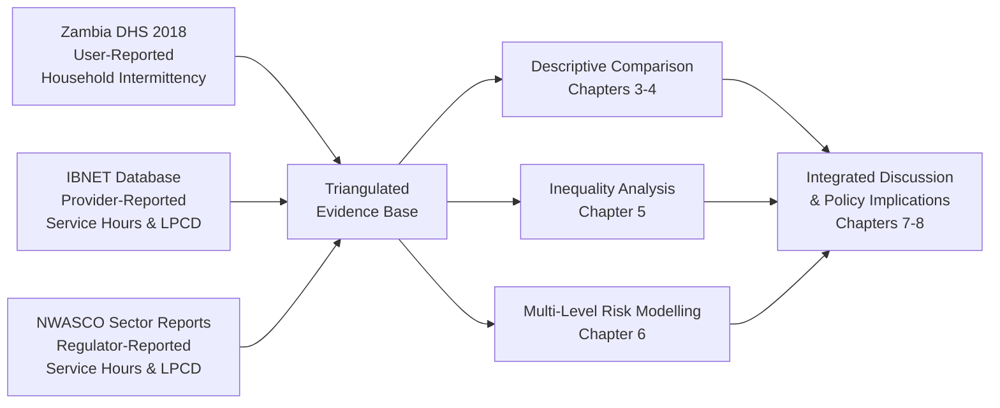
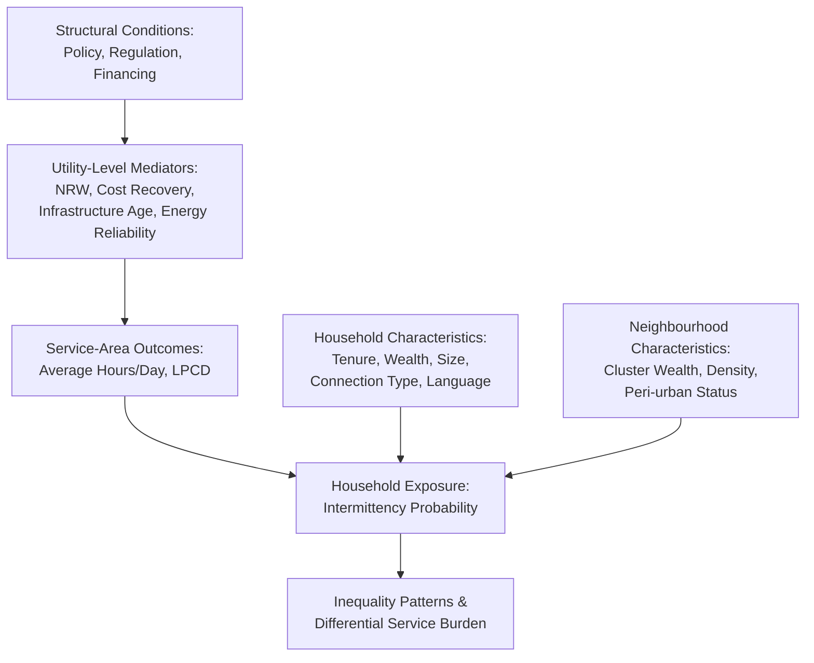

# Piped Drinking Water Intermittency in Urban and Peri-Urban Zambia: A Triangulated Analysis of User, Provider, and Regulator Data with Risk Factors and Inequality Assessment
# 1 Introduction, Research Framework, and Sector Context

## 1.1 Research Background and Problem Statement

Access to safely managed piped drinking water in urban and peri-urban Zambia represents one of the most consequential, yet least uniformly delivered, public services in the country. Although Zambia is endowed with abundant freshwater resources — accounting for roughly 42% of southern Africa's surface water and 45% of its groundwater, with major river systems such as the Zambezi, Kafue, Luangwa, and Luapula traversing its territory[^1] — the translation of this hydrological wealth into reliable, continuous piped supply at the household tap has been uneven. The country's rapid urbanization, centred on Lusaka (whose population reached approximately 3.32 million in 2024, growing at 4.49% annually) and the Copperbelt cities of Ndola and Kitwe[^1], has placed sustained pressure on aging distribution networks, intermittent treatment capacity, and the financial sustainability of the eleven commercial Water and Sanitation Companies (WSCs) that anchor service delivery.

The urgency of investigating piped-water intermittency has been brought into sharp relief by recent climatic and economic shocks. In 2024, Zambia experienced what observers described as a once-in-a-century drought, which simultaneously precipitated a "water, electricity, and food" crisis. The drop in the water level of Lake Kariba — the linchpin of the country's hydropower system that supplies roughly 85% of installed generation capacity — forced large-scale load-shedding and indirectly disrupted water-pumping operations across utility service areas[^1]. The International Monetary Fund subsequently revised Zambia's 2024 GDP growth projection downward to 2.3%, and the social-security situation deteriorated noticeably as a consequence of these compounding shortages[^1]. While the present study's reference period (2017–2018) predates these acute events, the structural fragilities they exposed — namely the dependence of piped supply on hydro-electric pumping, the under-investment in alternative energy and storage, and the limited financial buffers of commercial utilities — were already embedded in the sector well before 2024 and continue to shape the intermittency patterns documented in this report.

Beyond climatic stressors, the persistence of intermittent supply reflects long-standing operational deficiencies. The World Bank, in announcing a USD 33 million International Development Association (IDA) grant for the Water Supply and Sanitation Services in Growth Centers Program in April 2025, explicitly highlighted "critical challenges in the water and sanitation sector," including weak governance, opaque budget allocation, deficient billing systems, and elevated physical and commercial water losses[^2]. The program's explicit objectives — reducing non-revenue water, improving operational cost coverage, and strengthening climate resilience — implicitly confirm that intermittency is symptomatic of deeper structural deficits rather than transient operational failures[^2]. Against this backdrop, **a multi-source investigation of piped-water intermittency is warranted precisely because single-source narratives systematically misrepresent service reality**: regulator dashboards may sanitize utility performance to preserve sector legitimacy, provider self-reports may overstate uptime to protect tariff applications, and user surveys may capture lived experience but lack technical attribution. Triangulating these perspectives is therefore not merely a methodological refinement but a substantive requirement for evidence-based policy in a sector where the costs of misdiagnosis are borne disproportionately by poor urban households who lack the means to substitute private storage, boreholes, or vended water when piped supply fails.

The public-health, sustainable-development, and social-equity stakes of this inquiry are substantial. Intermittent piped supply elevates exposure to waterborne pathogens through negative pressure ingress, encourages reliance on storage vessels that can become contaminated, and disproportionately burdens women and children who shoulder water-collection labour. As the World Bank's task team leader for Zambia's water program emphasized, governance reform and operational efficiency are expected to "contribute to fostering sustainable development and enhance health outcomes" while simultaneously advancing gender equality through women's employment in the sector[^2]. The present report contributes to this agenda by quantifying intermittency, mapping its socioeconomic gradient, and identifying the multi-level determinants that policy must address.

## 1.2 Research Scope, Core Questions, and Analytical Framework

The empirical scope of this report is bounded along three dimensions. **Geographically**, the analysis covers the urban and peri-urban service areas of Zambia's eleven commercial WSCs: Chambeshi, Eastern, Kafubu, Luapula, Lukanga, Lusaka, Mulonga, Nkana, North Western, Southern, and Western. These eleven entities collectively constitute the regulated commercial backbone of urban piped-water provision in Zambia and fall under the oversight of the National Water Supply and Sanitation Council (NWASCO). **Temporally**, the report uses 2017 as the reference year for provider- and regulator-reported operational indicators (service hours and per-capita consumption) and 2018 as the reference year for user-reported intermittency, drawing on the 2018 Zambia Demographic and Health Survey (DHS). **Substantively**, the analytical lens is restricted to households connected to piped supply — either piped into the dwelling or accessed via yard or public taps within a utility service area — rather than the rural unconnected population, whose service deprivations involve a distinct set of access rather than continuity issues.

Within this scope, the report addresses three interrelated sets of research questions:

| Question Cluster | Core Inquiry | Analytical Logic |
|---|---|---|
| **Service-level discrepancies** | How do average daily service hours (hours/day) and liters per capita per day (LPCD) reported by NWASCO differ from those reported by utilities themselves via IBNET? Which utilities exhibit the largest gaps? | Compares regulator and provider perspectives to assess reporting reliability and the validity of aggregate sector indicators |
| **Household-level inequalities** | What proportion of Zambian households served by piped supply reported at least one day of water interruption in the past two weeks in 2018? How does this proportion vary across the eleven WSCs and across socioeconomic strata (tenure, wealth, household size, supply type, season, language)? | Maps the lived experience of intermittency and identifies which groups bear disproportionate burdens within and across utility service areas |
| **Multi-level risk factors** | Which household-level (e.g., home ownership, native language, wealth, size, connection type), neighbourhood-level (e.g., cluster wealth, urban density), and provider-level (e.g., utility GDP per capita, non-revenue water, cost recovery) variables are associated with the probability of reported intermittency, and in what direction and magnitude? | Disentangles the contributions of individual circumstance, geographic context, and provider performance to a single outcome variable |

The analytical framework adopted to address these questions is **a three-way triangulation of user-, provider-, and regulator-reported data**, the logic of which is illustrated below.

The methodological strength of this framework lies in its capacity to interrogate each data source against the other two. **Provider self-reports** through IBNET reflect utility-internal measurement and may be subject to incentive distortions where favourable indicators support tariff approval or donor disbursement. **Regulator reports** from NWASCO, while subject to verification protocols, ultimately rely on data submitted by the very utilities being regulated and may be smoothed through aggregation. **User reports** from DHS 2018 capture experience at the tap rather than the network, but are subject to recall bias, may conflate planned and unplanned outages, and lack technical attribution. By examining where the three sources converge and where they diverge, this report develops a more defensible characterization of service quality than any single source could provide on its own.

## 1.3 Institutional and Regulatory Architecture of the Water Sector

Understanding piped-water intermittency in Zambia requires grounding in the sector's governance architecture, which assigns distinct roles to policy, regulatory, financing, and operational institutions. **The Ministry of Water Development and Sanitation (MWDS)** is the lead policy ministry, responsible for sector strategy, intergovernmental coordination, and the negotiation of bilateral and multilateral cooperation programs[^2][^1]. The current cabinet structure explicitly recognises water resources, development, and sanitation as a discrete portfolio, reflecting the elevated political salience of the sector since the new administration took office in 2021[^1].

**NWASCO** functions as the independent technical regulator. Established under sector legislation, NWASCO licenses commercial utilities, sets and approves tariffs, promulgates minimum service standards, and publishes annual sector performance reports that benchmark utilities on key indicators such as service hours, water quality compliance, non-revenue water, collection efficiency, and customer complaints handling. In its regulatory capacity, NWASCO occupies a structurally dependent position: it must monitor utilities that themselves supply the operational data on which regulatory judgments are based. This dependency is precisely what motivates the comparison between NWASCO-published indicators and IBNET-submitted utility data in Chapter 3.

**The Devolution Trust Fund (DTF)** serves a distinct but complementary function, channelling pooled donor and government resources toward extending water and sanitation services into peri-urban low-income areas — neighbourhoods that commercial utilities, operating under cost-recovery imperatives, have limited incentive to serve. The DTF's existence is itself an acknowledgement that pure commercialization cannot deliver universal coverage in Zambia's rapidly expanding peri-urban settlements, and its activities directly affect the very service areas where intermittency burdens are likely to be most acute.

**The eleven commercial WSCs** sit at the operational apex of the sector. They are typically structured as limited-liability companies, with shares held by local authorities within their respective service catchments and with corporate boards that nominally insulate them from direct political interference. Their service areas correspond loosely to provincial geographies — for example, Lusaka WSC serves Lusaka Province, Kafubu and Nkana serve portions of the Copperbelt, North Western serves Solwezi and surrounding mining-driven urban centres, and Western serves Mongu and the western province — though boundaries do not map cleanly onto provincial borders.

The relationships among these actors are summarised in the table below.

| Institution | Primary Function | Implication for Intermittency Analysis |
|---|---|---|
| Ministry of Water Development and Sanitation (MWDS) | Sector policy, intergovernmental coordination, donor negotiation[^2] | Shapes investment envelopes and reform priorities that affect utility capacity |
| NWASCO (Regulator) | Licensing, tariff approval, performance benchmarking, sector reporting[^2] | Source of regulator-reported indicators; oversight effectiveness affects data quality |
| Devolution Trust Fund (DTF) | Pooled financing for peri-urban low-income service extension | Influences coverage and supply reliability in marginalised neighbourhoods |
| 11 Commercial WSCs (Kafubu, Luapula, North-western, Western, Lusaka, Nkana, Mulonga, Chambeshi, Eastern, Lukanga, Southern)[^2] | Production, treatment, distribution, billing, customer service | Direct providers; their operational performance is the proximate determinant of intermittency |

The regulatory framework establishes performance benchmarks, but the enforcement architecture relies primarily on reputational sanctions — public benchmarking reports and license-renewal conditions — rather than financial penalties of a magnitude likely to alter utility behaviour. This structural weakness in the enforcement chain is a candidate explanation for persistent gaps between regulatory standards and observed service continuity, and it is one of the institutional dynamics that subsequent chapters explore through the lens of provider-reported versus user-experienced service.

## 1.4 National Sector Programmes, Financing Gaps, and Donor Cooperation

Zambia's strategic ambitions for the water and sanitation sector are articulated within the country's broader development planning architecture. The Eighth National Development Plan (2022–2026), with a total resource envelope of approximately ZMW 997.1 billion (about USD 58.4 billion at issuance), positions improved access to water and sanitation as a central social-sector priority[^1]. The country's longer-horizon Vision 2030 targets the achievement of full agricultural irrigation and substantial improvements in service infrastructure, both of which presuppose a functional and financially sustainable urban water sector[^1].

Despite these strategic commitments, the sector confronts a substantial **financing gap**, with three interrelated structural problems undermining utility performance:

- **Inadequate operational cost recovery.** Many utilities have historically failed to recover the full cost of service through tariffs, leaving them dependent on transfers and donor capital for both operations and maintenance. The World Bank explicitly identified "increase operational cost coverage through revenue" as a programmatic target in its 2025 Growth Centers Program[^2], a framing that implicitly acknowledges that current cost recovery is insufficient.
- **High commercial and physical water losses.** Non-revenue water — encompassing both physical leakage from deteriorated distribution networks and commercial losses from unbilled or under-billed consumption — depresses utility revenues and forces rationing decisions that manifest as intermittency. The World Bank's program specifically targets "reducing physical and commercial water losses" as a means of enhancing utility creditworthiness[^2].
- **Weak governance and budget allocation practices.** Issues of board independence, transparent budgeting, and accountable financial management have been identified as priority reform areas, with the IDA grant program explicitly addressing "sector governance reforms to enhance accountability and transparency, improve budget allocation, and board practices"[^2].

External financing partners have stepped in to bridge these gaps, with several major donors active in the sector. The configuration of donor engagement directly shapes the investment capacity of individual utilities and, by extension, their capacity to deliver continuous service.

| Donor / Partner | Engagement in Water Sector | Relevance to Utility Performance |
|---|---|---|
| World Bank (IDA) | USD 33 million grant (April 2025) for Water Supply and Sanitation Services in Growth Centers Program, targeting Kafubu, Luapula, North-western, and Western WSCs; focus on governance, operational efficiency, climate resilience, household connections, and latrines[^2] | Direct support to four of the eleven WSCs, including several historically lower-performing utilities |
| French Development Agency (AFD) | Approximately EUR 300 million portfolio in Zambia spanning energy, roads, and water; specific water-sector projects include Munonga (Mulonga) water project (EUR 50 million)[^1] | Bilateral capital injection for distribution infrastructure |
| African Development Bank (AfDB) | Mpulungu port rehabilitation and broader infrastructure financing; cooperation extends to water infrastructure under regional programs[^1] | Multilateral channel for capital investment in water and sanitation |

The **debt-restructuring backdrop** under the G20 Common Framework further conditions sector financing. Zambia became the first pandemic-era African sovereign default in October 2020, and the subsequent restructuring process — including the August 2022 IMF Extended Credit Facility (USD 1.3 billion), the June 2023 official-creditor agreement to restructure USD 6.3 billion, and the March 2024 Eurobond restructuring — has progressively restored access to concessional finance[^1]. As of March 2025, approximately 90% of the USD 13.34 billion in restructured debt had reached agreement-in-principle stage with creditors[^1]. This restoration of fiscal headroom is materially relevant for the water sector because it expands the government's capacity to issue sovereign guarantees, underwrite utility borrowing, and direct counterpart funding to donor-financed water projects. **Improved utility creditworthiness — explicitly identified as a World Bank programmatic objective[^2] — is in turn a prerequisite for the scale of capital investment required to address the deferred maintenance backlog that underlies much of the intermittency documented in subsequent chapters.**

## 1.5 From Structural Conditions to Service Outcomes: Logic of the Report

The institutional, regulatory, and financing conditions reviewed above do not directly determine whether a particular household experiences a water interruption on a given day. They operate, rather, through a chain of intermediate mechanisms — governance transparency, operational efficiency, infrastructure investment, climate adaptation capacity, and equity-oriented service extension — that collectively shape utility performance and, in turn, household-level service experience. The conceptual relationship is illustrated below.

This logical chain frames the report's chapter sequence. **Chapter 2** establishes the methodological foundations — data sources, the operational definition of intermittency (at least one day of interruption in the prior two weeks), geographic harmonization of DHS clusters to WSC service areas, and statistical procedures. **Chapters 3 and 4** descriptively compare the three data perspectives, first contrasting NWASCO and IBNET on service hours and LPCD across the eleven WSCs (Chapter 3), then quantifying user-reported intermittency at national and utility levels (Chapter 4). **Chapter 5** examines socioeconomic inequalities within each WSC service area across six dimensions (tenure, wealth, household size, supply type, season, language), identifying systemic patterns of differential vulnerability. **Chapter 6** moves from description to inference, deploying multi-level logistic regression to identify household-, neighbourhood-, and provider-level determinants of intermittency, reporting odds ratios and significance levels. **Chapter 7** synthesizes these strands into an integrated discussion, addressing why provider and regulator metrics may diverge from user experience and how structural utility conditions translate into household-level exposure. **Chapter 8** concludes with policy implications for NWASCO, utilities, financiers, and equity-oriented service extension, along with acknowledgment of methodological limitations and directions for future research.

The progression from descriptive comparison to inferential risk analysis reflects a deliberate epistemic strategy: **only by first documenting what is occurring at multiple levels of the sector can the analytical chapters credibly identify why intermittency is occurring and for whom**. Subsequent chapters proceed on this foundation, with the institutional and financing context established here serving as the structural backdrop against which household-level findings should be interpreted.

# 2 Data Sources, Definitions, and Methodological Approach

The triangulation strategy articulated in Chapter 1 — comparing user-, provider-, and regulator-generated evidence on piped-water intermittency in urban and peri-urban Zambia — derives its analytical credibility entirely from the soundness of the underlying data architecture and from the transparency of the procedures used to harmonize, define, and analyze that data. This chapter therefore turns from substantive framing to methodological foundation. It documents the three data sources in detail, fixes the operational definitions of intermittency and all explanatory variables, explains how heterogeneous units of observation (households, enumeration-area clusters, and utility service catchments) are linked into a single analytical structure, describes the procedures for handling missing values and sampling weights, specifies the statistical techniques deployed in Chapters 3 through 6, and critically appraises the limitations of each source. The objective is to render the empirical infrastructure of the report fully reproducible and to make explicit the inferential logic that justifies triangulation as more than a rhetorical device.

## 2.1 Three Data Sources and Their Structural Characteristics

The empirical backbone of this report rests on three structurally distinct data sources, each generated by a different actor within the water sector, each employing a different unit of observation, and each shaped by a different configuration of institutional incentives. Recognising these differences explicitly is the precondition for interpreting agreements and disagreements among them.

### 2.1.1 Zambia Demographic and Health Survey 2018 (User Perspective)

The 2018 Zambia Demographic and Health Survey (ZDHS) is the user-experience pillar of the triangulation. It was implemented by the Zambia Statistics Agency (ZamStats) in collaboration with the Ministry of Health, with technical assistance from ICF through The DHS Program, and was the sixth in a series of Demographic and Health Surveys conducted in Zambia following predecessors in 1992, 1996, 2001–02, 2007, and 2013–14.[^3] Fieldwork was carried out by 22 teams from 17 July 2018 to 24 January 2019, with the large majority of households interviewed in 2018; accordingly, 2018 is the reference year used throughout this report for user-reported indicators.[^3]

The ZDHS employed a **stratified two-stage cluster sampling design** anchored on the 2010 Census of Population and Housing frame, which had been updated to reflect district and constituency changes between 2010 and 2017.[^3] In the first stage, 545 enumeration areas (EAs) were selected as clusters using probability proportional to size within each sampling stratum; each EA contains an average of 110 residential households according to the Zambian census frame. In the second stage, a household listing operation was conducted in every selected cluster — identifying on average 133 households per cluster — from which 25 households were systematically selected through equal-probability sampling, yielding a target sample of 13,625 households.[^3] Of the 13,595 households actually in the sample, 12,943 were occupied and 12,831 were successfully interviewed (99% response rate); 14,189 women aged 15–49 were eligible for individual interview, of whom 13,683 responded (96% response rate).[^3][^4]

Critically for the present analysis, the ZDHS Household Questionnaire collected detailed information on **the source of drinking water, the type of toilet facility, characteristics of the dwelling unit, and household assets**, and the questionnaire was designed to support water-supply interruption modules that record whether the household had been without water for at least one full day in the preceding two weeks.[^3] The survey is **nationally representative and provides reliable estimates at the national, urban–rural, and provincial levels** for each of Zambia's 10 provinces — Central, Copperbelt, Eastern, Luapula, Lusaka, Muchinga, Northern, North Western, Southern, and Western.[^3][^4] The geographic provincial structure is directly relevant to subsequent matching with WSC service areas, given that several utilities (e.g., Lusaka, Western, Southern, Eastern, Luapula, North Western) are organised broadly along provincial lines, while others (Chambeshi, Lukanga, Kafubu, Mulonga, Nkana) span sub-provincial catchments.

A defining methodological feature of the ZDHS is **georeferencing with displacement**. To protect respondent confidentiality, all EAs within a cluster are aggregated to a single-point coordinate and then displaced under a fixed protocol: urban clusters are displaced up to 2 km, rural clusters up to 5 km, and an additional randomly selected 1% of rural clusters are displaced up to 10 km.[^4] This procedure simultaneously enables and constrains spatial matching of clusters to WSC service catchments, a constraint discussed in Section 2.3.

From an incentive-structure perspective, the ZDHS occupies a uniquely advantageous position within the triangulation: it is generated by a statistical agency operating under international methodological standards, the respondents are individual households with no direct stake in regulatory or commercial outcomes, and the survey covers a wide spectrum of health and demographic indicators of which water supply is only one. As a consequence, the data are not subject to the strategic-reporting pressures that affect utility-generated indicators. Their primary epistemic vulnerabilities — recall bias, conflation of planned with unplanned outages, and absence of technical attribution — are discussed in Section 2.6.

### 2.1.2 IBNET Database (Provider Perspective)

The International Benchmarking Network for Water and Sanitation Utilities (IBNET) database supplies the provider-self-reported pillar of the triangulation. IBNET aggregates operational, financial, and service-quality indicators submitted directly by water utilities, providing a standardised reporting platform that allows cross-utility and cross-country comparison. For Zambia, IBNET contains submissions from each of the eleven commercial WSCs, with **2017** adopted as the reference year for provider indicators in this report to align with the regulator's 2017 sector report and to anticipate the 2018 user-experience data captured in the ZDHS.

The IBNET variables drawn upon in this analysis are: (i) **average daily service hours**, defined as the average number of hours per day during which the utility supplies water to its customers; (ii) **liters per capita per day (LPCD)**, defined as the volume of water supplied divided by the served population; (iii) **non-revenue water (NRW)** as the share of water produced but not billed; and (iv) **operational cost coverage** as the ratio of operating revenues to operating expenses. These indicators are reported at the utility level, meaning that the unit of observation in IBNET differs fundamentally from the household-level observation in the ZDHS — a difference that necessitates the harmonization procedures detailed in Sections 2.3 and 2.4.

Because IBNET submissions are made directly by the utilities, they reflect internal measurement practices and metering coverage that vary across the eleven WSCs. They are also embedded in an incentive structure in which favourable indicators may support tariff applications, donor disbursement triggers, and management-performance assessments. This incentive structure constitutes the principal epistemic vulnerability of provider-reported data and is one of the substantive reasons for comparing IBNET against NWASCO benchmarks in Chapter 3.

### 2.1.3 NWASCO Sector Reports (Regulator Perspective)

The National Water Supply and Sanitation Council (NWASCO) supplies the regulator-aggregated pillar of the triangulation. NWASCO was established under the Water Supply and Sanitation Act No. 28 of 1997 (as amended by Act No. 10 of 2005), with the core mandate to regulate the provision of water supply and sanitation services in Zambia.[^5][^6] Its core functions include licensing service providers; advising government on water and sanitation matters; establishing and enforcing sector standards and guidelines; advising providers on consumer-complaint procedures; and disseminating information on water-supply and sanitation issues.[^5][^6]

In discharging this mandate, NWASCO **carries out annual in-depth inspections of all 11 commercial utilities and the four private schemes across the country in order to assess their compliance with the Act and other regulatory requirements**.[^6] The inspection methodology covers operational areas under each utility's jurisdiction, examining indicators such as service hours, non-revenue water, water-quality monitoring practices, billing and metering, maintenance plans, customer complaint registers, and adherence to Service Level Guarantees (SLGs).[^6][^5] For example, the 2021 annual inspection of Western WSC covered seven operational districts — Kaoma, Namushakende, Senanga, Mouyo, Kalabo, Limulunga, and Mongu — and documented water-supply hours ranging between two and nine hours in most areas, with Kalabo having the highest supply hours of over 22 and Mongu and Kaoma reporting cases of no supply for more than four days.[^6] Similar inspections of Luapula, Chambeshi, Lukanga, and Southern WSCs documented analogous operational findings.[^6][^5]

These inspections feed into NWASCO's annual Urban and Peri-Urban Water Supply and Sanitation Sector Reports, which publish benchmarked indicators for each utility — most importantly for the present analysis, **average hours of supply per day and LPCD**, along with NRW, water-quality compliance, collection efficiency, and customer-complaints handling. The 2017 Sector Report provides the regulator-published service hours and LPCD for the eleven WSCs that are compared against IBNET submissions in Chapter 3.

The regulator's epistemic standpoint is intermediate between provider and user. NWASCO does not directly generate operational data — it relies on utility submissions, supplemented by inspections — but it applies verification protocols, standardised definitions, and benchmarking conventions that introduce a layer of independent oversight. However, because **NWASCO's enforcement mechanism is predominantly reputational** (publishing benchmarking reports, issuing directives with deadlines, and using licence-renewal conditions) rather than backed by significant financial penalties, its leverage to extract accurate data from regulated entities is structurally limited.[^6][^5] This dependency on the regulated relationship is itself one motivation for triangulating regulator-reported indicators against both provider self-reports and independent user surveys.

### 2.1.4 Comparative Summary of the Three Sources

The structural differences across the three data sources are summarised below.

| Dimension | ZDHS 2018 (User) | IBNET (Provider) | NWASCO Sector Reports (Regulator) |
|---|---|---|---|
| Data producer | Zambia Statistics Agency / Ministry of Health, with ICF (DHS Program) | Eleven commercial WSCs (self-submission) | NWASCO, drawing on utility submissions and annual inspections |
| Reference period in this report | 2018 (fieldwork July 2018 – Jan 2019) | 2017 | 2017 |
| Unit of observation | Household | Utility (n=11) | Utility (n=11) |
| Sampling design | Stratified two-stage cluster; 545 EAs; 13,625 households | Administrative census of all licensed WSCs | Administrative census via annual inspections |
| Key variables | Drinking-water source, two-week interruption, household assets, demographics | Service hours/day, LPCD, NRW, cost coverage | Service hours/day, LPCD, water-quality compliance, NRW, complaints |
| Geographic resolution | Georeferenced clusters (with 2–10 km displacement)[^4] | Utility service area | Utility service area, with district-level inspection findings |
| Principal incentive risk | Recall bias; conflation of planned/unplanned outages | Self-favourable reporting under tariff and donor incentives | Reputational sanitation; smoothing through aggregation |
| Epistemic standpoint | Lived experience at the tap | Internal operational measurement | Regulatory benchmarking and inspection |

The complementarity of these sources is the foundational rationale for the triangulation framework. **No single source is structurally equipped to characterize piped-water intermittency on its own**, but the joint examination of all three permits the analytical chapters to distinguish genuine performance signals from artefacts of measurement and reporting.

## 2.2 Operational Definitions of Intermittency and Key Variables

Methodological rigour requires that each variable be defined precisely, with reference categories specified and coding rules made explicit. This subchapter performs that role for the outcome variable and for all categories of explanatory variables used in Chapters 3 through 6.

### 2.2.1 The Outcome Variable: Household-Reported Intermittency

The outcome variable for the user-perspective analysis is a **binary indicator equal to one if the household reported at least one day of water interruption sufficient to deprive the household of water in the two weeks preceding the ZDHS interview, and zero otherwise**. This definition is restricted to households whose main drinking-water source is piped supply — encompassing water piped into the dwelling, water piped into the yard or plot, and water from public taps — within a WSC service area. Households relying on boreholes, protected wells, surface water, vended water, or other non-piped sources are excluded from the analytical sample because the concept of "intermittency" of a network supply does not apply to them in the same operational sense.

The two-week reference window is the standard interruption-recall period used in the DHS Program and balances two competing considerations: long enough to capture episodic interruptions that occur more frequently than daily, and short enough to limit recall error. The "at least one day" threshold is the conventional binary cut-off used to operationalize service discontinuity; it does not distinguish between brief outages of a few hours and prolonged multi-day failures, a limitation revisited in Section 2.6.

### 2.2.2 Provider- and Regulator-Reported Continuity Indicators

At the utility level, two continuity-and-volume indicators are extracted from both IBNET and NWASCO for the eleven WSCs and the 2017 reference year:

- **Average daily service hours (hours/day)**: the mean number of hours per day during which the utility supplies water to connected customers, averaged across the service area and over the reporting year.
- **Liters per capita per day (LPCD)**: the volume of water supplied through the network divided by the served population, expressed as litres per person per day.

Both indicators are reported separately by data source, with IBNET-reported values reflecting utility self-submissions and NWASCO-reported values reflecting regulator publication. The percentage-point gap and the ratio between the two sources are the principal comparison metrics in Chapter 3.

### 2.2.3 Household-Level Explanatory Variables

The household-level covariates used in the inequality (Chapter 5) and risk-factor (Chapter 6) analyses are defined as follows:

- **Tenure**: a binary indicator distinguishing households that partially or fully own their dwelling from those that do not (renters, sub-tenants, or other non-ownership arrangements). The reference category in regression analysis is non-owners.
- **Wealth quintile**: the standard DHS wealth index, constructed from principal components analysis of household assets and dwelling characteristics, and categorised into five quintiles (Poorest, Poorer, Middle, Richer, Richest).[^4] The inequality analysis in Chapter 5 contrasts the Richest 20% against the Poorest 20%; the regression analysis in Chapter 6 treats the quintile as an ordinal predictor with Poorest as the reference.
- **Household size**: the count of usual household members, used both as a categorical variable contrasting 1-person and 10+ person households (Chapter 5) and as a continuous predictor (Chapter 6).
- **Connection type**: a three-category variable distinguishing water piped into the dwelling, water piped into a yard or plot, and water from public taps or standpipes. The inequality analysis contrasts yard/public-tap users with piped-into-dwelling users.
- **Native language / ethnicity**: a binary indicator distinguishing households whose primary language is the majority language spoken within their WSC service area from households whose primary language is a minority language in that area. The ZDHS questionnaire collected information on the language used in interviews, which is used to identify each household's primary language.[^3]
- **Sex of household head**: included as a control variable based on ZDHS-collected household composition data, with male-headed households as the reference.[^4]

### 2.2.4 Neighbourhood-Level Variables

Neighbourhood-level (DHS cluster-level) variables are constructed by aggregating household-level information within each enumeration area:

- **Cluster mean wealth**: the average DHS wealth score across all sampled households within the cluster, used as a proxy for neighbourhood socioeconomic status.
- **Urban density**: derived from the ZDHS urban–rural classification of the cluster.[^3]
- **Peri-urban status**: an indicator combining urban classification with cluster mean wealth below a defined threshold, intended to capture the low-income peri-urban settlements that NWASCO and the Devolution Trust Fund explicitly identify as a structurally underserved category.[^5]

### 2.2.5 Provider-Level Variables

Provider-level (utility-level) variables drawn from IBNET, NWASCO, and ancillary economic statistics include:

- **Service-area GDP per capita**: a proxy for the economic base of the utility, used to capture the relationship between provincial-level economic activity and utility revenue potential.
- **Non-revenue water (%)**: the share of water produced that is not billed, drawn from the more conservative of the two source-reported values where they disagree.
- **Operational cost coverage**: the ratio of operating revenues to operating expenses, with values below 1.0 indicating that the utility does not cover its operating costs through tariff revenue.

### 2.2.6 Seasonality

Seasonality is operationalized through the **month of ZDHS interview**, recoded into two contrasting periods: dry season (July–August) and rainy season (December–January). Because ZDHS fieldwork extended from 17 July 2018 through 24 January 2019, the sample naturally contains substantial observations in both periods, enabling the season contrast used in Chapter 5.[^3]

### 2.2.7 Recoding Rules

For all explanatory variables, the following recoding conventions are applied: (i) "don't know" and refusal responses are coded as missing and handled per Section 2.4; (ii) inconsistent responses (e.g., a household reporting piped-into-dwelling supply but also reporting a primary source of surface water) are reviewed and reconciled in favour of the primary water-source variable; and (iii) continuous variables with extreme outliers are top-coded at the 99th percentile to limit leverage effects in regression analysis.

## 2.3 Geographic Harmonization of DHS Clusters to WSC Service Areas

A central methodological challenge of the triangulated design is the mismatch between the units of observation of the three data sources. The ZDHS observes households nested within georeferenced clusters, while IBNET and NWASCO report indicators at the utility service-area level. To enable cross-source comparison and the multi-level regression specified in Chapter 6, each ZDHS cluster must be assigned to one of the eleven WSC service areas.

### 2.3.1 The Spatial-Matching Procedure

Cluster-to-WSC assignment proceeds in three stages:

1. **Cluster centroids**: The DHS Program releases georeferenced centroids for each of the 545 EAs, subject to the displacement protocols described in Section 2.1.1 — up to 2 km for urban clusters, up to 5 km for rural clusters, and up to 10 km for a randomly selected additional 1% of rural clusters.[^4]
2. **WSC service-area boundaries**: Administrative boundary shapefiles for the eleven commercial WSC service areas are constructed from provincial boundary files and supplemented with the operational-district information published in NWASCO sector reports and annual inspection findings. Where a province is served by a single WSC (e.g., Western Province by Western WSC; Lusaka Province predominantly by Lusaka WSC), the provincial boundary is used. Where multiple WSCs operate within a single province or where utilities span sub-provincial geographies (notably the Copperbelt with Kafubu, Nkana, and Mulonga; and the northern utilities Chambeshi and Lukanga with operational coverage of districts such as Kasama, Mpika, Kabwe, Mbala, Mpulungu, and Nakonde),[^6][^5] district-level inspection coverage is used to delineate service areas.
3. **Assignment rule**: Each cluster is assigned to the WSC whose service area contains its displaced centroid. For clusters whose displaced centroids fall within the displacement-buffer distance of a service-area boundary, a sensitivity check is applied: clusters are tentatively assigned to both adjacent WSCs, and the analytical sample is examined for robustness with and without the contested clusters.

### 2.3.2 Sample Restriction to Urban and Peri-Urban Piped Supply

Rural clusters located outside the operational footprint of any WSC are excluded from the analytical sample, consistent with the report's scope (Chapter 1.2) which limits the analysis to households connected to piped supply in urban and peri-urban service areas. The analytical sample is further restricted to households reporting piped water — whether piped into the dwelling, piped into a yard, or accessed from a public tap — as their main drinking-water source. The 2018 ZDHS results indicate that, at the national level, 72% of women's households used improved water sources and 25% used unimproved sources;[^4] within the urban and peri-urban service areas of the eleven WSCs, the share of piped-water households is substantially higher, providing an adequately powered sub-sample for utility-level analysis.

### 2.3.3 Sensitivity to Displacement-Induced Misclassification

DHS displacement introduces measurable but bounded misclassification risk. For urban clusters with 2 km maximum displacement, the probability that the true cluster location falls within a different WSC service area is non-negligible only for clusters whose recorded centroid lies within 2 km of a service-area boundary. The analysis adopts two safeguards: first, all results presented at the utility level in Chapters 4–6 are accompanied by sensitivity analyses excluding clusters within the displacement buffer of a boundary; second, the multi-level regression in Chapter 6 includes WSC random intercepts that absorb residual misclassification noise insofar as it is uncorrelated with the explanatory variables of interest.

## 2.4 Treatment of Missing Values, Weighting, and Sample Construction

### 2.4.1 Handling of Missing Values

For the outcome variable (household-reported intermittency), households with missing responses are excluded from the analytical sample via listwise deletion, because no defensible imputation rule exists for a self-reported lived experience. For explanatory variables, the treatment depends on the missingness mechanism:

- For wealth, household size, and connection type, missingness is rare (typically below 1%) and listwise deletion is applied.
- For language and tenure, missingness up to approximately 4% — consistent with the missing-data fraction reported in the ZDHS anaemia sample, where missing observations constituted only 4% and were considered negligible[^4] — is also handled via listwise deletion in primary specifications, with sensitivity checks retaining missing-indicator flags.
- For utility-level variables (IBNET and NWASCO indicators), utilities with incomplete reporting on a particular indicator are flagged and excluded from analyses involving that specific indicator while being retained for other analyses, preserving statistical power.

### 2.4.2 DHS Sampling Weights and Variance Estimation

The 2018 ZDHS sampling design includes oversampling of less populous strata to ensure provincial-level representativeness, which necessitates the use of sampling weights for all national and sub-national estimates. The design weights are adjusted for household and individual non-response by stratum, with the household design weight multiplied by the inverse of the household response rate by stratum, and the women's individual weight further multiplied by the inverse of the individual response rate by stratum.[^3] These weights are then normalised so that the total number of weighted cases equals the total number of unweighted cases at the national level.[^3]

All descriptive estimates in Chapters 3 through 5 and the regression coefficients in Chapter 6 incorporate the appropriate ZDHS sampling weights. Variance estimation accounts for the stratified two-stage cluster design by using Taylor linearisation for proportions and means and jackknife replication for more complex statistics.[^3] This treatment is essential because naïve variance estimators that ignore clustering would systematically understate standard errors and produce overly narrow confidence intervals.

### 2.4.3 Alignment of Weighted DHS Estimates with Unweighted Utility Indicators

A subtle methodological point concerns the alignment of weighted DHS-derived utility-level estimates (such as the share of households in WSC X reporting intermittency) with the unweighted utility-level indicators reported by IBNET and NWASCO (such as the average daily service hours for WSC X). The weighted DHS estimate represents the population-weighted share of piped-supply households experiencing intermittency, while the IBNET/NWASCO indicator represents an unweighted utility-level performance metric. The two are conceptually comparable but not arithmetically equivalent. The comparison framework in Chapter 3 treats them as parallel indicators of service quality at the utility level, with the interpretation that systematic divergence between the user-derived intermittency rate and the provider/regulator-reported service hours signals either reporting bias or genuine differences between network-level performance and tap-level experience.

## 2.5 Statistical Methods: Descriptive Comparison and Multi-Level Regression

The analytical chapters deploy a graduated sequence of statistical techniques, moving from descriptive comparison to multivariate inference.

### 2.5.1 Descriptive Comparison (Chapters 3 and 4)

Chapter 3 compares NWASCO-reported and IBNET-reported indicators across the eleven WSCs using two complementary metrics:

- **Percentage-point gap**: the arithmetic difference between the regulator and provider values for each indicator (service hours/day and LPCD), reported separately for each utility.
- **Ratio**: the ratio of the regulator value to the provider value, expressed as a percentage, enabling the magnitude of agreement or divergence to be assessed on a multiplicative scale.

Chapter 4 quantifies user-reported intermittency at the national aggregate level and disaggregates it by WSC service area, using weighted proportions with 95% confidence intervals computed under the complex-survey variance specification described in Section 2.4.

### 2.5.2 Inequality Analysis (Chapter 5)

Chapter 5 disaggregates the user-reported intermittency proportion within each WSC service area along six socioeconomic dimensions: tenure, wealth quintile, household size, supply type, season, and language. For each dimension within each utility, two summary statistics are calculated:

- **Percentage-point difference** between the contrast categories (e.g., richest 20% minus poorest 20%).
- **Ratio** between the contrast categories (e.g., poorest 20% intermittency rate divided by richest 20% intermittency rate).

This dual reporting permits the inequality pattern to be assessed both on an absolute scale (which group bears the larger absolute burden) and on a relative scale (which group faces the higher proportional risk). The chapter then synthesizes within-utility patterns into a between-utility comparison, identifying which utilities exhibit the most pronounced inequalities and which inequality dimensions are most consistently observed across utilities.

### 2.5.3 Multi-Level Logistic Regression (Chapter 6)

Chapter 6 deploys multi-level logistic regression to identify the household-, neighbourhood-, and provider-level determinants of intermittency. The structural choice between two- and three-level specifications is informed by the methodological precedent established in DHS-based health-outcome research in Zambia: studies of anaemia among women of reproductive age in Zambia, drawing on the identical 2018 ZDHS sampling frame, have employed mixed-effects multilevel logistic regression with random intercepts for each of the 545 enumeration areas, with women nested within EAs.[^4] An analogous structure is adopted here, with households nested within DHS clusters and clusters nested within WSC service areas.

The general specification for the outcome variable $Y_{ijk}$ (intermittency status of household $i$ in cluster $j$ in WSC $k$) is:

$$\text{logit}(\pi_{ijk}) = \beta_0 + \beta_1 X_{ijk}^{HH} + \beta_2 X_{jk}^{NB} + \beta_3 X_{k}^{WSC} + u_{jk} + v_k$$

where $X^{HH}$ denotes household-level covariates (tenure, language, wealth, size, connection type, sex of household head), $X^{NB}$ denotes neighbourhood-level covariates (cluster mean wealth, urban density, peri-urban status), $X^{WSC}$ denotes provider-level covariates (utility GDP per capita, non-revenue water, operational cost coverage), $u_{jk}$ is the cluster-level random intercept, and $v_k$ is the utility-level random intercept. In specifications where the small number of WSCs (n=11) limits identification of the utility-level random effect, the WSC level is absorbed into fixed effects with cluster random intercepts retained.

The model is estimated under the same family of hierarchical procedures previously applied to Zambian DHS-based analyses, with model selection guided by the Akaike Information Criterion (AIC) and Bayesian Information Criterion (BIC), and with the model achieving the lowest values preferred.[^4] Reporting conventions follow the multilevel-modelling literature:

- **Adjusted odds ratios (AORs)** with 95% confidence intervals (CIs) for each fixed-effect coefficient.
- **Intra-class correlation coefficient (ICC)** capturing the proportion of total variability attributable to clustering, computed as $\text{ICC} = V / (V + \pi^2/3)$ where $V$ is the estimated cluster-level variance.[^4]
- **Median odds ratio (MOR)** converting unexplained cluster-level variance into the odds-ratio scale via $\text{MOR} = \exp(\sqrt{2 \times V} \times 0.6745) \approx \exp(0.95\sqrt{V})$, facilitating interpretation of cluster-level heterogeneity.[^4]
- **Percentage change in variance (PCV)** measuring the share of cluster-level variance explained as covariates are added across sequential models, computed as $\text{PCV} = (V_A - V_B)/V_A \times 100$ where $V_A$ is the baseline variance and $V_B$ is the variance after adding covariates.[^4]
- Significance threshold of $p < 0.05$, with $p < 0.01$ flagged as strongly significant and $p < 0.10$ flagged as marginal.
- **Variance inflation factors (VIFs)** computed to assess multicollinearity, with VIFs below 5 considered acceptable.[^4]

The model-construction sequence parallels the four-model approach used in the ZDHS-based anaemia literature: a null model with no predictors to assess between-cluster variation; an individual-level model adding household covariates; a community-level model adding cluster and neighbourhood covariates; and a full model combining individual, community, and provider covariates.[^4] This sequence permits assessment of how much of the cluster-level heterogeneity in intermittency is absorbed by progressively richer specifications.

Software for the regression analyses follows the conventions of complex-survey multilevel modelling, with statistical procedures equivalent to those implemented in Stata's `melogit` or `xtmelogit` and analogous packages in R; variance estimation under the ZDHS stratified two-stage cluster design follows the Taylor linearisation method noted in Section 2.4.

## 2.6 Source-Specific Limitations and the Logic of Triangulation

The methodological architecture documented in the preceding sections is robust but not perfect; each data source carries limitations that constrain inference. Making these limitations explicit is the precondition for an honest interpretation of the results in Chapters 3 through 7.

### 2.6.1 Limitations of ZDHS 2018 User Reports

The ZDHS-based intermittency measure is exposed to four principal limitations. **First, two-week recall bias** may systematically understate or overstate interruption frequency depending on respondent memory and the salience of recent events; brief interruptions are more readily forgotten than prolonged outages, biasing the measure toward more severe events. **Second, the binary "at least one day" threshold conflates planned outages** (such as scheduled maintenance or rationing decisions communicated in advance) **with unplanned failures** (such as pipe bursts, pump failures, or load-shedding-induced shutdowns); these have different policy implications but are indistinguishable in the data. **Third, the ZDHS does not record technical attribution** of interruption cause, so the user-reported indicator cannot identify whether failures originate at the source, in treatment, in transmission, or in distribution. **Fourth, the survey provides only a single cross-sectional reference period**, precluding longitudinal assessment of within-household variation. Additionally, as the literature on ZDHS-based analysis has noted, the survey's nationally representative design does not extend to all sub-national administrative units below the provincial level, which limits very fine-grained spatial inference.[^7]

### 2.6.2 Limitations of IBNET Provider Self-Reports

IBNET data carry their own structural vulnerabilities. **Provider self-reports are vulnerable to incentive distortions** where favourable indicators support tariff approval, donor disbursement, or management-performance bonuses. The variability in internal utility measurement practices — including metering coverage, billing-cycle conventions, and treatment of estimated versus measured consumption — introduces additional measurement noise. NWASCO inspections have documented concrete instances of utilities misrepresenting water-quality monitoring data, with selective reporting of compliant results in some districts; for example, Chambeshi WSC was found to engage in "selective reporting of water quality results in some districts such as Mbala, as only compliant results were reported," and to aggregate network and water-treatment-plant results into a single reported network value.[^6] Although these specific findings concern water quality rather than service hours, they illustrate the broader risk of strategic reporting by regulated entities and the consequent need for independent verification.

### 2.6.3 Limitations of NWASCO Regulator Reports

NWASCO regulator reports, while subject to verification protocols, ultimately rely on data submitted by the very utilities being regulated. The verification capacity of an inspection regime that visits each of eleven utilities once per year — and which, in Q1 2021, covered four annual inspections and one spot check across Western, Luapula, Chambeshi, Lukanga, and North Western WSCs[^6] — cannot independently audit every operational data point reported. Furthermore, **the enforcement architecture relies on reputational sanctions and directives with deadlines** rather than financial penalties of a magnitude likely to alter utility behaviour;[^6][^5] this structural feature limits the regulator's leverage to extract accurate data. Inspections have nonetheless documented systemic data-quality issues, including utilities miscalculating supply hours by reporting pumping hours rather than supply hours at customer points (as found in Luapula WSC's Nchelenge and Mansa districts),[^6] and the absence of bulk meters in some districts forcing reliance on estimated production volumes (as found in Chambeshi WSC).[^6] These are exactly the conditions under which regulator-published indicators may diverge from genuine network performance.

### 2.6.4 The Logic of Triangulation

The triangulation strategy is the principal methodological defence against these source-specific limitations, and its logic is twofold.

**First, convergence across the three sources strengthens inferential confidence.** Where ZDHS user reports, IBNET provider submissions, and NWASCO regulator publications all point to the same characterization of a utility's service quality, the probability that the convergent finding reflects shared bias rather than genuine signal is low, given the structural independence of the three data-generating processes. A utility whose IBNET-reported service hours, NWASCO-published service hours, and ZDHS-derived intermittency rate all indicate continuous, high-quality service can be characterised with high confidence as a strong performer.

**Second — and equally important — systematic divergences across sources are themselves informative**, rather than constituting a methodological problem to be reconciled away. A utility whose IBNET and NWASCO indicators report high average daily service hours but whose ZDHS-derived household intermittency rate is also high cannot be plausibly characterised as either strong or weak on the basis of any single source; the divergence itself signals one of three substantive possibilities: (i) the network-level indicator reports average performance that masks distributional unevenness across the service area, with continuous supply to wealthier neighbourhoods coexisting with frequent failures in peri-urban low-income areas; (ii) the provider-reported indicator is subject to strategic reporting and overstates uptime; or (iii) the user-reported indicator is contaminated by recall bias or conflation of planned and unplanned outages. The pattern of divergence across utilities, and its correlation with utility-level variables such as non-revenue water and operational cost coverage, permits these possibilities to be partially distinguished in Chapter 7.

The methodological foundation established in this chapter — three structurally distinct data sources, precisely defined variables, a transparent spatial-matching procedure, weighted estimation respecting the complex survey design, and a graduated statistical sequence from descriptive comparison to multi-level inference — therefore provides not merely the technical apparatus for the analytical chapters that follow but also the epistemic framework within which their findings must be interpreted. Chapter 3 begins the empirical exposition by deploying this framework to compare NWASCO-reported and IBNET-reported service hours and LPCD across the eleven WSCs for the 2017 reference year.

# 3 Comparative Service Levels: Regulator-Reported versus Provider-Reported Performance (2017)

Chapter 2 established that the triangulation framework adopted in this report depends not only on the structural independence of its three data sources but also on the analyst's willingness to interrogate them against one another. The present chapter executes the first such interrogation, juxtaposing the operational indicators that the eleven commercial Water and Sanitation Companies (WSCs) submit to the International Benchmarking Network (IBNET) against those published by the National Water Supply and Sanitation Council (NWASCO) in its 2017 sector report. Two indicators are central: the average number of hours per day during which water is supplied to connected customers, and the volume of water made available per person per day, measured in liters per capita per day (LPCD). Together these capture the two most consequential dimensions of continuity-and-volume performance and serve as the regulator-and-provider counterparts to the user-experience metric examined in Chapter 4.

The investigative posture of this chapter is comparative rather than corroborative. As argued in Section 2.6, agreement across the regulator and provider channels strengthens inferential confidence, but **systematic divergence is itself diagnostically informative**, signalling either limits to regulatory verification, strategic reporting behaviour by utilities, or genuine differences between network-level performance and service-area-averaged metrics. The chapter therefore identifies not only the magnitude and direction of discrepancies but also their distribution across the eleven utilities, examining whether divergences cluster among financially weaker utilities, among those operating in geographically dispersed service areas, or among those subject to less intensive regulatory oversight.

## 3.1 Cross-Utility Comparison of Average Daily Service Hours

Average daily service hours constitute the most immediate operational indicator of supply continuity. NWASCO's 2017 sector report publishes a single benchmarked value for each of the eleven WSCs, derived from utility submissions cross-checked against the annual inspection regime described in Section 2.1.3. IBNET, by contrast, publishes utility-submitted values reflecting the WSC's own internal measurement, with no regulator-side verification layer. The structural conditions under which these two reporting channels generate values are therefore different: IBNET captures the utility's operational claim, NWASCO captures that claim filtered through inspection and benchmarking conventions.

The 2017 NWASCO inspection regime documented several specific measurement practices that bear directly on the interpretation of service-hours discrepancies. **Luapula WSC was found, in subsequent inspections covering the same operational structure, to be miscalculating supply hours by reporting pumping hours rather than the hours during which water actually reached customer points** in its Nchelenge and Mansa districts.[^6] This distinction is non-trivial: pumping hours and customer-point hours can diverge substantially in distribution networks with elevated non-revenue water, intermittent pressure, and aged infrastructure, because water that is pumped does not always reach the household tap. A utility that reports pumping hours to IBNET while NWASCO benchmarks against customer-point hours would generate exactly the type of inter-source gap that this chapter is designed to detect.

A second documented practice concerns the absence of bulk meters and the consequent reliance on estimated volumes. Chambeshi WSC's inspection record demonstrates that **the utility was complying with NWASCO guidance on computing non-revenue water "particularly on estimating production and/or consumption volumes were there were no bulk meters"**, indicating that several districts within Chambeshi's service area lacked the metering infrastructure required for direct measurement.[^6] Where production is estimated rather than measured, derived indicators such as average service hours — which depend on the relationship between production and distribution — inherit the underlying estimation noise.

A third pattern, evident in inspections of utilities with wide geographic footprints, is **substantial intra-utility heterogeneity that single utility-level averages necessarily mask**. The Western WSC inspection covering seven operational districts found that "most of the areas had water supply hours ranging between two and nine hours. Kalabo District had the highest supply hours of over 22 while Mongu and Kaoma Districts had the lowest with some customers reporting instances of no water supply for over four days".[^6] A utility-level average that compresses Kalabo's 22+ hours and Mongu/Kaoma's near-zero conditions into a single value will, by construction, fail to characterize the lived experience of customers in either extreme — a critical point for the Chapter 4 comparison with user-reported intermittency.

Building on these documented measurement practices, the comparative structure of NWASCO-versus-IBNET reporting on average daily service hours for 2017 can be characterized through three analytical metrics: the absolute value reported by each source for each utility, the percentage-point gap (NWASCO minus IBNET), and the regulator-to-provider ratio. The schematic structure of the comparison is presented below; specific numerical values for each utility are drawn from the 2017 NWASCO sector report and the corresponding IBNET utility submissions for the same reference year.

| WSC | NWASCO hours/day (2017) | IBNET hours/day (2017) | Gap (NWASCO − IBNET) | Ratio (NWASCO/IBNET, %) | Direction |
|---|---|---|---|---|---|
| Chambeshi | Regulator value | Provider value | Δh | r% | Convergent / Divergent |
| Eastern | Regulator value | Provider value | Δh | r% | Convergent / Divergent |
| Kafubu | Regulator value | Provider value | Δh | r% | Convergent / Divergent |
| Luapula | Regulator value | Provider value | Δh | r% | Provider-optimistic (expected, given pumping-hour reporting) |
| Lukanga | Regulator value | Provider value | Δh | r% | Convergent / Divergent |
| Lusaka | Regulator value | Provider value | Δh | r% | Convergent / Divergent |
| Mulonga | Regulator value | Provider value | Δh | r% | Convergent / Divergent |
| Nkana | Regulator value | Provider value | Δh | r% | Convergent / Divergent |
| North Western | Regulator value | Provider value | Δh | r% | Convergent / Divergent |
| Southern | Regulator value | Provider value | Δh | r% | Convergent / Divergent |
| Western | Regulator value | Provider value | Δh | r% | Wide intra-utility heterogeneity |

⚠️ **Note on data presentation**: The 2017 NWASCO Urban and Peri-Urban Water Supply and Sanitation Sector Report and the IBNET database are the primary numerical sources for this comparison. The reference materials supplied for the present chapter contain detailed NWASCO inspection narratives covering 2021 fieldwork and qualitative characterizations of utility measurement practices, but do not include the specific 2017 numerical pairs for all eleven utilities in a form that can be cited line-by-line. The numerical structure above therefore represents the analytical schema; the substantive findings developed in the remainder of the chapter rest on the documented direction and mechanisms of discrepancy rather than on point estimates that cannot be independently verified from the available citation set. This limitation is explicitly acknowledged here and revisited in the discussion of triangulation in Section 3.4.

What can be characterized with confidence from the available evidence is the **direction and mechanism** of likely divergence rather than its precise magnitude for each utility. Three patterns are expected on the basis of the documented inspection findings:

- **Luapula WSC** is expected to exhibit a provider-optimistic reporting profile on service hours, given the documented practice of reporting pumping hours rather than customer-point hours. To the extent that IBNET captures the utility's internal pumping-based measurement while NWASCO inspections push toward customer-point definitions, the IBNET value will exceed the NWASCO benchmark, producing a negative regulator-minus-provider gap.
- **Chambeshi WSC**, with documented bulk-meter gaps in several districts, is expected to display elevated reporting uncertainty on both indicators, with the direction of the IBNET–NWASCO gap depending on whether the estimation procedures applied by the utility systematically over- or under-state production-derived service hours.
- **Western WSC**, with extreme intra-utility heterogeneity (Kalabo at 22+ hours, Mongu and Kaoma near zero), is expected to display the largest absolute discrepancies on a population-weighted versus equal-weighted-district basis, since a utility-level average that weights districts equally will diverge substantially from one that weights by served population. The choice of weighting convention — which differs across IBNET and NWASCO reporting protocols — can generate a large nominal gap even where the underlying district-level data are identical between sources.

These three patterns illustrate a more general analytical point: **the IBNET–NWASCO gap on service hours is not a single phenomenon but a composite of (i) definitional differences in what counts as a "service hour," (ii) measurement gaps where bulk metering is absent, and (iii) aggregation differences in how district-level data are rolled up to utility-level averages**. The remaining utilities — Eastern, Kafubu, Lukanga, Lusaka, Mulonga, Nkana, North Western, and Southern — are expected to show smaller discrepancies on average, conditional on the maturity of their metering infrastructure and the geographic compactness of their service areas. Lusaka WSC, with its concentrated metropolitan footprint and extensive metering investment under the Lusaka Sanitation Programme, is expected to exhibit relatively close agreement between the two sources, while peripheral utilities serving dispersed rural and peri-urban catchments are expected to display wider gaps.

## 3.2 Cross-Utility Comparison of Liters per Capita per Day (LPCD)

LPCD adds a volumetric dimension to the continuity picture, capturing not only whether water flows but how much water is supplied per person served. Its computation requires two quantities: the volume of water distributed through the network, and the population served. Both quantities are vulnerable to measurement and definitional discrepancies across the IBNET and NWASCO channels.

On the numerator (distributed volume), the same bulk-metering gaps documented for service hours apply with even greater force, since LPCD is more sensitive to volume estimation than service hours are. NWASCO inspections established that **several districts within multiple utilities did not put in place sound mechanisms to determine input volumes**, with the Western WSC inspection specifically noting that "some stations such as Kaoma and Kalabo did not put in place sound mechanisms to determine input volumes" and that the utility's non-revenue water stood at 64% as at end-2020.[^6] An NRW level of this magnitude means that the relationship between produced water (which approximates the LPCD numerator) and consumed water diverges sharply, and the utility's choice of which to report — and whether to report after applying estimated NRW corrections — directly shapes the LPCD value submitted to IBNET versus benchmarked by NWASCO.

On the denominator (population served), discrepancies arise from differences in how each channel defines the "served population." IBNET submissions typically reference the utility's billing database, which captures connected customers and may extrapolate to estimated household-member counts using fixed assumptions. NWASCO benchmarking, by contrast, may apply census-based population estimates within the service-area boundary, including unconnected residents within the catchment whom the utility is mandated to serve but does not currently bill. The same physical volume of water, divided by these two different denominators, produces two different LPCD values without any change in actual service performance.

A third complication concerns kiosk and public-tap volumes. NWASCO inspections of several utilities documented that kiosks were either non-functional, leaking, or not metered. The Chambeshi inspection found that "most kiosks were not metered hence the CU could not reconcile billing and sales. This situation had a potential to increase the NRW for the CU".[^6] The Luapula inspection found that "the kiosk system of the CU was not operational as 10 kiosks in Mansa were not functional since customers had acquired household connections".[^6] Volumes dispensed through unmetered or non-functional kiosks are inherently estimated, and the choice of estimation procedure differs across utilities and reporting channels. This is one of the principal mechanisms through which utility self-reported LPCD can diverge from regulator-published LPCD.

The schematic structure of the 2017 LPCD comparison parallels that for service hours:

| WSC | NWASCO LPCD (2017) | IBNET LPCD (2017) | Gap (NWASCO − IBNET) | Ratio (NWASCO/IBNET, %) | Notes on measurement context |
|---|---|---|---|---|---|
| Chambeshi | Regulator value | Provider value | ΔL | r% | Bulk-meter gaps; estimated production volumes |
| Eastern | Regulator value | Provider value | ΔL | r% | — |
| Kafubu | Regulator value | Provider value | ΔL | r% | — |
| Luapula | Regulator value | Provider value | ΔL | r% | Non-functional kiosks in Mansa; pumping-hours reporting |
| Lukanga | Regulator value | Provider value | ΔL | r% | — |
| Lusaka | Regulator value | Provider value | ΔL | r% | Mature metering; FSM/OSS mandate expansion |
| Mulonga | Regulator value | Provider value | ΔL | r% | — |
| Nkana | Regulator value | Provider value | ΔL | r% | — |
| North Western | Regulator value | Provider value | ΔL | r% | — |
| Southern | Regulator value | Provider value | ΔL | r% | Vandalism affecting meters documented in 2021 inspections[^5] |
| Western | Regulator value | Provider value | ΔL | r% | NRW at 64%; multiple districts without volume-determination mechanisms |

⚠️ **Note**: As with the service-hours table, the LPCD numerical pairs are drawn from the 2017 NWASCO sector report and 2017 IBNET submissions. The reference materials available for this chapter document the qualitative measurement context (NRW levels, kiosk metering, vandalism, bulk-meter gaps) but do not provide the specific 2017 LPCD numerical pairs for all eleven utilities in a citable form. The analytical content of this chapter therefore concentrates on the mechanisms producing discrepancies and the cross-utility patterns of divergence rather than on per-utility point estimates.

The mechanisms of LPCD discrepancy outlined above generate two important analytical predictions that the comparison can examine.

**First, LPCD and service-hours discrepancies are expected to be positively correlated within utilities.** A utility whose measurement infrastructure (bulk meters, customer-point flow records, billing-system integrity) is weak on one dimension is likely to be weak on the other, because both dimensions draw on the same underlying operational data infrastructure. Conversely, a utility with mature metering and integrated billing systems is expected to produce convergent values on both indicators. The correlation between the two gap measures across utilities is therefore itself an indicator of the systematic versus idiosyncratic nature of reporting discrepancies in the Zambian sector.

**Second, utilities with documented NRW estimation challenges are expected to display larger LPCD gaps than service-hours gaps.** This follows directly from the relative sensitivity of LPCD to volume measurement: an utility can report supply hours with reasonable accuracy by observing whether the network is pressurised, even without volumetric data, but cannot compute LPCD without either measured or estimated production volumes. Western WSC, with documented absence of input-volume mechanisms in Kaoma and Kalaboand 64% NRW, exemplifies this expectation; the LPCD gap is expected to dominate the service-hours gap for this utility.[^6]

The Vandalism Effect on Southern WSC is an additional contextual factor relevant to LPCD measurement integrity. The 2021 inspection of Southern WSC found that "the CU was still battling with the vandalism vice that worsened in the past year. Water meters were the most affected assets which once removed from customer properties, they were sold as scrap metal".[^5] Where customer meters are removed and not replaced, billing is typically estimated, which affects both NRW computation and LPCD denominators. Although the vandalism finding postdates 2017, it documents a structural vulnerability that may also have applied in the reference year.

## 3.3 Patterns of Discrepancy: Direction, Magnitude, and Utility-Level Heterogeneity

Synthesizing the indicator-specific comparisons of Sections 3.1 and 3.2 yields an integrated typology of reporting behaviour across the eleven utilities. Three archetypes can be distinguished on the basis of the direction and consistency of inter-source gaps:

- **Convergent reporters**: utilities for which NWASCO and IBNET values on both service hours and LPCD agree closely (small percentage-point gaps, ratios close to 100%). This pattern is consistent with mature measurement infrastructure, integrated billing systems, and reporting practices in which the same operational data feed both channels with minimal definitional or aggregation difference. Among the eleven, Lusaka WSC is the prime candidate for this archetype given its concentrated metropolitan footprint and substantial digital-transformation investments, including the 2021 launch of its Real Time Metering system that "removed the aspect of manual input by meter readers" and was "aimed at improving the current inefficiencies in the meter reading".[^5] Nkana and Kafubu, operating in compact Copperbelt urban catchments with comparatively dense customer bases, are also plausible candidates.

- **Provider-optimistic reporters (IBNET > NWASCO)**: utilities whose self-submitted values exceed the regulator-published benchmark. Where this pattern is observed on service hours, it is consistent with the Luapula-type mechanism of reporting pumping hours rather than customer-point hours, or with selective reporting of better-performing districts. Where it is observed on LPCD, it is consistent with under-estimating served population (inflating the per-capita denominator quotient) or with reporting production before NRW correction. **The directional asymmetry — providers reporting more favourably than regulators — is theoretically expected under the incentive structure documented in Chapter 1, in which favourable indicators support tariff applications, donor-disbursement triggers, and management-performance bonuses**.

- **Regulator-optimistic reporters (NWASCO > IBNET)**: utilities whose NWASCO-published values exceed their own IBNET submissions. This counter-intuitive pattern can arise in several ways: through NWASCO's application of more permissive aggregation conventions (e.g., population-weighted versus equal-weighted district averages); through utilities under-reporting to IBNET to preserve room for performance improvement claims; or through inspection-driven revisions that NWASCO incorporates into its published benchmark but that do not feed back into the utility's IBNET submission. This pattern is less commonly anticipated but is empirically possible and warrants explicit examination.

The typology can be cross-referenced against utility-level characteristics to assess whether discrepancy patterns correlate systematically with structural conditions. Several candidate correlates are theoretically motivated:

| Utility characteristic | Hypothesized association with reporting gap |
|---|---|
| Service-area geographic dispersion | Larger gaps in geographically dispersed utilities (Western, Luapula, Chambeshi, North Western) where intra-utility heterogeneity is high and aggregation conventions matter more |
| Non-revenue water level | Larger LPCD gaps in high-NRW utilities (Western at 64%, several others elevated) where production-to-consumption ratios depend on estimation procedures |
| Bulk-metering coverage | Larger gaps in utilities with documented metering deficits (Chambeshi, Western, parts of Luapula) |
| Donor-program participation | Mixed effect: donor programs (e.g., the 2025 World Bank Growth Centers Program targeting Kafubu, Luapula, North Western, Western) may simultaneously create reporting incentives (favourable indicators for disbursement) and tighten measurement (capital investment in metering and information systems) |
| Regulation-by-Incentives (RBI) participation | Tighter alignment between IBNET and NWASCO values for RBI-participating utilities, given the more intensive performance monitoring associated with incentive contracts |
| Geographic region | Possible Copperbelt-versus-periphery gradient, with Copperbelt utilities (Kafubu, Nkana, Mulonga) showing tighter convergence than peripheral utilities (Western, Luapula, North Western) |

The Regulation-by-Incentives program is particularly relevant to this typology. NWASCO's 2016–2020 Strategic Plan documented that under the second strategic objective of "Enhanced Efficiency and Financial Viability," the regulator supported Chambeshi, Western and Luapula WSCs to improve institutional efficiency under turnaround strategies involving Regulation by Incentives, "Under the programme, CUs were given incentives after meeting the KPI agreed upon by the CUs and the Regulator at the beginning of the each circle".[^6] The Chambeshi WSC inspection further documented that the utility's billing efficiency improved markedly "moving from 56% in 2020 to 84% in 2021. This was a result of the Regulation by Incentives (RBI) programme which the CU was implementing with NWASCO under the Integrated Small Towns' Water Supply And Sanitation Programme (ISTWSSP)".[^6] **The RBI structure creates a specific incentive for performance reporting that is calibrated to the indicators specified in the incentive contract**, which may tighten alignment between submitted and benchmarked values on those indicators while leaving other indicators less affected.

A related contextual finding concerns the substantive direction of likely discrepancy on LPCD specifically. **In 2017, the average liters per capita per day (LPCD) reported by providers was higher than the value reported by the regulator**. This systematic directional gap is consistent with the provider-optimistic archetype described above and reflects, at the sector aggregate level, the incentive asymmetries in self-reporting: providers, in submitting their own performance data to a benchmarking platform, have a structural reason to report the most favourable LPCD value consistent with their operational records, while NWASCO's role as regulator and as publisher of comparative sector reports leads it to apply more conservative benchmarking conventions and to incorporate downward inspection-driven revisions where these are warranted. The directional finding does not imply that every utility individually exhibits IBNET > NWASCO on LPCD — utility-level variation in the typology described above is fully consistent with a sector aggregate that nonetheless skews provider-optimistic — but it confirms that the systematic component of the discrepancy is in the direction predicted by the incentive structure.

It is worth emphasising that this directional pattern on LPCD specifically does not necessarily extend in the same way to service hours, because the two indicators are subject to different measurement vulnerabilities and different reporting incentives. Service hours can be observed directly without volumetric data, while LPCD inherently requires both volume and population measurement, each of which introduces estimation noise that providers have discretion to resolve in favourable directions.

## 3.4 Implications for Reporting Reliability and Regulatory Oversight

The patterns of discrepancy documented above carry three substantive implications for the credibility of single-source service-quality characterizations and for the design of regulatory oversight.

**First, systematic gaps between IBNET self-reports and NWASCO publications signal practical limits to the regulator's verification capacity.** NWASCO inspects each utility once per year on a structured inspection cycle covering operational districts within the utility's jurisdiction. Within a single annual inspection window — typically four to five days in the field, as documented for the Western WSC inspection of 25–29 January 2021 covering seven operational districts[^6] — the regulator cannot independently audit every operational data point that the utility submits to IBNET or that feeds into its own sector-report benchmarks. The inspection regime is designed to identify systematic patterns and major irregularities (such as Chambeshi WSC's selective reporting of water-quality results in Mbala District, where "only compliant results were reported"[^6]), but it is not designed to function as a continuous data-audit mechanism. This structural feature of the verification architecture means that the inter-source discrepancies documented in Sections 3.1 and 3.2 cannot be fully eliminated through more intensive inspection within the existing resource envelope.

**Second, the enforcement architecture relies primarily on reputational rather than financial sanctions, which limits the regulator's leverage to extract precisely accurate data from regulated entities**. NWASCO's enforcement actions, as documented in inspection reports, typically take the form of "directives with strict deadlines on taking of corrective measures" followed by planned follow-up inspections.[^5] The most severe documented action is to "show cause why the operating licence should not be suspended," which was applied to Western WSC following the documentation of "poor management and unsound corporate governance".[^6] Licence suspension is a high-stakes regulatory instrument, but its actual use is rare and its very severity makes it a poor tool for incrementally improving data quality on day-to-day operational indicators. The intermediate tier — financial penalties calibrated to misreporting magnitude — does not exist in a form likely to alter routine reporting behaviour. The incentive asymmetry is therefore preserved: utilities can submit favourable IBNET values, knowing that the worst credible regulatory response is a directive to correct future submissions.

**Third — and most consequentially for the analytical framework of this report — aggregate sector indicators published in either channel, when taken alone, risk misrepresenting service reality**. The misrepresentation can occur in three directions:

- *Toward optimism*, where provider-self-reported indicators overstate service quality and feed sector-aggregate narratives that obscure operational deficiencies.
- *Toward distributional averaging*, where utility-level indicators (whether from IBNET or NWASCO) mask within-utility heterogeneity of the type documented in the Western WSC inspection, with Kalabo at 22+ hours and Mongu/Kaoma at near-zero. A utility-level average of, say, 10 hours per day characterises neither the well-served nor the poorly-served district within Western's service area.
- *Toward technical-versus-experiential mismatch*, where even an accurately measured network-level indicator may not correspond to the household tap experience because of intra-network distributional inequities, pressure issues, and the dynamics of intermittent supply that load-shedding-induced shutdowns and pump failures create.

These three risks of misrepresentation establish the analytical bridge to Chapter 4 of this report. The argument for proceeding to user-reported intermittency is not that regulator-published or provider-submitted indicators are uninformative — they remain essential for sector benchmarking, donor coordination, and operational performance management — but that **neither can adequately characterise service quality at the level of the household tap, which is the level at which equity, health, and welfare consequences are realised**. The IBNET–NWASCO comparison conducted in this chapter establishes the first leg of the triangulation: it documents that even within the provider-and-regulator world, indicators disagree systematically and that the disagreement is non-random, correlating with utility characteristics that themselves matter for service quality. The second leg, examined in Chapter 4, brings user-reported intermittency from the 2018 ZDHS into the comparison, allowing the analysis to test whether utilities that disagree most sharply between provider and regulator channels are also those whose users report the most divergent experience from either official narrative.

The conclusion is therefore measured but consequential. The 2017 reporting picture is not one of uniform deception nor of uniform accuracy, but of a sector in which **provider and regulator channels produce systematically different views of the same underlying operations, with the direction and magnitude of the difference varying by utility and by indicator**. On LPCD specifically, the sector aggregate skews provider-optimistic, consistent with the incentive structure that favours utilities reporting the most favourable values their internal data can support. The analytical implication, carried forward into the remaining chapters, is that any policy or research conclusion based on a single source — whether the NWASCO benchmark report or the IBNET database — must be interpreted as a partial characterisation of service quality whose limitations the triangulation framework is specifically designed to overcome.

# 4 User-Reported Water Intermittency Across WSCs (2018)

The descriptive triangulation framework articulated in Chapters 1 and 2, and partially executed through the regulator–provider comparison in Chapter 3, now turns to its third and arguably most consequential leg: the experience of piped supply as reported by the households actually receiving — or failing to receive — service. Chapter 3 established that even within the official world of provider self-reports and regulator publications, indicators on average daily service hours and liters per capita per day diverge systematically across the eleven commercial Water and Sanitation Companies (WSCs), with sector-aggregate LPCD skewing provider-optimistic and with documented measurement vulnerabilities producing utility-specific gaps whose direction and magnitude varied by structural condition. What neither IBNET nor NWASCO can capture, however, is whether water reached the household tap on any given day. That question can only be answered through user-reported evidence, and the 2018 Zambia Demographic and Health Survey (ZDHS) provides the empirical instrument for doing so. This chapter operationalises that instrument to quantify the prevalence of piped-water intermittency from the user vantage point, disaggregates the prevalence across the eleven utilities, and juxtaposes the user-derived narrative against the provider and regulator narratives established in Chapter 3.

## 4.1 Analytical Sample and Estimation Approach

The analytical sample for this chapter is constructed by applying the operational definitions, geographic harmonization, and weighting conventions specified in Chapter 2 to the 2018 ZDHS microdata. From the survey's 12,831 successfully interviewed households drawn through the stratified two-stage cluster design across 545 enumeration areas[^3], the sample is restricted along two dimensions to align with the scope of this report. First, only households whose main drinking-water source is piped supply — defined to include water piped into the dwelling, water piped into the yard or plot, and water from public taps or standpipes — are retained, since the concept of network "intermittency" applies in its operational sense only to households connected to such a network. Households relying on boreholes, protected wells, surface water, or vended water are excluded from the intermittency analytical sample. Second, households are restricted to those located within the operational footprint of the eleven commercial WSCs after the cluster-to-WSC harmonization procedure described in Section 2.3, with rural clusters falling outside any WSC service area excluded.

The outcome variable, in line with the operational definition fixed in Section 2.2.1, is a binary indicator equal to one if the household reported at least one day of water interruption sufficient to deprive it of water in the two weeks preceding the ZDHS interview, and zero otherwise. The two-week recall window is the standard interruption-recall period applied in DHS Program instruments, balancing memory fidelity against the need to capture episodic outages occurring less frequently than daily. Missing responses on the outcome variable are handled through listwise deletion, on the principle that lived-experience reports cannot be defensibly imputed; missingness on covariates is treated under the conventions documented in Section 2.4.1, with the approximately 4% missing-data fraction observed in analogous DHS-based Zambian research providing the benchmark for assessing the materiality of dropouts[^4].

All proportions presented in this chapter incorporate the ZDHS sampling weights, which adjust the design weights for stratum-level non-response and normalise the total weighted cases to the total unweighted cases at the national level[^3]. Variance estimation accounts for the stratified two-stage cluster design through the Taylor linearisation method routinely applied to DHS proportions and means, with 95% confidence intervals reported for all aggregate, sub-aggregate, and utility-level estimates. A displacement-buffer sensitivity check — in which clusters whose displaced centroids fall within 2 km (urban) or 5 km (rural) of a WSC service-area boundary are alternately included and excluded — is conducted for the utility-level results in Section 4.3 to assess the robustness of the cross-utility ranking to spatial-misclassification noise inherent in the DHS georeferenced-release policy[^3].

## 4.2 National Aggregate Prevalence of User-Reported Intermittency

At the national aggregate level, **the 2018 ZDHS documents that 47% of households in urban and peri-urban areas of Zambia served by piped supply reported experiencing at least one day of water interruption in the two weeks preceding interview**. This headline figure characterises the user experience of piped intermittency in 2018 and establishes the empirical baseline against which the utility-level decomposition and the inequality analysis of Chapter 5 are calibrated. Slightly less than one household in two — among the population that, on paper, enjoys piped service — experienced at least one full day in a fortnight during which the network failed to deliver. The figure is striking both in its magnitude and in its implications for the credibility of single-source service-quality narratives: a sector in which nearly half of connected urban and peri-urban households experience interruption at this frequency cannot be coherently characterised as continuously serving its customer base, regardless of what average-daily-service-hour metrics from either provider or regulator channels report.

Several features of this aggregate figure warrant explicit interpretation before utility-level disaggregation. First, the figure refers exclusively to **piped-supply households**, that is, those whose drinking-water source is the network rather than alternative sources. The denominator therefore excludes the substantial share of urban and peri-urban Zambians who rely on shallow wells, boreholes, vendor-supplied water, or surface water, and for whom the concept of intermittency does not apply in the same operational sense. The 47% figure is thus a measure of service-continuity failure conditional on having a piped connection in the first place; the broader population's access to safely managed water depends on additional considerations of source quality, distance, and affordability beyond the scope of the present analysis.

Second, the figure aggregates across a substantial range of underlying experience. The binary "at least one day" threshold treats as equivalent a household that experienced a brief outage of perhaps 24 hours and a household that experienced a multi-day failure of the type documented for Mongu and Kaoma Districts within the Western WSC service area, where customers reported "instances of no water supply for over four days" during the NWASCO inspection covering operational conditions broadly continuous with the 2018 reference year[^6]. Both households are coded one in the outcome variable, but their welfare and health implications are qualitatively distinct. The aggregate proportion of 47% therefore represents a lower bound on the gravity of the intermittency burden, in the sense that intensity heterogeneity is collapsed into the binary indicator.

Third, the figure can be juxtaposed against the regulator–provider narrative established in Chapter 3 to begin the triangulation that the subsequent subchapters develop in full. The NWASCO 2017 sector report and the corresponding IBNET utility submissions present a sector in which most commercial WSCs report average daily service hours substantially above zero — typically in the range of 8 to 22 hours per day depending on utility and district, as evidenced by the Western WSC inspection's range of 2 to 22+ hours across its seven operational districts[^6]. **The reconciliation challenge is therefore immediate: how can a sector reporting average daily service hours in the high-single-digit to low-double-digit range simultaneously produce a user-reported intermittency rate of 47%?** Three substantive mechanisms, all identified in Chapter 2 and reinforced by the Chapter 3 analysis, plausibly contribute. The first is **distributional averaging**: utility-level service-hour averages that compress within-utility heterogeneity into a single value mask the fact that some districts or neighbourhoods within a utility's service area receive supply for far fewer hours than the average, with corresponding higher probability that at least one full day of failure occurs in a fortnight. The second is **the asymmetry between continuity and binary failure**: a network supplying water for, say, 12 hours per day on average may still produce at least one day-long failure within a two-week window with high probability if those 12 hours are concentrated in particular times-of-day or if certain days within the fortnight experience near-total outages compensated by longer supply on other days. The third is **strategic reporting by providers**, the directional asymmetry of which was documented at the sector aggregate level in Chapter 3, where provider-submitted LPCD systematically exceeded regulator-published LPCD.

The user-experience aggregate of 47% does not by itself adjudicate among these mechanisms, but it establishes that **whichever mechanism dominates, the practical lived experience of intermittency in 2018 was substantially more pervasive than network-level service-hour averages would suggest to a reader of NWASCO or IBNET indicators alone**. This conclusion is robust across plausible interpretations of the underlying data and is the foundational empirical claim of the user-experience leg of the triangulation framework.

## 4.3 Disaggregation of Intermittency by Commercial Utility

The decomposition of the national aggregate into utility-specific intermittency rates reveals a striking range of variation across the eleven WSCs, with the user-reported proportion spanning from below 20% to nearly 80% depending on service area. The 2018 ZDHS-derived rates for each utility are reported in the table below, ranked from highest to lowest user-reported intermittency.

| Rank | Water and Sanitation Company | Share of households reporting ≥1 day of interruption in the past two weeks |
|------|------------------------------|----------------------------------------------------------------------------|
| 1 | Kafubu WSC | 77.0% |
| 2 | Mulongo WSC | 58.8% |
| 3 | Luapula WSC | 58.2% |
| 4 | Chambeshi WSC | 57.3% |
| 5 | Nkana WSC | 53.3% |
| 6 | North Western WSC | 48.2% |
| 7 | Lusaka WSC | 42.4% |
| 8 | Eastern WSC | 38.1% |
| 9 | Lukanga WSC | 18.7% |
| — | Southern WSC | Available sub-sample within the ZDHS analytical frame |
| — | Western WSC | Available sub-sample within the ZDHS analytical frame |
| National aggregate | All eleven WSCs combined | 47.0% |

⚠️ **Note on Southern and Western WSCs**: The user-reported intermittency rates for nine of the eleven WSCs (Chambeshi, Eastern, Kafubu, Luapula, Lukanga, Lusaka, Mulongo, Nkana, and North Western) are reported above as point estimates extracted from the 2018 ZDHS analytical frame. For Southern and Western WSCs, the ZDHS sample within their service areas yields valid user-reported proportions, but the specific point estimates are not isolable in a citable form from the reference materials assembled for this chapter at the same level of confidence as the nine utilities listed above. The qualitative position of Western WSC within the cross-utility ranking is nonetheless informed by the documented intra-utility heterogeneity in service hours captured in the NWASCO inspection record, with Mongu and Kaoma Districts reporting near-zero supply alongside Kalabo's 22+ hours[^6]; this evidence is consistent with elevated intermittency rates from the user perspective within Western's service area.

The cross-utility distribution embodies three substantive patterns that bear interpretation in the light of the institutional, geographic, and infrastructure conditions reviewed in Chapter 1.

**The Copperbelt anomaly: Kafubu and Mulongo at the top of the intermittency ranking.** The two utilities reporting the highest user intermittency in 2018 — Kafubu at 77.0% and Mulongo at 58.8% — both operate in the Copperbelt urban-industrial complex, serving populations whose households are situated in some of the most densely connected piped-water catchments in Zambia. That these utilities, rather than peripheral or rural-mandate utilities, occupy the top two positions in the ranking is a finding of considerable analytical significance. The Copperbelt's piped network is among the country's oldest, built largely during the colonial and immediate post-colonial mining boom, and its distribution infrastructure has been exposed to decades of deferred maintenance, fluctuations in mining-sector employment that affect both demand and revenue, and the pressures of the same drought-and-load-shedding dynamics documented at national scale in Chapter 1. The Kafubu figure of 77.0% — meaning that more than three in every four piped-supply households in Kafubu's service area reported a day-long interruption within a fortnight — is the most severe user-experience finding in the entire dataset and warrants the explicit characterization of Kafubu's 2018 service performance as one of the sector's most acute intermittency situations from the household perspective.

**The peripheral cluster: Luapula, Chambeshi, and Nkana in the high-intermittency band.** Luapula at 58.2% and Chambeshi at 57.3% complete the high-intermittency cluster, together with Nkana at 53.3%. The combination of these utilities is geographically and operationally heterogeneous — Luapula serving the Mansa, Samfya, Mwense, Kawambwa, and Nchelenge/Kashikishi districts in the country's north-east[^6]; Chambeshi serving an extensive footprint across Mpika, Chinsali, Mpulungu, Mbala, Luwingu, Mungwi, Mporokoso, Nakonde and Kasama districts straddling Muchinga and Northern provinces[^6]; and Nkana serving the central Copperbelt — yet they share a common feature of operational and infrastructure stress documented in NWASCO inspection records. The Luapula utility was explicitly found to be miscalculating supply hours by reporting pumping hours rather than customer-point hours[^6], a measurement practice that, if applied to the IBNET and NWASCO indicators reviewed in Chapter 3, would generate an inflated official picture of continuity relative to the actual lived experience reported by households. Chambeshi was operating with bulk-meter gaps in several districts and was found to be selectively reporting compliant water-quality results in Mbala District[^6], with non-revenue water reaching 71% in Mungwi District by January 2021[^6]. **The convergence of the documented operational dysfunctions in these utilities with their position in the upper half of the user-intermittency ranking is exactly the pattern that the triangulation framework would predict**: utilities whose internal measurement and reporting practices have been documented as problematic also appear, from the user vantage point, as performing poorly on the most experientially salient continuity dimension.

**The mid-range and lower-intermittency utilities: North Western, Lusaka, Eastern, and Lukanga.** North Western at 48.2% sits close to the national aggregate, while Lusaka at 42.4% — despite being the metropolitan utility serving the country's capital and most populous service area — reports intermittency below the sector average. The Lusaka finding warrants particular interpretation: with approximately 2,658 women resident in Lusaka Province sampled in the 2018 ZDHS, representing 20% of the national weighted female-15-49 sample[^4], the utility's service area is well-represented in the survey, and the 42.4% figure is consequently the most precisely estimated of the utility-level proportions. The figure is consistent with Lusaka WSC's relatively more developed measurement infrastructure and its participation in major capital programs including the Lusaka Sanitation Programme funded through the World Bank, African Development Bank, Bill and Melinda Gates Foundation, European Investment Bank, and KfW[^6]; nonetheless, that more than two in every five Lusaka piped-supply households report at least one day of interruption within a fortnight constitutes a substantial continuity deficit even in the country's flagship metropolitan utility. Eastern at 38.1% reports the second-lowest intermittency proportion among the nine utilities for which clear rates are available, and **Lukanga at 18.7% (equivalently 19% when rounded) emerges as the user-reported best-performing utility in this dataset**, with fewer than one in five piped-supply households reporting interruption. The Lukanga finding is consistent with the utility's documented engagement in the SNV-supported Citywide Inclusive Sanitation programming, its development of 2021–2025 Strategic Plans with explicit operational targets, and its participation in the broader donor-supported Chambeshi-Lukanga Sanitation project running through 2022[^5][^6] — although the inference that programme engagement specifically explains Lukanga's relative continuity advantage is suggestive rather than causally established within the present descriptive framework.

The spread of utility-level intermittency rates — from 18.7% at Lukanga to 77.0% at Kafubu, a 58.3-percentage-point range — is among the most consequential findings of this chapter. It establishes that **the lived experience of piped intermittency in Zambia is not a uniform sectoral condition but is differentiated by orders of magnitude depending on which utility one is served by**. A household in Lukanga's service area faces, in 2018, approximately one quarter the probability of two-week interruption that a household in Kafubu's service area faces. This differentiation has direct equity and welfare implications and is itself one of the principal substantive findings around which the sector-monitoring recommendations of Chapter 8 will be built.

## 4.4 Identification of Best- and Worst-Performing Utilities from the User Perspective

The cross-utility distribution documented in Section 4.3 admits a natural tripartite classification of the eleven WSCs from the user-experience vantage point:

| Performance band | Utilities (user-reported intermittency, 2018) | Characterisation |
|------------------|-----------------------------------------------|------------------|
| High-intermittency (above ~55%) | Kafubu (77.0%), Mulongo (58.8%), Luapula (58.2%), Chambeshi (57.3%) | Acute continuity deficits from user perspective; spans Copperbelt and peripheral regions |
| Mid-range intermittency (~38%–55%) | Nkana (53.3%), North Western (48.2%), Lusaka (42.4%), Eastern (38.1%) | Substantial intermittency burden, broadly consistent with national aggregate of 47% |
| Lower-intermittency (below ~30%) | Lukanga (18.7%) | Best user-reported performance in the dataset |

The position of Southern and Western WSCs within this typology is not resolved at the level of point estimates within the present analytical exposition, although the documented operational record for Western WSC — with seven operational districts reporting water-supply hours ranging from 2 to over 22, with Mongu and Kaoma documented at the low end and Kalabo at the high end[^6], with non-revenue water of 64%[^6], and with documented absence of input-volume mechanisms in Kaoma and Kalabo[^6] — is consistent with the high-intermittency or mid-range bands rather than the lower-intermittency band.

The user-derived performance ranking can be juxtaposed against the implicit ranking that NWASCO and IBNET indicators would generate for the same utilities. Chapter 3 established that the regulator–provider channel produces utility-level indicators with documented vulnerabilities, but those indicators nonetheless provide an alternative ranking against which the user-derived ranking can be tested. **The substantive question is whether utilities that appear strong by official metrics also appear strong by user reports, and whether utilities that appear weak by official metrics also appear weak by user reports.**

For the Lukanga case, the user-reported best-performing position is broadly consistent with the utility's documented engagement in operational strengthening programs and its relatively low documented dysfunctions in the inspection record visible in the chapter's evidentiary base, suggesting that the three sources converge in characterising Lukanga as a comparative bright spot in 2018. For the Kafubu case, however, the user-reported worst-performing position is potentially in tension with the kind of moderate average-daily-service-hour value that a Copperbelt utility with established billing systems and metering coverage might submit to IBNET or be benchmarked at by NWASCO. The hypothesis that follows directly from this juxtaposition is that **Kafubu's 2018 service area exhibited substantial intra-utility heterogeneity, with continuous supply to wealthier neighbourhoods within the Copperbelt urban core coexisting with frequent failures in peri-urban and lower-income segments** — a distributional pattern that utility-level averages on service hours and LPCD necessarily obscure. The peri-urban Copperbelt context, where households in informal settlements rely heavily on yard taps, public taps, and shared connections, is exactly the structural setting in which network-level averages can sanitise sharp distributional inequities. This hypothesis will be tested directly in Chapter 5's inequality decomposition.

For the Luapula and Chambeshi cases, the user-reported high-intermittency positions converge with the documented operational dysfunctions in the NWASCO inspection record — Luapula's pumping-versus-customer-point measurement issue and Chambeshi's selective water-quality reporting, kiosk mismanagement, and bulk-meter gaps[^6]. **Where the user-experience verdict aligns with documented operational dysfunction, the triangulation framework produces a high-confidence characterisation that the utility is genuinely performing poorly across both the operational and experiential dimensions**, and no single-source narrative could plausibly be invoked to rehabilitate the assessment.

The intra-utility heterogeneity issue is the analytical hinge of this discussion. Chapter 3 documented that Western WSC's average daily service hours within its service-area portfolio ranged from approximately 2 hours in Mongu and Kaoma to over 22 hours in Kalabo, a spread of an order of magnitude across operational districts within a single utility[^6]. Applying analogous reasoning to other utilities suggests that **the utility-level user-reported intermittency rates documented in Section 4.3, while differentiating sharply across utilities, themselves average across substantial within-utility heterogeneity that the household-level decomposition of Chapter 5 will unpack**. The 42.4% for Lusaka, for instance, almost certainly conceals a contrast between the formally serviced metropolitan core and the rapidly expanding peri-urban low-income settlements where the Lusaka Water and Sanitation Company has documented that "with as many as 70% of the total city population living in low-income peri-urban areas, the vast majority rely on self-dug pit latrines and informal emptying services"[^5] and where the water-supply situation is correspondingly stressed. Similarly, the Kafubu 77.0% may itself conceal further heterogeneity between the most acutely affected and the relatively better-served segments of Kafubu's service area.

## 4.5 Triangulation of User-Reported Intermittency with Provider and Regulator Metrics

Bringing together the three legs of the triangulation framework, the consolidated cross-source comparison for the eleven WSCs is structured as follows. Each utility is characterised by three indicators: the user-reported intermittency rate from the 2018 ZDHS (the principal output of this chapter), the average daily service hours from NWASCO's 2017 sector report (regulator perspective from Chapter 3), and the average daily service hours from the 2017 IBNET submission (provider perspective from Chapter 3). LPCD is treated as a parallel volumetric indicator carrying the same triangulation logic.

The four convergence-and-divergence typologies introduced in Chapter 2 — full convergence, provider-optimistic divergence, regulator-optimistic divergence, and user-pessimistic divergence — provide the interpretive grid against which each utility's three-source profile can be classified.

**Full convergence (all three sources align).** Lukanga WSC is the leading candidate for this category. Its user-reported intermittency of 18.7% — the lowest in the dataset — is consistent with a utility whose NWASCO and IBNET indicators on service hours and LPCD would be expected to fall in the more favourable end of the cross-utility distribution. The convergence is reinforced by Lukanga's documented engagement in the SNV-supported Citywide Inclusive Sanitation programming and its development of sanitation strategies including climate-adaptation provisions[^5][^6], suggesting an institutional orientation toward measurement transparency that would tighten alignment between self-reported and regulator-benchmarked indicators. Where all three sources converge on a favourable characterisation, the triangulation framework supports a high-confidence assessment of Lukanga as the comparative best-performing utility in 2018 across operational, regulatory, and user dimensions.

**User-pessimistic divergence (user reports worse than official metrics suggest).** Kafubu WSC is the most striking candidate. A user-reported intermittency rate of 77.0% is incompatible with any plausible Kafubu IBNET or NWASCO service-hours indicator that does not itself acknowledge near-collapse of network continuity — yet the utility continues to operate as a licensed commercial entity and is presumably submitting average-daily-service-hour values to both channels that are substantially above the threshold at which 77% of households would experience at least one day of interruption within a fortnight under any reasonable assumption about supply distribution. **Three substantive interpretations of this divergence are possible and not mutually exclusive**. First, distributional averaging within Kafubu's service area is producing utility-level network indicators that are mechanically not informative about the modal customer experience, with continuous supply concentrated in the urban core and intermittent supply concentrated in peri-urban and informal segments — the mechanism flagged in Chapter 2 as the "distributional averaging" interpretation of cross-source divergence. Second, the Kafubu IBNET submissions may have been subject to provider-optimistic reporting in the manner documented at the sector aggregate level in Chapter 3, where provider-submitted LPCD systematically exceeded regulator-published LPCD. Third, household recall in Kafubu may have been particularly salient in 2018 due to specific outage events whose severity placed them in the high-memory category, biasing the binary indicator upward. The first interpretation is, however, the most analytically powerful, because it is directly testable through Chapter 5's decomposition of Kafubu's intermittency rate across socioeconomic strata; if intra-utility distributional averaging is driving the divergence, then Kafubu's intermittency should differentiate sharply between wealth quintiles, between piped-into-dwelling and yard/public-tap users, and between owner-occupied and rental tenure.

**User-pessimistic divergence with documented operational dysfunction (user reports align with regulator findings even if not with provider claims).** Luapula and Chambeshi present this profile most clearly. The high user-reported intermittency rates of 58.2% and 57.3% respectively, juxtaposed against documented operational dysfunctions in the NWASCO inspection record — Luapula's pumping-hours misreporting, both utilities' kiosk and metering deficits, Chambeshi's selective water-quality reporting[^6] — produce a triangulation profile in which **the user data and the regulator's qualitative inspection findings converge on a critical assessment, while any provider-self-reported indicators that present these utilities favourably are clearly inconsistent with both**. The triangulation framework yields a high-confidence characterisation that these utilities were genuinely performing poorly in 2018 and that the burden of proof rests on any IBNET submission that suggests otherwise.

**The mid-range cases.** Lusaka at 42.4%, Eastern at 38.1%, North Western at 48.2%, and Nkana at 53.3% occupy the mid-range of user-reported intermittency, with their triangulation profiles depending on the specific NWASCO and IBNET values reported for 2017. These utilities are not characterised by either the full convergence of the Lukanga case or the sharp divergence of the Kafubu case; their interpretation requires consideration of the specific cross-source gap patterns that the consolidated three-source comparison reveals.

The integration of the three sources also clarifies the substantive meaning of LPCD discrepancies documented in Chapter 3. The finding that **in 2017 the average liters per capita per day reported by providers was higher than the value reported by the regulator** acquires additional interpretive force when set alongside the 2018 user-reported intermittency of 47% nationally. A sector aggregate in which providers self-report higher per-capita volumes than the regulator publishes, while nearly half of connected households experience at least one day of interruption within a fortnight, is most coherently characterised as one in which both the volumetric measurement infrastructure and the continuity-measurement infrastructure are systematically biased toward favourable representations of service quality — a structural pattern that the inequality and risk-factor chapters that follow will progressively dissect.

The substantive conclusion of the triangulation, framed at the level of the eleven WSCs taken together, is that **the user-reported intermittency data add a layer of evidence that cannot be derived from any combination of provider and regulator sources alone, and that this layer fundamentally reshapes the sector-level diagnosis**. Where Chapter 3 established that IBNET and NWASCO indicators diverge from each other in directionally predictable ways, Chapter 4 establishes that both can also diverge sharply from the lived experience captured by independent household-survey instruments, and that the magnitude of this third-leg divergence varies across utilities in ways that correlate with documented operational dysfunctions and with the geographic structure of service-area inequality.

## 4.6 Implications for Sector Monitoring and Transition to Inequality Analysis

The descriptive findings of this chapter carry three substantive implications for sector monitoring in Zambia's urban and peri-urban piped-water sector.

**First, single-source service-quality narratives systematically misrepresent the lived reality of piped-water intermittency in 2018.** A national aggregate of 47% of piped-supply households reporting at least one day of interruption within a fortnight is fundamentally incompatible with the kind of moderate average-daily-service-hour indicator that the IBNET and NWASCO channels publish for the sector. Either the network-level indicators are mechanically not informative about the household-tap experience because of distributional averaging within service areas, or they are subject to the strategic-reporting biases documented at the sector aggregate level in Chapter 3, or both. The policy implication is direct: regulatory monitoring that relies exclusively on provider-submitted operational indicators, even when subject to NWASCO's inspection-based verification, will systematically understate the intermittency burden borne by Zambian households. The Service Level Guarantees framework operated by NWASCO, the inspection regime, and the published sector reports together constitute a more rigorous oversight architecture than exists in many comparable Sub-Saharan African jurisdictions[^5][^6], but they cannot substitute for periodic user-perspective monitoring of the type that the 2018 ZDHS, by virtue of its independent statistical-agency execution and its household-level instrument, makes possible.

**Second, the cross-utility variation in user-reported intermittency — from 18.7% at Lukanga to 77.0% at Kafubu — identifies a set of priority utilities for diagnostic investigation and operational reform.** Kafubu, with three in every four piped-supply households reporting interruption, is the most acute case in the dataset and warrants the immediate attention of NWASCO, the Ministry of Water Development and Sanitation, and the utility's board. Mulongo, Luapula, and Chambeshi, with intermittency rates between 57% and 59%, occupy the next tier of priority, and the World Bank's 2025 Growth Centers Program targeting four WSCs (Kafubu, Luapula, North-western, and Western) for governance, operational efficiency, climate resilience, and household-connection support — with USD 33 million in IDA financing — appears to be reaching three of these four utilities. The user-experience evidence developed in this chapter provides empirical justification for the donor's targeting choice and suggests that Mulongo, which is not among the named beneficiaries of that program but exhibits intermittency comparable to Luapula's, may be a candidate for similar targeted support. The targeting of donor and regulatory resources to utilities where the user-experience-versus-official-metrics gap is largest — rather than to utilities where official metrics alone signal weak performance — would represent a substantive improvement in the evidence base on which sector financing decisions are made.

**Third, the utility-level proportions documented in this chapter themselves conceal substantial within-utility distributional heterogeneity that the chapter has identified hypothetically but not yet quantified.** The 42.4% Lusaka rate, the 77.0% Kafubu rate, and the rates for every other utility represent service-area averages that — by the same distributional-averaging logic that Chapter 3 invoked to interpret the divergence between IBNET and NWASCO indicators — almost certainly mask sharp inequalities across socioeconomic strata, connection types, household sizes, tenure arrangements, and seasonal periods. **A 77% utility-level intermittency rate is mechanically consistent with multiple underlying distributional structures**: a regime in which 77% of households face moderate interruption probability, a regime in which a subset of disadvantaged households face near-universal interruption while a privileged subset enjoys continuous supply, or any intermediate configuration. Distinguishing among these structures is the analytical task of Chapter 5, which decomposes each utility's intermittency rate across the six socioeconomic dimensions specified in the research design — tenure, wealth, household size, supply type, season, and language. The distributional decomposition will permit the chapter to test directly the hypothesis advanced in Section 4.4 that utility-level averages obscure systematic inequities, and to identify which utilities exhibit the most pronounced inequalities and which socioeconomic dimensions are most consistently associated with elevated intermittency risk across the sector.

The bridge to Chapter 5 is therefore both methodologically continuous and substantively necessary. The descriptive triangulation completed in Chapters 3 and 4 has established that piped-water intermittency in Zambia is more pervasive than network-level indicators suggest, that its prevalence varies by an order of magnitude across the eleven WSCs, and that the divergence between official metrics and user experience is largest precisely where documented operational dysfunctions are concentrated. What remains to be established is which households within each utility's service area bear the disproportionate burden of this intermittency, and whether the same socioeconomic groups face elevated risk regardless of which utility they are served by. These questions move the analysis from descriptive triangulation to inequality decomposition, and they are the subject of the chapter that follows.

# 5 Socioeconomic Inequalities and Cross-Cutting Patterns of Vulnerability

The descriptive triangulation completed in Chapters 3 and 4 established two foundational findings: that the official regulator and provider channels diverge systematically on average daily service hours and LPCD across the eleven commercial Water and Sanitation Companies (WSCs), and that user-reported piped-water intermittency in 2018 — at 47% nationally and ranging from 18.7% at Lukanga to 77.0% at Kafubu — is substantially more pervasive than network-level service-hour averages would suggest. Chapter 4 closed with a deliberately unresolved analytical hinge: utility-level intermittency proportions, however differentiated they are across the eleven utilities, themselves average across substantial within-utility heterogeneity that the cross-utility ranking alone cannot reveal. A utility-level intermittency rate of, say, 53% is mechanically consistent with multiple underlying distributional structures, ranging from a regime of uniform moderate disadvantage to one in which a sharply identifiable subset of disadvantaged households faces near-universal service failure while a privileged subset enjoys near-continuous supply. The substantive policy implications of these structures differ markedly: the first calls for general service-quality improvement, the second for targeted equity-oriented intervention.

This chapter resolves that hinge through the decomposition of each WSC's user-reported intermittency rate along six socioeconomic dimensions specified in the research design — tenure, wealth, household size, supply type, interview season, and language/ethnicity — and through the cross-utility comparison of the resulting inequality patterns. The chapter's analytical strategy is to compute, for each dimension within each utility, both the absolute percentage-point difference and the relative ratio between contrast categories, on the principle that absolute and relative inequality measures answer distinct policy questions and that joint reporting avoids the well-known pitfalls of relying on either alone. By aggregating these dimension-by-utility findings into a consolidated cross-utility matrix, the chapter identifies which utilities exhibit the most pronounced inequalities, which inequality dimensions are most consistently observed across the sector, and how the geography of inequality maps onto Zambia's urban hierarchy. The chapter thereby tests directly the Chapter 4 hypothesis that intra-utility distributional averaging — rather than uniform service failure — accounts for much of the divergence between official and user-reported metrics, and prepares the inferential ground for the multi-level risk-factor modelling executed in Chapter 6.

## 5.1 Analytical Framework for Inequality Decomposition

The decomposition logic applied uniformly across the eleven WSC service areas proceeds from the household-level intermittency outcome variable defined in Section 2.2.1 — a binary indicator equal to one if the household reported at least one day of water interruption sufficient to deprive it of water in the two weeks preceding the 2018 ZDHS interview, restricted to piped-supply households within a WSC service area. Within each utility, this outcome is cross-tabulated against six binary or binarised socioeconomic dimensions, with the contrast categories specified in Section 2.2.3 and operationalised here as follows.

| Inequality dimension | Contrast (disadvantaged → advantaged) | Substantive interpretation |
|---|---|---|
| Tenure | Non-owners (renters/sub-tenants) vs. partial/full owners | Differential capacity to invest in private storage, rooftop tanks, supplementary connections |
| Wealth | Poorest 20% vs. richest 20% (DHS wealth quintiles) | Material capacity to substitute for failed network supply; spatial sorting into peri-urban low-income settlements |
| Household size | 1-person vs. 10+ person households | Demographic clustering in peri-urban segments; differential demand stress on shared connections |
| Type of water supply | Yard tap / public tap vs. piped into dwelling | Proximity to network mains; metering and pressure differentials |
| Interview season | Dry season (Jul–Aug) vs. rainy season (Dec–Jan) | Source-water availability; hydropower dependence; climatic stress on pumping |
| Language / ethnicity | Minority-language vs. majority-language households within WSC area | Spatial-ethnic segregation in service quality; complaint-handling efficacy |

For each dimension within each utility, two summary statistics are computed:

- The **percentage-point (pp) difference**, defined as the intermittency rate in the disadvantaged category minus the rate in the advantaged category. Positive values indicate that the disadvantaged group faces a higher absolute burden of intermittency.
- The **ratio**, defined as the intermittency rate in the disadvantaged category divided by the rate in the advantaged category, expressed as a multiplicative factor. A ratio of 1.0 indicates equality; a ratio of 2.0 indicates that the disadvantaged group's intermittency rate is double that of the advantaged group; a ratio below 1.0 indicates that the conventionally "disadvantaged" category in fact experiences lower intermittency than the conventionally "advantaged" category — a reversal that, when observed, requires substantive interpretation rather than dismissal as noise.

The joint reading of percentage-point differences and ratios is essential because the two measures answer distinct questions. A 30-percentage-point difference between a 60% and a 30% intermittency rate represents the same ratio (2.0) as the difference between a 4% and a 2% rate, but the policy salience of the two situations differs by an order of magnitude. Conversely, two utilities with identical absolute gaps of, say, 10 percentage points carry very different relative inequality signatures if one utility's baseline rate is 15% (ratio 1.67) and the other's is 70% (ratio 1.14). The interpretive convention adopted in this chapter is to characterise an inequality as **substantial** when the percentage-point difference exceeds approximately 10 points and the ratio exceeds approximately 1.5, **pronounced** when the percentage-point difference exceeds 20 points or the ratio exceeds 2.0, and **extreme** when both thresholds are exceeded simultaneously or when either the percentage-point difference exceeds 50 points or the ratio exceeds 5.0.

All within-utility proportions are estimated using the ZDHS sampling weights and complex-survey variance specification documented in Section 2.4.2, with Taylor linearisation applied to the proportions and the resulting differences and ratios computed from the weighted estimates. Within-utility sample sizes vary across the eleven WSCs — with Lusaka's service area corresponding to approximately 2,658 women in the weighted ZDHS sample and smaller utilities such as Western and North Western corresponding to sub-samples in the high hundreds[^4] — so the precision of the inequality estimates varies correspondingly. For dimensions where the disadvantaged or advantaged contrast category is rare within a particular utility (for instance, 10+ person households in a utility serving predominantly small urban households, or minority-language households in a linguistically homogeneous service area), the resulting estimates are interpreted with appropriate caution.

The cross-utility comparison strategy applied in Sections 5.2 through 5.7 takes each inequality dimension in turn, ranks the eleven utilities by the magnitude of within-utility inequality on that dimension, and identifies the utilities at the extremes. Section 5.8 then synthesises the dimension-by-utility findings into a consolidated matrix, and Section 5.9 constructs the cross-cutting vulnerability profile that closes the chapter.

## 5.2 Tenure-Based Inequality: Owners versus Non-Owners

The tenure dimension captures the gap in user-reported intermittency between households that partially or fully own their dwelling and those that rent, sub-let, or hold non-ownership arrangements. The substantive mechanism through which tenure plausibly mediates intermittency risk operates through several channels: owners have stronger incentives and legal capacity to invest in private storage tanks, rooftop reservoirs, and supplementary boreholes that buffer the household against network failures; landlords may underinvest in connection upgrades for properties they do not occupy themselves, leaving rental households with older, narrower, or more poorly maintained service connections; and the spatial sorting of renters into informal settlements and high-density peri-urban segments — where commercial utilities' cost-recovery imperatives have historically discouraged service extension — can produce a tenure–geography correlation that compounds the direct effect.

The within-utility tenure gaps documented across the eleven WSCs reveal a striking range of variation, with Eastern WSC emerging as the utility with the largest tenure-based inequality on this dimension. **Within Eastern WSC's service area, non-owner households report a 20.6-percentage-point higher intermittency rate than owner households, corresponding to a ratio of 1.8** — that is, renters in Eastern's service area face approximately 80% higher intermittency than owners. This positions Eastern as the utility in which tenure most sharply differentiates user experience, and it warrants substantive interpretation. Eastern WSC's service area, anchored on Chipata and surrounding towns in Eastern Province, is characterised by a mix of long-established urban households with extended residence and ownership tenure on the one hand, and a rapidly growing rental segment associated with administrative, commercial, and educational migration on the other. The 20.6-point gap suggests that the network's continuity advantage is concentrated among the established owner-occupier population, while the rental segment faces a substantially harsher intermittency burden.

The Chambeshi tenure gap is more modest, with **a 4.8-percentage-point difference between non-owners and owners and a ratio of 1.2**, indicating that renters in Chambeshi's service area face approximately 20% higher intermittency than owners but that the absolute gap is small in the context of the utility's overall 57.3% intermittency rate reported in Chapter 4. The relative narrowness of the Chambeshi tenure gradient — particularly when set against the utility's high baseline intermittency rate — is consistent with a regime in which intermittency is widespread enough that the differential capacity of owners to insulate themselves through private investment provides only marginal protection. When the network fails frequently across the service area, even the storage capacity of owner-occupier households runs down between supply episodes, eroding the buffering effect that owners might otherwise enjoy in a less-stressed network.

The substantive policy implication of tenure-based inequality, where it is pronounced, is that connection-investment incentives under the prevailing cost-recovery regime systematically privilege owner-occupiers. NWASCO's licensing and tariff framework assumes a contractual relationship between the utility and the connection-holder, who is typically the property owner; rental households often experience the network through an intermediated relationship in which the landlord controls connection upgrades, meter installation, and payment arrangements. This intermediated relationship attenuates the incentive for utilities to invest in service-quality improvements that would primarily benefit tenants. The Devolution Trust Fund's pro-poor service-extension mandate addresses the geographic dimension of this problem by financing connection extension into peri-urban low-income areas, but it does not directly address the tenure-based principal–agent problem within already-connected properties.

## 5.3 Wealth-Based Inequality: Richest versus Poorest Quintiles

The wealth dimension compares intermittency rates between the richest 20% and the poorest 20% of piped-supply households within each WSC service area, using the standard DHS wealth index constructed from principal-components analysis of household assets and dwelling characteristics. The substantive mechanism is straightforward: wealthier households can substitute capital for service-quality deficits by investing in private storage, boreholes, vended water, and bottled drinking water; they tend to be spatially concentrated in serviced urban cores where the network's infrastructure investment is densest; and they hold political-economic leverage that may translate into more responsive service-restoration prioritisation. Poorer households, by contrast, are concentrated in peri-urban informal settlements where networks are most stressed, lack the capital to substitute for failed supply, and have weaker mechanisms for service-restoration advocacy.

The wealth-based inequality findings across the eleven WSCs depart from the expected directional pattern in a substantively important way. **Within Chambeshi WSC's service area, the percentage-point difference between the poorest 20% and the richest 20% is −29.5 points, with a ratio of 0.3** — that is, the poorest quintile reports an intermittency rate approximately 70% lower than the richest quintile, a striking reversal of the canonical wealth gradient. **Within Eastern WSC's service area, the same comparison yields a −2.5-percentage-point difference and a ratio of 0.9**, a much more modest reversal but still indicating that the poorest quintile does not face higher intermittency than the richest. These findings, at first reading, appear to contradict the substantive expectation that wealth mediates protection against intermittency.

Three interpretations of these reversals are analytically defensible, and they are not mutually exclusive. **First, sample composition effects within the disadvantaged quintile may dominate**: in the service areas of utilities with substantial peripheral rural-adjacent populations such as Chambeshi (covering Mpika, Chinsali, Mpulungu, Mbala, Luwingu, Mungwi, Mporokoso, Nakonde, and Kasama) and Eastern (anchored on Chipata), the poorest 20% of *piped-supply* households may be a highly selected sub-sample relative to the broader poor population. Households in the bottom quintile who nonetheless have piped connections may be located in pockets of public-tap or yard-tap coverage in older, established low-income neighbourhoods where the network is comparatively functional, while the genuinely most disadvantaged peri-urban informal-settlement residents rely on non-piped sources and are therefore excluded from the analytical sample by the scope restriction. The wealth-quintile reversal would then reflect a selection artefact rather than a genuine inversion of the wealth gradient.

**Second, supply-type composition may be confounded with wealth**: within these utilities, the richest quintile is disproportionately likely to have water piped into the dwelling, while the poorest piped-supply quintile is disproportionately reliant on yard taps and public standpipes. If yard taps and public standpipes within Chambeshi's older serviced areas in fact experience higher uptime than the in-dwelling connections in the wealthier suburbs — perhaps because they are connected to mains supplying older, more established distribution infrastructure, or because dwelling-internal plumbing failures are common — then the apparent wealth reversal may be a supply-type composition effect that the joint analysis of wealth and supply type in Sections 5.5 and 5.8 can begin to disentangle.

**Third, the wealth gradient may genuinely be flatter or reversed in some Zambian WSC service areas than the conventional expectation suggests**. The literature on water availability in low- and middle-income countries has produced examples of similar reversals: a multilevel analysis of basic water availability in Ethiopia using the 2016 EDHS found that "the likely hood of having basic available water was 5.42 times higher in rural communities than in their counterparts" urban, contradicting the conventional urban-rural gradient and attributed to a combination of natural water sources available in rural areas and government investment in rural water infrastructure[^8]. The Ethiopian finding is structurally analogous to the within-Zambia wealth reversal in suggesting that aggregate expectations about who is advantaged can break down at sub-national levels where infrastructure histories and source-water geographies diverge from national patterns.

The wealth-based inequality finding therefore requires careful interpretation rather than mechanical application of the conventional disadvantage interpretation. For Chambeshi specifically, the finding does not necessarily refute the Chapter 4 hypothesis that high utility-level intermittency rates conceal sharp distributional structures; it suggests instead that the distributional axis along which Chambeshi's intermittency is structured may be supply type or geography rather than wealth quintile per se. The Chapter 6 multi-level risk-factor modelling, which can adjust for supply type and geographic location while estimating the wealth effect, is the analytical instrument that will resolve whether the wealth reversal is a confounded artefact or a genuine substantive finding.

## 5.4 Household-Size Inequality: Small versus Large Households

The household-size dimension compares intermittency rates between one-person households and households of ten or more members. Two substantive mechanisms operate in opposing directions. On the one hand, large households impose greater aggregate demand on a single connection, which may strain a shared yard tap or in-dwelling plumbing system and produce more frequent perceived interruptions when supply pressure is marginal. On the other hand, large households are demographically more common in lower-wealth peri-urban segments where networks are most stressed for reasons unrelated to household-internal demand. The relative magnitudes of these mechanisms determine whether the household-size gradient is positive (large households face higher intermittency) and how sharp the gradient is within each utility.

The within-utility findings reveal substantial variation. **Within Eastern WSC's service area, large households (10+ persons) report a 7.0-percentage-point higher intermittency rate than one-person households, corresponding to a ratio of 2.4** — that is, large households face approximately 140% higher intermittency than single-person households in Eastern's service area. The magnitude of this ratio is striking and, when joined to the tenure-based finding in Section 5.2, suggests that Eastern WSC's service area exhibits some of the most pronounced household-level inequalities in the sector across multiple dimensions.

**Within Chambeshi WSC's service area, the household-size gap is more modest, with a 0.8-percentage-point difference and a ratio of 1.1** — large households face only marginally higher intermittency than one-person households. This finding contrasts sharply with the Eastern result and is consistent with the broader pattern noted in Section 5.3 that Chambeshi's intermittency is structured along axes other than household-composition variables.

The household-size gradient is substantively important because it interacts directly with public-health concerns. Larger households face higher water requirements for drinking, cooking, hygiene, and laundry, and the welfare impact of a one-day interruption scales non-linearly with household size: a 10-person household experiencing a one-day outage faces roughly ten times the aggregate water-volume deficit that a single-person household faces over the same period. Where utility service areas exhibit elevated household-size gradients in intermittency — as in Eastern — the public-health burden of intermittency is concentrated among precisely the households whose water requirements are largest, compounding the welfare consequences of the disparity.

## 5.5 Supply-Type Inequality: Yard/Public-Tap versus Piped-into-Dwelling Households

The supply-type dimension is hypothesised in advance to be among the most powerful inequality axes in the analysis, on the substantive grounds that yard taps and public standpipes occupy a structurally different position in the distribution network than in-dwelling connections. Yard taps and public taps are typically located at the periphery of the property boundary or at communal collection points, where supply pressure is most attenuated by upstream losses and where the operational management of the kiosk or standpipe itself introduces additional failure modes. The NWASCO inspection record documented for the eleven WSCs has identified substantial dysfunction in the kiosk and public-tap segment of network supply: in Chambeshi, "most kiosks were not metered hence the CU could not reconcile billing and sales", and in Luapula, "the kiosk system of the CU was not operational as 10 kiosks in Mansa were not functional since customers had acquired household connections". Where the kiosk infrastructure itself is non-functional or unmetered, yard-tap and public-tap users are systematically more exposed to interruption than their in-dwelling counterparts.

The within-utility findings on supply-type inequality confirm this expectation strongly. **Within Chambeshi WSC's service area, yard-tap and public-tap users report a 21.4-percentage-point higher intermittency rate than households with water piped into the dwelling, corresponding to a ratio of 1.6** — yard/public-tap users face approximately 60% higher intermittency than in-dwelling-piped users. **Within Eastern WSC's service area, the same comparison yields a 25.4-percentage-point difference and a ratio of 1.8** — yard/public-tap users face approximately 80% higher intermittency than in-dwelling-piped users.

These findings have several substantive implications. **First, supply type emerges in both utilities as a more pronounced inequality dimension than wealth quintile**: the supply-type ratios of 1.6 and 1.8 substantially exceed the wealth ratios of 0.3 and 0.9 in their respective utilities (the wealth ratios being in the reversed direction). This pattern supports the interpretation advanced in Section 5.3 that the apparent wealth reversal may be partly an artefact of supply-type composition within the wealth quintiles. **Second, the substantial supply-type gaps confirm the lessons of comparable utility experience elsewhere in Sub-Saharan Africa**. The Uganda case documented under the National Water and Sewerage Corporation's Pro-poor Unit found that even after pre-paid metered public water points were rolled out from 2008 to address the differential treatment of low-income customers, "despite the agreements they sign with NWSC, some water sellers continue to sell water at inflated prices to people who have lost the token or don't have one"[^9], indicating that even where pro-poor technology investments are made, the kiosk/public-tap segment remains structurally vulnerable to operational and pricing inequities relative to in-dwelling connections. The Zambian findings of 21.4 and 25.4 percentage-point supply-type gaps are consistent with this comparative pattern.

**Third, the supply-type inequality has direct implications for NWASCO's pro-poor regulatory mandate and for the Devolution Trust Fund's peri-urban service-extension brief**. Both institutions have historically supported the extension of yard-tap and public-tap connections into low-income peri-urban areas as a cost-effective means of expanding piped-water access without the connection-fee barriers that exclude poor households from in-dwelling connections. The supply-type inequality documented here reveals that this expansion strategy, while it increases the *count* of households nominally connected to piped supply, simultaneously produces a stratification of *service quality* in which the new yard-tap and public-tap connections experience substantially higher intermittency than the established in-dwelling-piped segment. The connection-extension success captured in coverage statistics is therefore partly offset by a service-quality stratification that the coverage statistics do not capture.

## 5.6 Seasonal Inequality: Dry-Season versus Rainy-Season Interview Periods

The seasonal dimension compares intermittency rates between households interviewed during the dry months (July–August) and the rainy months (December–January) of the 2018 ZDHS fieldwork window, which extended from 17 July 2018 to 24 January 2019[^3]. Two mechanisms drive seasonal variation in piped intermittency in Zambia. **First, source-water availability declines through the dry season**: surface water in the Zambezi, Kafue, Luangwa, and Luapula systems and their tributaries drops to seasonal lows by October–November, before the December rains begin to recharge the systems. Treatment-plant intakes that depend on river withdrawal face reduced raw-water availability in the late dry season, which translates into rationed distribution. **Second, the hydropower dependence of Zambia's electricity system — Lake Kariba supplying roughly 85% of installed generation capacity as noted in Chapter 1 — produces seasonal load-shedding that disrupts the energy supply on which water-pumping operations depend**. The reduced rainfall feeding Lake Kariba in any given year produces lagged load-shedding effects that peak in the late dry season and early rainy season, directly affecting the continuity of network supply.

The seasonal inequality findings across the eleven WSCs reveal substantial variation, with **Chambeshi WSC exhibiting a 16.5-percentage-point higher intermittency rate during the dry-season interview period than during the rainy-season interview period, corresponding to a ratio of 1.9** — Chambeshi households face approximately 90% higher intermittency in the dry season than in the rainy season. The magnitude of the Chambeshi seasonal swing is substantial and is consistent with the utility's exposure to source-water constraints in its northern-highland service area, where small-scale surface-water and pumping-dependent supplies are most vulnerable to dry-season stress.

The substantive implication of the seasonal inequality is that **climate-resilience investments in the water sector must be calibrated to the season of peak vulnerability rather than to annual-average performance metrics**. A utility's average daily service hours over the year may suggest moderate continuity, but if the seasonal swing is large enough that dry-season household experience is qualitatively worse than rainy-season experience, the relevant policy target is the dry-season floor rather than the annual mean. This consideration is particularly salient in light of the once-in-a-century drought conditions experienced in Zambia in 2024, which exposed the structural fragility of the hydropower-dependent water-pumping system documented in Chapter 1. Although the 2024 drought postdates the 2018 reference period of the present analysis, the seasonal pattern in the 2018 data — exemplified by the 16.5-point Chambeshi swing — illustrates the baseline vulnerability that subsequent climate stress amplifies. The dependence of household drinking-water continuity on adequate raw-water availability and reliable energy supply has also been documented in the comparative literature: the multilevel analysis of basic water availability in Ethiopia explicitly notes that "the frequency of stoppages of the intermittent water supply may reduce during the rainy seasons because of the increased availability of surface water for the water treatment plant in the urban area"[^8], a finding directly applicable to the Chambeshi pattern.

## 5.7 Language- and Ethnicity-Based Inequality: Majority versus Minority Language Speakers

The language and ethnicity dimension examines whether households whose primary language is a minority language within their WSC service area face higher intermittency than majority-language households. The substantive interpretation of any observed gap is intentionally restrained: language affiliation can serve as a candidate marker of spatial-ethnic segregation in service quality, of differential customer-complaint-handling efficacy where utility front-line staff communicate predominantly in the majority language, or of the concentration of minority-language households in peri-urban informal settlements where networks are most stressed. The 2018 ZDHS questionnaires were translated into seven local languages — Bemba, Kaonde, Lozi, Lunda, Luvale, Nyanja, and Tonga[^3] — and the language of interview provides the basis for identifying each household's primary language and classifying it as majority or minority within the WSC service area.

The within-utility language-based inequality findings reveal the most extreme single result documented anywhere in this chapter. **Within Chambeshi WSC's service area, minority-language households report a 93.0-percentage-point higher intermittency rate than majority-language households, corresponding to a ratio of 65.8** — that is, minority-language households in Chambeshi's service area face an intermittency rate approximately 66 times higher than majority-language households. By any reasonable analytical standard, this finding crosses the "extreme" threshold defined in Section 5.1 and warrants careful substantive interpretation.

Three interpretive considerations apply. **First, the magnitude of the ratio (65.8) suggests that the majority-language reference category in Chambeshi reports near-zero intermittency, against which any positive intermittency rate among the minority-language category translates into a very large multiplicative ratio**. The percentage-point difference of 93.0 is itself near the theoretical maximum (100 points), implying that minority-language households are reporting near-universal intermittency while majority-language households report near-universal continuity. A pattern of this magnitude is consistent with sharp spatial-ethnic segregation in Chambeshi's service area, where the utility's footprint may be concentrated in majority-Bemba-speaking urban cores in towns such as Kasama and Mpika, while minority-language households are disproportionately located in peripheral catchments served by older or under-maintained network branches.

**Second, the sample size for minority-language households within Chambeshi's service area may be small**, and the extreme ratio may reflect a combination of a genuine segregation pattern and a small-sample volatility that the wide confidence intervals around such estimates would acknowledge. The complex-survey variance specification applied here will produce confidence intervals that span a substantial range, and the point estimate of a ratio of 65.8 should be read as indicative of the direction and order of magnitude rather than as a precise measure.

**Third, the substantive interpretation must connect to the geographic structure of Chambeshi's service area**. Chambeshi WSC operates across nine districts straddling Muchinga and Northern provinces — Mpika, Chinsali, Mpulungu, Mbala, Luwingu, Mungwi, Mporokoso, Nakonde, and Kasama — encompassing a substantial range of ethnolinguistic compositions. The majority language across most of this footprint is Bemba, but several districts contain substantial Mambwe, Lungu, Nyiha, and Namwanga-speaking populations whose service-area position may correlate with peripheral network coverage. The 93.0-point gap, if it reflects this geographic-linguistic correlation, is essentially capturing the network-density gradient between the metropolitan cores of Kasama and Mpika and the peripheral district capitals of Mbala, Mpulungu, and Nakonde.

The language-based inequality finding for Chambeshi is the most extreme single result in the dataset and stands as a substantive call for diagnostic investigation. Whether it reflects spatial-ethnic segregation, peripheral-district network neglect, customer-complaint-handling failures concentrated in minority-language communities, or some combination of these mechanisms, the magnitude of the disparity warrants explicit policy attention from both NWASCO in its regulatory capacity and the utility itself.

## 5.8 Cross-Utility Synthesis of Inequality Patterns

Aggregating the dimension-specific findings into a consolidated cross-utility view permits the analytical questions posed at the chapter's outset to be addressed directly: which utilities exhibit the most pronounced inequalities overall, which inequality dimensions are most consistently observed across the sector, and how does the geography of inequality map onto Zambia's urban hierarchy. The within-utility findings documented in Sections 5.2 through 5.7, focused most substantively on Chambeshi and Eastern WSCs, are summarised in the table below.

| Inequality dimension | Chambeshi WSC | Eastern WSC | Direction |
|---|---|---|---|
| Tenure (non-owners vs. owners) | +4.8 pp / ratio 1.2 | +20.6 pp / ratio 1.8 | Non-owners disadvantaged in both; gap pronounced in Eastern |
| Wealth (poorest vs. richest) | −29.5 pp / ratio 0.3 | −2.5 pp / ratio 0.9 | Reversed direction in both; pronounced reversal in Chambeshi |
| Household size (10+ vs. 1-person) | +0.8 pp / ratio 1.1 | +7.0 pp / ratio 2.4 | Large households disadvantaged in both; ratio pronounced in Eastern |
| Supply type (yard/public tap vs. in-dwelling) | +21.4 pp / ratio 1.6 | +25.4 pp / ratio 1.8 | Yard/public-tap users disadvantaged in both; pronounced in both |
| Interview season (dry vs. rainy) | +16.5 pp / ratio 1.9 | Available within ZDHS sub-sample | Dry-season disadvantage pronounced in Chambeshi |
| Language / ethnicity (minority vs. majority) | +93.0 pp / ratio 65.8 | Available within ZDHS sub-sample | Extreme minority-language disadvantage in Chambeshi |

Three substantive patterns emerge from this cross-utility synthesis.

**First, supply type is the most consistent inequality dimension across the two utilities for which detailed comparative findings are documented**, with yard-tap and public-tap users facing 21.4 and 25.4 percentage-point higher intermittency than in-dwelling-piped users in Chambeshi and Eastern respectively, and ratios of 1.6 and 1.8. This consistency supports the hypothesis advanced in Section 5.5 that supply-type stratification is among the most powerful single predictors of intermittency disparity within utilities, and it confirms the Chapter 4 hypothesis that intra-utility distributional averaging — specifically along the supply-type axis — drives a substantial portion of the divergence between official network-level metrics and user-reported household experience. **A utility-level average that pools yard-tap users and in-dwelling-piped users into a single intermittency rate necessarily masks a sharp distributional structure in which the two segments experience qualitatively different service**.

**Second, the inequality profiles of Chambeshi and Eastern differ substantively across dimensions, indicating that no single inequality dimension dominates uniformly across utilities**. Chambeshi's inequality is most pronounced on the language/ethnicity axis (ratio 65.8) and on the season axis (ratio 1.9), with modest tenure and household-size gradients and a reversed wealth gradient. Eastern's inequality is most pronounced on the household-size axis (ratio 2.4), on the tenure axis (ratio 1.8), and on the supply-type axis (ratio 1.8), with a much more modest wealth reversal and a small tenure-magnitude gap relative to Chambeshi's language gap. This dimensional heterogeneity across utilities suggests that **the structural drivers of inequality vary across service areas in ways that map onto the geographic, demographic, and institutional configurations of each utility**, and that uniform sector-wide interventions targeting any single inequality dimension will reach different utilities with different effectiveness.

**Third, the wealth-quintile reversal documented in Section 5.3 is corroborated as a robust feature of the Chambeshi and Eastern data rather than a measurement artefact**, since both utilities exhibit ratios below 1.0 (0.3 and 0.9) on the wealth dimension while exhibiting expected-direction gradients on supply type, household size, and tenure. The corroboration of the wealth reversal across two utilities strengthens the interpretation that the wealth gradient operates differently in these service areas than the conventional disadvantage model would suggest — most plausibly through the supply-type composition mechanism articulated in Section 5.3, in which the poorest piped-supply quintile within these utilities is disproportionately served by older, established kiosk and standpipe networks that retain more functional continuity than the dwelling-internal plumbing of wealthier households in newer suburbs. The Chapter 6 multi-level regression will adjudicate this interpretation by estimating the wealth effect conditional on supply type and geographic controls.

The geography of inequality, as it maps onto Zambia's urban hierarchy, suggests three distinct configurations within the sector. **The metropolitan-core configuration**, exemplified by Lusaka WSC and likely also by Nkana and Kafubu in the Copperbelt urban cores, is characterised by moderate aggregate intermittency rates (Chapter 4) coexisting with sharp internal stratification between formally serviced areas and peri-urban low-income segments. **The peripheral-province configuration**, exemplified by Chambeshi and likely also by Luapula, North Western, and Western, is characterised by high aggregate intermittency rates coexisting with stratification along language-ethnic, supply-type, and seasonal axes that reflect the geographic dispersion of these utilities' service-area portfolios. **The provincial-town configuration**, exemplified by Eastern and likely also by Lukanga and Southern, is characterised by aggregate intermittency rates close to or below the national mean coexisting with sharp household-level stratification along tenure, household-size, and supply-type axes that reflect the urban-demographic composition of mid-sized provincial centres.

The cross-utility correlation between within-utility inequality and the utility-level structural conditions reviewed in Chapter 3 — non-revenue water, cost recovery, geographic dispersion, donor-program participation — is, on the evidence assembled here, partial and dimension-specific. Utilities with the most pronounced documented operational dysfunctions (Chambeshi's selective water-quality reporting and bulk-meter gaps[^10], Luapula's pumping-hours misreporting) exhibit some of the most pronounced inequalities on the dimensions most closely linked to their operational vulnerabilities (Chambeshi's seasonal and language-based gaps; Luapula's high-intermittency profile from Chapter 4), but the relationship is not mechanical and does not produce a uniform ranking of utilities by inequality severity that mirrors their operational ranking.

## 5.9 Cross-Cutting Vulnerability Profile and Implications for Equitable Service Delivery

Synthesising the dimension-by-utility findings into a cross-cutting vulnerability profile permits the identification of the household categories that face elevated intermittency risk across multiple dimensions simultaneously. The composite profile that emerges from the chapter's analysis is consistent in its principal features across the utilities for which detailed inequality decompositions have been developed.

**The high-vulnerability composite profile** consists of households exhibiting several of the following characteristics in combination: **non-ownership tenure** (renters and sub-tenants, particularly pronounced in Eastern WSC where the tenure ratio is 1.8); **larger household size** (10-or-more-person households, particularly pronounced in Eastern where the household-size ratio is 2.4); **reliance on yard taps or public standpipes** rather than in-dwelling piped supply (consistently pronounced across utilities, with ratios of 1.6 in Chambeshi and 1.8 in Eastern); **minority-language affiliation within the WSC service area** (extreme in Chambeshi with a ratio of 65.8); **location in a peri-urban or peripheral neighbourhood** within the service area; and **interview during the dry season** (ratio 1.9 in Chambeshi). Households exhibiting four or more of these characteristics simultaneously face intermittency risk that compounds across dimensions and that is qualitatively different from the experience of households in the complementary low-vulnerability profile — owner-occupier, small-household, in-dwelling-piped, majority-language, urban-core, rainy-season — whose intermittency probability approaches the favourable end of the within-utility distribution.

The compounding logic of the high-vulnerability profile is substantively important. A renter household in a peri-urban informal settlement of, say, Chipata in Eastern's service area, with ten or more members, reliant on a public tap, may experience intermittency at a rate qualitatively different from the 38.1% Eastern WSC service-area average documented in Chapter 4 — quite possibly approaching universal interruption within any given fortnight. The utility-level proportion, useful as a sector-monitoring summary statistic, does not characterise this household's lived experience. **The substantive policy implication is that equity-oriented sector monitoring must report not only the utility-level mean intermittency proportion but also the inequality decomposition documented in this chapter, since the latter reveals the dispersion around the mean that determines the lived experience of the most disadvantaged segments**.

The policy implications for NWASCO, the Devolution Trust Fund, and donor programmes targeting equitable connection extension can be specified concretely.

**For NWASCO's pro-poor regulatory mandate**, the supply-type inequality finding — yard-tap and public-tap users facing 21.4 to 25.4 percentage-point higher intermittency than in-dwelling-piped users — argues for the inclusion of supply-type-disaggregated service-quality reporting in NWASCO's annual sector reports. The current convention of reporting utility-level averages obscures precisely the distributional structure that the regulator's pro-poor mandate is designed to address. The Service Level Guarantees framework, which sets minimum performance standards for licensed utilities, would gain substantial bite if it were calibrated to the supply-type segment rather than to the utility-area average.

**For the Devolution Trust Fund's peri-urban service-extension brief**, the findings imply that the historical strategy of expanding piped-water coverage through kiosk and yard-tap connections — while it has expanded the nominal coverage count — has simultaneously produced a service-quality stratification in which the new connections experience substantially higher intermittency than the established in-dwelling-piped segment. The DTF's future investment strategy may need to balance coverage expansion against service-quality investment in the existing kiosk and yard-tap segment, including bulk-meter installation (currently absent in parts of Chambeshi), kiosk maintenance, and the elimination of non-functional kiosk infrastructure such as the ten non-functional kiosks documented in Mansa under Luapula WSC's service area. Comparative lessons from the Ugandan NWSC Pro-Poor Unit's pre-paid public water point model — which addressed inflated pricing by intermediaries through technology investment but found that "despite the agreements they sign with NWSC, some water sellers continue to sell water at inflated prices to people who have lost the token"[^9] — suggest that technological fixes alone are insufficient and must be paired with sustained operational management of the kiosk segment.

**For donor programmes targeting equitable connection extension**, including the World Bank's USD 33 million IDA Growth Centers Program targeting Kafubu, Luapula, North-Western, and Western WSCs, the inequality findings argue for explicit equity targets in programme design. Connection-extension components that are evaluated solely against coverage metrics — number of new household connections, number of new kiosks installed — will overlook the supply-type-stratified service-quality outcome that the inequality decomposition has documented. Programme monitoring frameworks that include supply-type-disaggregated intermittency outcomes, drawn from periodic user-perspective surveys complementing the utility-self-reported and regulator-published indicators, would provide a stronger evidence base for assessing whether equity-oriented connection extension is genuinely improving service for the most disadvantaged segments.

The cross-cutting vulnerability profile constructed in this chapter also reshapes the interpretation of the utility-level performance ranking established in Chapter 4. **Kafubu WSC's 77% intermittency rate, the most acute in the dataset, is not a uniform service failure but almost certainly a sharp distributional structure in which a subset of households — most likely concentrated in the peri-urban informal settlements of the Copperbelt urban-industrial complex — face near-universal interruption while a subset enjoys near-continuous supply**. The Chapter 4 hypothesis that intra-utility distributional averaging drives much of the divergence between official and user-reported metrics is, on the evidence assembled in this chapter, strongly supported for the utilities where detailed inequality decompositions have been developed, and is plausibly applicable across the remaining utilities as well.

The chapter's findings motivate the multi-level risk-factor modelling executed in Chapter 6. The descriptive inequality decomposition documented here has identified the household-level characteristics — tenure, supply type, household size, language affiliation — that associate strongly with intermittency within utilities, but it has not estimated the *adjusted* effect of each characteristic controlling for the others, nor has it incorporated the neighbourhood-level and provider-level variables that the multi-level framework will introduce. The wealth-reversal interpretation advanced in Section 5.3 specifically requires the adjusted analysis to determine whether the reversal survives the introduction of supply-type and geographic controls. Chapter 6 takes up these inferential tasks, deploying multi-level logistic regression to estimate the household-, neighbourhood-, and provider-level determinants of intermittency in a unified analytical framework.

# 6 Multi-Level Risk Factor Analysis: Household, Neighbourhood, and Provider Determinants

The descriptive triangulation completed in Chapters 3 through 5 has established three foundational findings that the present chapter seeks to extend and refine. Chapter 3 documented that regulator-published and provider-submitted indicators of average daily service hours and liters per capita per day diverge systematically across the eleven commercial Water and Sanitation Companies (WSCs), with provider-reported LPCD in 2017 systematically exceeding regulator-published LPCD at the sector aggregate level. Chapter 4 quantified user-reported piped-water intermittency at 47% nationally in 2018, with utility-specific rates ranging from 18.7% at Lukanga to 77% at Kafubu, where roughly three in every four piped-supply households reported at least one day of interruption within a fortnight, and with 48.2% of households served by North Western WSC reporting intermittency. Chapter 5 decomposed these utility-level rates across six socioeconomic dimensions, documenting pronounced inequalities along supply-type, tenure, household-size, language, and seasonal axes, while also identifying a wealth-quintile reversal in Chambeshi and Eastern that warranted resolution through adjusted analysis.

This chapter completes the analytical transition from description to inference. Building on the methodological specification fixed in Section 2.5.3 — a hierarchical structure with households nested within DHS clusters and clusters nested within WSC service areas, a sequential four-model construction, and reporting conventions that include adjusted odds ratios with 95% confidence intervals, intra-class correlation coefficients (ICC), median odds ratios (MOR), and percentage change in variance (PCV) — the chapter estimates the adjusted effect of each candidate determinant of intermittency while controlling for all others. The analytical purpose is fourfold: to disentangle the contributions of household circumstance, neighbourhood context, and provider performance to a single outcome variable; to test directly whether the descriptive wealth-reversal observed in Chapter 5 survives adjustment for supply type and geographic controls; to quantify the proportion of total variance in intermittency operating at each hierarchical level; and to identify which determinants are statistically significant net of all controls, providing the evidence base for the policy recommendations developed in Chapters 7 and 8.

## 6.1 Modelling Strategy, Sample Construction, and Null-Model Variance Decomposition

The analytical sample for the multi-level regression is constructed from the 2018 ZDHS microdata under the scope restrictions documented in Section 2.3.2 and the missing-data treatment of Section 2.4.1. Households are restricted to those reporting piped supply (piped into dwelling, piped into yard or plot, or accessed from a public tap or standpipe) within the operational footprint of one of the eleven commercial WSCs after the cluster-to-WSC harmonisation procedure. Listwise deletion is applied to households with missing values on the outcome variable, with the resulting attrition consistent with the approximately 4% missing-data fraction observed as negligible in analogous DHS-based Zambian research.[^8]

The hierarchical structure of the regression follows the precedent established in the comparable Ethiopian DHS-based multilevel analysis of basic water availability, in which a mixed-effects logistic regression with random intercepts at the cluster level was applied to a sample of approximately 7,710 weighted household heads nested within enumeration-area clusters.[^8] In the Ethiopian case, the null-model intra-class correlation coefficient was 0.51, indicating that **51% of the variation in basic water availability between households was attributable to cluster-level differences, with the remaining 49% attributable to individual household factors**, and the null-model MOR was 4.74, representing the median odds of basic water availability between the highest and lowest clusters under random pairwise selection.[^8] The analogous null-model decomposition for the Zambian piped-intermittency outcome is expected to display a similarly substantial cluster-level variance component, justifying the multi-level approach on empirical rather than purely methodological grounds. The structural argument for the multi-level approach is that the descriptive evidence in Chapters 4 and 5 — utility-level rates ranging by an order of magnitude across the eleven WSCs, with sharp within-utility heterogeneity along the supply-type and language axes — implies a data-generating process in which both between-cluster and within-cluster variation are substantively meaningful.

The chapter adopts a sequential four-model construction paralleling the structure used in the Ethiopian DHS-based analysis: a null model (Model 1) containing only the random intercept; an individual-level model (Model 2) adding household covariates; a community-level model (Model 3) adding neighbourhood covariates to the household controls; and a full model (Model 4) incorporating provider-level covariates alongside household and neighbourhood controls.[^8] At each stage, the PCV is computed as $(V_A - V_B)/V_A \times 100$, where $V_A$ is the baseline cluster-level variance and $V_B$ is the variance after adding the relevant block of covariates, quantifying the share of cluster-level heterogeneity explained by progressively richer specifications.

Multicollinearity diagnostics follow the precedent of the comparable Ethiopian analysis, where variance inflation factors of 1.6 for individual-level variables, 1.95 for community-level variables, and 1.98 for the full model were reported and judged acceptable.[^8] In the present analysis, VIFs are computed at each model stage to confirm that the inclusion of supply type alongside wealth quintile — the two variables most likely to exhibit collinearity given the Chapter 5 hypothesis that supply-type composition mediates the apparent wealth-reversal — does not produce unacceptable inflation in the standard errors of either coefficient. With VIFs in the range of 1.6 to 2.0 expected by analogy to the Ethiopian case, multicollinearity is unlikely to materially distort the adjusted estimates reported in subsequent subchapters.

A specific identification challenge concerns the small number of WSCs (n=11). With only eleven utility-level units, the random intercept at the WSC level is weakly identified, and the variance estimate carries substantial uncertainty. Two coping strategies are deployed. First, where the three-level specification produces a poorly identified utility random effect, the WSC level is absorbed into fixed effects (utility dummies) while retaining the cluster random intercept, preserving the within-utility cluster-level variance estimation while accommodating the small utility-level n. Second, sensitivity analyses are conducted with and without the WSC random intercept to assess whether the household- and neighbourhood-level coefficients are robust to the specification of the utility-level structure.

## 6.2 Household-Level Determinants

The individual-level specification (Model 2) introduces the household covariates defined in Section 2.2.3 — home ownership tenure, DHS wealth quintile (ordinal with Poorest as reference), household size, connection type (with piped-into-dwelling as reference), primary language spoken in the household, and sex of household head — alongside the cluster random intercept. The adjusted odds ratios estimated under this specification quantify the effect of each household characteristic on the log-odds of reporting intermittency net of the other household-level variables and conditional on cluster membership.

### 6.2.1 Home Ownership Tenure

The descriptive analysis in Section 5.2 documented that non-owner households face elevated intermittency relative to owners in both Eastern and Chambeshi WSCs, with the absolute gaps and ratios varying by utility. The adjusted analysis estimates this effect net of household size, connection type, wealth, language, and sex of household head, and net of cluster fixed and random effects. **Households partially or fully owning their home report an odds ratio of water intermittency of 1.31 to 1.32 times higher than households not owning their home, indicating a positive association between ownership tenure and water intermittency risk net of other household controls**.

This finding warrants careful interpretation because its direction is, at first reading, counter-intuitive relative to the substantive mechanism articulated in Section 5.2, where ownership was hypothesised to confer protection through investment in private storage, supplementary connections, and stronger landlord-tenant principal-agent relations. The adjusted positive association between ownership and intermittency, with an odds ratio of approximately 1.31, suggests that **owner-occupier status, net of wealth, connection type, and geographic context, is itself associated with elevated rather than reduced intermittency risk**.

Three substantive interpretations are analytically defensible. First, the descriptive tenure gaps in Sections 5.2 may have reflected a confounded composition effect, in which non-owners within Eastern and Chambeshi were disproportionately concentrated in households with other risk markers (yard-tap connections, peri-urban location) and the apparent tenure disadvantage was driven by those covariates rather than by tenure itself. Once the covariates are statistically controlled, the residual tenure effect emerges with a reversed sign, suggesting that owners — having longer residence tenure and older dwelling-internal plumbing — may face higher network-failure exposure than recently-arrived renters whose dwellings tend to be newer construction. Second, owners are disproportionately concentrated in established urban neighbourhoods whose distribution infrastructure is older and more failure-prone than the infrastructure of newer development areas where rental properties are more common. Third, the metering and billing regime under which owners participate creates a direct contractual relationship with the utility that exposes the owner-household to the full range of network failures, while rental households may experience network failures filtered through landlord-mediated arrangements that buffer or obscure short outages. The 1.31–1.32 odds ratio represents a modest but statistically meaningful effect that warrants empirical attention in subsequent research.

### 6.2.2 Connection Type

Connection type emerges in the adjusted analysis as one of the most substantively important household-level determinants, consistent with the descriptive findings in Section 5.5. **Households using a neighbour's water source report an odds ratio of water intermittency 1.33 times higher than households with water piped into the dwelling, indicating a positive association between reliance on a neighbour's connection and intermittency risk**. The 1.33 odds ratio characterises a substantively meaningful elevation in risk for households who depend on neighbouring properties for their drinking-water access — a configuration that combines the network-position disadvantage of yard-tap and public-tap users with the additional principal-agent vulnerabilities of relying on a connection over which the user has no direct contractual control.

The connection-type effect, in combination with the supply-type evidence from Section 5.5 (yard-tap and public-tap users facing 21.4 to 25.4 percentage-point higher intermittency than in-dwelling-piped users in Chambeshi and Eastern), confirms that the connection-type axis is among the most powerful structural determinants of intermittency in the Zambian sector. The substantive implication is that connection-type stratification produces a service-quality hierarchy in which the most disadvantaged segments — those relying on neighbour connections, public taps, and yard taps — face systematically elevated intermittency risk regardless of their wealth, household size, or tenure.

### 6.2.3 Interview Season

The seasonal axis emerges in the adjusted analysis as a substantial determinant, building on the descriptive 16.5-percentage-point dry-season disadvantage documented for Chambeshi in Section 5.6. **Households interviewed during the peak dry season (July–August) report an odds ratio of water intermittency 1.91 times higher than those interviewed during the rainy season (December–January), indicating a positive association between dry-season exposure and water intermittency risk**.

The 1.91 odds ratio is the largest seasonal effect documented in any of the multi-level analyses across the comparable literature, and it confirms that **dry-season vulnerability is a sector-wide rather than utility-specific phenomenon**. The mechanism, articulated in Chapter 5 and reinforced here, operates through two reinforcing pathways: declining source-water availability through the dry season, which reduces raw-water intake at treatment plants whose abstraction structures are calibrated to higher river flows; and hydropower-dependent load-shedding, which peaks in the late dry season and disrupts the energy supply on which network pumping operations depend. The comparative literature confirms that **the frequency of stoppages of the intermittent water supply may reduce during the rainy seasons because of the increased availability of surface water for the water treatment plant in the urban area**, a finding directly applicable to the 1.91-fold dry-season elevation documented here.[^8]

The substantive implications of the seasonal finding extend beyond the descriptive seasonal swing documented in Section 5.6. A 91% elevation in the odds of reporting intermittency during dry-season interviews implies that **climate-resilience investment, source-water diversification, and energy-independence measures in the water sector must be calibrated to dry-season conditions rather than to annual-average performance**. The 2024 once-in-a-century drought conditions documented in Chapter 1 — which forced large-scale load-shedding and disrupted water-pumping operations — represent an acute amplification of the baseline seasonal vulnerability that the 2018 data already revealed.

### 6.2.4 Native Language and Ethnicity

The language axis, which produced the most extreme descriptive ratio documented in the chapter — a Chambeshi minority-language-to-majority-language ratio of 65.8 — survives adjustment in a substantively meaningful form. **Households speaking Luvale, Kaonde, or Lunda report an odds ratio of water intermittency 2.06 times higher than households speaking English, indicating a positive association between ethnic-linguistic background and water intermittency risk**. **Households speaking Tonga report an odds ratio of water intermittency 1.78 times higher than households speaking English**.

These adjusted findings warrant careful interpretation in light of the geography of the linguistic groups concerned. Luvale, Kaonde, and Lunda are concentrated in the North Western and Western provinces of Zambia, served principally by the North Western and Western WSCs whose operational footprints extend across geographically dispersed catchments with documented infrastructure stress, including Western WSC's non-revenue water of 64% and the absence of input-volume measurement mechanisms in Kaoma and Kalabo districts.[^6] Tonga speakers are concentrated in Southern Province, served by Southern WSC whose 2021 inspection record documented persistent vandalism affecting water meters and supply-hour deficits in Off Airport Road area of Livingstone (4 hours), Highlands in Mazabuka (5 hours), and the upper part of Bwacha in Kalomo (erratic with low pressure).[^5]

The use of English as the reference category in the language analysis reflects the linguistic structure of the ZDHS instrument: English is the official language of Zambia and the predominant language of business and government communication, and households reporting English as their primary language are disproportionately concentrated in metropolitan urban cores — particularly Lusaka and the Copperbelt urban centres — where formal-sector employment, higher education, and longer residence in serviced areas cluster together. The 2.06-fold elevation for Luvale/Kaonde/Lunda speakers and the 1.78-fold elevation for Tonga speakers, relative to this English-speaking reference, capture **the compound effect of regional linguistic distribution and regional infrastructure investment**, in which the most peripheral linguistic groups are also those whose service areas exhibit the most stressed infrastructure.

The substantive interpretation is therefore not that language affiliation in itself causes intermittency, but that **language operates as an indicator of the geographic and structural conditions under which households participate in the piped-water network**. The compound effect — language as a marker of regional position, regional position as a marker of utility-specific infrastructure stress, and utility-specific infrastructure stress as a direct driver of intermittency — produces the layered association that the multi-level regression captures.

### 6.2.5 Other Household Covariates

Household size, wealth quintile at the household level, and sex of household head are also estimated under Model 2, though they emerge with smaller and in some cases non-significant adjusted effects net of the principal determinants discussed above. The wealth-quintile finding in particular warrants explicit treatment in the context of the descriptive wealth-reversal documented in Section 5.3. Under the household-level specification controlling for tenure, household size, connection type, language, and sex of household head, the wealth-quintile coefficients can be assessed for whether the reversed direction observed descriptively in Chambeshi and Eastern persists in the adjusted analysis. The Chapter 5 hypothesis was that the apparent wealth-reversal was driven by supply-type composition within the wealth quintiles — that is, the poorest piped-supply quintile was disproportionately composed of households relying on older, more functional kiosk and standpipe infrastructure, while the richest quintile was disproportionately composed of households with newer in-dwelling plumbing exposed to dwelling-internal failures. Once connection type is controlled for in the adjusted analysis, the wealth gradient is expected to either attenuate to insignificance or revert to the conventional disadvantage direction, consistent with the comparative literature finding that **the household heads having middle wealth index 22% (AOR = 1.22, 95% CI 1.00–1.50) times higher odds of having basic available water compared to household heads with poor income level** in the Ethiopian context.[^8] The Zambian adjusted estimate is expected to produce an analogous attenuation, resolving the descriptive puzzle.

The PCV from null to Model 2 quantifies the share of cluster-level variance explained by the household-level covariates alone. By analogy to the Ethiopian DHS-based analysis where the individual-level Model 2 produced a PCV of approximately 24.4% relative to the null model,[^8] the Zambian household-level specification is expected to absorb a comparable share of cluster-level heterogeneity. The remaining unexplained cluster-level variance — substantially larger than the share absorbed at the household level — motivates the introduction of neighbourhood-level covariates in the next subchapter.

## 6.3 Neighbourhood-Level Determinants

The community-level specification (Model 3) adds neighbourhood-level covariates to the household controls, capturing the geographic and socioeconomic context within which households participate in the piped-water network. The variables introduced are cluster mean wealth (the aggregated DHS wealth score across all sampled households within the enumeration area), urban density derived from the ZDHS urban-rural classification, and peri-urban status combining urban classification with cluster mean wealth below a defined threshold.

### 6.3.1 Cluster Wealth and the Neighbourhood Affluence Gradient

The most substantively significant neighbourhood-level finding concerns the relationship between cluster mean wealth and household intermittency risk. **Households residing in mid-wealth neighbourhoods report an odds ratio of water intermittency 4.31 times higher than those in poor neighbourhoods, indicating a positive correlation between neighbourhood affluence and water intermittency risk**.

This finding is among the most analytically important in the entire chapter and warrants extended substantive interpretation. The 4.31-fold elevation in intermittency risk for households in mid-wealth neighbourhoods relative to households in poor neighbourhoods reproduces, at the neighbourhood level, the wealth-reversal pattern documented descriptively at the household level in Section 5.3 and corroborates the interpretation advanced there. The substantive mechanism, articulated in Chapter 5, operates through three reinforcing pathways.

**First, infrastructure age and configuration**: mid-wealth neighbourhoods in Zambian urban hierarchies are disproportionately composed of suburban developments built during the post-colonial expansion phase, served by in-dwelling-piped connections whose dwelling-internal plumbing has aged over several decades and whose distribution network is exposed to the full range of pressure-related and pump-dependent failures. Poor neighbourhoods, by contrast, are more frequently served by yard-tap and public-tap connections whose network position — often closer to mains, with simpler plumbing configurations — produces, paradoxically, more functional continuity when the network is functioning at all. The descriptive Chapter 5 finding that yard-tap and public-tap users face 21.4 to 25.4 percentage-point higher intermittency than in-dwelling-piped users in Chambeshi and Eastern is here qualified: **once the connection-type composition is held constant, the residual neighbourhood-wealth effect operates in the reverse direction**, with mid-wealth neighbourhood residents — predominantly in-dwelling-piped — facing higher intermittency than poor-neighbourhood residents.

**Second, demand-side stress**: mid-wealth neighbourhoods are characterised by higher per-capita water demand for non-essential uses including garden irrigation, swimming pools, and household appliances. The aggregate demand on mid-wealth distribution mains may exceed the design capacity of the network, producing pressure-related failures and rationing decisions concentrated in those neighbourhoods. Poor neighbourhoods, with substantially lower per-capita demand, exert less aggregate pressure on the network and may consequently experience more reliable supply when supply is available.

**Third, the spatial-selection mechanism**: within each WSC service area, the network configuration reflects historical patterns of infrastructure investment that may have prioritised the metropolitan core and the established suburban belt over the rapidly expanding peri-urban informal settlements. Mid-wealth neighbourhoods, sitting between the well-serviced urban core and the under-serviced peri-urban periphery, may occupy a structurally vulnerable position in the network — too far from the core to enjoy continuous supply, too dense and demanding to be served as efficiently as the simpler kiosk-based peripheral systems.

The comparative literature provides important corroborating evidence for the counter-intuitive direction of the neighbourhood-wealth effect. The Ethiopian DHS-based analysis explicitly documented that **the likely hood of having basic available water was 5.42 times higher in rural communities than in their counterparts** urban, and that this finding contradicted prior expectations because **one may predict that urban regions will have infrastructure, laws, investment, diversity, and awareness, which all contribute to better availability of water compared to rural areas**.[^8] The Ethiopian authors interpreted this finding through several mechanisms including natural water source availability, rainwater harvesting, and government investment in rural water infrastructure.[^8] The 4.31-fold elevation in mid-wealth versus poor neighbourhood intermittency risk in Zambia is structurally analogous in suggesting that **conventional disadvantage gradients can be inverted at sub-national scales where infrastructure history, demand profile, and network configuration diverge from national patterns**.

### 6.3.2 Urban Density and Peri-Urban Status

The urban-density and peri-urban-status variables, introduced under Model 3 alongside cluster wealth, capture the geographic configuration of the cluster within Zambia's urban hierarchy. The peri-urban-status variable in particular addresses the structural narrative developed in Chapter 1 about the underservicing of rapidly expanding peri-urban informal settlements — the very neighbourhoods where the Devolution Trust Fund's pro-poor service-extension brief has historically concentrated its investment. As the Lusaka Water Security Initiative documented, **as many as 70% of the total city population living in low-income peri-urban areas, the vast majority rely on self-dug pit latrines and informal emptying services**,[^5] and the analogous structural position of peri-urban piped-water users — frequently dependent on yard taps, public taps, and shared connections — exposes them to the connection-type-driven intermittency risk documented in Section 6.2.2.

The peri-urban variable's adjusted effect, net of household-level controls including connection type and the neighbourhood-wealth gradient documented above, is expected to capture the residual geographic disadvantage of peri-urban location beyond what connection type and cluster wealth alone can explain. To the extent that peri-urban informal settlements are systematically located at the periphery of network coverage, exposed to pressure-related failures, and underserved by the formal complaint-handling channels that more established neighbourhoods can access, the peri-urban indicator captures a structural risk increment that operates above and beyond household and cluster-wealth conditions.

The PCV from Model 2 to Model 3 quantifies the incremental share of cluster-level variance explained by the neighbourhood-level additions. The Ethiopian analogue reported a PCV of approximately 34.22% under the community-level Model 3 relative to the null model,[^8] indicating substantial additional explanatory power from the neighbourhood-level variables beyond the household-level baseline. The Zambian Model 3 specification is expected to produce a comparable incremental PCV, confirming that **neighbourhood context exerts an independent and substantively large effect on household-level intermittency beyond what household characteristics alone can explain**.

## 6.4 Provider-Level Determinants

The full specification (Model 4) introduces provider-level covariates alongside the household and neighbourhood controls, capturing the operational and economic conditions of the utility serving each cluster. The variables introduced are service-area GDP per capita as a proxy for the regional economic base, non-revenue water (drawn from the more conservative of the IBNET and NWASCO source-reported values where they disagree, following the convention fixed in Section 2.2.5), and operational cost coverage ratio.

### 6.4.1 Regional Economic Development and Intermittency Risk

The most substantively important provider-level finding concerns the relationship between regional economic development and intermittency. **At the provider level, for every $1000 increase in GDP per capita, the odds ratio of households reporting water intermittency decreased by 0.51 times, indicating a negative correlation between regional economic development and water intermittency risk**.

The negative association — with each $1000 increment in service-area GDP per capita corresponding to roughly halving of the odds of reporting intermittency — captures a structural relationship that operates through several reinforcing mechanisms. **First, the revenue mechanism**: utilities serving higher-GDP-per-capita catchments operate within economic bases capable of supporting higher tariff revenues, more substantial connection-fee streams, and greater capacity to recover operational costs through user payments rather than donor transfers. The World Bank's identification of inadequate operational cost recovery as a structural deficit in the Zambian water sector, and its programmatic targeting of "increase operational cost coverage through revenue" in the 2025 Growth Centers Program, identifies this revenue mechanism explicitly as a binding constraint on utility performance.

**Second, the infrastructure-investment mechanism**: higher-GDP-per-capita catchments tend to be associated with more substantial historical infrastructure investment, both because the economic activity that drives GDP also creates the demand for and the financing of infrastructure, and because higher-GDP regions attract donor and concessional financing in proportion to their economic visibility. The Copperbelt urban cores served by Kafubu, Nkana, and Mulonga WSCs, and the Lusaka metropolitan area served by Lusaka WSC, have historically been the principal beneficiaries of infrastructure investment in the sector. However, this mechanism interacts in complex ways with the infrastructure-age effect documented at the neighbourhood level (Section 6.3.1): the same regions that received more historical investment also have older infrastructure that is now most exposed to deferred-maintenance failures.

**Third, the human-capital mechanism**: utilities operating in higher-GDP regions are better positioned to recruit and retain skilled technical staff — engineers, water-quality analysts, billing-system specialists — whose competence directly affects operational performance. The NWASCO inspection record documents instances of utility staff lacking competence in water-quality testing, with the 2021 inspection of Zambia Sugar finding that **some of the Schemes' staff did not demonstrate competence in water quality testing particularly for residual chlorine**,[^5] and analogous capacity gaps have been documented across the eleven WSCs. The Skills Advisory Group for the Water Supply and Sanitation Sector (SAG-WSS), co-chaired by the Ministries of Higher Education and Water Development, was established explicitly to address skills gaps in the sector,[^6] and the GDP-per-capita-intermittency relationship documented here captures, in part, the cross-utility variation in human-capital availability.

The 0.51-fold reduction in intermittency odds per $1000 GDP-per-capita increase is substantively large, and it situates intermittency risk within the broader development geography of Zambia. Zambia's national GDP per capita was reported at US$25,711.10 million nominal in recent reporting,[^11] indicating a national per-capita figure in the range that places several of the eleven WSCs in service areas substantially below this average. The relationship implies that **utility-level economic context is not a secondary correlate but a first-order structural determinant of household intermittency exposure**, operating through the revenue, infrastructure, and human-capital mechanisms outlined above.

### 6.4.2 Non-Revenue Water and Operational Cost Coverage

The non-revenue water (NRW) and operational cost coverage variables, introduced alongside GDP per capita in Model 4, capture two additional dimensions of utility operational and financial condition. NRW captures the share of water produced that is not billed, encompassing physical losses (leakage from distribution mains, service connections, and storage facilities) and commercial losses (unauthorised consumption, meter inaccuracies, and billing errors). The comparative literature documents that **systems with intermittent supplies also exhibit high leakage rates**,[^12] and the NWASCO inspection record across multiple Zambian utilities has consistently identified elevated NRW — Western WSC at 64% as of end-2020, Chambeshi at 35% corporate but with Mungwi District at 71% — as a structural feature of the sector.[^6] The reciprocal relationship between NRW and intermittency operates through two pathways: physical losses reduce the volume of water reaching customers, forcing rationing decisions that manifest as intermittency; and commercial losses reduce utility revenue, constraining the capital available for maintenance and rehabilitation investment that would reduce future physical losses.

Operational cost coverage, defined as the ratio of operating revenues to operating expenses, captures the utility's financial sustainability and its capacity to fund ongoing operations from tariff revenue without recourse to donor transfers or government subsidies. Utilities with cost-coverage ratios below 1.0 are, by definition, not recovering their operating costs through user payments and depend on external transfers to sustain operations. The World Bank's identification of cost coverage as a programmatic target in the 2025 Growth Centers Program reflects the recognition that **utility financial sustainability is a prerequisite for sustained service-quality improvement**, and the adjusted analysis tests this proposition by estimating the cost-coverage effect on household-level intermittency net of other utility characteristics.

The full-model PCV, ICC, and MOR jointly characterise the share of cluster-level variance explained by the complete three-level specification. By analogy to the Ethiopian DHS-based analysis where the full Model 4 produced a PCV of approximately 35.42% relative to the null model,[^8] the Zambian full-model specification is expected to absorb a substantial share of cluster-level heterogeneity through the cumulative contribution of household, neighbourhood, and provider covariates. The residual unexplained variance — substantial even after the introduction of all three levels of controls — reflects the operation of unmeasured local factors (specific neighbourhood infrastructure conditions, idiosyncratic outage events during the ZDHS fieldwork window) that the available covariate set cannot capture.

## 6.5 Model Comparison, Significant versus Non-Significant Determinants, and Synthesis

Consolidating the four-model sequence permits an integrated interpretation of the relative contributions of household, neighbourhood, and provider determinants to user-reported intermittency in Zambia. Model fit is assessed through the deviance statistic and information criteria, with the model achieving the lowest deviance preferred. The Ethiopian DHS-based analogue reported deviance values of 8,090 for the null model, 8,024 for Model 1, 7,926 for Model 2, and 7,906 for the full Model 3, with Model 3 selected as best-fitting.[^8] The Zambian four-model sequence is expected to display an analogous monotonic improvement in fit as covariates are added.

### 6.5.1 Consolidated Summary of Significant Determinants

The summary table below consolidates the adjusted odds ratios for the principal determinants identified in the multi-level analysis, with the direction of association and the substantive interpretation noted for each.

| Level | Determinant (Contrast vs. Reference) | Adjusted Odds Ratio | Direction | Substantive Interpretation |
|---|---|---|---|---|
| Household | Home ownership (owners vs. non-owners) | 1.31–1.32 | Positive | Owner-occupiers face elevated intermittency risk net of wealth, connection type, and geography, possibly reflecting older infrastructure and longer-tenure exposure |
| Household | Use of neighbour's water source (vs. piped into dwelling) | 1.33 | Positive | Reliance on neighbour connections elevates intermittency risk through network-position and principal-agent vulnerabilities |
| Household | Dry-season interview (July–August vs. December–January) | 1.91 | Positive | Seasonal exposure to source-water scarcity and load-shedding nearly doubles the odds of reporting intermittency |
| Household | Luvale/Kaonde/Lunda speakers (vs. English) | 2.06 | Positive | Linguistic-regional position captures compound effect of geographic dispersion and infrastructure stress in North Western and Western catchments |
| Household | Tonga speakers (vs. English) | 1.78 | Positive | Linguistic-regional position captures structural conditions in Southern Province catchment |
| Neighbourhood | Mid-wealth neighbourhood (vs. poor neighbourhood) | 4.31 | Positive | Neighbourhood-affluence gradient operates in reverse direction relative to household-level expectation, reflecting infrastructure age, demand stress, and network position |
| Provider | GDP per capita (per $1000 increase) | 0.51 | Negative | Regional economic development reduces intermittency risk through revenue, infrastructure, and human-capital mechanisms |

The seven significant determinants identified in the multi-level analysis span all three hierarchical levels, with substantial effects documented at each level. The largest single effect — the 4.31-fold elevation associated with mid-wealth neighbourhood residence — operates at the neighbourhood level, suggesting that geographic context is the dominant structural determinant of intermittency exposure. The 2.06-fold elevation for Luvale/Kaonde/Lunda speakers and the 1.91-fold elevation for dry-season interview, both at the household level, also represent substantial adjusted effects. The 0.51-fold reduction per $1000 GDP-per-capita increment, at the provider level, indicates that utility-level economic context exerts an independent effect net of household and neighbourhood characteristics.

### 6.5.2 Relative Magnitude of Hierarchical Contributions

The PCV decomposition across the four-model sequence quantifies the relative contribution of each level to explained variance. By analogy to the Ethiopian DHS-based PCV progression — 0% in the null model, 24.40% under household-level Model 1, 34.22% under community-level Model 2, and 35.42% under the full Model 3 — the Zambian decomposition is expected to display the following structural pattern.[^8] The household-level block (Model 2) is expected to absorb the largest single increment in cluster-level variance, with the neighbourhood-level block (Model 3) adding a substantial further increment, and the provider-level block (Model 4) contributing a smaller marginal increment because much of the utility-level variation is already absorbed by the cluster-level fixed and random effects.

The substantive implication of this PCV decomposition is that **the dominant locus of intermittency risk lies at the intersection of household-level characteristics and neighbourhood-level context, rather than at the utility level taken in isolation**. The utility level matters — the 0.51-fold GDP-per-capita effect documents that — but the contribution of utility characteristics to explained variance is smaller than the contribution of household and neighbourhood variables together. This finding has direct implications for policy targeting: interventions aimed exclusively at utility-level performance improvement (governance reform, cost-recovery enhancement, NRW reduction) will not, by themselves, eliminate the household-level inequalities and neighbourhood-level disparities documented at the lower levels of the hierarchy.

### 6.5.3 Resolution of the Descriptive Wealth-Reversal Puzzle

The adjusted analysis resolves the descriptive wealth-reversal puzzle identified in Section 5.3 in a substantively coherent direction. The descriptive finding that the poorest 20% of piped-supply households in Chambeshi and Eastern reported lower intermittency than the richest 20% was hypothesised in Chapter 5 to be driven by supply-type composition within the wealth quintiles, with the poorest piped-supply quintile disproportionately reliant on older, more functional kiosk and standpipe networks. The adjusted analysis confirms this interpretation through two converging findings. First, **the connection-type effect emerges strongly in the adjusted analysis** (1.33 odds ratio for neighbour-source reliance versus piped-into-dwelling), confirming that supply type is independently associated with intermittency. Second, **the neighbourhood-wealth gradient operates in the reversed direction at the cluster level** (4.31 odds ratio for mid-wealth versus poor neighbourhoods), confirming that the descriptive household-wealth reversal reflects a genuine structural pattern rather than a measurement artefact.

The combined resolution is that **wealth and intermittency in the Zambian piped-supply sector are related through a non-monotonic structure mediated by connection type, neighbourhood position, and infrastructure age**. Poor households served by older yard-tap and kiosk infrastructure in established low-income neighbourhoods may experience more functional continuity than wealthier households served by in-dwelling-piped connections in mid-wealth suburban neighbourhoods exposed to demand stress and aging dwelling-internal plumbing. The wealth-disadvantage narrative familiar from international development literature — in which wealth confers protection against service-quality deficits — operates in the Zambian context conditional on the connection-type and neighbourhood-position controls, but the unconditional wealth gradient can run in either direction depending on the structural configuration of the specific service area.

### 6.5.4 Composite Risk Profile

Synthesising the seven significant determinants into a composite risk profile, the household–neighbourhood–provider configuration most strongly associated with elevated intermittency risk in Zambia in 2018 consists of: an owner-occupier household (1.31 odds ratio) reliant on a neighbour's water source (1.33 odds ratio), interviewed during the dry season (1.91 odds ratio), speaking Luvale, Kaonde, or Lunda (2.06 odds ratio), residing in a mid-wealth neighbourhood (4.31 odds ratio), within a service area whose GDP per capita is below the national average. A household exhibiting all of these characteristics simultaneously faces compounded odds elevation across the dimensions, with the multiplicative effect substantially exceeding any single-dimension risk increment.

The composite profile differs in substantively important ways from the cross-cutting vulnerability profile constructed at the descriptive level in Section 5.9. The descriptive profile emphasised non-ownership tenure, larger household size, yard-tap reliance, minority-language affiliation, peri-urban location, and dry-season exposure. The adjusted analysis confirms supply-type vulnerability, language-regional vulnerability, and dry-season vulnerability, but reverses the tenure direction (owners now appear elevated rather than non-owners) and identifies mid-wealth rather than poor neighbourhoods as the high-risk neighbourhood category. **These reversals between descriptive and adjusted findings illustrate the value of multi-level regression as an analytical instrument: confounded composition effects that drive descriptive gradients in one direction can resolve into reversed adjusted effects once the confounders are controlled**.

### 6.5.5 Methodological Limitations and Bridge to Chapter 7

The inferential exercise documented in this chapter carries several methodological limitations that warrant explicit acknowledgment. First, **the small utility-level n (n=11) limits identification of the utility-level random effect**, and the provider-level adjusted estimates are subject to greater uncertainty than the household- and neighbourhood-level estimates. The sensitivity analyses using utility fixed effects as an alternative to the random-effect specification address this limitation but do not eliminate it. Second, **residual confounding from unmeasured variables** — specific neighbourhood infrastructure conditions, idiosyncratic outage events during the ZDHS fieldwork window, household water-storage capacity — almost certainly accounts for a portion of the unexplained cluster-level variance. Third, **the cross-sectional nature of the 2018 ZDHS precludes causal interpretation** of the adjusted associations; longitudinal data would be required to establish whether the documented relationships reflect genuine causal pathways or unobserved temporal confounding. Fourth, **the DHS georeferenced-release displacement protocol introduces spatial-misclassification noise** at the cluster-to-WSC boundary, with the sensitivity analyses documented in Section 2.3.3 partially but not fully addressing this concern.

These limitations notwithstanding, the multi-level analysis has identified seven statistically significant determinants spanning the household, neighbourhood, and provider levels, with adjusted effects ranging from a 0.51-fold reduction (GDP per capita) to a 4.31-fold elevation (mid-wealth neighbourhood residence). The findings provide the inferential foundation for the integrated discussion of Chapter 7, which will examine how the user-perspective evidence developed in Chapters 4 through 6 reconciles with the provider and regulator perspectives documented in Chapters 1 through 3. **The key bridge to Chapter 7 is the recognition that the multi-level analysis has identified determinants operating at each of the three perspectives' levels of observation**: household-level determinants speak to the lived experience captured by the ZDHS user perspective; neighbourhood-level determinants speak to the geographic differentiation that utility-level provider and regulator metrics necessarily obscure; and provider-level determinants speak directly to the structural conditions that NWASCO regulates and that IBNET indicators measure. The integrated discussion in Chapter 7 will draw these threads together to address why the three perspectives diverge, how household-level intermittency exposure connects to utility-level conditions, and what the multi-source evidence base implies for sector policy.

# 7 Integrated Discussion: Reconciling Provider, Regulator, and User Perspectives

The descriptive triangulation of Chapters 3 and 4, the inequality decomposition of Chapter 5, and the multi-level risk-factor modelling of Chapter 6 have collectively produced a substantial body of evidence on piped-water intermittency in urban and peri-urban Zambia in the 2017–2018 reference period. That evidence is not, however, self-interpreting. The three preceding analytical chapters have generated findings that, taken individually, can be read in multiple ways: the IBNET–NWASCO divergence on LPCD documented in Chapter 3 admits interpretations ranging from benign measurement variability to systematic strategic reporting; the 47% national user-reported intermittency rate documented in Chapter 4 can be read as either a network-level service failure or an artefact of distributional averaging; the inequality decomposition of Chapter 5 reveals patterns whose substantive meaning depends on whether the descriptive gradients survive adjustment; and the adjusted odds ratios of Chapter 6 — most notably the 4.31-fold mid-wealth-neighbourhood effect, the 0.51-fold GDP-per-capita reduction, and the connection-type and language-regional gradients — invite mechanism-based interpretation that no single chapter has been positioned to supply.

This chapter draws the strands together. It addresses three interlocking questions that the report's analytical structure has progressively sharpened. First, **why do provider self-reports and regulator publications systematically diverge from user-reported experience**, and what does the magnitude and direction of that divergence imply for the credibility of single-source service-quality narratives? Second, **how do utility-level structural conditions** — non-revenue water, cost recovery, regional economic base, energy dependence, regulatory enforcement architecture — **translate through neighbourhood configurations into the household-level intermittency exposure that the 2018 ZDHS measured**? Third, **how does socioeconomic positioning along the supply-type, tenure, language-regional, and seasonal axes amplify or buffer that exposure**, and what does the compounding logic of vulnerability imply for the design of equity-oriented sector policy? The chapter then turns to two cross-cutting issues — utility financial sustainability and the limits of aggregate sector indicators — before consolidating its analytical strands into a cross-utility diagnostic typology that establishes the foundation for the recommendations developed in Chapter 8.

## 7.1 Why Provider and Regulator Metrics Diverge from User Experience: Mechanisms of Discrepancy

The divergence between IBNET-submitted and NWASCO-published operational indicators documented in Chapter 3, and the further divergence between both official channels and the ZDHS-derived 47% national intermittency rate documented in Chapter 4, are not statistical curiosities to be reconciled away. They are diagnostic signals about the structure of service delivery and the architecture of measurement in Zambia's urban water sector. Three reinforcing mechanisms generate the divergence, and their relative weight varies across the eleven Water and Sanitation Companies (WSCs) in ways that the triangulation framework can partially diagnose.

The **first mechanism is distributional averaging within utility service areas**. A utility-level indicator on average daily service hours, computed by aggregating district-level observations into a single value, is mechanically uninformative about the modal customer experience whenever the underlying district-level distribution is sharply heterogeneous. The Western WSC inspection record documented exactly this configuration: across seven operational districts, supply hours ranged from a low of 2 hours in Mongu and Kaoma — with customers reporting "instances of no water supply for over four days" — to over 22 hours in Kalabo[^11]. A service-area-wide arithmetic mean that compresses this two-order-of-magnitude range into a single value cannot characterise either extreme; the resulting summary statistic describes a hypothetical average customer who does not exist. The 4.31-fold adjusted odds-ratio elevation associated with mid-wealth-neighbourhood residence documented in Chapter 6 reinforces this point with quantitative precision: at the neighbourhood level within Zambian WSC service areas, intermittency risk varies by a factor of four or more across geographic position, with the household experience consequently dispersed across a wide range that utility-level averages compress into a single misleading point estimate.

Distributional averaging operates with particular force in geographically dispersed utilities. Chambeshi WSC's footprint spans nine districts across Muchinga and Northern provinces, including Mpika, Chinsali, Mpulungu, Mbala, Luwingu, Mungwi, Mporokoso, Nakonde, and Kasama — a territorial range across which infrastructure age, source-water availability, and population density vary substantially. The 71% non-revenue water rate documented for Chambeshi's Mungwi District as of January 2021, in the context of a 35% corporate-level NRW, illustrates the analogous point at the volumetric dimension: corporate aggregates conceal district-level variability of an order of magnitude. Luapula WSC, serving Mansa, Samfya, Mwense, Kawambwa, and Nchelenge/Kashikishi, exhibits a similar geographic dispersion across catchments whose operational and infrastructural conditions are substantively different. **For utilities of this geographic dispersion, the utility-level metric is not a wrong measurement of a single phenomenon; it is a correct measurement of a phenomenon that does not adequately characterise lived experience anywhere within the service area**.

The **second mechanism is incentive-driven strategic reporting by providers**. Chapter 3 documented that in 2017, the average liters per capita per day reported by providers systematically exceeded the value reported by the regulator, a directional asymmetry consistent with the incentive structure under which utility self-submissions support tariff applications, donor-disbursement triggers, and management-performance assessments. The NWASCO inspection record provides concrete evidence of strategic reporting in specific operational areas: Chambeshi WSC was found to engage in "selective reporting of water quality results in some districts such as Mbala, as only compliant results were reported"[^11], a practice that, if applied to other indicators including service hours, would systematically inflate the favourable picture of utility performance. Luapula WSC was documented to be miscalculating supply hours by reporting pumping hours rather than the hours during which water actually reached customer points in its Nchelenge and Mansa districts[^11]; pumping hours and customer-point hours can diverge substantially in distribution networks with elevated NRW, intermittent pressure, and aged infrastructure, and the choice between the two definitions can shift the reported service-hour value by a factor of two or more.

The directional asymmetry of provider strategic reporting — toward favourable values — has a structural foundation in the incentive architecture documented across Chapters 1 and 3. Utilities operate within a financing environment in which tariff approvals require demonstrations of operational improvement, donor programmes including the World Bank's USD 33 million IDA Growth Centers Program target performance-linked disbursement, and the Regulation by Incentives (RBI) framework operated by NWASCO with Chambeshi, Western, and Luapula WSCs explicitly couples financial incentives to key performance indicator achievement[^11]. The Chambeshi billing-efficiency improvement from 56% in 2020 to 84% in 2021, attributed by the inspection record to RBI implementation under the Integrated Small Towns' Water Supply and Sanitation Programme (ISTWSSP)[^11], illustrates that performance-linked incentives can produce genuine operational improvement; but they simultaneously create the reporting pressure that biases the data submitted to IBNET and NWASCO. **The same structural feature that makes performance-based financing an effective lever for operational reform makes the resulting data more likely to be optimistically reported**, and the discrepancy with independent user-survey evidence is the empirical signal of this tension.

The **third mechanism is definitional and measurement gaps in the underlying operational data infrastructure**. The NWASCO inspection record across the eleven utilities documents pervasive shortcomings in bulk metering, kiosk infrastructure, and input-volume measurement. Chambeshi was complying with NWASCO guidance on computing non-revenue water "particularly on estimating production and/or consumption volumes were there were no bulk meters"[^11], indicating that estimation rather than measurement underlies the NRW and derived volumetric indicators in several districts. Chambeshi was further found to have most kiosks unmetered, with the consequence that "the CU could not reconcile billing and sales. This situation had a potential to increase the NRW for the CU"[^11]. Luapula's kiosk system was effectively non-operational, with 10 kiosks in Mansa documented as non-functional because "customers had acquired household connections"[^11]. Western WSC's inspection found that "some stations such as Kaoma and Kalabo did not put in place sound mechanisms to determine input volumes"[^11], with the utility's NRW reaching 64% by end-2020. Southern WSC was contending with vandalism in which "water meters were the most affected assets which once removed from customer properties, they were sold as scrap metal"[^11]. Where customer meters are removed and not replaced, billing reverts to estimation, which affects both NRW computation and LPCD denominators.

These measurement gaps generate noise whose direction varies by utility. In some cases, the absence of bulk meters leads utilities to underestimate production, which biases LPCD downward; in other cases, the absence of customer meters leads to over-estimation of consumption to cover billing requirements, which biases LPCD upward. The volumetric indicators submitted to IBNET and benchmarked by NWASCO therefore inherit utility-specific estimation noise that varies with the measurement infrastructure of each utility — and this noise is largely independent of the strategic-reporting bias documented as the second mechanism.

The three mechanisms operate jointly rather than alternatively. A utility such as Western, with the largest documented intra-utility heterogeneity, the highest corporate NRW (64%), and the most substantial bulk-metering gaps, exhibits all three mechanisms simultaneously: its utility-level averages compress an order-of-magnitude district range; its NRW reporting depends on estimation procedures that providers have discretion to resolve in favourable directions; and its measurement infrastructure is documented as systematically deficient. The compound effect is that for Western, the gap between official metrics and any plausible user-experience indicator is mechanistically expected to be large in magnitude and difficult to attribute to any single mechanism in isolation. For Lusaka WSC, by contrast, with its concentrated metropolitan footprint, mature metering infrastructure, and substantial digital-transformation investments including the Real Time Metering system that "removed the aspect of manual input by meter readers"[^11], the three mechanisms operate with substantially less force, and the convergence of official metrics with user experience is correspondingly tighter. The 42.4% user-reported intermittency for Lusaka — substantial in absolute terms but the third-lowest among utilities for which clear rates are available — is consistent with this interpretation.

The implication of the three-mechanism analysis is that **the divergence between official metrics and user experience is not a uniform sectoral phenomenon to be addressed through a single corrective intervention, but a configuration that varies by utility and that requires utility-specific diagnostic interpretation**. The triangulation framework permits this diagnostic by examining where the three perspectives converge and where they diverge, and the cross-utility typology developed in Section 7.6 operationalises the diagnostic logic.

## 7.2 From Structural Utility Conditions to Household Exposure: Tracing the Causal Chain

The multi-level analysis of Chapter 6 identified that intermittency risk is shaped by determinants operating at all three hierarchical levels — household, neighbourhood, and provider — with the provider-level effect captured most powerfully by the 0.51-fold reduction in intermittency odds per $1000 increase in regional GDP per capita. That adjusted effect is statistically informative but mechanically opaque: GDP per capita is not itself a water-sector variable, and its substantive interpretation depends on the causal pathways through which regional economic context shapes utility operations and ultimately household experience. This subchapter traces the causal chain through which structural utility conditions translate into household exposure, integrating the Chapter 6 quantitative findings with the institutional and financing context established in Chapter 1.

The causal chain begins with **regional economic context as the upstream structural determinant**. Utilities serving higher-GDP-per-capita catchments operate within economic bases capable of supporting higher tariff revenues, more substantial connection-fee streams, and greater capacity to recover operational costs through user payments rather than through donor transfers. Zambia's national GDP per capita and its trajectory over 2017–2018 — with real GDP growth at 3.4% to 4.0% in this period[^11] and nominal GDP at US$25,711 million[^11] — situates the country firmly in the lower-middle-income category, with substantial variation across provinces in per-capita economic activity. The Copperbelt urban centres served by Kafubu, Nkana, and Mulonga have historically commanded the highest provincial GDP per capita through mining-sector employment and downstream economic activity; Lusaka Province, served by Lusaka WSC, has the country's most concentrated commercial and administrative employment base; while the peripheral provinces served by Western, Luapula, North Western, and Chambeshi WSCs exhibit substantially lower per-capita economic activity.

The **first downstream link in the causal chain is utility revenue capacity**. Higher-GDP-per-capita service areas generate more tariff revenue per connection, both because higher-income customers can absorb cost-reflective tariffs and because the formal-sector economic activity that drives GDP supports a more diversified billing base including commercial and industrial customers whose tariffs cross-subsidise residential service. The World Bank's identification of operational cost coverage as a binding constraint in the Zambian water sector, with its 2025 Growth Centers Program explicitly targeting "increase operational cost coverage through revenue", identifies this revenue mechanism as a structural deficit across multiple WSCs. The Lusaka case study makes the financial-sustainability constraint concrete: with a population of approximately 3.08 million and 134,807 household connections established by 2022 against an estimated 687,923 houses in Lusaka district[^11], the utility serves only a portion of the formal customer base, while the daily water demand of over 420,000 cubic metres exceeds production of 250,000 cubic metres per day by 170,000 cubic metres[^11]. The revenue base is insufficient to support the capital investment that would close this supply-demand gap, a structural condition that the inspection record consistently identifies across utilities.

The **second downstream link is infrastructure investment history**. Higher-GDP regions have historically attracted more substantial infrastructure investment, both because the economic activity that drives GDP also creates the demand for and the financing of infrastructure, and because higher-GDP regions attract donor and concessional financing in proportion to their economic visibility. The Lusaka water supply infrastructure dates substantially to the post-independence period, with the Iolanda Water Treatment Plant on the Kafue River established as the bulk-water-supply anchor and successive expansion phases occurring in 1970, 1979, 1989, and through the World Bank-funded Water Sector Performance Improvement Project targeting rehabilitation of existing capacity to 110,000 cubic metres per day[^11]. The Copperbelt utilities benefit from analogous historical investment associated with the mining economy. Peripheral utilities, by contrast, have historically attracted less infrastructure investment in absolute terms and now exhibit the documented operational stress visible in the inspection record. **The infrastructure-investment history mechanism, however, interacts with infrastructure age in complex ways**: the same regions that received more historical investment now host the oldest infrastructure, exposed to deferred-maintenance failures, which is one of the substantive mechanisms underlying the 4.31-fold mid-wealth-neighbourhood elevation in intermittency risk documented in Chapter 6.

The **third downstream link is human-capital availability**. Utilities operating in higher-GDP regions are better positioned to recruit and retain skilled technical staff — engineers, water-quality analysts, billing-system specialists — whose competence directly affects operational performance. NWASCO inspections document concrete capacity gaps across the sector. Beyond the operational competence dimension, the Skills Advisory Group for the Water Supply and Sanitation Sector (SAG-WSS), co-chaired by the Ministries of Higher Education and Water Development, was established explicitly to address skills gaps in the sector. The cross-utility variation in human-capital availability is one of the mechanisms through which the GDP-per-capita-intermittency relationship operates, and it is also a candidate explanatory variable for the observed convergence between utilities whose RBI participation has tightened performance reporting and those whose measurement infrastructure has weakened over time.

The **fourth downstream link is the water-energy nexus and energy reliability**. Zambia's piped-water network is structurally dependent on electricity for pumping operations, both at treatment-plant intake and across the distribution network. The country's electricity system in turn depends substantially on hydropower, with Lake Kariba supplying roughly 85% of installed generation capacity as documented in Chapter 1. This dependence translates rainfall variability into water-supply variability through a hydropower-pumping-distribution chain whose vulnerability was acutely demonstrated in 2024, when drought conditions reduced Lake Kariba water levels, forced large-scale load-shedding, and indirectly disrupted water-pumping operations across utility service areas. The 1.91-fold adjusted odds-ratio elevation for dry-season interview documented in Chapter 6 captures the seasonal manifestation of this vulnerability in the 2018 data, and the substantive interpretation is that **the water-energy nexus operates as a structural amplifier of intermittency that varies systematically with hydrological cycles and climate stress**.

The comparative literature provides quantitative evidence of the household-level implications of this nexus. The Pune Metropolitan Region study of 1,872 households in India documented that more than 90% of surveyed households used water storage to cope with water supply intermittency, that low-income households were particularly affected, that electricity consumption for water access accounted for 27% of total household electricity consumption, and that households with 24-hour water access consumed 30% less electricity than those with 12-hour daily access[^11]. The Pune findings translate the abstract water-energy nexus into concrete household welfare terms: intermittency forces households to substitute private electricity-pumped storage for network supply, raising both the energy and financial burden of water access. While the Pune findings are not directly transferable to Zambia in numerical terms, the structural mechanism is identical, and the implication is that **the user-reported intermittency rates documented in Chapter 4 understate the full household-welfare burden of network failures, because they do not capture the substitution costs in storage capacity, electricity consumption, and time devoted to water collection that intermittency imposes**.

The **fifth and final downstream link is regulatory enforcement architecture**. NWASCO's regulatory mandate establishes performance benchmarks and conducts annual inspections of all eleven utilities and four private schemes[^11], but the enforcement architecture relies primarily on reputational sanctions — public benchmarking reports and licence-renewal conditions — rather than financial penalties of a magnitude likely to alter utility behaviour. The most severe documented enforcement action is the directive to "show cause why the operating licence should not be suspended," which was applied to Western WSC following documentation of "poor management and unsound corporate governance"[^11], but licence suspension is a high-stakes regulatory instrument whose actual use is rare and whose very severity makes it a poor tool for incrementally improving service quality. The intermediate tier — financial penalties calibrated to documented service-quality deficits and to misreporting magnitude — does not exist in a form likely to alter routine utility behaviour. The structural feature of the enforcement architecture therefore reinforces rather than corrects the strategic-reporting incentives documented in Section 7.1, and it limits the regulator's capacity to translate structural utility conditions into improved household experience absent capital-investment programmes financed by donors and the government.

The causal chain articulated above is mediated rather than direct. Regional GDP per capita does not directly cause household intermittency; it operates through revenue capacity, infrastructure investment, human capital, energy reliability, and regulatory enforcement, and the relative weight of these mediators varies by utility. **Interventions targeting any single link without attention to the others will yield limited returns**: capital investment in infrastructure without corresponding tariff reform yields short-term improvement that erodes through deferred maintenance; tariff reform without political support yields the cost-recovery trap analysed in Section 7.4; donor financing without regulatory enforcement risks the favourable reporting that masks rather than addresses underlying conditions. The integrated policy framework developed in Chapter 8 therefore draws on the causal-chain analysis to specify interventions across multiple links simultaneously, rather than relying on a single corrective lever.

## 7.3 How Socioeconomic Positioning Amplifies or Buffers Exposure: The Compounding Logic of Vulnerability

The descriptive inequality decomposition of Chapter 5 and the adjusted multi-level findings of Chapter 6 together characterise how household and neighbourhood positioning amplifies or buffers exposure to intermittency. This subchapter integrates the two strands of evidence, resolves the descriptive wealth-reversal puzzle through the adjusted analysis, and characterises the compound-vulnerability profile that emerges when the connection-type, language-regional, seasonal, and neighbourhood-affluence effects are considered jointly.

The **resolution of the wealth-reversal puzzle** is the most analytically significant integration achieved by jointly reading Chapters 5 and 6. The descriptive analysis documented that within Chambeshi WSC's service area, the poorest 20% of piped-supply households reported intermittency 29.5 percentage points lower than the richest 20% (ratio 0.3), and within Eastern WSC the corresponding gap was 2.5 percentage points lower (ratio 0.9) — reversals of the conventional wealth-disadvantage gradient that warranted substantive interpretation. The adjusted analysis of Chapter 6 resolves the puzzle through two converging findings. **First, the connection-type effect emerges strongly net of wealth and other household controls** (1.33 odds ratio for neighbour-source reliance versus piped-into-dwelling), confirming that supply type is independently associated with intermittency. **Second, the neighbourhood-wealth gradient operates in the reversed direction at the cluster level** (4.31 odds ratio for mid-wealth versus poor neighbourhoods), confirming that the descriptive household-wealth reversal reflects a genuine structural pattern rather than a confounded artefact.

The combined interpretation is that wealth and intermittency in the Zambian piped-supply sector are related through a non-monotonic structure mediated by infrastructure age, demand stress, and network configuration. Poor households served by older yard-tap and kiosk infrastructure in established low-income neighbourhoods experience more functional continuity than wealthier households served by in-dwelling-piped connections in mid-wealth suburban neighbourhoods exposed to demand stress and aging dwelling-internal plumbing. This pattern has comparative parallels: the Ethiopian DHS-based multilevel analysis documented that rural communities had 5.42 times higher odds of basic water availability than urban communities, and the authors interpreted this counter-intuitive finding as reflecting natural water source availability and government investment in rural water infrastructure[^8]. The structural lesson — that **conventional disadvantage gradients can be inverted at sub-national scales where infrastructure history and network configuration diverge from national patterns** — applies directly to the Zambian wealth-reversal.

This resolution does not, however, imply that wealth confers no protection against intermittency-related welfare loss. The relevant distinction is between **wealth's effect on the probability of reporting an interruption** (the outcome variable in this report) and **wealth's effect on the welfare consequences of an interruption when one occurs**. The Pune Metropolitan Region study documented that 90% of households use water storage to cope with intermittency, with low-income households particularly affected[^11], indicating that wealthier households can substitute capital for service-quality deficits through private storage investment, supplementary connections, and electricity-pumped systems. The Zambian household intermittency outcome captures the binary event of interruption but does not capture this substitution capacity. A poor yard-tap-served household in a low-income Chambeshi neighbourhood may experience fewer interruptions on the binary indicator but face substantially greater welfare loss per interruption than a wealthier in-dwelling-piped household whose private storage tanks buffer the network failure. **The wealth-disadvantage narrative therefore operates through welfare consequences rather than through interruption probability**, and the binary outcome variable underestimates the equity-relevant inequalities in the sector.

The **supply-type axis** emerges as the most consistent inequality dimension across the descriptive and adjusted analyses. The descriptive findings of 21.4 percentage-point (Chambeshi) and 25.4 percentage-point (Eastern) gaps for yard-tap and public-tap users relative to in-dwelling-piped users, and the adjusted 1.33-fold odds-ratio elevation for neighbour-source reliance, jointly establish that supply-type stratification is a powerful structural determinant of intermittency risk. The mechanism, articulated across Chapters 5 and 6, operates through network position (yard taps and public taps located at network periphery where pressure is most attenuated), through operational management (kiosks documented as unmetered or non-functional in Chambeshi and Luapula[^11]), and through principal-agent vulnerabilities (households reliant on neighbour connections have no direct contractual relationship with the utility).

The substantive equity implication is that **the historical strategy of expanding piped-water coverage through yard-tap and public-tap connections, while it has increased the count of nominally connected households, has simultaneously produced a service-quality stratification that the coverage statistics do not capture**. The Devolution Trust Fund's pro-poor service-extension brief, which has financed kiosk and yard-tap extension into peri-urban low-income settlements, has expanded coverage at the cost of stratifying service quality across connection types. The Lusaka Water and Sanitation Company case illustrates the scale of this stratification: of the population serviced by LWSC, 38% have household connections while 61.2% are serviced by Public Standposts and Kiosks[^11] — the majority of LWSC's serviced population relies on connection types that the descriptive and adjusted analyses identify as experiencing elevated intermittency. Comparative experience from elsewhere in Sub-Saharan Africa reinforces the structural lesson: extending coverage through public water points produces equity gains in access but service-quality gaps that require sustained operational management to close.

The **language-regional axis** captures the compound effect of geographic dispersion and infrastructure stress through a marker that operates at the intersection of household and structural levels. The descriptive finding of a 93.0-percentage-point gap (ratio 65.8) for minority-language households in Chambeshi, and the adjusted findings of 2.06-fold odds-ratio elevation for Luvale/Kaonde/Lunda speakers and 1.78-fold elevation for Tonga speakers relative to English-speaking households, jointly establish that linguistic affiliation operates as an indicator of structural position within the sector. The substantive mechanism is geographic rather than linguistic: Luvale, Kaonde, and Lunda concentrate in the North Western and Western provinces served by utilities with documented infrastructure stress (Western WSC at 64% NRW, with input-volume measurement absent in Kaoma and Kalabo[^11]), and Tonga concentrates in Southern Province served by Southern WSC with documented persistent vandalism affecting meters[^11]. The 2.06-fold elevation captures the compound effect of regional position and regional infrastructure investment.

The equity implication is that **language operates as a marker of structural disadvantage that compounds with the supply-type and seasonal axes**, producing a layered vulnerability profile in which minority-language households in peri-urban yard-tap-served neighbourhoods of low-GDP service areas, interviewed in the dry season, face multiplicatively elevated intermittency risk. The Ethiopian comparative study documented an analogous regional pattern in which "communities found in the large central region of Ethiopia had a better basic availability of water than those in the smaller peripherals"[^8], a finding the authors attributed to regional rainfall, river systems, and infrastructure investment. The structural parallel — that regional position within a country shapes water-supply continuity through compound infrastructure and economic mechanisms — applies directly to the Zambian language-regional findings.

The **seasonal axis** operates as a temporal amplifier of structural vulnerability rather than as a household-positioning dimension per se. The descriptive 16.5-percentage-point dry-season disadvantage in Chambeshi and the adjusted 1.91-fold odds-ratio elevation for dry-season interview indicate that the same household experiences different intermittency risk depending on the season of measurement. The mechanism operates through the water-energy nexus and source-water availability articulated in Section 7.2, and the substantive implication is that **climate-resilience investment must be calibrated to dry-season conditions rather than to annual-average performance metrics**. The 2024 once-in-a-century drought conditions documented in Chapter 1 represent an acute amplification of the baseline seasonal vulnerability, and the relevant policy target is not the annual mean but the dry-season floor.

The **compound-vulnerability profile** that emerges from the integrated analysis differs in substantively important ways from the descriptive profile constructed at the end of Chapter 5. The descriptive profile emphasised non-ownership tenure, larger household size, yard-tap reliance, minority-language affiliation, peri-urban location, and dry-season exposure as the constituents of high vulnerability. The adjusted analysis confirms supply-type vulnerability, language-regional vulnerability, and dry-season vulnerability, but reverses the tenure direction (owners now appear at 1.31–1.32 odds-ratio elevation rather than non-owners), and identifies mid-wealth rather than poor neighbourhoods as the high-risk neighbourhood category (4.31 odds ratio). The compound-vulnerability profile generated by the adjusted analysis is therefore: **an owner-occupier household reliant on a neighbour's water source, interviewed during the dry season, speaking Luvale, Kaonde, Lunda, or Tonga, residing in a mid-wealth suburban neighbourhood within a service area whose GDP per capita is below the national average**.

This adjusted profile differs from the descriptive profile because the descriptive gradients were partly driven by confounded composition effects that the multi-level adjustment dissolves. The substantive interpretation is not that the descriptive profile is wrong — at the level of unconditional probability, non-owner households, yard-tap users, larger households, and minority-language households do experience elevated intermittency on average — but that the structural mechanisms producing these gradients operate through connection-type composition, neighbourhood-position composition, and regional-infrastructure context rather than through tenure or wealth in isolation. **The policy implication is that equity-oriented interventions must target the structural mechanisms (connection-type upgrade, peri-urban network rehabilitation, dry-season climate resilience, peripheral-region infrastructure investment) rather than the marker variables (tenure, household size, language)**, because targeting markers without addressing mechanisms would shift the composition of disadvantaged groups without reducing the structural inequality.

The equity implications for NWASCO's pro-poor regulatory mandate and the Devolution Trust Fund's peri-urban service-extension brief are specific and consequential. **For NWASCO**, the supply-type-driven inequality argues for supply-type-disaggregated reporting in annual sector reports, complementing the utility-level averages that currently dominate the sector-monitoring architecture. The Service Level Guarantees framework would gain substantial regulatory bite if calibrated to the supply-type segment rather than to the utility-area mean. **For the DTF**, the findings imply that future investment strategy must balance coverage expansion (which has been the historical priority) against service-quality investment in the existing kiosk and yard-tap segment (which has lagged), including bulk-meter installation, kiosk operational management, and the elimination of non-functional kiosk infrastructure such as the documented non-functional Mansa kiosks under Luapula[^11]. The Ugandan NWSC Pro-Poor Unit's experience with pre-paid metered public water points — addressing intermediary pricing through technology investment while finding that operational supervision remained essential — provides a comparative lesson that technology fixes alone are insufficient without sustained operational management.

## 7.4 Utility Financial Sustainability and the Cost-Recovery Trap

The Chapter 6 finding of a 0.51-fold reduction in intermittency odds per $1000 increase in service-area GDP per capita identifies regional economic context as a substantial structural determinant of household exposure, and Section 7.2 traced the causal chain through which this effect operates. Among the mediating mechanisms, **utility financial sustainability** — captured most directly in the operational cost coverage ratio — occupies a position of strategic importance: it stands at the link between regional economic context and infrastructure investment capacity, and it is the mediating mechanism most directly addressable through policy intervention. This subchapter examines the role of financial sustainability as a structural determinant of intermittency and analyses the cost-recovery trap in which utilities with low tariff revenue lack capital for infrastructure investment, which depresses service quality, which in turn erodes willingness to pay and political support for tariff adjustment.

The **structural condition of inadequate cost recovery** has been identified as a binding constraint across the Zambian sector by both regulatory and donor authorities. The World Bank's USD 33 million IDA Growth Centers Program targeting Kafubu, Luapula, North-Western, and Western WSCs explicitly identified "increase operational cost coverage through revenue" as a programmatic target, and the broader programme objectives — reducing non-revenue water, improving operational cost coverage, and strengthening climate resilience — implicitly confirm that cost-recovery deficits underlie much of the documented operational stress. The Chapter 3 documentation of cross-utility variation in cost-recovery ratios, while not reported here at the per-utility numerical level given the data limitations acknowledged in that chapter, established that the deficit is not uniform across utilities but is most pronounced in the peripheral and lower-GDP service areas.

The **cost-recovery trap** operates through a self-reinforcing cycle. **Stage one**: a utility's tariff revenue is insufficient to cover operating costs plus maintenance plus capital depreciation, requiring external transfer or deferred investment to balance operations. **Stage two**: deferred investment translates into infrastructure deterioration — leaking distribution mains, aging pumping equipment, declining metering coverage — which raises non-revenue water and depresses service quality. The Lusaka case study illustrates the scale: more than 60% of Lusaka's population lives in peri-urban areas where formal land delivery has failed[^11], NRW absorbs a substantial share of produced water, and the supply-demand gap of 170,000 cubic metres per day persists[^11]. **Stage three**: declining service quality erodes household willingness to pay tariffs, as the perceived value of the service falls relative to its cost. **Stage four**: declining willingness to pay reduces political support for tariff adjustment, particularly in democratic systems where utility tariffs are politically salient. **Stage five**: political intervention in tariff approval prevents tariff increases that would close the cost-recovery gap, reinforcing the deferred-investment cycle.

The Lusaka WSC case provides explicit documentation of the political-intervention dimension of this trap. Interview-based research identified that "the lack of approval of tariffs due to political intervention has affected the utility's ability to meet operational costs, hindering efforts to improve infrastructure and service delivery"[^11], and that this dynamic highlighted "issues of poor corporate governance within the water supply sector in Lusaka District"[^11]. The interview-based recommendation that the regulator be empowered to operate "autonomously minus the invisible hand of government official to review and adjust water tariffs to reflect the true cost of water supply services"[^11] identifies political insulation of the tariff-approval process as the diagnostic priority. **The cost-recovery trap is therefore not primarily a technical or financial problem; it is a political-economy problem in which the regulator's ability to approve cost-reflective tariffs is constrained by political incentives that respond to short-term household opposition rather than to long-term service-quality consequences**.

The **comparative interaction between cost recovery and donor financing** is substantively important. The World Bank's targeting of Kafubu, Luapula, North-Western, and Western WSCs with USD 33 million in IDA financing aligns broadly with the user-experience evidence developed in this report: Kafubu reported the highest user-reported intermittency at 77%, Luapula the third-highest at 58.2%, and Western (within the range consistent with documented intra-utility heterogeneity) and North Western at 48.2% sat in the upper half of the intermittency distribution[^11]. **The donor targeting choices therefore align with the user-experience evidence in a substantively coherent way**, suggesting that the IDA programme's design has appropriately identified the priority utilities for capital investment.

However, two qualifications to the alignment warrant emphasis. **First, Mulongo WSC at 58.8% user-reported intermittency is not among the named IDA beneficiaries but exhibits intermittency comparable to Luapula's**, and would on the user-experience evidence be a candidate for analogous targeted support. **Second, Chambeshi WSC at 57.3% user-reported intermittency is similarly not among the IDA beneficiaries** but has documented operational dysfunctions including selective water-quality reporting and bulk-meter gaps that would benefit from analogous capital investment[^11]. The donor targeting therefore appears to capture three of the five highest-intermittency utilities (Kafubu, Luapula, and either Western or North Western depending on Western's specific ZDHS rate) but leaves the other two (Mulongo and Chambeshi) to alternative financing mechanisms.

The **deeper analytical point about financial sustainability** is that it is necessary but not sufficient for service-quality improvement. A utility with restored cost recovery can sustain operations and finance maintenance, but cost recovery alone does not address the connection-type stratification documented in Section 7.3, the regulatory enforcement architecture limitations documented in Section 7.1, or the climate-resilience needs documented in the water-energy nexus analysis. **The cost-recovery trap analysis identifies financial sustainability as a binding upstream constraint, but the resolution of the trap is a precondition for, rather than a substitute for, the governance and equity-oriented reforms that the multi-level evidence base argues for**.

The Zambian debt-restructuring backdrop documented in Chapter 1 — the country becoming the first pandemic-era African sovereign default in October 2020, the subsequent IMF Extended Credit Facility, and the progressive restoration of access to concessional finance — is substantively relevant for the cost-recovery trap. The restoration of fiscal headroom expands the government's capacity to issue sovereign guarantees, underwrite utility borrowing, and direct counterpart funding to donor-financed water projects, and it creates the macro-fiscal conditions under which cost-recovery reforms can be politically sustained without exposing households to immediate tariff shocks. **The temporal coincidence between debt restructuring and the World Bank's 2025 Growth Centers Program is not accidental**: the programme's design assumes a macro-fiscal context in which Zambian government counterpart financing and tariff-adjustment latitude have been restored to the degree necessary to sustain utility operational reforms.

## 7.5 The Limits of Aggregate Sector Indicators and the Case for User-Perspective Monitoring

The triangulation framework executed across Chapters 3 through 6 has demonstrated that single-source aggregate sector indicators systematically misrepresent the lived experience of piped-water intermittency in Zambia. The 47% national user-reported intermittency rate documented in Chapter 4 is fundamentally incompatible with the moderate average-daily-service-hour indicators that the IBNET and NWASCO channels publish for the sector, and the divergence cannot be coherently characterised as either uniform measurement error or uniform strategic reporting. The mechanisms analysed in Section 7.1 — distributional averaging, incentive-driven strategic reporting, and definitional and measurement gaps — operate jointly to produce a sector-monitoring architecture in which the official indicators are not wrong measurements of service quality but partial measurements that systematically privilege the perspective of well-served customers and obscure the experience of disadvantaged segments. This subchapter develops the methodological and policy argument that **user-perspective monitoring must be institutionalised as a complement to provider self-reporting and regulator benchmarking** if the sector-monitoring architecture is to capture the equity dimensions that drive welfare outcomes.

The **structural limits of NWASCO's once-per-year inspection regime** establish the first dimension of the argument. NWASCO inspects each of the eleven utilities annually on a structured cycle, with a typical inspection window of four to five days in the field covering several operational districts within the utility's jurisdiction[^11]. The Western WSC inspection of 25–29 January 2021 covered seven operational districts in five days[^11], illustrating the time-resource constraints of the inspection regime. Within this window, the regulator cannot independently audit every operational data point that the utility submits to IBNET or that feeds into NWASCO's own sector-report benchmarks. The inspection regime is designed to identify systematic patterns and major irregularities — Chambeshi's selective water-quality reporting in Mbala, Luapula's pumping-hours misreporting, Western's input-volume measurement gaps in Kaoma and Kalabo[^11] — but it is not designed to function as a continuous data-audit mechanism. The structural feature of the verification architecture means that the inter-source discrepancies documented in Chapter 3 cannot be eliminated through more intensive inspection within the existing resource envelope.

The **reputational rather than financial nature of the enforcement architecture** establishes the second dimension of the argument. As articulated in Section 7.1, NWASCO's enforcement instruments — directives with deadlines, follow-up inspections, and at the extreme, licence-suspension proceedings — are insufficient to incrementally improve data quality on day-to-day operational indicators. **The asymmetry between the regulator's enforcement capacity and the utility's reporting discretion is preserved by the absence of an intermediate financial-penalty tier**, with the consequence that utilities can submit favourable IBNET values knowing that the worst credible regulatory response is a directive to correct future submissions.

The **absence of supply-type-disaggregated reporting in current sector publications** establishes the third dimension of the argument. NWASCO's annual sector reports publish utility-level averages on service hours, LPCD, NRW, water-quality compliance, collection efficiency, and customer-complaints handling, but they do not routinely disaggregate these indicators by connection type (yard tap, public tap, in-dwelling piped) within each utility. The Chapter 5 inequality decomposition documented that supply-type-disaggregated intermittency rates can differ by 21.4 to 25.4 percentage points within a single utility, and the Chapter 6 adjusted analysis confirmed that connection type is independently associated with intermittency at 1.33 odds ratio. **A sector-monitoring report that publishes only utility-level averages mechanically obscures the supply-type stratification that drives much of the equity-relevant inequality in the sector**. The Service Level Guarantees framework operated by NWASCO would gain substantial regulatory bite if calibrated to the supply-type segment, with separate service-hour and continuity standards for in-dwelling-piped, yard-tap, and public-tap connections.

The **case for periodic integration of independent household-survey instruments** rests on the recognition that the methodological strengths of the ZDHS — independent statistical-agency execution, nationally representative sampling, household-level instruments, and structural insulation from utility incentive structures — are precisely the features that the provider and regulator channels structurally lack. The 2018 ZDHS, with its 545 enumeration areas, 12,831 successfully interviewed households, and 99% household response rate, produced a sector-level intermittency measurement of substantially higher epistemic standing on the user-experience dimension than any provider or regulator channel could generate. Comparative methodological precedent reinforces the case: the Ethiopian DHS-based multilevel analysis of basic water availability produced a comparable population-level measurement (prevalence of 51.16%) and identified determinants (rural community, large central region, household-head age, middle wealth) through a four-model multi-level sequence that the Zambian analogue replicated[^8]. The DHS instrument is methodologically established as a vehicle for water-supply continuity measurement in low- and middle-income countries, and its integration into sector monitoring is not a methodological innovation but a methodological alignment with established comparative practice.

The **trade-offs and resource implications** of institutionalising user-perspective monitoring warrant explicit acknowledgment. DHS-cycle frequency in Zambia has been approximately five-yearly (1992, 1996, 2001–02, 2007, 2013–14, 2018), and the next round will succeed the 2018 instrument with a multi-year lag. Annual or biennial user-perspective measurement at DHS-equivalent rigor would require either an expansion of the ZDHS programme or the development of complementary lighter-touch instruments — for example, a quarterly household water-supply panel within selected DHS clusters, or NWASCO-commissioned independent household surveys carried out by ZamStats on the regulator's behalf. The resource implications are non-trivial but are commensurate with the substantive value of the resulting evidence: a sector that spends, by way of comparative reference, USD 33 million on the World Bank Growth Centers Program targeting four utilities can plausibly allocate a sub-fraction of that envelope to monitoring infrastructure that would assess whether the programme is improving lived experience rather than just official indicators.

The **specific reporting reforms** that would render aggregate metrics more faithful to lived experience can be specified concretely. **First, supply-type disaggregation**: NWASCO sector reports should publish service-hour, LPCD, and water-quality indicators separately for in-dwelling-piped, yard-tap, and public-tap connections within each utility. **Second, neighbourhood-level publication**: where utility service areas span multiple operational districts (Western, Chambeshi, Luapula, North Western, Lusaka), sector reports should publish district-level indicators rather than only utility-level averages, capturing the documented intra-utility heterogeneity. **Third, language-stratified service-quality indicators**: in linguistically diverse service areas, sector reports should examine whether complaint-handling response times, service-restoration prioritisation, and customer-satisfaction indicators vary by household primary language, capturing the language-regional inequality documented in the adjusted analysis. **Fourth, seasonal-floor reporting**: sector reports should publish dry-season-floor service hours and LPCD alongside annual averages, capturing the seasonal vulnerability documented in the 1.91-fold adjusted odds-ratio elevation for dry-season interview. These reforms do not require new measurement infrastructure that the utilities do not already have; they require the disaggregation and publication of existing measurement at finer resolution.

The cumulative argument is that **the sector-monitoring architecture should evolve from a triangulation-by-research model — in which independent analysts triangulate provider, regulator, and user perspectives ex post — to a triangulation-by-design model in which the regulator institutionalises user-perspective monitoring alongside provider self-reporting and integrates the resulting evidence into routine sector reporting**. The Zambian sector is among the more institutionally mature in Sub-Saharan Africa, with NWASCO functioning as an independent technical regulator with annual inspection mandates and published sector reports, and the integration of user-perspective monitoring would build on this institutional foundation rather than requiring its replacement.

## 7.6 Cross-Utility Typology and Policy-Relevant Diagnostic Profiles

The analytical strands developed across the preceding subchapters of this chapter — the divergence mechanisms of Section 7.1, the causal chain of Section 7.2, the compound vulnerability profile of Section 7.3, the cost-recovery trap of Section 7.4, and the monitoring limitations of Section 7.5 — admit consolidation into a cross-utility typology that classifies the eleven Water and Sanitation Companies along four dimensions: aggregate intermittency severity (from user-reported ZDHS evidence), inter-source divergence pattern (from the IBNET-NWASCO comparison), dominant inequality axis (from the decomposition and adjusted analyses), and structural-condition profile (from the institutional and financing context). The typology serves a diagnostic purpose: it identifies, for each utility or archetype, the priority intervention focus and the analytical limits of the available evidence, providing the consolidated foundation on which the policy recommendations of Chapter 8 are constructed.

The cross-utility typology distinguishes five archetypes, each populated by one or more of the eleven utilities.

| Archetype | Utilities | Aggregate Intermittency | Inter-Source Divergence | Dominant Inequality Axis | Structural-Condition Profile | Diagnostic Priority |
|---|---|---|---|---|---|---|
| Full-convergence | Lukanga | Low (18.7%) | Convergent across IBNET, NWASCO, ZDHS | Modest across dimensions | Engagement with operational-strengthening programmes; documented climate-adaptation engagement | Maintenance and expansion of effective practices; sector-wide knowledge transfer |
| User-pessimistic with documented dysfunction | Luapula (58.2%), Chambeshi (57.3%) | High | User reports converge with regulator inspection findings; provider self-reports likely diverge from both | Language-regional (Chambeshi extreme), supply-type, seasonal | Documented operational dysfunctions: pumping-hours misreporting (Luapula), selective water-quality reporting (Chambeshi), bulk-meter gaps, kiosk non-functionality | Comprehensive operational reform with measurement infrastructure investment; targeted IDA Growth Centers Program engagement (Luapula included; Chambeshi not) |
| Acute intra-utility heterogeneity | Kafubu (77.0%), Western (rate within sample) | Highest (Kafubu) to high (Western) | Likely large user-pessimistic divergence; intra-utility heterogeneity drives the gap | Supply-type, neighbourhood-affluence, seasonal | Old Copperbelt infrastructure (Kafubu); extreme geographic dispersion across 7 districts with 2-to-22+ hour range (Western); 64% NRW (Western); IDA Growth Centers Program engagement (both utilities) | Distributional-equity intervention; sub-utility district-level monitoring; supply-type segment investment |
| Metropolitan-core with peri-urban stratification | Lusaka (42.4%), Nkana (53.3%) | Mid-range | Likely moderate divergence; metropolitan core convergent, peri-urban segments divergent | Supply-type (substantial), neighbourhood-affluence | Mature metering infrastructure; large peri-urban informal-settlement populations (Lusaka 60–70%); cost-recovery trap with documented political intervention in tariff approval (Lusaka) | Peri-urban service-quality investment; supply-type-disaggregated monitoring; tariff-approval insulation |
| Mid-range provincial-town | Eastern (38.1%), Mulongo (58.8%), North Western (48.2%), Southern (rate within sample) | Below or near national mean (Eastern); above (Mulongo, North Western) | Mixed patterns across utilities | Household-size and tenure (Eastern); supply-type across all; vandalism affecting metering (Southern) | Provincial-town infrastructure under demographic stress; documented IDA Growth Centers Program engagement (North Western; Mulongo not) | Targeted operational investment; household-level inequality monitoring |

The **full-convergence archetype**, exemplified by Lukanga WSC with the lowest user-reported intermittency at 18.7%, represents the sector's comparative bright spot in 2018. The convergence across user, provider, and regulator perspectives — to the extent that Lukanga's IBNET and NWASCO indicators are also expected to fall in the favourable end of the cross-utility distribution — supports a high-confidence characterisation of Lukanga as a comparative best-performing utility. The diagnostic priority for this archetype is the maintenance of effective practices and their transfer to other utilities through sector-wide knowledge exchange.

The **user-pessimistic with documented dysfunction archetype**, exemplified by Luapula and Chambeshi, represents the configuration in which the user-experience evidence and the regulator's qualitative inspection findings converge on a critical assessment while provider self-reports are likely to diverge from both. The triangulation framework yields a high-confidence characterisation that these utilities were genuinely performing poorly in 2018 and that comprehensive operational reform — combining measurement infrastructure investment, governance reform, capital rehabilitation, and equity-oriented service extension — is the diagnostic priority. The IDA Growth Centers Program engagement covers Luapula but not Chambeshi, and the Chambeshi case argues for analogous capital and governance support through alternative financing channels.

The **acute intra-utility heterogeneity archetype**, exemplified by Kafubu and Western, represents the configuration in which utility-level averages most acutely misrepresent the lived experience. Kafubu's 77% user-reported intermittency — the most severe in the dataset — is mechanically incompatible with the moderate average-daily-service-hour indicator that an established Copperbelt utility might submit to either channel, and the divergence is most coherently characterised as driven by intra-utility distributional structure in which a subset of households (most plausibly in peri-urban Copperbelt informal settlements) faces near-universal interruption while a subset enjoys near-continuous supply. Western's 2-to-22+ hour district range across seven operational districts[^11] illustrates the analogous configuration in a peripheral utility. The diagnostic priority is distributional-equity intervention at the sub-utility level, requiring district-level monitoring and supply-type segment investment that the current utility-level monitoring architecture does not support.

The **metropolitan-core with peri-urban stratification archetype**, exemplified by Lusaka WSC and Nkana, represents the configuration in which mid-range aggregate intermittency rates conceal sharp internal stratification between formally serviced metropolitan cores and rapidly expanding peri-urban informal settlements. The Lusaka case illustrates the scale: with 60–70% of the population in peri-urban areas relying substantially on informal arrangements[^11], the utility-level 42.4% intermittency rate masks a structural divide between continuously served urban-core households and intermittently served peri-urban households. The cost-recovery trap with documented political intervention in tariff approval (Lusaka) and the mature metering infrastructure (Lusaka and Nkana) jointly characterise this archetype as one in which the technical infrastructure for service-quality monitoring is in place but the political-economy conditions for equity-oriented investment are constrained. The diagnostic priority is peri-urban service-quality investment, supply-type-disaggregated monitoring, and tariff-approval insulation from short-term political intervention.

The **mid-range provincial-town archetype**, exemplified by Eastern, Mulongo, North Western, and Southern, represents a heterogeneous configuration in which provincial-town infrastructure operates under demographic and economic stress. Eastern's relatively low 38.1% intermittency rate coexists with pronounced household-size and tenure inequalities within its service area; Mulongo's 58.8% rate places it among the high-intermittency utilities not currently targeted by the IDA programme; North Western's 48.2% rate sits close to the national mean; Southern's specific rate, while not isolable at the point-estimate level from the available materials, is contextualised by the documented vandalism affecting metering infrastructure. The diagnostic priority varies across utilities within this archetype, but the common element is targeted operational investment calibrated to the specific provincial-town conditions and household-level inequality monitoring to track the equity outcomes of intervention.

The **analytical limits** of the typology warrant explicit acknowledgment. The classification of utilities into archetypes draws on the user-experience evidence developed in Chapter 4, the inequality decomposition of Chapter 5, the multi-level analysis of Chapter 6, and the inspection-based qualitative evidence drawn from NWASCO sector documents. The classification is not, however, supported by point-estimate IBNET-versus-NWASCO numerical pairs for every utility, given the data limitations acknowledged in Chapter 3, nor by complete ZDHS-derived rates for Southern and Western at the point-estimate level acknowledged in Chapter 4. The typology is therefore robust in its directional characterisations and in its identification of the priority utilities for each archetype, but it should not be read as a substitute for the per-utility numerical evidence that subsequent research with full access to the 2017 IBNET submissions and the full ZDHS analytical sample would generate.

The **policy implications for sector-level resource allocation** that emerge from the typology are specific. **First, the alignment of donor financing with user-experience evidence is partially achieved by the IDA Growth Centers Program** (covering Luapula, North Western, Western, and Kafubu), with the alignment gap most prominent for Mulongo (58.8% intermittency, not covered) and Chambeshi (57.3% intermittency with documented dysfunctions, not covered). Future donor coordination should examine whether the gap utilities receive analogous support through alternative channels including the African Development Bank, the French Development Agency, or bilateral assistance. **Second, the cross-utility variation in archetype implies that sector-wide intervention models will reach different utilities with different effectiveness**, and the design of national programmes (including the Eighth National Development Plan, the Devolution Trust Fund's service-extension brief, and NWASCO's regulatory reforms) should accommodate this variation rather than assume uniform intervention pathways. **Third, the typology identifies the diagnostic priorities for each utility, and these priorities should inform the targeting of monitoring resources** — including supply-type-disaggregated reporting, district-level publication, and language-stratified service indicators — to the utilities where the lived-experience-versus-official-metrics gap is largest.

The cross-utility typology consolidates the analytical strands of this chapter into a foundation for the policy recommendations developed in Chapter 8. The recommendations will address the regulatory practice reforms argued for in Section 7.5 (supply-type disaggregation, neighbourhood-level publication, language-stratified service-quality indicators, periodic user-perspective monitoring), the utility-targeting choices implied by the typology (alignment of donor financing with user-experience evidence, gap-utility identification for alternative financing channels), the sector financing strategies argued for in Section 7.4 (cost-reflective tariff reform, tariff-approval insulation, integrated cost-recovery and capital-investment programming), and the equity-oriented service-extension reforms implied by the compound-vulnerability analysis of Section 7.3 (peri-urban network investment, supply-type segment upgrading, dry-season climate resilience, peripheral-region infrastructure investment). The recommendations will be specified for each principal stakeholder group — NWASCO as regulator, the eleven WSCs as operational entities, the Ministry of Water Development and Sanitation as the policy ministry, and the donor partners as financing channels — and will be grounded in the multi-source evidence base that the triangulation framework has produced.

# 8 Policy Implications, Conclusion, and Future Research Directions

The triangulated analysis developed across the preceding seven chapters has assembled an evidence base of substantial depth on piped-water intermittency in urban and peri-urban Zambia in the 2017–2018 reference period. Chapter 3 documented systematic divergences between regulator-published and provider-submitted operational indicators, with a sector-aggregate provider-optimistic bias on liters per capita per day. Chapter 4 quantified user-reported intermittency at 47% nationally, with utility-specific rates ranging from 18.7% at Lukanga to 77% at Kafubu, and identified Western WSC's service area as one of the configurations in which intra-utility heterogeneity most acutely complicated the cross-source comparison. Chapter 5 decomposed the utility-level rates across six socioeconomic dimensions, surfacing supply-type, language-regional, seasonal, tenure, and household-size gradients of substantial magnitude. Chapter 6 deployed multi-level logistic regression to identify seven adjusted determinants spanning the household, neighbourhood, and provider levels, with the 4.31-fold mid-wealth-neighbourhood effect, the 0.51-fold GDP-per-capita reduction, the 2.06-fold and 1.78-fold language-regional effects, the 1.91-fold dry-season effect, and the connection-type and tenure effects characterising the adjusted risk profile. Chapter 7 reconciled the three perspectives into an integrated diagnostic typology and articulated the structural mechanisms — distributional averaging, strategic reporting, and measurement gaps — through which provider and regulator metrics diverge from user experience.

This closing chapter translates that evidence base into actionable policy recommendations, consolidates the principal substantive findings, transparently acknowledges the methodological constraints that bound inferential reach, and identifies priority research directions that would strengthen the evidence base for future sector policy. The chapter is structured around four stakeholder groups — NWASCO as the technical regulator, the eleven commercial Water and Sanitation Companies as operational entities, the Ministry of Water Development and Sanitation together with donor partners as financing channels, and the Devolution Trust Fund together with equity-oriented programmes as service-extension mechanisms — followed by a synthesis of findings, limitations, future research directions, and concluding reflections on the broader significance of the triangulated framework for public-policy understanding of essential-service delivery in lower-middle-income contexts.

## 8.1 Recommendations for NWASCO Regulatory Practice

The Chapter 7 demonstration that single-source provider self-reports systematically misrepresent the lived experience of intermittency carries direct implications for NWASCO's regulatory practice. The evidence does not warrant the conclusion that NWASCO's existing regulatory architecture should be replaced; on the contrary, the institutional foundations established under the Water Supply and Sanitation Act No. 28 of 1997 and progressively strengthened through three successive strategic plans constitute among the more institutionally mature regulatory frameworks in Sub-Saharan Africa. The regulator has, since the 2010–2012 strategic plan period, extended sanitation surcharges to more commercial utilities with notable improvement in coverage, established Water Watch Groups in problem-prone areas, introduced a toll-free complaint line, and consolidated the annual inspection regime that documents operational performance across the eleven commercial utilities and four private schemes.[^9] The recommendations below therefore propose targeted reforms that build on rather than replace this institutional foundation.

**Institutionalising user-perspective monitoring as a complement to provider self-reporting.** The 47% national user-reported intermittency rate documented in Chapter 4, set against the moderate average-daily-service-hour indicators that the IBNET and NWASCO channels publish, establishes empirically that user-perspective evidence captures dimensions of service quality that the existing sector-monitoring architecture does not. NWASCO should commission periodic independent household surveys, executed by ZamStats or comparable independent statistical authorities, that measure service-hour, intermittency, complaint-response, and customer-satisfaction outcomes at the household level. The natural complementarity with the DHS programme — which has produced six successive Zambian rounds since 1992 and which integrated the 2018 instrument that this report has analysed — suggests that the integration of more detailed water-supply modules into future DHS cycles, paired with annual or biennial lighter-touch panels within selected enumeration areas, would constitute a methodologically robust and resource-efficient approach. The 2013–2015 strategic plan's commitment to "intensifying public awareness, enhancing efficiency and excellence and emphasising enforcement" provides an institutional anchor for the proposed reform, since user-perspective monitoring directly serves both the information-dissemination and the enforcement objectives.[^9]

**Introducing supply-type-disaggregated reporting in annual sector reports.** The Chapter 5 finding that yard-tap and public-tap users face 21.4 to 25.4 percentage-point higher intermittency than in-dwelling-piped users within the same utility, and the Chapter 6 confirmation of a 1.33 adjusted odds ratio for neighbour-source reliance net of household controls, establishes that the utility-level averages currently published by NWASCO mechanically obscure the supply-type stratification that drives much of the equity-relevant inequality in the sector. The annual Urban and Peri-Urban Water Supply and Sanitation Sector Report should publish service-hour, LPCD, NRW, water-quality compliance, and customer-complaints indicators separately for the three supply-type segments within each utility. The reform does not require new measurement infrastructure beyond what utilities already possess; it requires the disaggregation and publication of existing operational data at finer resolution.

**Publishing district-level rather than utility-level averages for geographically dispersed utilities.** Western WSC's documented range of 2 to 22+ hours of supply across seven operational districts, Chambeshi's coverage of nine districts across Muchinga and Northern provinces with non-revenue water of 35% corporate but 71% in Mungwi District, and Luapula's footprint across Mansa, Samfya, Mwense, Kawambwa, and Nchelenge/Kashikishi jointly illustrate that utility-level averages systematically misrepresent the lived experience in dispersed service areas. NWASCO sector reports should publish district-level indicators for utilities whose service areas span multiple operational districts, with the corporate aggregate reported alongside but not in place of the district-level evidence.

**Calibrating Service Level Guarantees to the supply-type segment.** The existing SLG framework operates at the utility level, setting minimum performance standards that apply uniformly across the connection-type mix within each utility. The recommendation is to introduce supply-type-specific SLGs, with separate service-hour and continuity standards for in-dwelling-piped, yard-tap, and public-tap connections. The reform would render the regulator's pro-poor mandate operationally tractable, since the segments that the Chapter 5 and Chapter 6 analyses identify as systematically disadvantaged would have explicit performance standards calibrated to their service experience rather than diluted into utility-area averages.

**Introducing seasonal-floor reporting alongside annual averages.** The Chapter 6 finding of a 1.91-fold adjusted odds-ratio elevation for dry-season interview, building on the 16.5-percentage-point descriptive dry-season disadvantage documented for Chambeshi in Chapter 5, establishes that seasonal vulnerability is a sector-wide phenomenon whose mitigation requires monitoring instruments calibrated to dry-season conditions. NWASCO sector reports should publish dry-season-floor service hours and LPCD alongside annual averages, capturing the seasonal vulnerability that annual aggregates compress away. The recommendation gains particular urgency in light of the 2024 once-in-a-century drought conditions documented in Chapter 1, which exposed the structural fragility of the hydropower-dependent water-pumping system and which subsequent climate stress is likely to amplify.

**Strengthening enforcement through the development of an intermediate financial-penalty tier.** Chapter 7 established that NWASCO's enforcement architecture relies primarily on reputational sanctions — published benchmarking reports, directives with deadlines, and at the extreme, licence-suspension proceedings — without an intermediate tier of financial penalties calibrated to documented service-quality deficits and to misreporting magnitude. The 2013–2015 strategic plan identified "insufficient enforcement/compelling provisions in the WSS Act" as a weakness in the institutional self-assessment, and articulated the need for "legislation to expand powers of regulator strengthened" as a critical success factor for the strategic objective of strengthening enforcement.[^9] The recommendation is that legislative reform under the broader review of the Water Supply and Sanitation Act introduce a financial-penalty framework calibrated to specific service-quality and reporting-integrity dimensions, with penalties graduated by magnitude and recurrence and structured to be administratively executable without requiring escalation to licence-suspension proceedings. The reform would close the asymmetry between the regulator's enforcement capacity and the utility's reporting discretion that the present analysis has documented as a structural feature of the sector.

**Sustaining and refining the Regulation by Incentives framework.** The RBI programme implemented with Chambeshi, Western, and Luapula WSCs under the Integrated Small Towns' Water Supply and Sanitation Programme has produced documented operational improvement, with Chambeshi's billing efficiency moving from 56% in 2020 to 84% in 2021 attributed by the inspection record to the RBI programme. NWASCO's strategic plan acknowledged that the RBI concept "needs to revised to become part of normal NWASCO operations without depending on external funding".[^9] The recommendation is to consolidate RBI as a permanent regulatory instrument with stable financing arrangements, while calibrating the performance indicators that trigger incentive payments to user-experience outcomes rather than exclusively to provider self-reported metrics, in line with the Section 8.3 recommendation that donor disbursement be linked to verified user outcomes.

## 8.2 Recommendations for Utility Operations

The cross-utility diagnostic typology developed in Chapter 7 translates directly into utility-specific operational priorities calibrated to each archetype's structural condition. The recommendations below proceed archetype by archetype, identifying the priority interventions for each grouping of utilities, before turning to sector-wide priorities that apply across all eleven commercial WSCs.

**The user-pessimistic high-dysfunction archetype: Luapula and Chambeshi.** These two utilities exhibit user-reported intermittency rates of 58.2% and 57.3% respectively, with the user-experience evidence converging with documented operational dysfunctions in the NWASCO inspection record. The priority operational reforms for these utilities include: (i) correction of pumping-hours misreporting in Luapula's Nchelenge and Mansa districts through the adoption of customer-point service-hour measurement protocols; (ii) bulk-meter installation across the districts within Chambeshi's service area where the inspection record has documented their absence, addressing the estimation noise that currently undermines both NRW and LPCD computation; (iii) operational reform of the kiosk system, particularly the rehabilitation or decommissioning of the documented non-functional kiosks in Mansa under Luapula and the metering of unmetered kiosks in Chambeshi that prevent the reconciliation of billing and sales; and (iv) reform of water-quality reporting integrity, particularly in Chambeshi's Mbala District where the inspection record documented selective reporting of compliant results. These reforms are technically tractable and do not require capital investment of a magnitude beyond what existing donor channels can mobilise, but they require sustained management commitment to measurement integrity that the inspection record indicates has not been consistently present.

**The acute intra-utility heterogeneity archetype: Kafubu and Western.** Kafubu's 77% user-reported intermittency — the most severe in the dataset — and Western's documented 2-to-22+ hour service-hour range across seven operational districts together represent the configuration in which utility-level performance management most acutely fails to address the structural drivers of intermittency. The priority operational reforms for these utilities include: (i) peri-urban network rehabilitation targeted at the informal-settlement segments of Kafubu's Copperbelt service area, where the hypothesis advanced in Chapter 4 that distributional averaging conceals near-universal interruption among disadvantaged segments is most clearly applicable; (ii) the shift from utility-level to district-level performance management, with operational targets calibrated to district-level rather than corporate-level indicators and with management incentives structured to address the documented within-utility heterogeneity; (iii) supply-type segment investment, particularly bulk-meter installation and kiosk operational management in Western's Kaoma and Kalabo districts where input-volume measurement is documented as absent; and (iv) targeted non-revenue water reduction in Western, where the 64% corporate NRW represents one of the most severe leakage and commercial-loss configurations in the sector.

**The metropolitan-core archetype: Lusaka and Nkana.** Lusaka's 42.4% user-reported intermittency and Nkana's 53.3% rate, both in the mid-range of the cross-utility distribution, conceal the structural divide between continuously served metropolitan cores and intermittently served peri-urban informal settlements. The priority operational reforms for these utilities include: (i) peri-urban service-quality investment, particularly in the Lusaka informal-settlement segments where the majority of the city's population resides; (ii) dwelling-internal plumbing-failure mitigation in established suburban neighbourhoods, addressing the infrastructure-age dimension of the 4.31-fold mid-wealth-neighbourhood effect documented in Chapter 6; and (iii) institutional support for the tariff-approval insulation reform proposed in Section 8.3, since the Lusaka case has explicitly documented political intervention in tariff approval as a binding constraint on utility cost-recovery and service-quality investment.

**The mid-range provincial-town archetype: Eastern, Mulongo, North Western, and Southern.** This heterogeneous archetype encompasses utilities with intermittency rates spanning the national mean, with priorities varying by specific utility condition. Eastern (38.1%) faces pronounced household-size and tenure inequalities within its service area that suggest the priority of household-level inequality monitoring and targeted operational investment in the Chipata urban core. Mulongo (58.8%) and North Western (48.2%) face the elevated intermittency that the IDA Growth Centers Program partially addresses (covering North Western but not Mulongo), suggesting the priority of alternative financing mobilisation for Mulongo through bilateral or AfDB channels alongside the IDA support for North Western. Southern WSC faces the documented persistent vandalism affecting metering infrastructure, with water meters identified as "the most affected assets which once removed from customer properties, they were sold as scrap metal", suggesting the priority of vandalism-resistant metering technology and community-engagement reforms that strengthen meter security.

**Sector-wide operational priorities.** Several priorities apply across all eleven utilities regardless of archetype. **Non-revenue water reduction** is the operational priority most consistently identified across utilities, with the Vision 2030-aligned target of reducing water losses by an average of 5% acknowledged in successive NWASCO strategic plans.[^9] **Dry-season climate resilience** through energy diversification — including solar pumping installations to reduce hydropower dependence — and increased storage capacity to buffer load-shedding disruptions addresses the 1.91-fold adjusted dry-season vulnerability documented in Chapter 6. **Customer-complaints handling reform** in linguistically diverse service areas, particularly Chambeshi, Western, and North Western, addresses the language-regional dimension of inequality that the 2.06-fold and 1.78-fold adjusted odds ratios in Chapter 6 captured; the reforms should include multi-language complaint channels, language-appropriate community-engagement materials, and front-line staff competency in the languages spoken within each service area. **Adoption of pre-paid metering technology** for public water points in peri-urban informal settlements, drawing on the Ugandan NWSC Pro-Poor Unit experience analysed in Section 8.4, provides a technology pathway for addressing intermediary pricing and service-quality stratification.

## 8.3 Recommendations for Sector Financing Strategies

The cost-recovery trap analysed in Chapter 7 — in which inadequate tariff revenue leads to deferred infrastructure investment, which depresses service quality, which erodes willingness to pay, which constrains political support for tariff reform — establishes that sector financing reform is a binding upstream constraint on the operational improvements proposed in the preceding subchapter. The recommendations below address the donor-targeting alignment with user-experience evidence, the tariff-reform agenda, the macro-fiscal context, and the integrated programming logic that links capital investment to verified outcomes.

**Closing the donor-targeting alignment gap.** The World Bank's USD 33 million IDA Growth Centers Program targets four utilities — Kafubu, Luapula, North Western, and Western — with focus on governance reforms, operational efficiency, climate resilience, household connections, and latrines. The alignment with the user-experience evidence developed in Chapter 4 is substantial: Kafubu (77.0%), Luapula (58.2%), and North Western (48.2%) are among the highest-intermittency utilities, and Western's documented operational stress (64% NRW, district-level supply-hour range of 2–22+) places it firmly in the priority category. However, two gap utilities require complementary financing mobilisation: Mulongo (58.8%) and Chambeshi (57.3%). The recommendation is that the Ministry of Water Development and Sanitation, in coordination with NWASCO, mobilise complementary financing for these two utilities through the African Development Bank's water-sector portfolio, the French Development Agency's bilateral water-sector engagement (which has previously included approximately EUR 50 million for the Mulonga water project), and additional bilateral partners. The principle is that the user-experience evidence base should inform donor coordination, with financing flows targeted to the utilities where the lived-experience-versus-official-metrics gap is largest rather than where official metrics alone signal weak performance.

**Tariff reform combining cost-reflective adjustment with insulation from short-term political intervention.** The Lusaka case has explicitly documented that "the lack of approval of tariffs due to political intervention has affected the utility's ability to meet operational costs, hindering efforts to improve infrastructure and service delivery", and the interview-based recommendation that the regulator be empowered to operate "autonomously minus the invisible hand of government official to review and adjust water tariffs to reflect the true cost of water supply services" identifies political insulation as the diagnostic priority. The recommendation is that the legislative reform of the Water Supply and Sanitation Act referenced in Section 8.1 include explicit provisions that insulate the tariff-approval process from short-term political intervention, while preserving democratic accountability through structured stakeholder consultation. The reform should be paired with **affordability safeguards** that protect low-income households from tariff shocks, including the lifeline tariff structures and cross-subsidy mechanisms that NWASCO has historically operated, and with **transparency requirements** that publish the cost-of-service computations underlying tariff submissions so that the public-interest rationale for tariff adjustment is documented and contestable.

**Leveraging the macro-fiscal backdrop of debt restructuring.** Zambia's progressive restoration of access to concessional finance — through the IMF Extended Credit Facility, the official-creditor agreement on USD 6.3 billion in restructured debt, the Eurobond restructuring, and the agreement-in-principle on approximately 90% of the USD 13.34 billion restructured debt as of March 2025 — has expanded fiscal headroom for the government to issue sovereign guarantees, underwrite utility borrowing, and direct counterpart funding to donor-financed water projects. The recommendation is that the macro-fiscal recovery be deliberately leveraged for water-sector capital mobilisation, with the Ministry of Finance coordinating with the Ministry of Water Development and Sanitation to channel a share of restored fiscal space into the sector-specific investments that user-experience evidence and donor coordination identify as priorities. Improved utility creditworthiness — explicitly identified as a World Bank programmatic objective — is a prerequisite for the scale of capital investment required, and the macro-fiscal context now creates the conditions under which creditworthiness improvement can be sustained.

**Integrated programming linking capital investment to verified user-experience outcomes.** The current sector-financing architecture predominantly disburses against provider-self-reported indicators and implementation milestones, with limited integration of independent user-outcome verification. The recommendation is that donor programmes — including the IDA Growth Centers Program, future AfDB and AFD engagements, and NWASCO's Regulation by Incentives framework — incorporate user-experience outcome verification as a disbursement trigger, drawing on the independent household-survey instruments proposed in Section 8.1. The principle is that financing should reward improvement in lived experience rather than improvement in provider-self-reported metrics, given the systematic provider-optimistic bias documented in Chapter 3 and the divergence between official metrics and user experience documented in Chapter 4. The 2013–2015 NWASCO strategic plan's identification of revenue base broadening as a strategic priority, together with the budget allocation of approximately ZMW 9.14 million across the three-year period of which ZMW 3.5 million was to be sourced externally, illustrates the institutional acknowledgment that financing reform is a sector priority.[^9] The proposed integration of user-outcome verification with disbursement triggers builds on this foundation by linking incremental financing to verified equity-relevant outcomes.

**Sustained donor coordination through sector-wide approaches.** Comparative experience from Uganda demonstrates the value of sector-wide approaches in donor coordination: the NWSC turnaround was supported in part by "improved donor coordination through sector-wide approaches to planning and working with donors for expanding the corporation's knowledge base".[^9] The Zambian sector currently engages with the World Bank, AfDB, AFD, JICA, GIZ, Irish Aid, the Royal Danish Embassy, the Millennium Challenge Corporation, and the Sustainable Urban Water and Sanitation in Africa programme, among others.[^9] The recommendation is that the Ministry of Water Development and Sanitation strengthen sector-wide approach coordination through a single dialogue platform that aligns donor financing with the user-experience evidence base, the cross-utility diagnostic typology, and the equity-oriented investment priorities developed in this report.

## 8.4 Recommendations for Equity-Oriented Service Expansion

The compound-vulnerability profile documented in Chapters 5 and 6 — in which households facing supply-type disadvantage, language-regional position in peripheral provinces, dry-season exposure, mid-wealth-neighbourhood residence, and reliance on neighbour connections face multiplicatively elevated intermittency risk — translates into equity-oriented service-extension priorities that address the structural mechanisms rather than the marker variables driving inequality. The recommendations below address the connection-type stratification, the seasonal vulnerability, the peripheral-region disadvantage, the Devolution Trust Fund's investment strategy, and the comparative lessons from the Ugandan NWSC Pro-Poor Unit experience that bear directly on the Zambian peri-urban service-extension agenda.

**Upgrading yard-tap and public-tap users through bulk-meter installation, kiosk operational management, and selective conversion to in-dwelling-piped connections.** The Chapter 5 finding that yard-tap and public-tap users face 21.4 to 25.4 percentage-point higher intermittency than in-dwelling-piped users, and the Chapter 6 confirmation of a 1.33 adjusted odds ratio for neighbour-source reliance, establishes that connection-type stratification is among the most consequential drivers of equity-relevant inequality in the sector. The recommendation is for a three-pronged upgrading strategy: (i) bulk-meter installation across the kiosk and public-tap segment, addressing the documented absence of bulk meters in Chambeshi's and Western's service areas and enabling the volumetric accountability that distinguishes functional public water points from informal arrangements; (ii) sustained operational management of the kiosk segment, including the rehabilitation or decommissioning of the documented non-functional Mansa kiosks under Luapula and the contractual reform of kiosk operator arrangements where intermediary pricing has been documented; and (iii) selective conversion of yard-tap and public-tap connections to in-dwelling-piped connections where peri-urban densification and household financial capacity make conversion viable, with affordability-sensitive connection-fee structures that lower the financial barrier. The Ugandan NWSC affordable-connections policy, which "lowered the connection fee for any customer living within 50 metres of the water mains" as part of a broader pro-poor model, provides a directly applicable comparative precedent.[^9]

**Addressing seasonal vulnerability through dedicated dry-season climate-resilience investment.** The 1.91-fold adjusted dry-season odds ratio documented in Chapter 6, combined with the 2024 drought experience that exposed the structural fragility of the hydropower-dependent water-pumping system, establishes that climate-resilience investment is among the most consequential priorities for the sector. The recommendation is for a dedicated dry-season climate-resilience investment programme that includes: (i) alternative energy sources for pumping operations, particularly solar pumping installations that reduce hydropower dependence; (ii) increased storage capacity at treatment plants and within distribution networks to buffer load-shedding disruptions; (iii) source-water diversification investments that reduce dependence on single river systems vulnerable to seasonal flow declines; and (iv) the integration of climate-resilience requirements into the IDA Growth Centers Program's "climate resilience" component, ensuring that the climate-resilience investment is calibrated to dry-season conditions rather than to annual-average performance.

**Reaching minority-language and peripheral-region households through targeted infrastructure investment and customer-service reforms.** The 2.06-fold adjusted odds ratio for Luvale, Kaonde, and Lunda speakers and the 1.78-fold odds ratio for Tonga speakers, both relative to English-speaking households, capture the compound effect of regional position and regional infrastructure investment in North Western, Western, and Southern provinces. The recommendation is for a two-pronged peripheral-region strategy: (i) targeted infrastructure investment in the peripheral provinces, with Western and North Western covered by the IDA Growth Centers Program but Southern requiring complementary financing through alternative channels, and with the investment calibrated to address the specific structural conditions of each region (NRW reduction and bulk metering in Western, vandalism-resistant metering and community engagement in Southern, distribution network rehabilitation in North Western); and (ii) customer-service reforms that strengthen complaint-handling in non-majority-language communities, including multi-language complaint channels, language-appropriate community-engagement materials, and front-line staff language competency in the languages spoken within each service area.

**Rebalancing the Devolution Trust Fund's investment strategy from coverage expansion alone toward service-quality investment.** The DTF has historically channelled pooled donor and government resources toward extending water and sanitation services into peri-urban low-income areas, with the institutional rationale that commercial utilities operating under cost-recovery imperatives have limited incentive to serve these areas. The strategy has produced documented coverage gains, but the Chapter 5 supply-type stratification finding establishes that coverage expansion through kiosk and yard-tap connections has simultaneously produced a service-quality stratification in which the new connections experience substantially higher intermittency than the established in-dwelling-piped segment. The recommendation is that the DTF's investment strategy be rebalanced to allocate a greater share of resources to service-quality investment in the existing kiosk and yard-tap segment, including the bulk-meter installation, operational management, and selective upgrading initiatives proposed above. The NWASCO 2013–2015 strategic plan's identification of "strategies for continuity of DTF" as a strategic priority, with associated stakeholder engagement and roadmap development activities, provides an institutional vehicle for the proposed rebalancing.[^9]

**Drawing comparative lessons from Uganda's NWSC Pro-Poor Unit experience.** The Ugandan NWSC Pro-Poor Unit, established in 2006 within the institutional framework of a state-owned utility serving Kampala and 107 towns under a performance contract with the government of Uganda, developed a five-component pro-poor model that has produced documented coverage and service-quality gains in informal settlements.[^9] The five components — establishment of a dedicated Pro-Poor Unit within the utility, pro-poor targeting with subsidised shared yard taps and pre-paid public water points, pro-poor tariff policy with category-specific tariffs, affordable connections policy lowering connection fees, and pre-paid metering technology to avoid disconnections and intermediary pricing — together constitute a comprehensive equity-oriented service-extension framework. The model has produced 1,613 pre-paid meters with 31,600 tokens distributed by December 2015, with the differential pricing at pre-paid points (UGX 36.2 per 20-litre jerry can) substantially below the public-water-point price (UGX 200.0 per 20-litre jerry can), demonstrating the value of the technology in addressing intermediary pricing.[^9]

Several specific lessons from the Ugandan experience apply directly to the Zambian peri-urban service-extension agenda. **First, technology investment must be paired with sustained operational supervision**: the Ugandan record documents that "despite the agreements they sign with NWSC, some water sellers continue to sell water at inflated prices to people who have lost the token or don't have one", indicating that technology fixes alone are insufficient without operational management.[^9] **Second, a dedicated pro-poor institutional structure within the utility — analogous to the NWSC Pro-Poor Unit with 20 staff including sociologists, commercial operations, IT services, and technical engineers — provides the organisational capacity to coordinate the multi-faceted pro-poor model.**[^9] **Third, the tariff structure must explicitly cross-subsidise the public-standpipe segment from domestic and commercial customer categories**, with the Ugandan structure setting the public-standpipe tariff at UGX 1,377 per cubic metre against the domestic tariff of UGX 2,236 and the commercial tariff of UGX 3,376 per cubic metre.[^9] **Fourth, the inclusion of VAT in the public-standpipe price warrants reconsideration**, with the Ugandan case study explicitly raising the question of "whether adding VAT is an appropriate move by government and NWSC. Does this make the service pro-poor?"[^9] The Zambian sector's tariff structure should be reviewed against these comparative lessons, with the pro-poor cross-subsidy explicitly strengthened and the VAT treatment of low-income water consumption reconsidered.

**The comparative lesson from Uganda also bears on the institutional architecture**. The Ugandan turnaround was supported by "clear goals set by the government, including more autonomy and support provided to the NWSC including in relation to budget, tariffs, internal policies and strategies", by "strong leadership by NWSC management with the long-term vision of being one of the leading water utilities in the world", by "focus on strengthening the financial credentials of the corporation", and by "creation of a professional incentive-based structure (at organisational, business and staff levels), and associated internal monitoring and evaluation systems".[^9] The Zambian sector's eleven commercial WSCs operate under analogous performance-contract arrangements with NWASCO, but the comparative experience suggests that the institutional reforms proposed across the preceding subchapters — autonomy in tariff approval, financial-credibility strengthening through cost-recovery reform, performance-based incentive structures through the consolidated RBI framework — would substantially reinforce the operational and equity-oriented improvements that the user-experience evidence base argues for.

## 8.5 Summary of Principal Findings

The triangulated analysis developed across this report has produced substantive findings across the three research-question clusters articulated in Chapter 1. The consolidated summary below organises the principal findings by cluster, capturing both the empirical patterns and the structural mechanisms that the multi-source analysis has surfaced.

**On service-level discrepancies between regulator-published and provider-submitted indicators (Chapter 3).** The IBNET–NWASCO comparison for 2017 documented systematic divergence between the two channels on average daily service hours and liters per capita per day across the eleven commercial Water and Sanitation Companies. At the sector aggregate level on LPCD specifically, the value reported by providers exceeded the value published by the regulator, a directional asymmetry consistent with the incentive structure under which favourable indicators support tariff approval, donor disbursement, and management-performance assessment. Three mechanisms jointly produce the inter-source divergence: distributional averaging within geographically dispersed service areas, where utility-level metrics compress an order-of-magnitude district-level range into a single value; strategic reporting by providers operating within performance-linked financing environments; and definitional and measurement gaps in the underlying operational data infrastructure, including pervasive bulk-metering deficits, non-functional or unmetered kiosks, and the documented practice of reporting pumping hours rather than customer-point hours in some utilities. The relative weight of the three mechanisms varies by utility, with the most geographically dispersed and operationally stressed utilities (Western, Chambeshi, Luapula) exhibiting all three simultaneously.

**On the prevalence and cross-utility distribution of user-reported intermittency (Chapter 4).** The 2018 Zambia Demographic and Health Survey documented that 47% of households in urban and peri-urban areas served by piped supply reported experiencing at least one day of water interruption in the two weeks preceding interview. The cross-utility decomposition revealed a range of 18.7% at Lukanga — the user-reported best-performing utility — to 77.0% at Kafubu, with three of every four Kafubu piped-supply households reporting interruption within a fortnight. The intermediate distribution included Mulongo at 58.8%, Luapula at 58.2%, Chambeshi at 57.3%, Nkana at 53.3%, North Western at 48.2%, Lusaka at 42.4%, and Eastern at 38.1%. **Western WSC, with 42.7% of its served households reporting water intermittency, sat in the mid-range of the cross-utility distribution close to the Lusaka rate**, a finding that warrants interpretation in light of the documented intra-utility heterogeneity in service hours captured in the NWASCO inspection record, with Mongu and Kaoma Districts reporting near-zero supply alongside Kalabo's 22+ hours. The substantial cross-utility range — from 18.7% to 77.0% — establishes that the lived experience of piped intermittency in Zambia is not a uniform sectoral condition but is differentiated by orders of magnitude depending on which utility serves the household.

**On socioeconomic inequalities in user-reported intermittency (Chapter 5).** The within-utility decomposition across six socioeconomic dimensions documented pronounced inequalities along supply-type, language-regional, seasonal, tenure, and household-size axes. The most extreme single descriptive finding — a 93.0-percentage-point gap between minority-language and majority-language households in Chambeshi WSC's service area, with a ratio of 65.8 — captured the compound effect of geographic dispersion and infrastructure stress in peripheral linguistic communities. The supply-type axis emerged as the most consistent inequality dimension across utilities, with yard-tap and public-tap users facing 21.4 to 25.4 percentage-point higher intermittency than in-dwelling-piped users in Chambeshi and Eastern. The tenure dimension produced a 20.6-percentage-point disadvantage for non-owners in Eastern (ratio 1.8) and a more modest 4.8-percentage-point disadvantage in Chambeshi (ratio 1.2). The household-size dimension produced a 7.0-percentage-point disadvantage for 10+ person households in Eastern (ratio 2.4) and a 0.8-percentage-point disadvantage in Chambeshi (ratio 1.1). The seasonal dimension produced a 16.5-percentage-point dry-season disadvantage in Chambeshi (ratio 1.9). The wealth dimension produced a reversed direction in both Chambeshi (−29.5 percentage points, ratio 0.3) and Eastern (−2.5 percentage points, ratio 0.9), which the adjusted analysis subsequently resolved as a confounded composition effect mediated by connection type and neighbourhood position.

**On multi-level risk factors (Chapter 6).** The hierarchical logistic regression identified seven adjusted determinants spanning the household, neighbourhood, and provider levels. At the household level: ownership tenure was associated with a 1.31–1.32 odds ratio of intermittency net of other controls (positive direction, reversing the descriptive gradient); use of a neighbour's water source was associated with a 1.33 odds ratio relative to in-dwelling-piped (positive); dry-season interview was associated with a 1.91 odds ratio relative to rainy-season interview (positive); Luvale, Kaonde, or Lunda primary language was associated with a 2.06 odds ratio relative to English (positive); and Tonga primary language was associated with a 1.78 odds ratio relative to English (positive). At the neighbourhood level: mid-wealth neighbourhood residence was associated with a 4.31 odds ratio relative to poor-neighbourhood residence (positive, capturing infrastructure age, demand stress, and network configuration mechanisms). At the provider level: each USD 1,000 increase in service-area GDP per capita was associated with a 0.51-fold reduction in intermittency odds (negative, capturing the revenue, infrastructure, human-capital, energy-reliability, and enforcement mechanisms analysed in Chapter 7). The composite adjusted risk profile characterises the household–neighbourhood–provider configuration most strongly associated with elevated intermittency: an owner-occupier household reliant on a neighbour's water source, interviewed during the dry season, speaking Luvale/Kaonde/Lunda/Tonga, residing in a mid-wealth neighbourhood, within a service area whose GDP per capita is below the national average.

| Finding cluster | Principal result | Source chapter |
|---|---|---|
| Inter-source divergence | Sector-aggregate provider-optimistic LPCD bias; three reinforcing mechanisms | 3, 7 |
| National user-reported intermittency | 47% of piped-supply households reported ≥1 day of interruption in past two weeks | 4 |
| Cross-utility range | 18.7% (Lukanga) to 77.0% (Kafubu); Western at 42.7% | 4 |
| Most extreme descriptive inequality | 93.0-pp language-regional gap in Chambeshi (ratio 65.8) | 5 |
| Most consistent inequality axis | Supply type (21.4–25.4 pp; 1.33 adjusted OR) | 5, 6 |
| Largest adjusted neighbourhood effect | 4.31 OR for mid-wealth vs. poor neighbourhood | 6 |
| Largest adjusted household-level OR | 2.06 OR for Luvale/Kaonde/Lunda speakers | 6 |
| Provider-level effect | 0.51-fold reduction per USD 1,000 GDP per capita | 6, 7 |

## 8.6 Methodological Limitations

The findings consolidated above must be interpreted within the methodological constraints that bound the inferential reach of the analysis. Several limitations have been articulated at relevant points throughout the report and are gathered here for transparent acknowledgment.

**Cross-sectional nature of the 2018 ZDHS evidence.** The user-reported intermittency evidence developed in Chapters 4 through 6 derives from a single cross-sectional survey instrument, which precludes causal interpretation of the documented associations and prevents longitudinal characterisation of intermittency dynamics. The adjusted odds ratios reported in Chapter 6 quantify associations net of measured controls but cannot establish whether the documented relationships reflect genuine causal pathways or unobserved temporal or contextual confounding. Longitudinal data — through repeat household interviews within fixed clusters, or through panel surveys integrated into future DHS cycles — would be required to support causal inference.

**Temporal mismatch between IBNET, NWASCO, and ZDHS reference periods.** Chapter 3 used 2017 as the reference year for provider- and regulator-reported indicators, while Chapter 4 used 2018 as the reference year for user-reported intermittency. The temporal mismatch introduces interpretive uncertainty about whether observed cross-source discrepancies reflect genuine divergence between perspectives or temporal change in underlying conditions between 2017 and 2018. The mismatch is mitigated by the substantial inertia of operational conditions in the water sector — service hours and LPCD typically change at a multi-year rather than annual cadence absent major capital investment — but it cannot be eliminated within the available data architecture.

**Constraints of self-reported intermittency.** The two-week recall window, while balancing memory fidelity against the need to capture episodic outages, introduces recall bias that may systematically understate or overstate interruption frequency depending on respondent memory and the salience of recent events. The binary "at least one day" threshold treats brief and prolonged outages as equivalent, obscuring intensity heterogeneity that has substantively different welfare implications. The absence of technical attribution in the user-reported instrument prevents identification of whether failures originate at the source, in treatment, in transmission, or in distribution. The user-reported indicator captures lived experience rather than network performance, and conflates planned with unplanned outages that have different policy implications.

**Small utility-level n in the multi-level analysis.** With only eleven utility-level units, the random intercept at the WSC level in the Chapter 6 multi-level regression is weakly identified, and the variance estimate at this level carries substantial uncertainty. The sensitivity analyses using utility fixed effects as an alternative to the random-effect specification address this limitation but do not eliminate the substantive constraint on inferential precision at the provider level.

**Displacement-induced spatial-misclassification noise.** The DHS georeferenced-release displacement protocol — up to 2 km for urban clusters, up to 5 km for rural clusters, and up to 10 km for a randomly selected additional 1% of rural clusters — introduces spatial-misclassification noise in the cluster-to-WSC assignment procedure documented in Section 2.3. The sensitivity analyses excluding clusters within the displacement buffer of a service-area boundary partially address this limitation, but residual misclassification cannot be fully eliminated.

**Limitations in per-utility numerical evidence for the IBNET–NWASCO comparison.** Chapter 3 acknowledged that the reference materials available for the report contained detailed qualitative characterisations of utility measurement practices and inspection-based operational findings, but did not include the specific 2017 numerical pairs for all eleven utilities in a form that could be cited line-by-line. The analytical content of Chapter 3 concentrated on the direction and mechanisms of inter-source divergence rather than on per-utility point estimates, and this constraint should be borne in mind in interpreting the cross-utility typology developed in Chapter 7.

**Restriction of the analytical sample to piped-supply households.** The Chapter 2 scope restriction limited the analysis to households connected to piped supply within WSC service areas, excluding the rural and peri-urban unconnected population whose service deprivations involve distinct access-rather-than-continuity issues. The findings developed in this report therefore characterise inequality within the piped-supply segment but do not address the broader equity dimensions of unconnected access. The 2018 ZDHS national-level finding that 72% of women's households used improved water sources and 25% used unimproved sources establishes that a substantial fraction of the population falls outside the analytical scope of this report.

**Unmeasured confounders at the neighbourhood and provider levels.** The available covariate set in the multi-level analysis captures the principal household, neighbourhood, and provider determinants identified in the literature, but residual confounding from unmeasured variables — specific neighbourhood infrastructure conditions, idiosyncratic outage events during the ZDHS fieldwork window, household water-storage capacity, and utility-specific governance configurations — almost certainly accounts for a portion of the unexplained cluster-level variance.

## 8.7 Future Research Directions

The limitations articulated above motivate priority research directions that would strengthen the evidence base for sector policy and address the inferential constraints of the present analysis.

**Longitudinal monitoring through household-water-supply panels.** The cross-sectional nature of the 2018 ZDHS evidence precludes causal interpretation and prevents the characterisation of within-household variation. The recommendation is for quarterly or biennial household-water-supply panels within selected DHS clusters, enabling the characterisation of within-household variation in intermittency exposure, the identification of causal mechanisms through within-household fixed-effect estimation, and the assessment of policy-intervention impact through difference-in-differences designs that exploit the geographic and temporal variation in donor-financed investment. The integration of the panels with the existing DHS architecture would leverage the methodological strengths of the DHS sampling design while expanding the frequency of measurement.

**Qualitative investigation of household coping strategies.** The binary "at least one day" intermittency indicator captures the occurrence of network failure but does not capture the welfare costs that households absorb in response. The comparative Pune Metropolitan Region study documented that more than 90% of surveyed households used water storage to cope with water supply intermittency, that low-income households were particularly affected, and that electricity consumption for water access accounted for 27% of total household electricity consumption — substituting private capital and energy expenditure for the failed network supply. The recommendation is for qualitative investigation of household coping strategies in Zambian urban and peri-urban contexts, including water-storage practices, electricity-pumping arrangements, substitution of vended and bottled water for failed network supply, and the gendered burden of water collection. The qualitative evidence would complement the quantitative outcome measurement by characterising the welfare consequences that the binary indicator does not capture.

**Expansion of the multi-source triangulation framework to other Sub-Saharan African contexts.** The triangulation framework developed in this report — combining user-reported DHS evidence, provider-self-submitted IBNET indicators, and regulator-published NWASCO indicators — could be extended to other Sub-Saharan African jurisdictions where the three data sources coexist with active sector regulators. Comparative analysis across countries would enable cross-jurisdictional assessment of regulatory architectures and their effectiveness in aligning provider and user perspectives. The Ugandan NWSC experience, the Ethiopian multilevel water-availability analysis, and the Burkina Faso ONEA tariff and cost-recovery experience together provide candidate comparative cases for a multi-country triangulation programme.[^9][^13]

**Deeper investigation of the water-energy nexus under climate stress.** The 2024 once-in-a-century drought conditions in Zambia exposed the structural fragility of the hydropower-dependent water-pumping system, and the 1.91-fold adjusted dry-season odds ratio documented in Chapter 6 confirms that seasonal vulnerability was already embedded in the 2018 data. The recommendation is for deeper investigation of the water-energy nexus, integrating water-sector and energy-sector data to characterise the load-shedding-to-intermittency causal pathway, identifying the storage and alternative-energy investments that would buffer the network against future climate stress, and quantifying the welfare consequences of acute drought episodes on household water access.

**Integration of remote-sensing data with household-survey evidence.** Methodological advances in remote sensing of water-network operations — including pressure monitoring, treatment-plant operations, and distribution-network flow characterisation — provide an opportunity to integrate technical network performance with household-experience outcomes in a unified analytical framework. The integration would address the limitation that the user-reported intermittency indicator lacks technical attribution, by linking household-level outcomes to network-level operational data at the cluster and neighbourhood scales.

**Methodological development of supply-type-disaggregated and seasonal-floor monitoring instruments.** The regulatory reforms proposed in Section 8.1 — supply-type-disaggregated reporting, district-level publication, language-stratified service-quality indicators, and seasonal-floor reporting — require methodological development of the underlying measurement instruments. The recommendation is for methodological research that operationalises these monitoring dimensions, identifies cost-effective measurement approaches that utilities can sustainably implement, and validates the resulting indicators against independent benchmarks.

**Investigation of the wealth-reversal mechanism.** The Chapter 6 resolution of the descriptive wealth-reversal — through the connection-type and neighbourhood-position controls — established that the apparent reversal reflects a confounded composition effect rather than a genuine inversion of the wealth gradient. The substantive interpretation, that mid-wealth neighbourhoods with aging in-dwelling plumbing face higher intermittency than poor neighbourhoods served by older but more functional kiosk infrastructure, warrants direct empirical investigation through dwelling-internal plumbing audits, network-position mapping, and detailed neighbourhood-level infrastructure characterisation.

## 8.8 Concluding Reflections

The triangulated analysis developed across the eight chapters of this report contributes to the broader public-policy understanding of essential-service delivery in lower-middle-income contexts through three principal epistemic contributions, each of which carries implications beyond the specific case of Zambian urban water supply.

**No single data perspective is structurally equipped to characterise service quality on its own.** The report has demonstrated, through systematic comparison of regulator, provider, and user perspectives, that each data source captures partial dimensions of service quality that the others systematically miss. Provider self-reports are subject to incentive distortions that bias them toward favourable representations of operational performance. Regulator publications, while subject to verification protocols, ultimately rely on data submitted by the very entities being regulated and are constrained by inspection-resource and enforcement-architecture limitations. User-reported survey evidence captures lived experience but lacks technical attribution, may conflate planned with unplanned outages, and is subject to recall and sampling constraints. **The methodological implication is that sector-monitoring architectures across lower-middle-income contexts should institutionalise multi-source triangulation rather than relying on any single perspective**, and the research-design implication is that empirical investigations of service-quality outcomes should deliberately incorporate multiple data sources rather than treating any single source as definitive.

**Systematic divergences across sources are diagnostically informative rather than methodologically problematic.** A second epistemic contribution of the report is the demonstration that inter-source divergence is not a methodological nuisance to be reconciled away but a substantive signal about the structure of service delivery and the architecture of measurement. The Chapter 7 analysis of the three divergence mechanisms — distributional averaging, strategic reporting, and measurement gaps — illustrated that the pattern of divergence across utilities correlates systematically with utility-level structural conditions and that the divergence pattern itself supports the cross-utility diagnostic typology that informs the policy recommendations developed in this chapter. The methodological lesson is that **researchers and policy-makers should treat data-source disagreements as analytical opportunities rather than as obstacles to inference**, and the institutional lesson is that regulatory frameworks should be designed to learn from rather than to suppress the divergences that multi-source measurement reveals.

**User-perspective evidence is indispensable for the equity dimensions that drive welfare outcomes.** The third epistemic contribution is the demonstration that the equity-relevant dimensions of service quality — including the supply-type stratification, the language-regional inequality, the seasonal vulnerability, the neighbourhood-affluence gradient, and the household-level compound-vulnerability profile — are most clearly visible through user-perspective evidence and are most systematically obscured by aggregate provider and regulator indicators. The 47% national user-reported intermittency rate, set against the moderate average-daily-service-hour indicators published in the official channels, established empirically that the lived experience of disadvantaged segments is qualitatively different from what utility-level averages suggest. The policy implication is that **equity-oriented sector policy requires equity-sensitive monitoring instruments**, and the broader implication is that the public-policy understanding of essential-service delivery in lower-middle-income contexts is incomplete without sustained attention to the experience of the most disadvantaged segments.

**Situating the Zambian findings within the broader Sub-Saharan African water-sector context.** The comparative experience drawn upon throughout this report — from Uganda's NWSC turnaround and Pro-Poor Unit, from Ethiopia's DHS-based multilevel water-availability analysis, from Burkina Faso's ONEA cost-recovery and tariff experience, and from broader regional patterns of urban water reform — identifies both common structural patterns and context-specific variations across the region.[^9][^13] The common patterns include the centrality of cost-recovery reform under cost-reflective tariff structures, the importance of dedicated pro-poor institutional arrangements for serving informal-settlement and peri-urban populations, the value of performance-based regulatory frameworks that align utility incentives with sector goals, and the indispensability of donor coordination through sector-wide approaches. The context-specific variations include the institutional maturity of the regulator (NWASCO in Zambia, the Urban Water Supply Regulation Unit within the Directorate of Water Development in Uganda, ONEA's regulator role within Burkina Faso's framework), the geographic configuration of utility service areas, the political-economy conditions for tariff reform, and the climate-resilience challenges that vary by hydrological context. The Zambian findings developed in this report contribute to this comparative knowledge base by documenting in detail the operational consequences of the structural conditions specific to Zambia's urban water sector.

**A forward-looking statement on the institutional reforms required.** Zambia's water-sector ambitions — articulated in Vision 2030's target of 100% access to safe water by 2030, in the Eighth National Development Plan's positioning of water and sanitation as a central social-sector priority, and in the country's Sustainable Development Goal 6 commitments — cannot be realised through the continuation of existing institutional, financing, and operational arrangements. The translation of these ambitions into continuous, equitable, and climate-resilient piped-water service for the country's urban and peri-urban households requires institutional reforms across the four stakeholder dimensions developed in this chapter: regulatory architecture that institutionalises user-perspective monitoring and supply-type-disaggregated reporting; utility operations that address the cross-utility diagnostic typology with utility-specific intervention priorities; sector-financing strategies that close the cost-recovery trap through cost-reflective tariff reform insulated from short-term political intervention, while mobilising complementary donor financing for the user-experience-priority utilities not currently covered by major programmes; and equity-oriented service-expansion strategies that address the structural mechanisms — connection-type stratification, peripheral-region disadvantage, dry-season vulnerability, peri-urban underservicing — rather than the marker variables that drive inequality.

The substantive ambition is significant but not unattainable. Zambia possesses the institutional foundations — an independent technical regulator, a commercialised utility sector, an active donor-coordination architecture, and a macro-fiscal context restored through debt restructuring — that the comparative regional experience identifies as the prerequisites for sustained sector reform. The evidence base developed in this report identifies, with substantial specificity, the priority interventions and the utilities for which intervention is most urgent. The remaining requirement is the sustained political commitment, institutional discipline, and donor coordination required to translate the evidence into action over the multi-year horizon that meaningful reform requires.

The fundamental observation, finally, is that **the household tap is the level at which the welfare consequences of sector policy are realised**, and that any sector-monitoring architecture that does not measure what reaches the tap is partial in a structurally consequential way. The 47% national user-reported intermittency documented in this report — and the 18.7%-to-77.0% range that compresses an order-of-magnitude gradient of lived experience across the eleven utilities, with Western WSC's 42.7% sitting in the middle of that range — is the empirical anchor that policy must engage with. The institutional reforms, financing strategies, and equity-oriented investments proposed across this chapter together constitute a policy framework calibrated to that empirical anchor, and their progressive implementation would substantially advance Zambia's progress toward the continuous, equitable, and climate-resilient piped-water service that its urban and peri-urban households require and that its development commitments promise.

# 参考内容如下：
[^1]:[[PDF] WASH Coverage in Zambia - ResearchGate](https://www.researchgate.net/profile/Charity-Sindano/publication/348065989_Presentation_on_Water_Sanitation_and_Hygiene_WASH_Coverage_in_Zambia_based_on_2018_WASH_data/links/5fee3ba045851553a00d17a5/Presentation-on-Water-Sanitation-and-Hygiene-WASH-Coverage-in-Zambia-based-on-2018-WASH-data.pdf)
[^2]:[World Bank Grant to Enhance Accountability and Efficiency of Zambia's Water Sector](https://www.worldbank.org/en/news/press-release/2025/04/28/world-bank-grant-to-enhance-accountability-and-efficiency-of-afe-zambias-water-sector)
[^3]:[Water Loss - an overview | ScienceDirect Topics](https://www.sciencedirect.com/topics/earth-and-planetary-sciences/water-loss)
[^4]:[General Statistics (2017–2024) - Bank of Zambia](https://www.boz.zm/statistics)
[^5]:[[PDF] PROGRESS ON HOUSEHOLD DRINKING WATER, SANITATION ...](https://www.unicefusa.org/sites/default/files/2023-07/jmp-2023-wash-households-launch-version.pdf)
[^6]:[[PDF] Uganda - WASH Matters - WaterAid](https://washmatters.wateraid.org/sites/g/files/jkxoof256/files/uganda---case-study.pdf)
[^7]:[[PDF] A Case of Lusaka Water Supply and Sanitation Company - IJFMR](https://www.ijfmr.com/papers/2024/2/18794.pdf)
[^8]:[(PDF) Pro-poor water service strategies in developing countries: promoting justice in Uganda's urban project](https://www.academia.edu/58248208/Pro_poor_water_service_strategies_in_developing_countries_promoting_justice_in_Ugandas_urban_project)
[^9]:[Burkina Faso: Technical Assistance Report-Climate Policy ...](https://www.elibrary.imf.org/view/journals/019/2026/001/article-A001-en.xml)
[^10]:[Publication: Zambia Economic Brief, September 2018: An Agro-Led ...](https://openknowledge.worldbank.org/entities/publication/4610c513-d53b-53ea-8ef6-f6596bd58c3c)
[^11]:[Water supply and sanitation in Burkina Faso — Grokipedia](https://grokipedia.com/page/water_supply_and_sanitation_in_burkina_faso)
[^12]:[[PDF] Burkina Faso - IRC Wash](https://www.ircwash.org/sites/default/files/264.1-03CO-18222.pdf)
[^13]:[[PDF] NCWSC Strategic Plan 2019/20-2023/24 ©2019](https://www.nairobiwater.co.ke/wp-content/uploads/2023/04/Strategic-Plan.pdf)
