# 液压成形技术的材料选择与制造缺陷研究：四类金属材料适用性与五类典型缺陷成因及对策分析
# 1 液压成形技术概述与材料选择的核心逻辑

随着汽车轻量化、新能源动力系统集成化以及航空航天复杂薄壁构件制造需求的持续升级，传统冲压—焊接工艺在材料利用率、结构刚度、密封性与一体化程度方面的局限性日益凸显，液压成形（Hydroforming）作为一种以高压流体为传力介质的先进塑性加工技术，已从早期的实验室工艺迅速发展为汽车底盘、车身结构件、航天储箱箱底乃至高端排气系统的主流制造路径之一[^1][^2][^3]。本章作为整篇报告的总论性章节，旨在从工艺原理、技术演进、性能指标到选材逻辑四个层次构建统一的分析框架：一方面厘清液压成形按坯料形态划分的管材内高压成形、板材液压成形与壳体液压成形三大工艺体系及其关键技术参数；另一方面提炼金属材料在该工艺下的核心性能诉求与缺陷敏感性，为后续章节针对高强度钢、高强度铝合金、镁合金、钛合金四类材料的逐一分析，以及表面缺陷、回弹、起皱、变薄、撕裂五类缺陷的成因与对策讨论，提供共同的论证基准。

## 1.1 液压成形技术的基本原理与工艺分类

液压成形技术的本质，是以液体（通常为乳化液、矿物油或耐热油，温态成形时可使用气体）作为传力介质，替代传统刚性凸模或凹模，通过控制内压与材料流动使坯料贴合模具型腔，从而实现高精度、复杂形状中空或薄壳零件的塑性加工[^4][^5]。相较于传统冲压，液压介质的"柔性加载"特性使得载荷分布更为均匀，摩擦保持效应与流体润滑效应可同步改善板料的传力区承载能力与凹模一侧的滑动条件，进而显著提升材料的成形极限[^4][^6]。

按坯料形态与加载方式的差异，液压成形可划分为三大主流工艺体系。其一是**管材内高压成形（Tube Hydroforming, THF）**，又称内高压成形或液力成形，以管材作为坯料，通过在管腔内施加超高压液体（通常 100–400 MPa，部分超高压工艺可达 600–1000 MPa）并配合两端冲头施加轴向进给补料，使管坯在模具型腔内塑性变形并贴合内壁[^5][^7]。根据成形零件的几何特征又可细分为**变径管内高压成形**（中间管径大于两端、轴线为直线或微弯二维曲线）、**弯曲轴线管内高压成形**（需先经数控弯管预成形再加压贴模）与**多通管内高压成形**（如三通件、四通件）三类[^8][^7]。其二是**板材液压成形（Sheet Hydroforming, SHF）**，按介质作用方式可分为**直接板材液压成形（DSH）**和**间接板材液压成形（ISH）**，按工艺特征又包括**充液拉深**、**液体凸模拉深**、**液压胀形**以及**橡皮膜/橡皮囊液压胀形（柔性成形）**等具体形式[^4][^9]。其三是**壳体液压成形**，以多面体焊接壳体为预成形坯，通过内部加压使其在趋球力矩与塑性变形自动调节作用下逐渐趋近球壳、椭球壳或环壳等最终形状，常用于大型水塔、压力容器封头及运载火箭储箱箱底等结构[^10]。

为了清晰对比上述工艺的核心特征，下表归纳了三大类液压成形工艺的坯料形态、加载方式与典型应用：

| 工艺类别 | 坯料形态 | 关键加载方式 | 典型压力等级 | 典型应用 |
|---|---|---|---|---|
| 管材内高压成形（THF） | 圆管/型材管（直径25–200 mm，壁厚1–8 mm） | 内压 + 轴向进给补料 | 常规 ≤400 MPa；超高压可达 600–1000 MPa | 副车架、纵梁、排气系统、飞机管路、火箭管路[^5][^8][^7] |
| 板材液压成形（SHF） | 板料、坯料、带涂层板 | 充液反向液压 + 凸模下行 + 压边 | 数十至上百MPa | 复杂曲面覆盖件、深筒形件、镀锌板零件、飞机蒙皮[^4][^6] |
| 壳体液压成形 | 焊接多面体壳体 | 内部充液加压（无模） | 介于初始屈服压力与开裂压力之间 | 球形/椭球容器、火箭储箱箱底、压力容器封头[^10] |

在管材内高压成形中，工艺过程通常分为**填充、成形、整形**三个阶段，对应的关键技术参数包括**初始屈服压力 $P_s$**（管材开始塑性变形所需内压，$P_s \approx 2\sigma_s t/d$，与轴向-环向应力比相关）、**开裂压力 $P_b$**（与抗拉强度 $\sigma_b$ 相关）、**整形压力 $P_c$**（用于成形截面过渡圆角和保证尺寸精度，圆角半径越小所需压力越高，一般 $r_c = (4{\sim}10)t$ 时整形压力约为屈服强度的 1/4–1/10）、**轴向进给力 $F_a$**（约为高压液体反力的 1.2–1.5 倍）、**合模力 $F_c$**、**轴向起皱临界应力 $\sigma_{cr}$** 与**补料量**等[^7]。这些参数共同构成了液压成形工艺窗口的边界条件，也直接关联到后续章节将系统讨论的起皱、变薄、撕裂等缺陷的发生阈值。

在板材液压成形中，以充液拉深为例，其基本过程是将板料置于充满液体的凹模上，由压边圈压紧使型腔密封，凸模下行进入型腔时液体受压产生反向高压，使毛坯紧贴凸模而成型；必要时可使用液压泵在成形初期实行强制增压，以满足复杂壳体的成形需求[^4][^6]。这一过程产生的"**摩擦保持效果**"（凸模与板料间的有益摩擦减小了凸模圆角处板料的径向拉应力）和"**流体润滑效应**"（板料与凹模间的液膜降低有害摩擦），是板材液压成形相对于传统拉深能够大幅提升成形极限、改善表面质量的核心机理[^4][^6]。橡皮囊成形则进一步以橡皮隔膜将液体与板坯隔开，省略了凹模，模具结构更为简单，特别适用于航空钣金件的小批量、复杂型面成形，如瑞典 AVURE 公司生产的橡皮囊液压机床工作台面最大可达 1.8 m×4 m，成形压力最高 140 MPa[^9]。

## 1.2 液压成形技术的演进脉络与应用价值

液压成形技术的兴起，本质上是汽车工业与航空航天工业对**轻量化、复杂截面一体化、高强度材料应用**需求与传统冲压焊接工艺局限性矛盾激化的产物。在汽车领域，传统冲压焊接工艺采用多片冲压件焊接成整体的方式，材料利用率仅为 60%–70%，而内高压成形采用空心管材作为原料，通过高压液体胀形直接完成复杂结构成形，材料利用率可达 90% 以上[^1]。以某副车架零件为例，传统工艺需 5 片冲压件焊接、总耗材 12 kg，而内高压成形仅需单根 8 kg 管材，材料成本降低 30%；发动机副车架由原来 6 个零件的组焊件可变成一个管坯液压成形件，工序由 10 道减少至 3 道，工装投资降低 40%[^1][^2]。

从产业演进路径看，国际上以德国 Schuler 公司、瑞典 AP&T 公司为代表的设备制造商在 21 世纪初推动了内高压成形在欧洲汽车工业的规模化应用，但 2014 年后随着热冲压技术快速发展，部分内高压件被热冲压件替代，欧洲汽车零件内高压生产线数量稳定在约 110 条；与此同时，**德国 Schuler 公司与美国 Vari-Form 公司发展出低压顺序成形技术（SHS），可比常规内高压成形降低压力约 30%，有效降低模具磨损**，为超高强钢的内高压成形提供了关键工艺路径[^11]。国内方面，2005 年宝钢从德国 Schuler 引进了第一台 5000 t 内高压成形设备，开启了汽车底盘零件研发与小批量生产；以**哈尔滨工业大学苑世剑团队**为代表的研究力量在内高压成形基础理论、工艺与装备方面取得开创性进展，发展了"基于高压流体介质加载控制应力状态的三维变形精确调控理论"，并于 2006 年提供了首台具有自主知识产权的内高压成形设备，截至目前国内汽车工业中应用的约 43 台（套）内高压设备中，哈工大研制的占有率约 60%，打破了国外技术与装备封锁[^12][^11]。苑世剑院士长期从事液压成形基础理论、工艺和装备方向的研究，其团队的研究成果在轿车关键零件批量生产和国防型号重要零件研制中得到广泛应用，并于 2025 年 11 月当选中国工程院院士[^12]。

从市场规模看，板材液压成形 2024 年全球市场规模达 203.07 亿美元，预计 2031 年增至 306.89 亿美元，主要应用于汽车、航空航天等领域；但国内尚未形成专用设备制造能力，关键技术仍部分依赖欧美日等发达国家[^4]。

液压成形相对于传统冲压工艺的应用价值，可从工艺优势与市场驱动两个维度归纳。**工艺优势**方面，反向液压作用使坯料与凸模紧密贴合产生"摩擦保持效果"，传力区承载能力提升，凸模底部圆角处径向拉应力减小，从而大幅提升成形极限；流体润滑使板料表面保持原始质量，尤其适合镀锌板等带涂层板材；复杂薄壳零件可不经中间退火一道工序完成，残余应力小可省去去应力退火；模具成本可降低 30% 以上[^4]。**市场驱动**方面，新能源汽车的轻量化刚需尤为突出——根据中国汽车工程学会数据，电动车每减重 10%，续航里程提升 6%–8%；国家《新能源汽车产业发展规划（2021—2035 年）》提出 2025 年新能源汽车销量占比达 20%，2035 年纯电成为主流，这些目标对车身、底盘与电池包结构件的轻量化与一体化提出了直接需求[^1]。

液压成形在典型工程实践中的应用价值可由如下案例佐证：某车型 A 柱采用液压成形双层管状结构，较传统冲压焊接方案**减重 26%，弯曲刚度反增 42%**；某 A 级车控制臂由 4 次冲压+12 个焊点工艺转为 1 次成形，成本由 150 元/件降至 110 元/件，良率由 92% 升至 97%[^1][^3]。在航空航天领域，液压-橡皮囊成形被广泛用于飞机蒙皮、框肋、襟翼舱与副翼舱壁板等钣金件的成形，且适用于铝合金与钛合金（如 CP3 钛合金）等航空材料薄板的精确成形[^9]；壳体液压成形则成为运载火箭储箱箱底等大型椭球壳体的关键制造工艺，无模内压成形解决了传统模压工艺需多套模具、成本高昂的难题[^10]。

为直观呈现液压成形技术从原料到产品的演进与应用脉络，可用下图概括其工艺—价值—应用的传导关系：

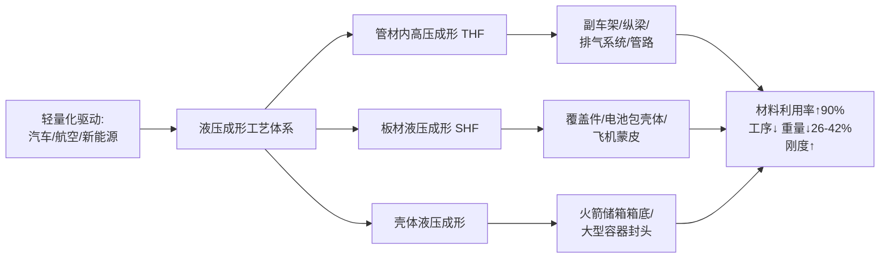

## 1.3 金属材料的核心成形性能指标体系

液压成形虽以"柔性加载"显著拓宽了材料的成形窗口，但成形质量与极限仍最终受制于材料本身的力学与组织属性。系统理解材料的成形性能指标体系，是后续逐一讨论高强钢、铝合金、镁合金、钛合金适用性的前提。冲压成形性能本身是一个综合性概念，主要包括**成形极限**（材料能达到的最大变形程度）与**成形质量**（尺寸精度、厚度变化、表面质量、物理力学性能）两个层面，其评价指标可归纳为强度、塑性、硬化、各向异性、回弹与表面质量六大类[^13]。

**强度类指标**包括屈服强度 $\sigma_s$（或 $R_{p0.2}$）、抗拉强度 $\sigma_b$ 以及二者之比即**屈强比 $\sigma_s/\sigma_b$**。屈强比越小，材料从屈服到断裂之间的塑性变形空间越大，越易于塑性变形而不易断裂，对冲压与液压成形越有利[^13][^14]。值得注意的是，钛合金的一个突出特点正是"抗拉强度与屈服强度接近"（屈强比高），这直接导致其塑性变形范围小，是其液压成形难度大的根本原因之一[^15][^16]。

**塑性类指标**主要为断后伸长率 $\delta$、均匀延伸率 $\delta_b$ 与断面收缩率 $\Psi$。其中均匀延伸率表示板料产生均匀变形或稳定变形的能力，直接影响伸长类变形的成形能力[^13][^14]。

**加工硬化指数 $n$ 值**由 Hollomon 关系式 $\sigma = K\varepsilon^n$ 定义，其物理意义是材料抵抗均匀变形、抑制颈缩的能力。$n$ 值越大，材料硬化效应越强，变形越均匀，伸长类变形的极限变形程度越高；$n$ 值与材料层错能呈负相关，且对冷热加工状态高度敏感（退火态金属 $n$ 值通常较大）[^13][^17][^18]。$n$ 值同时显著影响成形极限曲线（FLC）的位置——$n$ 值与厚度的增大都会使 FLD 的几何位置整体上移[^19][^17]。因此覆盖件用高 $n$ 值 IF 钢往往能够实现复杂曲面外板的胀形成形。

**板厚方向性系数 $r$ 值**（塑性应变比）反映薄板厚向变形的难易程度，$r$ 值越大，板平面方向越容易变形而厚度方向越难减薄，对深拉深类成形越有利[^13][^14]。覆盖件用 IF 钢通过超低间隙原子含量获得 $r \ge 2.0$，正是其能用于制造复杂曲面外板的根本原因[^20]。

**弹性模量 $E$ 与回弹特性**则决定卸载阶段的弹性回复量。弹性模量越高、屈服强度越低，卸载回弹越小；钛合金的弹性模量仅约为钢的一半，故成形后回弹显著大于钢制零件，这是其液压成形需要重点应对的工艺难题[^15][^16]。

**成形极限图（FLD/FLC）** 是定量评价板料局部成形性能的核心工具，由板料在不同应变路径下的局部失稳极限工程应变 $e_1$ 和 $e_2$（或极限真实应变 $\varepsilon_1$ 和 $\varepsilon_2$）构成的条带形区域或曲线[^21][^19]。Keeler 与 Goodwin 在 20 世纪 60 年代相继建立了 FLC 的右半与左半部分，使之成为板材成形史上的里程碑。在板料成形中，当主应变 $\varepsilon_1$ 和 $\varepsilon_2$ 的交点落在 FLC 以下属于安全区，落在 FLC 以上则会发生明显的局部颈缩或破裂[^21][^19]。FLD 对成形极限的判据通常采用"局部颈缩"而非"最终断裂"，这是因为有明显颈缩的零件已不能满足使用质量要求[^21]。一种材料对应一条 FLC，由试验获得；由于影响因素众多，试验数据存在分散性，FLC 在工程中往往以一定宽度的条带（即**临界区**）呈现[^19]。

对管材类成形而言，**胀形系数**是评价材料胀形性能的核心无量纲参数。在管材胀形中，胀形系数 $k_r$ 定义为 $k_r = b/d_0$，其中 $d_0$ 为管坯初始直径，$b$ 为试件裂口处最大尺寸；极限胀形系数与材料断后伸长率 $\delta_5$ 相关，可近似表示为 $k_r = 1 + \delta_5 - 1.72\varepsilon_z$，与管坯轴向应变 $\varepsilon_z$ 呈线性关系[^22]。AZ31B 镁合金板料的胀形实验表明，成形速度较低时胀形系数较大，这正是镁合金需要温热低速成形的重要依据[^22]。

下表汇总了上述核心成形性能指标的物理意义与对液压成形的影响方向，作为后续四类材料比较的统一标尺：

| 指标 | 物理意义 | 对液压成形的影响 |
|---|---|---|
| 屈强比 $\sigma_s/\sigma_b$ | 屈服与抗拉强度之比 | 越小越易塑性变形；钛合金屈强比高，成形困难[^13][^15] |
| 均匀延伸率 $\delta_b$ | 均匀塑性变形能力 | 越大伸长类成形能力越好[^13] |
| 加工硬化指数 $n$ | 抵抗颈缩、变形均匀化能力 | 越大 FLC 越高，胀形性能越好[^19][^17] |
| 板厚方向性系数 $r$ | 厚向减薄抵抗能力 | 越大越利于深拉深[^13][^14] |
| 弹性模量 $E$ | 抵抗弹性变形能力 | 越大回弹越小；钛合金 $E$ 低，回弹大[^15][^16] |
| FLD/FLC | 局部应变安全边界 | 工艺设计的核心判据[^21][^19] |
| 胀形系数 $k_r$ | 管材胀形变形程度 | 极限值受 $\delta_5$ 与 $\varepsilon_z$ 制约[^22] |

## 1.4 液压成形工艺对材料的适用性要求

综合工艺原理与性能指标体系可以提炼出液压成形对金属材料的核心适用性要求。首先，**高 $n$ 值与低屈强比**是保障变形均匀性、抑制局部颈缩、提升成形极限的两大基础属性——液压成形中坯料处于双向甚至三向应力状态，应变路径复杂，材料若硬化能力不足或屈服后立即接近抗拉强度，极易在过渡圆角与高应变区出现颈缩与撕裂[^13][^17]。其次，**适宜的 $r$ 值**对充液拉深与深筒形件成形尤为关键，是板料能否从法兰区顺利流入凹模型腔而不发生过度减薄的决定性参数[^13]。第三，**足够的塑性储备**（高 $\delta$ 与 $\delta_b$）是适应复杂截面、大胀形比成形的前提；对低塑性材料而言，单纯依赖室温液压成形往往难以达到目标变形量，必须借助温热成形等工艺手段拓宽塑性窗口[^5][^15]。第四，**良好的表面质量与厚度均匀性**是确保流体润滑充分、避免摩擦划伤与厚度公差超差的关键，冲压用板料应"表面光洁平整，无分层和机械性质的损伤，无锈斑、氧化皮及其它附着物"，这一要求在液压成形中同样适用[^13]。第五，**可控的回弹与各向异性**直接关系到成形件的尺寸精度——高强钢与钛合金均存在回弹偏大问题，需通过模具型面补偿、加载路径优化或热态成形加以控制[^11][^15]。

对**难成形材料**（低塑性轻合金、超高强钢、钛合金）而言，常规室温液压成形往往难以满足要求，由此催生了一系列工艺创新。其一是**热态液压成形**，针对高性能铝合金、镁合金等轻合金材料室温塑性低、成形困难的问题，采用加热加压介质成形异形截面零件——目前以耐热油作为介质的温度可达 300℃、压力达 100 MPa，能够满足铝合金和镁合金管材的成形需要；对于钛合金，需在 600℃ 以上成形，气体介质成为很好的解决方案[^5]。其二是**双路径加载充液拉深**，针对铝镁合金等低塑性板材，通过在液室压力之外增加主动径向加压（如 20–45 MPa），可显著提高 5A06 铝镁合金平底筒形件的成形极限，拉深比可达到 3.1[^23][^24]。其三是**低压顺序成形（SHS）与分段加压**，可比常规内高压成形降低压力约 30%，有效降低模具磨损并避免高强材料（如 DP980 钢、AA7075 铝合金）的冲压开裂问题[^1][^11]。其四是**超高压成形**，针对超高强钢、钛合金和高温合金等更高强度材料，内压发展到 600 MPa 甚至 1000 MPa，但同时也带来超高压管端移动密封、模具材料、超高压液体控制精度等一系列挑战[^5]。其五是**拼焊管内高压成形**，将不同厚度或不同材料管材焊接成整体后再液压成形，可进一步减轻结构质量[^5]。

这些工艺创新均指向同一逻辑——通过改变加载路径、温度、压力等级或预成形条件，**主动调控材料所处的应力状态**，使原本超出其常规成形极限的材料进入可成形范围。这也意味着选材决策不能脱离工艺条件孤立讨论，必须建立"材料性能—工艺参数—缺陷敏感性"的耦合视角。

## 1.5 材料选择的多维权衡与"材料—缺陷"分析框架

在前述工艺—指标—适用性分析的基础上，本研究构建"轻量化—力学性能—成本—工艺兼容性"四维权衡框架，作为后续四类材料逐一分析的统一比较视角。

**轻量化维度**关注密度与比强度。钛合金密度 4.5 g/cm³（较钢轻约 43%），铝合金 2.7 g/cm³（约为钢的 1/3），镁合金密度更低，是目前实际应用中最轻的金属结构材料；高强钢虽密度最高（约 7.85 g/cm³），但其超高强度可在保证安全性能的前提下显著减薄板厚，例如使用 1.2 GPa 级高强钢可实现约 22 kg 的减重[^25][^26][^20]。

**力学性能维度**关注强度与塑性的平衡。高强钢通过 DP、TRIP、MS、PHS 等不同钢种实现 500–1500 MPa 范围内的强度覆盖，且 TRIP 钢通过残余奥氏体相变诱导塑性效应可在很长应变范围内保持较高的加工硬化指数，特别适合胀形[^20][^27]。钛合金抗拉强度通常 800–1200 MPa 而铝合金仅 200–600 MPa[^26]，但钛合金屈强比高、弹性模量低、形变强化率高、变形回弹大，成形难度大；铝合金虽强度低于钛合金，但成形性较好；镁合金室温塑性差，常需温热成形[^28][^26][^15]。

**成本维度**则差异更为悬殊。钛合金材料本身价格高、加工难度大，制造成本远高于铝合金，"通常只在高端跑车或性能车上使用"；铝合金价格适中、易于加工；高强钢在量产汽车结构件中具有最高的性价比；镁合金"成本较高，应用范围相对较窄"[^25][^26]。

**工艺兼容性维度**关注成形温度、压力等级与设备能力。高强钢在常规内高压成形装备（≤400 MPa）下可加工，但超高强钢需配合 SHS 等低压顺序工艺降低模具磨损；铝合金常需结合热态液压成形或双路径加载；镁合金必须温热成形；钛合金则需 600℃ 以上温度并以气体作为介质[^11][^23][^5]。

上述四个维度往往呈现"此消彼长"的权衡关系，可用下图概括四类材料在液压成形中的相对定位：

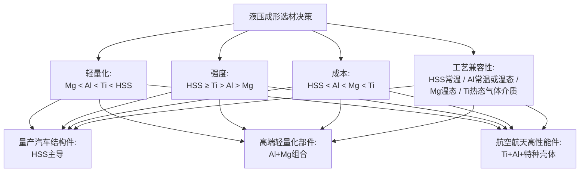

更进一步，本研究将材料性能短板与液压成形过程中的典型缺陷建立**"材料特性—工艺参数—典型缺陷"传导逻辑**：屈强比高、弹性模量低的材料（钛合金、超高强钢）易出现**回弹**超差，需通过模具补偿与加载路径优化抑制；$n$ 值低、塑性储备不足的材料（钛合金、镁合金室温下）在内压增长过快或补料不足时易发生**撕裂/爆裂**，FLC/SFLC 预测与加载路径优化为主要对策；轴向进给与内压匹配失当、过渡区切应力集中会诱发**起皱**，需通过加载路径协同控制与防皱筋设计加以抑制；摩擦阻力过大、补料不充分、模具圆角过小则导致**变薄**，需依靠润滑改进、变厚度管（TRB）与圆角设计应对；润滑不足、模具表面粗糙、坯料表面缺陷则会带来**表面缺陷**（划伤、压痕、橘皮、模具印迹），可通过润滑剂选择、PVD/TD 覆层等模具表面处理与压力曲线优化加以解决[^4][^11][^5][^15]。

值得强调的是，上述五类缺陷之间并非独立存在，而是呈现明显的**耦合权衡关系**：例如压边力增大可抑制起皱却容易诱发撕裂；内压提高有利于贴模减少回弹，却可能加剧法兰区减薄；加载路径前移补料可减小变薄，但补料过多又会诱发管壁起皱。因此，液压成形的工艺优化本质上是在"**工艺窗口（process window）**"内寻求多目标的最优解，这也是后续第 9 章将系统讨论的缺陷耦合机理与综合优化策略的核心议题。

至此，本章已建立起从工艺原理、技术演进、性能指标到选材逻辑的完整分析框架。第 2–5 章将以本章提炼的成形性能指标体系与四维权衡框架为基准，逐一分析高强度钢、高强度铝合金、镁合金、钛合金四类材料在液压成形中的特性、挑战与典型应用；第 6 章在此基础上完成横向比较与选材决策；第 7–9 章则沿着"成因—对策—耦合"的逻辑链条系统讨论五类典型缺陷的防控路径。需要说明的是，由于本章所引参考资料以汽车与航空航天工程实践、教材性论述与综述类来源为主，部分前沿数值（如 1000 MPa 超高压成形的工业化进展）在不同来源间存在表述差异，本章已尽量综合呈现并标注出处；对资料覆盖不足的细分议题（如壳体液压成形的最新工业案例），将在后续相应章节结合更具体的工程实例进一步深化。

# 2 高强度钢（HSS）在液压成形中的应用分析

承接第 1 章建立的"工艺—指标—选材"分析框架，本章聚焦四类核心材料中的首位——高强度钢。作为汽车工业中最成熟、性价比最高、应用规模最大的液压成形结构材料，高强度钢通过组织设计实现了 500–1700 MPa 抗拉强度范围内的连续覆盖，并在过去 40 年中完成了从第一代以铁素体为基体的 AHSS，向第二代奥氏体基 TWIP 钢、再向第三代高强韧低成本钢种的三次迭代。这一代际演进不仅重新定义了汽车车身结构的减重边界，也对液压成形工艺的压力等级、模具寿命、加载路径与失效控制能力提出了全新挑战。本章将沿着"组织—性能—挑战—工艺创新—工程应用"的逻辑链条，结合 DP590/DP780 焊管自由胀形实验数据与协同变载、SHS 低压顺序成形等工艺创新路径，系统揭示高强度钢液压成形的内在规律与产业定位，为第 6 章四类材料横向比较中的"高强钢一侧"提供完整支撑论据。

## 2.1 高强度钢的分类体系与微观组织特征

高强度钢并非单一钢种，而是一个通过多元化合金设计与相变工艺调控构建的庞大材料家族。按国际钢铁协会的分类逻辑，可将其划分为**传统高强钢**与**先进高强钢（AHSS）**两大体系：前者以碳锰钢（C-Mn）、烘烤硬化钢（BH）、高强度无间隙原子钢（HSS-IF）和高强度低合金钢（HSLA）为代表，强化机制以固溶强化、析出强化和细晶强化为主；后者则通过铁素体、马氏体、贝氏体、残余奥氏体等多相复合组织实现强度—塑性的协同提升，抗拉强度覆盖 500–1500 MPa 范围[^29][^30]。

AHSS 的代际演进体现了汽车钢"强度—塑性—成本"三角的持续优化路径。**第一代 AHSS** 以铁素体为基体，奥氏体含量低于 15%，强塑积处于 5–15 GPa·% 区间，代表钢种包括双相钢（DP）、复相钢（CP）、马氏体钢（MS）、相变诱导塑性钢（TRIP）和无间隙原子钢（IF）等。其中 DP 钢由瑞典 SSAB 公司于 1983 年率先实现工业化量产，组织特征为铁素体基体中弥散分布马氏体硬相岛，强度随马氏体体积分数增加而提升[^29][^31]。TRIP 钢的微观组织则更为复杂，由铁素体+贝氏体+残余奥氏体（RA，体积分数至少 5%）构成，部分场合还含有马氏体；其独特之处在于残余奥氏体在塑性变形过程中发生马氏体相变，通过 TRIP 效应大幅提升加工硬化率与延展性[^29][^31]。马氏体钢则通过淬火使奥氏体完全转变为板条马氏体，抗拉强度可达 1700 MPa，并常需等温回火以协调强度与韧性[^29]。

**第二代 AHSS** 的特征是通过大量合金元素（主要为 Mn）的添加在室温下保留大量稳定的奥氏体组织，代表产品为孪晶诱导塑性钢（TWIP）和轻质诱发塑性钢（L-IP）。在变形过程中通过应变诱导形成机械孪晶，获得高应变硬化速率与优异力学性能，强塑积可达 60 GPa·%；但合金成本高、屈服强度偏低、易发生延迟开裂等问题制约了其规模化应用[^31]。

**第三代 AHSS** 由 Krupitzer 和 Heimbuch 首先提出，目标是综合第一代的硬相强度（BCC 马氏体）与第二代的软相塑性（FCC 奥氏体），在低成本前提下实现高强韧—轻量化的统一，主要钢种包括中锰钢、淬火配分（Q&P）钢、热冲压成形钢（HF/PHS）等[^31]。其中以 22MnB5 为代表的**热成形钢（Press Hardening Steel, PHS）** 在汽车安全件中的应用最为典型——其通过将板料加热至 900–950℃（典型 930℃）完全奥氏体化并保温 3–5 分钟，在红热状态下快速冲压成形，随即在模具中强制冷却淬火，最终获得以高位错密度板条马氏体为主的组织，实现 1500 MPa 级以上抗拉强度[^32]。

22MnB5 的合金元素协同设计体现了热成形钢性能控制的精髓：碳（0.2%–0.3%）是强度之源，固溶于奥氏体后淬火形成马氏体；锰（1.2%–1.5%）显著提高淬透性，确保复杂截面零件全马氏体化；硼（B）极微量添加即可大幅提升淬透性，是薄壁件均匀淬透的关键；铌（Nb）、钛（Ti）、钒（V）通过形成纳米级 NbC、TiC 碳氮化物钉扎奥氏体晶界，细化最终马氏体组织，是开发 1800 MPa 级以上更高强度热成形钢（如 Ti+Nb 复合微合金化）的关键手段；硅、铝则通过抑制脆性碳化物析出，促进亚稳态残余奥氏体保留，在冲击变形时通过 TRIP 效应吸收额外能量[^32]。由于热成形需在 900–950℃ 高温下进行，钢板必须预镀防氧化层——目前应用最广泛的是 **Al-Si 镀层**，在加热过程中与基体形成致密 Fe-Al-Si 金属间化合物层；Zn 基镀层（如纯 Zn、Galvanneal）则具备更优长期防腐性能，但需特别关注**液态金属脆化（LME）** 风险，对加热速率和温度控制要求极为严格[^32]。

为清晰呈现典型高强钢钢种的强度区间，可参考 AHSS 通用牌号体系。下表列出了若干代表性高强钢的最小屈服强度与最小抗拉强度，反映其覆盖 440–1500 MPa 范围内的连续强度梯度[^30]：

| 牌号 | 最小屈服强度 (MPa) | 最小抗拉强度 (MPa) | 组织特征 |
|---|---|---|---|
| DP 210/440 | 210 | 440 | 铁素体+少量马氏体 |
| DP 300/500 | 300 | 500 | 铁素体+马氏体 |
| HSLA 350/450 | 350 | 450 | 微合金化铁素体+少量珠光体 |
| DP 350/600 | 350 | 600 | 铁素体+马氏体 |
| TRIP 350/600 | 350 | 600 | 铁素体+贝氏体+残余奥氏体 |
| TRIP 450/800 | 450 | 800 | 铁素体+贝氏体+残余奥氏体 |
| CP 500/800 | 500 | 800 | 多相细晶+析出强化 |
| DP 500/800 | 500 | 800 | 铁素体+马氏体 |
| TWIP 500/900 | 500 | 900 | 全奥氏体+机械孪晶 |
| MS（马氏体钢） | — | 最高 1700 | 板条马氏体 |
| 22MnB5（热成形钢） | — | 1500 级 | 淬火板条马氏体 |

上述组织—牌号体系是后续成形行为分析的基础。**值得指出的是，DP 钢与 TRIP 钢由于具有铁素体软相基体，初始加工硬化率高、屈强比低，是当前液压成形应用最为成熟的两类 AHSS；而马氏体钢与热成形钢由于其单相硬组织或淬火后超高强度，常规室温液压成形难度大，通常以热冲压（press hardening）而非液压成形为主流工艺路径**，这一点将在后续章节中进一步展开。

## 2.2 高强度钢的关键力学性能与液压成形相关性

以第 1 章建立的成形性能指标体系（屈强比、$n$ 值、$r$ 值、弹性模量、FLC、胀形系数）为标尺审视高强度钢，可以更精准地把握其液压成形的优势区间与边界条件。

**强度—塑性匹配**方面，高强度钢的最大特点是抗拉强度从 440 MPa 一路覆盖至 1700 MPa，跨度极宽，且通过组织设计实现了不同强度等级下相对差异化的塑性表现。第一代 AHSS 的强塑积 5–15 GPa·%，第二代约 60 GPa·%，第三代则处于二者中间值并以低成本为目标[^31]。强塑积作为衡量强度与延伸率乘积的综合指标，直接反映了材料同时满足"碰撞安全"与"成形性"两类需求的能力，这也是 AHSS 相对传统高强钢的核心优势。

**屈强比与初始加工硬化率**方面，DP 钢由于其铁素体基体的存在，屈服强度相对较低、初始加工硬化率高、屈强比小，这意味着 DP 钢在屈服后仍有较大的均匀塑性变形空间，特别适合内高压成形中的胀形阶段；其变形均匀性也有利于抑制局部颈缩。TRIP 钢则进一步借助残余奥氏体的**应变诱导马氏体相变**机制，在大应变阶段持续提供额外的加工硬化能力，使其 $n$ 值在变形过程中长时间保持较高水平——这一特性使 TRIP 钢在复杂胀形截面、深加工深拉深类应用中表现尤为突出[^31][^30]。相反，马氏体钢与热成形钢以板条马氏体为主组织，强度极高但塑性储备有限，屈强比接近 1，FLC 整体下移，常规室温下液压成形极易在小变形量下发生开裂，这也是热成形钢在产业中以热冲压而非液压成形为主流加工路径的核心原因。

**回弹倾向**方面，根据第 1 章的分析，弹性模量越高、屈服强度越低，卸载回弹越小。高强度钢的弹性模量与普通低碳钢基本相当（约 200 GPa），但其屈服强度可达普通钢的数倍至 8 倍，这意味着 **同等应变下高强钢储存的弹性应变能大幅增加，卸载后弹性回复量显著大于普通钢**。这一性能特征是高强钢液压成形中尺寸精度难以控制的根本原因，也是后续讨论的协同变载、模具型面补偿等工艺创新的针对性出发点。

下表归纳了几类典型高强钢在液压成形相关性能上的相对定位：

| 钢种 | 屈强比 | 初始加工硬化率 | 塑性储备 | 回弹倾向 | 液压成形适用性 |
|---|---|---|---|---|---|
| DP 钢 | 低 | 高 | 中高 | 中等 | **高**（胀形优势明显）|
| TRIP 钢 | 中低 | 高且持续 | **高**（TRIP 效应）| 中等 | **高**（大应变胀形）|
| CP 钢 | 中 | 中 | 中 | 中高 | 中 |
| MS 钢 | 高 | 低 | 低 | 高 | 低（仅局部成形）|
| 22MnB5 PHS | 高（淬火后） | 低（淬火后）| 低 | 高 | 低（以热冲压为主）|

从液压成形的工艺需求看，**DP 钢与 TRIP 钢凭借低屈强比、高 $n$ 值与较好的塑性储备，成为内高压成形管材的优选钢种**；CP 钢居中；MS 钢与热成形钢则因塑性储备不足，主要在冲压领域大放异彩，在液压成形中应用较为有限，仅在配合超高压设备与特殊加载路径下用于少数高强度结构件。这一定位差异也直接影响了后续工艺创新的研发重点——降低成形压力、抑制回弹、控制焊缝失效，是高强度钢液压成形产业化推进的三大核心议题。

## 2.3 高强度钢液压成形的工艺挑战

高强度钢虽然在强度—塑性匹配、性价比与产业成熟度上具有显著优势，但其内在的高强度本身又对液压成形工艺提出了多重挑战。从工艺链各环节剖析，可归纳为以下四类核心挑战。

**挑战一：成形压力剧增，对装备与密封提出严苛要求。** 由第 1 章给出的初始屈服压力 $P_s \approx 2\sigma_s t/d$ 关系可知，管材开始塑性变形所需内压与材料屈服强度成正比；高强度钢屈服强度可达普通钢的数倍，意味着相同壁厚和管径下其初始屈服压力、整形压力 $P_c$ 与开裂压力 $P_b$ 均显著上升。第 1 章已指出，常规内高压成形装备压力上限约 400 MPa，而超高强钢（如 1500 MPa 级以上）的精确成形可能需要发展到 600 MPa 甚至 1000 MPa 的超高压成形系统，这同时带来超高压管端移动密封、模具材料屈服与疲劳、超高压液体控制精度等一系列工程难题。

**挑战二：回弹量大、尺寸精度难以控制。** 如 2.2 节所述，高强钢储存的弹性应变能远大于普通钢，卸载后的回弹量显著增加。在恒压加载液压成形工艺中，模具在高压下也会发生弹性变形，卸载后模具弹性回复与构件回弹叠加，进一步加剧了构件尺寸的分散性。**哈尔滨工业大学崔晓磊、贺久强、韩聪、苑世剑等针对管坯液压成形指出，现有恒压加载液压成形技术存在"构件尺寸分散大、废品率高和模具变形严重"的难题**，这正是高强钢液压成形回弹控制困难的工程体现，需要通过协同变载、模具型面补偿等专门工艺加以应对[^33]。

**挑战三：模具磨损加剧、寿命下降。** 高强钢在成形过程中对模具表面产生的接触应力随强度等级提升而显著上升，特别是在过渡圆角、补料区与高压贴模区域，模具表面磨损与塑性变形速率明显加剧，导致模具寿命下降、维护成本上升。这一现实直接催生了 SHS 低压顺序成形（详见 2.4 节）等专门针对高强钢降压成形的工艺创新。

**挑战四：焊管液压成形中焊缝及热影响区的失效控制。** 由于车用管材绝大多数为带焊缝的电阻焊管或激光焊管，焊接过程引入的组织不均匀对液压成形破裂行为产生关键影响。**针对 DP590/DP780 高强钢焊管的液压成形研究表明**：在自由胀形过程中，破裂位置全部位于靠近焊缝及热影响区的母材区域，而非焊缝本身；管材的焊缝区域基本上不发生减薄，最小壁厚位于热影响区和基体的过渡区域；壁厚的减薄率在胀形最高点所在截面最大，越靠近管材夹持区，壁厚的减薄率越小[^34]。

这一发现的工程意义在于：焊缝由于熔合区组织粗大且经历过高温，硬度较母材高、塑性变形能力较低；热影响区与母材之间存在显著的硬度梯度，形成了应变集中带——液压胀形过程中，软相（母材）与硬相（焊缝）的协调变形不充分，应变优先在硬度过渡区累积，最终导致破裂发生在该过渡带。研究进一步表明，**随着管径的增大和长径比的增大，管材的极限膨胀率呈现下降趋势**[^34]，这意味着大直径、长管段的内高压成形需要更精细的工艺控制与材料选择策略。

为直观呈现上述四类挑战及其内在关联，可以将高强钢液压成形的挑战体系可视化为如下因果关系图：

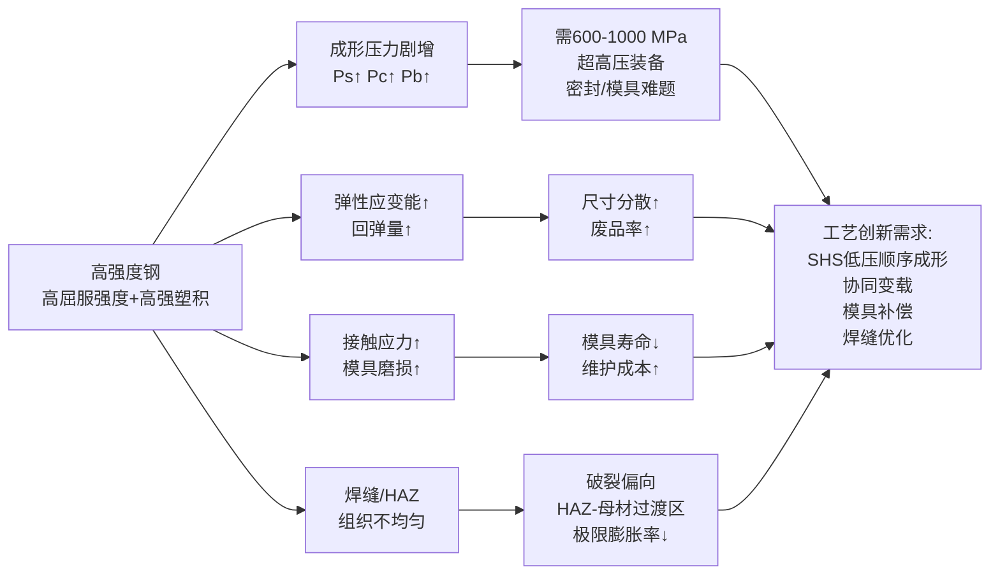

这一挑战体系也直接定义了后续工艺创新的攻关方向。

## 2.4 高强度钢液压成形的工艺创新与典型实验验证

针对上述挑战，国内外学界与产业界发展了多条工艺创新路径，其中以**低压顺序成形（SHS）** 与**压力—体积协同变载技术**最为典型。

**德国 Schuler 公司与美国 Vari-Form 公司发展出的 SHS 低压顺序成形技术，可比常规内高压成形降低压力约 30%，有效降低模具磨损**（已在第 1 章引述）。该技术通过将传统的"一次性高压贴模"重构为"分阶段、分区域的低压顺序贴模"，使板料/管材在较低压力下逐步完成型腔填充，从根本上降低了对装备压力等级与模具材料的需求；这一路径对 DP980 等超高强钢的批量成形具有重要工程价值，是高强钢内高压成形规模化应用的关键工艺支撑。

**哈尔滨工业大学苑世剑团队针对管坯液压成形发明了基于液体压力—体积协同变载的精确成形工艺**，提出通过控制高压液体体积来调控模具弹性变形量和构件尺寸精度，**使尺寸精度比传统压力加载法提高 1 倍多**；同时提出合模力随内压全量程可变加载技术，**大幅减小模具尺寸，且使模具变形量降到恒定合模力条件下模具变形量的 1/3 以下**；进一步突破双腔内压与多工艺参量协同加载控制技术，实现了双套系统并联成形，**生产效率提高近 1 倍**，满足了新能源汽车对高品质、高效率和低成本生产的要求[^33]。

这套协同变载技术的核心突破点在于：将传统液压成形的"压力—合模力"双独立加载逻辑重构为"压力—体积—合模力"三参量协同控制逻辑，通过精确调控高压液体的实际充入体积，间接控制模具的弹性变形量并补偿构件回弹，从而在不依赖事后模具修磨与多次试模的前提下，实现首件即合格的高精度成形。此外，**可变合模力技术使模具在低内压阶段无需提供恒定的高合模力，显著减小模具承受的最大载荷与累计疲劳损伤**，这对高强钢液压成形的模具寿命提升具有直接价值。

下表对比了两条主流工艺创新路径的关键技术指标：

| 工艺创新 | 技术核心 | 关键效益 | 适配钢种 |
|---|---|---|---|
| SHS 低压顺序成形（Schuler、Vari-Form）| 分阶段低压顺序贴模 | 成形压力降低约 30%，模具磨损减轻 | DP980 等超高强钢 |
| 压力—体积协同变载（哈工大苑世剑团队）| 压力—体积—合模力三参量协同控制 | 尺寸精度提升 1 倍多，模具变形量降至 1/3，效率提升近 1 倍[^33] | 异形空心构件、高强钢底盘件 |

在实验验证层面，**DP590/DP780 高强钢焊管自由胀形实验**为高强钢液压成形的理论模型与工艺参数提供了关键定量支撑。北京科技大学崔振楠、林利、朱国明、康永林等与鞍钢股份有限公司联合开展的研究表明：管材在胀形过程中的实际破裂压力大于理论计算公式得到的破裂压力（说明理论公式偏保守，可作为安全设计下限）；破裂位置全部位于靠近焊缝及热影响区的母材区域；自由胀形过程中焊缝区域基本不减薄，最小壁厚位于热影响区与基体过渡区域；壁厚减薄率在胀形最高点所在截面最大，越靠近夹持区减薄率越小；随着管径与长径比增大，极限膨胀率呈下降趋势[^34]。

研究最终得出四条对工程实践具有直接指导意义的结论：**(1) 管材液压成形实验是准确获得管材力学性能参数的途径**——意味着不能简单沿用拉伸试样数据来预测管材内高压成形行为，必须通过自由胀形实验直接获取应力—应变曲线与极限膨胀参数；**(2) 提高焊接质量有助于控制失效破裂位置**——优化焊接工艺、降低焊缝—HAZ—母材的硬度梯度，可显著改善破裂裕度；**(3) 合理选择管材长径比有利于性能的充分发挥**——避免过大长径比导致的轴向应变累积与极限膨胀率下降；**(4) 通过合理控制各处的减薄有利于降低液压成形件的破裂风险**——加载路径设计需在补料量、内压增长速率与各截面减薄率之间取得平衡[^34]。

这些定量发现与定性结论，不仅是 DP590/DP780 钢种内高压成形工艺参数设定的直接依据，也为第 8 章将系统讨论的撕裂、变薄缺陷成因分析提供了高强钢一侧的关键证据。

## 2.5 高强度钢在汽车结构件中的典型应用与减重效果

凭借成熟的材料体系、相对可控的成形难度与突出的性价比，高强度钢已成为汽车工业中液压成形应用最为广泛的金属材料。其应用谱系涵盖白车身骨架、底盘结构件、安全防撞件、悬架件与排气系统等几乎所有承载与吸能结构。

**白车身骨架与安全件**层面，AHSS 主要应用于 A/B/C 柱、车门槛、前后保险杠、车门防撞梁、横梁、纵梁、座椅滑轨等位置[^29]。其中 A 柱与 B 柱作为侧碰与翻滚工况下乘员舱完整性的核心保障，对强度要求最为严苛。第 1 章已引述某车型 A 柱采用液压成形双层管状结构、较传统冲压焊接方案**减重 26%，弯曲刚度反增 42%** 的工程案例，这正是 DP/CP 等 AHSS 在内高压成形中典型应用的体现；车门防撞梁与防撞杆则常采用 1500 MPa 级热成形钢以最大化吸能效率[^29]。

**底盘结构件与悬架件**层面，副车架是高强钢内高压成形最具代表性的应用部件。第 1 章已引述：发动机副车架由原来 6 个零件的组焊件可变成 1 个管坯液压成形件，**工序由 10 道减少至 3 道，工装投资降低 40%**；某副车架零件传统工艺需 5 片冲压件焊接、总耗材 12 kg，而内高压成形仅需单根 8 kg 管材，**材料成本降低 30%**。悬架控制臂方面，某 A 级车控制臂由 4 次冲压+12 个焊点工艺转为 1 次成形，**成本由 150 元/件降至 110 元/件，良率由 92% 升至 97%**。这些案例集中体现了高强钢液压成形在"减重—减件—减工序—降本—提质"五个维度的综合价值。

**整车减重效果**层面，第 1 章已引述使用 1.2 GPa 级高强钢可实现约 22 kg 减重的数据。这一减重幅度看似有限，但考虑到高强钢的密度并未降低（仍约 7.85 g/cm³），其减重完全来自板厚减薄——以同等承载能力下板厚从 1.8 mm 减至 1.2 mm 计算，单部件减重可达 30% 以上，且不牺牲（甚至提升）零件的弯曲刚度与碰撞性能，这是其他轻质材料难以同时实现的工程价值。

**产业定位**层面，高强钢在量产汽车结构件中相对铝合金、镁合金的核心优势可归纳为四点：其一是**材料成本最低**——AHSS 单位重量价格远低于铝合金、镁合金与钛合金，且其生产工艺成熟、供应链稳定（第 1 章已指出 HSS 在四类材料中成本最低）；其二是**工艺兼容性最好**——常规 ≤400 MPa 内高压成形装备即可加工大部分 DP、TRIP 钢种，不需要热态成形与气体介质等特殊工艺条件；其三是**碰撞安全性能优**——AHSS 通过相变诱导塑性、孪晶诱导塑性等机制提供突出的能量吸收能力，特别适合用于碰撞吸能区与乘员舱安全区；其四是**焊接与连接工艺成熟**——汽车工业已形成完备的电阻点焊、激光焊、MAG 焊等高强钢连接工艺体系，便于与白车身整体结构集成。

为系统呈现高强度钢液压成形在汽车结构件中的典型应用谱系，下表归纳了各类部件的钢种选择、工艺特点与减重/降本效果：

| 部件类别 | 典型钢种 | 工艺路径 | 减重/降本效果 |
|---|---|---|---|
| 副车架 | DP/TRIP 钢 | 管坯内高压成形 | 工序 10→3 道，工装↓40%，材料↓30% |
| A 柱 | DP/CP 钢 | 双层管状液压成形 | 减重 26%，刚度↑42% |
| B 柱、车门防撞梁 | 22MnB5 PHS | 热冲压（部分热态液压）| 1500 MPa 级，吸能↑ |
| 底盘纵梁/横梁 | DP/HSLA | 管材内高压成形 | 一体成形替代焊接 |
| 悬架控制臂 | DP/HSLA | 板材液压或管材液压 | 成本 150→110 元，良率 92→97% |
| 前后防撞梁、保险杠 | DP/MS 钢 | 内高压成形 | 吸能区一体化 |
| 排气系统 | 不锈钢/AHSS | 内高压成形 | 复杂三维管路一体化 |
| 整车（综合）| 1.2 GPa 级 | 多部件协同 | 整车减重约 22 kg |

需要指出的是，**热成形钢（如 22MnB5）在 B 柱、车门防撞梁等典型应用中以热冲压（Press Hardening）而非液压成形为主流工艺路径**——其加热至 930℃ 完全奥氏体化后在模具中冲压并淬火[^32]，与本报告主题的液压成形存在工艺差异；但本节仍将其纳入讨论，原因在于高强钢液压成形与热冲压在汽车安全件应用谱系中具有互补关系，且部分前沿研究已开始探索热态液压成形与热冲压融合的路径，可视为未来工艺融合的重要方向，将在第 9 章展望部分进一步讨论。

综合本章分析可以得出，**高强度钢凭借其成熟的代际演进体系、覆盖 500–1700 MPa 的强度梯度、第三代 AHSS 的强韧低成本平衡以及汽车产业完善的工艺与供应链支撑，已成为液压成形技术在量产汽车结构件领域的主导材料**。其内在的高屈服强度虽然带来了成形压力剧增、回弹量大、模具磨损加剧与焊缝失效控制等工艺挑战，但通过 SHS 低压顺序成形、压力—体积协同变载、模具型面补偿、焊接质量优化等多元化工艺创新路径，这些挑战已在工程实践中得到较好解决。本章建立的"组织—性能—挑战—工艺—应用"五维分析逻辑，也将作为后续第 3–5 章对高强度铝合金、镁合金、钛合金分析的统一模板，最终在第 6 章完成四类材料的横向比较与选材决策框架构建。

# 3 高强度铝合金在液压成形中的应用分析

承接第 2 章对高强度钢液压成形适用性的系统讨论，本章沿用"合金体系—性能特征—成形挑战—工艺创新—工程应用"五维分析框架，聚焦四类核心材料中的第二位——**高强度铝合金**。如果说高强度钢凭借强度梯度宽、性价比高、工艺兼容性好奠定了量产汽车结构件液压成形的主导地位，那么高强度铝合金则以**密度仅为钢的 1/3、比强度优异、回收率超过 90%** 的独特属性，成为汽车整车减重 40%–50% 与航空航天大型薄壁构件整体制造的关键路径[^35][^36]。但其低弹性模量带来的回弹问题、常温塑性受限造成的破裂敏感性、以及 7xxx 系超高强铝合金"硬而脆"的内在矛盾，又使其液压成形的工艺难度远高于高强钢，催生了超低温成形、冲击液压成形、热态液压成形等多条工艺创新路径。本章将沿前述五维框架，量化呈现高强度铝合金从材料到工程应用的完整链条，为第 6 章四类材料横向比较提供"铝合金一侧"的支撑论据。

## 3.1 高强度铝合金的合金体系与牌号选择

铝合金在液压成形中的适用性首先取决于其合金体系。汽车与航空航天领域常用的高强度铝合金主要分布在 **6xxx 系（Al-Mg-Si）** 与 **7xxx 系（Al-Zn-Mg-Cu）** 两大可热处理强化系列；5xxx 系（Al-Mg）虽强度较低、不能通过热处理强化，但因优异的成形性与焊接性，常作为车门内板、油箱、电池箱体的成形对比基准；新兴的 **第三代铝锂合金（2195、2099）** 则在航空航天高端薄壁构件领域逐步替代传统 2xxx 系[^37][^38]。

**6xxx 系铝合金**以镁和硅为主要合金元素，通过 Mg₂Si 析出相强化，兼具中等强度、良好的焊接性能、优异的耐腐蚀性与可成型性，是汽车结构件液压成形最主流的选择。其中 **6061-T6** 经固溶淬火 + 人工时效处理后抗拉强度达 310 MPa、屈服强度约 275 MPa，被称为"航空级铝合金"；其铜含量较高、固溶时效工艺优化，拥有远优于 6005、6063 系列的冲击韧性与疲劳强度，可长期抵御动态循环受力[^39][^40]。**6082-T6** 在欧盟标准下抗拉强度 ≥245 MPa（部分研究在 540℃ 固溶 + 175℃ 时效优化工艺下焊接接头强度可提升 33.5%，T6 状态可达 420 MPa），其含锰量较 6061 更高，因此抗腐蚀性和焊接性更优，在海洋船舶船板、轨道车辆、飞机起落垫等结构件中应用尤为广泛[^41][^42]。**6005-T6** 抗拉强度约 300 MPa，适用于常规结构承重部位[^39]。此外，**AA6016** 通过添加硅和镁优化，焊接性和抗腐蚀能力较老一代铝材提升 30%，被奥迪 A8 第四代 ASF 框架用于引擎盖和尾箱盖等覆盖件[^43]。相对而言，**6063-T5/T6** 抗拉强度仅 186–241 MPa，主要用作门窗料，在大跨度承载工况下存在明显强度不足，**严禁单独用于超大型主结构件**——这一限制同样适用于汽车主承载部件的液压成形选材[^39]。

**7xxx 系铝合金**以锌为主要合金元素（含量达 6%），通过 MgZn₂ 等相的析出强化获得最高强度，**7075 被誉为最轻且强度最高的铝材，强度不亚于钢**[^40]。但 7xxx 系铝合金"含其他金属比例高，焊接、处理都比较困难，价格也极其昂贵"，且常温塑性差、开裂敏感性高，主要用于航空航天结构件与高端汽车防撞梁等高承载部件，而非作为常规液压成形板/管材使用[^40]。值得关注的是，领克 07 EM-P 的**前防撞梁即采用"航天级 7 系铝合金"**，截面呈日字形结构，宽度达 1332 mm，主体壁厚 5.0 mm，配合 288 mm 长的六宫格吸能盒，以最大化碰撞吸能效率[^44]。

**第三代铝锂合金（如 2195、2099）** 通过添加锂元素进一步降低密度、提升弹性模量与比强度，已开始应用于航空发动机、运载火箭储箱等高端领域；铝合金作为运载火箭、军用飞机、卫星和空间站等高端装备的主体结构材料，质量占比 50% 以上，铝锂合金整体薄壁件是发展新一代航空航天装备必须突破的核心关键技术[^37][^38]。

**5xxx 系铝合金**虽不属于"高强度"范畴，但因优异的成形性常作为铝合金液压成形研究的基准材料。**5182** 抗拉强度 270–350 MPa、延伸率 12%–20%，主要用于车门内板、油箱[^36]；**5A06** 作为铝镁合金板材，在中国科学院金属研究所的冲击液压成形实验中表现出"高应变速率下延伸率提升 40%"的特性，并在 2 道次无热处理条件下成功成形复杂薄壁口框零件[^45]，是验证铝合金特殊液压成形工艺的关键材料。

下表汇总了主流牌号的关键力学性能与液压成形适用定位：

| 系列 | 典型牌号 | 抗拉强度 (MPa) | 屈服强度 (MPa) | 延伸率 (%) | 液压成形适用性与典型应用 |
|---|---|---|---|---|---|
| 5xxx | 5182 | 270–350 | — | 12–20 | 高（车门内板、油箱）[^36] |
| 5xxx | 5A06 | — | — | 高应变率下↑40% | 高（航空薄壁口框，冲击液压成形）[^45] |
| 6xxx | 6061-T6 | 310（310–380）| 275 | 8–12 | 高（防撞梁、底盘结构件）[^39][^36] |
| 6xxx | 6082-T6 | ≥245（T6可达420）| ≥110 | ≥14 | 高（船舶、轨道车辆、轮毂）[^41][^42] |
| 6xxx | 6005-T6 | ≈300 | — | — | 中高（常规结构承重）[^39] |
| 6xxx | AA6016 | — | — | — | 高（覆盖件，焊接抗蚀↑30%）[^43] |
| 7xxx | 7075-T5 | 最高（钢级）| — | 低 | 中（高端防撞梁，焊接困难）[^40][^44] |
| 铝锂 | 2195/2099 | 高 | — | 低 | 航空航天高端（薄壁整体件，需超低温成形）[^37][^38] |

从合金选择逻辑看，**6xxx 系是汽车液压成形的主力材料——兼顾强度、成形性、焊接性与成本；7xxx 系定位为高端高承载部件，常以挤压型材而非液压成形板/管材形式应用；铝锂合金则代表航空航天前沿，必须借助超低温等新型成形工艺才能实现整体薄壁件制造**[^39][^37][^40][^38]。

## 3.2 高强度铝合金的关键力学性能与成形性指标

以第 1 章建立的成形性能指标体系审视铝合金，可以更精准地把握其液压成形的优势区间与边界条件。

**密度与比强度方面**，铝合金密度仅为 2.7 g/cm³，约为钢（7.8 g/cm³）的三分之一[^35][^36]。这一密度优势使其在相同结构下减重 40%–50% 成为可能——典型铝合金材质零件一次减重效果可达 30%–40%，二次减重效果可进一步提高到 50%[^37]。美国橡树岭国家实验室的研究同样指出，**车辆重量减少 10% 可带来 6%–8% 的燃油经济性提升**，铝合金等轻质材料替代铸铁与传统钢材可直接将车身和底盘的重量减少高达 50%[^35]。这是铝合金液压成形最根本的产业驱动力。

**弹性模量与回弹方面**，铝合金弹性模量约 70 GPa，仅为钢的 1/3。根据第 1 章建立的"弹性模量越高、屈服强度越低，卸载回弹越小"的规律，铝合金弹性模量大幅低于钢导致同等应变下储存的弹性应变能比例显著上升，**卸载回弹量约为同等强度钢制零件的 2–3 倍**。这是铝合金液压成形尺寸精度难以控制的根本物理原因，也是后续模具型面补偿、加载路径优化等工艺创新的针对性出发点。

**塑性储备与加工硬化能力方面**，6061-T6 延伸率仅 8%–12%，6082-T6 退火态延伸率 ≥14% 但在 T6 强化态显著下降[^41][^42][^36]。相较于 IF 钢 $n$ 值可达 0.25 以上、DP 钢仍保持高初始加工硬化率，6xxx 系铝合金 T6 态的 $n$ 值偏低、加工硬化弱，意味着 FLC 整体下移，复杂胀形与深拉深时极易发生局部颈缩。**7xxx 系铝合金（如 7075）虽然强度极高，但常温塑性更差，"含其他金属比例更高，焊接、处理都比较困难，一般不能用作车架的材料"**[^40]，其室温液压成形需借助 SHS 低压顺序成形等专门工艺路径。

**铝锂合金的常温塑性问题尤为突出**——苑世剑院士团队明确指出，"**高强铝合金常温塑性低、硬化弱，极易发生破裂等缺陷，成为制约整体成形的国际难题。铝合金整体薄壁件制造是发展新一代航空航天装备必须突破的核心关键技术**"；美国 NASA、欧空局等宇航研发机构均投入巨额资金，但始终未取得实质性突破[^38]。这一困境正是超低温"双增效应"成形技术得以兴起的根本背景。

**各向异性方面**，轧制板材的方向性导致 $r$ 值偏低且各方向差异显著，深拉深时容易出现凸耳、壁厚不均等问题；管材方面，挤压管的环向—轴向性能差异同样影响内高压成形中的均匀贴模能力。**表面质量方面**，铝合金表面硬度低、易划伤、易粘模，对模具表面处理（PVD/TD 覆层）与润滑剂选择提出了远高于钢的要求，这一点将在第 7 章表面缺陷分析中详细展开。

为系统呈现 6xxx、7xxx、5xxx 三个系列在液压成形相关性能上的相对定位，下表归纳了关键指标的对比：

| 性能维度 | 5xxx 系（5182/5A06）| 6xxx 系（6061/6082）| 7xxx 系（7075）|
|---|---|---|---|
| 抗拉强度 | 中（270–350 MPa）| 中高（245–420 MPa）| 高（>500 MPa，可比钢）|
| 延伸率/塑性 | **高**（12%–20%）| 中（8%–14%）| **低** |
| $n$ 值（加工硬化）| 较高 | 中 | 低 |
| 弹性模量 | ≈70 GPa（均较钢低 2/3）| ≈70 GPa | ≈70 GPa |
| 回弹倾向 | 中 | 中高 | **高** |
| 焊接性 | 好 | 良好（含 Mn 者更优）| **差** |
| 液压成形适用性 | **优**（成形性基准）| **优**（主流选择）| 中（高端部件，需特殊工艺）|

从液压成形适用性角度可以归纳出三条核心规律：**(1) 5xxx 系凭借优异塑性最适合复杂深拉深与冲击液压成形的极限工艺验证；(2) 6xxx 系（特别是 6061-T6 与 6082-T6）以强度—成形性—成本三角平衡，是汽车结构件液压成形的主力；(3) 7xxx 系强度最高但塑性最差、回弹最大、焊接性最弱，主要以挤压型材形式应用于高端防撞梁等部件，板材/管材液压成形需配合 SHS 低压顺序成形或热态成形**[^40][^44][^36]。

## 3.3 高强度铝合金液压成形的核心工艺挑战

基于上述材料特性分析，可以将高强度铝合金液压成形面临的工艺挑战归纳为四类核心矛盾。

**挑战一：成形极限低，复杂胀形与深拉深易破裂。** 6xxx、7xxx 系铝合金在 T6 时效态下加工硬化指数 $n$ 偏低、均匀延伸率有限，FLC 位置整体低于同等强度的高强钢。在内高压成形的过渡圆角区、深拉深的法兰—直壁过渡区、复杂截面胀形的高应变区，应变路径稍有不当即可越过 FLC 而发生局部颈缩。中国科学院金属研究所张士宏团队明确指出，"**航空用高强铝、镁、钛等轻质合金塑性差，成形过程中容易起皱和开裂**"[^45]，这一表述精准概括了铝合金液压成形的核心难点。

**挑战二：回弹量大，尺寸精度控制困难。** 如 3.2 节所述，铝合金弹性模量仅为钢的 1/3，同等应变下储存的弹性应变能比例显著高于钢，卸载后回弹量约为钢制零件的 2–3 倍。这一矛盾在 7075 等超高强铝合金中尤为突出——高强度叠加低弹性模量，导致**弹性应变能 $\sigma_s^2/(2E)$ 显著放大**，单纯依赖模具型腔精度无法满足公差要求，必须借助模具型面补偿、加载路径优化或热态成形手段加以控制。

**挑战三：室温塑性受限，整体薄壁构件成形遭遇国际瓶颈。** 这一挑战在 7075、2195、2099 等高强铝/铝锂合金中表现最为典型。苑世剑院士团队指出，新一代航空航天装备向轻量化、大承载、高可靠发展，迫切需求高强铝合金（铝锂合金）整体结构薄壁件；然而"**高强铝合金常温塑性低、硬化弱，极易发生破裂等缺陷，成为制约整体成形的国际难题**"——美国 NASA、欧空局等宇航研发机构均投入巨额资金，但始终未取得实质性突破[^38]。这一困境直接催生了超低温成形这一变革性技术体系。

**挑战四：各向异性与表面质量控制要求高。** 轧制板材在 0°、45°、90° 方向的力学性能差异导致深拉深时凸耳明显、壁厚分布不均；挤压管材的环向—轴向各向异性同样影响内高压成形的均匀贴模。此外，铝合金硬度低（6082 布氏硬度仅约 94 HB），表面易划伤、易粘模，对模具表面粗糙度、PVD/TD 覆层处理与润滑剂极性匹配提出了远高于钢的要求[^41]。

为直观呈现上述四类挑战的内在关联及其对工艺创新的牵引，可用如下因果关系图概括：

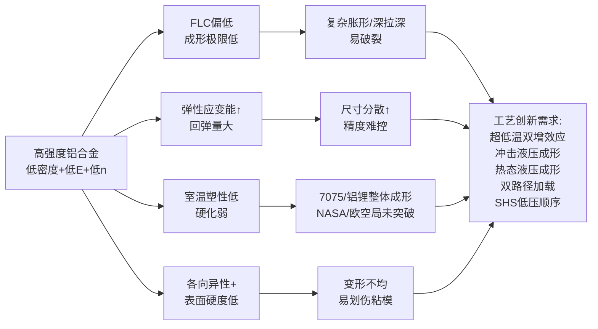

这一挑战体系定义了铝合金液压成形工艺创新的攻关方向，下节将系统讨论已取得突破的多条技术路径。

## 3.4 高强度铝合金液压成形的工艺创新路径

针对上述挑战，国内外学界与产业界发展了五条主要工艺创新路径，覆盖"超低温—室温—温热"的全温度区间与"恒压—变压—冲击"的多种加载方式。

**创新路径一：超低温成形与"双增效应"。** 这是近十年来铝合金成形领域最具变革性的技术突破。**我国学者首先发现，铝合金等面心晶体（FCC）结构金属在超低温条件下不仅未冷脆，还出现反常的延伸率与硬化指数同时提高的"双增效应"，有利于突破整体薄壁件成形的瓶颈难题**[^38]。基于这一物理机制，苑世剑院士团队建立了超低温成形变革性技术体系，将发展出**与现有冷成形、热成形并列的第三大类成形制造技术**，已在火箭储箱、大型飞机等装备研制中取得应用，目标是使我国在金属整体结构高性能制造领域处于世界领先地位[^38]。《机械工程学报》2025 年第 14 期专栏收录的相关研究系统综述了超低温双增效应的微观机制、原位测试方法、工艺与关键技术、装备与典型应用，标志着这一技术已从机理探索走向工程化应用阶段[^38]。

**创新路径二：高应变率冲击液压成形。** 中国科学院金属研究所塑性加工先进技术课题组（马彦、徐勇、张士宏等）将充液拉深与高速冲击相结合，提出新型冲击液压成形技术。**通过霍普金森拉杆实验发现，5A06 铝合金单向拉伸试件在高应变速率条件下（2.7×10³ s⁻¹）的延伸率相比于准静态条件增加了 40%；5A06 板件的冲击液压成形极限相比于准静态液压成形极限得到了大幅提高**[^45]。课题组自主研发的新型冲击液压成形专用设备最大冲击能量 200 kJ、最高冲击速度 80 m/s，最大可用于 500 mm × 500 mm × 3 mm 的铝、镁、钛等低塑性合金板材成形。该技术成功实现了航空复杂薄壁口框零件的成形，**与现有落锤生产技术相比，将传统 8 道次以上的人工辅助制造过程改变为 2 道次的自动化生产过程，无需中间工艺热处理，生产效率提高 400%**；该工艺同样适用于铝合金、铝锂合金、镁合金、钛合金等[^45]。其核心机理是：在室温条件下通过高应变率激发位错的动态增殖与晶界滑移协同，**无需热处理即可提高材料在室温条件下的塑性**，避免了热成形带来的能耗高、表面氧化、组织粗化等问题[^45]。

**创新路径三：热态液压成形。** 针对铝合金管材常温塑性不足的问题，第 1 章已引述以耐热油作为介质的温态液压成形可在 300℃、100 MPa 条件下实现铝合金和镁合金管材的成形。该技术通过加热降低材料屈服强度、提升塑性储备，同时利用流体介质保持柔性加载优势，是 6xxx 系铝合金复杂截面管件的有效工艺路径。

**创新路径四：双路径加载充液拉深。** 同样在第 1 章已引述，针对铝镁合金等低塑性板材，通过在液室压力之外增加 20–45 MPa 主动径向加压，可显著提高 5A06 铝镁合金平底筒形件的成形极限，**拉深比可达 3.1**。该技术的核心机理在于：径向主动加压增强了"摩擦保持效应"，减小了凸模圆角处板料的径向拉应力，从而抑制底部破裂。

**创新路径五：SHS 低压顺序成形对超高强铝合金的适用。** 第 1 章已引述德国 Schuler 与美国 Vari-Form 发展的 SHS 技术可比常规内高压成形降低压力约 30%，**有效避免高强材料（如 DP980 钢、AA7075 铝合金）的冲压开裂问题**。对 AA7075 这类塑性差、开裂敏感性高的超高强铝合金，SHS 通过分阶段低压顺序贴模，避免一次性高压加载诱发的应变集中，是其液压成形产业化的关键工艺支撑。

下表系统对比五条工艺创新路径的关键技术参数与适配合金：

| 工艺创新 | 技术核心 | 关键参数 | 适配合金 | 典型应用 |
|---|---|---|---|---|
| 超低温成形（双增效应）| FCC 金属超低温延伸率与硬化指数同时↑ | 液氮/液氢级超低温 | 高强铝、铝锂（2195/2099）| 火箭储箱、大型飞机薄壁件[^38] |
| 冲击液压成形 | 高应变率（2.7×10³ s⁻¹）激发动态塑性 | 200 kJ、80 m/s | 5A06、铝锂、镁、钛合金 | 飞机口框、2B06 板件，效率↑400%[^45] |
| 热态液压成形 | 耐热油介质温态加载 | 300℃、100 MPa | 6xxx 系铝合金、镁合金管材 | 复杂截面铝合金管件 |
| 双路径加载充液拉深 | 液室压力+径向主动加压 | 径向 20–45 MPa | 5A06 铝镁合金 | 平底筒形件，拉深比 3.1 |
| SHS 低压顺序成形 | 分阶段低压顺序贴模 | 压力↓30% | AA7075 等超高强铝 | 高强铝结构件，避免开裂 |

这五条路径并非彼此替代，而是构成了覆盖不同材料牌号、不同零件形状、不同生产规模的**多元化工艺矩阵**——汽车量产 6xxx 系结构件以常规室温内高压成形为主，辅以热态液压成形拓展复杂截面；7xxx 系超高强部件以挤压型材为主，板/管材液压成形依赖 SHS 低压顺序；铝锂合金大型航天薄壁件则必须借助超低温双增效应才能实现整体成形；高应变率冲击液压成形则在航空复杂小特征薄壁件中提供"无热处理、高效率、高一致性"的全新选项。

## 3.5 高强度铝合金在汽车与航空航天结构件中的典型应用

在前述合金体系、性能特征、工艺创新分析的基础上，本节系统归纳高强度铝合金液压成形在汽车与航空航天领域的典型应用谱系，并量化其减重贡献与产业定位。

**汽车领域：奥迪 ASF 空间框架的演进。** 奥迪 ASF（Audi Space Frame）是汽车工业中铝合金应用最为系统化的工程典范。该技术起源于 1982 年的"高度铝制轿车"项目，1994 年随第一代奥迪 A8（D2）首次实现量产全铝车身，车身框架重量 249 kg，铝材占比 100%[^46][^47][^43]。**第二代奥迪 A8（D3，2002）通过设计优化和大型铸件工艺，车身静态扭转刚度提升 61%，同时减重至 220 kg**[^46][^47]。**第三代奥迪 A8（D4，2010）展示了 Multi-material ASF（多材料空间框架），首次在 B 柱等关键部位引入热成型高强度钢材**——这一变化的工程逻辑是：B 柱在侧碰工况下需承受极端载荷，纯铝合金强度储备不足，必须以热成型钢替代以保障乘员舱完整性，**B 柱截面厚度从车顶到车底依次为 1.7 mm、2.0 mm、1.7 mm 和 1.5 mm，上半部确保车厢完整性，下半部减缓碰撞冲击**[^46][^47]。**第四代奥迪 A8（D5，2017）将多材料 ASF 推向新高度，车身材料构成为 58% 铝合金、40% 钢、1% 镁、1% 碳纤维（共 29 种不同级别的材料），抗扭刚度较前代提升 24%，达到 3200 N·m/度**[^46][^47]。

ASF 的制造工艺融合了铝挤压型材、压铸件、铝板与多种连接工艺——以第四代 A8 为例，采用了 14 种不同的车身制造工艺，包括点焊、激光焊（误差仅 0.1 mm）、铆接、自攻螺栓（FDS）、锁铆连接（SPR）、滚边压合、用于解决铝合金与高强钢连接难题的摩擦塞铆焊（FEW）等[^46][^47]；车顶横梁、A 柱、C 柱等部位采用挤压成型铝材，关键节点采用铝制铸件联接以强化结构强度[^47]。**铝制车身与钢板车身相比重量大约可减轻 40%，奥迪 A8 由此实现整车减重 200 kg**[^46][^36]。2016 款奥迪 A8 的 ASF 框架铝合金占比 93%，整备质量比同级别钢制车身车型轻约 220 kg；铝合金型材截面呈蜂窝状或网格状，**通过特殊工艺（如热成型、液压成型）处理后，强度能达到普通钢材的 2 倍以上**——液压成形正是 ASF 体系中铝挤压型材之外实现复杂闭口截面与曲面构件的关键工艺路径[^43]。截至 2025 年，ASF 技术已应用于奥迪 A8、A2、TT、R8 等多款车型，累计销量超过 100 万辆[^46]。

**汽车领域：前防撞梁的 7 系铝合金应用。** 领克 07 EM-P 的前防撞梁是当代高端汽车 7 系铝合金应用的典型案例——**前防撞梁采用航天级 7 系铝合金材质，截面呈日字形结构，宽度达 1332 mm，占车宽 70%，主体壁厚 5.0 mm，配合 288 mm 长的六宫格吸能盒，可有效吸收碰撞能量**[^44]。整车高强度钢及铝合金占比达 82%，其中 A 柱、B 柱及四门防撞梁区域采用四层 2000 MPa 级超高强度钢，前防撞梁则交由 7 系铝合金负责低速吸能。这种"高强钢+7 系铝"的分工设计，正是第 1 章建立的"轻量化—强度—成本"四维权衡在工程实践中的具体体现[^44]。

**汽车领域：电池包框架与门槛梁。** 新能源汽车的兴起为铝合金液压成形开辟了全新应用空间。**特斯拉铝合金电池包较钢制电池包轻 30%**，是铝合金在新能源车型上的标志性减重案例[^36]。领克 07 EM-P 进一步发展了**"4 横 4 纵"集成式框架梁的电池包外层结构，配合三叶草形状的传力路径，在正面碰撞中引导冲击力分散，避免直接冲击电芯区域；电池包内部设置三条纵向加强梁，形成 X 形防护结构**[^44]。**A 柱至 B 柱下方配置超长铝挤压门槛梁，长度覆盖整个侧围结构**——铝挤压门槛梁通过内高压成形或挤压+液压复合工艺实现复杂闭口截面，其抗弯强度与吸能效率经过多次实车碰撞测试验证[^44]。这些案例共同印证了第 1 章引述的"电动车每减重 10%，续航里程提升 6%–8%"的产业逻辑——铝合金液压成形是新能源汽车实现续航突破的关键工艺。

**汽车领域：其他结构件与覆盖件。** 在底盘纵梁、副车架、控制臂等部件上，6xxx 系铝合金（特别是 6061-T6）凭借抗拉强度 310–380 MPa 与中等延伸率成为主流选择，其内高压成形可实现复杂三维管路的一体化制造，替代传统多片冲压焊接工艺[^36]。发动机罩、车门内板等覆盖件则常用 5xxx 系（5182）或 AA6016——奥迪 A8 第四代 ASF 框架新增 AA6016 型铝合金正是用于引擎盖和尾箱盖，其焊接性和抗腐蚀能力提升 30%[^43][^36]。在汽车整体应用层面，铝锻件在汽车工业中主要应用于控制臂、转向节、悬挂部件、制动器外壳、保险杠横梁、传动轴、车轮等轻量化零件，**2024 年全球汽车用铝锻件市场规模约 1837.4 亿元**[^37]——这一数字反映了铝合金在汽车结构件中的总体产业规模，液压成形则是其中复杂闭口截面与薄壁构件的关键加工路径之一。

**航空航天领域：从蒙皮到运载火箭储箱。** 在航空领域，液压—橡皮囊成形被广泛用于飞机蒙皮、框肋、襟翼舱与副翼舱壁板等钣金件的成形（第 1 章已引述）；中国科学院金属研究所的冲击液压成形技术已成功用于 5A06 复杂薄壁口框零件与 2B06 飞机板件的 2 道次自动化成形，**无中间热处理、无人工、冲孔成形同模具一次完成**[^45]。在航天领域，**铝合金作为运载火箭、军用飞机、卫星和空间站等高端装备的主体结构材料，质量占比 50% 以上**[^38]；西南铝业锻造厂为神舟系列飞船提供了超过 60% 的关键铝材[^37]；运载火箭储箱箱底等大型椭球壳体的制造则同时依赖壳体液压成形（第 1 章已述）与高强铝/铝锂合金的超低温双增效应成形技术[^38]。中国自新世纪以来已成为世界最大的铝合金锻造大国，2021 年总生产能力约 240 kt/a，部分企业产品已通过波音、空客等航空认证并实现出口[^37]。

为系统呈现高强度铝合金液压成形在汽车与航空航天结构件中的典型应用谱系，下表归纳各部件的合金选择、工艺路径与减重效果：

| 应用领域 | 部件 | 合金牌号 | 工艺路径 | 减重/性能效果 |
|---|---|---|---|---|
| 汽车（车身）| ASF 全铝车身 | 多牌号（含 AA6016）| 铝挤压+液压+多种连接 | 较钢制减重约 40%，A8 减重 200 kg[^46][^43][^36] |
| 汽车（覆盖件）| 引擎盖、尾箱盖 | AA6016 | 板材液压/拉深 | 焊接抗蚀↑30%[^43] |
| 汽车（车门内板）| 内板、油箱 | 5182 | 板材液压成形 | 延伸率 12–20%，深拉深优势[^36] |
| 汽车（安全件）| 前防撞梁 | 航天级 7 系（7075 级）| 挤压+液压复合 | 日字形截面、壁厚 5 mm、宽 1332 mm[^44] |
| 汽车（底盘）| 防撞梁、底盘结构件 | 6061-T6 | 管材内高压成形 | 抗拉 310–380 MPa[^36] |
| 汽车（新能源）| 电池包框架 | 6xxx 系 | 挤压+液压成形 | 特斯拉较钢制↓30%[^36] |
| 汽车（侧围）| 超长铝挤压门槛梁 | 6xxx 系 | 挤压+内高压 | 覆盖整个侧围，X 形防护[^44] |
| 汽车（结构件）| 控制臂、转向节、车轮 | 6/7 系铝锻+液压 | 锻造+液压复合 | 2024 全球市场 1837.4 亿元[^37] |
| 船舶/轨道 | 船板、轨道车辆构件 | 6082-T6 | 锻造+液压 | 抗蚀+焊接性优[^41][^42] |
| 航空 | 蒙皮、口框、襟翼舱壁板 | 5A06、2B06 | 橡皮囊液压/冲击液压 | 2 道次无热处理、效率↑400%[^45] |
| 航天 | 火箭储箱、薄壁整体件 | 高强铝、铝锂（2195/2099）| 壳体液压+超低温成形 | 突破国际成形瓶颈[^38] |

**综合本章分析可以得出三条核心结论**：

**第一，高强度铝合金以密度仅为钢 1/3 的先天优势，奠定了汽车与航空航天轻量化的核心材料地位**——奥迪 A8 减重 200 kg、特斯拉电池包减重 30%、铝合金一次减重效果 30%–40%（二次减重可达 50%）、车辆减重 10% 带来 6%–8% 燃油经济性提升等数据共同验证了这一定位[^37][^46][^35][^36]。

**第二，6xxx 系（6061-T6、6082-T6、AA6016）以强度—成形性—成本—工艺兼容性的均衡平衡，成为汽车结构件液压成形的主力；7xxx 系定位高端高承载部件并常以挤压型材+液压复合形式应用；铝锂合金代表航空航天前沿，需借助超低温双增效应等变革性工艺**。这一定位与第 1 章建立的"工艺—指标—选材"框架完全契合——铝合金的成形挑战本质上是低弹性模量、低 $n$ 值、低室温塑性三个内在短板的综合体现，工艺创新的全部努力都指向**通过加载路径、温度、应变率等手段拓宽其塑性窗口**。

**第三，在产业定位上，高强度铝合金液压成形处于第 1 章四维权衡框架中的"中端"——轻量化效果显著优于高强钢但成本明显更高，工艺兼容性虽不及高强钢但远好于镁合金与钛合金**，因此适合"高端轻量化部件"与"新能源汽车结构件"这两类核心应用场景。后续第 4 章将分析比铝合金密度更低但室温塑性更差的镁合金，第 5 章将分析强度更高但成本与加工难度同步飙升的钛合金，最终在第 6 章完成四类材料的横向比较与选材决策框架的构建。

需要说明的是，本章涉及的部分细节（如 6082-T6 在特定工艺下抗拉强度可达 420 MPa）在不同来源间存在差异——6082 退火态 ≥205 MPa、T6 态 ≥245 MPa 是基础数据，420 MPa 系经搅拌摩擦增材制造（FSAM）配合 550℃ 固溶 + 175℃ 时效优化工艺后的极限值[^41][^42]，工程应用中应以具体工艺路径下的实测数据为准；此外，对于超低温成形技术的工业化进展，本章主要依据《机械工程学报》2025 年专栏综述，更具体的零件验证数据有待该专栏论文进一步公开。

# 4 镁合金在液压成形中的应用分析

承接第 2 章对高强度钢、第 3 章对高强度铝合金的分析逻辑，本章聚焦四类核心材料中**密度最低**的镁合金。作为目前工程应用中最轻的金属结构材料——密度仅 1.74 g/cm³，约为铝合金的 2/3、钢的 1/4[^48][^49][^50]——镁合金被誉为"21 世纪的绿色工程材料"[^51][^50]，在新能源汽车续航焦虑、双碳目标硬约束以及笔电轻薄化需求三重驱动下，正经历着从"方向盘骨架、仪表盘骨架等内饰小件"向"电池托盘、电驱壳体、后车体等主承力结构件"的应用边界跃升[^48][^49]。然而，**密排六方（HCP）晶体结构在室温下仅能提供有限的滑移系**，使镁合金的塑性成形能力远逊于面心立方的铝合金与体心立方的高强钢，常规室温液压成形几乎不可行，必须借助温热成形、织构调控、半固态注射等特殊工艺路径才能释放其轻量化潜力[^52][^53][^54]。本章沿用前两章建立的"合金体系—性能特征—成形挑战—工艺创新—工程应用"五维分析框架，系统揭示镁合金液压成形的内在矛盾与突破路径，为第 6 章四类材料横向比较提供"镁合金一侧"的支撑论据。

## 4.1 镁合金的合金体系与典型牌号特征

镁合金按成形工艺路径可分为**铸造镁合金**与**变形镁合金**两大体系[^54][^50]。铸造镁合金主要通过砂型铸造、永久型铸造、熔模铸造、压铸等工艺获得，**压铸是最成熟、应用最广的技术，目前 90% 以上的镁合金产品是压铸成形的**[^50]；变形镁合金则需在 200–400℃ 温度范围内通过挤压、轧制、锻造等热成形工艺加工，相比铸造镁合金具有更优的力学性能，**室温抗拉强度可达 500–550 MPa、延伸率超过 10%**[^54]。液压成形作为变形加工的一类，其使用的板/管/棒坯料绝大多数来自变形镁合金体系；而部分以"压铸+液压复合"或半固态注射成型为主的工程应用（如仪表板横梁、笔电外壳）则衔接铸造镁合金体系，本章将在 4.5 节统一讨论。

**Mg-Al-Zn 系（AZ 系列）** 是变形镁合金中最主流的合金家族，也是当前液压成形研究与应用的主力。**AZ31B** 含 Al 约 3%、Zn 约 1%，是板材液压胀形与冲压成形的主流牌号——其平行于板材轧制方向时的抗拉强度为 227 MPa、屈服强度为 175 MPa、硬度 71.12 HV[^55]；密度 1.74 g/cm³、屈服强度 125 MPa、抗拉强度 248 MPa 是另一组常被引用的基线力学参数[^56]。AZ31B 适用于挤压（200–450℃、0.5–30 m/min）与温轧成形[^54]，是热油恒温液压成形与温态内高压成形的核心研究对象[^53][^57]。**AZ61** 含 Al 约 6%、Zn 约 1%，强度更高、塑性略低，主要用于挤压/锻造高强件——湖南大学滕杰团队通过连续扩展挤压成形（CEEF）工艺，使 AZ61 晶粒细化至 9±0.5 μm，并实现织构由强基面织构向纤维织构转变[^58]。**AM60B** 含 Al 约 6%、Mn 约 0.3%，因塑性与韧性兼优、压铸性能好，成为汽车座椅骨架与备用轮胎载体等压铸件的首选——长安汽车采用压铸 AM60B 替代原型钢结构座椅骨架，**减重 26.7%**[^56]；万丰镁瑞丁则将其用于特斯拉吉普牧马人镁注射成型备用轮胎载体[^59]。

**稀土与微合金化系列**通过添加 Y、Ca、Zn、Sn 等元素实现织构弱化与塑性提升。吉林大学研究人员制备的 **Mg-1Zn-1Sn-0.3Y-0.2Ca（ZTWX1100）** 合金，通过 300℃×10 min 预热+单道次 70% 压下率轧制+350℃×30 min 退火，获得**基面随机异质（BRH）织构**，最终实现均匀伸长率 19.6%、抗拉强度 255 MPa 的优异综合性能[^60]。其物理机制是：BRH 织构样品中基面取向晶粒与随机取向晶粒以约 7:3 比例共存，**基面—随机晶界（GBs）在适应高局部应力和提高延展性方面发挥重要作用**——拉伸过程中位错在晶界附近堆积形成高应变梯度，临界应变达到后激活相邻晶粒的非基面滑移，从而将局部应力主要载体从随机取向晶粒转变为基面取向晶粒，显著提升塑性[^60]。此外，**Mg-Al-Zn-Ca 系高强耐蚀镁合金**抗拉强度 >300 MPa、耐腐蚀速率 <0.05 mm/a，被东风汽车联合上海交大用于 20 寸级镁合金半固态注射成型轮毂[^59]。其他重要变形镁合金体系还包括 Mg-Mn 系（MB1、MB5）、Mg-Li 系（LA141）等[^54]。

下表归纳了几类主流液压成形相关镁合金牌号的关键力学性能基线与产业定位：

| 系列 | 典型牌号 | 抗拉强度 (MPa) | 屈服强度 (MPa) | 延伸率/特征 | 液压成形相关产业定位 |
|---|---|---|---|---|---|
| Mg-Al-Zn | AZ31B | 227–248 | 125–175 | 板材液压胀形主力 | 板/管温态液压、热油恒温成形[^55][^53][^57][^56] |
| Mg-Al-Zn | AZ61 | 高（CEEF 后细晶）| — | 晶粒 9 μm、纤维织构 | 挤压/锻造高强件、坯料预处理[^58] |
| Mg-Al-Mn | AM60B | — | — | 韧塑兼优、压铸优 | 座椅骨架、备用轮胎载体[^56][^59] |
| 微合金化 | ZTWX1100（Mg-1Zn-1Sn-0.3Y-0.2Ca）| 255 | — | 均匀伸长率 19.6% | BRH 织构高塑性板料[^60] |
| 高强耐蚀 | Mg-Al-Zn-Ca | >300 | — | 耐腐蚀速率 <0.05 mm/a | 半固态注射轮毂[^59] |
| 变形镁合金通用 | AZ91D、AM50、AM60 等 | 可达 500–550 | — | 延伸率 >10% | 压铸件回收再制[^54][^50] |

从产业定位看，**AZ31B 是板材液压胀形的主力，AZ61 主要服务于挤压/锻造高强件的坯料制备，AM60B 则在压铸+液压复合工艺路径中占据核心地位；稀土与微合金化新牌号代表了未来通过织构调控突破镁合金成形性瓶颈的发展方向**。

## 4.2 镁合金的关键力学性能与液压成形相关性

以第 1 章建立的成形性能指标体系审视镁合金，可以将其量化为**一组突出优势与一组先天短板**的并存。

**优势指标**首先是**密度与比强度**。镁合金密度 1.74 g/cm³，**相当于铝的 2/3、钢的 1/4**[^48][^49][^50]；在相同体积下，**镁合金零部件重量仅为铝合金的 64%，理论减重比例稳定在 30%–35% 区间**[^48][^49]。**笔电领域常用对比为镁合金比铝合金轻 36%、比锌合金轻 73%、仅为钢的 1/4 左右**[^51]。在同等刚性条件下，**1 kg 镁合金的坚固度等于 18 kg 铝和 2.1 kg 钢**[^50]。

其次是**阻尼与抗冲击性能**。镁有极好的滞弹吸震性能，**在相同载荷下，其减振性是铝的 100 倍、钛合金的 300–500 倍，抗冲击性是塑料的 20 倍**[^50]；用于设备机壳可减少噪音传递、提高防冲击与防凹陷能力，这一特性是仪表板横梁选用镁合金能"NVH 性能优于原钢制 CCB"的根本物理基础[^61][^62]。**电磁屏蔽性能**则使其在通讯器材、笔电外壳中具有独特价值[^54][^51]。**切削加工性**优良，能接受较高切削速度、表面光洁度优良、极少出现积屑瘤、可免冷却液润滑液[^50]，这对后续机加工与表面处理工序具有直接价值。**再生性**方面，废旧镁合金铸件可再熔化作为 AZ91D、AM50 或 AM60 的二次材料铸造，符合环保要求[^50]。

**短板指标**则源于 **HCP 密排六方晶体结构的低对称性**。**基面滑移和柱面滑移只可以提供四个独立滑移系，无法满足多晶均匀塑性变形（Von Mises 准则要求 5 个独立滑移系），在室温下镁合金延展性低和成形性能差**[^52]。在传统轧制或挤压过程中会形成强烈的基面织构，进一步加剧了镁及其合金的低成形性[^60]。具体表现为以下五类力学行为短板：

- **强基面织构与各向异性**：基面织构导致镁合金板材在面内出现明显的塑性各向异性，引发深拉深时的制耳现象[^52]；
- **拉压非对称性**：孪晶变形机制的极性导致镁合金沿不同加载方向呈现不同的屈服与硬化行为，轧制板材厚向呈强各向异性[^52]；
- **S 型应力—应变曲线**：在室温循环加载下，孪生与退孪生主导变形机制，导致典型的"S"型应力—应变曲线，加载路径相关性极强[^52]；
- **包申格效应与瞬时硬化/永久软化**：变路径加载（如 T-C-T、C-T-C）下，二次拉伸的屈服强度从一次加载方向到正交方向逐渐减小[^52]；
- **变形机制 CRSS 差异**：基面滑移、柱面滑移、锥面滑移与拉伸/压缩孪晶的临界分解剪应力（CRSS）差异极大，在特定加载方向，变形机制的开动可通过加载方向与晶粒 c 轴的角度判断[^52]。

**温度对力学性能的显著影响**是镁合金成形性最关键的工艺杠杆。在 100、150、200、250、300、350℃ 下对 AZ31B 镁合金的温态拉伸实验表明，**随着温度升高，屈服强度和抗拉强度降低、伸长率增加、塑性变形能力有明显的增加**[^63]。其物理机理在于：温度升高激活了原本在室温下不易开动的非基面滑移系（柱面滑移、锥面滑移）以及动态再结晶机制，使有效独立滑移系数量从 4 个增加至 5 个以上，从而满足多晶均匀塑性变形条件。**综合实际生产、能源降耗、模具的耐高温情况，250℃ 为镁合金管件温态内高压成形的最佳成形温度**[^63]；AZ31B 板材热油恒温成形则确定 200℃ 为最佳成形温度[^57]。

**胀形系数与成形速度的相关性**亦体现镁合金温度—速度敏感性。第 1 章已引述：AZ31B 镁合金板料的胀形实验表明，成形速度较低时胀形系数较大，这正是镁合金需要温热低速成形的重要依据。镁合金对变形速度极为敏感，因而变形速度不能太大[^54]。

下表归纳镁合金在液压成形相关性能维度上相对铝合金、钢的定位：

| 性能维度 | 镁合金 | 铝合金 | 钢 |
|---|---|---|---|
| 密度 (g/cm³) | **1.74**[^48] | 2.7 | 7.85 |
| 减重潜力 | **30%–35%**（对铝）[^48] | 40%–50%（对钢） | 基准 |
| 阻尼性能 | **优**（铝的 100 倍）[^50] | 中 | 低 |
| 电磁屏蔽 | **优**[^54] | 中 | 差 |
| 室温塑性 | **差**（HCP 4 个滑移系）[^52] | 中（FCC）| 优（BCC）|
| 各向异性 | **强**（基面织构、拉压非对称）[^52] | 中 | 弱 |
| 温度敏感性 | **极高**（250℃ 为最佳）[^63] | 中 | 低 |
| 适宜液压成形温度 | 200–250℃[^63][^57] | 室温或 300℃ | 室温 |

可以看到，**镁合金的"密度最优、阻尼最优、电磁屏蔽最优"与"室温塑性最差、各向异性最强、温度敏感性最高"三组矛盾，共同定义了其液压成形的工艺设计哲学——必须以温度作为核心调控变量，以低速变形与精确加载路径作为补充手段，在塑性窗口打开后才能释放其轻量化与功能性优势**。

## 4.3 镁合金液压成形的核心工艺挑战

基于上述材料特性分析，可将镁合金液压成形面临的工艺挑战归纳为四类核心矛盾。

**挑战一：室温塑性极低，高应力下易开裂。** AZ31B 镁合金"存在室温下塑性较差，高应力状态下容易开裂的问题"[^55]；AZ61 镁合金同样"塑性变形能力较低，在传统的塑性成形方法（如锻压、轧制、挤压等）中难以像一些塑性良好的金属那样容易成型，容易出现拉伸变形不均匀等问题"[^64]。镁合金常温下锻造很易脆裂[^54]，常规室温液压成形几乎不可行——这与第 3 章铝合金"室温塑性受限但仍可成形"形成鲜明对比，本质差异在于 HCP 结构 vs. FCC 结构的滑移系数量不足。

**挑战二：基面织构与各向异性导致变形不均、壁厚分布失衡。** 长安大学李新迪团队针对 AZ31B 镁合金航空航天用脚蹬液压胀形的有限元模型分析表明，**随着胀形时间的增加，零件最大应力所在区域从拉伸侧面及法兰区域圆角处逐渐转移至零件顶端；毛坯材料转移从凹模圆角部分逐渐向侧壁扩散，最终在零件顶端倒角处减薄率达到最大值 18%**[^55]。这一数据直接印证了镁合金液压成形中"局部减薄过大、易诱发破裂"的典型失效模式。东北大学余犇等针对 AZ31 镁合金薄板热油恒温成形的研究同样指出，需"通过调整薄板尺寸、模具 R 角、压边力及摩擦系数等工艺参数，以降低成形件的底部减薄率，减少破裂倾向，提高镁合金的成形性能"[^57]。此外，**织构诱发的各向异性行为仍严重制约镁合金后续塑性加工，如制耳现象**[^52]。

**挑战三：温度—速度成形窗口狭窄，工艺参数协同要求高。** 温度过低塑性不足、过高易氧化与晶粒粗大[^54]，而镁合金对变形速度极为敏感[^54]，要求工艺参数精细化协同。镁合金锻造温度范围较窄；**镁合金导热系数较大（约 80 W/m·K，约为钢的 2 倍），锻造时接触模具后降温很快，塑性降低，变形抗力增加，充填性能下降**[^54]——这一物理特性在液压成形中同样存在，意味着模具必须预热（一般 200–300℃[^54]）以维持坯料温度均匀，而热油恒温成形等工艺创新正是针对这一矛盾发展而来[^57]。

**挑战四：起皱与破裂耦合，材料流动控制难度大。** 李新迪团队的研究进一步揭示，**胀形过程中毛坯侧壁起皱的原因为棱边转角及圆角处的速度低于直边部分的速度**[^55]——这一发现指出了镁合金液压胀形中"流动不均诱发起皱、减薄过大诱发破裂"的双重耦合失效机制：流动慢的区域因压应力累积发生起皱，流动快的区域则因拉应力集中导致过度减薄甚至破裂，二者必须通过毛坯形状、压边力、压边间隙的协同优化实现平衡。

此外，**制造工程层面**还面临镁合金防护困难、模具预热要求高、坯料与模具接触面积大易产生裂纹等难题[^54]，传统镁合金高压压铸还易出现开裂、组织不均匀、缩松、气孔等缺陷[^62]。

为直观呈现上述挑战体系及其内在关联，可用如下因果关系图概括：

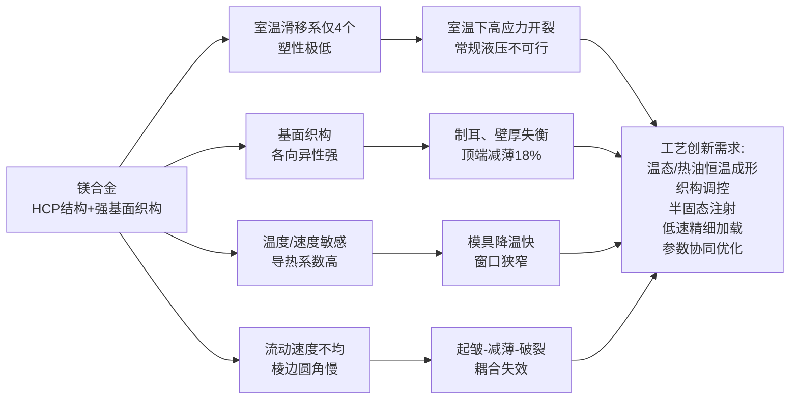

这一挑战体系直接定义了下一节将系统讨论的工艺创新路径。

## 4.4 镁合金液压成形的工艺创新路径

针对上述挑战，国内外学界与产业界发展了五条主要工艺创新路径，共同构成镁合金液压成形的工艺矩阵。

**创新路径一：温态/热油恒温液压成形。** 这是镁合金液压成形最基础也最关键的工艺创新。山东建筑大学王鑫松等针对 AZ31B 镁合金异型管温态内高压成形的研究表明，**在 250℃ 条件下通过不断优化工艺参数，得到最优效果，很好地实现了管件的轻量化**；250℃ 兼顾性能、能耗与模具耐高温情况，被确定为最佳成形温度[^63]。东北大学余犇、王冬晓、李建平等基于 Dynaform 模拟软件和**热油恒温成形设备**，对 AZ31 镁合金薄板进行数值模拟与实验研究，最终确定**成形温度 200℃、模具 R 角 16 mm、薄板直径 80 mm**，并通过调整合适的压边力和摩擦系数，可获得最佳工艺窗口；微观组织分析表明，靠近成形件底部，晶粒及第二相尺寸逐渐减小并趋于均匀化[^57]。热油作为成形介质的核心优势在于**温度分布均匀**——AIP Conference Proceedings 收录的研究指出，以低熔点合金作为成形介质的镁合金薄板温态液压成形过程中，**工件温度几乎均匀且几乎与成形介质温度相同**[^53]，这一温度均匀性对镁合金狭窄温度窗口下的稳定成形至关重要。

**创新路径二：工艺参数有限元优化。** 长安大学李新迪团队针对 AZ31B 镁合金航空航天用脚蹬液压胀形的数值模拟研究，建立了基于 AZ31B 镁合金的有限元模型，通过 Dynaform 系统性探索了液室压力、压边力、压边间隙、毛坯形状对成形质量的影响规律。**结果表明，在液室压力 15 MPa、压边力 130 kN、压边间隙值 1.15 mm 时，采用 Dynaform 排样毛坯可制得壁厚均匀、成型质量较好的航空航天用脚蹬**[^55]。研究还开展了六种不同形状毛坯的对比数值模拟，综合分析了边界变化规律与材料流动速度，揭示了"棱边转角及圆角处速度低于直边部分速度诱发侧壁起皱"的流动机理[^55]——这一机理为通过毛坯排样优化抑制起皱提供了直接依据。

**创新路径三：织构调控与晶粒细化。** 镁合金成形性能的根本提升必须从微观织构入手。**Mg 织构弱化可以通过精细的成分设计或采用剧烈塑性变形的方法来实现，如等通道角挤压、非对称轧制和多道次轧制**[^60]。中南大学肖静团队针对热挤压态 AZ61 镁合金，采用单向同步与异步冷轧法制备板材，选取单向异步、双向异步、单向翻转异步、双向翻转异步四种异步轧制路径，**结果表明 350℃ 退火后单向翻转异步轧制和双向翻转异步轧制下晶粒均匀细小，与同步冷轧—退火工艺相比，异步冷轧—退火工艺有利于板材的晶粒细化和基面织构弱化**[^65]；研究进一步发现，**单向同步冷轧 AZ31B（应为 AZ61）在变形量 15%、350℃ 退火时织构各向异性较弱，断裂延伸率较高**[^65]。吉林大学的 ZTWX1100 合金通过 300℃×10 min 预热+单道次 70% 压下率轧制+350℃×30 min 退火获得 BRH 织构，**最终显示出优异的力学性能（均匀伸长率 19.6%，抗拉强度 255 MPa）**[^60]。这些织构调控路径为后续液压成形提供了塑性更优、各向异性更弱的高品质坯料。

**创新路径四：半固态注射成型与连续扩展挤压。** 这两类工艺虽不直接等同于液压成形，但作为镁合金大型复杂构件的关键成形与坯料制备路径，与液压成形形成互补与衔接。**半固态注射成型**通过精准控制镁合金在固液两相区（**固相率 30%–70%**）的流变成形，使材料在低粘度、高固相率状态下实现均匀充型，**显著降低气孔率（<1.5%）并提升致密度（>98%），同时突破单件重量限制（当前最大注射量达 17 kg）**[^59]。东风汽车联合上海交大开发的 20 寸级镁合金半固态注射成型轮毂，采用 MTX3000D 二板式注射成型机的双阶压射控制技术（**低速充型 1 m/s → 高速压射 5 m/s**），实现了复杂轮辐结构的近净成型[^59]。上汽集团第二代镁合金电驱壳体采用触变注射成型工艺，通过实时监测半固态浆料的固相率（**控制在 45±5%**），利用 3200T 设备的伺服液压闭环控制系统，实现充型压力动态调整（**峰值 120 MPa**），**致密度提升 35%，功率密度达 4.4 kW/kg**[^59]。**连续扩展挤压成形（CEEF）** 则通过控制变形温度、应变速率和应力状态，促进镁合金的动态再结晶（DRX）——湖南大学滕杰团队针对 AZ61 镁合金的研究表明，CEEF 工艺使**晶粒尺寸达到 9±0.5 μm，且呈现均匀分布**，合金织构由强基面织构逐渐向纤维织构转变；**较高的应变速率与温度变化促进了 <10-10> & <11-20> 双纤维织构的形成，从而进一步增强了塑性**——这正是通过"激活非基面滑移系统"释放镁合金塑性的关键机制[^58]。

**创新路径五：冲击液压成形对镁合金的适用。** 第 3 章已引述中国科学院金属研究所张士宏团队的冲击液压成形设备最大冲击能量 200 kJ、最高冲击速度 80 m/s，**最大可用于 500 mm × 500 mm × 3 mm 的铝、镁、钛等低塑性合金板材成形**——其核心机理是借助高应变率激发位错动态增殖与晶界滑移协同，无需热处理即可提高材料室温塑性，**与铝、钛合金共用工艺装备实现 2 道次无热处理高效成形**。

下表系统对比五条工艺创新路径的关键技术参数与适配场景：

| 工艺创新 | 技术核心 | 关键参数 | 适配牌号 | 典型应用 |
|---|---|---|---|---|
| 温态/热油恒温液压成形 | 耐热油均温介质 | 200–250℃、热油恒温[^63][^53][^57] | AZ31B 板/管 | 异型管轻量化、薄板复杂件 |
| 工艺参数有限元优化 | Dynaform 仿真+毛坯排样 | 15 MPa、130 kN、1.15 mm、R 角 16 mm[^55][^57] | AZ31B | 航空航天脚蹬、复杂胀形 |
| 织构调控与晶粒细化 | 异步轧制+退火+稀土合金化 | 70% 压下率、300–350℃ 退火[^60][^65] | AZ31B/AZ61/ZTWX1100 | 高塑性坯料制备 |
| 半固态注射成型 | 固相率 45±5%、双阶压射 | 注射量 17 kg、致密度 >98%[^59] | Mg-Al-Zn-Ca、AM60B | 轮毂、电驱壳体、CCB、备胎载体 |
| 连续扩展挤压（CEEF）| 动态再结晶+非基面滑移激活 | 晶粒 9 μm、纤维织构[^58] | AZ61 | 高塑性坯料预处理 |
| 冲击液压成形 | 高应变率激发动态塑性 | 200 kJ、80 m/s | 低塑性合金板材 | 复杂薄壁件 2 道次成形 |

这五条路径并非独立替代，而是构成"从坯料制备到最终成形"的完整工艺链——织构调控与 CEEF 解决坯料塑性问题，温态/热油液压成形与有限元参数优化实现稳定的板/管成形，半固态注射与冲击液压成形则覆盖大型压铸件与小批量复杂件两类极端场景。

## 4.5 镁合金液压成形在汽车与消费电子结构件中的典型应用

在前述合金体系、性能特征、工艺创新分析的基础上，本节系统呈现镁合金液压（含半固态、压铸+液压复合）成形的工程应用谱系，并量化其减重贡献与产业定位。

**应用一：仪表板横梁（CCB）——镁合金"以镁为翼"的标志性应用。** 仪表板横梁是汽车 CCB 轻量化替代路径的代表，经历了"第一代钢制 → 第二代铝合金型材焊接 → 第三代镁合金一体压铸"的三代材料革命[^62]。镁合金 CCB 主要通过压铸工艺成型，**零件集成化程度高、尺寸稳定、设计自由度大，整体压铸成型使尺寸精度控制在 0.5 mm 以内，能有效解决目前钢和铝合金 CCB 安装过程中的干涉和异响问题**[^61]。具体工程案例包括：**ChoJR 基于通用 G-Van 车型开发的 1 种铸造镁合金 CCB，总质量 12 kg，比钢制 CCB 减重了 6 kg**，碰撞安全性和振动问题得到改善，同时提高了 CCB 的表面质量和尺寸精度[^61]；**范军锋等开发的镁合金 CCB 样件比钢制 CCB 减重 60%**，在保证性能不低于钢制 CCB 的同时 NVH 性能优于原钢制 CCB[^61]；**五菱工业镁合金半固态压铸 CCB 试制成功，长度超过 1.5 米，单次镁合金注射量超过 8 kg，成品重量仅 4.6 kg**——通过半固态压铸工艺攻克了传统镁合金高压压铸易开裂、组织不均匀的难题，使材料在低粘度、高固相率状态下实现均匀充型，**显著降低气孔率（<1.5%）、提升致密度（>98%）、抗拉强度较传统工艺提高 10%–20%、耐疲劳寿命延长、耐腐蚀性能优于传统高压铸造**[^62]；**通过一体化压铸工艺在满足强度、刚度、NVH 等要求下实现高达 50% 的减重目标，整车转向系统模态超过 40 Hz，有效避开共振区间**[^62]。

**应用二：座椅骨架——基于 AM60B 与 AZ31B 的国内外典型案例。** 汽车座椅重量占整车重量的 6%，而座椅骨架又占据座椅重量的 60% 以上[^56]。国内外车企的镁合金座椅骨架应用案例包括：**福特汽车公司用镁合金生产座椅骨架取代钢制骨架，使座椅质量降低至 25%；日本丰田公司使用镁合金座椅骨架，质量减轻 40%；韩国现代汽车使用镁合金，质量减小 50%；长安汽车使用压铸 AM60B 替代原型钢结构座椅骨架，减重 26.7%；捷豹 F-TYPE SVR 换装全新轻量纤型镁合金座椅，座椅框架由镁合金压铸而成，与上代车型相比，这款座椅减重逾 8 公斤；重庆博奥研发的镁合金座椅骨架在国内乘用车已经实现批量生产，先后形成二十余项专利和一项团体标准**[^56]。基于 AZ31B 镁合金材料特性（密度 1.74 g/cm³、屈服强度 125 MPa、抗拉强度 248 MPa）的乘用车镁合金座椅骨架，**以轻量化为目标（减重 30% 以上），可较传统钢材减重约 40%**[^56]；按 2024 年乘用车产量约 2700 万辆测算，若全部采用镁合金座椅骨架，**总替代重量为 35.1 万吨，市场规模为 432 亿元（按 1600 元/辆计）至 545.4 亿元（考虑高端车型占比 30%、单车价值 3000 元）**[^56]。

**应用三：新能源汽车主承力件——从内饰小件到一体压铸后车体。** 新能源汽车的镁合金应用已**从早期的方向盘骨架、仪表盘骨架等内饰小件，逐步拓展到电池托盘、电驱壳体等三电系统重要组成部分乃至后车体等主承力结构件，实现了从小件到大件、从"辅助件"到"主承力件"的跨越**[^48][^49]。代表性工程案例包括：**赛力斯问界系列车型的单车镁合金零件应用数量已超过 10 件，单车用量达到 20 公斤级**[^48][^49]；**赛力斯在 2025 年发布了一体压铸镁合金后车体，将原本 87 个零件集成为一个单一铸件，与铝合金版本相比，减重幅度高达 21.8%**[^48][^49]；比亚迪已在车内应用了镁合金管梁、结构支架等部件，并明确表示后续会有更多镁合金产品应用提升整车轻量化水平[^48][^49]；**宝马早在 2016 年推出的 BMW G30 5 系列车型中，已将镁材料应用于仪表板结构件**[^48][^49]；江淮汽车与华为联合打造的尊界 S800 上应用了镁合金件，包括部分小的电子产品外壳以及电驱桥[^49]；**上汽集团第二代镁合金电驱壳体采用触变注射成型工艺，致密度提升 35%、功率密度达 4.4 kW/kg、与铝合金壳体相比导热系数提升 15%（达 150 W/m·K）、成本降低 40%**，搭载于智己 L7 车型后**预计续航提升 5%–8%**[^59]。**整车每减重 10%，续航里程可增加 5%–8%，百公里电耗下降 5%–6%**[^48][^49]，这是镁代铝浪潮的核心产业逻辑。

**应用四：航空航天与国防——镁合金的高端轻量化应用。** 长安大学李新迪团队针对 **AZ31B 镁合金航空航天用脚蹬**的液压胀形数值模拟研究，确定了液室压力 15 MPa、压边力 130 kN、压边间隙 1.15 mm 的最优工艺参数[^55]；**变形镁合金在航空领域用于制造导弹壳体、发动机导管等部件**[^54]；**湖南镁宇科技开发的新型中强耐热镁合金已应用于陆航装置主承力结构件，实现减重 25%**[^54]；中铝轻研通过半连续铸造制备 ϕ700×3000 mm 大尺寸铸锭，并优化锻造工艺开发出 ϕ2550×120 mm 镁合金大锻板，应用于航空航天减重需求[^54]。

**应用五：消费电子——超薄镁合金笔电外壳。** 笔记本电脑的轻薄化是镁合金"21 世纪的绿色工程材料"定位最直接的应用体现。**轻薄笔电整机重量基本是 1000 g 以下，结构件产品主肉厚都在 0.5–0.6 mm，传统压铸工艺已不能满足要求，因此笔电镁合金薄壁件加工主要采用半固态射出成型，及少量的冲压成型**[^51][^50]。代表性产品与供应商包括：**华为 MateBook X Pro 2023 微绒典藏版采用航空级镁合金材质**[^51]；**可成科技以铝合金压铸件起家，于 1988 年开始研究镁合金压铸技术，1994 年与台湾地区笔电品牌大厂合作开发笔电镁合金压铸件，客户包含 Apple、Dell、HP、Acer、联想等**[^51]；**胜利精密通过超薄镁铝合金工艺打造的 D 件镁铝机壳最薄可达 0.5 mm**[^51]；**春秋电子的镁板 3D 热辅冲压笔记本后盖是金牌产品**[^51]；**宜安科技拥有 27 寸的大型镁合金件壁厚 1.2 mm 和 14 寸笔记本电脑外壳壁厚 0.45 mm 的量产实绩**[^51]。

下表系统归纳镁合金液压（含半固态、压铸+液压复合）成形的工程应用谱系：

| 应用领域 | 部件 | 牌号/工艺 | 减重/性能效果 |
|---|---|---|---|
| 汽车—仪表板横梁 | 通用 G-Van CCB | 铸造镁合金 | 12 kg，较钢↓6 kg[^61] |
| 汽车—仪表板横梁 | 范军锋等开发 CCB | 镁合金压铸 | 较钢↓60%，NVH 优于钢[^61] |
| 汽车—仪表板横梁 | 五菱工业 CCB | 半固态压铸 | 1.5 m、4.6 kg、气孔率<1.5%、致密度>98%、抗拉↑10%–20%[^62] |
| 汽车—座椅骨架 | 福特/丰田/现代 | 镁合金压铸 | 减重 25%/40%/50%[^56] |
| 汽车—座椅骨架 | 长安 | AM60B 压铸 | 减重 26.7%[^56] |
| 汽车—座椅骨架 | 捷豹 F-TYPE SVR | 镁合金压铸 | ↓>8 kg、椅背后移↑50 mm[^56] |
| 汽车—座椅骨架 | 通用 AZ31B 设计 | 屈服 125 MPa | ↓40%，潜在市场 432–545 亿元[^56] |
| 汽车—主承力件 | 赛力斯问界后车体 | 一体压铸 | 87 件集成 1 件、较铝↓21.8%、单车 20 kg 级[^48][^49] |
| 汽车—结构支架 | 比亚迪管梁/支架 | 镁合金 | 持续扩大应用[^48][^49] |
| 汽车—三电系统 | 上汽电驱壳体 | 触变注射 | 致密度↑35%、功率密度 4.4 kW/kg、成本↓40%、续航↑5–8%[^59] |
| 汽车—轮毂 | 东风 20 寸轮毂 | 半固态注射 | 较铝↓35%（单件↓4.2 kg）、续航↑2–3%、材料利用率 65%→85%[^59] |
| 汽车—备胎载体 | 万丰特斯拉吉普 | AM60B 半固态 | 抗拉>250 MPa、延伸率>8%[^59] |
| 跨国—仪表板结构 | BMW G30 5 系 | 镁合金 | 2016 年量产应用[^48][^49] |
| 航空航天—脚蹬 | AZ31B 液压胀形 | 温态液压 | 减薄率 18%、液室 15 MPa[^55] |
| 航空航天—结构件 | 湖南镁宇陆航装置 | 中强耐热镁 | 减重 25%[^54] |
| 航空航天—锻板 | 中铝 ϕ2550×120 mm | 半连续铸造+锻造 | 大尺寸航空减重[^54] |
| 消费电子—笔电 | 华为 MateBook X Pro | 航空级镁合金 | 微绒典藏版[^51] |
| 消费电子—笔电 | 宜安科技 14 寸壳 | 镁合金压铸 | 壁厚 0.45 mm[^51] |
| 消费电子—笔电 | 胜利精密 D 件 | 超薄镁铝合金 | 壁厚 0.5 mm[^51] |
| 消费电子—笔电 | 春秋电子后盖 | 镁板 3D 热辅冲压 | 极致轻薄[^51] |

**综合本章分析可以得出三条核心结论**：

**第一，镁合金以 1.74 g/cm³ 的最低密度奠定了"轻量化最优"的核心材料地位**——较铝合金减重 30%–35%、较钢减重约 75%（同等刚性下 1 kg 镁等效 18 kg 铝、2.1 kg 钢），叠加阻尼性能（铝的 100 倍、钛的 300–500 倍）、电磁屏蔽、再生性等独特优势，使其在汽车 CCB、座椅骨架、新能源主承力件、笔电外壳等场景中具有不可替代的产业价值。**赛力斯问界 20 kg 级单车用量、一体压铸后车体集成 87 件减重 21.8%、长安 AM60B 座椅减重 26.7%、五菱半固态 CCB 重量仅 4.6 kg** 等工程案例共同验证了这一定位。

**第二，HCP 结构的滑移系不足是镁合金液压成形所有挑战的根源**——室温塑性差、基面织构强、各向异性显著、温度敏感性高、流动速度不均诱发起皱与破裂耦合，这些短板共同决定了镁合金液压成形必须建立**"以温度为核心调控变量、以织构调控为坯料保障、以参数协同优化为工艺手段"** 的工艺哲学。温态/热油恒温液压成形（200–250℃）、有限元参数优化（液室 15 MPa、压边力 130 kN、模具 R 角 16 mm）、异步冷轧织构调控、稀土微合金化（ZTWX1100 均匀伸长率 19.6%）、半固态注射（致密度>98%、气孔率<1.5%）与连续扩展挤压（晶粒 9 μm）等多元化工艺路径，共同构成了释放镁合金轻量化潜力的完整工艺矩阵。

**第三，在第 1 章四维权衡框架中，镁合金处于"轻量化最优、力学性能中等、成本中高、工艺兼容性差"的位置**——其工艺兼容性受限于必须的温度控制与狭窄工艺窗口，成本受限于稀土合金化与专用半固态/温态设备投资，但在对"减振降噪""电磁屏蔽""极致轻量化"有特殊要求的细分场景中具有不可替代性。这一定位决定了镁合金的产业角色不是"全面替代铝合金"，而是"在三电壳体、CCB、座椅骨架、笔电外壳等阻尼/减重综合要求最严的部位实现镁代铝、镁代钢"，与第 3 章铝合金"中端主流"形成互补。

需要说明的是，本章引用的部分数据（如"福特镁合金座椅质量降低至 25%"与"较钢减重 40%"在不同来源间存在表述差异）反映了行业内不同减重统计口径的差异，工程应用中应以具体车型、具体部件、具体对照基准下的实测数据为准；此外，关于半固态注射成型与液压成形的工艺边界——本章按照"塑性成形+流体介质压力调控"的广义液压成形框架将其纳入讨论，与狭义的"管材内高压成形/板材充液拉深"存在工艺差异，但在工程实践中二者已形成"半固态注射制备坯件→温态液压成形最终件"的衔接链条，故统一呈现以反映镁合金成形的完整工程生态。第 5 章将分析强度更高但成本与加工难度同步飙升的钛合金，最终在第 6 章完成四类材料的横向比较与选材决策框架的构建。

# 5 钛合金在液压成形中的应用分析

承接第 2、3、4 章对高强度钢、高强度铝合金、镁合金的系统分析，本章作为四类材料适用性研究的收官部分，聚焦兼具**最高比强度、最优耐蚀性、最高使用温度**与**最高材料成本、最大成形难度**双重极端属性的钛合金。如果说高强度钢凭借性价比奠定了量产汽车结构件的主导地位、高强度铝合金以"密度仅为钢 1/3"的优势支撑了汽车与航空航天轻量化、镁合金以"密度最低、阻尼最优"在 CCB 与三电壳体中实现镁代铝跨越，那么钛合金则以"800–1200 MPa 抗拉强度叠加 4.5 g/cm³ 低密度叠加 600℃ 以上耐热性"的独特组合，成为航空发动机、运载火箭、航天飞机主发动机等"高温高载荷不可替代"应用场景的核心材料[^66][^67]。然而，钛合金"屈强比接近 1、弹性模量仅约为钢的一半、形变强化率高、室温塑性差、导热性不佳"的内在力学特征，又使其液压成形难度居四类材料之首[^68][^69]，必须借助 600℃ 以上热态液压成形、850–950℃ 超塑性气压成形（SPF）与气体传压介质等变革性工艺路径方能进入有效塑性窗口。本章沿用前三章建立的"合金体系—性能特征—成形挑战—工艺创新—工程应用"五维分析框架，系统揭示钛合金液压成形的工艺哲学与产业定位，为第 6 章四类材料横向比较提供"钛合金一侧"的完整支撑论据。

## 5.1 钛合金的分类体系与典型牌号特征

钛合金的分类逻辑根植于其独特的**同质异晶体相变特征**。纯钛存在两种晶体结构：**882℃ 以下为密排六方（HCP）结构的 α 钛，882℃ 以上为体心立方（BCC）结构的 β 钛**[^66]。这一相变温度（β 转变点）是钛合金所有热加工工艺设计的基准坐标。合金元素根据其对相变温度的影响可分为三类：**α 稳定元素**（铝、碳、氧、氮）稳定 α 相并提高相变温度，其中铝是钛合金的主要合金元素，可显著提高常温与高温强度、降低比重、增加弹性模量；**β 稳定元素**降低相变温度并稳定 β 相，又可细分为同晶型（钼、铌、钒等）与共析型（铬、锰、铜、铁等）；**中性元素**（如锡、锆）则对相变温度影响较小[^66]。基于合金元素配比与室温显微组织的差异，钛合金被国际通用地划分为 α 型、近 α 型、α+β 型与 β 型四大体系。

**α 型钛合金**包括工业纯钛（Commercially Pure, CP）及只含 α 稳定元素和/或中性元素的钛合金。工业纯钛主要由 HCP α 相构成，同时由于源自海绵钛原料残存杂质或人为添加带来的 Fe 元素，工业纯钛中还含有少量（<5%）的 β 相；按拉伸强度 240–550 MPa 分为 4 个牌号（ASTM 标准的 G1、G2、G3 和 G4），牌号越高其中可发挥间隙固溶强化的氧浓度越高、强度也越高[^67]。CP 钛主要用于要求具有良好耐腐蚀性和焊接性能、但对强度要求不高的领域，在航空领域用于**机翼前缘除冰系统的空气加热管、机舱环境控制系统管道、液压管道以及各种夹持和支架装置**[^67]。

含 α 稳定元素 Al 和中性元素 Sn 的 α 型钛合金中，**Ti-5Al-2.5Sn ELI（Extra Low Interstitial，超低间隙）** 是最具代表性的低温用钛合金，由俄罗斯和美国开发，俄罗斯牌号为 BT5-1。该合金是在普通 Ti-5Al-2.5Sn 基础上通过降低间隙元素含量，显著提升其在极低温下的强度和韧性，**在 20K（-250℃）低温条件下仍具有良好的韧性和较低的热导率**，主要用于**低温容器、低温管道以及液体火箭发动机涡轮油泵叶轮**（如航天飞机主发动机使用的 Ti-5Al-2.5Sn 油泵叶轮）[^67]。

**近 α 型钛合金**主要含 Al、Sn 和 Zr 以及少量（不超过 2 wt%）低扩散率 β 稳定元素，如 Mo、Nb、V 及少量 Si（不超过 0.5%）[^67]。加入 Mo 或 Nb 可在室温下稳定少量 β 相，同时获得优异的高温持久强度与抗蠕变性能，是高温钛合金的主力体系。代表牌号包括英国的 **IMI834、IMI829**，美国的 **Ti-1100、Ti-6242S（Ti-6Al-2Sn-4Zr-2Mo）**，俄罗斯的 **BT35** 等。常规钛合金（α、近 α 和 α+β 型）能用于 600–650℃ 以下，为制造推重比 10 以上的先进发动机，需要开发钛基复合材料和以 Ti₃Al（α₂ 型）、TiAl（γ 型）金属间化合物为基的钛合金[^70]；耐热钛合金的使用温度已从 20 世纪 50 年代的 400℃ 提高到 90 年代的 600–650℃，A2（Ti₃Al）和 γ（TiAl）基合金的出现，使钛在发动机的使用部位正由发动机的冷端（风扇和压气机）向发动机的热端（涡轮）方向推进[^66]。

**α+β 型钛合金**是钛合金家族中应用最广、产量最大的体系，以 **Ti-6Al-4V**（中国牌号 TC4）为绝对主力。**第一个实用的钛合金正是 1954 年美国研制成功的 Ti-6Al-4V**，由于其耐热性、强度、塑性、韧性、成形性、可焊性、耐蚀性和生物相容性均较好，成为钛合金工业中的"王牌合金"，**使用量已占全部钛合金的 75%–85%**；其他许多钛合金都可以看作是 Ti-6Al-4V 的改型[^66]。Ti-6Al-4V 的室温抗拉强度通常在 800–1200 MPa 范围，β 转变点约 995℃，超塑性温度区间 850–950℃。其他重要的 α+β 型牌号还包括 **Ti-6Al-2Sn-4Zr-2Mo（Ti-6242S）、Ti-6Al-6V-2Sn（Ti-662）、Ti-6Al-2Sn-4Zr-6Mo（Ti-6246）、Ti-17、Ti-811** 等[^70]。**IMI550（Ti-4Al-4Mo-2Sn-0.5Si）** 通过添加 Si 元素获得优良的抗蠕变性能，用于 V2500 发动机高压压气机的 3–6 级较高温度部位[^70]。

**β 型钛合金**含较高比例的 β 稳定元素，室温下保留大量稳定 β 相组织，代表牌号包括 **Ti-10V-2Fe-3Al（Ti-10-5-3）、Ti-15V-3Cr-3Al-3Sn、Ti-1023、SP-700** 等[^66]。β 型钛合金具有高强度、高断裂韧性、优良的冷成形性与高淬透性，是航空航天结构件向高强、高塑、高强高韧、高模量和高损伤容限方向发展的代表[^66]。

值得特别关注的几类前沿钛合金还包括：**阻燃钛合金 Alloy C** 用于解决发动机压气机部位的"钛火"风险[^70]；**损伤容限型钛合金**通过组织调控提高抗疲劳裂纹扩展性能；**形状记忆合金 Ti-Ni、Ti-Ni-Fe、Ti-Ni-Nb** 等自 20 世纪 70 年代以来在工程上获得日益广泛的应用[^66]。世界上已研制出的钛合金有数百种，最著名的合金有 20–30 种，如 Ti-6Al-4V、Ti-5Al-2.5Sn、Ti-2Al-2.5Zr、Ti-32Mo、Ti-Mo-Ni、Ti-Pd、SP-700、Ti-6242、Ti-10-5-3、Ti-1023、BT9、BT20、IMI829、IMI834 等[^66]。

中国 GB 标准将钛合金按显微组织划分为 **TA 系列（α 型）、TB 系列（β 型）与 TC 系列（α+β 型）**[^69]，其中 TC4 即对应国际通用的 Ti-6Al-4V，是国内液压成形研究与产业应用最主要的牌号。

下表系统归纳了主流钛合金类型的关键特征与液压/超塑成形产业定位：

| 类型 | 典型牌号 | 抗拉强度 (MPa) | 使役温度 | 关键特征 | 液压/超塑成形应用 |
|---|---|---|---|---|---|
| α 型（CP）| G1–G4 工业纯钛 | 240–550 | 中低温 | 耐蚀+焊接性优 | 除冰加热管、液压管道、机舱管道 |
| α 型（超低间隙）| Ti-5Al-2.5Sn ELI（BT5-1）| — | **20K 低温优** | 低温韧性卓越、低热导率 | 涡轮油泵叶轮、低温容器、液氢/液氧管道 |
| 近 α 型 | IMI834、IMI829、Ti-1100、Ti-6242S、BT35 | — | **600–650℃** | 高温持久+抗蠕变 | 发动机压气机后段、燃烧室 |
| α+β 型 | **Ti-6Al-4V（TC4）** | **800–1200** | ≤400℃ | **王牌合金，占75–85%** | 风扇/压气机叶片、机匣、管路 |
| α+β 型（高温）| IMI550（Ti-4Al-4Mo-2Sn-0.5Si）| — | 高温优 | Si 抗蠕变 | V2500 高压压气机 3–6 级 |
| β 型 | Ti-10-5-3、Ti-1023、SP-700 | 高 | 中温 | 高强高韧、冷成形优 | 起落架、紧固件、弹簧 |
| 金属间化合物 | Ti₃Al（α₂）、TiAl（γ）| — | **700℃ 以上** | 发动机热端推进 | 涡轮导风板、涡轮结合环 |
| 阻燃 | Alloy C | — | 高温 | 抗"钛火" | 发动机压气机 |

从液压成形适用性看，**Ti-6Al-4V/TC4 是绝对主力——既是航空航天液压/超塑成形的核心牌号，也是国内企业突破钛合金管类液压成形产业化的主要研究对象**[^69][^71]；Ti-5Al-2.5Sn ELI 在低温容器与液体火箭管路中具有不可替代地位；近 α 型高温钛合金通过 600–650℃ 使役能力支撑发动机压气机部件制造；β 型钛合金则因优良的冷成形性，在起落架与紧固件等结构件中得到应用。这一牌号分布也直接决定了后续工艺创新的研发重点——以 Ti-6Al-4V 为核心建立的"超塑性成形+热态液压成形"工艺体系，是钛合金成形产业化的基石。

## 5.2 钛合金的关键力学性能与液压成形相关性

以第 1 章建立的成形性能指标体系（屈强比、$n$ 值、$r$ 值、弹性模量、FLC、胀形系数）系统审视钛合金，可将其量化为**一组突出优势与一组先天短板**并存的极端矩阵。

**优势侧**首先是**密度与比强度**。钛合金密度约 4.5 g/cm³（较钢轻约 43%），叠加 800–1200 MPa 量级的抗拉强度，使其**比强度（强度/密度）在常用金属结构材料中位居首位**——这是钛合金能够在航空航天领域以减重 + 高承载双重目标下不可替代的根本物理基础[^67]。其次是**耐蚀性**——钛合金的耐蚀性优于不锈钢、铝合金与镁合金，特别是在海水、氯化物溶液与多种酸性介质中具有近乎"惰性"的稳定性，这也是化工行业一直是钛加工材最大的用户、用量占钛材总用量比例长期保持在 50% 以上的根本原因[^66]。第三是**耐热性**——α+β 型钛合金可在 400℃ 以下长期工作，近 α 型钛合金推进至 600–650℃，A2（Ti₃Al）与 γ（TiAl）基金属间化合物则可达 700℃ 以上[^66][^70]。

**短板侧**则集中体现在与液压成形直接相关的几项关键力学指标上。**钛合金强度高、常温下塑性差、并且导热性不佳，直接加工非常困难，弹性模量低，成形后"回弹"效应非常明显**[^68]。具体而言：

- **屈强比高**：钛合金的屈强比接近 1，即屈服强度与抗拉强度非常接近，意味着材料从屈服到断裂之间的塑性变形范围极窄，是钛合金液压成形容易在小变形量下发生破裂的根本原因。如第 1 章所述，钛合金的一个突出特点正是"抗拉强度与屈服强度接近"。
- **弹性模量低**：钛合金弹性模量约 110 GPa，**约为钢的一半**——根据第 1 章建立的"弹性模量越高、屈服强度越低，卸载回弹越小"的规律，钛合金在同等应变下储存的弹性应变能比例显著高于钢与铝合金，**卸载回弹量明显大于铝合金**[^72]。Torng 等针对 Ti-6Al-4V 航空板材液压成形的研究明确指出，**"钛合金在液压成形过程中的回弹角大于铝合金"**，首件验证阶段必须由液压成形操作员与模具设计师反复试模并修正成形块（form block）的斜角，导致制造前置周期显著延长[^72]。
- **形变强化率高**：钛合金加工硬化指数处于中等偏高水平，但叠加屈强比高与塑性储备低，反而使其在液压成形中表现为"硬化快、容易达到强度上限而破裂"的不利特征[^68][^69]。
- **导热性不佳**：钛合金导热系数仅约 6.7 W/(m·K)，远低于钢（约 50 W/(m·K)）与铝合金（约 200 W/(m·K)），意味着热态成形过程中坯料与模具之间的热交换缓慢，温度梯度容易在厚度方向与几何过渡区累积，对模具预热均匀性与温度控制精度提出严苛要求[^68]。

**超塑性温度区间是钛合金"室温难成形—高温超塑成形"二元性的关键物理表征**。Ti-6Al-4V 板材的超塑性成形一般规范为：**成形温度 850–950℃、应变速率 10⁻⁴–10⁻¹/s、成形压力 10 kg/cm²（约 1 MPa）量级、晶粒度要求具有细晶的双相稳定组织**[^71]。在这一温度—速度窗口内，材料表现出"粘性或半粘性流动变形"特征，可实现极大变形量而不发生颈缩与破裂[^71]。第三方检测机构对航空航天钛合金板材超塑成形极限的测试明确指出，**Ti-6Al-4V 等牌号"因其优异的比强度、耐腐蚀性和在特定温度—应变速率区间展现出的卓越超塑性，成为超塑成形工艺的首选材料"**，超塑成形过程存在一个临界状态，即材料的局部减薄达到极限从而导致破裂失效；超塑成形温度通常为钛合金的 β 相变点附近，如 900–950℃[^73]。

应变速率敏感性指数 **m 值**是表征超塑性能力的核心参数。m 值越高，材料抵抗局部颈缩能力越强、可获得的均匀延伸率越大；高温下钛合金的 m 值显著高于室温，是其能够在高温下实现"超塑性"（延伸率可达 200%–1000%）的物理基础[^73]。第三方检测的核心项目正是测定材料在超塑温度下的"流动应力—应变速率关系"，确定 m 值与流动应力，为工艺控制提供依据；同时通过单轴拉伸与等温胀形实验获取延伸率、断面收缩率与极限胀形高度及壁厚分布等指标[^73]。

下表归纳钛合金在液压成形相关性能维度上相对前三章已分析材料的定位：

| 性能维度 | 钛合金（Ti-6Al-4V）| 铝合金（6061-T6）| 镁合金（AZ31B）| 高强钢（DP/TRIP）|
|---|---|---|---|---|
| 密度 (g/cm³) | 4.5 | 2.7 | 1.74 | 7.85 |
| 比强度 | **最高** | 中高 | 中 | 中 |
| 抗拉强度 (MPa) | 800–1200 | 310–380 | 227–248 | 500–800 |
| 屈强比 | **接近 1（最高）** | 中高 | 中 | **最低（DP）** |
| 弹性模量 (GPa) | 约 110（**钢的一半**）| 约 70 | 约 45 | 约 200 |
| 回弹倾向 | **最大** | 大 | 中 | 中（高强级别大）|
| 室温塑性 | **差** | 中 | **极差** | 中高 |
| 耐蚀性 | **最优** | 良好 | 差 | 中 |
| 耐热性 | **600–650℃** | ≤200℃ | ≤200℃ | 中 |
| 适宜成形温度 | **600℃ 以上/850–950℃ 超塑** | 室温/300℃ | 200–250℃ | 室温 |
| 材料成本 | **最高** | 中 | 中高 | 最低 |

可以看到，**钛合金在"比强度、耐蚀性、耐热性"三项核心使役性能上居四类材料之首，但在"屈强比、弹性模量、室温塑性、成形温度需求、材料成本"五项工艺—经济维度上均处于最不利位置**——这一极端的"性能优—工艺难"矛盾，决定了钛合金液压成形必须建立与高强钢、铝合金、镁合金完全不同的工艺哲学：**以高温作为塑性激活的必要条件、以气体作为传压介质、以超塑性成形作为主流工艺路径、以专用模具材料体系作为技术保障**。

## 5.3 钛合金液压成形的核心工艺挑战

基于上述材料特性分析，可将钛合金液压成形面临的工艺挑战归纳为四类核心矛盾。

**挑战一：回弹严重，尺寸精度控制难度居四类材料之首。** Torng、Huang、Chang 等针对 Ti-6Al-4V 航空板材液压成形的统计研究明确表明，**钛合金液压成形过程中的回弹角明显大于铝合金**，首件验证（first article verification）阶段必须由液压成形操作员与模具设计师反复试模并修正成形块的斜角才能保证轮廓（contour）与斜角（bevel angle）合格；研究通过统计方法建立了回弹角与成形参数（板厚、成形压力）之间的关系，为模具设计师与技术人员提供减少制造前置周期的高效路径[^72]。这一回弹问题的物理本质，正是 5.2 节所述钛合金"屈强比接近 1 + 弹性模量仅约钢的一半"的双重作用——同等应变下储存的弹性应变能 $\sigma_s^2/(2E)$ 在分子端（屈服强度）显著上升、分母端（弹性模量）显著下降，导致弹性应变能数倍于钢与铝合金，卸载后的弹性回复量自然居四类材料之首[^68][^72]。Ti-6Al-4V 多层金属液压机械深拉深（HMDD）的研究同样将"减薄"与"回弹"作为多层结构成形的两大核心研究对象，并通过正交试验（cavity/pre-bulging pressures、pre-bulging height、die-binder gap 等变量）优化成形条件[^74]。

**挑战二：高温成形依赖，必须以气体介质替代液压油。** 钛合金常规室温下塑性差、回弹大、形变强化率高，常规室温液压成形几乎不可行，**必须借助 600℃ 以上热态液压成形或 850–950℃ 超塑性成形方能进入有效塑性窗口**[^68][^71]。但常规液压油在 300℃ 以上即发生热分解，丧失传压能力——第 1 章已述以耐热油为介质的温态液压成形温度上限为 300℃、压力 100 MPa，仅能满足铝合金与镁合金成形需要；**对于钛合金，需在 600℃ 以上成形，气体介质成为很好的解决方案**[^69]。气体介质成形（包括气压成形、吹塑成形与超塑性气压成形）以惰性气体（如氩气）或压缩空气作为传压介质，可在数百至上千摄氏度的高温下稳定工作，但同时也带来气体压缩性、密封难度、成形速度受限等新的工艺难题。

**挑战三：模具粘附与高温氧化，对模具材料体系提出极端要求。** 钛合金在高温下化学活性极高，**易与模具材料发生粘附与化学反应**，同时表面易氧化形成 α 层（α-case）影响最终零件性能。**等温锻造钛合金的超塑性温度为 900–980℃ 左右**，模具承受的变形抗力较小，可以得到尺寸精度很高的工件；但由于模具的工作温度很高，**要求模具材料具有很高的热强化性、抗氧化性能和抗热疲劳性能**——钛合金超塑成形模具一般采用镍基高温合金制造，如 **TN-100 高温合金**等[^75]。对于温度更高的镍基高温合金等温锻造（950–1100℃），开始多采用难熔合金并含少量钛、锆的钼基合金 **TZM** 制造，但钼基合金在高温下极易氧化，**要求在真空下进行锻造，这使得锻造工艺和装备极为复杂、需要大量投资、生产率很低**；近年来日本日立金属株式会社成功研究了用于镍基合金等温锻造的镍基铸造模具材料 **Nimowal**，其在 1050℃ 的高温强度与钼基难熔合金 TZM 相近、抗氧化性良好，可以在大气下对 IN-100 镍基高温合金进行等温锻造[^75]。这一模具材料的代际演进，对钛合金超塑成形与热态液压成形模具设计具有直接借鉴价值。

**挑战四：超高压装备与材料成本双重压力。** 第 1 章已述，针对超高强钢、钛合金和高温合金等更高强度材料，内压发展到 600 MPa 甚至 1000 MPa，但同时也带来超高压管端移动密封、模具材料、超高压液体控制精度等一系列挑战。**钛合金液压成形对成形路径和设备精度有较高要求，在设计成形方案和模具结构时需要对材料性能以及设备的精度、压力参数等各个关键指标进行充分考量**；不同钛合金材料在液压成形时**对成形环境要求不一，比不锈钢、铝合金等材料的成形环境要求更高**——必须有性能稳定可靠的液压成形设备作为成形载体，提供合适的加载路径、精准的控制精度以及稳定的成形压力等[^69]。再叠加**钛合金材料本身价格高昂**[^69]，使得钛合金产品的生产成本长期居高不下；这也是为什么钛合金液压成形在汽车工业中只能局限于高端跑车与赛车的核心原因。

为直观呈现上述挑战体系及其内在关联与对工艺创新的牵引，可用下图概括钛合金液压成形的因果传导逻辑：

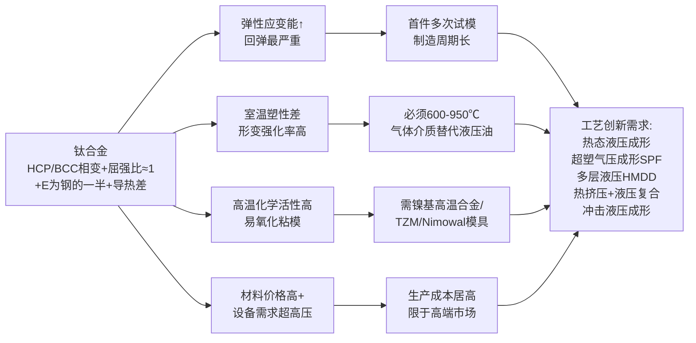

这一挑战体系直接定义了下一节将系统讨论的工艺创新路径。

## 5.4 钛合金液压成形的工艺创新路径

针对上述挑战，国内外学界与产业界发展了五条主要工艺创新路径，共同构成钛合金液压成形的工艺矩阵。

**创新路径一：热态液压成形与产业化突破。** 这是钛合金液压成形产业化的核心工艺路径。据国内专门从事钛合金液压成形装备研发的企业披露，已**形成了完整系统的钛合金产品液压成形工艺体系（含管类和板类产品），成功突破了液压成形技术在钛合金产品成形中的难点，并顺利实现了多个产业化应用案例的落地**[^69]。相比于精铸成型工艺（能耗高、效率低、表面光滑度低、需增加表面处理工序、工序多、成本高且有污染）与传统拉深工艺（不能拉深表面具有花纹图案或者凹凸形状的产品、不适用于异形或具有局部复杂特征的产品），液压成形工艺具有四大优势：**效率高**（可在较短时间内完成钛合金产品的高精度成形，减少了退火、表面处理等工序，大大缩短了加工时间、节省了投入）；**材料利用率高**（可大幅提升材料利用率，节省昂贵的钛合金材料，降低制造成本）；**可成形异形或具有表面局部特征的产品**；**成形的钛合金产品回弹小、强度高、形状稳定**[^69]——这一"回弹小"的描述是相对于精铸+后续机加工的多工序方案，并不否定 5.3 节所述钛合金本身的高回弹倾向，而是强调通过液压成形的柔性加载与精确加载路径控制，可显著降低最终零件相对于模具型面的回弹偏差。该企业的工程实绩包括**成功完成单次成形超过 60% 大胀幅比例的钛合金产品**，且其成形设备已实现了自动化、数字化、智能化[^69]。

**创新路径二：超塑性气压成形（SPF）——钛合金板材成形的主流路径。** 钛合金的超塑性成形方法大致可分为三种：**真空成形、气压成形（吹塑成形）、模压成形（偶合模成形）**[^71]。前两种方法借鉴自塑料或玻璃制品成形，由于钛合金的超塑性成形属于粘性或半粘性流动变形，可以利用低压成形；气压成形还可同真空成形结合应用[^71]。

**气压成形—吹塑成形**在航空航天工业中应用极广。航空航天工业中使用很广的钛球体（直径 200–1000 mm、厚度 2–5 mm），利用吹塑成形直接用两块钛圆板毛坯焊接后吹塑成球形或用管子毛坯吹塑成球体再封口——**这两种方法与常规冲压加工比较，可使成本降低到 20%，并简化了工艺过程**[^71]。直升机上的撑竿要求重量轻、强度高、刚性好，由于外形特殊一般工艺方法无法加工，采用管子吹塑成形只需一副简单的成形夹具即可[^71]。气压成形是一种特殊的胀形工艺：传统胀形工艺使用机械、液压胀形或爆炸胀形方法实现，使用压力与能量较高，且由于材料塑性的限制变形量一般不太大；**吹塑成形则是一种用低能、低压可以获得大变形量的成形，是一种与传统工艺概念不同的成形技术**——由于金属在变形过程中是自由的，几乎全部动力都消耗在变形功上，摩擦损失很小（对于自由吹塑成形则没有摩擦损失），这与其他冲压成形有着本质的区别[^71]。

模具吹塑成形又分为**凸模成形**与**凹模成形**两种：**凸模成形法**是使钛板毛料的外侧形成一封闭的压力空间，钛板加热到超塑性温度后在压缩气体的气压作用下产生超塑性变形，逐渐向模具型面靠近直至完全贴合，**成形零件的内表面尺寸精度高、形状准确、深度与宽度之比较大，模具加工也较易，但脱模较困难、原材料也较费**，零件底部较四周为厚；**凹模成形法**则是使钛板毛料内侧形成一封闭的压力空间，**成形零件外表面尺寸精度高、形状准确、零件脱模较易、原材料较省，但深度与宽度比较小、模具加工也较困难**，零件底部较四周为薄[^71]。

**真空成形法**又可分为凸模法与凹模法：凸模法是把经过加热后的毛料吸附在具有零件内形的凸模上的成形方法，用来成形要求内侧尺寸精度高的零件；凹模法则是把加热过的毛料吸附在具有零件外形的凹模上的成形方法，用于要求外形尺寸精度高的零件成形——一般说来，前者用于较深容器的成形，后者用于较浅容器的成形[^71]。真空成形也是一种气压成形，只是成形压力只能是一个大气压，故对钛板来说只能成形厚度薄、形状简单、曲率变化较缓的零件，不适于成形厚度较厚、形状较复杂和变形较剧的零件[^71]。值得特别注意的是，**Ti-6Al-4V 真空超塑性成形温度在 900℃ 左右，比普通真空热成形（700℃ 左右）约高 200℃，变形程度亦可大幅提升**[^71]——这一温度差异正是超塑性 vs. 普通热成形的工艺分水岭。

**创新路径三：多层金属液压机械深拉深（HMDD）——纤维金属层合板（FML）制造的新路径。** Zhang、Lang、Zafar 等针对轻量化混合零件制造，研究了**液压机械深拉深（hydro-mechanical deep drawing, HMDD）用于三层金属坯料同时成形以制造半球形结构件、进而用于制造 FML 零件的工艺**[^74]。研究背景在于：纤维金属层合板（FMLs）等轻量化混合零件在现代航空航天与汽车结构（如取代单体金属零件）中应用广泛；当前小型复杂形状的 FML 零件采用冲压成形技术制造，但**由于复合纤维的有限应变，这类技术不适合成形复杂轮廓的层合零件**；研究采用正交试验策略，系统考察了型腔压力/预胀形压力（cavity/pre-bulging pressures）、预胀形高度（pre-bulging height）、模具—压边圈间隙（die-binder gap）等变量对成形条件的影响，并基于有限元—实验方法研究了成形后多层结构的厚度分布与回弹规律[^74]。研究结果表明，**该研究方法足以预测这些属性并为理解相关行为提供基础**[^74]。这一工艺为钛合金与铝合金、复合纤维层等异质材料的同步液压成形提供了关键工艺路径，是航空航天轻量化复合结构件制造的前沿方向。

**创新路径四：热挤压+液压复合成形——替代传统超塑成形的产业化典范。** **早在 2010 年，国内企业即采用热挤压成形工艺成功为中科院沈阳金属所开发 TC 类三通件，替代了传统用超塑成型的工艺**[^69]。这一工艺创新的意义在于：传统超塑成形虽能获得高精度、低应力的三通件，但成形效率低、单件成本高（需在 900℃ 以上保持小时级的低应变率成形过程），而热挤压+液压复合成形通过在挤压工序完成主要形状变形、在液压工序完成最终精确贴模与圆角整形，**显著缩短工艺周期、降低成本**，是钛合金管类复杂构件产业化制造的重要技术路径。

**创新路径五：冲击液压成形对钛合金的适配。** 如第 3 章与第 4 章已述，中国科学院金属研究所张士宏团队研发的冲击液压成形设备最大冲击能量 200 kJ、最高冲击速度 80 m/s，**最大可用于 500 mm × 500 mm × 3 mm 的铝、镁、钛等低塑性合金板材成形**——其核心机理是借助高应变率激发位错动态增殖与晶界滑移协同，无需热处理即可提高材料在室温条件下的塑性，避免了热成形带来的能耗高、表面氧化、组织粗化等问题。这一工艺与超塑性成形形成互补——超塑性成形通过"高温+低速"激活非基面滑移与晶界滑动，冲击液压成形则通过"室温+高速"激发动态塑性，二者共同构成钛合金低塑性瓶颈的两条突破路径。

**模具材料体系的协同支撑**是钛合金液压成形不可忽视的技术保障。如 5.3 节所述，钛合金超塑成形模具一般采用 **TN-100 镍基高温合金**制造；更高温度的金属间化合物（TiAl 基合金）成形则可借鉴镍基合金等温锻造模具材料的发展经验——**TZM 钼基合金高温下需真空环境、Nimowal 镍基铸造合金可在大气下使用且 1050℃ 强度与 TZM 相近**[^75]。这一模具材料代际演进为钛合金"大气环境下的高温液压/超塑成形"提供了关键支撑，**使生产工艺与装备从"真空"复杂体系简化为"大气"常规体系，是钛合金液压成形产业化的关键技术拐点**[^75]。

下表系统对比五条工艺创新路径的关键技术参数与适配场景：

| 工艺创新 | 技术核心 | 关键参数 | 介质 | 适配牌号 | 典型应用 |
|---|---|---|---|---|---|
| 热态液压成形 | 600℃ 以上柔性加载 | 单次胀幅>60%、自动化设备 | 气体 | TA/TB/TC 系列 | 异形截面管件、产业化批量 |
| 超塑性气压成形（SPF）| 850–950℃、10⁻⁴–10⁻¹/s 应变率 | 10 kg/cm² 低压 | 气体 | Ti-6Al-4V 等 | 钛球（Ø200–1000 mm）、撑竿、复杂壳体 |
| 真空成形（凸/凹模法）| 900℃、单大气压 | 1 atm | 真空+气体 | Ti-6Al-4V | 薄壁简单曲率件 |
| HMDD 多层液压 | 预胀形+压边间隙正交优化 | 多层同步成形 | 液体 | Ti+Al+复合纤维 | FML 半球形件 |
| 热挤压+液压复合 | 挤压主变形+液压精整 | 替代超塑成形 | 复合 | TC 类 | 三通件等管件 |
| 冲击液压成形 | 200 kJ、80 m/s 高应变率 | 室温下动态塑性激发 | 液体 | 低塑性合金板材 | 复杂薄壁件 |

这六条路径（含真空成形）并非互相替代，而是构成"从低温到高温、从静态到动态、从单层到多层"的完整工艺矩阵——产业化批量管类构件以热态液压成形为主，航空航天大型复杂薄壁件以超塑性气压成形为主，钛复合层合结构件以 HMDD 为主，钛合金管类三通件以热挤压+液压复合为主，低塑性钛合金板材小批量复杂件则可借助冲击液压成形实现高效成形。

## 5.5 钛合金在航空航天与高端制造领域的典型应用

在前述合金体系、性能特征、工艺创新分析的基础上，本节系统呈现钛合金液压成形（含超塑性气压成形、热态液压成形、热挤压+液压复合等）的工程应用谱系，量化其在航空航天主导地位与高端制造扩展应用中的产业定位。

**应用一：航空发动机——钛合金液压/超塑成形的核心战场。** 钛合金最早即应用于航空工业部门，用于航空器的多个部件，如**起落架、发动机部件、弹簧、襟翼导轨、气动系统管道和机身部件**等[^67]。**航空业已成为钛合金最大用户，美国的钛材主要应用于航空航天领域，约占使用总量的 60%**[^67]。在美国战斗机的更新换代中，钛合金和复合材料的使用比例不断上升，**第五代战斗机 F-35 用钛量达到 27%，F-22 战机用钛量则高达 41%**，其中发动机的叶轮、盘、叶片、机匣、燃烧室筒体和尾喷管等均为钛合金材料制造[^67]。**不大量选用钛合金作零部件，就不可能获得高推重比的发动机**——美国第三代战斗机 F15、F16 选用的动力装置是推重比为 8 左右的 F100-PW100 燃气涡轮风扇发动机，用钛量为 25%–30%；第四代战机 F-22 选用推比 10 发动机，**高推比发动机中钛合金的用量已占发动机质量的 25%–40%**[^70]。

具体到典型发动机的钛合金应用：

- **V2500 喷气发动机**（英、日、美、德、意 5 国共同开发的涡轮风扇发动机）总体压缩比 36.5、推力 113 kN、发动机重 2.2 t、节油率达 14%，**用钛量达 31%**。最大的钛合金部件是**风扇机匣，直径 1700 mm，长 1150 mm，前壳体与后壳体分开制做，最后用激光焊接成一个整体**；**风扇盘、压气机盘、圆形护环、轴承支座、压气机叶片等都采用钛合金，大都为 Ti-6Al-4V 合金**；在高压压气机的 3–6 级因温度较高使用 **IMI550 钛合金（Ti-4Al-4Mo-2Sn-0.5Si）**，该合金添加 Si 元素抗蠕变性能优良；V2500 涡轮风扇发动机的低压压气机盘（最大直径 900 mm）和风扇外壳，采用**三次真空熔炼的 Ti-6Al-4V**[^70]。
- **F119 发动机**（F-22 战斗机用）的风扇采用**宽弦空心钛合金叶片**以提高推重比[^76]。
- **F100-PW100 发动机**的用钛量 25%–30%[^70]。
- **高温部位**采用 IMI834（英）、Ti-1100（美）、BT35（俄）、Ti-6242S、Ti-6246、Ti-17、Ti-811 和 Alloy C（阻燃）等近 α 型钛合金[^70]。
- **我国研究的 TD2（TiAl-Nb-Mo-V）TiAl 基合金**可在 600–700℃ 下长时工作，用作**涡轮导风板和涡轮结合环**[^70]。

V2500 的风扇机匣直径 1700 mm × 长 1150 mm，前后壳体激光焊接成一个整体[^70]，这一大尺寸钛合金机匣的制造正是热态液压成形/超塑性气压成形所擅长的典型应用场景；钛球体（直径 200–1000 mm、厚度 2–5 mm）的吹塑成形则直接覆盖了发动机辅助系统中各类压力容器的制造需求[^71]。

**应用二：航天结构件与火箭发动机——低温与极端工况下的不可替代性。** 在航天领域，**钛合金主要用于制造火箭发动机壳体、火箭喷嘴导管、导弹外壳、宇宙飞船的船舱或燃料和氧化剂储存箱等**，这些部件除了需要满足航空用钛合金的性能要求外，还必须具有耐高温、耐低温、抗辐射等性能[^76]。**航天飞机主发动机使用的 Ti-5Al-2.5Sn 油泵叶轮**是低温钛合金应用的标志性案例——Ti-5Al-2.5Sn ELI 在 20K（-250℃）低温条件下仍具有良好的韧性和较低的热导率，主要用于低温容器、低温管道以及液体火箭发动机涡轮油泵叶轮[^67]。这类零件的成形多依赖钛球吹塑成形、热态液压成形与超塑性气压成形等工艺路径，**与常规冲压加工比较成本可降低到 20%**[^71]。

**应用三：机体结构与航空管路——液压成形的传统优势领域。** 在机体结构层面，钛合金应用涵盖**飞机的骨架、舱门、液压管路及接头、起落架、蒙皮、铆钉、翼梁**等关键结构部件，这些部件需要具有高的比强度、韧性、抗疲劳性能以及良好的焊接工艺性能[^76]。**CP 钛由于良好的耐腐蚀性和焊接性能，在航空领域主要用于机翼前缘除冰系统的空气加热管、机舱环境控制系统管道、液压管道以及各种夹持和支架装置**[^67]——这些管路类零件正是钛合金管材液压成形（含热态液压成形）的主战场，国内企业已通过热态液压成形工艺体系实现这类构件的产业化批量制造[^69]。**起落架**则多采用 β 型钛合金（如 Ti-10-5-3、Ti-1023）以发挥其高强度、高断裂韧性与高淬透性优势[^66]。

**层状复合钛合金**代表着钛合金在机体结构中的前沿应用方向——层状复合钛合金通过将不同钛合金材料按性能需求进行设计和分布而成的一体化新型金属结构，使用层状复合钛合金结构与均质零部件相比**能够有效减重、提升疲劳寿命和降低成本**，在实现承载的同时还可以使零部件具备耐热、耐蚀和耐磨特性；增材制造层状复合整体翼肋部件可**有效减少疲劳裂纹源，提升了飞行器机体结构效率和材料利用率**[^76]。虽然层状复合钛合金主要通过增材制造而非液压成形制造，但其揭示的"差异化服役性能需求—合理层间过渡—结构性能集成"设计哲学，对未来钛合金液压成形与增材制造融合的发展方向具有重要启示意义。

**应用四：高端汽车与赛车——成本约束下的局部应用。** 钛合金在汽车工业中的应用受成本制约非常显著——如第 3 章所述，钛合金"材料本身价格高、加工难度大，制造成本远高于铝合金，通常只在高端跑车或性能车上使用"。其典型应用集中在**排气系统**（利用钛合金耐高温、轻量化与耐蚀的综合优势）、**阀门、紧固件、悬架弹簧**（利用高比强度与抗疲劳性能）等部件，主要应用于法拉利、保时捷、兰博基尼等高端品牌的限量车型与赛车[^66]。这一应用现实精准体现了第 1 章建立的四维权衡框架中"轻量化—力学性能—成本—工艺兼容性"的极端张力——钛合金在轻量化与力学性能两个维度居四类材料之首，但在成本与工艺兼容性两个维度居最不利位置，决定了其只能在"性能优先于成本"的高端细分市场中实现规模化应用。

**应用五：医疗、化工与海洋工程扩展应用。** 钛合金优异的生物相容性使其成为**人工关节、骨钉、心血管支架**等医疗植入物的主流材料；其卓越的耐蚀性使其在**化工耐蚀部件**（反应釜、热交换器、管道）中长期保持主导地位——**2012 年我国化工行业用钛量达 2.5 万吨**，化工行业一直是钛加工材最大的用户，**其用量在钛材总用量的占比一直保持在 50% 以上，2011 年占比高达 55%**[^66]。耐蚀钛合金（70 年代开发并在 80 年代以来得到进一步发展）与高强钛合金的迭代演进[^66]，为这些扩展应用提供了完整的材料体系支撑。化工与海洋工程的钛合金部件多采用焊接+热态液压成形/超塑成形工艺，特别是大型容器封头与异形管件的制造，与第 1 章所述壳体液压成形工艺形成直接衔接。

下表系统归纳钛合金液压（含超塑、热态液压、热挤压+液压复合）成形的工程应用谱系：

| 应用领域 | 部件 | 牌号 | 成形工艺 | 性能/规格 |
|---|---|---|---|---|
| 航空发动机 | V2500 风扇机匣 | Ti-6Al-4V | 激光焊接+成形 | Ø1700 mm × 1150 mm |
| 航空发动机 | V2500 风扇盘/压气机盘 | Ti-6Al-4V（三次真空熔炼）| 锻造+液压精整 | 低压盘 Ø900 mm |
| 航空发动机 | V2500 压气机 3–6 级 | IMI550（Si 抗蠕变）| 锻造+热态液压 | 高温抗蠕变 |
| 航空发动机 | F119 风扇叶片 | 钛合金 | 超塑成形 | **宽弦空心**叶片 |
| 航空发动机 | 高温压气机后段 | IMI834/Ti-1100/BT35/Ti-6242S/Ti-6246 | 超塑/热态液压 | 600–650℃ 使役 |
| 航空发动机 | 涡轮导风板/结合环 | TD2（TiAl-Nb-Mo-V）| 等温锻造+液压 | 600–700℃ |
| 航空发动机 | 阻燃部位 | Alloy C | 锻造+液压 | 抗"钛火" |
| 航天—主发动机 | 涡轮油泵叶轮 | Ti-5Al-2.5Sn ELI（BT5-1）| 锻造+液压 | **20K 低温优**，航天飞机主发动机 |
| 航天—火箭 | 发动机壳体/喷嘴导管 | 钛合金 | 热态液压+焊接 | 耐高/低温、抗辐射 |
| 航天—导弹/飞船 | 导弹外壳/燃料储存箱 | 钛合金 | 壳体液压+焊接 | 一体化大型壳体 |
| 航天—压力容器 | 钛球（Ø200–1000 mm）| Ti-6Al-4V | **吹塑成形** | 厚度 2–5 mm、**成本降至常规 20%** |
| 航空—机体 | 起落架 | β 型（Ti-10-5-3/Ti-1023）| 锻造+液压 | 高强高韧 |
| 航空—机体 | 蒙皮/翼梁/铆钉/舱门 | 钛合金 | 超塑/液压 | 高比强度+抗疲劳 |
| 航空—管路 | 除冰系统加热管 | CP 钛（G1–G4）| 热态液压成形 | 耐蚀+焊接性 |
| 航空—管路 | 液压管道/机舱管道 | CP 钛 | 热态液压成形 | 大批量产业化 |
| 航空—直升机 | 撑竿 | Ti-6Al-4V | 管子吹塑成形 | 轻+强+刚 |
| 航空—管件 | TC 类三通件 | TC 系列 | **热挤压+液压复合** | 替代超塑成形 |
| 航空—复合 | FML 半球形件 | Ti+Al+纤维 | **HMDD 三层同步** | 多层金属液压机械深拉深 |
| 航空—机翼 | 整体翼肋 | 层状复合钛 | 增材制造 | 减少疲劳裂纹源、机体结构效率↑ |
| 高端汽车 | 排气系统 | 钛合金 | 热态液压成形 | 高端跑车/赛车 |
| 高端汽车 | 阀门/紧固件/悬架弹簧 | β 型钛合金 | 锻造+液压 | 高比强度+抗疲劳 |
| 医疗 | 人工关节/骨钉/支架 | Ti-6Al-4V/CP 钛 | 锻造+液压精整 | 生物相容性 |
| 化工 | 反应釜/热交换器/管道 | CP 钛/耐蚀钛 | 壳体液压+焊接 | **占钛材用量 >50%**（2012 年我国 2.5 万吨）|

**综合本章分析可以得出三条核心结论**：

**第一，钛合金以"4.5 g/cm³ 密度 + 800–1200 MPa 抗拉强度 + 600–650℃ 耐热性 + 卓越耐蚀性"的极端性能组合，奠定了其在航空航天高温高载荷部位"高端不可替代材料"的产业定位**。F-22 用钛量 41%、F-35 用钛量 27%、V2500 用钛量 31%、F100-PW100 用钛量 25–30%、推比 10 发动机钛合金占发动机质量 25%–40%、Ti-6Al-4V 占全部钛合金用量 75%–85%、化工行业用钛占钛材总用量 50% 以上等数据共同验证了这一定位[^66][^67][^70]。这与第 2、3、4 章三种材料的"量产汽车主导/中端轻量化/极致轻量化"产业定位形成鲜明分层。

**第二，钛合金液压成形的工艺哲学根本不同于前三种材料——必须建立"以高温（600–950℃）为塑性激活的必要条件、以气体为传压介质、以超塑性成形/热态液压成形为主流工艺路径、以镍基高温合金（TN-100/Nimowal）为模具材料体系"的完整工艺生态**[^68][^69][^71][^75]。屈强比接近 1（塑性窗口窄）、弹性模量约为钢的一半（回弹严重）、形变强化率高（破裂敏感）、室温塑性差（必须高温）、导热性不佳（温度控制难）、高温化学活性高（粘模氧化）等六项内在短板的叠加，决定了钛合金液压成形必须借助超塑性气压成形（850–950℃、10⁻⁴–10⁻¹/s、10 kg/cm² 低压）、热态液压成形（产业化已实现单次胀幅>60%）、多层金属液压机械深拉深（HMDD）、热挤压+液压复合（替代超塑成形制造 TC 类三通件）、冲击液压成形等多元工艺路径，方能突破其内在的成形性瓶颈。Torng 等针对 Ti-6Al-4V 航空板材液压成形回弹的统计研究[^72]与 Zhang 等针对 HMDD 多层成形的有限元—实验研究[^74]，从不同角度为这一工艺哲学提供了量化支撑。

**第三，在第 1 章建立的四维权衡框架中，钛合金处于"轻量化优、力学性能最优、成本最高、工艺兼容性最差"的极端位置——这一定位决定了其产业角色不是"全面替代铝合金、镁合金或高强钢"，而是"在性能要求超越其他三种材料极限的航空发动机热端、低温火箭发动机、高端汽车排气系统、医疗植入物等不可替代场景中提供唯一可行解决方案"**。从层状复合钛合金的增材制造前沿到中科院沈阳金属所 TC 类三通件的热挤压+液压复合工艺再到钛球吹塑成形成本降至常规冲压 20% 的成熟工艺[^69][^71][^76]，钛合金成形的发展逻辑始终围绕"性能与成本的极致权衡"展开。

至此，本章已完成钛合金液压成形适用性的系统分析。结合第 2 章高强度钢"量产主导"、第 3 章高强度铝合金"中端主流"、第 4 章镁合金"极致轻量化"、本章钛合金"高端不可替代"的四类定位，第 6 章将在统一的"工艺—指标—选材"框架下进行横向比较与选材决策框架构建，第 7–9 章则转入五类典型缺陷的成因—对策—耦合分析。需要说明的是，本章引用的部分数据（如 V2500 用钛量 31%、F-22 用钛量 41% 等）来源于具体型号发动机/飞机的工程披露，不同时期、不同来源的统计口径可能存在差异，工程应用中应以官方技术手册数据为准；此外，关于热态液压成形产业化"单次胀幅>60%"等指标[^69]反映了国内特定企业的工程能力，其在国际同行中的相对水平有待更广泛的行业统计数据进一步对比。

# 6 四种材料液压成形适用性的横向比较与选材决策框架

经过第 2–5 章对高强度钢、高强度铝合金、镁合金、钛合金四类材料的逐一深度剖析，已经积累了从合金体系、力学性能、工艺挑战到工程应用的完整一手论据。然而，工程实践中的选材决策从来不是"逐一比较优劣"的简单线性过程，而是在**轻量化目标、承载需求、成本上限、批量规模、使役环境**等多重约束下的多目标优化问题。承接第 1 章建立的"工艺—指标—选材"统一框架与"轻量化—力学性能—成本—工艺兼容性"四维权衡逻辑，本章作为材料分析侧的总结性章节，将四类材料置于同一比较坐标系下展开横向对比，并构建可操作的选材决策框架。章节首先在性能指标、工艺成熟度、减重效果、成本经济性、应用场景五个维度建立量化对比矩阵，揭示四类材料的差异化定位；进而提炼"量产主导—中端主流—极致轻量化—高端不可替代"的分层逻辑；最后面向四类典型应用场景构建多维权衡的选材决策树，为第 7–9 章五类典型缺陷的成因—对策—耦合分析提供材料选择侧的统一接口。

## 6.1 四类材料关键性能指标的横向对比矩阵

以第 1 章建立的成形性能指标体系为标尺，将四类材料的关键物理与力学参数置于同一坐标系下进行系统对比，是横向比较的基础工作。物理与力学性能基线方面，四类材料呈现出显著的差异化分布：**密度从镁合金的 1.74 g/cm³、铝合金的 2.7 g/cm³、钛合金的 4.5 g/cm³ 到高强度钢的 7.8 g/cm³ 形成完整的四级梯度**；以高强度钢为基准计算的相对减重比例分别为镁合金约 77%、铝合金约 65%、钛合金约 40%，而高强度钢自身则通过板厚减薄实现等效减重。抗拉强度方面，四类材料同样跨度极大——DP590 处于 623–639 MPa、DP780 达 840 MPa、PHS（22MnB5）覆盖 1500–2400 MPa；6061-T6 约 310 MPa、6082-T6 处于 245–420 MPa、7075-T6 约 570 MPa；AZ31B 处于 227–248 MPa、AZ61 居中；CP-Ti 处于 240–550 MPa、TC4（Ti-6Al-4V）≥896 MPa。这一强度分布说明，**高强度钢与钛合金在绝对强度上占据高位，铝合金居中，镁合金最低**；但若以"比强度"（强度/密度）作为衡量标尺，结果则发生根本性逆转——**钛合金比强度最高，铝合金与镁合金（因密度优势主导）紧随其后，高强度钢仅在 PHS 等超高强度级别上具备比强度优势**。

弹性模量是回弹倾向的核心物理基础。四类材料的弹性模量分别为高强度钢约 208–214 GPa、铝合金约 70 GPa、钛合金约 108 GPa（即钢的 1/2）、镁合金约 45 GPa。根据第 1 章建立的"弹性模量越高、屈服强度越低，卸载回弹越小"规律可以推演：**钛合金弹性模量仅为钢的一半叠加屈强比接近 1，使其回弹量达到钢的 2–3 倍，居四类材料之首**；铝合金弹性模量同为钢的 1/3 量级，回弹同样显著（特别是 7075 等超高强系列由于包辛格效应突出，回弹尤其严重）；镁合金虽弹性模量最低，但因必须在温态下成形，温度本身能够大幅降低屈服强度并减小弹性应变能比例，**实际回弹倾向反而比钛合金、铝合金有所缓和**；高强度钢中 DP780 及以上级别回弹显著，但常规 DP590 等低屈强比钢种回弹处于可控范围。

成形性能指标（n 值、r 值、延伸率）的对比则进一步揭示了塑性储备的差异。下表汇总了四类材料代表性牌号的关键成形性能参数：

| 材料 | 典型牌号 | n 值 | r 值 | 延伸率 (%) | 屈强比 |
|---|---|---|---|---|---|
| 高强度钢 | DP590 | 0.185–0.19 | 0.72–0.84（平均）| 24.2 | 0.58–0.64 |
| 高强度钢 | DP780 | 0.122–0.15 | 0.53–0.81 | 16.5 | 0.66 |
| 高强度钢 | PHS（22MnB5）| 极低 | — | ≥5（2400 级 >5.5）| 接近 1 |
| 铝合金 | 6061-T6 | 中低 | — | 8–12 | 0.89 |
| 铝合金 | 7075-T6 | 低（室温）| — | 6–10 | 0.88 |
| 镁合金 | AZ31B（室温）| 低（HCP 受限）| 强各向异性 | 室温低；250℃ 显著增加 | 中 |
| 钛合金 | TC4（Ti-6Al-4V）| 低（室温）| 各向异性显著（冷轧 30% 差）| 室温有限；超塑 850–950℃ 可大变形 | 高（接近 1）|
| 钛合金 | CP-Ti（TA2）| 0.067–0.126 | 各向异性显著 | 18–25 | 0.73–0.84 |

从这一对比可以提炼出四条核心规律：**第一，DP590 凭借 0.185–0.19 的 n 值、0.72–0.84 的 r 值与 24.2% 延伸率，在四类材料代表牌号中具备最均衡的塑性储备，这正是其成为内高压成形主力钢种的物理基础**；**第二，PHS 与 TC4 同处于"屈强比接近 1、塑性窗口窄"的极端，前者主要通过热冲压而非液压成形规避这一短板，后者则必须依赖 850–950℃ 超塑成形释放塑性**；**第三，AZ31B 与 TC4 在室温下均因 HCP 结构滑移系不足而塑性极差，但 AZ31B 仅需 200–250℃ 即可大幅改善，而 TC4 需要 850–950℃，温度跨度的差异直接决定了二者装备投资与工艺复杂度的量级差距**；**第四，铝合金 6061-T6、7075-T6 屈强比均高达 0.88–0.89，叠加低弹性模量，使其回弹问题成为铝合金液压成形的核心矛盾**。

温度敏感性维度则形成另一层差异化分布。高强度钢中除 PHS 必须在 900–950℃ 热冲压外，DP/TRIP 钢种可在室温下完成液压成形；铝合金室温可成形，但 6xxx 系复杂截面或 7xxx 系开裂敏感件需借助 300℃ 温态液压或超低温双增效应；镁合金必须在 200–250℃ 温态窗口下成形；钛合金则需 600–950℃ 热态/超塑成形。**这一温度梯度直接决定了四类材料对装备复杂度的需求等级**——钢与铝可共用常规装备，镁需热油恒温温控系统，钛则需要镍基高温合金模具体系与气体介质。

综合上述对比可以建立四类材料在液压成形关键性能指标上的"四象限"定位逻辑：**在"强度—塑性—回弹—温度窗口"四个关键变量上，四类材料几乎不存在"全方位领先"的选择，每一类材料都在某一维度上具有比较优势，同时在另一维度上承担工艺代价**——高强度钢以塑性—成本优、强度梯度宽取胜，但绝对减重有限；铝合金以密度优、成形性中等胜出，但回弹大、室温塑性有限；镁合金以最低密度与阻尼性能突出，但 HCP 结构带来全方位的塑性短板；钛合金以最高比强度、耐蚀、耐热占据高地，但所有工艺维度均最不利。这一"此消彼长"的格局正是构建选材决策框架的物理基础。

## 6.2 成形性与工艺成熟度的横向比较

性能指标的差异最终落地为工艺成熟度的差距。沿"成形温度窗口—压力等级—装备需求—模具体系—工艺路径多样性"五个维度对四类材料的工艺成熟度进行横向对比，可以系统呈现产业化能力的代际差距。

成形温度窗口与压力等级是工艺设计的两大基准坐标。**高强度钢**在 DP/TRIP 钢种上以常规 ≤400 MPa 室温内高压成形为主流工艺，对超高强级别（DP980 及以上）则借助德国 Schuler 与美国 Vari-Form 发展的 SHS 低压顺序成形（压力降低约 30%）以及哈尔滨工业大学苑世剑团队的压力—体积协同变载技术（尺寸精度提升 1 倍多、模具变形量降至 1/3）实现产业化批量制造；PHS 则在 900–950℃ 热冲压而非液压成形路径上达到成熟。**铝合金**则形成了覆盖"超低温—室温—300℃ 温态"的多元温度矩阵，配合常规内高压（≤400 MPa）、SHS 低压顺序（针对 AA7075）、双路径加载（径向 20–45 MPa，5A06 拉深比可达 3.1）、超低温双增效应（针对铝锂合金薄壁件）、200 kJ/80 m/s 冲击液压成形等多条工艺路径。**镁合金**必须在 200–250℃ 温态/热油恒温窗口下成形，AZ31B 异型管温态内高压成形在 250℃ 实现产业化，AZ31 薄板热油恒温成形则在 200℃ 配合 16 mm 模具 R 角与精细化压边力控制达到稳定窗口；织构调控（异步轧制、稀土微合金化）与半固态注射（固相率 45±5%、致密度 >98%）则作为坯料预处理与大型构件成形的衔接工艺。**钛合金**则需要 600–950℃ 热态液压与超塑性气压成形（850–950℃、10⁻⁴–10⁻¹/s 应变速率、约 1 MPa 低压）并配套 TN-100 镍基高温合金模具或 Nimowal 镍基铸造合金模具，常规液压油在 300℃ 以上分解失效，因而必须以氩气等惰性气体作为传压介质。

装备投资与首件试模周期方面，**高强度钢液压成形的装备体系最为成熟**——国内宝钢、哈工大苑世剑团队等机构已实现 5000 t 内高压成形设备的国产化，国内汽车工业中应用的约 43 台（套）内高压设备中哈工大研制占比约 60%；首件试模周期可借助压力—体积协同变载技术与压力曲线优化在数次内完成。**铝合金液压成形装备**对 6xxx 系常规结构件可共用钢的内高压设备，但 7075 等超高强铝合金需配套 SHS 低压顺序系统，铝锂合金大型薄壁件则需专用超低温成形装备（如液氮/液氢级超低温环境），冲击液压成形则需 200 kJ 量级冲击设备；首件试模周期介于钢与镁、钛之间。**镁合金液压成形装备**需配套热油恒温温控系统、模具预热体系（200–300℃ 模具温度）以及温态密封装置；半固态注射则需 3200T 级伺服液压闭环控制系统；首件试模周期相对较长，需通过 Dynaform 等有限元仿真预先优化液室压力、压边力、压边间隙、毛坯形状等多参数协同窗口。**钛合金液压成形装备**则是四类材料中投入最大、复杂度最高的——需要超高压管端移动密封系统、镍基高温合金或铸造合金模具、惰性气体传压系统以及精密温度梯度控制；首件试模周期则由于回弹严重需要反复试模与成形块斜角修正，制造前置周期显著长于其他三类材料。

模具体系与工艺路径多样性方面，四类材料同样形成清晰梯度。高强度钢模具以常规合金钢叠加适当表面处理即可满足要求；铝合金对模具表面粗糙度与 PVD/TD 覆层提出更高要求以避免粘模划伤；镁合金模具必须具备稳定加热与温度均匀性，且需要考虑镁的导热系数较大（约 80 W/(m·K)）带来的快速降温补偿；钛合金模具则必须以镍基高温合金材料体系应对 900℃ 以上高温与化学活性，是模具复杂度的极端。

下表系统归纳四类材料液压成形的工艺成熟度对比：

| 维度 | 高强度钢 | 高强度铝合金 | 镁合金 | 钛合金 |
|---|---|---|---|---|
| 成形温度窗口 | 室温（DP/TRIP）；900–950℃（PHS 热冲压）| 室温；超低温；300℃ 温态 | **必须 200–250℃** | **必须 600–950℃** |
| 典型压力等级 | ≤400 MPa（SHS 可降约 30%）| ≤400 MPa（SHS 适用于 7075）| 中等（温态）| 600–1000 MPa（液压）；约 1 MPa（超塑气压）|
| 传压介质 | 液压油/乳化液 | 液压油；耐热油（温态）| 耐热油（恒温）| **氩气/惰性气体** |
| 模具体系 | 常规合金钢 | 合金钢+PVD/TD 覆层 | 合金钢+温控系统 | **TN-100/Nimowal 镍基高温合金** |
| 装备投资 | 中（已国产化）| 中高（含超低温/冲击设备）| 中高（温控+半固态注射）| **极高**（超高压+高温+真空/气氛）|
| 首件试模周期 | 短（协同变载） | 中 | 中长（多参数协同）| **长**（反复试模修正回弹）|
| 工艺路径多样性 | SHS、协同变载、模具补偿 | 室温/温态/超低温/冲击/SHS 五路径 | 温态/热油恒温/织构调控/半固态/CEEF 五路径 | 热态液压/SPF/真空/HMDD/热挤压+液压/冲击六路径 |
| 工艺成熟度 | **极成熟（量产主流）** | **成熟（豪华车广泛应用）** | 中等（局部量产、扩展中）| 成熟于航空航天，民用受限 |

可以看到，**工艺成熟度的代际差距并非来自工艺路径数量的多寡——四类材料均已发展出 5 条以上工艺路径——而是来自"装备投资门槛、首件试模周期、批量生产稳定性"三个产业化指标的差距**。高强度钢凭借数十年量产积累与国产化突破达到极成熟水平；铝合金通过奥迪 ASF 体系等豪华车应用积累了完整的工艺—装备—连接体系；镁合金虽工艺路径多样但产业化批量仍处于扩展阶段；钛合金则在航空航天领域达到成熟但民用规模化受限。这一工艺成熟度梯度也是后续选材决策框架中"批量规模"维度判断的物理依据。

## 6.3 减重效果与轻量化贡献的横向比较

减重效果是液压成形选材决策的核心驱动指标。基于第 2–5 章已系统呈现的工程减重数据，可在"理论减重潜力—工程实测减重—减重经济性—减重—续航/燃油传导效率"四个维度对四类材料进行横向对比。

理论减重潜力直接由密度差异决定。以高强度钢为基准，**铝合金理论减重约 65%、镁合金理论减重约 77%、钛合金理论减重约 40%**；高强度钢自身则通过板厚减薄（如 1.8 mm → 1.2 mm，对应等效减重 30% 以上）实现单部件减重，且不牺牲承载能力。但工程实测的减重数据往往低于理论值——这是因为低密度材料的强度通常也较低，需要通过结构加厚或截面优化来弥补承载能力，最终的减重幅度是密度优势与强度补偿的净效应。

工程实测减重数据呈现四类材料在不同产品层级上的差异化贡献。**高强度钢**层面，第 2 章已引述某 1.2 GPa 级高强钢实现整车减重约 22 kg，A 柱双层管状液压成形减重 26% 且刚度提升 42%，副车架减重 33%（12 kg 钢→8 kg 管材）、工序由 10 道减至 3 道、工装投资降低 40%。**铝合金**层面，奥迪 A8 全铝车身减重 200 kg、铝制车身较钢板车身减重约 40%；2016 款 A8 ASF 框架铝合金占比 93%，整备质量较同级别钢制车身轻约 220 kg；铝合金一次减重效果 30%–40%，二次减重可达 50%；特斯拉铝合金电池包较钢制减重 30%。**镁合金**层面，对铝减重 30%–35%、对钢减重约 75%（同等刚性下 1 kg 镁等效 18 kg 铝、2.1 kg 钢）；范军锋等开发的镁合金 CCB 较钢制减重 60%；问界一体压铸镁合金后车体集成 87 个零件并较铝合金版本再减重 21.8%；长安采用 AM60B 替代原型钢结构座椅骨架减重 26.7%；福特/丰田/现代采用镁合金座椅骨架分别减重 25%/40%/50%。**钛合金**层面，由于成本约束，整车级减重应用极少，但在航空航天关键部件上具有不可替代的减重价值——湖南镁宇科技中强耐热镁合金应用于陆航装置主承力结构件减重 25% 体现了钛合金竞品材料的减重水平；F-22 用钛量 41%、F-35 用钛量 27%、V2500 用钛量 31% 等数据反映了钛合金作为整机减重核心材料的产业地位。

减重经济性维度（单位减重成本）则将减重幅度与材料价格相互关联，形成更具决策价值的对比指标。**高强度钢以最低材料成本（基准）实现最低单位减重成本，是量产汽车减重的性价比之王**；铝合金材料价格约为钢的 3–4 倍（7075 约为 6061 的 3 倍），单位减重成本约为钢的 5–8 倍，但减重幅度大、二次减重潜力高，在豪华车与新能源车上仍具经济可行性；镁合金材料价格中高，2025 年镁铝比已降至 0.79（即镁合金价格已接近铝合金的 79%），成本拐点显现，使其在 CCB、座椅骨架等部位具备产业化条件；钛合金板材价格为钢的 45–83 倍，单位减重成本极高，无法在量产汽车上规模化应用，仅在航空航天、医疗、高端跑车等"性能优先于成本"的细分市场中发挥作用。

减重—续航/燃油传导效率维度则反映了减重对终端产品价值的影响。**美国橡树岭国家实验室与中国汽车工程学会数据均表明，车辆重量减少 10% 可带来 6%–8% 的燃油经济性提升（或电动车续航里程提升 5%–8%）**——这一传导系数对四类材料具有同等适用性，因此减重幅度直接转化为终端产品价值。新能源汽车的兴起进一步放大了这一传导效率——上汽集团第二代镁合金电驱壳体搭载于智己 L7 车型后预计续航提升 5%–8%；铝合金电池包框架在新能源汽车中的应用则直接服务于续航里程突破。

下表归纳四类材料在减重维度上的综合对比：

| 维度 | 高强度钢 | 高强度铝合金 | 镁合金 | 钛合金 |
|---|---|---|---|---|
| 理论减重（vs. 钢）| 基准（板厚减薄等效）| 约 65% | **约 77%** | 约 40% |
| 单部件工程减重 | 26%–42%（A 柱、副车架）| 30%–50%（ASF、电池包）| **21.8%（vs. 铝）/60%（CCB vs. 钢）** | 高（受限于成本，案例稀少）|
| 整车级减重 | 约 22 kg（1.2 GPa）| **约 200 kg（A8）** | 单车 20 kg 级（问界）| 不适用（成本约束）|
| 单位减重成本 | **最低**（基准）| 中（钢的 5–8 倍）| 中高（2025 拐点显现）| **极高**（钢的 45–83 倍）|
| 减重—续航传导 | 普适（10%→6–8%）| 普适+电池包专项 | 普适+三电壳体专项 | 仅航空航天有效 |
| 适用产品层级 | 量产汽车全谱系 | 豪华车+新能源 | 新能源主承力件+CCB+笔电 | 航空航天+高端跑车+医疗 |

可以看到，**减重幅度与综合成本之间呈现明显的非线性关系——高强度钢以"低减重幅度+最低单位成本"占据量产主导，铝合金以"中高减重+中等单位成本"占据中端主流，镁合金以"高减重+成本拐点已现"在细分场景实现镁代铝跨越，钛合金以"中等减重+极高单位成本"被锁定在性能不可替代的高端场景**。这一非线性关系是选材决策中"成本—减重权衡"的核心物理基础。

## 6.4 成本经济性与产业供应链的横向比较

成本经济性是工程选材决策中往往具有"一票否决"权重的硬约束。从"材料单价—加工成本—模具与装备投资—供应链成熟度—回收再制能力"五个维度对四类材料进行综合经济性比较，可以揭示其在不同应用场景下的经济可行性边界。

材料单价层面，四类材料的差距极为悬殊。高强度钢以基准价格（每公斤数元至十数元量级，依强度等级与表面处理而异）占据最低位；铝合金价格约为钢的 3–4 倍，其中 7075 约为 6061 的 3 倍；镁合金 2025 年镁铝比已降至 0.79，即镁合金价格已接近铝合金的 79%，成本拐点显现是其规模化应用的关键节点；**钛合金板材价格为钢的 45–83 倍，是四类材料中材料单价的极端**。这一价格梯度直接决定了量产汽车工业能够规模化承受高强度钢与铝合金，对镁合金的接受度正在快速提升，而对钛合金则只能在排气系统、阀门等少数高端部件中局部应用。

加工成本与模具/装备投资层面，差距同样显著。**高强度钢加工成本最低**，常规 ≤400 MPa 内高压成形装备已成熟国产化，模具采用常规合金钢即可满足要求。**铝合金加工成本中等**，6xxx 系常规结构件可共用钢的内高压设备，但模具需要 PVD/TD 覆层应对粘模划伤，7075 等超高强系列需要 SHS 低压顺序设备，铝锂合金薄壁件则需要液氮/液氢级超低温装备，冲击液压成形需要 200 kJ 量级专用设备——这一多元化装备需求推高了铝合金加工的综合成本。**镁合金加工成本中高**，需要热油恒温温控系统（成形温度 200–250℃、模具预热 200–300℃）、温态密封装置以及半固态注射的伺服液压闭环控制系统（如 3200T 设备）；模具与设备的专用性显著高于钢和铝。**钛合金加工成本极高**——超高压管端移动密封、TN-100/Nimowal 镍基高温合金模具、惰性气体传压系统、精密温度梯度控制等共同构成了"装备—模具—介质"三位一体的高成本体系，部分需要在真空或保护气氛下工作进一步推高综合成本。

供应链成熟度方面，四类材料处于不同发展阶段。**高强度钢供应链最为成熟**——宝钢、鞍钢、首钢、河钢等国内主流钢厂均已实现 DP590/DP780/PHS 等主力牌号的规模化稳定供应，国际上则有 SSAB、阿赛洛米塔尔等成熟供应商；DP590/DP780 焊管液压成形的工艺—质量—检测体系已经标准化。**高强度铝合金供应链**则在汽车与航空航天双轨驱动下日趋完善——奥迪 ASF 体系积累了完整的铝挤压型材、铝板、压铸件供应商网络，国内中铝、忠旺、明泰等企业已实现 6061/6082/7075 等主流牌号的规模化供应，铝锂合金则仍是少数国家与企业垄断的高端领域；铝合金液压成形配套了 14 种以上连接工艺（点焊、激光焊、铆接、自攻螺栓 FDS、锁铆连接 SPR、滚边压合、用于解决铝合金与高强钢连接难题的摩擦塞铆焊 FEW 等），形成完整产业生态。**镁合金供应链**正处于规模化扩展期——东风、上汽、长安、赛力斯、比亚迪、宝马等车企正系统推进镁合金应用；万丰镁瑞丁、五菱工业、宜安科技、可成科技等专业制造商在 CCB、座椅骨架、笔电外壳等部件上形成产业化能力；产业链规模化仍在起步阶段，2025 年镁铝比成本拐点显现是供应链突破的关键信号。**钛合金供应链**则成熟于航空航天领域但民用受限——西南铝业、宝钛集团等企业为神舟系列飞船等型号研制提供超过 60% 的关键铝/钛材，但民用规模化仍受材料价格制约。

回收再制能力是被忽视但日益重要的维度。**高强度钢回收性最佳**，传统钢铁回收产业链高度成熟，且碳排放仅 1.9 kg CO₂/kg。**铝合金回收同样成熟**，回收率超过 90%，但单位生产碳排放达 8.9 kg CO₂/kg，明显高于钢。**镁合金可回收再制**，废旧镁合金铸件可再熔化作为 AZ91D、AM50 或 AM60 的二次材料铸造，符合环保要求。**钛合金回收性较好**，但因加工难度大、零件价值高，回收料多用于非关键件以避免间隙杂质元素影响。

下表系统对比四类材料的成本经济性指标：

| 维度 | 高强度钢 | 高强度铝合金 | 镁合金 | 钛合金 |
|---|---|---|---|---|
| 材料单价（vs. 钢）| **基准** | 3–4 倍（7075 为 6061 的 3 倍）| 中高（2025 镁铝比 0.79）| **45–83 倍**（板材）|
| 加工成本 | 低 | 中 | 中高 | **极高** |
| 模具体系 | 常规合金钢 | 合金钢+PVD/TD 覆层 | 合金钢+温控 | 镍基高温合金（TN-100/Nimowal）|
| 装备投资 | 中（已国产化）| 中高（多元设备）| 中高（专用温控+半固态）| **极高**（超高压+高温+真空/气氛）|
| 供应链成熟度 | **极成熟** | 成熟（豪华车广泛）| 中等（扩展中）| 航空成熟、民用受限 |
| 国际产能格局 | 中、欧、日均强 | 中、欧、北美完整 | 中国主导镁资源 | 美、俄、中三强 |
| 回收再制 | **优**（1.9 kg CO₂/kg）| 优（>90% 回收率，但 8.9 kg CO₂/kg）| 良好（压铸二次回收）| 良好（非关键件再制）|
| 生命周期成本 | **最低** | 中 | 中高 | **极高** |

综合可以提炼出四条核心结论：**第一，材料单价与综合成本的差距是四类材料应用边界的根本约束**——量产汽车工业能够承受钢与铝，对镁的接受度依赖镁铝比这一关键经济变量的持续优化，对钛则只能局部应用；**第二，国产化进度对选材决策的影响日益增强**——苑世剑团队的内高压成形装备国产化、宝钢的高强钢供应、东风/上汽/赛力斯的镁合金应用、宝钛集团的钛合金供应共同构成了国内自主可控的供应链基础，降低了国际供应链波动对终端产品的影响；**第三，碳排放与回收性正成为新的决策维度**——钢的 1.9 kg CO₂/kg 与铝的 8.9 kg CO₂/kg 的差距，在双碳目标下将成为影响铝代钢决策的反向约束；**第四，单件成本与批量规模的非线性关系**——钛合金钛球吹塑成形相对常规冲压成本可降至 20%，TC 类三通件采用热挤压+液压复合替代超塑成形显著降本，体现了批量化与工艺创新对成本的杠杆作用。

## 6.5 典型应用场景与产业定位的差异化分层

在性能指标、工艺成熟度、减重效果、成本经济性四个维度的对比基础上，四类材料的产业定位呈现清晰的差异化分层——并非简单的"替代关系"，而是在汽车、航空航天、消费电子、化工医疗的产业谱系中形成**"量产主导—中端主流—极致轻量化—高端不可替代"** 的互补共存格局。

**高强度钢：量产汽车结构件的主导材料**。其产业定位由"最低材料成本+最成熟供应链+常规装备兼容+宽强度梯度（500–2400 MPa）"四要素共同奠定。典型应用谱系覆盖车身骨架（A/B/C 柱、车门槛、横梁、纵梁）、底盘结构件（副车架、纵梁、横梁、扭力梁）、安全件（防撞梁、车门防撞梁、保险杠）、悬架件（控制臂、滑轨）以及排气系统等几乎所有承载与吸能结构。其中 DP/TRIP 钢种凭借低屈强比与高初始加工硬化率成为内高压成形管材的优选，PHS（22MnB5）则在 B 柱、车门防撞梁等极端安全件上以热冲压（而非液压成形）实现 1500–2400 MPa 级超高强应用。在新能源汽车时代，高强度钢虽然面临铝合金、镁合金的竞争，但在 A/B 柱安全笼、四门防撞梁等承载关键节点上仍是不可替代的选择——领克 07 EM-P 的 A 柱、B 柱及四门防撞梁区域采用 2000 MPa 级超高强度钢正是这一定位的典型体现。

**高强度铝合金：中端轻量化与新能源结构件的主流材料**。其产业定位由"密度仅为钢 1/3+成本可承受+成熟供应链+多温度成形窗口"四要素共同奠定。典型应用谱系包括：白车身领域的奥迪 ASF 体系（A2/A8/TT/R8 累计超过 100 万辆）；覆盖件领域的引擎盖、尾箱盖（AA6016）；车门内板与油箱（5182）；高端汽车前防撞梁（领克 07 EM-P 的 7 系铝合金日字形截面、1332 mm 宽、5.0 mm 壁厚）；底盘结构件（6061-T6 副车架、防撞梁）；**新能源汽车电池包框架（特斯拉较钢制减重 30%）与超长铝挤压门槛梁**；航空航天的飞机蒙皮、口框、襟翼舱壁板（5A06/2B06）；运载火箭储箱箱底等大型椭球壳体（高强铝/铝锂合金）；2024 年全球汽车用铝锻件市场规模约 1837.4 亿元的产业规模印证了其中端主流地位。**铝合金在新能源汽车上的应用空间正快速放大——电池包框架、门槛梁、底盘结构件、车身覆盖件构成了铝合金"四大件"，与续航突破的产业逻辑深度耦合**。

**镁合金：极致轻量化与功能性综合要求最严部位的特色材料**。其产业定位由"密度最低（1.74 g/cm³）+阻尼性能最优（铝的 100 倍、钛的 300–500 倍）+电磁屏蔽优+2025 年镁铝比成本拐点"四要素共同奠定。典型应用聚焦于阻尼/电磁屏蔽/极致轻量化综合要求最严的细分场景：**仪表板横梁（CCB）作为镁合金"以镁为翼"的标志性应用**，从通用 G-Van 的 12 kg CCB（较钢减 6 kg）到范军锋等开发的减重 60% CCB，再到五菱工业半固态压铸 4.6 kg CCB，体现了从"钢→铝→镁"的三代材料革命；**座椅骨架**领域，福特/丰田/现代分别减重 25%/40%/50%、长安 AM60B 减重 26.7%、捷豹 F-TYPE SVR 减重逾 8 公斤、重庆博奥实现批量生产；**新能源汽车主承力件**领域已实现"从内饰小件到一体压铸后车体"的跨越，赛力斯问界单车镁合金用量达 20 公斤级、一体压铸后车体集成 87 个零件较铝合金再减 21.8%，上汽第二代镁合金电驱壳体功率密度达 4.4 kW/kg；**笔记本电脑外壳**领域，华为 MateBook X Pro 微绒典藏版、宜安科技 14 寸壁厚 0.45 mm 量产、胜利精密 D 件壁厚 0.5 mm、可成科技服务 Apple/Dell/HP/Acer/联想等共同构成产业生态。

**钛合金：航空航天与高端不可替代场景的核心材料**。其产业定位由"最高比强度+最优耐蚀+耐热 600–650℃（α₂/γ 基达 700℃ 以上）+生物相容性"四要素共同奠定。典型应用集中于性能要求超越其他三种材料极限的不可替代场景：**航空发动机**层面，V2500 用钛量 31%（含 Ø1700×1150 mm 风扇机匣、Ø900 mm 低压压气机盘、IMI550 抗蠕变高压压气机 3–6 级、三次真空熔炼 Ti-6Al-4V 风扇盘），F-22 用钛量 41%、F-35 用钛量 27%、F119 宽弦空心钛合金叶片、TD2 TiAl 基涡轮导风板（600–700℃ 长时工作）；**航天领域**的 Ti-5Al-2.5Sn ELI（BT5-1）涡轮油泵叶轮（20K 低温）、火箭发动机壳体、喷嘴导管、导弹外壳、宇宙飞船燃料/氧化剂储存箱；**钛球（Ø200–1000 mm，厚 2–5 mm）吹塑成形**实现压力容器成本降至常规冲压 20%；机体结构层面的起落架（β 型 Ti-10-5-3/Ti-1023）、蒙皮、翼梁、铆钉、舱门、CP 钛航空管路（除冰系统、机舱、液压管道）；**高端汽车**领域的排气系统、阀门、紧固件、悬架弹簧（限于法拉利、保时捷、兰博基尼等高端跑车与赛车）；**医疗领域**的人工关节、骨钉、心血管支架；**化工领域**作为钛材最大用户（2012 年我国 2.5 万吨、用量占比超 50%）的反应釜、热交换器、管道。

为直观呈现四类材料在产业谱系中的差异化分层格局，可用下图概括：

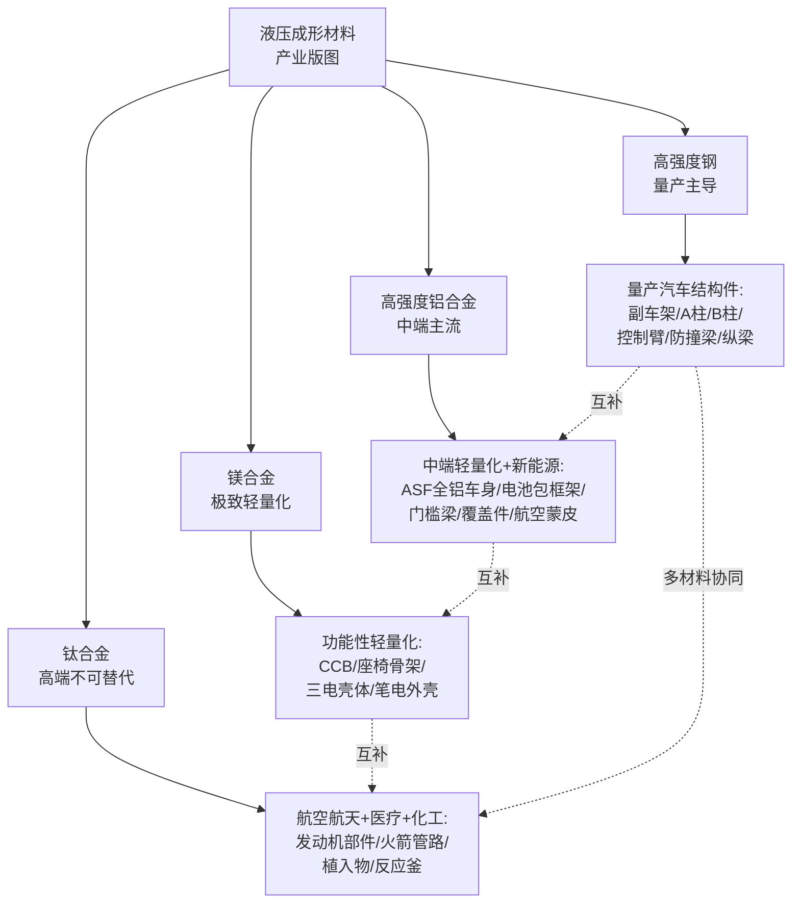

**这一分层格局的深层逻辑在于：四类材料各自处于"性能—成本—工艺—批量"四维权衡的不同最优区间，相互之间并非简单替代而是错位互补**。以奥迪 A8 第四代多材料 ASF 为例——其车身材料构成为 58% 铝合金、40% 钢、1% 镁、1% 碳纤维，正是四类材料"在最适合自己的部位发挥最大价值"的工程典范：铝合金作为车身主体实现整体减重，热成型高强钢用于 B 柱保障乘员舱完整性，镁用于辅助件，碳纤维用于特殊高端部位。同样，领克 07 EM-P 的"高强钢+7 系铝"分工设计——A/B 柱及四门防撞梁采用 2000 MPa 级超高强度钢承担承载与安全，前防撞梁采用 7 系铝合金负责低速吸能——也体现了同一逻辑。这种**多材料组合（multi-material design）**已成为现代汽车与航空航天结构件的主流设计哲学，也是后续选材决策框架必须能够支撑的关键能力。

## 6.6 面向不同应用场景的选材决策框架

在前述五个维度对比与产业分层分析的基础上，本节构建面向不同应用场景的液压成形选材决策框架。决策框架以第 1 章"轻量化—力学性能—成本—工艺兼容性"四维权衡为基础，扩展为"**承载需求—减重目标—批量规模—成本上限—使役温度—耐蚀要求**"六个输入变量，针对量产汽车结构件、高端轻量化部件、新能源汽车三电与电池包、航空航天高端零件四类典型应用场景，逐层引导至最优材料候选方案。

**场景 A：量产汽车结构件（成本敏感、批量大、安全件）**。这类应用的核心约束是"成本上限严苛+批量规模极大（百万件级/年）+承载与安全要求高"。决策逻辑首选高强度钢——DP/TRIP 钢种用于副车架、A 柱、控制臂、纵梁、横梁等内高压成形主体，PHS 用于 B 柱、车门防撞梁等热冲压安全件；次选 6xxx 系铝合金（6061/6082）用于覆盖件、底盘结构件、轻量化电池包；少量场景补充镁合金（CCB、座椅骨架）以实现局部减重收益。这一场景下钛合金原则上不予考虑，仅在排气系统等局部部件中作为高端选项。

**场景 B：高端轻量化部件（豪华车、新能源车减重诉求强）**。这类应用的核心约束是"减重目标激进+承载需求依然较高+成本上限相对宽松"。决策逻辑首选高强度铝合金——奥迪 ASF 体系的 6061/6082/AA6016/7075 多牌号组合是经典案例；强配镁合金（一体压铸后地板、CCB、电驱壳体），赛力斯问界单车镁合金 20 公斤级体现了镁合金在高端轻量化中的关键角色；关键安全件保留超高强钢（2000–2400 MPa 级 A/B 柱、防撞梁）构成安全笼。这一场景的典型设计哲学是**多材料组合**——通过"铝+镁+超高强钢"三材料协同发挥各自最优区间，而非追求单一材料的极致。

**场景 C：新能源汽车三电与电池包**。这是当前选材决策最为活跃的场景，核心约束是"续航导向的减重压力+三电系统功率密度要求+电磁屏蔽与导热需求+成本上限介于量产与高端之间"。决策逻辑呈现新的分层：电池包框架以 6xxx 系铝合金（铝挤压+液压成形）为主流，特斯拉电池包较钢制减重 30% 是基准案例；电驱壳体则因功率密度与导热要求成为镁合金的关键应用——上汽集团第二代镁合金电驱壳体功率密度 4.4 kW/kg、导热系数 150 W/(m·K)（较铝合金提升 15%）、成本降低 40%；门槛梁与底盘纵梁以铝合金内高压成形为主，确保侧碰吸能与减重双目标；车身关键节点保留超高强钢承担承载与安全。**镁代铝的成本拐点（2025 年镁铝比 0.79）使新能源汽车成为镁合金规模化应用的最佳突破口**。

**场景 D：航空航天高端零件**。这类应用的核心约束是"性能优先于成本+使役温度极端（高温/低温/超低温）+耐蚀与抗辐射要求+小批量定制化"。决策逻辑首选钛合金——发动机热端（TC4、IMI834、TD2 TiAl）、机匣、叶片、起落架（β 型）、火箭低温部件（Ti-5Al-2.5Sn ELI）、液压燃油管（CP 钛/Ti-3Al-2.5V）；配套高强铝合金（铝锂合金 2195/2099）用于火箭储箱箱底、大型飞机薄壁件（依赖超低温双增效应）；不适用镁合金（耐蚀与高温限制）；不适用高强钢（比强度劣势）。**这一场景的核心矛盾在于钛合金成形难度居四类材料之首，必须配套热态液压成形、超塑性气压成形、HMDD、热挤压+液压复合等多元工艺路径才能实现产业化**。

为系统呈现四类应用场景下的选材决策路径，可用下图概括决策树逻辑：

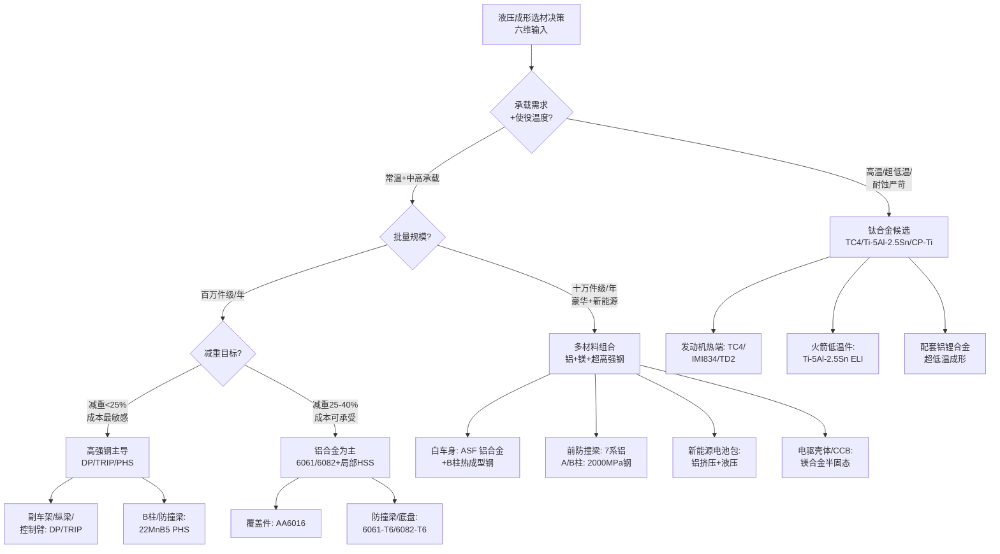

这一决策框架在工程应用中具备三方面价值：**第一，提供了从输入变量到材料候选方案的可操作映射路径**，避免了"凭经验选材"的主观性；**第二，支持多材料组合设计**——奥迪 A8 多材料 ASF、领克 07 EM-P 高强钢+7 系铝分工、赛力斯问界单车镁合金 20 公斤级等工程案例均可在该框架下得到合理解释；**第三，与第 7–9 章缺陷分析形成闭环接口**——选材决策不仅决定了材料类型，也直接决定了后续液压成形过程中各类缺陷的敏感性谱（如钛合金一旦选定即意味着回弹缺陷将成为首要防控对象，镁合金选定则意味着温度—速度协同与起皱—破裂耦合需要重点关注）。

需要指出的是，该决策框架在工程应用中仍存在三方面局限：**其一，六个输入变量在不同场景中的权重分配仍需依赖工程经验与设计哲学**——例如新能源汽车场景下"续航优先"与"成本优先"的权重选择会显著影响最终材料组合；**其二，多材料组合的连接工艺与界面问题（如铝钢电化学腐蚀、铝镁连接难题）在框架中尚未充分体现**，实际工程中需要专门的连接工艺评估补充；**其三，新兴材料（如第三代 AHSS 的中锰钢、Q&P 钢、铝锂合金 2195/2099、稀土微合金化镁合金 ZTWX1100、TiAl 基金属间化合物）的引入将持续重塑决策树边界**。

展望未来演进方向，选材决策框架将向三个方向扩展：**一是数字化与智能化集成**——基于材料数据库、工艺仿真（Dynaform/ABAQUS/LS-DYNA）与机器学习的智能选材推荐系统将逐步替代传统经验决策；**二是全生命周期评估（LCA）维度的强化**——碳排放（钢 1.9 vs. 铝 8.9 kg CO₂/kg）、回收性与可持续性将与传统的"性能—成本—工艺"维度并列；**三是新工艺驱动的边界重构**——超高压成形（600–1000 MPa）、热态液压成形、拼焊管成形、智能化在线监测等新技术将持续拓展各类材料的可成形边界，使原本因成形难度而被排除的材料候选方案重新进入决策视野。这些演进方向也是第 9 章"综合工艺优化策略与研究结论展望"将进一步展开的核心议题。

至此，本章已在性能指标、工艺成熟度、减重效果、成本经济性、应用场景五个维度完成了四类材料液压成形适用性的系统横向比较，并构建了面向四类典型应用场景的选材决策框架。结合第 2–5 章对四类材料的逐一深度分析，整个报告的材料分析侧已形成完整闭环。从第 7 章开始，报告将转入缺陷分析侧，沿着"分类机理—成因—对策—耦合"的逻辑链条，系统讨论表面缺陷、回弹、起皱、变薄、撕裂五类典型缺陷的内在规律与防控路径，并在第 9 章将材料选择与缺陷防控两条主线汇聚为完整的"材料—缺陷"双维度研究结论。需要说明的是，本章构建的选材决策框架与多材料组合设计逻辑，将作为后续缺陷分析中"材料选型升级"对策的统一参照依据，特别是在第 8 章撕裂缺陷的"材料选型升级"对策与第 9 章工艺窗口构建中的材料维度边界条件设定上具有直接接口意义。

# 7 液压成形缺陷分类机理、表面缺陷与回弹的成因及解决方法

在完成第 2–6 章对四类材料液压成形适用性的系统分析与选材决策框架构建后，整个报告的论证主线从"材料一侧"转向"缺陷一侧"。如果说选材决策回答了"用什么材料"的问题，那么缺陷分析则回答"如何把所选材料稳定、精确地成形为合格零件"的问题——二者共同构成液压成形产业化能力的两个支柱。本章作为缺陷分析侧的开篇章节，承担三项任务：其一是建立五类典型缺陷的整体分类逻辑与工艺链阶段映射，为后续逐一分析提供统一框架;其二是系统剖析表面缺陷的类型识别、成因机理与防控对策;其三是聚焦回弹缺陷在卸载阶段的力学本质、四类材料的差异化表现以及工程化解决策略。后续第 8 章将沿用本章建立的方法论框架展开起皱、变薄、撕裂三类与材料流动密切相关的缺陷分析,第 9 章则在此基础上揭示五类缺陷之间的耦合关系并构建综合工艺优化路径。

## 7.1 液压成形五类典型缺陷的分类逻辑与工艺链阶段映射

液压成形过程中涌现的缺陷虽形式多样,但从物理本质看可归纳为表面缺陷、回弹、起皱、变薄、撕裂五大类典型形式。为便于系统讨论与对策匹配,可沿**物理本质、发生阶段、触发机制**三个维度建立统一的分类逻辑。

**物理本质维度**将五类缺陷划分为三大类型:**表观类缺陷**(表面缺陷)主要表现为零件外观与表面质量偏离设计要求,但不直接影响几何形状与承载能力;**几何类缺陷**(回弹、起皱)体现为零件几何形状、轮廓与尺寸偏离模具型面,可能影响装配精度与结构刚度,其中回弹源于弹性变形恢复、起皱源于压缩失稳;**失效类缺陷**(变薄、撕裂)则直接影响零件的承载能力与服役可靠性——变薄是局部壁厚低于设计下限的渐进性失效征兆,撕裂则是局部应变超过成形极限发生的灾难性破裂[^77][^78]。

**发生阶段维度**将五类缺陷与液压成形的工艺链各环节进行映射。第 1 章已建立内高压成形"填充—成形—整形"三阶段框架,叠加预弯/预成形与卸载阶段后形成完整工艺链。**预弯/预成形阶段**主要触发起皱(轴向压缩起皱)、回弹(弯曲段卸载回弹)、变薄(弯曲外侧拉伸减薄)与撕裂(弯曲段外侧开裂)等缺陷,蔡洋等针对铝合金管材的研究明确指出"弯曲产生的回弹、截面畸变及起皱等缺陷会影响后续内高压成形的质量"[^79];**填充阶段**主要触发屈曲(轴向力过大、内压过小诱发的失稳)、表面划伤(润滑不足)、表面压痕(模具表面粗糙度复印)等缺陷;**成形阶段**作为变形最为剧烈的环节,几乎所有缺陷类型均可能出现——破裂(从局部缩颈开始)、起皱(自由胀形段)、过渡区开裂、焊缝开裂、滑移线(板料流经凸模圆角)等;**整形阶段**主要触发晚期破裂(整形压力过大导致开裂)与分模线压痕;**卸载阶段**则是回弹的核心发生阶段,曲率减小与弯角减小两种回弹形式均在外力去除瞬间表现出来[^80][^78]。

**触发机制维度**则将五类缺陷溯源至四类基本物理机制:**摩擦机制**主导表面缺陷与部分变薄缺陷,内压增大时界面接触面积扩大、粘着摩擦可能占主导,低压区库仑摩擦与高压区剪切应力两套模型在不同压力区间适用[^81];**应力状态机制**主导起皱(轴向压应力诱发压缩失稳)与撕裂(双向拉应力超过 FLC);**应变路径机制**主导变薄(累积塑性应变集中)与撕裂(应变路径偏离均匀双轴拉伸);**弹性回复机制**则是回弹的根本物理基础,卸载前模具接触力与残余应力相平衡,卸载后局部残余应力释放导致几何偏差[^82]。

下表系统呈现五类缺陷在工艺链各阶段的分布矩阵,作为后续分析的统一参照:

| 缺陷类型 | 物理本质 | 主导发生阶段 | 核心触发机制 | 典型发生位置 |
|---|---|---|---|---|
| 表面缺陷 | 表观类 | 填充、成形 | 摩擦+模具表面状态 | 滑动接触面、棱线圆角、分模线 |
| 回弹 | 几何类(弹性回复)| **卸载** | 弹性变形恢复 | 弯曲段、过渡圆角、整体轮廓 |
| 起皱 | 几何类(失稳)| 预弯、成形初期 | 轴向压应力+压缩失稳 | 主管自由胀形段、法兰、过渡区 |
| 变薄 | 失效类(渐进)| 成形、整形 | 拉应力+材料流动不足 | 胀形顶部、弯曲外侧、过渡圆角 |
| 撕裂 | 失效类(灾难)| 成形、整形末期 | 应变超 FLC+应力集中 | 支管顶部、过渡区、焊缝 HAZ |

结合三类工艺路径的差异,五类缺陷的典型发生位置呈现进一步分化。**管材内高压成形**中,T 形三通管主要缺陷为支管顶部破裂、主管起皱;Y 形三通管因结构不对称还会出现支管过渡区凹陷与不对称起皱;弯曲轴线异形截面管件主要缺陷有开裂(弯曲段外侧、多边形截面过渡区、焊缝热影响区)、死皱与飞边[^83][^84];变径管成形则需特别关注屈曲、破裂、起皱与成形不充分[^85][^78]。**板材液压成形**中,法兰起皱、底部破裂、四角拉裂、面畸变与滑移线为主要缺陷类型,某铝合金顶盖充液拉深案例显示四角处起皱严重需通过压边圈填补优化[^86]。**焊管液压成形**中,焊缝及热影响区与母材过渡带成为破裂高发位置,DP590/DP780 焊管的研究表明破裂位置全部位于靠近焊缝及热影响区的母材区域(第 2 章已述)。

基于第 2–5 章对四类材料的力学特征,可初步建立"材料特性—工艺参数—典型缺陷"传导逻辑:**高强度钢**因高屈服强度容易诱发回弹(DP780 等级别尤甚)与焊缝 HAZ 撕裂;**高强度铝合金**因低弹性模量+低 n 值+室温塑性受限,在回弹、撕裂、表面划伤(铝表面氧化层断裂)三类缺陷上敏感;**镁合金**因强基面织构与流动速度不均,在起皱—变薄—撕裂耦合失效上风险最高,棱边圆角处速度低于直边部分诱发侧壁起皱、顶端倒角处减薄率达 18%(第 4 章已述);**钛合金**因屈强比接近 1 叠加 E 仅为钢一半,在回弹缺陷上最为严重(第 5 章已述 Torng 等的统计结论),且高温化学活性高易粘模。

五类缺陷并非独立存在,而是呈现明显的耦合权衡关系——压边力增大可抑制起皱却容易诱发撕裂;内压提高有利于贴模减少回弹,却可能加剧法兰区减薄;加载路径前移补料可减小变薄,但补料过多又会诱发管壁起皱;这一耦合关系将在第 9 章系统展开。本章及第 8 章则先沿"逐一分析"路径,系统剖析每类缺陷的成因与对策。

## 7.2 表面缺陷的类型识别与成因机理

表面缺陷作为五类缺陷中物理本质最直观、对零件外观品质影响最直接的一类,在液压成形特别是面向 A 级曲面外覆盖件的板材液压成形中具有突出重要性。汽车 A 级曲面要求"相邻曲面间之间隙在 0.005 mm 以下(有些汽车厂甚至要求到 0.001 mm),切率改变在 0.16 度以下,曲率改变在 0.005 度以下",这一极端表面质量要求使表面缺陷的识别与防控成为模具调试的核心难题[^87]。

**表面缺陷的主要类型**包括以下若干典型形式。**划伤(拉伤)**是液压成形中最为常见的表面缺陷,源于管材/板材与模具型腔之间的相对滑动,在润滑不足或模具表面粗糙时表现为带方向性的线性沟痕;5A06 铝合金矩形管充液压制成形过程中即出现典型的表面划伤缺陷[^88]。**压痕**为模具特定结构(如合模线、分模线、定位销)在零件表面留下的几何印痕,内高压成形中"模具分模线造成的压痕主要是由于过程中开模、模具控制无效、分模轮廓质量低等几种原因造成"[^78]。**橘皮**表现为冲压后板料表面产生类似桔皮的凹凸纹路,**主要成因是材料晶粒粗大及变形不均匀**——材料退火不完全或晶粒尺寸过大,导致变形时各晶粒变形程度不同,表面粗糙;冲压过程中局部区域应力分布不均、超出材料塑形极限,形成不均匀塑性变形[^89][^90]。**模具印迹**则为模具表面粗糙度直接复印至零件表面的微观纹理,其严重程度直接受模具表面 Ra 值影响——纳隆 DLC 涂层应用使模具表面粗糙度 Ra<0.05 μm,东莞某电子厂数据表明手机中框模具划伤率从 2.3% 降至 0.5%[^91]。**滑移线**是汽车外覆盖件冲压中最难解决的表面缺陷之一,**定义为冲压成形后金属板料在非接触面上的可见带状曲线,在板料流经凸模圆角时经历弯曲、反弯曲和拉伸时产生**[^87][^92]。长城汽车后门外板轮弧滑移线案例显示,某后门外板拉延工艺在两条棱线处均有不同程度滑移,主棱线最大滑移 4.2 mm、副棱线最大滑移 2 mm[^87];恒大新能源汽车的研究进一步指出,滑移线主要发生在腰线、机盖造型线、行李厢弯折线、轮眉造型线、角窗灯口等体现车辆造型特征的高位置,严重影响整车外观品质[^87]。**冲击线**与滑移线均为棱线滑移,均发生在成形初期或成形过程中,但**冲击线是凹模圆角接触板料留在制件上的痕迹,而滑移线是凸模圆角接触板料留在制件上的痕迹**,二者需在问题诊断中加以区分[^92]。

**表面缺陷的物理成因**可从六个维度系统剖析。**润滑条件不足**为首要成因——液压成形中"在不同的压力条件下,可以控制不同的接触条件",润滑剂被困在坚固的表面结构,可能无助于分离模具和零件表面,导致严重的摩擦条件与表面损伤[^81]。**模具表面粗糙度偏高**直接复印至零件表面,使用全新刀具时即不可避免地产生残留高度(理论表面粗糙度),且**进给速度越快峰谷间距越大、工件表面凹凸越明显**,例如球头立铣刀加工时进给速度提升至 2 倍,理论表面粗糙度劣化至原有水平的约 4 倍[^93]。**相对滑动速度过大与接触压力过高**导致界面摩擦机制从库仑摩擦向粘着摩擦转变。**坯料表面原始质量缺陷**(如氧化皮、附着物、机械损伤)在成形过程中被放大,冲压用板料应"表面光洁平整,无分层和机械性质的损伤,无锈斑、氧化皮及其它附着物"(第 1 章已述)。**晶粒尺寸粗大与变形不均匀**则是橘皮缺陷的根本成因,材料退火不完全或晶粒尺寸过大、冲压过程中应力分布不均超出材料塑形极限均会诱发橘皮[^89][^90]。**积屑瘤**则是加工铝材、软钢等软性材料时的常见问题——加工过程中受高温、高压作用,部分切屑熔覆并堆积在刀具刀尖位置,不断反复生长、脱落,脱落的残留物容易附着在加工表面,或挖削工件表面,进而产生撕裂纹路、加工划痕等缺陷[^93]。

**接触机制的转变规律**是液压成形表面缺陷分析中的核心物理基础。**随着内压的增大,界面接触面积也增大,粘着摩擦可能占主导地位**[^81]。具体而言,**液压成形初始阶段的低压水平下,库仑摩擦定律适用,切向(摩擦)应力 $\tau$ 与界面处的法向应力 $\sigma_n$ 成正比,比例常数为摩擦系数 $\mu$**;**如果接触压力接近管材料的流动应力,库仑摩擦模型不再适用,必须使用剪切应力模型——切向应力 $\tau$ 与流动应力 $\sigma_f$ 成正比**[^81]。这一接触机制的转变带来三方面工程影响:其一,**低压下的摩擦系数高于高压下的摩擦系数**——在过程早期接触处有峰和谷表面结构,润滑剂被困在表面结构中,摩擦条件严重;随着压力增加,形状和粗糙开始消失,摩擦条件变得不那么不利[^81];其二,在校准阶段当管道横截面拉伸到最终尺寸时,润滑成为关键因素[^94];其三,**铝合金的液压成形面临额外挑战,因为铝合金的表面被薄而硬的氧化层覆盖**,在零件表面变形过程中由于严重的冷加工导致该层断裂,会使额外和意外的表面暴露在接触机构上[^81]。

**材料特异性表面缺陷成因**也值得专门关注。**铝合金表面氧化层断裂**问题如前所述,使额外表面暴露于接触机构,润滑不足时极易导致过度变薄与表面损伤;**镁合金硬度低、易粘模**与"延展性好的材料(如铝、铜、低碳钢)在切削时容易产生塑性变形,容易形成积屑瘤,导致表面出现撕裂痕迹"的规律一致[^95];**钛合金高温下化学活性极高,易与模具材料发生粘附与化学反应**(第 5 章已述),表面易氧化形成 α 层影响最终零件性能;**低碳冲压钢板桔皮缺陷**则是 IF 钢、深冲钢等高 r 值材料因晶粒粗大与变形不均诱发的典型表面问题[^89][^90]。

表面缺陷不仅影响外观品质,更深刻影响零件的服役性能。表面粗糙度对零件性能的影响体现在五个方面:**耐磨性**——表面越粗糙,两表面接触时的实际接触面积越小(仅为少数峰顶接触),导致接触点处的比压急剧增大,如同无数个微小的应力集中器,加速表面磨损;**配合性质的稳定性**——间隙配合中初期磨损会迅速磨平峰顶导致间隙意外增大,过盈配合中波峰被挤平减小实际有效过盈量;**接触刚度**降低;**疲劳强度**降低——粗糙表面的凹谷处容易形成应力集中点,如同微小的裂纹源,在交变载荷作用下裂纹极易从此处萌生并扩展;**抗腐蚀性**降低——粗糙表面更容易积聚腐蚀性气体或液体,且凹谷深处容易形成氧浓差电池[^95]。气缸、阀门滑动面、法兰接合面等对气密、油密有严苛要求的零部件,表面凹凸缺陷会成为致命问题——凹凸程度过大会使部件贴合面产生间隙,引发漏油、漏气故障[^93]。

## 7.3 表面缺陷的综合防控对策与工艺优化

针对表面缺陷的多元成因,工程实践中已发展出"润滑剂选择—模具表面处理—压力曲线优化—坯料预处理"四条主要防控路径,共同构成完整的工艺优化体系。

**润滑剂选择**是表面缺陷防控的第一道防线。液压成形润滑剂可分为三大类:**干润滑剂(固体润滑剂)、湿润滑剂(溶液和乳液以及合成物)、浆糊/肥皂和蜡**[^81]。**干润滑剂通常被认为是更有效的减少摩擦和提高刀具寿命的性能,应用简单,适当干燥后与加压液的相容性非常好;但去除需要特殊清洗液,综合成本(包括干燥时间、应用和去除过程以及原始成本)高于湿润滑剂;湿润滑剂成本效益高、易于消除、大部分时间与压力流体兼容,但性能不如干润滑剂**[^81]。常用固体润滑剂包括 **MoS₂** 与 **PTFE**:MoS₂ 具有层状结构,易于滑动起到减摩作用,Mo 原子与 S 原子间的离子键赋予 MoS₂ 润滑膜较高强度,可防止润滑膜在金属表面突出部位被穿透,化学性质稳定可耐大多数酸和耐辐射;PTFE 聚合物呈柱状流线型结构,分子间相互作用小、吸引力弱,摩擦系数 μ静=μ动=0.04,是目前所有材料中摩擦系数最小的,且化学稳定性最高[^96]。新型纳米润滑添加剂(如二硫化钼、石墨烯)的发展使润滑剂性能持续优化[^97]。

润滑剂选择需综合考虑六项准则:**润滑性足够高以减少滑动摩擦、能承受 5000–15000 PSI(约 35–105 MPa)的管/模界面压力、非磨料以减少模具表面磨损、不含污染物、易于应用与去除、成本合理**[^94]。"没有单一的润滑剂能够满足所有这些要求,所以在选择润滑剂时必须做出妥协",其中最重要的特性是润滑性或摩擦系数[^94]。润滑剂选择对结构轨道部件临界减薄的影响显著,润滑剂 2 对两种初始管厚度都有最佳效果[^81]。上海航天精密机械研究所发明的金属管材液压成形摩擦系数标定装置与方法,通过测量管材压缩后得到的几何数据即可计算摩擦系数 μ,适用于低塑性材料且测量成本大大降低[^98]。

**模具表面处理**是表面缺陷防控的第二道防线,通过提升模具表面硬度、降低摩擦系数、改善脱模性能实现表面质量与模具寿命的双重提升。主流模具表面处理技术包括四大类:

**PVD(物理气相沉积)真空镀膜技术**在真空条件下采用低电压、大电流的电弧放电技术,使被蒸发物质沉积在工件上,可镀覆高硬度、高耐磨性的金属陶瓷装饰镀层。主要工艺包括 **TiN(氮化钛)、TiCN(碳氮化钛)、DLC(类金刚石)、TiAlN(氮化铝钛)、CrN(氮化铬)** 等,广泛应用于切削刀具、模具(塑胶模、五金冲压模、压铸模、成型模、引伸模、拉伸模、翻边模)、模具配件(冲棒、顶针、边锁)等[^99][^100]。

**TD 覆层处理技术**(Thermal Diffusion)硬度可达 2800–3200 HV,**远高于镀硬铬与各类氮化处理(表面硬度不超过 1200 HV)**;镀层与母体冶金结合、使用中不易脱落,在使用条件较为苛刻的场合也能取得满意的效果;TD 覆层处理后续处理方便,可用于钢铁材料及硬质合金,且可方便地进行多次重复处理[^101]。复合 TD 处理技术覆层硬度可达 3500–4200 HV,应用于绕线轮、冲裁模具、易拉罐封边滚轮等[^101]。

**DLC(类金刚石)涂层**是近年来精密压铸与注塑模具领域的颠覆性技术。**DLC 涂层硬度达 HV3000 以上,是 TiN 涂层的 3 倍**;**自润滑黑科技——纳米级碳膜具有天然疏水性,脱模力降低 40%,涂层表面粗糙度 Ra<0.05 μm**;某汽车配件厂实测显示,涂覆 DLC 的模具在 800℃ 铝液冲刷下连续生产 10 万件无磨损,而 TiN 涂层模具 3 万件即出现沟痕;东莞某电子厂数据表明手机中框模具脱模剂用量减少 60%、制品划伤率从 2.3% 降至 0.5%;某钢丝巨头实测显示涂覆 DLC 的拉丝模寿命提升 4 倍,0.1 mm 超细丝材良品率从 78% 跃升至 93%[^91]。**掺杂改性 DLC 技术**通过掺入 W、Si、Ti 等元素形成 WC-DLC、Si-DLC 等复合结构,**工作温度上限提升至 500℃ 以上,同时保持硬度在 Hv 2500+**;**多层梯度结构**(Cr/CrN/DLC)将膜基结合力提升至 80 N 以上[^102]。东莞某 PVD 企业的 W 掺杂 DLC 方案在铝合金压铸模具上实测寿命提升至未涂层模具的 3–5 倍,粘模率降低 70% 以上[^102]。

下表对比四类主流模具表面处理技术的关键性能指标:

| 技术 | 硬度 (HV) | 结合方式 | 摩擦系数 | 工作温度 | 典型应用 |
|---|---|---|---|---|---|
| 镀硬铬 | ≤1200 | 物理沉积 | 中 | 中 | 传统冲压模具 |
| 氮化处理 | ≤1200 | 扩散 | 中 | 中 | 一般工模具 |
| PVD(TiN/TiAlN)| 1500–2400 | 物理沉积 | 较低 | 中高 | 冲压模、压铸模、刀具 |
| TD 覆层 | 2800–3200(复合 TD 达 3500–4200)| **冶金结合** | 低 | 高 | 拉深成型类模具 |
| DLC | HV3000+(掺杂可达 4000)| 离子键合 | **<0.15** | 至 500℃ | 精密压铸、注塑、拉丝 |

**压力曲线优化**是表面缺陷防控的第三条路径。基于 7.2 节揭示的"低压区库仑摩擦主导—高压区粘着摩擦主导"接触机制转变规律,工艺设计应遵循**初始填充阶段低压、整形阶段高压的分阶段加载逻辑**——初始阶段以较低压力完成管材填充,避免在峰谷表面结构残留阶段就进入粘着摩擦区间;成形阶段逐步提高压力实现贴模;整形阶段(圆角半径越小整形压力越高,一般 $r_c = (4{\sim}10)t$ 时整形压力约为屈服强度的 1/4–1/10,见第 1 章)精确调控压力以避免分模线压痕。PAM-AUTOSTAMP 等仿真软件提供详细的仿真结果,**能够对滑移线、表面缺陷等精细问题给出解答**[^103]。

**坯料预处理**是表面缺陷防控的第四条路径,包括表面清洁、涂层板适配与晶粒细化三个方面。表面清洁去除原始氧化皮与附着物,可避免成形过程中这些缺陷被放大;涂层板(镀锌板)适配需要选择与涂层兼容的润滑剂并控制压力曲线避免涂层剥落——液压成形流体润滑使板料表面保持原始质量,**尤其适合镀锌板等带涂层板材**(第 1 章已述);晶粒细化通过控轧控冷、退火工艺优化使坯料获得均匀细密晶粒,**经过调质或正火处理获得均匀细密晶粒组织的材料,切削性能更好,更容易获得高质量的表面**[^95],也是橘皮缺陷的根本预防手段[^89]。

最后值得指出的是,**滑移线问题的工程化解决方案**已在汽车冲压领域形成系统化方法。长城汽车后门外板轮弧滑移线案例通过 AutoForm 仿真分析(调整滑移判定参数 Radius 设置为 5000%、Pressure 设置为 0.5%)验证现场状态与仿真结果的一致性,并通过设计同样的参数验证整改后的方案[^92];恒大新能源汽车则系统总结滑移线的生成过程分为 4 个阶段,提出在冲压工艺设计阶段必须对模具开发前的滑移线风险进行预测,以防止冲压生产中对模具和工艺进行大量的变更[^87]。

## 7.4 回弹缺陷的力学成因与材料差异性

**回弹是金属成形中普遍存在的一种不可避免的物理现象,是导致产品尺寸精度变差、影响形状质量和后续装配性能的常见缺陷**[^80]。从物理本质看,回弹是**当载荷卸去后变形体的形状得到部分恢复、零件的形状及尺寸与冲压模具工作表面的形状和尺寸不符的现象**[^104][^105]。其力学根源在于:常温下的塑性弯曲和其它塑性变形一样,在外力作用下产生的总变形由塑性变形和弹性变形两部分组成,当成形结束、外力去除后,塑性变形留存下来,而**弹性变形则完全消失**;弯曲变形区外侧因弹性恢复而缩短,内侧因弹性恢复而伸长,产生了弯曲件的弯曲角度和弯曲半径与模具相应尺寸不一致的现象[^80]。

**回弹的两种表现形式**包括:**曲率减小**,曲率由卸载前的 $1/\rho_0$ 减小至卸载后的 $1/\rho$,回弹量 $\Delta k = 1/\rho_0 - 1/\rho$;**弯角减小**,弯曲角由卸载前的 $\alpha_0$ 减小至卸载后的 $\alpha$,回弹角 $\Delta\alpha = \alpha_0 - \alpha$[^80]。在板料成形后,板材体积内存在残余应力,在零件脱模前这些不均匀应力与模具的接触力相平衡;当板材脱模后将寻找新的力的平衡,局部残余应力被释放,导致成形件的最终尺寸与模具形状尺寸存在一定的偏差[^82]。

**影响回弹的因素**呈现多维耦合特征,系统归纳为以下七个核心维度[^80][^104][^82][^105]:

**其一,材料力学性能**——**回弹值的大小与板料的屈服强度成正比、与弹性模量成反比**;材料的屈服极限越高、弹性模量越大,其加工硬化现象越严重,弯曲变形的回弹也越大。

**其二,相对弯曲半径 r/t**——R/t 值越大,角度回弹量随之增大;曲率回弹量则随 R/t 值增大而减少;相对弯曲半径越小,其回弹值越小;曲率半径很大的工件不易弯曲成形。

**其三,弯曲中心角 α**——弯曲中心角越大,表示变形区的长度越长、回弹累积值越大,造成回弹现象越严重,冲压件形变的长度随弯曲中心角的增大而增大,但对曲率半径的回弹没有影响。

**其四,模具间隙 Z**——模具相对工作部分之间都有 1 倍料厚的间隙容纳产品;凸、凹模间隙大,回弹量大;U 形件弯曲中间隙越小回弹越小;如果板料厚度允差越大,回弹值越不稳定,模具合理间隙就越不好确定。

**其五,零件形状**——形状复杂、相互牵扯多的零件回弹量小;**U 形件回弹通常小于 V 形件**,U 形件回弹由于两边互受牵制而小于 V 形件;冷作硬化后回弹量大;一些特殊形状(如 U 形零部件)在分析成形过程中必须考虑回弹补偿事宜。

**其六,成形工艺**——成形工艺是制约回弹值的重要方面,**校正弯曲比自由弯曲回弹小,全形镦校弯曲回弹量最小**;校正弯曲时所需要的校正力越大冲压件的回弹越小,极大的校正弯曲力迫使变形区内、外侧均产生切向拉应变,导致内、外侧纤维都被拉长达到成型效果,卸载后变形区内、外侧都因弹性恢复而缩短,因内侧回弹方向与外侧相反使零件向外的回弹趋势相互得到一定程度的缓解甚至消除;V 型零件校正弯曲时,相对弯曲半径小于 0.2–0.3,回弹量 $\Delta\alpha$ 可能为零或负角。

**其七,材料厚度与压边力**——板料厚度对弯曲性能有很大影响,**随着板料厚度增加,回弹现象会逐渐减少**,这是因为随着板料厚度增加,参与塑性变形材料增加,进而弹性回复变形也增加,因此回弹变小;**压边力大,工件弯后回弹量小**;折弯压力越大,回弹量越小[^104]。

基于第 2–5 章对四类材料的力学特征,可量化对比四类材料的回弹倾向差异。

**高强度钢的回弹特征**主要体现在屈服强度差异带来的弹性应变能差异。**高强度钢板的屈服强度更大,材料更不易屈服,成形后回弹更大,贴模性和定形性更差**;高强度钢板屈强比(屈服强度/抗拉强度)更大,材料由屈服到破裂的塑性变形阶段更短,屈强比越大,材料塑性变形的能力越弱,回弹大,对冲压成形不利;**高强度钢板的硬化指数更小,材料变形的均匀性更差**;**高强钢屈服及抗拉强度波动大,不利于冲压零件尺寸控制**[^106]。**第三代先进高强钢的随动硬化行为及包辛格效应**是回弹精确预测的关键——闵峻英教授团队基于 YU 模型对随动硬化行为的表征研究指出,YU 模型参数用单一的拉伸—压缩曲线便可以获得,为了使 YU 模型参数在较大应变范围内也能很好地描述材料的应力—应变关系(尤其是针对包辛格效应随着塑性变形而演化的材料),建议选用多个不同预应变的拉伸—压缩应力—应变曲线来同时拟合获得 YU 模型参数[^107]。这一方法是冲压件回弹仿真精确预测的基础。

**铝合金的回弹特征**则因低弹性模量而尤为突出。**铝合金的弹性模量相对钢材较低,约为钢材的 1/3**,在冲压过程中更容易发生弹性变形,卸载后弹性恢复能力强,导致回弹量较大;**各向异性使冲压件在变形过程中各部分的应力应变分布不均匀,产生较大的回弹**[^108]。一汽新能源汽车某汽车铝合金冲压件尺寸合格率平均值只有 55% 左右,且尺寸波动较大、稳定性差,**这主要是零件回弹造成的**[^108]。江淮某型号汽车顶盖采用 6016 铝合金、厚度 1 mm,**该材料强度较高、综合性能较好,但是延伸率较低、屈强比大,在常温下成形性能并不是很好,而且成形后回弹严重**[^86]。**HFQ 工艺的优势**也正是从回弹角度凸显——传统冷成形工艺加工超高强度铝合金时,往往面临回弹量大、无法成形尖锐折角、拉延深度受限、尺寸一致性差以及高开裂风险等难题;**随着铝合金强度等级提升,回弹现象会显著加剧,直接影响成品精度**;**HFQ 工艺在高温下进行,与冷冲压相比回弹极小**,最终零件不会保留残余应力,从而实现了精确的尺寸控制和可重复性,即便采用降低规格的超高强度铝合金[^109]。

**镁合金的回弹特征**因温态成形屈服强度降低而相对缓和。在 100、150、200、250、300、350℃ 下对 AZ31B 镁合金的温态拉伸实验表明,**随着温度升高,屈服强度和抗拉强度降低、伸长率增加、塑性变形能力有明显的增加**(第 4 章已述),屈服强度降低意味着弹性应变能比例下降,温态成形条件下镁合金回弹倾向较室温状态显著缓和。但 HCP 结构带来的各向异性与拉压非对称性仍使镁合金回弹预测复杂度较高,需要专门的随动硬化模型支撑(第 4 章已述)。

**钛合金的回弹特征**居四类材料之首。**钛材冷成形中表现出显著的回弹特性,这源于其核心材料特性:较高的屈服强度与相对较低的弹性模量比值**——这意味着在塑性变形的同时,伴随着较大比例的弹性变形;当外力卸载后,这部分弹性变形会立即恢复,导致工件最终的形状和尺寸偏离模具型面[^110]。Aydogan 等针对 CP2 钛合金板材在橡皮囊液压成形中的回弹研究指出,该研究构建的有限元模型能够预测近似的回弹值,通过基于获得的近似回弹值进行模具回弹补偿等修改,可减少钛合金板材产品的废品数量[^111]。**有效控制回弹需全面考量五项因素:材料硬度(硬度越高、屈服强度越高,回弹倾向越明显)、弹性模量与屈服强度比值(弹性模量越低、屈服强度越高,比值越大,回弹量越大)、工件厚度(较厚工件外边缘应力更大、塑性变形更充分,反而能减小回弹量)、变形量、加工方式与加工条件**;**随着温度升高,材料屈服强度降低,塑性变形能力增强,回弹量相应减小(热成形可有效抑制回弹)**[^110]。

**液压成形特有的回弹特征**则与传统冲压有所不同。316L 钢双极板液压成形的研究表明,**鉴于风冷质子交换膜燃料电池的双极板在成形过程中发生了严重减薄且流道高度不均匀**,通过 ABAQUS 数值模拟与正交试验优化,可将双极板优化的最大减薄率和平均回弹率分别降至 31.63% 和 1.46%[^112]。5A06 铝合金矩形管充液压制成形的研究则系统揭示了管件截面回弹与尺寸变化规律——支撑内压、加载方式对截面回弹影响显著,可通过环向压缩变形与轴向压缩变形进行截面精度调控[^88]。预弯铝合金管材的研究表明,**弯曲产生的回弹、截面畸变及起皱等缺陷会影响后续内高压成形的质量**,通过建立管材塑性弯曲的理论模型和材料模型,计算任意弯曲角度的卸载回弹量、在弯曲过程考虑回弹量补偿,可有效避免内高压成形时的咬边缺陷;经工艺实验研制出 6063 铝合金异形截面管件,47 个内高压成形件最大尺寸偏差为 1.08 mm(1.63%),尺寸和精度符合设计要求[^79]。

## 7.5 回弹的综合解决策略与工程实践

针对回弹缺陷的多因素耦合特征,工程实践已发展出五条主要解决路径,共同构成完整的回弹防控体系。

**路径一:模具型面补偿法**——通过预修正模具型面适应回弹变形,使补偿后的模具在加工时能够"过量成形",卸载后零件恰好回到设计形状。这是工业上应用最广泛的回弹控制方法。**ESI 公司 PAM-STAMP 钣金成型仿真软件**集成了 **DIE COMPENSATION 模块支持自动回弹补偿**——PAM-STAMP 2G 能够完成从模具设计的可行性、快速模面生成与修改、钣金冲压过程快速成形模拟、成形精确模拟、**回弹预测、回弹自动补偿功能以及回弹后模具型面的输出**等功能为一身,该方案得到奥迪、宝马、戴姆勒-克莱斯勒、欧宝、PSA、雷诺和大众等欧洲主要汽车生产商的支持[^103]。**Dynaform、AutoForm、ABAQUS** 等仿真工具同样提供回弹预测与模具补偿能力。**316L 钢双极板液压成形的数值模拟与回弹补偿案例**展示了模具补偿的量化效益——优化的液压压力、流道深度、圆角半径和摩擦因数分别为 250 MPa、0.4 mm、0.3 mm 和 0.15;**回弹补偿后双极板的平整度标准差从 4.23×10⁻³ 降至 4.31×10⁻⁴**,即平整度精度提升约一个数量级[^112]。

**路径二:加载路径优化**——通过精细化控制内压、轴向进给、压边力等工艺参数的协同变化,从源头上抑制回弹的产生。哈尔滨工业大学李凯的研究开发了**基于模糊控制的自适应仿真软件**,内置 6 种成形质量评价函数、848 条实际经验总结的模糊控制规则,该程序结合 LS-DYNA 数值模拟软件能够自动地计算和优化 T 型三通管的加载路径,极大缩短了加载路径的设计时间;使用该软件对外径 103 mm 不锈钢等径三通管液压成形过程中不同中间冲头初始位置的加载路径进行了优化,采用优化后的加载路径在实验中均成形出合格的零件[^113]。Caseiro 等开发的 **HDEPSO 混合差分进化粒子群算法**针对液压成形中的起皱与变薄缺陷,在 FEM 仿真识别出不利的起皱/变薄模式后,优化程序自动修正过程输入参数以实现期望零件的成功成形[^114]。**哈工大苑世剑团队的压力—体积协同变载技术**(第 2 章已述)更是直接针对液压成形回弹问题——通过控制高压液体体积来调控模具弹性变形量和构件尺寸精度,**使尺寸精度比传统压力加载法提高 1 倍多**;同时提出合模力随内压全量程可变加载技术,**大幅减小模具尺寸,且使模具变形量降到恒定合模力条件下模具变形量的 1/3 以下**。

**路径三:有限元仿真预测与回弹模型标定**——这是回弹精确控制的基础工具。**回弹值的确定方法有查图法、查表法和计算法,一般来说都是近似的;随着计算技术的发展,数值模拟(如有限元法)结合正交试验、神经网络等智能算法,已成为研究和预测回弹、优化工艺参数的重要工具;最新的研究甚至探索利用元学习模型,基于实时数据实现回弹误差的自适应预测与补偿**[^80]。回弹仿真的关键在于材料模型选择——**第三代先进高强钢随动硬化行为及包辛格效应的精确表征是回弹仿真的核心**。同济大学闵峻英教授团队针对 YU 模型参数标定的研究指出,目前国内外主流的冲压件回弹仿真软件如 Dynaform、ANSYS 等,其核心求解器是 LS-DYNA 求解器;基于 LS-OPT 软件对金属板材的单向拉伸曲线和拉伸—压缩试验曲线进行拟合来获得 YU 模型参数,选用多个不同预应变的拉伸—压缩应力—应变曲线来同时拟合获得 YU 模型参数,使 YU 模型参数在较大应变范围内也能很好地描述材料的应力—应变关系(尤其是针对包辛格效应随着塑性变形而演化的材料)[^107]。**LS-DYNA 作为通用显式非线性有限元分析软件,以 Lagrange 算法为主、兼具 ALE 和 Euler 算法,以显式动力学分析见长,同时拥有隐式求解功能,能够高效模拟碰撞、冲击、金属成形等涉及大变形、复杂材料模型与接触的瞬态非线性问题**,在汽车安全碰撞仿真领域被视为行业标准[^115]。

**路径四:热态/超低温成形抑制回弹**——通过改变成形温度从根本上降低材料屈服强度与弹性应变能比例。**HFQ(铝合金热成形淬火)技术**是这一路径的代表性突破——HFQ 工艺的主要优点之一是其高成形性,可以扩大设计的可能性,在一个工序内用单张板料制造出复杂的零件设计;**HFQ 工艺在高温下进行,与冷冲压相比回弹极小,最终零件不会保留残余应力,从而实现了精确的尺寸控制和可重复性,即便采用降低规格的超高强度铝合金**;**采用 HFQ 技术后,白车身减重 20%**,制造商在选择超高强度铝材牌号时不再需要纠结于补偿策略或重新设计零件[^109]。**钛合金 600–950℃ 热态成形**(第 5 章已述)同样通过降低屈服强度显著抑制回弹,液压成形的钛合金产品回弹小、强度高、形状稳定(相对于精铸+后续机加工的多工序方案)。**钛材热成形可有效抑制回弹**——随着温度升高,材料屈服强度降低、塑性变形能力增强,回弹量相应减小[^110]。第三章引述的**超低温双增效应技术**则为铝锂合金等高强铝合金大型薄壁件的低回弹精确成形提供了变革性路径。

**路径五:辅助工艺手段**——包括校正弯曲、整形工序、防回弹筋、电磁成形、充液压制截面回弹调控等多种工程化手段。**校正弯曲与整形工序**是最传统也最有效的辅助手段,校正弯曲时所需要的校正力越大、冲压件的回弹越小,矫正弯曲力会使变形区内外侧纤维都被拉长达到成型效果,在弯曲力卸载后内外侧的纤维都会缩短,但内外侧的回弹方向相反,使冲压件向外的回弹能够得到一定程度的缓解[^104][^105]。**防回弹筋**是产品设计阶段的回弹控制手段,在满足冲压件要求的前提下根据产品要设置防回弹筋,也能有效地解决回弹缺陷[^104]。**电磁成形**作为一种高能率成形技术,**通过瞬间释放能量的脉冲载荷作用使金属成形,与普通的冲压成形相比有提高金属的成形极限、有效控制回弹、工艺重复性好、工装简单等优点**;蔡衡针对 5023 铝合金板曲面回弹的研究表明,**普通冲压下的 5023 铝板回弹较大,电磁成形可以明显减少回弹,且采用合适的电压进行放电可以减小回弹**;**放电过程中电压越大、减小回弹效果越好,当电压上升到 4000 V 时,进行两次电磁成形放电,可以大部分减小弯曲成形产生的回弹**[^116]。**5A06 铝合金矩形管充液压制截面回弹调控**则提供了管材液压成形领域的专门解决方案——通过环向压缩变形与轴向压缩变形对截面精度进行调控,改变了管件截面环向应力、环向弯矩与壁厚分布,实现了截面回弹的有效控制[^88]。

**工程实践案例**集中体现了上述五条路径的综合应用。**一汽新能源汽车铝合金冲压件回弹解决措施**系统归纳为四个层面[^108]:**优化材料选择与处理**——选择弹性模量较高、各向异性差异小的铝合金材料;**改进零件设计**——简化形状、合理设计加强筋,在零件上合理布置加强筋可提高零件的刚性和抗变形能力、有效抑制回弹;**优化冲压工艺参数**——调整压边力、优化模具零件间隙,对于形状复杂、变形程度大的铝合金冲压件可采用分区变压边力技术,在不同部位施加不同的压边力使板材在冲压过程中均匀变形;**优化模具设计与制造**——采用数值模拟技术对冲压过程进行模拟分析,根据模拟结果对模具零件型面进行优化设计,使其与零件的回弹变形趋势相匹配,通过对模具零件型面的补偿减小零件的回弹量。

**一汽汽车高强钢回弹控制 8 维度方法**则提供了高强钢回弹控制的系统化方案,**回弹控制整体思路就是回弹抑制和回弹补偿**——从零件材质、产品结构、工艺设计、模具结构、模具调试、回弹精算、回弹补偿、生产设备等 8 维度详细梳理高强钢零件控制回弹的方法;模拟用的材料参数应该采用实际生产用材料的工业统计值,确保材料性能参数是真实可靠的,对控制高强钢零件的回弹有至关重要的作用;工艺方案的合理选择是关键——制件的形状不一样、材料强度不一样,所制定的工艺方案就有所不同[^106]。

**江淮汽车 6016 铝合金顶盖充液拉深的回弹控制实践**则体现了充液成形工艺在铝合金板材回弹控制中的独特价值。该顶盖材料指定为 6016 铝合金、厚度 1 mm,强度较高但延伸率较低、屈强比大、常温下成形性能并不是很好且成形后回弹严重,因此需要设计更为有效的柔性成形工艺来提高表面质量和制件精度;**充液拉深工艺作为一种典型的柔性成形工艺,在成形阶段通入高压液体代替凹模或者凸模,降低模具成本以及后期的修模时间,并能在模具之间形成良好的润滑作用、减小摩擦力**;通过模拟得到最优的压边力为 40 kN、液压力采用经过优化的加载路径,最终实现了成形质量的提升与回弹的有效控制[^86]。

下表系统归纳五条回弹解决路径的关键技术与工程效益:

| 解决路径 | 技术核心 | 量化效益 | 适配场景 |
|---|---|---|---|
| 模具型面补偿 | PAM-STAMP/Dynaform 自动补偿 | 316L 双极板平整度标准差↓约一个数量级 | 大批量稳定生产 |
| 加载路径优化 | 模糊控制+HDEPSO+压力—体积协同变载 | 哈工大方案尺寸精度↑1 倍多、模具变形量↓2/3 | 内高压成形 |
| 有限元仿真+材料模型 | YU 模型+LS-OPT+Swift+Hill | 包辛格效应精确表征,回弹精算 | 第三代 AHSS、高精度件 |
| 热态/超低温成形 | HFQ 铝合金热成形淬火、钛合金 600–950℃ | HFQ 白车身减重 20% 且回弹极小 | 超高强铝、钛合金 |
| 辅助工艺手段 | 校正弯曲、整形、防回弹筋、电磁成形、充液压制截面调控 | 电磁成形 4000 V 两次放电可大部分消除回弹 | 局部回弹补强 |

**综合本章分析可以得出三条核心结论**。**第一,五类典型缺陷在工艺链各阶段具有明确的分布规律与触发机制,表面缺陷主要发生于填充与成形阶段且根源于摩擦与模具表面状态,回弹则集中发生于卸载阶段且根源于弹性变形恢复**——这一分类逻辑为后续第 8 章起皱、变薄、撕裂三类缺陷的逐一分析以及第 9 章五类缺陷的耦合分析提供了统一框架。**第二,表面缺陷的综合防控需建立"润滑剂选择—模具表面处理—压力曲线优化—坯料预处理"四维体系**,其中 DLC、TD 覆层等先进模具表面处理技术(硬度 HV3000+、摩擦系数<0.15、寿命提升 3–5 倍)已成为产业升级的关键支撑;基于"低压区库仑摩擦—高压区粘着摩擦"接触机制转变规律设计的分阶段压力曲线则是工艺优化的核心逻辑。**第三,回弹防控必须建立"模具型面补偿—加载路径优化—仿真预测—热态成形—辅助手段"五位一体的综合策略**,且必须针对四类材料的差异化回弹倾向(高强钢屈服强度高、铝合金弹性模量仅为钢 1/3、镁合金温态屈服强度低、钛合金屈强比近 1 且 E 为钢一半)制定差异化对策;HFQ 铝合金热成形淬火使白车身减重 20% 且回弹极小、316L 双极板回弹补偿后平整度提升一个数量级、电磁成形 4000 V 放电可大部分消除铝合金曲面回弹等工程案例,共同验证了综合策略的工程价值。

需要说明的是,本章引用的部分工程效益数据(如 PAM-STAMP 自动回弹补偿效益、HFQ 白车身减重 20%、电磁成形回弹消除比例等)来源于具体企业的工程披露与特定研究案例,在不同材料、不同零件、不同工艺条件下的具体效益可能存在差异,工程应用中应以具体场景下的实测数据为准。本章建立的"分类逻辑—成因分析—对策归纳"方法论框架,将作为第 8 章起皱、变薄、撕裂三类缺陷分析的统一模板;表面缺陷与回弹的耦合机理(如回弹与表面缺陷在卸载阶段的相互影响、润滑剂选择对回弹的间接影响等)将在第 9 章缺陷耦合关系分析中进一步展开。

# 8 起皱、变薄与撕裂三类成形缺陷的成因与解决方法

承接第 7 章建立的五类缺陷分类框架与表面缺陷、回弹两类缺陷的分析方法论，本章聚焦液压成形中**与材料流动密切相关**的三类核心缺陷——起皱、变薄、撕裂。与表面缺陷的"表观失效"和回弹的"弹性回复"不同，起皱、变薄、撕裂三者的物理本质均根植于**塑性变形阶段材料流动行为的失稳或失衡**：起皱源于压应力作用下的几何分叉失稳，变薄源于拉应力下材料流动补给不足，撕裂则是局部塑性应变越过成形极限的灾难性失效。三者在工艺链中既各自有其主导发生场景，又呈现明显的耦合权衡关系——同一加载路径调整往往同时影响三类缺陷的发生倾向，这也是液压成形工艺窗口需要在多目标空间中求解的根本原因。本章沿用"**分类识别—力学成因—工程对策—典型案例**"四位一体的分析逻辑，分别在 8.1–8.2 节讨论起皱、8.3–8.4 节讨论变薄、8.5–8.6 节讨论撕裂，为第 9 章五类缺陷耦合关系与综合工艺优化策略提供完整论据支撑。

## 8.1 起皱缺陷的分类识别与失稳机理

起皱（Wrinkling）是薄板成形过程中决定成形极限的主要因素之一，**不但严重影响成形件的成形质量、精度和模具的寿命，甚至直接导致后续成形无法继续**[^117]。在液压成形中，起皱按其发生位置与触发机制的差异，可划分为预弯起皱、贴模起皱与法兰起皱三类典型形式。

**预弯起皱**主要发生在管材内高压成形的预成形阶段，特别是数控三维弯管工序中。第 1 章已引述，钢管放入数控三维弯管机内时需要**配合芯轴的使用，防止管壁产生褶皱或折叠**[^118]——这一工程实践直接揭示了预弯起皱的核心成因：弯管内侧因切向压应力作用，在缺乏芯轴内支撑时极易因壁厚薄、刚度低而发生压缩失稳，形成多条平行于弯曲轴线的环向皱纹。变壁厚变直径管缩胀成形的研究同样指出，**传统的喷管制造过程中存在成形极限低、易失稳起皱等难题**[^119]，缩口段（小端直径减小、壁厚增厚）的起皱是这类发动机喷管类构件最典型的预弯类失效形式。

**贴模起皱**则发生在管材内高压成形的填充与成形阶段，特别是自由胀形段与过渡区。Wang、Yuan、Wang 等针对管材内高压成形的起皱研究指出，**起皱发生在轴向力达到临界值时**，并系统研究了**加载路径与长径比对起皱数量与成形结果的影响**[^120]；研究区分了"死皱"（dead wrinkles，无法在后续整形中消除）与"有用褶皱"（useful wrinkles，可作为预成形阶段的积料手段），并指出**通过有用褶皱在膨胀区积料，可有效扩大液压成形的工艺窗口**[^120]。这一区分对工程实践具有直接价值——并非所有褶皱都是缺陷，部分受控起皱反而是预弯起皱受抑后获取充分补料、避免后续变薄破裂的关键手段。Y 形三通管的研究则呈现了非对称结构件的特殊起皱模式——**Y 形管结构不对称，轴向进给比对液压成形影响显著**，温热液压成形过程中存在不同种类的缺陷[^121]，需要专门的进给比匹配以避免不对称起皱。

**法兰起皱**主要发生在板材液压成形（特别是充液拉深）的法兰区。陈一哲、刘伟、苑世剑等针对薄板液压成形起皱预测与控制的研究系统指出，**失稳起皱是薄板成形过程中决定成形极限的主要因素之一**，从拉深过程中板材的力学状态分析，**外皱和内皱均是板料在环向内应力的作用下由平面内变形变为平面外的屈曲变形导致的分叉失稳，从而偏离基本平衡路径进入次级平衡路径**[^122][^117]。**外皱**发生在法兰区且可通过施加合适的压边力加以控制；**内皱**则发生在悬空区——"对于内皱的控制较难，原因是因为悬空区板料厚向不受约束，难以直接通过模具施压，而且拉深过程中悬空区面积和空间位置不断变化也增加了控制内皱的难度"[^122]。随着工业生产向整体化、轻量化、高精度发展，**以火箭燃料贮箱箱底为代表的大型曲面封头厚径比小于 0.3%，起皱成为制约其拉深成形的主要缺陷之一**[^117]，这一极端案例反映了大型薄壁壳体液压成形中法兰起皱与内皱控制的工程难度。

从力学机理层面剖析，起皱的物理本质是**板料/管材在环向或轴向压应力作用下由平面内变形分叉转入平面外屈曲变形的次级平衡路径**[^122]。临界应力预测主要有两种方法：**近似能量法**（也称解析能量法）通过比较材料的临界起皱能与塑性变形能大小实现起皱预测，**当后者大于前者时起皱将会发生**——这种预测在一维基础上推导出的临界应力，只有在法兰区的宽度远小于板材的半径时预测结果才较为准确；为了获得更准确的预测结果，后期研究人员**建立柱坐标系进行二维起皱预测，得到了板材发生弹性屈曲和塑性屈曲的临界条件**[^122]。**分叉理论**1958 年首次提出，解析了弹塑性变形过程中失稳问题，**使用微分平衡方程直接求解，能较好地追踪板料后续起皱行为**；考虑变形过程中板料曲率和应力状态的变化，后期研究人员对其进行了简化使之更适合于薄板和壳体，并计算了变形过程中由平面内变形变为平面外变形的临界起皱应力[^122]。然而，**这两类方法均存在局限性**——能量法只解决了法兰区的起皱预测，悬空区或直壁区未能涉及；分叉理论局限于长波长模型，且都忽略了板料边缘的边界条件和连续性条件，难以应用于有复杂形状和边界条件的板材成形过程[^122]。**结合数值模拟进行起皱预测的方法**实现了在复杂形状和边界条件下对起皱的预测，从而改进了能量法[^122]。

工程评价层面，**吉田起皱试验**作为板材压缩失稳能力的标准评估手段，具体包括方板单向对角拉伸（YBT-Ⅰ）和方板双向对角拉伸（YBT-Ⅱ）两种方法，**对角拉伸主要通过测量中心标距段变化量作为拉伸变形量的指标，而起皱程度是用横向标距上的皱高来衡量**；吉田起皱试验可以很好地界定板材的压缩失稳能力，**能够为板材复杂塑性变形中的起皱预测和控制提供参考**[^122]。

综合预弯、贴模、法兰三类起皱的力学机理与发生场景，可建立起皱缺陷的分类识别矩阵：

| 起皱类型 | 主导发生阶段 | 应力状态 | 典型场景 | 控制难度 |
|---|---|---|---|---|
| 预弯起皱 | 数控弯管、缩口预成形 | 切向/轴向压应力 | 弯管内侧、喷管小端 | 中（芯轴可解）|
| 贴模起皱（自由胀形）| 内高压成形填充—成形 | 轴向压应力 | 主管自由段、长径比大区域 | 中（可转化为"有用褶皱"）|
| 法兰起皱（外皱）| 板材充液拉深法兰区 | 环向压应力 | 法兰区 | 低（压边力可控）|
| 悬空区内皱 | 板材拉深悬空区 | 环向压应力+厚向无约束 | 火箭储箱箱底（厚径比<0.3%）| **高** |
| 不对称起皱 | Y/X 形管液压成形 | 进给比失配 | 分支过渡区 | 高（参数耦合）|

这一分类矩阵为下节防控对策的差异化匹配提供了基础——针对法兰外皱主要采用压边力优化，针对悬空区内皱必须借助液压成形抑制，针对预弯起皱依赖芯轴与缩胀新工艺，针对不对称起皱则需采用多目标优化算法实现加载路径精确匹配。

## 8.2 起皱缺陷的综合防控对策与工程实践

针对起皱缺陷的多元成因，工程实践已发展出"加载路径协同控制—压边力优化—内压-轴向力匹配—辅助结构设计"四维防控体系。

**对策一：加载路径协同控制——基于智能优化算法的内压-轴向进给匹配。** 加载路径作为内高压成形最核心的工艺参数组合，其内压加载曲线与轴向进给曲线的协同匹配直接决定了起皱发生与否。**Caseiro 等针对 T 形三通管液压成形开发的模糊控制算法**集成了 6 种几何形状与质量评价函数，**控制变量为轴向进给、反向冲头位移与内压**——失效指标（failure indicators）由仿真结果识别后输入模糊控制器，**根据专家经验调整工艺参数，从而获得一条合理的加载路径以制造合格的 T 形件**[^123]；该方法成功实现了对外径 103 mm、壁厚 1.5 mm 的不锈钢 T 形管的优化成形并通过实验验证。哈尔滨工业大学李凯团队的方案进一步将模糊控制规则扩展至 **848 条实际经验总结**，结合 LS-DYNA 数值模拟自动优化 T 型三通管的加载路径（第 7 章已引述）。

**多目标粒子群优化（MOPSO）算法**是更高级的加载路径优化手段。顾艺炀、郑再象等针对管件液压成形的研究**将 MOPSO 算法与基于动态显式算法的有限元软件集成**，通过修改内压加载曲线和轴向进给曲线上所设置的关键控制点的数值来匹配设计加载路径，**在更大的解空间内实现对加载路径的自动寻优**[^124]；优化结果表明，该方法所获取的加载路径比通过人工寻优所获取的加载路径**更趋于最优、管坯壁厚分布更加均匀**；此外，**该方法一次运算可同时获取多个 Pareto 最优解**，为工序方案和工艺参数的制订提供了更多解决方案[^124]。**LS-OPT 基于 FEM 的加载路径自动寻优**则在不锈钢 321 圆变方 THF 工艺上取得成功——通过最小化厚度减薄并满足由材料 FLC 定义的失效约束，**确定内压与端部进给的最优组合**，加载路径应用于实际工艺后管材膨胀与厚度结果与实验结果在关键区域吻合[^125]。

**X 形管的不对称结构则要求更精细的多参数协同优化**。基于 **Box-Behnken Design 试验设计和响应面法**，以内压力、轴向进给量、背向位移量以及其他参数为变量，可获得 X 形管合格成形件的加载路径[^126]——这一方法对 Y/X 形等非对称结构件的不对称起皱控制具有特别价值。

**对策二：压边力优化与变阻力拉深筋设计。** 针对法兰起皱与悬空区内皱的差异化抑制需求，压边力优化技术发展出**分区变压边力、变阻力拉深筋、动态压边间隙**等多种工程手段。**拉深筋**作为冲压模具压料面上设置的凸起筋条，**通过调节材料流动阻力和扩展压边力调节范围，控制金属板料成形过程**，其主要作用包括**防止板材起皱或开裂、提升工件刚度、降低回弹缺陷**[^127]。拉深筋广泛应用于汽车覆盖件模具——**汽车车门外板的冲压成形中，设计时在分模线外布置一条封闭的拉深筋以增加进料阻力；后背门内板通过增加 2 条拉深筋控制材料流动，防止起皱和开裂；前门外板腰部加强板设有若干个拉延筋块，调节进料阻力以平衡材料流动速度；对于 U 形件如汽车纵梁，通过在压边圈和凹模上设置拉深筋来解决回弹问题**[^127]。

拉深筋形状（半圆形、方形、台阶形）和尺寸（圆角半径、高度）直接影响其产生的阻力——**半圆形拉深筋是生产中最常用的一种，圆角半径增大时拉深筋阻力减小（近似线性），高度增加时阻力增加**[^127]；金属流动方向对阻力的影响呈近似抛物线关系，**在夹角为 15° 时达到最大值，且比圆角半径影响更显著**[^127]。**新型拉深筋设计**包括**台阶筋**（在 CAE 软件计算后提高材料利用率）、**活动拉深筋、变阻力拉深筋**——后者**通过在凸模增设第二拉深筋或动态调整筋高，精准控制不同成形阶段的材料流动，有效抑制回弹和翘曲**[^127]。这一动态调控理念正是法兰起皱抑制从"静态压边"向"动态阻力控制"演进的关键方向。

**对策三：薄板液压成形抑制内皱。** 针对常规压边力难以控制的悬空区内皱，**板材液压成形工艺的应用可一定程度上抑制内皱**[^122]。哈工大陈一哲、陈伟等通过液压成形得到**厚径比较小、精度较高的零件**，并进一步分析了如何更好地控制起皱[^122]。其核心机理在于：液压成形通过反向液体压力使悬空区板料获得厚向支撑，从根本上改变了悬空区"厚向无约束"的力学边界条件，使原本难以施加的厚向压力得以通过流体介质实现——这正是液压成形相对于传统拉深在抑制内皱方面具有独特优势的物理基础。但是，**一些厚径比小的零件仍然很难做到完全抑制内皱的产生**[^122]，这也是大型曲面封头液压成形仍面临挑战的根本原因。

**对策四：超高压脉动液压成形——动态加载抑制起皱。** 超高压脉动液压成形技术通过**计算机精确控制，在施加超高压液体（最高达 500 MPa）的同时，使压力以特定幅值（0.5–30 MPa）和频率（≤0.5 Hz）脉动变化**，打破传统单调增压局限[^128]。**研究表明，这种动态加载还能增强奥氏体不锈钢的相变诱发塑性效应，进一步提升材料成形能力**；**通过压力脉动与轴向进给的精确匹配，该技术可有效消除起皱、屈曲和破裂三大典型缺陷**[^128]；相比传统工艺的试错调试，脉动加载模式**通过动态摩擦保持效应，使管材在成形过程中始终处于最优应力状态，废品率降低 40%–60%**[^128]。**在镁合金等难变形材料的温热成形中，配合非等温加载策略，甚至可完全避免褶皱产生**[^128]——这一发现对第 4 章已述镁合金"棱边圆角处速度低于直边部分诱发侧壁起皱"难题提供了直接的工艺解决方案。

**对策五：缩胀一体化成形——破解发动机喷管类构件起皱难题。** 武汉理工大学陈一哲、孙润远、华林等针对发动机变壁厚变直径管件的研究提出了**缩胀成形新思路**——**在内部软模作用和外部刚模限制下，管材小端缩口增厚，大端胀形减薄，实现缩胀一体化成形**[^119]。研究表明，**采用缩胀成形管材小端直径减小、壁厚增厚，管材大端直径增大、壁厚减薄；制造出壁厚变化率达 ±20%、直径变化率达 50% 的缩胀成形管件**[^119]，验证了理论推导和有限元仿真的正确性。这一技术针对传统喷管制造"成形极限低、易失稳起皱"的核心难题，通过结构性的工艺重构（内软模+外刚模+缩胀一体）从根本上改变了缩口段的应力状态，是预弯起皱抑制的重要技术突破。

**对策六：冲击液压成形抑制起皱与回弹。** 中国科学院金属研究所张士宏团队的冲击液压成形技术明确指出，**该技术制造的口框零件具有更均匀的壁厚减薄率、更好的小圆角填充能力，并且能够有效地抑制回弹**[^129]——通过将充液拉伸成形技术与高速冲击成形技术相结合，**通过模具压制与人工结合，通过锤击、垫橡胶等方式进行多道次压制和人工辅助加工成形**的传统落锤工艺被自动化的冲击液压成形替代，**消除起皱**的工序由"人工辅助手动控制材料流动"变为基于高应变率柔性介质的自动化控制，**生产效率提高 400%**[^129]。

下表系统归纳六条起皱防控路径的关键技术与工程效益：

| 防控路径 | 技术核心 | 量化效益 | 适配场景 |
|---|---|---|---|
| 模糊控制+MOPSO 加载路径优化 | 6 种评价函数+848 条规则；Pareto 最优解 | 壁厚分布均匀化、人工试错成本↓ | T/Y/X 形三通管 |
| LS-OPT 基于 FEM 寻优 | 内压-轴向进给约束优化 | 不锈钢 321 圆变方实验验证 | 圆变方异形截面管 |
| Box-Behnken 响应面 | 内压+进给+背向位移多参数 | X 形管合格件加载路径 | 不对称结构件 |
| 变阻力拉深筋 | 动态筋高、台阶筋、活动筋 | 防起皱+抑回弹+提刚度 | 汽车覆盖件、车门、纵梁 |
| 液压成形抑内皱 | 反向液压厚向支撑 | 厚径比小的零件成形 | 大型封头、储箱箱底 |
| 超高压脉动液压成形 | 0.5–30 MPa 幅值、≤0.5 Hz 频率 | 起皱-屈曲-破裂全消、废品率↓40–60% | 复杂异形构件、镁合金温热 |
| 缩胀一体化成形 | 内软模+外刚模、缩+胀同步 | 壁厚变化±20%、直径变化 50% | 发动机喷管类变径管 |
| 冲击液压成形 | 高应变率柔性介质 | 8 道次→2 道次、效率↑400% | 航空铝合金薄壁口框 |

## 8.3 变薄缺陷的成因机理与壁厚分布规律

变薄（Thinning）作为渐进性失效征兆，其物理本质是**材料流动补给与局部塑性应变需求之间的失衡**——补料不充分、摩擦阻力过大、内压过高诱发的局部胀形过度、模具圆角过小诱发的应变集中、坯料初始壁厚偏差放大效应、各向异性诱发的厚向不均匀变形等多元因素共同作用，导致局部壁厚低于设计下限。

**正方形/矩形截面内高压成形的壁厚分布规律**为变薄机理提供了最直接的量化依据。某项典型实验研究以**外径 51 mm、壁厚 1.5 mm 的低碳钢管成形为 43.5 mm × 43.5 mm 正方形截面**（膨胀量为 3.5%）为对象，得到的**环向壁厚分布规律**为：**沿直边中点到圆角区域的过渡区，壁厚逐渐减薄，在直边中点处壁厚最厚（基本为初始壁厚），在过渡区域的壁厚最薄**[^130]。具体数值方面，**膨胀量为 3.5% 的情况下，中点最大厚度为 1.462 mm（减薄率 2.5%），过渡区最小厚度为 1.255 mm（减薄率 16.3%）**[^130]。**矩形截面的壁厚分布规律与正方形截面类似**，只是矩形截面长宽比不同时或过渡圆角处于模具上、下型腔时，过渡区的最小厚度数值略有不同[^130]。

**过渡区减薄最大是正方形和矩形截面内高压成形壁厚分布的一个突出特点**——当膨胀量为 3.5% 时由于没有轴向补料，可以认为处于平面应变条件下，**理论上平均壁厚减薄率等于膨胀量**，但**过渡区最大减薄率为 16.3%，约为平均壁厚减薄率或膨胀量的 4.6 倍**[^130]。这一数值差异揭示了异形截面液压成形中应变在过渡圆角集中的本质——直边中点处材料早期贴模后基本不再变形，过渡圆角则承担了几乎全部塑性变形，故减薄率呈现显著的非均匀分布。**过渡区过度减薄会引起成形时开裂，即使在成形时没有开裂也会对使用中疲劳性能造成不良影响**，因此**控制过渡区的减薄率是异形截面内高压成形的一个关键技术**[^130]。

**膨胀率对壁厚分布的影响**呈非线性放大。**随着膨胀率的增加，直边中点处壁厚变化不大，而过渡区减薄严重**——**当膨胀率为 10% 时，中点处壁厚为 1.43 mm（减薄率 5%），过渡区壁厚为 1.12 mm（减薄率达到 25.5%），容易引起过渡区开裂**[^130]。即膨胀率由 3.5% 增加至 10% 时（约 2.9 倍），过渡区减薄率由 16.3% 增加至 25.5%（约 1.6 倍）——这一比例反映了膨胀率与减薄率之间的非线性正相关，工程上必须严格限制膨胀率以避免过渡区开裂。

**摩擦因数对壁厚分布的影响**同样显著。**对于矩形截面的内高压成形，随着摩擦的增加，壁厚不均匀性增加，摩擦越大壁厚不均匀性也越大，过渡区减薄越严重**——**当摩擦因数为 0.05 时，过渡区最小壁厚为 1.72 mm（减薄率 14%）；当摩擦因数为 0.15 时，过渡区最小壁厚为 1.65 mm（减薄率 17.5%）**[^130]。摩擦因数由 0.05 增至 0.15（3 倍），过渡区减薄率由 14% 增至 17.5%（约 1.25 倍），说明**摩擦因数对壁厚均匀性影响显著但非主导**；**在实际工艺中使用适当的润滑剂减少摩擦是促进壁厚分布均匀的重要措施**[^130]——这一结论直接呼应了第 7 章已述润滑剂选择的工程价值。

**分模方式对壁厚分布的影响**则呈现更复杂的耦合规律。分模方式不同，在合模和内高压成形过程中往往引起材料和模具相对运动的方向及运动距离的不同，由此引起摩擦力对材料流动的影响不同，**这对于多边形截面的壁厚分布也有着重要的影响**[^130]。对于矩形截面，分模方式的主要形式有**中间直边分模、上侧直边分模、上下对角分模、中间对角分模**等。**在四种方式中，上侧直边分模方式形成的预成形坯，内高压成形后的壁厚分布减薄最大、分布最不均匀；而上下对角分模生成的预成形坯，内高压成形后其壁厚减薄最小、壁厚分布最均匀**；其他形式介于二者之间[^130]。这一规律对工艺设计具有直接指导意义——**异形截面液压成形应优先采用上下对角分模方式**以获得最均匀的壁厚分布。

**Y 形三通管的支管顶端减薄**是非对称结构件变薄的典型场景。Wang、Yu 等针对 Y 形管温热液压成形的数值模拟研究表明，**Y 形管结构不对称，轴向进给比对液压成形影响显著；成形后左侧圆角过渡区最厚，支管顶端最薄；支管高度随轴向进给比增加而增加，且在一定程度上可改善支管减薄**[^121]；但**过大的轴向进给比将导致支管顶端减薄严重**[^121]——这一双向作用揭示了端部补料与减薄抑制之间存在最优区间，过补料反而会加剧顶端减薄甚至引发"过补料起皱—二次胀形减薄"的耦合失效。

**TRB 管弯曲外凸侧减薄**则是变厚度管材的典型变薄场景。张遥针对连续变截面差厚管（TRB 管）的研究指出，**管材弯曲成形过程中存在应力分布不均匀的特点，从而导致弯曲外凸侧壁厚减薄、内凹侧壁厚增加，影响其成形质量**[^131]；研究系统揭示了**薄区壁厚、过渡区长度、过渡区厚度差**对 TRB 管弯曲成形质量的影响——**增大薄区壁厚、降低过渡区长度、减小过渡区厚度差有助于提高管弯曲成形质量**[^131]。**偏心截面 TRB 管**的设计进一步将这一思路推向极致——相比等厚弯管，**偏心 TRB 弯管外凸侧管壁减薄率更低，适合于成形精度要求不高但是对弯管成形性能要求较高的应用场景**[^131]；利用偏心 TRB 弯管稳定变形区壁厚预测公式计算得到的外凸侧壁厚值**误差均低于 5%**，对公式调整后得到的内凹侧壁厚值误差在 6%–7% 之间[^131]。

**坯料初始壁厚偏差的放大效应**是变薄机理的另一关键维度。刘琴、杨连发等针对管材液压成形厚度分布研究提出了**偏心距模型与椭圆模型两种壁厚偏差模型**，两种模型的初始壁厚偏差率相同；通过有限元分析得到液压力达到 25 MPa 时两种模型沿周向的壁厚分布和最大/最小胀形高度——**在初始管材模型中，无形状偏差只有壁厚偏差，随着胀形的进行，形状偏差逐渐增加、管材的壁厚偏差也逐渐增大**[^132]；**胀形后，椭圆模型比偏心距模型的形状偏差和壁厚偏差更小**[^132]。这一研究表明初始壁厚偏差会在胀形过程中被放大，是控制最终壁厚均匀性的重要源头变量——对来料管材的壁厚一致性提出了高于传统冲压的严苛要求。

**变壁厚变直径管的缩胀成形**则呈现了特殊的双向变薄/增厚规律。第 8.2 节已引述武汉理工大学陈一哲团队的研究——**采用缩胀成形管材小端直径减小、壁厚增厚（增厚率 +20%），管材大端直径增大、壁厚减薄（减薄率 -20%）**[^119]。这一规律为发动机喷管类变径管件的精准制造提供了系统的变形控制思路。

**变厚板（VRB）顶盖横梁的厚度过渡区**则是板材类变薄的特殊场景。**变厚板由于其厚度组合可控制的特点，可以根据汽车结构的承载受力方式以及车身装配条件，灵活选择板料厚度组合**[^133]——某车型顶盖横梁两端厚度 1.2 mm、中部厚度 0.8 mm，材料为 HC340LA，**两端由 1.2 mm 逐步线性过渡到 0.8 mm**[^133]；但变厚板与一般等厚度钢板的区别在于**板料在轧制过程中存在一个连续厚度变化的过渡区，这种厚度上的连续变化也导致了板料在材料性能上的非均一性**，常规用于成形模拟的单一材料模型参数不能直接用于变厚板的成形仿真——**利用分区离散的方法，将过渡区分区离散为由不同阶梯厚度区的板料连接而成**，在等厚度区采用同一材料性能，可以有效实现对变厚板过渡区域的材料特性模拟[^133]。

综合上述变薄机理与典型场景，可建立"材料特性—几何参数—工艺参数—壁厚分布"传导逻辑：材料各向异性（如铝合金挤压管 Yld2000-2d 屈服行为）→几何过渡（直边中点 vs. 过渡圆角，膨胀率与圆角半径）→工艺参数（内压增长速率、轴向进给量、摩擦因数、分模方式）→壁厚分布（中点近原始、过渡区减薄至 4.6 倍平均值）。这一传导逻辑为下节对策匹配提供了完整的量化依据。

## 8.4 变薄缺陷的解决路径与 TRB 等先进材料应用

针对变薄缺陷的多元成因，工程实践已构建"端部补料优化—润滑改进—模具圆角设计—变厚度管 TRB—加载路径精细化"五位一体的解决路径。

**路径一：端部补料优化与轴向进给-内压匹配。** 端部补料量与内压增长速率的匹配是变薄抑制的核心工艺杠杆。**Y 形管的研究表明，支管高度随轴向进给比增加而增加，且在一定程度上可以改善支管的减薄；但过大的轴向进给比将导致支管顶端减薄严重**[^121]——这一"补料前移—减小变薄"与"补料过量—诱发起皱及二次减薄"的边界条件，决定了端部补料优化必须在多目标空间中求解。**MOPSO 等多目标优化算法的价值正在于此**——8.2 节已述顾艺炀等针对管件液压成形的 MOPSO 算法**一次运算可同时获取多个 Pareto 最优解**，为工序方案和工艺参数的制订提供了更多解决方案[^124]，使工程师能够在"起皱抑制"与"变薄抑制"的权衡曲线上做出最优决策。

**LS-OPT 基于 FEM 的加载路径优化**则直接以**最小化厚度减薄**为目标函数——研究目标即为"识别液压成形主要工艺参数（内压与端部进给）的最佳组合，以最小化厚度减少，同时满足由材料 FLD 定义的失效约束"[^125]；通过 LS-OPT 软件与 LS-DYNA 中模拟不锈钢 321 圆变方 THF 工艺的 FEM 模型结合执行工艺设计优化，**优化获得的加载路径应用于 THF 工艺后，FEM 得到的管材膨胀与厚度结果与实验结果在液压成形管材的关键区域进行了比较**[^125]——这一研究为变薄缺陷的工程化优化提供了标准化方法论。

**路径二：润滑改进。** 8.3 节已量化呈现摩擦因数 0.05→0.15 时过渡区减薄率由 14% 升至 17.5% 的规律[^130]。**在实际工艺中使用适当的润滑剂减少摩擦是促进壁厚分布均匀的重要措施**[^130]——这一对策与第 7 章已述润滑剂选择体系完全一致，关键在于针对液压成形不同压力区间（低压区库仑摩擦 vs. 高压区粘着摩擦）选择合适的润滑剂类型（干膜润滑剂、乳化糊剂、油膜），并通过分阶段压力曲线优化使润滑剂在变薄敏感区（过渡圆角）保持最佳工作状态。

**路径三：模具圆角设计。** 模具圆角半径直接决定过渡区应变集中程度，是变薄抑制的几何源头变量。**某汽车副车架内高压成形的工艺研究**针对零件成形中出现的开裂和起皱缺陷，**通过增大内高压成形模具第三弯处外侧圆角半径大小至 R15 mm，进一步降低了成形件最大减薄率**[^134]；副车架仿真还基于 AUTOFORM 全工序有限元模型完成模具型面尺寸优化[^134]。第 7 章已述 **316L 双极板液压成形通过 ABAQUS 数值模拟与正交试验**得到的最优参数包括**液压压力 250 MPa、流道深度 0.4 mm、圆角半径 0.3 mm、摩擦因数 0.15**，最终将双极板最大减薄率与平均回弹率分别降至 31.63% 和 1.46%。这两个案例从不同尺度（毫米级副车架圆角 vs. 亚毫米级双极板圆角）验证了圆角设计对变薄抑制的关键作用。

**路径四：变厚度管（TRB）与变厚板（VRB）的差异化壁厚分布应用。** 这是变薄缺陷防控领域最具创新性的材料工艺方向。**轧制差厚板（TRB）在国内常被称为变厚板（VRB），其核心是"柔性轧制技术"——在钢板轧制过程中通过计算机实时控制轧辊间隙，获取沿轧制方向预先定制的变截面厚度板材**[^133]；**变厚板由于其厚度组合可控制的特点，可以根据汽车结构的承载受力方式以及车身装配条件，灵活选择板料厚度组合，极大地提高了汽车零件的设计空间，通过零件合并等实现了汽车轻量化**[^133]。**国外关于变厚板的应用技术已经从实验室的研究阶段发展到了工业生产，许多国外高档车型，特别是德系车型，如宝马、奥迪、奔驰、大众和欧宝等，已经开始大量使用变厚板材料**[^133]；国内宝钢研究院已经利用中试轧机成功进行了冷轧变厚板的轧制，**宝钢 VRB 产业大轧机具备批量供货的能力**[^133]。

**TRB 管的弯曲成形质量优化**则呈现了系统的参数影响规律。**增大薄区壁厚、降低过渡区长度、减小过渡区厚度差有助于提高管弯曲成形质量，但对于管壁厚增厚率影响效果不明显**[^131]。优化结果表明，**与初始值相比，TRB 弯曲管件最大壁厚减薄率下降了 0.369%，最大壁厚增厚率减小了 0.313%，最大短轴变化率降低了 1.852%，弯曲成形性能得到提高**[^131]。**偏心截面 TRB 管**的设计创新进一步揭示——**相比等厚弯管，偏心 TRB 弯管外凸侧管壁减薄率更低**[^131]；其壁厚预测公式计算误差**均低于 5%**[^131]。

**TRB 盒形件与筒形件的充液拉深成形**则呈现了变厚板与液压成形的协同价值。张华伟等针对**轧制差厚板盒形件充液拉深成形缺陷**的正交试验研究表明：**对于最大厚度减薄率，各因素的影响程度顺序为摩擦因数>厚侧液池压力>厚侧压边力>薄-厚侧液池压力之比>薄-厚侧压边力之比；对于轧制差厚板底部过渡区移动量和法兰处过渡区移动量，各因素的影响程度顺序为厚侧压边力>薄-厚侧压边力之比>厚侧液池压力>薄-厚侧液池压力之比>摩擦因数**[^135]；综合考虑厚度减薄率和过渡区移动情况，**最优参数组合为厚侧压边力 20 kN、薄-厚侧压边力之比 1.5、厚侧液池压力 0.5 MPa、薄-厚侧液池压力之比 2.0、摩擦因数 0.200**[^135]；基于正交试验分析结果建立的 **BP 神经网络模型能够实现对轧制差厚板盒形件充液拉深成形缺陷的准确预测**[^135]。

针对**轧制差厚板筒形件充液拉深成形**的灰色关联分析则得出另一组关键结论：**充液拉深成形工艺相对于传统拉深成形工艺能够获取成形性能更好的轧制差厚板；随着液池压力的增加，轧制差厚板筒形件最大厚度减薄率呈现先减小后增大的趋势，而过渡区最大移动量逐渐减小**[^123]；**采用 10 MPa 的液池压力能够获取较小的最大厚度减薄率，并将过渡区最大移动量限制在较低水平**[^123]；**摩擦因数、压边力以及液池压力对于轧制差厚板充液拉深成形性能的影响程度是依次降低的**[^123]。这一影响因素排序与盒形件正交试验结果一致——**摩擦因数为首要影响因素**——再次验证了润滑改进在变薄抑制中的核心地位。

**路径五：加载路径精细化与超高压脉动技术。** 8.2 节已引述**超高压脉动液压成形通过压力波动促进轴向补料、显著抑制壁厚过度减薄**——研究表明，**这种动态加载还能增强奥氏体不锈钢的相变诱发塑性效应，进一步提升材料成形能力**[^128]；脉动液压成形技术**能够将贴模率提升至 95% 以上，使壁厚分布均匀性控制在 ±0.1 mm 以内，轮廓误差 ≤0.2 mm**[^128]；在小圆角区域（R<5 mm）的填充能力上，**该技术有效解决了传统方法的材料填充不足问题，避免了内压不足导致的"不贴模"缺陷**[^128]。**残余应力水平降低 50% 以上，疲劳寿命提升 2–3 倍**；**可实现 15%–30% 的减重效果，材料利用率高达 80%**[^128]。

**哈工大苑世剑团队的压力-体积协同变载技术**（第 2 章已述）通过精确调控高压液体的实际充入体积间接控制模具弹性变形量并补偿构件壁厚分布，同样属于加载路径精细化范畴。**LS-OPT 圆变方不锈钢 321 THF 优化**以最小化厚度减薄为目标的标准化方法[^125]，则代表了变薄抑制工程化优化的最佳实践。

下表系统归纳变薄缺陷五位一体解决路径的关键技术与量化效益：

| 解决路径 | 技术核心 | 量化效益 | 适配场景 |
|---|---|---|---|
| 端部补料-内压匹配优化 | MOPSO/LS-OPT 多目标优化 | Pareto 最优解、壁厚均匀化 | T/Y/X 形三通、圆变方 |
| 润滑改进 | 干膜/乳化/油膜选择 | 摩擦因数 0.05 时减薄率 14%（vs. 0.15 时 17.5%）| 异形截面、过渡区 |
| 模具圆角设计 | 副车架第三弯 R15 mm | 副车架最大减薄率↓ | 弯曲段、过渡区 |
| 316L 双极板圆角 0.3 mm | 250 MPa+正交优化 | 最大减薄率 31.63% | 燃料电池双极板 |
| TRB 弯曲三参数优化 | 薄区壁厚+过渡区长度+厚度差 | 最大减薄率↓0.369%、增厚率↓0.313% | 汽车前防撞梁、扭力梁 |
| TRB 偏心截面管 | 偏心壁厚分布 | 壁厚预测误差<5% | 弯曲外凸侧减薄敏感件 |
| TRB 盒形件充液拉深 | 摩擦+液池压力+压边力组合 | 厚侧 20 kN+0.5 MPa+1.5 比+0.200 | 变厚板汽车顶盖横梁 |
| TRB 筒形件充液拉深 | 灰色关联+液池压力 10 MPa | 减薄率最小+过渡区移动量低 | 变厚板筒形结构件 |
| 超高压脉动液压成形 | 0.5–30 MPa 幅值脉动 | 贴模率>95%、壁厚均匀性±0.1 mm | 复杂异形构件 |
| 压力-体积协同变载 | 三参量协同控制 | 尺寸精度↑1 倍多 | 高强钢底盘件 |

**TRB 体系作为变薄缺陷防控的创新方向，其核心工程价值在于"通过差异化壁厚分布主动适配应力梯度"——传统等厚管/板在过渡圆角处因应变集中而过度减薄，TRB 则通过在应力高位（如弯曲外凸侧、过渡圆角对应位置）预设较厚壁厚，使变形后的最终壁厚仍能满足设计下限**。这种"以差异化坯料适配差异化应变"的设计哲学，与第 1 章已述的"轻量化—力学性能—成本—工艺兼容性"四维权衡逻辑高度契合，是未来液压成形材料与工艺协同创新的关键方向。

## 8.5 撕裂/爆裂的力学成因与 FLC/FLSD 预测体系

撕裂/爆裂（Tearing/Bursting）作为液压成形中最具灾难性的失效模式，与变薄的渐进性失效不同，呈现**不可恢复的破裂失效特征**。Bursting failure prediction 的研究明确指出，**与屈曲与起皱不同，爆裂通常被归类为不可恢复的失效模式；为获得健全的液压成形产品，有必要预测爆裂行为并分析工艺参数对该失效条件的影响**[^136]。

**撕裂的力学本质**是**局部塑性应变超过成形极限发生的灾难性破裂**——其判据是成形极限图（FLC）。第 1 章已引述成形极限图（FLD）由 Keeler 与 Goodwin 于 20 世纪 60 年代相继建立 FLC 的右半与左半部分，使之成为板材成形史上的里程碑：在板料面内主应变 ε₁ 和 ε₂ 的交点落在 FLC 以下属于安全区，落在 FLC 以上则会发生明显的局部颈缩或破裂[^137]。**FLC 提供了一个可接受的应变极限**——当主应变 ε₁ 和 ε₂ 超过由这两个应变联合构成的应变极限范围时，板料将会产生变薄、断裂；成形加工破坏通常被定义为**板料在成形过程中出现明显的局部变薄或颈缩，而不是最终的断裂**[^137]。

**基于应变的 FLD 在液压成形中的局限性**则催生了**基于应力的成形极限图（FLSD）**。Bursting failure prediction 的研究指出，**在管材液压成形中，圆形构件通过内压和同时施加的轴向载荷由管状毛坯进行液压胀形或液压成形；从而管材可在胀形操作期间被进给到变形区，允许更多的膨胀和更少的减薄，而不会出现起皱、屈曲和爆裂等缺陷**[^136]——这一过程的应变路径是**非线性的**，传统基于应变的 FLD（假设线性应变路径）预测精度受限。研究通过**绘制基于局部颈缩准则计算的主应力构建成形极限应力图（FLSD），利用理论 FLSD 进行液压成形过程中爆裂失效的数值预测**[^136]。

**FLSD 的工程价值**已在多种材料中得到验证。**3A21 铝合金板料 FLD 与 FLSD 的研究**指出，**基于极限应力建立的成形极限应力图（FLSD）独立于应变路径，与传统基于应变的成形极限图（FLD）相比，作为复杂应变路径下成形极限判据时使用更为方便实用**[^138]；研究测试了 3A21 铝合金板的成形极限并确定其 FLD，然后通过极限应变与极限应力之间的转换公式构建 3A21 的 FLSD；**该 FLSD 与 LS-DYNA 有限元仿真结合预测管材液压成形中的裂纹起始与极限成形压力**，结果表明**裂纹通常发生在管材角部与直边的过渡区域，极限成形压力为 46.4 MPa；仿真结果与实验结果吻合，FLSD 能够以显著的精度预测管材液压成形的成形极限**[^138]。

**Hill 与 Swift 颈缩准则**则提供了管材类材料 FLSD 构建的理论基础。Song、Heo、Ku 等针对管材液压成形 FLD 与 FLSD 的分析与实验研究指出，**为了找到管材液压成形过程的合理 FLD，应考虑解析 FLC 中的所有方面以及自由胀形试验的结果**，并确认**实际有价值的来自自由胀形试验的 FLSD 应该使用从实际试验结果获得的合理 FLD 来确定**[^132]——这一方法体系建立了"自由胀形实验→FLD→FLSD"的标准化构建路径。

**基于应变速率变化准则（ISRC）的极限破裂判据**则提供了又一类创新的破裂预测工具。胡国林针对基于应变速率变化准则构建管材液压胀形成形极限图的研究表明，**通过对比胀形区中截面极限状态点与其相邻网格节点的应变速率值，可以判断管材胀形过程是否发生了破裂失效**；管材液压胀形成形极限破裂实验发现，**在管材胀形区极限状态点达到破裂时刻的应变速率值与胀形过程其他时刻的应变速率值相比有明显的突变**，说明随着胀形区变形程度的增加，由于加工硬化等现象，胀形区可能发生了分散性失稳，从而使得胀形区变形不均匀；**分析实验结果表明，管材液压胀形区中心单元体与其相邻节点之间的应变速率比值达到 100 左右时，认为管材达到破裂状态**[^139]。这一基于应变速率突变的破裂判据，为撕裂预测提供了独立于传统 FLD/FLSD 的新维度。

**修正 M-K 模型**则是 FLC 理论预测的主流模型之一。针对 **AA7075-O 铝合金板的 FLD 预测**，研究在 C-L 韧性断裂准则与传统 M-K 模型基础上提出**修正 M-K 模型**——通过单轴拉伸仿真与实验相结合的方法，将危险单元的应力—应变历史代入 C-L 韧性断裂准则获得材料常数；基于单轴拉伸获得的成形极限数据，通过 MATLAB 编程获得修正 M-K 模型中的初始厚度缺陷；**通过对比，修正 M-K 模型被证明可行且更准确**[^140]。

**各向异性屈服准则对管材液压成形仿真精度的显著影响**则是 FLC/FLSD 应用中容易被忽视的关键变量。张坤、白雪山、孙进、林艳丽、何祝斌等针对各向异性屈服准则对铝合金挤压管液压成形仿真精度影响的研究指出：**屈服准则对管材液压成形模拟精度存在显著的影响，其原因在于屈服准则直接决定描述对应成形工艺加载条件下的屈服行为和塑性流动行为**；**Hill48 屈服准则的总体预测精度不及各向同性的 Mises 屈服准则，故不适用于铝合金管材液压成形；Barlat89 屈服准则预测精度虽优于 Hill48，但仍存在较大偏差；Yld2000-2d 屈服准则对管材液压成形过程变形行为描述的准确性高于其他几个屈服准则，其可以被推荐用于管材液压成形模拟**[^141]——这一研究为铝合金管材液压成形仿真的屈服准则选择提供了量化指导，对撕裂裕度的精确评估具有直接价值。**研究还发现，管材在拉压非对称性表征与建模方面长期是中国及全球管材成形制造领域的难题**[^142]，反映了管材各向异性精确表征仍是当前研究的前沿议题。

**Gissmo 等先进失效模型**则代表了撕裂预测工具的现代演进。汽车行业应用广泛的 **Gissmo 失效模型**作为一种唯象损伤力学模型，**以非线性损伤累积的方式描述材料从变形到破坏的整个过程**；由于同时考虑了**材料在不同应力状态下的失效应变、应变路径对失效的影响以及非线性损伤积累方式**，适用于超高强钢板材在复杂工况下的断裂行为表征[^119]。Gissmo 模型涉及**应力三轴度、失效应变、不稳定性应变、损伤累积指数、应力退化指数、软化指数、中面失效、应变率、网格尺寸**等丰富参数；**当 Gissmo 损伤模型中的断裂极限曲线取为 MMC 或 JC 模型断裂极限曲线，损伤累积方式为线性且不考虑材料软化、失稳时，Gissmo 损伤模型自动退化为 MMC 或 JC 损伤模型**[^119]。LS-DYNA 中常见的金属断裂失效模型还包括**最大主应力失效、最大等效塑性应变失效、成形极限曲线（FLC/FLD）、Johnson-Cook 损伤模型（JC）、损伤起始与演化准则（DIEC）、修正的 Mohr-Coulomb 模型（MMC）、CrachFEM 模型**等[^119]——其中 **JC 模型以线性方式计算损伤积累，对于高速冲击或碰撞精度相对一般；Gissmo 失效模型考虑了非线性损伤累积方式和等效应力与损伤之间的耦合，适合复杂工况下的断裂失效表征**[^119]。

**撕裂的多元诱因**可系统归纳为以下五类：

**诱因一：内压增长过快超越材料硬化能力。** 第 1 章已述开裂压力 $P_b$ 与抗拉强度相关，当内压增长速率超过材料加工硬化速率时，局部应变会在尚未通过补料分散到周边的情况下突破 FLC 引发破裂。

**诱因二：补料不足导致轴向应变累积。** Y 形管研究明确指出，**轴向进给比对支管减薄改善具有最优区间，过大或过小均会诱发撕裂**[^121]；端部补料不足使得胀形区材料无法获得足够的轴向流入，应变只能通过局部减薄方式承担，最终突破 FLC。

**诱因三：预弯减薄区叠加胀形拉应变。** 蔡洋等针对预弯铝合金管材的研究表明，**弯曲产生的回弹、截面畸变及起皱等缺陷会影响后续内高压成形的质量**——预弯过程中外凸侧已发生减薄的区域在后续液压胀形阶段叠加双向拉应变后，往往成为撕裂的首发位置。

**诱因四：各向异性诱发应变路径偏离。** 如前所述，**Hill48 屈服准则的预测精度不及 Mises、Barlat89 与 Yld2000-2d 屈服准则对铝合金管材液压成形精度更高**[^141]——各向异性的精确表征直接影响应变路径预测，从而决定撕裂裕度的准确性。

**诱因五：焊缝及热影响区组织不均。** 第 2 章已系统论述 DP590/DP780 焊管自由胀形实验的关键结论：**破裂位置全部位于靠近焊缝及热影响区的母材区域；管材的焊缝区域基本上不发生减薄，最小壁厚位于热影响区和基体的过渡区域；壁厚的减薄率在胀形最高点所在截面最大，越靠近管材夹持区，壁厚的减薄率越小**[^134]；研究进一步表明，**随着管径的增大和长径比的增大，管材的极限膨胀率呈现下降趋势**[^134]。

**诱因六：服役期腐蚀减薄叠加机械损伤诱发的迟发性断裂。** 合成氨企业管道弯头环向断裂案例提供了液压成形件服役期撕裂的典型场景——某弯头规格为 ϕ219 mm × 24 mm 壁厚的 90° 圆弧弯头，**断裂截面壁厚不均、外弧侧减薄明显，厚度最小处为 19.6 mm，减薄原因主要为弯制过程中的拉伸变形及使用过程中的冲刷、腐蚀减薄；内弧侧最厚为 29.6 mm，主要由弯制过程中的挤压变形造成**；**断裂位于弯头 45° 处、断口呈脆性断裂特征；主裂纹源区位于弯头内弧侧的外表面**[^143]。这一案例提醒——液压成形件的撕裂防控不仅在制造阶段，更需考虑服役期减薄与腐蚀的耦合作用，对原始壁厚分布预留充分裕度。

综合上述六类诱因，可构建撕裂缺陷的"应力—应变—材料—工艺—服役"全链条机理图：

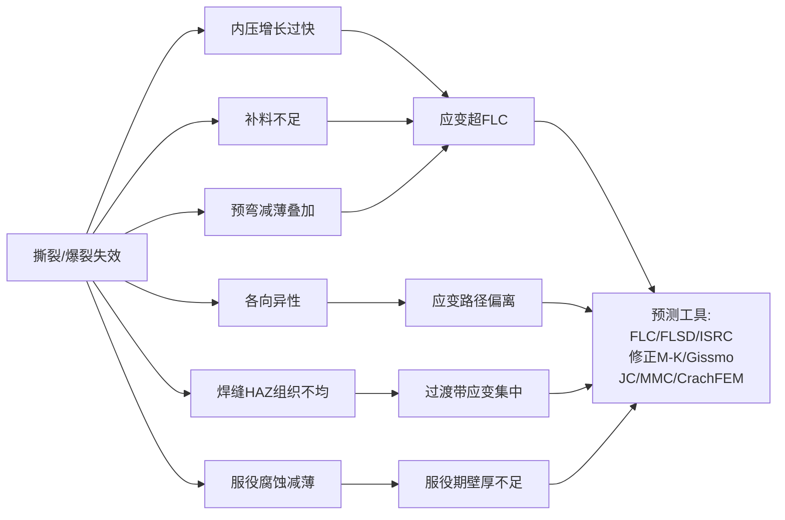

## 8.6 撕裂的综合对策与材料选型升级

针对撕裂缺陷的灾难性影响与多元诱因，工程实践已构建"FLC/FLSD 仿真预测—加载路径优化—预成形/挤压预处理—材料选型升级—热态成形拓展"五维综合对策体系。

**对策一：FLC/FLSD/XSFLC 仿真预测体系。** 8.5 节已系统呈现基于应变的 FLD/FLC、基于应力的 FLSD、基于应变速率的 ISRC、修正 M-K 模型以及 Gissmo/JC/MMC/CrachFEM 等失效模型的理论与工程价值。主流仿真工具包括 **Dynaform、AutoForm、Abaqus、LS-DYNA、PAM-AUTOSTAMP** 等——拉深筋研究指出，**Dynaform 软件提供直接定义金属流动阻力、根据剖面形状自动计算阻力或在模具表面直接建模进行模拟分析的方法；JSTAMP/NV 软件提供了强大的拉深筋数据库；FASTAMP 软件可以采用实体拉深筋模拟拉延成形，真实反映拉深筋几何参数对板料厚度、应力等的综合影响，模拟结果与现场测量高度吻合**[^127]。这些仿真工具与失效模型的组合应用，使工程师能够在虚拟环境中预测撕裂裕度并优化工艺参数，大幅降低物理试模成本。

**对策二：加载路径优化——MOPSO 与 LS-OPT 的工程应用。** 8.2 节与 8.4 节已系统呈现 MOPSO 多目标粒子群优化算法[^124]、LS-OPT 基于 FEM 的加载路径寻优[^125]、X 形管 Box-Behnken 响应面优化[^126]、T 形三通管模糊控制算法[^123]等典型方法。这些方法的共同核心在于——**通过精确匹配内压加载曲线与轴向进给曲线，使胀形区材料在受控应变路径下达到最终形状，避免应变在任何瞬间突破 FLC**。**LS-OPT 不锈钢 321 圆变方 THF 优化以最小化厚度减薄并满足 FLD 失效约束为目标函数**[^125]，直接将撕裂防控融入优化目标。

**双面板材液压成形（DSH）测试系统**则代表了起皱-撕裂耦合控制的实验研究前沿。土耳其学者设计制造的 DSH 测试系统**将液压数控系统改造为四轴系统，参数为成形压力、背压、冲头位置和压边力**；通过对锥形工业零件的液压机械深拉伸和 DSH 工艺成形测试，**采用 DSH 工艺成形零件时已发生的起皱缺陷不再发生**[^144]——这表明双面液压加载提供的厚向支撑可同时改善起皱与撕裂的边界条件，是加载路径优化在多缺陷耦合控制中的典型范例。

**对策三：预成形/挤压预处理——宝钢扭力梁工程典范。** 宝山钢铁股份有限公司液压成形技术团队针对**热成形钢的某形状复杂管件扭力梁**采用液压成形工艺成功开发了 1500 MPa 级管件，**解决了开发过程中台架试验及路试疲劳开裂问题**[^145]。

**工艺路径设计层面**，针对待开发零件**空间大曲率弯曲和中部深 V 型特征**，团队分析了不同工艺路线零件可成形性：**工艺路径 a 为"管件先压扁，再压 V，再对管件在两个方向上模具压弯，最后液压胀形"——成形仿真显示容易在压弯过程中底部褶皱和过渡段 V 型两端发生凹陷缺陷**；**工艺路径 b 为"管材先通过模具在两个方向上压弯，再压扁，再压 V，最后液压胀形"——过渡段侧壁存在凹陷缺陷**[^145]；分析两种工艺路径利弊，**最终采用工艺路径 b 设计开发模具**。最终的**五工序成形路径包括两序压弯预成形、压扁预成形、压 V 预成形及液压胀形**[^145]——这一多工序预成形对应变路径分散与撕裂抑制的关键作用，正是预成形预处理的核心工程价值。

**样件开发阶段的关键技术突破**包括：通过**三段式密封头设计解决了管端密封漏液问题**；通过**原始管径由 116 mm 缩小为 114 mm、调整第三序压扁角度等措施解决了侧壁凹陷缺陷**；通过**真空炉自由油淬使脱碳层控制在 20 μm 以内**，最终热处理后管件扭力梁为全马氏体组织、强度大于 1500 MPa[^145]。

**焊缝疲劳开裂问题改善**则呈现了焊接工艺与撕裂控制的深度耦合——**针对焊缝疲劳开裂问题，分析发现采用激光焊管在热处理过程中焊缝发生了软化：激光焊管热处理前焊缝硬度约 450 HV、热处理后焊缝硬度约 220 HV，而热处理后母材显微硬度约 460 HV，由于激光焊管焊缝热处理软化导致焊缝疲劳开裂**；**变更焊管工艺为高频焊管，焊缝疲劳开裂问题得到解决**[^145]。**管件过渡段 V 型上部多次发生疲劳开裂**，分析发现起裂位置对应液压成形管件 V 型上部 R 角较小、过渡不光顺，**通过优化管件成形过程中预成形第三工序压扁和第四工序压 V 上模型面，该位置零件尺寸精度得到改善，疲劳开裂问题得到解决**[^145]。**为整体提高管件扭力梁疲劳寿命，喷丸处理可以有效改善疲劳寿命，0.9 mm 喷丸效果优于 3 mm**[^145]。

这一宝钢工程案例的完整逻辑链——工艺路径优选 → 模具结构开发 → 样件试制问题解决（端部密封、端部开裂起皱、过渡段侧壁凹陷）→ 焊管工艺变更 → 模具型面优化 → 喷丸处理疲劳寿命改善——构成了"撕裂—起皱—变薄—疲劳"多缺陷协同防控的系统化工程典范，体现了第 6 章选材决策框架（热成形钢 1500 MPa 级）与本章撕裂防控对策的深度协同。

**对策四：副车架内高压成形——加载路径与预成形协同典范。** 郑斯佳针对某汽车副车架内高压成形工艺及参数优化的研究**针对零件成形中出现的开裂和起皱缺陷，采用数值模拟与成形试验相结合的方法**[^134]。研究的关键工程实践包括：**采用 AUTOFORM 有限元分析软件建立汽车副车架内高压成形全工序的有限元模型**，验证了企业实际生产中出现的开裂、起皱缺陷；**采用控制变量法研究摩擦因素对成形件质量的影响规律，通过对预成形件进行缠膜处理减少摩擦改善润滑条件，进行工艺试验获得了符合生产要求的副车架成形件**；**采用中心复合实验设计方法结合响应面法优化加载路径中的工艺参数，确定了最优的初始屈服压力 34.90 MPa、整形压力 89.36 MPa、轴向进给量 19 mm，从而得到最优加载路径**；**研究模具型面尺寸对成形件质量的影响规律，通过增大内高压成形模具第三弯处外侧圆角半径大小至 R15 mm，进一步降低了成形件最大减薄率**[^134]。这一研究案例完整呈现了"开裂起皱并存→润滑改进→加载路径中心复合实验优化→模具型面尺寸优化→最终成形合格"的工程优化路径，是加载路径与预成形协同应对撕裂缺陷的典范。

**对策五：材料选型升级——呼应第 6 章选材决策框架。** 根据第 6 章构建的"性能—成本—工艺—批量"四维权衡选材决策框架，针对不同材料的撕裂敏感性可采取差异化的工艺-材料协同策略：

**针对超高强钢**——SHS 低压顺序成形（成形压力降低约 30%）、压力-体积协同变载（哈工大苑世剑团队，尺寸精度提升 1 倍多）、协同变载技术等可有效降低应变集中诱发的撕裂风险；DP590/DP780 焊管液压成形则需通过**提高焊接质量控制失效位置、合理选择管材长径比、合理控制各处的减薄**[^134]来综合抑制撕裂。

**针对低塑性铝合金**——HFQ 铝合金热成形淬火（白车身减重 20% 且回弹极小，第 7 章已述）通过高温降低屈服强度并提升塑性，可有效避免常温下高强铝合金的撕裂敏感性；针对铝锂合金等更高强度铝合金，超低温双增效应技术（第 3 章已述）通过 FCC 金属在超低温下延伸率与硬化指数同时提高的反常物理现象释放塑性，是大型整体薄壁件的撕裂防控变革性技术。

**针对镁合金**——温态/热油恒温液压成形（200–250℃，第 4 章已述）是镁合金撕裂抑制的基础工艺；超高压脉动液压成形配合非等温加载策略**可完全避免褶皱产生**[^128]，对镁合金"起皱-减薄-撕裂"耦合失效具有针对性价值；冲击液压成形（200 kJ、80 m/s）通过高应变率激发动态塑性，**适用于铝合金、铝锂合金、镁合金、钛合金等**[^129]。

**针对钛合金**——超塑性气压成形（850–950℃、10⁻⁴–10⁻¹/s 应变率、约 1 MPa 低压，第 5 章已述）是钛合金大变形成形的不可替代工艺；热态液压成形（600℃ 以上，气体介质）则适用于钛合金管类构件批量生产；TC 类三通件采用热挤压+液压复合替代超塑成形（第 5 章已述）则在成本与撕裂抑制之间取得了产业化平衡。

**这一"通过工艺-材料协同主动调控应力状态"的撕裂防控哲学**——既不是单纯依赖材料的塑性储备，也不是单纯依赖工艺参数的精细化控制，而是通过工艺手段（加载路径、温度、应变率、压力波动等）**主动改变材料所处的应力状态使之远离 FLC**——是液压成形撕裂缺陷防控的核心方法论。

**对策六：DP590/DP780 焊管自由胀形实验的四条工程结论**作为材料选型与工艺优化协同的实证支撑——**(1) 管材液压成形实验是准确获得管材力学性能参数的途径**（不能简单沿用拉伸试样数据预测内高压成形行为）；**(2) 提高焊接质量有助于控制失效破裂位置**（优化焊接工艺、降低焊缝-HAZ-母材的硬度梯度）；**(3) 合理选择管材长径比有利于性能的充分发挥**（避免过大长径比导致的轴向应变累积与极限膨胀率下降）；**(4) 通过合理控制各处的减薄有利于降低液压成形件的破裂风险**（加载路径设计需在补料量、内压增长速率与各截面减薄率之间取得平衡）[^134]——为高强钢液压成形撕裂防控提供了完整的工程指导。

下表系统归纳撕裂缺陷五维综合对策体系的关键技术与工程效益：

| 对策维度 | 技术核心 | 量化效益/工程案例 | 适配场景 |
|---|---|---|---|
| FLC/FLSD/ISRC 仿真预测 | Dynaform/AutoForm/Abaqus/LS-DYNA/PAM-AUTOSTAMP+Gissmo/JC/MMC | 3A21 铝合金管极限压力 46.4 MPa；ISRC 应变速率比 100 | 各类管/板材液压 |
| 加载路径优化 | MOPSO/LS-OPT/Box-Behnken/模糊控制 | DSH 锥形件起皱完全消除 | T/Y/X 形管、圆变方 |
| 预成形预处理 | 多工序压弯+压扁+压 V+液压胀形 | 宝钢 1500 MPa 扭力梁五工序成形 | 复杂截面高强钢管件 |
| 焊接工艺优化 | 激光焊→高频焊变更 | 焊缝硬度 220→460 HV、疲劳开裂解决 | 焊管液压成形 |
| 模具型面优化 | 第三序压扁+第四序压 V 上模型面优化 | 过渡段 V 型上部疲劳开裂解决 | 复杂过渡区 |
| 喷丸疲劳处理 | 0.9 mm 喷丸 | 优于 3 mm，疲劳寿命改善 | 液压成形件后处理 |
| 副车架加载路径优化 | 中心复合实验+响应面法 | 屈服压力 34.90 MPa+整形 89.36 MPa+进给 19 mm | 副车架开裂起皱并存 |
| 材料选型升级（高强钢）| SHS+协同变载 | 成形压力↓30%、尺寸精度↑1 倍多 | DP980 等超高强钢 |
| 材料选型升级（铝合金）| HFQ+超低温双增效应 | 白车身减重 20%、铝锂大型件突破 | 7075、铝锂合金 |
| 材料选型升级（镁合金）| 温态恒温+脉动液压 | 250℃ 最佳、镁合金温热无褶皱 | AZ31B 异型管 |
| 材料选型升级（钛合金）| 超塑气压+热态液压 | 850–950℃ 超塑、单次胀幅>60% | TC4 复杂构件 |

**综合本章分析可以得出三条核心结论**：

**第一，起皱、变薄、撕裂三类与材料流动密切相关的缺陷具有清晰的力学机理分层与对策映射逻辑**——起皱根植于压应力下的几何分叉失稳（预弯起皱依赖芯轴与缩胀工艺、贴模起皱可转化为"有用褶皱"扩大工艺窗口、法兰起皱通过压边力与拉深筋抑制、悬空区内皱依赖液压成形厚向支撑）；变薄根植于拉应力下材料流动补给失衡（正方形截面过渡区减薄达平均减薄率的 4.6 倍，膨胀率 10% 时过渡区减薄率 25.5%，摩擦因数 0.15 时 17.5%，TRB 通过差异化壁厚分布主动适配应力梯度）；撕裂根植于局部应变越过 FLC 的灾难性失效（FLC/FLSD/ISRC/修正 M-K/Gissmo 等多元预测工具，焊缝 HAZ-母材过渡区为高发位置）。

**第二，三类缺陷的对策体系呈现明显的"工艺协同—材料协同—温度协同"三层结构**——工艺协同层面，加载路径优化（MOPSO、LS-OPT、Box-Behnken、模糊控制）、压力-体积协同变载、超高压脉动液压、双面液压（DSH）等技术通过精细调控内压-轴向进给-压边力-背压等多参数实现起皱-变薄-撕裂的协同抑制；材料协同层面，TRB 变厚度管/VRB 变厚板通过差异化壁厚分布从源头匹配应变梯度，DP/TRIP 钢种通过低屈强比高 n 值提供宽工艺窗口，热成形钢 1500 MPa 级通过完整工艺链（如宝钢扭力梁五工序）实现高强度复杂件制造；温度协同层面，HFQ 铝合金热成形淬火、超低温双增效应、镁合金 200–250℃ 温态成形、钛合金 850–950℃ 超塑性气压成形等通过改变材料所处的温度状态实现塑性窗口的根本性拓宽。

**第三，三类缺陷之间存在明显的耦合权衡关系**——补料前移可减薄抑制但补料过量诱发起皱（Y 形管轴向进给比双向作用）；压边力增大可抑起皱但易诱发撕裂（薄板液压成形）；内压提高有利于贴模减回弹但加剧法兰减薄；预弯减薄区与胀形拉应变叠加诱发撕裂——这些耦合关系决定了液压成形工艺优化本质上是在多目标空间中求解 Pareto 最优，而非单一目标的局部最优。**MOPSO 算法一次运算可同时获取多个 Pareto 最优解为工序方案和工艺参数的制订提供更多解决方案**[^124]，正是这一多目标本质的工程化体现。这一耦合权衡机理及"工艺窗口（process window）"的系统构建方法，将作为第 9 章五类缺陷耦合关系、综合工艺优化策略与全报告研究结论展望的核心议题。

需要说明的是，本章引用的部分工程数据（如宝钢 1500 MPa 扭力梁五工序成形、副车架加载路径优化参数、DP590/DP780 焊管极限膨胀率、3A21 铝合金管极限压力 46.4 MPa、双极板优化参数等）来源于具体企业的工程披露与特定研究案例，在不同材料、不同零件、不同工艺条件下的具体效益可能存在差异；本章建立的"分类识别—力学成因—工程对策—典型案例"四位一体方法论框架在第 7 章基础上进一步深化，为第 9 章五类缺陷耦合关系揭示、综合工艺优化策略构建以及全报告结论展望提供了完整的论据基础与方法论接口。

# 9 缺陷耦合关系、综合工艺优化策略与研究结论展望

作为整篇报告的收官章节，本章承担三重任务：其一是揭示起皱-变薄-撕裂、回弹-表面缺陷等五类典型缺陷之间的耦合权衡机理，构建多目标"工艺窗口"分析方法；其二是系统归纳多目标优化、有限元仿真、数字孪生与在线监测等综合工艺优化路径；其三是汇总四类材料的适用性结论与五类缺陷的成因-对策映射关系，提炼面向工程实践的材料选型与缺陷防控建议，并展望超高压成形、热态液压成形、拼焊管成形、智能化工艺控制等新技术对未来液压成形发展的影响。本章在前八章逐一分析的基础上完成材料侧与缺陷侧两条主线的最终汇聚，构建"材料—缺陷—工艺—装备"四维统一的研究结论体系。

## 9.1 五类缺陷的耦合权衡机理与相互作用规律

液压成形过程中的五类典型缺陷——表面缺陷、回弹、起皱、变薄、撕裂——并非彼此孤立存在，而是通过共享同一组工艺参数（内压加载曲线、轴向进给量、压边力、摩擦条件、模具圆角、温度等）形成深度耦合关系。理解这种耦合本质，是构建有效综合防控体系的逻辑前提。

**起皱-变薄-撕裂三者的此消彼长关系**是最为典型也最为重要的耦合机理。第 8 章已系统呈现 Y 形管液压成形的双向作用规律——支管高度随轴向进给比增加而增加且在一定程度上可改善支管减薄，但过大的轴向进给比将导致支管顶端减薄严重[^83]。这一现象揭示了"补料量"这一单一工艺参数在不同区间的对立作用：**补料不足时**胀形区材料无法获得足够轴向流入，应变只能通过局部减薄方式承担，最终突破 FLC 引发撕裂；**补料过量时**多余材料无法及时转化为环向变形，在轴向聚集形成折叠或皱纹，进入"压力上升速度较慢、轴向进给速度较快、轴向变形来不及转化为周向变形"的折叠失效模式[^84]。这一双向作用使补料量的工艺窗口呈现明显的"中间最优—两端失效"特征，构成了起皱与撕裂之间的第一类典型耦合。

**内压加载曲线与起皱-撕裂的双向耦合**是第二类典型场景。研究表明，加载路径 1（无轴向进给）时压力达 105 MPa 即在圆角与直边相切的过渡区发生破裂，圆角半径仅 13.5 mm 未达设计要求；加载路径 2（成形压力较低、轴向进给过快）时出现折叠现象，在后续整形阶段即使压力很高也无法胀平[^84]。这一对照实验清晰呈现了**内压增长速率与轴向进给速率之间必须形成精确匹配**——内压过高诱发撕裂、内压过低诱发起皱，二者的边界条件构成了第 9.2 节将系统讨论的"工艺窗口"的核心边界。多通管内高压成形同样验证了这一规律——加载曲线必须控制在成形区间内，即内压、轴向进给量及中间冲头的后退量匹配合理，才能避免主管起皱、支管破裂与过渡区凹陷等多元缺陷的并发[^83]。

**压边力与起皱-撕裂的双向耦合**则在板材液压成形中表现最为典型。压边力作为抑制法兰起皱的核心工艺杠杆，**压边力大、工件弯后回弹量小、折弯压力越大回弹量越小**[^105]，但压边力过大又会阻碍材料从法兰区向凹模型腔流入，诱发底部或侧壁的过度减薄甚至撕裂。轧制差厚板盒形件充液拉深的正交试验结果明确表明：对最大厚度减薄率而言，各因素影响程度顺序为摩擦因数>厚侧液池压力>厚侧压边力>薄-厚侧液池压力之比>薄-厚侧压边力之比；对底部过渡区移动量与法兰处过渡区移动量而言，各因素影响程度顺序为厚侧压边力>薄-厚侧压边力之比>厚侧液池压力>薄-厚侧液池压力之比>摩擦因数——综合考虑两类指标的最优参数组合需在多目标空间中求解[^134]。这一研究案例量化呈现了压边力在不同失效模式之间的双向作用。

**预弯减薄区与胀形拉应变叠加诱发撕裂**是弯曲轴线管液压成形中的另一类典型耦合。蔡洋等针对预弯铝合金管材的研究明确指出，弯曲产生的回弹、截面畸变及起皱等缺陷会影响后续内高压成形的质量；通过建立管材塑性弯曲的理论模型，计算任意弯曲角度的卸载回弹量，在弯曲过程考虑回弹量补偿，可有效避免内高压成形时的咬边缺陷；通过改善芯轴条件、使用带有一个芯球的芯轴，使截面不圆度由 7.55% 降低至 1.43%，避免了弯曲件在内高压成形时发生破裂；同时对弯曲产生皱纹的管件进行内高压成形，证实了**内高压成形过程不能够消除管件在弯曲过程形成的起皱**[^79]。这一关键发现表明，前道工序的起皱或减薄缺陷会在后续工序中被"固化"甚至放大——预弯减薄区在液压胀形阶段叠加双向拉应变后成为撕裂首发位置，预弯起皱则因死皱特征无法在液压阶段消除而直接构成成品缺陷。

**焊缝及热影响区组织不均诱发的应变集中**则是焊管液压成形特有的耦合失效。弯曲段外侧开裂的原因是弯曲过程造成壁厚过度减薄和加工硬化使材料塑性不足；焊缝开裂的主要原因是采用 ERW 焊管成形时因焊缝质量不良造成在焊缝及附近热影响区开裂，在正常生产中**内高压成形过程主要开裂缺陷是焊缝开裂**[^84]。第 2 章已述 DP590/DP780 焊管的研究表明破裂位置全部位于靠近焊缝及热影响区的母材区域，最小壁厚位于热影响区和基体的过渡区域——这一应变集中现象本质上是焊缝硬相与母材软相之间的硬度梯度诱发的局部失稳，使原本应均匀分布的胀形应变集中于过渡带，加速了撕裂的发生。**通过 ERW 焊管改为高频焊管的工艺变更（焊缝硬度由 220 HV 提升至 460 HV）可显著改善焊缝软化导致的疲劳开裂**[^146]，这一工程实践证实了焊接工艺与液压成形撕裂裕度之间的深度耦合。

**回弹与表面缺陷在卸载阶段的相互影响**则呈现另一类耦合维度。回弹诱发的二次接触可能加剧分模线压痕——零件脱模过程中由于残余应力释放产生的微小位移，使零件与模具分模线、定位销等结构产生非预期的相对滑动，留下二次接触痕迹；润滑剂选择则间接影响残余应力分布与回弹量——液压成形中"在不同的压力条件下可以控制不同的接触条件"，润滑剂被困在表面结构可能无助于分离模具和零件表面，导致严重的摩擦条件与表面损伤[^94]，而摩擦阻力又通过影响材料流动的均匀性间接改变残余应力分布，最终影响回弹规律。

**"有用褶皱"作为预成形积料手段转化为有益变形**则是一种特殊的耦合模式。Wang 等针对管材内高压成形的起皱研究区分了"死皱"（无法在后续整形中消除）与"有用褶皱"（可作为预成形阶段的积料手段），并指出**通过有用褶皱在膨胀区积料，可有效扩大液压成形的工艺窗口**。预测起皱类型的两种方法（基于几何的预测方法、基于力学的预测方法）已通过对应实验验证，结果表明在脉动液压压力配合轴向进给条件下出现的起皱类型可由两种方法预测，且基于几何的预测方法精度高于基于力学的预测方法[^147]。这一发现的工程意义在于——并非所有起皱都是缺陷，**适度受控的有用褶皱反而是抑制过度减薄、扩大变薄安全裕度的关键手段**，这正是起皱与变薄之间的"有益耦合"通道。

综合上述五类耦合机理，可建立液压成形多缺陷传导网络：

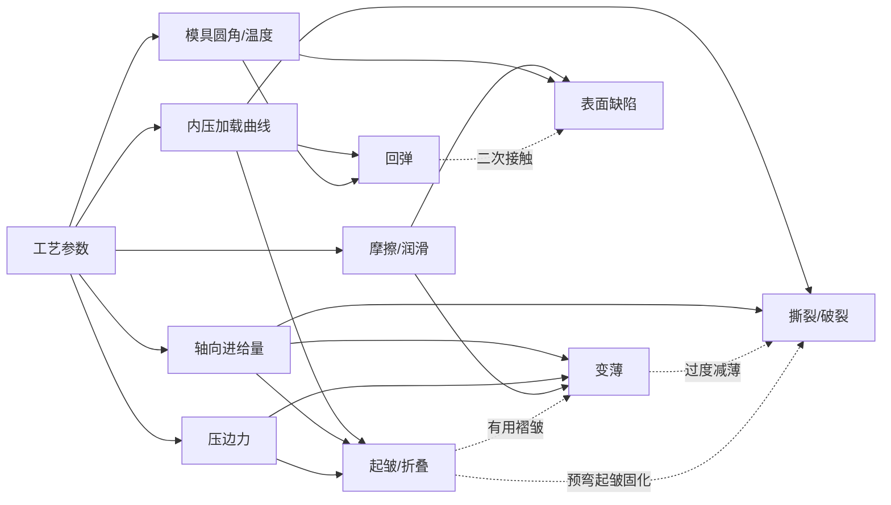

这一传导网络揭示了五类缺陷之间"工艺参数共享—失效模式互转"的本质规律，也为后续工艺窗口构建与多目标优化提供了理论坐标。

## 9.2 工艺窗口的构建方法与多目标优化路径

基于 9.1 节揭示的多缺陷耦合机理，液压成形的工艺优化本质上是在多维参数空间中寻找各类缺陷"安全边界交集"的多目标求解问题——这一交集即工艺窗口（process window）。

**工艺窗口的物理边界**由第 1 章已建立的关键参数定义。**初始屈服压力 $P_s = 2\sigma_s t/d$ 与轴向应力-环向应力比相关，定义了塑性变形发生的下限；开裂压力 $P_b$ 与抗拉强度 $\sigma_b$ 相关，定义了破裂上限；整形压力 $P_c$ 用于成形截面过渡圆角和保证尺寸精度，圆角半径越小所需压力越高（一般 $r_c=(4{\sim}10)t$ 时整形压力约为屈服强度的 1/4–1/10）；轴向起皱临界应力 $\sigma_{cr}$ 定义起皱发生的下限**[^85]。在内压—轴向进给的二维加载图上，这些参数共同围合出"屈曲区—起皱区—破裂区—合格成形区"四象限格局——加载路径若进入屈曲区则发生轴向失稳、进入起皱区则发生折叠或皱纹、进入破裂区则发生撕裂，**只有控制加载路径在合格成形区间内即内压、轴向进给量及中间冲头后退量匹配合理时，才能避免多元缺陷的并发**[^83]。

**多目标优化算法**为工艺窗口的精确求解提供了系统方法论。**NSGA-II 精英保留非劣排序遗传算法**是当前应用最广泛的多目标优化工具之一。郑再象等针对管件液压成形加载路径多目标优化的研究将 NSGA-II 与基于动态显式算法的有限元软件 LS-DYNA 集成，通过优化算法程序修改加载路径、自动调用数值模拟软件进行分析，在更大的解空间内自动寻找最优方案；以某汽车仪表板梁为例，**采用该方法所获取的加载路径较通过人工寻优所获取的加载路径更趋于最优；该方法一次运算能够同时获取多个 Pareto 最优解，可为加载路径的制订和设计人员的决策提供更多的选择**[^148][^149][^150]。该团队的后续研究进一步将基于 NSGA-II 的多目标优化求解器与基于动态显式算法的有限元软件集成，对仪表板梁液压成形补料量进行优化分析，**所获取的加载路径比通过试错寻优所获取的加载路径更趋于最优**[^83]。

**HDEPSO 混合差分进化粒子群优化算法**是另一类先进的工艺窗口求解工具。Caseiro 等开发的 HDEPSO 算法**针对液压成形中起皱与变薄缺陷的同步控制，实现了一种简单的数值算法用于同时跟踪和评估起皱/变薄缺陷的起始**，与基于有限元法（FEM）的数值仿真程序结合；在 FEM 仿真识别出不利的起皱/变薄模式后，HDEPSO 优化程序自动修正过程输入参数，以实现期望零件的成功成形；最终组合程序（优化方法+FEM）证明能够为工业液压成形金属管材件提供合适的数值仿真和设计工具[^114]。这一算法的核心价值在于将起皱与变薄两类相互耦合的缺陷在同一优化框架下协同处理，体现了多目标优化的本质优势。

**Taguchi 正交试验法与目标达成法**则代表了系统化试验设计与多目标决策的经典方法。研究通过有限元分析与 Taguchi 方法研究成形参数对管材液压成形的影响——Taguchi 方法用于设计正交试验阵列，虚拟试验通过有限元法（FEM）进行分析，预测结果再通过 Taguchi 方法分析以给出各参数对液压成形管材的影响；在自由胀形液压成形过程中找到使**最高胀形比和最低减薄比**的最优成形参数组合；提出通过同时最大化胀形比和最小化减薄比的多目标优化方法，使用**目标达成法（goal attainment method）** 解决优化问题[^151]。这一方法学组合特别适合工艺参数较多、试验成本高昂的工业场景，已在汽车副车架等典型零件的工艺优化中得到广泛应用。

**Box-Behnken 响应面法**则在不对称结构件的多参数协同优化中表现突出。第 8 章已引述基于 Box-Behnken Design 试验设计和响应面法，以内压力、轴向进给量、背向位移量为变量，可获得 X 形管合格成形件的加载路径。**模糊控制算法**则将工程师的专家经验形式化为可执行的规则——李凯团队的方案集成 6 种成形质量评价函数与 848 条实际经验总结的模糊控制规则，结合 LS-DYNA 数值模拟自动优化 T 型三通管的加载路径，极大缩短了加载路径的设计时间，且成形出合格的零件（第 7 章已述）。

**Pareto 最优解集对工程决策的支撑价值**是多目标优化相对于单目标优化的根本优势。**一次运算获取多个最优方案**为工程师提供了"权衡曲线"——在起皱抑制与变薄抑制之间、在尺寸精度与生产节拍之间、在材料利用率与零件刚度之间，工程师可根据具体应用场景的优先级选择最适合的 Pareto 解，而无需在单一目标函数下被动接受唯一最优解[^148][^149]。这一决策灵活性在汽车工业的多车型平台战略、航空航天的多型号研制中具有特别价值。

下表汇总液压成形工艺窗口求解的主流多目标优化算法及其工程应用：

| 算法 | 技术特征 | 典型工程案例 | 关键效益 |
|---|---|---|---|
| NSGA-II 精英保留非劣排序 | 遗传算法+精英保留 | 汽车仪表板梁、补料量优化 | 加载路径较人工寻优更优；多 Pareto 解[^83][^148][^149] |
| HDEPSO 混合差分进化粒子群 | DE+PSO 混合 | 起皱-变薄同步控制 | 自动跟踪与修正缺陷模式[^114] |
| Taguchi 正交+目标达成法 | 正交试验+多目标决策 | 自由胀形液压成形 | 最大胀形比+最小减薄比[^151] |
| MOPSO 多目标粒子群 | 粒子群+Pareto 前沿 | 管件加载路径 | 一次运算多 Pareto 解、壁厚均匀化 |
| Box-Behnken 响应面 | 试验设计+响应面 | X 形管不对称结构 | 多参数协同优化 |
| 模糊控制+848 规则 | 专家系统+LS-DYNA | T 型三通管 | 极大缩短设计时间 |
| 中心复合实验+响应面 | 试验设计+响应面 | 副车架（屈服压力 34.90 MPa+整形 89.36 MPa+进给 19 mm）| 开裂起皱并存解决 |

## 9.3 有限元仿真与FLD/FLSD预测体系的综合应用

有限元仿真作为多缺陷综合预测的核心工具，其在液压成形工程中的应用已形成"通用工具+失效模型+可靠性方法"三位一体的成熟体系。

**主流仿真工具的功能定位与适配场景**呈现明显的分化格局。**FORGE3** 作为通用金属成形代码，其大型塑性变形的力学公式针对管材或板材液压成形仿真进行了优化——工业用液压成形管材通常足够厚以致必须采用**实体方法而非薄壳分析**；通过 **P1(+)-P1 四面体单元的混合积分公式三维离散**，允许在厚度方向精确建模管材变形，且便于重新划分网格和自适应网格划分；该软件还集成了**根据施加压力计算全局流体流动的功能、工艺优化、用于预测工件可能破裂的损伤分析**等针对液压成形的特定开发[^79]。**LS-DYNA** 作为通用显式非线性有限元分析软件，以 Lagrange 算法为主、兼具 ALE 和 Euler 算法，以显式动力学分析见长，同时拥有隐式求解功能，被汽车安全碰撞仿真领域视为行业标准（第 7 章已述）。**Dynaform、AutoForm、ABAQUS、PAM-AUTOSTAMP** 等通用工具则各有侧重——Dynaform 在镁合金温态成形的多参数仿真中表现突出（第 4 章已述）；AutoForm 在汽车覆盖件滑移线分析与副车架全工序成形仿真中应用广泛；ABAQUS 在 316L 双极板液压成形与铝合金充液拉深的精细化分析中发挥关键作用；PAM-AUTOSTAMP 则在板料成形仿真特别是滑移线、表面缺陷等精细问题的求解上具有优势（第 7 章已述）。

**失效模型的协同应用**是多缺陷综合预测的另一核心维度。第 8 章已系统呈现 FLC/FLD（基于应变）、FLSD（基于应力）、ISRC（基于应变速率变化）、修正 M-K 模型、Gissmo/JC/MMC/CrachFEM 等失效模型的理论价值与适配场景。从工程应用角度看，**FLD 适合线性应变路径下的传统板料成形，FLSD 独立于应变路径而更适合复杂加载路径的液压成形，ISRC 则提供了基于应变速率突变的破裂判据**。**Gissmo 模型涉及应力三轴度、失效应变、不稳定性应变、损伤累积指数、应力退化指数等丰富参数，适合超高强钢在复杂工况下的断裂行为表征**（第 8 章已述）。这些模型在工程实践中往往组合使用——FLD/FLSD 用于宏观失效边界判断，Gissmo/JC 用于细节断裂行为追踪，CrachFEM 用于碰撞与冲击工况下的损伤累积分析。

**基于可靠性理论与FLD的失效概率评估方法**是有限元仿真应用的重要扩展。Li、Metzger、Nye 等针对管材液压成形的可靠性分析提出了一种基于可靠性理论和成形极限图评估失效概率的方法——管材液压成形过程受几何形状、材料性能、工艺条件等众多参数影响，**有限元仿真用于预测应变与这些参数之间的关系，数值方法用于获得应变的统计分布；基于成形极限图中的成形极限带（forming limit band），可评估成形过程的可靠性**；该研究以自由胀形管材液压成形为例说明该方法，结果表明这种可靠性评估技术为产品设计者和工艺工程师提供了避免液压成形失效的创新方法[^152]。这一可靠性方法的核心价值在于克服了传统确定性分析的局限——传统方法假设输入参数为确定值，输出唯一的安全/失效判断；而可靠性方法考虑参数的统计分布（如材料强度波动、管壁初始厚度偏差、摩擦系数变化等），输出失效概率，更符合工业生产中"批量稳定性"的真实需求。

**焊管液压成形极限预测模型**则针对 ERW 焊缝及热影响区组织不均的特殊场景建立了专用 FLD 预测理论。陈宪锋、虞忠琦等针对焊管液压成形成形极限预测模型的研究指出，**焊管广泛应用于汽车管件液压成形中，焊接区影响焊管塑性变形规律，分析焊管的颈缩破裂是工程上备受关注的难题**；研究基于金相分析法和显微硬度测量法分析 ERW 焊管的组织特性，并根据液压成形条件下 ERW 焊管的变形特征，**提出了一种用于预测焊管液压成形极限的理论方法**；基于该方法运用 Swift 硬化方程和 Hill 屈服准则推导出**焊管液压成形极限的理论预测模型**，**在已知焊管（包括焊接区和基体区）材料性能参数条件下可获得焊管液压成形极限图；运用此理论预测模型预测出 QSTE340 ERW 焊管的液压成形极限图；成形极限的预测结果与试验对比表明二者吻合较好**，证明所建立的焊管液压成形极限的理论预测模型是正确的[^153]。这一专用模型为汽车工业焊管液压成形提供了精确失效边界，与第 2 章已述 DP590/DP780 焊管自由胀形实验的工程结论形成理论-实验闭环。

**仿真工具与失效模型的协同应用流程**可概括如下：

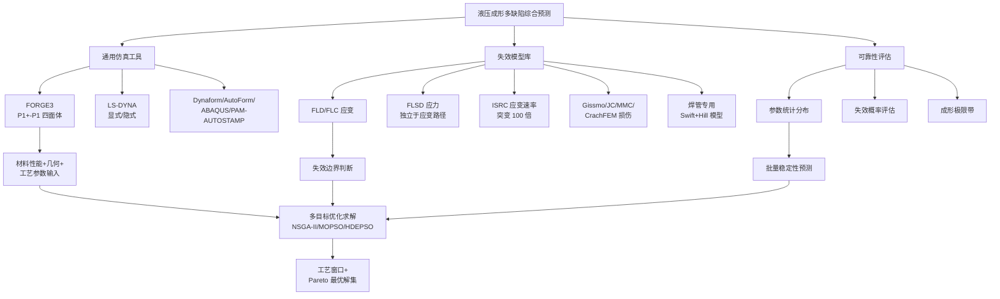

## 9.4 数字孪生、在线监测与智能化工艺控制

随着工业互联网、人工智能与先进控制技术的深度融合，液压成形装备的智能化演进为多缺陷综合防控提供了全新的支撑路径。

**液压压机控制系统的五层智能化架构**代表了当前装备智能化的技术前沿。**感知层**通过多维度数据采集为缺陷预测提供原始数据基础：高精度压力传感器（精度 ±0.1%FS）与激光位移传感器（分辨率 0.01 mm）实时反馈执行机构状态；温度变送器与电磁流量计实现液压油状态的动态监测；振动加速度传感器（量程 ±50g）与超声波检测仪诊断液压缸密封件磨损[^154]。这些传感器数据共同构成液压成形过程的实时"数字镜像"，为压力曲线、轴向进给曲线、合模力曲线等关键工艺参数的实时监控提供了物理基础。

**控制层**则将感知数据转化为智能决策执行：基于比例阀/伺服阀的 PID+模糊控制算法响应时间<10 ms；安全联锁系统符合 ISO 13849 PL e 级安全标准，急停响应时间 ≤20 ms；工艺参数存储支持 1000 组以上产品配方的本地存储与调用[^154]。这一控制能力对差异化材料工艺的支撑尤为关键——**自适应压力控制可根据材料特性动态调整压制力**，如钛合金与铝合金的差异化工艺：钛合金需 600 MPa 以上超高压配合气体介质与超塑温度，铝合金则常用 ≤400 MPa 配合常温或 300℃ 温态[^154]；多目标优化算法可在成型精度、能耗、生产节拍间寻找较优平衡点。

**边缘层**实现本地化智能处理：边缘计算网关完成数据清洗、特征提取与异常值过滤；预测性维护模块基于 LSTM 神经网络预判断向阀阀芯卡涩故障[^154]。**平台层**则构建工业大数据基础：存储压机全生命周期数据（压力曲线、能耗记录等）；AI 算法库集成支持向量机（SVM）、强化学习等模型优化压制工艺。**应用层**最终面向用户价值创造：远程运维平台通过 Web/APP 实现设备状态监控与参数远程配置；生产管理看板实时展示 OEE（设备综合效率）、良品率等关键指标[^154]。

**智能化管理核心技术突破**集中体现于四个方向。其一是**动态工艺优化系统**——自适应压力控制根据材料特性动态调整压制力，多目标优化算法在成型精度、能耗、生产节拍间寻找较优平衡点。其二是**预测性维护体系**——剩余寿命预测基于粒子滤波算法计算液压缸密封圈剩余寿命（预测误差<5%）；故障根因分析关联振动信号与压力波动数据，定位液压泵气蚀等潜在故障[^154]。其三是**能源管理系统**——再生制动能量回收将回程时的液压能转化为电能，**节能率达 25%**；智能休眠策略根据生产计划动态调整油泵启停，降低待机能耗。其四是**数字孪生应用**——虚拟压机仿真构建包含流场、结构力学的高精度模型，支持工艺参数预验证；虚实交互控制通过数字孪生体优化控制参数，减少物理设备调试时间[^154]。

**数字孪生技术对液压成形多缺陷综合防控的支撑价值**已在多个工业领域得到实证。研究显示，数字孪生技术可**提升装备运行效率 20% 以上，同时降低维护成本 15%**；通过多尺度机构模型从零件（如齿轮、电机）到整机系统分层构建，跨越多个物理量级，解决了传统建模难以处理复杂耦合的问题；模块化参数设计通过标准化部件的参数库使**建模效率提升 30%**；行为规则映射结合有限元分析与 AI 算法，实现对装备应力、载荷等性能的实时预测，**误差率低于 5%**[^85]。在工程实践中，**采用 AI 算法优化动力学性能可使计算资源消耗减少 50%，同时保证仿真精度；支持远程监控与故障诊断，响应时间缩短至毫秒级**[^85]。

虚拟传感（virtual sensing）技术是数字孪生在液压成形质量控制中的前沿方向。Hossain、Ahmed 等基于深度神经算子（Deep Operator Networks, DeepONet）的研究展示了虚拟传感在实时监测中的潜力——**传统物理传感器系统在测量难以到达或恶劣环境中的关键参数方面存在局限性，常常导致数据覆盖不完整；机器学习驱动的虚拟传感器通过补充物理传感器在监测关键退化指标方面提供了变革性解决方案**；DeepONet 作为虚拟传感器将操作输入映射到空间分布的系统行为，无需频繁重新训练；结果表明 **DeepONet 实现了较低的均方误差和相对 L2 误差，预测速度比传统 CFD 仿真快 1400 倍**[^155]。这一虚拟传感技术对液压成形过程中难以直接测量的内部应力分布、局部温度梯度、过渡区减薄率等关键缺陷指标的实时预测具有直接借鉴价值。

**实施关键成功要素**包括三方面：**标准化接口设计**——遵循 ISA-95 标准实现与 MES/ERP 系统的数据交互，OPC UA 协议支持多品牌液压元件（如力士乐、派克）的即插即用；**功能安全认证**——符合 ISO 13849-1 PL e 级安全要求，安全电路冗余设计，通过 CE 认证（MD 2006/42/EC）与 SEMI S2 半导体设备安全标准；**人机协作优化**——AR 辅助维修系统通过智能眼镜显示维修指导动画，自然语言交互界面支持语音指令调整工艺参数[^154]。

下表系统呈现数字孪生与智能化工艺控制对五类缺陷防控的差异化支撑：

| 智能化技术 | 关键参数/效益 | 对应缺陷防控价值 |
|---|---|---|
| 高精度压力传感（±0.1%FS）| 压力曲线实时反馈 | 内压加载偏差→撕裂/起皱实时预警 |
| 激光位移传感（0.01 mm）| 模具型面变形监测 | 回弹精确补偿 |
| 伺服液压 PID+模糊控制（<10 ms）| 加载路径自适应 | 起皱-变薄-撕裂协同抑制 |
| 自适应压力控制 | 材料差异化策略（钛 vs. 铝）| 差异化材料缺陷防控 |
| LSTM 预测性维护 | 阀芯卡涩故障预判 | 模具印迹/表面缺陷预防 |
| 粒子滤波剩余寿命（<5% 误差）| 密封圈寿命预测 | 模具磨损→表面缺陷预防 |
| 数字孪生虚拟仿真 | 工艺参数预验证 | 全缺陷类型综合预测 |
| 虚拟传感（DeepONet 1400 倍加速）| 难测参数实时预测 | 局部应变/温度梯度→撕裂预警 |

## 9.5 四类材料适用性结论与产业定位汇总

在前八章逐一分析的基础上，可对四类材料液压成形适用性进行最终归纳。第 6 章已系统构建"性能—工艺—减重—成本—应用"五维横向比较框架，本节则在此基础上完成产业定位的最终汇总。

**高强度钢的"量产主导"定位**由四要素共同奠定：最低材料成本（钢的基准价格）、最成熟供应链（宝钢/鞍钢/首钢/河钢与 SSAB/阿赛洛米塔尔等成熟供应商）、常规装备兼容（≤400 MPa 内高压成形装备已成熟国产化）、宽强度梯度（500–2400 MPa 连续覆盖）。典型应用谱系覆盖车身骨架（A/B/C 柱、车门槛、横梁、纵梁）、底盘结构件（副车架、纵梁、横梁、扭力梁——前副车架主体结构为管材内高压成形，形状多为"Ω"形或"U"形，材料多为普通的高强钢，强度级别在 440 MPa 左右，厚度在 1.8–2.5 mm，一般成形工艺为弯管→预成形→内高压成形→管端成形；A 级车后扭力梁横梁、纵臂多为管材内高压成形，材料多为先进高强钢，强度级别在 780 MPa 左右，厚度在 3.0–4.0 mm[^87]）、安全件（防撞梁、车门防撞梁、保险杠）、悬架件（控制臂、滑轨）以及排气系统等几乎所有承载与吸能结构。

**高强度铝合金的"中端主流"定位**由"密度仅为钢 1/3+成本可承受+成熟供应链+多温度成形窗口"四要素共同奠定。典型应用包括奥迪 ASF 体系（A2/A8/TT/R8 累计超过 100 万辆）、覆盖件领域的引擎盖与尾箱盖（AA6016）、车门内板与油箱（5182）、高端汽车前防撞梁（领克 07 EM-P 的 7 系铝合金）、底盘结构件（6061-T6 副车架、防撞梁）、新能源汽车电池包框架（特斯拉较钢制减重 30%）与超长铝挤压门槛梁、航空航天的飞机蒙皮、口框、襟翼舱壁板（5A06/2B06）、运载火箭储箱箱底等大型椭球壳体（高强铝/铝锂合金）。**汽车液压成型零件行业 2025 年全球与中国市场规模分别达 1305.93 亿元与 286.91 亿元，预计 2032 年全球市场可达 2267.08 亿元，预测期间年复合增速（CAGR）为 8.2%；行业核心企业包括 Showa Rasenk、Yorozu、SANGO、Nissin Kogyo、Magna International、Tenneco、Thyssenkrupp 等**[^105]，铝合金作为这一市场的主力材料之一，其产业定位由市场规模与企业生态共同验证。

**镁合金的"极致轻量化"定位**由"密度最低（1.74 g/cm³）+阻尼性能最优（铝的 100 倍、钛的 300–500 倍）+电磁屏蔽优+2025 年镁铝比成本拐点"四要素共同奠定。典型应用聚焦于阻尼/电磁屏蔽/极致轻量化综合要求最严的细分场景——仪表板横梁（CCB）作为镁合金"以镁为翼"的标志性应用、座椅骨架（福特/丰田/现代分别减重 25%/40%/50%）、新能源汽车主承力件（赛力斯问界单车镁合金 20 公斤级、一体压铸后车体集成 87 件较铝合金再减 21.8%）、笔记本电脑外壳（华为 MateBook X Pro 微绒典藏版、宜安科技 14 寸壁厚 0.45 mm 量产）。

**钛合金的"高端不可替代"定位**由"最高比强度+最优耐蚀+耐热 600–650℃+生物相容性"四要素共同奠定。典型应用集中于性能要求超越其他三种材料极限的不可替代场景——航空发动机（F-22 用钛量 41%、F-35 用钛量 27%、V2500 用钛量 31%）、航天领域（Ti-5Al-2.5Sn ELI 涡轮油泵叶轮 20K 低温）、机体结构（起落架、蒙皮、CP 钛航空管路）、高端汽车（限于法拉利、保时捷、兰博基尼等高端跑车与赛车）、医疗领域（人工关节、骨钉、心血管支架）、化工领域（占钛材总用量超 50%）。

**多材料组合设计（multi-material design）的工程哲学**是四类材料产业定位最为深刻的现代体现。第 6 章已系统呈现奥迪 A8 第四代多材料 ASF（58% 铝合金+40% 钢+1% 镁+1% 碳纤维，共 29 种不同级别材料、14 种不同的车身制造工艺、抗扭刚度较前代提升 24%）、领克 07 EM-P 高强钢+7 系铝分工（A/B 柱及四门防撞梁采用 2000 MPa 级超高强度钢，前防撞梁采用 7 系铝合金负责低速吸能）、问界一体压铸镁合金后车体集成 87 件减重 21.8% 等典型工程案例。**这种"在最适合自己的部位发挥最大价值"的多材料协同设计哲学，使四类材料的产业定位从"竞争替代"转向"错位互补"，共同构建汽车、航空航天、消费电子、化工医疗的完整材料矩阵**。

下表汇总四类材料的最终产业定位与典型应用谱系：

| 材料 | 产业定位 | 四维权衡相对位置 | 核心应用谱系 |
|---|---|---|---|
| 高强度钢 | **量产主导** | 成本最低+工艺最成熟+性能均衡 | 副车架/A柱/B柱/控制臂/纵梁/扭力梁/防撞梁/排气系统 |
| 高强度铝合金 | **中端主流** | 减重显著+成本中等+工艺成熟 | ASF全铝车身/电池包框架/门槛梁/防撞梁/航空蒙皮/储箱 |
| 镁合金 | **极致轻量化** | 密度最优+阻尼最优+成本中高 | CCB/座椅骨架/三电壳体/一体压铸后车体/笔电外壳 |
| 钛合金 | **高端不可替代** | 比强度最优+耐热耐蚀+成本最高 | 发动机热端/火箭管路/起落架/医疗植入/化工反应釜 |

## 9.6 五类缺陷成因—对策映射关系与防控建议

在第 7 章与第 8 章逐一分析的基础上，本节对五类典型缺陷的成因—对策映射关系进行最终汇总，并面向工程实践提炼差异化防控建议。

**表面缺陷一侧**汇总润滑剂选择—模具表面处理—压力曲线优化—坯料预处理四维体系：润滑剂应满足"足够润滑性、能承受 35–105 MPa 管/模界面压力、非磨料、不含污染物、易于应用与去除、成本合理"六项准则[^94]；模具表面处理沿"镀硬铬（HV≤1200）→ PVD（HV 1500–2400）→ TD 覆层（HV 2800–3200，复合 TD 达 3500–4200）→ DLC（HV 3000+）"的代际演进；压力曲线遵循"低压区库仑摩擦—高压区粘着摩擦"的接触机制转变规律设计分阶段加载；坯料预处理通过表面清洁、涂层板适配与晶粒细化（防止橘皮缺陷）共同保障表面质量。

**回弹一侧**汇总模具型面补偿—加载路径优化—有限元仿真预测—热态/超低温成形—辅助工艺手段五位一体策略：PAM-STAMP 自动回弹补偿、Dynaform/AutoForm/ABAQUS 仿真预测、第三代 AHSS 包辛格效应 YU 模型表征、HFQ 铝合金热成形淬火（白车身减重 20% 且回弹极小）、超低温双增效应、电磁成形（4000 V 两次放电可大部分消除回弹）、5A06 矩形管充液压制截面回弹调控、316L 双极板回弹补偿（平整度标准差从 4.23×10⁻³ 降至 4.31×10⁻⁴）等多元路径。

**起皱一侧**汇总加载路径协同控制—压边力优化—变阻力拉深筋—液压抑内皱—超高压脉动—缩胀一体化—冲击液压成形多元路径：MOPSO/LS-OPT/Box-Behnken/模糊控制 848 规则、变阻力拉深筋动态调控、液压成形悬空区厚向支撑（抑制内皱）、超高压脉动液压成形（0.5–30 MPa 幅值、≤0.5 Hz 频率、废品率降低 40–60%）、缩胀一体化成形（壁厚变化 ±20%、直径变化 50%）、冲击液压成形（200 kJ、80 m/s、8 道次→2 道次、效率↑400%）等。**预测起皱类型的几何法与力学法已通过实验验证可在脉动液压压力配合轴向进给条件下应用，且几何法精度更高**[^147]，为起皱预防提供了精确的预测工具。

**变薄一侧**汇总端部补料优化—润滑改进—模具圆角设计—TRB/VRB 差异化壁厚—加载路径精细化五位一体：MOPSO/LS-OPT 多目标优化、摩擦因数控制（0.05 时减薄率 14%、0.15 时 17.5%）、副车架第三弯 R15 mm 圆角优化、316L 双极板圆角 0.3 mm（最大减薄率 31.63%）、TRB 弯曲三参数优化（最大减薄率↓0.369%、增厚率↓0.313%）、偏心截面 TRB 管（壁厚预测误差<5%）、超高压脉动液压（贴模率>95%、壁厚均匀性 ±0.1 mm）、温度对铝合金管壁厚均匀性的影响——**自由胀形条件下，工艺温度升高使厚度分布更均匀，材料成形性能提升**[^156]。

**撕裂一侧**汇总 FLC/FLSD 仿真预测—加载路径优化—预成形预处理—材料选型升级—热态成形拓展五维综合对策：3A21 铝合金管极限压力 46.4 MPa（FLSD 预测与实验吻合）、ISRC 应变速率比 100、修正 M-K 模型、Gissmo/JC/MMC/CrachFEM 损伤模型、宝钢 1500 MPa 扭力梁五工序成形、焊接工艺优化（激光焊→高频焊）、副车架加载路径中心复合实验优化（屈服压力 34.90 MPa+整形 89.36 MPa+进给 19 mm）、喷丸疲劳处理（0.9 mm 优于 3 mm）等。**焊管液压成形极限专用预测模型（基于 Swift 硬化方程和 Hill 屈服准则）可预测包括焊接区与基体区的焊管液压成形极限图，QSTE340 ERW 焊管的预测结果与试验吻合较好**[^153]，为焊管撕裂防控提供了精确理论基础。**拼焊管（tailor welded tubes）的应用**则进一步拓展了变薄与撕裂的协同防控空间——通过激光焊接将不同材料与不同形状（如锥形、圆柱形）的管材连接，可获得不同力学性能、无飞边与柔性的组合管材[^157]。

**面向工程实践的差异化防控建议**可按第 6 章四类典型场景展开：

**场景 A（量产汽车结构件）**：以高强度钢为主，DP/TRIP 钢种用于内高压成形主体，PHS 用于热冲压安全件；缺陷防控重点为焊缝 HAZ 撕裂控制（提高焊接质量、合理选择长径比、控制各处减薄）与回弹补偿（模具型面补偿+加载路径优化）；典型工艺为弯管→预成形→内高压成形→管端成形[^87]。

**场景 B（高端轻量化部件）**：以多材料组合为核心，铝合金主体+镁合金辅助+超高强钢安全笼；缺陷防控重点为铝合金回弹（HFQ 工艺、PVD/TD 覆层模具）、镁合金温度窗口控制（200–250℃）与多材料连接界面控制（FEW 摩擦塞铆焊等）。

**场景 C（新能源汽车三电与电池包）**：电池包框架以铝合金挤压+液压为主，电驱壳体以镁合金半固态注射为主；缺陷防控重点为铝合金长截面变薄控制（TRB 管+加载路径优化）与镁合金电驱壳体一体压铸气孔控制（半固态注射致密度>98%、气孔率<1.5%）。

**场景 D（航空航天高端零件）**：钛合金主导+铝锂合金配套；缺陷防控重点为钛合金回弹（统计预测+模具反复修正）、超塑性成形温度-应变率窗口（850–950℃、10⁻⁴–10⁻¹/s）、铝锂合金大型薄壁件超低温双增效应应用。

## 9.7 新技术展望与未来液压成形发展方向

液压成形技术的未来演进呈现"超高压—热态化—智能化—精密化—复合化"五大方向的并行发展。

**方向一：超高压成形——从 400 MPa 向 1800 MPa 演进**。**中国重型院申报的"1800 MPa 液体超高压压力建立及应用"已成功入选中国科协 2025 年企业科技工作者评价案例库的"攻坚克难案例库"。1800 MPa 液体超高压压力技术是高压共轨燃油管、高压反应釜承压件的自紧增强和静液挤压成形的关键核心技术，直接影响能源装备安全；研发团队通过深入系统的研究，突破了多项关键核心技术，建立起了高达 1800 MPa 的液体超高压力，并成功应用于高压共轨燃油管和高压反应釜承压件自增强以及静液挤压成形，建立了国内液体极高压力应用范例；标志着我国在极端压力工程技术领域取得重要突破**[^153]。这一超高压能力的突破为超高强钢、钛合金、高温合金等更高强度材料的精确成形提供了装备基础——内高压成形预计到 2026 年汽车用内高压成形部件市场规模将突破 120 亿美元，年复合增长率达 8.5%；下一代技术将向超高压成形（>400 MPa）、多材料复合成形、数字化孪生技术全程监控等方向发展[^146]。然而超高压成形也带来管端密封、模具材料、超高压液体控制精度等新挑战，需要装备、模具、介质、控制系统的协同创新。

**方向二：热态液压成形与热气胀成形（HMGF）**。Dykstra、Pfaffmann、Wu 等针对热金属气体成形的研究指出，**热金属气体成形（Hot Metal Gas Forming, HMGF）是一种创新性的金属成形技术，具有跨越传统金属成形技术、用于汽车和航空航天工业结构钢部件制造的潜力；HMGF 是航空航天工业为成形铝和钛结构开发的超塑性成形（SPF）和热气吹塑成形（HBF）技术的发展，其目标是开发 HMGF 工艺并证明其在汽车和航空航天工业广泛使用中的生产准备就绪状态**[^84]。Anaraki、Mousavi、Wang 等针对热管气体成形中脉动压力影响的实验与数值研究进一步指出，**热金属气体成形是一种现代金属成形工艺，通常用于制造形状复杂、轻量化材料（如铝-镁合金）的汽车部件；该方法中控制管内压力是关键参数之一；近年来已经证实利用脉动压力路径可改善管材液压成形性能；研究通过实验与数值方法研究了脉动压力对热管气体胀形过程的影响，并采用振荡加热机构提供沿管的均匀温度分布；模拟与实验结果表明所提出的脉动压力路径改善了热金属管气体胀形过程中的成形性与厚度分布，轴向进给增强了脉动压力对成形性的影响**[^90]。这一脉动压力+热成形+振荡加热的工艺组合代表了未来难变形材料温热成形的发展方向。

**方向三：拼焊管（tailor welded tubes）内高压成形**。Yan 针对激光焊接拼焊管在汽车工业中的应用研究指出，**液压成形技术作为超轻钢车身（ULSAB）项目推广的三种新技术之一，是加工空心轻量化零件的先进技术；激光焊接拼焊管或量身定制焊接管作为液压成形原材料的应用快速发展；拼焊管可由不同材料制成并具有不同形状（如锥形、圆柱形）；激光焊接的管材可具有不同的力学性能、无飞边和柔性**[^157]。这一技术通过激光焊接将不同厚度或不同材料的管材组合，实现"差异化性能分布+轻量化协同"——在承载关键区域采用高强度厚壁管，在补料流入区域采用高延伸率薄壁管，使材料利用率与减重效果同步优化。陈宪锋等的焊管液压成形极限专用预测模型[^153]为这一技术的精确工艺设计提供了理论基础。

**方向四：智能化工艺控制**。第 9.4 节已系统呈现 AI 算法、机器学习、元学习模型在加载路径自适应优化、回弹误差实时预测与补偿、表面质量在线监测中的应用。**新一代智能化工艺控制的核心特征**是从"基于规则的专家系统"向"基于数据的自学习系统"演进——LSTM 神经网络预测性维护、SVM/强化学习工艺优化、虚拟传感（DeepONet 比 CFD 仿真快 1400 倍[^155]）等技术的成熟，使液压成形过程的"感知—决策—执行—反馈"闭环响应时间从分钟级缩短至毫秒级，为多缺陷耦合的实时协同防控提供了根本性的技术支撑。**未来随着量子计算、自组织系统等前沿技术的突破，液压压机智能化将迈向更高阶的自主决策阶段，重塑工业制造的底层逻辑**[^154]。

**方向五：内高压精密微成型**。**内高压精密微成型技术通过超高压液体压力精准作用于金属管材，使其在高精度控形控性条件下成形为复杂微型零件，或实现其复杂、异形局部微构造的精准成型**[^94]。其核心优势包括三方面：**轻量化集成先锋**——一次成形一体化复杂中空结构（如航空异形管路），减重高达 30–50%，显著提升燃油效率（波音报告指出飞机减重 1%，油耗可降约 0.75%）；**成本效率双赢**——材料利用率可突破 90%（传统铸造/机加往往低于 50%），大幅降低原材料成本，减少后工序（无缝化成形）使生产效率跃升；**宏观微观性能跃阶**——纤维流向可控提升零件力学性能，内外表面光滑无熔接线（尤其对医疗植入物意义重大），高压成形可强化材料微观结构强度[^94]。典型应用场景包括航空航天的飞机燃油管路与发动机关键管件、医疗器械的微创手术用管材、电子产品的折叠屏铰链轴/手写笔微流道/均热板毛细芯、机器人的关节连接件/微型传动管件/精密气动液压管路等[^94]。

**核心挑战**则集中于材料形变的精准预测与调控——不同材料具有不同的延伸系数，在高压作用下的变形行为差异显著；**加压过度则材料可能出现减薄过度甚至开裂的情况；轴向进给过大则会导致管子屈曲或者起皱**[^94]——这正是第 9.1 节揭示的多缺陷耦合机理在微尺度下的极端体现。

**方向六：多材料复合成形与数字孪生全程监控**。这一方向是上述五个方向的最终汇聚——通过多材料组合实现"材料—工艺—装备"一体化解决方案，通过数字孪生实现全生命周期的智能监控。未来液压成形将不再是单一工艺，而是与挤压、冲压、增材制造、激光焊接等工艺深度融合的复合制造体系，与材料基因工程、智能制造、工业互联网等前沿领域形成协同。

**全报告核心研究结论**可凝练为以下五点：

**第一，液压成形作为以高压流体为传力介质的先进塑性加工技术，已从早期实验室工艺发展为汽车底盘、车身结构件、航天储箱箱底、高端排气系统的主流制造路径之一**——材料利用率突破 90%、典型部件减重 20–50%、工序减少 30% 以上、刚度提升 30–42% 是其相对于传统冲压焊接工艺的核心价值；2025 年全球汽车液压成型零件市场规模已达 1305.93 亿元，预计 2032 年达 2267.08 亿元（CAGR 8.2%）[^105]。

**第二，四类核心材料形成"量产主导—中端主流—极致轻量化—高端不可替代"的差异化产业定位**——高强度钢以最低成本与最成熟供应链占据量产主流，高强度铝合金以"密度仅为钢 1/3"支撑中端轻量化与新能源结构件，镁合金以"密度最低+阻尼最优+2025 镁铝比成本拐点"在 CCB、座椅骨架、三电壳体、笔电外壳等细分场景实现镁代铝跨越，钛合金以"最高比强度+耐蚀耐热"占据航空航天与高端制造不可替代地位；多材料组合设计（multi-material design）已成为现代汽车与航空航天结构件的主流哲学。

**第三，五类典型缺陷呈现明显的耦合权衡关系**——起皱-变薄-撕裂三者通过共享内压加载曲线、轴向进给量、压边力等工艺参数形成此消彼长机理；回弹与表面缺陷在卸载阶段相互影响；"有用褶皱"则呈现起皱与变薄之间的"有益耦合"通道；焊缝 HAZ-母材过渡带应变集中与预弯减薄叠加是典型耦合失效场景；这一耦合本质决定了液压成形工艺优化必须采用多目标优化方法在 Pareto 最优解集中寻求权衡。

**第四，综合工艺优化已形成"工艺窗口+多目标优化+有限元仿真+数字孪生"四位一体的方法论体系**——基于初始屈服压力、开裂压力、起皱临界应力等关键参数的工艺窗口边界定义，NSGA-II/MOPSO/HDEPSO/Taguchi/Box-Behnken/模糊控制等多目标优化算法的工程应用，FORGE3/LS-DYNA/Dynaform/AutoForm/ABAQUS/PAM-AUTOSTAMP 等仿真工具与 FLC/FLSD/ISRC/修正 M-K/Gissmo/JC/MMC 失效模型的协同应用，五层智能化架构（感知-控制-边缘-平台-应用）与数字孪生技术（运行效率↑20%、维护成本↓15%、误差率<5%）的工业落地——共同构成液压成形产业化能力的核心支撑。

**第五，未来液压成形发展呈现"超高压（1800 MPa）—热态化（HMGF+脉动压力）—智能化（AI+元学习+虚拟传感）—精密化（内高压微成型，减重 30–50%、材料利用率>90%）—复合化（拼焊管+多材料+数字孪生）"五大方向并行**——超高压成形为更高强度材料提供装备基础，热态液压成形与脉动压力技术拓宽难变形材料工艺窗口，智能化工艺控制实现毫秒级闭环响应，精密微成型开辟航空航天/医疗/电子/机器人新应用空间，多材料复合成形与数字孪生全程监控则代表"材料-工艺-装备"一体化解决方案的最终演进方向。

**本报告参考资料覆盖与前沿技术工业化进展的局限性需要诚实指出**：其一，关于 1800 MPa 超高压成形的具体应用案例、热态液压成形（HMGF）的产业化数据、拼焊管在量产车型上的具体减重效益等前沿技术工业化进展，本报告所引参考资料多为案例库公告、技术展望与早期研究综述，更具体的工业实绩有待官方技术披露与第三方验证；其二，关于第三代 AHSS 的中锰钢、Q&P 钢的液压成形适用性、铝锂合金 2195/2099 大型薄壁件超低温双增效应的工程化进展、稀土微合金化镁合金 ZTWX1100 与 TiAl 基金属间化合物的产业化应用等新兴材料的最新进展，本报告所引文献的时效性存在局限；其三，关于不同企业、不同车型、不同部件下的具体减重数据、成本数据、良率数据等微观工程效益，不同来源间存在统计口径差异，工程应用中应以具体场景下的官方实测数据为准；其四，本报告主要聚焦于汽车与航空航天两大产业领域，对船舶、轨道交通、能源装备等其他工业领域的液压成形应用涉及有限，相关领域的材料选择与缺陷防控规律有待后续研究补充。

**"材料—缺陷"双维度研究框架对液压成形产业化能力建设的方法论价值**则在本报告的论证逻辑中得到充分体现——通过第 1 章建立的"工艺—指标—选材"统一框架，第 2–5 章逐一分析四类材料的"合金体系—性能特征—成形挑战—工艺创新—工程应用"，第 6 章完成横向比较与选材决策框架构建，第 7–8 章逐一分析五类缺陷的"分类识别—力学成因—工程对策—典型案例"，第 9 章完成缺陷耦合、综合优化与结论展望的最终汇聚，整个报告形成了完整的逻辑闭环。**这一双维度框架的核心价值不仅在于其对液压成形领域的具体知识整合，更在于其作为方法论模板可推广至其他先进制造技术的产业化能力评估——任何一项先进制造技术的产业化，都必然涉及"用什么材料"与"如何稳定精确制造"两个基本问题，二者的耦合分析正是构建可操作工程指导的根本路径**。

随着新能源汽车产业的爆发、航空航天装备的代际跃迁、消费电子的极致轻薄化、医疗器械的精准化与微创化以及双碳目标对全生命周期碳排放的严格约束，液压成形技术作为连接"先进材料"与"复杂结构"的关键工艺桥梁，其在未来 10–20 年的产业地位将进一步提升。本报告所构建的"材料—缺陷—工艺—装备"四维分析框架与所提炼的工程实践建议，希望能够为相关产业的研发决策、工艺设计、装备选型与人才培养提供系统性参考；同时也期待未来更多前沿技术工业化案例的披露与跨学科研究的深入，能够不断丰富与修正本报告的论述，共同推动液压成形技术向更高性能、更低成本、更高效率、更绿色可持续的方向持续演进。

# 参考内容如下：
[^1]:[数据说话:车企为何选择内高压成型工艺生产底盘件?-有驾](https://www.yoojia.com/article/9872228075099163599.html)
[^2]:[汽车零部件车架内高压成形技术的应用与发展](https://www.gdfsihao.com/sys-nd/501.html)
[^3]:[液压成形:破解新能源汽车困局的革新技术](https://baijiahao.baidu.com/s?id=1829007269308519739&wfr=spider&for=pc)
[^4]:[板材液压成型](https://baike.baidu.com/item/板材液压成型/22927312)
[^5]:[内高压成形的概念、原理及技术发展趋势](https://www.xdhf.net/news/tech/83.html)
[^6]:[一种航空钣金零部件拉深成形通用模具设计 ](https://mp.weixin.qq.com/s?__biz=MjM5MDA1ODU1Nw==&mid=2712781634&idx=2&sn=b403e641427e0a4d2009f4b4c7dc3ccd&chksm=832fae6f0a3e30c2adfcf30cf95ed9b3dcc789ed9ec310cf8be05cea34df3e6f0041adc4bb8a&scene=27)
[^7]:[什么是变径管内高压成形技术? ](https://www.sohu.com/a/446253954_120873246)
[^8]:[变径管内高压成形](https://baike.baidu.com/item/变径管内高压成形/56254113)
[^9]:[液压-橡皮囊成形](https://baike.baidu.com/item/液压-橡皮囊成形/5356859)
[^10]:[什么是壳体液压成形?建议收藏 ](https://www.sohu.com/a/448609250_120873246)
[^11]:[国内外内高压生产线对比及管材内高压成形技术新进展](https://www.xdhf.net/news/tech/114.html)
[^12]:[苑世剑](https://baike.baidu.com/item/苑世剑/1770260)
[^13]:[冲压性能](https://baike.baidu.com/item/冲压性能/950191)
[^14]:[拉伸性能指标(屈服、抗拉、延伸、n值、r值、弯曲)](http://www.ecorr.org.cn/news/science/2017-05-25/165870.html)
[^15]:[钛合金板材TA1 TA2 成形性能分享 ](https://news.sohu.com/a/505176532_121143264)
[^16]:[一文读懂轻如羽,坚如钢的钛合金](http://www.ecorr.org.cn/news/science/2025-11-27/196827.html)
[^17]:[应变硬化指数](https://baike.baidu.com/item/应变硬化指数/3590271)
[^18]:[加工硬化指数](https://baike.baidu.com/item/加工硬化指数/5355853)
[^19]:[成形极限图](https://baike.baidu.com/item/成形极限图/2848378)
[^20]:[汽车用钢 | 白车身与覆盖件用钢技术规格深度解析:性能、材料与工艺全链条对比](https://mp.weixin.qq.com/s?__biz=MzA4NTMxMTE3MQ==&mid=2450787847&idx=1&sn=b0318eba8053ee37a199bbb6b41bb7e7&chksm=898a17f451783cbe476f86a8fdd646d2696635ea2b604038e0c9a73350b61ef8c714df3c8bb9&scene=27)
[^21]:[成形极限](https://baike.baidu.com/item/成形极限/12723636)
[^22]:[胀形系数](https://baike.baidu.com/item/胀形系数/5356895)
[^23]:[铝镁合金双路径加载充液拉深成形的数值模拟|刘晓晶,,闫巍,郭立伟-《中国有色金属学报》官方网站|全网首发|论文开放获取](http://www.ysxbcn.com/paper/paperview.aspx?id=paper_17965)
[^24]:[铝镁合金双路径加载充液拉深成形的数值模拟](http://www.cqvip.com/qk/97361X/200804/27049268.html)
[^25]:[汽车轻量化技术有哪些应用?](https://auto.hexun.com/2025-11-29/222553998.html)
[^26]:[钛合金与铝合金对比:用车选哪个更省心?](https://www.pcauto.com.cn/gl/124858.html)
[^27]:[高强度高延性钢](https://baike.baidu.com/item/高强度高延性钢/10724731)
[^28]:[走进液压技术|钛合金产品液压成形技术难点](https://www.xingdihf.com/4454.html)
[^29]:[先进高强度钢](https://baike.baidu.com/item/先进高强度钢/776384)
[^30]:[一文了解先进高强钢 ](https://mp.weixin.qq.com/s?__biz=MjM5MTQ1MjYxNw==&mid=2649855532&idx=1&sn=4fbf36ca8a5b0f11e50f85b2bd996a8d&chksm=beb06a8a89c7e39c919bdf8ff77edc130ed9eb54771ecdfc04f282c1d6ed007a7a82830a54bf&scene=27)
[^31]:[分享:冰与火之歌——汽车钢的冷热成形工艺](https://baijiahao.baidu.com/s?id=1800808002060687290&wfr=spider&for=pc)
[^32]:[汽车用钢 | 热成形钢在汽车安全件中的应用与前沿工艺进展观察](https://mp.weixin.qq.com/s?__biz=MzA4NTMxMTE3MQ==&mid=2450787709&idx=1&sn=be076cafdbbeecf7262545958f68d905&chksm=892c5c6d1854d6dc68f26ae77d3e5f95d1f73c332552879d1487936c26305613873e718006f8&scene=27)
[^33]:[复杂异形空心构件协同变载液压成形技术*](https://qikan.cmes.org/jxgcxb/EN/PDF/10.3901/JME.2023.20.143)
[^34]:[DP590/DP780 高强钢管液压成形的性能](https://cje.ustb.edu.cn/cn/article/pdf/preview/10.13374/j.issn2095-9389.2019.01.15.004.pdf)
[^35]:[Lightweight Materials for Cars and Trucks](https://www.energy.gov/eere/vehicles/lightweight-materials-cars-and-trucks)
[^36]:[84页汽车轻量化铝合金技术概述](https://mp.weixin.qq.com/s?__biz=MzU2NDgzNjQxMw==&mid=2247597817&idx=2&sn=dcc1ed97a5ea352965b7c0abcecb6ec3&chksm=fda1e65f497e15a3caa6f9b38637bf0c075c740de2cf9651d59703774fdef3d83ac2c2ebe2cd&scene=27)
[^37]:[铝锻件](https://baike.baidu.com/item/铝锻件/4577307)
[^38]:[院士领衔策划——铝合金薄壁构件超低温成形制造新原理丨JME特邀专栏](https://www.163.com/dy/article/KL3VDKRP0511CJ6T.html)
[^39]:[商业超大型移动阳光房(开合棚)技术深度解析](https://baijiahao.baidu.com/s?id=1863783824498452822&wfr=spider&for=pc)
[^40]:[7075和6061铝合金的区别](http://www.ecorr.org.cn/news/science/2025-11-12/196656.html)
[^41]:[6082铝材](https://baike.baidu.com/item/6082铝材/190872)
[^42]:[6082](https://baike.baidu.com/item/6082/2741184)
[^43]:[2016款奥迪A8车身材质解析:全铝车身的真相与技术细节](https://baijiahao.baidu.com/s?id=1838701604670640738&wfr=spider&for=pc)
[^44]:[领克07EM-P电池包内3根纵梁抵御撞击,安全性能处处藏惊喜!](https://www.163.com/dy/article/JSNFFRR705524FU0.html)
[^45]:[金属所:新型成形技术!无需热处理即可提高材料室温塑性!](https://weibo.com/ttarticle/p/show?id=2309404489901360939118)
[^46]:[奥迪ASF空间框架](https://baike.baidu.com/item/奥迪ASF空间框架/7514410)
[^47]:[全铝车身框架结构](https://baike.baidu.com/item/全铝车身框架结构/283311)
[^48]:[减重30%,成本更低! 中国电动车掀起镁代铝浪潮](http://news.10jqka.com.cn/20260413/c675955855.shtml)
[^49]:[减重30%,成本更低! 中国电动车掀起镁代铝浪潮](https://www.nbd.com.cn/rss/zaker/articles/4337224.html)
[^50]:[CMPE 艾邦第八届精密陶瓷产业链展览会](https://www.cmpe360.com/p/236795)
[^51]:[17家笔电镁合金结构件供应商盘点](https://baijiahao.baidu.com/s?id=1776522473543456405&wfr=spider&for=pc)
[^52]:[镁科研:变形镁合金各向异性行为研究进展](https://www.163.com/dy/article/HNR29K960511QBJ3.html)
[^53]:[Finite element simulation of magnesium AZ31 alloy sheet in warm hydroforming](http://doi.org/10.1063/1.2740868)
[^54]:[变形镁合金](https://baike.baidu.com/item/变形镁合金/5314139)
[^55]:[AZ31B镁合金板材液压胀形工艺数值模拟研究](http://d.wanfangdata.com.cn/thesis/D02277045)
[^56]:[镁技术:汽车镁合金座椅骨架前景及设计计算工况分析](https://baijiahao.baidu.com/s?id=1839868989389646796&wfr=spider&for=pc)
[^57]:[AZ31 镁合金薄板热油恒温成形数值模拟与 实验研究](https://xuebao.neu.edu.cn/natural/CN/article/downloadArticleFile.do?attachType=PDF&id=12307)
[^58]:[AZ61镁合金连续扩展挤压变形机理与显微组织特征研究 ](https://mp.weixin.qq.com/s?__biz=MzI1NTc3ODM2NA==&mid=2247518368&idx=1&sn=28146ed06d3cca6831c31fb1b63f8f00&chksm=eb7bc4757beacfe3c63f62d723f2f9ad24a4e4e84a2ec7a946b3c2b86ea00bcd50a27b3feb9b&scene=27)
[^59]:[2025年镁合金半固态注射成型技术产业化案例解析 ](http://mt.sohu.com/a/898305101_121118998)
[^60]:[《Scripta Mater》新型微观织构设计,提升镁合金强度和塑性!](https://www.163.com/dy/article/GILVEUTH05118KMO.html)
[^61]:[汽车仪表板横梁轻量化技术 ](https://m.sohu.com/sa/710261819_121124362)
[^62]:[五菱工业镁合金半固态CCB试制成功,轻量化再进一步!](https://www.wulingauto.com.cn/CompanyNews/info.aspx?itemid=1123)
[^63]:[热加工工艺:镁合金管件温态下的内高压成形研究](https://www.xdhf.net/news/tech/474.html)
[^64]:[AZ61镁合金挤锻复合成型:组织演变与性能优化探究.docx 23页](https://m.book118.com/html/2025/0928/7102040142010163.shtm)
[^65]:[冷轧AZ61镁合金的织构演变与力学性能](http://d.wanfangdata.com.cn/Thesis/Y1716650)
[^66]:[钛合金](https://baike.baidu.com/item/钛合金/1170982)
[^67]:[国外航空航天领域钛及钛合金牌号及应用](http://www.ecorr.org.cn/dhTJDAOHANG/fhjs/jishuyingyong/2023-11-21/189093.html)
[^68]:[钛合金成型工艺梳理:驯“钛”成型,“形态转换”和“性能赋予”的结合](https://ouzhoujc.com/news-detail/288/288390.html)
[^69]:[走进液压技术|钛合金产品液压成形技术难点](https://www.xdhf.net/news/industrynews/1355.html)
[^70]:[钛应用 | 航空发动机构件研发,钛合金必不可少](https://www.china-mcc.com/news_show-2038.html)
[^71]:[TC4钛板超塑性成形方法](https://m.eastmoney.com/blog/article/219886180)
[^72]:[Springback Analysis of Ti-6Al-4V in Hydro-forming Process for Aerospace Sheet Metal Parts](http://www.researchgate.net/publication/296558320_SPRINGBACK_ANALYSIS_OF_Ti-6Al-4V_IN_HYDRO-FORMING_PROCESS_FOR_AEROSPACE_SHEET_METAL_PARTS)
[^73]:[航空航天钛合金板材超塑成形极限测试,第三方检测机构](https://baijiahao.baidu.com/s?id=1856484150580241747&wfr=spider&for=pc)
[^74]:[Investigation into thinning and spring back of multilayer metal forming using hydro-mechanical deep drawing (HMDD) for lightwei](http://virtualsim.nuaa.edu.cn/file/up_document/2021/06/hEMx8dFAVo9w4GSu.pdf)
[^75]:[超塑成形用模具材料](https://www.mmsonline.com.cn/info/193840.shtml)
[^76]:[沈阳飞机工业(集团)l 层状复合钛合金增材制造研究进展及发展趋势 ](https://mp.weixin.qq.com/s?__biz=MzAwMzA3OTY0Nw==&mid=2649814395&idx=1&sn=bb4e1b83008507db53a5b683b0c2af95&chksm=831b29c230d24e41113608ff7ab82bcb1fb74ccd2978a4846854460384086a65cbc0efb270df&scene=27)
[^77]:[The application of tailor welded tubes in the automobile industry](http://en.cnki.com.cn/Article_en/CJFDTOTAL-YYJG200501006.htm)
[^78]:[内高压成形常见缺陷及控制](https://www.xdhf.net/news/tech/555.html)
[^79]:[管材塑性弯曲成形常见缺陷及预防](https://m.163.com/dy/article/E93JKI2805380K52.html)
[^80]:[表面粗糙度](https://baike.baidu.com/item/表面粗糙度/1009381)
[^81]:[高精度液压成形模具关键技术研究与寿命提升方案](https://www.xingdihf.com/4836.html)
[^82]:[材料革命改写产业格局:国产汽车用上"钢铁铠甲"领跑安全赛道](http://www.xinhuanet.com/finance/20250604/0b08742919244ba89316c2e1c3a2ca91/c.html)
[^83]:[Prediction Model for Forming Limit of Welded Tube Hydroforming](https://qikan.cmes.org/jxgcxb/CN/PDF/23883)
[^84]:[什么是板料冲压中产生的”桔皮”现象?原因是什么?](https://easylearn.baidu.com/edu-page/tiangong/questiondetail?id=1831579339030486418&fr=search)
[^85]:[冲压/弯曲回弹问题的分析与解决 ](https://www.sohu.com/a/966754276_121124372)
[^86]:[LS-DYNA](https://baike.baidu.com/item/LS-DYNA/1970285)
[^87]:[长城汽车:汽车外覆盖件表面质量缺陷解决方案](https://baijiahao.baidu.com/s?id=1750250947281990518&wfr=spider&for=pc)
[^88]:[液压成形技术在生产汽车底盘件中的应用详解(内附视频)](https://www.xdhf.net/news/tech/85.html)
[^89]:[弯曲回弹](https://baike.baidu.com/item/弯曲回弹/8823174)
[^90]:[汽车冲压件中滑移线问题的产生及解决方案](https://www.metalform.cn/news/show38168.html)
[^91]:[成形极限](https://m.baike.so.com/doc/8981493-9310017.html)
[^92]:[AZ31镁合金管材热态内高压成形极限研究](http://cdmd.cnki.com.cn/Article/CDMD-10213-2006171429.htm)
[^93]:[润滑性填料](https://baike.baidu.com/item/润滑性填料/19191263)
[^94]:[板料弯曲中经常产生哪些成形缺陷?简述两个成形缺陷产生的主要原因?](https://aistudy.baidu.com/site/wjzsorv8/8cd47d9a-7797-42f3-9306-b902ded71161?botSourceType=124&eduFrom=196&examQuestionId=noYjZlnzBzxbSarHSBtqrw)
[^95]:[pam-stamp](https://baike.baidu.com/item/pam-stamp/2579576)
[^96]:[T型三通管液压成形加载路径优化](http://cdmd.cnki.com.cn/Article/CDMD-10213-1011260896.htm)
[^97]:[告别回弹烦恼!HFQ 技术让超高强度铝合金上车,白车身减重 20%](https://www.xianjichina.com/special/detail_588019.html)
[^98]:[电磁成形](https://baike.baidu.com/item/电磁成形/3906113)
[^99]:[告别模具拉伤!纳隆DLC涂层让注塑成本直降30%](https://cloud.tencent.com/developer/news/2421961)
[^100]:[管材各向异性和拉压非对称性表征与建模研究进展](https://qikan.cmes.org/dyjs/CN/PDF/10.13330/j.issn.1000-3940.2021.04.002)
[^101]:[5A06铝合金矩形管充液压制变形行为及截面回弹调控 ](https://d.wanfangdata.com.cn/thesis/D03148015)
[^102]:[Load path optimization in tube hydroforming](http://doi.org/10.5589/q15-003)
[^103]:[铝合金汽车顶盖拉延成形优化及回弹控制 ](https://www.sohu.com/a/229420473_100043171)
[^104]:[第三代先进高强钢随动硬化行为与回弹仿真 ](https://mp.weixin.qq.com/s?__biz=MzA5MjM1NjA3NA==&mid=2650495058&idx=1&sn=4e8b235fc1242bfac1a5ebc65a2c12ef&chksm=886194d7bf161dc19d388df44dff43153378012fa02ebb88043ae0e726d029b64be44dfc3dec&scene=27)
[^105]:[管材内高压成形缺陷形式分类及产生原因详解 ](https://www.xingdimc.com/?p=6708)
[^106]:[液压成形操作过程中的三种常用润滑剂](https://www.xdhf.net/news/tech/252.html)
[^107]:[mos2与ptfe的性能比较](https://www.1633.com/ask/76698.html)
[^108]:[Bursting failure prediction in tube hydroforming using FLSD](http://link.springer.com/article/10.1007/s00170-008-1488-3)
[^109]:[Springback prediction of CP2 titanium sheets in hydroforming with membrane diaphragm process with finite element method](http://www.researchgate.net/publication/327724497_Springback_prediction_of_CP2_titanium_sheets_in_hydroforming_with_membrane_diaphragm_process_with_finite_element_method)
[^110]:[机械工程学报:薄板液压成形起皱预测及控制研究进展](https://www.xdhf.net/news/tech/462.html)
[^111]:[薄板液压成形起皱预测及控制](https://www.xdhf.net/news/tech/478.html)
[^112]:[内高压成形摩擦系数及润滑剂的种类和选择概述](https://www.xdhf.net/news/tech/321.html)
[^113]:[欧佩特金属 - 系列特种表面耐磨处理](http://www.opeltechnology.com/)
[^114]:[内高压成形技术在汽车轻量化中的应用与突破](https://www.xdhf.net/news/industrynews/1386.html)
[^115]:[天津涂冠科技有限公司-官网](http://www.degunano.com/index.jsp)
[^116]:[超高压脉动液压成形:复杂异形空心构件的革新解决方案-杰德资讯|不锈钢|双相钢|管件|弯头|法兰|三通|大小头|翻边|管帽|预制管|多通管](http://cnjdfittings.com/h-nd-1415.html)
[^117]:[ANALYTICAL AND EXPERIMENTAL INVESTIGATION OF FORMABILITY THROUGH STRAIN-BASED AND STRESS-BASED FORMING LIMIT DIAGRAM IN TUBE HYDROFORMING PROCESS](http://www.researchgate.net/publication/296558007_ANALYTICAL_AND_EXPERIMENTAL_INVESTIGATION_OF_FORMABILITY_THROUGH_STRAIN-BASED_AND_STRESS-BASED_FORMING_LIMIT_DIAGRAM_IN_TUBE_HYDROFORMING_PROCESS)
[^118]:[正方形截面内高压成形的壁厚分布规律解析](https://www.xdhf.net/news/tech/141.html)
[^119]:[Optimisation of Tubular Hydroforming Processes for Wrinkling and Thinning Control](http://doi.org/10.4028/www.scientific.net/kem.473.159)
[^120]:[分享:合成氨企业管道弯头环向断裂原因](http://www.chinazbj.com/Article/fxhcaqygdw.html)
[^121]:[变厚板汽车顶盖横梁成形工艺研究及模具设计](https://baijiahao.baidu.com/s?id=1786214392048926151&wfr=spider&for=pc)
[^122]:[发动机变壁厚变直径管件缩胀成形力学模型与 变形规律*](http://www.cjmenet.com.cn/CN/article/downloadArticleFile.do?attachType=PDF&id=28308)
[^123]:[什么是多通管内高压成形?](http://baijiahao.baidu.com/s?id=1717114198371191150&wfr=spider&for=pc)
[^124]:[轧制差厚板筒形件充液拉深成形影响因素的灰色关联分析](http://fstjournal.net/Magazine/PDFShow.aspx?ID=51743)
[^125]:[汽车行业应用广泛的Gissmo失效模型简介 ](https://mp.weixin.qq.com/s?__biz=MzU2NDgzNjQxMw==&mid=2247591030&idx=2&sn=46aae7300beb6362d9edc8231ed436a9&chksm=fddec583df25c1dcb5a5a85d6220c46c058f22a90bfd919aa3892e6b361b89d6348ef4e4fc96&scene=27)
[^126]:[不同长径比管材破裂压力 ](https://cje.ustb.edu.cn/supplement/dd2bd227-968f-4c17-9c44-a59fc76b02c4)
[^127]:[连续变截面差厚管弯曲成形研究](http://d.wanfangdata.com.cn/thesis/D02008688)
[^128]:[Optimization of loading path in hydroforming T-shape using fuzzy control algorithm](http://link.springer.com/article/10.1007/s00170-013-5086-7)
[^129]:[X形管内高压成形过程的加载路径优化](https://read.cnki.net/web/Journal/Article/DYJE202205019.html)
[^130]:[科学传播 | 油气装备数字孪生技术:开启智能化钻探新时代 ](https://mp.weixin.qq.com/s?__biz=MzkxMzA5OTY1OA==&mid=2247513327&idx=2&sn=0508ddb38e3aafe0a5d5d33574c925fe&chksm=c0c4d977cbb92abd16cd81d636fb0dbcd5c0af35cf057442068eae0f6892c759d4cc051d716d&scene=27)
[^131]:[某汽车副车架内高压成形工艺研究及参数优化](http://kns.cnki.net/KCMS/detail/detail.aspx?dbcode=CMFD&filename=1018855713.nh)
[^132]:[什么是变径管内高压成形技术?](https://baijiahao.baidu.com/s?id=1716655932476146758&wfr=spider&for=pc)
[^133]:[内高压成形技术的原理优势、应用领域及发展趋势 ](http://xingdimc.net/)
[^134]:[Reliability Analysis of the Tube Hydroforming Process Based on Forming Limit Diagram](http://scitation.aip.org/getabs/servlet/GetabsServlet?prog=normal&amp;id=JPVTAS000128000003000402000001&amp;idtype=cvips&amp;gifs=Yes)
[^135]:[第!!$"#%卷年第! 月# 期 塑性工程学报 &'()*+,'-.,+/0121034*51*44)1*5 6789!":*79# -;<9:!$#% 引文格式 胡国林=基于应变速率变化准则构建管材液压胀形成形极限图&=塑性工程学报 !$#% !" # #X# >#XV=A(5R78CD=^;IS ;QCDJIC7D 7PP7LQCDE8CQCITCJELJQP7LIR<;NUTL7S](https://sxgc.cbpt.cnki.net/portal/journal/portal/client/paper/preview?cache=false&filePath=files%2Fsxgc%2Fhtmlfulltext%2Fpdf%2F2018%2F01%2F基于应变速率变化准则构建管材液压胀形成形极限图.pdf)
[^136]:[Determination and application of stress-based forming limit diagram in aluminum tube hydroforming](https://www.scholarmate.com/S/kDcDel)
[^137]:[Optimizing loading path and die linetype of large length-to-diameter ratio metal stator screw lining hydroforming ](https://journal.hep.com.cn/jocsu/EN/10.1007/s11771-015-2513-y)
[^138]:[液压压机控制系统的智能化演进:架构创新与管理效能提升](https://baijiahao.baidu.com/s?id=1829066675917218375&wfr=spider&for=pc)
[^139]:[中国重型院1项成果入选中国科协2025年企业科技工作者评价案例库 ](https://kjt.shaanxi.gov.cn/kjdt/jckj/202510/t20251010_3573767.html)
[^140]:[深加工专题:十四、1500MPa液压成形管件扭力梁开发及疲劳开裂问题改善](https://mp.weixin.qq.com/s?__biz=MzA5MTk0NzcwNg==&mid=2650360837&idx=2&sn=dbaf87e26040106ae3549d34e9e7483a&chksm=891f9b73a8c28cbec8551dcab4bfc7df0a17c90f5a0185a880846c6fc219a9b11f6d792b5a25&scene=27)
[^141]:[轧制差厚板盒形件充液拉深成形缺陷的正交试验分析与神经网络预测](https://qikan.cmes.org/dyjs/CN/PDF/10.13330/j.issn.1000-3940.2022.10.014)
[^142]:[Prediction of forming limit diagram of AA7075-O aluminum alloy sheet based on modified M-K model](https://bhxb.buaa.edu.cn/bhzk/en/article/id/13219)
[^143]:[【干货】管材液压成形(内高压成形)技术必须考虑的因素](https://www.xdhf.net/news/tech/250.html)
[^144]:[Research on wrinkling behavior in tube hydroforming](http://www.researchgate.net/publication/298265409_Research_on_wrinkling_behavior_in_tube_hydroforming)
[^145]:[微结构的 “塑形大师”——内高压精密微成型技术探秘](https://baijiahao.baidu.com/s?id=1842383330217594453&wfr=spider&for=pc)
[^146]:[Multi-objective optimization of forming parameters for tube hydroforming process based on the Taguchi method](http://link.springer.com/10.1007/s00170-004-2338-6)
[^147]:[Prediction of wrinkle types in tube hydroforming under pulsating hydraulic pressure with axial feeding](http://www.researchgate.net/publication/299521779_Prediction_of_wrinkle_types_in_tube_hydroforming_under_pulsating_hydraulic_pressure_with_axial_feeding)
[^148]:[管件液压成形加载路径的多目标优化](http://www.cnki.com.cn/Article/CJFDTotal-SXGC201006009.htm)
[^149]:[汽车工程:采用NSGA-Ⅱ算法的管件液压成形加载路径优化](https://www.xdhf.net/news/tech/689.html)
[^150]:[管件液压成形加载路径的多目标优化](https://d.wanfangdata.com.cn/periodical/sxgcxb201006007)
[^151]:[Experimental and numerical investigation of the influence of pulsating pressure on hot tube gas forming using oscillating heating](https://www.scholarmate.com/S/1natBB)
[^152]:[Finite Element Simulation and Optimization of the Hydroforming Process](https://www.scholarmate.com/S/1jbTdC)
[^153]:[预弯对铝合金管材内高压成形 缺陷与尺寸精度的影响](https://jme.biam.ac.cn/CN/PDF/10.11868/j.issn.1001-4381.2015.000931)
[^154]:[汽车液压成型零件行业2026年国内市场发展情况与趋势分析报告 ](https://m.sohu.com/a/1015989868_122449124)
[^155]:[Virtual sensing-enabled digital twin framework for real-time monitoring of nuclear systems leveraging deep neural operators | npj Materials Degradation](https://www.nature.com/articles/s41529-025-00557-y)
[^156]:[Numerical and Experimental Investigation of Temperature Effect on Thickness Distribution in Warm Hydroforming of Aluminum Tubes](http://link.springer.com/article/10.1007/s11665-012-0213-4)
[^157]:[管材成形技术及其在汽车上的应用 ](https://mp.weixin.qq.com/s?__biz=MzA5NjEyNDMyOA==&mid=2650943704&idx=2&sn=8d95f275f8c58c6f3393018a46eb7dca&chksm=8b427c1fbc35f5092e5e86a040fa04cbac5b042b441494c8367d758a9aa3d93dedb76fb57646&scene=27)
