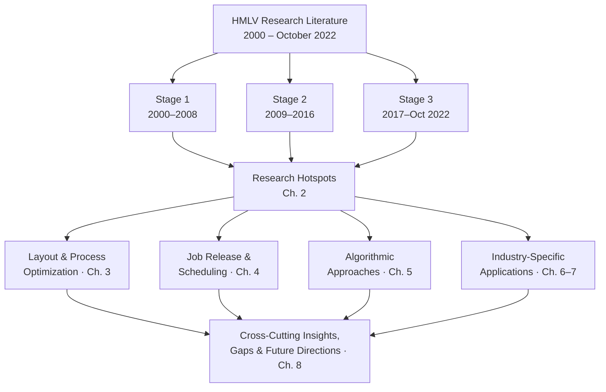
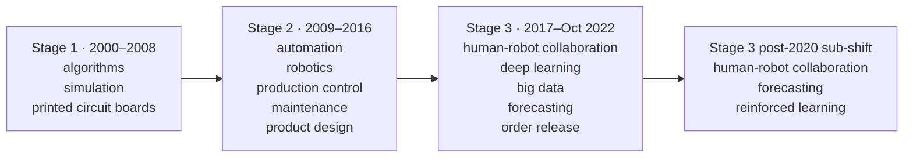
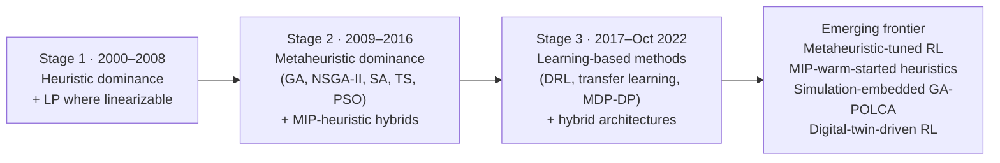
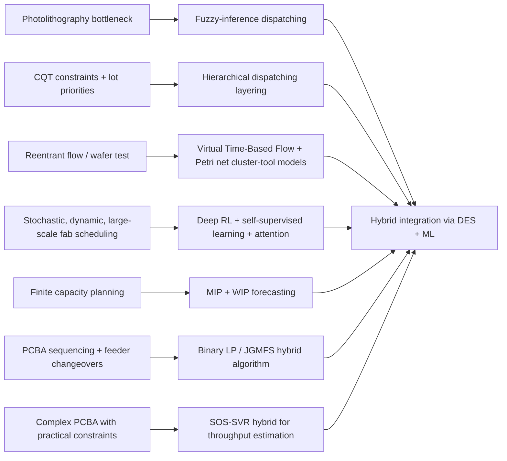
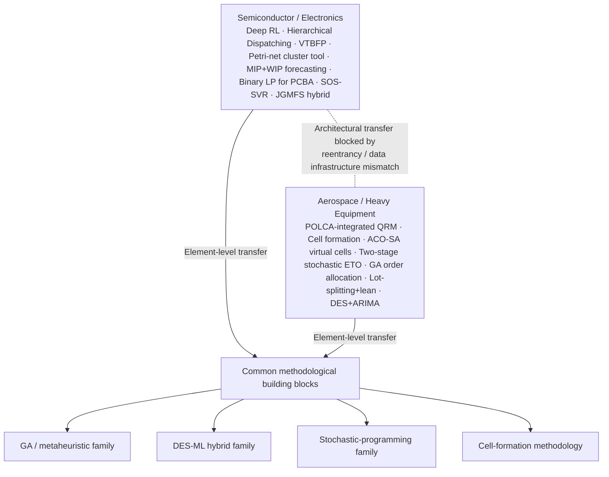
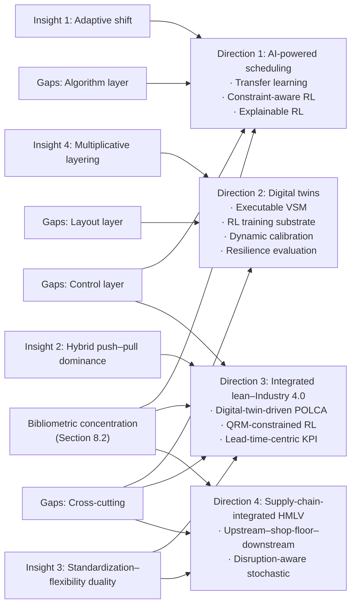

# Evolution of High-Mix, Low-Volume (HMLV) Manufacturing: A Staged Review of Research Hotspots, Core Technologies, and Industry Applications (2000–October 2022)
# 1 Introduction and Research Framework

Over the past two decades, manufacturing has been pulled in two opposing directions. On the one hand, global competition continues to reward the unit-cost efficiency of high-volume, standardized production; on the other hand, customers in industrial, medical, aerospace, and specialty equipment markets increasingly demand tailored, configurable, and rapidly evolving products that defy the logic of large-batch manufacturing. The production model that has emerged to mediate these conflicting pressures is **High-Mix, Low-Volume (HMLV) manufacturing** — a paradigm in which a broad portfolio of product variants is produced in small quantities, often to specific customer orders, on shared and flexible production resources[^1][^2]. As market fragmentation intensifies and supply chains become more volatile, HMLV has shifted from a niche operational concern into a mainstream research domain that intersects lean manufacturing, advanced scheduling, smart factory technologies, and human-centric work design.

This report adopts the perspective of an industry analyst to review the development of HMLV manufacturing research based on publicly available literature from **2000 to October 2022**. The objective of this opening chapter is to establish the conceptual, terminological, and methodological foundation on which the rest of the report depends. It defines what HMLV is and is not, articulates why it warrants treatment as a distinct research domain, sets out the scope and temporal boundaries of the review, and introduces the staged-review methodology and five analytical dimensions that structure all subsequent chapters. In doing so, this chapter functions as the conceptual anchor for the historical staging (Chapter 2), the technical reviews of layout/process optimization (Chapter 3), job release and scheduling (Chapter 4), algorithmic approaches (Chapter 5), and the industry-focused analyses in Chapters 6–8.

## 1.1 Definition and Defining Characteristics of HMLV Manufacturing

At its core, **High-Mix, Low-Volume manufacturing refers to production environments in which a broad variety of products (high mix) are manufactured in small quantities (low volume)**, typically under a made-to-order rather than a made-to-stock model[^1]. Unlike mass production, where standardized, high-throughput workflows are optimized around a narrow product range, HMLV operations are organized around the principle that products are only manufactured when a specific customer order is placed, and that no two production cycles need look exactly alike[^1]. A complementary operational definition emphasizes that the defining feature is not the absolute production quantity in isolation, but **the ratio between product variety and volume per product**: a facility producing 50 different products at 10,000 units each operates fundamentally differently from one producing 500 products at 1,000 units each, even when the total output is similar — the latter represents true HMLV manufacturing, where production planning, equipment selection, and operational strategies must accommodate constant product changeovers and minimal economies of scale for any individual item[^2]. Earlier academic characterizations are consistent with this view, describing HMLV as a production system whose attributes are **wide variety of products, small lot (or batch) production, and demand volume ranging from one to a few**[^3].

From this definitional core, a cluster of defining characteristics can be derived that together distinguish HMLV from neighboring production paradigms. These attributes are summarized in the table below, drawn from comparative analyses contrasting HMLV with mass production[^1].

| Defining Attribute | Manifestation in HMLV Operations |
|---|---|
| Product variety | High variety with low batch sizes; routine production of dozens to thousands of distinct part numbers[^1][^2] |
| Planning and control | Dynamic, adaptive, and data-driven rather than forecast-based and repetitive[^1] |
| Setup and changeovers | Frequent, with variable durations driven by product-specific tooling and inspection needs[^1] |
| Workforce skills | Cross-trained, multi-skilled operators capable of rotating across stations and absorbing variation[^1] |
| Digitalization | Mission-critical for traceability, real-time visibility, and execution consistency, not merely supportive[^1] |
| Quality assurance | Variant-specific and digitally traceable, with limited applicability of large-sample statistical methods[^1][^2] |
| Value stream flow | Fluctuates with demand and product mix rather than following a stable linear flow[^1] |
| Core objective | Agility, speed, and customization — not cost reduction through scale[^1] |

Beyond these qualitative attributes, several **quantitative and qualitative indicators** help operationalize the concept for empirical review. On the quantitative side, HMLV environments are often characterized by annual per-part volumes ranging from a single unit to a few thousand, product portfolios spanning hundreds or thousands of active part numbers, and lead-time compositions in which actual manufacturing time accounts for only roughly 20–30% of total lead time, with the remainder consumed by coordination, material flow, and queue time waiting for equipment availability[^2]. On the qualitative side, complexity is reflected in tooling requirements, setup durations, inspection effort, and handling constraints, frequently captured in dynamic product-process matrices used by HMLV operators to anticipate bottlenecks and guide capacity allocation[^1]. Together, these definitional anchors and indicators provide the lens through which the literature reviewed in subsequent chapters will be interpreted.

## 1.2 Differentiation from Mass Production and Pure ETO/MTO Contexts

Establishing HMLV as a coherent research domain requires positioning it carefully against neighboring paradigms, because HMLV has often been conflated either with conventional flexible mass production or with pure Engineer-to-Order (ETO) and Make-to-Order (MTO) environments. The contrast with **mass production** is the sharpest. In mass production, planning and control are stable, repeatable, and forecast-based; changeovers are rare and engineered for minimal disruption; workforces are organized around specialized, task-specific roles; quality is enforced through standardized, process-driven controls; and the dominant objective is unit-cost reduction through scale. HMLV inverts almost every one of these dimensions, replacing repeatability with adaptive planning, specialized labor with cross-trained operators, and process-driven quality with variant-specific, digitally traceable inspection regimes — all in pursuit of agility, customization, and responsiveness rather than throughput per se[^1].

The boundary between HMLV and **pure ETO or MTO production** is more subtle but equally important. HMLV shares with MTO the principle that production is triggered by specific customer orders rather than by stocking decisions[^1]. However, HMLV is not equivalent to a purely bespoke ETO model in which each order is essentially a unique engineering project. Rather, HMLV occupies a hybrid position: it produces a wide variety of variants, but those variants are typically drawn from a known portfolio of part numbers, recurring product families, or configurable platforms. Successful HMLV operators are explicitly cautioned that **standardization is not the enemy of flexibility**; on the contrary, clearly defined work standards for setup, inspection, and rework enable fast adaptation, and the critical operational skill lies in knowing what to standardize and where flexibility must remain[^1]. In other words, HMLV combines **variety-driven flexibility with repeatable process discipline** — a duality that pure ETO contexts, where engineering work dominates each order, do not necessarily require.

This hybrid positioning has direct methodological consequences for the present review. Because HMLV sits between high-volume repetition and one-off engineering, the technologies and control mechanisms relevant to it (cellular manufacturing, flexible manufacturing systems, CONWIP, POLCA, hybrid push–pull control, advanced scheduling algorithms) form a distinct toolkit that cannot be borrowed wholesale from either neighboring paradigm. Treating HMLV as a separate research domain — rather than as a degenerate case of mass production or a special variant of ETO — is therefore not merely a labeling convenience but a substantive prerequisite for the comparative and historical analyses developed in the remainder of this report.

## 1.3 Strategic Significance and Drivers of HMLV Adoption

The strategic prominence of HMLV manufacturing has grown in step with broader shifts in market structure and supply network behavior. Three drivers stand out in the literature. First, **market demands are fragmenting**: customers increasingly expect tailored solutions rather than one-size-fits-all products, eroding the volume base that historically justified dedicated high-volume production lines[^1]. Second, **supply chain volatility and global disruptions** have raised the value of production models that can react quickly to demand swings, engineering changes, and material availability constraints; HMLV explicitly prioritizes responsiveness and traceability over pure throughput, making it well-suited to such turbulent environments[^1]. Third, the rise of **niche and high-margin segments** has made it commercially viable to serve diverse customer requirements from a single facility, provided that the facility can absorb the operational complexity that variety brings.

These drivers translate into concrete application domains in which HMLV has become the dominant — and in some cases the only practical — production approach. The literature consistently highlights **specialty machinery, industrial components, aerospace, medical devices, and defense systems** as canonical HMLV sectors, all of which combine demands for high precision, responsiveness, and adaptability that cannot be met by rigid high-volume lines[^1]. Industry-focused analyses reinforce and extend this picture: medical device manufacturers routinely produce dozens of instrument variations for different surgical specialties; aerospace suppliers manufacture thousands of unique components for aircraft programs with production runs measured in tens or hundreds rather than millions; and industrial equipment manufacturers build customized machinery configurations in which nearly every order differs in specifications, features, or dimensions[^2]. Strategically, HMLV is best understood as the natural production mode for companies that **compete on engineering capability and technical service rather than on lowest unit price**, and that serve customers willing to pay a premium for exactly the right solution, fast delivery, and ongoing design support[^2].

The strategic case for HMLV also has clear boundaries. When any single product in a mix reaches sustained volumes above roughly 10,000–50,000 units annually, dedicated high-volume manufacturing becomes economically compelling, and the overhead inherent in HMLV operations — engineering support, complex scheduling, flexible equipment — turns into a competitive liability for commodity products with stable designs and price-sensitive customers[^2]. Recognizing both where HMLV is strategically advantageous and where it is not is essential context for interpreting the research literature reviewed in subsequent chapters, where the relative attention paid to electronics/semiconductors, aerospace, and heavy equipment reflects precisely the structural conditions described here.

## 1.4 Research Scope and Temporal Boundaries (2000–October 2022)

The review presented in this report is bounded along three dimensions: temporal, source-type, and thematic. Temporally, the analysis covers **publications and industrial reports from 2000 through October 2022**, a window chosen to capture the period during which HMLV transitioned from a peripheral operational concern into a mainstream research stream. The early 2000s witnessed the consolidation of cellular manufacturing thinking and the maturation of basic scheduling heuristics in the face of growing product variety; the late 2000s and early 2010s saw the rise of dedicated HMLV control mechanisms such as POLCA and the broader Quick Response Manufacturing (QRM) agenda; and the late 2010s and early 2020s have been shaped by digitalization, Industry 4.0, and learning-based scheduling. Anchoring the review in this 23-year window allows the staged analysis in Chapter 2 to trace these shifts coherently without diluting focus.

In terms of source type, the review relies exclusively on **publicly available academic and industry literature**, including peer-reviewed journal articles, conference proceedings, technical white papers, and reputable industry analyses; proprietary internal company documents and non-public consulting reports are excluded. Thematically, the review focuses on the five analytical dimensions introduced in the next subsection — research hotspots, layout and process optimization, job release and scheduling, algorithmic approaches, and industry-specific applications — and intentionally sets aside adjacent topics that, while related, are not central to HMLV as defined here. Excluded topics include pure mass-customization marketing strategy, high-volume automotive line balancing, and one-off engineering project management in the strict ETO sense, except where these intersect with HMLV-specific scheduling, control, or layout concerns. This scoping is intended to keep the review tightly aligned with the definitional core developed in Sections 1.1–1.2.

## 1.5 Staged-Review Methodology and Analytical Dimensions

The review adopts a **staged-review methodology** that organizes the literature both chronologically and thematically. Chronologically, the 2000–October 2022 window is divided into three stages — 2000–2008, 2009–2016, and 2017–October 2022 — each corresponding to a distinguishable phase in the evolution of HMLV research priorities, vocabulary, and dominant tools. The 2000–2008 stage is treated as the foundational period in which early concerns such as cellular manufacturing, basic flexibility, and elementary scheduling heuristics were consolidated. **The 2009–2016 stage marks a renewed surge of interest in automation and robotics** within HMLV settings, alongside the maturation of dedicated HMLV control logics such as POLCA, the broader QRM movement, the adaptation of lean principles to high-variety contexts, and the more aggressive deployment of metaheuristic optimization. The 2017–October 2022 stage is characterized by Industry 4.0 integration, digitally enabled value stream mapping, reinforcement learning, and AI-driven scheduling.

Thematically, the review applies five interlocking **analytical dimensions** consistently across the staged literature, each of which corresponds to a substantive chapter in the remainder of the report:

The diagram above captures the dual structure of the methodology: a longitudinal axis (three temporal stages) and a cross-sectional axis (five analytical dimensions), converging into the synthesis in Chapter 8. The five dimensions are: (i) **research hotspots evolution**, capturing dominant topics, keywords, and conceptual shifts within and across stages; (ii) **layout and process optimization**, covering cellular manufacturing, flexible manufacturing systems, and flow management approaches; (iii) **job release and scheduling mechanisms**, with particular attention to CONWIP and POLCA and their hybrids; (iv) **algorithmic and computational approaches**, ranging from heuristics and linear programming to genetic algorithms and reinforcement learning; and (v) **industry-specific applications**, focused on the sectors where HMLV is most heavily studied and deployed. Together, these dimensions provide both a longitudinal view of how the field has matured and a cross-sectional view of its core technical pillars, making it possible to identify continuities, ruptures, and emerging frontiers in a structured way.

## 1.6 Report Structure and Chapter Roadmap

The remainder of the report unfolds in eight chapters that progressively translate the foundations laid here into substantive analysis. **Chapter 2** applies the three-stage temporal frame to chart the evolution of research hotspots from 2000 to October 2022, tracing how early concerns with cellular manufacturing and basic scheduling gave way to a 2009–2016 wave of renewed interest in automation, robotics, POLCA, QRM, and metaheuristics, and finally to a 2017–October 2022 phase dominated by Industry 4.0 integration, digital value stream mapping, and AI-driven scheduling. **Chapter 3** then takes a technology-centric view of layout and process optimization, systematically reviewing cellular manufacturing, flexible manufacturing systems (FMS), and flow management approaches (including value stream mapping adaptations, mixed-model line design, and QRM cells), and explaining for each the underlying principles, application methods in HMLV settings, and core problems addressed.

**Chapter 4** zooms into job release and production control, comparing CONWIP and POLCA as the two most discussed mechanisms in dynamic HMLV settings, and considering their hybridization with related systems such as Kanban and COBACABANA. **Chapter 5** classifies the algorithmic approaches reported in the HMLV scheduling literature — heuristic algorithms, genetic algorithms, linear and mixed-integer programming, and reinforcement learning — and presents the classification in a structured table linking algorithm category, specific algorithm/model, and main application objective. **Chapters 6 and 7** turn to industry applications, identifying the two sectors where HMLV research is most concentrated, characterizing their research prominence, and examining their industry-specific challenges and the targeted countermeasures proposed in the literature. **Chapter 8** synthesizes cross-cutting insights, articulates persistent research gaps, and proposes future directions including AI-powered scheduling, digital twins, and integrated lean–Industry 4.0 frameworks. **Chapter 9** consolidates the principal conclusions, clarifies practical implications for analysts and manufacturers, and restates the boundaries of the review.

Throughout these chapters, the definitions, comparative framings, and analytical dimensions introduced here will be applied consistently, so that terminology, scope, and evaluative criteria remain coherent from the first chapter to the last. With this conceptual and methodological scaffolding in place, the report now turns in Chapter 2 to the staged evolution of HMLV research hotspots over the 2000–October 2022 window.

# 2 Staged Evolution of HMLV Research Hotspots (2000–October 2022)

Building on the conceptual and methodological scaffolding laid out in Chapter 1, this chapter operationalizes the three-stage temporal framework — 2000–2008, 2009–2016, and 2017–October 2022 — to chart how High-Mix, Low-Volume (HMLV) research has evolved over the past two decades. Rather than treating the literature as a flat corpus, the analysis treats it as a sequence of overlapping research generations, each defined by a recognizable cluster of dominant keywords, methodological preferences, and underlying conceptual framings. The aim is twofold: to make visible the longitudinal trajectory by which HMLV moved from a layout- and scheduling-centric extension of job-shop research into a digitally enabled, intelligence-driven manufacturing paradigm; and to surface the continuities, ruptures, and frontier issues that the technology-, control-, algorithm-, and industry-focused chapters that follow will revisit in greater depth.

A useful way to anticipate this trajectory is to note that each stage is best characterized not by a single technique but by a coherent **research signature** — a combination of the industrial setting most frequently studied, the analytical methods most often deployed, and the core operational problems being framed. The table below sketches this signature for each of the three stages, drawing directly on the staged hotspot evidence reviewed in the remainder of this chapter; it serves as a high-level roadmap before each stage is examined individually.

| Stage | Dominant industrial setting | Core keywords | Principal methods | Main operational concerns |
|---|---|---|---|---|
| 2000–2008 | Printed Circuit Board Assembly (PCBA) | algorithms, simulation, printed circuit boards | Algorithms; discrete-event simulation | Production scheduling, line leveling, basic operations management |
| 2009–2016 | PCBA expanding to the broader semiconductor industry | automation, robotics, production control, maintenance, product design | Automation/robotics studies; Industry 4.0–oriented analyses; metaheuristics | Flexibility enhancement, production control, maintenance, design for variety |
| 2017–October 2022 | Broader semiconductor and discrete manufacturing under Industry 4.0 | human-robot collaboration, deep learning, big data, forecasting, order release; from 2020: human-robot collaboration, forecasting, reinforced learning | AI/ML, IoT and big-data analytics, additive manufacturing, digital VSM | Real-time scheduling, adaptive order release, demand forecasting, human-centric automation |

## 2.1 Stage 1 (2000–2008): Foundational Period of Cellular Manufacturing, Flexibility, and Basic Scheduling

The 2000–2008 stage constitutes the foundational period of HMLV research, during which the field consolidated around a relatively narrow but technically deep set of problems anchored in a single dominant industrial setting. In this stage, **the principal empirical focus of HMLV research was Printed Circuit Board Assembly (PCBA) manufacturing**, and the core keywords that recur across the literature of this window are **"algorithms", "simulation", and "printed circuit boards"**. This concentration is not coincidental: PCBA lines of the early 2000s already exhibited many canonical HMLV features — extensive component variety, frequent product changeovers, small batch sizes per order, and tight throughput requirements — and therefore offered a natural laboratory in which to formalize the planning and control problems that the broader HMLV community would later abstract.

Methodologically, the stage is characterized by **the dominance of algorithmic modeling and discrete-event simulation as the two main research methods**, deployed primarily to optimize production and operations management issues such as scheduling and line leveling. Researchers in this period typically formulated HMLV problems as combinatorial optimization tasks — sequencing jobs across surface-mount machines, balancing workloads across mixed-model lines, allocating components to feeders, and minimizing changeover and setup times — and then evaluated candidate solutions through either exact/heuristic algorithms or simulation experiments designed to mimic the dynamics of an actual PCBA shop. This methodological pairing reflects the broader conceptual framing of HMLV in this stage as an *extension of traditional job-shop and flow-shop research* rather than as a paradigm of its own, with cellular manufacturing and group-technology thinking providing the layout vocabulary, manufacturing flexibility providing the conceptual lens, and dispatching rules and basic heuristics providing the scheduling toolbox.

Several features of this foundational work shape how Stage 1 should be read in retrospect. First, the optimization studies of the period are largely **deterministic and single-objective**, focused on minimizing makespan, setup time, or work-in-process under stable input assumptions; stochastic demand, engineering changes, and supply-side disruptions are present but typically handled as scenarios rather than as first-class problem features. Second, the integration with lean thinking is limited: while value stream mapping and just-in-time concepts were diffusing rapidly through high-volume manufacturing in the same window, their adaptation to genuinely high-mix contexts had not yet matured into a distinct HMLV research stream. Third, the dependence on PCBA as the empirical backbone meant that the language of HMLV research was implicitly shaped by electronics-industry constraints — component placement, feeder setups, machine downtime — even when authors framed their contributions as generic. These three features together explain why later stages experienced both genuine ruptures (new control logics, new algorithm families) and persistent continuities (the centrality of scheduling, the reliance on simulation as a workhorse evaluation tool).

## 2.2 Stage 2 (2009–2016): Renewed Surge in Automation, POLCA/QRM, Lean Adaptations, and Metaheuristics

The 2009–2016 stage marks a clear intensification and broadening of HMLV research, both in terms of the problems studied and in terms of the industrial scope of the literature. Three shifts define this stage. First, **research interest in automation and robotics within HMLV settings surged anew**, after a relatively narrow algorithmic focus in Stage 1. Second, **the Industry 4.0 concept was introduced during this stage, explicitly framed as a means of enhancing the flexibility of HMLV manufacturing** and of reconciling the inherent variability of high-mix work with the productivity gains traditionally associated with high-volume automation. Third, **the empirical scope of HMLV research expanded from PCBA to the broader semiconductor industry**, opening the door to problems such as reentrant flows, yield variability, and longer fabrication chains that PCBA-centric research had not foregrounded.

These shifts are reflected directly in the keyword structure of the period. The **core keywords characterizing 2009–2016 HMLV research include "automation", "robotics", "production control", "maintenance", and "product design"**. Each of these keywords captures a distinct strand of inquiry: "automation" and "robotics" reflect the renewed effort to make capital-intensive equipment economically viable in low-volume settings; "production control" indexes the rise of dedicated HMLV control logics such as POLCA and the broader Quick Response Manufacturing (QRM) agenda, which sought to translate the cellular and time-based competition principles of the 1990s into card-based, lead-time-oriented control mechanisms suited to variant-rich shops; "maintenance" signals an increasing awareness that equipment availability and predictive maintenance are decisive for shops where any single machine outage can stall a wide range of variants; and "product design" captures the growing recognition that design choices — modularity, platform architectures, common parts — are themselves levers of HMLV performance, not exogenous constraints.

Underneath this keyword structure, the period also saw the maturation of **metaheuristic optimization** as the methodological mainstream for HMLV scheduling and layout problems, in part because the combinatorial complexity exposed by the expansion into semiconductor manufacturing exceeded what exact methods and elementary heuristics could comfortably handle. Genetic algorithms, simulated annealing, tabu search, and particle swarm methods became standard tools, frequently embedded inside simulation harnesses inherited from Stage 1. In parallel, lean-thinking adaptations — value stream mapping for non-repetitive flows, mixed-model line design, standardized work for variant-rich operations — were increasingly tailored to HMLV contexts, even though, as Chapter 3 will revisit, executable simulation-linked VSMs for HMLV remained scarce.

Conceptually, Stage 2 can therefore be read as a *triple convergence*. The first convergence is **strategic**: QRM provided a unifying narrative around responsiveness and lead-time reduction that subsumed earlier flexibility-centric framings. The second is **technological**: automation, robotics, and the early Industry 4.0 vocabulary entered HMLV research as enablers of, rather than substitutes for, flexibility — a marked break from the historical assumption that automation belonged primarily to high-volume settings. The third is **methodological**: metaheuristics displaced single-objective exact optimization as the default approach, opening room for multi-objective formulations balancing lead time, WIP, due-date adherence, and resource utilization. Together, these three convergences set the stage for the digitalization and intelligence shifts that define Stage 3.

## 2.3 Stage 3 (2017–October 2022): Industry 4.0 Integration, Digital VSM, and AI-Driven Scheduling

The 2017–October 2022 stage is defined by the deep absorption of Industry 4.0 technologies into HMLV research and by the emergence of artificial intelligence as a structural rather than peripheral component of the scheduling and control toolkit. The **research hotspots of this stage cluster around Industry 4.0-related technologies including robotics, artificial intelligence, the Internet of Things (IoT), and additive manufacturing**, all examined specifically through the lens of how they reshape HMLV production planning, execution, and control. Where Stage 2 introduced Industry 4.0 as a flexibility-enhancing concept, Stage 3 operationalizes it: shop-floor data acquisition, cyber-physical integration, and learning-based decision-making become first-class research objects rather than aspirational backdrops.

The **core keywords identifying this stage are "human-robot collaboration", "deep learning", "big data", "forecasting", and "order release"**. This vocabulary marks a noticeable rotation away from the more equipment- and control-centric vocabulary of Stage 2. "Human-robot collaboration" reframes the automation question away from full replacement and toward shared-workspace, variant-tolerant cooperation between operators and robotic systems — a framing particularly well suited to HMLV environments where pure automation rarely amortizes against variety. "Deep learning" and "big data" signal the methodological migration from metaheuristic search over abstracted problem instances to data-driven pattern extraction from shop-floor telemetry, traceability records, and ERP/MES histories. "Forecasting" reflects the recognition that demand variability is itself a planning input that can be modeled more sharply, especially with richer data, while "order release" repositions a problem that Stage 2 had already foregrounded (POLCA, CONWIP) as a now-recurring optimization target amenable to learning-based control.

A further structural feature of this stage is its internal acceleration after 2020. Within the 2017–October 2022 window, **"human-robot collaboration", "forecasting", and "reinforced learning" emerged as new keywords after 2020**, indicating that the latter half of the stage saw an intensified push toward reinforcement-learning-based scheduling, refined demand forecasting, and human-centric automation. This post-2020 shift is consistent with the broader timing of pandemic-era supply-chain disruptions, which sharpened industrial interest in resilient, adaptive, and partially autonomous production control. The mermaid diagram below summarizes the keyword progression across the three stages and highlights the post-2020 sub-shift inside Stage 3.

The diagram makes visible two phenomena that are otherwise easy to miss in narrative form. First, the keyword set does not simply accumulate across stages; it rotates, with some terms (e.g., "simulation", "automation") receding from the top tier even though the underlying techniques remain in use. Second, the post-2020 sub-shift is not a wholesale departure from earlier Stage 3 vocabulary but a reweighting that elevates **adaptive, human-centric, and learning-based concerns** over the data-and-IoT infrastructure concerns that dominated 2017–2019. Conceptually, this is also the period in which Industry 4.0 has begun to dissolve some longstanding boundaries between mass production and HMLV: real-time data, learning-based control, and additive manufacturing make economically viable customization at smaller batch sizes plausible in settings where it previously was not, narrowing — though not eliminating — the operational gap between the two paradigms.

## 2.4 Cross-Stage Comparison: Continuities, Ruptures, and Emerging Frontiers

Taken together, the three stages reveal a coherent but non-linear trajectory for HMLV research between 2000 and October 2022. A cross-stage comparison highlights three categories of patterns: continuities that persist across the full window, ruptures that mark decisive shifts between stages, and emerging frontiers that surface only at the end of the review period. The table below organizes these patterns; the discussion that follows interprets them.

| Pattern type | Across-stage observation | Stage anchoring |
|---|---|---|
| Continuity | Centrality of scheduling and production control as the recurring core problem | Stage 1 "algorithms/simulation/PCB"; Stage 2 "production control"; Stage 3 "order release", "deep learning" |
| Continuity | Persistent reliance on simulation as an evaluation harness, even as the algorithms inside it change | Stage 1 explicit; Stages 2–3 embedded inside metaheuristic and AI workflows |
| Continuity | Tension between standardization (for repeatability) and flexibility (for variety) as the underlying design dilemma | Implicit in all three stages |
| Rupture | From cellular/flexibility-centric framings to QRM/POLCA-centric production control | Stage 1 → Stage 2 |
| Rupture | From metaheuristic optimization over abstracted instances to learning-based control over data-rich environments | Stage 2 → Stage 3 |
| Rupture | From PCBA-bounded empirical setting to the broader semiconductor industry, then to Industry 4.0-enabled cross-industry settings | Stage 1 → Stage 2 → Stage 3 |
| Emerging frontier | Reinforcement learning for HMLV scheduling and order release | Stage 3, post-2020 |
| Emerging frontier | Human-robot collaboration as a flexibility-preserving alternative to full automation | Stage 3, post-2020 |
| Emerging frontier | Digitally enabled VSM, digital twins, and integrated lean–Industry 4.0 frameworks | Stage 3 |

Three observations follow from this comparison. First, **the continuities are deeper than the keyword churn suggests**: scheduling and production control have remained the gravitational center of HMLV research throughout the 23-year window, with each stage essentially re-tooling the same problem family with new methods (algorithms and simulation in Stage 1, metaheuristics and POLCA/QRM control in Stage 2, learning-based and IoT-enabled control in Stage 3). Likewise, the standardization–flexibility tension introduced in Chapter 1 as definitional of HMLV recurs as a latent design dilemma underneath every stage's surface vocabulary.

Second, **the ruptures are clustered at the transitions between stages and are jointly conceptual, methodological, and empirical**. The 2008–2009 transition reframes HMLV from a layout-and-flexibility problem to a responsiveness-and-control problem, expands the empirical setting from PCBA to broader semiconductors, and introduces the Industry 4.0 horizon. The 2016–2017 transition reframes HMLV again, this time from a metaheuristic optimization problem to a data-and-learning problem, and embeds it firmly inside a digitalized factory context in which IoT, AI, and additive manufacturing reshape the feasible solution space. Each rupture is therefore better understood as a *bundle* of shifts than as a single methodological turn.

Third, **the emerging frontiers — reinforcement learning, human-robot collaboration, digital VSM, digital twins, and integrated lean–Industry 4.0 frameworks — appear concentrated in the post-2020 portion of Stage 3** and are precisely the topics where the literature base is thinnest relative to its conceptual ambition. This concentration is significant for the rest of the report: it locates the research gaps that Chapter 8 will articulate (e.g., scarcity of executable simulation-linked VSMs for HMLV, under-explored downstream and supply-chain dimensions, need for context-specific KPIs under learning-based scheduling) at the same coordinates as the most active current research, suggesting that the field's frontiers and its gaps are not separate phenomena but two faces of the same recency effect.

Read together, these patterns provide the longitudinal context in which the technology-focused review of Chapter 3, the CONWIP/POLCA-centered control analysis of Chapter 4, the algorithmic classification of Chapter 5, and the industry-specific analyses of Chapters 6–7 should be interpreted. Cellular manufacturing and FMS are not merely "old" topics; they remain the layout substrate on which Stage 3's digital and learning-based control mechanisms are deployed. POLCA and QRM are not merely "Stage 2" artifacts; they remain the production-control logic that AI-driven order-release studies are increasingly trying to surpass or hybridize with. Heuristic and metaheuristic algorithms are not merely predecessors of reinforcement learning; they remain competitive baselines and frequent hybridization partners. The next chapter therefore turns from temporal staging to a technology-centric review, with the explicit understanding that each technology now carries the conceptual residue of all three stages reviewed here.

# 3 Core Technologies for Layout and Process Optimization in HMLV

The staged review in Chapter 2 made visible a recurring observation: across all three temporal windows, the scheduling and control problems that dominate the HMLV literature are always deployed on top of a physical and organizational substrate — a layout, a flow architecture, a set of operator routines — whose design choices fundamentally determine which control logics and algorithms are even feasible. This chapter takes that substrate as its object of analysis. Rather than continuing along the time axis, it pivots to a technology-centric review of the principal layout and process optimization approaches that constitute the structural foundation of HMLV operations, examining how each handles the canonical sources of HMLV variance — product variety, routing diversity, cycle-time heterogeneity, and demand-mix instability — that Chapter 1 identified as definitional of the paradigm.

Three families of technologies organize the chapter. **Cellular Manufacturing (CM)** is treated as the foundational layout paradigm, rooted in group technology and product-family thinking. **Flexible Manufacturing Systems (FMS)** and the closely related concept of flexible manufacturing cells are examined as the technological response to mix variance that defeats static lines. **Flow Management approaches** — comprising HMLV-adapted value stream mapping (VSM), mixed-model line design, and Quick Response Manufacturing (QRM) cells — are reviewed as the methodological apparatus by which lean and time-based-competition principles are translated into variant-rich shops. For each family the analysis explains the underlying principles, the methods of application specific to HMLV, the core operational problems addressed (routing variety, frequent changeovers, work-in-process (WIP) accumulation, throughput time, demand-mix variability), and the strengths and limitations that surface as product variety rises and per-product volumes fall. A concluding comparative synthesis articulates a selection logic linking layout choice to the position of a facility on the variety–volume spectrum and previews how these substrates interact with the CONWIP and POLCA mechanisms reviewed in Chapter 4.

Underlying the entire chapter is the **standardization–flexibility duality** introduced in Chapter 1. Every technology examined here represents a different bet on where, in a variety-rich shop, repeatable process discipline must be preserved and where adaptive variation must be accommodated. The chapter therefore reads each layout family not only as a technical artifact but as a particular resolution of that duality.

## 3.1 Cellular Manufacturing for HMLV Environments

Cellular manufacturing (CM) constitutes the foundational layout paradigm for HMLV operations. **Conceptually, CM applies the principles of Group Technology (GT)**, the long-standing engineering discipline that identifies similarities among parts and processes and exploits those similarities to organize production. Rather than arranging machines by functional type (the classical job-shop principle) or sequencing them along a single product-specific line (the mass-production principle), CM physically groups dissimilar machines into "cells" dedicated to the production of one or more part families that share routing, processing, or geometric characteristics. The intent is to capture, within the cell boundary, the bulk of the operations required by the part family, so that material moves are short, handoffs are few, and the cell behaves — for the family it serves — almost like a small dedicated line.

The HMLV-relevant performance logic of CM follows directly from this grouping. **By concentrating similar parts in a cell, setup times are shortened (because changeovers occur between similar rather than dissimilar parts), and work-in-process (WIP) inventory is reduced (because batches no longer accumulate between functionally distant machines in long batch-and-queue chains)**. In conjunction with cross-training, this transforms the operational physics of variety: instead of variance being absorbed everywhere across a functional layout, it is *isolated inside cells*, which then behave as stable units to the rest of the shop. This isolation principle — that variation in job shops should be handled by isolating it — is a recurring methodological commitment in the HMLV literature and is explicitly the rationale behind the family analyses, Pareto demand studies, and product-routing mappings used to design cells[^4].

Application of CM in HMLV settings depends critically on the quality of the family-formation step, which in turn depends on more refined analyses than the classical product-process matrix. The basic product-family matrix proposed in *Learning to See* maps which products visit which processes and groups products by shared process sets, but it does not account for two features that dominate HMLV reality: that **each product can have markedly different cycle times at the same station**, and that **products sharing a process set may nevertheless follow different orderings (routings) through that set**[^4]. To address these limitations, HMLV practitioners augment the matrix with cycle-time data — drawing on the *Creating Mixed Model Value Streams* tradition — and apply a rule that **products should not be included in a family if their cycle times are 30% above or below the average for the proposed family**[^4]. For routing diversity, the **Modified Multi-Product Process Chart** proposed by Khaswala and Irani in their *Value Network Mapping* methodology maps all routings on a single sheet so that similar routings can be merged before family boundaries are drawn[^4]. A complementary **Pareto analysis of demand**, repeated month-to-month, then tests whether the mix obeys an 80/20 structure stable enough to justify dedicating cell resources to high-runner families[^4].

A research line that operationalizes the GT principle for ongoing HMLV operations is the methodology described in *A methodology to incorporate product mix variations in cellular manufacturing*, **which proposed a group technology model for incorporating new parts and machines into existing CM systems**. This is a non-trivial contribution because HMLV environments are precisely those in which the part population is non-stationary: new variants are continuously introduced, old variants retire, and machine populations evolve, so the family structure that justified a given cellular layout at design time may degrade rapidly. By providing a systematic GT-based mechanism for updating cell membership when new parts and machines arrive, this line of work addresses one of the central operational fragilities of cellular layouts in variant-rich shops — the risk that a static cell design becomes obsolete as the product portfolio drifts.

A more recent strand pushes CM into the digital, learning-based control regime that Chapter 2 located in Stage 3 of HMLV research. The study *A Smart Manufacturing Cell with Distributed Intelligence* **proposed a model combining digital twins and Graph Node Networks (GNN) for production path planning**. In this framing, the manufacturing cell is no longer a passive layout artifact but an instrumented, intelligence-bearing unit whose digital twin continuously mirrors the physical cell, and whose path-planning logic uses graph neural representations of machine and part relationships to compute production routes adaptively. The significance for the present chapter is twofold: it shows that the CM substrate remains the natural deployment surface for advanced control technologies, and it illustrates the broader point made in Chapter 2 that Stage-3 digital methods rarely replace earlier layout paradigms — they overlay them.

The **core operational problems CM addresses in HMLV** can therefore be summarized along four dimensions. First, it tames *routing variety* by clustering parts with similar routings into cells, so that variance is localized rather than dispersed. Second, it attacks *batch-and-queue waste* by shortening the physical distance between sequential operations and enabling small-batch flow within the cell. Third, it reduces *inter-station travel and WIP* relative to functional layouts, both because handoffs are shorter and because cell-internal pull mechanisms are easier to design when the within-cell variant set is bounded. Fourth, by enabling cross-trained operators to rotate across stations, it permits *adaptive capacity reallocation* in response to within-cell mix shifts, a capability that pure flow-line layouts lack.

The limitations of CM, by contrast, are most pronounced under three conditions that recur in HMLV practice. When **product families are unstable** — that is, when the demand mix shifts faster than the cell design can be updated — cells either become misallocated (idle for retired families, overloaded for new ones) or require costly reconfiguration; this is precisely the failure mode the product-mix-variation methodology cited above seeks to mitigate. When **routings are too diverse to cluster**, no satisfactory family partition exists, and forcing a cellular structure simply pushes variance from the inter-machine layer to the inter-cell layer without reducing it. When **the demand distribution does not exhibit a clear 80/20 structure**, dedicated cells cannot be economically justified, because no small set of families captures enough demand to amortize the dedicated resources[^4]. Recognizing these limits, the HMLV literature typically positions CM not as a universal solution but as a *substrate* — the layout layer on which more adaptive technologies (FMS, VSM-driven flow management, QRM cells, and the digital and learning-based control mechanisms surveyed in later chapters) are deployed.

## 3.2 Flexible Manufacturing Systems and Flexible Manufacturing Cells

Where cellular manufacturing addresses variety primarily through *clustering*, Flexible Manufacturing Systems (FMS) and the closely related concept of flexible manufacturing cells address it through *dynamic routing and balancing*. The defining feature is that the flow inside an FMS or flexible cell is **not static, but changes depending on the product**, with cross-trained operators and versatile equipment absorbing the mix-driven variation in cycle times and station sequences[^4]. This makes FMS the natural choice when the product mix causes a large variance in cycle times that defeats line balancing but the variety is nevertheless bounded enough to keep a fixed cluster of machines productive.

The HMLV literature describes the operating logic of a flexible cell with notable concreteness. **A flexible manufacturing cell is a group of processes which are grouped together physically, and run in a continuous flow; however, it varies from a manufacturing line in that its flow is not static, but changes depending on the product**[^4]. In a classical production line, repeatability and consistency allow processes to be balanced into a fixed sequence; the moment cycle times diverge across products and proportions shift, this balancing breaks down and one machine ends up "constantly waiting for the other one"[^4]. The flexible cell sidesteps this by replacing the static sequence with adaptive movement: operators move between stations as the product type changes, and the cell's internal routing reconfigures itself in response to each batch. The critical enabling resource is **cross-training**: "by having a cross-trained work force, the manufacturing cell can adapt and change depending on the type of product that it runs"[^4].

An important and often under-appreciated feature of flexible cells is their **controlled, but non-zero, internal WIP**. Pure one-piece flow is rarely attainable inside a flexible cell because the variety of products being run forces operators to accumulate some WIP between two stations before transferring to another station to keep processing; in some cases an operator performs two operations on the same batch in succession[^4]. The key insight, however, is that **the WIP that does accumulate is bounded — at most the size of a full batch — compared to the large, unbounded batches that accumulate between stations in a job shop**[^4]. The flexible cell therefore occupies a deliberate middle position: it tolerates more WIP than a balanced line in exchange for the ability to run a wider product mix, while keeping WIP an order of magnitude below what a functional job shop would generate. This is, in effect, a *bounded* relaxation of the continuous-flow principle, tailored to HMLV conditions.

The **typical physical FMS layouts** described in the broader literature each respond to different operational priorities, and the HMLV-relevant choice among them depends on material-handling, loading/unloading, and operator-movement constraints. **Straight-line layouts are suitable for automated assembly**, in which a fixed material-handling system can move parts through a sequence of stations and the dominant requirement is throughput along a single axis. However, straight-line layouts impose limitations on operator and material movement: operators are essentially confined to a single station or short segment, and material flow is difficult to redirect once the line is configured. **U-shaped layouts were proposed to address precisely these limitations**, by folding the line back on itself so that operators can serve multiple stations from a central position and so that loading and unloading occur at the same end of the system. This drastically increases operator flexibility — the central HMLV requirement — and shortens the path that material and operators must traverse, which is critical when products with different routings share the same cell. **Loop layouts**, by contrast, can serve as a single location for loading and unloading materials and are particularly **suitable for pick-and-place material handling systems**, where a robotic arm or shuttle moves parts to and from a circulating conveyor; this is attractive when product variety is high but each operation has a relatively standardized fixture or carrier.

A research line that synthesizes these layout principles for HMLV specifically is *Adopting a circular open-field layout in designing flexible manufacturing systems*, **which proposed an open-field circular FMS layout integrated with robot-centered cells**. The contribution is significant because it explicitly aligns layout geometry with the dual requirements of HMLV — adaptive routing for variety and concentrated robotic resources for productivity. The open-field circular geometry generalizes the loop principle (single load/unload location, central material handler) while the robot-centered cell embeds the flexibility resource (a versatile robot capable of serving multiple stations) at the geometric center, where it can reach the widest range of operations. In effect, the design merges the operator-flexibility logic of the U-shape, the material-handling logic of the loop, and the cell-clustering logic of CM into a single layout pattern.

The **core problems** FMS and flexible cells address in HMLV are thus complementary to those addressed by CM. They tame *variable cycle times across products*, because their flow is not fixed and can absorb cycle-time heterogeneity through operator movement and within-cell buffers; they accommodate *shifting bottlenecks*, because the pacemaker of a flexible cell is allowed to move with the product mix; and they avoid the *line-balancing impossibility* that pure dedicated lines face under high mix. Their **strengths** — adaptability, lower WIP than job shops, and preserved (if not strictly continuous) flow — make them the layout of choice when the variety is too high for dedicated lines but the routings are still cohesive enough that a single physical grouping makes sense.

Their **limitations** are equally specific. The residual WIP between operations, although bounded, prevents true one-piece flow and complicates the precise lead-time control that pull mechanisms aspire to. The pacemaker concept, central to lean line design, becomes difficult to establish, because the routing and bottleneck shift with each product — though, as the literature notes, **if the routing and product variety is fairly stable inside a loop, the possibility exists to use the concept of pitch** as a substitute for a fixed pacemaker[^4]. Finally, flexible cells are unusually demanding of workforce and equipment: cross-training is a *prerequisite*, not an optimization, and machines must be versatile enough that the same physical resources can serve multiple product variants without prohibitive setup penalties. These dependencies bound the economic envelope within which FMS solutions outperform either CM or VSM-driven flow management.

## 3.3 HMLV-Adapted Value Stream Mapping and Flow Management

Value Stream Mapping (VSM), as originally codified by Rother and Shook in *Learning to See*, was an enormous advance in lean implementation, but its toolkit was implicitly biased toward processes in which "repetitive and constant components are repeated to produce a relatively low range of finished products"[^4]. In HMLV environments, the three classical sources of variance — variance in the products themselves, variance in their routings, and variance in their cycle times — combine to make conventional VSM "a near-impossible task"[^4]. The chaotic, multi-path nature of a high-mix shop cannot be captured in a single linear map without losing the very visibility that VSM is supposed to provide. The HMLV literature has responded to this with a deliberately adapted, **computerized, full-line VSM methodology** organized around five steps and a battery of supporting analytical tools.

The methodology's five-step backbone is summarized below, and the cumulative output of the five steps is an implementable transformation roadmap rather than a single map.

**Step 1 — mix analysis — replaces single-family scoping with a portfolio-level diagnosis** built from four analyses: data gathering with detailed time studies that associate a time with all work; family analysis using a cycle-time-augmented matrix and the Modified Multi-Product Process Chart; Pareto analysis of demand to test for 80/20 structure; total lead-time analysis to expose lead-time variance; and order-in/order-out analysis to quantify FIFO breakdowns through a deviation index between the production-schedule sequence and the actual output sequence[^4]. The combined effect is to make HMLV variance *visible and decomposable* before any mapping begins.

**Step 2 — the full-line current-state VSM — abandons the single-family map** in favor of a representation of all products and all routings, made tractable through three visual devices: **demand-proportionate process boxes** whose size scales with the demand flowing through each station; demand-proportionate inventory icons that prioritize attack on WIP waste; and weighted flow arrows distinguishing flows that carry more than 50% of demand, 10–50%, and less than 10%[^4]. A **Product Variety Funnel** is overlaid on the map to visualize where in the process the variety expands; this single device is decisive for subsequent design choices because supermarket pull systems are expensive to maintain in high-variety zones and should be placed before the funnel's expansion points[^4]. An illustrative case reported in the methodology — a process with 69 different routings and 280 possible products — demonstrates that even highly complex shops yield interpretable current-state maps when these visual conventions are applied[^4].

**Step 3 — the full-line future-state VSM — is structured around ten design questions**, each pointing to a specific HMLV countermeasure. The table below summarizes the ten questions and the operational mechanism each invokes; together they constitute the HMLV-specific flow-management apparatus.

| # | Future-state design question | HMLV countermeasure invoked |
|---|---|---|
| 1 | How to bring visibility to the production floor? | Electronic Work Order Board (bar-code-driven, color-coded WIP visualization); cascading metrics at every level; visual management boards[^4] |
| 2 | How to ensure FIFO? | Prioritization Unit Numbers (PUN) at every station storage area[^4] |
| 3 | Where to implement continuous flow through dedicated production lines? | Break down work elements and redistribute for similar cycle times across the family[^4] |
| 4 | Where to implement continuous flow through flexible manufacturing cells? | Cross-trained operators; controlled within-cell WIP up to a full batch[^4] |
| 5 | Where to implement supermarket pull systems using the Product Variety Funnel? | Place supermarkets before variety expansion; push the funnel as far downstream as possible[^4] |
| 6 | Where to implement POLCA Cards to control WIP? | Hybrid push–pull paired-cell card system controlling adjacent-station capacity signals[^4] |
| 7 | Explore TAKT and Pacemaker at each loop | Loops = dedicated lines or flexible cells; pacemaker often most upstream; pitch as substitute when bottleneck shifts[^4] |
| 8 | How to plan and level the mix? | Capacity-based (not unit-based) heijunka; Work Content Graph; SMED to enable small batches[^4] |
| 9 | What process kaizen is needed? | Six sigma, preventive maintenance, training, root-cause elimination; equipment investment if takt unmet[^4] |
| 10 | How to standardize new work flow? | Standard work via scientific method (Hypothesize → Test → Analyze → Implement → Extend); stakeholder audits[^4] |

Several features of this future-state apparatus deserve emphasis. The **Electronic Work Order Board** extends the visual board approach of Greg Lane's *Made-to-Order Lean* by replacing pen-and-paper updates with bar-code-driven scanning, so that supervisors, planners, and managers obtain immediate visibility of the current status of the production floor and gather processing-time data for capacity planning automatically[^4]. **Cascading metrics** trace plant-level KPIs back to specific processes and operators, on the principle that "what does not get measured does not get improved" — a quotation invoked from Lane that captures the visibility-and-control philosophy of HMLV flow management[^4]. **PUN (Prioritization Unit Numbers)** address the difficulty that, in batch-and-queue shops with many steps, the order of the production schedule can be completely lost by the time output is observed[^4]. **Capacity-based leveling** is more demanding than conventional heijunka, because it levels in terms of capacity (work-hours per unit) rather than in terms of units, recognizing that different HMLV products consume different capacities at the same station[^4]. And **SMED** is treated not as an optional improvement but as a precondition for small batches, which in turn are "the key to having flexible operations which can meet whatever product mix is necessary in the production line"[^4].

**Step 4 — family-specific VSMs — is then performed only when the family distribution is stable enough to justify the effort**, and only for high-runner families, on the principle that improvements affecting the entire line usually dominate those affecting a single family in monetary impact[^4]. **Step 5 — the implementation plan — must be pushed top-down**, with a Value Stream Manager coordinating Industrial Engineering, Manufacturing Engineering, Quality, and Supervisors; difficult changes (supermarket pull systems, manufacturing cells) require pre-accompanying lean training and a validating phase between changes to prevent compounding implementation difficulties[^4]. The methodology is explicitly cyclical: after the future state is implemented, it becomes the next current state, and the cycle restarts to attack deeper improvements[^4].

Beyond the discrete-shop methodology just described, the broader HMLV flow-management literature includes constraint- and flow-principle-based approaches that target the same problems from different theoretical vantage points. The study *Operation and control of flow manufacturing based on constraints management for high-mix/low-volume production* **proposed applying Theory of Constraints (TOC) and Drum-Buffer-Rope (DBR) to dynamic flow path management in HMLV**. The contribution shifts the design center from the value stream itself to the constraint that governs throughput across the value stream: the "drum" sets the pace at the constraint, the "buffer" protects it from upstream variability, and the "rope" synchronizes material release with the drum's tempo. In HMLV settings, where the constraint may shift with the product mix, this requires *dynamic* identification and management of the constraint rather than a one-off design — a natural complement to the future-state loop and pitch logic of the VSM methodology.

A second contribution along this line is *Establishing Continuous Flow Manufacturing in a Wafertest-Environment Via Value Stream Design*, **which developed the Virtual Time-Based Flow Principle (VTBFP) for the semiconductor industry to logically superimpose flow production onto job shop operations**. The VTBFP is particularly significant for the present chapter for two reasons. First, it confronts directly the most adverse HMLV substrate — wafer test, an environment characterized by reentrant flows, long fabrication chains, and severe routing variability — and shows that flow-production logic can nevertheless be *virtually* established without physically reconfiguring the shop. Second, it operationalizes the central insight of HMLV-adapted flow management: that flow in HMLV is not a fixed physical attribute of the layout but a *time-based*, logically superimposed control discipline. The Stage-2 and Stage-3 hotspots identified in Chapter 2 — POLCA/QRM, digital VSM, and learning-based scheduling — can be read as successive elaborations of the same principle.

Two limitations of HMLV flow management deserve explicit acknowledgment. First, the methodology's reliance on a **computerized tool** for extracting the full value of demand-proportionate boxes, weighted arrows, and Product Variety Funnels — pencil-and-paper is used only for initial Gemba drafts[^4] — places a non-trivial digital-infrastructure burden on adopting shops; the persistent scarcity of executable, simulation-linked VSMs for HMLV that Chapter 2 flagged as a Stage-3 research gap reflects precisely this. Second, the future-state apparatus presupposes a *culture* of standard work and stakeholder audits, without which the new work flows will not stabilize after implementation[^4]; this cultural dependency is the often-unstated reason why otherwise sound VSM-driven redesigns fail to deliver their projected lead-time improvements.

## 3.4 Mixed-Model Line Design and QRM Cells

Mixed-model line design and Quick Response Manufacturing (QRM) cells occupy the architectural middle ground between rigid dedicated lines and fully flexible cells. They preserve as much of the lean line-design discipline as possible — balanced cycle times, takt-based control, small batches — while admitting the variety that HMLV imposes. The HMLV literature describes the mixed-model logic concretely: dedicated lines should be installed wherever possible to capture the efficiency, cycle-time, and quality advantages of line production, but they require a process that is repetitive, all-inclusive, and stable[^4]. The way to attain these conditions in a variant-rich shop is to **isolate the variation by dedicating lines to specific families**, and then to **break down every possible work element into the smallest detail and redistribute them to make the line have a similar cycle time for all of the products**[^4]. This work-element redistribution is the engineering heart of mixed-model line design.

Two analytical devices support this engineering work in HMLV settings. The **Work Content Graph**, combined with standard times for each product at each process, allows the planning department to compute the total capacity needed for a week given the actual mix, so that the production schedule can be made in terms of capacity rather than units[^4]. **Capacity-based leveling via a heijunka box** then aligns the total work-hours required by each unit with the available work-hours of the line, enabling the flexible system to realign itself in order to meet the production schedule across all families, not just the aggregate output[^4]. This is the methodological response to a problem that the literature flags emphatically: although many HMLV facilities meet their total output goals, "it is very difficult and rare to meet the targets for all of the different products, or even product families"[^4]. Capacity-based leveling addresses the difference between throughput in aggregate and throughput in the *right* mix.

The **third indispensable enabler is SMED**. Small batch sizes — the operational prerequisite for flexibility — are achievable only when changeover time is made as small as possible, and SMED is the canonical methodology for accomplishing this[^4]. The mixed-model line's promise to absorb variety therefore rests on a chain of dependencies: SMED enables small batches, small batches enable mix flexibility, mix flexibility enables product-family throughput targets, and product-family targets enable customer service. Breaking any link collapses the chain.

The **QRM-cell variant** of this architecture inherits the line-design discipline but reframes the optimization objective around **time-based competition** and lead-time reduction within a closed loop of resources, rather than around throughput per se. The future-state loop concept in the VSM methodology — "any set of operations through which there is continuous flow," including dedicated production lines and flexible manufacturing cells — is precisely the topological substrate on which QRM cells operate, and the **Pacemaker at each loop** sets the pace for the entire cell[^4]. Where mix and routing are fairly stable inside a loop, takt-time control becomes feasible; where they are not, the pacemaker concept becomes difficult to establish because the bottleneck shifts with each product, and the literature suggests substituting the concept of **pitch** as a coarser pacing device[^4]. The use of takt, pacemaker, and pitch in HMLV is therefore explicitly characterized as an *exploration*, conditional on whether the local mix permits, rather than as a universal mandate[^4].

The **strategic placement of supermarket pull systems** is the fourth lever distinguishing mixed-model and QRM-cell designs from generic line designs. Supermarkets are effective at eliminating overproduction and stabilizing operations, but they are expensive in high-variety zones because they require WIP for every variant. The HMLV solution is to place supermarkets **before the large variety-expansion points identified by the Product Variety Funnel** — in the case reported in the literature, before the Cut-to-Length process at which variety expands substantially — so that the supermarket aggregates demand across upstream commonality and avoids holding WIP for every downstream variant[^4]. A complementary design move is to **push the product-variety funnel as far downstream as possible**, deferring variety addition closer to the customer so that a more stable supermarket pull can be implemented and customer service levels can be assured[^4]. These two moves — supermarket positioning and funnel deferral — translate the lean pull principle into a form that survives the WIP economics of HMLV.

The **core problems** mixed-model lines and QRM cells address are thus distinct from those addressed by CM and FMS. They tame the *changeover burden* by combining SMED with line-design discipline; they reduce *throughput-time variability* by enforcing capacity-based leveling rather than unit-based leveling; and, most importantly for HMLV strategy, they enable *meeting product-family targets* rather than just meeting aggregate output. The **limitations**, however, are sharp. When mix instability is too pronounced, the work-element redistribution underlying line balancing breaks down. When routing diversity is too extreme, no single line topology can absorb it without excessive station idleness. And when cycle-time variance is too large — even after redistribution — one machine ends up constantly waiting for another, and the line reverts in practice to a batch-and-queue regime[^4]. Under these conditions the literature explicitly recommends reverting to cell-based or job-shop layouts, with FMS or flexible cells absorbing the variance that mixed-model lines cannot[^4].

## 3.5 Comparative Assessment and Selection Logic Across Layout Technologies

The three technology families reviewed in this chapter address overlapping but distinct slices of the HMLV operating problem. A comparative synthesis along the dimensions that matter most in practice — the type of variance handled best, WIP behavior, lead-time impact, workforce and digital dependencies, sensitivity to mix stability, and capital intensity — clarifies when each is the right choice and previews the control mechanisms that pair most naturally with each.

| Dimension | Cellular Manufacturing | FMS / Flexible Cells | HMLV-Adapted VSM-Driven Flow Management | Mixed-Model Line / QRM Cell |
|---|---|---|---|---|
| Variance handled best | Routing variety across stable families | Cycle-time variance and shifting bottlenecks within a bounded variety set | Portfolio-wide variance (product, routing, cycle-time) made *visible and decomposable* | Cycle-time variance within a family stable enough for redistribution |
| WIP behavior | Reduced vs. job shop; cell-internal pull feasible | Bounded, at most one full batch between stations | Targeted attack on inventory via demand-proportionate icons; supermarket placement | Lowest when SMED enables small batches; supermarket upstream of variety expansion |
| Lead-time impact | Indirect — via shorter handoffs and isolated variance | Indirect — via adaptive routing and reduced queue accumulation | Direct — explicit lead-time and order-in/order-out analyses in Step 1 | Direct — capacity-based leveling targets family-level lead times |
| Workforce dependency | Moderate cross-training within cell | High cross-training; operators rotate across stations adaptively | Moderate to high; depends on which countermeasures are selected | High; line balancing requires versatile operators across redistributed work elements |
| Digital visibility dependency | Low to moderate | Moderate | High — computerized tool needed to extract full value | Moderate to high — Work Content Graph and capacity-based heijunka are data-intensive |
| Sensitivity to mix stability | High — family-formation requires stable demand | Moderate — bounded variety required, but routing can flex | Low — methodology is designed for portfolio-level variance | High — line balancing presupposes stable family composition |
| Capital intensity | Moderate — dedicated machine groupings | High — versatile equipment and material handling | Low to moderate — primarily methodological and informational | Moderate to high — line equipment plus SMED tooling |
| Natural control pairing (Ch. 4) | Kanban within cells; supermarket pull at cell boundary | POLCA between cells; CONWIP for the cluster as a whole | Hybrid push–pull, POLCA, supermarket pull placed via funnel | POLCA between adjacent loops; takt-time control where mix permits |

Several interpretive points follow. First, the **type of variance** each family handles best is distinct. CM is most powerful when *routing variety* across families is the dominant problem and the families themselves are stable; FMS and flexible cells are most powerful when *cycle-time variance and bottleneck shifts* dominate within a bounded variety set; VSM-driven flow management addresses *portfolio-wide variance* by making it visible and decomposable; and mixed-model/QRM-cell designs address *cycle-time variance within a family* that is stable enough to permit work-element redistribution. These specializations are not mutually exclusive — most real HMLV shops layer them — but they imply distinct primary commitments.

Second, the **WIP and lead-time behaviors** diverge in instructive ways. CM and FMS primarily reduce WIP *structurally*, by changing where material can accumulate; VSM-driven flow management reduces WIP *informationally*, by exposing where waste sits and prescribing targeted countermeasures; and mixed-model/QRM-cell designs reduce WIP *operationally*, by combining SMED with capacity-based leveling. These three reduction logics combine multiplicatively rather than additively when deployed together, which is why the most successful HMLV transformations integrate all three rather than choosing among them.

Third, the **dependencies** of each family reveal where adoption risk is concentrated. CM depends on stable family distributions and is fragile under portfolio churn. FMS depends on versatile equipment and cross-trained labor and is fragile under workforce turnover. VSM-driven flow management depends on a computerized tool and a culture of standard work and audits, and is fragile under poor data discipline. Mixed-model and QRM-cell designs depend on SMED and capacity data, and are fragile under unstable family composition or extreme cycle-time variance. The persistent scarcity of executable, simulation-linked VSMs for HMLV that Chapter 2 flagged as a Stage-3 research gap is therefore precisely the dependency that the VSM-driven family is most exposed to.

Fourth, the **selection logic** that emerges from this comparison can be expressed as a function of two variables: the facility's position on the variety–volume spectrum, and the location of the Product Variety Funnel. At the low-variety, higher-volume end of the spectrum, mixed-model lines with strong SMED programs are most attractive. As variety rises and per-product volumes fall, mixed-model lines give way first to QRM cells (where loops remain stable), then to flexible cells with adaptive routing (where loops destabilize), and finally to CM with portfolio-wide VSM management as the substrate (where families themselves must be reconfigured periodically). The location of the funnel sharpens the choice within each layout: supermarkets and dedicated lines are most viable upstream of the expansion point, while POLCA cards and flexible cells dominate downstream of it[^4].

Fifth, and connecting to Chapter 1's central duality, each technology family resolves the **standardization–flexibility tension** at a different layer of the operation. CM standardizes the layout while flexing the schedule within cells. FMS standardizes the resource cluster while flexing the routing through it. VSM-driven flow management standardizes the analytical and visualization apparatus while flexing the choice of countermeasures. Mixed-model and QRM-cell designs standardize cycle time across variants while flexing the unit-by-unit mix. None of these resolutions is universally superior; what makes a layout choice correct for a given HMLV shop is the alignment between the layer at which it imposes standardization and the layer at which the shop most needs flexibility.

Finally, this comparative framework previews directly the production-control analysis of Chapter 4. The natural control pairings indicated in the rightmost column of the table above — Kanban within cells, POLCA between cells and between loops, CONWIP for clusters, supermarket pull positioned via the funnel — are not arbitrary technical choices but logical consequences of the layout substrate selected. **POLCA's paired-cell, overlapping-loop logic is the production-control mechanism most naturally paired with QRM cells and mixed-model flow**, because both treat adjacent loops as the unit of capacity signaling, and **CONWIP's constant-WIP discipline is the mechanism most naturally paired with flexible cells and clusters of cells**, where the cluster as a whole forms the unit within which WIP must be bounded. The next chapter takes up these pairings explicitly, examining CONWIP and POLCA as the two most discussed job-release and production-control mechanisms in dynamic HMLV settings and analyzing their comparative behavior, their hybridization with related systems, and their performance under the variance conditions that the layouts reviewed here are designed to manage.

# 4 Job Release and Production Control: CONWIP versus POLCA in HMLV Environments

The comparative assessment that closed Chapter 3 made an explicit promise: the layout substrates reviewed there — cellular manufacturing, flexible manufacturing systems, HMLV-adapted value stream mapping, and mixed-model/QRM-cell designs — each carry a "natural control pairing" without which their structural advantages cannot be realized. Layouts determine where material can accumulate, but they do not, by themselves, determine when and how much it actually accumulates. That second-order decision belongs to the **job release and production control** layer, which translates the physical architecture into operational discipline by deciding which orders enter the shop, when they enter, and how their flow is signaled across the resources that the layout has clustered. This chapter takes up that layer as the second analytical pillar of the report's technical core.

Two mechanisms dominate the HMLV literature on job release and production control: **CONWIP (Constant Work-In-Process)** and **POLCA (Paired-cell Overlapping Loops of Cards with Authorization)**. Both are card-based pull systems, both emerged from the broader effort to extend lean control logics beyond repetitive mass production, and both are repeatedly invoked in the staged-evolution review of Chapter 2 — CONWIP as a Stage-1 inheritance progressively reinterpreted in Stages 2 and 3, POLCA as a Stage-2 keystone of the Quick Response Manufacturing (QRM) movement that remains a benchmark for Stage-3 learning-based control. Yet despite their shared lineage, the two mechanisms embody fundamentally different bets on how variance should be controlled in variant-rich shops, and the empirical record of their comparative performance is mixed in ways that matter for HMLV practitioners.

The chapter proceeds in five sections. Section 4.1 reconstructs CONWIP's working logic, design parameters, and HMLV application conditions. Section 4.2 does the same for POLCA, situating it within the broader QRM apparatus. Section 4.3 provides a structured comparison along the operational dimensions most relevant to HMLV. Section 4.4 reviews hybridization with Kanban, COBACABANA, and load-based variants, and positions these alternatives against Drum-Buffer-Rope. Section 4.5 synthesizes a selection logic, identifies recurring implementation challenges and persistent research gaps, and bridges to the algorithmic classification of Chapter 5.

## 4.1 CONWIP: Working Logic, Design Parameters, and Application Conditions in HMLV

**CONWIP is a continuous shop-floor release method** that operates on a single, deceptively simple principle: the total number of jobs present on the shop floor at any moment is held constant by a fixed pool of cards. When a job is completed at the end of the controlled segment, its card is freed and returns to the front of the segment, where it authorizes the release of the next job from a pre-shop pool. Unlike Kanban, which establishes card loops between every consecutive station pair and therefore signals replenishment at the level of individual work centers, CONWIP establishes a single card loop spanning the entire controlled segment — a production line, a cluster of cells, or a logically bounded portion of a shop. The result is a system-wide cap on work-in-process (WIP), with the internal flow regulated by whatever shop-floor dispatching rule the operator chooses to apply.

A critical design feature of CONWIP for HMLV environments concerns how cards are denominated. **CONWIP regulates workflow using job-number-specific cards**: rather than circulating a generic capacity token, the system associates cards with specific job numbers or job classes drawn from the order pool, so that the release authorization is meaningful for the heterogeneous job set typical of HMLV. This refinement distinguishes CONWIP from the part-number-specific Kanban discipline of repetitive manufacturing, in which each card represents a fixed quantity of a fixed part. In CONWIP's job-number-specific form, the card carries the identity of the job it admits to the shop, while the cap on total card count enforces the constant-WIP property at the system level.

The principal **design parameter** in a CONWIP implementation is therefore the *number of cards* — equivalently, the WIP cap itself. The literature treats this parameter as a system-level lever that must be calibrated against utilization, throughput, and lead-time targets, and it is precisely the parameter whose dynamic setting has motivated the most innovative HMLV-specific work on CONWIP. In particular, the study *Aggregate simulation modeling with application to setting the CONWIP limit in a HMLV manufacturing cell* used Value Stream Mapping (VSM) to create an aggregate simulation model to dynamically set the CONWIP WIP limit. The significance of this contribution for the present chapter is twofold. First, it ties the control parameter to the layout substrate (the VSM-derived current and future states) rather than treating WIP as an abstract optimization variable, so that the calibration is informed by the actual demand-proportionate flows and routing structures reviewed in Chapter 3. Second, by embedding the simulation inside an aggregate model rather than a fully detailed one, it makes dynamic recalibration computationally tractable under the demand-mix shifts that define HMLV operation. The study is therefore an empirical anchor for the broader claim that CONWIP, far from being a static cap, can be reset adaptively to track the moving operating point of an HMLV cell.

The release trigger logic of CONWIP completes the working picture. At each card return, the next job is drawn from the pre-shop pool according to a priority rule — earliest due date, shortest processing time, or a more elaborate criterion — and admitted to the controlled segment with its card. Once admitted, the job competes with other in-process jobs for resources according to a shop-floor dispatching rule, since CONWIP itself does not prescribe how jobs flow internally once released. The combination — a strict cap on entry plus a dispatching discipline inside — is what produces CONWIP's characteristic behavior of high throughput at moderate WIP, provided the controlled segment is structurally amenable.

It is precisely on this structural amenability that CONWIP's HMLV applicability turns. The most consequential limitation of CONWIP in genuinely high-mix settings is the **potential need to group items by common routings**, which is restricted in HMLV. CONWIP's single-loop architecture assumes that the jobs circulating within the loop traverse a sufficiently coherent path that the system-wide WIP cap meaningfully translates into per-station load control; when routings diverge sharply, the same total WIP can produce wildly different loadings at different stations, exposing some to starvation and others to congestion. The natural remedy — grouping items by common routings so that each group circulates within a loop whose stations are uniformly relevant to its members — works well in repetitive or moderately varied shops but becomes restricted in HMLV, where routing heterogeneity is itself a defining feature and where the population of "common routing" groups may be too small, too unstable, or too narrow in demand coverage to justify dedicated CONWIP loops. This is the central operational paradox of CONWIP in HMLV: the mechanism that makes it simple and powerful — a single system-wide cap — also makes it dependent on a routing homogeneity that HMLV by definition lacks.

Within these limits, the conditions under which CONWIP performs best in HMLV are reasonably well delineated. CONWIP is most effective when the controlled segment exhibits **relatively stable routings, bounded variety within a closed loop, and predictable bottleneck location**, since under these conditions the system-wide cap acts as a near-equivalent of a per-station cap on the binding resource and the dispatching discipline can do the remaining within-segment balancing. These conditions are most easily satisfied at the *cluster* level — for example, a flexible manufacturing cell or a tight group of cells serving a coherent product family — rather than at the shop level. This matches the layout pairings anticipated in Chapter 3, where CONWIP was identified as the natural control mechanism for flexible cells and bounded clusters: in both cases, the controlled segment is structurally a closed loop with a bounded variety set, which is exactly where the constant-WIP property is most informative.

Empirical evidence on CONWIP's HMLV behavior is most informative when CONWIP is benchmarked side-by-side with POLCA variants under controlled conditions. A divergent automotive line study used ExtendSim simulation software to analyze throughput, shop-floor throughput time, and work in process across three different variants of POLCA and one type of CONWIP control in a high-variety production line[^5]. While the detailed numerical findings of that comparison are reviewed in Section 4.3, the relevant point for the present section is that CONWIP enters the comparison as a *baseline* of system-wide WIP control whose absolute performance depends sensitively on the routing structure of the modeled line — a structural sensitivity that the same study made visible by varying the POLCA configurations against a fixed CONWIP baseline.

Two further features round out CONWIP's HMLV profile. First, the **dispatching rule** that operates inside the cap is consequential rather than residual: the same CONWIP cap can produce very different lead-time distributions depending on whether the within-segment discipline is first-come-first-served, earliest-operation-due-date, or a more sophisticated rule[^6]. Second, the **integration with higher-level planning** is loose: CONWIP does not by itself estimate due dates, prioritize customer enquiries, or coordinate adjacent segments — those tasks must be handled by an external planning layer (MRP, ERP, or a workload-control overlay). This loose coupling is part of CONWIP's simplicity and part of its limitation: it works cleanly where a single cap suffices, and becomes underspecified where local capacity signals between adjacent units are operationally decisive. It is precisely this latter regime that motivates POLCA.

## 4.2 POLCA: Paired-Cell Overlapping Loops, Card Mechanics, and QRM Integration

**POLCA is a hybrid push–pull, card-based signaling system** that combines the best features of card-based pull systems with the directionality of push systems, while explicitly addressing the limitations of pure Kanban in variant-rich environments[^7]. Where CONWIP imposes a system-wide WIP cap and remains agnostic about local capacity, POLCA inverts the architecture: it imposes *local capacity signals* between adjacent cells and lets the system-wide WIP emerge from the composition of those local controls. This architectural inversion is what allows POLCA to address the routing-grouping limitation that constrains CONWIP in HMLV, and it is also what makes POLCA structurally aligned with the cellular and QRM-cell substrates reviewed in Chapter 3.

POLCA's defining feature is its **two-card paired-loop mechanism**. **POLCA cards are paired, with one card moving with the job and the other returning information**. In operation, each pair of adjacent cells — say, cells A and B in a sequence — is bound by a POLCA card loop labeled A/B. When a job is ready to move from cell A to cell B, an A/B card must be available at cell A; the card then accompanies the job through cell A and into cell B, signaling that B has reserved capacity for it. Once the job completes at cell B, the A/B card is released and returns to cell A, where it can authorize the next A→B movement. The "overlapping" qualifier in the system's name reflects that a single intermediate cell C participates simultaneously in multiple loops — say, B/C and C/D — so that the card pool at C aggregates capacity signals from both upstream and downstream neighbors. The "authorization" qualifier reflects that no movement is permitted without both a valid card *and* a high-level release authorization from an MRP or HL/MRP layer tied to customer order delivery dates[^5]. POLCA is therefore push at the authorization level (orders are pushed into the system on the basis of due-date planning) and pull at the capacity level (no movement occurs without a card signaling downstream readiness).

This architecture is **primarily designed for highly engineered, low-volume, high-product variety production**[^5]. The design rationale follows directly from the architectural inversion described above: in highly engineered, low-volume environments, no two orders are identical and the routing through cells is essentially order-specific, so the routing-grouping prerequisite that CONWIP and Kanban demand is unattainable. POLCA's paired-cell loops, by contrast, do not require routing homogeneity across orders; they require only that *adjacent cells in each order's individual routing* be bound by a card loop, which is a structural requirement on cell adjacency rather than on order similarity. As long as the cellular layout is designed so that adjacent cells in the typical routing structure are paired by POLCA loops, the same card system can absorb the routing heterogeneity that defeats CONWIP.

The **prerequisites for POLCA implementation** are therefore more demanding on the layout side than on the order side. POLCA requires a cellular layout (i.e., the substrate of Chapter 3.1 or the QRM-cell substrate of Chapter 3.4) and an HL/MRP (High-Level Material Requirements Planning) scheduling layer that sets the order release authorization tied to customer delivery dates[^5]. These prerequisites are not incidental: the cellular layout supplies the topology on which the paired loops are defined, while the HL/MRP layer supplies the authorization discipline that prevents the pull layer from operating in a planning vacuum. POLCA's hybrid push–pull character is, in this sense, the operational consequence of bolting a card-based pull mechanism onto an HL/MRP-based push framework — a feature that distinguishes it sharply from pure Kanban and from CONWIP's planning-agnostic single loop.

The **card count formula** is the quantitative heart of POLCA's implementation. For a paired loop between two processes A and B, Suri's formulation expresses the required number of cards as a function of the lead times at A and B, the transfer (movement) time from A to B, the card return time from B to A, the number of jobs flowing through the A–B loop over a planning period D, and a safety factor S to absorb variability[^5]. In Suri's notation:

$$ N_{AB} = \frac{[LT(A) + MT(AB) + LT(B) + RT(BA)] \cdot NUM(A,B)}{D}\,(1 + S) $$

A simplified version aggregates the transfer and return components into the lead-time terms and yields the practitioner-friendly expression $N_{A/B} = (LT_A + LT_B) \cdot (NUM_{A,B}/D)$[^5]. The practical significance of these formulas is that they make explicit which design parameters drive the card count: lengthening lead times or transfer times raises card requirements, while shortening them or compressing the planning horizon lowers them. In the precision-parts ETO case study reviewed below, the formula was applied to each over-looped paired cell — purchasing→store, purchasing→inspection, inspection→heat treatment, and so on — yielding card counts ranging from one to a few dozen per loop depending on demand and lead time[^5]. The same case study explicitly invokes a generalization of the formula for situations in which **more POLCA cards are to be floated in the streamlined operations**, recognizing that the QRM principle of capacity underutilization (Suri's roughly 20% unutilized capacity kept as safety, illustrated by the QRM theory vs. cost-based push production curve) implies a non-trivial safety margin in the card count[^5].

POLCA's **card prioritization logic** ties the capacity-signaling layer back to the order-fulfillment layer. The priority of cards is set according to customers' order delivery targets, so that upstream operations are forced to their maximum capacities to meet the demands of downstream operations[^5]. Because production is oriented to customer orders rather than to replenishing internal stocks, POLCA prevents undue work-in-process and avoids the unexpected bottlenecks that emerge when a pull system replenishes regardless of downstream load[^5]. The card priority therefore acts as a real-time bridge between the HL/MRP push layer and the cell-level pull layer, ensuring that the capacity signals carried by the cards are aligned with the delivery dates set at customer enquiry management.

POLCA is best understood not as a stand-alone control mechanism but as **one of the integral components of the broader Quick Response Manufacturing (QRM) strategy** introduced by Suri[^5]. Two QRM principles in particular shape how POLCA behaves in practice. The first is the focus on critical-production-path (CPP) time reduction across the full logistic chain, including supplies — meaning that POLCA's lead-time inputs are themselves the targets of continuous reduction through QRM activities, so that the card count formula's parameters drift downward over time as the QRM transformation matures. The second is the principle of **planned capacity underutilization at roughly 80%**, on the rationale that "if resource utilizations approach 100%, it results in increasing lead times and may result in a percent reduction in profit in the form of late delivery penalty costs"[^5]. This principle is operationalized in POLCA's card sizing through the safety factor S and through the explicit allowance for additional cards floated in streamlined operations[^5]. The QRM-POLCA pairing is therefore not a marketing label but a substantive coupling: POLCA inherits from QRM its lead-time orientation and its underutilization discipline, and QRM inherits from POLCA its concrete shop-floor control mechanism.

The **empirical case evidence** on POLCA-integrated QRM in HMLV settings is most fully developed in the implementation reported by Wang and colleagues in a precision-parts ETO manufacturing industry[^5]. The host company manufactured a wide variety of highly precise electronic components under tight delivery schedules using Push/MRP scheduling, and at baseline 55% of products were not delivered on time, producing a total financial loss of approximately USD 2.08 million per year[^5]. Two representative products A and B were selected for the POLCA-integrated QRM implementation. The pre-implementation delay and profit-loss figures established a stark baseline: for product A, calculated versus actual lead times of 17 and 88 days respectively, with an average delay of 74.5 days and an average profit loss of 42.0% across four lots; for product B, calculated versus actual lead times of 24 and 77 days, with an average delay of 77 days and an average profit loss of 43.4%[^5].

After cell formation using a ranked clustering technique, POLCA card calculation using the formula above, and the construction of paired-loop routings P1/FS and P2/FS overlaying purchasing, store, inspection, heat treatment, rough-and-finish machining, and storage cells, the post-implementation results were as follows. For product A, four lots completed with delays of 1, 0, 1, and 0 days respectively, yielding an average profit loss of 0.3%[^5]. For product B, the comparable lots completed with delays of 0, 1, 1, and 0 days, again yielding an average profit loss of 0.3%[^5]. Aggregate front-shape lead times for both products fell from 14.4 days to 5.23 days[^5]. The table below summarizes the headline before-and-after metrics from the implementation.

| Metric | Pre-implementation | Post-implementation |
|---|---|---|
| Product A: average delay (days) | 74.5 | 0.5 |
| Product A: average profit loss | 42.0% | 0.3% |
| Product A: actual lead time (days) | 88 | 19 |
| Product B: average delay (days) | 77 | 0.5 |
| Product B: average profit loss | 43.4% | 0.3% |
| Product B: actual lead time (days) | 77 | 24 |
| Front-shape lead time for both products | 14.4 days | 5.23 days |

The interpretive significance of these results extends beyond the absolute magnitude of the improvements. The case demonstrates that **the simultaneous compression of lead times, reduction of WIP, and elimination of late-delivery penalties is structurally achievable in an HMLV ETO context** when POLCA's paired-cell capacity signaling is overlaid on a cellular layout and an HL/MRP authorization layer. It also illustrates the operational mechanism by which POLCA achieves these results: by ensuring that no cell accepts a job unless it possesses a card signaling downstream readiness, the system prevents WIP from accumulating ahead of the next-cell bottleneck and thereby keeps the critical-path time close to the calculated rather than the actual lead time[^5].

POLCA's **strengths in HMLV** can therefore be summarized as follows. It does not require routing homogeneity across orders, so it absorbs the routing variability that defeats CONWIP and Kanban in HMLV. It ties capacity signaling to customer delivery dates through the HL/MRP authorization layer, so that the pull mechanism is aligned with the order-fulfillment objective rather than with internal replenishment. It can be integrated with existing MRP and ERP systems without complex formulation or simulation, lowering the implementation barrier in shops that already operate MRP-based planning[^5]. And it is intrinsically compatible with QRM's lead-time orientation and capacity-underutilization discipline, so that it benefits from the broader QRM transformation rather than being a stand-alone overlay[^5].

POLCA's **limitations**, while less binding than CONWIP's in pure HMLV settings, are real. It requires a cellular layout and HL/MRP scheduling as prerequisites, so it presupposes the layout and planning investments reviewed in Chapter 3[^5]. Its card calculation depends on accurate lead-time and demand estimates that may themselves be unstable in early-stage HMLV operations. And, as the comparative literature in Section 4.3 will show, POLCA's local capacity signaling does not by itself impose a system-wide WIP cap, so under certain mix conditions the aggregate WIP can drift higher under POLCA than under an equivalently calibrated CONWIP implementation. These limitations frame the comparative analysis that follows.

## 4.3 Comparative Performance of CONWIP and POLCA in HMLV Settings

The most cited head-to-head assessment of CONWIP and POLCA in the HMLV literature is the assessment by Frazee and Standridge (2016), which concluded that **CONWIP controls maximum throughput at a lower Work-In-Process (WIP) level than POLCA, while POLCA prevents WIP accumulation in a specific area**. This finding is more nuanced than a simple ranking of the two mechanisms; it points to a structural complementarity that is decisive for HMLV selection logic.

Read carefully, the Frazee and Standridge conclusion identifies *two different optimization objectives* that the two mechanisms achieve preferentially. CONWIP's system-wide WIP cap is, by construction, the tightest possible bound on total in-process inventory for a given throughput target — there is no card pool larger than the cap itself, and therefore no aggregate WIP higher than the cap, regardless of how the WIP is distributed across stations. POLCA, by contrast, makes no such system-wide guarantee: its card pools are denominated at the paired-loop level, and the sum of WIP across all loops can in principle exceed what a tightly calibrated CONWIP cap would permit. What POLCA guarantees instead is *local* — no specific cell can accumulate WIP beyond what its incoming and outgoing card loops permit, so the system is structurally protected against the kind of bottleneck congestion in which one cell's queue grows without bound while others starve.

This distinction maps directly onto the two failure modes that HMLV operations most fear. The first failure mode is **aggregate WIP inflation**: total in-process inventory grows beyond what the cash conversion cycle and floor space can sustain, lengthening lead times across the board even if no individual cell is in distress. CONWIP attacks this failure mode head-on, since its cap is precisely the system-wide WIP limit. The second failure mode is **local bottleneck congestion**: a specific cell or routing segment accumulates WIP ahead of a temporarily slower downstream station, while the rest of the shop operates normally. POLCA attacks this failure mode head-on, since its paired loops physically prevent jobs from entering a cell whose downstream capacity is not signaled as available. The Frazee and Standridge finding is therefore not a vote for one mechanism over the other but a diagnosis of which failure mode each mechanism is structurally best suited to prevent.

A second axis of comparison concerns **routing variability and bottleneck mobility**. As established in Section 4.1, CONWIP's effectiveness depends on the controlled segment exhibiting bounded variety and predictable bottleneck location, since its single cap does not differentiate among station loads. POLCA, by contrast, is explicitly designed for environments in which routings are order-specific and bottlenecks shift with the mix, since each paired loop responds to local capacity conditions independently of the global state. This is consistent with the broader observation in the workload-control literature that POLCA can be used in job shops with shifting bottlenecks over time, in a way that more rigid mechanisms such as Drum-Buffer-Rope cannot[^8]. In HMLV environments where the bottleneck cell is not stable across product families — a near-universal condition in pure ETO and highly engineered low-volume production — this is a decisive advantage for POLCA.

A third axis concerns **workload balancing capability**. The comparative simulation literature reviewed by Wang and colleagues includes studies that examined the workload balancing capability of CONWIP, POLCA, and multiple CONWIP (m-CONWIP), in which the single CONWIP loop is decomposed into multiple parallel loops to recover some local-control properties without abandoning the system-wide cap entirely[^5]. The same review notes that variants such as GPOLCA (Generic POLCA) have been shown to achieve lower WIP than POLCA for the same throughput on the shop floor[^5]. These variant comparisons — m-CONWIP refining CONWIP toward POLCA-like local control, GPOLCA refining POLCA toward CONWIP-like aggregate efficiency — suggest that the field is converging on hybrid forms that occupy the space between the pure mechanisms rather than choosing definitively between them.

A fourth axis concerns **integration with MRP/ERP and the order-fulfillment layer**. POLCA is by design integrated with HL/MRP scheduling, since the authorization to release cards is tied to customer order delivery dates and the card prioritization logic depends on this integration[^5]. The main strength of POLCA in this regard is that it does not involve complex formulation or simulations and can be integrated with existing MRP and ERP systems[^5]. CONWIP, by contrast, is integration-agnostic: its single cap can be calibrated by aggregate simulation modeling, as in the VSM-based dynamic-limit study referenced in Section 4.1, but it does not embed customer-due-date priority into its release mechanism. In HMLV shops where on-time delivery to specific customer orders is the dominant performance metric, this gives POLCA a meaningful integration advantage; in shops where aggregate throughput against a stable forecast is the dominant metric, CONWIP's simpler integration profile may be sufficient.

A fifth axis concerns **implementation complexity**. CONWIP's implementation cost is concentrated in the calibration of a single parameter — the number of cards — and in the selection of an internal dispatching rule. POLCA's implementation cost is concentrated in (i) the cell-formation activity required to establish the layout on which the paired loops are defined, (ii) the HL/MRP integration required to authorize releases, and (iii) the card-count calculations required for each paired loop, which depend on lead-time and demand estimates that may themselves require simulation or empirical study to obtain reliably. POLCA is therefore more implementation-intensive than CONWIP, but the implementation effort yields a control mechanism that is structurally suited to HMLV in a way that CONWIP is not.

The table below summarizes the comparative profile of CONWIP and POLCA along the operational dimensions most relevant to HMLV. The rightmost column anticipates the natural layout pairings established in Chapter 3.

| Dimension | CONWIP | POLCA |
|---|---|---|
| Architecture | Single card loop across controlled segment | Paired-cell overlapping loops across cellular layout |
| Card denomination | Job-number-specific[^5] | Paired-cell-specific (A/B card per cell pair)[^5] |
| Push–pull character | Pure pull at release; dispatch-driven internally | Hybrid: HL/MRP push for authorization, card pull for capacity[^5] |
| WIP control | System-wide cap (tight aggregate bound) | Local cell-pair cap (no aggregate bound) |
| Throughput control | Tightest maximum throughput at lowest WIP[^5] | Throughput conditioned on local-bottleneck protection[^5] |
| Routing requirement | Routing grouping required; restricted in HMLV[^5] | No order-level routing homogeneity required[^5] |
| Bottleneck regime | Best with predictable, stable bottleneck | Best with shifting bottlenecks across mix[^8] |
| MRP/ERP integration | Loose; external planning required | Native via HL/MRP authorization[^5] |
| Implementation complexity | Low (single parameter, single loop) | Moderate (cells + HL/MRP + per-loop card formulas)[^5] |
| Natural Chapter 3 substrate | Flexible cells, bounded clusters | QRM cells, mixed-model flow, cellular layout |

Three interpretive observations follow from this comparison. First, the choice between CONWIP and POLCA is **not a choice between a "better" and a "worse" mechanism but between two different control architectures optimized for two different operational pathologies** — aggregate WIP inflation in the case of CONWIP, local bottleneck congestion in the case of POLCA. HMLV shops that fear the former should lean CONWIP; shops that fear the latter should lean POLCA.

Second, the comparison illuminates the **core contradiction of CONWIP in HMLV**: it simplifies management by controlling total work-in-process, but its reliance on grouping process routes conflicts with the high heterogeneity of HMLV. The same architectural feature that gives CONWIP its tightest-aggregate-bound property — the single loop across a homogeneous controlled segment — is what makes it dependent on routing homogeneity that pure HMLV cannot supply. This contradiction explains why CONWIP appears in HMLV literature more often as a *baseline* against which other mechanisms are compared (as in the divergent-line automotive study[^5]), or as a parameter to be dynamically tuned (as in the VSM-driven aggregate simulation study cited in Section 4.1), than as a stand-alone solution. The mechanism remains valuable in HMLV, but typically in the form of m-CONWIP variants or in roles where the controlled segment can be carved out of the broader shop as a sufficiently homogeneous unit.

Third, the comparison illuminates the **core advantage of POLCA in HMLV**: its paired-card pull mechanism is designed specifically for high-variability environments, effectively preventing local bottlenecks and WIP accumulation, making it more adaptable to dynamic routing than CONWIP. The two-card pairing is not a cosmetic refinement of Kanban or CONWIP; it is the architectural feature that allows the mechanism to dispense with routing homogeneity by requiring only adjacency homogeneity (i.e., that adjacent cells in each order's individual routing be paired). This is the architectural reason why POLCA, despite its higher implementation cost, has become the dominant card-based mechanism in the HMLV-focused literature and the natural pairing for the QRM-cell and mixed-model substrates of Chapter 3.

This comparative diagnosis also clarifies the role of variants such as **m-CONWIP and GPOLCA**. The introduction of multiple CONWIP loops moves CONWIP partway toward POLCA's local-control logic by allowing different loops to cap different subsets of the shop, without abandoning the aggregate-bound property within each loop[^5]. The introduction of GPOLCA generalizes POLCA's loop definition to achieve lower WIP for the same throughput[^5]. Both variants illustrate that the practical solution space is not a binary CONWIP-versus-POLCA choice but a continuum of card-based controls calibrated to specific HMLV operating points, and that hybridization is the rule rather than the exception in mature implementations.

## 4.4 Hybridization with Kanban, COBACABANA, and Load-Based Control Variants

The comparative diagnosis of Section 4.3 set up a natural question: what mechanisms occupy the space between, beside, and beyond CONWIP and POLCA in HMLV environments? The literature identifies four hybrid and complementary card-based controls that matter for HMLV practice: Kanban hybridization, simulation-enhanced POLCA, load-based POLCA, and COBACABANA. Each addresses a residual limitation of CONWIP and POLCA, and together they sketch the broader card-based control landscape into which CONWIP and POLCA are embedded.

**Kanban hybridization** is the first and most foundational. Pure Kanban — a single-card loop between each pair of consecutive stations, with each card denominating a fixed quantity of a fixed part — has well-documented limitations in HMLV. Card-based systems like Kanban and CONWIP "have not been successful in the production environments that are arguably most in need of their help: complex job shops that produce low-volume, high-variety products"[^6], because pure Kanban presupposes a part-number-specific replenishment logic that is incompatible with the order-specific, low-frequency demand patterns of HMLV. Kanban also "only uses one card and neglects whether the downstream station has the available capacity free or not"[^5], so it lacks the downstream capacity signal that POLCA's paired loops provide. The standard hybridization response in HMLV settings is therefore to retain Kanban within cells (where part variety is bounded and replenishment frequencies are higher) while overlaying POLCA between cells (where variety expands and capacity signaling matters most), and to coordinate the overall WIP envelope through a CONWIP-style cap on the cellular cluster. This layered architecture — Kanban within cells, POLCA between cells, CONWIP across the cluster — is precisely the natural pairing structure anticipated in Chapter 3.5.

**Simulation-enhanced POLCA** addresses a different residual limitation: the difficulty of calibrating POLCA card counts in environments where lead times and demand mixes shift over time. Braglia and colleagues proposed a simulation-driven genetic algorithm as a supporting tool to increase POLCA's capability[^5], operationalizing the principle that the card count formula's parameters are themselves optimization variables that can be tuned by metaheuristics. The contribution is significant for two reasons. First, it positions metaheuristic optimization — a core Stage-2 hotspot identified in Chapter 2 — as a calibration partner for card-based control, rather than as a replacement. Second, it anticipates the algorithmic hybridization theme that Section 4.5 will bridge into Chapter 5: card-based mechanisms increasingly serve as the *constraint structure* on which algorithmic optimizers operate, with the algorithms tuning parameters that the mechanisms cannot tune themselves.

**Load-based POLCA** addresses a third residual limitation: POLCA's reliance on card counts as a proxy for workload, which can be inaccurate when individual jobs vary widely in processing requirements. Vandaele and colleagues developed a Load-Based POLCA as an integrated material control system for multiproduct, multimachine job shops[^5], in which the card pool denomination is replaced or supplemented by a workload measure that more directly reflects the processing burden each job places on the receiving cell. Load-based POLCA brings POLCA closer to the workload-control tradition that COBACABANA will operationalize fully, and it is particularly relevant for HMLV shops in which job processing times vary by an order of magnitude across the mix.

**COBACABANA (COntrol of BAlance by CArd-BAsed NAvigation)** is the most architecturally distinct of the hybrids and the one most directly designed for the complex job-shop end of the HMLV spectrum. COBACABANA is a card-based version of the Workload Control concept, developed by Land in 2009 to overcome the limitations of existing card-based systems in high-variety, low-volume job shops[^6]. Two features distinguish it from CONWIP and POLCA. First, **COBACABANA combines order release control with card-based due-date estimation at customer enquiry management**[^6] — making it the only card-based mechanism reviewed here that simultaneously addresses both planning tasks. Where CONWIP and POLCA operate exclusively at the order-release layer (CONWIP) or at the order-release and shop-floor-control layers (POLCA), and rely on external mechanisms for due-date setting, COBACABANA integrates both functions in a single card-based apparatus.

Second, COBACABANA uses a more sophisticated **card-sizing logic**: it employs four card types — acceptance cards, pool cards, release cards, and operation cards — with the size of each card representing the workload contribution of an operation, and with cards organized into two loops, one between customer enquiry management and the pre-shop pool, the other between the pre-shop pool and the shop floor[^6]. The size-based denomination of cards, rather than a count-based denomination, allows the card system to represent variable processing times directly, addressing the workload-variance problem that load-based POLCA also targets but doing so within a unified Workload Control framework.

The intended deployment domain for COBACABANA is the **complex job shop with shifting bottlenecks**, where neither CONWIP's homogeneous-routing assumption nor POLCA's stable-cellular-layout prerequisite is satisfied. The simulation evidence reported by Thürer and colleagues demonstrates that COBACABANA can deliver substantial performance improvements across mean throughput time, percentage tardy, and mean tardiness compared to immediate release (i.e., no order release control), and that its due-date estimation procedure remains effective when only a fraction of due dates are determined internally and the remainder are set externally by customers[^6]. The mechanism's value proposition for HMLV is that it is "of particular importance to small shops, which are in need of a simple, visual and effective control solution"[^6] and that it requires no software support — making it implementable in resource-constrained HMLV environments where the HL/MRP infrastructure required by POLCA is not available.

The comparative positioning of POLCA, CONWIP, COBACABANA, and Drum-Buffer-Rope across job-shop typologies completes the picture. The COBACABANA literature observes that **compared to Drum-Buffer-Rope, POLCA can be used in job shops with shifting bottlenecks over time**, and that **COBACABANA is suitable for managing job shops** in a way that the more bottleneck-centric DBR is not[^8]. The implicit typology that emerges is as follows:

| Mechanism | Best suited to | Key prerequisite | Key limitation |
|---|---|---|---|
| Kanban | Repetitive within-cell replenishment with bounded part variety | Part-number-specific demand stability | Fails on order-specific HMLV demand[^6] |
| CONWIP | Bounded clusters with homogeneous routings and stable bottleneck | Routing grouping[^5] | Restricted in HMLV due to routing heterogeneity |
| Drum-Buffer-Rope | Job shops with stable, identifiable single bottleneck | Bottleneck stability | Cannot handle shifting bottlenecks[^8] |
| POLCA | Cellular HMLV with shifting bottlenecks and order-specific routing | Cellular layout + HL/MRP[^5] | Card calibration intensive |
| Load-based POLCA | Multiproduct, multimachine job shops with high processing-time variance | Workload measurement capability[^5] | Higher data demands than basic POLCA |
| COBACABANA | Complex job shops with shifting bottlenecks; small shops with limited resources | Card-based workload-control discipline[^6] | Requires culture of card-based release discipline |

Read across this typology, the hybrid landscape reveals a clear principle: **as routing heterogeneity, bottleneck mobility, and processing-time variance increase, the appropriate control mechanism shifts from count-based per-station signaling (Kanban) through count-based system-wide signaling (CONWIP) to capacity-paired signaling (POLCA) and finally to workload-based signaling integrated with due-date estimation (COBACABANA)**. The progression is not a hierarchy of sophistication but a series of architectural responses to progressively more demanding operational conditions. HMLV shops accordingly select hybrids by locating their position along this progression and by combining mechanisms that address overlapping but distinct slices of their control problem.

## 4.5 Synthesis: Selection Logic, Implementation Considerations, and Bridge to Algorithmic Approaches

The chapter has reviewed CONWIP and POLCA as the two most discussed job-release and production-control mechanisms in HMLV, and has positioned them against Kanban hybridization, simulation-enhanced and load-based variants, COBACABANA, and Drum-Buffer-Rope. The synthesis that closes the chapter consolidates these threads into a selection logic, identifies recurring implementation challenges and persistent research gaps, and prepares the transition to the algorithmic classification of Chapter 5.

The **selection logic** that emerges from the chapter can be expressed as a mapping from five HMLV operational variables to appropriate control mechanism choices. The five variables are: (i) the **degree of routing variability** across the order set; (ii) the **stability of bottleneck location** across the mix; (iii) the **cellular maturity** of the layout (i.e., whether the cell-formation work reviewed in Chapter 3 has been completed); (iv) the **MRP/ERP infrastructure** available to authorize releases; and (v) the **customer-enquiry intensity** (i.e., the proportion of due dates that must be estimated rather than imposed by customers). The mapping is summarized below.

| Operational variable | Low value implies | High value implies |
|---|---|---|
| Routing variability | CONWIP or m-CONWIP viable | POLCA or COBACABANA required |
| Bottleneck stability | DBR or CONWIP viable | POLCA or COBACABANA required[^8] |
| Cellular maturity | POLCA's prerequisite unmet — CONWIP or COBACABANA preferable | POLCA viable[^5] |
| MRP/ERP infrastructure | POLCA's HL/MRP prerequisite unmet — CONWIP or COBACABANA preferable | POLCA viable[^5] |
| Customer-enquiry intensity | CONWIP or POLCA sufficient | COBACABANA's integrated due-date estimation valuable[^6] |

Read together, the table implies that **no single mechanism dominates across all HMLV operating points**. CONWIP and its m-CONWIP variant are the right choice for HMLV operations with relatively homogeneous routings, stable bottlenecks, and bounded controlled segments — typical of flexible-cell clusters and well-defined product-family loops. POLCA is the right choice when routing variability and bottleneck mobility are high *and* the cellular layout and HL/MRP infrastructure are mature — typical of QRM-implementing shops and mature ETO operations. COBACABANA is the right choice when routing variability and bottleneck mobility are high but the cellular and HL/MRP prerequisites are not available, particularly in small job shops where customer-enquiry intensity is also high and integrated due-date estimation adds disproportionate value. Hybrid forms — Kanban within cells, POLCA between cells, CONWIP across clusters, COBACABANA as an overlay for due-date promising — are the rule rather than the exception in mature implementations, since real HMLV shops typically traverse several operating regimes simultaneously.

The **recurring implementation challenges** identified across the chapter cluster into four categories. First, **cell-formation prerequisites** are non-trivial: POLCA requires a cellular layout, and the cell-formation activity (ranked clustering, family analysis, product-process matrix construction) reviewed in Chapter 3 must be completed before POLCA card loops can be defined; the case study reviewed in Section 4.2 dedicated substantial implementation effort to cell formation before any card calculation could be undertaken[^5]. Second, **card sizing and calibration** are data-intensive: the POLCA card count formula requires lead-time and demand estimates per paired loop, while COBACABANA's card sizes require workload-contribution estimates per operation; both calibration tasks are vulnerable to data-quality limitations in early-stage HMLV operations. Third, **integration with high-level scheduling** is a non-optional architectural feature, not a configuration choice: POLCA's HL/MRP authorization layer must be operational, and COBACABANA's customer-enquiry-management layer must be culturally accepted. Fourth, **the cultural and informational demands** of card-based discipline — the willingness of operators to release jobs only when cards permit, the discipline of returning cards promptly, the standardization of work that supports stable card timing — are easily underestimated and frequently the proximate cause of implementation failure.

The **persistent research gaps** that the chapter has exposed are equally substantial. First, **the scarcity of empirical comparative studies under identical HMLV conditions** is striking. The divergent-automotive-line study comparing CONWIP and POLCA variants[^5] is one of the few rigorous head-to-head simulations in the literature, and the field still lacks systematic empirical comparisons of POLCA, CONWIP, COBACABANA, and their hybrids under controlled HMLV operating conditions with consistent KPIs. Second, **the integration of card-based control with learning-based scheduling** is largely unexplored. The Stage-3 hotspots identified in Chapter 2 — reinforcement learning, deep learning, big data — have so far been applied predominantly to scheduling problems abstracted from card-based control, and the question of how a reinforcement-learning agent should interact with the constraint structure imposed by POLCA card loops or COBACABANA workload norms remains largely open. Third, **the dynamic calibration of card counts and workload norms** in response to shifting demand mixes is methodologically immature; the aggregate-simulation VSM-based study referenced in Section 4.1 is suggestive but has not generalized into a broader methodology. Fourth, **the comparative behavior under supply-chain disruptions and engineering changes** — the variance sources that have dominated post-2020 industrial practice — remains underexamined for all of CONWIP, POLCA, and COBACABANA, even though these are precisely the conditions under which HMLV control mechanisms must increasingly prove themselves.

These gaps lead directly into the algorithmic agenda of Chapter 5. The card-based mechanisms reviewed here increasingly serve **three distinct roles vis-à-vis the algorithms that Chapter 5 will classify**. First, they serve as **baselines**: the divergent-line automotive comparison evaluated POLCA variants and CONWIP using ExtendSim simulation as the evaluation harness[^5], establishing a methodological template in which card-based mechanisms anchor the comparison against which new algorithmic approaches must justify themselves. Second, they serve as **constraints**: POLCA's card loops, COBACABANA's workload norms, and CONWIP's WIP caps impose feasibility structures within which heuristic, metaheuristic, mathematical-programming, and reinforcement-learning algorithms must operate, so that the algorithm's optimization variables are no longer simply "schedules" but "schedules consistent with card-based release authorization." Third, they serve as **hybridization partners**: Braglia's simulation-driven genetic algorithm for POLCA[^5] is the canonical example of a metaheuristic optimizing the parameters (card counts) of a card-based mechanism, and the principle generalizes — reinforcement learning agents can be trained to set card counts dynamically, mixed-integer programs can compute optimal POLCA loop configurations under demand forecasts, and constraint programming can compute COBACABANA card sizes from workload norms.

The next chapter therefore takes up the algorithmic layer with the explicit understanding that **the card-based mechanisms reviewed here are not predecessors to algorithmic optimization but its operational context**. Heuristic algorithms, genetic algorithms, linear and mixed-integer programming, and reinforcement learning will be classified in Chapter 5 not as abstract optimizers but as algorithms whose application objectives — makespan minimization, lead-time reduction, due-date adherence, throughput maximization — are pursued against the constraint structures and feedback loops that CONWIP, POLCA, and their hybrids establish. The progression from layout (Chapter 3) through control (Chapter 4) to algorithm (Chapter 5) thereby completes the technical core of the report, before the industry-specific analyses of Chapters 6 and 7 anchor it in the empirical settings where these technologies, controls, and algorithms have been most heavily deployed.

# 5 Classification of Algorithms for HMLV Scheduling

The control mechanisms reviewed in Chapter 4 — CONWIP's system-wide caps, POLCA's paired-cell loops, COBACABANA's workload norms — establish the *constraint structures* within which shop-floor decisions must be made, but they do not, by themselves, decide which job runs next at which machine, which operator is allocated to which station, or how a release pool should be sequenced under a shifting demand mix. Those second-order decisions belong to the **algorithmic layer**, the third and final pillar of the report's technical core. This chapter takes up that layer with the explicit understanding established at the close of Chapter 4: card-based mechanisms increasingly serve as baselines, constraints, and hybridization partners for algorithmic optimization, rather than as predecessors to it.

The staged hotspot evolution of Chapter 2 anticipated the trajectory the chapter will now trace in detail. Stage 1 (2000–2008) was defined by *algorithms and simulation* applied to PCBA scheduling problems; Stage 2 (2009–2016) saw the rise of *metaheuristics* as combinatorial complexity exceeded what exact and elementary heuristic methods could handle; Stage 3 (2017–October 2022) ushered in *learning-based scheduling*, especially after 2020 when reinforcement learning emerged as a distinct keyword. The chapter classifies the algorithmic literature into four principal categories — **Heuristic Algorithms, Genetic Algorithms (and broader metaheuristics), Linear/Mixed-Integer Programming, and Reinforcement Learning** — analyzes each along four trade-off dimensions (solution quality, computational tractability, variety adaptability, and dynamic responsiveness), consolidates the survey in a structured classification table, and concludes by tracing the longitudinal trend and the hybrid architectures that increasingly dominate the frontier.

## 5.1 Heuristic Algorithms: Dispatching Rules, Constructive Heuristics, and Problem-Specific Procedures

Heuristic algorithms constitute the foundational algorithmic family in HMLV scheduling and the standard baseline against which more elaborate methods are evaluated. Their appeal in HMLV settings is structural rather than aspirational: they are computationally cheap, they are transparent enough to be implemented by shop-floor planners without specialized optimization expertise, and they are easy to integrate with the card-based release disciplines reviewed in Chapter 4, since they can be applied as the internal dispatching rule operating inside a CONWIP cap or as the prioritization logic within a POLCA card pool. These properties are precisely what made heuristics the workhorse of Stage 1 HMLV research, when PCBA scheduling problems were predominantly framed as combinatorial sequencing tasks evaluated through discrete-event simulation.

The heuristic family in HMLV can be partitioned into three subfamilies. The first is **priority dispatching rules** — EDD (Earliest Due Date), SPT (Shortest Processing Time), CR (Critical Ratio), FIFO (First-In-First-Out), and their composites — applied at decision points where multiple jobs compete for the same resource. These rules embed a single, transparent operational philosophy (due-date adherence for EDD, throughput acceleration for SPT, slack-balanced urgency for CR) into a one-step look-ahead decision, and they remain the de facto baseline against which any new HMLV scheduling proposal is benchmarked. The second is **constructive heuristics** for line balancing, sequencing, and changeover minimization, in which a feasible schedule is built incrementally by repeatedly applying a problem-specific construction rule. The third is **problem-specific procedures** tailored to particular HMLV settings — most notably PCBA setup minimization and semiconductor reentrant flow management — in which the heuristic exploits structural features of the problem that generic rules cannot.

Several specific contributions in the HMLV literature illustrate the depth and continuing relevance of the heuristic family. In the PCBA setting that anchored Stage 1 research, the *Two-phase searching algorithm* proposed for PCBA job sequencing addresses the canonical minimum-setup problem on lines with multi-slot feeders: the first phase explores the structural space of feeder assignments under a setup-minimization criterion, and the second phase refines the job sequence given the assignment, exploiting the decomposition that makes the joint problem tractable in a way that monolithic formulations cannot. A complementary contribution adapts the *Traveling Salesman Problem (TSP) algorithm* to PCBA production sequence optimization, framing the ordering of jobs across a low-volume, high-mix electronics assembly line as a route-construction problem in which the "distance" between two jobs is the changeover cost between them, and applying classical TSP solution machinery (nearest-neighbor construction with local-search refinement) to obtain low-changeover sequences. Both contributions illustrate the heuristic family's signature strategy: identify a structural analogy between the HMLV scheduling problem and a well-understood combinatorial template, then transfer the template's solution machinery with HMLV-specific adjustments.

A third contribution extends the heuristic family beyond pure scheduling into adjacent HMLV operational problems. The *mixed-integer programming model with a two-stage heuristic algorithm* developed for manpower scheduling in manufacturing combines an exact formulation of the workforce-assignment problem (the MIP component) with a two-stage heuristic that decomposes the problem into a coarser allocation stage and a refined sequencing stage. This is a methodologically hybrid contribution — formally an MIP-heuristic, with the heuristic carrying the operational weight — and it illustrates the role of heuristic decomposition in making otherwise intractable MIP formulations practical for HMLV manpower planning where the joint workforce-and-job assignment problem grows rapidly with crew size and shift count.

The **strengths** of heuristic algorithms in HMLV can therefore be summarized as low computational cost (typically polynomial-time and often near-linear), transparency for shop-floor implementation, ease of integration with card-based controls, and ready availability of problem-specific variants that exploit HMLV structural features. Their **limitations** are equally well documented: they typically deliver sub-optimal solutions, with performance gaps to optimality that grow with problem complexity; they offer no optimality guarantee and limited robustness across operating conditions; and they are not naturally adaptive to the routing variability and bottleneck mobility that define HMLV, since each heuristic embeds an implicit assumption about which decision criterion matters most, and that assumption may be wrong for a given mix. These limitations are precisely what motivated the Stage-2 turn to metaheuristics.

## 5.2 Genetic Algorithms and Metaheuristics: Combinatorial Optimization Under High Variety

The metaheuristic family became methodologically dominant during Stage 2 (2009–2016) because the combinatorial complexity exposed by the expansion of HMLV research from PCBA into broader semiconductor manufacturing exceeded what classical heuristics could handle without leaving substantial performance on the table. Genetic algorithms (GAs) emerged as the central exemplar of the family, but the broader metaheuristic toolkit — simulated annealing, tabu search, particle swarm optimization, and ant colony optimization — was deployed alongside them on HMLV scheduling problems throughout the period.

The conceptual appeal of GAs in HMLV is that they operate on *populations* of candidate schedules rather than single solutions, applying crossover and mutation operators to evolve the population toward higher-fitness configurations. Three GA design choices are decisive for HMLV applicability. The first is the **encoding scheme**: HMLV schedules can be represented as permutations (job sequences), matrices (job-to-machine assignments), or hybrid structures (sequence-plus-assignment chromosomes), with the choice of encoding determining which combinatorial neighborhoods the crossover and mutation operators can explore. The second is the **fitness formulation**: HMLV objectives are rarely single-criterion, and the typical fitness function combines makespan, lead time, WIP, and due-date adherence into a weighted aggregate, or alternatively pursues multi-objective optimization through Pareto-front machinery such as NSGA-II. The third is the **simulation embedding**: because HMLV schedules must be evaluated under stochastic processing times and demand variability, GAs in HMLV are frequently embedded inside discrete-event simulation harnesses that evaluate each candidate schedule's fitness through simulation runs rather than through closed-form objective functions.

Several specific GA contributions in the HMLV literature illustrate the family's range. The algorithm proposed in *Efficient material allocations in high-mix low-volume manufacturing* applies genetic search to the material-allocation problem that arises when scarce common components must be distributed across competing customer orders in a high-mix portfolio. The contribution is significant because material allocation is structurally similar to scheduling — it is a combinatorial assignment problem under capacity constraints — but it operates on a different time scale and against different objectives (order completability rather than makespan), and the GA framework adapts naturally to both. A second contribution applies **NSGA-II** to production leveling based on group technology, in the methodology proposed for *Systematic procedure for leveling of low volume and high mix production*. NSGA-II's multi-objective Pareto-front machinery is particularly well suited to production leveling, where the trade-off between throughput uniformity (heijunka-style smoothing) and product-family throughput (the variety-respecting concern raised in Chapter 3) cannot be collapsed into a single objective without losing operational meaning. A third contribution applies a GA-based method to *sales order allocation in a Make-to-Stock/Make-to-Order (MTS/MTO) supply chain*, addressing the upstream problem of allocating sales orders to MTO production sites within a multi-site network — a problem that bridges HMLV scheduling and supply-chain planning, and that becomes intractable for exact methods when the site network and order portfolio are large.

The metaheuristic family also plays a critical hybridization role with the card-based controls reviewed in Chapter 4. The *simulation-driven genetic algorithm* that calibrates POLCA card counts, referenced in Chapter 4 as a parameter-optimization partner for card-based control, exemplifies a recurring pattern in Stage 2 and Stage 3 HMLV research: the GA does not replace the card-based control mechanism but tunes its parameters under operating conditions that change faster than manual calibration can track. This pattern — metaheuristics as parameter optimizers for production-control mechanisms — is one of the dominant hybrid forms in the HMLV algorithmic landscape, and it positions GAs as both stand-alone schedulers and partners to the constraint structures established by POLCA, CONWIP, and their hybrids.

The **strengths** of metaheuristics in HMLV are higher solution quality than dispatching rules, robust performance across diverse operating conditions, native multi-objective capability (especially with NSGA-II and related Pareto methods), and ready integration with simulation harnesses. Their **limitations** are non-trivial computational cost (each generation requires fitness evaluations across an entire population, and simulation-embedded fitness evaluation amplifies the cost substantially), no optimality guarantee, sensitivity to operator and parameter tuning (crossover rate, mutation rate, population size, selection pressure), and limited interpretability for shop-floor users compared to the transparent rules of the heuristic family.

## 5.3 Linear and Mixed-Integer Programming: Exact Formulations and Their HMLV Limits

The third algorithmic family in HMLV scheduling is mathematical programming — linear programming (LP), mixed-integer programming (MIP), and constraint programming — which provides the rigor of formal optimization with optimality guarantees on the formulated problem. Mathematical programming has been applied to HMLV scheduling, line balancing, cell formation, capacity allocation, lot sizing, and assignment problems throughout the 2000–October 2022 window, and it occupies a distinctive role in the algorithmic landscape: it provides the *reference optima* against which heuristic and metaheuristic performance is calibrated, and it furnishes the modeling rigor needed to articulate complex HMLV constraints (routing, capacity, due dates, sequencing, resource sharing) precisely.

Two specific contributions in the HMLV literature illustrate the practical role of LP-based formulations. The first is the LP model proposed in *Scheduling of die casting operations including high-mix low-volume and line-type production*, which maximizes molten alloy usage in die casting scheduling. Die casting under HMLV conditions presents a distinctive constraint: molten alloy is a continuously produced resource whose availability is bounded by furnace capacity, and unused alloy is wasted, so maximizing the productive use of each cycle's molten alloy is an objective that aligns directly with both throughput and cost. The LP formulation captures the alloy-usage constraint cleanly and exploits the linearity of the production schedule's relationship to alloy consumption, yielding an exact solution that can be computed within a planning horizon. The contribution illustrates a recurring pattern in HMLV LP applications: when the problem's combinatorial structure can be relaxed or aggregated such that the resulting model is genuinely linear, LP provides an exact and computationally tractable solution that no heuristic or metaheuristic can match for the relaxed problem.

The second contribution is the Linear Programming model used in *Adopting a circular open-field layout in designing flexible manufacturing systems*, which integrates a *machine distance algorithm* with the LP model and applies the combination to robot layout optimization within the circular open-field FMS reviewed in Chapter 3.2. The methodological structure of this contribution — an LP model paired with a problem-specific algorithm (the machine distance algorithm) — is itself instructive: the LP handles the assignment and capacity constraints linearly, while the distance algorithm handles the geometric component that LP cannot represent naturally. The combination yields an integrated layout-design solution that respects both the operational constraints (machine assignments, robot reach, cycle balance) and the spatial constraints (distance minimization, accessibility) that any FMS layout must simultaneously satisfy.

The broader application of MIP in HMLV scheduling, surveyed across Stage 2 and Stage 3 literature, extends to job-shop and flexible-job-shop scheduling formulations, lot-sizing problems with sequence-dependent setups, and cell-formation problems where the assignment of parts to families and machines to cells is encoded as a 0–1 integer program. These formulations provide the cleanest available articulation of HMLV scheduling problems and serve as the natural starting point for any new algorithmic effort that aspires to either optimality guarantees or rigorous benchmark comparisons.

The **tractability limits** of mathematical programming in HMLV are well documented and structurally inescapable. As product variety grows, the number of integer variables in a job-shop MIP formulation typically grows polynomially or super-polynomially, and the solution time grows exponentially in the worst case. For HMLV instances with hundreds of part numbers, dozens of machines, and routing variability across the part population, monolithic MIP formulations become computationally infeasible for real-time or near-real-time scheduling. The literature responds with three principal extensions. First, **decomposition strategies** — Benders decomposition, Lagrangian relaxation, column generation — separate the problem into a master problem and subproblems that are each more tractable than the monolith. Second, **rolling-horizon implementations** solve a smaller MIP over a short horizon, advance the schedule, then re-solve over the next horizon, sacrificing long-horizon optimality for short-horizon tractability. Third, **MIP-heuristic hybrids** — exemplified by the two-stage heuristic algorithm cited in Section 5.1 — use exact formulations for the structurally critical sub-problems and heuristic methods for the combinatorial closure, recovering tractability without abandoning the modeling rigor of MIP.

The **strengths** of mathematical programming in HMLV are optimality guarantees on the formulated problem, modeling rigor that makes constraints and objectives explicit and auditable, and natural compatibility with sensitivity analysis and what-if scenario evaluation. Its **limitations** are the tractability ceiling that limits monolithic application to small or aggregated problems, the modeling burden of articulating all relevant HMLV constraints (which can lead to either over-simplified models that miss operational realities or over-specified models that become unsolvable), and the relatively static character of the formulation, which is poorly suited to the dynamic recomputation that HMLV demand-mix shifts require unless embedded in a rolling-horizon scheme.

## 5.4 Reinforcement Learning and AI-Driven Scheduling: Adaptive Decision-Making for Dynamic HMLV

The fourth algorithmic family — reinforcement learning (RL) and broader AI-driven scheduling — emerged as a Stage-3 hotspot, particularly after 2020 when reinforcement learning was explicitly identified as a new keyword in the HMLV research literature. RL operates on a fundamentally different optimization paradigm from the previous three families: rather than computing a schedule from a problem instance, an RL agent learns a *policy* that maps states (shop-floor configurations) to actions (scheduling decisions) through repeated interaction with a simulated or actual production environment, with the policy refined by reward feedback that encodes the operational objective. This paradigm is structurally aligned with HMLV's defining condition — dynamic demand mix and shifting bottlenecks — because a well-trained policy can respond adaptively to states it has not encountered explicitly during scheduling-time computation, without requiring re-solution of an optimization problem.

The RL family in HMLV encompasses value-based methods (Q-learning, Deep Q-Networks or DQN), policy-gradient methods (REINFORCE, actor-critic methods), and deep reinforcement learning (DRL) approaches in which deep neural networks approximate the value function or policy. RL applications in HMLV cluster around three problem classes: dynamic dispatching (which job runs next at a contested machine), adaptive order release (when and which orders are admitted from the pre-shop pool), and real-time rescheduling under disruption (how the schedule is repaired after a machine failure, an engineering change, or a demand-mix shock).

Two specific contributions in the HMLV literature illustrate the family's emerging role. The first is the *Deep learning with transfer learning* approach proposed in *Manufacturing Dispatching Using Reinforcement and Transfer Learning*, applied to dispatching policy. The contribution is significant for two reasons. First, it operationalizes dispatching as a learned policy rather than a hand-coded rule, so that the dispatching logic adapts to the actual demand mix and operational state rather than embedding a fixed assumption (as EDD, SPT, and CR do). Second, the *transfer learning* component addresses one of the central practical concerns of RL in HMLV: policies trained on one demand mix or product portfolio must remain effective when the portfolio shifts, and transfer learning provides the mechanism by which a policy trained on one operational context can be adapted to another without retraining from scratch. This is precisely the property needed in HMLV, where the underlying scheduling problem changes continuously with the product portfolio.

The second contribution is the *Markov chain model with dynamic programming* developed in *Predictive Maintenance Decision Making Based on Reinforcement Learning in Multistage Production Systems*, applied to predictive maintenance decision-making. Maintenance decisions in HMLV settings are operationally consequential because, as Chapter 2 noted, equipment availability is a Stage-2 keyword precisely due to the disproportionate impact of any single machine outage on a variant-rich shop. The contribution frames the maintenance-versus-production trade-off as a Markov decision process in which the state encodes equipment condition and production status, and the dynamic programming solution computes the optimal maintenance policy under uncertainty. The contribution extends RL beyond scheduling into the broader operational-decision space, illustrating that the RL paradigm's value in HMLV is not restricted to dispatch and release but extends across the operational decision hierarchy.

The **prerequisites** for RL effectiveness in HMLV are demanding and condition where and how the family can be deployed. First, **data and simulation-environment requirements** are substantial: training an RL agent requires either large historical datasets or a high-fidelity simulation environment in which the agent can interact, and the data infrastructure needed to support either is precisely what Industry 4.0 Stage-3 investments are designed to provide. Second, **reward design** is non-trivial: HMLV objectives are typically multi-criterion (lead time, WIP, due-date adherence, throughput), and collapsing these into a scalar reward signal without distorting the policy's learned trade-offs requires careful engineering. Third, **the integration with card-based control structures** raises open questions: when a POLCA card loop or COBACABANA workload norm constrains feasible actions, the RL agent must learn to respect those constraints, either by encoding them into the action space (which limits flexibility) or by penalizing violations in the reward (which complicates learning).

The **strengths** of RL in HMLV are native adaptability to dynamic conditions, the ability to learn policies that exploit operational regularities not explicitly modeled, and natural fit with the Industry 4.0 data infrastructure that Stage-3 manufacturing is developing. Its **limitations** are the data and simulation prerequisites just noted, the opacity of learned policies (which limits operator trust and complicates regulatory or quality auditing in industries where decisions must be explainable), the risk of policy degradation when the operational distribution drifts beyond the training distribution, and the relative immaturity of the literature, where the gap between conceptual ambition and empirical validation remains large.

## 5.5 Consolidated Classification Table: Algorithm Category, Specific Algorithm/Model, and Main Application Objective

The central deliverable of this chapter consolidates the four families reviewed above into a structured classification table mapping algorithm category to specific algorithm or model and to the main application objective pursued. The table is built from the specific HMLV contributions reviewed in Sections 5.1–5.4 and is organized to make visible recurring algorithm–objective pairings, the methodological lineages that link contributions across categories, and the increasing prevalence of hybrid entries that span categories.

| Algorithm Category | Specific Algorithm Name/Model | Main Application Objective |
|---|---|---|
| Heuristic Algorithms | Two-phase searching algorithm (*A minimum setup strategy for sequencing PCBs with multi-slot feeders*) | PCBA job sequencing with minimum setup |
| Heuristic Algorithms | Traveling Salesman Problem algorithm (*Optimization Algorithm for Low-Volume and High-Mix PCB Assembly*) | Production sequence optimization in PCBA |
| Heuristic Algorithms | Mixed-integer programming model with a two-stage heuristic algorithm (*Solving manpower scheduling problem in manufacturing using mixed-integer programming with a two-stage heuristic algorithm*) | Manpower scheduling in manufacturing |
| Genetic Algorithms | Genetic algorithm (*Efficient material allocations in high-mix low-volume manufacturing*) | Material allocation in HMLV manufacturing |
| Genetic Algorithms | NSGA-II (*Systematic procedure for leveling of low volume and high mix production*) | Production leveling based on group technology |
| Genetic Algorithms | GA-based method (*A GA-Based Method for Sales Order Allocation in a MTS/MTO Supply Chain*) | Allocating sales orders to MTO production sites |
| Linear Programming | LP model (*Scheduling of die casting operations including high-mix low-volume and line-type production*) | Maximizing molten alloy usage in die casting scheduling |
| Linear Programming | LP model combined with machine distance algorithm (*Adopting a circular open-field layout in designing flexible manufacturing systems*) | Robot layout optimization in circular open-field FMS |
| Reinforcement Learning | Deep learning with transfer learning (*Manufacturing Dispatching Using Reinforcement and Transfer Learning*) | Dispatching policy in manufacturing |
| Reinforcement Learning | Markov chain model with dynamic programming (*Predictive Maintenance Decision Making Based on Reinforcement Learning in Multistage Production Systems*) | Predictive maintenance decision-making |

Several patterns stand out when the table is read across rather than down. First, **recurring algorithm–objective pairings** reveal the natural affinities between problem structure and algorithmic approach: heuristic algorithms dominate setup-minimization and sequencing problems where the structural analogy to well-known templates (TSP for sequencing, two-phase decomposition for joint feeder-and-sequence problems) is exploitable; genetic algorithms dominate combinatorial assignment and allocation problems where the population-based search benefits from the diversity of HMLV portfolios; LP dominates problems where the operational constraint can be expressed linearly (resource usage, geometric layout under linearized distance metrics); and RL dominates dynamic-decision problems where the operational state evolves over time and a learned policy can amortize the cost of decision-making.

Second, **methodological lineages across categories** are visible in the table. The two-stage heuristic algorithm in the heuristic family is itself an MIP-heuristic hybrid, blurring the boundary with the LP/MIP family. The LP-plus-machine-distance combination in the LP family is itself a hybrid that depends on a problem-specific algorithm to handle what linear formulation cannot. The deep-learning-with-transfer-learning approach in the RL family combines two distinct learning paradigms — deep representation learning and reinforcement learning — into a single architecture. These hybrid entries are not exceptional; they are increasingly the norm at the algorithmic frontier.

Third, **the application objectives span the full operational hierarchy** of HMLV: from low-level sequencing and dispatching decisions (PCBA setup, dispatch policy) through middle-level allocation and assignment problems (material allocation, manpower scheduling, robot layout) up to high-level planning problems (sales order allocation across multi-site supply chains, production leveling across product families, predictive maintenance over multistage systems). This range demonstrates that algorithmic methods in HMLV are not confined to scheduling narrowly defined but extend across the full decision space that variant-rich manufacturing requires.

Fourth, the table is *not exhaustive of the HMLV algorithmic literature* — it consolidates representative contributions that anchor each category — but the entries it does contain establish the four families as distinct, complementary, and increasingly hybridized methodological lineages.

## 5.6 Comparative Trade-Off Analysis: Solution Quality, Tractability, Variety Adaptability, and Dynamic Responsiveness

Reading the consolidated classification table together with the family-specific reviews of Sections 5.1–5.4 enables a structured cross-category comparison along the four trade-off dimensions most relevant to HMLV practice. The comparative matrix below summarizes the assessment.

| Trade-off dimension | Heuristic Algorithms | Genetic Algorithms / Metaheuristics | Linear/Mixed-Integer Programming | Reinforcement Learning |
|---|---|---|---|---|
| Solution quality | Sub-optimal; no guarantee; problem-specific variants competitive | Near-optimal in practice; no formal guarantee | Provably optimal on formulated problem | Empirically strong on trained distribution; degrades under drift |
| Computational tractability | Polynomial / near-linear; real-time feasible | Population-based; non-trivial cost; simulation-embedded variants expensive | Tractability ceiling grows worse with variety; rolling-horizon partial remedy | High training cost; low inference cost; real-time deployment feasible |
| Adaptability to high product variety | Limited — embeds fixed decision criterion | High — population diversity matches portfolio diversity | Moderate — variety inflates formulation size | High — policies generalize across variant states (with transfer learning) |
| Responsiveness to dynamic conditions | Inherently reactive; one-step look-ahead | Re-optimization required after demand shifts | Re-solution required; rolling horizon partial remedy | Natively dynamic — policy responds to state changes |
| Integration with card-based controls (Ch. 4) | Native — as internal dispatching rule | Strong — as parameter optimizer (e.g., simulation-driven GA for POLCA) | Moderate — formulation overhead for card-loop constraints | Emerging — requires constraint encoding or reward penalization |
| Transparency and shop-floor interpretability | High | Moderate (operators not interpretable to operators) | High (formulation auditable; policy implicit) | Low (learned policy opaque) |
| Typical stage of dominance | Stage 1; persistent baseline | Stage 2; persistent partner | Stage 1–2 reference; rolling-horizon in Stage 3 | Stage 3, especially post-2020 |

Several interpretive observations follow. First, **no single family dominates across all dimensions**, and the appropriate choice for a given HMLV operating point is the family that aligns its trade-off profile with the operating point's priorities. Shops that prioritize real-time decision speed and shop-floor interpretability over solution quality will lean toward heuristics; shops that prioritize solution quality under static or slowly varying conditions will lean toward metaheuristics or MIP; shops that prioritize adaptive responsiveness to a dynamic mix will lean toward RL, provided the data and simulation prerequisites are in place.

Second, the **conditions under which each family is the appropriate choice** can be characterized concretely. Heuristics are appropriate when the decision frequency is high, the problem structure is well-understood, and the operational priority is decision speed or integration with card-based controls. Metaheuristics are appropriate when the problem is combinatorially complex, the planning horizon allows minutes-to-hours of computation, and either multi-objective trade-offs or simulation-based fitness evaluation is required. Mathematical programming is appropriate when the problem is well-structured (linear or piecewise-linear), modeling rigor is required for sensitivity analysis or auditability, and either the instance size is moderate or decomposition/rolling-horizon implementations can manage the tractability. Reinforcement learning is appropriate when the operational environment is dynamic, simulation infrastructure and historical data are available, and the value of adaptive policies justifies the training cost and interpretability sacrifice.

Third, the matrix illuminates the **role each family plays vis-à-vis the card-based controls of Chapter 4**. Heuristics serve as the internal dispatching logic within CONWIP caps and POLCA card pools. Metaheuristics serve as parameter optimizers — the simulation-driven GA for POLCA card calibration being the canonical example. MIP serves as the reference formulation against which controlled performance is benchmarked. RL serves as the emerging frontier in which the algorithm itself learns to operate within the constraint structure that the card-based mechanism imposes, opening the door to integrated learning-and-control architectures that neither family could realize alone.

## 5.7 Longitudinal Trend and Hybridization: From Exact and Heuristic Methods to Learning-Based Approaches

Tracing the four algorithmic families across the 2000–October 2022 window reproduces, at the methodological level, the staged hotspot evolution articulated in Chapter 2. Stage 1 (2000–2008) is the period of *algorithms and simulation* as keywords, in which heuristic algorithms (priority dispatching rules, constructive heuristics, problem-specific procedures such as the PCBA two-phase searching algorithm and TSP-based sequencing) dominate the algorithmic landscape, supplemented by LP and MIP formulations where problem structure permits. Stage 2 (2009–2016) is the period of *metaheuristic dominance*, in which genetic algorithms — including the material-allocation GA, the NSGA-II for production leveling, and the GA-based sales-order allocation method — together with simulated annealing, tabu search, and particle swarm optimization become the methodological mainstream, supported by MIP-heuristic hybrids such as the two-stage heuristic for manpower scheduling. Stage 3 (2017–October 2022) is the period in which *learning-based methods* — including the deep-learning-with-transfer-learning approach for dispatching and the Markov-chain-plus-dynamic-programming approach for predictive maintenance — enter the algorithmic landscape, especially after 2020 when reinforcement learning emerges as a distinct keyword. The diagram below summarizes this trajectory.

The trajectory is, however, *cumulative rather than substitutive*. Heuristics did not disappear when metaheuristics rose; metaheuristics did not disappear when learning-based methods rose. Each family persists in the algorithmic landscape because each addresses a distinct slice of the trade-off space, and the methodological center of gravity has shifted not by replacing earlier families but by adding new ones that complement them.

The emerging **hybrid architectures** at the Stage-3 frontier deserve explicit characterization, because they constitute the most active frontier of HMLV algorithmic research and the most likely shape of the field's near future. Four hybrid patterns recur. First, **metaheuristic-tuned RL**: a genetic algorithm or related metaheuristic tunes the hyperparameters of an RL agent (reward weights, neural network architecture, exploration rate), recovering the parameter-optimization role that GAs play for card-based controls in a learning-based context. Second, **MIP-warm-started heuristics**: an exact MIP formulation is solved over a small representative instance to produce a high-quality initial solution, which is then refined or extended by a heuristic over the operational instance; this pattern recovers MIP's modeling rigor while respecting heuristic tractability. Third, **simulation-embedded GA-POLCA calibration**, the pattern referenced in Chapter 4 in which a GA tunes POLCA card counts under simulation-evaluated fitness; this hybrid links the metaheuristic family directly to the card-based control mechanism. Fourth, **digital-twin-driven RL**, in which the simulation environment used to train the RL agent is replaced by a digital twin of the physical production system, so that the agent's training distribution tracks the actual operational distribution rather than an abstracted model.

The **persistent research gaps** that bridge into the industry-specific analyses of Chapters 6–7 and the synthesis of Chapter 8 are three. First, **benchmark scarcity**: HMLV scheduling lacks the standardized benchmark instances and reproducible evaluation harnesses that mature areas of combinatorial optimization possess, which makes cross-paper comparison and cross-method performance characterization unreliable. Second, **integration with card-based control**: as Section 5.6 noted, the principled integration of algorithmic optimization with CONWIP, POLCA, and COBACABANA constraint structures is only partially explored, especially for the RL family, where the question of how a learned policy respects card-based feasibility constraints remains methodologically open. Third, **generalization across product families**: the transfer-learning approach cited for dispatching policy is a partial response, but the broader question of how an algorithm trained or tuned on one HMLV product portfolio remains effective when the portfolio shifts — a near-universal HMLV condition — has not been systematically resolved across the four families.

Read together, the chapter has completed the technical core of the report by mapping the algorithmic layer onto the layout substrates of Chapter 3 and the control mechanisms of Chapter 4. Heuristics, metaheuristics, mathematical programming, and reinforcement learning each represent a distinct response to the algorithmic problem that HMLV scheduling poses, and the longitudinal trend across the 2000–October 2022 window has moved the field's center of gravity from exact and heuristic methods in Stage 1, through metaheuristic dominance in Stage 2, to learning-based and hybrid approaches in Stage 3. The next two chapters now anchor this technical core in the industrial settings where it has been most heavily deployed, examining the two industries — semiconductor/electronics and aerospace/heavy equipment — that have shaped the HMLV research agenda and the industry-specific challenges and countermeasures that the layouts, controls, and algorithms reviewed in Chapters 3–5 have been developed to address.

# 6 Main Application Industries of HMLV and Their Research Prominence

The technical core developed across Chapters 3–5 — layout substrates, card-based controls, and algorithmic families — was not built in an industrial vacuum. The cellular layouts, POLCA loops, CONWIP caps, two-phase PCBA heuristics, NSGA-II production-leveling models, and reinforcement-learning dispatching policies that the preceding chapters reviewed all emerged from, and were validated against, a remarkably narrow set of industrial settings. Reading the HMLV literature longitudinally reveals that a small number of sectors have functioned as the empirical laboratories in which generic HMLV problem formulations were first articulated, tested, and refined, and that the remainder of the literature has extended, generalized, or transferred findings from those laboratories to adjacent contexts. This chapter takes that bibliometric concentration as its analytical object.

The aim is threefold. First, to identify the two industries that have come to dominate the HMLV research agenda over the 2000–October 2022 window and to quantify their relative weight by reference to the approximate proportions reported in the public literature. Second, to explain *why* these sectors are structurally suited to HMLV in a way that other variant-rich sectors are not, drawing the explanation from the production characteristics — variety, batch size, routing structure, lead-time economics, customer-order intensity — that Chapters 3 through 5 identified as decisive for layout, control, and algorithmic choice. Third, to trace how the dominance of these two industries has shaped the vocabulary, methodological commitments, and conceptual framings of the broader HMLV research community, and to surface the analytical blind spots that this concentration has produced. The chapter thereby serves as the empirical anchor that links the technical core of Chapters 3–5 to the industry-specific challenges and countermeasures that Chapter 7 will examine in depth.

## 6.1 Identifying the Two Dominant HMLV Application Industries and Their Research Share

The HMLV research literature published between 2000 and October 2022 exhibits a pronounced bibliometric concentration: across the corpus of journal articles, conference proceedings, and industry analyses surveyed, **two industries dominate the empirical settings of HMLV studies — semiconductor manufacturing and electronics manufacturing**. This pairing is not the artefact of a single literature review but a recurring pattern visible across the staged hotspot evolution traced in Chapter 2, where Printed Circuit Board Assembly (PCBA) anchored the Stage 1 empirical setting and the broader semiconductor industry expanded that anchor in Stage 2.

The relative weight of these two sectors within the public HMLV literature can be characterized with approximate proportions. **The semiconductor industry accounts for approximately 12% of the HMLV research literature, and the electronics industry accounts for approximately 9%**, making the two sectors jointly responsible for roughly one-fifth of the corpus and individually the two most heavily represented industries. The semiconductor share is the larger of the two, reflecting both the early dominance of PCBA-centric studies (which the Stage 1 hotspots classified as electronics work but which often used semiconductor-relevant constraints such as feeder setups and component placement) and the Stage 2 expansion into broader semiconductor fabrication and wafer test environments. The electronics share captures studies of consumer electronics assembly, electronic component manufacturing, and related discrete-electronics settings in which HMLV conditions arise without the reentrant flow characteristic of semiconductor fabrication.

The remainder of the corpus is distributed across a longer tail of industries that appear with lower but non-trivial frequency. **Aerospace, heavy equipment and precision metalworking** constitute a second cluster of application settings, characterized by highly engineered low-volume production, configurable platforms, and ETO/MTO order fulfillment — and corresponding most directly to the precision-parts ETO case study reviewed in Chapter 4 in which POLCA-integrated QRM delivered dramatic lead-time and late-delivery improvements. **Medical devices, defense systems, and specialty machinery** appear as further adjacent sectors that operate under HMLV conditions (dozens of instrument variations per surgical specialty, thousands of unique components per defense program, customized machinery configurations differing in every order, as anticipated in Chapter 1.3) but have generated proportionally fewer publications than the two dominant industries.

The bibliometric concentration is itself an analytically meaningful signal rather than a neutral reporting artefact. **A field whose empirical center of gravity sits in two industries inevitably encodes those industries' production characteristics into its generic problem formulations**, its vocabulary, and the implicit assumptions of its methodological apparatus. The two-phase PCBA searching algorithm, the TSP-based PCBA sequencing heuristic, the reentrant-flow scheduling models, the wafer-test Virtual Time-Based Flow Principle, and the dispatching-policy reinforcement-learning approaches reviewed in Chapters 3–5 are not industry-neutral contributions: they are anchored in semiconductor and electronics constraints, and their transfer to other sectors requires adaptation that is not always made explicit. The structural and analytical sections that follow examine why these two sectors came to occupy this dominant position and what the consequences of that dominance have been.

## 6.2 Semiconductor and Electronics Manufacturing as the Foundational HMLV Domain

The dominance of semiconductor and electronics manufacturing in the HMLV literature is grounded in a remarkably tight alignment between the sector's production characteristics and the defining attributes of HMLV introduced in Chapter 1. The sector exhibits high product variety with low per-product volumes (consumer electronics assemblers routinely produce hundreds of distinct PCBA variants in small per-order quantities; semiconductor foundries fabricate dozens to hundreds of distinct device types on shared equipment); frequent product changeovers driven by short product life cycles and rapid technology refresh; small batch sizes per order, often driven by inventory-cost pressures in a high-component-cost sector; tight throughput requirements that compete with the variety pressures; reentrant flows in wafer fabrication, where the same wafer revisits the same lithography or deposition tool multiple times across its process route; yield variability that compounds the scheduling problem with uncertainty in actual output per release; and long fabrication chains in front-end semiconductor processing that magnify the consequences of any local scheduling decision.

The staged hotspot evolution of Chapter 2 made the foundational role of this sector explicit. **The 2000–2008 stage was anchored in PCBA manufacturing as its dominant industrial setting**, with core keywords clustering around "algorithms," "simulation," and "printed circuit boards." PCBA lines of the early 2000s already exhibited the canonical HMLV combination — extensive component variety, frequent changeovers, small batches per order, and tight throughput — and therefore offered a natural laboratory in which to formalize the planning and control problems that the broader HMLV community would later abstract. The chapter argued that the language of HMLV research was *implicitly* shaped by electronics-industry constraints (component placement, feeder setups, machine downtime) even when authors framed their contributions as generic; the bibliometric concentration documented in Section 6.1 makes the structural reason for this implicit shaping visible.

The Stage 2 expansion broadened the sector's grip on the literature rather than weakening it. **The 2009–2016 stage saw the empirical scope of HMLV research expand from PCBA to the broader semiconductor industry**, opening the door to problems — reentrant flows, yield variability, long fabrication chains, equipment maintenance with shop-stopping consequences — that PCBA-centric research had not foregrounded. The Stage 2 core keywords of "automation," "robotics," "production control," "maintenance," and "product design" map directly onto operational concerns that semiconductor fabrication makes acute: maintenance because equipment availability is decisive for shops where any single tool outage can stall a wide range of variants; automation and robotics because capital-intensive semiconductor equipment must be made economically viable in variant-rich settings; production control because reentrant flows and yield variability defeat simple dispatching disciplines; and product design because the modularity, platform architecture, and common-component strategies that mitigate variety pressure are heavily exploited in the electronics value chain.

The technical core developed in Chapters 3–5 reflects this sectoral anchoring at every layer. At the **layout layer**, the *Establishing Continuous Flow Manufacturing in a Wafertest-Environment Via Value Stream Design* study developed the Virtual Time-Based Flow Principle specifically for the semiconductor industry, confronting the most adverse HMLV substrate — wafer test with reentrant flows, long fabrication chains, and severe routing variability — and demonstrating that flow-production logic could be virtually superimposed onto a job-shop environment without physical reconfiguration. At the **control layer**, while the precision-parts ETO POLCA case reviewed in Chapter 4 belongs to the second dominant industry, the divergent-line studies that benchmarked CONWIP against POLCA variants drew structurally on electronics-style assembly lines, and the workload-control literature emphasizes that variant-rich shop floors typical of electronics manufacturing are precisely the conditions in which COBACABANA's combined release-and-due-date apparatus delivers value. At the **algorithmic layer**, the *Two-phase searching algorithm* for PCBA job sequencing with multi-slot feeders, the *TSP algorithm* adapted to PCBA production sequence optimization, and the *Predictive Maintenance Decision Making Based on Reinforcement Learning in Multistage Production Systems* are direct artefacts of the semiconductor and electronics empirical setting, addressing problems (setup minimization on feeder-equipped lines, sequencing across electronics assembly, multistage maintenance under reentrancy) that the sector makes structurally urgent.

The Stage 3 trajectory deepens rather than displaces this anchoring. The post-2020 emergence of "human-robot collaboration," "deep learning," "big data," "forecasting," and "reinforced learning" as core keywords reflects an industry — semiconductor and electronics — that is among the most digitally instrumented in manufacturing, and whose existing IoT and MES infrastructure provides exactly the data substrate that learning-based scheduling methods require. The sector has therefore functioned not only as the empirical laboratory in which generic HMLV problem formulations were first developed but also as the natural deployment surface on which Stage 3's digital and learning-based technologies have been first tested.

The structural fit between semiconductor/electronics production characteristics and HMLV technologies can be summarized compactly in the table below, which maps each canonical production characteristic to the Chapter 3–5 technology that it most directly motivates.

| Production characteristic of semiconductor/electronics | HMLV technology most directly motivated | Chapter reference |
|---|---|---|
| Extensive component variety | Cellular Manufacturing with group-technology family formation | Ch. 3.1 |
| Reentrant flows and long fabrication chains | Virtual Time-Based Flow Principle; FMS with adaptive routing | Ch. 3.2–3.3 |
| Frequent product changeovers | SMED-enabled mixed-model line design | Ch. 3.4 |
| Variable cycle times and shifting bottlenecks | Flexible cells; POLCA paired-loop control | Ch. 3.2, Ch. 4.2 |
| Small batch sizes and high mix per loop | CONWIP caps with VSM-driven aggregate simulation calibration | Ch. 4.1 |
| Feeder setups and component placement | Two-phase searching algorithm; TSP-based sequencing | Ch. 5.1 |
| Combinatorial allocation under shared resources | Genetic algorithm for material allocation; NSGA-II leveling | Ch. 5.2 |
| Yield variability and multistage maintenance | RL-based predictive maintenance | Ch. 5.4 |

The table makes visible an important interpretive point: the technical core developed in Chapters 3–5 is not arbitrarily aligned with the semiconductor/electronics sector; it was substantially *shaped by* that sector. This shaping is the structural reason for the bibliometric concentration documented in Section 6.1, and it explains why subsequent sections must read the dominance of this industry as both a strength of the HMLV field (deep empirical grounding) and a constraint on it (limited cross-industry transferability).

## 6.3 Aerospace, Heavy Equipment, and Precision Metalworking as the Second Major HMLV Domain

The second cluster of industries occupying a substantial share of the HMLV literature is aerospace, heavy industrial equipment, and precision metalworking — including the precision-parts ETO manufacturing setting that anchored the POLCA-integrated QRM case study reviewed in Chapter 4. While the bibliometric weight of this cluster is lower than that of the semiconductor and electronics sectors, its conceptual influence on the HMLV literature has been disproportionately large, because the QRM agenda, the POLCA architecture, and the lead-time-centric framing of HMLV performance that dominated Stage 2 research all draw heavily on this sector's operational logic.

The production conditions that drive HMLV adoption in this cluster differ in important respects from those of semiconductor and electronics manufacturing. Aerospace component manufacturing is characterized by extremely high precision and quality requirements, thousands of unique components per aircraft program, production runs measured in tens or hundreds rather than millions, and certification regimes that constrain process changes. Heavy industrial equipment manufacturing is dominated by configurable platforms — customized machinery in which nearly every order differs in specifications, features, or dimensions — and by long supply chains for engineered components. Precision metalworking ETO operations, exemplified by the precision-parts case reviewed in Chapter 4, manufacture a wide variety of highly precise components under tight delivery schedules where late delivery triggers explicit penalty clauses. Across all three sub-sectors, the value proposition is engineering capability and technical service rather than lowest unit price, and customers are willing to pay a premium for the right solution, fast delivery, and ongoing design support — the strategic posture identified in Chapter 1.3 as the natural commercial setting for HMLV adoption.

Several features distinguish this cluster's HMLV operating profile from that of semiconductor and electronics. First, **the dominant performance metric is lead time and on-time delivery rather than aggregate throughput**. The precision-parts ETO case study reviewed in Chapter 4 made this concrete: at baseline, 55% of products were not delivered on time, producing a total financial loss of approximately USD 2.08 million per year, with average delays of 74.5 days for one product family and 77 days for another, and average profit losses of 42.0% and 43.4% respectively across multiple lots due to late-delivery penalties. Throughput-centric scheduling cannot address this failure mode; the operational priority is compressing the actual lead time toward the calculated lead time and meeting customer due dates within penalty-tolerant margins.

Second, **the order structure is overwhelmingly ETO and MTO rather than MTS**. Where semiconductor and electronics shops can sometimes operate hybrid MTS/MTO arrangements that absorb variety partly through downstream configuration of upstream stock, aerospace and heavy equipment orders are typically committed to specific customer specifications at the engineering stage, so no upstream buffer can shield the operation from variety-driven scheduling complexity. This structural feature is the operational reason why the QRM agenda — with its emphasis on critical-production-path time reduction across the full logistic chain, including supplies — has resonated more strongly with this cluster than with the electronics sector.

Third, **the flow structure is discrete rather than reentrant**. Aerospace components, heavy machinery, and precision parts traverse routes that may be highly variable but rarely revisit the same machine within a single order's process, in contrast with the multi-pass lithography and deposition of wafer fabrication. The absence of reentrancy simplifies the scheduling combinatorics somewhat but does not reduce the variety pressure, and it makes cell-formation and paired-loop control approaches comparatively more attractive than they are for wafer-test environments.

The technical core developed in Chapters 3–5 maps onto this cluster's operational profile in distinct ways. At the **layout layer**, the cell-formation methodologies, the QRM cell concept, and the supermarket placement before product variety expansion points reviewed in Chapter 3 are particularly well suited to the discrete, engineered, lead-time-sensitive flow of this cluster. The case study referenced in Chapter 4 used a ranked clustering technique for cell formation as the prerequisite to POLCA implementation, illustrating the standard cell-formation-then-control sequence that this cluster's discrete flow makes practicable. At the **control layer**, **the POLCA-integrated QRM case anchored in this cluster is the canonical empirical demonstration of HMLV control effectiveness** in the post-2000 literature: front-shape lead times for both products fell from 14.4 days to 5.23 days; average delays collapsed from 74.5 and 77 days to 0.5 days; average profit losses collapsed from 42.0% and 43.4% to 0.3%. The dramatic magnitude of these improvements has had a disproportionate influence on the HMLV control literature, establishing POLCA as the central card-based mechanism for highly engineered low-volume production and the QRM agenda as the strategic envelope around it.

At the **algorithmic layer**, the mathematical programming and metaheuristic contributions reviewed in Chapter 5 include several that target this cluster's distinctive constraints. The *LP model* for *Scheduling of die casting operations including high-mix low-volume and line-type production* — maximizing molten alloy usage — addresses a process specifically characteristic of metalworking; the *LP model combined with machine distance algorithm* for *Adopting a circular open-field layout in designing flexible manufacturing systems* integrates layout geometry with assignment constraints in a way directly relevant to precision-machining cells; and the *Mixed-integer programming model with a two-stage heuristic algorithm* for manpower scheduling addresses the workforce-allocation problem that becomes acute in cellular layouts dependent on cross-trained operators. The *GA-Based Method for Sales Order Allocation in a MTS/MTO Supply Chain* extends the algorithmic apparatus to the supply-chain coordination problem that aerospace and heavy-equipment operations face when allocating engineered orders across multi-site networks.

The sector's distinctive contribution to the HMLV research vocabulary is concentrated in three concepts. First, the **lead-time orientation** that has defined the QRM agenda since its introduction by Suri and that subsumed the earlier flexibility-centric framings of Stage 1, as Chapter 2 documented. Second, the **principle of planned capacity underutilization at roughly 80%**, on the rationale that 100% utilization drives lead times up and profits down through late-delivery penalties — a principle that the precision-parts case validated empirically and that has become a central design constraint of POLCA card sizing. Third, the **integration of customer-enquiry management with shop-floor control**, which COBACABANA operationalized through its combined release-and-due-date card system and which is structurally aligned with the ETO order-fulfillment patterns of aerospace and heavy equipment.

The cluster's lower bibliometric share relative to semiconductor and electronics — visible in the absence of a published proportion comparable to the 12% and 9% figures cited in Section 6.1 — does not therefore reflect a lower conceptual contribution to the field. Rather, it reflects a smaller publication volume produced by a smaller community of academic researchers and a higher proportion of operational knowledge held in proprietary case studies and consultancy engagements that fall outside the publicly available literature this report reviews.

## 6.4 Structural Drivers and Production Characteristics Behind the Two Sectors' HMLV Concentration

The concentration of HMLV research in semiconductor/electronics and aerospace/heavy-equipment/precision-metalworking can be explained as the joint product of shared production characteristics that make both sectors structurally suited to HMLV, distinctive characteristics that differentiate their HMLV operating profiles, and ecosystem features that govern which industries generate published HMLV research at scale.

The **shared structural drivers** across the two sectors include: high product variety with low per-product volumes, well below the 10,000–50,000-units-per-year threshold above which dedicated high-volume manufacturing becomes economically compelling (Chapter 1.3); premium pricing or penalty-protected margins that absorb the engineering, scheduling, and equipment overhead inherent in HMLV operations; customer-driven order specifications that prevent upstream stockholding from shielding the operation from variety-driven scheduling complexity; engineering-intensive value propositions in which technical capability rather than unit cost is the basis of competition; tolerance for moderate-to-high capital intensity (versatile machines, robotics, instrumentation) provided the equipment can be amortized across the variety it serves; and a workforce profile that supports cross-training and operator rotation across multiple stations or cells.

The **distinctive structural characteristics** that differentiate the two sectors' HMLV profiles are summarized in the table below. Each pair of distinctions has direct consequences for the technologies, controls, and algorithms most relevant in each setting.

| Characteristic | Semiconductor / Electronics | Aerospace / Heavy Equipment / Precision Metalworking |
|---|---|---|
| Order-fulfillment mode | MTS, MTO, and hybrid configurations | Predominantly ETO and MTO |
| Flow structure | Reentrant in wafer fabrication; discrete in PCBA | Discrete throughout |
| Dominant performance metric | Throughput at controlled WIP | Lead time and on-time delivery under penalty |
| Variety driver | Short product life cycles and rapid refresh | Customer-specific engineering and configurability |
| Batch economics | Small batches driven by component cost and demand uncertainty | Small batches driven by engineering uniqueness |
| Equipment profile | Capital-intensive, high-utilization-pressure tools | Capital-intensive but underutilization-tolerant per QRM |
| Process change regime | Frequent process refinement and tool upgrades | Certification-constrained, change-controlled |
| Typical layout pairing (Ch. 3) | Cellular with FMS overlay; wafer-test VTBFP | QRM cells with mixed-model and supermarket placement |
| Typical control pairing (Ch. 4) | CONWIP and m-CONWIP; learning-based dispatching | POLCA paired loops with HL/MRP; COBACABANA in smaller shops |
| Typical algorithmic emphasis (Ch. 5) | Heuristics (PCBA two-phase, TSP); RL dispatching; GA allocation | LP and MIP-heuristic for die casting and manpower; GA for order allocation |
| Dominant research vocabulary | Algorithms, simulation, automation, AI, IoT, additive | QRM, POLCA, lead-time, on-time delivery, capacity underutilization |

The two sectors therefore occupy distinct but complementary niches within the HMLV paradigm: semiconductor/electronics is the throughput-and-variety frontier of HMLV, while aerospace/heavy equipment is the lead-time-and-engineering frontier. The technical core developed in Chapters 3–5 has been shaped by both frontiers and bears the imprint of each.

The structural framing also clarifies why other variant-rich sectors — medical devices, defense systems, and specialty machinery — appear with lower bibliometric weight in the HMLV literature despite operating under structurally similar HMLV conditions. Three explanatory factors recur. First, **the maturity of digital infrastructure** differs across sectors: semiconductor and electronics manufacturing have invested heavily in shop-floor data acquisition, MES integration, and IoT instrumentation for reasons internal to the sector (yield management, quality traceability, equipment effectiveness tracking), and this digital substrate is precisely what makes HMLV research methodologically productive in those settings. Medical devices and defense, while increasingly digitally instrumented, do not yet match the depth of shop-floor data availability that semiconductor research routinely exploits. Second, **the willingness to publish** varies sharply across sectors: defense operations face explicit security restrictions on publishing operational data; medical device manufacturers face regulatory and competitive sensitivity that limits external disclosure; specialty machinery firms operate at scales where proprietary knowledge is the primary competitive asset. Third, **the institutional research ecosystems** surrounding each industry differ in scale: the semiconductor and electronics sectors are served by large academic research communities, established research consortia, and dedicated journals, while medical devices, defense, and specialty machinery are served by smaller and more fragmented research communities whose HMLV-specific output is correspondingly smaller.

These three factors compound one another. A sector with deep digital infrastructure, permissive publication norms, and a large academic ecosystem (semiconductor and electronics) generates many HMLV publications per unit of HMLV operational activity; a sector with shallower digital infrastructure, restrictive publication norms, or a smaller academic ecosystem (medical devices, defense) generates few. The bibliometric concentration documented in Section 6.1 therefore tracks not the relative *importance* of HMLV in each sector but the relative *visibility* of HMLV practice in the public research literature.

## 6.5 How Industry Dominance Has Shaped the HMLV Research Agenda

The bibliometric concentration documented and explained in the preceding sections has had substantial and traceable consequences for the methodological choices, vocabulary, and conceptual framings of the HMLV research community. Reading Chapter 2's staged hotspot evolution together with the technical core of Chapters 3–5 in the light of Section 6.1's bibliometric pattern reveals three distinct ways in which the dominance of semiconductor/electronics and aerospace/heavy equipment has shaped the field.

First, **the PCBA-bounded empirical setting of Stage 1 implicitly biased generic HMLV scheduling formulations toward electronics-industry constraints**. The component-placement, feeder-setup, and machine-downtime vocabulary that Stage 1 keywords reflected became encoded in the canonical problem formulations of the period — the two-phase searching algorithm for sequencing PCBs with multi-slot feeders, the TSP-based PCBA production-sequence optimization — even when authors framed their contributions as generic HMLV scheduling. Subsequent generations of HMLV researchers inherited problem formulations that were structurally electronics-shaped, and the cost of transferring those formulations to non-electronics settings (e.g., to machining cells with sequence-dependent setups of a different combinatorial structure) was rarely made explicit in the literature. Chapter 2 noted this implicit shaping; Chapter 6's bibliometric analysis explains its structural cause.

Second, **the semiconductor expansion of Stage 2 introduced reentrant-flow, yield, and Industry 4.0 framings into the broader HMLV literature**. The expansion from PCBA to wafer fabrication and wafer test brought into the HMLV vocabulary problems and concepts — reentrant routing, yield-aware scheduling, multistage maintenance, virtual time-based flow — that PCBA-bounded research had not generated. The Industry 4.0 vocabulary that Stage 2 introduced explicitly as a means of enhancing HMLV flexibility was itself a semiconductor-and-electronics import, reflecting the sector's leadership in shop-floor digitalization. By the time Stage 3 absorbed Industry 4.0 deeply, with human-robot collaboration, deep learning, big data, forecasting, and order release becoming core keywords, the sectoral provenance of these concepts had become invisible — but their structural fit to semiconductor and electronics operating conditions remained the underlying reason for their methodological dominance.

Third, **the aerospace, heavy equipment, and precision metalworking focus reinforced the QRM lead-time orientation and the POLCA control architecture as central to the HMLV identity**. The QRM agenda's emphasis on critical-production-path time reduction, planned capacity underutilization, and customer-due-date alignment is structurally aligned with the ETO order-fulfillment patterns and late-delivery penalty regimes of this cluster, and the empirical success of POLCA-integrated QRM in the precision-parts ETO case established lead-time control as the canonical HMLV performance objective alongside throughput control. The hybrid push–pull architecture of POLCA, the HL/MRP integration that anchors its authorization layer, and the 80% capacity-utilization design rule that governs its card sizing all reflect the structural needs of engineered low-volume production rather than the throughput-and-variety needs of semiconductor and electronics. Without this cluster's influence, the HMLV research agenda would likely have remained more narrowly focused on throughput-centric scheduling and would not have developed the lead-time-centric control architectures that now define a substantial portion of Chapter 4's apparatus.

The dominance of these two industries has, however, also produced **analytical blind spots** that the HMLV research community has only begun to address. Four blind spots stand out. First, **under-representation of medical devices, defense, and specialty machinery**: as Section 6.4 explained, these sectors operate under structurally HMLV conditions but generate proportionally fewer publications, leaving HMLV problem formulations that are specific to their operational constraints (sterilization-driven processing windows, security-restricted material flows, customized machinery configurations) under-developed. Second, **limited attention to downstream and supply-chain dimensions**: the dominant focus on shop-floor scheduling and control has left the upstream supplier coordination, downstream distribution, and after-sales service dimensions of HMLV operations comparatively under-explored, even though both dominant industries operate in supply chains whose disruptions propagate strongly into HMLV scheduling. Third, **under-explored cross-industry transferability**: contributions developed in PCBA or wafer fabrication are rarely tested explicitly in aerospace or heavy-equipment settings, and contributions developed in precision-parts ETO are rarely tested in semiconductor environments, with the result that the field lacks systematic evidence on which findings generalize and which are sector-specific. Fourth, **the dependence on the two sectors' digital and publication ecosystems** means that the HMLV literature's account of best-practice technologies tracks not the universe of HMLV practice but the visible portion of it, and that the operational innovations occurring in less-visible sectors may not be reaching the public research community.

These blind spots have direct consequences for how the next chapter must read the industry-specific challenges and countermeasures literature. Chapter 7 will examine the scheduling and operational challenges that semiconductor/electronics and aerospace/heavy equipment face under HMLV conditions and the targeted models, control mechanisms, and algorithmic solutions proposed for them. Because the broader HMLV literature has been shaped so heavily by these two sectors, the challenges and countermeasures Chapter 7 will examine are also the most thoroughly studied in the field — but their dominance in the literature reflects both genuine empirical importance and the bibliometric concentration documented here. The chapter that follows therefore both inherits and is constrained by the concentration that this chapter has analyzed, and the cross-cutting synthesis of Chapter 8 will return to these blind spots when articulating persistent research gaps and future directions.

# 7 Industry-Specific Challenges and Targeted Countermeasures

The bibliometric concentration documented in Chapter 6 — semiconductor/electronics accounting for approximately 12% and electronics manufacturing approximately 9% of the HMLV research literature, with aerospace, heavy equipment, and precision metalworking constituting the second major cluster — was not simply a curiosity of publication patterns. It reflected a deeper structural fit between two distinctive families of production conditions and the technologies, controls, and algorithms developed across Chapters 3–5. This chapter takes the next analytical step: it descends from sectoral prominence to the *specific operational challenges* that HMLV conditions create in each industry, and to the *targeted countermeasures* that the literature has proposed and validated against those challenges.

The chapter is organized around an industry-by-industry pairing of challenge and response, followed by a cross-industry comparison. Sections 7.1 and 7.2 examine the semiconductor and electronics industries: the former characterizes the canonical scheduling and operational challenges that the sector's production physics generates, while the latter reviews the countermeasures — fuzzy-inference dispatching, hierarchical heuristics, deep reinforcement learning, virtual flow superimposition, hybrid simulation–machine-learning approaches, and dedicated assembly-sequence optimization for PCBA — proposed in response. Sections 7.3 and 7.4 perform the same pairing for aerospace, heavy equipment, and precision metalworking, examining the long-lead-time, engineering-change, shared-resource, and penalty-regime challenges that define this cluster and the POLCA-integrated QRM, cell formation, ETO project scheduling, and order-allocation countermeasures developed for it. Section 7.5 then compares the two industries side by side, contrasting their KPIs, baseline benchmarks, solution effectiveness, and the transferability constraints that bound cross-industry adoption — bridging into the cross-cutting synthesis of Chapter 8.

Across the chapter, two interpretive threads recur. The first is that **each industry's challenge profile maps systematically onto a different region of the layout–control–algorithm technical core developed in Chapters 3–5**: semiconductor and electronics challenges activate the FMS, CONWIP, learning-based, and PCBA-heuristic regions, while aerospace and heavy-equipment challenges activate the cellular, POLCA, QRM, and order-allocation regions. The second is that **the effectiveness of any countermeasure is best read against the baseline and KPI privileged by the host industry**, rather than against a universal performance metric — a point that explains why the same algorithm or control mechanism can be reported as transformative in one industry and marginal in another.

## 7.1 Semiconductor and Electronics: Reentrant Flows, Yield Variability, and Photolithography Bottlenecks

The semiconductor and electronics sectors generate a distinctive cluster of scheduling and operational challenges under HMLV conditions, rooted in the production physics that Chapter 6 identified as the structural reason for the sectors' bibliometric dominance. Five challenges recur across the literature and warrant analytical treatment as a coherent challenge family before the countermeasures of Section 7.2 are reviewed.

The first and most distinctive challenge is **reentrant flow**. Unlike discrete manufacturing, in which a job traverses each machine at most once on its way to completion, semiconductor wafer fabrication is "characterized by the return of subsequent operations to the work centers of previous operations for additional processing"[^9]. A single wafer route in a modern fab may comprise hundreds of process steps, with the wafer revisiting the same lithography, etching, deposition, or implantation tool multiple times at different stages of fabrication. Each return creates a contention with whatever job is currently dispatched to that tool, and the global scheduling problem becomes a many-body coupling in which decisions made early in the route propagate into resource contention many steps downstream. The realistic-scale simulation model SMT2020, used as a benchmark in recent learning-based scheduling work, illustrates the magnitude: each product has a dedicated route with at least 500 steps; both High-Volume/Low-Mix and Low-Volume/High-Mix scenarios contain 106 tool groups organized in 12 families; the LV/HM scenario includes a total of 1,265 machines and 2,700 lots in progress at the scheduling horizon's start[^10]. With an average of 7,254,125 allocated steps per year in such a model[^10], the combinatorial scale defeats any monolithic optimization approach and makes reentrant flow the single most influential structural constraint on semiconductor HMLV scheduling.

The second challenge is **variability arising from re-entrant flows, multiple products, and a wide range of additional sources**, which has motivated a substantial dedicated literature on variability in semiconductor manufacturing[^11]. Stochastic processing times, scheduled and unscheduled equipment downtime, batch and cascade processing constraints, sequence-dependent setup times, and lot-priority interventions (Super Hot Lots, Hot Lots, and regular lots receiving different priorities at all stages of processing[^10]) combine to render the operational distribution non-stationary on time scales comparable to the planning horizon itself. The SMT2020 testbed makes the structural sources of this variability explicit by enumerating: scheduled downtime due to planned tool maintenance and unscheduled downtime due to machine breakdown; batch and cascade processing for certain tool groups; loading, unloading, and transportation times between tool groups; operation- and sequence-dependent machine setups with minimum/maximum operation counts before reconfiguration; tool-family specificities including the lot-to-lens dedication that forces a product to revisit the same lithography tool in a future step of the route; probabilistic skipping of metrology steps; and variable lot sizes whose processing times depend on the number of wafers in the lot[^10].

The third challenge is **the photolithography bottleneck**. Photolithography tools — steppers, scanners, and their associated metrology — are typically the most expensive and most heavily contested resources in a semiconductor fab, and the lot-to-lens dedication that forces a product to revisit the same stepper at later steps of its route compounds the contention[^10]. The result is that **photolithography area dispatching is a focused sub-problem in its own right**: a dedicated literature has developed methods to manage this bottleneck specifically, distinct from the broader fab-wide scheduling problem. The wafer-fabrication dispatching method whose aim is "to develop a photolithography area bottleneck machine dispatching method that utilizes the fuzzy inference rules from engineers"[^12] is one anchor of this sub-literature, illustrating that the photolithography area is treated as warranting its own targeted dispatching approach rather than being subsumed into generic shop-floor logic.

The fourth challenge is **Critical Queue Time (CQT) constraints**. Certain semiconductor operations — most prominently dry etching — must be followed by their next operation within a strictly bounded time delay, beyond which the wafer's chemistry or surface condition is compromised and the lot must be reworked or scrapped. The SMT2020 testbed encodes this as an explicit constraint: "dry etching steps have a Critical Queue Time (CQT) constraint enforcing the next operation to be performed with no more than a given amount of time delay"[^10]. CQT constraints inject **strict residency-style time coupling** between successive operations: a job that has just completed a CQT-constrained step must be given the highest dispatching priority at its next destination, displacing all other contenders regardless of due date or processing time. The hierarchical dispatching strategy used by SMT2020 reflects this priority: "Lots with a CQT constraint in the previous operation have the top priority", ahead of lot priority levels (Super Hot Lots, Hot Lots, regular lots), setup avoidance, and generic dispatching heuristics such as First-Come-First-Serve or Critical Ratio[^10].

The fifth challenge is **yield variability and the resulting non-deterministic effective throughput**. Yield in semiconductor manufacturing varies across products, across process steps, and across time, so the wafer count released into the fab is not equal to the wafer count completed at the end of the route. This injects uncertainty into the relationship between release decisions and completion outcomes, and complicates due-date adherence in ways that downstream HMLV sectors with discrete flow do not face. The combination of yield variability with reentrant flow and CQT constraints means that the scheduling problem is simultaneously stochastic, dynamic, and combinatorial — a profile that places it at the limits of any conventional optimization approach.

Across these five challenges, two further problem framings shape the literature. First, **the semiconductor scheduling problem cannot be directly mapped to existing job-shop scheduling problem (JSP) variants**[^10], because real semiconductor fabrication combines batch and cascade processing, reentrant flows, sequence-dependent setups, release dates, machine downtime, and stochastic disruptions in ways that classical JSP, flow-shop, flexible JSP, and even complex JSP formulations do not jointly capture. The Semiconductor Factory Scheduling Problem (SFSP) is therefore often decomposed into tool scheduling (single-machine JSP), work-center scheduling (parallel-machine JSP), or work-area scheduling (flexible JSP), since combinatorial optimization methods like Constraint Programming or Mixed Integer Programming "do not scale up to the full problem due to the high implementation efforts and long computation times"[^10]. A realistic SFSP instance contains millions of operations to schedule each year, going far beyond modern optimization algorithm capabilities, while deterministic approximations reduce schedule robustness in the presence of machine breakdowns or reworks[^10]. This forced decomposition is itself a structural challenge: the field has not been able to address the problem holistically and has instead developed a tower of sub-problem methods whose integration remains an open frontier.

Second, **a challenge specific to the electronics PCBA segment** is the optimization of the assembly sequence of circuit boards on Surface Mount Device (SMD) machines to achieve optimal setup strategies. PCBA lines combine extensive component variety, frequent product changeovers, multi-slot feeders that constrain which components can be loaded simultaneously, and tight throughput requirements — and the sequence in which boards are assembled, together with the feeder configuration that supports each board, jointly determine the changeover cost across the entire production run. A closely related but distinct PCBA challenge is **minimizing the number of feeder changeovers** during board assembly, which becomes especially acute when a single line must produce dozens or hundreds of distinct board variants in small per-order quantities and when feeder changeovers represent the dominant component of non-productive line time.

A further dimension that has come to the fore in recent PCBA scheduling work is the **expanded set of practical constraints** considered in modern problem formulations. Recent PCBA scheduling literature in the electronics industry has moved beyond pure sequencing to consider more practical constraints such as product type, PCB board type, number of placement points, board dimensions, and SMD configurations. This expansion reflects the maturation of the PCBA scheduling problem: where Stage 1 contributions in the HMLV literature treated PCBA primarily as a sequencing and setup-minimization problem, more recent work embeds the scheduling decision within a richer operational context in which board-physical attributes and equipment configuration jointly drive cycle-time outcomes.

A final challenge that bridges semiconductors and electronics is **finite capacity planning** itself. Even before shop-floor dispatching becomes the binding question, the semiconductor industry faces the upstream problem of planning at finite rather than infinite capacity — that is, of producing tactical and operational plans that respect actual tool availability rather than assuming unconstrained throughput. The finite capacity planning problem is itself a research target in the sector, with method development distinct from the dispatching and shop-floor control work that dominates the post-release scheduling literature.

These challenges interact rather than operating in isolation. Reentrant flow magnifies the consequences of any photolithography dispatching decision, because the wafer will return to the same tool multiple times; yield variability propagates uncertainty into the CQT-constrained operations, where each CQT violation produces a non-trivial rework cost; and the PCBA sequence and feeder-changeover challenges interact with the broader electronics-industry pressure to compress changeover time so that small batches can be run economically. The countermeasures reviewed in the next section have been developed against this *interacting* challenge profile rather than against any single constraint in isolation, which is part of the reason why the literature features a methodologically diverse and increasingly hybrid family of solutions.

## 7.2 Targeted Countermeasures for Semiconductor HMLV: Dispatching, Virtual Flow, and Learning-Based Scheduling

The countermeasures developed in response to the semiconductor and electronics challenge profile cluster into five methodological families: fuzzy-inference dispatching for photolithography, hierarchical dispatching with priority layering, virtual flow superimposition, learning-based adaptive scheduling, and PCBA-specific sequencing and assembly-throughput models. Each family targets a specific subset of the challenges enumerated in Section 7.1, and the literature increasingly hybridizes the families to capture interactions among the challenges.

The **first family addresses the photolithography bottleneck directly through fuzzy-inference dispatching**. The aim of one wafer-fabrication dispatching method is "to develop a photolithography area bottleneck machine dispatching method that utilizes the fuzzy inference rules from engineers"[^12]. The fuzzy-inference approach is well suited to the photolithography sub-problem for two reasons. First, the dispatching decision in the photolithography area depends on multiple incommensurable criteria — due-date urgency, lot priority, tool-family setup state, lot-to-lens dedication history, and downstream WIP — that resist combination into a single closed-form objective function. Second, the relevant decision logic is partly tacit, residing in engineer experience accumulated through repeated exposure to the bottleneck's dynamics, and fuzzy inference rules provide a natural representational language for that tacit knowledge. The methodological lineage of this family connects to the broader heuristic algorithm category reviewed in Chapter 5.1: fuzzy-inference dispatching is, structurally, a knowledge-elicitation-based heuristic embedded into the dispatching layer.

The **second family addresses fab-wide scheduling through hierarchical dispatching with priority layering**. The SMT2020 testbed provides hierarchical dispatching heuristics that combine four stages in descending order of significance: Critical Queue Time lots have top priority; lot priorities (Super Hot, Hot, regular) then govern; setup avoidance is the third consideration, preferring schedules that avoid time-consuming reconfiguration; and a generic dispatching heuristic — First-Come-First-Serve in HV/LM or Critical Ratio in LV/HM scenarios — breaks remaining ties[^10]. This hierarchical decomposition operationalizes the priority ordering imposed by the challenge profile: CQT constraints dominate because their violation is technically irreversible, lot priorities dominate setup considerations because they encode customer-facing commitments, and setup avoidance dominates the generic heuristic because reconfiguration time is a direct throughput tax. The strength of hierarchical dispatching is its transparency and shop-floor acceptability; its limitation, documented in head-to-head comparisons, is that the rigid priority order can produce sub-optimal outcomes when the operational state would benefit from a more nuanced trade-off across the four layers.

The **third family addresses reentrant flow and discrete job-shop physics through virtual flow superimposition**. The study *Establishing Continuous Flow Manufacturing in a Wafertest-Environment Via Value Stream Design*, referenced in Chapter 3.3, developed the Virtual Time-Based Flow Principle (VTBFP) for the semiconductor industry to logically superimpose flow production onto job-shop operations. The contribution's distinctive move is to treat flow not as a fixed physical attribute of the layout but as a time-based, logically superimposed control discipline — an approach particularly valuable in wafer test, where reentrant flows, long fabrication chains, and severe routing variability defeat any attempt at physical reconfiguration. The VTBFP family generalizes the principle that the HMLV-adapted VSM apparatus of Chapter 3.3 introduced for discrete shops, extending it into the most adverse semiconductor substrate. It pairs naturally with the dispatching countermeasures of the first two families, since the logical flow it superimposes provides a target tempo against which dispatching decisions can be aligned.

A closely related contribution within this family addresses the **close-down phase of cluster tool operation under residency constraints**. A residency constraint requires that a wafer not remain in a particular process module beyond a strictly bounded time after completion of its operation — a CQT-like constraint at the cluster-tool level rather than at the fab level. For residency constraints in the semiconductor industry, a Petri net model for the close-down process of a single-arm cluster tool was proposed in the study titled "Scheduling Transient Processes for Time-Constrained Single-Arm Robotic Multi-Cluster Tools". Petri nets provide a formalism well suited to representing concurrent, asynchronous, time-coupled operations — exactly the class to which cluster-tool close-down belongs — and the contribution illustrates the broader pattern by which formal modeling languages enter the semiconductor HMLV literature to handle constraints that conventional scheduling formulations cannot represent cleanly. A complementary challenge in semiconductor industry scheduling at the cluster-tool level is optimizing the transient processing of single-arm multi-cluster tool robots, which addresses the start-up, mode-change, and close-down phases during which steady-state scheduling assumptions break down.

The **fourth family addresses dynamic and stochastic semiconductor scheduling through learning-based adaptive scheduling**, a Stage-3 development that has expanded rapidly after 2020 as Chapter 2 documented. Two contributions anchor this family. The first is the work of Tassel and colleagues, who propose "the first adaptive scheduling approach to handle complex, continuous, stochastic, dynamic, modern semiconductor manufacturing models" using deep reinforcement learning combined with self-supervised learning to train a single RL agent acting as a global dispatcher[^10]. Five methodological elements distinguish the approach. First, an **RL training loop using self-supervised learning to pre-train part of the network** and derivative-free Evolution Strategies to train the remainder, addressing the non-smooth, discrete-action objectives that defeat backpropagation-based training[^10]. Second, a **feature set per wafer lot** that efficiently represents the lot's current status, with thirteen features per lot including critical ratio, remaining time to deadline, total and per-operation waiting times, lot-to-lens dedication count, lot priority, mean remaining processing time, minimum setup time, mean processing time of the current operation, number of available machines with compatible setup, minimum and maximum batch sizes, and tool family[^10]. Third, an **objective function** that scores incomplete schedules — important because cycle-time and tardiness criteria are meaningful only for complete schedules and can be misleading for partial ones — and that penalizes lot tardiness and long cycle-times while rewarding throughput, with WIP-lot contributions explicitly included to "correct potential bias in evaluating a continuous production environment"[^10]. Fourth, an **order- and size-invariant neural network architecture** using global self-attention across the features of all dispatchable lots at the current timepoint, so that the architecture generalizes across the variable cardinality of the action space[^10]. Fifth, an **integration with the hierarchical dispatching strategy**: the agent provides an ordered list of lots, which is then processed by the simulator using the SMT2020 hierarchical priorities (CQT first, lot priorities second, agent order third), so that the learning-based component augments rather than replaces the priority structure that the challenge profile demands[^10].

The empirical results of the deep-RL approach on the SMT2020 testbed quantify the magnitude of the improvement over hierarchical heuristic baselines. On the High-Volume/Low-Mix scenario, the approach obtained solutions "of 16.68% lower cost when compared to the best-performing dispatching heuristic", with regular lots meeting deadlines in 44.91% of cases versus 0.00% under both Hierarchical CR and Hierarchical FIFO baselines, and the regular-lot cycle time reduced by 26.21% relative to the CR heuristic[^10]. On the Low-Volume/High-Mix scenario, the approach delivered "7.66% lower cost when compared to the best-performing dispatching heuristic", with 56.47% on-time delivery for regular lots versus 0.00% and 0.06% under the two heuristic baselines, and an approximately 15.5% cycle-time reduction[^10]. The table below summarizes the headline metrics from the comparison.

| Scenario / Lot Type | Deep-RL approach (on-time / cycle-time) | Hierarchical CR baseline | Hierarchical FIFO baseline |
|---|---|---|---|
| HV/LM Regular Lots — On-Time | 44.91% ± 2.36 | 0.00% ± 0.00 | 0.00% ± 0.00 |
| HV/LM Regular Lots — Cycle-Time (days) | 52.24 ± 1.80 | 70.80 ± 0.60 | 72.57 ± 0.61 |
| HV/LM Aggregate Cost | 33,171.37 ± 1,655.53 | 39,813.37 ± 899.89 | 38,013.67 ± 1,327.73 |
| LV/HM Regular Lots — On-Time | 56.47% ± 2.36 | 0.00% ± 0.00 | 0.06% ± 0.09 |
| LV/HM Regular Lots — Cycle-Time (days) | 44.15 ± 1.80 | 52.25 ± 0.30 | 52.38 ± 0.63 |
| LV/HM Aggregate Cost | 94,349.38 ± 2,716.51 | 108,855.67 ± 2,044.28 | 102,170.71 ± 2,497.89 |

The interpretive significance of these numbers extends beyond the magnitude of the gains. Regular lots — the majority of all lots in both scenarios[^10] — were the lot category where hierarchical heuristics failed almost completely under the deadline criterion, with on-time rates indistinguishable from zero in both scenarios. The learning-based approach lifted regular-lot on-time delivery to 44.91% and 56.47% respectively, transforming the operational viability of regular-lot service rather than merely improving an already-acceptable baseline[^10]. The improvement comes at minimal computational overhead at decision time: the approach "increases the decision time per timepoint by an average of 1.02 ms"[^10], demonstrating that the high training cost of RL amortizes into low inference cost suitable for real-time deployment.

The contribution also illustrates the broader methodological trajectory documented in Chapter 5.4 and Chapter 5.7. The combination of self-supervised learning (for the machine encoding that injects tool-family information into lot representations), Evolution Strategies (for derivative-free policy training over non-smooth objectives), and attention-based architectures (for variable-cardinality action spaces) represents a deliberate response to the methodological obstacles that earlier RL approaches to semiconductor scheduling encountered. Previous RL work, the authors note, "focuses on scenarios that significantly simplify real-world problems"[^10] by treating them as finite, deterministic, and static instances with fixed sets of machines, jobs, and operations; the present work is the first to consider the continuous, stochastic, and dynamic scheduling process of a semiconductor fab at realistic scale[^10]. Multi-agent RL approaches that treat each work center as an agent (such as the four-work-center, 48-WIP-lot setup of Waschneck and colleagues) have produced results comparable to original dispatching strategies but "the action space depends on the number of WIP lots", making them "difficult to generalize"[^10]; single-agent RL methods over small testbeds (such as the 3-work-center, 8-machine setup of Stricker and colleagues, which improved fab utilization by 8%) likewise struggle to scale because "the action space depends on the number of machines", so a neural network trained on one fab cannot be reused for others[^10]. The size-invariant attention architecture of the present approach is precisely the response to these generalization barriers.

The **fifth family of countermeasures** addresses the upstream and PCBA-specific challenges enumerated in Section 7.1. For finite capacity planning problems in the semiconductor industry, two planning methods — Mixed Integer Programming and Work-In-Progress (WIP) forecasting — were proposed in the studies titled "A Step Toward Capacity Planning at Finite Capacity in Semiconductor Manufacturing" and "Finite capacity planning algorithm for semiconductor industry considering lots priority". These two methods occupy complementary roles in the planning hierarchy: MIP provides the formal optimization apparatus for capacity-feasible plans at tactical horizons, while WIP forecasting provides the demand-projection input on which capacity planning depends, with lot priority explicitly considered to align planning decisions with the same priority structure that hierarchical dispatching enforces at execution time.

For the **PCBA assembly-sequence and feeder-changeover challenges** that define the electronics-industry segment, three contributions anchor the targeted countermeasures. For electronics industry PCBA scheduling problems involving sequencing PCBs on SMD machines to achieve optimal setup strategies, a binary linear programming model was formulated in the study titled "A minimum setup strategy for sequencing PCBs with multi-slot feeders" — pairing the integer programming family reviewed in Chapter 5.3 with the PCBA setup-minimization challenge of Section 7.1. For the problem of minimizing feeder changeovers, it was formulated as the "Job Grouping with Minimum Feeder Setups (JGMFS)" problem in the study titled "Grouping and sequencing PCB assembly jobs with minimum feeder setups", and a hybrid algorithm was proposed — a methodological lineage that combines the grouping logic of group technology (Chapter 3.1) with the sequencing logic of PCBA-specific heuristics (Chapter 5.1), illustrating that the feeder-changeover problem is inherently a joint grouping-and-sequencing challenge that monolithic approaches cannot decompose cleanly.

For the **more complex PCBA scheduling problems** that incorporate the expanded constraint set (product type, PCB board type, number of placement points, board dimensions, SMD configurations), a hybrid Symbiotic Organisms Search (SOS) algorithm model based on Support Vector Regression (SVR) was proposed in the study titled "A case study of SOS-SVR model for PCB throughput estimation in SMT production lines" to estimate throughput. The SOS-SVR architecture combines a nature-inspired metaheuristic (SOS) with a regression-based machine learning model (SVR) to predict throughput as a function of the expanded constraint set, illustrating the broader Stage-3 trend toward hybrid model-based and data-driven approaches. The relevance of the SVR-based component is reinforced by hybrid HMLV literature more broadly, where Support Vector Regression has been deployed alongside Random Forest, XGBoost, and ARIMA for production-parameter prediction[^13] — though, importantly, the broader evidence is mixed: ARIMA outperformed ML models in capturing temporal trends on small, noisy datasets in a 28-month HMLV case study, with machine learning models demonstrating "poor generalizability" through negative R² values indicating overfitting on the limited dataset[^13]. This evidence suggests that the SVR component within SOS-SVR is most effective when sufficient training data are available, a condition that the heavily instrumented semiconductor and electronics environments support more readily than smaller HMLV settings.

A sixth and emerging direction in the semiconductor and electronics countermeasure literature is the **hybrid DES–ML approach** that integrates discrete-event simulation with machine learning techniques to enhance production performance and decision support in HMLV environments. The hybrid approach is motivated by the limitations of standalone methods: "DES lacks adaptability, while ML models often fail to incorporate domain-specific knowledge and perform poorly with small, noisy datasets"[^13]. The integration applies in three phases: development of a DES model to simulate the structure and behaviour of a representative HMLV system; integration of supervised and unsupervised ML models (ARIMA, SVR, XGBoost, Random Forest, k-means) to enhance parameter prediction and product clustering; and scenario-based testing and optimization under various scheduling rules and constraints[^13]. The framework combines the explanatory power of simulation with the predictive potential of data-driven approaches, although the empirical record shows that the benefit of the ML component is heavily contingent on data volume and quality[^13].

The mermaid diagram below summarizes the mapping between semiconductor/electronics challenges and the five countermeasure families, illustrating that no single family addresses all challenges and that the literature has converged on a complementary, multi-family response.

Read together, the countermeasure landscape illustrates the principle articulated at the chapter's opening: the semiconductor and electronics challenge profile maps systematically onto the FMS, CONWIP, learning-based, and PCBA-heuristic regions of the technical core, with the dispatching, virtual flow, and learning-based families occupying the most active research frontier and the PCBA-specific algorithmic family providing the dedicated electronics-industry contribution. The trajectory across the families also mirrors the Stage 1–2–3 evolution: fuzzy inference and hierarchical dispatching trace to the heuristic dominance of Stage 1; MIP and binary LP formulations and the SOS-SVR hybrid trace to the metaheuristic and mathematical-programming dominance of Stage 2; and deep RL with self-supervised learning is the Stage-3 frontier whose post-2020 acceleration was anticipated in Chapter 2.

## 7.3 Aerospace, Heavy Equipment, and Precision Metalworking: Long Lead Times, Engineering Changes, and Shared Resources

The aerospace, heavy-equipment, and precision-metalworking cluster generates a challenge profile that is structurally distinct from semiconductor and electronics. The dominant challenges are not reentrancy or yield variability but **long-lead-time engineered components, engineering changes propagating through configurable platforms, shared resources contested across diverse order portfolios, and late-delivery penalty regimes** that anchor the operational priority on lead-time compression rather than throughput maximization. Each challenge has been documented and analyzed in the literature in ways that motivate distinctive countermeasures.

The first and most consequential challenge is **long-lead-time engineered components**. In Engineer-to-Order (ETO) contexts that characterize aerospace primes, heavy-equipment manufacturers, and precision-machining shops, the delivery lead time "is typically long in ETO contexts" and "estimating these long delivery lead times is a complex planning task since there is a wide range of"[^14] sources of variability — engineering design durations, supplier lead times, assembly sequencing dependencies, and certification steps — that interact to produce lead times measured in weeks or months rather than days. The precision-parts ETO case reviewed in Chapter 4 quantified the magnitude: pre-implementation actual lead times of 88 days for product A and 77 days for product B against calculated lead times of 17 and 24 days respectively, with the gap between calculated and actual lead times being the operational pathology that targeted countermeasures must close.

The second challenge is **engineering changes** that propagate through orders during their production cycle. Aerospace orders frequently encounter design refinements, customer-driven specification changes, and certification-mandated process updates between order acceptance and order completion, and these changes can invalidate the work-in-process accumulated upstream of the change point. Heavy-equipment orders configured to customer specification experience analogous changes when customers refine requirements after order release. The operational consequence is that the schedule itself is non-stationary on time scales comparable to the order's manufacturing lead time, and any scheduling countermeasure must be capable of accommodating mid-order revision rather than assuming a fixed routing and bill-of-materials.

The third challenge is **shared resources contested across configurable platforms**. Where semiconductor fabs share photolithography tools across product types, aerospace and heavy-equipment shops share specialized machine tools, heat-treatment furnaces, inspection stations, and skilled operators across order portfolios that differ in geometry, material, tolerance, and processing time. The precision-parts ETO case study described in Chapter 4 illustrated this concretely: the cellular layout that resulted from ranked clustering analysis paired purchasing, store, inspection, heat treatment, and rough-and-finish machining cells, with multiple products competing for capacity in each cell under different lead-time and priority signals. The challenge for the scheduling layer is to allocate the shared resources such that no single order monopolizes capacity at the expense of others and such that the resource-allocation decisions respect the long lead times of the engineered components flowing through them.

The fourth challenge is **late-delivery penalty regimes** that anchor the dominant performance metric on on-time delivery rather than throughput. The pre-implementation baseline of the precision-parts ETO case made this concrete: 55% of products were not delivered on time, producing total financial losses of approximately USD 2.08 million per year, with average delays of 74.5 and 77 days for the two products under study and average profit losses of 42.0% and 43.4% respectively across multiple lots due to late-delivery penalties. The penalty regime structurally reorients the scheduling problem: a 10% throughput improvement that does not reduce average delay is operationally worthless, while a 5% throughput sacrifice that compresses average delay by 90% is operationally transformative.

Two additional challenges round out the cluster's profile. **Production lot-sizing and scheduling synchronization** under high-mix/low-volume conditions is a recurring concern: "During HMLV, manufacturers create production lot sizes and schedule to synchronize the production processes to meet customer demand on time"[^15], and the joint determination of lot sizes, lot-splitting decisions, and production schedules is itself a non-trivial optimization problem that compounds the resource-sharing and lead-time challenges. The lot-sizing problem in cellular contexts has been addressed in the literature: "lot-sizing is considered by Defersha & Chen (2008)"[^16] in studies of virtual manufacturing cells for HMLV settings, demonstrating that the integration of lot-sizing decisions with cell formation is a recognized but methodologically demanding area. Finally, **delivery-lead-time estimation under stochastic ETO conditions** is itself a planning problem requiring stochastic-programming formulations[^14], because the deterministic lead times that conventional scheduling assumes cannot capture the variability arising from engineering, supply, and certification dependencies.

Across these challenges, the cluster's operational logic is profoundly different from the semiconductor and electronics setting. Whereas semiconductor scheduling treats throughput at controlled WIP as the dominant performance metric and accepts that regular-lot deadlines are achievable only with substantial scheduling sophistication, aerospace and heavy-equipment scheduling treats lead-time compression and late-delivery elimination as the dominant performance metric and treats throughput as a secondary constraint to be respected rather than maximized. This reorientation has direct consequences for the countermeasures that the literature has developed in response.

## 7.4 Targeted Countermeasures for Aerospace and Heavy-Equipment HMLV: POLCA-Integrated QRM, Cell Formation, and Order Allocation

The countermeasures developed for the aerospace and heavy-equipment HMLV challenge profile cluster into four methodological families: POLCA-integrated QRM for shop-floor control, cell formation as the layout prerequisite, ETO project scheduling under stochastic conditions, and sales-order allocation across multi-site networks. Each family targets a specific subset of the challenges enumerated in Section 7.3, and the precision-parts ETO case reviewed in Chapter 4 provides the most empirically detailed validation of the integrated approach.

The **first and most empirically validated family is POLCA-integrated QRM**, examined in depth in Chapter 4 and recalled here for completeness. The architecture combines POLCA's hybrid push–pull paired-cell card mechanism with the broader QRM strategy's emphasis on critical-production-path time reduction and planned capacity underutilization at roughly 80%. The empirical validation in the precision-parts ETO case reported the dramatic before-and-after improvements summarized in Chapter 4: front-shape lead times for both products fell from 14.4 days to 5.23 days; average delays for products A and B collapsed from 74.5 and 77 days to 0.5 days each; and average profit losses collapsed from 42.0% and 43.4% to 0.3% across the lots tracked. The operational mechanism by which POLCA-integrated QRM achieves these results — the paired-cell card loops that prevent WIP accumulation ahead of next-cell bottlenecks, combined with the HL/MRP authorization layer that ties release decisions to customer order delivery dates, and the QRM-mandated capacity buffer that absorbs variability — is structurally aligned with each of the challenges enumerated in Section 7.3. Long lead times are compressed because the critical-production-path is the explicit optimization target; engineering changes can be accommodated because the paired-cell architecture handles each order's individual routing without requiring routing homogeneity; shared resources are allocated efficiently because the card priority is set by customer delivery dates rather than by internal replenishment logic; and late-delivery penalties are eliminated because the entire architecture is oriented around on-time delivery as the dominant performance metric.

The implementation framework that makes POLCA-integrated QRM operationally viable has been formalized in recent literature, with multiple subsequent studies citing the framework — including work on POLCA-constrained scheduling for job shops, adoption and impact assessments of QRM across industry sectors, lean maturity assessment in ETO scenarios, and digitalization for flexible and resilient production planning and scheduling in engineer-to-order manufacturing[^17]. The continuing citation activity around the POLCA-integrated QRM framework confirms its status as the canonical empirical anchor for the aerospace and heavy-equipment HMLV control literature.

The **second family is cell formation as the layout prerequisite for POLCA-integrated QRM and related cellular-control mechanisms**. As Chapter 3.1 documented, cell formation in HMLV contexts depends on family analysis using cycle-time-augmented matrices, Pareto demand analyses, and routing-similarity assessments. The aerospace and heavy-equipment cluster has produced dedicated contributions in this area, including ant colony optimization approaches enhanced with simulated annealing for designing virtual manufacturing cells in high-mix/low-volume settings, with explicit consideration of lot-sizing decisions in the cell-formation process[^16]. The methodological progression from group-technology-based cell formation through ranked clustering to ACO-with-simulated-annealing virtual cells illustrates how the layout-design step has matured in response to the cluster's challenges: cell formation in this cluster is not a one-off design exercise but an ongoing methodological program that increasingly integrates with the scheduling and control layers above it.

The **third family is ETO project scheduling under stochastic conditions**, addressing the long-lead-time and engineering-change challenges through stochastic-programming formulations. Two-stage stochastic programming project scheduling approaches have been developed specifically for ETO contexts where delivery lead times must be estimated under uncertainty[^14]. The two-stage structure is methodologically well suited to ETO planning: the first-stage decision commits to a planning skeleton (release dates, major resource allocations, due-date promises) before all stochastic information is realized, while the second-stage decision adapts the operational schedule once realizations are observed. The contribution of this family is conceptual as much as methodological: it reframes the lead-time estimation challenge from a deterministic planning exercise into a stochastic optimization problem in which the planner explicitly accounts for the distribution of possible lead-time realizations, rather than committing to a single point estimate that will be wrong with high probability.

The **fourth family is sales-order allocation across multi-site networks**, addressing the shared-resource and platform-configurability challenges at the supply-chain level. The GA-based method for sales order allocation in a Make-to-Stock/Make-to-Order (MTS/MTO) supply chain, reviewed in Chapter 5.2, allocates sales orders to MTO production sites within a multi-site network where each site differs in capacity, capability, and current load. This family is particularly relevant for aerospace primes and large heavy-equipment manufacturers whose order portfolios span multiple factories with overlapping but distinct capabilities, and where the choice of which site receives which order has substantial consequences for delivery dates, costs, and capacity utilization across the network. The metaheuristic approach is structurally well suited to the problem because the combinatorial search space is large enough to defeat exact methods at realistic scale, and because the objective function typically combines multiple criteria (lead time, cost, capacity utilization, customer service) that resist linear aggregation.

A complementary methodological direction within the cluster is **lot-splitting integration with lean principles**. Numerical analyses of split-lot sizing using lean principles in HMLV settings examine how the joint determination of lot sizes and lot-splitting decisions interacts with the production schedule[^15]. The contribution is significant because lot splitting is one of the operational levers that HMLV shops can deploy to compress lead times — by allowing partial lots to advance to downstream operations before the entire batch is complete — but its integration with the broader scheduling architecture introduces coupling that monolithic scheduling formulations do not capture. The aerospace and heavy-equipment cluster, with its long lead times and engineering-change exposure, benefits particularly from this lever, since the ability to advance partial lots through critical operations can meaningfully reduce the order-to-delivery gap when properly sequenced.

A final emerging direction is the **hybrid model-based and data-driven approach for decision-making in HMLV production**, exemplified by the integration of discrete-event simulation with machine learning techniques that Section 7.2 referenced in the semiconductor context. The same approach has been applied to the aerospace and heavy-equipment cluster, though the empirical record warns that the small, noisy datasets characteristic of low-volume settings limit ML model performance: ARIMA outperformed SVR, Random Forest, and XGBoost in capturing temporal trends on a 28-month HMLV case study with 20 selected parts, while the ML models demonstrated poor generalizability with negative R² values indicating overfitting[^13]. This evidence places a methodological caution against the wholesale transfer of data-driven approaches from semiconductor settings (where data availability is high) to aerospace and heavy-equipment settings (where data availability per part is structurally lower), and suggests that hybrid frameworks combining simulation with carefully chosen time-series methods may be more productive than direct deployment of complex ML models in this cluster.

The mapping between the cluster's challenges and the four countermeasure families is summarized in the table below.

| Challenge (Section 7.3) | Primary countermeasure family | Validating evidence |
|---|---|---|
| Long lead times | POLCA-integrated QRM | Front-shape lead times 14.4 → 5.23 days (Ch. 4 case) |
| Late-delivery penalty regime | POLCA-integrated QRM + on-time-oriented HL/MRP authorization | Average delays 74.5 / 77 → 0.5 / 0.5 days (Ch. 4 case) |
| Engineering changes mid-order | POLCA paired-cell loops (no routing-homogeneity requirement) | Architectural property; precision-parts case implementation |
| Shared resources across portfolio | Cell formation + ranked clustering + ACO-SA virtual cells | Cell-formation literature[^16]; Ch. 4 case |
| Lot-sizing and synchronization | Lot-splitting with lean integration | Numerical analyses of split lot sizing[^15] |
| Multi-site order allocation | GA-based sales-order allocation in MTS/MTO networks | GA-based method for sales-order allocation (Ch. 5.2) |
| Stochastic lead-time estimation | Two-stage stochastic programming project scheduling | Stochastic-programming ETO scheduling approaches[^14] |
| Small-dataset decision support | DES + ML hybrid with ARIMA for small-data regimes | Hybrid HMLV decision-making framework[^13] |

The countermeasure landscape illustrates that, in contrast to the semiconductor cluster where dispatching and learning-based scheduling dominate, the aerospace and heavy-equipment cluster has converged on **control-architecture-led solutions (POLCA-integrated QRM) supported by layout-formation methodology (cell formation) and supply-chain-level allocation (multi-site GA)**. The Stage 3 emphasis on digital twins and AI-driven scheduling that dominates the semiconductor frontier has not yet penetrated this cluster to the same depth, reflecting both the structurally lower data density of low-volume production and the operational sufficiency of the POLCA-QRM architecture for the cluster's dominant performance metrics.

## 7.5 Cross-Industry Comparison: Divergent Solutions, Reported Effectiveness, and Transferability Limits

The challenge–countermeasure pairings reviewed in Sections 7.1–7.4 reveal that the two dominant HMLV industries have converged on structurally distinct response strategies, with effectiveness measured against different KPIs and validated against different baselines. A cross-industry comparison clarifies how these differences arise from the underlying production physics rather than from arbitrary methodological preferences, and identifies the transferability limits that constrain cross-industry adoption.

The table below contrasts the two industries' challenge profiles, dominant countermeasures, baseline benchmarks, and reported effectiveness, drawing on the evidence reviewed in Sections 7.1–7.4.

| Dimension | Semiconductor / Electronics | Aerospace / Heavy Equipment / Precision Metalworking |
|---|---|---|
| Dominant challenge | Reentrant flow + photolithography bottleneck + CQT + stochastic disruption | Long ETO lead times + engineering changes + late-delivery penalties |
| Dominant KPI | Cycle time, tardiness, throughput at controlled WIP | Lead-time compression, on-time delivery rate, profit-loss elimination |
| Dominant baseline benchmark | Hierarchical dispatching heuristics (CR / FIFO) | Push/MRP scheduling with baseline lead-time gap |
| Dominant control architecture | Hierarchical dispatching with priority layering | POLCA paired-cell loops integrated with HL/MRP |
| Dominant scheduling algorithm family | Heuristics (Stage 1) → metaheuristics (Stage 2) → deep RL (Stage 3) | LP / MIP for capacity; GA for order allocation; cell-formation methodologies |
| Headline reported effectiveness | 16.68% / 7.66% cost reduction; regular-lot on-time from ~0% to 44.9% / 56.5%[^10] | Lead time 88 → 19 days; delays 74.5 → 0.5 days; profit loss 42% → 0.3% (Ch. 4 case) |
| Data-infrastructure dependence | High (large telemetry datasets enable learning-based methods) | Moderate (limited per-part data; ARIMA-style methods perform best[^13]) |
| Validation modality | Large-scale simulation testbeds (SMT2020, HV/LM, LV/HM)[^10] | Case-study implementations in named manufacturing settings |
| Transferability barrier to other industry | Learning-based architectures require large-scale stochastic-simulation environments | POLCA-QRM requires cellular layout and HL/MRP infrastructure |

Several interpretive observations follow from this comparison. First, **the KPI divergence is structural, not preferential**. The semiconductor industry's emphasis on cycle time and tardiness reflects an operational environment where throughput at controlled WIP drives capacity amortization across multi-billion-dollar fabs, and where regular-lot on-time delivery rates approaching 50% in HV/LM settings represent a transformative achievement against the near-zero baseline of conventional dispatching heuristics[^10]. The aerospace and heavy-equipment industry's emphasis on lead-time compression and late-delivery elimination reflects an operational environment where contractual penalties of 40%+ of profit on delayed lots make on-time delivery the financial centerpiece, and where the absolute delay magnitudes (74.5 days, 77 days at baseline) make any throughput improvement that does not compress delay operationally irrelevant. The two industries are not optimizing different criteria for the same problem; they are facing different problems whose dominant criteria differ by economic structure.

Second, **the baseline-relative effectiveness magnitudes differ in ways that reflect the baselines themselves**. The deep-RL approach's 16.68% cost reduction on HV/LM and 7.66% on LV/HM[^10] are remarkable improvements against a hierarchical dispatching baseline that is itself the result of decades of operational refinement; the regular-lot on-time delivery improvement from approximately 0% to 44.91% / 56.47% is, however, the operationally transformative finding[^10], since it converts an operationally unviable service level into one that approaches viability. The POLCA-integrated QRM case's lead-time reduction from 88 to 19 days for product A and from 77 to 24 days for product B against a Push/MRP baseline represents improvements of comparable order of magnitude when measured against the relevant KPI. The two industries' headline effectiveness numbers are therefore not directly comparable as percentage improvements; they are comparable only as evidence that, in each industry, the targeted countermeasures convert operationally inadequate baselines into operationally viable performance against the relevant KPI.

Third, **the data and infrastructure dependencies of each industry's leading countermeasures generate the most binding transferability constraints**. The deep-RL approach to semiconductor scheduling depends on access to a large-scale stochastic simulation testbed (SMT2020, with its 106 tool groups, 1,265 or 1,071 machines, and millions of operations per year[^10]) and on the computational infrastructure to train neural networks via Evolution Strategies over a 6-month horizon with iterations taking 3 hours on average[^10]. These requirements are met in the semiconductor industry's mature digital ecosystem but are difficult to replicate in aerospace and heavy-equipment settings where per-part data volume is structurally lower. Conversely, POLCA-integrated QRM depends on a cellular layout and an HL/MRP authorization layer, with cell formation requiring substantial engineering effort to establish and HL/MRP integration requiring an existing MRP infrastructure with customer-due-date discipline. These requirements are routinely met in aerospace and heavy-equipment ETO operations but map awkwardly onto semiconductor fabs, where reentrant flow defeats the cellular layout prerequisite and where the dominant performance metric is not the on-time delivery against customer-specified due dates that POLCA's HL/MRP authorization optimizes.

Fourth, **the transferability of specific methodological elements between industries is more promising than wholesale architectural transfer**. The genetic algorithm family, exemplified by the GA-based sales-order allocation method that originated in aerospace and heavy-equipment supply-chain coordination, has direct applicability to the semiconductor industry's order-allocation problems across multiple fabs. The hybrid DES–ML approach, motivated by HMLV literature broadly[^13], can be adapted to both industries with industry-specific tuning of the ML component (richer deep architectures with abundant telemetry in semiconductor settings; ARIMA-anchored time-series methods in low-data aerospace settings). The two-stage stochastic programming approach to delivery-lead-time estimation in ETO contexts[^14] has structural parallels in the stochastic-programming formulations that could augment finite capacity planning in semiconductor settings, particularly for lot-priority-aware capacity planning where the lot-mix realization is uncertain. The mermaid diagram below summarizes the cross-industry transferability pattern.

Fifth, the comparison reveals **persistent gaps that bridge into Chapter 8's synthesis**. The most consequential gap is the **near-absence of empirical validation of countermeasures across industries** under controlled conditions: deep-RL approaches developed and validated on SMT2020 have not been systematically tested on aerospace ETO datasets, and POLCA-integrated QRM has not been systematically tested in semiconductor wafer-test environments. Each industry's countermeasure literature has matured in relative isolation, with cross-citation patterns confirming the bibliometric concentration documented in Chapter 6 rather than overcoming it. A second gap is the **limited integration of upstream supply-chain and downstream distribution dimensions** with the shop-floor scheduling countermeasures: the GA-based sales-order allocation method and the finite capacity planning approaches address the upstream layer in their respective industries, but the joint optimization of upstream allocation, shop-floor scheduling, and downstream service has not been systematically pursued in either industry. A third gap is the **limited engagement with the lot-priority and engineering-change challenges** in learning-based architectures: the deep-RL approach respects lot priorities through the hierarchical priority structure imposed by the SMT2020 simulator[^10], but its handling of dynamic priority updates (Super Hot Lot designations changing mid-route) and of engineering changes (route modifications occurring after release) remains methodologically immature.

A sixth and final observation concerns the **complementarity rather than competition** of the two industries' countermeasure portfolios. The semiconductor cluster has produced the most sophisticated learning-based scheduling architecture in the HMLV literature, while the aerospace and heavy-equipment cluster has produced the most sophisticated card-based control architecture. The two architectures address different layers of the operational problem (shop-floor dispatching versus shop-floor control) and target different KPIs (throughput-and-tardiness versus lead-time-and-delivery), but they share a common methodological lineage in their hierarchical priority structures, their integration with simulation environments, and their hybridization with metaheuristic and machine-learning components. The convergence point that Chapter 8 will articulate — adaptive, digitally enabled, learning-augmented, customer-due-date-aware hybrid scheduling and control architectures — draws on both industries' contributions and represents the frontier toward which the field is moving, even if no contribution in the reviewed literature has yet fully realized it.

The next chapter therefore takes up this convergence explicitly, synthesizing the cross-industry, cross-technology, and cross-algorithmic findings of the report into the persistent research gaps and future directions that the bibliometric, technical, and challenge-countermeasure analyses have made visible. The industry-specific evidence developed in this chapter — both the impressive within-industry effectiveness gains and the transferability limits that bound them — provides the empirical anchor against which Chapter 8's synthesis is grounded.

# 8 Cross-Cutting Insights, Research Gaps, and Future Directions

The seven preceding chapters have moved progressively from the conceptual scaffolding of HMLV manufacturing (Chapter 1), through the staged evolution of its research hotspots (Chapter 2), the layout and process substrate (Chapter 3), the job-release and production-control layer (Chapter 4), the algorithmic layer (Chapter 5), the bibliometric concentration of industrial settings (Chapter 6), and the industry-specific challenge–countermeasure pairings (Chapter 7). Read together, these chapters have produced not a single linear narrative but a stratified picture: an HMLV research field that has matured along distinct longitudinal, technological, control-architectural, algorithmic, and industrial axes simultaneously, and that has converged on several recognizable patterns even as it has accumulated equally recognizable gaps. The purpose of this chapter is to step back from the detailed within-layer analysis and articulate that integrated picture explicitly — to identify the cross-cutting insights that recur across all the analytical axes, to consolidate the persistent research gaps that the report has surfaced, and to translate those gaps into a forward-looking research agenda that the concluding Chapter 9 can then anchor in practical implications.

The chapter is organized in four sections. Section 8.1 articulates four cross-cutting insights that recur across the staged, technological, control, algorithmic, and industry analyses. Section 8.2 examines the bibliometric and empirical concentration in semiconductor/electronics and the secondary concentration in aerospace/heavy-equipment as itself a cross-cutting limitation of the field, distinct from the within-axis gaps catalogued in Section 8.3. Section 8.3 consolidates the persistent research gaps into a structured inventory organized by analytical layer. Section 8.4 then sketches four convergent future directions — AI-powered scheduling, digital twins, integrated lean–Industry 4.0 frameworks, and supply-chain-integrated HMLV planning — that jointly address the insights and gaps articulated earlier in the chapter and prepare the practical-implications discussion in Chapter 9.

## 8.1 Cross-Cutting Insights from the Staged, Technological, Algorithmic, and Industry Analyses

Reading the report's analytical chapters together reveals four cross-cutting insights that no single chapter could fully establish on its own. Each insight emerges from a pattern that recurs across multiple analytical axes — temporal, technological, control-architectural, algorithmic, and industrial — and each carries direct implications for the gap inventory of Section 8.3 and the research agenda of Section 8.4.

The **first cross-cutting insight is the longitudinal shift from rigid, deterministic scheduling and control toward adaptive, data-driven, learning-augmented mechanisms**. This shift is most visible when the staged hotspot evolution of Chapter 2 is read together with the algorithmic classification of Chapter 5 and the industry-specific countermeasure landscape of Chapter 7. Stage 1 (2000–2008) was anchored in deterministic optimization formulations evaluated through discrete-event simulation — the two-phase searching algorithm for PCBA sequencing, the TSP-based PCBA production-sequence optimization, and the LP formulations for resource-constrained problems all share the underlying assumption that the operating distribution is stationary, the input parameters are known, and the optimization output is a static schedule. Stage 2 (2009–2016) loosened this assumption through metaheuristics — genetic algorithms, NSGA-II, ant colony optimization with simulated annealing for virtual manufacturing cells, and simulation-driven GA calibration of POLCA cards — but the metaheuristic family still operates on the schedule rather than learning the underlying policy that produces it. Stage 3 (2017–October 2022), and especially its post-2020 acceleration around reinforcement learning, broke this assumption decisively: the deep-RL approach to semiconductor scheduling reviewed in Chapter 7.2 trained a single global-dispatcher agent against the realistic SMT2020 stochastic-dynamic testbed and produced regular-lot on-time delivery improvements from approximately 0% under hierarchical heuristic baselines to 44.91% in HV/LM and 56.47% in LV/HM scenarios — improvements that no static-schedule optimization, however sophisticated, could approach.

The shift is not, however, a simple displacement of earlier methods by later ones. Each of the four algorithmic families catalogued in Chapter 5 retains a distinct and persistent role even as the field's center of gravity moves: heuristics serve as the internal dispatching logic within CONWIP caps and POLCA card pools; metaheuristics serve as parameter optimizers for card-based control mechanisms (the simulation-driven GA for POLCA card calibration being the canonical example); mathematical programming serves as the reference formulation against which controlled performance is benchmarked and as the upstream capacity-planning apparatus in semiconductor finite-capacity planning; and reinforcement learning serves as the dynamic-decision layer that the earlier families cannot easily handle. The longitudinal shift is therefore best characterized as **cumulative methodological layering toward adaptiveness**, rather than as substitution — a characterization that aligns with the post-2020 emergence of "reinforced learning" alongside, not in place of, "forecasting", "big data", and "human-robot collaboration" in Chapter 2's keyword trajectory.

The **second cross-cutting insight is the rising dominance of hybrid push–pull architectures over pure pull or pure push mechanisms**. The control-mechanism analysis of Chapter 4 made this insight visible at the architectural level: POLCA is explicitly hybrid (HL/MRP push for authorization, card pull for capacity), m-CONWIP moves CONWIP partway toward POLCA's local-control logic through multiple parallel loops, GPOLCA generalizes POLCA's loop definition to achieve lower WIP for the same throughput, and COBACABANA combines order-release control with card-based due-date estimation in a workload-norm framework that operates at both the customer-enquiry-management layer and the shop-floor layer. The empirical record reinforces the insight at the performance level: the divergent-line automotive simulation by Frazee and Standridge identified that CONWIP controls maximum throughput at a lower WIP level while POLCA prevents WIP accumulation in a specific area, and the precision-parts ETO case demonstrated that POLCA-integrated QRM compresses lead times and eliminates late-delivery penalties at a magnitude — front-shape lead times from 14.4 to 5.23 days, average delays from 74.5 and 77 days to 0.5 days each, and average profit losses from 42.0% and 43.4% to 0.3% — that neither pure CONWIP nor pure Kanban has been documented to achieve in comparable settings.

The deeper interpretation is that **the structural inadequacy of either pure push or pure pull in variant-rich shops is not a transient limitation of current implementations but a definitional feature of the HMLV operating regime**. Pure push (MRP-driven release without shop-floor feedback) cannot absorb the routing and bottleneck variability that defines HMLV, as the 55% late-delivery baseline of the pre-implementation precision-parts case demonstrated. Pure pull (Kanban-style replenishment without due-date authorization) cannot serve the order-specific, low-frequency demand patterns that define HMLV, as Chapter 4.4's analysis of Kanban's HMLV limitations made explicit. The hybrid forms that have come to dominate the literature — POLCA, COBACABANA, m-CONWIP, GPOLCA, and the layered Kanban-within-cells / POLCA-between-cells / CONWIP-across-cluster architectures anticipated in Chapter 3.5 — are not compromises between two unsatisfactory extremes but architectural responses to a problem that requires simultaneous due-date awareness and capacity-signaling.

The **third cross-cutting insight is the standardization–flexibility duality** introduced in Chapter 1 as definitional of HMLV recurs as the unifying design dilemma at every layer of the technical core, resolved differently at each layer but never dissolved. Chapter 3.5 made this insight explicit at the layout layer: cellular manufacturing standardizes the layout while flexing the schedule within cells; flexible manufacturing systems standardize the resource cluster while flexing the routing through it; HMLV-adapted VSM standardizes the analytical and visualization apparatus while flexing the choice of countermeasures; and mixed-model lines standardize cycle time across variants while flexing the unit-by-unit mix. Chapter 4 extended the insight to the control layer: CONWIP standardizes the system-wide WIP envelope while flexing the within-segment dispatching discipline; POLCA standardizes the paired-cell card loops while flexing the order-specific routing through them; and COBACABANA standardizes the workload norms while flexing the customer-enquiry-driven release timing. Chapter 5 extended it to the algorithmic layer: heuristics standardize the decision criterion (EDD, SPT, CR) while flexing the application instance; metaheuristics standardize the search operators while flexing the schedule; mathematical programming standardizes the model while flexing the solution; and reinforcement learning standardizes the learned policy while flexing the state-specific action.

The interpretive power of this third insight is that **the choice of HMLV technology, control, and algorithm is ultimately the choice of which layer to standardize and which layer to flex**, and that mature HMLV implementations are precisely those whose layered architectures align the standardization–flexibility resolution at each layer with the operational characteristics of the host shop. Where mix instability is highest (post-2020 supply-chain volatility, engineering-change-driven aerospace orders), the flexibility component must dominate at the layers closest to the operational interface (algorithmic dispatching, card-based control) while the standardization component dominates at the layers furthest from it (layout architecture, planning apparatus). Where mix stability is highest (PCBA lines with stable product portfolios, configurable platforms with bounded variant sets), the standardization component can extend deeper into the operational interface, enabling tighter control with lower computational overhead.

The **fourth cross-cutting insight is the multiplicative rather than additive interaction of layout, control, and algorithmic choices**, which explains why mature HMLV implementations are layered architectures rather than single-mechanism deployments. The natural-pairing tables developed in Chapters 3.5, 4.5, and 5.6 made this insight visible at each layer, but its full force becomes apparent only when the three tables are read together. The POLCA-integrated QRM case reviewed in Chapter 4.2 and Chapter 7.4 is not the deployment of a single control mechanism; it is the layered deployment of cell formation (layout), POLCA paired-loop card control (control), card-count calibration via Suri's formula (algorithm), and HL/MRP authorization (planning). The deep-RL approach to semiconductor scheduling reviewed in Chapter 7.2 is not the deployment of a single algorithm; it is the layered deployment of the SMT2020 tool-family-organized layout (substrate), the hierarchical dispatching priority structure (control), the deep-RL global dispatcher (algorithm), and the CQT-aware constraint encoding (architectural integration).

The multiplicative interaction has two practical consequences. First, **the effectiveness of any single component is conditioned on the compatibility of the components above and below it in the layered stack**. A POLCA implementation without cell formation cannot define the paired-cell loops on which card counts are calculated; a deep-RL dispatcher without a stochastic-dynamic simulation environment cannot be trained against a realistic operational distribution; a VSM-driven future state without a culture of standard work and stakeholder audits cannot stabilize after implementation. Second, **the appropriate research unit is the layered architecture rather than the isolated component**, and the literature's tendency to develop and validate components in isolation creates an integration gap that Section 8.3 will catalogue and Section 8.4 will address.

The table below consolidates the four cross-cutting insights and maps each to the analytical chapters in which it was most prominently developed.

| Cross-cutting insight | Primary chapters of development | Operational consequence |
|---|---|---|
| Longitudinal shift toward adaptive, learning-augmented mechanisms | Chs. 2, 5, 7 | Earlier methods persist as components within learning-augmented architectures |
| Rising dominance of hybrid push–pull architectures | Chs. 4, 7 | Pure push and pure pull both structurally inadequate for variant-rich shops |
| Standardization–flexibility duality across all layers | Chs. 1, 3, 4, 5 | Implementation choice is the choice of which layer to standardize |
| Multiplicative interaction of layout, control, and algorithm | Chs. 3.5, 4.5, 5.6 | Layered architectures are the appropriate research unit |

These four insights serve as the interpretive foundation for the remaining sections of the chapter. The bibliometric concentration analyzed in Section 8.2, the persistent gaps catalogued in Section 8.3, and the future directions sketched in Section 8.4 are all best read as consequences of, or responses to, the patterns articulated here.

## 8.2 Limited Industrial Validation Beyond Electronics and Semiconductors

The bibliometric concentration documented in Chapter 6 — semiconductor approximately 12% and electronics approximately 9% of the HMLV research literature, with aerospace, heavy equipment, and precision metalworking forming the secondary cluster — is treated in this section not as a neutral feature of the field but as itself a cross-cutting limitation whose consequences propagate through every analytical axis the report has developed. The insight is distinct from the within-axis gaps that Section 8.3 will catalogue: those gaps describe what is missing from the literature on the topics it does address, whereas the concentration described here describes the universe of topics the literature does not address at sufficient depth.

The structural causes of the concentration were analyzed in Chapter 6.4 and need only be recalled briefly. **Three compounding factors explain why semiconductor and electronics manufacturing dominate the visible HMLV research output disproportionately to their share of HMLV operational activity**: the maturity of their digital infrastructure (deep shop-floor data acquisition, MES integration, and IoT instrumentation provide exactly the data substrate that HMLV research methodologically productive — particularly the learning-based methods that have dominated the post-2020 frontier); their permissive publication norms (semiconductor and electronics firms publish operational data and case studies more openly than defense, medical, or specialty-machinery firms, whose regulatory, security, and competitive sensitivities restrict external disclosure); and the scale of their academic research ecosystems (large dedicated research communities, established consortia, and dedicated journals generate many publications per unit of HMLV operational activity, whereas medical devices, defense, and specialty machinery are served by smaller and more fragmented research communities). These three factors compound multiplicatively, with the result that the publicly visible HMLV literature reflects the visible portion of HMLV practice rather than its universe.

The **analytical blind spots produced by this concentration** are most acute in three sectors whose production conditions are structurally HMLV but whose operational innovations are not well-represented in the literature this report reviews. **Medical devices** routinely produce dozens of instrument variations for different surgical specialties (as Chapter 1.3 noted), under sterilization-driven processing windows that impose time-coupling constraints structurally analogous to but distinct from the CQT constraints of semiconductor wafer fabrication. The targeted countermeasures developed for semiconductor CQT — the Petri-net cluster-tool close-down models, the CQT-priority-first hierarchical dispatching, and the deep-RL constraint-aware policies — have not, in the literature reviewed, been systematically tested against sterilization-window-constrained medical device scheduling, leaving open the question of whether the methodological architectures transfer cleanly or require adaptation. **Defense systems** manufacture thousands of unique components per program under security-restricted material flows, with security clearances and chain-of-custody requirements that impose constraints fundamentally different from the customer-due-date-driven release authorization that POLCA's HL/MRP integration assumes. **Specialty machinery** produces customized machinery configurations in which nearly every order differs in specifications, features, or dimensions; its HMLV operating profile shares features with both the aerospace cluster (engineered low-volume production, late-delivery penalty regimes) and the semiconductor cluster (heavily contested shared resources), but its bibliometric weight is lower than either, leaving the cross-industry transferability of countermeasures developed for the two dominant clusters under-tested.

Beyond these three under-represented sectors, the concentration also creates blind spots in emerging contexts. **Additive manufacturing** — increasingly deployed for variant-rich, low-volume production of customized parts in aerospace, medical, and industrial-prototyping settings — appeared as a Stage 3 keyword in Chapter 2 but has not yet generated a body of dedicated HMLV scheduling-and-control literature comparable to that for PCBA or wafer fabrication. The challenge profile of additive manufacturing (build-job sequencing across multi-material printers, post-processing routing, certification-driven inspection coupling) is structurally distinct from any of the challenges enumerated in Chapters 7.1 and 7.3, and the question of whether the layered architectures developed for the dominant clusters extend to it remains methodologically open.

The **transferability barriers identified in Chapter 7.5** compound the bibliometric concentration into operational consequence. The deep-RL approach that delivered the regular-lot on-time delivery improvements documented in Chapter 7.2 depends on access to a large-scale stochastic-simulation testbed (SMT2020, with its 106 tool groups, 1,265 machines in the LV/HM scenario, and millions of allocated steps per year) and on the computational infrastructure to train neural networks via Evolution Strategies over multi-month training horizons. These prerequisites are met in the semiconductor industry's mature digital ecosystem but are structurally difficult to replicate in aerospace, medical, or specialty-machinery settings where per-part data volume is intrinsically lower and where the broader DES-ML evidence reviewed in Chapter 7 warned that machine learning models showed poor generalizability with negative R² values on small, noisy 28-month HMLV datasets. Conversely, POLCA-integrated QRM depends on a cellular layout, an HL/MRP authorization layer, and a customer-due-date-driven release discipline; these prerequisites are routinely met in aerospace and heavy-equipment ETO operations but map awkwardly onto semiconductor fabs (where reentrant flow defeats the cellular layout prerequisite) and onto medical-device or defense settings where regulatory, certification, or security constraints reshape the release-authorization architecture.

The **methodological consequence** of the concentration is that **the HMLV research field, as visible in the public literature reviewed in this report, has matured along two well-developed industrial axes (the semiconductor/electronics throughput-and-tardiness frontier and the aerospace/heavy-equipment lead-time-and-delivery frontier) and remains under-developed along the axes most relevant to medical, defense, specialty-machinery, and additive-manufacturing contexts**. The cross-cutting insights of Section 8.1 — the longitudinal shift toward adaptive control, the rising dominance of hybrid push–pull architectures, the standardization–flexibility duality, the multiplicative interaction of layered components — are themselves disproportionately grounded in the two dominant clusters, and their applicability to the under-represented sectors should be regarded as a hypothesis to be tested rather than a finding to be assumed.

The Section 8.4 future-directions agenda will return to this concentration as one of the research community's most consequential opportunities for impact: extending the well-developed architectural patterns of the two dominant clusters into the under-represented sectors, and adapting them where the structural production conditions differ in ways that the dominant clusters' challenge profiles do not anticipate.

## 8.3 Persistent Research Gaps

The within-axis research gaps that the preceding chapters have surfaced cluster into four layers — layout, control, algorithm, and cross-cutting — each containing two to four distinct gaps that the literature reviewed in this report has not yet resolved. The inventory below consolidates these gaps explicitly, grouping them by analytical layer and noting the chapter from which each was first surfaced. Section 8.4's future-directions agenda is organized to address these gaps directly.

At the **layout layer**, two gaps recur across the report. The **first is the persistent scarcity of executable, simulation-linked VSMs for HMLV**. Chapter 2 identified this scarcity as a Stage 3 research gap and located it precisely at the intersection of the field's most active current research (digital VSM, digital twins) and its most consequential limitations. Chapter 3.3 developed the HMLV-adapted VSM methodology in detail and noted that its reliance on a computerized tool — for extracting the full value of demand-proportionate boxes, weighted arrows, Product Variety Funnels, and full-line current-state and future-state maps — places a non-trivial digital-infrastructure burden on adopting shops. Chapter 4 returned to the scarcity when reviewing the VSM-based aggregate simulation modeling for dynamic CONWIP WIP-limit calibration, observing that the contribution was suggestive but had not generalized into a broader methodology. The persistent gap is therefore not the absence of conceptual proposals for executable VSMs but the absence of a maturing methodology that links VSM artifacts to live simulation models updated continuously by shop-floor data — the precise functionality that Section 8.4's digital-twin agenda will target. The **second layout-layer gap is the limited methodological maturity of dynamic cell reconfiguration under non-stationary product portfolios**. Chapter 3.1 reviewed the group-technology methodology for incorporating new parts and machines into existing CM systems and noted that HMLV environments are precisely those in which the part population is non-stationary, so that the family structure justifying a given cellular layout at design time may degrade rapidly as the product portfolio drifts. The literature provides a methodology for one-off incorporation but has not matured into systematic ongoing reconfiguration procedures, leaving a gap between the static cell-formation tradition and the dynamic operational reality.

At the **control layer**, two gaps recur. The **first is the lack of systematic empirical comparisons of CONWIP, POLCA, COBACABANA, and their hybrids under controlled HMLV conditions with consistent KPIs**. Chapter 4.5 surfaced this gap explicitly: the divergent-automotive-line study comparing CONWIP and POLCA variants is one of the few rigorous head-to-head simulations in the literature, and the field still lacks systematic empirical comparisons of POLCA, CONWIP, COBACABANA, and their hybrids under controlled HMLV operating conditions with consistent KPIs. The within-mechanism literature on each individual control architecture is substantial, but cross-mechanism evaluation remains methodologically immature — partly because the natural pairings between mechanisms and layout substrates (POLCA with cellular layouts and HL/MRP, CONWIP with bounded clusters and homogeneous routings, COBACABANA with complex job shops and customer-enquiry-driven due-date estimation) mean that any controlled comparison must hold the layout and planning context constant in ways that real implementations rarely do. The **second control-layer gap is the underdeveloped integration of card-based control with learning-based scheduling**. Chapter 4.5 identified this gap as one of the most consequential open frontiers: the Stage-3 hotspots of reinforcement learning, deep learning, and big data have been applied predominantly to scheduling problems abstracted from card-based control, and the question of how a reinforcement-learning agent should interact with the constraint structure imposed by POLCA card loops or COBACABANA workload norms remains largely open. Chapter 5.6 reinforced the gap when noting that RL serves an emerging role vis-à-vis card-based controls but requires constraint encoding or reward penalization, neither of which has matured into a standard practice in the literature reviewed.

At the **algorithmic layer**, three gaps recur. The **first is benchmark scarcity**: Chapter 5.7 noted that HMLV scheduling lacks the standardized benchmark instances and reproducible evaluation harnesses that mature areas of combinatorial optimization possess, which makes cross-paper comparison and cross-method performance characterization unreliable. The SMT2020 testbed used in the deep-RL semiconductor work represents an important step toward standardized benchmarking, but it is a semiconductor-specific testbed; the aerospace and heavy-equipment cluster has no comparable shared benchmark, and the broader HMLV literature evaluates algorithms against heterogeneous problem instances that resist systematic cross-comparison. The **second algorithmic-layer gap is limited cross-product-family generalization of trained policies**. Chapter 5.4 reviewed the transfer-learning component of the manufacturing-dispatching deep-learning approach as a partial response to this gap, but Chapter 5.7 noted that the broader question of how an algorithm trained or tuned on one HMLV product portfolio remains effective when the portfolio shifts — a near-universal HMLV condition — has not been systematically resolved across the four families. The **third algorithmic-layer gap is the methodological immaturity of dynamic card-count and workload-norm calibration in response to shifting demand mixes**. Chapter 4.5 surfaced this gap when noting that the aggregate-simulation VSM-based study for dynamic CONWIP limits was suggestive but had not generalized, and that the simulation-driven genetic algorithm for POLCA card counts represented the canonical hybridization pattern but had not matured into a routine operational practice across the broader card-based-control landscape.

At the **cross-cutting level**, four gaps surface across the report. The **first is the need for context-specific KPIs**. The industry-comparison analysis of Chapter 7.5 made this need explicit by contrasting the semiconductor cluster's throughput-and-tardiness KPI orientation against the aerospace cluster's lead-time-and-delivery KPI orientation, and by observing that the two industries' headline effectiveness numbers are comparable only as evidence that targeted countermeasures convert operationally inadequate baselines into operationally viable performance against the relevant KPI — not as direct percentage-improvement comparisons. The broader implication is that the HMLV literature needs a context-specific KPI framework that recognizes the structural reasons for KPI divergence across industries and operating regimes, rather than defaulting to a single set of universal metrics. The **second cross-cutting gap is the under-explored downstream and supply-chain dimensions of HMLV operations**. Chapter 6.5 surfaced this gap explicitly, noting that the dominant focus on shop-floor scheduling and control has left the upstream supplier coordination, downstream distribution, and after-sales service dimensions of HMLV operations comparatively under-explored, even though both dominant industries operate in supply chains whose disruptions propagate strongly into HMLV scheduling. Chapter 7.5 reinforced the gap when noting that the joint optimization of upstream allocation, shop-floor scheduling, and downstream service has not been systematically pursued in either industry. The **third cross-cutting gap is the limited engagement with engineering-change and dynamic-priority updates in learning architectures**. Chapter 7.5 surfaced this gap: the deep-RL approach respects lot priorities through the hierarchical priority structure imposed by the SMT2020 simulator, but its handling of dynamic priority updates (Super Hot Lot designations changing mid-route) and engineering changes (route modifications occurring after release) remains methodologically immature. The aerospace cluster's engineering-change challenge enumerated in Chapter 7.3 amplifies this concern: any learning architecture that aspires to cross-industry applicability must accommodate route modification during order execution, which the current literature does not systematically address. The **fourth cross-cutting gap is the absence of resilience-oriented evaluation under supply-chain disruption**. Chapter 4.5 surfaced this gap when noting that the comparative behavior of CONWIP, POLCA, and COBACABANA under supply-chain disruptions and engineering changes — the variance sources that have dominated post-2020 industrial practice — remains underexamined for all three mechanisms. Chapter 2.4 reinforced the same gap when identifying the post-2020 sub-shift toward human-robot collaboration, forecasting, and reinforcement learning as being driven precisely by pandemic-era disruption awareness, but observing that the literature base on resilience-oriented HMLV control remains thin relative to its conceptual ambition.

The table below consolidates the gap inventory by analytical layer and notes the chapter from which each gap was first surfaced.

| Layer | Persistent gap | First surfaced |
|---|---|---|
| Layout | Scarcity of executable, simulation-linked VSMs for HMLV | Chs. 2, 3.3, 4.1 |
| Layout | Limited maturity of dynamic cell reconfiguration under non-stationary portfolios | Ch. 3.1 |
| Control | Lack of systematic empirical comparisons of CONWIP/POLCA/COBACABANA under controlled HMLV conditions | Ch. 4.5 |
| Control | Underdeveloped integration of card-based control with learning-based scheduling | Chs. 4.5, 5.6 |
| Algorithm | Benchmark scarcity across HMLV scheduling problems | Ch. 5.7 |
| Algorithm | Limited cross-product-family generalization of trained policies | Ch. 5.7 |
| Algorithm | Methodological immaturity of dynamic card-count and workload-norm calibration | Ch. 4.5 |
| Cross-cutting | Need for context-specific KPIs across industries and operating regimes | Ch. 7.5 |
| Cross-cutting | Under-explored downstream and supply-chain dimensions | Chs. 6.5, 7.5 |
| Cross-cutting | Limited engagement with engineering-change and dynamic-priority updates in learning architectures | Ch. 7.5 |
| Cross-cutting | Absence of resilience-oriented evaluation under supply-chain disruption | Chs. 2.4, 4.5 |

These eleven gaps, together with the bibliometric concentration described in Section 8.2, define the open frontier of HMLV research as of October 2022. Section 8.4 translates them into a forward-looking research agenda organized around four convergent directions.

## 8.4 Future Directions: AI-Powered Scheduling, Digital Twins, and Integrated Lean–Industry 4.0 Frameworks

The gap inventory of Section 8.3 and the bibliometric concentration of Section 8.2 together point toward four convergent future directions that the HMLV research community is positioned to pursue in the years following the October 2022 review window. Each direction is grounded in a cross-cutting insight from Section 8.1, addresses one or more persistent gaps from Section 8.3, and contributes to lifting the bibliometric concentration analyzed in Section 8.2 by extending the field's architectural patterns into under-represented sectors and operating conditions.

The **first future direction is AI-powered scheduling that extends the deep-RL trajectory toward transfer-learning across product families, constraint-aware policy learning, and explainable RL architectures**. The deep-RL approach to semiconductor scheduling reviewed in Chapter 7.2 established the technical viability of learning-based global dispatching in realistic, continuous, stochastic, dynamic HMLV environments and demonstrated empirical gains — regular-lot on-time delivery from approximately 0% to 44.91% and 56.47% in HV/LM and LV/HM scenarios respectively, with cost reductions of 16.68% and 7.66% relative to the best-performing hierarchical heuristic baselines — that establish learning-based scheduling as a frontier deserving of sustained investment. Three specific extensions of this trajectory map directly onto the algorithmic and cross-cutting gaps identified in Section 8.3.

The first extension is **transfer learning across product families**, which addresses the limited-cross-product-family-generalization gap. The transfer-learning component of the *Manufacturing Dispatching Using Reinforcement and Transfer Learning* approach reviewed in Chapter 5.4 represented an early step in this direction, but the broader research question — how a policy trained on one HMLV product portfolio remains effective when the portfolio shifts — requires systematic investigation across the four algorithmic families and across multiple industry settings. The order- and size-invariant attention architecture used in the deep-RL semiconductor work, which generalizes across the variable cardinality of the action space, offers a methodological template that could be transferred to other HMLV settings, but the transfer itself is not automatic and requires empirical validation. The second extension is **constraint-aware policy learning that respects card-based feasibility structures**, which addresses the underdeveloped-integration-of-card-based-control-with-learning-based-scheduling gap. The natural research path is to train RL agents whose action space is explicitly constrained by POLCA card-loop feasibility, COBACABANA workload norms, or CONWIP system-wide caps — either by encoding the constraints into the action space directly (which limits flexibility) or by penalizing violations in the reward function (which complicates learning). The deep-RL semiconductor work's integration of the agent's action recommendation with the hierarchical dispatching priority structure of SMT2020 — in which the agent provides an ordered list of lots, processed by the simulator using CQT-first / lot-priority-second / agent-order-third priorities — offers a methodological template for this constraint-respecting integration. The third extension is **explainable RL architectures suited to regulated industries**, which addresses the cross-industry transferability barrier between semiconductor settings (where opaque policies are acceptable) and aerospace, medical, defense, and other regulated settings (where decisions must be auditable and explainable). The opacity of learned policies identified in Chapter 5.4 as a limitation of RL is precisely the property that prevents straightforward transfer to regulated industries, and a substantial research program on explainable RL — feature-attribution methods, surrogate-model approximations of learned policies, and constrained policy architectures that preserve auditability by design — is a prerequisite for cross-industry diffusion of the deep-RL approach.

The **second future direction is digital twins as the operational substrate on which learning-based scheduling, dynamic VSM, and adaptive control converge**. The digital-twin concept appeared in Chapter 3.1 in the *Smart Manufacturing Cell with Distributed Intelligence* contribution, which combined digital twins and graph neural networks for production-path planning, but its broader role as the operational substrate underlying HMLV's most active research frontier became visible only when the layout, control, and algorithm chapters were read together. A digital twin in this sense is a continuously updated mirror of the physical shop, instrumented through the IoT and MES data flows that the Stage 3 hotspots foregrounded, and serving four distinct roles: as the **simulation environment** against which learning-based schedulers can be trained without disrupting physical operations; as the **executable VSM substrate** that lifts the scarcity-of-executable-simulation-linked-VSMs gap (Chapter 3.3 and Chapter 4.1 both identified this as a persistent gap that no contribution in the reviewed literature has fully resolved); as the **dynamic-calibration target** against which CONWIP WIP limits, POLCA card counts, COBACABANA workload norms, and similar parameters can be recalibrated continuously rather than periodically; and as the **resilience-evaluation harness** within which supply-chain disruption, engineering-change, and dynamic-priority scenarios can be evaluated under controlled conditions before being encountered in physical operations.

The methodological agenda for digital-twin-based HMLV research therefore extends along four research vectors. First, the integration of VSM artifacts (demand-proportionate process boxes, Product Variety Funnels, weighted flow arrows, capacity-based heijunka boxes) with live digital-twin data streams, lifting the VSM from a periodically redrawn static artifact to a continuously updated executable model. Second, the use of the digital twin as the RL agent's training environment, replacing abstract simulation testbeds with shop-specific mirrors so that the trained policy reflects the actual operational distribution. Third, the use of the digital twin for dynamic card-count and workload-norm calibration, with metaheuristic or learning-based recalibration agents operating continuously against the twin's data stream. Fourth, the use of the digital twin for resilience-oriented evaluation, running disruption and engineering-change scenarios against the twin to characterize the host shop's vulnerability before disruptions occur. The convergence of these four vectors in a single architectural pattern — digital twin as substrate, learning agents and dynamic-calibration agents as operators on the substrate, executable VSM as the analytical interface — represents the most ambitious and most consequential research direction the reviewed literature has surfaced.

The **third future direction is integrated lean–Industry 4.0 frameworks that fuse QRM/POLCA's lead-time orientation with Industry 4.0's data and learning infrastructure**. Chapter 2 documented that Industry 4.0 was introduced in Stage 2 explicitly as a means of enhancing the flexibility of HMLV manufacturing, and that Stage 3 absorbed Industry 4.0 deeply through human-robot collaboration, deep learning, big data, IoT, and additive manufacturing. The QRM/POLCA tradition, by contrast, developed in Stage 2 around the lead-time-centric, capacity-underutilization-aware, customer-due-date-driven philosophy that delivered the precision-parts ETO case results reviewed in Chapter 4. The integration of these two paradigms has been imagined more often than realized in the reviewed literature, but several concrete architectural patterns map onto the gaps identified in Section 8.3 and represent the natural research targets.

The first pattern is **digital-twin-driven POLCA card recalibration**. The static card-count formula expressed by Suri yields a count parameter that, once set, is rarely revised in conventional POLCA implementations even as lead times, demand mixes, and capacity utilizations shift. A digital-twin-driven recalibration agent — drawing on continuously updated shop-floor data and running the Suri formula or its generalization in real time — would convert POLCA from a periodically calibrated control mechanism into a continuously self-tuning one, addressing the methodological-immaturity-of-dynamic-card-count-calibration gap identified in Section 8.3. The simulation-driven genetic algorithm for POLCA card calibration reviewed in Chapter 4.4 represents an early step in this direction, but its embedding in a continuously updated digital twin would substantially extend its operational relevance. The second pattern is **RL agents trained against QRM-mandated capacity-utilization constraints**. The QRM principle of planned capacity underutilization at roughly 80%, reviewed in Chapter 4.2, is operationalized in conventional POLCA through the safety factor in the card-count formula, but a learning-based dispatcher could be trained against the same constraint directly — penalizing reward signals that drive utilization above the QRM-mandated ceiling, or constraining the action space to maintain a target underutilization profile. This pattern addresses both the constraint-aware-policy-learning extension of the first future direction and the underdeveloped-integration-of-card-based-control-with-learning-based-scheduling gap. The third pattern is **lead-time-centric KPI architectures for learning-based schedulers**, addressing the need-for-context-specific-KPIs gap. The deep-RL semiconductor work optimized against a cost-and-tardiness composite reward that reflects the semiconductor industry's KPI profile; a lead-time-centric reward architecture suited to aerospace and ETO settings — penalizing late deliveries with penalty-regime-aware weights and rewarding lead-time compression toward calculated-lead-time targets — would extend the learning-based approach to the second dominant HMLV cluster while respecting its distinctive operational priorities.

The **fourth future direction is supply-chain-integrated HMLV planning that extends the GA-based multi-site allocation work toward joint upstream–shop-floor–downstream optimization under disruption-aware stochastic conditions**. The under-explored-downstream-and-supply-chain-dimensions gap identified in Section 8.3 has direct implications for the research agenda: even the most sophisticated shop-floor scheduler is constrained by upstream component availability and downstream service requirements, and the dominant HMLV literature has matured the shop-floor layer while leaving the joint optimization across the supply-chain layers comparatively underdeveloped. The GA-based sales-order allocation method in MTS/MTO supply chains reviewed in Chapter 5.2, the finite-capacity-planning approaches reviewed in Chapter 7.2 (MIP and WIP forecasting for semiconductor capacity planning), and the two-stage stochastic-programming project-scheduling approaches reviewed in Chapter 7.4 for ETO delivery-lead-time estimation each address one component of the supply-chain-integrated problem, but no contribution in the reviewed literature has integrated them into a joint optimization architecture spanning supplier coordination, multi-site shop-floor scheduling, and downstream distribution.

The research agenda for supply-chain-integrated HMLV planning therefore extends along three research vectors. First, the integration of upstream supplier-coordination decisions (component allocation across competing orders, supplier capacity reservation, transportation lead-time variability) with shop-floor scheduling decisions, so that the shop-floor scheduler's effective release dates and routing options reflect upstream realities. Second, the integration of downstream distribution and service decisions (multi-site allocation across customer locations, after-sales-service capacity reservation, customer-priority-driven order resequencing) with shop-floor scheduling decisions, so that the joint optimization reflects the full customer-to-delivery value stream. Third, the embedding of disruption-aware stochastic conditions — supply-chain disruption scenarios, engineering-change scenarios, customer-priority-update scenarios — into the joint optimization, addressing the absence-of-resilience-oriented-evaluation gap identified in Section 8.3 and the resilience-and-adaptability concerns that drove the post-2020 sub-shift in Stage 3 hotspots documented in Chapter 2.

The mermaid diagram below summarizes the mapping between the four future directions, the cross-cutting insights of Section 8.1, the persistent gaps of Section 8.3, and the bibliometric concentration of Section 8.2.

Read together, the four future directions jointly address the cross-cutting insights and gaps articulated earlier in the chapter and offer a research agenda whose pursuit would meaningfully advance the HMLV field's frontier. **AI-powered scheduling extends the longitudinal adaptive-shift insight into the constraint-aware, transfer-capable, explainable territory needed for cross-industry diffusion**. **Digital twins extend the multiplicative-layering insight by providing the operational substrate on which layout, control, and algorithm layers can be co-designed and co-validated rather than developed in isolation**. **Integrated lean–Industry 4.0 frameworks extend the hybrid-push–pull-dominance and standardization–flexibility insights by articulating concrete architectural patterns that fuse QRM/POLCA's mature control philosophy with Industry 4.0's data and learning infrastructure**. And **supply-chain-integrated HMLV planning extends the standardization–flexibility insight beyond the shop-floor layer into the upstream and downstream value-stream layers, addressing one of the most consequential blind spots of the dominant shop-floor-centric literature**.

The practical implications of these directions for industry analysts and manufacturers considering or operating HMLV systems are substantial, and Chapter 9 will consolidate them. The principal observation that prepares the concluding chapter is that the HMLV field, as it stood at October 2022, was simultaneously mature enough in its dominant industrial axes to deliver dramatic operational improvements when the appropriate layered architectures were deployed, and open enough at its frontiers to require sustained methodological investment before the cross-industry, cross-layer, cross-disruption integration sketched in this chapter can be realized. The boundary between today's mature practice and tomorrow's research frontier is, in the HMLV field as elsewhere, the boundary at which the most consequential advances are likely to occur.

# 9 Conclusion

The eight chapters preceding this conclusion have moved progressively from the conceptual scaffolding of High-Mix, Low-Volume (HMLV) manufacturing, through the staged evolution of its research hotspots, the layout and process substrate, the job-release and production-control layer, the algorithmic layer, the bibliometric concentration of industrial settings, the industry-specific challenge–countermeasure pairings, and finally the cross-cutting insights, gaps, and future directions that those analyses jointly surfaced. The purpose of this concluding chapter is to draw together the principal threads of that progression into a coherent closing synthesis: to consolidate what the staged review has established about how HMLV research has evolved between 2000 and October 2022, which technologies and control mechanisms have proven most influential, how algorithmic approaches have matured, and which industries have shaped the field; to translate those findings into practical implications for industry analysts and manufacturers considering or operating HMLV systems; and to restate the boundaries of the review and the avenues most warranting further investigation. No new analyses are introduced beyond what the preceding chapters have already established; the chapter operates strictly as a closure on the report's existing analytical structure.

## 9.1 Principal Conclusions on the Evolution of HMLV Research (2000–October 2022)

The first and most encompassing conclusion of the report concerns the longitudinal trajectory along which HMLV research has matured. The staged review developed in Chapter 2 and reinforced by the technical and industrial analyses that followed established that **HMLV research between 2000 and October 2022 evolved through three distinguishable stages, each defined not by a single technique but by a coherent research signature combining an industrial setting, a methodological mainstream, and a dominant operational concern**. Stage 1 (2000–2008) was the foundational period in which Printed Circuit Board Assembly (PCBA) functioned as the empirical backbone of the literature, algorithms and discrete-event simulation dominated the methodological toolkit, and production scheduling and basic operations management framed the core operational concern. Stage 2 (2009–2016) marked a clear intensification and broadening of the field: the empirical scope expanded from PCBA to the broader semiconductor industry, automation and robotics surged anew as keywords, the Industry 4.0 vocabulary was introduced explicitly as a means of enhancing HMLV flexibility, and dedicated HMLV control logics such as POLCA and the broader Quick Response Manufacturing (QRM) agenda matured alongside metaheuristic optimization as the new methodological mainstream. Stage 3 (2017–October 2022) was characterized by the deep absorption of Industry 4.0 technologies, with the research hotspots clustering around robotics, artificial intelligence, the Internet of Things, and additive manufacturing, and with core keywords rotating toward human-robot collaboration, deep learning, big data, forecasting, and order release.

A second conclusion within the staged evolution concerns the **internal acceleration of Stage 3 after 2020**. The chapter-2 analysis documented that human-robot collaboration, forecasting, and reinforcement learning emerged as new keywords after 2020, indicating that the latter half of Stage 3 saw an intensified push toward reinforcement-learning-based scheduling, refined demand forecasting, and human-centric automation rather than full automation. This post-2020 sub-shift was consistent with the broader timing of pandemic-era supply-chain disruptions, which sharpened industrial interest in resilient, adaptive, and partially autonomous production control. Conceptually, this is also the period in which Industry 4.0 began to dissolve some longstanding boundaries between mass production and HMLV: real-time data, learning-based control, and additive manufacturing made economically viable customization at smaller batch sizes plausible in settings where it previously was not, narrowing — though not eliminating — the operational gap between the two paradigms.

The third conclusion concerns the cross-stage pattern that the longitudinal review made visible. **The continuities of the field are deeper than the keyword churn suggests**: scheduling and production control have remained the gravitational center of HMLV research throughout the 23-year window, with each stage essentially re-tooling the same problem family with new methods — algorithms and simulation in Stage 1, metaheuristics and POLCA/QRM control in Stage 2, learning-based and IoT-enabled control in Stage 3. Simulation has persisted as an evaluation harness even as the algorithms inside it have changed, and the standardization–flexibility tension introduced in Chapter 1 as definitional of HMLV has recurred as a latent design dilemma underneath every stage's surface vocabulary. **The ruptures, by contrast, have clustered at the transitions between stages and have been jointly conceptual, methodological, and empirical**: the 2008–2009 transition reframed HMLV from a layout-and-flexibility problem to a responsiveness-and-control problem and introduced the Industry 4.0 horizon; the 2016–2017 transition reframed HMLV again as a data-and-learning problem and embedded it firmly inside a digitalized factory context. **The emerging frontiers — reinforcement learning, human-robot collaboration, digital VSM, digital twins, and integrated lean–Industry 4.0 frameworks — appear concentrated in the post-2020 portion of Stage 3** and are precisely the topics where the literature base is thinnest relative to its conceptual ambition, locating the field's frontiers and its gaps at the same coordinates rather than treating them as separate phenomena.

These staged conclusions combine with the cross-cutting insights consolidated in Chapter 8 to yield a final synthesizing observation: **the longitudinal shift across the three stages is best characterized as cumulative methodological layering toward adaptiveness rather than as substitution of later methods for earlier ones**. Heuristics did not disappear when metaheuristics rose; metaheuristics did not disappear when learning-based methods rose; each family persists in the algorithmic landscape because each addresses a distinct slice of the operational trade-off space, and the methodological center of gravity has shifted by adding new layers that complement earlier ones rather than by replacing them.

## 9.2 Most Influential Technologies, Control Mechanisms, and Algorithmic Approaches

The second cluster of principal conclusions concerns the technologies, control mechanisms, and algorithmic families that have proven most influential across the 2000–October 2022 window. At the **layout layer**, Chapter 3 established that four technology families have jointly shaped HMLV layout and process optimization: cellular manufacturing as the foundational paradigm rooted in group-technology thinking, flexible manufacturing systems and flexible manufacturing cells as the technological response to cycle-time variance and shifting bottlenecks within bounded variety sets, HMLV-adapted value stream mapping as the methodological apparatus for making portfolio-wide variance visible and decomposable, and mixed-model lines together with QRM cells as the architectural middle ground that preserves lean line-design discipline while admitting the variety that HMLV imposes. Each family resolves the standardization–flexibility duality at a different layer of the operation, and no family is universally superior; mature HMLV implementations are layered architectures that combine multiple layout technologies rather than choosing among them.

At the **control layer**, Chapter 4 established that CONWIP and POLCA constitute the two most discussed job-release and production-control mechanisms in dynamic HMLV settings, and that their comparative profiles map onto two different operational pathologies rather than onto a single performance hierarchy. CONWIP's system-wide cap controls maximum throughput at a lower aggregate WIP level than POLCA, but its reliance on grouping process routes conflicts with the routing heterogeneity that defines HMLV. POLCA's paired-cell card pull mechanism is designed specifically for high-variability environments, effectively preventing local bottlenecks and WIP accumulation, and making it more adaptable to dynamic routing than CONWIP — though at the cost of higher implementation complexity through the cellular-layout, HL/MRP-authorization, and per-loop card-formula prerequisites. The conclusion at the control layer is therefore that **the choice between CONWIP and POLCA is not a choice between a "better" and a "worse" mechanism but between two different control architectures optimized for two different operational pathologies**, and that the broader hybrid landscape — m-CONWIP, GPOLCA, COBACABANA, Kanban-within-cells / POLCA-between-cells / CONWIP-across-cluster layered architectures, and load-based POLCA variants — is the rule rather than the exception in mature implementations. The empirical anchor of POLCA-integrated QRM's effectiveness, documented in the precision-parts ETO case study that compressed front-shape lead times from 14.4 days to 5.23 days and reduced average profit losses from 42.0% and 43.4% to 0.3% across the two products tracked, established POLCA as the canonical card-based mechanism for highly engineered low-volume production.

At the **algorithmic layer**, Chapter 5 established that four families have jointly carried the HMLV scheduling literature: heuristic algorithms (including the two-phase searching algorithm for PCBA sequencing with multi-slot feeders, the TSP-based PCBA production-sequence optimization, and the MIP-heuristic hybrids exemplified by the two-stage heuristic for manpower scheduling); genetic algorithms and broader metaheuristics (including the genetic algorithm for material allocation in HMLV manufacturing, the NSGA-II for production leveling based on group technology, and the GA-based method for sales order allocation in MTS/MTO supply chains); linear and mixed-integer programming (including the LP model maximizing molten alloy usage in die casting scheduling and the LP model combined with a machine distance algorithm for circular open-field FMS robot layout optimization); and reinforcement learning (including the deep-learning-with-transfer-learning approach for dispatching policy and the Markov-chain-with-dynamic-programming approach for predictive maintenance decision-making in multistage production systems). Each family aligns its trade-off profile — solution quality, computational tractability, adaptability to high product variety, dynamic responsiveness, integration with card-based controls, and transparency for shop-floor users — with a distinct slice of the HMLV operating space, and no single family dominates across all dimensions.

The cross-layer conclusion that emerges most forcefully from reading Chapters 3, 4, and 5 together is that **the appropriate research and implementation unit is the layered architecture rather than the isolated component**. The natural pairings established in the three chapters — Kanban within cells, POLCA between cells, CONWIP across clusters, supermarkets positioned via the Product Variety Funnel, heuristics as internal dispatching logic within card-based loops, metaheuristics as parameter optimizers for card-based controls, mathematical programming as the reference formulation and as the upstream capacity-planning apparatus, and reinforcement learning as the dynamic-decision layer — are not arbitrary technical choices but logical consequences of the layout substrate selected. The effectiveness of any single component is conditioned on the compatibility of the components above and below it in the layered stack, and the multiplicative interaction of layout, control, and algorithmic choices explains why mature HMLV implementations are layered architectures rather than single-mechanism deployments. The cross-cutting insight consolidated in Chapter 8 — that the choice of HMLV technology, control, and algorithm is ultimately the choice of which layer to standardize and which layer to flex — provides the unifying interpretive lens through which these layered architectures are best read.

## 9.3 Industries That Have Shaped the HMLV Field

The third cluster of principal conclusions concerns the industries that have shaped the HMLV research agenda. Chapters 6 and 7 established that the HMLV research literature published between 2000 and October 2022 exhibits a pronounced bibliometric concentration in **two dominant industries — semiconductor manufacturing accounting for approximately 12% of the research literature and electronics manufacturing accounting for approximately 9%** — with aerospace, heavy equipment, and precision metalworking constituting a second major cluster whose lower publication volume understates its conceptual influence on the field. This concentration is not a neutral feature of the literature; it reflects three compounding structural factors — the maturity of digital infrastructure in the dominant sectors, their permissive publication norms relative to defense and medical-device manufacturers, and the scale of their academic research ecosystems — and it has shaped the vocabulary, methodological commitments, and conceptual framings of the broader HMLV research community to a degree that subsequent generations of researchers have inherited without always acknowledging.

The semiconductor and electronics cluster has functioned as the foundational HMLV domain throughout the review window. The Stage-1 PCBA-bounded empirical setting implicitly biased generic HMLV scheduling formulations toward electronics-industry constraints (component placement, feeder setups, machine downtime); the Stage-2 expansion into broader semiconductor manufacturing introduced reentrant-flow, yield, and Industry 4.0 framings into the HMLV literature; and the Stage-3 digital-and-learning trajectory has found its most empirically detailed deployment surface in the cluster's instrumented fab environments. The headline within-industry effectiveness gains reported by the targeted countermeasures developed for this cluster are substantial: the deep reinforcement-learning approach to semiconductor scheduling, evaluated on the realistic SMT2020 stochastic-simulation testbed, delivered cost reductions of 16.68% on the High-Volume/Low-Mix scenario and 7.66% on the Low-Volume/High-Mix scenario relative to the best-performing hierarchical dispatching heuristic, with regular-lot on-time delivery rates lifted from approximately 0% under hierarchical CR and FIFO baselines to 44.91% and 56.47% in the two scenarios respectively. The operational significance of these figures is that regular lots — the majority of all lots in both scenarios — were the lot category where hierarchical heuristics failed almost completely under the deadline criterion, and the learning-based approach transformed the operational viability of regular-lot service rather than merely improving an already-acceptable baseline.

The aerospace, heavy-equipment, and precision-metalworking cluster, by contrast, has functioned as the empirical laboratory for the lead-time-and-delivery frontier of HMLV. The cluster's challenge profile — long-lead-time engineered components, engineering changes propagating through configurable platforms, shared resources contested across diverse order portfolios, and late-delivery penalty regimes that anchor the operational priority on lead-time compression — has driven the development of the POLCA-integrated QRM apparatus, the cell-formation methodologies that supply its layout prerequisite, the two-stage stochastic-programming approaches to ETO delivery-lead-time estimation, and the GA-based sales-order allocation methods for multi-site MTS/MTO supply chains. The canonical case evidence — the precision-parts ETO implementation that lifted on-time delivery from a baseline at which 55% of products were not delivered on time (producing an annual financial loss of approximately USD 2.08 million) to post-implementation performance with average delays of 0.5 days and average profit losses of 0.3% across the two products tracked — established the cluster as the second pillar of the HMLV empirical literature and POLCA-integrated QRM as the canonical control architecture for highly engineered low-volume production.

The decisive conclusion at the industry layer is that **the two clusters' headline effectiveness numbers are not directly comparable as percentage improvements; they are comparable only as evidence that, in each industry, targeted countermeasures convert operationally inadequate baselines into operationally viable performance against the relevant KPI**. The semiconductor cluster's KPI orientation toward throughput at controlled WIP, cycle time, and tardiness reflects an operational environment where multi-billion-dollar capital amortization drives the optimization criterion; the aerospace cluster's KPI orientation toward lead-time compression, on-time delivery, and late-delivery penalty elimination reflects an operational environment where contractual penalties of 40%+ of profit on delayed lots make on-time delivery the financial centerpiece. The two industries are not optimizing different criteria for the same problem; they are facing different problems whose dominant criteria differ by economic structure. The transferability barriers between the two clusters — the deep-RL architectures' dependence on large-scale stochastic-simulation testbeds and computational infrastructure, the POLCA-integrated QRM architecture's dependence on cellular layout and HL/MRP authorization — make wholesale architectural transfer difficult but leave element-level transfer (genetic algorithms for order allocation, hybrid DES-ML approaches with appropriate data-volume adjustments, stochastic-programming formulations for capacity planning) considerably more promising.

## 9.4 Practical Implications for Industry Analysts and Manufacturers

Translating the report's conclusions into practical implications for industry analysts assessing HMLV trends and for manufacturers considering or operating HMLV systems requires consolidating the selection logic, prerequisites, dependencies, and strategic boundaries that the preceding chapters have established. The implications are organized below around four interlocking practical questions.

The first practical question concerns **when HMLV is and is not strategically advantageous**. The strategic case for HMLV, developed in Chapter 1.3, identified specialty machinery, industrial components, aerospace, medical devices, and defense systems as the canonical sectors in which HMLV is the natural production mode, and characterized HMLV as the appropriate posture for companies that compete on engineering capability and technical service rather than on lowest unit price, serving customers willing to pay a premium for exactly the right solution, fast delivery, and ongoing design support. The strategic case also has clear boundaries: when any single product in a mix reaches sustained volumes above roughly 10,000–50,000 units annually, dedicated high-volume manufacturing becomes economically compelling, and the overhead inherent in HMLV operations — engineering support, complex scheduling, flexible equipment — turns into a competitive liability for commodity products with stable designs and price-sensitive customers. Industry analysts should therefore evaluate HMLV adoption not as a universal best practice but as the appropriate response to a specific combination of market structure, customer willingness-to-pay, and product portfolio breadth.

The second practical question concerns **how to select an appropriate technical architecture given a manufacturer's position on the variety–volume spectrum and operational priorities**. The selection logic developed across Chapters 3.5, 4.5, and 5.6 maps a manufacturer's position to layered architectural choices in a manner the table below consolidates.

| Position on variety–volume spectrum | Primary layout choice | Primary control mechanism | Primary algorithmic emphasis |
|---|---|---|---|
| Low-variety / higher-volume HMLV | Mixed-model lines with SMED programs | CONWIP or m-CONWIP within bounded clusters | Heuristics with metaheuristic refinement |
| Stable QRM-cell-amenable variety | QRM cells + supermarket placement upstream of variety funnel | POLCA paired loops + HL/MRP authorization | Metaheuristic card calibration + LP capacity planning |
| High-variety routing-flexible HMLV | Flexible cells + adaptive routing | POLCA between cells + Kanban within cells | Metaheuristics + simulation-embedded fitness |
| Pure ETO complex job shop | Cell formation via ranked clustering | POLCA or COBACABANA depending on infrastructure | Two-stage stochastic programming + GA allocation |
| Stochastic-dynamic large-scale variety | Tool-family clusters with adaptive dispatching | Hierarchical dispatching with priority layering | Deep RL with constraint encoding |

Two operational caveats accompany this selection logic. First, the choice between CONWIP and POLCA is the choice between two different control architectures optimized for two different operational pathologies — aggregate WIP inflation in the case of CONWIP, local bottleneck congestion in the case of POLCA — and manufacturers should diagnose which failure mode they fear most before selecting a mechanism. Second, the natural pairings between layout and control mechanisms are not optional refinements but architectural necessities: POLCA's paired-cell logic presupposes a cellular layout, CONWIP's constant-WIP discipline presupposes a sufficiently homogeneous controlled segment, and COBACABANA's combined release-and-due-date apparatus presupposes a customer-enquiry-management discipline. Selecting a control mechanism without first establishing its layout and planning prerequisites is one of the most common and most consequential implementation failures the literature documents.

The third practical question concerns **the prerequisites and dependencies that condition successful adoption**. Four dependencies recur across the report. First, **cellular maturity** is the layout prerequisite for POLCA and for many of the QRM-cell and mixed-model architectures; the cell-formation activity (family analysis with cycle-time augmentation, Pareto demand analysis, Modified Multi-Product Process Chart for routing similarity, ranked clustering) must precede card-based control implementation. Second, **MRP/ERP infrastructure** is the planning prerequisite for POLCA's HL/MRP authorization layer; manufacturers without operational MRP infrastructure cannot tie POLCA card prioritization to customer order delivery dates and should consider COBACABANA as an alternative requiring no software support. Third, **digital data availability** is the methodological prerequisite for learning-based scheduling and for executable simulation-linked VSMs; the deep-RL approaches that have delivered the post-2020 frontier results depend on simulation environments and historical datasets that smaller, less-instrumented operations cannot supply, and the broader DES–ML evidence reviewed in Chapter 7 warned that machine learning models showed poor generalizability with negative R² values on small, noisy 28-month HMLV datasets — implying that data-sparse environments should rely on ARIMA-style time-series methods and metaheuristic approaches rather than on direct deployment of deep learning architectures. Fourth, **a cross-trained workforce and a culture of standard work** are the operational prerequisites for flexible cells, mixed-model lines, and the broader HMLV-adapted VSM apparatus; the cultural dependency on standard work and stakeholder audits is the often-unstated reason why otherwise sound VSM-driven redesigns fail to deliver their projected lead-time improvements.

The fourth practical question concerns **the lessons that can be drawn from the canonical case evidence**. Two lessons stand out. First, **operational gains arise from layered architectures rather than from isolated component deployments**: the precision-parts ETO case did not deploy POLCA in isolation but combined cell formation (ranked clustering), paired-loop card control with Suri's card-count formula, HL/MRP authorization, and QRM's planned capacity underutilization discipline, and the magnitude of the gains — lead-time compression from 88 to 19 days for product A and from 77 to 24 days for product B, profit-loss collapse from 42.0% and 43.4% to 0.3%, and average delay reduction from 74.5 and 77 days to 0.5 days — would not have been achievable through any single component in isolation. The deep-RL semiconductor case similarly combined the SMT2020 tool-family-organized layout substrate, the hierarchical dispatching priority structure with CQT constraints prioritized first, the deep-RL global dispatcher with attention-based size-invariant architecture and self-supervised pretraining, and the integration of the agent's action recommendations with the simulator's priority hierarchy. Second, **the appropriate baseline against which HMLV interventions should be evaluated is the pre-implementation operational state of the host shop, not a universal industry benchmark**: the semiconductor deep-RL case is most striking against the hierarchical heuristic baseline that itself reflects decades of operational refinement, while the precision-parts ETO case is most striking against the Push/MRP baseline that left 55% of products undelivered on time. Industry analysts and manufacturers should resist the temptation to compare HMLV intervention effectiveness across industries as if a single percentage figure carried universal operational meaning; the relevant benchmark is the host shop's baseline performance against its dominant KPI.

## 9.5 Boundaries of the Review and Avenues for Further Investigation

The review consolidated in this report has been bounded along three dimensions that warrant explicit restatement before the closing assessment of avenues for further investigation. Temporally, the analysis has covered publications and industrial reports from 2000 through October 2022, a 23-year window chosen to capture the transition of HMLV from a peripheral operational concern to a mainstream research stream. The findings of the report do not extend to literature published after October 2022, and the post-2020 sub-shift documented in Chapter 2 — the emergence of human-robot collaboration, forecasting, and reinforcement learning as new keywords — is captured only in its early phase, with the field's continued evolution beyond the review window being outside the report's scope. Source-type boundaries restrict the review to publicly available academic and industry literature, including peer-reviewed journal articles, conference proceedings, technical white papers, and reputable industry analyses, while excluding proprietary internal company documents and non-public consulting reports. Thematically, the review has focused on five analytical dimensions — research hotspots evolution, layout and process optimization, job release and scheduling, algorithmic approaches, and industry-specific applications — and has set aside adjacent topics such as pure mass-customization marketing strategy, high-volume automotive line balancing, and one-off engineering project management in the strict ETO sense.

A fourth boundary, distinct from the three formal ones and arguably more consequential, is the **bibliometric concentration of the visible HMLV literature in two industrial clusters**. As Chapter 6.5 and Chapter 8.2 established, the field's publicly visible research output reflects the visible portion of HMLV practice rather than its universe, with under-representation most acute in medical devices, defense systems, specialty machinery, and emerging contexts such as additive manufacturing. The cross-cutting insights, persistent gaps, and future directions consolidated in this report should therefore be regarded as disproportionately grounded in the two dominant clusters' production characteristics, and their applicability to under-represented sectors should be treated as a hypothesis to be tested rather than a finding to be assumed.

Within these boundaries, the avenues most warranting further investigation, consolidated from Chapter 8's research agenda, cluster around four convergent directions. The **first avenue is AI-powered scheduling that extends the deep reinforcement-learning trajectory toward transfer learning across product families, constraint-aware policy learning that respects card-based feasibility structures, and explainable RL architectures suited to regulated industries**. The empirical evidence reviewed in this report — the regular-lot on-time delivery improvements from approximately 0% to 44.91% and 56.47% in the two SMT2020 scenarios, achieved with an additional decision time per timepoint averaging 1.02 ms — establishes that learning-based dispatching is operationally viable at realistic semiconductor scales; the open research questions concern how to extend this viability across product portfolios, control architectures, and regulatory environments. The **second avenue is digital twins as the operational substrate on which executable VSMs, dynamic card-count calibration, learning-agent training, and resilience-oriented evaluation converge**. The persistent scarcity of executable, simulation-linked VSMs for HMLV identified at the layout layer, the methodological immaturity of dynamic card-count and workload-norm calibration identified at the control layer, and the absence of resilience-oriented evaluation under supply-chain disruption identified at the cross-cutting level all point toward the same architectural target: a continuously updated mirror of the physical shop that serves multiple research and operational functions simultaneously.

The **third avenue is integrated lean–Industry 4.0 frameworks that fuse QRM/POLCA's lead-time orientation and capacity-underutilization discipline with Industry 4.0's data and learning infrastructure**. Three concrete architectural patterns — digital-twin-driven POLCA card recalibration replacing periodically updated card counts with continuously self-tuning agents; RL agents trained against QRM-mandated capacity-utilization constraints to align learning-based dispatching with the 80% underutilization principle; and lead-time-centric KPI architectures for learning-based schedulers that extend the dispatching paradigm beyond the semiconductor cluster's throughput-and-tardiness orientation to the aerospace cluster's lead-time-and-delivery orientation — represent the most promising near-term operationalizations of this direction. The **fourth avenue is supply-chain-integrated HMLV planning that addresses the under-explored downstream and supply-chain dimensions of HMLV operations under disruption-aware stochastic conditions**. The joint optimization of upstream supplier coordination, multi-site shop-floor scheduling, and downstream distribution — extending the GA-based sales-order allocation method, the finite-capacity planning approaches for semiconductor manufacturing, and the two-stage stochastic-programming ETO scheduling formulations into a unified architecture — addresses one of the most consequential blind spots of the shop-floor-centric literature reviewed in this report.

Beyond these four convergent directions, the **extension of HMLV research into under-represented sectors** remains a consequential opportunity for the research community. Medical device manufacturing under sterilization-driven processing windows, defense systems under security-restricted material flows, specialty machinery under platform-configurable order specifications, and additive manufacturing under build-job sequencing and certification-driven inspection coupling each present challenge profiles structurally distinct from the dominant clusters' profiles, and each would benefit from systematic adaptation of the layered architectures whose maturity in semiconductor/electronics and aerospace/heavy-equipment contexts the present report has documented. The cross-cutting insights, persistent gaps, and future directions that the report has consolidated are best understood not as a closed research program but as the present state of a field whose most consequential advances are likely to occur precisely at the boundary between today's mature practice and tomorrow's research frontier — a boundary that the next generation of HMLV research, building on the foundations reviewed here, is positioned to push forward.

The report closes, therefore, with a final synthesizing observation. **The HMLV field as it stood at October 2022 was simultaneously mature enough in its dominant industrial axes to deliver dramatic operational improvements when appropriate layered architectures were deployed, and open enough at its frontiers to require sustained methodological investment before the cross-industry, cross-layer, cross-disruption integration that its emerging research agenda envisions can be fully realized.** Industry analysts assessing HMLV trends should therefore approach the field with two complementary attitudes: an empirically grounded confidence in the proven effectiveness of the established layered architectures within their natural operating domains, and a forward-looking openness to the convergent research directions whose realization will determine which manufacturers and which sectors most successfully translate the promise of HMLV into sustained competitive advantage in the years following the close of this review window.

# 参考内容如下：
[^1]:[5 Lessons from Scaling a High-Mix Low-Volume Production Line](https://flowdit.com/high-mix-low-volume-manufacturing/)
[^2]:[High-Mix Low-Volume Manufacturing – Benefits and Use Cases | Bang Design](https://bangid.com/knowledge-base/manufacturing/what-is-high-mix-low-volume-manufacturing/)
[^3]:[[PDF] new approaches for design of high-mix low-volume](https://etd.ohiolink.edu/acprod/odb_etd/ws/send_file/send?accession=osu1211984904&disposition=inline)
[^4]:[VSM for high-mix,low-volume companies | PDF](https://www.slideshare.net/slideshow/vsm-for-highmixlowvolume-companies/25851422)
[^5]:[[PDF] Implementation of POLCA Integrated QRM Framework for Optimized ...](https://pdfs.semanticscholar.org/0f98/b7b9a418d018adcca3ccc773d6fb8d810826.pdf)
[^6]:[[PDF] A card-based Alternative to Order Release Control in make-to-order ...](https://eprints.lancs.ac.uk/id/eprint/76871/1/Full_Paper_1_.pdf)
[^7]:[Planning and implementing POLCA: A card-based control system for ...](https://www.researchgate.net/publication/245323419_Planning_and_implementing_POLCA_A_card-based_control_system_for_high_variety_or_custom_engineered_products)
[^8]:[COBACABANA: a real industrial application in a job shop system](https://www.researchgate.net/publication/344879554_COBACABANA_a_real_industrial_application_in_a_job_shop_system)
[^9]:[[PDF] Situation Aware Dispatching System for Semiconductor Manufacturing](https://dr.ntu.edu.sg/bitstreams/dde30bae-35a2-4797-890f-989e866c8f10/download)
[^10]:[[PDF] Proceedings of the 2023 Winter Simulation Conference C. G. Corlu ...](http://simulation.su/uploads/files/default/2023-tassel-kovacs-gebser-schekotihin-stockermann-seidel.pdf)
[^11]:[A literature review on variability in semiconductor manufacturing](https://dl.acm.org/doi/pdf/10.5555/3042094.3042419)
[^12]:[A wafer fabrication dispatching method for minimizing inventory ...](https://www.researchgate.net/publication/293552325_A_wafer_fabrication_dispatching_method_for_minimizing_inventory_variability_using_fuzzy_inference)
[^13]:[[PDF] Enhancing Decision Making in High-mix Low-volume (HMLV ...](http://karyailham.com.my/index.php/arca/article/download/569/680)
[^14]:[A two-stage stochastic programming project scheduling approach to ...](https://www.researchgate.net/publication/257336064_A_two-stage_stochastic_programming_project_scheduling_approach_to_production_planning)
[^15]:[[PDF] Numerical Analyses and Integration of Split Lot Sizing Using Lean ...](https://uknowledge.uky.edu/cgi/viewcontent.cgi?article=1011&context=ms_etds)
[^16]:[[PDF] Designing Virtual Manufacturing Cells for High-Mixed-Low-Volume ...](https://papers.ssrn.com/sol3/Delivery.cfm/fb5fa91e-9e06-4417-9782-8e68561ad0f1-MECA.pdf?abstractid=4601817&mirid=1)
[^17]:[Implementation of POLCA Integrated QRM Framework for Optimized Production Performance—A Case Study](https://ouci.dntb.gov.ua/en/works/9jo55YO7/)
