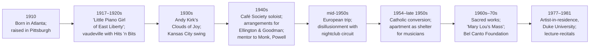
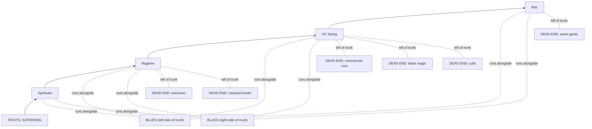
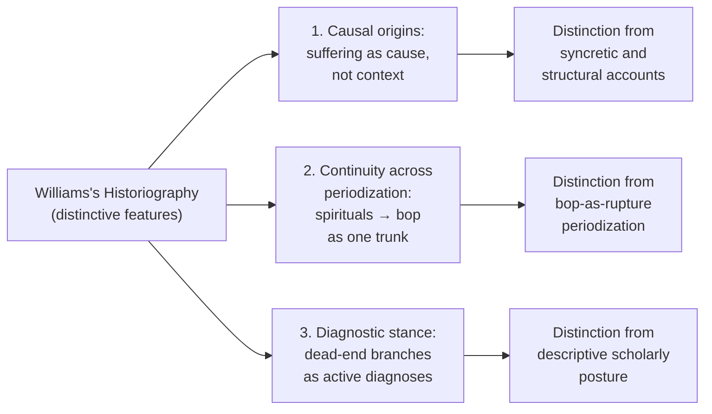

# Mary Lou Williams as Jazz Educator and Historian: Her Late-Career Pedagogy, the 'Jazz Tree,' and Her Vision of Jazz History (1970s–1981)
# 1 Introduction: From Performer to Pedagogue — Contextualizing Williams's Late-Career Turn

By the time Mary Lou Williams stepped onto the Duke University campus in 1977 as artist-in-residence, she was no longer merely one of the most influential pianists, arrangers, and composers in the history of jazz — she had become something more deliberate and self-conscious: a teacher, historian, and steward of an art form she believed was in danger of forgetting its own origins. The trajectory from "the little piano girl of East Liberty" who entertained Pittsburgh's Mellon family at bridge teas to a tenured presence at one of the American South's most prestigious universities spans more than six decades and traverses, almost without omission, every major stylistic transformation of twentieth-century jazz.[^1] That biographical singularity — her having lived, played, and helped shape ragtime-inflected stride, Kansas City swing, bebop, and sacred jazz alike — is precisely what made her late-career pedagogical project possible, and what gave her authority within it a weight that few of her contemporaries could match.[^2][^1]

This chapter establishes the analytical framework for the report by reconstructing the convergence of forces that turned a touring jazz musician into a full-time educator and historian during the final decade of her life. Four vectors will be argued to be decisive and mutually reinforcing: a deep Catholic spirituality acquired in the mid-1950s that reframed her vocation as a form of religious service; a long-standing instinct toward mentorship that prefigured formal teaching; a growing alarm at what she perceived as the fragmentation and commercialization of jazz during the 1960s and 1970s, coupled with a desire to reassert the music's African American roots; and an emerging institutional ecosystem — Duke University, the Catholic Church, festivals, foundations, and the managerial labor of Father Peter F. O'Brien, S.J. — that supplied the resources, audiences, and legitimacy her project required.[^2][^1] Taken together, these vectors transform what might otherwise read as the late chapters of a single musician's biography into something more ambitious: **a unified intervention in which personal vocation and historiographical advocacy are inseparable, and in which the act of teaching jazz becomes indistinguishable from the act of arguing what jazz, properly understood, actually is**.

## 1.1 Biographical and Career Background Leading to the Pedagogical Turn

Williams's authority as a late-career pedagogue cannot be understood apart from the breadth and texture of the life that preceded it. Born in 1910 in Atlanta to an alcoholic mother and raised in poverty in Pittsburgh, she was a child prodigy with perfect pitch who, at four years old, could repeat note for note songs her mother had just played on the piano.[^1] By the age of seven she was already performing publicly, earning the admiring local sobriquet "the little piano girl of East Liberty" as she moved between the parlors of working-class neighborhoods and the chauffeured cars that ferried her to the hillside mansions of the city's industrial elite.[^1] By her early teens she was on the road with a vaudeville group called Hits 'n Bits, and by her mid-teens she was married to saxophonist John Overton Williams — the first of several musical partnerships that would shape her formative years and, simultaneously, her enduring sense of jazz as a music learned not in conservatories but in cars, rooming houses, after-hours clubs, and on bandstands.[^2][^1]

The central decades of her career placed her at the heart of every major jazz movement of the twentieth century. During the 1930s she became the principal pianist and arranger for Andy Kirk's Clouds of Joy, where she absorbed the Kansas City scene that she would later describe as a kind of "jazz Juilliard."[^1] In the 1940s she emerged as a soloist at New York's Café Society and contributed compositions and arrangements to bandleaders as varied as Duke Ellington and Benny Goodman; her sophisticated *Zodiac Suite* was performed at Carnegie Hall.[^2][^1] Crucially, unlike many of her swing-era peers, she did not treat bebop as a threat but as a development to be embraced: she became an early champion of the new music and a mentor and colleague to its central figures, including Thelonious Monk and Bud Powell, with whom she maintained key relationships.[^2][^1] Her influence extended forward in time as well; later writers consistently identified her impact on John Coltrane and on younger players such as Hilton Ruiz.[^2]

The European trip of the mid-1950s marks the pivotal hinge of her career. Linda Dahl's biography corrects the persistent myth that Williams stopped playing for a long period in the late 1950s; in fact, after returning home dispirited from Europe, she shunned the nightclub gigs she had come to detest but continued to play piano at home and in a church basement.[^2] This withdrawal was not retirement so much as reorientation — a reordering of where, why, and for whom she played. It is in this moment that the seeds of her later pedagogical turn are most legibly visible: a musician of almost unparalleled stylistic range, disillusioned with the commercial conditions of jazz performance, beginning to redirect her formidable energies toward purposes other than entertainment.

This compressed timeline highlights the structural point: by the time Williams entered formal academic life at Duke in 1977, she carried within her a more or less complete embodied archive of jazz history — not as scholarly reconstruction but as personal memory, with attendant manuscripts, scrapbooks, telegrams, photographs, and journals that she had carefully preserved since the 1920s.[^1] **Her pedagogical authority, in other words, was not derivative; it was the lived material of the curriculum itself.**

## 1.2 Spiritual Conversion and the Reframing of Vocation

The single most decisive reorientation of Williams's adult life was her conversion to Catholicism, which followed a mental breakdown in 1954 and crystallized over the subsequent years into a comprehensive religious framework that absorbed and transformed her artistic identity.[^2][^1] The conversion was not a private devotional matter laid alongside her music but an organizing principle that restructured what music itself was for. As her own elliptical autobiographical fragment put it — "Jazz created for all people. / Jazz created through suffering. / Got beaten everyday. / And school — Amy Frank." — she had come to see jazz as a music born of suffering whose meaning could only be fully grasped within a redemptive frame; after her conversion, "the Christian tenet of redemption alleviated her own emotional pain and answered a lifetime of searching for meaning."[^1]

The institutional and creative consequences of this conversion were extensive. Williams composed a body of explicitly religious works that included *Black Christ of the Andes* and *Mary Lou's Mass*, the latter a jazz mass that was twice celebrated at St. Patrick's Cathedral in New York and that became, with her other sacred compositions, a touchstone of her revitalized post-conversion career.[^2][^1] She turned her apartment into a shelter for downtrodden musicians, such that in the 1950s it was "at times, virtually a rehab," and she founded a charitable organization named the Bel Canto Foundation devoted to helping jazz musicians struggling with drugs and alcohol.[^2][^1] These were not adjuncts to her music; they were continuous with it, expressions of the same conviction that suffering, properly received, could be transmuted into spiritual and aesthetic value, and that the responsibility of an artist who had survived the "muck and the mud" of American show business was to extend that survival outward to others.[^1]

The 1955 album *Mary Lou Williams: A Keyboard History* deserves particular attention as a transitional document between Williams the performer and Williams the educator. Functioning as the prototype for her later lecture-recitals, the album already exhibited the impulse to narrate jazz historically through her own keyboard rather than to perform it merely as entertainment. It included tracks of intimate personal significance, such as "Fandangle," which she had learned from her mother, and her own composition "Roll 'Em," gestures that fused autobiography, lineage, and stylistic demonstration into a single performative form. The album thus anticipates, in nascent form, the spoken-and-played hybrid format that would later define her university work.

Equally consequential for her pedagogical turn was her partnership with Father Peter F. O'Brien, S.J., a Jesuit priest who met Williams in 1964 and became her personal manager until her death in 1981.[^2] O'Brien's role was not merely practical; he provided the religious, intellectual, and logistical support that allowed her late-career mission to take institutional shape, and after her death he became, with Linda Dahl and others, a primary custodian of her archive and her memory.[^2] **The triad of conversion, sacred composition, and Jesuit managerial partnership thus reframed Williams's vocation: teaching, mentorship, and historical advocacy became, for her, religiously inflected acts of preservation and service — a continuation by other means of the same redemptive logic that animated her masses.**

## 1.3 Mentorship Instincts and Concerns about the Trajectory of Jazz

If conversion supplied the moral framework for Williams's late-career turn, mentorship supplied its practical grammar. Long before any university appointment, she had been a proto-pedagogue: a musician whose apartment was a gathering place for the central figures of bebop, whose arrangements taught younger players how to think structurally about harmony and rhythm, and whose influence on Monk, Powell, Coltrane, and Hilton Ruiz, among others, was widely recognized within the community.[^2] In the 1950s, as already noted, her apartment functioned virtually as a rehab, and her Bel Canto Foundation extended this informal patronage into organized charitable practice.[^2][^1] The transition from this lifelong instinct toward nurturing individual musicians to a formal classroom pedagogy was therefore less a discontinuity than an institutionalization — a recognition by Williams herself, and eventually by Duke University, that what she had been doing privately for decades could be done publicly and at scale.

This mentorship instinct was, however, increasingly entangled with anxiety. Across the 1960s and 1970s, Williams grew alarmed at what she perceived as the fragmentation of jazz, its commercialization, and — most acutely — its drift away from the blues and from the African American spiritual experience she regarded as the music's wellspring. Her autobiographical writings make clear that she understood jazz as a music "created through suffering," whose authenticity depended upon its connection to the "anguished condition" of enslaved and post-emancipation Black Americans who, in her own words, had developed "a vital musical communication, combining spirituals and work songs with rhythms that ... reached deep into the inner self, giving expression of sincere joy."[^1] She insisted, in a famous formulation from one of her songs, that "You ain't said nothin', 'til you play the blues."[^1]

Yet she resisted any narrow ethnocentric reading of this conviction. When, in the 1960s, some African Americans criticized her for not joining the Black Nationalist movement, she replied that she did not want to go back to Africa — but, the biographer notes, "when she started tapping her foot and bore down on the piano, there was no doubt about Mary's roots."[^1] Ellington's frequently cited assessment of her as "soul on soul" captured precisely the position she occupied: undeniably and constitutively African American, but committed to jazz as a "world music, universally accessible," her "bridge, her passport, to other people's worlds."[^1] **This dual commitment — to the music's specific Black spiritual origins and to its universal communicative reach — would later become the central axis of her Jazz Tree and the historiographical project the diagram encoded.**

The pedagogical implication of these twin impulses is direct. Williams's late-career teaching was animated not merely by a desire to share what she knew, but by a perceived emergency: a sense that the continuity of an authentic, blues-rooted, spiritually grounded tradition was at risk of being broken by avant-garde experimentation, commercial pressure, and historical amnesia. Teaching, in this view, was triage — a way of safeguarding a tradition by transmitting it directly to the next generation through the body of someone who had lived inside every chapter of it.

## 1.4 Institutional Platforms Enabling the Late-Career Turn

A personal mission, however compelling, requires infrastructure to become a sustained public practice, and Williams's late-career project benefited from an unusually rich convergence of institutional supports during the 1970s. The single most consequential of these was her appointment in 1977 as artist-in-residence at Duke University in Durham, North Carolina — a position that not only gave her a stable teaching platform but also led her to purchase a house in Durham, where she lived until her death from bladder cancer on May 28, 1981.[^2] At Duke she taught jazz history, worked on a history of jazz, and used the university's resources to formalize the lecture-recital model that had been incubating in her work for two decades.[^2]

The Catholic Church provided a parallel platform of comparable importance. Beyond the commissions and venues for *Mary Lou's Mass* — including its celebrations at St. Patrick's Cathedral — the Church's institutional reach gave Williams access to audiences (parishes, youth choirs, religious schools) that fell outside the conventional jazz circuit and that aligned naturally with the religiously inflected pedagogy she had developed.[^2] Her management by Father O'Brien, whose Jesuit affiliation linked her work to a broader network of Catholic intellectual and educational institutions, amplified this reach.[^2]

Festivals, foundations, and recordings filled out the institutional ecosystem. Although the Kennedy Center festival named in her honor was established posthumously, in 1995, it represents the eventual recognition by a major national cultural institution of the canonical status her late-career project had helped secure.[^2] Her own Bel Canto Foundation continued to function as a vehicle for the charitable dimension of her mission, while her unprecedented archive — photos, telegrams, letters, notebooks, music manuscripts, scrapbooks, journals, and a collection of private tapes — would later become the documentary foundation for subsequent scholarship and pedagogical transmission.[^2][^1]

The table below summarizes the principal institutional supports underpinning Williams's late-career pedagogical and historiographical work.

| Institutional Platform | Period / Date | Function in the Late-Career Project |
|---|---|---|
| Duke University (artist-in-residence) | 1977–1981 | Primary academic base; jazz history teaching; work on a jazz history project; lecture-recitals formalized[^2] |
| Catholic Church (commissions and venues) | 1960s–1981 | Sacred-music platform; performances of *Mary Lou's Mass* at St. Patrick's Cathedral; access to non-club audiences[^2] |
| Father Peter F. O'Brien, S.J. (personal manager) | 1964–1981 | Managerial, intellectual, and spiritual partnership; logistical infrastructure for teaching and touring[^2] |
| Bel Canto Foundation | Founded by Williams | Charitable vehicle for aiding jazz musicians struggling with drugs and alcohol[^2] |
| Personal archive (later at Rutgers / consulted by Dahl) | 1920s–1981, ongoing | Documentary foundation for lecture-recitals, scholarship, and posthumous transmission[^2][^1] |
| Kennedy Center festival (posthumous) | Established 1995 | National-level recognition; sustained institutional commemoration of her legacy[^2] |

Reading the table as a whole, the key insight is that **no single institution carried the full weight of Williams's late-career turn; rather, it was the cumulative interlocking of academic, religious, charitable, managerial, and archival supports that translated a personal vocation into a sustained, multi-channel pedagogical project**. Where many jazz performers of her generation found late-career options narrowing, Williams found them multiplying — precisely because her religious, mentorship, and historiographical commitments aligned with institutional missions that the conventional jazz industry could not have supplied.

## 1.5 Analytical Framing, Scope, and Structure of the Report

The argument that organizes the remainder of this report is that Williams's late-career work — roughly her activity from the early 1970s until her death in May 1981 — must be read as a unified intervention rather than as a collection of distinct activities (teaching at Duke, composing sacred works, lecturing, mentoring, archiving). Pedagogy, historiography, spirituality, and institutional positioning interlock in her practice, and isolating any one of them flattens what is most distinctive about the project: that **the act of teaching jazz, for Williams, was the act of arguing, in real time and through her own body at the keyboard, what jazz historically is, where it came from, and which of its present developments are continuous with that origin and which are not**.

Four analytical lenses will accordingly structure the chapters that follow:

- The **pedagogical** lens (Chapter 2) reconstructs the concrete forms of her late-career educational work — her artist-in-residency at Duke, her lecture-recital format, her use of visual aids, and the principles guiding her transmission of jazz as African American spiritual and historical practice.
- The **historiographical** lens (Chapters 3 and 4) interprets the 'Jazz Tree' diagram and the broader narrative of jazz origins and stylistic development that Williams advanced, paying particular attention to the diagram's hierarchical structure — its roots in suffering, spirituals, and ragtime; its trunk of authentic blues-rooted expression; its main branches in Kansas City swing and bebop; and the **"dead end" branches on the left side of the diagram, which included cults** along with other developments she regarded as departures from the tradition.
- The **evaluative** lens (Chapter 5) examines her documented assessments of specific styles and musicians — from her famously tense duet with Cecil Taylor to her remarks on figures such as John Coltrane and Dave Brubeck — and articulates the criteria (blues fidelity, spiritual sincerity, melodic and rhythmic integrity, connection to African American tradition) by which she praised or criticized them.
- The **legacy** lens (Chapter 6) assesses how her work was institutionalized after her death through the Kennedy Center festival, archival preservation, and continuing scholarly and performative engagement, and how her vision contributed to canon formation in jazz studies.

The primary sources informing this report include Linda Dahl's biography *Morning Glory: A Biography of Mary Lou Williams* (Pantheon, 2000), which drew on unprecedented access to Williams's archive of photos, telegrams, letters, notebooks, music manuscripts, scrapbooks, journals, and private tapes, as well as interviews with family members, musicians, and Father O'Brien;[^2][^1] contemporary reviews and editorial assessments of that biography;[^2][^1] and Williams's own published statements and recordings, most notably the 1955 *A Keyboard History* album that served as the prototype for her later lecture-recitals. Where the documentary record is thin on specific aspects of her late-career pedagogy — for instance, on the precise verbal scripts of her Duke lectures — the report will acknowledge those limits rather than fill them with speculation.

The temporal focus is the period from the early 1970s through May 28, 1981, with necessary excursions backward to the mid-1950s conversion and the formative decades that preceded it, and forward to the posthumous institutionalization of her legacy.[^2] The remainder of the report proceeds chapter by chapter through the analytical lenses just outlined, with the central aim of demonstrating that **Mary Lou Williams's final decade was not the coda of a performing career but the consolidation of a lifelong project: to render jazz teachable, historicizable, and spiritually intelligible, on terms set by an African American woman who had lived virtually the entire history of the music she sought to defend**.

# 2 Educational Activities and Teaching Philosophy

Chapter 1 established that Williams's late-career pedagogical turn was the product of an unusual convergence — Catholic conversion, lifelong mentorship instincts, alarm at the trajectory of jazz, and a supportive institutional ecosystem anchored by Duke University and Father Peter F. O'Brien. The present chapter shifts from causes to practices. It asks: what did Williams actually do, between roughly 1976 and her death in May 1981, as an educator? Where did she teach, in what formats, and according to what principles? The argument advanced here is that her pedagogical work — campus residencies, lecture-recitals, the Folkways *History of Jazz* album, the Duke artist-in-residency, and the unfinished compositional "History" she was writing when she died — was not a miscellany of late-life engagements but a single coherent system. In that system, venue, format, and content were mutually reinforcing, and the act of teaching jazz was inseparable from the act of demonstrating, at the keyboard, what jazz historically is. **Williams's late-career educational activities, primarily concentrated in the period from 1976 to 1981, constituted both the culmination of her personal vocation and a foundational moment in the institutionalization of jazz studies within American higher education.**

## 2.1 Institutional Sites and Scope of Teaching Activity

The institutional geography of Williams's late-career educational work was deliberately diverse, stretching from the elite Southern research university that became her permanent base to parochial high schools, urban parish programs, and the concert-and-clinic circuit of American colleges. Each venue served a different audience, but each was integrated into the same pedagogical mission.

The single most consequential site was Duke University. Williams arrived at Duke in the fall of 1977 as the university's first artist-in-residence and director of its Jazz Ensemble, and she remained in that role until her death in 1981.[^3] The Folkways liner notes for her 1978 *History of Jazz* album, written by her manager Peter F. O'Brien, S.J., describe the appointment in terms that capture both its scope and its ambitions: "In the Fall of 1977 Miss Williams began a stay at Duke University in Durham, North Carolina that hopes to prove somewhat permanent. As Artist in Residence there and a member of the music department, she is involved in teaching non-musicians a course introducing them to Jazz in all its forms. In addition, she writes for and directs Duke's Jazz Ensemble."[^4] The dual mandate — to teach jazz history to a non-specialist undergraduate population while simultaneously leading the university's performing jazz ensemble — placed her squarely at the intersection of academic instruction and applied performance, and gave her institutional footing within a music department primarily organized around the Western art-music canon. Her office in the Mary Duke Biddle Music Building became, in effect, both classroom and composer's studio: it was on the bottom floor of Biddle, "sick with cancer," that she worked on her unfinished "History" of jazz during her final years.[^5]

Before her appointment at Duke, Williams had already accumulated more than a decade of secondary-school teaching experience. In 1967, while teaching at Seton High School in Pittsburgh, she had written the first of her jazz masses — known simply as the Pittsburgh Mass — initially as a teaching tool for her students before later adapting it for liturgical use.[^6][^7] That early experience prefigured the pedagogical method she would refine in subsequent years: using composition and performance as means of historical and spiritual instruction, rather than treating teaching and music-making as separable activities.

Surrounding these primary engagements was a broad circuit of campus residencies, college clinics, and community-based educational appearances that Williams maintained throughout the late 1970s. The Folkways liner notes provide what is, for the period in question, the single most explicit description of the form and content of these engagements:

> "A three or five day residency on a Campus will find her on stage in concert with her trio, in a music or black history class, in lecture-demonstrations in large halls detailing, on the piano and in question and answer periods, the roots and history and course of Black American Music and Jazz, with the college archivist taping oral history for the future, in rehearsing the college band, or the college Glee Club for a performance with her of Mary Lou's Mass. Miss Williams also appears in clubs, on the concert stage, in the recording studio, on radio and TV, in churches large and small in performances of her Mass, in grade and high schools playing and lecturing at assemblies — in short: she is in the forefront of music which is exactly where she belongs."[^4]

Two examples of such university lecture-recitals were Rockhurst University and the University of Michigan, both of which hosted Williams during this period as part of the wider campus circuit that complemented her Duke residency. The structural point, however, is more general: a typical three-to-five-day campus residency packed concert performance, classroom instruction, lecture-demonstration, oral-history documentation, and rehearsal of community ensembles into a single integrated visit. **Williams's educational footprint was deliberately multi-tiered — from the Duke seminar room and the Carnegie Hall stage at one end to grade-school assemblies and parish church performances at the other — and the breadth of that footprint was itself a pedagogical statement: that jazz history belonged in every kind of educational space, not only in the conservatory.**

The table below summarizes the principal sites and their pedagogical functions.

| Institutional Site | Approximate Period | Primary Pedagogical Function |
|---|---|---|
| Duke University (artist-in-residence; director, Jazz Ensemble; member, music department) | Fall 1977 – May 1981 | Permanent academic base; jazz history course for non-musicians; ensemble direction; composition of "History"[^4][^3][^5] |
| Seton High School, Pittsburgh | 1967 onward | Secondary-school teaching; site of the original Pittsburgh Mass as a teaching tool[^6][^7] |
| University campus residencies (e.g., Rockhurst University, University of Michigan) | 1970s | 3–5 day residencies combining concerts, classes, lecture-demonstrations, oral history, ensemble rehearsals[^4] |
| Parish churches, parochial schools, grade and high school assemblies | 1970s | Community-level lecture-recitals; performances of *Mary Lou's Mass*; youth and adult education[^4] |
| Recording studios (notably Folkways) | 1970–1978 | Documentation of the lecture-recital form (*The History of Jazz*, 1978)[^4] |

## 2.2 The Lecture-Recital Format: Structure and Performative Logic

The signature pedagogical form Williams developed during this period was the lecture-recital — a hybrid in which spoken historical commentary and live piano demonstration were so tightly interleaved that the distinction between performance and instruction effectively dissolved. The form's clearest documentary embodiment is the 1978 Smithsonian Folkways album *The History of Jazz* (FJ 2860), recorded by Williams in her New York apartment in late 1970 and released by Folkways in 1978 with annotations by Peter F. O'Brien, S.J.[^4]

The album's structure is itself a pedagogical artifact. Side 1 traces a chronological arc through "Medi I (Modern Blues/Jazz)," "Anima Christi Suite (Lord Have Mercy — a Spiritual)," "Who Stole the Lock Off the Henhouse Door (Ragtime)," and "My Mama Pinned a Rose on Me (Old Fashioned Blues/Ballad)," interleaving each performance with sections of spoken voiceover. Side 2 continues the journey with "Nite Life (Kansas City Swing)," "Hesitation Boogie (Boogie Woogie)," "Old Blues," "New Blues (Bop or Modern)," "A Fungus Amungus (Avant-garde or Free)," and a closing reprise of "Medi I (Modern)."[^4] The chronological organization — modern blues backward to spirituals, then forward again through ragtime, blues, swing, boogie-woogie, bop, and avant-garde — is precisely the historical sequence that organized her live lecture-recitals.

O'Brien's annotation makes explicit how the recording was produced and what it was meant to capture: "Mary Lou Williams recorded this narration and this music tracing the history of Jazz in her apartment in New York City in late 1970. She wrote the narration and recorded herself using her Tandberg tape recorder. She then turned to her Hamilton (Baldwin) piano and delineated the various unfolding eras in the development of Jazz through which she herself has played."[^4] He emphasizes both the deliberateness and the singular documentary status of the project: "Mary Lou Williams' narrations on the history and nature of Jazz have been preserved on NewsFilm and in the archives of many radio stations. But this is the only recording that I know of on which she speaks for any great length. The narration is carefully prepared and delivered. Miss Williams' well considered statements offer a succinct and comprehensive Jazz Story — the music speaks for itself."[^4]

Four interlocking components organize the form. First, **spoken historical commentary**: prepared, scripted narrative that situates each stylistic moment within a chronological narrative of African American musical development. Second, **live piano demonstration**: representative examples performed not by anthology recordings but by Williams herself, drawing on the embodied stylistic range that, as O'Brien argues in the liner notes, made her "the only major Jazz Artist who has lived and played through all the eras in the history and development of Jazz" — a musician of whom critics had said she is "the History of Jazz."[^4] Third, **audience engagement**, particularly through question-and-answer periods that the Folkways notes explicitly describe as part of the lecture-demonstration format on campus visits.[^4] And fourth, **the Jazz Tree as a visual organizing aid**, used in larger lecture-demonstration halls to spatialize the narrative; this diagram is the focus of Chapter 3.

The logical force of the format lies in its collapse of two ordinarily distinct epistemic registers. A spoken assertion that bebop developed out of swing and the blues can be argued; a piano demonstration in which a single performer moves seamlessly from a Kansas City stride pattern into a bop line over the same harmonic terrain *is* the argument. **In Williams's lecture-recital, historical claim and sonic evidence are produced by the same body in the same moment, which gives the format its peculiar pedagogical authority: the historian is also, simultaneously, the primary source.**

The form's roots in Williams's career are deeper than the 1978 album alone suggests. As Chapter 1 noted, her 1955 *A Keyboard History* album already exhibited the impulse to narrate jazz historically through her own keyboard. By the early 1970s, with the Folkways recording made in 1970 and released in 1978, and by mid-decade in her university lecture-demonstrations, the form had reached maturity as a reproducible educational instrument that she carried from campus to campus and that culminated in her Duke classroom.

## 2.3 Pedagogical Principles and Core Convictions

The lecture-recital form, however formally distinctive, was the surface manifestation of a deeper set of pedagogical convictions. Four principles can be reconstructed from the documentary record.

**First, jazz as African American spiritual and historical art form.** Williams insisted that students approach jazz not as a sequence of musical styles to be catalogued but as the expressive medium of a specific people's historical experience. The Folkways notes are explicit that her campus lecture-demonstrations detailed "the roots and history and course of Black American Music and Jazz."[^4] The sectional headings of *The History of Jazz* itself — beginning with "Anima Christi Suite (Lord Have Mercy — a Spiritual)" and grounding the entire arc in blues and modern blues — encode the same conviction: students were to understand the music's spiritual and cultural origins before its stylistic surface.[^4]

**Second, technical and structural understanding through experiential immersion rather than rote learning.** Williams herself, the Folkways notes emphasize, "never took a formal music lesson in her life" and was "self-taught, and highly observant," exposed from childhood "to the music of professional playing musicians."[^4] This self-formation underlay her well-known suspicion of conventional pedagogical methods. Her teaching method at Duke has been characterized as "teaching from behind the piano," an approach that emphasized students' experiential learning through listening and singing rather than abstract theoretical exercises. Williams opposed learning jazz from books and through mechanical exercises, believing such approaches would "destroy" the creative impulse she regarded as essential to the music. The pedagogical dictum most often associated with her Duke teaching captures the principle in compressed form: when a student asked her what a particular chord was, she would reply, "when you find it, I'll tell you" — a refusal to substitute verbal labeling for the experiential and aural discovery that, in her view, alone produced authentic understanding.

This was not anti-intellectualism but a particular theory of musical knowledge. Williams's own practice, the Folkways notes emphasize, involved "ten to twelve hours daily at her instrument in search of the sounds she wished to express," with the result that "in her playing today there is heard an authentic compendium, stated or implied, of the entire sweep and development of this American musical art-form known as Jazz."[^4] The pedagogical implication is direct: students who consumed jazz through textbooks and exercise drills could acquire its surface vocabulary but would never produce the embodied compendium of style that constituted genuine jazz literacy. Hamida Jackson-Little, one of her Duke students, recalled exactly this experiential character: "She was so instrumental in helping us understanding the music and the history of it. It wasn't just a class where you listened to music. … She was a treasure."[^3]

**Third, transmission across generations.** Williams's late-career pedagogy was framed as a direct relay of authentic tradition from those who had lived it to those who would carry it forward. The Folkways notes underline the genealogical specificity of her authority. She had, they argue, "inspired and encouraged Thelonious Monk, Bud Powell, Tadd Dameron, Art Blakey, Kenny Dorham, Charlie Parker, Miles Davis, and Dizzy Gillespie," and her New York apartment had functioned as "a kind of salon or headquarters for all the young musicians who were, at that time, experimenting and creating Modern Jazz."[^4] By the late 1970s, the same mentorship instinct that had served bebop's first generation was being redirected toward college undergraduates, parochial-school students, and amateur church choirs. The Duke Centennial profile makes the genealogical claim explicitly: by the time Williams arrived at Duke, "she was already a giant figure in the jazz world, a mentor to the likes of Thelonious Monk, Charlie Parker, Dizzy Gillespie and Miles Davis and a pioneer who carved out a role for women in jazz."[^3] Teaching, in this framework, was the institutionalization of a function she had performed informally for half a century.

**Fourth, jazz as simultaneously rooted and universal.** The Folkways liner notes capture Williams's stylistic identity in terms that bear directly on her pedagogy: she was, the notes argue, "thoroughly involved in her music, and in the fight to expose Jazz and see that it survives and develops further," and her playing today represented "an authentic compendium … of the entire sweep and development of this American musical art-form known as Jazz."[^4] The pedagogical work was at once defensive (preserving a tradition under threat) and expansive (making it available to audiences far beyond the African American communities of its origin), and the lecture-recital form was precisely calibrated to do both — to insist on roots while reaching outward.

Underlying all four principles was the religiously inflected dimension established in Chapter 1. The same logic that produced *Mary Lou's Mass* — performed at St. Patrick's Cathedral on 18 January 1975 in what the Folkways notes call "A Jazz First"[^4] — also produced the lecture-recitals: in each case, teaching was understood as a form of redemptive service, an act of preservation and witness through which a music born of suffering could be transmitted intact to those who had not lived it.

## 2.4 The Unfinished "History" Project as Pedagogical Synthesis

The deepest evidence of Williams's pedagogical synthesis is the major composition she was working on at Duke during her final years, provisionally titled "History." Sick with cancer on the bottom floor of Biddle Music Building, she continued working on what the *Raleigh News & Observer* describes as "an expansive 'History' of jazz that combined ragtime, gospel and swing as ingredients in a giant stew."[^5] When she died in 1981, the work was unfinished, and the manuscript fragments effectively disappeared into the university's archives.

The piece was rescued from oblivion only decades later, when Duke music professor Anthony Kelley — himself a Duke alumnus whose office was, by his own account, "five doors down" from Williams's old office in Biddle — set out during the early days of the COVID-19 pandemic to locate the unfinished work he had glimpsed in a 1981 documentary clip featuring Paul Bryan, then director of the Duke Wind Symphony.[^5][^8] After a year of inquiry, a Duke archivist turned up a cardboard box — labeled no. 27, buried within Bryan's personal papers — that contained "roughly 40 sheets of paper tied with string," scratched out in pencil in Williams's own hand.[^5][^8]

For the analysis of Williams's pedagogy, the most consequential aspect of the recovered manuscript is its outline, which Williams had supplied with subheadings scribbled in order: "Intro, Suffering, Spiritual #1, Spiritual #2, Gospel, Ragtime …"[^5] Kelley's subsequent reconstruction, premiered by the Duke University Wind Symphony at Baldwin Auditorium on 13 April 2024, fleshed out this skeleton into a 360-measure composition for 37 different instruments, structured as "an emotional journey" that begins with "Suffering" — "a tale of enslavement, dark and discordant" — and culminates in "the triumphant gospel section."[^8]

Read as a curricular document rather than as a musical work, the outline is striking. It is the same historical narrative Williams told in her lecture-recitals, the same sequence implicit in *The History of Jazz* album of 1978, and — as Chapter 3 will argue — the same architecture that organized the Jazz Tree. **Suffering and spirituals are placed at the foundation; gospel and ragtime arise from them; the subsequent stylistic developments of jazz are positioned as continuations of this rooted lineage.** The sectional architecture, in other words, is direct sonic evidence of Williams's historiographical priorities: she was not merely teaching that jazz emerged from African American religious and historical experience, she was composing that claim as a piece of music whose form *is* the argument.

Methodological caution is in order. Williams herself did not complete the work, and what now exists is necessarily a posthumous reconstruction by another composer working, in Kelley's own self-description, like "a ghost writer finishing a great novelist's final work" after immersing himself in "at least 70 hours of her music."[^8] Kelley himself acknowledges the inherent limits: "She was a far more experimental composer than this piece reflects," and "there are things I know she would disagree with."[^5][^8] What the recovered outline establishes with certainty, however, is the sequence Williams herself had committed to paper: the section headings are in her hand, in her order. **As a curricular document — a sonic summary of what Williams believed students of jazz needed first and most to understand — the outline is unambiguous, even where the musical completion is not.**

## 2.5 Legitimizing Jazz Studies: Williams's Role in Higher Education

The cumulative effect of Williams's late-career pedagogical work was not only to teach jazz to a specific cohort of students at Duke and a wider circle of campus visitors, but to participate in a broader institutional transformation — the moving of jazz from the nightclub and festival circuits into archives, classrooms, and degree-granting curricula. Her Duke appointment was both a symptom and an accelerant of that transformation.

Several dimensions of her institutional contribution can be distinguished. Williams was, in Duke's own retrospective characterization, "the university's first artist-in-residence and director of the jazz ensemble," and her hiring "was also a signal that Duke was moving forward to welcome Black faculty and students."[^3] The position thereby carried meaning along multiple axes simultaneously: it was a credentialing of jazz as a discipline worthy of a research university's resources; it was a gesture toward racial integration of a music department primarily oriented toward Western art music; and it was a recognition, however overdue, that the artist-scholar — the musician whose embodied knowledge constituted a genuine scholarly resource — belonged inside the university's pedagogical architecture rather than only at its festival fringes.

The integrative effects of her presence on campus extended well beyond formal instruction. "Williams and the jazz program became one of the focal points for Black students and culture on campus," the Duke Centennial profile records, and her students' testimonies — Hamida Jackson-Little's recollection that "It wasn't just a class where you listened to music. … She was a treasure" — indicate the kind of presence she had within the institution.[^3] After her death in 1981, Duke established the Mary Lou Williams Center for Black Culture in her name in 1983; for generations of students over the subsequent four decades, "The Lou" has functioned as "a cornerstone of their Duke experience," in the words of one alumnus, and "a place of reflection and where you can always find support from Duke community members."[^3] The center is treated more fully in Chapter 6, but its existence is itself a measure of how Williams's pedagogical project transcended the boundaries of a single course or appointment.

There are documentary limits to what can be said about the precise verbal content of Williams's Duke lectures. The Folkways notes provide a detailed account of her typical campus residency activities and the structure of her lecture-recitals, and the recovered "History" manuscript provides a structural skeleton of her historiographical narrative, but the day-to-day transcripts of her Duke classroom sessions — the specific examples she chose on a given day, the particular questions her students asked — are not systematically preserved in the materials surveyed for this report. What can be said with confidence is that the lecture-recital form documented on the 1978 Folkways album, the residency template described in the same album's liner notes, the experiential "teaching from behind the piano" method, and the historiographical sequence encoded in the unfinished "History" together provide a reliable composite picture of the pedagogy she practiced at Duke.

Read against the broader history of jazz education, Williams's role helped establish a template that would become central to jazz studies in subsequent decades: the artist-scholar in residence, whose authority derives less from conventional academic credentials than from embodied participation in the tradition being taught, and whose pedagogy braids performance, history, archival work, and community engagement into a single institutional practice. **That template — and the proposition it embodies, that jazz is a teachable, historicizable, and intellectually serious discipline whose deepest knowledge is held by those who have lived it — was, in significant part, the legacy of Mary Lou Williams's final five years.**

# 3 Jazz Tree Analysis: Structure, Content, and Lineage of an Educational Diagram

Chapter 2 reconstructed the institutional sites and performative logic of Mary Lou Williams's lecture-recital pedagogy, noting in passing that she relied on a visual organizing aid — the "Jazz Tree" — to spatialize her chronological-historical narrative in larger lecture-demonstration halls. The present chapter takes that diagram as its central object. The task is twofold: to reconstruct the Tree's anatomy from roots to leaves with as much fidelity as the surviving documentary record permits, and to interpret what that anatomy means as a historiographical argument. The Tree is best read not as a neutral taxonomy of jazz styles but as a compressed visual claim about three things at once — the music's African American origins in suffering, its blues-rooted continuity across stylistic transformations, and the diagnosable difference between authentic development and inauthentic departure. Reading the Tree this way clarifies why Williams could simultaneously champion bebop and rebuke avant-garde experimentation, why she located ragtime on the trunk rather than on a side branch, and why certain late-twentieth-century musical phenomena — commercial rock, cults, "exercises" — appear in her diagram not as branches at all but as dead ends extending leftward from the living tree. **The Jazz Tree is the historiographical pivot of Williams's late-career project: it makes her pedagogy legible as an argument, and her argument legible as pedagogy.**

## 3.1 The Jazz Tree as Document and Pedagogical Instrument

The Jazz Tree exists in the documentary record primarily as a graphic artifact: a hand-drawn diagram executed by the illustrator David Stone Martin from sketches that Williams herself supplied. The collaboration is itself significant. Martin was one of the most influential jazz album-cover designers of the postwar era, and the resulting diagram bears his characteristic line economy; but the conceptual content — what goes where on the tree, what is named, what is excluded — was Williams's. **The Jazz Tree should accordingly be understood as Williams's diagram rendered in Martin's hand, not as Martin's interpretation of Williams's music.** This authorship matters because it locates the diagram squarely within the historiographical project that animated her late-career pedagogy: it is Williams's own ordering of the music, with the same evaluative force as her typewritten essays and her unfinished "History" composition.

Functionally, the Tree operated as the visual armature of her lecture-recital format. As the Folkways liner notes for *The History of Jazz* described, her typical three-to-five day campus residency included "lecture-demonstrations in large halls detailing, on the piano and in question and answer periods, the roots and history and course of Black American Music and Jazz." In such large-hall settings, where the intimate face-to-face register of a classroom or church basement could not be sustained, the Tree gave the audience a single spatial schema on which the chronological narrative — Williams speaking, Williams playing — could be mapped in real time. When she narrated and then demonstrated the spirituals, listeners could see the diagram's roots; when she shifted to a Kansas City stride passage, she was tracing the trunk upward into a named branch. The Tree thus performed the same collapse of historical claim and sonic evidence that Chapter 2 identified as the signature of her pedagogy, but in a static visual form that could anchor a hall of several hundred people through a multi-section presentation.

The Tree is one node in a dense network of mutually reinforcing historiographical artifacts that Williams produced across her late career. The 1978 Smithsonian Folkways *History of Jazz* album encodes the same chronological narrative in audio and spoken-word form, beginning with the "Anima Christi Suite (Lord Have Mercy — a Spiritual)" and progressing through ragtime, blues, Kansas City swing, boogie-woogie, bop, and "A Fungus Amungus (Avant-garde or Free)."[^9] The unfinished "History" composition Williams was writing at Duke until her death in 1981 organizes the same material as a sectional score whose pencil-drafted outline reads "Intro, Suffering, Spiritual #1, Spiritual #2, Gospel, Ragtime." Her typewritten essays — "Don't Destroy the Roots," "Has the Black American Musician Lost His Creativeness and Heritage in Jazz," and "Jazz Is Our Heritage" — make the same argument in prose, asserting that black music is "an historical phenomenon, born out of suffering" that yielded "the greatest and only true art … in the world": that of the spirituals and what came after.[^10] Read together with the diagram, these artifacts constitute a single integrated historiographical claim restated across four media — graphic, sonic, compositional, and verbal — each of which clarifies and reinforces the others.

Two limits of the documentary record should be acknowledged at the outset. First, no complete high-resolution facsimile of the Tree with every legible label is reproduced within the materials surveyed for this report; certain labels in its outer foliage are necessarily reconstructed from Williams's verbal and textual descriptions rather than from direct visual inspection. Second, the relationship between particular drafts or copies of the Tree and specific lecture-demonstration occasions is not fully documented; Williams may have refined the diagram across the 1970s. The reconstruction that follows therefore concentrates on the diagram's stable architectural features and named elements that recur across the documentary record, while treating finer foliage detail with appropriate caution.

## 3.2 Roots: Suffering, Spirituals, and the African American Foundation

At the base of the diagram, beneath the soil from which the tree rises, Williams placed a single explanatory word: **SUFFERING**. The placement is the diagram's first and most consequential interpretive move. By locating "SUFFERING" at the roots — rather than naming a musical style there, or beginning the historical narrative with a stylistic category such as "African music" or "folk song" — Williams insists that jazz's origin is not, in the first instance, musicological but historical and existential. The root system encodes a claim about what produced the music, not merely about what preceded it in chronological time.

This insistence is consistent across her late-career writings and statements. The CapRadio essay drawn from Daphne Brooks's research summarizes the position with notable directness: Williams "wrote about the black music tradition as an historical phenomenon, born out of suffering and yielding 'the greatest and only true art … in the world': that of the Spirituals and that which came after."[^10] Tammy Kernodle's *Soul on Soul* further frames Williams's late-career advocacy as a project to "reclaim and illuminate the cultural roots of jazz during sixties and seventies," asserting that "jazz evolved out of 'the suffering of slaves'" and developing "a historical and pedagogical frameworks that invoked jazz's 'black heritage' that most strongly linked her with the wave of cultural nationalism that emerged out of the mid-century black civil rights movement."[^11] The Tree's root-level placement of "SUFFERING" is the visual condensation of exactly this position: not a sentimental gesture toward the music's pathos, but a historiographical thesis about its causal genesis in the experience of enslavement and its aftermath.

Above this foundational word, the root system continues upward through the religious and proto-musical idioms that the suffering of African Americans produced. As Chapter 1 noted, Williams's autobiographical fragment characterized the historical condition that gave rise to jazz as one in which African Americans developed "a vital musical communication, combining spirituals and work songs with rhythms that … reached deep into the inner self, giving expression of sincere joy." The Tree's root zone encodes this developmental claim: from suffering arise the spirituals and work songs, and from those in turn arise the gospel and devotional idioms of the Black church. The recovered outline of the unfinished "History" composition — "Intro, Suffering, Spiritual #1, Spiritual #2, Gospel, Ragtime" — provides what is, in effect, a sectional gloss on the diagram's root zone, with each pencil-drafted subheading corresponding to a developmental stratum that the Tree spatializes vertically.

Kernodle's analysis of Williams's broader project makes explicit what the diagram leaves implicit: the placement of "SUFFERING" at the roots is not only a historiographical claim but a political-cultural one. Williams's "music during this period mirrored the protest songs of Odetta, Fannie Lou Hamer, and Nina Simone in accentuating and reclaiming the themes of resistance, resilience, and spirituality that have been prevalent in black music since its beginnings."[^11] The Tree's roots thus do two things simultaneously: they ground jazz historically in a specific Black experience that cannot be detached from the music's identity, and they identify that experience — including its religious, vocal, and rhythmic outflows — as the source of the music's spiritual authority. Any branch growing from this trunk inherits, by genealogical implication, the obligation to remain in living connection with what the roots represent; a stylistic development that severs that connection severs itself from the source of the music's authenticity.

## 3.3 Trunk: The Blues as the Unified Continuum of Authentic Jazz

Rising from the root system, the Tree's trunk traces a single vertical stylistic sequence — the developmental axis along which Williams located the legitimate, blues-rooted continuum of jazz. The trunk is labeled from bottom to top with four successive idioms: **Spirituals → Ragtime → KC Swing → Bop**. This stylistic ascent encodes Williams's central historiographical claim about jazz's authentic developmental lineage: each named idiom emerges from the one below it, none constitutes a rupture with what preceded it, and all together form a single unified trunk of expression that descends without interruption from the African American religious and historical experience at the roots.

Even more importantly, extending vertically up both sides of the trunk — running alongside spirituals, ragtime, Kansas City swing, and bebop alike — is a single word: **BLUES**. The graphic logic is precise. The blues is not located as one branch among others, nor is it situated only at the base or only at the top of the trunk; it runs the full length of the trunk on both sides, structurally encasing every named idiom in the developmental sequence. This positioning visualizes Williams's most insistent conviction: that the blues is not a style alongside other styles but the very medium of authenticity through which all genuine jazz expression flows. Her dictum captured in the lyric "You ain't said nothin', 'til you play the blues" is rendered here as a diagrammatic principle. **To remain on the trunk — to be authentic jazz at all — is to remain inside the blues; the moment a development steps outside the blues, it steps off the trunk.**

The internal sequencing of the trunk repays close attention. By placing spirituals at the base of the trunk (immediately above the root zone), Williams treats them not as merely preparatory but as already participating in the unified continuum. Ragtime follows as the next stratum upward, marking the transition from sacred and quasi-sacred vocal expression to instrumental and rhythmically organized music while remaining within the blues field that envelops the trunk. Kansas City swing — the milieu Williams herself had absorbed during her years with Andy Kirk's Clouds of Joy, and which she would later describe as a kind of "jazz Juilliard" (Chapter 1) — occupies the next stratum, representing the maturation of the unified continuum into the dominant orchestral and small-group practice of the swing era. Bop sits at the top of the trunk: the most recent named idiom in the sequence, and the development that Williams not only refused to treat as a rupture but actively championed and helped to incubate.

The trunk's structural force as a normative claim is best appreciated by considering what it excludes. There is no Dixieland labeled on the trunk; no New Orleans collective polyphony; no Chicago jazz of the 1920s. This is not because Williams was unaware of these styles — she had lived through them — but because the trunk in her diagram does not pretend to chronicle every stylistic development. It identifies the developmental backbone she regarded as the spine of authentic, blues-rooted jazz: the lineage along which the music's spiritual and historical core was transmitted intact from suffering and spirituals through to bebop. **The trunk, in other words, is a normative diagnosis disguised as a chronological sequence: it shows which idioms Williams believed had transmitted the blues-grounded core forward, and the labeling of "BLUES" up both sides of the trunk makes the criterion of transmission graphically explicit.**

## 3.4 Main Branches: Kansas City Swing, Bebop, and the Authentic Developmental Lineage

Because Williams placed Kansas City swing and bop on the trunk itself rather than as side branches, the categorical distinction between "trunk" and "main branch" in her diagram is less hierarchical than one might initially assume. The trunk *is* the principal developmental lineage; the main branches that the report's outline associates with Kansas City swing and bebop are, in Williams's actual diagrammatic logic, simply the upper strata of the trunk itself. This is not a defect of the diagram but precisely its argument: the most important "branches" of jazz — the styles she most wished to defend as authentic — are not branches at all but constitutive elements of the central stem.

Kansas City swing's position near the upper trunk encodes a biographical and historiographical conviction in equal measure. Williams had developed her own pianistic identity inside the Kansas City scene of the late 1920s and 1930s. The CapRadio essay captures the milieu's pedagogical force: after moving with the Clouds of Joy to Kansas City in 1929, Williams "fell into a musical scene that … 'encouraged the utmost inventiveness and adventurousness among the players.' And it was there in the Eighteenth and Vine 'nightlife' of that city" where she "evolved into 'a composer and an arranger.'"[^10] To place Kansas City swing on the trunk is, on one level, to defend the legitimacy of her own formation as a foundational stratum of jazz. But the deeper claim is structural: Kansas City swing represents, for Williams, the moment at which the blues-rooted, spirituals-derived continuum achieved its full ensemble articulation, integrating boogie-woogie, blues, stride, and big-band orchestration into a single unified idiom.

The trunk's culmination in bop is equally consequential. As Chapter 1 noted, Williams "did not treat bebop as a threat but as a development to be embraced: she became an early champion of the new music and a mentor and colleague to its central figures, including Thelonious Monk and Bud Powell." Stephen Lehman's study of Jackie McLean confirms the pattern of her mentorship: "Mary Lou Williams in the 1940s … endorsed the music of Thelonious Monk and Bud Powell long before her music would show their influence."[^12] By positioning bop at the top of the trunk rather than as a divergent branch, the Tree visualizes a historiographical claim that ran against much swing-era opinion: that bebop was not a break with the tradition but its continuation — the next stratum upward along the same blues-grounded stem, mentored into existence by figures (Williams herself among them) who understood themselves as carriers of an unbroken lineage. This was a contested claim in the 1940s and remained contested in the 1970s; the Tree functions, in part, as a visual rebuttal to those who treated bebop as either an avant-garde rupture or an ethnographic curiosity disconnected from the swing-era mainstream.

Other developments that Williams treated as authentic — boogie-woogie, modern blues, and her own sacred jazz — fit naturally into this trunk logic. The 1978 Folkways album's track sequence, which arrays "Hesitation Boogie (Boogie Woogie)," "Old Blues," "New Blues (Bop or Modern)," and modern blues alongside each other,[^9] indicates that Williams treated these idioms as variants of the same blues-rooted core rather than as distinct branches diverging from it. Her sacred jazz — *Black Christ of the Andes*, *Mary Lou's Mass* — was likewise positioned, in her own self-understanding, as a return of the music to the spiritual roots from which it had emerged, an upper-trunk development rather than a side branch. **The criteria by which a development qualified for trunk status were therefore consistent and explicit: fidelity to the blues; continuity with the spirituals at the root system; rhythmic, melodic, and structural integrity within an African American expressive frame; and a participatory rather than commercial relation to its audiences.**

## 3.5 Dead-End Branches: Cults, Commercial Departures, and Inauthentic Offshoots

If the trunk identifies the authentic developmental lineage of jazz, the diagram's most polemical feature is the cluster of branches Williams arrayed on the **left side** of the tree as **dead ends** — stylistic and cultural offshoots that, in her judgment, had departed from the trunk and could not produce further living development. The set of dead-end branches she explicitly named is striking both for its specificity and for its heterogeneity. On the left side of the Tree, Williams identified the following dead ends:

- **commercial rock**
- **avant garde**
- **black magic**
- **cults**
- **exercises**
- **classical books**

The diagrammatic logic of placing these six items together is itself revealing. They are not all of a kind — commercial rock is a musical genre, "exercises" is a pedagogical practice, "cults" and "black magic" are cultural-religious phenomena, "classical books" suggests a mode of musical literacy — yet Williams positions them on the same side of the diagram and assigns them the same diagnostic status: they extend leftward from the tree but do not draw nourishment from the trunk, and they cannot grow further. **The Tree thereby identifies a single underlying error common to all six: each represents a way of engaging with music that severs the player or listener from the African American spiritual and blues-rooted continuum that the trunk transmits.**

The textual evidence for Williams's explicit articulation of this diagnosis is unusually direct. Her 1977 letter to *Ebony* journalist Phyl Garland captured the conviction in compressed form: youngsters, she wrote, had "lost the heritage playing rock, avant garde (sic), black magic exercises… (Aretha & James Brown are the only real mccoys…)"[^10] The verbal sequence is almost identical to the diagrammatic sequence on the Tree — rock, avant-garde, black magic, exercises appear in both — and the parenthetical exception for Aretha Franklin and James Brown clarifies the criterion: those who maintained living contact with the trunk (the soul tradition rooted in gospel, blues, and the spiritual experience) remained "real mccoys"; those who did not had stepped onto the dead branches.

The CapRadio essay, drawing on Brooks's research, extends and contextualizes Williams's articulation of these objections. Of commercial rock, Williams argued that it "is the new era of rhythm and blues and was created by Black Americans…. Even with the loudness of this music there was a great deal of soul (feeling)…. When the commercial world grabbed it.[.] It became amateurist (sic) and lousy."[^10] The diagnosis is precise: rock as such was not the problem; its commercial capture was. The Tree's "**commercial rock**" branch is therefore not a rejection of Black popular music's rhythm-and-blues lineage but a specific identification of the moment at which commercial appropriation severed an authentically Black expressive form from the people and the trunk that had produced it.

Of the **avant garde** branch — which Chapter 5 will treat in more analytic detail — Williams's objection ran along parallel lines: she had wrestled, as she put it in the *Embraced* liner notes, with what she had previously felt to be "a perverted force … coming into the music" arising from sources including "foreign composers" to "commercial rock," and had at one time believed these forces might "destroy the true *feeling* of Jazz."[^10] The avant-garde, in her view, risked losing precisely the "feeling" — the blues-grounded affective core — that the trunk transmitted. Whether this judgment was always sustained by her, and whether it is fair to all the music it would encompass, is the subject of Chapter 5; what matters here is that the Tree's "**avant garde**" branch records the judgment in its starkest diagrammatic form.

The placement of "**black magic**" and "**cults**" on the dead-end side is the diagram's most explicitly religious-cultural diagnosis. For Williams, whose post-1954 Catholic conversion had reframed her entire vocation as a form of redemptive service (Chapter 1), the trunk's spiritual core was not generically religious but specifically rooted in the Black Christian experience — the spirituals, gospel, and church-derived idioms encoded at the roots and at the base of the trunk. Stylistic or religious developments that drew on non-Christian magical or cultic frameworks, or that exoticized African religious practice in detachment from the Black American spirituals tradition, struck her as departures from the source of jazz's spiritual authority. The placement is consistent with her broader insistence that the music's roots lay in a specific Black religious and historical experience rather than in a generalized "African" or "spiritual" abstraction.

"**Exercises**" and "**classical books**" extend the diagnosis into the pedagogical realm. As Chapter 2 documented, Williams's own teaching method at Duke — "teaching from behind the piano," refusing to substitute verbal labeling for experiential discovery, opposing the learning of jazz from books and through mechanical exercises that would "destroy" the creative impulse — encoded a specific theory of musical knowledge. Her placement of "exercises" and "classical books" on the dead-end side of the Tree visualizes that theory. Jazz, in her view, could not be acquired through the systematic exercise regimes characteristic of European classical training, nor through the codified textbooks that would translate the music into a literacy-based discipline. Such acquisition modes would produce, at best, a surface vocabulary disconnected from the embodied, aural, communal practice through which the trunk's blues-rooted continuity was actually transmitted. **The Tree thus encodes pedagogy itself as a diagnostic site: a student who learned jazz through exercises and classical books was, in Williams's view, standing on a dead branch from the moment of their first lesson.**

The following table summarizes Williams's diagnoses of the six explicit dead-end branches on the left side of the Tree.

| Dead-End Branch (left side of Tree) | Williams's Diagnostic Criterion | Documentary Support |
|---|---|---|
| commercial rock | Commercial capture of a Black rhythm-and-blues form, severing it from the trunk's "soul (feeling)" | *Embraced* liner notes; CapRadio/Brooks essay[^10] |
| avant garde | "Perverted force" risking destruction of the "true feeling of Jazz"; severance from blues-grounded affective core | *Embraced* liner notes; letter to Phyl Garland[^10] |
| black magic | Departure from the specifically Black Christian spirituals/gospel tradition at the trunk's base | Letter to Phyl Garland[^10] |
| cults | Religious-cultural framings disconnected from the African American spiritual roots that produced jazz | Letter to Phyl Garland[^10] |
| exercises | Mechanical pedagogical practice that would "destroy" the creative impulse essential to the music | Duke teaching method (Chapter 2); letter to Phyl Garland[^10] |
| classical books | Literacy-based mode of musical acquisition incompatible with embodied, aural, communal transmission | Duke teaching method (Chapter 2) |

Two important qualifications must be added to this account. First, Williams's diagnoses were not always rigid or final. By the time of the *Embraced* concert and its 1978 album release with Cecil Taylor, she had publicly conceded — as the CapRadio essay records — that "one should play all forms of music," a position that softens, without retracting, the diagrammatic judgment encoded in the Tree's dead-end branches.[^10] Her evolution toward a more inclusive view did not erase her objections so much as reframe them as warnings rather than absolute prohibitions: a player who engaged with the avant-garde, with rock, or with classical training had to do so without losing contact with the trunk; the danger of severance remained, even if the engagement could be productive.

Second, the dead-end branches encode an evaluative position that some of Williams's contemporaries would have contested vigorously, and that the documentary record allows us to identify as itself a contested historiographical claim. Val Wilmer's *As Serious As Your Life*, contemporaneous with the period of Williams's lecture-recitals, argued precisely the opposite case for the avant-garde, framing free jazz as a return to "some of the music's neglected core values, in particular a directness of emotional expression that went right back to the raw collective polyphony of the earliest jazz."[^13] Williams's Tree and Wilmer's book thus represent two divergent historiographies of the 1970s — both grounded in the conviction that jazz's authenticity lies in its African American roots, but differing sharply on whether the avant-garde extends those roots or severs from them. The Tree is best read as Williams's intervention in this debate, not as a neutral arbitration of it.

## 3.6 The Tree as Visual Argument: Continuity, Authenticity, and Spiritual Core

The diagram's hierarchical architecture can now be summarized as a single integrated visual argument. The flowchart below renders the Tree's principal labeled elements as Williams positioned them, capturing the structural relationships among roots, trunk, and dead-end branches.

Three interlocking claims are encoded in this architecture. First, **historical continuity**: all authentic jazz descends through a single trunk from a single root system. The successive labeling of the trunk as Spirituals → Ragtime → KC Swing → Bop, with no breaks indicated, asserts that the stylistic transformations of twentieth-century jazz are continuous developments along one stem rather than a series of mutually disruptive rebellions. There is no place on Williams's trunk for the conventional periodization that treats bebop, in particular, as a revolutionary break with swing; her trunk insists on the opposite reading.

Second, **authenticity diagnosed by proximity**: the vertical axis is also an evaluative axis, in which proximity to the trunk indexes fidelity to the tradition. A development located on the trunk itself is authentic by virtue of its position; a development extending leftward into the dead-end branches is, by the same spatial logic, inauthentic. This proximity logic is what gives the diagram its diagnostic power in a teaching context: a student or listener encountering a new musical phenomenon can ask, in effect, where on Williams's Tree it would be placed, and the answer reveals not only what kind of music it is but how Williams would evaluate it.

Third, **the spiritual core**: the BLUES enveloping the trunk on both sides, and the SUFFERING grounding the roots, encode the claim that the music's meaning is inseparable from the African American spiritual experience at its source. The diagram refuses to allow jazz to be treated either as a generic American art form or as a stylistic genealogy detachable from its historical conditions of production. Whatever else jazz is — and the Tree concedes that it is many things — it is, first and inalienably, the expressive medium of a specific people's spiritual and historical experience, and any account that severs the music from that experience misunderstands it. **The Tree's deepest pedagogical effect is that it makes this claim spatially obvious: the eye cannot move from the trunk's bop upward without having passed through KC Swing, Ragtime, and Spirituals, and cannot rest on those without seeing SUFFERING beneath them.**

Reading the Tree against the broader corpus of Williams's late-career artifacts confirms its central status in her historiographical project. The recovered sectional outline of the unfinished "History" composition — "Intro, Suffering, Spiritual #1, Spiritual #2, Gospel, Ragtime …" — composes the diagram's lower trunk in sound; the 1978 *History of Jazz* album's track sequence narrates and demonstrates the same architecture in voice and piano;[^9] her typewritten essays argue the same case in prose. The Tree is not redundant with these other artifacts but their visual integration: a single image in which the entire historiographical claim can be apprehended at once. Within the report's overall argument, the Tree thus serves as the historiographical pivot that links the pedagogical practices reconstructed in Chapter 2 to the narrative of jazz origins and stylistic evolution to be elaborated in Chapter 4, and the evaluative judgments of specific styles and musicians to be analyzed in Chapter 5. **The Tree, in the end, is Williams's argument compressed into a single image; its branches are her diagnoses; and its roots are her insistence that no understanding of jazz that does not begin with suffering can claim to understand jazz at all.**

# 4 Jazz Historiography: Origins, Core Spirit, and Stylistic Evaluation

Chapter 3 reconstructed the spatial logic of Mary Lou Williams's Jazz Tree — its roots in suffering, its trunk traced upward from spirituals through ragtime, Kansas City swing, and bop, and its array of dead-end branches diagnosing inauthentic developments. The diagram, however, is the visual condensation of a deeper historical narrative. What did Williams actually claim about how jazz came into being, what holds it together as a coherent tradition, and how its modern stylistic transformations should be evaluated against that origin? The present chapter answers those questions by reading the Tree's spatial argument as the surface of a substantive historiography, articulated across her late-career lecture-recitals, the 1978 Folkways *History of Jazz* album, the unfinished "History" composition, the typewritten essays, and the documented remarks she made to interviewers, students, and colleagues. The central argument is that **Williams's historiography is distinctive not in any one of its individual claims but in the unbroken way it links a causal origin (suffering and Black religious experience) to a constitutive medium (the blues as feeling) to a developmental backbone (spirituals → ragtime → Kansas City swing → bop) to a diagnostic stance toward contemporary practice — producing a single integrated framework in which historical genesis, aesthetic essence, and critical evaluation are inseparable**. The chapter develops this argument across five movements and closes by situating Williams's framework against the mainstream jazz historiographies of the 1960s–70s.

## 4.1 Origins: Suffering, Spirituals, and the Religious Wellspring of Jazz

Williams's account of jazz's origin began not with a musical style but with a historical condition. Asked in interview where jazz came from, she answered with unusual directness: "Because it came out of suffering of the first early Black slaves and it's all American. It has nothing to do with Africa or Latin American music." The formulation is striking in three respects. It locates the music's genesis in a historical-existential experience — slavery and its suffering — rather than in a stylistic prehistory; it claims jazz as "all American," refusing both an African diasporic and a Latin syncretic provenance; and it does so on the grounds of causation, treating the music's origin as inseparable from the conditions of its emergence. Where most contemporary ethnomusicological accounts of jazz's origins in the 1960s and 1970s emphasized syncretic confluences of African, European, Caribbean, and American vernacular musical materials, Williams treated such accounts as missing the central fact: that what produced jazz was not a meeting of musical traditions but a specific people's encounter with a specific historical ordeal.

This causal placement is consistent across the documentary record of her late career. The recovered pencil-drafted outline of the unfinished "History" composition begins with the sequence "Intro, Suffering, Spiritual #1, Spiritual #2, Gospel, Ragtime" — a sectional architecture in which Suffering is named as the foundational stratum from which the spirituals and the subsequent musical idioms unfold. The 1978 Folkways *History of Jazz* album encodes the same priority sonically: Side 1 of the album opens, after the brief "Medi I (Modern Blues/Jazz)" prelude, with the "Anima Christi Suite (Lord Have Mercy — a Spiritual)," establishing the spiritual as the first named stratum of the chronological narrative before any instrumental idiom is introduced. The Jazz Tree itself, as Chapter 3 documented, places the single word SUFFERING at the roots and rises through spirituals to the rest of the trunk. **Across diagram, score outline, and album track sequence, Williams was making the same historiographical claim in three media: suffering is the cause, the spirituals are the first expressive form that suffering generated, and everything subsequently called jazz emerges in unbroken descent from that founding sequence.**

Equally insistent in Williams's account was the role of the Black church as a primary site of transmission. She told audiences and students that "good jazz" was "healing to the soul" — a formulation that figures jazz not as entertainment but as a therapeutic-spiritual practice continuous with the religious experience from which it emerged. The recovered "History" outline's progression from spirituals through gospel before reaching ragtime preserves this same priority: the religious vocal idioms are not preliminaries to be cleared away before the "real" jazz begins; they are the substance whose translation into subsequent forms *is* the music's history.

This origins-account cannot be detached from Williams's Catholic conversion of 1954, which (as Chapter 1 argued) reframed her vocation as a form of redemptive service. After conversion, the conviction that jazz was "created through suffering" took on a specifically theological resonance: suffering received and transmuted into expression was, for her, the same redemptive logic that animated Christian sacred art. Yet — and this is the analytically important point — her insistence on the religious wellspring of jazz preceded her formal conversion and survived it. Her autobiographical fragments describe the historical condition of enslaved and post-emancipation African Americans as one in which they "developed a vital musical communication, combining spirituals and work songs with rhythms that … reached deep into the inner self, giving expression of sincere joy." The conversion did not invent the claim; it gave Williams a vocabulary and a redemptive framework within which the claim could be elaborated and defended.

The most distinctive feature of Williams's origins-account, when compared with contemporary scholarly narratives, is its dual refusal. **She refused both the African-diasporic origin story that traced jazz's percussive and call-and-response features back to West African musical retentions, and the syncretic Creole/Caribbean origin story that emphasized the meeting of European and African materials in New Orleans.** "It has nothing to do with Africa or Latin American music," she insisted, treating any cultural combination as falling outside what jazz, properly understood, actually is. This was a contested position — many of her contemporaries, including scholars sympathetic to her broader project, would have insisted that African retentions and Caribbean influences were precisely what made jazz the music it became — but it was a deliberate position, not an oversight. Williams was claiming that jazz was the expressive form of a specific people's specific historical experience on American soil, and that the integrity of that claim required refusing to dilute the genesis with extra-American sources. The pedagogical force of the refusal is consequential: if jazz arose from American slavery, then its meaning cannot be recovered by retrieving an African heritage or a Caribbean confluence. It can only be recovered by re-encountering, through music and through teaching, the specific suffering and the specific religious response that produced it.

One further consequence of this origins-account deserves emphasis. Williams's historiography simultaneously affirmed that jazz is purely "American" and rejected the standard American origin-narrative that located the music's birthplace in New Orleans. Together with her refusal of African and Latin sources, her rejection of New Orleans as the sole birthplace of jazz left the origins-account standing on a single foundation: not a place, not a confluence, but a condition — the suffering of enslaved African Americans, transmuted into spirituals, work songs, and the gospel idiom that the trunk would carry upward into every subsequent development.

## 4.2 The Blues as Core Spirit: Soul, Feeling, and Communal Expression

If suffering and the spirituals constitute the genesis of jazz in Williams's historiography, the blues constitutes its continuing essence — the medium through which the originating condition remains audible in every authentic development. The Jazz Tree visualizes this conviction by running BLUES up both sides of the trunk for its entire length, alongside every named stratum from spirituals to bop (Chapter 3). The diagram's spatial argument finds its substantive articulation in a single recurring claim across her late-career statements: that **the blues is not one style alongside others but a "feeling" that permeates all good jazz**, and that without this feeling no music — however technically accomplished — qualifies as authentic jazz at all. Williams's view that spirituals and blues are not merely musical genres but rather a "feeling" running through all good jazz is the conceptual hinge on which her entire historiography turns.

The most compressed statement of this conviction is the lyric Williams wrote and repeated across her late-career performances: "You ain't said nothin', 'til you play the blues." The dictum encodes a dual claim. First, the blues is the medium of musical speech itself — to play music that is not the blues, in the jazz tradition, is not yet to have said anything that counts as jazz utterance. Second, the criterion of saying something jazz-meaningful is not technical proficiency but blues-feeling: a phrase, a chorus, or an entire performance may display every virtue of harmonic sophistication, rhythmic exactitude, or melodic invention and still fail the threshold of jazz speech if it lacks the blues. The 1964 *Time* article cited in Chapter 1 captures Williams's own articulation of the same criterion: "Mary Lou thinks of herself as a 'soul' player — a way of saying that she never strays far from melody and the blues, but deals sparingly in gospel harmony and rhythm. 'I am praying through my fingers when I play,' she says. 'I get that good "soul sound", and I try to touch people's spirits.'"[^14]

The components of Williams's conception of the blues-as-feeling can be reconstructed from her statements with some precision. Four features recur. First, the blues is **prayerful and communal** rather than virtuosic and individualistic — a music that aims to "touch people's spirits" rather than to display the player's facility, continuous with the religious and church-derived idioms at the trunk's base. Second, it is **melodic and rhythmically rooted** rather than abstract — "she never strays far from melody and the blues," and "good jazz," in her account, retains a melodic and rhythmic legibility that connects player and listener within a shared field of feeling. Third, it is **participatory rather than commercial** — its function is to invite listeners into a shared expressive experience, not to package an experience for consumption. Fourth, it is **affective at root** — the criterion is "feeling," "soul," and the capacity to move listeners spiritually, rather than the satisfaction of any technical or formal specification.

Duke Ellington's frequently cited characterization of Williams as "soul on soul" (Chapter 1) registers from outside the conviction Williams herself articulated from inside. Soul, for Ellington as for Williams, named something the music either had or lacked — not a stylistic genre but a quality of expressive contact between player, instrument, and listener that derived from the African American spiritual and historical experience the trunk carried forward. The *Embraced* liner notes' warning against forces that would "destroy the true feeling of Jazz" (Chapter 3) registers the same criterion under threat conditions: the dangers Williams identified in commercial rock, in avant-garde experimentation, in classical-book pedagogy were not, primarily, dangers to particular techniques or repertoires but dangers to the survival of feeling as the music's organizing medium.

The most analytically interesting feature of Williams's conception of the blues-as-feeling is the way it reconciled — without dissolving — the tension between her commitment to jazz's specifically Black origins and her parallel insistence that jazz was, in Ellington's words and her own practice, a "world music, universally accessible." The reconciliation runs through the concept of feeling itself. The blues, in Williams's account, was rooted in a specific historical experience of African American suffering, and its specificity could not be relinquished without losing what made the music the music. But the affective register the blues operated in — the prayerful, communal, healing dimension — was, in principle, accessible to any listener willing to enter into the field of feeling the music established. **Universality, for Williams, was not the universality of the abstract or the generic but the universality of an emotional language so specific that anyone could hear it.** The path to universal communication ran through, not around, the music's specific Black roots; the blues was universal precisely because it was first authentically itself.

This conception of the blues-as-feeling has direct pedagogical consequences (Chapter 2). It explains why Williams resisted teaching jazz from textbooks and through exercises: the surface vocabulary of blue notes, twelve-bar forms, and pentatonic phrasings could be acquired technically, but the feeling that made such materials function as the blues could not be encoded in any literacy-based pedagogy. It had to be transmitted experientially, through listening, demonstration, and the kind of embodied immersion her lecture-recitals modeled. The blues-as-feeling is also why she insisted that students go back to Fats Waller, to ragtime and stride, before attempting bebop: the feeling she identified at the music's core was sedimented in the earlier idioms in forms that bebop had concentrated and transformed but could not have generated from scratch. To learn jazz without first learning the blues-feeling that ran through the earlier strata of the trunk was to learn a syntax without ever encountering the meaning it carried.

## 4.3 Ragtime as Transitional Formative Idiom

Williams's treatment of ragtime occupies a distinctive and analytically revealing position in her historiography. Ragtime is placed on the trunk of the Jazz Tree — between spirituals at the base and Kansas City swing higher up — which immediately distinguishes Williams's reading from accounts that treat ragtime either as a pre-jazz curiosity or as a separate stylistic tributary. For Williams, ragtime was the pivotal transitional stratum at which the spirituals' melodic and rhythmic substance was translated into a fully instrumental practice, and it remained indispensable to genuine jazz literacy long after it had ceased to be the dominant performance idiom of the day.

The documentary evidence for Williams's centering of ragtime is detailed and personal. The 1978 Folkways *History of Jazz* album included, as a key chronological station, "Who Stole the Lock Off the Henhouse Door (Ragtime)" — a piece her mother had taught her in childhood — which Williams used to demonstrate ragtime's idiomatic features.[^14] The recovered pencil-drafted outline of the unfinished "History" composition lists "Ragtime" as a discrete sectional heading immediately after spirituals and gospel, encoding the same chronological-developmental priority in score form. **The selection of "Who Stole the Lock Off the Henhouse Door?" — a piece taught to her by her mother — as her ragtime example is itself a historiographical statement: ragtime, for Williams, was not an academic category but a domestic and familial inheritance, transmitted within the home from one generation to the next**, continuous with the church-and-parlor culture from which her musical formation emerged.

The most vivid documented expression of Williams's insistence on ragtime as indispensable is her 1980 encounter with the young pianist Harry Pickens. Pickens was a National Endowment for the Arts Artist-in-Residence visiting Duke and seized the opportunity to meet Williams at her Durham home studio. Instructed to "play me some blues," the 20-year-old Pickens launched into a fast bebop performance, choosing Bud Powell's "Dance of the Infidels" at roughly double the recorded tempo. After about 30 seconds, Williams stopped him: "Okay. That's fine. You can blow." She acknowledged his Powell influence and his bebop facility, but then redirected him sharply: "Now show me what you can do with your left hand. Do you know Teddy Wilson? Nat Cole? Fats Waller? Art Tatum?" When Pickens admitted he had not listened to them very much, Williams was unequivocal: "You need to go back to Fats Waller." She added: "I took him [Hilton Ruiz] all the way back to Fats Waller, and that's what you need to do."[^15]

The encounter is significant on multiple registers. As pedagogy, it exemplifies the method documented in Chapter 2: experiential redirection rather than abstract correction, rooted in the conviction that the answer to a student's musical impoverishment lies upstream in the tradition rather than in further refinement of the downstream technique. As biographical detail, it confirms Williams's continued mentorship of younger pianists late into her life. But as historiographical evidence, what is striking is the specific direction she pointed: not back to the spirituals (the trunk's base), not laterally to other bebop pianists (the trunk's top), but back to Waller and to the stride-ragtime continuum that lay between. Pickens's later interpretation of the lesson — "don't skip steps," "build a solid foundation for whatever you want to learn" — captures the pedagogical principle precisely, but Williams's specific naming of Waller, Wilson, Cole, and Tatum encodes a more pointed historiographical claim: that the lineage of legitimate jazz piano runs through the stride-ragtime pianists whose work translated the church-and-blues melodic-rhythmic substance into the keyboard idiom that subsequent jazz pianism would extend.[^15]

This positioning explains the otherwise puzzling fact that Williams, despite being among bebop's earliest and most committed champions (Chapter 1), was unwilling to allow younger pianists to enter the tradition from the top. The trunk could not be climbed without traversing its lower strata. Bebop was the maturation of a developmental lineage; it was not a self-sufficient starting point. A pianist who attempted to skip from no foundation directly to bebop chops acquired, in Williams's view, the surface idiom of the most recent stratum without ever passing through the lower strata in which the substance the idiom transformed had been laid down. **Ragtime and stride, in this account, are not optional pre-bebop ornaments but the formative middle in which the spirituals' substance becomes pianistically intelligible — without which the upper trunk floats free of its sources.**

The substantive historiographical content of Williams's reading of ragtime can now be summarized. Ragtime was, for her, the idiom in which the melodic-rhythmic substance of the spirituals and church-derived idioms first became fully instrumental and pianistic, producing a vocabulary that subsequent jazz piano (stride, the Harlem pianists, Hines, Tatum, and onward to bop) would inherit and transform. It was neither a quaint historical curiosity to be sentimentally preserved nor a fully realized jazz form to be performed for its own sake in 1978 as it had been in 1898. It was a constitutive formative stratum, whose internalization was a precondition of genuine jazz literacy in any later idiom. Williams's own 1978 *Solo Recital* at the Montreux Jazz Festival — three years before her death — included a medley "encompassing spirituals, ragtime, blues and swing,"[^14] enacting the same trunk-traversal she counseled to her students: a single performing body moving across the whole continuum, with ragtime as the indispensable middle.

## 4.4 Kansas City Swing and Bebop as Authentic Maturations

The upper trunk of the Jazz Tree carries two named idioms — Kansas City swing and bop — whose elevation as authentic maturations of the blues-rooted continuum constitutes Williams's most pointed historiographical claim against the dominant periodization of her time. For Williams, the two were not antagonists but successive strata of a single developmental axis, and her authority to make this claim derived from her direct participation in the production of both.

Williams's biographical embeddedness in Kansas City swing was deep. As Chapter 1 documented, she had joined Andy Kirk's Twelve Clouds of Joy at the end of the 1920s, becoming the band's second pianist after her initial recordings (in 1929 in Kansas City and in 1930 in Chicago and New York) raised her to national prominence under the name "Mary Lou" suggested by Jack Kapp of Brunswick Records.[^14] During the Kansas City years, she became, in Ted Gioia's words, "the musical genius of the group," writing charts such as "Mary's Idea" and "Walkin' and Swingin'" that "were marked by a happy mixture of experimentalism and rhythmic urgency, while her playing soon earned her star billing as 'The Lady Who Swings the Band.'"[^16] She also supplied Kirk with compositions including "Froggy Bottom," "Little Joe from Chicago," and "Roll 'Em" — the last of which Benny Goodman commissioned as a blues-based boogie-woogie for his own band after her "Camel Hop."[^14]

This biographical embeddedness underwrites a specific historiographical claim. Kansas City swing, as Williams encountered and helped to shape it, was the milieu in which "a distinct style of jazz gradually took root … drawing on disparate elements: the blues tradition of the Southwest, the big band sounds of the Northeast, and the informal jam session ethos of Harlem."[^16] The "rhythmic essence of this regional style," Ted Gioia argues, set it apart from contemporaries.[^16] For Williams, this fusion — blues, boogie-woogie, stride, big-band orchestration, informal jam-session looseness — represented the moment at which the trunk's blues-grounded continuity achieved its full ensemble articulation. Kansas City swing was not one regional school among others; it was the milieu in which the upper trunk's instrumental and orchestral mature form became possible. **The elevation of Kansas City swing in Williams's diagram is therefore not a parochial preference for the scene of her own formation but a historiographical claim about where, in the developmental backbone, the blues-rooted continuum reached its full big-band maturity.**

Williams's relation to bebop was structurally analogous: she had not merely lived through its emergence but actively incubated it. Her apartment at 63 (sometimes given as 21) Hamilton Terrace in Harlem functioned, throughout the early 1940s, as what one University of Arkansas Jazz Program description called the "hangout spot for the up-and-coming jazz musicians of the early 1940's," frequented by "Bud Powell, Thelonious Monk, Dizzy Gillespie, Kenny Dorham and Tadd Dameron, just to name a few" who came to her apartment "as a space to sound out new ideas."[^15][^17] Williams's own description, quoted from Joan Kufrin's *Uncommon Women*, captures her role: "All during this time, my house was kind of a headquarters for young musicians. I'd even leave the door open for them if I was out. Tadd Dameron would come to write when he was out of inspiration, and [Thelonious] Monk did several of his pieces there. Bud Powell's brother Richie, who also played piano, learned how to improvise at my house. And everybody came or called for advice."[^15] In a separate recollection from *Melody Maker*, Williams remembered: "During this period Monk and the kids would come to my apartment every morning around four or pick me up at the Café after I'd finished my last show, and we'd play and swap ideas until noon or later."[^14] She composed the bebop hit "In the Land of Oo-Bla-Dee" for Dizzy Gillespie in 1945,[^14] and she was, in the University of Arkansas description, "the matriarch of bebop, mentoring her guests as they flourished in their careers."[^15]

The historiographical force of this biographical proximity is that **Williams's elevation of bebop to the upper trunk was authorized from inside the music's making**. When the dominant swing-era press treated bebop as either an avant-garde rupture or an ethnographic curiosity, Williams could speak from the room where the music had been composed, mentored, and refined. Her position — that bebop was not a break with the trunk but its continuous next stratum — was a claim a participant could make in a way a mere observer could not.

Two features of bebop's authentic-development status in her account deserve emphasis. First, bebop's relation to the blues, in Williams's reading, was not occluded but intensified. Her 1978 album labeled her bop demonstration "New Blues (Bop or Modern)" — a parenthetical that explicitly identified bop as a development of the blues rather than a departure from it.[^14] On the Jazz Tree, BLUES runs up both sides of the trunk through and including the bop stratum (Chapter 3); the visual claim is that bop is, structurally, blues at a higher level of formal concentration. Second, bebop's historiographical legitimacy was, for Williams, confirmed by the fact that **Bop was the last jazz style she recognized in her historical narrative** — the top of the trunk in the Jazz Tree, the most recent stratum in the sectional outline of the unfinished "History," and the final pre-avant-garde station in the 1978 album's chronological sequence. After bop, in her diagram, the trunk does not continue upward into a further named stratum; later developments either remain encompassed within "modern blues" (a return inward to the blues field) or extend leftward as dead-end branches.

The interpretive implication is consequential. Williams's refusal to recognize any post-bop stylistic development as a further authentic stratum of the trunk was not nostalgia for the music of her youth and middle years. It was a substantive historiographical position: that bop had completed a particular developmental arc — the maturation of the blues-rooted continuum from spirituals through ragtime and swing into a fully realized modern jazz idiom — and that the legitimate task of subsequent jazz was to continue working within that completed trunk rather than to extend it by way of stylistic rupture. The dead-end branches treated in §4.5 are the diagnostic counterpart to this positive claim.

The table below summarizes the trunk strata in Williams's historiography, the documentary support for each, and the form of her direct biographical participation in the stratum.

| Trunk Stratum | Williams's Position | Documentary Support | Form of Direct Participation |
|---|---|---|---|
| Spirituals | Foundational expressive idiom arising from suffering | "Anima Christi Suite (Lord Have Mercy — a Spiritual)" opens 1978 album; "Spiritual #1, Spiritual #2" in "History" outline | Sacred jazz compositions; *Black Christ of the Andes*; *Mary Lou's Mass* |
| Ragtime | Transitional formative idiom translating vocal-spiritual substance into instrumental practice | "Who Stole the Lock Off the Henhouse Door (Ragtime)" on 1978 album; "Ragtime" in "History" outline; lesson to Pickens | Childhood repertoire taught by her mother |
| Kansas City swing | Mature ensemble articulation of the blues-rooted continuum | "Nite Life (Kansas City Swing)" on 1978 album; "The Lady Who Swings the Band" | Pianist-arranger for Andy Kirk's Twelve Clouds of Joy; "Mary's Idea," "Walkin' and Swingin'," "Roll 'Em" |
| Bop (last recognized stratum) | Continuous next stratum of blues-rooted continuum; not a rupture | "New Blues (Bop or Modern)" on 1978 album; top of Jazz Tree trunk | Hamilton Terrace headquarters; mentor to Monk, Powell, Parker, Gillespie, Dameron; "In the Land of Oo-Bla-Dee" |

Read as a whole, the table makes visible an important pattern: **at every stratum of the trunk, Williams's historiographical claim is doubled by a form of direct participation**. She is not merely classifying jazz's developmental backbone; she is identifying the strata in which she herself worked and through which she had transmitted, or been transmitted by, the music's continuity. This is the source of the historiography's distinctive authority — and, as §4.6 will argue, the source of what most distinguishes it from the scholarly historiographies of the period.

## 4.5 Styles Criticized as Departures: Commercial Rock, Avant-Garde, Cults, and Pedagogical Errors

Williams's diagnostic stance toward contemporary developments — the dead-end branches of the Jazz Tree — was, in its historiographical reasoning, the negative correlate of her positive doctrine of the trunk. Where the trunk identified developments that had successfully transmitted the blues-grounded continuity forward from suffering and the spirituals, the dead-end branches identified developments that had, in her judgment, severed themselves from that continuity. Chapter 3 mapped the diagrammatic placement of these branches; the task here is to articulate the substantive criteria by which Williams diagnosed each departure.

Williams's reasoning about **commercial rock** turned on a specific causal claim about commercial appropriation. As she put it in the *Embraced* liner-note discussion (Chapter 3), commercial rock was the new era of rhythm and blues, "created by Black Americans," and "even with the loudness of this music there was a great deal of soul (feeling)." The problem was not the idiom but its capture: "When the commercial world grabbed it[,] it became amateurist (sic) and lousy." The historiographical point is precise. Rock as such derived from a Black rhythm-and-blues lineage that, in Williams's framework, had legitimate connections to the trunk. The departure occurred when commercial mediation severed the music from the communities and the feeling that had produced it, leaving a surface idiom emptied of substance. The dead-end status, in other words, was not assigned to a stylistic category but to a structural-economic relationship.

Williams's reasoning about **avant-garde and free jazz** turned on a different but related criterion: the loss of feeling. In the *Embraced* liner notes (Chapter 3), she described forces she had felt to be "a perverted force … coming into the music," including avant-garde experimentation, that risked "destroy[ing] the true *feeling* of Jazz." The substantive claim was not that avant-garde players were technically unaccomplished or aesthetically uninteresting but that the avant-garde, as a tendency, risked operating outside the blues-as-feeling that the trunk transmitted. On the 1978 Folkways album, Williams's avant-garde demonstration — "A Fungus Amungus (Avant-garde or Free)" — sits structurally outside the chronological narrative of trunk strata, neither continuing the trunk nor returning to it.[^14] The same diagrammatic placement on the Tree, as a dead-end branch extending leftward, encodes the same diagnosis. Chapter 5 will examine Williams's specific 1977 duet performance with Cecil Taylor at Carnegie Hall — "despite onstage tensions between Williams and Taylor, their performance was released on a live album titled *Embraced*"[^14] — and the more ambivalent late-career formulations she developed; what matters here is the historiographical reasoning that placed the avant-garde on the dead-end side in the first place.

Williams's placement of **cults and "black magic"** on the dead-end side reflected the specifically Christian character of the trunk's spiritual roots. As §4.1 documented, Williams understood the spirituals and the gospel idioms at the base of the trunk as expressions of a specifically Black Christian religious experience under conditions of suffering. Religious or cultural framings drawn from non-Christian magical or cultic sources — even where those sources claimed African or diasporic provenance — were, for Williams, departures from the specific spiritual lineage that produced jazz. The diagnostic criterion was continuity with the specific Black Christian spiritual experience that produced the spirituals, not a generalized "spirituality" or "African heritage." Williams's letter to Phyl Garland (Chapter 3) named the same items in prose that the Tree placed on the dead-end side: "rock, avant garde (sic), black magic exercises…"

Williams's diagnoses of **exercises** and **classical books** as dead-end pedagogical practices completed the framework by treating modes of musical acquisition as themselves diagnosable. As Chapter 2 documented, her teaching method at Duke — "teaching from behind the piano," refusing to substitute verbal labeling for experiential discovery, opposing the learning of jazz from books and through mechanical exercises that would "destroy" the creative impulse — encoded a specific theory of musical knowledge consistent with the diagrammatic placement of exercises and classical books on the dead-end side. **The historiographical reasoning is that the trunk's blues-rooted continuity is transmitted through embodied, aural, communal practice, and that any mode of acquisition that bypasses such practice produces a player who possesses the surface vocabulary of jazz without the substance the vocabulary is supposed to carry.** Pickens's account of his lesson — Williams's redirection from bebop showing-off back to Fats Waller — illustrates the diagnostic in practice: the problem with a young pianist who could play "Dance of the Infidels" at double tempo but had not listened deeply to Waller, Wilson, Cole, and Tatum was not the speed but the disconnection from the experiential continuity the trunk's earlier strata embodied.[^15]

A methodological qualification belongs here. Williams's dead-end diagnoses were not uniformly rigid, and Chapter 3 noted that by the time of the *Embraced* concert and its 1978 release she had publicly conceded that "one should play all forms of music" — a position that softened, without retracting, the diagrammatic judgments encoded in the Tree's dead-end branches. The softening should not be read as a recantation. It is consistent with the framework's internal logic to hold that engagement with any of the dead-end practices is *possible* without severance from the trunk, provided the engagement is undertaken without losing contact with the blues-grounded core. The danger of severance remained; the prohibition relaxed into a warning. The historiographical reasoning encoded in the dead-end diagnoses thus survived intact even as its applications grew more discriminating.

## 4.6 Comparative Distinctiveness: Williams's Historiography Against Mainstream Jazz Narratives

The final analytical task of this chapter is to locate Williams's historiography within the broader landscape of jazz historical writing in the 1960s and 1970s. Doing so clarifies what is distinctive about her framework and what is not — what other writers shared with her, and where her account departed from theirs in ways that cannot be reduced to mere idiosyncrasy.

Three contemporaneous historiographical tendencies provide useful reference points. **Structural-musicological history** in the lineage of Gunther Schuller — whose *The Swing Era* (Oxford University Press, 1991) was the second volume of a multi-volume historical project — emphasized the analysis of scoring, harmonic movement, instrumental voicing, and compositional structure across the canonical jazz repertoire, treating jazz history as a series of formal-structural developments that could be reconstructed by close listening and score analysis.[^18] **Smithsonian-style canon-formation work** in the lineage of Martin Williams emphasized the curation of a representative repertoire and the establishment of a teaching canon for jazz studies — the *Smithsonian Collection of Classic Jazz* on which generations of jazz history courses, including those in the WTJU *Jazz at 100* series, were built.[^16][^18] And **avant-garde apologetics** in the lineage of Val Wilmer's *As Serious As Your Life* (cited in Chapter 3) framed free jazz of the 1960s and 1970s as a return to "some of the music's neglected core values, in particular a directness of emotional expression that went right back to the raw collective polyphony of the earliest jazz."

Williams's historiography overlaps with each of these tendencies in some respects but diverges sharply in others. With structural-musicological history, she shared an attention to specific compositional and pianistic features and a willingness to make discriminating evaluations of specific arrangements and performances; her own arrangements for Andy Kirk, Goodman, and Ellington testify to her structural sophistication. But where Schuller's *Swing Era* analyzed harmonic movement and orchestration as ends in themselves — with chapters and pages devoted to the technical anatomy of bands from Bunny Berigan and Red Norvo through Goodman, Miller, Shaw, Kirby, Reinhardt, Whiteman, Lavalle, Bailey, Carter, and Fields[^18] — Williams treated such features as carriers of feeling, evaluable only by reference to whether they transmitted the blues-grounded core. She was, in this sense, a structural analyst within a substantive-spiritual framework rather than within an autonomously musicological one.

With Smithsonian-style canon formation, Williams shared a pedagogical project: the institutionalization of jazz as a teachable discipline whose canon could be transmitted to subsequent generations. The Folkways *History of Jazz* album, in its careful chronological selection and her own demonstrations of representative stylistic moments, parallels the curatorial logic of the *Smithsonian Collection*. But where the Smithsonian canon was assembled by scholars from recordings made by others, Williams's canon was performed by the same body that taught it — a difference of mode rather than content, but a consequential one. Her authority to canonize the trunk's strata derived from her direct participation in them; the Smithsonian's derived from scholarly judgment exercised on archival recordings.

With avant-garde apologetics, Williams shared the conviction that jazz's authenticity lay in its connection to specifically Black expressive and spiritual roots. Wilmer's argument that free jazz returned to the music's "neglected core values" and "directness of emotional expression" used substantively the same criterion Williams used — emotional directness, fidelity to the music's expressive sources — to reach the opposite conclusion. The disagreement was not over the criterion but over its application: did the avant-garde of the 1960s and 1970s extend the trunk's blues-grounded affective core, as Wilmer argued, or did it sever from that core, as Williams argued? This is genuinely a substantive historiographical disagreement between two participants in the same broad project (the defense of jazz as an African American art rooted in spiritual and historical experience), and neither party can be reduced to the other.

Against this background, three features of Williams's framework can be identified as distinctively hers.

First, **causal rather than contextual origins**. Most contemporary historiographies treated the suffering of African Americans as the sociohistorical *background* against which jazz developed — a context within which the music's syncretic stylistic confluences took place. Williams treated suffering as the *cause* of the music: not the conditions under which jazz emerged, but the experience whose expressive transmutation jazz was. "Because it came out of suffering of the first early Black slaves and it's all American" makes causation, not context, the central claim, and her refusal of African and Latin sources together with her rejection of New Orleans as the sole birthplace follows from the same causal logic. This is a position that no purely scholarly historiography of the period adopted in such uncompromising form.

Second, **continuity rather than rupture across periodization**. The dominant periodization of jazz history in the 1960s and 1970s treated bebop as a revolutionary break with swing — a narrative reinforced by the bop musicians' own self-presentation and by much of the critical literature. Williams's framework refused this periodization at the level of the trunk. Spirituals → ragtime → Kansas City swing → bop, in her account, is a single continuous developmental sequence, with BLUES running through all four strata as the medium of continuity. This refusal of rupture was not a denial that bebop sounded different from swing; Williams's own arrangements and her early championing of Monk and Powell make clear she understood the differences perfectly well. It was a denial that the differences amounted to a discontinuity in the music's expressive substance. **Bebop was the next thing the trunk did, not a tree growing somewhere else.**

Third, **diagnostic rather than descriptive stance toward the contemporary**. Most scholarly historiographies of the period maintained a descriptive posture toward contemporary developments: cataloguing them, situating them within stylistic genealogies, leaving evaluation to time and the marketplace. Williams's framework was unapologetically diagnostic. The dead-end branches of the Tree were not predictions that certain musics would prove historically unimportant; they were diagnoses that certain musics had already severed themselves from the trunk and could not transmit the music's substance forward, regardless of their commercial success or critical reception. This diagnostic stance made her historiography simultaneously a pedagogy and a polemic: to teach the Tree was to argue for it, and to argue for it was to identify the contemporary developments that threatened the trunk's continuity.

These three features are mutually reinforcing. The causal origins-claim grounds the trunk's specific lineage in a specific historical experience; the continuity across periodization preserves the trunk's integrity as the music's developmental backbone; the diagnostic stance protects the trunk against contemporary developments that would compromise its integrity. Together they constitute a single integrated framework — and one that is, in its mode of authority no less than its specific claims, distinctively the work of a musician who had lived inside every stratum of the trunk she described.

This mode of authority is the framework's deepest distinguishing feature. Schuller could analyze the structure of Andy Kirk's arrangements without having played in the band; Martin Williams could canonize Lester Young's solos without having heard them in 1936; Wilmer could defend the avant-garde without having mentored its predecessors. Mary Lou Williams, by contrast, **had played in the band, had heard the solos, had mentored the predecessors, and had — in her Hamilton Terrace apartment in the early 1940s — hosted the conversations in which bebop took shape**.[^15][^17] Her historiography, however contestable in its specific judgments, occupied a position no purely scholarly historiography could replicate, because its authority was not interpretive but participatory: the historian was, in a sense not metaphorical but literal, the primary source. The chapter that follows takes up the specific evaluations of musicians and styles this historiography produced, examining how the criteria articulated here — blues-grounded feeling, continuity with the trunk, diagnostic suspicion of severance — were applied to individual figures in Williams's late-career assessments.

[^14]: Mary Lou Williams biographical entry and discographical information.

[^16]: Jazz at 100 Hour 11 — Kansas City and the Territory Bands (1927–1940), WTJU 91.1 FM, citing Ted Gioia, *The History of Jazz* (Oxford University Press, 2011).

[^15]: Harry Pickens, "The Teachings of Mary Lou Williams and Their Implications for Humanity," Jazz Voice (16 October 2022).

[^15]: U of A Jazz Program Signature Series Concert: "An Evening at Mary Lou Williams' Apartment," University of Arkansas, 12 October 2022, citing Joan Kufrin, *Uncommon Women* (New Century Publishing, 1981), p. 166.

[^17]: "The Development of Bebop (Jazz) in Harlem," De Gruyter Brill (2019).

[^18]: Gunther Schuller, *The Swing Era* (Oxford University Press, 1991); cited via scholarly survey of swing-era classical-jazz intersections.

# 5 Evaluations of Specific Styles and Musicians

Chapters 3 and 4 reconstructed the spatial and substantive logic of Mary Lou Williams's late-career historiography — the Jazz Tree's roots in suffering, its trunk traced from spirituals through ragtime, Kansas City swing, and bop, its dead-end branches diagnosing inauthentic developments, and the integrated framework of causal origin, blues-grounded continuity, and diagnostic stance that organized the whole. The present chapter shifts from framework to application. It examines how Williams, across her late career, evaluated specific musicians and emerging styles: the avant-garde whose most famous test case was her 1977 Carnegie Hall duet with Cecil Taylor, the bebop figures she had mentored decades earlier, the spiritually inclined late John Coltrane whose music sat ambivalently on the trunk's edge, the swing-era white bandleaders with whom she had worked, and the commercial rock and fusion currents she diagnosed as the contemporary manifestation of severance. **The argument advanced here is that Williams's individual evaluations were not opinions assembled ad hoc but the operational instruments of a single coherent practice: each praise or criticism applied, in concrete and individuated form, the same four criteria — fidelity to the blues, spiritual sincerity, melodic and rhythmic integrity, and genealogical connection to the African American tradition — that the Jazz Tree encoded in spatial form**. Apparent inconsistencies in her judgments turn out, on close examination, to be consistent applications of the deeper criteria, and her late-career softening modulated the criteria's application without dissolving them.

## 5.1 Evaluative Criteria: Reconstructing Williams's Critical Framework

Before turning to individual cases, it is worth articulating with some precision the four criteria that organized Williams's evaluative practice. Each criterion derives directly from a structural element of the Jazz Tree reconstructed in Chapter 3 and a doctrinal claim of the historiography reconstructed in Chapter 4, and each is documented in Williams's own statements rather than reconstructed by inference.

**Fidelity to the blues** — the criterion that the Jazz Tree visualizes by running BLUES up both sides of the trunk through every named stratum — operates as the threshold condition of authentic jazz utterance. Williams's compressed dictum "You ain't said nothin', 'til you play the blues" identifies the blues not as one option among others but as the medium in which jazz speech becomes meaningful at all. A musician who plays without the blues, by this criterion, has not yet entered the field within which praise or criticism on more specific grounds can begin. The criterion is affective and substantive rather than formal: it is not satisfied by including blue notes or twelve-bar choruses but by transmitting the "feeling" — the soul, the prayerful and communal contact between player and listener — that the trunk's spiritual roots produced.

**Spiritual sincerity** — the criterion grounded at the root system in SUFFERING and the spirituals — assesses whether a musician's practice maintains living contact with the African American religious wellspring that, in Williams's historiography, produced jazz in the first place. The *Embraced* liner notes' warning about forces that would "destroy the true *feeling* of Jazz"[^19] registers this criterion under threat conditions; her self-description, "I am praying through my fingers when I play," registers it under affirmative ones. The criterion is not satisfied merely by religious subject matter — sacred lyrics, mass settings, or modal devotional gestures — but by a deeper continuity with the specific Black Christian spiritual experience that the spirituals and gospel transmitted upward to the trunk.

**Melodic and rhythmic integrity** — the criterion derived from the trunk's participatory, communal, prayerful quality — assesses whether the music's surface remains legible to the listener as a shared field of feeling rather than as an autonomous formal display. As Chapter 4 documented, Williams characterized her own playing as that of a "soul player" who "never strays far from melody and the blues, but deals sparingly in gospel harmony and rhythm," and who aimed to "touch people's spirits." The criterion is not a prohibition against complexity — bebop's harmonic and rhythmic sophistication satisfies it — but a requirement that complexity remain inhabited by the affective communicability the trunk transmits.

**Genealogical connection to the African American tradition** — the criterion derived from the trunk's developmental lineage from spirituals through bop — assesses whether a musician participates, in lived practice, in the transmission of the tradition along the trunk. The criterion has both biographical and pedagogical dimensions. Biographically, it asks whether a musician has internalized the trunk's earlier strata before working in its later ones (Williams's redirection of Harry Pickens from bebop back to Fats Waller, Wilson, Cole, and Tatum is the criterion in action). Pedagogically, it asks whether a musician participates in the experiential, aural, communal mode of transmission through which the trunk's continuity is preserved — or, alternatively, has acquired the music through exercises and books that the Jazz Tree placed on dead-end branches.

The Phyl Garland letter of 1977 captures the inverse of the criteria in compressed form, identifying who has kept the genealogical contact and who has not: youngsters had "lost the heritage playing rock, avant garde (sic), black magic exercises… (Aretha & James Brown are the only real mccoys…)"[^10] The parenthetical exception is analytically important. **Williams's framework was not a wholesale rejection of post-bop popular music; it was a discriminating evaluation in which Aretha Franklin and James Brown qualified as "real mccoys" because their practice maintained contact with the gospel-and-blues continuum the trunk transmitted, while other rock and avant-garde practitioners did not.** The criteria, in other words, did individuated work: they generated different verdicts for different musicians working within nominally similar styles, depending on whether the individual practice maintained the four criteria's substantive conditions.

The criteria can be summarized as instruments of the Jazz Tree's trunk/dead-end distinction applied to individual practice.

| Criterion | Tree Element | Documentary Anchor | Evaluative Function |
|---|---|---|---|
| Fidelity to the blues | BLUES running up both sides of trunk | "You ain't said nothin', 'til you play the blues" | Threshold condition of jazz utterance |
| Spiritual sincerity | SUFFERING and spirituals at roots | *Embraced* liner notes; "praying through my fingers" | Continuity with African American religious wellspring |
| Melodic and rhythmic integrity | Trunk's communal, participatory character | "Soul player … touch people's spirits" | Affective communicability of the music's surface |
| Genealogical connection | Trunk's developmental lineage | Pickens lesson; Phyl Garland letter | Lived participation in the tradition's transmission |

## 5.2 The Cecil Taylor Encounter: *Embraced* (1977) as Test Case for the Avant-Garde

The single most documented application of Williams's evaluative criteria — and the case in which she submitted her own historiographical framework to public, recorded test — was her duet concert with Cecil Taylor at Carnegie Hall on 17 April 1977, released by Pablo Live in 1978 as the album *Embraced*.[^19] The concert's analytic interest lies precisely in its having been conceived by Williams herself as a reconciliation of "two schools": the trunk and the dead-end branch, encountering each other across two pianos on the same stage.

The encounter had a long prehistory. The two pianists had crossed paths first in 1951, when Taylor — then still a student — went to hear Williams play at the Savoy Club in Boston, and again nearly two decades later when Williams went to hear Taylor at Ronnie Scott's in London in 1969.[^19] Despite Williams's well-documented critical view of the post-Coltrane avant-garde — which she characterized as filled with "hate, bitterness, hysteria, black magic, confusion, dissatisfaction, empty studies, exercises of European composers"[^19] — Taylor's music nonetheless "spoke to her," in the French Wikipedia compiler's gloss, "notably because she heard in it roots issued from the jazz tradition."[^19] When Williams played at the Cookery in 1975 and Taylor came to hear her regularly, she proposed the duet as an occasion of reconciliation; Taylor himself proposed *Embraced* as the title.[^19] With the assistance of Father Peter F. O'Brien, Williams financed and promoted the concert for roughly $16,000 — nearly all of her savings.[^19]

The structure of the concert was itself a pedagogical-historiographical statement. The first half was to be the jazz history program that Williams was performing regularly during this period — the chronological lecture-recital sweep through spirituals, ragtime, Kansas City swing, blues, boogie-woogie, and bop, as documented in Chapter 2 — while the second half would concentrate on Taylor's music.[^19] **The architecture proposed, in effect, that the avant-garde could be approached as the next room after the trunk's chronological tour: a guest could enter the conversation once the conversation's history had been established.** Williams's expectation, in the words of the same French-language reconstruction drawing on biographer Linda Dahl, was that "the sharing was equitable."[^19]

The ten days of rehearsals preceding the concert went badly.[^19] Taylor, ill with the flu, refused to play the spiritual arrangements Williams had written. As Taylor himself put it to a journalist before the concert: "[Williams] wanted me to play her music, but she refused to play mine as I heard it."[^19] Taylor was further angered to learn that Williams had arranged for the concert to be recorded as an album without consulting him, and that she had brought in her own rhythm section without prior notice. In a panic the night before the concert, Williams had called her bebop-rooted friends Bob Cranshaw on bass and Mickey Roker on drums in the hope they would help to "channel" Taylor; the two musicians, themselves uncomfortable with Taylor's music, felt no enthusiasm for the project, and Taylor experienced their presence as a trap.[^19]

The onstage dynamic that resulted has been reconstructed in detail. Williams played her tonal, swinging compositions marked by spirituals, gospel, and blues; Taylor superimposed what one analysis called "rubato textures, outside any meter, deploying modal and post-modal clusters."[^19] Williams appeared to ignore what Taylor was playing entirely, though Taylor's playing in fact echoed certain elements of her compositions (scales, harmonic progressions) even as his rhythmic conception remained opposite to hers.[^19] On the slow, introspective blues *The Blues Never Left Me*, "Williams seems serene and imperturbable, Taylor opposes her noisily, perhaps even to the point of being deliberately impolite."[^19]

The critical reception was, by most accounts, devastating. The concert played to a half-empty hall.[^19] John S. Wilson of *The New York Times* judged that "the two pianists spent the evening separated by the length of two pianos and by totally different musical approaches. … The result is at best a fierce struggle, in which Taylor had the upper hand."[^19] Hollie I. West of *The Washington Post* observed that "at moments, you would have thought they were on two different planets."[^19] Pannonica de Koenigswarter, Williams's friend, wrote her after the concert: "Instead of an 'embrace,' it looked like a fight between heaven and hell, with heaven [Williams] coming out triumphant in full glory!!!"[^19] Scott Yanow on AllMusic later judged the result to be "an unspeakable mess, almost impossible to listen to."[^19]

The post-concert correspondence and reflections constitute Williams's most extended evaluative statement on free jazz. Williams was wounded and shocked by Taylor's attitude, though she avoided saying so publicly; she believed Taylor had not engaged with her pieces and had prevented her from taking her place in the duet, and she wrote him a letter two years later expressing her disappointment.[^19] Taylor, for his part, said: "[Williams] had in mind a precise idea of what she wanted to do, and for me … she never really understood how I saw … the music."[^19]

The *Embraced* episode functions, for the interpretation of Williams's evaluative framework, as the empirical test case of her avant-garde diagnosis. The track listing of the resulting album visualizes the concert's structural-historiographical opposition: Williams's compositions on sides A–B move from *The Lord Is Heavy (A Spiritual)* through *Fandangle (Ragtime)*, *The Blues Never Left Me*, *K.C. 12th Street (Kansas City Swing)*, *Good Ole Boogie*, and *Basic Chords (Bop Changes On The Blues)* — a track-by-track recapitulation of the Jazz Tree's trunk; Taylor's contributions on side C, *Ayizan* and *Chorus Sud*, occupy the dead-end branch.[^19] **The concert was not, in the end, a reconciliation but a public dramatization, in real time and on a single stage, of what it meant for two pianists to occupy the trunk and the dead-end branch respectively**: Williams's playing kept its blues-grounded melodic-rhythmic integrity, Taylor's did not in any sense legible to her, and the two musical worlds proved, in performance, exactly as separate as Williams's diagram had predicted.

It is also important, however, to register the published softening that accompanied the album's release. The *Embraced* liner notes, in the formulation cited in Chapter 1 and again in Chapter 3, record Williams's reflection that she had "wrestled for two decades plus with what she had previously felt to be 'a perverted force … coming into the music' as a result of everything from 'foreign composers' to 'commercial rock,'" and that "before resolving that 'one should play all forms of music,' she acknowledges in the notes that she had, at one time, believed that these 'forces' might 'destroy the true *feeling* of Jazz.'"[^10] The concession was real but bounded: she had agreed that "one should play all forms of music," but she had not retracted the diagnosis that the forces in question, left unchecked, could destroy the music's true feeling. **The dead-end branches did not become trunk branches; they became branches that the trunk-player might cautiously encounter, provided the trunk's blues-grounded core was maintained.**

## 5.3 Broader Skepticism Toward Free Jazz and the Avant-Garde

Williams's broader engagement with free and avant-garde jazz extended well beyond the Taylor encounter, and its analytical interest lies partly in the fact that her objections were neither absolute nor naive. As the same French-language reconstruction notes, Williams had herself frequently been at the avant-garde: she had played free and outside tonal harmony, notably on *A Fungus A Mungus* in 1962–63.[^19] The piece bearing essentially the same title — *A Fungus Amungus*, designated as "Avant-garde or Free" — appears as the penultimate track of the 1978 Folkways *History of Jazz* album, in which Williams used it explicitly to satirize the avant-garde idiom she had come to dislike, demonstrating its features in performance precisely in order to mark their distance from the trunk. The composition's existence in Williams's own discography is consequential: **her objection to the avant-garde was not the objection of a stylistic outsider but of a musician who had played the idiom from the inside and concluded, on inside grounds, that the idiom severed itself from the blues-grounded affective core**.

The substance of her objection was articulated in a vocabulary unusually concrete for a stylistic critique. The post-Coltrane avant-garde, she charged, was filled with "hate, bitterness, hysteria, black magic, confusion, dissatisfaction, empty studies, exercises of European composers."[^19] Each item in the list maps onto a specific diagnostic criterion. "Hate" and "bitterness" register the loss of the prayerful, communal, healing quality her criteria of spiritual sincerity and melodic-rhythmic integrity demanded. "Hysteria" registers the absence of the disciplined affective communicability that distinguishes feeling from mere intensity. "Black magic" registers severance from the specifically Christian spiritual wellspring at the trunk's base — the same diagnosis the Jazz Tree visualized by placing "black magic" and "cults" on the dead-end side. "Confusion" and "dissatisfaction" register a music without the soul-restoring function Williams associated with good jazz. "Empty studies" and "exercises of European composers" register the trunk's pedagogical dead end: a music that had become a regime of formal exercises detached from the embodied, aural, communal transmission that the trunk's continuity required, and that drew its compositional models from European art-music sources outside the African American tradition. **The list is, in effect, a five-criterion diagnostic checklist running through every dimension of Williams's evaluative framework — and it concludes, by all five criteria, that the avant-garde of the late 1960s and 1970s had severed.**

She characterized free/avant-garde jazz in further terms that recur across the documentary record: it lacked "love and togetherness" and was "selfish." These formulations register the loss of the communal-participatory criterion in its most direct form. Jazz, in her historiography, was a music that produced contact between players and between players and listeners — the prayerful "touch[ing of] people's spirits" she identified as her own aim. A music that severed this contact, however formidable its individual virtuosity, was for her not merely a different kind of jazz but a music that had ceased to function as jazz.

The contrast with contemporaneous defenses of free jazz is sharp and substantive. Val Wilmer's *As Serious As Your Life*, published in 1977 — the same year as the *Embraced* concert — argued precisely the opposite case. For Wilmer, the avant-garde represented "the New Music … inspired by a sense of mission that had evolved from the innovations of a group of radical thinkers whose core members included the pianists Cecil Taylor and Sun Ra and the saxophonists John Coltrane, Ornette Coleman and Albert Ayler"[^13]; far from severing from the trunk, free jazz in her account had recovered "some of the music's neglected core values, in particular a directness of emotional expression that went right back to the raw collective polyphony of the earliest jazz."[^13] Wilmer's framework and Williams's framework shared the conviction that jazz's authenticity lay in connection to its African American roots; they disagreed substantively about whether the avant-garde extended or severed those roots. **The disagreement is best read not as a terminological mismatch but as a genuine substantive disagreement among participants in the same broad project — and the *Embraced* concert was, in a sense, that disagreement staged for an audience.**

Two further documented evaluations operationalize the avant-garde diagnosis with respect to individual practice. Williams criticized some modern pianists whose finger movements appeared mechanically disconnected from emotional expression, calling them "real robots" — a formulation that registers, in a single image, the failure of all four criteria simultaneously. A "robot" pianist exhibits technical facility (the surface) without the affective communicability of feeling (the criterion of melodic-rhythmic integrity), without spiritual sincerity, without blues-grounded transmission, and without participation in the genealogical relay through which the trunk's substance passes. Williams's complaint was not against virtuosity but against virtuosity emptied of the feeling that, in her framework, distinguished jazz utterance from formal exercise.

She extended the diagnosis into a specifically political-historical register as well. She criticized certain musicians — Ahmad Jamal is named in the documentary record — for being, in her formulation, "ashamed of slaves." The phrasing is striking. Where the avant-garde charge focused on the music's affective and pedagogical surface, the "ashamed of slaves" charge targeted the underlying historical-causal relation. A musician ashamed of the historical experience of enslavement could not, in Williams's historiography, occupy the trunk: the trunk descends from SUFFERING at the roots, and a posture of shame toward that originating condition severs the player from the source the trunk transmits. **The "ashamed of slaves" diagnosis is the negative correlate of Williams's causal-origins doctrine: the trunk's authenticity requires not only the music's connection to suffering but the musician's acknowledgment of that connection as the music's ground.**

## 5.4 Bebop Mentees and the Genealogical Criterion: Monk, Powell, Parker, Gillespie

The bebop figures Williams had mentored throughout the early 1940s — Thelonious Monk, Bud Powell, Charlie Parker, Dizzy Gillespie, Tadd Dameron, Kenny Dorham, and others — constitute the positive correlate of her avant-garde and dead-end diagnoses, the cases in which her four criteria yielded the highest endorsements her framework could give. The structure of these endorsements is analytically illuminating: Williams did not praise bebop musicians for departing from earlier idioms but for the continuity their innovations maintained with the trunk.

The biographical proximity documented in earlier chapters is foundational. Williams's Harlem apartment in the early 1940s, as Chapter 4 reconstructed, functioned as the "headquarters for all the young musicians who were, at that time, experimenting and creating Modern Jazz," a place where she "inspired and encouraged Thelonious Monk, Bud Powell, Tadd Dameron, Art Blakey, Kenny Dorham, Charlie Parker, Miles Davis, and Dizzy Gillespie." She mentored Bud Powell in particular; her relationship with him spanned decades and crossed religious as well as musical lines, registered in Powell's 1947 letter to her — written when Powell was hospitalized and Williams herself had not yet formally converted — in which he "lamented the challenges of his early life but felt that 'God had used a spy' that 'lifted me out of the depth of shame.'"[^13] The letter's invocation of a shared religious horizon prefigures the spiritual sincerity criterion that Williams would later articulate as a central evaluative test: Powell was, even in the throes of his troubled life, recognizably a participant in the spiritual-musical lineage Williams identified with the trunk.

For Gillespie, Williams composed the bebop piece "In the Land of Oo-Bla-Dee" in 1945, and her mentorship continued through subsequent decades. Her own narrative of the period, quoted in Chapter 4 from Joan Kufrin's *Uncommon Women*, captured the dialogical character of her relation to the bebop figures: "All during this time, my house was kind of a headquarters for young musicians. … Tadd Dameron would come to write when he was out of inspiration, and [Thelonious] Monk did several of his pieces there. Bud Powell's brother Richie, who also played piano, learned how to improvise at my house. And everybody came or called for advice." The Nashville Symphony's program note on the *Zodiac Suite* records the same genealogical proximity formally: Williams "was a mentor to such figures as Bud Powell, Thelonious Monk, Charlie Parker, and Dizzy Gillespie, each [of] whom (among many others) is commemorated in *Zodiac Suite*."[^19] The 1945 *Zodiac Suite*'s Libra movement was dedicated jointly to John Coltrane, Dizzy Gillespie, Thelonious Monk, Charlie Parker, Bud Powell, and Art Tatum[^20] — a single astrological grouping that captures, in compressed form, Williams's understanding of the bebop generation (with Coltrane added as the post-bop spiritual extension) as a coherent constellation she recognized and honored.

The evaluative criteria at work in these endorsements track the four-criterion framework systematically. The bebop figures qualified for trunk status because **their innovations remained blues-grounded** — Williams labeled her own bop demonstration on the 1978 Folkways album "New Blues (Bop or Modern)," explicitly identifying bop as a development of the blues rather than a departure from it (Chapter 4); because **their practice maintained spiritual sincerity** — registered in Powell's correspondence and in Williams's continued advocacy for them even as their personal lives deteriorated; because **their innovations preserved melodic-rhythmic integrity** — the new harmonic and rhythmic vocabulary was offered to listeners as a field of feeling rather than as autonomous formal display; and because **their practice was genealogically continuous with the African American tradition** — they had learned the music in the same experiential, aural, communal mode the trunk transmitted, and Williams herself had been one of the transmitters.

The pedagogical force of this evaluative pattern is captured by Williams's lesson to Harry Pickens, reconstructed in Chapter 4: when the young pianist played a fast bebop rendition of Bud Powell's "Dance of the Infidels," Williams stopped him after thirty seconds and redirected him not laterally to other bebop pianists but downward to Waller, Wilson, Cole, and Tatum. **The lesson reveals that Williams's endorsement of Powell was not unconditional approval of Powell-style pianism wherever it occurred; it was approval of Powell himself, in the genealogical context of his formation, and of subsequent pianists only insofar as they entered the trunk through its proper lower strata before extending it upward.** Powell qualified because Powell had passed through the lower strata; a young pianist who took Powell as a starting point without that passage was, by the genealogical criterion, on a dead branch even when playing Powell's notes.

Bud Powell's own assessment of Williams — registered in correspondence and recollection, as documented in the Wikipedia biographical entry — confirms the mutual recognition of the genealogical bond.[^13] The relationship that Williams articulated in evaluative terms from her side was registered from Powell's side as the religiously inflected sense of being "lifted … out of the depth of shame" by a force he named as God but might, in the immediate practical sense, have named as her. The genealogical criterion, in such cases, is bidirectional: the mentor recognizes the mentee as a legitimate continuation, and the mentee recognizes the mentor as a source.

## 5.5 John Coltrane and the Limits of Spiritual Continuity

John Coltrane occupies the most analytically revealing position in Williams's late-career evaluative practice: a musician whose work she could not place straightforwardly on the trunk or on a dead-end branch, and whose case accordingly tested the boundary between authentic extension and severance with unusual clarity. The documentary record permits a precise reconstruction of Williams's complex assessment.

The positive moment of Williams's assessment was unambiguous. She characterized Coltrane as a "giant" who could play everything — an acknowledgment of his technical and stylistic comprehensiveness that placed him in the highest stratum of her evaluative vocabulary. The 1945 *Zodiac Suite* had already commemorated Coltrane as one of the Libra dedicatees, alongside Gillespie, Monk, Parker, Powell, and Tatum[^20] — a grouping that registers Williams's recognition of Coltrane as a member of the bebop-and-after constellation that her framework treated as the trunk's modern stratum. As the *Embraced* documentation makes explicit in its assessment of Williams's engagement with Cecil Taylor, "à l'instar de la musique du dernier John Coltrane, la musique de Taylor lui parle, notamment parce qu'elle y entend des racines issues de la tradition du jazz"[^19] — Taylor's music spoke to her in the manner of late Coltrane's, because she heard in it roots issued from the jazz tradition. The formulation is important: late Coltrane is treated here, in Williams's own reception, as a musician whose stylistic extension nonetheless preserved audible connection to the trunk's roots.

The negative moment, however, was equally explicit. Williams judged Coltrane's later music to be "evil" — a verdict of unusual severity within her evaluative vocabulary, and one that registers the perceived loss of spiritual sincerity in its most acute form. The simultaneous holding of both judgments — Coltrane as giant who could play everything, his later music as evil — captures the structural tension Williams's framework encountered when its criteria pulled in opposite directions on the same musician.

The historical-musical context illuminates the source of the tension. As Wikipedia's entry on spiritual jazz documents, "the beginnings of the genre can be traced to the sacred jazz and similar works of the 1940s and 1950s such as *Black, Brown and Beige* by Duke Ellington, *Zodiac Suite* by Mary Lou Williams, and *Jazz at the Vespers* by George Lewis"[^21] — placing Williams herself among the founders of the spiritual-jazz lineage that "John Coltrane's 1965 album *A Love Supreme* is considered a landmark in" and "generally considered the genesis of."[^21] **The interpretive complication is that spiritual jazz as a parallel emerging genre shared Williams's foundational conviction that jazz expressed an African American religious experience, but extended that conviction into modal, free, and avant-garde territory that Williams elsewhere placed on dead-end branches.** Coltrane's late development, in other words, both occupied the spiritual-sincerity criterion's strongest ground (a music explicitly oriented toward religious transcendence) and crossed the affective and stylistic thresholds the other three criteria policed.

The structure of the resulting verdict can be reconstructed criterion by criterion. By the spiritual sincerity criterion, late Coltrane registered ambivalently: the work was unmistakably oriented toward religious experience, but the religious orientation was increasingly framed in terms — modal universalism, post-Christian transcendence, eventual association with non-Western spiritualities — that fit imperfectly with the specifically Black Christian spiritual wellspring at Williams's trunk base. By the fidelity-to-the-blues criterion, late Coltrane's increasing distance from blues form and feeling — as the music moved through the modal *A Love Supreme* into the more freely structured late works — placed him at the edge of the trunk's encompassing blues field. By the melodic-rhythmic-integrity criterion, late Coltrane's surface had become, for many listeners and demonstrably for Williams, less inhabited by the communal affective contact she identified with authentic jazz and more given to intensity for its own sake. By the genealogical criterion, however, Coltrane retained his standing: he had passed through the trunk's lower strata, he had been one of the bebop generation she had mentored and recognized, and the "roots issued from the jazz tradition" she heard in his late work were the audible mark of that passage.

**Coltrane therefore functions, within Williams's framework, as the limit case that the framework's criteria were designed to handle: a musician whose career began on the trunk and whose later trajectory pulled simultaneously toward and away from the trunk's defining conditions, producing a verdict that could honestly be both "giant" and "evil" without contradiction.** The two verdicts apply to different criterial dimensions of the same career: "giant" registers genealogical continuity and technical comprehensiveness; "evil" registers the perceived crossing of affective, blues-grounded, and (in her view) spiritual thresholds in the late work.

The Coltrane case also clarifies what Williams could and could not accept from spiritual jazz as a genre. Her own sacred works — *Black Christ of the Andes*, *Mary Lou's Mass*, the second of which the Folkways liner notes celebrated as "A Jazz First" when performed at St. Patrick's Cathedral on 18 January 1975 — pursued the same religious-musical project as the spiritual jazz lineage, but pursued it within the trunk's tonal, blues-grounded, melodically legible idiom. The path she did not take, but that Coltrane and his successors did, ran through modal-and-free expansion. Williams's framework could recognize the shared religious aim while diagnosing the divergent stylistic path; the diagnosis was not that Coltrane's spiritual seriousness was insincere but that the musical medium through which it was expressed had crossed the trunk's blues-grounded perimeter. The case thus shows the framework operating under maximum tension and producing, at its limits, a verdict more nuanced than the binary trunk/dead-end opposition might suggest.

## 5.6 Dave Brubeck, White Pianists, and the Question of Cross-Racial Authenticity

Williams's evaluations of white jazz musicians provide a further important test of her framework, because they bring into focus the question whether her insistence on jazz's specifically Black origins entailed that non-Black musicians could not occupy the trunk at all, or whether the criteria she applied were criteria of practice rather than of biological identity. The documentary record indicates that her evaluative practice was discriminating in the same individuated way as her judgments of Black musicians: some white musicians qualified for serious engagement and collaboration, while others — including some of the period's most commercially successful — were criticized in pointed terms.

The most explicit negative judgment was of Dave Brubeck. Williams criticized Brubeck's musical style as not being true Bop. The formulation is analytically precise. The criticism was not that Brubeck was insufficiently virtuosic — his harmonic ambition and rhythmic experimentation were widely acknowledged — but that what he played did not satisfy the criteria that bop, in Williams's framework, had to satisfy to qualify as a stratum of the trunk. By her four criteria, Brubeck's "Bop" lacked the blues-grounded affective core (fidelity to the blues), the communicative inhabitation by feeling that Williams identified with soul (melodic and rhythmic integrity), and the genealogical embeddedness in the African American transmission lineage she traced through Powell, Monk, and Parker. **The criticism of Brubeck is therefore not a racial verdict but a criterial one: he failed the same tests by which Williams measured all bop pianists, and the failure was not redeemed by stylistic adjacency to the music he claimed.**

The contrast with her other white-musician relationships is instructive. Williams's professional partnerships across racial lines were extensive and sustained. She wrote arrangements for Benny Goodman, including the boogie-woogie-derived "Roll 'Em," which Goodman commissioned after her "Camel Hop" (Chapter 4); she contributed arrangements to Goodman and Ellington alike; she had worked with white trombonist Jack Teagarden; and Milt Orent assisted in arrangements for her ambitious *Zodiac Suite*.[^22] These collaborations indicate that Williams's framework did not categorically exclude white musicians from serious musical participation. What the framework required was that participation satisfy the criteria — that the music maintain blues-grounded feeling, spiritual sincerity, melodic-rhythmic integrity, and genealogical contact with the African American tradition the trunk transmitted. White musicians who satisfied these criteria could collaborate in the music without occupying it dishonestly; white musicians who did not — or whose practice severed from the conditions the criteria specified — fell under the same diagnoses she applied to Black musicians who had similarly severed.

This stance must be situated within the broader landscape of integrated jazz practice that surrounded Williams's late career. The integrative dimensions of jazz from at least 1938 onward — Benny Goodman's hiring of Black star soloists, the integrated lineups of Woody Herman and others, the cross-racial collaborations of the 1950s and 1960s — formed the practical context within which Williams's parallel insistence on Black origins operated.[^22] The historical record of integrated jazz collaboration, in other words, did not contradict Williams's historiography; it occupied the relational space her framework allowed for, in which musicians of any background could engage the music seriously provided they met the trunk's substantive criteria.

Williams's parallel insistence that jazz was "all American" rather than racially exclusive *in audience and accessibility* — a position documented in Chapter 4 — was thus consistent with her insistence on the music's Black origins. Ellington's frequently cited description of her as "soul on soul" (Chapter 1) captured precisely the position she occupied: undeniably and constitutively African American in the music's origin and substance, but committed to jazz as a "world music, universally accessible," with the universal accessibility running through, not around, the music's specific Black roots. White musicians could enter that universal accessibility from the listening side without restriction; they could enter it from the playing side conditionally, by satisfying the criteria.

The Brubeck verdict — that what he played was not true Bop — therefore registers not racial exclusion but a substantive judgment that Brubeck's particular practice failed the criterial tests of the idiom he claimed. The verdict is the same kind of verdict Williams would render on a Black pianist who played the surface vocabulary of bop without the substance: the music could be technically competent and stylistically adjacent and still fail to qualify, by Williams's framework, as the thing it claimed to be. **The framework was, in this sense, color-conscious in its account of origins but criterion-conscious in its assessments of practice, and the asymmetry between origin and assessment is precisely what made the framework practicable across the racially integrated jazz world of the 1960s and 1970s.**

## 5.7 Commercial Rock, Fusion, and the Industry Critique

Williams's evaluations of rock-influenced jazz, fusion, and commercial popular music are most distinctive for the way they extend the four-criterion framework beyond strictly musical assessments into structural-economic ones. The dead-end branch labeled "commercial rock" on the Jazz Tree was not, in her account, primarily a diagnosis of musical failure; it was a diagnosis of an industrial relation that had severed a Black-created musical form from the community and the affective conditions that had produced it.

The locus classicus of Williams's commercial-rock diagnosis is the formulation reproduced from her late writings: "Rock…," she argued, "is the new era of rhythm and blues and was created by Black Americans…. Even with the loudness of this music there was a great deal of soul (feeling)…. When the commercial world grabbed it..[.] It became amateurist (sic) and lousy."[^10] The structure of the argument is precise. The first three clauses concede the music's authentic origins: rock derived from a Black rhythm-and-blues lineage; it carried genuine soul-feeling; its loudness did not in itself preclude the affective communicability the trunk required. The fourth clause locates the moment of severance: commercial capture. **The dead-end status was assigned not to the idiom but to the structural-economic relationship through which the idiom had been processed**, and the criterial diagnosis that resulted ("amateurist and lousy") followed from the severance rather than constituting an independent musical judgment.

The Phyl Garland letter exemption documented earlier in this chapter and in Chapter 3 — "(Aretha & James Brown are the only real mccoys…)"[^10] — clarifies what the diagnosis preserved. Aretha Franklin and James Brown qualified because their practice maintained the gospel-and-blues continuum that the commercial capture of rock had elsewhere severed; they were not contaminated by the structural-economic conditions Williams diagnosed, even though they operated within the same broad popular-music industry. The exemption indicates that Williams's framework was capable of distinguishing musicians who had retained the trunk's conditions from those who had lost them, even when both operated within nominally commercial contexts.

The industry critique extended into pointed and sustained complaints about the music business as a structural matter. In a letter to veteran jazz critic Leonard Feather, Williams insisted that "the black musician has been badly treated as far as grammys & awards…. We (blacks) could still be suffering for this…. We black musicians became embittered because" the black artist was "not getting enough credit for what was created thru his suffering."[^10] The complaint is itself a historiographical claim: the music industry's failure to credit Black musicians for what they had created out of suffering threatened to compound the original suffering by denying its creative expression public recognition.

The critique extended also to critics. In an undated handwritten essay, Williams excoriated music writers as "frustrated never[-]made[-]it critic[s] who once inspired (sic) to be a musician but had no ears so decided to write about it," whose "burning jealousy" threatened to "ruin the fellowship of jazz."[^10] The dream of a critic "who listens to a record broadminded… as if he was playing it," she wrote, was a praxis she promoted "as an alternative approach to *thinking* jazz, experiencing it on a vista that lets in all of 'the historical genres running through it.'"[^10] The formulation is striking: the ideal critic is one who can perceive the historical genres running through any particular musical moment — exactly the capacity the Jazz Tree was designed to teach. **The criticism of critics is thus a corollary of the historiographical project: just as commercial capture severs the music from its community, ungenerous or technically uninformed criticism severs the music from its proper public reception, and both severances threaten the trunk's continuity in their respective domains.**

Within the four-criterion framework, the industry critique can be understood as identifying a structural mechanism by which the criteria fail to be transmitted. A music that satisfies all four criteria at the moment of its creation can nonetheless be assigned to a dead-end branch if the industrial conditions of its dissemination — recording, promotion, awards, critical reception — sever the music from the community whose authenticity its conditions required. The dead-end branch labeled "commercial rock" on the Tree thus encodes a more sophisticated diagnosis than a purely stylistic critique would: it identifies the structural-economic stage at which a Black-created form, having begun on the trunk, was processed into something that could no longer be received as continuous with the trunk's substance.

## 5.8 Coherence with the Jazz Tree and the Late-Career Softening

The chapter's individual case analyses — the Taylor encounter, the broader avant-garde diagnosis, the bebop endorsements, the Coltrane ambivalence, the Brubeck verdict, the commercial-rock industry critique — can now be synthesized into a single account of the coherence of Williams's evaluative practice. Two propositions emerge.

**First, the four criteria operated as a single integrated diagnostic instrument across cases of widely varying stylistic character.** The criteria of fidelity to the blues, spiritual sincerity, melodic and rhythmic integrity, and genealogical connection generated consistent verdicts whether applied to a black avant-garde pianist (Taylor), a black post-bop saxophonist on a religious-musical trajectory (Coltrane), a white bebop-adjacent pianist (Brubeck), or a commercially captured Black popular form (rock). The verdicts differed, but the diagnostic procedure that produced them was identical, and the procedure can be reconstructed in each case from documented evidence.

Apparent inconsistencies dissolve on closer examination. Williams had played free and outside tonal harmony on *A Fungus A Mungus* in 1962–63 and yet criticized avant-garde free playing more broadly — but the inconsistency is only apparent: her own free playing was performed in service of demonstrating, and ultimately satirizing, what the avant-garde idiom did when severed from the trunk, while the broader avant-garde she criticized had taken severance as its working condition. Williams praised Coltrane as a "giant" and judged his late music "evil" — but the apparent contradiction is the framework operating under maximum tension on a single career, with different criteria producing different verdicts on different dimensions of the same body of work. Williams collaborated with white bandleaders and yet criticized other white musicians — but the criterion in each case was practice, not identity, and the verdicts followed the practice.

**Second, the late-career softening documented in the *Embraced* liner notes modulated the criteria's application without dissolving them.** Williams's concession that "one should play all forms of music" — registered in the same liner notes in which she also recorded her long-standing concern that certain forces threatened to "destroy the true *feeling* of Jazz"[^10] — represented, in the report's interpretive frame, a relaxation of the prohibition into a warning. The dead-end branches did not become safe; the trunk did not absorb them. What changed was the framework's stance toward boundary-crossing engagement: a player on the trunk might cautiously encounter the dead-end practices, provided the encounter did not result in severance. The condition for such engagement — that contact with the trunk's blues-grounded core be maintained — remained the same criterion as before, only applied now to a wider range of permitted practices rather than to a narrower one.

The *Embraced* concert itself is the embodied case of the softening. By the time of the concert, Williams had moved from the categorical refusal of free jazz that her earliest formulations suggested to a public engagement with one of the avant-garde's leading figures, on the stage of Carnegie Hall, in an album subsequently released to the public. The concert's failure on its own terms — Williams's wounded post-concert correspondence, Taylor's complaint that she had not understood how he saw the music, the half-empty hall and the divided critical reception — does not refute the softening; it confirms that the softening was a willingness to undertake the encounter rather than a guarantee of its success. **The framework's late-career form thus combined a sustained criterial diagnosis of severance with a willingness to test the diagnosis by direct engagement — a combination characteristic of a teacher who had moved from the prescription of doctrine to the staging of its examination.**

The synthesis can be summarized by the way Williams's evaluative practice positioned each major case-group within the framework's geometry.

| Case-Group | Trunk / Dead-End Position | Operative Criterion (Primary) | Late-Career Modulation |
|---|---|---|---|
| Cecil Taylor / avant-garde | Dead-end branch | Spiritual sincerity; melodic-rhythmic integrity | Concert engagement; "one should play all forms" |
| Bebop mentees (Monk, Powell, Parker, Gillespie) | Top of trunk | Genealogical connection; fidelity to blues | Sustained advocacy; redirection of new students through lower strata |
| John Coltrane | Borderline; trunk in origin, edge in late work | Tension across all four criteria | "Giant" and "evil" simultaneously |
| Dave Brubeck (and analogous white claimants) | Dead-end-adjacent failure of trunk criteria | Fidelity to blues; genealogical connection | Distinguished from authentic cross-racial collaboration |
| Commercial rock / fusion | Dead-end branch | Industry severance; fidelity to blues | Aretha Franklin and James Brown exempted |

The operational role of this evaluative practice within the overall report is now clear. **The criteria reconstructed in §5.1 are the working instruments by which the historiographical framework of Chapters 3 and 4 is applied to individual practice; the case analyses of §§5.2–5.7 show the instruments at work; and the synthesis of §5.8 demonstrates that the apparent variability of Williams's verdicts is the surface expression of a single coherent diagnostic procedure.** Chapter 6 will examine how this evaluative practice, together with the historiographical framework and the pedagogical project, was transmitted forward after Williams's death — how the criteria, the Tree, and the lectures became, through the Mary Lou Williams Center for Black Culture, the Foundation, the Kennedy Center festival, and the archival preservation at Rutgers, components of an institutional legacy that has continued to shape jazz education and canon formation in the decades since 1981.

[^20]: Milwaukee Symphony Orchestra, "Zodiac Suite Resources."
[^10]: Daphne A. Brooks, "'Drag 'Em': How Movement Shaped The Music Of Mary Lou Williams," CapRadio (14 September 2019).
[^19]: Thomas May, program note on Mary Lou Williams's *Zodiac Suite*, Nashville Symphony.
[^19]: French Wikipédia, "*Embraced* (album)."
[^13]: Val Wilmer, *As Serious As Your Life: Black Music and the Free Jazz Revolution, 1957–1977* (Serpent's Tail edition, 2018).
[^13]: Wikipedia, "Bud Powell."
[^22]: Kevin Lynch, "Jazz has led the way in integration as a social and cultural model at least since 1938," Culture Currents.

# 6 Synthesis and Legacy: Williams's Enduring Contribution to Jazz Education and Canon Formation

The preceding chapters have reconstructed, in turn, the convergence of forces that produced Mary Lou Williams's late-career turn (Chapter 1), the institutional sites and lecture-recital form of her teaching (Chapter 2), the Jazz Tree as historiographical diagram (Chapter 3), the substantive jazz historiography the Tree compressed into image (Chapter 4), and the criterial evaluations of individual styles and musicians the historiography generated (Chapter 5). The task of this concluding chapter is to integrate these four dimensions into a single assessment — to ask, in effect, what Williams's project was once it is seen whole, and what it has become in the four-plus decades since her death from bladder cancer on 28 May 1981 in Durham, North Carolina[^2]. The chapter argues that **her final decade is best understood not as the coda of a performing career but as the consolidation of a lifelong project to render jazz teachable, historicizable, and spiritually intelligible**, and that the durable template her work established — the artist-scholar in residence whose embodied authority grounds the teaching of jazz as a Black spiritual and historical tradition — has continued to organize jazz education, canon formation, mentorship, and institutional commemoration in ways that remain live and contested today.

## 6.1 The Coherence and Originality of Williams's Late-Career Project

Read across the four analytical lenses developed in this report, Williams's late-career work emerges as an integrated intervention in which **pedagogy, diagram, historiography, and evaluation interlock so tightly that none can be properly understood apart from the others**. The lecture-recital format reconstructed in Chapter 2 is not merely a delivery mechanism for the historical narrative reconstructed in Chapter 4; it is the form in which that narrative becomes performable — the form in which spoken historical claim and live piano demonstration are produced by the same body in the same moment, so that the historian is, in a sense not metaphorical but literal, the primary source. The Jazz Tree reconstructed in Chapter 3 is not an illustration appended to the lectures but the visual condensation of the historiography's central thesis, which the lectures then explicate and the criterial evaluations of Chapter 5 then apply. The evaluations themselves are not opinions assembled ad hoc but the operational instruments by which the Tree's trunk/dead-end distinction is brought to bear on individual practice. **The four dimensions are, in this sense, four faces of a single object**: a unified project whose internal logic moves in either direction between teaching, image, narrative, and verdict without inconsistency.

The originality of this project against the scholarly historiographies of the 1960s and 1970s, articulated in detail in Chapter 4 §4.6, can now be restated as four mutually reinforcing distinguishing features. First, **causal rather than contextual origins**: where scholarly accounts treated suffering as the background condition under which jazz developed, Williams treated suffering as the cause of which jazz was the expressive transmutation, a position registered diagrammatically by the placement of SUFFERING at the very root of the Tree and biographically by Linda Dahl's reconstruction of Williams's conviction that jazz was "created through suffering" of American slaves who developed "a vital musical communication, combining spirituals and work songs with rhythms that ... reached deep into the inner self, giving expression of sincere joy"[^1]. Second, **continuity rather than rupture across periodization**: the trunk's unbroken sequence spirituals → ragtime → Kansas City swing → bop refused the dominant narrative of bebop as a revolutionary break with swing. Third, **diagnostic rather than descriptive stance toward the contemporary**: the dead-end branches were not predictions but active diagnoses, identifying contemporary developments that had already severed themselves from the trunk. Fourth, **participatory rather than interpretive authority**: Williams's framework was authorized from inside the music's making, since she had played in Kirk's Clouds of Joy in Kansas City, had hosted in her Harlem apartment the conversations in which bebop took shape, and had been a "mentor to the likes of Thelonious Monk, Charlie Parker, Dizzy Gillespie and Miles Davis" before becoming a teacher of any of them in the formal sense[^3].

The single feature that organizes the others is the last. **No purely scholarly historiography of the period could replicate Williams's mode of authority**, because that authority was not interpretive but participatory: the historian was the primary source. Daphne Brooks's later characterization of Williams as one of jazz's least-known but most influential figures — a "pianist-composer who overcame a background of poverty and neglect to become one of the most influential women in jazz" whose career "transverses all eras of jazz"[^2] — captures precisely the biographical fact that grounded the historiographical claim. The trunk's strata were strata Williams had lived inside; the dead-end branches were branches she diagnosed from a position of having tested them.

## 6.2 Institutionalizing Jazz Studies: Williams's Role in Establishing the Artist-Scholar Model

The most durable institutional consequence of Williams's late-career work was her contribution to the broader institutionalization of jazz studies in American higher education. Her appointment in the fall of 1977 as Duke University's first artist-in-residence and director of its Jazz Ensemble[^3] was not merely a personal honor but a structural credentialing of jazz as a discipline worthy of a major research university's resources. Two features of the appointment carry particular weight when read as a template.

First, the appointment positioned Williams within a music department primarily organized around the Western art-music canon while authorizing her to teach jazz on its own terms — a structural compromise that became, in subsequent decades, the standard architecture of jazz studies programs at universities across the United States. The Duke Centennial profile registers the significance of the precedent: by the time of her arrival, Williams "was already a giant figure in the jazz world ... and a pioneer who carved out a role for women in jazz," and "her hiring was also a signal that Duke was moving forward to welcome Black faculty and students"[^3]. The appointment thus carried simultaneous meaning along disciplinary, racial, and gender axes, and the artist-scholar model it embodied — in which embodied participation in the tradition supplies the credential conventional academic appointments cannot — became one of the durable answers to the question of how jazz could exist inside an institution whose default credentialing systems were built for something else.

Second, the pedagogical method Williams practiced at Duke — "teaching from behind the piano," refusing to substitute verbal labeling for experiential discovery, redirecting students through the trunk's lower strata rather than letting them enter the tradition at its top — provided an alternative to the literacy-based pedagogy that her Jazz Tree explicitly placed on a dead-end branch as "classical books." Hamida Jackson-Little's recollection of her teacher captures the felt difference: "She was so instrumental in helping us understanding the music and the history of it. It wasn't just a class where you listened to music. ... She was a treasure"[^3]. The pedagogical model Williams embodied — experiential, aural, communal, and centered on the body of the teacher at the keyboard — has remained one of the foundational templates for jazz pedagogy in higher education, even where its philosophical premises (about the inadequacy of textbooks and exercises to transmit the music's substance) are honored more in observation than in practice.

The recognition Williams received during her Duke years and after registered the institutional weight of the precedent: she was, in Brooks's summary, a musician for whom an annual Kennedy Center festival would be named in 1995, and whose 50-year career "transverses all eras of jazz" and whose influence reached "John Coltrane, Thelonious Monk, Bud Powell, Hilton Ruiz and other jazz players"[^2]. **The institutional reach of the artist-scholar model she helped establish is most visible not in the named precedent of her own appointment alone but in the proliferation of analogous appointments across American universities in the decades that followed** — a proliferation in which jazz musicians of comparable embodied authority have been credentialed as faculty on terms her Duke residency had helped to legitimate.

## 6.3 Canon Formation and the Black Spiritual Roots of Jazz

Williams's historiographical project was, in its deepest structural function, an act of canon formation. The Jazz Tree's trunk identified the developmental backbone she regarded as authentic jazz — the lineage along which the music's spiritual and historical core was transmitted intact from suffering and spirituals through to bebop — while the dead-end branches identified developments she diagnosed as severed from that core. **To draw such a tree is to canonize**, and the canon Williams drew was distinguished by its uncompromising centering of the music's Black spiritual roots.

The comparative situation reconstructed in Chapter 4 §4.6 makes the originality of this canonical move concrete. The Smithsonian-style canon assembled by scholars from recordings — the curatorial logic of the *Smithsonian Collection of Classic Jazz* — operated through scholarly judgment exercised on archival materials; Williams's canon, by contrast, was performed by the same body that taught it, and its authority derived from the participatory mode discussed in §6.1. The Folkways *History of Jazz* album of 1978, with its careful chronological progression from spirituals through ragtime, blues, Kansas City swing, boogie-woogie, and bop, embodied a curatorial logic parallel to the Smithsonian's, but with a structural difference: the canonized strata were performed by their own historian, with the spirituals at the base ("Anima Christi Suite (Lord Have Mercy — a Spiritual)") and the avant-garde at the periphery ("A Fungus Amungus (Avant-garde or Free)") arranged in a sequence that was simultaneously chronology and diagnosis.

The contested character of the canon she proposed must be acknowledged as a constitutive rather than incidental feature of its legacy. Williams's exclusions — commercial rock, avant-garde, cults, black magic, exercises, classical books — encoded substantive diagnoses that some of her contemporaries vigorously contested, and that the documentary record shows her herself softening, without retracting, in her late-career engagements (most visibly in the 1977 *Embraced* concert and the album that followed, as analyzed in Chapter 5). **What has nonetheless endured from Williams's canon-making is the insistence on suffering, spirituals, and the blues as the genealogical foundation of legitimate jazz**: an insistence that has informed the way jazz is presented in subsequent textbook accounts, museum exhibitions, and curatorial programs that emphasize the music's African American spiritual and historical origins. The continuing recognition of *Mary Lou's Mass* — "twice celebrated in St. Patrick's Cathedral" — as a touchstone of jazz sacred music[^2] is itself a small instance of the way her canonical commitment to the music's spiritual roots has continued to organize how segments of the jazz repertoire are received.

## 6.4 Mentorship and Generational Transmission

The genealogical criterion Williams articulated in her late-career evaluations was, in practice, also a method of transmission. From the 1940s Hamilton Terrace apartment that had functioned as "headquarters for young musicians" through the Duke classroom of the late 1970s, the mentorship instinct documented in Chapter 1 expressed itself as the same activity in different institutional settings: a relay of authentic tradition from those who had lived it to those who would carry it forward.

The list of musicians on whom Williams exerted direct or acknowledged influence is extensive. Brooks's overview names John Coltrane, Thelonious Monk, Bud Powell, and Hilton Ruiz as among "other jazz players" who absorbed her influence over a fifty-year career[^2]; the Duke Centennial profile adds Charlie Parker, Dizzy Gillespie, and Miles Davis to the bebop generation she mentored[^3]. The pedagogical lesson she gave Harry Pickens in 1980 — redirecting the young pianist from a fast bebop performance back to Fats Waller, Teddy Wilson, Nat Cole, and Art Tatum, with the explicit comparison "I took him [Hilton Ruiz] all the way back to Fats Waller, and that's what you need to do" — captures the continuity of the method across generations: Ruiz had been redirected through the lower strata of the trunk, and Pickens was now to be redirected the same way. **The genealogical relay was not metaphorical but operational, repeated case by case in lessons whose method remained constant even as the names of the students changed.**

The persistence of this transmission after Williams's death has been visible in two principal forms. First, in the careers of musicians she taught or influenced directly — Ruiz, Pickens, and the cohort of Duke students whose testimonies include Jackson-Little's recollection of Williams as a "treasure" who taught the music and its history together rather than as separable subjects[^3]. Second, in the broader generation of pianists and composers who have engaged with her repertoire and her example, including the figures discussed in §6.7 below. **The mentorship dimension of Williams's legacy is in some ways the most diffuse but in other ways the most consequential**, because it operates not through institutional structures or canonical artifacts but through the embodied practice of musicians whose own work testifies to the relay she initiated.

## 6.5 Posthumous Institutional Transmission: The Mary Lou Williams Center, Foundation, and Kennedy Center Festival

Three principal institutional vehicles have carried Williams's legacy forward since 1981, and each translates a distinct dimension of her commitments into ongoing programmatic form.

**The Mary Lou Williams Center for Black Culture** at Duke University was founded in 1983, two years after Williams's death, "to give black students and a place to gather and socialize on campus"[^1]. The Center, known on campus as "The Lou," has functioned over the past four decades as "a cornerstone of [Duke students'] experience," in the words of one alumnus, and as "a place of reflection and where you can always find support from Duke community members"[^3]. Its first director, Ed Hill, oversaw the Center in its founding years, and its programs have continued to extend the integrative function Williams herself performed during her residency — when she and the jazz program became "one of the focal points for Black students and culture on campus"[^3]. The Center's recent reopening, registered in coverage of "a joyful musical reopening" in 2024[^3], indicates the institution's continued vitality. As a vehicle for Williams's legacy, the Center translates her commitment to Black cultural community into a permanent campus institution: the same commitment her teaching had embodied in person now sustained in physical space and programmatic continuity.

**The Mary Lou Williams Women in Jazz Festival** at the Kennedy Center represents a second principal vehicle, organized around the gender dimension of her legacy. The Kennedy Center materials indicate that the festival was named for her[^23][^24] and, in the Brooks summary, was "named for her in 1995"[^2]. Dr. Billy Taylor's Kennedy Center biographical sketch dates the founding of "the Mary Lou Williams Women in Jazz Festival" to 1996, identifying it as "an annual event"[^23]. The two dates need not be reconciled here — they may reflect a 1995 naming decision followed by a 1996 inaugural event, or alternative accounts of the festival's institutional origin — and the documentary record permits acknowledging both without endorsing either as exclusive. What is uncontested is that the festival has been an annual event for nearly three decades, that it has commemorated Williams alongside other "Louis Armstrong Legacy Vocalists" and broader programmatic categories in the Kennedy Center's jazz programming[^23], and that performances by figures including Dorothy Donegan at the 1996 festival registered the event's role as a platform for women jazz musicians in the lineage Williams pioneered[^24]. **The festival institutionalizes the dimension of her project — women in jazz — that her own career had pioneered without explicit programmatic framing**, and it does so on the national-cultural stage that the Kennedy Center occupies.

**The Mary Lou Williams Foundation**, established to carry forward Williams's charitable, educational, and archival commitments, operates as a third principal vehicle. While the documentary materials surveyed for this report do not provide a detailed institutional history of the Foundation, its existence — together with the Bel Canto Foundation Williams herself had established during her lifetime to aid musicians struggling with drugs and alcohol — extends the charitable dimension of her late-career project into structures designed to outlast any single career.

Together with the archival institutions discussed in §6.6, these three vehicles constitute the principal institutional channels through which Williams's commitments — to Black cultural community, to women in jazz, and to the music's spiritual and historical authenticity — have been carried into the decades since her death. The reach of these institutions is real but bounded: each operates in a specific cultural and institutional sphere, and none individually could replicate the integrated character of Williams's own late-career intervention. **The aggregate effect, however, is consequential**: a network of named institutions whose existence ensures that Williams's name and her commitments remain present in jazz education, performance, and commemoration.

## 6.6 Archival Preservation and the Recovery of the Unfinished History

The documentary foundation of Williams's continuing presence in jazz scholarship and performance is the personal archive she carefully maintained throughout her career. Dahl's biography drew on what was, at the time of its writing, the first complete access ever granted to the materials: "photos, telegrams, letters, notebooks, music manuscripts and a series of scrapbooks and journals documenting Williams' activities from the 1920s in New York"[^2]. The archive's documentary range — across five decades, multiple media, and both public and private dimensions of Williams's life — has been the foundation on which subsequent biographical, musicological, and pedagogical work has been built.

The custodianship of this archive has involved several principal figures. Father Peter F. O'Brien, S.J., who met Williams in 1964 and "became her personal manager until her death from bladder cancer on May 28, 1981 in Durham, N.C.,"[^2] has been a central custodian in the period since her death, providing access to scholars and serving as the chief institutional memory of her late-career project. Linda Dahl, the biographer of *Morning Glory: A Biography of Mary Lou Williams* (Pantheon, 2000), was the first person given complete access to the materials and conducted interviews with "family members, friends, musicians and pivotal people such as Father Peter F. O'Brien, S.J."[^2] in the course of preparing the biography. The biography itself — described by reviewers as "compelling" and structured by the journals and scrapbooks Williams had preserved[^2] — has become the principal scholarly access point to the documentary materials Williams left behind.

The most striking recent demonstration of the archive's continuing generativity is the recovery of the unfinished "History" composition that Williams was working on at Duke during her final years. The story is told in detail in the *Raleigh News & Observer*'s 2024 reconstruction: Williams had spent her final years as artist-in-residence on the bottom floor of Duke's Biddle Music Building, where, "sick with cancer, she kept working on one last piece — an expansive 'History' of jazz that combined ragtime, gospel and swing as ingredients in a giant stew"[^5]. When she died in 1981, the work disappeared. Duke composer and tubist Anthony Kelley, himself a Duke alumnus whose office was "five doors down" from Williams's old office in Biddle, became interested during the early days of the COVID-19 pandemic in tracking down the unfinished work after watching a documentary in which Williams's time at Duke and her unfinished history came up only in the final five minutes. After a year of inquiry, a Duke archivist located a cardboard box labeled no. 27 containing "roughly 40 sheets of paper tied with string," scribbled in pencil in Williams's own hand[^5]. The outline she had drafted — "Intro, Suffering, Spiritual #1, Spiritual #2, Gospel, Ragtime ..." — provided the structural skeleton on which Kelley spent a year reconstructing the completion, watching "every performance, listen[ing] to thousands of hours of recordings and even [seeing] Williams' 1973 appearance on 'Mister Rogers' Neighborhood'" in the process of channeling her voice. The reconstruction, in 33 parts, was premiered at Duke's Baldwin Auditorium on 13 April 2024[^5].

Kelley's own reflection on the project — the experience of pulling Williams out of the past felt like "uncovering a lost world" and "one of those scenes from 'Raiders of the Lost Ark' when the light shines in your face"; "She held this paper. This is her handwriting"[^5] — captures both the affective force and the methodological character of archival recovery. **The recovery demonstrates the continuing generativity of the archive Williams maintained while also dramatizing the methodological cautions such reconstructions require**: what Kelley produced is not Williams's completion of her own work but his reconstruction of what her completion might have been, and his own self-description ("She was a far more daring composer than I am ... Sometimes she might think, 'Eh, that's a little safe'"[^5]) registers the inherent limits of the genre. Posthumous reconstructions of this kind extend Williams's presence into the contemporary moment, but they do so at the cost of a layer of interpretive mediation that the documentary record itself does not contain.

The Duke archival holdings that yielded the "History" manuscript supplement, rather than replace, the broader corpus consulted by Dahl. **Read together, the archival materials at Duke and elsewhere constitute the documentary foundation on which scholarly and performative engagement with Williams will continue to depend**, and the recovery story of the "History" suggests that such engagement is far from exhausted: cardboard boxes labeled with numbers other than 27 may yet yield materials whose recovery will require further years of patient archival work.

## 6.7 Continuing Scholarly and Performative Engagement

The scholarly and performative engagement with Williams's work since 1981 has been substantial and continues to expand. The principal scholarly milestones include Dahl's *Morning Glory: A Biography of Mary Lou Williams* (Pantheon, 2000), a New York Times Notable Book of the Year that has remained the definitive biographical treatment since its publication[^1]. The biography's reception established the framing within which much subsequent scholarship has operated: as Gene Santoro put it in *The New York Times Book Review*, "A stunning character in search of an author, Williams has found her writing soul mate in Linda Dahl, and the engrossing result is *Morning Glory*"[^1]. Subsequent biographical and musicological work — including Tammy L. Kernodle's *Soul on Soul: The Life and Music of Mary Lou Williams* — has extended the documentary base Dahl established into more specialized musicological and cultural-historical directions[^1], and Daphne Brooks's critical work on Williams has continued to refine the framing of her cultural significance[^3].

The performative dimension of the continuing engagement is equally substantial. Williams's compositions, the Pantheon publisher's description records, "have been recorded by artists as varied as Marian McPartland, Dizzy Gillespie, Nat 'King' Cole, Sarah Vaughan, Ella Fitzgerald, and herself — and, more recently, by cutting-edge players Geri Allen, Dave Douglas, and Aaron Diehl"[^1]. The list registers two distinct generations of engagement: the contemporaries who recorded her work during her lifetime, and the post-1981 generation who have engaged her repertoire as a heritage to be claimed and extended. Geri Allen's sustained engagement with Williams's compositions in particular has been one of the most consequential channels through which Williams's pianistic and compositional legacy has been transmitted to subsequent pianists. The 2024 premiere of Kelley's completion of the "History" composition adds a further dimension to the performative engagement: a new performance event that brings Williams's unfinished late-career synthesis into present-day concert programming for the first time[^5].

The institutional and pedagogical channels are equally consequential. The Duke ensemble's continued presence on campus, the Mary Lou Williams Center's ongoing programming, the Kennedy Center festival's annual event, and the recurrent inclusion of Williams's work in jazz history curricula at universities across the country together constitute a sustained institutional engagement whose cumulative effect has been to keep Williams's name and her compositions in active circulation. **The 2023 *New York Times* arts piece that opens the Duke Centennial profile — listening to Williams on the piano "will make you fall in love with jazz"[^3] — captures the live character of the continuing engagement**: Williams's work continues to be received not as historical artifact but as living music whose force on present-day listeners has not diminished.

The scholarly conversation has positioned Williams's work in relation to broader debates about gender, race, and authenticity in jazz historiography. Maria Bonito's Amazon assessment registers one strand of this positioning: Dahl's biography is "a must-read for all jazz lovers, especially those interested in women's unsung contributions to jazz"[^1]. The intersection of gender and jazz historiography, in which Williams's career has been a central reference point, has been developed in Dahl's earlier work *Stormy Weather: The Music and Lives of a Century of Jazz Women* (1984)[^1] and in subsequent scholarship that has continued to use Williams's example to organize the broader question of women's roles in jazz. **The contested dimensions of these debates — including substantive disagreements among scholars about the relative weight of gender, race, and stylistic position in shaping Williams's career and reception — are themselves a marker of the continuing scholarly vitality her work has provoked.**

## 6.8 Limits, Contestations, and the Open Questions of the Legacy

A clear-eyed assessment of Williams's legacy must acknowledge its contested and incomplete dimensions. Several of these have been registered in the preceding chapters and need only be summarized here as the live conditions under which the legacy continues to operate.

The documentary gaps in the record of her Duke teaching remain real. As Chapter 2 §2.5 noted, the day-to-day transcripts of her Duke classroom sessions — the specific examples she chose on a given day, the particular questions her students asked — are not systematically preserved in the materials surveyed for this report. What survives is a composite picture assembled from the Folkways liner notes, the recovered "History" outline, the Duke Centennial materials, and student testimonies. The composite is reliable but inevitably less granular than a fully documented teaching record would provide.

The substantive disagreements her dead-end diagnoses provoked among contemporaries — most notably the avant-garde defenders represented by Val Wilmer's *As Serious As Your Life*, cited in Chapter 3 §3.5 — remain unresolved, and indeed are unresolvable on the terms within which they were originally articulated. Williams's framework and Wilmer's framework agreed that the criterion of authentic jazz lay in connection to the music's African American spiritual and expressive roots; they disagreed about whether the avant-garde of the 1960s and 1970s extended or severed those roots. **The disagreement is a substantive historiographical disagreement that present-day jazz scholarship continues to negotiate**, and the dead-end branches on the Tree remain the most contested feature of Williams's project.

The methodological caution required by posthumous reconstructions has been registered already in §6.6 in connection with Kelley's completion of the "History" composition. Such reconstructions extend Williams's presence into the present moment, but they do so at the cost of interpretive mediation that scholarship must continually acknowledge. The same caution applies, in a different register, to the present report itself: every reconstruction of Williams's late-career project is, in part, a reconstruction of what the surviving documentary record permits us to see, and the reconstruction's contours are shaped by the documentary contours of the record.

The ongoing question about how Williams's vision of jazz as Black spiritual and historical art coexists with the integrated and globalized practices of the music — practices Williams herself simultaneously affirmed (jazz as "world music, universally accessible," in Ellington's phrase and her own practice) and qualified (the trunk's specifically Black origins as the source of the universal accessibility) — remains a live tension in jazz scholarship and pedagogy. **The tension is constitutive of Williams's framework rather than a flaw within it**, and it has continued to operate productively in subsequent jazz historiography that has sought to honor both the music's specifically African American origins and its broader human reach. The tension's productivity, however, depends on its remaining acknowledged: any attempt to dissolve the tension by collapsing the universal into the specific or the specific into the universal loses what Williams herself insisted on.

A final limit deserves mention. Williams's late-career project was framed in religious-Christian terms that emerged from her 1954 Catholic conversion (Chapter 1) and that shaped her diagnoses of "cults" and "black magic" as dead-end branches. The Christian framing carried specific cultural-historical weight in her own moment but coexists uneasily with later jazz developments — including elements of spiritual jazz — that have drawn on non-Christian religious sources while claiming continuity with the same Black spiritual tradition Williams identified at the trunk's base. **How this tension is to be navigated by subsequent jazz scholarship and practice remains an open question**: Williams's framework can be honored in its core commitments without being received as exhaustive on the religious-cultural dimension, but the precise terms of such reception have not been settled.

## 6.9 Conclusion: The Final Decade as Consolidation of a Lifelong Project

The argument that has organized this report — that Williams's final decade was not the coda of a performing career but the consolidation of a lifelong project — can now be drawn together across its pedagogical, historiographical, evaluative, and institutional dimensions. The lecture-recitals at Duke and across the campus circuit, the Jazz Tree with its roots in suffering and its trunk traced from spirituals through bop, the historiographical narrative that grounded jazz's origins in the suffering of American slaves and identified the blues as the feeling that runs through all good jazz, the criterial evaluations that diagnosed contemporary developments as continuations of or departures from the trunk, and the institutional vehicles through which these dimensions have been carried forward into the present — all of these are aspects of a single project whose unity Williams herself enacted at the keyboard, in the classroom, in the diagram, and in the manuscript she was completing when she died.

The project's authority was, as §6.1 argued, participatory rather than interpretive: it derived from a career that began in the parlors of Pittsburgh's East Liberty in the 1910s, that passed through Hits 'n Bits in the early 1920s, Andy Kirk's Clouds of Joy in Kansas City in the 1930s, Café Society and the Hamilton Terrace headquarters of bebop in the 1940s, the post-conversion sacred works of the 1960s, and the artist-in-residency at Duke from 1977 to 1981. **The trunk Williams drew was a trunk she had climbed**, and the dead-end branches she diagnosed were branches she had at least glanced down before drawing the diagram. Brooks's summary of her career as one that "transverses all eras of jazz" and that exerted influence on figures from Monk to Ruiz[^2] is the biographical correlate of the historiographical claim: the historian who could describe the trunk had played in the band at each of its strata.

The reasons Williams's late-career intervention continues to matter for the teaching, hearing, and historical understanding of jazz can be summarized in three propositions. **First, the artist-scholar model she helped to establish remains the principal institutional answer to the question of how jazz can exist inside a university**: a model in which embodied participation supplies the credential that conventional academic appointments cannot, and in which the teacher's body at the keyboard is the substance of what is taught. **Second, the canon-formation work she undertook — centering jazz on its Black spiritual and historical roots, refusing the periodization that treats bebop as a rupture, diagnosing severance from the trunk as the criterion of inauthenticity — has continued to shape how jazz is presented in textbooks, museums, and curricula, even where her specific exclusions have been contested.** **Third, the mentorship relay she initiated has continued through the lives of musicians she taught directly, those who absorbed her influence indirectly, and those who have engaged her repertoire as a heritage to be claimed and extended.**

The legacy is, in the end, exactly as integrated as the project that produced it. The Mary Lou Williams Center for Black Culture, the Mary Lou Williams Women in Jazz Festival, the archive maintained at Duke and elsewhere, the biography by Dahl and the subsequent scholarship, the recordings by Allen, Douglas, Diehl, and others, and the 2024 premiere of Kelley's completion of the "History" — all of these are aspects of a single afterlife whose coherence reflects the coherence of the project Williams herself articulated. **She was, as Duke recognized in her appointment and as the institutions that carry her name continue to recognize, a teacher whose teaching was inseparable from her playing, a historian whose history was inseparable from her body at the keyboard, and a musician whose authority over the music she taught was the authority of someone who had played virtually the entire history of the music she sought to defend**[^2][^3]. Her final decade consolidated that authority into a form that has outlasted her, and the project she completed during those years continues, through institutions, archives, scholarship, and performance, to do what she set out to do: to render jazz teachable, historicizable, and spiritually intelligible on terms that no purely scholarly historiography could have set.

# 参考内容如下：
[^1]:[Duke professor finishes, performs work of Mary Lou Williams | Raleigh News & Observer](https://www.newsobserver.com/news/local/article286908520.html)
[^2]:[[PDF] DUKE Mary Lou Williams Center for Black Culture UNIVERSITY ...](https://aiatriangle.org/wp-content/uploads/2026/05/Mary-Lou-Williams-Center-for-Black-Culture-Duke-University_sm.pdf)
[^3]:[Duke Student Affairs](https://students.duke.edu/belonging/icr/mlwc/about-the-lou/)
[^4]:[Female Jazz Instrumentalists' Use of Imitation and Masculinity](https://www.tandfonline.com/doi/abs/10.1080/17494060.2018.1443966)
[^5]:[Collection: Peter F. O’Brien papers | Archives and Special Collections at Rutgers](https://archives.libraries.rutgers.edu/repositories/6/resources/215)
[^6]:[[PDF] SMITHSONIAN/FOLKWAYS - mary lou williams](https://folkways-media.si.edu/docs/folkways/artwork/SFW40811.pdf)
[^7]:[Black Music Lab Speaker Series | Humanities Unbounded](https://humanitiesunbounded.duke.edu/black-music-lab-speaker-series)
[^8]:[Kennedy Center's Mary Lou Williams "Women in Jazz" Contact ...](https://sova.si.edu/record/nmah.ac.0628/ref22?q=Musicals)
[^9]:["Walkin' and Swingin'" (1936) music of Mary Lou Williams - Andy Kirk and His Twelve Clouds of Joy](https://www.youtube.com/watch?v=Vr6Z76t-mv4)
[^10]:[Aaron Diehl Revives Mary Lou Williams](https://stereogum.com/2236571/aaron-diehl-revives-mary-lou-williams/columns/ugly-beauty)
[^11]:[Virginia Mayhew Quartet: Mary Lou Williams - The Next 100 Years - JazzTimes](https://www.jazztimes.com/reviews/albums/virginia-mayhew-quartet-mary-lou-williams-the-next-100-years/)
[^12]:[Morning Glory: A Biography of Mary Lou Williams: Amazon.co.uk: Dahl, Linda: 9780375408991: Books](https://www.amazon.co.uk/Morning-Glory-Biography-Mary-Williams/dp/0375408991)
[^13]:[Mary Lou Williams - Duke Centennial](https://100.duke.edu/story/mary-lou-williams/)
[^14]:[Cecil Taylor · The Jazz Pianists](https://jazzpianists.org/people/Taylor-Cecil.html)
[^15]:[Mary Lou Williams | Zodiac Suite](https://www.nashvillesymphony.org/classical-program-notes/mary-lou-williams-zodiac-suite/)
[^16]:['Drag 'Em': How Movement Shaped The Music Of Mary Lou Williams - capradio.org](https://www.capradio.org/news/npr/story?storyid=758077669)
[^17]:[Embraced (album) — Wikipédia](https://fr.wikipedia.org/wiki/Embraced_(album))
[^18]:[[PDF] As serious As Your Life - Serpent's Tail](https://serpentstail.com/wp-content/uploads/wpallimport/files/PDFs/9781782834588_preview.pdf)
[^19]:[Morning Glory: A Biography of Mary Lou Williams by Linda Dahl - JazzTimes](https://jazztimes.com/archives/morning-glory-a-biography-of-mary-lou-williams-by-linda-dahl/)
[^20]:[[PDF] Cool Jazz, Hard Bop, Affluence, and Anxiety - Amherst College](https://www.amherst.edu/system/files/media/1579/Peretti%20-%20Cool%20Jazz%2C%20Hard%20Bop%2C%20Affluence%2C%20and%20Anxiety.pdf)
[^21]:[Mary Lou Williams: mentor to Thelonious Monk, was a woman! - Stile MilleLire – Scarpe Swing Artigianali Uomo e Donna](https://www.stilemillelire.com/mary-lou-williams-the-first-lady-of-jazz/)
[^22]:[Morning Glory: A Biography of Mary Lou Williams: Dahl, Linda: 9780375408991: Amazon.com: Books](https://www.amazon.com/Morning-Glory-Biography-Mary-Williams/dp/0375408991)
[^23]:[Duke Music Professor Anthony Kelley Makes ‘History...’ | Duke Today](https://today.duke.edu/2024/04/duke-music-professor-anthony-kelley-makes-history)
[^24]:[How a Duke professor rescued a lost jazz treasure from a forgotten cardboard box - AOL](https://www.aol.com/duke-professor-rescued-lost-jazz-095500522.html)
