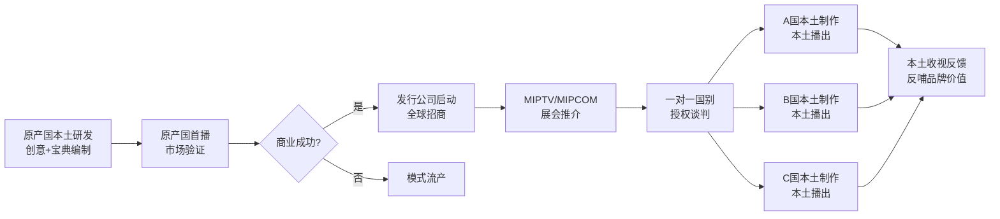
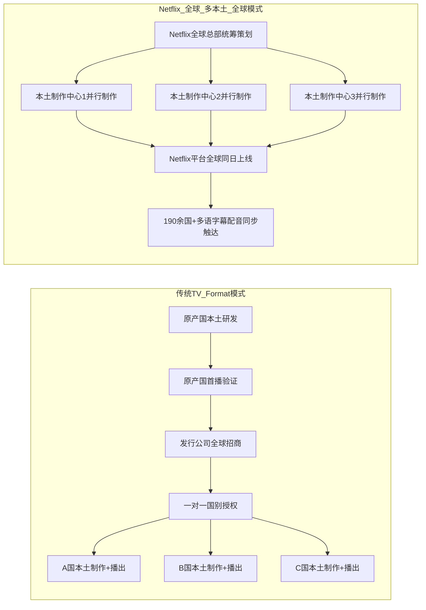

# 从节目模式到全球流媒体：Netflix全球化内容生产策略与传统电视节目模式的范式转变——以《审讯室》(Criminal)为案例
# 1 传统跨国电视节目模式的商业逻辑与全球流转路径

在全球流媒体平台尚未重塑电视产业格局之前，跨国电视内容的流通主要并非通过成品节目（canned programmes）的直接出口完成，而是依赖一种独特的中间形态——**电视节目模式（TV Format）**。这一以创意"配方"为核心、以本土再制作为落地形式的贸易体系，自1990年代末以来支撑了全球电视产业近二十年的内容流转格局，构成了我们理解Netflix新范式的基准参照系。本章将沿着"商品本质—产业生态—流转路径—本土化张力—寡头格局"五个层次，系统剖析传统跨国电视节目模式的商业逻辑，揭示其在版权、发行与生产三个维度上的内在结构，为后续章节展开Netflix"全球—多本土—全球"模式的对比分析奠定坐标系。

## 1.1 电视节目模式的商品本质与知识产权属性

电视节目模式（Television Program Format）在业界又被称为电视节目模式或电视节目板式，其本质起源于一个创意，经过脚本、制作、摄制、播放等环节最终形成可供他国本土化复制的"配方"。由于其内容并不仅限于抽象创意，而是包含顾问指导、制作流程、节目准则、图像素材、舞台设计、音乐元素等众多具体可交付物，因此业内常以"电视模板包"（TV Format Packet）这一术语指代其完整商品形态[^1]。这一模板包的核心载体即所谓**节目宝典（Format Bible）**——一本详尽记载节目策划方案、节目环节流程、舞美与灯光设计、主持人话术、剪辑节奏、营销推广方案乃至赞助商接入规则的操作手册，本土制作方依据宝典即可在本国语境中复制出形态相似但语言与嘉宾本地化的节目。

然而，节目模式作为一种**可交易文化商品**虽在产业实践中早已成熟，其法律地位却长期处于灰色地带。问题的根源在于版权法的两大国际差异：**其一是独创性认定标准的差异**——美国、英国和法国的著作权法对"独创性"门槛要求各不相同，而《伯尔尼公约》（Berne Convention）并未提供独创性的基础定义，因此短期内难以实现国际协调；**其二是作品类型范围的差异**——尽管《伯尔尼公约》第2条第1款对"文学、科学和艺术领域"采取了较为宽泛的定义，法国和美国采取开放式列举，但英国采取封闭式列举且并未明确将电视节目模式纳入版权客体范围[^2]。对于节目模式这类边缘性作品而言，如何在"模式中的通用创意"（generic ideas）与"具备独创性的原创表达"之间划出清晰边界，在实务中极为困难[^2]。

中国的司法实践同样印证了节目模式难以获得版权法直接保护的困境。早在2001年，中央电视台节目《梦想成真》因各地方电视台大量模仿而希望寻求知识产权保护，制作方先后向国家知识产权局申请专利保护、向版权局申请著作权登记，均因无先例而被拒绝，构成国内首例节目模式知识产权维权失败案例[^1]。此后从1998年湖南卫视《玫瑰之约》克隆台湾《非常男女》、2006年上海东方卫视《舞林大会》遭BBC《与星共舞》内地版权引进方北京世熙传媒起诉，到2010年江苏卫视《非诚勿扰》遭湖南卫视《我们约会吧》申诉、浙江卫视《我爱记歌词》被国外节目模板所有人指控抄袭，节目模式的"撞车"事件层出不穷而知识产权保护争议长期悬而未决[^1]。在北京市海淀区人民法院审理的（2017）京0108民初5708号案中，法院明确指出"涉案节目模式体现的是一种思想和方法的范畴，并不属于著作权法所要保护的表达方式，且涉案节目表达方式是有限的，如果将其视为一种作品，势必会损害到其他类似的节目，对社会公共利益形成不良影响，故涉案节目模式并非著作权法所应保护的客体"[^3]。这一裁判逻辑实质上是对"思想与表达二分法"（idea-expression dichotomy）的严格适用。

不过，司法实践并未完全否定节目模式相关要素的可保护性。在（2017）苏8602民初558号案中，南京铁路运输法院认定"节目策划方案具有独创性的部分可以作为文字作品受著作权法保护"，即载有栏目架构、宣传推广、播出周期、晋级流程、市场分析与运营计划的策划方案文本本身可作为文字作品获得保护[^3]。同时，已经制作完成的电视节目本身则可作为"视听作品"（中国2020年修订《著作权法》将"电影作品和以类似摄制电影方法创作的作品"调整为"视听作品"）或"以类似摄制电影的方法创作的作品"获得保护[^4][^3]。换言之，**节目模式的"配方"难以受版权保护，但配方的书面载体（策划方案文本）与配方的成品（具体节目）可分别从两端获得保护**，唯独居于中间的、最具产业价值的"抽象模式"本身在版权法上仍处真空。

正是由于版权法的乏力，业界长期通过**多元化的间接保护路径**维系节目模式贸易：节目模式中的具体产品如具备新颖性、实用性、创造性可申请专利权；节目名称可通过商标注册进行侵权预防；商业秘密、保密协议与合同条款（如授权合同中的禁止竞争条款）可在签约方之间形成约束；反不正当竞争法可在著作权法"无明文规定"时提供消极保护过渡[^1][^5]。这种**以契约治理为核心、以行业自律为补充、以版权法为底线的复合型保护机制**，构成了传统节目模式国际贸易得以运行的法律基础。

## 1.2 跨国节目模式贸易的产业生态与角色分工

在版权法保护乏力的前提下，传统节目模式国际贸易体系之所以能够长期运转，依赖的是一套**高度专业化、契约化与机构化的产业生态**。这一生态由四类核心参与方与若干支撑机构共同构成，各方在价值链中承担清晰的功能定位。

下表汇总了传统节目模式贸易体系的核心角色分工：

| 参与方 | 功能定位 | 价值贡献 | 收益方式 |
|--------|---------|---------|---------|
| 节目模式所有方（Format Owner） | 创意源头与宝典编制 | 原创概念、宝典撰写、品牌维护 | 版权授权费、利润分成 |
| 发行公司（Distributor） | 全球分销与授权谈判 | 海外渠道开拓、合同谈判、模式推广 | 发行佣金、代理费 |
| 本土制作公司（Local Producer） | 依据宝典实施再地化制作 | 本地化执行、剧组组织、本土资源整合 | 制作费、本地版权收益 |
| 本土播出方（Broadcaster） | 市场落地与受众触达 | 频道资源、广告招商、本土宣发 | 广告收入、收视回报 |
| 行业协会（如FRAPA） | 模式登记与争议调解 | 行业自律、第三方备案、纠纷仲裁 | 会员费、服务费 |
| 国际节目交易市场（如MIPTV/MIPCOM） | 模式流通枢纽 | 撮合交易、展示平台、人脉网络 | 展位费、参展费 |

在这一分工体系中，**节目模式所有方**通常是首创该节目的本土制作公司，其核心资产即为节目宝典与已在原产国成功播出的"概念证明"（proof of concept）。**发行公司**有时与所有方为同一集团内的不同部门（如FremantleMedia同时具备制作与发行能力），有时为独立第三方。**本土制作公司**则是模式在目标市场的执行者，其在保留宝典核心要素的前提下，负责选角、置景、本土化文本改写与符合本地审查要求的内容调适。**本土播出方**作为传统模式贸易的终端环节，其角色尤为关键——他们既是节目的购买方，也是面向最终观众的"守门人"，其档期编排、宣发投入与频道定位直接决定节目在该国市场的命运。

行业协会层面，**FRAPA（Format Recognition and Protection Association）**作为节目模式产业最重要的国际自律组织，承担模式登记、争议调解与行业规则倡导功能。在版权法保护边界模糊的前提下，FRAPA的模式登记实质上成为一种"准版权"的第三方备案凭证，为后续纠纷中证明"在先权利"提供证据基础。其每年发布的全球节目模式贸易报告、对输出国家超过30个的"全球性模式"的统计追踪，构成了产业各方判断模式价值的重要数据基准。

国际节目交易市场层面，**MIPTV与MIPCOM**——由励展博览集团（Reed Expositions）每年春秋两季在法国戛纳举办的两大全球电视和数字内容交易市场——构成了模式跨国流通的核心物理枢纽。MIPTV作为"唯一一个致力于电视剧（原创和脚本格式）、儿童内容、纪录片和格式（脚本和非脚本）内容开发和发行的市场"，不仅为模式发现与发行提供了平台，更将"新兴的制作人和人才与专员和金融家、以及完成节目收购和预售的分销商和买家联系起来"[^6]。在这种线下展会的产业基础设施支撑下，传统节目模式贸易**高度依赖人际网络、行业规范与契约治理**——一种基于信任、声誉与重复博弈的"软法律"治理结构，恰好填补了版权"硬法律"在节目模式领域留下的真空。

## 1.3 "本土—全球—本土"一对一授权改编的运作机制

在上述产业生态支撑下，传统节目模式形成了一条标志性的全球流转路径，本研究将其概括为**"本土—全球—本土"（local-global-local）的一对一授权改编模式**。其核心特征是：节目首先在某一原产国完成本土市场验证，证明其商业可行性与可复制性后，再通过发行公司向其他国家的潜在买家进行一对一的版权授权谈判，由各国本土制作公司依据节目宝典在本国独立完成再地化制作并由本地播出方播出。这一链条具有**串行、分阶段、分国授权**的鲜明特征。

上图展示了传统模式从单一原点出发、经市场验证、经发行枢纽、再向多国分散落地的典型链条。这一路径背后的逻辑是：**风险前置、收益后置**——原产国通过自主投资完成首轮市场验证，承担创意失败的全部风险；一旦验证成功，模式所有方与发行公司便可将"已验证的成功概率"作为核心卖点，向他国买家收取相对稳定的授权费用，从而在全球市场实现风险的分散化与收益的累积化。

历史上能够跨越30个以上国家被本土化复制的模式被业界视为"全球性模式"（global formats），代表了模式跨国流通的最高成就。截至2021年底，共有52档节目模式输出超过30个国家[^7]。这些模式之所以能突破地域文化壁垒，共享若干**可移植性核心要素**：

**第一，高概念（High Concept）的极简创意**。"全球性"模式的核心创意往往可以被简单、清晰地一句话提炼。例如《Who Wants to Be a Millionaire》（《谁想成为百万富翁》）最初版的创意是选手连续回答对15道问题便可获得百万巨奖，但一旦答错便不能带走分文；《The Voice》（《好声音》）的核心创意是几位明星导师以听声音"盲选"的方式选出优秀歌手；《决胜60秒》的核心则是一系列设定为1分钟内完成的游戏，闯过10关即获百万美元大奖[^7]。这种高概念的可提炼性使节目可以在不同文化语境中保持核心识别度，同时降低观众的接受门槛。

**第二，迎合人类原始本能与情感的普世吸引力**。"全球性"模式的创意往往诉诸窥视欲、自我实现的愿望、社会比较甚至幸灾乐祸等跨文化共通的心理机制。例如《Big Brother》（《老大哥》）的成功离不开它对人们窥视欲的满足，让观众围观同住在一栋别墅里的一群陌生男女如何为了奖金而勾心斗角；婚恋约会类节目如《单身汉》激发观众的自我对照与社会比较；游戏闯关类节目如《洞洞墙》《勇敢向前冲》《恐惧元素》则以幸灾乐祸构成观众心理的重要支撑[^7]。这种基于人类共通心理机制的设计，使节目不需要牵涉过多文化或社会背景便能激发跨文化观众的情感反应。

**第三，强规则驱动的高戏剧性**。"全球性"模式主要集中在竞猜答题、才艺竞技、美食竞技、生存挑战、游戏闯关、婚恋约会这几种类型，大部分节目都是在明确规则下让选手展开竞争[^7]。强规则的优势在于：规则本身具有跨文化通用性，可以在不同语境中精确复制；规则驱动的竞争能够迅速激发戏剧张力，适应当代频道选择丰富、观众注意力短暂的媒介环境。

正是凭借这三大共性要素，《Who Wants to Be a Millionaire》（脱胎于英国Celador公司、由Sony Pictures Television发行）、《Big Brother》（脱胎于荷兰Endemol公司）、《The Voice》（脱胎于荷兰Talpa Media）等模式在传统模式贸易体系中走完了完整的"本土—全球—本土"链条：原产国首播验证—发行公司全球招商—各国本土制作公司逐一获得授权—在保留核心规则的前提下本地化制作—在各国本土播出方播出。中国《爸爸去哪儿》（湖南卫视2013年首播，模式购自韩国MBC《爸爸！我们去哪儿？》）则代表了亚洲范围内的模式区域流转，证明"本土—全球—本土"路径不仅在欧美—欧美之间运转，也在东亚区域内部以及东亚向其他区域延伸时同样适用。哥伦比亚剧本类模式《丑女贝蒂》（Yo soy Betty, la fea）从原产国哥伦比亚出发被授权改编为美国版（Ugly Betty）、德国版、印度版等数十国版本，则展示了**剧本类模式（scripted format）**与上述非剧本竞赛真人秀类似的全球流转路径——核心人物设定、剧情主线与关键情节点构成"剧本宝典"的不可变内容，本土制作方则在台词、场景、配角等方面进行本地化重写。

## 1.4 本土化改造中的文化折扣与张力调适

尽管"本土—全球—本土"路径在产业层面看似流畅，但在每一个落地国市场，本土化改造（localization）都是一项需要精细操作的复杂工程。其核心挑战在于克服跨文化传播中的**文化折扣（cultural discount）**——即源自一种文化的内容在另一种文化中由于风格、价值观、信念、制度及行为模式的差异而导致吸引力降低、解读困难、共鸣减弱的现象。

为应对文化折扣，本土制作方通常在以下几个维度进行系统化的本地化操作：

**嘉宾与选手选择**层面，本土制作方需要选择能够引发本地观众身份认同与情感投射的参赛者，其年龄结构、地域来源、职业背景、社会阶层分布均需贴合本国社会的真实样态。**主持风格**层面，需要选择具备本地观众文化记忆与情感连接的主持人，并依据本地观众对主持节奏、幽默感、权威感的偏好进行调适——例如英国版《Who Wants to Be a Millionaire》主持人Chris Tarrant以冷峻克制著称，而美国版主持人Regis Philbin则更显热情外放。**规则微调**层面，奖金金额需要根据本国货币购买力调整，问题难度与题库需要根据本地教育水平与文化常识进行重新设计，游戏环节的危险度与刺激度需要适应本地审查要求。**视觉包装**层面，舞美色调、灯光风格、字幕动效、片头片尾包装需要在保留全球品牌统一识别度的前提下进行本地视觉语汇的注入。**价值观调适**层面，节目所传递的成功观、家庭观、性别观、消费观等深层价值需要与本地主流价值观相协调，避免触碰当地文化禁忌与审查红线。

这一改造过程的核心张力，体现在节目宝典所规定的**"不可变核心"（non-negotiable core）**与本土制作方所拥有的**"可变空间"（negotiable space）**之间。模式所有方为维护全球品牌一致性与节目识别度，通常会在宝典中严格规定核心规则、关键流程、标志性视觉元素（如《Who Wants to Be a Millionaire》的"四选一"答题环节、热座灯光设计与降调音效，《The Voice》的转椅与"I want you"的盲选确认动作）不可更改；而本土制作方则在嘉宾、语言、场景、文化符号、价值观表达等"可变空间"内拥有相当自由度。**这种"硬核心+软外壳"的双层结构**，正是节目模式作为可交易文化商品的精妙之处——它既保证了全球范围内的可识别品牌价值，又允许在每个本土市场进行充分的文化适配。

然而，正是这种张力解释了为何**只有极少数模式能够成为"全球性"乃至"常青树"模式**。在节目模式国际贸易中，能够获得跨国售卖的模式只占极小比例，能够成为全球性成功的模式更是凤毛麟角，而能够成为"常青树"售卖多年的模式则极为罕见[^7]。绝大多数模式难以突破地域文化壁垒，原因恰恰在于其核心创意过于依赖原产国的特定文化语境——或是高概念可提炼性不足，或是普世情感诉求被特定文化符号遮蔽，或是规则驱动力被本地化改造稀释，或是本土制作方在硬核心与软外壳的协商博弈中失去了模式的原始识别度。**模式所有方对全球品牌一致性的诉求与本土制作方对市场适应性诉求之间的协商博弈**，构成了传统跨国电视节目模式贸易中持续存在的张力调适机制，也为节目模式作为可移植文化商品设定了天然的可拓展边界。

## 1.5 寡头主导的全球产业格局与权力分布

传统节目模式产业经过近三十年的发展，已经形成了高度集中、寡头主导的全球产业格局。**Endemol**（荷兰，以《Big Brother》《Deal or No Deal》《Fear Factor》等模式闻名）、**FremantleMedia**（隶属于德国Bertelsmann集团旗下RTL Group，以《Idols》《Got Talent》《X Factor》等模式闻名）、**BBC环球**（BBC Worldwide，后整合重组为BBC Studios，以《Dancing with the Stars》《Top Gear》等模式闻名）、**Banijay**（法国，2020年完成与Endemol Shine Group合并后成为全球最大独立内容制作集团）、**ITV Studios**（英国，以《I'm a Celebrity...Get Me Out of Here!》《Love Island》等模式闻名）等少数寡头公司，掌握着全球最具商业价值的模式库与发行网络。

这些寡头公司的全球扩张通常通过以下几种策略实现：**其一是并购整合**——通过收购各国独立制作公司，将其纳入全球网络并将其原创模式纳入集团模式库；**其二是跨国制作公司网络布局**——在主要市场（如美国、英国、德国、法国、西班牙、意大利、荷兰、北欧、澳大利亚、印度、中国等）设立全资或控股的本土制作公司，使集团既是模式所有方又是本土制作方，从而内部消化"全球—本土"的授权链条；**其三是模式库积累**——通过自研、收购、合作开发等方式持续扩充集团旗下可授权模式的数量与品类，形成"模式投资组合"以分散单一模式失败的风险；**其四是多区域发行渠道建设**——构建覆盖全球主要电视市场的销售团队与人脉网络，并通过深度参与MIPTV、MIPCOM等行业枢纽强化产业话语权。

这一寡头格局所形成的**议价能力、风险分担机制与规模经济优势**，使少数西方制作巨头成为全球电视模式贸易的"创意供给中心"，而世界各国电视台则被动地成为模式的"接受方"与"落地执行方"。这种结构本质上是一种**"中心—边缘"（center-periphery）的权力分布**：以荷兰、英国、美国、法国、德国为代表的西方寡头公司主导创意输出与品牌定义，亚洲、拉美、中东欧等地区的电视台与本土制作公司则在版权授权链条的下游接受模式、支付授权费、执行本地化制作。在这种结构中，本土播出方虽然是面向最终观众的"守门人"，但相对于上游的模式所有方与发行公司而言，其议价能力相对有限——他们要么接受寡头公司的模式与条款，要么在缺乏本土原创能力的情况下转向克隆模仿，由此引发前述《非诚勿扰》《我爱记歌词》等一系列"撞车"纠纷[^1]。

值得指出的是，传统模式贸易体系的"中心—边缘"权力分布并非不可松动。日本2024年初的相关政府工作组研究文件显示，日本广播内容海外输出规模在2021年度约为655.6亿日元（同比增加84.5亿日元），其中互联网传播权同比增长约23%成为整体增长的牵引力，但日本大型广播公司在既有节目海外销售方面"概而言之未能获得较大收益"，业界对于风险回报不透明、不清楚向谁销售何种产品（制作能力还是产品本身——素材、节目、模式）、是否拥有自有制作资源等问题普遍存在疑虑[^8]。这反映了非西方电视产业在传统模式贸易体系中长期处于结构性弱势的真实困境——即便在亚洲内容输出整体增长的背景下，传统广播公司仍难以突破由西方寡头所主导的模式贸易壁垒。

综上所述，传统跨国电视节目模式构筑了一套**以版权授权为核心机制、以契约治理为法律基础、以本土制作公司为落地节点、以本土播出方为终端守门人、以寡头制作公司为产业中枢**的全球内容流转体系。其在版权层面采取"分国别有限授权"，在发行层面采取"逐级落地、本土播出"，在生产流程层面采取"先本土验证—再海外授权—再地化制作"的串行链条；其优势在于风险分散与本土适配，其局限在于流转效率较低、本土化改造成本较高、模式所有方对全球品牌与收益的直接控制力有限。**正是这套体系所形成的中介层级、本土守门人议价能力与串行流转节奏，将在下一章Netflix流媒体新模式的对照中遭到根本性的重构与挑战**——Netflix通过自有平台直接触达全球用户、通过"成本+"模式买断全球长期版权、通过"全球—多本土—全球"并行生产路径压缩中间环节，正是建立在对上述传统坐标系的逐项颠覆之上。

# 2 Netflix全球化内容生产的新范式：本地语言策略与"成本+"商业模式

第一章所勾勒的传统跨国电视节目模式，其底层逻辑是一种**以版权授权为枢纽、以本土播出方为守门人、以串行流转为节奏**的"中心—边缘"内容贸易体系。然而，自2016年Netflix宣布将服务一夜之间扩展至全球130余个国家以来，这一坐标系正在经历根本性的重构。Netflix并非以"传统模式贸易体系新参与者"的身份进入全球电视产业，而是以**绕开既有版权授权链条、绕开本土播出方、绕开行业枢纽展会**的方式，构建出一套全新的全球化内容生产与商业模式。本章将围绕"本地语言"内容策略与"成本+"商业模式两大支柱展开剖析，揭示其在版权持有、发行链路、生产流程三个维度上对传统TV Format模式的结构性颠覆，并进一步探讨该新范式如何重塑全球电视产业的权力分布与文化政策博弈格局，为第三章以《审讯室》(Criminal)为案例的具体验证奠定理论框架。

## 2.1 本地语言内容策略的形成背景与执行逻辑

Netflix"本地语言原创"（Local-Language Originals）策略的形成，并非源于某一时点的战略宣示，而是一个**由市场压力倒逼、由用户结构演变所推动、由爆款案例所验证**的渐进过程。理解这一策略，需要回到Netflix2016—2024年间全球用户结构与增长动能的深层转变。

### 2.1.1 北美市场触顶与海外用户成为增长主引擎

Netflix本地语言战略的根本驱动力，是**北美本土市场增长触顶与海外市场承担增长主引擎角色**的结构性转换。早在2017年第二季度，Netflix海外地区订阅用户量（5,200万）就已超过美国本土（5,190万）[^9]；至2019年第二季度，公司全球付费用户达到1.51亿，其中海外用户接近1亿、美国用户约6,000万[^9]。该季度成为标志性节点——Netflix在美国用户数量出现了8年来的首次下滑，全球新增订户也远低于此前预测的500万[^9]。这一信号迫使Netflix管理层清晰认识到，**进一步增长必须依赖对非英语市场的深度渗透**，而非北美本土的边际挖掘。

到2024年第三季度，Netflix全球付费订阅用户达到2.83亿，市值近3,280亿美元，相当于迪士尼与康卡斯特两大竞争对手的市值总和[^10]。但即便在这一规模下，公司高层在2024年第三季度财报后已宣布**从2025年起不再向投资者更新订阅用户数量**，转而以收入和其他财务指标作为绩效指标[^10][^11]。这一信息披露方式的转变实质上承认了用户数量增长的边际放缓，也意味着**单用户价值挖掘（ARPU）与多市场深度渗透**成为下一阶段战略重心。在此背景下，本地语言内容不再只是"海外市场获客工具"，而是**支撑全球用户留存、提价容忍度与广告变现潜力**的核心资产。

### 2.1.2 "鱿鱼经济学"与本地故事普世共鸣逻辑的验证

如果说海外用户结构倒逼了战略转向，那么真正使本地语言策略从"试验"上升为"核心战略"的，是一系列**以极低成本撬动全球文化现象级影响**的爆款案例。其中最具标志性的当属韩国剧集《鱿鱼游戏》——其制作成本约为2,340万美元，却为Netflix创造了超过9亿美元的价值[^12]，构成了业界所谓的"鱿鱼经济学"。在《鱿鱼游戏》之后，《纸钞屋》（西班牙）、《黑暗荣耀》（韩国）、《布里奇顿》（英国）等本地语言或非美式制作剧集相继成为全球性爆款[^12]。其中《布里奇顿》第四季上线后在76个国家排名第一，观看时长一度单周猛增802%[^12]。

这些案例共同验证了一个对Netflix战略具有奠基意义的命题：**优质本地故事具备穿越文化、跨越国界的原生力量**。正如Netflix当前首席内容官贝拉·巴贾里亚所言，《鱿鱼游戏》"改变了人们对热门剧集来源的认知，证明精彩内容可来自任何国家"[^13]。这一认知与传统TV Format模式中"先在原产国本土验证、再向其他国家授权改编"的逻辑形成了鲜明对照——**Netflix不再寻求将一个本土成功的"配方"再复制到他国，而是直接以原产国语言、原产国班底制作原创剧集，并通过自有平台让其以原始语言+多语字幕配音的形态触达全球**。Omdia基于PlumResearch数据的分析显示，2023年第一季度Netflix原创剧集在美国总观看时长中占比35.6%，在波兰接近40%，在日本与韩国分别为20.6%与25.4%[^14]，表明原创内容（尤其包含本地语言原创）已成为Netflix在各市场的核心竞争资产。

### 2.1.3 巴贾里亚领导下的全球生产网络与"普世主题"创作准则

本地语言策略的执行层面，其关键架构师即为**贝拉·巴贾里亚（Bela Bajaria）**。巴贾里亚于2016年加入Netflix，最初负责无剧本节目和国际内容，2020年9月接任全球电视主管，2023年初晋升为首席内容官，原电影部门负责人斯科特·斯图伯需向其汇报，这一调整反映了Netflix将剧集作为核心业务的战略转向[^13][^15][^16]。截至2024年，巴贾里亚每年掌管的内容投入已高达180亿美元，覆盖190个国家和地区、50种语言[^16]。

在巴贾里亚领导下，Netflix形成了一套清晰的本地语言内容创作准则——**"开发适配特定地区的非英语剧集，并确保这些剧集能触及普遍主题以吸引全球市场"**[^13]。这一双重要求实质上构成了Netflix本地语言战略的"DNA"：一方面，剧集必须在制作语言、演员班底、文化场景、叙事调性上呈现充分的本地真实感，以在原产国市场建立观众认同；另一方面，剧集所触及的核心主题（生存竞争、阶级分化、家庭情感、爱情背叛、复仇正义等）必须具备跨文化的普世共鸣力，以支撑其在Netflix其他190个市场获得全球可见性。这与传统模式贸易中本土制作方在"硬核心+软外壳"框架下进行有限本地化的逻辑截然不同——**Netflix不再以"复制一个全球性配方"为起点，而是以"在本地原产故事中提取普世主题"为起点**。

为支撑这一创作准则，Netflix构建了一套**多区域并行的全球生产网络**。巴贾里亚推动在**伦敦、马德里和多伦多设立制作中心**，内容团队覆盖包括墨西哥在内的多个市场[^13]；在亚洲方向，公司在**新加坡设立了当地总部，并计划在首尔、东京和孟买招聘当地员工**，在日本、台湾、泰国、印度和韩国持续制作开发本地原创作品[^9]。其中西班牙马德里的**Tres Cantos制作中心**于2019年开业，是Netflix在欧盟最大的拍摄基地，到Netflix在西班牙运营十周年时已从2019年的3个摄影棚发展为拥有10个先进摄影棚和后期制作设施的欧盟最大制作枢纽[^17]——这一基础设施在第三章《审讯室》案例中将具有直接的承载意义。在亚洲市场，Netflix还积极通过与当地移动运营商合作，加速内容服务的普及与用户拉新，在新加坡、马来西亚、菲律宾和泰国均取得突出成果[^9]。

下表汇总了Netflix在2016—2024年间本地语言战略所依托的全球生产网络要点：

| 区域 | 核心节点 | 战略定位 | 关键里程碑 |
|------|---------|---------|-----------|
| 西欧 | 马德里Tres Cantos | 欧盟最大制作基地、欧洲与西语世界内容枢纽 | 2019年开业（3摄影棚）→ 2024—2025年扩至10摄影棚；2025—2028年承诺投资逾11亿欧元[^17] |
| 西欧 | 伦敦 | 英语剧集创作中心、欧洲制作中心 | 巴贾里亚主导设立[^13] |
| 北美 | 多伦多 | 北美制作中心 | 巴贾里亚主导设立[^13] |
| 拉美 | 墨西哥城等 | 西语美洲内容覆盖 | 内容团队布局[^13] |
| 亚太 | 新加坡（地区总部）、首尔、东京、孟买 | 亚洲多语种本地原创、与运营商捆绑分发 | 2018年新加坡内容发布大会公布17部新原创作品；2019年加大对亚洲编剧投入[^9] |

这一网络的关键意涵在于：Netflix将传统模式贸易体系中"模式所有方—发行公司—本土制作方—本土播出方"的分散式价值链，**整合到自身平台的内部组织结构之内**。马德里、伦敦、多伦多等制作中心既是创作枢纽，也是项目立项、预算控制、版权归集、全球发行的内部一体化节点——这与第一章所论及的"中心—边缘"分布有根本区别，下一节将围绕版权与商业模式继续展开。

## 2.2 "成本+"商业模式的运作机理与版权重构

如果说本地语言策略回答了Netflix"做什么内容、在哪里做"的问题，那么"成本+"（Cost-Plus）商业模式则回答了"如何与本土制作方结算、版权归谁所有"的问题。正是这两套机制的耦合，构成了Netflix新范式区别于传统TV Format模式的核心。

### 2.2.1 "成本+"模式的运作机理

"成本+"模式的核心机理可以概括为：**Netflix预先承担本土制作方在该项目中的全部制作成本（含人员、设备、场地、后期、营销支持等），并在此基础上额外向制作方支付约20%—30%的固定利润，以换取该项目在全球范围内长期乃至永久的独家发行权、衍生权益以及全部观看数据的所有权**。需要说明的是，关于"20%—30%"这一具体数值，本研究在可访问的搜索结果中尚未获得Netflix或第三方独立来源对该百分比的直接量化披露，业界对此区间存在普遍引用但权威披露有限，本研究在援引时秉持审慎态度，将其作为业内对Netflix与本土制作方分账机制的常见经验性概括而非确证数据。

即便对具体百分比保持审慎，"成本+"模式的几个关键特征仍可从Netflix公开战略与第三方研究中得到清晰确认：

**第一，制作方风险前置转嫁**。Netflix"海外市场策略始终是尝试着在本土市场获得自行造血的能力，暂将成本回收放置一边，甚至为获取优质创作资源自担风险"[^9]——这意味着Netflix主动承担创意风险，本土制作方在签约即锁定固定回报，不再以最终收视成败决定营收。这从根本上改变了传统模式贸易中本土制作方"以本地播出广告/收视为主要回报来源"的风险结构。

**第二，版权与衍生权益的全球长期归集**。Netflix通过预先承担成本与支付固定利润，获得节目在全球190余个市场的独家发行权，并通常将续季权、衍生开发权、IP商品化权一并归集到Netflix内部。这与传统TV Format模式中"分国别有限授权、版权按地域与时间分散"的结构形成根本对照。

**第三，数据所有权的单边集中**。Netflix通过自有流媒体平台直接触达终端用户，由此天然垄断了节目观看时长、完播率、地域分布、人群画像等全部数据；本土制作方在交付节目后基本无法获得这些数据。这是传统模式贸易体系中本土播出方因掌握播出渠道而拥有的"数据守门人"地位所完全不具备的——**数据从分散于本土播出方的多源结构，被重构为集中于Netflix平台的单一资产**。

### 2.2.2 版权结构从"分散—地域—阶段"到"集中—全球—长期"的重构

将"成本+"模式置于第一章所建立的传统坐标系下进行对照，其对版权结构的重构效应可以从三个维度具象呈现：

| 版权维度 | 传统TV Format模式 | Netflix "成本+" 模式 |
|---------|------------------|---------------------|
| **空间维度** | 分国别有限授权（如英国版授权A国、法国版授权B国） | 全球独家持有（一次签约覆盖190余国） |
| **时间维度** | 阶段性授权（典型为3—7年，可续约谈判） | 长期乃至永久持有（含续季权、衍生权） |
| **主体维度** | 版权分散于模式所有方、发行公司、本土制作方等多主体 | 版权高度集中于Netflix单一主体 |
| **数据维度** | 数据分散于各国本土播出方，模式所有方仅获间接反馈 | 数据由Netflix平台单边垄断 |
| **收益结构** | 制作方依赖本土播出广告/收视回报，收益后置且不确定 | 制作方在签约即锁定"成本+固定利润"，收益前置且确定 |

这种版权重构对全球电视产业产生了深远影响。**对Netflix而言**，集中持有全球长期独家版权使其可以将单一项目的价值在多个市场、多个时间窗口、多种变现方式（订阅、广告、衍生）下重复榨取，《鱿鱼游戏》以约2,340万美元成本撬动逾9亿美元价值即为典型例证[^12]。**对本土制作方而言**，"成本+"模式以"项目风险归零+固定利润保障"为代价，换走了制作方对自有原创内容的长期版权与衍生收益——制作方虽然获得了项目稳定性与现金流确定性，但在长期意义上面临**"代工化"风险**，即逐步丧失独立IP积累与产业升级的可能。

### 2.2.3 对制作方原创动力与议价空间的双重影响

"成本+"模式对本土制作方原创动力的影响呈现出**双刃剑特征**。一方面，Netflix的稳定订单与高于本地传统市场的预算水平，激励了大量本土制作公司在创意、技术与人才上的投入升级——西班牙、韩国、墨西哥、印度等市场近年来本土制作能力的显著跃升均与Netflix的项目导入密切相关。在西班牙，自2015年Netflix进入以来，该国"现在生产Netflix全球观看量最高的非英语内容，表现优于其他主要欧洲市场"[^17]，这与Netflix在马德里持续追加投入（2025—2028年承诺投资逾11亿欧元）形成正向循环[^17]。

另一方面，由于Netflix在签约时即买断全部版权与衍生权，本土制作方在项目长期价值兑现上**议价空间被显著压缩**：制作方既无法在项目成功后通过续季谈判分享超额收益，也无法通过IP衍生开发实现长期价值增值；其作为"独立内容创作主体"的产业地位被弱化为"Netflix委托制作的供应商"。从这一意义上讲，**"成本+"模式既加速了本土制作方的能力升级，也将其纳入Netflix主导的全球生产网络之中**——本土制作方对Netflix的依赖度上升，独立议价权下降，这正是下一节所要讨论的产业链权力结构重塑的微观基础。

## 2.3 "全球—多本土—全球"并行生产路径与传统串行改编的对比

在本地语言策略与"成本+"模式的双重支撑下，Netflix构建出一条与传统模式贸易体系迥异的全球化生产路径，本研究将其概括为**"全球—多本土—全球"（global-locals-global）的并行生产路径**。其核心特征是：项目在立项之初即由Netflix全球总部统筹规划，多个本土制作中心并行展开制作，所有版本完成后再由Netflix自有平台同日同步推向全球——**整个流程不再依赖原产国先验证、不再依赖海外授权谈判、不再依赖本土播出方逐级落地**，而是以平台为枢纽实现"一次策划、多地并产、全球同发"的并行式协同。

### 2.3.1 三维度结构性差异的对照梳理

将Netflix新模式与传统TV Format模式在版权、发行、生产三个维度上进行系统对照，可清晰呈现其结构性差异：

| 维度 | 传统TV Format模式 | Netflix "全球—多本土—全球" 模式 |
|------|------------------|-------------------------------|
| **版权层面** | 分国别有限授权；版权分散于模式所有方、发行公司、本土制作方；时间阶段性、地域分割性 | 全球独家长期持有；版权高度集中于Netflix平台；时间永久性、空间全球性 |
| **发行层面** | 依赖各国本土播出方逐级落地；档期、版本、推广由本土方决定；地区间存在时间差 | 通过自有流媒体平台同日上线；2024年覆盖190余国、50种语言；以31种字幕语言+13种配音版本同步呈现[^18] |
| **生产层面：路径形态** | 串行：原产国本土研发 → 原产国首播验证 → 全球招商 → 一对一国别授权 → 各国本土再制作 → 各国本土播出 | 并行：全球总部统筹策划 → 多本土制作中心同步开发/制作 → 平台全球同日分发 |
| **生产层面：节奏与中介** | 节奏较慢、中介层级多（发行公司、本土播出方、本地广告主等） | 节奏快、中介层级少（Netflix平台直连用户） |
| **生产层面：本地化逻辑** | "硬核心+软外壳"——保留全球品牌识别核心，本土化嘉宾、语言、场景、价值观调适 | "本地真实+普世主题"——原产国语言/班底/场景为底，普世主题承担全球可见性 |
| **基础设施依赖** | MIPTV/MIPCOM等节目交易市场；FRAPA等行业协会；本土播出方频道资源 | 自有流媒体平台；语言服务提供商（LSP）字幕配音网络；全球CDN与推荐算法 |
| **失败风险承担** | 风险前置：原产国独立投资完成验证；他国买家承担本地落地风险 | 风险前置：Netflix平台承担全部制作成本风险；制作方仅承担执行风险 |

### 2.3.2 流转路径的可视化对比

为更直观地呈现两种范式的本质差异，下图分别绘制了传统模式与Netflix新模式的流转路径：

上图清晰展示了从"串行—中介层叠—地域分割"到"并行—中介压缩—全球同步"的范式转换。需要特别指出的是，**Netflix新模式并未取消"本土化"，但本土化的发生节点从授权后下移至授权前——本地化不再是"全球配方—本土改造"的下游适配，而是"本土制作—全球分发"的上游构造**。这一时序倒转构成了第三章《审讯室》案例之所以特殊的核心特征。

### 2.3.3 对语言服务基础设施的高度依赖

Netflix新模式的并行生产路径之所以可行，离不开一个常被忽视的关键基础设施——**语言服务提供商（Language Service Providers, LSPs）**所提供的全球字幕翻译与配音网络。早在2016年，Netflix就已在全球超过130个国家/地区的市场同步上线内容[^18]；到《鱿鱼游戏》上线时，该剧已通过31种字幕语言与13种配音版本面向全球超过1.11亿观众[^18]。这种规模的语言服务能力，传统电视产业从未需要承载。

然而，全球流媒体的繁荣造成了严重的译者短缺。业内最大的字幕与配音提供商之一Iyuno-SDI的首席执行官大卫·李曾表示，"在接下来的两到三年里，这个行业将供不应求……没人翻译，没人配音，没人混音——这个行业现在根本没有足够的资源来做这件事"[^18]。由《鱿鱼游戏》英文字幕翻译质量引发的争议（如基于年龄的等级制度等韩国文化关键特征在翻译中丢失）凸显了**"全球同步分发"对翻译质量的妥协压力**[^18]——南加大教授保罗·西吉斯蒙迪指出，"《鱿鱼游戏》所显现迹象表明对本土以外媒体娱乐内容的需求超出了本土观众的范围"[^18]，而这种跨文化需求的满足高度依赖于一个本身正在承压的基础设施层。这一矛盾在第四章关于"美学层面的稀缺与界面层面的过剩"讨论中将进一步具象化。

## 2.4 对全球电视产业链权力结构的重塑

Netflix"本地语言+成本+全球—多本土—全球"的范式组合，不仅是一种新的商业模式，更是对全球电视产业链权力分布的深层重塑。其重塑效应可从对本土播出方、独立制作公司、传统寡头模式集团以及国家文化政策四个层面分别展开。

### 2.4.1 对传统本土播出方的去中介化

在传统模式贸易体系中，本土播出方作为"终端守门人"承担着双重功能：一方面以购买授权的方式将节目引入本国市场，另一方面以频道资源、档期编排、本土宣发等方式决定节目命运。**Netflix新模式从根本上绕开了这一守门人角色**。当Netflix通过自有平台直接触达终端用户、当用户通过订阅而非通过电视频道获得内容、当节目同日全球上线而非分国家档期播出时，**本土播出方的议价能力被自有平台直连用户的能力所取代**。

这一去中介化效应已被2024年的产业数据所验证。截至2024年第三季度，Netflix在全球拥有2.83亿付费订阅用户，而排在第二位的Disney+付费订阅用户徘徊在1.5—1.6亿之间已经超过了8个季度[^10]。Netflix的市值近3,280亿美元，相当于迪士尼和康卡斯特的市值总和[^10]。在此规模下，任何一国的本土播出方都不再具备"决定一档全球Netflix剧集本地命运"的能力——本地命运由Netflix平台的推荐算法、本地化封面、字幕配音配置等内部参数所决定，而非由本土频道的档期与宣发所决定。

### 2.4.2 对独立制作公司的双重影响：稳定订单与代工化风险

如2.2.3节所述，"成本+"模式对本土独立制作公司的影响呈现双刃剑特征。一方面，Netflix的稳定订单、高于本地传统市场的预算水平、全球分发所带来的国际声誉，使本土制作公司获得了过去几乎难以企及的发展资源——西班牙、韩国、墨西哥等市场的本土制作能力跃升即为明证[^17]。另一方面，由于版权与衍生权益的全球长期归集到Netflix平台，本土制作公司在长期意义上**被改造为"代工方"**——其在项目成功后无法分享超额收益，无法基于IP开展长期开发，独立议价权显著下降。

这一双重影响在不同市场呈现出不同形态。在韩国，Netflix一方面通过项目订单极大推动了本土剧集产业升级，另一方面也因买断模式而引发本土制作方与平台方关于"长期价值分配"的持续争议；在西班牙，马德里Tres Cantos制作中心一方面将该国推向"欧洲内容核心枢纽"地位[^17]，另一方面也使本地制作公司更多以"Netflix Spain合作伙伴"而非"独立内容输出方"的身份参与全球流通。这种产业升级与代工化并存的矛盾，构成了本土制作生态在新范式下的根本张力。

### 2.4.3 对传统寡头模式集团的挤压与重构

第一章所论及的Endemol、FremantleMedia、BBC Studios、Banijay、ITV Studios等传统寡头模式集团，其在全球电视产业中的核心地位建立在"创意供给中心+全球分销网络"的二位一体之上。Netflix新模式对这一格局形成了**双向挤压**：

**其一，"创意供给中心"的地位被流媒体平台的全球分发能力所撼动**。传统寡头集团的关键优势在于其拥有可在多国售卖的"全球性模式库"，而Netflix通过"成本+"模式直接与本土原创制作方签约、绕开模式所有方与发行公司这一中间环节，将"创意从哪里来"的问题从"寡头集团模式库"转向"本土制作方原创剧本"。

**其二，传统寡头集团的全球分销网络在Netflix平台面前显得"过时"**。Netflix一个平台覆盖190余国并以50种语言运营[^16]，其全球分销规模与节奏远超任何传统寡头集团基于MIPTV、MIPCOM等行业枢纽与各国本土播出方网络所构建的分销能力。这迫使传统寡头集团或转向与Netflix合作（成为Netflix的内容供应商，按"成本+"模式提供项目），或转向开发自有流媒体平台（如Banijay在欧洲推动的若干尝试），或转向更细分的"剧本与非剧本混合"业务模式。

值得指出的是，Netflix在2025年下半年发起对华纳兄弟探索的827亿美元收购要约，并最终获得华纳董事会青睐而八次拒绝派拉蒙的竞争[^19]，进一步表明**Netflix正在从"绕开传统寡头"走向"收购传统寡头"**——这意味着新范式不仅在商业模式层面挑战传统格局，更在资产整合层面试图重塑全球电视产业的所有权结构。如果这一收购最终完成，Netflix将把HBO、HBO Max以及《哈利·波特》和DC宇宙等核心资产收入旗下[^16]，整个产业的"流媒体—制片厂"边界将被进一步打破。这一最新动向虽超出本研究2024年初的主要时间节点，但作为印证Netflix范式扩张方向的重要参考信息，值得在此谨慎提及。

### 2.4.4 对国家文化政策的张力与反向制衡机制

Netflix新范式所引发的最深层博弈，发生在**国家文化政策与流媒体平台扩张**之间。这一博弈集中体现在三个层面：

**第一，本地内容配额政策的强化**。2018年4月，欧盟委员会提议对《视听媒体服务指令》（AVMSD）进行修订，要求Netflix、亚马逊等SVoD提供商的目录至少包含**30%的欧洲内容**[^20]。安培分析（Ampere Analysis）测算显示，**Netflix可能需要在其英国目录中添加超过4,000小时的欧洲内容或近800个欧洲标题**才能满足新配额，亚马逊Prime则需在英国目录中添加至少2,000小时欧洲内容或400个标题[^20]。在欧洲五大市场（德国、英国、法国、意大利、西班牙）中，仅有法国的多个平台满足新标准；大多数满足配额的平台是本地的，如ProSiebenSat.1的Maxdome、CanalPlay、Mediaset Infinity等[^20]。这一配额要求构成了对Netflix"全球—多本土—全球"模式的**反向制衡**——它强制Netflix在每个欧盟市场中实质性投资本地内容生产，而非仅依靠美式原创+字幕配音覆盖。

**第二，本地投资义务与"准国家伙伴"角色**。Netflix对欧盟配额的应对方式之一，是以大规模本地投资承诺将自身嵌入到所在国的文化产业政策之中。其在西班牙的运作即为典型——2024年Netflix在马德里Tres Cantos举行进入西班牙十周年活动，宣布**2025—2028年期间将在西班牙投资超过11亿欧元（约11.4亿美元）**，活动由Netflix联席CEO泰德·萨兰多斯（Ted Sarandos）主持，西班牙政府总理佩德罗·桑切斯（Pedro Sánchez）与数字转型与公共服务部长奥斯卡·洛佩斯（Óscar López）亲自出席[^17]。这种规模与级别的政企互动，意味着Netflix已不再仅是"在西班牙运营的流媒体平台"，而是事实上的**西班牙文化产业政策伙伴**——其投资承诺既满足了欧盟AVMSD配额要求，也将本地内容生产基础设施转化为自有制作网络的核心节点。

**第三，平台集中度与监管视角的转变**。随着Netflix拥有3亿多订户并占据SVOD领域绝对领先地位[^21][^22]，其在传统电视监管框架之外长期享受的"政策空白期"正在结束。立法者们越来越多地质疑流媒体经济的结构——诸如"谁掌控媒体分销？体育权利如何在传统电视与在线视频之间传播？全球流媒体服务是否应面临本地内容配额？随着联网电视的扩展，广告市场如何演变？"等议题不再分散在独立的政策区块中，而是被流媒体平台的崛起串联进同一个监管对话[^21]。Netflix因此一改长期"将华盛顿视为背景噪音"的姿态，在华盛顿特区扩展靠近白宫的办公空间，在收购华纳兄弟探索一事上"遭遇了显著的监管"关注[^21]。这表明**国家与超国家层面的监管力量正在被新范式所反向激活**——Netflix越是接近"基础设施运营机构"的地位，就越是吸引监管者的注意[^21]。

下表汇总了Netflix新范式对全球电视产业链四类主体的权力影响及其反向制衡：

| 主体类型 | Netflix新范式的冲击 | 反向制衡或适应机制 |
|---------|-------------------|------------------|
| 传统本土播出方 | 去中介化，议价能力丧失 | 转型流媒体业务、与Netflix合作分销 |
| 本土独立制作公司 | 项目稳定但代工化、版权丧失 | 累积Netflix合作声誉、谈判保留部分IP权益 |
| 传统寡头模式集团 | 创意供给中心地位被撼动 | 成为Netflix供应商、自建流媒体、被收购整合 |
| 国家与超国家监管者 | 文化主权、内容配额、平台集中度风险 | AVMSD 30%欧洲内容配额、本地投资义务、反垄断审查 |

综合上述分析可以看出，**Netflix新范式并非一种简单的"商业模式创新"，而是一场涉及版权结构、发行链路、生产流程、产业权力分布与文化政策博弈的多维度系统重构**。其本地语言策略与"成本+"商业模式互相耦合，使其能够在"全球可见性"与"本地相关性"之间建立新的平衡——既不再依赖传统TV Format模式的"硬核心+软外壳"配方复制，也不再依赖各国本土播出方的逐级落地，而是以平台为枢纽、以本土制作中心为节点、以语言服务网络与推荐算法为基础设施，实现"全球—多本土—全球"的并行生产与同步分发。然而，**这一新范式同时也将本土制作方推向代工化风险、将传统寡头集团置于挤压之下、将各国文化政策推向"配额—投资—监管"的反向制衡轨道**。围绕这一范式的运作机理与张力调适，下一章将以2019年Netflix推出的剧集《审讯室》（Criminal）为核心案例进行具象化验证——该剧的英国、法国、德国、西班牙四个版本如何在马德里同一摄影棚以"背靠背"方式集中拍摄、如何被定性为"多国变体"而非"改编"、如何在Netflix界面端呈现为差异化"本地内容"，将为本章所提出的理论框架提供最具体的实证支撑。

# 3 《审讯室》(Criminal, 2019)案例深度剖析：多国版本的协同生产与发行策略

第二章所构建的Netflix"全球—多本土—全球"并行生产路径与"成本+"商业模式，在抽象层面已经勾勒出该平台对传统TV Format体系的结构性颠覆，但理论框架的真正生命力终须落到具体项目的肌理之中方可验证。2019年9月20日Netflix同日全球上线的剧集《审讯室》（Criminal）——分别以英国、法国、德国、西班牙四国语言制作的12集程序式罪案剧——恰恰构成了该范式落地形态的最佳样本。该剧由《好兆头》《神秘博士》主演大卫·田纳特（David Tennant）、《特工卡特》主演海莉·阿特维尔（Hayley Atwell）、《玛塞拉》主演尼古拉斯·平诺克（Nicholas Pinnock）等演员加盟英国故事单元，整季12个故事覆盖法国、西班牙、德国与英国，每集45分钟，全部以当地语言呈现并由当地编剧与导演操刀[^23][^24]。

本章将沿"项目概况与制作架构—背靠背集中拍摄—商业法律定性—界面分发装配—合规与商业对齐—框架验证与张力反思"六个层次展开，逐层揭示该剧"集中制作基础设施+分布式本土创意"的混合结构，并将其回收至第二章理论框架进行实证验证。需要预先说明的是，由于《审讯室》项目细节涉及的Netflix内部生产数据与制作公司协议在公开渠道披露有限，本章对于部分制作细节（如剧组国籍构成的精确比例、Idiotlamp Productions与Secuoya Studios之间的具体合作合同条款）将以可验证的多源信息为依据，并在信息支撑不足之处坦诚标注边界。

## 3.1 项目概况与制作架构：四国十二集结构与三方协同框架

### 3.1.1 项目基本概况：高概念设定与密闭空间美学

《审讯室》的最显著特征是其**极致简化的高概念设定**——整季12集所有剧情均在审讯室这一密闭空间内上演，由警察与嫌疑犯之间的对话与心理博弈推进剧情。整季12集分为四个国家单元，每个单元3集，分别以法语、西班牙语、德语、英语呈现，每集时长约45分钟[^23][^24]。这种"猫鼠游戏"被严格限制于审讯室的单一空间内，使该剧脱离了传统罪案剧依赖外景追逐、犯罪现场重建、跨场景调度的叙事模式，转而依赖密闭空间内的对白张力、表演细节与心理博弈[^24]。

这一高概念设定具有**对集中化生产模式的天然契合性**：当一档剧集的全部场景都被压缩至一个审讯室与相邻的观察室时，物理布景的可复用性达到极致，跨国版本之间共享同一套布景与摄影棚不仅成为可能，更成为成本最优解。如果说传统罪案剧因外景、城市地标、警察局环境的高度地域性而难以跨国共享生产基础设施，那么《审讯室》的"单一密闭空间"设定恰好剔除了这些地域识别元素，为四国版本在马德里同一摄影棚集中拍摄铺平了创意层面的可行性。

### 3.1.2 三方协同框架：Idiotlamp主导、Netflix统筹、Secuoya承制

《审讯室》的制作架构呈现出**英国统筹方—平台委托方—西班牙物理承制方**三方协同的清晰分工。**主导制作公司为英国Idiotlamp Productions**，由该公司统一协调四国版本的开发、制作管理与跨国创意整合；**Netflix作为平台委托方与全球版权方**，承担全部制作成本与商业风险，并掌握项目全球独家长期发行权；**西班牙Secuoya Studios（隶属Secuoya Content Group，位于马德里Tres Cantos）作为物理制作基地**，承接全部四国版本的实拍工作。

关于Secuoya Studios的产业地位，根据该集团官方信息，其将Secuoya Studios定位为"公司价值创造战略的根本支柱"，集团总部即位于马德里特雷斯坎托斯（Tres Cantos）的España大道4号[^25]。Netflix与Secuoya的深度绑定可追溯至2019年——当年4月Netflix CEO里德·哈斯廷斯（Reed Hastings）亲赴马德里Tres Cantos出席Netflix在欧洲的首个制作中心开幕仪式，并承诺"我们将永远成为西班牙创意生态系统的一部分……我们不是来做实验，而是在进行长期投资"，宣布将在2019年期间为西班牙创造多达25,000个工作岗位[^26][^27]。**Netflix在西班牙的制作总部正是设于Secuoya Studios综合体内**[^26][^27]——这一物理基础设施的共享，使Secuoya从一家独立制片服务商演变为Netflix在欧洲制作网络的核心物理承载方。

下表汇总了《审讯室》项目的三方协同框架要点：

| 协同方 | 角色定位 | 核心贡献 | 价值归集 |
|--------|---------|---------|---------|
| Idiotlamp Productions（英国） | 主导统筹方 | 项目开发、四国创意整合、跨单元管理 | 制作管理费、署名权 |
| Netflix（全球总部） | 平台委托方与全球版权方 | 全部制作成本承担、全球发行、数据所有权 | 全球长期独家版权、衍生权益、观看数据 |
| Secuoya Studios（西班牙Tres Cantos） | 物理制作基地与承制方 | 摄影棚、布景、西班牙籍核心技术剧组 | 摄影棚租金、制作服务费、税收激励留存 |
| 四国本土创意团队（英、法、德、西） | 分布式本土创意 | 各单元编剧、导演、演员、选角 | 项目制作费、署名权 |

这一架构与第二章2.1.3节所述Netflix"将传统价值链整合到自身平台内部组织结构之内"的论断形成直接呼应——Netflix通过马德里制作中心，将传统模式贸易体系中分散在多国之间的"模式所有方—发行公司—本土制作方—本土播出方"价值链，归集到一个由其自身统筹、Idiotlamp协调、Secuoya承制的三方框架之内。

## 3.2 "背靠背"集中拍摄：共享基础设施与分布式本土创意的混合结构

### 3.2.1 共享布景与西班牙籍核心剧组的规模经济

《审讯室》最具范式意义的生产创新，在于其**"背靠背"（back-to-back）集中拍摄模式**——四国版本的实拍工作并非分散在英国、法国、德国、西班牙四地展开，而是全部在马德里Tres Cantos的Secuoya Studios同一摄影棚连续完成。该剧的物理布景仅由一间审讯室与相邻的一间观察室构成，四国版本复用几乎相同的布景配置；摄影、灯光、美术、置景、收音、剪辑助理等核心技术岗位则依托同一支西班牙籍核心剧组贯穿全部四个单元的拍摄。

这种"同一摄影棚、同一布景、同一核心技术剧组、四国故事背靠背连续拍摄"的安排，相对于传统跨国合拍模式产生了显著的**规模经济效应**：其一，物理布景的搭建与拆除成本被四个单元共同分摊，单元边际成本接近于零；其二，技术剧组的雇佣、培训与磨合成本被四个单元共同摊销，避免了在四个国家分别组建剧组的重复成本；其三，摄影棚租金、设备折旧、后期制作流水线得以在连续档期内充分利用，规避了分散拍摄的档期空置损失；其四，西班牙作为承制地的税收抵免与就业激励可在单一项目周期内最大化兑现（详见3.5节）。

值得指出的是，Secuoya Studios综合体在该项目落地时所提供的基础设施承载力，是Netflix与Secuoya数年合作积累的结果。根据Secuoya集团的对外披露，Secuoya Studios作为其"创造价值的根本支柱"持续承担集团内部最重要的制作基础设施职能，并配套BPO等下属业务支持复杂的制作流程协调[^25]。Netflix侧则通过Tres Cantos制作中心的持续追加投入，将该基地从最初的小规模摄影棚集群发展为欧洲最大规模的Netflix制作枢纽——这一基础设施投资在第二章2.1.3节已有论述，而《审讯室》正是这一基础设施在多国并行项目层面的最具代表性的应用。

### 3.2.2 分布式本土创意：编导演与选角岗位的本土国籍保留

与基础设施层面的高度集中形成结构性反差的，是**关键创意岗位在四国本土的严格分布**。根据官方与权威媒体披露，《审讯室》每个国家单元的剧情都由该国本土编剧与本土导演操刀，并以当地语言呈现[^23][^24]。演员阵容上，英国单元由大卫·田纳特、海莉·阿特维尔、尼古拉斯·平诺克、李·恩格里比（Lee Ingleby）、马克·斯坦利（Mark Stanley）、罗森达·桑德尔（Rochenda Sandall）、优素福·凯尔科尔（Youssef Kerkour）以及克莱尔-霍普·阿什蒂（Clare-Hope Ashitey）等英国演员主演[^24]；法国、西班牙、德国三个单元则分别由对应国家的本土演员主演。选角导演（casting director）作为决定演员构成的关键岗位，也由各国本土选角专业人员担任，以确保对各国演员资源与表演传统的深度理解。

这一**"基础设施集中、创意岗位分布"的混合结构**，是《审讯室》最具范式意义的生产创新。它在以下几个层面同时实现了看似矛盾的目标：

**第一，在制作层面实现规模经济，在创意层面保留本土真实感**。技术剧组的共享降低了制作成本，而编剧—导演—演员—选角四个关键创意岗位的本土化保留，则确保每个国家单元的对白节奏、表演风格、社会语境、文化潜台词都具备本国观众可识别的真实感。这恰是第二章2.1.3节所提Netflix"本地真实+普世主题"创作准则在项目层面的具体落地——剧集的普世主题（罪案审讯中的道德困境、权力博弈、真相追寻）由"密闭空间+审讯心理"这一高概念统一承载，而本地真实感则由本土创意班底的语言、表演、文化细节注入。

**第二，在跨国剧集制作的成本压缩与文化折扣防御之间取得新平衡**。传统跨国合拍剧集往往面临"为了控制成本而牺牲本土真实感"或"为了保留本土真实感而无法控制成本"的两难。《审讯室》通过将成本敏感性高、文化敏感性低的环节（摄影棚、布景、技术工种）集中化，将文化敏感性高的环节（编剧、导演、表演、选角）分布化，实质上对生产链条进行了**按文化敏感度的分层切割**——这一切割逻辑代表了Netflix新范式相对于传统TV Format模式"硬核心+软外壳"框架的本质升级。

**第三，对Secuoya Studios的物理承载力构成最高强度的考验与验证**。四个国家、十二集、密集档期的连续拍摄，对单一制作基地的摄影棚周转、剧组协调、跨语种现场管理能力提出了极高要求。Tres Cantos作为Netflix在欧洲的核心枢纽能够承接这一规模的项目，反向验证了Netflix在该地长期投资基础设施的战略价值。

## 3.3 "多国变体"而非"改编"：商业与法律定性的范式意义

### 3.3.1 与传统"本土—全球—本土"路径的根本差异

第一章已系统梳理了传统TV Format模式的"本土—全球—本土"路径——节目在原产国本土研发并通过首播验证商业可行性，随后由发行公司在MIPTV/MIPCOM等行业枢纽展开全球招商，与他国本土制作公司逐一谈判版权授权，再由各国本土制作公司依据节目宝典进行再地化制作并由本地播出方播出。这一路径的核心特征是**串行、分阶段、分国授权、存在明确的"原版"与"改编版"先后关系**。

将《审讯室》置于这一传统坐标系下进行对照，其与传统"改编"模式存在根本性差异：

| 比较维度 | 传统TV Format改编 | 《审讯室》多国变体 |
|---------|------------------|------------------|
| 时序关系 | 原版先于改编版（原版需先验证市场） | 四国版本同步立项、同步制作、同日上线 |
| 授权链条 | 模式所有方→发行公司→本土买家逐级授权 | 无授权链条，自始由Netflix统一持有 |
| 节目宝典 | 必须有宝典传递与解读 | 不存在宝典传递；仅共享高概念设定 |
| 版权分配 | 按地域与时间分散于多主体 | 自始集中于Netflix平台 |
| 跨国分账 | 模式所有方按版权金/利润分成获得跨国收益 | 不存在跨国版权分账 |
| "原版"概念 | 存在明确的"原版"与"改编版" | 四个版本平等并列，无"原版"概念 |

正是基于上述差异，本研究认为应将《审讯室》四国版本定性为**"多国变体"（national variations）而非"改编"（adaptation）**——四个版本并非源于某一已验证版本的市场成功后再行授权再制，而是在立项之初就被并行设计、同步开发、统一拍摄、同日上线；它们之间不存在"原版—改编版"的先后关系，仅共享一个高概念设定（密闭空间内的警察—嫌犯审讯心理博弈）与一套制作基础设施（马德里Tres Cantos的摄影棚、布景、核心技术剧组）。

### 3.3.2 范式跃迁的法律与商业意涵

这一定性差异并非仅是语义学层面的概念辨析，而是折射出**Netflix"全球—多本土—全球"路径相对于传统串行授权路径的范式跃迁**。在传统TV Format体系中，"原版—改编"关系是版权法律结构与商业利益分配的核心枢纽——原版的存在创造了"在先权利"，由此衍生出授权费、利润分成、节目宝典传递、品牌许可等一系列法律与商业安排。当《审讯室》四国版本之间不存在"原版"概念时，传统TV Format体系中所有依附于"原版—改编"关系的法律与商业机制都失去了适用基础——版权自始就归属于Netflix平台，制作方按"成本+"模式获得预先约定的固定回报，无需也无法主张跨国版权分账。

这一定性差异直接呼应第二章2.2.2节所述**版权结构从"分散—地域—阶段"到"集中—全球—长期"的重构**：《审讯室》的版权结构在空间维度上一次性覆盖Netflix全部市场，在时间维度上长期乃至永久持有，在主体维度上高度集中于Netflix单一主体。这种版权高度集中化的结构，使Netflix得以在项目设计阶段就将四个国家单元作为同一份资产的四个组件进行统筹规划，而非作为四份相互独立、需要谈判协调的资产。**版权一体化使生产一体化成为可能；生产一体化又反过来固化版权一体化——两者形成相互强化的闭环**。

从这一意义上讲，《审讯室》的"多国变体"模式不仅是Netflix"全球—多本土—全球"路径的具象化体现，也是该路径对传统TV Format体系的最直接颠覆形式。它向产业宣告了一种全新的可能性：**跨国电视内容的生产不必再依赖"原版验证—授权谈判—逐国再制"的串行链条，而可以从立项之初就以平台为中心进行并行规划与同步交付**。

## 3.4 界面分发与差异化呈现：同一制作产物的"四档本地内容"装配

### 3.4.1 地区化标题与平台界面的本地身份重构

如果说生产端的"集中制作+分布创意"是《审讯室》在物理与创意层面的协同创新，那么发行端的**界面分发与差异化呈现**则是Netflix在数字流通层面对"一次生产、多市场叠加收益"的精妙装配。Netflix在自有平台上并未将四个国家单元打包为一档名为《Criminal》的12集剧集统一呈现，而是将其拆分并以地区化标题分别呈现为**《Criminal: UK》《Criminal: France》《Criminal: Germany》《Criminal: Spain》**四档独立剧集，每档3集——使一次集中生产的项目在界面层被装配为四档独立"本地内容"。

这种地区化标题策略并非仅是命名上的微调，而是**Netflix将同一制作产物在四个市场以不同本地身份呈现的核心机制**。它隐含的逻辑是：当一个西班牙Netflix用户在其首页看到《Criminal: Spain》时，该剧应被识别为"一档西班牙本土剧集"；当一个英国Netflix用户看到《Criminal: UK》时，该剧应被识别为"一档英国本土剧集"。每个国家版本在本地市场的"本地身份"得以独立呈现，而四个版本背后共享的马德里集中拍摄事实则被界面层有效屏蔽。

### 3.4.2 字幕配音、本地化封面与算法推荐的多重协同

在地区化标题之外，Netflix还通过多重界面机制强化"本地内容"装配。在**字幕与配音**层面，每个国家版本的原始语言（法语、西班牙语、德语、英语）作为该单元的"原声"呈现，同时Netflix通过其外包的全球字幕配音网络为每个版本提供多语种字幕与配音版本——这一机制与第二章2.3.3节所述Netflix高度依赖语言服务提供商（LSPs）的基础设施一脉相承。Netflix外包其本地化工作，依靠成熟产业中的从业者按行业惯例制作改编版本与字幕版本[^28]，这使其能够在英语配音这一传统上仅服务于小众市场的领域开创新潮流[^28]。

在**本地化封面与宣传素材**层面，每个国家版本在其本地市场的首页通常采用以该国主演为视觉焦点的封面图——例如英国版本可能突出大卫·田纳特或海莉·阿特维尔的肖像，以触发英国观众的明星认同；西班牙版本则突出西班牙本土演员，以建立西班牙观众的视觉熟悉感。这一封面策略将"本地明星"作为界面层的"本地性符号"前置，使本地观众在视觉接触的第一秒即获得"这是一档本地剧集"的认知锚定。

在**算法推荐**层面，Netflix的推荐系统会根据用户的观看历史、语言偏好、地域设置等参数，对不同地区用户进行差异化曝光：本地版本在本地市场获得优先推荐，其他国家版本则可能在该用户的"国际内容"或"罪案剧"等推荐分类下出现。同时，用户保留**自由切换观看任一国家版本**的权利——这一跨版本浏览体验既保留了观众对"全球内容"的探索自由，也强化了Netflix平台作为"多国内容枢纽"的差异化价值。

### 3.4.3 界面层对传统本土播出方的功能替代

将上述界面分发机制与第一章所述传统本土播出方的功能进行对照，可以清晰看到**Netflix界面层如何承担了传统模式贸易中本土播出方的市场定位与受众触达功能**。传统体系中，本土播出方通过频道资源、档期编排、本土宣发、广告组合等手段决定一档剧集在本地市场的命运；Netflix体系中，地区化标题、本地化封面、字幕配音组合、算法推荐参数等界面层机制完整地取代了上述功能——一档剧集在本地市场的能见度与命运不再由本土播出方的频道决策所决定，而由Netflix平台的内部参数所决定。

这一替代关系直接呼应第二章2.4.1节所述**对传统本土播出方的去中介化**——本土播出方的议价能力被自有平台直连用户的能力所取代。《审讯室》案例进一步揭示，这种替代不仅发生在分发渠道层面，更发生在**"本地身份装配"层面**：传统体系中"本地身份"由本土播出方通过电视频道的本地属性自然附着，Netflix体系中"本地身份"则由平台界面通过标题、封面、推荐等参数主动建构。**界面装配能力，构成了Netflix新范式相对于传统本土播出方的核心竞争优势**——它使一次集中生产的产物得以在多个市场以差异化"本地身份"重复变现，实现成本一次摊销、收益多市场叠加。

## 3.5 对AVMSD配额、本地投资义务与税收激励的合规对齐

### 3.5.1 欧盟AVMSD 30%欧洲作品配额的合规价值

第二章2.4.4节已论及，2018年修订的欧盟《视听媒体服务指令》（AVMSD）对Netflix、亚马逊等SVoD提供商提出了**目录至少包含30%欧洲内容**的要求。该指令的2018年修订版引入了一系列新元素，包括强化的原产国原则与对传统广播商及新兴数字服务的协调监管规则，成员国需在2020年9月前将其转换为国内立法；目前欧盟委员会还正在筹备2026年的新一轮修订[^29]。在该监管框架下，Netflix在每个欧盟成员国市场的本地目录均需通过实质性投资欧洲内容来满足30%配额，这一压力直接转化为对欧洲本土制作项目的需求拉动。

《审讯室》项目恰好在这一合规框架下提供了**多重价值同时变现的机会**：四国版本中的英国、法国、德国、西班牙三国（爱尔兰退欧后的英国地位略有变化，但项目筹划于2018—2019年时英国仍属欧盟，本研究在此不细究该法律技术问题）均位于欧盟内部，全部编剧、导演、演员均为欧洲国籍，剧集拍摄全部在欧盟境内（西班牙马德里）完成。这意味着该剧的12集内容可以**同时充实Netflix在英、法、德、西四国本地目录中的"欧洲作品"计数**，并在每个国家的本地市场作为"本地内容"被加权计入。

更为重要的是，这种合规价值是通过**一次集中拍摄而非四次独立拍摄**实现的——边际合规成本因此被压缩到极低水平。如果按传统模式分别在英国、法国、德国、西班牙四地分散拍摄四档独立剧集，相同的合规价值需要四倍的物理基础设施投入与剧组组建成本；而《审讯室》通过马德里集中拍摄，使Netflix以接近"单一项目成本"的代价获得了"四国合规价值"。这一对照清晰揭示了**Netflix如何将合规义务转化为产业资源配置优势**——AVMSD的本地配额要求不再是单纯的成本负担，而是被结构性地嵌入到Netflix的全球化生产路径之中，成为其推动"全球—多本土—全球"模式的反向动力之一。

### 3.5.2 本地投资义务与Tres Cantos长期投资承诺的战略协同

欧盟多个成员国在AVMSD框架基础上进一步对流媒体平台施加了**本地投资义务**——要求平台将其在该国营收的一定比例投资于本地内容生产。Netflix应对这一义务的策略，是以大规模、长期、显性的本地投资承诺将自身嵌入到所在国的文化产业政策之中。

在西班牙，这一策略的最显性体现就是Tres Cantos制作中心的持续追加投入。早在2019年Netflix在Tres Cantos开幕首个欧洲制作中心时，Reed Hastings就明确表示"我们不是来做实验，而是在进行长期投资"，并承诺在2019年期间为西班牙创造多达25,000个工作岗位[^26][^27]。同时Netflix在该次开幕活动中一次性宣布了多个西班牙原创项目，包括《无辜》（El inocente，Harlan Coben同名畅销书改编、Oriol Paulo执导）、《迈达斯的宠儿》（Los favoritos de Midas，由Mateo Gil与Miguel Barros创作、Luis Tosar主演），并宣布与西班牙国宝级导演佩德罗·阿尔莫多瓦（Pedro Almodóvar）签订合作协议[^26][^27]。

《审讯室》项目恰好与这一长期投资承诺形成**战略协同**：项目落地于Tres Cantos即意味着Netflix的本地投资额在西班牙账面上的进一步增加；同时Tres Cantos的基础设施利用率因该项目的承接而提升，反向印证Netflix前期投资的有效性，为后续追加投资提供了产业回报依据。这种**"基础设施投资—多国项目承接—投资回报兑现—进一步追加投资"的正向循环**，构成了Netflix在西班牙形成"准国家伙伴"角色的产业基础。

### 3.5.3 西班牙税收激励与制作成本规模化的双重红利

西班牙近年来通过税收抵免、就业激励、地区政府配套等多重政策吸引国际影视制作落地，使该国成为南欧地区影视拍摄的核心目的地。虽然本研究在可访问的搜索结果中未直接获得《审讯室》项目享受具体税收抵免金额的披露，但根据西班牙国际制作税收政策的一般框架与Tres Cantos作为外资制作中心枢纽的产业地位，**马德里集中拍摄使该项目得以同时享受规模化制作成本优势与西班牙财政返还**——这是分散在四个国家拍摄所无法实现的。

将AVMSD合规、本地投资义务、税收激励三层产业激励进行汇总，可清晰看到《审讯室》案例对Netflix的多重战略价值：

| 监管/激励维度 | 传统分散拍摄路径 | 《审讯室》马德里集中拍摄路径 |
|--------------|----------------|-------------------------|
| AVMSD 30%欧洲配额 | 需在每国分别投资本地内容 | 一次集中拍摄充实四国本地目录欧洲内容计数 |
| 本地投资义务 | 四国独立投资，分散且重复 | 集中投资西班牙Tres Cantos，形成产业伙伴效应 |
| 税收抵免 | 仅享单一国家激励 | 全项目享受西班牙税收激励 |
| 制作成本 | 四国独立组建剧组与搭建布景 | 一次性摊销，规模经济最大化 |
| 边际合规成本 | 高（四国各自履行） | 低（单一项目同时覆盖多国合规价值） |

**综合而言，《审讯室》案例最具范式意义的发现在于：Netflix通过对生产路径的精巧设计，使其得以"在一次集中拍摄中同时满足多国监管要求、最大化产业激励、最小化边际成本"**。监管压力与产业激励不再是Netflix被动应对的外部约束，而是被Netflix结构性地内化为其全球化生产路径的资源配置依据。这一发现为第二章2.4.4节所述"文化政策的反向制衡"提供了重要的补充视角——反向制衡并不必然导致流媒体平台的退守，反而可能被流媒体平台转化为推动其特定生产路径成型的反向动力。

## 3.6 案例对前文理论框架的验证与张力反思

### 3.6.1 对Netflix新范式六大维度的逐项验证

将《审讯室》案例回收至第二章所提出的Netflix新范式理论框架，可以系统地从六个维度逐项验证该范式在单一项目层面的具体落地形态：

| 理论维度（第二章） | 《审讯室》案例的具体落地 | 验证结论 |
|------------------|----------------------|---------|
| 本地语言原创策略 | 四国版本以法语、西班牙语、德语、英语原生制作 | 充分验证 |
| "本地真实+普世主题"创作准则 | 密闭审讯空间承载普世主题；本土编导演承载本地真实 | 充分验证 |
| "成本+"商业模式 | Netflix承担全部制作成本，掌握全球长期独家版权 | 充分验证（具体百分比无直接披露） |
| "全球—多本土—全球"并行生产路径 | 四国版本同步立项、马德里背靠背并行制作、同日全球上线 | 高度验证 |
| 语言服务基础设施支撑 | 依赖Netflix全球字幕配音网络实现多语种分发 | 充分验证 |
| 权力结构重塑（去中介化） | 绕过四国本土播出方，由Netflix界面直接装配本地身份 | 充分验证 |
| 文化政策反向制衡 | 多国版本同时满足AVMSD配额与本地投资义务 | 充分验证 |

这一逐项验证表明，《审讯室》不仅是Netflix新范式的众多案例之一，更是**集中体现该范式所有核心要素的"教科书式"样本**。该项目的所有制作选择——从马德里集中拍摄到分布式本土创意、从同步立项到同日上线、从地区化标题到本地化封面——都精准地对齐第二章理论框架的预测，使其成为验证该理论框架的最佳实证。

### 3.6.2 案例所暴露的内在张力

然而，《审讯室》案例同时也暴露出Netflix新范式所内含的若干结构性张力，这些张力在抽象理论层面较易被忽视，但在具体项目层面则呈现得相当清晰：

**张力一：集中制作基础设施与分布式本土创意之间的协调成本与创意一致性挑战**。当四国本土编剧、导演各自创作其国家单元、却需要在同一摄影棚、共用同一套布景、依托同一支西班牙籍核心技术剧组完成拍摄时，跨国创意协调与执行层面的摩擦成本不可避免。不同国家的导演对镜头语言、表演调度、节奏把控可能存在显著差异，而共享的技术剧组虽然提高了效率，也可能在四个单元之间无形地传递某种"统一的执行习惯"——这一隐性同质化效应将在第四章关于美学影响的讨论中进一步展开。

**张力二：西班牙作为"制作中心"而其他三国仅作为"创意输出地"的产业层级不对称**。在《审讯室》项目中，西班牙不仅承担了西班牙单元的本土创意贡献，更承担了全部四国版本的物理拍摄、技术工种就业与税收激励留存——其在产业链中所获得的"基础设施收益"远超英国、法国、德国三国。这一不对称结构折射出**Netflix"多本土"路径并非真正的"四国对等"**，而是在物理生产层面形成了**"一国为中心、多国为创意支线"的内部分层**。Tres Cantos的崛起既是西班牙影视产业的胜利，也使该国成为Netflix欧洲网络中的"被选中者"，而其他欧洲国家则在这一选择中处于结构性下游。

**张力三：四国本土制作公司在Idiotlamp与Netflix双层统筹下的"代工化"地位与议价空间收窄**。Idiotlamp作为英国主导统筹方，与Netflix作为平台委托方共同构成了项目的双层管理架构；四国本土的编剧、导演、演员、选角等创意贡献者实质上是在这一双层架构下提供创意服务，并通过预先约定的报酬获得固定回报。他们对剧集长期价值（续季、衍生、IP开发）的议价空间被项目签约条款锁定，无法在《审讯室》后续产生的全球收益中分享额外份额。这正是第二章2.4.2节所述**本土制作方"代工化"风险**在具体项目层面的具象化——本土创意人才获得了高质量项目机会，但失去了对该项目长期价值的所有权。

**张力四：观众端对"多国变体"是否构成"真正本地内容"的认知争议**。当西班牙观众在Netflix首页看到《Criminal: Spain》并将其识别为"西班牙本土剧集"时，其与该剧由马德里集中拍摄、依托西班牙剧组的事实是相符的；但当英国观众看到《Criminal: UK》并将其识别为"英国本土剧集"时，其与该剧实际拍摄于西班牙、依托西班牙技术剧组的事实则构成了**"界面本地性"与"生产本地性"之间的认知落差**。在AVMSD的官方计数层面，这种落差被监管框架的形式化操作所容纳（只要满足创意人员国籍、欧盟境内拍摄等形式要件即可计入欧洲作品）；但在观众主观层面，"本地内容"究竟应以创意国籍认定还是以拍摄地认定的争议，仍未获得公共讨论的充分回应。

### 3.6.3 案例的承上启下意义

综合上述六维验证与四重张力，《审讯室》案例既是**Netflix新范式可行性的最佳例证**——它系统地证明了"集中制作基础设施+分布式本土创意+地区化界面装配+多重监管对齐"的组合在现实操作中完全可行；也是**该范式深层影响的具象起点**——它所暴露的协调成本、产业层级不对称、代工化议价收窄、本地性认知落差等张力，将在更广泛的Netflix全球化项目中以不同形态持续显现。

特别值得注意的是，**张力一所揭示的"统一执行习惯隐性传递"问题**——当四国本土创意班底依托同一支西班牙籍核心技术剧组、在同一套布景下完成拍摄时，剧集的视觉风格、影像语言、剪辑节奏是否将不可避免地呈现出某种"超越国别的统一性"？这种"统一性"在制作层面带来效率，是否会在文本层面造成"文化稀薄"或"文化中性"的视觉风貌，使节目难以被强烈识别为某一特定民族文化的产物？这一问题恰恰是第四章关于**"去文化差异的视觉统一与算法驱动的本地性表征"**讨论的核心起点——《审讯室》在制作层面的"集中—分布"混合结构，在美学层面究竟带来了何种深层影响？这种制作端的影响与Netflix界面端通过算法推荐、本地化封面、地区化标题等手段强化本地性表征之间，又形成了何种张力关系？这些问题将在下一章中得到系统回应。

# 4 去文化差异的视觉统一与算法驱动的本地性表征：Netflix全球策略的文化与美学影响

第三章对《审讯室》项目的生产架构剖析，已经在结尾处揭示出一个值得追问的核心命题：当四国本土创意班底依托同一支西班牙籍核心技术剧组、在马德里同一套布景下完成拍摄时，剧集的视觉风格是否将不可避免地呈现出某种"超越国别的统一性"？这种统一性在制作层面带来效率，但在文本层面是否会造成"文化稀薄"或"文化中性"的视觉风貌？作为整篇报告的收束章节，本章将分析视角从生产端进一步推向**文本端与界面端**，沿着"美学稀缺—界面过剩—权力反转—治理启示"四个层次，系统剖析Netflix全球化内容生产策略对文化表征、观众体验、产业治理所产生的深层影响，最终回应本研究的批判性反思任务并为中国及其他非西方电视产业提供战略启示。

## 4.1 统一布景与影像语言：集中制作下的"文化稀薄"美学

### 4.1.1 统一影像语言的生成机制：从物理共享到执行习惯统一

《审讯室》在美学层面所呈现的统一性，并非偶然的风格选择，而是一系列制作层面决策相互叠加的必然结果。其生成机制至少包含以下三层。

**第一层是物理布景的极度共享**。如第三章3.1.1节所述，整季12集所有剧情均被压缩至审讯室与相邻观察室构成的密闭空间，四国版本复用几乎相同的布景配置。这意味着观众在英国单元、法国单元、德国单元、西班牙单元中所看到的物理空间——审讯桌的木质纹理、单向玻璃的反光角度、墙面涂料的色调、顶灯的色温、椅子的款式——在视觉上几乎完全一致。这种共享并非仅是经济选择，更**剥离了任何可能附着于物理空间的本地视觉符号**。一个伦敦警察局的审讯室与一个柏林警察局的审讯室、马德里警察局的审讯室、巴黎警察局的审讯室，在现实中各自具备独特的建筑年代感、墙面装饰、警务器具配置、官方标识系统等本地视觉密码；而在《审讯室》中，这些本地视觉密码被一律抹平，置换为同一套去地标化的"通用审讯室"。

**第二层是西班牙籍核心技术剧组的统一执行习惯**。摄影、灯光、美术、置景、收音、剪辑助理等技术岗位贯穿四国版本的拍摄。这些技术岗位虽然在表面上仅承担"工艺执行"职能，实际上却携带着深厚的**视觉惯习**——一个西班牙摄影指导对人物特写的常用焦距、对光比的偏好、对镜头运动节奏的本能选择，会在四个国家单元中以相似方式重复出现；一个西班牙灯光指导对面光与轮廓光的搭配习惯、对色温层次的调度方式，也会在所有单元中保持一致；一支西班牙剪辑助理团队对话剪辑的节奏把控、镜头切换的时机感，同样会形成一种隐性的"剪辑指纹"。这种执行习惯的统一性是隐性的、技术性的、近乎无意识的——它不像剧本与导演决策那样可见，却以更深层的方式塑造了全片的视觉肌理。

**第三层是Netflix平台对"全球可见性"与"跨市场可读性"的内在要求**。如第二章2.1.3节所述，Netflix本地语言策略的核心准则是"开发适配特定地区的非英语剧集，并确保这些剧集能触及普遍主题以吸引全球市场"。这一准则在视觉层面的延伸，即要求剧集的影像语言具备**跨市场的"可阅读性"**——一个西班牙观众应当能够轻松进入英国单元的视觉世界，一个英国观众也应当能够轻松进入德国单元的视觉世界。强地域识别的视觉符号（特定民族文化的建筑装饰、地标街景、地方性日常器物）反而会构成跨市场观看的"视觉摩擦"，被Netflix的全球分发逻辑视为需要削减的认知成本。因此，"去地标化"在某种意义上是Netflix平台逻辑的内在要求，而非《审讯室》制作团队的偶然选择。

三层机制相互叠加，使《审讯室》在视觉风貌上呈现出一种**高度内敛、几乎不依赖外部地理标识、以人物面孔与对话张力为唯一视觉焦点**的统一风格。

### 4.1.2 "文化稀薄"与"文化中性"：视觉风貌的去地域化

借用业界与学界对跨国流媒体内容的常见描述，可将《审讯室》所呈现的视觉风貌概括为**"文化稀薄"（cultural thinness）或"文化中性"（cultural neutrality）**——剧集在文本层面虽然以四种不同语言呈现并承载各国本土编导演的创意意图，但在视觉层面却剥离了几乎所有能够将其强烈识别为某一特定民族文化产物的地域性视觉密码。

这种"文化稀薄"在以下几个维度上具体表现：**其一是场景的去城市化**——剧集没有任何外景镜头展示伦敦、巴黎、柏林、马德里的城市轮廓、街景风貌、地标建筑；**其二是器物的去日常化**——审讯室内的桌椅、文件、水杯等器物均采用极简、通用的工业设计，剥离了任何可能折射本地日常生活美学的细节；**其三是制服与官方符号的去具体化**——警察身着的制服、警徽、警务文件抬头等官方视觉符号在视觉构图中被刻意弱化，避免成为强本地标识；**其四是声音环境的去环境化**——密闭空间内几乎听不到任何来自外部的城市声响、交通噪音、街道生活声场，使该剧的声音环境同样具备跨地域的"通用感"。

正是这种多层次的去地域化处理，使《审讯室》四国版本在去除字幕与对白语言之后，**几乎无法仅凭视觉信息辨认出其所属的具体国家**。观众对"本地性"的认知主要依赖语言、演员面孔、口音、对白中折射的本地社会议题等非视觉性线索——而这些线索恰恰是第三章3.2.2节所述"分布式本土创意"层面所保留的，并非视觉层面的本地化承载。这构成了一个清晰的内在分工：**视觉承担"统一性"，语言与表演承担"本地性"**。

### 4.1.3 "平台化美学"的隐性规训：Netflix制作标准对全球题材的视觉趋同

进一步将《审讯室》置于Netflix其他本地语言原创剧集的更广阔参照系下进行观察，可以发现一种值得关注的**"平台化美学"（platform aesthetic）趋同特征**。Netflix通过《纸钞屋》（西班牙）、《鱿鱼游戏》（韩国）、《黑暗荣耀》（韩国）、《布里奇顿》（英国）等本地语言爆款积累起的全球影响力，已经在一定程度上塑造了观众对"Netflix原创剧集"的视觉预期——高饱和度的色彩调度、强对比度的光比设计、近距特写主导的人物刻画、节奏紧凑的剪辑韵律、贯穿全剧的氛围化音乐设计等若干视觉特征虽然在不同剧集中以不同形态呈现，却在整体视觉调性上形成可识别的"Netflix质感"。

这种"Netflix质感"的形成，与Netflix在制作环节所推行的标准化执行流程密不可分。无论项目源自韩国、西班牙、英国还是日本，Netflix对剧集的拍摄规格、后期标准、配音流程、视觉一致性都有平台级的统一要求；这些要求虽然在表面上仅是技术规范，实际上却深刻影响着不同国家本土创意团队的视觉表达自由度。**当本地语言原创剧集必须符合Netflix平台的统一技术规格与视觉标准时，原本可能呈现的更具地域差异性的视觉表达就会在执行环节被收敛**——这与传统电视产业中各国本土播出方因技术规格不同、审查标准不同、观众视觉习惯不同而形成的视觉多元化形成鲜明对比。

需要审慎指出的是，"平台化美学"在多大程度上构成对全球题材的视觉同质化处理，目前尚缺乏系统的跨剧集量化研究支撑，本研究在此仅作为概念性的观察提出。但《审讯室》案例的具体事实——共享布景、统一技术剧组、剥离地域符号——至少在该单一项目层面验证了Netflix制作标准对视觉风格所形成的隐性规训，这一规训的强度在Netflix本地语言剧集库中的普遍程度，构成了一个值得后续研究系统追踪的开放性议题。

## 4.2 美学稀缺与界面过剩：生产端去差异化与界面端本地化的双轨结构

### 4.2.1 美学稀缺端：四国版本视觉同质化的具体表现

第4.1节所剖析的"文化稀薄"美学，在四国版本之间形成了高度同质化的视觉表达密度——这一同质化在以下三个维度上尤为明显：

**视觉风貌维度**：四国版本共享几乎相同的色彩调度（以冷灰、深棕、单向玻璃反光的冷蓝为主色调）、几乎相同的光比设计（人物面部明暗对比强、背景压暗以突出心理张力）、几乎相同的镜头景别选择（中近景与特写主导、广角与全景几乎缺席）。

**剪辑节奏维度**：四国版本均依赖对白驱动的剪辑节奏，镜头切换的时机感、停顿的处理方式、反应镜头的插入习惯呈现高度一致性。

**空间调度维度**：审讯室作为单一密闭空间，其镜头机位的可能性本身就极为有限——摄影机或在审讯桌一端正对嫌疑犯，或在另一端正对警察，或在单向玻璃后侧拍捕捉观察者视角。这种机位的物理受限性使四国版本在空间调度上几乎不可能产生显著差异。

这种**视觉同质化在制作层面是效率最优解**，但在文化表征层面却构成了对本地视觉文化密度的显著稀释。本地观众在收看《审讯室》本国单元时，所接受的视觉信号中实质性来自本地视觉文化的元素极为有限——除演员面孔与对白语言之外，几乎所有视觉构成要素都是"跨国通用"的。

### 4.2.2 界面过剩端：A/B测试驱动的本地性主动构造

与美学层面的稀缺形成鲜明反差的，是Netflix在用户界面层对"本地性"的主动构造与强化。这种构造通过多重界面机制协同实现，其中最具技术含量的当属**基于A/B测试驱动的个性化封面系统**。

根据Netflix技术团队的公开披露，Netflix早在2016年前后就已系统性地建立起以A/B测试为核心的封面优化方法。其核心理念在于：用户在浏览Netflix首页时，是否点击观看一档剧集的决策窗口极为短暂——业界通用的认知是**用户如果90秒内未被吸引则倾向于失去兴趣转向其他活动**，而**人类大脑处理图像仅需13毫秒，远快于处理文本所需的时间**，因此封面图作为"第一视觉触点"承担了远超其他元素的引流功能[^24]。基于这一认知，Netflix通过A/B测试为每档剧集筛选最能引发点击率的封面变体，并使该筛选机制随着用户的观看行为不断迭代优化[^24]。

更关键的是，Netflix的封面优化并非"全球统一一张图"，而是**针对不同用户群体生成差异化封面**。当一档剧集在不同市场、不同人群、不同观看历史的用户首页呈现时，Netflix会基于用户画像选择最可能引发该用户点击的封面变体——一个偏好罪案剧的用户可能看到突出审讯紧张感的封面，一个偏好明星阵容的用户可能看到突出大卫·田纳特或海莉·阿特维尔肖像的封面[^24]。这种**基于用户画像的封面参数化分发**，使同一档剧集在不同观众界面上呈现为差异化的视觉入口。

在封面之外，Netflix推荐算法构成本地性构造的另一支柱。基于Netflix推荐系统的公开架构，其混合模型同时利用**协同过滤**（基于"看过A的人也看了B"的群体行为模式）与**内容画像**（基于剧集的3000+标签颗粒度刻画）双重逻辑[^26]。在面对新用户时协同过滤权重较高，在面对老用户时内容画像权重上升[^26]。算法不仅追踪用户"看了什么"，更追踪"怎么看"——包括凌晨时段的退出行为、倍速观看的偏好、暂停截图的瞬间、设备类型差异等多维信号[^26]。这一推荐机制使**同一档剧集在不同用户首页的曝光优先级、推荐分类标签、关联推荐组合呈现高度差异化**——当一个西班牙用户的首页将《Criminal: Spain》置于"西班牙原创"分类前列时，本地性的认知锚定就在算法决策中被前置性地建构。

第三章3.4节已经具体描述了《审讯室》的界面分发实操——地区化标题（Criminal: UK/France/Germany/Spain）、本地化封面（突出本地主演）、多语种字幕配音切换、本地化推荐算法等多重机制协同。这一系列界面层操作的**累积效应**是显著的：当西班牙用户在首页看到以本国主演为视觉焦点的《Criminal: Spain》封面、被推荐系统置于"西班牙剧集"前列、配以西班牙语原声、以"西班牙原创"标签呈现时，其对该剧"本地内容"身份的认知锚定几乎可以被认为是不可撼动的——尽管该剧的物理拍摄、技术剧组、布景设计都来自Netflix在马德里的集中生产网络。

### 4.2.3 双轨结构的张力：本地性承载点的迁移

将上述两端综合起来，可以清晰看到一种**"美学稀缺—界面过剩"的双轨结构**：

| 维度 | 美学稀缺端 | 界面过剩端 |
|------|----------|----------|
| 承载层 | 视觉文本（布景、影像、剪辑） | 平台界面（标题、封面、推荐、字幕） |
| 操作主体 | 集中制作基础设施与统一技术剧组 | A/B测试系统与推荐算法 |
| 本地化密度 | 极低（去地标、去日常、去环境） | 极高（地区化标题、本地化封面、本地化推荐分类） |
| 操作时机 | 项目立项与拍摄阶段一次性决定 | 用户每次访问平台时实时参数化生成 |
| 操作粒度 | 项目级（同一项目所有市场共享） | 个体级（每个用户看到的本地性参数可能不同） |
| 可调整性 | 一旦拍摄完成几乎不可调整 | 可基于用户反馈持续迭代优化 |

这一双轨结构所揭示的本质命题是：**"本地性"承载点从文本内在的文化质地，迁移至平台界面的参数化操作**。在传统电视产业中，"本地性"主要由本土播出方的频道属性、本土制作方的视觉表达、本土文化符号的视觉密度共同承载——观众通过文本本身的文化质地确认"这是一档本地剧集"。在Netflix新范式下，"本地性"主要由平台界面的标题、封面、推荐、字幕等参数化机制承载——观众通过界面层的本地性符号确认"这是一档本地剧集"，而文本内在的文化质地反而被去差异化处理。

这种迁移并非仅是技术性的呈现方式变更，而是**重新定义了"本地内容"的认知生成机制**。当本地性可以由界面参数主动构造时，它就不再必然依赖于文本内在的文化生产——一档由马德里集中拍摄、西班牙技术剧组完成的剧集，可以通过界面参数被装配为"英国本土剧集""法国本土剧集""德国本土剧集"等多重本地身份。**界面成为本地性的生产装置，而非本地性的呈现窗口**——这是Netflix新范式对传统跨国电视内容生产逻辑最深层的改写。

## 4.3 权力逻辑反转：从"深度本土化降低文化折扣"到"平台化美学+界面化本地性"

### 4.3.1 两种文化折扣应对路径的根本反转

将本章所揭示的Netflix"美学稀缺+界面过剩"双轨结构与第一章所论传统TV Format模式中"深度本土化降低文化折扣"路径进行系统对照，可以看到二者在文化折扣应对逻辑上的**根本反转**。

在传统TV Format路径下，文化折扣的应对机制是**通过本土制作方在落地阶段进行深度本土化改造**实现的。如第一章1.4节所述，本土制作方依据节目宝典在"硬核心+软外壳"框架内对嘉宾选择、主持风格、规则微调、视觉包装、价值观调适等多个维度进行系统化的本地化操作。这种路径的特征是：**全球品牌识别核心（节目宝典所规定的不可变内容）由模式所有方维护，本地文化适配（嘉宾、语言、场景、价值观）由本土制作方在文本内在层面深度承载**。文化折扣的削减发生在文本生产环节，由本土制作方的创意劳动直接承担。

在Netflix"全球—多本土—全球"路径下，文化折扣的应对机制则发生了根本反转。**本地化的发生节点上移至立项之初**——本土编剧、本土导演、本土演员、本土语言成为项目设计的起点；但**制作执行层面则通过集中拍摄、统一技术剧组、平台化美学标准对全球题材进行隐性同质化处理**；最终**本地性符号在界面层通过参数化机制重新构造**。这一路径下，文化折扣的削减不再发生在文本内在层面，而是被拆分到立项前的创意本地化与发行后的界面本地化两端，文本内在层面反而呈现"文化中性"特征。

下表汇总了两种路径在文化折扣应对逻辑上的根本差异：

| 比较维度 | 传统TV Format路径 | Netflix"全球—多本土—全球"路径 |
|---------|------------------|----------------------------|
| 本地化发生节点 | 落地阶段（授权后由本土制作方执行） | 立项阶段（本土编导演承担）+界面阶段（平台参数化构造） |
| 本地化承载层 | 文本内在层（嘉宾、视觉包装、价值观深度调适） | 立项创意层+界面参数层（中间制作执行层被去本地化） |
| 文化折扣削减机制 | 本土制作方通过深度本土化改造直接削减 | 立项本土创意+界面本地化构造共同削减；文本内在中性化 |
| 全球品牌识别核心 | 节目宝典所规定的核心规则与视觉元素 | 平台化美学标准与Netflix质感 |
| 文化适配权 | 由本土制作方掌握 | 由Netflix平台通过界面参数掌握 |

### 4.3.2 权力反转：从本土制作方到平台界面的"本地性定义权"迁移

这一文化折扣应对逻辑的反转，背后蕴含着深刻的**权力逻辑反转**。在传统TV Format路径下，本土制作方掌握"什么是本地内容"的实质定义权——通过其在嘉宾选择、视觉包装、价值观调适等层面的创意决策，本土制作方实质上决定了一档节目在本地市场以何种文化身份被识别。模式所有方虽然通过节目宝典保留全球品牌一致性，但本地身份的具体内涵仍主要由本土制作方塑造。

在Netflix新范式下，**"本地性定义权"从本土制作方迁移至Netflix平台的算法系统**。本土编导演虽然在立项阶段获得了创意自主权，但其作品在本地市场以何种本地身份被识别——通过哪个标题、哪张封面、哪个分类标签、哪个推荐位呈现——则由Netflix平台的界面参数决定。当一档剧集既可以被装配为"英国本土剧集"也可以被装配为"国际罪案剧"时，决定其在某一市场以何种身份呈现的权力，就完全掌握在平台手中。

这一权力迁移的更深层含义在于：**本地性不再是文化层面的实质属性，而是平台层面的参数化标签**。文化身份的认定权从文化生产者（本土制作方、本土创意人才）转移至平台运营者（Netflix界面与算法系统）。一档剧集是否构成"本地内容"，不再取决于其文化质地是否充分承载本地文化，而取决于平台是否将其装配为本地身份。**平台界面成为本地性的最终裁决者**——这是Netflix新范式对传统跨国电视内容生产逻辑最具颠覆性的权力重构。

### 4.3.3 文化帝国主义批评的引入与边界辨析

上述权力逻辑反转，自然引出关于**文化帝国主义、美式制作标准全球扩散与全球—本土权力不对称**的批评性讨论。这一批评的核心论点是：Netflix作为一家美国公司，通过其平台化美学标准对全球各国本土题材进行隐性同质化处理，实质上构成了一种新型的"软文化支配"——其表面承诺尊重各国本土创意，实际却通过技术规格、视觉标准、算法逻辑等平台层规训削弱了本土文化表达的实质自主性。

这种批评在以下几个维度上具有相当的合理性：**其一**，Netflix的平台化美学标准是以美国流媒体产业的技术规格与视觉传统为基础发展而来的，这些标准在被推向全球时不可避免地携带着特定文化语境的视觉偏好；**其二**，第二章2.4.2节所述的本土制作方"代工化"风险表明，本土创意人才虽然获得了项目机会，却失去了对自有作品长期价值的所有权与议价权；**其三**，当本地观众通过Netflix界面参数获得"本地体验"而非通过文本质地获得文化认同时，本地文化的实质性表达可能在长期意义上被削弱。

然而，简单套用经典文化帝国主义框架来评价Netflix新范式，也面临几个值得审慎对待的边界问题：

**边界一：本土创意自主权的存在使经典文化帝国主义框架部分失效**。在传统文化帝国主义讨论中，关键命题是"西方文化产品（如美国电视剧）以原产文化身份直接覆盖非西方市场，挤压本土文化生产空间"。但在Netflix新范式下，本土编剧、本土导演、本土演员、本土语言成为项目的起点——《审讯室》西班牙单元由西班牙编导演完成、西班牙单元的对白完全是西班牙语对话——这与"美国剧集直接覆盖西班牙市场"在结构上有显著差异。当本土创意人才能够通过Netflix平台获得制作高质量本土题材剧集的资源时，简单将其定性为"文化帝国主义新形态"可能忽视了本土创意获得新生产渠道的积极意义。

**边界二：平台化美学是否构成"文化"层面的支配存在争议**。Netflix平台化美学更多体现为技术规格、视觉调性、剪辑韵律等技术性维度，而非价值观、意识形态、生活方式等深层文化维度的统一。本土编导演在剧情设定、人物塑造、社会议题选择、文化潜台词等更深层的文化表达维度仍保留显著的自主空间。将技术规格层面的统一性等同于"文化支配"，可能将技术问题文化化。

**边界三：本地观众的能动选择与文化解读自主权**。文化帝国主义经典批评的一个内在假设是观众对外来文化产品的被动接受。但当代媒介研究普遍强调观众的能动解读与文化协商能力——西班牙观众在收看《Criminal: Spain》时如何解读其中的文化质地、如何将其与本国文化经验进行对照、是否将其视为"足够本地"的剧集，是一个无法被简单预设的开放性问题。

综合这三重边界辨析，本研究倾向于一种**审慎中道的批评立场**：Netflix新范式确实在权力结构层面构建了一种新型的全球—本土不对称关系，平台化美学也确实对本土视觉文化构成隐性规训，但**这种不对称与规训并非经典意义上的"文化帝国主义"再现，而是一种基于技术规格、版权结构、界面参数化操作的新型"软文化支配"**。这种支配的隐蔽性更高、对本土创意人才的吸纳程度更深、对本地观众认知锚定的精细度更强，因此可能在长期意义上对全球文化多样性构成更具结构性的挑战。

## 4.4 产业治理与文化多样性：监管困境与中国及非西方电视产业的战略启示

### 4.4.1 形式要件监管的困境：AVMSD配额工具的局限性

基于前三节的分析，本节进一步从产业治理与文化多样性保护角度反思现有监管工具的局限性，并探讨监管框架演进的可能路径。

如第二章2.4.4节与第三章3.5节所述，欧盟AVMSD所确立的"30%欧洲作品配额"是当前对全球流媒体平台施加的最具约束力的监管工具之一。欧盟委员会同时已宣布将在2026年启动新一轮AVMSD修订，新一轮修订的评估重点包括"欧洲媒体的能见度与突出度""传统与新型数字玩家在广告领域的公平竞争环境""对观众尤其是青少年观众在线观看视听内容时的充分保护"等议题[^29]。然而，从《审讯室》案例所揭示的结构性问题来看，**现有AVMSD配额工具与即将推进的修订方向都存在一个核心局限——其监管逻辑主要基于形式要件认定**。

具体而言，AVMSD框架对"欧洲作品"的认定主要依赖以下形式要件：创意人员（编剧、导演）国籍、主要演员国籍、拍摄地、投资额、欧盟内部制作公司的参与比例等。这些形式要件在《审讯室》案例中均被充分满足——四国版本的编导演均为欧洲国籍，拍摄地为西班牙马德里（欧盟境内），投资由Netflix通过欧盟内部制作公司链条完成。在形式要件意义上，《审讯室》毫无疑问构成"欧洲作品"，并可同时计入英、法、德、西四国本地目录的30%欧洲内容配额。

但本章前三节的分析已经表明，**形式要件的满足并不等同于实质文化多样性的实现**。当四国版本在马德里同一摄影棚共享布景与技术剧组、当视觉风貌呈现"文化稀薄"特征、当本地性主要由Netflix界面参数化构造而非文本内在文化质地承载时，这些剧集在多大程度上承载了英国、法国、德国、西班牙各自独立的文化多样性？现有AVMSD框架并不具备识别这一层次问题的工具。

下表汇总了形式要件监管在面对Netflix新范式时所暴露的若干识别盲区：

| 文化多样性维度 | 现有AVMSD形式要件 | 识别盲区 |
|--------------|----------------|---------|
| 创意人员国籍 | 可识别 | 无法识别平台化美学对创意自主的隐性规训 |
| 拍摄地 | 可识别 | 无法区分"集中拍摄地"与"创意源生地"的不对称 |
| 制作投资额 | 可识别 | 无法识别投资是否实质性投入本地内容生产或仅在本地摊销 |
| 视觉文化密度 | 不可识别 | 无法约束"美学稀缺"对本地视觉文化的稀释 |
| 界面本地化伪装 | 不可识别 | 无法区分文本本地性与界面参数化本地性 |
| 长期IP权益分配 | 不可识别 | 无法约束本土制作方的"代工化" |

**这些识别盲区的存在意味着，仅依赖形式要件的监管工具可能在Netflix新范式面前陷入"表面满足、实质失守"的困境**——监管目标（保护欧洲文化多样性）与监管效果（确认Netflix满足形式配额）之间存在显著落差。监管框架若要真正应对Netflix新范式所提出的挑战，需要从形式要件向实质文化多样性指标演进——包括但不限于：本地视觉文化符号密度的评估、本地核心制作岗位（技术剧组、后期制作）的本地化比例要求、长期IP权益对本土制作方的留存比例要求、界面本地性与文本本地性之间一致性的披露要求等。但这种实质性监管的具体技术指标如何设计、如何在尊重创作自由的前提下避免过度干预，仍是有待产业治理研究深入展开的开放议题。

### 4.4.2 文化多样性概念的重新定义：从"内容多样"到"权力多样"

监管工具的演进方向背后，是一个更深层的概念性追问：**在Netflix新范式下，文化多样性的真实内涵需要被重新定义**。

在传统电视产业中，文化多样性主要被理解为"内容多样性"——观众能否接触到来自不同国家、不同语言、不同文化背景的影视作品。在这一定义下，Netflix通过其全球化生产策略实际上扩大了观众所能接触的内容多样性——一个中国观众在Netflix平台上可以同时接触到韩国、西班牙、英国、法国、德国、墨西哥、印度等多国制作的剧集，这种"内容地理覆盖广度"远超传统电视频道时代的水平。从这一狭义定义来看，Netflix新范式甚至可以被视为文化多样性的促进力量。

但本章所揭示的"美学稀缺+界面过剩"双轨结构、本土制作方代工化、本地性定义权迁移等深层问题，提示我们需要将文化多样性概念从"内容多样"扩展至**"权力多样"**——不仅关注观众接触的内容是否多样，更关注**谁掌握内容生产的定义权、本地性的认定权、长期价值的分配权**。在这一扩展定义下：

**内容多样维度**：Netflix新范式确实扩大了内容地理覆盖广度，提升了非英语本地内容在全球的可见性。

**权力多样维度**：Netflix新范式同时也在权力结构层面集中了内容生产的定义权、本地性的认定权、长期价值的分配权，使本土制作方与本土文化生产机构在长期意义上的权力地位下降。

这两个维度之间存在显著的张力——内容多样的扩展是以权力多样的收窄为代价实现的。对这一张力的评估，将构成未来全球文化多样性研究与政策讨论的核心议题。

### 4.4.3 中国及非西方电视产业的战略启示

基于上述分析，本研究最后聚焦于中国及其他非西方电视产业在面对Netflix范式时的战略启示。需要预先说明的是，本节关于中国流媒体平台的战略路径分析，主要基于第二章所建立的Netflix新范式理论框架与本章所揭示的权力逻辑反思，可访问的参考资料对中国本土平台（爱奇艺、腾讯视频、优酷）的全球化具体进展披露有限，因此本节的战略启示在具体路径建议上保持原则性表述，避免对未充分支撑的细节进行武断推断。

**启示一：构建自有"全球—多本土—全球"生产网络的战略可行性与局限**

Netflix范式的核心竞争力源自其"全球—多本土—全球"并行生产路径所形成的规模经济、版权集中、数据垄断三重优势。理论上，中国本土流媒体平台若希望在全球流媒体竞争中获得对等地位，需要在某种意义上构建自有的"全球—多本土—全球"生产网络。但这一构建面临几重结构性约束：**其一是国际市场准入门槛**——Netflix通过早期的全球性扩张已经建立起在190余国的用户基础与品牌认知，中国平台进入这些市场需要克服显著的先发劣势；**其二是版权区域分割现实**——许多优质本土题材的国际发行权已经被Netflix等平台预先锁定，留给中国平台的版权空间相对有限；**其三是基础设施投入规模**——构建覆盖多国的制作中心、字幕配音网络、CDN分发系统需要长期且大规模的资本投入。

更为务实的战略路径可能在于**区域化"全球—多本土—全球"网络**——以中国为枢纽、以东亚、东南亚、华语圈、"一带一路"沿线国家为多本土节点，构建区域性的内容生产与分发网络。这种区域化网络在规模上不及Netflix的全球化网络，但在文化亲近性、市场准入难度、基础设施成本上具备相对优势。

**启示二：在版权集中化与本土制作方权益保障之间取得平衡**

Netflix"成本+"模式所引发的本土制作方代工化风险，是中国及其他非西方电视产业在面对全球流媒体竞争时必须严肃应对的命题。中国本土平台若简单复制Netflix的版权集中化模式，将面临两个层面的矛盾：**对外**，难以在全球版权竞争中与Netflix抗衡；**对内**，可能加剧国内独立制作公司的代工化处境，削弱产业长期创新活力。

更具战略意义的路径可能在于探索**版权集中化与制作方长期权益保障的混合机制**——例如在"成本+"模式基础上引入面向制作方的"全球收益分成保底"，或保留部分IP衍生开发权益归属本土制作方，或建立基于制作方累积贡献的版权回归机制。这些混合机制虽然在短期内可能增加平台的成本与协调复杂度，但在长期意义上有助于维护本土创意生态的可持续发展。

**启示三：监管框架中嵌入对"平台化美学"的实质性审视**

中国及其他非西方国家在制定本国流媒体监管政策时，可参考本章对AVMSD形式要件局限性的反思，**在监管框架中嵌入对"平台化美学"与"界面本地性伪装"的实质性审视维度**。具体可探索的方向包括：要求流媒体平台披露其本地化内容在物理拍摄、技术剧组、后期制作等关键环节的本地化比例；评估本地核心创意岗位之外的产业链节点本地化承载力；将界面层的本地性构造与文本层的本地性承载进行一致性比对。

需要审慎指出的是，监管的实质性审视必须避免对创作自由的过度干预，也需要在尊重国际版权秩序与产业惯例的前提下展开。如何在监管的实质性与创作的自由性之间取得平衡，将是非西方电视产业治理的长期命题。

**启示四：通过区域文化协同构建对Netflix范式的替代性方案**

最后，中国及其他非西方电视产业可通过**区域文化协同**构建对Netflix范式的替代性方案。这一协同的关键不在于在规模上对抗Netflix的全球化网络，而在于**通过区域文化共同体的内在亲近性，构建Netflix范式难以复制的文化纵深**。东亚文化圈（中、日、韩、东南亚部分国家）在历史、宗教、家庭观念、社会伦理等深层文化维度具有显著共通性，这种共通性是Netflix平台化美学难以替代的文化资产。华语圈（中国大陆、香港、台湾、新加坡、马来西亚华语社群、海外华人）在语言、文学传统、流行文化层面具有更为紧密的共享基础。"一带一路"沿线国家虽然文化多元，但在共同发展议程、新兴市场处境、对全球流媒体平台代工化风险的共同警惕等层面存在战略协同空间。

通过区域文化协同所构建的替代性方案，不必（也不可能）在所有维度上对标Netflix的全球化能力，但可以在文化纵深、版权协同、制作方权益保障、监管协调等层面形成相互支撑。这种替代性方案的核心战略意义在于：**为全球电视产业格局提供"Netflix范式之外的另一种可能"**——一种更注重本土制作方长期权益、更关注实质文化多样性、更尊重区域文化共同体内在亲近性的全球化路径。

### 4.4.4 全报告的收束与开放性反思

本研究自第一章梳理传统TV Format模式的"本土—全球—本土"串行授权链条始，经第二章剖析Netflix"本地语言+成本+"双支柱新范式，第三章以《审讯室》为案例验证"全球—多本土—全球"并行生产路径，至本章揭示"美学稀缺+界面过剩"双轨结构与权力逻辑反转，最终回到产业治理与战略启示的反思——四章内容构成一个由产业结构分析向文化批评与政策反思递进的完整闭环。

回到本研究的起点问题——传统跨国电视节目模式与Netflix新模式之间的根本差异究竟体现在哪些维度——本研究的核心发现可总结如下：**传统TV Format模式以版权授权为枢纽、以本土播出方为守门人、以串行流转为节奏、以本土制作方深度本土化承载文化适配；Netflix新模式以平台为枢纽、以自有界面取代本土守门人、以并行同步为节奏、以立项前创意本土化与界面后参数本地化两端承载文化适配，文本内在层面则呈现"文化稀薄"特征**。这一对比不仅揭示了商业模式的代际更替，更折射出全球电视产业在版权结构、发行链路、生产流程、权力分布、文化政策等多维度的系统性重构。

需要坦诚指出，本研究存在若干局限：其一，Netflix"成本+"模式的具体分账比例（20%—30%）缺乏权威独立来源的直接量化披露，本研究在援引时保持了审慎态度；其二，Netflix平台化美学在多大程度上构成对全球题材的视觉同质化，目前缺乏系统的跨剧集量化研究支撑；其三，中国本土流媒体平台的全球化具体进展与战略选择在可访问的参考资料中披露有限，本研究的相关战略启示保持原则性表述。

更具开放性的反思在于：**Netflix新范式所代表的"美学稀缺+界面过剩+权力集中"的全球化路径，是全球电视产业的终极形态，还是某一阶段性现象？** 随着AVMSD2026年修订所代表的监管力量加强、随着本土制作方对长期权益的觉醒、随着区域文化协同方案的可能成型、随着观众对"算法装配本地性"的认知觉醒，Netflix范式本身可能在未来十年内经历持续的调整与重塑。本研究所揭示的张力、矛盾、反思，正是这种调整与重塑的内在动力。**全球电视产业的未来，不在于复制某一种范式的统治，而在于多种范式之间的持续博弈与重新平衡**——这或许是面向2024年初这一时间节点的全球电视产业分析所能提供的最具开放性的总体判断。

# 参考内容如下：
[^1]:[电视节目模板的知识产权蔽护出路](http://media.people.com.cn/n/2012/1204/c353030-19787602.html)
[^2]:[TV format rights protection](http://www.nstl.gov.cn/paper_detail.html?id=44b9f071b3bf2a9cfabe78ba8256a6aa)
[^3]:[节目策划方案、节目模式等电视节目相关的著作权保护规则](https://www.lawtime.cn/article/lll113608880113613974oo717347)
[^4]:[电视节目版权法](https://baike.baidu.com/item/电视节目版权法/22609216)
[^5]:[TV Format是否享有版权?TV Format是什么?版权法作业 好心大哥帮忙啊](https://lvlin.baidu.com/question/561234790.html)
[^6]:[展会详情](https://tradeinservices.mofcom.gov.cn/TradeGuide_CMS/cultureTrade/expoDetail?id=64)
[^7]:[侃侃而谈|什么样的节目模式能取得全球性成功?](https://new.qq.com/rain/a/20230525A04QTG00)
[^8]:[海外展開を取り巻く状況](https://www.soumu.go.jp/main_content/000925198.pdf)
[^9]:[Netflix的亚洲战术:美国原创走出去,海外本土原创引进来](https://36kr.com/p/1724205268993)
[^10]:[Netflix,“王者”归来](https://baijiahao.baidu.com/s?id=1813884788555423690&wfr=spider&for=pc)
[^11]:[Netflix的广告层级如何塑造流媒体的未来?](https://v.lmtw.com/mzs/content/detail/id/238270)
[^12]:[Netflix 2026Q1持续盈利:验证以人为本的好内容的韧性](https://news.qq.com/rain/a/20260427A08C0K00)
[^13]:[贝拉·巴贾利亚](https://baike.baidu.com/item/贝拉·巴贾利亚/63579393)
[^14]:[Omdia: Netflix originals account for less than 40% of viewing in key markets](http://www.nstl.gov.cn/paper_detail.html?id=b9a7c4322e06068bad5016f853d8fc2e)
[^15]:[Netflix:任命Bela Bajaria为新全球电视主管](https://m.jiemian.com/article/4955356.html)
[^16]:[走近Netflix的“内容女王”:她如何打破规则?](https://www.163.com/dy/article/KHAVP6430530UH99.html)
[^17]:[Tech in Asia - Connecting Asia's startup ecosystem](https://www.techinasia.com/news/netflix-to-invest-over-1-1b-in-spain-through-2028)
[^18]:[全球年度最赚钱的影视作品,也要剥削翻译、配音和字幕工作者](https://www.163.com/dy/article/GOME0R5J0517VC4C.html)
[^19]:[好莱坞的诅咒与Netflix的十年征服史,深扒华纳兄弟收购案始末](https://www.jiemian.com/article/14007045.html)
[^20]:[Ampere:欧盟或通过新规提高SVoD平台欧洲内容比例](https://www.199it.com/archives/779784.html)
[^21]:[海外瞭望|Netflix也开始“讲政治”?最新动向是什么?](https://lmtw.com/mzw/content/detail/id/252672/keyword_id/-1)
[^22]:[海外瞭望|Netflix也开始“讲政治”?最新动向是什么?](https://lmtw.com/mzw/content/detail/id/252672)
[^23]:[Neflix要去西班牙发展了?将提供25,000个工作岗位! ](https://www.sohu.com/a/318279091_124372)
[^24]:[The Success of Spanish Series on Traditional Television and SVoD Platforms: From El Ministerio del Tiempo to La Casa de Papel](https://ijoc.org/index.php/ijoc/article/download/13094/3656/61226)
[^25]:[Netflix推荐算法每天决定2小时:你以为是自己在选片?](https://www.163.com/dy/article/KQACNJ5U05561FZY.html)
[^26]:[Neflix到西班牙发展了?!将提供25,000个工作岗位!](https://es.hujiang.com/new/p1277256/)
[^27]:[Revision of the Audiovisual Media Services Directive - AVMSD | Shaping Europe’s digital future](http://ec.europa.eu/digital-single-market/en/revision-audiovisual-media-services-directive-avmsd)
[^28]:[(Main)streaming English Dubs: A Snapshot of Netflix's Playbook on Strategies for English Dubbing](https://discovery.ucl.ac.uk/10164165/1/11%2BHayes%2Bet%2Bal.%2Blocked.pdf)
[^29]:[2025财报揭示Netflix惊天转型:逆势暴涨10%,目标市值万亿美元](https://baijiahao.baidu.com/s?id=1830278954379449103&wfr=spider&for=pc)
